# ENHANCING DIFFUSION LANGUAGE MODELS WITHAUTOREGRESSIVE POST-TRAINING WEIGHTS

Yiming Qin∗ EPFL, Lausanne, Switzerland yiming.qin@epfl.ch

Amel Abdelraheem EPFL, Lausanne, Switzerland amel.abdelraheem@epfl.ch

Ke Wang∗ EPFL, Lausanne, Switzerland k.wang@epfl.ch

Pascal Frossard EPFL, Lausanne, Switzerland pascal.frossard@epfl.ch

Adam Hazimeh EPFL, Lausanne, Switzerland adam.hazimeh@epfl.ch

## ABSTRACT

Diffusion language models (dLLMs) have emerged as a promising alternative to autoregressive (AR) language models, offering flexible token-update orders and parallel decoding. Recent dLLMs are often initialized from pretrained AR models before diffusion conversion in order to inherit their learned representations. After the conversion, however, they typically ignore the extensive post-training ecosystem of their AR ancestors. In this work, we show that these existing AR post-training weight updates can instead be effectively recycled to enhance diffusion models. Despite the changes by AR-to-diffusion conversion, directly adding an AR post-training weight update to a diffusion base model remains effective, bringing its performance close to that achieved by direct diffusion posttraining. Notably, AR and diffusion post-training updates are nearly orthogonal in weight space, yet induce substantially more aligned representation changes in the diffusion model. Their distinct updates are also complementary: composing their weights can retain gains from both regimes and further improve the post-trained diffusion model. Based on these findings, we propose A2D, a simple training-free framework for enhancing diffusion models with existing AR post-training resources. A2D can transfer capabilities from AR post-trained models to diffusion base models, and further improve already post-trained diffusion models by composing AR and diffusion post-training updates. Across various dLLMs, including Dream, DreamReasoner, DiffuCoder, Dream-Coder, Nemotron-Labs-Diffusion, and DiffusionGemma, A2D reliably improves instruction following, mathematical reasoning, and coding with both supervised fine-tuning and reinforcement learning updates, without additional training, or inference-time computation.

## 1 INTRODUCTION

Diffusion large language models (dLLMs) have recently emerged as a competitive alternative to autoregressive (AR) models, achieving strong performance across instruction following, code generation, and mathematical reasoning (Zhu et al., 2025; Ye et al., 2025; Gong et al., 2026; Fu et al., 2026; Team et al., 2026). By casting sequence generation as iterative denoising rather than fixed left-to-right factorization, dLLMs support bidirectional context and flexible token-update orders, as well as parallel decoding, making them naturally amenable to scalable generation.

Recent dLLMs commonly initialize from pretrained AR models before diffusion conversion (Ye et al., 2025; Fu et al., 2026; Wu et al., 2026b; Team et al., 2026), reusing language representations learned during large-scale AR pretraining and substantially improving training efficiency over training dLLMs from scratch. This pipeline, however, creates a notable asymmetry: dLLMs routinely inherit AR pretraining, yet largely discard the extensive AR post-training investment built upon it. This is especially notable as the AR ecosystem (Yang et al., 2025; Team, 2026; Liu et al., 2026) often provides a rich collection of post-trained checkpoints across diverse capabilities, which are often stronger than their diffusion counterparts. Diffusion models instead typically develop these capabilities through separate diffusion-specific post-training, where learning must span varying corruption levels and partially observed contexts, posing optimization challenges distinct from standard AR post-training (Parashar et al., 2026; Lin et al., 2026).

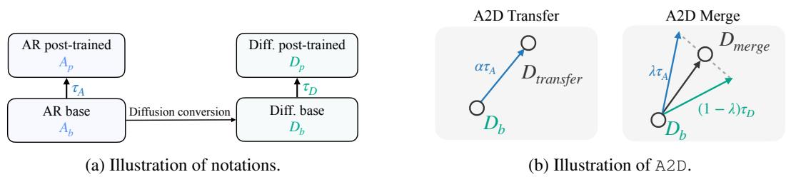  
Figure 1: Illustration of notations and method. (a) Diffusion base models with weights $\scriptstyle { \mathbf { { \cal { D } } } } _ { b }$ are often adapted from AR base models with weights $\pmb { A } _ { b }$ . The two models often undergo separate posttraining stages, leading to $D _ { p }$ and $A _ { p } ,$ with the corresponding task vectors denoted by $\tau _ { D }$ and $\tau _ { A } .$ respectively. (b) A2D-Transfer directly adds the AR post-training vector to diffusion base $\ b { D _ { b } }$ to create a post-trained diffusion model. A2D-Merge interpolates this model and the diffusion model’s own post-trained checkpoint to further improve downstream capabilities.

This raises a natural question: can the knowledge acquired with AR post-training be incorporated into diffusion models? Such a transfer could reuse readily available, often stronger AR post-trained checkpoints while retaining the parallel-decoding benefits of diffusion. Since AR post-training and diffusion conversion originate from the same pretrained AR model, their shared initialization and architecture naturally motivate a weight-space approach, namely, model merging. Within the AR ecosystem, model merging has proven effective at integrating capabilities from independently fine-tuned checkpoints without requiring their training data (Wortsman et al., 2022; Yang et al., 2026). In particular, task arithmetic represents post-training weight updates as task vectors that can be transferred or composed across compatible models (Ilharco et al., 2022). Extending model merging across the AR–diffusion boundary, however, is nontrivial: diffusion conversion moves the model away from its AR initialization while changing generation from causal next-token prediction to bidirectional denoising.

Nevertheless, we show that AR post-training exhibits cross-paradigm transferability: knowledge learned in the AR regime can remain effective to a diffusion model without further adaptation. In a controlled setting, directly transferring the AR post-training task vector brings the diffusion base close to the performance of direct diffusion post-training. This cross-paradigm transfer of AR task vector provides a practical way to improve diffusion models when no corresponding diffusion post-trained checkpoint is available. Moreover, we show that AR and diffusion post-training yield nearly orthogonal task vectors in parameter space, yet induce much more aligned representation

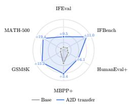

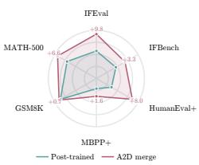  
(a) Direct transfer  
(b) Update merge  
Figure 2: A2D on Dream. A2D improves diffusion base and post-trained models without training through (a) direct AR update transfer and (b) AR–diffusion update merging.

changes, suggesting that related capabilities arise through distinct parameter directions. Motivated by prior findings that less-correlated fine-tuning directions can combine favorably through interpolation (Wortsman et al., 2022), we further interpolate the AR-transferred and diffusion-post-trained solutions, yielding performance beyond both endpoints by combining their partially complementary behavioral gains.

We introduce A2D (AR-to-Diffusion Transfer and Composition), a simple framework that exploits the cross-paradigm transferability of AR post-training updates. A2D operates in two regimes, as shown in Figure 1b: (a) in the absence of a diffusion post-training vector, it transfers an AR task vector directly to the diffusion base model; (b) when both AR and diffusion vectors are available, it interpolates the corresponding diffusion-space solutions to further improve the post-trained diffusion model. Both operations are training-free given the available checkpoints and incur no additional trainable parameters. Across multiple diffusion model families and diverse post-training settings, including instruction tuning, reasoning, mathematical reasoning, and coding, both modes of A2D reliably improves downstream performance, as shown by the example in Figure 2. We summarize our contributions as follows:

• We study cross-paradigm transferability: AR post-training vectors remain effective after diffusion conversion, inducing aligned representation changes despite near-orthogonal parameter directions, which further motivates their composition with diffusion post-training.

• Building on this observation, we introduce A2D, a simple weight-space framework for reusing AR post-training in diffusion models. A2D supports both direct transfer to diffusion base models and training-free composition with existing diffusion post-training updates.

• Across recent dLLMs including Dream, Dream-Coder, DiffuCoder, Nemotron-Labs-Diffusion, DreamReasoner, and DiffusionGemma, we validate both modes of A2D and diverse post-training scenarios, improving downstream performance without additional training or inference-time computation.

## 2 CROSS-PARADIGM POST-TRAINING TRANSFER AND COMPOSITION

## 2.1 BACKGROUND AND NOTATIONS

Autoregressive and diffusion language models. AR and diffusion models differ in both their training objectives and generation processes, yet modern dLLMs are often adapted from pretrained AR checkpoints to inherit the learned language representations (Ye et al., 2025; Fu et al., 2026; Wu et al., 2026b; Team et al., 2026). We denote the weights of this AR source model by $A _ { b } ,$ which is trained with an autoregressive objective and generates tokens from left to right. Starting from $\pmb { A } _ { b }$ further diffusion training adapts the model for diffusion generation to obtain $\scriptstyle { D _ { b } }$ . Depending on the model family, this adaptation uses either a diffusion objective alone (Ye et al., 2025) or a combination of AR and diffusion objectives (Fu et al., 2026), and may involve hundreds of billions of tokens of training. Consequently, despite sharing an initialization, $\scriptstyle { D _ { b } }$ can differ substantially from $\pmb { A } _ { b }$ in both parameters and generation behavior. At inference time, it generates through diffusion-style iterative denoising with flexible token-update orders.

Starting from their respective base checkpoints, the AR and diffusion models can be post-trained independently for the same downstream capability, yielding $A _ { p }$ from $\pmb { A } _ { b }$ and $D _ { p }$ from $D _ { b } ,$ , as illustrated in Figure 1a. Although $A _ { p }$ and $D _ { p }$ target the same capability, their post-training updates are learned under different objectives and from different base checkpoints. This raises our central question: can an update learned on the AR branch remain effective when applied to the diffusion branch?

Model merging and task arithmetic. Since AR post-training and diffusion conversion originate from the same pretrained model, it naturally motivates weight-space transfer, such as model merging. Model merging combines knowledge from multiple trained models directly in weight space without additional training (Yang et al., 2026; Wortsman et al., 2022). Task arithmetic represents the effect of post-training as a task vector, defined as the parameter difference between a post-trained model and its base (Ilharco et al., 2022). These vectors can be scaled and composed in weight space to transfer or combine their learned capabilities. Accordingly, we define the AR and diffusion posttraining vectors as $\tau _ { A } = A _ { p } - A _ { b }$ and $\tau _ { D } = D _ { p } - D _ { b }$ , respectively. Notably, task arithmetic typically composes task vectors defined relative to a shared base model or initialization, whereas $\tau _ { A }$ and $\tau _ { D }$ originate from different base checkpoints.

## 2.2 CROSS-PARADIGM TRANSFER OF AR POST-TRAINING TO DIFFUSION

We first examine whether AR post-training can transfer across the AR and diffusion paradigms. We begin our analysis by testing whether post-training knowledge learned in the AR regime survives AR-to-diffusion conversion. In this case, $\tau _ { A }$ is learned around $\pmb { A } _ { b }$ but applied to its diffusion descendant $\scriptstyle { D _ { b } }$ , whose parameters and generation mechanism have been substantially reshaped by diffusion conversion. To isolate the effect of this paradigm shift, we post-train the AR and diffusion base models on identical data for the same downstream capability in a controlled setting.

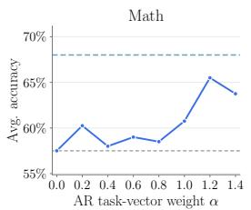

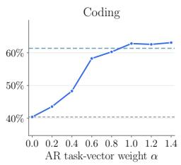

(a) AR post-training updates transfer effectively to diffusion.  
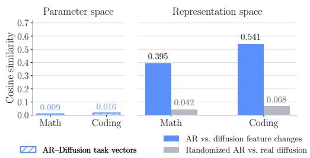  
(b) Distinct parameter updates induce aligned representation changes.  
Figure 3: Cross-paradigm transfer of AR post-training. (a) AR task vectors remain effective on the diffusion base. (b) Despite weak parameter alignment, AR and diffusion post-training induce more aligned representation changes than randomized controls.

Experimental setting. We consider mathematical reasoning and coding tasks. For math, we use Qwen2.5-7B and its diffusion counterpart Dream-7B-Base, obtained from Qwen2.5-7B through ARto-diffusion conversion, and fine-tune both on the same 100K NuminaMath examples (LI et al., 2024). For coding, we use Qwen2.5-Coder-7B and Dream-Coder-v0-Base-7B, its corresponding diffusion counterpart, and fine-tune both on the same 100K EpiCoder examples (Wang et al., 2025b). This construction yields matched AR and diffusion task vectors targeting the same capability, allowing us to isolate whether AR post-training transfers across the two generative paradigms. Full training and evaluation details are provided in Appendix A.3.

Cross-paradigm transfer. We test this directly by applying the scaled AR task vector $\tau _ { A }$ to the diffusion base model: $D _ { \mathrm { T r a n s f e r } } = D _ { b } + \alpha \pmb { \tau } _ { A } , \dot { \alpha } \geq 0$ , where α controls the transfer strength. This modifies only the model parameters while preserving the diffusion inference procedure.

We evaluate mathematical reasoning on GSM8K (Cobbe et al., 2021) and MATH-500 (Hendrycks et al., 2021) 1, and coding on HumanEval+ (Chen et al., 2021) and MBPP+ (Austin et al., 2021b), respectively for the models fine-tuned on math and coding datasets. As shown in Figure 3a, transferring $\tau _ { A }$ substantially improves $\ b { D _ { b } }$ in both domains and recovers a large fraction of the gains obtained by direct diffusion post-training, or even surpasses them. This shows that an update learned under causal AR computation can remain effective after the model has been converted to iterative diffusion denoising.

Distinct parameters, aligned effects in representation space. The successful transfer raises a question: do AR and diffusion post-training simply learn similar parameter updates? Despite being trained toward the same capability, $\tau _ { A }$ and $\tau _ { D }$ are nearly orthogonal in parameter space with a cosine similarity of only 0.016 for Coding and 0.009 for Math. Parameter-space similarity, however, does not reflect similarity in the induced model behavior (Xu et al., 2024). We therefore compare the representation changes produced by the two task vectors within the diffusion model. We generate trajectories with $\scriptstyle { D _ { b } }$ and collect intermediate pre-commit masked states $m .$ For each state, we evaluate $D _ { b } , D _ { b } + \tau _ { A }$ , and $D _ { b } + \tau _ { D }$ on the same input, and isolate the effect of each task vector by subtracting the representation of the diffusion base:

$$
\Delta h _ { A } ( m ) = h ( { \cal D } _ { b } + \tau _ { A } ; m ) - h ( { \cal D } _ { b } ; m ) , \qquad \Delta h _ { D } ( m ) = h ( { \cal D } _ { b } + \tau _ { D } ; m ) - h ( { \cal D } _ { b } ; m ) ,
$$

where h denotes the final-layer representation at the prediction position. We then measure the cosine similarity between $\Delta h _ { A } ( m )$ and $\Delta h _ { D } ( m )$ . As shown in Figure 3b, the induced representation changes are substantially more aligned than the task vectors themselves and well above randomizedvector controls 2 Together, these results show that AR and diffusion post-training induce related representation changes, despite following substantially different directions in parameter space.

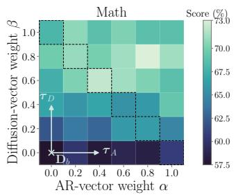

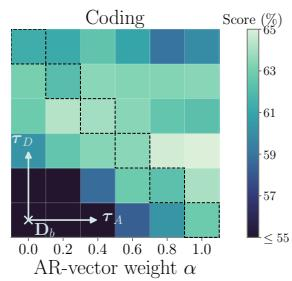  
(a) High-performing solutions lie between the AR and diffusion endpoints.

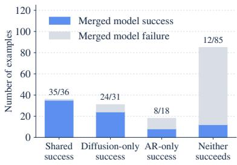  
(b) Interpolation preserves shared gains and endpoint-specific successes.

Figure 4: Why AR and diffusion post-training can be composed. (a) Performance over $D _ { b } + \alpha \pmb { \tau } _ { A } + \beta \pmb { \tau } _ { D }$ . The interpolation path between the AR-transferred and diffusion-post-trained endpoints passes through high-performing regions and contains solutions that outperform both endpoints. (b) Among examples failed by $D _ { b } ,$ , the two endpoints exhibit both shared and endpointspecific successes. The best interpolated model preserves most shared successes while retaining gains unique to either endpoint, indicating limited functional interference under composition.

## 2.3 COMPOSING AUTOREGRESSIVE AND DIFFUSION POST-TRAINING

The preceding results reveal an interesting structure: AR and diffusion post-training induce related representation changes through largely distinct parameter directions. Prior work has suggested that less-correlated fine-tuning directions can admit favorable linear interpolations (Wortsman et al., 2022), motivating the composition of these two post-training models. We therefore examine whether their composition can yield a stronger model than either alone.

To analyze this composition in weight space, we consider the two-dimensional task-vector plane $D ( \alpha , \beta ) = D _ { b } + \bar { \alpha } \pmb { \tau } _ { A } + \beta \pmb { \tau } _ { D } , \ \alpha , \beta \geq 0$ , where α and $\beta$ controls the contribution of the AR and diffusion task vector, respectively. The AR-transferred and diffusion-post-trained models correspond to $D _ { T } = D ( 1 , 0 )$ and $D _ { p } = D ( 0 , 1 )$ , respectively, while $\alpha + \beta = 1$ traces the linear interpolation between them.

As shown in Figure 4a, both mathematical reasoning and coding exhibit high-performing regions along this interpolation path, and interior points along their interpolation path outperform either endpoint. This indicates that interpolating the AR and diffusion post-training directions captures complementary gains beyond either endpoint.

Complementarity between AR and diffusion post-training. Why can an intermediate model outperform both endpoints? To better understand these gains, we characterize the behavioral overlap and differences between the two endpoints and the merged model.

Among examples failed by the base model $\scriptstyle { \mathbf { { \cal { D } } } } _ { b }$ in mathematical reasoning, we partition problems into four mutually exclusive subsets: those solved only by the AR-transfer model ${ \bf \nabla } _ { D _ { T } }$ , only by the post-trained model $D _ { p } ,$ by both, or by neither. We then evaluate the best merged model on each subset. As shown in Figure 4b, the two endpoints solve overlapping but also distinct subsets of problems. Importantly, the interpolated model preserves nearly all their shared successes while retaining large portions of the successes unique to either endpoint. Overall, we show that AR and diffusion post-training provide partially complementary behavioral gains that can be jointly retained through interpolation, explaining how an intermediate model can outperform both endpoints. This observation is also consistent with prior findings that task-vector composition can preserve distinct effects of different parameter-space directions (Ortiz-Jimenez et al., 2023).

## 2.4 A2D: CROSS-PARADIGM TRANSFER AND COMPOSITION

Motivated by the preceding observations, we propose A2D (AR-to-Diffusion Transfer and Composition), a simple weight-space framework for recycling AR post-training updates in diffusion models. A2D addresses two practical settings.

A2D Transfer. For many downstream capabilities, strong AR post-trained checkpoints are readily available, while corresponding diffusion checkpoints may not yet exist. In this setting, A2D transfers the AR task vector directly to the diffusion base to equip it with the target capability:

$$
D _ { \mathrm { T r a n s f e r } } ( \alpha ) = D _ { b } + \alpha \pmb { \tau } _ { A } , \qquad \alpha \ge 0 .\tag{1}
$$

This directly reuses existing AR post-training knowledge, avoiding a separate round of diffusionspecific post-training.

A2D Merge. For scenarios where both AR and diffusion post-trained models are available, A2D interpolates their post-training updates to exploit their complementary gains. We restrict the composition to this one-dimensional path, which already traverses a high-performing region in Figure 4a:

$$
D _ { \mathrm { M e r g e } } ( \lambda ) = D _ { b } + ( 1 - \lambda ) \tau _ { D } + \lambda \tau _ { A } = D _ { p } + \lambda ( \tau _ { A } - \tau _ { D } ) , \qquad \lambda \in [ 0 , 1 ] .\tag{2}
$$

Both A2D variants preserve the diffusion architecture and require no additional training or inferencetime hyperparameter tuning.

## 3 A2D ACROSS MODELS AND POST-TRAINING SETTINGS

Beyond the controlled setting, we now evaluate A2D on independently released checkpoints, where the AR and diffusion branches may differ substantially in their post-training data, objectives, and optimization pipelines. Our evaluation spans general instruction following, coding, mathematical reasoning, and medical question answering, and covers both supervised and reinforcement-learningbased post-training. We organize the experiments by post-training type and evaluate both A2D regimes: A2D-Transfer improves upon the diffusion base by directly applying an AR post-training update, while A2D-Merge further improves the diffusion post-trained model by composing it with the corresponding AR update.

For each model family, the A2D coefficient α and λ is selected on a single anchor benchmark and kept fixed across the evaluations of the remaining tasks. We decode each diffusion model with its native inference settings and evaluate all code models with the same prompts and scoring. Parent diffusion checkpoints follow their original evaluation setup, while AR donors use the generation budget of the corresponding diffusion models. Full evaluation, merging, and coefficient-selection details are provided in Appendix A.

## 3.1 INSTRUCTION-TUNED UPDATES FOR GENERAL AND CODE MODELS

We first evaluate whether instruction-tuning updates transfer from AR to diffusion across both general-purpose and code-specialized model families. For the general-purpose setting, we construct the AR instruction-tuning vector by subtracting Qwen2.5-7B-Base from Qwen2.5-7B-Instruct (Yang et al., 2024a), and transfer this update to Dream-7B-Base (Ye et al., 2025). We evaluate the resulting model on instruction following, mathematical reasoning, and coding.

For the code-specialized setting, we similarly construct the instruction-tuning vector from Qwen2.5- Coder-7B-Base and Qwen2.5-Coder-7B-Instruct (Hui et al., 2024), and transfer it to two independently developed diffusion code models, Dream-Coder (Xie et al., 2025) and DiffuCoder (Gong et al., 2026). In all three settings, the diffusion models originate from the corresponding AR base family, while their instruction-tuned checkpoints are obtained through separate diffusion-specific post-training pipelines.

As shown in Table 1a, A2D is broadly effective across different types of instruction-following posttraining, exhibiting two complementary regimes. Direct transfer can recover substantial capability missing from the diffusion base, with particularly large gains on Dream-7B for MATH-500 (+19.4), and on Dream-Coder BCB-Full (+6.5). When diffusion instruction tuning is already available, A2D-Merge further provides consistent gains, improving all 9/9 benchmarks over the corresponding posttrained baselines. Moreover, scaling coefficients selected on a single anchor task generalize to the remaining benchmarks, yielding average non-anchor gains of 4.8 and 2.6 points for transfer and merge, respectively.

Table 1: Evaluation of A2D across tasks and model families. Headers denote AR donor diffusion recipient. A2D (transfer) applies the AR donor’s task vector to the diffusion recipient, while A2D (merge) composes it with diffusion post-training. Anchor tasks for scaling coefficient search are highlighted. All results are in percentages.  
(a) Instruction following vectors.
<table><tr><td rowspan="2"></td><td colspan="3">Qwen2.5-7B → Dream-7B</td><td colspan="3">Qwen2.5-Coder-7B → Dream-Coder</td><td colspan="3">Qwen2.5-Coder-7B → DiffuCoder</td></tr><tr><td>IFEval</td><td>MATH-500</td><td>MBPP+</td><td>HumanEval+</td><td>MBPP+</td><td>BCB-Full</td><td>HumanEval+</td><td>MBPP+</td><td>BCB-Full</td></tr><tr><td>AR donor</td><td>75.3</td><td>36.6</td><td>69.0</td><td>86.0</td><td>72.2</td><td>41.6</td><td>86.0</td><td>72.2</td><td>41.8</td></tr><tr><td>Base</td><td>49.7</td><td>20.8</td><td>59.3</td><td>57.9</td><td>62.4</td><td>25.2</td><td>61.6</td><td>52.9</td><td>33.9</td></tr><tr><td>A2D (transfer)</td><td>59.2</td><td>40.2</td><td>62.7</td><td>67.1</td><td>62.7</td><td>31.7</td><td>60.4</td><td>54.0</td><td>32.0</td></tr><tr><td>Instruct</td><td>63.0</td><td>38.4</td><td>57.1</td><td>77.4</td><td>68.5</td><td>36.2</td><td>65.9</td><td>65.9</td><td>34.8</td></tr><tr><td>A2D (merge)</td><td>72.8</td><td>45.0</td><td>58.7</td><td>79.3</td><td>69.3</td><td>38.2</td><td>74.4</td><td>66.4</td><td>38.9</td></tr></table>

(b) Reasoning, SFT and RL post-training vectors. DR abbreviates DreamReasoner.
<table><tr><td rowspan="2"></td><td colspan="3">Qwen3-8B → DR-8B, thinking on</td><td colspan="3">Gemma-4 → DiffusionGemma</td><td colspan="3">AceCoder-Rule → DiffuCoder, RL</td></tr><tr><td>MATH-500</td><td>AIME24</td><td>AIME25</td><td>VQA-RAD</td><td>SLAKE</td><td>VQA-Med</td><td>HumanEval+</td><td>MBPP+</td><td>BCB-Full</td></tr><tr><td>AR donor</td><td>81.2</td><td>72.1</td><td>60.4</td><td>75.8</td><td>66.5</td><td>44.0</td><td>85.4</td><td>70.6</td><td>43.3</td></tr><tr><td>Base</td><td>68.0</td><td>5.8</td><td>12.1</td><td>57.4</td><td>63.2</td><td>43.2</td><td>65.9</td><td>65.9</td><td>34.8</td></tr><tr><td>A2D (transfer)</td><td>76.0</td><td>21.2</td><td>16.2</td><td>74.1</td><td>67.3</td><td>45.2</td><td>64.6</td><td>66.9</td><td>34.6</td></tr><tr><td>Post-trained</td><td>93.6</td><td>71.7</td><td>56.7</td><td>71.6</td><td>62.2</td><td>38.6</td><td>63.4</td><td>66.9</td><td>40.5</td></tr><tr><td>A2D (merge)</td><td>94.8</td><td>72.9</td><td>67.1</td><td>74.5</td><td>63.8</td><td>38.8</td><td>70.1</td><td>69.0</td><td>42.4</td></tr></table>

(c) Ministral-3-3B → Nemotron-LD-3B, dual-mode AR-diffusion post-training vectors. The model supports both diffusion and AR decoding, and we report both results. The mean excludes the anchor task IFEval.
<table><tr><td></td><td>Mode</td><td>GSM8K</td><td>MATH-500</td><td>HumanEval</td><td>MBPP</td><td>IFEval</td><td>MMLU</td><td>GPQA</td><td>AIME24</td><td>AIME25</td><td>LCB-CPP</td><td>Mean</td></tr><tr><td>AR donor</td><td>AR</td><td>91.3</td><td>83.0</td><td>80.5</td><td>75.9</td><td>65.1</td><td>67.9</td><td>40.9</td><td>30.0</td><td>13.3</td><td>27.1</td><td>56.7</td></tr><tr><td>Base</td><td>DLM</td><td>59.1</td><td>40.0</td><td>64.6</td><td>70.9</td><td>23.2</td><td>62.0</td><td>35.4</td><td>0.0</td><td>0.0</td><td>9.9</td><td>38.0</td></tr><tr><td>A2D (transfer)</td><td>DLM</td><td>88.1</td><td>52.6</td><td>72.6</td><td>74.3</td><td>60.6</td><td>62.8</td><td>33.3</td><td>3.3</td><td>3.3</td><td>14.1</td><td>44.9</td></tr><tr><td>Instruct</td><td>DLM</td><td>89.2</td><td>76.8</td><td>73.2</td><td>73.0</td><td>68.0</td><td>72.1</td><td>35.4</td><td>10.0</td><td>13.3</td><td>16.3</td><td>51.0</td></tr><tr><td>A2D (merge)</td><td>DLM</td><td>90.1</td><td>79.6</td><td>75.0</td><td>75.7</td><td>72.9</td><td>72.9</td><td>43.4</td><td>16.7</td><td>13.3</td><td>18.9</td><td>54.0</td></tr><tr><td>Instruct</td><td>AR</td><td>87.6</td><td>76.0</td><td>73.8</td><td>69.8</td><td>68.8</td><td>71.9</td><td>41.9</td><td>23.3</td><td>13.3</td><td>17.6</td><td>52.8</td></tr><tr><td>A2D (merge)</td><td>AR</td><td>89.3</td><td>81.0</td><td>79.9</td><td>75.1</td><td>72.8</td><td>72.5</td><td>38.4</td><td>20.0</td><td>13.3</td><td>18.7</td><td>54.2</td></tr></table>

## 3.2 SPECIALIZED POST-TRAINING: REASONING, MEDICAL VQA, AND CODE RL

We next test whether A2D extends beyond general instruction tuning to more specialized capabilities and later-stage post-training updates. For mathematical reasoning, we use the post-training update from Qwen3-8B-Base to its reasoning checkpoint (Yang et al., 2025) and transfer it to DreamReasoner-8B (Wu et al., 2026b), evaluating on MATH and competition-level math benchmarks. For medical visual question answering (VQA), we use matched Gemma-4 (Team, 2026) and DiffusionGemma medical-SFT updates, obtained by fine-tuning their respective instruction-tuned checkpoints on VQA-RAD (Van Puyvelde et al., 2026), and evaluate on 3 medical VQA tasks. For code, we transfer and merge the RL updates from the instruction-tuned checkpoints of Ace-Coder (Zeng et al., 2025) and DiffuCoder (Gong et al., 2026). Together, these settings cover both specialization from a base model and continued SFT or RL applied after instruction tuning.

As shown in Table 1b, A2D remains effective across reasoning, medical SFT, and code RL. A2D-Transfer yields substantial gains in the reasoning and medical settings, including +15.4 on AIME24 and +16.7 on VQA-RAD. A2D-Merge is consistently effective, improving all 9/9 post-trained baselines, with gains of +10.4 on AIME25 and +6.7 on HumanEval+. These gains extend beyond the anchor tasks, averaging 4.0 and 3.7 points on non-anchor benchmarks for transfer and merge, respectively. Together, these results extend A2D to specialized domain adaptation and different stages of post-training, while showing robust performance across model scales, as demonstrated by results for DiffusionGemma with 26B parameters.

Table 2: A2D improves both denoising scheduling and token prediction.  
Table 3: The transfer is asymmetric: it transfers from AR to diffusion, but not in reverse.  
Table 4: A2D benefits from both adding the AR vector and downscaling the diffusion vector.
<table><tr><td>Schedule from</td><td>Tokens from</td></tr><tr><td></td><td>Parent A2D</td></tr><tr><td>Parent</td><td>38.4 42.8</td></tr><tr><td>A2D</td><td>42.2 45.0</td></tr></table>

<table><tr><td></td><td>GSM8K MATH-500</td><td></td></tr><tr><td> $D _ { b }$ </td><td>66.5</td><td>20.8</td></tr><tr><td>Db + A2D transfer</td><td>81.7</td><td>40.2</td></tr><tr><td> $A _ { b }$ </td><td>62.5</td><td>17.4</td></tr><tr><td> $A _ { b } + { \bf D } 2 \mathrm { \bf A }$  transfer</td><td>56.0</td><td>16.2</td></tr></table>

<table><tr><td>Method</td><td> $\operatorname { A v g } .$  Acc.</td><td> $\operatorname { A v g } .$  rank</td></tr><tr><td>Diffusion parent  $D _ { p }$ </td><td>72.3</td><td>3.7</td></tr><tr><td>+τA only</td><td>75.9</td><td>2.4</td></tr><tr><td> $- \tau _ { D }$  only</td><td>74.2</td><td>2.4</td></tr><tr><td>A2D merge</td><td>76.8</td><td>1.4</td></tr></table>

## 3.3 A2D ON DUAL-MODE AR-DIFFUSION MODELS

Finally, we evaluate A2D on Nemotron-Labs-Diffusion-3B (Nemotron-LD-3B) (Fu et al., 2026), a dual-mode model initialized from Ministral-3-3B (Liu et al., 2026) that supports diffusion, AR, and self-speculative decoding. We evaluate A2D-Transfer and A2D-Merge across ten benchmarks covering math, coding, instruction following, and general reasoning under diffusion decoding, and additionally test the merged model under AR decoding. This setting also probes transfer with imperfect parameter correspondence, since Nemotron-LD contains diffusion-specific parameters with no AR counterpart. We keep these unmatched parameters from the diffusion recipient and apply the AR update only to aligned parameters. Full parameter-mapping details are provided in Appendix A.2.

As shown in Table 1c, A2D-Transfer improves the diffusion base on 9/10 benchmarks, with large gains on GSM8K (+29.0), MATH-500 (+12.6), and IFEval (+37.4), with a performance improvement of 6.9 points averaged on the non-anchor tasks. A2D-Merge further improves or matches all 10/10 benchmarks under diffusion decoding, increasing the non-anchor mean from 51.0 to 54.0. Notably, the same merged weights also remain effective under AR decoding, improving the mean from 52.8 to 54.2, with notable gains on MATH-500 (+5.0), HumanEval (+6.1), and MBPP (+5.3).

Additionally, we also provide the A2D-Transfer’s performance on AR mode in Table 17, results with Nemotron-LD-8B in Appendix B.4, which shows A2D-Merge leads to notable gains when merging the reasoning post-training vector from Ministral-3-8B donor. Furthermore, we show that A2Dmerge generally improves the decoding efficiency for self-speculative decoding with Nemotron-LD in Table 20. Together, these results show that A2D demonstrates reliable performance improvement across a broad task suite, tolerates imperfect parameter correspondence, and transfers its gains across both diffusion and autoregressive decoding modes.

## 4 ANALYSIS AND ABLATIONS

We further analyze the behavior and scope of cross-paradigm transfer and identify the sources of A2D’s gains. Unless otherwise stated, experiments use Dream-7B on MATH-500, where we transfer the instruction-tuned vector from Qwen2.5-7B, and all scores are reported in percentages.

## 4.1 UNDERSTANDING CROSS-PARADIGM TRANSFER

How does A2D alter diffusion generation? We examine how A2D affects the diffusion generation process to decompose its gains.

A2D improves both denoising schedule and token prediction. As shown in Table 2, using A2Dmerged model token predictions with the denoising schedule of Dream-7B-Instruct which we call here the diffusion parent, improves accuracy from 38.4 to 42.8, while using the merged model’s denoising schedule with diffusion parent’s predictions reaches 42.2. Combining both yields the full A2D performance of 45.0, showing that prediction and scheduling provide complementary gains. These changes are nevertheless highly localized: when evaluated on the parent’s intermediate states, A2D selects different positions at only 5.3% of steps and commits different tokens at only 3.4% of positions compared to the diffusion parent.

A2D does not systematically shift denoising toward causal generation. Despite modifying the denoising schedule, A2D does not induce a systematic shift toward left-to-right decoding. Following Gong et al. (2026), we measure global and local AR-ness over the response up to the first EOS. Global@k measures whether the selected position is among the k leftmost masked tokens, Local@k measures whether the current update continues a left-to-right run over the previous k updates. Both equal 1 under strict autoregressive decoding. As shown in Figure 5(a) of the appendix, the merged model closely tracks the diffusion parent on both metrics.

A2D selectively revises uncertain predictions. The few changed tokens by A2D are not spread evenly. As shown in Figure 5(b), they concentrate at positions where the diffusion parent has relatively low confidence. Thus, A2D largely preserves the parent’s predictions while selectively revising uncertain decisions.

Directional asymmetry in cross-paradigm transfer. We test reversing the transfer direction and apply the diffusion task vector to the corresponding AR base. As summarized in Table 3 (full results in Table 13), while applying AR task vector to diffusion base model substantially improves it, applying the diffusion task vector to the AR base model can degrade its performance, revealing a clear directional asymmetry.

This asymmetry provides insight into what enables A2D transfer. The AR update $\tau _ { A }$ is learned around $A _ { b } ,$ from which $\scriptstyle { D _ { b } }$ is subsequently derived through diffusion conversion. Thus, $\ b { D _ { b } }$ inherits much of the parameter and representation context on which $\tau _ { A }$ acts. In contrast, $\tau _ { D }$ is learned around the already converted model $\scriptstyle { D _ { b } }$ and may depend on changes introduced during diffusion pretraining that are absent from $\pmb { A } _ { b }$ . These results suggest that A2D works in part because the diffusion recipient shares the training lineage of the model on which the transferred AR update was learned, whereas this compatibility is absent in the reverse direction.

Scope of cross-paradigm transfer. Our main experiments consider task vectors induced by downstream fine-tuning, for which A2D broadly enables cross-paradigm transfer. We additionally test vectors induced by continued pretraining, respectively from Qwen2.5-7B to Qwen2.5-Math-7B and Qwen2.5-Coder-7B, and find that neither transfers effectively to the corresponding diffusion model. These vectors have 70–82 larger norms than the post-training vectors used in our main experiments, reflecting substantially broader parameter changes that may reorganize the representations on which the updates rely. These results delineate A2D’s scope to relatively local post-training updates, rather than pretraining-scale model transformations.

## 4.2 ABLATION STUDIES

Decomposition of the A2D gain. A2D-Merge can be written as $D _ { p } + \lambda ( \pmb { \tau } _ { A } - \pmb { \tau } _ { D } )$ , combining two effects: adding the AR update and partially removing the diffusion update. We isolate these effects by retaining only $+ \pmb { \tau } _ { A } ~ \mathbf { o r } ~ - \pmb { \tau } _ { D }$ contribution with a corresponding scaling coefficient. As shown in Table 4 (full results in Table 12), both components individually improve over the diffusion parent, but neither matches A2D-Merge. Thus, the full gain benefits from jointly balancing the AR and diffusion post-training updates.

Module-wise contributions to A2D. We ablate the contribution of attention and MLP modules from $\tau _ { A }$ . As shown in Table 14, while A2D-Transfer depends mostly on updates in MLP modules, A2D-Merge requires both MLP and attention modules to achieve optimal merging performance.

## 5 RELATED WORK

Diffusion large language models Extending diffusion-based generative modeling to discrete sequences has been widely studied (Austin et al., 2021a; Hoogeboom et al., 2021; Han et al., 2022; Gong et al., 2023), with masked diffusion emerging as a particularly effective formulation for language modeling (He et al., 2023; Sahoo et al., 2024; Shi et al., 2024). Subsequent scaling efforts established diffusion language models (dLLMs) as competitive alternatives to autoregressive (AR) models (Nie et al., 2025a;b; Ye et al., 2025; Song et al., 2025; Gong et al., 2026; Wu et al., 2026b). Rather than training from scratch, many recent dLLMs build on pretrained AR checkpoints and introduce diffusion objectives through continued training or adaptation (Gong et al., 2025; Ye et al., 2025; Xie et al., 2025; Wu et al., 2026a; Cheng et al., 2026; Fu et al., 2026; Team et al., 2026), reusing pretrained linguistic knowledge while substantially reducing the cost of learning diffusionbased generation. Post-training dLLMs, however, poses distinct optimization challenges as learning must span partially corrupted states across varying corruption levels (Parashar et al., 2026; Deng et al., 2026), with additional challenges in likelihood estimation for RL (Gong et al., 2026; Tang et al., 2026).

Recent work further reveals shared structure between the two paradigms: AR models can guide diffusion adaptation (Peng et al., 2026; Su et al., 2026), while left-to-right biases can remain beneficial even with flexible generation orders (Xue et al., 2025; Ni et al., 2026). Together, these results suggest that AR and diffusion models share reusable knowledge while retaining distinct inductive biases. We study this connection in weight space, asking whether AR post-training updates remain effective after diffusion conversion and can be composed with diffusion updates.

Model merging. Model merging aims to combine the capabilities of independently trained models directly in weight space, avoiding additional training (Yang et al., 2026). Early work showed that models fine-tuned from a common initialization often remain connected in weight space for parameter averaging to improve performance, motivating both simple averaging (Wortsman et al., 2022) and importance-weighted variants (Matena & Raffel, 2022; Tam et al., 2023). Task arithmetic formalized fine-tuning updates as task vectors that can be composed in weight space to manipulate model behavior (Ilharco et al., 2022). Its effectiveness has been linked to functional disentangle ment among task vectors (Ortiz-Jimenez et al., 2023), with subsequent work mitigating interference through conflict resolution (Yadav et al., 2023), sparsification (Yu et al., 2024; Wang et al., 2024), and layer-wise rescaling (Wang et al., 2025a; Yang et al., 2024b).

Prior work on LLMs primarily focused on model merging within the AR paradigm (Ren et al., 2026; Zhu et al., 2026), whereas we study cross-paradigm transfer from AR to diffusion. Closest to our setting, Lin et al. (2026) transfers AR preference-alignment updates as an alternative to diffusionbased alignment, while we study a broader post-training setting where AR knowledge is used to further improve already post-trained diffusion models across diverse objectives, capabilities, and model families.

## 6 CONCLUSION

We show that AR post-training knowledge exhibits cross-paradigm transfer: it remains effective after diffusion conversion and can be reused directly in diffusion models through weight-space transfer. Building on this cross-paradigm transferability, A2D transfers AR post-training updates to diffusion models and, when diffusion post-training is available, combines the two to exploit complementary gains. Across diverse model families, tasks, and post-training settings, A2D consistently improves diffusion models without additional training or inference-time computation.

Practically, A2D provides a simple training-free framework for reusing existing AR post-trained checkpoints as resources for diffusion models, supporting both capability transfer to diffusion base models and further improvement of already post-trained diffusion models through composition.

## ACKNOWLEDGMENTS

Yiming Qin was supported by the Swiss National Science Foundation (SNSF grant 10001445). The authors thank Nikolaos Dimitriadis and Guillermo Ortiz-Jimenez for their constructive feedback on´ the project, and Zhengqing Wu and Keyue Jiang for insightful discussions.

## REFERENCES

Jacob Austin, Daniel D Johnson, Jonathan Ho, Daniel Tarlow, and Rianne Van Den Berg. Structured denoising diffusion models in discrete state-spaces. In Advances in Neural Information Processing Systems (NeurIPS), 2021a. 9

Jacob Austin, Augustus Odena, Maxwell Nye, Maarten Bosma, Henryk Michalewski, David Dohan, Ellen Jiang, Carrie Cai, Michael Terry, Quoc Le, et al. Program synthesis with large language models. arXiv, 2021b. 4

Asma Ben Abacha, Sadid A. Hasan, Vivek V. Datla, Joey Liu, Dina Demner-Fushman, and Henning Muller. VQA-Med: Overview of the Medical Visual Question Answering Task at ImageCLEF 2019. In Working Notes of CLEF 2019, CEUR Workshop Proceedings, 2019. URL https: //ceur-ws.org/Vol-2380/paper\_272.pdf. 18

Mark Chen, Jerry Tworek, Heewoo Jun, Qiming Yuan, Henrique Ponde de Oliveira Pinto, Jared Kaplan, Harri Edwards, Yuri Burda, Nicholas Joseph, Greg Brockman, Alex Ray, Raul Puri, Gretchen Krueger, Michael Petrov, Heidy Khlaaf, Girish Sastry, Pamela Mishkin, Brooke Chan, Scott Gray, Nick Ryder, Mikhail Pavlov, Alethea Power, Lukasz Kaiser, Mohammad Bavarian, Clemens Winter, Philippe Tillet, Felipe Petroski Such, Dave Cummings, Matthias Plappert, Fotios Chantzis, Elizabeth Barnes, Ariel Herbert-Voss, William Hebgen Guss, Alex Nichol, Alex Paino, Nikolas Tezak, Jie Tang, Igor Babuschkin, Suchir Balaji, Shantanu Jain, William Saunders, Christopher Hesse, Andrew N. Carr, Jan Leike, Josh Achiam, Vedant Misra, Evan Morikawa, Alec Radford, Matthew Knight, Miles Brundage, Mira Murati, Katie Mayer, Peter Welinder, Bob McGrew, Dario Amodei, Sam McCandlish, Ilya Sutskever, and Wojciech Zaremba. Evaluating Large Language Models Trained on Code. 2021. 4

Shuang Cheng, Yihan Bian, Dawei Liu, Yuhua Jiang, Yihao Liu, Linfeng Zhang, Qian Yao, Zhongbo Tian, Wenhai Wang, Qipeng Guo, et al. Sdar: A synergistic diffusion-autoregression paradigm for scalable sequence generation. In Association for Computational Linguistics (ACL), 2026. 9

Karl Cobbe, Vineet Kosaraju, Mohammad Bavarian, Mark Chen, Heewoo Jun, Lukasz Kaiser, Matthias Plappert, Jerry Tworek, Jacob Hilton, Reiichiro Nakano, et al. Training verifiers to solve math word problems. arXiv, 2021. 4

Jia Deng, Junyi Li, Wayne Xin Zhao, Jinpeng Wang, Hongyu Lu, and Ji-Rong Wen. Beyond Fully Random Masking: Attention-Guided Denoising and Optimization for Diffusion Language Mod els. In Association for Computational Linguistics (ACL), 2026. 9

Yonggan Fu, Lexington Whalen, Abhinav Garg, Chengyue Wu, Maksim Khadkevich, Nicolai Oswald, Enze Xie, Daniel Egert, Sharath Turuvekere Sreenivas, Shizhe Diao, Chenhan Yu, Ye Yu, Weijia Chen, Sajad Norouzi, Jingyu Liu, Shiyi Lan, Ligeng Zhu, Jin Wang, Jindong Jiang, Morteza Mardani, Mehran Maghoumi, Song Han, Ante Jukic, Nima Tajbakhsh, Jan Kautz, and Pavlo Molchanov. Nemotron-Labs-Diffusion: A Tri-Mode Language Model Unifying Autoregressive, Diffusion, and Self-Speculation Decoding. Technical report, NVIDIA, 2026. 1, 3, 8, 9, 18

Shansan Gong, Mukai Li, Jiangtao Feng, Zhiyong Wu, and Lingpeng Kong. DiffuSeq: Sequence to Sequence Text Generation with Diffusion Models. In International Conference on Learning Representations (ICLR), 2023. 9

Shansan Gong, Shivam Agarwal, Yizhe Zhang, Jiacheng Ye, Lin Zheng, Mukai Li, Chenxin An, Peilin Zhao, Wei Bi, Jiawei Han, et al. Scaling diffusion language models via adaptation from autoregressive models. In International Conference on Learning Representations (ICLR), 2025. 9

Shansan Gong, Ruixiang Zhang, Huangjie Zheng, Jiatao Gu, Navdeep Jaitly, Lingpeng Kong, and Yizhe Zhang. Diffucoder: Understanding and improving masked diffusion models for code generation. In International Conference on Learning Representations (ICLR), 2026. 1, 6, 7, 8, 9, 10, 17

Xiaochuang Han, Sachin Kumar, and Yulia Tsvetkov. Ssd-lm: Semi-autoregressive simplex-based diffusion language model for text generation and modular control. arXiv, 2022. 9

Zhengfu He, Tianxiang Sun, Qiong Tang, Kuanning Wang, Xuan-Jing Huang, and Xipeng Qiu. Diffusionbert: Improving generative masked language models with diffusion models. In Association for Computational Linguistics (ACL), 2023. 9

Dan Hendrycks, Collin Burns, Saurav Kadavath, Akul Arora, Steven Basart, Eric Tang, Dawn Song, and Jacob Steinhardt. Measuring mathematical problem solving with the math dataset. arXiv, 2021. 4

Emiel Hoogeboom, Didrik Nielsen, Priyank Jaini, Patrick Forre, and Max Welling. Argmax flows´ and multinomial diffusion: Learning categorical distributions. In Advances in Neural Information Processing Systems (NeurIPS), 2021. 9

Binyuan Hui, Jian Yang, Zeyu Cui, Jiaxi Yang, Dayiheng Liu, Lei Zhang, Tianyu Liu, Jiajun Zhang, Bowen Yu, Kai Dang, et al. Qwen2. 5-Coder Technical Report. arXiv, 2024. 6, 17

Gabriel Ilharco, Marco Tulio Ribeiro, Mitchell Wortsman, Suchin Gururangan, Ludwig Schmidt, Hannaneh Hajishirzi, and Ali Farhadi. Editing models with task arithmetic. arXiv, 2022. 2, 3, 10

Jason J. Lau, Soumya Gayen, Asma Ben Abacha, and Dina Demner-Fushman. A dataset of clinically generated visual questions and answers about radiology images. Scientific Data, 2018. URL https://www.nature.com/articles/sdata2018251. 18

Jia LI, Edward Beeching, Lewis Tunstall, Ben Lipkin, Roman Soletskyi, Shengyi Costa Huang, Kashif Rasul, Longhui Yu, Albert Jiang, Ziju Shen, Zihan Qin, Bin Dong, Li Zhou, Yann Fleureau, Guillaume Lample, and Stanislas Polu. NuminaMath, 2024. 4, 20

Liang Lin, Feng Xiong, Zengbin Wang, Kun Wang, Junhao Dong, Xuecai Hu, Yong Wang, and Xiangxiang Chu. AR-MAP: Are Autoregressive Large Language Models Implicit Teachers for Diffusion Large Language Models? arXiv, 2026. 2, 10

Alexander H. Liu, Kartik Khandelwal, Sandeep Subramanian, Victor Jouault, Abhinav Rastogi, Adrien Sade, Alan Jeffares, Albert Jiang, Alexandre Cahill, Alexandre Gavaudan, Alexandre´ Sablayrolles, Amelie H´ eliou, Amos You, Andy Ehrenberg, Andy Lo, Anton Eliseev, Anto-´ nia Calvi, Avinash Sooriyarachchi, Baptiste Bout, Baptiste Roziere, Baudouin De Monicault,\` Clemence Lanfranchi, Corentin Barreau, Cyprien Courtot, Daniele Grattarola, Darius Dabert,´ Diego de las Casas, Elliot Chane-Sane, Faruk Ahmed, Gabrielle Berrada, Gaetan Ecrepont,¨ Gauthier Guinet, Georgii Novikov, Guillaume Kunsch, Guillaume Lample, Guillaume Martin, Gunshi Gupta, Jan Ludziejewski, Jason Rute, Joachim Studnia, Jonas Amar, Josephine Delas,´ Josselin Somerville Roberts, Karmesh Yadav, Khyathi Chandu, Kush Jain, Laurence Aitchison, Laurent Fainsin, Leonard Blier, Lingxiao Zhao, Louis Martin, Lucile Saulnier, Luyu Gao,´ Maarten Buyl, Margaret Jennings, Marie Pellat, Mark Prins, Mathieu Poiree, Mathilde Guillau-´ min, Matthieu Dinot, Matthieu Futeral, Maxime Darrin, Maximilian Augustin, Mia Chiquier, Michel Schimpf, Nathan Grinsztajn, Neha Gupta, Nikhil Raghuraman, Olivier Bousquet, Olivier Duchenne, Patricia Wang, Patrick von Platen, Paul Jacob, Paul Wambergue, Paula Kurylowicz, Pavankumar Reddy Muddireddy, Philomene Chagniot, Pierre Stock, Pravesh Agrawal, Quentin\` Torroba, Romain Sauvestre, Roman Soletskyi, Rupert Menneer, Sagar Vaze, Samuel Barry, Sanchit Gandhi, Siddhant Waghjale, Siddharth Gandhi, Soham Ghosh, Srijan Mishra, Sumukh Aithal, Szymon Antoniak, Teven Le Scao, Theo Cachet, Theo Simon Sorg, Thibaut Lavril, Thiziri Nait´ Saada, Thomas Chabal, Thomas Foubert, Thomas Robert, Thomas Wang, Tim Lawson, Tom Bewley, Tom Edwards, Umar Jamil, Umberto Tomasini, Valeriia Nemychnikova, Van Phung, Vincent Maladiere, Virgile Richard, Wassim Bouaziz, Wen-Ding Li, William Marshall, Xinghui\` Li, Xinyu Yang, Yassine El Ouahidi, Yihan Wang, Yunhao Tang, and Zaccharie Ramzi. Ministral 3, 2026. URL https://arxiv.org/abs/2601.08584. 2, 8, 18

Bo Liu, Li-Ming Zhan, Li Xu, Lin Ma, Yan Yang, and Xiao-Ming Wu. SLAKE: A Semantically-Labeled Knowledge-Enhanced Dataset for Medical Visual Question Answering. In 2021 IEEE 18th International Symposium on Biomedical Imaging (ISBI), 2021. URL https://arxiv. org/abs/2102.09542. 18

Jiawei Liu, Chunqiu Steven Xia, Yuyao Wang, and Lingming Zhang. Is your code generated by chatgpt really correct? rigorous evaluation of large language models for code generation. In Advances in Neural Information Processing Systems (NeurIPS), 2023. 17

Michael S Matena and Colin Raffel. Merging models with fisher-weighted averaging. In Advances in Neural Information Processing Systems (NeurIPS), 2022. 10

Zanlin Ni, Shenzhi Wang, Yang Yue, Tianyu Yu, Weilin Zhao, Yeguo Hua, Tianyi Chen, Jun Song, Cheng Yu, Bo Zheng, et al. The Flexibility Trap: Rethinking the Value of Arbitrary Order in Diffusion Language Models. arXiv, 2026. 10

Shen Nie, Fengqi Zhu, Chao Du, Tianyu Pang, Qian Liu, Guangtao Zeng, Min Lin, and Chongxuan Li. Scaling up masked diffusion models on text. In International Conference on Learning Representations (ICLR), 2025a. 9

Shen Nie, Fengqi Zhu, Zebin You, Xiaolu Zhang, Jingyang Ou, Jun Hu, Jun Zhou, Yankai Lin, Ji-Rong Wen, and Chongxuan Li. Large language diffusion models. arXiv, 2025b. 9

Guillermo Ortiz-Jimenez, Alessandro Favero, and Pascal Frossard. Task arithmetic in the tangent space: Improved editing of pre-trained models. In Advances in Neural Information Processing Systems (NeurIPS), 2023. 5, 10

Shubham Parashar, Atharv Chagi, Jacob Helwig, Lakshmi Jotsna, Sushil Vemuri, James Caverlee, Dileep Kalathil, and Shuiwang Ji. Learnability-Informed Fine-Tuning of Diffusion Language Models. arXiv, 2026. 2, 9

Fred Zhangzhi Peng, Alexis Fox, Anru R Zhang, and Alexander Tong. Don’t Retrain, Align: Adapting Autoregressive LMs to Diffusion LMs via Representation Alignment. arXiv, 2026. 10

Valentina Pyatkin, Saumya Malik, Victoria Graf, Hamish Ivison, Shengyi Huang, Pradeep Dasigi, Nathan Lambert, and Hanna Hajishirzi. Generalizing verifiable instruction following. In Ad vances in Neural Information Processing Systems (NeurIPS), 2026. 17

Qwen Team. Qwen3.8-Max: A New Bar for Coding and Cowork, 2026. URL https://qwen. ai/blog?id=qwen3.8. 18

Zixuan Ren, Jinliang Lu, Junhong Wu, Yang Zhao, Dai Dai, Haifeng Wang, Chengqing Zong, et al. Enough is as good as a feast: A comprehensive analysis of how reinforcement learning mitigates task conflicts in llms. In International Conference on Learning Representations (ICLR), 2026. 10

Subham Sekhar Sahoo, Marianne Arriola, Aaron Gokaslan, Edgar Mariano Marroquin, Alexander M Rush, Yair Schiff, Justin T Chiu, and Volodymyr Kuleshov. Simple and Effective Masked Diffusion Language Models. In Advances in Neural Information Processing Systems (NeurIPS), 2024. URL https://openreview.net/forum?id=L4uaAR4ArM. 9

Jiaxin Shi, Kehang Han, Zhe Wang, Arnaud Doucet, and Michalis Titsias. Simplified and generalized masked diffusion for discrete data. In Advances in Neural Information Processing Systems (NeurIPS), 2024. 9

Yuxuan Song, Zheng Zhang, Cheng Luo, Pengyang Gao, Fan Xia, Hao Luo, Zheng Li, Yuehang Yang, Hongli Yu, Xingwei Qu, et al. Seed diffusion: A large-scale diffusion language model with high-speed inference. arXiv, 2025. 9

Xingyu Su, Jacob Helwig, Shubham Parashar, Atharv Chagi, Lakshmi Jotsna, Degui Zhi, James Caverlee, Dileep Kalathil, and Shuiwang Ji. Data-Efficient Autoregressive-to-Diffusion Language Models via On-Policy Distillation. arXiv, 2026. 10

Derek Tam, Mohit Bansal, and Colin Raffel. Merging by matching models in task parameter subspaces. arXiv, 2023. 10

Xiaohang Tang, Keyue Jiang, Che Liu, Qifang Zhao, Xiaoxiao Xu, Sangwoong Yoon, and Ilija Bogunovic. GDSD: Reinforcement Learning as Guided Denoiser Self-Distillation for Diffusion Language Models. arXiv, 2026. 10

DiffusionGemma Team, Adrien Ali Ta¨ıga, James Assiene, Daniele Calandriello, Rahma Chaabouni, Joao Gante, Tamara von Glehn, Nate Keating, Chris Knutsen, Martin Kukla, Tianlin Liu, Ivan˜ Lobov, Ofir Nabati, Joao Gabriel Oliveira, Nicolas Perez-Nieves, Nastasia Prutianova, Bobak˜ Shahriari, Jean Tarbouriech, Pavel Tyletski, C¸ aglar˘ Unl¨ u, Cindy Wu, Glenn Cameron, Jerome¨ Connor, Sertan Girgin, Maarten Grootendorst, Alon Levkovitch, Eliya Nachmani, Omar Sanseviero, Piotr Stanczyk, Quentin Berthet, Andrew Campbell, Clement Crepy, Valentin De Bortoli,´ Arnaud Doucet, Romuald Elie, Alexandre Galashov, Klaus Greff, Alexis Jacq, David Ruhe, Yu-Han Wu, Sebastian Flennerhag, Brendan O’Donoghue, George Scrivener, and Shantanu Thakoor. DiffusionGemma Technical Report, 2026. URL https://arxiv.org/abs/2608.00146. 1, 3, 9, 18

Gemma Team. Gemma 4 Technical Report, 2026. URL https://arxiv.org/abs/2607. 02770. 2, 7, 18

Max Van Puyvelde, Halil Ibrahim Gulluk, Wim Van Criekinge, and Olivier Gevaert. Discrete Diffusion Language Models for Interactive Radiology Report Drafting. arXiv, 2026. 7, 18

Ke Wang, Nikolaos Dimitriadis, Guillermo Ortiz-Jimenez, Franc¸ois Fleuret, and Pascal Frossard. Localizing task information for improved model merging and compression. arXiv, 2024. 10

Ke Wang, Nikos Dimitriadis, Alessandro Favero, Guillermo Ortiz-Jimenez, Francois Fleuret, and Pascal Frossard. Lines: Post-training layer scaling prevents forgetting and enhances model merging. In International Conference on Learning Representations (ICLR), 2025a. 10

Yaoxiang Wang, Haoling Li, Xin Zhang, Jie Wu, Xiao Liu, Wenxiang Hu, Zhongxin Guo, Yangyu Huang, Ying Xin, Yujiu Yang, et al. Epicoder: Encompassing diversity and complexity in code generation. arXiv, 2025b. 4, 20

Mitchell Wortsman, Gabriel Ilharco, Samir Ya Gadre, Rebecca Roelofs, Raphael Gontijo-Lopes, Ari S Morcos, Hongseok Namkoong, Ali Farhadi, Yair Carmon, Simon Kornblith, et al. Model soups: averaging weights of multiple fine-tuned models improves accuracy without increasing inference time. In International Conference on Machine Learning (ICML), 2022. 2, 3, 5, 10

Chengyue Wu, Hao Zhang, Shuchen Xue, Shizhe Diao, Yonggan Fu, Zhijian Liu, Pavlo Molchanov, Ping Luo, Song Han, and Enze Xie. Fast-dllm v2: Efficient block-diffusion llm. In International Conference on Learning Representations (ICLR), 2026a. 9

Zirui Wu, Lin Zheng, Jiacheng Ye, Shansan Gong, Xueliang Zhao, Yansong Feng, Wei Bi, and Lingpeng Kong. DreamReasoner-8B: Block-Size Curriculum Learning for Diffusion Reasoning Models, 2026b. URL https://arxiv.org/abs/2606.19257. 1, 3, 7, 9, 17

Zhihui Xie, Jiacheng Ye, Lin Zheng, Jiahui Gao, Jingwei Dong, Zirui Wu, Xueliang Zhao, Shansan Gong, Xin Jiang, Zhenguo Li, et al. Dream-coder 7b: An open diffusion language model for code. arXiv, 2025. 6, 9, 17

Zhengqi Xu, Ke Yuan, Huiqiong Wang, Yong Wang, Mingli Song, and Jie Song. Training-free pretrained model merging. In IEEE Conference on Computer Vision and Pattern Recognition (CVPR), 2024. 4

Shuchen Xue, Tianyu Xie, Tianyang Hu, Zijin Feng, Jiacheng Sun, Kenji Kawaguchi, Zhenguo Li, and Zhi-Ming Ma. Any-order gpt as masked diffusion model: Decoupling formulation and architecture. arXiv, 2025. 10

Prateek Yadav, Derek Tam, Leshem Choshen, Colin A Raffel, and Mohit Bansal. Ties-merging: Resolving interference when merging models. In Advances in Neural Information Processing Systems (NeurIPS), 2023. 10

An Yang, Baosong Yang, Beichen Zhang, Binyuan Hui, Bo Zheng, Bowen Yu, Chengyuan Li, Dayiheng Liu, Fei Huang, Haoran Wei, Huan Lin, Jian Yang, Jianhong Tu, Jianwei Zhang, Jianxin Yang, Jiaxi Yang, Jingren Zhou, Junyang Lin, Kai Dang, Keming Lu, Keqin Bao, Kexin Yang, Le Yu, Mei Li, Mingfeng Xue, Pei Zhang, Qin Zhu, Rui Men, Runji Lin, Tianhao Li, Tingyu Xia, Xingzhang Ren, Xuancheng Ren, Yang Fan, Yang Su, Yichang Zhang, Yu Wan, Yuqiong Liu, Zeyu Cui, Zhenru Zhang, and Zihan Qiu. Qwen25 Technical Report. arXiv, 2024a. 6, 17

An Yang, Anfeng Li, Baosong Yang, Beichen Zhang, Binyuan Hui, Bo Zheng, Bowen Yu, Chang Gao, Chengen Huang, Chenxu Lv, Chujie Zheng, Dayiheng Liu, Fan Zhou, Fei Huang, Feng Hu, Hao Ge, Haoran Wei, Huan Lin, Jialong Tang, Jian Yang, Jianhong Tu, Jianwei Zhang, Jianxin Yang, Jiaxi Yang, Jing Zhou, Jingren Zhou, Junyang Lin, Kai Dang, Keqin Bao, Kexin Yang, Le Yu, Lianghao Deng, Mei Li, Mingfeng Xue, Mingze Li, Pei Zhang, Peng Wang, Qin Zhu, Rui Men, Ruize Gao, Shixuan Liu, Shuang Luo, Tianhao Li, Tianyi Tang, Wenbiao Yin, Xingzhang Ren, Xinyu Wang, Xinyu Zhang, Xuancheng Ren, Yang Fan, Yang Su, Yichang Zhang, Yinger Zhang, Yu Wan, Yuqiong Liu, Zekun Wang, Zeyu Cui, Zhenru Zhang, Zhipeng Zhou, and Zihan Qiu. Qwen3 Technical Report. arXiv, 2025. 2, 7, 17

Enneng Yang, Zhenyi Wang, Li Shen, Shiwei Liu, Guibing Guo, Xingwei Wang, and Dacheng Tao. Adamerging: Adaptive model merging for multi-task learning. In International Conference on Learning Representations (ICLR), 2024b. 10

Enneng Yang, Li Shen, Guibing Guo, Xingwei Wang, Xiaochun Cao, Jie Zhang, and Dacheng Tao. Model merging in llms, mllms, and beyond: Methods, theories, applications, and opportunities. ACM Computing Surveys, 58(8):1–41, 2026. 2, 3, 10

Jiacheng Ye, Zhihui Xie, Lin Zheng, Jiahui Gao, Zirui Wu, Xin Jiang, Zhenguo Li, and Lingpeng Kong. Dream 7B: Diffusion Large Language Models. arXiv, 2025. 1, 3, 6, 9, 17

Linyan Yu, Bowen Yu, Haiyang Yu, Fei Huang, and Yongbin Li. Language Models are Super Mario: Absorbing Abilities from Homologous Models as a Free Lunch. In International Conference on Machine Learning (ICML), number 8, 2024. 10

Huaye Zeng, Dongfu Jiang, Haozhe Wang, Ping Nie, Xiaotong Chen, and Wenhu Chen. Acecoder: Acing coder rl via automated test-case synthesis. In Association for Computational Linguistics (ACL), 2025. 7, 17

Fengqi Zhu, Rongzhen Wang, Shen Nie, Xiaolu Zhang, Chunwei Wu, Jun Hu, Jun Zhou, Jianfei Chen, Yankai Lin, Ji-Rong Wen, et al. Llada 1.5: Variance-reduced preference optimization for large language diffusion models. arXiv, 2025. 1

Kejian Zhu, Zhuoran Jin, Shangqing Tu, Hongbang Yuan, Yushi Bai, Kang Liu, Juanzi Li, and Jun Zhao. SFT Conflicts, RL Coexists: A Theoretical and Empirical Analysis of Multi-Task Learning for LLMs. arXiv, 2026. 10

## Appendix

## Table of Contents

A Experimental Details 17   
A.1 Models and the evaluation pipeline 17   
A.2 Details for model merging 19   
A.3 Experimental details for section 2 20   
A.4 GPU and training time 20   
A.5 Hyperparameter search 20   
B Additional Results 23   
B.1 Full results for analyses and ablations . 23   
B.2 Full results of Dream-7B 23   
B.3 Full results of Nemotron-LD-3B 24   
B.4 Results of Nemotron-LD-8B 24   
B.5 DiffusionGemma with SLAKE Post-training 25   
B.6 Self-speculative decoding of Nemotron 25   
B.7 Post-training types and norm ratios 25   
C Analysis 29   
C.1 Correction and error introduction along the A2D direction 29   
C.2 Interpolation preserves complementary gains on released checkpoints . 29   
C.3 Aligned representation changes on released checkpoints 29   
D Limitations and Future Work 31

## A EXPERIMENTAL DETAILS

This section describes how each model family is evaluated, how the merges are built, and how the coefficients are chosen.

## A.1 MODELS AND THE EVALUATION PIPELINE

Every diffusion model in this work is initialized from an AR model, as illustrated in Sec. 2. Each family has an AR base and its post-trained model, and a diffusion base $\ b { D _ { b } }$ and its post-trained model $D _ { p }$ . We call the AR post-trained model the AR donor, because its task vector $\tau _ { A }$ is the one we transfer, and we call $D _ { p }$ the diffusion parent, as in section 4, because it is the model A2D is built on and compared against. We take these relationships from each release’s paper and model card. Diffusion models and their A2D variants use the diffusion model’s official evaluation hyperparameters, and we reproduce each parent’s published numbers before evaluating any merge. Each family below gives its evaluation protocol and, specifically, every point at which we depart from the official description of the parent model.

Dream-7B (Ye et al., 2025) / Qwen2.5-7B (Yang et al., 2024a). Dream-7B adapts Qwen2.5-7B with a diffusion objective, and Dream-Instruct adds SFT on instruction pairs. IFEval, GSM8K, MATH-500 and HumanEval run in the Dream fork of lm-evaluation-harness at its released decoding settings and per-task budgets, with the chat template and one denoising step per generated token. IFEval is the mean of the four lm-eval metrics, and GSM8K and MATH-500 are 0-shot. MATH-500 replaces the release’s full MATH task at its 512-token budget. HumanEval+ scores the generations of the fork’s humaneval instruct task with the EvalPlus (Liu et al., 2023) tests, and MBPP+ uses the Dream-Coder EvalPlus harness at Dream’s own 1,024-token budget. IFBench is included to provide a more challenging instruction following benchmark (Pyatkin et al., 2026), generated with the same decoding settings at 1,280 tokens and scored with the official IFBench code at prompt-level loose accuracy.

GSM8K prompt. On GSM8K we add the system prompt “Solve the math problem with brief, direct reasoning. Do NOT restate the problem, do NOT use bullet points, and use as few steps as possible. On thefinal line, write the answer as ‘#### <number>’ and nothing else.” Without the prompt the model often runs out of the 256-token budget before it reaches the final-answer format. The prompt helps the parent as well, and we use it for every Dream-7B GSM8K evaluation. The AR donor is evaluated with the same prompt for fairness.

Dream-Coder (Xie et al., 2025) / Qwen2.5-Coder (Hui et al., 2024). Dream-Coder-7B is built from Qwen2.5-Coder-7B, and Dream-Coder-Instruct applies SFT followed by GRPO, so its task vector carries both. HumanEval, MBPP and BigCodeBench(BCB) use the EvalPlus (Liu et al., 2023) fork released with Dream-Coder at its documented settings. We report HumanEval+ and MBPP+, and BCB runs on the Instruct split (full subset), following the default setting of the official release for DreamCoder.

DiffuCoder (Gong et al., 2026) / Qwen2.5-Coder (Hui et al., 2024) / AceCoder-Rule (Zeng et al., 2025). DiffuCoder-7B continues Qwen2.5-Coder-7B with diffusion pre-training on code, DiffuCoder-Instruct adds SFT, and DiffuCoder-cpGRPO adds coupled-GRPO. This gives two task vectors on one architecture: an SFT vector from Base to Instruct, paired with Qwen2.5-Coder-7B to Qwen2.5-Coder-7B-Instruct, and an RL vector from Instruct to cpGRPO, paired with Qwen2.5- Coder-7B-Instruct to AceCoder-Rule. We use the Dream-style EvalPlus harness with DiffuCoder’s own inference hyperparameters, such as temperature and denoising budget. DiffuCoder reports the best of $T \in \{ 0 . { \overset { \cdot } { 2 } } , 0 . { \overset { \cdot } { 3 } } , 0 . 4 \}$ for the RL checkpoint, whereas we compare every variant at its default T=0.2. BCB runs on the Complete split, as reported in the main results of DiffuCoder, and we use Dream-Coder’s harness, with 512 steps and top-p 0.95, as suggested in DiffuCoder.

DreamReasoner (Wu et al., 2026b) / Qwen3 (Yang et al., 2025). DreamReasoner-8B is initialized from Qwen3-8B-Base. We use the release’s block-diffusion decoder at its documented settings, with thinking enabled unless stated otherwise. AIME24/25 follow the paper, which averages eight runs at a 24,576-token budget because the output varies between runs even at T=0, and we report that mean as avg@8. MATH-500 uses a single greedy sample.

Base evaluation. The DreamReasoner chat template wraps the answer in <think> markers that the base model has never seen, and it repeats them until the budget runs out. We therefore give the base model the plain problem with the same boxed instruction. The transfer model reads the template normally, and we evaluate it in both modes.

Nemotron-Labs-Diffusion (Fu et al., 2026) / Ministral 3 (Liu et al., 2026). The 3B and 8B Nemotron-LD models are initialized from Ministral 3 Base. The four checkpoints are Nemotron-LD Base/Instruct and Ministral 3 Base-2512/Instruct-2512, and merges into the Instruct models retain the recipient’s tokenizer and chat template. Base-transfer models use the interface described below. We use NeMo-Skills for all evaluations. For the Ministral donor checkpoints, we sample one response per problem with temperature 0.7, top-p 0.95, and a maximum of 8,192 output tokens. The donor evaluations use native Mistral chat formatting and benchmark-provided system instructions.

Base evaluation. Ideally the diffusion Base would use the same instruction-following interface as the post-trained models. Nemotron-LD-8B-Base does not have that interface yet. Its embedding rows for the chat markers <|im start|> and <|im end|> are exactly zero, because those id sit on Ministral’s [IMG] and <pad> slots and are trained only at the Instruct stage. With no signal on the turn markers the Base cannot tell where the user turn ends, so it writes the role labels out a plain text and repeats them. It still answers math, but drops sharply on code, GPQA, IFEval and LiveCodeBench (Table 18). That score reflects a missing interface rather than the Base’s ability, and using it as a baseline would inflate the gains we report. We therefore use the raw prompt, which the Base can read, in the main results and give both settings in the appendix. We evaluate it on the raw problem text at its native positional setting, with EOS set to ID 2 (</s>) as in its generation configuration.

Transfer evaluation. The transfer model cannot use the Nemotron chat template either, for the same reason. Those two rows are among the mismatched rows frozen at Base (App. A.2), and the AR vector does not rewrite them. What the AR vector does bring is the donor’s own interface. [INST], [/INST] and </s> are IDs 3, 4 and 2, and these ids carry the same strings in both tokenizers, so they do receive the AR update. We therefore prompt the transfer rows in the donor’s format, <s>[INST] problem [/INST], with no system prompt and no thinking marker. The difference is large. On the same 20 IFEval prompts at λ=1.0, the Nemotron template leaves 12 of the 20 generations looping and scores 17.9, while [INST] leaves 1 and scores 60.8. The 3B transfer uses the same donor format, although its Base chat-marker embeddings are not zero.

Reasoner model for Nemotron-LD-8B For the 8B model we also consider the Ministral-3-8B-Reasoning donor, because the 8B diffusion model reasons on its own even when thinking is disabled. On LiveCodeBench (LCB) it emits </think> by itself in 15.0% of non-thinking generations, against 0% for the 3B model. A further 60.8% of its generations carry a </think> that the server inserts at generated token 6,000, a length artefact rather than a behaviour. The thinking-off comparison with an Instruct donor is therefore not fully matched at 8B. Unless otherwise stated, evaluations use 8,192 output tokens and the Instruct positional settings.

DiffusionGemma (Team et al., 2026) / Gemma 4 (Team, 2026). DiffusionGemma is initialized from Gemma 4-26B-A4B-Instruct and trained by supervised diffusion adaptation, sampler distillation, and reinforcement learning. It has no public base checkpoint, so for this pair we study domainspecific fine-tuning instead of the Base/Instruct setup, using the Gemma 4 and DiffusionGemma fine-tunes released by Van Puyvelde et al. (2026) for SLAKE (Liu et al., 2021), VQA-RAD (Lau et al., 2018), and VQA-Med-2019 (Ben Abacha et al., 2019), with the two instruction-tuned checkpoints as the pre-task references.

We use the Transformers implementation of the native block-diffusion decoder with block length 256, at most 48 denoising steps per block, entropy bound 0.1, and temperature annealed from 0.8 to 0.4, stopping early once the predictions stop changing between steps. Thinking is disabled. All three datasets are evaluated 0-shot with the image followed by the question and a 256-token budget, on all 1,061 English SLAKE test questions, all 451 public VQA-RAD test questions, and all 500 VQA-Med-2019 test questions. We report semantic answer accuracy judged by Qwen3.8-27B (Qwen Team, 2026) with greedy decoding and thinking disabled. Unlike Van Puyvelde et al. (2026), which evaluated 350 random questions per dataset with Claude Sonnet-4.6, we use all test questions and an open judge, so their results serve only as reference.

Table 5: Special-token mismatches across the four 3B checkpoints. All listed input-embedding rows are masked during task-vector composition.
<table><tr><td>ID</td><td>Ministral Base</td><td>Ministral Instruct</td><td>Nemotron Base</td><td>Nemotron Instruct</td></tr><tr><td>10</td><td>[IMG]</td><td>[IMG]</td><td>&lt;|im_start|&gt;</td><td>&lt;|im_start|&gt;</td></tr><tr><td>11</td><td>&lt;pad&gt;</td><td>&lt;pad&gt;</td><td>&lt;|im_end|&gt;</td><td>&lt;|im_end|&gt;</td></tr><tr><td>12</td><td>[IMG_BREAK]</td><td>[IMG_BREAK]</td><td>&lt;think&gt;</td><td>&lt;think&gt;</td></tr><tr><td>13</td><td>[IMG_END]</td><td>[IMG_END]</td><td>&lt;/think&gt;</td><td>&lt;/think&gt;</td></tr><tr><td>14</td><td>[PREFIX]</td><td>[PREFIX]</td><td>&lt;tool_call&gt;</td><td>&lt;tool_call&gt;</td></tr><tr><td>15</td><td>[MIDDLE]</td><td>[MIDDLE]</td><td>&lt;/tool_call&gt;</td><td>&lt;/tool_call&gt;</td></tr><tr><td>16</td><td>[SUFFIX]</td><td>[SUFFIX]</td><td>&lt;tool_response&gt;</td><td>&lt;tool_response&gt;</td></tr><tr><td>17</td><td>[SYSTEM_PROMPT]</td><td>[SYSTEM_PROMPT]</td><td>&lt;/tool_response&gt;</td><td>&lt;/tool_response&gt;</td></tr><tr><td>18</td><td>[/SYSTEM_PROMPT]</td><td>[/SYSTEM_PROMPT]</td><td>&lt;SPECIAL_18&gt;</td><td>&lt;SPECIAL_18&gt;</td></tr><tr><td>19</td><td>[TOOL_CONTENT]</td><td>[TOOL_CONTENT]</td><td>&lt;SPECIAL_19&gt;</td><td>&lt;SPECIAL_19&gt;</td></tr><tr><td>24</td><td>[AUDIO]</td><td>[AUDIO]</td><td>&lt;SPECIAL_24&gt;</td><td>&lt;SPECIAL_24&gt;</td></tr><tr><td>25</td><td>[BEGIN_AUDIO]</td><td>[BEGIN_AUDIO]</td><td>&lt;SPECIAL_25&gt;</td><td>&lt;SPECIAL_25&gt;</td></tr><tr><td>32</td><td>[ARGS]</td><td>[ARGS]</td><td>&lt;SPECIAL_32&gt;</td><td>&lt;SPECIAL_32&gt;</td></tr><tr><td>33</td><td>[CALL_ID]</td><td>[CALL_ID]</td><td>&lt;SPECIAL_33&gt;</td><td>&lt;SPECIAL_33&gt;</td></tr><tr><td>34</td><td>[THINK]</td><td>&lt;SPECIAL_34&gt;</td><td>&lt;SPECIAL_34&gt;</td><td>&lt;SPECIAL_34&gt;</td></tr><tr><td>35</td><td>[/THINK]</td><td>&lt;SPECIAL_35&gt;</td><td>&lt;SPECIAL_35&gt;</td><td>&lt;SPECIAL_35&gt;</td></tr></table>

## A.2 DETAILS FOR MODEL MERGING

Qwen-derived models. For Dream-7B, Dream-Coder, DiffuCoder, and DreamReasoner the dif fusion model keeps its AR parent’s architecture, parameter names, and tensor shapes, so the merge is a direct element-wise combination of all parameters, with no remapping, freezing, or masking.

Tokens that exist only in the diffusion tokenizer need no special treatment. The mask token and the other ids beyond the AR vocabulary never occur in the AR model’s training data, so τA is exactly zero on their input-embedding rows for the Qwen2.5-based vectors and small for Qwen3. We merge them with the same formula as every other row.

Nemotron / Ministral. Nemotron needs an explicit mapping from Ministral’s language-model parameters to the diffusion backbone. The vocabulary sizes agree, but 14 token IDs denote different tokens in the two families, and IDs 34–35 additionally differ between Ministral Base and Instruct. Some of these are generation controls: ID 11 is padding in Ministral but end-of-turn in Nemotron, and IDs 12–13 are image delimiters in Ministral but thinking delimiters in Nemotron (Table 5). For protected Instruct merges, we keep these 16 input-embedding rows at their values in the Nemotron Instruct recipient, excluding them from both the AR-vector addition and the diffusion-vector sub traction. For corrected Base-transfer experiments, we additionally freeze the diffusion mask-token embedding (ID 100), keeping all 17 protected rows at their Nemotron Base values.

The diffusion output head is likewise kept at its value in the recipient checkpoint (Base for transfer into Base, Instruct for merges into Instruct), so donor updates enter through the mapped backbone and the compatible input embeddings without touching the diffusion readout. Instruct merges retain the Nemotron Instruct evaluation interface, whereas Base-transfer models use the donor-format [INST] interface. Prompt formats, positional settings, and generation budgets for these models and their Base baselines are specified in App. A.1.

DiffusionGemma / Gemma 4. We map the AR updates to the corresponding DiffusionGemma language-model projections. The diffusion encoder and decoder share their base weights, so each AR update is applied once to the shared parameter and affects both branches. The diffusion fine-tuning adapters, which hold separate encoder and decoder updates, stay unmerged and are scaled according to the experimental formula. Diffusion-specific adapter updates such as the selfconditioning projections have no AR counterpart. The vision encoder, embeddings, normalization parameters, and output head are unchanged, and all merged models keep the diffusion recipient’s tokenizer and chat template.

## A.3 EXPERIMENTAL DETAILS FOR SECTION 2

Training. For mathematical reasoning we fine-tune Qwen2.5-7B and Dream-Base-7B on 100K NuminaMath-CoT (LI et al., 2024) examples; for coding we fine-tune Qwen2.5-Coder-7B and Dream-Coder-Base-7B on 100K EpiCoder-func (Wang et al., 2025b) examples. Training uses AdamW $( \beta _ { 1 } = 0 . 9 , \beta _ { 2 } = 0 . 9 5$ , weight decay 0.01), learning rates of $5 \times 1 0 ^ { - 6 }$ for the AR models and $2 \times 1 0 ^ { - 6 }$ for Dream, cosine decay with 10% warmup, batch size 256, and one epoch (390 updates), with sequences right-truncated to 2,048 tokens. Prompts use each model’s single-user chat template and the loss covers only the response tokens. AR models use causal next-token crossentropy. Dream uses the bidirectional masked-denoising loss with CART time reweighting and a random per-batch sequence cutoff.

Evaluation. We evaluate 0-shot on GSM8K, MATH-500, HumanEval+, and MBPP+, reporting answer accuracy for math and pass@1 for code, including the extended EvalPlus tests. To isolate the effects of fine-tuning, we evaluate Dream using the same chat template as during training, without additional system instructions or assistant prefilling. Specifically, we apply Dream’s native chat template to a single user message, retaining its default system message (“You are a helpful assistant.”) and setting add generation prompt=True. We add no custom system message or assistant continuation beyond the template’s generation prefix. For MATH-500, the user message contains the original problem. For GSM8K, it contains the question and the additional instruction, formatted as Q: question , followed by the instruction for concise reasoning as in Section A.1, and an A: suffix. Because fine-tuning lengthens responses, the budget is 512 tokens for GSM8K and coding and 1,024 for MATH-500. Dream uses diffusion-step budgets equal to the generation-token budgets,, entropy-based unmasking, temperature 0.1, and top-p 0.9. For GSM8K, we extract a numeric answer from the final boxed expression when parseable; otherwise, we use the harness’s flexible nu meric extraction. For MATH-500, we first use the Minerva boxed-answer and final-answer-pattern extraction. If these fail, we apply a Math-Verify-based prose extraction fallback. Predictions for MATH-500 are then evaluated using the Minerva normalization and symbolic-equivalence routine; Math-Verify is used for fallback extraction. For coding, the user message contains the benchmark task prompt, without additional coding instructions or an assistant code prefill. We apply the same frozen scoring implementation to all compared models. We construct merged checkpoints using sequential CPU FP32 arithmetic, followed by a single cast to BF16, retaining the Dream base model’s configuration and tokenizer. Math sweeps use first 200 examples in dataset order per benchmark unless stated otherwise, and coding evaluations use all 164 HumanEval and 378 MBPP problems.

## A.4 GPU AND TRAINING TIME

All evaluations run on a single H100, H200, or B300 node. Because these pools do not give identical numbers, every run in a hyperparameter sweep uses the same hardware, and so do directly compared variants (base and transfer, post-trained and merged) on each benchmark. The four fine-tuning runs of section 2 take 30.8 GPU-hours in total, 6.1–9.2 GPU-hours each on four H100/H200 GPUs.

## A.5 HYPERPARAMETER SEARCH

For each family and construction, we fix an anchor benchmark (Table 7). For example, for instruction following the anchor is IFEval. The coefficient is searched on the anchor only and then kept fixed on every other benchmark, so the main table reports the anchor alongside tasks that played no role in the selection. For DiffuCoder, we use HumanEval+ as the anchor for instruction tuning, consistent with the other coding models, and MBPP+ for RL because we do not observe a gain from the instruction-tuned model to the RL model on HumanEval+ in our setup.

Full sweeps for the main results and the key ablations are in Table 7, 9, 10 and 8.

Efficiency of hyperparameter search Evaluating the transfer hyperparameter sweeps for the Nemotron-LD variants in Table 8 on all 541 IFEval prompts with the full 8,192-token generation budget was too expensive, so we used a 1,280-token budget while retaining the full dataset for coefficient selection. This choice was motivated by a separate budget comparison on the Nemotron-LD-8B protected merge (Table 11): the shorter budget preserved the ranking and selected coefficient as well as median output lengths across the tested points.

Table 6: Coefficient selection for each transfer family. Each coefficient is selected on its anchor benchmark and kept fixed on all other benchmarks. For the Nemotron Reasoning-donor row, the anchors are listed in transfer / merge order: IFEval without thinking and MATH-500 with thinking, respectively. Full sweeps are reported in Tables 8 and 7.
<table><tr><td>AR → Diffusion</td><td>vector type</td><td>anchor</td><td>transfer α</td><td>merge λ</td></tr><tr><td>Qwen2.5-7B → Dream-7B</td><td>instruct (SFT)</td><td>IFEval</td><td>0.9</td><td>0.6</td></tr><tr><td>Qwen2.5-Coder → Dream-Coder</td><td>code (SFT)</td><td>HumanEval+</td><td>0.6</td><td>0.2</td></tr><tr><td>Qwen2.5-Coder → DiffuCoder</td><td>code (SFT)</td><td>HumanEval+</td><td>0.1</td><td>0.2</td></tr><tr><td>AceCoder-Rule → DiffuCoder</td><td>code (RL)</td><td>MBPP+</td><td>0.2</td><td>0.5</td></tr><tr><td>Qwen3-8B → DreamReasoner</td><td>reasoning</td><td>MATH-500</td><td>0.5</td><td>0.2</td></tr><tr><td>Ministral-3-3B → Nemotron-LD-3B</td><td>instruct (SFT)</td><td>IFEval</td><td>0.9</td><td>0.3</td></tr><tr><td>Ministral-3-8B → Nemotron-LD-8B</td><td>instruct (SFT)</td><td>IFEval</td><td>1.4</td><td>0.4</td></tr><tr><td>Ministral-3-8B-Reasoning → Nemotron-LD-8B</td><td>reasoning</td><td>IFEval / MATH-500</td><td>0.8</td><td>0.2</td></tr><tr><td>Gemma 4 → DiffusionGemma</td><td>SLAKE (SFT)</td><td>SLAKE</td><td>1.0</td><td>0.1</td></tr><tr><td>Gemma 4 → DiffusionGemma</td><td>VQA-RAD (SFT)</td><td>VQA-RAD</td><td>0.7</td><td>0.3</td></tr></table>

Table 7: Merge, $D _ { b } + ( 1 - \lambda ) \tau _ { D } + \lambda \tau _ { A }$ , swept on each family’s anchor benchmark. For DiffusionGemma, $D _ { b }$ denotes the instruction-tuned reference checkpoint. Shaded = selected λ, bold = best score. All results are in percentages.
<table><tr><td rowspan="2">AR → Diffusion</td><td rowspan="2">Anchor</td><td colspan="10">λ</td></tr><tr><td>0 (parent)</td><td>0.1</td><td>0.2</td><td>0.3</td><td>0.4</td><td>0.5</td><td>0.6</td><td>0.7</td><td></td><td>1.0</td></tr><tr><td>Qwen2.5-7B → Dream-7B</td><td>IFEval</td><td>63.0</td><td>65.0</td><td>67.6</td><td></td><td>69.8</td><td>70.3</td><td>72.8</td><td>72.6</td><td>71.5</td><td>56.7</td></tr><tr><td>Qwen2.5-Coder → Dream-Coder</td><td>HumanEval+</td><td>77.4</td><td>76.2</td><td>79.3</td><td>76.2</td><td>77.4</td><td></td><td></td><td></td><td></td><td></td></tr><tr><td>Qwen2.5-Coder → DiffuCoder</td><td>HumanEval+</td><td>65.9</td><td>70.7</td><td>74.4</td><td>72.6</td><td>71.3</td><td></td><td></td><td></td><td></td><td></td></tr><tr><td>AceCoder-Rule → DiffuCoder (RL)</td><td>MBPP+</td><td>66.9</td><td></td><td>66.4</td><td>69.0</td><td>68.3</td><td>69.0</td><td>66.9</td><td></td><td></td><td></td></tr><tr><td>Qwen3-8B → DreamReasoner</td><td>MATH-500</td><td>93.6</td><td>93.2</td><td>94.8</td><td>94.0</td><td>94.2</td><td></td><td></td><td></td><td></td><td></td></tr><tr><td>Ministral-3-3B-Instruct → Nemotron-LD-3B</td><td>IFEval</td><td>68.0</td><td></td><td>71.5</td><td>72.9</td><td>71.9</td><td>72.5</td><td>69.1</td><td></td><td>51.2</td><td></td></tr><tr><td>Ministral-3-8B-Instruct → Nemotron-LD-8B</td><td>IFEval</td><td>69.8</td><td></td><td>74.4</td><td>74.1</td><td>78.8</td><td>76.2</td><td></td><td></td><td></td><td></td></tr><tr><td>Ministral-3-8B-Reasoning → Nemotron-LD-8B</td><td>MATH-500</td><td>87.2</td><td>90.8</td><td>92.6</td><td>90.4</td><td>90.2</td><td></td><td>39.4</td><td></td><td>11.4</td><td></td></tr><tr><td>Gemma 4 → DiffusionGemma</td><td>SLAKE</td><td>83.1</td><td>83.3</td><td>82.9</td><td></td><td>82.3</td><td></td><td>81.8</td><td></td><td>81.2</td><td>77.1</td></tr><tr><td>Gemma 4 → DiffusionGemma</td><td>VQA-RAD</td><td>71.6</td><td>72.7</td><td>73.8</td><td>74.5</td><td>73.6</td><td></td><td>68.7</td><td></td><td>71.8</td><td>70.5</td></tr></table>

Table 8: Transfer, $D _ { b } + \lambda \tau _ { A } \colon$ the AR vector on the diffusion base. For DiffusionGemma, $D _ { b }$ denotes the instruction-tuned reference checkpoint. Shading and bold as above; λ=0 is the base. All results are in percentages.
<table><tr><td rowspan="2">AR → Diffusion</td><td rowspan="2">Anchor</td><td colspan="10">α</td><td colspan="7"></td></tr><tr><td>0 (base)</td><td>0.1</td><td></td><td>0.3</td><td></td><td></td><td>0.5</td><td>0.6</td><td>0.7</td><td>0.8</td><td>0.9</td><td>1.0</td><td>1.1</td><td>1.3</td><td>1.4</td><td>1.5</td></tr><tr><td>Qwen2.5-7B → Dream-7B</td><td>IFEval</td><td>50.5</td><td></td><td>54.1</td><td></td><td></td><td>58.4</td><td>58.7</td><td>59.1</td><td>58.4</td><td>59.3</td><td>56.7</td><td></td><td></td><td></td><td></td><td></td></tr><tr><td>Qwen2.5-Coder → Dream-Coder</td><td>HumanEval+</td><td>57.9</td><td></td><td></td><td></td><td>65.9</td><td>65.9</td><td>67.1</td><td>61.0</td><td></td><td>59.1</td><td></td><td></td><td></td><td></td><td></td><td></td></tr><tr><td>Qwen2.5-Coder → DiffuCoder</td><td>HumanEval+</td><td>61.6</td><td>60.4</td><td>57.3</td><td></td><td>47.6</td><td></td><td></td><td></td><td></td><td></td><td></td><td></td><td></td><td></td><td></td><td></td></tr><tr><td>AceCoder-Rule → DiffuCoder (RL)</td><td>MBPP+</td><td>65.9</td><td>66.1</td><td>66.9</td><td>65.3</td><td>65.3</td><td></td><td></td><td></td><td></td><td></td><td></td><td></td><td></td><td></td><td></td><td></td></tr><tr><td>Qwen3-8B → DreamReasoner</td><td>MATH-500</td><td></td><td></td><td></td><td></td><td>74.0</td><td>76.0</td><td>75.8</td><td></td><td></td><td></td><td></td><td></td><td></td><td></td><td></td><td></td></tr><tr><td>Ministral-3-3B-Instruct → Nemotron-LD-3B</td><td>IFEval</td><td>25.2</td><td></td><td></td><td></td><td></td><td></td><td></td><td>53.4</td><td></td><td>56.2</td><td>59.6</td><td>58.1</td><td></td><td></td><td></td><td></td></tr><tr><td>Ministral-3-8B-Instruct → Nemotron-LD-8B</td><td>IFEval</td><td>28.2</td><td></td><td></td><td></td><td></td><td></td><td></td><td></td><td></td><td></td><td>59.0</td><td>61.6</td><td>61.0</td><td>62.2</td><td>64.9</td><td>63.2</td></tr><tr><td>Ministral-3-8B-Reasoning → Nemotron-LD-8B</td><td>IFEval</td><td>28.2</td><td></td><td></td><td></td><td>53.5</td><td></td><td>55.1</td><td>56.9</td><td></td><td>57.6</td><td>57.6</td><td>56.8</td><td></td><td></td><td></td><td></td></tr><tr><td>Gemma 4 → DiffusionGemma</td><td>SLAKE</td><td>63.2</td><td></td><td>68.0</td><td></td><td>71.6</td><td></td><td>74.9</td><td></td><td></td><td>76.8</td><td>76.9</td><td>77.1</td><td>75.5</td><td></td><td></td><td></td></tr><tr><td>Gemma 4 → DiffusionGemma</td><td>VQA-RAD</td><td>57.4</td><td></td><td>65.0</td><td></td><td>68.5</td><td>72.9</td><td>72.3</td><td>74.1</td><td></td><td>71.8</td><td></td><td>70.5</td><td></td><td></td><td></td><td></td></tr></table>

Table 9: $D _ { p } + \alpha \tau _ { A } \colon$ the AR vector added to the post-trained diffusion model. Shading and bold as above. All results are in percentages.
<table><tr><td rowspan="2">AR → Diffusion</td><td rowspan="2">Anchor</td><td colspan="10">α</td><td rowspan="2"></td><td colspan="3"></td></tr><tr><td>0 (parent)</td><td>0.1</td><td>0.2</td><td>0.3</td><td>0.4</td><td>0.5</td><td>0.6</td><td>0.7</td><td>0.8</td><td>0.9</td><td>1.0</td><td>1.1 1.2</td></tr><tr><td>Qwen2.5-7B → Dream-7B</td><td>IFEval</td><td>63.0</td><td></td><td>67.7</td><td></td><td>70.9</td><td></td><td>71.0</td><td>73.3</td><td>73.5</td><td>74.5</td><td>74.9</td><td>77.1</td><td>75.5</td></tr><tr><td>Qwen2.5-Coder → Dream-Coder</td><td>HumanEval+</td><td>77.4</td><td></td><td>75.0</td><td>76.8</td><td>77.4</td><td>77.4</td><td>75.6</td><td></td><td></td><td></td><td></td><td></td><td></td></tr><tr><td>Qwen2.5-Coder → DiffuCoder</td><td>HumanEval+</td><td>65.9</td><td></td><td>66.5</td><td></td><td>68.9</td><td>69.5</td><td>67.7</td><td>60.4</td><td></td><td></td><td></td><td></td><td></td></tr><tr><td>AceCoder-Rule → DiffuCoder (RL)</td><td>MBPP+</td><td>66.9</td><td></td><td></td><td></td><td>66.9</td><td>66.9</td><td>66.4</td><td></td><td>66.9</td><td></td><td></td><td></td><td></td></tr><tr><td>Qwen3-8B → DreamReasoner</td><td>MATH-500</td><td>93.6</td><td></td><td>93.6</td><td>93.6</td><td>93.8</td><td>94.4</td><td>93.6</td><td>94.2</td><td></td><td></td><td></td><td></td><td></td></tr><tr><td>Ministral-3-3B-Instruct → Nemotron-LD-3B</td><td>IFEval</td><td>68.0</td><td>68.1</td><td>69.1</td><td>69.2</td><td>71.0</td><td>70.0</td><td>69.8</td><td>69.4</td><td>66.5</td><td>64.6</td><td></td><td></td><td></td></tr><tr><td>Ministral-3-8B-Instruct → Nemotron-LD-8B</td><td>IFEval</td><td>69.8</td><td>69.6</td><td>71.3</td><td>73.5</td><td>74.3</td><td>75.4</td><td>72.9</td><td>73.2</td><td>73.6</td><td>71.4</td><td></td><td></td><td></td></tr><tr><td>Ministral-3-8B-Reasoning → Nemotron-LD-8B</td><td>MATH-500</td><td>87.2</td><td>88.4</td><td>90.8</td><td>91.6</td><td>89.2</td><td></td><td>79.6</td><td></td><td>35.4</td><td></td><td></td><td></td><td></td></tr><tr><td>Gemma 4 → DiffusionGemma</td><td>SLAKE</td><td>83.1</td><td>83.4</td><td>82.8</td><td></td><td>82.4</td><td></td><td>81.6</td><td></td><td>79.3</td><td></td><td>77.9</td><td></td><td></td></tr><tr><td>Gemma 4 → DiffusionGemma</td><td>VQA-RAD</td><td>71.6</td><td></td><td>73.4</td><td>73.4</td><td>74.7</td><td>74.3</td><td>73.2</td><td></td><td>74.3</td><td></td><td>71.4</td><td></td><td></td></tr></table>

Table 10: $D _ { b } + \alpha \tau _ { D } \colon$ the model’s own post-training vector rescaled, no AR term. Shading and bold as above. All results are in percentages.
<table><tr><td rowspan="2">Diffusion (no AR term)</td><td rowspan="2">Anchor</td><td colspan="10">α</td></tr><tr><td>0.1</td><td>0.2</td><td>0.3</td><td>0.4</td><td>0.5</td><td>0.6</td><td>0.7</td><td>0.8</td><td>0.9</td><td>1.0 (parent)</td></tr><tr><td>Qwen2.5-7B → Dream-7B</td><td>IFEval</td><td></td><td></td><td></td><td></td><td></td><td>61.5</td><td></td><td>61.3</td><td>63.4</td><td>63.0</td></tr><tr><td>Qwen2.5-Coder → Dream-Coder</td><td>HumanEval+</td><td></td><td></td><td></td><td></td><td></td><td></td><td></td><td>72.0</td><td>78.7</td><td>77.4</td></tr><tr><td>Qwen2.5-Coder → DiffuCoder</td><td>HumanEval+</td><td></td><td></td><td></td><td>68.3</td><td>68.9</td><td>70.1</td><td>65.9</td><td>66.5</td><td>65.9</td><td>65.9</td></tr><tr><td>AceCoder-Rule → DiffuCoder (RL)</td><td>MBPP+</td><td></td><td>65.6</td><td></td><td>66.7</td><td>69.3</td><td>68.8</td><td>69.6</td><td>67.5</td><td></td><td>66.9</td></tr><tr><td>Qwen3-8B → DreamReasoner</td><td>MATH-500</td><td></td><td></td><td></td><td></td><td>88.4</td><td>89.0</td><td>88.8</td><td>93.4</td><td>89.8</td><td>93.6</td></tr><tr><td>Ministral-3-3B-Instruct → Nemotron-LD-3B</td><td>IFEval</td><td>28.4</td><td>49.7</td><td>60.9</td><td>67.3</td><td>70.1</td><td>70.3</td><td>72.0</td><td>71.3</td><td>70.5</td><td>68.0</td></tr><tr><td>Ministral-3-8B-Instruct → Nemotron-LD-8B</td><td>IFEval</td><td>20.8</td><td>21.4</td><td>24.2</td><td>56.4</td><td>70.1</td><td>71.7</td><td>70.8</td><td>70.5</td><td>71.5</td><td>69.8</td></tr><tr><td>Ministral-3-8B-Reasoning → Nemotron-LD-8B</td><td>MATH-500</td><td></td><td>0.0</td><td></td><td>41.4</td><td></td><td>83.6</td><td>87.4</td><td>90.2</td><td>90.8</td><td>87.2</td></tr><tr><td>Gemma 4 → DiffusionGemma</td><td>SLAKE</td><td></td><td>68.7</td><td></td><td>75.6</td><td></td><td>80.3</td><td>82.6</td><td>84.0</td><td>83.4</td><td>83.1</td></tr><tr><td>Gemma 4 → DiffusionGemma</td><td>VQA-RAD</td><td></td><td>66.7</td><td></td><td>69.0</td><td></td><td>71.2</td><td></td><td>71.4</td><td>72.5</td><td>71.6</td></tr></table>

Table 11: Short-budget IFEval comparison on the 8B A2D merge. Both budgets evaluate the same 541 prompts with thinking off and select $\lambda = 0 . 4 .$ . Scores are percentages; median lengths are generated token counts. Bold marks the best score per budget.
<table><tr><td colspan="3">1,280-token budget</td><td colspan="2">8,192-token budget</td></tr><tr><td>λ</td><td>Score</td><td>Median length</td><td>Score</td><td>Median length</td></tr><tr><td>0.3</td><td>74.03</td><td>314</td><td>74.07</td><td>308</td></tr><tr><td>0.4</td><td>78.00</td><td>332</td><td>78.76</td><td>336</td></tr><tr><td>0.5</td><td>75.59</td><td>323</td><td>76.20</td><td>315</td></tr></table>

## B ADDITIONAL RESULTS

In this section, we report additional experimental results.

## B.1 FULL RESULTS FOR ANALYSES AND ABLATIONS

Here we put the full results for the analyses and ablations conducted in section 4.

• Table 12 presents the full results for the decomposition of the contributions by adding the AR task vector and downscaling the diffusion task vector.

• Table 13 presents the full results for transfering the diffusion vector back to the AR base model.

• Figure 5 (a) compares the ”AR-ness” between the diffusion parent model and the A2D merged model, showing that A2D does not shift the model systematically toward autoregressive generation.

• Figure 5 (b) shows that A2D mainly changes the diffusion parent’s token prediction at positions where the diffusion parent has a low confidence.

• Table 14 presents the module-wise ablation of the transferred AR update. For A2D-Transfer, removing the MLP component causes a substantial performance drop, while removing attention has little effect. For A2D-Merge, reverting the MLP modules to the diffusion parent nearly preserves full performance, whereas reverting attention causes a larger drop, suggesting that MLPs mainly carry standalone AR transfer while attention provides more complementary gains during merging.

• Table 15 shows that continued-pretraining vectors do not transfer effectively, suggesting that A2D is most suitable for relatively local post-training updates rather than pretrainingscale model transformations.

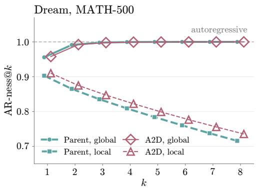

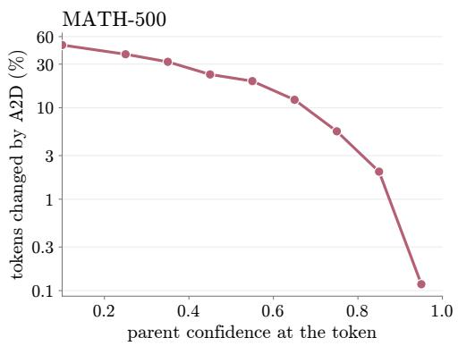  
Figure 5: How A2D alters diffusion generation. Left: A2D largely preserves the parent’s decoding order. Right: Prediction changes concentrate on low-confidence tokens.

Table 12: Sources of the A2D gain. Best-performing point for each construction, with coefficients selected on the anchor task. Avg. rank is the mean within-pair rank (1 = best) and Avg. Acc. is the mean over the seven pairs. All results are in percentages.
<table><tr><td></td><td>Dream IFEval</td><td>DreamCoder DiffuCoder HumanEval+</td><td>HumanEval+</td><td>DiffuCoder-RL DreamReasoner Nemotron-3B DiffusionGemma MBPP+</td><td>MATH-500</td><td>IFEval</td><td>VQA-RAD</td><td></td><td>Avg. rank↓ Avg. Acc.</td></tr><tr><td>Diffusion parent  $D _ { p }$ </td><td>63.0</td><td>77.4</td><td>65.9</td><td>66.9</td><td>93.6</td><td>68.0</td><td>71.6</td><td>3.7</td><td>72.3</td></tr><tr><td>+τA only  $D _ { p } + \lambda { \dot { \tau } } _ { A }$ </td><td>77.1</td><td>77.4</td><td>69.5</td><td>66.9</td><td>94.4</td><td>71.0</td><td>74.7</td><td>2.4</td><td>75.9</td></tr><tr><td>−TD only  $D _ { p } - \lambda \tau _ { D }$ </td><td>63.4</td><td>78.7</td><td>70.1</td><td>69.6</td><td>93.4</td><td>72.0</td><td>72.5</td><td>2.4</td><td>74.2</td></tr><tr><td>A2D merge  $D _ { p } + \lambda ( \tau _ { A } - \tau _ { D } )$ </td><td>72.8</td><td>79.3</td><td>74.4</td><td>69.0</td><td>94.8</td><td>72.9</td><td>74.5</td><td>1.4</td><td>76.8</td></tr></table>

## B.2 FULL RESULTS OF DREAM-7B

Here, we report the results used in Figure 2a and in Figure 2b in Table 16.

Table 13: Reverse direction: diffusion post-training vector into the AR model. AR’s rows use their native budget. All results are in percentages.
<table><tr><td rowspan="2"></td><td colspan="4">Dream-7B→Qwen2.5-7B</td><td colspan="2">DiffuCoder→Qwen2.5-Coder</td><td colspan="3">Nemotron-LD-3B→Ministral-3-3B</td></tr><tr><td>IFEval</td><td>IFBench</td><td>GSM8K MATH-500</td><td></td><td>HumanEval+</td><td>MBPP+</td><td>IFEval</td><td>MATH-500</td><td>MBPP</td></tr><tr><td>Diffusion donor</td><td>63.0</td><td>19.0</td><td>83.0</td><td>38.4</td><td>65.9</td><td>65.9</td><td>68.0</td><td>76.8</td><td>73.0</td></tr><tr><td>AR base</td><td>40.5</td><td>16.3</td><td>62.5</td><td>17.4</td><td>74.4</td><td>62.2</td><td>45.4</td><td>60.2</td><td>64.3</td></tr><tr><td>A2D (transfer, α=1.0 / 0.1 / 0.9)</td><td>46.7</td><td>19.0</td><td>56.0</td><td>16.2</td><td>74.4</td><td>64.8</td><td>55.7</td><td>35.0</td><td>55.8</td></tr><tr><td>AR instruct</td><td>75.3</td><td>31.7</td><td>83.0</td><td>56.0</td><td>86.6</td><td>71.7</td><td>67.0</td><td>82.4</td><td>76.2</td></tr><tr><td>A2D (merge, λ=0.1 / 0.2 / 0.2)</td><td>77.3</td><td>30.7</td><td>82.9</td><td>56.4</td><td>86.6</td><td>71.7</td><td>69.0</td><td>81.4</td><td>77.0</td></tr></table>

Table 14: Module-wise ablation of the transferred AR update. MATH-500 accuracy on Dream-7B. For A2D-Merge, the ablated module is reverted to the diffusion parent $D _ { p } ,$ while all remaining modules use the merged weights. All results are in percentages.
<table><tr><td></td><td>A2D-Transfer</td><td>A2D-Merge</td></tr><tr><td>Full model</td><td>40.8</td><td>45.8</td></tr><tr><td>w/o AR attention</td><td>40.8</td><td>43.0</td></tr><tr><td>w/o AR MLP</td><td>30.4</td><td>45.6</td></tr></table>

## B.3 FULL RESULTS OF NEMOTRON-LD-3B

Table 17 reports the full Nemotron-LD-3B results under both diffusion and autoregressive decoding. For the diffusion Base, we evaluate two prompting protocols. The main paper reports the native raw-prompt result, which provides the stronger overall Base performance. For completeness, we additionally evaluate the Base using the same instruction prompt format as A2D-Transfer, providing a prompt-matched comparison.

Under either protocol, A2D-Transfer substantially strengthens the Base checkpoint, bringing it close to or beyond the Instruct model on several benchmarks. A2D-Merge then provides further improvements over the Instruct checkpoint under both diffusion and autoregressive decoding.

## B.4 RESULTS OF NEMOTRON-LD-8B

Here, we provide the full results for Nemotron-LD-8B in Table 18. At the 8B scale, we evaluate A2D with both instruction-tuning and reasoning-oriented AR updates.

Instruction-tuning updates. With the Ministral-3-8B-Instruct donor, A2D-Transfer broadly improves the diffusion base, while A2D-Merge provides gains on several benchmarks under both diffusion and AR decoding. The merging gains are less consistent than for the 3B model. Importantly, this setting exhibits a mismatch in generation behavior: Nemotron-LD-8B produces long, reasoning-like responses on reasoning-intensive tasks even with thinking disabled, whereas merging the Instruct update substantially shortens these generations (Figure 6). Thus, comparisons on these tasks are partially confounded by changes in effective reasoning behavior in addition to the weight-space composition itself.

Reasoning updates. Separately, we evaluate A2D using the Ministral-3-8B-Reasoning donor, with thinking enabled for both the diffusion parent and the merged model. Unlike the instructiontuning setting above, both models use the same explicit thinking mode, avoiding the generationbehavior mismatch. Under the official generation budget, A2D-Merge improves the mean score from 59.9 to 64.3, with substantial gains on reasoning-related benchmarks such as MATH-500 (87.2 92.6), GPQA (36.4 44.4), AIME24 (33.3 46.7), and LiveCodeBench (26.9 38.1). The gains remain strong when doubling the generation budget, where the mean further increases from 60.4 to 65.6. These results show that reasoning-oriented AR post-training updates can be effectively composed with diffusion models at the 8B scale under matched reasoning behavior.

Table 15: Continued pre-training vectors do not transfer. Adding the AR continued-pretraining vector to the diffusion base does not improve performance, even at small coefficients. These vectors are 70–82 larger than the post-training vectors used in our main experiments. Bold denotes the best α>0 result; all results are percentages.
<table><tr><td rowspan="2"></td><td rowspan="2">Recipient</td><td rowspan="2">Benchmark</td><td colspan="4">α in  $D _ { b } + \alpha \tau _ { \mathrm { C P T } }$ </td></tr><tr><td>0</td><td>0.01</td><td>0.05</td><td>1.0</td></tr><tr><td>Math (82×), Qwen2.5-Math – Qwen2.5</td><td>Dream-7B-Base</td><td>GSM8K</td><td>76.6</td><td>76.6</td><td>74.8</td><td>0.0</td></tr><tr><td>Code (70×), Qwen2.5-Coder – Qwen2.5</td><td>Dream-Coder-Base</td><td>HumanEval</td><td>63.4</td><td>61.6</td><td>57.3</td><td>0.0</td></tr></table>

Table 16: Qwen2.5-7B Dream-7B on six tasks. One transfer model (α=0.9) and one merged model (λ=0.6), both selected on IFEval, improve every task over the corresponding baseline. All results are in percentages.
<table><tr><td rowspan="2"></td><td colspan="6">Qwen2.5-7B → Dream-7B</td></tr><tr><td>IFEval</td><td>IFBench</td><td>GSM8K</td><td>MATH-500</td><td>HumanEval+</td><td>MBPP+</td></tr><tr><td>AR donor</td><td>75.3</td><td>31.7</td><td>83.0</td><td>36.6</td><td>76.8</td><td>69.0</td></tr><tr><td>Base</td><td>49.7</td><td>14.0</td><td>66.5</td><td>20.8</td><td>48.8</td><td>59.3</td></tr><tr><td>A2D (transfer)</td><td>59.2</td><td>25.0</td><td>81.7</td><td>40.2</td><td>54.9</td><td>62.7</td></tr><tr><td>Instruct</td><td>63.0</td><td>19.0</td><td>83.0</td><td>38.4</td><td>51.8</td><td>57.1</td></tr><tr><td>A2D (merge)</td><td>72.8</td><td>22.3</td><td>83.7</td><td>45.0</td><td>59.8</td><td>58.7</td></tr></table>

## B.5 DIFFUSIONGEMMA WITH SLAKE POST-TRAINING

In the main paper, we report results for merging with DiffusionGemma using checkpoints fine-tuned on VQA-RAD. In Table 19, we additionally report the same setup using checkpoints fine-tuned on SLAKE. Unlike on VQA-Med, where the AR and diffusion models achieve comparable performance, on SLAKE the AR model is substantially weaker than its diffusion counterpart, providing a complementary setting where the donor itself is less capable than the recipient.

Despite this gap, the AR SLAKE task vector transfers effectively to the diffusion base and further improves the diffusion post-trained model across all three benchmarks when transferred or merged. This shows that AR updates can remain complementary even when the donor itself is weaker than the recipient.

## B.6 SELF-SPECULATIVE DECODING OF NEMOTRON

Table 20 evaluates whether the benefits of A2D extend to self-speculative decoding. We compare each merged checkpoint with its corresponding Instruct parent under matched decoding settings, reporting accuracy, tokens per forward evaluation (TPF), and generation time per token. We use NVIDIA’s native linear self-speculative decoding, with diffusion drafting and autoregressive verification, a block size of 32, threshold 0, and no LoRA adapter. All runs use greedy decoding, with the same generation and thinking budgets specified in Appendix A.1.

Across the evaluated configurations, A2D consistently increases TPF and generally improves accuracy. The non-thinking merges improve both accuracy and observed time per token on both benchmarks and at both model sizes. These benefits also extend to MATH-500 with the reasoning donor and thinking enabled.

## B.7 POST-TRAINING TYPES AND NORM RATIOS

As shown in Table 21, we concatenate parameter differences over backbone tensors (attention, MLP, and normalization layers) and compute their $\ell _ { 2 }$ norms and cosine similarities. The Nemotron measurements additionally include compatible input-embedding rows after key mapping, excluding protected rows and unmatched parameters. All measurements exclude output heads, the other model families also exclude all input embeddings. We define $\Delta _ { b } = D _ { b } - A _ { b } , \Delta _ { p } = D _ { p } - A _ { p }$ $\pmb { \tau } _ { A } = \pmb { A } _ { p } - \pmb { A } _ { b }$ , and $\tau _ { D } = D _ { p } - D _ { b }$

Table 17: Ministral-3-3B-Instruct Nemotron-LD-3B. DLM and AR denote diffusion and autoregressive decoding of the same checkpoint. Mean excludes IFEval. Bold marks the better result within each Instruct-merge pair. All results are in percentages.
<table><tr><td></td><td>Mode</td><td>GSM8K</td><td>MATH-500</td><td>HumanEval</td><td>MBPP</td><td>IFEval</td><td>MMLU</td><td>GPQA</td><td>AIME24</td><td>AIME25</td><td>LCB-CPP</td><td>Mean</td></tr><tr><td>AR donor</td><td>AR</td><td>91.3</td><td>83.0</td><td>80.5</td><td>75.9</td><td>65.1</td><td>67.9</td><td>40.9</td><td>30.0</td><td>13.3</td><td>27.1</td><td>56.7</td></tr><tr><td>Base (raw protocol)</td><td>DLM</td><td>59.1</td><td>40.0</td><td>64.6</td><td>70.9</td><td>23.2</td><td>62.0</td><td>35.4</td><td>0.0</td><td>0.0</td><td>9.9</td><td>38.0</td></tr><tr><td>Base (Instruct protocol)</td><td>DLM</td><td>78.0</td><td>34.6</td><td>39.6</td><td>38.6</td><td>25.8</td><td>55.1</td><td>26.3</td><td>0.0</td><td>0.0</td><td>4.0</td><td>30.7</td></tr><tr><td>A2D (transfer)</td><td>DLM</td><td>88.1</td><td>52.6</td><td>72.6</td><td>74.3</td><td>60.6</td><td>62.8</td><td>33.3</td><td>3.3</td><td>3.3</td><td>14.1</td><td>44.9</td></tr><tr><td>Base (raw protocol)</td><td>AR</td><td>52.1</td><td>50.4</td><td>71.3</td><td>72.8</td><td>21.1</td><td>58.0</td><td>32.8</td><td>10.0</td><td>13.3</td><td>14.5</td><td>41.7</td></tr><tr><td>A2D (transfer)</td><td>AR</td><td>89.2</td><td>60.4</td><td>73.8</td><td>74.6</td><td>59.0</td><td>62.6</td><td>33.3</td><td>6.7</td><td>0.0</td><td>14.5</td><td>46.1</td></tr><tr><td>Instruct</td><td>DLM</td><td>89.2</td><td>76.8</td><td>73.2</td><td>73.0</td><td>68.0</td><td>72.1</td><td>35.4</td><td>10.0</td><td>13.3</td><td>16.3</td><td>51.0</td></tr><tr><td>A2D (merge)</td><td>DLM</td><td>90.1</td><td>79.6</td><td>75.0</td><td>75.7</td><td>72.9</td><td>72.9</td><td>43.4</td><td>16.7</td><td>13.3</td><td>18.9</td><td>54.0</td></tr><tr><td>Instruct</td><td>AR</td><td>87.6</td><td>76.0</td><td>73.8</td><td>69.8</td><td>68.8</td><td>71.9</td><td>41.9</td><td>23.3</td><td>13.3</td><td>17.6</td><td>52.8</td></tr><tr><td>A2D (merge)</td><td>AR</td><td>89.3</td><td>81.0</td><td>79.9</td><td>75.1</td><td>72.8</td><td>72.5</td><td>38.4</td><td>20.0</td><td>13.3</td><td>18.7</td><td>54.3</td></tr></table>

Table 18: Ministral-3-8B Nemotron-LD-8B. DLM and AR denote diffusion and autoregressive decoding of the same checkpoint. Mean excludes IFEval and, when unavailable, MMLU, which under some settings exhibits repetitive generation and requires over four days to complete. Bold marks the better result within each corresponding pair. All results are in percentages.
<table><tr><td></td><td>Mode</td><td>GSM8K</td><td>MATH-500</td><td>HumanEval</td><td>MBPP</td><td>IFEval</td><td>MMLU</td><td>GPQA</td><td>AIME24</td><td>AIME25</td><td>LCB-CPP</td><td>Mean</td></tr><tr><td>AR donor</td><td>AR</td><td>93.2</td><td>87.8</td><td>77.4</td><td>77.8</td><td>69.5</td><td>76.7</td><td>50.0</td><td>30.0</td><td>26.7</td><td>34.8</td><td>61.6</td></tr><tr><td>Base (raw protocol)</td><td>DLM</td><td>64.7</td><td>51.2</td><td>77.4</td><td>82.0</td><td>28.2</td><td>38.4</td><td>34.3</td><td>13.3</td><td>20.0</td><td>17.0</td><td>44.3</td></tr><tr><td>Base (Instruct protocol)</td><td>DLM</td><td>78.2</td><td>59.8</td><td>4.9</td><td>13.2</td><td>21.5</td><td></td><td>9.1</td><td>6.7</td><td>10.0</td><td>2.2</td><td>23.0</td></tr><tr><td>A2D (transfer)</td><td>DLM</td><td>89.5</td><td>71.6</td><td>75.0</td><td>81.7</td><td>65.7</td><td>72.4</td><td>37.4</td><td>13.3</td><td>6.7</td><td>11.2</td><td>51.0</td></tr><tr><td>Base (raw protocol)</td><td>AR</td><td>63.8</td><td>60.2</td><td>76.2</td><td>79.9</td><td>26.0</td><td>53.6</td><td>33.3</td><td>13.3</td><td>20.0</td><td>13.4</td><td>46.0</td></tr><tr><td>A2D (transfer)</td><td>AR</td><td>89.7</td><td>69.8</td><td>74.4</td><td>79.4</td><td>62.6</td><td>70.1</td><td>39.9</td><td>6.7</td><td>13.3</td><td>12.8</td><td>50.7</td></tr><tr><td>Instruct</td><td>DLM</td><td>93.7</td><td>89.2</td><td>73.8</td><td>62.2</td><td>69.8</td><td>79.1</td><td>44.4</td><td>30.0</td><td>30.0</td><td>29.3</td><td>59.1</td></tr><tr><td>A2D (merge)</td><td>DLM</td><td>94.5</td><td>89.0</td><td>71.3</td><td>65.3</td><td>78.8</td><td>78.6</td><td>42.9</td><td>33.3</td><td>26.7</td><td>28.0</td><td>58.8</td></tr><tr><td>Instruct A2D (merge)</td><td>AR</td><td>93.5</td><td>88.6</td><td>78.0</td><td>65.1</td><td>70.8</td><td>79.8</td><td>48.0</td><td>33.3</td><td>26.7</td><td>35.5</td><td>60.9</td></tr><tr><td></td><td>AR</td><td>93.9</td><td>89.4</td><td>79.3</td><td>72.2</td><td>74.9</td><td>78.8</td><td>47.0</td><td>30.0</td><td>26.7</td><td>31.1</td><td>60.9</td></tr><tr><td colspan="9">thinking, official budget (8,192 total / 6,000 thinking), reasoning donor</td><td></td><td></td><td></td><td></td></tr><tr><td>Instruct</td><td>DLM</td><td>92.4</td><td>87.2</td><td>86.0</td><td>87.3</td><td>75.5</td><td></td><td>36.4</td><td>33.3</td><td>30.0</td><td>26.9</td><td>59.9</td></tr><tr><td>A2D (merge)</td><td>DLM</td><td>94.1</td><td>92.6</td><td>79.3</td><td>86.2</td><td>74.7</td><td></td><td>44.4</td><td>46.7</td><td>33.3</td><td>38.1</td><td>64.3</td></tr><tr><td colspan="9">thinking, double budget (16,384 total / 12,000 thinking), reasoning donor</td><td></td><td></td><td></td><td></td></tr><tr><td>Nemotron-LD-8B-Instruct</td><td>DLM</td><td>92.2</td><td>87.0</td><td>85.4</td><td>87.3</td><td>75.6</td><td></td><td>40.4</td><td>33.3</td><td>30.0</td><td>27.3</td><td>60.4</td></tr><tr><td>A2D (merge)</td><td>DLM</td><td>94.0</td><td>92.2</td><td>79.3</td><td>86.5</td><td>74.6</td><td></td><td>46.0</td><td>53.3</td><td>33.3</td><td>40.5</td><td>65.6</td></tr></table>

For most SFT pairs, the AR-to-diffusion conversion direction remains highly stable after posttraining, with $\cos ( \Delta _ { b } , \Delta _ { p } ) ~ \ge ~ 0 . 9 8$ , while the AR and diffusion post-training vectors have low cosine similarity, indicating largely distinct updates. DreamReasoner shows a larger change in the conversion direction and also has a substantially larger AR post-training update.

The update scale is also markedly different between post-training and continued pre-training. Posttraining vectors have relatively small norms, whereas continued-pretraining vectors are substantially larger, potentially moving the resulting checkpoints beyond the local low-loss region in which weight-space composition is most effective. In addition, the code continued-pretraining vectors are strongly aligned across the AR and diffusion paradigms, in contrast to the near-orthogonality observed for post-training vectors.

Nemotron-LD-3B, official protocol (8192 tokens, thinking off)  
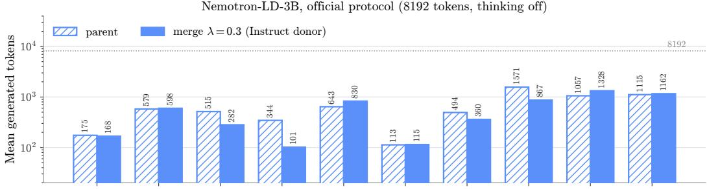

Nemotron-LD-8B, official protocol (8192 tokens, thinking off)  
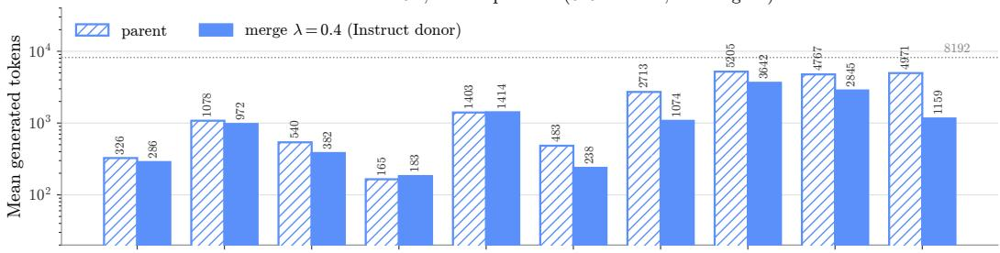

Nemotron-LD-8B, thinking on, official budget (8192 total / 6000 thinking)  
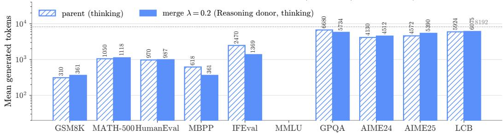  
Figure 6: Generation-length mismatch in Nemotron-LD. The 8B model, unlike the 3B one, exhibits longer, reasoning-like generations even with thinking disabled. Enabling thinking substantially reduces the length mismatch between the parent and merged models.

Table 19: AR SLAKE post-training transfer from Gemma to DiffusionGemma. AR donor denotes the AR checkpoint providing the task vector. Base denotes the instruction-tuned diffusion checkpoint. Anchor task used for hyperparameter selection is highlighted. Bold marks the best result compared to the corresponding baseline. All results are in percentages.
<table><tr><td rowspan="2"></td><td colspan="3">Gemma 4→ DiffusionGemma</td></tr><tr><td>VQA-RAD</td><td>SLAKE</td><td>VQA-Med</td></tr><tr><td>AR donor</td><td>58.09</td><td>80.68</td><td>37.20</td></tr><tr><td>Base</td><td>57.43</td><td>63.24</td><td>43.20</td></tr><tr><td>A2D (transfer)</td><td>56.54</td><td>77.10</td><td>37.20</td></tr><tr><td>Post-trained</td><td>60.75</td><td>83.13</td><td>39.60</td></tr><tr><td>A2D (merge)</td><td>61.64</td><td>83.32</td><td>40.00</td></tr></table>

Table 20: Accuracy and efficiency of self-speculative decoding. TPF is $\begin{array} { r } { \sum _ { i } T _ { i } / \sum _ { i } \mathrm { N F E } _ { i } , } \end{array}$ including thinking tokens. Relative time is normalized generation time per token within each dataset, model size, and thinking setting; lower is better. Timings are observational and exclude model loading and final grading. Accuracy results are percentages (MATH-500 accuracy; MBPP base-test pass@1), while TPF and relative time are ratios. Accuracy is in percentages.
<table><tr><td></td><td colspan="3">MATH-500</td><td colspan="3">MBPP</td></tr><tr><td>Model</td><td>Acc. ↑</td><td>TPF↑</td><td>Rel. time ↓</td><td>Acc. ↑</td><td>TPF↑</td><td>Rel. time ↓</td></tr><tr><td colspan="7">Ministral-3-3B-Instruct → Nemotron-LD-3B, thinking off</td></tr><tr><td>Instruct parent</td><td>76.6</td><td>4.96</td><td>1.00</td><td>69.8</td><td>3.71</td><td>1.00</td></tr><tr><td>A2D (merge)</td><td>80.8</td><td>5.04</td><td>0.87</td><td>74.9</td><td>3.90</td><td>0.80</td></tr><tr><td colspan="7">Ministral-3-8B-Instruct → Nemotron-LD-8B, thinking off</td></tr><tr><td>Instruct parent</td><td>87.0</td><td>5.34</td><td>1.00</td><td>68.0</td><td>3.42</td><td>1.00</td></tr><tr><td>A2D (merge)</td><td>88.6</td><td>6.07</td><td>0.88</td><td>73.0</td><td>3.55</td><td>0.77</td></tr><tr><td colspan="7">Ministral-3-8B-Reasoning → Nemotron-LD-8B, thinking on</td></tr><tr><td>Instruct parent</td><td>87.6</td><td>3.70</td><td>1.00</td><td>87.8</td><td>3.77</td><td>1.00</td></tr><tr><td>A2D (merge)</td><td>91.4</td><td>4.04</td><td>0.81</td><td>84.4</td><td>3.84</td><td>1.53</td></tr></table>

Table 21: Geometry of post-training and paradigm-conversion directions across model pairs. Measurements use backbone parameters and, for Nemotron, compatible input embeddings after key mapping, excluding protected rows. Output heads are excluded throughout.
<table><tr><td>diffusion ← AR</td><td>post-training</td><td> $\| \tau _ { A } \|$ </td><td> $\| \tau _ { D } \|$ </td><td> $\| \Delta _ { b } \|$ </td><td> $\| \Delta _ { p } \|$ </td><td> $\cos ( \Delta _ { b } , \Delta _ { p } )$ </td><td> $\cos ( \tau _ { A } , \tau _ { D } )$ </td></tr><tr><td>Qwen2.5-7B → Dream-7B</td><td>instruct (SFT)</td><td>23.0</td><td>31.5</td><td>729</td><td>732</td><td>+0.999</td><td>+0.013</td></tr><tr><td>Qwen2.5-Coder→ Dream-Coder</td><td>code (SFT)</td><td>87.0</td><td>84.6</td><td>589</td><td>602</td><td>+0.980</td><td>+0.023</td></tr><tr><td>Qwen3-8B → DreamReasoner</td><td>reasoning (SFT / SFT+RL)</td><td>189.2</td><td>295.8</td><td>459</td><td>556</td><td>+0.803</td><td>+0.118</td></tr><tr><td>Ministral-3 → Nemotron-LD-3B</td><td>instruct (SFT), cross-arch.</td><td>43.1</td><td>17.1</td><td>280.9</td><td>271.4</td><td>+0.987</td><td>+0.075</td></tr><tr><td>Ministral-3 → Nemotron-LD-8B</td><td>instruct (SFT), cross-arch.</td><td>42.2</td><td>16.3</td><td>387.0</td><td>380.4</td><td>+0.994</td><td>+0.070</td></tr><tr><td>Qwen2.5-Coder → DiffuCoder</td><td>code (SFT)</td><td>87.0</td><td>33.3</td><td>627</td><td>630</td><td>+0.989</td><td>+0.005</td></tr><tr><td>AceCoder-Rule → DiffuCoder</td><td>code (RL)</td><td>0.68</td><td>4.10</td><td>630</td><td>630</td><td>+1.000</td><td>+0.004</td></tr><tr><td>Continued pre-training (knowledge) vectors, for contrast</td><td></td><td>|∥|va∥|</td><td>∥|vD∥|</td><td></td><td></td><td></td><td>cos(vA, vD)</td></tr><tr><td>code knowledge</td><td>continued pre-training</td><td>1603.6</td><td>1460.9</td><td></td><td></td><td></td><td>+0.869</td></tr><tr><td>math knowledge</td><td>continued pre-training</td><td>1876.9</td><td></td><td></td><td></td><td></td><td></td></tr></table>

Accuracy Correction rate Error introduction rate Diffusion parent

## C ANALYSIS

## C.1 CORRECTION AND ERROR INTRODUCTION ALONG THE A2D DIRECTION

We further characterize how A2D changes model predictions by tracking beneficial and adverse prediction transitions as the AR contribution increases.

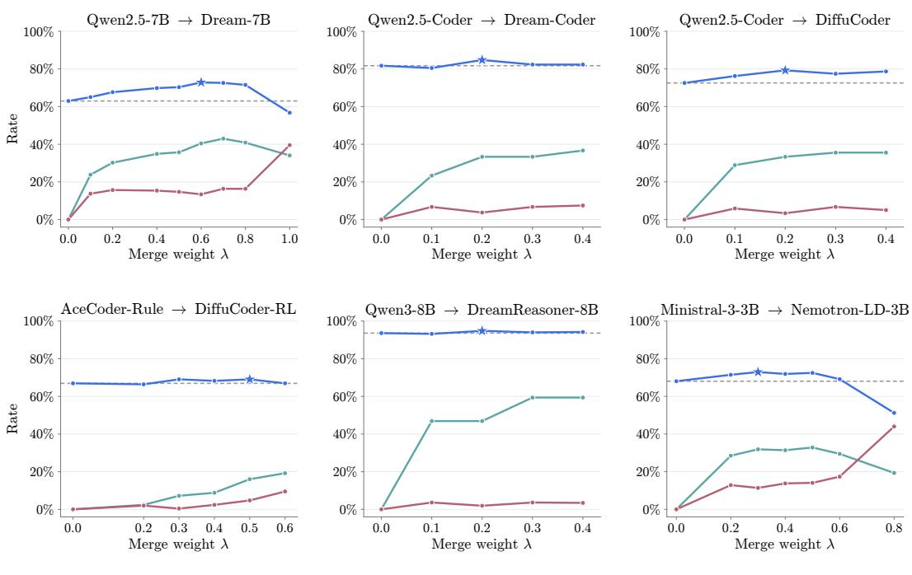  
Figure 7: Correction increases with the AR contribution while error introduction remains limited over the effective interpolation range. We report accuracy, correction rate (parent wrong A2D correct), and error introduction rate (parent correct  A2D wrong) along the A2D interpolation path. Dashed lines denote the diffusion parent, and stars mark the best-performing coefficient.

Across the six settings in Figure 7, increasing the AR contribution generally increases correction while introducing few new errors around the optimal region. Some models remain robust over a broad range of λ, while Dream-7B and Nemotron-LD show a clearer trade-off at larger values. Overall, A2D improves performance by correcting parent errors while largely preserving alreadycorrect predictions.

## C.2 INTERPOLATION PRESERVES COMPLEMENTARY GAINS ON RELEASED CHECKPOINTS

As shown in Figure 8, the same pattern holds for released checkpoints: the diffusion parent and AR donor solve different questions, while the merged model preserves most successes from both.

## C.3 ALIGNED REPRESENTATION CHANGES ON RELEASED CHECKPOINTS

The same pattern extends to released checkpoints. As shown in Figure 9, for both Dream-Coder and DiffuCoder-RL, AR and diffusion post-training updates remain nearly orthogonal in parameter space while inducing substantially more aligned changes in the diffusion model’s representations. Notably, this pattern also holds for the RL-derived updates of DiffuCoder-RL.

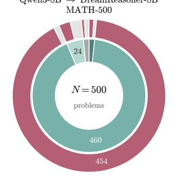

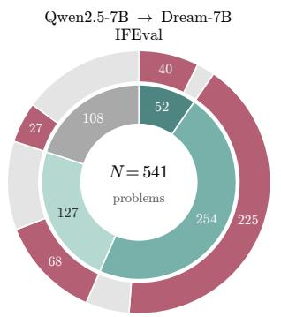  
Qwen2.5-Coder Dream-Coder HumanEval

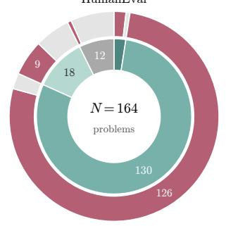

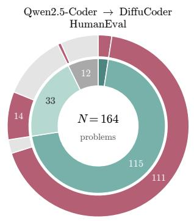

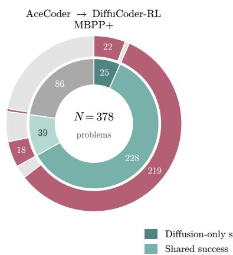  
Qwen3-8B DreamReasoner-8B MATH-500

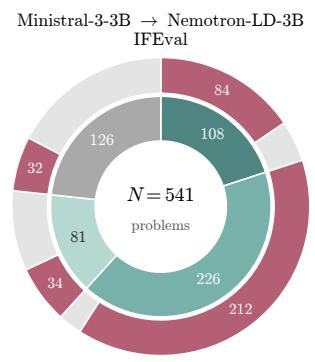  
Figure 8: A2D keeps the successes of both endpoints. For every item of the benchmark, the inner ring records which of the diffusion parent and the AR donor solves it. The outer ring records whether the merged model solves it.

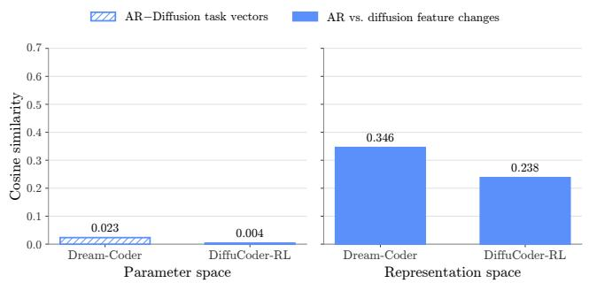  
Figure 9: Distinct parameter updates induce aligned representation changes for released check points.

## D LIMITATIONS AND FUTURE WORK

Our results reveal a weight-space connection between AR and diffusion models: AR post-training updates remain meaningful after transfer to diffusion models and can complement diffusion-specific updates. This extends existing connections between the two paradigms beyond training and decoding mechanisms. However, several questions remain open.

A2D currently relies on a compatible training lineage between the AR donor and diffusion recipient. All model pairs studied here originate from the same AR family, although our Nemotron experiments show that exact architectural correspondence is not required. Whether cross-paradigm transfer extends to more distant or independently trained model pairs remains unclear.

Moreover, the transferability we observe is primarily limited to relatively local post-training updates. Continued-pretraining updates are substantially larger and do not transfer effectively in our experiments, suggesting that pretraining-scale transformations may require additional alignment or decomposition.

Future work could further characterize what determines cross-paradigm compatibility, develop more adaptive composition strategies, and study A2D as an initialization for subsequent SFT or RL.