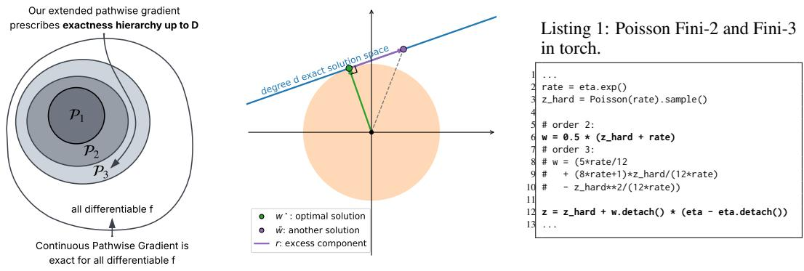
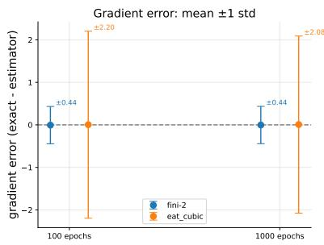
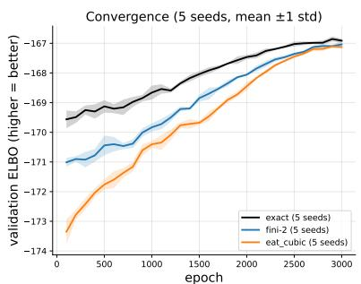
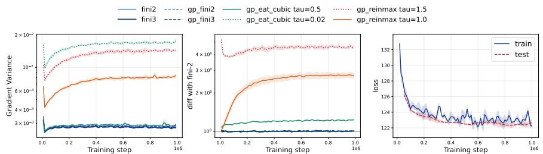
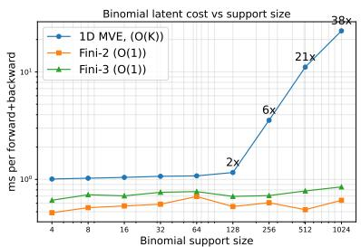
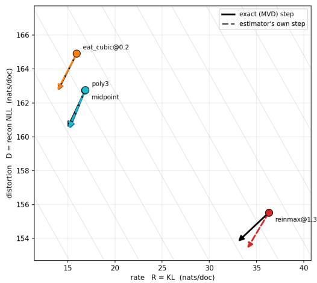
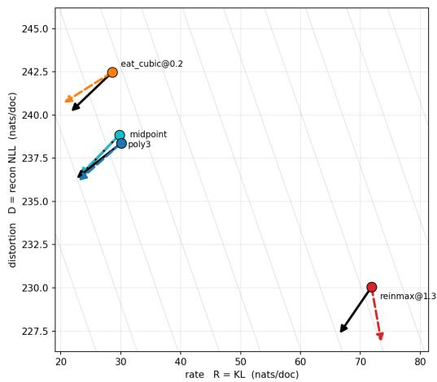

# EXTENDING PATHWISE GRADIENTS TO DISCRETE RAN-DOM VARIABLES VIA FINITE-ORDER RELAXATION

Donghan He donghanhe@gmail.com

Luhuan Wu

Department of Applied Mathematics and Statistics,   
Johns Hopkins University   
lwu86@jh.edu

## ABSTRACT

Pathwise gradients are preferred for continuous random variables because they are unbiased, low variance, and work with a single sample. For discrete variables, pathwise gradients cannot generally be exact for every differentiable function. We propose a general framework for constructing Finite-order exact pathwise gradient estimators (Fini) for discrete variables, which are unbiased for all polynomials up to degree D. Among all admissible solutions, our estimator is the unique least-norm solution and has minimum weight variance. For common discrete distributions such as the Poisson, our construction yields native, closed-form estimators tailored to each distribution, implementable in a few lines of code. They preserve exact discrete forward samples without continuous relaxation, temperature tuning, or augmented representations. At matched polynomial exactness, they avoid the excess weight variance of non-native representations. We also bound bias for smooth downstream functions, showing how accuracy beyond polynomials depends on the first unmatched derivative and the sampling distribution. In experiments our low-order estimators match or outperform tuned baselines across linear, nonlinear and hierarchical latent-variable models, while out-speeding competitors in every runtime benchmark.

## 1 INTRODUCTION

For Monte Carlo (MC) gradient estimation in continuous random variables, the pathwise gradient estimator is the recommended default for its unbiasedness, typically low variance, and implementation simplicity (Mohamed et al., 2020). Pathwise gradients measure sensitivity among sample paths, combining how a realized sample changes with the distribution’s parameters with how the downstream function changes with the sample. Thus it requires differentiability of both the sample path and the downstream function. However, discrete variables, commonly used in neural sequence models and deep generative models (Ranganath et al., 2015; Vafaii et al., 2024; Li et al., 2024), do not generally admit a pathwise estimator that is unbiased for all differentiable functions. This leaves a gap for MC gradient estimation in discrete distributions.

Existing gradient estimators for discrete variables navigate a bias–variance–computation tradeoff. Score-function estimators are unbiased but often have high variance; reducing it may require more samples or carefully designed control variates, adding computational or implementation cost (Ranganath et al., 2014; Mohamed et al., 2020). Measure-valued derivatives (MVD) and discrete General One-sample gradients can reduce variance through additional downstream evaluations, which become expensive in high-dimensional models (Pflug, 1989; Rosca et al., 2019; Cong et al., 2019). Biased alternatives instead approximate the backward pass, trading exactness for inexpensive gradients. Straight-through (ST) estimators preserve the hard sample but substitute a surrogate backward derivative, introducing bias (Bengio et al., 2013). For categorical variables, the Gumbel–Softmax trick (Jang et al., 2017; Maddison et al., 2017) instead replaces the hard sample with a differentiable continuous approximation controlled by temperature, allowing gradients through the relaxed sample. Lowering the temperature improves bias but can increase gradient variance, making it an additional hyperparameter to tune. Beyond categorical variables, researchers use the Gumbel–Softmax trick to approximate gradients for discrete variable such as Poisson (Li et al., 2024); however, these methods need to approximate one-dimensional variables with K-dimensional categorical variables, and inherit the temperature parameter, both adding computational overhead.

  
Figure 1: Finite-order pathwise gradients. Left: pathwise gradients are unbiased for all differentiable functions - this is too rigid for discrete variables, so we relax the unbiasedness requirement to low-order polynomials; Center: generally, there are many solutions to the finite-order unbiasedness requirement; we use the least-norm principle to select the order-D unbiased solution, avoiding excess weight variance; Right: as an example, Fini-2 and 3 for Poisson reduce to a few lines of code.

Recently, Liu et al. (2023) interpret categorical ST estimators as a first-order numerical method and propose a second-order ST method, ReinMax. ReinMax is unbiased for degree-2 polynomials, whereas first-order ST is unbiased for linear functions. This improvement enables ReinMax to outmatch both biased and unbiased methods consistently on various benchmarks. Nonetheless, applying ReinMax to other discrete variables again requires approximation, which can lead to statistical and computational overheads. Can we adapt pathwise gradients to discrete variables beyond categoricals by relaxing the unbiasedness requirement in a principled way?

We introduce a general recipe, Fini, that applies to a range of discrete variables: As shown in Fig. 1, we require the pathwise estimator to be unbiased for low-degree polynomials rather than for every differentiable function; this weaker requirement admits many solutions, so we select the least-norm solution. This leads to several mathematical, statistical, and computational benefits, shown below.

## Contributions:

• Fini: Finite-order exact discrete pathwise gradients: We introduce Fini, a general recipe that extends pathwise gradients to discrete random variables by requiring the gradient to be unbiased for polynomials up to degree D and selecting the least-norm solution. (§3).

• Generality across discrete variables: For common discrete variables, the estimator is solved once at design time. The estimator is simple to implement (see the Poisson example in Listing 1) and evaluation is fast and independent of support size (§3, Appendix E, §F).

• Bias and variance analysis: Our solution uniquely minimizes weight variance within the exactness class; we derive a non-asymptotic bias bound beyond it. We also characterize excess variance introduced by categorical and compound representations (§4).

• Better empirical performance: Across neural sequence models, VAEs, and hierarchical topic models, Fini matches or outperforms tuned specialized and generalist baselines (§6).

## 2 BACKGROUND

## 2.1 MONTE CARLO GRADIENT ESTIMATION AND SCORE FUNCTION GRADIENTS

For a probability distribution $p _ { \theta } ( Z )$ , we write the associated expectation $\mathbb { E } _ { p _ { \theta } }$ as $\mathbb { E } _ { \theta }$ for simplicity. For an objective $\operatorname { \mathbb { E } } _ { \theta } [ f ( Z ) ]$ ], gradient-based learning requires calculating $\partial _ { \theta } \mathbb { E } _ { \theta } [ { \check { f } } ( Z ) ]$ , often from MC samples. This problem emerges in supervised, unsupervised, and reinforcement learning.

One way to estimate $\partial _ { \theta } \mathbb { E } _ { \theta } [ f ( Z ) ]$ is through the score-function gradient, also known as REINFORCE (Williams, 1992; Ranganath et al., 2014). They use the identity $\breve { \partial } _ { \theta } \mathbb { E } _ { \theta } [ f ( Z ) ] = \mathbb { E } _ { p _ { \theta } } [ f ( Z ) s _ { \theta } ( Z ) ]$ ], with $s _ { \theta } ( Z ) = \partial _ { \theta } \log p _ { \theta } ( \bar { Z } )$ . Computing the integral analytically or numerically is generally intractable in high dimensions; MC gradient estimation instead draws $N$ samples $z _ { n } \sim p _ { \theta }$ and forms unbiased estimators of the quantity using $\textstyle \sum _ { n = 1 } ^ { N } f ( z _ { n } ) s _ { \theta } ( z _ { n } ) / N$ . The score-function estimator applies to both continuous and discrete variables and is unbiased under suitable regularity conditions. The assumptions are quite general, but the estimator can have high variance (Mohamed et al., 2020).

## 2.2 PATHWISE GRADIENTS

When $f$ is differentiable, pathwise gradients instead use derivative information and integrate directly with ordinary backpropagation. For a continuous family, a pathwise derivative weight wθ satisfies

$$
\partial _ { \theta } \mathbb { E } _ { \theta } \big [ f ( Z ) \big ] = \mathbb { E } _ { \theta } \big [ w _ { \theta } ( Z ) f ^ { \prime } ( Z ) \big ] \qquad \mathrm { ~ f o r ~ e v e r y ~ d i f f e r e n t i a b l e ~ } f .\tag{1}
$$

Explicit reparameterization writes out the sampling path $Z = g ( \epsilon , \theta )$ for parameter-free noise ϵ and differentiates the path so $w _ { \theta } = \partial _ { \theta } g ( \epsilon , \theta )$ (Kingma & Welling, 2014; Rezende et al., 2014). Consider a Gaussian $\mathcal { N } ( \mu , \sigma )$ , one valid path is $g ( \epsilon , \theta = ( \mu , \sigma ) ) = \mu + \sigma \epsilon$ where $\epsilon \sim \mathcal { N } ( 0 , 1 )$ ; then one can use $f ^ { \prime } ( z ) \partial _ { \theta } g ( \dot { \epsilon } , \theta )$ as a valid one-sample estimator for $\partial _ { \theta } L$ . For notation simplicity, we note $w _ { \theta }$ as w going forward; it generally depends on the distribution parameters.

The pathwise estimator is the recommended default for continuous MC gradient estimation because it is unbiased, typically low variance, and works well with one sample. For common discrete variables, one can show no such w can satisfy Eq. (1) for all differentiable $f .$ See proof in $\ S \ A$ for details. This limitation motivates researchers to use estimators that introduce bias, high variance, or additional computations.

## 3 FINI: FINITE-ORDER PATHWISE GRADIENTS

To extend pathwise gradients to discrete distributions, we relax the unbiasedness requirement in Eq. (1). For a candidate pathwise weight $w ,$ , instead of enforcing the unbiased pathwise identity for any differentiable $f ,$ we relax this requirement to unbiasedness with respect to polynomials up to degree $D$ , denoted as $\mathcal { P } _ { D }$ . Since expectation is linear and the monomial basis spans the vector space of polynomials, unbiasedness over $\mathcal { P } _ { D }$ breaks down to unbiasedness against $\{ x , x ^ { 2 } , \cdot \cdot \cdot , x ^ { D } \}$ . Thus, with the pathwise form $w _ { D } ( Z ) f ^ { \prime } ( Z )$ and a prescribed order $D .$ , the relaxed requirement becomes

$$
\begin{array} { r l } { \mathbb { E } _ { \theta } [ w _ { D } ( Z ) f ^ { \prime } ( Z ) ] = \partial _ { \theta } \mathbb { E } _ { \theta } [ f ( Z ) ] } & { { } \mathrm { f o r } \mathrm { e v e r y } f \in \{ Z ^ { d } \} _ { d = 1 } ^ { D } } \end{array}\tag{2}
$$

Given we want to find a solution $w ^ { \star }$ in the functional space, we need to be able to describe the space first, so we equip the space with the inner-product $\langle u , v \rangle _ { \theta } = \mathbb { E } _ { \theta } [ u ( Z ) v ( Z ) ]$ . We have now arrived at a Hilbert space $\dot { L } ^ { 2 } ( p _ { \theta } )$ given the base law $p _ { \theta }$ , and we see that for low orders, constraints in Eq. (2) generally leave w underdetermined. We choose the least-norm rule to resolve the ambiguity, which leads to clean derivations and computationally cheap solutions as shown later in this section, and other desirable statistical properties shown in $\ S 4 .$ . Assuming suitable integrability and differentiability, the Hilbert space optimization problem can be written as follows:

$$
\begin{array} { r l r } { \underset { w _ { D } \in L ^ { 2 } ( p _ { \theta } ) } { \arg \operatorname* { m i n } } } & { \| w _ { D } \| _ { 2 } } & \\ { \mathrm { s . t . } \quad } & { \langle w _ { D } , Z ^ { d - 1 } \rangle _ { \theta } = \cfrac { 1 } { d } \partial _ { \theta } \mathbb { E } _ { \theta } [ Z ^ { d } ] , \quad } & { d = 1 , \ldots , D . } \end{array}\tag{3}
$$

The key to solving this problem is to invoke the Riesz representation theorem, and note that the monomial basis up to $D - 1$ are precisely the Riesz representers to our problem. Therefore, the solution is a linear combination of monomials $v _ { D } ( Z ) \stackrel { \bullet } { = } [ 1 , . . . , Z ^ { D - 1 } ]$ , which means the resulting weight has degree at most $D - 1$ . Given the solution $w _ { D } ^ { \star }$ must be a linear combination of monomials, each of the LHS in our $D$ constraints becomes a gram matrix $G _ { D } = \mathbb { E } _ { \theta } [ v _ { D } ( Z ) v _ { D } ( Z ) ^ { \top } ]$ multiplied by the linear combination’s coefficients. As long as the gram matrix is non-singular, we can safely invert it. Collecting the RHS of constraints in problem (3) as $b _ { D }$ , we see that the solution is:

$$
\begin{array} { r } { \boxed { w _ { D } ^ { \star } ( z ) = { v _ { D } ( z ) } ^ { \top } G _ { D } ^ { - 1 } b _ { D } . } } \end{array}\tag{4}
$$

We refer to solution $w _ { D } ^ { \star }$ as the Fini-D estimator. This is the minimum-norm/least-norm solution to underspecified problems (Boyd & Vandenberghe, 2004; Trefethen $\&$ Bau, 1997). The recipe is general: we compute moments up to $2 D - 2$ for the gram matrix, as well as the first D moments’ derivatives for $b _ { D }$ , then solve the $D \times D$ linear system symbolically once to obtain the closed-form solution in Eq. (4). This requires finite moments through order $2 D - 2 .$ , differentiability of the first D moments with respect to the parameter, and nonsingular $G _ { D }$ . The solutions are polynomials of degree at most $( D - 1 )$ , evaluable in $O ( D )$ time, independent of support size - another direct consequence of the least norm principle.

We show an example Poisson derivation below. Furthermore, we show for continuous variables at order 2, Fini recovers classic pathwise gradients. Going forward, we use exactness and unbiasedness interchangeably, and call an estimator order-D when it is unbiased for every polynomial of degree at most D.

Poisson example: Let $Z \sim \mathrm { P o i s } ( \exp ( \eta ) )$ . The order-3 Gram matrix and $b _ { 3 }$ are

$$
G _ { 3 } = \left( \begin{array} { c c c } { { 1 } } & { { \lambda } } & { { \lambda ^ { 2 } + \lambda } } \\ { { \lambda } } & { { \lambda ^ { 2 } + \lambda } } & { { \lambda ^ { 3 } + 3 \lambda ^ { 2 } + \lambda } } \\ { { \lambda ^ { 2 } + \lambda } } & { { \lambda ^ { 3 } + 3 \lambda ^ { 2 } + \lambda } } & { { \lambda ^ { 4 } + 6 \lambda ^ { 3 } + 7 \lambda ^ { 2 } + \lambda } } \end{array} \right) , \qquad b _ { 3 } = \left( \begin{array} { c } { { \lambda } } \\ { { \lambda ^ { 2 } + \lambda / 2 } } \\ { { \lambda ^ { 3 } + 2 \lambda ^ { 2 } + \lambda / 3 } } \end{array} \right)\tag{5}
$$

The order-2 system uses the leading $2 \times 2$ block of $G _ { 3 }$ and the first two entries of $b _ { 3 }$ . Solving the two systems and substituting into w $\mathrm {  { ~ \cal { I } } } _ { D } ^ { \star } ( \bar { z } ) = v _ { D } ( z ) ^ { \top } G _ { D } ^ { - 1 } b _ { D }$ yields

$$
\begin{array} { r } { \boxed { w _ { 2 } ^ { \star } ( Z ) = \frac { Z + \lambda } { 2 } , \qquad w _ { 3 } ^ { \star } ( Z ) = \frac { 5 \lambda } { 1 2 } + \frac { 8 \lambda + 1 } { 1 2 \lambda } Z - \frac { 1 } { 1 2 \lambda } Z ^ { 2 } . } } \end{array}\tag{6}
$$

These are the Fini-2 and 3 weights used in Listing 1. The construction extends to any prescribed order; Appendix E gives the Fini-4 weight, whose variance under the log-rate parameterization diverges as $\lambda \downarrow 0$ . This illustrates the variance cost of higher exactness.

Poisson MVD and quadrature. The same weights also follow from the difference identity

$$
\partial _ { \eta } \mathbb { E } [ f ( Z ) ] = \lambda \mathbb { E } [ f ( Z + 1 ) - f ( Z ) ] = \lambda \mathbb { E } \left[ \int _ { 0 } ^ { 1 } f ^ { \prime } ( Z + t ) d t \right] .
$$

Direct use of the difference identity requires an extra evaluation of f at $Z + 1$ . For order 2, trapezoidal quadrature approximates the increment by $( f ^ { \prime } ( Z ) + f ^ { \prime } ( Z + \overset { \cdot } { 1 } ) ) / 2$ . The Poisson shift identity $\bar { \lambda } \mathbb { E } [ g ( Z + 1 ) ] ^ { \cdot } = \mathbb { E } [ Z g ( Z ) ]$ then replaces $\dot { f ^ { \prime } } ( \dot { Z } + 1 )$ by $( \vec { Z } / \lambda ) f ^ { \prime } ( \vec { Z } )$ in expectation, recovering $w _ { 2 } ^ { \star }$ The order-3 rule uses interpolation nodes at $t = 0 , 1 , $ 2; Appendix C.2 gives the algebra.

Exact Pathwise Recoveries and ST recoveries: Fini-2 recovers fully exact pathwise gradients in the following cases: for scalar location–scale families, $w _ { 2 } ^ { \star } ( Z ) = \partial _ { \theta } Z ;$ for Gaussian random vectors, we recover the minimum-energy affine pathwise field. Both estimators are exact for every sufficiently regular $f ,$ although we impose exactness only for quadratics. Furthermore for categoricals, if we replace the min-norm rule with a symmetry principle, we recover ReinMax at temperature = 1, and Fini-2 corresponds to hard one-hot MVE in Hooper & Shekhovtsov (2026). See $\ S \mathrm { C }$ for details.

## 4 THEORY

We establish uniqueness and weight-variance optimality, characterize two sources of excess variance, and bound bias outside the prescribed class. Proofs and details are in § D and § B. We start by showing our solutions are unique, and the solved weights are variance optimal.

Proposition 4.1. Let $V _ { D } = \operatorname { s p a n } \{ 1 , Z , \dots , Z ^ { D - 1 } \}$ and assume $G _ { D }$ is nonsingular. Every degree-D exact weight $w \in L ^ { 2 } ( p _ { \theta } )$ satisfies

$$
w = w _ { D } ^ { \star } + r , \qquad r \perp V _ { D } , \qquad \mathrm { V a r } _ { \theta } [ w ] = \mathrm { V a r } _ { \theta } [ w _ { D } ^ { \star } ] + \| r \| _ { 2 } ^ { 2 } .\tag{7}
$$

Thus w $\boldsymbol { \mathbf { \mathit { \sigma } } } _ { D } ^ { \star }$ uniquely minimizes both norm and weight variance in the exactness class.

Thm. 4.1 states that any other admissible solution must have an excess null component, which increases weight variance; given ReinMax applied to Poisson with categorical representation is order 2, we can characterize its excess weight variance.

Corollary 4.2. For $Z \sim \operatorname { P o i s } ( \lambda )$ and $\eta = \log \lambda ,$ the large-truncation limit ofcategorical ReinMax $a t \tau = 1$ is degree-2 exact, with

$$
w _ { \mathrm { R M } } ( Z ) = \underbrace { \frac { Z + \lambda } { 2 } } _ { w _ { \Sigma } ^ { \star } ( Z ) } + \underbrace { \frac { ( Z - \lambda ) ^ { 2 } - ( Z - \lambda ) - \lambda } { 2 } } _ { r _ { \mathrm { R M } } ( Z ) \bot V _ { 2 } } , \qquad \mathrm { V a r } [ w _ { \mathrm { R M } } ] - \mathrm { V a r } [ w _ { 2 } ^ { \star } ] = \frac { \lambda ^ { 2 } } { 2 } .\tag{8}
$$

The gap in weight variance is due to the null component $r _ { R M }$ . Its expression and proof are in Thm. D.2, and a general theorem about Reinmax applied to scalar exponential families is in Thm. D.1, pointing out excess variance in combining ReinMax with categorical approximation.

Rao-Blackwellization (RB) is a variance reduction technique for compound representations. Proposition below shows compounding can lead to excess variance, and when RB can neutralize it.

Proposition 4.3. Let $p _ { \theta } ( z , u )$ have marginal $p _ { \theta } ( z )$ , and let $\widetilde { w } _ { D } ( U , Z ) \in L ^ { 2 }$ be degree-D exact under the joint law. Then $\bar { w } _ { D } ( \boldsymbol { Z } ) = \mathbb { E } _ { \boldsymbol { \theta } } [ \widetilde { \boldsymbol { w } } _ { D } \mid \bar { \boldsymbol { Z } } ]$ is also degree-D exact, and

$$
\operatorname { V a r } _ { \boldsymbol { \theta } } \big [ \widetilde { w } _ { D } \big ] = \operatorname { V a r } _ { \boldsymbol { \theta } } \big [ w _ { D } ^ { \star } \big ] + \mathbb { E } _ { \boldsymbol { \theta } } \big [ \operatorname { V a r } _ { \boldsymbol { \theta } } \big ( \widetilde { w } _ { D } \mid Z \big ) \big ] + \big \| \bar { w } _ { D } - w _ { D } ^ { \star } \big \| _ { 2 } ^ { 2 } .\tag{9}
$$

RB removes auxiliary noise; least-norm optimization removes the remaining null component. Rao– Blackwellization suffices only when $\bar { w } _ { D } = w _ { D } ^ { \star }$ , which we demonstrate below with the Gamma– Poisson compound representation of Negative Binomial variables.

Corollary 4.4. Let $\Lambda \sim { \mathrm { G a m m a } } ( r , \mathrm { r a t e } = ( 1 - p ) / p ) , Z \mid \Lambda \sim \mathrm { P o i s } ( \Lambda )$ , and $\eta = \log \mathrm { i t } p .$ For the compound order-D Poisson construction, conditioning its weight on $Z$ gives

$$
\bar { w } _ { 2 } = w _ { 2 } ^ { \star } , \qquad \bar { w } _ { 3 } = w _ { 3 } ^ { \star } + r _ { 3 } , \qquad r _ { 3 } \perp V _ { 3 } , \quad r _ { 3 } \ne 0 ,\tag{10}
$$

where $w _ { D } ^ { \star }$ is our Negative-Binomial weight.

Rao–Blackwellization closes the weight-variance gap at order 2 but not at order 3. The full statement and variance identities are in § B.1 and § B.2.

With variance characterized, we bound the bias for smooth functions beyond our prescribed class.

Proposition 4.5. For a degree-D exact weight w, let $B _ { w } ( f ) = \mathbb { E } _ { \theta } [ w ( Z ) f ^ { \prime } ( Z ) ] - \partial _ { \theta } \mathbb { E } _ { \theta } [ f ( Z ) ]$ ]. Fix $a \in \mathbb { R }$ independently of θ and write $m _ { k } ( a ) = \mathbb { E } _ { \theta } [ | Z - a | ^ { k } ]$ . Under the smoothness, moment, and score-identity conditions in § D.2,

$$
| B _ { w } ( f ) | \leq \| f ^ { ( D + 1 ) } \| _ { \infty } \left[ \frac { m _ { 2 D } ( a ) ^ { 1 / 2 } } { D ! } \| w \| _ { 2 } + \frac { m _ { 2 D + 2 } ( a ) ^ { 1 / 2 } } { ( D + 1 ) ! } \| s _ { \theta } \| _ { 2 } \right] .\tag{11}
$$

Exactness cancels the degree-D Taylor polynomial, leaving bias controlled by the first unmatched derivative. Least norm minimizes the bound’s only weight-dependent term. The bound therefore predicts small bias when the downstream computation is locally well approximated by low-degree polynomials, a regime we expect to be common for sufficiently smooth neural objectives.

## 5 RELATED WORK

Unbiased discrete gradient estimators. Score-function estimators use control variates, multisample baselines, and antithetic, coupled, or Stein identities to reduce variance (Mohamed et al., 2020; Mnih & Gregor, 2014; Tucker et al., 2017; Grathwohl et al., 2018; Mnih & Rezende, 2016; Yin & Zhou, 2019; Dong et al., 2020; 2021; Shi et al., 2022). MVD and GO gradients instead exploit distributional identities for lower variance, at the cost of additional f evaluations (Pflug, 1989; Rosca et al., 2019; Cong et al., 2019). For Poisson, §3 shows that quadrature of the MVD identity yields our weights. These methods retain arbitrary-function unbiasedness but require many downstream function evaluations, whereas Fini has low bias and works with a single downstream evaluation.

Gradient estimators for the categorical distribution Categorical gradient methods provide a common interface for discrete variables, or categorical representation, but their computation grows with the number of discrete states (Li et al., 2024). Unlike categorical representation, Fini applies directly to the target law, avoiding excess compute overheads. Gumbel–Softmax uses temperaturecontrolled continuous relaxations (Jang et al., 2017; Maddison et al., 2017), whereas ST estimators preserve the hard sample and substitute its backward derivative (Bengio et al., 2013).

ReinMax extends the ST estimator (Liu et al., 2023). It shows ST is a linear approximation, analogous to Euler’s method in numerical quadrature. Given Euler’s method’s first-order bias can be improved to second-order, ST can also be improved similarly. ReinMax thus replaces the linear ST by a quadratic one, and demonstrates consistently excellent empirical performance across benchmarks (Liu et al., 2023), making it our principal generalist comparator. Hooper & Shekhovtsov (2026) extend this line of work by axiomatizing a broader ST family and deriving a second-order minimum-variance estimator (MVE). Their estimator has a temperature knob that interpolates between ST and their second-order estimator. Although theoretically MVE has lower weight variance than ReinMax, MVE does not consistently outperform ReinMax empirically. Our order-2 solutions recover their one-hot and 1D estimators for categorical variables.

Other distribution-specific estimators and compound estimators. Although most discrete MC gradient estimation research focuses on the categorical distribution, many tailored estimators have been developed for distributions such as the Poisson. Tailored estimators exploit distribution-specific structure and can be highly effective. For Poisson, EAT-cubic differentiates a relaxed inter-arrival construction with cubic interpolation and is our principal specialist comparator (Knuth, 1997; Vafaii et al., 2024; Ibrahim et al., 2026). Compound representations transfer an estimator through auxiliary variables; Gamma–Poisson, for example, reuses a Poisson estimator for a Negative-Binomial variable. Proposition 4.3 and Corollary 4.4 quantify the resulting variance overhead. Our construction instead applies the general recipe directly to the target variable.

## 6 NUMERICAL EXPERIMENTS

We test four empirical claims: (i) Fini is unbiased for functions inside its prescribed exactness class; (ii) For Poisson, low-order Fini matches or outperforms competitors on nonlinear and hierarchical scenarios beyond their prescribed exactness class; (iii) Fini performs well for other common discrete variables such as Negative Binomial and Binomial; and (iv) across GPUs and benchmarks, low-order Fini consistently outspeeds all competitors.

Our main Poisson-specific comparator is EAT-cubic, which differentiates a relaxed Poisson interarrival construction using cubic interpolation (Ibrahim et al., 2026). Our general comparator is ReinMax, an ST estimator for categorical variables (Liu et al., 2023); we apply it to count distributions (Poisson, Binomial, and Negative-Binomial) through categorical approximation where feasible and through the Gamma–Poisson representation for Negative-Binomial variables. For unbounded categorical approximations, we choose the truncation so that the omitted tail has probability ≤ 0.001; the appendix gives more detail. Both comparators have a tuned temperature τ . We also include EAT-sigmoid, Gumbel–Softmax, and score-function estimators where they are part of the original benchmark comparison. EAT-sigmoid and Gumbel–Softmax require a temperature.

We follow the metrics in prior works for the corresponding benchmarks. Higher ELBO and lower perplexity are better. Parenthesized numbers beside temperature-based methods give the selected τ; Fini and the score-function estimator do not use a temperature.

## 6.1 LINEAR POISSON VAE: TESTING ORDER-2 EXACTNESS

In a Poisson VAE, an encoder specifies a Poisson distribution over latent counts Z given an observation, and a decoder maps those counts back to an observation distribution. We use the linear-decoder van Hateren benchmark of Ibrahim et al. (2026), which has an analytic gradient for comparison. With a Gaussian observation likelihood and a linear decoder, the benchmark’s downstream objective is quadratic in the latent counts, so Fini-2 is exact here. We tune EAT-cubic over its reported temperature grid. In Figure 2, the observed mean gradient errors at both checkpoints are near zero, while Fini-2 has about one-fifth the gradient-error standard deviation of tuned EAT-cubic. Its validation-ELBO trajectory also lies closer to the analytic-gradient reference during training.

  
Figure 2: Linear Poisson VAE with 512 latent dimensions. Left: mean single-sample gradient error relative to the analytic gradient early (epoch 100) and partway through training (epoch 1,000), shown as dots with standard-deviation bars. Both means are near zero; Fini-2 has about one-fifth the standard deviation of tuned EAT-cubic. Right: validation ELBO over training, mean ± standard deviation across five matched seeds. Fini-2 follows the analytic-gradient trajectory more closely.

## 6.2 PERFORMANCE ON REALISTIC BENCHMARKS

Proposition 4.5 bounds bias outside the prescribed class, but can low-order Fini perform well in realistic applications, where functions can be nonlinear, and have multiple stochastic layers?

Neural sequence model. The partially observed generalized linear model (POGLM) is an autoregressive latent variable model for inferring connectivities from partially observed spike trains. As a dynamic graphical model, it has both observed and latent Poisson variables whose rates depend on recent count histories (Li et al., 2024). We reproduce the synthetic benchmark in Ibrahim et al. (2026), following the same temperature grids and tuning protocol across 30 matched independent seeds. Table 1 compares validation ELBOs for Fini 2 and 3, EAT-cubic, Gumbel–Softmax, EAT-sigmoid, and the score-function estimator on the synthetic POGLM benchmark. The temperature-free Fini 2 and 3 have mean ELBOs close to tuned EAT-cubic, while the other baselines are worse.

Table 1: Synthetic POGLM validation ELBO (higher is better), mean ± std. over 30 seeds. Parentheses give the selected temperature τ. Boldface marks the three highest means, which differ by at most 0.02.
<table><tr><td>Dataset</td><td>Fini-3</td><td>Fini-2</td><td>EAT-cubic (0.1)</td><td>GSM (0.5)</td><td>EAT-sigmoid (0.5)</td><td>Score</td></tr><tr><td>Synthetic</td><td>330.61 ± 0.79</td><td>330.60 ± 0.75</td><td>330.62 ± 0.79</td><td>-331.94 ± 0.95</td><td>-332.18 ± 0.97</td><td>-333.23 ± 1.51</td></tr></table>

Nonlinear Poisson VAEs. Following the discrete-VAE setup of Liu et al. (2023), we replace Bernoulli latents with Poisson latents on MNIST, Fashion-MNIST, and Omniglot. We use dynamically binarized images with Bernoulli likelihoods and whitened continuous images with Gaussian likelihoods (Appendix G.3). Tab. 2 compares Fini-2 and Fini-3 with EAT-cubic and ReinMax. Fini-3 leads in four of six settings, including all Bernoulli-likelihood cases, with Fini-2 close behind. Both orders occupy the leading tier across all six settings, but their ranking varies under Gaussian likelihoods: higher exactness does not uniformly improve optimization.

Hierarchical topic models. We next test our estimators on Deep Exponential Families (DEF), a deep generative model used for topic modeling and recommender systems (Ranganath et al., 2015). A DEF generates observed data through multiple stochastic layers, where each layer draws from an exponential-family distribution whose natural parameters come from the previous layer. We train amortized two-layer sparse Poisson DEFs on 20 Newsgroups (20 NG) and RCV1 using the inference architecture of Mnih & Gregor (2014); Appendix G.5 gives the full setup.

Tab. 3 shows the results. Fini 2 and 3 have the best train and test ELBOs on both datasets. ReinMax ranks first on heldout perplexity for the smaller 20NG, and Fini-3 leads on RCV1. To diagnose, we split the ELBO into log-likelihood and the KL terms, and use the low variance MVD as the ground truth. ReinMax at τ = 1.3 tilts toward worse KL and better log likelihood, which strongly correlates with perplexity; Fini closely tracks MVD on both datasets, suggesting ReinMax’s 20NG win may reflect bias rather than better gradients. See § G.6 for details.

Table 2: Nonlinear Poisson-VAE training ELBO ↑, mean ± standard deviation over five matched seeds. Column pair each dataset with a Bernoulli or Gaussian observation likelihood. First is bold, second is underlined.
<table><tr><td rowspan="2"></td><td colspan="3">Bernoulli Likelihoods</td><td colspan="3">Gaussian Likelihoods</td></tr><tr><td>MNIST</td><td>Fashion-MNIST</td><td>Omniglot</td><td>MNIST</td><td>Fashion-MNIST</td><td>Omniglot</td></tr><tr><td>Fini-3</td><td> $\mathbf { - 1 1 8 . 6 0 \pm 0 . 2 6 }$ </td><td> $\mathbf { - 2 5 1 . 9 8 \pm 0 . 4 0 }$ </td><td> $\mathbf { - 1 2 9 . 3 8 \pm 0 . 0 7 }$ </td><td> $5 9 5 . 4 8 \pm 3 . 7 2$ </td><td> $\overline { { { \bf 1 3 3 . 7 4 \pm 2 . 8 0 } } }$ </td><td> $\underline { { 4 0 3 . 1 4 \pm 2 . 4 6 } }$ </td></tr><tr><td>Fini-2</td><td> $- 1 1 8 . 8 8 \pm 0 . 1 9$ </td><td> $- 2 5 2 . 2 6 \pm 0 . 1 8$ </td><td> $= 1 2 9 . 9 3 \pm 0 . 1 2$ </td><td>594.47 ± 3.92</td><td> $1 3 2 . 0 9 \pm 3 . 2 9$ </td><td> $\mathbf { 4 0 3 . 8 0 \pm 2 . 0 0 }$ </td></tr><tr><td>EAT-cubic</td><td> $- 1 2 0 . 0 6 \pm 0 . 1 7 ( 0 . 5 )$ </td><td> $- 2 5 3 . 0 4 \pm 0 . 2 2 \ : ( 0 . 5 )$ </td><td> $- 1 3 0 . 7 6 \pm 0 . 0 7 ( 0 . 2 )$ </td><td> ${ \bf 5 9 5 . 6 6 \pm 3 . 6 0 \ ( 0 . 5 ) }$ </td><td> $\underline { { 1 3 2 . 4 2 \pm 1 . 7 0 ( 0 . 5 ) } }$ </td><td> $4 0 0 . 8 4 \pm 2 . 0 5 \ : ( 0 . 5 )$ </td></tr><tr><td>ReinMax</td><td> $- 1 2 5 . 8 7 \pm 0 . 3 8 \stackrel { \cdot } { ( 1 . 1 ) }$ </td><td> $- 2 6 0 . 5 6 \pm 0 . 5 7 ( 1 . 1 )$ </td><td> $- 1 4 0 . 0 7 \pm 0 . 4 0 \stackrel { \cdot } { ( 1 . 0 ) }$ </td><td> $5 8 9 . 2 1 \pm 2 . 7 8 \mathrm { ( i } . 0 \AA )$ </td><td> $\overline { { 1 0 4 . 0 6 \pm 2 . 5 1 } } \mathrm { ( 1 . 1 ) }$ </td><td> $3 9 6 . 6 3 \pm 1 . 5 3 \ : ( 1 . 0 )$ </td></tr></table>

Table 3: Poisson DEF results on train and test ELBO (↑) and heldout perplexity (PPL, ↓), mean ± standard deviation over five matched seeds. Best is bold; second is underlined.
<table><tr><td></td><td></td><td colspan="3">20 Newsgroups</td><td colspan="3">RCV1</td></tr><tr><td>Model</td><td>Training method</td><td> $\operatorname { T r a i n } \mathrm { E L B O \uparrow }$ </td><td>Test ELBO ↑</td><td>PPL↓</td><td> $\operatorname { T r a i n } \mathrm { E L B O \uparrow }$ </td><td> $\mathrm { T e s t } \mathrm { E L B O \uparrow }$ </td><td>PPL↓</td></tr><tr><td rowspan="4">Poisson DEF</td><td>Fini-3</td><td> $\mathbf { - 1 7 9 . 3 0 \pm 2 . 8 1 }$ </td><td> $- 1 9 9 . 3 1 \pm 2 . 0 4$ </td><td> $6 6 0 . 7 \pm 7 . 6$ </td><td> $- 2 6 9 . 2 7 \pm 3 . 1 6$ </td><td> $- 2 6 7 . 6 4 \pm 3 . 7 3$ </td><td> ${ \bf 3 7 9 . 3 \pm 5 . 4 }$ </td></tr><tr><td>Fini-2</td><td> $\mathbf { - 1 7 9 . 3 0 \pm 2 . 6 2 }$ </td><td> $- \mathbf { 1 9 8 . 9 8 \pm 1 . 9 2 }$ </td><td> $\underline { { 6 5 9 . 7 \pm 6 . 7 } }$ </td><td> $\mathbf { - 2 6 9 . 2 0 \pm 3 . 0 5 }$ </td><td> $\mathbf { - 2 6 7 . 6 0 \pm 3 . 7 3 }$ </td><td> $3 8 1 . 9 \pm 4 . 6 $ </td></tr><tr><td>EAT-cubic (0.2)</td><td> $- 1 8 0 . 9 4 \pm 2 . 5 9$ </td><td> $- 1 9 9 . 7 7 \pm 2 . 1 7$ </td><td> $\overline { { 6 6 4 . 6 \pm 8 . 5 } }$ </td><td> $- 2 7 1 . 9 2 \pm 3 . 1 8$ </td><td> $- 2 7 0 . 1 6 \pm 3 . 8 2$ </td><td> $\overline { { 3 8 8 . 4 \pm 4 . 1 } }$ </td></tr><tr><td>ReinMax (1.3)</td><td> $- 1 9 1 . 2 5 \pm 2 . 8 8$ </td><td> $- 2 1 0 . 0 1 \pm 2 . 3 7$ </td><td> ${ \bf 6 3 8 . 1 \pm 1 0 . 5 }$ </td><td> $- 3 0 1 . 8 6 \pm 2 . 8 3$ </td><td> $- 3 0 0 . 0 5 \pm 3 . 2 7$ </td><td> $3 8 4 . 4 \pm 4 . 8$ </td></tr></table>

Summary. Fini-2 and Fini-3 match tuned EAT-cubic on POGLM, improve most of its ELBOs, and outperform ReinMax on every displayed ELBO. The preferred order of Fini remains task dependent.

## 6.3 GENERALITY ACROSS COMMON DISCRETE VARIABLES

We evaluate Poisson, Binomial, and Negative-Binomial VAEs on MNIST with latent dimensions 2, 16, and 128. ReinMax uses categorical representation for Binomial and Poisson (with truncation). Overdispersion in Negative-Binomial makes direct truncation impractical, so we use the Gamma–Poisson representation. Results are in Tab. 4. Fini-3 leads at higher latent dimensions, while Fini-2 leads in two of the three 2-dimensional settings - exactness order remains problem-dependent.

Table 4: Count-VAE training ELBO, mean ± standard deviation over five independent matched seeds. Best is bold; second is underlined.
<table><tr><td>Family</td><td>Latent dim.</td><td>Fini-2</td><td>Fini-3</td><td>ReinMax</td></tr><tr><td rowspan="3">binomial  $n = 8 , p = 0 . 5$ </td><td>2</td><td> $\mathbf { - 1 7 4 . 5 1 \pm 0 . 4 5 }$ </td><td> $- 1 7 6 . 9 1 \pm 1 . 0 7$ </td><td> $- 1 7 9 . 6 7 \pm 0 . 6 7 ( 1 . 0 )$ </td></tr><tr><td>16</td><td> $- 1 2 3 . 3 8 \pm 0 . 1 4$ </td><td> $\mathbf { - 1 2 3 . 1 1 \pm 0 . 1 0 }$ </td><td> $- 1 2 5 . 5 5 \pm 0 . 1 0 ( 1 . 0 )$ </td></tr><tr><td>128</td><td> $= 1 1 8 . 7 3 \pm 0 . 2 2$ </td><td> $\mathbf { - 1 1 8 . 4 3 \pm 0 . 1 7 }$ </td><td> $- 1 2 1 . 4 5 \pm 0 . 1 5 ( 1 . 1 )$ </td></tr><tr><td rowspan="3">negbin  $r = 8 , p = 0 . 5$ </td><td>2</td><td> $- 1 7 7 . 3 4 \pm 0 . 1 5$ </td><td> $\mathbf { - 1 7 7 . 3 1 \pm 0 . 2 4 }$ </td><td> $- 1 8 2 . 5 8 \pm 0 . 4 8 ( 1 . 0 )$ </td></tr><tr><td>16</td><td> $- 1 2 9 . 2 9 \pm 0 . 1 6$ </td><td> $\mathbf { - 1 2 9 . 2 5 \pm 0 . 2 0 }$ </td><td> $- 1 3 6 . 5 8 \pm 0 . 7 1 ( 1 . 0 )$ </td></tr><tr><td>128</td><td> $- 1 2 2 . 5 8 \pm 0 . 0 6$ </td><td> $\mathbf { - 1 2 2 . 5 4 \pm 0 . 3 6 }$ </td><td> $- 1 2 4 . 4 1 \pm 0 . 2 4 ( 1 . 1 )$ </td></tr><tr><td rowspan="3">poisson  $\lambda _ { 0 } = 0 . 1$ </td><td>2</td><td> $\mathbf { - 1 9 0 . 3 7 \pm 0 . 6 6 }$ </td><td> $- 1 9 1 . 7 7 \pm 1 . 5 7$ </td><td> $- 1 9 9 . 3 3 \pm 2 . 5 7 ( 1 . 0 )$ </td></tr><tr><td>16</td><td> $- 1 4 6 . 7 4 \pm 0 . 6 2$ </td><td> $\mathbf { - 1 4 5 . 6 8 \pm 0 . 3 1 }$ </td><td> $- 1 7 0 . 6 0 \pm 0 . 3 9 ( 1 . 0 )$ </td></tr><tr><td>128</td><td> $= 1 2 3 . 2 0 \pm 0 . 3 0$ </td><td> $\mathbf { - 1 2 2 . 8 0 \pm 0 . 4 0 }$ </td><td> $- 1 2 9 . 9 9 \pm 1 . 0 2 \ : ( 1 . 0 )$  一</td></tr></table>

Compound representation adds statistical overhead. Negative-Binomial latents can reuse a Poisson estimator through an auxiliary rate Λ. Corollary 4.4 predicts that conditioning recovers Fini-2 exactly, while at order 3 a nonzero Z-only component can remain.

  
Figure 3: Negative-Binomial representation diagnostic. Native Fini-2 and Fini-3 have lower gradient variance than matched Gamma–Poisson counterparts; ReinMax has higher variance.

We reproduce the variance study of Dong et al. (2020) with Negative-Binomial latents. The 128- dimensional variance results are in Fig. 3. In this benchmark, each native estimator has lower gradient variance than its matched Gamma–Poisson counterpart, while ReinMax has higher variance.

Categorical representation adds computational overhead. For Binomial latents, the released hard 1D MVE implementation of Hooper & Shekhovtsov (2026) operates over $K \ = \ n + 1$ categorical states, whereas our fixed-order weights’ costs are independent of the support size. Figure 4 shows the resulting support-size scaling. The compound and categorical results therefore test different costs of non-native representations: statistical overhead from auxiliary variables and computational overhead from categorical embedding.

  
Figure 4: Categorical support scaling. At 1024, the released 1D MVE implementation takes 38× as long as Fini-2.

## 6.4 SPEED COMPARISONS

Fini 2 and 3 require one forward–backward pass and evaluate affine or quadratic polynomials. Across three benchmarks on L4 and A100 GPUs, Fini-2 and 3 are first and second in every workload– hardware pair (Table 5); Appendix G.7 gives the five-repeat post-warm-up protocol. Fini-2 is consistently faster because its weight is affine rather than quadratic.

Table 5: Wall-clock(s) per epoch (↓), mean ± standard deviation over five repeats.
<table><tr><td rowspan="3">Estimator</td><td colspan="2">Linear VAE</td><td colspan="2">Nonlinear VAE</td><td colspan="2">DEF</td></tr><tr><td>L4</td><td>A100</td><td>L4</td><td>A100</td><td>L4</td><td>A100</td></tr><tr><td>Fini-3</td><td> $0 . 3 2 6 \pm 0 . 0 1 0$ </td><td> $\underline { { 0 . 3 6 1 \pm 0 . 0 0 8 } }$ </td><td> $\underline { { 1 . 8 6 8 \pm 0 . 0 7 4 } }$ </td><td> $2 . 0 1 6 \pm 0 . 0 8 3$ </td><td> $\underline { { 0 . 9 2 8 \pm 0 . 0 2 1 } }$ </td><td> $\underline { { 0 . 9 0 7 \pm 0 . 0 1 6 } }$ </td></tr><tr><td>Fini-2</td><td> $\mathbf { 0 . 3 0 9 \pm 0 . 0 0 5 }$ </td><td> $\mathbf { 0 . 3 3 8 \pm 0 . 0 0 4 }$ </td><td> $\mathbf { 1 . 7 6 8 \pm 0 . 0 1 7 }$ </td><td> $\mathbf { 1 . 8 4 8 \pm 0 . 0 4 6 }$ </td><td> $\mathbf { 0 . 8 6 3 \pm 0 . 0 1 4 }$ </td><td> $\mathbf { 0 . 8 3 5 \pm 0 . 0 1 6 }$ </td></tr><tr><td>EAT-cubic</td><td> $1 . 4 2 7 \pm 0 . 0 0 5$ </td><td> $0 . 5 8 1 \pm 0 . 0 1 0$ </td><td> $2 . 6 8 0 \pm 0 . 0 4 0$ </td><td> $2 . 9 4 2 \pm 0 . 0 7 3$ </td><td> $1 . 5 4 6 \pm 0 . 0 3 9$ </td><td> $1 . 5 6 5 \pm 0 . 0 1 5$ </td></tr><tr><td>ReinMax</td><td> $1 . 1 4 4 \pm 0 . 0 0 6$ </td><td> $0 . 5 6 8 \pm 0 . 0 0 9$ </td><td> $2 . 6 9 2 \pm 0 . 0 3 5$ </td><td> $2 . 8 5 9 \pm 0 . 1 0 4$ </td><td> $1 . 4 5 1 \pm 0 . 0 2 4$ </td><td> $1 . 6 1 0 \pm 0 . 1 3 4$ </td></tr></table>

## 7 DISCUSSION

Limitations: Fini requires relevant moments and their parameter derivatives, and order-D exactness requires at least D support points. Outside the prescribed class, Proposition 4.5 requires smoothness and finite moments; polynomial unbiasedness alone does not guarantee small bias. Finally, higher D adds an orthogonal correction and cannot decrease the raw second moment; the fourth-order Poisson example in Appendix E.1 shows that its variance can worsen at low rates. Thus, estimator order controls a bias–variance tradeoff rather than providing a uniform improvement.

Conclusion: We propose Fini, a recipe for extending pathwise gradients to discrete distributions by prescribing degree-D polynomial exactness and then choosing the least-norm solution. For common discrete variables, the resulting polynomial weights preserve the exact forward sample, require one forward–backward pass, and use neither temperature tuning nor auxiliary randomness. Moreover, this recipe recovers classical pathwise gradients for continuous random variables. Our theory extends the guarantees beyond the prescribed exactness class through a non-asymptotic bias bound for smooth functions and decomposes excess weight variance into auxiliary-variable noise and orthogonal null components. Empirically, Fini-2 and 3 remain in the leading performance tier across increasingly realistic benchmarks, while ranking first and second in every runtime benchmark. Thus, we provide a general derivation principle for extending pathwise gradient estimators beyond continuous random variables, yielding low-bias, low-variance estimators with simple, efficient implementations.

## REFERENCES

Yoshua Bengio, Nicholas Léonard, and Aaron Courville. Estimating or propagating gradients through stochastic neurons for conditional computation, 2013.

Stephen Boyd and Lieven Vandenberghe. Convex Optimization. Cambridge University Press, 2004.

Yulai Cong, Miaoyun Zhao, Ke Bai, and Lawrence Carin. GO gradient for expectation-based objectives. In International Conference on Learning Representations, 2019.

Zhe Dong, Andriy Mnih, and George Tucker. DisARM: An antithetic gradient estimator for binary latent variables. In Advances in Neural Information Processing Systems, volume 33, pp. 18637– 18647, 2020.

Zhe Dong, Andriy Mnih, and George Tucker. Coupled gradient estimators for discrete latent variables. In Advances in Neural Information Processing Systems, volume 34, pp. 24498–24508, 2021.

Will Grathwohl, Dami Choi, Yuhuai Wu, Geoffrey Roeder, and David Duvenaud. Backpropagation through the void: Optimizing control variates for black-box gradient estimation. In International Conference on Learning Representations, 2018.

James Hooper and Alexander Shekhovtsov. Generalized and optimal straight-through estimators. In Proceedings ofthe 29th International Conference on Artificial Intelligence and Statistics, volume 300 of Proceedings ofMachine Learning Research, pp. 3187–3195. PMLR, 2026. AISTATS 2026 Spotlight.

Michael Ibrahim, Hanqi Zhao, Eli Sennesh, Zhi Li, Anqi Wu, Jacob L. Yates, Chengrui Li, and Hadi Vafaii. A hitchhiker’s guide to poisson gradient estimation. In Proceedings of the 43rd International Conference on Machine Learning, volume 306 of Proceedings ofMachine Learning Research. PMLR, 2026.

Eric Jang, Shixiang Gu, and Ben Poole. Categorical reparameterization with gumbel-softmax. In International Conference on Learning Representations, 2017.

Diederik P. Kingma and Max Welling. Auto-encoding variational bayes. In International Conference on Learning Representations, 2014.

Donald E. Knuth. The Art of Computer Programming, Volume 2: Seminumerical Algorithms. Addison-Wesley, 3 edition, 1997.

Chengrui Li, Weihan Li, Yule Wang, and Anqi Wu. A differentiable partially observable generalized linear model with forward-backward message passing. In Proceedings of the 41st International Conference on Machine Learning, volume 235 of Proceedings of Machine Learning Research, pp. 28095–28111. PMLR, 2024.

Liyuan Liu, Chengyu Dong, Xiaodong Liu, Bin Yu, and Jianfeng Gao. Bridging discrete and backpropagation: Straight-through and beyond. In Advances in Neural Information Processing Systems, volume 36, pp. 12291–12311, 2023.

Chris J. Maddison, Andriy Mnih, and Yee Whye Teh. The concrete distribution: A continuous relaxation of discrete random variables. In International Conference on Learning Representations, 2017.

Andriy Mnih and Karol Gregor. Neural variational inference and learning in belief networks. In Proceedings ofthe 31st International Conference on Machine Learning, volume 32 of Proceedings of Machine Learning Research, pp. 1791–1799. PMLR, 2014.

Andriy Mnih and Danilo Rezende. Variational inference for monte carlo objectives. In Proceedings ofthe 33rd International Conference on Machine Learning, volume 48 of Proceedings ofMachine Learning Research, pp. 2188–2196. PMLR, 2016.

Shakir Mohamed, Mihaela Rosca, Michael Figurnov, and Andriy Mnih. Monte carlo gradient estimation in machine learning. Journal ofMachine Learning Research, 21(132):1–62, 2020.

Georg Ch. Pflug. Sampling derivatives of probabilities. Computing, 42(4):315–328, 1989. doi: 10.1007/BF02243227.

Rajesh Ranganath, Sean Gerrish, and David M. Blei. Black box variational inference. In Proceedings of the Seventeenth International Conference on Artificial Intelligence and Statistics, volume 33 of Proceedings ofMachine Learning Research, pp. 814–822. PMLR, 2014.

Rajesh Ranganath, Linpeng Tang, Laurent Charlin, and David M. Blei. Deep exponential families. In Proceedings ofthe Eighteenth International Conference on Artificial Intelligence and Statistics, volume 38 of Proceedings ofMachine Learning Research, pp. 762–771. PMLR, 2015.

Danilo Jimenez Rezende, Shakir Mohamed, and Daan Wierstra. Stochastic backpropagation and approximate inference in deep generative models. In Proceedings of the 31st International Conference on Machine Learning, volume 32 of Proceedings ofMachine Learning Research, pp. 1278–1286. PMLR, 2014.

Mihaela Rosca, Michael Figurnov, Shakir Mohamed, and Andriy Mnih. Measure-valued derivatives for approximate bayesian inference. In Fourth Workshop on Bayesian Deep Learning, 2019.

Jiaxin Shi, Yuhao Zhou, Jessica Hwang, Michalis K. Titsias, and Lester W. Mackey. Gradient estimation with discrete stein operators. In Advances in Neural Information Processing Systems, volume 35, 2022.

Michalis K. Titsias and Jiaxin Shi. Double control variates for gradient estimation in discrete latent variable models. In Proceedings of the 25th International Conference on Artificial Intelligence and Statistics, volume 151 of Proceedings of Machine Learning Research, pp. 6134–6151. PMLR, 2022.

Lloyd N. Trefethen and David Bau. Numerical Linear Algebra. SIAM, Philadelphia, PA, 1997. ISBN 978-0-89871-361-9.

George Tucker, Andriy Mnih, Chris J. Maddison, Dieterich Lawson, and Jascha Sohl-Dickstein. RE-BAR: Low-variance, unbiased gradient estimates for discrete latent variable models. In Advances in Neural Information Processing Systems, 2017.

Hadi Vafaii, Dekel Galor, and Jacob L. Yates. Poisson variational autoencoder. In Advances in Neural Information Processing Systems, volume 37, 2024.

Ronald J. Williams. Simple statistical gradient-following algorithms for connectionist reinforcement learning. Machine Learning, 8(3–4):229–256, 1992. doi: 10.1007/BF00992696.

Mingzhang Yin and Mingyuan Zhou. ARM: Augment-REINFORCE-merge gradient for stochastic binary networks. In International Conference on Learning Representations, 2019.

Mingzhang Yin, Yuguang Yue, and Mingyuan Zhou. ARSM: Augment-REINFORCE-swap-merge estimator for gradient backpropagation through categorical variables. In Proceedings ofthe 36th International Conference on Machine Learning, volume 97 of Proceedings ofMachine Learning Research, pp. 7095–7104. PMLR, 2019.

## Extending Pathwise Gradients to Discrete Random Variables via Finite-Order Relaxation Appendix

A Discrete all-function pathwise obstruction 13   
B Solving the Optimization Problem 13   
B.1 Augmented representations and Rao–Blackwellization 13   
B.2 Gamma–Poisson specialization . 14   
C Connection with other methods 14   
C.1 Recovering pathwise derivatives 14   
C.2 Connection to measure-valued derivatives and quadrature 15   
C.3 Connection to ReinMax and generalized straight-through methods 15   
D Theory section Proofs 18   
D.1 Proof of Proposition 4.1 . 18   
D.2 Proof of Proposition 4.5 . 18   
D.3 Order-2 ReinMax in a scalar natural exponential family 18   
D.4 Poisson ReinMax under increasing categorical truncation 19   
E Additional closed-form estimators 20   
E.1 Poisson: order 4 . 20   
E.2 Binomial: η = logit p . . 20   
E.3 Negative binomial: η = logit p 20   
E.4 Negative binomial: ρ = log r 21   
E.5 Beta-binomial: η = logit π 21   
E.6 Beta-binomial: ρ = log κ . 22   
F Two-Parameter Straight-Through Implementation 22   
G Additional Experimental Details 23   
G.1 Linear Poisson VAE . . 23   
G.2 Neural sequence model . 23   
G.3 Nonlinear Poisson and count VAEs . 23   
G.4 Binomial support-size timing . 23   
G.5 DEF experiment details . . 23   
G.6 ReinMax and the rate–distortion tradeoff . 24   
G.7 Timing protocol . 24

## A DISCRETE ALL-FUNCTION PATHWISE OBSTRUCTION

Proposition A.1 (No universal exact sample pathwise weight on isolated support). Let $p _ { \theta }$ be a differentiable family on a fixed discrete support ${ \mathcal { S } } \subset \mathbb { R }$ . Suppose that, at the parameter value under consideration, some $z _ { 0 } \in { \mathcal { S } }$ is isolated and $\partial _ { \theta } p _ { \theta } ( z _ { 0 } ) \neq 0 .$ . Then there is no $Z .$ -measurable weight $w _ { \theta } ( Z )$ satisfying

$$
\mathbb { E } _ { \theta } [ w _ { \theta } ( Z ) f ^ { \prime } ( Z ) ] = \partial _ { \theta } \mathbb { E } _ { \theta } [ f ( Z ) ]
$$

for every smooth f for which the expectation exists.

Proof. Because $z _ { \mathrm { 0 } }$ is isolated, choose a smooth bump function f supported in an interval containing no other point of S, with $f ( z _ { 0 } ) = 1$ and $f ^ { \prime } ( z _ { 0 } ) = \mathrm { \bar { 0 } }$ . Then $\bar { f } ^ { \prime } ( Z ) = 0$ almost surely, and hence $\mathbb { E } _ { \theta } [ w _ { \theta } ( Z ) \bar { f ^ { \prime } } ( Z ) ] = 0$ for every weight $w _ { \theta }$ . On the other hand, $\mathbb { E } _ { \theta } [ { \dot { f } } ( Z ) ] = p _ { \theta } ( z _ { 0 } )$ , so

$$
\partial _ { \theta } \mathbb { E } _ { \theta } [ f ( Z ) ] = \partial _ { \theta } p _ { \theta } ( z _ { 0 } ) \neq 0 ,
$$

a contradiction.

## B SOLVING THE OPTIMIZATION PROBLEM

Proposition B.1 (Least-norm solution). Let

$$
\begin{array} { r } { v _ { D } ( Z ) = ( 1 , Z , \ldots , Z ^ { D - 1 } ) ^ { \top } , \qquad G _ { D } = \mathbb { E } _ { \theta } [ v _ { D } ( Z ) v _ { D } ( Z ) ^ { \top } ] , } \end{array}
$$

and let $b _ { D }$ denote the degree- $D$ exactness constraints, so that every feasible weight satisfies $\mathbb { E } _ { \theta } [ w ( Z ) v _ { D } ( Z ) ] = b _ { D }$ . $I f G _ { D }$ is nonsingular, the unique least-norm degree-D exact weight in $L ^ { 2 } { \dot { ( } } p _ { \theta } { \dot { ) } }$ is

$$
\boldsymbol { w } _ { D } ^ { \star } ( \boldsymbol { z } ) = \boldsymbol { v } _ { D } ( \boldsymbol { z } ) ^ { \top } G _ { D } ^ { - 1 } \boldsymbol { b } _ { D } .\tag{12}
$$

Proof. Let $\mathcal { V } _ { D } = \operatorname { s p a n } \{ 1 , Z , \dotsc , Z ^ { D - 1 } \}$ . Since every exactness constraint is an inner product with an element of $\gamma _ { D }$ , orthogonal projection onto $\gamma _ { D }$ preserves feasibility and cannot increase the $L ^ { 2 } ( p _ { \theta } )$ norm. Hence the minimum-norm weight has the form $w _ { D } ^ { \star } ( z ) = v _ { D } \overline { { ( z ) } } ^ { \top } c$ . Its exactness constraints reduce to

$$
G _ { D } c = b _ { D } , \mathrm { h e n c e } c = G _ { D } ^ { - 1 } b _ { D } ,
$$

which proves (12); nonsingularity of $G _ { D }$ gives uniqueness.

## B.1 AUGMENTED REPRESENTATIONS AND RAO–BLACKWELLIZATION

Suppose $p _ { \theta } ( z , u )$ is an augmented representation of the marginal law $p _ { \theta } ( z )$ , and let $\widetilde { w } _ { D } ( U , Z ) \in L ^ { 2 }$ be any degree-D exact compound weight:

$$
\begin{array} { r } { \mathbb { E } _ { \theta } [ \widetilde { w } _ { D } ( U , Z ) f ^ { \prime } ( Z ) ] = \partial _ { \theta } \mathbb { E } _ { \theta } [ f ( Z ) ] , \qquad f \in \mathcal { P } _ { D } . } \end{array}\tag{13}
$$

Let $\bar { w } _ { D } ( Z ) = \mathbb { E } _ { \theta } [ \widetilde { w } _ { D } ( U , Z ) \mid Z ]$ denote its Rao–Blackwellization.

Proposition B.2 (Rao–Blackwellization and native projection). Let $w _ { D } ^ { \star }$ be the native minimum-$L ^ { 2 } ( \bar { p } _ { \theta } )$ degree-D exact weight. Then $\bar { w } _ { D }$ is degree-D exact and

$$
\| \widetilde { w } _ { D } \| _ { 2 } ^ { 2 } = \| w _ { D } ^ { \star } \| _ { 2 } ^ { 2 } + \mathbb { E } _ { \theta } [ \mathrm { V a r } _ { \theta } ( \widetilde { w } _ { D } \mid Z ) ] + \| \bar { w } _ { D } - w _ { D } ^ { \star } \| _ { 2 } ^ { 2 } ,\tag{14}
$$

$$
\operatorname { V a r } _ { \boldsymbol { \theta } } \big [ \widetilde { w } _ { D } \big ] = \operatorname { V a r } _ { \boldsymbol { \theta } } \big [ w _ { D } ^ { \star } \big ] + \mathbb { E } _ { \boldsymbol { \theta } } \big [ \operatorname { V a r } _ { \boldsymbol { \theta } } \big ( \widetilde { w } _ { D } \mid Z \big ) \big ] + \big \| \bar { w } _ { D } - w _ { D } ^ { \star } \big \| _ { 2 } ^ { 2 } .
$$

Hence the native construction has no greater weight variance than the compound estimator or its Rao–Blackwellization. If $\bar { w } _ { D } \in \mathcal { V } _ { D } ,$ , then $\bar { w } _ { D } = w _ { D } ^ { \star }$ , so the native estimator is exactly the Rao–Blackwellized compound estimator.

Proof. By the tower property,

$$
{ \mathbb E } _ { \theta } [ \bar { w } _ { D } ( Z ) f ^ { \prime } ( Z ) ] = { \mathbb E } _ { \theta } [ \widetilde { w } _ { D } ( U , Z ) f ^ { \prime } ( Z ) ] ,
$$

so $\bar { w } _ { D }$ preserves degree-D exactness. Moreover, $\widetilde { w } _ { D } - \bar { w } _ { D }$ is orthogonal to every square-integrable function of $Z ,$ while exactness of $\bar { w } _ { D }$ and $w _ { D } ^ { \star }$ gives $\bar { w } _ { D } - w _ { D } ^ { \star } \perp \mathcal { V } _ { D }$ . Since $w _ { D } ^ { \star } \in \mathcal { V } _ { D }$ , these three components are mutually orthogonal:

$$
\widetilde { w } _ { D } = w _ { D } ^ { \star } + \big ( \bar { w } _ { D } - w _ { D } ^ { \star } \big ) + \big ( \widetilde { w } _ { D } - \bar { w } _ { D } \big ) .\tag{15}
$$

Orthogonality gives the first identity in (14), with

$$
\| \widetilde { w } _ { D } - \bar { w } _ { D } \| _ { 2 } ^ { 2 } = \mathbb { E } _ { \theta } [ \mathrm { V a r } _ { \theta } ( \widetilde { w } _ { D } \mid Z ) ] .
$$

Degree-D exactness fixes the mean of all three weights through the linear test function $f ( z ) = z ,$ giving the variance identity. □

## B.2 GAMMA–POISSON SPECIALIZATION

For

$$
\Lambda \sim { \mathrm { G a m m a } } \left( r , { \mathrm { r a t e } } = { \frac { 1 - p } { p } } \right) , \qquad Z \mid \Lambda \sim { \mathrm { P o i s } } ( \Lambda ) , \qquad \eta = \log { \mathrm { i t } } p ,
$$

write $\Lambda = e ^ { \eta } G$ with $G \sim { \mathrm { G a m m a } } ( r , { \mathrm { r a t e } } = 1 )$ . Since $\partial _ { \eta } \log \Lambda = 1$ , applying the order-D Poisson log-rate weight conditionally on Λ gives a degree-D exact compound weight.

At order $2 , \widetilde { w } _ { 2 } ( Z , \Lambda ) = ( Z + \Lambda ) / 2$ . Conjugacy gives

$$
\Lambda \mid Z = z \sim \mathrm { G a m m a } \left( r + z , { \mathrm { r a t e } } = { \frac { 1 } { p } } \right) ,
$$

and therefore

$$
\begin{array} { r l } & { \mathbb { E } [ \widetilde { w } _ { 2 } ( Z , \Lambda ) \mid Z = z ] = \frac { z + p ( r + z ) } { 2 } } \\ & { \qquad = \frac { r p } { 2 } + \frac { 1 + p } { 2 } z = w _ { 2 } ^ { \star } ( z ) . } \end{array}\tag{16}
$$

Thus the native order-2 Negative-Binomial weight is exactly the Rao–Blackwellization of its Gamma– Poisson counterpart.

At order 3, the conditional Poisson weight can be written as

$$
\widetilde { w } _ { 3 } ( Z , \Lambda ) = \frac { 5 \Lambda } { 1 2 } + \frac { 2 Z } { 3 } - \frac { Z ( Z - 1 ) } { 1 2 \Lambda } .\tag{17}
$$

Under the posterior above, $\mathbb { E } [ \Lambda \ | \ Z = z ] = p ( r + z )$ and, for $z \geq 2 , \mathbb { E } [ \Lambda ^ { - 1 } \mid Z = z ] =$ $1 / [ p ( r + z { \stackrel { - } { - } } 1 ) ]$ ]. Because $z ( z ^ { \cdot } - \mathrm { 1 } ) = 0 \mathrm { f o r } \dot { z } \in \{ 0 , 1 \}$ , conditioning (17) gives, for all $z \in \mathbb { N } _ { 0 } ,$

$$
\bar { w } _ { 3 } ( z ) = \frac { 5 p ( r + z ) } { 1 2 } + \frac { 2 z } { 3 } - \frac { z ( z - 1 ) } { 1 2 p ( r + z - 1 ) } ,\tag{18}
$$

where the final term is set to zero for $z < 2$ . Both $\bar { w } _ { 3 }$ and the native w⋆3 are degree-3 exact, so

$$
r _ { 3 } : = \bar { w } _ { 3 } - w _ { 3 } ^ { \star } \perp \mathrm { s p a n } \{ 1 , Z , Z ^ { 2 } \} .
$$

Moreover, (18) is $O ( z ) { \mathrm { ~ a s ~ } } z \to \infty$ , whereas the native formula in Appendix E.3 satisfies

$$
w _ { 3 } ^ { \star } ( z ) = - \frac { ( 1 - p ) ^ { 3 } } { 1 2 p ( r + 1 ) } z ^ { 2 } + O ( z ) .
$$

Hence $r _ { 3 } \not \equiv 0$ for $r > 0$ and $0 < p < 1$ . Proposition 4.3 therefore separates the compound order-3 variance gap into auxiliary conditional variance and the additional native null-component norm $\| r _ { 3 } \| _ { 2 } ^ { 2 }$

## C CONNECTION WITH OTHER METHODS

## C.1 RECOVERING PATHWISE DERIVATIVES

ProofofScalar location–scale recovery. Because $w _ { 2 } ^ { \star } \in V _ { 2 } = \operatorname { s p a n } \{ 1 , Z \}$ , write $w _ { 2 } ^ { \star } ( z ) = a + b z$ Linear and quadratic exactness impose

$$
a + b \mu _ { \theta } = \dot { \mu } , \quad \quad a \mu _ { \theta } + b ( \mu _ { \theta } ^ { 2 } + \sigma _ { \theta } ^ { 2 } ) = \mu _ { \theta } \dot { \mu } + \sigma _ { \theta } \dot { \sigma } .\tag{19}
$$

Thus $b = \dot { \sigma } / \sigma _ { \theta }$ and $a = \dot { \mu } - \mu _ { \theta } \dot { \sigma } / \sigma _ { \theta } ,$ so

$$
w _ { 2 } ^ { \star } ( z ) = \dot { \mu } + \frac { \dot { \sigma } } { \sigma _ { \theta } } ( z - \mu _ { \theta } ) .\tag{20}
$$

Since $Z = \mu _ { \theta } + \sigma _ { \theta } \varepsilon , \partial _ { \theta } Z = \dot { \mu } + \dot { \sigma } \varepsilon = w _ { 2 } ^ { \star } ( Z )$ , which gives exactness for every sufficiently regular f. □

For a pure location family, $\dot { \sigma } = 0 .$ , so degree-1 exactness already suffices.

Proof of Gaussian-vector recovery. The gradients of quadratic polynomials span

$$
\mathcal { V } _ { 2 } = \{ a + A ( z - \mu _ { \theta } ) : a \in \mathbb { R } ^ { K } , ~ A = A ^ { \top } \} .
$$

Hence the least-norm solution is $W _ { 2 } ^ { \star } ( z ) = a + A ( z - \mu _ { \theta } )$ with $A = A ^ { \top }$ . Linear and quadratic exactness yield

$$
a = \dot { \mu } , \qquad A \Sigma _ { \theta } + \Sigma _ { \theta } A = \dot { \Sigma } .\tag{21}
$$

Because $\Sigma _ { \theta } \succ 0$ , the Sylvester equation has a unique symmetric solution A, giving the weight results. Gaussian integration by parts then gives

$$
\mathbb { E } _ { \theta } [ W _ { 2 } ^ { \star } ( Z ) ^ { \top } \nabla f ( Z ) ] = \dot { \mu } ^ { \top } \mathbb { E } _ { \theta } [ \nabla f ( Z ) ] + \frac { 1 } { 2 } \operatorname { t r } \Big ( \dot { \Sigma } \mathbb { E } _ { \theta } [ \nabla ^ { 2 } f ( Z ) ] \Big ) = \partial _ { \theta } \mathbb { E } _ { \theta } [ f ( Z ) ] ,\tag{22}
$$

for every sufficiently regular $f .$

## C.2 CONNECTION TO MEASURE-VALUED DERIVATIVES AND QUADRATURE

For $Z \sim \operatorname { P o i s } ( \lambda )$ with η = log λ,

$$
\partial _ { \eta } \mathbb { E } [ f ( Z ) ] = \lambda \mathbb { E } [ f ( Z + 1 ) - f ( Z ) ] = \lambda \mathbb { E } \left[ \int _ { 0 } ^ { 1 } f ^ { \prime } ( Z + t ) d t \right] .
$$

Replacing the integral with polynomially exact quadrature and returning the shifted terms to the original Poisson law yields the same weights as the moment construction.

For degree-2 exactness, $f ^ { \prime }$ is linear, so the two-node rule at $t = 0 ,$ 1 is exact:

$$
\begin{array} { r l } { \displaystyle \partial _ { \eta } \mathbb { E } [ f ( Z ) ] = \frac { \lambda } { 2 } \mathbb { E } [ f ^ { \prime } ( Z ) + f ^ { \prime } ( Z + 1 ) ] } & { } \\ { \displaystyle = \mathbb { E } \bigg [ \frac { \lambda + Z } { 2 } f ^ { \prime } ( Z ) \bigg ] , } \end{array}\tag{23}
$$

where $\lambda \mathbb { E } [ g ( Z + 1 ) ] = \mathbb { E } [ Z g ( Z ) ]$ . Thus quadrature recovers $w _ { 2 } ^ { \star } ( Z ) = ( \lambda + Z ) / 2$

For degree-3 exactness, interpolate $f ^ { \prime } ( Z + t ) ~ { \mathrm { a t } } ~ t = 0 , 1 , 2$ . Exact integration of quadratics on [0, 1] gives weights $5 / 1 2 , 2 / 3$ , and $- 1 / 1 \dot { 2 } \dot { }$

$$
\begin{array} { l } { { \partial _ { \eta } \mathbb { E } [ f ( Z ) ] = \lambda \mathbb { E } \left[ \frac { 5 } { 1 2 } f ^ { \prime } ( Z ) + \displaystyle \frac { 2 } { 3 } f ^ { \prime } ( Z + 1 ) - \frac { 1 } { 1 2 } f ^ { \prime } ( Z + 2 ) \right] } } \\ { { \mathrm { ~ } = \mathbb { E } \left[ \left( \frac { 5 \lambda } { 1 2 } + \displaystyle \frac { 2 } { 3 } Z - \frac { Z ( Z - 1 ) } { 1 2 \lambda } \right) f ^ { \prime } ( Z ) \right] , } } \end{array}\tag{24}
$$

using $\lambda ^ { 2 } \mathbb { E } [ g ( Z + 2 ) ] = \mathbb { E } [ Z ( Z - 1 ) g ( Z ) ]$ . Hence

$$
w _ { 3 } ^ { \star } ( Z ) = \frac { 5 \lambda } { 1 2 } + \frac { 8 \lambda + 1 } { 1 2 \lambda } Z - \frac { 1 } { 1 2 \lambda } Z ^ { 2 } ,
$$

again matching the least-norm moment solution.

The identity above is the measure-valued-derivative representation of the Poisson gradient: a finite difference between neighboring laws. The same argument applies to other distributions with finite-difference derivative identities; the Binomial quadratic weight, for example, follows from the analogous two-node construction.

## C.3 CONNECTION TO REINMAX AND GENERALIZED STRAIGHT-THROUGH METHODS

Lemma C.1 (Categorical quadratic exactness). Let $Z \sim \operatorname { C a t } ( p )$ be represented by $Z \in \{ e _ { 1 } , \ldots , e _ { K } \}$ where $p = \operatorname { s o f t m a x } ( \eta )$ has $p _ { i } > 0 f o r$ all $i ,$ and let $J = \mathrm { d i a g } ( p ) - \bar { p } p ^ { \top }$ . A same-path estimator

$$
\widehat { g } ( Z ) = W ( Z ) \nabla f ( Z ) , \qquad W _ { i } : = W ( e _ { i } ) \in \mathbb { R } ^ { K \times K } ,
$$

is exactfor every polynomial ofdegree at most two ifand only if

$$
W _ { i } e _ { i } = \frac { 1 } { 2 } ( e _ { i } - p ) , \qquad p _ { i } W _ { i } e _ { j } + p _ { j } W _ { j } e _ { i } = 0 \quad ( i \neq j ) , \qquad \sum _ { i } p _ { i } W _ { i } = J .\tag{25}
$$

Proof. Write $\begin{array} { r } { f ( z ) = a ^ { \top } z + \frac { 1 } { 2 } z ^ { \top } H z } \end{array}$ with $H = H ^ { \top }$ . Quadratic exactness is equivalent to

$$
\sum _ { i } p _ { i } W _ { i } ( a + H e _ { i } ) = J \left( a + { \frac { 1 } { 2 } } \operatorname { d i a g } ( H ) \right) \qquad { \mathrm { f o r ~ a l l ~ } } a { \mathrm { ~ a n d ~ } } H = H ^ { \top } .\tag{26}
$$

The coefficient of a gives the final constraint in (25). Taking $H = e _ { i } e _ { i } ^ { \top }$ and $H = e _ { i } e _ { i } ^ { \top } + e _ { j } e _ { i } ^ { \top }$ gives the first two constraints. Conversely, these matrices span the symmetric matrices, so (25) implies (26). □

Proposition C.2 (Symmetry characterizes ReinMax). Let W be quadratic-exact under the assumptions ofLemma C.1. Then

$$
\begin{array} { r } { W _ { i } = W _ { i } ^ { \top } \quad f o r e \nu e r y i } \end{array}
$$

if and only if

$$
W _ { i } = \frac { 1 } { 2 } \left[ { J + ( e _ { i } - p ) ( e _ { i } - p ) ^ { \top } } \right] , \qquad i = 1 , \ldots , K .\tag{27}
$$

Thus sample-wise symmetry uniquely selects the ReinMax weight at $\tau = 1$ within the quadratic-exact class.

Proof. Write $\boldsymbol { d } _ { i } = \boldsymbol { e } _ { i } - \boldsymbol { p }$ and denote the right-hand side of (27) by $W _ { i } ^ { \mathrm { R M } }$ . Since $J e _ { i } = p _ { i } d _ { i }$ and $\begin{array} { r } { \sum _ { i } p _ { i } d _ { i } d _ { i } ^ { \top } = J } \end{array}$ , its quadratic-exactness follows from Lemma C.1:

$$
\begin{array} { r l } & { W _ { i } ^ { \mathrm { R M } } e _ { i } = \displaystyle \frac { 1 } { 2 } \left[ p _ { i } d _ { i } + ( 1 - p _ { i } ) d _ { i } \right] = \displaystyle \frac { 1 } { 2 } d _ { i } , } \\ & { W _ { i } ^ { \mathrm { R M } } e _ { j } = \displaystyle \frac { p _ { j } } { 2 } ( e _ { j } - e _ { i } ) , \qquad i \neq j , } \\ & { \displaystyle \sum _ { i } p _ { i } W _ { i } ^ { \mathrm { R M } } = \displaystyle \frac { 1 } { 2 } \left[ J + \displaystyle \sum _ { i } p _ { i } d _ { i } d _ { i } ^ { \top } \right] = J . } \end{array}\tag{28}
$$

The matrices $W _ { i } ^ { \mathrm { R M } }$ are symmetric, so it remains to show uniqueness under symmetry.

Let $R _ { i } : = W _ { i } - W _ { i } ^ { \mathrm { R M } }$ and define the linear matrix-valued map

$$
\mathcal { R } ( u ) : = \sum _ { i } p _ { i } u _ { i } R _ { i } , \qquad u \in \mathbb { R } ^ { K } .
$$

Both W and $W ^ { \mathrm { R M } }$ are quadratic-exact. Applying their difference to $f _ { u } ( z ) ~ = ~ \textstyle { \frac { 1 } { 2 } } ( u ^ { \top } z ) ^ { 2 }$ gives $\mathcal { R } ( u ) u = 0$ for every u. Polarization therefore gives

$$
\begin{array} { r } { \mathcal { R } ( u ) v = - \mathcal { R } ( v ) u \qquad \mathrm { ~ f o r ~ a l l ~ } u , v \in \mathbb { R } ^ { K } . } \end{array}\tag{29}
$$

Since $R _ { i } = R _ { i } ^ { \top }$ , each $\mathcal { R } ( u )$ is symmetric. Hence, for arbitrary $r , u , v \in \mathbb { R } ^ { K }$

$$
\begin{array} { r l } & { \boldsymbol { r } ^ { \top } \mathcal { R } ( u ) \boldsymbol { v } = \boldsymbol { v } ^ { \top } \mathcal { R } ( u ) \boldsymbol { r } = - \boldsymbol { v } ^ { \top } \mathcal { R } ( \boldsymbol { r } ) u = - u ^ { \top } \mathcal { R } ( \boldsymbol { r } ) \boldsymbol { v } } \\ & { \qquad = u ^ { \top } \mathcal { R } ( \boldsymbol { v } ) \boldsymbol { r } = \boldsymbol { r } ^ { \top } \mathcal { R } ( \boldsymbol { v } ) u = - \boldsymbol { r } ^ { \top } \mathcal { R } ( u ) \boldsymbol { v } . } \end{array}\tag{30}
$$

Thus $\mathcal { R } ( u ) v = 0$ for all $u , v$ . Taking $u = e _ { i }$ gives $p _ { i } R _ { i } v = 0$ for every $v ,$ hence $R _ { i } = 0$ because $p _ { i } > 0$ . Therefore $W _ { i } = W _ { i } ^ { \mathrm { R M } }$ for every i. □

Proposition C.3 (Least-norm categorical quadratic estimator). Let $Z \sim \operatorname { C a t } ( p )$ be represented by $Z \in \{ e _ { 1 } , \ldots , e _ { K } \}$ , where $p = \operatorname { s o f t m a x } ( \eta )$ has $p _ { i } > 0 f o r$ all i, and let $J = \mathrm { d i a g } ( p ) - p p ^ { \top }$ Consider quadratic-exact same-path estimators

$$
\widehat { g } ( Z ) = W ( Z ) \nabla f ( Z ) , \qquad W _ { i } : = W ( e _ { i } ) \in \mathbb { R } ^ { K \times K } .
$$

Among all such weights, there is a unique minimizer $o f { \mathbb { E } } \| W ( Z ) \| _ { F } ^ { 2 }$

For $i \neq j ,$ define $\omega _ { i j } = p _ { i } p _ { j } / ( p _ { i } + p _ { j } )$ , and let $G \in \mathbb { R } ^ { K \times K }$ have entries

$$
G _ { i j } = - \omega _ { i j } \quad ( i \ne j ) , \qquad G _ { i i } = \sum _ { j \ne i } \omega _ { i j } .
$$

$I f C \in \mathbb { R } ^ { K \times K }$ satisfies

$$
G C = { \frac { 1 } { 2 } } J ,
$$

then the minimum-norm weight is

$$
W _ { i } ^ { \star } e _ { j } = \left\{ \begin{array} { l l } { \displaystyle \frac { 1 } { 2 } ( e _ { i } - p ) , } & { j = i , } \\ { \displaystyle \frac { p _ { j } } { p _ { i } + p _ { j } } C ^ { \top } ( e _ { j } - e _ { i } ) , } & { j \neq i . } \end{array} \right.
$$

In particular, one may take $\begin{array} { r } { C = \frac 1 2 G ^ { \dagger } J . } \end{array}$

Proof. By Lemma C.1, quadratic exactness imposes (25). The first relation fixes the diagonal columns, while the second identifies the two off-diagonal columns associated with each pair $i < j$ We therefore use $( W _ { i } e _ { j } ) _ { i < j }$ as coordinates for the remaining degrees of freedom and equip them with the inner product

$$
\langle W , V \rangle _ { \mathcal { H } } : = \sum _ { i < j } \frac { p _ { i } ( p _ { i } + p _ { j } ) } { p _ { j } } ( W _ { i } e _ { j } ) ^ { \top } ( V _ { i } e _ { j } ) .
$$

Indeed, using $p _ { j } W _ { j } e _ { i } = - p _ { i } W _ { i } e _ { j }$ , the original objective reduces to

$$
\mathbb { E } \| W ( Z ) \| _ { F } ^ { 2 } = \mathrm { c o n s t } + \sum _ { i < j } \frac { p _ { i } ( p _ { i } + p _ { j } ) } { p _ { j } } \| W _ { i } e _ { j } \| ^ { 2 } = \mathrm { c o n s t } + \| W \| _ { \mathcal { H } } ^ { 2 } .\tag{31}
$$

The remaining exactness constraints define a linear map $\mathcal { A } : \mathcal { H } \xrightarrow { } \mathbb { R } ^ { K \times K }$ by

$$
e _ { j } ^ { \top } A W : = \left( \sum _ { i < j } p _ { i } W _ { i } e _ { j } - \sum _ { i > j } p _ { j } W _ { j } e _ { i } \right) ^ { \top } .\tag{32}
$$

After subtracting the fixed diagonal contribution in (25), quadratic exactness is $\begin{array} { r } { \mathcal { A } W = \frac { 1 } { 2 } J } \end{array}$

For $C \in \mathbb { R } ^ { K \times K }$ , the adjoint is determined by

$$
\begin{array} { r l } & { \langle \boldsymbol { A } \boldsymbol { W } , \boldsymbol { C } \rangle _ { \boldsymbol { F } } = \displaystyle \sum _ { i < j } p _ { i } ( \boldsymbol { W } _ { i } \boldsymbol { e } _ { j } ) ^ { \top } \boldsymbol { C } ^ { \top } ( \boldsymbol { e } _ { j } - \boldsymbol { e } _ { i } ) , } \\ & { ( \boldsymbol { A } ^ { * } \boldsymbol { C } ) _ { i } \boldsymbol { e } _ { j } = \displaystyle \frac { p _ { j } } { p _ { i } + p _ { j } } \boldsymbol { C } ^ { \top } ( \boldsymbol { e } _ { j } - \boldsymbol { e } _ { i } ) , \qquad i < j . } \end{array}\tag{33}
$$

Consequently, the normal operator is

$$
e _ { j } ^ { \top } A \mathcal { A } ^ { \ast } C = \sum _ { i \neq j } \omega _ { i j } ( e _ { j } - e _ { i } ) ^ { \top } C = e _ { j } ^ { \top } G C , \qquad \mathcal { A } \mathcal { A } ^ { \ast } C = G C .\tag{34}
$$

The minimum-norm solution lies in $\mathrm { r a n g e } ( A ^ { * } ) = \ker ( A ) ^ { \perp }$ . Hence $W ^ { \star } = { \mathcal { A } } ^ { * } C$ , where the coefficient matrix satisfies the normal system

$$
G C = { \frac { 1 } { 2 } } J .
$$

Equation (33) gives the off-diagonal columns displayed in Proposition C.3, and the first constraint in (25) gives the diagonal columns. Since $G { \bf 1 } = 0$ and $J \mathbf { 1 } = 0 ;$ one may take $\begin{array} { r } { C = \frac { 1 } { 2 } G ^ { \dagger } J ; } \end{array}$ adding ${ \bf 1 } a ^ { \top }$ to C leaves $C ^ { \top } ( e _ { j } - e _ { i } )$ unchanged. Uniqueness follows from uniqueness of the minimum-norm element of the feasible affine subspace. □

Corollary C.4 (Relation to Hooper and Shekhovtsov). The least-norm quadratic-exact estimator in Proposition C.3 coincides with the $\tau  \infty$ categorical minimum-variance estimator of Hooper & Shekhovtsov (2026).

Relation to the 1D MVE of Hooper and Shekhovtsov. Let Z have a finite scalar support, with $m _ { 1 } = \mathbb { E } _ { \theta } [ Z ] , m _ { 2 } = \mathbb { E } _ { \theta } [ Z ^ { 2 } ]$ , and $v = m _ { 2 } - m _ { 1 } ^ { 2 } > 0$ . Then the degree-2 least-norm weight coincides with the hard quadratically-unbiased 1D MVE of Hooper & Shekhovtsov (2026).

The degree-2 least-norm construction gives $w _ { 2 } ^ { \star } ( z ) = a + b z$ , with

$$
a + b m _ { 1 } = \dot { m } _ { 1 } , \qquad a m _ { 1 } + b m _ { 2 } = \frac { 1 } { 2 } \dot { m } _ { 2 } .
$$

Hence

$$
w _ { 2 } ^ { \star } ( z ) = \frac { m _ { 2 } - z m _ { 1 } } { v } \dot { m } _ { 1 } + \frac { z - m _ { 1 } } { 2 v } \dot { m } _ { 2 } ,
$$

which corresponds to Hooper & Shekhovtsov (2026, Prop. C.3). The correspondence is specific to order 2. For a scalar finite-support law, the construction extends to degree-D exactness whenever the support contains at least D distinct points.

## D THEORY SECTION PROOFS

Throughout this appendix, a dot denotes differentiation with respect to the parameter coordinate under consideration.

## D.1 PROOF OF PROPOSITION 4.1

Proof. Let $v _ { D } ( Z ) = ( 1 , Z , \ldots , Z ^ { D - 1 } ) ^ { \top }$ and $r = w - w _ { D } ^ { \star }$ . Since w and $w _ { D } ^ { \star }$ satisfy the same exactness constraints, $\dot { \mathbb { E } } _ { \boldsymbol { \theta } } [ r ( Z ) \boldsymbol { v } _ { D } ( Z ) ] \stackrel { . } { = } 0$ , hence $r \perp V _ { D }$ . Since $w _ { D } ^ { \star } \in V _ { D }$

$$
\begin{array} { r l } & { { \mathbb E } _ { \theta } [ w ( Z ) ^ { 2 } ] = { \mathbb E } _ { \theta } [ w _ { D } ^ { \star } ( Z ) ^ { 2 } ] + { \mathbb E } _ { \theta } [ r ( Z ) ^ { 2 } ] = b _ { D } ^ { \top } G _ { D } ^ { - 1 } b _ { D } + { \mathbb E } _ { \theta } [ r ( Z ) ^ { 2 } ] , } \\ & { \mathrm { V a r } _ { \theta } [ w ( Z ) ] = \mathrm { V a r } _ { \theta } [ w _ { D } ^ { \star } ( Z ) ] + { \mathbb E } _ { \theta } [ r ( Z ) ^ { 2 } ] . } \end{array}\tag{35}
$$

The second identity follows because degree-D exactness fixes $\mathbb { E } _ { \theta } [ w ( Z ) ]$ ]. Equality in either objective requires $r = 0$ almost surely, proving uniqueness. □

## D.2 PROOF OF PROPOSITION 4.5

Assume $f \in C ^ { D + 1 }$ with bounded $f ^ { ( D + 1 ) } , m _ { 2 D + 2 } ( a ) < \infty , w , s _ { \theta } \in L ^ { 2 } ( p _ { \theta } )$ , and that the score identity holds for $f$ and degree-D polynomials. Let $m _ { k } ( a ) = \mathbb { E } _ { \theta } [ | Z - a | ^ { k } ]$ . The constants in Proposition 4.5 are

$$
C _ { D , w } ( a ) = { \frac { m _ { 2 D } ( a ) ^ { 1 / 2 } } { D ! } } , \qquad C _ { D , s } ( a ) = { \frac { m _ { 2 D + 2 } ( a ) ^ { 1 / 2 } } { ( D + 1 ) ! } } .\tag{36}
$$

Proof. Fix an expansion point a independent of θ, and let $T _ { D }$ be the degree-D Taylor polynomial of f about a. Degree-D exactness annihilates $T _ { D }$ , so the score identity reduces the bias to

$$
B _ { w } ( f ) = \mathbb { E } _ { \theta } { \big [ } w ( Z ) { \big ( } f ^ { \prime } ( Z ) - T _ { D } ^ { \prime } ( Z ) { \big ) } - s _ { \theta } ( Z ) { \big ( } f ( Z ) - T _ { D } ( Z ) { \big ) } { \big ] } .\tag{37}
$$

Taylor’s theorem gives $| f ^ { \prime } ( z ) - T _ { D } ^ { \prime } ( z ) | ~ \le ~ \| f ^ { ( D + 1 ) } \| _ { \infty } | z - a | ^ { D } / D !$ and $| f ( z ) - T _ { D } ( z ) | \leq$ $\| f ^ { ( D + 1 ) } \| _ { \infty } | z - a | ^ { D + 1 } / ( D + 1 ) ^ { 1 }$ !. Cauchy–Schwarz therefore yields

$$
| B _ { w } ( f ) | \leq \| f ^ { ( D + 1 ) } \| _ { \infty } \left[ \frac { m _ { 2 D } ( a ) ^ { 1 / 2 } } { D ! } \| w \| _ { 2 } + \frac { m _ { 2 D + 2 } ( a ) ^ { 1 / 2 } } { ( D + 1 ) ! } \| s _ { \theta } \| _ { 2 } \right] .\tag{38}
$$

## D.3 ORDER-2 REINMAX IN A SCALAR NATURAL EXPONENTIAL FAMILY

The finite-support result isolates the component introduced by ReinMax before specializing to Poisson.

Proposition D.1 (ReinMax excess component). Let $p _ { \eta } ( z ) = h ( z ) \exp \{ \eta z - A ( \eta ) \}$ be a scalar natural exponential family represented categorically over a finite support. Write $Y = Z - \mu$ $V = \mathbb { E } _ { \eta } [ \dot { Y ^ { 2 } } ] , M _ { 3 } = \check { \mathbb { E } } _ { \eta } [ \dot { Y ^ { 3 } } ]$ ], and $M _ { 4 } = \mathbb { E } _ { \eta } [ Y ^ { 4 } ]$ $A t \tau = 1$

$$
\begin{array} { r l r } {  { w _ { \mathrm { R M } } ( Z ) = \frac { 1 } { 2 } ( V + Y ^ { 2 } ) = \underbrace { V + \frac { M _ { 3 } } { 2 V } Y } _ { w _ { \Sigma } ^ { * } ( Z ) } + \underbrace { \frac { 1 } { 2 } ( Y ^ { 2 } - \frac { M _ { 3 } } { V } Y - V ) } _ { r _ { \mathrm { R M } } ( Z ) } , } } \\ & { } & { r _ { \mathrm { R M } } \perp \mathrm { s p a n } \{ 1 , Z \} , \quad \quad \mathrm { V a r } _ { \eta } [ w _ { \mathrm { R M } } ] - \mathrm { V a r } _ { \eta } [ w _ { 2 } ^ { * } ] = \frac { 1 } { 4 } ( M _ { 4 } - V ^ { 2 } - \frac { M _ { 3 } ^ { 2 } } { V } ) . } \end{array}\tag{39}
$$

The variance gap is strictly positive whenever the law has at least three support points of positive probability.

Proof. Let $C \sim \cot ( p )$ , let x contain the support values, and write $Z = x ^ { \top } C$ . With $J ( p ) = $ $\mathrm { d i a g } ( p ) - p p ^ { \intercal }$ , the $\tau = 1$ ReinMax matrix weight reduces to

$$
A _ { C } = \frac { 1 } { 2 } \left[ J ( p ) + ( C - p ) ( C - p ) ^ { \top } \right] , \qquad x ^ { \top } A _ { C } x = \frac { 1 } { 2 } ( V + Y ^ { 2 } ) .\tag{40}
$$

For a natural exponential family, $\dot { \mu } = V$ and $\dot { V } = M _ { 3 }$ , so the native order-2 weight is $w _ { 2 } ^ { \star } =$ $V + ( M _ { 3 } / ( 2 V ) ) \bar { Y }$ . The residual in (39) satisfies $\mathbb { E } _ { \eta } [ r _ { \mathrm { R M } } ] = \mathbb { E } _ { \eta } [ Y r _ { \mathrm { R M } } ] = 0$ , and Proposition 4.1 gives

$$
\mathrm { V a r } _ { \eta } [ w _ { \mathrm { R M } } ] - \mathrm { V a r } _ { \eta } [ w _ { 2 } ^ { \star } ] = \| r _ { \mathrm { R M } } \| _ { 2 } ^ { 2 } = \frac 1 4 \left( M _ { 4 } - V ^ { 2 } - \frac { M _ { 3 } ^ { 2 } } V \right) .\tag{41}
$$

The gap can vanish only $\mathrm { i f } Y ^ { 2 } - ( M _ { 3 } / V ) Y - V = 0$ almost surely; a nonzero quadratic cannot vanish on three support points. □

## D.4 POISSON REINMAX UNDER INCREASING CATEGORICAL TRUNCATION

The Poisson result follows by letting the categorical truncation grow to infinite support.

Proposition D.2 (Poisson categorical limit). Let $Z _ { K }$ have the Poisson law truncated to $\{ 0 , \ldots , K \}$ and renormalized, with mean $\mu _ { K }$ and variance $V _ { K }$ . Under categorical embedding with logits $\ell _ { k } = k \eta - \log ( k ! ) , \eta = \log \lambda ,$ , the $\tau = 1$ ReinMax weight is

$$
w _ { \mathrm { R M } , K } ( Z _ { K } ) = \frac { 1 } { 2 } \left[ V _ { K } + ( Z _ { K } - \mu _ { K } ) ^ { 2 } \right] .
$$

Extend $w _ { \mathrm { R M } , K } ( z ) = \textstyle \frac { 1 } { 2 } [ V _ { K } + ( z - \mu _ { K } ) ^ { 2 } ] \ t o \ z \in \mathbb { N } _ { 0 }$ . Then $w _ { \mathrm { R M } , K } \to w _ { \mathrm { R M } }$ in $L ^ { 2 } ( p _ { \lambda } )$ , where $w _ { \mathrm { R M } } ( z ) = \textstyle { \frac { 1 } { 2 } } [ \lambda + ( z - \lambda ) ^ { 2 } ]$ . The limiting weight satisfies

$$
w _ { \mathrm { R M } } ( Z ) = \underbrace { \frac { Z + \lambda } { 2 } } _ { w _ { 2 } ^ { \star } ( Z ) } + \underbrace { \frac { 1 } { 2 } \left[ ( Z - \lambda ) ^ { 2 } - ( Z - \lambda ) - \lambda \right] } _ { r _ { \mathrm { R M } } ( Z ) } ,\tag{42}
$$

Proof. Proposition D.1 applied to the truncated Poisson law gives wRM, $\begin{array} { r } { \mathbf { \sigma } _ { K } = \frac { 1 } { 2 } [ V _ { K } + ( Z _ { K } - \mu _ { K } ) ^ { 2 } ] } \end{array}$ The truncated moments give $\mu _ { K } \to \lambda$ and $V _ { K }  \lambda .$ . Hence the coefficients of the quadratic weight functions converge; since the Poisson law has a finite fourth moment, the convergence holds in $L ^ { 2 } ( p _ { \lambda } )$

For $Y = Z - \lambda$ , the limiting decomposition in (42) has $\mathbb { E } [ Y ] = 0 , \mathbb { E } [ Y ^ { 2 } ] = \mathbb { E } [ Y ^ { 3 } ] = \lambda$ , and $\mathbb { E } [ Y ^ { 4 } ] = \lambda + 3 \lambda ^ { 2 }$ . Therefore

$$
\mathbb { E } [ r _ { \mathrm { { R M } } } ] = \mathbb { E } [ Z r _ { \mathrm { { R M } } } ] = 0 , \qquad \| r _ { \mathrm { { R M } } } \| _ { 2 } ^ { 2 } = \frac 1 4 \mathbb { E } [ ( Y ^ { 2 } - Y - \lambda ) ^ { 2 } ] = \frac { \lambda ^ { 2 } } { 2 } .\tag{43}
$$

## E ADDITIONAL CLOSED-FORM ESTIMATORS

For a scalar discrete variable X and parameter coordinate $\theta ,$ write the order-m same-path estimator as

$$
\partial _ { \theta } \widehat { \mathbb { E } [ f ( X ) ] } = v _ { \theta } ^ { ( m ) } ( X ) f ^ { \prime } ( X ) .\tag{44}
$$

Here order m means exactness for every polynomial $f$ of degree at most $m$ . The formulas below are the minimum- $L ^ { 2 } ( p _ { \theta } )$ solutions in the stated parameter coordinates: order 2 is affine, $v ^ { ( 2 ) } ( x ) =$ $a _ { 0 } + a _ { 1 } x ,$ , and order 3 is quadratic, $v ^ { ( 3 ) } ( x ) = a _ { 0 } + a _ { 1 } x + a _ { 2 } x ^ { 2 }$

## E.1 POISSON: ORDER 4

For $Z \sim \operatorname { P o i s } ( \lambda )$ with η = log λ, order-4 exactness gives

$$
\begin{array} { r } { w _ { 4 } ^ { \star } ( z ) = v _ { 4 } ( z ) ^ { \top } G _ { 4 } ^ { - 1 } b _ { 4 } , \qquad v _ { 4 } ( z ) = ( 1 , z , z ^ { 2 } , z ^ { 3 } ) ^ { \top } . } \end{array}
$$

Using moments through order 6 and $( b _ { 4 } ) _ { d } = d ^ { - 1 } \partial _ { \eta } \mathbb { E } [ Z ^ { d } ]$ , the $4 \times 4$ system gives

$$
G _ { 4 } ^ { - 1 } b _ { 4 } = \left( \begin{array} { c } { { 3 \lambda / 8 } } \\ { { ( 1 9 \lambda ^ { 2 } + 5 \lambda + 2 ) / ( 2 4 \lambda ^ { 2 } ) } } \\ { { - ( 5 \lambda + 3 ) / ( 2 4 \lambda ^ { 2 } ) } } \\ { { 1 / ( 2 4 \lambda ^ { 2 } ) } } \end{array} \right) .
$$

The resulting weight and variance are

$$
\boxed { w _ { 4 } ^ { \star } ( Z ) = \frac { 3 \lambda } { 8 } + \frac { 1 9 \lambda ^ { 2 } + 5 \lambda + 2 } { 2 4 \lambda ^ { 2 } } Z - \frac { 5 \lambda + 3 } { 2 4 \lambda ^ { 2 } } Z ^ { 2 } + \frac { 1 } { 2 4 \lambda ^ { 2 } } Z ^ { 3 } \qquad \mathrm { V a r } ( w _ { 4 } ^ { \star } ) = \frac { \lambda } { 4 } + \frac { 1 } { 7 2 } + \frac { 1 } { 9 6 \lambda } }
$$

## E.2 BINOMIAL: $\eta = \log \mathrm { i t } \ : p$

Let

$$
X \sim \operatorname { B i n o m i a l } ( n , p ) , \qquad q = 1 - p , \qquad \eta = \operatorname { l o g i t } p .\tag{45}
$$

The order-2 estimator is

$$
\boxed { v _ { \eta } ^ { ( 2 ) } ( x ) = \frac { n p } { 2 } + \frac { 1 - 2 p } { 2 } x . }\tag{46}
$$

For $n \geq 2 .$ , the order-3 estimator is

$$
\begin{array} { l } { { v _ { \eta } ^ { ( 3 ) } ( x ) = \displaystyle \frac { n p ( 5 - 6 p ) } { 1 2 q } } } \\ { { \displaystyle ~ + \left[ \frac { 1 - 2 p } { 2 } + \frac { 2 n p + 1 - 2 p } { 1 2 ( n - 1 ) p q } \right] x } } \\ { { \displaystyle ~ - \frac { 1 } { 1 2 ( n - 1 ) p q } x ^ { 2 } . } } \end{array}\tag{47}
$$

The corresponding raw-p weight follows from parameterization equivariance:

$$
v _ { p } ^ { ( m ) } ( x ) = \frac { v _ { \eta } ^ { ( m ) } ( x ) } { p q } .\tag{48}
$$

## E.3 NEGATIVE BINOMIAL: $\eta = \log \mathrm { i t } \ : p$

We use the convention

$$
\operatorname* { P r } ( X = x ) = { \frac { \Gamma ( r + x ) } { \Gamma ( r ) x ! } } ( 1 - p ) ^ { r } p ^ { x } , \qquad q = 1 - p ,\tag{49}
$$

so that $\mathbb { E } [ X ] = r p / q$ . For η = logit p, the order-2 estimator is

$$
\left| v _ { \eta } ^ { ( 2 ) } ( x ) = \frac { r p } { 2 } + \frac { 1 + p } { 2 } x . \right|\tag{50}
$$

The order-3 estimator is

$$
\begin{array} { l } { \displaystyle \left. v _ { \eta } ^ { ( 3 ) } ( x ) = \frac { r p ( p + 5 ) } { 1 2 } \right. } \\ { \displaystyle + \left[ \frac { 1 + p } { 2 } + \frac { q ^ { 2 } ( 2 r p + 1 + p ) } { 1 2 p ( r + 1 ) } \right] x } \\ { \displaystyle - \frac { q ^ { 3 } } { 1 2 p ( r + 1 ) } x ^ { 2 } . } \end{array}\tag{51}
$$

The corresponding raw-p weight is

$$
v _ { p } ^ { ( m ) } ( x ) = \frac { v _ { \eta } ^ { ( m ) } ( x ) } { p q } .\tag{52}
$$

## E.4 NEGATIVE BINOMIAL: $\rho = \log r$

Under the same negative-binomial convention, let

$$
\rho = \log r .\tag{53}
$$

The order-2 estimator is

$$
\boxed { v _ { \rho } ^ { ( 2 ) } ( x ) = \frac { r p } { 2 q } + \frac { 1 } { 2 } x . }\tag{54}
$$

The order-3 estimator is

$$
\begin{array} { l } { \displaystyle \left. v _ { \rho } ^ { ( 3 ) } ( x ) = \frac { r p ( 5 - p ) } { 1 2 q } \right. } \\ { \displaystyle \left. + \left[ \frac { 1 } { 2 } + \frac { ( 1 + p ) ( 2 r p + 1 + p ) } { 1 2 p ( r + 1 ) } \right] x \right. } \\ { \displaystyle \left. - \frac { q ( 1 + p ) } { 1 2 p ( r + 1 ) } x ^ { 2 } . \right. } \end{array}\tag{55}
$$

The corresponding raw-r weight is

$$
v _ { r } ^ { ( m ) } ( x ) = \frac { v _ { \rho } ^ { ( m ) } ( x ) } { r } .\tag{56}
$$

## E.5 BETA-BINOMIAL: η = logit π

Let

$$
X \sim \operatorname { B e t a B i n o m i a l } ( n , \alpha , \beta ) , \qquad \alpha = \kappa \pi , \qquad \beta = \kappa ( 1 - \pi ) ,\tag{57}
$$

and write

$$
q = 1 - \pi , \qquad \eta = \mathrm { l o g i t } \pi .\tag{58}
$$

The order-2 estimator is

$$
\left| v _ { \eta } ^ { ( 2 ) } ( x ) = \frac { n \pi } { 2 } + \frac { 1 - 2 \pi } { 2 } x . \right.\tag{59}
$$

For order 3, define

$$
S : = \frac { 2 \kappa n \pi - 2 \kappa \pi + \kappa + 2 n } { \kappa + 2 } ,\tag{60}
$$

$$
T : = \frac { \kappa n \pi ( n - 1 ) ( \kappa \pi + 1 ) } { ( \kappa + 1 ) ( \kappa + 2 ) } ,\tag{61}
$$

and

$$
C _ { \eta } : = - \frac { ( \kappa + 1 ) ( \kappa + 2 ) ( \kappa + 3 ) ( \kappa + 2 n ) } { 1 2 \kappa ( n - 1 ) ( \kappa \pi + 1 ) ( \kappa q + 1 ) ( \kappa + n + 1 ) } .\tag{62}
$$

Then

$$
\begin{array} { l } { { \displaystyle v _ { \eta } ^ { ( 3 ) } ( x ) = \left( \frac { n \pi } { 2 } + C _ { \eta } T \right) } } \\ { { \displaystyle \qquad + \left( \frac { 1 - 2 \pi } { 2 } - C _ { \eta } S \right) x } } \\ { { \displaystyle \qquad + C _ { \eta } x ^ { 2 } } . } \end{array}\tag{63}
$$

The corresponding raw-π weight is

$$
v _ { \pi } ^ { ( m ) } ( x ) = \frac { v _ { \eta } ^ { ( m ) } ( x ) } { \pi ( 1 - \pi ) } .\tag{64}
$$

## E.6 BETA-BINOMIAL: $\rho = \log \kappa$

Under the same mean–concentration parameterization, let

$$
\rho = \log \kappa .\tag{65}
$$

Retain the definitions of $q , S ,$ , and T from Section E.5, and define

$$
D : = \frac { \kappa ( n - 1 ) } { 2 ( \kappa + 1 ) ( \kappa + n ) } .\tag{66}
$$

The order-2 estimator is

$$
\begin{array} { r } { \boxed { v _ { \rho } ^ { ( 2 ) } ( x ) = D n \pi - D x . } } \end{array}\tag{67}
$$

For order 3, define

$$
C _ { \rho } : = \frac { \kappa ( \kappa + 3 ) ( 2 \pi - 1 ) ( 3 \kappa + 2 n + 2 ) } { 1 2 ( \kappa + n ) ( \kappa \pi + 1 ) ( \kappa q + 1 ) ( \kappa + n + 1 ) } .\tag{68}
$$

Then

$$
\begin{array} { r l } & { \boxed { v _ { \rho } ^ { ( 3 ) } ( x ) = \left( D n \pi + C _ { \rho } T \right) } } \\ & { \quad \quad \quad + \left( - D - C _ { \rho } S \right) x } \\ & { \quad \quad \quad \quad + C _ { \rho } x ^ { 2 } . } \end{array}\tag{69}
$$

The corresponding raw-κ weight is

$$
v _ { \kappa } ^ { ( m ) } ( x ) = \frac { v _ { \rho } ^ { ( m ) } ( x ) } { \kappa } .\tag{70}
$$

## F TWO-PARAMETER STRAIGHT-THROUGH IMPLEMENTATION

Consider a hard scalar sample $Z _ { \mathrm { h a r d } } \sim p _ { a , b }$ with optimized coordinates a and b. Suppose the desired same-path estimators are

$$
\begin{array} { r } { \partial _ { a } \mathbb { E } [ f ( Z ) ] \approx \mathbb { E } [ u ( Z ) f ^ { \prime } ( Z ) ] , } \end{array}\tag{71}
$$

$$
\begin{array} { r } { \partial _ { b } \mathbb { E } [ f ( Z ) ] \approx \mathbb { E } [ v ( Z ) f ^ { \prime } ( Z ) ] . } \end{array}\tag{72}
$$

Here u and v may be any minimum-norm weights above, expressed in the model’s optimized coordinates a and $b .$

Let sg(·) denote stop-gradient. The corresponding straight-through surrogate is

$$
\Big | Z _ { \mathrm { s t } } = \mathrm { s g } \big ( Z _ { \mathrm { h a r d } } \big ) + \mathrm { s g } \big ( u \big ( Z _ { \mathrm { h a r d } } \big ) \big ) \big ( a - \mathrm { s g } ( a ) \big ) + \mathrm { s g } \big ( v \big ( Z _ { \mathrm { h a r d } } \big ) \big ) \big ( b - \mathrm { s g } ( b ) \big ) . \Big |\tag{73}
$$

For a Negative-Binomial variable parameterized by

$$
a = \eta = \log \mathrm { i } p , \qquad b = \rho = \log r ,\tag{74}
$$

one evaluates

$$
u ( Z _ { \mathrm { h a r d } } ) = v _ { \eta } ^ { ( m ) } ( Z _ { \mathrm { h a r d } } ) , \qquad v ( Z _ { \mathrm { h a r d } } ) = v _ { \rho } ^ { ( m ) } ( Z _ { \mathrm { h a r d } } ) ,\tag{75}
$$

and inserts both weights into the same straight-through expression.

In $\mathrm { P y ' }$ Torch pseudocode, the scalar two-parameter construction is

z\_st = (   
z\_hard.detach()   
+ u.detach() \* (a - a.detach())   
+ v.detach() \* (b - b.detach())   
)

## G ADDITIONAL EXPERIMENTAL DETAILS

Unless stated otherwise, means and standard deviations are computed over independently seeded runs, with seeds matched across estimator configurations. One additional detail on the tested method, is that for ReinMax, we take the largest rate of the batch, and calculate truncation using that rate and probability $p = 0 . 9 9 9$

## G.1 LINEAR POISSON VAE

We follow the benchmark in Appendix G.1 of Ibrahim et al. (2026). EAT-cubic is tuned over the reported temperature grid [0.02, 0.05, 0.2]; 0.05 performs best in our replication. Across five independent matched seeds, order 2 obtains $- \mathrm { { 1 6 7 . 0 2 \pm 0 . 0 5 } }$ , EAT-cubic obtains $- 1 6 7 . 1 1 \pm 0 . 0 6$ at temperature 0.05 $( p = 0 . 0 3 4$ , two-sided Welch t-test), and the exact reference gives $- 1 6 6 . 9 9 \pm 0 . 0 4$ Because final ELBO saturates in this controlled benchmark, we use it primarily to validate exactness and gradient variance rather than as a headline performance comparison.

## G.2 NEURAL SEQUENCE MODEL

We follow the synthetic spike-train benchmark, temperature grids, and tuning protocol in Appendix G.2 of Ibrahim et al. (2026), except for initialization. In our implementation, the stated $N ( 0 , 0 . 5 ^ { 2 } )$ initialization did not reproduce the reported ELBO range: with either one or five Monte Carlo samples, runs converged around −427 to −429. The repository-default Conv1d initialization reproduced results near −330.5, so we used it for every estimator and held it fixed across methods. Reported statistics use 30 independent matched seeds.

## G.3 NONLINEAR POISSON AND COUNT VAES

We reuse the experimental design of Titsias & Shi (2022), which follows earlier discrete-gradient control-variate studies (Yin & Zhou, 2019; Dong et al., 2020; Yin et al., 2019), and replace only the latent distribution with Poisson. The prior is Pois(1.0): no proper uninformative Poisson prior exists, and rate 1.0 corresponds to natural parameter 0. For the count-family comparison, we retain the same design but restrict the experiments to dynamically binarized MNIST. Binomial and Negative-Binomial latents use p = 0.5, while the sparse Poisson setup uses $\lambda = 0 . 1$ . ReinMax temperatures are tuned over [1.0, 1.1, 1.3, 1.5] and EAT-cubic temperatures over $[ 0 . 0 2 , 0 . 0 5 , 0 . 2 , 0 . 5 ]$ . Both experiment families report five independent matched seeds per estimator configuration.

## G.4 BINOMIAL SUPPORT-SIZE TIMING

The benchmark evaluates a batch of 200 × 128 Binomial latents on an NVIDIA L4. We sweep n ∈ {4, 8, 16, 32, 64, 128, 256, 512, 1024}, corresponding to categorical support size $K = n { + } 1$ . The comparison includes native order-2 and order-3 weights and the released 1D MVE implementation of Hooper & Shekhovtsov (2026) at $\tau = 1 0 ^ { 6 }$ . Figure 4 reports milliseconds per forward–backward evaluation.

## G.5 DEF EXPERIMENT DETAILS

The DEF experiments use a reduced grid relative to the nonlinear-VAE experiments. ReinMax temperatures are {1, 1.3, 1.5}, EAT-cubic temperatures are {0.02, 0.05, 0.2}, and learning rates are $\{ 3 \stackrel { \cdot } { \times } 1 0 ^ { - 3 } , 1 0 ^ { - 3 } , 3 \stackrel { \cdot } { \times } 1 0 ^ { - 4 } \}$ . We use AdamW with batch size 64, train for 500 epochs on 20 Newsgroups and 100 epochs on RCV1, and report five independent matched seeds for each selected configuration.

  
Figure 5: Local rate–distortion update directions in selected high-performing runs. Our estimators closely track the near-exact MVD reference; EAT-cubic is close on 20 Newsgroups but deviates more on RCV1, while ReinMax tilts toward lower distortion and higher rate.

We use amortized inference because storing document-specific latent variables for RCV1 would be memory-intensive. The decoder follows the Gaussian-weight, softplus-link Poisson DEF of Ranganath et al. (2015); its weights are point-estimated, with 30 supertopics and 100 topics. The encoder is a two-layer neural network mirroring the decoder. As in the original model, a Pois(0.1) prior encourages sparsity.

For 20 Newsgroups, we use the master-branch data from https://github.com/akashgit/ autoencoding\_vi\_for\_topic\_models, also used by the AVITM paper. The vocabulary has 1,995 terms, with 11,258 training and 7,487 test documents. For RCV1, we use the stemmed token files from http://www.ai.mit.edu/projects/jmlr/papers/volume5/lewis04a/a12-token-files/, retain the 10,000 most frequent terms, pool the documents, and randomly split 794,414 for training and 10,000 for testing.

## G.6 REINMAX AND THE RATE–DISTORTION TRADEOFF

On 20 Newsgroups, ReinMax attains better held-out perplexity despite substantially worse train and test ELBO. We therefore inspect local update directions in selected high-performing runs.

In Figure 5, our estimators and EAT-cubic closely track the near-exact reference in the displayed runs. ReinMax is broadly aligned but places more weight on decreasing distortion, especially in the displayed 20 Newsgroups run, where it moves toward a higher-rate, lower-distortion solution.

Lower distortion improves reconstruction, whereas the ELBO also penalizes KL rate. ReinMax’s local bias therefore acts like a reweighting toward reconstruction. Its perplexity advantage should not be interpreted as more accurate ELBO-gradient estimation; the displayed direction diagnostic points in the opposite direction.

## G.7 TIMING PROTOCOL

Each value in Table 5 is the mean ± standard deviation over five timing repeats after warm-up. Within a workload, the model, batch size, hardware, and training configuration are fixed across estimators.

• Linear Poisson VAE: warm up for two epochs, record cumulative elapsed time at epochs 8 and 24, and divide the difference by 16.

• Nonlinear Poisson VAE: warm up for two epochs, record cumulative elapsed time at epochs 3 and 9, and divide the difference by 6.

• Sparse Poisson DEF: warm up for two epochs, record cumulative elapsed time at epochs 4 and 12, and divide the difference by 8.

We repeat this procedure five times for each estimator–workload–hardware combination.