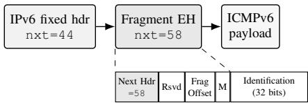

# Explainable Rule Mining of IPv6 Extension-Header Presence Patterns from Paired-Vantage Captures

Priyanka Sinha1, Nikolaos Kekatos2, Stylianos Basagiannis3, Antonio Anastasio Bruto da Costa1, Alexios Lekidis4, Pabitra Mitra1, Tom Nianios2, Elpiniki Papageorgiou4

1IIT Kharagpur, India: {priyanka.sinha.iitg,antonio.cse.iitkgp,pabitra}@gmail.com | 2Clone Systems, CY: {nkekatos,tnianios}@clone-systems.com | 3IHU, GR: basagiannis@ihu.gr | 4Univ. of Thessaly, GR: {alekidis,elpinikipapageorgiou}@uth.gr

Abstract—IPv6 extension headers (EHs), such as fragmentation, segment routing, and in-situ telemetry, are operationally important yet widely dropped in transit, and characterising their behaviour from packet captures is a recurring measurement problem. We ask whether an explainable miner can recover human-readable rules of EH behaviour, and we contribute two reusable tools: a negative-control protocol that diagnoses whether a mined “temporal” network rule reflects genuine cross-packet dynamics or mere within-packet co-occurrence, and a senderconditioned, per-family EH-retention measurement. Applying an interpretable temporal-logic rule miner to the JAMES pairedvantage dataset, we recover a portable Fragment-EH rule that the protocol reveals to be a within-packet, near-definitional cooccurrence rather than a temporal pattern, so the temporal-logic machinery does no work for this dominant rule; the retention measurement independently recovers the expected within-window ordering of EH observability. Our main result is therefore an honest, controlled negative finding, corroborated by executed decision-tree and large-language-model baselines: on the evaluated JAMES traces network-temporal structure does not carry the dominant Fragment-EH signal, and we supply the controls that establish when it would, validated on a synthetic positive control containing a genuine cross-packet dependency.

Index Terms—explainable AI, temporal logic, specification mining, network traffic analysis, IPv6 extension headers, negative controls, interpretable classification

## I. INTRODUCTION

IPv6 [1] is the current version of the Internet Protocol, the scheme that addresses and routes every packet on the Internet. It was created chiefly because its predecessor, IPv4, was running out of addresses; besides a vastly larger address space, IPv6 was given a simpler and extensible header. Instead of packing optional features into a fixed header, IPv6 carries them in a chain of extension headers (EHs) placed between the main 40-byte header and the data (Fig. 1). Each header points to the next through a Next-Header field, so anything inspecting the packet must read down the chain. Different EHs do different jobs: fragmenting oversized packets, source routing and Segment Routing (SRv6), carrying diagnostics such as Performance and Diagnostic Metrics (PDM) [2] and telemetry, and IPsec security. This design lets operators add network functions without changing the base protocol.

The catch is that many devices along the path, such as firewalls and routers, do not fully process this variable-length chain and, a great deal of the time, simply drop packets that carry extension headers. Because Internet standards are voluntary [3], real deployments diverge from the written specification [4], and EHs are among the starkest examples: since RFC 7872, repeated Internet-wide measurements have found intermediate nodes silently discarding EH-bearing packets, at rates that vary by network operator (Autonomous System, AS), by EH type, and over time [5]–[7]. Anything that relies on EHs, from diagnostics to tunnelling, therefore cannot be trusted to work end-to-end without first measuring it. We treat this as a measurement-and-method problem and are careful not to claim a security consequence our data do not show: EH drop is fail-closed, and we do not assert an exploitable attack surface here.

For a network operator this is a practical problem: before turning on an EH-dependent service, one needs to know which extension headers survive on which paths, and today that answer comes from bespoke, throw-away measurement scripts. What would help is a way to take a batch of captured packets and automatically produce a short, human-readable description of which packet features go with EH presence or absence, and how that varies across measurement points, so the same result both predicts and explains. This is the goal of explainable machine learning [8]: instead of a black box, produce a model whose output is the explanation. Equivalently it is a specification-mining problem [9], learning the rule from observed data rather than writing it by hand. A readable rule is only useful, though, if it reflects real behaviour and not an artefact of how the packets happen to be built, which is exactly what we guard against.

  
Fig. 1. An IPv6 header chain (real capture). The fixed header’s Next-Header (nxt=44) points to a Fragment EH, whose Next-Header (58) points to the ICMPv6 payload (box: its 8 bytes); a middlebox must walk the chain and many instead drop the packet. Our predicates read these markers off the wire: HAS\_FRAG\_EH flags a Fragment header in the chain, and as JAMES probes carry a single EH the fixed-header Next-Header identifies it directly.

PSIMiner [10] fits this formulation. It learns rules in a fragment of metric temporal logic (MTL) [11] as timed sequences of predicates, with inter-event intervals that it can, in principle, refine from data. It has previously been used to explain outcomes of multi-party dialogues [12]; we apply the same pipeline to network packet traces. We deliberately restrict the predicate vocabulary to IPv6-fixed-header fields and EHchain flags: this keeps every mined rule expressible in terms a network engineer reads directly off the IPv6 header, which is the explainability property the design rests on.

Contributions. (i) We cast IPv6 extension-header presence analysis as timed temporal-logic specification mining over labelled pcap captures, with an IPv6-header-only vocabulary as a deliberate explainability constraint (§II). (ii) Our reusable methodological contribution is a negative-control protocol (joint-row permutation, independent-column shuffle, lag-augmented decision-tree) that diagnoses whether a mined “temporal” rule is genuine cross-packet dynamics or withinpacket co-occurrence (§IV). (iii) The headline is a controlled negative finding: across all 21 JAMES paired-vantage receivers the single portable Fragment-EH rule (!PLEN\_MED $\mid = > \# \# [ 0 : 4 ]$ !HAS\_FRAG\_EH, 87.4–98.9%) is a withinpacket, near-definitional co-occurrence, so the temporal-logic machinery does no work for this dominant rule. (iv) Two executed baselines, a decision tree and an LLM rule-miner, reproduce this (§IV-A). (v) A sender-conditioned retention measurement recovers an ordering consistent with prior JAMES findings (§IV-B).

## II. METHODOLOGY

PSIMiner [10] learns properties in a fragment of real-time temporal logic [11] restricted to the future operator $\langle \rangle _ { [ a , b ] }$ conjunctions of predicates over packet attributes, and Boolean implication:

$$
\varphi : = \phi \wedge \diamondsuit _ { [ a , b ] } \varphi ^ { \prime } \mid \phi , \phi :  { S } \to  { S } ,\tag{1}
$$

where S is a Boolean expression over a finite set of ground predicates on the trace attributes. This fragment captures properties of the form “after event A, within [a, b] time units event B occurs,” including chained sequences with non-deterministic intervals, but stops short of full MTL: the restriction keeps mining tractable while preserving an interpretable surface syntax.

Given a labelled trace corpus and a target outcome predicate $E ,$ specification mining learns candidate $\varphi$ such that $\varphi  E$ holds frequently enough in the data to be useful. The learned $\varphi$ is itself the explanation: unlike post-hoc attribution, the mined rule is a global, human-readable property of the data, not a local saliency map over a black box.

Algorithm 1 EH-presence rule mining pipeline   
Require: Capture set $\overline { { \mathcal { P } ; } }$ target predicate $E ;$ PSIMiner tem  
plate parameters $( n , k , d , \ell )$   
Ensure: Ranked timed rules $\{ \varphi _ { i } \Rightarrow E \}$ with correlations $\alpha _ { i }$   
1: for $p \in \mathcal P$ do   
2: $T _ { p } \gets$ TSHARKPROJECT(p) ▷ per-packet CSV   
3: $\hat { T } _ { p } \gets \mathbf { B U C K E T I Z E } ( T _ { p } )$ ▷ Boolean predicates   
4: end for   
5: $\mathcal { R } \gets \mathrm { P S I M I N E R } \big ( \{ \hat { T } _ { p } \} _ { p } , E ; \ n , k , d , \ell \big )$   
6: return SORTBYCORRELATION(R)

## A. Pipeline overview

The pipeline has three stages: (1) parse each pcap into a comma-separated-value (CSV) time series of attributed packet events; (2) choose a target predicate that varies inside each trace, such as an IPv6 EH presence flag like HAS\_FRAG\_EH (nxt = 44), together with a small set of ground predicates over packet attributes; (3) run PSIMiner on the corpus and inspect the mined rules. The mined rule is the explanation; there is no post-hoc explainer and no language model in the mining core. Algorithm 1 summarises the procedure.

## B. Trace representation

We parse each capture with tshark and project it onto a fixed per-packet schema with the relative timestamp in the first column. To keep the analysis strictly within the IPv6 header (the explainability constraint), we use only IPv6-fixedheader fields and IPv6 Next-Header chain markers; upper-layer protocol facts and measurement-process facts are intentionally excluded.

• nxt: IPv6 Next Header value flagging presence of each EH (categorical; 0 Hop-by-Hop, 43 Routing, 44 Fragment, 50 ESP, 51 AH, 60 Destination Options).

• plen: IPv6 Payload Length (bytes), bucketed.

• hlim: IPv6 Hop Limit, bucketed.

• flow: IPv6 Flow Label, as a zero/non-zero binary.

Each EH type becomes its own binary predicate (HAS\_HBH\_EH, HAS\_RT\_EH, HAS\_FRAG\_EH, HAS\_ESP\_EH, HAS\_AH\_EH, HAS\_DST\_EH); presence is never bunched into a single HAS\_EH flag. Payload Length is bucketed using protocol-semantic thresholds: a small ICMPv6 echo without an EH has a 56-byte payload; with a fragment header it sits in larger buckets, and the SRv6 header expands the IPv6 portion by 24+ bytes. We expose four plen predicates (PLEN\_SMALL ≤ 64 B, PLEN\_MED ≥ 128 B, PLEN\_BIG ≥ 512 B, PLEN\_HUGE ≥ 1280 B), two hlim predicates (HLIM\_LOW ≤ 16, HLIM\_HIGH ≥ 200), and one flow predicate (FLOW\_ZERO). The cut-points are protocol-driven rather than data-driven quantiles; §V-A discusses the trade-off. Note that the vocabulary contains no AS or vantage predicate: the pipeline cannot, by construction, emit an AS- or provider-conditioned rule, and we do not claim it can (§V-B).

## C. Temporal pattern mining with PSIMiner

PSIMiner is parameterised by an explanation template

$$
{ \cal B } _ { n } \# \# [ 0 ; k ] \cdots \# \# [ 0 ; k ] { \cal B } _ { 0 } \longmapsto E ,\tag{2}
$$

where each $B _ { i }$ is a bucket of zero or more predicates, n and k are meta-parameters, and E is the target. The template has $n + 1$ buckets separated by intervals of up to k time units. Read in English: “if $B _ { n }$ holds, and within 0 to k time units $B _ { n - 1 }$ holds, and so on until $B _ { 0 } .$ , then E holds.” During learning PSIMiner decides which predicates populate which buckets and may leave buckets empty. Each output rule is annotated with a correlation metric [10]. It measures, for $S \ \Rightarrow \ E$ , a target-coverage (recall) quantity, the fraction of E-observations that have a matching S in the antecedent window, i.e. approximately $P ( S \mid E )$ , not the implication confidence $P ( E \mid S )$ . The two differ sharply on this corpus: every Fragment-EH packet is medium-payload, so P(PLEN\_MED | HAS\_FRAG\_EH) = 1.00 (coverage) while only P(HAS\_FRAG\_EH | PLEN\_MED) = 0.81 (confidence). We therefore report coverage and confidence separately (§IV-A) and never read a high coverage as an implication. Correlation is a data-fit measure over the received trace; §IV returns to what it does and does not certify. The recurring 93.04/87.1/97.2% are one within-packet link scored differently: native coverage of the negative rule !MED⇒!FRAG, the positive forward rule MED⇒FRAG, and a validator re-score, respectively.

a) Correlation vs. causation: We use “causal” only in PSIMiner’s sense: temporal precedence plus statistical association (Granger [13]), not intervention or counterfactuals (Pearl [14]); the mined rules are correlational statements conditional on temporal ordering, and any causal reading rests on the measurement campaign’s design, not the mining algorithm.

## D. Public datasets

We rely exclusively on publicly available IPv6 EH data.

a) amwalding IPv6 EH pcap collection [15]: A curated public set of pcapng fixtures covering Hop-by-Hop, Fragmentation, Routing/SRv6, and ESP. Volumes are small (1 to 65 packets/file) but the byte-level layouts are real; we use it as a sanity substrate (§III-A).

b) JAMES measurement dataset [7]: An Apache-2.0, paired-vantage IPv6 EH corpus (ULiège; IMC 2022) across 21 controlled Internet-wide vantage cities, whose dualvantage structure makes EH stripping directly observable. JAMES ships per-vantage received\_traffic.pcap captures (≈35–40k packets/receiver) and per-source experiment timestamps documenting which EH variants were sent (frag512m0, frag1280m0, RoutingType0–6, Dest\*skip, HbH\*skip, etc.). Our pipeline ingests the receiver pcaps directly via the tshark projection.

## III. RESULTS

We report: (i) the pipeline runs end-to-end on the amwalding substrate (§III-A); (ii) at measurement scale on the JAMES receiver pcaps it produces a single portable high-correlation rule that the controls in §IV identify as within-packet (§III-B).

We report mined rules verbatim as ANTECEDENT $\Rightarrow \# \# [ a :$ b] CONSEQUENT; correlation is PSIMiner’s data-fit metric.

## A. Pipeline on the amwalding substrate

The amwalding fixtures (1–65 packets/file, 79 combined) run end-to-end with the IPv6-only vocabulary, parsing every file and ingesting all EH types present (Hop-by-Hop, Routing, Fragment, ESP). With so few packets per file the mined rules are unstable and setup-dependent, so we treat this substrate purely as a sanity check that the pipeline parses public EH data correctly and draw no measurement-scale conclusion; all quantitative results below are on the JAMES corpus.

## B. Mining at scale on JAMES receiver pcaps

We run the same pipeline on the JAMES received\_traffic.pcap captures. After tshark projection AMS and TYO become time series of 38,692 and 35,031 packets carrying a mix of EHs in operationally relevant volumes (at AMS: 11,838 Destination-Options, 10,369 Routing, 7,783 Fragment packets). We use seqLength = 4, depth = 5, bestPredCount = 8, delayRes = 1.0.

a) A single antecedent, portable across all 21 vantages: With target HAS\_FRAG\_EH the dominant rule is the same on every JAMES receiver:

$$
! { \mathrm { P L E N \_ M E D } } \quad | = > ~ \# \# \left[ 0 : 4 \right] \quad ! { \mathrm { H A S \_ F R A G \_ E H } }
$$

i.e. packets whose payload is not medium-or-larger are followed within 4 seconds by no Fragment EH. The pipeline mines the identical antecedent across all 21 JAMES receiver vantages (four continents, 757,932 packets), with correlation in the band 87.4–98.9%. §IV shows why the rule is so portable: it is a within-packet regularity that is near-definitional on this corpus, so it recurs wherever Fragment probes are received.

$b ) ~ ^ { \ \ast } B y$ construction”: the antecedent is neardefinitional: On the AMS receiver, all 7,783 Fragment-EH packets (nxt = 44) carry plen ≥ 128 (minimum observed payload 458 B); P(HAS\_FRAG\_EH) = 0.201. This is a senderside property of how JAMES forges probes: Fragment probes are generated at ≥ 512 B (frag512m0/frag1280m0), not a property of the network path. Consequently !PLEN\_MED ⇒ !HAS\_FRAG\_EH is a near-definitional within-packet statement: because the antecedent is satisfied on the same packet as the (negated) consequent, the ##[0:4] interval is not doing any work.

c) Auxiliary targets: Mining HAS\_HBH\_EH returns no rule above threshold; Hop-by-Hop is absent at every vantage except Sydney (509 packets, <1.5%), consistent with the JAMES finding that it is the most aggressively dropped category. Mining HAS\_DST\_EH/HAS\_RT\_EH surfaces negative rules whose antecedents are other EH flags, reflecting the JAMES schedule of testing one EH variant per window, i.e. the temporal dimension of the data is the probe clock, not network dynamics.

## IV. ROBUSTNESS, BASELINES, AND RETENTION

We assess the JAMES-scale rule along several axes that together form the paper’s reusable methodological contribution: a protocol that tells whether a mined “temporal” rule

TABLE I

CONSOLIDATED RULE TAXONOMY (AMS RECEIVER). Score IS CONFIDENCE (RS1 SAME-PACKET, RS5 WINDOW-CONDITIONED) OR forward ordered correlation (RS2–RS4), THE FRACTION OF CONSEQUENT EVENTS WHOSE ANTECEDENT OCCURS IN THE STATED PRECEDING

INTERVAL UNDER THE ORIGINAL PACKET ORDER; perm IS THE JOINT-ROW-PERMUTED SCORE (20 DRAWS) AND ∆ IS SCORE MINUS PERM.

<table><tr><td>Rule</td><td>score</td><td>perm</td></tr><tr><td colspan="3">RS1 same-packet structure (confidence): within-packet</td></tr><tr><td>FRAG →MED</td><td>100.0</td><td></td></tr><tr><td> $\mathrm { M E D } \to \mathrm { F R A G }$ </td><td>80.6</td><td></td></tr><tr><td colspan="3">RS2 MED ⇒ FRAG delay sweep (fwd): within-packet + probe-burst</td></tr><tr><td>##[0:4] (incl. same-pkt)</td><td>87.1</td><td></td></tr><tr><td>##[€:4]</td><td>86.9</td><td>59.3</td></tr><tr><td>[1pk:4pk] (cross-pkt) RS3 persistence (fwd): measurement-temporal (bursty)</td><td>79.2</td><td>+20</td></tr><tr><td colspan="3">FRAG ⇒[1pk:4pk] FRAG 96.6 59.3</td></tr><tr><td></td><td></td><td>+37</td></tr><tr><td colspan="3">RS4 cross-EH succession (fwd): measurement-temporal (probe clock) 91.7</td></tr><tr><td> $\mathrm { D S T } \Rightarrow \mathrm { R T }$ </td><td>12.2</td><td>-80</td></tr><tr><td> $\mathrm { R T } \Rightarrow \mathrm { F R A G }$ </td><td>10.8</td><td>-73</td></tr><tr><td colspan="3">83.4 RS5 sender-window retention (conf): paired-vantage</td></tr><tr><td>DST</td><td>55.3</td><td></td></tr><tr><td>RT</td><td>47.4</td><td></td></tr><tr><td>FRAG</td><td>44.3</td><td></td></tr><tr><td>HBH</td><td>0.0</td><td></td></tr></table>

Scores in % (RS1/RS5 confidence; RS2–RS4 forward correlation).  
MED = PLEN\_MED; EH names abbreviate HAS\_∗\_EH; pk = packet lag  
Order-independent (within-packet) rules have ∆ ≈ 0; large |∆| marks order-dependence, which here traces to the JAMES probe schedule. perm is shown only for the cross-packet RS2 [1pk:4pk] (the others mix same-packet and window effects); it falls to the base rate (59.3%): probe-burst, not within-packet.

is genuine cross-packet dynamics or within-packet structure. Table I organises the analysis into five rule sets under one reporting scheme, progressing from same-packet structure to paired-vantage retention; we then detail each control below.

Table I shows this directly: the headline size–fragment rule is order-independent (within-packet, ∆ ≈ 0), while RS3, RS4, and even the strictly-cross-packet RS2 variant are orderdependent and trace to the probe schedule, not network dynamics. We detail the controls below.

a) Joint-row permutation control: For each receiver we randomly permute the complete per-packet IPv6-header tuple (nxt, plen, hlim, flow) across rows (ajoint-row permutation: it preserves the within-packet joint distribution and marginal frequencies but destroys temporal ordering), then re-mine. The top rule does not collapse: at AMS the re-mined correlation rises from 93.04% to 100.00% and at TYO from 94.31% to 96.46%. To confirm this is not a single-draw artefact, we re-evaluate the fixed rule’s validator correlation over 20 independent permutations: it is 100.0±0.00% for the headline within-packet rule (invariant), against an ordered value of 97.2%, whereas a cross-EH rule such as HAS\_FRAG\_EH |=> !HAS\_DST\_EH moves from 42.3% (ordered) to 99.6±0.08% (permuted). This rise is expected: the JAMES schedule blocks EH families in time, so cross-family successions are rare in order but permutation creates artificial adjacency that inflates coverage (the mechanism behind RS4’s negative ∆). A rule that is invariant to temporal order is a within-packet cooccurrence, not a temporal pattern.

b) Independent-column shuffle: A stronger control permutes each IPv6-header predicate column independently, destroying the within-packet HAS\_FRAG\_EH ↔ PLEN\_MED association. Over 20 independent such shuffles the size→fragment confidence collapses from 0.806 to $0 . 2 0 0 \pm 0 . 0 0 3$ (the base rate), and PSIMiner returns no rule above threshold. The two controls localise the explanatory signal precisely: it lives in the within-packet IPv6 geometry, and only there.

c) Rule complexity vs. correlation: does temporal structure pay off?: PSIMiner’s template natively expresses multibucket (cross-packet) sequences, so we searched for the best rule at each antecedent complexity, i.e. number of temporal buckets, across all six EH targets. The strongest rule by far is single-bucket and within-packet (93.04%). The best genuinely two-bucket rule, !HAS\_DST\_EH ##[0:1] $\mathrm { P L E N \_ M E D } \quad | = > \ \downarrow \mathrm { H A S \_ R T \_ E H }$ , reaches only 24.8%, and the best three-bucket rule only 2.3%; no four-bucket rule scores above the two-bucket value (a released script regenerates the search, each target completing in 3–27 s after retrying the non-deterministic crash). Correlation collapses as the rule becomes genuinely temporal: the more a rule relies on crosspacket timing, the weaker it is on this corpus.

The order-dependent rules are real, so the machinery is not inert in general: under permutation the RS3/RS4 rules (Table I) swing by 37–80 pp, against ∆ ≈ 0 for the within-packet headline. As a positive control, a synthetic trace in which a marker deterministically causes a target two packets later (38,692 rows, marker prevalence 0.20, fixed seed, 20 permutations) scores 99.99% ordered but collapses to the base rate (59.0%, ∆ = +41) under permutation, so the protocol correctly flags a genuine cross-packet rule, not only rejects one. Permutation alone gives the order-independent/order-dependent split; telling measurement-temporal (the probe clock) from network-temporal rests on the probe schedule. Here every order-dependent effect is measurement-temporal; the networktemporal regime is absent.

d) Decision-tree cross-check: As a finite-window baseline we train a scikit-learn decision tree (DT) on the AMS receiver with the same bucketised vocabulary. A depth-5 per-row tree reaches 96.93% full-data accuracy; the number generalises rather than being a training-only artefact: at a chronological 70/30 split (train first, test last, in time order) test accuracy is 98.1% (precision 0.93, recall 1.00, positive class HAS\_FRAG\_EH), and a stratified 5-fold cross-validation gives $9 6 . 9 \pm 0 . 2 \%$ . Extending the features with row-lagged predicates at K ∈ {1, 2, 4} (the closest analogue to a finite context window) makes no marginal difference (chronological test accuracy 0.981 → 0.978 as K grows): the tree finds no useful split on a lagged feature. The within-packet geometry already saturates the task, so temporal context is inert: not evidence our method beats a tree, but confirmation of the negative result.

e) One-dimensional hyperparameter ablation: We sweep each of (seqLength, depth, delayRes) around the baseline (4, 5, 1.0) on AMS with the other two fixed (Table II). The antecedent ¬PLEN\_MED is invariant at every grid point. Correlation is flat in depth (93.04% throughout) and rises gently with seqLength and delayRes. The mined interval upper bound is exactly seqLength × delayRes at every cell (Table II). The learned interval is thus hyperparameterdetermined, not data-refined, on this corpus: PSIMiner’s datarefinement is a capability the within-packet corpus does not exercise, so nothing about the interval is learned from crosspacket timing here.

TABLE II  
HOLE-FREE ONE-DIMENSIONAL ABLATION ON THE AMS RECEIVER, HAS\_FRAG\_EH TARGET, IPV6-ONLY VOCABULARY. BASELINE (seqLength, depth, delayRes) = (4, 5, 1.0) IN BOLD. THE MINED INTERVAL UPPER BOUND EQUALS seqLength × delayRes EXACTLY (HYPERPARAMETER-DETERMINED). ALL CELLS COMPLETED ON RETRY (THE PSIMINER 1.1 CRASH IS NON-DETERMINISTIC).
<table><tr><td>Axis</td><td>Value</td><td>corr (%)</td><td>supp (%)</td><td>mined ##[0:k]</td></tr><tr><td rowspan="4">seqLength</td><td>2</td><td>92.28</td><td>79.78</td><td>##[0:2]</td></tr><tr><td>3</td><td>92.66</td><td>80.11</td><td>##[0:3]</td></tr><tr><td>4</td><td>93.04</td><td>80.44</td><td>##[0:4]</td></tr><tr><td>5</td><td>93.40</td><td>80.75</td><td>##[0:5]</td></tr><tr><td rowspan="4">depth</td><td>3</td><td>93.04</td><td>80.44</td><td>##[0:4]</td></tr><tr><td>4</td><td>93.04</td><td>80.44</td><td>##[0:4]</td></tr><tr><td>5</td><td>93.04</td><td>80.44</td><td>##[0:4]</td></tr><tr><td>6</td><td>93.04</td><td>80.44</td><td>##[0:4]</td></tr><tr><td rowspan="3">delayRes</td><td>0.5</td><td>92.28</td><td>79.78</td><td>##[0:2]</td></tr><tr><td>1.0</td><td>93.04</td><td>80.44</td><td>##[0:4]</td></tr><tr><td>2.0</td><td>94.41</td><td>81.62</td><td>##[0:8]</td></tr></table>

f) On the PSIMiner segfaults: The public PSIMiner 1.1 build exhibits a non-deterministic crash (SIGSEGV): the same configuration completes on some runs and crashes on others (even the baseline crashed once), so it is a tool memory-safety bug independent of the grid point, not a signal about any configuration. We retry each cell until it completes; every cell in Table II is populated within 1–3 attempts and the grid has no holes. A hardened build is engineering future work.

g) Cross-vantage bootstrap: Resampling the n = 21 pervantage correlations with replacement $( B \ = \ 1 0 , 0 0 0 )$ gives a bootstrap 95% interval on the mean of [93.60%, 96.08%] (mean 94.86%, s.d. 2.89): the within-packet rule has a central tendency in the mid-nineties across the JAMES set rather than being driven by one capture. This interval describes variability within the 21 JAMES receivers; it is not a population-level confidence interval over Internet vantage points, ASes, or deployments.

## A. Executed baseline: LLM rule-miner

The decision tree isolates the propositional half of a generative-plus-logical miner such as NetNomos [16]. As its generative complement we run an LLM rule-miner and score its proposals with an independent validator. This baseline is executed, not illustrative: candidates come from a live model and every correlation is computed deterministically by rule\_validator.py on the full trace, so the numeric column is reproducible from the released artefacts (only the model’s free-text proposals carry run-to-run variance).

a) Setup: We prompt Claude Opus 4.8 with (i) the 13- predicate IPv6-header vocabulary, (ii) the rule template, and (iii) a 200-row uniform random sample of the AMS trace (fixed seeds 2026–2028). The model returns 1–3 candidate rules in a strict JSON schema; we validate each on the full 38,692-row trace.

b) Findings: The model consistently proposes the polar inverse of the PSIMiner rule, PLEN\_MED $\lvert = > \rvert \# \# [ 0 : \operatorname { k } ]$ HAS\_FRAG\_EH, at 100% coverage (again the within-packet plen ≥ 128 link, not an implication: its confidence is only 0.81). An HLIM\_HIGH rule validates at 97.57% and a conjunctive rule at 95.41%. The model also proposes $\begin{array} { r } { \mathrm { H A S \_ D S T \_ E H } \quad | \mathrm { = } \mathrm { > } \quad \# \# \left[ \mathrm { 0 : 4 } \right] \quad \mathrm { H A S \_ F R A G \_ E H } } \end{array}$ , which the validator rejects at 20.75% (Destination-Options and Fragment probes run in disjoint windows), exactly the plausible-butwrong guess the verifier exists to filter. The LLM converges on the same within-packet size↔fragment link, reinforcing the negative finding.

These baselines are complementary diagnostics, not a headto-head benchmark (accuracy vs. correlation/support are not a shared metric); their shared message is that three independent methods converge on the same within-packet explanation.

## B. Sender-window-conditioned retention

Toward survival given a known sender configuration, we joined the JAMES per-source probe labels to the AMS receiver trace (each CSV row is 1:1 with a pcap frame; absolute time t + min(epoch) reconstructed to within $1 . 6 \times 1 0 ^ { - 7 } \colon$ s of the original frame time). This is not a full survival analysis: packets are not matched individually, and only $1 4 { , } 1 6 3 / 3 8 { , } 6 9 2 = 3 6 { . } 6 \%$ fall inside a probe window (reliable only at the ≈90 s family-block granularity). The windowconditioned retention $P ( { \mathrm { r e c v } } \ = \ x \mid \ { \mathrm { s e n t } } \ = \ x )$ (RS5, Table I) produces an ordering consistent with prior JAMES observations: Destination Options 55.3%, Routing 47.4%, Fragment 44.3%, Hop-by-Hop 0%, each with lift >1.7; the apparent SENT\_DST→RECV\_FRAG “transformation” has lift 0.42, i.e. none (IPv6 fragmentation is source-side, not in transit). Adding SENT\_\* predicates still leaves the withinpacket rule !PLEN\_MED |=> ##[0:4] !HAS\_FRAG\_EH (93.0%) dominant, sender labels entering only low-correlation (4.1%), negligible-support rules: conditioning on what was sent adds no predictive lift, so even this yields a within-packet, presence-level result. True per-probe survival, needing packetlevel matching, remains future work.

## V. DISCUSSION

## A. Threats to validity

The amwalding fixtures are tiny; the rule recovered there is a sanity check, not a measurement finding. Predicate cutpoints are protocol-driven, not data-driven quantiles, which keeps them stable but ties them to the EH geometry. Most importantly, the central rule is a within-packet, partly senderimposed regularity (§III-B, §IV); its 87–99% portability reflects that near-definitional link, not a discovered temporal pattern, and the “temporal” axis of this corpus is the JAMES probe clock. The evidence is also from a single controlledprobe corpus (JAMES); our MAWI check (§V-B) found EHs essentially absent from natural traffic, so external validity, and generality to EH targets beyond Fragment, is future work. As in §II-C, the mined rules report correlation under temporal precedence, not interventional causation.

## B. Related work and future directions

The provider-level observations that motivate this work, e.g. the per-AS Routing-Header drop tables of the JAMES IETF draft [17] (DigitalOcean/OVH on the RH0/RH4 lists, Vultr clean, hyperscalers uncovered), are the draft’s findings, not products of our AS-agnostic pipeline; we use them as motivation, not results. Our work spans five threads: EH survivability measurement (RFC 7872; JAMES [7], [18]), which asks whether EHs survive where we ask whether their presence carries structure; logic/invariant mining from traces (NetNomos [16]); temporal-logic mining and runtime verification [10], [19], [20]; interpretable-by-design models [8]; and association-rule metrics [21], whose conflation of cooccurrence with implication is exactly why we separate coverage, confidence, and lift and use permutation controls. Net-Nomos differs from us in representation (data-refined intervals vs. a fixed window), which does not matter here since the signal is within-packet.

a) Future work: The concrete next step is a full sender-labelled survival campaign restricted to probe windows (§IV-B). For external validity we re-ran the pipeline on natural backbone traffic. In the MAWI archive [22] (samplepoint-F, file 202512311400.pcap.gz, a 15-min backbone capture read with tshark -Y ipv6), the 2025-12-31 trace held 8.2M IPv6 frames but only 490 Hop-by-Hop and 18 Fragment EHs and no Routing, Destination-Options, ESP, or AH headers: extension headers are vanishingly rare (about 0.006%) in this sampled backbone trace, so EH behaviour must be measured by active probing, as JAMES does. A hyperscaler (Google/Azure/AWS) campaign instantiating the cloud EHtesting methodology [23] would close the coverage gap; an 8-capture Vultr-vs-Google PDM pilot is only a preliminary observation. An LLM-driven rendering pass could phrase mined rules against the relevant RFCs (RFC 8200 [1], RFC 8250 [2]).

## VI. CONCLUSION

We studied an explainable pipeline that mines IPv6 extension-header presence patterns from packet traces as short timed temporal-logic rules, where the mined rule is the explanation. On all 21 JAMES paired-vantage receivers the pipeline recovers one portable antecedent for Fragment-EH presence (87.4–98.9%), but our negative-control protocol shows this is a within-packet co-occurrence that is neardefinitional by JAMES probe construction, so the metrictemporal-logic machinery is inert for the dominant Fragment-EH rule on this corpus. A decision tree and an executed LLM rule-miner independently reproduce the finding. The contribution we stand behind is therefore twofold: a controlled negative result (network-temporal structure does not carry the dominant Fragment-EH signal on these real traces), and the reusable negative-control protocol (joint-row permutation, independentcolumn shuffle, lag-augmented tree) that diagnoses exactly when a mined “temporal” network rule is genuine and when it is within-packet structure in disguise.

## ACKNOWLEDGMENT

This work has received funding from the European Union’s Digital Europe Programme under grant agreement No 101190251 (CYBERGUARD). Code and the derived per-vantage CSVs are available at https://github.com/ nikos-kekatos/ipv6-eh-rule-mining.

## REFERENCES

[1] S. Deering and R. Hinden, “Internet Protocol, Version 6 (IPv6) Specification,” RFC 8200, IETF, Jul. 2017.

[2] N. Elkins, R. Hamilton, and M. Ackermann, “IPv6 Performance and Diagnostic Metrics (PDM) Destination Option,” RFC 8250, IETF, Sep. 2017.

[3] M. Nottingham, “The Internet is for End Users,” RFC 8890, IETF, Aug. 2020.

[4] K. Moriarty, “Coordinating Attack Response at Internet Scale 2 (CARIS2) Workshop Report,” RFC 8953, IETF, Dec. 2020.

[5] F. Gont, J. Linkova, T. Chown, and W. Liu, “Observations on the Dropping of Packets with IPv6 Extension Headers in the Real World,” RFC 7872, IETF, Jun. 2016.

[6] L. Hendriks et al., “Threats and surprises behind IPv6 extension headers,” in Network Traffic Measurement and Analysis Conference (TMA), 2017.

[7] R. Léas, J. Iurman, É. Vyncke, and B. Donnet, “Measuring IPv6 extension headers survivability with JAMES,” in Proc. ACM Internet Measurement Conference (IMC), 2022, pp. 746–747.

[8] C. Rudin, “Stop explaining black box machine learning models for high stakes decisions and use interpretable models instead,” Nature Machine Intelligence, vol. 1, no. 5, pp. 206–215, 2019.

[9] D. Basin et al., “It takes a village: bridging the gaps between current and formal specifications for protocols,” Communications of the ACM, 2025. doi:10.1145/3706572.

[10] A. A. Bruto da Costa and P. Dasgupta, “Learning temporal causal sequence relationships from real-time time-series,” Journal of Artificial Intelligence Research, vol. 70, 2021.

[11] R. Alur and T. A. Henzinger, “Real-time logics: complexity and expressiveness,” in Proc. 5th IEEE Symp. Logic in Computer Science, 1990.

[12] P. Sinha, P. Mitra, A. A. Bruto da Costa, and N. Kekatos, “Explaining outcomes of multi-party dialogues using causal learning,” in Proc. SUD’21 workshop at WSDM 2021, 2021. arXiv:2105.00944.

[13] C. W. J. Granger, “Investigating causal relations by econometric models and cross-spectral methods,” Econometrica, vol. 37, 1969.

[14] J. Pearl, Causality: Models, Reasoning, and Inference, 2nd ed. Cambridge University Press, 2009.

[15] A. Walding, “IPv6 Extension Header PCAPs,” GitHub repository, 2018–.

[16] H. Hè, M. Jin, and M. Apostolaki, “Making logic a first-class citizen in generative ML for networking,” arXiv:2506.23964, 2025.

[17] É. Vyncke, J. Iurman, J. Léas, and B. Donnet, “Just Another Measurement of Extension header Survivability (JAMES),” Internet-Draft draft-vyncke-v6ops-james, IETF, 2023–.

[18] J. Iurman and B. Donnet, “The Razor’s Edge: IPv6 extension headers survivability,” in Proc. Passive and Active Measurement Conf. (PAM), LNCS, Springer, 2025. doi:10.1007/978-3-031-85960-1\_1.

[19] A. Temperekidis, N. Kekatos, and P. Katsaros, “Runtime verification for FMI-based co-simulation,” in Runtime Verification (RV), Springer, 2022. doi:10.1007/978-3-031-17196-3\_19.

[20] G. Frehse, N. Kekatos, D. Nickovi ˇ c, J. Oehlerking, S. Schuler,´ A. Walsch, and M. Wöhrle, “A toolchain for verifying safety properties of hybrid automata via pattern templates,” in Proc. American Control Conf. (ACC), 2018.

[21] R. Agrawal and R. Srikant, “Fast algorithms for mining association rules in large databases,” in Proc. 20th Int. Conf. Very Large Data Bases (VLDB), 1994.

[22] K. Cho, K. Mitsuya, and A. Kato, “Traffic data repository at the WIDE project,” in Proc. USENIX Annual Technical Conf., FREENIX Track, 2000.

[23] N. Elkins, P. Sinha, and A. Deshpande, “Deep dive into IPv6 extension header testing: Cloud,” IETF Internet-Draft, 2024.