# FC-SWE: Failure-Conditioned RL for Long-Horizon Software Engineering Agents

Jia Liufu1,2, Bin Hu1, Linglin Jing1, Terry Kong1, Yuki Huang1, Ashwath Aithal1, Wenming Yang2 and Jun Yang1

1NVIDIA, 2Tsinghua University

Abstract: Repository-level software engineering (SWE) is a challenging long-horizon setting: agents must reason over extended interactions, use tools across multiple turns, and adapt to observations from stateful environments. Recent work trains SWE agents with reinforcement learning methods such as Group Relative Policy Optimization (GRPO), which independently sample multiple trajectories per issue, test the resulting patches, and compare terminal rewards within a fixed group. However, this training setup does not reuse verifier feedback from failed patches as context for subsequent attempts, even though this feedback contains valuable diagnostic information about what went wrong. Training on recovery trajectories is challenging because the preceding outcome determines whether the next trajectory is generated, while the failed execution determines its conditioning context. We introduce FC-SWE, a failure-conditioned RL framework that incorporates recovery attempts into policy training. After a patch fails verification, FC-SWE restores the repository to its original task state and uses the failed patch and verifier feedback as context for a recovery trajectory. FC-SWE adapts GRPO to these chains of complete, multi-turn tool-use trajectories through two mechanisms. Trajectory-local rewards preserve each attempt’s verifier outcome, preventing recovery success from rewarding an earlier failed patch. Active-set advantage estimation forms a comparison group from all initial and recovery trajectories actually executed for the same issue, so failed attempts remain in the group while unexecuted attempts are excluded. On all 500 SWE-bench Verified tasks under a verifier-assisted protocol, FC-SWE with Qwen3.5-4B and SWE-agent achieves 41.7% Resolved@1 and 52.8% Resolved@2, compared with 38.9% and 48.5% for GRPO. Although trained with at most two attempts per chain, FC-SWE reaches 70.7% Resolved@11 under an eleven-attempt test-time budget.

## 1. Introduction

Large language models (LLMs) can generate code from natural-language instructions. Coding agents extend this capability by using tools to inspect files, edit code, and run tests, with execution feedback informing subsequent actions (Yang et al., 2024; Wang et al., 2024). These capabilities support repository-level software engineering (SWE), where agents must resolve issues in existing codebases rather than generate standalone programs (Jimenez et al., 2023). Each action can change the repository or reveal information needed for the next decision (Yao et al., 2023; Yang et al., 2024). Solving such tasks therefore requires cycles of inspection, editing, execution, and revision across repeated interactions with the environment.

To improve software reasoning and agent behavior over these extended interactions, recent work has applied reinforcement learning (RL) to repository-level SWE (Wei et al., 2025; Golubev et al., 2025; Luo et al., 2025a). In execution-based pipelines, the sequence of model outputs, tool calls, and environment observations forms a complete trajectory that culminates in a candidate code patch. A test-suite verifier evaluates the patch, and its outcome is used as a terminal reward for policy optimization (Golubev et al., 2025; Luo et al., 2025a). Although efective, training only on independent attempts does not explicitly teach the policy to use the diagnostic information from a failed verification in a subsequent recovery attempt.

A failed verification, however, provides more than a negative outcome: failing tests, error messages, and tracebacks can reveal why the patch was rejected and provide concrete guidance for recovery (Gehring et al., 2024). This creates an opportunity to use not only the failed trajectory’s terminal outcome, but also its diagnostic evidence to guide subsequent attempts (Shinn et al., 2023; Gehring et al., 2024). Incorporating this recovery process into reinforcement learning, however, is not straightforward. A recovery trajectory is generated only after a preceding trajectory fails, and its context is constructed from the failed patch and verifier feedback. Preceding executions therefore determine both which recovery trajectories enter training and the contexts under which they are generated, requiring explicit decisions about how verifier rewards are assigned and which trajectories form the comparison groups for advantage estimation.

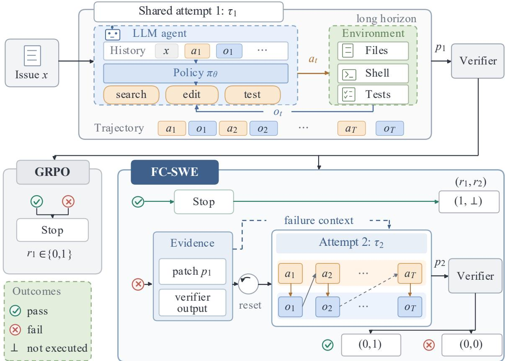  
at: agent action / tool call ot: environment observation rk: verifier reward for the complete attempt k  
Figure 1 | Comparison of trajectory execution in GRPO and FC-SWE. During training, our GRPO baseline samples independent attempts, whereas FC-SWE launches a recovery trajectory after failure, conditioned on the failed patch and verifier output. Each executed trajectory retains its own verifier reward.

To address these challenges, we introduce FC-SWE, a failure-conditioned reinforcement learning framework that incorporates post-failure recovery into policy optimization for long-horizon SWE agents. As illustrated in Figure 1, after a submitted patch fails verification, FC-SWE restores the repository to its original task state, provides the policy with the failed patch and verifier feedback alongside the original issue, and generates a recovery trajectory. This process forms an outcomedependent recovery chain: the initial trajectory is always generated, whereas each recovery trajectory exists only if the preceding trajectory fails.

FC-SWE adapts Group Relative Policy Optimization (GRPO) (Shao et al., 2024) to these recovery chains through two mechanisms. Trajectory-local reward assignment gives each trajectory the verifier outcome of its own patch, so a chain that fails and then recovers retains the rewards [0, 1]; the later success does not change the earlier failure’s label. Active-set advantage estimation pools the initial and recovery trajectories actually executed for the same issue and uses the same leave-one-out reward baseline as our GRPO implementation (Ahmadian et al., 2024). This grouping allows comparisons across attempts while excluding unexecuted recovery slots from chains that have already succeeded.

We evaluate on all 500 SWE-bench Verified tasks using SWE-agent. We compare the initial Qwen3.5-4B policy (Base) with two policies separately trained from it using GRPO and FC-SWE; all three use the same feedback-enabled evaluation controller and attempt budgets. Averaged over three decoding seeds, FC-SWE achieves 41.7% Resolved@1 and 52.8% Resolved@2, compared with 27.9% and 36.3% for Base, and 38.9% and 48.5% for GRPO (Table 1). At a matched two-attempt budget, feedback-conditioned recovery performs worse than independent resampling for Base and GRPO but better for FC-SWE; context ablations further show that verifier evidence improves recovery beyond patch-only conditioning (Section 4.4). Although trained with at most two attempts per chain, the same FC-SWE policy reaches 70.7% cumulative resolution with up to eleven verifier-guided attempts at test time, compared with 67.3% for GRPO (Section 4.5).

Our main contributions are:

• We introduce FC-SWE, a failure-conditioned RL framework for long-horizon SWE agents that extends policy training beyond failed verification by restoring the repository to its original task state and generating recovery trajectories conditioned on failed patches and verifier feedback.

• To optimize these outcome-dependent recovery chains, we introduce two complementary mechanisms. Trajectory-local reward assignment preserves each trajectory’s own verifier outcome, preventing a later recovery success from changing the reward assigned to an earlier failure. Active-set advantage estimation compares the initial and recovery trajectories actually executed for each task while excluding unexecuted recovery slots from group statistics.

• On all 500 SWE-bench Verified tasks, FC-SWE improves over the GRPO baseline trained without recovery trajectories by 2.9 and 4.3 percentage points on Resolved@1 and Resolved@2, respectively. Controlled evaluations further show that FC-SWE benefits from verifier evidence and outperforms independent resampling under the same two-attempt budget. Despite training with at most two attempts per chain, FC-SWE remains ahead of GRPO when evaluated at test time with up to eleven verifier-guided attempts.

## 2. Related Work

Software-engineering agents and RL. SWE-bench evaluates repository-level issue resolution with executable tests (Jimenez et al., 2023), while SWE-agent studies how agent–computer interfaces afect performance (Yang et al., 2024). OpenHands, SWE-Gym, and R2E-Gym provide agent infrastructure, training environments, and verifiers (Wang et al., 2024; Pan et al., 2024; Jain et al., 2025). SWE-RL learns from software evolution data (Wei et al., 2025), while other work applies RL to long-context agent trajectories (Golubev et al., 2025; Luo et al., 2025a). Satori-SWE trains agentless iterative patch refinement for test-time scaling using reward diferences between successive patches (Zeng et al., 2025). FC-SWE trains recovery after patch verification through complete tool-use trajectories.

Group-relative and long-horizon agent RL. GRPO uses critic-free group-relative optimization (Shao et al., 2024); DAPO targets stable large-scale reasoning RL (Yu et al., 2025). GiGPO combines episode-level comparisons with groups of steps sharing environment states (Feng et al.,

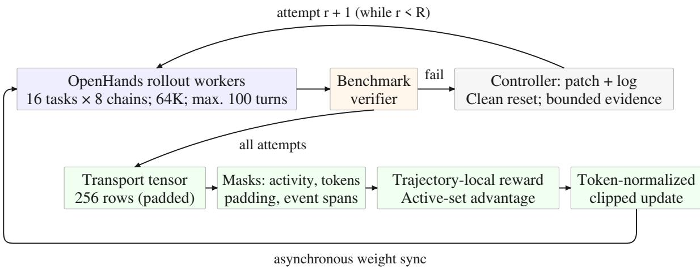  
Figure 2 | End-to-end FC-SWE training system. Rollout workers execute verifier-delimited attempts; failed chains are reset and resumed with bounded failure evidence. Executed trajectories are packed with inactive transport padding, assigned trajectory-local rewards and active-set advantages, and optimized with a token-normalized policy update.

2025), Agent Lightning decomposes agent executions into learning transitions (Luo et al., 2025b), and CompactionRL estimates advantages across context-compaction boundaries (Li et al., 2026b). LaMer restarts failed episodes from the original state, carries reflection forward, and optimizes returns including later outcomes (Jiang et al., 2026). PivoARL retries from error states and isolates future credit from erroneous sufixes (Guo et al., 2026). FC-SWE assigns each complete attempt its own verifier reward and compares only executed initial and recovery trajectories for the same issue.

Feedback and iterative refinement. Self-Refine and Reflexion use feedback without weight updates (Madaan et al., 2023; Shinn et al., 2023), but self-repair can underperform independent resampling for weaker models at fixed generation budgets (Olausson et al., 2024). RISE learns revision from multi-turn data (Qu et al., 2024), while SCoRe trains two-turn self-correction without external feedback at inference (Kumar et al., 2025). RLEF uses public-test feedback for multiturn code-synthesis RL (Gehring et al., 2024), and RefineRL combines a Skeptical-Agent with self-refinement RL for competitive programming (Fu et al., 2026). ContextRL recovers positives from all-negative groups using reference-solution-conditioned mistake reports, then removes failed responses and reports from context before optimizing recovered outputs as standalone samples (Lu et al., 2026). MulFeRL uses feedback to regenerate all-failed groups and combines within-state GRPO with Feedback-Contrastive Optimization across all-failed to all-solved transitions (Li et al., 2026a). FC-SWE triggers recovery per failed trajectory within the attempt budget, restarts from the original repository state, and retains the failed patch and verifier output as context during optimization.

## 3. Method

FC-SWE extends GRPO to outcome-dependent recovery chains: failed attempts trigger new trajectories conditioned on the failed patch and verifier feedback after a clean repository reset. Trajectory-local rewards preserve individual verifier outcomes, while active-set advantage estimation compares executed trajectories for the same issue. Figure 2 summarizes the training pipeline.

## 3.1. Problem Setup and GRPO Baseline

For a software issue $x ,$ we define an attempt as one complete agent run beginning from the issue’s original repository state and ending after its submitted patch is evaluated by the verifier. Each executed attempt produces one trajectory comprising policy outputs, tool calls, and environment observations. We use $\tau _ { c }$ to denote the trajectory of group member � and $y _ { c } \in \{ 0 , 1 \}$ to denote the binary verifier outcome of its submitted patch. The GRPO baseline independently samples a fixed group of � trajectories $\{ \tau _ { c } \} _ { c = 1 } ^ { G }$ for the same issue. Our implementation combines GRPO’s critic-free group-relative policy update (Shao et al., 2024) with a leave-one-out reward baseline (Ahmadian et al., 2024):

$$
b _ { c } ^ { \mathrm { G R P O } } = \frac { 1 } { G - 1 } \sum _ { d \neq c } y _ { d } , \qquad s _ { x , - c } = \mathrm { S t d } ( \{ y _ { d } : d \neq c \} ) ,\tag{1}
$$

$$
A _ { c } ^ { \mathrm { G R P O } } = \left\{ \begin{array} { l l } { \displaystyle \frac { y _ { c } - b _ { c } ^ { \mathrm { G R P O } } } { s _ { x , - c } + \epsilon } , } & { s _ { x , - c } > 0 , } \\ { \displaystyle y _ { c } - b _ { c } ^ { \mathrm { G R P O } } , } & { s _ { x , - c } = 0 , } \end{array} \right.\tag{2}
$$

where $b _ { c } ^ { \mathrm { G R P O } }$ and $s _ { x , - c }$ are respectively the mean and sample standard deviation of the other $G - 1$ trajectory rewards, and $\epsilon = 1 0 ^ { - 6 }$ is a numerical-stability constant.

Unlike FC-SWE, the baseline samples all � trajectories independently; a failed patch neither triggers nor conditions another trajectory in the training group.

## 3.2. Outcome-Dependent Recovery Chains

For each software issue �, each of the � initially sampled trajectories seeds one recovery chain indexed by $c \in \{ 1 , \ldots , G \}$ . Chain � contains at most � attempts, and $\tau _ { c , r }$ denotes the trajectory produced by attempt $r \in \{ 1 , \ldots , R \}$ in that chain. A verifier returns a binary outcome $y _ { c , r } \in \{ 0 , 1 \}$ for every executed trajectory. Let $q _ { c , r } \in \{ 0 , 1 \}$ indicate whether attempt � in chain � is executed. The initial attempt is always active, and the activity of later attempts evolves recursively as

$$
q _ { c , 1 } = 1 , \qquad q _ { c , r } = \left\{ { 1 - y _ { c , r - 1 } } , \quad q _ { c , r - 1 } = 1 , \quad r > 1 . \right.\tag{3}
$$

Thus, a recovery attempt is executed if and only if the preceding attempt was executed and failed. Our main training configuration uses $G = 8$ and $R = 2$

All � initial trajectories are sampled independently, whereas each recovery trajectory is sampled only after its predecessor fails. The preceding verifier outcome determines whether the recovery trajectory exists, while the preceding failed trajectory supplies the evidence on which it is conditioned. Because verifier outcomes depend on policy-generated patches, the policy afects both the trajectory contents and the active set entering the update.

When an executed attempt $r < R$ fails, the controller records its submitted patch and diagnostic verifier output, restores the repository to its original task state, and constructs the context for attempt $r + 1$ as

$$
h _ { c , r + 1 } = \mathscr { C } ( x , \mathrm { p a t c h } ( \tau _ { c , r } ) , \mathrm { v e r i f y } ( \tau _ { c , r } ) ) .\tag{4}
$$

Here, $h _ { c , r + 1 }$ is the context supplied to the recovery attempt, patch $\left( \tau _ { c , r } \right)$ extracts the submitted code patch, and $\mathrm { v e r i f y } ( \tau _ { c , r } )$ denotes the diagnostic verifier output, distinct from the binary outcome $y _ { c , r } .$ The context-construction operator � formats and truncates the original issue and failure evidence to a fixed context budget. Restoring the repository prevents transient files, processes, and tool state from leaking across attempts, while the failed patch and verifier output remain available as explicit diagnostic context for recovery.

For static distributed batching, the implementation may allocate all $G \times R$ rows. Rows with $q _ { c , r } = 0$ are batching placeholders rather than policy-generated trajectories and are excluded from both reward statistics and policy optimization.

## 3.3. Trajectory-Local Verifier Rewards

The first design choice concerns how verifier outcomes are assigned across trajectories in a recovery chain. Each executed attempt begins with the repository in its original task state, produces one complete trajectory and candidate patch, and receives a separate verifier evaluation. FC-SWE assigns each verifier outcome only to the trajectory that produced the corresponding patch:

$$
r _ { c , r } = \left\{ \begin{array} { l l } { y _ { c , r } , } & { q _ { c , r } = 1 , } \\ { \perp , } & { q _ { c , r } = 0 , } \end{array} \right.\tag{5}
$$

where $r _ { c , r }$ is the training reward associated with trajectory $\tau _ { c , r ; }$ , and ⊥ denotes an attempt position that was never executed rather than a trajectory with zero reward. For $R = 2$ , the possible reward sequences are [1, ⊥] after initial success, [0, 1] after successful recovery, and [0, 0] after two failures.

One alternative is to broadcast the final chain outcome to every executed trajectory in the chain. A recovered chain with verifier outcomes [0, 1] would then receive training rewards [1, 1], incorrectly assigning a positive reward to the rejected initial patch solely because a later policy invocation succeeded. At the opposite extreme, optimizing only the final executed trajectory would remove the preceding failed trajectories from the policy loss, eliminating the rejected behavior that provides contrast for the successful recovery. FC-SWE instead retains every executed trajectory and preserves its own verifier outcome. A later success therefore does not alter an earlier trajectory’s reward label, although it can afect that trajectory’s relative advantage through the comparison set defined in the next section.

## 3.4. Active-Set Advantage Estimation

We retain the leave-one-out reward baseline (Ahmadian et al., 2024) and the normalization convention of our GRPO implementation (Equation 2). The change is the comparison group: for each issue �, we pool all executed initial and recovery trajectories,

$$
\mathcal { V } _ { x } = \{ ( c , r ) : q _ { c , r } = 1 \} .\tag{6}
$$

Trajectories are grouped by the original issue, even when their failure-conditioned contexts difer. For $i = ( c , r ) \in \mathcal { V } _ { x }$ with reward $r _ { i } = r _ { c , r }$ , the baseline is

$$
b _ { i } = \frac { 1 } { \left| \mathscr { V } _ { x } \right| - 1 } \sum _ { j \in \mathscr { V } _ { x } \atop j \neq i } r _ { j } .\tag{7}
$$

We obtain $A _ { i }$ by normalizing $r _ { i } - b _ { i }$ using the sample standard deviation of these same comparison rewards, with the zero-variance fallback in Equation 2. Inactive rows enter neither the reward statistics nor the loss.

For a recovered chain with rewards [0, 1], this grouping gives the successful recovery a positive advantage and the preceding failure a negative advantage, without changing either reward. It excludes padding while preserving cross-attempt comparisons that separate attempt-index groups would omit. Because recovery trajectories exist only after failure, the comparison set is outcome-dependent; this update does not inherit the standard unbiasedness guarantee of an action-independent baseline.

## 3.5. Policy Optimization

Trajectory advantages are broadcast to valid policy-generated tokens and optimized with a clipped policy-gradient objective (Schulman et al., 2017), normalized by the total number of valid generated tokens across the distributed batch. Prompts, environment observations, copied failure context, and padding receive zero loss weight. A failed patch is loss-bearing only in the trajectory that generated it, not when copied into a recovery prompt. For assistant messages flagged as invalid tool calls or malformed thinking, token advantages are overwritten with −5. These runtime-local penalties and optimization settings are shared by GRPO and FC-SWE, except where explicitly ablated.

## 4. Experiments

## 4.1. Experimental Setup

Evaluation. We evaluate on all 500 SWE-bench Verified tasks (Jimenez et al., 2023) using SWEagent (Yang et al., 2024). The controlled Qwen3.5-4B comparison uses the same feedback-enabled controller and attempt budgets, with a 64K-token context and at most 100 model–tool interactions per attempt. Execution stops after success or budget exhaustion. Unless otherwise specified, retries use a clean reset and failure context as defined in Section 3.2. Verifier choice is discussed in Appendix A. We report first-attempt and cumulative verifier-assisted success, together with conditional recovery (Table 1), rather than independent-sampling Pass@�.

Training and baselines. Training uses 4,518 tasks from ten R2E-Gym repositories (Jain et al., 2025), with rollouts generated using OpenHands (Wang et al., 2024). We use the initial Qwen3.5-4B policy as Base. Starting from this same policy, we separately train GRPO and FC-SWE for the controlled comparison. Both RL methods sample 16 tasks with eight initial trajectories per task at each optimization step; FC-SWE additionally generates one recovery trajectory after each initial failure. Qwen3.5-9B and Nemotron-3-Nano-4B provide cross-model reference results. Unless stated otherwise, benchmark results use three decoding seeds, with aggregation defined in Table 1. Hyperparameters and checkpoint-selection details appear in Appendix B, per-seed results in Appendix E, and cross-model runtime settings in Appendix F.

## 4.2. FC-SWE Improves Initial Solving and Recovery

Table 1 reports results for the evaluated models and the two policies trained from Qwen3.5-4B. Within this same-model comparison, GRPO raises first-attempt resolution from 27.9% to 38.9%. FC-SWE further improves Resolved@1 to 41.7% and Resolved@2 to 52.8%. Among initial failures, its conditional recovery reaches 19.0%, compared with 15.7% for GRPO and 11.6% for Base. Thus, the recovery-training configuration improves benchmark recovery without sacrificing first-attempt performance.

Figure 3(a) shows that second-attempt recovery contributes substantially to online training success. Over the first 70 optimization steps, FC-SWE and GRPO have similar first-attempt success rates on average, with a mean diference of −0.7 percentage points for FC-SWE. The second attempt adds 10.6 percentage points to FC-SWE’s success rate, yielding a 9.9-point average advantage over GRPO’s single-attempt rate. This online comparison includes the additional recovery attempt; Table 1 instead compares the trained policies under matched evaluation attempt budgets.

Table 1 | Results on all 500 SWE-bench Verified tasks. All results are evaluated by us. Resolved@1 and Resolved@2 are first-attempt and cumulative two-attempt success, averaged over three decoding seeds (avg@3). Conditional recovery pools second-attempt successes over initial failures across seeds. Retries use failure feedback. Higher is better.
<table><tr><td>Model / policy</td><td>Resolved@1</td><td>Resolved@2</td><td>Conditional recovery</td></tr><tr><td>Qwen3.5-4B (Qwen Team, 2026a)</td><td>27.9%</td><td>36.3%</td><td>11.6%</td></tr><tr><td>Qwen3.5-9B (Qwen Team, 2026b)</td><td>41.2%</td><td>50.4%</td><td>15.6%</td></tr><tr><td>Nemotron-3-Nano-4B (NVIDIA, 2026)</td><td>28.2%</td><td>35.8%</td><td>10.6%</td></tr><tr><td>Qwen3.5-4B RL training</td><td></td><td></td><td></td></tr><tr><td>GRPO (Shao et al., 2024)</td><td>38.9%</td><td>48.5%</td><td>15.7%</td></tr><tr><td>FC-SWE (ours)</td><td>41.7%</td><td>52.8%</td><td>19.0%</td></tr></table>

## 4.3. Ablations of FC-SWE Training

We examine three training ablations through online dynamics (Figure 3(b)) and held-out evaluation (Table 2). The two reward/penalty variants are continued from the same step-26 checkpoint; their comparison concerns the subsequent training segment. Inference-time context controls are analyzed separately in Section 4.4.

Failure context improves recovery beyond additional retries. The w/o failure context variant (Fresh-retry) retains failure-triggered second attempts, clean resets, trajectory-local rewards, and active-set advantage estimation. Its second training attempt receives only the original issue, without the failed patch, verifier feedback, or prior interaction history. Both trained policies are evaluated with the same feedback-enabled controller. Removing training-time failure context reduces Resolved@1 from 41.7% to 40.4%, Resolved@2 from 52.8% to 47.9%, and conditional recovery from 19.0% to 12.6%. The shared retry mechanism alone therefore does not recover the full benefit of failure-conditioned training.

Trajectory-local rewards improve downstream recovery. The w/o trajectory-local rewards variant assigns the final chain outcome to every executed trajectory: a recovered chain with verifier outcomes [0, 1] receives training rewards [1, 1]. Its online success undergoes a mid-training drop before recovering. At the selected checkpoints, evaluated with one decoding seed, conditional recovery decreases from 20.4% to 17.7%, while Resolved@2 decreases from 54.8% to 51.8% (Table 2, block B). These results support preserving the distinction between failed and successful attempts during reward assignment.

Removing runtime-local penalties destabilizes shared-reward training. We additionally remove the penalties on invalid tool calls and malformed thinking from the shared-reward variant. In the post-checkpoint segment, online success falls from 76.6% at step 28 to 2.3% at step 31 (Figure 3(b)); this run was not evaluated downstream. This contrast supports the stabilizing role of these penalties within the shared-reward configuration, rather than isolating their efect under every reward scheme.

Additional tool-use, generation-length, and logged-truncation statistics are reported in Appendix F. These describe training behavior; inference eficiency is evaluated separately in Section 4.5.

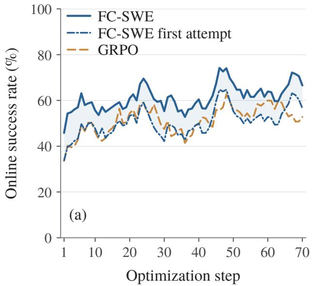

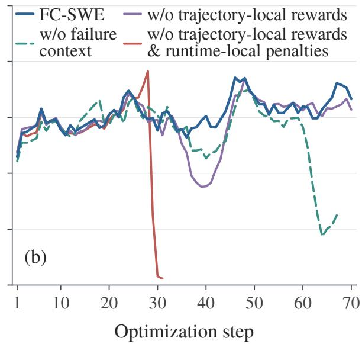  
Figure 3 | Online training success during optimization. (a) First-attempt and cumulative two-attempt success of FC-SWE, compared with single-attempt GRPO; shading shows the gain from recovery. (b) Ablations of failure context and reward design in FC-SWE. Curves use five-step moving averages, except for the collapse segment.

## 4.4. Learning to Use Failure Evidence

An additional attempt can succeed through resampling alone. We therefore compare feedbackconditioned retries with independent resampling under the same policy, controller, decoding configuration, and two-attempt budget (Figure 4(a)). For Base and GRPO, feedback-conditioned retries yield lower conditional recovery than resampling: 11.6% versus 13.7%, and 15.7% versus 18.6%, respectively. FC-SWE reverses this pattern, achieving 19.0% with feedback versus 17.0% with resampling. Thus, providing failure context does not uniformly improve recovery; a positive feedback advantage emerges for the policy trained to recover from failed attempts.

We next vary the second-attempt context while holding the FC-SWE policy, controller, and initial-failure sets fixed (Figure 4(b)). Providing only the failed patch yields 15.7% conditional recovery, compared with 17.0% without failure context. Adding verifier evidence to the patch raises recovery to 19.0%, a 3.3-percentage-point improvement over patch-only conditioning. This supports the value of verifier evidence beyond simply showing the previous patch. Together with the training-time context ablation, these results distinguish the value of learning from failure context from the benefit of merely generating another attempt. Additional verifier-only and shufled-evidence controls appear in Appendix D.

## 4.5. Test-Time Scaling and Eficiency

Scaling beyond the training horizon. Although FC-SWE is trained with at most two attempts, its recovery behavior extends to larger test-time budgets. With the same controller and stop-on-success rule, cumulative resolution increases from 52.8% at � = 2 to 70.7% at � = 11, compared with 67.3% for GRPO and 61.1% for Base (Figure 5(a)). The gains diminish at larger budgets, but the advantage persists beyond the training horizon. Full per-seed counts appear in Table 5.

Table 2 | Training ablations with failure context retained at evaluation. Block A uses three decoding seeds; Block B uses one. Metric definitions and aggregation follow Table 1.
<table><tr><td>Training variant</td><td>Resolved@1</td><td>Resolved@2</td><td>Conditional recovery</td></tr><tr><td colspan="4">A. Training-time failure context</td></tr><tr><td>FC-SWE</td><td>41.7%</td><td>52.8%</td><td>19.0%</td></tr><tr><td>w/o failure context</td><td>40.4%</td><td>47.9%</td><td>12.6%</td></tr><tr><td colspan="4">B. Reward assignment and runtime penalties</td></tr><tr><td>FC-SWE</td><td>43.2%</td><td>54.8%</td><td>20.4%</td></tr><tr><td>w/o trajectory-local rewards</td><td>41.4%</td><td>51.8%</td><td>17.7%</td></tr><tr><td colspan="4">w/o trajectory-local rewards</td></tr><tr><td>&amp; runtime-local penalties</td><td colspan="3">Not evaluated (training collapse)</td></tr></table>

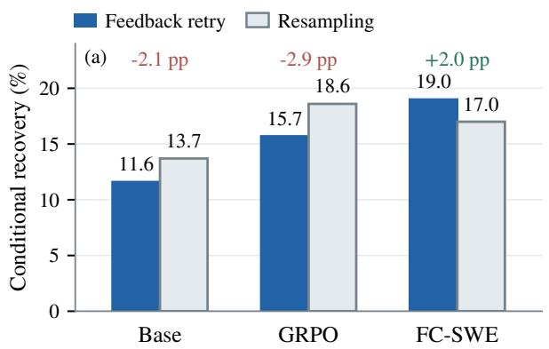

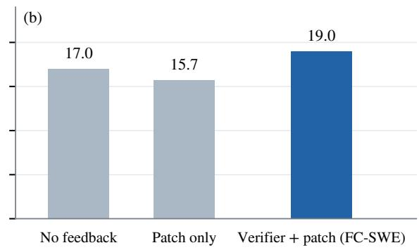  
Figure 4 | Failure-evidence ablations. (a) Feedback retries versus resampling at a matched twoattempt budget; labels show diferences in percentage points. (b) Second-attempt context ablations using the final FC-SWE policy.

Inference token cost. Figure 5(b) plots cumulative resolution against estimated tokens per task, including failed attempts and stopping after success. Costs combine recorded input tokens and estimated generated tokens (Appendix E). At the lowest-cost evaluated budgets reaching at least 50% resolution, FC-SWE, GRPO, and Base use approximately 3.15M, 4.39M, and 8.22M tokens per task; at 60%, they use 5.08M, 6.29M, and 13.57M. These discrete, non-interpolated points can exceed the targets by diferent amounts. The comparison concerns inference token cost, not training compute or measured wall-clock speed.

## 5. Conclusion

FC-SWE trains SWE agents to recover from failed patches using trajectory-local rewards and active-set advantage estimation. On Qwen3.5-4B, it improves initial solving and recovery over GRPO and benefits from verifier evidence at a matched two-attempt budget. Trained with at most two attempts, it reaches 70.7% resolution with eleven test-time attempts. Recovery with deployment-time verifiers remains future work.

## AI use statement

Generative AI tools were used to refine hypotheses and manuscript structure, provide feedback on methodology and experimental design, interpret author-provided results, discover and summarize related literature, and draft and edit manuscript text. The authors checked AI-assisted claims against the training implementation, experiment logs, primary literature, and original evaluation records. No AI-generated value is presented as a measured experimental result. The authors take responsibility for the final content of this work, including text, claims, and artifacts produced with the aid of generative AI.

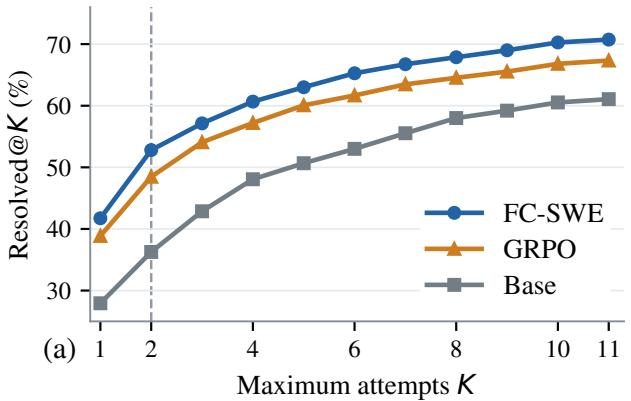

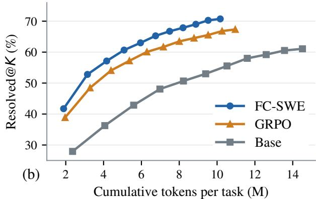  
Figure 5 | Test-time scaling and token eficiency (three-seed means). (a) Resolved@� versus attempt budget; the dashed line marks the two-attempt training horizon. (b) Resolved@� versus estimated cumulative tokens per task. Token accounting is detailed in Appendix E.

## References

Arash Ahmadian, Chris Cremer, Matthias Galle, Marzieh Fadaee, Julia Kreutzer, Olivier Pietquin, Ahmet Ustun, and Sara Hooker. Back to basics: Revisiting REINFORCE style optimization for learning from human feedback in LLMs. arXiv preprint arXiv:2402.14740, 2024.

Lang Feng, Zhenghai Xue, Tingcong Liu, and Bo An. Group-in-group policy optimization for LLM agent training. arXiv preprint arXiv:2505.10978, 2025.

Shaopeng Fu, Xingxing Zhang, Li Dong, Di Wang, and Furu Wei. RefineRL: Advancing competitive programming with self-refinement reinforcement learning. arXiv preprint arXiv:2604.00790, 2026.

Jonas Gehring, Kunhao Zheng, Jade Copet, Vegard Mella, Quentin Carbonneaux, Taco Cohen, and Gabriel Synnaeve. RLEF: Grounding code LLMs in execution feedback with reinforcement learning. arXiv preprint arXiv:2410.02089, 2024.

Alexander Golubev, Maria Trofimova, Sergei Polezhaev, Ibragim Badertdinov, Maksim Nekrashevich, Anton Shevtsov, Simon Karasik, Sergey Abramov, Andrei Andriushchenko, Filipp Fisin, Sergei Skvortsov, and Boris Yangel. Training long-context, multi-turn software engineering agents with reinforcement learning. arXiv preprint arXiv:2508.03501, 2025.

Weiyang Guo, Zesheng Shi, Longhui Zhang, Zeen Zhu, Min Zhang, and Jing Li. Agent reinforcement learning via pivotal-aware self-feedback retry. arXiv preprint arXiv:2607.03702, 2026. URL https://arxiv.org/abs/2607.03702.

Naman Jain, Jaskirat Singh, Manish Shetty, Liang Zheng, Koushik Sen, and Ion Stoica. R2E-Gym: Procedural environments and hybrid verifiers for scaling open-weights SWE agents. arXiv preprint arXiv:2504.07164, 2025.

Yulun Jiang, Liangze Jiang, Damien Teney, Michael Moor, and Maria Brbić. Meta-RL induces exploration in language agents. In International Conference on Learning Representations (ICLR), 2026. URL https://arxiv.org/abs/2512.16848v2.

Carlos E. Jimenez, John Yang, Alexander Wettig, Shunyu Yao, Kexin Pei, Ofir Press, and Karthik Narasimhan. SWE-bench: Can language models resolve real-world GitHub issues? arXiv preprint arXiv:2310.06770, 2023.

Aviral Kumar, Vincent Zhuang, Rishabh Agarwal, Yi Su, John D Co-Reyes, Avi Singh, Kate Baumli, Shariq Iqbal, Colton Bishop, Rebecca Roelofs, Lei M Zhang, Kay McKinney, Disha Shrivastava, Cosmin Paduraru, George Tucker, Doina Precup, Feryal Behbahani, and Aleksandra Faust. Training language models to self-correct via reinforcement learning. In International Conference on Learning Representations (ICLR), 2025.

Xuancheng Li, Haitao Li, Yujia Zhou, Yiqun Liu, and Qingyao Ai. MulFeRL: Enhancing reinforcement learning with verbal feedback in a multi-turn loop. arXiv preprint arXiv:2601.22900, 2026a. URL https://arxiv.org/abs/2601.22900v2.

Yujiang Li, Zhenyu Hou, Yi Jing, Jie Tang, and Yuxiao Dong. CompactionRL: Reinforcement learning with context compaction for long-horizon agents. arXiv preprint arXiv:2607.05378, 2026b.

Xingyu Lu, Jinpeng Wang, Yifan Zhang, Shijie Ma, Xiao Hu, Tianke Zhang, Haonan Fan, Kaiyu Jiang, Changyi Liu, Kaiyu Tang, Bin Wen, Fan Yang, Tingting Gao, Han Li, and Chun Yuan. ContextRL: Enhancing MLLM’s knowledge discovery eficiency with context-augmented RL. arXiv preprint arXiv:2602.22623, 2026. URL https://arxiv.org/abs/2602.22623.

Michael Luo, Naman Jain, Jaskirat Singh, Sijun Tan, Ameen Patel, Qingyang Wu, Alpay Ariyak, Colin Cai, Tarun Venkat, Shang Zhu, Ben Athiwaratkun, Manan Roongta, Ce Zhang, Li Erran Li, Raluca Ada Popa, Koushik Sen, and Ion Stoica. DeepSWE: Training a fully open-sourced, state-of-the-art coding agent by scaling RL. Together AI technical blog, 2025a. URL https: //www.together.ai/blog/deepswe.

Xufang Luo, Yuge Zhang, Zhiyuan He, Zilong Wang, Siyun Zhao, Dongsheng Li, Luna K. Qiu, and Yuqing Yang. Agent Lightning: Train any AI agents with reinforcement learning. arXiv preprint arXiv:2508.03680, 2025b.

Aman Madaan, Niket Tandon, Prakhar Gupta, Skyler Hallinan, Luyu Gao, Sarah Wiegrefe, Uri Alon, Nouha Dziri, Shrimai Prabhumoye, Yiming Yang, Shashank Gupta, Bodhisattwa Prasad Majumder, Katherine Hermann, Sean Welleck, Amir Yazdanbakhsh, and Peter Clark. Self-Refine: Iterative refinement with self-feedback. arXiv preprint arXiv:2303.17651, 2023.

NVIDIA. NVIDIA-Nemotron-3-Nano-4B-BF16. https://huggingface.co/nvidia/NVIDIA-Nemot ron-3-Nano-4B-BF16, 2026. Model card.

Theo X. Olausson, Jeevana Priya Inala, Chenglong Wang, Jianfeng Gao, and Armando Solar-Lezama. Is self-repair a silver bullet for code generation? In International Conference on Learning Representations (ICLR), 2024.

Jiayi Pan, Xingyao Wang, Graham Neubig, Navdeep Jaitly, Heng Ji, Alane Suhr, and Yizhe Zhang. Training software engineering agents and verifiers with SWE-Gym. arXiv preprint arXiv:2412.21139, 2024.

Yuxiao Qu, Tianjun Zhang, Naman Garg, and Aviral Kumar. Recursive introspection: Teaching language model agents how to self-improve. In Advances in Neural Information Processing Systems, volume 37, 2024. URL https://proceedings.neurips.cc/paper\_files/paper/2024/hash/6 39d992f819c2b40387d4d5170b8ffd7-Abstract-Conference.html.

Qwen Team. Qwen3.5-4B. https://huggingface.co/Qwen/Qwen3.5-4B, 2026a. Model card.

Qwen Team. Qwen3.5-9B. https://huggingface.co/Qwen/Qwen3.5-9B, 2026b. Model card.

John Schulman, Filip Wolski, Prafulla Dhariwal, Alec Radford, and Oleg Klimov. Proximal policy optimization algorithms. arXiv preprint arXiv:1707.06347, 2017.

Zhihong Shao, Peiyi Wang, Qihao Zhu, Runxin Xu, Junxiao Song, Xiao Bi, Haowei Zhang, Mingchuan Zhang, Y. K. Li, Y. Wu, and Daya Guo. DeepSeekMath: Pushing the limits of mathematical reasoning in open language models. arXiv preprint arXiv:2402.03300, 2024.

Noah Shinn, Federico Cassano, Ashwin Gopinath, Karthik Narasimhan, and Shunyu Yao. Reflexion: Language agents with verbal reinforcement learning. In Advances in Neural Information Processing Systems, volume 36, 2023. URL https://proceedings.neurips.cc/paper\_files/paper/202 3/hash/1b44b878bb782e6954cd888628510e90-Abstract-Conference.html.

Xingyao Wang, Boxuan Li, Yufan Song, Frank F. Xu, Xiangru Tang, Mingchen Zhuge, Jiayi Pan, Yueqi Song, Bowen Li, Jaskirat Singh, et al. OpenHands: An open platform for AI software developers as generalist agents. arXiv preprint arXiv:2407.16741, 2024.

Yuxiang Wei, Olivier Duchenne, Jade Copet, Quentin Carbonneaux, Lingming Zhang, Daniel Fried, Gabriel Synnaeve, Rishabh Singh, and Sida I. Wang. SWE-RL: Advancing LLM reasoning via reinforcement learning on open software evolution. arXiv preprint arXiv:2502.18449, 2025.

John Yang, Carlos E. Jimenez, Alexander Wettig, Kilian Lieret, Shunyu Yao, Karthik Narasimhan, and Ofir Press. SWE-agent: Agent-computer interfaces enable automated software engineering. arXiv preprint arXiv:2405.15793, 2024.

Shunyu Yao, Jefrey Zhao, Dian Yu, Nan Du, Izhak Shafran, Karthik Narasimhan, and Yuan Cao. ReAct: Synergizing reasoning and acting in language models. In International Conference on Learning Representations, 2023. doi: 10.48550/arXiv.2210.03629. URL https://arxiv.org/abs/ 2210.03629.

Qiying Yu, Zheng Zhang, Ruofei Zhu, Yufeng Yuan, Xiaochen Zuo, et al. DAPO: An open-source LLM reinforcement learning system at scale. arXiv preprint arXiv:2503.14476, 2025.

Guangtao Zeng, Maohao Shen, Delin Chen, Zhenting Qi, Subhro Das, Dan Gutfreund, David Cox, Gregory Wornell, Wei Lu, Zhang-Wei Hong, and Chuang Gan. Satori-SWE: Evolutionary test-time scaling for sample-eficient software engineering. arXiv preprint arXiv:2505.23604, 2025. URL https://arxiv.org/abs/2505.23604.

## A. Verifier Choice and Evaluation Protocol

A common verification procedure. Our study concerns learning to recover from failed attempts, rather than designing a new verifier. We use the oficial SWE-bench verification procedure as the common execution-based verifier during training and evaluation (Jimenez et al., 2023). It is applied to the task-specific tests of the respective datasets: R2E-Gym for training and SWE-bench Verified for evaluation. Each submitted patch receives a binary outcome and diagnostic output that can condition a subsequent attempt. Sharing this verification procedure does not mean sharing training and evaluation tasks.

Why we do not introduce a separate verifier. Verification and recovery-policy learning are related but distinct problems. R2E-Gym combines execution-based and execution-free verification (Jain et al., 2025). DeepSWE uses learned trajectory scoring and generated tests for candidate selection, and evaluates selected patches with the oficial SWE-bench harness (Luo et al., 2025a). Our question is instead how a policy learns to produce a better attempt after observing evidence of failure. Introducing a new verifier would vary both the policy-training method and its feedback source. We therefore keep the verification procedure, feedback construction, and evaluation attempt budgets the same across Base, GRPO, and FC-SWE in the controlled Qwen3.5-4B comparison, except where feedback content is explicitly ablated. This isolates the training comparison from changes to the verifier; it does not imply that the oficial verifier is optimal for deployment.

What the evaluation measures. The controller observes benchmark-test outcomes and diagnostic feedback between attempts and stops after success. Multi-attempt results therefore measure verifierassisted recovery, not independent-sampling Pass@� or candidate selection without access to benchmark-test feedback. Using the oficial success criterion does not make this feedback access identical to that of other published systems. All controlled comparisons in this paper use the same access conditions.

## B. Detailed Experimental Protocol

## B.1. Data, Initialization, and Checkpoint Selection

Training uses 4,518 tasks from ten R2E-Gym repositories (Jain et al., 2025), with no repository overlap with SWE-bench Verified. GRPO and FC-SWE are separately initialized from the same Qwen3.5- 4B checkpoint. OpenHands CodeActAgent generates training trajectories, whereas evaluation uses SWE-agent (Wang et al., 2024; Yang et al., 2024). The reported FC-SWE checkpoint (step 67) was selected based on performance across multiple validation sets, including a fixed 100-task subset of SWE-bench Verified. RL parameter updates used the R2E-Gym training data.

Training was resumed across scheduler allocations. Curves are stitched by global optimization step, not by each allocation’s local index. The canonical segments cover steps 1–36, 37–50, 51–67, and 68–84. The reward-sharing and penalty-removal ablations continue from the same step-26 checkpoint; their comparison concerns the subsequent training segment (Section 4.3).

## B.2. Hyperparameters

Table 3 summarizes the main configuration. Sixteen tasks with eight initial chains each yield 128 initial attempts per update. Up to 128 additional attempts are activated by initial failures; unused positions in the 256-row transport tensor are padding, not sampled trajectories.

Table 3 | Main training and evaluation configuration.
<table><tr><td>Item</td><td>Value</td></tr><tr><td>Policy initialization</td><td>Qwen3.5-4B</td></tr><tr><td>Training / evaluation harness</td><td>OpenHands CodeActAgent / SWE-agent</td></tr><tr><td>Context budget</td><td>65,536 tokens</td></tr><tr><td>Maximum model-tool interactions</td><td>100 per attempt</td></tr><tr><td>Training attempt budget</td><td>R = 2</td></tr><tr><td>Tasks / initial chains per task</td><td>16 / 8</td></tr><tr><td>Physical rollout rows</td><td>256, including inactive padding</td></tr><tr><td>Learning rate / schedule</td><td>10−6, constant, no warmup</td></tr><tr><td>Optimizer</td><td>Adam; β1 = 0.9, β2 = 0.999, ε = 10−8; weight decay 0</td></tr><tr><td>Policy clipping</td><td>€l = 0.2, ∈h = 0.28</td></tr><tr><td>Gradient-norm clipping</td><td>1.0</td></tr><tr><td>Reference-model KL</td><td>None</td></tr><tr><td>Loss normalization</td><td>Total valid generated tokens across the distributed batch</td></tr><tr><td>Runtime-local penalties</td><td>Token advantages overwritten with —5 in assistant messages flagged for invalid tool calls or malformed thinking</td></tr><tr><td>Agent / command timeout</td><td>1,800 s / 120 s</td></tr><tr><td>Training / rollout parallelism</td><td>TP4, PP2, CP2 / TP1</td></tr><tr><td>Evaluation decoding</td><td>Temperature 0.6; top-p 0.95; top-k 20</td></tr><tr><td>Decoding seeds</td><td>2, 3, 4 unless otherwise specified</td></tr><tr><td>Failure-evidence limits</td><td>30,000-token carry-over; 6,000-character verifier excerpt; 3,000- character failure snippet</td></tr><tr><td>Training evidence construction</td><td>Same as the evaluation controller</td></tr></table>

## B.3. Recovery Context and Trajectory Bookkeeping

The controller transformation � in Section 3.2 constructs recovery context in a fixed order. It states that the previous attempt failed and that the new attempt starts from a clean repository. It then prioritizes diagnostic evidence—tracebacks, assertion failures, syntax or import errors, explicit test failures, and timeouts—and appends deduplicated verifier context within the excerpt budget. The previous candidate patch is included subject to middle truncation and the carry-over budget. The prompt explicitly permits keeping, revising, or discarding the previous solution. The budgets in Table 3 apply during both training and evaluation.

Each rollout row retains a task identifier derived from its dataset and instance ID. This identifier determines the active-set comparison group in Section 3.4; a separate chain identifier tracks attempts and per-chain metrics. Inactive transport rows retain bookkeeping identifiers but enter neither reward statistics nor the policy loss. Copied failure evidence is input context and does not receive policy-loss weight.

## B.4. Serialization and Runtime Consistency

Long tool-use trajectories require consistent message boundaries across tokenization, serving, the agent harness, and stored rollouts. The implementation uses a fixed inline serving template and the model family’s reasoning and tool-call parsers. It preserves assistant reasoning content, renders assistant text and structured tool calls deterministically, groups tool observations under the expected message boundaries, and aligns the generation prefix and thinking flag between tokenizer and server. Invalid tool calls are identified from runtime execution results rather than an additional text-schema check. Prefix caching is disabled in the formal runs as an implementation setting, not as a requirement of FC-SWE.

## B.5. Metrics and Seed Aggregation

Let $z _ { s , n , k }$ indicate that task � is first resolved on attempt � under decoding seed �, with � = 500 tasks and � seeds. We report percentages:

$$
\mathrm { R e s o l v e d @ } K = \frac { 1 0 0 } { S N } \sum _ { s = 1 } ^ { S } \sum _ { n = 1 } ^ { N } \mathcal { H } \left[ \sum _ { k = 1 } ^ { K } z _ { s , n , k } > 0 \right] ,\tag{8}
$$

$$
\mathrm { C o n d i t i o n a l R e c o v e r y @ } K = 1 0 0 \frac { \sum _ { s , n } | \mathcal { k } [ z _ { s , n , 1 } = 0 ] | \mathcal { k } [ \sum _ { k = 2 } ^ { K } z _ { s , n , k } > 0 ] } { \sum _ { s , n } | \mathcal { k } [ z _ { s , n , 1 } = 0 ] } .\tag{9}
$$

Resolved@1 is first-attempt success. Because every seed evaluates the same number of tasks, the first expression also equals the mean of seed-level resolution rates. Conditional recovery instead pools recovered tasks and initial failures across seeds; it is not the unweighted mean of seed-level recovery percentages.

Conditional recovery is an incorrect-to-correct measure conditioned on initial failure (Kumar et al., 2025). Success terminates the chain, so the protocol does not generate subsequent attempts from already-correct patches. The three seeds are decoding seeds, not three independent RL training runs. Table 2, block B, and Table 4 use one decoding seed. Full per-seed scaling counts appear in Table 5.

## C. Case Studies: Revising a Failed Patch and Preserving Existing Behavior

How to read the examples. A patch is the set of code edits submitted by an agent. Target tests check the reported problem, whereas regression tests check that previously working behavior still works. Passing a target test is therefore insuficient if the patch breaks existing functionality. Figure 6 compares GRPO at step 65 with the final FC-SWE policy at step 67, using decoding seed 2, a 64K context, and at most 100 interactions per attempt. The figure’s Round 0 and Round 1 denote the first and second attempts, respectively. These are selected examples rather than an estimate of how frequently either behavior occurs; code fragments are abridged and test counts refer to the scored tests.

## C.1. Revising a Failed Attempt After Verifier Feedback

The task in plain language. In astropy\_\_astropy-13236, adding a structured numerical array to an Astropy table automatically converts it into a special wrapper, NdarrayMixin. The issue discusses moving away from this conversion, initially warning users and later changing the default behavior. The challenge is to change how the table handles the array without introducing incompatible behavior elsewhere.

Initial failure and subsequent revision. In Figure 6(a), both initial patches fail the two scored target tests, with warning-related diagnostic feedback. GRPO adds a warning and a Column(data) conversion, then repeats its patch on the second attempt; both target tests still fail. FC-SWE initially removes the automatic conversion and adds a warning. On its second attempt it removes the warning, after which both target tests pass. Both policies preserve all 644 scored regression tests in this example.

What this example shows. This example contrasts repeating a rejected patch with revising it following feedback. Each policy receives its own failed patch and feedback after a clean reset, so

(a) After failure: repeat or revise? astropy\_\_astropy-13236 | Round 0 to Round 1  
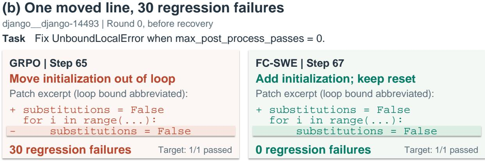

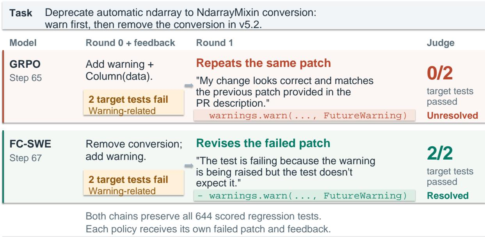  
Selected excerpts; code abridged. Counts from SWE-bench judge reports.

Figure 6 | Selected SWE-bench Verified cases comparing GRPO and FC-SWE. (a) Second-attempt responses to each policy’s own failed patch and verifier feedback. (b) First-attempt patches that both pass the target test but difer in regression-test failures.

the starting patches difer. Passing the benchmark tests does not establish full compliance with the proposed deprecation behavior; the example illustrates feedback-conditioned revision, not a general benefit from removing warnings.

## C.2. Fixing the Reported Error Without Introducing Regressions

The task in plain language. In django\_\_django-14493, a file-processing routine crashes when its maximum number of processing passes is zero. A flag named substitutions is initialized only inside the loop, so it has no value if the loop never runs. The flag must be initialized before the loop while retaining the reset needed during each normal processing pass.

Two superficially similar edits. Figure 6(b) shows that GRPO moves the initialization outside the loop and removes its per-pass reset. FC-SWE instead adds an initialization before the loop while retaining the reset inside it. Both initial patches pass the one target test, but GRPO’s patch causes 30 regression-test failures, whereas the FC-SWE patch causes none. Thus, the same apparent fix to the reported error can have diferent consequences for existing behavior.

What this example shows. This contrast occurs on the first attempt, before either policy receives post-verification recovery feedback. It illustrates patch quality and the role of regression tests, not a successful second-attempt recovery. Together, the examples distinguish revising a failed solution from preserving correctness outside the reported failure. Aggregate results, rather than these selected examples, support the comparisons in Section 4.

## D. Additional Ablation Results

## D.1. What the Ablations Isolate

The training-time failure-context ablation retains failure-triggered retries, clean resets, trajectorylocal rewards, and active-set advantage estimation, but removes the failed patch and verifier feedback from recovery prompts during training. Both trained policies are evaluated with failure context. This separates the efect of conditioning training on failure evidence from simply sampling additional attempts (Table 2, block A).

The reward-sharing ablation broadcasts the final chain outcome to all executed trajectories, turning labels [0, 1] into [1, 1]. The additional penalty-removal ablation changes runtime-local penalties within this shared-reward configuration. It does not isolate the penalty efect under trajectory-local rewards. Alternative advantage-group constructions and loss normalizations are motivated in Section 3, but are not separately ablated. The experiments therefore do not quantify the independent contribution of every implementation choice.

## D.2. Shared-Reward Checkpoint Analysis

Table 4 reports single-seed evaluations on all 500 tasks. The shared-reward run improves across its evaluated checkpoints, so reward sharing does not prevent learning. At the checkpoints used in Table 2, trajectory-local rewards give 43.2% Resolved@1 and 54.8% Resolved@2, compared with 41.4% and 51.8% for shared rewards. The 3.0-percentage-point Resolved@2 gap consists of 1.8 points in first-attempt resolution and 1.2 points in additional second-attempt resolutions; it is not entirely attributable to recovery. Conditional recovery is 20.4% versus 17.7%. These are comparisons of selected checkpoints at diferent steps, not a step-matched learning curve.

The local-reward run’s first-attempt resolution increases between steps 67 and 84, but its recovery rate and Resolved@2 decrease. Later training therefore does not uniformly improve both capabilities. With runtime-local penalties also removed from the shared-reward configuration, online success falls from 76.6% at step 28 to 2.3% at step 31 in the observed post-checkpoint segment. This run has no downstream evaluation; a missing table entry does not mean zero benchmark resolution.

## D.3. Additional Feedback-Content Controls

For the final FC-SWE policy, verifier-only context reaches 20.4% conditional recovery, compared with 19.0% for verifier evidence plus the failed patch, 15.7% for patch-only context, and 17.0% without failure context. The point estimates support the usefulness of the verifier channel, but do not show that including the patch is necessary or that the default combined context is optimal. We do not infer statistical superiority between verifier-only and combined context from these percentages alone.

Table 4 | Checkpoint evaluations on all 500 tasks using one decoding seed. Recovered counts tasks first resolved on attempt 2.
<table><tr><td>Checkpoint</td><td>Resolved@1</td><td>Recovered</td><td>Recovery</td><td>Resolved@2</td></tr><tr><td>Shared, step 40</td><td>37.6%</td><td>41</td><td>13.1%</td><td>45.8%</td></tr><tr><td>Shared, step 45</td><td>39.4%</td><td>41</td><td>13.5%</td><td>47.6%</td></tr><tr><td>Shared, step 55</td><td>42.2%</td><td>47</td><td>16.3%</td><td>51.6%</td></tr><tr><td>Shared, step 70</td><td>41.4%</td><td>52</td><td>17.7%</td><td>51.8%</td></tr><tr><td>Local, step 50</td><td>42.4%</td><td>53</td><td>18.4%</td><td>53.0%</td></tr><tr><td>Local, step 67</td><td>43.2%</td><td>58</td><td>20.4%</td><td>54.8%</td></tr><tr><td>Local, step 84</td><td>43.8%</td><td>44</td><td>15.7%</td><td>52.6%</td></tr></table>

“Recovery” denotes conditional recovery among first-attempt failures. “Local” denotes trajectory-local rewards in FC-SWE.

A same-task shufled-evidence control is also inconclusive about the importance of pairing feedback with a particular failed patch. Diferent failed attempts on the same task can expose the same failing tests, so this shufle can retain useful task-level information. It is not equivalent to removing verifier evidence. The main claims rely on the directly reported context contrasts in Figure 4, together with the training-time failure-context ablation.

## E. Additional Test-Time Scaling and Cost Accounting

## E.1. Per-Seed Resolution Counts

Table 5 gives the cumulative solved counts behind Figure 5(a). The same policy is used at all test-time attempt budgets; training uses at most two attempts. Figure 7(a) expresses these results as the fraction of first-attempt failures recovered by budget �.

Table 5 | Cumulative solved tasks out of 500. Each cell gives counts for decoding seeds 2/3/4, followed by the mean resolution rate.
<table><tr><td>K</td><td>Base</td><td>GRPO</td><td>FC-SWE</td></tr><tr><td>1</td><td>150/124/145 (27.9%)</td><td>206/179/198 (38.9%)</td><td>216/207/203 (41.7%)</td></tr><tr><td>2</td><td>183/168/193 (36.3%)</td><td>257/228/242 (48.5%)</td><td>274/261/257 (52.8%)</td></tr><tr><td>3</td><td>221/193/229 (42.9%)</td><td>278/255/278 (54.1%)</td><td>289/280/288 (57.1%)</td></tr><tr><td>4</td><td>241/227/253 (48.1%)</td><td>292/269/297 (57.2%)</td><td>305/296/309 (60.7%)</td></tr><tr><td>5</td><td>251/243/266 (50.7%)</td><td>304/284/313 (60.1%)</td><td>318/306/321 (63.0%)</td></tr><tr><td>6</td><td>260/258/277 (53.0%)</td><td>310/298/317 (61.7%)</td><td>329/320/330 (65.3%)</td></tr><tr><td>7</td><td>268/270/295 (55.5%)</td><td>317/305/330 (63.5%)</td><td>337/327/337 (66.7%)</td></tr><tr><td>8</td><td>280/283/307 (58.0%)</td><td>323/311/334 (64.5%)</td><td>344/331/343 (67.9%)</td></tr><tr><td>9</td><td>286/289/313 (59.2%)</td><td>328/314/341 (65.5%)</td><td>352/335/348 (69.0%)</td></tr><tr><td>10</td><td>297/294/317 (60.5%)</td><td>336/322/344 (66.8%)</td><td>359/338/357 (70.3%)</td></tr><tr><td>11</td><td>299/297/320 (61.1%)</td><td>340/325/345 (67.3%)</td><td>362/341/358 (70.7%)</td></tr></table>

Taking the union of solved tasks across the three seeded chains gives 78.8% for FC-SWE, 75.8% for GRPO, and 73.2% for Base at � = 11. This union permits up to three times as many attempts per task and is not used for the matched-budget comparisons.

(a) Recovery beyond attempt 1  
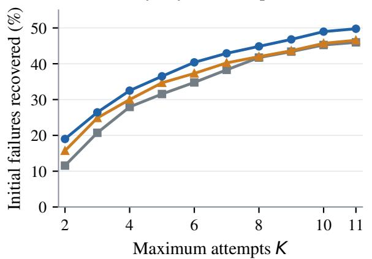

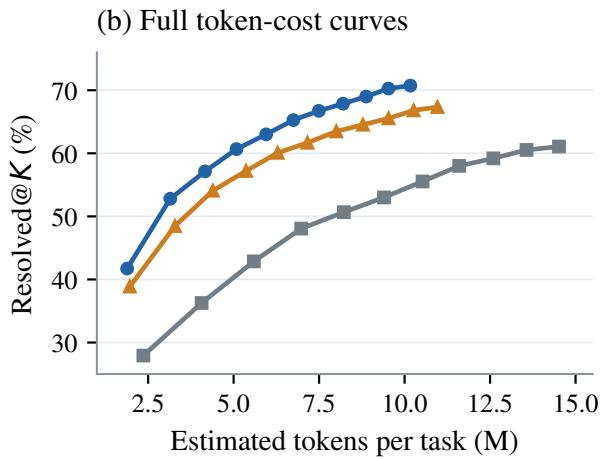  
Figure 7 | Additional test-time scaling views. (a) Initial failures recovered within � attempts, pooled across seeds. (b) Cumulative resolution versus estimated token cost, reproduced for reference; markers denote evaluated attempt budgets.

## E.2. Token Accounting and Coverage

For each decoding seed, we count all executed attempts through budget �, excluding attempts after the task’s first success. We sum their costs over all 500 tasks, including unresolved tasks, divide by 500, and average the three seed-level means. Estimated token cost combines recorded input-token counts with generated tokens estimated from output characters using a calibrated ratio of 4.0964 characters per token. Repeated processing of input context at successive model calls is included. This difers from the output-only generation length in Appendix F.

Three Base second-attempt trajectory logs are missing for seed 2. Their token costs are omitted, undercounting Base’s cost; the corresponding resolution outcomes remain available. The token-cost comparison is therefore approximate. It is neither a direct FLOP measurement nor measured end-to-end latency, and a matched attempt budget does not imply identical token usage.

## E.3. Observed Resolution–Cost Operating Points

Figure 5(b) plots the full observed resolution–token-cost curves, with one point per attempt budget $K = 1 , \ldots , 1 1$ . The target-resolution comparisons in the text select the lowest-cost evaluated budget reaching at least the target. For 50%, the selected budgets are $K = 5 , 3 , 2$ for Base, GRPO, and FC-SWE, at 8.22M, 4.39M, and 3.15M tokens per task. For 60%, they are $K = 1 0 , 5 , 4 .$ , at 13.57M, 6.29M, and 5.08M tokens. These are observed discrete points, not interpolated equal-score operating points. Their attained resolution can difer, so these comparisons do not establish an exact equal-accuracy speedup.

## E.4. Full Per-Budget Accounting

Table 6 reports token costs, executed attempts, and cumulative resolution. Each executed attempt produces one benchmark verification, so verifier-call counts equal attempt counts. The auxiliary time estimates combine measured tool-execution time with serving-throughput rates of 15,500 prefill and 145 decode tokens per second. They are synthesized processing-time estimates for 500 tasks, not observed end-to-end wall-clock times; parallel scheduling, infrastructure overhead, and verifier execution are not fully characterized by this estimate. We do not use this column to claim an end-to-end speedup.

Table 6 | Per-budget inference accounting, averaged over three decoding seeds. Token costs are estimated; the hours column is a synthesized estimate for all 500 tasks, not measured latency.
<table><tr><td>K</td><td>Tokens/task (M)</td><td>Attempts/task</td><td>Synth. hours</td><td>Resolved@K</td></tr><tr><td>Base</td><td></td><td></td><td></td><td></td></tr><tr><td>1</td><td>2.36</td><td>1.00</td><td>33</td><td>27.9%</td></tr><tr><td>2</td><td>4.06</td><td>1.72</td><td>57</td><td>36.3%</td></tr><tr><td>3</td><td>5.59</td><td>2.36</td><td>78</td><td>42.9%</td></tr><tr><td>4</td><td>6.98</td><td>2.93</td><td>96</td><td>48.1%</td></tr><tr><td>5</td><td>8.22</td><td>3.45</td><td>113</td><td>50.7%</td></tr><tr><td>6</td><td>9.40</td><td>3.94</td><td>129</td><td>53.0%</td></tr><tr><td>7</td><td>10.52</td><td>4.41</td><td>145</td><td>55.5%</td></tr><tr><td>8</td><td>11.60</td><td>4.85</td><td>159</td><td>58.0%</td></tr><tr><td>9</td><td>12.60</td><td>5.27</td><td>173</td><td>59.2%</td></tr><tr><td>10</td><td>13.57</td><td>5.68</td><td>186</td><td>60.5%</td></tr><tr><td>11</td><td>14.51</td><td>6.08</td><td>199</td><td>61.1%</td></tr><tr><td>GRPO</td><td></td><td></td><td></td><td></td></tr><tr><td>1</td><td>1.96</td><td>1.00</td><td>28</td><td>38.9%</td></tr><tr><td>2</td><td>3.29</td><td>1.61</td><td>47</td><td>48.5%</td></tr><tr><td>3</td><td>4.39</td><td>2.13</td><td>63</td><td>54.1%</td></tr><tr><td>4</td><td>5.36</td><td>2.59</td><td>77</td><td>57.2%</td></tr><tr><td>5</td><td>6.29</td><td>3.01</td><td>90</td><td>60.1%</td></tr><tr><td>6</td><td>7.16</td><td>3.41</td><td>102</td><td>61.7%</td></tr><tr><td>7</td><td>8.00</td><td>3.80</td><td>114</td><td>63.5%</td></tr><tr><td>8</td><td>8.78</td><td>4.16</td><td>125</td><td>64.5%</td></tr><tr><td>9</td><td>9.53</td><td>4.52</td><td>136</td><td>65.5%</td></tr><tr><td>10</td><td>10.26</td><td>4.86</td><td>146</td><td>66.8%</td></tr><tr><td>11</td><td>10.96</td><td>5.19</td><td>156</td><td>67.3%</td></tr><tr><td>FC-SWE</td><td></td><td></td><td></td><td></td></tr><tr><td>1</td><td>1.89</td><td>1.00</td><td>28</td><td>41.7%</td></tr><tr><td>2</td><td>3.15</td><td>1.58</td><td>46</td><td>52.8%</td></tr><tr><td>3</td><td>4.16</td><td>2.05</td><td>60</td><td>57.1%</td></tr><tr><td>4</td><td>5.08</td><td>2.48</td><td>73</td><td>60.7%</td></tr><tr><td>5</td><td>5.95</td><td>2.88</td><td>85</td><td>63.0%</td></tr><tr><td>6</td><td>6.75</td><td>3.25</td><td>97</td><td>65.3%</td></tr><tr><td>7</td><td>7.49</td><td>3.59</td><td>107</td><td>66.7%</td></tr><tr><td>8</td><td>8.20</td><td>3.93</td><td>117</td><td>67.9%</td></tr><tr><td>9</td><td>8.88</td><td>4.25</td><td>126</td><td>69.0%</td></tr><tr><td>10</td><td>9.53</td><td>4.56</td><td>136</td><td>70.3%</td></tr><tr><td>11</td><td>10.17</td><td>4.86</td><td>144</td><td>70.7%</td></tr><tr><td></td><td></td><td></td><td></td><td></td></tr></table>

## F. Additional Training Diagnostics

## F.1. Definitions and Averaging Population

Figure 8 reports tool-use length, generation length, and logged truncation during training. For FC-SWE, each per-step statistic includes all active initial and recovery attempts, weighted by their actual counts; unexecuted recovery slots are excluded. GRPO contributes initial attempts only. These are individual training histories, not means over the three decoding seeds used for benchmark evaluation. Their attempt populations difer and change as the policies improve.

Tool-call turns count assistant messages flagged as tool calls, including invalid calls. Generation length sums assistant-generated tokens within an attempt, excluding input and tool-observation tokens. Logged truncation indicates that recorded total trajectory tokens reach the configured token budget. It is not the fraction reaching the 100-interaction limit and does not distinguish all termination reasons. Mean generated length and truncation measure diferent quantities: the former is an output-token average, whereas the latter is a budget-threshold event for total trajectory tokens. Similar generation-length means therefore need not imply similar truncation rates.

## F.2. Observed Trends and Interpretation

Over steps 61–70, FC-SWE averages 62.0 tool-call turns and 16.2k generated tokens per active attempt, compared with 60.4 turns and 17.8k tokens for GRPO. Logged truncation rates are 5.2% and 10.5%, respectively. These describe execution behavior, not total training cost: FC-SWE also generates recovery attempts. Lower truncation does not by itself imply successful termination or establish the cause of improved test-time eficiency. Test-time token eficiency is assessed separately in Section 4.5.

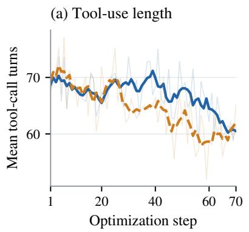

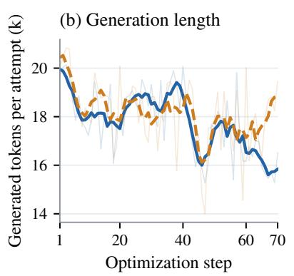

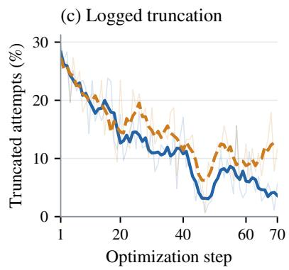  
Figure 8 | Training execution statistics per active attempt: (a) tool-call turns, (b) generated tokens, and (c) logged truncation. Light lines show individual steps; dark lines show centered five-step averages with shortened endpoint windows.

Runtime settings for cross-model reference results. The controlled Qwen3.5-4B policies use a 30-minute agent timeout. The Qwen3.5-9B and Nemotron-3-Nano-4B reference results use a 60-minute timeout. Those rows are therefore not timeout-matched to the trained Qwen3.5-4B policies and are not used to isolate the efect of recovery training.

## G. Limitations and Future Work

Recovery with practical verifiers. The evaluation assumes access to benchmark-test feedback after each attempt. A next step is to use verifiers available during deployment, such as learned critics, agent-generated tests, or hybrid verification (Pan et al., 2024; Jain et al., 2025; Luo et al., 2025a). This requires separating the verifier that guides recovery from held-out tests used for final scoring. Evaluation should measure verifier cost, false acceptance, false rejection, and diagnostic usefulness: detecting an incorrect patch and explaining how to repair it are distinct requirements.

Imperfect feedback and incomplete specifications. Passing a finite test suite does not guarantee semantic correctness or complete satisfaction of an issue description. Recovery training should be evaluated when feedback is incomplete, noisy, or misleading, including whether the policy checks evidence rather than following it uncritically. Cross-verifier evaluation and independent patch review would help distinguish robust repair from adaptation to a particular feedback source.

Experimental coverage. The controlled training study uses Qwen3.5-4B and one training configuration. Multiple decoding seeds characterize inference variation, not variation across independently trained policies. Some ablations have only one decoding seed, and the penalty-removal comparison is confined to shared-reward training. Extending the study to multiple training seeds, model sizes, task distributions, and separately controlled optimization components would test the generality of the findings. The selected cases illustrate behaviors but do not establish their prevalence.

Compute-matched training and deployment cost. FC-SWE generates additional trajectories during training, so the matched-task, matched-initial-group comparison is not matched in total training compute. Future studies should examine quality under equal training-token or wall-clock budgets. At inference, exact tokenization, complete trajectory logs, verifier execution cost, and measured latency would complement the present approximate token-accounting analysis. These extensions are needed before claiming end-to-end deployment savings.