# FOSLS-deRhaNN: NATIVE DE RHAM NEURAL CLASSES FOR H(div) AND H(curl) WITH APPLICATIONS TO FIRST-ORDER SYSTEM LEAST-SQUARES NEURAL NETWORK METHODS FOR PARTIAL DIFFERENTIAL EQUATIONS

SHUN ZHANG

Department of Mathematics, City University of Hong Kong, Kowloon Tong, Hong Kong, China

Abstract. We construct neural network approximation classes that are native to the graph spaces H(div) and H(curl), in two and three dimensions and, for H(div), in arbitrary dimension. Every realization lies in the space for every value of the trainable parameters, and with kinked potentials, such as ReLU networks, and with the interface modules, the admissible jumps of the space are present at finite width. The classes are images of ordinary scalar and componentwise networks under fixed operators of the continuous de Rham complex, a Poincar´e right inverse of the divergence and a regular decomposition, and they do not involve a mesh, a projection, an interpolation or a finite element emulation. For H(div) in Rn two native classes are given on an equal footing, with a skew-symmetric matrix potential A: Div $A + \mathcal { R } _ { n } q + \mathbf { h } ,$ in which the divergence q is an explicit unknown, and Div A + z with an H1 field z, from a regular decomposition, which is evaluated pointwise; for H(curl) the analogous classes are grad ϕ + Sr + h in two dimensions and grad ϕ + z in two and three dimensions. In all of them every interface jump of the field is carried by the potential term, Div A or grad ϕ, while the remaining part has no interface jump (in the regular-decomposition classes it is an H1 field). The classes with z are the componentwise approach enriched by this term. Known or learned interface geometry enters the potential through factors with trainable amplitudes, and, when the divergence also jumps, the remaining part as well. These native graph-space classes lead to the FOSLS-deRhaNN method, first-order system least squares with de Rham neural networks, in which the graph-space unknowns are represented by the native neural classes and the loss is the first-order system least-squares functional posed in the natural spaces of the weak formulation; for second-order elliptic equations the formulation works at the level of the weak problem, including $H ^ { - 1 }$ right-hand sides and $\dot { H } ^ { 1 / 2 }$ Dirichlet data. Second-order elliptic equations with discontinuous coeficients and curl–curl problems are treated as instances, in which the functional is equivalent to the error; linear transport with discontinuous solutions and scalar conservation laws with shocks are treated with the same native flux classes.

## 1. Introduction

Many physical problems are naturally posed as first-order systems in grad, div and curl: a constitutive law relates a flux to the gradient of a potential, as in Darcy’s law, Fourier’s law of heat conduction and Ohm’s law, and a conservation law prescribes the divergence of the flux; Maxwell’s equations and linear elasticity, with the stress as flux, admit analogous first-order formulations in compatible graph spaces. The second-order equation arises by eliminating the flux, which diferentiates the coeficient. With discontinuous coeficients the first-order system is the natural form: it holds in the whole domain, with the flux in H(div) and the gradient in H(curl), and the interface conditions, continuity of the normal flux and of the tangentia gradient, are the intrinsic continuity of these spaces, whereas the classical strong second-order equation holds on the coeficient subdomains, together with the transmission conditions. Neural network methods for partial diferential equations, going back to [42], were transformed by physics-informed neural networks (PINNs) [54]: the residual of the equation at collocation points is the loss, the method is mesh free, and it treats forward and inverse problems, nonlinear equations and the assimilation of data in one framework; it has become one of the most widely used tools of scientific machine learning [40]. In its vanilla form the residual is that of the strong form, which for a second-order divergence-form equation requires second derivatives of the trial function and pointwise diferentiation of the coeficient; for nonsmooth activations these derivatives exist only piecewise, and discontinuous coeficients require an explicit treatment of the interface conditions. The flux is not an unknown, and the residual is defined only for data more regular than those of the weak formulation. The deep Ritz method [30] minimizes the variational energy instead and is therefore tied to problems with a coercive energy, in particular symmetric elliptic problems.

First-order system least squares (FOSLS) [20, 22, 39, 7] keeps the structure of the physical laws: the potential and the flux are both unknowns, each in its natural space, and the constitutive law and the conservation law are separate residuals. It works at the level of the weak theory of the equation. For general second-order elliptic equations the coeficients need only be bounded, with A uniformly positive definite, the right-hand side is any element of $H ^ { - 1 }$ , written as $f _ { 1 } + \mathrm { d i v } \mathbf { f } _ { 2 }$ with $f _ { 1 } \in L ^ { 2 }$ and $\mathbf { f } _ { 2 } \in L ^ { 2 } ( \Omega ) ^ { n }$ (for instance $\mathbf { f } _ { 2 }$ discontinuous, or a source on a curve), the Dirichlet data are in $H ^ { 1 / 2 }$ , and the only assumption is that the weak problem is uniquely solvable; under exactly these conditions the functional is equivalent to the error in the natural norms, also for nonsymmetric operators [60], and it is an a posteriori error estimator [44, 56]. The datum $\mathbf { f } _ { 2 }$ enters through the constitutive law, pointwise and never diferentiated (Remark 7.3), so the functional is defined for all data of the weak theory, including those for which no strong form exists. This makes it a natural loss for neural network methods: minimizing it is a minimization at the level of the weak formulation, with the flux and its conservation law as part of the problem.

1.1. Natural graph spaces and intrinsic continuity. In a FOSLS formulation the unknowns lie in $H ^ { 1 }$ $H ( \mathrm { d i v } )$ and $H ( \mathrm { c u r l } )$ , and the graph space of each unknown, determined by which distributional derivatives are required to lie in $L ^ { 2 }$ , determines its intrinsic continuity. For a field that is smooth on the elements of a partition, and an interior face $F$ with unit normal ${ \bf n } _ { F }$ , the singular parts of the derivatives across $F$ are, schematically,

$$
( \operatorname { g r a d } u ) _ { \mathrm { s i n g } } = \left[ u \right] \mathbf { n } _ { F } \delta _ { F } , \qquad ( \operatorname { c u r l } \mathbf { E } ) _ { \mathrm { s i n g } } = \mathbf { n } _ { F } \times \left[ \mathbf { E } \right] \delta _ { F } ( \boldsymbol { n } = 3 ) , \qquad ( \operatorname { d i v } \boldsymbol { \tau } ) _ { \mathrm { s i n g } } = \left[ \boldsymbol { \tau } \cdot \mathbf { n } _ { F } \right] \delta _ { F } .\tag{1.1}
$$

An $L ^ { 2 }$ derivative excludes exactly the corresponding surface measure, so the intrinsic continuity across $F$ is $[ [ u ] ] = 0$ in $H ^ { 1 } ( \Omega ) , { \mathbf { n } } _ { F } \times \mathbb { \left[ { \mathbf { E } } \right] } = 0$ in $H ( \mathrm { c u r l } ; \Omega )$ and $[ [ \pmb { \tau } \cdot \mathbf { n } _ { F } ] ] = 0$ in $H ( \mathrm { d i v } ; \Omega )$ . In two dimensions the H(curl) condition is continuity of the scalar tangential component; in the language of forms, $H \Lambda ^ { k } ( \Omega )$ requires a singlevalued tangential trace of the k-form. For the second-order equation $( 7 . 1 )$ with discontinuous A and the weak data of Section 7.1, the flux variable ${ \pmb \sigma } = - { \bf A }$ grad $u + \beta u - { \bf f } _ { 2 }$ is in $H ( \mathrm { d i v } )$ , while the physical constitutive flux −A grad $u + \beta u = \pmb { \sigma } + \mathbf { f } _ { 2 }$ need not be when $\mathbf { f } _ { 2 }$ jumps; σ is in general neither in $H ( \mathrm { c u r l } )$ nor in $H ^ { 1 } ( \Omega ) ^ { n }$ and grad u is in H(curl) but in general neither in $H ( \mathrm { d i v } )$ nor in $H ^ { 1 } ( \Omega ) ^ { n } \ [ 2 3 , 2 4 , 1 9 ]$ : the normal component of $\pmb { \sigma }$ and the tangential component of grad u are continuous across interfaces, the other components jump. This is the reason for the classical finite element choices, defined through face and edge degrees of freedom on a mesh: continuous Lagrange elements reproduce the continuity of $H ^ { 1 }$ , Raviart–Thomas and BDM elements the normal continuity of $H ( \mathrm { d i v } )$ while allowing tangential jumps, and N´ed´elec elements the tangential continuity of H(curl) while allowing normal jumps [8, 31, 34, 1, 3, 2].

Standard networks represent vector fields componentwise. A scalar network with a Lipschitz activation is Lipschitz on a bounded domain and hence in $H ^ { 1 } ( \Omega )$ , so a componentwise network lies in $H ^ { \bar { 1 } } ( \Omega ) ^ { n } \subset H ( \mathrm { d i v } ; \Omega ) \cap$ $H ( \mathrm { c u r l } ; \Omega )$ : it is conforming, but it imposes more continuity than either graph space requires. We use native in this structural sense: the approximation respects the intrinsic continuity of the graph space rather than entering it only through a stronger componentwise $H ^ { 1 }$ regularity. The distinction is visible at finite complexity. A target $\tau \in H ( \mathrm { d i v } )$ may have a genuine tangential jump with continuous normal trace, and $\mathbf { E } \in H ( \mathrm { c u r l } )$ a genuine normal jump with continuous tangential trace. A componentwise continuous approximation contains no such field at any finite size, since a network with a continuous activation is continuous: it can only replace the jump by a continuous transition layer whose width tends to zero as the approximation is sharpened. Leastsquares ReLU networks approximate discontinuous scalar functions well in this way [10, 13]; the discontinuity is then obtained by training, not by the construction of the class. The classes of this paper supply the missing jumps by a potential term from the de Rham complex.

1.2. de Rham representations. We therefore start from the graph space of the unknown, not from the network: ordinary networks approximate $H ^ { 1 }$ or $L ^ { 2 }$ functions, and fixed diferential and right-inverse operators associated with the de Rham complex assemble them into the graph-space field. For $0 \leq k \leq n$ let $H \Lambda ^ { k } ( \Omega ) : =$ $\{ \omega \in L ^ { 2 } \Lambda ^ { k } ( \Omega ) : \mathrm { d } \omega \in L ^ { 2 } \Lambda ^ { k + 1 } ( \Omega ) \}$ . The de Rham complex is

$$
H \Lambda ^ { 0 } ( \Omega ) \stackrel { \mathrm { ~ d ~ } } { \longrightarrow } H \Lambda ^ { 1 } ( \Omega ) \stackrel { \mathrm { ~ d ~ } } { \longrightarrow } \cdots \stackrel { \mathrm { ~ d ~ } } { \longrightarrow } H \Lambda ^ { n - 1 } ( \Omega ) \stackrel { \mathrm { ~ d ~ } } { \longrightarrow } H \Lambda ^ { n } ( \Omega ) ,\tag{1.2}
$$

with $H \Lambda ^ { 0 } = H ^ { 1 }$ and $H \Lambda ^ { n } \simeq L ^ { 2 } ;$ ; in vector proxies $H \Lambda ^ { n - 1 } \simeq H ( \mathrm { d i v } )$ in any dimension, and in three dimensions $H \Lambda ^ { 1 } \simeq H ( \mathrm { c u r l } )$ . The identity $\mathrm { d } ^ { 2 } = 0$ gives ran d ⊂ ker d, the finite-dimensional cohomology measures the failure of exactness, and regular-potential results allow potentials with $H ^ { 1 }$ coeficients.

The H(div) construction uses the two maps adjacent to $H \Lambda ^ { n - 1 }$ , and it leads to two representations, which we treat on an equal footing. The map on the right is div $: H ( \mathrm { d i v } ; \Omega ) \to L ^ { 2 } ( \Omega )$ , so $q : = \mathrm { d i v } \tau$ is a natural unknown, and a bounded right inverse gives $\mathcal { R } _ { n } q \in H ( \mathrm { d i v } )$ with div $\mathcal { R } _ { n } q = q$ . What remains is divergence free, and the map on the left represents this kernel, modulo cohomology, by a potential. Alternatively, the divergence can be left to an $H ^ { 1 }$ field, by a regular decomposition. Hence

$$
\begin{array} { r } { \tau = \mathrm { D i v } A + \mathcal { R } _ { n } q + { \bf h } , \quad q = \mathrm { d i v } \tau , \qquad \mathrm { o r } \qquad \tau = \mathrm { D i v } A + { \bf z } , \quad { \bf z } \in H ^ { 1 } ( \Omega ) ^ { n } , \mathrm { d i v } { \bf z } = \mathrm { d i v } \tau , } \end{array}\tag{1.3}
$$

with A a skew-symmetric matrix field with $H ^ { 1 }$ entries and h in a finite-dimensional cohomology space; in two dimensions Div $A = \mathbf { c u r l } \psi _ { \mathrm { { i } } }$ , and $\pmb { \tau } = \mathbf { c u r l } \psi + \mathcal { R } _ { 2 } q + \mathbf { h } \mathrm { o r } \pmb { \tau } = \mathbf { c u r l } \psi + \mathbf { z }$ . The first keeps the divergence as an explicit $L ^ { 2 }$ unknown: an equation for it can be built into the class, and a jump of the divergence is integrated by $\mathcal { R } _ { n }$ into a continuous field (under the segment condition of Lemma 2.5). The second needs no line integrals and no harmonic fields: it is the componentwise approach of [9, 46], z a componentwise network, enriched by the divergence-free field Div A, which carries the tangential jumps that a componentwise $H ^ { 1 }$ field cannot; a jump of the divergence is carried by a kink of z. We call such a formula a de Rham representation of the field, and the auxiliary functions in it its representing functions. For the first they are the potential A, the divergence $q = \mathrm { d i v } \tau$ and the cohomology part $\mathbf { h } = \Pi _ { \mathcal { H } _ { n } } \tau$ (Sections 2.2 and 2.4); q and h are determined by $\tau ,$ and A modulo ker Div, or uniquely once the bounded linear lifting of Section 2.5 is fixed. For the second they are A and z (Section 3.1).

For H(curl) the left side is the same, $H ^ { 1 } ( \Omega ) \xrightarrow [ ] { \mathrm { g r a d } } H ( \mathrm { c u r l } ; \Omega ) \xrightarrow [ ] { \mathrm { c u r l } } H ( \mathrm { d i v } ; \Omega )$ in three dimensions, with the gradient generating the exact curl-free part; but the curl cannot be an unconstrained $L ^ { 2 }$ function, since div(curl $\mathbf { E } ) = 0$ . In general, the exterior derivative dω in an intermediate degree is constrained by $\mathrm { d } ( \mathrm { d } \omega ) = 0 .$ which a generic network does not satisfy. For H(curl) in three dimensions we therefore use the regular decomposition

$$
{ \bf E } = \mathrm { g r a d } \phi + { \bf z } , \quad \quad \phi \in H ^ { 1 } ( \Omega ) , \quad { \bf z } \in H ^ { 1 } ( \Omega ) ^ { 3 } .\tag{1.4}
$$

No separate harmonic part is needed in this form, since any topological component is absorbed into the $H ^ { 1 }$ remainder z. In two dimensions H(curl) is a rotation of $H ( \mathrm { d i v } )$ , and both realizations are available, $\mathbf { E } = \operatorname { g r a d } \phi + S r + \mathbf { h }$ with a rotated right inverse S of the curl, and ${ \bf E } = \mathrm { g r a d } \phi + { \bf z }$ . The second $H ( \mathrm { d i v } )$ representation and (1.4) are the same construction in two degrees, ${ \pmb \tau } = \mathrm { D i v } { \pmb A } + { \bf z }$ in degree $n - 1$ and ${ \bf E } = \mathrm { g r a d } \phi + { \bf z }$ in degree 1. Only in degree n − 1, where the exterior derivative lands in top degree, can the exterior derivative itself be an unconstrained trainable function; this gives the first H(div) representation.

The trainable functions are the representing functions in (1.3) and (1.4). A scalar network with a Lipschitz activation lies in $W ^ { 1 , \infty } ( \Omega ) \subset H ^ { 1 } ( \Omega )$ ; continuous piecewise afine finite element functions are ReLU networks of a size fixed by the mesh [32], so every finite element approximation of a representing function is available at a corresponding network size, and for smooth activations classical Sobolev approximation results apply [36]. For $H ( \mathrm { d i v } )$ we approximate A in $H ^ { 1 }$ and q in $L ^ { 2 }$ and assemble $\tau _ { \theta , \eta } = \mathrm { D i v } A _ { \theta } + \mathcal { R } _ { n } q _ { \eta } + \mathbf { h }$ , or A and z in $H ^ { 1 }$ and assemble $\tau _ { \theta , \eta } = \operatorname { D i v } A _ { \theta } + \mathbf { z } _ { \eta } ;$ for H(curl) we approximate ϕ and z in $H ^ { 1 }$ and assemble ${ \bf E } _ { \theta , \eta } = \mathrm { g r a d } \phi _ { \theta } + { \bf z } _ { \eta }$ for $n = 2 , 3$ , or, for $n = 2 , \phi$ in $H ^ { 1 }$ and r in $L ^ { \bar { 2 } }$ and assemble $\mathbf { E } _ { \theta , \eta } =$ grad $\phi _ { \theta } + S r _ { \eta } + \mathbf { h }$ . The identities div $\tau _ { \theta , \eta } = q _ { \eta }$ , div $\boldsymbol { \tau } _ { \theta , \eta } = \operatorname { d i v } \mathbf { z } _ { \eta }$ and curl ${ \bf E } _ { \theta , \eta } = \mathrm { c u r l } { \bf z } _ { \eta }$ hold for every value of the trainable parameters, so conformity is produced by the continuous de Rham structure and not enforced by training. The classes do not involve a mesh, a projection or a finite element interpolation. It remains to show, for each graph space, that the representation map is onto, with representing functions bounded by the field, and that approximation of the representing functions transfers to the graph norm; this is done for H(div) in Sections 2 and 3 and for H(curl) in Section 5.

In all these representations every interface jump of the field is carried by its first part, the potential term Div A or grad ϕ given by the map on the left of the complex: $\mathcal { R } _ { n } q + \mathbf { h }$ and $S r + \mathbf { h }$ are continuous for bounded piecewise continuous $q$ and r under the segment condition of Lemma 2.5, and the $H ^ { 1 }$ remainder z has a singlevalued trace across an interior interface. The continuity of the field is weaker than that of its representing functions only through the potential. In two dimensions a continuous piecewise afine potential $\psi _ { \boldsymbol { \theta } }$ has a piecewise constant curl $\psi _ { \theta }$ with continuous normal trace and possibly a tangential jump; in any dimension a continuous piecewise afine $\phi _ { \theta }$ has a piecewise constant grad $\phi _ { \theta }$ with continuous tangential trace and possibly a normal jump. This is how the finite-parameter realizations reproduce the intrinsic continuity of $H ( \mathrm { d i v } )$ and H(curl) rather than the stronger continuity of a componentwise $H ^ { 1 }$ network, and it is why the classes with z are the componentwise approach enriched by the potential term. The interface geometry of the jump of the field, known or learned, is accordingly carried by the potential, through a factor $| d _ { \Gamma } |$ or $\operatorname { R e L U } ( g _ { \eta } )$ with trainable amplitudes (Sections 4.2 and 4.4); when the divergence also jumps, the same interface information is used in the remaining part, in q or in a kinked z (Section 4.6).

1.3. Related work and outline. Least-squares neural network methods were developed systematically by Cai and coauthors. The deep least-squares method [9] uses first-order system least-squares functionals as the loss for elliptic problems, with the flux $\sigma ~ \in ~ H ( \operatorname { d i v } )$ approximated by a componentwise network and its divergence obtained by diferentiating the components. In the physics-preserving neural network $( \mathrm { P ^ { 2 } N N } )$ methods for elliptic equations [46] the flux is again a componentwise network, and its divergence is replaced by the discrete divergence operator of [12], which is based on the definition of the divergence through the Gauss theorem, div $\begin{array} { r } { \pmb { \tau } ( x ) = \operatorname* { l i m } _ { \epsilon  0 } | B _ { \epsilon } ( x ) | ^ { - 1 } \int _ { \partial B _ { \epsilon } ( x ) } \pmb { \tau } } \end{array}$ · n dS: at each integration point the outward flux through the boundary of a control volume, computed by quadrature, is divided by its measure. The second class of this paper keeps such a componentwise flux and enriches it by a potential term. The least-squares ReLU neural network (LSNN) method for linear advection–reaction equations [10] showed that ReLU networks approximate discontinuous solutions along an interface without oscillation and without artificial difusion; the network structure required for discontinuity interfaces is analyzed in [13], and non-constant jumps along curved interfaces in [14]. The method was extended to scalar nonlinear hyperbolic conservation laws [11], where the discrete divergence operator of [12] computes the divergence of the flux from its values in the conservation form; the LSNN method for hyperbolic problems is surveyed in [47]. The computational tools of this line of work are used throughout the present paper: adaptive network enhancement [48, 45, 21], which adds neurons where a local error indicator is large; the separation of the linear output parameters from the nonlinear hidden parameters, with structure-guided Gauss–Newton and block Newton iterations [15, 16, 17, 18]; derivatives of networks through moments computed from values, as in the discrete divergence operator; and adaptive quadrature [49]. Dual neural network formulations are developed in [50]. The present paper adds to this framework native representations of graph-space fields, in particular H(div) fluxes and H(curl) fields: each field is represented so that its intrinsic continuity holds for every parameter value, and its jumps are carried by the kinks of its potentials.

Compatible structure has also been built into neural networks in other ways. Networks with ReLU and binary step activations represent the lowest-order Raviart–Thomas and N´ed´elec spaces exactly [52]. First-order system least squares with deep neural networks is developed in [53], with networks that emulate these de Rham compatible finite element spaces on a mesh; there the least-squares residual is the loss and a computable error estimator. Finite element interpolated networks combine networks with compatible finite element spaces [4, 5], and exact discrete de Rham complexes of fixed-neuron $\mathrm { R e L U } ^ { k }$ networks are constructed in [38]; these obtain the de Rham structure at the discrete level. In all of them the de Rham structure is constructed, not trained: it is that of a given mesh [52, 53, 4, 5] or of a given set of neurons [38], so the partition on which jumps can occur is fixed in advance. In the present classes the structure comes from the continuous de Rham operators, and conformity holds for every value of all trainable parameters, including those that place the kinks and the learned interfaces. In the deep Ritz setting, scalar, vector and antisymmetric tensor potentials from the de Rham complex are used in [26] for Poisson problems in arbitrary dimension without boundary penalties, and divergence-free fields whose potentials have scalar networks as entries are used in [55], with approximation rates for linearized $\mathrm { R e L U } ^ { k }$ networks in [33]. The representation of divergence-free fields by potentials (stream function, vector potential, and in general dimension a skew-symmetric matrix of potentials) is classical, also for finite elements [6, 1, 3]. In the present classes these potentials form the divergence-free part of the $H ( \mathrm { d i v } )$ representation, together with the Poincar´e right inverse of the divergence [25, 28] and the cohomology part; for Poincar´e operators, regular decompositions and potentials in the language of diferential complexes see the survey [37]. In one dimension $H ( \operatorname { d i v } ; I ) = H ^ { 1 } ( I )$ , and the first-order system least-squares shallow neural network method for general second-order elliptic equations is developed in [43].

This paper constructs neural approximation classes native to $H ( \mathrm { d i v } )$ and $H ( \mathrm { c u r l } )$ , in two and three dimensions and, for $H ( \mathrm { d i v } )$ , in arbitrary dimension: every realization lies in the space for every value of the trainable parameters, and, with kinked potentials such as ReLU networks and with the interface modules, the admissible jump structure of the space is present already at finite width (Propositions 4.1 and 5.8). The classes are images of scalar and componentwise networks under fixed operators,

$$
\begin{array} { r l } & { \tau = \mathbf { c u r l } ~ \psi + \mathcal { R } _ { 2 } q + \mathbf { h } ~ \mathrm { o r } ~ \tau = \mathbf { c u r l } ~ \psi + \mathbf { z } ~ ( n = 2 ) , \qquad \tau = \mathrm { D i v } ~ A + \mathcal { R } _ { n } q + \mathbf { h } ~ \mathrm { o r } ~ \tau = \mathrm { D i v } ~ A + \mathbf { z } ~ ( \mathbb { R } ^ { n } ) , } \\ & { \qquad \mathbf { E } = \mathrm { g r a d } ~ \phi + S r + \mathbf { h } _ { \mathrm { c u r l } } ~ \mathrm { o r } ~ \mathbf { E } = \mathrm { g r a d } ~ \phi + \mathbf { z } ~ ( n = 2 ) , ~ \mathbf { E } = \mathrm { g r a d } ~ \phi + \mathbf { z } ~ ( n = 3 ) , } \end{array}
$$

with scalar networks, a skew-symmetric matrix of scalar networks $A ,$ a componentwise network $\mathbf { z } ,$ and finitedimensional harmonic parts; the field being approximated need not lie in $H ^ { \bar { 1 } } ( \Omega ) ^ { n }$ , only its representing functions do. The native $H ( \mathrm { d i v } )$ and $H ( \mathrm { c u r l } )$ classes, which we call deRhaNN classes (de Rham neural network classes), are combined with first-order system least squares to obtain the FOSLS-deRhaNN method, firstorder system least squares with de Rham neural networks.1 The approximation classes carry the graph-space conformity by construction, while the FOSLS functional is posed at the natural regularity level of the weak problem; the least-squares part is standard: the error is bounded by the best approximation error of the classes (Proposition 6.3), with the regularity of the weak solution and no more.

Sections 2–4 carry out the construction for $H ( \mathrm { d i v } )$ in arbitrary dimension: Section 2 the stable de Rham representation with a right inverse of the divergence and the first neural class, Section 3 the regular decomposition and the second class, both with two and three dimensions as special cases, and Section 4 the jumps at finite width, in the flux and in its divergence, for both classes, and the three levels of interface information. Section 5 does the same for $H ( \mathrm { c u r l } )$ in two and three dimensions. Section 6 states the FOSLS-deRhaNN method with the standard best-approximation estimate; Sections 7 and 8 are instances (second-order elliptic equations, posed at the level of the weak formulation, and curl–curl problems), each with numerical examples (Sections 7.5 and 8.1). Section 9 treats linear transport, whose functional is the error in a norm weaker than that of the natural spaces, and Section 10 uses the native space-time flux classes in the flux least-squares formulation of scalar conservation laws, where the interface is an unknown shock.

## 2. Native neural approximation in H(div) I: right inverse and stable de Rham representation

2.1. Motivation: the de Rham sequence. In two and three dimensions the end of the de Rham sequence is

$$
\begin{array} { r l } & { H ^ { 1 } ( \Omega ) \xrightarrow { \mathrm { \normalfont ~ c u r l } } H ( \mathrm { d i v } ; \Omega ) \xrightarrow { \mathrm { \normalfont ~ d i v } } L ^ { 2 } ( \Omega ) \longrightarrow 0 \quad ( n = 2 ) , } \\ & { H ^ { 1 } ( \Omega ) ^ { 3 } \xrightarrow { \mathrm { \normalfont ~ c u r l } } H ( \mathrm { d i v } ; \Omega ) \xrightarrow { \mathrm { \normalfont ~ d i v } } L ^ { 2 } ( \Omega ) \longrightarrow 0 \quad ( n = 3 ) , } \end{array}
$$

with curl $\psi = ( \partial _ { 2 } \psi , - \partial _ { 1 } \psi )$ in two dimensions. Two facts give the representation of a flux $\tau \in H ( \mathrm { d i v } ; \Omega )$ First, div is onto $L ^ { 2 } ( \Omega )$ and has a bounded right inverse ${ \mathcal { R } } ,$ div $\mathcal { R } q = q ; \mathrm { ~ s o ~ } q : = \mathrm { d i v } \tau$ can be taken as an independent $L ^ { 2 }$ function, and $\tau - \mathcal { R } q$ is divergence free. Second, div curl = 0, and conversely a divergence-free field is the curl of a potential, up to finitely many fields determined by the topology of Ω (none if Ω is simply connected for $n = 2 .$ , or if ∂Ω is connected for $n = 3 )$ . Hence

$$
\boldsymbol { \tau } = \mathbf { c u r l } \boldsymbol { \psi } + \mathcal { R } \boldsymbol { q } + \mathbf { h } , \qquad \boldsymbol { q } = \mathrm { d i v } \boldsymbol { \tau } ,
$$

with a potential $\psi$ in $H ^ { 1 }$ , scalar for $n = 2$ and vector valued for $n = 3$ , the divergence $q$ in $L ^ { 2 } .$ and h in a finite-dimensional space. The two maps next to $H ( \mathrm { d i v } )$ enter in diferent roles: the curl on the left describes the divergence-free part by a potential, and the divergence on the right contributes its range through R. Networks for ψ and $q$ then give a flux that lies in $H ( \mathrm { d i v } ; \Omega )$ for every value of the parameters, with div $\tau = q .$ The potential, $q$ and h are the representing functions of τ (Section 1.2), from which the field is assembled by fixed diferential and right-inverse operators associated with the de Rham complex. The functions $q = \mathrm { d i v } \tau$ and h are determined by $\tau ;$ the potential is determined up to the kernel of the curl, and uniquely once a bounded linear lifting is fixed; stable refers to this bounded reconstruction and to the equivalence of the representation norm with the graph norm (Section 2.5). In this representation $\mathcal { R } q$ carries the divergence of $\tau ,$ h its topological part, and the potential the divergence-free remainder; in the piecewise regular interface settings considered below, where $\mathcal { R } q +$ h is continuous across the interface, the tangential jump of $\tau$ is carried entirely by the potential. Section 2.2 gives the potential in $\mathbb { R } ^ { n }$ , where the curl becomes the row-wise divergence of a skew-symmetric matrix; this part is used by both representations. Section 2.3 constructs ${ \mathcal { R } } ,$ Section 2.4 the cohomology part, Section 2.5 the stable splitting, and Section 2.6 defines the neural classes.

2.2. Skew-symmetric potentials. Let $\mathbb { K } _ { n } : = \{ A \in \mathbb { R } ^ { n \times n } : A ^ { T } = - A \}$ . A field $A \in H ^ { 1 } ( \Omega ; \mathbb { K } _ { n } )$ is determined by its $n ( n - 1 ) / 2$ entries $a _ { i j } : = A _ { i j } , i < j ;$ these are the scalar functions that networks approximate, and the norms of A count each of them once:

$$
| A | _ { 1 } ^ { 2 } : = \sum _ { i < j } | a _ { i j } | _ { 1 } ^ { 2 } , \qquad | | A | | _ { 1 } ^ { 2 } : = \sum _ { i < j } \| a _ { i j } \| _ { 1 } ^ { 2 } .\tag{2.1}
$$

With $\begin{array} { r } { \mathcal { E } _ { i j } : = { \bf e } _ { i } { \bf e } _ { j } ^ { T } - { \bf e } _ { j } { \bf e } _ { i } ^ { T } , A = \sum _ { i < j } a _ { i j } \mathcal { E } _ { i j } } \end{array}$ . The row-wise divergence of A,

$$
( \operatorname { D i v } A ) _ { i } : = \sum _ { j = 1 } ^ { n } \partial _ { j } A _ { i j } , \qquad i = 1 , \ldots , n ,\tag{2.2}
$$

is the dimension-independent curl-potential operator. The entry $a _ { i j }$ contributes Div $( a _ { i j } \mathscr { E } _ { i j } ) = ( \partial _ { j } a _ { i j } ) \mathbf { e } _ { i } -$ $( \partial _ { i } a _ { i j } ) { \bf e } _ { j }$ , and in two and three dimensions Div reduces to the scalar and the vector curl: for $n = 2 , A = \psi \mathcal { E } _ { 1 2 }$ gives Div $A = ( \partial _ { 2 } \psi , - \partial _ { 1 } \psi ) ^ { T }$ = curl ψ, and for $\begin{array} { r } { n = 3 , A _ { i j } = \sum _ { k } \varepsilon _ { i j k } \Psi _ { k } } \end{array}$ gives Div A = curl Ψ.

The potential part Div A is common to both representations of $H ( \mathrm { d i v } )$ used in this paper. The following facts are standard; we record them for completeness.

Lemma 2.1 (skew potentials). Let $A \in H ^ { 1 } ( \Omega ; \mathbb { K } _ { n } )$

(a) The field Div $A \in L ^ { 2 } ( \Omega ) ^ { n }$ satisfies

$$
\operatorname { d i v } ( \operatorname { D i v } A ) = 0 , \qquad \| \operatorname { D i v } A \| _ { 0 } \leq { \sqrt { n - 1 } } | A | _ { 1 } ,\tag{2.3}
$$

where the first identity holds in the sense of distributions.

(b) Let $S \subset \Omega$ be a smooth hypersurface with unit normal n, and let A be piecewise $H ^ { 2 }$ on the two sides $o f S$ in a neighborhood of S. Then on $S ,$ , with one-sided traces $v ^ { \pm }$ and $[ [ v ] ] : = v ^ { + } - v ^ { - }$ , where n points into the + side (this convention is used throughout),

$$
[ \mathrm { g r a d } A _ { i j } ] = [ \partial _ { \mathbf { n } } A _ { i j } ] \mathbf { n } , \qquad [ \mathrm { D i v } A ] = [ \partial _ { \mathbf { n } } A ] \mathbf { n } , \qquad \mathbf { n } \cdot [ \mathrm { D i v } A ] = 0 .\tag{2.4}
$$

(c) For every $\mathbf { j } \in \mathbb { R } ^ { n } \ w i t h \ \mathbf { j } \cdot \mathbf { n } = 0 , \ K : = \mathbf { j n } ^ { T } - \mathbf { n } \mathbf { j } ^ { T } \in \mathbb { K } _ { n }$ satisfies $K \mathbf { n } = \mathbf { j } ;$ thus $K ^ { \prime } \mapsto K$ ′n maps $\mathbb { K } _ { n }$ onto $\mathbf { n } ^ { \perp } : = \{ \mathbf { v } \in \mathbb { R } ^ { n } : \mathbf { v } \cdot \mathbf { n } = 0 \}$ . Its kernel consists of the skew-symmetric maps of $\mathbf { n } ^ { \perp }$ (extended by $K ^ { \prime } \mathbf { n } = 0 )$ and has dimension $( n - 1 ) ( n - 2 ) / 2 ;$ it is trivial for $n = 2$

Proof. (a) For $\phi \in C _ { c } ^ { \infty } ( \Omega )$ , ⟨div Div $\begin{array} { r } { A , \phi \rangle = \sum _ { i , j } \int _ { \Omega } A _ { i j } \partial _ { i } \partial _ { j } \phi d x = 0 } \end{array}$ by antisymmetry. Since $A _ { i i } = 0 , ( \operatorname { D i v } A ) ,$ has $n - 1$ terms, and pointwise | Div $\begin{array} { r } { A | ^ { 2 } \leq ( \stackrel { - } { n } - 1 ) \sum _ { i } \sum _ { i \neq i } | \partial _ { j } A _ { i j } | ^ { 2 } = ( n - 1 ) \sum _ { i < j } ( | \partial _ { j } a _ { i j } | ^ { 2 } + | \partial _ { i } a _ { i j } | ^ { 2 } ) \leq } \end{array}$ $\begin{array} { r } { ( n - 1 ) \sum _ { i < j } | \operatorname { g r a d } a _ { i j } | ^ { 2 } } \end{array}$ . (b) Each $A _ { i j } \in H ^ { 1 } ( \Omega )$ has a single-valued trace on $S ,$ so its tangential derivatives agree from the two sides and the jump of its gradient is normal. Hence $\begin{array} { r } { [ ( \mathrm { D i v } A ) _ { i } ] = \sum _ { j } [ [ \partial _ { \mathbf { n } } A _ { i j } ] ] n _ { j } } \end{array}$ , and $\mathbf { n } \cdot [ [ \partial _ { \mathbf { n } } A ] ] \mathbf { n } = 0$ because $\mathbb { [ \partial _ { n } A ] }$ is skew. (c) $K \mathbf { n } = \mathbf { j } \left( \mathbf { n } \cdot \mathbf { n } \right) - \mathbf { n } \left( \mathbf { j } \cdot \mathbf { n } \right) = \mathbf { j }$ . If $K ^ { \prime } \in \mathbb { K } _ { n }$ and $K ^ { \prime } \mathbf { n } = 0$ , then ${ \bf n } ^ { T } \bar { K } ^ { \prime } = \bar { - } ( K ^ { \prime } { \bf n } ) ^ { T } = 0 , \bar { \mathrm { s o } } \bar { K } ^ { \prime }$ maps $\mathbf { n } ^ { \perp }$ into itself and vanishes on n; conversely, every skew-symmetric map of $\mathbf { n } ^ { \perp }$ , extended by 0 on n, is in $\mathbb { K } _ { n }$ . The skew-symmetric maps of the $( n - 1 )$ -dimensional space $\mathbf { n } ^ { \perp }$ form a space of dimension $( n - 1 ) ( n - 2 ) / 2$ □

For $n = 2$ the bound in (2.3) is an equality $( | \mathbf { c u r l } \psi | = | \operatorname { g r a d } \psi | )$ , for $n = 3$ it is ∥ curl $\Psi \vert \vert _ { 0 } \leq \sqrt { 2 } \vert \Psi \vert _ { 1 }$ .

Remark 2.2 (diferential forms and notation). Identify A with the 2-form $\textstyle \sum _ { i < j } A _ { i j } d x _ { i } \wedge d x _ { j }$ . Then $d ( { \star } A ) =$ $( \operatorname { D i v } A ) .$ ⌟ vol: the (n − 1)-form $d ( { \star } A )$ corresponds to Div A in the identification ${ \cal H } ( \mathrm { d i v } ; \Omega ) \simeq { \cal H } \Lambda ^ { n - 1 } ( \Omega )$ $\mathbf { v } \mapsto \mathbf { v } \lrcorner$ vol. Equivalently, Div A is the vector field of the 1-form $d ^ { * } A$ , where $d ^ { * }$ is the formal L2-adjoint of d (the codiferential): for every compactly supported 1-form $\begin{array} { r } { \alpha = \sum _ { i } \alpha _ { i } d x _ { i } , \int _ { \Omega } \sum _ { i < j } ( \partial _ { i } \alpha _ { j } - \partial _ { j } \alpha _ { i } ) A _ { i j } d x = } \end{array}$ $\scriptstyle \int _ { \Omega } \alpha$ · Div A dx after integration by parts. The same operator is called curl in [26, Section 2.4]. We keep the notation Div, which shows that the operator is the row-wise divergence of a skew-symmetric matrix and that div Div $A = 0$

2.3. A right inverse of the divergence. In the classes below a flux is written as $\tau = \tau _ { 0 } + \mathcal { R } _ { n } q$ with $\tau _ { 0 }$ divergence free and $\mathcal { R } _ { n } \mathrm { ~ a ~ }$ fixed right inverse of the divergence, so that div $\tau = q$ . We construct $\mathcal { R } _ { n }$ explicitly as an integral of q along the segments from a fixed center; for piecewise continuous $q$ the field $\textstyle { \mathcal { R } } _ { n } q$ is continuous under a mild condition on the segments, so that it carries no jump.

Let $\Omega \subset \mathbb { R } ^ { n } , n \geq 2$ , be a bounded Lipschitz domain. Fix a center $x _ { 0 } \in \mathbb { R } ^ { n }$ ; the operator below depends on it, and this dependence is suppressed in the notation $\mathcal { R } _ { n }$ . The center enters the constants through $C _ { x _ { 0 } } : =$ $\operatorname* { s u p } _ { x \in \Omega } \left| x - x _ { 0 } \right|$ , the radius of the smallest ball centered at $x _ { 0 }$ that contains Ω. In the interface geometries considered below, $x _ { 0 }$ is chosen so that the segment hypothesis of Lemma 2.5 holds; in particular, no segment from $x _ { 0 }$ lies along an interface or along a flat piece of ∂Ω. For a function $g$ on $\mathbb { R } ^ { n }$ let $\begin{array} { r } { G _ { g } ( x ) : = \int _ { 0 } ^ { 1 } t ^ { n - 1 } g ( x _ { 0 } + } \end{array}$ $t ( x - x _ { 0 } ) ) d t , x \in \mathbb { R } ^ { n }$ , and for $q \in L ^ { 2 } ( \Omega )$ , with $\widetilde { q }$ its extension by zero to $\mathbb { R } ^ { n }$ , define

$$
( \mathcal R _ { n } q ) ( x ) : = ( x - x _ { 0 } ) G _ { \widetilde { q } } ( x ) = ( x - x _ { 0 } ) \int _ { 0 } ^ { 1 } t ^ { n - 1 } \widetilde { q } \big ( x _ { 0 } + t ( x - x _ { 0 } ) \big ) d t , \qquad x \in \mathbb R ^ { n } ;\tag{2.5}
$$

as an element of $H ( \mathrm { d i v } ; \Omega ) , \mathcal { R } _ { n } q$ is the restriction to $\Omega .$ The domain Ω need not be star-shaped with respect to x : $\widetilde { q }$ is used along the whole segment from $x _ { 0 }$ to x, which may leave and re-enter $\Omega$ , and $x _ { 0 }$ need not lie in Ω.

Lemma 2.3 (radial right inverse). For $q \in L ^ { 2 } ( \Omega ) , \mathcal { R } _ { n } q \in H ( \mathrm { d i v } ; \Omega )$ and

$$
\mathrm { d i v } \mathcal { R } _ { n } q = q , \qquad \| \mathcal { R } _ { n } q \| _ { 0 } \leq \frac { 2 C _ { x _ { 0 } } } { n } \| q \| _ { 0 } , \qquad \| \mathcal { R } _ { n } q \| _ { H ( \mathrm { d i v } ) } \leq \Big ( 1 + \frac { 4 C _ { x _ { 0 } } ^ { 2 } } { n ^ { 2 } } \Big ) ^ { 1 / 2 } \| q \| _ { 0 } .\tag{2.6}
$$

Moreover, (2.5) defines $\mathcal { R } _ { n } q$ on all $o f \mathbb { R } ^ { n }$ , with $\mathcal { R } _ { n } q \in L _ { \mathrm { l o c } } ^ { 2 } ( \mathbb { R } ^ { n } ) ^ { n }$ and div $\mathcal { R } _ { n } q = \widetilde { q } \ i n \ \mathbb { R } ^ { n }$

Proof. Bound. For $g \in L ^ { 2 } ( \mathbb { R } ^ { n } )$ and $t \in \mathsf { \Gamma } ( 0 , 1 ]$ the substitution $y \ = \ x _ { 0 } + t ( x - x _ { 0 } ) , \ d x \ = \ t ^ { - n } d y$ , gives $\| g ( x _ { 0 } + t ( \cdot - x _ { 0 } ) ) \| _ { 0 , \Omega } \leq t ^ { - n / 2 } \| g \| _ { 0 , \mathbb { R } ^ { n } } .$ and Minkowski’s integral inequality gives

$$
\| G _ { g } \| _ { 0 , \Omega } \leq \int _ { 0 } ^ { 1 } t ^ { n - 1 } \| g ( x _ { 0 } + t ( \cdot - x _ { 0 } ) ) \| _ { 0 , \Omega } d t \leq \| g \| _ { 0 , \mathbb { R } ^ { n } } \int _ { 0 } ^ { 1 } t ^ { n - 1 - n / 2 } d t = \frac { 2 } { n } \| g \| _ { 0 , \mathbb { R } ^ { n } } .\tag{2.7}
$$

Since $| x - x _ { 0 } | \leq C _ { x _ { 0 } }$ on Ω, $\begin{array} { r } { \| ( \boldsymbol { x } - \boldsymbol { x } _ { 0 } ) G _ { g } \| _ { 0 , \Omega } \le \frac { 2 C _ { x _ { 0 } } } { n } \| g \| _ { 0 , \mathbb { R } ^ { n } } ; } \end{array}$ for $g \ = \ \widetilde { q }$ this is the second bound, since $\| \widetilde { q } \| _ { 0 , \mathbb { R } ^ { n } } = \| q \| _ { 0 , \Omega } .$

Identity. For $g \in C ^ { 1 } ( \mathbb { R } ^ { n } )$ , since $\begin{array} { r } { ( x - x _ { 0 } ) \cdot \mathrm { g r a d } _ { x } \big [ g ( x _ { 0 } + t ( x - x _ { 0 } ) ) \big ] = t \frac { \mathrm { d } } { \mathrm { d } t } g ( x _ { 0 } + t ( x - x _ { 0 } ) ) } \end{array}$ , integration by parts in t gives

$$
( x - x _ { 0 } ) \cdot \operatorname { g r a d } G _ { g } ( x ) = \int _ { 0 } ^ { 1 } t ^ { n } { \frac { \mathrm { d } } { \mathrm { d } t } } g { \big ( } x _ { 0 } + t ( x - x _ { 0 } ) { \big ) } d t = g ( x ) - n G _ { g } ( x ) ,
$$

hence div $\left( ( x - x _ { 0 } ) G _ { g } \right) = n G _ { g } + ( x - x _ { 0 } ) \cdot \operatorname { g r a d } G _ { g } = g$ . For $q \in L ^ { 2 } ( \Omega )$ take $g _ { k } \in C _ { c } ^ { \infty } ( \mathbb { R } ^ { n } )$ with $g _ { k } \to \widetilde { q }$ in $L ^ { 2 } ( \mathbb { R } ^ { n } )$ The bound, applied to $g _ { k } - \widetilde { q } ,$ gives $( x - x _ { 0 } ) G _ { g _ { k } } \to \mathcal { R } _ { n } q$ in $L ^ { 2 } ( \Omega )$ , so for $\phi \in C _ { c } ^ { \infty } ( \Omega ) - \int _ { \Omega } \mathcal { R } _ { n } q$ · grad $\phi =$ lim $\begin{array} { r } { { } _ { k \to \infty } \int _ { \Omega } g _ { k } \phi = \int _ { \Omega } q \phi } \end{array}$ , that is, div $\mathcal { R } _ { n } q = q$ in Ω. The third bound follows from the first two. The bound and the limit hold with Ω replaced by any ball B about $x _ { 0 }$ (and $C _ { x _ { 0 } }$ by its radius), and $\phi \in C _ { c } ^ { \infty } ( B )$ gives $\begin{array} { r } { - \int _ { B } \mathcal { R } _ { n } \boldsymbol { q } \cdot \mathrm { g r a d } \phi = \int _ { B } \widetilde { \boldsymbol { q } } \phi } \end{array}$ , that is, div $\mathcal { R } _ { n } q = \widetilde { q }$ in $\mathbb { R } ^ { n }$ □

Remark 2.4 (Poincar´e homotopy). Formula (2.5) is the Poincar´e homotopy operator with a fixed center in top degree [25], written for vector fields: for the n-form $u = \widetilde { q } d x _ { 1 } \wedge \cdot \cdot \cdot \wedge d x _ { n }$ it is the vector proxy of $\begin{array} { r } { \int _ { 0 } ^ { 1 } t ^ { n - 1 } ( x - x _ { 0 } ) \lrcorner u ( x _ { 0 } + t ( x - x _ { 0 } ) ) d t } \end{array}$ , and div $\mathcal { R } _ { n } q = q$ is the top-degree homotopy relation. Costabel and McIntosh [28] average such fixed-center path integrals over the center with a smooth weight [28, (3.9)] to obtain operators with Sobolev mapping properties. Their [28, (1.4)] is the familiar three-dimensional analogue for curl.

We now show that $\mathcal { R } _ { n } q$ is continuous even when $q$ is only piecewise continuous, which is the situation in interface problems. Since $( { \mathcal { R } } _ { n } q ) ( x )$ integrates $\widetilde { q }$ along the segment from $x _ { 0 }$ to x, moving x moves the segment, and the values of $\widetilde { q }$ on it change continuously except where the segment crosses ∂Ω or a surface across which q jumps. If on every segment these crossings form a set of measure zero, they do not afect the integral, and $\mathcal { R } _ { n } q$ is continuous.

Lemma 2.5 (continuity for piecewise continuous data). Let $S _ { q } \subset \overline { { \Omega } }$ be closed, let $q \in L ^ { \infty } ( \Omega )$ be continuous on $\Omega \setminus S _ { q } ,$ and let $S$ be a closed set containing $\partial \Omega \cup S _ { q }$ , for instance $S = \partial \Omega \cup S _ { q } ;$ then $\widetilde { q }$ is continuous on $\mathbb { R } ^ { n } \backslash S$ . Assume that for every $x \in \overline { { \Omega } } \setminus \{ x _ { 0 } \}$ the open segment $\{ x _ { 0 } + t ( x - x _ { 0 } ) : 0 < t < 1 \}$ meets $S$ in a set of one-dimensional measure zero, for instance in finitely many points. Then $( x - x _ { 0 } ) G _ { \widetilde { q } }$ is continuous on $\overline { { \Omega } } ;$ in particular $\textstyle { \mathcal { R } } _ { n } q$ has no jumps.

Proof. Let $x _ { k } \ \to \ x$ in $\overline { { \Omega } } .$ If $x = x _ { 0 }$ , then $| ( x _ { k } - x _ { 0 } ) G _ { \widetilde { q } } ( x _ { k } ) | \le \frac { 1 } { n } | x _ { k } - x _ { 0 } | \| q \| _ { L ^ { \infty } } \to 0 .$ . If $x \neq x _ { 0 }$ , then $x _ { 0 } + t ( x - x _ { 0 } ) \not \in S$ for almost every $t \in ( 0 , 1 )$ , and for such $t , \widetilde { q } ( x _ { 0 } + t ( x _ { k } - x _ { 0 } ) )  \widetilde { q } ( x _ { 0 } + t ( x - x _ { 0 } ) )$ by the continuity of qe on $\mathbb { R } ^ { n } \setminus S$ ; the integrand of $G _ { \widetilde { q } }$ is bounded by $t ^ { n - 1 } \| q \| _ { L ^ { \infty } }$ , and dominated convergence gives $G _ { \widetilde { q } } ( x _ { k } ) \to G _ { \widetilde { q } } ( x )$ □

For a convex polygon or polyhedron with $x _ { 0 }$ in its interior the condition on $\partial \Omega$ holds. When the divergence $q ^ { * } = \operatorname { d i v } \pmb { \sigma } ^ { * }$ of an exact flux is bounded and piecewise continuous, as in the interface examples below, the lemma applies even if $q ^ { * }$ jumps across the interfaces; it also applies to a bounded continuous network $q .$ In both cases $\textstyle { \mathcal { R } } _ { n } q$ has no jump, so a tangential jump of a flux is carried by its potential (Section 4.1).

2.4. Cohomology part. We use the standard structure of the boundary of a bounded Lipschitz domain [6, Section 2.1]. Let $O _ { 1 } , \ldots , O _ { b }$ be the bounded components of $\mathbb { R } ^ { n } \setminus \overline { { \Omega } }$ (the holes of Ω for $n = 2$ , the cavities for $n = 3 ) ; \partial \Omega$ is the disjoint union of the closed sets $\Gamma _ { 0 } ,$ the boundary of the unbounded component, and $\Gamma _ { i } : = \partial O _ { i } , i = 1 , . . . , b ; b =$ dim ${ \mathcal { H } } _ { n }$ below is the number of these components. With the normal n exterior to $\Omega ,$ which on $\Gamma _ { i }$ points into $O _ { i }$ , the cavity fluxes

$$
F _ { i } ( { \mathbf v } ) : = \langle { \mathbf v } \cdot { \mathbf n } , 1 \rangle _ { \Gamma _ { i } } , \qquad i = 1 , \dots , b ,
$$

are bounded on $H ( \mathrm { d i v } ; \Omega )$ : the function equal to 1 on $\Gamma _ { i }$ and to 0 on the other components lies in $H ^ { 1 / 2 } ( \partial \Omega )$ since the finitely many compact boundary components are mutually separated, and the normal trace is bounded from $H ( \mathrm { d i v } ; \Omega )$ to $H ^ { - 1 / 2 } ( \bar { \partial } \Omega )$ . Choose $z _ { i } \in O _ { i }$ and let

$$
\mathbf { h } _ { i } ( x ) : = \frac { x - z _ { i } } { | x - z _ { i } | ^ { n } } , \qquad \mathcal { H } _ { n } : = \mathrm { S p a n } \{ \mathbf { h } _ { 1 } , \dots , \mathbf { h } _ { b } \} , \qquad \Pi _ { \mathcal { H } _ { n } } \mathbf { v } : = - \frac { 1 } { | S ^ { n - 1 } | } \sum _ { i = 1 } ^ { b } F _ { i } ( \mathbf { v } ) \mathbf { h } _ { i }\tag{2.8}
$$

$\left( \mathcal { H } _ { n } \ = \ \{ 0 \} \right.$ if there are none). The $\mathbf { h } _ { i }$ are smooth and divergence free on ${ \overline { { \Omega } } } ,$ and $F _ { i } ( { \bf h } _ { j } ) = - | S ^ { n - 1 } | \delta _ { i j }$ since n is the inner normal of $O _ { i } ;$ hence $F _ { j } ( \Pi _ { { \mathcal { H } } _ { n } } \mathbf { v } ) = F _ { j } ( \mathbf { v } ) \colon \Pi _ { { \mathcal { H } } _ { n } } \mathbf { v }$ is the element of ${ \mathcal { H } } _ { n }$ with the cavity fluxes of $\mathbf { v } ,$ and the coeficients of the cohomology component are determined explicitly by the cavity fluxes, $c _ { i } = - F _ { i } ( { \bf v } ) / | S ^ { n - 1 } |$ . These coeficients represent the $( n - 1$ )st de Rham cohomology of $\Omega ;$ in three dimensions the obstruction to a global skew potential is therefore given by cavities, not by handles (handles carry the first cohomology, which concerns curl-free fields). No canonical choice of harmonic representatives is needed.

Corollary 2.6 (fluxes of the radial part). For $q \in L ^ { 2 } ( \Omega ) , F _ { i } ( \mathcal { R } _ { n } q ) = 0 f o r i = 1 , \ldots , b ,$ , and $\langle \mathcal { R } _ { n } q \cdot \mathbf { n } , 1 \rangle _ { \Gamma _ { 0 } } =$ $\int _ { \Omega } q d x$ . In particular $\Pi _ { \mathcal { H } _ { n } } \mathcal { R } _ { n } q = 0$

Proof. By Lemma $2 . 3 , \mathcal { R } _ { n } q$ has a divergence in $L _ { \mathrm { l o c } } ^ { 2 } ( \mathbb { R } ^ { n } )$ , so its normal traces from the two sides of $\Gamma _ { i }$ coincide, and div $\mathcal { R } _ { n } q = \widetilde { q } = 0$ in $O _ { i }$ ; since the outer normal of $O _ { i }$ on $\begin{array} { r } { \Gamma _ { i } \mathrm { \ i s \ - n , \ } F _ { i } ( \mathcal { R } _ { n } q ) = - \int _ { O _ { i } } \mathrm { d i v } \mathcal { R } _ { n } q d x = 0 } \end{array}$ . The divergence theorem in Ω gives $\begin{array} { r } { \sum _ { i = 0 } ^ { b } \langle \mathcal { R } _ { n } \boldsymbol { q } \cdot \mathbf { n } , 1 \rangle _ { \Gamma _ { i } } = \int _ { \Omega } q d x } \end{array}$ □

The radial part thus carries the source balance through the outer boundary and no cavity flux.

2.5. Stable splitting and regular potentials. The following splitting is classical in substance: for $n = 2 , 3$ it is the stream-function and vector-potential description of [6, Lemmas 2.1.2 and 2.1.9] together with a right inverse of the divergence, and in general it is the exactness of the de Rham complex up to its cohomology [28]. We include a proof because of the specific right inverse $\mathcal { R } _ { n }$ and the linear lifting.

Proposition 2.7 (classical H(div) splitting). $P : = \mathcal { R } _ { n }$ div is the bounded projection of $H ( \mathrm { d i v } ; \Omega )$ onto $\mathcal { R } _ { n } \bar { L ^ { 2 } } ( \Omega )$ along ker div, and

$$
H ( \mathrm { d i v } ; \Omega ) = \left( \mathrm { D i v } \ H ^ { 1 } ( \Omega ; \mathbb { K } _ { n } ) \oplus \mathcal { H } _ { n } \right) \oplus \mathcal { R } _ { n } L ^ { 2 } ( \Omega ) ,\tag{2.9}
$$

where ker div = Div $H ^ { 1 } ( \Omega ; \mathbb { K } _ { n } ) \oplus \mathcal { H } _ { n }$ and

$$
\mathrm { D i v } \ H ^ { 1 } ( \Omega ; \mathbb { K } _ { n } ) = \{ { \mathbf v } \in H ( \mathrm { d i v } ; \Omega ) : \ \mathrm { d i v } { \mathbf v } = 0 , \ F _ { i } ( { \mathbf v } ) = 0 , \ i = 1 , \dots , b \} .\tag{2.10}
$$

Equivalently, every $\tau \in H ( \mathrm { d i v } ; \Omega )$ can be written

$$
\tau = \operatorname { D i v } A + \Pi _ { \mathcal { H } _ { n } } \tau + \mathcal { R } _ { n } \operatorname { d i v } \tau ,\tag{2.11}
$$

that is, with $q = \mathrm { d i v } \tau$ and $\mathbf { h } = \Pi _ { \mathcal { H } _ { n } } \tau$ (Corollary 2.6), where $q ,$ h and Div $A = \tau - \mathcal { R } _ { n } q - \mathbf { h }$ are unique and the potential $A \in H ^ { 1 } ( \Omega ; \mathbb { K } _ { n } )$ is unique up to an element of the kernel of Div. The potential can be fixed $b y$ a bounded linear map: there is a bounded linear L from the space (2.10) to $H ^ { 1 } ( \Omega ; \mathbb { K } _ { n } )$ with Div $\mathbf { L } \mathbf { v } = \mathbf { v }$ , and $A = \mathsf { L } ( \pmb { \tau } - \mathcal { R } _ { n } q - \mathbf { h } ) \ s a t i s f i e s$

$$
\| A \| _ { 1 } + \| \mathbf { h } \| _ { 0 } + \| q \| _ { 0 } \leq C \| { \boldsymbol { \tau } } \| _ { H ( \operatorname { d i v } ) } .
$$

Proof. By Lemma 2.3, P is bounded, $P ^ { 2 } = P$ , ran $P = \mathcal { R } _ { n } L ^ { 2 } ( \Omega )$ and ker $P =$ ker div, so $H ( \mathrm { d i v } ; \Omega ) =$ ker div $\Phi ^ { \mathscr { R } _ { n } L ^ { 2 } ( \Omega ) }$ . It remains to show ker div = Div $H ^ { 1 } ( \Omega ; \mathbb { K } _ { n } ) \textrm { \oplus } \mathcal { H } _ { n }$ and (2.10), with $\| A \| _ { 1 } + \| \mathbf { h } \| _ { 0 } \leq$ $C \| \mathbf { v } \| _ { H ( \mathrm { d i v } ) }$ for ${ \textbf { v } } \in$ ker div. For a general τ this is applied to $\mathbf { v } : = { \boldsymbol { \tau } } - { \mathcal { R } } _ { n } q , q = \operatorname { d i v } { \boldsymbol { \tau } }$ , for which $\Pi _ { \mathcal { H } _ { n } \mathbf { v } } = \Pi _ { \mathcal { H } _ { n } } \tau$ by Corollary 2.6; then $\| q \| _ { 0 } \leq \| \tau \| _ { H ( \mathrm { d i v } ) }$ and $\| \mathbf { v } \| _ { H ( \mathrm { d i v } ) } \leq C \| \tau \| _ { H ( \mathrm { d i v } ) }$ by (2.6). Let $O _ { 0 } : = B \backslash \overline { { \Omega \cup O _ { 1 } \cup \cdot \cdot \cdot \cup O _ { b } } }$ for an open ball $B \supset { \overline { { \Omega } } }$

The sum is direct. For $A \in H ^ { 1 } ( \Omega ; \mathbb { K } _ { n } )$ let $\widetilde { A } \in H ^ { 1 } ( \mathbb { R } ^ { n } ; \mathbb { K } _ { n } )$ be a skew-symmetric extension: each $a _ { i j }$ $i < j ,$ , is extended by a bounded extension operator of the Lipschitz domain $\Omega ,$ and $\widetilde { A } _ { j i } : = - \widetilde { A } _ { i j }$ . By (2.3), Div ${ \widetilde { A } } \in L ^ { 2 } ( \mathbb { R } ^ { n } ) ^ { n }$ is divergence free, so its normal traces from the two sides of $\Gamma _ { i }$ coincide, and $F _ { i } ( \operatorname { D i v } A ) =$ $- \int _ { O _ { i } }$ div Div $\tilde { A } d x = 0 , i = 1 , \ldots , b .$ . An $\mathbf { h } \in \mathcal { H } _ { n }$ with zero cavity fluxes vanishes, since $F _ { i } ( { \bf h } _ { j } ) = - | S ^ { n - 1 } | \delta _ { i j }$ hence Div $H ^ { 1 } ( \Omega ; \mathbb { K } _ { n } ) \cap \mathcal { H } _ { n } = \{ 0 \}$ , and Div $H ^ { 1 } ( \Omega ; \mathbb { K } _ { n } )$ is contained in the right-hand side of (2.10).

Every divergence-free field is represented. Let $\mathbf { v } \in H ( \mathrm { d i v } ; \Omega )$ with div $\mathbf { v } = 0$ , and let $\mathbf { h } : = \Pi _ { \mathcal { H } _ { n } } \mathbf { v } ;$ then $\| \mathbf { h } \| _ { 0 } \leq C \| \mathbf { v } \| _ { H ( \mathrm { d i v } ) }$ by the boundedness of the $F _ { i }$ . The field $\textbf { w } : = \textbf { v } - \textbf { h }$ is divergence free with zero flux through $\Gamma _ { 1 } , \ldots , \Gamma _ { b } ,$ and through $\Gamma _ { 0 }$ as well, because the fluxes through all components sum to $\scriptstyle \int _ { \Omega }$ div w $d x = 0$ For $i = 0 , \ldots , b$ let $\phi _ { i } \in H ^ { 1 } ( O _ { i } )$ , unique up to a constant, solve the Neumann problem

$$
\int _ { O _ { i } } \mathrm { g r a d } \phi _ { i } \cdot \mathrm { g r a d } \chi d x = - \langle { \bf w } \cdot { \bf n } , \chi \rangle _ { \Gamma _ { i } } \qquad \mathrm { f o r ~ a l l ~ } \chi \in H ^ { 1 } ( O _ { i } ) ,
$$

that is, $\Delta \phi _ { i } = 0$ in $O _ { i } ,$ grad $\phi _ { i } \cdot \mathbf { n } = \mathbf { w } \cdot \mathbf { n }$ on $\Gamma _ { i }$ (the outer normal of $O _ { i }$ there is −n) and, for $i = 0 , \partial _ { \nu } \phi _ { 0 } = 0$ on ∂B. The right-hand side vanishes for $\chi = 1$ because the flux of w through $\Gamma _ { i }$ is zero, so $\phi _ { i }$ exists, and ∥ grad $\phi _ { i } \| _ { 0 , O _ { i } } \leq C \| \mathbf { w } \cdot \mathbf { n } \| _ { H ^ { - 1 / 2 } ( \Gamma _ { i } ) } \leq C \| \mathbf { w } \| _ { H ( \mathrm { d i v } ) }$ . The field w equal to w in Ω and to grad $\phi _ { i }$ in $O _ { i }$ has the same normal trace from both sides of every $\Gamma _ { i } ,$ so $\widetilde { \mathbf { w } } \in L ^ { 2 } ( B ) ^ { n }$ is divergence free in B, with $\| \widetilde { \mathbf { w } } \| _ { 0 , B } \leq C \| \mathbf { v } \| _ { H ( \mathrm { d i v } ) }$ The (n − 1)-form w⌟ vol is closed in $B ,$ and B is starlike with respect to a ball, so [28, Proposition $4 . 1 ( \mathrm { i } ) ]$ gives an (n − 2)-form $\mu \in H ^ { 1 } ( B , \Lambda ^ { n - 2 } )$ with $d \mu = \widetilde { \mathbf { w } } \lrcorner$ vol and $\| \boldsymbol { \mu } \| _ { 1 , B } \leq C \| \widetilde { \mathbf { w } } \| _ { 0 , B }$ . Let $\widetilde { A } \in H ^ { 1 } ( B ; \mathbb { K } _ { n } )$ be the skew-symmetric matrix of the 2-form with $\star { \tilde { A } } = \mu$ . By Remark 2.2, (Div Ae) $\mathsf { \Pi } _ { \mathrm { J } } \mathrm { v o l } = d ( { \star } \widetilde { A } ) = \widetilde { \mathbf { w } } \lrcorner \mathrm { v o l }$ , so Div $\widetilde { A } = \widetilde { \mathbf { w } }$ , and $\| \widetilde { A } \| _ { 1 , B } \le C \| \widetilde { \mathbf { w } } \| _ { 0 , B }$ . Then $A : = { \widetilde { A } } | _ { \Omega }$ satisfies Div $A = \mathbf { v } - \mathbf { h }$ and $\| A \| _ { 1 } \le C \| \mathbf { v } \| _ { H ( \mathrm { d i v } ) }$ . If $F _ { i } ( \mathbf { v } ) = 0$ for all i, then $\mathbf { h } = 0$ and $\mathbf { v } = \operatorname { D i v } A$ , which gives the other inclusion in (2.10). For $n = 2$ and $n = 3$ this is the classical argument for the stream function and the vector potential [6, Lemmas 2.1.2 and 2.1.9]. Every step is linear in v: the Neumann problems with $\phi _ { i }$ normalized by zero mean, the extension $\widetilde { \mathbf { w } } ,$ and the integral operator of [28, Proposition 4.1(i)]; restricted to the space (2.10), where $\mathbf { h } = 0$ , this is the map $\mathsf { L } , \sqsupset$

The splitting is a bounded direct sum: $P _ { R } : = \mathcal { R } _ { n }$ div and $P _ { H } : = \Pi _ { \mathcal { H } _ { r } }$ are bounded projections $( P _ { H } \mathbf { h } _ { i } = \mathbf { h } _ { i }$ since $F _ { j } ( { \bf h } _ { i } ) = - | S ^ { n - 1 } | \delta _ { i j } )$ , with $P _ { H } P _ { R } = 0$ because $\textstyle { \mathcal { R } } _ { n } q$ has no cavity fluxes (Corollary 2.6) and $P _ { R } P _ { H } = 0$ because every h $\in \mathcal { H } _ { n }$ is divergence free. Hence $P _ { 0 } : = I - P _ { R } - P _ { H }$ satisfies $P _ { 0 } ^ { 2 } = P _ { 0 }$ , and the three projections have the ranges $\mathcal { R } _ { n } L ^ { 2 } ( \Omega ) , \mathcal { H } _ { n }$ and Div $H ^ { 1 } ( \Omega ; \mathbb { K } _ { n } )$

Corollary 2.8 (representation norm). For $\pmb { \tau } = \operatorname { D i v } \pmb { A } + \pmb { \mathcal { R } } _ { n } q + \mathbf { h }$ as in Proposition 2.7, with any potential A,

$$
c \| { \pmb { \tau } } \| _ { H ( \mathrm { d i v } ) } \leq \mathrm { d i s t } _ { H ^ { 1 } } ( A , \mathrm { k e r } \mathrm { D i v } ) + \| { \pmb { \mathrm { h } } } \| _ { 0 } + \| { \pmb { q } } \| _ { 0 } \leq C \| { \pmb { \tau } } \| _ { H ( \mathrm { d i v } ) } ,
$$

and the same holds for $\tau - \tau _ { m }$ with $A - A _ { m } , \mathbf { h } - \mathbf { h } _ { m } , q - q _ { m }$ in place of A, h, q.

Proof. For $K \in \ker \mathrm { D i v } , \lVert \tau \rVert _ { H ( \mathrm { d i v } ) } \leq \lVert \mathrm { D i v } ( A - K ) \rVert _ { 0 } + \lVert \mathbf { h } \rVert _ { 0 } + \lVert \mathcal { R } _ { n } q \rVert _ { H ( \mathrm { d i v } ) } \leq \sqrt { n - 1 } | A - K | _ { 1 } + \lVert \mathbf { h } \rVert _ { 0 } + C \lVert q \rVert _ { \infty }$ by (2.3) and (2.6). Conversely, $\| q \| _ { 0 } \le \| \pmb { \tau } \| _ { H ( \operatorname { d i v } ) } , \| \mathbf { h } \| _ { 0 } \le C \| \pmb { \tau } \| _ { H ( \operatorname { d i v } ) }$ by the boundedness of the $F _ { i }$ , and $A - \mathsf { L }$ Div $A \in$ ker Div, so dis $\begin{array} { r } { { \bf \Phi } _ { H ^ { 1 } } ( A , \mathrm { k e r } \mathrm { D i v } ) \le \| \mathsf { L } ( \tau - \mathcal { R } _ { n } q - \mathbf { h } ) \| _ { 1 } \le C \| \tau \| _ { H ( \mathrm { d i v } ) } } \end{array}$ . The statement for $\tau - \tau _ { m }$ follows by linearity. □

Thus, after quotienting out the gauge of the potential, the potential, the cohomology part and the divergence give a norm-equivalent representation of $H ( \mathrm { d i v } ; \Omega )$ : with $H ^ { 1 } ( \Omega ; \mathbb { K } _ { n } ) /$ ker Div equipped with its quotient norm dist $H ^ { 1 } ( A$ , ker Div),

$$
\begin{array} { r } { \left( H ^ { 1 } ( \Omega ; \mathbb { K } _ { n } ) / \mathrm { ~ k e r ~ D i v } \right) \times \mathcal { H } _ { n } \times L ^ { 2 } ( \Omega ) \to H ( \mathrm { d i v } ; \Omega ) , \qquad ( [ A ] , \mathbf { h } , q ) \mapsto \mathrm { D i v } \ A + \mathbf { h } + \mathcal { R } _ { n } q , } \end{array}
$$

is an isomorphism of Banach spaces: it is onto by Proposition $2 . 7 ;$ it is injective, since Div $A + \mathbf { h } + \mathcal { R } _ { n } q = 0$ gives $q = 0$ by taking the divergence, then $\mathbf { h } = 0$ by applying $\Pi _ { \mathcal { H } _ { n } }$ , and then Div $A = 0 ;$ and both it and its inverse are bounded by Corollary 2.8.

Corollary 2.9 (regular potentials). Let $r \geq 0 , \mathbf { u } \in H ^ { r } ( \Omega ) ^ { n }$ with div $\mathbf u = 0$ and $F _ { i } ( \mathbf { u } ) = 0 , i = 1 , \ldots , b .$ . Then $\mathbf { u } = \operatorname { D i v } A$ with $A \in H ^ { r + 1 } ( \Omega ; \mathbb { K } _ { n } )$ and $\| A \| _ { r + 1 } \leq C _ { r } \| \mathbf { u } \| _ { r }$

Proof. By (2.10) and Proposition $2 . 7 , \mathrm { { \mathbf { u } } } = \mathrm { { D i v } } A _ { 0 }$ with $A _ { 0 } \in H ^ { 1 } ( \Omega ; \mathbb { K } _ { n } )$ and $\| A _ { 0 } \| _ { 1 } \leq C \| \mathbf { u } \| _ { H ( \operatorname { d i v } ) } = C \| \mathbf { u } \| _ { 0 } \leq$ $C \| \mathbf { u } \| _ { r }$ . By Remark 2.2, u⌟ vol $= d \mu _ { 0 }$ with $\mu _ { 0 } : = \star A _ { 0 } \in H ^ { 1 } ( \Omega , \Lambda ^ { n - 2 } )$ . By [28, Corollary $4 . 7 ( \mathrm { a } ) ]$ with $s = r$ and $t = 1$ there is $\mu \in H ^ { r + 1 } ( \Omega , \Lambda ^ { n - 2 } )$ with $d \mu = \mathbf { u } _ { - }$ vol and $\| \mu \| _ { r + 1 } \leq C _ { r } ( \| \mathbf { u } \| _ { r } + \| \mu _ { 0 } \| _ { 1 } ) \leq C _ { r } \| \mathbf { u } \| _ { r }$ . The skewsymmetric matrix A of the 2-form with $\star A = \mu$ satisfies Div $A = \mathbf { u }$ by Remark 2.2, and $\| A \| _ { r + 1 } \leq C _ { r } \| \mathbf { u } \| _ { r } .$ The splitting removes the topological obstruction, and [28, Corollary $4 . 7 ( \mathrm { a } ) ]$ raises the regularity. □

On domains starlike with respect to a ball this is the lifting of [28, Proposition 4.1(i)] used in [33]; on a general bounded Lipschitz domain it holds after the cohomology component has been removed.

For finite elements the representation by potentials holds at the discrete level: the divergence-free fields of the H(div) elements are, up to the discrete cohomology, Div of skew-symmetric polynomial potentials on each simplex [1, 3]. The neural use of these potentials in the literature is discussed in Section 1.3.

2.6. Neural classes. Let $\{ \mathcal { A } _ { m } \} _ { m \ge 1 }$ and $\{ \mathcal { Q } _ { m } \} _ { m \geq 1 }$ be nested families of sets with $\mathcal { A } _ { m } \subset H ^ { 1 } ( \Omega ; \mathbb { K } _ { n } )$ and $\mathcal { Q } _ { m } ~ \subset ~ L ^ { 2 } ( \Omega )$ ; the index m may stand for a tuple of complexity parameters of the two classes. In the neural realization $\begin{array} { r } { A _ { m } = \sum _ { i < j } a _ { i j , m } \mathcal { E } _ { i j } } \end{array}$ , where the $n ( n - 1 ) / 2$ entries $a _ { i j , m }$ are scalar networks (independent networks, or one network with $n ( n - 1 ) / 2$ outputs and shared hidden layers), so that skew symmetry holds by construction, and $q _ { m }$ is a scalar network. Let

$$
\Sigma _ { m , n } ^ { \mathrm { d R } } : = \bigl \{ \operatorname { D i v } A _ { m } + \mathcal { R } _ { n } q _ { m } + \mathbf { h } : \ A _ { m } \in A _ { m } , \ q _ { m } \in \mathcal { Q } _ { m } , \ \mathbf { h } \in \mathcal { H } _ { n } \bigr \} .\tag{2.12}
$$

The trainable functions are $A _ { m }$ and $q _ { m } .$ which are assembled into the field by the fixed operators Div and $\textstyle { \mathcal { R } } _ { n } .$ together with the b coeficients of h; the $H ( \mathrm { d i v } )$ field itself is not taken as an unconstrained componentwise network (the entries of $A _ { m } { \mathrm { ~ a r e ) } }$ , and $\mathcal { R } _ { n } q _ { m }$ is in general not itself a network. The representing functions of a target are those of Proposition 2.7.

Theorem 2.10 (neural H(div) classes in $\mathbb { R } ^ { n } )$ . Every $\pmb { \tau } _ { m } = \mathrm { D i v } \pmb { A } _ { m } + \mathcal { R } _ { n } q _ { m } + \pmb { \mathrm { h } } \in \Sigma _ { m , n } ^ { \mathrm { d R } }$ lies in $H ( \mathrm { d i v } ; \Omega )$ and div $\begin{array} { r } { \tau _ { m } = q _ { m } . \ L e t \ \tau \in H ( \mathrm { d i v } ; \Omega ) , \ q = \mathrm { d i v } \tau , \ \mathbf { h } = \Pi _ { \mathscr { H } _ { n } } \tau } \end{array}$ , and let $A \in H ^ { 1 } ( \Omega ; \mathbb { K } _ { n } )$ be any potential with Div $A = \pmb { \tau } - \mathcal { R } _ { n } q - \mathbf { h }$ . Then

$$
\operatorname* { i n f } _ { \substack { q _ { m } \in \mathcal { Q } _ { m } } } \left\| q - q _ { m } \right\| _ { 0 } \leq \operatorname* { i n f } _ { \substack { T _ { m } \in \Sigma _ { m , n } ^ { \mathrm { d r } } } } \left\| \tau - \tau _ { m } \right\| _ { H ( \mathrm { d i v } ) } \leq \sqrt { n - 1 } \operatorname* { i n f } _ { \substack { A _ { m } \in A _ { m } } } \left| A - A _ { m } \right| _ { 1 } + \left( 1 + \frac { 4 C _ { x _ { 0 } } ^ { 2 } } { n ^ { 2 } } \right) ^ { 1 / 2 } \operatorname* { i n f } _ { \substack { q _ { m } \in \mathcal { Q } _ { m } } } \left\| q - q _ { m } \right\| _ { 0 } .\tag{2.13}
$$

Proof. Conformity and the divergence identity follow from (2.3), Lemma 2.3 and div $\textbf { h } = \textbf { 0 }$ The lower bound holds because $\| \tau - \tau _ { m } \| _ { H ( \mathrm { d i v } ) } \geq \|$ div(τ − τ m)∥0 = ∥q − qm∥0 for every $\tau _ { m } \in \Sigma _ { m , n } ^ { \mathrm { d R } }$ . For the upper bound let $A _ { m } \in \mathcal { A } _ { m }$ and $q _ { m } \in \mathsf { Q } _ { m }$ be arbitrary and $\tau _ { m } : = \mathrm { D i v } A _ { m } + \mathcal { R } _ { n } q _ { m } + \mathbf { h }$ , with the same h as $\tau .$ Then $\tau - \tau _ { m } = \mathrm { D i v } ( A - A _ { m } ) + \mathcal { R } _ { n } ( q - q _ { m } )$ . The first term is divergence free, so its $H ( \mathrm { d i v } )$ norm is $\| \operatorname { D i v } ( A - A _ { m } ) \| _ { 0 } \leq { \sqrt { n - 1 } } | A - A _ { m } | _ { 1 }$ by (2.3); the second is bounded by $( 1 + 4 C _ { x _ { 0 } } ^ { 2 } / n ^ { 2 } ) ^ { 1 / 2 } \lVert q - q _ { m } \rVert _ { 0 } \mathrm { ~ b y ~ ( 2 . 6 ) ~ }$ The triangle inequality and independent minimization over $A _ { m }$ and $q _ { m }$ give the upper bound. □

Since the bound holds for every potential, inf $_ { A _ { m } } \ | A - A _ { m } | _ { 1 }$ 1 may be replaced by its infimum over all potentials A with Div $A = \pmb { \tau } - \mathcal { R } _ { n } q - \mathbf { h }$

Corollary 2.11 (density). $I f \ U _ { m } A _ { m }$ is dense in $H ^ { 1 } ( \Omega ; \mathbb { K } _ { n } )$ and $\cup _ { m } \mathcal { Q } _ { m }$ is dense in $L ^ { 2 } ( \Omega )$ , then $\mathrm { U } _ { m } \ : \Sigma _ { m , n } ^ { \mathrm { d R } }$ is dense in H(div; Ω), and $\begin{array} { r } { \operatorname* { i n f } _ { \pmb { \tau } _ { m } \in \Sigma _ { m , n } ^ { \mathrm { d R } } } \| \pmb { \tau } - \pmb { \tau } _ { m } \| _ { H ( \mathrm { d i v } ) } \to 0 } \end{array}$ as $m  \infty ~ f o r$ every $\tau \in H ( \mathrm { d i v } ; \Omega )$

Proof. By Proposition 2.7 every $\tau$ has a representation with $A , \mathbf { h } , q ;$ the two infima in (2.13) are nonincreasing in m because the families are nested, and they tend to zero by the density assumptions. □

The radial part $\mathcal { R } _ { n } q _ { m }$ requires only one-dimensional integrals of $q _ { m }$ along segments and no derivative of $q _ { m } ;$ its evaluation by quadrature is described in Section 6.

Remark 2.12 (relation to Raviart–Thomas elements). The splitting mirrors the local polynomial decomposition of the Raviart–Thomas spaces; on a simplex the topological component ${ \mathcal { H } } _ { n }$ is absent. Let $T \subset \mathbb { R } ^ { n }$ be a simplex and $x _ { T } \in T$ a center chosen locally in $T ,$ independently of the global center $x _ { 0 }$ of $\textstyle { \mathcal { R } } _ { n } ;$ let $\mathcal { R } _ { n , T }$ denote (2.5) on $T$ with center $x _ { T }$ . Let $\mathbb { P } _ { k }$ be the polynomials of total degree at most $k , \widetilde { \mathbb { P } } _ { k }$ those homogeneous of degree k in $x - x _ { T }$ , and $\mathbb { K } _ { n } ( \mathbb { P } _ { k + 1 } )$ the skew-symmetric matrices with entries in $\mathbb { P } _ { k + 1 }$ . Then $R T _ { k } ( T ) = \mathbb { P } _ { k } ^ { n } \oplus ( x - x _ { T } ) \widetilde { \mathbb { P } } _ { k } .$ and

$$
\begin{array} { r } { R T _ { k } ( T ) = \mathrm { D i v } \mathbb { K } _ { n } ( \mathbb { P } _ { k + 1 } ) \oplus ( x - x _ { T } ) \mathbb { P } _ { k } \qquad \mathrm { f o r ~ e v e r y ~ } k \geq 0 } \end{array}
$$

(the Koszul decomposition, [1]): an element $\mathbf { p } + ( x - x _ { T } ) \widetilde { p } , \widetilde { p } \in \widetilde { \mathbb { P } } _ { k } .$ has divergence div $\mathbf { p } + ( n + k ) \widetilde { p } ,$ , so its divergence-free elements lie in $\mathbb { P } _ { k } ^ { n } .$ , and the divergence-free fields in $\mathbb { P } _ { k } ^ { n }$ are Div $\mathbb { K } _ { n } ( \mathbb { P } _ { k + 1 } )$ by the exactness of the polynomial de Rham complex [1]; the second part carries the divergence. For polynomials $\mathcal { R } _ { n , T }$ produces exactly the second part: $T$ is convex and contains $x _ { T }$ , so the segments from $x _ { T }$ to the points of T stay in $T$ and for $q _ { j }$ homogeneous of degree j in $\begin{array} { r } { x - x _ { T } , \mathcal { R } _ { n , T } q _ { j } ( x ) = \left( x - x _ { T } \right) q _ { j } ( x ) \int _ { 0 } ^ { 1 } t ^ { n - 1 + j } d t = \left( x - x _ { T } \right) q _ { j } ( x ) / ( n + j ) } \end{array}$ Hence Div $A + \mathcal { R } _ { n , T } q$ with $A \in \mathbb { K } _ { n } ( \mathbb { P } _ { k + 1 } )$ and $q \in \mathbb { P } _ { k }$ is exactly $R T _ { k } ( T )$ , and the neural classes replace the polynomials A and q by networks. On a triangulation the corresponding global statement is made in two dimensions only.

2.7. Two and three dimensions. For $n = 2$ every $A \in \mathbb { K } _ { 2 } { \mathrm { ~ i s ~ } } A = \psi \mathcal { E } _ { 1 2 } , \mathcal { E } _ { 1 2 } = { \binom { 0 } { - 1 } } \ 1 { \mathrm { ~ 0 } }$ , with $\psi = a _ { 1 2 }$ , and

$$
\mathrm { D i v } ( \psi \mathcal { E } _ { 1 2 } ) = ( \partial _ { 2 } \psi , - \partial _ { 1 } \psi ) ^ { T } = \mathbf { c u r l } \psi , \qquad | \psi \mathcal { E } _ { 1 2 } | _ { 1 } = | \psi | _ { 1 } .
$$

If ${ \bf n } = ( n _ { 1 } , n _ { 2 } ) ^ { T }$ and ${ \bf t } = ( - n _ { 2 } , n _ { 1 } ) ^ { T }$ , then $\mathscr { E } _ { 1 2 } \mathbf { n } = - \mathbf { t }$ and

$$
\mathbf { c u r l } \psi \cdot \mathbf { n } = \partial _ { \mathbf { t } } \psi , \qquad \mathbf { c u r l } \psi \cdot \mathbf { t } = - \partial _ { \mathbf { n } } \psi .\tag{2.14}
$$

For $n = 3$ let $\begin{array} { r } { A _ { i j } = \sum _ { k } \varepsilon _ { i j k } \Psi _ { k } } \end{array}$ , that is $a _ { 1 2 } = \Psi _ { 3 } , a _ { 1 3 } = - \Psi _ { 2 } , a _ { 2 3 } = \Psi _ { 1 }$ . Then

$$
( \operatorname { D i v } A ) _ { i } = \sum _ { j , k } \varepsilon _ { i j k } \partial _ { j } \Psi _ { k } = ( \operatorname { c u r l } \Psi ) _ { i } , \qquad | A | _ { 1 } = | \Psi | _ { 1 } , \qquad [ \partial _ { \mathbf { n } } A ] \mathbf { n } = \mathbf { n } \times [ \partial _ { \mathbf { n } } \Psi ] ,
$$

and for $\begin{array} { r } { N _ { i j } = \sum _ { k } \varepsilon _ { i j k } N _ { k } , N \mathbf { v } = \mathbf { v } \times \mathbf { N } } \end{array}$ . The fields (2.8) are $\mathbf { h } _ { i } ( x ) = ( x - z _ { i } ) / | x - z _ { i } | ^ { n }$ with $z _ { i }$ in the holes $( n = 2 )$ or cavities $( n = 3 )$ of Ω, with fluxes $- 2 \pi \delta _ { i j }$ and $- 4 \pi \delta _ { i j } ;$ for $n = 2$ we write $\mathcal { H } : = \mathcal { H } _ { 2 }$ . Let $\{ \mathcal { P } _ { m } \} _ { m \ge 1 } ,$ $\{ \mathcal { N } _ { m } \} _ { m \ge 1 }$ and $\{ \mathcal { Q } _ { m } \} _ { m \geq 1 }$ be nested families with $\mathcal { \bar { P } } _ { m } \subset H ^ { 1 } ( \Omega ) , \mathcal { N } _ { m } \subset H ^ { 1 } ( \Omega ) ^ { 3 }$ and $\mathcal { Q } _ { m } \subset L ^ { 2 } ( \Omega )$ , for example network classes; the classes (2.12) become

$$
\Sigma _ { m , 2 } ^ { \mathrm { d R } } = \{ \mathbf { c u r l } \psi _ { m } + \mathcal { R } _ { 2 } q _ { m } + \mathbf { h } : \psi _ { m } \in \mathcal { P } _ { m } , \ q _ { m } \in \mathcal { Q } _ { m } , \ \mathbf { h } \in \mathcal { H } \} ,\tag{2.15}
$$

$$
\Sigma _ { m , 3 } ^ { \mathrm { d R } } = \bigl \{ \operatorname { c u r l } \Psi _ { m } + \mathcal { R } _ { 3 } q _ { m } + \mathbf { h } : \ \Psi _ { m } \in \mathcal { N } _ { m } , \ q _ { m } \in \mathcal { Q } _ { m } , \ \mathbf { h } \in \mathcal { H } _ { 3 } \bigr \} .
$$

For $n = 2$ this is the classical stream-function form of the two-dimensional de Rham decomposition, with explicit representatives of the finite-dimensional cohomology.

Corollary 2.13 (neural $H ( \mathrm { d i v } )$ classes for $n = 2 , 3 )$ . Let $n \in \{ 2 , 3 \}$ . Every $\tau \in H ( \mathrm { d i v } ; \Omega )$ can be written

$$
\begin{array} { r } { \tau = \operatorname { c u r l } \psi + \mathcal { R } _ { 2 } q + \mathbf { h } \quad ( n = 2 ) , \qquad \tau = \operatorname { c u r l } \Psi + \mathcal { R } _ { 3 } q + \mathbf { h } \quad ( n = 3 ) , \qquad q = { \mathrm { d i v } } \tau , \quad \mathbf { h } = \Pi _ { \mathcal { U } _ { s } } \tau , } \end{array}\tag{2.16}
$$

where q and h are unique (h is determined by the hole or cavity fluxes of $\tau _ { i }$ Corollary $ { \mathcal { Q } } . 6 ) , \psi \in H ^ { 1 } ( \Omega )$ is unique up to a constant and $\Psi \in H ^ { 1 } ( \Omega ) ^ { 3 }$ up to an element of the kernel of curl, and they can be chosen with $\| \psi \| _ { 1 }$ , respectively $\| \Psi \| _ { 1 }$ , plus $\| \mathbf { h } \| _ { 0 } + \| q \| _ { 0 }$ bounded by $C \| \tau \| _ { H ( \mathrm { d i v } ) }$ . Every element of $\Sigma _ { m , n } ^ { \mathrm { d } \mathrm { R } }$ lies in $H ( \mathrm { d i v } ; \Omega )$ with divergence $q _ { m }$ , and for every such ψ or Ψ

$$
\operatorname* { i n f } _ { q _ { m } \in \mathscr { Q } _ { m } } \| q - q _ { m } \| _ { 0 } \leq \operatorname* { i n f } _ { \pmb { \tau } _ { m } \in \Sigma _ { m , n } ^ { \mathrm { d R } } } \| \pmb { \tau } - \pmb { \tau } _ { m } \| _ { H ( \mathrm { d i v } ) }\tag{2.17}
$$

$$
\begin{array}{c} \begin{array} { r } { \leq \left\{ \underset { \sqrt { 2 } \operatorname* { i n f } _ { \Psi _ { m } \in \mathcal { P } _ { m } } } { \operatorname* { i n f } } | \psi - \psi _ { m } | _ { 1 } + \sqrt { 1 + C _ { x _ { 0 } } ^ { 2 } } \mathrm { ~ i n f } _ { q _ { m } \in \mathcal { Q } _ { m } } \| q - q _ { m } \| _ { 0 } , \right. \quad n = 2 , } \\ { \left. \sqrt { 2 } \operatorname* { i n f } _ { \Psi _ { m } \in \mathcal { N } _ { m } } | \Psi - \Psi _ { m } | _ { 1 } + \left( 1 + \frac { 4 } { 9 } C _ { x _ { 0 } } ^ { 2 } \right) ^ { 1 / 2 } \operatorname* { i n f } _ { q _ { m } \in \mathcal { Q } _ { m } } \| q - q _ { m } \| _ { 0 } , \quad n = 3 ; \right.} \end{array}   \end{array}
$$

for $n = 2$ the first term on the right does not depend on the choice $o f \psi$

Proof. Proposition 2.7 and Theorem 2.10 with $A = \psi \mathcal { E } _ { 1 2 } \ ( n = 2 )$ and $\begin{array} { r } { A _ { i j } = \sum _ { k } \varepsilon _ { i j k } \Psi _ { k } \ ( n = 3 ) } \end{array}$ : Div A is curl ψ, respectively curl Ψ, so the kernel of Div corresponds to that of the curl (the constants for $n = 2 , \Omega$ being connected), $| A | _ { 1 } = | \psi | _ { 1 }$ , respectively $| \Psi | _ { 1 }$ , and $\sqrt { n - 1 }$ and $( 1 + 4 C _ { x _ { 0 } } ^ { 2 } / n ^ { 2 } ) ^ { 1 / 2 }$ give the constants; the seminorm $| \cdot | _ { 1 }$ is invariant under constants. □

In three dimensions an implementation of this form has three scalar potential outputs for Ψ (three scalar networks, or one network with three outputs and shared hidden layers), one for q, and the b cavity coeficients.

Remark 2.14 (Raviart–Thomas elements on a triangulation). On a conforming triangulation $\mathcal { T } _ { h }$ of a simply connected Ω, $R T _ { 0 } ( \mathcal { T } _ { h } )$ ∩ ker div = curl $S _ { 1 } ( \mathcal { T } _ { h } ) , S _ { 1 } ( \mathcal { T } _ { h } )$ the continuous piecewise linear functions, and every function in $S _ { 1 } ( \mathcal { T } _ { h } )$ is a ReLU network $[ 3 2 ] ;$ hence curl $S _ { 1 } ( \mathcal { T } _ { h } ) \subset \Sigma _ { m , 2 } ^ { \mathrm { d R } }$ for a network size depending only on $\mathcal { T } _ { h } .$ whereas a componentwise network with continuous activations is a continuous vector field, so for no network size does it contain a field of curl $S _ { 1 } ( \mathcal { T } _ { h } )$ with a tangential jump; it can only approximate such a field. For a general $\pmb { \tau } _ { h } \in R T _ { 0 } ( \mathcal { T } _ { h } ) , \mathcal { R } _ { 2 } q _ { h }$ with $q _ { h } = \operatorname { d i v } \tau _ { h }$ piecewise constant need not be piecewise polynomial, so exact finite realization is not asserted; Corollary 2.13 gives $\pmb { \tau } _ { h } = \mathbf { c u r l } \psi _ { h } + \mathcal { R } _ { 2 } q _ { h }$ with $\psi _ { h } \in H ^ { 1 } ( \Omega )$ , and by (2.17) fitting $\tau _ { h }$ is a scalar approximation problem for $\psi _ { h }$ and $q _ { h }$ . In three dimensions, on a topologically trivial domain, the divergence-free fields of $R T _ { 0 } ( \mathcal { T } _ { h } )$ are the curls of lowest-order N´ed´elec fields, which in general are not continuous; on a general domain the corresponding discrete harmonic fields must be added.

## 3. Native neural approximation in H(div) II: regular decomposition

3.1. Regular decomposition. The right inverse of Section 2 makes the divergence an explicit unknown. A second stable representation leaves the divergence to an $H ^ { 1 }$ field, $\pmb { \tau } = \operatorname * { D i v } \pmb { A } + \mathbf { z }$ with $\mathbf { z } \in H ^ { 1 } ( \Omega ) ^ { n }$ ; it comes from a regular decomposition. Let $H _ { 0 } ( \mathrm { d i v } ; \Omega )$ denote the subspace of $H ( \mathrm { d i v } ; \Omega )$ with ${ \boldsymbol { \tau } } \cdot \mathbf { n } = 0$ on $\partial \Omega$

Proposition 3.1 (regular decomposition of $H ( \mathrm { d i v } ) )$ ). Every $\tau \in H ( \mathrm { d i v } ; \Omega )$ can be written $\pmb { \tau } = \operatorname { D i v } A + \mathbf { z }$ with $A \in H ^ { 1 } ( \Omega ; \mathbb { K } _ { n } )$ and $\mathbf { z } \in H ^ { 1 } ( \Omega ) ^ { n }$ depending linearly on τ and $\| A \| _ { 1 } + \| \mathbf { z } \| _ { 1 } \leq C \| \pmb { \tau } \| _ { H ( \mathrm { d i v } ) } ; f o r \pmb { \tau } \in H _ { 0 } ( \mathrm { d i v } ; \Omega )$ the same holds with $A \in H _ { 0 } ^ { 1 } ( \Omega ; \mathbb { K } _ { n } )$ and $\mathbf { z } \in H _ { 0 } ^ { 1 } ( \Omega ) ^ { n }$ . Then div ${ \pmb { \tau } } = \mathrm { d i v } { \bf z } ,$ , and no cohomology part appears: the harmonic fields are absorbed into z.

Proof. By Remark 2.2, τ corresponds to the $( n - 1 )$ -form $\omega = \tau _ { - }$ vol, with $\mathrm { d } \omega = ( \mathrm { d i v } \tau )$ vol, and an $( n - 2 )$ form $\mu$ to the skew-symmetric matrix A with $\star A = \mu .$ , with $\mathrm { d } \mu = ( \operatorname { D i v } A ) \lrcorner \mathrm { v o l }$ . By [28, Theorem 4.6] there are operators $R _ { \ell }$ (regularized Poincar´e operators, not to be confused with $\textstyle { \mathcal { R } } _ { n } )$ , bounded from $H ^ { s } \Lambda ^ { \ell } ( \Omega )$ to $H ^ { s + 1 } \Lambda ^ { \ell - 1 } ( \Omega )$ for every s, and $K _ { \ell } .$ , bounded from $H ^ { s } \Lambda ^ { \ell } ( \Omega )$ to $C ^ { \infty } \Lambda ^ { \ell } ( \overline { { \Omega } } )$ , with d $R _ { \ell } u + R _ { \ell + 1 } \mathrm { d } u = u - K _ { \ell } u$ . For $u = \omega$ take $\mu = R _ { n - 1 } \omega$ , which is in $H ^ { 1 }$ , and ${ \bf z } _ { \perp } \mathrm { v o l } = R _ { n } \mathrm { d } \omega + { K } _ { n - 1 } \omega$ , which is in $H ^ { 1 }$ since dω $\in { \cal L } ^ { 2 }$ . For $H _ { 0 } ( \mathrm { d i v } ; \Omega )$ the Bogovski˘ı-type operators $T _ { \ell } , \ L _ { \ell }$ of the same theorem, applied to the extension of ω by zero, give the same identity with supports in Ω. Taking the divergence of ${ \pmb \tau } = \mathrm { D i v } { \pmb A } + { \bf z }$ gives div ${ \boldsymbol { \tau } } = \operatorname { d i v } \mathbf { z }$ by (2.3). □

Similar ideas can be generalized to the de Rham spaces $H \Lambda ^ { k } ( \Omega ) , 1 \leq k \leq n$ , through the same theorem of [28]; we do not pursue this here.

3.2. The second neural class. The second class takes the $H ^ { 1 }$ field of Proposition 3.1 as a componentwise network. Let $\{ \mathcal { Z } _ { m } \} _ { m \ge 1 }$ be nested families of sets ${ \mathcal { Z } } _ { m } \subset H ^ { 1 } ( \Omega ) ^ { n }$ , in the neural realization vectors of n scalar networks (or one network with n outputs), and

$$
\begin{array} { r } { \sum _ { m , n } ^ { \mathrm { r e g } } : = \bigl \{ \operatorname { D i v } A _ { m } + \mathbf { z } _ { m } : A _ { m } \in \mathcal { A } _ { m } , \ \mathbf { z } _ { m } \in \mathcal { Z } _ { m } \bigr \} . } \end{array}\tag{3.1}
$$

For $H _ { 0 } ( \mathrm { d i v } ; \Omega )$ both the potential and the $H ^ { 1 }$ field are taken in the corresponding $H _ { 0 } ^ { 1 }$ classes, $\mathcal { A } _ { m } \subset H _ { 0 } ^ { 1 } ( \Omega ; \mathbb { K } _ { n } )$ and $\mathcal { Z } _ { m } \subset H _ { 0 } ^ { 1 } ( \Omega ) ^ { n }$ , for instance through a boundary factor, in agreement with Proposition 3.1; then ${ \pmb \tau } _ { m } \cdot { \bf n } = 0$ on ∂Ω.

Theorem 3.2 (second neural $H ( \mathrm { d i v } )$ class). Every $\pmb { \tau } _ { m } = \mathrm { D i v } A _ { m } + \pmb { \mathrm { z } } _ { m } \in \Sigma _ { m , n } ^ { \mathrm { r e g } }$ lies in $H ( \mathrm { d i v } ; \Omega )$ , and div $\pmb { \tau } _ { m } = \mathrm { d i v } \mathbf { z } _ { m }$ . For $\tau \in H ( \mathrm { d i v } ; \Omega )$ and any A, z as in Proposition 3.1,

$$
\operatorname* { i n f } _ { \tau _ { m } \in \Sigma _ { m , n } ^ { \mathrm { r e g } } } \| \tau - \tau _ { m } \| _ { H ( \mathrm { d i v } ) } \leq \sqrt { n - 1 } \operatorname* { i n f } _ { A _ { m } \in A _ { m } } | A - A _ { m } | _ { 1 } + \sqrt { n } \operatorname* { i n f } _ { \mathbf { z } _ { m } \in \mathcal { Z } _ { m } } \| \mathbf { z } - \mathbf { z } _ { m } \| _ { 1 } .\tag{3.2}
$$

Proof. div Div $A _ { m } ~ = ~ 0$ by (2.3), and $\mathbf { z } _ { m } \in \mathfrak { H } ^ { 1 } ( \Omega ) ^ { n } \subset \mathfrak { H } ( \mathrm { d i v } ; \Omega )$ . For ${ \pmb \tau } _ { m } = \mathrm { D i v } { \pmb A } _ { m } + { \pmb z } _ { m } , \ { \pmb \tau } - { \pmb \tau } _ { m } \ =$ $\mathrm { D i v } ( A - A _ { m } ) + ( \mathbf { z } - \mathbf { z } _ { m } )$ ; the first term is divergence free, with $\| \operatorname { D i v } ( A - A _ { m } ) \| _ { 0 } \leq { \sqrt { n - 1 } } | A - A _ { m } | _ { 1 }$ by (2.3), and for $\mathbf { w } \in H ^ { 1 } ( \Omega ) ^ { n } , \| \mathrm { d i v } \mathbf { w } \| _ { 0 } \leq \sqrt { n } | \mathbf { w } | _ { 1 } , \mathrm { s o } \| \mathbf { w } \| _ { H ( \mathrm { d i v } ) } \leq \sqrt { n } \| \mathbf { w } \| _ { 1 }$ □

In two and three dimensions the second class reads curl $\psi _ { m } + \mathbf { z } _ { m }$ for $n = 2$ and curl $\Psi _ { m } + \mathbf { z } _ { m }$ for $n = 3 .$ with the estimate (3.2) and $| \psi - \psi _ { m } | _ { 1 }$ , respectively $\sqrt { 2 } | \Psi - \Psi _ { m } | _ { 1 }$ , in place of ${ \sqrt { n - 1 } } | A - A _ { m } | _ { 1 }$

3.3. The two classes. The two classes difer in where the divergence sits. In $\Sigma _ { m , n } ^ { \mathrm { d R } }$ the divergence $q _ { m }$ is an independent $L ^ { 2 }$ unknown: an equation for the divergence can be built into the class, and a divergence that jumps across an interface is integrated by $\mathcal { R } _ { n }$ into a continuous field under the segment condition of Lemma 2.5. In $\Sigma _ { m , n } ^ { \mathrm { r e g } }$ the fields are evaluated pointwise, without the line integrals along segments that $\mathcal { R } _ { n } q _ { m }$ requires, and no harmonic fields are needed; the divergence div $\mathbf { z } _ { m }$ is not an independent unknown, and a divergence that jumps across an interface requires a kink of $\mathbf { z } _ { m }$ there. In both classes every interface jump of $\tau _ { m }$ is carried by the potential: $\mathcal { R } _ { n } q _ { m }$ has no jumps for a bounded, piecewise continuous $q _ { m }$ under the segment condition of Lemma 2.5, and ${ \bf z } _ { m } \in H ^ { 1 }$ has no interface jump, its trace being single valued. The second class is therefore the componentwise approach, with $\mathbf { z } _ { m }$ a componentwise network of the kind used for fluxes in [9, 46], enriched by Div $A _ { m }$ . The enrichment is divergence free, so it leaves div $\tau _ { m }$ and conformity unchanged, and it adds exactly the discontinuities that $H ( \mathrm { d i v } )$ admits, the tangential jumps, which a componentwise $H ^ { 1 }$ field cannot carry. Both classes are used in the examples.

## 4. Native neural approximation in H(div) III: finite-width jumps and interface-adapted

## potentials

Sections 2 and 3 give every $\tau \in H ( \mathrm { d i v } ; \Omega )$ the representations $\pmb { \tau } = \operatorname { D i v } \pmb { A } + \pmb { \mathcal { R } } _ { n } q + \mathbf { h }$ and $\pmb { \tau } = \operatorname * { D i v } \pmb { A } + \mathbf { z } .$ and bound the best approximation error of the neural classes in $H ( \mathrm { d i v } )$ by the approximation errors of A and q, or of A and z. With smooth activations the potential component Div $A _ { m }$ is smooth, so a field with a tangential jump can only be approximated; to represent such a jump at finite width the potential must have kinks, as a ReLU potential does. Throughout this section we write

$$
\boldsymbol { \tau } = \operatorname { D i v } \boldsymbol { A } + \mathbf { w } ,\tag{4.1}
$$

with the remaining part ${ \bf w } = \mathcal { R } _ { n } q + { \bf h }$ in the first class and ${ \bf w } = { \bf z }$ in the second. The section concerns the potential part Div A, which the two classes share, and its results apply to both in the same form. It shows that kinks of the potential carry the admissible tangential jumps of the flux, builds a known or a learned interface into the potential, shows that, under an additional hypothesis on the jump amplitude, extracting the interface kink restores the regularity of the remaining potential, and defines the three levels of interface information used in the numerical examples. Only a jump of the divergence concerns the remaining part, and it is carried diferently in the two classes (Section 4.6).

4.1. Tangential jumps carried by kinks of the potential. Across a smooth interface where a piecewise regular field in $H ( \mathrm { d i v } ; \Omega )$ has one-sided traces, its normal component is continuous and only its tangential component may jump. In both classes the remaining part w has no jump across an interior interface in the situations of interest, so the tangential jump is carried by kinks of the potential A.

Proposition 4.1 (jump carried by the potential). Let ${ \pmb \tau } = \mathrm { D i v } { \pmb A } + { \pmb \mathbf w }$ as in (4.1) with $A \in H ^ { 1 } ( \Omega ; \mathbb { K } _ { n } )$ let $\Gamma \subset \Omega$ be a smooth hypersurface with unit normal n, let A be piecewise $H ^ { 2 }$ on the two sides $o f \Gamma$ in a neighborhood of Γ, and let w have no jump across Γ, its one-sided traces coinciding. (For ${ \bf w } = \mathcal { R } _ { n } q + { \bf h }$ this holds by Lemma $\it { 2 . 5 ~ i f ~ q }$ is bounded and piecewise continuous and the condition on the segments of that lemma is satisfied, h being smooth; for $\mathbf { w } = \mathbf { z } \in H ^ { 1 } ( \Omega ) ^ { n }$ the trace on Γ is single valued.) Then, with one-sided traces,

$$
[ [ \pmb { \tau } \cdot \mathbf { n } ] ] = 0 , \qquad [ [ \pmb { \tau } ] ] = [ [ \partial _ { \mathbf { n } } A ] ] \mathbf { n } .
$$

Thus the normal continuity required by H(div) is automatic, and the tangential jump of τ is carried entirely by the kink of A. Conversely, pointwise on Γ, every admissible jump ${ \textbf { j } } ( { \textbf { j } } \cdot { \textbf { n } } = \mathbf { \kappa } 0 )$ is produced by the kink $\left[ \partial _ { \mathbf { n } } A \right] = \mathbf { j n } ^ { T } - \mathbf { n j } ^ { T }$ ; two kinks that produce the same jump difer by a skew-symmetric K with $K \mathbf { n } = 0$ , which vanishes $f o r n = 2$ and ranges over a space of dimension $( n - 1 ) ( n - 2 ) / 2 f o r n \ge 3$ . The statement holds for every potential of τ that is piecewise $H ^ { 2 }$ near Γ; since [[τ ]] does not depend on the potential, the kinks of two such potentials difer by such a K.

Proof. Since w has no jump across Γ, $[ [ \tau ] ] = [ [ \mathrm { D i v } A ] ]$ , and Lemma 2.1(b) gives $[ \mathrm { D i v } A ] ] = [ [ \partial _ { \mathbf { n } } A ] ] \mathbf { n }$ and n · $[ [ \operatorname { D i v } A ] ] = 0$ . The converse and the nonuniqueness are Lemma $2 . 1 ( \mathrm { c } )$ □

The construction of a global potential with a prescribed jump field along a whole interface is the role of the interface modules below. At finite width, ReLU networks give the following instance.

Corollary 4.2 (continuous piecewise linear potentials). Let the entries $a _ { i j } , \ i < j ,$ , of A be continuous and piecewise afine on a finite partition of Ω into polyhedral cells; for finite ReLU networks this is the common refinement of the activation partitions of the entries. Then Div A is piecewise constant, belongs to $H ( \mathrm { d i v } ; \Omega )$ with div Div $A = 0$ , and across the relative interior of every interior codimension-one face, with unit normal n,

$$
\mathbf { n } \cdot [ \mathrm { D i v } A ] = 0 , \qquad [ \mathrm { D i v } A ] = [ \partial _ { \mathbf { n } } A ] \mathbf { n } .
$$

Proof. $A \ \in \ W ^ { 1 , \infty } ( \Omega ; \mathbb { K } _ { n } )$ (continuous and piecewise afine on a finite polyhedral partition), hence $A \in$ $H ^ { 1 } ( \Omega ; \mathbb { K } _ { n } )$ , and Lemma 2.1(a) applies; on the relative interior of a face, A is afine on each side, and Lemma 2.1(b) applies. □

A generic ReLU potential therefore has the correct jump geometry automatically: its tangential jumps lie on the flat faces of its activation partition, which is determined implicitly by the parameters, and a curved interface is matched by such faces only approximately. Sections 4.2 and 4.4 make this geometry explicit when an interface is known or is itself to be learned.

4.2. Fixed-interface potential modules. The classes (2.12) and (3.1) need no interface enrichment for conformity or for the estimates above. Without an explicit interface module, however, an ordinary finite ReLU potential can place exact kinks only on faces of its activation partition (Corollary 4.2), and a finite smooth network has no exact kink. Moreover, if the divergence-free part has a nonzero tangential jump on a subset of positive $( n { - } 1 )$ -dimensional measure of a smooth interface, then no potential of it belongs to $H ^ { 3 / 2 } ( \Omega )$ $A \in H ^ { 3 / 2 }$ would give Div $A \in H ^ { 1 / 2 } ( \Omega ) ^ { n }$ , whereas a piecewise regular function with a nonzero jump across a Lipschitz hypersurface on a set of positive surface measure is not in $H ^ { 1 / 2 }$ (after a bi-Lipschitz flattening, which preserves $H ^ { 1 / 2 }$ , and integration over the tangential variables, the Sobolev–Slobodeckij seminorm contains $\begin{array} { r } { \iint _ { s < 0 < t } ( t - s ) ^ { - 2 } d s d t = \infty } \end{array}$ times the squared jump). The modules below place a kink of the $H ^ { 1 }$ potential, and with it the tangential jump of the flux, on a given hypersurface (this subsection) or a learned one (Section 4.4); they do not afect $H ( \mathrm { d i v } )$ conformity. Both are instances of one mechanism.

Lemma 4.3 (multiplicative kink). Let $\rho \in W ^ { 1 , \infty } ( \Omega )$ $N \in H ^ { 1 } ( \Omega ; \mathbb { K } _ { n } )$ and $B : = \rho N$ . Then $B \in H ^ { 1 } ( \Omega ; \mathbb { K } _ { n } )$ and $\mathrm { D i v } ( A _ { 0 } + B ) + { \bf w } \in H ( \mathrm { d i v } ; \Omega )$ for every $A _ { 0 } \in H ^ { 1 } ( \Omega ; \mathbb { K } _ { n } )$ and every remaining part w of either class. Let further $x ^ { * } \in \Omega$ , let Γ be a hypersurface of class $C ^ { 1 }$ near $x ^ { * }$ with $x ^ { \ast } \in \Gamma$ and unit normal $\mathbf { n } ,$ let $\rho$ vanish on Γ and be continuously diferentiable on each side of Γ near $x ^ { * }$ , up to $\Gamma _ { i }$ , with one-sided gradients grad $\rho ^ { \pm }$ , and let N be Lipschitz continuous near $x ^ { * }$ . Then, in the sense of one-sided essential limits at $x ^ { * }$

$$
[ \operatorname { g r a d } B ] = N ( x ^ { * } ) \otimes [ \operatorname { g r a d } \rho ] , \qquad [ \operatorname { D i v } B ] = N ( x ^ { * } ) [ \operatorname { g r a d } \rho ] = [ \partial _ { n } \rho ] N ( x ^ { * } ) \mathbf { n } , \qquad \mathbf { n } \cdot [ \operatorname { D i v } B ] = 0 ,
$$

with [[grad ${ \boldsymbol { \rho } } \mathbf { \mathbb { I } } = \left[ \left[ \partial _ { \mathbf { n } } \rho \right] \mathbf { \bar { n } } \right.$ evaluated at $x ^ { * }$ , and the same identities hold for $A _ { 0 } + B \ i f \ A _ { 0 }$ is continuously diferentiable near $x ^ { * }$

Proof. Since $\rho \in W ^ { 1 , \infty } ( \Omega )$ and $N \in H ^ { 1 } , B \in H ^ { 1 }$ with grad $( \rho N _ { i j } ) = N _ { i j }$ grad $\rho + \rho$ grad $N _ { i j }$ almost everywhere, and conformity follows from (2.3) and Lemma 2.3. Near $x ^ { * } , \ N$ is continuous and | grad $N | \ \leq \ L$ almost everywhere (L a Lipschitz constant), and $\rho$ is continuous with $\rho ( x ^ { * } ) = 0$ , so ess sup |ρ grad $N | \leq L$ sup $| \rho | \to 0$ on shrinking neighborhoods of $x ^ { * }$ ; the first term has the one-sided limits $N _ { i j } ( x ^ { * } )$ grad $\rho ^ { \pm } ( x ^ { \ast } )$ . Since $\rho = 0$ on Γ, its tangential derivatives vanish from both sides, so [[grad ${ \boldsymbol { \rho } } \mathbf { \mathbb { I } } = \mathbb { I } { \boldsymbol { \partial } } _ { \mathbf { n } } \rho \mathbf { \mathbb { I } } \mathbf { n }$ , and $\mathbf { n } \cdot N \mathbf { n } = 0$ because $N$ is skew. Where $A _ { 0 }$ is continuously diferentiable, its gradient adds no jump. □

Only the Lipschitz continuity of N near $x ^ { * }$ enters, so activation interfaces of a ReLU amplitude network N may cross Γ without changing the jump, whereas a kink of $A _ { 0 }$ on Γ adds its own jump. Only $N ( x ^ { * } )$ n enters the jump. For $n \geq 3$ the map $N \mapsto N \mathbf { n }$ has a nontrivial kernel $( K \in \mathbb { K } _ { n }$ with $K \mathbf { n } = 0$ , Proposition 4.1), so a prescribed jump does not determine N on Γ. This is a property of the jump map only: it does not mean that $N$ and $N + K$ give the same flux in the bulk (in general they do not), and the remaining degrees of freedom are available to fit the bulk residual. Independently, the potential has the usual gauge nonuniqueness: the functional depends on it only through Div A.

First let $\Gamma = \{ x \in \Omega : d _ { \Gamma } ( x ) = 0 \}$ be a known interface, where $d _ { \Gamma } \in W ^ { 1 , \infty } ( \Omega )$ is continuously diferentiable near Γ with grad d $\neq ~ 0$ on Γ; by the implicit function theorem Γ is a $C ^ { 1 }$ hypersurface, and on Γ let n := grad $d _ { \Gamma } / |$ grad $d _ { \Gamma } |$ , which points into the + side $\{ d _ { \Gamma } > 0 \}$

Proposition 4.4 (fixed interface, trainable amplitude). Let $A = A _ { 0 } + | d _ { \Gamma } | N$ with $A _ { 0 } , N \in H ^ { 1 } ( \Omega ; \mathbb { K } _ { n } )$ Lemma 4.3 applies with $\rho = | d _ { \Gamma } |$ and [[grad $\rho \mathbb { I } = 2$ grad $\dot { d _ { \Gamma } } \colon A \in H ^ { 1 } ( \Omega ; \mathbb { K } _ { n } )$ , Div $A + \mathbf { w } \in H ( \mathrm { d i v } ; \Omega )$ for every remaining part w as in Lemma $4 . 3 ,$ and at every $x ^ { * } \in \Gamma$ near which N is Lipschitz continuous and $A _ { 0 }$ is continuously diferentiable,

$$
\left[ \left[ \partial _ { \bf n } A \right] \right] = 2 \left| \mathrm { g r a d } d _ { \Gamma } \right| N , \qquad \left[ \mathrm { D i v } A \right] = 2 N \mathrm { g r a d } d _ { \Gamma } = 2 \left| \mathrm { g r a d } d _ { \Gamma } \right| N { \bf n } .
$$

Every Lipschitz tangential jump field is attained: let d be in $C ^ { 1 , 1 }$ near Γ, let $\mathbf { j } : \Gamma \to \mathbb { R } ^ { n }$ be Lipschitz with $\mathbf { j } \cdot \mathbf { n } = 0$ , let U be a neighborhood of Γ on which | grad $d _ { \Gamma } |$ is bounded away from zero, ej a Lipschitz extension of j to U (componentwise), $\widehat { \mathbf { n } } : = \mathrm { g r a d } d _ { \Gamma } / | \mathrm { g r a d } d _ { \Gamma } |$ on $U ,$ and $\chi$ a Lipschitz cutof with $\chi = 1$ on Γ and support in U. Then

$$
N : = \frac { \chi } { 2 | \operatorname { g r a d } d _ { \Gamma } | } ( \widetilde { \mathbf { j } } \widehat { \mathbf { n } } ^ { T } - \widehat { \mathbf { n } } \widetilde { \mathbf { j } } ^ { T } )\tag{4.2}
$$

(extended by 0 outside $U )$ is skew-symmetric and Lipschitz, and $\mathbb { [ D i v ( } | d _ { \Gamma } | N ) ] \mathbb { = j }$ at every point of Γ. The geometry is fixed and the jump amplitude is trainable.

Proof. On the two sides of $\Gamma , | d _ { \Gamma } | = \pm d _ { \Gamma }$ is continuously diferentiable up to Γ with gradients ± grad $d _ { \Gamma }$ , so [[grad $\rho \mathbb { I } = 2$ grad $d _ { \Gamma }$ and $[ [ \partial _ { \mathbf { n } } \rho ] ] = 2 |$ grad $d _ { \Gamma } |$ , and Lemma 4.3 gives the identities. For $( 4 . 2 ) \colon \widetilde { \mathbf { j } } , \widehat { \mathbf { n } } , 1 / |$ grad $d _ { \Gamma } |$ and χ are bounded and Lipschitz on $U ,$ so N is Lipschitz and the identities hold at every point of Γ; there $\chi = 1$ and $\widehat { \mathbf { n } } = \mathbf { n } .$ , so 2N grad $d _ { \Gamma } = ( { \bf j n } ^ { T } - { \bf n j } ^ { T } ) { \bf n } = { \bf j } - { \bf n } ( { \bf j } \cdot { \bf n } ) = { \bf j }$ □

The amplitude required for a jump j is $| N | \sim | \mathbf { j } | / |$ grad $d _ { \Gamma } |$ , uniformly controlled because | grad $d _ { \Gamma } |$ is bounded away from zero on Γ. A signed distance, with | grad $d _ { \Gamma } | = 1$ on $\Gamma$ , normalizes the geometric scale: the jump is $2 N \mathbf { n } .$ and the efective amplitude satisfies $N \mathbf { n } = { \frac { 1 } { 2 } } \mathbf { j }$

Proposition 4.4 concerns the function-space module: every Lipschitz tangential jump field is attained ex actly by a Lipschitz amplitude N. In the classes N is a network, and the jump of the finite neural module approximates j as the network approximates N in $H ^ { 1 }$

Corollary 4.5 (approximation of the jump amplitude). Let U be a bounded Lipschitz domain with $\Gamma \subset \partial U$ (a one-sided neighborhood of Γ), let | grad $d _ { \Gamma } | \leq G$ on $\Gamma ,$ and for $M \in H ^ { 1 } ( U ; \mathbb { K } _ { n } )$ let $\mathcal { I } _ { \Gamma } ( M ) : = 2 |$ grad $d _ { \Gamma } | { \cal M } \mathbf { n } \in$ $L ^ { 2 } ( \Gamma ) ^ { n }$ , with the trace of M. Then

$$
\| \mathcal { I } _ { \Gamma } ( M ) - \mathcal { I } _ { \Gamma } ( M ^ { \prime } ) \| _ { L ^ { 2 } ( \Gamma ) } \leq 2 \sqrt { 2 } G C _ { \mathrm { t r } } \| M - M ^ { \prime } \| _ { H ^ { 1 } ( U ) }
$$

for $M , M ^ { \prime } \in H ^ { 1 } ( U ; \mathbb { K } _ { n } )$ , with $C _ { \mathrm { t r } }$ the constant of the trace inequality $\Vert w \Vert _ { L ^ { 2 } ( \Gamma ) } \leq C _ { \mathrm { t r } } \Vert w \Vert _ { H ^ { 1 } ( U ) }$ . In particular, $i f N$ is the amplitude (4.2) of a jump j and $N _ { m }$ are Lipschitz networks, then $\mathbb { D i v } ( | d _ { \Gamma } | N _ { m } ) \mathbb { I } = \mathcal { I } _ { \Gamma } ( N _ { m } )$ and $\| [ \mathrm { D i v } ( | d _ { \Gamma } | N _ { m } ) ] - \mathbf { j } \| _ { L ^ { 2 } ( \Gamma ) } \leq 2 \sqrt { 2 } G C _ { \mathrm { t r } } \| N - N _ { m } \| _ { H ^ { 1 } ( U ) }$

Proof. $\mathcal { T } _ { \Gamma }$ is linear and $\begin{array} { r } { | M \mathbf { n } | \leq ( \sum _ { i , j } M _ { i j } ^ { 2 } ) ^ { 1 / 2 } = \sqrt { 2 } ( \sum _ { i < j } M _ { i j } ^ { 2 } ) ^ { 1 / 2 } } \end{array}$ pointwise; apply the trace inequality to each entry. The identity for $N _ { m }$ is Proposition 4.4 with $A _ { 0 } = 0$ □

Remark 4.6 (Kellogg checkerboard). Several fixed interfaces are treated by one module each, and where two of them cross a product term is added. For the interfaces $\{ x _ { 1 } = 0 \}$ and $\{ x _ { 2 } = 0 \}$ of the Kellogg checkerboard problem [41, 58] the two-dimensional potential is

$$
\psi _ { \boldsymbol \theta } = N _ { 0 } + | x _ { 1 } | N _ { 1 } + | x _ { 2 } | N _ { 2 } + | x _ { 1 } | | x _ { 2 } | N _ { 3 } ,\tag{4.3}
$$

and the same form $v _ { \theta } = V _ { 0 } + | x _ { 1 } | V _ { 1 } + | x _ { 2 } | V _ { 2 } + | x _ { 1 } | | x _ { 2 } | V _ { 3 }$ is used for the scalar solution, which is continuous with coeficient-induced derivative jumps. On $\{ x _ { 1 } = 0 \} , \ [ \partial _ { x _ { 1 } } \psi _ { \theta } ] = 2 N _ { 1 } ( 0 , x _ { 2 } ) + 2 | x _ { 2 } | N _ { 3 } ( 0 , x _ { 2 } )$ (Lemma 4.3 with $\rho = | x _ { 1 } |$ and the amplitude $N _ { 1 } + | x _ { 2 } | N _ { 3 } )$ , and [[curl $\psi _ { \boldsymbol \theta } \cdot { \bf t } ]$ is minus this (Corollary 4.10); similarly on $\{ x _ { 2 } = 0 \}$ . The two break lines are present for every parameter value. The singular behavior at the cross point, $u \sim r ^ { \alpha } \varphi ( \vartheta )$ with $0 < \alpha < 1$ , is left to the trainable networks.

4.3. Regularity recovery and enriched approximation. The module also recovers regularity: after the kink is extracted, the remaining potential is globally smoother.

Proposition 4.7 (regularity recovery). Let Γ divide Ω into Lipschitz subdomains $\Omega _ { \pm }$ , let $d _ { \Gamma } \in W ^ { 1 , \infty } ( \Omega )$ with $d _ { \Gamma } | _ { U _ { \Gamma } } \in C ^ { 1 , 1 } ( U _ { \Gamma } )$ on a neighborhood $U _ { \Gamma }$ of $\Gamma , \Gamma \subset \{ d _ { \Gamma } = 0 \} , \pm d _ { \Gamma } > 0$ on $\Omega _ { \pm } \cap U _ { \Gamma }$ , and | grad $d _ { \Gamma } |$ bounded away from zero on Γ, and let $\mathbf { v } \in H ( \mathrm { d i v } ; \Omega )$ satisfy div $\mathbf v = 0 , F _ { i } ( \mathbf v ) = 0 , i = 1 , \dots , b ,$ , and $\mathbf { v } | _ { \Omega _ { \pm } } \in H ^ { 1 } ( \Omega _ { \pm } ) ^ { n }$ with jump $\mathbf { j } : = \mathbb { I } \mathbf { v } \mathbb { I }$ on Γ. $I f N \in H ^ { 2 } ( \Omega ; \mathbb { K } _ { n } )$ is supported in $U _ { \Gamma }$ and 2| grad $d _ { \Gamma } | N \mathbf { n } = \mathbf { j }$ on Γ, then

$$
\mathbf { v } = \mathrm { D i v } \big ( A _ { 0 } + | d _ { \Gamma } | N \big ) , \qquad A _ { 0 } \in H ^ { 2 } ( \Omega ; \mathbb { K } _ { n } ) , \qquad \| A _ { 0 } \| _ { 2 } \leq C \| \mathbf { v } - \mathrm { D i v } \big ( | d _ { \Gamma } | N \big ) \| _ { 1 } .
$$

Proof. Let $\mathbf { w } : = \mathrm { D i v } ( | d _ { \Gamma } | N )$ . Since $| d _ { \Gamma } | N \in H ^ { 1 } ( \Omega ; \mathbb { K } _ { n } )$ , w lies in the space (2.10): div ${ \bf w } = 0$ and $F _ { i } ( \mathbf { w } ) = 0$ On $\Omega _ { \pm } , | d _ { \Gamma } | N = \pm d _ { \Gamma } N \in H ^ { 2 }$ , so w is in $H ^ { 1 }$ on both sides, and $\mathbf { w } = N$ grad $| d _ { \Gamma } | + | d _ { \Gamma } |$ Div N has the traces $\pm N$ grad dΓ on Γ, since $| d _ { \Gamma } | = 0$ there; hence $\left[ \mathbf { w } \right] = 2 N$ grad $d _ { \Gamma } = 2 |$ grad $d _ { \Gamma } | N \mathbf { n } = \mathbf { j }$ . The field $\mathbf { v } _ { 0 } : = \mathbf { v } - \mathbf { w }$ is divergence free, has zero cavity fluxes, is in $H ^ { 1 }$ on both sides and has no jump across $\Gamma ,$ so $\mathbf { v } _ { 0 } \in H ^ { 1 } ( \Omega ) ^ { n }$ (a function that is in $H ^ { 1 }$ on both sides of a Lipschitz interface and has equal traces there is in $H ^ { 1 } )$ . Corollary 2.9 with $r = 1$ gives $\mathbf { v } _ { 0 } = \operatorname { D i v } A _ { 0 }$ with $A _ { 0 } \in \bar { H ^ { 2 } } ( \Omega ; \mathbb { K } _ { n } )$ and $\| A _ { 0 } \| _ { 2 } \le C _ { 1 } \| \mathbf { v } _ { 0 } \| _ { 1 }$ □

For a flux ${ \pmb \tau } = \mathrm { D i v } { \pmb A } + { \pmb \mathbf w }$ , with ${ \bf w } = \mathcal { R } _ { n } q + { \bf h }$ or $\mathbf { w } = \mathbf { z } _ { \mathrm { : } }$ , the proposition is applied to its potential part $\mathbf { v } = \operatorname { D i v } A = \pmb { \tau } - \mathbf { w }$ , which is divergence free and has zero cavity fluxes, whenever that part is piecewise $H ^ { 1 } ;$ no regularity of w is needed. The existence of $N \in H ^ { 2 }$ is a hypothesis on the jump: piecewise $H ^ { 1 }$ regularity of v gives only $ { \mathbf { j } } \in H ^ { 1 / 2 } ( \Gamma ) ^ { n }$ , whereas the trace of $2 | \operatorname { g r a d } d _ { \Gamma } | N \mathbf { n }$ with $N \ \in \ H ^ { 2 }$ is smoother. It holds if $N _ { \Gamma } : = ( { \bf j n } ^ { T } - { \bf n j } ^ { T } ) / ( 2 | \mathrm { g r a d } d _ { \Gamma } | )$ on Γ, for which 2| grad $d _ { \Gamma } \vert { \cal N } _ { \Gamma } \mathbf { n } = \mathbf { j }$ , has an $H ^ { 2 }$ extension supported in $U _ { \Gamma }$ Two facts are thus separate: a Lipschitz jump is realized exactly by a Lipschitz amplitude (Proposition 4.4), and an $H ^ { 2 }$ amplitude yields an $\bar { H } ^ { 2 }$ remainder. With the fixed-interface classes, the approximation problem then splits into approximation problems for smooth functions.

Corollary 4.8 (fixed-interface best approximation). Let $\pmb { \tau } = \mathrm { D i v } ( A _ { 0 } + | d _ { \Gamma } | N ) + \mathbf { w }$ with $A _ { 0 } , N \in H ^ { 1 } ( \Omega ; \mathbb { K } _ { n } )$ $d _ { \Gamma } \in W ^ { 1 , \infty } ( \Omega )$ and a remaining part w of either class, and let the class consist of $\mathrm { D i v } ( A _ { 0 , m } + | d _ { \Gamma } | N _ { m } ) + \mathbf { w } _ { m }$ with $A _ { 0 , m } \in \mathcal { A } _ { m } , N _ { m } \in \mathcal { A } _ { m } ^ { \prime } , \{ \mathcal { A } _ { m } ^ { \prime } \}$ a second family as in Section ${ \it 2 . 6 , }$ and $\mathbf { w } _ { m } = \mathcal { R } _ { n } q _ { m } +$ h with $q _ { m } \in \mathcal { Q } _ { m }$ respectively ${ \bf w } _ { m } = { \bf z } _ { m } \in \mathcal { Z } _ { m }$ . Then

$$
\operatorname* { i n f } _ { T _ { m } } \big \| \tau - \tau _ { m } \big \| _ { H ( \mathrm { d i v } ) } \le \sqrt { n - 1 } \bigg ( \operatorname* { i n f } _ { A _ { 0 , m } \in A _ { m } } \big | A _ { 0 } - A _ { 0 , m } \big | _ { 1 } + C _ { d } \operatorname* { i n f } _ { N _ { m } \in A _ { m } ^ { \prime } } \| N - N _ { m } \| _ { 1 } \bigg ) + E _ { \mathbf { w } } ,
$$

with $C _ { d } : = \| d _ { \Gamma } \| _ { L ^ { \infty } ( \Omega ) } + \|$ grad $d _ { \Gamma } \big | \big | _ { L ^ { \infty } ( \Omega ) }$ and $\begin{array} { r } { E _ { \mathbf { w } } = ( 1 + 4 C _ { x _ { 0 } } ^ { 2 } / n ^ { 2 } ) ^ { 1 / 2 } \operatorname* { i n f } _ { q _ { m } \in \mathcal { Q } _ { m } } \| q - q _ { m } \| _ { 0 } } \end{array}$ in the first class, $\begin{array} { r } { E _ { \mathbf { w } } = \sqrt { n } \operatorname* { i n f } _ { \mathbf { z } _ { m } \in \mathcal { Z } _ { m } } \left\| \mathbf { z } - \mathbf { z } _ { m } \right\| . } \end{array}$ in the second.

Proof. The upper bounds in the proofs of Theorems 2.10 and 3.2 hold for every $A _ { m } ,$ in particular for $A _ { m } =$ $A _ { 0 , m } + | d _ { \Gamma } | N _ { m } .$ . Since grad $( | d _ { \Gamma } | M ) = \mathrm { s i g n } ( d _ { \Gamma } )$ M ⊗ grad $d _ { \Gamma } + | d _ { \Gamma } |$ grad M almost everywhere, $| | d _ { \Gamma } | M | _ { 1 } \leq$ $C _ { d } \| M \| _ { 1 }$ , which applied to $M = N - N _ { m }$ gives the estimate. □

Under the $H ^ { 2 } .$ -amplitude hypothesis of Proposition 4.7, the prescribed amplitude N is in $H ^ { 2 } ,$ , and the recovered remainder $A _ { 0 }$ is in ${ \dot { H } } ^ { \bar { 2 } }$ as well. The interface singularity is thus isolated in the explicit kink factor, and the remaining potential approximation problems are for smooth functions; this is the intended purpose of the module. The remaining part, q or z, is not afected.

4.4. Learned-interface potentials. The same mechanism works without prescribing the interface. With a trainable scalar function $g _ { \eta }$ let

$$
{ \cal A } _ { \theta , \eta } = { \cal A } _ { 0 , \theta } + \mathrm { R e L U } ( g _ { \eta } ) { \cal N } _ { \theta } ;\tag{4.4}
$$

the zero level set of $g _ { \eta }$ carries the geometry, while the jump is determined by the product $N _ { \theta }$ grad $g _ { \eta }$

Proposition 4.9 (trainable interface). Let $g _ { \eta } \in W ^ { 1 , \infty } ( \Omega ) , A _ { 0 , \theta } , N _ { \theta } \in H ^ { 1 } ( \Omega ; \mathbb { K } _ { n } )$ and $B _ { \theta , \eta } : = \mathrm { R e L U } ( g _ { \eta } ) N _ { \theta }$ Then $A _ { \theta , \eta } \in H ^ { 1 } ( \Omega ; \mathbb { K } _ { n } )$ and Div $A _ { \theta , \eta } + \mathbf { w } \in H ( \mathrm { d i v } ; \Omega )$ for every $( \theta , \eta )$ and every remaining part w as in Lemma $4 . 3 ,$ also where $\Gamma _ { \eta } : = \{ g _ { \eta } = { 0 } \}$ has singular points, branches, or points with grad $g _ { \eta } = 0 ;$ moving the learned interface never destroys $H ( \mathrm { d i v } )$ conformity. Let $x ^ { \ast } \in \Gamma _ { \eta }$ be a regular point: $g _ { \eta }$ is continuously diferentiable near $x ^ { * }$ (for a ReLU network $g _ { \eta } \colon x ^ { * }$ away from its own activation interfaces) with grad $g _ { \eta } ( x ^ { * } ) \neq$

0, and $N _ { \theta }$ is Lipschitz continuous near $x ^ { * }$ . With the + side $\{ g _ { \eta } > 0 \}$ and ${ \bf n } _ { \eta } = \mathrm { g r a d } g _ { \eta } / | \mathrm { g r a d } g _ { \eta } |$ , in the sense of one-sided essential limits at $x ^ { * }$

$$
\left[ \operatorname { g r a d } B _ { \theta , \eta } \right] = N _ { \theta } \otimes \operatorname { g r a d } g _ { \eta } , \qquad \left[ \operatorname { D i v } B _ { \theta , \eta } \right] = N _ { \theta } \operatorname { g r a d } g _ { \eta } = \left| \operatorname { g r a d } g _ { \eta } \right| N _ { \theta } \mathbf { n } _ { \eta } , \qquad \mathbf { n } _ { \eta } \cdot \left[ \operatorname { D i v } B _ { \theta , \eta } \right] = 0 ,\tag{4.5}
$$

and the same identities hold for $A _ { \theta , \eta } \ i f \ A _ { 0 , \theta }$ is continuously diferentiable near $x ^ { * }$ . At each regular point the jump map $N \mapsto N$ grad $g _ { \eta } ( x ^ { * } )$ is onto $\mathbf { n } _ { \eta } ^ { \perp } \colon f o r \mathrm { \bf ~ j } \cdot \mathbf { n } _ { \eta } = 0 , N = | \mathrm { g r a d } g _ { \eta } ( x ^ { * } ) | ^ { - 1 } ( \mathbf { j n } _ { \eta } ^ { T } - \mathbf { n } _ { \eta } \mathbf { j } ^ { T } )$ gives N grad $g _ { \eta } ( x ^ { * } ) = \mathrm { j }$ This is a pointwise statement; it does not assert that a fixed finite network realizes a prescribed jump field exactly along $\Gamma _ { \eta } .$

Proof. ReL $\mathrm { U } ( g _ { \eta } ) \in W ^ { 1 , \infty } ( \Omega )$ , so the first part of Lemma 4.3 gives conformity for every $( \theta , \eta ) ;$ it uses neither the zero set nor its regularity. Near a regular point, $\Gamma _ { \eta }$ is a $C ^ { 1 }$ hypersurface, ReL $\mathrm { U } ( g _ { \eta } )$ equals $g _ { \eta }$ on $\{ g _ { \eta } > 0 \}$ and 0 on $\{ g _ { \eta } < 0 \}$ , both continuously diferentiable up to $\Gamma _ { \eta } ,$ so $\mathbb { [ } \mathrm { g r a d } \rho \mathbb { ] } = \mathrm { g r a d } g _ { \eta } ( x ^ { * } )$ , and Lemma 4.3 gives the identities. □

The amplitude required at a regular point is $| N _ { \theta } ( x ^ { * } ) | \sim | \mathbf { j } | / |$ grad $g _ { \eta } ( x ^ { * } ) |$ ; uniform control of it on a part of $\Gamma _ { \eta }$ requires a lower bound | grad $g _ { \eta } | \geq c _ { 0 } > 0$ there, which the signed distance of the fixed module provides with $c _ { 0 } = 1$ . The one-sided module ReL $\mathrm { U } ( g _ { \eta } ) N _ { \theta }$ is a convenient choice; $| g _ { \eta } | N _ { \theta }$ gives the two-sided analogue, with jump $2 N _ { \theta }$ grad $g _ { \eta }$ as in Proposition 4.4. In both modules the jump is the amplitude network times the jump of the gradient of the multiplier.

The parameterization has the positive scaling symmetry

$$
\begin{array} { r } { ( g _ { \eta } , N _ { \theta } ) \mapsto ( \lambda g _ { \eta } , N _ { \theta } / \lambda ) , \quad \lambda > 0 , \qquad \mathrm { R e L U } ( \lambda g _ { \eta } ) N _ { \theta } / \lambda = \mathrm { R e L U } ( g _ { \eta } ) N _ { \theta } , } \end{array}
$$

which leaves the realized potential, the zero set and the jump product $N _ { \theta } \mathrm { g r a d } g _ { \eta }$ unchanged. There may be further nonuniqueness; for instance, where $N _ { \theta } = 0$ the zero set of $g _ { \eta }$ is not seen at all. Any unregularized functional that depends on $( g _ { \eta } , N _ { \theta } )$ only through the realized field is invariant under this scaling, and a normalization of $g _ { \eta }$ can remove this global scaling degeneracy.

For a fixed interface the results above give the exact realization of every Lipschitz admissible jump, the recovery of regularity, and an enriched best-approximation estimate. The learned-interface results establish conformity for every parameter value and the local jump mechanism; no theorem on the global recovery of the interface or on an improved approximation rate is asserted for Level II.

As a realizable function class, a class with a module contains the class without it $( N _ { \theta } = 0$ , the same $A _ { 0 , \theta } )$ so the conformity and approximation upper bounds above, in particular (2.13) and (3.2), remain valid for it; this does not compare the parameter budgets of the two architectures. The purpose of a module is to improve the finite-parameter representation of an interface kink, without forcing the flux into $H ^ { 1 } ( \Omega ) ^ { n }$ , whose components have single-valued traces on an interior interface and therefore no jump there: the potential is in $H ^ { 1 }$ , and its kink carries the jump.

4.5. Two and three dimensions. With $A = \psi \mathcal { E } _ { 1 2 }$ for $n = 2$ and $\begin{array} { r } { A _ { i j } = \sum _ { k } \varepsilon _ { i j k } \Psi _ { k } } \end{array}$ for $n = 3$ (Section 2.7), the results of this section read as follows.

Corollary 4.10 (two-dimensional jumps). (a) If ψ is continuous and piecewise afine on a finite polygonal partition (for instance a finite ReLU network), then curl ψ is piecewise constant, belongs to $H ( \mathrm { d i v } ; \Omega )$ , and across the relative interior of every interior edge [[curl ${ \boldsymbol { \psi } } \cdot \mathbf { n } ] = 0$ and $[ [ \mathbf { c u r l } \psi \cdot \mathbf { t } ] ] =$ $- \mathbb { [ } \partial _ { \mathbf { n } } \psi ]$

(b) Under the hypotheses of Proposition $4 . 1 ,$ with $A = \psi \mathcal { E } _ { 1 2 } \colon [ \partial _ { \mathbf { t } } \psi ] = 0 , [ \partial _ { \mathbf { n } } \psi ] = - [ [ \pmb { \tau } \cdot \mathbf { t } ] \ a n d \ [ \pmb { \tau } \cdot \mathbf { n } ] = 0 ,$ the kink of ψ is determined by the tangential jump of τ .

(c) At points of Γ near which $N _ { 1 }$ is Lipschitz continuous and $N _ { 0 }$ is continuously diferentiable, $\psi =$ $N _ { 0 } + | d _ { \Gamma } | N _ { 1 }$ has $[ [ \partial _ { \mathbf { n } } \psi ] ] = 2 |$ grad $d _ { \Gamma } | N _ { 1 }$ and [[curl $\boldsymbol { \psi } \cdot \mathbf { t } ] = - 2 |$ grad $d _ { \Gamma } | N _ { 1 }$ (2N and $- 2 N _ { 1 }$ for a signed distance). For

$$
\psi _ { \theta , \eta } = N _ { 0 , \theta } + \mathrm { R e L U } ( g _ { \eta } ) N _ { 1 , \theta } ,\tag{4.6}
$$

at a regular point of $\Gamma _ { \eta }$ near which $N _ { 1 , \theta }$ is Lipschitz continuous and $N _ { 0 , \theta }$ is continuously diferentiable, with $\mathbf { t } _ { \eta } ~ = ~ ( - n _ { \eta , 2 } , n _ { \eta , 1 } ) ^ { T }$ , [[grad $\psi _ { \boldsymbol \theta , \eta } \mathbb { I } \ : = \ : N _ { 1 , \boldsymbol \theta } \mathrm { g r a d } g _ { \eta }$ , [[curl $\psi _ { \boldsymbol \theta , \eta } \cdot \mathbf { n } _ { \eta } ] \ = \ 0$ and $[ [ \mathbf { c u r l } \psi _ { \theta , \eta } \cdot \mathbf { t } _ { \eta } ] ] =$ $- N _ { 1 , \theta } |$ grad $g _ { \eta } |$ .

Proof. Corollary 4.2, Proposition 4.1 and Propositions 4.4 and 4.9 with $A = \psi \mathscr { E } _ { 1 2 } , \ N = N _ { 1 } \mathscr { E } _ { 1 2 } \colon [ \partial _ { \mathbf { n } } A ] \ =$ $[ [ \partial _ { \mathbf { n } } \psi ] ] \mathcal { E } _ { 1 2 }$ and $\mathscr { E } _ { 1 2 } \mathbf { n } = - \mathbf { t }$ □

Corollary 4.11 (three-dimensional jumps). (a) If $\Psi \in H ^ { 1 } ( \Omega ) ^ { 3 }$ is piecewise $H ^ { 2 }$ on the two sides of a smooth interface with unit normal n (or continuous and piecewise $a f f i n e ,$ across the relative interior of every interior face), then [[curl ${ \pmb { \Psi } } \mathbb { J } = \mathbf { n } \times \left[ \mathbb { J } \partial _ { \mathbf { n } } { \pmb { \Psi } } \right]$

(b) For $\Psi = \Psi _ { 0 } + | d _ { \Gamma } | \mathbf { N }$ with $d _ { \Gamma }$ as in Section $4 . 2 ,$ at points of Γ near which N is Lipschitz continuous and $\Psi _ { 0 }$ is continuously diferentiable, $[ \mathrm { c u r l } \ \Psi ] = 2 \mathrm { g r a d } d _ { \Gamma } \times \mathbf { N }$

(c) For $\Psi _ { \theta , \eta } = \Psi _ { 0 , \theta } + \mathrm { R e L U } ( g _ { \eta } ) \mathbf { N } _ { \theta }$ , at regular points of Γη near which $\mathbf { N } _ { \theta }$ is Lipschitz continuous and $\Psi _ { 0 , \theta }$ is continuously diferentiable, [[curl $\Psi _ { \theta , \eta } \mathbb { I } = \mathrm { g r a d } g _ { \eta } \times \mathbf { N } _ { \theta }$

All these jumps are tangential.

Proof. With $\begin{array} { r } { A _ { i j } \ = \ \sum _ { k } \varepsilon _ { i j k } \Psi _ { k } } \end{array}$ and $\begin{array} { r } { N _ { i j } \ = \ \sum _ { k } \varepsilon _ { i j k } N _ { k } , \ [ [ \partial _ { \mathbf { n } } A ] ] \mathbf { n } \ = \ \mathbf { n } \times [ [ \partial _ { \mathbf { n } } \Psi ] ] } \end{array}$ and $N \mathbf { v } \ = \ \mathbf { v } \times \mathbf { N } ;$ ; (a) is Lemma 2.1(b) and Corollary 4.2, (b) and (c) are Lemma 4.3 with [[grad $\rho \mathbb { I } = 2$ grad dΓ and [[grad $\rho ] ] = \operatorname { g r a d } g _ { \eta }$ (Propositions 4.4 and 4.9). □

4.6. A divergence that jumps. The tangential jumps above are carried by the potential in both classes. A jump of the divergence concerns the remaining part w. If the divergence $q ^ { * } = \operatorname { d i v } \tau ^ { * }$ of the target is piecewise continuous and jumps across Γ, the two classes carry this jump as follows. In the first class, $q _ { m }$ itself may jump: a piecewise $q _ { m }$ for a known interface, or $q _ { m } = Q _ { 0 } + \chi Q _ { 1 }$ with $\chi$ the indicator function of $\{ g _ { \eta } > 0 \}$ for a learned one; $\mathcal { R } _ { n } q _ { m }$ remains continuous under the segment condition of Lemma 2.5, and conformity is not afected, since only $q _ { m } \in L ^ { 2 }$ is required. In the second class, ${ \bf z } _ { m } \in { \cal H } ^ { 1 }$ has no interface jump, and the jump of its divergence comes from a kink.

Lemma 4.12 (divergence of a kinked field). Let $\rho \in W ^ { 1 , \infty } ( \Omega ) , \mathbf { z } _ { 0 } , \mathbf { Z } _ { 1 } \in H ^ { 1 } ( \Omega ) ^ { n }$ and $\mathbf { z } : = \mathbf { z } _ { 0 } + \rho \mathbf { Z } _ { 1 }$ . Then $\mathbf { z } \in H ^ { 1 } ( \Omega ) ^ { n }$ . Let further $x ^ { \ast } \in \Omega , \Gamma$ , n and ρ be as in Lemma 4.3, let $\mathbf { Z } _ { 1 }$ be Lipschitz continuous and $\mathbf { z } _ { 0 }$ continuously diferentiable near $x ^ { * }$ . Then, in the sense of one-sided essential limits at $x ^ { * } , \ [ \mathbf { z } ] = 0$ and

$$
[ \operatorname { d i v } \mathbf { z } ] = \mathbf { Z } _ { 1 } ( x ^ { * } ) \cdot [ \operatorname { g r a d } \rho ] ] = [ \partial _ { \mathbf { n } } \rho ] \mathbf { Z } _ { 1 } ( x ^ { * } ) \cdot \mathbf { n } .
$$

For $\rho = | d _ { \Gamma } |$ this is $2 \mathbf { Z } _ { 1 }$ · grad $d _ { \Gamma } ,$ and for $\rho = \mathrm { R e L U } ( g _ { \eta } )$ it is $\mathbf { Z } _ { 1 } \cdot \mathrm { g r a d } g _ { \eta } . \ I f d _ { \Gamma } \in C ^ { 1 , 1 }$ near Γ, every Lipschitz jump j on Γ is attained with the Lipschitz amplitude $\mathbf { Z } _ { 1 } = \chi \tilde { j }$ grad dΓ/(2| grad $d _ { \Gamma } | ^ { 2 } )$ , ˜j a Lipschitz extension of j and $\chi$ a cutof as in Proposition $4 { \cdot } 4 .$

Proof. As in Lemma 4.3, applied to the components of z: $\operatorname { g r a d } ( \rho \mathbf { Z } _ { 1 } ) = \mathbf { Z } _ { 1 } \otimes \operatorname { g r a d } \rho + \rho \operatorname { g r a d } \mathbf { Z } _ { 1 } \in L ^ { 2 }$ , and near $x ^ { * }$ the term ρ grad $\mathbf { Z } _ { 1 }$ tends to zero, so $[ \operatorname { g r a d } \mathbf { z } ] ] = \mathbf { Z } _ { 1 } ( x ^ { * } ) \otimes [ \operatorname { g r a d } \rho ] ]$ , whose trace is the jump of div ${ \bf z } ;$ z itself is continuous. For the last statement, $2 { \bf Z } _ { 1 } \cdot \mathrm { g r a d } d _ { \Gamma } = \chi \tilde { j } = j \mathrm { o n } \Gamma .$ □

In $\Sigma _ { m , n } ^ { \mathrm { r e g } }$ the module ${ \bf z } _ { m } = { \bf z } _ { 0 , m } + | d _ { \Gamma } | { \bf Z } _ { 1 , m }$ for a known interface, or ${ \bf z } _ { m } = { \bf Z } _ { 0 , m } + \mathrm { R e L U } ( g _ { \eta } ) { \bf Z } _ { 1 , m }$ for a learned one, therefore carries the jump of the divergence with the same factor as the potential; in a generic network, a kink of $\mathbf { z } _ { m }$ at the zero set of a unit of a shared last layer does the same. When the divergence of the target is continuous across Γ, no module in $\mathbf { z } _ { m }$ is needed.

4.7. Three implementation levels. The three levels below describe how the interface geometry enters the skew potential carrying the flux jump, in the same way for both classes. If the divergence also jumps, the same interface information is used in the remaining part, as described in Section 4.6. With the $n ( n - 1 ) / 2$ entries $a _ { i j } , i < j$ , of the potential as scalar network outputs, the flux is

$$
\begin{array} { r } { \tau _ { \theta , \eta } = \mathrm { D i v } \ A _ { \theta , \eta } + \mathbf { w } _ { \theta } , \quad \quad \mathbf { w } _ { \theta } = \mathcal { R } _ { n } q _ { \theta } + \sum _ { r } c _ { r } \mathbf { h } _ { r } \quad \mathrm { o r } \quad \mathbf { w } _ { \theta } = \mathbf { z } _ { \theta } , } \end{array}\tag{4.7}
$$

and the levels are the following choices of $A _ { \theta , \eta } ,$ with $A _ { 0 , \theta }$ and $N _ { \theta }$ skew.

Level I (known interface): $A = A _ { 0 , \theta } + | d _ { \Gamma } | N _ { \theta }$ with a fixed level-set function $d _ { \Gamma } \mathbf { i }$ the geometry is given; the amplitude network is $N _ { \theta } .$ , and the module contributes the flux jump $[ \mathrm { D i v } ( | d _ { \Gamma } | N _ { \theta } ) ] = 2 N _ { \theta }$ grad $d _ { \Gamma } \ ( 2 N _ { \theta } { \bf n }$ for a signed distance), which is the jump of Div A where $A _ { 0 , \theta }$ has no kink on Γ. The $n ( n { - } 1 ) / 2$ entries of $A _ { 0 , \theta }$ and of $N _ { \theta }$ are scalar outputs, for instance of one network with a linear output layer; the module doubles the number of output coeficients of the potential and adds no trainable parameter for the geometry. The function $d _ { \Gamma }$ is data, evaluated in closed form, for instance $d _ { \Gamma } ( x ) = x _ { 1 } - s$ for the plane $\{ x _ { 1 } = s \} \mathrm { o r } d _ { \Gamma } ( x ) = | x - x _ { C } | - R$ for a sphere (smooth away from $x _ { C } )$ ; both are signed distances, but any level-set function as in Proposition 4.4 can be used. The module contains an explicit multiplication and need not itself be representable by an ordinary finite ReLU network; when both factors are continuous and piecewise linear, their product is in general piecewise quadratic; in a ReLU-based implementation $\begin{array} { r } { \vert d _ { \Gamma } \vert N _ { \theta } \ = \ 2 \operatorname { R e L U } ( d _ { \Gamma } ) N _ { \theta } \ - \ d _ { \Gamma } N _ { \theta } } \end{array}$ , and the last term has no additional kink across Γ. The derivative is evaluated piecewise from the explicit formula $\mathrm { g r a d } ( | d _ { \Gamma } | N _ { \theta } ) = \mathrm { s i g n } ( d _ { \Gamma } ) N _ { \theta } { \otimes } \mathrm { g r a d } d _ { \Gamma } + | d _ { \Gamma } |$ grad $N _ { \theta }$ (almost everywhere), so no numerical diferentiation across the kink and no derivative of $\mathrm { s i g n } ( d _ { \Gamma } )$ is required; since the residual integrand is in general only piecewise smooth and may jump across Γ, the quadrature is split along Γ, which is possible because Γ is known. With a smooth activation the identities of Proposition 4.4 hold at every point of $\Gamma ;$ with ReLU layers they hold away from the points where activation interfaces of $A _ { 0 , \theta }$ meet Γ.

Level II (learned interface): $A = A _ { 0 , \theta } + \mathrm { R e L U } ( g _ { \eta } ) N _ { \theta }$ with a trainable scalar network $g _ { \eta } ;$ the geometry is learned through $g _ { \eta } .$ , whose parameters $\eta$ are the only trainable parameters of the geometry; the amplitude network is $N _ { \theta }$ , and the module contributes the flux jump $\left[ \mathrm { D i v } ( \mathrm { R e L U } ( g _ { \eta } ) N _ { \theta } ) \right] = N _ { \theta }$ grad $g _ { \eta }$ at regular points of $\Gamma _ { \eta } .$ which is the jump of Div A where $A _ { 0 , \theta }$ has no kink on $\Gamma _ { \eta } .$ . By Proposition 4.9 the field is in $H ( \mathrm { d i v } )$ for every $\eta .$ The derivative is evaluated piecewise from grad $( \operatorname { R e L U } ( g _ { \eta } ) N _ { \theta } ) = \chi _ { \left\{ g _ { \eta } > 0 \right\} } ( N _ { \theta } \otimes \operatorname { g r a d } g _ { \eta } + g _ { \eta } \operatorname { g r a d } N _ { \theta } )$ (almost everywhere); for a ReLU network $g _ { \eta }$ the jump formula holds at points of $\Gamma _ { \eta }$ away from the activation interfaces of $g _ { \eta } .$ . A finite ReLU network $g _ { \eta }$ is continuous and piecewise linear, so its zero set $\Gamma _ { \eta }$ is piecewise flat on its activation partition; a smooth geometry network can produce a genuinely curved zero set. Since the kink moves with $\eta ,$ the numerical integration must account for the moving zero set, either by cutting the quadrature cells along the current zero set of $g _ { \eta }$ (the derivative with respect to $\eta$ then contains the motion of the cut) or by a cellwise weak treatment of the derivatives; a fixed pointwise rule with automatic diferentiation alone does not in general capture the contribution associated with the motion of the kink.

Level III (generic): $A = A _ { \theta } .$ an ordinary skew network without interface variable; the geometry is implicit in the activation partition. With ReLU layers the zero sets of the hidden preactivations provide the possible finite-width kink sets (a zero set produces no kink in the output if, for instance, its downstream coeficients vanish); with smooth activations an exact jump is absent at finite width and can only be approximated by a smooth transition layer.

If the target divergence is continuous across the interface, the remaining part $\mathbf { w } _ { \theta }$ , given by the networks $q _ { \theta }$ and the harmonic coeficients, or $\mathbf { z } _ { \theta }$ , is unchanged across the three levels; if the divergence jumps, it is treated as in Section 4.6; in two and three dimensions $\psi$ and Ψ (Section 2.7) replace A. The fields are evaluated as described in Section 6.

## 5. Native neural approximation in H(curl)

5.1. Motivation: the de Rham sequence. In two and three dimensions the de Rham sequence at $H ( \mathrm { c u r l } )$ is

$$
\begin{array} { r l } & { H ^ { 1 } ( \Omega ) \xrightarrow { \mathrm { ~ g r a d ~ } } H ( \mathrm { c u r l } ; \Omega ) \xrightarrow { \mathrm { ~ c u r l } } L ^ { 2 } ( \Omega ) \longrightarrow 0 \quad ( n = 2 ) , } \\ & { H ^ { 1 } ( \Omega ) \xrightarrow { \mathrm { ~ g r a d ~ } } H ( \mathrm { c u r l } ; \Omega ) \xrightarrow { \mathrm { ~ c u r l } } H ( \mathrm { d i v } ; \Omega ) \quad ( n = 3 ) , } \end{array}
$$

with the scalar curl curl $\mathbf { v } = \partial _ { 1 } v _ { 2 } - \partial _ { 2 } v _ { 1 }$ for $n = 2$ . The intrinsic continuity of $H ( \mathrm { c u r l } )$ is tangential continuity: across an interface the tangential trace is single valued, while the normal component may jump. In two dimensions the picture is that of Sections 2 and 3 rotated, and both representations are available: curl is onto $L ^ { 2 } ( \Omega )$ and has a bounded right inverse $s ,$ so $r : = \mathrm { c u r l } \mathbf { E }$ is an independent $L ^ { 2 }$ function, $\mathbf { E } - S r$ is curl free and hence a gradient up to finitely many fields determined by the topology, and $\mathbf { E } = \operatorname { g r a d } \phi + S r + \mathbf { h } ; \operatorname { o r } .$ , by the regular decomposition, E = grad $\phi + \mathbf { z }$ with $\phi \in H ^ { 1 } ( \Omega )$ and $\mathbf { z } \in H ^ { 1 } ( \Omega ) ^ { 2 }$ . In three dimensions curl is not onto: its range is divergence free, so an unconstrained network cannot represent the curl, and only the regular decomposition E = grad ϕ + z with $\mathbf { z } \in H ^ { 1 } ( \Omega ) ^ { 3 }$ is used. In all cases the gradient on the left carries the normal jumps through the kinks of $\phi ,$ the remaining part has no interface jump in the situations of interes $( S r + \mathbf { h }$ is continuous for a bounded piecewise continuous r under the segment condition of Lemma 2.5, rotated, and $\mathbf { z } \in H ^ { 1 }$ has a single-valued trace), and networks for the representing functions give a field in $H ( \mathrm { c u r l } ; \Omega )$ for every value of the parameters.

5.2. Two dimensions. For ${ \bf v } = ( v _ { 1 } , v _ { 2 } ) ^ { T }$ let $J ( v _ { 1 } , v _ { 2 } ) ^ { T } : = ( - v _ { 2 } , v _ { 1 } ) ^ { T }$ and $K : = - J$ . With the scalar curl of Section 5.1,

$$
\mathrm { c u r l } { \mathbf { v } } = \mathrm { d i v } ( K { \mathbf { v } } ) , \qquad ( K { \mathbf { v } } ) \cdot { \mathbf { n } } = { \mathbf { v } } \cdot { \mathbf { t } } , \qquad K \operatorname { g r a d } \phi = { \mathbf { c u r l } } \phi ,\tag{5.1}
$$

so $K \ ( = \mathcal { E } _ { 1 2 }$ of Section 2.7) is an isometry from $H ( \mathrm { c u r l } ; \Omega )$ onto $H ( \mathrm { d i v } ; \Omega )$ that maps tangential traces to normal traces. With $S : = \ : K ^ { - 1 } \mathcal { R } _ { 2 } = J \mathcal { R } _ { 2 }$ , Lemma 2.3 gives $\operatorname { c u r l } ( S r ) = r$ and $\lVert S r \rVert _ { 0 } \leq C _ { x _ { 0 } } \lVert r \rVert _ { 0 }$ . As for $H ( \mathrm { d i v } )$ , there are two representations: the rotation of Corollary 2.13 and the rotation of Proposition 3.1 with $n = 2$ give

$$
\mathbf { E } = \mathrm { g r a d } \phi + \mathcal { S } r + \mathbf { h } _ { \mathrm { c u r l } } , \quad r = \mathrm { c u r l } \mathbf { E } , \quad \mathbf { h } _ { \mathrm { c u r l } } \in J \mathcal { H } , \qquad \mathrm { o r }\tag{5.2}
$$

$$
{ \bf E } = \mathrm { g r a d } \phi + { \bf z } , ~ { \bf z } \in H ^ { 1 } ( \Omega ) ^ { 2 } , ~ \mathrm { c u r l } { \bf z } = \mathrm { c u r l } { \bf E } .
$$

In the first, r and $\mathbf { h } _ { \mathrm { c u r l } }$ are unique, the potential is unique up to a constant, and

$$
| \phi | _ { 1 } + \| \mathbf { h } _ { \mathrm { c u r l } } \| _ { 0 } + \| r \| _ { 0 } \leq C \| \mathbf { E } \| _ { H ( \mathrm { c u r l } ) } ,\tag{5.3}
$$

the rotation of the bound in Corollary 2.13. The cohomology part is determined by the circulations of E around the holes. By (5.1) the circulation $\langle \mathbf { v } \cdot \mathbf { t } , 1 \rangle _ { \Gamma _ { i } }$ is the flux of Kv through $\Gamma _ { j } \colon$ for $J \mathbf { h } _ { i }$ it is the flux of $K J \mathbf { h } _ { i } = \mathbf { h } _ { i }$ , that is $- 2 \pi \delta _ { i j } ;$ for grad ϕ it is zero, ϕ being single valued on the closed curve $\Gamma _ { j } ;$ and for $\boldsymbol { s r }$ it is the flux of $\mathcal { R } _ { 2 } r .$ , which is zero by Corollary 2.6. So the coeficients of $\mathbf { h } _ { \mathrm { c u r l } }$ are the circulations of E divided by $- 2 \pi$ . In the second, ϕ and z depend linearly on E with $\| \phi \| _ { 1 } + \| \mathbf { z } \| _ { 1 } \leq C \| \mathbf { E } \| _ { H ( \operatorname { c u r l } ) }$ (Corollary 5.2), and no cohomology part appears. Let $\{ \mathcal { P } _ { m } \} , \{ \mathcal { Q } _ { m } \}$ and $\left\{ \mathcal { Z } _ { m } \right\}$ be nested families with $\mathcal { P } _ { m } \subset H ^ { 1 } ( \Omega ) , \mathcal { Q } _ { m } \subset L ^ { 2 } ( \Omega )$ and $\mathcal { Z } _ { m } \subset H ^ { 1 } ( \Omega ) ^ { 2 }$ , and let

$$
\mathcal { E } _ { m } ^ { \mathrm { d R } } : = \big \{ \mathrm { g r a d } \phi _ { m } + \mathcal { S } r _ { m } + \mathbf { h } _ { \mathrm { c u r l } } : ~ \phi _ { m } \in \mathcal { P } _ { m } , ~ r _ { m } \in \mathcal { Q } _ { m } , ~ \mathbf { h } _ { \mathrm { c u r l } } \in J \mathcal { H } \big \} ,\tag{5.4}
$$

$$
\mathcal { E } _ { m } ^ { \mathrm { r e g } } : = \bigl \{ \mathrm { g r a d } \phi _ { m } + \mathbf { z } _ { m } : \ \phi _ { m } \in \mathcal { P } _ { m } , \ \mathbf { z } _ { m } \in \mathcal { Z } _ { m } \bigr \} .
$$

Corollary 5.1 (first two-dimensional neural H(curl) class). For every value of the trainable parameters, every element $o f \mathcal { E } _ { m } ^ { \mathrm { d R } }$ lies in H(curl; Ω) and curl(grad $\phi _ { m } + S r _ { m } + \mathbf { h } _ { \mathrm { c u r l } } ) = r _ { m }$ . For E as in (5.2)

$$
\operatorname* { i n f } _ { r _ { m } \in \mathbb { Q } _ { m } } \| r - r _ { m } \| _ { 0 } \leq \operatorname* { i n f } _ { \mathbf { E } _ { m } \in \mathcal { E } _ { m } ^ { \mathrm { d i l } } } \| \mathbf { E } - \mathbf { E } _ { m } \| _ { H ( \mathrm { c u r l } ) } \leq \operatorname* { i n f } _ { \phi _ { m } \in \mathcal { P } _ { m } } | \phi - \phi _ { m } | _ { 1 } + \sqrt { 1 + C _ { x _ { 0 } } ^ { 2 } \operatorname* { i n f } _ { r _ { m } \in \mathcal { Q } _ { m } } \| r - r _ { m } \| _ { 0 } } .\tag{5.5}
$$

Proof. Apply the isometry K and Corollary 2.13. Directly: $\mathbf { E } - \mathbf { E } _ { m } = \operatorname { g r a d } ( \phi - \phi _ { m } ) + S ( r - r _ { m } )$ , the first term is curl free, and $\| \mathcal { S } ( \boldsymbol { r } - \boldsymbol { r } _ { m } ) \| _ { H ( \operatorname { c u r l } ) } ^ { 2 } = \| \mathcal { R } _ { 2 } ( \boldsymbol { r } - \boldsymbol { r } _ { m } ) \| _ { 0 } ^ { 2 } + \| \boldsymbol { r } - \boldsymbol { r } _ { m } \| _ { 0 } ^ { 2 } \leq ( 1 + C _ { x _ { 0 } } ^ { 2 } ) \| \boldsymbol { r } - \boldsymbol { r } _ { m } \| _ { 0 } ^ { 2 }$ . The lower bound holds since curl ${ \mathbf E } _ { m } = r _ { m }$ gives $\| \mathbf { E } - \mathbf { E } _ { m } \| _ { H ( \mathrm { c u r l } ) } \geq \| r - r _ { m } \| _ { 0 }$ □

Corollary 5.2 (second two-dimensional neural H(curl) class). Every $\mathbf { E } \in H ( \mathrm { c u r l } ; \Omega )$ can be written ${ \bf E } =$ grad $\phi + \mathbf { z }$ with $\boldsymbol { \phi } \in H ^ { 1 } ( \Omega )$ and $\mathbf { z } \in H ^ { 1 } ( \Omega ) ^ { 2 }$ depending linearly on E, $\| \phi \| _ { 1 } + \| \mathbf { z } \| _ { 1 } \leq C \| \mathbf { E } \| _ { H ( \operatorname { c u r l } ) }$ and curl E = curl z. For every value of the trainable parameters, every element of $\mathcal { E } _ { m } ^ { \mathrm { r e g } }$ lies in H(curl; Ω) and curl(grad $\phi _ { m } + \mathbf { z } _ { m } ) = \operatorname { c u r l } \mathbf { z } _ { m }$ , and

$$
\operatorname* { i n f } _ { \mathbf { E } _ { m } \in \mathcal { E } _ { m } ^ { \mathrm { r e g } } } \| \mathbf { E } - \mathbf { E } _ { m } \| _ { H ( \mathrm { c u r l } ) } \leq \operatorname* { i n f } _ { \phi _ { m } \in \mathcal { P } _ { m } } | \phi - \phi _ { m } | _ { 1 } + \sqrt { 2 } \operatorname* { i n f } _ { \mathbf { z } _ { m } \in \mathcal { Z } _ { m } } \| \mathbf { z } - \mathbf { z } _ { m } \| _ { 1 } .\tag{5.6}
$$

Proof. Apply Proposition 3.1 with $n = 2$ to KE: $K \mathbf { E } = \mathbf { c u r l } \psi + \mathbf { w }$ with $\psi \in H ^ { 1 } ( \Omega )$ and $\mathbf { w } \in H ^ { 1 } ( \Omega ) ^ { 2 }$ . Since $K ^ { - 1 } = J$ and J curl $\psi = J K$ grad ψ = grad ψ by (5.1), E = grad $\psi + J \mathbf { w } ;$ take $\phi = \psi$ and $\mathbf { z } = J \mathbf { w }$ , so that $\| \phi \| _ { 1 } + \| \mathbf { z } \| _ { 1 } \leq C \| K \mathbf { E } \| _ { H ( \operatorname { d i v } ) } = C \| \mathbf { E } \| _ { H ( \operatorname { c u r l } ) }$ , and curl $\mathbf { z } = \operatorname { d i v } ( K J \mathbf { w } ) =$ div w = div $K \mathbf { E } = \mathrm { { c } }$ url E. For the classes, curl grad $\phi _ { m } = 0$ , and for $\mathbf { w } \in H ^ { 1 } ( \Omega ) ^ { 2 }$ , | curl $\mathbf { w } | ^ { 2 } \leq 2 ( | \partial _ { 1 } w _ { 2 } | ^ { 2 } + | \partial _ { 2 } w _ { 1 } | ^ { 2 } ) , \mathrm { s o } \ \| \mathbf { w } \| _ { H ( \mathrm { c u r l } ) } \leq \sqrt { 2 } \| \mathbf { w } \| _ { 1 }$ . □

As for H(div), the second class is the componentwise approach enriched by the curl-free field grad $\phi _ { m }$ which carries the interface jumps (Section 5.1).

The correct finite-parameter continuity is already visible for piecewise afine potentials.

Lemma 5.3 (piecewise afine scalar potentials). If ϕ is continuous and piecewise afine on a finite polygonal partition, then grad ϕ is piecewise constant and belongs to $H ( \mathrm { c u r l } ; \Omega )$ , and across every interior edge with unit tangent t and normal n

$$
[ \operatorname { g r a d } \phi \cdot \mathbf { t } ] = 0 , \qquad [ \operatorname { g r a d } \phi \cdot \mathbf { n } ] \ m a y \ b e \ n o n z e r o .\tag{5.7}
$$

This applies to every finite scalar ReLU network.

Proof. The trace of $\phi$ on the edge is single valued, so its tangential derivative is the same from both sides; the piecewise curl of grad ϕ vanishes, and the continuity of the tangential trace excludes an edge contribution to the distributional curl. □

A finite ReLU scalar potential therefore generates jumps of exactly the admissible H(curl) type, in both classes; this is the rotation of Corollary 4.10(a).

5.3. Three dimensions. In three dimensions the rotation is not available, and the regular decomposition replaces it. We consider $\Gamma _ { D } = \emptyset \mathrm { o r } \Gamma _ { D } = \partial \Omega$ only and let $H _ { \Gamma _ { D } } ( \mathrm { c u r l } ; \Omega ) : = \{ \mathbf { u } \in H ( \mathrm { c u r l } ; \Omega ) : \mathbf { u } \times \mathbf { n } = 0 \mathrm { ~ o n ~ } \Gamma _ { D } \}$ , with the trace in the usual weak sense, and $H _ { \Gamma _ { D } } ^ { 1 } ( \Omega ) : = \{ \hat { v } \in H ^ { 1 } ( \Omega ) : \hat { v } = 0$ on $\Gamma _ { D } \}$ ; thus $H _ { \varnothing } ( \mathrm { c u r l } ; \Omega ) =$ $H ( \mathrm { c u r l } ; \Omega )$ and $H _ { \partial \Omega } ( \mathrm { c u r l } ; \Omega ) = H _ { 0 } ( \mathrm { c u r l } ; \Omega )$ . For a bounded Lipschitz domain in $\mathbb { R } ^ { 3 }$ the regular decomposition

$$
\mathbf { E } = \mathrm { g r a d } \phi + \mathbf { z } , \qquad \phi \in H _ { \Gamma _ { D } } ^ { 1 } ( \Omega ) , \quad \mathbf { z } \in H _ { \Gamma _ { D } } ^ { 1 } ( \Omega ) ^ { 3 } ,\tag{5.8}
$$

holds for every $\mathbf { E } \in H _ { \Gamma _ { D } } ( \mathrm { c u r l } ; \Omega )$ , with $\phi$ and z depending linearly and boundedly on E,

$$
\| \phi \| _ { 1 } + \| \mathbf { z } \| _ { 1 } \leq C \| \mathbf { E } \| _ { H ( \operatorname { c u r l } ) } ,\tag{5.9}
$$

so that, once the decomposition operator is fixed, $\mathbf { E } \mapsto \left( \phi , \mathbf { z } \right)$ is a bounded linear map [35], [34, Lemma $2 . 4 ]$ For $\Gamma _ { D } = \emptyset$ this follows from the regularized Poincar´e operators $R _ { \ell }$ and the smoothing operators $K _ { \ell }$ of [28, Theorem 4.6], which satisfy grad $R _ { 1 } { \bf E } + R _ { 2 }$ curl $\mathbf { E } = \mathbf { E } - K _ { 1 } \mathbf { E }$ with $R _ { 1 } , R _ { 2 } : L ^ { 2 }  \bar { H } ^ { 1 }$ bounded and $K _ { 1 } \mathbf { E }$ smooth: $\phi = R _ { 1 } { \bf E }$ and $\mathbf { z } = R _ { 2 }$ curl $\mathbf { E } + K _ { 1 } \mathbf { E }$ . For $\Gamma _ { D } = \partial \Omega$ the Bogovski˘ı-type operators $T _ { \ell } , \ L _ { \ell }$ of the same theorem, applied to the extension of E by zero, give $\phi \in H _ { 0 } ^ { 1 } ( \Omega )$ and $\mathbf { z } \in H _ { 0 } ^ { 1 } ( \Omega ) ^ { 3 }$ in the same way. There is no topological restriction and no separate harmonic part: a topological component is absorbed into the $H ^ { 1 }$ field z. The neural realization is

$$
{ \bf E } _ { \theta } = \mathrm { g r a d } \phi _ { \theta } + { \bf z } _ { \theta }\tag{5.10}
$$

with an ordinary scalar network $\phi _ { \theta }$ and an ordinary componentwise vector network $\mathbf { z } _ { \theta }$ . With the boundary conditions imposed on $\phi _ { \theta }$ and $\mathbf { z } _ { \theta }$ $\mathbf { E } _ { \theta } \in H _ { \Gamma _ { D } } ( \mathrm { c u r l } ; \Omega )$ and curl $\mathbf { E } _ { \theta } = \operatorname { c u r l } \mathbf { z } _ { \theta }$ for every parameter value; the represented field need not lie in $H ^ { 1 } ( \Omega ) ^ { 3 }$ , since the gradient part may have normal jumps.

Lemma 5.4 (intrinsic H(curl) continuity). $I f \phi$ is continuous and piecewise afine on a polyhedral partition $o f \Omega \subset \mathbb { R } ^ { 3 }$ , then grad ϕ is piecewise constant, grad $\phi \in H ( \mathrm { c u r l } ; \Omega )$ , and across every interior face F with unit normal n

$$
{ \bf n } _ { F } \times [ [ \mathrm { g r a d } \phi ] ] = 0 , \qquad [ \mathrm { g r a d } \phi \cdot { \bf n } _ { F } ] \ m a y \ b e \ n o n z e r o .\tag{5.11}
$$

Consequently grad $\phi + \mathbf { z }$ with $\mathbf { z } \in H ^ { 1 } ( \Omega ) ^ { 3 }$ has the same tangential continuity and may retain the normal jump of grad ϕ.

Proof. The restriction of $\phi$ to $F$ is single valued, so all tangential derivatives agree from both sides, which is $\mathbf { n } _ { F } \times \left[ \left[ \mathbf { g r a d } \phi \right] \right] = 0 ;$ ; the distributional curl therefore has no surface part on $F .$ □

Let $\{ \mathcal { P } _ { m } \} _ { m \ge 1 }$ and $\{ \mathcal { Z } _ { m } \} _ { m \ge 1 }$ be nested families with $\mathcal { P } _ { m } \subset H _ { \Gamma _ { D } } ^ { 1 } ( \Omega )$ and $\mathcal { Z } _ { m } \subset H _ { \Gamma _ { D } } ^ { 1 } ( \Omega ) ^ { 3 }$ , and let $\mathcal { E } _ { m } : =$ $\{ \mathrm { g r a d } \phi _ { m } + \mathbf { z } _ { m } : \ \phi _ { m } \in \mathcal { P } _ { m } , \ \mathbf { z } _ { m } \in \mathcal { Z } _ { m } \}$

Proposition 5.5 (three-dimensional neural H(curl) class). Every realization in ${ \mathcal { E } } _ { m }$ lies in $H _ { \Gamma _ { D } } ( \mathrm { c u r l } ; \Omega )$ , and for a regular decomposition ${ \bf E } = \mathrm { g r a d } \phi + { \bf z }$

$$
\operatorname* { i n f } _ { \mathbf { E } _ { m } \in \mathcal { E } _ { m } } \| \mathbf { E } - \mathbf { E } _ { m } \| _ { H ( \operatorname { c u r l } ) } \leq \operatorname* { i n f } _ { \phi _ { m } \in \mathcal { P } _ { m } } | \phi - \phi _ { m } | _ { 1 } + \sqrt { 2 } \operatorname* { i n f } _ { \mathbf { z } _ { m } \in \mathcal { Z } _ { m } } \| \mathbf { z } - \mathbf { z } _ { m } \| _ { 1 } .\tag{5.12}
$$

Proof. For ${ \bf E } _ { m } = \mathrm { g r a d } \phi _ { m } + { \bf z } _ { m }$ we have curl ${ \bf E } _ { m } = \mathrm { c u r l } { \bf z } _ { m } ,$ hence $\| \mathbf { E } \mathrm { - } \mathbf { E } _ { m } \| _ { H ( \operatorname { c u r l } ) } \leq | \phi \mathrm { - } \phi _ { m } | _ { 1 } + \| \mathbf { z } \mathrm { - } \mathbf { z } _ { m } \| _ { H ( \operatorname { c u r l } ) } ,$ and $\| \mathbf { v } \| _ { H ( \mathrm { c u r l } ) } ^ { 2 } = \| \mathbf { v } \| _ { 0 } ^ { 2 } + \|$ curl $\mathbf { v } \| _ { 0 } ^ { 2 } \leq \| \mathbf { v } \| _ { 0 } ^ { 2 } + 2 | \mathbf { v } | _ { 1 } ^ { 2 } \leq 2 \| \mathbf { v } \| _ { 1 } ^ { 2 }$ since | curl $\mathbf { v } | ^ { 2 } \leq 2 | \operatorname { g r a d } \mathbf { v } | ^ { 2 }$ pointwise; the regular decomposition is surjective, so every E has such a representation. □

The representing functions inherit the regularity of the field.

Remark 5.6 (smoother decompositions). If $\Gamma _ { D } = \emptyset$ and E, curl $\mathbf { E } \in H ^ { r } ( \Omega ) ^ { 3 } , r \geq 0$ , the regular decomposition can be chosen with $\boldsymbol { \phi } \in H ^ { r + 1 } ( \Omega ) , \textbf { z } \in H ^ { r + 1 } ( \Omega ) ^ { 3 }$ and $\| \phi \| _ { r + 1 } + \| \mathbf { z } \| _ { r + 1 } \leq C _ { r } ( \| \mathbf { E } \| _ { r } + \| \operatorname { c u r l } \mathbf { E } \| _ { r } ) \colon$ a field $\mathbf { z } _ { 0 } \in H ^ { r + 1 } ( \Omega ) ^ { 3 }$ with curl ${ \bf z } _ { 0 } = \mathrm { c u r l } { \bf E }$ exists by [28, Corollary $4 . 7 ( \mathrm { a } ) ]$ , and the curl-free remainder ${ \bf E } - { \bf z } _ { 0 }$ is grad ϕ plus a smooth field of a finite-dimensional space [28, Theorem $4 . 9 ( \mathrm { b } ) ]$ , which is added to $\mathbf { z } _ { 0 }$ . This is used in Proposition 5.10.

Remark 5.7 (regular decomposition, not Helmholtz decomposition). (5.8) is not a Helmholtz decomposition: z is neither divergence free nor orthogonal to gradients. This matters for the neural parameterization, since on a nonconvex domain the divergence-free part of a Helmholtz decomposition may lie in H(curl) ∩ H(div) without belonging to $H ^ { 1 } ( \Omega ) ^ { 3 } { \mathrm { ~ } } [ 2 7 ] ;$ ; the regular decomposition is used because both of its parts are in $H ^ { 1 }$

If the classes for the representing functions have dense unions in the corresponding $H ^ { 1 }$ spaces (with their boundary conditions), and in $L ^ { 2 }$ for the curl r of the two-dimensional class, then the native $H ( \mathrm { c u r l } )$ classes are dense in the graph space, by (5.5) and (5.12).

5.4. Normal jumps and interface modules. The mechanism of Lemmas 5.3 and 5.4 holds near a smooth interface as well, also with the interface modules of Sections 4.2 and 4.4 applied to the scalar potential. With $P _ { \tau } : = I - \mathbf { n } \otimes \mathbf { n }$ the tangential projection, $P _ { \tau } \mathbb { [ E ] } = 0$ is the continuity of the tangential trace; for $n = 3$ it is $\mathbf { n } \times \left[ \left[ \mathbf { E } \right] \right] = 0$

Proposition 5.8 (normal jumps carried by the scalar potential). Let $\Omega \subset \mathbb { R } ^ { n } , n = 2 , 3$ , let Γ be a smooth interface with unit normal n, and let E = grad $\phi + \mathbf { w }$ near Γ, where $\phi \in H ^ { 1 }$ is piecewise $H ^ { 2 }$ on the two sides of Γ, and $\mathbf { w } \in H ( \mathrm { c u r l } )$ has no jump across Γ (its one-sided traces coincide; $\mathbf { w } \in H ^ { 1 }$ is suficient). Then, with one-sided traces,

$$
P _ { \tau } [ \mathbf { E } ] = 0 , \qquad [ \mathbf { E } \cdot \mathbf { n } ] = [ \partial _ { \mathbf { n } } \phi ] ,
$$

and a prescribed normal jump j is carried by the kink $[ [ \partial _ { \mathbf { n } } \phi ] ] = j$ , which it determines. For the modules the same formulas hold in the sense of one-sided essential limits, under the weaker local assumptions of Lemma 4.3: for $\phi = \phi _ { 0 } + | d _ { \Gamma } | N$ with $\phi _ { 0 } , N \in H ^ { 1 }$ and $d _ { \Gamma }$ as in Section 4.2, $[ [ \partial _ { \mathbf { n } } \phi ] ] = 2 |$ grad $d _ { \Gamma } | N$ at the points of Γ near which N is Lipschitz continuous and $\phi _ { 0 }$ is continuously diferentiable; $f o r \phi = \phi _ { 0 } + \mathrm { R e L U } ( g _ { \eta } ) N$ , [[grad $\phi \mathbb { I } = N \operatorname { g r a d } g _ { \eta } ,$ a normal vector, at the regular points of $\mathrm { ~ T ~ } _ { \eta }$ (as in Proposition 4.9) near which N is Lipschitz continuous and ϕ0 is continuously diferentiable. In both cases grad $\phi + \mathbf { w } \in H ( \mathrm { c u r l } )$ for every value of the parameters.

Proof. ϕ has a single-valued trace on Γ, so $[ \mathrm { g r a d } \phi ] = [ \mathbf { \partial } \partial _ { \mathbf { n } } \phi ] \mathbf { n }$ , and $[ [ \mathbf { E } ] ] = [ \mathrm { g r a d } \phi ]$ . The modules are treated as in Propositions 4.4 and 4.9 with the scalar N in place of the skew matrix. Conformity holds because $\phi \in H ^ { 1 }$ and curl grad $\phi = 0$ □

In two dimensions (5.2) has this form with $\mathbf { w } = S r + \mathbf { h } _ { \mathrm { c u r l } } \in H \mathrm { ( c u r l ) }$ , which has no jump across Γ when r is bounded and piecewise continuous and the condition on the segments of Lemma 2.5 holds (rotated); in the regular decomposition $\mathbf { w } = \mathbf { z } \in H ^ { 1 }$

If E has a nonzero normal jump on a subset of positive $( n - 1 )$ )-dimensional measure of a smooth interface, as can occur across a coeficient interface in a curl–curl problem, then $\phi \notin H ^ { 3 / 2 } ( \Omega )$ in every decomposition $\mathbf { E } = \operatorname { g r a d } \phi + \mathbf { w }$ with w as in Proposition 5.8: w has no jump, so grad $\phi = \mathbf { E } - \mathbf { w }$ carries the jump, which excludes grad $\phi \in H ^ { 1 / 2 } ( \Omega ) ^ { n }$ by the $H ^ { 1 / 2 }$ jump obstruction of Section 4.2. The modules separate the singular part from smoother functions.

I $\mathrm { ~ f ~ } d _ { \Gamma } \in C ^ { 1 , 1 }$ near Γ, every prescribed normal jump is attained by the fixed module: for a Lipschitz function j on $\Gamma _ { \pm }$ , the amplitude $N : = \chi \smash { \widetilde { j } } / ( 2 | \operatorname { g r a d } d _ { \Gamma } | )$ , with a Lipschitz extension $\widetilde { j }$ of j and a cutof $\chi$ as in Proposition 4.4, gives $[ \partial _ { \mathbf { n } } ( | d _ { \Gamma } | N ) ] = j$ on Γ. The jump depends continuously on the amplitude.

Corollary 5.9 (approximation of the normal-jump amplitude). With U, G and $C _ { \mathrm { t r } }$ as in Corollary $4 . 5 ,$ ∥2| grad $d _ { \Gamma } | ( M - M ^ { \prime } ) | | _ { L ^ { 2 } ( \Gamma ) } \leq 2 G C _ { \mathrm { t r } } \| M - M ^ { \prime } \| _ { H ^ { 1 } ( U ) } f o r M , M ^ { \prime } \in H ^ { 1 } ( U )$ . In particular, if N is the amplitude of a jump j and $N _ { m }$ are Lipschitz networks, then $\| \big [ \partial _ { \mathbf { n } } \big ( | d _ { \Gamma } | N _ { m } \big ) \big ] - j \| _ { L ^ { 2 } ( \Gamma ) } \leq 2 G C _ { \mathrm { t r } } \| N - N _ { m } \| _ { H ^ { 1 } ( U ) }$

Proof. Apply the trace inequality to $M - M ^ { \prime } ;$ the identity $[ \partial _ { \mathbf { n } } ( | d _ { \Gamma } | N _ { m } ) ] ] = 2 | \mathrm { g r a d } d _ { \Gamma } | N _ { m }$ is Proposition 5.8 with $\phi _ { 0 } = 0$ □

The module also extracts the whole normal jump at the level of the field, as for H(div) (Proposition 4.7).

Proposition 5.10 (regularity recovery). Let $n = 2 , 3 .$ , and let $\Gamma , \Omega _ { \pm } , d _ { \Gamma }$ and $U _ { \Gamma }$ be as in Proposition 4.7. Let $\mathbf { E } \in H ( \mathrm { c u r l } ; \Omega )$ with $\mathbf { E } | _ { \Omega + } \in H ^ { 1 } ( \Omega _ { \pm } ) ^ { n }$ and normal jump $j : = [ \mathbf { E } \cdot \mathbf { n } ]$ on Γ, and let $N \in H ^ { 2 } ( \Omega )$ be supported in $U _ { \Gamma }$ with 2| grad $d _ { \Gamma } | N = j$ on Γ. Then

$$
\mathbf { E } = \mathrm { g r a d } \big ( | d _ { \Gamma } | N \big ) + { \mathbf { z } } , \qquad { \mathbf { z } } \in H ^ { 1 } ( \Omega ) ^ { n } .
$$

This is the form of the second representation; for $n = 2 .$ , in the first representation of (5.2), ${ \bf E } = \mathrm { g r a d } ( \phi _ { 0 } + $ $| d _ { \Gamma } | N ) + S r + { \bf h } _ { \mathrm { c u r l } }$ with $\phi _ { 0 } \in H ^ { 1 } ( \Omega )$ , r = curl E and $\mathbf { h } _ { \mathrm { c u r l } }$ the cohomology part of E. $I f n = 3$ and curl $\mathbf { E } \in$ $H ^ { 1 } ( \Omega ) ^ { 3 }$ , then ${ \bf E } = \mathrm { g r a d } ( \phi _ { 0 } + | d _ { \Gamma } | N ) + { \bf z } ^ { \prime }$ with $\phi _ { 0 } \in H ^ { 2 } ( \Omega )$ and $\mathbf { z } ^ { \prime } \in H ^ { 2 } ( \bar { \Omega } ) ^ { 3 }$

Proof. Since $\mathbf { E } \in H ( \mathrm { c u r l } ; \Omega )$ , its tangential trace is single valued, ${ \cal P } _ { \tau } [ { \bf { E } } ] = 0 , \mathrm { s o } \left[ { \bf { E } } \right] = j \mathbf { n }$ . On $\Omega _ { \pm } , | d _ { \Gamma } | N =$ $\pm d _ { \Gamma } \dot { N } \in H ^ { 2 }$ , so grad(|dΓ|N) = N grad $| d _ { \Gamma } | + | d _ { \Gamma } |$ | grad N is in $H ^ { 1 }$ on both sides, with traces $\pm N$ grad dΓ on $\Gamma ;$ its jump is 2N grad $d _ { \Gamma } = 2 |$ grad $d _ { \Gamma } | N \mathbf { n } = j \mathbf { n }$ . Hence $\mathbf { z } : = \mathbf { E } - \mathrm { g r a d } ( | d _ { \Gamma } | N )$ is in $H ^ { 1 }$ on both sides and has no jump across Γ, so $\mathbf { z } \in H ^ { 1 } ( \Omega ) ^ { n }$ by the same gluing argument. For $n = 2$ , (5.2) applied to z gives ${ \bf z } = \mathrm { g r a d } \phi _ { 0 } + S r + { \bf h } _ { \mathrm { c u r l } }$ with $r = \operatorname { c u r l } \mathbf { z } = \operatorname { c u r l } \mathbf { E }$ , and $\mathbf { h } _ { \mathrm { c u r l } }$ has the circulations of z, which are those of E, since the gradient of an $H ^ { 1 }$ function has zero circulations. For $n = 3$ , curl z = curl ${ \bf E } \in H ^ { 1 } ( \Omega ) ^ { 3 }$ , and Remark 5.6 with $r = 1$ gives $\mathbf { z } = \operatorname { g r a d } \phi _ { 0 } + \mathbf { z } ^ { \prime }$ with $\phi _ { 0 } \in H ^ { 2 } ( \Omega )$ and $\mathbf { z } ^ { \prime } \in H ^ { 2 } ( \Omega ) ^ { 3 }$ □

The scalar kink extracts the entire admissible jump of an H(curl) field, and the remainder is an ordinary $H ^ { 1 }$ field; this is the counterpart of the extraction of the tangential jump of an $H ( \mathrm { d i v } )$ field by the kink of the skew potential. As there, the existence of $N \in H ^ { 2 }$ is a hypothesis on the jump: it holds if $N _ { \Gamma } : = j / ( 2 | \operatorname { g r a d } d _ { \Gamma } | )$ on Γ has an $H ^ { 2 }$ extension supported in $U _ { \Gamma }$

Corollary 5.11 (fixed-interface best approximation). Let $d _ { \Gamma } \in { \cal W } ^ { 1 , \infty } ( \Omega )$ , let $\{ \mathcal { P } _ { m } ^ { \prime } \}$ be a second family of scalar classes, and let $C _ { d }$ be as in Corollary 4.8.

(a) For $n = 2 , { \bf E } = \mathrm { g r a d } ( \phi _ { 0 } + | d _ { \Gamma } | N ) + { \mathcal S } r + { \bf h } _ { \mathrm { c u r l } }$ with $\phi _ { 0 } , N \in H ^ { 1 } ( \Omega ) , r \in L ^ { 2 } ( \Omega ) , \mathbf { h } _ { \mathrm { c u r l } } \in J \mathcal { H }$ , and the class of the fields gra $\mathrm { l } ( \phi _ { 0 , m } + | d _ { \Gamma } | N _ { m } ) + S r _ { m } + { \bf h } _ { \mathrm { c u r l } }$ with $\phi _ { 0 , m } \in \mathcal { P } _ { m } , N _ { m } \in \mathcal { P } _ { m } ^ { \prime } , r _ { m } \in \mathcal { Q } _ { m } ,$

$$
\underset { \mathbf { E } _ { m } } { \mathrm { i n f } } \left. \mathbf { E } - \mathbf { E } _ { m } \right. _ { H ( \mathrm { c u r l } ) } \le \operatorname* { i n f } _ { \phi _ { 0 } , \_ m \in \mathcal { P } _ { m } } \left| \phi _ { 0 } - \phi _ { 0 , m } \right| _ { 1 } + C _ { d } \operatorname* { i n f } _ { N _ { m } \in \mathcal { P } _ { m } ^ { \prime } } \left. N - N _ { m } \right. _ { 1 } + \sqrt { 1 + C _ { x _ { 0 } } ^ { 2 } \operatorname* { i n f } _ { r _ { m } \in \mathcal { Q } _ { m } } \left. r - r _ { m } \right. _ { 0 } } .
$$

(b) For n = 3 and $\Gamma _ { D } = \emptyset , \ : \mathbf { E } = \mathrm { g r a d } ( \phi _ { 0 } + | d _ { \Gamma } | N ) + \mathbf { z }$ with $\phi _ { 0 } , N \in H ^ { 1 } ( \Omega ) , \mathbf { z } \in H ^ { 1 } ( \Omega ) ^ { 3 }$ , and the class of the $\mathscr { f } e l d s \ \mathrm { g r a d } ( \phi _ { 0 , m } + | d _ { \Gamma } | N _ { m } ) + \mathbf { z } _ { m }$ with $\phi _ { 0 , m } \in \mathcal { P } _ { m } , N _ { m } \in \mathcal { P } _ { m } ^ { \prime } , \mathbf { z } _ { m } \in \mathcal { Z } _ { m } ,$

$$
\operatorname* { i n f } _ { \mathbf { E } _ { m } } \left\| \mathbf { E } - \mathbf { E } _ { m } \right\| _ { H ( \mathrm { c u r l } ) } \leq \operatorname* { i n f } _ { \phi _ { 0 } , m \in \mathcal { P } _ { m } } \left| \phi _ { 0 } - \phi _ { 0 , m } \right| _ { 1 } + C _ { d } \operatorname* { i n f } _ { N _ { m } \in \mathcal { P } _ { m } ^ { \prime } } \left\| N - N _ { m } \right\| _ { 1 } + \sqrt { 2 } \operatorname* { i n f } _ { \mathbf { z } _ { m } \in \mathcal { Z } _ { m } } \left\| \mathbf { z } - \mathbf { z } _ { m } \right\| _ { 1 } .
$$

Proof. In both cases $\mathbf { E } - \mathbf { E } _ { m }$ is grad $\left( \phi _ { 0 } - \phi _ { 0 , m } \right) + \operatorname { g r a d } ( | d _ { \Gamma } | ( N - N _ { m } ) )$ plus $S ( r - r _ { m } )$ for $n = 2$ and ${ \mathbf z } - { \mathbf z } _ { m }$ for $n = 3$ . The gradients are curl free, and $| | d _ { \Gamma } | M | _ { 1 } \leq C _ { d } \| M \| _ { 1 }$ 1 as in Corollary $4 . 8 ; \| S ( r - r _ { m } ) \| _ { H ( \mathrm { c u r l } ) } \leq ( 1 +$ $C _ { x _ { 0 } } ^ { 2 } ) ^ { 1 / 2 } \| r - r _ { m } \| _ { 0 }$ as in the proof of Corollary 5.1, and $\| \mathbf { v } \| _ { H ( \mathrm { c u r l } ) } \leq \sqrt { 2 } \| \mathbf { v } \|$ 1 as in the proof of Proposition 5.5. □

With $\Gamma _ { D } = \partial \Omega$ the module is placed inside the boundary-conforming parameterization of the scalar potential, as described at the end of this subsection. For $n = 3$ , if curl E $\in H ^ { 1 }$ and $N \in H ^ { 2 }$ , Proposition 5.10 gives $\phi _ { 0 } , N$ and $\mathbf { z } ^ { \prime }$ in $H ^ { 2 }$ , and the nonsmooth graph-space field is reduced to approximation problems for smooth functions.

Remark 5.12 (the kink is intrinsic). The regular decomposition is not unique, but its singular part is. If ${ \textbf { E } } =$ grad $\phi _ { 1 } + { \bf z } _ { 1 } = \mathrm { g r a d } \phi _ { 2 } + { \bf z } _ { 2 }$ with $\mathbf { z } _ { 1 } , \mathbf { z } _ { 2 } \in H ^ { 1 } ( \Omega ) ^ { n }$ , then grad ${ \sf l } ( \phi _ { 1 } - \phi _ { 2 } ) = { \bf z } _ { 2 } - { \bf z } _ { 1 } \in H ^ { 1 } ( \Omega ) ^ { n }$ , so $\phi _ { 1 } - \phi _ { 2 } \in H ^ { 2 } ( \Omega )$ ; where one-sided traces exist, $[ [ \partial _ { \mathbf { n } } \phi _ { 1 } ] ] = [ [ \partial _ { \mathbf { n } } \phi _ { 2 } ] ] = [ [ \mathbf { E } \cdot \mathbf { n } ] ]$ . The kink is determined by the field, not by the decomposition operator.

The three implementation levels of Section 4.7 apply to the scalar potential: $\phi _ { \theta } ~ = ~ \phi _ { 0 , \theta } + | d _ { \Gamma } | N _ { \theta }$ with the interface known, $\phi _ { \theta } = \phi _ { 0 , \theta } + \mathrm { R e L U } ( g _ { \eta } ) N _ { \theta }$ with the interface learned, or a generic ReLU network $\phi _ { \theta } .$ whose normal jumps lie on its kink sets (Lemmas 5.3 and 5.4). With the essential condition on $\Gamma _ { D } = \partial \Omega$ the module is placed inside the boundary-conforming parameterization of the scalar potential, for instance $\phi _ { \theta } ~ = ~ B ( \phi _ { 0 , \theta } + | d _ { \Gamma } | N _ { \theta } )$ with a boundary factor $B \in W ^ { 1 , \infty } ( \Omega )$ that vanishes on $\Gamma _ { D }$ and is positive in Ω (Section 8.1), so that $\phi _ { \theta } \in H _ { \Gamma _ { D } } ^ { 1 } ( \Omega )$ for every parameter value; the kink is then 2B| grad $d _ { \Gamma } | N _ { \theta }$ , and likewise with $\operatorname { R e L U } ( g _ { \eta } )$

## 5.5. Relation to finite elements and componentwise networks.

Remark 5.13 (relation to N´ed´elec elements). In two dimensions $K ^ { - 1 } = J$ maps the Raviart–Thomas spaces onto the N´ed´elec spaces of the first kind and curls to gradients; Remark 2.12 therefore gives, on a triangle T with a local center $x _ { T }$ and $S _ { T } : = J \mathcal { R } _ { 2 , T }$

$$
N _ { k } ( T ) = J R T _ { k } ( T ) = \mathrm { g r a d } \mathbb { P } _ { k + 1 } \oplus S _ { T } \mathbb { P } _ { k } ,
$$

so grad ϕ+STr with $\phi \in \mathbb { P } _ { k + 1 }$ and $r \in \mathbb { P } _ { k }$ is exactly $N _ { k } ( T )$ , and the class $\mathcal { E } _ { m } ^ { \mathrm { d R } }$ of $\left( 5 . 4 \right)$ replaces the polynomials $\phi$ and $r$ by networks. On a conforming triangulation $\mathcal { T } _ { h }$ of a simply connected $\Omega ,$ the curl-free fields of the lowest-order N´ed´elec space are grad $S _ { 1 } ( \mathcal { T } _ { h } )$ , and every function in $S _ { 1 } ( \mathcal { T } _ { h } )$ is a ReLU network [32]; this is the rotation of Remark 2.14. In three dimensions $N _ { k } ( T ) = \mathbb { P } _ { k } ^ { 3 } \oplus ( x - x _ { T } ) \times \widetilde { \mathbb { P } } _ { k } ^ { 3 } = \mathrm { g r a d } \mathbb { P } _ { k + 1 } \oplus ( x - x _ { T } ) \times \mathbb { P } _ { k } ^ { 3 } \ [ 1 ]$ where the second part is the Poincar´e operator applied to the curl. The class (5.10) replaces it by the $H ^ { 1 }$ field $\mathbf { z } ,$ since the curl cannot be prescribed freely (Section 5.1), and no correspondence with N´ed´elec spaces is claimed.

Since $H ^ { 1 } ( \Omega ) ^ { n } \subset H ( \mathrm { c u r l } ; \Omega )$ , a componentwise $H ^ { 1 }$ network is automatically H(curl)-conforming. It imposes more continuity than H(curl) requires, however: an $H ^ { 1 }$ field has single-valued traces of all components across interior interfaces (and a finite network with a continuous activation is componentwise continuous), whereas the graph space requires only a single-valued tangential trace; so no realization has a normal jump across an interior interface, and a normal jump of the target can only be approximated by a continuous transition layer. The structured class grad $\phi _ { \theta } + \mathbf { z } _ { \theta }$ does not impose this continuity: with a ReLU potential, grad $\phi _ { \theta }$ has a normal jump already at finite width while keeping the correct tangential trace. Componentwise continuous networks are a continuous-space analogue of vector Lagrange elements $( C ^ { 0 } ) ^ { n }$ , and the structured classes one of N´ed´elec elements, exactly so on a triangle in two dimensions (Remark 5.13).

## 6. The FOSLS-deRhaNN method

Given a stable FOSLS formulation in the natural spaces of the weak problem, the deRhaNN classes above provide conforming neural trial classes. We recall the resulting standard best-approximation estimate.

6.1. FOSLS-deRhaNN approximation. Let $X = X _ { 1 } \times \cdots \times X _ { J }$ be a product of the natural spaces of a problem $( H ^ { 1 } , H ( \mathrm { d i v } ) , H ( \mathrm { c u r l } ) , L ^ { 2 }$ , with homogeneous essential boundary conditions where required), Y a product of $L ^ { 2 }$ spaces (and of a trace space such as $H ^ { 1 / 2 } ( \partial \Omega )$ when a boundary condition is imposed through the functional, Section 7.3), $L : X \to Y$ bounded and linear, and $F \in Y$ . The first-order system is $L z = F .$ and its least-squares functional is

$$
\mathcal { I } ( z ; F ) : = \| L z - F \| _ { Y } ^ { 2 } .
$$

Assumption 6.1 (FOSLS stability). There are $0 < c _ { L } \le C _ { L }$ with $c _ { L } \| z \| _ { X } ^ { 2 } \leq \| L z \| _ { Y } ^ { 2 } \leq C _ { L } \| z \| _ { X } ^ { 2 }$ for all $z \in X$ and $L z ^ { * } = F$ has a solution $z ^ { * } \in X$

Then $z ^ { * }$ is the unique minimizer of $\mathcal { I } ( \cdot ; F )$ over X, $\mathcal { I } ( z ^ { * } ; F ) = 0$ , and $\mathcal { T } ( z ; F ) = \| L ( z - z ^ { * } ) \| _ { Y } ^ { 2 }$ for every $z \in X$ . For the second-order elliptic equation, Assumption 6.1 holds under unique solvability alone, for right-hand sides in $L ^ { 2 }$ and in $H ^ { - 1 } \ [ 6 0 ]$

Definition 6.2 (FOSLS-deRhaNN method). For $j = 1 , \dotsc , J$ let $\{ \mathcal { X } _ { j , m } \} _ { m }$ be nested classes for $X _ { j } { \mathrm { : } }$ ordinary networks for scalar unknowns in $H ^ { 1 }$ or $L ^ { 2 }$ , and the native classes of Sections 2–5 for vector unknowns (for H(div) either the class of Section 2 or that of Section 3, for H(curl) in two dimensions either class of Section 5.2). Every realization lies in $X _ { j }$ for every parameter value. Let ${ \mathcal { X } } _ { m } : = { \mathcal { X } } _ { 1 , m } \times \cdot \cdot \cdot \times { \mathcal { X } } _ { J , m }$ . A FOSLS-deRhaNN approximation is any $z _ { m } \in \mathcal { X } _ { m }$ with $\mathcal { T } ( z _ { m } ; F ) \leq \operatorname* { i n f } _ { \chi _ { m } } \mathcal { T } ( \cdot ; F ) + \varepsilon _ { m } ^ { 2 }$ , where $\varepsilon _ { m } \geq 0$ is a suboptimality defect (from nonlinear optimization, stopping, regularized linear algebra or another numerical efect, which are not distinguished here). We call the resulting method $F O S L S – d e R h a N N ,$ , first-order system least squares with de Rham neural networks, in which the graph-space unknowns are represented by the deR haNN classes developed above and the loss is the FOSLS functional posed in the natural spaces of the weak formulation.

Proposition 6.3 (best-approximation estimate). Under Assumption 6.1, $\mathcal { X } _ { m } \subset X$ for every value of the trainable parameters, and

$$
c _ { L } \| z ^ { * } - z _ { m } \| _ { X } ^ { 2 } \leq \mathcal { I } ( z _ { m } ; F ) \leq C _ { L } \operatorname* { i n f } _ { x \in \mathcal { X } _ { m } } \| z ^ { * } - x \| _ { X } ^ { 2 } + \varepsilon _ { m } ^ { 2 } .
$$

Proof. For every $\begin{array} { r } { x \in \mathcal { X } _ { m } , \mathcal { I } ( z _ { m } ; F ) \leq \mathcal { I } ( x ; F ) + \varepsilon _ { m } ^ { 2 } = \| L ( x - z ^ { * } ) \| _ { Y } ^ { 2 } + \varepsilon _ { m } ^ { 2 } \leq C _ { L } \| x - z ^ { * } \| _ { X } ^ { 2 } + \varepsilon _ { m } ^ { 2 } , } \end{array}$ and $\mathcal { T } ( z _ { m } ; F ) = \| L ( z _ { m } - z ^ { * } ) \| _ { Y } ^ { 2 } \geq c _ { L } \| z _ { m } - z ^ { * } \| _ { X } ^ { 2 }$ □

Hence the best-approximation results for the native $H ( \mathrm { d i v } )$ and $H ( \mathrm { c u r l } )$ classes apply directly to the corresponding variables of any stable FOSLS formulation; in particular $z _ { m } \to z ^ { * } { \mathrm { ~ i f ~ } } \varepsilon _ { m } \to 0$ and the classes have dense unions, which holds when the scalar network classes for the representing functions are dense in $H ^ { 1 }$ (with their boundary conditions) and in $L ^ { 2 }$ (Corollary 2.11 and Section 5.3).

## 6.2. Remarks on the trial classes.

Remark 6.4 (shared hidden layers). The approximation estimates of Sections 2–5 minimize over each representing function independently, that is, over a product of scalar classes. In the computations the representing functions are outputs of one network with shared hidden layers, which at a fixed width is in general a proper subset of that product. Conversely, s networks of the same depth with widths $m _ { 1 } , \ldots , m _ { s }$ form one network with s outputs and width $m _ { 1 } + \cdots + m _ { s }$ : the first hidden layers are stacked, the deeper ones are block diagonal, and the output layer selects the blocks. The estimates over the product therefore hold for the shared architecture with the widths added, not at the same width.

Remark 6.5 (variants). Boundary conditions. Inhomogeneous essential conditions are imposed exactly in the classes (afine sets) or weakly through the functional (Section 7.3). Built-in equations. If $L = ( L _ { 1 } , L _ { 2 } )$ and the trial set is restricted to $\{ L _ { 2 } z = F _ { 2 } \}$ , which $z ^ { * }$ satisfies, then $L _ { 2 } ( z - z ^ { * } ) = 0$ , so $\mathcal { I } = \| L _ { 1 } z - F _ { 1 } \| ^ { 2 }$ on this set and the stability of Assumption 6.1 restricts to it; Proposition 6.3 holds unchanged. Any $z _ { 2 , p }$ with $L _ { 2 } z _ { 2 , p } = F _ { 2 }$ gives the afine representation $z _ { 2 , p } +$ ker $L _ { 2 }$ , with native classes for ker L ; a bounded right inverse $R _ { 2 }$ of $L _ { 2 }$ is a convenient stable construction of such a lift, $z _ { 2 , p } = R _ { 2 } F _ { 2 }$ , and is not needed for the stability. Density. Conformity alone does not sufice: if the closure of the union of the classes is a proper subspace of $X$ , the best approximation error stays bounded away from zero. With Maxwell-type boundary conditions on nonsmooth domains, an $H ^ { 1 }$ -conforming single-field class may fail to be dense in the corresponding intersection graph space [27]; this is avoided by the first-order formulations used here.

Remark 6.6 (one variable per continuity space). As in least-squares finite element methods, the first-order system is chosen so that every variable lies in one continuity space and each continuity space has its own variable: $u \in H ^ { 1 }$ and $\sigma ~ \in ~ H ( \operatorname { d i v } )$ for second-order equations, $\mathbf { E } \in H ( \mathrm { c u r l } )$ and $\mathbf { D } \in H ( \mathrm { d i v } )$ for div– curl systems. The native classes are taken for each variable separately. What remains problem-specific is the equivalence of Assumption 6.1 for the chosen system, as for least-squares finite elements. An exteriorderivative equation $d \omega = g$ can be built into the trial class with g an unconstrained trainable function only in top degree: in intermediate degree right inverses exist, but g must satisfy $d g = 0$ , which an arbitrary network does not satisfy automatically.

Remark 6.7 (a divergence equation in the system: two levels). Suppose the first-order system contains an equation div $\pmb { \sigma } + B ( z ^ { \prime } ) = f$ for the divergence of its $H ( \mathrm { d i v } )$ unknown, with B acting on the other unknowns $z ^ { \prime } ;$ in Section ${ \textbf { 7 } } B ( v ) = \mathbf { b } \cdot \mathrm { g r a d } v + c v ,$ in Section $9 B ( v ) = \gamma v$ (i) Simplification. In the first class $\tau = \operatorname { D i v } A + \mathcal { R } _ { n } q + \mathfrak { h }$ the divergence is one of the representing functions, div $\tau = q$ exactly, so the divergence residual is $q + B ( z ^ { \prime } ) - f \colon$ it contains $q$ by its values and no derivative of the potential, which enters only the other residuals. In the second class the divergence residual is div $\mathbf { z } + B ( z ^ { \prime } ) - f \colon$ it contains the first derivatives of z and, again, no derivative of the potential. This is used in the formulations of Sections 7, 9 and 10, which contain a divergence equation, and in their numerical examples, except the generic level of Section 9.1 with the first class. The curl–curl system of Section 8 has no divergence equation. (ii) Elimination. With the first class (Section 2), for some problems the divergence q can be eliminated by $q : = f - B ( z ^ { \prime } )$ , which builds the divergence equation into the class with the lift $\mathcal { R } _ { n } ( f - B ( z ^ { \prime } ) )$ (the built-in equations of Remark 6.5); the divergence residual then vanishes identically. This removes one network and one residual, at the price of tying $q \ \mathrm { t o } \ z ^ { \prime }$ (for the elliptic equation through grad v, Section 7.4). It is an option, not the main formulation; it is used for the generic level of transport with the first class (Section 9.1).

Sections 7 and 8 are instances of Proposition 6.3; Section 9 uses an error identity in a norm that is not equivalent to that of X.

6.3. Computation. The following describes the implementation used in the numerical examples. All theoretical statements refer to the exactly integrated least-squares functional; in the computations the integrals are evaluated numerically, and no convergence analysis of the quadrature or optimization procedures is attempted in this paper. The computed approximation does depend on how the functional is integrated: for free-knot linear splines, exact integration of the $L ^ { 2 }$ fit leads to Gibbs oscillations at discontinuities [57]; adaptive quadrature for neural network functionals is used, for instance, in [49].

Output coeficients and nonlinear parameters. For the linear problems considered below, once the hidden and interface parameters are fixed, the output coeficients enter the residuals linearly and are computed by a linear least-squares (Galerkin) solve; the small regularization added there is a numerical stabilization of the linear algebra and not part of the functional. The representation maps have kernels that the functional does not see: $A \mapsto A + K$ with $K \in$ ker Div (for instance a constant skew matrix; in two dimensions $\psi \mapsto \psi + C )$ $\phi \mapsto \phi + C$ in the regular decomposition when constants are admissible, and more generally the nonuniqueness of the regular decomposition. The analysis concerns the fields, that is, the quotient by these kernels, whereas the linear least-squares problem for the output coeficients is singular in the corresponding directions when the outputs have biases; the regularization selects a solution there, and its efect on the functional is part of the suboptimality defect $\varepsilon _ { m }$ . The remaining nonlinear parameters, including those of the level-set network, are trained on the resulting reduced functional by Levenberg–Marquardt, restarted when it stalls, or by L-BFGS where noted; for the nonlinear conservation law the treatment is stated in Section 10.1.

Integration. We use two implementations for derivative residuals: direct integration on a partition cut along explicitly tractable kink sets (a given or learned level set, or the zero sets of the units of a network), and a cellwise moment treatment when resolving the activation partition explicitly is inconvenient. The choice used in each numerical experiment is stated below. In the moment treatment, every residual $R = D + V$ that contains a derivative of the network, with D its derivative part and $V$ its value part, enters training through its moments against $\mathbb { P } _ { 1 }$ on the cells of a training partition, together with the part of V orthogonal to $\mathbb { P } _ { 1 } .$ , integrated pointwise; residuals that contain only values are integrated pointwise. The moments of D are computed from values of the network by integration by parts on each cell, as in the discrete divergence operator of [12], whenever this can be done without diferentiating a nonsmooth coeficient, the cells being split along coeficient interfaces where necessary. On a cell K the training functional $\mathcal { T } _ { h }$ thus contains $\| \Pi _ { K } R \| _ { K } ^ { 2 } + \| ( I - \Pi _ { K } ) V \| _ { K } ^ { 2 }$ instead of $\| \cal { R } \| _ { \cal { K } } ^ { 2 }$ ; the first term is at most $\| \boldsymbol { R } \| _ { K } ^ { 2 }$ , but the diference $\| ( I - \Pi _ { K } ) D \| _ { K } ^ { 2 } + 2 ( ( I - \Pi _ { K } ) D , ( I - \Pi _ { K } ) V )$ K has no sign in general, so $\mathcal { T } _ { h }$ is not a lower bound for $\mathcal { T } .$ The computed iterate is checked by $\mathcal { I } _ { \mathrm { c h e c k } }$ , the functional integrated on a finer rule, cut along the physical interface and, where feasible, piecewise linearly on subcells along the zero sets of the ReLU units of the network; the rule used in each experiment is stated below. It is an independent finer evaluation of the functional, not a bound. Training cells on which $\mathcal { I } _ { \mathrm { c h e c k } } - \mathcal { I } _ { h }$ is large are refined, and units are added to the ReLU layer where $\mathcal { I } _ { \mathrm { c h e c k } }$ is large, by the adaptive network enhancement of [48, 45, 21]. The separation of output coeficients and hidden parameters follows [15, 16].

Evaluation of the $H ( \mathrm { d i v } )$ representations. The fields of both classes are evaluated term by term. In the potential part, common to both, the entry $a _ { i j }$ contributes $( \partial _ { j } a _ { i j } ) \mathbf { e } _ { i } - ( \partial _ { i } a _ { i j } ) \mathbf { e } _ { j }$ to Div A, so the cost grows with the dimension through the $n ( n - 1 ) / 2$ entries, each of which requires only the two partial derivatives $\partial _ { i } a _ { i j }$ and $\partial _ { j } a _ { i j }$ . In the first class the radial part $\mathcal { R } _ { n } q _ { m }$ is evaluated by its one-dimensional integral. Since $q$ is extended by zero in (2.5), the integral runs over the parts of $I _ { x } : = \{ t \in ( 0 , 1 ) : x _ { 0 } + t ( x - x _ { 0 } ) \in \Omega \}$ (the segment is clipped to Ω; $I _ { x } = ( 0 , 1 )$ if Ω is starlike with respect to $x _ { 0 } )$ . For the computational geometries considered below these intersections have finitely many connected components, which are enumerated explicitly (for a general Lipschitz domain a line may meet $\Omega$ in infinitely many components, which does not afect the definition of $\mathcal { R } _ { n } )$ , and on each part $( t _ { a } , t _ { b } )$ an $N _ { t }$ -point Gauss rule with nodes $t _ { \ell }$ and weights $\omega _ { \ell }$ on $( t _ { a } , t _ { b } )$ gives the contribution

$$
\begin{array} { r } { ( { \boldsymbol x } - { \boldsymbol x } _ { 0 } ) \sum _ { \ell = 1 } ^ { N _ { t } } \omega _ { \ell } t _ { \ell } ^ { n - 1 } q _ { m } ( { \boldsymbol x } _ { 0 } + t _ { \ell } ( { \boldsymbol x } - { \boldsymbol x } _ { 0 } ) ) , } \end{array}\tag{6.1}
$$

so no derivative of $q _ { m }$ is needed. The accuracy is that of the Gauss rule for $t \mapsto t ^ { n - 1 } q _ { m } ( x _ { 0 } + t ( x - x _ { 0 } ) )$ on each part: it is high for a smooth network, while kinks of $q _ { m }$ along the segment (ReLU layers) or a piecewise $q _ { m }$ across a known interface limit it unless the rule is split there as well. If the network $q _ { m }$ is evaluated outside Ω instead of being extended by zero, the right-inverse identity still holds in $\Omega .$ while the bound (2.6), and with it (2.13), involves $\| \widetilde { q } - q _ { m } \| _ { L ^ { 2 } ( \Omega _ { x _ { 0 } } ^ { * } ) } .$ with $\widetilde { q }$ the zero extension of $q$ and $\Omega _ { x _ { 0 } } ^ { \ast } : = \{ x _ { 0 } + t ( x - x _ { 0 } ) : x \in \Omega , 0 \leq t \leq 1 \}$ the union of the segments from $x _ { 0 }$ to $\Omega ,$ instead of $\| q - q _ { m } \| _ { 0 , \Omega }$ . The quadrature is an evaluation of the exact operator $\mathcal { R } _ { n } \colon$ conformity and div $\mathcal { R } _ { n } q _ { m } = q _ { m }$ are properties of $\textstyle { \mathcal { R } } _ { n } .$ and the computed field difers from $\mathcal { R } _ { n } q _ { m }$ by the quadrature error; a Gauss sum regarded as an operator in its own right is not an exact right inverse of the divergence. In the second class there is no radial part: $\mathbf { z } _ { m }$ is evaluated pointwise, and div $\mathbf { z } _ { m }$ from the first derivatives of its components, like the entries of $A _ { m } ;$ conformity and div $\pmb { \tau } _ { m } = \mathrm { d i v } \mathbf { z } _ { m }$ hold for the computed field exactly.

## 7. Second-order elliptic equations

## 7.1. Problem and first-order system.

Assumption $\begin{array} { r l } { \mathbf { 7 . 1 . } \qquad } & { { } \mathrm { ( i ) } \ \Omega \subset \mathbb { R } ^ { 2 } } \end{array}$ is a bounded Lipschitz polygon. Ω is partitioned into polygonal subdomains $\{ \Omega _ { i } \} _ { i = 1 } ^ { m }$ (the coeficient subdomains).

(ii) $\mathbf { A } \in L ^ { \infty } ( \Omega ) ^ { 2 \times 2 }$ is symmetric with $\lambda _ { 0 } | \xi | ^ { 2 } \leq \xi ^ { T } \mathbf { A } \xi \leq \lambda _ { 1 } | \xi | ^ { 2 } ; \mathbf { b } , \beta \in L ^ { \infty } ( \Omega ) ^ { 2 } ; c \in L ^ { \infty } ( \Omega )$ . No derivatives of the coeficients are used.

(iii) The data are those of the weak formulation: $f _ { 1 } \in L ^ { 2 } ( \Omega ) , \mathbf { f } _ { 2 } \in L ^ { 2 } ( \Omega ) ^ { 2 }$ , and $g _ { D } \in H ^ { 1 / 2 } ( \partial \Omega )$

(iv) The bilinear form $a ( v , w ) : = ( \mathbf { A } \operatorname { g r a d } v - \beta v , \operatorname { g r a d } w ) + ( \mathbf { b } \cdot \operatorname { g r a d } v + c v , w )$ induces an isomorphism $H _ { 0 } ^ { 1 } ( \Omega ) \to H ^ { - 1 } ( \Omega )$ . Equivalently, the homogeneous problem has only the trivial solution: a satisfies a G˚arding inequality, and the lower-order terms are compact from $H _ { 0 } ^ { 1 } ( \Omega )$ to $H ^ { - 1 } ( \Omega ) \ ( v \mapsto \mathbf { b } \cdot \mathrm { g r a d } v + c v$ is bounded into $L ^ { 2 } ( \Omega )$ , which embeds compactly into $H ^ { - 1 } ( \Omega )$ , and $v \mapsto \beta v$ is compact into $L ^ { 2 } ( \Omega ) ^ { 2 }$ by Rellich’s theorem), so the operator is Fredholm of index zero.

The problem is posed at the level of the weak formulation: find $u \in H ^ { 1 } ( \Omega )$ with $u = g _ { D }$ on ∂Ω and

$$
a ( u , w ) = ( f _ { 1 } , w ) - ( \mathbf { f } _ { 2 } , \operatorname { g r a d } w ) \qquad \forall w \in H _ { 0 } ^ { 1 } ( \Omega ) ,\tag{7.1}
$$

formally $- \operatorname { d i v } ( \mathbf { A } \operatorname { g r a d } u ) + \mathbf { b } \cdot \operatorname { g r a d } u + \operatorname { d i v } ( \beta u ) + c u = f _ { 1 } + \operatorname { d i v } \mathbf { f } _ { 2 }$ in Ω. Every $F \in H ^ { - 1 } ( \Omega )$ is of the form $w \mapsto ( f _ { 1 } , w ) - ( \mathbf { f } _ { 2 } , \operatorname { g r a d } w )$ : take $z \in H _ { 0 } ^ { 1 } ( \Omega )$ with $( z , w ) + ( \operatorname { g r a d } z , \operatorname { g r a d } w ) = F ( w )$ for all w, and $f _ { 1 } = z ,$ $\mathbf { f } _ { 2 } = - \operatorname { g r a d } z$ . Hence Assumption 7.1(iii) is the general data class for which the weak problem is well posed, and u has only the regularity of the weak solution. Examples for which no strong form exists: $\mathbf { f } _ { 2 }$ discontinuous, for instance the gradient of a continuous piecewise linear function [60]; and sources on curves, for instance, for the line $\{ x _ { 1 } = 0 \} , F ( w ) = \textstyle \int _ { \{ x _ { 1 } = 0 \} } g$ w ds is of this form with $f _ { 1 } = 0$ and ${ \bf f } _ { 2 } = \chi _ { \{ x _ { 1 } > 0 \} } g ( x _ { 2 } ) { \bf e } _ { 1 }$ . Point sources are not in $H ^ { - 1 }$ for $n \geq 2$ and are not covered.

With the flux $\pmb { \sigma } : = - \mathbf { A } \operatorname { g r a d } u + \beta u - \mathbf { f } _ { 2 } .$ , testing (7.1) with $w \in C _ { c } ^ { \infty } ( \Omega )$ gives div $\pmb { \sigma } + \mathbf { b } \cdot \mathrm { g r a d } u + c u = f _ { 1 } \in$ $L ^ { 2 } ( \Omega )$ , so $\pmb { \sigma } \in H ( \mathrm { d i v } ; \Omega )$ . The first-order system is

$$
\mathbf { A } ^ { - 1 / 2 } ( \pmb { \sigma } - \pmb { \beta } u + \mathbf { f } _ { 2 } ) + \mathbf { A } ^ { 1 / 2 } \operatorname { g r a d } u = 0 , \qquad \operatorname { d i v } \pmb { \sigma } + \mathbf { b } \cdot \operatorname { g r a d } u + c u = f _ { 1 } .\tag{7.2}
$$

The $H ( \mathrm { d i v } )$ unknown is $\pmb { \sigma } ;$ the physical flux −A grad $u + \beta u = \pmb { \sigma } + \mathbf { f } _ { 2 }$ is in general not in $H ( \mathrm { d i v } ; \Omega )$ when $\mathbf { f } _ { 2 }$ jumps [60]. For $F : = ( f _ { 1 } , \mathbf { f } _ { 2 } )$ and $( v , \pmb { \tau } ) \in H ^ { 1 } ( \Omega ) \times H ( \operatorname { d i v } ; \Omega )$ define

$$
\begin{array} { r } { \tilde { \mathrm { L S } } ( v , \tau ; F ) : = \| \mathbf { A } ^ { - 1 / 2 } ( \tau - \beta v + \mathbf { f } _ { 2 } ) + \mathbf { A } ^ { 1 / 2 } \operatorname* { g r a d } v \| _ { 0 } ^ { 2 } + \| \mathrm { d i v } \tau + \mathbf { b } \cdot \operatorname { g r a d } v + c v - f _ { 1 } \| _ { 0 } ^ { 2 } , \qquad \| ( v , \tau ) \| ^ { 2 } : = \mathrm { L S } ( v , \tau ; 0 ) . } \end{array}\tag{7.3}
$$

Let $H _ { g } ^ { 1 } ( \Omega ) : = \{ v \in H ^ { 1 } ( \Omega ) : v = g _ { D }$ on ∂Ω}. Since (7.2) is linear, $\mathtt { L S } ( v , \pmb { \tau } ; F ) = \lVert ( u - v , \pmb { \sigma } - \pmb { \tau } ) \rVert ^ { 2 }$ for all $( v , \tau )$

Lemma 7.2 (norm equivalence [60]; cf. [20, 7]). Under Assumption 7.1 there are constants $0 < C _ { \ell } \le C _ { u }$ such that

$$
\begin{array} { r } { C _ { \ell } \big ( \| v \| _ { 1 } ^ { 2 } + \| \tau \| _ { H ( \operatorname { d i v } ) } ^ { 2 } \big ) \le \| ( v , \tau ) \| ^ { 2 } \le C _ { u } \big ( \| v \| _ { 1 } ^ { 2 } + \| \tau \| _ { H ( \operatorname { d i v } ) } ^ { 2 } \big ) \qquad \forall ( v , \tau ) \in H _ { 0 } ^ { 1 } ( \Omega ) \times H ( \operatorname { d i v } ; \Omega ) . } \end{array}
$$

Remark 7.3 (data at the level of the weak formulation). Lemma 7.2 concerns the homogeneous operator only, so the error identity and the norm equivalence hold for all data in Assumption 7.1(iii), with no regularity beyond that of the weak formulation [60]. In the native classes of Section 2 only $f _ { 1 }$ enters the right inverse (through $q = f _ { 1 } - \mathbf { b }$ · grad $v - c v$ in the balanced formulation below), in those of Section 3 it enters only the divergence residual, and in both $\mathbf { f } _ { 2 }$ enters only the constitutive residual, pointwise and never diferentiated. The representation $F = f _ { 1 } + \operatorname { d i v } \mathbf { f } _ { 2 }$ of a datum in $H ^ { - 1 } ( \Omega )$ is not unique: the weak solution u does not depend on it, but the flux ${ \pmb \sigma } = - { \bf A }$ grad $u + \beta u - { \bf f } _ { 2 }$ does, and with it the regularity, the interface structure and the best approximation of the flux. The representation is therefore part of the first-order formulation; when the data come with a natural one, such as a source on an interface or a curve, or a given physical flux, that one is used. A strong-form residual − div(A grad $v ) + \cdot \cdot \cdot - f _ { 1 } - \mathrm { d i v }$ $\mathbf { f } _ { 2 }$ is not defined for such data. The Dirichlet data are imposed either in the trial set, $v \in H _ { g } ^ { 1 } ( \Omega )$ (Theorem 7.4), or weakly through the functional (Section 7.3).

The method is Proposition 6.3 with $X = H _ { 0 } ^ { 1 } ( \Omega ) \times H ( \mathrm { { d i v } } ; \Omega )$ (shifted by a lifting of $g _ { D } )$ , or with X = $H ^ { 1 } ( \Omega ) \times H ( \mathrm { { d i v } } ; \Omega )$ when the Dirichlet condition is imposed weakly (Section 7.3), L given by (7.2), $c _ { L } = C _ { \ell }$ and $C _ { L } = C _ { u }$ from Lemma 7.2, and the native classes of Sections 2.7 and 3.2. Assumption $7 . 1 ( \mathrm { i } )$ is stated in two dimensions; Lemma 7.2 holds, with the same proof [60], for a bounded Lipschitz domain $\Omega \subset \mathbb { R } ^ { n }$ , and the native classes are then those of Sections 2.6 and 3.2.

7.2. Structured-flux formulation. Let $\mathcal { U } \subset H ^ { 1 } ( \Omega )$ be a scalar neural network class, possibly augmented by the interface modules of Sections 4.2 and 4.4. Let

$$
\mathcal { Q } : = \left\{ \sum _ { i = 1 } ^ { m } \mathbf { 1 } _ { \Omega _ { i } } q _ { i } : \ q _ { i } \in \mathcal { Q } _ { i } \right\} \subset L ^ { 2 } ( \Omega ) ,
$$

where each $\mathcal { Q } _ { i }$ is a scalar network class on the coeficient subdomain $\Omega _ { i } ;$ no continuity is imposed across coeficient interfaces. Define

$$
\Sigma _ { \theta } : = \{ \mathbf { c u r l } \psi + \mathcal { R } _ { 2 } q + \mathbf { h } : \ \psi \in \mathcal { U } , \ q \in \mathcal { Q } , \ \mathbf { h } \in \mathcal { U } \} \quad \mathrm { o r } \quad \Sigma _ { \theta } : = \{ \mathbf { c u r l } \psi + \mathbf { z } : \ \psi \in \mathcal { U } , \ \mathbf { z } \in \mathcal { Z } \} ,\tag{7.4}
$$

with ${ \mathcal { Z } } \subset H ^ { 1 } ( \Omega ) ^ { 2 }$ a class of vector networks, with the modules of Section 4.6 if the divergence jumps across a coeficient interface. By Corollary 2.13 and Theorem 3.2, every element of $\Sigma _ { \theta }$ is H(div)-conforming for every parameter value, with div(curl $\psi + \mathcal { R } _ { 2 } q + \mathbf { h } ) = q$ , respectively div(curl $\boldsymbol { \psi } + \mathbf { z } ) = \mathrm { d i v } \mathbf { z }$ . Hence, for the first class,

$$
\begin{array} { r l } & { \mathrm { L S } ( v , \mathbf { c u r l } \psi + \mathcal { R } _ { 2 } q + \mathbf { h } ; F ) = \| \mathbf { A } ^ { - 1 / 2 } ( \mathbf { c u r l } \psi + \mathcal { R } _ { 2 } q + \mathbf { h } - \beta v + \mathbf { f } _ { 2 } ) + \mathbf { A } ^ { 1 / 2 } \mathbf { g r a d } v \| _ { 0 } ^ { 2 } } \\ & { \qquad + \| q + \mathbf { b } \cdot \mathrm { g r a d } v + c v - f _ { 1 } \| _ { 0 } ^ { 2 } , } \end{array}\tag{7.5}
$$

and, for the second, the same with z in place of $\mathcal { R } _ { 2 } q + \mathbf { h }$ and div z in place of $q .$ Only grad v, grad $\psi$ and, in the second class, the first derivatives of z are diferentiated; neither q nor the discontinuous coeficients are diferentiated.

Given an admissible set $\mathcal { U } _ { g } \subset \mathcal { U } .$ , an ε-minimizer satisfies

$$
\mathtt { L S } ( u _ { \theta } , \pmb { \sigma } _ { \theta } ; F ) \le \operatorname* { i n f } _ { ( \pmb { v } , \pmb { \tau } ) \in \mathcal { U } _ { g } \times \Sigma _ { \theta } } \mathtt { L S } ( \pmb { v } , \pmb { \tau } ; F ) + \varepsilon ^ { 2 } .\tag{7.6}
$$

The infimum need not be attained; this is the correct statement for a nonclosed neural approximation set.

Theorem 7.4 (exact boundary conditions). Suppose $\mathcal { U } _ { g } \subset H _ { g } ^ { 1 } ( \Omega )$ . Then

$$
\mathtt { L S } ( u _ { \theta } , \sigma _ { \theta } ; F ) = \rVert ( u - u _ { \theta } , \pmb { \sigma } - \pmb { \sigma } _ { \theta } ) \rVert ^ { 2 } \le \operatorname* { i n f } _ { ( v , \pmb { \tau } ) \in \mathcal { U } _ { g } \times \Sigma _ { \theta } } \rVert ( u - v , \pmb { \sigma } - \pmb { \tau } ) \rVert ^ { 2 } + \varepsilon ^ { 2 } ,
$$

and consequently

$$
\| u - u _ { \theta } \| _ { 1 } ^ { 2 } + \| \sigma - \sigma _ { \theta } \| _ { H ( \mathrm { d i v } ) } ^ { 2 } \le \frac { C _ { u } } { C _ { \ell } } \operatorname* { i n f } _ { ( v , \tau ) \in \mathcal { U } _ { g } \times \Sigma _ { \theta } } \big ( \| u - v \| _ { 1 } ^ { 2 } + \| \sigma - \tau \| _ { H ( \mathrm { d i v } ) } ^ { 2 } \big ) + \frac { \varepsilon ^ { 2 } } { C _ { \ell } } .
$$

Proof. Proposition 6.3 with $c _ { L } = C _ { \ell } , C _ { L } = C _ { u }$

Corollary 7.5 (reduction to scalar approximation). With $( \psi ^ { * } , q ^ { * } , \mathbf { h } ^ { * } )$ from Corollary 2.13,

$$
\| \sigma - ( \mathbf { c u r l } \psi + \mathcal { R } _ { 2 } q + \mathbf { h } ) \| _ { H ( \mathrm { d i v } ) } \leq | \psi ^ { * } - \psi | _ { 1 } + \sqrt { 1 + C _ { x _ { 0 } } ^ { 2 } \| q ^ { * } - q \| _ { 0 } + \| \mathbf { h } ^ { * } - \mathbf { h } \| _ { 0 } } .
$$

Since the full harmonic space $\mathcal { H }$ is in the class, $\mathbf { h } \ = \ \mathbf { h } ^ { * }$ is admissible and the last term contributes no approximation error, only finitely many coeficients. Since $q \in \mathcal { Q }$ is piecewise, jumps of $q ^ { * }$ across coeficient interfaces carry no approximation penalty beyond the separate subdomain $L ^ { 2 }$ errors. With $( \psi ^ { * } , \mathbf { z } ^ { * } )$ from Proposition 3.1 with $n = 2$

$$
\| \pmb { \sigma } - ( \mathbf { c u r l } \psi + \mathbf { z } ) \| _ { H ( \operatorname { d i v } ) } \leq | \psi ^ { * } - \psi | _ { 1 } + \sqrt { 2 } \| \mathbf { z } ^ { * } - \mathbf { z } \| _ { 1 } ,
$$

and jumps of $\cdot _ { q ^ { * } }$ are carried by kinks of z (Lemma $\it 4 . 1 2 )$

Remark 7.6 (why q is kept). In the first class the divergence q is an independent $L ^ { 2 }$ function in the representation of the flux and is approximated directly: its target $q ^ { * } = f _ { 1 } - \mathbf { b } \cdot \mathrm { g r a d } u - c u$ may jump across coeficient interfaces, and the piecewise classes Q impose no continuity there. The two residuals in (7.5) stay separate, so the equilibrium residual $\| q +$ b·grad $v + c v - f _ { 1 } \| _ { 0 }$ is available as its own indicator, and no cancellation between $\mathcal { R } _ { 2 } f _ { 1 }$ and $\mathcal { R } _ { 2 } ( \mathbf { b } \cdot \mathrm { g r a d } v + c v )$ occurs. Eliminating q, as in the balanced formulation, removes one network and one residual, at the price of that cancellation and of tying the flux error to $\lVert u - v \rVert _ { 1 }$ . In the second class the equilibrium residual ∥ div $\mathbf { z } + \mathbf { b } \cdot \operatorname { g r a d } v + c v - f _ { 1 } \| _ { 0 }$ stays separate in the same way.

7.3. Weakly imposed Dirichlet condition. A network class does not satisfy $v = g _ { D }$ on ∂Ω in general, and building the condition into the class requires a lifting of $g _ { D }$ and a factor vanishing on ∂Ω. Instead, the Dirichlet residual is added to the functional: for $w _ { D } > 0$ and $( v , \tau ) \in H ^ { 1 } ( \Omega ) \times H ( \mathrm { d i v } ; \Omega )$

$$
\mathtt { L S } _ { D } ( v , \tau ; F , g _ { D } ) : = \mathtt { L S } ( v , \tau ; F ) + w _ { D } \| v - g _ { D } \| _ { 1 / 2 , \partial \Omega } ^ { 2 } , \qquad \| e \| _ { 1 / 2 , \partial \Omega } ^ { 2 } : = \| e \| _ { 0 , \partial \Omega } ^ { 2 } + \int _ { \partial \Omega } \int _ { \partial \Omega } \frac { | e ( s ) - e ( t ) | ^ { 2 } } { | s - t | ^ { m } } d s d t .\tag{7.7}
$$

The $H ^ { 1 / 2 }$ boundary residual is the natural form covered by the continuous stability theory: with a bounded right inverse $E : H ^ { 1 / 2 } ( \partial \Omega ) \to H ^ { 1 } ( \Omega )$ of the trace $\gamma ,$ write $v = v _ { 0 } + E ( \gamma v )$ with $v _ { 0 } \in H _ { 0 } ^ { 1 } ( \Omega )$ ; Lemma 7.2 applied to $( v _ { 0 } , \tau )$ , together with $\| ( E ( \gamma v ) , 0 ) \| \le C _ { u } ^ { 1 / 2 } \| E ( \gamma v ) \| _ { 1 } \le C _ { u } ^ { 1 / 2 } C _ { E } \| \gamma v \| _ { 1 / 2 , \partial \Omega } .$ gives $\| v \| _ { 1 } ^ { 2 } + \| \tau \| _ { H ( \mathrm { d i v } ) } ^ { 2 } \lesssim$ $\lVert ( v , \tau ) \rVert ^ { 2 } + \lVert \gamma v \rVert _ { 1 / 2 , \partial \Omega } ^ { 2 }$ . Hence Proposition 6.3 applies with $X = H ^ { 1 } ( \Omega ) \times H ( \mathrm { { d i v } } ; \Omega )$ and classes without boundary conditions. The Dirichlet residual may also be measured in $L ^ { 2 } ( \partial \Omega )$ with a large weight, $w _ { b } \| v -$ $g _ { D } \| _ { 0 , \partial \Omega } ^ { 2 } ;$ for least-squares functionals with weakly imposed boundary conditions, Dirichlet and Neumann, see [59]. The double integral in (7.7) is computed by a product quadrature rule on $\partial \Omega$

7.4. Built-in variant: the PDE-balanced formulation. This is the second level of Remark 6.7, with the first class: the independent q-network can be eliminated. For any $v \in H ^ { 1 } ( \Omega )$ set

$$
q [ v ] : = f _ { 1 } - \mathbf { b } \cdot \mathrm { g r a d } v - c v \in L ^ { 2 } ( \Omega )\tag{7.8}
$$

and define

$$
\tau [ v , \psi , \mathbf { h } ] : = \mathbf { c u r l } \psi + \mathcal { R } _ { 2 } q [ v ] + \mathbf { h } .\tag{7.9}
$$

Then, for every parameter value,

$$
\operatorname { d i v } \pmb { \tau } [ v , \psi , \mathbf { h } ] + \mathbf { b } \cdot \operatorname { g r a d } v + c v = f _ { 1 }\tag{7.10}
$$

holds identically. Thus one of the two first-order equations is built into the architecture and the least-squares loss reduces to the constitutive residual

$$
\mathtt { L S } _ { \mathrm { b a l } } ( v , \psi , \mathbf { h } ; F ) : = \lVert \mathbf { A } ^ { - 1 / 2 } ( \tau [ v , \psi , \mathbf { h } ] - \beta v + \mathbf { f } _ { 2 } ) + \mathbf { A } ^ { 1 / 2 } \mathrm { g r a d } v \rVert _ { 0 } ^ { 2 } .\tag{7.11}
$$

In other words, the balanced method is the full least-squares problem restricted to the exact equilibrium manifold $\left\{ \operatorname { d i v } \pmb { \tau } + \mathbf { b } \cdot \mathrm { g r a d } v + c v = f _ { 1 } \right\}$ : one residual vanishes identically, and the remaining constitutive residual is still equivalent to the complete natural error. Only two scalar neural fields, v and $\psi ,$ are required (plus the finitely many coeficients of h).

Remark 7.7 (equations built into the trial class). The construction is an instance of one rule. Write an equation of the system as $D z _ { 2 } + B z _ { 1 } = F$ , where D has a bounded right inverse $R _ { D } \ ( D R _ { D } = I )$ and B acts on the other unknowns, and parameterize $z _ { 2 } = z _ { 2 , 0 } + R _ { D } ( F - B z _ { 1 } )$ with $z _ { 2 , 0 }$ in a conforming class for ker D. The equation then holds for every parameter value, the functional is the full least-squares functional restricted to $\{ D z _ { 2 } + B z _ { 1 } = F \}$ , and its equivalence with the error is inherited (Remark 6.5). Here $D = \mathrm { d i v } .$ $R _ { D } = \mathcal { R } _ { 2 } , z _ { 2 } = \pmb { \tau } , B \ b { v } = \mathbf { b } \cdot \mathrm { g r a d } \ b { v } + c \pmb { v } , \boldsymbol { F } = f _ { 1 }$ and ker $\mathrm { d i v } = \mathbf { c u r l } H ^ { 1 } \oplus \mathcal { H }$ (Corollary 2.13), which gives $\pmb { \tau } = \pmb { \tau } _ { 0 } + \mathcal { R } _ { 2 } ( f _ { 1 } - \mathbf { b } \cdot \mathrm { g r a d } v - c v )$

Theorem 7.8 (error equivalence for the PDE-balanced formulation). Let $( v , \psi , \mathbf { h } )$ satisfy the exact boundary conditions $v = g _ { D }$ on ∂Ω. Then

$$
\begin{array} { r } { C _ { \ell } \big ( \| u - v \| _ { 1 } ^ { 2 } + \| \sigma - \tau [ v , \psi , \mathbf { h } ] \| _ { H ( \mathrm { d i v } ) } ^ { 2 } \big ) \leq \mathrm { L S _ { b a l } } ( v , \psi , \mathbf { h } ; F ) \leq C _ { u } \big ( \| u - v \| _ { 1 } ^ { 2 } + \| \sigma - \tau [ v , \psi , \mathbf { h } ] \| _ { H ( \mathrm { d i v } ) } ^ { 2 } \big ) . } \end{array}\tag{7.12}
$$

Proof. For the error pair $( u - v , \pmb { \sigma } - \tau [ v , \psi , \mathbf { h } ] )$ the second residual in (7.3) vanishes by (7.10). Hence its full least-squares norm is exactly (7.11); apply Lemma 7.2. □

Corollary 7.9 (two scalar approximation problems). Let $q ^ { * } = f _ { 1 } .$ −b·grad u−cu and $\pmb { \sigma } = \mathbf { c u r l } \psi ^ { * } + \mathcal { R } _ { 2 } q ^ { * } + \mathbf { h } ^ { * }$ Then

$$
\| \sigma - \tau [ v , \psi , \mathbf { h } ] \| _ { H ( \mathrm { d i v } ) } \leq | \psi ^ { * } - \psi | _ { 1 } + \sqrt { 1 + C _ { x _ { 0 } } ^ { 2 } \left( \| \mathbf { b } \| _ { \infty } + \| c \| _ { \infty } \right) \| u - v \| _ { 1 } + \| \mathbf { h } ^ { * } - \mathbf { h } \| _ { 0 } } .\tag{7.13}
$$

Thus, apart from the finite-dimensional harmonic component, approximation of the $H ( \mathrm { d i v } )$ flux is reduced to $H ^ { 1 }$ approximation of the two scalar functions u and $\psi ^ { * }$

Proof. Use Corollary 7.5 with $q = q [ v ]$ and

$$
\begin{array} { r } { \| q ^ { * } - q [ v ] \| _ { 0 } \leq \| \mathbf { b } \| _ { \infty } \| \operatorname { g r a d } ( u - v ) \| _ { 0 } + \| c \| _ { \infty } \| u - v \| _ { 0 } . } \end{array}
$$

Remark 7.10 (what is and is not built into the network). The fixed interface factors $| d _ { \Gamma } |$ , the Poincar´e operator $\mathcal { R } _ { 2 }$ , and the harmonic basis H are deterministic ingredients given in closed form. They are not themselves emulated by specially constructed neural networks. The trainable objects are ordinary scalar networks approximating the unknown amplitudes. Thus exact H(div) conformity and the prescribed interface locations do not have to be learned by optimization.

7.5. Numerical examples. The formulation is that of Section 7.2, with v and the representing functions of the flux as outputs of one network, and both H(div) classes are used; the divergence equation is treated at the first level of Remark 6.7, with $q _ { \theta }$ a network output in the first class and div $\mathbf { z } _ { \theta }$ in the second. The Dirichlet condition is imposed weakly, through the boundary term of Section 7.3. We report $\mathcal { I } _ { \mathrm { c h e c k } }$ and the relative errors $\left| u - u _ { \theta } \right| _ { 1 } / \left| u \right| _ { 1 }$ 1 and $\| { \pmb { \sigma } } - { \pmb { \sigma } } _ { \theta } \| _ { 0 } / \| { \pmb { \sigma } } \| _ { 0 }$ , and $\| \operatorname { d i v } ( { \pmb { \sigma } } _ { \theta } - { \pmb { \sigma } } ) \| _ { 0 } / \| { \pmb { \sigma } } \| _ { 0 }$ , the divergence error normalized by $\| { \pmb { \sigma } } \| _ { 0 }$ so that it is on the scale of the flux error $( \| \pmb { \sigma } \| _ { H ( \operatorname { d i v } ) } ^ { 2 } = \| \pmb { \sigma } \| _ { 0 } ^ { 2 } + \| \operatorname { d i v } \pmb { \sigma } \| _ { 0 } ^ { 2 } )$ ; it is not the standard relative divergence error.

Example 1 (curved interface, nonsymmetric problem with a line source). $\Omega = ( - 1 , 1 ) ^ { 2 } , \Gamma =$ $\{ | x - C | = R \}$ ∩ Ω with $C = ( - 2 , 0 )$ and $R = 2 . 1 , \mathbf { A } = \alpha I$ with $\alpha = 1$ for $| x - C | < R$ and $\alpha = 3$ outside, $\begin{array} { r } { \mathbf { b } = \frac { 1 } { 2 } ( - x _ { 2 } , x _ { 1 } + 2 ) } \end{array}$ , divergence free and tangent to the circles about $C , \beta = 0$ and $c = 1 ; r$ and ϑ are the distance to $C$ and the polar angle about $C , \mathbf { e } _ { \ i }$ the radial unit vector and $\chi _ { + }$ the indicator function of $r > R$ With $U = \sin ( \pi x _ { 1 } / 2 + 0 . 3 ) \cos ( \pi x _ { 2 } / 2 )$ 7

$$
u = U + \chi _ { + } ( r - R ) V ( \vartheta ) , \qquad { \bf f } _ { 2 } = \chi _ { + } g ( \vartheta ) { \frac { R } { r } } { \bf e } _ { r } , \qquad \sigma = - \alpha \mathrm { g r a d } u - { \bf f } _ { 2 } ,
$$

$V ( \vartheta ) = ( \pi ^ { 2 } R / 3 ) U ( C + R \mathbf { e } _ { r } ( \vartheta ) ) , g = - ( \alpha _ { + } - \alpha _ { - } ) \partial _ { r } U - \alpha _ { + } V \mathrm { ~ o n ~ } \Gamma , f _ { 1 } = \mathrm { d i v } \sigma + \mathbf { b } \cdot \mathrm { g r a d } u + c u$ and $g _ { D } = u .$ Since $g ( \vartheta ) R / r { \bf e } _ { r }$ is divergence free for $r > R ,$ , div ${ \bf f } _ { 2 } = g \delta _ { \Gamma } \mathrm { : }$ : the $H ^ { - 1 }$ part of the data is a line source on Γ, and $\mathbf { f } _ { 2 } \in L ^ { 2 }$ is not in $H ( \mathrm { d i v } )$ . Then $[ [ u ] ] = 0 , [ \partial _ { r } u ] = V , [ [ \pmb { \sigma } \cdot \mathbf { n } ] ] = 0$ and $[ { \pmb \sigma } \cdot { \bf e } _ { \vartheta } ] ] = - ( \alpha _ { + } - \alpha _ { - } ) \partial _ { \vartheta } U / R$ on Γ: u has a kink and the flux a tangential jump. V is chosen so that $[ [ \alpha \Delta u ] ] = 0$ , which with b $\mathbf { \nabla } \cdot \mathbf { n } = 0$ on Γ makes $f _ { 1 }$ and $q ^ { * } = \operatorname { d i v } \pmb { \sigma }$ continuous across $\Gamma ,$ so that the divergence, a continuous network output $q _ { \theta }$ or the divergence of a continuous field $\mathbf { z } _ { \theta }$ , has no jump to represent, and no module is needed in either. The classes are generic, ${ \pmb { \sigma } } _ { \theta } = { \bf c u r l } \psi _ { \theta } + \mathcal { R } _ { 2 } q _ { \theta }$ with $x _ { 0 } = ( 0 . 2 , 0 . 1 )$ , or $\pmb { \sigma } _ { \theta } = \mathbf { c u r l } \psi _ { \theta } + \mathbf { z } _ { \theta }$ , and $\psi _ { \boldsymbol { \theta } } , \boldsymbol { q } _ { \boldsymbol { \theta } }$ or the two components of $\mathbf { z } _ { \theta } .$ , and vθ are outputs of one network $\left( q _ { \theta } \right.$ a single continuous output, not the piecewise class Q of Corollary 7.5) with two tanh layers of width 30 followed by three ReLU layers of width 20; at the start the first ReLU layer is fitted to lines in Ω and the deeper ones are the identity (active in all of Ω), so that the initial kinks are those of the first layer. The boundary term is the $H ^ { 1 / 2 } ( \partial \Omega )$ norm, $\begin{array} { r } { \| e \| _ { 0 , \partial \Omega } ^ { 2 } + \int _ { \partial \Omega } \int _ { \partial \Omega } | e ( s ) - e ( t ) | ^ { 2 } | s - t | ^ { - 2 } } \end{array}$ ds dt, by the product midpoint rule with 256 points per side, in which the pairs with equal midpoints are omitted (for a Lipschitz e the diagonal cell pairs contribute $O ( h )$ in total). The training cells are squares of side $2 / 6 4$ , refined twice within distance 0.1 of Γ and cut along Γ, and the derivative residuals enter by the cellwise moment treatment of Section 6.3; training runs in six phases of fifteen minutes, with refinement and four new units after each phase. The check $\mathcal { I } _ { \mathrm { c h e c k } }$ uses squares of side $2 / 1 2 8$ , refined near Γ and cut along Γ and all kink sets of the network.

<table><tr><td>class</td><td>width</td><td>cells</td><td>steps</td><td>time</td><td> $\mathcal { T } _ { h }$ </td><td> $\mathcal { I } _ { \mathrm { c h e c k } }$ </td><td> $| u - u _ { \theta } | _ { 1 }$ </td><td> $\| { \pmb { \sigma } } - { \pmb { \sigma } } _ { \theta } \| _ { 0 }$ </td><td> $\| \operatorname { d i v } ( { \pmb { \sigma } } _ { \theta } - { \pmb { \sigma } } ) \| _ { 0 }$ </td></tr><tr><td> $\mathcal { R } _ { 2 } q$ </td><td>40</td><td>24229</td><td>422</td><td>90 min</td><td> $6 . 1 9 \cdot 1 0 ^ { - 4 }$ </td><td> $8 . 0 1 \cdot 1 0 ^ { - 4 }$ </td><td>0.28%</td><td>0.26%</td><td>0.11%</td></tr><tr><td>Z</td><td>40</td><td>26719</td><td>274</td><td>90 min</td><td> $1 . 1 9 \cdot 1 0 ^ { - 3 }$ </td><td> $1 . 3 7 \cdot 1 0 ^ { - 3 }$ </td><td>0.30%</td><td>0.27%</td><td>0.27%</td></tr></table>

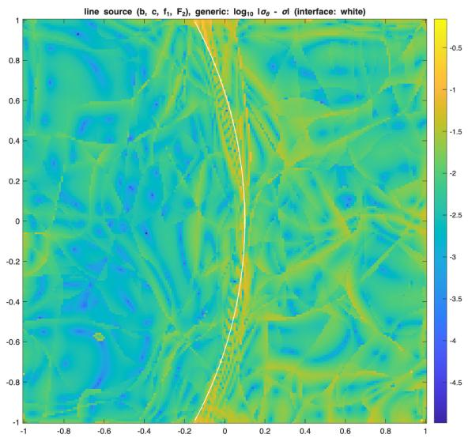

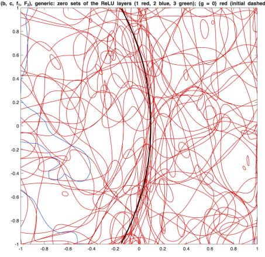  
(b) kink sets of the network, black

(a) $\log _ { 1 0 } \left| \sigma _ { \theta } - \sigma \right| .$ , white  
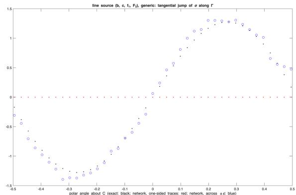  
(c) tangential jump of along : exact (black), across ±0.005 (blue)  
Figure 1. Example 1, generic level, first class: (a) $\log _ { 1 0 } | \pmb { \sigma } _ { \theta } - \pmb { \sigma } | ;$ (b) the kink sets of the three ReLU layers and Γ; (c) the tangential jump of σ along Γ against the polar angle about C: exact, and of $\sigma _ { \theta }$ across ±0.005.

At 90 minutes the two classes give errors of 0.28% and 0.30% in u and of 0.26% and 0.27% in σ; the second run made 274 steps, the first 422. With the first, $\mathcal { I } _ { \mathrm { c h e c k } }$ decreased in every phase, from $4 . 1 \cdot 1 0 ^ { - 3 }$ after the first to $8 . 0 \cdot 1 0 ^ { - 4 }$ after the last (0.60% and 0.26% for σ), and was still decreasing at the time limit. Figure 1 shows the first class. The error of σ is largest in a narrow band along Γ (Figure 1(a)). No single kink set of the network lies on Γ; the tangential jump of $\sigma$ is carried by several kink sets of the first layer close to it (Figure 1(b)), and measured across $\pm 0 . 0 0 5$ it follows the exact jump with a relative error of 7.8% (Figure 1(c)). Example 2 (hyperplane interface in Rn, Levels I and II). Ω is the unit ball of Example 2 (hyperplane interface in Rⁿ, Levels I and II). Ω is the unit ball of $\mathbb { R } ^ { n } , n = 4 , 8 , \Gamma = \{ x _ { 1 } =$ $s \} \cap \Omega$ with $s = 0 . 1$ , A = αI with $\alpha = 1$ for $x _ { 1 } < s$ and $\alpha = 3$ for $x _ { 1 } > s , \mathbf { b } = n ^ { - 1 / 2 } ( 1 , \ldots , 1 ) , \beta = 0 , c = 1$ so the problem is nonsymmetric. The solution and the flux are chosen independently:

$$
u = U \left( x _ { 1 } < s \right) , \quad u = U + ( x _ { 1 } - s ) V \left( x _ { 1 } > s \right) ; \qquad \sigma = { \bf S } \left( x _ { 1 } < s \right) , \quad \sigma = { \bf S } + M { \bf e } _ { 2 } \left( x _ { 1 } > s \right) ,
$$

$\begin{array} { r } { U = n ^ { - 1 / 2 } \sum _ { r } \cos ( \pi x _ { r } / 2 ) , V = 1 + \frac { 1 } { 9 } \sin \pi x _ { 2 } , S _ { r } = n ^ { - 1 / 2 } \sin ( \pi x _ { r + 1 } / 2 ) + x _ { 1 } \delta _ { r 1 } } \end{array}$ (indices cyclic), $M = 1 +$ 2 sin π $x _ { 3 } .$ , and $\mathbf { f } _ { 2 } = - \alpha \operatorname { g r a d } u - { \pmb \sigma } , ~ f _ { 1 } = \operatorname { d i v } { \pmb \sigma } + { \mathbf { b } } \cdot \operatorname { g r a d } u + c u , g _ { D } = u$ . Then $[ [ u ] ] = 0 , [ \partial _ { 1 } u ] = V , [ [ \pmb { \sigma } \cdot \mathbf { e } _ { 1 } ] ] = 0$ and $[ [ \pmb { \sigma } \cdot \mathbf { e } _ { 2 } ] ] = M \colon$ the kink of u and the tangential jump of σ are independent, and $\mathbf { f } _ { 2 } \in L ^ { 2 }$ is not in H(div), since $[ [ \mathbf { f } _ { 2 } \cdot \mathbf { e } _ { 1 } ] ] = - [ [ \alpha \partial _ { 1 } u ] ] \neq 0$ . The classes are ${ \pmb \sigma } _ { \theta } = \mathrm { D i v } A _ { \theta } + \mathcal { R } _ { n } q _ { \theta }$ with center 0, or ${ \pmb \sigma } _ { \theta } = \mathrm { D i v } A _ { \theta } + { \bf z } _ { \theta }$

with $\mathbf { z } _ { \theta }$ an output of n components without module, since div $\sigma = 1$ on both sides; ${ \cal A } _ { \theta } = { \cal A } _ { 0 , \theta } + m { \cal N } _ { \theta }$ skew, $\boldsymbol { v } _ { \boldsymbol { \theta } } = \boldsymbol { v } _ { 0 , \boldsymbol { \theta } } + m \boldsymbol { v } _ { 1 , \boldsymbol { \theta } } ,$ , all outputs of one network with two tanh layers of width 32; $m = | x _ { 1 } - s |$ (Level I) or $m = \mathrm { R e L U } ( g _ { \eta } )$ (Level II) with $g _ { \eta } ( x ) = \mathbf { a } \cdot x - c _ { 0 } + \mathbf { w } ^ { T }$ tanh $( W x + \mathbf { b } _ { 0 } ) + c _ { 2 }$ , W with 10 rows, initially the plane $x _ { 1 } + 0 . 1 5 x _ { 2 } + 0 . 1 x _ { 3 } = s + 0 . 1 5$ . The integrals are taken on rays from 0 along N scrambled Sobol directions, split at Γ (Level I) or at the zeros of $g _ { \eta }$ (Level II), with Gauss rules for the weight $\rho ^ { n - 1 }$ , so the functional is integrated directly; the boundary term is the $L ^ { 2 }$ form of Section 7.3, $w _ { b } \| v - g _ { D } \| _ { 0 , \partial \Omega } ^ { 2 }$ with ${ w _ { b } } = 1 0 0$ . Level I is trained by Levenberg–Marquardt; Level II in two stages, L-BFGS on all parameters (the interface fixed for the first 100 iterations) until the zeros of $g _ { \eta }$ settle, then Levenberg–Marquardt on the network with the interface fixed. The check $\mathcal { I } _ { \mathrm { c h e c k } }$ uses 4N directions.
<table><tr><td>n</td><td>level</td><td>class</td><td>N</td><td>iterations</td><td>J</td><td> $\mathcal { I } _ { \mathrm { c h e c k } }$ </td><td> $| u - u _ { \theta } | _ { 1 }$ </td><td> $\| { \pmb { \sigma } } - { \pmb { \sigma } } _ { \theta } \| _ { 0 }$ </td><td>distance</td></tr><tr><td>4</td><td>I</td><td> $\mathcal { R } _ { n } q$ </td><td>1024</td><td>463</td><td> $8 . 9 \cdot 1 0 ^ { - 9 }$ </td><td> $1 . 5 \cdot 1 0 ^ { - 8 }$ </td><td> $1 . 7 \cdot 1 0 ^ { - 5 }$ </td><td> $4 . 0 \cdot 1 0 ^ { - 5 }$ </td><td>一</td></tr><tr><td>4</td><td>I</td><td>Z</td><td>1024</td><td>543</td><td> $4 . 5 \cdot 1 0 ^ { - 9 }$ </td><td> $8 . 6 \cdot 1 0 ^ { - 9 }$ </td><td> $1 . 3 \cdot 1 0 ^ { - 5 }$ </td><td> $3 . 6 \cdot 1 0 ^ { - 5 }$ </td><td>一</td></tr><tr><td>8</td><td>I</td><td> $\mathcal { R } _ { n } q$ </td><td>2048</td><td>99</td><td> $8 . 4 \cdot 1 0 ^ { - 6 }$ </td><td> $1 . 5 \cdot 1 0 ^ { - 5 }$ </td><td> $5 . 9 \cdot 1 0 ^ { - 4 }$ </td><td> $1 . 0 \cdot 1 0 ^ { - 3 }$ </td><td>一</td></tr><tr><td>8</td><td>I</td><td>Z</td><td>2048</td><td>97</td><td> $2 . 1 \cdot 1 0 ^ { - 6 }$ </td><td> $4 . 8 \cdot 1 0 ^ { - 6 }$ </td><td> $4 . 0 \cdot 1 0 ^ { - 4 }$ </td><td> $3 . 7 \cdot 1 0 ^ { - 4 }$ </td><td></td></tr><tr><td>4</td><td>II</td><td> $\mathcal { R } _ { n } q$ </td><td>1024</td><td>586</td><td> $1 . 5 \cdot 1 0 ^ { - 3 }$ </td><td> $2 . 7 \cdot 1 0 ^ { - 3 }$ </td><td>1.2%</td><td>1.5%</td><td> $3 . 6 \cdot 1 0 ^ { - 4 }$ </td></tr><tr><td>4</td><td>II</td><td>Z</td><td>1024</td><td>875</td><td> $9 . 7 \cdot 1 0 ^ { - 4 }$ </td><td> $1 . 5 \cdot 1 0 ^ { - 3 }$ </td><td>1.0%</td><td>1.0%</td><td> $6 . 3 \cdot 1 0 ^ { - 5 }$ </td></tr><tr><td>8</td><td>II</td><td> $\mathcal { R } _ { n } q$ </td><td>4096</td><td>548</td><td> $5 . 9 \cdot 1 0 ^ { - 4 }$ </td><td> $7 . 1 \cdot 1 0 ^ { - 4 }$ </td><td>0.82%</td><td>0.93%</td><td> $1 . 8 \cdot 1 0 ^ { - 5 }$ </td></tr><tr><td>8</td><td>II</td><td> $\mathbf { z }$ </td><td>4096</td><td>398</td><td> $1 . 4 \cdot 1 0 ^ { - 3 }$ </td><td> $1 . 7 \cdot 1 0 ^ { - 3 }$ </td><td>1.2%</td><td>1.5%</td><td> $6 . 0 \cdot 1 0 ^ { - 5 }$ </td></tr></table>

“Distance” is the mean of $| x _ { 1 } ^ { * } - s |$ over the section $x _ { 4 } = \cdot \cdot \cdot = x _ { n } = 0$ of Γ, where $g _ { \eta } ( x _ { 1 } ^ { * } , x _ { 2 } , x _ { 3 } , 0 , \dots , 0 ) = 0$ (for the first class the maximum is $1 . 4 \cdot 1 0 ^ { - 3 }$ for $n = 4$ and $1 . 4 \cdot 1 0 ^ { - 4 }$ for $n = 8 ;$ Figure 2). With the known interface the module carries the kink exactly on Γ; for the first class the errors are $1 0 ^ { - 5 }$ for $n = 4$ and about $1 0 ^ { - 3 }$ for $n = 8 .$ , both runs ended at their time limits of 15 and 30 minutes, and for $n = 8$ an iteration takes 18 seconds. For the first class with the learned interface, the first stage moved the zero set of $g _ { \eta }$ from the initial tilted plane toward Γ; the interface was then fixed, and Levenberg–Marquardt was applied to the remaining network parameters: for $n = 4 .$ , 500 L-BFGS iterations and 86 Levenberg–Marquardt steps; for $n = 8 ,$ , 486 L-BFGS iterations, at the limit of 84 minutes for the first stage, and 62 Levenberg–Marquardt steps, in 120 minutes in all. For the first class at $n = 8 ,$ the learned interface lies within $1 . 4 \cdot 1 0 ^ { - 4 }$ of $\Gamma$ on the section, and the errors are below $1 \%$ . With the same network and time, the second class gives, with the known interface, errors of u and σ smaller by factors 1.3 and 1.1 for $n = 4$ and 1.5 and 2.7 for $n = 8 .$ With the learned interface it gives smaller errors and a smaller mean distance for $n = 4 ~ ( 1 . 0 \%$ against 1.2% and $1 . 5 \% , 6 . 3 \cdot 1 0 ^ { - 5 }$ against $3 . 6 \cdot 1 0 ^ { - 4 }$ , maximum $3 . 8 \cdot 1 0 ^ { - 4 } )$ , and larger ones for $n = 8 \ ( 1 . 2 \%$ and 1.5% against 0.82% and $0 . 9 3 \% , 6 . 0 \cdot 1 0 ^ { - 5 }$ against $1 . 8 \cdot 1 0 ^ { - 5 }$ , maximum $5 . 6 \cdot 1 0 ^ { - 4 } )$ , where it made 398 iterations against 548. Figure 2 shows the first class.

## 8. Curl–curl problems

Let $\Omega \subset \mathbb { R } ^ { 3 }$ be a bounded Lipschitz domain, $\mu , \kappa \in L ^ { \infty } ( \Omega )$ with $\mu \geq \mu _ { 0 } > 0$ and $\kappa \geq \kappa _ { 0 } > 0$ , and $\mathbf { f } \in L ^ { 2 } ( \Omega ) ^ { 3 }$ . Seek $\mathbf { E } \in H _ { 0 } ( \mathrm { c u r l } ; \Omega )$ with

$$
\operatorname { c u r l } \left( { \boldsymbol { \mu } } ^ { - 1 } \operatorname { c u r l } \mathbf { E } \right) + \kappa \mathbf { E } = \mathbf { f } \quad { \mathrm { i n ~ } } { \Omega } , \qquad \mathbf { E } \times \mathbf { n } = 0 \quad { \mathrm { o n ~ } } \partial \Omega .\tag{8.1}
$$

With $\mathbf { H } : = \mu ^ { - 1 }$ curl $\mathbf { E } \in H ( \mathrm { c u r l } ; \Omega )$ the first-order system is $\mu ^ { 1 / 2 } \mathbf { H } - \mu ^ { - 1 / 2 } \operatorname { c u r l } \mathbf { E } = 0$ , curl $\mathbf { H } + \kappa \mathbf { E } = \mathbf { f }$ , and

$$
\mathscr { L } _ { 3 } ( \mathbf { F } , \mathbf { W } ; \mathbf { f } ) : = \| \mu ^ { 1 / 2 } \mathbf { W } - \mu ^ { - 1 / 2 } \operatorname { c u r l } \mathbf { F } \| _ { 0 } ^ { 2 } + \| \kappa ^ { - 1 / 2 } ( \operatorname { c u r l } \mathbf { W } + \kappa \mathbf { F } - \mathbf { f } ) \| _ { 0 } ^ { 2 } .\tag{8.2}
$$

Lemma 8.1 (exact norm identity). For $\mathbf { F } \in H _ { 0 } ( \mathrm { c u r l } ; \Omega )$ and $\mathbf { W } \in H ( \mathrm { c u r l } ; \Omega )$

$$
\mathcal { L } _ { 3 } ( \mathbf { F } , \mathbf { W } ; 0 ) = \| \boldsymbol { \mu } ^ { - 1 / 2 } \operatorname { c u r l } \mathbf { F } \| _ { 0 } ^ { 2 } + \| \boldsymbol { \kappa } ^ { 1 / 2 } \mathbf { F } \| _ { 0 } ^ { 2 } + \| \boldsymbol { \mu } ^ { 1 / 2 } \mathbf { W } \| _ { 0 } ^ { 2 } + \| \boldsymbol { \kappa } ^ { - 1 / 2 } \operatorname { c u r l } \mathbf { W } \| _ { 0 } ^ { 2 } .
$$

Proof. Expanding, the cross terms are $- 2 ( \mathbf { W } , \operatorname { c u r l } \mathbf { F } ) + 2 ( \operatorname { c u r l } \mathbf { W } , \mathbf { F } )$ , and $( \operatorname { c u r l } \mathbf { W } , \mathbf { F } ) = ( \mathbf { W } , \operatorname { c u r l } \mathbf { F } )$ for $\mathbf { F } \in$ $H _ { 0 } ( \mathrm { c u r l } ; \Omega )$ □

Since the system is linear, $\mathcal { L } _ { 3 } ( \mathbf { F } , \mathbf { W } ; \mathbf { f } )$ is the right-hand side of the lemma for (E−F, H−W): the functional is exactly the error in the energy norms, and no separate stability argument for the least-squares formulation is needed (the existence of the solution comes from the well-posedness of (8.1)). This is Proposition 6.3 with $X = H _ { 0 } ( \mathrm { c u r l } ; \Omega ) \times H ( \mathrm { c u r l } ; \Omega )$ and $c _ { L } = C _ { L } = 1$ in these norms. We use the classes of Section 5.3,

$$
{ \bf E } _ { \theta } = \mathrm { g r a d } \phi _ { \theta } + { \bf z } _ { \theta } , \qquad { \bf H } _ { \theta } = \mathrm { g r a d } \chi _ { \theta } + { \bf w } _ { \theta } ,
$$

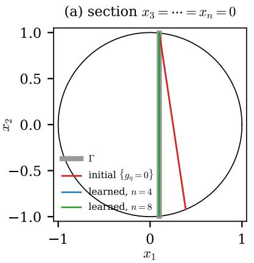

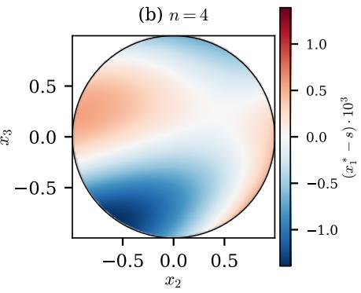

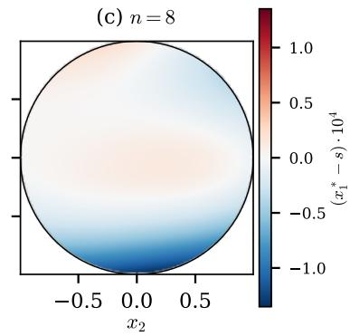  
Figure 2. Example 2, Level II. (a) Section $x _ { 3 } = \cdot \cdot \cdot = x _ { n } = 0$ of the unit ball: $\Gamma = \{ x _ { 1 } = s \}$ (gray), the initial zero set of $g _ { \eta }$ (red) and the learned zero sets for $n = 4$ (blue) and $n = 8$ (green). (b), (c) Position of the learned zero set on the section $x _ { 4 } = \cdot \cdot \cdot = x _ { n } = 0 \colon x _ { 1 } ^ { * } - s$ with $g _ { \eta } ( x _ { 1 } ^ { * } , x _ { 2 } , x _ { 3 } , 0 , \dots , 0 ) = 0$ , for $n = 4$ (scale $1 0 ^ { - 3 } )$ and $n = 8$ (scale $1 0 ^ { - 4 } )$ .

with $\phi _ { \theta } \in H _ { 0 } ^ { 1 } ( \Omega )$ and $\mathbf { z } _ { \theta } \in H _ { 0 } ^ { 1 } ( \Omega ) ^ { 3 }$ (networks multiplied by a function that vanishes on ∂Ω), so that $\mathbf { E } _ { \theta } \times \mathbf { n } = 0$ on $\partial \Omega$ for every parameter value, and $\chi _ { \theta } \in H ^ { 1 } ( \Omega ) , \mathbf { w } _ { \theta } \in \overline { { H ^ { 1 } ( \Omega ) ^ { 3 } } }$ ; by Proposition 5.5 the error is bounded by the $H ^ { 1 }$ errors of ϕθ, zθ, $\chi _ { \theta }$ and $\mathbf { w } _ { \theta }$

Interfaces. Across an interface of κ or $\mu$ , E and H have continuous tangential traces, while E · n may jump, and so may H · n where µ jumps, since $\mu \mathbf { H } = \mathrm { c u r l } \mathbf { E } \in H ( \mathrm { d i v } ; \Omega )$ has a continuous normal component. Both normal jumps are kinks of the scalar potentials, $[ \mathbf { E } \cdot \mathbf { n } ] = [ \partial _ { \mathbf { n } } \phi ]$ and $[ \mathbf { H } \cdot \mathbf { n } ] = [ \partial _ { \mathbf { n } } \chi ]$ (Proposition 5.8), and the scalar interface modules of that proposition are used for ϕθ (inside the boundary factor) and $\chi _ { \theta } ;$ the regular parts $\mathbf { z } _ { \theta }$ and $\mathbf { w } _ { \theta }$ have no jumps.

Remark 8.2 (no equation built in). Neither equation is built in. Building in curl $\mathbf { E } _ { \theta } = \mu \mathbf { H } _ { \theta }$ would require $\mathrm { d i v } ( \mu \mathbf { H } _ { \theta } ) = 0$ , which a network $\mathbf { H } _ { \theta } \in H ( \operatorname { c u r l } )$ does not satisfy automatically; parameterizing $\mu \mathbf { H } = \operatorname { c u r l } { \boldsymbol { \Psi } }$ instead loses the tangential continuity of H across jumps of $\mu .$ Only the conformity is structural.

8.1. Numerical example. $\Omega = ( 0 , 1 ) ^ { 3 } , \mu = 1 , \kappa = 1$ for $\begin{array} { r } { x _ { 1 } < \frac { 1 } { 2 } } \end{array}$ and $\kappa = 1 0$ for $\begin{array} { r } { x _ { 1 } > \frac { 1 } { 2 } } \end{array}$ , and

$$
{ \bf E } = { \bf E } _ { 1 } + \mathrm { g r a d } \phi ^ { * } , \qquad { \bf E } _ { 1 } = ( \sin \pi x _ { 2 } \sin \pi x _ { 3 } , \sin \pi x _ { 3 } \sin \pi x _ { 1 } , \sin \pi x _ { 1 } \sin \pi x _ { 2 } ) ,
$$

$$
\begin{array} { r } { \phi ^ { * } = A \mathopen { } \mathclose \bgroup \left( \frac { 1 } { 2 } - | x _ { 1 } - \frac { 1 } { 2 } | \aftergroup \egroup \right) \sin \pi x _ { 2 } \sin \pi x _ { 3 } , } \end{array}
$$

with $A = 9 / 1 1 , { \bf H } = \mathrm { c u r l } { \bf E } _ { 1 }$ and ${ \mathbf f } = 2 \pi ^ { 2 } { \mathbf E } _ { 1 } + \kappa { \mathbf E }$ . Then $\mathbf { E } \times \mathbf { n } = 0$ on $\partial \Omega , { \bf E } \times { \bf e } _ { 1 }$ is continuous across $\begin{array} { r } { x _ { 1 } = \frac { 1 } { 2 } } \end{array}$ 2 $\left[ \mathbf { E \cdot e } _ { 1 } \right] = - 2 A$ sin πx sin πx and $\ [ \kappa \mathbf { E \cdot e } _ { 1 } ] = 0$ . The classes are ${ \bf E } _ { \theta } = \mathrm { g r a d } ( B \phi _ { \theta } ) + B { \bf z } _ { \theta }$ and $\mathbf { H } _ { \theta } = \operatorname { g r a d } \chi _ { \theta } + \mathbf { w } _ { \theta }$ with $1 / B = 1 / ( x _ { 1 } ( 1 - x _ { 1 } ) ) + 1 / ( x _ { 2 } ( 1 - x _ { 2 } ) ) + 1 / ( x _ { 3 } ( 1 - x _ { 3 } ) )$ , so that B is Lipschitz in Ω, smooth in Ω and $B = 0$ on ∂Ω, and ϕθ, zθ, χθ, wθ are outputs of one network with two tanh layers of width 30. At Level $\mathrm { I , }$ $\begin{array} { r } { \phi _ { \theta } = \phi _ { 0 , \theta } + | x _ { 1 } - \frac { 1 } { 2 } | N _ { \theta } ; } \end{array}$ at Level II, $\phi _ { \theta } = \phi _ { 0 , \theta } + \mathrm { R e L U } ( g _ { \eta } ) N _ { \theta }$ with $g _ { \eta }$ as in Example 2, initially a tilted plane; at Level III the network has three further ReLU layers of width 20 and no module. The training functional is that of Section 6, with the moments of $\operatorname { g r a d } ( B \phi )$ , curl(Bz), grad χ and curl w computed from values on boxes; the boxes have side $1 / 1 6 ,$ , graded three times towards $\begin{array} { r } { x _ { 1 } = \frac { 1 } { 2 } } \end{array}$ and once towards ∂Ω, and are refined after every phase of ten minutes, up to 16000 boxes. The check $\mathcal { I } _ { \mathrm { c h e c k } }$ uses 28224 boxes with $3 ^ { 3 }$ Gauss points; for Level III it is not cut along the kink sets of the network. We report the relative $L ^ { 2 }$ errors and the relative error in the energy norm of Lemma 8.1.

<table><tr><td>level</td><td>seed</td><td>steps</td><td>time</td><td> $\mathcal { I } _ { \mathrm { c h e c k } }$ </td><td>E</td><td>curl E</td><td>H</td><td>curl H</td><td>energy</td></tr><tr><td>I</td><td>1</td><td>96</td><td>13 min</td><td> $3 . 4 \cdot 1 0 ^ { - 3 }$ </td><td>0.49%</td><td>1.49%</td><td>0.14%</td><td>0.10%</td><td>0.42%</td></tr><tr><td>II</td><td>1</td><td>75</td><td>13 min</td><td> $7 . 9 \cdot 1 0 ^ { - 3 }$ </td><td>1.15%</td><td>2.19%</td><td>0.28%</td><td>0.22%</td><td>0.64%</td></tr><tr><td>II</td><td>2</td><td>72</td><td>13 min</td><td> $1 . 0 \cdot 1 0 ^ { - 2 }$ </td><td>1.73%</td><td>2.42%</td><td>0.39%</td><td>0.27%</td><td>0.72%</td></tr><tr><td>II</td><td>3</td><td>56</td><td>10 min</td><td> $2 . 6 \cdot 1 0 ^ { - 2 }$ </td><td>2.23%</td><td>3.58%</td><td>1.00%</td><td>0.78%</td><td>1.14%</td></tr><tr><td>III</td><td>1</td><td>183</td><td>60 min</td><td> $3 . 6 \cdot 1 0 ^ { - 2 }$ </td><td>4.47%</td><td>3.49%</td><td>1.23%</td><td>1.17%</td><td>1.35%</td></tr></table>

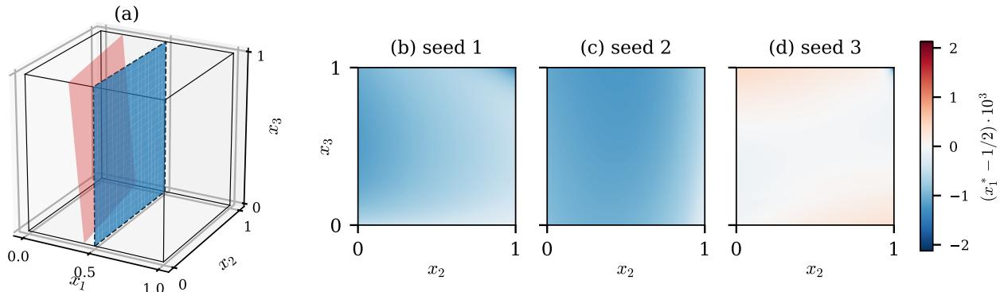

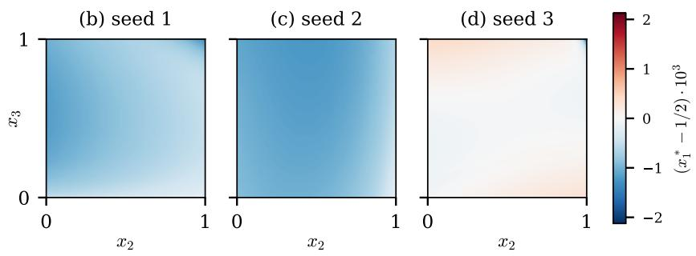  
Figure 3. Section 8.1, Level II. (a) The interface $\textstyle x _ { 1 } = { \frac { 1 } { 2 } }$ (dashed), the initial zero set of $g _ { \eta }$ (red) and the learned zero set for the first initial network (blue). (b)–(d) Position of the learned zero set for the three initial networks: $x _ { 1 } ^ { * } - { \frac { 1 } { 2 } }$ with $g _ { \eta } ( x _ { 1 } ^ { * } , x _ { 2 } , x _ { 3 } ) = 0$ , over $( x _ { 2 } , x _ { 3 } ) \in$ $( 0 , 1 ) ^ { 2 }$

The runs at Levels I and II ended before their time limit of 30 minutes. At Level II all three initial networks moved the zero set of $g _ { \eta }$ from the initial tilted plane to the interface $( { \mathrm { F i g u r e } } \ 3 )$ : with $g _ { \eta } ( x _ { 1 } ^ { * } , x _ { 2 } , x _ { 3 } ) = 0$ , the mean of $\lvert x _ { 1 } ^ { * } - \textstyle \frac { 1 } { 2 } \rvert$ over $( x _ { 2 } , x _ { 3 } ) \in ( 0 , 1 ) ^ { 2 }$ is $7 . 5 \cdot 1 0 ^ { - 4 } , 1 . 0 \cdot 1 0 ^ { - 3 }$ and $7 . 9 \cdot 1 0 ^ { - 5 }$ , and its maximum $1 . 3 \cdot 1 0 ^ { - 3 }$ $1 . 2 \cdot 1 0 ^ { - 3 }$ and $2 . 1 \cdot 1 0 ^ { - 3 }$ . The energy-norm error is below 1.5% at all levels and about 0.5% with the interface known.

## 9. Linear transport

We use the flux formulation of [51], in which the flux is the H(div) unknown.

Let $\Omega \subset \mathbb { R } ^ { 2 }$ be a bounded, simply connected Lipschitz polygon, $\beta \in W ^ { 1 , \infty } ( \Omega ) ^ { 2 } , \gamma \in L ^ { \infty } ( \Omega ) , f \in L ^ { 2 } ( \Omega )$ and $\Gamma _ { - } : = \{ x \in \partial \Omega : \beta \cdot \mathbf { n } < 0 \}$ the inflow boundary. We seek u with

$$
\operatorname { d i v } ( \beta u ) + \gamma u = f \quad \mathrm { i n } \Omega , \qquad u = g \quad \mathrm { o n } \Gamma _ { - } ,\tag{9.1}
$$

where $\beta , \gamma$ satisfy [51, Assumption 2.1] and $g \in L ^ { 2 } ( | \beta \cdot \mathbf { n } | ; \Gamma _ { - } )$ ; then (9.1) has a unique solution [51, Theorem 2.2]. The flux $\sigma : = \beta u$ satisfies $\sigma - \beta u = 0$ and div $\sigma + \gamma u = f ,$ so $\pmb { \sigma } \in H ( \mathrm { d i v } ; \Omega )$ , and ${ \boldsymbol { \sigma } } \cdot { \bf n } = ( { \boldsymbol { \beta } } \cdot { \bf n } ) g$ on Γ . In the language of diferential forms, σ is the contraction $\iota _ { \beta }$ of the density u vol, and div σ is its Lie derivative along $\beta ,$ by Cartan’s formula $\mathcal { L } _ { \beta } = \mathrm { d } \iota _ { \beta } + \iota _ { \beta } \mathrm { d }$ for forms of top degree [37, Section 5.1]; this is why the flux is the $H ( \mathrm { d i v } )$ unknown. The least-squares functional is

$$
\mathcal { I } _ { \mathrm { t r } } ( \tau , v ) : = \| \tau - \beta v \| _ { 0 } ^ { 2 } + \| \mathrm { d i v } \tau + \gamma v - f \| _ { 0 } ^ { 2 } + w _ { s } \| \tau \cdot \mathbf { n } - ( \beta \cdot \mathbf { n } ) g \| _ { 0 , \Gamma _ { - } } ^ { 2 } + w _ { u } \| v - g \| _ { 0 , \Gamma _ { - } } ^ { 2 } .\tag{9.2}
$$

Both inflow conditions hold for the solution and are imposed here through the boundary terms, $w _ { s } , w _ { u } > 0 ;$ for the last term we assume in addition $g \in L ^ { 2 } ( \Gamma _ { - } )$ (the weighted term $\bar { w } _ { u } \| | \beta \cdot \mathbf { n } | ^ { 1 / 2 } ( v - g ) \| _ { 0 , \Gamma _ { - } } ^ { 2 }$ would need no additional assumption). With the flux condition imposed in the trial space and $\begin{array} { r } { w _ { s } = w _ { u } = 0 } \end{array}$ , (9.2) is the functional of [51, Section 3]; the native classes of Sections 2 and 3, however, do not preserve a prescribed normal trace on $\Gamma _ { - }$ . We consider the functional on admissible pairs $( \tau , v ) \in H ( \mathrm { d i v } ; \Omega ) \times L ^ { 2 } ( \Omega )$ for which the two boundary traces appearing in $\mathcal { I } _ { \mathrm { t r } } , \tau \cdot \mathbf { n }$ and v on $\Gamma _ { - } ,$ are defined and square integrable; this includes the exact solution and the neural trial classes used below.

Lemma 9.1 (error identity). For admissible pairs $( \tau , v )$ let $\lvert \lvert \lvert ( \pmb { \tau } , \pmb { v } ) \rvert \rvert \rvert ^ { 2 } : = \lVert \pmb { \tau } - \beta \pmb { v } \rVert _ { 0 } ^ { 2 } + \lVert \operatorname { d i v } \pmb { \tau } + \gamma \pmb { v } \rVert _ { 0 } ^ { 2 } + w _ { s } \lVert \pmb { \tau }$ $\mathbf { n } \| _ { 0 , \Gamma _ { - } } ^ { 2 } + w _ { u } \| v \| _ { 0 , \Gamma _ { - } } ^ { 2 }$ . Then

$$
\mathcal { I } _ { \mathrm { t r } } ( \pmb { \tau } , \pmb { v } ) = | | | ( \pmb { \tau } - \pmb { \sigma } , \pmb { v } - \pmb { u } ) | | | ^ { 2 } ,\tag{9.3}
$$

$$
| | ( \tau , v ) | | | = 0 \ o n l y f o r ( \tau , v ) = 0 , \ a n d \ | | | ( \tau , v ) | | | \leq C \bigl ( | | \tau | | _ { H ( \mathrm { d i v } ) } + | | v | | _ { 0 } + | | \tau \cdot \mathbf { n } | | _ { 0 , \Gamma _ { - } } + | | v | | _ { 0 , \Gamma _ { - } } \bigr ) .
$$

Proof. The problem is linear and $( \sigma , u )$ makes every term vanish, which gives (9.3). If $| | | ( \tau , v ) | | | = 0$ , then $\tau = \beta v , \mathrm { d i v } ( \beta v ) + \gamma v = 0$ and $( \beta \cdot \mathbf { n } ) v = \tau \cdot \mathbf { n } = 0$ on Γ−, so v = 0 there and $v = 0 , \tau = 0$ by uniqueness [51, Lemma 3.1]. The upper bound is the triangle inequality. □

No lower bound by the norm of $H ( \mathrm { d i v } ; \Omega ) \times L ^ { 2 } ( \Omega )$ is claimed: the functional is the error in $| | | \cdot | | |$ , and the statements below are in this norm; in particular nothing is claimed for the $L ^ { 2 }$ error of v. For the flux classes of Sections 2.7 and $3 . 2 , \tau _ { \theta } = \mathbf { c u r l } \psi _ { \theta } + \mathcal { R } _ { 2 } q _ { \theta }$ or $\pmb { \tau } _ { \theta } = \mathbf { c u r l } \psi _ { \theta } + \mathbf { z } _ { \theta }$ , and a scalar network vθ, (9.3) bounds the error of an approximate minimizer by the best approximation error in $| | | \cdot | | |$ , and hence by the errors of the representing functions of $\pmb { \sigma } = \mathbf { c u r l } \psi ^ { * } + \mathcal { R } _ { 2 } q ^ { * } , q ^ { * } = f - \gamma u$ (Corollary 2.13), or of $\pmb { \sigma } =$ curl $\psi ^ { * } + \mathbf { z } ^ { * }$ (Theorem 3.2), of u in $L ^ { 2 } ( \Omega )$ , and of $\pmb { \sigma } \cdot \mathbf { n }$ and u in $L ^ { 2 } ( \Gamma _ { - } )$ . The divergence equation is treated at the first level of Remark 6.7: the second residual is $q _ { \theta } + \gamma v _ { \theta } - f .$ , or div ${ \bf z } _ { \theta } + \gamma v _ { \theta } - f ;$ eliminating q by $q = f - \gamma v _ { ; }$ which only the first class allows, would be the second level.

Assume in addition that f and γ are piecewise continuous near a characteristic Γ through a jump of g, with γ continuous across Γ and f without a jump there. Across Γ, u jumps and ${ \boldsymbol { \beta } } \mathbf { \cdot n } _ { \Gamma } = 0$ , so $[ { \pmb { \sigma } } \mathbf { \cdot n } ] ] = 0$ and $[ \pmb { \sigma } ] ] = [ [ u ] ] \beta$ is tangential. By Corollary 4.10(b) the jump is carried by the kink of the potential, $[ [ \partial _ { \mathbf { n } } \psi ^ { * } ] ] = - [ [ \pmb { \sigma } \cdot \mathbf { t } ] ]$ , while $q ^ { * }$ jumps by −γ[[u]]: in the first class $\mathcal { R } _ { 2 } q ^ { * }$ is continuous under the condition on the segments of Lemma 2.5, and in the second the jump of $q ^ { * } = \mathrm { d i v } \mathbf { z } ^ { * }$ is carried by a kink of $\mathbf { z } ^ { \ast } \in H ^ { 1 } ( \Omega ) ^ { 2 }$ , which has no interface jump (Lemma 4.12). The interface modules of Sections 4.2 and 4.4 apply with the characteristic as the interface. The value v enters only through $\tau - \beta v$ , γv and the inflow term, and v and q are required only in $L ^ { 2 } ;$ with an interface variable they may therefore jump across it, $v = V _ { 0 } + \chi V _ { 1 }$ and $q = Q _ { 0 } + \chi Q _ { 1 }$ with χ the indicator function of one side, or, without an interface variable, by steps of the units of a generic network (Section 9.1), while a continuous network vθ approximates the jump of u by a transition.

9.1. Numerical example. We take the example of [51, Section 7.10] in its discontinuous limit: $\Omega = ( 0 , 1 ) ^ { 2 }$ $\beta = ( x _ { 2 } + 1 , - x _ { 1 } ) / r$ with $r = | ( x _ { 1 } , x _ { 2 } + 1 ) |$ , the unit clockwise field about (0, −1), which is divergence free, $\gamma = 0 . 1 , f = 0$ , the inflow boundary $\Gamma _ { - } = \{ x _ { 1 } = 0 \} \cup \{ x _ { 2 } = 1 \}$ , and

$$
\begin{array} { r } { u = \frac { \pi } { 8 } e ^ { \gamma r \vartheta } \mathrm { s g n } ( r - 1 . 5 ) , \qquad \vartheta = \mathrm { a t a n 2 } ( x _ { 2 } + 1 , x _ { 1 } ) . } \end{array}
$$

Since $\beta$ is tangent to the circles $r = { \mathrm { c o n s t } } , \beta \cdot { \mathrm { g r a d } } u + \gamma u = 0$ holds in the sense of distributions, and u jumps across the characteristic $\Gamma = \{ r = 1 . 5 \}$ , which runs from (0, 0.5) to (1, 0.118), by $( \pi / 4 ) e ^ { 0 . 1 5 \vartheta } \in [ 0 . 8 9 , 0 . 9 9 ]$ (The computations use the profile $\scriptstyle { \frac { 1 } { 4 } } e ^ { \gamma { \bar { r } } \vartheta } \arctan ( ( r - 1 . 5 ) / \varepsilon )$ of [51] with $\varepsilon = 1 \mathrm { { 0 } ^ { - 1 0 } }$ , which difers from u only in a layer of width $O ( \varepsilon )$ about Γ; all numerical errors reported below are measured against this profile.) The interface is learned (Level II of Section 4.7): $\sigma _ { \boldsymbol { \theta } } =$ curl $\psi _ { \theta } + \mathcal { R } _ { 2 } q _ { \theta }$ with $x _ { 0 } = ( 0 . 3 , 0 . 2 )$ and

$$
\psi _ { \theta } = P _ { 0 } + \mathrm { R e L U } ( g _ { \eta } ) P _ { 1 } , \qquad q _ { \theta } = Q _ { 0 } + \chi Q _ { 1 } , \qquad v _ { \theta } = V _ { 0 } + \chi V _ { 1 } , \qquad \chi = { \bf 1 } _ { \{ g _ { \eta } > 0 \} } ,
$$

where $P _ { 0 } , P _ { 1 }$ are the outputs of a network with two tanh layers of width $3 0 , Q _ { 0 } , Q _ { 1 } , V _ { 0 } , V _ { 1 }$ those of a network with two tanh layers of width 20, and $g _ { \eta } = \tilde { g } - \tilde { g } ( x _ { d } )$ with $\widetilde g ( x ) = \mathbf a \cdot x + c + \mathbf w ^ { T }$ tanh $\left( U x + \mathbf { b } \right)$ , U with 10 rows, so that the curve $\{ g _ { \eta } = 0 \}$ passes through the jump point $x _ { d } = ( 0 , 0 . 5 )$ of the inflow data for every parameter value. In the second class $\pmb { \sigma } _ { \theta } = \mathbf { c u r l } \psi _ { \theta } + \mathbf { z } _ { \theta }$ with the same ψ and v and

$$
{ \bf z } _ { \theta } = { \bf Z } _ { 0 } + \mathrm { R e L U } ( g _ { \eta } ) { \bf Z } _ { 1 } ,
$$

$\mathbf { Z } _ { 0 } , \mathbf { Z } _ { 1 }$ four further outputs of the flux network and $Q _ { 0 } , Q _ { 1 }$ dropped: the divergence −γu of the exact flux jumps with u, and by Lemma 4.12 the kink of $\mathbf { z } _ { \theta }$ on $\{ g _ { \eta } = 0 \}$ carries this jump while $\mathbf { z } _ { \theta }$ , a network with continuous activations, stays continuous. Initially $\{ g _ { \eta } = 0 \}$ is the line $x _ { 2 } = 0 . 5$ , the tangent of the characteristic at $x _ { d } ,$ which is determined by the data. The functional is (9.2) with $w _ { s } = 1 0$ and $w _ { u } = 1 0 0$ . It is integrated on squares of side $1 / N _ { q } ;$ a square crossed by $\{ g _ { \eta } = 0 \}$ is cut along the chord of $g _ { \eta }$ linearized at its center, with the centroid rule on the two pieces and χ given by the side of the chord, and the inflow edges, with $2 N _ { q }$ segments each, are cut likewise; in the first class $\mathcal { R } _ { 2 } q _ { \theta }$ is evaluated on rays split at the zeros of $g _ { \eta } .$ The derivative with respect to η contains the motion of the cut: a term on the chords, point terms where $\{ g _ { \eta } = 0 \}$ meets the inflow edges, and, in the first class, the moving zeros on the rays. The output coeficients are computed by the linear least-squares solve and the other parameters by L-BFGS. Two starts of 8 minutes with $N _ { q } = 1 2 8$ were made, and the better was continued for 60 minutes with $N _ { q } = 2 5 6 ; \mathcal { I } _ { \mathrm { c h e c k } }$ is the functional on the rule with squares and segments halved. By Lemma 9.1 the functional is the error in $| | | \cdot | | ;$ the $L ^ { 2 }$ errors are reported for information.

S. ZHANG
<table><tr><td></td><td> $\mathcal { I } _ { \mathrm { c h e c k } }$ </td><td> ${ \frac { \| u - v _ { \theta } \| _ { 0 } } { \| u \| _ { 0 } } }$ </td><td> $\frac { \| u - v _ { \theta } \| _ { L ^ { 1 } } } { \| u \| _ { L ^ { 1 } } }$ </td><td> $\frac { \lVert \pmb { \sigma } - \pmb { \sigma } _ { \theta } \rVert _ { 0 } } { \lVert \pmb { \sigma } \rVert _ { 0 } }$ </td><td> $\frac { | | \operatorname { d i v } ( \pmb { \sigma } - \pmb { \sigma } _ { \theta } ) | | _ { 0 } } { | | \operatorname { d i v } \pmb { \sigma } | | _ { 0 } }$ </td><td>jump</td><td colspan="2">distance to Γ</td></tr><tr><td></td><td></td><td></td><td></td><td></td><td></td><td></td><td>mean</td><td>max</td></tr><tr><td> ${ \mathcal { R } } _ { 2 } q ,$  start,  $N _ { q } = 1 2 8$ </td><td> $8 . 1 \cdot 1 0 ^ { - 1 0 }$ </td><td> $5 . 3 \cdot 1 0 ^ { - 4 }$ </td><td> $1 . 4 \cdot 1 0 ^ { - 4 }$ </td><td> $5 . 3 \cdot 1 0 ^ { - 4 }$ </td><td> $5 . 3 \cdot 1 0 ^ { - 4 }$ </td><td> $3 . 5 \cdot 1 0 ^ { - 4 }$ </td><td> $2 . 3 \cdot 1 0 ^ { - 5 }$ </td><td> $4 . 0 \cdot 1 0 ^ { - 5 }$ </td></tr><tr><td> ${ \mathcal { R } } _ { 2 } q ,$  main,  $N _ { q } = 2 5 6$ </td><td> $1 . 7 \cdot 1 0 ^ { - 1 0 }$ </td><td> $1 . 8 \cdot 1 0 ^ { - 4 }$ </td><td> $6 . 4 \cdot 1 0 ^ { - 5 }$ </td><td> $1 . 8 \cdot 1 0 ^ { - 4 }$ </td><td> $1 . 8 \cdot 1 0 ^ { - 4 }$ </td><td> $2 . 9 \cdot 1 0 ^ { - 4 }$ </td><td> $7 . 2 \cdot 1 0 ^ { - 6 }$ </td><td> $1 . 5 \cdot 1 0 ^ { - 5 }$ </td></tr><tr><td> ${ \bf z } , \mathrm { s t a r t } , N _ { q } = 1 2 8$ </td><td> $3 . 9 \cdot 1 0 ^ { - 1 1 }$ </td><td> $9 . 5 \cdot 1 0 ^ { - 5 }$ </td><td> $2 . 1 \cdot 1 0 ^ { - 5 }$ </td><td> $9 . 5 \cdot 1 0 ^ { - 5 }$ </td><td> $1 . 1 \cdot 1 0 ^ { - 4 }$ </td><td> $1 . 1 \cdot 1 0 ^ { - 4 }$ </td><td> $2 . 1 \cdot 1 0 ^ { - 6 }$ </td><td> $6 . 8 \cdot 1 0 ^ { - 6 }$ </td></tr><tr><td>z, main,  $N _ { q } = 2 5 6$ </td><td> $1 . 2 \cdot 1 0 ^ { - 1 1 }$ </td><td> $4 . 7 \cdot 1 0 ^ { - 5 }$ </td><td> $1 . 9 \cdot 1 0 ^ { - 5 }$ </td><td> $4 . 7 \cdot 1 0 ^ { - 5 }$ </td><td> $5 . 5 \cdot 1 0 ^ { - 5 }$ </td><td> $3 . 1 \cdot 1 0 ^ { - 5 }$ </td><td> $2 . 6 \cdot 1 0 ^ { - 6 }$ </td><td> $7 . 1 \cdot 1 0 ^ { - 6 }$ </td></tr></table>

The jump column is the relative $\ell ^ { 2 }$ error of the jump of $v _ { \theta }$ across Γ, from the traces at distance 0.005 along the normal, and the distance of $\{ g _ { \eta } = 0 \}$ from $\Gamma$ is taken on the chords of the training rule. The other start reached $\mathcal { T } _ { \mathrm { c h e c k } } = 1 . 1 \cdot 1 0 ^ { - 9 }$ with the first class and $4 . 1 \cdot 1 0 ^ { - 1 1 }$ with the second. The second class gives smaller values in all reported quantities, by factors from about 2 (the maximal distance) to 14 $\left( \mathcal { I } _ { \mathrm { c h e c k } } \right)$ . It needs no ray evaluation: in the main run of 60 minutes it made 7586 iterations, against 1560 for the first. With the first class (Figure 4), starting from a straight line, the learned curve moves onto the characteristic, to within $1 . 5 \cdot 1 0 ^ { - 5 }$ (Figure 4(a)), and the solution is resolved as a jump, not as a transition layer (Figure 4(b)–(d)): the jump of vθ agrees with that of u along Γ, and the error is largest in a band downstream along Γ, at about $3 \cdot 1 0 ^ { - 4 }$ , apart from points between the learned curve and Γ. The functional was still decreasing when the time limit was reached.

Generic level. Without an interface variable, the class is one network with two tanh layers h of width 30 and a last layer $a _ { k } = W _ { 3 } h + b _ { 3 }$ of 20 units, and

$$
\psi _ { \theta } = \mathbf { c } _ { \psi } \cdot h + \sum _ { k } c _ { k } \operatorname { R e L U } ( a _ { k } ) , \qquad v _ { \theta } = \mathbf { c } _ { v } \cdot ( h , 1 ) + \sum _ { k } b _ { k } \operatorname { R e L U } ( a _ { k } ) + \sum _ { k } ( d _ { k } + \mathbf { e } _ { k } \cdot x ) H ( a _ { k } ) { \mathrm { , } }
$$

H the unit step. v is only required in $L ^ { 2 } .$ , so its class may jump, and its jump sets are the zero sets of the same units that carry the kinks of $\psi _ { \boldsymbol { \theta } } \colon$ across $\{ a _ { k } = 0 \}$ , curl $\psi _ { \boldsymbol { \theta } }$ jumps by $c _ { k }$ curl $a _ { k }$ and $v _ { \theta }$ by $d _ { k } + \mathbf { e } _ { k } \cdot x ,$ which may vary along the zero set. When the zero set of a unit meets the inflow edge within 0.02 of the jump point $x _ { d } = ( 0 , 0 . 5 )$ of the inflow data, the unit is tied to it, $b _ { 3 , k } = - W _ { 3 , k } h ( x _ { d } )$ , so that $a _ { k } ( x _ { d } ) = 0$ for all parameters; $x _ { d }$ is a point of the data, and the tie removes the corner of $\mathcal { I }$ in the position of a step at the jump of the data. With the first class the divergence equation is built in at the second level of Remark $6 . 7 , q = f - \gamma v$ and $\pmb { \sigma } _ { \theta } = \mathbf { c u r l } \psi _ { \theta } + \mathcal { R } _ { 2 } \big ( f - \gamma v _ { \theta } \big )$ , so that $\mathcal { R } _ { 2 }$ carries the divergence $- \gamma v _ { \theta }$ , which jumps with $v _ { \theta }$ . The rule is that of the learned level, cut along the zero sets of all units with the motion of every cut in the derivative, and $\mathcal { R } _ { 2 } v _ { \theta }$ is evaluated on rays split at the zeros of all units. In the second class the divergence equation cannot be built in, so the first level is used: $\pmb { \sigma } _ { \theta } = \mathbf { c u r l } \psi _ { \theta } + \mathbf { z } _ { \theta }$ with $\begin{array} { r } { \mathbf { z } _ { \theta } = \mathbf { C } _ { \mathbf { z } } ^ { T } ( h , 1 ) + \sum _ { k } \mathbf { c } _ { \mathbf { z } , k } } \end{array}$ Re $\boldsymbol { \mathrm { J } } ( \boldsymbol { a } _ { k } )$ on the same last layer, so that $\mathbf { z } _ { \theta }$ kinks where $v _ { \theta }$ steps (Lemma 4.12), and the residual div ${ \bf z } _ { \theta } + \gamma v _ { \theta } - f ;$ no rays are needed. Two starts of 8 minutes with $N _ { q } = 1 2 8$ reached $\mathcal { I } _ { \mathrm { c h e c k } } = 8 . 4 \cdot 1 0 ^ { - 5 }$ and $3 . 7 \cdot 1 0 ^ { - 4 }$ with the first class and $1 . 6 \cdot 1 0 ^ { - 3 }$ and $6 . 7 \cdot 1 0 ^ { - 6 }$ with the second; the better was continued for at most 60 minutes with $N _ { q } = 2 5 6$

<table><tr><td rowspan="2">class</td><td rowspan="2"> $\mathcal { I } _ { \mathrm { c h e c k } }$ </td><td rowspan="2"> $\scriptstyle { \frac { \| u - v _ { \theta } \| _ { 0 } } { \| u \| _ { 0 } } }$ </td><td> $\frac { \| u - v _ { \theta } \| _ { L ^ { 1 } } } { \| u \| _ { L ^ { 1 } } }$ </td><td rowspan="2"> $\frac { \| { \pmb { \sigma } } - { \pmb { \sigma } } _ { \theta } \| _ { 0 } } { \| { \pmb { \sigma } } \| _ { 0 } }$ </td><td rowspan="2">jump</td><td colspan="2">distance to Γ</td></tr><tr><td></td><td>mean</td><td>max</td></tr><tr><td> $\mathcal { R } _ { 2 } ( f - \gamma v ) 3 . 4 \cdot 1 0 ^ { - 6 }$ </td><td></td><td>3.4%</td><td>0.51%</td><td>3.4%</td><td>1.5%</td><td> $4 . 1 \cdot 1 0 ^ { - 4 }$ </td><td> $8 . 4 \cdot 1 0 ^ { - 4 }$ </td></tr><tr><td>Z</td><td> $4 . 4 \cdot 1 0 ^ { - 6 }$ </td><td>4.9%</td><td>0.57%</td><td>4.9%</td><td>2.4%</td><td> $7 . 0 \cdot 1 0 ^ { - 4 }$ </td><td> $1 . 2 \cdot 1 0 ^ { - 3 }$ </td></tr></table>

The jump column is the relative $\ell ^ { 2 }$ error of the jump of $v _ { \theta }$ across Γ (traces at distance 0.005), the distance is that of the zero set of the tied unit. Its zero set moved from a line onto the characteristic, and it is the only unit with a step of $v _ { \theta }$ along its zero set (Figure $\mathrm { 5 ( a ) } ) ;$ its step, measured along its own zero set, follows the exact jump along Γ, which decreases from 0.99 to 0.89, with a relative error of 1.6%. The computed $v _ { \theta }$ jumps, without a transition layer (Figure 5(b)–(d)). The $L ^ { 2 }$ error of $v _ { \theta }$ is reported separately; Lemma 9.1 does not give an $L ^ { 2 }$ estimate for $u - v _ { \theta }$ With the second class the zero set of the tied unit lies on the characteristic (Figure 6(a)), at a mean distance of $7 . 0 \cdot 1 0 ^ { - 4 }$ from Γ, its step has a relative error of 2.6%, and $\| \operatorname { d i v } ( { \pmb \sigma } - { \pmb \sigma } _ { \theta } ) \| _ { 0 } / \| { \pmb \sigma } \| _ { 0 } = 0 . 5 2 \%$ (here ∥ div $\pmb { \sigma } \| _ { 0 } = \gamma \| \pmb { \sigma } \| _ { 0 } )$ . Among the four starts the smallest $\mathcal { I } _ { \mathrm { c h e c k } } , 6 . 7 \cdot 1 0 ^ { - 6 }$ was obtained with the second class; the main run from it stopped after 25 iterations, when L-BFGS found no descent step. Figures 5 and 6 show the first and the second class.

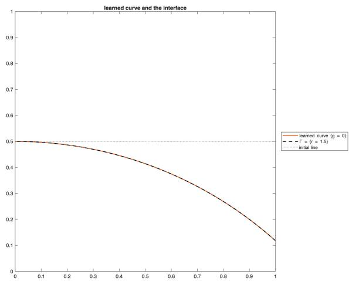  
(a) learned curve $\{ g _ { \eta } = 0 \}$ , and the initial line

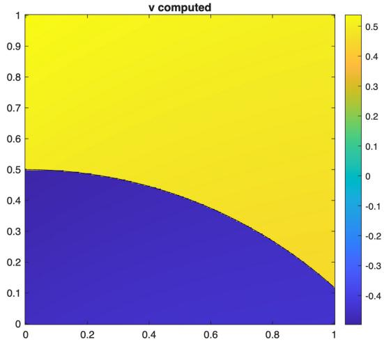  
(b) computed v

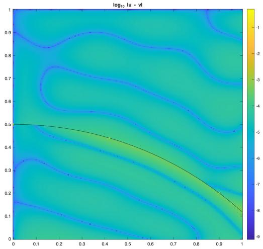  
(c) $\log _ { 1 0 } \left| u - v _ { \theta } \right|$ and

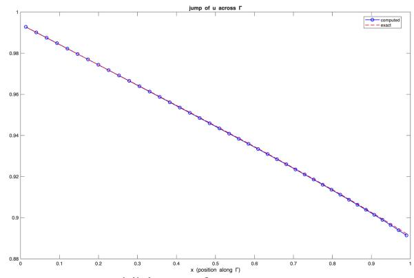  
(d) jump of $V _ { \theta }$ across  
Figure 4. Linear transport with a learned interface (Level II), first class, after the main run: (a) the learned curve $\{ g _ { \eta } = 0 \}$ (solid), Γ (dashed) and the initial line $x _ { 2 } = 0 . 5$ (dotted); (b) $v _ { \theta } ;$ (c) $\log _ { 1 0 } \left| u - v _ { \theta } \right|$ , with Γ; (d) the jump of $v _ { \theta }$ across Γ (circles) and that of u (dashed), against $x _ { 1 }$

## 10. Scalar conservation laws: an unknown moving interface

In Sections 7 and 8 the interfaces are those of the coeficients, whose location is part of the data even where the class does not use it (Levels II and III), and in Section 9 they are characteristics determined by the data. For a scalar conservation law the discontinuities are shocks whose location is part of the solution. We use the flux least-squares formulation of [29] as it stands; the only change is that the $H ( \mathrm { d i v } )$ -conforming finite element flux is replaced by a native neural class. No shock location or interface module is supplied to the class; the generic deRhaNN flux class is used.

Formulation. Let $\Omega \subset \mathbb { R } ^ { n }$ be a bounded Lipschitz domain, $Q : = ( 0 , T ) \times \Omega$ , and

$$
\partial _ { t } u +  { \operatorname { d i v } } F ( u ) = 0 \ \mathrm { i n } \ Q , \qquad u ( 0 ) = u _ { 0 } ,\tag{10.1}
$$

with inflow data on the part of $( 0 , T ) \times \partial \Omega$ where ${ \cal F } ^ { \prime } ( u ) \cdot { \bf n } < 0$ . With the space-time flux ${ \bf f } ( u ) : = ( u , F ( u ) ) \in $ $\mathbb { R } ^ { n + 1 }$ the equation reads d $\operatorname { i v } _ { t , x } \mathbf { f } ( u ) = 0 ,$ and for a weak solution the space-time flux lies in $H ( \mathrm { d i v } _ { t , x } ; Q )$ with zero divergence. Across a shock surface $\Gamma \subset Q$ with space-time normal $\mathbf { n } = \left( n _ { t } , \mathbf { n } _ { x } \right)$ , continuity of the normal

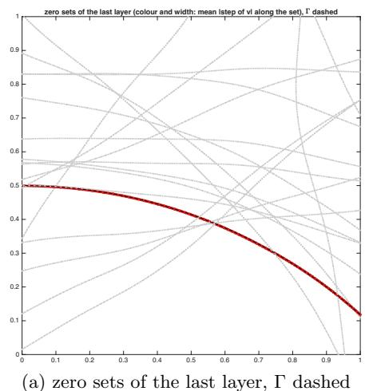

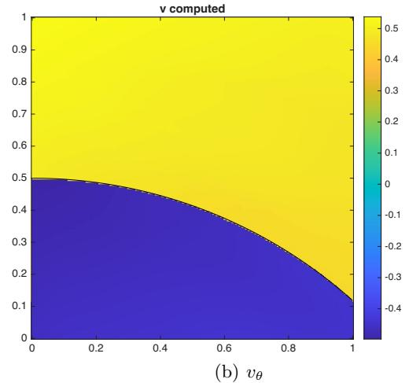

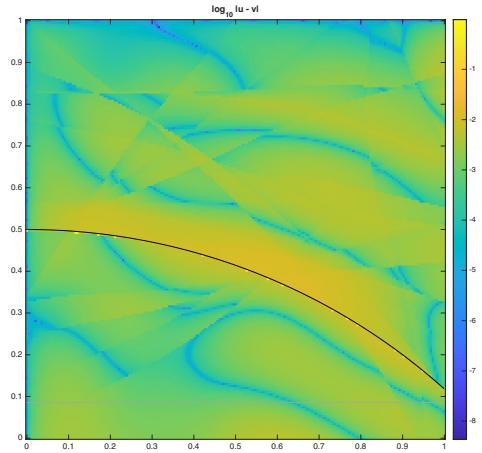  
(c) $\log _ { 1 0 } \left| u - v _ { \theta } \right|$ and Γ

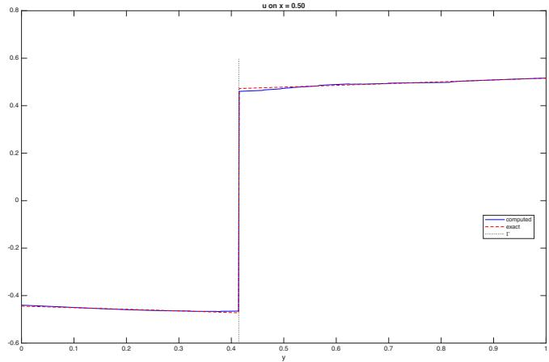  
(d) vθ and u on $x _ { 1 } = 0 . 5$  
Figure 5. Linear transport, generic level, first class: (a) the zero sets of the last layer, colored by the mean step of $v _ { \theta }$ along them, Γ dashed; (b) vθ; (c) $\log _ { 1 0 } { \left| u - v _ { \theta } \right| } .$ , with Γ; (d) v and u on $x _ { 1 } = 0 . 5$

component,

$$
[ \mathbf { f } ( u ) \cdot \mathbf { n } ] _ { \Gamma } = [ u ] _ { \Gamma } n _ { t } + [ F ( u ) ] _ { \Gamma } \cdot \mathbf { n } _ { x } = 0 ,
$$

is the Rankine–Hugoniot condition, while the tangential components of ${ \bf f } ( u )$ jump. A shock is therefore an interface of exactly the kind that H(div) fields carry, as the interfaces of Section 7, except that its location is unknown. The flux least-squares functional of [29] takes the flux $\boldsymbol { \tau } \approx \mathbf { f } ( u )$ as an independent variable,

$$
\begin{array} { r } { \mathcal { I } _ { \mathrm { c l } } ( \tau , \boldsymbol { v } ) : = \lVert \mathrm { d i v } _ { t , x } \tau \rVert _ { 0 , Q } ^ { 2 } + \lVert \tau - \mathbf { f } ( \boldsymbol { v } ) \rVert _ { 0 , Q } ^ { 2 } + \lVert \tau \cdot \mathbf { n } - g \rVert _ { 0 , \Gamma _ { \mathrm { i n } } } ^ { 2 } + \lVert \boldsymbol { v } - \boldsymbol { u } _ { \mathrm { i n } } \rVert _ { 0 , \Gamma _ { \mathrm { i n } } } ^ { 2 } , } \end{array}\tag{10.2}
$$

where $\Gamma _ { \mathrm { i n } }$ is the inflow part of $\partial Q , \ u _ { \mathrm { i n } }$ the inflow data (u0 on $\{ t = 0 \} )$ and $g = \mathbf { f } ( u _ { \mathrm { i n } } ) \cdot \mathbf { n } { \mathrm { ~ ( s o ~ } } g = - u _ { 0 } $ on $\{ t = 0 \}$ , where $\mathbf { n } = ( - 1 , \mathbf { 0 } ) )$ . We consider v with $\mathbf { f } ( v ) \in L ^ { 2 } ( Q )$ , as is the case for the bounded neural trial functions used below. The inflow condition can be imposed on ${ \boldsymbol { \tau } } \cdot \mathbf { n } ,$ on $v ,$ or on both, since both hold for the solution; we use both. The functional is not quadratic, and Proposition 6.3 does not apply. The LSNN method for conservation laws [11, 12] uses an equivalent least-squares formulation on a solution set that admits discontinuous solutions, with ReLU networks and a physics-preserving numerical diferentiation, the discrete divergence operator [12], and without artificial viscosity or entropy penalization [47]; here the flux is an independent variable in a native H(div) class.

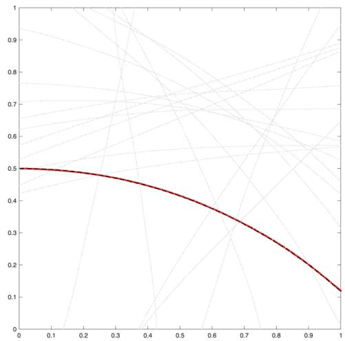  
(a) zero sets of the last layer, ¡ dashed

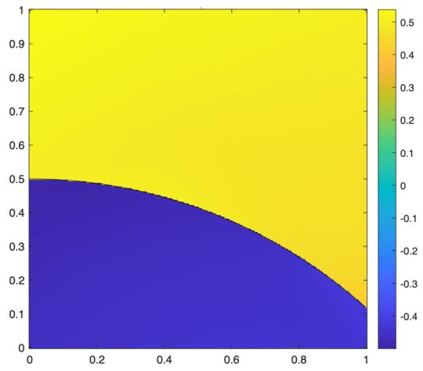  
(b) vµ

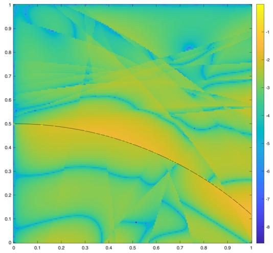  
(c) $\log _ { 1 0 } \left| u - v _ { \theta } \right|$ and ¡

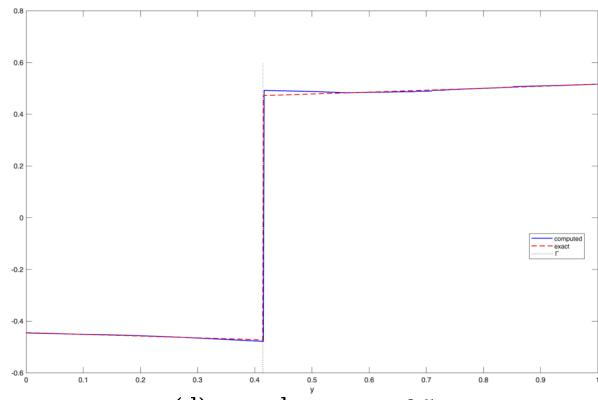  
(d) v and u on $x _ { 1 } = 0 . 5$  
Figure 6. Linear transport, generic level, second class $\left( \pmb { \sigma } _ { \theta } = \mathbf { c u r l } \psi _ { \theta } + \mathbf { z } _ { \theta } \right)$ : (a) the zero sets of the last layer, colored by the mean step of vθ along them, Γ dashed; (b) vθ; (c) $\log _ { 1 0 } \left| u - v _ { \theta } \right|$ with $\Gamma ;$ (d) v and u on $x _ { 1 } = 0 . 5$

Native space-time flux classes. The flux is a field in H(div) on the $( n + 1 )$ )-dimensional domain $Q ,$ and Theorem 2.10 in dimension $n + 1$ gives the generic native class

$$
\tau _ { \Theta } = \mathrm { D i v } _ { t , x } A _ { \theta } + \mathcal { R } _ { n + 1 } q _ { \eta } + { \bf h } , \quad \quad A _ { \theta } ^ { T } = - A _ { \theta } ,
$$

with a skew-symmetric matrix of scalar networks $A _ { \theta }$ , a scalar network $q _ { \eta }$ , and $\mathbf { h } = 0$ when Ω has no cavities, since then $\mathbb { R } ^ { n + 1 } \setminus \overline { { Q } }$ has no bounded component. Then $\mathrm { d i v } _ { t , x } \tau _ { \Theta } = q _ { \eta } .$ , and the first term of (10.2) is $\| q _ { \eta } \| _ { 0 , Q } ^ { 2 }$ Since the conservation law is homogeneous, it can also be built in: with $q _ { \eta } = 0 , \tau _ { \Theta } = \operatorname { D i v } _ { t , x } A _ { \theta }$ is divergence free for every parameter value, the class is native to the divergence-free subspace of $H ( \operatorname { d i v } _ { t , x } ; Q )$ (Theorem 2.10 with $q = 0 )$ , and the divergence residual vanishes, so that (10.2) reduces to its last three terms. Space-time divergence-free networks of this form are the construction of [55], where they satisfy the continuity equation exactly. The unknown v is a separate scalar network, as in [29].

For $n = 1$ the skew matrix has one entry, and the built-in class is the space-time curl of one scalar network, $\pmb { \tau } _ { \Theta } = \left( \partial _ { x } \psi _ { \theta } , - \partial _ { t } \psi _ { \theta } \right)$ . Then $\psi _ { \boldsymbol { \theta } }$ plays the role of the cumulative variable $\begin{array} { r } { \int ^ { x } u d x ^ { \prime } \colon \partial _ { x } \psi = u } \end{array}$ and $\partial _ { t } \psi = - F ( u )$ and a shock of u is a kink of $\psi .$ . A ReLU network $\psi _ { \theta }$ has kinks on hyperplanes whose positions are trained parameters, so a shock can be represented by a trained kink location. The represented flux has continuous normal component across its kinks by construction; where $\boldsymbol { \tau } _ { \Theta } = \mathbf { f } ( \boldsymbol { v } _ { \theta } )$ holds, this is the Rankine–Hugoniot relation. With a smooth activation the shock is a layer, which has to be resolved by the quadrature, whose refinement cannot be prescribed in advance when the shock location is unknown.

Proposition 10.1 (consistency). Let F be Lipschitz, or, for a locally Lipschitz flux such as Burgers’ flux $F ( u ) = u ^ { 2 } / 2$ , let $\begin{array} { r } { \operatorname* { s u p } _ { m } \| v _ { m } \| _ { L ^ { \infty } ( Q ) } + \| v \| _ { L ^ { \infty } ( Q ) } < \infty } \end{array}$ , and let $( \tau _ { m } , v _ { m } )$ with $\tau _ { m } \in H ( \mathrm { d i v } _ { t , x } ; Q ) , v _ { m } \in L ^ { 2 } ( Q )$ satisfy $\mathcal { I } _ { \mathrm { c l } } ( \tau _ { m } , v _ { m } )  0 , \tau _ { m }  \tau$ and $v _ { m } \to v$ in $L ^ { 2 } ( Q )$ . Then ${ \boldsymbol { \tau } } = \mathbf { f } \left( { \boldsymbol { v } } \right)$ and $\mathrm { d i v } _ { t , x } \tau = 0$ in $Q _ { i }$ , and v is a weak solution of (10.1) with the inflow data: $( \mathbf { f } ( v ) , \mathrm { g r a d } _ { t , x } \phi ) _ { Q } = \langle g , \phi \rangle _ { \Gamma _ { \mathrm { i n } } }$ for every smooth $\phi$ with $\phi = 0$ near $\partial Q \backslash \Gamma _ { \mathrm { i n } }$

Proof. $\lVert \pmb { \tau } _ { m } - \mathbf { f } ( v _ { m } ) \rVert _ { 0 , Q } \to 0$ and $\| \mathbf { f } ( v _ { m } ) - \mathbf { f } ( v ) \| _ { 0 , Q } \leq ( 1 + \mathrm { L i p } ( F ) ) \| v _ { m } - v \| _ { 0 , Q } \to 0 ,$ with $\operatorname { L i p } ( F )$ the Lipschitz constant of $F$ on an interval containing the ranges of the $v _ { m }$ and of v, give ${ \boldsymbol { \tau } } = \mathbf { f } ( { \boldsymbol { v } } )$ . For $\phi$ as stated, the Green formula in $H ( \operatorname { d i v } _ { t , x } ; Q )$ gives $( \pmb { \tau } _ { m } , \mathrm { g r a d } _ { t , x } \phi ) _ { Q } = - ( \mathrm { d i v } _ { t , x } \pmb { \tau } _ { m } , \phi ) _ { Q } + \langle \pmb { \tau } _ { m } \cdot \mathbf { n } , \phi \rangle _ { \Gamma _ { \mathrm { i n } } } ;$ the first term on the right tends to $0 ,$ and the second to $\langle g , \phi \rangle _ { \Gamma _ { \mathrm { i n } } }$ because $\| { \boldsymbol \tau } _ { m } \cdot { \bf n } - g \| _ { 0 , \Gamma _ { \mathrm { i n } } } \to 0 .$ □

This is the neural counterpart of the conservation property proved for H(div)-conforming least-squares finite elements in [29], and its proof uses only the conformity $\tau _ { m } \in H ( \operatorname { d i v } _ { t , x } ; Q )$ for every parameter value.

10.1. Numerical example. Burgers’ equation, $F ( u ) = u ^ { 2 } / 2$ and $n = 1 .$ , on $Q = ( 0 , 1 ) \times ( - 1 , 1 )$ with the variables $( t , x )$ , with $u _ { 0 } = 1$ for $x < 0 , u _ { 0 } = 0$ for $x > 0$ and $u = 1$ on $\{ x = - 1 \} ; \mathrm { o n } \ \{ x = 1 \}$ , where $u = 0$ the boundary is characteristic. The entropy solution is the shock $x = t / 2$ between the states 1 and 0. Across it $\mathbf { f } ( u ) = ( u , u ^ { 2 } / 2 )$ has the purely tangential jump $( 1 , { \frac { 1 } { 2 } } )$ , of length 1.118, and its position is not given to the class. The class is the generic first class, $\tau _ { \Theta } = \mathbf { c u r l } \psi _ { \theta } + \mathcal { R } _ { 2 } q _ { \theta }$ with curl $\psi = ( \partial _ { x } \psi , - \partial _ { t } \psi )$ and $x _ { 0 } = ( 0 . 5 , 0 )$ ψ and $q _ { \theta }$ are outputs of a network with two tanh layers of width 30 followed by three ReLU layers of width 20, the first fitted to lines in $Q$ at the start and the deeper ones initialized as the identity, and $v _ { \theta }$ is the output of a separate network with two tanh layers of width 20 and three ReLU layers of width 20. The inflow terms of (10.2), on $\Gamma _ { \mathrm { i n } } = \{ t = 0 \} \cup \{ x = - 1 \}$ , have the weights 10 on ${ \boldsymbol { \tau } } \cdot \mathbf { n } - g$ and 100 on $v - u _ { \mathrm { i n } }$ . Since $\mathbf f ( v )$ is nonlinear in $v ,$ the coeficients of $v _ { \theta } .$ , its output layer included, are trained by Levenberg–Marquardt together with the hidden parameters of the flux network; the output coeficients of $\psi _ { \boldsymbol { \theta } }$ and $q _ { \theta } ,$ which enter linearly for fixed $v _ { \theta } ,$ are the least-squares solution. The derivative residual curl $\psi _ { \theta }$ enters by the cellwise moment treatment of Section 6.3. The training cells are squares of side $1 / 3 2$ . Two starts of six minutes from diferent initial networks are run, and the better one is continued for at most 48 minutes in phases of ten minutes, with refinement and up to four new units after each phase. The check $\mathcal { I } _ { \mathrm { c h e c k } }$ uses the training squares halved, cut along all kink sets of both networks. We report $\mathcal { I } _ { \mathrm { c h e c k } }$ , the $L ^ { 1 }$ error of $v _ { \theta }$ relative to $\| u \| _ { L ^ { 1 } ( Q ) } = 1 . 2 5$ , the relative $L ^ { 2 }$ error of ${ \boldsymbol { \tau } } _ { \Theta } , \| { \boldsymbol { q } } _ { \theta } \| _ { 0 }$ (the divergence of $\tau _ { \Theta }$ , zero for the solution), and the largest error of the shock position at $t = 0 . 2 , 0 . 4 , 0 . 6 , 0 . 9 , 1$ , located as the level $\frac { 1 } { 2 }$ of $v _ { \theta }$ and of the first component $( \tau _ { \Theta } ) _ { t }$

<table><tr><td>width</td><td>cells</td><td>steps</td><td>time</td><td> $\mathcal { T } _ { h }$ </td><td> $\mathcal { I } _ { \mathrm { c h e c k } }$ </td><td> $\| u - v _ { \theta } \| _ { L ^ { 1 } }$ </td><td> $\| \mathbf { f } ( u ) - \pmb { \tau } _ { \Theta } \| _ { 0 }$ </td><td> $\| q _ { \theta } \| _ { 0 }$ </td><td>shock  $( v _ { \theta } , \tau _ { t } )$ </td></tr><tr><td>35</td><td>2606</td><td>156</td><td>33 min</td><td> $4 . 0 5 \cdot 1 0 ^ { - 4 }$ </td><td> $1 . 2 2 \cdot 1 0 ^ { - 3 }$ </td><td>1.97%</td><td>7.65%</td><td> $1 . 0 7 \cdot 1 0 ^ { - 3 }$ </td><td>0.014, 0.013</td></tr></table>

$\mathcal { I } _ { \mathrm { c h e c k } }$ decreased in every phase, from $5 . 7 \cdot 1 0 ^ { - 2 } \mathrm { ~ t o ~ } 1 . 2 \cdot 1 0 ^ { - 3 }$ , and the $L ^ { 1 }$ error with it, from 4.2% to 2.0%; the run stopped when Levenberg–Marquardt made no further progress after the last phase. The shock is resolved within one to two training cells (Figure 7), without oscillations. It lies ahead of $x = t / 2$ by at most 0.014 for $t \leq 0 . 6$ and by 0.003 at $t = 1 ;$ at $t = 1$ , vθ exceeds 1 by $4 \%$ and $( \tau _ { \Theta } ) _ { t }$ by $8 \%$ just behind the shock. The active kink sets of $\psi _ { \theta }$ cluster along the shock; Figure 7(b) shows those across which $\tau _ { \Theta }$ has a tangential jump of at least 2% of the exact one. The normal continuity $[ { \pmb \tau } _ { \Theta } \cdot { \bf n } ] = 0$ holds by construction.

## 11. Concluding remarks

We constructed two deRhaNN classes for $H ( \mathrm { d i v } )$ and native deRhaNN classes for H(curl). In each case the graph-space field is assembled from ordinary neural representing functions by fixed operators of the de Rham complex. The classes are conforming for every parameter value, and the admissible interface jumps are carried at finite width by kinks of the potential.

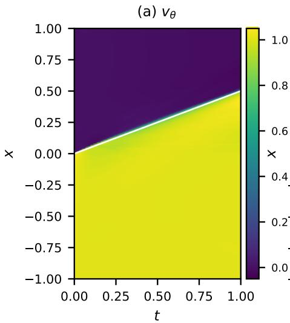

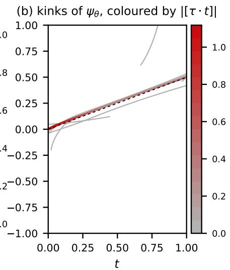

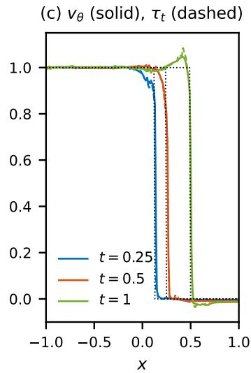  
Figure 7. Burgers’ equation, Riemann data, generic level. (a) vθ on $Q ,$ the exact shock $x = t / 2$ white. (b) The kinks of $\psi _ { \theta }$ across which $\tau _ { \Theta }$ has a tangential jump of at least 2% of the exact one, colored by the jump; the exact shock dashed. (c) vθ (solid) and $( \tau _ { \Theta } ) _ { \ l }$ t (dashed) at $t = 0 . 2 5 , 0 . 5 ,$ 1; the exact solution dotted.

Combined with first-order system least squares, these classes give the FOSLS-deRhaNN method. The elliptic and curl–curl examples retain the natural graph-space stability, while the transport and conservationlaw examples use the same native flux constructions for discontinuous solutions and moving interfaces.

## References

[1] Douglas N. Arnold, Richard S. Falk, and Ragnar Winther. Finite element exterior calculus, homological techniques, and applications. Acta Numerica, 15:1–155, 2006.

[2] Douglas N. Arnold. Finite element exterior calculus. SIAM, 2018.

[3] Douglas N. Arnold, Richard S. Falk, and Ragnar Winther. Finite element exterior calculus: from Hodge theory to numerical stability. Bull. Amer. Math. Soc., 47:281–354, 2010.

[4] Santiago Badia, Wei Li, and Alberto F. Mart´ın. Finite element interpolated neural networks for solving forward and inverse problems. Computer Methods in Applied Mechanics and Engineering, 418(116505), 2024.

[5] Santiago Badia, Wei Li, and Alberto F. Martin. Compatible finite element interpolated neural networks. Computer Methods in Applied Mechanics and Engineering, 439(117889), 2025.

[6] Christine Bernardi, Vivette Girault, Fr´ed´eric Hecht, Pierre-Arnaud Raviart, and B´eatrice Rivi\`ere. Mathematics and Finite Element Discretizations of Incompressible Navier–Stokes Flows, revised and expanded edition of Girault and Raviart (Springer, 1986). Classics in Applied Mathematics 90. SIAM, Philadelphia, 2025.

[7] Pavel B. Bochev and Max D Gunzburger. Least-Squares Finite Element Methods. Applied Mathematical Sciences, 166. Springer, 2009.

[8] Daniele Bofi, Franco Brezzi, and Michel Fortin. Mixed Finite Element Methods and Applications, volume 44 of Springer Series in Computational Mathematics. Springer, 2013.

[9] Zhiqiang Cai, J. Chen, M. Liu, and X. Liu. Deep least-squares methods: an unsupervised learning-based numerical method for solving elliptic PDEs. Journal of Computational Physics, 420(109707), 2020.

[10] Zhiqiang Cai, Jingshuang Chen, and Min Liu. Least-squares ReLU neural network (LSNN) method for linear advectionreaction equation. Journal of Computational Physics, 443(110514), 2021.

[11] Zhiqiang Cai, Jingshuang Chen, and Min Liu. Least-squares ReLU neural network (LSNN) method for scalar nonlinear hyperbolic conservation law. Appl. Numer. Math., 174:163–176, 2022.

[12] Zhiqiang Cai, Jingshuang Chen, and Min Liu. Least-squares neural network (LSNN) method for scalar nonlinear hyperbolic conservation laws: discrete divergence operator. Journal of Computational and Applied Mathematics, 433(115298), 2023.

[13] Zhiqiang Cai, Junpyo Choi, and Min Liu. Least-squares neural network (LSNN) method for linear advection-reaction equation: Discontinuity interface. SIAM J. Sci. Comput., 46(4):C448–C478, 2024.

[14] Zhiqiang Cai, Junpyo Choi, and Min Liu. Least-squares neural network (LSNN) method for linear advection-reaction equation: non-constant jumps. International Journal of Numerical Analysis and Modeling, 21(5):609–628, 2024.

[15] Zhiqiang Cai, Tong Ding, Min Liu, Xinyu Liu, and Jianlin Xia. A structure-guided Gauss–Newton method for shallow ReLU neural network. arXiv:2404.05064 [cs.LG], 2024.

[16] Zhiqiang Cai, Anastassia Doktorova, Robert D. Falgout, and C´esar Herrera. Eficient shallow Ritz method for 1D difusion problems. Computers & Mathematics with Applications, 200:349–363, 2025.

[17] Zhiqiang Cai, Anastassia Doktorova, Robert D. Falgout, and C´esar Herrera. Eficient shallow Ritz method for 1D difusionreaction problems. SIAM J. Sci. Comput., S414–S435, 2025.

[18] Zhiqiang Cai, Anastassia Doktorova, Robert D. Falgout, and C´esar Herrera. Convergence analysis of block Newton methods for 1D shallow neural network approximation. Journal of Intelligent Algorithms and Scientific Computing, 1(1):1–23, 2026.

[19] Zhiqiang Cai, Cuiyu He, and Shun Zhang. Improved ZZ a posteriori error estimators for difusion problems: Conforming linear elements. Computer Methods in Applied Mechanics and Engineering, 313:433–449, 2017.

[20] Zhiqiang Cai, Raytcho D. Lazarov, Thomas A. Manteufel, and Stephen F. McCormick. First order system least-squares for second order partial diferential equations: Part I. SIAM J. Numer. Anal., 31:1785–1799, 1994.

[21] Zhiqiang Cai and Min Liu. Self-adaptive ReLU neural network method in least-squares data fitting. In Principles and Applications of Adaptive Artificial Intelligence, pages 242–262, 2024.

[22] Zhiqiang Cai, Tom Manteufel, and Stephen F. McCormick. First-order system least squares for second-order partial diferential equations: Part ii. SIAM J. Numer. Anal., 34(2):425–454, 1997.

[23] Zhiqiang Cai and Shun Zhang. Recovery-based error estimator for interface problems: Conforming linear elements. SIAM J. Numer. Anal., 47(3):2132–2156, 2009.

[24] Zhiqiang Cai and Shun Zhang. Recovery-based error estimators for interface problems: Mixed and nonconforming finite elements. SIAM J. Numer. Anal., 48(1):30–52, 2010.

[25] Henri Cartan. Formes dif´erentielles. Hermann, Paris, 1967.

[26] J. Chen, X. Ji, H. Yu, and S. Zhang. Penalty-free natural deep Ritz method based on de Rham complex for high-dimensional Dirichlet boundary value problems, 2026. arXiv:2607.00676.

[27] Martin Costabel. A coercive bilinear form for Maxwell’s equations. Journal of Mathematical Analysis and Applications, 157(2):527–541, 1991.

[28] Martin Costabel and Alan McIntosh. On Bogovski˘ı and regularized Poincar´e integral operators for de Rham complexes on Lipschitz domains. Mathematische Zeitschrift, 265(2):297–320, 2010.

[29] H. De Sterck, Thomas A. Manteufel, Stephen F. McCormick, and Luke Olson. Numerical conservation properties of H(div)- conforming least-squares finite element methods for the Burgers equation. SIAM J. Sci. Comput., 26:1573–1597, 2005.

[30] Weinan E and Bing Yu. The deep Ritz method: a deep learning-based numerical algorithm for solving variational problems. Commun. Math. Stat., 6(1):1–12, 2018.

[31] Gabriel N. Gatica. A Simple Introduction to the Mixed Finite Element Method: Theory and Applications. SpringerBriefs in Mathematics. Springer, 2014.

[32] Juncai He, Lin Li, Jinchao Xu, and Chunyue Zheng. ReLU deep neural networks and linear finite elements. Journal of Computational Mathematics, 38(3):502–527, 2020.

[33] Juncai He, Xinliang Liu, and Zitong Tian. Divergence-free linearized neural networks: integral representation and optimal approximation rates, 2026. arXiv:2603.28638.

[34] Ralf Hiptmair. Finite elements in computational electromagnetism. Acta Numerica, 11:237–339, 2002.

[35] Ralf Hiptmair and Clemens Pechstein. Regular decompositions of vector fields – continuous, discrete, and structurepreserving. Technical Report 2019-18, Seminar for Applied Mathematics, ETH Z¨urich, 2019. Abridged version in Spectral and High Order Methods for PDEs – ICOSAHOM 2018, Lect. Notes Comput. Sci. Eng. 134, Springer, 2020, pp. 45–60.

[36] Kurt Hornik. Approximation capabilities of multilayer feedforward networks. Neural Networks, 4(2):251–257, 1991.

[37] Kaibo Hu. Many facets of cohomology: diferential complexes and structure-aware formulation. R. Soc. Open Sci., 13:250728, 2026.

[38] Kaibo Hu, Jindong Wang, and Jinchao Xu. ReLUk neural de Rham complexes, 2026. arXiv:2607.22478.

[39] Bo-nan Jiang. The Least-Squares Finite Element Method Theory and Applications in Computational Fluid Dynamics and Electromagnetics. Scientific Computation. Springer, 1998.

[40] George Em Karniadakis, Ioannis G. Kevrekidis, Lu Lu, Paris Perdikaris, Sifan Wang, and Liu Yang. Physics-informed machine learning. Nat. Rev. Phys., 3:422–440, 2021.

[41] R. Bruce Kellogg. On the Poisson equation with intersecting interfaces. Applicable Anal., 4(2):101–129, 1974.

[42] Isaac E. Lagaris, Aristidis Likas, and Dimitrios I. Fotiadis. Artificial neural networks for solving ordinary and partial diferential equations. IEEE Trans. Neural Netw., 9(5):987–1000, 1998.

[43] Ziyan Li and Shun Zhang. First-order system least-squares shallow neural network method for second-order general elliptic equation in one dimension. Preprint, 2025.

[44] Ziyan Li and Shun Zhang. Non-intrusive least-squares functional a posteriori error estimator: linear and nonlinear problems with plain convergence. Comput. Math. Appl., 191:275–295, 2025.

[45] Min Liu and Zhiqiang Cai. Adaptive two-layer ReLU neural network: II. Ritz approximation to elliptic PDEs. Comput. Math. Appl., 113:103–116, 2022.

[46] Min Liu and Zhiqiang Cai. Physics-preserving neural network $\left( \mathrm { P ^ { 2 } N N } \right)$ methods for elliptic partial diferential equations. IEEE Computing in Science & Engineering, submitted, 2026.

[47] Min Liu and Zhiqiang Cai. Least-squares neural network (LSNN) method for scalar hyperbolic partial diferential equations, 2026. arXiv:2601.20013.

[48] Min Liu, Zhiqiang Cai, and Jingshuang Chen. Adaptive two-layer ReLU neural network: I. Best least-squares approximation. Comput. Math. Appl., 113:34–44, 2022.

[49] Min Liu, Zhiqiang Cai, and Karthik Ramani. Deep Ritz method with adaptive quadrature for linear elasticity. Computer Methods in Applied Mechanics and Engineering, 415(116229), 2023.

[50] Min Liu, Zhiqiang Cai, and Karthik Ramani. Dual neural network (DuNN) method for elliptic partial diferential equations and systems. Journal of Computational and Applied Mathematics, 467:116596, 2025.

[51] Qunjie Liu and Shun Zhang. Adaptive least-squares finite element methods for linear transport equations based on an H(div) flux reformulation. Comput. Methods Appl. Mech. Engrg., 366:113041, 2020.

[52] Marcello Longo, Joost A. A. Opschoor, Nico Disch, Christoph Schwab, and Jakob Zech. De Rham compatible deep neural network FEM. Neural Networks, 165:721–739, 2023.

[53] Joost A. A. Opschoor, Philipp C. Petersen, and Christoph Schwab. First order system least squares neural networks. arXiv:2409.20264 [math.NA], 2024.

[54] Maziar Raissi, Paris Perdikaris, and George Em Karniadakis. Physics-informed neural networks: A deep learning framework for solving forward and inverse problems involving nonlinear partial diferential equations. J. Comp. Phys., 378:686–707, 2019.

[55] Jack Richter-Powell, Yaron Lipman, and Ricky T. Q. Chen. Neural conservation laws: a divergence-free perspective. In Advances in Neural Information Processing Systems, volume 35, 2022.

[56] Yueyao Wu and Shun Zhang. Goal-oriented error estimation for least-squares finite element methods via physically meaningful adjoint PDEs. arXiv:2607.23850, 2026.

[57] Shun Zhang. Battling Gibbs phenomenon: On finite element approximations of discontinuous solutions of PDEs. Computers and Mathematics with Applications, 122:35–47, 2022.

[58] Shun Zhang. Why the Kellogg mesh is radial: a mathematical explanation of a classical computational benchmark. arXiv:2608.22991 [math.NA], 2026.

[60] Shun Zhang. A simple proof of coerciveness of first-order system least-squares methods for general second-order elliptic PDEs. Computers & Mathematics with Applications, 130:98–104, 2023.

[59] Shun Zhang. Least-squares finite element methods with weakly enforced boundary conditions. In preparation.