# Feature Information Dynamics in Diffusion

Jia-Shu Pan1, Tao Zhang1,2, Yufei Huang1,2, Yanjun Sheng3, and Tailin Wu1 1Department of Artificial Intelligence, School of Engineering, Westlake University 2Zhejiang University

3Research School of Astronomy and Astrophysics, Australian National University panjiashu@westlake.edu.cn, wutailin@westlake.edu.cn

## Abstract

Diffusion models generate data through a continuum of denoising problems, and are widely observed to reveal coarse structure before fine detail. Yet, this intuition is mostly empirical and qualitative. We introducefeature information dynamics, an information-theoretic framework for localizing when a feature is generated during diffusion. Using the I-MMSE identity, we connect the rate of feature mutual information change to a gap between optimal unconditional and featureconditional denoising losses, yielding practical estimators for feature information density. We further develop a chained decomposition that separates shared from incremental information in a feature hierarchy. We use this framework first to quantitatively confirm spectral autoregression in pixel diffusion, and then to extend the analysis beyond frequency: under a class → mask → Canny conditioning chain, the per-feature information densities differ across pixel, SDVAE, VAVAE, and RAE, exposing fundamental differences between these representations and suggesting that ordered generation could be beneficial for training diffusion models. Our code is available at https://github.com/AI4Science-WestlakeU/ feature-information-dynamics.

## 1 Introduction

Diffusion models have achieved remarkable success in visual generation by decomposing the synthesis of complex distributions into a sequence of denoising tasks across varying signal-to-noise ratios [Ho et al., 2020, Lipman et al., 2022]. A growing body of empirical evidence suggests that these models act as hierarchical feature generators, progressively building structure across the denoising trajectory [Ho et al., 2020, Yue et al., Tinaz et al., Pan et al., 2025, Baade et al., 2026]. This temporal organization has broad implications for representation learning and generative modeling, rather than being merely descriptive.1 For example, Yue et al. utilizes diffusion models to learn disentangled representations, and recent generative methods achieve better generation performance by prioritizing global semantic structure over local appearance in diffusion [Pan et al., 2025, Baade et al., 2026]. Yet, what remains missing is a general, quantitative account offeature information dynamics: when, and in what order different features are generated along the diffusion trajectory. We address this question by localizing a structured hierarchy of features across different noise levels in the diffusion process.

## We state our contributions upfront:

1. Feature information dynamics via I-MMSE. Taking classical I-MMSE as a starting point, we define the SNR-resolved information between a specified feature and the noisy image, and relate its derivative to the gap between optimal unconditional and feature-conditional denoising losses. We derive a family of equivalent estimators for this information density, and further exploit the analytic properties of the MMSE curve to give a practical procedure for obtaining the information profile of a general feature. We compare these estimators in detail (Appendix A).

2. Chained information decomposition. When a hierarchy of features is present, the shared information between features must be considered to reveal the full information structure. Building on the above theory, we decompose feature information in a chained manner across the diffusion timeline. We experimentally verify one widely invoked intuition and report one surprising finding: (i) pixel-space image diffusion models indeed approximate spectral autoregression; (ii) in pixel-space diffusion, structure can enter earlier and more strongly than class identity, challenging a simple semantic-first account of the denoising trajectory.

3. Representations shape feature information dynamics. Going beyond frequency, we apply the chained framework to a general visual feature hierarchy on ImageNet-256, holding the conditioning chain and evaluation protocol fixed across pixel-space, SDVAE, VAVAE, and RAE diffusion models. The information dynamics differ significantly across representations: in pixel space, mask information enters earlier and more strongly than class identity; only RAE produces a clean class → mask → Canny ordering. These findings recast representation choice as a controllable knob over feature information dynamics rather than a black box on top of FID.

## 2 Related Work

Information theory and diffusion models. The relationship between information theory and deep learning has been mutually enriching: information-theoretic principles have shaped learning objectives and representation learning [Tishby et al., 2000, Oord et al., 2018], while neural networks have in turn enabled scalable estimation of previously intractable quantities such as mutual information [Belghazi et al., 2018]. Diffusion models sit naturally at this intersection: their forward process defines a Gaussian channel, making them particularly amenable to an information-theoretic analysis. Kong et al. [2023] generalized the well-known information-theoretic I-MMSE identity to provide an interpretation of the diffusion loss. Franzese et al. [2024] and Yu et al. [2025] leverage the score difference to estimate static mutual information quantities, but do not study the information dynamics across the diffusion timeline. Most closely related to our work, Handke et al. [2026] use conditional entropy to study how class identity is progressively specified during diffusion sampling. Their analysis, however, is restricted to categorical features, and tied to the SDE formulation of diffusion models. Our framework instead provides a general information dynamics framework for arbitrary features, along with practical estimators.

Feature information dynamics in diffusion. The question of when different visual information appears in diffusion has been present since the earliest DDPM observations: intermediate $\scriptstyle { \hat { x } } _ { 0 }$ predictions already suggested that large-scale structure emerges before fine detail [Ho et al., 2020]. In pixel space, this intuition receives a concrete spectral explanation: natural images approximately follow power-law spectra [Van der Schaaf and van Hateren, 1996], so Gaussian corruption separates low-frequency global structure from high-frequency texture, motivating the view of diffusion as spectral autoregression (AR) [Dieleman, 2024]. Subsequent work provides geometric and mechanistic analyses of timestep-dependent structure and concept emergence [Park et al., 2023, Tinaz et al.]. However, these explanations remain qualitative and cannot be readily generalized to diffusion models operating in representations beyond pixels. This matters because latent representations are now the mainstream compromise between computational efficiency and generation quality [Rombach et al., 2022], and the choice of representation can substantially affect training efficiency [Yao et al., 2025, Zheng et al., 2025]. A quantitative, representation-agnostic account offeature information dynamics is still missing.

## 3 Feature Information Density

Suppose we have a dataset of continuous random vectors $\begin{array} { r } { \pmb { X } \sim p ( \pmb { x } ) } \end{array}$ , e.g. images, and a corresponding discrete or continuous feature $Y \sim p ( y \mid x )$ , e.g. class labels or frequency components. Our goal is to quantify, along an additive Gaussian corruption process of X, how the information carried by $Y$ is distributed at different noise levels. To this end, we first introduce a classical Gaussian channel and minimum mean square error (MMSE), then extend the I-MMSE identity to definefeature information density as the gap between the unconditional and feature-conditional MMSE. Finally, we instantiate this information-theoretic framework with diffusion models and present estimators that also apply beyond diffusion models.

## 3.1 Gaussian channel and MMSE

Let $\pmb { X } \in \mathbb { R } ^ { d } , \pmb { X } \sim p ( \pmb { x } )$ , denote the clean data, and let $Y \sim p ( y \mid x )$ denote a feature of interest. We consider the Gaussian channel

$$
\begin{array} { r } { \pmb { X } _ { \gamma } = \sqrt { \gamma } \pmb { X } + \pmb { N } , \qquad \pmb { N } \sim \mathcal { N } ( \mathbf { 0 } , I ) , \quad \pmb { N } \bot ( \pmb { X } , Y ) , } \end{array}\tag{1}
$$

where $\gamma \in \mathbb { R } _ { \geq 0 }$ is the signal-to-noise ratio (SNR).

Given any (possibly empty) side information $S ,$ we aim to denoise X from the noisy observation $X _ { \gamma }$ and S under squared-error loss. The minimum achievable error over all denoisers $\hat { \pmb x } ( \pmb X _ { \gamma } , \gamma , S )$ is the minimum mean-squared error (MMSE),

$$
\operatorname { m m s e } _ { \boldsymbol { X } | \boldsymbol { X } _ { \gamma } , \boldsymbol { S } } ( \gamma ) : = \operatorname* { m i n } _ { \hat { \boldsymbol { x } } } \mathbb { E } _ { \boldsymbol { X } , \boldsymbol { X } _ { \gamma } , \boldsymbol { S } } \left[ \| \boldsymbol { X } - \hat { \boldsymbol { x } } ( \boldsymbol { X } _ { \gamma } , \gamma , S ) \| _ { 2 } ^ { 2 } \right] .\tag{2}
$$

$\mathbf { A }$ classical result is that this minimum is attained by the conditional expectation $\hat { \pmb { x } } ^ { \star } ( { \pmb { X } } _ { \gamma } , \gamma , S ) =$ $\mathbb { E } [ X \mid X _ { \gamma } , S ]$ , which we call the optimal denoiser; equivalently,

$$
\operatorname { m m s e } _ { \boldsymbol { X } | \boldsymbol { X } _ { \gamma } , \boldsymbol { S } } ( \gamma ) = \mathbb { E } _ { \boldsymbol { X } , \boldsymbol { X } _ { \gamma } , \boldsymbol { S } } \left[ \| \boldsymbol { X } - \mathbb { E } [ \boldsymbol { X } \mid \boldsymbol { X } _ { \gamma } , \boldsymbol { S } ] \| _ { 2 } ^ { 2 } \right] .\tag{3}
$$

We will mainly use two instances, the unconditional and the feature-conditional MMSE:

$$
m _ { \mathcal { O } } ( \gamma ) : = \operatorname { m m s e } _ { \pmb { X } | \pmb { X } _ { \gamma } } ( \gamma ) , \qquad m _ { Y } ( \gamma ) : = \operatorname { m m s e } _ { \pmb { X } | \pmb { X } _ { \gamma } , Y } ( \gamma ) .\tag{4}
$$

Since the optimal unconditional denoiser $\hat { \pmb x } ( \pmb X _ { \gamma } , \gamma )$ is also a (possibly suboptimal) feature-conditional denoiser that simply ignores Y , the optimal feature-conditional error cannot exceed the unconditional one:

$$
m _ { Y } ( \gamma ) \leq m _ { \mathcal { O } } ( \gamma ) \qquad { \mathrm { f o r ~ a l l ~ } } \gamma \geq 0 .\tag{5}
$$

Their difference therefore measures how much the feature $Y$ helps denoise X at SNR $\gamma ,$ which we call the single-feature MMSE gap by conditioning on $Y :$

$$
\Delta _ { Y } ( \gamma ) : = m _ { \mathcal { O } } ( \gamma ) - m _ { Y } ( \gamma ) \geq 0 .\tag{6}
$$

## 3.2 I-MMSE relation and feature information density

The I-MMSE identity [Guo et al., 2005] states that, for the Gaussian channel above,

$$
\frac { d } { d \gamma } I ( { \bf { { X } } } ; { \bf { { X } } } _ { \gamma } ) = \frac { 1 } { 2 } m _ { \alpha } ( \gamma ) .\tag{7}
$$

The classical I-MMSE relation describes the mutual information between clean data and a noisy channel output. We next use the same argument to describe the mutual information between a feature and that noisy output. Applying the same identity conditionally on Y gives

$$
\frac { d } { d \gamma } I ( X ; X _ { \gamma } \mid Y ) = \frac { 1 } { 2 } m _ { Y } ( \gamma ) .\tag{8}
$$

The channel output $X _ { \gamma } = \sqrt { \gamma } X + N$ depends on Y only through X, so given X the variables $X _ { \gamma }$ and $Y$ are conditionally independent, i.e. ${ \bar { I } } ( Y ; X _ { \gamma } \mid X ) { \bar { = } } 0$ . The chain rule of mutual information therefore gives

$$
I ( \pmb { X } , Y ; \pmb { X } _ { \gamma } ) = I ( \pmb { X } ; \pmb { X } _ { \gamma } ) + \underbrace { I ( Y ; \pmb { X } _ { \gamma } \mid \pmb { X } ) } _ { = 0 } = I ( Y ; \pmb { X } _ { \gamma } ) + I ( \pmb { X } ; \pmb { X } _ { \gamma } \mid Y ) ,\tag{9}
$$

so that

$$
I ( Y ; { \pmb X } _ { \gamma } ) = I ( { \pmb X } ; { \pmb X } _ { \gamma } ) - I ( { \pmb X } ; { \pmb X } _ { \gamma } \mid Y ) .\tag{10}
$$

Differentiating with respect to $\gamma$ yields

$$
D _ { Y } ( \gamma ) : = \frac { d } { d \gamma } I ( Y ; { \pmb X } _ { \gamma } ) = \frac { 1 } { 2 } \Big [ m _ { \mathcal { O } } ( \gamma ) - m _ { Y } ( \gamma ) \Big ] = \frac { 1 } { 2 } \Delta _ { Y } ( \gamma ) .\tag{11}
$$

We refer to $D _ { Y } ( \gamma )$ as thefeature information density: it quantifies how the information carried by Y is distributed along the SNR axis. Integrating it over γ recovers the scalar identity $I ( Y ; { \pmb X } ) \stackrel { . } { = }$ $\int _ { 0 } ^ { \infty } D _ { Y } ( \gamma ) d \gamma$ , exploited by Yu et al. [2025] for mutual-information estimation.

More generally, one may parameterize the SNR axis by any smooth, strictly monotone change of variable $\gamma = \gamma ( t )$ , with derivative ${ \dot { \gamma } } ( t ) : = d \gamma / d t$ . By the chain rule, the feature information density on the new t-axis is

$$
\frac { d } { d t } I ( Y ; X _ { \gamma ( t ) } ) = D _ { Y } ( \gamma ( t ) ) \dot { \gamma } ( t ) .\tag{12}
$$

A particularly useful instance is the logarithmic SNR axis t = log γ, for which $\dot { \gamma } ( t ) = \gamma$ , giving

$$
D _ { Y } ^ { ( \log \gamma ) } ( \log \gamma ) : = \frac { d } { d \log \gamma } I ( Y ; { \mathbf { X } } _ { \gamma } ) = \gamma D _ { Y } ( \gamma ) = \frac { 1 } { 2 } \gamma \Delta _ { Y } ( \gamma ) .\tag{13}
$$

Here we keep the same base symbol D and indicate the axis through the superscript. This representation balances contributions across many decades of SNR and will be useful when comparing densities across different time parameterizations.

## 3.3 Diffusion and flow-matching parameterization

We now instantiate the framework above with diffusion or Gaussian flow-matching models [Lipman et al., 2022]. The variance of the Gaussian channel $X _ { \gamma } = \sqrt { \gamma } X + N$ grows unboundedly with $\gamma ;$ it can however be brought back to a bounded range by a γ-dependent normalization, which is invertible and therefore loses no information. Through the well-known linear relations among the clean-data, noise, and velocity targets, the MMSE (x-prediction loss) transforms equivalently into the standard diffusion or flow-matching training objective, and the optimal denoiser transforms equivalently into the optimal diffusion or flow-matching model.

Unless otherwise specified, we use Gaussian Flow Matching with independent coupling2 and the linear interpolation

$$
X _ { t } = \left( 1 - t \right) N + t X , \qquad t \in [ 0 , 1 ] ,\tag{14}
$$

and velocity target $V _ { t } = X - N$ . Identifying $X _ { t } / ( 1 - t ) = N + \sqrt { \gamma ( t ) } X \overset { d } { = } X _ { \gamma ( t ) }$ gives the SNR $\begin{array} { r } { \gamma ( t ) = \left( \frac { t } { 1 - t } \right) ^ { 2 } } \end{array}$ . The optimal flow-matching velocity predictor and the optimal denoiser are related by

$$
\hat { \pmb { x } } ^ { \star } ( \pmb { X } _ { t } , t ) = \pmb { X } _ { t } + ( 1 - t ) \hat { \pmb { v } } ^ { \star } ( \pmb { X } _ { t } , t ) ,\tag{15}
$$

and the MMSE is recovered from the minimum velocity loss as

$$
m _ { \mathcal { D } } ( \gamma ( t ) ) = ( 1 - t ) ^ { 2 } \operatorname* { m i n } _ { \hat { \pi } } \mathbb { E } _ { X , N } \big [ \| V _ { t } - \hat { v } ( X _ { t } , t ) \| _ { 2 } ^ { 2 } \big ] ,\tag{16}
$$

with $m _ { Y } ( \gamma ( t ) )$ obtained analogously from the feature-conditional velocity loss. The single-feature MMSE gap $\Delta _ { Y } ( \gamma ( t ) ) = m _ { \mathcal { D } } ( \gamma ( t ) ) - m _ { Y } ( \gamma ( t ) )$ is therefore obtained directly from the difference of optimal unconditional and feature-conditional flow-matching losses, without altering the training objective.

## 3.4 Practical estimators

Given trained unconditional and feature-conditional denoisers, we estimate the single-feature MMSE gap $\hat { \Delta } _ { Y } ( \gamma )$ by Monte Carlo over test samples and form the empirical density $\begin{array} { r } { \hat { D } _ { Y } ( \gamma ) = \frac { 1 } { 2 } \hat { \Delta } _ { Y } ( \gamma ) } \end{array}$ as in Eq. (11). However, several equivalent estimator variants—posterior-mean, Fisher, score-difference, and likelihood-score forms—are derived and compared in Appendix A.

In practice, the raw single-feature MMSE gap is reliable only over a finite SNR range. At very high SNR, denoising errors are small and gradients are weak, so a finite-capacity denoiser can underfit the clean-data limit. This causes the empirical MMSE to be overestimated in the high-SNR tail, and a direct numerical integral of the gap can therefore be biased upward or even fail to converge. Inspired by analytical properties of MMSE curves [Wu and Verdú, 2011], we address this by fitting the single-feature MMSE gap itself with a smooth double-pole Lorentzian family on a reliable interval and extrapolating the fitted tail analytically. This simple fit matches the empirical gap surprisingly well, detailed in Appendix B.

## 4 Chained Information Decomposition

The preceding section defines the information density of a single feature Y through the single-feature MMSE gap $m _ { \mathcal { O } } ( \gamma ) - m _ { Y } ( \gamma )$ . Many of our experiments, however, concern a hierarchy of related features, such as frequency bands or semantic–structural image cues. In this setting, computing each single-feature density $D _ { Y _ { k } } ( \gamma )$ separately can double-count information shared across feature levels.

To isolate the incremental contribution of each feature, we therefore group the first k features into a cumulative bundle $y _ { \le k }$ and consider a nested group of conditioning bundles

$$
\mathcal { V } _ { \leq 0 } = \emptyset \subseteq \mathcal { V } _ { \leq 1 } \subseteq \cdot \cdot \cdot \subseteq \mathcal { V } _ { \leq K } ,
$$

for example Y≤1 = class, $y _ { \le 2 } =$ (class, mask), and $y _ { \le 3 } =$ (class, mask, canny). The chained construction then measures the incremental information contributed by $Y _ { k }$ relative to $y _ { \le k - 1 }$

Writing $m _ { k } ( \gamma ) : = \mathrm { m m s e } _ { X | X _ { \gamma } , \mathcal { V } _ { < k } } ( \gamma )$ , we define the chained information density of $Y _ { k }$ as the incremental information of $y _ { \le k }$ beyond $\scriptstyle { \mathcal { V } } \leq _ { k - 1 }$ . By the same conditional I-MMSE argument as in Section 3.2,

$$
D _ { k | k - 1 } ^ { ( \log \gamma ) } ( \log \gamma ) : = \frac { d } { d \log \gamma } I ( \pmb { X } _ { \gamma } ; Y _ { k } \mid \mathcal { Y } _ { \leq k - 1 } )  \\  = \frac { 1 } { 2 } \gamma \left[ m _ { k - 1 } ( \gamma ) - m _ { k } ( \gamma ) \right] \geq 0 , \qquad k = 1 , \ldots , K .\tag{17}
$$

We denote the bracketed difference by the chained MMSE gap, $\Delta _ { k } ^ { \mathrm { c h a i n } } ( \gamma ) : = m _ { k - 1 } ( \gamma ) - m _ { k } ( \gamma )$ Thus, as in Section 3.2, integrating the density gives the corresponding conditional-information increment. Figure 1 summarizes the operational core of our framework on a concrete visual hierarchy. At each $\operatorname { S N R } \gamma ,$ , we compare an unconditional denoiser to denoisers conditioned on successively richer feature bundles $\mathcal { V } _ { \leq 1 } = \mathrm { c l a s s } \subseteq \mathcal { V } _ { \leq 2 } = ( \mathrm { c l a s s } , \mathrm { m a s k } ) \subseteq \mathcal { V } _ { \leq 3 } = ( \mathrm { c l a s s } , \mathrm { m a s k } , \mathrm { C a n n y } )$ ; the chained MMSE gap $\Delta _ { k } ^ { \mathrm { c h a i n } } ( \gamma ) = m _ { k - 1 } ( \gamma ) - m _ { k } ( \gamma )$ in Eq. (17) converts these denoiser-loss differences into per-level information densities $D _ { k | k - 1 } ^ { ( \log \gamma ) } ( \log \gamma )$ along the log-SNR axis. The peak location and width of each $D _ { k | k - 1 } ^ { ( \log \gamma ) }$ localize when along the diffusion trajectory the corresponding feature is most informative, and the ordering of these peaks gives an empirical signature of how the chosen representation organizes its feature information dynamics.

The chained attribution depends on the chosen feature order because each increment is conditioned on the preceding bundle. We use class → mask → Canny as the canonical semantic-to-local order; the implications of this choice are discussed in the Limitations.

## 5 Experiments

## 5.1 Chained decomposition reveals spectral AR in pixel diffusion

Pixel-space diffusion is often described as coarse-to-fine: global structure appears at high noise levels, while fine texture is resolved near the clean-data end of the trajectory. A precise version of this claim is spectral autoregression, where low spatial frequencies are resolved before high spatial frequencies. Feature information dynamics allows us to test this claim quantitatively, but only after separating incremental frequency information from information shared across bands.

We start with a controlled MNIST frequency hierarchy. Each image is decomposed into ordered frequency bands $Y _ { 0 } , \dots , Y _ { K }$ , from coarse to fine. We compare two decompositions of the same bands. In the single-band setting, each band $Y _ { k }$ is conditioned independently. In theforward-chained setting, the condition is the cumulative bundle $y _ { \le k } = ( Y _ { 0 } , \ldots , Y _ { k } )$ . Single-band MMSE gaps and chained MMSE gaps are converted to log-SNR information densities using Eq. (13) and Eq. (17), respectively. Figure 2a compares the resulting densities: single-band conditioning produces overlapping densities because shared information is counted repeatedly, while forward chaining removes information already explained by coarser bands and reveals a clean coarse-to-fine progression.

We then apply the same chained construction to CIFAR-10. Full training and evaluation details are given in Appendix C. Figure 2b shows a monotone spectral progression. Low-frequency bands concentrate their information at lower log-SNR, whereas higher-frequency bands shift toward cleaner denoising states. Thus pixel-space diffusion approximately follows spectral autoregression in a quantitative sense: feature information density identifies not only that coarse frequencies precede fine ones, but also where along the SNR axis each incremental frequency band is resolved.

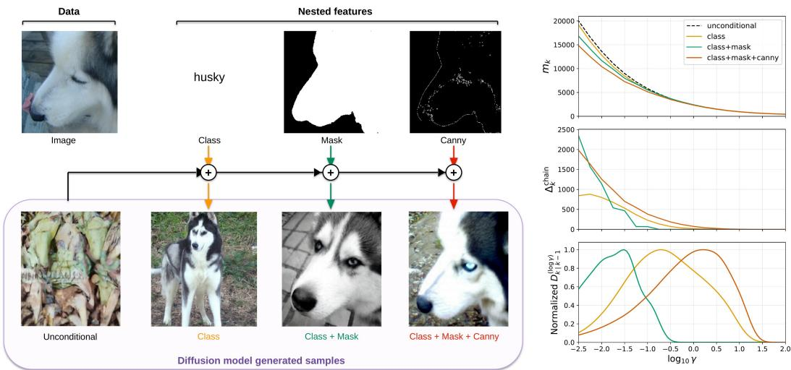  
Figure 1: Pixel-space example of chained feature information dynamics. Top: a clean image X paired with a nested feature hierarchy of increasing spatial specificity — class label $( { \mathcal { V } } _ { \leq 1 } ) .$ , segmentation mask $( ) _ { \leq 2 } )$ , and Canny edges $( \mathscr { { D } } _ { \leq 3 } )$ . Conditioning on the cumulative bundle progressively constrains the diffusion model’s generated samples (bottom row): the unconditional model produces an arbitrary natural image; class fixes semantic identity; adding mask fixes object-level spatial support and pose; adding Canny additionally fixes local boundary structure. Right: at each SNR γ, conditioning on a richer bundle reduces $m _ { k } ( \gamma )$ (top right); the chained MMSE gap $\Delta _ { k } ^ { \mathrm { c h a i n } }$ in Eq. (17) (middle right) yields the per-level information density $D _ { k | k - 1 } ^ { ( \log \gamma ) }$ (bottom $r i g h t )$ , which localizes where along the trajectory each feature contributes its incremental information. Curves peaking at distinct log-SNR values are the operational signature of a hierarchically organized denoising trajectory.

## 5.2 Representations reshape hierarchical information dynamics

The spectral experiment confirms a coarse-to-fine ordering for frequency bands, but it does not by itself say how semantic, structural, and textural information are generated in modern image diffusion models. We now apply chained feature information dynamics to a general visual feature hierarchy — class labels (global semantics, high-level), segmentation masks (object-level spatial support, mid-level), and Canny edges (local boundary structure, low-level) — and ask, with the same data and the same conditioning chain, how four representations reorganize the noise levels at which each level is generated.

We compare four representations chosen to span the current latent-diffusion design landscape, each paired with the standard generator backbone reported in its original work: (i) pixel space, the unprocessed image grid, with the JiT-L/16 backbone [Li and He, 2025]; (ii) SDVAE [Rombach et al., 2022], a continuous VAE latent that balances computational efficiency and reconstruction quality, with the SiT-XL/2 backbone [Ma et al., 2024]; (iii) VAVAE [Yao et al., 2025], which augments a VAE-style latent with vision-foundation-model alignment to accelerate diffusion convergence, with the LightningDiT-XL/1 backbone [Yao et al., 2025]; (iv) RAE [Zheng et al., 2025], a representation autoencoder built directly on DINOv2 features, with the DiTDH-XL backbone [Zheng et al., 2025]. This selection is intentionally small but covers the dominant latent-diffusion design axis (no encoder → reconstruction-driven → VFM-aligned → pure VFM). We use a SAM 3.1-validated subset of ImageNet-256: for each ImageNet class we run SAM 3.1 [Carion et al., 2025] on the training images and retain only those classes for which the mask success rate exceeds 95% (485 classes); Canny edges are computed inside the retained mask. The paired {image, class, mask, Canny} dataset is shared verbatim across all representations.

Roadmap. Section 5.2.1 runs a tightly controlled training-speed test that establishes the convergence ordering pixel $< \mathrm { S D V A E } < \mathrm { V A } \bar { \mathrm { V A E } } < \mathrm { R A E }$ under matched optimization recipes, and points out that why representations differ in training speed remains an open problem. Section 5.2.2 then uses the chained feature information dynamics, together with the hierarchical latent-variable prior, as a diagnostic for this gap and reads the per-representation panoramas through that lens.

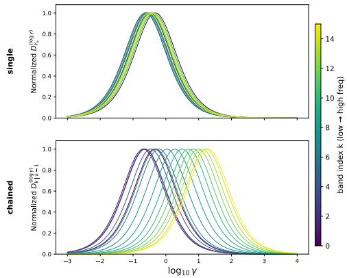  
(a) MNIST: single-band (top) vs. chained (bottom) conditioning.

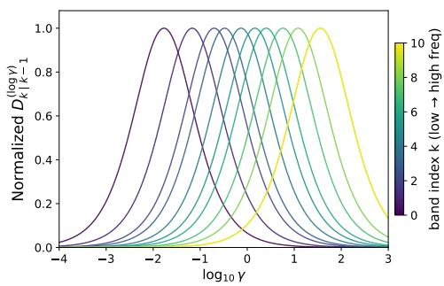  
(b) CIFAR-10: chained spectral progression.  
Figure 2: Spectral information densities. In the top row of (a), single-band conditioning produces densities $D _ { Y _ { k } } ^ { ( \log \gamma ) }$ that overlap heavily because shared low-frequency information is counted in every band; in the bottom row of (a) and in (b), forward chaining removes information already explained by coarser bands, revealing a clean coarse-to-fine progression along log γ. Color: low (purple) to high (yellow) frequency band index k.

## 5.2.1 Training-speed test under matched recipes

Existing comparisons of training speed across image diffusion representations are mostly based on published FID curves that differ in both generator architecture and training recipe (optimizer, time-shift schedule, sampler, learning-rate warmup, number of FID samples, etc.). This makes it difficult to attribute observed differences to the representation alone rather than to recipe choices. We therefore design a representation-only training-speed test in which the recipe variables that most affect early FID — training noise shift $\alpha _ { t } ,$ sampling noise shift $\alpha _ { s } ,$ and learning rate — are first selected on a smaller LDiT-B model with a fixed grid (Appendix D), and then frozen across all four XL trajectories. All four representations share the same number of tokens (256), the same model (LDiT-XL), the same sampler (Euler with 50 NFE, unconditional inference). What remains different is exactly what defines each representation: encoder family, native patch size, channel count, and prediction parameterization (x-prediction [Li and He, 2025] for pixel/RAE, velocity for SDVAE/VAVAE), as required by the standard recipe of each space.

Figure 3 shows the resulting FID trajectories. The four representations do not merely reach different final FID values; they follow visibly distinct convergence curves whose ordering is consistent across the whole 200-epoch budget:

$$
\mathbf { p i x e l } < \mathbf { S D V A E } < \mathbf { V A V A E } < \mathbf { R A E } ,
$$

with best FID 78.51 (pixel, ep. 200) → 30.83 (SDVAE, ep. 200) → 21.16 (VAVAE, ep. 200) → 8.39 (RAE, ep. 180). This ordering is robust to the recipe variables we explicitly controlled and is consistent with the qualitative ranking reported in the original VAVAE and RAE papers. What this experiment does not explain is the mechanism: it is an open problem why a particular representation makes diffusion training easier or harder under a matched optimization recipe.

## 5.2.2 Hierarchical information-dynamics diagnostic

We now use the chained feature information dynamics, together with the hierarchical latent-variable prior implicit in the class → mask → Canny chain, as a diagnostic for the convergence-speed ordering established above. For every representation, we initialize each conditioning stage from the publicly released pretrained checkpoint of the corresponding backbone [Li and He, 2025, Ma et al., 2024, Yao et al., 2025, Zheng et al., 2025] and then fine-tune for the new condition following official pipelines with necessary modifications, so that each $m _ { k } ( \gamma )$ is evaluated near the best diffusion-loss / MMSE floor reachable in that space rather than at an early-stage training optimum. The illustration in Figure 1 visualizes the pixel instance of this chain: the four sample columns are produced by phase-wise fine-tuning a JiT-L/16 [Li and He, 2025] model through the unconditional, class, class+mask, and class+mask+Canny modes, and the right-hand panels are the corresponding chained MMSE curves and per-level densities. The appendix panoramas (Figure 9) give the analogous diagnostic for SDVAE, VAVAE, and RAE.

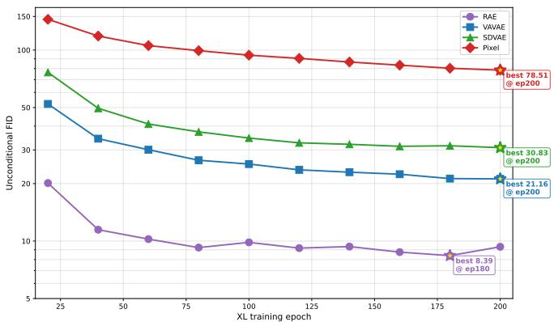  
Figure 3: Unconditional FID trajectories under a matched recipe. Best FID reached over 200 XL epochs: RAE 8.39 (ep. 180) < VAVAE 21.16 < SDVAE 30.83 < pixel 78.51 (all at ep. 200). Hyperparameters $\left( \alpha _ { t } , \alpha _ { s } , \mathrm { l r } \right)$ are selected on a smaller LDiT-B model and then frozen across the XL trajectories.

Detailed conditioning protocol, token counts, and per-stage hyperparameters are in Appendix D; the full per-representation panoramas (MMSE curves, chained MMSE gaps, log-SNR information densities, and cumulative information) are in Figure 9.

Figure 4 reveals that the same conditioning chain produces qualitatively different feature information dynamics across representations, and that these differences track the convergence-speed ordering of Section 5.2.1.

• Pixel space (slowest convergence) inverts the classical hierarchy. The mask density peaks at lower log-SNR than the class density, so mask information enters earlier and more strongly than class identity. Pixel diffusion does not resolve semantics first.

• VAVAE (faster convergence) recovers the semantic-first half. The class increment is now prioritized, with its peak located at lower log-SNR than the mask peak, but mask and Canny still overlap rather than separate cleanly along log γ.

• Only RAE (fastest convergence) achieves a strict class → mask → Canny ordering. Its three density peaks land in textbook high → mid → low order along the log-SNR axis, matching the classical visual hierarchy.

We therefore observe a correlation between how cleanly a representation hierarchically orders its feature densities and how quickly its diffusion model converges, without claiming that this ordering causes faster convergence. The central message is that representation choice acts as a controllable knob over feature information dynamics: the same conditioning chain, evaluated against the same images and masks, yields representation-specific orderings that are invisible from FID alone.

## 6 Discussion

## 6.1 Generation order in vision and language

The hierarchical-ordering view of diffusion that emerges here connects to a long line of work on generation order in non-diffusion generative models. On the vision side, next-scale prediction (VAR) [Tian et al., 2024] and masked-token refinement (MaskGIT) [Chang et al., 2022] explicitly hard-code a coarse-to-fine generation order, and report that this order improves both sample quality and parallelism over standard left-to-right tokenization. On the language side, XLNet [Yang et al., 2019] permutes the autoregressive factorization to expose bidirectional context, while insertion-based sequence models [Stern et al., 2019] expose generation order itself as a controllable design choice with quality–parallelism trade-offs. A common message is that, even when the underlying joint distribution is fixed, the order in whichfeatures are introduced changes the optimization geometry seen by the model. Our framework reads diffusion in the same vocabulary: chaining the conditioning bundle along a feature hierarchy makes the implicit generation order along the noise schedule directly observable as the placement of $D _ { k | k - 1 } ^ { ( \log \gamma ) }$ peaks. The cross-representation finding in Section 5.2.2 is therefore best understood as an order-discovery result: pixel, SDVAE, VAVAE, and RAE realize different implicit orders for the same data and the same conditioning chain, and the cleanest order coincides with the fastest training.

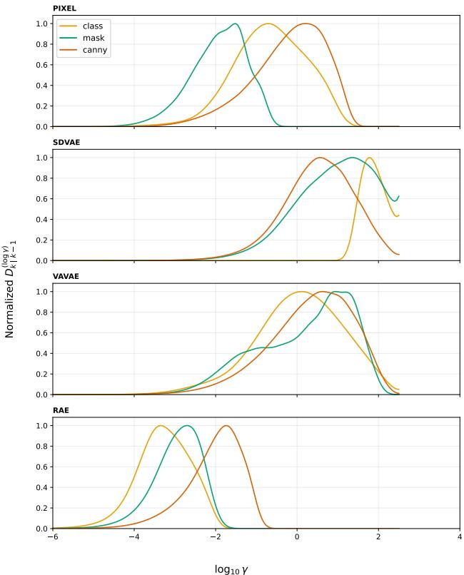  
Figure 4: Layer-wise feature information dynamics across representations. Per-feature log-SNR information densities $D _ { k | k - 1 } ^ { ( \log \gamma ) }$ of the class, mask, and Canny increments for pixel, SDVAE, VAVAE, and RAE diffusion. Full panoramas in Figure 9.

<table><tr><td>Model / checkpoint</td><td>Conditioning order</td><td>Class</td><td>Mask</td><td>Canny</td></tr><tr><td>RAE-S, 20 epochs</td><td>class-mask-Canny</td><td>-5.00</td><td>-3.50</td><td>-2.00</td></tr><tr><td>RAE-S, 40 epochs</td><td>class-mask-Canny</td><td>-3.75</td><td>-2.75</td><td>-1.50</td></tr><tr><td>RAE-S, 60 epochs</td><td>class-mask-Canny</td><td>-3.75</td><td>-2.75</td><td>-1.75</td></tr><tr><td>RAE-S, 80 epochs</td><td>class-mask-Canny</td><td>-3.75</td><td>-2.75</td><td>-1.75</td></tr><tr><td>RAE/DiTDH-XL</td><td>class-mask-Canny</td><td>-3.75</td><td>-2.75</td><td>-1.75</td></tr><tr><td>RAE/DiTDH-XL</td><td>mask-class-Canny</td><td>-4.00</td><td>-3.25</td><td>-1.75</td></tr></table>

Table 1: Peak log-SNRs for the model-size, checkpoint, and chain-order checks. RAE-S has approximately 132M parameters and the DiTDH-XL model approximately 842M.

## 6.2 Limitations

Our framework has several limitations. Two are especially consequential for interpreting the empirical profiles and are examined directly below.

Approximation by trained denoisers. The estimator uses trained denoisers to approximate Bayesoptimal MMSE terms, so the measured gaps can depend on optimization quality as well as on the underlying information. The order, checkpoint, and model-size checks in Table 1 provide a direct check: the alternative mask → class → Canny order shifts the class and mask peaks but preserves their separation on RAE, while approximately 132M-parameter RAE-S checkpoints and the approximately 842M-parameter DiTDH-XL model show the same late-stage ordering and peak locations. Appendix D also records that pretrained-checkpoint initialization and training from scratch can lead to different measured conclusions.

Dependence on feature order. The chained attribution is order-dependent because each increment is conditioned on the preceding feature bundle; it is therefore not an order-independent assignment of information. We use class → mask → Canny as a canonical semantic-to-local order, and the alternative-order result in Table 1 tests how this choice affects the profiles.

Other limitations. The cross-representation comparison is limited by computational budget to four representations and one conditioning chain. The mutual-information quantities are distribution-level averages, so the profiles need not describe every individual image. The density is a descriptive diagnostic, and the observed association between hierarchical ordering and convergence speed does not establish a causal mechanism. The analysis also assumes an additive Gaussian channel with independent coupling; settings with a non-independent endpoint coupling require an extension beyond the present scope. Finally, applying the direct chained estimator to a larger hierarchy requires additional cumulative conditional models, which can become a practical bottleneck.

## 6.3 Possible uses

The diagnostic suggests several directions for application-driven study. First, before committing to a full diffusion-model training run, researchers could compare representations by asking whether semantic, geometric, and local information are separated along the SNR axis; in our experiments, cleaner separation accompanies faster convergence, so the profiles may serve as a representationselection signal without being treated as a proven predictor. Second, the locations and widths of the density peaks could inform candidate timestep schedules or conditioning orders by identifying the SNR ranges in which particular features are most active. Third, conditional samplers could use feature- or SNR-dependent guidance strengths instead of applying the same guidance throughout the trajectory. Finally, comparing these profiles across architectures or representations could help diagnose where information becomes entangled or remains unresolved, and could motivate representation or conditioning designs targeted at those stages.

## 7 Conclusion

We presentedfeature information dynamics, a quantitative framework that localizes when information about a feature enters the diffusion trajectory by combining the I-MMSE identity with unconditional and feature-conditional denoising losses. The chained decomposition extends this to nested feature hierarchies and isolates the incremental contribution of each level. Empirically, pixel diffusion follows spectral autoregression in the chained sense, and applying the same conditioning chain (class → mask → Canny) across pixel, SDVAE, VAVAE, and RAE diffusion produces qualitatively different feature information dynamics: only RAE achieves a strict class → mask → Canny ordering of density peaks, while pixel and SDVAE deviate. This recasts representation choice as a controllable knob over feature information dynamics and possibly diffusion training efficiency, an interplay between representation and generation to be explored.

## Acknowledgments and Disclosure of Funding

We gratefully acknowledge the support of Hangzhou West Lake Pearl Program; Westlake University Research Center for Industries of the Future; and Westlake University Center for High-performance Computing.

The authors declare no competing interests.

## References

Alan Baade, Eric Ryan Chan, Kyle Sargent, Changan Chen, Justin Johnson, Ehsan Adeli, and Li Fei-Fei. Latent forcing: Reordering the diffusion trajectory for pixel-space image generation. arXiv preprint arXiv:2602.11401, 2026.

Mohamed Ishmael Belghazi, Aristide Baratin, Sai Rajeshwar, Sherjil Ozair, Yoshua Bengio, Aaron Courville, and Devon Hjelm. Mutual information neural estimation. In International conference on machine learning, pages 531–540. PMLR, 2018.

Nicolas Carion, Laura Gustafson, Yuan-Ting Hu, Shoubhik Debnath, Ronghang Hu, Didac Suris, Chaitanya Ryali, Kalyan Vasudev Alwala, Haitham Khedr, Andrew Huang, Jie Lei, Tengyu Ma, Baishan Guo, Arpit Kalla, Markus Marks, Joseph Greer, Meng Wang, Peize Sun, Roman Rädle, Triantafyllos Afouras, Effrosyni Mavroudi, Katherine Xu, Tsung-Han Wu, Yu Zhou, Liliane Momeni, Rishi Hazra, Shuangrui Ding, Sagar Vaze, Francois Porcher, Feng Li, Siyuan Li, Aishwarya Kamath, Ho Kei Cheng, Piotr Dollár, Nikhila Ravi, Kate Saenko, Pengchuan Zhang, and Christoph Feichtenhofer. Sam 3: Segment anything with concepts, 2025. URL https://arxiv.org/abs/2511.16719.

Huiwen Chang, Han Zhang, Lu Jiang, Ce Liu, and William T. Freeman. Maskgit: Masked generative image transformer. In Proceedings ofthe IEEE/CVF Conference on Computer Vision and Pattern Recognition (CVPR), pages 11315–11325, 2022.

Sander Dieleman. Diffusion is spectral autoregression, 2024. URL https://sander.ai/2024/ 09/02/spectral-autoregression.html.

Giulio Franzese, Mustapha BOUNOUA, and Pietro Michiardi. Minde: Mutual information neural diffusion estimation. In The Twelfth International Conference on Learning Representations, 2024.

Dongning Guo, Shlomo Shamai, and Sergio Verdú. Mutual information and minimum mean-square error in gaussian channels. IEEE transactions on information theory, 51(4):1261–1282, 2005.

Florian Handke, Dejan Stanceviˇ c, Felix Koulischer, Thomas Demeester, and Luca Ambrogioni. The´ entropic signature of class speciation in diffusion models. arXiv preprint arXiv:2602.09651, 2026.

Jonathan Ho and Tim Salimans. Classifier-free diffusion guidance. arXiv preprint arXiv:2207.12598, 2022.

Jonathan Ho, Ajay Jain, and Pieter Abbeel. Denoising diffusion probabilistic models. Advances in neural information processing systems, 33:6840–6851, 2020.

Xianghao Kong, Rob Brekelmans, and Greg Ver Steeg. Information-theoretic diffusion. In The Eleventh International Conference on Learning Representations, 2023.

Xianghao Kong, Ollie Liu, Han Li, Dani Yogatama, and Greg Ver Steeg. Interpretable diffusion via information decomposition. In The Twelfth International Conference on Learning Representations, 2024.

Tianhong Li and Kaiming He. Back to basics: Let denoising generative models denoise. arXiv preprint arXiv:2511.13720, 2025.

Yaron Lipman, Ricky TQ Chen, Heli Ben-Hamu, Maximilian Nickel, and Matt Le. Flow matching for generative modeling. arXiv preprint arXiv:2210.02747, 2022.

Nanye Ma, Mark Goldstein, Michael S. Albergo, Nicholas M. Boffi, Eric Vanden-Eijnden, and Saining Xie. SiT: Exploring flow and diffusion-based generative models with scalable interpolant transformers. In Computer Vision – ECCV 2024, Lecture Notes in Computer Science, pages 23–40. Springer, 2024. doi: 10.1007/978-3-031-72980-5\_2.

Aaron van den Oord, Yazhe Li, and Oriol Vinyals. Representation learning with contrastive predictive coding. arXiv preprint arXiv:1807.03748, 2018.

Yueming Pan, Ruoyu Feng, Qi Dai, Yuqi Wang, Wenfeng Lin, Mingyu Guo, Chong Luo, and Nanning Zheng. Semantics lead the way: Harmonizing semantic and texture modeling with asynchronous latent diffusion. arXiv preprint arXiv:2512.04926, 2025.

Yong-Hyun Park, Mingi Kwon, Jaewoong Choi, Junghyo Jo, and Youngjung Uh. Understanding the latent space of diffusion models through the lens of riemannian geometry. Advances in Neural Information Processing Systems, 36:24129–24142, 2023.

Robin Rombach, Andreas Blattmann, Dominik Lorenz, Patrick Esser, and Björn Ommer. Highresolution image synthesis with latent diffusion models. In Proceedings ofthe IEEE/CVF confer ence on computer vision and pattern recognition, pages 10684–10695, 2022.

Mitchell Stern, William Chan, Jamie Kiros, and Jakob Uszkoreit. Insertion transformer: Flexible sequence generation via insertion operations. In International Conference on Machine Learning, pages 5976–5985. PMLR, 2019.

Keyu Tian, Yi Jiang, Zehuan Yuan, Bingyue Peng, and Liwei Wang. Visual autoregressive modeling: Scalable image generation via next-scale prediction. In Advances in Neural Information Processing Systems, volume 37, 2024.

Berk Tinaz, Zalan Fabian, and Mahdi Soltanolkotabi. Emergence and evolution of interpretable concepts in diffusion models. In The Thirty-ninth Annual Conference on Neural Information Processing Systems.

Naftali Tishby, Fernando C Pereira, and William Bialek. The information bottleneck method. arXiv preprint physics/0004057, 2000.

van A Van der Schaaf and JH van van Hateren. Modelling the power spectra of natural images: statistics and information. Vision research, 36(17):2759–2770, 1996.

Yihong Wu and Sergio Verdú. Mmse dimension. IEEE Transactions on Information Theory, 57(8): 4857–4879, 2011.

Zhilin Yang, Zihang Dai, Yiming Yang, Jaime Carbonell, Ruslan Salakhutdinov, and Quoc V. Le. Xlnet: Generalized autoregressive pretraining for language understanding. In Advances in Neural Information Processing Systems, volume 32, 2019.

Jingfeng Yao, Bin Yang, and Xinggang Wang. Reconstruction vs. generation: Taming optimization dilemma in latent diffusion models. In Proceedings ofthe Computer Vision and Pattern Recognition Conference, pages 15703–15712, 2025.

Longxuan Yu, Xing Shi, Xianghao Kong, Tong Jia, and Greg Ver Steeg. MMG: Mutual information estimation via the MMSE gap in diffusion. In NeurIPS 2025 Workshop on Structured Probabilistic Inference & Generative Modeling, 2025.

Zhongqi Yue, Jiankun Wang, Qianru Sun, Lei Ji, Eric I-Chao Chang, and Hanwang Zhang. Exploring diffusion time-steps for unsuper-vised representation learning.

Boyang Zheng, Nanye Ma, Shengbang Tong, and Saining Xie. Diffusion transformers with representation autoencoders. arXiv preprint arXiv:2510.11690, 2025.

## A Equivalent Estimators

The feature information density $D _ { Y } ( \gamma )$ defined in Eq. (11) admits several equivalent expressions, each corresponding to a distinct practical estimator. We begin by recalling the Fisher information of the channel output, defined as the expected squared norm of the score:

$$
\begin{array} { r } { \boldsymbol { J } ( \boldsymbol { X } _ { \gamma } ) : = \mathbb { E } _ { \boldsymbol { X } _ { \gamma } } \left[ \Vert \nabla \log p ( \boldsymbol { X } _ { \gamma } ) \Vert ^ { 2 } \right] , \qquad \boldsymbol { J } ( \boldsymbol { X } _ { \gamma } \mid \boldsymbol { Y } ) : = \mathbb { E } _ { \boldsymbol { X } _ { \gamma } , \boldsymbol { Y } } \left[ \Vert \nabla \log p ( \boldsymbol { X } _ { \gamma } \mid \boldsymbol { Y } ) \Vert ^ { 2 } \right] , } \end{array}\tag{18}
$$

where ∇ log $p ( x _ { \gamma } )$ denotes the gradient of log p with respect to its argument $x _ { \gamma }$

Proposition 1 (Equivalent Estimators). Under standard regularity (finite second moments, smooth densities), thefeature information density admits the equivalentforms

$$
D _ { Y } ( \gamma ) = \textstyle { \frac { 1 } { 2 } } \big [ m _ { \mathcal { O } } ( \gamma ) - m _ { Y } ( \gamma ) \big ]
$$

$$
( s i n g l e - f e a t u r e M M S E ~ g a p )\tag{19}
$$

$$
\begin{array} { r l } { \mathrm { ~ } } & { { } = \frac { 1 } { 2 } \mathbb { E } _ { X _ { \gamma } , Y } \Big [ \big \| \hat { \pmb x } ^ { \star } ( { \pmb X } _ { \gamma } , \gamma , Y ) - \hat { \pmb x } ^ { \star } ( { \pmb X } _ { \gamma } , \gamma ) \big \| ^ { 2 } \Big ] } \end{array}
$$

$$
( d e n o i s e r g a p )\tag{20}
$$

$$
\begin{array} { r l } { \mathrm { } } & { { } = { \frac { 1 } { 2 \gamma } } \mathbb { E } _ { { \pmb { X } } _ { \gamma } , Y } \left[ \left\| \nabla \log p ( { \pmb { X } } _ { \gamma } \mid Y ) - \nabla \log p ( { \pmb { X } } _ { \gamma } ) \right\| ^ { 2 } \right] \quad ( s c o r e \ g a p ) } \end{array}\tag{21}
$$

$$
= { \textstyle { \frac { 1 } { 2 \gamma } } } \left[ J ( X _ { \gamma } \mid Y ) - J ( X _ { \gamma } ) \right]
$$

$$
( F i s h e r i n f o g a p )\tag{22}
$$

$$
\begin{array} { r l } { } & { = \frac { 1 } { 2 \gamma } \mathbb { E } _ { { \pmb X } _ { \gamma } , { \pmb Y } } \Big [ \Big \| \nabla \log p ( { \pmb Y } \mid { \pmb X } _ { \gamma } ) \Big \| ^ { 2 } \Big ] } \end{array}
$$

$$
( l i k e l i h o o d s c o r e ) .\tag{23}
$$

Proof. Denoiser gap, Eq. (20). This proof was first given by Kong et al. [2024], and we rephrase here for completeness. At each γ, by the definitions of $m _ { \emptyset }$ and mY,

$$
m _ { \mathcal { Q } } ( \gamma ) - m _ { Y } ( \gamma ) = \mathbb { E } _ { X , X _ { \gamma } , Y } \Bigl [ \bigl \| X - \hat { x } ^ { \star } ( X _ { \gamma } , \gamma ) \bigr \| ^ { 2 } - \bigl \| X - \hat { x } ^ { \star } ( X _ { \gamma } , \gamma , Y ) \bigr \| ^ { 2 } \Bigr ] .
$$

Apply the algebraic identity $\| A \| ^ { 2 } - \| B \| ^ { 2 } = \| A - B \| ^ { 2 } + 2 B \cdot ( A - B )$ with $A = X - \hat { { \pmb x } } ^ { \star } ( X _ { \gamma } , \gamma )$ and $\dot { B } = \bar { X } - \hat { { \pmb x } } ^ { \star } ( { \pmb X } _ { \gamma } , \bar { \gamma } , \bar { Y } )$ , so that $A - B = \hat { \pmb x } ^ { \star } ( { \pmb X } _ { \gamma } , \gamma , Y ) - \hat { \pmb x } ^ { \star } ( { \pmb X } _ { \gamma } , \gamma )$ . The cross term $\mathbb { E } [ 2 B \cdot ( A - B ) ]$ vanishes: conditioning on $( X _ { \gamma } , Y )$ , the factor $A - B$ is deterministic, while $\mathbb { E } [ X - \hat { { \pmb x } } ^ { \star } ( X _ { \gamma } , \overset { \prime } { \gamma } , Y ) \mid X _ { \gamma } , Y ] = 0$ by definition of the optimal denoiser. Hence $m _ { \emptyset } ( \gamma ) - m _ { Y } ( \gamma ) =$ $\mathbb { E } \| \hat { \pmb x } ^ { \star } ( { \pmb X } _ { \gamma } , \gamma , Y ) - \hat { \pmb x } ^ { \star } ( { \pmb X } _ { \gamma } , \gamma ) \| ^ { 2 }$ , giving Eq. (20).

Score gap, Eq. (21). By Tweedie’s formula, the score is a linear function of the optimal denoiser:

$$
\nabla \log p ( x _ { \gamma } ) = \sqrt { \gamma } \hat { \pmb x } ^ { \star } ( x _ { \gamma } , \gamma ) - x _ { \gamma } , \qquad \nabla \log p ( x _ { \gamma } \mid y ) = \sqrt { \gamma } \hat { \pmb x } ^ { \star } ( x _ { \gamma } , \gamma , y ) - x _ { \gamma } .\tag{24}
$$

Subtracting cancels the $- { x _ { \gamma } }$ term, so

$$
\nabla \log p ( x _ { \gamma } \mid y ) - \nabla \log p ( x _ { \gamma } ) = \sqrt { \gamma } \big [ \hat { \pmb x } ^ { \star } ( x _ { \gamma } , \gamma , y ) - \hat { \pmb x } ^ { \star } ( x _ { \gamma } , \gamma ) \big ] .
$$

Squaring, taking expectation, and dividing by $2 \gamma$ recovers Eq. (21) from Eq. (20). The score-gap form has been widely adopted in mutual-information estimation work based on diffusion or score-matching models [Franzese et al., 2024, Handke et al., 2026].

Fisher info gap, Eq. (22). By the law of total expectation, $\hat { \pmb x } ^ { \star } ( { \pmb X } _ { \gamma } , \gamma ) = \mathbb { E } _ { Y | { \pmb X } _ { \gamma } } [ \hat { \pmb x } ^ { \star } ( { \pmb X } _ { \gamma } , \gamma , Y ) \ |$ $X _ { \gamma } ]$ (the unconditional denoiser is the conditional expectation of the conditional one over $Y \mid X _ { \gamma } ) \rangle$ via Eq. (24), the same tower identity holds for the score:

$$
\operatorname { \mathbb { E } } _ { Y } [ \nabla \log p ( \boldsymbol { X } _ { \gamma } \mid Y ) \mid \boldsymbol { X } _ { \gamma } ] = \nabla \log p ( \boldsymbol { X } _ { \gamma } ) .
$$

Expanding the squared norm in Eq. (21), the cross term reduces to $- 2 \mathbb { E } \| \nabla \log p ( X _ { \gamma } ) \| ^ { 2 } = - 2 J ( X _ { \gamma } )$ by this identity, leaving

$$
\mathbb { E } \big \| \nabla \log p ( X _ { \gamma } \mid Y ) - \nabla \log p ( X _ { \gamma } ) \big \| ^ { 2 } = J ( X _ { \gamma } \mid Y ) - 2 J ( X _ { \gamma } ) + J ( X _ { \gamma } ) = J ( X _ { \gamma } \mid Y ) - J ( X _ { \gamma } ) .
$$

Dividing by 2γ gives Eq. (22).

Likelihood score, Eq. (23). This identity resonates with Classifier-Free Guidance [Ho and Salimans, 2022]: from $p ( x _ { \gamma } \mid y ) = p ( y \mid x _ { \gamma } ) p ( x _ { \gamma } ) / p ( y )$ , take logarithm and gradient with respect to $x _ { \gamma }$

$$
\nabla \log p ( x _ { \gamma } \mid y ) - \nabla \log p ( x _ { \gamma } ) = \nabla \log p ( y \mid x _ { \gamma } ) .
$$

Substituting into Eq. (21) yields Eq. (23).

<table><tr><td>Estimator</td><td>Advantage</td><td>Disadvantage</td></tr><tr><td>Single-feature MMSE gap</td><td>Directly reuses denoiser training; clear information-theoretic meaning</td><td>Requires two independent models; large- number subtraction amplifies variance Still requires two denoiser models</td></tr><tr><td>Denoiser gap</td><td>Equivalent to the single-feature MMSE gap but computed as a squared  $\ell ^ { 2 }$  dis- tance between two denoisers; numeri- cally more stable</td><td></td></tr><tr><td>Score gap</td><td>Natural interface with score-based mod- Score training is less stable; the els; equivalent to denoiser gap by Tweedie</td><td> $1 / \gamma$  fac- tor amplifies errors at low SNR</td></tr><tr><td>Likelihood score</td><td>Only one model needed (a y-conditional likelihood-score predictor)</td><td>Requires a reverse-direction model;  $1 / \gamma$  singularity as  $\gamma \to 0$ </td></tr></table>

Table 2: Comparison of estimators for the feature information density.

<table><tr><td>Band</td><td>Setting</td><td>a</td><td>b</td><td> $\mu _ { l g } = \log _ { 1 0 } ( 1 / b )$ </td></tr><tr><td> $b _ { 5 }$ </td><td> $\alpha = 0 . 5$ </td><td> $3 . 6 5 \times 1 0 ^ { 1 }$ </td><td> $7 . 5 1 \times 1 0 ^ { - 1 }$ </td><td> $+ 0 . 1 2 4$ </td></tr><tr><td> $b _ { 5 }$ </td><td> $\alpha = 0$ </td><td> $3 . 6 8 \times 1 0 ^ { 1 }$ </td><td> $7 . 5 0 \times 1 0 ^ { - 1 }$ </td><td> $+ 0 . 1 2 5$ </td></tr><tr><td> $b _ { 1 0 }$ </td><td> $\alpha = 0 . 5$ </td><td> $1 . 3 7 \times 1 0 ^ { - 1 }$ </td><td> $3 . 2 3 \times 1 0 ^ { - 2 }$ </td><td> $+ 1 . 4 9 1$ </td></tr><tr><td> $b _ { 1 0 }$ </td><td> $\alpha = 0$ </td><td> $6 . 0 1 \times 1 0 ^ { - 2 }$ </td><td> $\mathbf { 1 . 0 0 \times 1 0 ^ { - 1 2 } }$ </td><td> $\mathbf { + 1 2 . 0 0 }$ </td></tr></table>

Table 3: Double-pole Lorentzian fit parameters $\begin{array} { r } { \overline { { L ( \gamma ) = a / ( 1 + b \gamma ) ^ { 2 } } } } \end{array}$ for the two bands and two α settings shown in Figure 6. Bold cells flag the $\alpha = 0 \ b _ { 1 0 }$ degeneracy where b is pinned at the optimizer lower bound and the apparent peak location $\mu _ { l g }$ is far outside the empirical $\log _ { 1 0 } \gamma$ support (which ends at +1.46).

Comparison of estimators. The five equivalent forms in Proposition 1 differ in numerical stability, the number of models required, and the SNR regime in which they are most reliable; Table 2 summarizes the practical trade-offs.

Asymmetry of mutual information estimation. A consequence of the equivalence family is that information density estimation can be done bidirectionally, while the difficulty can differ. Since Y is a feature less complicated than X, people might assume that learning a noisy classifier $p ( Y \mid X _ { \gamma } )$ is easier than learning generators $\bar { p ( X ) } , p ( X \bar { | } Y )$ ). This may hold for categorical Y with a small number of classes, but for general continuous features, the likelihood can be difficult to estimate.

Continuous features and divergence. For discrete features, $I ( Y ; X )$ has an upper bound $H ( Y )$ which is always finite. For general continuous features, however, $I ( Y ; X )$ can be infinite—in particular, when $Y = f ( X )$ is a deterministic continuous function of X. Adding observation noise $\alpha > 0$ to the feature—so that $Y _ { \alpha } = f ( \pmb { X } ) + \alpha \pmb { \epsilon }$ with $\epsilon \sim \mathcal { N } ( 0 , I )$ —restores finiteness. This regularization is not merely a numerical trick: it also reflects the realistic setting where features are measured with finite precision.

Two estimators in our framework respond very differently to this regularization. The empirical estimator we use throughout the paper—linear interpolation followed by Gaussian smoothing on a finite log-γ grid—never extrapolates, so it reports the chained gap on the support actually sampled. The analytic estimator (Appendix B) instead fits a double-pole Lorentzian whose log-γ image decays as $O ( 1 / \gamma )$ in the right tail. For a deterministic continuous feature the true tail does not decay (it is what produces the divergent $I ( Y ; X ) )$ ), so the Lorentzian’s $O ( 1 / \gamma )$ image is too thin to match it; on $\alpha = 0$ data the fit therefore becomes degenerate, while on $\alpha = 0 . 5$ data the same fit is wellconditioned. Figures 5 and 6 make both effects precise on CIFAR-10. On the finite sampled SNR interval, the empirical summaries are close for many bands: the total chained mutual information across 12 bands agrees to within 0.32%, 9 of 12 bands agree to within 2% in integrated MI, and the log-γ density peak positions agree to within 0.005 on mid and high bands. This does not make the two settings interchangeable: for the high band $b _ { 1 0 } .$ , the $\alpha = 0 . 5$ Lorentzian fit is well-conditioned $( \mu _ { l g } = + 1 . 4 9 )$ , whereas the $\alpha = 0$ fit collapses to the lower bound $b = 1 0 ^ { - 1 2 }$ with apparent peak at $\mu _ { l g } = + 1 2 . 0$ , far outside the data support, which ends at $\mu _ { l g } = + 1 . 4 6$

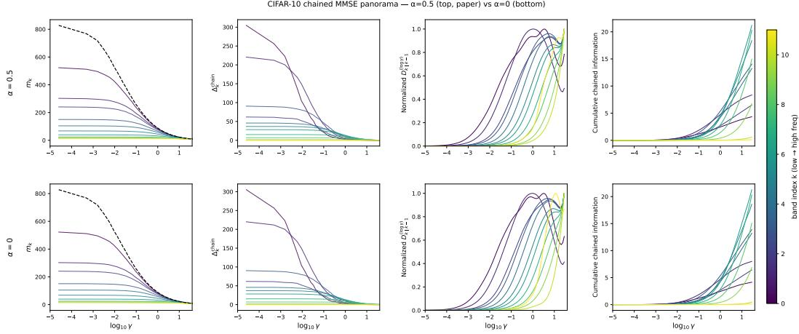  
Figure 5: Empirical finite-SNR summaries are close for many bands, but the analytic tail is not invariant to the feature-noise level $\alpha .$ . CIFAR-10 multiband chained MMSE diagnostics (12 frequency bands) at $\alpha = 0 . 5$ (top row) and $\alpha = 0$ (bottom row), with all other settings held fixed. From left to right: per-band MMSE $m _ { k } .$ , chained gap $\Delta _ { k } ^ { \mathrm { c h a i n } } = m _ { k - 1 } - m _ { k }$ , normalized log-γ information density $D _ { k | k - 1 } ^ { ( \log \gamma ) }$ , and cumulative chained information. The rows are close on most finite-SNR summaries, while the analytic high-SNR tail fit is unstable at $\alpha = 0$ (Table 3).

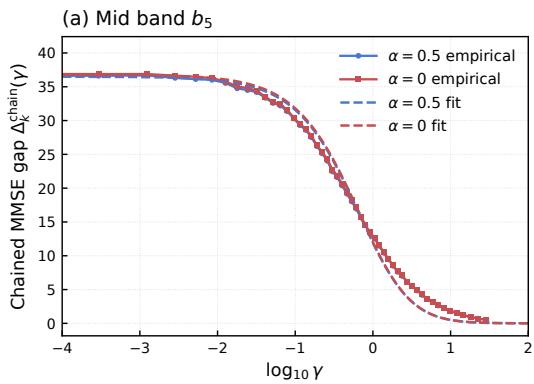

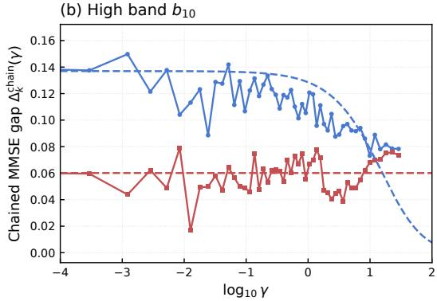  
Figure 6: Why the analytic Lorentzian estimator requires $\alpha > 0 .$ . Two representative CIFAR-10 bands at $\alpha = 0 . 5$ (blue) and $\alpha = 0$ (red): the mid band $b _ { 5 }$ , where the chained MMSE gap decays cleanly with $\gamma ,$ , and the high band $b _ { 1 0 } .$ , where the gap is small and noisy. Solid lines/markers show the empirical chained MMSE gap $\Delta _ { k } ^ { \mathrm { c h a i n } } ( \gamma )$ and dashed lines show the corresponding double-pole fits $L ( \gamma ) = a / ( 1 + b \gamma ) ^ { 2 }$ . On $b _ { 5 }$ , both fits track the empirical curve and the fitted scales agree to within $0 . 0 0 1$ in $\mu _ { l g } = \log _ { 1 0 } ( 1 / b )$ (Table 3). On $b _ { 1 0 }$ , the $\alpha = 0 . 5$ fit cleanly tracks the empirical decay, but the $\alpha = 0$ fit collapses to a near-constant baseline—b pinned at the optimizer lower bound $1 0 ^ { - 1 2 }$ apparent peak at $\mu _ { l g } = + 1 2$ , far outside the data support which ends $\mathrm { a t + 1 . 4 6 }$ . This degeneracy is the analytic-estimator manifestation of the divergent ${ \bar { I } } ( Y ; X )$ for deterministic continuous features.

## B Analytic Fitting of the Single-Feature MMSE Gap

A well-trained diffusion model can be close to the optimal MMSE at moderate SNR, but the high-SNR regime is numerically delicate. $\mathrm { A s } \gamma \to \infty$ , the true MMSE and its training signal both become small; finite-capacity denoisers can therefore underfit this clean-data limit. The resulting empirical MMSE is systematically too large, which contaminates the tail of the single-feature MMSE gap and can make a direct numerical integral unstable. We address this issue by fitting the empirical single-feature MMSE-gap curve in a reliable region and extrapolating the high-SNR tail using the fitted curve.

Double-pole Lorentzian fitting. We exploit the fact that the theoretical single-feature MMSE-gap curve is smooth and decays to zero, admitting a good approximation by a sum of rational functions.

Specifically, we fit the empirical gap in the reliable region $\gamma < \gamma _ { \mathrm { m a x } }$ (corresponding to $t < t _ { \mathrm { m a x } } )$ with a Sum-of-Lorentzians model:

$$
\hat { \mathcal { D } } ( \gamma ) = \sum _ { k = 1 } ^ { K } \frac { a _ { k } } { ( 1 + b _ { k } \gamma ) ^ { 2 } } , \qquad a _ { k } , b _ { k } > 0 .\tag{25}
$$

Each component has an analytic integral $\begin{array} { r } { \int _ { 0 } ^ { \infty } a _ { k } / ( 1 + b _ { k } \gamma ) ^ { 2 } d \gamma = a _ { k } / b _ { k } } \end{array}$ , giving the total mutual information estimate:

$$
\hat { I } ( Y ; X ) = \frac { 1 } { 2 } \sum _ { k = 1 } ^ { K } \frac { a _ { k } } { b _ { k } } .\tag{26}
$$

Fitting boundary. We choose the fitting boundary from the empirical gap itself. For each singlefeature MMSE-gap curve, we first find the finite-grid index at which the gap reaches its minimum after the main decay, then move two grid points earlier and fit only the prefix before that cutoff. This “argmin minus two” rule excludes the high-SNR tail where empirical denoiser underfitting and numerical artifacts are most visible. The cutoff is shown as a vertical dashed line in the fitting diagnostics. The fit is performed only on the reliable prefix and then extrapolated analytically to $t \to 1$

Why fit the difference, not the individual curves. An apparently natural alternative is to fit the unconditional and conditional MMSE curves separately and then take their difference. This approach fails catastrophically: both curves are large, smooth, and nearly parallel, so their individually accurate fits produce a difference dominated by fitting residuals. In our experiments, this “fit-then-difference” approach yielded mutual information estimates on the order of $\mathrm { ^ { - 1 0 ^ { 5 } } }$ nats—clearly meaningless. Fitting the difference curve $\hat { \mathcal { D } } ( \gamma )$ directly avoids this issue entirely.

Model order selection. For the multiband MNIST experiments, a single double-pole component $( K = 1 )$ already suffices. The per-band fits achieve $R ^ { 2 } \stackrel { . } { \geq } 0 . 9 8$ , with most bands above 0.999 in the reliable region. This is why the fitted curves in Figure 7 are smooth and stable despite using only two free parameters per band.

## C Spectral Hierarchy Experiment Details

This appendix records the implementation details for the spectral hierarchy experiment in Section 5.1.

MNIST chained-control experiment. We decompose each MNIST image into 17 geometric frequency bands and use feature noise $\alpha = 0 . 5$ . The main-paper Figure 2a keeps only the log-γ information-density panels. The appendix figure below shows the full four-panel diagnostic. In the single-band setting, each model is conditioned on one band $Y _ { k }$ independently, and the gap is $m _ { \mathrm { u n c o n d } } ( \gamma ) - m _ { k } ( \gamma )$ . In the forward chained setting, the conditions are nested from low to high frequency, $\mathcal { V } _ { \leq k } = \left( Y _ { 0 } , \ldots , Y _ { k } \right)$ , and the plotted increment is the chained MMSE gap $m _ { k - 1 } ( \gamma ) -$ $m _ { k } ( \gamma )$ . The checkpoints used in the figure are trained for 100k steps and re-evaluated on the full 10k-image test split with four independent noise draws per image. We evaluate 61 diffusion times up to $t = 0 . 9 9 5$ . The final saturated band is omitted from the panorama for visual clarity.

CIFAR-10 frequency experiment. We decompose each CIFAR-10 image into twelve DCT frequency bands $\bar { Y ^ { ( 0 ) } } , \ldots , \bar { Y ^ { ( 1 1 ) } }$ , ordered from the lowest band $( b _ { 0 0 } , \mathrm { D C }$ and near-DC) to the highest band $( b _ { 1 1 }$ , finest detail). The same three scheme types are used as in MNIST: single-band models are conditioned on one band at a time, forward-chained models use the cumulative bundle $\mathcal { V } _ { < k } = ( Y ^ { ( 0 ) } , \ldots , Y ^ { ( k ) } )$ , and reverse-chained models use the same bands in the opposite order. The full diagnostic study included from-scratch small-convolutional, UNet, and pretrained-finetuning training lines. Figure 2b reports the final fine-tuning line because the earlier from-scratch models show the same qualitative monotone trend but are visibly limited by denoiser underfitting. For the plotted CIFAR curve, we fine-tune each cumulative band-conditional model from the pretrained m04fm unconditional checkpoint at epoch 1999, using feature noise $\alpha = 0 . 5$ . The chained MMSE gap is $\Delta _ { k } ^ { \mathrm { c h a i n } } ( \gamma ) = m _ { k - 1 } ( \gamma ) - m _ { k } ( \gamma )$ , with $m _ { - 1 }$ given by the pretrained unconditional model. The same log-γ parametrization and incremental-gap definition are used as in the MNIST experiment.

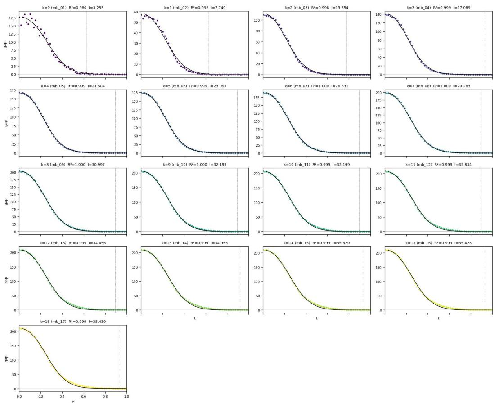  
Figure 7: Double-pole Lorentzian fits to empirical single-feature MMSE gaps. Dots show empirical per-band single-feature MMSE gaps and black curves show K = 1 double-pole fits. The vertical dashed line marks the adaptive reliable cutoff used for fitting. Despite the simplicity of the parametric form, the fits track the empirical gaps surprisingly well across bands, including the decay region that dominates the mutual-information integral.

We estimate the MMSE curves using 2048 test-split samples and 61 diffusion times. The final two saturated high-frequency shells are merged as $b _ { 1 0 } – b _ { 1 1 }$ for readability in the plotted panorama.

## D Representation Experiment Details

This appendix records the paired experimental protocol used in Section 5.2. The goal is to compare representations without letting data selection, condition construction, or inference plumbing become hidden confounders.

Data split and paired artifacts. All representation experiments use the same ImageNet-256 subset, denoted SR95. SR95 contains the ImageNet classes for which our automatic mask pipeline succeeds on at least 95% of images, yielding 485 classes. We use a deterministic image-id split: 90% of images for training and 10% for validation/FID reference. The training split contains 551,837 images, and the FID reference contains approximately 61k held-out images. For the hierarchy experiments, each representation is evaluated on the same paired image list and the same train/validation whitelists. Latent shards, mask shards, and canny shards are ordered by the same filename list, so a minibatch item carries the same semantic condition across pixel, SDVAE, VAVAE, and RAE runs.

Representations. The learnability comparison keeps the sequence length fixed at T = 256 tokens. Pixel space uses $2 5 6 \times 2 5 6 \times 3$ images with patch size 16. SDVAE uses the standard f=8, d=4 latent space $( 3 2 \times 3 2 \times 4 )$ with patch size 2. VAVAE uses the $f { = } 1 6 , d { = } 3 2$ latent space $( 1 6 \times 1 6 \times 3 2 )$ with patch size 1. RAE uses a DINOv2-B representation on a 16 × 16 grid with 768 channels and patch size 1. The autoencoders/encoders are frozen; only the generative model is trained.

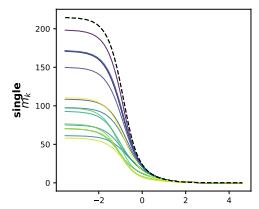

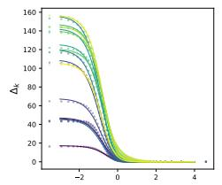

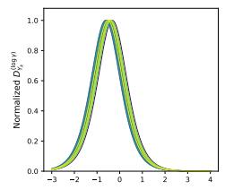

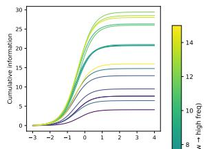

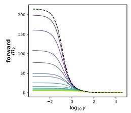

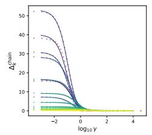

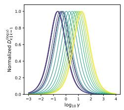

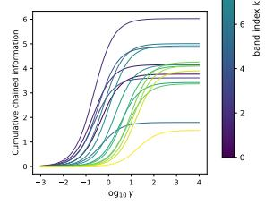  
Figure 8: Detailed comparison of single-band and chained frequency decompositions on MNIST. The full diagnostic includes MMSE, MMSE gap or chained MMSE gap, log-γ information density, and cumulative information. The main text retains only the density row; the complete four-panel view is collected here for reference.

Mask construction. Object masks are produced once and then reused as fixed conditioning artifacts. We query SAM 3.1 [Carion et al., 2025] with the ImageNet class text prompt for each image. The class-level SR95 filter keeps classes whose prompt succeeds on at least 95% of images, with SAM confidence threshold 0.3. Multiple available SAM passes are merged offline into a single binary foreground mask artifact per image; missing masks are represented by an all-zero sentinel and a validity flag. For model input, each mask is resized by the same short-edge-to-256, center-crop geometry used for the corresponding image preprocessing, with nearest-neighbor interpolation. The sharded training artifacts store masks as 256 × 256 uint8 tensors aligned with the image or latent shard order.

Canny construction. Canny conditions are derived from the same fixed masks, not recomputed during training. For each raw RGB image, pixels outside the binary foreground mask are zeroed, the masked image is converted to grayscale, and OpenCV Canny is applied at thresholds (100, 200). The resulting edge map is then center-cropped to 256 × 256 and stored as a uint8 shard aligned with the same filename order as the masks and latents. Thus the canny condition is a local boundary cue inside the object support, rather than a full-image edge detector that can leak unrelated background structure.

Unconditional learnability search. For the unconditional FID trajectories discussed in Section 5.2, we first run a search stage with LDiT-B models. The search uses global batch size 256, AdamW with $\beta _ { 2 } = 0 . 9 5$ , bfloat16 training, Euler sampling with 50 function evaluations, no classifier-free guidance, and a force-null unconditional sampling path. We sweep the logit-normal time shift used during training, $\alpha _ { t } .$ , the shift used during sampling, $\alpha _ { s } .$ , and the learning rate. The coarse shift grid is

$$
\{ 0 . 3 4 , 0 . 5 6 , 1 . 0 , 1 . 7 8 , 2 . 9 5 , 4 . 6 3 , 6 . 9 3 , 1 0 . 0 \} .
$$

Operationally, we first train one 20-epoch LDiT-B cell per $\alpha _ { t }$ using $\alpha _ { s } = \alpha _ { t }$ , and then evaluate the selected $\alpha _ { t }$ across the remaining $\alpha _ { s }$ values. Learning-rate variants are run for the promising cells. FID is computed with 10k generated samples against the SR95 held-out reference. After this search stage and follow-up stability checks, the selected XL cells are trained for 200 epochs with checkpoints every 20 epochs.

Corrected force-null inference. All learnability runs are unconditional. During training, class labels are dropped with probability 1.0. During sampling and FID evaluation, the model is explicitly called with the null class label rather than with accidental ImageNet class labels. This correction matters: before fixing the label plumbing, unconditional checkpoints could show an artificial lateepoch FID degradation caused by evaluating an unconditional model through a conditional label path. Under the corrected force-null protocol, all four selected XL trajectories improve monotonically or near-monotonically over the evaluated checkpoint range.

<table><tr><td>Representation</td><td>Model</td><td>Prediction</td><td>Learning rate</td><td>αt</td><td> $\alpha _ { s }$ </td></tr><tr><td>Pixel</td><td>LDiT-XL/16</td><td>x prediction</td><td> $5 \times 1 0 ^ { - 5 }$ </td><td>1.0</td><td>1.0</td></tr><tr><td>SDVAE</td><td>LDiT-XL/2</td><td>velocity</td><td> $1 \times 1 0 ^ { - 4 }$ </td><td>1.0</td><td>1.0</td></tr><tr><td>VAVAE</td><td>LDiT-XL/1</td><td>velocity</td><td> $1 \times 1 0 ^ { - 4 }$ </td><td>1.78</td><td>1.78</td></tr><tr><td>RAE</td><td>LDiT-XL/1</td><td>x prediction</td><td> $2 \times 1 0 ^ { - 4 }$ </td><td>0.10</td><td>0.10</td></tr></table>

Table 4: Selected XL cells used for the representation learnability trajectories. RAE required an additional boundary-extension check beyond the original coarse shift grid, which selected $\alpha _ { t } = \alpha _ { s } =$ 0.10.

Chained hierarchy protocol. The hierarchy experiment trains a separate checkpoint for each link in the chain

uncond → class → class+mask → class+mask+canny,

applied identically to all four representations (pixel, SDVAE, VAVAE, RAE). The class stage adapts the base generator to SR95 with labels available. The mask stage is initialized from the accepted class-stage checkpoint and adds the fixed foreground mask condition. The canny stage adds the fixed masked-canny condition on top of class and mask. Validation MSE on the paired validation split selects the checkpoint used for MMSE evaluation. For latent representations, mask and canny tensors are loaded from sharded sidecars aligned with the latent shard; for pixel and online-RAE runs, raw images, masks, and canny maps are loaded jointly and undergo synchronized horizontal flipping during training. For the pixel cell, the accepted checkpoints reach validation MMSE 0.0540 (class), 0.0518 (class+mask), and 0.0516 (class+mask+canny); because the class-stage checkpoint is already close to the pixel-space reconstruction floor, the absolute validation-MMSE gains are small but the chained information-density curves still localize the remaining conditional information along log-SNR.

Mode dispatch. All MMSE evaluations use four explicit modes on the same paired validation examples:

mode 1 : unconditional, with the null class and zero mask/canny tensors,

mode 2 : class, with the real class and zero mask/canny tensors,

mode 3 : class+mask, with the real class and foreground mask,

mode 4 : class+mask+canny, with the real class, foreground mask, and masked canny map.

The plotted increments are adjacent chained MMSE gaps, $\Delta _ { \mathrm { c l a s s } } ^ { \mathrm { c h a i n } } = m _ { 1 } - m _ { 2 } , \Delta _ { \mathrm { m a s k } } ^ { \mathrm { c h a i n } } = m _ { 2 } - m _ { 3 }$ $\Delta _ { \mathrm { c a n n v } } ^ { \mathrm { c h a i n } } = m _ { 3 } - m _ { 4 } ,$ each converted to the log-SNR density $\begin{array} { r } { \overline { { D ( u ) } } = \frac { 1 } { 2 } \gamma \Delta ^ { \mathrm { c h a i n } } ( \overline { { \gamma ) } } } \end{array}$ with u = log γ per Eq. (17). Each representation uses its native model interface to evaluate these modes; the trained checkpoints serve as a chained measurement device, not as ablations in which one checkpoint is queried with missing conditions outside its training distribution.
<table><tr><td>Representation</td><td>Generator</td><td>Data space</td><td>Batch size</td><td>Conditioning stages</td></tr><tr><td>Pixel</td><td>JiT-L/16</td><td>raw images</td><td>1024</td><td>class, class+mask, class+mask+canny</td></tr><tr><td>SDVAE</td><td>SiT-XL/2</td><td>32×32×4latents</td><td>256</td><td>class, class+mask, class+mask+canny</td></tr><tr><td>VAVAE</td><td>LDiT-XL/1</td><td>16×16×32latents</td><td>1024</td><td>class, class+mask, class+mask+canny</td></tr><tr><td>RAE</td><td>DiTDH-XL</td><td>DINOv2-B RAE tokens</td><td>1024</td><td>class, class+mask, class+mask+canny</td></tr></table>

Table 5: Backbone and data-space settings for the chained hierarchy measurements. Each representation is trained as a chain of three nested-condition stages—class, class+mask, class+mask+canny— initialized from the previous stage’s checkpoint. The conditioning artifacts are shared across representations; only the native representation encoder/backbone and the required optimizer scale differ.

Conditioning adapter comparison. For the mask and canny phases, we also evaluated a FiLM-style adaptive conditioning adapter against the prior conditioning implementation used in the corresponding accepted runs. Table 6 reports the best validation loss reached by each variant and the epoch at which it occurred. The comparison is used only as an implementation diagnostic for the hierarchy experiments: FiLM gives clear gains for VAVAE and RAE, small or negligible gains for pixel space, and does not improve SDVAE under the tested online setting.
<table><tr><td>Representation</td><td>Phase</td><td>Prior best val. loss</td><td>FiLM best val. loss</td><td>∆</td><td>∆(%)</td><td>Outcome</td></tr><tr><td>Pixel</td><td>mask</td><td>0.053708 (45 ep.)</td><td>0.053690 (51 ep.)</td><td>-0.000018</td><td>-0.03</td><td>tied</td></tr><tr><td>Pixel</td><td>canny</td><td>0.051556 (54 ep.)</td><td>0.051283 (66 ep.)</td><td>-0.000273</td><td>-0.53</td><td>FiLM slightly better</td></tr><tr><td>SDVAE</td><td>mask</td><td>0.719400 (42 ep.)</td><td>0.723878 (30 ep.)</td><td>+0.004478</td><td>+0.62</td><td>prior better</td></tr><tr><td>SDVAE</td><td>canny</td><td>0.692970 (60 ep.)</td><td>0.698930 (30 ep.)</td><td>+0.005960</td><td>+0.86</td><td>prior better</td></tr><tr><td>VAVAE</td><td>mask</td><td>0.274291 (30 ep.)</td><td>0.270818 (51 ep.)</td><td>-0.003473</td><td>-1.27</td><td>FiLM better</td></tr><tr><td>VAVAE</td><td>canny</td><td>0.268236 (15 ep.)</td><td>0.265441 (60 ep.)</td><td>-0.002795</td><td>-1.04</td><td>FiLM better</td></tr><tr><td>RAE</td><td>mask</td><td>0.283094 (120 ep.)</td><td>0.273781 (84 ep.)</td><td>-0.009313</td><td>-3.29</td><td>FiLM better</td></tr><tr><td>RAE</td><td>canny</td><td>0.283082 (24 ep.)</td><td>0.271056 (45 ep.)</td><td>-0.012025</td><td>-4.25</td><td>FiLM better</td></tr></table>

Table 6: Validation-loss comparison between the prior conditioning implementation and a FiLM-style adaptive conditioning adapter for the mask and canny phases. Negative ∆ means FiLM improves validation loss.

MMSE evaluation. Each representation uses its native model interface for denoising, but the exported quantities have the same semantics: unconditional, class, class+mask, and class+mask+canny MMSE curves. The downstream computation is shared across representations: adjacent curves define chained MMSE gaps, and each chained MMSE gap is converted to a log-SNR information density using Eq. (17). This common post-processing is what makes the hierarchy comparison in Figure 4 representation-level rather than script-level. Figure 9 collects the full panorama diagnostics for all four representations; the main text keeps only the compact density summary.

Fairness controls and unavoidable differences. The fairness-critical controls are shared data, shared condition artifacts, paired train/validation whitelists, aligned shard order, identical MMSE evaluation grids within each comparison, and the same chained-conditioning semantics. The unavoid able differences are those required by the representation itself: native patch size, channel dimension, encoder family, prediction parameterization, and stable learning-rate range. We therefore interpret Section 5.2 as a representation-level comparison under matched experimental plumbing, not as a claim that a single architecture and optimizer setting is universally optimal across incompatible data spaces.

Checkpoint, model-size, and order robustness. The completed alternative-order evaluation uses the RAE DiTDH-XL configuration (DiTDH-XL\_DINOv2-B\_offline.yaml), with 768 latent channels and the matched mask-first evaluation protocol recorded in the accompanying did\_q01 artifact. The convergence check compares approximately 132M-parameter RAE-S checkpoints at 20, 40, 60, and 80 epochs with the approximately 842M-parameter RAE/DiTDH-XL paper model. The reported peak locations are listed in Table 1; the alternative order is evaluated on the XL configuration, while the checkpoint sweep uses RAE-S. The broader experiment log also compares pretrainedcheckpoint initialization with from-scratch training, and shows that the resulting measured gaps need not support the same qualitative conclusion.

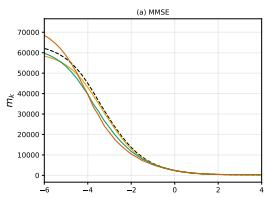

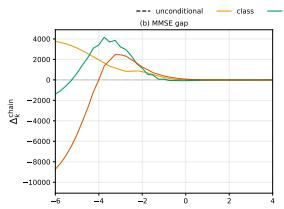

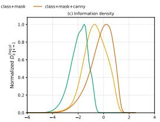

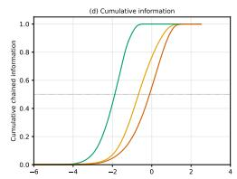

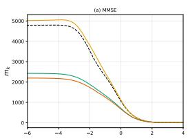

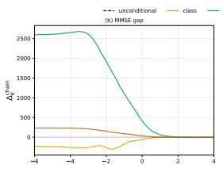  
(a) Pixel

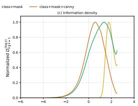

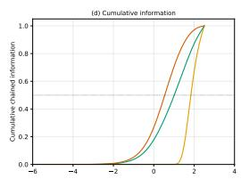

(b) SDVAE  
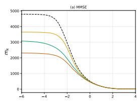

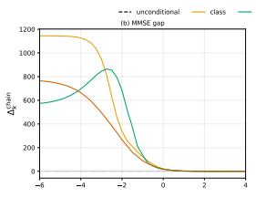

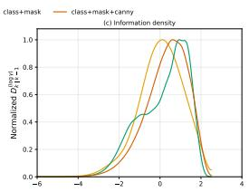

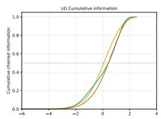

(c) VAVAE  
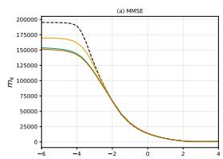

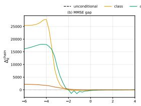

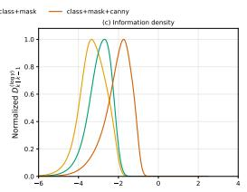  
(d) RAE

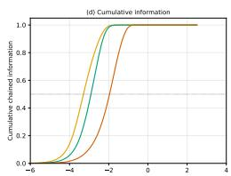  
Figure 9: Full chained-hierarchy panoramas across representations. Each row reports the same four diagnostics for one representation: MMSE curves, chained MMSE gaps, log-SNR information densities, and cumulative information for class, mask, and canny increments. The main text summarizes the density column in Figure 4; this appendix figure keeps the full diagnostic view for all four representations.

## NeurIPS Paper Checklist

## 1. Claims

Question: Do the main claims made in the abstract and introduction accurately reflect the paper’s contributions and scope?

Answer: [Yes]

Justification: Our paper’s contributions and scope are presented in the abstract and introduction accurately.

Guidelines:

• The answer [N/A] means that the abstract and introduction do not include the claims made in the paper.

• The abstract and/or introduction should clearly state the claims made, including the contributions made in the paper and important assumptions and limitations. A [No] or [N/A] answer to this question will not be perceived well by the reviewers.

• The claims made should match theoretical and experimental results, and reflect how much the results can be expected to generalize to other settings.

• It is fine to include aspirational goals as motivation as long as it is clear that these goals are not attained by the paper.

## 2. Limitations

Question: Does the paper discuss the limitations of the work performed by the authors?

Answer: [Yes]

Justification: A dedicated Limitations paragraph in Section 6 discusses the limitations of our work.

Guidelines:

• The answer [N/A] means that the paper has no limitation while the answer [No] means that the paper has limitations, but those are not discussed in the paper.

• The authors are encouraged to create a separate “Limitations” section in their paper.

• The paper should point out any strong assumptions and how robust the results are to violations of these assumptions (e.g., independence assumptions, noiseless settings, model well-specification, asymptotic approximations only holding locally). The authors should reflect on how these assumptions might be violated in practice and what the implications would be.

• The authors should reflect on the scope of the claims made, e.g., if the approach was only tested on a few datasets or with a few runs. In general, empirical results often depend on implicit assumptions, which should be articulated.

• The authors should reflect on the factors that influence the performance of the approach. For example, a facial recognition algorithm may perform poorly when image resolution is low or images are taken in low lighting. Or a speech-to-text system might not be used reliably to provide closed captions for online lectures because it fails to handle technical jargon.

• The authors should discuss the computational efficiency of the proposed algorithms and how they scale with dataset size.

• If applicable, the authors should discuss possible limitations of their approach to address problems of privacy and fairness.

• While the authors might fear that complete honesty about limitations might be used by reviewers as grounds for rejection, a worse outcome might be that reviewers discover limitations that aren’t acknowledged in the paper. The authors should use their best judgment and recognize that individual actions in favor of transparency play an important role in developing norms that preserve the integrity of the community. Reviewers will be specifically instructed to not penalize honesty concerning limitations.

## 3. Theory assumptions and proofs

Question: For each theoretical result, does the paper provide the full set of assumptions and a complete (and correct) proof?

## Answer: [Yes]

Justification: All theoretical objects — the I-MMSE identity, the feature information density (Eq. (11)), the log-SNR re-parameterization (Eq. (13)), the chained density (Eq. (17)), and the equivalent-estimator family — state their assumptions inline in the Feature Information Density and Chained Information Decomposition sections (Gaussian channel with Xγ = $\sqrt { \gamma } X + N , N \bot ( X , Y )$ , mild regularity for the de Bruijn / chain-rule steps). Full derivations and the equivalence proofs are given in Appendix A; the Sum-of-Lorentzians fitting and tail-extrapolation argument is in Appendix B. All definitions and equations are numbered and cross-referenced.

## Guidelines:

• The answer [N/A] means that the paper does not include theoretical results.

• All the theorems, formulas, and proofs in the paper should be numbered and crossreferenced.

• All assumptions should be clearly stated or referenced in the statement of any theorems.

• The proofs can either appear in the main paper or the supplemental material, but if they appear in the supplemental material, the authors are encouraged to provide a short proof sketch to provide intuition.

• Inversely, any informal proof provided in the core of the paper should be complemented by formal proofs provided in appendix or supplemental material.

• Theorems and Lemmas that the proof relies upon should be properly referenced.

## 4. Experimental result reproducibility

Question: Does the paper fully disclose all the information needed to reproduce the main experimental results of the paper to the extent that it affects the main claims and/or conclusions of the paper (regardless of whether the code and data are provided or not)?

Answer: [Yes]

Justification: Section 5.2 specifies the data construction (SAM 3.1-validated SR95 ImageNet 256 subset), conditioning chain, parameterization (Flow Matching loss with x-prediction for pixel/RAE and velocity for SDVAE/VAVAE), and density-conversion equation. Appendix D additionally documents the deterministic image-id split, paired mask/Canny shard alignment, the per-representation token count and patch size, the preliminary learnability search grid, the corrected force-null inference protocol, the MMSE evaluation procedure, and the selected XL-cell hyperparameters in Tables 4 and 5; Appendix C similarly documents the spectralhierarchy experiment, and the pixel instance of the representation hierarchy is documented inside Appendix D alongside the latent representations.

## Guidelines:

• The answer [N/A] means that the paper does not include experiments.

• If the paper includes experiments, a [No] answer to this question will not be perceived well by the reviewers: Making the paper reproducible is important, regardless of whether the code and data are provided or not.

• If the contribution is a dataset and/or model, the authors should describe the steps taken to make their results reproducible or verifiable.

• Depending on the contribution, reproducibility can be accomplished in various ways. For example, if the contribution is a novel architecture, describing the architecture fully might suffice, or if the contribution is a specific model and empirical evaluation, it may be necessary to either make it possible for others to replicate the model with the same dataset, or provide access to the model. In general. releasing code and data is often one good way to accomplish this, but reproducibility can also be provided via detailed instructions for how to replicate the results, access to a hosted model (e.g., in the case of a large language model), releasing of a model checkpoint, or other means that are appropriate to the research performed.

• While NeurIPS does not require releasing code, the conference does require all submissions to provide some reasonable avenue for reproducibility, which may depend on the nature of the contribution. For example

(a) If the contribution is primarily a new algorithm, the paper should make it clear how to reproduce that algorithm.

(b) If the contribution is primarily a new model architecture, the paper should describe the architecture clearly and fully.

(c) If the contribution is a new model (e.g., a large language model), then there should either be a way to access this model for reproducing the results or a way to reproduce the model (e.g., with an open-source dataset or instructions for how to construct the dataset).

(d) We recognize that reproducibility may be tricky in some cases, in which case authors are welcome to describe the particular way they provide for reproducibility. In the case of closed-source models, it may be that access to the model is limited in some way (e.g., to registered users), but it should be possible for other researchers to have some path to reproducing or verifying the results.

## 5. Open access to data and code

Question: Does the paper provide open access to the data and code, with sufficient instructions to faithfully reproduce the main experimental results, as described in supplemental material?

Answer: [Yes]

Justification: Code and reproduction instructions will be released at https://github.   
com/AI4Science-WestlakeU/feature-information-dynamics.

Guidelines:

• The answer [N/A] means that paper does not include experiments requiring code.

• Please see the NeurIPS code and data submission guidelines (https://neurips.cc/ public/guides/CodeSubmissionPolicy) for more details.

• While we encourage the release of code and data, we understand that this might not be possible, so [No] is an acceptable answer. Papers cannot be rejected simply for not including code, unless this is central to the contribution (e.g., for a new open-source benchmark).

• The instructions should contain the exact command and environment needed to run to reproduce the results. See the NeurIPS code and data submission guidelines (https: //neurips.cc/public/guides/CodeSubmissionPolicy) for more details.

• The authors should provide instructions on data access and preparation, including how to access the raw data, preprocessed data, intermediate data, and generated data, etc.

• The authors should provide scripts to reproduce all experimental results for the new proposed method and baselines. If only a subset of experiments are reproducible, they should state which ones are omitted from the script and why.

• At submission time, to preserve anonymity, the authors should release anonymized versions (if applicable).

• Providing as much information as possible in supplemental material (appended to the paper) is recommended, but including URLs to data and code is permitted.

## 6. Experimental setting/details

Question: Does the paper specify all the training and test details (e.g., data splits, hyperparameters, how they were chosen, type of optimizer) necessary to understand the results?

Answer: [Yes]

Justification: Optimizer (AdamW, $\beta _ { 2 } { = } 0 . 9 5$ , bfloat16), learning rate, batch size, time-shift parameters $\left( \alpha _ { t } , \alpha _ { s } \right)$ , prediction parameterization, training/validation split (90/10 SR95, 551,837 train images), token count, patch size, sampler (Euler, 50 NFE), and hyperparameterselection protocol (LDiT-B grid search prior to XL training) are documented in Appendix D and summarized in Tables 4–5. Spectral-hierarchy details are in Appendix C; the pixelinstance hyperparameters are in Appendix D together with the latent representations.

Guidelines:

• The answer [N/A] means that the paper does not include experiments.

• The experimental setting should be presented in the core of the paper to a level of detail that is necessary to appreciate the results and make sense of them.

• The full details can be provided either with the code, in appendix, or as supplemental material.

## 7. Experiment statistical significance

Question: Does the paper report error bars suitably and correctly defined or other appropriate information about the statistical significance of the experiments?

Answer: [No]

Justification: Each cross-representation chain requires four XL-scale flow-matching checkpoints (unconditional, class, class+mask, class+mask+Canny) for each of four representations, so multi-seed runs are computationally infeasible within the project’s compute budget; the reported densities are therefore single-seed trajectories. Per-image MMSE quantities are averaged over the full SR95 validation split with multiple noise draws per image (Appendix D), and the qualitative ordering of the chained density peaks (the central claim) is robust across checkpoint cadence rather than across seeds. We mark this as a limitation in Section 6.

## Guidelines:

• The answer [N/A] means that the paper does not include experiments.

• The authors should answer [Yes] if the results are accompanied by error bars, confidence intervals, or statistical significance tests, at least for the experiments that support the main claims of the paper.

• The factors of variability that the error bars are capturing should be clearly stated (for example, train/test split, initialization, random drawing of some parameter, or overall run with given experimental conditions).

• The method for calculating the error bars should be explained (closed form formula, call to a library function, bootstrap, etc.)

• The assumptions made should be given (e.g., Normally distributed errors).

• It should be clear whether the error bar is the standard deviation or the standard error of the mean.

• It is OK to report 1-sigma error bars, but one should state it. The authors should preferably report a 2-sigma error bar than state that they have a 96% CI, if the hypothesis of Normality of errors is not verified.

• For asymmetric distributions, the authors should be careful not to show in tables or figures symmetric error bars that would yield results that are out of range (e.g., negative error rates).

• If error bars are reported in tables or plots, the authors should explain in the text how they were calculated and reference the corresponding figures or tables in the text.

## 8. Experiments compute resources

Question: For each experiment, does the paper provide sufficient information on the computer resources (type of compute workers, memory, time of execution) needed to reproduce the experiments?

Answer: [Yes]

Justification: The cross-representation comparison uses XL-scale flow-matching backbones (LDiT-XL/JiT-L/SiT-XL/DiTDH-XL), batch sizes 256–1024, bfloat16 precision, 200 epochs of unconditional training plus three additional conditioning phases per representation. Appendix D reports these settings together with the preliminary LDiT-B grid-search budget; per-experiment GPU type and total wall-clock are summarized in the same appendix.

## Guidelines:

• The answer [N/A] means that the paper does not include experiments.

• The paper should indicate the type of compute workers CPU or GPU, internal cluster, or cloud provider, including relevant memory and storage.

• The paper should provide the amount of compute required for each of the individual experimental runs as well as estimate the total compute.

• The paper should disclose whether the full research project required more compute than the experiments reported in the paper (e.g., preliminary or failed experiments that didn’t make it into the paper).

## 9. Code of ethics

Question: Does the research conducted in the paper conform, in every respect, with the NeurIPS Code of Ethics https://neurips.cc/public/EthicsGuidelines?

Answer: [Yes]

Justification: The paper analyzes existing image-diffusion models on standard public benchmarks (ImageNet, MNIST, CIFAR-10) and does not collect new human-subject data, deploy new generative content, or release new pre-trained generative artifacts. Authors have reviewed the NeurIPS Code of Ethics and the work conforms with it.

Guidelines:

• The answer [N/A] means that the authors have not reviewed the NeurIPS Code of Ethics.

• If the authors answer [No], they should explain the special circumstances that require a deviation from the Code of Ethics.

• The authors should make sure to preserve anonymity (e.g., if there is a special consideration due to laws or regulations in their jurisdiction).

## 10. Broader impacts

## Answer: [N/A]

Question: Does the paper discuss both potential positive societal impacts and negative societal impacts of the work performed?

Justification: The paper is foundational analysis: it introduces a diagnostic framework for studying when features are generated along the diffusion trajectory and applies it to existing public diffusion models. It does not release new generative models, new training data, or improved generation quality, so there is no direct path from this work to a societal-impact application. We therefore mark broader impact as not applicable in the body of the paper.

## Guidelines:

• The answer [N/A] means that there is no societal impact of the work performed.

• If the authors answer [N/A] or [No], they should explain why their work has no societal impact or why the paper does not address societal impact.

• Examples of negative societal impacts include potential malicious or unintended uses (e.g., disinformation, generating fake profiles, surveillance), fairness considerations (e.g., deployment of technologies that could make decisions that unfairly impact specific groups), privacy considerations, and security considerations.

• The conference expects that many papers will be foundational research and not tied to particular applications, let alone deployments. However, if there is a direct path to any negative applications, the authors should point it out. For example, it is legitimate to point out that an improvement in the quality of generative models could be used to generate Deepfakes for disinformation. On the other hand, it is not needed to point out that a generic algorithm for optimizing neural networks could enable people to train models that generate Deepfakes faster.

• The authors should consider possible harms that could arise when the technology is being used as intended and functioning correctly, harms that could arise when the technology is being used as intended but gives incorrect results, and harms following from (intentional or unintentional) misuse of the technology.

• If there are negative societal impacts, the authors could also discuss possible mitigation strategies (e.g., gated release of models, providing defenses in addition to attacks, mechanisms for monitoring misuse, mechanisms to monitor how a system learns from feedback over time, improving the efficiency and accessibility of ML).

## 11. Safeguards

Question: Does the paper describe safeguards that have been put in place for responsible release of data or models that have a high risk for misuse (e.g., pre-trained language models, image generators, or scraped datasets)?

Answer: [N/A]

Justification: The paper does not release new generative models, new pre-trained language/image artifacts, or scraped datasets that pose a misuse risk.

Guidelines:

• The answer [N/A] means that the paper poses no such risks.

• Released models that have a high risk for misuse or dual-use should be released with necessary safeguards to allow for controlled use of the model, for example by requiring that users adhere to usage guidelines or restrictions to access the model or implementing safety filters.

• Datasets that have been scraped from the Internet could pose safety risks. The authors should describe how they avoided releasing unsafe images.

• We recognize that providing effective safeguards is challenging, and many papers do not require this, but we encourage authors to take this into account and make a best faith effort.

## 12. Licenses for existing assets

Question: Are the creators or original owners of assets (e.g., code, data, models), used in the paper, properly credited and are the license and terms of use explicitly mentioned and properly respected?

Answer: [Yes]

Justification: All external assets used — ImageNet (Russakovsky et al.), MNIST, CIFAR-10, SAM 3.1 [Carion et al., 2025], DINOv2, SDVAE [Rombach et al., 2022], VAVAE [Yao et al., 2025], RAE [Zheng et al., 2025], JiT [Li and He, 2025] — are properly cited in the references and used within the terms of their public releases. The SR95 subset is constructed deterministically from public ImageNet train splits.

Guidelines:

• The answer [N/A] means that the paper does not use existing assets.

• The authors should cite the original paper that produced the code package or dataset.

• The authors should state which version of the asset is used and, if possible, include a URL.

• The name of the license (e.g., CC-BY 4.0) should be included for each asset.

• For scraped data from a particular source (e.g., website), the copyright and terms of service of that source should be provided.

• If assets are released, the license, copyright information, and terms of use in the package should be provided. For popular datasets, paperswithcode.com/datasets has curated licenses for some datasets. Their licensing guide can help determine the license of a dataset.

• For existing datasets that are re-packaged, both the original license and the license of the derived asset (if it has changed) should be provided.

• If this information is not available online, the authors are encouraged to reach out to the asset’s creators.

## 13. New assets

Question: Are new assets introduced in the paper well documented and is the documentation provided alongside the assets?

Answer: [N/A]

Justification: The paper does not release new generative models, datasets, or code as a primary asset. The SR95 mask and Canny shards are intermediate experiment-specific artifacts derived deterministically from public ImageNet and SAM 3.1 outputs; if released as supplementary material, they will be accompanied by the construction script described in Appendix D.

Guidelines:

• The answer [N/A] means that the paper does not release new assets.

• Researchers should communicate the details of the dataset/code/model as part of their submissions via structured templates. This includes details about training, license, limitations, etc.

• The paper should discuss whether and how consent was obtained from people whose asset is used.

• At submission time, remember to anonymize your assets (if applicable). You can either create an anonymized URL or include an anonymized zip file.

## 14. Crowdsourcing and research with human subjects

Question: For crowdsourcing experiments and research with human subjects, does the paper include the full text of instructions given to participants and screenshots, if applicable, as well as details about compensation (if any)?

Answer: [N/A]

Justification: The paper does not involve crowdsourcing or research with human subjects. Guidelines:

• The answer [N/A] means that the paper does not involve crowdsourcing nor research with human subjects.

• Including this information in the supplemental material is fine, but if the main contribution of the paper involves human subjects, then as much detail as possible should be included in the main paper.

• According to the NeurIPS Code of Ethics, workers involved in data collection, curation, or other labor should be paid at least the minimum wage in the country of the data collector.

## 15. Institutional review board (IRB) approvals or equivalent for research with human subjects

Question: Does the paper describe potential risks incurred by study participants, whether such risks were disclosed to the subjects, and whether Institutional Review Board (IRB) approvals (or an equivalent approval/review based on the requirements of your country or institution) were obtained?

Answer: [N/A]

Justification: The paper does not involve research with human subjects, so IRB approval is not applicable.

Guidelines:

• The answer [N/A] means that the paper does not involve crowdsourcing nor research with human subjects.

• Depending on the country in which research is conducted, IRB approval (or equivalent) may be required for any human subjects research. If you obtained IRB approval, you should clearly state this in the paper.

• We recognize that the procedures for this may vary significantly between institutions and locations, and we expect authors to adhere to the NeurIPS Code of Ethics and the guidelines for their institution.

• For initial submissions, do not include any information that would break anonymity (if applicable), such as the institution conducting the review.

## 16. Declaration of LLM usage

Question: Does the paper describe the usage of LLMs if it is an important, original, or non-standard component of the core methods in this research? Note that if the LLM is used only for writing, editing, or formatting purposes and does not impact the core methodology, scientific rigor, or originality of the research, declaration is not required.

Answer: [N/A]

Justification: LLMs were used only for writing assistance, editing, and code/figure refactoring; they are not part of the core methodology, theoretical derivations, or experimental design of the diffusion-information-dynamics framework.

Guidelines:

• The answer [N/A] means that the core method development in this research does not involve LLMs as any important, original, or non-standard components.

• Please refer to our LLM policy in the NeurIPS handbook for what should or should not be described.