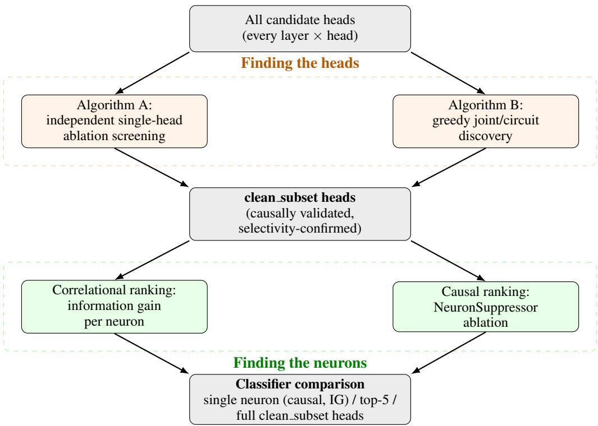
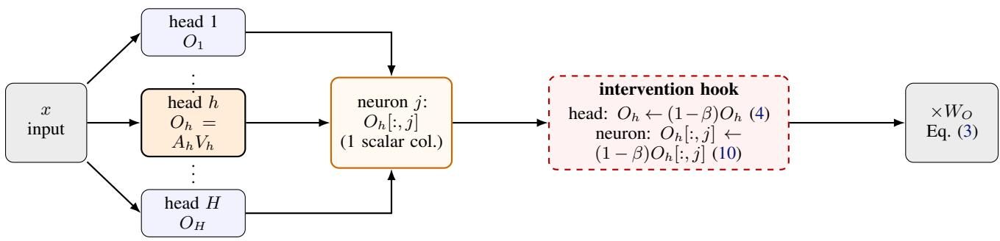

# Finding the Heads and the Neurons Responsible for Network Information Retrieval in Language Models

Md Abdul Kadir 1 2 Md Mohasin Hossain 2 3 Daniel Sonntag 1 2

## Abstract

We ask whether specific attention heads, and more finely specific neurons inside those heads, are responsible for recognizing that a language model’s context contains network infrastructure information (a hostname paired with its IP address), and whether that responsibility can be validated causally rather than by correlation alone. At the head level the answer is yes, across five models spanning three architecture families: in every model, a small set of heads (1 to 9 out of 128 to 1152 candidates), found by causal ablation screening and tested for selectivity against matched negative and context-free controls, supports a detector with 99.5–100% held-out accuracy. We then ask whether a head’s responsibility concentrates into one neuron or stays spread across its dimensions; this is model-specific. In one model, the top head’s signal concentrates into a single neuron, found independently by both a causal intervention and a correlational ranking, which agree exactly (AUC = 1.000, matching the full head). In another, the single clean head works as a whole (AUC = 1.000) but the best causally ranked neuron inside it does not (AUC = 0.665), so the responsibility there is spread across the head. The remaining three models fall in between. On an independent dataset collected by a different institution (reverse-DNS records rather than the discovery data), every model’s full-head detector flags 100% of positive records; the single-neuron versions transfer less reliably, and in one model score below chance. Causal head-finding for a specific network-information entity works across models and architectures; how far that finding can be pushed down to individual neurons varies, and needs to be checked for each model.

## 1. Introduction

Interpretability work increasingly asks not only whether a model behaves correctly but which internal components are responsible for its behavior. For factual knowledge this has a standard form: knowledge neurons (Dai et al., 2022), causal tracing to feed-forward layers (Meng et al., 2022), and knowledge circuits of information heads, relation heads and MLPs (Yao et al., 2024) each localize a fact to specific components and validate the localization causally. We are not aware of an equivalent result for network/internetinfrastructure information, that is, a statement such as “these heads (and this neuron) are responsible for recognizing that this context contains an IP address record,” validated causally in the way the factual-recall literature validates the recall of an attribute given its subject.

We use a simple task with a known answer: given a context containing a domain and its IP address, retrieve one of the two fields. This lets us check every result against ground truth instead of inferring “network-relatedness” as a latent property. We use causal interventions to find the responsible heads and the neurons inside them, and report where the two levels of description agree and where they diverge, across five models.

Findings. (1) A small set of causally-validated, selectivityconfirmed heads exists in every model tested (Section 4.1), supporting a 99.5–100%-accurate detector on held-out data in all five. (2) Whether that head-level responsibility is reducible to one neuron is model-specific, not a fixed property of “how good the head is” (Section 4.2): one model’s top head concentrates cleanly into a single neuron that two independent methods agree on; another model’s equally effective head is spread across its full dimensionality. (3) The head-level result, not the neuron-level one, is the one that transfers to an independent, real-world dataset (Section 4.3). Figure 1 summarizes the pipeline.

## 2. Related Work

Causal ablation for in-context retrieval heads. Closest to our head-discovery setup, Wu et al. (2025) identify a sparse, largely universal set of “retrieval heads” in longcontext models using a retrieval-score metric and validate them causally by pruning against a matched random-head baseline, the same logic as our random baselines in Section 4.2. Their heads are discovered for generic long-context copying; we ask the same causal question for one specific, previously unlocalized entity type (network/infrastructure records) and additionally cross-validate the discovery with a second, structurally different algorithm (Section 3).

  
Figure 1. Pipeline overview. Two independent algorithms discover candidate heads and are cross-validated against each other; the surviving clean subset heads then feed a second, structurally identical cross-validation at neuron granularity (correlational information-gain ranking vs. causal ablation), whose agreement or disagreement is this paper’s central result (Section 4.2).

Head-level specialization for facts and reasoning. Geva et al. (2023) use interventions on attention edges to trace factual-recall information flow and find upper-layer heads performing the final extraction of the attribute from the subject, the closest structural analogue, in the pure-factualrecall literature, to our task of extracting an IP address from a hostname. Yu et al. (2023) causally scale a single head to resolve conflicts between a model’s parametric memory and new in-context information; Hakimi et al. (2025) track heads across pretraining and find they churn in and out of entity-/relation-/fact-specific roles far more than feedforward layers do; Zhang et al. (2026) identify heads from a behavioral signature (per-step logit entropy during chainof-thought) rather than attention mass directly; and Li et al. (2026) find 22 heads in GPT-2, split into two causally opposing populations, mediating a single syntactic choice. These studies find sparse, causally separable head populations for factual, reasoning and syntactic behaviors. None of them studies network/infrastructure records, the entity type we ask about. Michel et al. (2019) show that many heads can be pruned with little loss, and Conmy et al. (2023) automate circuit discovery by ablation.

Neuron-level factual knowledge. Dai et al. (2022) introduce knowledge neurons, individual neurons causally tied to specific facts; Meng et al. (2022) causally trace factual predictions to middle-layer MLPs and edit them directly, the precedent for treating neuron-level causal localization as a first-class target rather than an afterthought to head-level results. Several recent works complicate the single-neuron picture, which bears directly on our finding (Section 4.2): Chen et al. (2024) and Cao et al. (2026) find languageindependent knowledge neurons alongside degenerate ones — several neurons redundantly carrying the same fact, so ablating any one alone leaves the others able to recover it; Chen et al. (2025) give a structural account of these degenerate neurons and a clustering method to find them at arbitrary size; and Wang et al. (2024) show factual recall often bypasses the knowledge-neuron pathway entirely via a shortcut during multi-hop reasoning. This redundancy account is the one we offer for why two independently-computed neuron rankings can agree on which head matters while disagreeing on which single dimension inside it is responsible, in three of our five models (Section 4.2).

Knowledge circuits and the mechanistic basis of head specialization. Yao et al. (2024) combine information heads, relation heads, and MLPs into full knowledge circuits. Franco et al. (2026) give a more formal account of why attention heads admit a feature-aligned read-out at all, via their singular vectors, and Lasnier et al. (2026) independently report the same qualitative pattern we do in an unrelated task: LLM-based machine translation decomposes into disjoint, causally separable head populations (target-language identification vs. semantic-equivalence preservation) under targeted ablation. Chen et al. (2026) ask a question upstream of all of the above — which training examples caused an interpretable unit to form in the first place — a natural next step for the heads and neurons we localize here. None of this circuit- and mechanism-level work addresses network/infrastructure information, at either head or neuron level, with causal validation. This is the gap we target.

Why causal importance and decodability can diverge. Elazar et al. (2021) causally remove a linguistic property from sentence representations and show that probing performance does not track the property’s causal importance to model behavior. Their setting differs from ours (sentencelevel linguistic properties rather than attention heads or neurons, and nullspace projection rather than ablation), but the pattern is the one we report at neuron granularity in Section 4.2: a causal intervention and a correlational ranking agree on the responsible neuron in only one of the five models we test.

Our contribution relative to this literature. To our knowledge, none of the above combines causal head discovery, a second cross-validating discovery algorithm, neuron-level causal ablation (as opposed to a purely correlational neuron ranking), and validation against an independent real-world data source, for a network/infrastructure entity specifically. We combine all four in this paper.

## 3. Method

## 3.1. Task, Data and Setup

Each example presents a short record — Record: Website: <domain> / IP address: <ip> — followed by a question requiring the model to copy back one specific field (e.g. “What is the IP address of this website?”). Because both fields are already present in the prompt, this is a retrieval task, not a factual-recall task: the model needs to find and copy a span from its own context, not know anything about the real world. Domains and IP addresses are drawn from DeepURLBench (Schvartzman et al., 2024), a public dataset of URLs with DNS resolution records. Three matched negative conditions test whether a head’s effect is specific to the target retrieval event rather than to generic instruction-following: entity (same record, different question), vocabulary (a definitional question whose answer does not require retrieving a record field), and ordinary (unrelated arithmetic). A paraphrase condition preserves the same record and answer while rewording the retrieval question and is treated as a positive robustness condition. We additionally use context-free question only and vocab no context conditions as stress tests for wording-driven false positives. In the appendices the datasets of these conditions are written D network, D paraphrase, D entity, D vocab and D ordinary.

Setup. We write P(internet) for the detector’s predicted probability that the context contains network information; a prompt is flagged when $\begin{array} { r l r } { P } & { { } \ge } & { 0 . 5 } \end{array}$ We use the instruction-tuned checkpoints Qwen/Qwen3.5-4B, Qwen/Qwen3.5-9B, Qwen/Qwen3-8B, google/gemma-4-E2B-it and google/gemma-4-E4B-it (the Qwen3 family is described in Yang et al., 2025). Head discovery (ablation screening, activation patching and the selectivity filter) uses a calibration split of 200 items per condition; the greedy circuit search and the neuron ablation screen use 120 items from the validation split, and classifier accuracies are computed on the validation split. Every detector is a scikit-learn logistic regression (C = 1, balanced class weights) on the captured activations, with positives {network, paraphrase} and negatives {ordinary, vocabulary, entity}. All results come from a single run per model.

Worked example. Table 1 shows one held-out record under every condition, with the output probability of the fixed Qwen3.5-4B detector. The network, paraphrase, entity and vocabulary conditions share one DeepURLBench record (al-mostafa.com, 62.151.181.154, labeled benign); ordinary, question only and vocab no context have an empty context. The detector fires only when the context contains the record and the question asks for one of its fields (network and paraphrase, P = 1.000 for both). It stays silent on entity, which has the same context but asks for the category $( P { = } 0 . 0 0 0 )$ , and on question only, which asks the same retrieval question without a record $( P = 0 . 0 2 4$ ; this wording-only residual is discussed in Section 5).

## 3.2. Attention Heads and Why They Are Removable

Multi-head attention (Vaswani et al., 2017) sums the contributions of its heads (Eq. (3)), so a single head, or a single output dimension of a head, can be removed on its own. Let $x \in \mathbb { R } ^ { T \times d }$ denote a layer’s input hidden states, where T is the number of tokens and d is the residual-stream width. Let H denote the number of query attention heads and let $d _ { h }$ denote the model-defined head dimension; importantly, we do not assume $d _ { h } = d / H$

Table 1. A worked example: one held-out record under every condition, with the predicted probability from the fixed Qwen3.5-4B detector. The network, paraphrase, entity and vocabulary rows share the same context (al-mostafa.com, 62.151.181.154); the other rows have an empty context.
<table><tr><td>Condition</td><td>Context</td><td>Question</td><td>True answer</td><td>P(internet)</td><td>Flagged</td></tr><tr><td>network</td><td>record</td><td>What is the IP address of this website?</td><td>62.151.181.154</td><td>1.000</td><td>yes</td></tr><tr><td>paraphrase</td><td>record</td><td>Resolve the IPv4 address associated with this domain.</td><td>62.151.181.154</td><td>1.000</td><td>yes</td></tr><tr><td>entity</td><td>record</td><td>What is the category of this website? An- swer with one word: benign, mal, or phish-</td><td>benign</td><td>0.000</td><td>no</td></tr><tr><td>vocabulary</td><td>record</td><td>ing. In one short phrase, what does the abbrevi- ation “IP” stand for?</td><td>Internet Protocol</td><td>0.000</td><td>no</td></tr><tr><td>ordinary</td><td>empty</td><td>What is  $6 7 + 1 4 ?$ </td><td>81</td><td>0.001</td><td>no</td></tr><tr><td>question_only</td><td>empty</td><td>What is the IP address of this website?</td><td>62.151.181.154</td><td>0.024</td><td>no</td></tr><tr><td>vocab_no_context</td><td>empty</td><td>In one short phrase, what does the abbrevi- ation  $ { { } ^ { 6 6 } } \mathrm { I P } ^ { \flat }$  stand for?</td><td>Internet Protocol</td><td>0.001</td><td>no</td></tr></table>

For query head $h \in \{ 1 , \ldots , H \}$

$$
Q _ { h } = x W _ { Q } ^ { ( h ) } , \quad K _ { h } = x W _ { K } ^ { ( h ) } , \quad V _ { h } = x W _ { V } ^ { ( h ) } ,\tag{1}
$$

where $K _ { h }$ and $V _ { h }$ denote the key/value projections used by query head $h .$ . In grouped-query attention (Ainslie et al., 2023), multiple query heads may share the same key/value head. The corresponding attention output is

$$
A _ { h } = \mathrm { s o f t m a x } \left( \frac { Q _ { h } K _ { h } ^ { \top } } { \sqrt { d _ { h } } } \right) , \qquad O _ { h } = A _ { h } V _ { h } \in \mathbb { R } ^ { T \times d _ { h } } .\tag{2}
$$

Concatenating the H query-head outputs gives a representation of width $H d _ { h }$ , which is projected back to the residualstream width by $W _ { O } \in \mathbb { R } ^ { H d _ { h } \times d }$ . Writing $W _ { O } ^ { ( h ) } \in \mathbb { R } ^ { d _ { h } }$ ×d for the block corresponding to head h,

$$
\begin{array} { l } { { \mathrm { A t t n } ( x ) = \bigl [ O _ { 1 } ; \ldots ; O _ { H } \bigr ] W _ { O } = \displaystyle \sum _ { h = 1 } ^ { H } O _ { h } W _ { O } ^ { ( h ) } } } \\ { { = \displaystyle \sum _ { h = 1 } ^ { H } \sum _ { j = 1 } ^ { d _ { h } } O _ { h } [ : , j ] W _ { O } ^ { ( h ) } [ j , : ] . } } \end{array}\tag{3}
$$

All interventions in this paper follow from Eq. (3): zeroing $O _ { h }$ removes head h’s whole term from the sum without touching any other head; zeroing one column $O _ { h } [ : , j ]$ (one dimension of the head output, which we call a neuron) removes only that one additive term inside head h’s own contribution. Figure 2 shows where each intervention sits in this computation. Ablation (Sections 3.3 and 3.4) scales $O _ { h }$ or $O _ { h } [ : , j ]$ at every sequence position in the forward pass, so a suppressed head’s influence is blocked not only at the final position but also along any path that re-enters the residual stream at an earlier position and is read again by a later layer; necessity/sufficiency patching and every captured feature vector, by contrast, are restricted to the single final position $t = T$ , where the answer is produced, since those operations read or inject one specific vector rather than silencing a component outright.

## 3.3. Causal Head Discovery

For each candidate head, HeadSuppressor (Algorithm A in Figure 1) replaces $O _ { h }$ with $( 1 - \beta ) O _ { h }$ at every position for $\beta \in \left[ 0 , 1 \right] \left( \beta = 1 \right.$ full removal), as in head-pruning studies (Michel et al., 2019), and we measure the resulting drop in the log-probability of the correct answer’s first token $y ^ { * }$ read out at the final position:

$$
\Delta _ { \mathrm { a b l } } ( h ) = \mathbb { E } _ { x } \Big [ \log p _ { \theta } \big ( \boldsymbol { y } ^ { * } | \boldsymbol { x } \big ) - \log p _ { \theta } \big ( \boldsymbol { y } ^ { * } | \boldsymbol { x } ; O _ { h }  0 \big ) \Big ] ,\tag{4}
$$

a causal-effect ranking that does not depend on attention weight at all. We then run activation patching (Zhang & Nanda, 2024) on the top 50 screened heads. Let $x ^ { ( E ) }$ be the retrieval prompt and $x ^ { ( C ) }$ the entity-control prompt sharing the same context prefix; necessity asks whether removing a head’s own output hurts the retrieval answer, and sufficiency asks whether injecting that head’s retrieval-condition output into the control prompt raises the retrieval answer’s probability anyway, although the control question does not ask for it:

$$
N ( h ) = \log p _ { \theta } ( \boldsymbol { y } ^ { * } | \boldsymbol { x } ^ { ( E ) } ) - \log p _ { \theta } \big ( \boldsymbol { y } ^ { * } | \boldsymbol { x } ^ { ( E ) } ; O _ { h } {  } O _ { h } ^ { ( C ) } \big ) ,\tag{5}
$$

$$
S ( h ) = \log p _ { \theta } \big ( y ^ { * } | x ^ { ( C ) } ; O _ { h } {  } O _ { h } ^ { ( E ) } \big ) - \log p _ { \theta } \big ( y ^ { * } | x ^ { ( C ) } \big ) .\tag{6}
$$

Finally we filter to heads with positive selectivity — ablating a head must hurt the target retrieval task more than it hurts the three matched negative conditions. With $\Delta _ { \mathrm { a b l } } ^ { \mathrm { n e t } } , \Delta _ { \mathrm { a b l } } ^ { \mathrm { e n t } } , \Delta _ { \mathrm { a b l } } ^ { \mathrm { v o c } } , \Delta _ { \mathrm { a b l } } ^ { \mathrm { o r d } }$ the ablation effect (Eq. (4)) on the network, entity, vocabulary, and ordinary datasets respectively,

$$
\begin{array} { r } { \mathrm { S e l } ( h ) = \Delta _ { \mathrm { a b l } } ^ { \mathrm { n e t } } ( h ) - \frac { 1 } { 3 } \big ( \Delta _ { \mathrm { a b l } } ^ { \mathrm { e n t } } ( h ) + \Delta _ { \mathrm { a b l } } ^ { \mathrm { v o c } } ( h ) + \Delta _ { \mathrm { a b l } } ^ { \mathrm { o r d } } ( h ) \big ) , } \end{array}\tag{7}
$$

  
Figure 2. Where the interventions sit inside one attention layer. Every head’s output $O _ { h }$ (Eq. (2)) is an additive term (Eq. (3)); ablating head h zeroes its whole term, while ablating neuron j zeroes only one column of $O _ { h }$ . The forward-pre-hook on $W o \mathrm { { \dot { s } } }$ input (HeadSuppressor / NeuronSuppressor) implements both.

and the top 20 by combined necessity and sufficiency, among heads with positive selectivity, form the discovered head set $H _ { E } { \mathrm { i } }$

$$
H _ { E } = \operatorname { t o p - 2 0 } _ { h : \operatorname { S e l } ( h ) > 0 } \big ( N ( h ) + S ( h ) \big ) .\tag{8}
$$

To check that $H _ { E }$ is not an artifact of this one screening procedure, we additionally run a second, structurally different algorithm (Algorithm B in Figure 1): greedy joint circuit discovery (Conmy et al., 2023), which builds a set of heads by greedily suppressing a growing group together rather than one head at a time, picking at each step whichever remaining head produces the largest additional drop given the heads already suppressed. With candidate pool $\mathcal { C }$ (the top 30 heads by $\Delta _ { \mathrm { a b l } } )$ and the joint ablation loss of a head set $S _ { \mathrm { { ; } } }$ $\mathcal { L } ( S ) = \mathbb { E } _ { x } [ \log p _ { \theta } ( y ^ { * } \mid x ) - \log p _ { \theta } ( y ^ { * } \mid x ; \{ O _ { h }  0 \} _ { h \in S } ) ]$

$$
\begin{array} { r } { S _ { 0 } = \emptyset , \quad h _ { t } ^ { \star } = \underset { h \in \mathcal { C } \setminus S _ { t - 1 } } { \arg \operatorname* { m a x } } \left[ \mathcal { L } ( S _ { t - 1 } \cup \left\{ h \right\} ) - \mathcal { L } ( S _ { t - 1 } ) \right] , } \end{array}\tag{9}
$$

with $S _ { t } = S _ { t - 1 } \cup \{ h _ { t } ^ { \star } \}$ , stopping once a step’s marginal gain falls below 5% of $\mathcal { L } ( S _ { 1 } )$ or after 10 heads. Unlike Eq. (4), this measures each head’s contribution given every previously-selected head already suppressed, so it can credit a head that independent screening misses due to redundancy between heads. In every model it recovers a head set that overlaps only partly with $H _ { E }$ (Jaccard 0.12–0.20, i.e. 3– 5 of 20 heads) and is equally damaging. This suggests that the underlying causal signal does not depend on which algorithm finds it, even though the two algorithms name different heads as most responsible.

A causally important head can still fail a basic specificity check — for example, by also firing on contexts that merely mention network vocabulary without containing a real record. For every candidate head we fit a linear probe (Hewitt & Liang, 2019) on its activation and test it against a vocabulary-only hard negative; heads that flag this at a high rate are discarded. The surviving heads, clean subset, are used for every neuron-level result below.

Table 2. Unfiltered $H _ { E }$ vs. filtered clean subset: held-out AUC is identical either way, but the context-free wording confound (question only flag rate) differs: the filter lowers it to 0 only in the Qwen models.
<table><tr><td rowspan="2">Model</td><td rowspan="2">AUC (both)</td><td colspan="2">question_only flag rate</td></tr><tr><td> $H _ { E } \left( 2 0 \right)$ </td><td>clean_subset</td></tr><tr><td>Qwen3.5-4B</td><td>1.000</td><td>1.00</td><td>0.00</td></tr><tr><td>Qwen3-8B</td><td>1.000</td><td>1.00</td><td>0.00</td></tr><tr><td>Qwen3.5-9B</td><td>1.000</td><td>1.00</td><td>0.00</td></tr><tr><td>Gemma-4-E4B</td><td>1.000</td><td>1.00</td><td>1.00</td></tr><tr><td> $\mathrm { G e m m a } { \cdot } 4 { \cdot } \mathrm { E } 2 \mathrm { B }$ </td><td>1.000</td><td>1.00</td><td>1.00</td></tr></table>

Does the filter matter? $H _ { E }$ already reaches near-perfect held-out accuracy and AUC, so the filter might seem unnecessary. To test this, we train the same detector on the unfiltered 20 heads of $H _ { E }$ instead of clean subset and compare both on the held-out split and on the context-free question only control (Table 2):

Held-out AUC is 1.000 with or without the filter, and accuracy differs by at most 0.3 points. The unfiltered $H _ { E }$ detector, however, flags 100% of context-free retrieval questions in all five models, so it responds to the wording of the question. The filtered clean subset removes this in the three Qwen models (0%) but not in either Gemma model (still 100%). Held-out accuracy and AUC cannot detect this failure; only the context-free control does. The filter is therefore not redundant: it leaves the headline metrics unchanged but changes how the detector behaves on a control that those metrics miss. In the Gemma models it does not remove the confound, so their high held-out scores should not be read as showing that the detector ignores the wording of the question. The same Qwen-versus-Gemma difference appears in the negative-class errors of Section 4.3.

## 3.4. Causal Neuron Discovery

For head $h \in$ clean subset and neuron $j \in$ $\{ 1 , \ldots , d _ { h } \}$ , NeuronSuppressor replaces $O _ { h } [ : , j ]$ with $( 1 - \beta ) O _ { h } [ : , j ]$ at every position, giving the neuron-level ana-

Table 3. A causally-validated, selectivity-confirmed head set exists in every model tested, regardless of architecture or candidate-pool size.
<table><tr><td>Model</td><td>Cand. heads</td><td>Clean heads</td><td>Acc. (held-out)</td><td>AUC</td></tr><tr><td>Qwen3.5-4B</td><td>128</td><td>9</td><td>100.0%</td><td>1.000</td></tr><tr><td>Qwen3-8B</td><td>1152</td><td>1</td><td>99.5%</td><td>1.000</td></tr><tr><td>Qwen3.5-9B</td><td>128</td><td>4</td><td>100.0%</td><td>1.000</td></tr><tr><td>Gemma-4-E4B</td><td>280</td><td>5</td><td>99.9%</td><td>1.000</td></tr><tr><td>Gemma-4-E2B</td><td>224</td><td>2</td><td>99.9%</td><td>1.000</td></tr></table>

logue of $\operatorname { E q . } \left( 4 \right)$ , an intervention rather than a correlational read of the activation:

$$
\Delta _ { \mathrm { a b l } } ( h , j ) = \mathbb { E } _ { x } \big [ \log p _ { \theta } ( y ^ { * } | x ) - \log p _ { \theta } ( y ^ { * } | x ; O _ { h } [ : , j ]  0 ) \big ] .\tag{10}
$$

We compare this against a purely correlational ranking used elsewhere in the knowledge-neuron literature: quantile-bin each neuron’s activation and measure how much knowing the bin reduces label entropy, with no model intervention at all. With label $Y \in \{ 0 , 1 \}$ (network vs. ordinary) and $B _ { h , j } \in \{ 1 , \ldots , 8 \}$ the quantile bin of $O _ { h } [ T , j ]$ over the calibration set,

$$
\mathrm { I G } ( h , j ) = H ( Y ) - \sum _ { b } P ( B _ { h , j } = b ) H ( Y \mid B _ { h , j } = b ) ,\tag{11}
$$

with $H ( \cdot )$ binary entropy. Eq. (11) never touches $p _ { \theta } ,$ which is why it can disagree with Eq. (10) (Table 5): the two equations measure different properties of the same scalar.

We then build four classifiers per model, trained on {network, paraphrase} positives vs. {ordinary, vocabulary, entity} negatives — from the single best causal neuron, the top-5 causal neurons, the single best information-gain neuron, and the full clean subset — all using the same logistic regression over a feature vector z, either one neuron’s scalar $O _ { h } [ T , j ]$ or a concatenation of full head vectors $O _ { h } [ T , : ] :$

$$
\hat { p } ( y = 1 \mid z ) = \sigma ( w ^ { \top } z + b ) .\tag{12}
$$

## 4. Experiments and Results

## 4.1. A Clean Head Set Exists in Every Model

In all five models, a set of one to nine causally validated heads supports a detector with 99.5–100% held-out accuracy and AUC 1.000 on data from the source used for discovery (Table 3). This holds across attention designs (hybrid linear/full attention in Qwen3.5, dense attention in Qwen3-8B, interleaved sliding-window/global attention in Gemma-4), across candidate pools of 128 to 1152 heads, and even when only one head survives the selectivity filter (Qwen3-8B). The next two subsections ask how far this localization narrows, to individual neurons (Section 4.2), and whether it holds on data the heads were not discovered on (Section 4.3).

Table 4. Single-neuron (best causally ranked neuron) vs. full-head detection performance (held-out accuracy at the 0.5 threshold, and AUC).
<table><tr><td colspan="3">Single neuron</td><td colspan="2">Full head</td></tr><tr><td>Model</td><td>Acc.</td><td>AUC</td><td>Acc.</td><td>AUC</td></tr><tr><td>Qwen3.5-4B</td><td>99.4%</td><td>1.000</td><td>100.0%</td><td>1.000</td></tr><tr><td>Qwen3-8B</td><td>53.9%</td><td>0.665</td><td>99.5%</td><td>1.000</td></tr><tr><td>Qwen3.5-9B</td><td>99.4%</td><td>1.000</td><td>100.0%</td><td>1.000</td></tr><tr><td>Gemma-4-E4B</td><td>99.9%</td><td>1.000</td><td>99.9%</td><td>1.000</td></tr><tr><td>Gemma-4-E2B</td><td>86.6%</td><td>0.969</td><td>99.9%</td><td>1.000</td></tr></table>

Table 5. Top-ranked neuron (layer, head, dimension) under the causal ranking and under the information-gain (IG) ranking.
<table><tr><td>Model</td><td>Causal top / IG top</td><td>Agreement</td></tr><tr><td>Qwen3.5-4B</td><td>(15,1,0)/(15,1,0)</td><td>exact match</td></tr><tr><td>Qwen3-8B</td><td>(29,12,82)/(29,12,27)</td><td>same head, diff. dim</td></tr><tr><td>Qwen3.5-9B</td><td>(23,15,8)/(19,4,1)</td><td>different head</td></tr><tr><td>Gemma-4-E4B</td><td>(32,2,141)/(32,2,7)</td><td>same head, diff. dim</td></tr><tr><td>Gemma-4-E2B</td><td>(30,0,183)/(30,0,48)</td><td>same head, diff. dim</td></tr></table>

## 4.2. Does Responsibility Concentrate Into a Neuron?

Section 3.4 gives, per model, two independent rankings of the neurons inside clean subset and four classifiers built from them. Table 4 shows how much of the head’s detection performance a single neuron recovers, and Table 5 whether the two rankings agree.

Neuron-level random control. For each model we compare the AUC of the single best causal neuron classifier against two random-neuron baselines, 20 repeats each: a random dimension of the same head, and a random (layer, head, dimension) triple from the entire candidate pool (Table 6).

Four of five models show the pattern the “concentrated” hypothesis predicts: the actual chosen neuron (AUC ≥ 0.969) sits above both random-neuron baselines (AUC 0.65–0.75; 1.3–2.5 standard deviations below the actual value in every case), so this neuron, and not an arbitrary one, carries the signal. Qwen3-8B is the exception: its actual best neuron (AUC 0.665) falls inside the fully-random baseline’s range (0.728 ± 0.179) and is statistically indistinguishable from the within-head random baseline $( 0 . 6 3 3 \pm 0 . 1 4 8 )$ . For this model, the best neuron the causal-ablation search could find performs no better than a randomly chosen one, which, beyond the single-point comparison in Table 4, supports the view that the responsibility here is not reducible to any one dimension.

In Qwen3.5-4B, a single neuron reaches the same indistribution AUC (1.000) as the full 9-head detector, and both rankings, computed independently, agree on which neuron it is: responsibility here is concentrated and confirmed by both rankings. In Qwen3-8B, the opposite holds: the one clean head works as a whole $( \mathrm { A U C } = 1 . 0 0 0 )$ , but the best causally ranked neuron inside it reaches only $\mathrm { A U C } = 0 . 6 6 5$ (53.9% accuracy, barely better than chance). Whatever this head represents needs most of its 128 dimensions acting together, and the two neuron rankings do not agree on which dimension to try. The remaining three models fall in between: in all three, a single neuron gets close to or matches the full head’s AUC (1.000, 1.000 and 0.969), but the two rankings disagree on the exact neuron. In Gemma-4-E4B and Gemma-4-E2B they still agree on the head, while in Qwen3.5-9B they select different heads. This is consistent with several neurons carrying overlapping versions of the same signal, rather than one privileged neuron.

Table 6. AUC of the actual single best causal neuron classifier vs. two random-neuron baselines (mean ± std over 20 repeats each).
<table><tr><td>Model</td><td>Actual</td><td>Random (same head)</td><td>Random (any neuron)</td></tr><tr><td>Qwen3.5-4B</td><td>1.000</td><td> $0 . 7 2 7 \pm 0 . 1 5 5$ </td><td> $0 . 6 6 7 \pm 0 . 1 8 6$ </td></tr><tr><td>Qwen3-8B</td><td>0.665</td><td> $0 . 6 3 3 \pm 0 . 1 4 8$ </td><td> $0 . 7 2 8 \pm 0 . 1 7 9$ </td></tr><tr><td>Qwen3.5-9B</td><td>1.000</td><td> $0 . 6 8 0 \pm 0 . 1 2 8$ </td><td> $0 . 6 5 4 \pm 0 . 1 9 5$ </td></tr><tr><td>Gemma-4-E4B</td><td>1.000</td><td> $0 . 7 4 8 \pm 0 . 1 8 0$ </td><td> $0 . 7 4 4 \pm 0 . 1 9 5$ </td></tr><tr><td>Gemma-4-E2B</td><td>0.969</td><td> $0 . 6 7 5 \pm 0 . 1 4 9$ </td><td> $0 . 7 2 4 \pm 0 . 1 8 8$ </td></tr></table>

Head-level localization succeeded in every model. What varies from model to model is whether it can be pushed down to a single neuron, and this variation is not predictable from how well the head itself performs: Qwen3-8B’s head is as good as Qwen3.5-4B’s (AUC = 1.000 for both), but their neuron-level results are opposite.

## 4.3. Robustness to an Independent Data Source

Every result above evaluates on data derived from one source (DeepURLBench’s website crawl). We built a second, independent positive-class source from CAIDA’s IPv4 Routed /24 DNS Names data, derived from the Ark measurement infrastructure (CAIDA): reverse-DNS records, i.e. IP addresses paired with their resolved hostnames, collected via large-scale traceroute measurement and dominated by residential-ISP and infrastructure hostnames rather than DeepURLBench’s consumer websites. We built 500 such records into the identical prompt template used throughout, combined them with 500 held-out TriviaQA questions (Joshi et al., 2017) as negatives, and evaluated each model’s already-trained detector with no retraining. Table 7 reports the results.

Every full-head detector classifies all 500 CAIDA records correctly without retraining, so the head-level finding transfers to data the heads never saw, collected by a different institution with a different methodology. The two models with lower overall accuracy (Gemma-4-E4B, Gemma-4- E2B) lose points only on the negative class: 16–17% of the trivia questions are flagged, which fits the wording sensitiv-

Table 7. Cross-validation on an independent, real-world dataset (CAIDA). The full-head detector transfers with high AUC; the single-neuron detector does not. Pos. and Neg. are the accuracies on the CAIDA records and on the trivia negatives.
<table><tr><td>Model</td><td>Full head acc.</td><td>Pos. acc.</td><td>Neg. acc.</td><td>Full head AUC</td><td>Single neuron AUC</td></tr><tr><td>Qwen3.5-4B</td><td>99.9%</td><td>100.0%</td><td>99.8%</td><td>1.000</td><td>0.535</td></tr><tr><td>Qwen3-8B</td><td>99.8%</td><td>100.0%</td><td>99.6%</td><td>1.000</td><td>0.422</td></tr><tr><td>Qwen3.5-9B</td><td>100.0%</td><td>100.0%</td><td>100.0%</td><td>1.000</td><td>0.285</td></tr><tr><td>Gemma-4-E4B</td><td>91.9%</td><td>100.0%</td><td>83.8%</td><td>0.995</td><td>0.866</td></tr><tr><td>Gemma-4-E2B</td><td>91.5%</td><td>100.0%</td><td>83.0%</td><td>0.971</td><td>0.463</td></tr></table>

ity in Table 2.

The single-neuron detectors transfer less well, and one (Qwen3.5-9B, AUC = 0.285) scores below chance: its score is anti-correlated with the true label on this new data source, despite reaching $\mathrm { A U C } = 1 . 0 0 0$ on the original held-out split. Neuron-level concentration that looks clean in-distribution is therefore not a safe substitute for the full head when the goal is out-of-distribution robustness.

## 5. Discussion and Limitations

What this paper establishes. Causal head-finding for domain–IP retrieval produces small, task-relevant head sets across all five models tested, with selectivity evaluated using matched negative and context-free controls and transfer evaluated on an independent real-world data source. To our knowledge, no earlier work combines domain–IP-specific causal head localization, neuron-level intervention, and independent real-world data-source validation. The generic factual-knowledge literature (Dai et al., 2022; Meng et al., 2022; Yao et al., 2024) provides closely related causallocalization methods for factual associations, but does not study this specific domain–IP retrieval setting.

What this paper qualifies. The finer, neuron-level claim (“this one scalar is responsible”) holds in some models but not others, and is less robust to a data-source shift than the head-level claim in every model we checked. We therefore treat a single-neuron finding as a narrower, model-specific, in-distribution description, and the head-level finding as the one that generalizes. This echoes a broader point in the interpretability literature: causal importance and linear decodability of a related property can come apart even when both are measured on the same component (Elazar et al., 2021). Our neuron-level result is the same observation one level of granularity deeper, comparing a ranking based on a causal intervention with a purely correlational one.

Limitations. All head/neuron discovery and classifier training in this paper uses exactly one retrieval task, domain– IP retrieval, on five models; we do not know whether the head-vs-neuron concentration pattern found here is itself predictable from some architectural property, since we have only five data points and no controlled way to vary architecture while holding everything else fixed. The neuronredundancy account we offer for the “partial concentration” models is consistent with the rank-disagreement pattern but not directly tested: we did not check whether ablating the top neuron promotes a new candidate to the top of the remaining ranking, the more direct test of redundancy.

Generalization to new sub-types. We also tested whether the fixed heads generalize, without retraining, to two network-entity sub-types never seen during discovery: a DNS-TTL field (measured data) and a MAC-address field (synthetic). Joint necessity/sufficiency patching shows that the clean subset heads are causally involved in retrieving both new fields in all five models (Appendix C). A frozen linear classifier trained only on IP/URL examples reports this less consistently: it flags the MAC field reliably but the TTL field only in some models (Appendix B). The heads thus generalize causally, whereas whether a fixed detector built on top of them reports that generalization is a weaker property that depends more on the model and on where its linear decision boundary falls.

## 6. Conclusion

Across five models and three architecture families, a small set of causally validated attention heads identifies when a model’s context contains network/infrastructure information, and this head-level result transfers to an independent dataset. Whether the responsibility narrows further to a single neuron depends on the model: it concentrates in one neuron, confirmed by both rankings, in one model; it stays spread across the head in another; and it is partial in the remaining three. Unlike the head-level result, the neuron-level result does not reliably transfer to the independent dataset. Causal head discovery for network information worked in every model we tested, but a single-neuron claim needs to be verified separately in each model. Future work could test whether the same heads and neurons carry other network entity types, beyond the DNS-TTL and MAC fields examined in the appendices.

## Impact Statement

This paper presents work whose goal is to advance the field of mechanistic interpretability for language models. The task studied (retrieving a domain name or IP address already present in a model’s own context) is a controlled probe of model internals, not a system for extracting or inferring real individuals’ or organizations’ private network information from a deployed model; all data used (a URL/DNS dataset and reverse-DNS measurements) is already publicly available. A possible application of retrieval detectors of this kind is an internal monitoring signal for LLM agents, for example flagging when a model is about to act on network/infrastructure information retrieved from its context. Appendix D provides a small proof-of-concept stress test of this idea on naturalistic text, but we do not build or evaluate a deployment-ready monitoring system. We are not aware of a specific negative societal consequence of this work beyond those generally associated with advancing interpretability methods for language models.

## References

Ainslie, J., Lee-Thorp, J., de Jong, M., Zemlyanskiy, Y., Lebron, F., and Sanghai, S. GQA: Training generalized ´ multi-query transformer models from multi-head checkpoints. In Proceedings of the 2023 Conference on Empirical Methods in Natural Language Processing (EMNLP), 2023.

CAIDA. The CAIDA UCSD IPv4 routed /24 DNS names dataset. https://www.caida.org/catalog/ datasets/ipv4\_dnsnames\_dataset/.

Cao, P., Chen, Y., Jin, Z., Chen, Y., Liu, K., and Zhao, J. One mind, many tongues: A deep dive into languageagnostic knowledge neurons in large language models. Artificial Intelligence, 353, 2026.

Chen, J., Luo, Y., and Pan, L. Mechanistic data attribution: Tracing the training origins of interpretable LLM units. In International Conference on Machine Learning (ICML), 2026.

Chen, Y., Cao, P., Chen, Y., Liu, K., and Zhao, J. Journey to the center of the knowledge neurons: Discoveries of language-independent knowledge neurons and degenerate knowledge neurons. In Proceedings of the AAAI Conference on Artificial Intelligence, volume 38, 2024.

Chen, Y., Cao, P., Chen, Y., Wang, Y., Liu, S., Liu, K., and Zhao, J. Cracking factual knowledge: A comprehensive analysis of degenerate knowledge neurons in large language models. In Proceedings of the 63rd Annual Meeting of the Association for Computational Linguistics (Volume 1: Long Papers), pp. 10240–10261, Vienna, Austria, 2025.

Conmy, A., Mavor-Parker, A. N., Lynch, A., Heimersheim, S., and Garriga-Alonso, A. Towards automated circuit discovery for mechanistic interpretability. In Advances in Neural Information Processing Systems (NeurIPS), volume 36, 2023.

Dai, D., Dong, L., Hao, Y., Sui, Z., Chang, B., and Wei, F. Knowledge neurons in pretrained transformers. In Proceedings ofthe 60th Annual Meeting ofthe Association for Computational Linguistics (Volume 1: Long Papers),

pp. 8493–8502, Dublin, Ireland, 2022. Association for Computational Linguistics.

Elazar, Y., Ravfogel, S., Jacovi, A., and Goldberg, Y. Amnesic probing: Behavioral explanation with amnesic counterfactuals. Transactions ofthe Associationfor Computational Linguistics, 9:160–175, 2021.

Franco, G., Loughridge, C., and Crovella, M. Singular vectors of attention heads align with features. In International Conference on Machine Learning (ICML), 2026.

Geva, M., Bastings, J., Filippova, K., and Globerson, A. Dissecting recall of factual associations in auto-regressive language models. In Proceedings of the 2023 Conference on Empirical Methods in Natural Language Processing (EMNLP), pp. 12216–12235, 2023.

Hakimi, A. D., Modarressi, A., Wicke, P., and Schuetze, H. Time course MechInterp: Analyzing the evolution of components and knowledge in large language models. In Findings of the Association for Computational Linguistics: ACL 2025, pp. 12633–12653, Vienna, Austria, 2025.

Hewitt, J. and Liang, P. Designing and interpreting probes with control tasks. In Proceedings ofthe 2019 Conference on Empirical Methods in Natural Language Processing (EMNLP-IJCNLP), 2019.

Joshi, M., Choi, E., Weld, D. S., and Zettlemoyer, L. TriviaQA: A large scale distantly supervised challenge dataset for reading comprehension. In Proceedings ofthe 55th Annual Meeting of the Association for Computational Linguistics (Volume 1: Long Papers), 2017.

Lasnier, T., Zebaze, A., Seddah, D., Bawden, R., and Sagot, B. Translation heads: Disentangling meaning from language in LLM-based machine translation. In International Conference on Machine Learning (ICML), 2026.

Li, Y., Cong, Y., and Francis, E. J. Mechanistic interpretability of animacy effects on structure choice in GPT-2. In Proceedings of the 30th Conference on Computational Natural Language Learning (CoNLL), pp. 626–640, San Diego, California, 2026.

Meng, K., Bau, D., Andonian, A., and Belinkov, Y. Locating and editing factual associations in GPT. In Advances in Neural Information Processing Systems (NeurIPS), volume 35, 2022.

Michel, P., Levy, O., and Neubig, G. Are sixteen heads really better than one? In Advances in Neural Information Processing Systems (NeurIPS), volume 32, 2019.

Schvartzman, I., Sarussi, R., Ashkenazi, M., Kringel, I., Tocker, Y., and Shohet, T. F. A new dataset and methodology for malicious URL classification, 2024. URL https://arxiv.org/abs/2501.00356.

Vaswani, A., Shazeer, N., Parmar, N., Uszkoreit, J., Jones, L., Gomez, A. N., Kaiser, Ł., and Polosukhin, I. Attention is all you need. In Advances in Neural Information Processing Systems (NeurIPS), volume 30, 2017.

Wang, Y., Chen, Y., Wen, W., Sheng, Y., Li, L., and Zeng, D. D. Unveiling factual recall behaviors of large language models through knowledge neurons. In Proceedings of the 2024 Conference on Empirical Methods in Natural Language Processing (EMNLP), Miami, Florida, 2024.

Wu, W., Wang, Y., Xiao, G., Peng, H., and Fu, Y. Retrieval head mechanistically explains long-context factuality. In International Conference on Learning Representations (ICLR), 2025.

Yang, A. et al. Qwen3 technical report. arXiv preprint arXiv:2505.09388, 2025.

Yao, Y., Zhang, N., Xi, Z., Wang, M., Xu, Z., Deng, S., and Chen, H. Knowledge circuits in pretrained transformers. In Advances in Neural Information Processing Systems (NeurIPS), volume 37, 2024.

Yu, Q., Merullo, J., and Pavlick, E. Characterizing mechanisms for factual recall in language models. In Proceedings of the 2023 Conference on Empirical Methods in Natural Language Processing (EMNLP), pp. 9924–9959, Singapore, 2023.

Zhang, F. and Nanda, N. Towards best practices of activation patching in language models: Metrics and methods. In International Conference on Learning Representations (ICLR), 2024.

Zhang, T., Deng, Y., Jian, P., Yang, Z., Wang, B., and Zhang, X. Where CoT reasoning commits: Entropy traces identify interpretable attention heads. In Findings of the Association for Computational Linguistics: ACL 2026, pp. 2777–2795, San Diego, California, 2026.

## A. Worked Examples Across All Five Models

Section 3 (Table 1) showed one held-out record under every condition for Qwen3.5-4B. D network is built from two question templates, QUESTION ASK IP (“What is the IP address of this website?”) and QUESTION ASK URL (“What is the website address for this IP?”), so every record appears in one of two directions: ask ip (retrieve the IP given the domain) or ask url (retrieve the domain given the IP). Tables 8 and 9 repeat the worked example for both directions, on two different records, across all five models. The pattern is the same everywhere: the detector fires on network and paraphrase and stays silent on entity, vocabulary, ordinary and vocab no context. The exception is question only: both Gemma models flag it near ceiling $( P \ge 0 . 9 8 )$ , while all three Qwen models stay low $( P { \le } 0 . 1 2 )$ , in both directions and on both records. This is the Qwen-versus-Gemma wording-sensitivity split seen at the aggregate level in Sections 3.3 and 4.3, here on individual examples.

Table 8. Worked example, ask ip direction: record al-mostafa.com / 62.151.181.154, question “What is the IP address of this website?” (answer 62.151.181.154 for network/paraphrase). Cells are P(internet) from each model’s own fixed detector; \* marksflagged.
<table><tr><td>Condition</td><td>Qwen3.5-4B</td><td>Qwen3-8B</td><td>Qwen3.5-9B</td><td>Gemma-4-E4B</td><td>Gemma-4-E2B</td></tr><tr><td>network</td><td>1.000*</td><td>0.999*</td><td>0.999*</td><td>1.000*</td><td>0.975*</td></tr><tr><td>paraphrase</td><td>1.000*</td><td>1.000*</td><td>0.999*</td><td>1.000*</td><td>0.988*</td></tr><tr><td>entity</td><td>0.000</td><td>0.000</td><td>0.000</td><td>0.000</td><td>0.009</td></tr><tr><td>vocabulary</td><td>0.000</td><td>0.004</td><td>0.001</td><td>0.000</td><td>0.008</td></tr><tr><td>ordinary</td><td>0.001</td><td>0.002</td><td>0.001</td><td>0.000</td><td>0.002</td></tr><tr><td>question_only</td><td>0.024</td><td>0.006</td><td>0.111</td><td>0.996*</td><td>0.982*</td></tr><tr><td>vocab_no_context</td><td>0.001</td><td>0.007</td><td>0.001</td><td>0.002</td><td>0.058</td></tr></table>

Table 9. Worked example, ask url direction: record jjeducare.co.kr / 211.169.73.24, question “What is the website address for this IP?” (answer jjeducare.co.kr for network/paraphrase). Same layout as Table 8.
<table><tr><td>Condition</td><td>Qwen3.5-4B</td><td>Qwen3-8B</td><td>Qwen3.5-9B</td><td>Gemma-4-E4B</td><td>Gemma-4-E2B</td></tr><tr><td>network</td><td>1.000*</td><td>1.000*</td><td>1.000*</td><td>0.999*</td><td>1.000*</td></tr><tr><td>paraphrase</td><td>1.000*</td><td>1.000*</td><td>1.000*</td><td>0.999*</td><td>0.988*</td></tr><tr><td>entity</td><td>0.000</td><td>0.000</td><td>0.000</td><td>0.000</td><td>0.025</td></tr><tr><td>vocabulary</td><td>0.000</td><td>0.004</td><td>0.001</td><td>0.001</td><td>0.009</td></tr><tr><td>ordinary</td><td>0.001</td><td>0.004</td><td>0.001</td><td>0.000</td><td>0.004</td></tr><tr><td>question_only</td><td>0.035</td><td>0.011</td><td>0.117</td><td>0.998*</td><td>0.999*</td></tr><tr><td>vocab_no_context</td><td>0.001</td><td>0.007</td><td>0.001</td><td>0.002</td><td>0.058</td></tr></table>

## B. Generalization to DNS and MAC-Address Questions

Every prompt used anywhere in head discovery, neuron discovery, and classifier training (D network, D paraphrase, D entity, D vocab, D ordinary, and both hard negatives) is built from exactly the question templates named in Appendix A and Section 3: IP retrieval, URL retrieval, their rewordings, a category question, a fixed vocabulary question, and context-free arithmetic. No DNS- or MAC-address question of any kind appears anywhere upstream of this appendix: the heads in H /clean subset, the single neurons of Section 3.4, and every fixed detector reported in Section 4 were discovered and trained using only domain–IP retrieval.

The Limitations section leaves open whether the fixed detector, with no retraining or tuning, also fires on a network-entity sub-type it has never seen. This appendix tests that. We build two new held-out conditions from the same underlying records used throughout this paper, append one new real field to each record’s context, and ask the model to retrieve that field instead. Table 10 reports the results.

D dns ttl (real data). The original DeepURLBench shard used to build this project’s dataset also contains a DNS TTL (time-to-live, in seconds) column, discarded during curation but present in the raw source and re-joined here by domain. Context becomes Record: Website: <domain> / IP address: <ip> / Category: <label> / TTL: <ttl>, and the question is “What is the DNS TTL (time-to-live) of this record, in seconds?”, with the real TTL value as the answer.

D mac (synthetic). Neither DeepURLBench nor the CAIDA Ark measurements used elsewhere in this paper (Section 4.3) contain link-layer MAC addresses: internet-scale DNS/traceroute measurement is IP- and application-layer and cannot observe a remote host’s MAC address, which is only visible to a device on the same network segment. We therefore attach a deterministic, well-formed synthetic MAC address to each record’s context (one new line, same format as D dns ttl) and ask for it back. As with the arithmetic condition D ordinary, this condition is synthetic. It tests whether the detector fires on any plausible-looking device-identifier field in a network record, not only on IP or domain fields.

Table 10. Generalization to two new network-entity sub-types, never seen during discovery or training: 200 held-out records per model, each fixed detector unmodified (same classifier as Section 4). Flag rate is the fraction of the 200 items the detector labels network-positive; mean P is the mean predicted probability.
<table><tr><td>Model</td><td>DNS-TTL flag rate</td><td>DNS-TTL mean P</td><td>MAC flag rate</td><td>MAC mean P</td></tr><tr><td>Qwen3.5-4B</td><td>0.990</td><td>0.884</td><td>1.000</td><td>0.994</td></tr><tr><td>Qwen3-8B</td><td>0.365</td><td>0.471</td><td>0.985</td><td>0.931</td></tr><tr><td>Qwen3.5-9B</td><td>0.440</td><td>0.576</td><td>1.000</td><td>0.993</td></tr><tr><td>Gemma-4-E4B</td><td>0.000</td><td>0.066</td><td>1.000</td><td>0.986</td></tr><tr><td>Gemma-4-E2B</td><td>0.020</td><td>0.129</td><td>0.275</td><td>0.355</td></tr></table>

The two new sub-types behave very differently (Table 10). D mac generalizes almost perfectly in four of five models (flag rate ≥ 0.985) despite being synthetic and never seen in any form during discovery: the detector may be responding to an extra device-identifier-like field next to an IP and a domain, rather than to IP or URL syntax alone. Gemma-4-E2B is the outlier (flag rate 0.275), the same model that has the lowest full-head AUC on the independent CAIDA data (0.971 Section 4.3). D dns ttl, by contrast, does not generalize uniformly: it is near-ceiling for Qwen3.5-4B (0.990) but near-floor for Gemma-4-E4B (0.000) and low for the other three models. One explanation, which we did not test, is that a TTL value is a much weaker trigger for the discovered heads/neurons than a MAC address. A TTL is a bare integer with no IP-octet or domain-like structure, and its question (“time-to-live”, “seconds”) shares no vocabulary with the IP/URL questions used in discovery. A MAC address looks like an IP (colon-separated hex octets) and is requested with a question (“What is the . . . address. . . ”) that echoes the training-time IP/URL questions. This points to heads that respond to address-likefields askedfor in IP/URL-like language, not to network information in general. The result is only partly positive: the head/neuron circuit generalizes to a new field with IP-like surface form (MAC) far more reliably than to one without it (DNS TTL) and this gap itself varies by model family rather than shrinking uniformly with model capability (e.g. Qwen3.5-4B is the smallest Qwen model yet has the highest DNS-TTL flag rate of the five in this single run).

## C. Are the Same Heads Causally Involved in DNS-TTL and MAC Retrieval?

Appendix B’s flag rate is a read-out of a frozen linear classifier trained only on IP/URL activation patterns; a low flag rate on D dns ttl is consistent with two very different mechanisms: either clean subset is not causally involved in retrieving the TTL value at all, or it is involved but produces an activation pattern the IP/URL-trained linear boundary does not happen to cross. We separate the two with the same necessity/sufficiency activation-patching design used to discover $H _ { E }$ in Section 3.3 (Equations (5) and (6)), applied here jointly to every clean subset head at once rather than one at a time. For each condition X ∈ {network, dns ttl, mac}, we build the matched counterfactual as for D entity (build entity items(X)): the identical context (including, for dns ttl/mac, the new TTL/MAC line), with the question changed to the unrelated category question. Necessity patches X’s own forward pass with clean subset’s last-position vectors from the entity counterfactual’s forward pass and measures the resulting drop in the true answer’s logprob; sufficiency patches the entity prompt’s forward pass with clean subset’s vectors from X’s forward pass and measures the resulting rise in the true answer’s logprob, although the entity prompt does not ask for it. Both are compared against patching a random-head control of the same size.

The same qualitative pattern appears across all five models (Table 11): sufficiency is positive for clean subset in all fifteen (model, condition) cells and is higher than the matched random-head control in each case, including dns ttl in the four models (Qwen3-8B, Qwen3.5-9B, Gemma-4-E4B, Gemma-4-E2B) where Appendix B’s classifier flag rate was low (0.365, 0.440, 0.000 and 0.020 respectively). Necessity is a noisier, smaller-magnitude signal (the clean answer log-probability is already close to zero in several models, e.g. −0.0001 in Qwen3-8B and Gemma-4-E2B, which leaves little room for an ablation to show a drop), but where it is measurable above noise (Qwen3.5-4B, Qwen3.5-9B) it, too, favors clean subset over the random control in every condition.

Table 11. Joint necessity (N) and sufficiency (S), in nats of log-probability, of clean subset versus a random-head control of equal size, for the true IP/URL (network), TTL (dns ttl), or MAC (mac) answer. S is the cleaner signal: sufficiency compares patching clean subset’s activations from the target condition into an unrelated entity prompt against patching a same-size random-head set the same way.
<table><tr><td>Model</td><td>Condition</td><td>N (clean)</td><td>N (random)</td><td>S (clean)</td><td>S (random)</td></tr><tr><td>Qwen3.5-4B</td><td>network</td><td>0.103</td><td>-0.003</td><td>9.35</td><td>-1.03</td></tr><tr><td>Qwen3.5-4B</td><td>dns_ttl</td><td>0.001</td><td>0.000</td><td>10.02</td><td>-0.03</td></tr><tr><td>Qwen3.5-4B</td><td>mac</td><td>0.013</td><td>0.000</td><td>10.79</td><td>-0.83</td></tr><tr><td>Qwen3-8B</td><td>network</td><td>0.000</td><td>0.000</td><td>1.22</td><td>0.06</td></tr><tr><td>Qwen3-8B</td><td>dns_ttl</td><td>0.000</td><td>0.000</td><td>0.42</td><td>0.23</td></tr><tr><td>Qwen3-8B</td><td>mac</td><td>0.000</td><td>0.000</td><td>1.13</td><td>0.12</td></tr><tr><td>Qwen3.5-9B</td><td>network</td><td>0.020</td><td>0.001</td><td>2.04</td><td>0.21</td></tr><tr><td>Qwen3.5-9B</td><td>dns_ttl</td><td>0.001</td><td>0.000</td><td>0.61</td><td>-0.14</td></tr><tr><td>Qwen3.5-9B</td><td>mac</td><td>0.001</td><td>0.000</td><td>1.22</td><td>0.12</td></tr><tr><td>Gemma-4-E4B</td><td>network</td><td>0.000</td><td>0.000</td><td>3.33</td><td>-0.45</td></tr><tr><td>Gemma-4-E4B</td><td>dns_ttl</td><td>0.000</td><td>0.000</td><td>2.54</td><td>0.09</td></tr><tr><td>Gemma-4-E4B</td><td>mac</td><td>0.000</td><td>0.000</td><td>2.71</td><td>-0.10</td></tr><tr><td>Gemma-4-E2B</td><td>network</td><td>0.000</td><td>0.000</td><td>0.18</td><td>-0.17</td></tr><tr><td>Gemma-4-E2B</td><td>dns_ttl</td><td>0.001</td><td>-0.011</td><td>0.09</td><td>-0.16</td></tr><tr><td>Gemma-4-E2B</td><td>mac</td><td>0.000</td><td>0.000</td><td>0.05</td><td>-0.18</td></tr></table>

The same heads therefore carry the TTL and MAC values in every model. The low D dns ttl flag rate in Appendix B for three of the five models reflects where the linear boundary of a classifier trained only on IP/URL examples happens to fall; it is not evidence that clean subset is silent on a TTL value passing through it. Together with Appendix B, this shows that the heads are involved in the new sub-types in every model, while whether the IP/URL-trained detector flags them depends on the model.

## D. A Realistic Use Case: Monitoring Whether a Model Is About to Output Network Information

The Impact Statement names a concrete downstream application: using a causal network-information detector of the kind built in this paper as an internal monitoring signal for an LLM agent, flagging when the model is about to act on real network/infrastructure data before it does so. Every other experiment in this paper evaluates the fixed detector on this project’s own templated Record: Website: <domain> / IP address: <ip> format. This appendix is a small first test of that application on text that does not look like the training template at all: ten hand-written items, five positives in five naturalistic genres (a server log, an nginx config snippet, a security incident report, an IT support email, and casual user chat). Each positive (a network-style domain or IP is present and the question asks the model to retrieve it) is paired with a matched negative. The negatives are of four kinds: identical content with a non-retrieval question, generic network-adjacent vocabulary with no address to retrieve, unrelated business content, and a non-network numeric retrieval (a flight gate number) that checks the detector is not firing on any question that asks for a short token. There is no retraining: we use the same fixed clean subset classifier as everywhere else in the paper.

Two representative items, verbatim (model: Qwen3.5-4B):

Positive (security incident report). Context: “Our monitoring system flagged unusual outbound traffic originating from checkout.shopfast.io, which currently resolves to 198.51.100.17.” Question: “What IP address should the security team add to the block list?” (P = 0.999, flagged).

Negative (same server log, non-retrieval question). Context: “[2024-03-11 10:02:13] Connection established from host api.weathercloud.net at 203.0.113.42, status: OK.” Question: “What does ‘status: OK’ mean in this log line?” (P = 0.028, not flagged).

Sensitivity is perfect (Table 12): all 25 positive (model, item) cells are flagged $( P \ge 0 . 8 8 3 )$ , across every genre and every model, despite none of this naturalistic phrasing resembling the Record: Website: ... template used anywhere in discovery or training. Specificity is considerably weaker and uneven across models: only 12 of the 25 negative cells are correctly left unflagged (48%), ranging from a perfect 5/5 for Qwen3.5-9B down to 1/5 for Gemma-4-E4B and

Table 12. Use-case stress test: P(internet) from each model’s own fixed clean subset detector on ten naturalistic items never seen during discovery or training, five positives, one per genre (real address + retrieval question), and five matched negatives. A dagger† (also in bold) marks a flag that disagrees with the intended label.
<table><tr><td>Genre</td><td>Should flag</td><td>Qwen3.5-4B</td><td>Qwen3-8B</td><td>Qwen3.5-9B</td><td>Gemma-4-E4B</td><td>Gemma-4-E2B</td></tr><tr><td>server log</td><td>yes</td><td>0.999</td><td>1.000</td><td>1.000</td><td>1.000</td><td>0.996</td></tr><tr><td>nginx config</td><td>yes</td><td>0.999</td><td>0.999</td><td>0.999</td><td>0.995</td><td>0.883</td></tr><tr><td>security incident report</td><td>yes</td><td>0.999</td><td>1.000</td><td>0.998</td><td>1.000</td><td>0.997</td></tr><tr><td>IT support email</td><td>yes</td><td>0.999</td><td>0.905</td><td>0.999</td><td>0.996</td><td>1.000</td></tr><tr><td>casual user chat</td><td>yes</td><td>1.000</td><td>0.993</td><td>1.000</td><td>0.999</td><td>1.000</td></tr><tr><td>server log (non-retrieval)</td><td>no</td><td>0.028</td><td>0.029</td><td>0.365</td><td>0.927†</td><td>0.944†</td></tr><tr><td>generic security awareness</td><td>no</td><td>0.652†</td><td>0.010</td><td>0.112</td><td>0.978†</td><td>0.686†</td></tr><tr><td>business report</td><td>no</td><td>0.435</td><td>0.999†</td><td>0.225</td><td>0.492</td><td>0.215</td></tr><tr><td>support ticket summary</td><td>no</td><td>0.543†</td><td>0.030</td><td>0.189</td><td>0.840†</td><td>1.000†</td></tr><tr><td>non-network numeric (flight gate)</td><td>no</td><td>0.933†</td><td>0.998†</td><td>0.431</td><td>0.924†</td><td>0.999†</td></tr></table>

Gemma-4-E2B. The non-network numeric stress test (the flight-gate item) is flagged in 4 of 5 models, suggesting the detector responds to something closer to “a short, specific token is being retrieved from this context” than to network content specifically, once text moves far enough from the training distribution. This is a proof of concept for the monitoring use case named in the Impact Statement, not a deployment-ready system: as a high-recall pre-filter (catch every true positive, tolerate some false alarms on out-of-template text) it already works zero-shot; as a precise standalone flag it would need either in-template normalization of the text before classification or retraining with naturalistic negatives included, neither o which this paper attempts.