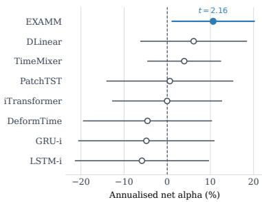
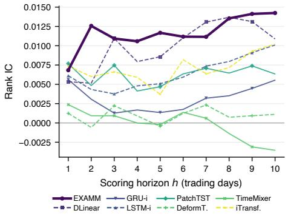

# Forecast Accuracy Is Not Trading Profit: Evolving Small Recurrent Networks for Stock Return Prediction

Jonathan Chang jonathanbokeunchang@gmail.com Union County Magnet High School Scotch Plains, New Jersey, USA

## Abstract

Time series forecasting models are typically compared on point-wise error, which scores a prediction in isolation from the decision it is produced for, and a lower forecast error does not imply a better decision downstream. A parallel debate asks whether mod- ern transformer architectures forecast better than recurrent and other lightweight models. We compare linear, fixed recurrent, trans- former, and mixing based architectures against recurrent networks evolved by neuroevolutionary architecture search, evaluating each on forecast accuracy and on the net return of a daily long/short strategy. All models are fit on a pooled panel, one network trained across the whole universe. Across four mid-cap portfolios and three trading years, the evolved networks rank first on both forecast accuracy and net trading performance, while the second most ac- curate model loses money once positions are formed and costs are charged. The advantage tracks a horizon match, since rank IC for the evolved networks rises from a one-day to a ten-day scoring horizon while every model above 300 parameters declines. They are also the cheapest end to end: a CPU-only search of 16 minutes yields 66-weight networks that predict in 10.8 �s on a Raspberry Pi Zero, against transformer baselines of up to 817,153 parameters that require GPU training.

## CCS Concepts

• Computing methodologies → Neural networks; Genetic algorithms; Supervised learning by regression; • Mathematics of computing → Time series analysis; • Applied computing → Economics.

## 1 Introduction

Forecasting asset returns is a central problem in empirical asset pricing and quantitative investment management. Portfolio allocation, risk budgeting, and systematic trading all take conditional expected returns as their primary input, so better return forecasts translate into position sizing, realized Sharpe ratio, and the robustness of a strategy to turnover and transaction costs [2, 26, 38]. Returns rather than prices are the usual prediction target: prices are non-stationary whereas returns are approximately stationary in their first two mo-ments, returns are scale free and therefore comparable across the cross section, and returns map directly into the expected return and covariance structure that an allocator optimizes [3, 10, 40].

Stock return forecasting has moved from ARIMA and related statistical models to recurrent networks, and more recently to trans- former architectures, yet which family forecasts best remains con- tested. Transformers are argued to capture long range dependencies

Zimeng Lyu✉∗   
zimeng.lyu@kean.edu   
Kean University   
Union, New Jersey, USA

and to suit the noisy, non-stationary, multivariate series encountered in practice, while a recent line of work reports that light- weight alternatives match or exceed them on standard forecasting benchmarks [44]. That comparison is conducted almost entirely on pointwise error criteria such as MSE and MAE, which score a forecast in isolation from the decision it is produced for. This is a general limitation of forecasting benchmarks: a small improve- ment in MSE or MAE does not imply that the forecast serves the downstream decision any better. The gap is pronounced in return forecasting, where the predicted return of each stock directly drives the trading decision.

Three further design questions are left open by this literature. The first is how a panel of multiple stocks should be arranged for training, whether to fit one model per stock or a single model across all stocks, and in what form the examples should be presented to it. The second is whether state of the art time series models forecast well enough to support trading decisions, in the sense of outperforming a buy-and-hold allocation. The third is whether their com- putational cost is warranted, since transformers and other recent architectures generally require GPUs for training and inference.

This paper investigates these questions by comparing model families for stock return forecasting in an investment portfolio setting. The comparison covers DLinear [44], a linear model; the fixed-topology recurrent networks LSTM-i and GRU-i; the transformer architectures PatchTST [29], iTransformer [21], and DeformTime [36]; and TimeMixer [41], a decomposable multiscale mixing model built on MLPs rather than attention. Alongside these fixed architectures we apply neuroevolutionary neural architecture search, using EXAMM [30] to evolve recurrent topologies, memory cell types, and deep recurrent connections directly from the data. Every model is fit on a pooled panel, in which one model is trained across all stocks with no stock identifier among the inputs. Predic- tions are converted into positions by a daily long/short strategy charged the half quoted spread on every trade, so that forecast qual- ity is assessed together with the decisions it produces. Models are compared on information coeficient, net return, Sharpe ratio, and maximum drawdown across four disjoint mid-cap portfolios and three trading years, against buy-and-hold and daily equal-weight benchmarks.

This paper makes four contributions. It introduces a pooled panel construction for neuroevolutionary architecture search on equity data, ablated against per-stock and concatenated alternatives, and shows that its benefit lies in cross-sectional ranking rather than in forecast error. It provides a controlled comparison of neuroevolved recurrent networks against linear, fixed recurrent, and attention based families under an identical universe, walk-forward protocol, trading rule, and cost model, evaluated on both forecast accuracy and realized trading performance. It shows that a model can rank the cross section well on average and still lose money once positions are formed and costs are charged. It annualized cost end to end, from CPU-only architecture search to on-device inference, and finds that the smallest models in the study are also the strongest.

## 2 Related Work

Traditional models such as ARIMA have long been used for stock forecasting [34]. Machine learning models capture non-linear predictor interactions, and Gu et al. report that trees and networks outperform penalized linear methods on the U.S. cross section [12]. Deep models difer mainly in how they encode temporal and cross- sectional structure. Recurrent networks are the most common choice, applied to price levels [11, 37] and to trend and direction [42, 45]. Convolutional models read price and volume charts as images [16], graph models learn dependencies between stocks on a graph generated from the data rather than from predefined rela- tions [43], and MASTER conditions attention on market state [19]. Recent work applies general purpose forecasters directly to financial panels, including selective state space models [20] and lan-guage models over newsflow [13], while difusion models have been developed for time series forecasting more broadly, conditioning the denoising process on representations learned from history [1]. Whether the added capacity is necessary remains contested, and Zeng et al. show that DLinear, a single linear layer with seasonaltrend decomposition, matches or exceeds transformer forecasters on standard benchmarks [44]. Rahimikia et al. report that of-the-shelf foundation models transfer poorly to financial panels, and that pre-training on financial data recovers economic value [33].

In the cross-sectional setting a forecast is consumed by an al- location rule, and the daily long-short book is the standard vehi- cle [15, 32]. The forecasters compared in this work span the families used for that task. DLinear is the linear baseline of the debate above [44], PatchTST segments each series into patches used as tokens and treats channels independently [29], iTransformer tok-enizes each variate so attention runs across the cross section rather than along time [21], and DeformTime uses deformable attention to follow dependencies that shift across both time and variates [36]. TimeMixer drops attention entirely and mixes decomposed com-ponents at multiple scales with MLPs [41]. Recurrent predictors also appear throughout portfolio construction [4, 35], while rein-forcement learning instead trains a policy on the trading objective directly [47]. Lee et al. show that a decision-focused objective tilts squared error by the inverse covariance matrix, raising prediction error while improving realized portfolio performance [18].

Evolutionary methods improve a population ofcandidates through selection, mutation, and crossover [27], and in neuroevolution the search runs over network structure while the weights of each can- didate are trained by gradient descent. Early applications in finance searched around a fixed predictor, for feature selection coupled with LSTM networks [5], for the time window and hidden layer configuration of an LSTM [6], and for information fusion in price and trend prediction [39], while Jozefowicz et al. evolved recur-rent cell structures outside finance and found variants competitive with the LSTM [17]. This work builds on EXAMM, which evolves recurrent topologies, memory cell types, and deep recurrent connections from minimal seed networks [30], maintains diversity by island extinction and repopulation [24], and has been extended to non-stationary streams [22, 25]. Lyu et al. apply it to equity forecasting and report evolved recurrent networks competitive with transformers at a fraction of their parameter count [23].

## 3 Method

## 3.1 Panel Construction

Models that are fit on many stocks at once have been shown to deliver strong and economically significant returns [12]. The same holds in time series forecasting, where one global model usually beats one model per series. Training on many related series gives the model more data to learn from, and pushes it to pick up dynamics that are shared across series instead of fitting the noise in any single one [28].

Let $x _ { i , t } \in \mathbb { R } ^ { d }$ be the predictors of stock $i \in \{ 1 , \ldots , N \}$ on trading day �, and let $y _ { i , t } = r _ { i , t + 1 }$ be its next-day return. The same panel can be arranged in three ways. Individual keeps the � series separate and fits one model per stock, each mapping $x _ { i , t } \mapsto y _ { i , t }$ with � inputs and one output. Concatenated stacks the cross-section into wide format and fits a single model

$$
( x _ { 1 , t } , \dotsc , x _ { N , t } ) \ \mapsto \ ( y _ { 1 , t } , \dotsc , y _ { N , t } ) ,\tag{1}
$$

with �� inputs and � outputs, so both dimensions grow linearly in �. Pooled keeps the � inputs and one output of the individual construction, but fits a single model on the union of all stocks’ examples,

$$
\mathcal { D } = \bigcup _ { i = 1 } ^ { N } \{ ( x _ { i , t } , y _ { i , t } ) \} _ { t } ,\tag{2}
$$

with no stock identifier among the inputs. Input dimensionality is therefore fixed at � for any �, while the number of training examples grows in proportion to �.

We adopt the pooled construction and ablate the three empiri- cally in Section 6.1.

## 3.2 EXAMM

This work uses the Evolutionary eXploration of Augmenting Memory Models (EXAMM) neuroevolution algorithm [30] to evolve RNNs for stock return prediction. EXAMM searches by repeating a simple loop. It selects one or two parents from the current population, applies a mutation or crossover operator to produce a child genome, and trains that child for a small number of epochs. The child is inserted into the population if its validation error improves on that of the worst current member. Runs begin from minimal seed networks containing only input-to-output connections, so a network grows only as the search finds structure worth keeping. The 11 mutation and 2 crossover operators [30] act at the level of individual nodes and edges. They add or remove a node, add or split an edge, add a recurrent edge with a randomly selected time delay, or change the memory cell type of a node.

Two features distinguish the resulting architectures from a fixed standard RNN. First, node type is part of the search. EXAMM draws from a library of Δ-RNN units [31], GRUs [7], LSTMs [14], MGUs [46], and UGRNNs [8], and may mix cell types within a single network, so the memory mechanism is selected per node from data rather than fixed a priori across the whole model. Sec- ond, EXAMM evolves deep recurrent connections, recurrent edges that span more than one time step. These let a network read in- formation from arbitrary past lags directly, without propagating it through every intermediate state, and have been shown to improve generalization and to yield models that outperform standard gated architectures [9].

Algorithm 1 Daily Long–Short Strategy   
1: function LongShortReturn(�, $C _ { 0 } , K _ { L } , K _ { S } )$   
2: $C  C _ { 0 }$   
3: for � in [1,�] do   
4: � ← SortByPrediction(�, �)   
5: if �[�� ].�ˆ� > 0 and �[−�� ].�ˆ� < 0 then   
6: $C \gets C +$ ClearHoldings(�, �) ⊲ sell longs, cover shorts   
7: $q _ { L }  C / K _ { L } , q _ { S }  C / K _ { S }$   
8: for $i \mathrm { i n } \left[ 1 , K _ { L } \right] \mathbf { d o }$   
9: � [� ].Buy(��, � ), $C \gets C - q _ { L }$   
10: end for   
11: for � in [1, �� ] do   
12: � [−� ].Short(��, �), � ← � + ��   
13: end for   
14: end if   
15: end for   
16: $C \gets C + \mathrm { C } _ { 1 }$ learHoldings(�,�)   
17: return $( C - C _ { 0 } ) / C _ { 0 }$ ⊲ net return over the test period   
18: end function

EXAMM is an asynchronous distributed search algorithm. A master process maintains the population and issues genomes on request, while workers independently train genomes and report their fitness back. No worker waits on any other, so the search scales to the number of available cores without a synchronization barrier. Diversity is maintained structurally: the population is parti tioned into islands that evolve independently and exchange genetic material only through periodic inter-island crossover, and islands that stagnate are erased and repopulated from the best genomes elsewhere in the population [24].

## 3.3 Daily Long–Short Trading Strategy

Predictions are evaluated through a daily long–short strategy, the standard choice in the related literature [15, 32]. The book is pa-rameterized by $K _ { L }$ and $K _ { S } ,$ the number of long and short positions. Short notional equals the initial capital, so \$100 of capital supports a \$200 book with half on each side.

Algorithm 1 gives the procedure. On each trading day �, stocks are sorted by predicted return. The book is rebalanced only when the $K _ { L }$ top-ranked stocks all have positive predicted returns and the $K _ { S }$ bottom-ranked all have negative; otherwise existing positions are held. On a rebalance, all positions are liquidated and capital is reallocated equally within each side. The gate is identical across models, but how often it opens depends on their predictions, so holding periods difer across the comparison.

## 4 CRSP Dataset

The Center for Research in Security Prices (CRSP) dataset is the standard academic source for U.S. equity prices, returns, and trading volumes, and it is widely used for empirical asset pricing and financial forecasting research. The datasets used in this paper are derived from the CRSP dataset, using daily frequency data.

We further processed the CRSP dataset by adopting the set ofeconomic predictors used in Lyu et al. [23], which were generated from the CRSP dataset. In total, we used six predictors: Return, Volume Change, Bid-Ask Spread, Illiquidity, Turnover, and S&P 500 Return. We construct two families of portfolios from these predictors: a baseline portfolio that replicates the stock selection of prior work, and four validation portfolios used to test generalization beyond that fixed selection.

## 4.1 Baseline Portfolio

We adopt the stock selection ofLyu et al. [23]: 50 mid-cap companies drawn from the S&P 500, chosen because mid-cap stocks receive less analyst and institutional scrutiny than large-caps and so are less eficiently priced. Retaining the same 50 tickers lets our results sit directly alongside that paper’s, since no diference in performance can be attributed to a diferent forecasting universe. This dataset contains the same six predictors described above, obtained directly from CRSP or computed from CRSP variables.

## 4.2 Validation Portfolios

To test the robustness of EXAMM beyond the fixed 50-stock se- lection above, we construct four additional portfolios, $V 1 - V 4 ,$ of 50 stocks each. The target universe U covers mid-cap through low-large-cap securities, defined by current market capitalization $2 \leq M _ { i } < 5 0$ in USD billions for security �. Restricting the S&P 500 CRSP panel to securities with at least 20 years of continuous trading history leaves 203 names in this range, from which 200 were drawn at random to form U. These 200 stocks were then shufled and split evenly into �1–�4, so the four portfolios are disjoint and no stock appears in more than one.

This construction carries survivorship bias, since drawing from current S&P 500 constituents with 20 ears of continuous histor projects today’s survivors backward into the training and test peri-ods. The length requirement follows from the models under com- parison: the RNN and transformer families evaluated here are both data-hungry, and the walk-forward folds train each of them on 17–19 years of daily data. The bias applies uniformly across models, since every family is trained and evaluated on the identical universe, folds, and trading rule, and the reported returns should be read as relative rather than as absolute levels.

## 4.3 Pooled Panel and Walk-Forward Evaluation

In the pooled construction, each stock keeps its own six-predictor file, as in the individual construction, but the 50 stocks are merged into a single training set with no stock identifier among the inputs. One model is therefore fit across the whole universe and must learn a single rule that generalizes across stocks rather than 50 stock-specific ones.

Models are evaluated on two walk-forward folds of the Baseline Portfolio (Table 1). Each fold trains through a given year-end, validates on the following year, and tests on the year after: Test 2022 trains through 2020 and validates on 2021, and Test 2023 shifts the window forward by one year. The two test years span a sharp regime shift, from the 2022 bear market to the 2023 bull recovery, so patterns learned under one regime need not transfer to the other and performing well on both folds is a harder bar than performing well on either alone.

Table 1: Baseline Portfolio Walk-Forward Folds
<table><tr><td></td><td colspan="2">Training</td><td colspan="2">Validation</td><td colspan="2">Test</td></tr><tr><td>Fold</td><td>Rows</td><td>Period</td><td>Rows</td><td>Period</td><td>Rows</td><td>Period</td></tr><tr><td>Test 2022</td><td>3,290</td><td>2007-12-07-2020-12-31</td><td>252</td><td>2021</td><td>251</td><td>2022</td></tr><tr><td>Test 2023</td><td>3,542</td><td>2007-12-07-2021-12-31</td><td>251</td><td>2022</td><td>250</td><td>2023</td></tr></table>

Table 2: Validation Portfolio Walk-Forward Folds
<table><tr><td></td><td colspan="2">Training</td><td colspan="2">Validation</td><td colspan="2">Test</td></tr><tr><td>Fold</td><td>Rows</td><td>Period</td><td>Rows</td><td>Period</td><td>Rows</td><td>Period</td></tr><tr><td>Test 2022</td><td>4,038-4,252</td><td>2004-2020-12-31</td><td>252</td><td>2021</td><td>251</td><td>2022</td></tr><tr><td>Test 2023</td><td>4,290-4,504</td><td>2004-2021-12-31</td><td>251</td><td>2022</td><td>250</td><td>2023</td></tr><tr><td>Test 2024</td><td>4,541-4,755</td><td>2004-2022-12-30</td><td>250</td><td>2023</td><td>252</td><td>2024</td></tr></table>

Note: Row counts difer slightly across portfolios because their stocks have difer-ent numbers of available trading days.

Table 3: Pooling ablation for EXAMM on Baseline Portfolio
<table><tr><td rowspan="2">Construction</td><td colspan="3">Test 2022</td><td colspan="3">Test 2023</td></tr><tr><td>Rank IC</td><td>MSE</td><td>Net(%)</td><td>Rank IC</td><td>MSE</td><td>Net(%)</td></tr><tr><td>Individual</td><td>+0.0001</td><td>4.726e-4</td><td>+10.47</td><td>-0.0050</td><td>3.037e-4</td><td>-4.17</td></tr><tr><td>Concatenated</td><td>-0.0081</td><td>4.739e-4</td><td>-28.48</td><td>-0.0020</td><td>3.113e-4</td><td>-17.03</td></tr><tr><td>Pooled</td><td>+0.0030</td><td>4.633e-4</td><td>+12.73</td><td>+0.0195</td><td>2.926e-4</td><td>+30.24</td></tr></table>

The same design is applied to the Validation Portfolios �1–�4, with three folds each and test years 2022, 2023, and 2024 (Table 2). This extends the evaluation by one year relative to the Baseline Portfolio and tests generalization across both stock selection and market conditions.

## 5 Experimental Setup

## 5.1 Models

All models use the features and chronological split of Section 4 and predict the next-day return of each stock. All models, includ- ing EXAMM, were evaluated using their default hyperparameters without additional tuning. EXAMM evolves recurrent topologies with 10 islands of at most 10 genomes each, an island repopulation frequency of 500, and 10,000 genomes generated per run. Each gen-erated genome is trained for 10 epochs of backpropagation through time and scored by validation MSE. New genomes are produced by mutation with probability 0.7, intra-island crossover with probabil ity 0.2, and inter-island crossover with probability 0.1. Mutations are drawn uniformly from 10 of EXAMM’s 11 operators, excluding split edge. New nodes are drawn uniformly from a library of simple neurons, Δ-RNN, GRU, LSTM, MGU, and UGRNN memory cells, and recurrent connections receive a time skip sampled as U (1, 10).

As fixed-architecture baselines we use DLinear [44], a linear model; PatchTST [29], iTransformer [21], and DeformTime [36] from the transformer family; and the mixing-based TimeMixer [41]. Each is given an input length of 96 and an output length of 1, the former being the most widely reported setting across these models and the latter matching the one-step-ahead target of the evolved

RNNs. All remaining hyperparameters follow the published defaults of each model. The two fixed-topology recurrent baselines, LSTM-i and GRU-i, are each a two hidden layer recurrent network whose hidden layer size equals the input size, trained for 1000 epochs of backpropagation through time at a learning rate of 1e-4. Every configuration is repeated 10 times with independent seeds, and we report the mean over repeats.

## 5.2 Trading Strategy and Costs

Predictions are converted to positions by Algorithm 1: each day the cross-section is ranked by predicted return, and when the entry condition is met the strategy takes equal-weight long positions in the top 10 stocks and equal-weight short positions in the bottom 10. Every trade is charged the half quoted spread $\begin{array} { r } { c _ { i , t } = \frac { 1 } { 2 } ( P _ { i , t } ^ { \mathrm { a s k } } - P _ { i , t } ^ { \mathrm { b i d } } ) } \end{array}$ per share, computed from the CRSP closing quotes of stock � on day �, the same fields underlying the quoted spread predictor of Section 4. Reported net returns subtract $c _ { i , t }$ on every trade.

## 5.3 Factor Benchmarks

A net return does not establish that a strategy earns more than com- pensation for exposures obtainable without a forecast. We regress each model’s daily strategy return on three benchmarks built from the panel it trades. MKT is the equal-weight cross-sectional mean return of the panel’s own 50 stocks, the relevant opportunity set since the strategy never trades outside it. STR1 is a one-day rever-sal portfolio, long the bottom 10 and short the top 10 names ranked by day � − 1 return; STR5 is built identically on the trailing five-day compounded return.

Both reversal portfolios use a 10/10 book, matching $K _ { L } = K _ { S } =$ 10 in Algorithm 1, so factor and strategy span the same portfolio space. The control is material: a long–short portfolio sorted on next-day predicted return is structurally close to a reversal bet, and alpha that does not survive STR1 and STR5 is better described as a repackaging of reversal than as a forecasting result.

## 5.4 Computing Environment

EXAMM is CPU only and MPI parallelized, and each run used 32 cores of a shared allocation on dual-socket 64-core AMD EPYC “Milan” nodes at [Removed for Review]. The baselines were trained in PyTorch on NVIDIA RTX 4090 GPUs.

## 6 Results

## 6.1 Pooled vs. Alternative Constructions

Table 3 compares the three panel constructions of Section 3.1 on the Baseline Portfolio, reporting test-period IC, MSE, and the net return of the long-short rule of Algorithm 1. Pooling improves every metric in both folds, and is the construction used for all models, including the baselines, in the experiments that follow.

The MSE gain is modest, at 2.0% in 2022 and 3.7% in 2023, while the efect on cross-sectional ranking is larger. Individual training gives an IC of +0.0001 in 2022 and −0.0050 in 2023, so its predictions carry little usable information about relative performance, whereas pooled training is positive in both folds. Because the long-short rule allocates on relative rather than absolute predictions, it is this diference in ranking quality rather than the MSE gap that drives the trading result, and the 2023 fold moves from a −4.17% loss to a +30.24% gain. Concatenated construction is worst on every metric. Joining series end to end introduces boundary discontinuities that the recurrent state cannot distinguish from genuine transitions, whereas pooling keeps each series intact while sharing parameters across them.

Table 4: Pearson information coeficient (IC) of Forecasting Performance across All Models
<table><tr><td></td><td></td><td></td><td>Other</td><td colspan="2">Fixed RNNs</td><td colspan="3">Transformer-based</td><td>Mixing</td></tr><tr><td>Panel</td><td>Test yr</td><td>EXAMM</td><td>DLinear</td><td>LSTM-i</td><td>GRU-i</td><td>PatchTST</td><td>iTransf.</td><td>DeformT.</td><td>TimeMixer</td></tr><tr><td>V1</td><td>2022</td><td>+0.0000</td><td>+0.0015</td><td>+0.0230</td><td>+0.0229</td><td>+0.0149</td><td>+0.0138</td><td>+0.0029</td><td>-0.0079</td></tr><tr><td>V1</td><td>2023</td><td>+0.0145</td><td>+0.0079</td><td>+0.0050</td><td>+0.0026</td><td>+0.0076</td><td>-0.0017</td><td>-0.0022</td><td>+0.0164</td></tr><tr><td>V1</td><td>2024</td><td>+0.0257</td><td>+0.0117</td><td>-0.0093</td><td>-0.0138</td><td>+0.0118</td><td>-0.0093</td><td>+0.0025</td><td>+0.0041</td></tr><tr><td>V2</td><td>2022</td><td>+0.0041</td><td>-0.0010</td><td>+0.0150</td><td>+0.0159</td><td>+0.0047</td><td>+0.0096</td><td>+0.0005</td><td>-0.0041</td></tr><tr><td>V2</td><td>2023</td><td>+0.0213</td><td>+0.0083</td><td>-0.0047</td><td>-0.0032</td><td>+0.0063</td><td>-0.0042</td><td>-0.0061</td><td>+0.0285</td></tr><tr><td>V2</td><td>2024</td><td>+0.0181</td><td>-0.0013</td><td>-0.0083</td><td>-0.0066</td><td>-0.0077</td><td>-0.0148</td><td>-0.0118</td><td>+0.0134</td></tr><tr><td>V3</td><td>2022</td><td>+0.0115</td><td>+0.0035</td><td>+0.0100</td><td>+0.0089</td><td>+0.0043</td><td>+0.0270</td><td>-0.0064</td><td>+0.0142</td></tr><tr><td>V3</td><td>2023</td><td>-0.0171</td><td>-0.0077</td><td>-0.0088</td><td>-0.0130</td><td>-0.0121</td><td>+0.0080</td><td>-0.0148</td><td>-0.0063</td></tr><tr><td>V3</td><td>2024</td><td>+0.0128</td><td>+0.0141</td><td>+0.0002</td><td>-0.0002</td><td>+0.0098</td><td>+0.0038</td><td>+0.0011</td><td>-0.0003</td></tr><tr><td>V4</td><td>2022</td><td>+0.0272</td><td>+0.0087</td><td>+0.0257</td><td>+0.0175</td><td>+0.0220</td><td>+0.0174</td><td>+0.0044</td><td>-0.0001</td></tr><tr><td>V4</td><td>2023</td><td>-0.0011</td><td>+0.0245</td><td>-0.0150</td><td>-0.0124</td><td>+0.0129</td><td>+0.0110</td><td>-0.0007</td><td>-0.0199</td></tr><tr><td>V4</td><td>2024</td><td>+0.0107</td><td>+0.0103</td><td>+0.0092</td><td>+0.0106</td><td>+0.0078</td><td>-0.0052</td><td>+0.0080</td><td>+0.0006</td></tr><tr><td>Mean</td><td></td><td>+0.0106</td><td>+0.0067</td><td>+0.0035</td><td>+0.0024</td><td>+0.0069</td><td>+0.0046</td><td>-0.0019</td><td>+0.0032</td></tr></table>

Note: Values in bold are the highest IC for the trading year; underlined values are the second highest.

Table 5: Net return (%) using Model’s Predicted Return for Portfolio Trading
<table><tr><td rowspan="2">Panel</td><td rowspan="2">Test yr</td><td colspan="2">Benchmarks</td><td rowspan="2"></td><td rowspan="2">Other</td><td colspan="2">Fixed RNNs</td><td colspan="3">Transformer-based</td><td>Mixing</td></tr><tr><td>B&amp;H</td><td>EXAMM</td><td>DLinear</td><td>LSTM-i GRU-i</td><td>PatchTST</td><td>iTransf.</td><td>DeformT.</td><td>TimeMixer</td></tr><tr><td>V1</td><td>2022</td><td>-7.16</td><td>-14.26</td><td>-4.63</td><td>+6.15</td><td>+7.13</td><td>+6.65</td><td>+3.54</td><td>+0.80</td><td>+2.48</td><td>-0.18</td></tr><tr><td>V1</td><td>2023</td><td>+5.18</td><td>-1.67</td><td>+21.34</td><td>-4.27</td><td>-5.20</td><td>+1.48</td><td>-10.61</td><td>-0.94</td><td>-4.64</td><td>+23.46</td></tr><tr><td>V1</td><td>2024</td><td>-4.73</td><td>-9.92</td><td>+17.19</td><td>-15.48</td><td>-15.49</td><td>-15.57</td><td>-23.11</td><td>-17.28</td><td>+1.73</td><td>+13.39</td></tr><tr><td>V2</td><td>2022</td><td>-11.42</td><td>-18.91</td><td>+35.22</td><td>+5.66</td><td>-4.05</td><td>+0.45</td><td>-1.85</td><td>+13.72</td><td>-1.61</td><td>-25.23</td></tr><tr><td>V2</td><td>2023</td><td>+15.37</td><td>+7.40</td><td>+16.92</td><td>+3.29</td><td>-22.25</td><td>-16.90</td><td>-10.35</td><td>-10.34</td><td>-15.06</td><td>+28.56</td></tr><tr><td>V2</td><td>2024</td><td>+12.13</td><td>+3.46</td><td>+13.80</td><td>-12.99</td><td>-25.10</td><td>-25.39</td><td>-12.85</td><td>-17.71</td><td>-14.20</td><td>-2.76</td></tr><tr><td>V3</td><td>2022</td><td>-11.39</td><td>-19.08</td><td>+36.68</td><td>-1.43</td><td>+17.38</td><td>+17.99</td><td>+4.27</td><td>+19.65</td><td>+3.88</td><td>+27.55</td></tr><tr><td>V3</td><td>2023</td><td>+14.77</td><td>+7.05</td><td>-3.82</td><td>+1.03</td><td>-10.61</td><td>-13.03</td><td>-8.87</td><td>-18.84</td><td>-9.69</td><td>-13.16</td></tr><tr><td>V3</td><td>2024</td><td>+13.11</td><td>+3.89</td><td>-2.88</td><td>+24.88</td><td>-1.82</td><td>-2.98</td><td>+11.46</td><td>+6.32</td><td>-4.84</td><td>+5.62</td></tr><tr><td>V4</td><td>2022</td><td>-10.25</td><td>-17.33</td><td>-5.43</td><td>+8.14</td><td>+11.12</td><td>+11.91</td><td>+20.51</td><td>+22.58</td><td>-4.32</td><td>+4.82</td></tr><tr><td>V4</td><td>2023</td><td>+9.41</td><td>+3.16</td><td>+1.84</td><td>+24.33</td><td>-20.26</td><td>-24.45</td><td>-7.40</td><td>+10.93</td><td>-11.13</td><td>-21.61</td></tr><tr><td>V4</td><td>2024</td><td>+6.69</td><td>-1.14</td><td>+5.96</td><td>-6.26</td><td>+1.69</td><td>+5.13</td><td>+16.68</td><td>-12.38</td><td>-9.88</td><td>+8.65</td></tr><tr><td>Mean</td><td></td><td>+2.64</td><td>-4.78</td><td>+11.02</td><td>+2.75</td><td>-5.62</td><td>-4.56</td><td>-1.55</td><td>-0.29</td><td>-5.61</td><td>+4.09</td></tr></table>

Note: Values in bold are the highest net return for the trading year; underlined values are the second highest.

## 6.2 Forecast Quality

Transformers are strong on multivariate real-world series, though linear models have been reported to match or exceed them on standard forecasting benchmarks [44]. We compare both families against the evolved networks.

Table 4 reports the mean Pearson IC ofthe raw predictions, which is independent of the trading rule. EXAMM attains the highest mean IC at +0.0106, ahead of PatchTST (+0.0069) and DLinear (+0.0067), and DeformTime is the only model with a negative mean (−0.0019). All values are small in absolute terms, as expected for one-step- ahead daily return prediction, and no model is positive in every panel-year cell.

## 6.3 Portfolio Returns across Market Regimes

Table 5 reports net returns for each panel and trade year under the daily long-short rule, and Table 7 averages each column within trade years against the buy-and-hold (B&H) and daily equal-weight (EW) benchmarks. The two regimes covered difer sharply. The 2022 test year is a drawdown across � 1–� 4, with B&H at −10.05% and EW at −17.39%, while 2023 and 2024 are recoveries with B&H at +11.18% and +6.80%.

EXAMM has the highest average return in all three trade years and the highest three-year mean at +11.02%, against +2.64% for B&H and +4.09% for TimeMixer. It exceeds B&H by 25.51 points in the drawdown year and by 1.72 points in the 2024 recovery, and trails it by 2.11 points in 2023. Only three of the eight models beat B&H on the mean, and EXAMM and TimeMixer are the only two positive in all three trade years. The per-panel results show that this average is not driven by single cells: EXAMM is negative in 4 of 12 panel-years, but those losses lie in [−5.43%, −2.88%] while its four largest gains all exceed +17%. For the transformer baselines, per-panel gains of comparable size are ofset by losses of similar magnitude, leaving year averages near or below zero. We therefore read EXAMM’s advantage as consistency across regimes rather than as outperformance in any one of them.

Table 6: EXAMM Annualized Net Alpha
<table><tr><td>Specification</td><td> $\alpha \left( \% / \mathrm { y r } \right)$ </td><td>t</td><td>p</td></tr><tr><td>MKT</td><td> $+ 1 1 . 2 7$ </td><td> $+ 2 . 3 2$ </td><td>0.021</td></tr><tr><td> $\mathrm { M K T } + \mathrm { S T R } 1$ </td><td> $+ 1 0 . 9 6$ </td><td> $+ 2 . 2 4$ </td><td>0.025</td></tr><tr><td> $\mathrm { M K T } + \mathrm { S T R 1 } + \mathrm { S T R } 5$ </td><td> $+ 1 0 . 6 4$ </td><td> $+ 2 . 1 6$ </td><td>0.031</td></tr></table>

The two fixed-topology recurrent baselines return −5.62% and −4.56%, among the weakest columns in the study. This places the gain with the evolved topology rather than with recurrence and gated memory alone, since both baselines draw on the same cell types available to the search.

## 6.4 Risk-Adjusted Performance

Figure 1 plots the intercept of a time-series regression of each model’s daily net strategy return on the benchmark portfolios of Section 5.3, annualized, with 95% confidence intervals. Regressions are estimated on the stacked evaluation panel of $V _ { 1 } - V _ { 4 } ,$ comprising 23,424 panel-days over 732 trading dates after the STR5 warm-up. Standard errors are Driscoll–Kraay, robust both to serial correlation within a portfolio’s return series and to contemporaneous correla tion across the four portfolios. Because the estimate is formed on the stacked panel, it describes an equal-weight combination of the four evaluation portfolios rather than any single 50-stock book.

EXAMM is the only model whose alpha is distinguishable from zero (+10.64% per year, $t = 2 . 1 6 , p = 0 . 0 3 1 )$ . Every other interval contains zero, including those of DLinear and TimeMixer, the two models that exceeded buy-and-hold on mean net return in Table 5. A diference in significance is not a test of diference: EXAMM’s alpha is nonzero, not demonstrably larger than DLinear’s or TimeMixer’s.

Table 6 reports sensitivity to the controls. Adding one-day and five-day reversal moves alpha from +11.27% to +10.64%, an attenuation of six percent, with significance retained throughout: the edge is not a restatement of short-term reversal, despite the me- chanical similarity between a next-day-return sort and a reversal sort. The estimate is nonetheless imprecise, with a 95% interval of [1.0%, 20.3%] under the fullest specification. These results support the claim that risk-adjusted performance is positive and survives both reversal controls and transaction costs, not that the strategy earns a particular premium.

Re-estimating on gross returns isolates each model’s trading cost. Under MKT, EXAMM’s alpha falls from +11.71% gross to +11.27% net, a drag of 0.44 points per year, against 4.51 and 4.58 for GRU-i and LSTM-i. Since the book turns over only when the entry condition is met, this measures how often each model produces a cleanly signed cross-section: the evolved networks meet it least often, hold positions longest, and are correspondingly cheapest to trade.

## 6.5 Overall Comparison

Table 8 averages four evaluation metrics over the validation portfo- lios, alongside each model’s parameter count: information coefi- cient (IC), net return, Sharpe ratio, and maximum drawdown (MDD), the largest peak-to-trough decline in portfolio value. The bench- marks are listed with net return only, as buy-and-hold and equal weight issue no predictions and therefore have no IC, and their fixed allocations are not comparable on the risk metrics. EXAMM is the only model that is best on all four: IC (+0.0106 against +0.0069 for PatchTST), net return (+11.02% against +4.09% for TimeMixer), Sharpe (+0.74 against +0.43), and MDD (−10.76% against −12.49% for DLinear). Only three models return more than buy-and-hold’s +2.64%, and only EXAMM does so by a wide margin.

Figure 1: Annualized Net Alpha with 95% Confidence Intervals  

Table 7: Average Net return (%) across �1–�4
<table><tr><td rowspan="2"></td><td colspan="2">Benchmarks</td><td rowspan="2"></td><td rowspan="2">Other</td><td colspan="2">Fixed RNNs</td><td colspan="3">Transformer-based</td><td rowspan="2">Mixing</td></tr><tr><td>B&amp;H</td><td>EW EXAMM</td><td>DLinear</td><td>LSTM-i</td><td>GRU-i PatchTST</td><td>iTransf.</td><td>DeformT.</td></tr><tr><td>2022</td><td>-10.05</td><td>-17.39</td><td>+15.46</td><td>+4.63</td><td>+7.89</td><td>+9.25</td><td>+6.62</td><td>+14.19</td><td>+0.11</td><td>+1.74</td></tr><tr><td>2023</td><td>+11.18</td><td>+3.99</td><td>+9.07</td><td>+6.09</td><td>-14.58</td><td>-13.22</td><td>-9.31</td><td>-4.80</td><td>-10.13</td><td>+4.31</td></tr><tr><td>2024</td><td>+6.80</td><td>-0.93</td><td>+8.52</td><td>-2.46</td><td>-10.18</td><td>-9.70</td><td>-1.95</td><td>-10.26</td><td>-6.80</td><td>+6.23</td></tr><tr><td>Mean</td><td>+2.64</td><td>-4.78</td><td>+11.02</td><td>+2.75</td><td>-5.62</td><td>-4.56</td><td>-1.55</td><td>-0.29</td><td>-5.61</td><td>+4.09</td></tr></table>

The parameter column shows that this does not come from capacity. EXAMM’s evolved networks average 66 weights, fewer than any other model in the comparison and two to four orders of magnitude below the Transformers (16,836 to 817,153). Across the field, size and performance are unrelated or inversely related: iTransformer is the largest model at 817,153 parameters and returns −0.29%, DeformTime at 67,449 parameters records the only negative IC in the table (−0.0019), while the two smallest models, EXAMM and DLinear, place in the top three on every metric. The table also separates prediction quality from tradeable profit: PatchTST has the second-highest IC (+0.0069) yet a net return of −1.55%, so a model can rank the cross-section correctly on average and still lose money once positions are formed. EXAMM is the one model where accuracy, return, risk-adjusted return, and downside protection align, and it does so at the smallest model size. Figure 2 shows where this comes from. EXAMM’s rank IC rises from +0.0068 at a one-day horizon to +0.0142 at ten days, while every model above 300 parameters declines over the same range. Because the entry rule re-enters the book only when every long-side prediction is positive and every short-side prediction is negative, EXAMM’s positions are held for several days rather than one, so the horizon at which its forecasts are most accurate is also the horizon over which they are traded.

Table 8: Average Model Summary over Validation Portfolios.
<table><tr><td></td><td>Model</td><td>Params</td><td>IC</td><td>Net (%)</td><td>Sharpe</td><td>MDD (%)</td></tr><tr><td></td><td>EXAMM</td><td>66</td><td>+0.0106</td><td>+11.02</td><td>+0.74</td><td>-10.76</td></tr><tr><td>Other</td><td>DLinear</td><td>194</td><td>+0.0067</td><td>+2.75</td><td>+0.42</td><td>-12.49</td></tr><tr><td rowspan="2">Fixed RNNs</td><td>LSTM-i</td><td>679</td><td>+0.0035</td><td>-5.62</td><td>-0.15</td><td>-18.93</td></tr><tr><td>GRU-i</td><td>511</td><td>+0.0024</td><td>-4.56</td><td>-0.10</td><td>-19.39</td></tr><tr><td rowspan="3">Transformer-based</td><td>PatchTST</td><td>16,836</td><td>+0.0069</td><td>-1.55</td><td>+0.12</td><td>-15.48</td></tr><tr><td>iTransf.</td><td>817,153</td><td>+0.0046</td><td>-0.29</td><td>+0.17</td><td>-15.15</td></tr><tr><td>DeformT.</td><td>67,449</td><td>-0.0019</td><td>-5.61</td><td>-0.19</td><td>-17.38</td></tr><tr><td>Mixing</td><td>TimeMixer</td><td>72,997</td><td>+0.0032</td><td>+4.09</td><td>+0.43</td><td>-13.12</td></tr><tr><td rowspan="2">Benchmarks</td><td>Buy &amp; hold</td><td>1</td><td>一</td><td>+2.64</td><td>一</td><td></td></tr><tr><td>Equal weight</td><td>一</td><td></td><td>-4.78</td><td>一</td><td></td></tr></table>

Figure 2: Rank IC as a function of scoring horizon  

Table 9: EXAMM cost end to end: architecture search on CPU, and on-device inference
<table><tr><td colspan="3">Architecture search (CPU only, 10,000 genomes)</td></tr><tr><td>Ranks</td><td>Workers</td><td>Wall-clock (min) Core-h</td></tr><tr><td>8</td><td>7</td><td> $7 2 . 8 \pm 1 5 . 6$  9.70</td></tr><tr><td>16</td><td>15</td><td> $3 7 . 1 \pm 7 . 7$  9.88</td></tr><tr><td>32</td><td>31</td><td> $1 6 . 2 \pm 2 . 8$  8.65</td></tr><tr><td>64</td><td>63</td><td> $8 . 1 \pm 1 . 9$  8.59</td></tr><tr><td>128</td><td>127</td><td> $3 . 9 \pm 1 . 0$  8.26</td></tr><tr><td colspan="3">Deployment (Raspberry Pi Zero)</td></tr><tr><td>Parameters</td><td></td><td>66</td></tr><tr><td>Latency (µs)</td><td></td><td>10.82</td></tr><tr><td>Throughput (k/s)</td><td></td><td>100.5</td></tr><tr><td></td><td>Power over idle (mW)</td><td>476.7</td></tr></table>

Note: Search runs on one exclusive node, ± is the standard deviation; values in bold show the configuration used in all other experiments. Inference is measured on-device with an INA219 sensor.

## 6.6 Scalability and Deployment

Table 9 reports the cost of EXAMM end to end. The search is asynchronous: a master process maintains the population and distributes candidate genomes to workers, which train and evaluate them in- dependently without global synchronization barriers, so scaling is near-linear in the number of workers. Total compute stays within

8.3–9.9 core-hours across all configurations tested, while wall-clock time falls from 72.8 minutes at 8 ranks to 16.2 minutes at 32, the configuration used in all other experiments, and 3.9 minutes at 128. The search is CPU-only at every stage, so a complete 10,000-genome run finishes in 72.8 and 37.1 minutes at 8 and 16 ranks, core counts typical of contemporary laptop and desktop processors, whereas the transformer baselines require GPU training for models of up to 817,153 parameters.

The resulting models are correspondingly inexpensive to deploy. Evolved genomes average 66 parameters and execute in 10.82 �s per prediction on a Raspberry Pi Zero, a passively cooled single-core device, at 476.7 mW above idle draw. Inference latency is negligible relative to the daily rebalancing interval, and the sub-watt requirement permits operation on battery or embedded hardware. The same networks that produce the returns in Table 7 can therefore be both discovered and deployed on commodity hardware, which is not feasible for the baseline architectures.

## 7 Conclusion

This paper studied pooled panel construction for neuroevolved re- current architecture search, and evaluated the resulting models as return forecasters for daily long-short portfolio formation. Pooling acts on cross-sectional ranking rather than on pointwise accuracy. Relative to per-stock training it lowers MSE by less than 4%, but moves the information coeficient from near zero or negative to positive in both folds, and the information coeficient is the quantity a rank-based allocation consumes. Under this construction EXAMM ranks first on information coeficient, net return, Sharpe ratio, and maximum drawdown across four disjoint portfolios and three trad- ing years, and it remains profitable in the 2022 drawdown as well as the 2023 and 2024 recoveries. It is also the only model whose alpha against the traded universe is positively distinguishable from zero, and that alpha survives controls for short-term reversal, to which a next-day-return sort is mechanically related. The evolved networks average 66 weights, are searched on CPU in under twenty minutes on 32 cores, and evaluate in 10.82 �s on a Raspberry Pi Zero. Performance therefore does not follow capacity: across the eight models compared, parameter count is unrelated to realised return, and the two smallest models place in the top three on every metric.

## References

[1] Khaled Alkilane, Yihang He, and Der-Horng Lee. 2025. Expert denoising for enhanced difusion-based time series forecasting. ExpertSystems with Applications (2025), 130269.

[2] Turan G Bali, Robert F Engle, and Scott Murray. 2016. Empirical asset pricing: The cross section of stock returns. John Wiley & Sons.

[3] John Y. Campbell, Andrew W. Lo, and A. Craig MacKinlay. 1997. The Econometrics of Financial Markets. Princeton University Press, Princeton, NJ.

[4] Hieu K Cao, Han K Cao, and Binh T Nguyen. 2020. Delafo: An eficient portfolio optimization using deep neural networks. In Advances in Knowledge Discovery and Data Mining: 24th Pacific-Asia Conference, PAKDD 2020, Singapore, May 11–14, 2020, Proceedings, Part I 24. Springer, 623–635.

[5] Shile Chen and Changjun Zhou. 2020. Stock prediction based on genetic algorithm feature selection and long short-term memory neural network. IEEE Access 9 (2020), 9066–9072.

[6] Hyejung Chung and Kyung-shik Shin. 2018. Genetic algorithm-optimized long short-term memory network for stock market prediction. Sustainability 10, 10 (2018), 3765.

[7] Junyoung Chung, Caglar Gulcehre, KyungHyun Cho, and Yoshua Bengio. 2014. Empirical evaluation of gated recurrent neural networks on sequence modeling. arXiv preprint arXiv:1412.3555 (2014).

[8] Jasmine Collins, Jascha Sohl-Dickstein, and David Sussillo. 2016. Capacity and Trainability in Recurrent Neural Networks. arXiv preprint arXiv:1611.09913 (2016).

[9] Travis Desell, AbdElRahman ElSaid, and Alexander G. Ororbia. 2020. An Empiri cal Exploration of Deep Recurrent Connections Using Neuro-Evolution. In The 23nd International Conference on the Applications of Evolutionary Computation (EvoStar: EvoApps 2020). Seville, Spain

[10] Eugene F. Fama and Kenneth R. French. 1993. Common Risk Factors in the Returns on Stocks and Bonds. Journal ofFinancial Economics 33, 1 (1993), 3–56.

[11] Achyut Ghosh, Soumik Bose, Giridhar Maji, Narayan Debnath, and Soumya Sen. 2019. Stock price prediction using LSTM on Indian share market. In Proceedings of32nd international conference on, Vol. 63. 101–110.

[12] Shihao Gu, Bryan Kelly, and Dacheng Xiu. 2020. Empirical Asset Pricing via Machine Learning. The Review ofFinancial Studies 33, 5 (2020), 2223–2273.

[13] Tian Guo and Emmanuel Hauptmann. 2025. Exploring the Synergy of Quantitative Factors and Newsflow Representations from Large Language Models for Stock Return Prediction. arXiv preprint arXiv:2510.15691 (2025).

[14] Sepp Hochreiter and Jürgen Schmidhuber. 1997. Long short-term memory. Neural Computation 9, 8 (1997), 1735–1780.

[15] Xiurui Hou, Kai Wang, Jie Zhang, and Zhi Wei. 2020. An enriched time-series forecasting framework for long-short portfolio strategy. IEEE Access 8 (2020), 31992–32002.

[16] Jingwen Jiang, Bryan Kelly, and Dacheng Xiu. 2023. (Re-) imag (in) ing price trends. The Journal ofFinance 78, 6 (2023), 3193–3249.

[17] Rafal Jozefowicz, Wojciech Zaremba, and Ilya Sutskever. 2015. An empirical exploration of recurrent network architectures. In International Conference on Machine Learning. 2342–2350.

[18] Junhyeong Lee, Haeun Jeon, Hyunglip Bae, and Yongjae Lee. 2025. Return prediction for mean-variance portfolio selection: How decision-focused learning shapes forecasting models. In Proceedings of the 6th ACM International Conference on AI in Finance. 114–122.

[19] Tong Li, Zhaoyang Liu, Yanyan Shen, Xue Wang, Haokun Chen, and Sen Huang. 2024. Master: Market-guided stock transformer for stock price forecasting. In Proceedings of the AAAI conference on artificial intelligence, Vol. 38. 162–170.

[20] Mingyu Liu. 2025. Attention-Mamba: Accurate Temporal Modeling for Stock Prediction. In Proceedings of the 2025 3rd International Conference on Mathematics and Machine Learning. 19–23.

[21] Yong Liu, Tengge Hu, Haoran Zhang, Haixu Wu, Shiyu Wang, Lintao Ma, and Mingsheng Long. 2024. itransformer: Inverted transformers are efective for time series forecasting. In International conference on learning representations, Vol. 2024. 11116–11140.

[22] Zimeng Lyu and Travis Desell. 2022. ONE-NAS: an online neuroevolution based neural architecture search for time series forecasting. In Proceedings ofthe Genetic and Evolutionary Computation Conference Companion. 659–662.

[23] Zimeng Lyu, Devroop Kar, Matthew Simoni, Rohaan Nadeem, Avinash Bhojana palli, Hao Zhang, and Travis Desell. 2025. Evolving RNNs for Stock Forecasting: A Low Parameter Eficient Alternative to Transformers. In International Conference on the Applications of Evolutionary Computation (Part of EvoStar). Springer, 36–54.

[24] Zimeng Lyu, Joshua Karnas, AbdElRahman ElSaid, Mohamed Mkaouer, and Travis Desell. 2021. Improving Distributed Neuroevolution Using Island Extinc tion and Repopulation. The 24th International Conference on the Applications of Evolutionary Computation (EvoStar: EvoApps) (2021).

[25] Zimeng Lyu, Alexander Ororbia, and Travis Desell. 2023. Online evolutionary neural architecture search for multivariate non-stationary time series forecasting. Applied Soft Computing 145 (2023), 110522.

[26] Harry Markowitz. 1952. Portfolio Selection. The Journal ofFinance 7, 1 (1952), 77–91.

[27] John McCall. 2005. Genetic algorithms for modelling and optimisation. Journal ofcomputational and Applied Mathematics 184, 1 (2005), 205–222.

[28] Pablo Montero-Manso and Rob J Hyndman. 2021. Principles and algorithms for forecasting groups of time series: Locality and globality. International Journal of Forecasting 37, 4 (2021), 1632–1653.

[29] Yuqi Nie, Nam H Nguyen, Phanwadee Sinthong, and Jayant Kalagnanam. 2022. A time series is worth 64 words: Long-term forecasting with transformers. arXiv preprint arXiv:2211.14730 (2022).

[30] Alexander Ororbia, AbdElRahman ElSaid, and Travis Desell. 2019. Investigating Recurrent Neural Network Memory Structures Using Neuro-evolution. In Proceedings of the Genetic and Evolutionary Computation Conference (Prague, Czech Republic) (GECCO ’19). ACM, New York, NY, USA, 446–455. doi:10.1145/3321707. 3321795

[31] Alexander G. Ororbia II, Tomas Mikolov, and David Reitter. 2017. Learning Simpler Language Models with the Diferential State Framework. Neural Computation 0, 0 (2017), 1–26. PMID: 28957029. arXiv:https://doi.org/10.1162/neco\_a\_01017 doi:10.1162/neco\_a\_01017

[32] Hyungjun Park, Min Kyu Sim, and Dong Gu Choi. 2020. An intelligent financial portfolio trading strategy using deep Q-learning. Expert Systems with Applications 158 (2020), 113573.

[33] Eghbal Rahimikia, Hao Ni, and Weiguan Wang. 2025. Re (visiting) time series foundation models in finance. arXiv preprint arXiv:2511.18578 (2025).

[34] C Viswanatha Reddy. 2019. Predicting the stock market index using stochastic time series ARIMA modelling: The sample of BSE and NSE. Indian Journal of Finance 13, 8 (2019), 7–25.

[35] Jaydip Sen, Abhishek Dutta, and Sidra Mehtab. 2021. Stock portfolio optimization using a deep learning LSTM model. In 2021 IEEE Mysore sub section international conference (MysuruCon). IEEE, 263–271.

[36] Yuxuan Shu and Vasileios Lampos. 2024. DeformTime: capturing variable dependencies with deformable attention for time series forecasting. arXiv preprint arXiv:2406.07438 (2024).

[37] Nathan Smith, Vivek Varadharajan, Dinesh Kalla, Ganesh R Kumar, and Fnu Samaah. 2024. Stock Closing Price and Trend Prediction with LSTM-RNN. Journal ofArtificial Intelligence and Big Data (2024), 1–13.

[38] René M Stulz. 2008. Rethinking risk management. In Corporate Risk Management. Columbia Universit Press, 87–120.

[39] Ankit Thakkar and Kinjal Chaudhari. 2022. Information fusion-based genetic algorithm with long short-term memory for stock price and trend prediction. Applied Soft Computing 128 (2022), 109428.

[40] Ruey S Tsay. 2005. Analysis offinancial time series. John wiley & sons.

[41] Shiyu Wang, Haixu Wu, Xiaoming Shi, Tengge Hu, Huakun Luo, Lintao Ma, James Zhang, and Jun Zhou. 2024. Timemixer: Decomposable multiscale mixing for time series forecasting. In International conference on learning representations, Vol. 2024. 38626–38652.

[42] Siyu Yao, Linkai Luo, and Hong Peng. 2018. High-frequency stock trend forecast using LSTM model. In 2018 13th International Conference on Computer Science & Education (ICCSE). IEEE, 1–4.

[43] Zinuo You, Zijian Shi, Hongbo Bo, John Cartlidge, Li Zhang, and Yan Ge. 2024. DGDNN: Decoupled graph difusion neural network for stock movement prediction. arXiv preprint arXiv:2401.01846 (2024).

[44] Ailing Zeng, Muxi Chen, Lei Zhang, and Qiang Xu. 2023. Are transformers efective for time series forecasting?. In Proceedings ofthe AAAI conference on artificial intelligence, Vol. 37. 11121–11128.

[45] Jinghua Zhao, Dalin Zeng, Shuang Liang, Huilin Kang, and Qinming Liu. 2021. Prediction model for stock price trend based on recurrent neural network. Journal of Ambient Intelligence and Humanized Computing 12 (2021), 745–753.

[46] Guo-Bing Zhou, Jianxin Wu, Chen-Lin Zhang, and Zhi-Hua Zhou. 2016. Minimal gated unit for recurrent neural networks. International Journal ofAutomation and Computing 13, 3 (2016), 226–234.

[47] Jie Zou, Jiashu Lou, Baohua Wang, and Sixue Liu. 2024. A novel deep reinforcement learning based automated stock trading system using cascaded lstm networks. Expert Systems with Applications 242 (2024), 122801