# Foundation Model-Aided Multi-Agent Reinforcement Learning for Wireless Random Access Network Optimization

Myeung Suk Oh   
oh.746@osu.edu   
The Ohio State University   
Columbus, Ohio, USA

Zhiyao Zhang zhang.15178@osu.edu The Ohio State University Columbus, Ohio, USA

Nathaniel D. Bastian nbastian@pathfinderappliedresearch.com Pathfinder Applied Research, LLC Ashburn, Virginia, USA

Alvaro Velasquez   
alvaro.velasquez@colorado.edu   
University of Colorado Boulder Boulder, Colorado, USA   
Jia Liu   
liu@ece.osu.edu   
The Ohio State University   
Columbus, Ohio, USA

## Abstract

Random access (RA) is one of the most foundational medium access control (MAC) layer scheduling schemes for handling unpredictable data trafic from multiple terminals. While multi-agent reinforce- ment learning (MARL) has been explored to optimize RA-based wireless networks, its reliance on experience-driven, distributed policy learning incurs significant training overhead for each op- timization task, limiting its feasibility in real-world applications. In this work, we propose to leverage a foundation model (FM) to improve MARL eficiency across diverse RA network optimization tasks. Specifically, we design an FM-aided actor-critic algorithm within a consensus-based decentralized MARL architecture and provide its convergence analysis under local reward exchanges and nonlinear value function approximations to show that our algo-rithm achieves the same convergence order as the conventional MARL with critic model exchanges and linear approximations. Our numerical results show that our FM-based approach significantly enhances MARL speed for RA network optimization.

## CCS Concepts

• Networks → Network control algorithms.

## Keywords

Foundation model, multi-agent reinforcement learning (MARL), random access, self-supervised learning, wireless networks

## ACM Reference Format:

Myeung Suk Oh, Zhiyao Zhang, Alvaro Velasquez, Nathaniel D. Bastian, and Jia Liu. 2026. Foundation Model-Aided Multi-Agent Reinforcement Learning for Wireless Random Access Network Optimization. In The Twentyseventh International Symposium on Theory, Algorithmic Foundations, and Protocol Design for Mobile Networks and Mobile Computing (MobiHoc ’26), November 23–26, 2026, Tokyo, Japan. ACM, New York, NY, USA, 10 pages. https://doi.org/10.1145/3842721.3849640

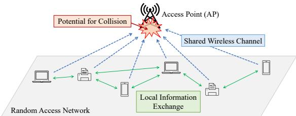  
Figure 1: An RA-based wireless network, where devices contend for channel access. Each device makes its own decision on when to transmit. Communication links are established across the devices for exchanging local information.

## 1 Introduction

1) Background and Motivations: Random Access (RA) techniques at the Medium Access Control (MAC) layer are fundamental to mod-ern wireless standards, including Wi-Fi and LTE Licensed Assisted Access [8]. In RA-based networks (Figure 1), multiple devices contend for a shared communication channel rather than relying on centralized scheduling. By allowing devices to independently de- termine transmission opportunities, RA eliminates the overhead associated with pre-allocated channel access. This decentralized par- adigm is particularly well suited for the Internet of Things (IoT) [4], machine-type communications (MTC) [26], and smart grids [30], where low-complexity and scalable mechanisms are required to manage highly sporadic and unpredictable trafic.

Despite these advantages, the primary challenge in RA is maximizing network eficiency while mitigating collisions. Excessive contention leads to wasted communication resources, often dimin- ishing the benefits of decentralized access. Although extensive research has sought to improve the performance of RA-based net- works, existing approaches either rely on heuristic methods without performance guarantees or adopt idealized analytical models that struggle to capture the complexities of real-world environments.

2) Foundation Model-Aided Multi-Agent Reinforcement Learning: Recent advances in machine learning have introduced new opportunities for optimizing RA networks [2, 7, 24]. Due to their distributed nature, RA networks can naturally be modeled as multi-agent reinforcement learning (MARL) systems. Many existing approaches [16, 18, 19, 25, 40, 41, 43] utilize the centralized training and decentralized execution (CTDE) paradigm [3] to maintain learning stability. However, CTDE-based methods face fundamen- tal limitations. Their reliance on a central training entity restricts deployment in large-scale or infrastructure-constrained settings. Even when such an entity exists, communication overhead on ag gregating observations and actions scales poorly with the number of devices. Also, centralization can introduce single points of failure and raise concerns regarding privacy and adversarial vulnerability.

Furthermore, conventional MARL methods often sufer from task-specific overfitting. Models designed for narrow objectives (e.g., collision minimization) typically require retraining or archi tectural modifications when adapting to new performance metrics, resulting in poor sample eficiency and limited generalization. These limitations motivate the need for MARL frameworks that are both fully decentralized and adaptable to diverse optimization objectives.

Meanwhile, foundation models (FMs) pretrained on large-scale datasets and then finetuned for downstream tasks ofer a promising path for reinforcement learning (RL). By modeling system dynamics as sequence processes (e.g., using architectures like MAMBA [15]), self-supervised FMs can learn reward-agnostic representations that allow faster policy adaptation and improved generalization across tasks. While there is growing interest in applying FMs to wireless systems [9, 13, 14, 38], several open challenges remain. Particularly, it is unclear how to efectively integrate FMs into established RL frameworks (e.g., actor–critic methods) with theoretical perfor mance guarantees, and how to design MARL algorithms that exploit the representational power of FMs without introducing centralized dependencies. This motivates us to pursue FM-aided MARL for wireless random access network optimization.

3) Our Approach and Contributions: In this work, we propose an FM-aided MARL framework for optimizing RA-based wireless networks. To ensure practical viability, we adopt a fully decentral- ized paradigm based on decentralized training and decentralized execution (DTDE). To maintain stability and guarantee conver-gence without a central coordinator, we incorporate an average consensus mechanism [6], allowing devices to synchronize via local peer-to-peer communication. Our proposed framework em-ploys a specialized actor-critic (AC) design, where a pretrained FM serves as a reward-agnostic backbone for the critic network. By attaching a task-specific head to this backbone, the critic benefits from expressive latent representations of system dynamics learned through self-supervised pretraining on reward-independent data. This integration accelerates online policy learning while achieving performance comparable to or better than end-to-end MARL training. Our main contributions are summarized as follows.

• We consider a consensus-driven, fully decentralized MARL that eliminates the need for global controllers. Relying on local ex changes, the design is well suited for scenarios where centralized control is infeasible or undesirable. Unlike [28], we consider three RA optimization objectives, namely fair age ofinformation (AoI), maximum sum-rate, and fair rate, and formulate unified Markov decision process (MDP) models with shared observation and action spaces, as well as locally computable reward functions.

• We introduce a new method for integrating FMs into the actor–critic pipeline. Inspired by the SMART architecture [32], we pretrain an FM for forward-dynamics prediction and incorporate it as a reward-agnostic backbone within the critic. The resulting latent representations significantly enhance the critic’s ability to evaluate rewards during online learning.

• Unlike [32], which is purely empirical, we provide a finite-time convergence analysis of our FM-aided decentralized actor–critic algorithm. Our analysis addresses consensus applied to local re- wards and nonlinear state-value approximation, ofering theoretical insights that diferentiate this work from existing decentralized MARL literature. Through extensive numerical simulations, we show that our framework outperforms end-to-end training in learning speed across multiple RA optimization tasks.

## 2 Related Work

1) Traditional RA Network Optimization: RA techniques are broadly classified into two types: sensing-free and sensing-based. Sensing-free protocols, like ALOHA [1], are valued for their sim-plicity in satellite and multi-hop networks [5, 39] but sufer from inherently high collision rates. In contrast, sensing-based RA employs a listen-before-talk (LBT) mechanism. The most prominent exam-ple, CSMA/CA [23], uses random backof to mitigate contention. However, its heuristic nature often results in excessive delays and suboptimal channel utilization. Moreover, its theoretical performance guarantees remain unclear. While research into adaptive, queue-length-based CSMA [21] shows that throughput optimality is possible, these findings often rely on idealized models that fail to maintain fairness or low latency as networks scale [20, 22, 27].

2) Learning-driven RA Network Optimization: To overcome the limitations of heuristics, recent work has explored RL for RA. Early eforts focused on optimizing CSMA/CA parameters, such as using Q-learning or SAC-LSTM architectures to tune contention windows and waiting times [18, 25]. However, since these methods remain dependent on the probabilistic framework of CSMA, their performance gains are fundamentally limited.

To move beyond simply parameter tuning, researchers have turned to MARL to design deterministic transmission policies. In the literature, notable approaches include deep Q-networks for achieving �-fairness [41], federated learning-based policy training [43], and value factorization or policy gradient methods such as QMIX [16] and MAPPO [19]. Despite their strong performance, these methods rely on CTDE. The requirement for a central entity introduces significant communication overhead and raises concerns regarding scalability, data privacy, and security. Furthermore, these models are often task-specific. As a result, changing the opti- mization objective typically requires extensive architectural mod- ification and retraining, leading to poor sample eficiency. These challenges motivate our development of a fully decentralized FMaided MARL framework that allows eficient wireless RA network optimization under diverse objectives without central coordination.

3) Foundation Models for Wireless Networks: FMs have achieved state-of-the-art performance in domains such as natural language processing and computer vision through large-scale rep- resentation learning. In wireless communications, FMs are now being explored for PHY and MAC layer tasks [9, 13, 14, 38], especially within semantic and integrated sensing and communication (ISAC) frameworks. In particular, their ability to generalize across heterogeneous tasks and domains makes them highly suitable for addressing the challenges posed by dynamic and complex wire- less environments. Emerging works such as WirelessGPT [37] and patch-masked FMs [31] have demonstrated that Transformer-based architectures can efectively handle multi-task predictions, such as channel state estimation and trafic forecasting.

Similar to this line of work, we investigate the use of FMs for wireless RA network optimization. Unlike existing RL methods that sufer from task-specific overfitting, we utilize an FM as a reward-agnostic backbone within an AC framework. This allows for superior generalization and faster adaptation across diverse networking objectives without the need for centralized coordination. Our approach aims to overcome the limitations of conventional RL methods that often struggle with their lack of adaptability and dependence on centralized training.

## 3 System Model and Problem Formulation

## 3.1 Network System and the RA Protocol

We consider an RA-based wireless network with � single-antenna devices that contend for channel access to transmit data to an $N _ { \mathrm { r } }$ -antenna access point (AP). Each device $k \in \mathcal { K } = \{ 1 , 2 , . . . , K \}$ maintains a bufer where packets are queued and transmitted in a first-come first-served manner. We consider a saturated trafic condition, i.e., the packet arrival rate at each node is suficiently high so that all devices consistently have data packets to transmit.

The network operates in slotted time over a finite horizon�, with time slots indexed by $t \in \{ 1 , 2 , . . . , T \}$ . Similar to the CSMA/CA pro- tocol, the network adopts the LBT mechanism. Before attempting transmission, each device first performs a clear channel assessment (CCA) to detect whether the channel is idle. If the channel remains idle for a specified duration, the device decides whether to transmit a packet to the AP. A device that chooses not to transmit simply returns to the CCA phase. If the device decides to transmit, it sends a single data packet to the $\mathrm { A P }$ over � time slots.

A transmission is considered successful if the AP correctly re- ceives the packet without collision, in which case the AP sends out an acknowledgment (ACK) for confirmation. This allows the device to proceed with its next packet transmission. In the event of a collision (i.e., multiple devices have simultaneously transmitted), the AP does not return an ACK, and each involved device will wait for the next transmission opportunity to attempt retransmission.

To support fully decentralized network operation, we assume there is no global controller responsible for tasks like information aggregation or global message broadcasting. Instead, RA devices can exchange information with their neighbors according to local com- munication links defined by an undirected graph $\mathcal { G } = ( \mathcal { K } , \mathcal { E } )$ , where E represents the set of device-to-device connectivity links [6].

## 3.2 Data Transmission Model

The single-input multiple-output (SIMO) channel gain between device � and the AP at time slot � is modeled as

$$
\begin{array} { r } { \mathbf { \mathscr { g } } _ { k , t } = \sqrt { \eta _ { k } } \mathbf { \tilde { h } } _ { k , t } , } \end{array}\tag{1}
$$

where $\mathbf { \boldsymbol { h } } _ { k , t } \in \mathbb { C } ^ { N _ { \mathrm { r } } }$ represents the small-scale fading vector whose entries are independent and identically distributed (i.i.d.) complex Gaussian random variables with zero mean and unit variance. The term $\eta _ { k }$ in (1) denotes the large-scale fading factor which depends on the distance between device � and the AP. For example, the mag- nitude of small-scale fading could follow a Rayleigh distribution, which is well-suited for modeling dense scattering wireless envi- ronments [34]. Also, our large-scale fading model can be adopted to various realistic propagation scenarios, including the ITU-R indoor [11] and 3GPP urban-micro (UMi) [12] pathloss models.

Using (1), the achievable data rate of device � at time slot � can be obtained by the Shannon capacity formula:

$$
R _ { k , t } = B \log _ { 2 } \left( 1 + \frac { \dot { p } _ { k } \| \pmb { g } _ { k , t } \| _ { 2 } ^ { 2 } } { B N _ { 0 } } \right) ,\tag{2}
$$

where � is the transmission bandwidth, $\scriptstyle { \mathcal { P } } k$ is the transmit power of device $k ,$ and $N _ { 0 }$ is the noise spectral density [34]. Assuming a block-fading channel (i.e., the channel remains static during each packet transmission), we express the amount of data which device � can successfully transmit at time slot � as

$$
m _ { k , t } = R _ { k , t } T _ { s } \tau ,\tag{3}
$$

where $T _ { s }$ denotes the slot duration. Note that (3) plays a crucial role in transmission decision-making. For example, a device with low $m _ { k , t }$ may lead to suboptimal throughput by potentially blocking other devices with more favorable channel conditions (i.e., higher $m _ { k , t } )$ . Since $m _ { k , t }$ is directly proportional to $R _ { k , t }$ , each RA device needs to carefully consider its channel quality when making trans- mission decisions to maximize the overall network performance.

## 3.3 RA Network Optimization Tasks

To illustrate the FM’s capability in supporting multiple performance goals in wireless RA network optimization with MARL, in this work, we consider the following three objectives as downstream tasks:

1) Fair-AoI (Worst-case AoI Minimization): AoI (age of information) measures the freshness of information by tracking the time elapsed since the latest data transmission of a device. Let $\ell _ { k , t }$ denote the number of time slots that have elapsed since device �’s last successful packet transmission by time slot � [16]. This quantity can be interpreted as the anticipated AoI if the AP successfully receives a packet from device � at time slot �. Let $\mathcal { T } _ { k , t } \subseteq \{ 1 , 2 , \dots , t \}$ denote the set of time slot indices at which device � has success- fully transmitted a packet during the time horizon $t \leq T$ . Then, we minimize the worst-case AoI among all devices using

$$
\operatorname* { m i n } \operatorname* { m a x } _ { k \in \mathcal { K } , t \in \mathcal { T } _ { k , T } } \ell _ { k , t } .\tag{4}
$$

Note that this mini-max formulation solely focuses on fairness in transmit frequency and does not account for channel quality or data rates. This task is particularly useful in applications such as real-time system control in wireless drone networks, where timely information updates are important.

2) Max-Rate (Sum-rate Maximization with Minimum Rate Guarantees): As a classical network performance metric, sum-rate quantifies the total amount of data successfully received by the AP for a given time window. Here, we let

$$
x _ { k , t } = \frac { 1 } { t T _ { s } } \sum _ { t ^ { \prime } \in \mathcal { T } _ { k , t } } m _ { k , t ^ { \prime } }\tag{5}
$$

denote the throughput of device � over the time horizon $t \leq T .$ . To maximize the sum-rate, i.e., $\begin{array} { r } { \sum _ { k \in \mathcal { K } } x _ { k , T } , } \end{array}$ it is ideal for a network to prioritize RA devices with higher data rates $m _ { k , t }$ . However, such a policy can result in poor fairness as it may allow devices with superior channel quality to dominate transmission resources. To prevent this, we impose a minimum rate requirement $R _ { \mathrm { m i n } }$ and formulate our objective as

$$
\operatorname* { m a x } \ \sum _ { k \in \mathcal K } x _ { k , T }\tag{6}
$$

$$
\mathrm { s . t . } ~ x _ { k , T } \geq R _ { \operatorname* { m i n } } , ~ \forall k \in \mathcal { K } .\tag{7}
$$

The problem above seeks to maximize the overall throughput while ensuring that each device’s rate maintains at least $R _ { \mathrm { m i r } }$ .

3) Fair-Rate (Worst-case Rate Maximization): In certain ap-plications such as collaborative sensing, the system performance can be compromised by the device with the poorest throughput. In such cases, it is crucial to promote throughput fairness to prevent any single device from becoming a bottleneck. To ensure balanced per-device rate, we maximize the minimum throughput across all devices over the time horizon �, which can be expressed as

$$
\operatorname* { m a x } _ { k \in \mathcal K } x _ { k , T } .\tag{8}
$$

This formulation ensures that no device is significantly disadvan- taged in terms of data rate, thus supporting balanced and reliable system performance.

## 4 Foundation Model-Aided Decentralized MARL for Wireless RA Network Optimization

In this section, we first review the AC framework for MARL. We then formulate the MDP tailored to our wireless RA network op- timization. Next, we describe the architecture of our FM, which serves as a reward-agnostic backbone within the AC framework. Finally, we present the proposed FM-aided decentralized MARL algorithm and analyze its convergence properties.

## 4.1 Actor-Critic Framework for MARL Problem

We model the wireless RA network optimization problem as an MARL task defined by the MDP tuple $\{ S , \{ \mathcal { A } _ { k } \} _ { k \in \mathcal { K } } , P , \{ \varrho _ { k } \} _ { k \in \mathcal { K } } \}$ where S is the global state space and $\mathcal { A } _ { k }$ is the action set for device �. The term $P : S \times \mathcal { A } \times S  [ 0 , 1 ]$ denotes the state transition probability, where $\begin{array} { r } { \mathcal { A } = \prod _ { k \in \mathcal { K } } \mathcal { A } _ { k } } \end{array}$ is the joint action set ofall agents. Lastly, $\varrho _ { k } : \mathcal { S } \times \mathcal { A }  \mathbb { R }$ is the local reward function for device �.

Since most of time slots $\{ 1 , . . . , T \}$ are occupied by the RA protocol steps, such as $\mathrm { C C A }$ , packet transmission, and waiting upon ACK, the actual time slots related to MARL procedure are confined. Hence, we consider our MDP to only progress over time slots, where an action is taken by the devices, which we denote using �.

At an MDP step �, each device � at a global state $s _ { n } \in S$ selects an action $a _ { k , n } ~ \in ~ \mathcal { A } _ { k }$ according to its local policy $\pi _ { k } , \mathrm { i . e . }$ $a _ { k , n } ~ \sim ~ \pi _ { k } ( \cdot | s _ { n } )$ . Due to the coupled nature of the devices’ ac- tions, the state transitions from $s _ { n } \mathrm { ~ t o ~ } s _ { n + 1 }$ via $P ( s _ { n + 1 } | s _ { n } , { \pmb a } _ { n } )$ , where ${ \pmb a } _ { n } = [ a _ { 1 , n } , a _ { 2 , n } , \ldots , a _ { K , n } ]$ is the joint action vector. Each device � then receives a reward $r _ { k , n } = \varrho _ { k } \big ( s _ { n } , \pmb { a } _ { n } \big )$

The AC framework employs two sets of function approximators: actors and critics. Each device � is equipped with an actor network parameterized by weights $\theta _ { k } ,$ which defines its local pol icy $\pi _ { \boldsymbol { \theta } _ { k } }$ . Let $\boldsymbol { \theta } = [ \theta _ { 1 } ^ { \top } , \theta _ { 2 } ^ { \top } , \ldots , \theta _ { K } ^ { \top } ] ^ { \top }$ denote the joint weight vector of all � actors. The goal of MARL is to optimize � to maximize the expected long-term discounted cumulative reward defined as $\begin{array} { r } { J ( \theta ) = \mathbb { E } _ { \pi _ { \theta } } \left[ \sum _ { n = 0 } ^ { \infty } \dot { \gamma } ^ { n } \bar { r } _ { n } \right] } \end{array}$ , where $\begin{array} { r } { \overline { { r } } _ { n } = \frac { 1 } { K } \sum _ { k = 1 } ^ { K } r _ { k , n } } \end{array}$ is the global aver age reward, and $\gamma \in \left[ 0 , 1 \right]$ is the discount factor. For each device $k ,$ the state-value function $\begin{array} { r } { V _ { \theta } ( s ) \ = \ \mathbb { E } _ { \pi _ { \theta } } \left[ \sum _ { n = 0 } ^ { \infty } \gamma ^ { n } \overline { { r } } _ { n } \Big \rvert s _ { 0 } \right] \sum _ { n = 0 } ^ { } \gamma ^ { n } } \end{array}$ is es- timated using a critic network of parameters $w _ { k } . \mathrm { \ A p p l y i n g { \Sigma } }$ the Bellman equation [33], the estimated function can be expressed as $V _ { w _ { k } } \left( s \right) = \bar { \mathbb { E } } _ { \pi _ { \theta } } \left[ \overline { { r } } + \gamma V _ { w _ { k } } \left( s ^ { \prime } \right) \right]$ . During training, each actor selects an action based on its current policy, and the corresponding critic evaluates the resulting reward. The actor policy is then updated us- ing the policy gradient $\mathbb { E } _ { s , a } [ \nabla _ { \theta _ { k } }$ log $\pi _ { \theta _ { k } } ( a _ { k } | s ) \cdot \operatorname { A d v } _ { \theta } ( s , \pmb { a } ) ]$ , where $\operatorname { A d v } _ { \boldsymbol { \theta } } ( s , \pmb { a } ) = \bar { r } + \gamma V _ { \boldsymbol { \theta } } ( s ^ { \prime } ) - V _ { \boldsymbol { \theta } } ( \bar { s } )$ is the advantage function. This update encourages the actor to select actions that yield higher expected future rewards relative to the baseline value.

## 4.2 MDP Formulation for MARL-based Wireless RA Network Optimization

We now design the MDP components for our RA network optimiza tion. First, the state at network time slot � is defined as

$$
\begin{array} { r } { s _ { t } = \left( \{ \widehat { \xi } _ { k } \} _ { k \in \mathcal { K } } , \{ \widehat { \ell } _ { k , t } \} _ { k \in \mathcal { K } } , q _ { t } \right) , } \end{array}\tag{9}
$$

where $\begin{array} { r } { \widehat { \xi } _ { k } = \frac { \xi _ { k } - \operatorname* { m i n } _ { k } \xi _ { k } } { \operatorname* { m a x } _ { k } \xi _ { k } - \operatorname* { m i n } _ { k } \xi _ { k } } } \end{array}$ is the min-max normalized long-term signal-to-noise ratio (SNR) for device �, $\widehat { \ell _ { k , t } } \ : = \ : \ell _ { k , t } / \lambda$ is the nor- malized AoI with � as a scaling factor, and $q _ { t } \in \{ 0 , 1 \}$ is the bi- nary channel occupancy indicator. We use dB scale for SNR, i.e., $\begin{array} { r } { \xi _ { k } = \mathbb { E } _ { t } \left[ 1 0 \log _ { 1 0 } \frac { p _ { k } \| g _ { k , t } \| _ { 2 } ^ { 2 } } { B N _ { 0 } } \right] = 1 0 \log _ { 1 0 } \frac { p _ { k } \eta _ { k } } { B N _ { 0 } } } \end{array}$ . For each device $k , \widehat { \xi } _ { k }$ and $\widehat { \ell _ { k , t } }$ are local information. We assume that long-term SNRs of other devices $\{ \widehat { \xi _ { k ^ { \prime } } } \} _ { k ^ { \prime } \in \mathcal { K } \backslash k }$ are available via local information exchanges or broadcast that take place at a much slower rate. Fol- lowing the assumptions in $[ 1 6 , 1 9 , 4 1 ]$ , we consider AoIs of other devices $\{ { \widehat { \ell _ { k ^ { \prime } , t } } } \} _ { k ^ { \prime } \in { \mathcal K } \backslash k }$ to be observable from the broadcast ACK pack- ets. Note that $q _ { t }$ is also observable during the CCA phase.

Each device operates in a discrete action space $\mathcal { A } _ { k } ~ = ~ \{ 0 , 1 \}$ where 0 indicates the decision to wait and 1 represents the decision to transmit. Hence, at each given time slot �, device � relies on its policy $\pi _ { k }$ and selects its action $a _ { k , t } \in \{ 0 , 1 \}$

We now define local reward functions corresponding to each downstream task. First, for device � at time slot �, the local reward for fair-AoI task is defined as

$$
r _ { k , t } ^ { \mathsf { F A } } = - \frac { \ell _ { k , t } } { \omega _ { \mathsf { F A } } K } ,\tag{10}
$$

where $\omega _ { \mathsf { F A } } K$ is a scaling factor to prevent the reward from increas- ing with the network size. Since the value of $\ell _ { k , t }$ becomes zero only upon successful transmission, this reward encourages devices to avoid collisions. Moreover, with (10), prioritizing devices with higher AoI values leads to greater marginal reward gains. Hence, maximizing (10) promotes AoI fairness across the network.

Next, the local reward of device � at time slot � for max-rate task is given by

$$
r _ { k , t } ^ { \mathsf { M R } } = \frac { x _ { k , t } } { \omega _ { \mathsf { M R } } } + D ( x _ { k , t } ) ,\tag{11}
$$

where $\omega _ { M \mathrm { R } }$ is a scaling parameter, and $D ( x _ { k , t } )$ is a penalty function:

$$
\begin{array} { r } { D ( x _ { k , t } ) = \left\{ \begin{array} { l l } { \log \Big ( \frac { x _ { k , t } + \omega _ { \mathsf { P l } } R _ { \operatorname* { m i n } } } { ( 1 + \omega _ { \mathsf { P l } } ) R _ { \operatorname* { m i n } } } \Big ) ^ { \omega _ { \mathsf { P } 2 } / K } , } & { \mathrm { i f ~ } x _ { k , t } \leq R _ { \operatorname* { m i n } } , } \\ { 0 , } & { \mathrm { o t h e r w i s e } , } \end{array} \right. } \end{array}\tag{12}
$$

with scaling factors $\omega _ { \mathsf { P 1 } }$ and � . Note that (12) is bounded in the interval $[ \log ( \omega \mathsf { p } _ { 1 } / ( 1 { + } \omega \mathsf { p } _ { 1 } ) , 0 ]$ and designed to only penalize devices that fail to meet the threshold $R _ { \mathrm { m i n } }$ . In other words, this reward drives each device to maintain the minimum rate requirement while maximizing the sum-rate.

Lastly, we adopt the �-fairness utility function [41] and define the local reward of device � at time slot � for fair-rate task as

$$
r _ { k , t } ^ { \mathsf { F R } } = \frac { 1 } { 1 - \alpha _ { \mathsf { F R } } } \left( \frac { x _ { k , t } } { \omega _ { \mathsf { F R } 1 } / K } + \omega _ { \mathsf { F R } 2 } \right) ^ { 1 - \alpha _ { \mathsf { F R } } } ,\tag{13}
$$

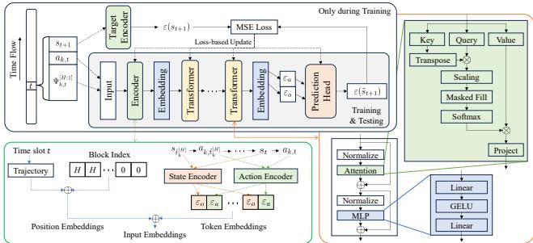  
Figure 2: The architecture of FM as a reward-agnostic critic backbone. The model takes a state-action history and extracts embeddings via state and action encoders. Transformer blocks are used to process the embeddings. The output of a prediction head is sent to the reward-specific critic head.

where $\alpha _ { \mathsf { F R } } \in \mathsf { \Gamma } ( 1 , \infty )$ controls the fairness, and $\omega _ { \mathsf { F R 1 } }$ and �FR2 are scaling factors. Larger values of � impose stricter fairness.

To reflect the condition of fully decentralized MARL, we strictly define our reward functions to be locally computable. For the con- sensus step, we let $r _ { k , t } \in \{ r _ { k , t } ^ { \mathsf { F A } } , r _ { k , t } ^ { \mathsf { M R } } , r _ { k , t } ^ { \mathsf { F R } } \}$ to be exchanged across the devices through local communication links defined by G.

## 4.3 Foundation Model Architecture Design

We present the detailed design of our FM, which supports the AC framework described in Section 4.1 as a reward-agnostic critic back bone. Typical RL models rely on reward signals as supervision, i.e., rewards serve as targets that guide an agent to train and learn desir- able behaviors. In contrast, our FM is pretrained in a self-supervised manner and thus does not require reward labels. This allows our FM to be reward-agnostic and transferable across diferent RL tasks.

In this work, we leverage the FM to enhance our MARL-based op- timization for wireless RA-based networks. During pretraining, the FM captures useful feature representations that efectively model the underlying environment dynamics, which can improve learning eficiency over multiple downstream tasks (e.g., three wireless RA objectives defined in Section 3.3). Our FM pretraining is inspired by the SMART framework [32], which uses a control transformer architecture to facilitate self-supervised learning across diferent pretraining goals. Similar to SMART, we employ encoders to extract meaningful embeddings from the inputs and utilize the attention mechanism within transformers to perform a prediction task. In this paper, we specifically adopt the forward dynamics prediction task for self-supervised pretraining, which aligns naturally with the core principle of RL to optimize future outcome predictions.

The architecture of our FM is shown in Figure 2, which consists of three main components: i) encoders, ii) transformers, and iii) a prediction head. The encoders first map the input into a sequence of token embeddings, which are augmented with position embeddings to convey temporal information. The position embeddings are de signed to capture both the relative order within the history window and the absolute position within the global time trajectory, allowing the model to efectively understand the environment dynamics. The combined embeddings are then passed through a multi-transformer module, where each block consists of a self-attention layer and a multi-layer perceptron (MLP). The MLP uses the Gaussian error linear unit (GELU) as its activation function. The output from the transformer module is fed into the prediction head, which generates an embedding that represents next-step state.

During the pretraining, the FM is optimized such that the loss between the predicted and actual next-state embeddings is minimized. By integrating the self-supervised FM, we allow our MARL agents to utilize efective representations of the environment dynamics during their online learning. Note that the pretraining of FM does not require explicit reward signals, making the model generalizable to diferent downstream RL tasks.

Similar to [16, 19, 41], we assume that each device can store the � latest states and actions. Let $\tilde { t } _ { k } ^ { [ h ] }$ denote the time slot when the ℎ-th latest action was taken by device �. Then, the state-action history at time slot � can be written as

$$
\Psi _ { k , t } ^ { [ H : 1 ] } = \left\{ s _ { \tilde { t } _ { k } ^ { [ H ] } } , a _ { k , \tilde { t } _ { k } ^ { [ H ] } } , \dots , s _ { \tilde { t } _ { k } ^ { [ 1 ] } } , a _ { k , \tilde { t } _ { k } ^ { [ 1 ] } } , s _ { t } \right\} .\tag{14}
$$

We integrate (14) as an input to both actor and critic. This enables the model to better reflect the temporal dynamics of the wireless RA environment and improve its learning stability and performance.

## 4.4 Foundation Model-Aided Decentralized MARL Algorithm Design

We now describe the proposed FM-aided decentralized MARL algorithm for RA network optimization. Figure 3 illustrates the overall architecture of our decentralized AC framework. Each device � ∈ K updates its local actor and critic networks using its own experience. To capture temporal dependencies, each device maintains a history bufer that stores past observation–action pairs and uses this history as input during learning. As described in Section 3, neighboring devices can exchange limited information. In our design, each device shares only scalar local rewards with its neighbors, which incurs sig-nificantly lower communication costs compared to exchanging full critic parameters, as in [10, 17, 42]. Specifically, the critic network consists of two parts: a reward-agnostic FM and a reward-specific head. The FM is pretrained using observation–action sequences and remains fixed during the RL phase. This design eliminates the need for online updates of the high-capacity backbone, reducing computational and communication overhead while leveraging rich representations of system dynamics.

The overall procedure of the proposed algorithm for a �-device RA-based MAC layer is summarized in Algorithm 1. Each device operates under the LBT protocol and continuously monitors the channel state. Meanwhile, each device updates its local status based on transmission outcomes (e.g., successful transmission or collision) (Lines 6 - 10). When the channel is sensed to be idle, the device observes the current state �� and makes a transmission decision �� � using its local policy conditioned on the past action-observation history and current observation $( \mathrm { i . e . , } \Psi _ { k , t } ^ { [ \tilde { H : } 1 ] } )$ . After executing the action, the tuple $\{ s _ { t } , a _ { k , t } , r _ { k , t } \}$ is stored in the history bufer (Lines 11 - 17). This interaction process is repeated over � time slots.

Each time the devices are ready to update their model weights, the consensus (Line 21) first takes place for reward exchange. Each consensus step consists of � rounds of communication, where weight-based averaging is performed in each round. Then, each device updates its actor and critic parameters after computing the temporal-diference (TD) error (Lines 23 - 29). While the actor takes the input directly from the observation-action history, the critic processes it via the FM backbone to obtain a latent representation $\phi _ { \Xi _ { k } } ( \Psi _ { k , t } )$ , which is then fed into the reward-specific head for value estimation. Extending our prior work [28] to FM-aided MARL, we adopt a batch-based update scheme to facilitate the theoretical analysis in Section 4.5. In particular, the critic update incorporates projection onto a bounded parameter set and an averaging step (Lines 27 - 28) to ensure that each update remains within a controlled region and allow convergence guarantees [36, 45].

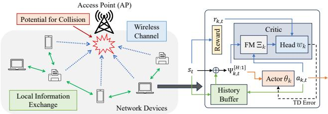  
Figure 3: A visual representation of our fully decentralized MARL framework. Both the actor and critic are trained in a decentralized manner. The critic contains two distinct parts: a reward-agnostic backbone for forward dynamics prediction and a reward-specific head for task-specific finetuning.

## 4.5 Theoretical Performance Analysis

Our prior work on RA network optimization via decentralized MARL [28] establishes convergence guarantees under linear value function approximation, which has been the dominant analytical framework for studying MARL convergence [10, 17, 44]. However, linear approximations are insuficient to capture the expressive behavior of deep neural networks (DNNs), which are widely used in modern RL applications. To address this gap, we build upon our previous analytical framework in [45] and extend our results to the FM-aided setting where value functions are approximated using DNNs. A key distinction of this work from [45] is that their analysis assumes consensus over the entire critic model, whereas our approach requires only local reward exchange among neighboring agents. By restricting consensus to scalar rewards rather than high-dimensional model parameters, our framework signifi cantly improves practical deployability and reduces communication overhead. Also, we address the impact of integrating pretrained FMs in the actor-critic pipeline, where we perceive the power of self-supervised learning as the prediction capability on next states.

We now formally describe the DNN architecture used in our analysis. For each device $k ,$ the critic maintains a DNN-based ap- proximation $V _ { w _ { k } }$ of the true value function $V _ { \theta } .$ We assume the network has width $M _ { w }$ and depth $M _ { d } .$ . Let $x _ { \mathrm { i n } } \in \mathbb { R } ^ { d }$ denote the input features vector. The forward pass is defined as:

$$
\begin{array} { r } { x ^ { ( 0 ) } = W ^ { ( 0 ) } x _ { \mathrm { i n } } , } \end{array}\tag{15}
$$

$$
\boldsymbol { x } ^ { ( h ) } = \frac { 1 } { \sqrt { M _ { w } } } \mathrm { R e L U } ( W ^ { ( h ) } x ^ { ( h - 1 ) } ) ~ \mathrm { f o r } ~ h = 1 , 2 , . . . , M _ { d }\tag{16}
$$

$$
y = b ^ { \top } x ^ { ( M _ { d } ) } ,\tag{17}
$$

where ${ \boldsymbol W } ^ { ( 0 ) } \in \mathbb { R } ^ { m \times d } , { \boldsymbol W } ^ { ( h ) } \in \mathbb { R } ^ { m \times m }$ , and $b \in \mathbb { R } ^ { m }$ are the network parameters, and ReL $\mathsf { U } ( x ) : = \operatorname* { m a x } \{ 0 , x \}$ is the ReLU activation func- tion. The actors share the same architecture; however, a softmax layer is appended to yield a probability distribution over actions.

Algorithm 1: FM-aided Decentralized MARL for RA Net-  
work Optimization.   
1 Input: device set $\mathcal { K } ,$ pretrained FM weights $\{ \Xi _ { k } \} _ { k \in \mathcal K } ,$ , time   
horizon length �, history length �, consensus weight   
matrix $\mathbf { C } ,$ consensus iteration count $G ,$ number of samples   
to collect $N _ { B } ,$ , actor rate $\alpha ,$ critic rate $\beta$   
Initialize: For all $k \in \mathcal { K } ,$ actor weights $\theta _ { k } ,$ critic weights $w _ { k } ,$   
ready-for-update status $u _ { k } = \mathrm { F a l s e } ,$ sample count $b _ { k } = 0$   
3 Load: FM weights $\Xi _ { k }$ for all $k \in \mathcal { K }$   
4 for $t = 1 , 2 \dots , T$ do   
5 for $k \in \mathcal { K }$ do   
6 Observe $q _ { t }$ via clear channel assessment (CCA)   
7 if ACK received then   
8 $\ell _ { k , t } \gets 0$   
9 else   
10 $\ell _ { k , t } \gets \ell _ { k , t } + 1$   
11 if $q _ { t } = 0$ then   
12 Acquire state $s _ { t }$ and reward ${ \boldsymbol { r } } _ { k , t }$   
13 Select $a _ { k , t } \sim \pi _ { \theta _ { k } } ( \cdot | \Psi _ { k , t } ^ { [ H : 1 ] } )$   
14 if $a _ { k , t } = 1$ then   
15 Initiate a packet transmission   
16 Store ��, ${ a } _ { k , t } ,$ and ${ r } _ { k , t }$ in the history bufer   
17 $b _ { k } \gets b _ { k } + 1$   
18 if $b _ { k } = N _ { b }$ then   
19 �� ← True   
20 if $u _ { k } =$ True, ∀� $\in \mathcal { K }$ then   
21 $\overline { { \mathbf { R } } } ^ { ( t ) } = \mathbf { C } ^ { G } \mathbf { R } ^ { ( t ) }$   
22 for � ∈ K do   
23 $\bar { w } _ { k , 0 } \gets w _ { k }$   
24 for $b = 1 , 2 , \ldots , N _ { B }$ do   
25 $\delta _ { k , b } \gets \overline { { \mathbf { R } } } _ { [ k , b ] } ^ { ( t ) } + \gamma V _ { \bar { w } _ { k , b - 1 } } ( \phi _ { \Xi _ { k } } ( \Psi _ { k , \tilde { t } _ { k } ^ { [ b - 1 ] } } ^ { [ H + b - 1 : b ] } ) ) -$   
$V _ { \bar { w } _ { k , b - 1 } } ( \phi _ { \Xi _ { k } } ( \Psi _ { k , \tilde { t } _ { k } ^ { [ b ] } } ^ { [ H + b : b + 1 ] } ) )$   
26 $\tilde { w } _ { k , b } \gets$   
$\bar { w } _ { k , b - 1 } - \beta \delta _ { k , b } \cdot \nabla V _ { \bar { w } _ { k , b - 1 } } ( \phi _ { \Xi _ { k } } ( \Psi _ { k , \tilde { t } _ { \iota } ^ { [ b ] } } ^ { [ H + b : b + 1 ] } ) )$   
27 �¯�,� ← arg min�∈B(�) $\lVert \boldsymbol { w } - \tilde { w } _ { k , b } \rVert _ { 2 }$   
28 �� $\begin{array} { r } { \gets \frac { b } { b + 1 } w _ { k } + \frac { 1 } { b + 1 } \bar { w } _ { k , b } } \end{array}$   
29 $\begin{array} { r l } & { \theta _ { k }  \theta _ { k } + \frac { \alpha } { N _ { B } } { \sum _ { b = 1 } ^ { N _ { B } } \delta _ { k , b } \cdot \nabla \log \pi _ { \theta _ { k } } ( a _ { k , \tilde { t } _ { k } ^ { [ b ] } } \vert \Psi _ { k , \tilde { t } _ { k } ^ { [ b ] } } ^ { [ H + b : b + 1 ] } ) } } \end{array}$   
30 �� ← False   
31 Output: $\theta _ { k }$ for all $k \in \mathcal { K }$

With � denoting the MDP iteration index, we establish the theoretical convergence guarantee of Algorithm 1. First, we provide the required assumptions in the following.

Assumption 1 (Bounded Reward). For each downstream task, there exists a constant $r _ { m a x } >$ 0 such that $\vert r _ { k , n } \vert \leq r _ { m a x } , \forall n \geq 0 , k \in \mathcal { K }$

Assumption 2 (Mixing Time). There exists a stationary distribution � for (�, �), and positive constants � and $\rho \in \left( 0 , 1 \right)$ , such that $\begin{array} { r } { \operatorname* { s u p } _ { s \in S } \| P ( s _ { n } , a _ { n } | s _ { 0 } = s ) - \zeta _ { \theta } \| _ { T V } \leq \kappa \rho ^ { n } , \forall n \geq 0 . } \end{array}$

Assumption 3 (Lipschitz Continuity). There exist some positive constants $L _ { J } , L _ { W } , L _ { V } ,$ , and $M _ { g }$ such that, for any � and $\theta ^ { \prime }$ , any � and $w ^ { \prime } ,$ any � and $x ^ { \prime }$ , and any � and �, we have $| J ( \theta ) - J ( \theta ^ { \prime } ) | \leq$ $L _ { J } \| \theta - \theta ^ { \prime } \| _ { 2 } , | V _ { w } ( x ) - V _ { w ^ { \prime } } ( x ) | \le L _ { W } \| w - w ^ { \prime } \| _ { 2 } , | V _ { w } ( x ) - V _ { w } ( x ^ { \prime } ) | \| \le \| D _ { w } ( x ) - \theta ^ { \prime } \| _ { 2 } .$ $L _ { V } \| x - x ^ { \prime } \| _ { 2 }$ , and $\| \nabla _ { \theta } \log \pi _ { \theta } ( a | s ) \| _ { 2 } \leq M _ { g }$

Assumption 4 (Consensus Matrix). The consensus weight matrix C is doubly stochastic. Additionally, for all �, $k ^ { \prime } \in { \mathcal { K } } ,$ , there exists a positive constant $\nu > 0$ such that $\mathbf { \Phi } ( i ) ~ c _ { k k } ~ \ge ~ \nu$ and $( i i ) c _ { k k ^ { \prime } } \geq \nu$ whenever devices � and $k ^ { \prime }$ are connected.

Assumption 4 ensures that information is exchanged with uniformly positive weights among connected agents, facilitating con-vergence of the local consensus estimates toward the globally aver- aged information.

Assumption 5. For any policy �, there exist positive constants � and $\epsilon _ { b i a s }$ such that $\mathbb { E } \big [ \mathbf { A d v } _ { \theta } ( \Psi , a ) - ( 1 - \gamma ) ( \mathbf { F } ( \theta ) ^ { - 1 } \nabla _ { \theta } J ( \theta ) ) ^ { \top }$ $\nabla _ { \theta }$ log $\begin{array} { r } { \pi _ { \theta } ( a | \Psi ) \big ] ^ { 2 } \ \leq \ \epsilon _ { b i a s } , } \end{array}$ where $( \Psi , a )$ follows $\nu ( \pi ^ { * } )$ , which is a stationary distribution under the optimal policy $\pi ^ { * }$ , and ${ \bf F } ( \theta ) ~ = ~$ $\mathbb { E } _ { \nu ( \theta ) }$ [∇� log �� (�|Ψ) $\nabla _ { \theta }$ log $ \pi _ { \boldsymbol { \theta } } ( a | \Psi ) ^ { \top } ] + \sigma \mathbf { I }$

Assumption 6 (Universal Approximation). Suppose for any policy �, the critic estimation $V ( \cdot ; w ^ { \ast } )$ , where $w ^ { * }$ is a stationary point, can be close enough to the ground truth $V _ { \theta } ( \cdot )$ , i.e., there exists a positive constant $\epsilon _ { c r i t i c }$ such that max $\begin{array} { r } { \phantom { \frac { 1 } { \theta _ { } , x } } | V ( x ; w ^ { * } ) - V _ { \theta } ( x ) | \leq \epsilon _ { c r i t i c } } \end{array}$

We state the main theoretical result as below.

Theorem 1. With a pretrained FM ofestimation error $\epsilon _ { e s t } ^ { F M }$ and approximation error $\epsilon _ { a p p r o x } ^ { F M ^ { - } }$ fixed and integrated as a reward-agnostic critic backbone, by choosing step-size parameters $\begin{array} { r } { \alpha = \frac { 7 } { 2 \sqrt { \mu } } , \alpha _ { n } = } \end{array}$ $\textstyle { \frac { \alpha } { n } } , \beta = 1 / { \sqrt { N _ { B } } }$ , and network/algorithm parameters satisfying $m =$ $\Omega ( d ^ { 3 } M _ { d } ^ { - { \frac { 1 1 } { 2 } } } ) , B \ = \ \Theta ( M _ { w } ^ { \frac { 1 } { 3 2 } } M _ { d } ^ { - 6 } )$ , and $N _ { B } \ = \ \Omega ( M _ { d } ^ { 4 } )$ , it holds with probability at least $1 - \exp ( - \Omega ( \log ^ { 2 } M _ { w } ) )$ that Algorithm 1 achieves:

$$
\begin{array} { r } { \mathbb { E } \left[ J ( \theta ^ { * } ) - J ( \theta _ { N _ { T } } ) \right] = O \big ( N _ { T } ^ { - 1 } \big ) + O ( K ^ { \frac { 3 } { 2 } } ( 1 - \nu ^ { K - 1 } ) ^ { G } ) } \end{array}\tag{�}
$$

$$
+ \underbrace { O \big ( K ^ { \frac { 1 } { 2 } } \big ( B M _ { d } ^ { \frac { 5 } { 2 } } N _ { B } ^ { - \frac { 1 } { 4 } } + B ^ { \frac { 4 } { 3 } } M _ { w } ^ { - \frac { 1 } { 1 2 } } M _ { d } ^ { 4 } \big ) \log ^ { \frac { 3 } { 2 } } M _ { w } \log ^ { \frac { 1 } { 2 } } N _ { B } \big ) } _ { ( c ) } + \underbrace { O \big ( \sqrt { \epsilon _ { b i a s } } \big ) } _ { ( d ) }
$$

$$
+ \underbrace { { \cal O } ( K ^ { \frac { 1 } { 2 } } \epsilon _ { e s t } ^ { F M } ) } _ { ( e ) } + \underbrace { { \cal O } ( K ^ { \frac { 1 } { 2 } } \epsilon _ { a p p r o x } ^ { F M } ) } _ { ( f ) } + \underbrace { { \cal O } \big ( K ^ { 1 / 2 } \epsilon _ { c r i t i c } / N _ { B } ^ { 1 / 2 } \big ) } _ { ( g ) } .\tag{18}
$$

Proof Sketch. To bound the suboptimality gap $J ( \theta ^ { * } ) - J ( \theta _ { N _ { T } } )$ , we focus on analyzing the discrepancy between the update direction $d _ { n }$ and the true policy gradient $\nabla J ( \theta _ { n } )$ at each iteration. We de- compose this discrepancy into four components: (i) value function approximation error, (ii) actor update error induced by imperfect reward consensus, (iii) the mismatch between TD error and the advantage function, and (iv) intrinsic representation error of the function approximators. Each component is bounded individually to obtain the terms in (18). In particular, the value function ap- proximation error is further decomposed into contributions from imperfect critic updates, consensus inaccuracies, and limitations of the pretrained FM representations. These terms are controlled using the stated assumptions and standard properties of overparameterized DNNs. Due to space limitation, we relegate the full proof to our online technical report [29] ■

Theorem 1 provides several key insights. First, term (�) shows that imperfect reward consensus induces an optimality gap of the same order as approaches that exchange full critic parameters and TD errors [45]. This indicates that restricting communication to scalar reward exchange preserves performance while significantly improving practicality and reducing communication overhead. Second, term (�) highlights the role of network architecture. The convergence bound exhibits stronger sensitivity to the network depth than to its width, suggesting that increasing depth is more efective for improving performance, whereas overparameterization in width yields diminishing returns. Third, terms $( e ) - ( g )$ characterize the impact of critic approximation errors, which scale with the number of agents �. In particular, terms (�) and $( f )$ correspond to estimation and approximation errors arising from the self-supervised pretraining of the FM, where the learning objective is forward dynamics prediction. These error components are unique to our framework and reflect the quality of the pretrained, reward-agnostic representations used by the critic.

Theorem 1 shows that Algorithm 1 converges to a neighborhood of the global optimum at a rate of $O ( 1 / N _ { T } )$ . This indicates that op- erating under nonlinear function approximation and decentralized reward consensus matches the convergence rate of state-of-the-art actor–critic methods with linear function approximation and full critic exchange [17]. Note that our result generalizes [28], which only considered linear approximation, to a more realistic deep learn ing setting. Moreover, unlike prior work that guarantees convergence only to stationary points $( \mathrm { e . g . }$ , in terms of ∥∇�(�) ∥2) [17, 28], our analysis characterizes convergence toward global optimality.

## 5 Numerical Evaluation

## 5.1 Experimental Settings

We consider operating a wireless RA-based network over $T = 6 0 0$ time slots. As described in Section 3, all devices operate under the LBT mechanism. Following the IEEE 802.11 protocol, the SIFS and DIFS durations are set to 2 and 4 time slots, respectively, with each slot lasting $T _ { s } = 9 \mu s$ . Each data packet transmission requires $\tau = 1 0$ time slots, while ACK signals occupy 4 time slots.

We set the number of AP antennas to $N _ { \mathrm { r } } = 2 ,$ , the bandwidth to $B = 1 0 ~ \mathrm { M H z } ,$ and the transmit power to $p _ { k } = 0$ dBm, with the noise spectral density $\mathrm { a t } - 1 7 4$ dBm/Hz. For a given number of devices $K ,$ device-to-AP distances are uniformly distributed between 2 m and 14 m. For example, with $K = 4$ , the device distances are $\{ d _ { k } \} _ { k = 1 } ^ { K = 4 } =$ $\{ 2 , 6 , 1 0 , 1 4 \}$ . The large-scale fading factor $\eta _ { k }$ is modeled as $\eta _ { k } =$ $L _ { 0 } \left( \frac { d _ { k } } { d _ { 0 } } \right) ^ { z }$ , where $L _ { \mathrm { o } } = - 4 0$ dB is the reference pathloss, $d _ { \mathrm { o } } = 1$ m is the reference distance, and $z = 4$ is the pathloss exponent.

The network graph $\mathcal { G }$ is generated using the Watts-Strogatz model [35], where each device connects to one neighboring device with zero rewiring probability. To generate the consensus weight matrix $\mathbf { C } ,$ we assign equal weights are assigned to each device’s established links, i.e., for each device $\begin{array} { r } { k \in \mathcal { K } , c _ { k k ^ { \prime } } = \frac { 1 } { | N _ { k } | + 1 } , \forall k ^ { \prime } \in \dag } \end{array}$ $N _ { k }$ , where $N _ { k }$ denotes the neighbor set of device �. Each consensus step consists of $G = 3$ communication rounds.

For the critic-backbone FM, we set the embedding size to $N _ { \mathrm { e } } = 6 4$ such that the encoders, transformer blocks, and prediction head all generate embeddings of dimension 64. Both the state and action en- coders are implemented as two-layer MLPs with width 64. The FM

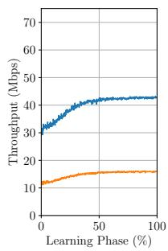

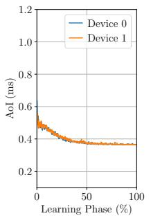  
(a) Fair-AoI task.

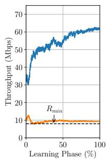

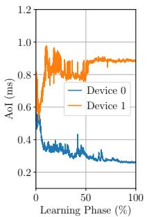  
(b) Max-rate task.

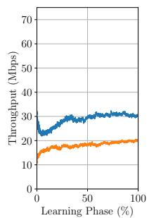

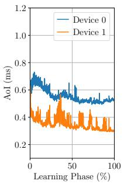  
(c) Fair-rate task.

Figure 4: Throughput and AoI under end-to-end learning with $K = 2$ devices across diferent RA optimization tasks.  
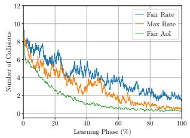

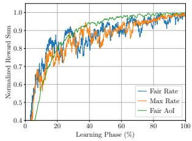  
(a) Number of Collisions.  
(b) Normalized reward sum.

Figure 5: Collision and reward performance under end-toend learning with � = 2 devices across RA optimization tasks. consists of two transformer blocks, each containing a self-attention layer with 8 heads and an MLP of width 4� and depth 1. The prediction head is a linear transformation of size $2 N _ { \mathrm { e } } \times N _ { \mathrm { e } }$ with bias. No dropout is applied in the FM design.

Each device’s FM is pretrained using more than 100, 000 rewardindependent RA-based wireless network samples, each consisting of a tuple $\left\{ t , s _ { t } , a _ { k , t } \right\}$ . We employ stochastic gradient descent (SGD) with a rate of 0.005, applying 500 updates with a batch size 256. The target encoder is updated using a soft update with a rate of 0.005.

For both actor and reward-specific critic head, we adopt an MLP block of width $M _ { w } = 1 2 8$ and depth $M _ { d } = 3 .$ . The actor and critic weights are updated using the SGD optimizer, with learning rates $\alpha = 0 . 0 0 1$ and $\beta = 0 . 0 0 2$ . Discount factor is set to $\gamma = 0 . 9$ . For the end-to-end training baseline, we employ an MLP block of width $M _ { w } = 1 2 8$ and depth $M _ { d } = 7$ for both actor and critic to ensure a comparable number of parameters for fair evaluation. Since the state dimension grows proportionally with �, we adjust the history length � for diferent values � to stabilize the input dimension � of the actor–critic network against the FM embedding size ��.

For the MDP parameters, we set $\lambda = 6 0 , \omega _ { \mathsf { F A } } = 1 5 , \omega _ { \mathsf { M R } } = 2 4 { \times } 1 0 ^ { 6 }$ $\omega _ { \mathsf { P } 1 } = 0 . 5 , \omega _ { \mathsf { P } 2 } = 8 , \omega _ { \mathsf { F R } 1 } = 2 5 6 \times 1 0 ^ { 6 } , \omega _ { \mathsf { F R } 2 } = 0 . 7 , \mathrm { a n d } \alpha _ { \mathsf { F R } } = 1 2$ for parameter scaling. These values are heuristically selected to bound the reward to a reasonable range. All results are averaged over at least 20 independent runs.

As performance metrics on RA-based wireless networks, we evaluate throughput (in Mbps) and AoI (in ms). In addition, we assess fairness across devices using the normalized gap (N-Gap) defined as N-Gap of $\{ x \} = ( \operatorname* { m a x } \{ x \} - \operatorname* { m i n } \{ x \} ) / \operatorname* { m a x } \{ x \}$

## 5.2 Experimental Results and Discussion

1) Performance Analysis of the Proposed Decentralized MARL Algorithm on Wireless RA Network Optimization Tasks: We first validate Algorithm 1 and the MDP formulation introduced in Section 4.2 by evaluating end-to-end learning performance [28]. In Figure 4, we present the throughput and AoI achieved during the learning phase for three downstream tasks. For ease of illustra- tion, we consider $K = 2$ devices. The results demonstrate strong learning performance across all tasks. As expected, the fair-AoI task (Figure 4a) successfully balances AoI across devices. The maxrate task (Figure 4b) efectively maximizes the throughput of one device while maintaining the other near the minimum rate constraint $R _ { \mathrm { m i n } }$ . The fair-rate task (Figure 4c) is able to jointly improve throughput of both devices while preserving the fairness. These observations confirm that the proposed MDP formulation is capable of supporting diverse RA network optimization objectives.

As additional performance metrics, Figures 5a and 5b show the number of collisions and the normalized reward sum, respectively. For improved readability, all results are smoothed using a moving average over 5 samples. The results in Figure 5a show that the fair-AoI task achieves the fastest reduction in collisions, indicating that balancing AoI is the least complex among the three objectives. This is intuitive, as the fair-AoI objective does not require consideration of channel conditions, which directly influence device data rates. By contrast, the fair-rate task exhibits the highest collision counts even after many episodes. This is because its reward function imposes stronger penalties for rate unfairness across devices. Consequently, the policy that reduces collisions emerges later in training, consistent with Figure 4c where device rates increase gradually while maintaining fairness gaps. In Figure 5b, we observe a steady in-crease in the normalized reward sum over the learning process. This trend validates the efectiveness of our reward functions and confirms that the algorithm successfully optimizes the objectives.

2) Performance Comparison of FM-Aided MARL and Baselines: With the end-to-end (E-E) MARL results as a proof of con-cepts, we are now ready to assess the efectiveness of our FM-aided MARL algorithm by comparing it with E-E MARL and conventional decentralized MARL (conventional MARL), which performs full critic exchanges [45]. Figure 6 presents the AoI and throughput over runtime for each downstream task with $K = 4$ For all tasks, FM-aided learning shows superior learning speed against both baselines, approximately improving the convergence speed by at least 55%. Note that the performance gap with E-E MARL is attributed to the integration of the FM as a reward-agnostic critic backbone.

In Figure 7, we compare our algorithm with several baselines, which include 1/�-persistent CSMA (1/�-CSMA) and CSMA/CA with binary exponential backof (BEB-CSMA), under the Fair-AoI and Max-rate objectives for diferent numbers of devices. We ob- serve that both E-E MARL and FM-MARL consistently outperform the CSMA-based baselines, which rely on stochastic channel-access mechanisms. Round-robin, where devices are scheduled in turn through centralized control, achieves near-optimal performance for the Fair-AoI objective because it provides balanced access opportunities across devices. However, its performance degrades under the Max-rate objective, since equal transmission allocation does not account for diferences in the achievable data rates of individual devices. In contrast, our proposed method, along with end-to-end training, learns to prioritize devices with more favorable channel conditions, resulting in performance closer to the optimal.

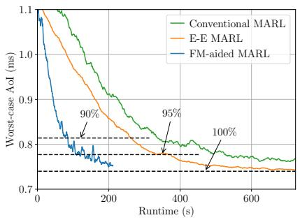  
(a) Fair-AoI task.

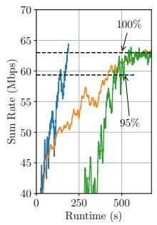

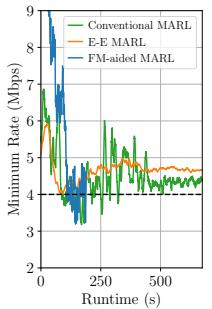  
(b) Max-rate task.

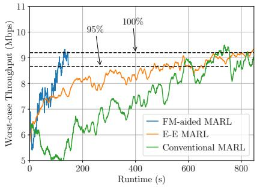  
(c) Fair-rate task.

Figure 6: Performance comparison of conventional, end-to-end (E-E), and FM-aided MARL across diferent RA optimization tasks with � = 4. The FM-aided MARL achieves faster convergence than the end-to-end baseline.  
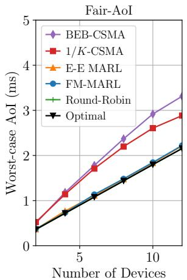

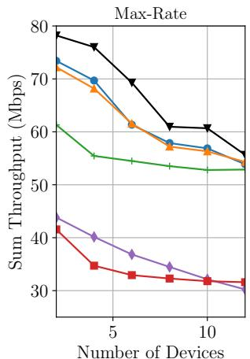  
Figure 7: Fair-AoI and Max-rate performance comparison with non-MARL baselines across the number of devices �.

Lastly, we provide a summary of performance comparison in Table 1. We observe that the algorithms achieve comparable final rate and AoI performance. However, the proposed FM-aided MARL approach arrives at its 95%-optimal performance level substantially faster than the end-to-end training approach.

## 6 Conclusion

In this work, we proposed an FM-aided decentralized MARL frame-work for RA network optimization. By employing an FM as a reward-agnostic critic backbone, our algorithm efectively lever- ages self-supervised knowledge on network dynamics and improves learning eficiency. Compared with end-to-end training, the FMaided approach achieves faster convergence, demonstrating its efectiveness in optimizing throughput and AoI across diverse objectives. Future work includes extending this framework to more complex and sophisticated wireless RA scenarios with larger action spaces (e.g., considering transmit power control).

Table 1: Performance Comparison of End-to-End (E-E) and FM-aided MARL for � = 4 (top) and � = 8 (bottom). AoI is measured for the fair-AoI task, and rate is measured for both max-rate and fair-rate tasks.
<table><tr><td>Task</td><td>Alg.</td><td>Mean</td><td>Min. Max.</td><td>N-Gap</td><td>95%-T (s)</td></tr><tr><td>Fair-AoI (ms)</td><td>E-E</td><td> $\overline { { 0 . 7 3 1 \pm 0 . 0 1 0 } }$ </td><td>0.726 0.734</td><td>0.011</td><td>335</td></tr><tr><td>Max-rate</td><td>FM E-E</td><td> $0 . 7 6 9 \pm 0 . 0 3 2$   $1 7 . 0 4 4 \pm 0 . 2 6 6$ </td><td>0.757 0.772 4.092 41.225</td><td>0.019 0.901</td><td>108 380</td></tr><tr><td>(Mbps)</td><td>FM</td><td> $1 7 . 9 2 4 \pm 0 . 3 4 5$ </td><td>3.918 343.865</td><td>0.911</td><td>159</td></tr><tr><td>Fair-rate</td><td>E-E</td><td> $9 . 0 4 9 \pm 0 . 1 8 6$ </td><td>6.903 11.956</td><td>0.423</td><td>373</td></tr><tr><td>(Mbps)</td><td>FM</td><td> $8 . 0 8 3 \pm 0 . 1 3 1$ </td><td>6.14311.590</td><td>0.463</td><td>104</td></tr></table>

<table><tr><td>Task</td><td>Alg.</td><td>Mean Min.</td><td>Max.</td><td>N-Gap</td><td>95%-T (s)</td></tr><tr><td>Fair AoI (ms)</td><td>E-E FM</td><td> $0 . 3 6 6 \pm 0 . 0 1 4$  0.364  $0 . 3 6 8 \pm 0 . 0 2 5$  0.365</td><td>0.368 0.370</td><td>0.003 0.013</td><td>723 231</td></tr><tr><td>Max Rate</td><td>E-E</td><td> $7 . 2 3 5 \pm 0 . 3 7 5$  3.895</td><td>530.175</td><td>0.871</td><td>812</td></tr><tr><td>(Mbps)</td><td>FM</td><td> $7 . 1 5 2 \pm 0 . 2 3 6$  4.100</td><td>29.685</td><td>0.862</td><td>345</td></tr><tr><td>Fair Rate</td><td>E-E</td><td> $\overline { { 6 . 3 6 5 \pm 0 . 3 5 2 } }$  5.851</td><td>6.864</td><td>0.148</td><td>768</td></tr><tr><td>(Mbps)</td><td>FM</td><td> $6 . 3 3 5 \pm 0 . 2 4 4$  5.642</td><td>7.025</td><td>0.197</td><td>225</td></tr></table>

## Acknowledgments

This work was supported in part by the National Science Foundation (NSF) under Grant CNS2110259, Grant CNS2112471, and Grant ECCS233104; in part by the Ofice of Naval Research (ONR) under Grant N000142412729; in part by the Defense Advanced Re- search Projects Agency (DARPA) under Grant D24AP00265, Grant HR00112520019, and Grant HR0011261E001; and in part by Meta Research Award INB3267726.

## References

[1] Norman Abramson. 1970. The ALOHA system: Another alternative for computer communications. In Proceedings ofFall Joint Computer Conference. 281–285.

[2] Ijaz Ahmad, Shariar Shahabuddin, Hassan Malik, Erkki Harjula, Teemu Leppänen, Lauri Loven, Antti Anttonen, Ali Hassan Sodhro, Muhammad Mahtab Alam, Markku Juntti, et al. 2020. Machine learning meets communication networks: Current trends and future challenges. IEEE Access 8 (2020), 223418–223460.

[3] Christopher Amato. 2024. An introduction to centralized training for decentral ized execution in cooperative multi-agent reinforcement learning. arXiv preprint arXiv:2409.03052 (2024).

[4] Ons Aouedi, Thai-Hoc Vu, Alessio Sacco, Dinh C Nguyen, Kandaraj Piamrat, Guido Marchetto, and Quoc-Viet Pham. 2025. A survey on intelligent Internet of Things: Applications, security, privacy, and future directions. IEEE Communications Surveys & Tutorials 27, 2 (2025), 1238–1292.

[5] François Baccelli, Bartlomiej Blaszczyszyn, and Paul Muhlethaler. 2006. An Aloha protocol for multihop mobile wireless networks. IEEE Transactions on Information Theory 52, 2 (2006), 421–436.

[6] Stephen Boyd, Arpita Ghosh, Balaji Prabhakar, and Devavrat Shah. 2006. Randomized gossip algorithms. IEEE Transactions on Information Theory 52, 6 (2006), 2508–2530.

[7] Xuelin Cao, Bo Yang, Chongwen Huang, Chau Yuen, Marco Di Renzo, Zhu Han, Dusit Niyato, H Vincent Poor, and Lajos Hanzo. 2021. AI-assisted MAC for reconfigurable intelligent-surface-aided wireless networks: Challenges and opportunities. IEEE Communications Magazine 59, 6 (2021), 21–27.

[8] Bolin Chen, Jiming Chen, Yuan Gao, and Jie Zhang. 2016. Coexistence of LTE LAA and Wi-Fi on 5 GHz with corresponding deployment scenarios: A survey. IEEE Communications Surveys & Tutorials 19, 1 (2016), 7–32.

[9] Zirui Chen, Zhaoyang Zhang, and Zhaohui Yang. 2024. Big AI models for 6G wireless networks: Opportunities, challenges, and research directions. IEEE Wireless Communications 31, 5 (2024), 164–172.

[10] Ziyi Chen, Yi Zhou, Rong-Rong Chen, and Shaofeng Zou. 2022. Sample and communication-eficient decentralized actor-critic algorithms with finite-time analysis. In Proceedings ofInternational Conference on Machine Learning (ICML). PMLR, 3794–3834.

[11] document ITU-R P.1238-12, ITU 2023. P Series: Radiowave Propagation; Propagation Data and Prediction Methods for the Planning ofIndoor Radiocommunication Systems and Radio Local Area Networks in the Frequency Range 300 MHz to 450 GHz. document ITU-R P.1238-12, ITU.

[12] document TR 36.814, V9.2.0, 3GPP 2017. Evolved Universal Terrestrial Radio Access (E-UTRA); Further Advancements for E-UTRA Physical Layer Aspects. document TR 36.814, V9.2.0, 3GPP.

[13] Jun Du, Tianyi Lin, Chunxiao Jiang, Qianqian Yang, C Faouzi Bader, and Zhu Han. 2024. Distributed foundation models for multi-modal learning in 6G wireless networks. IEEE Wireless Communications 31, 3 (2024), 20–30

[14] Jaron Fontaine, Adnan Shahid, and Eli De Poorter. 2024. Towards a wireless physical-layer foundation model: Challenges and strategies. In 2024 IEEE International Conference on Communications Workshops (ICC Workshops). IEEE, 1–7.

[15] Albert Gu and Tri Dao. 2023. Mamba: Linear-time sequence modeling with selective state spaces. arXiv preprint arXiv:2312.00752 (2023).

[16] Ziyang Guo, Zhenyu Chen, Peng Liu, Jianjun Luo, Xun Yang, and Xinghua Sun. 2022. Multi-agent reinforcement learning-based distributed channel access for next eneration wireless networks. IEEE Journal on Selected Areas in Communications 40, 5 (2022), 1587–1599.

[17] FNU Hairi, Jia Liu, and Songtao Lu. 2022. Finite-time convergence and sam ple complexity of multi-Agent actor-critic reinforcement learning with average reward. In Proceedings of International Conference on Learning Representations (ICLR).

[18] Mengqi Han, Sami Khairy, Lin X Cai, Yu Cheng, and Ran Zhang. 2020. Reinforcement learning for eficient and fair coexistence between LTE-LAA and Wi-Fi. IEEE Transactions on Vehicular Technology 69, 8 (2020), 8764–8776.

[19] Yuxuan He, Xinyuan Gang, and Yayu Gao. 2024. Intelligent decentralized multi ple access via multi-agent deep reinforcement learning. In Proceedings ofIEEE Wireless Communications and Networking Conference (WCNC). IEEE, 1–6.

[20] Libin Jiang, Mathieu Leconte, Jian Ni, R. Srikant, and Jean Walrand. 2012. Fast Mixing of Parallel Glauber Dynamics and Low-Delay CSMA Scheduling. IEEE Transactions on Information Theory 58, 10 (2012), 6541–6555.

[21] Libin Jiang, Devarat Shah, and Jean Walrand. 2010. Distributed Random Access Algorithm: Scheduling and Congestion Control. IEEE Transactions on Information Theory 56, 12 (2010), 6182–6207.

[22] Libin Jiang and Jean Walrand. 2009. A distributed CSMA algorithm for through put and utility maximization in wireless networks. IEEE/ACM Transactions on Networking 18, 3 (2009), 960–972.

[23] Leonard Kleinrock and Fouad Tobagi. 1975. Packet switching in radio channels: Part I-carrier sense multiple-access modes and their throughput-delay character istics. IEEE Transactions on Communications 23, 12 (1975), 1400–1416.

[24] Merima Kulin, Tarik Kazaz, Eli De Poorter, and Ingrid Moerman. 2021. A survey on machine learning-based performance improvement of wireless networks: PHY, MAC and network layer. Electronics 10, 3 (2021), 318.

[25] Chanho Lee, Seungkeun Park, and Taesu Cheong. 2024. Dynamic-persistent CSMA: A reinforcement learning approach for multi-user channel access. IEEE Access 12 (2024), 178705–178716.

[26] Nurul Huda Mahmood, Stefan Böcker, Ingrid Moerman, Onel A López, Andrea Munari, Konstantin Mikhaylov, Federico Clazzer, Hannes Bartz, Ok-Sun Park, Eric Mercier, et al. 2021. Machine type communications: Key drivers and enablers towards the 6G era. EURASIPJournal on Wireless Communications and Networking 2021, 1 (2021), 134.

[27] Jian Ni, Bo Tan, and R. Srikant. 2010. Q-CSMA: Queue-Length-Based CSMA/CA Algorithms for Achieving Maximum Throughput and Low Delay in Wireless Networks. IEEE/ACM Transactions on Networking 20, 3 (2010), 825–836.

[28] Myeung Suk Oh, Zhiyao Zhang, FNU Hairi, Alvaro Velasquez, and Jia Liu. 2025. Consensus-based Decentralized Multi-agent Reinforcement Learning for Random Access Network Optimization. In Proceedings ofthe Twenty-sixth International Symposium on Theory, Algorithmic Foundations, and Protocol Design for Mobile Networks and Mobile Computing. 241–250.

[29] Myeung Suk Oh, Zhiyao Zhang, Alvaro Velasquez, Nathaniel D. Bastian, and Jia Liu. 2026. Technical report on foundation model-aided multi-agent reinforcement learning for random access network optimization. Technical Report. The Ohio State University. https://kevinliu-osu.github.io/publications/FM-DecMARL\_ RA\_TR. df Online technical re ort.

[30] Juan Carlos Rodriguez, Felipe Grijalva, Marcelo García, Diana Estefanía Chérrez Barragán, Byron Alejandro Acuña Acurio, and Henry Carvajal. 2023. Wireless communication technologies for smart grid distribution networks. Engineering Proceedings 47, 1 (2023), 7.

[31] Yucheng Sheng, Jiacheng Wang, Xingyu Zhou, Le Liang, Hao Ye, Shi Jin, and Geofre Ye Li. 2025. A wireless foundation model for multi-task rediction. arXiv preprint arXiv:2507.05938 (2025).

[32] Yanchao Sun, Shuang Ma, Ratnesh Madaan, Rogerio Bonatti, Furong Huang, and Ashish Kapoor. 2023. SMART: Self-supervised Multi-task pretrAining with contRol Transformers. In Proceedings of International Conference on Learning Representations (ICLR)

[33] Richard S Sutton, Andrew G Barto, et al. 1998. Reinforcement learning: An introduction. MIT Press Cambridge.

[34] David Tse and Pramod Viswanath. 2005. Fundamentals ofWireless Communication. Cambridge University Press, New York, NY, USA.

[35] Duncan J Watts and Steven H Strogatz. 1998. Collective dynamics of ‘small-world networks. Nature 393, 6684 (1998), 440–442.

[36] Tengyu Xu, Zhe Wang, and Yingbin Liang. 2020. Improving sample complexity bounds for (natural) actor-critic algorithms. In Proceedings ofAdvances in Neural Information Processing Systems (NeurIPS). 4358–4369.

[37] Tingting Yang, Ping Zhang, Mengfan Zheng, Yuxuan Shi, Liwen Jing, Jianbo Huang, and Nan Li. 2025. WirelessGPT: A generative pre-trained multi-task learning framework for wireless communication. IEEE Network (2025).

[38] Zhixiang Yang, Hongyang Du, Dusit Niyato, Xudong Wang, Yu Zhou, Lei Feng, Fanqin Zhou, Wenjing Li, and Xuesong Qiu. 2025. Revolutionizing wireless net works with self-supervised learning: A pathway to intelligent communications. IEEE Wireless Communications (2025).

[39] Hanxiao Yu, Hanyu Zhao, Zesong Fei, Jing Wang, Zhiming Chen, and Yuping Gong. 2023. Deep-reinforcement-learning-based NOMA-aided slotted ALOHA for LEO satellite IoT networks. IEEE Internet ofThings Journal 10, 20 (2023), 17772–17784.

[40] Yiding Yu, Soung Chang Liew, and Taotao Wang. 2022. Multi-agent deep reinforcement learning multiple access for heterogeneous wireless networks with imperfect channels. IEEE Transactions on Mobile Computing 21, 10 (2022), 3718– 3730.

[41] Yiding Yu, Taotao Wang, and Soung Chang Liew. 2019. Deep-reinforcement learnin multi le access for hetero eneous wireless networks. IEEE Journal on Selected Areas in Communications 37, 6 (2019), 1277–1290.

[42] Kaiqing Zhang, Zhuoran Yang, Han Liu, Tong Zhang, and Tamer Basar. 2018. Fully decentralized multi-agent reinforcement learning with networked agents. In Proceedings ofInternational Conference on Machine Learning (ICML). PMLR, 5872–5881.

[43] Lyutianyang Zhang, Hao Yin, Zhanke Zhou, Sumit Roy, and Yaping Sun. 2020. Enhancing WiFi multiple access performance with federated deep reinforcement learning. In Proceedings of IEEE Vehicular Technology Conference. IEEE, 1–6.

[44] Xin Zhang, Zhuqing Liu, Jia Liu, Zhengyuan Zhu, and Songtao Lu. 2021. Taming communication and sample complexities in decentralized policy evaluation for cooperative multi-agent reinforcement learning. In Proceedings of Advances in Neural Information Processing Systems (NeurIPS).

[45] Zhiyao Zhang, Myeung Suk Oh, FNU Hairi, Ziyue Luo, Alvaro Velasquez, and Jia Liu. 2025. Finite-Time Global Optimality Convergence in Deep Neural Actor-Critic Methods for Decentralized Multi-Agent Reinforcement Learning. In Proceedings ofInternational Conference on Machine Learning (ICML).