# GENERALIZED MATHERON VARIATIONAL IMPLICIT PROCESSES

Luis A. Ortega Aalborg University laoa@cs.aau.dk

Andres R. Masegosa´ Aalborg University arma@cs.aau.dk

Thomas D. Nielsen Aalborg University tdn@cs.aau.dk

## ABSTRACT

Implicit-process priors specify distributions over functions through sample-forward mechanisms such as Bayesian neural networks and stochastic simulators, but their function-space densities are typically unavailable. We introduce Generalized Matheron Variational Implicit Processes (GMVIP), a pathwise variational family for posterior inference with such priors. For Gaussian-process priors, GMVIP recovers the standard inducing-variable variational GP construction; for general implicit priors, its empirical covariance construction preserves the prior mean and covariance in the population limit. GMVIP constructs posterior samples by drawing a function from the prior and applying a correction anchored at a set of inducing inputs. The effect of this correction away from the inducing inputs is determined directly from prior samples, allowing the posterior to retain the structure and variability of the original implicit process. The (surrogate) prior and variational posterior use the same pathwise construction and differ only in the distribution of whitened inducing coefficients, yielding a tractable coefficientspace Kullback-Leibler divergence. Experiments on regression, classification, and forecasting with simulator-defined and retrieval-conditioned empirical trajectory priors show that GMVIP is broadly competitive with existing methods.

## 1 INTRODUCTION

Bayesian neural networks are commonly formulated by placing a prior over weights and performing posterior inference in parameter space (MacKay, 1992; Neal, 1996; Blundell et al., 2015; Hernandez-´ Lobato and Adams, 2015; Gal and Ghahramani, 2016). Although parameter-space formulations enable familiar inference algorithms, they are high-dimensional and inherit issues such as nonidentifiability—including neuron-permutation symmetries—strong posterior dependencies, multimodality, and non-injective mappings from parameters to predictors (Sun et al., 2019; Burt et al., 2020; Wild et al., 2022; Rudner et al., 2022). Since predictions depend only on the induced input– output map, it is natural to instead formulate Bayesian inference directly in function space (Sun et al., 2019; Ma et al., 2019; Ortega, 2026).

Function-space inference targets the posterior distribution over functions rather than over parameters. This perspective aligns the variational object with the predictive object, but it also introduces a central computational difficulty: for flexible functional-space priors defined by Bayesian neural networks, neural samplers, and simulator-defined stochastic processes, the density of the induced function-space prior is rarely available or tractable (Ma et al., 2019; Ortega et al., 2023). Existing approaches address the intractable process Kullback-Leibler divergence in different ways: finite measurement sets with Stein score estimates (Sun et al., 2019), local linear-Gaussian approximations at finite context sets (Rudner et al., 2022), or alternative discrepancies between Gaussian measures (Wild et al., 2022). Burt et al. (2020) analyze when process-KL objectives are ill-defined and how finite-marginal approximations behave.

Implicit processes formalize this sample-forward setting. A draw from an implicit process gives a coherent random function that can be evaluated at any finite input set, but the corresponding finite-dimensional densities are not assumed to be available (Ma et al., 2019). Variational Implicit Processes (VIPs) make inference tractable by drawing a finite collection of prior functions and forming a surrogate over linear combinations of those samples (Ma et al., 2019). Sparse Implicit

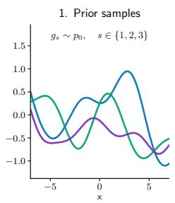

$$
f _ { s } ( \cdot ) = g _ { s } ( \cdot ) + \Psi _ { \mathbf { Z } } ( \cdot ) \left[ \pmb { \mu } + \mathbf { D } \mathbf { a } _ { s } - g _ { s } ( \mathbf { Z } ) \right]
$$

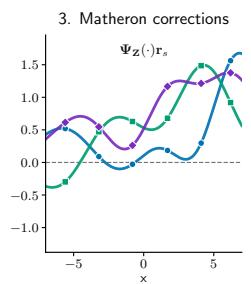

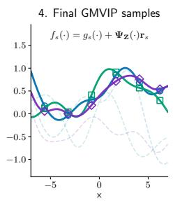  
Figure 1: Pathwise construction of a GMVIP sample. Starting from a prior draw $g \sim p _ { 0 } ,$ we evaluate the path at inducing inputs Z and form the residual between the sampled replacement values $\pm \mathrm { D } \mathbf { a }$ and $g ( \mathbf { Z } )$ . The Matheron operator $\Psi _ { \mathbf { Z } }$ propagates this residual across the input domain. Adding the resulting smooth correction to $g$ yields a sample f that matches the replacement values at Z.

Processes introduce inducing-point structure for scalability (Rodr´ıguez-Santana et al., 2022), and Deep Variational Implicit Processes build deeper implicit-process priors (Ortega et al., 2023). Recently, Flow-Transformed Implicit Processes (FTIP) showed that a Gaussian posterior over surrogate coefficients can smooth or collapse asymmetric, heavy-tailed, and multimodal posterior structure, and instead proposed normalizing flows over the finite surrogate variables (Ortega et al., 2026). These results suggest that posterior expressiveness is a central design choice in function-space inference.

This paper studies a complementary source of expressiveness. Instead of changing only the distribution over linear-combination coefficients, we change the pathwise construction of the surrogate itself. Conditioning jointly Gaussian variables admits a pathwise representation through a joint prior draw plus a covariance-gain correction, commonly called Matheron’s rule; applying it to Gaussianprocess marginals yields conditional function samples (Wilson et al., 2020). The corresponding conditional mean and covariance follow from standard Gaussian-process conditioning (Rasmussen and Williams, 2006). Sparse variational GPs introduce inducing variables and reduce the KL regularizer to $\mathrm { K L } ( q ( \mathbf { u } ) \| p ( \mathbf { u } ) )$ (Titsias, 2009; Hensman et al., 2013). We take this inducing-value viewpoint to implicit processes: sample a prior path, replace its values at inducing locations, and retain the residual path away from those locations.

For clarity, we first present the scalar-output construction; the joint multioutput form is given in Section 4. Let $g \sim p _ { 0 }$ be a prior function sample, let $\mathbf { Z } = ( \mathbf { z } _ { 1 } , \ldots , \mathbf { z } _ { M } ) ^ { \top }$ be inducing locations, and let $\Psi _ { \mathbf { Z } }$ be a replacement operator. For a latent vector a $\in \mathbb { R } ^ { M }$ , define

$$
f ( \cdot ) = g ( \cdot ) + \Psi _ { \bf Z } ( \cdot ) \left[ { \pmb \mu } + { \bf D } { \bf a } - g ( { \bf Z } ) \right] .\tag{1}
$$

The vector $\pmb { \mu } + \mathbf { D } \mathbf { a }$ gives replacement values at the inducing locations, while g supplies the residual path (Figure 1 shows an illustration on the idea). The surrogate prior uses $\mathbf { a } \sim \mathcal { N } ( \mathbf { 0 } , \mathbf { I } _ { M } )$ , and the variational posterior replaces this with $q _ { \phi } ( \mathbf { a } )$ . Because the prior and posterior share the same conditional map from $( g , \mathbf { a } )$ to $f ,$ the variational regularizer is exactly $\mathrm { K L } \bar { ( } q _ { \phi } ( \mathbf { a } ) | | \mathcal { N } ( \mathbf { 0 } , \mathbf { I } _ { M } ) )$ . Thus the method keeps the tractability of VIP-style coefficient inference while replacing linear aggregation with a Matheron-style inducing-value replacement. We call the resulting family Generalized Matheron Variational Implicit Processes (GMVIP). The construction is modular. The operator $\Psi _ { \mathbf { Z } }$ can be estimated from empirical prior-sample covariance, giving the closest analogue of GP Matheron conditioning, e.g., $\Psi _ { \mathbf { Z } } = \hat { \mathbf { K } } ( \cdot , \mathbf { Z } ) \hat { \mathbf { K } } ( \mathbf { Z } , \mathbf { Z } ) ^ { - 1 }$ for empirical covariance $\hat { \bf K }$

Our contributions are: (i) We introduce a general Matheron inducing-value replacement family for variational inference with implicit-process priors. The family produces coherent posterior function samples and requires only prior sampling and likelihood evaluation. (ii) We show that the augmented KL reduces exactly to a coefficient-space KL, and that under a cardinal right-inverse condition the same identity holds for the induced function marginal. We also show process coherence for arbitrary query sets. (iii) We show exact GP/SVGP recovery for Gaussian priors and population-level preservation of the original prior mean and covariance for general implicit processes.

## 2 RELATED WORK

Function-space variational inference. Function-space variational inference replaces approximate posteriors over parameters with approximate posteriors over predictors. This is especially relevant for Bayesian neural networks, where many parameter configurations can represent the same function. Functional variational Bayesian neural networks (fBNNs) formulate variational inference directly over the stochastic process induced by a network, typically approximating the process KL on finite measurement sets (Sun et al., 2019). Subsequent work clarified the measure-theoretic and optimization issues that arise when the variational object is a stochastic process rather than a finite-dimensiona parameter vector (Burt et al., 2020; Wild et al., 2022). TFSVI constructs tractable finite-dimensional function-space approximations using local linearization and neural network Jacobians (Rudner et al., 2022). GMVIP shares the function-space objective, but avoids measurement-set density-ratio estimation or linearizations by defining a surrogate prior and posterior with a shared pathwise map.

Implicit processes. Implicit processes define stochastic processes through sampling mechanisms rather than explicit densities (Ma et al., 2019). VIP constructs finite surrogates from prior samples and performs variational inference over surrogate coefficients, yielding a tractable latent KL. Sparse Implicit Processes (SIP) introduce inducing variables and estimate the intractable divergence between implicit inducing distributions using adversarial density-ratio estimation (Rodr´ıguez-Santana et al., 2022); Deep Variational Implicit Processes compose implicit-process layers to obtain richer priors (Ortega et al., 2023). FTIP makes the VIP surrogate posterior more expressive by replacing the Gaussian coefficient posterior with a normalizing flow (Ortega et al., 2026). Our method is complementary to FTIP. Rather than enriching $q ( \mathbf { a } )$ with an invertible transformation, we modify the pathwise surrogate: posterior samples are Matheron replacements of prior paths, not linear combinations of prior samples. Moreover, VIP/FTIP posterior draws are confined to the finite span span $\{ g ^ { ( s ) } \} _ { s = 1 } ^ { S }$ of the S pre-sampled prior functions, whereas GMVIP draws a fresh prior path for each sample, preserving functional variation outside this finite-dimensional subspace.

Matheron sampling, inducing variables, and interpolation. Applying Matheron’s rule to Gaussian-process marginals gives conditional function draws as a prior path plus a finite-dimensional covariance correction and underlies efficient pathwise GP posterior sampling (Wilson et al., 2020); the corresponding Gaussian conditioning formulas are standard (Rasmussen and Williams, 2006). Sparse variational GPs use inducing variables to obtain tractable objectives whose KL term is $\bar { \mathrm { K L } } ( q ( \mathbf { u } ) \| p ( \mathbf { u } ) )$ (Titsias, 2009; Hensman et al., 2013). Structured kernel interpolation, instantiated by KISS-GP, interpolates kernel quantities from inducing grid points to scale GP inference (Wilson and Nickisch, 2015). GMVIP borrows the pathwise inducing-value structure but applies it to priors that are only sampleable.

The empirical covariance-gain correction has the same linear-update algebra as statistical interpolation (Lorenc, 1981) and the analysis step of the ensemble Kalman filter (Evensen, 1994; Burgers et al., 1998); ensemble Kalman smoothing applies analogous ensemble-covariance corrections to earlier states (Evensen and van Leeuwen, 2000). GMVIP differs by optimizing a variational law over inducing replacement values and regularizing it with a coefficient-space KL.

## 3 BACKGROUND: FUNCTION-SPACE VARIATIONAL INFERENCE AND IMPLICIT PROCESSES

Let $\mathcal { D } = \{ ( \mathbf { x } _ { n } , \mathbf { y } _ { n } ) \} _ { n = 1 } ^ { N }$ denote the observed dataset, with $\mathbf { x } _ { n } \in \mathcal { X }$ and outputs $\mathbf { y } _ { n } \in \mathbb { R } ^ { C }$ . We write $\mathbf { X } = ( \mathbf { x } _ { 1 } , \ldots , \mathbf { x } _ { N } ) ^ { \top }$ ⊤ and $\mathbf { Y } = ( \mathbf { y } _ { 1 } , \ldots , \mathbf { y } _ { N } ) ^ { \top }$ , and assume a likelihood factorization

$$
p ( \mathbf { Y } \mid f , \mathbf { X } ) = \prod _ { n = 1 } ^ { N } p ( \mathbf { y } _ { n } \mid f ( \mathbf { x } _ { n } ) ) .\tag{2}
$$

Bayesian prediction is naturally a distribution over functions, since the likelihood depends on the predictor $\bar { \boldsymbol { f } }$ rather than on a particular parameterization of $f .$ . This observation motivates functionspace variational inference, where the goal is to approximate the posterior process $p ( f \mid { \mathcal { D } } )$ directly. In its ideal form, one optimizes

$$
\mathcal { L } ( q ) = \mathbb { E } _ { q ( f ) } [ \log p ( \mathbf { Y } | f , \mathbf { X } ) ] - \mathrm { K L } ( q ( f ) \| p _ { 0 } ( f ) ) ,\tag{3}
$$

where $p _ { 0 }$ is the prior process. This objective is conceptually attractive because it compares distributions over predictors, avoiding some of the redundancies and symmetries of weight-space inference. However, the process-level KL is rarely available. Existing methods use finite measurement sets with Stein score estimation (Sun et al., 2019), analyze or approximate finite-dimensional marginals (Burt et al., 2020), replace the KL with discrepancies between Gaussian measures (Wild et al., 2022), construct local linear-Gaussian approximations (Rudner et al., 2022), or introduce inducing representations with adversarial density-ratio estimation (Rodr´ıguez-Santana et al., 2022). These approximations introduce additional choices: where to place measurement or inducing points, how to estimate finite-dimensional densities or ratios, and how to ensure that the resulting objectives define coherent posterior samples.

## 4 METHODOLOGY

We introduce GMVIP as a pathwise variational family for implicit-process priors. The central idea is to preserve the residual structure of a prior sample while replacing its values at a finite set of inducing inputs. This gives a posterior process that remains sample-forward, has coherent joint function samples, and admits a finite-dimensional KL.

Let $\mathbf { Z } = ( \mathbf { z } _ { 1 } , \ldots , \mathbf { z } _ { M } ) ^ { \top }$ be inducing inputs and let $g \sim p _ { 0 }$ be a sample from the implicit-process prior. Given a whitened coefficient vector a $. \in \mathbb { R } ^ { d _ { a } }$ , where $d _ { a } = M$ for scalar outputs and $d _ { a } = M C$ for a joint C-output model, define the replacement inducing values

$$
\mathbf { u ( a ) } = \pmb { \mu } + \mathbf { D } \mathbf { a } ,\tag{4}
$$

where $\pmb { \mu }$ and D are fixed, prior-estimated, or determined by the chosen replacement operator. A GMVIP sample is obtained by replacing the prior path at Z and propagating the correction to arbitrary inputs:

$$
T ( g , \mathbf { a } ) ( \cdot ) = g ( \cdot ) + \Psi _ { \mathbf { Z } } ( \cdot ) \left[ \mathbf { u } ( \mathbf { a } ) - g ( \mathbf { Z } ) \right] .\tag{5}
$$

The operator $\Psi _ { \mathbf { Z } }$ controls how inducing-value corrections are extended away from Z. The surrogate prior and posterior share this same pathwise map:

$$
p _ { \mathbf { Z } } ( g , \mathbf { a } , f ) = p _ { 0 } ( g ) p ( \mathbf { a } ) \delta [ f = T ( g , \mathbf { a } ) ] ,\tag{6}
$$

$$
q _ { \mathbf { Z } , \phi } ( g , \mathbf { a } , f ) = p _ { 0 } ( g ) q _ { \phi } ( \mathbf { a } ) \delta [ f = T ( g , \mathbf { a } ) ] .\tag{7}
$$

Thus inference changes only the law of the finite coefficient vector a; the residual path is still supplied by the original implicit prior. We use $p ( \mathbf { a } ) = \mathcal { N } ( \mathbf { 0 } , \mathbf { I } _ { d _ { a } } )$ and $q _ { \phi } ( \mathbf { a } ) = \mathcal { N } ( \mathbf { m } _ { a } , \bar { \mathbf { S } _ { a } } )$ , with $\mathbf { m } _ { a } \in \mathbb { R } ^ { d _ { a } }$ and covariance $\mathbf { S } _ { a } \in \mathbb { R } ^ { d _ { a } \times d _ { a } }$ . Samples are drawn by reparameterization. For a minibatch $B ,$ the Monte Carlo objective is

$$
\widehat { \mathcal { L } } _ { t } ( \phi , \psi ) = \frac { N } { | \mathcal { B } | R _ { \mathrm { t r } } } \sum _ { r = 1 } ^ { R _ { \mathrm { t r } } } \sum _ { n \in \mathcal { B } } \log p _ { \psi } \big ( \mathbf { y } _ { n } \mid T ( g ^ { ( r ) } , \mathbf { a } ^ { ( r ) } ) ( \mathbf { x } _ { n } ) \big ) - \mathrm { K L } \left( q _ { \phi } ( \mathbf { a } ) \| p ( \mathbf { a } ) \right) ,\tag{8}
$$

with $g ^ { ( r ) } \sim p _ { 0 } , \mathbf { a } ^ { ( r ) } \sim q _ { \phi }$ , and $R _ { \mathrm { t } }$ r Monte Carlo samples per optimization step. Here ψ denotes the likelihood parameters. The most direct instantiation estimates the Matheron correction from prior samples. Given a fixed prior bank $\mathcal { G } = \{ g ^ { ( b ) } \} _ { b = 1 } ^ { B } , g ^ { ( b ) } \sim p _ { 0 }$ , define

$$
{ \hat { \pmb { \mu } } } ( \cdot ) = \frac { 1 } { B } \sum _ { b = 1 } ^ { B } g ^ { ( b ) } ( \cdot ) , \qquad { \hat { \bf K } } ( \cdot , { \bf Z } ) = \frac { 1 } { B - 1 } \sum _ { b = 1 } ^ { B } \bigl ( g ^ { ( b ) } ( \cdot ) - { \hat { \pmb { \mu } } } ( \cdot ) \bigr ) \bigl ( g ^ { ( b ) } ( { \bf Z } ) - { \hat { \pmb { \mu } } } ( { \bf Z } ) \bigr ) ^ { \top } .\tag{9}
$$

Let L be the Cholesky decomposition of $\hat { \bf K } ( { \bf Z } , { \bf Z } )$ . The empirical replacement operator is

$$
\Psi _ { \mathbf { Z } } ^ { \mathrm { e m p } } ( \cdot ) = \hat { \mathbf { K } } ( \cdot , \mathbf { Z } ) \hat { \mathbf { K } } ( \mathbf { Z } , \mathbf { Z } ) ^ { - 1 } , \qquad \mu = \hat { \mu } ( \mathbf { Z } ) , \qquad \mathbf { D } = \mathbf { L } .\tag{10}
$$

Therefore,

$$
f ( \cdot ) = g ( \cdot ) + \hat { \bf K } ( \cdot , { \bf Z } ) \hat { \bf K } ( { \bf Z } , { \bf Z } ) ^ { - 1 } \left[ \hat { \pmb \mu } ( { \bf Z } ) + { \bf L a } - g ( { \bf Z } ) \right] .\tag{11}
$$

This is the prior-matched GMVIP operator: it uses the covariance geometry induced by the implicit prior itself. Its quality therefore depends on the prior-bank estimate, but when this estimate is reliable it provides the closest analogue of GP Matheron sampling for non-Gaussian implicit processes. The complete training and evaluation procedures are given in Algorithms 1 and 2 in Appendix B. Surrogate priors are already used in VIP (Ma et al., 2019); Appendix D.1 studies how much these priors differ from the original prior.

Multioutput case. For vector-valued outputs $f ( \mathbf { x } ) \in \mathbb { R } ^ { C }$ , GMVIP supports both joint and channelwise multioutput parameterizations. In the joint parameterization, we stack inducing evaluations and coefficients across outputs and construct the empirical inducing covariance $\hat { \mathbf { K } } ( \mathbf { Z } , \mathbf { Z } ) \in \mathbb { R } ^ { M C \times M C }$ including cross-output covariance blocks. The variational posterior $q _ { \phi } ( \mathbf { a } ) \ = \ N ( \mathbf { m } _ { a } , \mathbf { S } _ { a } )$ may likewise use a full $\bar { M } C \times M C$ covariance. For larger output spaces, we also use a channel-wise approximation in which the empirical operator and variational covariance are block-diagonal across outputs.

## 4.1 THEORETICAL PROPERTIES

We now state the main properties of the construction. Proofs, together with additional results on priordistortion bounds, prior reconstruction error, and sample-path regularity, are given in Appendix A.

Proposition 1 (Process validity). Assume p0 is a valid stochastic process, that Ψ is row-consistent and that the same latent pair $( g , \mathbf { a } )$ is reused for all query inputs. Then, for any coefficient law $\nu ( \mathbf { a } )$ thefinite-dimensional distributions induced by

$$
f ( \cdot ) = g ( \cdot ) + \Psi _ { \mathbf { Z } } ( \cdot ) \big [ \pmb { \mu } + \mathbf { D a } - g ( \mathbf { Z } ) \big ] , \qquad g \sim p _ { 0 } , \quad \mathbf { a } \sim \nu ,
$$

satisfy Kolmogorov consistency. Hence both the GMVIP surrogate prior and variational posterior define valid stochastic processes.

This result ensures that GMVIP is not merely a collection of unrelated finite-dimensional approximations. The same sampled path g and the same coefficient a define all evaluations of a function, so restrictions and permutations of finite query sets are compatible.

Proposition 2 (Coefficient KL reduction). Let $p \mathbf { z }$ and ${ { q } _ { \mathbf { Z } , \phi } }$ be defined by Equations (6) and (7). Then

$$
\operatorname { K L } \left( q _ { \mathbf { Z } , \phi } ( g , \mathbf { a } , f ) \parallel p _ { \mathbf { Z } } ( g , \mathbf { a } , f ) \right) = \operatorname { K L } \left( q _ { \phi } ( \mathbf { a } ) \parallel p ( \mathbf { a } ) \right) .\tag{12}
$$

Moreover, $i f q _ { \mathbf { Z } , \phi } ^ { f }$ and $p _ { \mathbf { Z } } ^ { f }$ denote the corresponding marginal laws overfunctions, then

$$
\begin{array} { r } { \mathrm { K L } ( q _ { \mathbf { Z } , \phi } ^ { f } \parallel p _ { \mathbf { Z } } ^ { f } ) \leq \mathrm { K L } \left( q _ { \phi } ( \mathbf { a } ) \parallel p ( \mathbf { a } ) \right) . } \end{array}\tag{13}
$$

$I f \Psi _ { \mathbf { Z } } ( \mathbf { Z } ) = \mathbf { I } _ { d _ { a } }$ and D is invertible, the inequality in (13) is an equality.

Since $p \mathbf { z }$ and ${ \displaystyle q { \bf z } , \phi }$ share the same pathwise map $( g , \mathbf { a } ) \mapsto f ,$ their augmented KL is exactly $\mathrm { K L } ( q _ { \phi } ( \mathbf { a } ) | | p ( \mathbf { a } ) )$ , avoiding measurement-set estimates of a functional KL. The marginal functionspace KL is upper bounded by this quantity, and the bound is tight whenever a is recoverable from $f ,$ for example when $\pmb { \Psi } \mathbf { Z } ( \mathbf { Z } ) = \mathbf { I } _ { d _ { a } }$ and D is invertible, which satisfies for the empirical operator.

Proposition ${ \mathbf { 3 } } \left( { \mathrm { G P } } \right.$ and SVGP recovery). For a scalar-valued process, let $p _ { 0 } = \mathcal { G P } ( \mu , \kappa )$ , assume $\kappa ( \bar { \bf Z } , \bar { \bf Z } ) \succ 0 ,$ , and choose

$$
\Psi _ { \mathbf { Z } } ( \mathbf { X } ) = \kappa ( \mathbf { X } , \mathbf { Z } ) \kappa ( \mathbf { Z } , \mathbf { Z } ) ^ { - 1 } , \qquad \mu = \mu ( \mathbf { Z } ) , \qquad \mathbf { D } \mathbf { D } ^ { \top } = \kappa ( \mathbf { Z } , \mathbf { Z } ) .
$$

$H f \mathbf { a } \sim \mathcal { N } ( \mathbf { 0 } , \mathbf { I } _ { M } )$ , then $T ( g , \mathbf { a } ) \sim { \mathcal { G P } } ( \mu , \kappa )$ . Moreover, for any coefficient law $q _ { \phi } ( \mathbf { a } )$ , with ${ \bf u } =$ $\mu + \mathbf { D } \mathbf { a } ,$ , the induced posterior is

$$
q ( f ) = \int p _ { 0 } ( f | \mathbf { u } ) q _ { \phi } ( \mathbf { u } ) \mathrm { d } \mathbf { u } .
$$

Thus GMVIP recovers both the original GP prior and the standard inducing-variable GP family. In particular, any Gaussian SVGP posterior $q ( \mathbf { u } ) = \mathcal { N } ( \mathbf { m } _ { u } , \mathbf { S } _ { u } )$ is recovered by taking $q _ { \phi } ( \mathbf { a } ) =$ $\mathscr { N } ( \mathbf { D } ^ { - 1 } ( \mathbf { m } _ { u } - \pmb { \mu } ) , \mathbf { D } ^ { - 1 } \mathbf { S } _ { u } \mathbf { D } ^ { - \top } )$

This proposition verifies that the construction is not an ad-hoc interpolation scheme: with the matching GP operator, GMVIP reduces exactly to classical Matheron sampling on sparse variational GPs.

Proposition 4 (Second-order prior preservation). For a scalar-valued process, assume $g \sim p _ { 0 }$ hasfinite second moments, with mean µ and covariancefunction κ. $I f \bar { \Psi _ { \mathbf { Z } } } ( \cdot ) = \kappa ( \cdot , \mathbf { Z } ) \kappa ( \bar { \mathbf { Z } } , \mathbf { Z } ) ^ { \div \widetilde { 1 } }$ $\pmb { \mu } = \mu ( \mathbf { Z } ) , \mathbf { D D } ^ { \top } = \kappa ( \mathbf { Z } , \mathbf { Z } )$ , and $\mathbf { a } \sim \mathcal { N } ( \mathbf { 0 } , \mathbf { I } _ { M } )$ is independent of g, then the GMVIP surrogate prior has the same mean and covariancefunction as $p _ { 0 }$

For a Gaussian prior, Proposition 3 gives equality of the full process law. For a general implicit prior, Proposition 4 shows what the empirical Matheron operator preserves the first two moments of the original implicit process when the prior is not Gaussian. Higher-order differences are controlled by the quality of the replacement operator and the choice of inducing set; Appendix A makes this dependence explicit. In these propositions, $\kappa ( \mathbf { X } , \mathbf { Z } )$ denotes the corresponding Gram matrix, whereas $\kappa ( \mathbf { x } , \mathbf { z } )$ denotes a scalar kernel value.

Table 1: UCI regression metrics ( ). Entries are mean standard deviation across five seeds. Best mean per dataset is shown in purple; second-best mean is shown in teal.
<table><tr><td>RMSE</td><td>Boston</td><td>Concrete</td><td>Energy</td><td>Kin8nm</td><td> $\mathrm { N a v a l } ( \times 1 0 ^ { - 4 } )$ </td><td>Power</td><td>Protein</td><td>Wine Red</td><td>Yacht</td></tr><tr><td>MAP</td><td> $4 . 3 4 \pm 1 . 4 1$ </td><td> $5 . 4 5 \pm 0 . 5 7$ </td><td> $0 . 5 2 \pm 0 . 0 5$ </td><td> $0 . 0 8 2 \pm 0 . 0 0 1$ </td><td> $4 . 0 4 \pm 1 . 9 7$ </td><td> $3 . 9 4 \pm 0 . 1 3$ </td><td> $4 . 6 2 \pm 0 . 0 7$ </td><td> $0 . 6 9 \pm 0 . 0 1$ </td><td> $0 . 5 2 \pm 0 . 2 0$ </td></tr><tr><td>MFVI</td><td>3.93 ± 0.70</td><td>6.23 ± 0.51</td><td>0.62 ± 0.09</td><td>0.091.± 0.002</td><td> $1 4 7 . 6 1 \pm 0 . 9 0$ </td><td> $4 . 1 2 \pm 0 . 1 7$ </td><td>4.94 ± 0.08</td><td>0.62 ± 0.03</td><td> $0 . 6 8 \pm 0 . 1 0$ </td></tr><tr><td>VIP</td><td> $6 . 4 9 \pm 1 . 2 7$ </td><td> $5 . 7 6 \pm 0 . 9 7$ </td><td> $0 . 5 8 \stackrel { \perp } { \pm } 0 . 0 9$ </td><td> $0 . 0 8 0 \stackrel { \scriptscriptstyle + } { \pm } 0 . 0 0 3$ </td><td> $2 . 5 9 \pm 0 . 9 6$ </td><td> $\stackrel { 4 . 1 4 } { 3 . 7 6 } \stackrel { \pm } { \pm } \stackrel { \cup . 1 1 } { 0 . 0 7 }$ </td><td> $4 . 3 7 \pm 0 . 0 6$ </td><td> $0 . 7 9 \pm 0 . 0 5$ </td><td> $0 . 8 4 \pm 0 . 3 0$ </td></tr><tr><td>FBNN</td><td> $4 . 1 7 \pm 1 . 2 7$ </td><td> ${ \bf 5 . 2 1 \pm 0 . 5 2 }$ </td><td> $\mathbf { 0 . { \dot { 5 } 1 } \equiv 0 . { \dot { 0 } } 5 }$ </td><td> $0 . 0 8 6 \pm 0 . 0 0 1$ </td><td> $3 . 9 5 \pm 0 . 4 7$ </td><td> $4 . 0 5 \pm 0 . 1 6$ </td><td> $4 . 8 1 \pm 0 . 0 5$ </td><td> $0 . 6 5 \pm 0 . 0 4$ </td><td> $\mathbf { 0 . 2 3 \mathop { \pm } 0 . 0 6 }$ </td></tr><tr><td>SIP</td><td> ${ \bf 3 . 2 2 \pm 0 . 9 9 }$ </td><td> $5 . 3 0 \pm 0 . 2 7$ </td><td> $0 . 5 2 \pm 0 . 0 4$ </td><td> $\mathbf { 0 . 0 7 1 \overset { - } { \pm } 0 . 0 0 1 }$ </td><td> $\mathbf { 1 . 4 8 \pm 0 . 2 3 }$ </td><td>3.84 ± 0.11</td><td> $4 . 6 2 \pm 0 . 0 5$ </td><td>0.66 ± 0.03</td><td> $0 . 4 1 \pm 0 . 1 5$ </td></tr><tr><td>TFSVI FTIP</td><td> $6 . 3 9 \pm 0 . 6 3$ </td><td> $5 . 9 7 \pm 0 . 8 5$ </td><td> $0 . 5 9 \pm 0 . 1 5$ </td><td> $0 . 0 8 1 \pm 0 . 0 0 2$ </td><td> $3 . 9 5 \pm 0 . 8 1$ </td><td> $\bar { 3 } . 9 0 \mp 0 . 1 3$ </td><td> $4 . 6 1 \pm 0 . 0 5$ </td><td> $0 . 7 3 \pm 0 . 0 2$ </td><td> $0 . 8 3 \pm 0 . 3 8$ </td></tr><tr><td>GMVIP</td><td> $6 . 6 8 \pm 1 . 5 8$ </td><td> $6 . 0 2 \pm 1 . 0 8$ </td><td> $0 . 5 5 \pm 0 . 0 7$ </td><td> $0 . 0 7 9 \pm 0 . 0 0 2$ </td><td> $3 . 3 6 \pm 1 . 5 8$ </td><td> $\mathbf { 3 . 7 7 \pm 0 . 1 1 }$ </td><td> ${ \bf 4 . 3 6 \pm 0 . 0 5 }$ </td><td> $0 . 8 2 \pm 0 . 0 3$ </td><td> $1 . 1 7 \pm 0 . 5 2$ </td></tr><tr><td></td><td> ${ \bf 3 . 3 2 \pm 0 . 9 7 }$ </td><td> ${ \bf 4 . 2 4 \pm 0 . 7 4 }$ </td><td> $\mathbf { 0 . 5 1 \pm 0 . 0 5 }$ </td><td> $\mathbf { 0 . 0 6 9 \pm 0 . 0 0 1 }$ </td><td> ${ \bf 1 . 3 6 \pm 0 . 1 9 }$ </td><td> $3 . 7 8 \pm 0 . 1 2$ </td><td> ${ \bf 4 . 3 2 \pm 0 . 0 4 }$ </td><td> ${ \bf 0 . 6 0 \pm 0 . 0 3 }$ </td><td> ${ \bf 0 . 3 2 \pm 0 . 1 1 }$ </td></tr><tr><td>NLL</td><td>Boston</td><td>Concrete</td><td>Energy</td><td>Kin8nm</td><td>Naval</td><td>Power</td><td>Protein</td><td>Wine Red</td><td>Yacht</td></tr><tr><td>MAP</td><td> $7 . 6 2 \pm 3 . 4 8$ </td><td> $3 . 2 4 \pm 0 . 1 7$ </td><td> $\mathbf { 0 . 8 1 \pm 0 . 1 4 }$ </td><td> $- 1 . 0 8 \pm 0 . 0 2$ </td><td> $- 6 . 1 4 \pm 1 . 0 3$ </td><td> $2 . 7 9 \pm 0 . 0 3$ </td><td> $2 . 9 5 \pm 0 . 0 1$ </td><td> $1 . 2 7 \pm 0 . 0 4$ </td><td> $1 6 . 1 8 \pm 1 5 . 0 6$ </td></tr><tr><td>MFVI</td><td> ${ \bf 2 . 7 6 \pm 0 . 1 4 }$ </td><td> $3 . 2 5 \pm 0 . 0 8$ </td><td> $0 . 9 4 \pm 0 . 1 4$ </td><td> $- 0 . 9 8 \pm 0 . 0 3$ </td><td> $- 2 . 8 0 \pm 0 . 0 1$ </td><td> $2 . 8 4 \pm 0 . 0 4$ </td><td> $3 . 0 2 \pm 0 . 0 2$ </td><td> ${ \bf 0 . 9 4 \pm 0 . 0 4 }$ </td><td> $1 . 0 8 \pm 0 . 0 5$ </td></tr><tr><td>VIP</td><td> $4 2 4 5 . 4 1 \pm 2 5 2 6 . 3 7$ </td><td> $4 . 8 0 \pm 1 . 1 1$ </td><td> $2 . 4 8 \pm 0 . 6 0$ </td><td>−1.09 ± 0.04</td><td> $- 6 . 7 8 \pm 0 . 4 9$ </td><td> ${ \bf 2 . 7 4 \pm 0 . 0 2 }$ </td><td> $2 . 8 9 \pm 0 . 0 1$ </td><td> $3 . 1 6 \pm 0 . 3 9$ </td><td> $9 6 . 6 1 \pm 5 3 . 5 6$ </td></tr><tr><td>FBNN</td><td> $5 . 2 4 \pm 2 . 4 5$ </td><td> ${ \bf 3 . 1 3 \pm 0 . 1 6 }$ </td><td> $0 . 8 4 \pm 0 . 2 2$ </td><td> $- 1 . 0 4 \pm 0 . 0 1$ </td><td>−6.42 ± 0.11</td><td> $2 . 8 2 \pm 0 . 0 4$ </td><td> $2 . 9 9 \pm 0 . 0 1$ </td><td> $1 . 0 8 \pm 0 . 0 8$ </td><td> $\mathbf { 0 . 3 0 \pm 0 . 8 4 }$ </td></tr><tr><td>SIP</td><td> $3 . 2 7 \pm 1 . 2 2$ </td><td> $3 . 1 8 \pm 0 . 0 9$ </td><td> $0 . 8 4 \pm 0 . 1 4$ </td><td> ${ \bf - 1 . 2 2 \pm 0 . 0 2 }$ </td><td> $- 7 . 0 4 \pm 0 . 2 9$ </td><td> $2 . 7 6 \pm 0 . 0 3$ </td><td> $2 . 9 5 \pm 0 . 0 1$ </td><td> $1 . 0 9 \pm 0 . 0 7$ </td><td> $5 . 6 5 \pm 5 . 0 9$ </td></tr><tr><td>TFSVI</td><td> $1 1 . 3 2 \pm 2 . 7 9$ </td><td> $3 . 3 8 \pm 0 . 2 3$ </td><td> $1 . 0 5 \pm 0 . 4 4$ </td><td> $- 1 . 0 9 \pm 0 . 0 3$ </td><td> $- 6 . 4 1 \pm 0 . 2 2$ </td><td> $2 . 7 8 \pm 0 . 0 3$ </td><td> $2 . 9 5 \pm 0 . 0 1$ </td><td> $1 . 2 9 \pm 0 . 0 7$ </td><td> $1 4 . 3 0 \pm 1 0 . 0 7$ </td></tr><tr><td>FTIP</td><td> $1 7 8 9 . 4 5 \pm 7 3 5 . 7 5$ </td><td> $4 . 8 2 \pm 1 . 2 1$ </td><td> $2 . 1 3 \pm 0 . 3 6$ </td><td> $- 1 . 1 1 \pm 0 . 0 2$ </td><td> $- 6 . 4 7 \pm 0 . 5 9$ </td><td></td><td>2.75 ± 0.03 2.89 ± 0.01</td><td> $3 . 5 2 \pm 0 . 4 5$ </td><td> $5 6 . 6 6 \pm 5 6 . 1 5$ </td></tr><tr><td>GMVIP</td><td> ${ \bf 3 . 1 1 \pm 1 . 0 3 }$ </td><td> ${ \bf 2 . 8 2 \pm 0 . 1 6 }$ </td><td> $\mathbf { 0 . 7 5 \pm 0 . 0 9 }$ </td><td> ${ \bf - 1 . 2 6 \pm 0 . 0 2 }$ </td><td> $\mathbf { - 7 . 1 2 \pm 0 . 0 4 }$ </td><td> $2 . 7 5 \pm 0 . 0 3$ </td><td> $\mathbf { 2 . 8 8 \pm 0 . 0 1 }$ </td><td> $\mathbf { 0 . 9 4 \mathop { \pm } 0 . 0 8 }$ </td><td> ${ \bf 0 . 1 8 \pm 0 . 2 2 }$ </td></tr></table>

Computational complexity For scalar outputs, let N be the number of input locations at which the function is sampled, $M = | \mathbf { Z } |$ the number of inducing locations, and B the number of prior samples used to estimate the empirical covariance operator. Let $C _ { \mathrm { b a n k } } ( N + M , B )$ denote the cost of evaluating these $B$ prior samples on $\mathbf { X } \cup \mathbf { Z }$ , and let $C _ { q } ( N + M )$ denote the cost of drawing and evaluating the coherent prior sample $g ( \mathbf { X } ) , g ( \mathbf { Z } )$ used in the Matheron update. Constructing the empirical operator costs $O \left( C _ { \mathrm { b a n k } } ( N + M , B ) + B N M + B M ^ { 2 } + N M ^ { 2 } + M ^ { 3 } \right)$ . The terms BNM and $B M ^ { 2 }$ form the empirical cross-covariance and inducing covariance from the prior bank, $M ^ { 3 }$ is the inducing Cholesky factorization, and $N M ^ { 2 }$ applies the inverse inducing covariance to the $N \times M$ cross-covariance matrix. After this setup is amortized, one posterior sample costs $O \left( C _ { g } ( N + M ) + M ^ { 2 } + N M \right)$ , where $M ^ { 2 }$ accounts for a dense coefficient transformation and NM for the pathwise correction. For a joint C-output model, replace the matrix dimension M by $d _ { a } = M C$ and let N count scalar output evaluations.

Remark 1 (Tunable inducing locations and operators). All identities above hold conditionally on Z, $\Psi _ { \mathbf { Z } } , \mu ,$ and D. If these quantities are fixed or learned from prior samples only, GMVIP is variational inference under a fixed surrogate prior. If they are optimized using the observed targets, the surrogate prior itselfbecomes data-adaptive. This can be useful as empirical-Bayes approximation tuning, and is used in our experiments when suitable.

## 5 EXPERIMENTS

In this section we showcase the experimental results obtained in a range of regression and forecasting experiments. Refer to Appendix C for further experimental details and Appendix D.4 for ablation studies on inducing locations and prior samples. Additional classification LeNet experiments are included in Appendix D.2.

The codebase for the experiments can be found in https://github.com/Ludvins/ ImplicitProcessZoo.

## 5.1 SYNTHETIC FUNCTION-SPACE DIAGNOSTICS

We adapt the one-dimensional synthetic regression benchmark of Izmailov et al. (2020) to the implicit-process setting. The fixed dataset is $\mathcal { D } = \{ ( x _ { i } , y _ { i } ) \} _ { i = 1 } ^ { 4 0 0 }$ with scalar inputs and outputs. The implicit process prior is induced by a BNN. Figure 4 (Appendix C.1) shows the predictive distributions produced by the different methods on the same input grid. The experiment tests whether each approximation can represent plausible uncertainty in regions with sparse observations and extrapolation.

## 5.2 SMALL AND MEDIUM REGRESSION BENCHMARKS

We evaluate regression methods on the standard UCI suite: Boston, Concrete, Energy, Kin8nm, Naval, Power, Protein, Wine Red, and Yacht; using a two-layer with 10 units BNN as prior. Each task is scalar regression with Gaussian likelihood, and uses random 90%/10% train/test splits. Table 1 reports RMSE and NLL averaged across random seeds (CRPS and CQM (Ortega et al., 2024) in Appendix D.3). GMVIP is highly competitive across the experiment: it obtains the best or second-best mean on several datasets and metrics, including strong RMSE/CRPS results on Boston, Concrete, Energy, Kin8nm, Naval, and Protein. For the BNN regression benchmarks, VIP, FTIP, and GMVIP jointly optimize the BNN prior parameters and therefore implement empirical-Bayes approximation tuning. Results with fixed prior in Appendix D.4.

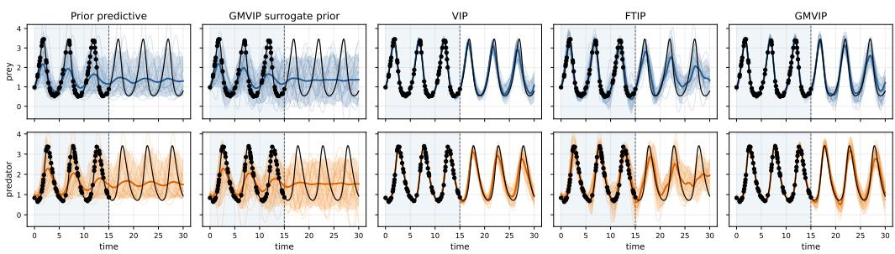  
Figure 2: Lotka–Volterra forecasting with an implicit ODE prior. Black points are noisy observations. Curves and bands show posterior predictions from the final scheduled optimization iterate.

Table 2: Mean standard error Lotka–Volterra results on the held-out test interval $t \in ( 2 0 , 3 0 ]$ across 20 target trajectories. VIP and FTIP use $S = 2 0$ . VIP is trained for 800 iterations; FTIP uses a 400-iteration VIP warm start followed by 400 fine-tuning iterations. Best results are shown in purple and second-best results in teal. Coverage is ranked by proximity to the nominal 0.90 level.
<table><tr><td>Method</td><td>RMSE↓</td><td>NLL↓</td><td>CRPS↓</td><td> $\mathbf { C o v } _ { 9 0 }$ </td><td>ODE residual ↓</td></tr><tr><td>Prior predictive</td><td> $0 . 6 3 \pm 0 . 0 6$ </td><td> ${ \bf 0 . 9 0 \pm 0 . 1 1 }$ </td><td> $0 . 3 6 \pm 0 . 0 4$ </td><td> ${ \bf 0 . 9 0 \pm 0 . 0 3 }$ </td><td> $\approx { \bf 1 0 ^ { - 6 } }$ </td></tr><tr><td>GMVIP sur. prior</td><td> $0 . 6 3 \pm 0 . 0 6$ </td><td> $1 . 9 5 \pm 0 . 9 3$ </td><td> $0 . 3 7 \pm 0 . 0 3$ </td><td> $0 . 9 3 \pm 0 . 0 2$ </td><td> $0 . 3 1 \pm 0 . 0 0$ </td></tr><tr><td>VIP</td><td> ${ \bf 0 . 5 0 \pm 0 . 0 8 }$ </td><td> $1 1 . 3 2 \pm 5 . 0 1$ </td><td> ${ \bf 0 . 3 1 \pm 0 . 0 5 }$ </td><td> $0 . 7 2 \pm 0 . 0 6$ </td><td> $0 . 6 5 \pm 0 . 0 3$ </td></tr><tr><td>FTIP</td><td> $0 . 5 7 \pm 0 . 0 8$ </td><td> $1 . 0 4 \pm 0 . 2 2$ </td><td> $0 . 3 4 \pm 0 . 0 5$ </td><td> $0 . 8 2 \pm 0 . 0 4$ </td><td> $0 . 6 2 \pm 0 . 0 3$ </td></tr><tr><td>GMVIP</td><td> ${ \bf 0 . 3 2 \pm 0 . 0 6 }$ </td><td> ${ \bf 0 . 5 1 \pm 0 . 2 9 }$ </td><td> ${ \bf 0 . 2 0 \pm 0 . 0 4 }$ </td><td> ${ \bf 0 . 9 0 \pm 0 . 0 4 }$ </td><td> ${ \bf 0 . 3 1 \pm 0 . 0 2 }$ </td></tr></table>

GMVIP is particularly strong in RMSE, NLL, and CRPS, while centered interval calibration is mixed and sometimes favors simpler alternatives. This suggests that the Matheron posterior better captures predictive uncertainty while retaining the implicit-prior structure. On some datasets, notably Power and Yacht, simpler or alternative approximations remain competitive, indicating that no single posterior family dominates uniformly. Appendix D.4 shows that the residual path prevents severe overconfidence on several small-data tasks, although an inducing-only representation remains competitive on some datasets; it also quantifies the role of empirical-Bayes prior adaptation.

## 5.3 FORECASTING WITH IMPLICIT AND EMPIRICAL PRIORS

We evaluate GMVIP in two complementary forecasting settings with sample-defined priors: a simulator-induced Lotka–Volterra prior and a retrieval-conditioned empirical prior for electricity load. Full protocols are provided in Appendices C.3 and C.4. The simulator prior remain fixed, and the electricity prior is fixed after target-specific retrieval.

Lotka–Volterra. The implicit prior is induced by the predator–prey system

$$
\dot { u } = \alpha u - \beta u v , \qquad \dot { v } = \delta u v - \gamma v ,
$$

by sampling physical parameters and initial conditions and solving the ODE. Each method observes noisy values for $t \leq 1 5 ,$ receives no data from the gap $1 5 < t \leq 2 0$ , and is evaluated only on the forecast interval $2 0 < t \leq 3 0$ . GMVIP uses the joint multioutput construction.

Figure 2 qualitatively illustrates the differences between the methods. The prior predictive and its GMVIP surrogate capture the oscillatory structure of the ODE prior but are not adapted to the observed trajectory. VIP and FTIP condition on the observations, although their forecasts exhibit increasing phase and amplitude errors over the held-out interval. In contrast, GMVIP more consistently preserves the coupled oscillatory dynamics of both prey and predator over the forecasting horizon.

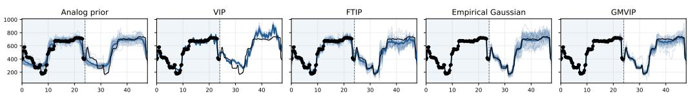  
Figure 3: Electricity-load forecasting with a retrieval-conditioned empirical prior. Methods observe the first 24 hours and forecast the following 24 hours. The panels show VIP, FTIP, and GMVIP on the same target window. Black points are observations, the black curve is the held-out target, and blue curves and bands show posterior predictions.

Table 3: Electricity-load results across 75 seed–target windows. Entries are means standard errors across windows. Coverage and its standard error are reported in percentage points. Best results are shown in purple and second-best results in teal. Coverage is ranked by proximity to its nominal level; lower is better otherwise.
<table><tr><td>Method</td><td>RMSE↓</td><td>NLL↓</td><td>CRPS↓</td><td>CQM↓</td><td>Cov. 80%</td><td>Cov. 90%</td></tr><tr><td>Analog prior</td><td> $5 5 . 4 5 \pm 1 5 . 9 1$ </td><td> ${ \bf 5 . 3 1 \pm 0 . 4 4 }$ </td><td> $3 0 . 7 3 \pm 9 . 0 4$ </td><td> ${ \bf 0 . 1 2 \pm 0 . 0 1 }$ </td><td> $7 4 . 1 8 \pm 2 . 1 4$ </td><td> $8 5 . 9 6 \pm 1 . 7 0$ </td></tr><tr><td>VIP</td><td> $6 0 . 9 3 \pm 1 8 . 6 1$ </td><td> $9 9 . 1 9 \pm 5 5 . 2 2$ </td><td> $4 0 . 6 0 \pm 1 2 . 8 3$ </td><td> $0 . 3 8 \pm 0 . 0 1$ </td><td> $2 0 . 9 4 \pm 1 . 1 6$ </td><td> $2 6 . 2 6 \pm 1 . 4 2$ </td></tr><tr><td>FTIP</td><td> $6 8 . 0 2 \pm 2 2 . 1 0$ </td><td> $1 0 . 0 3 \pm 4 . 1 7$ </td><td> $4 1 . 2 8 \pm 1 3 . 9 9$ </td><td> $0 . 1 7 \pm 0 . 0 1$ </td><td> $5 7 . 2 5 \pm 2 . 0 3$ </td><td> $6 8 . 0 6 \pm 1 . 9 9$ </td></tr><tr><td>Empirical Gaussian</td><td> ${ \bf 4 8 . 4 4 \pm 1 5 . 2 7 }$ </td><td> $6 . 6 3 \pm 0 . 9 9$ </td><td> ${ \bf 2 8 . 3 7 \pm 9 . 0 6 }$ </td><td> $0 . 1 3 \pm 0 . 0 1$ </td><td> ${ \bf 7 9 . 3 2 \pm 2 . 1 6 }$ </td><td> ${ \bf 8 6 . 6 2 \pm 1 . 7 8 }$ </td></tr><tr><td>GMVIP</td><td> ${ \bf 4 9 . 0 6 \pm 1 5 . 0 6 }$ </td><td> ${ \bf 4 . 3 5 \pm 0 . 1 4 }$ </td><td> ${ \bf 2 7 . 4 8 \pm 8 . 7 4 }$ </td><td> $\mathbf { 0 . 1 1 \pm 0 . 0 1 }$ </td><td> ${ \bf 7 6 . 2 2 \pm 2 . 1 1 }$ </td><td> ${ \bf 8 6 . 5 3 \pm 1 . 7 3 }$ </td></tr></table>

Quantitatively, Table 2 shows that GMVIP achieves the lowest mean RMSE, NLL, and CRPS at $S = 2 0$ , while the prior predictive has coverage closest to 0.90. GMVIP’s mean RMSE of 0.32 represents reductions of 35.5% relative to VIP and 43.6% relative to FTIP. The basis-size analysis in Appendix D.5 shows that increasing S improves VIP and $\mathrm { F T I P } ^ { \prime } \mathrm { s }$ point forecasts but does not overtake GMVIP on the aggregate metrics. GMVIP has the lowest mean RMSE, NLL, CRPS, and ODE residual among the learned configurations, as well as coverage closest to 0.90.

Electricity load. We next consider day-ahead forecasting on the Electricity Load dataset (Trindade, 2015). Each target contains 48 hours at 15-minute resolution: the first 24 hours are observed and the next 24 hours are held out. For each target, we retrieve 2048 historical trajectories from 2011–2013 using calendar compatibility and nearest-neighbor similarity over the observed context; test targets are drawn from 2014. Because the observed prefix is used both to retrieve the historical bank and to fit the posterior, this experiment is a two-stage empirical-Bayes procedure rather than inference under a fixed, target-independent prior. Retrieval never accesses the held-out forecast day, and every method receives the same retrieved bank. GMVIP uses M = 96 inducing locations, with $\mathbf { Z } = \mathbf { X } _ { \mathrm { o b s } } \mathrm { : \Omega }$ one at each observed context point and none in the forecast interval.

Figure 3 provides a representative qualitative comparison. VIP and FTIP follow the broad daily pattern but show larger forecast spread and noticeable errors around the load minimum and subsequent recovery. GMVIP more closely reproduces the sharp decline after the observed context and the later return to the higher-load regime, while maintaining coherent uncertainty across the forecast horizon.

Quantitatively, Table 3 reports means and sample standard errors across the 75 windows; the large standard errors show substantial target heterogeneity. The Empirical Gaussian has the lowest mean RMSE, with GMVIP close behind (48.44 versus 49.06). GMVIP obtains the lowest mean mixture NLL, CRPS, and CQM. The Empirical Gaussian has coverage closest to the nominal 80% and 90% levels, with GMVIP second on both. VIP is strongly under-dispersed, whereas FTIP recovers part of the missing uncertainty. Overall, GMVIP provides the strongest distributional scores, while analytic Gaussian conditioning has a marginal advantage in mean point error.

## 5.4 LARGE SCALE REGRESSION

We evaluate on the YearPredictionMSD (Bertin-Mahieux, 2011) and Airline benchmark derived from the U.S. Bureau of Transportation Statistics on-time performance data (Bureau of Transportation

Table 4: Large regression metrics ( ). Entries are mean standard deviation across seeds. Best method is shown in purple; second-best is shown in teal.
<table><tr><td>Metric</td><td>Dataset</td><td>MFVI</td><td>VIP</td><td>FBNN</td><td>SIP</td><td>TFSVI</td><td>FTIP</td><td>GMVIP</td></tr><tr><td rowspan="2">RMSE</td><td>Year</td><td> $\mathbf { 8 . 9 5 \pm 0 . 0 1 }$ </td><td> $9 . 1 7 \pm 0 . 0 1$ </td><td> $\begin{array} { c } { 8 . 9 1 \pm 0 . 0 2 } \\ { 3 7 . 9 0 \pm 0 . 0 9 } \end{array}$ </td><td> $\begin{array} { c } { 9 . 0 6 \pm 0 . 0 1 } \\ { 3 7 . 9 9 \pm 0 . 0 7 } \end{array}$ </td><td> $9 . 0 5 \pm 0 . 0 1$ </td><td> $9 . 1 5 \pm 0 . 0 1$ </td><td> $\phantom { + } 8 . 9 8 \pm 0 . 0 2$ </td></tr><tr><td>Airline</td><td> $3 7 . 8 7 \pm 0 . 1 2$ </td><td> $3 8 . 0 3 \pm 0 . 1 6$ </td><td></td><td></td><td> $\mathbf { 3 7 . 7 2 \pm 0 . 1 3 }$ </td><td> $3 8 . 0 4 \pm 0 . 1 2$ </td><td> $\mathbf { 3 7 . 6 2 \pm 0 . 1 0 }$ </td></tr><tr><td rowspan="2">NLL</td><td>Year</td><td> $\begin{array} { c } { { \bf 3 . 6 1 \pm 0 . 0 0 } } \\ { { \bf 5 . 0 7 \pm 0 . 0 0 } } \end{array}$ </td><td> $\begin{array} { l } { 3 . 6 4 \pm 0 . 0 0 } \\ { 5 . 0 9 \pm 0 . 0 1 } \end{array}$ </td><td> $\mathbf { 3 . 6 0 \pm 0 . 0 0 }$ </td><td> $\begin{array} { c } { 3 . 6 2 \pm 0 . 0 0 } \\ { 5 . 0 8 \pm 0 . 0 0 } \end{array}$ </td><td> $\begin{array} { l } { 3 . 6 2 \pm 0 . 0 0 } \\ { 5 . 0 9 \pm 0 . 0 0 } \end{array}$ </td><td> $3 . 6 3 \pm 0 . 0 0$ </td><td> $\begin{array} { c } { { \bf 3 . 6 1 \pm 0 . 0 0 } } \\ { { \bf 5 . 0 7 \pm 0 . 0 1 } } \end{array}$ </td></tr><tr><td>Airline</td><td></td><td></td><td> ${ \bf 5 . 0 7 \pm 0 . 0 0 }$ </td><td></td><td></td><td> $5 . 0 9 \pm 0 . 0 1$ </td><td></td></tr><tr><td rowspan="2">CRPS</td><td>Year</td><td></td><td> $\begin{array} { c } { 4 . 8 5 9 \pm 0 . 0 1 0 } \\ { 1 7 . 7 9 \pm 0 . 2 2 } \end{array}$ </td><td> $\begin{array} { c } { 4 . 6 7 5 \pm \mathbf { 0 . 0 1 2 } } \\ { 1 7 . 7 0 \pm 0 . 1 7 } \end{array}$ </td><td> $_ { 1 7 . 7 1 \pm 0 . 0 1 0 } ^ { 4 . 7 8 5 \pm 0 . 0 1 0 }$ </td><td> $4 . 7 7 7 \pm 0 . 0 1 2$ </td><td> $\begin{array} { c } { 4 . 8 4 5 \pm 0 . 0 0 4 } \\ { 1 7 . 7 9 \pm 0 . 1 7 } \end{array}$ </td><td> $4 . 7 4 0 \pm 0 . 0 1 4$ </td></tr><tr><td>Airline</td><td> $\begin{array} { c } { 4 . 7 1 7 \pm 0 . 0 0 7 } \\ { 1 7 . 6 7 \pm 0 . 1 3 } \end{array}$ </td><td></td><td></td><td></td><td> ${ \bf 1 7 . 4 7 \pm 0 . 1 3 }$ </td><td></td><td> ${ \bf 1 7 . 6 1 \pm 0 . 0 4 }$ </td></tr><tr><td></td><td>Year</td><td> $0 . 0 8 3 \pm 0 . 0 0 2$ </td><td></td><td> $0 . 0 8 4 \pm 0 . 0 0 3$ </td><td> $\mathbf { 0 . 0 7 8 \pm 0 . 0 0 1 }$ </td><td> $\mathbf { 0 . 0 7 8 \pm 0 . 0 0 3 }$ </td><td> $\mathbf { 0 . 0 6 4 \pm 0 . 0 0 2 }$ </td><td> $\mathbf { 0 . 0 7 8 \pm 0 . 0 0 3 }$ </td></tr><tr><td>CQM</td><td>Airline</td><td> $0 . 1 0 7 \pm 0 . 0 0 9$ </td><td> $\begin{array} { c } { 0 . 0 6 4 \pm 0 . 0 0 2 } \\ { 0 . 0 9 6 \pm 0 . 0 1 5 } \end{array}$ </td><td> $0 . 1 0 9 \pm 0 . 0 1 4$ </td><td> $0 . 1 0 6 \pm 0 . 0 0 3$ </td><td> $0 . 1 1 1 \pm 0 . 0 1 0$ </td><td> $\mathbf { 0 . 0 9 6 \pm 0 . 0 1 2 }$ </td><td> $\mathbf { 0 . 1 0 2 \pm 0 . 0 0 4 }$ </td></tr></table>

Statistics, 2026) and used in prior large-scale GP work (Dutordoir et al., 2020). These tasks were also considered by Ortega et al. (2024), but we use our own shared protocol. All methods use the same preprocessing and fixed train/test splits, with inputs standardized using training-set statistics and targets normalized during training. We train for a matched budget of 60 000 stochastic iterations using two-hidden-layer MLPs with 50 units for Year and 100 for Airlin.

Table 4 shows that no single method dominates all metrics. On YearPredictionMSD, FBNN gives the best predictive accuracy and distributional scores, with the lowest RMSE, NLL, and CRPS. GMVIP remains competitive, ranking close to the best methods in RMSE and CRPS, but does not improve over FBNN on this dataset. On Airline, the picture changes: GMVIP obtains the best RMSE and ties for the best rounded NLL, while also achieving the second-best CRPS. This indicates that the empirical Matheron correction is particularly effective in the larger Airline setting, where adapting function-space prior samples through learned inducing corrections improves predictive accuracy.

Calibration, as measured by CQM, favors VIP and FTIP on both datasets. These methods obtain the lowest CQM values, while GMVIP is second-best on Airline and tied for second-best on Year. Overall, the results suggest a tradeoff: VIP/FTIP provide the strongest centered interval calibration, FBNN is strongest on Year, and GMVIP gives the best or near-best predictive performance on the larger Airline benchmark while retaining competitive calibration.

## 6 DISCUSSION AND CONCLUSION

We introduced GMVIP, a pathwise variational family for implicit-process priors. Instead of forming posterior samples as linear combinations of prior functions, GMVIP draws a coherent prior path and replaces its values at inducing locations through an empirical Matheron-style correction. Since the surrogate prior and posterior share the same pathwise map and differ only in the law of the inducing coefficient, the augmented KL reduces to a finite-dimensional coefficient KL.

The construction recovers the standard inducing-variable variational GP family when the prior is Gaussian and the matching covariance operator is used. For general implicit priors, empirical GMVIP should be understood as inference under a Matheron surrogate prior: it preserves the prior mean and covariance in the population limit, but not necessarily the full process law. Empirically, GMVIP is competitive across regression and classification. In Lotka-Volterra, GMVIP has the lowest mean RMSE and CRPS and the lowest mean mixture NLL among the learned methods in the matched S = 20 comparison. It also retains the best mean RMSE, NLL, CRPS, calibration, and ODE residual when compared with the larger VIP and FTIP bases. These comparisons vary substantially by target, and mean NLL remains sensitive to one difficult high-amplitude trajectory. Thus the simulator results support the value of coherent prior residual paths while showing that larger coefficient bases narrow the point-forecasting gap. In electricity, GMVIP has the lowest mean NLL, CRPS, and CQM, while the Empirical Gaussian has the lowest mean RMSE and coverage closest to nominal.

Limitations GMVIP performs inference under the surrogate prior induced by the replacement map, which may differ from the original implicit-process prior for non-Gaussian or highly structured processes. The empirical operator also depends on the quality of the prior bank and on the conditioning of the inducing covariance, so poor inducing locations or too few prior samples can degrade performance. Finally, empirical GMVIP is more expensive than coefficient-only VIP-style methods because it requires prior-bank evaluations, covariance estimation, and a Matheron correction. The present experiments use a Gaussian posterior over inducing coefficients; richer posterior families may be needed for strongly multimodal posteriors.

## AI USE STATEMENT

In this work, we used generative AI tools to provide feedback on research methodology and experimental design and to assist with the interpretation and presentation of experimental results. We did not use generative AI tools to generate datasets, formulate mathematical claims, develop theoretical models, provide critical ingredients for or assist in writing proofs, propose hypotheses, implement the proposed methods, clean or reformat datasets, or perform qualitative or thematic data analysis. Translation and research tasks involving surveys or interviews were not applicable to this work.

Additionally, we used generative AI tools for brainstorming, searching for and summarizing potentially relevant literature, suggesting improvements to the structure and presentation of the paper, and drafting or editing text for clarity and readability. All methodological suggestions and interpretations produced with AI assistance were independently evaluated by the authors. All references were manually verified against their original sources, all experimental results and numerical claims were checked against the outputs of experiments conducted by the authors, and all AI-assisted text was reviewed and revised by the authors. We take responsibility for the final content of this work, including text, claims, and artifacts produced with the aid of generative AI.

## REPRODUCIBILITY STATEMENT

We provide the details required to reproduce both the theoretical and empirical results of this work. Complete proofs of the main theoretical claims, together with additional properties of the proposed construction, are given in Appendix A. The GMVIP training and evaluation procedures are specified in Algorithms 1 and 2 in Appendix B. Experimental protocols are provided in Appendix C, including the UCI regression experiments (Appendix C.2), the Lotka–Volterra implicit-prior experiment (Appendix C.3), the electricity-load forecasting experiment (Appendix C.4), the large-scale regression experiments (Appendix C.5), and the LeNet classification experiments (Appendix C.6). These sections specify dataset preprocessing and splits, model architectures, optimization settings, random seeds, Monte Carlo sample counts, inducing-point configurations, prior-bank sizes, likelihoods, and evaluation metrics. Additional reproducibility analyses are reported for surrogate-prior fidelity in Appendix D.1, classification experiments in Appendix D.2, full UCI results in Appendix D.3, ablation studies in Appendix D.4, and Lotka–Volterra basis-size sensitivity in Appendix D.5. All reported predictive results are evaluated on held-out data according to the protocols specified in these sections.

## REFERENCES

Thierry Bertin-Mahieux. Year prediction MSD. UCI Machine Learning Repository, 2011. URL https://doi.org/10.24432/C50K61. Dataset.

Charles Blundell, Julien Cornebise, Koray Kavukcuoglu, and Daan Wierstra. Weight uncertainty in neural network. In Francis Bach and David Blei, editors, Proceedings of the 32nd International Conference on Machine Learning, volume 37 of Proceedings of Machine Learning Research, pages 1613–1622. PMLR, 2015. URL https://proceedings.mlr.press/ v37/blundell15.html.

Bureau of Transportation Statistics. Reporting carrier on-time performance (1987–present). TranStats, U.S. Department of Transportation, 2026. URL https://www.transtats.bts.gov/ Fields.asp?gnoyr\_VQ=FGJ. Dataset; accessed 2026-07-23.

Gerrit Burgers, Peter Jan van Leeuwen, and Geir Evensen. Analysis scheme in the ensemble Kalman filter. Monthly Weather Review, 126(6):1719–1724, 1998. doi: 10.1175/1520-0493(1998)126 1719: ASITEK 2.0.CO;2. URL https://journals.ametsoc.org/view/journals/mwre/ 126/6/1520-0493\_1998\_126\_1719\_asitek\_2\_0\_co\_2.xml.

David R. Burt, Sebastian W. Ober, Adria Garriga-Alonso, and Mark van der Wilk. Understand-\` ing variational inference in function-space. In Third Symposium on Advances in Approximate

Bayesian Inference, pages 1–17, 2020. URL https://openreview.net/forum?id= 7P9y3sRa5Mk.

Vincent Dutordoir, Nicolas Durrande, and James Hensman. Sparse Gaussian processes with spherical harmonic features. In Proceedings of the 37th International Conference on Machine Learning, volume 119 of Proceedings ofMachine Learning Research, pages 2793–2802. PMLR, 2020. URL https://proceedings.mlr.press/v119/dutordoir20a.html.

Geir Evensen. Sequential data assimilation with a nonlinear quasi-geostrophic model using Monte Carlo methods to forecast error statistics. Journal of Geophysical Research: Oceans, 99(C5): 10143–10162, 1994. doi: 10.1029/94JC00572. URL https://agupubs.onlinelibrary. wiley.com/doi/10.1029/94JC00572.

Geir Evensen and Peter Jan van Leeuwen. An ensemble Kalman smoother for nonlinear dynamics. Monthly Weather Review, 128(6):1852–1867, 2000. doi: 10.1175/1520-0493(2000)128 1852: AEKSFN 2.0.CO;2. URL https://journals.ametsoc.org/view/journals/ mwre/128/6/1520-0493\_2000\_128\_1852\_aeksfn\_2\_0\_co\_2.xml.

Yarin Gal and Zoubin Ghahramani. Dropout as a Bayesian approximation: Representing model uncertainty in deep learning. In Maria Florina Balcan and Kilian Q. Weinberger, editors, Proceedings of the 33rd International Conference on Machine Learning, volume 48 of Proceedings of Machine Learning Research, pages 1050–1059. PMLR, 2016. URL https: //proceedings.mlr.press/v48/gal16.html.

James Hensman, Nicolo Fusi, and Neil D. Lawrence. Gaussian processes for big data. In Ann\` Nicholson and Padhraic Smyth, editors, Uncertainty in Artificial Intelligence: Proceedings of the Twenty-Ninth Conference, pages 282–290, Corvallis, Oregon, 2013. AUAI Press. ISBN 978-0-9749039-9-6. URL https://auai.org/uai2013/prints/papers/244.pdf.

Jose Miguel Hern´ andez-Lobato and Ryan P. Adams. Probabilistic backpropagation for scalable´ learning of Bayesian neural networks. In Francis Bach and David Blei, editors, Proceedings of the 32nd International Conference on Machine Learning, volume 37 of Proceedings ofMachine Learning Research, pages 1861–1869. PMLR, 2015. URL https://proceedings.mlr. press/v37/hernandez-lobatoc15.html.

Pavel Izmailov, Wesley J. Maddox, Polina Kirichenko, Timur Garipov, Dmitry Vetrov, and Andrew Gordon Wilson. Subspace inference for Bayesian deep learning. In Ryan P. Adams and Vibhav Gogate, editors, Proceedings ofthe 35th Uncertainty in Artificial Intelligence Conference, volume 115 of Proceedings ofMachine Learning Research, pages 1169–1179. PMLR, 2020. URL https://proceedings.mlr.press/v115/izmailov20a.html.

A. C. Lorenc. A global three-dimensional multivariate statistical interpolation scheme. Monthly Weather Review, 109(4):701–721, 1981. doi: 10.1175/1520-0493(1981)109 0701:AGTDMS 2.0.CO;2. URL https://journals.ametsoc.org/view/journals/mwre/109/4/ 1520-0493\_1981\_109\_0701\_agtdms\_2\_0\_co\_2.xml.

Chao Ma, Yingzhen Li, and Jose Miguel Hern ´ andez-Lobato. Variational implicit processes. In ´ Proceedings of the 36th International Conference on Machine Learning, volume 97 of Proceedings of Machine Learning Research, pages 4222–4233. PMLR, 2019. URL https: //proceedings.mlr.press/v97/ma19b.html.

David J. C. MacKay. A practical Bayesian framework for backpropagation networks. Neural Computation, 4(3):448–472, 1992. doi: 10.1162/neco.1992.4.3.448. URL https://doi.org/ 10.1162/neco.1992.4.3.448.

Radford M. Neal. Bayesian Learningfor Neural Networks, volume 118 of Lecture Notes in Statistics. Springer, New York, NY, 1996. ISBN 978-0-387-94724-2. doi: 10.1007/978-1-4612-0745-0. URL https://doi.org/10.1007/978-1-4612-0745-0.

Luis A. Ortega. Uncertainty Estimation and Generalization Bounds for Modern Deep Learning. PhD thesis, Universidad Autonoma de Madrid, 2026. URL´ https://arxiv.org/abs/2606. 13818.

Luis A. Ortega, Simon Rodr´ ´ıguez Santana, and Daniel Hernandez-Lobato. Deep variational implicit´ processes. In International Conference on Learning Representations, 2023. URL https: //openreview.net/forum?id=8aeSJNbmbQq.

Luis A. Ortega, Simon Rodriguez Santana, and Daniel Hernandez-Lobato. Variational linearized´ Laplace approximation for Bayesian deep learning. In Proceedings of the 41st International Conference on Machine Learning, volume 235 of Proceedings ofMachine Learning Research, pages 38815–38836. PMLR, 2024. URL https://proceedings.mlr.press/v235/ ortega24a.html.

Luis A. Ortega, Andres R. Masegosa, and Thomas D. Nielsen. Flow-transformed implicit processes for´ function-space variational inference, 2026. URL https://arxiv.org/abs/2606.01954. Preprint; submitted for revision.

Carl Edward Rasmussen and Christopher K. I. Williams. Gaussian Processes for Machine Learning. Adaptive Computation and Machine Learning. The MIT Press, Cambridge, Massachusetts, 2006. ISBN 978-0-262-18253-9. doi: 10.7551/mitpress/3206.001.0001. URL https://gaussianprocess.org/gpml/.

Simon Rodr´ ´ıguez-Santana, Bryan Zald´ıvar, and Daniel Hernandez-Lobato. Function-space inference´ with sparse implicit processes. In Proceedings of the 39th International Conference on Machine Learning, volume 162 of Proceedings ofMachine Learning Research, pages 18723–18740. PMLR, 2022. URL https://proceedings.mlr.press/v162/rodri-guez-santana22a. html.

Tim G. J. Rudner, Zonghao Chen, Yee Whye Teh, and Yarin Gal. Tractable functionspace variational inference in Bayesian neural networks. In Advances in Neural Information Processing Systems, volume 35, pages 22686–22698. Curran Associates, Inc., 2022. URL https://proceedings.neurips.cc/paper\_files/paper/2022/ hash/8ea50bf458f6070548b11babbe0bf89b-Abstract-Conference.html.

Shengyang Sun, Guodong Zhang, Jiaxin Shi, and Roger Grosse. Functional variational Bayesian neural networks. In International Conference on Learning Representations, 2019. URL https: //openreview.net/forum?id=rkxacs0qY7.

Michalis K. Titsias. Variational learning of inducing variables in sparse Gaussian processes. In David van Dyk and Max Welling, editors, Proceedings ofthe Twelfth International Conference on Artificial Intelligence and Statistics, volume 5 of Proceedings ofMachine Learning Research, pages 567–574. PMLR, 2009. URL https://proceedings.mlr.press/v5/titsias09a. html.

Artur Trindade. ElectricityLoadDiagrams20112014. UCI Machine Learning Repository, 2015. URL https://doi.org/10.24432/C58C86. Dataset.

Veit David Wild, Robert Hu, and Dino Sejdinovic. Generalized variational inference in function spaces: Gaussian measures meet Bayesian deep learning. In Advances in Neural Information Processing Systems, volume 35, pages 3716–3730. Curran Associates, Inc., 2022. URL https://proceedings.neurips.cc/paper\_files/paper/2022/ hash/18210aa6209b9adfc97b8c17c3741d95-Abstract-Conference.html.

Andrew Gordon Wilson and Hannes Nickisch. Kernel interpolation for scalable structured Gaussian processes (KISS-GP). In Proceedings of the 32nd International Conference on Machine Learning, volume 37 of Proceedings ofMachine Learning Research, pages 1775–1784. PMLR, 2015. URL https://proceedings.mlr.press/v37/wilson15.html.

James T. Wilson, Viacheslav Borovitskiy, Alexander Terenin, Peter Mostowsky, and Marc Peter Deisenroth. Efficiently sampling functions from Gaussian process posteriors. In Proceedings of the 37th International Conference on Machine Learning, volume 119 of Proceedings ofMachine Learning Research, pages 10292–10302. PMLR, 2020. URL https://proceedings.mlr. press/v119/wilson20a.html.

## A MATHEMATICAL DERIVATIONS

This appendix contains the proofs of the main results in Section $^ { 4 , }$ together with additional properties of the replacement operator used in GMVIP.

## A.1 PROOFS OF THE MAIN RESULTS

ProofofProposition 1. Let $\mathbf { X } \ = \ \left( \mathbf { x } _ { 1 } , \ldots , \mathbf { x } _ { n } \right)$ be any finite ordered tuple. The induced finitedimensional random vector is

$$
f ( \mathbf { X } ) = g ( \mathbf { X } ) + \Psi _ { \mathbf { Z } } ( \mathbf { X } ) \big [ { \pmb \mu } + \mathbf { D a } - g ( \mathbf { Z } ) \big ] .
$$

It is a measurable function of $( g ( \mathbf { X } ) , g ( \mathbf { Z } ) , \mathbf { a } )$ , and therefore defines a probability law.

It remains to verify projective consistency. Let $\mathbf { X } _ { 1 }$ be obtained from $\mathbf { X } _ { 2 }$ by a selection or permutation matrix Π. For multioutput functions, the same symbol denotes the block operator $\mathbf { I I } \otimes \mathbf { I } _ { C }$ acting on stacked evaluations. The replacement operators used in this work are row-consistent, meaning $\Psi _ { \mathbf { Z } } ( \mathbf { X } _ { 1 } ) = \Pi \Psi _ { \mathbf { Z } } ( \mathbf { X } _ { 2 } )$ . Hence

$$
\begin{array} { r l } & { f ( \mathbf { X } _ { 1 } ) = g ( \mathbf { X } _ { 1 } ) + \Psi _ { \mathbf { Z } } ( \mathbf { X } _ { 1 } ) \big [ \pmb { \mu } + \mathbf { D a } - g ( \mathbf { Z } ) \big ] } \\ & { \qquad = \pmb { \Pi } g ( \mathbf { X } _ { 2 } ) + \pmb { \Pi } \Psi _ { \mathbf { Z } } ( \mathbf { X } _ { 2 } ) \big [ \pmb { \mu } + \mathbf { D a } - g ( \mathbf { Z } ) \big ] = \pmb { \Pi } f ( \mathbf { X } _ { 2 } ) . } \end{array}
$$

Since $g \sim p _ { 0 }$ is a valid stochastic process, its finite-dimensional laws are Kolmogorov-consistent. Because the same global pair $( g , \mathbf { a } )$ is reused for all query sets, the induced laws satisfy $P _ { \mathbf { X } _ { 1 } } ^ { \nu } =$ $\Pi _ { \# } P _ { \mathbf { X } _ { \hbar } } ^ { \nu } ,$ , where $\Pi _ { \# }$ denotes pushforward by the restriction/permutation map. Thus the family $\{ P _ { \mathbf { X } } ^ { \nu } \} _ { \mathbf { X } }$ satisfies Kolmogorov consistency. By the Kolmogorov extension theorem, it defines a valid stochastic process. Taking $\nu = p ( \mathbf { a } )$ gives the surrogate prior and taking $\nu = q _ { \phi } ( \mathbf { a } )$ gives the variational posterior. □

Proof of Proposition 2. By construction,

$$
p _ { \mathbf { Z } } ( g , \mathbf { a } , f ) = p _ { 0 } ( g ) p ( \mathbf { a } ) \delta [ f = T ( g , \mathbf { a } ) ] , \qquad q _ { \mathbf { Z } , \phi } ( g , \mathbf { a } , f ) = p _ { 0 } ( g ) q _ { \phi } ( \mathbf { a } ) \delta [ f = T ( g , \mathbf { a } ) ] .
$$

Thus the two measures have the same conditional law of $( g , f )$ given a. Applying the chain rule for KL divergences,

$$
\begin{array} { r l } & { { \mathrm { K L } } ( q _ { \mathbf { Z } , \phi } ( g , \mathbf { a } , f ) | | p _ { \mathbf { Z } } ( g , \mathbf { a } , f ) ) = { \mathrm { K L } } ( q _ { \phi } ( \mathbf { a } ) | | p ( \mathbf { a } ) ) } \\ & { \qquad + \mathbb { E } _ { q _ { \phi } ( \mathbf { a } ) } { \mathrm { K L } } ( q _ { \mathbf { Z } , \phi } ( g , f \mid \mathbf { a } ) | | p _ { \mathbf { Z } } ( g , f \mid \mathbf { a } ) ) . } \end{array}
$$

The second term is zero because both conditionals equal $p _ { 0 } ( g ) \delta [ f = T ( g , \mathbf { a } ) ]$ ]. This proves (12).

The marginal function-space bound follows by data processing under the projection $( g , \mathbf { a } , f ) \mapsto f \colon$

$$
\begin{array} { r } { \mathrm { K L } ( q _ { \mathbf { Z } , \phi } ^ { f } | | p _ { \mathbf { Z } } ^ { f } ) \leq \mathrm { K L } ( q _ { \mathbf { Z } , \phi } ( g , \mathbf { a } , f ) | | p _ { \mathbf { Z } } ( g , \mathbf { a } , f ) ) = \mathrm { K L } ( q _ { \phi } ( \mathbf { a } ) | | p ( \mathbf { a } ) ) . } \end{array}
$$

Finally, if $\pmb { \Psi } \mathbf { Z } ( \mathbf { Z } ) = \mathbf { I } _ { d _ { a } }$ and D is invertible, then evaluating the replacement map at the inducing inputs gives

$$
f ( \mathbf { Z } ) = g ( \mathbf { Z } ) + \pmb { \mu } + \mathbf { D } \mathbf { a } - g ( \mathbf { Z } ) = \pmb { \mu } + \mathbf { D } \mathbf { a } ,
$$

so $\mathbf { a } = \mathbf { D } ^ { - 1 } ( f ( \mathbf { Z } ) - \pmb { \mu } )$ is a measurable function of $f .$ Hence the density ratio between the augmented posterior and prior depends only on $f ,$ and the projection to f loses no KL information. Therefore the above inequality is an equality in this case. □

Proposition 2 applies exactly to the unregularized cardinal operator. In the numerical implementation, diagonal jitter makes cardinality and the corresponding marginal-KL equality approximate up to numerical regularization.

Proof of Proposition 3. Fix a finite input set $\mathbf { X } .$ The GP conditional decomposition gives

$$
g ( \mathbf { X } ) = \mu ( \mathbf { X } ) + \kappa ( \mathbf { X } , \mathbf { Z } ) \kappa ( \mathbf { Z } , \mathbf { Z } ) ^ { - 1 } \big ( g ( \mathbf { Z } ) - \mu \big ) + \mathbf { r } _ { \mathbf { X } } ,
$$

where $\mathbf { r } _ { \mathbf { X } }$ is independent of $g ( \mathbf { Z } )$ and has covariance

$$
\kappa ( { \bf X } , { \bf X } ) - \kappa ( { \bf X } , { \bf Z } ) \kappa ( { \bf Z } , { \bf Z } ) ^ { - 1 } \kappa ( { \bf Z } , { \bf X } ) .
$$

With $\mathbf { u } = \pmb { \mu } + \mathbf { D } \mathbf { a } .$ , the transformed sample is

$$
T ( g , \mathbf { a } ) ( \mathbf { X } ) = \mu ( \mathbf { X } ) + \kappa ( \mathbf { X } , \mathbf { Z } ) \kappa ( \mathbf { Z } , \mathbf { Z } ) ^ { - 1 } \big ( \mathbf { u } - \pmb { \mu } \big ) + \mathbf { r } _ { \mathbf { X } } .
$$

If $\mathbf { a } \sim \mathcal { N } ( \mathbf { 0 } , \mathbf { I } _ { M } )$ , then $\mathbf { u } \sim \mathcal { N } ( \pmb { \mu } , \kappa ( \mathbf { Z } , \mathbf { Z } ) )$ , independently of $\mathbf { r } _ { \mathbf { X } }$ . Therefore $T ( g , \mathbf { a } ) ( \mathbf { X } )$ has mean $\mu ( \mathbf { X } )$ and covariance $\kappa ( { \mathbf { X } } , { \mathbf { X } } )$ . Since this holds for every finite X, the transformed process is exactly $\mathcal { G P } ( \mu , \kappa )$

For arbitrary $q _ { \phi } ( \mathbf { a } )$ , the same expression is the GP conditional $p _ { 0 } ( f ( \mathbf { X } ) \mid \mathbf { u } )$ . Integrating over the pushforward law $q _ { \phi } ( \mathbf { u } )$ gives $\begin{array} { r } { \dot { \boldsymbol { q } } ( f ) = \int p _ { 0 } ( f \mid \mathbf { u } ) q _ { \phi } ( \mathbf { u } ) d \mathbf { u } } \end{array}$ . Finally, the correspondence with a Gaussian SVGP posterior $q ( \mathbf { u } ) = \mathcal { N } ( \mathbf { m } _ { u } , \breve { \mathbf { S } } _ { u } )$ follows from the affine whitening relation $\mathbf { u } = \pmb { \mu } { + } \mathbf { D } \mathbf { a }$ which gives $\begin{array} { r } { q _ { \phi } ( \mathbf { \bar { a } } ) = \mathcal { N } ( \mathbf { D } ^ { - 1 } ( \mathbf { m } _ { u } - \pmb { \mu } ) , \mathbf { D } ^ { - 1 } \mathbf { S } _ { u } \mathbf { D } ^ { - \top } ) } \end{array}$ □

ProofofProposition 4. Fix finite input sets X and $\mathbf { X } ^ { \prime }$ , and write ${ \bf B } _ { \bf X } = \kappa ( { \bf X } , { \bf Z } ) \kappa ( { \bf Z } , { \bf Z } ) ^ { - 1 }$ . The transformed sample can be written as

$$
f ( \mathbf { X } ) = g ( \mathbf { X } ) - \mathbf { B } _ { \mathbf { X } } g ( \mathbf { Z } ) + \mathbf { B } _ { \mathbf { X } } \mathbf { u } , \qquad \mathbf { u } = \mu + \mathbf { D } \mathbf { a } .
$$

Since $\pmb { \mu } = \pmb { \mu } ( \mathbf { Z } )$ , DD⊤ = κ(Z, Z), and $\mathbf { a } \sim \mathcal { N } ( \mathbf { 0 } , \mathbf { I } _ { M } )$ , we have $\mathbb { E } [ { \bf u } ] = \mu ( { \bf Z } )$ and $\mathrm { C o v } ( { \mathbf { u } } ) = $ $\kappa ( \mathbf { Z } , \mathbf { Z } )$ . Moreover, u is independent of $g .$ Hence

$$
\begin{array} { r } { \mathbb { E } [ f ( \mathbf { X } ) ] = \mu ( \mathbf { X } ) - \mathbf { B } _ { \mathbf { X } } \mu ( \mathbf { Z } ) + \mathbf { B } _ { \mathbf { X } } \mu ( \mathbf { Z } ) = \mu ( \mathbf { X } ) . } \end{array}
$$

For the covariance, independence gives

$$
\begin{array} { r l } & { \mathrm { C o v } ( f ( \mathbf { X } ) , f ( \mathbf { X } ^ { \prime } ) ) = \mathrm { C o v } ( g ( \mathbf { X } ) - \mathbf { B } _ { \mathbf { X } } g ( \mathbf { Z } ) , g ( \mathbf { X } ^ { \prime } ) - \mathbf { B } _ { \mathbf { X } ^ { \prime } } g ( \mathbf { Z } ) ) } \\ & { \qquad + \mathbf { B } _ { \mathbf { X } } \kappa ( \mathbf { Z } , \mathbf { Z } ) \mathbf { B } _ { \mathbf { X } ^ { \prime } } ^ { \top } . } \end{array}
$$

Expanding the first term and using ${ \bf B } _ { \bf X } = \kappa ( { \bf X } , { \bf Z } ) \kappa ( { \bf Z } , { \bf Z } ) ^ { - 1 }$ yields

$$
\operatorname { C o v } ( g ( \mathbf { X } ) - \mathbf { B } _ { \mathbf { X } } g ( \mathbf { Z } ) , g ( \mathbf { X } ^ { \prime } ) - \mathbf { B } _ { \mathbf { X } ^ { \prime } } g ( \mathbf { Z } ) ) = \kappa ( \mathbf { X } , \mathbf { X } ^ { \prime } ) - \mathbf { B } _ { \mathbf { X } ^ { \kappa } } ( \mathbf { Z } , \mathbf { X } ^ { \prime } ) .
$$

The second term satisfies ${ \bf B } _ { { \bf X } } \kappa ( { \bf Z } , { \bf Z } ) { \bf B } _ { { \bf X } ^ { \prime } } ^ { \top } \ = \ { \bf B } _ { { \bf X } } \kappa ( { \bf Z } , { \bf X } ^ { \prime } )$ . Therefore $\operatorname { C o v } ( f ( \mathbf { X } ) , f ( \mathbf { X } ^ { \prime } ) ) \ =$ $\kappa ( \mathbf { X } , \mathbf { X } ^ { \prime } )$ . Since this holds for arbitrary finite $\mathbf { X } , \mathbf { X } ^ { \prime }$ , the surrogate prior has the same mean and covariance function as $p _ { 0 }$ □

## A.2 ADDITIONAL THEORETICAL PROPERTIES

Proposition 5 (Finite-dimensional prior distortion). Fix afinite input set $\mathbf { X } ,$ , write $\mathbf { B } _ { \mathbf { X } } = \Psi _ { \mathbf { Z } } ( \mathbf { X } )$ and define the prior residual $\mathbf { r } _ { \mathbf { X } } \doteq g ( \mathbf { X } ) - \mathbf { B } _ { \mathbf { X } } g ( \mathbf { Z } )$ . Let the surrogate inducing variable u be independent $o f g ,$ with law $P _ { \mathbf { u } } .$ . Then, whenever the KLs are well-defined,

$$
\mathrm { K L } ( p _ { 0 } ( g ( \mathbf { X } ) ) \| p _ { \mathbf { Z } } ( f ( \mathbf { X } ) ) ) \leq I ( \mathbf { r } _ { \mathbf { X } } ; g ( \mathbf { Z } ) ) + \mathrm { K L } ( p _ { 0 } ( g ( \mathbf { Z } ) ) \| P _ { \mathbf { u } } ) . 
$$

In particular, $i f \mathbf { u } { \overset { d } { = } } g ( \mathbf { Z } )$ , the distortion is bounded by $I ( \mathbf { r } _ { \mathbf { X } } ; g ( \mathbf { Z } ) )$ , and it is zero whenever rX is independent of $g ( \mathbf { Z } )$

Proof. Let $H ( \mathbf { r } , \mathbf { w } ) = \mathbf { r } + \mathbf { B } _ { \mathbf { X } } \mathbf { w }$ . Under the original prior, $g ( \mathbf { X } ) = H ( \mathbf { r } _ { \mathbf { X } } , g ( \mathbf { Z } ) )$ , where $( \mathbf { r } _ { \mathbf { X } } , g ( \mathbf { Z } ) )$ has its joint prior law. Under the surrogate prior, $f ( \mathbf { X } ) = H ( \mathbf { r } _ { \mathbf { X } } , \mathbf { u } )$ , where the joint law is $P _ { \mathbf { r } _ { \mathbf { X } } } \otimes P _ { \mathbf { u } } ,$ because u is independent of $g .$ . By data processing for KL divergences,

$$
\mathrm { K L } ( p _ { 0 } ( g ( \mathbf { X } ) ) \| p _ { \mathbf { Z } } ( f ( \mathbf { X } ) ) ) \leq \mathrm { K L } ( P _ { \mathbf { r } \mathbf { x } , g ( \mathbf { Z } ) } \| P _ { \mathbf { r } _ { \mathbf { X } } } \otimes P _ { \mathbf { u } } ) .
$$

The right-hand side decomposes as

$$
\mathrm { K L } ( P _ { \mathbf { r } \mathbf { x } , g ( \mathbf { Z } ) } \| P _ { \mathbf { r } \mathbf { x } } \otimes P _ { g ( \mathbf { Z } ) } ) + \mathrm { K L } ( P _ { g ( \mathbf { Z } ) } \| P _ { \mathbf { u } } ) = I ( \mathbf { r } _ { \mathbf { X } } ; g ( \mathbf { Z } ) ) + \mathrm { K L } ( p _ { 0 } ( g ( \mathbf { Z } ) ) \| P _ { \mathbf { u } } ) .
$$

If $P _ { \mathbf { u } } = P _ { g ( \mathbf { Z } ) }$ , the second term vanishes. If, in addition, $\mathbf { r } _ { \mathbf { X } }$ and $g ( \mathbf { Z } )$ are independent, the mutual information term also vanishes. □

The finite-dimensional KL distortion bound may be vacuous for singular or empirical implicit priors; guarantees based on Wasserstein or other integral probability metrics are an important direction for future work.

Proposition 6 (Prior reconstruction error). Assume $g \sim p _ { 0 }$ has mean $\mu ,$ covariancefunction κ, and $\kappa ( \mathbf { Z } , \mathbf { Z } ) \succ 0$ . With $\Psi _ { \mathbf { Z } } ( \mathbf { U } ) = \kappa ( \mathbf { U } , \mathbf { Z } ) \kappa ( \mathbf { Z } , \mathbf { Z } ) ^ { - 1 }$ , the mean-squared residual reconstruction error is

$$
\begin{array} { r } { \mathbb { E } \left[ \left\| g ( \mathbf { U } ) - \mu ( \mathbf { U } ) - \boldsymbol { \Psi } _ { \mathbf { Z } } ( \mathbf { U } ) \big ( g ( \mathbf { Z } ) - \mu ( \mathbf { Z } ) \big ) \right\| _ { 2 } ^ { 2 } \right] = \mathrm { t r } \left( \kappa ( \mathbf { U } , \mathbf { U } ) - \kappa ( \mathbf { U } , \mathbf { Z } ) \kappa ( \mathbf { Z } , \mathbf { Z } ) ^ { - 1 } \kappa ( \mathbf { Z } , \mathbf { U } ) \right) . } \end{array}
$$

Proof. Let $\tilde { g } ( \mathbf { U } ) = g ( \mathbf { U } ) - \mu ( \mathbf { U } ) , \tilde { g } ( \mathbf { Z } ) = g ( \mathbf { Z } ) - \mu ( \mathbf { Z } )$ , and ${ \bf B _ { U } } = \kappa ( { \bf U } , { \bf Z } ) \kappa ( { \bf Z } , { \bf Z } ) ^ { - 1 }$ . The residual is $\mathbf { e } _ { \mathbf { U } } = \tilde { g } ( \mathbf { U } ) - \mathbf { B } _ { \mathbf { U } } \tilde { g } ( \mathbf { Z } )$ . Since $\begin{array} { r } { \mathbb { E } [ \mathbf { e } _ { \mathbf { U } } ] = \mathbf { 0 } , \mathbb { E } \Vert \mathbf { e } _ { \mathbf { U } } \Vert _ { 2 } ^ { 2 } = { \mathrm { t r } } { \left( \mathrm { C o v } ( \mathbf { e } _ { \mathbf { U } } ) \right) } } \end{array}$ . Expanding the covariance gives

$$
\begin{array} { r l } & { \mathrm { C o v } ( { \bf e } _ { \mathbf { U } } ) = \kappa ( { \bf U } , { \bf U } ) - { \mathbf B } _ { \mathbf { U } } \kappa ( { \bf Z } , { \mathbf { U } } ) - \kappa ( { \mathbf { U } } , { \mathbf { Z } } ) { \mathbf { B } } _ { \mathbf { U } } ^ { \top } + { \mathbf { B } } _ { \mathbf { U } } \kappa ( { \bf Z } , { \mathbf { Z } } ) { \mathbf { B } } _ { \mathbf { U } } ^ { \top } } \\ & { \qquad = \kappa ( { \mathbf { U } } , { \mathbf { U } } ) - \kappa ( { \mathbf { U } } , { \mathbf { Z } } ) \kappa ( { \mathbf { Z } } , { \mathbf { Z } } ) ^ { - 1 } \kappa ( { \mathbf { Z } } , { \mathbf { U } } ) . } \end{array}
$$

Taking the trace proves the result.

Proposition 7 (Path-regularity inheritance). Assume g has almost surely continuous sample paths and $\mathbf { x } \mapsto \Psi \mathbf { z } ( \mathbf { x } )$ is continuous. Then every GMVIP sample

$$
f ( \mathbf { x } ) = g ( \mathbf { x } ) + \Psi _ { \mathbf { Z } } ( \mathbf { x } ) \big [ \pmb { \mu } + \mathbf { D a } - g ( \mathbf { Z } ) \big ]
$$

is almost surely continuous. The same statement holdsfor differentiability or higher-order smoothness whenever g and $\mathbf { x } \mapsto \Psi \mathbf { z } ( \mathbf { x } )$ have the corresponding regularity.

Proof. For a fixed draw of a and $g ( \mathbf { Z } )$ , the vector ${ \bf c } = \pmb { \mu } + \mathbf { D } \mathbf { a } - g ( \mathbf { Z } )$ is finite-dimensional and constant in x. Hence

$$
f ( \mathbf { x } ) = g ( \mathbf { x } ) + \sum _ { j = 1 } ^ { d _ { a } } \Psi _ { \mathbf { Z } , j } ( \mathbf { x } ) c _ { j } .
$$

A finite linear combination of continuous functions is continuous, and adding it to the continuous path g preserves continuity. Here $\Psi _ { \mathbf { Z } , j } ( \mathbf { x } )$ is the $j \cdot$ -th column of the operator (a scalar in the scalar-output case and a C-vector in the joint case). The same argument applies to derivatives of any order for which both g and these columns of $\Psi _ { \mathbf { Z } }$ possess the required regularity. □

## B OPTIMIZATION AND EVALUATION PROCEDURES

Let $\mathcal { G } = \{ g ^ { ( b ) } \} _ { b = } ^ { B } .$ denote the prior trajectory bank. From this bank, we estimate the empirical mean $\hat { \pmb { \mu } }$ and covariance Kˆ . Assuming $\hat { \mathbf { K } } ( \mathbf { Z } , \mathbf { Z } ) \succ 0$ , we set

$$
{ \bf D } { \bf D } ^ { \top } = \hat { \bf K } ( { \bf Z } , { \bf Z } ) , \qquad \Psi _ { \bf Z } ( { \bf X } ) = \hat { \bf K } ( { \bf X } , { \bf Z } ) \hat { \bf K } ( { \bf Z } , { \bf Z } ) ^ { - 1 } .
$$

The inducing values and posterior path are

$$
{ \boldsymbol { \mu } } = { \hat { \mu } } ( \mathbf { Z } ) , \qquad \mathbf { u } ( \mathbf { a } ) = { \boldsymbol { \mu } } + \mathbf { D } \mathbf { a } , \qquad f ( \mathbf { X } ) = g ( \mathbf { X } ) + \Psi _ { \mathbf { Z } } ( \mathbf { X } ) \left[ \mathbf { u } ( \mathbf { a } ) - g ( \mathbf { Z } ) \right] .
$$

For vector-valued outputs, inducing evaluations and coefficients are vectorized so that D and $q _ { \phi } ( \mathbf { a } )$ retain the joint cross-output covariance. In the electricity experiment, $\mathbf { Z } = \mathbf { X } _ { \mathrm { o b s } }$ contains the 96 observed locations and does not extend into the held-out interval.

Algorithm 1 optimizes the coefficient posterior and likelihood parameters using only the observed partition. After training, Algorithm 2 draws coherent posterior paths and computes metrics exclusively on the held-out interval.

When the prior parameters or inducing locations are optimized, we keep the bank’s base random draws fixed, reevaluate the bank under the current parameters, and recompute the empirical moments and replacement operator at each optimization step. Gradients are propagated through these operations.

For sample-based C-output regression with a diagonal Gaussian likelihood, the electricity and Lotka–Volterra NLL is computed from the equal-weight Gaussian mixture

$$
- \frac { 1 } { N _ { * } C } \sum _ { i = 1 } ^ { N _ { * } } \sum _ { c = 1 } ^ { C } \log \left[ \frac { 1 } { R _ { \mathrm { e v } } } \sum _ { r = 1 } ^ { R _ { \mathrm { e v } } } \mathcal { N } \Big ( y _ { * , i c } ; \big [ \mathbf { f } _ { * } ^ { ( r ) } \big ] _ { i c } , \sigma _ { y , c } ^ { 2 } \Big ) \right] .
$$

Algorithm 1 GMVIP training loop   
Require: Training data $\overline { { \mathcal { D } = ( { \bf X } , { \bf Y } ) } }$ , prior sampler $p _ { 0 } ( g )$ , operator $( \mathbf { Z } , \mu , \mathbf { D } , \Psi _ { \mathbf { Z } } )$ , iterations $T _ { \mathrm { o p t } }$   
samples $R _ { \mathrm { t r } }$   
Ensure: Variational posterior $q _ { \phi } ( \mathbf { a } )$ and likelihood parameters $\psi$   
1: Initialize $q _ { \phi } ( \mathbf { a } ) \bar { = } \mathcal { N } ( \mathbf { m } _ { a } , \bar { \mathbf { S } } _ { a } )$ and $\psi$   
2: for $t = 1 , \ldots , T _ { \mathrm { o p t } }$ do   
3: Draw a minibatch $\left( \mathbf { X } _ { B } , \mathbf { Y } _ { B } \right)$   
4: for $r = 1 , \ldots , R _ { \mathrm { t r } }$ do   
5: Draw ${ \bf a } ^ { ( r ) } \sim q _ { \phi } ( { \bf a } )$   
6: Draw one coherent path $g ^ { ( r ) } \sim p _ { 0 } ( g )$ at $\mathbf { X } _ { B } \cup \mathbf { Z }$   
7: $\mathbf { u } ^ { ( r ) } \gets \pmb { \mu } + \mathbf { D } \mathbf { a } ^ { ( r ) }$   
8: $\mathbf { f } _ { \mathcal { B } } ^ { ( r ) }  \acute { g } ^ { ( r ) } ( \mathbf { X } _ { \mathcal { B } } ) + \Psi _ { \mathbf { Z } } ( \mathbf { X } _ { \mathcal { B } } ) \big [ \mathbf { u } ^ { ( r ) } - g ^ { ( r ) } ( \mathbf { Z } ) \big ]$   
9: end for   
R   
10: $\widehat { \mathcal { L } } _ { t } \gets \frac { N } { | \mathcal { B } | R _ { \mathrm { t r } } } \sum _ { r = 1 } ^ { n _ { \mathrm { t r } } } \log p _ { \psi } \big ( \mathbf { Y } _ { \mathcal { B } } \mid \mathbf { f } _ { \mathcal { B } } ^ { ( r ) } \big ) - \mathrm { K L } \big ( q _ { \phi } ( \mathbf { a } ) \| \mathcal { N } ( \mathbf { 0 } , \mathbf { I } _ { d _ { a } } ) \big )$   
11: Update $( \phi , \psi )$ with an Adam step on $- \widehat { \mathcal { L } } _ { t }$   
12: end for   
13: return $q _ { \phi } ( \mathbf { a } )$ and $\psi$

Algorithm 2 GMVIP evaluation loop   
Require: Fitted $q _ { \phi } ( \mathbf { a } )$ , prior sampler $p _ { 0 } ( g )$ , operator $( \mathbf { Z } , \mu , \mathbf { D } , \Psi _ { \mathbf { Z } } )$ , test inputs $\mathbf { X } _ { * }$ , targets $\mathbf { Y } _ { \ast }$   
likelihood parameters $\psi ,$ , and samples $R _ { \mathrm { e v } }$   
Ensure: Posterior samples and target-level metrics   
1: Disable gradient computation   
2: for $r = 1 , \ldots , R _ { \mathrm { e v } }$ do   
3: Draw ${ \bf a } ^ { ( r ) } \sim q _ { \phi } ( { \bf a } )$   
4: Draw one coherent path $g ^ { ( r ) } \sim p _ { 0 } ( g )$ at $\mathbf { X } _ { * } \cup \mathbf { Z }$   
5: $\mathbf { u } ^ { ( r ) } \gets \pmb { \mu } + \mathbf { D } \mathbf { a } ^ { ( r ) }$   
6: $\mathbf { f } _ { * } ^ { ( r ) } \gets \dot { g } ^ { ( r ) } ( \mathbf { X } _ { * } ) + \Psi _ { \mathbf { Z } } ( \mathbf { X } _ { * } ) \big [ \mathbf { u } ^ { ( r ) } - g ^ { ( r ) } ( \mathbf { Z } ) \big ]$   
7: end for   
8: Compute $\begin{array} { r } { \bar { \mathbf { f } } _ { * } = R _ { \mathrm { e v } } ^ { - 1 } \sum _ { r = 1 } ^ { R _ { \mathrm { e v } } } \mathbf { f } _ { * } ^ { ( r ) } } \end{array}$ and the empirical predictive quantiles   
9: Compute RMSE, NLL, CRPS, CQM, and coverage on $( \mathbf { X } _ { * } , \mathbf { \hat { Y } } _ { * } )$   
10: Store the posterior samples and target-level metrics   
11: return $\{ \bar { \mathbf { f } _ { * } ^ { ( r ) } } \} _ { r = 1 } ^ { R _ { \mathrm { e v } } }$ and the metrics

The mixture is evaluated with a stable log-sum-exp calculation. In the Lotka–Volterra and electricity experiments, $R _ { \mathrm { e v } } = 1 0 2 4$ . For VIP, FTIP, and $\mathrm { G M V I P } , \sigma _ { y , c }$ is learned for each output channel and initialized at the nominal observation noise. Training-free prior baselines and analytic Gaussian baselines retain the fixed nominal likelihood. The UCI and large-regression experiments evaluate each method’s predictive density; for latent-sample methods this has the same mixture form above. CRPS is computed from the empirical posterior samples, and coverage uses their central predictive intervals. For the scalar benchmarks, let $u _ { i }$ denote the PIT values and define $\begin{array} { r } { \gamma ( \ell ) = N _ { * } ^ { - 1 } \sum _ { i } \mathbf { 1 } \{ | 2 u _ { i } - 1 | \le \ell \} } \end{array}$ The regression benchmarks use

$$
\mathrm { C Q M } = \int _ { 0 } ^ { 1 } \left| \gamma ( \ell ) - \ell \right| d \ell ,
$$

evaluated by trapezoidal quadrature on 200 equally spaced levels. The electricity experiment instead uses its predefined nine-level quadrature,

$$
\mathrm { C Q M } = \frac { 1 } { 9 } \sum _ { \ell \in \{ 0 . 1 , . . . , 0 . 9 \} } \left| \hat { c } _ { \ell } - \ell \right| .
$$

Here $\hat { c } _ { \ell }$ is the empirical coverage of the central predictive interval with nominal level $\ell .$

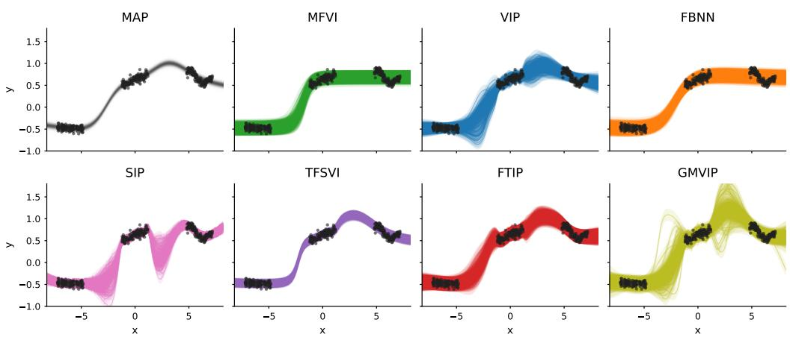  
Figure 4: Synthetic one-dimensional regression. Black points denote observed data. Each panel shows the predictive behavior of one method on the same input grid. MAP gives a deterministic fit, while the Bayesian and function-space methods represent posterior uncertainty through predictive samples with learned Gaussian noise.

Electricity metrics are computed independently for each of the 75 held-out windows and summarized by the mean and sample standard errors. Lotka–Volterra metrics are evaluated only on the held-out test interval and summarized by the mean and standard error across the 20 target trajectories.

## C EXPERIMENTAL DETAILS

## C.1 SYNTHETIC REGRESSION EXPERIMENT

We adapt the synthetic regression dataset introduced by Izmailov et al. (2020) and subsequently used by Ortega et al. (2024). The fixed realization contains N = 400 scalar observations

$$
\mathcal { D } = \{ ( x _ { i } , y _ { i } ) \} _ { i = 1 } ^ { N } , \qquad x _ { i } , y _ { i } \in \mathbb { R } .
$$

The inputs lie approximately in [ 7.20, 7.18], and the outputs in [ 0.61, 0.90]. All observed points are used for training, and posterior predictions are evaluated on a dense one-dimensional grid.

Implicit Process Prior. The implicit process prior is induced by a Bayesian neural network. Sampling weights and biases $\mathbf { w } \sim p ( \mathbf { w } )$ and evaluating the network gives

$$
f _ { \mathbf { w } } ( x ) = \mathrm { B N N } _ { \mathbf { w } } ( x ) , \qquad f \sim p ( f ) .
$$

The BNN has two hidden layers of width (10, 10), tanh activations, and a scalar output. In the frozen-prior setting, Bayesian linear layers use zero-mean Gaussian weights and biases with unit standard deviation,

$$
\mathbf { w } _ { \ell } \sim { \mathcal { N } } \big ( \mathbf { 0 } , \mathbf { I } _ { \mathrm { d i m } ( \mathbf { w } _ { \ell } ) } \big ) , \qquad \mathbf { b } _ { \ell } \sim { \mathcal { N } } \big ( \mathbf { 0 } , \mathbf { I } _ { \mathrm { d i m } ( \mathbf { b } _ { \ell } ) } \big ) .
$$

Learning Problem. We use Gaussian regression,

$$
y _ { i } = f ( x _ { i } ) + \varepsilon _ { i } , \qquad \varepsilon _ { i } \sim { \mathcal { N } } ( 0 , \sigma _ { y } ^ { 2 } ) ,
$$

and infer the posterior predictive distribution

$$
p ( f ( x _ { \star } ) \mid \mathcal { D } )
$$

on the plotting grid.

Methods and Visualization. Figure 4 compares MAP, MFVI, VIP, FBNN, SIP, TFSVI, FTIP, and GMVIP on the same grid. Black points are observations. MAP gives a deterministic curve, while the other methods show posterior uncertainty through predictive samples or bands. VIP learns a variational distribution over finite regression coefficients using samples from the BNN-induced prior; GMVIP uses the same function prior but constructs a generalized Matheron posterior through inducing evaluations.

## C.2 UCI REGRESSION EXPERIMENTS

We evaluate on nine scalar UCI regression datasets:

Boston, Concrete, Energy, Kin8nm, Naval, Power, Protein, Wine Red, Yacht .

For each seed, we use a random $9 0 / 1 0$ train/test split. Inputs are standardized using training-split statistics. Targets are normalized during training and all reported metrics are transformed back to the original target scale. Naval RMSE and CRPS are reported in units of $1 0 ^ { - 4 }$

Sweep design. We run five seeds, 0, 1, 2, 3, 4 , for each dataset and method variant. The reported variants are MAP, MFVI, FBNN, TFSVI, VIP, FTIP, GMVIP, and SIP. We use $T _ { \mathrm { o p t } } ~ = ~ 3 0 0 0 0$ iterations for Boston, Concrete, Energy, and Protein, and $T _ { \mathrm { o p t } } = 6 0 0 0 0$ iterations for Kin8nm, Naval, Power, Wine Red, and Yacht.

Shared training configuration. All runs use batch size 100 and Adam with initial learning rate $1 0 ^ { - 3 }$ . A cosine schedule anneals the learning rate to $1 0 ^ { - 5 }$ over the training budget. The shared network architecture is a Bayesian MLP with two hidden layers of width (10, 10), tanh activations, scalar output.

Likelihood and predictive distribution. All probabilistic methods use the Gaussian regression likelihood

$$
y _ { i } = f ( x _ { i } ) + \varepsilon _ { i } , \qquad \varepsilon _ { i } \sim { \mathcal { N } } ( 0 , \sigma _ { y } ^ { 2 } ) ,
$$

with a learned observation-noise parameter where applicable. Predictive distributions are evaluated from the method-specific posterior predictive samples or Gaussian predictive moments.

Method-specific settings. MAP is trained as a deterministic neural-network baseline with an $L _ { 2 }$ penalty. MFVI uses $R _ { \mathrm { t r } } = 5 1 2$ Monte Carlo samples during training and $R _ { \mathrm { e v } } = 5 1 2$ evaluation samples. FBNN uses a BNN functional prior, freezes the prior parameters, uses 512 regression coefficients, and evaluates with $R _ { \mathrm { e v } } = 5 1 2$ samples. TFSVI uses $R _ { \mathrm { t r } } = 5 1 2$ training samples and $R _ { \mathrm { e v } } = 5 1 2$ evaluation samples.

VIP uses $S ~ = ~ 2 0$ sampled-function basis coefficients. FTIP uses the same $S ~ = ~ 2 0$ basis, a spline 1x1 normalizing flow, $R _ { \mathrm { t r } } = 5 1 2$ flow samples during training, $R _ { \mathrm { e v } } = 5 1 2$ evaluation samples, and no VIP warm start, so the optimizer budget is not inflated by pretraining.

SIP uses $M = 1 0 0$ inducing inputs initialized by k-means, learns the inducing locations, and uses $B = 5 1 2$ prior samples, $R _ { \mathrm { t r } } = 5 1 2$ training samples, and $R _ { \mathrm { e v } } = 5 1 2$ evaluation samples. GMVIP uses the empirical Matheron operator, a Gaussian inducing-coefficient posterior, a tunable BNN prior, $M = 1 0 0$ inducing inputs initialized by k-means, learned inducing locations, $B = 5 1 2$ operator-bank samples, $R _ { \mathrm { t r } } = 5 1 2$ training samples, $R _ { \mathrm { e v } } = 5 1 2$ evaluation samples, prior-sample mean mode, and prior-Cholesky inducing scale.

Metrics. Tables 1and12 reports RMSE, negative log-likelihood (NLL), continuous ranked probability score (CRPS), and centered quantile metric (CQM). All metrics are computed on the held-out test split after undoing target normalization. NLL evaluates the predictive density at the observed targets. CRPS measures the quality of the full one-dimensional predictive distribution using posterior predictive samples. CQM is computed from probability integral transform values and measures centered predictive-interval calibration error. Lower is better for all reported metrics.

## C.3 LOTKA–VOLTERRA IMPLICIT-PRIOR EXPERIMENT

We define an implicit process prior through the Lotka–Volterra predator–prey system. For parameters

$$
\eta = ( \alpha , \beta , \delta , \gamma , u _ { 0 } , v _ { 0 } ) ,
$$

the physical-time state

$$
\mathbf { s } _ { \pmb { \eta } } ( t ) = \big ( u _ { \pmb { \eta } } ( t ) , v _ { \pmb { \eta } } ( t ) \big )
$$

is the solution of

$$
\frac { d u } { d t } = \alpha u - \beta u v ,
$$

$$
\frac { d v } { d t } = \delta u v - \gamma v ,
$$

with initial condition

$$
u ( 0 ) = u _ { 0 } , \qquad v ( 0 ) = v _ { 0 } .
$$

Here $u ( t )$ denotes prey population and $v ( t )$ denotes predator population. We use the normalized regression coordinate $x = 2 t / 3 0 - 1$ , with inverse $t ( x ) = 1 5 ( x + 1 )$ , and define $f _ { \eta } ( x ) = \mathbf { s } _ { \eta } ( t ( x ) )$ . The implicit prior is the push-forward of a parameter distribution through the ODE solver:

$$
\eta \sim p ( \eta ) , \qquad \mathbf { s } _ { \eta } = \mathrm { O D E S o l v e } ( \eta ) , \qquad f _ { \eta } ( x ) = \mathbf { s } _ { \eta } ( t ( x ) ) ,
$$

and therefore

$$
f _ { \eta } \sim p ( f ) .
$$

In the experiment we use

$$
\alpha \sim \mathrm { L o g N o r m a l } ( \log 1 . 5 , 0 . 1 5 ^ { 2 } ) , \qquad \beta \sim \mathrm { L o g N o r m a l } ( \log 1 . 0 , 0 . 1 5 ^ { 2 } ) ,
$$

$$
\delta \sim \mathrm { L o g N o r m a l } ( \log 0 . 7 5 , 0 . 1 5 ^ { 2 } ) , \qquad \gamma \sim \mathrm { L o g N o r m a l } ( \log 1 . 0 , 0 . 1 5 ^ { 2 } ) ,
$$

and

$$
u _ { 0 } , v _ { 0 } \sim \mathrm { U n i f o r m } ( 0 . 8 , 1 . 2 ) .
$$

The inference methods do not receive an explicit variational distribution over η. The prior is used as a black-box function sampler: one may draw

$$
f ^ { ( s ) } \sim p ( f )
$$

and evaluate $f ^ { ( s ) } ( x )$ at requested inputs, but the simulator parameters are not optimized.

Learning Problem Each target trajectory is generated by sampling a held-out parameter vector $\eta ^ { \star } \sim p ( \eta )$ and solving the ODE on $\bar { t ( ) } \in [ 0 , \bar { 3 0 } ]$ . The regression input is the normalized time defined above, so that $x \in [ - 1 , 1 ]$ . The output is vector-valued: $f ( \boldsymbol { x } ) = \big ( \boldsymbol { u } ( t ) , \boldsymbol { v } ( t ) \big ) \in \mathbb { R } ^ { 2 }$

Training observations are noisy samples from the target trajectory:

$$
\begin{array} { r } { \mathbf { y } _ { i } = f _ { \eta ^ { \star } } ( x _ { i } ) + \epsilon _ { i } , \qquad \epsilon _ { i } \sim \mathcal { N } ( \mathbf { 0 } , \Sigma _ { y } ) , } \end{array}
$$

using $N _ { \mathrm { o b s } } = 8 0$ training times restricted to $t _ { i } \leq 1 5 $ . For output channel $c ,$ the physical observationnoise standard deviation is 0.03 times the standard deviation of its clean training values; the likelihood uses this value after target normalization. The interval $1 5 < t \leq 2 0$ is deliberately unused: it supplies neither observations, validation scores, nor checkpoint selection. Test points are clean trajectory values on $t \in ( 2 0 , 3 0 ]$ ]. Thus the task is sparse forecasting from early predator–prey observations rather than interpolation over the full trajectory. The reported aggregate uses 20 deterministic held-out targets. Outputs are normalized separately for each target using the noisy training observations. For each trainable method, the normalized Gaussian observation-noise scale is initialized from the known simulator noise and learned separately for prey and predator. The training-free prior predictive and GMVIP surrogate-prior controls use the known simulator noise.

Methods This experiment is designed for implicit-process inference. The object we want to use as a prior is the simulator-induced distribution $p ( f )$ , not a neural-network generator with trainable weights. Standard MAP or mean-field variational inference baselines require introducing an explicit parametric generator and fitting a distribution over its parameters. That changes the problem: inference is then performed over the surrogate generator rather than directly with the ODE-induced prior.

VIP, FTIP, and GMVIP are appropriate methods in this setting because they require only samples from $f \sim p ( f )$ . VIP constructs its approximation from a finite collection of sampled prior functions. FTIP starts from a VIP approximation and then applies a learnable transport map in function-sample space. GMVIP also uses simulator samples, but forms a generalized Matheron posterior representation through inducing evaluations.

These are the headline configurations; Appendix D.5 reports sensitivity to the sampled-function basis size S for VIP and FTIP.

In the reported setting, the standalone VIP baseline uses $S = 2 0$ sampled prior functions and is trained for $T _ { \mathrm { o p t } } = 8 0 \bar { 0 }$ optimization steps. FTIP is warm-started from a VIP model using $S = 2 0$ sampled prior functions, then fine-tuned with a coupling affine flow using $R _ { \mathrm { t r } } = 8$ Monte Carlo samples per step for $T _ { \mathrm { o p t } } = 4 0 0$ additional optimization steps. Appendix D.5 reports sensitivity to $\bar { S } \in \{ 2 0 , 6 4 , 1 2 8 , 2 5 \dot { 6 } \}$ under the same forecasting protocol. GMVIP estimates its empirical operator from $B = 5 1 2$ simulator trajectories, uses $M = 9 6$ shared inducing times, and is trained for $T _ { \mathrm { o p t } } = 8 0 0$ optimization steps with $R _ { \mathrm { t r } } = 4$ . All trained models are evaluated at the exact final scheduled iterate: no validation loss, early stopping, or checkpoint selection is used. All methods use $R _ { \mathrm { e v } } = 1 0 2 4$ posterior samples for evaluation, including the equal-weight Gaussian-mixture NLL and the reported trajectory plot.

Joint multioutput parameterization. GMVIP uses $M = 9 6$ shared inducing times, uniformly spaced over $t \in [ 0 , 3 0 ]$ . These are input locations only. Prey and predator inducing values are stacked into a vector of dimension $2 M = 1 9 2$ . The empirical inducing covariance $\hat { \bf K } ( { \bf Z } , { \bf Z } )$ is a full $1 9 2 \times 1 9 2$ matrix containing prey–prey, predator–predator, and prey–predator covariance blocks. The variational posterior over the corresponding whitened inducing coefficients also uses a full $1 9 2 \times 1 9 2$ covariance. Thus GMVIP explicitly models posterior dependence across both time and the two state variables in this experiment.

ODE residual. The ODE residual is evaluated in physical state and time units on the held-out interval $t \in ( 2 0 , 3 0 ]$ . It measures whether each posterior trajectory is consistent with some Lotka– Volterra parameter vector. It does not use the parameters that generated the target trajectory. For each of up to 64 posterior trajectories

$$
f ^ { ( s ) } ( t _ { i } ) = \big ( u _ { i } ^ { ( s ) } , v _ { i } ^ { ( s ) } \big ) ,
$$

we estimate a separate parameter vector

$$
{ \widehat \Lambda } ^ { ( s ) } = \left( { \widehat \alpha } ^ { ( s ) } , { \widehat \beta } ^ { ( s ) } , { \widehat \delta } ^ { ( s ) } , { \widehat \gamma } ^ { ( s ) } \right)
$$

by unconstrained least squares. Derivatives are approximated at the interior test-grid points using centered finite differences:

$$
\dot { u } _ { i } ^ { ( s ) } = \frac { u _ { i + 1 } ^ { ( s ) } - u _ { i - 1 } ^ { ( s ) } } { t _ { i + 1 } - t _ { i - 1 } } , \qquad \dot { v } _ { i } ^ { ( s ) } = \frac { v _ { i + 1 } ^ { ( s ) } - v _ { i - 1 } ^ { ( s ) } } { t _ { i + 1 } - t _ { i - 1 } } .
$$

For the regression and right-hand-side evaluation, states are clipped as

$$
u _ { i } ^ { + } = \mathrm { m a x } ( u _ { i } ^ { ( s ) } , 1 0 ^ { - 8 } ) , \qquad v _ { i } ^ { + } = \mathrm { m a x } ( v _ { i } ^ { ( s ) } , 1 0 ^ { - 8 } ) .
$$

The prey and predator parameters are then fitted independently:

$$
( \widehat { \alpha } ^ { ( s ) } , \widehat { \beta } ^ { ( s ) } ) = \arg \operatorname* { m i n } _ { \alpha , \beta } \sum _ { i = 2 } ^ { N _ { t } - 1 } \left[ \dot { u } _ { i } ^ { ( s ) } - \left( \alpha u _ { i } ^ { + } - \beta u _ { i } ^ { + } v _ { i } ^ { + } \right) \right] ^ { 2 } ,
$$

$$
( \widehat { \delta } ^ { ( s ) } , \widehat { \gamma } ^ { ( s ) } ) = \arg \operatorname* { m i n } _ { \delta , \gamma } \sum _ { i = 2 } ^ { N _ { t } - 1 } \left[ \dot { v } _ { i } ^ { ( s ) } - \left( \delta u _ { i } ^ { + } v _ { i } ^ { + } - \gamma v _ { i } ^ { + } \right) \right] ^ { 2 } .
$$

No positivity constraints are imposed on the fitted parameters. For posterior trajectory s, define

$$
\mathbf { F } _ { i } ^ { ( s ) } = \left[ \widehat { \alpha } ^ { ( s ) } u _ { i } ^ { + } - \widehat { \beta } ^ { ( s ) } u _ { i } ^ { + } v _ { i } ^ { + } \right] , \qquad \dot { \mathbf { f } } _ { i } ^ { ( s ) } = \left[ \dot { \bar { u } } _ { i } ^ { ( s ) } \right] .
$$

Its normalized residual is

$$
\mathcal { R } ^ { ( s ) } = \frac { \displaystyle \frac { 1 } { 2 ( N _ { t } - 2 ) } \sum _ { i = 2 } ^ { N _ { t } - 1 } \left\| \dot { \mathbf { f } } _ { i } ^ { ( s ) } - \mathbf { F } _ { i } ^ { ( s ) } \right\| _ { 2 } ^ { 2 } } { \operatorname* { m a x } \left\{ \frac { 1 } { 2 ( N _ { t } - 2 ) } \sum _ { i = 2 } ^ { N _ { t } - 1 } \left\| \dot { \mathbf { f } } _ { i } ^ { ( s ) } \right\| _ { 2 } ^ { 2 } , 1 0 ^ { - 1 2 } \right\} } .
$$

The numerator and denominator therefore average over both prey and predator and over all interior test-grid points. The normalization makes the reported residual dimensionless. Finally, the per-target ODE residual is

$$
E _ { \mathrm { O D E } } = \frac { 1 } { R _ { \mathrm { e v } } ^ { \prime } } \sum _ { s = 1 } ^ { R _ { \mathrm { e v } } ^ { \prime } } \mathcal { R } ^ { ( s ) } , \qquad R _ { \mathrm { e v } } ^ { \prime } = \mathrm { m i n } ( R _ { \mathrm { e v } } , 6 4 ) .
$$

Although the input trajectories and derivatives are evaluated in physical units, only $E _ { \mathrm { O D E } }$ , the normalized residual ratio, is reported.

## C.4 ELECTRICITY-LOAD EMPIRICAL-PRIOR FORECASTING EXPERIMENT

We define a real-data empirical process prior using the Electricity Load dataset (Trindade, 2015). The dataset contains electricity-consumption trajectories sampled every 15 minutes. Let

$$
y _ { c , \tau } ( t _ { j } ) , \qquad j = 0 , \ldots , 1 9 1 ,
$$

denote the 48-hour load window for customer c, starting at calendar time τ, with

$$
t _ { j } = 0 . 2 5 j \quad \mathrm { h o u r s } .
$$

For each target window, the first 24 hours are observed and the next 24 hours are held out for forecasting. Thus each window has

$$
N _ { t } = 1 9 2 , \qquad N _ { \mathrm { o b s } } = 9 6 , \qquad N _ { \mathrm { t e s t } } = 9 6
$$

quarter-hourly points.

Unlike the ODE experiments, the prior is not generated by a known simulator. Instead, the prior is an empirical distribution over historical trajectories. For a target window $y ^ { \star }$ , we construct a prior bank

$$
\mathcal { G } ( y ^ { \star } ) = \{ f ^ { ( 1 ) } , \ldots , f ^ { ( B ) } \} , \qquad B = 2 0 4 8 ,
$$

from historical windows in the years 2011–2013. Test targets are sampled from 2014, so the prior bank and test targets are separated by calendar year.

All windows are normalized using statistics from their observed prefix. For a window $y ,$ define

$$
\mu _ { y } = \frac { 1 } { N _ { \mathrm { o b s } } } \sum _ { j = 0 } ^ { N _ { \mathrm { o b s } } - 1 } y ( t _ { j } ) , \qquad s _ { y } = \operatorname* { m a x } \left\{ \mathrm { s t d } \big ( y ( t _ { 0 } ) , \dots , y ( t _ { N _ { \mathrm { o b s } } - 1 } ) \big ) , 1 0 ^ { - 3 } \right\} .
$$

The normalized trajectory is

$$
\tilde { y } ( t _ { j } ) = \frac { y ( t _ { j } ) - \mu _ { y } } { s _ { y } } .
$$

Each historical prior trajectory is normalized by its own observed prefix statistics before being added to the bank. The bank is selected by a calendar-and-prefix nearest-neighbor rule. Candidate historical windows must come from prior years, match the target’s weekday/weekend status, and have month in

$$
\{ m ^ { \star } - 1 , m ^ { \star } , m ^ { \star } + 1 \} ,
$$

with months interpreted cyclically. Among these candidates, we compute the normalized prefix distance

$$
d ( \boldsymbol { y } , \boldsymbol { y } ^ { \star } ) = \frac { 1 } { N _ { \mathrm { o b s } } } \sum _ { j = 0 } ^ { N _ { \mathrm { o b s } } - 1 } \left( \tilde { y } ( t _ { j } ) - \tilde { y } ^ { \star } ( t _ { j } ) \right) ^ { 2 } ,
$$

and select the $B = 2 0 4 8$ nearest historical windows. The empirical prior is therefore

$$
f \sim p _ { \mathrm { e m p } } ( f \mid y ^ { \star } ) , \qquad p _ { \mathrm { e m p } } ( f \mid y ^ { \star } ) = \frac { 1 } { B } \sum _ { b = 1 } ^ { B } \delta _ { f ^ { ( b ) } } ( f ) .
$$

This is an implicit prior: the methods can draw trajectories from the historical bank and evaluate them at requested time points, but no tractable density over functions or latent calendar factors is provided.

Learning Problem For each target, the regression input is normalized time

$$
x _ { j } = 2 t _ { j } / 4 8 - 1 , \qquad x _ { j } \in [ - 1 , 1 ] .
$$

The output is scalar normalized load,

$$
f ( x _ { j } ) = \tilde { y } ^ { \star } ( t _ { j } ) \in \mathbb { R } .
$$

Training observations are the first 24 hours of the target window:

$$
\mathcal { D } _ { \mathrm { o b s } } = \{ ( x _ { j } , \tilde { y } ^ { \star } ( t _ { j } ) ) : j = 0 , \ldots , 9 5 \} .
$$

The held-out forecasting grid is

$$
t _ { j } \in [ 2 4 , 4 8 ) , \qquad j = 9 6 , \ldots , 1 9 1 .
$$

Metrics are computed after transforming predictions back to the original load scale using the targetwindow prefix statistics $( \mu _ { y ^ { \star } } , s _ { y ^ { \star } } )$ .

We use a Gaussian observation model in normalized units,

$$
y _ { i } = f ( x _ { i } ) + \varepsilon _ { i } , \qquad \varepsilon _ { i } \sim { \mathcal { N } } ( 0 , \sigma _ { y } ^ { 2 } ) ,
$$

with

$$
\sigma _ { y } ^ { ( 0 ) } = 0 . 0 5 .
$$

For VIP, FTIP, and GMVIP, the scalar normalized observation-noise scale is initialized at 0.05 and optimized jointly with the variational parameters. The Analog prior and Empirical Gaussian baselines retain the fixed nominal value 0.05. In physical units, a normalized scale $\sigma _ { y }$ corresponds to $\sigma _ { y } s _ { y } ,$ ⋆ for each target window.

We run three target-selection seeds, 0, 1, 2 , with 25 held-out target windows per seed, for 75 total target windows. All targets are sampled from 2014, while all empirical-prior trajectories are drawn from 2011–2013.

Methods This experiment evaluates whether the same function-space inference mechanisms used for simulator priors also apply to a real empirical trajectory prior. The prior is the historical empirical process $p _ { \mathrm { e m p } } \bar { ( } f \mid y ^ { \star } )$ ; the methods are not given a parametric model for electricity demand and do not optimize customer-specific latent calendar variables.

The analog baseline directly uses samples from the empirical prior bank without posterior adaptation. VIP constructs a coefficient posterior from $S = 2 0$ sampled prior functions. FTIP uses the same $S = 2 0$ basis and adds a learned transport map in coefficient space. GMVIP uses the empirical Matheron operator with a Gaussian inducing-coefficient posterior.

In the reported setting, VIP and FTIP use S = 20 sampled-function basis coefficients. GMVIP uses $B = 2 0 \bar { 4 } 8$ operator-bank trajectories and M = 96 inducing locations, with $\mathbf { Z } = \mathbf { X } _ { \mathrm { o b s } }$ corresponding to the observed 24-hour input grid. All learned methods are trained for $T _ { \mathrm { o p t } } = 5 0 0$ optimization steps, with $R _ { \mathrm { t r } } = 8$ Monte Carlo samples per training step. Observation noise is learned in every trainable method. Runs are evaluated at the final scheduled iterate, with no validation loss, early stopping, or checkpoint selection. All methods use $R _ { \mathrm { e v } } = 1 0 2 4$ posterior samples for final metrics and plots.

Empirical Gaussian baseline. For each target window, the Empirical Gaussian baseline uses the same $B = 2 0 4 8$ historical trajectories retrieved for GMVIP. Each historical trajectory is standardized using the mean and standard deviation of its own 96-point observed prefix. The target trajectory is analogously standardized using its observed prefix. All conditioning is performed in these normalized coordinates.

Let $\mathbf { h } ^ { ( b ) } \in \mathbb { R } ^ { 1 9 2 } , b = 1 , \dots , B$ , denote the retrieved historical trajectories. We estimate the full-grid mean and unbiased empirical covariance as

$$
\hat { \pmb { \mu } } = \frac { 1 } { B } \sum _ { b = 1 } ^ { B } \mathbf { h } ^ { ( b ) } , \qquad \hat { \mathbf { K } } = \frac { 1 } { B - 1 } \sum _ { b = 1 } ^ { B } \left( \mathbf { h } ^ { ( b ) } - \hat { \pmb { \mu } } \right) \left( \mathbf { h } ^ { ( b ) } - \hat { \pmb { \mu } } \right) ^ { \top } .
$$

Thus, $\hat { \mathbf { K } } \in \mathbb { R } ^ { 1 9 2 \times 1 9 2 }$ contains correlations between all observed and forecast time points.

Partition the grid into the observed prefix $o = \{ 1 , \ldots , 9 6 \}$ and the held-out forecast interval $* =$ $\{ 9 7 , \dots , 1 9 2 \}$ . Under the Gaussian observation model

$$
\mathbf { y } _ { o } = \mathbf { f } _ { o } + \epsilon , \qquad \epsilon \sim \mathcal { N } ( \mathbf { 0 } , \sigma _ { y } ^ { 2 } \mathbf { I } _ { 9 6 } ) ,
$$

the conditional latent distribution is

$$
p ( \mathbf { f _ { * \lambda } } \mid \mathbf { y } _ { o } ) = \mathcal { N } ( \mathbf { m } _ { * } , \mathbf { C } _ { * } ) ,
$$

Table 5: Electricity-load results across 75 seed–target windows. Entries are medians with 95% percentile-bootstrap confidence intervals from 100,000 resamples. Coverage is reported in percentage points and ranked by proximity to its nominal level. Lower is better otherwise.
<table><tr><td>Method</td><td>RMSE↓</td><td>NLL↓</td><td>CRPS↓</td><td>CQM↓</td><td>Cov. 80%</td><td>Cov. 90%</td></tr><tr><td>Analog prior</td><td>17.46 [12.80, 25.41]</td><td>4.30 [4.06, 4.70]</td><td>8.92 [6.49, 13.78]</td><td>0.093 [0.077, 0.112]</td><td>78.13 [73.96, 84.38]</td><td>91.67 [88.54, 92.71]</td></tr><tr><td>VIP</td><td>22.94 [14.13, 27.18]</td><td>10.05 [8.60, 11.64]</td><td>15.41 [9.70, 18.26]</td><td>0.384 [0.365, 0.396]</td><td>20.83 [17.71, 22.92]</td><td>25.00 [21.88, 29.17]</td></tr><tr><td>FTIP</td><td>21.20 [15.75, 28.02]</td><td>4.88 [4.27, 5.37]</td><td>12.35 [8.81, 17.57]</td><td>0.153 [0.132, 0.174]</td><td>57.29 [54.17, 61.46]</td><td>68.75 [66.67, 73.96]</td></tr><tr><td>Empirical Gaussian</td><td>16.99 [11.14, 25.10</td><td>4.36 [4.02, 5.06]</td><td>8.39 [6.06, 14.05]</td><td>0.108 [0.070, 0.151]</td><td>84.38 [80.21, 87.50]</td><td>91.67 [89.58, 93.75]</td></tr><tr><td>GMVIP</td><td>16.20 [11.14, 24.85]</td><td>4.08 [3.79, 4.54]</td><td>8.14 [5.93, 13.52]</td><td>0.102 [0.072, 0.112</td><td>80.21 [77.08, 84.38]</td><td>92.71 [89.58, 93.75]</td></tr></table>

where

$$
\begin{array} { r } { \mathbf { m } _ { * } = \hat { \pmb { \mu } } _ { * } + \hat { \mathbf { K } } _ { * o } \left( \hat { \mathbf { K } } _ { o o } + \sigma _ { y } ^ { 2 } \mathbf { I } _ { 9 6 } \right) ^ { - 1 } \left( \mathbf { y } _ { o } - \hat { \pmb { \mu } } _ { o } \right) , } \end{array}
$$

and

$$
\mathbf { C } _ { * } = \hat { \mathbf { K } } _ { * * } - \hat { \mathbf { K } } _ { * o } \left( \hat { \mathbf { K } } _ { o o } + \sigma _ { y } ^ { 2 } \mathbf { I } _ { 9 6 } \right) ^ { - 1 } \hat { \mathbf { K } } _ { o * } .
$$

Here C∗ is the conditional covariance of the latent forecast. The baseline is analytic and uses no optimization steps.

Metrics We report RMSE, negative log-likelihood (NLL), continuous ranked probability score (CRPS), and centered quantile metric (CQM) on the held-out forecasting region $t \in [ 2 4 , 4 8 )$ . All metrics are computed in the original load units after undoing the target normalization. The main paper reports the mean and sample standard errors across the 75 seed–target windows.

Results Summary As shown in Table 5, we report medians because RMSE exhibits substantial variation across forecasting windows. Electricity clients have markedly different load scales, and a few high-load or unusually difficult windows produce extreme absolute errors that disproportionately influence the mean. The median therefore better represents performance on a typical task, while the bootstrap confidence intervals quantify uncertainty across windows. GMVIP provides the strongest typical point and distributional forecasting performance, although its confidence intervals overlap those of the strongest baselines. Calibration remains dependent on the metric and nominal coverage level.

## C.5 LARGE REGRESSION EXPERIMENTS

We evaluate on two large scalar regression datasets:

$$
\{ { \mathrm { Y e a r } } , { \mathrm { A i r l i n e } } \} .
$$

The Year dataset uses the standard fixed split with the first 463 715 examples for training and the remaining examples for testing. The Airline dataset uses the first 800 000 examples, with the first 700 000 for training and the remaining 100 000 for testing. Inputs are standardized using training-split statistics. Targets are normalized during training and all reported metrics are transformed back to the original target scale.

Sweep design. We run five seeds, 0, 1, 2, 3, 4 , for each dataset and method variant. The reported variants are MFVI, FBNN, TFSVI, VIP, FTIP, GMVIP, and SIP. MAP and the fixed-prior variants of VIP, FTIP, GMVIP, and SIP are omitted from Table 4. We use $T _ { \mathrm { o p t } } = 6 0 0 0 0$ optimization iterations for both Year and Airline.

Shared training configuration. All runs use batch size 100 and Adam with initial learning rate $1 0 ^ { - 3 }$ . A cosine schedule anneals the learning rate to $1 0 ^ { - 5 }$ over the training budget. The shared model class is a Bayesian MLP with tanh activations, scalar output. Year uses two hidden layers of width (50, 50), while Airline uses two hidden layers of width (100, 100).

Likelihood and predictive distribution. All probabilistic methods use the Gaussian regression likelihood

$$
y _ { i } = f ( x _ { i } ) + \varepsilon _ { i } , \qquad \varepsilon _ { i } \sim { \mathcal { N } } ( 0 , \sigma _ { y } ^ { 2 } ) ,
$$

with a learned observation-noise parameter where applicable. Predictive distributions are evaluated from the method-specific posterior predictive samples or Gaussian predictive moments.

Method-specific settings. MFVI uses $R _ { \mathrm { t r } } = 5 1 2$ Monte Carlo samples during training and $R _ { \mathrm { e v } } =$ 512 evaluation samples. FBNN uses a BNN functional prior, freezes the prior parameters and evaluates with $\bar { R _ { \mathrm { e v } } } \ \stackrel { - } { = } \ 5 1 2$ samples. TFSVI uses $R _ { \mathrm { t r } } ~ = ~ 5 1 2$ training samples and $R _ { \mathrm { e v } } ~ = ~ 5 1 2$ evaluation samples.

VIP uses S = 20 sampled-function basis coefficients and learns the prior parameters. FTIP uses the same S = 20 basis, a spline 1x1 normalizing flow, $R _ { \mathrm { t r } } = 5 1 2$ flow samples during training, $R _ { \mathrm { e v } } = 5 1 2$ evaluation samples.

SIP uses M = 100 inducing inputs initialized by k-means, learns the inducing locations, and uses $B = 5 1 2$ prior samples, $R _ { \mathrm { t r } } = 5 1 2$ training samples, and $R _ { \mathrm { e v } } = 5 1 2$ evaluation samples. GMVIP uses the empirical Matheron operator, a Gaussian inducing-coefficient posterior, a tunable BNN prior, $M = 1 0 0$ inducing inputs initialized by k-means, learned inducing locations, $B = 5 1 2$ operator-bank samples, $R _ { \mathrm { t r } } = 5 1 2$ training samples, $\mathrm { \tilde { \it R e v } = 5 1 2 }$ evaluation samples, prior-sample mean mode, and prior-Cholesky inducing scale.

Metrics. Table 4 reports RMSE, negative log-likelihood (NLL), continuous ranked probability score (CRPS), and centered quantile metric (CQM). All metrics are computed on the held-out test split after undoing target normalization. NLL evaluates the predictive density at the observed targets. CRPS measures the quality of the full one-dimensional predictive distribution using posterior predictive samples. CQM is computed from probability integral transform values and measures centered predictive-interval calibration error. Lower is better for all reported metrics.

## C.6 LENET CLASSIFICATION EXPERIMENTS

We evaluate image classification on two standard multiclass datasets,

$$
\{ { \mathrm { F a s h i o n M N I S T } } , { \mathrm { C I F A R - 1 0 } } \} .
$$

For both datasets we use the standard train/test split provided by the dataset: FashionMNIST has 60 000 training examples and 10 000 test examples, and CIFAR-10 has 50 000 training examples and 10 000 test examples. Images are flattened by the dataset wrapper and rescaled to [0, 1]; the LeNet model reshapes them back to image tensors internally. No input standardization or target normalization is applied. Targets are integer class labels and all methods use the same ten-class classification task.

Sweep design. We run five seeds, 0, 1, 2, 3, 4 , for each dataset and method variant. The reported variants are MAP, MFVI, FBNN, VIP, FTIP, GMVIP, and SIP. The main classification table reports the LeNet setting, where the convolutional feature extractor is deterministic and the classifier head is Bayesian.

Shared training configuration. All runs use $T _ { \mathrm { o p t } } = 1 0 0 0 0$ optimizer iterations, batch size 128, Adam with learning rate $1 0 ^ { - 3 }$ , no cosine annealing, and evaluation batch size 512. The LeNet backbone consists of two convolutional blocks followed by a classifier head:

$$
\mathrm { C o n v } ( C , 6 , 5 ) \to \mathrm { R e L U } \to \mathrm { A v g P o o l } \to \mathrm { C o n v } ( 6 , 1 6 , 5 ) \to \mathrm { R e L U } \to \mathrm { A v g P o o l } \to\tag{14}
$$

$$
\mathrm { F C } ( 1 2 0 )  \mathrm { R e L U }  \mathrm { F C } ( 8 4 )  \mathrm { R e L U }  \mathrm { F C } ( 1 0 ) .\tag{15}
$$

In the Bayesian setting, the convolutional layers are deterministic and the three fully connected classifier layers are Bayesian layers for probabilistic methods. Bayesian weight log-standard deviations are initialized at 3.0, and the prior weight log-standard deviation is also initialized at 3.0.

Likelihood and predictive distribution. All probabilistic methods use a categorical multiclass likelihood. Predictive class probabilities are obtained by averaging softmax probabilities over posterior predictive samples. MAP is evaluated from a single deterministic network. The remaining methods use their method-specific posterior predictive samplers with $R _ { \mathrm { e v } } = 5 1 2$ evaluation samples unless otherwise stated.

Method-specific settings. MAP is trained as a deterministic LeNet baseline with cross-entropy and an $L _ { 2 }$ penalty of $1 0 ^ { - 4 }$ . MFVI uses $R _ { \mathrm { t r } } = 5 1 2$ Monte Carlo samples during training and $R _ { \mathrm { e v } } = 5 1 2$ samples at evaluation. FBNN uses a frozen BNN functional prior, $R _ { \mathrm { e v } } = 5 1 2$ posterior samples, and $B = 5 1 2$ prior samples.

VIP uses $S = 2 0$ sampled-function basis coefficients and learns the Bayesian classifier-head prior parameters. FTIP uses the same $S = 2 0$ basis, a spline 1x1 normalizing flow, $R _ { \mathrm { t r } } = 5 1 2$ flow samples during training, $R _ { \mathrm { e v } } = 5 1 2$ evaluation samples, and learns the prior parameters.

SIP uses $M = 1 0 0$ inducing inputs initialized by k-means, learns the inducing locations, and uses $B = 5 1 2$ prior samples, $R _ { \mathrm { t r } } = 5 1 2$ training samples, and $R _ { \mathrm { e v } } = 5 1 2$ evaluation samples. GMVIP uses the empirical Matheron operator, a Gaussian inducing-coefficient posterior, $M = \mathrm { 1 0 0 }$ inducing inputs initialized by k-means, learned inducing locations, $B = 5 1 2$ operator-bank samples, $R _ { \mathrm { t r } } = 5 1 2$ training samples, and $R _ { \mathrm { e v } } = 5 1 2$ evaluation samples.

For classification, GMVIP uses a channel-wise multioutput approximation. Each of the ten latent logits has its own inducing-coefficient block, and the variational covariance is block-diagonal across logits. With $M = 1 0 0 ,$ , a joint formulation would require a full $1 0 0 0 \times 1 0 0 0$ coefficient covariance, so the block-diagonal parameterization is used for scalability. The softmax likelihood jointly normalizes the sampled logits, but cross-logit covariance is not explicitly parameterized in $q _ { \phi } ( \mathbf { a } )$

Metrics. Table 9 reports negative log-likelihood (NLL), classification error, expected calibration error (ECE), and Brier score on the held-out test split. NLL evaluates the predictive categorical density assigned to the observed class. Error is the fraction of incorrect predictions under the posterior mean class probabilities. ECE measures confidence calibration using binned predicted probabilities. The Brier score measures the squared error between predictive class probabilities and one-hot labels. Lower is better for all reported metrics.

## D FURTHER EXPERIMENTS

## D.1 FINITE-DIMENSIONAL SURROGATE-PRIOR FIDELITY

The variational objective of GMVIP is defined relative to its Matheron surrogate prior rather than directly relative to the original implicit process. Proposition 5 characterizes two sources of finitedimensional distortion: replacing the inducing-value law and removing the dependence between the residual path and the replacement inducing values. Proposition 4 shows that the population Matheron construction nevertheless preserves the original mean and covariance. This section measures the resulting finite-sample discrepancy directly and compares it with the coefficient-space surrogate used by VIP.

Label-free prior and surrogate constructions. We use the frozen scalar BNN prior from the synthetic experiment, but do not load observations, evaluate a likelihood, or perform optimization. The architecture is 1-10-10-1, with tanh hidden activations and independent zero-mean, unit-variance Gaussian weights and biases. We evaluate every sampled function on $N _ { x } = 3 0 1$ uniformly spaced inputs over $[ - 5 , 5 ]$

For a VIP basis of S independently sampled prior functions $\mathcal { G } _ { \mathrm { V I P } } = \{ g ^ { ( s ) } \} _ { s = 1 } ^ { S }$ , let

$$
\hat { \mu } _ { S } ( { \bf x } ) = \frac { 1 } { S } \sum _ { s = 1 } ^ { S } g ^ { ( s ) } ( { \bf x } ) , \qquad \phi _ { s } ( { \bf x } ) = \frac { g ^ { ( s ) } ( { \bf x } ) - \hat { \mu } _ { S } ( { \bf x } ) } { \sqrt { S - 1 } } .
$$

The VIP surrogate-prior sample is

$$
f _ { \mathrm { V I P } } ( \mathbf { x } ) = \hat { \mu } _ { S } ( \mathbf { x } ) + \sum _ { s = 1 } ^ { S } \phi _ { s } ( \mathbf { x } ) a _ { s } , \qquad \mathbf { a } \sim \mathcal { N } ( \mathbf { 0 } , \mathbf { I } _ { S } ) .
$$

Conditional on the sampled basis, this is a Gaussian finite-rank process with the empirical basis mean and covariance.

The empirical GMVIP surrogate uses M uniformly spaced inducing inputs, the paper’s prior-bank notation $\mathcal { G } = \{ g ^ { ( b ) } \} _ { b = 1 } ^ { B }$ , and

$$
\begin{array} { r } { f _ { \mathrm { G M V I P } } ( \cdot ) = T ( g , \mathbf { a } ) ( \cdot ) \qquad } \\ { \qquad = g ( \cdot ) + \Psi _ { \mathbf { Z } } ^ { \mathrm { e m p } } ( \cdot ) \left[ \hat { \pmb { \mu } } ( \mathbf { Z } ) + \mathbf { L a } - g ( \mathbf { Z } ) \right] , } \\ { \qquad \mathbf { a } \sim \mathcal { N } ( \mathbf { 0 } , \mathbf { I } _ { M } ) . \qquad } \end{array}
$$

Here $g$ is a fresh coherent BNN-prior path, $\mathbf { L L } ^ { \top } = \hat { \mathbf { K } } ( \mathbf { Z } , \mathbf { Z } )$ is the stabilized empirical inducing covariance, and $\Psi _ { { \bf Z } } ^ { \mathrm { e m p } } ( \cdot ) = \hat { \bf K } ( \cdot , { \bf Z } ) \hat { \bf K } ( { \bf Z } , { \bf Z } ) ^ { - 1 }$ , as in Equation 10. We use the same numerical settings as the synthetic GMVIP experiment. Both surrogates therefore use $p ( \mathbf { a } ) = \mathcal { N } ( \mathbf { 0 } , \mathbf { I } _ { d _ { a } } )$ , with $d _ { a } = { \bar { S } }$ for VIP and $d _ { a } = M$ for scalar-output GMVIP. No variational parameters are optimized in this experiment.

Sampling protocol and finite-sample floor. We run seeds 0–4. For every seed, disjoint random streams generate an operator or basis bank, surrogate coefficients and residual paths, and three independent sets of $\bar { R _ { \mathrm { e v } } } = 2 0 4 8$ original-prior functions. The first original-prior set estimates a pointwise mean $\widehat { \mu } _ { j }$ and standard deviation $\hat { \sigma } _ { j }$ . All functions are standardized as

$$
\widetilde { f } _ { j } ^ { ( r ) } = \frac { f ^ { ( r ) } ( x _ { j } ) - \widehat { \mu } _ { j } } { \widehat { \sigma } _ { j } } .
$$

This common coordinatewise affine map makes the distances dimensionless and prevents highvariance input regions from dominating the comparison. Its parameters are estimated only from the independent original-prior calibration set; no surrogate sample influences the normalization. The second original-prior set is the reference distribution. The third is an independent true-prior split, and its distance from the reference quantifies the nonzero floor caused by finite-sample estimation. Operator and basis samples are never reused in this reference comparison.

Metrics. Let $\widetilde { \mathbf { F } } , \widetilde { \mathbf { H } } \in \mathbb { R } ^ { R _ { \mathrm { e v } } \times N _ { x } }$ denote standardized reference and candidate samples. We report: 1. the average pointwise empirical Wasserstein distance

$$
\overline { { W } } _ { 1 } = \frac { 1 } { N _ { x } } \sum _ { j = 1 } ^ { N _ { x } } \frac { 1 } { R _ { \mathrm { e v } } } \sum _ { r = 1 } ^ { R _ { \mathrm { e v } } } \left| \widetilde { F } _ { ( r ) j } - \widetilde { H } _ { ( r ) j } \right| ,
$$

together with its maximum over $x _ { j } { \mathrm { : } }$

2. the joint sliced Wasserstein distance

$$
\mathrm { S W _ { 2 } } = \left[ \frac { 1 } { { \cal P } } \sum _ { p = 1 } ^ { P } W _ { 2 } ^ { 2 } \left( \widetilde { \bf F } \pmb { \theta } _ { p } , \widetilde { \bf H } \pmb { \theta } _ { p } \right) \right] ^ { 1 / 2 } , \qquad P = 5 1 2 ,
$$

where the $\theta _ { p }$ are random unit directions over the complete discretized function;

3. the RMSE between sample means, $e _ { \mu } = N _ { x } ^ { - 1 / 2 } \| \widehat { \pmb { \mu } } _ { F } - \widehat { \pmb { \mu } } _ { H } \| _ { 2 }$ , and relative covariance error $e _ { \mathbf { K } } = \| \hat { \mathbf { K } } _ { F } - \hat { \mathbf { K } } _ { H } \| _ { F } / \| \hat { \mathbf { K } } _ { F } \| _ { F } ;$

4. the energy distance and a three-bandwidth RBF $\mathrm { M M D _ { R B F } ^ { 2 } }$ , computed on the first 512 evaluation samples to bound their quadratic cost.

All metrics are lower-is-closer. Tables report means and standard errors across the five experiment seeds. Figure 5 visualizes representative paths at the published settings, and Table 6 reports all default-setting discrepancies.

At the published settings, GMVIP reduces $\mathrm { S W _ { 2 } }$ by 71.4% and average marginal $W _ { 1 }$ by 76.9% relative to VIP. Its joint and marginal distances are close to the corresponding true-split floors: 0.072 versus 0.064 for $\mathrm { S W _ { 2 } } .$ and 0.049 versus 0.045 for $\overline { { W } } _ { 1 }$ . The maximum pointwise discrepancy is also near the floor (0.069 versus 0.066), whereas VIP reaches 0.312. Figure 6 shows that this is not an average hiding a localized failure: GMVIP tracks the split baseline across the full input interval, while VIP remains substantially farther away, especially away from the center.

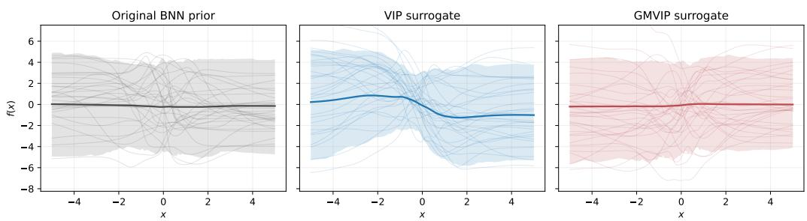  
Figure 5: Original and surrogate prior paths for the published synthetic configurations. Thin curves are sampled functions, thick curves are sample means, and shaded regions are pointwise 90% intervals. VIP uses $S = 2 0 ;$ ; GMVIP uses $M = 2 5 6$ inducing inputs and $B = 1 0 2 4$ operator-bank paths. The VIP mean and path distribution visibly depend on the particular finite basis, whereas the GMVIP residual paths retain the qualitative variability of the original BNN prior.

Table 6: Surrogate-prior fidelity at the published synthetic configurations ( ). Entries are mean standard error across five seeds. The true-prior split is the finite-sample noise floor rather than a competing method. Bold marks the closer of the two nontrivial surrogates.
<table><tr><td>Distribution</td><td>Configuration</td><td>SW2</td><td>W1</td><td> $\operatorname* { m a x } _ { x } W _ { 1 }$ </td><td>eµ</td><td>eK</td><td>Energy</td><td>MMDRBF</td></tr><tr><td>True-prior split</td><td> $R _ { \mathrm { e v } } = 2 0 4 8$ </td><td> $\overline { { 0 . 0 6 4 \pm 0 . 0 0 4 } }$ </td><td> $0 . 0 4 5 \pm 0 . 0 0 5$ </td><td> $0 . 0 6 6 \pm 0 . 0 0 7$ </td><td> $0 . 0 3 4 \pm 0 . 0 0 8$ </td><td>0.056 ± 0.010</td><td> $0 . 0 0 3 2 \pm 0 . 0 0 0 3$ </td><td> $0 . 0 0 1 1 \pm 0 . 0 0 0 1$ </td></tr><tr><td>VIP surrogate</td><td>S = 20</td><td> $\mathbf { 0 . 2 5 3 \overset { - } { \pm } 0 . 0 3 2 }$ </td><td>0.214 ± 0.030</td><td>0.312 ± 0.029</td><td> $0 . 1 9 5 \pm 0 . 0 3 0$ </td><td> $0 . 3 6 9 \pm 0 . 0 7 3$ </td><td> $0 . 0 3 1 7 \pm 0 . 0 0 8 8$ </td><td> $0 . 0 1 1 7 \pm 0 . 0 0 2 8$ </td></tr><tr><td>GMVIP surrogate</td><td>M = 256, B = 1024 0.072 ± 0.004</td><td></td><td>0.049 ± 0.003</td><td>0.069 ± 0.006</td><td> $\mathbf { 0 . 0 4 0 \overset { - } { \pm } 0 . 0 0 5 }$ </td><td>0.073 ± 0.009</td><td> $\mathbf { 0 . 0 0 5 6 \overset { - } { \pm } 0 . 0 0 0 1 }$ </td><td>0.0022 ± 0.0001</td></tr></table>

Matched coefficient dimension. To separate the published configuration choice from the pathwise construction, we match the finite coefficient dimension at $S \stackrel { - } { = } M \in \{ 8 , 2 0 , 3 2 , 6 4 , 1 \bar { 2 } 8 , 2 5 6 \}$ holding the GMVIP operator bank fixed at $B = 1 0 2 4$ . This matches the dimension of the standardnormal coefficient, not total sampling cost: GMVIP additionally retains a fresh residual prior path by design. Table 7 reports the two core distances, while Figure 7 shows their dimension dependence.

GMVIP is closer on both core metrics at every matched dimension. Its $\mathrm { S W _ { 2 } }$ advantage ranges from 77.4% at dimension 8 to 27.9% at dimension 256; the corresponding $\overline { { W } } _ { 1 }$ reductions range from 80.5% to 33.5%. Notably, GMVIP with only $M = 8$ has lower joint and marginal distances than VIP with $S = 2 5 6$ . VIP improves consistently with basis size, as expected from its empirical moment approximation, but its Gaussian finite-basis law remains detectably farther from this non-Gaussian BNN prior. Figure 8 compares the corresponding mean and covariance errors.

The moment diagnostics agree with the distributional distances. At the published settings, the GMVIP mean error is 0.040, compared with 0.034 for the true split and 0.195 for VIP. Its relative covariance error is 0.073, compared with 0.056 for the split and 0.369 for VIP. Thus the empirical results support the population second-order preservation result while also quantifying finite-bank estimation error. Figure 9 provides the energy-distance and kernel-MMD robustness checks.

The independent robustness metrics lead to the same ordering. At the published settings, the energy distance is 0.0056 for GMVIP, 0.0317 for VIP, and 0.0032 for the true split. The corresponding $\mathrm { M M D _ { R B F } ^ { 2 } }$ values are 0.0022, 0.0117, and 0.0011. The agreement across marginal, projected-joint, moment, energy, and kernel metrics makes the conclusion insensitive to any single discrepancy measure.

Operator-bank sensitivity. Finally, we fix $M = 2 5 6$ and vary the number of prior paths used to estimate the empirical operator. Table 8 and Figure 10 show that the discrepancy is not strictly monotone for the smaller banks: $B = 5 1 2$ is worse than $B = 2 5 6$ on this five-seed experiment. This is consistent with finite-bank and covariance stabilization variability rather than a deterministic monotonicity guarantee. The larger banks improve sharply. At $B = 2 0 4 8 , \mathrm { S W _ { 2 } } = 0 . 0 6 6$ and $\overline { { W } } _ { 1 } = 0 . 0 4 \dot { 3 }$ , which are at the scale of the true-split floors 0.064 and 0.045.

Interpretation and limitations. The experiment isolates prior fidelity from posterior optimization and predictive performance. It shows that the residual-path construction makes the empirical GMVIP surrogate substantially closer to the original BNN prior than the VIP finite-basis surrogate, and that most of the remaining detectable gap at the published setting is reduced by enlarging the operator bank. However, the true-split floor prevents interpreting a distance numerically close to that floor as proof of equality. The measurements concern one non-Gaussian BNN prior on one 301-point grid; they do not establish equality of infinite-dimensional process laws or uniform behavior for every implicit prior. They instead provide a direct finite-dimensional complement to Proposition 5 and empirical support for the second-order statement in Proposition 4.

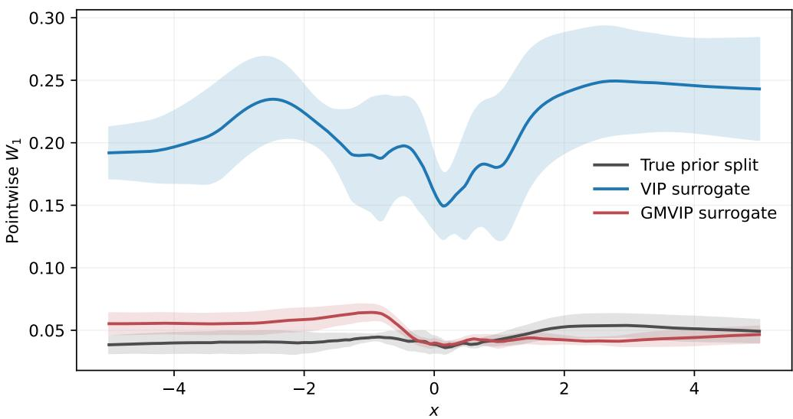  
Figure 6: Pointwise marginal $W _ { 1 }$ for the published VIP and GMVIP configurations. Curves and bands show mean standard error across five seeds. The GMVIP surrogate follows the true-prior split floor across $[ - 5 , 5 ]$ ; the VIP finite-basis surrogate has a much larger discrepancy throughout the interval.

Table 7: Core distances under matched coefficient dimension ( ). GMVIP uses $B = 1 0 2 4$ . Entries are mean standard error across five seeds; bold marks the smaller distance in each pair.
<table><tr><td rowspan="2">Coefficient dim.  $S = M$ </td><td colspan="2"> $\mathrm { S W _ { 2 } }$ </td><td colspan="2"> $\overline { { W } } _ { 1 }$ </td></tr><tr><td>VIP</td><td>GMVIP</td><td>VIP</td><td>GMVIP</td></tr><tr><td>8</td><td> $0 . 3 6 7 \pm 0 . 0 4 3$ </td><td> $\mathbf { 0 . 0 8 3 \pm 0 . 0 0 5 }$ </td><td> $0 . 3 0 3 \pm 0 . 0 3 9$ </td><td> $\mathbf { 0 . 0 5 9 \pm 0 . 0 0 7 }$ </td></tr><tr><td>20</td><td> $0 . 2 5 3 \pm 0 . 0 3 2$ </td><td> $\mathbf { 0 . 0 7 8 \pm 0 . 0 0 4 }$ </td><td> $0 . 2 1 4 \pm 0 . 0 3 0$ </td><td> $\mathbf { 0 . 0 5 5 \pm 0 . 0 0 7 }$ </td></tr><tr><td>32</td><td> $0 . 1 8 9 \pm 0 . 0 3 7$ </td><td> $\mathbf { 0 . 0 7 7 \pm 0 . 0 0 3 }$ </td><td> $0 . 1 4 4 \pm 0 . 0 3 1$ </td><td> $\mathbf { 0 . 0 4 9 \pm 0 . 0 0 1 }$ </td></tr><tr><td>64</td><td> $0 . 1 4 4 \pm 0 . 0 1 8$ </td><td> $\mathbf { 0 . 0 8 1 \pm 0 . 0 0 5 }$ </td><td> $0 . 1 0 3 \pm 0 . 0 1 4$ </td><td> $\mathbf { 0 . 0 5 4 \pm 0 . 0 0 6 }$ </td></tr><tr><td>128</td><td> $0 . 1 1 9 \pm 0 . 0 2 2$ </td><td> $\mathbf { 0 . 0 7 4 \pm 0 . 0 0 6 }$ </td><td> $0 . 0 8 6 \pm 0 . 0 2 4$ </td><td> $\mathbf { 0 . 0 4 9 \pm 0 . 0 0 5 }$ </td></tr><tr><td>256</td><td> $0 . 1 0 0 \pm 0 . 0 0 5$ </td><td> $\mathbf { 0 . 0 7 2 \pm 0 . 0 0 4 }$ </td><td> $0 . 0 7 4 \pm 0 . 0 0 7$ </td><td> $\mathbf { 0 . 0 4 9 \pm 0 . 0 0 3 }$ </td></tr></table>

## D.2 CLASSIFICATION EXPERIMENTS

LeNet classification. Table 9 summarizes this first setting. We first evaluate image classification on FashionMNIST and CIFAR-10 using a LeNet-style architecture with deterministic convolutional features and Bayesian classifier layers. We report NLL, classification error, ECE, and Brier score over five random seeds. This setting tests whether the proposed function-space posterior improves predictive uncertainty and accuracy while keeping the architecture lightweight enough for repeated Bayesian comparisons. GMVIP is consistently competitive in this Bayesian-head LeNet regime: on FashionMNIST it attains the best classification error and Brier score, and is tied for the best rounded NLL with FBNN. On CIFAR-10, SIP obtains the strongest NLL, error, and Brier score, but GMVIP remains among the best methods, with the second-best error and performance close to FBNN on NLL and Brier score. MFVI gives the lowest ECE, although this comes with worse predictive accuracy and likelihood on several metrics. These results indicate that GMVIP provides a favorable accuracy–uncertainty trade-off in the Bayesian-head LeNet setting, particularly on FashionMNIST, whereas CIFAR-10 is more challenging and favors SIP under this representation.

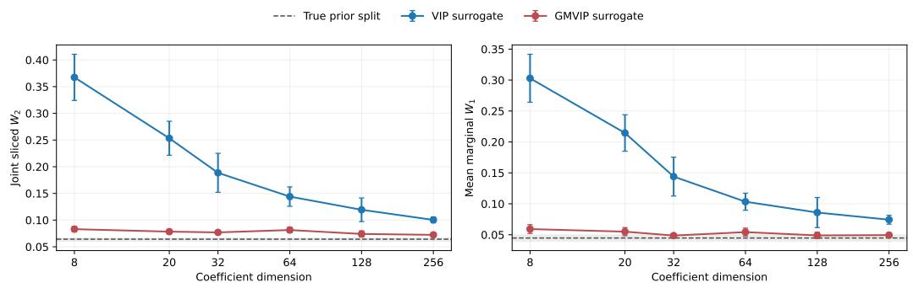  
Figure 7: Joint sliced $W _ { 2 }$ and average marginal $W _ { 1 }$ against matched coefficient dimension. Error bars are standard errors across five seeds; the dashed line and gray band show the true-prior split mean and standard error. VIP approaches the original prior as its sampled-function basis grows, whereas GMVIP is near the finite-sample floor throughout the sweep.

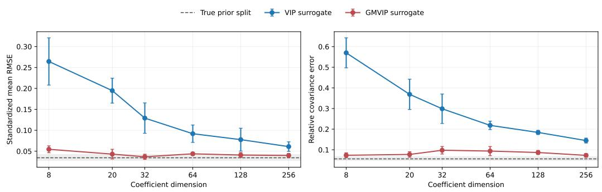  
Figure 8: Standardized mean RMSE and relative covariance error under matched coefficient dimension. GMVIP remains close to the finite-sample floor because it combines an empirical priorcovariance correction with a fresh residual prior path. VIP moment errors decrease with basis size but remain larger over the tested range.

Frozen-CLIP protocol. We additionally evaluate all eight methods with linear classifier heads over frozen, normalized 512-dimensional CLIP ViT-B/32 embeddings. These experiments separate uncertainty in the classifier from representation learning: the encoder is never updated, and each method differs only in its linear head and posterior construction. The shared benchmark fixes the learning rate at $1 0 ^ { - 3 }$ for every method. Every method is otherwise tuned independently, the selected head is retrained with 3 seeds, and Bayesian predictions average 100 posterior samples. A positive scalar temperature is fitted on a held-out calibration split after training. Temperature scaling does not change the predicted class, so the reported accuracy is unchanged, while NLL and ECE are temperature calibrated.

Frozen-CLIP CIFAR-10. For CIFAR-10, the 50 000 training images are divided into 40 000 tuning examples, 5 000 model-selection examples, and 5 000 temperature-calibration examples. After model selection, each winning head is retrained on the combined 45 000 fitting examples and evaluated once on the untouched 10 000-image test set. Table 10 shows that GMVIP is strongest overall. It obtains 94.45% accuracy, NLL 0.1667, and ECE 0.0058, giving the best accuracy and NLL and the second-best ECE. VIP ranks second in accuracy (94.42%) and NLL (0.1700), while SIP has the lowest ECE (0.0057). GMVIP gives the strongest accuracy–uncertainty trade-off on frozen-CLIP CIFAR-10.

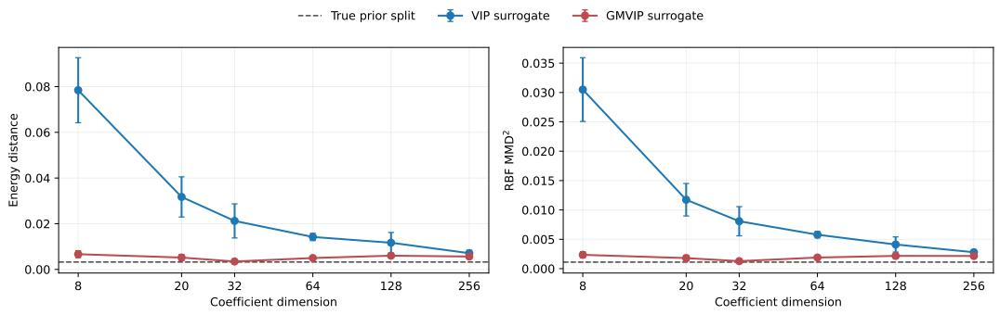  
Figure 9: Energy distance and multi-bandwidth RBF $\mathrm { M M D _ { R B F } ^ { 2 } }$ under matched coefficient dimension. These metrics use a deterministic 512-sample prefix. They reproduce the Wasserstein conclusion: GMVIP stays close to the true-split floor, while VIP requires a much larger basis to reduce the discrepancy.

Table 8: GMVIP operator-bank sensitivity at $M = 2 5 6 \left( \downarrow \right)$ . Entries are mean standard error across five seeds.
<table><tr><td>Bank B</td><td> $\mathrm { S W } _ { 2 }$ </td><td> $\overline { { W } } _ { 1 }$ </td><td> $e _ { \mu }$ </td><td>ek</td><td>Energy</td><td> $\mathrm { M M D _ { R B F } ^ { 2 } }$ </td></tr><tr><td>256</td><td> $0 . 0 9 3 \pm 0 . 0 1 3$ </td><td> $0 . 0 6 5 \pm 0 . 0 1 1$ </td><td> $0 . 0 5 8 \pm 0 . 0 1 7$ </td><td> $0 . 1 0 5 \pm 0 . 0 2 0$ </td><td> $0 . 0 0 8 3 \pm 0 . 0 0 1 8$ </td><td> $0 . 0 0 2 8 \pm 0 . 0 0 0 6$ </td></tr><tr><td>512</td><td> $0 . 1 0 6 \pm 0 . 0 0 8$ </td><td> $0 . 0 8 3 \pm 0 . 0 0 9$ </td><td> $0 . 0 7 1 \pm 0 . 0 1 1$ </td><td> $0 . 1 1 6 \pm 0 . 0 2 2$ </td><td> $0 . 0 0 8 1 \pm 0 . 0 0 1 8$ </td><td> $0 . 0 0 2 9 \pm 0 . 0 0 0 6$ </td></tr><tr><td>1024</td><td> $0 . 0 7 2 \pm 0 . 0 0 4$ </td><td> $0 . 0 4 9 \pm 0 . 0 0 3$ </td><td> $0 . 0 4 0 \pm 0 . 0 0 5$ </td><td> $0 . 0 7 3 \pm 0 . 0 0 9$ </td><td> $0 . 0 0 5 6 \pm 0 . 0 0 0 1$ </td><td> $0 . 0 0 2 2 \pm 0 . 0 0 0 1$ </td></tr><tr><td>2048</td><td> $\mathbf { 0 . 0 6 6 \pm 0 . 0 0 5 }$ </td><td> $\mathbf { 0 . 0 4 3 \pm 0 . 0 0 5 }$ </td><td> $\mathbf { 0 . 0 3 5 \pm 0 . 0 0 7 }$ </td><td> $\mathbf { 0 . 0 5 9 \pm 0 . 0 1 1 }$ </td><td> $\mathbf { 0 . 0 0 4 4 \pm 0 . 0 0 1 1 }$ </td><td> $\mathbf { 0 . 0 0 1 5 \pm 0 . 0 0 0 5 }$ </td></tr></table>

Frozen-CLIP DynaSent. We next consider three-class sentiment classification on DynaSent. CLIP text embeddings are fitted with linear heads using 80 488 Round-1 training sentences for tuning and one stratified half of the Round-1 development set (1 800 examples) for model selection. The selected head is retrained on the resulting 82 288 examples, while the other 1 800 development examples are reserved for temperature calibration. We evaluate on the 3 600-example Round-1 test set (in distribution) and the 720-example Round-2 Dynabench test set (shifted). In addition to accuracy, ${ \mathrm { N L L } } ,$ and ECE, we report area under the risk–coverage curve (AURC), for which lower values mean that predictive confidence ranks correct examples ahead of errors more effectively.

Table 11 shows that GMVIP performs best on the Round-1 test set in accuracy, NLL, and AURC, attaining 59.48%, 0.8769, and 0.2503, respectively. Under the Round-2 shift, GMVIP retains the best NLL (0.9163) and AURC (0.3111), and has the second-best accuracy (57.41%) behind VIP (57.96%). SIP has the lowest shifted ECE, but only two of its three final seeds completed.

Taken together, Tables 9, 10, and 11 show that the value of a Bayesian classifier depends on the representation and data regime. GMVIP is strongest in the FashionMNIST LeNet comparison and is the strongest method under the common fixed-learning-rate frozen-CLIP CIFAR-10 protocol. On DynaSent, GMVIP provides the strongest overall in-distribution and shifted predictive performance. These results indicate that its function-space posterior is particularly useful when the representation retains label ambiguity, while still remaining effective with highly separable frozen image features.

## D.3 FULL UCI REGRESSION RESULTS

Table 12 completes the results of Table 1 by including CRPS and CQM metrics of the experiments.

## D.4 ABLATION STUDIES

We study the sensitivity of GMVIP to the initialization of the inducing locations, the number of inducing locations, and the number of prior functions used to estimate the operator moments. We use the nine UCI regression datasets and seeds 0–4, giving 45 runs per setting and 540 runs in total. Unless it is the quantity being varied, we use $M = 1 0 0 .$ , a prior bank of $B = 5 1 2$ , and k-means initialization. The inducing locations Z and the prior are subsequently optimized in every run; consequently, the geometry ablation measures sensitivity to the initial placement of Z.

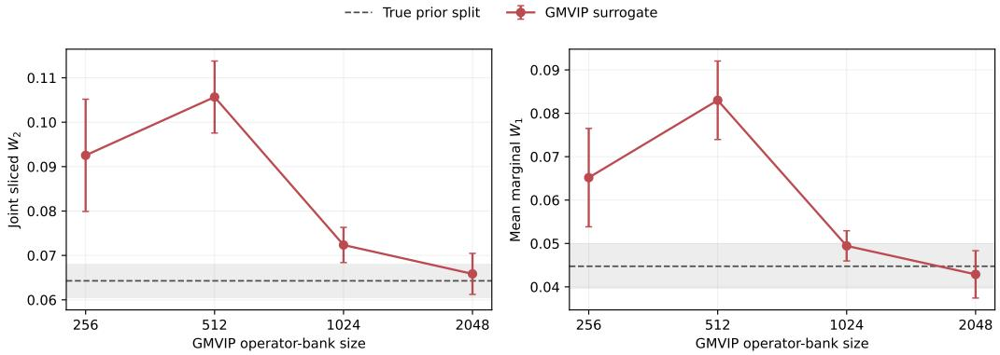  
Figure 10: GMVIP joint and marginal prior discrepancy as a function of operator-bank size at $M = 2 5 6$ . The dashed line and gray band denote the true-prior split floor. At B = 2048, the error bars overlap the floor at the resolution of these sample-based diagnostics, although the smaller-bank trend is non-monotone.

Table 9: Bayesian-head LeNet classification metrics ( ). Entries are mean standard deviation across five seeds. Best results are shown in purple; second-best are shown in teal.
<table><tr><td>Metric Dataset</td><td></td><td>MAP</td><td>MFVI</td><td>VIP</td><td>FBNN</td><td>SIP</td><td>FTIP</td><td>GMVIP</td></tr><tr><td rowspan="2">NLL</td><td>FashionMNIST</td><td> $\begin{array} { c } { 0 . 2 8 7 \pm 0 . 0 1 2 } \\ { 1 . 0 9 9 \pm 0 . 0 5 4 } \end{array}$ </td><td> $\begin{array} { c } { 0 . 2 9 6 \pm 0 . 0 1 4 } \\ { 1 . 1 8 9 \pm 0 . 0 2 3 } \end{array}$ </td><td>0.282 ± 0.015</td><td> $\begin{array} { c } { 0 . 2 6 1 \pm 0 . 0 1 6 } \\ { 1 . 0 9 3 \pm 0 . 0 6 5 } \end{array}$ </td><td> $\begin{array} { c } { 0 . 2 7 7 \pm 0 . 0 0 9 } \\ { 1 . 0 3 9 \pm 0 . 0 6 5 } \end{array}$ </td><td> $\begin{array} { c } { 0 . 2 7 4 \pm 0 . 0 1 7 } \\ { 1 . 3 4 4 \pm 0 . 1 0 9 } \end{array}$ </td><td> $\begin{array} { c } { 0 . 2 6 1 \pm \mathbf { 0 . 0 1 5 } } \\ { 1 . 0 9 3 \pm \mathbf { 0 . 0 2 5 } } \end{array}$ </td></tr><tr><td>CIFAR10</td><td></td><td></td><td>1.190 ± 0.081</td><td></td><td></td><td></td><td></td></tr><tr><td rowspan="2">Error</td><td>FashionMNIST</td><td></td><td> $\begin{array} { c } { 0 . 1 0 8 \pm 0 . 0 0 6 } \\ { 0 . 4 2 4 \pm 0 . 0 1 0 } \end{array}$ </td><td> $_ { 0 . 3 7 2 \pm 0 . 0 1 2 } ^ { 0 . 0 9 9 }$ </td><td> $\begin{array} { c } { 0 . 0 9 3 \pm 0 . 0 0 5 } \\ { 0 . 3 5 0 \pm 0 . 0 0 9 } \end{array}$ </td><td>0.094 ± 0.005</td><td> $_ { 0 . 3 7 4 } ^ { 0 . 0 9 6 \pm 0 . 0 0 5 }$ </td><td> $\begin{array} { c } { 0 . 0 9 2 \pm { \bf 0 . 0 0 5 } } \\ { 0 . 3 4 8 \pm { \bf 0 . 0 1 0 } } \end{array}$ </td></tr><tr><td>CIFAR10</td><td> $\begin{array} { l } { 0 . 1 0 2 \pm 0 . 0 0 4 } \\ { 0 . 3 7 4 \pm 0 . 0 1 8 } \end{array}$ </td><td></td><td></td><td></td><td>0.342 ± 0.010</td><td></td><td></td></tr><tr><td rowspan="2">ECE</td><td>FashionMNIST</td><td></td><td></td><td></td><td></td><td></td><td></td><td></td></tr><tr><td>CIFAR10</td><td> $\begin{array} { c } { 0 . 0 2 0 \pm 0 . 0 0 6 } \\ { 0 . 0 6 9 \pm 0 . 0 1 5 } \end{array}$ </td><td> $\begin{array} { c } { { \bf 0 . 0 1 6 \pm 0 . 0 0 3 } } \\ { { \bf 0 . 0 4 5 \pm 0 . 0 1 1 } } \end{array}$ </td><td> $\begin{array} { c } { 0 . 0 1 9 \pm 0 . 0 0 4 } \\ { 0 . 1 2 1 \pm 0 . 0 2 3 } \end{array}$ </td><td> $\begin{array} { c } { 0 . 0 2 0 \pm 0 . 0 0 5 } \\ { 0 . 1 0 5 \pm 0 . 0 1 7 } \end{array}$ </td><td> $\begin{array} { c } { 0 . 0 2 4 \pm 0 . 0 0 9 } \\ { 0 . 0 7 1 \pm 0 . 0 3 3 } \end{array}$ </td><td> $_ { 0 . 1 6 5 } ^ { 0 . 0 2 1 } \pm 0 . 0 0 7$ </td><td> $\begin{array} { c } { 0 . 0 2 1 \pm 0 . 0 0 5 } \\ { 0 . 1 0 2 \pm 0 . 0 0 4 } \end{array}$ </td></tr><tr><td rowspan="2">Brier</td><td>FashionMNIST</td><td></td><td></td><td></td><td>0.134 ± 0.007 0.138 ± 0.007</td><td></td><td></td><td></td></tr><tr><td>CIFAR10</td><td> $\begin{array} { c } { 0 . 1 4 8 \pm 0 . 0 0 6 } \\ { 0 . 5 0 5 \pm 0 . 0 2 1 } \end{array}$ </td><td> $\begin{array} { c } { 0 . 1 5 4 \pm 0 . 0 0 8 } \\ { 0 . 5 5 3 \pm 0 . 0 0 9 } \end{array}$ </td><td> $\begin{array} { c } { 0 . 1 4 4 \pm 0 . 0 0 8 } \\ { 0 . 5 1 7 \pm 0 . 0 2 2 } \end{array}$ </td><td>0.485 ± 0.018</td><td>0.472 ± 0.017</td><td> $\begin{array} { c } { 0 . 1 4 0 \pm 0 . 0 0 8 } \\ { 0 . 5 4 3 \pm 0 . 0 2 6 } \end{array}$ </td><td> $\begin{array} { c } { 0 . 1 3 3 \pm 0 . 0 0 7 } \\ { 0 . 4 8 6 \pm 0 . 0 1 0 } \end{array}$ </td></tr></table>

Tables 13–15 report the full per-dataset results as mean standard deviation over the five seeds. Lower values are better for RMSE, NLL, CRPS, and the centered quantile metric (CQM). Within each table and dataset, the best mean is shown in purple and the second-best mean in teal.

Inducing geometry. Table 13. The k-means initialization is the strongest choice for predictive quality. It obtains the best mean RMSE on eight of nine datasets and the best NLL and CRPS on seven. The grid initialization exhibits a different trade-off: although its predictive metrics are generally weaker, it achieves the best CQM on six datasets. Thus, k-means is preferable when predictive accuracy is primary, whereas the grid initialization can improve marginal calibration.

Number of inducing locations. Table 14. Increasing the inducing set improves predictive performance over the tested range. The largest setting, M = 128, wins on eight datasets for RMSE and CRPS and on seven for the NLL metric. The improvement is already visible at M = 64, while M 16, 32 generally underfits relative to the larger sets. Calibration does not follow the same trend: M = 16 obtains the best CQM on five datasets. The results therefore show a clear trade-off between accuracy and calibration rather than uniform dominance as M grows.

Prior bank size. Table 15. Performance is not monotone in the bank size. A moderate bank of B = 256 provides the best aggregate predictive results, with five RMSE wins and four wins for each of the NLL and CRPS metrics. Increasing the bank to B = 512 does not improve consistently across datasets. Smaller banks occasionally improve CQM—B = 32 and B = 64 obtain four and three calibration wins, respectively—but have substantially poorer predictive metrics. Overall, B = 256 gives the most consistent predictive performance among the evaluated bank sizes.

Residual-path ablation. We compare full GMVIP with an inducing-only variant that retains the same empirical mean, inducing covariance, replacement operator, variational family, likelihood, and optimization protocol, but removes the coherent residual prior path. Let $\mathbf { Z } = ( \mathbf { z } _ { 1 } , \ldots , \mathbf { z } _ { M } ) ^ { \top }$ denote

Table 10: Frozen-CLIP CIFAR-10 test results with linear classifier heads. Entries are mean standard deviation over three seeds. Accuracy is in percentage points; NLL and ECE are temperature calibrated. Best mean is shown in purple and second-best mean in teal.
<table><tr><td>Method</td><td> $\mathrm { A c c u r a c y } \left( \% \right) \uparrow$ </td><td>NLL↓</td><td>ECE↓</td></tr><tr><td>MAP</td><td> $9 3 . 9 3 \pm 0 . 0 2$ </td><td> $0 . 1 8 5 5 \pm 0 . 0 0 0 1$ </td><td> $0 . 0 0 9 2 \pm 0 . 0 0 0 1$ </td></tr><tr><td>MFVI</td><td> $9 3 . 8 0 \pm 0 . 0 6$ </td><td> $0 . 1 8 7 2 \pm 0 . 0 0 0 1$ </td><td> $0 . 0 0 8 8 \pm 0 . 0 0 0 5$ </td></tr><tr><td>VIP</td><td> ${ \bf 9 4 . 4 2 \pm 0 . 0 5 }$ </td><td> $\mathbf { 0 . 1 7 0 0 \mathop { \pm } 0 . 0 0 0 8 }$ </td><td> $0 . 0 0 9 3 \pm 0 . 0 0 2 1$ </td></tr><tr><td>FBNN</td><td> $9 3 . 9 4 \pm 0 . 0 3$ </td><td> $0 . 1 8 5 1 \pm 0 . 0 0 0 1$ </td><td> $0 . 0 0 9 2 \pm 0 . 0 0 0 3$ </td></tr><tr><td>SIP</td><td> $9 3 . 0 5 \pm 0 . 0 3$ </td><td> $0 . 2 1 0 7 \pm 0 . 0 0 2 1$ </td><td> $\mathbf { 0 . 0 0 5 7 \pm 0 . 0 0 1 1 }$ </td></tr><tr><td>TFSVI</td><td> $9 3 . 9 4 \pm 0 . 0 2$ </td><td> $0 . 1 8 5 1 \pm 0 . 0 0 0 1$ </td><td> $0 . 0 1 0 5 \pm 0 . 0 0 0 5$ </td></tr><tr><td>FTIP</td><td> $9 4 . 1 9 \pm 0 . 0 3$ </td><td> $0 . 1 7 4 1 \pm 0 . 0 0 1 6$ </td><td> $0 . 0 0 6 8 \pm 0 . 0 0 1 5$ </td></tr><tr><td>GMVIP</td><td> ${ \bf 9 4 . 4 5 \pm 0 . 0 2 }$ </td><td> $\mathbf { 0 . 1 6 6 7 \pm 0 . 0 0 1 4 }$ </td><td> $\mathbf { 0 . 0 0 5 8 \pm 0 . 0 0 0 8 }$ </td></tr></table>

Table 11: Frozen-CLIP DynaSent results with linear three-class heads. Round 1 is the in-distribution test set and Round 2 is the adversarially collected shifted test set. Entries are mean standard deviation; SIP has two completed seeds and all other methods have three. Accuracy is in percentage points; NLL and ECE are temperature calibrated. Lower is better except for accuracy. AURC is the area under the risk–coverage curve. Best and second-best means are highlighted as above.
<table><tr><td rowspan="2">Method</td><td colspan="4">Round 1 (in distribution)</td><td colspan="4">Round 2 (shifted)</td></tr><tr><td>Acc. (%) ↑</td><td>NLL↓</td><td>ECE↓</td><td>AURC↓</td><td> $\operatorname { A c c . } \ ( { \mathcal { I } } _ { \boldsymbol { 0 } } ) \uparrow$ </td><td>NLL↓</td><td>ECE↓</td><td>AURC↓</td></tr><tr><td>MAP</td><td> $5 7 . 6 1 \pm 0 . 0 3$ </td><td> $0 . 8 9 8 5 \pm 0 . 0 0 0 1$ </td><td> $0 . 0 4 3 7 \pm 0 . 0 0 0 3$ </td><td> $0 . 2 7 0 6 \pm 0 . 0 0 0 2$ </td><td> $5 5 . 7 4 \pm 0 . 0 8$ </td><td> $0 . 9 3 3 5 \pm 0 . 0 0 0 1$ </td><td> $0 . 0 3 5 1 \pm 0 . 0 0 3 7$ </td><td> $0 . 3 2 6 2 \pm 0 . 0 0 0 2$ </td></tr><tr><td>MFVI</td><td> $5 7 . 2 3 \pm 0 . 1 3$ </td><td> $0 . 9 0 3 1 \stackrel { } { \pm } 0 . 0 0 0 3$ </td><td> $0 . 0 4 3 3 \pm 0 . 0 0 0 4$ </td><td> $0 . 2 7 4 9 \pm 0 . 0 0 0 5$ </td><td> $5 5 . 1 9 \pm 0 . 0 8$ </td><td> $0 . 9 3 7 4 \pm 0 . 0 0 0 4$ </td><td> $\mathbf { 0 . 0 3 1 9 \pm 0 . 0 0 0 4 }$ </td><td> $0 . 3 2 8 4 \stackrel { - } { \pm } 0 . 0 0 0 5$ </td></tr><tr><td>VIP</td><td> $\smash { 5 9 . 3 0 \pm 0 . 2 1 }$ </td><td> $0 . 8 7 9 6 \pm 0 . 0 0 0 5$ </td><td> $\mathbf { 0 . 0 3 8 5 \pm 0 . 0 0 0 6 }$ </td><td> $\mathbf { 0 . 2 5 3 0 \pm 0 . 0 0 0 6 }$ </td><td> ${ \bf 5 7 . 9 6 \pm 0 . 2 9 }$ </td><td> $\mathbf { 0 . 9 2 0 9 \pm 0 . 0 0 2 3 }$ </td><td> $0 . 0 3 7 2 \pm 0 . 0 0 3 5$ </td><td> $\mathbf { 0 . 3 1 6 8 \pm 0 . 0 0 0 5 }$ </td></tr><tr><td>FBNN</td><td> $5 8 . 4 8 \pm 0 . 4 0$ </td><td> $0 . 8 8 8 8 \pm 0 . 0 0 2 7$ </td><td> $\mathbf { 0 . 0 3 8 8 \pm 0 . 0 0 0 7 }$ </td><td> $0 . 2 6 1 5 \pm 0 . 0 0 3 0$ </td><td> $5 6 . 8 1 \pm 0 . 2 8$ </td><td> $0 . 9 2 6 1 \pm 0 . 0 0 1 1$ </td><td> $0 . 0 4 1 7 \pm 0 . 0 0 4 5$ </td><td> $0 . 3 2 0 5 \pm 0 . 0 0 0 5$ </td></tr><tr><td>SIP</td><td> $5 7 . 2 1 \pm 0 . 2 9$ </td><td> $0 . 9 0 7 3 \pm 0 . 0 0 1 7$ </td><td> $0 . 0 4 1 8 \pm 0 . 0 0 1 9$ </td><td> $0 . 2 7 7 9 \pm 0 . 0 0 2 0$ </td><td> $5 5 . 8 3 \pm 0 . 2 0$ </td><td> $0 . 9 3 8 5 \pm 0 . 0 0 2 0$ </td><td> $\mathbf { 0 . 0 2 9 6 \pm 0 . 0 0 1 1 }$ </td><td> $0 . 3 2 7 4 \pm 0 . 0 0 0 9$ </td></tr><tr><td>TFSVI</td><td>57.60 ± 0.06</td><td> $0 . 8 9 8 5 \pm 0 . 0 0 0 1$ </td><td> $0 . 0 4 4 1 \pm 0 . 0 0 0 3$ </td><td> $0 . 2 7 0 7 \pm 0 . 0 0 0 2$ </td><td> $5 5 . 6 9 \pm 0 . 0 0$ </td><td> $0 . 9 3 3 5 \pm 0 . 0 0 0 0$ </td><td> $0 . 0 3 4 9 \pm 0 . 0 0 0 9$ </td><td> $0 . 3 2 6 4 \pm 0 . 0 0 0 2$ </td></tr><tr><td>FTIP</td><td> $5 6 . 6 1 \pm 0 . 9 3$ </td><td> $0 . 9 0 9 5 \pm 0 . 0 0 7 7$ </td><td> $0 . 0 4 3 2 \stackrel { - } { \pm } 0 . 0 0 5 6$ </td><td> $0 . 2 8 0 0 \pm 0 . 0 0 7 3$ </td><td> $5 6 . 7 6 \pm 0 . 7 0$ </td><td> $0 . 9 4 5 3 \pm 0 . 0 0 5 4$ </td><td> $0 . 0 3 4 5 \pm 0 . 0 0 3 6$ </td><td> $0 . 3 3 1 9 \pm 0 . 0 0 1 1$ </td></tr><tr><td>GMVIP</td><td> ${ \bf 5 9 . 4 8 \pm 0 . 3 7 }$ </td><td> $\mathbf { 0 . 8 7 6 9 \overset { - } { \pm } 0 . 0 0 3 2 }$ </td><td> $0 . 0 4 0 3 \pm 0 . 0 0 2 9$ </td><td> $\mathbf { 0 . 2 5 0 3 \pm 0 . 0 0 3 2 }$ </td><td> ${ \bf 5 7 . 4 1 \pm 0 . 2 1 }$ </td><td> $\mathbf { 0 . 9 1 6 3 \ : \pm 0 . 0 0 1 2 }$ </td><td> $0 . 0 3 6 5 \pm 0 . 0 0 4 2$ </td><td> $\mathbf { 0 . 3 1 1 1 \pm 0 . 0 0 0 0 }$ </td></tr></table>

the inducing matrix and let

$$
g ( \mathbf { Z } ) = \left( g ( \mathbf { z } _ { 1 } ) , \ldots , g ( \mathbf { z } _ { M } ) \right) ^ { \top } .
$$

For an input x, the residual path is

$$
\mathbf { r } _ { g } ( \mathbf { x } ) = g ( \mathbf { x } ) - \hat { \pmb { \mu } } ( \mathbf { x } ) - \Psi _ { \mathbf { Z } } ( \mathbf { x } ) \left( g ( \mathbf { Z } ) - \hat { \pmb { \mu } } ( \mathbf { Z } ) \right) .
$$

The full and inducing-only models are therefore

$$
f _ { \mathrm { f u l l } } ( \mathbf { x } ) = \hat { \mu } ( \mathbf { x } ) + \Psi _ { \mathbf { Z } } ( \mathbf { x } ) \mathbf { D a } + \mathbf { r } _ { g } ( \mathbf { x } ) , \qquad f _ { \mathrm { i n d } } ( \mathbf { x } ) = \hat { \mu } ( \mathbf { x } ) + \Psi _ { \mathbf { Z } } ( \mathbf { x } ) \mathbf { D a } ,
$$

where a is independent of g and

$$
\begin{array} { r } { q _ { \phi } ( \mathbf { a } ) = \mathcal { N } ( \mathbf { m } _ { a } , \mathbf { S } _ { a } ) , \qquad \mathbf { D } \mathbf { D } ^ { \top } = \hat { \mathbf { K } } ( \mathbf { Z } , \mathbf { Z } ) . } \end{array}
$$

Consequently,

$$
\operatorname { C o v } [ \mathbf { f } _ { \mathrm { f u l l } } ( \mathbf { X } ) ] = \operatorname { C o v } [ \mathbf { f } _ { \mathrm { i n d } } ( \mathbf { X } ) ] + \operatorname { C o v } [ \mathbf { r } _ { g } ( \mathbf { X } ) ] .
$$

The inducing-only model is thus restricted to a rank-M stochastic representation and omits the residual uncertainty outside the inducing subspace.

The test results in Table 16 show that this restriction is adequate on some datasets: inducing-only GMVIP improves all four metrics on Naval, Power, and Protein. Their train–test NLL gaps also remain small; for example, inducing-only NLL changes from 7.59 on the Naval training set to 7.58 on the test set, and from 2.82 to 2.86 on Protein. On these datasets, the learned inducing subspace appears sufficient to represent both the predictive mean and uncertainty.

In contrast, the inducing-only model exhibits pronounced overfitting on Boston, Concrete, Wine Red, and Yacht. On Boston, it achieves a training RMSE of 0.05 and training NLL of 1.38, but its test RMSE and NLL deteriorate to 4.09 and 2083.56, respectively. Full GMVIP has a substantially smaller discrepancy, with train/test RMSE 0.84/3.32 and train/test NLL 1.55/3.11. Similar behavior occurs on Wine Red, where inducing-only train/test NLL changes from 0.87 to 26.66, and on Yacht, where it changes from 1.18 to 6.16. On Concrete, inducing-only fits the training data more closely than full GMVIP—training RMSE 1.66 versus 2.75—but generalizes substantially worse, with test RMSE 5.39 versus 4.24.

Table 12: UCI regression metrics ( ). Entries are mean standard deviation across seeds. Frozenprior variants are omitted. Best mean per dataset is shown in purple; second-best mean is shown in teal. Naval RMSE and CRPS are reported in units of $1 0 ^ { - 4 }$
<table><tr><td>RMSE</td><td>Boston</td><td>Concrete</td><td>Energy</td><td>Kin8nm</td><td> $\mathrm { N a v a l } ( \times 1 0 ^ { - 4 } )$ </td><td>Power</td><td>Protein</td><td>Wine Red</td><td>Yacht</td></tr><tr><td>MAP</td><td>4.34 ± 1.41</td><td> $5 . 4 5 \pm 0 . 5 7$ </td><td>0.52 ± 0.05</td><td>0.082 ± 0.001</td><td>4.04 ± 1.97</td><td> $3 . 9 4 \pm 0 . 1 3$ </td><td>4.62 ± 0.07</td><td>0.69 ± 0.01</td><td> $0 . 5 2 \pm 0 . 2 0$ </td></tr><tr><td>MFVI</td><td>3.93 ± 0.70</td><td>6.23 ± 0.51</td><td>0.62 ± 0.09</td><td>0.091 ± 0.002</td><td>147.61 ± 0.90</td><td> $\underline { { 4 . 1 2 } } \pm \underline { { 0 . 1 7 } }$ </td><td>4.94 ± 0.08</td><td>0.62 ± 0.03</td><td> $0 . 6 8 \pm 0 . 1 0$ </td></tr><tr><td>VIP</td><td> $6 . 4 9 \pm 1 . 2 \acute { 7 }$ </td><td> $5 . 7 6 \pm 0 . 9 7$ </td><td> $0 . 5 8 \pm 0 . 0 9$ </td><td> $0 . 0 8 0 \pm 0 . 0 0 3$ </td><td> $2 . 5 9 \pm 0 . 9 6$ </td><td> $\mathbf { 3 . 7 6  { \stackrel { \mathrm { ~ - ~ } } { \pm } } 0 . 0 7 }$ </td><td> $4 . 3 7 \pm 0 . 0 6$ </td><td> $0 . 7 9 \pm 0 . 0 5$ </td><td> $0 . 8 4 \pm 0 . 3 0$ </td></tr><tr><td>FBNN</td><td> $4 . 1 7 \pm 1 . 2 7$ </td><td> ${ \bf 5 . 2 1 \pm 0 . 5 2 }$ </td><td> $\mathbf { 0 . 5 1 \pm 0 . 0 5 }$ </td><td> $0 . 0 8 6 \pm 0 . 0 0 1$ </td><td> $3 . 9 5 \pm 0 . 4 \AA$ </td><td> $4 . 0 5 \pm 0 . 1 6$ </td><td> $4 . 8 1 \pm 0 . 0 5$ </td><td> $0 . 6 5 \pm 0 . 0 4$ </td><td> $\mathbf { 0 . 2 3 \pm 0 . 0 6 }$ </td></tr><tr><td>SIP</td><td> $\mathbf { 3 . 2 2  { \stackrel { \textstyle - } { \pm } } 0 . 9 9 }$ </td><td>5.30 ± 0.27</td><td> $\smash { 0 . 5 2 \pm 0 . 0 4 }$ </td><td>0.071 ± 0.001</td><td>1.48 ± 0.23</td><td> $3 . 8 4 \pm 0 . 1 1$ </td><td>4.62 ± 0.05</td><td>0.66 ± 0.03</td><td> $0 . 4 1 \pm 0 . 1 5$ </td></tr><tr><td>TFSVI FTIP</td><td>6.39 ± 0.63  $6 . 6 8 \pm 1 . 5 8$ </td><td> $5 . 9 7 \pm 0 . 8 5$ </td><td> $0 . 5 9 \pm 0 . 1 5$   $0 . 5 5 \pm 0 . 0 7$ </td><td> $\mathbf { 0 . 0 8 1 \overset { - } { \pm } 0 . 0 0 2 }$ </td><td> $3 . 9 5 \pm 0 . 8 1$ </td><td> $3 . 9 0 \pm 0 . 1 3$   $3 . 7 7 \pm 0 . 1 1$ </td><td> $4 . 6 1 \pm 0 . 0 5$ </td><td> $\underline { { 0 . 7 3 } } \pm 0 . 0 2$ </td><td> $0 . 8 3 \pm 0 . 3 8$ </td></tr><tr><td>GMVIP</td><td>3.32 ± 0.97</td><td>6.02 ± 1.08  $\mathbf { 4 . 2 4 \pm 0 . 7 4 }$ </td><td> $\mathbf { 0 . 5 1 \mathop { \pm } 0 . 0 5 }$ </td><td>0.079 ± 0.002  $\mathbf { 0 . 0 6 9 \overset { - } { \pm } 0 . 0 0 1 }$ </td><td>3.36 ± 1.58  $\mathbf { 1 . 3 6  { \equiv } 0 . 1 9 }$ </td><td> $3 . 7 8 \pm 0 . 1 2$ </td><td>4.36 ± 0.05</td><td>0.82 ± 0.03</td><td> $1 . 1 7 \pm 0 . { \dot { 5 } } 2$   $\mathbf { 0 . 3 2 \overset { - } { \pm } 0 . 1 1 }$ </td></tr><tr><td>NLL</td><td></td><td></td><td></td><td></td><td></td><td></td><td> $\mathbf { 4 . 3 2 \mathop { \pm } 0 . 0 4 }$ </td><td> $\mathbf { 0 . 6 0 \overset { - } { \pm } 0 . 0 3 }$ </td><td></td></tr><tr><td colspan="10">Boston</td></tr><tr><td>MAP</td><td></td><td>Concrete</td><td>Energy</td><td>Kin8nm</td><td>Naval</td><td>Power</td><td>Protein</td><td>Wine Red</td><td>Yacht</td></tr><tr><td>MFVI</td><td>7.62 ± 3.48  $\mathbf { 2 . 7 6 \pm 0 . 1 4 }$ </td><td>3.24 ± 0.17  $3 . 2 5 \pm 0 . 0 8$ </td><td> $\mathbf { 0 . 8 1 \pm 0 . 1 4 }$  0.94 ± 0.14</td><td>-1.08 ± 0.02  $- 0 . 9 8 \stackrel { \pm } { \pm } 0 . 0 3$ </td><td>−6.14 ± 1.03</td><td> $2 . 7 9 \pm 0 . 0 3$   $2 . 8 4 \pm 0 . 0 4$ </td><td>2.95 ± 0.01  $3 . 0 2 \pm 0 . 0 2$ </td><td>1.27 ± 0.04  $\mathbf { 0 . 9 4 \mathop { \pm } 0 . 0 4 }$ </td><td>16.18 ± 15.06</td></tr><tr><td>VIP</td><td> $4 2 4 5 . 4 1 \pm 2 5 2 6 . 3 7$ </td><td> $4 . 8 0 \pm 1 . 1 1$ </td><td> $2 . 4 8 \pm 0 . 6 0$ </td><td> $- 1 . 0 9 \pm 0 . 0 4$ </td><td> $- 2 . 8 0 \pm 0 . 0 1$   $- 6 . 7 8 \pm 0 . 4 9$ </td><td> $\mathbf { 2 . 7 4 \overset { - } { \pm } 0 . 0 2 }$ </td><td> $2 . 8 9 \pm 0 . 0 1$ </td><td> $3 . 1 6 \pm 0 . 3 9$ </td><td> $1 . 0 8 \pm 0 . 0 5$   $9 6 . 6 1 \pm 5 3 . 5 6$ </td></tr><tr><td>FBNN</td><td>5.24 ± 2.45</td><td>3.13 ± 0.16</td><td>0.84 ± 0.22</td><td>−1.04 ± 0.01</td><td>−6.42 ± 0.11</td><td> $2 . 8 2 \pm 0 . 0 4$ </td><td>2.99 ± 0.01</td><td>1.08 ± 0.08</td><td>0.30 ± 0.84</td></tr><tr><td>SIP</td><td> $3 . 2 7 \pm 1 . 2 2$ </td><td> $3 . 1 8 \pm 0 . 0 9$ </td><td> $0 . 8 4 \pm 0 . 1 4$ </td><td> $- 1 . 2 2 \pm 0 . 0 2$ </td><td> $- 7 . 0 4 \pm 0 . 2 9$ </td><td>2.76 ± 0.03</td><td> $2 . 9 5 \pm 0 . 0 1$ </td><td> $1 . 0 9 \pm 0 . 0 7$ </td><td> $5 . 6 5 \pm 5 . 0 9$ </td></tr><tr><td>TFSVI</td><td> $1 1 . 3 2 \pm 2 . 7 9$ </td><td> $^ { 3 . 3 8 \pm 0 . 2 3 } _ { \textrm { 4 } \times \textrm { e a t } }$ </td><td> $1 . 0 5 \pm 0 . 4 4$ </td><td> $- 1 . 0 9 \pm 0 . 0 3$ </td><td> $- 6 . 4 1 \pm 0 . 2 2$ </td><td> $2 . 7 8 \pm 0 . 0 3$ </td><td> $2 . 9 5 \pm 0 . 0 1$ </td><td> $_ { \textit { n o s c o m } _ { 1 } , \textit { n o s c } }$ </td><td> $\smash { 1 4 . 3 0 \pm 1 0 . 0 7 }$ </td></tr><tr><td>FTIP GMVIP</td><td>1789.45 ± 735.75</td><td>4.82 ± 1.21</td><td>2.13 ± 0.36</td><td>−1.11 ± 0.02</td><td>−6.47 ± 0.59</td><td>2.75 ± 0.03</td><td>2.89 ± 0.01</td><td>3.52 ± 0.45</td><td>56.66 ± 56.15</td></tr><tr><td></td><td> ${ \bf 3 . 1 1 \pm 1 . 0 3 }$ </td><td> ${ \bf 2 . 8 2 \pm 0 . 1 6 }$ </td><td> $\mathbf { 0 . 7 5 \pm 0 . 0 9 }$ </td><td> $\mathbf { - 1 . 2 6 \pm 0 . 0 2 }$ </td><td> $\mathbf { - 7 . 1 2 \equiv 0 . 0 4 }$ </td><td>2.75 ± 0.03</td><td> $\mathbf { 2 . 8 8 \pm 0 . 0 1 }$ </td><td> $\mathbf { 0 . 9 4 \pm 0 . 0 8 }$ </td><td> ${ \bf 0 . 1 8 \pm 0 . 2 2 }$ </td></tr><tr><td>CRPS</td><td></td><td></td><td>Energy</td><td></td><td> $\mathrm { N a v a l } ( \times 1 0 ^ { - 4 } )$ </td><td></td><td></td><td></td><td></td></tr><tr><td colspan="10"></td></tr><tr><td></td><td>Boston</td><td>Concrete</td><td></td><td>Kin8nm</td><td></td><td>Power</td><td>Protein</td><td> $\mathrm { w i n e } \mathrm { R e d }$ </td><td>Yacht</td></tr><tr><td>MAP</td><td> $2 . 3 3 \pm 0 . 4 3$ </td><td> $3 . 0 0 \pm 0 . 2 8$ </td><td> $0 . 2 8 \pm 0 . 0 2$ </td><td></td><td>2.46 ± 1.52</td><td> $2 . 1 7 \pm 0 . 0 6$ </td><td>2.60 ± 0.05</td><td> $0 . 3 9 \pm 0 . 0 1$ </td><td> $0 . 2 0 \pm 0 . 0 5$ </td></tr><tr><td>MFVI</td><td>2.06 ± 0.22</td><td>3.48 ± 0.27</td><td>0.34 ± 0.06</td><td> $0 . 0 4 6 \pm 0 . 0 0 1$  0.051 ± 0.001</td><td> $8 6 . 1 7 \pm 0 . 5 8$ </td><td>2.29 ± 0.08</td><td> $2 . 7 9 \pm 0 . 0 4$ </td><td>0.34 ± 0.02</td><td>0.37 ± 0.04</td></tr><tr><td>VIP</td><td> $4 . 7 0 \pm 0 . 8 8$ </td><td> $3 . 2 6 \pm 0 . 4 8$ </td><td>0.33 ± 0.05</td><td> $0 . 0 4 5 \pm 0 . 0 0 2$ </td><td> $1 . 5 0 \pm 0 . 6 4$ </td><td> $\mathbf { 2 . 0 6 \mathop { \pm } 0 . 0 5 }$ </td><td> $2 . 4 3 \pm 0 . 0 3$ </td><td> $\bar { 0 . 4 8 } \pm \bar { 0 . 0 2 }$ </td><td>0.40 ± 0.12</td></tr><tr><td>FBNN</td><td> $2 . 3 1 \pm 0 . 4 7$ </td><td>2.86 ± 0.24</td><td> $\mathbf { 0 . 2 8 \pm 0 . 0 2 }$ </td><td>0.048 ± 0.001</td><td>2.09 ± 0.25</td><td>2.25 ± 0.08</td><td>2.71 ± 0.04</td><td>0.37 ± 0.02</td><td>0.12 ± 0.03</td></tr><tr><td>SIP</td><td> ${ \bf 1 . 6 9 \pm 0 . 3 9 }$ </td><td> $2 . 8 6 \pm 0 . 1 5$ </td><td> $0 . 2 8 \pm 0 . 0 2$ </td><td> $\mathbf { 0 . 0 4 0 \pm 0 . 0 0 1 }$ </td><td> ${ \bf 1 . 0 4 \pm 0 . 2 3 }$ </td><td> $2 . 1 0 \pm 0 . 0 5$ </td><td> $2 . 6 0 \pm 0 . 0 3$ </td><td> $0 . 3 7 \pm 0 . 0 2$ </td><td> $0 . 1 6 \pm 0 . 0 4$ </td></tr><tr><td>TFSVI FTIP</td><td> $3 . 8 3 \pm 0 . 3 7$   $\operatorname { a } \ \mathbf { q } \mathrm { o } \ \stackrel { } { + } \ 1 \ \mathrm { o } \ 5$ </td><td> $3 . 2 6 \pm 0 . 4 4$ </td><td> $0 . 3 3 \pm 0 . 0 7$ </td><td> $0 . 0 4 5 \pm 0 . 0 0 1$ </td><td> $2 . 1 4 \pm 0 . 4 2$ </td><td> $2 . 1 4 \pm 0 . 0 6$ </td><td> $2 . 5 8 \pm 0 . 0 3$ </td><td> $0 . 4 0 \pm 0 . 0 2$ </td><td> $0 . 3 5 \pm 0 . 1 1$ </td></tr><tr><td>GMVIP</td><td></td><td>3.40 ± 0.65  $\mathbf { 2 . 2 6 \pm 0 . 3 5 }$ </td><td>0.32 ± 0.04  $\bf { 0 . 2 8 \ I \bar { \ t } 0 . 0 2 }$ </td><td>0.044 ± 0.001</td><td>2.03 ± 1.05</td><td>2.06 ± 0.05</td><td>2.43 ± 0.03</td><td>0.48 ± 0.02</td><td>0.56 ± 0.18</td></tr><tr><td></td><td> $\mathbf { 1 . 7 9 \overset { - } { \pm } 0 . 3 7 }$ </td><td></td><td></td><td> $\mathbf { 0 . 0 3 8 \mathop { \pm } 0 . 0 0 1 }$ </td><td> $\mathbf { 0 . 9 2 \overset { \_ } { \pm } 0 . 0 7 }$ </td><td> $2 . 0 7 \pm 0 . 0 6$ </td><td> $\bar { \mathbf { 2 . 4 1 } } \bar { \pm } \bar { \mathbf { 0 . 0 2 } }$ </td><td> $\mathbf { 0 . 3 3 \pm 0 . 0 1 }$ </td><td> $\mathbf { 0 . 1 6 \pm 0 . 0 4 }$ </td></tr><tr><td colspan="10">CQM</td></tr><tr><td></td><td>Boston</td><td>Concrete</td><td>Energy</td><td>Kin8nm</td><td>Naval</td><td>Power</td><td>Protein</td><td> $\mathrm { w i n e } \mathrm { R e d }$ </td><td>Yacht</td></tr><tr><td>MAP</td><td> $0 . 2 3 5 \pm 0 . 0 5 3$ </td><td> $0 . 0 5 1 \pm 0 . 0 0 9$ </td><td>0.049 ± 0.021</td><td>0.013 ± 0.009</td><td>0.136 ± 0.142</td><td>0.021 ± 0.010</td><td>0.010 ± 0.003</td><td> $0 . 0 8 8 \pm 0 . 0 1 5$ </td><td>0.099 ± 0.028</td></tr><tr><td>MFVI VIP</td><td> $\mathbf { 0 . 0 4 7 \pm 0 . 0 1 3 }$ </td><td> $\mathbf { 0 . 0 2 9 \pm 0 . 0 0 4 }$ </td><td> $\mathbf { 0 . 0 4 2 \pm 0 . 0 1 3 }$ </td><td> $\mathbf { 0 . 0 1 1 \pm 0 . 0 0 3 }$ </td><td> $\mathbf { 0 . 0 7 2 \pm 0 . 0 0 5 }$ </td><td> $\mathbf { 0 . 0 1 7 \overset { - } { \bot } 0 . 0 0 7 }$   $\mathbf { 0 . 0 2 3 } \pm \mathbf { 0 . 0 1 0 }$ </td><td> $\mathbf { 0 . 0 0 8 \pm 0 . 0 0 3 }$ </td><td> $\mathbf { 0 . 0 3 7 \pm 0 . 0 1 6 }$ </td><td> $\mathbf { 0 . 2 2 9 \pm 0 . 0 5 0 }$ </td></tr><tr><td>FBNN</td><td> $\smash { 0 . 4 9 5 \pm 0 . 0 0 3 }$ </td><td>0.165 ± 0.036</td><td> $\smash { 0 . 1 7 2 \pm 0 . 0 3 3 }$   $0 . 0 5 1 \overset { - } { \pm } 0 . 0 1 7$ </td><td>0.020 ± 0.013</td><td>0.130 ± 0.062  $0 . 0 9 5 \pm 0 . 0 1 3$ </td><td>0.016 ± 0.007</td><td>0.021 ± 0.001</td><td>0.217 ± 0.009</td><td> $0 . 3 4 2 \pm 0 . 0 5 2$ </td></tr><tr><td>SIP</td><td> $0 . 2 1 1 \overset { - } { \pm } 0 . 0 6 3$   $\mathbf { 0 . 0 8 9 \overset { - } { \pm } 0 . 0 2 2 }$ </td><td> $\mathbf { 0 . 0 3 0 \pm 0 . 0 1 2 }$   $0 . 0 4 9 \pm 0 . 0 2 1$ </td><td> $\mathbf { 0 . 0 4 6 \overset { - } { \pm } 0 . 0 1 2 }$ </td><td> $\mathbf { 0 . 0 1 1 \pm 0 . 0 0 4 }$   $0 . 0 1 6 \pm 0 . 0 0 5$ </td><td> $0 . 2 1 4 \overset { - } { \pm } 0 . 0 8 \overset { - } { 5 }$ </td><td> $\mathbf { 0 . 0 2 5 \pm 0 . 0 0 8 }$ </td><td> $0 . 0 0 8 \pm 0 . 0 0 4$   $\mathbf { 0 . 0 0 7 \pm 0 . 0 0 4 }$ </td><td> $0 . 0 5 5 \pm 0 . 0 1 9$   $0 . 0 5 7 \pm 0 . 0 2 6$ </td><td>0.048 ± 0.017  $\mathbf { 0 . 0 6 7 \mathop { \pm } 0 . 0 1 8 }$ </td></tr><tr><td>TFSVI</td><td> $0 . 2 9 2 \stackrel { - } { \pm } 0 . 0 2 3$ </td><td>0.069 ± 0.013</td><td> $0 . 0 6 3 \pm 0 . 0 1 3$ </td><td>0.013 ± 0.008</td><td>0.088 ± 0.079</td><td> $0 . 0 2 3 \pm 0 . 0 0 5$ </td><td>0.015 ± 0.004</td><td>0.075 ± 0.017</td><td> $0 . 1 1 8 \pm 0 . 0 7 2$ </td></tr><tr><td>FTIP</td><td>0.483 ± 0.008</td><td> $\mathbf { 0 . 1 5 9 \overset { - } { \pm } 0 . 0 4 3 }$ </td><td>0.213 ± 0.043</td><td> $0 . 0 1 6 \pm 0 . 0 0 6$ </td><td> $0 . 1 7 1 \pm 0 . 0 7 0$ </td><td>0.022 ± 0.008</td><td> $\phantom { - } 0 . 0 1 7 \pm 0 . 0 0 4$ </td><td> $0 . 2 0 9 \pm 0 . 0 2 1$ </td><td>0.331 ± 0.055</td></tr><tr><td>GMVIP</td><td></td><td></td><td></td><td></td><td></td><td></td><td></td><td></td><td></td></tr><tr><td></td><td> $0 . 1 1 9 \pm 0 . 0 6 5$ </td><td> $0 . 0 5 6 \pm 0 . 0 3 1$ </td><td> $0 . 0 7 7 \pm 0 . 0 2 6$ </td><td> $0 . 0 3 4 \overset { - } { \pm } 0 . 0 1 0$ </td><td> $0 . 2 4 4 \overset { - } { \pm } 0 . 0 4 4$ </td><td> $0 . 0 3 7 \pm 0 . 0 1 0$ </td><td> $0 . 0 3 1 \pm 0 . 0 0 5$ </td><td> $\mathbf { 0 . 0 4 6 \pm 0 . 0 1 2 }$ </td><td> $0 . 1 9 8 \pm 0 . 0 5 3$ </td></tr></table>

Table 13: Inducing-location initialization ablation on the nine UCI regression datasets ( ). Entries are mean standard deviation across five seeds. The best mean per dataset is shown in purple; the second-best is shown in teal. Naval RMSE and CRPS are reported in units of 10−4.
<table><tr><td>RMSE Grid Random subset</td><td>Boston 3.26 ± 0.55 3.22 ± 0.85 3.32 ± 0.97</td><td>Concrete 4.75 ± 0.55  $4 . 2 7 \pm 0 . 5 4$   $4 . 2 4 \pm 0 . 7 4$ </td><td>Energy  $0 . 5 2 \pm \stackrel {  } { 0 . 0 6 }$   $0 . 5 1 \pm 0 . 0 5$   $0 . 5 1 \pm 0 . 0 5$ </td><td>Kin8nm 0.071 ± 0.001 0.069 ± 0.001  $0 . 0 6 9 \pm 0 . 0 0 1$ </td><td> $\mathbf { N a v a l } ( \times 1 0 ^ { - 4 } )$   $2 . 2 6 \pm 0 . 5 3$  1.45 ± 0.34  $1 . 3 6 \pm 0 . 1 9$ </td><td>Power 3.82 ± 0.12 3.79 ± 0.12</td><td>Protein 4.49 ± 0.03  $4 . 3 2 \pm 0 . 0 4$ </td><td>Wine red 0.62 ± 0.03  $0 . 6 2 \pm 0 . 0 3$ </td><td>Yacht 0.49 ± 0.27 0.41 ± 0.15</td></tr><tr><td>k-means NLL</td><td>Boston</td><td> $\scriptstyle \mathbf { C o n c r e t e }$ </td><td>Energy</td><td> $\mathbf { K i n 8 n m }$ </td><td>Naval</td><td> $3 . 7 8 \pm 0 . 1 2$  Power</td><td> $4 . 3 2 \pm 0 . 0 4$   $\mathbf { P r o t e i n }$ </td><td> $0 . 6 0 \pm 0 . 0 3$   $\mathbf { W i n e \ r e d }$ </td><td>0.32 ± 0.11 Yacht</td></tr><tr><td>Grid Random subset</td><td> $2 . 8 3 \pm 0 . 4 1$  2.87 ± 0.58</td><td> $2 . 9 6 \pm 0 . 1 2$   $2 . 8 4 \pm 0 . 1 2$ </td><td> $0 . 7 6 \pm \stackrel {  } { 0 . 0 6 }$   $0 . 7 4 \pm 0 . 0 7$ </td><td> $- 1 . 2 3 \pm 0 . 0 1$  −1.25 ± 0.02</td><td> $- 6 . 3 6 \pm 0 . 1 0$  −7.08 ± 0.06</td><td> $2 . 7 6 \pm 0 . 0 3$  2.75 ± 0.03</td><td> $2 . 9 2 \pm 0 . 0 1$  2.88 ± 0.01</td><td> $0 . 9 8 \pm 0 . 0 7$   $1 . 0 1 \pm 0 . 1 0$ </td><td> $0 . 9 6 \pm 1 . 4 8$  0.35 ± 0.32</td></tr><tr><td>k-means</td><td> $3 . 1 1 \pm 1 . 0 3$ </td><td>2.82 ± 0.16</td><td> $0 . 7 5 \pm 0 . 0 9$ </td><td> $\cdot 1 . 2 6 \pm 0 . 0 2$ </td><td> $- 7 . 1 2 \pm 0 . 0 4$ </td><td> $2 . 7 5 \pm 0 . 0 3$ </td><td> $2 . 8 8 \pm 0 . 0 1$ </td><td> $0 . 9 4 \pm 0 . 0 8$ </td><td></td></tr><tr><td></td><td></td><td></td><td></td><td></td><td></td><td></td><td></td><td></td><td> $0 . 1 8 \pm 0 . 2 2$ </td></tr><tr><td>CRPS</td><td>Boston</td><td>Concrete</td><td>Energy</td><td>Kin8nm</td><td> $\mathbf { N a v a l } ( \times 1 0 ^ { - 4 } )$ </td><td>Power</td><td>Protein</td><td> $\mathbf { W i n e \ r e d }$ </td><td>Yacht</td></tr><tr><td>Grid</td><td>1.82 ± 0.23</td><td> $2 . 5 6 \pm 0 . 2 6$ </td><td>0.28 ± 0.02</td><td>0.040 ± 0.001</td><td> $1 . 8 4 \pm 0 . 2 5$ </td><td>2.09 ± 0.06</td><td>2.52 ± 0.02</td><td> $0 . 3 4 \pm 0 . 0 2$ </td><td>0.21 ± 0.08</td></tr><tr><td>Random subset</td><td> $1 . 7 3 \pm 0 . 3 5$ </td><td> $2 . 2 9 \pm 0 . 2 7$ </td><td> $0 . 2 8 \pm 0 . 0 2$ </td><td> $0 . 0 3 9 \pm 0 . 0 0 1$ </td><td> $0 . 9 6 \pm 0 . 1 3$ </td><td> $2 . 0 8 \pm 0 . 0 6$ </td><td> $2 . 4 1 \pm 0 . 0 2$ </td><td> $0 . 3 4 \pm 0 . 0 2$ </td><td> $0 . 1 8 \pm 0 . 0 5$ </td></tr><tr><td>k-means</td><td> $1 . 7 9 \pm 0 . 3 7$ </td><td> $2 . 2 6 \pm 0 . 3 5$ </td><td> $0 . 2 8 \pm 0 . 0 2$ </td><td> $\mathbf { 0 . 0 3 8 \pm 0 . 0 0 1 }$ </td><td> $0 . 9 2 \pm 0 . 0 7$ </td><td> $2 . 0 7 \pm 0 . 0 6$ </td><td> ${ \bf 2 . 4 1 \pm 0 . 0 2 }$ </td><td> $0 . 3 3 \pm 0 . 0 1$ </td><td> $0 . 1 6 \pm 0 . 0 4$ </td></tr><tr><td>CQM</td><td></td><td></td><td></td><td></td><td></td><td></td><td></td><td></td><td></td></tr><tr><td>Grid</td><td>Boston 0.117 ± 0.013</td><td> $\scriptstyle \mathbf { C o n c r e t e }$ </td><td> $\mathbf { E n e r g y }$   $0 . 0 8 5 \pm \stackrel {  } { 0 . 0 4 1 }$ </td><td>Kin8nm</td><td>Naval</td><td> $\bf P o w e r$ </td><td> $\mathbf { P r o t e i n }$ </td><td> $\mathbf { W i n e \ r e d }$ </td><td>Yacht</td></tr><tr><td></td><td> $0 . 1 2 2 \pm 0 . 0 6 0$ </td><td> $0 . 0 4 3 \pm 0 . 0 1 0$  0.050 ± 0.028</td><td></td><td>0.031 ± 0.011</td><td> $0 . 3 0 1 \pm 0 . 0 4 4$ </td><td>0.036 ± 0.011</td><td>0.020 ± 0.007</td><td> $\mathbf { 0 . 0 4 5 \pm 0 . 0 2 9 }$ </td><td>0.194 ± 0.048</td></tr><tr><td>Random subset</td><td></td><td></td><td>0.076 ± 0.027</td><td> $0 . 0 3 4 \pm 0 . 0 1 0$ </td><td>0.232 ± 0.068</td><td> $0 . 0 3 8 \pm 0 . 0 1 1$ </td><td> $0 . 0 3 3 \pm 0 . 0 0 5$ </td><td>0.051 ± 0.016</td><td> $\mathbf { 0 . 1 8 3 \pm 0 . 0 2 2 }$ </td></tr><tr><td>k-means</td><td> $0 . 1 1 9 \pm 0 . 0 6 5$ </td><td> $0 . 0 5 6 \pm 0 . 0 3 1$ </td><td> $0 . 0 7 7 \pm 0 . 0 2 6$ </td><td> $0 . 0 3 4 \pm 0 . 0 1 0$ </td><td> $0 . 2 4 4 \pm 0 . 0 4 4$ </td><td> $0 . 0 3 7 \pm 0 . 0 1 0$ </td><td> $0 . 0 3 1 \pm 0 . 0 0 5$ </td><td> $0 . 0 4 6 \pm 0 . 0 1 2$ </td><td> $0 . 1 9 8 \pm 0 . 0 5 3$ </td></tr></table>

The overfitting cases also have much larger coefficient-space regularization terms. The final inducingcoefficient KL increases from 176 to 481 on Boston, from 237 to 417 on Wine Red, and from 117 to 253 on Yacht when the residual path is removed. This indicates that the inducing-only posterior moves further from its prior in order to explain variation that would otherwise be carried by $r _ { g } ( \mathbf { x } )$ Together with the omitted residual covariance, this produces excessively concentrated predictive distributions: point errors increase moderately, whereas test NLL can deteriorate by several orders of magnitude. Overall, the residual path acts both as an additional source of predictive uncertainty and as a structural regularizer against overfitting the finite-dimensional inducing representation.

The residual path is not uniformly beneficial, but on several datasets it acts as a structural regularizer that prevents severe overconfidence and poor test likelihood.

Frozen-prior ablation. We study whether learning the implicit BNN prior is necessary for VIP, FTIP, and GMVIP. For each method, we compare a tunable-prior variant with a matched frozen-prior variant. I $\textbf { f } g _ { \boldsymbol { \theta } } ( \mathbf { x } )$ denotes the BNN prior, the two treatments differ only in whether θ is optimized:

$$
\theta = \theta _ { 0 } \quad ( \mathrm { f r o z e n \ p r i o r } ) , \qquad ( \theta , \vartheta ) \in \arg \operatorname* { m a x } _ { \theta , \vartheta } \mathcal { L } ( \theta , \vartheta ) \quad ( \mathrm { t u n a b l e \ p r i o r } ) ,
$$

where ϑ collects the remaining variational, likelihood, and, when applicable, inducing parameters. All other settings are matched, including data splits, model architecture, inducing configuration,

<table><tr><td>RMSE</td><td>Boston</td><td>Concrete</td><td>Energy</td><td>Kin8nm</td><td> $\mathbf { N a v a l } ( \times 1 0 ^ { - 4 } )$ </td><td>Power</td><td>Protein</td><td> $\mathbf { W i n e \ r e d }$ </td><td>Yacht</td></tr><tr><td>M = 16 M = 32</td><td>3.50 ± 1.30  $3 . 4 8 \pm 0 . 9 2$ </td><td>4.75 ± 0.44  $4 . 3 9 \pm 0 . 5 4$ </td><td>0.51 ± 0.05  $0 . { \dot { 5 } } 2 \pm { \dot { 0 } } . { \dot { 0 } } 5$ </td><td>0.076 ± 0.002  $0 . 0 7 2 \pm 0 . 0 0 1$ </td><td>1.98 ± 0.19  $1 . 7 6 \pm 0 . 1 6$ </td><td>3.94 ± 0.12 3.86 ± 0.14</td><td>4.57 ± 0.03  $4 . 4 7 \pm 0 . 0 4$ </td><td>0.61 ± 0.03  $0 . 6 1 \pm 0 . 0 3$ </td><td>0.46 ± 0.14  $0 . 6 0 \pm 0 . 2 2$ </td></tr><tr><td>M = 64</td><td> $3 . 2 4 \pm 1 . 3 4$ </td><td> $4 . 5 5 \pm 0 . 4 0$ </td><td> $0 . 5 1 \pm 0 . 0 5$ </td><td></td><td></td><td></td><td> ${ \bf 4 . 3 7 \pm 0 . 0 4 }$ </td><td> $0 . 6 1 \pm 0 . 0 4$ </td><td> $0 . 5 8 \pm 0 . 3 6$ </td></tr><tr><td></td><td></td><td></td><td></td><td> $0 . 0 7 0 \pm 0 . 0 0 1$ </td><td> $1 . 5 6 \pm 0 . 4 6$ </td><td> $3 . 8 4 \pm 0 . 1 2$ </td><td></td><td></td><td></td></tr><tr><td>M = 128</td><td> $3 . 5 1 \pm 1 . 1 9$ </td><td> $4 . 2 7 \pm 0 . 7 3$ </td><td> $0 . 5 1 \pm 0 . 0 5$ </td><td> $0 . 0 6 8 \pm 0 . 0 0 1$ </td><td> $1 . 5 4 \pm 0 . 3 8$ </td><td> $3 . 7 6 \pm 0 . 1 2$ </td><td> $4 . 2 9 \pm 0 . 0 5$ </td><td> $0 . 6 0 \pm 0 . 0 2$ </td><td> $0 . 4 0 \pm 0 . 2 4$ </td></tr><tr><td>NLL</td><td>Boston</td><td> $\scriptstyle \mathbf { C o n c r e t e }$ </td><td> $\mathbf { E n e r g y }$ </td><td> $\mathbf { K i n 8 n m }$ </td><td>Naval</td><td> $\mathbf { P o w e r }$ </td><td> $\mathbf { P r o t e i n }$ </td><td> $\mathbf { W i n e \ r e d }$ </td><td>Yacht</td></tr><tr><td>M = 16</td><td> ${ \bf 3 . 4 0 \pm 1 . 7 7 }$ </td><td> $2 . 9 4 \pm 0 . 1 1$ </td><td>0.75 ± 0.05</td><td>−1.16 ± 0.03</td><td>−6.54 ± 0.06</td><td> $2 . 7 9 \pm 0 . 0 3$ </td><td>2.94 ± 0.01</td><td>0.95 ± 0.07</td><td>0.46 ± 0.16</td></tr><tr><td>M = 32</td><td> $3 . 3 1 \pm 1 . 1 8$ </td><td> $2 . 8 6 \pm 0 . 1 1$ </td><td> $0 . 7 5 \pm 0 . 0 6$ </td><td> $- 1 . 2 1 \pm 0 . 0 1$ </td><td> $- 6 . 7 8 \pm 0 . 0 6$ </td><td>2.77 ± 0.03</td><td> $2 . 9 2 \pm 0 . 0 1$ </td><td> $0 . 9 8 \pm 0 . 0 6$ </td><td> $0 . 6 6 \pm 0 . 4 2$ </td></tr><tr><td> $M = 6 4$ </td><td> $3 . 4 7 \pm 2 . 2 9$ </td><td> $2 . 9 1 \pm 0 . 1 0$ </td><td> $\mathbf { 0 . 7 4 \pm 0 . 0 6 }$ </td><td>−1.24 ± 0.01</td><td> $- 6 . 9 9 \pm 0 . 0 8$ </td><td> $2 . 7 6 \pm 0 . 0 3$ </td><td> $2 . 8 9 \pm 0 . 0 1$ </td><td> $0 . 9 9 \pm 0 . 0 9$ </td><td> $0 . 6 0 \pm 0 . 5 5$ </td></tr><tr><td> $M = 1 2 8$ </td><td> $3 . 4 8 \pm 1 . 7 2$ </td><td> $2 . 8 5 \pm 0 . 1 6$ </td><td> $\mathbf { 0 . 7 4 \pm 0 . 0 8 }$ </td><td> $- 1 . 2 8 \pm 0 . 0 1$ </td><td> ${ \bf - 7 . 1 1 \pm 0 . 0 9 }$ </td><td> $2 . 7 4 \pm 0 . 0 3$ </td><td> $\mathbf { 2 . 8 7 \pm 0 . 0 1 }$ </td><td> $0 . 9 5 \pm 0 . 0 5$ </td><td> $0 . 4 6 \pm 0 . 8 6$ </td></tr><tr><td>CRPS</td><td>Boston</td><td>Concrete</td><td> $\mathbf { E n e r g y }$ </td><td> $\mathbf { K i n 8 n m }$ </td><td> $\mathbf { N a v a l } ( \times 1 0 ^ { - 4 } )$ </td><td> $\mathbf { P o w e r }$ </td><td>Protein</td><td> $\mathbf { W i n e \ r e d }$ </td><td>Yacht</td></tr><tr><td>M = 16</td><td> $1 . 9 0 \pm 0 . 6 6$ </td><td> $2 . 5 2 \pm 0 . 2 3$ </td><td> $0 . 2 8 \pm \overline { { 0 . 0 2 } }$ </td><td> $0 . 0 4 2 \pm 0 . 0 0 1$ </td><td> $1 . 5 5 \pm 0 . 1 0$ </td><td> $2 . 1 7 \pm 0 . 0 6$ </td><td> $2 . 5 6 \pm 0 . 0 1$ </td><td> $0 . 3 4 \pm 0 . 0 1$ </td><td> $0 . 2 2 \pm 0 . 0 4$ </td></tr><tr><td> $M = 3 2$ </td><td>1.91 ± 0.36</td><td> $2 . 3 4 \pm 0 . 2 4$ </td><td>0.28 ± 0.02</td><td>0.040 ± 0.001</td><td> $1 . 2 5 \pm 0 . 0 8$ </td><td> $2 . 1 3 \pm 0 . 0 7$ </td><td> $2 . 5 1 \pm 0 . 0 2$ </td><td>0.34 ± 0.02</td><td>0.25 ± 0.07</td></tr><tr><td>M = 64  $M = 1 2 8$ </td><td> $\mathbf { 1 . 6 5 \pm 0 . 4 3 }$ </td><td> $2 . 4 2 \pm 0 . 1 9$ </td><td> $0 . 2 8 \pm 0 . 0 2$ </td><td> $0 . 0 3 9 \pm 0 . 0 0 0$ </td><td>1.05 ± 0.17</td><td>2.11 ± 0.06</td><td> $2 . 4 4 \pm 0 . 0 2$ </td><td> $0 . 3 4 \pm 0 . 0 2$ </td><td> $0 . 2 4 \pm 0 . 1 1$ </td></tr><tr><td></td><td> $1 . 8 5 \pm 0 . 4 1$ </td><td> $2 . 3 1 \pm 0 . 3 5$ </td><td> $0 . 2 8 \pm 0 . 0 2$ </td><td> $\mathbf { 0 . 0 3 8 \pm 0 . 0 0 0 }$ </td><td> $\mathbf { 0 . 9 7 \pm 0 . 1 6 }$ </td><td> $2 . 0 6 \pm 0 . 0 5$ </td><td> $2 . 3 9 \pm 0 . 0 3$ </td><td> $0 . 3 3 \pm 0 . 0 1$ </td><td> ${ \bf 0 . 1 7 \pm 0 . 0 7 }$ </td></tr><tr><td>CQM</td><td>Boston</td><td>Concrete</td><td>Energy</td><td>Kin8nm</td><td>Naval</td><td>Power</td><td>Protein</td><td>Wine red</td><td>Yacht</td></tr><tr><td>M = 16</td><td> $0 . 1 3 3 \pm 0 . 0 7 1$ </td><td> $0 . 0 4 7 \pm 0 . 0 1 7$ </td><td>0.085 ± 0.031</td><td> $\mathbf { 0 . 0 2 8 \pm 0 . 0 0 6 }$ </td><td>0.294 ± 0.014</td><td> $0 . 0 2 7 \pm 0 . 0 0 8$ </td><td> $\mathbf { 0 . 0 1 7 \pm 0 . 0 0 5 }$ </td><td> $0 . 0 4 1 \pm 0 . 0 0 9$ </td><td> $\mathbf { 0 . 1 6 8 \pm 0 . 0 3 4 }$ </td></tr><tr><td>M = 32</td><td> $0 . 1 6 1 \pm 0 . 0 6 2$ </td><td>0.050 ± 0.023</td><td> $0 . 0 7 4 \pm 0 . 0 2 7$ </td><td> $0 . 0 3 4 \pm 0 . 0 0 9$ </td><td> $0 . 2 6 2 \pm 0 . 0 2 2$ </td><td> $0 . 0 3 2 \pm 0 . 0 1 3$ </td><td>0.020 ± 0.007</td><td>0.047 ± 0.010</td><td> $0 . 1 8 6 \pm 0 . 0 3 7$ </td></tr><tr><td>M = 64</td><td>0.107 ± 0.034</td><td>0.043 ± 0.019</td><td>0.070 ± 0.029</td><td>0.034 ± 0.009</td><td>0.258 ± 0.058</td><td>0.034 ± 0.010</td><td> $0 . 0 2 8 \pm 0 . 0 0 7$ </td><td> $0 . 0 5 5 \pm 0 . 0 2 3$ </td><td>0.184 ± 0.043</td></tr><tr><td>M = 128</td><td> $0 . 1 3 8 \pm 0 . 0 5 5$ </td><td> $0 . 0 4 4 \pm 0 . 0 2 9$ </td><td> $\mathbf { 0 . 0 7 1 \pm 0 . 0 2 6 }$ </td><td> $0 . 0 3 6 \pm 0 . 0 1 0$ </td><td> $0 . 2 0 3 \pm 0 . 0 5 3$ </td><td> $0 . 0 3 8 \pm 0 . 0 1 0$ </td><td> $0 . 0 3 2 \pm 0 . 0 0 4$ </td><td> $0 . 0 4 5 \pm 0 . 0 1 1$ </td><td> $0 . 2 0 7 \pm 0 . 0 2 0$ </td></tr></table>

Table 14: Number of inducing locations ablation on the nine UCI regression datasets ( ). Entries are mean standard deviation across five seeds. The best mean per dataset is shown in purple; the second-best is shown in teal. Naval RMSE and CRPS are reported in units of 10−4.  
Table 15: Prior-bank size ablation on the nine UCI regression datasets ( ). Entries are mean standard deviation across five seeds. The best mean per dataset is shown in purple; the second-best is shown in teal. Naval RMSE and CRPS are reported in units of $1 0 ^ { - 4 } .$

Monte Carlo budgets, optimization schedule, and seeds. Table 17 reports RMSE, NLL, CRPS, and CQM over the nine UCI datasets.

<table><tr><td>RMSE</td><td>Boston</td><td>Concrete</td><td>Energy</td><td>Kin8nm</td><td> $\mathbf { N a v a l } ( \times 1 0 ^ { - 4 } )$ </td><td>Power</td><td>Protein</td><td> $\mathbf { W i n e \ r e d }$ </td><td>Yacht</td></tr><tr><td>B = 32</td><td> $4 . 1 5 \pm 1 . 2 8$ </td><td> $4 . 4 7 \pm 0 . 8 9$ </td><td> $0 . 5 1 \pm 0 . 0 6$ </td><td> $0 . 0 7 3 \pm 0 . 0 0 3$ </td><td> $1 . 2 9 \pm 0 . 1 7$ </td><td> $3 . 8 1 \pm 0 . 1 2$ </td><td> $4 . 3 6 \pm 0 . 0 5$ </td><td> $0 . 6 8 \pm 0 . 0 1$ </td><td> $0 . 3 9 \pm 0 . 1 7$ </td></tr><tr><td> $B = 6 4$ </td><td>3.71 ± 1.17</td><td>4.37 ± 0.47</td><td>0.51 ± 0.05</td><td>0.071 ± 0.001</td><td>1.32 ± 0.20</td><td> $\mathbf { 3 . 7 8 \pm 0 . 1 2 }$ </td><td>4.33 ± 0.05</td><td>0.65 ± 0.02</td><td>0.44 ± 0.22</td></tr><tr><td>B = 128</td><td> $3 . 8 6 \pm 1 . 2 5$ </td><td> $4 . 3 7 \pm 0 . 7 0$ </td><td> $0 . 5 2 \pm 0 . 0 4$ </td><td> $0 . 0 7 0 \pm 0 . 0 0 2$ </td><td> $1 . 3 9 \pm 0 . 1 8$ </td><td> $3 . 7 8 \pm 0 . 1 4$ </td><td> $4 . 3 1 \pm 0 . 0 5$ </td><td> $0 . 6 5 \pm 0 . 0 1$ </td><td> $0 . 7 6 \pm 0 . 8 8$ </td></tr><tr><td> $B = 2 5 6$ </td><td> $3 . 6 8 \pm 1 . 3 5$ </td><td> $4 . 4 0 \pm 0 . 6 0$ </td><td> $0 . 5 1 \pm 0 . 0 5$ </td><td> $0 . 0 6 9 \pm 0 . 0 0 1$ </td><td> $1 . 5 2 \pm 0 . 1 9$ </td><td> ${ \bf 3 . 7 7 \pm 0 . 1 3 }$ </td><td> $4 . 3 1 \pm 0 . 0 4$ </td><td> $0 . 6 4 \pm 0 . 0 3$ </td><td> $0 . 3 3 \pm 0 . 1 2$ </td></tr><tr><td>B = 512</td><td> $3 . 3 2 \pm 0 . 9 7$ </td><td> $4 . 2 4 \pm 0 . 7 4$ </td><td> $0 . 5 1 \pm 0 . 0 5$ </td><td>0.069 ± 0.001</td><td>1.36 ± 0.19</td><td> $3 . 7 8 \pm 0 . 1 2$ </td><td> $4 . 3 2 \pm 0 . 0 4$ </td><td> $0 . 6 0 \pm 0 . 0 3$ </td><td>0.32 ± 0.11</td></tr><tr><td>NLL</td><td>Boston</td><td>Concrete</td><td>Energy</td><td>Kin8nm</td><td>Naval</td><td> $\mathbf { P o w e r }$ </td><td>Protein</td><td> $\mathbf { W i n e \ r e d }$ </td><td>Yacht</td></tr><tr><td>B = 32</td><td> $6 . 3 0 \pm 4 . 8 7$ </td><td> $2 . 9 4 \pm 0 . 2 6$ </td><td> $\begin{array} { r } { 0 . 7 2 \pm 0 . 1 0 } \\ { 0 . 7 9 \perp 0 . 0 9 } \end{array}$ </td><td> $- 1 . 2 1 \pm 0 . 0 3$ </td><td> ${ \bf - 7 . 2 9 \pm 0 . 0 8 }$ </td><td> $2 . 7 6 \pm 0 . 0 3$ </td><td>2.89 ± 0.01</td><td> $1 . 3 4 \pm 0 . 0 7$ </td><td>0.31 ± 0.31</td></tr><tr><td>B = 64</td><td> ${ \bf \Gamma } _ { 4 } ^ { 1 0 , 0 } + 2 \bf \Gamma 8 0$   $4 . 5 2 \pm 2 . 8 9$ </td><td>2.86 ± 0.11</td><td>0.72 ± 0.08</td><td>−1.23 ± 0.02</td><td>−7.26 ± 0.06</td><td>2.75 ± 0.03</td><td> $\begin{array} { r } { \angle . 0 3 = \pm 0 . 0 1 } \\ { 9 . 8 8 + 0 . 0 1 } \end{array}$  2.88 ± 0.01</td><td>1.21 ± 0.05</td><td>0.49 ± 0.20</td></tr><tr><td>B = 128</td><td> $4 . 3 6 \pm 2 . 5 8$ </td><td> $2 . 8 8 \pm 0 . 1 8$ </td><td> $0 . 7 5 \pm 0 . 0 6$ </td><td> $- 1 . 2 4 \pm 0 . 0 3$ </td><td> $- 7 . 2 0 \pm 0 . 0 3$ </td><td> $\mathbf { 2 . 7 5 \pm 0 . 0 4 }$ </td><td> $2 . 8 8 \pm 0 . 0 1$ </td><td> $1 . 1 6 \pm 0 . 0 2$ </td><td> $0 . 4 1 \pm 0 . 6 2$ </td></tr><tr><td> $B = 2 5 6$ </td><td> $3 . 7 5 \pm 1 . 8 4$ </td><td> $2 . 8 6 \pm 0 . 1 3$ </td><td> $0 . 7 3 \pm 0 . 0 7$ </td><td> $- 1 . 2 6 \pm 0 . 0 1$ </td><td> $- 7 . 1 3 \pm 0 . 0 6$ </td><td> $\mathbf { 2 . 7 5 \pm 0 . 0 3 }$ </td><td> $2 . 8 8 \pm 0 . 0 1$ </td><td> $1 . 0 9 \pm 0 . 0 8$ </td><td> $0 . 1 9 \pm 0 . 3 1$ </td></tr><tr><td> $B = 5 1 2$ </td><td> $3 . 1 1 \pm 1 . 0 3$ </td><td> $2 . 8 2 \pm 0 . 1 6$ </td><td> $0 . 7 5 \pm 0 . 0 9$ </td><td> $- 1 . 2 6 \pm 0 . 0 2$ </td><td> $- 7 . 1 2 \pm 0 . 0 4$ </td><td> $2 . 7 5 \pm 0 . 0 3$ </td><td> $2 . 8 8 \pm 0 . 0 1$ </td><td> $0 . 9 4 \pm 0 . 0 8$ </td><td> $0 . 1 8 \pm 0 . 2 2$ </td></tr><tr><td>CRPS</td><td>Boston</td><td> $\mathbf { C o n c r e t e }$ </td><td>Energy</td><td>Kin8nm</td><td> $\mathbf { N a v a l } ( \times 1 0 ^ { - 4 } )$ </td><td> $\mathbf { P o w e r }$ </td><td>Protein</td><td> $\mathbf { W i n e \ r e d }$ </td><td>Yacht</td></tr><tr><td>B = 32</td><td>2.32 ± 0.52</td><td> $\smash { 2 . 3 8 \pm 0 . 3 8 }$ </td><td> $\begin{array} { c } { 0 . 2 7 \pm 0 . 0 3 } \\ { n . 0 . 0 } \end{array}$ </td><td>0.041 ± 0.001</td><td> $0 . 8 1 \pm 0 . 0 8$ </td><td> $2 . 0 9 \pm 0 . 0 5$ </td><td>2.43 ± 0.03</td><td> $0 . 3 8 \pm 0 . 0 1$ </td><td>0.19 ± 0.07</td></tr><tr><td>B = 64</td><td> $2 . 0 0 \pm 0 . 4 0$ </td><td>2.33 ± 0.25</td><td>0.28 ± 0.02</td><td>0.039 ± 0.001</td><td>0.83 ± 0.08</td><td>2.07 ± 0.06</td><td> $\begin{array} { r } { \angle . 4 \mathrm { { o } \ } \pm \mathrm { { u } \cdot 0 \mathrm { { o } } } } \\ { 9 \ A 1 + \mathrm { { n } \ 0 \mathrm { { 0 } } } } \end{array}$  2.41 ± 0.03</td><td>0.36 ± 0.00</td><td>0.20 ± 0.06</td></tr><tr><td>B = 128</td><td> $2 . 0 9 \pm 0 . 5 4$ </td><td> $2 . 3 1 \pm 0 . 3 1$ </td><td> $0 . 2 8 \pm 0 . 0 2$ </td><td> $0 . 0 3 9 \pm 0 . 0 0 1$ </td><td> $0 . 8 8 \pm 0 . 0 6$ </td><td> $2 . 0 7 \pm 0 . 0 7$ </td><td> $2 . 4 0 \pm 0 . 0 2$ </td><td> $0 . 3 6 \pm 0 . 0 1$ </td><td> $0 . 2 8 \pm 0 . 2 4$ </td></tr><tr><td>B = 256 B = 512</td><td> $2 . 0 1 \pm 0 . 4 7$ </td><td> $2 . 3 3 \pm 0 . 2 9$ </td><td> $0 . 2 8 \pm 0 . 0 2$ </td><td> $\mathbf { 0 . 0 3 8 \pm 0 . 0 0 0 }$ </td><td> $0 . 9 6 \pm 0 . 0 8$ </td><td> $\mathbf { 2 . 0 7 \pm 0 . 0 6 }$ </td><td> ${ \bf 2 . 4 0 \pm 0 . 0 3 }$ </td><td> $0 . 3 5 \pm 0 . 0 2$ </td><td> $\mathbf { 0 . 1 5 \pm 0 . 0 3 }$ </td></tr><tr><td></td><td> ${ \bf 1 . 7 9 \pm 0 . 3 7 }$ </td><td> $2 . 2 6 \pm 0 . 3 5$ </td><td> $0 . 2 8 \pm 0 . 0 2$ </td><td>0.038 ± 0.001</td><td> $0 . 9 2 \pm 0 . 0 7$ </td><td> $2 . 0 7 \pm 0 . 0 6$ </td><td> $2 . 4 1 \pm 0 . 0 2$ </td><td> $0 . 3 3 \pm 0 . 0 1$ </td><td> $0 . 1 6 \pm 0 . 0 4$ </td></tr><tr><td>CQM</td><td>Boston</td><td>Concrete</td><td>Energy</td><td>Kin8nm</td><td>Naval</td><td>Power</td><td>Protein</td><td> $\mathbf { W i n e \ r e d }$ </td><td>Yacht</td></tr><tr><td>B = 32</td><td>0.210 ± 0.062</td><td>0.046 ± 0.012</td><td>0.056 ± 0.028</td><td>0.024±0.009</td><td>0.200 ± 0.029</td><td> $0 . 0 3 3 \pm 0 . 0 1 1$ </td><td>0.029 ± 0.008</td><td>0.104 ± 0.026</td><td>0.171 ± 0.064</td></tr><tr><td>B = 64</td><td> $0 . 1 8 \dot { 4 } \pm \dot { 0 } . 0 \dot { 4 } 1$ </td><td> $\mathbf { 0 . 0 3 3 \pm 0 . 0 1 0 }$ </td><td> $0 . 0 6 7 \pm 0 . 0 2 7$ </td><td> $\mathbf { 0 . 0 2 4 \pm 0 . 0 0 7 }$ </td><td> $0 . 2 0 5 \pm 0 . 0 3 6$ </td><td>0.034±0.010</td><td> $\mathbf { 0 . 0 2 8 \pm 0 . 0 0 7 }$ </td><td> $0 . 0 7 6 \pm 0 . 0 1 2$ </td><td> $0 . 2 0 1 \pm 0 . 0 6 1$ </td></tr><tr><td>B = 128</td><td> $0 . 1 6 6 \pm 0 . 0 5 2$ </td><td> $0 . 0 4 2 \pm 0 . 0 0 9$ </td><td> $0 . 0 6 6 \pm 0 . 0 2 6$ </td><td> $0 . 0 2 4 \pm 0 . 0 1 2$ </td><td> $0 . 2 1 8 \pm 0 . 0 3 9$ </td><td> $0 . 0 3 6 \pm 0 . 0 1 0$ </td><td> $0 . 0 3 1 \pm 0 . 0 0 7$ </td><td> $0 . 0 8 2 \pm 0 . 0 0 9$ </td><td> $0 . 2 1 9 \pm 0 . 0 4 0$ </td></tr><tr><td>B = 256 B = 512</td><td> $0 . 1 6 3 \pm 0 . 0 2 1$ </td><td> $0 . 0 3 8 \pm 0 . 0 1 5$ </td><td> $0 . 0 7 5 \pm 0 . 0 2 5$ </td><td> $0 . 0 3 0 \pm 0 . 0 0 9$ </td><td> $0 . 2 0 4 \pm 0 . 0 3 8$ </td><td> $0 . 0 3 7 \pm 0 . 0 1 1$ </td><td> $0 . 0 3 2 \pm 0 . 0 0 7$ </td><td> $0 . 0 6 3 \pm 0 . 0 2 3$ </td><td> $0 . 1 9 4 \pm 0 . 0 3 2$ </td></tr><tr><td></td><td> $0 . 1 1 9 \pm 0 . 0 6 5$ </td><td> $0 . 0 5 6 \pm 0 . 0 3 1$ </td><td> $0 . 0 7 7 \pm 0 . 0 2 6$ </td><td> $0 . 0 3 4 \pm 0 . 0 1 0$ </td><td> $0 . 2 4 4 \pm 0 . 0 4 4$ </td><td> $0 . 0 3 7 \pm 0 . 0 1 0$ </td><td> $0 . 0 3 1 \pm 0 . 0 0 5$ </td><td> $0 . 0 4 6 \pm 0 . 0 1 2$ </td><td> $0 . 1 9 8 \pm 0 . 0 5 3$ </td></tr></table>

Prior learning is especially important for GMVIP. As shown in Table 17, tunable-prior GMVIP outperforms its frozen counterpart on every dataset and every reported metric. The difference is substantial on Concrete, where RMSE increases from 4.24 to 7.34 when the prior is frozen, and on Energy, where it increases from 0.51 to 2.80. The largest degradation occurs on Yacht: RMSE increases from 0.32 to 4.11 and NLL from 0.18 to 3.28. These results indicate that the empirical GMVIP operator cannot, in general, compensate for a poorly adapted function prior merely by learning the inducing locations and coefficient posterior.

The behavior of VIP and FTIP is more nuanced. Their tunable-prior variants obtain lower test RMSE on eight of the nine datasets; the only exception is Wine Red, where freezing the prior reduces RMSE from 0.79 to 0.70 for VIP and from 0.82 to 0.70 for FTIP. The final training metrics nevertheless show clear overfitting on several datasets. On Boston, VIP attains train/test RMSEs of 0.055/6.49 and train/test NLLs of 1.41/4245.41; FTIP exhibits the same failure, with RMSEs of 0.135/6.68 and NLLs of 0.40/1789.45. On Yacht, the corresponding train/test gaps are 0.045/0.84 in RMSE and 1.62/96.61 in NLL for VIP, and 0.100/1.17 and 0.84/56.66 for FTIP. Wine Red shows a milder version of the same pattern. Thus, the extreme test NLLs are accompanied by near-interpolation of the training data and very favorable training NLLs. Learning the prior can make VIP and FTIP severely under-dispersed: the predictive distribution contracts around the training observations and assigns negligible mass to modest held-out residuals.

Table 16: GMVIP path ablation on UCI regression ( ). Entries are mean standard deviation across five seeds. The full-path model retains the residual prior path, whereas the inducing-only variant removes it. The best mean per dataset is shown in bold. Naval RMSE and CRPS are reported in units of 10−4.
<table><tr><td>RMSE</td><td>Boston</td><td>Concrete</td><td>Energy</td><td>Kin8nm</td><td> $\mathrm { N a v a l } ( \times 1 0 ^ { - 4 } )$ </td><td>Power</td><td>Protein</td><td>Wine Red</td><td>Yacht</td></tr><tr><td>Full Induc. only</td><td> ${ \bf 3 . 3 2 \pm 0 . 9 7 }$  4.09 ± 1.10</td><td> ${ \bf 4 . 2 4 \pm 0 . 7 4 }$  5.39 ± 0.65</td><td> $0 . 5 1 \pm 0 . 0 5$  0.45 ± 0.03</td><td> $\mathbf { 0 . 0 6 9 \pm 0 . 0 0 1 }$  0.085 ± 0.003</td><td> $\begin{array} { c } { 1 . 3 6 \pm 0 . 1 9 } \\ { 1 . 1 6 \pm 0 . 2 5 } \end{array}$ </td><td> $3 . 7 8 \pm 0 . 1 2$  3.72 ± 0.08</td><td> $4 . 3 2 \pm 0 . 0 4$  4.22 ± 0.05</td><td> $\mathbf { 0 . 6 0 \pm 0 . 0 3 }$  0.87 ± 0.05</td><td>0.32 ± 0.11 0.46 ± 0.15</td></tr><tr><td>NLL</td><td>Boston</td><td>Concrete</td><td>Energy</td><td>Kin8nm</td><td>Naval</td><td>Power</td><td>Protein</td><td>Wine Red</td><td>Yacht</td></tr><tr><td>Full</td><td>3.11 ± 1.03</td><td>2.82 ± 0.16</td><td>0.75 ± 0.09</td><td>-1.26 ± 0.02</td><td>−7.12 ± 0.04</td><td>2.75 ± 0.03</td><td>2.88 ± 0.01</td><td>0.94 ± 0.08</td><td>0.18 ± 0.22</td></tr><tr><td>Induc. only</td><td>2083.56 ± 1408.57</td><td>5.57 ± 1.00</td><td>1.49 ± 0.43</td><td>−1.02 ± 0.04</td><td>−7.58 ± 0.12</td><td>2.73 ± 0.02</td><td> $\mathbf { 2 . 8 6 \mathop { \pm } 0 . 0 1 }$ </td><td>26.66 ± 2.95</td><td>6.16 ± 5.43</td></tr><tr><td>CRPS</td><td>Boston</td><td>Concrete</td><td>Energy</td><td>Kin8nm</td><td> $\mathrm { N a v a l } ( \times 1 0 ^ { - 4 } )$ </td><td>Power</td><td>Protein</td><td>Wine Red</td><td>Yacht</td></tr><tr><td></td><td></td><td></td><td></td><td></td><td></td><td></td><td></td><td></td><td></td></tr><tr><td>Full Induc. only</td><td>1.79 ± 0.37 2.86 ± 0.40</td><td>2.26 ± 0.35 3.06 ± 0.27</td><td>0.28 ± 0.02 0.24 ± 0.02</td><td>0.038 ± 0.001 0.048 ± 0.002</td><td>0.92 ± 0.07 0.64 ± 0.11</td><td>2.07 ± 0.06 2.02 ± 0.04</td><td>2.41 ± 0.02 2.33 ± 0.03</td><td>0.33 ± 0.01 0.56 ± 0.03</td><td>0.16 ± 0.04 0.20 ± 0.06</td></tr><tr><td>CQM</td><td>Boston</td><td>Concrete</td><td>Energy</td><td>Kin8nm</td><td>Naval</td><td>Power</td><td>Protein</td><td>Wine Red</td><td>Yacht</td></tr><tr><td>Full Induc. only</td><td>0.119 ± 0.065</td><td>0.056 ± 0.031</td><td>0.077 ± 0.026</td><td>0.034 ± 0.010</td><td>0.244 ± 0.044</td><td>0.037 ± 0.010</td><td>0.031 ± 0.005</td><td>0.046 ± 0.012</td><td>0.198 ± 0.053</td></tr></table>

Table 17: Frozen-prior ablation for VIP, FTIP, and GMVIP on UCI regression ( ). Entries are mean standard deviation across five matched seeds. Tunable variants optimize the BNN prior jointly with the remaining model parameters, whereas frozen variants keep the prior fixed at initialization. The best mean per dataset among the compared variants is shown in bold. Naval RMSE and CRPS are reported in units of $1 0 ^ { - 4 }$
<table><tr><td>RMSE</td><td>Boston</td><td>Concrete</td><td>Energy</td><td>Kin8nm</td><td>Naval (×10−4)</td><td>Power</td><td>Protein</td><td>Wine Red</td><td>Yacht</td></tr><tr><td>VIP (tunable)</td><td> $6 . 4 9 \pm 1 . 2 7$ </td><td> $5 . 7 6 \pm 0 . 9 7$ </td><td> $0 . 5 8 \pm 0 . 0 9$ </td><td>0.080 ± 0.003</td><td> $2 . 5 9 \pm 0 . 9 6$ </td><td> $\mathbf { 3 . 7 6 \pm 0 . 0 7 }$ </td><td> $4 . 3 7 \pm 0 . 0 6$ </td><td> $\smash { 0 . 7 9 \pm 0 . 0 5 }$ </td><td> $0 . 8 4 \pm 0 . 3 0$ </td></tr><tr><td>VIP (frozen)</td><td> $6 . 7 0 \pm 1 . 2 6$ </td><td>11.79 ± 0.90</td><td> $\bar { 4 } . 9 7 \pm 0 . 5 9$ </td><td>0.234 ± 0.007</td><td>96.20 ± 8.64</td><td> $7 . 0 1 \overline { { \pm } } 0 . 9 4$ </td><td>5.52 ± 0.05</td><td>0.70 ± 0.04</td><td>10.79 ± 2.21</td></tr><tr><td>FTIP (tunable)</td><td>6.68 ± 1.58</td><td> $6 . 0 2 \pm 1 . 0 8$ </td><td> $0 . 5 \dot { 5 } \dot { \pm } 0 . 0 7$ </td><td> $\phantom { - } 0 . 0 7 9 \pm 0 . 0 0 2$ </td><td> $3 . 3 6 \pm 1 . 5 8$ </td><td> $3 . 7 7 \pm 0 . 1 1$ </td><td> $4 . 3 6 \pm 0 . 0 5$ </td><td> $0 . 8 2 \pm 0 . 0 3$ </td><td> $1 . 1 7 \pm 0 . 5 2$ </td></tr><tr><td>FTIP (frozen)</td><td> $6 . 7 1 \stackrel { + } { \pm } 1 . 2 7$ </td><td> $\smash { 1 1 . 7 7 \pm 0 . 8 6 }$ </td><td> $\smash { 4 . 9 7 \pm 0 . 6 0 }$ </td><td> $0 . 2 3 4 \overset { - } { \pm } 0 . 0 0 6$ </td><td> $9 0 . 5 4 \pm 9 . 3 9$ </td><td> $\yen 1023,456,73$   $7 . 0 2 \pm 0 . 9 3$ </td><td> $5 . 5 3 \pm 0 . 0 6$ </td><td> $0 . 7 0 \overset { \_ } { \pm } 0 . 0 \overset { \_ } { 4 }$ </td><td> $1 0 . 8 0 \pm 2 . 2 2$ </td></tr><tr><td>GMVIP (tunable)</td><td>3.32 ± 0.97</td><td>4.24 ± 0.74</td><td>0.51.±0.05</td><td>0.069 ± 0.001</td><td>1.36 ± 0.19</td><td></td><td>4.32 ± 0.04</td><td>0.60 ± 0.03</td><td>0.32 ± 0.11</td></tr><tr><td>GMVIP (frozen)</td><td>3.86 ± 0.97</td><td> $7 . 3 4 \pm 0 . 4 5$ </td><td> $2 . 8 0 \pm 0 . 1 3$ </td><td>0.144 ± 0.005</td><td> $4 . 1 0 \pm 0 . 5 6$ </td><td> $\bar { 4 . 0 1 \pm 0 . 1 1 }$ </td><td> $\overline { { 4 . 6 4 } } \overline { { \pm } } \overline { { 0 . 0 5 } }$ </td><td> $0 . 6 0 \stackrel { \_ } { \pm } 0 . 0 3$ </td><td> $4 . 1 1 \stackrel { \ ! } { \pm } 1 . 0 7$ </td></tr><tr><td>NLL</td><td>Boston</td><td>Concrete</td><td>Energy</td><td>Kin8nm</td><td>Naval</td><td>Power</td><td>Protein</td><td>Wine Red</td><td>Yacht</td></tr><tr><td>VIP (tunable)</td><td> $4 2 4 5 . 4 1 \pm 2 5 2 6 . 3 7$ </td><td> $4 . 8 0 \pm 1 . 1 1$ </td><td>2.48 ± 0.60</td><td>-1.09 ± 0.04</td><td> $- 6 . 7 8 \pm 0 . 4 9$ </td><td> $\mathbf { 2 . 7 4 \pm 0 . 0 2 }$ </td><td>2.89 ± 0.01</td><td> $3 . 1 6 \pm 0 . 3 9$ </td><td> $\overline { { 9 6 . 6 1 \pm 5 3 . 5 6 } }$ </td></tr><tr><td>VIP (frozen)</td><td>3.34 ± 0.17</td><td> $3 . 8 9 \pm 0 . 0 7$ </td><td> $\bar { 3 } . 0 2 \bar { \pm } 0 . 1 2$ </td><td> $- 0 . 0 4 \pm 0 . 0 3$ </td><td> $- 3 . 2 3 \pm 0 . 0 9$ </td><td> $3 . 3 6 \mp 0 . 1 3$ </td><td> $3 . 1 3 \pm 0 . 0 1$ </td><td> $1 . 0 7 \pm 0 . 0 5$ </td><td> $3 . 8 3 \pm 0 . 1 \bar { 7 }$ </td></tr><tr><td>FTIP (tunable)</td><td> $1 7 8 9 . 4 5 \pm 7 3 5 . 7 5$ </td><td>4.82 ± 1.21</td><td> $\yen 123,456$  2.13 ± 0.36</td><td></td><td></td><td> $_ { 3 . 3 6 } ^ { 2 . 7 3 \pm 0 . 0 3 }$ </td><td>2.89 ± 0.01</td><td>3.52 ± 0.45</td><td> $5 6 . 6 6 \pm 5 6 . 1 5$ </td></tr><tr><td>FTIP (frozen) GMVIP (tunable)</td><td> $3 . 3 4 \pm 0 . 1 8$  3.11 ± 1.03</td><td> $3 . 8 9 \pm 0 . 0 7$ </td><td> $3 . 0 2 \pm 0 . 1 2$ </td><td> $- 0 . 0 3 \overset { \perp } { \pm } 0 . 0 3$ </td><td> $- 3 . 2 9 \pm 0 . 1 0$ </td><td> $3 . 3 6 \pm 0 . 1 3$ </td><td> $3 . 1 3 \pm 0 . 0 1$ </td><td> $1 . 0 7 \pm 0 . 0 5$ </td><td> $\smash { 3 . 8 4 \pm 0 . 1 7 }$ </td></tr><tr><td>GMVIP (frozen)</td><td> $3 . 6 2 \pm 0 . 0 2$ </td><td>2.82 ± 0.16  $4 . 0 4 \pm 0 . 0 3$ </td><td>0.75 ± 0.09</td><td> $\mathbf { - 1 . 2 6 \pm 0 . 0 2 }$  0.34 ± 0.00</td><td>−7.12 ± 0.04</td><td> $2 . 7 5 \pm 0 . 0 3$ </td><td>2.88 ± 0.01</td><td>0.94 ± 0.08</td><td> ${ \bf 0 . 1 8 \pm 0 . 2 2 }$ </td></tr><tr><td></td><td></td><td></td><td> $3 . 4 5 \pm 0 . 0 1$ </td><td></td><td> $- 5 . 1 5 \pm 0 . 0 2$ </td><td> $3 . 4 2 \pm 0 . 0 1$ </td><td> $3 . 1 1 \stackrel { \_ } { \pm } 0 . 0 0$ </td><td> $1 . 4 6 \pm 0 . 0 0$ </td><td>3.28 ± 0.03</td></tr><tr><td>CRPS</td><td>Boston</td><td>Concrete</td><td>Energy</td><td>Kin8nm</td><td>Naval (×10−4)</td><td>Power</td><td>Protein</td><td>Wine Red</td><td>Yacht</td></tr><tr><td>VIP (tunable)</td><td>4.70 ± 0.88</td><td></td><td></td><td></td><td></td><td></td><td></td><td></td><td></td></tr><tr><td>VIP (frozen)</td><td></td><td>3.26 ± 0.48</td><td> $0 . 3 3 \pm 0 . 0 5$ </td><td> $0 . 0 4 5 \pm 0 . 0 0 2$ </td><td> $\overline { { 1 . 5 0 \pm 0 . 6 4 } }$ </td><td> $\mathbf { 2 . 0 6 \pm 0 . 0 5 }$ </td><td> $2 . 4 3 \pm 0 . 0 3$ </td><td>0.48 ± 0.02</td><td> $0 . 4 0 \pm 0 . 1 2$ </td></tr><tr><td>FTIP (tunable)</td><td> $3 . 7 4 \pm 0 . 6 2$ </td><td> $\phantom { - } 6 . 6 7 \pm 0 . 5 0$  3.40 ± 0.65</td><td> $2 . 7 8 \pm 0 . 3 8$ </td><td>0.132 ± 0.004  $0 . 0 4 4 \stackrel { \_ } { \pm } 0 . 0 0 1$ </td><td> $5 3 . 7 9 \pm 5 . 3 7$ </td><td> $3 . 9 4 \pm 0 . 5 4$ </td><td>3.15 ± 0.03</td><td> $0 . 3 9 \pm 0 . 0 2$ </td><td>6.10 ± 1.02</td></tr><tr><td>FTIP (frozen)</td><td> $_ { \textrm { o } 7 5 } ^ { 4 . 9 2 } \pm 1 . 2 5$  3.75 ± 0.64</td><td> $6 . 6 6 \pm 0 . 4 7$ </td><td>0.32 ± 0.04  $2 . 7 8 \pm 0 . 3 8$ </td><td>0.132 ± 0.004</td><td> $2 . 0 3 \pm 1 . 0 5$  50.24 ± 5.36</td><td> $2 . 0 6 \pm 0 . 0 5$   $3 . 9 5 \pm 0 . 5 4$ </td><td> $\begin{array} { l } { 2 . 4 3 \pm 0 . 0 3 } \\ { 3 . 1 5 \pm 0 . 0 3 } \end{array}$  3.15 ± 0.03</td><td>0.48 ± 0.02  $0 . 3 9 \pm 0 . 0 2$ </td><td> $0 . 5 6 \pm 0 . 1 8$   $6 . 1 0 \pm 1 . 0 2$ </td></tr><tr><td>GMVIP (tunable)</td><td> $\mathbf { 1 . 7 9 \mathop { \pm } 0 . 3 7 }$ </td><td> $\mathbf { 2 . 2 6 \pm 0 . 3 5 }$ </td><td> $\mathbf { 0 . 2 8 \pm 0 . 0 2 }$ </td><td> $\mathbf { 0 . 0 3 8 \mathop { \pm } 0 . 0 0 1 }$ </td><td> $\mathbf { 0 . 9 2 \mathop { \pm } 0 . 0 7 }$ </td><td> $2 . 0 7 \pm 0 . 0 6$ </td><td> ${ \bf 2 . 4 1 \pm 0 . 0 2 }$ </td><td> $\mathbf { 0 . 3 3 \pm 0 . 0 1 }$ </td><td> $\mathbf { 0 . 1 6 \ I = 0 . 0 4 }$ </td></tr><tr><td>GMVIP (frozen)</td><td> $3 . 8 2 \pm 0 . 2 0$ </td><td> $6 . 0 9 \pm 0 . 1 4$ </td><td> $3 . 1 6 \pm 0 . 0 2$ </td><td> $0 . 1 4 3 \stackrel { } { \pm } 0 . 0 0 1$ </td><td> $5 . 6 9 \pm 0 . 1 4$ </td><td>3.27 ± 0.03</td><td> $2 . 7 9 \pm 0 . 0 2$ </td><td> $0 . 4 6 \pm 0 . 0 0$ </td><td> $2 . 9 0 \pm 0 . 2 1$ </td></tr><tr><td>CQM</td><td>Boston</td><td>Concrete</td><td>Energy</td><td>Kin8nm</td><td>Naval</td><td>Power</td><td>Protein</td><td>Wine Red</td><td>Yacht</td></tr><tr><td>VIP (tunable)</td><td></td><td></td><td></td><td></td><td></td><td></td><td></td><td></td><td></td></tr><tr><td>VIP (frozen)</td><td> $0 . 4 9 5 \pm 0 . 0 0 3$  0.054 ± 0.028</td><td> $0 . 1 6 5 \pm 0 . 0 3 6$  0.025 ± 0.009</td><td>0.172 ± 0.033</td><td>0.020 ± 0.013 0.009 ± 0.004</td><td> $0 . 1 3 0 \pm 0 . 0 6 2$  0.026 ± 0.022</td><td> $0 . 0 2 3 \pm 0 . 0 1 0$  0.014±0.003</td><td> $0 . 0 2 1 \pm 0 . 0 0 1$ </td><td> $0 . 2 1 7 \pm 0 . 0 0 9$ </td><td>0.342 ± 0.052</td></tr><tr><td>FTIP (tunable)</td><td> $0 . 4 8 3 \pm 0 . 0 0 8$ </td><td> $0 . 1 5 9 \mp 0 . 0 4 3$ </td><td> $\mathbf { 0 . 0 3 4 \pm 0 . 0 2 0 }$   $0 . 2 1 3 \overline { { \pm } } 0 . 0 4 3$ </td><td>0.016 ± 0.006</td><td> $\mathbf { 0 . 1 7 1 \overline { { \pm } } 0 . 0 7 0 }$ </td><td> $0 . 0 2 2 \overline { { \pm } } 0 . 0 0 8$ </td><td>0.031 ± 0.009  $\mathbf { 0 . 0 1 7 \mathop { \pm } 0 . 0 0 4 }$ </td><td> $\mathbf { 0 . 0 3 4 \pm 0 . 0 1 5 }$   $0 . 2 0 9 \pm 0 . 0 2 1$ </td><td>0.069 ± 0.038  $0 . 3 3 1 \pm 0 . 0 5 5$ </td></tr><tr><td>FTIP (frozen)</td><td> $\mathbf { 0 . 0 5 3 \pm 0 . 0 2 8 }$ </td><td>0.026 ± 0.009</td><td> $\smash { 0 . 0 3 5 \pm 0 . 0 2 3 }$ </td><td> $\smash { 0 . 0 1 0 \pm 0 . 0 0 5 }$ </td><td></td><td> $\smash { 0 . 0 1 4 \pm 0 . 0 0 3 }$ </td><td></td><td>0.034 ± 0.015</td><td> $\mathbf { 0 . 0 6 8 \pm 0 . 0 3 9 }$ </td></tr><tr><td>GMVIP (tunable)</td><td> $0 . 1 1 9 \pm 0 . 0 6 5$ </td><td> $0 . 0 5 6 \pm 0 . 0 3 1$ </td><td> $0 . 0 7 7 \pm 0 . 0 2 6$ </td><td>0.034 ± 0.010</td><td> $\begin{array} { c } { { 0 . 0 3 3 \pm 0 . 0 2 2 } } \\ { { 0 . 2 4 4 + 0 . 0 4 4 } } \end{array}$ </td><td> $0 . 0 3 7 \pm 0 . 0 1 0$ </td><td> $\operatorname* { 0 . 0 3 3 } _ { \mathrm { ~ n ~ 0 . 1 ~ + ~ n ~ o n s } }$ </td><td> $0 . 0 4 6 \pm 0 . 0 1 2$ </td><td> $0 . 1 9 8 \pm 0 . 0 5 3$ </td></tr><tr><td>GMVIP (frozen)</td><td> $0 . 3 5 3 \pm 0 . 0 1 4$ </td><td> $0 . 3 0 5 \pm 0 . 0 1 3$ </td><td> $\mathbf { 0 . 3 7 1 } \pm \mathbf { 0 . 0 0 } 7$ </td><td>0.340 ± 0.005</td><td> $\phantom { - } 0 . 4 0 7 \pm 0 . 0 0 8$ </td><td> $0 . 2 9 3 \pm 0 . 0 0 5$ </td><td> $\mathbf { 0 . 1 4 4 } \pm \mathbf { 0 . 0 0 5 }$ </td><td> $0 . 2 7 8 \pm 0 . 0 1 3$ </td><td> $0 . 3 1 0 \pm 0 . 0 3 7$ </td></tr></table>

Freezing the prior removes this train–test discrepancy, but typically by underfitting both splits. For example, frozen VIP has train/test RMSEs of 6.49/6.70 on Boston and 11.73/10.79 on Yacht, with nearly identical FTIP values. Consequently, freezing reduces the Yacht test NLL to 3.83 for VIP and 3.84 for FTIP, but increases test RMSE to 10.79 and 10.80, respectively. The frozen variants also obtain lower CQM on eight datasets. Their improved NLL and CQM should therefore not be read as uniformly better predictions: they often reflect much more diffuse distributions with poor point accuracy. Table 17 exposes a sharp trade-off for VIP and FTIP between overfit, overconfident tunable priors and underfit, overly diffuse frozen priors, motivating the joint interpretation of NLL and CQM with RMSE and CRPS.

## D.5 VIP AND FTIP BASIS-SIZE SENSITIVITY ON LOTKA–VOLTERRA

Finally, frozen VIP and frozen FTIP produce nearly identical results: across the matched runs, their mean absolute differences are only 0.013 in RMSE and 0.009 in NLL. Thus, under the frozen BNN prior used here, the additional FTIP flow provides little measurable benefit over VIP. Overall, Table 17 shows that prior adaptation is essential for GMVIP and generally important for the point-prediction accuracy of VIP and FTIP.

To test whether the forecasting comparison is limited by the finite sampled-function basis, we rerun VIP and FTIP with S  20, 64, 128, 256 on the same 20 target trajectories and evaluation protocol as Appendix C.3. The bases are nested within a common master prior bank, and all other methodspecific settings are held fixed. Each coefficient-space method receives 800 total optimization steps:

Table 18: Sensitivity of VIP and FTIP to the number S of sampled prior basis functions in the Lotka–Volterra experiment. Entries are means standard errors across 20 target trajectories on the test interval $t \in ( 2 0 , 3 0 ]$ . VIP is trained for 800 iterations. FTIP is warm-started from a separate 400-iteration VIP fit at the same S and then fine-tuned for 400 additional iterations. GMVIP uses 96 inducing locations and is included as a reference. Coverage is ranked by proximity to the nominal 90% level; lower is better otherwise. Best and second-best results, determined using unrounded values, are highlighted.
<table><tr><td>Method</td><td>Representation size</td><td>RMSE↓</td><td>NLL↓</td><td> $\mathrm { C R P S \downarrow }$ </td><td> $\mathbf { C o v } _ { 9 0 }$ </td><td>ODE residual ↓</td></tr><tr><td>VIP</td><td> $S = 2 0$ </td><td> $0 . 5 0 \pm 0 . 0 8$ </td><td> $1 1 . 3 2 \pm 5 . 0 1$ </td><td> $0 . 3 1 \pm 0 . 0 5$ </td><td> $0 . 7 2 \pm 0 . 0 6$ </td><td> $0 . 6 5 \pm 0 . 0 3$ </td></tr><tr><td>VIP</td><td> $S = 6 4$ </td><td> $0 . 3 7 \pm 0 . 0 8$ </td><td> $6 . 2 0 \pm 5 . 8 7$ </td><td> $0 . 2 3 \pm 0 . 0 5$ </td><td> $0 . 8 7 \pm 0 . 0 4$ </td><td> $0 . 6 9 \pm 0 . 0 2$ </td></tr><tr><td>VIP</td><td> $S = 1 2 8$ </td><td> $0 . 3 6 \pm 0 . 0 9$ </td><td> $7 . 9 3 \pm 7 . 6 2$ </td><td> $0 . 2 3 \pm 0 . 0 6$ </td><td> $\mathbf { 0 . 8 9 \pm 0 . 0 4 }$ </td><td> $0 . 7 1 \pm 0 . 0 3$ </td></tr><tr><td>VIP</td><td> $S = 2 5 6$ </td><td> $0 . 3 5 \pm 0 . 0 9$ </td><td> $9 . 9 7 \pm 9 . 7 1$ </td><td> $\mathbf { 0 . 2 2 \pm 0 . 0 6 }$ </td><td> $0 . 8 9 \pm 0 . 0 4$ </td><td> $0 . 6 9 \pm 0 . 0 3$ </td></tr><tr><td>FTIP</td><td> $S = 2 0$ </td><td> $0 . 5 7 \pm 0 . 0 8$ </td><td> $1 . 0 4 \pm 0 . 2 2$ </td><td> $0 . 3 4 \pm 0 . 0 5$ </td><td> $0 . 8 2 \pm 0 . 0 4$ </td><td> ${ \bf 0 . 6 2 \pm 0 . 0 3 }$ </td></tr><tr><td>FTIP</td><td> $S = 6 4$ </td><td> $0 . 4 3 \pm 0 . 1 3$ </td><td> $1 . 8 0 \pm 1 . 4 1$ </td><td> $0 . 2 9 \pm 0 . 1 0$ </td><td> $0 . 9 2 \pm 0 . 0 4$ </td><td> $0 . 6 7 \pm 0 . 0 2$ </td></tr><tr><td>FTIP</td><td> $S = 1 2 8$ </td><td> $0 . 3 7 \pm 0 . 1 0$ </td><td> $1 . 2 2 \pm 0 . 8 4$ </td><td> $0 . 2 5 \pm 0 . 0 7$ </td><td> $0 . 9 5 \pm 0 . 0 4$ </td><td> $0 . 6 8 \pm 0 . 0 2$ </td></tr><tr><td>FTIP</td><td> $S = 2 5 6$ </td><td> ${ \bf 0 . 3 3 \pm 0 . 0 8 }$ </td><td> ${ \bf 0 . 7 2 \pm 0 . 3 7 }$ </td><td> $0 . 2 3 \pm 0 . 0 6$ </td><td> $0 . 9 5 \pm 0 . 0 3$ </td><td> $0 . 6 8 \pm 0 . 0 2$ </td></tr><tr><td>GMVIP</td><td> $M = 9 6$ </td><td> $\mathbf { 0 . 3 2 \pm 0 . 0 6 }$ </td><td> ${ \bf 0 . 5 1 \pm 0 . 2 9 }$ </td><td> ${ \bf 0 . 2 0 \pm 0 . 0 4 }$ </td><td> ${ \bf 0 . 9 0 \pm 0 . 0 4 }$ </td><td> ${ \bf 0 . 3 1 \pm 0 . 0 2 }$ </td></tr></table>

Table 19: GPU efficiency diagnostics on Airline. Setup includes model construction and methodspecific preparation; train time is mean wall-clock time per measured optimizer step after warmup. Memory reports peak CUDA allocated/reserved memory.
<table><tr><td>Method</td><td>Setup</td><td>Train / step</td><td>Eval time</td><td>CUDA memory</td><td>Latent dim.</td><td>Prior samples</td></tr><tr><td>VIP</td><td>0.04s</td><td>0.006s</td><td>0.247s</td><td>28 / 48MB</td><td>20</td><td></td></tr><tr><td>FTIP</td><td>0.16s</td><td>0.023s</td><td>0.216s</td><td>84 / 112 MB</td><td>20</td><td>512</td></tr><tr><td>FBNN</td><td>0.03s</td><td>0.044s</td><td>0.247s</td><td>176 / 290 MB</td><td>512</td><td>512</td></tr><tr><td>TFSVI</td><td>4.09s</td><td>0.067s</td><td>0.232s</td><td>249 / 378MB</td><td>512</td><td></td></tr><tr><td>SIP</td><td>2.34s</td><td>0.021s</td><td>0.357s</td><td>626 / 672 MB</td><td>100</td><td>512</td></tr><tr><td>GMVIP</td><td>1.17s</td><td>0.031s</td><td>0.489s</td><td>626 / 672 MB</td><td>100</td><td>512</td></tr></table>

VIP is trained directly for 800 steps, while FTIP uses a separate 400-step VIP warm start followed by 400 fine-tuning steps. Every run is evaluated at its final scheduled iterate, without validation or checkpoint selection, using the same 1,024-sample evaluation protocol. Because S counts global sampled-function basis elements, whereas GMVIP uses inducing values, this experiment is a withinmethod capacity sensitivity analysis rather than a direct equality of representation dimensions.

The results in Table 18 show that increasing S generally improves point forecasting, but does not yield monotone gains in every metric. GMVIP has the lowest mean RMSE, NLL, CRPS, and ODE residual among the learned configurations, together with coverage closest to the nominal 0.90. FTIP at $S = 2 5 6$ is second in RMSE and NLL, while VIP at $S = 1 2 8$ is second in coverage.

## D.6 EFFICIENCY AND CAPACITY DIAGNOSTICS

To contextualize the empirical gains, Table 19 reports GPU wall-clock setup time, per-step training time, evaluation time, peak CUDA memory, latent or coefficient dimension, and the number of prior samples used by each method on Airline; on a NVIDIA RTX 5070. This diagnostic is especially important for empirical GMVIP and SIP: both use inducing-variable representations with 100 inducing variables and 512 prior samples, while empirical GMVIP additionally constructs a Matheron operator from prior-bank evaluations and empirical covariance estimates. The table therefore separates predictive performance from the computational capacity and overhead required to obtain it.