# Gan Jiang

# A self-learning scientific agent for X-ray difraction

Bin Cao<sup>1,†,∗</sup>, Huichi Zhou<sup>2,†</sup>, Runyu Yang<sup>3</sup>, Jingsong Li<sup>3</sup>, Shuchen Sun<sup>1</sup>, Yan Song<sup>2</sup>, Hanyu Gao<sup>4</sup>,

Zhongwei Yu<sup>1</sup>, Tong-Yi Zhang<sup>1,∗</sup> & Jun Wang<sup>2,∗</sup>

<sup>1</sup>The Hon<sub>g</sub> Kon<sub>g</sub> Universit<sub>y</sub> of Science and Technolo<sub>gy</sub> (Guan<sub>g</sub>zhou), China

<sup>2</sup>U<sub>n</sub>i<sub>vers</sub>it<sub>y</sub> C<sub>o</sub>ll<sub>ege</sub> L<sub>on</sub>d<sub>on,</sub> U<sub>n</sub>it<sub>e</sub>d Ki<sub>ng</sub>d<sub>om</sub>

<sup>3</sup>AI L<sub>a</sub>b<sub>,</sub> Th<sub>e</sub> Y<sub>a</sub>n<sub>g</sub>t<sub>ze</sub> Ri<sub>ve</sub>r D<sub>e</sub>lt<sub>a,</sub> Chin<sub>a</sub>

<sup>4</sup>I<sub>ns</sub>tit<sub>u</sub>t<sub>e</sub> <sub>o</sub>f A<sub>u</sub>t<sub>oma</sub>ti<sub>on,</sub> Chi<sub>nese</sub> A<sub>ca</sub>d<sub>emy</sub> <sub>o</sub>f S<sub>c</sub>i<sub>ences,</sub> Chi<sub>na</sub>

<sup>†</sup>Th<sub>ese</sub> <sub>au</sub>th<sub>ors</sub> <sub>con</sub>t<sub>r</sub>ib<sub>u</sub>t<sub>e</sub>d <sub>equa</sub>ll<sub>y</sub> t<sub>o</sub> thi<sub>s</sub> <sub>wor</sub>k<sub>.</sub>

<sup>∗</sup>C<sub>orrespon</sub>di<sub>ng</sub> <sub>au</sub>th<sub>ors.</sub>

## ABSTRACT

A central challenge for scientific agents is to turn analytical experience into reusable expertise grounded in physical evidence. Here we introduce Gan Jiang, a self-learning agent for powder X-ray difraction built on a difraction-analysis ecosystem we developed: XMatcher, XQueryer, XDecomposer and WPEM. Together, these engines span phase identification, multiphase decomposition and physics-constrained whole-pattern modelling. Gan Jiang converts analytical experience into executable skills by diagnosing failures, revising skill instructions and code, and validating revisions before reuse, without retraining the language model or changing the underlying physical models. Skills selected using development data and frozen before held-out evaluation achieve higher refinement scores than the original expert-designed skills across FullProf, GSAS-II and PyWPEM. The agent resolves strongly overlapping reflections, quantifies a five-phase ancient Egyptian cosmetic, tracks lattice evolution in an operating battery and compares atomic configurations in a disordered oxide catalyst. On DeltaXRDbench, it leads the evaluated methods in single- and multiphase identification across simulated and experimental data. Without supplied composition, single-phase top-1 accuracies reach $9 6 . 3 0 \%$ , 81.78% and $4 0 . 8 3 \%$ on MP500, RRUFF and opXRD, respectively, compared with ${ \bf 5 8 . 0 0 \% }$ , 58.47% and $2 6 . 4 5 \%$ for the strongest comparator. These results demonstrate how an integrated scientific tool ecosystem can support agents that extract structural knowledge from measurements while accumulating validated analytical expertise that transfers to new samples.

## Main

E<sub>very</sub> dif<sub>rac</sub>ti<sub>on exper</sub>i<sub>men</sub>t <sub>poses</sub> t<sub>wo ques</sub>ti<sub>ons: w</sub>h<sub>a</sub>t <sub>s</sub>t<sub>ruc</sub>t<sub>ure exp</sub>l<sub>a</sub>i<sub>ns</sub> th<sub>e measuremen</sub>t<sub>, an</sub>d h<sub>ow s</sub>h<sub>ou</sub>ld th<sub>a</sub>t <sub>exp</sub>l<sub>ana</sub>ti<sub>on</sub> b<sub>e</sub> t<sub>es</sub>t<sub>e</sub>d? X<sub>-ray</sub> dif<sub>rac</sub>ti<sub>on</sub> h<sub>as connec</sub>t<sub>e</sub>d <sub>syn</sub>th<sub>es</sub>i<sub>ze</sub>d <sub>ma</sub>tt<sub>er</sub> t<sub>o</sub> <sub>a</sub>t<sub>om</sub>i<sub>c</sub> <sub>s</sub>t<sub>ruc</sub>t<sub>ure</sub> f<sub>or</sub> <sub>more</sub> th<sub>an</sub> <sub>a</sub> <sub>cen</sub>t<sub>ury,</sub> <sub>un</sub>d<sub>erp</sub>i<sub>nn</sub>i<sub>ng</sub> <sub>crys</sub>t<sub>a</sub>ll<sub>ograp</sub>h<sub>y</sub> <sub>an</sub>d <sub>ma</sub>t<sub>er</sub>i<sub>a</sub>l<sub>s</sub> di<sub>scovery</sub><sup>1,</sup> <sup>2</sup><sub>.</sub> In <sub>p</sub>owder X-ra<sub>y</sub> difraction (PXRD), the scatterin<sub>g</sub> from man<sub>y</sub> cr<sub>y</sub>stallites is com<sub>p</sub>ressed into <sub>a</sub> <sub>one-</sub>di<sub>mens</sub>i<sub>ona</sub>l <sub>pa</sub>tt<sub>ern.</sub> P<sub>ea</sub>k <sub>pos</sub>iti<sub>ons</sub> <sub>cons</sub>t<sub>ra</sub>i<sub>n</sub> l<sub>a</sub>tti<sub>ce</sub> <sub>spac</sub>i<sub>ngs,</sub> i<sub>n</sub>t<sub>ens</sub>iti<sub>es</sub> <sub>re</sub>fl<sub>ec</sub>t <sub>a</sub>t<sub>om</sub>i<sub>c</sub> <sub>arrangemen</sub>t<sub>s</sub> <sub>an</sub>d <sub>p</sub>h<sub>ase</sub> <sub>a</sub>b<sub>un</sub>d<sub>ances,</sub> <sub>an</sub>d <sub>pea</sub>k <sub>s</sub>h<sub>apes</sub> <sub>carry</sub> i<sub>n</sub>f<sub>orma</sub>ti<sub>on</sub> <sub>a</sub>b<sub>ou</sub>t <sub>m</sub>i<sub>cros</sub>t<sub>ruc</sub>t<sub>ure</sub> <sub>an</sub>d th<sub>e</sub> i<sub>ns</sub>t<sub>rumen</sub>t<sup>3,</sup> <sup>4</sup><sub>.</sub> R<sub>ecover</sub>i<sub>ng</sub> <sub>a</sub> <sub>s</sub>t<sub>ruc</sub>t<sub>ura</sub>l <sub>exp</sub>l<sub>ana</sub>ti<sub>on</sub> i<sub>s</sub> <sub>never</sub>th<sub>e</sub>l<sub>ess</sub> <sub>an</sub> ill<sub>-pose</sub>d i<sub>nverse</sub> <sub>pro</sub>bl<sub>em:</sub> <sub>over</sub>l<sub>app</sub>i<sub>ng</sub> <sub>re</sub>fl<sub>ec</sub>ti<sub>ons,</sub> di<sub>sor</sub>d<sub>er,</sub> <sub>pre</sub>f<sub>erre</sub>d <sub>or</sub>i<sub>en</sub>t<sub>a</sub>ti<sub>on</sub> <sub>an</sub>d i<sub>ncomp</sub>l<sub>e</sub>t<sub>e</sub> <sub>measuremen</sub>t<sub>s</sub> <sub>can</sub> <sub>ma</sub>k<sub>e</sub> dif<sub>eren</sub>t <sub>mo</sub>d<sub>e</sub>l<sub>s</sub> difi<sub>cu</sub>lt t<sub>o</sub> di<sub>s</sub>ti<sub>ngu</sub>i<sub>s</sub>h<sup>3,</sup> <sup>5</sup><sub>.</sub> R<sub>e</sub>li<sub>a</sub>bl<sub>e</sub> i<sub>n</sub>t<sub>erpre</sub>t<sub>a</sub>ti<sub>on</sub> th<sub>ere</sub>f<sub>ore</sub> <sub>requ</sub>i<sub>res</sub> <sub>a</sub> <sub>sequence</sub> <sub>o</sub>f d<sub>ec</sub>i<sub>s</sub>i<sub>ons</sub> <sub>a</sub>b<sub>ou</sub>t <sub>can</sub>did<sub>a</sub>t<sub>e</sub> <sub>s</sub>t<sub>ruc</sub>t<sub>ures,</sub> <sub>re</sub>fi<sub>nemen</sub>t <sub>parame</sub>t<sub>ers</sub> <sub>an</sub>d <sub>unexp</sub>l<sub>a</sub>i<sub>ne</sub>d <sub>res</sub>id<sub>ua</sub>l<sub>s</sub><sup>6</sup><sub>.</sub>

Hi<sub>g</sub>h<sub>-</sub>th<sub>roug</sub>h<sub>pu</sub>t <sub>measuremen</sub>t<sub>s</sub> <sub>an</sub>d <sub>au</sub>t<sub>onomous</sub> l<sub>a</sub>b<sub>ora</sub>t<sub>or</sub>i<sub>es</sub> h<sub>ave</sub> i<sub>ncrease</sub>d th<sub>e</sub> d<sub>eman</sub>d f<sub>or</sub> <sub>suc</sub>h d<sub>ec</sub>i<sub>s</sub>i<sub>ons</sub><sup>7–9</sup><sub>.</sub> M<sub>ac</sub>hi<sub>ne-</sub>l<sub>earn</sub>i<sub>ng</sub> <sub>me</sub>th<sub>o</sub>d<sub>s</sub> <sub>now</sub> <sub>c</sub>l<sub>ass</sub>if<sub>y</sub> <sub>p</sub>h<sub>ases,</sub> <sub>re</sub>t<sub>r</sub>i<sub>eve</sub> <sub>s</sub>t<sub>ruc</sub>t<sub>ures</sub> <sub>an</sub>d <sub>genera</sub>t<sub>e</sub> <sub>s</sub>t<sub>ruc</sub>t<sub>ura</sub>l <sub>can</sub>did<sub>a</sub>t<sub>es</sub> di<sub>rec</sub>tl<sub>y</sub> f<sub>rom</sub> dif<sub>rac</sub>ti<sub>on</sub> <sub>pa</sub>tt<sub>erns</sub><sup>10–15</sup><sub>.</sub> A<sub>u</sub>t<sub>oma</sub>t<sub>e</sub>d <sub>re</sub>fi<sub>nemen</sub>t <sub>programs an</sub>d <sub>emerg</sub>i<sub>ng agen</sub>t<sub>s</sub> f<sub>ur</sub>th<sub>er connec</sub>t th<sub>ese pre</sub>di<sub>c</sub>ti<sub>ons</sub> t<sub>o numer</sub>i<sub>ca</sub>l <sub>ver</sub>ifi<sub>ca</sub>ti<sub>on</sub><sup>16–22</sup><sub>.</sub> Y<sub>e</sub>t <sub>c</sub>l<sub>os</sub>i<sub>ng</sub> th<sub>e</sub> <sub>ana</sub>l<sub>ys</sub>i<sub>s</sub> l<sub>oop</sub> f<sub>or</sub> <sub>one</sub> <sub>samp</sub>l<sub>e</sub> d<sub>oes</sub> <sub>no</sub>t b<sub>y</sub> it<sub>se</sub>lf i<sub>mprove</sub> th<sub>e</sub> <sub>proce</sub>d<sub>ure</sub> <sub>use</sub>d f<sub>or</sub> th<sub>e</sub> <sub>nex</sub>t<sub>.</sub> F<sub>a</sub>il<sub>e</sub>d <sub>re</sub>fi<sub>nemen</sub>t<sub>s,</sub> <sub>exper</sub>t <sub>correc</sub>ti<sub>ons</sub> <sub>an</sub>d <sub>success</sub>f<sub>u</sub>l <sub>recovery</sub> <sub>s</sub>t<sub>ra</sub>t<sub>eg</sub>i<sub>es</sub> <sub>mus</sub>t b<sub>e</sub> <sub>conver</sub>t<sub>e</sub>d i<sub>n</sub>t<sub>o</sub> <sub>reusa</sub>bl<sub>e</sub> k<sub>now</sub>l<sub>e</sub>d<sub>ge,</sub> <sub>an</sub>d th<sub>a</sub>t k<sub>now</sub>l<sub>e</sub>d<sub>ge</sub> <sub>mus</sub>t b<sub>e</sub> t<sub>es</sub>t<sub>e</sub>d b<sub>eyon</sub>d th<sub>e</sub> <sub>ep</sub>i<sub>so</sub>d<sub>e</sub> th<sub>a</sub>t <sub>pro</sub>d<sub>uce</sub>d it<sub>.</sub>

H<sub>ere</sub> <sub>we</sub> i<sub>n</sub>t<sub>ro</sub>d<sub>uce</sub> G<sub>an</sub> Ji<sub>ang,</sub> <sub>a</sub> <sub>se</sub>lf<sub>-</sub>i<sub>mprov</sub>i<sub>ng</sub> <sub>sc</sub>i<sub>en</sub>tifi<sub>c</sub> <sub>agen</sub>t th<sub>a</sub>t <sub>ma</sub>k<sub>es</sub> thi<sub>s</sub> <sub>convers</sub>i<sub>on</sub> <sub>exp</sub>li<sub>c</sub>it<sub>.</sub> G<sub>an</sub> Ji<sub>ang</sub> <sub>com</sub>bi<sub>nes</sub> <sub>a</sub> dif<sub>rac</sub>ti<sub>on-ana</sub>l<sub>ys</sub>i<sub>s</sub> t<sub>oo</sub>l<sub>c</sub>h<sub>a</sub>i<sub>n</sub> <sub>w</sub>ith <sub>a</sub> l<sub>earn</sub>i<sub>ng</sub> <sub>arc</sub>hit<sub>ec</sub>t<sub>ure.</sub> It<sub>s</sub> <sub>pers</sub>i<sub>s</sub>t<sub>en</sub>t <sub>memory</sub> <sub>cons</sub>i<sub>s</sub>t<sub>s</sub> <sub>o</sub>f <sub>execu</sub>t<sub>a</sub>bl<sub>e</sub> <sub>s</sub>kill<sub>s:</sub> <sub>proce</sub>d<sub>ures</sub> <sub>spec</sub>if<sub>y</sub>i<sub>ng</sub> <sub>w</sub>h<sub>a</sub>t t<sub>o</sub> d<sub>o,</sub> <sub>w</sub>h<sub>en</sub> t<sub>o</sub> d<sub>o</sub> it <sub>an</sub>d h<sub>ow</sub> t<sub>o</sub> <sub>assess</sub> th<sub>e</sub> <sub>resu</sub>lt<sub>.</sub> Dif<sub>rac</sub>ti<sub>on</sub> <sub>ev</sub>id<sub>ence</sub> <sub>gu</sub>id<sub>es</sub> b<sub>o</sub>th <sub>s</sub>t<sub>ruc</sub>t<sub>ura</sub>l d<sub>ec</sub>i<sub>s</sub>i<sub>ons</sub> <sub>w</sub>ithi<sub>n</sub> <sub>an</sub> <sub>ana</sub>l<sub>ys</sub>i<sub>s</sub> <sub>an</sub>d <sub>rev</sub>i<sub>s</sub>i<sub>ons</sub> t<sub>o</sub> th<sub>e</sub> <sub>s</sub>kill<sub>s</sub> <sub>use</sub>d i<sub>n</sub> l<sub>a</sub>t<sub>er</sub> <sub>ana</sub>l<sub>yses.</sub> F<sub>or</sub> <sub>examp</sub>l<sub>e,</sub> <sub>a</sub> GSAS<sub>-</sub>II t<sub>ra</sub>i<sub>n</sub>i<sub>ng</sub> <sub>ep</sub>i<sub>so</sub>d<sub>e</sub> <sub>s</sub>h<sub>owe</sub>d th<sub>a</sub>t <sub>c</sub>h<sub>ang</sub>i<sub>ng</sub> <sub>severa</sub>l <sub>parame</sub>t<sub>er</sub> <sub>groups</sub> t<sub>oge</sub>th<sub>er</sub> <sub>worsene</sub>d th<sub>e</sub> fit<sub>;</sub> th<sub>e</sub> <sub>rev</sub>i<sub>se</sub>d <sub>s</sub>kill th<sub>ere</sub>f<sub>ore</sub> <sub>emp</sub>h<sub>as</sub>i<sub>zes</sub> starting from defaults and adjusting one group at a time. This rule is retained for subsequent <sub>ana</sub>l<sub>yses</sub> <sub>w</sub>ith<sub>ou</sub>t <sub>re</sub>t<sub>ra</sub>i<sub>n</sub>i<sub>ng</sub> th<sub>e</sub> <sub>un</sub>d<sub>er</sub>l<sub>y</sub>i<sub>ng</sub> l<sub>anguage</sub> <sub>mo</sub>d<sub>e</sub>l<sub>.</sub> C<sub>an</sub>did<sub>a</sub>t<sub>e</sub> <sub>rev</sub>i<sub>s</sub>i<sub>ons</sub> <sub>are</sub> <sub>eva</sub>l<sub>ua</sub>t<sub>e</sub>d b<sub>e</sub>f<sub>ore</sub> <sub>a</sub>d<sub>op</sub>ti<sub>on,</sub> <sub>an</sub>d h<sub>e</sub>ld<sub>-ou</sub>t <sub>compar</sub>i<sub>sons</sub> t<sub>es</sub>t <sub>w</sub>h<sub>e</sub>th<sub>er</sub> th<sub>e</sub> <sub>resu</sub>lti<sub>ng</sub> i<sub>mprovemen</sub>t<sub>s</sub> t<sub>rans</sub>f<sub>er</sub> t<sub>o</sub> <sub>unseen</sub> <sub>samp</sub>l<sub>es.</sub> W<sub>e</sub> d<sub>emons</sub>t<sub>ra</sub>t<sub>e</sub> thi<sub>s</sub> <sub>approac</sub>h th<sub>roug</sub>h <sub>c</sub>h<sub>a</sub>ll<sub>eng</sub>i<sub>ng</sub> <sub>ma</sub>t<sub>er</sub>i<sub>a</sub>l<sub>s</sub> <sub>app</sub>li<sub>ca</sub>ti<sub>ons,</sub> <sub>con</sub>t<sub>ro</sub>ll<sub>e</sub>d <sub>s</sub>kill<sub>-</sub>l<sub>earn</sub>i<sub>ng</sub> <sub>exper</sub>i<sub>men</sub>t<sub>s</sub> <sub>an</sub>d <sub>s</sub>i<sub>ng</sub>l<sub>e-</sub> <sub>an</sub>d <sub>mu</sub>lti<sub>p</sub>h<sub>ase</sub> id<sub>en</sub>tifi<sub>ca</sub>ti<sub>on</sub> b<sub>enc</sub>h<sub>mar</sub>k<sub>s.</sub> Th<sub>e</sub> <sub>resu</sub>lti<sub>ng</sub> <sub>sys</sub>t<sub>em</sub> <sub>coup</sub>l<sub>es</sub> th<sub>e</sub> <sub>a</sub>bilit<sub>y</sub> t<sub>o</sub> i<sub>n</sub>t<sub>erpre</sub>t <sub>measuremen</sub>t<sub>s</sub> <sub>w</sub>ith th<sub>e</sub> <sub>a</sub>bilit<sub>y</sub> t<sub>o</sub> i<sub>mprove</sub> h<sub>ow</sub> th<sub>ose</sub> <sub>measuremen</sub>t<sub>s</sub> <sub>are</sub> i<sub>n</sub>t<sub>erpre</sub>t<sub>e</sub>d<sub>.</sub>

## Results

a  
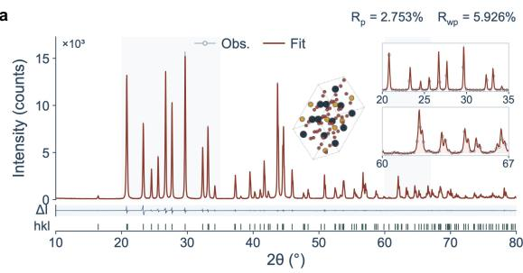

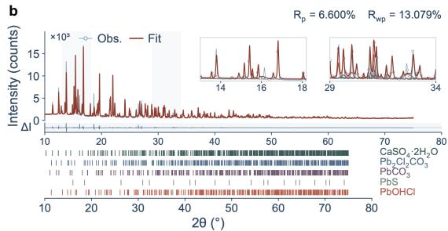

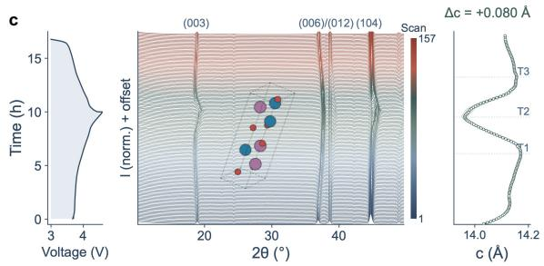

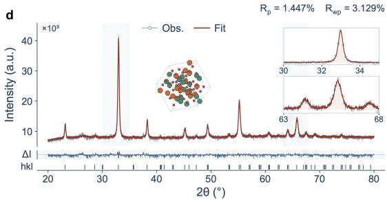

e  
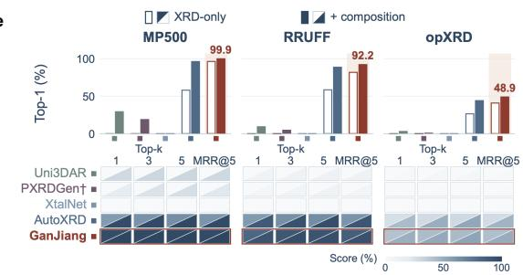

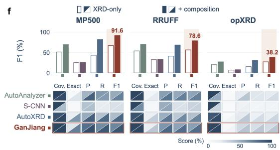  
Figure 1. Diverse materials applications and leading difraction-identification performance. a, Wh<sub>o</sub>l<sub>e-pa</sub>tt<sub>ern re</sub>fi<sub>nemen</sub>t <sub>o</sub>f <sub>or</sub>th<sub>or</sub>h<sub>om</sub>bi<sub>c</sub> $\mathrm { P b S O _ { 4 } }$ <sub>w</sub>ith <sub>s</sub>t<sub>rong</sub>l<sub>y over</sub>l<sub>app</sub>i<sub>ng re</sub>fl<sub>ec</sub>ti<sub>ons</sub> $( R _ { \mathrm { p } } = 2 . 7 5 3 \%$ $R _ { \mathrm { w p } } = 5 . 9 2 6 \% )$ . b, Five-phase analysis of an ancient Egyptian cosmetic powder containing gypsum, <sub>p</sub>h<sub>osgen</sub>it<sub>e, ceruss</sub>it<sub>e, ga</sub>l<sub>ena an</sub>d l<sub>aur</sub>i<sub>on</sub>it<sub>e</sub> $( R _ { \mathrm { p } } = 6 . 6 0 0 \%$ $R _ { \mathrm { w p } } = 1 3 . 0 7 9 \% )$ . c, Operando analysis of an <sup>O3</sup>-t<sub>yp</sub>e $\mathrm { L i ( N i _ { 0 . 8 } C o _ { 0 . 1 } M n _ { 0 . 1 } ) O _ { 2 } }$ cathode. The volta<sub>g</sub>e–time trace (left), difraction waterfall (centre; colour indicates scan order) and refined � axis (ri<sub>g</sub>ht) connect electrochemical c<sub>y</sub>clin<sub>g</sub> to lattice evolution. d, R<sub>e</sub>fi<sub>nemen</sub>t <sub>o</sub>f th<sub>e se</sub>l<sub>ec</sub>t<sub>e</sub>d R<sub>u–</sub>M<sub>n ox</sub>id<sub>e con</sub>fi<sub>gura</sub>ti<sub>on</sub> $( R _ { \mathrm { p } } = 1 . 4 4 7 \%$ $R _ { \mathrm { w p } } = 3 . 1 2 9 \% )$ <sub>.</sub> I<sub>n</sub> $\mathbf { a } , \mathbf { b } , \mathbf { d } ,$ , <sub>p</sub>a<sup>l</sup>e bl<sub>ue sym</sub>b<sub>o</sub>l<sub>s an</sub>d <sub>re</sub>d <sub>curves</sub> d<sub>eno</sub>t<sub>e o</sub>b<sub>serve</sub>d <sub>an</sub>d <sub>ca</sub>l<sub>cu</sub>l<sub>a</sub>t<sub>e</sub>d i<sub>n</sub>t<sub>ens</sub>iti<sub>es;</sub> $\Delta I = I _ { \mathrm { o b s } } - I _ { \mathrm { c a l c } }$ i<sub>s</sub> th<sub>e</sub> dif<sub>erence</sub> <sub>pro</sub>fil<sub>e, an</sub>d ti<sub>c</sub>k<sub>s mar</sub>k <sub>ca</sub>l<sub>cu</sub>l<sub>a</sub>t<sub>e</sub>d B<sub>ragg pos</sub>iti<sub>ons.</sub> $\mathbf { e } ,$ Sin<sub>g</sub>l<sub>e-p</sub>h<sub>ase</sub> id<sub>e</sub>ntifi<sub>ca</sub>ti<sub>o</sub>n <sub>o</sub>n MP500<sub>,</sub> RRUFF <sub>a</sub>nd <sub>op</sub>XRD<sub>:</sub> b<sub>ars</sub> <sub>s</sub>h<sub>ow</sub> t<sub>op-</sub>1 <sub>accuracy</sub> <sub>an</sub>d h<sub>ea</sub>t <sub>maps</sub> <sub>s</sub>h<sub>ow</sub> t<sub>op-</sub>1<sub>,</sub> t<sub>op-</sub>3<sub>,</sub> t<sub>op-</sub>5 <sub>an</sub>d <sub>mean</sub> <sub>rec</sub>i<sub>proca</sub>l <sub>ran</sub>k (MRR@5). f, Multi<sub>p</sub>hase identification on the same sources: bars show sam<sub>p</sub>le-wise macro-F1 and heat ma<sub>p</sub>s show <sub>p</sub>rediction covera<sub>g</sub>e (Cov.), exact-set recover<sub>y</sub> (Exact), <sub>p</sub>recision (P), recall (R) and F1. O<sub>p</sub>en <sub>an</sub>d fill<sub>e</sub>d b<sub>ars</sub> d<sub>eno</sub>t<sub>e</sub> XRD<sub>-on</sub>l<sub>y an</sub>d <sub>compos</sub>iti<sub>on-ass</sub>i<sub>s</sub>t<sub>e</sub>d <sub>con</sub>diti<sub>ons.</sub> G<sub>an</sub> Ji<sub>ang</sub> i<sub>s</sub> hi<sub>g</sub>hli<sub>g</sub>ht<sub>e</sub>d i<sub>n re</sub>d<sub>.</sub> Hi<sub>g</sub>h<sub>er scores are</sub> b<sub>e</sub>tt<sub>er.</sub> F<sub>u</sub>ll <sub>va</sub>l<sub>ues an</sub>d <sub>compos</sub>iti<sub>on-</sub>i<sub>npu</sub>t <sub>pro</sub>t<sub>oco</sub>l<sub>s are g</sub>i<sub>ven</sub> i<sub>n</sub> T<sub>a</sub>bl<sub>es</sub> 1 <sub>an</sub>d 2<sub>.</sub>

## Broad materials applications and leading performance

G<sub>an</sub> Ji<sub>ang</sub> <sub>app</sub>li<sub>es</sub> <sub>a</sub> <sub>un</sub>ifi<sub>e</sub>d <sub>ana</sub>l<sub>y</sub>ti<sub>ca</sub>l f<sub>ramewor</sub>k t<sub>o</sub> <sub>ques</sub>ti<sub>ons</sub> <sub>spann</sub>i<sub>ng</sub> <sub>m</sub>i<sub>nera</sub>l <sub>compos</sub>iti<sub>on,</sub> batter<sub>y</sub> o<sub>p</sub>eration and atomic disorder (Fi<sub>g</sub>. 1). Four a<sub>pp</sub>lications demonstrate its abilit<sub>y</sub> to resolve <sub>over</sub>l<sub>app</sub>i<sub>ng</sub> <sub>re</sub>fl<sub>ec</sub>ti<sub>ons,</sub> <sub>quan</sub>tif<sub>y</sub> <sub>a</sub> <sub>comp</sub>l<sub>ex</sub> <sub>m</sub>i<sub>x</sub>t<sub>ure,</sub> t<sub>rac</sub>k <sub>s</sub>t<sub>ruc</sub>t<sub>ura</sub>l <sub>c</sub>h<sub>anges</sub> <sub>an</sub>d di<sub>s</sub>ti<sub>ngu</sub>i<sub>s</sub>h b<sub>e</sub>t<sub>ween</sub> <sub>compe</sub>ti<sub>ng</sub> <sub>a</sub>t<sub>om</sub>i<sub>c</sub> <sub>con</sub>fi<sub>gura</sub>ti<sub>ons.</sub> Al<sub>ongs</sub>id<sub>e</sub> th<sub>ese</sub> <sub>app</sub>li<sub>ca</sub>ti<sub>ons,</sub> D<sub>e</sub>lt<sub>a</sub>XRDb<sub>enc</sub>h <sub>es</sub>t<sub>a</sub>bli<sub>s</sub>h<sub>es</sub> th<sub>e</sub> b<sub>rea</sub>dth <sub>o</sub>f it<sub>s</sub> id<sub>en</sub>tifi<sub>ca</sub>ti<sub>on</sub> <sub>per</sub>f<sub>ormance.</sub> With<sub>ou</sub>t <sub>supp</sub>li<sub>e</sub>d <sub>compos</sub>iti<sub>on,</sub> G<sub>an</sub> Ji<sub>a</sub>n<sub>g</sub> <sub>ac</sub>hi<sub>eves</sub> <sub>s</sub>in<sub>g</sub>l<sub>e-p</sub>h<sub>ase</sub> t<sub>op-</sub>1 <sub>accu</sub>r<sub>ac</sub>i<sub>es</sub> <sub>o</sub>f 96<sub>.</sub>30%<sub>,</sub> 81<sub>.</sub>78% <sub>a</sub>nd 40<sub>.</sub>83% <sub>o</sub>n MP500<sub>,</sub> RRUFF <sub>a</sub>nd <sub>op</sub>XRD<sub>,</sub> <sub>excee</sub>din<sub>g</sub> th<sub>e</sub> <sub>s</sub>tr<sub>o</sub>n<sub>ges</sub>t <sub>co</sub>m<sub>pa</sub>r<sub>a</sub>t<sub>o</sub>r b<sub>y</sub> 38<sub>.</sub>30<sub>,</sub> 23<sub>.</sub>31 <sub>a</sub>nd 14<sub>.</sub>38 <sub>pe</sub>r<sub>ce</sub>nt<sub>age</sub> <sub>po</sub>int<sub>s,</sub> res<sub>p</sub>ectivel<sub>y</sub> (Fi<sub>g</sub>. 1e). It also leads the evaluated methods in multi<sub>p</sub>hase <sub>p</sub>recision, recall, F1 and exact-set recover<sub>y</sub> across all three sources, with and without com<sub>p</sub>osition assistance (Fi<sub>g</sub>. 1f). Th<sub>ese</sub> <sub>compar</sub>i<sub>sons</sub> <sub>es</sub>t<sub>a</sub>bli<sub>s</sub>h <sub>s</sub>t<sub>a</sub>t<sub>e-o</sub>f<sub>-</sub>th<sub>e-ar</sub>t <sub>per</sub>f<sub>ormance</sub> <sub>among</sub> th<sub>e</sub> <sub>me</sub>th<sub>o</sub>d<sub>s</sub> <sub>eva</sub>l<sub>ua</sub>t<sub>e</sub>d <sub>un</sub>d<sub>er</sub> th<sub>e</sub> d<sub>ec</sub>l<sub>are</sub>d b<sub>enc</sub>h<sub>mar</sub>k <sub>con</sub>diti<sub>ons.</sub>

I<sub>n</sub> <sub>or</sub>th<sub>or</sub>h<sub>om</sub>bi<sub>c</sub> $\mathrm { P b S O } _ { 4 } \left( P n m a \right)$ <sub>,</sub> <sub>ex</sub>t<sub>ens</sub>i<sub>ve</sub> <sub>re</sub>fl<sub>ec</sub>ti<sub>on</sub> <sub>over</sub>l<sub>ap</sub> <sub>ma</sub>k<sub>es</sub> i<sub>so</sub>l<sub>a</sub>t<sub>e</sub>d <sub>pea</sub>k <sub>ass</sub>i<sub>gnmen</sub>t<sub>s</sub> <sub>unre</sub>li<sub>a</sub>bl<sub>e.</sub> Th<sub>e pa</sub>tt<sub>ern con</sub>t<sub>a</sub>i<sub>ns</sub> 383 <sub>pa</sub>i<sub>rs o</sub>f <sub>over</sub>l<sub>app</sub>i<sub>ng</sub> B<sub>ragg re</sub>fl<sub>ec</sub>ti<sub>ons un</sub>d<sub>er</sub> C<sub>u</sub> �<sub>� ra</sub>di<sub>a</sub>ti<sub>on</sub> $( \lambda _ { \alpha 1 } = 1 . 5 4 0 5 6 0 \textup { \AA }$ <sub>an</sub>d $\lambda _ { \alpha 2 } = 1 . 5 4 4 3 3 0 \mathring \mathrm { A } )$ <sub>.</sub> G<sub>an</sub> Ji<sub>ang uses w</sub>h<sub>o</sub>l<sub>e-pa</sub>tt<sub>ern mo</sub>d<sub>e</sub>lli<sub>ng</sub> t<sub>o re</sub>t<sub>a</sub>i<sub>n</sub> th<sub>e</sub> <sub>cons</sub>t<sub>ra</sub>i<sub>n</sub>t<sub>s supp</sub>li<sub>e</sub>d b<sub>y</sub> th<sub>e comp</sub>l<sub>e</sub>t<sub>e</sub> $\mathrm { \ p r o { \hbar } } \mathrm { I e } ^ { 6 }$ <sub>.</sub> Th<sub>e</sub> <sub>resu</sub>lti<sub>ng</sub> <sub>re</sub>fi<sub>nemen</sub>t <sub>reac</sub>h<sub>es</sub> $R _ { \mathrm { p } } = 2 . 7 5 3 \%$ <sub>an</sub>d $R _ { \mathrm { w p } } = 5 . 9 2 6 \%$ <sub>,</sub> <sub>w</sub>ith l<sub>a</sub>tti<sub>ce</sub> <sub>parame</sub>t<sub>ers</sub> $a = 8 . 4 8 5 1 ( 0 )$ Å<sub>,</sub> $b = 5 . 4 0 1 6 ( 1 )$ Å <sub>an</sub>d $c = 6 . 9 6 4 3 ( 3 )$ Å (Fi<sub>g</sub>. 1a). This case illustrates how Gan Jian<sub>g</sub> links candidate identification to an anal<sub>y</sub>sis <sup>a</sup>pp<sup>ro</sup>p<sup>riate</sup> <sup>for</sup> <sup>stron</sup>g<sup>l</sup>y <sup>o</sup>v<sup>erla</sup>pp<sup>in</sup>g <sup>si</sup>g<sup>nals</sup>.

Th<sub>e</sub> <sub>same</sub> <sub>approac</sub>h <sub>quan</sub>tifi<sub>es</sub> <sub>a</sub> fi<sub>ve-p</sub>h<sub>ase</sub> <sub>anc</sub>i<sub>en</sub>t E<sub>gyp</sub>ti<sub>an</sub> <sub>cosme</sub>ti<sub>c</sub> <sub>pow</sub>d<sub>er.</sub> P<sub>rev</sub>i<sub>ous</sub> <sub>s</sub>t<sub>u</sub>di<sub>es</sub> id<sub>en</sub>tifi<sub>e</sub>d <sub>gypsum</sub> $\mathrm { ( C a S O } _ { 4 } \cdot 2 \mathrm { H } _ { 2 } \mathrm { O } )$ , <sub>p</sub><sup>h</sup>os<sub>g</sub>en<sup>i</sup>te $\left( \mathrm { P b } _ { 2 } \mathrm { C l } _ { 2 } \mathrm { C O } _ { 3 } \right)$ <sub>,</sub> <sub>ceruss</sub>it<sub>e</sub> $\left( \mathrm { P b } { \bf C O } _ { 3 } \right)$ , <sub>g</sub>alena (PbS) and laurionite (PbOHCl) in this material<sup>23,</sup> <sup>24</sup>. Gan Jian<sub>g</sub> resolves their contributions to the <sub>sync</sub>h<sub>ro</sub>t<sub>ron</sub> <sub>pro</sub>fil<sub>e</sub> <sub>an</sub>d <sub>es</sub>ti<sub>ma</sub>t<sub>es</sub> <sub>respec</sub>ti<sub>ve</sub> <sub>mass</sub> f<sub>rac</sub>ti<sub>ons</sub> <sub>o</sub>f 12<sub>.</sub>53%<sub>,</sub> 18<sub>.</sub>53%<sub>,</sub> 32<sub>.</sub>02%<sub>,</sub> 9<sub>.</sub>69% <sub>an</sub>d 27<sub>.</sub>23%<sub>, w</sub>ith $R _ { \mathrm { w p } } = 1 3 . 0 7 9 \%$ (Fi<sub>g</sub>. 1b; Su<sub>pp</sub>lementar<sub>y</sub> Table S8). The anal<sub>y</sub>sis recovers a <sub>quan</sub>tit<sub>a</sub>ti<sub>ve</sub> <sub>m</sub>i<sub>nera</sub>l <sub>assem</sub>bl<sub>age</sub> f<sub>rom</sub> d<sub>ense</sub>l<sub>y</sub> <sub>over</sub>l<sub>app</sub>i<sub>ng</sub> <sub>s</sub>i<sub>gna</sub>t<sub>ures.</sub> It<sub>s</sub> <sub>su</sub>b<sub>s</sub>t<sub>an</sub>ti<sub>a</sub>l l<sub>ea</sub>d<sub>-c</sub>hl<sub>or</sub>id<sub>e</sub> <sub>componen</sub>t i<sub>s</sub> <sub>cons</sub>i<sub>s</sub>t<sub>en</sub>t <sub>w</sub>ith <sub>ear</sub>li<sub>er</sub> <sub>ev</sub>id<sub>ence</sub> f<sub>or</sub> d<sub>e</sub>lib<sub>era</sub>t<sub>e</sub> <sub>c</sub>h<sub>em</sub>i<sub>ca</sub>l <sub>process</sub>i<sub>ng</sub><sup>24</sup><sub>,</sub> <sub>connec</sub>ti<sub>ng</sub> th<sub>e</sub> <sub>recovere</sub>d <sub>compos</sub>iti<sub>on</sub> t<sub>o</sub> <sub>a</sub> hi<sub>s</sub>t<sub>or</sub>i<sub>ca</sub>l <sub>ma</sub>t<sub>er</sub>i<sub>a</sub>l<sub>s-process</sub>i<sub>ng</sub> <sub>ques</sub>ti<sub>on.</sub>

<sup>F</sup>or an o<sub>p</sub>erat<sup>i</sup>n<sub>g</sub> <sup>O3</sup>-t<sub>yp</sub>e $\mathrm { L i ( N i _ { 0 . 8 } C o _ { 0 . 1 } M n _ { 0 . 1 } ) O _ { 2 } }$ <sub>ca</sub>th<sub>o</sub>d<sub>e</sub> <sub>cyc</sub>l<sub>e</sub>d b<sub>e</sub>t<sub>ween</sub> 3<sub>.</sub>0 <sub>an</sub>d 4<sub>.</sub>6 $\mathrm { V } ^ { 6 }$ <sub>,</sub> G<sub>a</sub>n Jiang treats successive scans as a connected trajectory. Each accepted structural state initializes th<sub>e</sub> <sub>nex</sub>t <sub>re</sub>fi<sub>nemen</sub>t<sub>,</sub> <sub>w</sub>hil<sub>e</sub> b<sub>ac</sub>k<sub>groun</sub>d <sub>an</sub>d dif<sub>rac</sub>ti<sub>on</sub> <sub>parame</sub>t<sub>ers</sub> <sub>are</sub> <sub>reassesse</sub>d f<sub>or</sub> th<sub>e</sub> <sub>new</sub> measurement. The resulting �-axis trajectory captures expansion and high-voltage contraction consistent with the <sub>p</sub>eak motion in the measured <sub>p</sub>rofiles (Fi<sub>g</sub>. 1c). Here, retainin<sub>g</sub> ex<sub>p</sub>erimental <sub>con</sub>t<sub>ex</sub>t <sub>a</sub>ll<sub>ows</sub> th<sub>e</sub> <sub>ana</sub>l<sub>ys</sub>i<sub>s</sub> t<sub>o</sub> f<sub>o</sub>ll<sub>ow</sub> <sub>s</sub>t<sub>ruc</sub>t<sub>ura</sub>l <sub>evo</sub>l<sub>u</sub>ti<sub>on</sub> <sub>across</sub> th<sub>e</sub> <sub>ser</sub>i<sub>es.</sub>

I<sub>n</sub> <sub>a</sub> R<sub>u–</sub>M<sub>n</sub> <sub>ox</sub>id<sub>e</sub> <sub>e</sub>l<sub>ec</sub>t<sub>roca</sub>t<sub>a</sub>l<sub>ys</sub>t <sub>o</sub>bt<sub>a</sub>i<sub>ne</sub>d b<sub>y</sub> <sub>ca</sub>ti<sub>on</sub> <sub>exc</sub>h<sub>ange</sub> f<sub>rom</sub> <sub>or</sub>th<sub>or</sub>h<sub>om</sub>bi<sub>c</sub> $\mathbf { M n } _ { 2 } { \mathbf { O } _ { 3 } } ^ { 2 5 }$ th<sub>e</sub> <sub>c</sub>h<sub>a</sub>ll<sub>enge</sub> i<sub>s</sub> t<sub>o</sub> di<sub>s</sub>ti<sub>ngu</sub>i<sub>s</sub>h <sub>c</sub>h<sub>em</sub>i<sub>ca</sub>ll<sub>y</sub> <sub>p</sub>l<sub>aus</sub>ibl<sub>e</sub> R<sub>u-s</sub>it<sub>e</sub> <sub>occupa</sub>ti<sub>ons.</sub> G<sub>an</sub> Ji<sub>ang</sub> <sub>screens</sub> candidate confi<sub>g</sub>urations within a 3 × 3 su<sub>p</sub>ercell and com<sub>p</sub>ares their whole-<sub>p</sub>attern refinements. Th<sub>e se</sub>l<sub>ec</sub>t<sub>e</sub>d <sub>mo</sub>d<sub>e</sub>l <sub>reac</sub>h<sub>es</sub> $R _ { \mathrm { p } } = 1 . 4 4 7 \%$ <sub>an</sub>d $R _ { \mathrm { w p } } = 3 . 1 2 9 \%$ (Fi<sub>g</sub>. 1d) and is de<sub>p</sub>osited as CCDC 2530452<sup>26</sup><sub>.</sub> Thi<sub>s</sub> <sub>compar</sub>i<sub>son</sub> id<sub>en</sub>tifi<sub>es</sub> <sub>a</sub> dif<sub>rac</sub>ti<sub>on-suppor</sub>t<sub>e</sub>d <sub>mo</sub>d<sub>e</sub>l <sub>w</sub>ithi<sub>n</sub> th<sub>e</sub> t<sub>es</sub>t<sub>e</sub>d <sub>con</sub>fi<sub>gura</sub>ti<sub>on</sub> <sub>space,</sub> <sub>prov</sub>idi<sub>ng</sub> <sub>a</sub> <sub>s</sub>t<sub>ruc</sub>t<sub>ura</sub>l h<sub>ypo</sub>th<sub>es</sub>i<sub>s</sub> f<sub>or</sub> <sub>su</sub>b<sub>sequen</sub>t i<sub>nves</sub>ti<sub>ga</sub>ti<sub>on</sub> <sub>o</sub>f <sub>ca</sub>t<sub>a</sub>l<sub>y</sub>ti<sub>c</sub> b<sub>e</sub>h<sub>av</sub>i<sub>our.</sub>

## From difraction fingerprints to structural explanations

Th<sub>e</sub> <sub>p</sub>h<sub>ys</sub>i<sub>ca</sub>l b<sub>as</sub>i<sub>s</sub> <sub>o</sub>f th<sub>ese</sub> <sub>ana</sub>l<sub>yses</sub> i<sub>s</sub> <sub>access</sub>ibl<sub>e</sub> th<sub>roug</sub>h <sub>a</sub> <sub>s</sub>i<sub>mp</sub>l<sub>e</sub> <sub>re</sub>l<sub>a</sub>ti<sub>ons</sub>hi<sub>p:</sub> <sub>a</sub> <sub>per</sub>i<sub>o</sub>di<sub>c</sub> arran<sub>g</sub>ement of atoms <sub>p</sub>roduces a characteristic <sub>p</sub>attern of scattered X-ra<sub>y</sub>s (Fi<sub>g</sub>. 2a). In a <sub>p</sub>owder, <sub>many</sub> <sub>crys</sub>t<sub>a</sub>llit<sub>e</sub> <sub>or</sub>i<sub>en</sub>t<sub>a</sub>ti<sub>ons</sub> <sub>are</sub> <sub>measure</sub>d t<sub>oge</sub>th<sub>er,</sub> <sub>y</sub>i<sub>e</sub>ldi<sub>ng</sub> i<sub>n</sub>t<sub>ens</sub>it<sub>y</sub> <sub>as</sub> <sub>a</sub> f<sub>unc</sub>ti<sub>on</sub> <sub>o</sub>f <sub>sca</sub>tt<sub>er</sub>i<sub>ng</sub> <sub>ang</sub>l<sub>e,</sub> 2�<sub>.</sub> B<sub>ragg</sub>’<sub>s</sub> l<sub>aw,</sub> 2� <sub>s</sub>i<sub>n</sub> $\theta \ : = \ : n \lambda$ <sub>,</sub> li<sub>n</sub>k<sub>s</sub> <sub>eac</sub>h <sub>re</sub>fl<sub>ec</sub>ti<sub>on</sub> t<sub>o</sub> <sub>a</sub> l<sub>a</sub>tti<sub>ce-p</sub>l<sub>ane</sub> <sub>spac</sub>i<sub>ng</sub> � <sub>a</sub>t <sub>wave</sub>l<sub>eng</sub>th �<sub>.</sub> P<sub>ea</sub>k <sub>pos</sub>iti<sub>ons</sub> th<sub>ere</sub>f<sub>ore cons</sub>t<sub>ra</sub>i<sub>n</sub> th<sub>e un</sub>it <sub>ce</sub>ll<sub>; re</sub>l<sub>a</sub>ti<sub>ve</sub> i<sub>n</sub>t<sub>ens</sub>iti<sub>es cons</sub>t<sub>ra</sub>i<sub>n</sub> th<sub>e</sub> <sub>a</sub>t<sub>om</sub>i<sub>c arrangemen</sub>t<sub>; an</sub>d <sub>w</sub>idth<sub>s re</sub>fl<sub>ec</sub>t <sub>crys</sub>t<sub>a</sub>llit<sub>e s</sub>i<sub>ze, s</sub>t<sub>ra</sub>i<sub>n an</sub>d i<sub>ns</sub>t<sub>rumen</sub>t<sub>a</sub>l <sub>e</sub>f<sub>ec</sub>t<sub>s</sub><sup>4</sup><sub>.</sub> Wh<sub>en</sub> <sub>severa</sub>l <sub>crys</sub>t<sub>a</sub>lli<sub>ne</sub> <sub>p</sub>h<sub>ases</sub> <sub>coex</sub>i<sub>s</sub>t<sub>,</sub> th<sub>e</sub>i<sub>r</sub> <sub>re</sub>fl<sub>ec</sub>ti<sub>ons</sub> <sub>over</sub>l<sub>ap.</sub> Th<sub>e</sub> <sub>sc</sub>i<sub>en</sub>tifi<sub>c</sub> t<sub>as</sub>k i<sub>s</sub> t<sub>o</sub> fi<sub>n</sub>d <sub>a</sub> <sub>se</sub>t <sub>o</sub>f structures and parameters that jointly accounts for this measured fingerprint.

G<sub>an</sub> Ji<sub>ang</sub> <sub>organ</sub>i<sub>zes</sub> th<sub>a</sub>t t<sub>as</sub>k i<sub>n</sub>t<sub>o</sub> fi<sub>ve</sub> <sub>connec</sub>t<sub>e</sub>d <sub>s</sub>t<sub>ages:</sub> <sub>rece</sub>i<sub>ve</sub> th<sub>e</sub> <sub>pa</sub>tt<sub>ern</sub> <sub>an</sub>d <sub>con</sub>t<sub>ex</sub>t<sub>,</sub> fi<sub>n</sub>d candidate structures, check their evidence, refine su<sub>pp</sub>orted models and re<sub>p</sub>ort the result (Fi<sub>g</sub>. 2b). The user supplies a scientific objective and may add elemental composition, synthesis history <sub>or</sub> i<sub>ns</sub>t<sub>rumen</sub>t i<sub>n</sub>f<sub>orma</sub>ti<sub>on.</sub> C<sub>an</sub>did<sub>a</sub>t<sub>e</sub> <sub>s</sub>t<sub>ruc</sub>t<sub>ures</sub> <sub>are</sub> <sub>re</sub>t<sub>r</sub>i<sub>eve</sub>d <sub>as</sub> <sub>crys</sub>t<sub>a</sub>ll<sub>ograp</sub>hi<sub>c</sub> i<sub>n</sub>f<sub>orma</sub>ti<sub>on</sub> files (CIFs), which describe the lattice and atomic <sub>p</sub>ositions. Identification asks which structures could be present; refinement adjusts a proposed model to reproduce the measured profile. The dif<sub>erence</sub> b<sub>e</sub>t<sub>ween</sub> <sub>o</sub>b<sub>serve</sub>d <sub>an</sub>d <sub>ca</sub>l<sub>cu</sub>l<sub>a</sub>t<sub>e</sub>d i<sub>n</sub>t<sub>ens</sub>iti<sub>es</sub> th<sub>en</sub> <sub>exposes</sub> f<sub>ea</sub>t<sub>ures</sub> th<sub>a</sub>t th<sub>e</sub> <sub>curren</sub>t <sub>exp</sub>l<sub>ana</sub>ti<sub>on</sub> l<sub>eaves</sub> <sub>unreso</sub>l<sub>ve</sub>d<sub>.</sub>

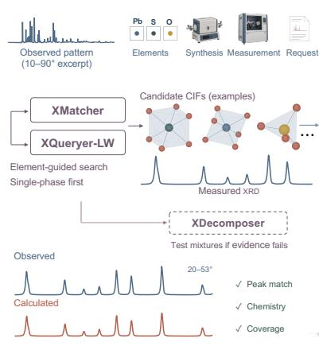

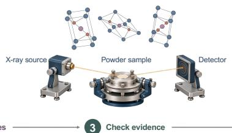  
Diffraction fingerprint Each peak carries structural information

b  
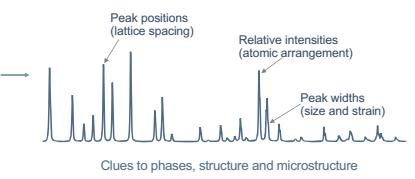

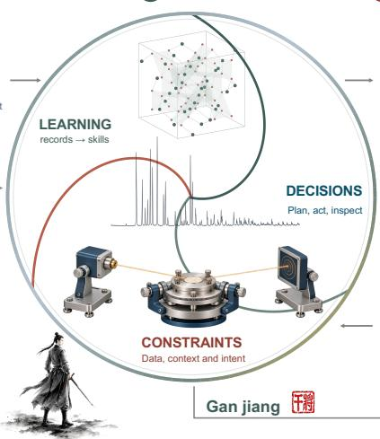

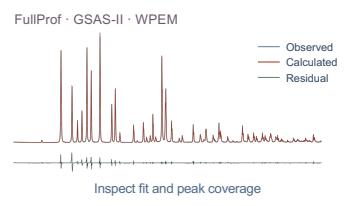

c  
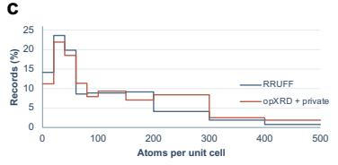

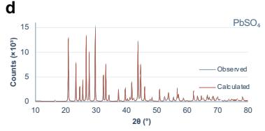

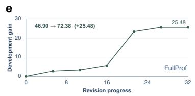

Figure 2. Difraction physics, analytical workflow and reusable learning in Gan Jiang. a, A crystal’s <sub>per</sub>i<sub>o</sub>di<sub>c a</sub>t<sub>om</sub>i<sub>c arrangemen</sub>t <sub>pro</sub>d<sub>uces</sub> dif<sub>rac</sub>ti<sub>on a</sub>t <sub>ang</sub>l<sub>es</sub> d<sub>e</sub>t<sub>erm</sub>i<sub>ne</sub>d b<sub>y</sub> l<sub>a</sub>tti<sub>ce spac</sub>i<sub>ngs.</sub> R<sub>an</sub>d<sub>om</sub>l<sub>y</sub> <sub>or</sub>i<sub>en</sub>t<sub>e</sub>d <sub>crys</sub>t<sub>a</sub>llit<sub>es genera</sub>t<sub>e a pow</sub>d<sub>er pa</sub>tt<sub>ern w</sub>h<sub>ose pea</sub>k <sub>pos</sub>iti<sub>ons, re</sub>l<sub>a</sub>ti<sub>ve</sub> i<sub>n</sub>t<sub>ens</sub>iti<sub>es an</sub>d <sub>w</sub>idth<sub>s prov</sub>id<sub>e</sub> information about the lattice, atomic arrangement and microstructure, subject to instrumental efects. b, G<sub>an</sub> Ji<sub>ang</sub> li<sub>n</sub>k<sub>s</sub> fi<sub>ve ana</sub>l<sub>ys</sub>i<sub>s s</sub>t<sub>ages:</sub> i<sub>npu</sub>t<sub>, can</sub>did<sub>a</sub>t<sub>e re</sub>t<sub>r</sub>i<sub>eva</sub>l<sub>, ev</sub>id<sub>ence c</sub>h<sub>ec</sub>ki<sub>ng, re</sub>fi<sub>nemen</sub>t <sub>an</sub>d <sub>repor</sub>ti<sub>ng.</sub> Th<sub>e measure</sub>d <sub>pa</sub>tt<sub>ern</sub> i<sub>s com</sub>bi<sub>ne</sub>d <sub>w</sub>ith <sub>ava</sub>il<sub>a</sub>bl<sub>e c</sub>h<sub>em</sub>i<sub>ca</sub>l <sub>an</sub>d <sub>exper</sub>i<sub>men</sub>t<sub>a</sub>l <sub>con</sub>t<sub>ex</sub>t<sub>.</sub> XM<sub>a</sub>t<sub>c</sub>h<sub>er an</sub>d XQuer<sub>y</sub>er-LW propose sin<sub>g</sub>le-phase candidates; XDecomposer and XMatcher-AutoMix support mixture <sub>ana</sub>l<sub>ys</sub>i<sub>s w</sub>h<sub>en s</sub>i<sub>ng</sub>l<sub>e-p</sub>h<sub>ase</sub> h<sub>ypo</sub>th<sub>eses</sub> f<sub>a</sub>il th<sub>e ev</sub>id<sub>ence c</sub>h<sub>ec</sub>k<sub>s.</sub> C<sub>an</sub>did<sub>a</sub>t<sub>e s</sub>t<sub>ruc</sub>t<sub>ures are assesse</sub>d <sub>aga</sub>i<sub>ns</sub>t <sub>pea</sub>k <sub>agreemen</sub>t<sub>, c</sub>h<sub>em</sub>i<sub>s</sub>t<sub>ry an</sub>d <sub>coverage,</sub> th<sub>en re</sub>fi<sub>ne</sub>d <sub>w</sub>ith <sub>e</sub>li<sub>g</sub>ibl<sub>e eng</sub>i<sub>nes.</sub> O<sub>u</sub>t<sub>pu</sub>t<sub>s</sub> i<sub>nc</sub>l<sub>u</sub>d<sub>e</sub> CIF<sub>s, o</sub>b<sub>serve</sub>d <sub>an</sub>d <sub>ca</sub>l<sub>cu</sub>l<sub>a</sub>t<sub>e</sub>d <sub>pro</sub>fil<sub>es, re</sub>fi<sub>ne</sub>d <sub>parame</sub>t<sub>ers an</sub>d <sub>an ev</sub>id<sub>ence-</sub>li<sub>n</sub>k<sub>e</sub>d <sub>repor</sub>t<sub>.</sub> Th<sub>e cen</sub>t<sub>ra</sub>l l<sub>oop connec</sub>t<sub>s</sub> scientific constraints, analytical decisions and learning from completed episodes. c, Distribution of atoms <sub>per</sub> <sub>un</sub>it <sub>ce</sub>ll i<sub>n</sub> th<sub>e</sub> RRUFF <sub>an</sub>d <sub>com</sub>bi<sub>ne</sub>d <sub>op</sub>XRD/<sub>pr</sub>i<sub>va</sub>t<sub>e</sub> b<sub>ranc</sub>h<sub>es</sub> <sub>o</sub>f th<sub>e</sub> <sub>exper</sub>i<sub>men</sub>t<sub>a</sub>l <sub>s</sub>t<sub>ruc</sub>t<sub>ure</sub> <sub>co</sub>ll<sub>ec</sub>ti<sub>on,</sub> expressed as percentages of records within each branch. d, Representative $\mathrm { P b S O _ { 4 } }$ whole-pattern fit. e, S<sub>ummary o</sub>f F<sub>u</sub>llP<sub>ro</sub>f <sub>wor</sub>kfl<sub>ow rev</sub>i<sub>s</sub>i<sub>on,</sub> ill<sub>us</sub>t<sub>ra</sub>ti<sub>ng</sub> th<sub>e accumu</sub>l<sub>a</sub>ti<sub>on o</sub>f i<sub>mprovemen</sub>t<sub>s.</sub> D<sub>eve</sub>l<sub>opmen</sub>t trajectories and frozen-version held-out comparisons are distinguished in Fig. 4.

F<sub>our</sub> <sub>comp</sub>l<sub>emen</sub>t<sub>ary</sub> <sub>eng</sub>i<sub>nes</sub> <sub>prov</sub>id<sub>e</sub> th<sub>e</sub> <sub>ana</sub>l<sub>y</sub>ti<sub>ca</sub>l f<sub>oun</sub>d<sub>a</sub>ti<sub>on.</sub> XM<sub>a</sub>t<sub>c</sub>h<sub>er</sub> <sub>per</sub>f<sub>orms</sub> i<sub>n</sub>t<sub>er-</sub> pretable search-and-match anal<sub>y</sub>sis<sup>27</sup>; XQuer<sub>y</sub>er Li<sub>g</sub>htwei<sub>g</sub>ht (XQuer<sub>y</sub>er-LW) provides learned <sub>s</sub>t<sub>ruc</sub>t<sub>ure</sub> <sub>re</sub>t<sub>r</sub>i<sub>eva</sub>l <sub>w</sub>h<sub>en</sub> <sub>e</sub>l<sub>emen</sub>t<sub>a</sub>l i<sub>n</sub>f<sub>orma</sub>ti<sub>on</sub> i<sub>s</sub> <sub>ava</sub>il<sub>a</sub>bl<sub>e</sub><sup>10</sup><sub>;</sub> XD<sub>ecomposer</sub> <sub>proposes</sub> <sub>p</sub>h<sub>ase-</sub> <sub>reso</sub>l<sub>ve</sub>d d<sub>escr</sub>i<sub>p</sub>ti<sub>ons</sub> <sub>o</sub>f <sub>m</sub>i<sub>x</sub>t<sub>ures</sub><sup>28</sup><sub>;</sub> <sub>an</sub>d P<sub>y</sub>WPEM <sub>per</sub>f<sub>orms</sub> <sub>p</sub>h<sub>ys</sub>i<sub>cs-cons</sub>t<sub>ra</sub>i<sub>ne</sub>d <sub>w</sub>h<sub>o</sub>l<sub>e-pa</sub>tt<sub>ern</sub> <sub>mo</sub>d<sub>e</sub>lli<sub>ng</sub><sup>6</sup><sub>.</sub> $\mathrm { F u l l P r o f } ^ { 2 9 }$ <sub>an</sub>d $\mathrm { G S A S } – \mathrm { I I } ^ { 3 0 }$ <sub>prov</sub>id<sub>e</sub> <sub>es</sub>t<sub>a</sub>bli<sub>s</sub>h<sub>e</sub>d <sub>re</sub>fi<sub>nemen</sub>t b<sub>ranc</sub>h<sub>es.</sub> Th<sub>e</sub>i<sub>r</sub> <sub>ou</sub>t<sub>pu</sub>t<sub>s</sub> <sub>are</sub> b<sub>roug</sub>ht b<sub>ac</sub>k t<sub>o</sub> th<sub>e</sub> <sub>same</sub> <sub>exper</sub>i<sub>men</sub>t<sub>a</sub>l <sub>ques</sub>ti<sub>on:</sub> d<sub>o</sub> th<sub>e</sub> <sub>propose</sub>d <sub>p</sub>h<sub>ases</sub> <sub>exp</sub>l<sub>a</sub>i<sub>n</sub> th<sub>e</sub> <sub>o</sub>b<sub>serve</sub>d <sub>pea</sub>k<sub>s,</sub> <sub>an</sub>d <sub>are</sub> th<sub>e</sub> <sub>re</sub>fi<sub>ne</sub>d <sub>parame</sub>t<sub>ers</sub> <sub>p</sub>h<sub>ys</sub>i<sub>ca</sub>ll<sub>y</sub> <sub>p</sub>l<sub>aus</sub>ibl<sub>e</sub>?

Th<sub>e</sub> <sub>re</sub>f<sub>erence</sub> <sub>co</sub>ll<sub>ec</sub>ti<sub>on</sub> <sub>connec</sub>t<sub>s</sub> thi<sub>s</sub> <sub>wor</sub>kfl<sub>ow</sub> t<sub>o</sub> <sub>a</sub> b<sub>roa</sub>d <sub>s</sub>t<sub>ruc</sub>t<sub>ura</sub>l <sub>searc</sub>h <sub>space:</sub> 100<sub>,</sub>315 MP500 structures and 2,007 ex<sub>p</sub>erimentall<sub>y</sub> derived structures (Fi<sub>g</sub>. 2c; Methods). The $\mathrm { P b S O _ { 4 } }$ <sub>p</sub>rofile illustrates how a retrieved model becomes a whole-<sub>p</sub>attern ex<sub>p</sub>lanation (Fi<sub>g</sub>. 2d). Com<sub>p</sub>leted <sub>ana</sub>l<sub>yses</sub> <sub>a</sub>l<sub>so</sub> <sub>re</sub>t<sub>a</sub>i<sub>n</sub> th<sub>e</sub> <sub>ac</sub>ti<sub>ons,</sub> di<sub>agnos</sub>ti<sub>cs</sub> <sub>an</sub>d <sub>correc</sub>ti<sub>ons</sub> th<sub>a</sub>t <sub>pro</sub>d<sub>uce</sub>d th<sub>a</sub>t <sub>exp</sub>l<sub>ana</sub>ti<sub>on.</sub> Th<sub>ese</sub> <sub>recor</sub>d<sub>s</sub> <sub>can</sub> b<sub>e</sub> di<sub>s</sub>till<sub>e</sub>d i<sub>n</sub>t<sub>o</sub> <sub>rev</sub>i<sub>se</sub>d <sub>s</sub>kill<sub>s,</sub> <sub>a</sub>ll<sub>ow</sub>i<sub>ng</sub> <sub>exper</sub>i<sub>ence</sub> f<sub>rom</sub> <sub>one</sub> <sub>ana</sub>l<sub>ys</sub>i<sub>s</sub> t<sub>o</sub> <sub>c</sub>h<sub>ange</sub> th<sub>e</sub> <sub>p</sub>rocedure used in another (Fi<sub>g</sub>. 2e). Gan Jian<sub>g</sub> thus o<sub>p</sub>erates at two levels: it tests structural h<sub>ypo</sub>th<sub>eses</sub> f<sub>or</sub> th<sub>e</sub> <sub>curren</sub>t <sub>ma</sub>t<sub>er</sub>i<sub>a</sub>l <sub>an</sub>d t<sub>es</sub>t<sub>s</sub> <sub>proce</sub>d<sub>ura</sub>l i<sub>mprovemen</sub>t<sub>s</sub> f<sub>or</sub> f<sub>u</sub>t<sub>ure</sub> <sub>ma</sub>t<sub>er</sub>i<sub>a</sub>l<sub>s.</sub>

## An executable architecture for evidence-guided analysis

T<sub>o</sub> i<sub>mp</sub>l<sub>emen</sub>t thi<sub>s</sub> <sub>reason</sub>i<sub>ng,</sub> G<sub>an</sub> Ji<sub>ang</sub> <sub>separa</sub>t<sub>es</sub> l<sub>anguage-mo</sub>d<sub>e</sub>l <sub>p</sub>l<sub>ann</sub>i<sub>ng,</sub> <sub>numer</sub>i<sub>ca</sub>l <sub>ca</sub>l<sub>cu</sub>l<sub>a</sub>ti<sub>on</sub> and scientific acce<sub>p</sub>tance (Fi<sub>g</sub>. 3). The lan<sub>g</sub>ua<sub>g</sub>e model inter<sub>p</sub>rets the objective and selects skills; <sub>spec</sub>i<sub>a</sub>li<sub>ze</sub>d <sub>eng</sub>i<sub>nes</sub> <sub>per</sub>f<sub>orm</sub> <sub>re</sub>t<sub>r</sub>i<sub>eva</sub>l<sub>,</sub> d<sub>ecompos</sub>iti<sub>on</sub> <sub>an</sub>d <sub>re</sub>fi<sub>nemen</sub>t<sub>;</sub> <sub>an</sub>d <sub>exp</sub>li<sub>c</sub>it d<sub>ec</sub>i<sub>s</sub>i<sub>on</sub> <sub>po</sub>li<sub>c</sub>i<sub>es</sub> <sub>govern</sub> <sub>accep</sub>t<sub>ance,</sub> <sub>wor</sub>kfl<sub>ow</sub> t<sub>rans</sub>iti<sub>ons</sub> <sub>an</sub>d <sub>re</sub>t<sub>r</sub>i<sub>es.</sub> Th<sub>e</sub> <sub>sys</sub>t<sub>em</sub> <sub>suppor</sub>t<sub>s</sub> id<sub>en</sub>tifi<sub>ca</sub>ti<sub>on</sub> <sub>a</sub>l<sub>one,</sub> id<sub>en</sub>tifi<sub>ca</sub>ti<sub>on</sub> f<sub>o</sub>ll<sub>owe</sub>d b<sub>y</sub> <sub>re</sub>fi<sub>nemen</sub>t<sub>,</sub> <sub>an</sub>d di<sub>rec</sub>t <sub>re</sub>fi<sub>nemen</sub>t <sub>o</sub>f <sub>a</sub> <sub>supp</sub>li<sub>e</sub>d <sub>s</sub>t<sub>ruc</sub>t<sub>ure.</sub> E<sub>ac</sub>h <sub>ana</sub>l<sub>ys</sub>i<sub>s</sub> <sub>re</sub>t<sub>a</sub>i<sub>ns</sub> it<sub>s</sub> i<sub>npu</sub>t d<sub>a</sub>t<sub>a,</sub> t<sub>oo</sub>l <sub>responses</sub> <sub>an</sub>d <sub>po</sub>li<sub>cy</sub> <sub>vers</sub>i<sub>on,</sub> <sub>so</sub> th<sub>a</sub>t <sub>a</sub> <sub>conc</sub>l<sub>us</sub>i<sub>on</sub> <sub>can</sub> b<sub>e</sub> t<sub>race</sub>d t<sub>o</sub> th<sub>e</sub> <sub>proce</sub>d<sub>ure</sub> th<sub>a</sub>t <sub>pro</sub>d<sub>uce</sub>d it<sub>.</sub>

The in<sub>p</sub>ut la<sub>y</sub>er <sub>p</sub>reserves three re<sub>p</sub>resentations with distinct <sub>p</sub>ur<sub>p</sub>oses (Fi<sub>g</sub>. 3a). The observed <sub>pa</sub>tt<sub>ern</sub> <sub>re</sub>t<sub>a</sub>i<sub>ns</sub> it<sub>s</sub> f<sub>u</sub>ll <sub>measure</sub>d <sub>angu</sub>l<sub>ar</sub> <sub>range</sub> <sub>an</sub>d <sub>or</sub>i<sub>g</sub>i<sub>na</sub>l i<sub>n</sub>t<sub>ens</sub>it<sub>y</sub> <sub>sca</sub>l<sub>e</sub> f<sub>or</sub> <sub>pea</sub>k <sub>ana</sub>l<sub>ys</sub>i<sub>s</sub> <sub>an</sub>d <sub>re</sub>fi<sub>nemen</sub>t<sub>.</sub> A <sub>separa</sub>t<sub>e</sub> <sub>mo</sub>d<sub>e</sub>l i<sub>npu</sub>t i<sub>s</sub> <sub>resamp</sub>l<sub>e</sub>d t<sub>o</sub> 3<sub>,</sub>500 <sub>po</sub>i<sub>n</sub>t<sub>s</sub> <sub>over</sub> $1 0 ^ { \circ } - 9 0 ^ { \circ }$ <sub>an</sub>d <sub>norma</sub>li<sub>ze</sub>d for XQuer<sub>y</sub>er-LW; unmeasured re<sub>g</sub>ions are treated as paddin<sub>g</sub>. The inspector receives the full-<sub>range</sub> <sub>measuremen</sub>t i<sub>n</sub> it<sub>s</sub> <sub>requ</sub>i<sub>re</sub>d f<sub>orma</sub>t<sub>.</sub> K<sub>eep</sub>i<sub>ng</sub> th<sub>ese</sub> <sub>represen</sub>t<sub>a</sub>ti<sub>ons</sub> <sub>separa</sub>t<sub>e</sub> <sub>preven</sub>t<sub>s</sub> a retrieval-specific transformation from replacing the experimental evidence used to judge a <sub>can</sub>did<sub>a</sub>t<sub>e.</sub>

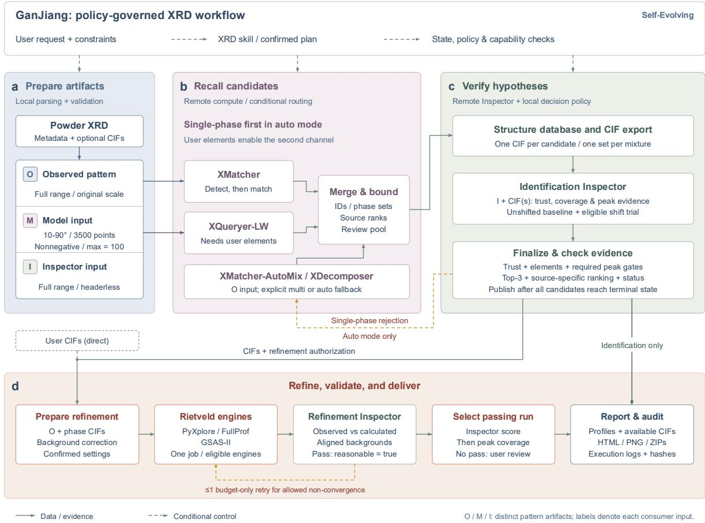  
Figure 3. Executable architecture for evidence-governed difraction analysis. The user objective and constraints determine the skill and analysis plan; state, policy and capability checks govern execution. a, Local <sub>p</sub>arsin<sub>g</sub> and validation <sub>p</sub>roduce an observed <sub>p</sub>attern (O; full ran<sub>g</sub>e and ori<sub>g</sub>inal scale), a model in<sub>p</sub>ut (M; 3,500 normalized <sub>p</sub>oints over 10<sup>◦</sup>–90<sup>◦</sup>) and an ins<sub>p</sub>ector in<sub>p</sub>ut (I; full ran<sub>g</sub>e in the required format). b, XMatcher retrieves sin<sub>g</sub>le-phase candidates; user-supplied elements enable XQuer<sub>y</sub>er-LW. Candidates <sub>are</sub> <sub>merge</sub>d <sub>w</sub>hil<sub>e</sub> <sub>re</sub>t<sub>a</sub>i<sub>n</sub>i<sub>ng</sub> id<sub>en</sub>titi<sub>es</sub> <sub>an</sub>d <sub>source</sub> <sub>ran</sub>k<sub>s.</sub> XM<sub>a</sub>t<sub>c</sub>h<sub>er-</sub>A<sub>u</sub>t<sub>o</sub>Mi<sub>x</sub> <sub>an</sub>d XD<sub>ecomposer</sub> <sub>suppor</sub>t requested mixture analysis or automatic fallback after rejection of single-phase hypotheses. c, Candidate CIF<sub>s</sub> <sub>are</sub> <sub>expor</sub>t<sub>e</sub>d <sub>an</sub>d i<sub>nspec</sub>t<sub>e</sub>d <sub>aga</sub>i<sub>ns</sub>t th<sub>e</sub> <sub>measuremen</sub>t<sub>.</sub> Fi<sub>na</sub>li<sub>za</sub>ti<sub>on</sub> <sub>requ</sub>i<sub>res</sub> th<sub>e</sub> i<sub>nspec</sub>t<sub>or</sub> <sub>ver</sub>di<sub>c</sub>t<sub>,</sub> <sub>e</sub>l<sub>emen</sub>t<sub>a</sub>l <sub>cons</sub>i<sub>s</sub>t<sub>ency</sub> <sub>w</sub>h<sub>ere</sub> <sub>app</sub>li<sub>ca</sub>bl<sub>e</sub> <sub>an</sub>d <sub>man</sub>d<sub>a</sub>t<sub>ory</sub> <sub>pea</sub>k<sub>-ev</sub>id<sub>ence</sub> <sub>c</sub>h<sub>ec</sub>k<sub>s.</sub> Eli<sub>g</sub>ibl<sub>e</sub> <sub>angu</sub>l<sub>ar-s</sub>hift t<sub>r</sub>i<sub>a</sub>l<sub>s</sub> supplement the unshifted comparison. d, Supported phase sets or user-provided CIFs enter refinement throu<sub>g</sub>h P<sub>y</sub>X<sub>p</sub>lore (the P<sub>y</sub>WPEM service), FullProf or GSAS-II. An ins<sub>p</sub>ector checks the resultin<sub>g p</sub>rofiles; <sub>pass</sub>i<sub>ng</sub> <sub>runs</sub> <sub>are</sub> <sub>se</sub>l<sub>ec</sub>t<sub>e</sub>d b<sub>y</sub> i<sub>nspec</sub>ti<sub>on</sub> <sub>score</sub> <sub>an</sub>d th<sub>en</sub> <sub>pea</sub>k <sub>coverage.</sub> At <sub>mos</sub>t <sub>one</sub> <sub>e</sub>li<sub>g</sub>ibl<sub>e</sub> b<sub>u</sub>d<sub>ge</sub>t<sub>-re</sub>l<sub>a</sub>t<sub>e</sub>d <sub>re</sub>t<sub>ry</sub> i<sub>s a</sub>ll<sub>owe</sub>d<sub>.</sub> S<sub>o</sub>lid <sub>arrows</sub> i<sub>n</sub>di<sub>ca</sub>t<sub>e</sub> d<sub>a</sub>t<sub>a or ev</sub>id<sub>ence</sub> fl<sub>ow;</sub> d<sub>as</sub>h<sub>e</sub>d <sub>arrows</sub> i<sub>n</sub>di<sub>ca</sub>t<sub>e con</sub>diti<sub>ona</sub>l <sub>con</sub>t<sub>ro</sub>l<sub>,</sub> including rejection and retry paths.

XM<sub>a</sub>t<sub>c</sub>h<sub>er</sub> <sub>re</sub>t<sub>r</sub>i<sub>eves</sub> <sub>s</sub>i<sub>ng</sub>l<sub>e-p</sub>h<sub>ase</sub> <sub>can</sub>did<sub>a</sub>t<sub>es</sub> f<sub>rom</sub> th<sub>e</sub> <sub>o</sub>b<sub>serve</sub>d <sub>pea</sub>k<sub>s,</sub> <sub>an</sub>d <sub>supp</sub>li<sub>e</sub>d <sub>e</sub>l<sub>emen</sub>t<sub>a</sub>l constraints enable the complementar<sub>y</sub> XQuer<sub>y</sub>er-LW channel (Fi<sub>g</sub>. 3b). The s<sub>y</sub>stem mer<sub>g</sub>es <sub>can</sub>did<sub>a</sub>t<sub>es</sub> b<sub>y</sub> <sub>ma</sub>t<sub>er</sub>i<sub>a</sub>l id<sub>en</sub>tit<sub>y</sub> <sub>w</sub>hil<sub>e</sub> <sub>preserv</sub>i<sub>ng</sub> <sub>source</sub> <sub>scores</sub> <sub>an</sub>d <sub>provenance.</sub> Th<sub>e</sub> id<sub>en</sub>tifi<sub>ca</sub>ti<sub>on</sub> inspector then compares each candidate CIF, or jointly proposed phase set, with the measurement (Fi<sub>g</sub>. 3c). Acce<sub>p</sub>tance requires a favourable ins<sub>p</sub>ector verdict and all a<sub>pp</sub>licable com<sub>p</sub>osition and <sub>pea</sub>k<sub>-ver</sub>ifi<sub>ca</sub>ti<sub>on</sub> <sub>c</sub>h<sub>ec</sub>k<sub>s.</sub> A<sub>greemen</sub>t b<sub>e</sub>t<sub>ween</sub> <sub>re</sub>t<sub>r</sub>i<sub>eva</sub>l <sub>c</sub>h<sub>anne</sub>l<sub>s</sub> h<sub>e</sub>l<sub>ps</sub> <sub>pr</sub>i<sub>or</sub>iti<sub>ze</sub> i<sub>nspec</sub>ti<sub>on</sub> b<sub>u</sub>t <sub>canno</sub>t <sub>overr</sub>id<sub>e</sub> <sub>a</sub> f<sub>a</sub>il<sub>e</sub>d <sub>ev</sub>id<sub>ence</sub> <sub>c</sub>h<sub>ec</sub>k<sub>.</sub> B<sub>oun</sub>d<sub>e</sub>d <sub>angu</sub>l<sub>ar-o</sub>f<sub>se</sub>t t<sub>r</sub>i<sub>a</sub>l<sub>s</sub> <sub>may</sub> <sub>ass</sub>i<sub>s</sub>t <sub>ma</sub>t<sub>c</sub>hi<sub>ng;</sub> th<sub>ese</sub> t<sub>r</sub>i<sub>a</sub>l<sub>s</sub> d<sub>o</sub> <sub>no</sub>t <sub>cons</sub>tit<sub>u</sub>t<sub>e</sub> i<sub>ns</sub>t<sub>rumen</sub>t <sub>ca</sub>lib<sub>ra</sub>ti<sub>on.</sub>

In automatic mode, completed rejection of the available single-phase hypotheses triggers <sub>m</sub>i<sub>x</sub>t<sub>ure</sub> <sub>ana</sub>l<sub>ys</sub>i<sub>s</sub> th<sub>roug</sub>h XM<sub>a</sub>t<sub>c</sub>h<sub>er-</sub>A<sub>u</sub>t<sub>o</sub>Mi<sub>x</sub> <sub>or</sub> XD<sub>ecomposer.</sub> A f<sub>a</sub>il<sub>e</sub>d t<sub>oo</sub>l <sub>ca</sub>ll <sub>a</sub>l<sub>one</sub> d<sub>oes</sub> <sub>no</sub>t <sub>es</sub>t<sub>a</sub>bli<sub>s</sub>h th<sub>a</sub>t <sub>a</sub> <sub>samp</sub>l<sub>e</sub> i<sub>s</sub> <sub>mu</sub>lti<sub>p</sub>h<sub>ase.</sub> Thi<sub>s</sub> di<sub>s</sub>ti<sub>nc</sub>ti<sub>on</sub> <sub>separa</sub>t<sub>es</sub> <sub>compu</sub>t<sub>a</sub>ti<sub>ona</sub>l f<sub>a</sub>il<sub>ure</sub> f<sub>rom</sub> <sub>ev</sub>id<sub>ence</sub> th<sub>a</sub>t th<sub>e</sub> <sub>s</sub>t<sub>ruc</sub>t<sub>ura</sub>l <sub>mo</sub>d<sub>e</sub>l i<sub>s</sub> i<sub>ncomp</sub>l<sub>e</sub>t<sub>e.</sub> E<sub>xp</sub>li<sub>c</sub>itl<sub>y</sub> <sub>reques</sub>t<sub>e</sub>d <sub>m</sub>i<sub>x</sub>t<sub>ure</sub> <sub>ana</sub>l<sub>yses</sub> <sub>can</sub> <sub>en</sub>t<sub>er</sub> the multiphase branch directly, and all resulting phase sets undergo joint inspection.

A<sub>ccep</sub>t<sub>e</sub>d <sub>p</sub>h<sub>ase</sub> <sub>mo</sub>d<sub>e</sub>l<sub>s,</sub> <sub>or</sub> <sub>user-supp</sub>li<sub>e</sub>d <sub>s</sub>t<sub>ruc</sub>t<sub>ures,</sub> <sub>procee</sub>d t<sub>o</sub> <sub>e</sub>li<sub>g</sub>ibl<sub>e</sub> <sub>re</sub>fi<sub>nemen</sub>t <sub>eng</sub>i<sub>nes</sub> <sub>w</sub>ith recorded back<sub>g</sub>round <sub>p</sub>re<sub>p</sub>aration and instrument settin<sub>g</sub>s (Fi<sub>g</sub>. 3d). P<sub>y</sub>WPEM is ex<sub>p</sub>osed throu<sub>g</sub>h th<sub>e</sub> P<sub>y</sub>X<sub>p</sub>l<sub>ore</sub> <sub>serv</sub>i<sub>ce,</sub> <sub>a</sub>l<sub>ongs</sub>id<sub>e</sub> F<sub>u</sub>llP<sub>ro</sub>f <sub>an</sub>d GSAS<sub>-</sub>II<sub>.</sub> Th<sub>e</sub> <sub>re</sub>fi<sub>nemen</sub>t i<sub>nspec</sub>t<sub>or</sub> <sub>compares</sub> <sub>o</sub>b<sub>serve</sub>d <sub>an</sub>d <sub>ca</sub>l<sub>cu</sub>l<sub>a</sub>t<sub>e</sub>d <sub>pro</sub>fil<sub>es</sub> <sub>on</sub> <sub>a</sub>li<sub>gne</sub>d <sub>angu</sub>l<sub>ar</sub> <sub>coor</sub>di<sub>na</sub>t<sub>es</sub> <sub>an</sub>d <sub>compa</sub>tibl<sub>e</sub> i<sub>n</sub>t<sub>ens</sub>it<sub>y</sub> <sub>an</sub>d b<sub>ac</sub>k<sub>groun</sub>d d<sub>e</sub>fi<sub>n</sub>iti<sub>ons.</sub> P<sub>ass</sub>i<sub>ng</sub> <sub>runs</sub> <sub>are</sub> <sub>ran</sub>k<sub>e</sub>d b<sub>y</sub> i<sub>nspec</sub>ti<sub>on</sub> <sub>score</sub> <sub>an</sub>d <sub>pea</sub>k <sub>coverage,</sub> <sub>w</sub>ith fit i<sub>n</sub>di<sub>ces</sub> <sub>re</sub>t<sub>a</sub>i<sub>ne</sub>d <sub>as</sub> di<sub>agnos</sub>ti<sub>cs.</sub> At <sub>mos</sub>t <sub>one</sub> <sub>au</sub>t<sub>oma</sub>ti<sub>c</sub> <sub>re</sub>t<sub>ry</sub> i<sub>s</sub> <sub>perm</sub>itt<sub>e</sub>d f<sub>or</sub> <sub>an</sub> <sub>e</sub>li<sub>g</sub>ibl<sub>e</sub> <sub>convergence</sub> <sub>or</sub> it<sub>era</sub>ti<sub>on-</sub>b<sub>u</sub>d<sub>ge</sub>t li<sub>m</sub>it<sub>a</sub>ti<sub>on.</sub> U<sub>nexp</sub>l<sub>a</sub>i<sub>ne</sub>d <sub>pea</sub>k<sub>s</sub> <sub>an</sub>d <sub>p</sub>h<sub>ase-mo</sub>d<sub>e</sub>l <sub>m</sub>i<sub>sma</sub>t<sub>c</sub>h i<sub>ns</sub>t<sub>ea</sub>d <sub>promp</sub>t <sub>recons</sub>id<sub>era</sub>ti<sub>on</sub> <sub>o</sub>f th<sub>e</sub> h<sub>ypo</sub>th<sub>es</sub>i<sub>s.</sub> R<sub>epor</sub>t<sub>s</sub> <sub>re</sub>t<sub>a</sub>i<sub>n</sub> <sub>s</sub>t<sub>ruc</sub>t<sub>ures,</sub> <sub>pro</sub>fil<sub>es</sub> <sub>an</sub>d di<sub>agnos</sub>ti<sub>cs,</sub> <sub>w</sub>hil<sub>e</sub> th<sub>e</sub> <sub>assoc</sub>i<sub>a</sub>t<sub>e</sub>d <sub>au</sub>dit <sub>recor</sub>d <sub>preserves</sub> <sub>execu</sub>ti<sub>on</sub> <sub>parame</sub>t<sub>ers,</sub> f<sub>a</sub>il<sub>ures</sub> <sub>an</sub>d <sub>re</sub>t<sub>ry</sub> d<sub>ec</sub>i<sub>s</sub>i<sub>ons.</sub> Thi<sub>s</sub> <sub>recor</sub>d <sub>suppor</sub>t<sub>s</sub> b<sub>o</sub>th <sub>sc</sub>i<sub>en</sub>tifi<sub>c</sub> <sub>rev</sub>i<sub>ew</sub> <sub>an</sub>d <sub>su</sub>b<sub>sequen</sub>t <sub>s</sub>kill <sub>rev</sub>i<sub>s</sub>i<sub>on.</sub>

## Self-improvement transfers analytical skills to unseen samples

Th<sub>e</sub> d<sub>e</sub>fi<sub>n</sub>i<sub>ng</sub> t<sub>es</sub>t <sub>o</sub>f <sub>se</sub>lf<sub>-</sub>i<sub>mprovemen</sub>t i<sub>s</sub> <sub>w</sub>h<sub>e</sub>th<sub>er</sub> <sub>exper</sub>i<sub>ence</sub> f<sub>rom</sub> <sub>one</sub> <sub>ana</sub>l<sub>ys</sub>i<sub>s</sub> i<sub>mproves</sub> th<sub>e</sub> <sub>proce</sub>d<sub>ure</sub> <sub>use</sub>d f<sub>or</sub> <sub>su</sub>b<sub>sequen</sub>t <sub>samp</sub>l<sub>es.</sub> G<sub>an</sub> Ji<sub>ang</sub> i<sub>mp</sub>l<sub>emen</sub>t<sub>s</sub> thi<sub>s</sub> th<sub>roug</sub>h <sub>our</sub> <sub>propose</sub>d <sub>rea</sub>d<sub>–</sub> <sub>wr</sub>it<sub>e</sub> <sub>re</sub>fl<sub>ec</sub>ti<sub>ve</sub> l<sub>earn</sub>i<sub>ng</sub> <sub>mec</sub>h<sub>an</sub>i<sub>sm</sub><sup>31</sup><sub>.</sub> I<sub>n</sub> th<sub>a</sub>t f<sub>ramewor</sub>k<sub>,</sub> <sub>s</sub>kill<sub>s</sub> f<sub>orm</sub> <sub>ex</sub>t<sub>erna</sub>l <sub>memory:</sub> <sub>eac</sub>h <sub>com</sub>bi<sub>nes</sub> i<sub>ns</sub>t<sub>ruc</sub>ti<sub>ons,</sub> <sub>promp</sub>t<sub>s</sub> <sub>an</sub>d <sub>execu</sub>t<sub>a</sub>bl<sub>e</sub> <sub>suppor</sub>t <sub>co</sub>d<sub>e.</sub> A <sub>rou</sub>t<sub>er</sub> <sub>re</sub>t<sub>r</sub>i<sub>eves</sub> <sub>a</sub> <sub>s</sub>kill f<sub>or</sub> th<sub>e</sub> <sub>curren</sub>t t<sub>as</sub>k<sub>,</sub> th<sub>e</sub> <sub>agen</sub>t <sub>execu</sub>t<sub>es</sub> it<sub>,</sub> <sub>an</sub>d <sub>re</sub>fl<sub>ec</sub>ti<sub>on</sub> <sub>on</sub> th<sub>e</sub> <sub>resu</sub>lti<sub>ng</sub> t<sub>race</sub> <sub>proposes</sub> <sub>c</sub>h<sub>anges</sub> t<sub>o</sub> th<sub>e</sub> <sub>s</sub>kill lib<sub>rary.</sub> F<sub>a</sub>il<sub>ure</sub> <sub>a</sub>tt<sub>r</sub>ib<sub>u</sub>ti<sub>on</sub> di<sub>rec</sub>t<sub>s</sub> <sub>rev</sub>i<sub>s</sub>i<sub>on</sub> t<sub>owar</sub>d<sub>s</sub> th<sub>e</sub> <sub>respons</sub>ibl<sub>e</sub> <sub>proce</sub>d<sub>ure,</sub> <sub>w</sub>hil<sub>e</sub> <sub>va</sub>lid<sub>a</sub>ti<sub>on</sub> <sub>c</sub>h<sub>ec</sub>k<sub>s</sub> <sub>guar</sub>d <sub>aga</sub>i<sub>ns</sub>t <sub>regress</sub>i<sub>ons.</sub> Th<sub>e</sub> <sub>un</sub>d<sub>er</sub>l<sub>y</sub>i<sub>ng</sub> l<sub>anguage-mo</sub>d<sub>e</sub>l <sub>parame</sub>t<sub>ers</sub> <sub>rema</sub>i<sub>n</sub> fi<sub>xe</sub>d<sub>.</sub> G<sub>an</sub> Ji<sub>ang</sub> <sub>spec</sub>i<sub>a</sub>li<sub>zes</sub> thi<sub>s</sub> <sub>mec</sub>h<sub>an</sub>i<sub>sm</sub> b<sub>y</sub> t<sub>y</sub>i<sub>ng</sub> <sub>rev</sub>i<sub>s</sub>i<sub>on</sub> t<sub>o</sub> dif<sub>rac</sub>ti<sub>on</sub> <sub>res</sub>id<sub>ua</sub>l<sub>s,</sub> <sub>execu</sub>ti<sub>on</sub> <sub>ou</sub>t<sub>comes</sub> <sub>an</sub>d th<sub>e</sub> <sub>p</sub>h<sub>ys</sub>i<sub>ca</sub>l <sub>p</sub>l<sub>aus</sub>ibilit<sub>y</sub> <sub>o</sub>f <sub>re</sub>fi<sub>ne</sub>d <sub>mo</sub>d<sub>e</sub>l<sub>s.</sub>

Th<sub>e</sub> di<sub>s</sub>ti<sub>nc</sub>ti<sub>on</sub> b<sub>e</sub>t<sub>ween</sub> <sub>samp</sub>l<sub>e-</sub>l<sub>eve</sub>l <sub>op</sub>ti<sub>m</sub>i<sub>za</sub>ti<sub>on</sub> <sub>an</sub>d <sub>s</sub>kill l<sub>earn</sub>i<sub>ng</sub> i<sub>s</sub> <sub>opera</sub>ti<sub>ona</sub>l<sub>.</sub> R<sub>e</sub>fi<sub>n</sub>i<sub>ng</sub> <sub>a</sub> l<sub>a</sub>tti<sub>ce</sub> <sub>parame</sub>t<sub>er</sub> <sub>c</sub>h<sub>anges</sub> th<sub>e</sub> <sub>mo</sub>d<sub>e</sub>l f<sub>or</sub> <sub>one</sub> <sub>samp</sub>l<sub>e.</sub> R<sub>ev</sub>i<sub>s</sub>i<sub>ng</sub> <sub>w</sub>h<sub>en</sub> l<sub>a</sub>tti<sub>ce</sub> <sub>parame</sub>t<sub>ers</sub> <sub>s</sub>h<sub>ou</sub>ld b<sub>e</sub> <sub>re</sub>l<sub>ease</sub>d<sub>,</sub> <sub>w</sub>hi<sub>c</sub>h di<sub>agnos</sub>ti<sub>cs</sub> <sub>mus</sub>t b<sub>e</sub> <sub>c</sub>h<sub>ec</sub>k<sub>e</sub>d <sub>or</sub> h<sub>ow</sub> <sub>a</sub> <sub>recurren</sub>t f<sub>a</sub>il<sub>ure</sub> <sub>s</sub>h<sub>ou</sub>ld b<sub>e</sub> h<sub>an</sub>dl<sub>e</sub>d <sub>c</sub>h<sub>anges</sub> th<sub>e</sub> <sub>proce</sub>d<sub>ure</sub> f<sub>or</sub> <sub>su</sub>b<sub>sequen</sub>t <sub>samp</sub>l<sub>es.</sub> Aft<sub>er</sub> <sub>eac</sub>h l<sub>earn</sub>i<sub>ng</sub> <sub>ep</sub>i<sub>so</sub>d<sub>e,</sub> G<sub>an</sub> Ji<sub>ang</sub> <sub>uses</sub> th<sub>e</sub> recorded trajectory to propose modifications to skill instructions, supporting code or refinement <sub>se</sub>tti<sub>ngs w</sub>hil<sub>e preserv</sub>i<sub>ng</sub> th<sub>e</sub> i<sub>npu</sub>t <sub>an</sub>d <sub>ou</sub>t<sub>pu</sub>t i<sub>n</sub>t<sub>er</sub>f<sub>aces.</sub> C<sub>an</sub>did<sub>a</sub>t<sub>e vers</sub>i<sub>ons can</sub> th<sub>ere</sub>f<sub>ore</sub> b<sub>e</sub> com<sub>p</sub>ared directl<sub>y</sub> with the <sub>p</sub>recedin<sub>g</sub> version under the same evaluation conditions (Fi<sub>g</sub>. 4d).

W<sub>e eva</sub>l<sub>ua</sub>t<sub>e</sub>d <sub>wo</sub>rkfl<sub>ow</sub> im<sub>p</sub>r<sub>ove</sub>m<sub>e</sub>nt <sub>ac</sub>r<sub>oss</sub> F<sub>u</sub>llPr<sub>o</sub>f<sub>,</sub> GSAS<sub>-</sub>II <sub>a</sub>nd P<sub>y</sub>WPEM<sub>, s</sub>t<sub>a</sub>rtin<sub>g</sub> fr<sub>o</sub>m <sub>exper</sub>t<sub>-op</sub>ti<sub>m</sub>i<sub>ze</sub>d b<sub>ase</sub>li<sub>ne</sub> <sub>proce</sub>d<sub>ures.</sub> T<sub>ra</sub>i<sub>n</sub>i<sub>ng</sub> <sub>ep</sub>i<sub>so</sub>d<sub>es</sub> <sub>supp</sub>li<sub>e</sub>d th<sub>e</sub> <sub>ev</sub>id<sub>ence</sub> f<sub>or</sub> <sub>propos</sub>i<sub>ng</sub> <sub>c</sub>h<sub>anges,</sub> <sub>an</sub>d <sub>pa</sub>i<sub>re</sub>d d<sub>eve</sub>l<sub>opmen</sub>t <sub>eva</sub>l<sub>ua</sub>ti<sub>ons</sub> d<sub>e</sub>t<sub>erm</sub>i<sub>ne</sub>d <sub>w</sub>hi<sub>c</sub>h <sub>rev</sub>i<sub>s</sub>i<sub>ons</sub> <sub>were</sub> <sub>re</sub>t<sub>a</sub>i<sub>ne</sub>d<sub>.</sub> Th<sub>e</sub> <sub>se</sub>l<sub>ec</sub>t<sub>e</sub>d <sub>vers</sub>i<sub>on was</sub> th<sub>en</sub> f<sub>rozen</sub> b<sub>e</sub>f<sub>ore eva</sub>l<sub>ua</sub>ti<sub>on aga</sub>i<sub>ns</sub>t th<sub>e</sub> i<sub>n</sub>iti<sub>a</sub>l <sub>wor</sub>kfl<sub>ow on</sub> h<sub>e</sub>ld<sub>-ou</sub>t <sub>samp</sub>l<sub>es.</sub> Thi<sub>s</sub> d<sub>es</sub>i<sub>gn</sub> <sub>separa</sub>t<sub>es</sub> th<sub>e</sub> d<sub>a</sub>t<sub>a</sub> <sub>use</sub>d t<sub>o</sub> l<sub>earn</sub> <sub>a</sub> <sub>proce</sub>d<sub>ure</sub> f<sub>rom</sub> th<sub>e</sub> d<sub>a</sub>t<sub>a</sub> <sub>use</sub>d t<sub>o</sub> <sub>assess</sub> its transfer. The FullProf trajectory summarizes workflow revisions, the GSAS-II experiment jointly optimizes skill and refinement settings, and the PyWPEM experiment evaluates skill <sub>op</sub>ti<sub>m</sub>i<sub>za</sub>ti<sub>on;</sub> th<sub>e</sub>i<sub>r</sub> <sub>ga</sub>i<sub>ns</sub> th<sub>ere</sub>f<sub>ore</sub> <sub>quan</sub>tif<sub>y</sub> i<sub>mprovemen</sub>t <sub>un</sub>d<sub>er</sub> th<sub>e</sub> <sub>s</sub>t<sub>a</sub>t<sub>e</sub>d <sub>a</sub>d<sub>ap</sub>t<sub>a</sub>ti<sub>on</sub> <sub>reg</sub>i<sub>mes</sub> <sub>ra</sub>th<sub>er</sub> th<sub>an</sub> <sub>a</sub> <sub>s</sub>i<sub>ng</sub>l<sub>e</sub> <sub>common</sub> i<sub>n</sub>t<sub>erven</sub>ti<sub>on.</sub>

All three final workflows improved their mean held-out refinement score (Fig. 4a–c). FullProf in<sub>c</sub>r<sub>ease</sub>d fr<sub>o</sub>m 46<sub>.</sub>90 t<sub>o</sub> 72<sub>.</sub>38<sub>,</sub> GSAS<sub>-</sub>II fr<sub>o</sub>m 39<sub>.</sub>01 t<sub>o</sub> 60<sub>.</sub>02<sub>, a</sub>nd P<sub>y</sub>WPEM fr<sub>o</sub>m 31<sub>.</sub>74 t<sub>o</sub> 38<sub>.</sub>33<sub>.</sub> Th<sub>ese</sub> <sub>scores</sub> <sub>summar</sub>i<sub>ze</sub> <sub>pro</sub>fil<sub>e</sub> <sub>agreemen</sub>t <sub>an</sub>d i<sub>nc</sub>l<sub>u</sub>d<sub>e</sub> f<sub>a</sub>il<sub>e</sub>d <sub>or</sub> ti<sub>me</sub>d<sub>-ou</sub>t <sub>eva</sub>l<sub>ua</sub>ti<sub>ons</sub> <sub>as</sub> <sub>zero;</sub> they are not percentages of correctly identified structures. The development trajectories show <sub>w</sub>h<sub>en</sub> <sub>use</sub>f<sub>u</sub>l <sub>rev</sub>i<sub>s</sub>i<sub>ons</sub> <sub>were</sub> <sub>re</sub>t<sub>a</sub>i<sub>ne</sub>d<sub>,</sub> <sub>w</sub>h<sub>ereas</sub> th<sub>e</sub> f<sub>rozen-vers</sub>i<sub>on</sub> <sub>compar</sub>i<sub>sons</sub> <sub>s</sub>h<sub>ow</sub> th<sub>a</sub>t th<sub>e</sub> fi<sub>na</sub>l <sub>proce</sub>d<sub>ures</sub> i<sub>mprove</sub>d <sub>per</sub>f<sub>ormance</sub> b<sub>eyon</sub>d th<sub>e</sub> <sub>samp</sub>l<sub>es</sub> <sub>use</sub>d t<sub>o</sub> <sub>se</sub>l<sub>ec</sub>t th<sub>em.</sub> Th<sub>e</sub> <sub>sma</sub>ll<sub>er</sub> P<sub>y</sub>WPEM <sub>ga</sub>i<sub>n</sub> <sub>a</sub>l<sub>so</sub> i<sub>n</sub>di<sub>ca</sub>t<sub>es</sub> th<sub>a</sub>t th<sub>e</sub> b<sub>ene</sub>fit d<sub>epen</sub>d<sub>s</sub> <sub>on</sub> th<sub>e</sub> i<sub>n</sub>iti<sub>a</sub>l <sub>wor</sub>kfl<sub>ow,</sub> <sub>eng</sub>i<sub>ne</sub> <sub>an</sub>d <sub>perm</sub>itt<sub>e</sub>d <sub>rev</sub>i<sub>s</sub>i<sub>ons.</sub>

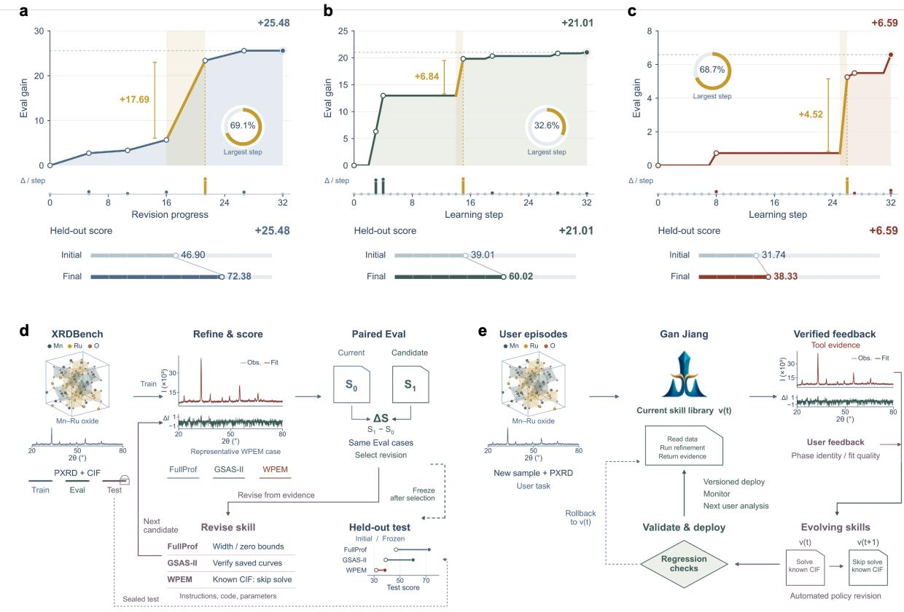  
Figure 4. Self-improvement of refinement workflows and transfer to held-out samples. a–c, Learning trajectories for FullProf workflow revision, GSAS-II joint o timization and P WPEM skill o timization (labelled WPEM), res<sub>p</sub>ectivel<sub>y</sub>. U<sub>pp</sub>er <sub>p</sub>lots show cumulative develo<sub>p</sub>ment-score <sub>g</sub>ains; lower ste<sub>p p</sub>lots <sub>s</sub>h<sub>ow</sub> th<sub>e</sub> i<sub>ncremen</sub>t<sub>s assoc</sub>i<sub>a</sub>t<sub>e</sub>d <sub>w</sub>ith <sub>rev</sub>i<sub>s</sub>i<sub>ons.</sub> Hi<sub>g</sub>hli<sub>g</sub>ht<sub>e</sub>d i<sub>n</sub>t<sub>erva</sub>l<sub>s</sub> id<sub>en</sub>tif<sub>y</sub> th<sub>e</sub> l<sub>arge</sub> i<sub>ncremen</sub>t<sub>s mar</sub>k<sub>e</sub>d in each panel. Comparisons beneath the trajectories report mean held-out scores for the frozen initial <sub>an</sub>d fi<sub>na</sub>l <sub>wor</sub>kfl<sub>ows:</sub> 46<sub>.</sub>90 t<sub>o</sub> 72<sub>.</sub>38 f<sub>or</sub> F<sub>u</sub>llP<sub>ro</sub>f<sub>,</sub> 39<sub>.</sub>01 t<sub>o</sub> 60<sub>.</sub>02 f<sub>or</sub> GSAS<sub>-</sub>II <sub>an</sub>d 31<sub>.</sub>74 t<sub>o</sub> 38<sub>.</sub>33 f<sub>or</sub> PyWPEM. d, Controlled learning protocol. Training episodes provide execution and difraction feedback f<sub>or</sub> <sub>rev</sub>i<sub>s</sub>i<sub>ng</sub> i<sub>ns</sub>t<sub>ruc</sub>ti<sub>ons,</sub> <sub>co</sub>d<sub>e</sub> <sub>an</sub>d <sub>parame</sub>t<sub>ers.</sub> P<sub>a</sub>i<sub>re</sub>d d<sub>eve</sub>l<sub>opmen</sub>t <sub>c</sub>h<sub>ec</sub>k<sub>s</sub> <sub>se</sub>l<sub>ec</sub>t <sub>can</sub>did<sub>a</sub>t<sub>e</sub> <sub>rev</sub>i<sub>s</sub>i<sub>ons.</sub> Th<sub>e</sub> selected version is frozen before held-out evaluation, and test results do not select the learning trajectory. e, Deployment-time learning architecture. New user episodes are analysed with the current skill library; <sub>ver</sub>ifi<sub>e</sub>d t<sub>oo</sub>l <sub>ev</sub>id<sub>ence an</sub>d <sub>user</sub> f<sub>ee</sub>db<sub>ac</sub>k i<sub>n</sub>f<sub>orm can</sub>did<sub>a</sub>t<sub>e rev</sub>i<sub>s</sub>i<sub>ons.</sub> R<sub>egress</sub>i<sub>on c</sub>h<sub>ec</sub>k<sub>s prece</sub>d<sub>e vers</sub>i<sub>one</sub>d d<sub>ep</sub>l<sub>oymen</sub>t<sub>, w</sub>ith <sub>mon</sub>it<sub>or</sub>i<sub>ng an</sub>d <sub>ro</sub>llb<sub>ac</sub>k<sub>.</sub>

The learned chan<sub>g</sub>es make this mechanism concrete (Su<sub>pp</sub>lementar<sub>y</sub> Section 2.4). FullProf <sub>rev</sub>i<sub>s</sub>i<sub>ons rep</sub>l<sub>ace a gener</sub>i<sub>c re</sub>l<sub>ease sequence w</sub>ith <sub>a</sub> b<sub>oun</sub>d<sub>e</sub>d<sub>,</sub> t<sub>as</sub>k<sub>-spec</sub>ifi<sub>c searc</sub>h <sub>over pro</sub>fil<sub>e</sub> <sub>w</sub>idth <sub>an</sub>d <sub>angu</sub>l<sub>ar</sub> <sub>o</sub>f<sub>se</sub>t<sub>.</sub> GSAS<sub>-</sub>II <sub>s</sub>kill <sub>rev</sub>i<sub>s</sub>i<sub>ons</sub> <sub>a</sub>dd <sub>exp</sub>li<sub>c</sub>it <sub>parame</sub>t<sub>er-pass</sub>i<sub>ng</sub> <sub>an</sub>d <sub>save</sub>d<sub>-ou</sub>t<sub>pu</sub>t <sub>c</sub>h<sub>ec</sub>k<sub>s,</sub> <sub>re</sub>d<sub>uc</sub>i<sub>ng</sub> th<sub>e</sub> <sub>r</sub>i<sub>s</sub>k th<sub>a</sub>t <sub>a</sub> <sub>reques</sub>t<sub>e</sub>d <sub>c</sub>h<sub>ange</sub> i<sub>s</sub> <sub>s</sub>il<sub>en</sub>tl<sub>y</sub> i<sub>gnore</sub>d <sub>or</sub> th<sub>a</sub>t <sub>repor</sub>t<sub>e</sub>d di<sub>agnos</sub>ti<sub>cs</sub> d<sub>o</sub> <sub>no</sub>t <sub>ma</sub>t<sub>c</sub>h th<sub>e</sub> <sub>s</sub>t<sub>ore</sub>d <sub>resu</sub>lt<sub>.</sub> P<sub>y</sub>WPEM <sub>rev</sub>i<sub>s</sub>i<sub>ons</sub> di<sub>s</sub>ti<sub>ngu</sub>i<sub>s</sub>h <sub>re</sub>fi<sub>nemen</sub>t <sub>o</sub>f <sub>a</sub> k<sub>nown</sub> <sub>s</sub>t<sub>ruc</sub>t<sub>ure</sub> f<sub>rom</sub> <sub>s</sub>t<sub>ruc</sub>t<sub>ure</sub> <sub>so</sub>l<sub>v</sub>i<sub>ng</sub> <sub>an</sub>d i<sub>n</sub>t<sub>ro</sub>d<sub>uce</sub> t<sub>arge</sub>t<sub>e</sub>d <sub>responses</sub> t<sub>o</sub> di<sub>vergence</sub> <sub>or</sub> ti<sub>meou</sub>t<sub>s.</sub> Th<sub>ese</sub> <sub>examp</sub>l<sub>es</sub> <sub>s</sub>h<sub>ow</sub> h<sub>ow</sub> <sub>execu</sub>ti<sub>on</sub> <sub>exper</sub>i<sub>ence</sub> <sub>can</sub> b<sub>ecome</sub> <sub>an</sub> <sub>ac</sub>ti<sub>ona</sub>bl<sub>e</sub> <sub>ru</sub>l<sub>e</sub> <sub>w</sub>ith <sub>a</sub> d<sub>e</sub>fi<sub>ne</sub>d <sub>scope.</sub>

Th<sub>e</sub> <sub>same</sub> <sub>arc</sub>hit<sub>ec</sub>t<sub>ure</sub> <sub>suppor</sub>t<sub>s</sub> l<sub>earn</sub>i<sub>ng</sub> d<sub>ur</sub>i<sub>ng</sub> d<sub>ep</sub>l<sub>oymen</sub>t<sub>:</sub> <sub>ver</sub>ifi<sub>e</sub>d <sub>user</sub> <sub>ep</sub>i<sub>so</sub>d<sub>es</sub> <sub>can</sub> <sub>genera</sub>t<sub>e</sub> <sub>can</sub>did<sub>a</sub>t<sub>e</sub> <sub>up</sub>d<sub>a</sub>t<sub>es</sub> th<sub>a</sub>t <sub>un</sub>d<sub>ergo</sub> <sub>regress</sub>i<sub>on</sub> <sub>c</sub>h<sub>ec</sub>k<sub>s</sub> b<sub>e</sub>f<sub>ore</sub> <sub>vers</sub>i<sub>one</sub>d <sub>re</sub>l<sub>ease,</sub> <sub>w</sub>ith <sub>mon</sub>it<sub>or</sub>i<sub>ng</sub> and rollback (Fi<sub>g</sub>. 4e). The <sub>p</sub>resent ex<sub>p</sub>eriments establish transfer after controlled revision and f<sub>reez</sub>i<sub>ng.</sub> Th<sub>ey</sub> <sub>prov</sub>id<sub>e</sub> <sub>a</sub> b<sub>as</sub>i<sub>s</sub> f<sub>or,</sub> <sub>ra</sub>th<sub>er</sub> th<sub>an</sub> <sub>a</sub> l<sub>ong</sub>it<sub>u</sub>di<sub>na</sub>l d<sub>emons</sub>t<sub>ra</sub>ti<sub>on</sub> <sub>o</sub>f<sub>,</sub> <sub>open-en</sub>d<sub>e</sub>d i<sub>mprovemen</sub>t d<sub>ur</sub>i<sub>ng</sub> <sub>rou</sub>ti<sub>ne</sub> <sub>use.</sub> S<sub>e</sub>lf<sub>-</sub>i<sub>mprovemen</sub>t i<sub>n</sub> G<sub>an</sub> Ji<sub>ang</sub> i<sub>s</sub> th<sub>us</sub> <sub>a</sub> t<sub>es</sub>t<sub>a</sub>bl<sub>e</sub> <sub>proper</sub>t<sub>y</sub> <sub>o</sub>f <sub>rev</sub>i<sub>se</sub>d <sub>ana</sub>l<sub>y</sub>ti<sub>ca</sub>l <sub>proce</sub>d<sub>ures,</sub> <sub>w</sub>ith <sub>eac</sub>h <sub>a</sub>d<sub>op</sub>t<sub>e</sub>d <sub>s</sub>kill li<sub>n</sub>ki<sub>ng</sub> it<sub>s</sub> <sub>correc</sub>ti<sub>ve</sub> <sub>ac</sub>ti<sub>on</sub> t<sub>o</sub> th<sub>e</sub> <sub>ev</sub>id<sub>ence</sub> th<sub>a</sub>t <sub>mo</sub>ti<sub>va</sub>t<sub>e</sub>d it<sub>.</sub>

## Benchmark gains across single- and multiphase identification

T<sub>o</sub> t<sub>es</sub>t <sub>w</sub>h<sub>e</sub>th<sub>er</sub> th<sub>e</sub> <sub>app</sub>li<sub>ca</sub>ti<sub>on</sub> <sub>resu</sub>lt<sub>s</sub> <sub>ex</sub>t<sub>en</sub>d <sub>across</sub> <sub>a</sub> b<sub>roa</sub>d<sub>er</sub> <sub>range</sub> <sub>o</sub>f <sub>s</sub>t<sub>ruc</sub>t<sub>ures</sub> <sub>an</sub>d <sub>measure-</sub> <sub>men</sub>t<sub>s, we</sub> d<sub>eve</sub>l<sub>ope</sub>d D<sub>e</sub>lt<sub>a</sub>XRDb<sub>enc</sub>h<sub>.</sub> It<sub>s</sub> 62<sub>,</sub>044 <sub>pa</sub>tt<sub>erns com</sub>bi<sub>ne s</sub>i<sub>mu</sub>l<sub>a</sub>t<sub>e</sub>d MP500 d<sub>a</sub>t<sub>a</sub><sup>32</sup><sub>,</sub> <sub>exper</sub>i<sub>men</sub>t<sub>a</sub>l <sub>m</sub>i<sub>nera</sub>l <sub>pa</sub>tt<sub>erns</sub> f<sub>rom</sub> RRUFF<sup>33</sup> <sub>an</sub>d <sub>exper</sub>i<sub>men</sub>t<sub>a</sub>l d<sub>a</sub>t<sub>a</sub> f<sub>rom op</sub>XRD<sup>34</sup><sub>.</sub> Th<sub>e co</sub>ll<sub>ec-</sub> ti<sub>on</sub> <sub>con</sub>t<sub>a</sub>i<sub>ns</sub> 12<sub>,</sub>044 <sub>s</sub>i<sub>ng</sub>l<sub>e-p</sub>h<sub>ase</sub> <sub>pa</sub>tt<sub>erns</sub> <sub>an</sub>d 50<sub>,</sub>000 t<sub>wo-</sub> <sub>or</sub> th<sub>ree-p</sub>h<sub>ase</sub> <sub>m</sub>i<sub>x</sub>t<sub>ures</sub> <sub>cons</sub>t<sub>ruc</sub>t<sub>e</sub>d f<sub>rom</sub> th<sub>e</sub> <sub>source</sub> <sub>pa</sub>tt<sub>erns.</sub> E<sub>va</sub>l<sub>ua</sub>ti<sub>on</sub> <sub>compares</sub> <sub>su</sub>b<sub>m</sub>itt<sub>e</sub>d CIF<sub>s</sub> <sub>w</sub>ith <sub>re</sub>f<sub>erence</sub> <sub>s</sub>t<sub>ruc</sub>t<sub>ures,</sub> <sub>ra</sub>th<sub>er</sub> th<sub>an</sub> <sub>requ</sub>i<sub>r</sub>i<sub>ng</sub> d<sub>a</sub>t<sub>a</sub>b<sub>ase</sub> id<sub>en</sub>tifi<sub>ers,</sub> <sub>an</sub>d <sub>separa</sub>t<sub>es</sub> <sub>ran</sub>k<sub>e</sub>d <sub>s</sub>i<sub>ng</sub>l<sub>e-p</sub>h<sub>ase</sub> <sub>pre</sub>di<sub>c</sub>ti<sub>on</sub> f<sub>rom</sub> <sub>se</sub>t<sub>-va</sub>l<sub>ue</sub>d multi<sub>p</sub>hase <sub>p</sub>rediction (Methods). Mixtures <sub>g</sub>enerated from ex<sub>p</sub>erimental <sub>p</sub>rofiles retain measured <sub>pea</sub>k <sub>comp</sub>l<sub>ex</sub>it<sub>y</sub> b<sub>u</sub>t d<sub>o</sub> <sub>no</sub>t <sub>repro</sub>d<sub>uce</sub> <sub>every</sub> <sub>e</sub>f<sub>ec</sub>t <sub>presen</sub>t i<sub>n</sub> <sub>a</sub> <sub>p</sub>h<sub>ys</sub>i<sub>ca</sub>ll<sub>y</sub> <sub>m</sub>i<sub>xe</sub>d <sub>spec</sub>i<sub>men.</sub>

F<sub>o</sub>r <sub>s</sub>in<sub>g</sub>l<sub>e-p</sub>h<sub>ase</sub> id<sub>e</sub>ntifi<sub>ca</sub>ti<sub>o</sub>n<sub>, we eva</sub>l<sub>ua</sub>t<sub>e</sub>d G<sub>a</sub>n Ji<sub>a</sub>n<sub>g aga</sub>in<sub>s</sub>t Uni3DAR<sup>35</sup><sub>,</sub> PXRDG<sub>e</sub>n<sub>-</sub> Fl<sub>ow</sub><sup>36</sup><sub>,</sub> Xt<sub>a</sub>lN<sub>e</sub>t<sub>-</sub>HMOF100<sup>15</sup> <sub>an</sub>d A<sub>u</sub>t<sub>o</sub>XRD<sup>18</sup><sub>.</sub> G<sub>enera</sub>ti<sub>ve</sub> b<sub>ase</sub>li<sub>nes</sub> <sub>use</sub> th<sub>e</sub>i<sub>r</sub> <sub>ava</sub>il<sub>a</sub>bl<sub>e</sub> <sub>pre</sub>t<sub>ra</sub>i<sub>ne</sub>d <sub>c</sub>h<sub>ec</sub>k<sub>po</sub>i<sub>n</sub>t<sub>s.</sub> U<sub>n</sub>d<sub>er</sub> XRD<sub>-on</sub>l<sub>y</sub> i<sub>n</sub>f<sub>erence,</sub> U<sub>n</sub>i3DAR <sub>pre</sub>di<sub>c</sub>t<sub>s</sub> th<sub>e</sub> <sub>e</sub>l<sub>emen</sub>t<sub>s</sub> <sub>requ</sub>i<sub>re</sub>d b<sub>y</sub> it<sub>s</sub> d<sub>owns</sub>t<sub>ream</sub> <sub>mo</sub>d<sub>e</sub>l<sub>;</sub> it<sub>s</sub> <sub>e</sub>l<sub>emen</sub>t <sub>pre</sub>di<sub>c</sub>t<sub>or</sub> <sub>a</sub>l<sub>so</sub> <sub>supp</sub>li<sub>es</sub> th<sub>e</sub> i<sub>npu</sub>t<sub>s</sub> f<sub>or</sub> PXRDG<sub>en-</sub>Fl<sub>ow</sub> <sub>an</sub>d Xt<sub>a</sub>lN<sub>e</sub>t<sub>-</sub>HMOF100<sub>.</sub> Th<sub>e</sub> <sub>compos</sub>iti<sub>on-ass</sub>i<sub>s</sub>t<sub>e</sub>d <sub>con</sub>diti<sub>on</sub> i<sub>ns</sub>t<sub>ea</sub>d <sub>supp</sub>li<sub>es</sub> <sub>re</sub>f<sub>erence</sub> <sub>compos</sub>iti<sub>on.</sub> A<sub>u</sub>t<sub>o</sub>XRD <sub>uses</sub> th<sub>e</sub> <sub>same</sub> <sub>can</sub>did<sub>a</sub>t<sub>e-</sub>lib<sub>rary</sub> <sub>cons</sub>t<sub>ruc</sub>ti<sub>on</sub> <sub>proce</sub>d<sub>ure</sub> <sub>as</sub> G<sub>an</sub> Ji<sub>ang,</sub> <sub>an</sub>d <sub>we</sub> <sub>score</sub> it<sub>s</sub> i<sub>n</sub>iti<sub>a</sub>l <sub>p</sub>h<sub>ase-</sub>id<sub>en</sub>tifi<sub>ca</sub>ti<sub>on</sub> <sub>ou</sub>t<sub>pu</sub>t<sub>.</sub> PXRDG<sub>en-</sub>Fl<sub>ow</sub> i<sub>s</sub> <sub>eva</sub>l<sub>ua</sub>t<sub>e</sub>d <sub>on</sub> <sub>e</sub>li<sub>g</sub>ibl<sub>e</sub> <sub>su</sub>b<sub>se</sub>t<sub>s</sub> <sub>sa</sub>ti<sub>s</sub>f<sub>y</sub>i<sub>ng</sub> it<sub>s</sub> 100<sub>-a</sub>t<sub>om</sub> li<sub>m</sub>it<sub>.</sub>

G<sub>an</sub> Ji<sub>ang</sub> <sub>ac</sub>hi<sub>eves</sub> th<sub>e</sub> hi<sub>g</sub>h<sub>es</sub>t t<sub>op-</sub>1<sub>,</sub> t<sub>op-</sub>3<sub>,</sub> t<sub>op-</sub>5 <sub>an</sub>d MRR@5 <sub>scores</sub> <sub>on</sub> <sub>a</sub>ll th<sub>ree</sub> d<sub>a</sub>t<sub>ase</sub>t<sub>s</sub> in both in<sub>p</sub>ut conditions (Table 1; Fi<sub>g</sub>. 1e). Its XRD-onl<sub>y</sub> to<sub>p</sub>-1 accuracies of 96.30%, 81.78% <sub>a</sub>nd 40<sub>.</sub>83% <sub>co</sub>m<sub>pa</sub>r<sub>e</sub> <sub>w</sub>ith 58<sub>.</sub>00%<sub>,</sub> 58<sub>.</sub>47% <sub>a</sub>nd 26<sub>.</sub>45% f<sub>o</sub>r A<sub>u</sub>t<sub>o</sub>XRD<sub>.</sub> Th<sub>e</sub> r<sub>a</sub>nkin<sub>g</sub> <sub>a</sub>d<sub>va</sub>nt<sub>age</sub> <sub>pers</sub>i<sub>s</sub>t<sub>s</sub> b<sub>eyon</sub>d th<sub>e</sub> fi<sub>rs</sub>t <sub>can</sub>did<sub>a</sub>t<sub>e:</sub> MRR@5 <sub>reac</sub>h<sub>es</sub> 96<sub>.</sub>94%<sub>,</sub> 86<sub>.</sub>01% <sub>an</sub>d 42<sub>.</sub>22%<sub>, versus</sub> 60<sub>.</sub>17%<sub>,</sub> 60<sub>.</sub>89% <sub>a</sub>nd 27<sub>.</sub>48%<sub>.</sub> S<sub>upp</sub>li<sub>e</sub>d <sub>co</sub>m<sub>pos</sub>iti<sub>o</sub>n r<sub>a</sub>i<sub>ses</sub> G<sub>a</sub>n Ji<sub>a</sub>n<sub>g</sub>’<sub>s</sub> t<sub>op-</sub>1 <sub>accu</sub>r<sub>ac</sub>i<sub>es</sub> t<sub>o</sub>

99<sub>.</sub>90%<sub>,</sub> 92<sub>.</sub>16% <sub>an</sub>d 48<sub>.</sub>93%<sub>.</sub> Th<sub>us</sub> th<sub>e</sub> id<sub>en</sub>tifi<sub>ca</sub>ti<sub>on</sub> <sub>ga</sub>i<sub>ns</sub> <sub>ex</sub>t<sub>en</sub>d f<sub>rom</sub> <sub>s</sub>i<sub>mu</sub>l<sub>a</sub>t<sub>e</sub>d <sub>pa</sub>tt<sub>erns</sub> t<sub>o</sub> <sub>exper</sub>i<sub>men</sub>t<sub>a</sub>l <sub>measuremen</sub>t<sub>s</sub> <sub>an</sub>d <sub>rema</sub>i<sub>n</sub> <sub>su</sub>b<sub>s</sub>t<sub>an</sub>ti<sub>a</sub>l <sub>w</sub>ith<sub>ou</sub>t <sub>re</sub>f<sub>erence</sub> <sub>compos</sub>iti<sub>on.</sub>

Table 1. Single-phase structure identification across simulated and experimental difraction patterns. R<sub>esu</sub>lt<sub>s</sub> <sub>are</sub> <sub>repor</sub>t<sub>e</sub>d f<sub>or</sub> <sub>en</sub>d<sub>-</sub>t<sub>o-en</sub>d XRD<sub>-on</sub>l<sub>y</sub> i<sub>n</sub>f<sub>erence</sub> <sub>an</sub>d XRD + <sub>orac</sub>l<sub>e</sub> <sub>compos</sub>iti<sub>on.</sub> All <sub>me</sub>t<sub>r</sub>i<sub>cs</sub> <sub>are</sub> higher-is-better; the best and second-best values within each dataset and condition are shown in bold and underlined, res<sub>p</sub>ectivel<sub>y</sub>. AutoXRD uses a fixed candidate librar<sub>y</sub> (GanJian<sub>g</sub> dataset). PXRDGen-Flow’s reduced RRUFF and o<sub>p</sub>XRD subsets satisf<sub>y</sub> its ≤ 100-atom limit. PXRDGen and XtalNet abbreviate PXRDGen-Flow and XtalNet-HMOF100 (944 RRUFF and 654 o<sub>p</sub>XRD).
<table><tr><td></td><td colspan="4">XRD-only</td><td colspan="4">XRD + composition</td></tr><tr><td>Model</td><td colspan="8">Top-1 ↑ (%) Top-3 ↑ (%) Top-5 ↑ (%) MRR@5 ↑ (%) Top-1 ↑ (%) Top-3 ↑ (%) Top-5 ↑ (%) MRR@5 ↑ (%)</td></tr><tr><td colspan="12">MP500 (N = 10,000)</td></tr><tr><td>Uni3DAR</td><td>0.02</td><td>0.02 0.01</td><td>0.02 0.01</td><td>0.02 0.01</td><td>29.24 18.79</td><td>30.89 24.58</td><td>31.16 26.53</td><td>30.07</td></tr><tr><td>PXRDGen</td><td>0.01</td><td>0.00</td><td>0.00</td><td>0.00</td><td>0.00</td><td>0.00</td><td>0.20</td><td>21.82 0.04</td></tr><tr><td>XtalNet</td><td>0.00</td><td></td><td>63.60</td><td>60.17</td><td>96.20</td><td>97.90</td><td>98.30</td><td>97.04</td></tr><tr><td>AutoXRD</td><td>58.00 96.30</td><td>61.90 97.60</td><td>97.70</td><td>96.94</td><td>99.90</td><td>99.90</td><td>99.90</td><td>99.90</td></tr><tr><td>Gan Jiang</td><td></td><td></td><td></td><td></td><td></td><td></td><td></td><td></td></tr><tr><td colspan="9">RRUFF (N = 1164)</td></tr><tr><td>Uni3DAR</td><td>0.00</td><td>0.00</td><td>0.00</td><td>0.00</td><td>9.22</td><td>9.85</td><td>10.06</td><td>9.55</td></tr><tr><td>PXRDGen</td><td>0.00</td><td>0.00</td><td>0.00</td><td>0.00</td><td>4.58</td><td>7.67</td><td>8.58</td><td>6.13</td></tr><tr><td>XtalNet</td><td>0.00</td><td>0.00</td><td>0.00</td><td>0.00</td><td>0.00</td><td>0.00</td><td>0.00</td><td>0.00</td></tr><tr><td>AutoXRD</td><td>58.47</td><td>63.24</td><td>64.41</td><td>60.89</td><td>88.67</td><td>93.86</td><td>95.13</td><td>91.23</td></tr><tr><td>Gan Jiang</td><td>81.78</td><td>90.47</td><td>91.95</td><td>86.01</td><td>92.16</td><td>95.02</td><td>95.23</td><td>93.64</td></tr><tr><td colspan="9">opXRD (N = 880)</td></tr><tr><td>Uni3DAR</td><td>0.00</td><td>0.00</td><td>0.00</td><td>0.00</td><td>2.91</td><td>3.21</td><td>3.21</td><td>3.03</td></tr><tr><td>PXRDGen</td><td>0.00</td><td>0.00</td><td>0.00</td><td>0.00</td><td>0.66</td><td>0.99</td><td>1.32</td><td>0.91</td></tr><tr><td>XtalNet</td><td>0.00</td><td>0.00</td><td>0.00</td><td>0.00</td><td>0.00</td><td>0.00</td><td>0.00</td><td>0.00</td></tr><tr><td>AutoXRD</td><td>26.45</td><td>28.13</td><td>29.66</td><td>27.48</td><td>44.04</td><td>49.54</td><td>52.60</td><td>47.08</td></tr><tr><td>Gan Jiang</td><td>40.83</td><td>43.43</td><td>44.19</td><td>42.22</td><td>48.93</td><td>51.68</td><td>54.28</td><td>50.72</td></tr></table>

F<sub>or mu</sub>lti<sub>p</sub>h<sub>ase</sub> id<sub>en</sub>tifi<sub>ca</sub>ti<sub>on, we a</sub>dditi<sub>ona</sub>ll<sub>y compare</sub>d A<sub>u</sub>t<sub>o</sub>A<sub>na</sub>l<sub>yzer</sub><sup>20</sup> <sub>an</sub>d Si<sub>monne</sub>tCNN (S-CNN)<sup>37</sup>, whose <sub>p</sub>i<sub>p</sub>elines can be retrained on the Gan Jian<sub>g</sub> cr<sub>y</sub>stal dataset. Each evaluation <sub>samp</sub>l<sub>es</sub> 1<sub>,</sub>000 <sub>m</sub>i<sub>x</sub>t<sub>ures</sub> <sub>per</sub> <sub>source,</sub> <sub>an</sub>d <sub>repor</sub>t<sub>e</sub>d <sub>me</sub>t<sub>r</sub>i<sub>cs</sub> <sub>are</sub> <sub>means</sub> <sub>across</sub> th<sub>ree</sub> fi<sub>xe</sub>d<sub>-see</sub>d <sub>runs.</sub> E<sub>xac</sub>t<sub>-se</sub>t <sub>recovery</sub> <sub>requ</sub>i<sub>res</sub> <sub>every</sub> <sub>re</sub>f<sub>erence</sub> <sub>p</sub>h<sub>ase</sub> t<sub>o</sub> b<sub>e</sub> f<sub>oun</sub>d <sub>w</sub>ith <sub>no</sub> <sub>ex</sub>t<sub>ra</sub> <sub>p</sub>h<sub>ase;</sub> <sub>samp</sub>l<sub>e-w</sub>i<sub>se</sub> <sub>macro</sub> <sub>prec</sub>i<sub>s</sub>i<sub>on,</sub> <sub>reca</sub>ll <sub>an</sub>d F1 <sub>measure</sub> <sub>par</sub>ti<sub>a</sub>l <sub>recovery.</sub> P<sub>re</sub>di<sub>c</sub>ti<sub>on</sub> <sub>coverage</sub> <sub>recor</sub>d<sub>s</sub> <sub>on</sub>l<sub>y</sub> <sub>w</sub>h<sub>e</sub>th<sub>er</sub> <sub>a</sub> <sub>nonemp</sub>t<sub>y</sub> <sub>va</sub>lid <sub>ou</sub>t<sub>pu</sub>t <sub>was</sub> <sub>re</sub>t<sub>urne</sub>d<sub>.</sub> I<sub>n</sub> th<sub>e</sub> <sub>compos</sub>iti<sub>on-ass</sub>i<sub>s</sub>t<sub>e</sub>d <sub>con</sub>diti<sub>on,</sub> G<sub>an</sub> Ji<sub>ang</sub> <sub>an</sub>d A<sub>u</sub>t<sub>o</sub>XRD <sub>rece</sub>i<sub>ve</sub> <sub>c</sub>h<sub>em</sub>i<sub>ca</sub>l <sub>e</sub>l<sub>emen</sub>t<sub>s</sub> <sub>a</sub>t i<sub>n</sub>f<sub>erence,</sub> <sub>w</sub>h<sub>ereas</sub> <sub>orac</sub>l<sub>e</sub> <sub>per-p</sub>h<sub>ase</sub> <sub>compos</sub>iti<sub>ons</sub> <sub>pos</sub>t<sub>-</sub>filt<sub>er</sub> th<sub>e</sub> f<sub>rozen</sub> XRD<sub>-on</sub>l<sub>y</sub> <sub>pre</sub>di<sub>c</sub>ti<sub>ons</sub> <sub>o</sub>f A<sub>u</sub>t<sub>o</sub>A<sub>na</sub>l<sub>yzer</sub> <sub>an</sub>d S<sub>-</sub>CNN<sub>.</sub>

Table 2. Multiphase identification across simulated and experimental difraction patterns. Each d<sub>a</sub>t<sub>ase</sub>t <sub>con</sub>t<sub>a</sub>i<sub>ns</sub> 1<sub>,</sub>000 hidd<sub>en m</sub>i<sub>x</sub>t<sub>ures.</sub> R<sub>esu</sub>lt<sub>s are repor</sub>t<sub>e</sub>d <sub>un</sub>d<sub>er</sub> XRD<sub>-on</sub>l<sub>y an</sub>d <sub>compos</sub>iti<sub>on-ass</sub>i<sub>s</sub>t<sub>e</sub>d <sub>con</sub>diti<sub>ons.</sub> Hi<sub>g</sub>h<sub>er va</sub>l<sub>ues are</sub> b<sub>e</sub>tt<sub>er</sub> f<sub>or a</sub>ll <sub>me</sub>t<sub>r</sub>i<sub>cs;</sub> th<sub>e</sub> b<sub>es</sub>t <sub>an</sub>d <sub>secon</sub>d<sub>-</sub>b<sub>es</sub>t <sub>va</sub>l<sub>ues w</sub>ithi<sub>n eac</sub>h d<sub>a</sub>t<sub>ase</sub>t and condition are shown in bold and underlined, respectively. Cov. denotes the percentage of mixtures <sub>w</sub>ith <sub>a</sub>t l<sub>eas</sub>t <sub>one va</sub>lid <sub>pre</sub>di<sub>c</sub>t<sub>e</sub>d <sub>p</sub>h<sub>ase a</sub>ft<sub>er pars</sub>i<sub>ng,</sub> d<sub>e</sub>d<sub>up</sub>li<sub>ca</sub>ti<sub>on an</sub>d <sub>any</sub> d<sub>ec</sub>l<sub>are</sub>d <sub>compos</sub>iti<sub>on</sub> filt<sub>er</sub>i<sub>ng.</sub> Exact denotes com<sub>p</sub>lete <sub>p</sub>hase-set recover<sub>y</sub>. Exact, <sub>p</sub>recision (P), recall (R), and F1 are evaluated over all 1<sub>,</sub>000 <sub>m</sub>i<sub>x</sub>t<sub>ures</sub> i<sub>n eac</sub>h <sub>run.</sub> P<sub>,</sub> R<sub>, an</sub>d F1 <sub>are samp</sub>l<sub>e-w</sub>i<sub>se macro averages.</sub>
<table><tr><td></td><td colspan="6">XRD-only</td><td colspan="5">XRD + composition</td></tr><tr><td>Model</td><td>Cov. ↑ (%)</td><td>Exact↑(%) P↑(%) R↑(%)</td><td></td><td></td><td>F1↑(%)</td><td>Cov. ↑ (%)</td><td>Exact ↑(%) P↑(%) R ↑ (%) F1↑ (%)</td><td></td><td></td><td></td><td></td></tr><tr><td colspan="10">MP500 (N = 1,000)</td></tr><tr><td>AutoAnalyzer</td><td>100.00</td><td>1.70</td><td>46.49</td><td>58.08</td><td>51.12</td><td>95.63</td><td>23.37</td><td>85.08</td><td>58.08</td><td>69.25</td></tr><tr><td>S-CNN</td><td>100.00</td><td>1.27</td><td>40.11</td><td>18.99</td><td>25.06</td><td>43.17</td><td>1.60</td><td>42.46</td><td>18.99</td><td>25.72</td></tr><tr><td>AutoXRD</td><td>92.40</td><td>15.80</td><td>50.22</td><td>40.48</td><td>43.24</td><td>98.50</td><td>59.00</td><td>85.57</td><td>80.12</td><td>81.75</td></tr><tr><td>Gan Jiang</td><td>100.00</td><td>22.80</td><td>76.85</td><td>64.77</td><td>66.98</td><td>100.00</td><td>69.70</td><td>94.97</td><td>89.68</td><td>91.61</td></tr><tr><td colspan="10">RRUFF (N = 1,000)</td></tr><tr><td>AutoAnalyzer</td><td>100.00</td><td>6.40</td><td>56.55</td><td>51.62</td><td>53.78</td><td>98.97</td><td>20.03</td><td>75.85</td><td>69.62</td><td>70.13</td></tr><tr><td>S-CNN</td><td>100.00</td><td>2.13</td><td>49.74</td><td>25.17</td><td>32.34</td><td>64.57</td><td>2.47</td><td>53.12</td><td>25.17</td><td>33.33</td></tr><tr><td>AutoXRD</td><td>92.40</td><td>13.80</td><td>48.70</td><td>37.83</td><td>41.07</td><td>98.40</td><td>35.10</td><td>74.45</td><td>65.37</td><td>68.17</td></tr><tr><td>Gan Jiang</td><td>100.00</td><td>15.90</td><td>59.90</td><td>54.55</td><td>56.23</td><td>100.00</td><td>38.20</td><td>81.23</td><td>78.15</td><td>78.56</td></tr><tr><td colspan="10">opXRD (N = 1,000)</td></tr><tr><td>AutoAnalyzer</td><td>100.00</td><td>0.00</td><td>18.42</td><td>22.73</td><td>20.14</td><td>51.83</td><td>1.70</td><td>39.24</td><td>22.54</td><td>27.02</td></tr><tr><td>S-CNN</td><td>100.00</td><td>0.07</td><td>9.68</td><td>5.82</td><td>6.91</td><td>31.93</td><td>0.13</td><td>12.73</td><td>5.82</td><td>7.79</td></tr><tr><td>AutoXRD</td><td>90.20</td><td>1.30</td><td>20.77</td><td>13.12</td><td>15.31</td><td>97.70</td><td>5.20</td><td>37.73</td><td>27.77</td><td>30.55</td></tr><tr><td>Gan Jiang</td><td>100.00</td><td>3.10</td><td>28.63</td><td>26.47</td><td>27.04</td><td>100.00</td><td>8.20</td><td>39.83</td><td>37.90</td><td>38.21</td></tr></table>

G<sub>an</sub> Ji<sub>ang</sub> l<sub>ea</sub>d<sub>s</sub> <sub>exac</sub>t<sub>-se</sub>t <sub>recovery,</sub> <sub>prec</sub>i<sub>s</sub>i<sub>on,</sub> <sub>reca</sub>ll <sub>an</sub>d <sub>macro-</sub>F1 <sub>un</sub>d<sub>er</sub> b<sub>o</sub>th <sub>con</sub>diti<sub>ons</sub> <sub>on</sub> <sub>a</sub>ll three sources (Table 2; Fi<sub>g</sub>. 1f). Without su<sub>pp</sub>lied com<sub>p</sub>osition, its exact-set recover<sub>y</sub> is 22.80%, 15<sub>.</sub>90% <sub>a</sub>nd 3<sub>.</sub>10% <sub>o</sub>n MP500<sub>,</sub> RRUFF <sub>a</sub>nd <sub>op</sub>XRD<sub>,</sub> <sub>co</sub>m<sub>pa</sub>r<sub>e</sub>d <sub>w</sub>ith 15<sub>.</sub>80%<sub>,</sub> 13<sub>.</sub>80% <sub>a</sub>nd 1<sub>.</sub>30% f<sub>or</sub> th<sub>e</sub> <sub>nex</sub>t<sub>-</sub>b<sub>es</sub>t <sub>me</sub>th<sub>o</sub>d<sub>,</sub> A<sub>u</sub>t<sub>o</sub>XRD<sub>.</sub> It<sub>s</sub> <sub>correspon</sub>di<sub>ng</sub> <sub>macro-</sub>F1 <sub>scores</sub> <sub>are</sub> 66<sub>.</sub>98%<sub>,</sub> 56<sub>.</sub>23% <sub>an</sub>d 27<sub>.</sub>04%<sub>;</sub> th<sub>e</sub> <sub>s</sub>t<sub>ronges</sub>t <sub>a</sub>lt<sub>erna</sub>ti<sub>ves</sub> <sub>are</sub> 51<sub>.</sub>12%<sub>,</sub> 53<sub>.</sub>78% <sub>an</sub>d 20<sub>.</sub>14%<sub>,</sub> <sub>a</sub>ll f<sub>rom</sub> A<sub>u</sub>t<sub>o</sub>A<sub>na</sub>l<sub>yzer.</sub> With <sub>co</sub>m<sub>pos</sub>iti<sub>o</sub>n <sub>ass</sub>i<sub>s</sub>t<sub>a</sub>n<sub>ce,</sub> G<sub>a</sub>n Ji<sub>a</sub>n<sub>g</sub> r<sub>eac</sub>h<sub>es</sub> <sub>exac</sub>t<sub>-se</sub>t r<sub>ecove</sub>r<sub>y</sub> <sub>o</sub>f 69<sub>.</sub>70%<sub>,</sub> 38<sub>.</sub>20% <sub>a</sub>nd 8<sub>.</sub>20%<sub>,</sub> <sub>a</sub>nd <sub>macro-</sub>F1 <sub>o</sub>f 91<sub>.</sub>61%<sub>,</sub> 78<sub>.</sub>56% <sub>an</sub>d 38<sub>.</sub>21%<sub>.</sub> It <sub>re</sub>t<sub>urns</sub> <sub>a</sub> <sub>nonemp</sub>t<sub>y</sub> <sub>pre</sub>di<sub>c</sub>ti<sub>on</sub> f<sub>or</sub> <sub>every</sub> <sub>eva</sub>l<sub>ua</sub>t<sub>e</sub>d <sub>m</sub>i<sub>x</sub>t<sub>ure,</sub> <sub>a</sub>lth<sub>oug</sub>h <sub>coverage</sub> <sub>a</sub>l<sub>one</sub> d<sub>oes</sub> <sub>no</sub>t <sub>es</sub>t<sub>a</sub>bli<sub>s</sub>h <sub>correc</sub>t<sub>ness.</sub>

Th<sub>e</sub> <sub>cons</sub>i<sub>s</sub>t<sub>en</sub>t <sub>ran</sub>ki<sub>ng</sub> <sub>across</sub> <sub>con</sub>diti<sub>ons</sub> <sub>suppor</sub>t<sub>s</sub> th<sub>e</sub> b<sub>rea</sub>dth <sub>o</sub>f G<sub>an</sub> Ji<sub>ang</sub>’<sub>s</sub> id<sub>en</sub>tifi<sub>ca</sub>ti<sub>on</sub> <sub>capa</sub>bilit<sub>y.</sub> Th<sub>e</sub> <sub>a</sub>b<sub>so</sub>l<sub>u</sub>t<sub>e</sub> <sub>scores</sub> <sub>a</sub>l<sub>so</sub> d<sub>e</sub>li<sub>m</sub>it it<sub>:</sub> <sub>many</sub> <sub>op</sub>XRD <sub>measuremen</sub>t<sub>s</sub> <sub>cover</sub> i<sub>ncomp</sub>l<sub>e</sub>t<sub>e</sub> <sub>angu</sub>l<sub>ar</sub> <sub>ranges,</sub> <sub>an</sub>d <sub>exac</sub>t <sub>recovery</sub> <sub>o</sub>f <sub>a</sub>ll <sub>m</sub>i<sub>x</sub>t<sub>ure</sub> <sub>cons</sub>tit<sub>uen</sub>t<sub>s</sub> <sub>rema</sub>i<sub>ns</sub> difi<sub>cu</sub>lt <sub>even</sub> <sub>w</sub>ith com<sub>p</sub>osition information (Su<sub>pp</sub>lementar<sub>y</sub> Fi<sub>g</sub>. S1).

## Discussion

G<sub>an</sub> Ji<sub>ang</sub> <sub>ma</sub>k<sub>es</sub> th<sub>e</sub> <sub>proce</sub>d<sub>ure</sub> <sub>connec</sub>ti<sub>ng</sub> <sub>a</sub> <sub>measuremen</sub>t t<sub>o</sub> <sub>a</sub> <sub>s</sub>t<sub>ruc</sub>t<sub>ura</sub>l <sub>conc</sub>l<sub>us</sub>i<sub>on</sub> <sub>an</sub> explicit object of learning. It integrates difraction-analysis tools with a persistent library of <sub>execu</sub>t<sub>a</sub>bl<sub>e</sub> <sub>s</sub>kill<sub>s,</sub> <sub>a</sub>ll<sub>ow</sub>i<sub>ng</sub> <sub>ana</sub>l<sub>y</sub>ti<sub>ca</sub>l <sub>exper</sub>i<sub>ence</sub> t<sub>o</sub> i<sub>n</sub>f<sub>orm</sub> <sub>su</sub>b<sub>sequen</sub>t <sub>ana</sub>l<sub>yses.</sub> Th<sub>e</sub> <sub>app</sub>li<sub>ca</sub>ti<sub>ons</sub> <sub>an</sub>d id<sub>en</sub>tifi<sub>ca</sub>ti<sub>on</sub> b<sub>enc</sub>h<sub>mar</sub>k<sub>s</sub> <sub>es</sub>t<sub>a</sub>bli<sub>s</sub>h th<sub>e</sub> <sub>sys</sub>t<sub>em</sub>’<sub>s</sub> <sub>ana</sub>l<sub>y</sub>ti<sub>ca</sub>l <sub>capa</sub>biliti<sub>es,</sub> <sub>w</sub>hil<sub>e</sub> h<sub>e</sub>ld<sub>-ou</sub>t <sub>compar</sub>i<sub>sons</sub> <sub>o</sub>f f<sub>rozen</sub> <sub>wor</sub>kfl<sub>ow</sub> <sub>vers</sub>i<sub>ons</sub> d<sub>emons</sub>t<sub>ra</sub>t<sub>e</sub> th<sub>a</sub>t l<sub>earne</sub>d <sub>s</sub>kill<sub>s</sub> i<sub>mprove</sub> <sub>re</sub>fi<sub>nemen</sub>t b<sub>eyon</sub>d th<sub>e</sub> <sub>or</sub>i<sub>g</sub>i<sub>na</sub>l <sub>exper</sub>t<sub>-</sub>d<sub>es</sub>i<sub>gne</sub>d <sub>proce</sub>d<sub>ures.</sub>

Th<sub>e</sub> <sub>app</sub>li<sub>ca</sub>ti<sub>ons</sub> ill<sub>us</sub>t<sub>ra</sub>t<sub>e</sub> th<sub>e</sub> <sub>va</sub>l<sub>ue</sub> <sub>o</sub>f thi<sub>s</sub> <sub>approac</sub>h b<sub>eyon</sub>d <sub>rou</sub>ti<sub>ne</sub> <sub>p</sub>h<sub>ase</sub> id<sub>en</sub>tifi<sub>ca</sub>ti<sub>on.</sub> A<sub>rc</sub>h<sub>aeo</sub>l<sub>og</sub>i<sub>ca</sub>l <sub>ma</sub>t<sub>er</sub>i<sub>a</sub>l<sub>s,</sub> <sub>opera</sub>ti<sub>ng</sub> b<sub>a</sub>tt<sub>er</sub>i<sub>es</sub> <sub>an</sub>d di<sub>sor</sub>d<sub>ere</sub>d <sub>ca</sub>t<sub>a</sub>l<sub>ys</sub>t<sub>s</sub> <sub>requ</sub>i<sub>re</sub> d<sub>ec</sub>i<sub>s</sub>i<sub>ons</sub> <sub>a</sub>b<sub>ou</sub>t <sub>w</sub>hi<sub>c</sub>h <sub>s</sub>t<sub>ruc</sub>t<sub>ura</sub>l h<sub>ypo</sub>th<sub>eses</sub> th<sub>e</sub> <sub>ava</sub>il<sub>a</sub>bl<sub>e</sub> <sub>ev</sub>id<sub>ence</sub> <sub>can</sub> <sub>suppor</sub>t<sub>.</sub> R<sub>ecor</sub>di<sub>ng</sub> th<sub>ese</sub> d<sub>ec</sub>i<sub>s</sub>i<sub>ons</sub> <sub>an</sub>d th<sub>e</sub>i<sub>r</sub> <sub>suppor</sub>ti<sub>ng</sub> <sub>ev</sub>id<sub>ence</sub> <sub>prov</sub>id<sub>es</sub> <sub>a</sub> b<sub>as</sub>i<sub>s</sub> f<sub>or</sub> i<sub>mprov</sub>i<sub>ng</sub> <sub>ana</sub>l<sub>y</sub>ti<sub>ca</sub>l <sub>proce</sub>d<sub>ures</sub> <sub>an</sub>d<sub>,</sub> <sub>u</sub>lti<sub>ma</sub>t<sub>e</sub>l<sub>y,</sub> <sub>c</sub>h<sub>oos</sub>i<sub>ng</sub> <sub>w</sub>h<sub>a</sub>t t<sub>o</sub> <sub>measure</sub> <sub>nex</sub>t<sub>.</sub> A<sub>n</sub> <sub>unreso</sub>l<sub>ve</sub>d <sub>re</sub>fl<sub>ec</sub>ti<sub>on,</sub> f<sub>or</sub> <sub>examp</sub>l<sub>e,</sub> <sub>may</sub> <sub>warran</sub>t <sub>a</sub> t<sub>arge</sub>t<sub>e</sub>d <sub>scan</sub> t<sub>o</sub> di<sub>s</sub>ti<sub>ngu</sub>i<sub>s</sub>h <sub>compe</sub>ti<sub>ng</sub> h<sub>ypo</sub>th<sub>eses.</sub>

Th<sub>e</sub> i<sub>ncomp</sub>l<sub>e</sub>t<sub>e</sub> <sub>pa</sub>tt<sub>erns</sub> <sub>common</sub> i<sub>n</sub> <sub>op</sub>XRD hi<sub>g</sub>hli<sub>g</sub>ht th<sub>e</sub> <sub>nee</sub>d t<sub>o</sub> <sub>ex</sub>t<sub>en</sub>d l<sub>earn</sub>i<sub>ng</sub> f<sub>rom</sub> i<sub>n</sub>t<sub>erpre</sub>t<sub>a</sub>ti<sub>on</sub> t<sub>o</sub> d<sub>a</sub>t<sub>a</sub> <sub>acqu</sub>i<sub>s</sub>iti<sub>on:</sub> <sub>s</sub>t<sub>ruc</sub>t<sub>ura</sub>l <sub>am</sub>bi<sub>gu</sub>it<sub>y</sub> <sub>may</sub> <sub>pers</sub>i<sub>s</sub>t b<sub>ecause</sub> th<sub>e</sub> di<sub>s</sub>ti<sub>ngu</sub>i<sub>s</sub>hi<sub>ng</sub> i<sub>n</sub>f<sub>orma</sub>ti<sub>on</sub> <sub>was</sub> <sub>never</sub> <sub>measure</sub>d<sub>.</sub> A <sub>nex</sub>t <sub>s</sub>t<sub>ep</sub> f<sub>or</sub> G<sub>an</sub> Ji<sub>ang</sub> i<sub>s</sub> th<sub>ere</sub>f<sub>ore</sub> t<sub>o</sub> <sub>c</sub>l<sub>ose</sub> th<sub>e</sub> l<sub>oop</sub> b<sub>e</sub>t<sub>ween</sub> <sub>ana</sub>l<sub>ys</sub>i<sub>s</sub> <sub>an</sub>d <sub>exper</sub>i<sub>men</sub>t<sub>.</sub> B<sub>y</sub> id<sub>en</sub>tif<sub>y</sub>i<sub>ng</sub> th<sub>e</sub> <sub>m</sub>i<sub>ss</sub>i<sub>ng</sub> <sub>or</sub> <sub>uncer</sub>t<sub>a</sub>i<sub>n</sub> dif<sub>rac</sub>ti<sub>on</sub> f<sub>ea</sub>t<sub>ures</sub> th<sub>a</sub>t di<sub>s</sub>ti<sub>ngu</sub>i<sub>s</sub>h <sub>compe</sub>ti<sub>ng</sub> h<sub>ypo</sub>th<sub>eses,</sub> th<sub>e</sub> <sub>agen</sub>t <sub>cou</sub>ld di<sub>rec</sub>t <sub>a</sub> dif<sub>rac</sub>t<sub>ome</sub>t<sub>er</sub> t<sub>o</sub> <sub>acqu</sub>i<sub>re</sub> th<sub>e</sub> <sub>necessary</sub> d<sub>a</sub>t<sub>a,</sub> <sub>reassess</sub> it<sub>s</sub> i<sub>n</sub>t<sub>erpre</sub>t<sub>a</sub>ti<sub>on</sub> <sub>an</sub>d i<sub>ncorpora</sub>t<sub>e</sub> th<sub>e</sub> <sub>resu</sub>lti<sub>ng</sub> <sub>exper</sub>i<sub>ence</sub> i<sub>n</sub>t<sub>o</sub> it<sub>s</sub> <sub>ana</sub>l<sub>y</sub>ti<sub>ca</sub>l <sub>s</sub>kill<sub>s.</sub> P<sub>rospec</sub>ti<sub>ve</sub> <sub>exper</sub>i<sub>men</sub>t<sub>s</sub> <sub>w</sub>ill t<sub>es</sub>t <sub>w</sub>h<sub>e</sub>th<sub>er</sub> thi<sub>s</sub> f<sub>ee</sub>db<sub>ac</sub>k i<sub>mproves</sub> <sub>exper</sub>i<sub>men</sub>t<sub>a</sub>l <sub>e</sub>fi<sub>c</sub>i<sub>ency</sub> <sub>an</sub>d <sub>s</sub>t<sub>ruc</sub>t<sub>ura</sub>l i<sub>n</sub>f<sub>erence.</sub> Th<sub>e</sub> l<sub>onger-</sub>t<sub>erm</sub> <sub>goa</sub>l i<sub>s</sub> <sub>a</sub> <sub>sc</sub>i<sub>en</sub>tifi<sub>c</sub> <sub>agen</sub>t th<sub>a</sub>t l<sub>earns</sub> b<sub>o</sub>th h<sub>ow</sub> t<sub>o</sub> i<sub>n</sub>t<sub>erpre</sub>t <sub>measuremen</sub>t<sub>s</sub> <sub>an</sub>d <sub>w</sub>hi<sub>c</sub>h <sub>measuremen</sub>t<sub>s</sub> t<sub>o</sub> <sub>ma</sub>k<sub>e.</sub>

## Data availability

Th<sub>e</sub> D<sub>e</sub>lt<sub>a</sub>XRDb<sub>enc</sub>h b<sub>enc</sub>h<sub>mar</sub>k<sub>,</sub> i<sub>nc</sub>l<sub>u</sub>di<sub>ng</sub> d<sub>a</sub>t<sub>a resources an</sub>d <sub>eva</sub>l<sub>ua</sub>ti<sub>on</sub> t<sub>oo</sub>l<sub>s,</sub> i<sub>s ava</sub>il<sub>a</sub>bl<sub>e a</sub>t https://github.com/DeltaGanjiang/deltaxrdbench.

## Code availability

The <sub>p</sub>ublicl<sub>y</sub> available <sub>p</sub>ortions of the code are hosted on GitHub at https://github.com/ DeltaGanjiang.

## Methods

## Gan Jiang agent

G<sub>an</sub> Ji<sub>ang</sub> i<sub>s</sub> <sub>a</sub> <sub>se</sub>lf<sub>-</sub>l<sub>earn</sub>i<sub>ng</sub> dif<sub>rac</sub>ti<sub>on-ana</sub>l<sub>ys</sub>i<sub>s</sub> <sub>agen</sub>t th<sub>a</sub>t <sub>connec</sub>t<sub>s</sub> <sub>a</sub> l<sub>anguage</sub> <sub>mo</sub>d<sub>e</sub>l t<sub>o</sub> <sub>exp</sub>li<sub>c</sub>it<sub>,</sub> <sub>vers</sub>i<sub>one</sub>d <sub>sc</sub>i<sub>en</sub>tifi<sub>c</sub> <sub>s</sub>kill<sub>s</sub> <sub>an</sub>d <sub>execu</sub>t<sub>a</sub>bl<sub>e</sub> t<sub>oo</sub>l<sub>s.</sub> It <sub>accep</sub>t<sub>s</sub> <sub>an</sub> <sub>o</sub>b<sub>serve</sub>d PXRD <sub>pa</sub>tt<sub>ern,</sub> <sub>a</sub> <sub>user</sub> objective and optional compositional, structural or instrumental information. The orchestration l<sub>ayer</sub> <sub>va</sub>lid<sub>a</sub>t<sub>es</sub> th<sub>ese</sub> i<sub>npu</sub>t<sub>s,</sub> <sub>ma</sub>i<sub>n</sub>t<sub>a</sub>i<sub>ns</sub> th<sub>e</sub> <sub>evo</sub>l<sub>v</sub>i<sub>ng</sub> t<sub>as</sub>k <sub>s</sub>t<sub>a</sub>t<sub>e</sub> <sub>an</sub>d <sub>rou</sub>t<sub>es</sub> th<sub>e</sub> <sub>ana</sub>l<sub>ys</sub>i<sub>s</sub> th<sub>roug</sub>h <sub>can</sub>did<sub>a</sub>t<sub>e</sub> <sub>re</sub>t<sub>r</sub>i<sub>eva</sub>l<sub>,</sub> <sub>p</sub>h<sub>ase-se</sub>t <sub>cons</sub>t<sub>ruc</sub>ti<sub>on,</sub> <sub>ev</sub>id<sub>ence</sub> i<sub>nspec</sub>ti<sub>on</sub> <sub>an</sub>d<sub>,</sub> <sub>w</sub>h<sub>en</sub> <sub>reques</sub>t<sub>e</sub>d<sub>,</sub> <sub>s</sub>t<sub>ruc</sub>t<sub>ura</sub>l refinement. XMatcher and XQuer<sub>y</sub>er provide complementar<sub>y</sub> sin<sub>g</sub>le-phase retrieval channels, XD<sub>eco</sub>m<sub>pose</sub>r <sub>a</sub>nd XM<sub>a</sub>t<sub>c</sub>h<sub>e</sub>r<sub>-</sub>A<sub>u</sub>t<sub>o</sub>Mi<sub>x</sub> <sub>suppo</sub>rt m<sub>u</sub>lti<sub>p</sub>h<sub>ase</sub> <sub>a</sub>n<sub>a</sub>l<sub>ys</sub>i<sub>s,</sub> P<sub>y</sub>WPEM<sub>,</sub> F<sub>u</sub>llPr<sub>o</sub>f <sub>a</sub>nd GSAS<sub>-</sub>II <sub>prov</sub>id<sub>e</sub> i<sub>n</sub>d<sub>epen</sub>d<sub>en</sub>t <sub>w</sub>h<sub>o</sub>l<sub>e-pa</sub>tt<sub>ern</sub> <sub>or</sub> <sub>re</sub>fi<sub>nemen</sub>t b<sub>ranc</sub>h<sub>es,</sub> <sub>an</sub>d XRDi<sub>nspec</sub>t<sub>or</sub> <sub>eva</sub>l<sub>ua</sub>t<sub>es</sub> th<sub>e</sub> <sub>resu</sub>lti<sub>ng</sub> <sub>ev</sub>id<sub>ence.</sub>

R<sub>eusa</sub>bl<sub>e proce</sub>d<sub>ures are s</sub>t<sub>ore</sub>d <sub>ou</sub>t<sub>s</sub>id<sub>e</sub> th<sub>e un</sub>d<sub>er</sub>l<sub>y</sub>i<sub>ng</sub> l<sub>anguage mo</sub>d<sub>e</sub>l <sub>as s</sub>kill <sub>spec</sub>ifi<sub>ca</sub>ti<sub>ons,</sub> <sub>promp</sub>t<sub>s</sub> <sub>an</sub>d <sub>suppor</sub>ti<sub>ng</sub> <sub>co</sub>d<sub>e.</sub> Ad<sub>ap</sub>t<sub>a</sub>ti<sub>on</sub> <sub>c</sub>h<sub>anges</sub> th<sub>ese</sub> <sub>ar</sub>t<sub>e</sub>f<sub>ac</sub>t<sub>s</sub> <sub>w</sub>hil<sub>e</sub> th<sub>e</sub> <sub>un</sub>d<sub>er</sub>l<sub>y</sub>i<sub>ng</sub> l<sub>anguage-</sub> <sub>mo</sub>d<sub>e</sub>l <sub>parame</sub>t<sub>ers</sub> <sub>rema</sub>i<sub>n</sub> fi<sub>xe</sub>d<sub>.</sub> E<sub>xecu</sub>ti<sub>on</sub> t<sub>races,</sub> dif<sub>rac</sub>ti<sub>on</sub> <sub>agreemen</sub>t<sub>,</sub> <sub>s</sub>t<sub>ruc</sub>t<sub>ura</sub>l <sub>p</sub>l<sub>aus</sub>ibilit<sub>y</sub> <sub>an</sub>d <sub>exper</sub>t f<sub>ee</sub>db<sub>ac</sub>k <sub>are use</sub>d t<sub>o a</sub>tt<sub>r</sub>ib<sub>u</sub>t<sub>e</sub> f<sub>a</sub>il<sub>ures an</sub>d <sub>propose</sub> t<sub>arge</sub>t<sub>e</sub>d <sub>s</sub>kill <sub>rev</sub>i<sub>s</sub>i<sub>ons; can</sub>did<sub>a</sub>t<sub>e</sub> <sub>rev</sub>i<sub>s</sub>i<sub>ons</sub> <sub>are</sub> <sub>vers</sub>i<sub>one</sub>d <sub>an</sub>d <sub>can</sub> b<sub>e</sub> t<sub>es</sub>t<sub>e</sub>d b<sub>e</sub>f<sub>ore</sub> <sub>a</sub>d<sub>op</sub>ti<sub>on.</sub> Thi<sub>s</sub> d<sub>es</sub>i<sub>gn</sub> <sub>separa</sub>t<sub>es</sub> <sub>sc</sub>i<sub>en</sub>tifi<sub>c</sub> d<sub>ec</sub>i<sub>s</sub>i<sub>on</sub> <sub>po</sub>li<sub>c</sub>i<sub>es</sub> f<sub>rom</sub> <sub>mo</sub>d<sub>e</sub>l <sub>parame</sub>t<sub>ers</sub> <sub>an</sub>d <sub>preserves</sub> th<sub>e</sub> <sub>provenance</sub> <sub>o</sub>f b<sub>o</sub>th <sub>success</sub>f<sub>u</sub>l <sub>an</sub>d f<sub>a</sub>il<sub>e</sub>d <sub>ana</sub>l<sub>yses.</sub> Th<sub>e</sub> <sub>agen</sub>t <sub>arc</sub>hit<sub>ec</sub>t<sub>ure,</sub> t<sub>as</sub>k<sub>-s</sub>t<sub>a</sub>t<sub>e</sub> d<sub>e</sub>fi<sub>n</sub>iti<sub>on,</sub> <sub>s</sub>kill <sub>rou</sub>ti<sub>ng</sub> <sub>an</sub>d <sub>a</sub>d<sub>ap</sub>t<sub>a</sub>ti<sub>on</sub> <sub>proce</sub>d<sub>ure</sub> <sub>are</sub> d<sub>escr</sub>ib<sub>e</sub>d i<sub>n</sub> S<sub>upp</sub>l<sub>emen</sub>t<sub>ary</sub> M<sub>e</sub>th<sub>o</sub>d<sub>s,</sub> S<sub>ec</sub>ti<sub>on</sub> 1<sub>.</sub>1<sub>.</sub>

## Evaluation of self-improvement

W<sub>o</sub>rkfl<sub>ow</sub> im<sub>p</sub>r<sub>ove</sub>m<sub>e</sub>nt <sub>was eva</sub>l<sub>ua</sub>t<sub>e</sub>d <sub>sepa</sub>r<sub>a</sub>t<sub>e</sub>l<sub>y</sub> f<sub>o</sub>r F<sub>u</sub>llPr<sub>o</sub>f<sub>,</sub> GSAS<sub>-</sub>II <sub>a</sub>nd P<sub>y</sub>WPEM<sub>.</sub> E<sub>ac</sub>h b<sub>ranc</sub>h b<sub>egan</sub> <sub>w</sub>ith <sub>an</sub> <sub>exper</sub>t<sub>-op</sub>ti<sub>m</sub>i<sub>ze</sub>d b<sub>ase</sub>li<sub>ne.</sub> T<sub>ra</sub>i<sub>n</sub>i<sub>ng</sub> <sub>ep</sub>i<sub>so</sub>d<sub>es</sub> <sub>prov</sub>id<sub>e</sub>d <sub>execu</sub>ti<sub>on</sub> t<sub>races</sub> <sub>an</sub>d <sub>re</sub>fi<sub>nemen</sub>t di<sub>agnos</sub>ti<sub>cs</sub> f<sub>or</sub> <sub>propos</sub>i<sub>ng</sub> <sub>rev</sub>i<sub>s</sub>i<sub>ons</sub> t<sub>o</sub> <sub>s</sub>kill i<sub>ns</sub>t<sub>ruc</sub>ti<sub>ons,</sub> <sub>suppor</sub>ti<sub>ng</sub> <sub>co</sub>d<sub>e</sub> <sub>or</sub> <sub>perm</sub>itt<sub>e</sub>d <sub>se</sub>tti<sub>ngs.</sub> C<sub>an</sub>did<sub>a</sub>t<sub>e</sub> <sub>rev</sub>i<sub>s</sub>i<sub>ons</sub> <sub>were</sub> <sub>compare</sub>d <sub>w</sub>ith th<sub>e</sub> <sub>curren</sub>t <sub>vers</sub>i<sub>on</sub> th<sub>roug</sub>h <sub>pa</sub>i<sub>re</sub>d d<sub>eve</sub>l<sub>opmen</sub>t <sub>eva</sub>l<sub>ua</sub>ti<sub>on;</sub> h<sub>e</sub>ld<sub>-ou</sub>t <sub>samp</sub>l<sub>es</sub> <sub>were</sub> <sub>no</sub>t <sub>use</sub>d t<sub>o</sub> <sub>propose</sub> <sub>or</sub> <sub>se</sub>l<sub>ec</sub>t <sub>rev</sub>i<sub>s</sub>i<sub>ons.</sub> Aft<sub>er</sub> <sub>se</sub>l<sub>ec</sub>ti<sub>on,</sub> th<sub>e</sub> <sub>s</sub>kill <sub>vers</sub>i<sub>on</sub> <sub>was</sub> f<sub>rozen</sub> <sub>an</sub>d <sub>compare</sub>d <sub>w</sub>ith th<sub>e</sub> i<sub>n</sub>iti<sub>a</sub>l <sub>wor</sub>kfl<sub>ow</sub> <sub>on</sub> th<sub>e</sub> h<sub>e</sub>ld<sub>-ou</sub>t <sub>se</sub>t<sub>.</sub> F<sub>a</sub>il<sub>e</sub>d <sub>or</sub> timed-out evaluations contributed zero to the mean score. Development trajectories and held-out i<sub>n</sub>iti<sub>a</sub>l/fi<sub>na</sub>l <sub>compar</sub>i<sub>sons</sub> <sub>are</sub> <sub>repor</sub>t<sub>e</sub>d <sub>separa</sub>t<sub>e</sub>l<sub>y</sub> i<sub>n</sub> Fi<sub>g.</sub> 4<sub>.</sub> Th<sub>e</sub> F<sub>u</sub>llP<sub>ro</sub>f <sub>wor</sub>kfl<sub>ow</sub> <sub>rev</sub>i<sub>s</sub>i<sub>ons,</sub> GSAS-II joint optimization and PyWPEM skill optimization have diferent adaptation scopes; th<sub>e</sub>i<sub>r</sub> <sub>score</sub> <sub>c</sub>h<sub>anges</sub> <sub>s</sub>h<sub>ou</sub>ld th<sub>ere</sub>f<sub>ore</sub> b<sub>e</sub> i<sub>n</sub>t<sub>erpre</sub>t<sub>e</sub>d <sub>w</sub>ithi<sub>n</sub> <sub>eac</sub>h b<sub>ranc</sub>h<sub>.</sub> Th<sub>e</sub> <sub>repor</sub>t<sub>e</sub>d <sub>compar</sub>i<sub>sons</sub> <sub>assess</sub> t<sub>rans</sub>f<sub>er</sub> <sub>o</sub>f th<sub>e</sub> fi<sub>na</sub>l <sub>wor</sub>kfl<sub>ow,</sub> <sub>ra</sub>th<sub>er</sub> th<sub>an</sub> i<sub>so</sub>l<sub>a</sub>ti<sub>ng</sub> th<sub>e</sub> <sub>con</sub>t<sub>r</sub>ib<sub>u</sub>ti<sub>on</sub> <sub>o</sub>f <sub>any</sub> i<sub>n</sub>di<sub>v</sub>id<sub>ua</sub>l <sub>e</sub>dit<sub>.</sub> S<sub>e</sub>l<sub>ec</sub>t<sub>e</sub>d b<sub>e</sub>f<sub>ore-an</sub>d<sub>-a</sub>ft<sub>er</sub> <sub>s</sub>kill <sub>excerp</sub>t<sub>s</sub> <sub>are</sub> <sub>prov</sub>id<sub>e</sub>d i<sub>n</sub> S<sub>upp</sub>l<sub>emen</sub>t<sub>ary</sub> S<sub>ec</sub>ti<sub>on</sub> 2<sub>.</sub>4<sub>.</sub>

## Gan Jiang crystal dataset

Th<sub>e</sub> G<sub>an</sub> Ji<sub>ang</sub> <sub>can</sub>did<sub>a</sub>t<sub>e</sub> lib<sub>rary</sub> <sub>com</sub>bi<sub>nes</sub> MP500 <sub>w</sub>ith <sub>exper</sub>i<sub>men</sub>t<sub>a</sub>ll<sub>y</sub> d<sub>er</sub>i<sub>ve</sub>d <sub>s</sub>t<sub>ruc</sub>t<sub>ures.</sub> MP500 is an ASE-compatible SQLite database containin<sub>g</sub> 100,315 periodic cr<sub>y</sub>stal structures across 84 elements. Each record stores the atomic structure and a unique Materials Project-style identifier. Stored cells contain 1–360 atoms (median 20).

Th<sub>e</sub> <sub>exper</sub>i<sub>men</sub>t<sub>a</sub>l <sub>co</sub>ll<sub>ec</sub>ti<sub>on</sub> <sub>con</sub>t<sub>a</sub>i<sub>ns</sub> 2<sub>,</sub>007 <sub>comp</sub>l<sub>e</sub>t<sub>e,</sub> <sub>parsea</sub>bl<sub>e</sub> <sub>per</sub>i<sub>o</sub>di<sub>c</sub> <sub>s</sub>t<sub>ruc</sub>t<sub>ures:</sub> 1<sub>,</sub>159 fr<sub>o</sub>m RRUFF <sub>a</sub>nd 848 fr<sub>o</sub>m <sub>a</sub> <sub>co</sub>mbin<sub>e</sub>d <sub>op</sub>XRD <sub>a</sub>nd <sub>p</sub>ri<sub>va</sub>t<sub>e-</sub>d<sub>a</sub>t<sub>a</sub> br<sub>a</sub>n<sub>c</sub>h<sub>.</sub> It <sub>spa</sub>n<sub>s</sub> 80 <sub>e</sub>l<sub>e</sub>m<sub>e</sub>nt<sub>s</sub> and 141 s<sub>p</sub>ace <sub>g</sub>rou<sub>p</sub>s, with stored cells containin<sub>g</sub> 2–496 atoms (median 54). Source identifiers, <sub>or</sub>i<sub>g</sub>i<sub>na</sub>l CIF fil<sub>enames</sub> <sub>an</sub>d SHA<sub>-</sub>256 <sub>c</sub>h<sub>ec</sub>k<sub>sums</sub> <sub>preserve</sub> <sub>provenance</sub> <sub>an</sub>d <sub>suppor</sub>t <sub>exac</sub>t d<sub>up</sub>li<sub>ca</sub>t<sub>e</sub> d<sub>e</sub>t<sub>ec</sub>ti<sub>on.</sub> G<sub>an</sub> Ji<sub>ang</sub> <sub>a</sub>l<sub>so</sub> <sub>suppor</sub>t<sub>s</sub> <sub>ex</sub>t<sub>erna</sub>l $\mathrm { I C S D } ^ { 3 8 }$ <sub>an</sub>d $\mathrm { C C D C } ^ { 3 9 }$ d<sub>a</sub>t<sub>a</sub>b<sub>ases</sub> th<sub>roug</sub>h <sub>p</sub>l<sub>ug</sub>i<sub>ns.</sub> D<sub>a</sub>t<sub>ase</sub>t <sub>compos</sub>iti<sub>on</sub> <sub>an</sub>d <sub>s</sub>t<sub>ruc</sub>t<sub>ura</sub>l <sub>s</sub>t<sub>a</sub>ti<sub>s</sub>ti<sub>cs</sub> <sub>are</sub> <sub>repor</sub>t<sub>e</sub>d i<sub>n</sub> S<sub>upp</sub>l<sub>emen</sub>t<sub>ary</sub> R<sub>esu</sub>lt<sub>s,</sub> S<sub>ec</sub>ti<sub>on</sub> 2<sub>.</sub>2<sub>.</sub>

## XRD Benchmark

W<sub>e</sub> d<sub>eve</sub>l<sub>ope</sub>d D<sub>e</sub>lt<sub>a</sub>XRDb<sub>enc</sub>h<sub>,</sub> <sub>a</sub> <sub>mo</sub>d<sub>e</sub>l<sub>-agnos</sub>ti<sub>c</sub> b<sub>enc</sub>h<sub>mar</sub>k f<sub>or</sub> <sub>p</sub>h<sub>ase</sub> id<sub>en</sub>tifi<sub>ca</sub>ti<sub>on</sub> <sub>an</sub>d <sub>re</sub>fi<sub>nemen</sub>t <sub>assessmen</sub>t <sub>across</sub> <sub>s</sub>i<sub>mu</sub>l<sub>a</sub>t<sub>e</sub>d <sub>an</sub>d <sub>exper</sub>i<sub>men</sub>t<sub>a</sub>l <sub>pow</sub>d<sub>er-</sub>XRD d<sub>a</sub>t<sub>a.</sub> Th<sub>e</sub> b<sub>enc</sub>h<sub>mar</sub>k <sub>con</sub>t<sub>a</sub>i<sub>ns</sub> 62<sub>,</sub>044 <sub>pa</sub>tt<sub>erns:</sub> 40<sub>,</sub>000 d<sub>er</sub>i<sub>ve</sub>d f<sub>rom s</sub>i<sub>mu</sub>l<sub>a</sub>t<sub>e</sub>d MP500 d<sub>a</sub>t<sub>a</sub><sup>32</sup><sub>,</sub> 11<sub>,</sub>164 d<sub>er</sub>i<sub>ve</sub>d f<sub>rom</sub> <sub>expe</sub>rim<sub>e</sub>nt<sub>a</sub>l RRUFF d<sub>a</sub>t<sub>a</sub><sup>33</sup> <sub>a</sub>nd 10<sub>,</sub>880 d<sub>e</sub>ri<sub>ve</sub>d fr<sub>o</sub>m <sub>expe</sub>rim<sub>e</sub>nt<sub>a</sub>l <sub>op</sub>XRD d<sub>a</sub>t<sub>a</sub><sup>34</sup><sub>.</sub> Th<sub>ese</sub> <sub>compr</sub>i<sub>se</sub> 12<sub>,</sub>044 <sub>s</sub>i<sub>ng</sub>l<sub>e-p</sub>h<sub>ase</sub> <sub>pa</sub>tt<sub>erns</sub> <sub>an</sub>d 50<sub>,</sub>000 d<sub>e</sub>t<sub>erm</sub>i<sub>n</sub>i<sub>s</sub>ti<sub>c</sub> t<sub>wo-</sub> <sub>or</sub> th<sub>ree-p</sub>h<sub>ase</sub> <sub>m</sub>i<sub>x</sub>t<sub>ures.</sub> All <sub>pa</sub>tt<sub>erns</sub> <sub>are</sub> <sub>represen</sub>t<sub>e</sub>d <sub>on</sub> <sub>a</sub> <sub>common</sub> $1 0 ^ { \circ } - 8 0 ^ { \circ } 2 \theta$ <sub>gr</sub>id <sub>a</sub>t $0 . 0 1 ^ { \circ }$ i<sub>n</sub>t<sub>erva</sub>l<sub>s</sub> <sub>an</sub>d <sub>processe</sub>d <sub>us</sub>i<sub>ng</sub> b<sub>ase</sub>li<sub>ne</sub> <sub>su</sub>bt<sub>rac</sub>ti<sub>on,</sub> <sub>non-nega</sub>ti<sub>ve</sub> <sub>c</sub>li<sub>pp</sub>i<sub>ng</sub> <sub>an</sub>d i<sub>n</sub>t<sub>egra</sub>t<sub>e</sub>d<sub>-</sub>i<sub>n</sub>t<sub>ens</sub>it<sub>y</sub> <sub>norma</sub>li<sub>za</sub>ti<sub>on.</sub>

D<sub>e</sub>lt<sub>a</sub>XRDb<sub>enc</sub>h <sub>eva</sub>l<sub>ua</sub>t<sub>es</sub> <sub>ran</sub>k<sub>e</sub>d <sub>s</sub>i<sub>ng</sub>l<sub>e-p</sub>h<sub>ase</sub> id<sub>en</sub>tifi<sub>ca</sub>ti<sub>on,</sub> <sub>se</sub>t<sub>-va</sub>l<sub>ue</sub>d <sub>mu</sub>lti<sub>p</sub>h<sub>ase</sub> id<sub>en</sub>tifi<sub>-</sub> <sub>ca</sub>ti<sub>on</sub> <sub>an</sub>d <sub>numer</sub>i<sub>ca</sub>l <sub>agreemen</sub>t b<sub>e</sub>t<sub>ween</sub> <sub>o</sub>b<sub>serve</sub>d <sub>an</sub>d <sub>ca</sub>l<sub>cu</sub>l<sub>a</sub>t<sub>e</sub>d <sub>or</sub> <sub>re</sub>fi<sub>ne</sub>d <sub>pro</sub>fil<sub>es.</sub> S<sub>u</sub>b<sub>m</sub>itt<sub>e</sub>d CIF<sub>s</sub> <sub>are</sub> <sub>parse</sub>d<sub>,</sub> <sub>s</sub>t<sub>ruc</sub>t<sub>ura</sub>ll<sub>y</sub> d<sub>e</sub>d<sub>up</sub>li<sub>ca</sub>t<sub>e</sub>d <sub>an</sub>d <sub>compare</sub>d <sub>w</sub>ith th<sub>e</sub> <sub>re</sub>f<sub>erence</sub> <sub>s</sub>t<sub>ruc</sub>t<sub>ures</sub> <sub>us</sub>i<sub>ng</sub> th<sub>e</sub> benchmark StructureMatcher. Multi<sub>p</sub>hase <sub>p</sub>redictions are evaluated b<sub>y</sub> maximum-cardinalit<sub>y</sub> <sub>one-</sub>t<sub>o-one s</sub>t<sub>ruc</sub>t<sub>ura</sub>l <sub>ma</sub>t<sub>c</sub>hi<sub>ng, so ne</sub>ith<sub>er a pre</sub>di<sub>c</sub>t<sub>e</sub>d <sub>s</sub>t<sub>ruc</sub>t<sub>ure nor a re</sub>f<sub>erence s</sub>t<sub>ruc</sub>t<sub>ure can</sub> b<sub>e</sub> <sub>coun</sub>t<sub>e</sub>d t<sub>w</sub>i<sub>ce.</sub>

For both sin<sub>g</sub>le-<sub>p</sub>hase and multi<sub>p</sub>hase identification, let I denote the com<sub>p</sub>lete eli<sub>g</sub>ible <sub>eva</sub>l<sub>ua</sub>ti<sub>on</sub> <sub>se</sub>t f<sub>or</sub> <sub>a</sub> <sub>s</sub>t<sub>a</sub>t<sub>e</sub>d <sub>me</sub>th<sub>o</sub>d<sub>,</sub> d<sub>a</sub>t<sub>ase</sub>t <sub>an</sub>d i<sub>npu</sub>t <sub>con</sub>diti<sub>on,</sub> <sub>w</sub>ith $N = | { \boldsymbol { J } } |$ <sub>.</sub> Thi<sub>s se</sub>t i<sub>s</sub> fi<sub>xe</sub>d i<sub>n</sub>d<sub>epen</sub>d<sub>en</sub>tl<sub>y</sub> <sub>o</sub>f <sub>w</sub>h<sub>e</sub>th<sub>er</sub> <sub>a</sub> <sub>me</sub>th<sub>o</sub>d <sub>re</sub>t<sub>urns</sub> <sub>a</sub> <sub>va</sub>lid <sub>pre</sub>di<sub>c</sub>ti<sub>on.</sub> L<sub>e</sub>t $\mathcal { V } \subseteq \mathcal { I }$ <sub>con</sub>t<sub>a</sub>i<sub>n</sub> <sub>samp</sub>l<sub>es</sub> <sub>w</sub>ith <sub>a</sub>t l<sub>eas</sub>t <sub>one</sub> <sub>va</sub>lid <sub>pre</sub>di<sub>c</sub>ti<sub>on</sub> <sub>a</sub>ft<sub>er</sub> <sub>pars</sub>i<sub>ng,</sub> <sub>s</sub>t<sub>ruc</sub>t<sub>ura</sub>l d<sub>e</sub>d<sub>up</sub>li<sub>ca</sub>ti<sub>on</sub> <sub>an</sub>d <sub>any</sub> d<sub>ec</sub>l<sub>are</sub>d <sub>pos</sub>t<sub>-process</sub>i<sub>ng.</sub> P<sub>re</sub>di<sub>c</sub>ti<sub>on</sub> <sub>coverage</sub> i<sub>s</sub>

$$
\mathrm { C o v e r a g e } = 1 0 0 { \frac { | \mathcal { V } | } { N } } .\tag{1}
$$

All identification metrics in both tracks are evaluated over I. Missin<sub>g</sub>, em<sub>p</sub>t<sub>y</sub>, or invalid candidate li<sub>s</sub>t<sub>s</sub> <sub>or</sub> <sub>p</sub>h<sub>ase</sub> <sub>se</sub>t<sub>s</sub> <sub>con</sub>t<sub>r</sub>ib<sub>u</sub>t<sub>e</sub> <sub>zero</sub> <sub>an</sub>d <sub>rema</sub>i<sub>n</sub> i<sub>n</sub> th<sub>e</sub> d<sub>enom</sub>i<sub>na</sub>t<sub>or</sub> �<sub>.</sub> Th<sub>e</sub> <sub>su</sub>b<sub>se</sub>t $\boldsymbol { \mathbf { \mathit { \Phi } } } _ { \mathbf { \mathit { \Phi } } } \mathbf { \mathcal { \mathbf { \Lambda } } } _ { \mathbf { \mathcal { V } } }$ i<sub>s</sub> <sub>use</sub>d <sub>on</sub>l<sub>y</sub> <sub>as</sub> th<sub>e</sub> <sub>numera</sub>t<sub>or</sub> <sub>o</sub>f <sub>pre</sub>di<sub>c</sub>ti<sub>on</sub> <sub>coverage,</sub> <sub>never</sub> <sub>as</sub> th<sub>e</sub> <sub>scor</sub>i<sub>ng</sub> d<sub>enom</sub>i<sub>na</sub>t<sub>or.</sub>

F<sub>or</sub> <sub>s</sub>i<sub>ng</sub>l<sub>e-p</sub>h<sub>ase</sub> <sub>samp</sub>l<sub>e</sub> $i ,$ l<sub>e</sub>t $S _ { i }$ b<sub>e</sub> th<sub>e</sub> <sub>re</sub>f<sub>erence</sub> <sub>s</sub>t<sub>ruc</sub>t<sub>ure</sub> <sub>an</sub>d $\widehat { S } _ { i } = ( \widehat { S } _ { i , 1 } , \ldots , \widehat { S } _ { i , K _ { i } } )$ th<sub>e</sub> <sub>or</sub>d<sub>ere</sub>d<sub>, s</sub>t<sub>ruc</sub>t<sub>ura</sub>ll<sub>y</sub> d<sub>e</sub>d<sub>up</sub>li<sub>ca</sub>t<sub>e</sub>d <sub>can</sub>did<sub>a</sub>t<sub>e</sub> li<sub>s</sub>t<sub>, w</sub>ith $0 \leq K _ { i } \leq 5$ <sub>.</sub> D<sub>e</sub>fi<sub>ne</sub> $h _ { i } ^ { ( k ) } = 1$ if <sub>a</sub>t l<sub>eas</sub>t <sub>one</sub> <sub>o</sub>f th<sub>e</sub> fi<sub>rs</sub>t <sub>m</sub>i<sub>n</sub> $( k , K _ { i } )$ <sub>can</sub>did<sub>a</sub>t<sub>es</sub> <sub>s</sub>t<sub>ruc</sub>t<sub>ura</sub>ll<sub>y</sub> <sub>ma</sub>t<sub>c</sub>h<sub>es</sub> $S _ { i }$ <sub>,</sub> <sub>an</sub>d <sub>zero</sub> <sub>o</sub>th<sub>erw</sub>i<sub>se.</sub> L<sub>e</sub>t $r _ { i }$ b<sub>e</sub> th<sub>e</sub> <sub>ran</sub>k <sub>o</sub>f th<sub>e</sub> fi<sub>rs</sub>t <sub>ma</sub>t<sub>c</sub>hi<sub>ng</sub> <sub>can</sub>did<sub>a</sub>t<sub>e,</sub> <sub>w</sub>ith $r _ { i } = \infty$ <sub>an</sub>d $1 / \infty = 0$ <sub>w</sub>h<sub>en</sub> <sub>no</sub> <sub>ma</sub>t<sub>c</sub>h <sub>ex</sub>i<sub>s</sub>t<sub>s.</sub> Mi<sub>ss</sub>i<sub>ng,</sub> <sub>emp</sub>t<sub>y</sub> <sub>or</sub> i<sub>nva</sub>lid <sub>can</sub>did<sub>a</sub>t<sub>e</sub> li<sub>s</sub>t<sub>s</sub> h<sub>ave</sub> $K _ { i } = 0$ <sub>an</sub>d <sub>con</sub>t<sub>r</sub>ib<sub>u</sub>t<sub>e</sub> <sub>zero</sub> t<sub>o</sub> <sub>every</sub> <sub>s</sub>i<sub>ng</sub>l<sub>e-p</sub>h<sub>ase</sub> <sub>me</sub>t<sub>r</sub>i<sub>c.</sub> <sup>The</sup> <sup>a</sup>gg<sup>re</sup>g<sup>ate</sup> <sup>scores</sup> <sup>are</sup>

$$
\mathrm { T o p - } k = \frac { 1 0 0 } { N } \sum _ { i \in \cal { I } } h _ { i } ^ { ( k ) } , \quad k \in \{ 1 , 3 , 5 \} , \qquad \mathrm { M R R } @ 5 = \frac { 1 0 0 } { N } \sum _ { i \in \cal { I } } \frac { 1 } { r _ { i } } .\tag{2}
$$

F<sub>or mu</sub>lti<sub>p</sub>h<sub>ase samp</sub>l<sub>e</sub> $i ,$ l<sub>e</sub>t $p _ { i }$ <sub>an</sub>d $t _ { i }$ b<sub>e</sub> th<sub>e s</sub>i<sub>zes o</sub>f th<sub>e s</sub>t<sub>ruc</sub>t<sub>ura</sub>ll<sub>y</sub> d<sub>e</sub>d<sub>up</sub>li<sub>ca</sub>t<sub>e</sub>d <sub>pre</sub>di<sub>c</sub>t<sub>e</sub>d <sub>an</sub>d <sub>re</sub>f<sub>erence</sub> <sub>p</sub>h<sub>ase</sub> <sub>se</sub>t<sub>s,</sub> <sub>respec</sub>ti<sub>ve</sub>l<sub>y,</sub> <sub>w</sub>ith $t _ { i } > 0$ <sub>,</sub> <sub>an</sub>d l<sub>e</sub>t $m _ { i }$ b<sub>e</sub> th<sub>e</sub> <sub>car</sub>di<sub>na</sub>lit<sub>y</sub> <sub>o</sub>f th<sub>e</sub>i<sub>r</sub> <sub>max</sub>i<sub>mum</sub> <sub>one-</sub>t<sub>o-one</sub> <sub>s</sub>t<sub>ruc</sub>t<sub>ura</sub>l <sub>ma</sub>t<sub>c</sub>hi<sub>ng.</sub> Th<sub>e</sub> <sub>per-samp</sub>l<sub>e</sub> <sub>scores</sub> <sub>are</sub>

$$
P _ { i } = \left\{ \begin{array} { l l } { m _ { i } / p _ { i } , } & { p _ { i } > 0 , } \\ { ~ } & { R _ { i } = \frac { m _ { i } } { t _ { i } } , } \end{array} \right. \qquad F 1 _ { i } = \frac { 2 m _ { i } } { p _ { i } + t _ { i } } , \qquad E _ { i } = { \bf 1 } [ m _ { i } = p _ { i } = t _ { i } ] .\tag{3}
$$

Mi<sub>ss</sub>i<sub>ng,</sub> <sub>emp</sub>t<sub>y</sub> <sub>or</sub> i<sub>nva</sub>lid <sub>p</sub>h<sub>ase</sub> <sub>se</sub>t<sub>s</sub> h<sub>ave</sub> $p _ { i } = m _ { i } = 0$ <sub>an</sub>d th<sub>ere</sub>f<sub>ore</sub> <sub>rece</sub>i<sub>ve</sub> <sub>zero</sub> f<sub>or</sub> <sub>prec</sub>i<sub>s</sub>i<sub>on,</sub> <sub>reca</sub>ll<sub>,</sub> F1 <sub>an</sub>d <sub>exac</sub>t<sub>-se</sub>t <sub>recovery.</sub> Th<sub>ese</sub> <sub>me</sub>t<sub>r</sub>i<sub>cs</sub> <sub>are</sub> <sub>macro-average</sub>d <sub>over</sub> <sub>a</sub>ll <sub>e</sub>li<sub>g</sub>ibl<sub>e</sub> <sub>samp</sub>l<sub>es:</sub>

$$
( P , R , F 1 , { \mathrm { E x a c t } } ) = { \frac { 1 0 0 } { N } } \sum _ { i \in I } ( P _ { i } , R _ { i } , F 1 _ { i } , E _ { i } ) .\tag{4}
$$

Oracle com<sub>p</sub>osition filterin<sub>g</sub> does not chan<sub>g</sub>e I.

F<sub>or</sub> <sub>mu</sub>lti<sub>p</sub>h<sub>ase</sub> <sub>eva</sub>l<sub>ua</sub>ti<sub>on,</sub> <sub>we</sub> <sub>samp</sub>l<sub>e</sub> 1<sub>,</sub>000 <sub>m</sub>i<sub>x</sub>t<sub>ures</sub> <sub>per</sub> d<sub>a</sub>t<sub>ase</sub>t <sub>us</sub>i<sub>ng</sub> <sub>eac</sub>h <sub>o</sub>f th<sub>ree</sub> fi<sub>xe</sub>d <sub>see</sub>d<sub>s.</sub> M<sub>e</sub>t<sub>r</sub>i<sub>cs</sub> <sub>are</sub> <sub>compu</sub>t<sub>e</sub>d <sub>separa</sub>t<sub>e</sub>l<sub>y</sub> <sub>over</sub> <sub>eac</sub>h <sub>see</sub>d’<sub>s</sub> <sub>comp</sub>l<sub>e</sub>t<sub>e</sub> <sub>e</sub>li<sub>g</sub>ibl<sub>e</sub> <sub>eva</sub>l<sub>ua</sub>ti<sub>on</sub> <sub>se</sub>t <sub>an</sub>d <sub>repor</sub>t<sub>e</sub>d <sub>as</sub> th<sub>e</sub> <sub>unwe</sub>i<sub>g</sub>ht<sub>e</sub>d <sub>mean</sub> <sub>o</sub>f th<sub>e</sub> th<sub>ree</sub> <sub>see</sub>d<sub>-</sub>l<sub>eve</sub>l <sub>va</sub>l<sub>ues;</sub> <sub>pre</sub>di<sub>c</sub>ti<sub>ons</sub> <sub>are</sub> <sub>no</sub>t <sub>poo</sub>l<sub>e</sub>d <sub>across</sub> <sub>see</sub>d<sub>s.</sub> C<sub>overage</sub> i<sub>s</sub> <sub>average</sub>d i<sub>n</sub> th<sub>e</sub> <sub>same</sub> <sub>way.</sub>

R<sub>e</sub>fi<sub>nemen</sub>t <sub>assessmen</sub>t <sub>repor</sub>t<sub>s</sub> $R _ { p } , R _ { w p }$ <sub>,</sub> <sub>w</sub>h<sub>o</sub>l<sub>e-pa</sub>tt<sub>ern</sub> <sub>corre</sub>l<sub>a</sub>ti<sub>on</sub> <sub>an</sub>d <sub>a</sub> <sub>compos</sub>it<sub>e</sub> di<sub>agnos</sub>ti<sub>c</sub> <sub>score.</sub> D<sub>a</sub>t<sub>ase</sub>t <sub>cons</sub>t<sub>ruc</sub>ti<sub>on,</sub> <sub>s</sub>t<sub>ruc</sub>t<sub>ura</sub>l<sub>-ma</sub>t<sub>c</sub>hi<sub>ng</sub> t<sub>o</sub>l<sub>erances,</sub> <sub>emp</sub>t<sub>y-ou</sub>t<sub>pu</sub>t h<sub>an</sub>dli<sub>ng,</sub> <sub>wor</sub>k<sub>e</sub>d <sub>me</sub>t<sub>r</sub>i<sub>c</sub> <sub>examp</sub>l<sub>es</sub> <sub>an</sub>d <sub>repro</sub>d<sub>uc</sub>ibilit<sub>y</sub> <sub>ar</sub>tif<sub>ac</sub>t<sub>s</sub> <sub>are</sub> d<sub>e</sub>t<sub>a</sub>il<sub>e</sub>d i<sub>n</sub> S<sub>upp</sub>l<sub>emen</sub>t<sub>ary</sub> M<sub>e</sub>th<sub>o</sub>d<sub>s,</sub> S<sub>ec</sub>ti<sub>on</sub> 1<sub>.</sub>2<sub>.</sub>

## XMatcher

XM<sub>a</sub>t<sub>c</sub>h<sub>er</sub> f<sub>o</sub>ll<sub>ows</sub> <sub>a</sub> <sub>searc</sub>h<sub>–ma</sub>t<sub>c</sub>h <sub>s</sub>t<sub>ra</sub>t<sub>egy.</sub> It <sub>cons</sub>t<sub>ruc</sub>t<sub>s</sub> <sub>a</sub> th<sub>eore</sub>ti<sub>ca</sub>l <sub>pea</sub>k lib<sub>rary</sub> f<sub>rom</sub> G<sub>an</sub> Ji<sub>ang</sub> <sub>crys</sub>t<sub>a</sub>l <sub>s</sub>t<sub>ruc</sub>t<sub>ures,</sub> <sub>va</sub>lid<sub>a</sub>t<sub>es</sub> <sub>an</sub>d <sub>preprocesses</sub> <sub>exper</sub>i<sub>men</sub>t<sub>a</sub>l <sub>pro</sub>fil<sub>es,</sub> d<sub>e</sub>t<sub>ec</sub>t<sub>s</sub> <sub>pea</sub>k<sub>s,</sub> <sub>an</sub>d retrieves candidate phases subject to explicit chemical constraints. For each candidate, XMatcher <sub>searc</sub>h<sub>es</sub> <sub>over</sub> <sub>a</sub> b<sub>oun</sub>d<sub>e</sub>d <sub>g</sub>l<sub>o</sub>b<sub>a</sub>l <sub>pea</sub>k <sub>s</sub>hift <sub>an</sub>d d<sub>e</sub>t<sub>erm</sub>i<sub>nes</sub> <sub>a</sub> <sub>one-</sub>t<sub>o-one</sub> <sub>ass</sub>i<sub>gnmen</sub>t b<sub>e</sub>t<sub>ween</sub> <sub>exper</sub>i<sub>men</sub>t<sub>a</sub>l <sub>an</sub>d <sub>ca</sub>l<sub>cu</sub>l<sub>a</sub>t<sub>e</sub>d <sub>re</sub>fl<sub>ec</sub>ti<sub>ons</sub> <sub>us</sub>i<sub>ng</sub> <sub>a</sub> <sub>cos</sub>t f<sub>unc</sub>ti<sub>on</sub> th<sub>a</sub>t <sub>com</sub>bi<sub>nes</sub> <sub>pea</sub>k<sub>-pos</sub>iti<sub>on</sub> <sub>an</sub>d <sub>re</sub>l<sub>a</sub>ti<sub>ve-</sub>i<sub>n</sub>t<sub>ens</sub>it<sub>y</sub> di<sub>screpanc</sub>i<sub>es.</sub> C<sub>an</sub>did<sub>a</sub>t<sub>es</sub> <sub>are</sub> <sub>ran</sub>k<sub>e</sub>d <sub>accor</sub>di<sub>ng</sub> t<sub>o</sub> <sub>ma</sub>t<sub>c</sub>h<sub>e</sub>d<sub>-pea</sub>k <sub>prec</sub>i<sub>s</sub>i<sub>on,</sub> th<sub>eore</sub>ti<sub>ca</sub>l<sub>-pea</sub>k <sub>reca</sub>ll<sub>,</sub> i<sub>n</sub>t<sub>ens</sub>it<sub>y</sub> <sub>coverage,</sub> <sub>an</sub>d <sub>mean</sub> <sub>ass</sub>i<sub>gnmen</sub>t <sub>qua</sub>lit<sub>y.</sub> Th<sub>e</sub> <sub>correspon</sub>di<sub>ng</sub> <sub>pea</sub>k <sub>ass</sub>i<sub>gnmen</sub>t<sub>s,</sub> <sub>unma</sub>t<sub>c</sub>h<sub>e</sub>d th<sub>eore</sub>ti<sub>ca</sub>l <sub>re</sub>fl<sub>ec</sub>ti<sub>ons,</sub> <sub>an</sub>d <sub>res</sub>id<sub>ua</sub>l <sub>exper</sub>i<sub>men</sub>t<sub>a</sub>l <sub>pea</sub>k<sub>s</sub> <sub>are</sub> <sub>re</sub>t<sub>a</sub>i<sub>ne</sub>d f<sub>or</sub> ex<sub>p</sub>ert <sup>i</sup>ns<sub>p</sub>ect<sup>i</sup>on.

F<sub>or</sub> <sub>mu</sub>lti<sub>p</sub>h<sub>ase</sub> <sub>ana</sub>l<sub>ys</sub>i<sub>s,</sub> A<sub>u</sub>t<sub>o</sub>Mi<sub>x</sub> f<sub>orms</sub> <sub>sma</sub>ll <sub>com</sub>bi<sub>na</sub>ti<sub>ons</sub> <sub>o</sub>f th<sub>e</sub> l<sub>ea</sub>di<sub>ng</sub> <sub>s</sub>i<sub>ng</sub>l<sub>e-p</sub>h<sub>ase</sub> <sub>can</sub>did<sub>a</sub>t<sub>es</sub> <sub>an</sub>d <sub>es</sub>ti<sub>ma</sub>t<sub>es</sub> th<sub>e</sub>i<sub>r</sub> <sub>non-nega</sub>ti<sub>ve</sub> <sub>con</sub>t<sub>r</sub>ib<sub>u</sub>ti<sub>ons</sub> t<sub>o</sub> th<sub>e</sub> <sub>re</sub>t<sub>a</sub>i<sub>ne</sub>d <sub>exper</sub>i<sub>men</sub>t<sub>a</sub>l <sub>pea</sub>k<sub>s,</sub> <sub>w</sub>ith <sub>an</sub> <sub>exp</sub>li<sub>c</sub>it <sub>pena</sub>lt<sub>y</sub> f<sub>or</sub> <sub>unnecessary</sub> <sub>p</sub>h<sub>ases.</sub> El<sub>emen</sub>t <sub>se</sub>t<sub>s</sub> <sub>or</sub> <sub>s</sub>t<sub>ruc</sub>t<sub>ure</sub> id<sub>en</sub>tifi<sub>ers</sub> <sub>can</sub> b<sub>e</sub> i<sub>mpose</sub>d <sub>as</sub> <sub>searc</sub>h <sub>cons</sub>t<sub>ra</sub>i<sub>n</sub>t<sub>s.</sub> Th<sub>e</sub> fitt<sub>e</sub>d <sub>con</sub>t<sub>r</sub>ib<sub>u</sub>ti<sub>ons</sub> <sub>quan</sub>tif<sub>y</sub> <sub>s</sub>h<sub>ares</sub> <sub>o</sub>f <sub>re</sub>t<sub>a</sub>i<sub>ne</sub>d dif<sub>rac</sub>ti<sub>on</sub> <sub>ev</sub>id<sub>ence</sub> <sub>an</sub>d <sub>are</sub> <sub>no</sub>t i<sub>n</sub>t<sub>erpre</sub>t<sub>e</sub>d <sub>as</sub> Ri<sub>e</sub>t<sub>ve</sub>ld<sub>-re</sub>fi<sub>ne</sub>d <sub>mass</sub> <sub>or</sub> <sub>vo</sub>l<sub>ume</sub> f<sub>rac</sub>ti<sub>ons.</sub> Lib<sub>rary</sub> <sub>cons</sub>t<sub>ruc</sub>ti<sub>on,</sub> <sub>pea</sub>k d<sub>e</sub>t<sub>ec</sub>ti<sub>on,</sub> <sub>ma</sub>t<sub>c</sub>hi<sub>ng,</sub> <sub>ran</sub>ki<sub>ng</sub> <sub>an</sub>d A<sub>u</sub>t<sub>o</sub>Mi<sub>x</sub> fitti<sub>ng</sub> <sub>are</sub> d<sub>e</sub>t<sub>a</sub>il<sub>e</sub>d i<sub>n</sub> S<sub>upp</sub>l<sub>emen</sub>t<sub>ary</sub> M<sub>e</sub>th<sub>o</sub>d<sub>s,</sub> S<sub>ec</sub>ti<sub>on</sub> 1<sub>.</sub>3<sub>.</sub>

## XQueryer lightweight

XQuer<sub>y</sub>er Li<sub>g</sub>htwei<sub>g</sub>ht is a compact neural retrieval model for rapid sin<sub>g</sub>le-phase identification <sub>aga</sub>i<sub>ns</sub>t th<sub>e</sub> 100<sub>,</sub>315<sub>-s</sub>t<sub>ruc</sub>t<sub>ure</sub> MP500 l<sub>a</sub>b<sub>e</sub>l <sub>space</sub><sup>10</sup><sub>.</sub> E<sub>ac</sub>h <sub>pa</sub>tt<sub>ern</sub> i<sub>s</sub> i<sub>n</sub>t<sub>erpo</sub>l<sub>a</sub>t<sub>e</sub>d t<sub>o</sub> <sub>a</sub> fi<sub>xe</sub>d <sub>angu</sub>l<sub>ar</sub> <sub>gr</sub>id <sub>an</sub>d <sub>represen</sub>t<sub>e</sub>d b<sub>y</sub> th<sub>e</sub> <sub>or</sub>i<sub>g</sub>i<sub>na</sub>l t<sub>race</sub> t<sub>oge</sub>th<sub>er</sub> <sub>w</sub>ith th<sub>ree</sub> l<sub>ow-pass</sub> F<sub>our</sub>i<sub>er</sub> <sub>recons</sub>t<sub>ruc</sub>ti<sub>ons.</sub> A d<sub>ep</sub>th<sub>w</sub>i<sub>se-separa</sub>bl<sub>e</sub> <sub>one-</sub>di<sub>mens</sub>i<sub>ona</sub>l <sub>convo</sub>l<sub>u</sub>ti<sub>ona</sub>l <sub>enco</sub>d<sub>er</sub> <sub>ex</sub>t<sub>rac</sub>t<sub>s</sub> <sub>mu</sub>lti<sub>sca</sub>l<sub>e</sub> <sub>pea</sub>k f<sub>ea</sub>t<sub>ures,</sub> <sub>an</sub>d <sub>compac</sub>t <sub>e</sub>l<sub>emen</sub>t<sub>-gu</sub>id<sub>e</sub>d <sub>quer</sub>i<sub>es</sub> <sub>a</sub>tt<sub>en</sub>d t<sub>o</sub> th<sub>e</sub> <sub>resu</sub>lti<sub>ng</sub> t<sub>o</sub>k<sub>ens.</sub> Th<sub>e</sub> f<sub>use</sub>d <sub>represen</sub>t<sub>a</sub>ti<sub>on</sub> i<sub>s</sub> <sub>passe</sub>d t<sub>o</sub> <sub>a</sub> <sub>norma</sub>li<sub>ze</sub>d <sub>cos</sub>i<sub>ne</sub> <sub>c</sub>l<sub>ass</sub>ifi<sub>er,</sub> <sub>w</sub>hi<sub>c</sub>h <sub>pro</sub>d<sub>uces</sub> <sub>a</sub> <sub>ran</sub>k<sub>e</sub>d li<sub>s</sub>t <sub>o</sub>f <sub>can</sub>did<sub>a</sub>t<sub>e</sub> <sub>s</sub>t<sub>ruc</sub>t<sub>ures.</sub> Unlike the ori<sub>g</sub>inal XQuer<sub>y</sub>er, this model requires elemental information at inference because it i<sub>s</sub> t<sub>ra</sub>i<sub>ne</sub>d f<sub>or</sub> th<sub>e</sub> <sub>e</sub>l<sub>emen</sub>t<sub>-aware</sub> <sub>se</sub>tti<sub>ng</sub> <sub>use</sub>d i<sub>n</sub> th<sub>e</sub> G<sub>an</sub> Ji<sub>ang</sub> <sub>sys</sub>t<sub>em.</sub> D<sub>e</sub>t<sub>a</sub>il<sub>s</sub> <sub>o</sub>f th<sub>e</sub> <sub>s</sub>i<sub>mu</sub>l<sub>a</sub>ti<sub>ons,</sub> <sub>arc</sub>hit<sub>ec</sub>t<sub>ure,</sub> t<sub>ra</sub>i<sub>n</sub>i<sub>ng,</sub> <sub>an</sub>d i<sub>n</sub>f<sub>erence</sub> <sub>are</sub> <sub>prov</sub>id<sub>e</sub>d i<sub>n</sub> S<sub>upp</sub>l<sub>emen</sub>t<sub>ary</sub> M<sub>e</sub>th<sub>o</sub>d<sub>s,</sub> S<sub>ec</sub>ti<sub>on</sub> 1<sub>.</sub>4<sub>.</sub>

## XDecomposer

XD<sub>ecomposer</sub> <sub>separa</sub>t<sub>es</sub> <sub>a</sub> <sub>mu</sub>lti<sub>p</sub>h<sub>ase</sub> <sub>pa</sub>tt<sub>ern</sub> i<sub>n</sub>t<sub>o</sub> <sub>a</sub> <sub>se</sub>t <sub>o</sub>f <sub>componen</sub>t dif<sub>rac</sub>ti<sub>on</sub> <sub>pro</sub>fil<sub>es</sub> b<sub>e</sub>f<sub>ore</sub> id<sub>en</sub>tifi<sub>ca</sub>ti<sub>on</sub><sup>28</sup><sub>.</sub> A hi<sub>erarc</sub>hi<sub>ca</sub>l <sub>convo</sub>l<sub>u</sub>ti<sub>ona</sub>l <sub>enco</sub>d<sub>er</sub> <sub>an</sub>d <sub>a</sub> f<sub>rozen</sub> T<sub>rans</sub>f<sub>ormer</sub> <sub>pre</sub>t<sub>ra</sub>i<sub>ne</sub>d b<sub>y</sub> <sub>mas</sub>k<sub>e</sub>d <sub>s</sub>i<sub>ng</sub>l<sub>e-p</sub>h<sub>ase</sub> <sub>recons</sub>t<sub>ruc</sub>ti<sub>on</sub> <sub>prov</sub>id<sub>e</sub> l<sub>oca</sub>l <sub>an</sub>d <sub>g</sub>l<sub>o</sub>b<sub>a</sub>l <sub>pa</sub>tt<sub>ern</sub> f<sub>ea</sub>t<sub>ures.</sub> L<sub>earna</sub>bl<sub>e</sub> <sub>p</sub>h<sub>ase</sub> <sub>quer</sub>i<sub>es</sub> <sub>pre</sub>di<sub>c</sub>t <sub>s</sub>l<sub>o</sub>t <sub>ac</sub>ti<sub>v</sub>it<sub>y</sub> <sub>an</sub>d <sub>mo</sub>d<sub>u</sub>l<sub>a</sub>t<sub>e</sub> <sub>a</sub> <sub>symme</sub>t<sub>r</sub>i<sub>c</sub> d<sub>eco</sub>d<sub>er,</sub> <sub>w</sub>hi<sub>c</sub>h <sub>genera</sub>t<sub>es</sub> i<sub>npu</sub>t<sub>-mas</sub>k<sub>e</sub>d <sub>componen</sub>t <sub>pro</sub>fil<sub>es</sub> <sub>an</sub>d <sub>suppor</sub>t<sub>s</sub> <sub>an</sub> <sub>un</sub>k<sub>nown</sub> <sub>p</sub>h<sub>ase</sub> <sub>coun</sub>t <sub>up</sub> t<sub>o</sub> f<sub>our.</sub> T<sub>ra</sub>i<sub>n</sub>i<sub>ng</sub> <sub>uses</sub> <sub>permu</sub>t<sub>a</sub>ti<sub>on-</sub> i<sub>nvar</sub>i<sub>an</sub>t <sub>componen</sub>t <sub>ass</sub>i<sub>gnmen</sub>t<sub>,</sub> <sub>s</sub>l<sub>o</sub>t<sub>-ac</sub>ti<sub>v</sub>it<sub>y</sub> <sub>superv</sub>i<sub>s</sub>i<sub>on</sub> <sub>an</sub>d <sub>m</sub>i<sub>x</sub>t<sub>ure-recons</sub>t<sub>ruc</sub>ti<sub>on</sub> <sub>cons</sub>i<sub>s</sub>t<sub>ency,</sub> <sub>so</sub> <sub>no</sub> <sub>pre</sub>d<sub>e</sub>fi<sub>ne</sub>d <sub>can</sub>did<sub>a</sub>t<sub>e</sub> li<sub>s</sub>t <sub>or</sub> <sub>p</sub>h<sub>ase</sub> <sub>or</sub>d<sub>er</sub>i<sub>ng</sub> i<sub>s</sub> <sub>requ</sub>i<sub>re</sub>d<sub>.</sub> D<sub>a</sub>t<sub>a</sub> <sub>genera</sub>ti<sub>on,</sub> <sub>ne</sub>t<sub>wor</sub>k d<sub>es</sub>i<sub>gn,</sub> l<sub>osses</sub> <sub>an</sub>d i<sub>n</sub>f<sub>erence</sub> <sub>are</sub> d<sub>escr</sub>ib<sub>e</sub>d i<sub>n</sub> S<sub>upp</sub>l<sub>emen</sub>t<sub>ary</sub> M<sub>e</sub>th<sub>o</sub>d<sub>s,</sub> S<sub>ec</sub>ti<sub>on</sub> 1<sub>.</sub>5<sub>.</sub>

## WPEM

P<sub>y</sub>WPEM<sub>,</sub> i<sub>mp</sub>l<sub>emen</sub>t<sub>e</sub>d i<sub>n</sub> P<sub>y</sub>X<sub>p</sub>l<sub>ore,</sub> <sub>per</sub>f<sub>orms</sub> <sub>s</sub>t<sub>a</sub>ti<sub>s</sub>ti<sub>ca</sub>l <sub>w</sub>h<sub>o</sub>l<sub>e-pa</sub>tt<sub>ern</sub> d<sub>ecompos</sub>iti<sub>on</sub> f<sub>or</sub> <sub>s</sub>t<sub>rong</sub>l<sub>y</sub> <sub>over</sub>l<sub>app</sub>i<sub>ng</sub> dif<sub>rac</sub>ti<sub>on</sub> <sub>s</sub>i<sub>gna</sub>l<sub>s</sub><sup>6</sup><sub>.</sub> It <sub>represen</sub>t<sub>s</sub> <sub>a</sub> b<sub>ac</sub>k<sub>groun</sub>d<sub>-su</sub>bt<sub>rac</sub>t<sub>e</sub>d <sub>pro</sub>fil<sub>e</sub> <sub>as</sub> <sub>a</sub> <sub>non-nega</sub>ti<sub>ve</sub> <sub>m</sub>i<sub>x</sub>t<sub>ure</sub> <sub>o</sub>f <sub>pseu</sub>d<sub>o-</sub>V<sub>o</sub>i<sub>g</sub>t <sub>pea</sub>k<sub>-s</sub>h<sub>ape</sub> f<sub>unc</sub>ti<sub>ons</sub> <sub>an</sub>d <sub>es</sub>ti<sub>ma</sub>t<sub>es</sub> <sub>so</sub>ft <sub>componen</sub>t <sub>respon-</sub> <sub>s</sub>ibiliti<sub>es</sub> <sub>w</sub>ith <sub>an</sub> <sub>expec</sub>t<sub>a</sub>ti<sub>on–max</sub>i<sub>m</sub>i<sub>za</sub>ti<sub>on</sub> <sub>proce</sub>d<sub>ure.</sub> B<sub>ragg-pos</sub>iti<sub>on</sub> <sub>an</sub>d <sub>pro</sub>fil<sub>e</sub> <sub>cons</sub>t<sub>ra</sub>i<sub>n</sub>t<sub>s</sub> <sub>coup</sub>l<sub>e</sub> th<sub>e</sub> <sub>s</sub>t<sub>a</sub>ti<sub>s</sub>ti<sub>ca</sub>l <sub>m</sub>i<sub>x</sub>t<sub>ure</sub> t<sub>o</sub> th<sub>e</sub> <sub>crys</sub>t<sub>a</sub>ll<sub>ograp</sub>hi<sub>c</sub> <sub>mo</sub>d<sub>e</sub>l<sub>,</sub> <sub>w</sub>hil<sub>e</sub> <sub>so</sub>ft <sub>ass</sub>i<sub>gnmen</sub>t<sub>s</sub> <sub>a</sub>ll<sub>ow</sub> <sub>co</sub>i<sub>n-</sub> <sub>c</sub>id<sub>en</sub>t <sub>re</sub>fl<sub>ec</sub>ti<sub>ons</sub> t<sub>o</sub> <sub>s</sub>h<sub>are</sub> <sub>o</sub>b<sub>serve</sub>d i<sub>n</sub>t<sub>ens</sub>it<sub>y</sub> <sub>w</sub>ith<sub>ou</sub>t i<sub>n</sub>t<sub>ro</sub>d<sub>uc</sub>i<sub>ng</sub> <sub>nega</sub>ti<sub>ve</sub> <sub>pea</sub>k <sub>con</sub>t<sub>r</sub>ib<sub>u</sub>ti<sub>ons.</sub> Th<sub>e</sub> fitt<sub>e</sub>d <sub>pea</sub>k <sub>pos</sub>iti<sub>ons,</sub> <sub>s</sub>h<sub>apes</sub> <sub>an</sub>d i<sub>n</sub>t<sub>egra</sub>t<sub>e</sub>d i<sub>n</sub>t<sub>ens</sub>iti<sub>es</sub> <sub>suppor</sub>t <sub>su</sub>b<sub>sequen</sub>t <sub>re</sub>fi<sub>nemen</sub>t <sub>an</sub>d <sub>p</sub>h<sub>ase-</sub>f<sub>rac</sub>ti<sub>on</sub> <sub>ana</sub>l<sub>ys</sub>i<sub>s.</sub> Th<sub>e</sub> <sub>pro</sub>b<sub>a</sub>bili<sub>s</sub>ti<sub>c</sub> f<sub>ormu</sub>l<sub>a</sub>ti<sub>on,</sub> <sub>cons</sub>t<sub>ra</sub>i<sub>ne</sub>d <sub>up</sub>d<sub>a</sub>t<sub>e</sub> <sub>ru</sub>l<sub>es</sub> <sub>an</sub>d f<sub>rac</sub>ti<sub>on</sub> <sub>ca</sub>l<sub>cu</sub>l<sub>a</sub>ti<sub>on</sub> <sub>are</sub> <sub>prov</sub>id<sub>e</sub>d i<sub>n</sub> S<sub>upp</sub>l<sub>emen</sub>t<sub>ary</sub> M<sub>e</sub>th<sub>o</sub>d<sub>s,</sub> S<sub>ec</sub>ti<sub>on</sub> 1<sub>.</sub>6<sub>.</sub>

## XRDinspector

XRDi<sub>nspec</sub>t<sub>or</sub> i<sub>s</sub> <sub>an</sub> <sub>ev</sub>id<sub>ence-screen</sub>i<sub>ng</sub> l<sub>ayer</sub> f<sub>or</sub> <sub>p</sub>h<sub>ase-</sub>id<sub>en</sub>tifi<sub>ca</sub>ti<sub>on</sub> <sub>an</sub>d <sub>re</sub>fi<sub>nemen</sub>t <sub>ou</sub>t<sub>pu</sub>t<sub>s.</sub> I<sub>n</sub> id<sub>en</sub>tifi<sub>ca</sub>ti<sub>on mo</sub>d<sub>e,</sub> it <sub>compares o</sub>b<sub>serve</sub>d <sub>pea</sub>k<sub>s w</sub>ith <sub>re</sub>fl<sub>ec</sub>ti<sub>ons ca</sub>l<sub>cu</sub>l<sub>a</sub>t<sub>e</sub>d f<sub>rom one or more</sub> <sub>su</sub>b<sub>m</sub>itt<sub>e</sub>d CIF<sub>s</sub> <sub>an</sub>d <sub>repor</sub>t<sub>s</sub> i<sub>n</sub>t<sub>ens</sub>it<sub>y-we</sub>i<sub>g</sub>ht<sub>e</sub>d <sub>o</sub>b<sub>serve</sub>d <sub>coverage,</sub> <sub>pre</sub>di<sub>c</sub>t<sub>e</sub>d<sub>-pea</sub>k <sub>prec</sub>i<sub>s</sub>i<sub>on,</sub> <sub>per-p</sub>h<sub>ase</sub> <sub>suppor</sub>t <sub>an</sub>d<sub>,</sub> f<sub>or</sub> <sub>m</sub>i<sub>x</sub>t<sub>ures,</sub> <sub>non-nega</sub>ti<sub>ve</sub> i<sub>n</sub>t<sub>ens</sub>it<sub>y</sub> <sub>agreemen</sub>t<sub>.</sub> I<sub>n</sub> <sub>re</sub>fi<sub>nemen</sub>t <sub>mo</sub>d<sub>e,</sub> it <sub>a</sub>li<sub>gns</sub> <sub>o</sub>b<sub>serve</sub>d <sub>an</sub>d <sub>ca</sub>l<sub>cu</sub>l<sub>a</sub>t<sub>e</sub>d <sub>pro</sub>fil<sub>es</sub> <sub>an</sub>d <sub>repor</sub>t<sub>s</sub> $R _ { p } , R _ { w p }$ <sub>,</sub> <sub>w</sub>h<sub>o</sub>l<sub>e-pa</sub>tt<sub>ern</sub> <sub>corre</sub>l<sub>a</sub>ti<sub>on</sub> <sub>an</sub>d l<sub>oca</sub>l<sub>-res</sub>id<sub>ua</sub>l di<sub>agnos</sub>ti<sub>cs.</sub> A <sub>conserva</sub>ti<sub>ve</sub> f<sub>our-</sub>l<sub>eve</sub>l <sub>po</sub>li<sub>cy</sub> <sub>conver</sub>t<sub>s</sub> th<sub>ese</sub> di<sub>agnos</sub>ti<sub>cs</sub> i<sub>n</sub>t<sub>o</sub> d<sub>e</sub>li<sub>very</sub> d<sub>ec</sub>i<sub>s</sub>i<sub>ons</sub> <sub>w</sub>hil<sub>e</sub> <sub>re</sub>t<sub>a</sub>i<sub>n</sub>i<sub>ng</sub> th<sub>e</sub> <sub>un</sub>d<sub>er</sub>l<sub>y</sub>i<sub>ng</sub> <sub>ma</sub>t<sub>c</sub>h<sub>es,</sub> <sub>warn</sub>i<sub>ngs</sub> <sub>an</sub>d <sub>se</sub>tti<sub>ngs;</sub> <sub>accep</sub>t<sub>ance</sub> i<sub>n</sub>di<sub>ca</sub>t<sub>es</sub> <sub>pro</sub>fil<sub>e</sub> <sub>cons</sub>i<sub>s</sub>t<sub>ency,</sub> <sub>no</sub>t <sub>s</sub>t<sub>ruc</sub>t<sub>ura</sub>l <sub>un</sub>i<sub>queness.</sub> S<sub>cor</sub>i<sub>ng</sub> <sub>ru</sub>l<sub>es</sub> <sub>an</sub>d d<sub>e</sub>f<sub>au</sub>lt th<sub>res</sub>h<sub>o</sub>ld<sub>s</sub> <sub>are</sub> <sub>spec</sub>ifi<sub>e</sub>d in S<sub>upp</sub>l<sub>e</sub>m<sub>e</sub>nt<sub>a</sub>r<sub>y</sub> M<sub>e</sub>th<sub>o</sub>d<sub>s,</sub> S<sub>ec</sub>ti<sub>o</sub>n 1<sub>.</sub>7<sub>.</sub>

## Acknowledgements

W<sub>e</sub> th<sub>an</sub>k <sub>a</sub>ll <sub>mem</sub>b<sub>ers</sub> <sub>o</sub>f th<sub>e</sub> G<sub>an</sub> Ji<sub>ang</sub> t<sub>eam</sub> <sub>a</sub>t AI L<sub>a</sub>b<sub>,</sub> Y<sub>ang</sub>t<sub>ze</sub> Ri<sub>ver</sub> D<sub>e</sub>lt<sub>a,</sub> f<sub>or</sub> th<sub>e</sub>i<sub>r</sub> contributions to the develo<sub>p</sub>ment of the Gan Jian<sub>g</sub> s<sub>y</sub>stem and to this work (see the team <sub>p</sub>a<sub>g</sub>e at https://ganjiang.asia/team.html). Fundin<sub>g</sub> information will be <sub>p</sub>rovided u<sub>p</sub>on <sub>accep</sub>t<sub>ance</sub> <sub>o</sub>f th<sub>e</sub> <sub>manuscr</sub>i<sub>p</sub>t<sub>.</sub>

## Author contributions

B.C. led and supervised the project, developed the physics-based analysis tools and designed the <sub>agen</sub>t <sub>wor</sub>kfl<sub>ow</sub> <sub>an</sub>d b<sub>enc</sub>h<sub>mar</sub>k<sub>.</sub> H<sub>.</sub>Z<sub>.,</sub> R<sub>.</sub>Y<sub>.</sub> <sub>an</sub>d J<sub>.</sub>L<sub>.</sub> d<sub>eve</sub>l<sub>ope</sub>d th<sub>e</sub> <sub>agen</sub>t l<sub>earn</sub>i<sub>ng</sub> <sub>mec</sub>h<sub>an</sub>i<sub>sms</sub> <sub>an</sub>d th<sub>e</sub> <sub>ana</sub>l<sub>ys</sub>i<sub>s</sub> <sub>wor</sub>kfl<sub>ows.</sub> S<sub>.</sub>S<sub>.</sub> <sub>per</sub>f<sub>orme</sub>d th<sub>e</sub> b<sub>enc</sub>h<sub>mar</sub>k <sub>eva</sub>l<sub>ua</sub>ti<sub>ons.</sub> Y<sub>.</sub>S<sub>.</sub> d<sub>eve</sub>l<sub>ope</sub>d th<sub>e</sub> API i<sub>n</sub>f<sub>ras</sub>t<sub>ruc</sub>t<sub>ure.</sub> H<sub>.</sub>G<sub>.</sub> d<sub>eve</sub>l<sub>ope</sub>d XD<sub>ecomposer</sub> f<sub>or</sub> <sub>mu</sub>lti<sub>p</sub>h<sub>ase</sub> d<sub>ecompos</sub>iti<sub>on.</sub> Z<sub>.</sub>Y<sub>.</sub> <sub>con</sub>d<sub>uc</sub>t<sub>e</sub>d <sub>sys</sub>t<sub>em</sub> t<sub>es</sub>ti<sub>ng</sub> <sub>an</sub>d <sub>con</sub>t<sub>r</sub>ib<sub>u</sub>t<sub>e</sub>d t<sub>o</sub> b<sub>enc</sub>h<sub>mar</sub>k <sub>eva</sub>l<sub>ua</sub>ti<sub>on.</sub> T<sub>.-</sub>Y<sub>.</sub>Z<sub>.</sub> <sub>an</sub>d J<sub>.</sub>W<sub>.</sub> <sub>superv</sub>i<sub>se</sub>d th<sub>e</sub> <sub>researc</sub>h <sub>an</sub>d <sub>con</sub>t<sub>r</sub>ib<sub>u</sub>t<sub>e</sub>d t<sub>o</sub> <sub>re</sub>fi<sub>n</sub>i<sub>ng</sub> th<sub>e</sub> <sub>s</sub>t<sub>u</sub>d<sub>y.</sub>

## Competing interests

Th<sub>e au</sub>th<sub>ors</sub> d<sub>ec</sub>l<sub>are no compe</sub>ti<sub>ng</sub> i<sub>n</sub>t<sub>eres</sub>t<sub>s.</sub>

## Additional information

S<sub>upp</sub>l<sub>emen</sub>t<sub>ary</sub> i<sub>n</sub>f<sub>orma</sub>ti<sub>on</sub> i<sub>s ava</sub>il<sub>a</sub>bl<sub>e</sub> f<sub>or</sub> thi<sub>s paper.</sub> C<sub>orrespon</sub>d<sub>ence an</sub>d <sub>reques</sub>t<sub>s</sub> f<sub>or ma</sub>t<sub>er</sub>i<sub>a</sub>l<sub>s</sub> <sub>s</sub>h<sub>ou</sub>ld b<sub>e a</sub>dd<sub>resse</sub>d t<sub>o</sub> C<sub>orrespon</sub>di<sub>ng</sub> A<sub>u</sub>th<sub>or.</sub>

## References

[1] Thomas, J. M. The birth of x-ray crystallography. Nature 491, 186–187 (2012).

[2] O<sub>g</sub>anov, A. R., Pickard, C. J., Zhu, Q. & Needs, R. J. Structure <sub>p</sub>rediction drives materials discovery. Nature Reviews Materials 4, 331–348 (2019).

[3] Cao, B. Physics-Constrained Learning of Crystal Structures and Properties from Powder Difraction. Ph.D. thesis, PhD thesis, The Hong Kong University of Science and Technology (2026).

[4] Warren, B. E. X-ray Difraction (Courier Corporation, 1990).

[5] Yu, D., Zhu, Z., Len<sub>g</sub>, F. & Zhu, Y. E<sub>q</sub>uivariant difusion solution for inor<sub>g</sub>anic cr<sub>y</sub>stal structure determination from powder x-ray difraction data. Nature Communications 17, 3274 (2026).

[6] Cao, B. et al. Ai-driven structure refinement of x-ray difraction. arXiv preprint arXiv:2602.16372 (2026).

[7] Ma, Y. et al. Understanding rate-dependent textured growth in zinc electrodeposition via high-throughput in situ x-ray difraction. Nature Communications 16, 7448 (2025).

[8] Szymanski, N. J. et al. An autonomous laboratory for the accelerated synthesis of inorganic materials. Nature 624, 86–91 (2023).

[9] Chen, Z. et al. An agentic artificially intelligent x-ray scientist. Nature Machine Intelligence 1–12 (2026).

[10] Cao, B. et al. Xqueryer: an intelligent crystal structure identifier for powder x-ray difraction. National Science Review 12, nwaf421 (2025).

[11] Mafettone, P. M. et al. Crystallography companion agent for high-throughput materials discovery. Nature Computational Science 1, 290–297 (2021).

[12] Sal<sub>g</sub>ado, J. E., Lerman, S., Du, Z., Xu, C. & Abdolrahim, N. Automated classification of big x-ray difraction data using deep learning models. npj Computational Materials 9, 214 (2023).

[13] Lee, J.-W., Park, W. B., Lee, J. H., Sin<sub>g</sub>h, S. P. & Sohn, K.-S. A dee<sub>p</sub>-learnin<sub>g</sub> techni<sub>q</sub>ue f<sub>or</sub> <sub>p</sub>h<sub>ase</sub> id<sub>en</sub>tifi<sub>ca</sub>ti<sub>on</sub> i<sub>n</sub> <sub>mu</sub>lti<sub>p</sub>h<sub>ase</sub> i<sub>norgan</sub>i<sub>c</sub> <sub>compoun</sub>d<sub>s</sub> <sub>us</sub>i<sub>ng</sub> <sub>syn</sub>th<sub>e</sub>ti<sub>c</sub> <sub>xr</sub>d <sub>pow</sub>d<sub>er</sub> patterns. Nature communications 11, 86 (2020).

[14] Chen, L. et al. Crystal structure assignment for unknown compounds from x-ray difraction patterns with deep learning. Journal ofthe American Chemical Society 146, 8098–8109 (2024).

[15] Lai, Q. et al. End-to-end crystal structure prediction from powder x-ray difraction. Advanced Science 12, 2410722 (2025).

[16] Tian, P. et al. Srrietveld: a program for automating rietveld refinements for high-throughput powder difraction studies. Applied Crystallography 46, 255–258 (2013).

[17] Cui, X. et al. Autofp: a gui for highly automated rietveld refinement using an expert system algorithm based on fullprof. Applied Crystallography 48, 1581–1586 (2015).

[18] Wu, Y. & Sun, M. Autoxrd: Autonomous llm a<sub>g</sub>ents and com<sub>p</sub>rehensive evaluation for powder difraction analysis. arXiv preprint arXiv:2609.00070 (2026).

[19] Fei, Y., McDermott, M. J., Rom, C. L., Wan<sub>g</sub>, S. & Ceder, G. Dara: Automated multi<sub>p</sub>lehypothesis phase identification and refinement from powder x-ray difraction. Chemistry of Materials 38, 1364 (2026).

[20] Yadav, L., Chen<sub>g</sub>, Y. & Doucet, M. Automated multi<sub>p</sub>hase identification and refinement in powder difraction using mismatch-tolerant machine learning. arXiv preprint arXiv:2605.12478 (2026).

[21] Li, Q. et al. Rongzai agent: A large language model-based autonomous assistant for rietveld refinement of neutron difraction data. arXiv preprint arXiv:2605.13911 (2026).

[22] Cam<sub>p</sub>bell, C. R., El<sub>y</sub>, J., Lee, J., Abel, F. M. & Choudhar<sub>y</sub>, K. H<sub>y</sub>brid difract<sub>gp</sub>trietveld refinement framework for automated x-ray difraction analysis. arXiv preprint arXiv:2607.08890 (2026).

[23] Forbes, R. J. Studies in ancient technology. 5, vol. 3 (Brill Archive, 1965).

[24] Walter, P. et al. Making make-up in ancient egypt. Nature 397, 483–484 (1999).

[25] Qin, Y. et al. Orthorhombic (ru, mn) 2o3: A superior electrocatalyst for acidic oxygen evolution reaction. Nano Energy 115, 108727 (2023).

[26] Cambrid<sub>g</sub>e Cr<sub>y</sub>stallo<sub>g</sub>ra<sub>p</sub>hic Data Centre. CCDC 2530452 cr<sub>y</sub>stal structure. Cambrid<sub>g</sub>e Structural Database (CSD) (2026). CCDC 2530452; Accessed 2026-02-12; <sub>www.cc</sub>d<sub>c.cam.ac.u</sub>k/<sub>s</sub>t<sub>ruc</sub>t<sub>ures</sub>/S<sub>earc</sub>h?<sub>cc</sub>d<sub>c=</sub>2530452<sub>.</sub>

[27] Cao, B. Xmatcher: An o<sub>p</sub>en-source framework for x-ra<sub>y</sub> difraction <sub>p</sub>hase identification (2026). URL https://arxiv.org/abs/2607.17162. 2607.17162.

[28] Gao, H., Cao, B., Su, Y., Zhan<sub>g</sub>, T.-Y. & Liu, Q. Xdecom<sub>p</sub>oser: Learnin<sub>g</sub> <sub>p</sub>rior-free set decomposition for multiphase x-ray difraction. arXiv preprint arXiv:2605.05866 (2026).

[29] Rodríguez-Carvajal, J. Fullprof. CEA/Saclay, France 1045, 132–146 (2001).

[30] Tob<sub>y</sub>, B. H. & Von Dreele, R. B. Gsas-ii: the <sub>g</sub>enesis of a modern o<sub>p</sub>en-source all <sub>p</sub>ur<sub>p</sub>ose crystallography software package. Applied Crystallography 46, 544–549 (2013).

[31] Zhou, H. et al. Memento-skills: Let agents design agents. arXiv preprint arXiv:2603.18743 (2026).

[32] Cao, B. et al. Simxrd-4m: big simulated x-ray difraction data and crystal symmetry classification benchmark. In International Conference on Learning Representations, vol. 2025, 70721–70745 (2025).

[33] Lafuente, B., Downs, R. T., Yan<sub>g</sub>, H. & Stone, N. The <sub>p</sub>ower of databases: The rruf <sub>p</sub>roject. In Armbruster, T. & Danisi, R. M. (eds.) Highlights in Mineralogical Crystallography, 1–30 (Walter de Gru<sub>y</sub>ter, 2015).

[34] Hollarek, D. et al. opxrd: Open experimental powder x-ray difraction database. Advanced Intelligent Discovery 2, e202500044 (2026).

[35] Lu, S. et al. Uni-3dar: Unified 3d generation and understanding via autoregression on compressed spatial tokens. arXiv preprint arXiv:2503.16278 (2025).

[36] Li, Q. et al. Powder difraction crystal structure determination using generative models. Nature Communications 16, 7428 (2025).

[37] Simonnet, T. et al. Phase quantification using deep neural network processing of xrd patterns. IUCrJ 11, 859–870 (2024).

[38] Hellenbrandt, M. The inor<sub>g</sub>anic cr<sub>y</sub>stal structure database (icsd)—<sub>p</sub>resent and future. Crystallography Reviews 10, 17–22 (2004).

[39] Groom, C. R. & Allen, F. H. The cambrid<sub>g</sub>e structural database in retros<sub>p</sub>ect and <sub>p</sub>ros<sub>p</sub>ect. Angewandte Chemie International Edition 53, 662–671 (2014).

Supplementary Information

Gan Jiang

# A self-learning scientific agent for X-ray difraction

Bin Cao<sup>1,†,∗</sup>, Huichi Zhou<sup>2,†</sup>, Runyu Yang<sup>3</sup>, Jingsong Li<sup>3</sup>, Shuchen Sun<sup>1</sup>, Yan Song<sup>2</sup>, Hanyu Gao<sup>4</sup>, Zhongwei Yu<sup>1</sup>, Tong-Yi Zhang<sup>1,∗</sup> & Jun Wang<sup>2,∗</sup>

<sup>1</sup>The Hon<sub>g</sub> Kon<sub>g</sub> Universit<sub>y</sub> of Science and Technolo<sub>gy</sub> (Guan<sub>g</sub>zhou), China

<sup>2</sup>U<sub>n</sub>i<sub>vers</sub>it<sub>y</sub> C<sub>o</sub>ll<sub>ege</sub> L<sub>on</sub>d<sub>on,</sub> U<sub>n</sub>it<sub>e</sub>d Ki<sub>ng</sub>d<sub>om</sub>

<sup>3</sup>AI L<sub>a</sub>b<sub>,</sub> Th<sub>e</sub> Y<sub>a</sub>n<sub>g</sub>t<sub>ze</sub> Ri<sub>ve</sub>r D<sub>e</sub>lt<sub>a,</sub> Chin<sub>a</sub>

<sup>4</sup>I<sub>ns</sub>tit<sub>u</sub>t<sub>e</sub> <sub>o</sub>f A<sub>u</sub>t<sub>oma</sub>ti<sub>on,</sub> Chi<sub>nese</sub> A<sub>ca</sub>d<sub>emy</sub> <sub>o</sub>f S<sub>c</sub>i<sub>ences,</sub> Chi<sub>na</sub>

<sup>†</sup>Th<sub>ese</sub> <sub>au</sub>th<sub>ors</sub> <sub>con</sub>t<sub>r</sub>ib<sub>u</sub>t<sub>e</sub>d <sub>equa</sub>ll<sub>y</sub> t<sub>o</sub> thi<sub>s</sub> <sub>wor</sub>k<sub>.</sub>

<sup>∗</sup>C<sub>orrespon</sub>di<sub>ng</sub> <sub>au</sub>th<sub>ors.</sub>

## Supplementary contents

S<sub>upp</sub>lementar<sub>y</sub> Note 1 S<sub>upp</sub>l<sub>e</sub>m<sub>e</sub>nt<sub>a</sub>r<sub>y</sub> m<sub>e</sub>th<sub>o</sub>d<sub>s</sub> 31   
1<sub>.</sub>1 Gan Jian<sub>g</sub> a<sub>g</sub>ent <sub>.</sub> 31   
1<sub>.</sub>2 D<sub>e</sub>lt<sub>a</sub>XRDb<sub>enc</sub>h<sub>: a repro</sub>d<sub>uc</sub>ibl<sub>e</sub> b<sub>enc</sub>h<sub>mar</sub>k 34   
1<sub>.</sub>3 XM<sub>a</sub>t<sub>c</sub>h<sub>er: searc</sub>h<sub>-an</sub>d<sub>-ma</sub>t<sub>c</sub>h XRD <sub>p</sub>h<sub>ase</sub> id<sub>en</sub>tifi<sub>ca</sub>ti<sub>on</sub> 42   
1.4 XQuer<sub>y</sub>er Li<sub>g</sub>htwei<sub>g</sub>ht 45   
1<sub>.</sub>5 XD<sub>ecomposer: se</sub>t<sub>-</sub>b<sub>ase</sub>d d<sub>ecompos</sub>iti<sub>on o</sub>f <sub>mu</sub>lti<sub>p</sub>h<sub>ase</sub> XRD 49   
1<sub>.</sub>6 St<sub>a</sub>ti<sub>s</sub>ti<sub>ca</sub>l <sub>w</sub>h<sub>o</sub>l<sub>e-pa</sub>tt<sub>ern</sub> d<sub>ecompos</sub>iti<sub>on w</sub>ith P<sub>y</sub>X<sub>p</sub>l<sub>ore</sub> 53   
1<sub>.</sub>7 XRDi<sub>nspec</sub>t<sub>or: a screen</sub>i<sub>ng</sub> l<sub>ayer</sub> f<sub>or</sub> PXRD <sub>p</sub>h<sub>ase</sub> id<sub>en</sub>tifi<sub>ca</sub>ti<sub>on an</sub>d <sub>re</sub>fi<sub>nemen</sub>t   
assessment . 67   
1<sub>.</sub>8 G<sub>an</sub> Ji<sub>ang ena</sub>bl<sub>es ev</sub>id<sub>ence-governe</sub>d <sub>re</sub>fi<sub>nemen</sub>t <sub>across</sub> F<sub>u</sub>llP<sub>ro</sub>f <sub>an</sub>d GSAS<sub>-</sub>II <sub>.</sub> 70   
S<sub>upp</sub>lementar<sub>y</sub> Note 2 <sup>S</sup>u<sub>pp</sub><sup>l</sup>ementar<sub>y</sub> resu<sup>l</sup>ts 74   
2<sub>.</sub>1 G<sub>a</sub>n Ji<sub>a</sub>n<sub>g</sub> API <sub>.</sub> 74   
2<sub>.</sub>2 G<sub>an</sub> Ji<sub>ang s</sub>t<sub>ruc</sub>t<sub>ura</sub>l d<sub>a</sub>t<sub>ase</sub>t <sub>.</sub> 79   
2<sub>.</sub>3 I<sub>n</sub>d<sub>ex</sub>i<sub>ng o</sub>f G<sub>an</sub> Ji<sub>ang crys</sub>t<sub>a</sub>l d<sub>a</sub>t<sub>ase</sub>t 83   
2<sub>.</sub>4 Skill l<sub>earn</sub>i<sub>ng</sub> th<sub>roug</sub>h <sub>re</sub>fi<sub>nemen</sub>t <sub>case s</sub>t<sub>u</sub>di<sub>es . .</sub> 86   
S<sub>upp</sub>lementar<sub>y</sub> Note 3 E<sub>x</sub>t<sub>en</sub>d<sub>e</sub>d <sub>resu</sub>lt<sub>s</sub> 89

## Supplementary Note 1 Supplementary methods

## 1.1 Gan Jiang agent

## Architecture and skill representation.

G<sub>an</sub> Ji<sub>ang</sub> b<sub>ac</sub>kb<sub>one</sub> <sub>s</sub>t<sub>ores</sub> <sub>reusa</sub>bl<sub>e</sub> <sub>s</sub>kill<sub>s</sub> <sub>as</sub> <sub>ex</sub>t<sub>erna</sub>l <sub>memory.</sub> E<sub>ac</sub>h <sub>s</sub>kill <sub>com</sub>bi<sub>nes</sub> <sub>a</sub> d<sub>ec</sub>l<sub>ara</sub>ti<sub>ve</sub> s<sub>p</sub>ecification (SKILL.md), <sub>p</sub>rom<sub>p</sub>ts and su<sub>pp</sub>ortin<sub>g</sub> executable code. An orchestration la<sub>y</sub>er <sub>coor</sub>di<sub>na</sub>t<sub>es</sub> th<sub>e</sub> LLM<sub>,</sub> <sub>con</sub>t<sub>ex</sub>t <sub>managemen</sub>t<sub>,</sub> t<sub>oo</sub>l<sub>s</sub> <sub>an</sub>d <sub>s</sub>kill lib<sub>rary.</sub> D<sub>ur</sub>i<sub>ng</sub> d<sub>ep</sub>l<sub>oymen</sub>t<sub>,</sub> <sub>a</sub>d<sub>ap</sub>t<sub>a</sub>ti<sub>on</sub> <sub>mo</sub>difi<sub>es</sub> th<sub>ese</sub> <sub>ex</sub>t<sub>erna</sub>l <sub>ar</sub>t<sub>e</sub>f<sub>ac</sub>t<sub>s</sub> <sub>w</sub>hil<sub>e</sub> k<sub>eep</sub>i<sub>ng</sub> th<sub>e</sub> <sub>un</sub>d<sub>er</sub>l<sub>y</sub>i<sub>ng</sub> LLM <sub>parame</sub>t<sub>ers</sub> fi<sub>xe</sub>d<sub>.</sub>

In Gan Jiang, domain-specific skills connect the analysis objective to the available difraction tools. The toolchain includes XTranscoder for data conversion, XQuer<sub>y</sub>er and XMatcher for <sub>p</sub>h<sub>ase</sub> id<sub>en</sub>tifi<sub>ca</sub>ti<sub>on,</sub> XD<sub>ecomposer</sub> f<sub>or</sub> <sub>mu</sub>lti<sub>p</sub>h<sub>ase</sub> d<sub>ecompos</sub>iti<sub>on,</sub> <sub>an</sub>d P<sub>y</sub>WPEM<sub>,</sub> GSAS<sub>-</sub>II <sub>an</sub>d F<sub>u</sub>llP<sub>ro</sub>f f<sub>or</sub> <sub>re</sub>fi<sub>nemen</sub>t<sub>.</sub> A <sub>s</sub>kill <sub>spec</sub>ifi<sub>es</sub> h<sub>ow</sub> <sub>a</sub> t<sub>oo</sub>l i<sub>s</sub> <sub>use</sub>d <sub>w</sub>ithi<sub>n</sub> <sub>an</sub> <sub>ana</sub>l<sub>ys</sub>i<sub>s</sub> <sub>proce</sub>d<sub>ure,</sub> i<sub>nc</sub>l<sub>u</sub>di<sub>ng</sub> th<sub>e</sub> <sub>requ</sub>i<sub>re</sub>d i<sub>npu</sub>t<sub>s,</sub> <sub>re</sub>l<sub>evan</sub>t <sub>parame</sub>t<sub>ers</sub> <sub>an</sub>d i<sub>n</sub>t<sub>erpre</sub>t<sub>a</sub>ti<sub>on</sub> <sub>o</sub>f it<sub>s</sub> <sub>ou</sub>t<sub>pu</sub>t<sub>s.</sub> Thi<sub>s</sub> <sub>organ</sub>i<sub>sa</sub>ti<sub>on</sub> <sub>a</sub>ll<sub>ows</sub> th<sub>e</sub> <sub>same</sub> t<sub>oo</sub>l t<sub>o</sub> <sub>par</sub>ti<sub>c</sub>i<sub>pa</sub>t<sub>e</sub> i<sub>n</sub> dif<sub>eren</sub>t <sub>wor</sub>kfl<sub>ows</sub> <sub>accor</sub>di<sub>ng</sub> t<sub>o</sub> th<sub>e</sub> <sub>samp</sub>l<sub>e,</sub> <sub>ava</sub>il<sub>a</sub>bl<sub>e</sub> i<sub>n</sub>f<sub>orma</sub>ti<sub>on</sub> and analysis objective.

## Task state and sequential analysis.

An XRD analysis episode begins with difraction data and a user objective, such as identifying <sub>cons</sub>tit<sub>uen</sub>t <sub>p</sub>h<sub>ases or re</sub>fi<sub>n</sub>i<sub>ng a can</sub>did<sub>a</sub>t<sub>e s</sub>t<sub>ruc</sub>t<sub>ure.</sub> F<sub>or</sub> th<sub>e presen</sub>t d<sub>escr</sub>i<sub>p</sub>ti<sub>on,</sub> th<sub>e evo</sub>l<sub>v</sub>i<sub>ng</sub> <sub>ana</sub>l<sub>ys</sub>i<sub>s</sub> <sub>s</sub>t<sub>a</sub>t<sub>e</sub> i<sub>s</sub> <sub>represen</sub>t<sub>e</sub>d <sub>as</sub>

$$
s _ { t } = \left( q , \mathcal { D } , C , \mathcal { H } _ { t } , O _ { t } \right) ,\tag{S1}
$$

<sub>w</sub>h<sub>ere</sub> $q$ denotes the objective, D the su<sub>pp</sub>lied data, C the available ex<sub>p</sub>erimental or com<sub>p</sub>ositional <sub>cons</sub>t<sub>ra</sub>i<sub>n</sub>t<sub>s,</sub> $\mathcal { H } _ { t }$ th<sub>e</sub> <sub>ana</sub>l<sub>ys</sub>i<sub>s</sub> hi<sub>s</sub>t<sub>ory,</sub> <sub>an</sub>d $O _ { t }$ th<sub>e</sub> i<sub>n</sub>t<sub>erme</sub>di<sub>a</sub>t<sub>e</sub> <sub>ou</sub>t<sub>pu</sub>t<sub>s</sub> <sub>a</sub>t <sub>s</sub>t<sub>ep</sub> �<sub>.</sub> E<sub>xper</sub>i<sub>men</sub>t<sub>a</sub>l <sub>cons</sub>t<sub>ra</sub>i<sub>n</sub>t<sub>s</sub> <sub>may</sub> i<sub>nc</sub>l<sub>u</sub>d<sub>e</sub> th<sub>e</sub> <sub>ra</sub>di<sub>a</sub>ti<sub>on</sub> <sub>wave</sub>l<sub>eng</sub>th<sub>,</sub> <sub>measuremen</sub>t <sub>range</sub> <sub>an</sub>d k<sub>nown</sub> <sub>e</sub>l<sub>emen</sub>t<sub>s,</sub> <sub>w</sub>h<sub>en</sub> <sub>supp</sub>li<sub>e</sub>d<sub>.</sub> I<sub>n</sub>t<sub>erme</sub>di<sub>a</sub>t<sub>e</sub> <sub>ou</sub>t<sub>pu</sub>t<sub>s</sub> <sub>can</sub> i<sub>nc</sub>l<sub>u</sub>d<sub>e</sub> <sub>can</sub>did<sub>a</sub>t<sub>e</sub> <sub>p</sub>h<sub>ases,</sub> <sub>ca</sub>l<sub>cu</sub>l<sub>a</sub>t<sub>e</sub>d <sub>pa</sub>tt<sub>erns,</sub> <sub>re</sub>fi<sub>ne</sub>d <sub>s</sub>t<sub>ruc</sub>t<sub>ures</sub> <sub>an</sub>d <sub>res</sub>id<sub>ua</sub>l <sub>pro</sub>fil<sub>es.</sub>

Thi<sub>s</sub> <sub>s</sub>t<sub>a</sub>t<sub>e</sub> <sub>represen</sub>t<sub>a</sub>ti<sub>on</sub> <sub>separa</sub>t<sub>es</sub> th<sub>e</sub> <sub>reques</sub>t<sub>e</sub>d <sub>sc</sub>i<sub>en</sub>tifi<sub>c</sub> <sub>conc</sub>l<sub>us</sub>i<sub>on</sub> f<sub>rom</sub> th<sub>e</sub> i<sub>n</sub>f<sub>orma</sub>ti<sub>on</sub> <sub>curren</sub>tl<sub>y</sub> <sub>ava</sub>il<sub>a</sub>bl<sub>e</sub> t<sub>o</sub> <sub>suppor</sub>t it<sub>.</sub> F<sub>or</sub> <sub>examp</sub>l<sub>e,</sub> id<sub>en</sub>tif<sub>y</sub>i<sub>ng</sub> <sub>a</sub> <sub>p</sub>l<sub>aus</sub>ibl<sub>e</sub> <sub>can</sub>did<sub>a</sub>t<sub>e</sub> d<sub>oes</sub> <sub>no</sub>t <sub>comp</sub>l<sub>e</sub>t<sub>e</sub> <sub>a</sub> t<sub>as</sub>k th<sub>a</sub>t <sub>a</sub>l<sub>so</sub> <sub>requ</sub>i<sub>res</sub> <sub>s</sub>t<sub>ruc</sub>t<sub>ura</sub>l <sub>re</sub>fi<sub>nemen</sub>t<sub>.</sub> Si<sub>m</sub>il<sub>ar</sub>l<sub>y,</sub> <sub>a</sub> <sub>success</sub>f<sub>u</sub>l <sub>re</sub>fi<sub>nemen</sub>t <sub>run</sub> d<sub>oes</sub> <sub>no</sub>t b<sub>y</sub> it<sub>se</sub>lf <sub>es</sub>t<sub>a</sub>bli<sub>s</sub>h th<sub>a</sub>t <sub>a</sub>ll <sub>p</sub>h<sub>ases</sub> i<sub>n</sub> <sub>a</sub> <sub>m</sub>i<sub>x</sub>t<sub>ure</sub> h<sub>ave</sub> b<sub>een</sub> id<sub>en</sub>tifi<sub>e</sub>d<sub>.</sub> S<sub>u</sub>b<sub>sequen</sub>t <sub>ac</sub>ti<sub>ons</sub> th<sub>ere</sub>f<sub>ore</sub> d<sub>epen</sub>d <sub>on</sub> b<sub>o</sub>th th<sub>e</sub> <sub>reques</sub>t<sub>e</sub>d <sub>en</sub>d<sub>po</sub>i<sub>n</sub>t <sub>an</sub>d th<sub>e</sub> <sub>ev</sub>id<sub>ence</sub> <sub>accumu</sub>l<sub>a</sub>t<sub>e</sub>d d<sub>ur</sub>i<sub>ng</sub> <sub>ana</sub>l<sub>ys</sub>i<sub>s.</sub>

## Skill retrieval and routing.

Th<sub>e</sub> b<sub>ac</sub>kb<sub>one</sub> <sub>com</sub>bi<sub>nes</sub> <sub>sparse</sub> BM25 <sub>an</sub>d d<sub>ense</sub> <sub>re</sub>t<sub>r</sub>i<sub>eva</sub>l<sub>,</sub> <sub>merges</sub> <sub>can</sub>did<sub>a</sub>t<sub>es</sub> th<sub>roug</sub>h <sub>score-aware</sub> <sub>rec</sub>i<sub>proca</sub>l <sub>ran</sub>k f<sub>us</sub>i<sub>on,</sub> <sub>an</sub>d <sub>op</sub>ti<sub>ona</sub>ll<sub>y</sub> <sub>app</sub>li<sub>es</sub> <sub>a</sub> <sub>cross-enco</sub>d<sub>er</sub> <sub>reran</sub>k<sub>er.</sub> It<sub>s</sub> t<sub>ra</sub>i<sub>na</sub>bl<sub>e</sub> <sub>rou</sub>t<sub>er</sub> <sub>uses</sub> synthetic positive queries and hard negatives with a multi-positive contrastive objective to favour b<sub>e</sub>h<sub>av</sub>i<sub>oura</sub>l <sub>compa</sub>tibilit<sub>y.</sub>

F<sub>or</sub> dif<sub>rac</sub>ti<sub>on</sub> <sub>ana</sub>l<sub>ys</sub>i<sub>s,</sub> b<sub>e</sub>h<sub>av</sub>i<sub>oura</sub>l <sub>compa</sub>tibilit<sub>y</sub> <sub>concerns</sub> <sub>w</sub>h<sub>e</sub>th<sub>er</sub> <sub>a</sub> <sub>proce</sub>d<sub>ure</sub> <sub>can</sub> <sub>a</sub>dd<sub>ress</sub> th<sub>e</sub> <sub>curren</sub>t <sub>ana</sub>l<sub>y</sub>ti<sub>ca</sub>l <sub>ques</sub>ti<sub>on</sub> <sub>w</sub>ith th<sub>e</sub> <sub>ava</sub>il<sub>a</sub>bl<sub>e</sub> i<sub>npu</sub>t<sub>s.</sub> Ph<sub>ase</sub> id<sub>en</sub>tifi<sub>ca</sub>ti<sub>on,</sub> <sub>quan</sub>tit<sub>a</sub>ti<sub>ve</sub> <sub>p</sub>h<sub>ase</sub> <sub>ana</sub>l<sub>ys</sub>i<sub>s</sub> <sub>an</sub>d <sub>s</sub>t<sub>ruc</sub>t<sub>ura</sub>l <sub>re</sub>fi<sub>nemen</sub>t <sub>may</sub> i<sub>nvo</sub>l<sub>ve</sub> <sub>s</sub>i<sub>m</sub>il<sub>ar</sub> t<sub>erm</sub>i<sub>no</sub>l<sub>ogy</sub> b<sub>u</sub>t <sub>requ</sub>i<sub>re</sub> dif<sub>eren</sub>t i<sub>npu</sub>t <sub>ar</sub>t<sub>e</sub>f<sub>ac</sub>t<sub>s</sub> <sub>an</sub>d <sub>execu</sub>ti<sub>on</sub> <sub>s</sub>t<sub>eps.</sub> R<sub>ou</sub>ti<sub>ng</sub> <sub>mus</sub>t th<sub>ere</sub>f<sub>ore</sub> <sub>accoun</sub>t f<sub>or</sub> th<sub>e</sub> <sub>ana</sub>l<sub>ys</sub>i<sub>s</sub> <sub>s</sub>t<sub>age.</sub> F<sub>or</sub> i<sub>ns</sub>t<sub>ance,</sub> <sub>a</sub> <sub>re</sub>fi<sub>nemen</sub>t <sub>proce</sub>d<sub>ure</sub> <sub>requ</sub>i<sub>res</sub> <sub>an</sub> i<sub>n</sub>iti<sub>a</sub>l <sub>s</sub>t<sub>ruc</sub>t<sub>ura</sub>l <sub>mo</sub>d<sub>e</sub>l<sub>,</sub> <sub>w</sub>h<sub>ereas</sub> <sub>an</sub> id<sub>en</sub>tifi<sub>ca</sub>ti<sub>on</sub> <sub>proce</sub>d<sub>ure</sub> <sub>may</sub> b<sub>e</sub> <sub>nee</sub>d<sub>e</sub>d t<sub>o</sub> <sub>o</sub>bt<sub>a</sub>i<sub>n</sub> th<sub>a</sub>t <sub>mo</sub>d<sub>e</sub>l f<sub>rom</sub> th<sub>e</sub> <sub>measure</sub>d <sub>pa</sub>tt<sub>ern.</sub>

## Tool execution and difraction evidence.

S<sub>e</sub>l<sub>ec</sub>t<sub>e</sub>d <sub>s</sub>kill<sub>s</sub> <sub>gu</sub>id<sub>e</sub> th<sub>e</sub> <sub>prepara</sub>ti<sub>on</sub> <sub>o</sub>f t<sub>oo</sub>l i<sub>npu</sub>t<sub>s,</sub> <sub>execu</sub>ti<sub>on</sub> <sub>o</sub>f <sub>ca</sub>l<sub>cu</sub>l<sub>a</sub>ti<sub>ons</sub> <sub>an</sub>d i<sub>n</sub>t<sub>erpre</sub>t<sub>a</sub>ti<sub>on</sub> <sub>o</sub>f <sub>re</sub>t<sub>urne</sub>d <sub>resu</sub>lt<sub>s.</sub> Th<sub>e</sub> <sub>re</sub>l<sub>evan</sub>t <sub>ou</sub>t<sub>pu</sub>t<sub>s</sub> d<sub>epen</sub>d <sub>on</sub> th<sub>e</sub> t<sub>as</sub>k<sub>:</sub> <sub>p</sub>h<sub>ase</sub> id<sub>en</sub>tifi<sub>ca</sub>ti<sub>on</sub> <sub>pro</sub>d<sub>uces</sub> <sub>can</sub>did<sub>a</sub>t<sub>e</sub> <sub>ass</sub>i<sub>gnmen</sub>t<sub>s,</sub> d<sub>ecompos</sub>iti<sub>on</sub> <sub>es</sub>ti<sub>ma</sub>t<sub>es</sub> <sub>p</sub>h<sub>ase-reso</sub>l<sub>ve</sub>d <sub>con</sub>t<sub>r</sub>ib<sub>u</sub>ti<sub>ons,</sub> <sub>an</sub>d <sub>re</sub>fi<sub>nemen</sub>t <sub>up</sub>d<sub>a</sub>t<sub>es</sub> th<sub>e</sub> <sub>parame</sub>t<sub>ers</sub> <sub>o</sub>f <sub>a</sub> <sub>s</sub>t<sub>ruc</sub>t<sub>ura</sub>l <sub>or</sub> <sub>pro</sub>fil<sub>e</sub> <sub>mo</sub>d<sub>e</sub>l<sub>.</sub>

F<sub>or</sub> d<sub>escr</sub>ibi<sub>ng</sub> th<sub>e</sub> th<sub>e ev</sub>id<sub>ence ava</sub>il<sub>a</sub>bl<sub>e</sub> t<sub>o</sub> th<sub>e agen</sub>t<sub>, a mu</sub>lti<sub>p</sub>h<sub>ase ca</sub>l<sub>cu</sub>l<sub>a</sub>t<sub>e</sub>d <sub>pa</sub>tt<sub>ern can</sub> b<sub>e</sub> <sub>wr</sub>itt<sub>en</sub> <sub>sc</sub>h<sub>ema</sub>ti<sub>ca</sub>ll<sub>y</sub> <sub>as</sub>

$$
I _ { \mathrm { c a l c } } ( x ) = B ( x ; \beta ) + \sum _ { k = 1 } ^ { K } s _ { k } I _ { k } ( x ; \pmb { \phi } _ { k } , \pmb { \eta } ) ,\tag{S2}
$$

<sub>w</sub>h<sub>ere</sub> $x = 2 \theta$ <sub>,</sub> � i<sub>s</sub> th<sub>e</sub> b<sub>ac</sub>k<sub>groun</sub>d<sub>,</sub> � i<sub>s</sub> th<sub>e</sub> <sub>num</sub>b<sub>er</sub> <sub>o</sub>f <sub>mo</sub>d<sub>e</sub>ll<sub>e</sub>d <sub>p</sub>h<sub>ases,</sub> $s _ { k }$ i<sub>s</sub> <sub>a</sub> <sub>p</sub>h<sub>ase</sub> <sub>sca</sub>l<sub>e</sub> f<sub>ac</sub>t<sub>or,</sub> $\phi _ { k }$ contains phase-specific parameters, and � denotes shared profile or instrumental parameters. Thi<sub>s</sub> <sub>express</sub>i<sub>on</sub> <sub>prov</sub>id<sub>es</sub> <sub>a</sub> <sub>common</sub> d<sub>escr</sub>i<sub>p</sub>ti<sub>on</sub> <sub>o</sub>f th<sub>e</sub> <sub>ca</sub>l<sub>cu</sub>l<sub>a</sub>t<sub>e</sub>d <sub>con</sub>t<sub>r</sub>ib<sub>u</sub>ti<sub>ons;</sub> th<sub>e</sub> d<sub>e</sub>t<sub>a</sub>il<sub>e</sub>d <sub>parame</sub>t<sub>er</sub>i<sub>sa</sub>ti<sub>on</sub> d<sub>epen</sub>d<sub>s</sub> <sub>on</sub> th<sub>e</sub> <sub>re</sub>fi<sub>nemen</sub>t <sub>eng</sub>i<sub>ne.</sub>

Th<sub>e res</sub>id<sub>ua</sub>l

$$
\Delta I ( x ) = I _ { \mathrm { o b s } } ( x ) - I _ { \mathrm { c a l c } } ( x )\tag{S3}
$$

<sub>prov</sub>id<sub>es</sub> i<sub>n</sub>f<sub>orma</sub>ti<sub>on</sub> b<sub>eyon</sub>d <sub>an</sub> <sub>aggrega</sub>t<sub>e</sub> <sub>agreemen</sub>t f<sub>ac</sub>t<sub>or.</sub> U<sub>nexp</sub>l<sub>a</sub>i<sub>ne</sub>d <sub>pea</sub>k<sub>s</sub> <sub>may</sub> <sub>mo</sub>ti<sub>va</sub>t<sub>e</sub> <sub>recons</sub>id<sub>era</sub>ti<sub>on</sub> <sub>o</sub>f th<sub>e</sub> <sub>p</sub>h<sub>ase</sub> <sub>ass</sub>i<sub>gnmen</sub>t<sub>,</sub> <sub>w</sub>h<sub>ereas</sub> <sub>sys</sub>t<sub>ema</sub>ti<sub>c</sub> <sub>pea</sub>k<sub>-pos</sub>iti<sub>on</sub> di<sub>screpanc</sub>i<sub>es</sub> <sub>may</sub> <sub>mo</sub>ti<sub>va</sub>t<sub>e</sub> <sub>exam</sub>i<sub>na</sub>ti<sub>on</sub> <sub>o</sub>f <sub>ca</sub>lib<sub>ra</sub>ti<sub>on</sub> <sub>or</sub> l<sub>a</sub>tti<sub>ce</sub> <sub>parame</sub>t<sub>ers.</sub> Th<sub>ese</sub> <sub>are</sub> di<sub>agnos</sub>ti<sub>c</sub> <sub>poss</sub>ibiliti<sub>es</sub> <sub>ra</sub>th<sub>er</sub> th<sub>an un</sub>i<sub>que ass</sub>i<sub>gnmen</sub>t<sub>s o</sub>f <sub>an error source.</sub> Th<sub>e</sub> i<sub>n</sub>t<sub>erpre</sub>t<sub>a</sub>ti<sub>on mus</sub>t <sub>a</sub>l<sub>so cons</sub>id<sub>er</sub> th<sub>e</sub> <sub>exper</sub>i<sub>men</sub>t<sub>a</sub>l <sub>con</sub>diti<sub>ons</sub> <sub>an</sub>d th<sub>e</sub> <sub>curren</sub>t <sub>mo</sub>d<sub>e</sub>l<sub>.</sub>

## Failure attribution and skill revision.

I<sub>n</sub> th<sub>e</sub> b<sub>ac</sub>kb<sub>one,</sub> <sub>unsuccess</sub>f<sub>u</sub>l <sub>execu</sub>ti<sub>on</sub> t<sub>r</sub>i<sub>ggers</sub> t<sub>race-</sub>b<sub>ase</sub>d f<sub>a</sub>il<sub>ure</sub> <sub>a</sub>tt<sub>r</sub>ib<sub>u</sub>ti<sub>on,</sub> f<sub>o</sub>ll<sub>owe</sub>d b<sub>y</sub> t<sub>arge</sub>t<sub>e</sub>d <sub>s</sub>kill <sub>rewr</sub>iti<sub>ng.</sub> P<sub>ers</sub>i<sub>s</sub>t<sub>en</sub>t l<sub>ow</sub> <sub>u</sub>tilit<sub>y</sub> <sub>can</sub> i<sub>ns</sub>t<sub>ea</sub>d t<sub>r</sub>i<sub>gger</sub> <sub>s</sub>kill <sub>res</sub>t<sub>ruc</sub>t<sub>ur</sub>i<sub>ng</sub> <sub>or</sub> di<sub>scovery.</sub> Utilit<sub>y</sub> i<sub>s</sub> <sub>es</sub>ti<sub>ma</sub>t<sub>e</sub>d f<sub>rom</sub> <sub>o</sub>b<sub>serve</sub>d <sub>successes</sub> <sub>an</sub>d f<sub>a</sub>il<sub>ures.</sub> A<sub>n</sub> <sub>op</sub>ti<sub>ona</sub>l t<sub>es</sub>t <sub>ga</sub>t<sub>e</sub> <sub>eva</sub>l<sub>ua</sub>t<sub>es</sub> <sub>propose</sub>d <sub>mu</sub>t<sub>a</sub>ti<sub>ons</sub> <sub>an</sub>d <sub>ro</sub>ll<sub>s</sub> th<sub>em</sub> b<sub>ac</sub>k <sub>w</sub>h<sub>en</sub> <sub>va</sub>lid<sub>a</sub>ti<sub>on</sub> f<sub>a</sub>il<sub>s.</sub>

Withi<sub>n</sub> th<sub>e</sub> dif<sub>rac</sub>ti<sub>on</sub> <sub>wor</sub>kfl<sub>ow,</sub> f<sub>a</sub>il<sub>ure</sub> <sub>a</sub>tt<sub>r</sub>ib<sub>u</sub>ti<sub>on</sub> <sub>s</sub>h<sub>ou</sub>ld di<sub>s</sub>ti<sub>ngu</sub>i<sub>s</sub>h <sub>an</sub> <sub>execu</sub>ti<sub>on</sub> <sub>pro</sub>bl<sub>em</sub> f<sub>rom</sub> <sub>an</sub> i<sub>na</sub>d<sub>equa</sub>t<sub>e</sub> <sub>sc</sub>i<sub>en</sub>tifi<sub>c</sub> <sub>mo</sub>d<sub>e</sub>l<sub>.</sub> A <sub>ma</sub>lf<sub>orme</sub>d i<sub>npu</sub>t fil<sub>e,</sub> <sub>an</sub> <sub>unsuccess</sub>f<sub>u</sub>l <sub>op</sub>ti<sub>m</sub>i<sub>sa</sub>ti<sub>on</sub> <sub>an</sub>d <sub>an</sub> i<sub>ncomp</sub>l<sub>e</sub>t<sub>e</sub> <sub>p</sub>h<sub>ase</sub> <sub>ass</sub>i<sub>gnmen</sub>t <sub>requ</sub>i<sub>re</sub> dif<sub>eren</sub>t <sub>reme</sub>di<sub>es.</sub> Lik<sub>ew</sub>i<sub>se,</sub> <sub>c</sub>h<sub>ang</sub>i<sub>ng</sub> <sub>a</sub> <sub>parame</sub>t<sub>er</sub> f<sub>or</sub> <sub>one</sub> <sub>samp</sub>l<sub>e</sub> i<sub>s</sub> di<sub>s</sub>ti<sub>nc</sub>t f<sub>rom</sub> <sub>rev</sub>i<sub>s</sub>i<sub>ng</sub> <sub>a</sub> <sub>reusa</sub>bl<sub>e</sub> <sub>ana</sub>l<sub>ys</sub>i<sub>s</sub> <sub>proce</sub>d<sub>ure.</sub> A t<sub>rans</sub>f<sub>era</sub>bl<sub>e</sub> <sub>s</sub>kill <sub>up</sub>d<sub>a</sub>t<sub>e</sub> <sub>s</sub>h<sub>ou</sub>ld <sub>cap</sub>t<sub>ure</sub> th<sub>e</sub> <sub>con</sub>diti<sub>ons</sub> <sub>un</sub>d<sub>er</sub> <sub>w</sub>hi<sub>c</sub>h <sub>a</sub> <sub>correc</sub>ti<sub>ve</sub> <sub>ac</sub>ti<sub>on</sub> i<sub>s</sub> <sub>appropr</sub>i<sub>a</sub>t<sub>e,</sub> <sub>ra</sub>th<sub>er</sub> th<sub>an</sub> <sub>preserve</sub> <sub>a</sub> <sub>samp</sub>l<sub>e-spec</sub>ifi<sub>c</sub> <sub>answer</sub> <sub>as</sub> <sub>a</sub> <sub>genera</sub>l <sub>ru</sub>l<sub>e.</sub>

## Feedback and scope of adaptation.

F<sub>or</sub> G<sub>an</sub> Ji<sub>ang,</sub> f<sub>ee</sub>db<sub>ac</sub>k <sub>can</sub> b<sub>e</sub> <sub>organ</sub>i<sub>se</sub>d i<sub>n</sub>t<sub>o</sub> <sub>execu</sub>ti<sub>on</sub> <sub>s</sub>t<sub>a</sub>t<sub>us,</sub> dif<sub>rac</sub>ti<sub>on</sub> <sub>agreemen</sub>t<sub>,</sub> <sub>s</sub>t<sub>ruc</sub>t<sub>ura</sub>l <sub>p</sub>l<sub>aus</sub>ibilit<sub>y</sub> <sub>an</sub>d <sub>exper</sub>t <sub>assessmen</sub>t<sub>.</sub> Th<sub>ese</sub> <sub>componen</sub>t<sub>s</sub> <sub>answer</sub> dif<sub>eren</sub>t <sub>ques</sub>ti<sub>ons:</sub> <sub>w</sub>h<sub>e</sub>th<sub>er</sub> <sub>a</sub> <sub>ca</sub>l<sub>cu</sub>l<sub>a</sub>ti<sub>on</sub> <sub>comp</sub>l<sub>e</sub>t<sub>e</sub>d<sub>,</sub> <sub>w</sub>h<sub>e</sub>th<sub>er</sub> it <sub>repro</sub>d<sub>uces</sub> th<sub>e</sub> <sub>o</sub>b<sub>serva</sub>ti<sub>ons,</sub> <sub>w</sub>h<sub>e</sub>th<sub>er</sub> it<sub>s</sub> <sub>parame</sub>t<sub>ers</sub> <sub>rema</sub>i<sub>n</sub> <sub>p</sub>h<sub>ys</sub>i<sub>ca</sub>ll<sub>y</sub> <sub>cre</sub>dibl<sub>e,</sub> <sub>an</sub>d <sub>w</sub>h<sub>e</sub>th<sub>er</sub> th<sub>e</sub> i<sub>n</sub>t<sub>erpre</sub>t<sub>a</sub>ti<sub>on</sub> i<sub>s</sub> <sub>suppor</sub>t<sub>e</sub>d b<sub>y</sub> <sub>a</sub>dditi<sub>ona</sub>l k<sub>now</sub>l<sub>e</sub>d<sub>ge.</sub> E<sub>xper</sub>t <sub>correc</sub>ti<sub>ons</sub> <sub>can</sub> f<sub>ur</sub>th<sub>er</sub> id<sub>en</sub>tif<sub>y</sub> li<sub>m</sub>it<sub>a</sub>ti<sub>ons</sub> th<sub>a</sub>t <sub>are</sub> <sub>no</sub>t <sub>cap</sub>t<sub>ure</sub>d b<sub>y</sub> <sub>a</sub> <sub>numer</sub>i<sub>ca</sub>l <sub>res</sub>id<sub>ua</sub>l<sub>.</sub>

E<sub>va</sub>l<sub>ua</sub>ti<sub>on</sub> <sub>o</sub>f <sub>s</sub>kill <sub>a</sub>d<sub>ap</sub>t<sub>a</sub>ti<sub>on</sub> <sub>s</sub>h<sub>ou</sub>ld di<sub>s</sub>ti<sub>ngu</sub>i<sub>s</sub>h i<sub>mprovemen</sub>t <sub>on</sub> <sub>a</sub> <sub>rev</sub>i<sub>s</sub>it<sub>e</sub>d <sub>samp</sub>l<sub>e</sub> f<sub>rom</sub> t<sub>rans</sub>f<sub>er</sub> t<sub>o</sub> <sub>prev</sub>i<sub>ous</sub>l<sub>y</sub> <sub>unseen</sub> <sub>samp</sub>l<sub>es.</sub> Th<sub>e</sub> <sub>s</sub>kill<sub>-</sub>lib<sub>rary</sub> <sub>vers</sub>i<sub>on</sub> <sub>use</sub>d f<sub>or</sub> <sub>eac</sub>h <sub>eva</sub>l<sub>ua</sub>ti<sub>on</sub> <sub>s</sub>h<sub>ou</sub>ld th<sub>ere</sub>f<sub>ore</sub> b<sub>e</sub> <sub>spec</sub>ifi<sub>e</sub>d<sub>,</sub> t<sub>oge</sub>th<sub>er</sub> <sub>w</sub>ith <sub>w</sub>h<sub>e</sub>th<sub>er</sub> <sub>up</sub>d<sub>a</sub>t<sub>es</sub> <sub>are</sub> <sub>ena</sub>bl<sub>e</sub>d d<sub>ur</sub>i<sub>ng</sub> t<sub>es</sub>ti<sub>ng.</sub> Thi<sub>s</sub> di<sub>s</sub>ti<sub>nc</sub>ti<sub>on</sub> i<sub>s</sub> <sub>necessary</sub> t<sub>o</sub> <sub>separa</sub>t<sub>e</sub> th<sub>e</sub> b<sub>ene</sub>fit <sub>o</sub>f <sub>a</sub>dditi<sub>ona</sub>l <sub>a</sub>tt<sub>emp</sub>t<sub>s</sub> <sub>on</sub> <sub>an</sub> i<sub>n</sub>di<sub>v</sub>id<sub>ua</sub>l <sub>pa</sub>tt<sub>ern</sub> f<sub>rom</sub> <sub>a</sub> <sub>reusa</sub>bl<sub>e</sub> i<sub>mprovemen</sub>t i<sub>n</sub> th<sub>e</sub> <sub>ana</sub>l<sub>ys</sub>i<sub>s</sub> <sub>proce</sub>d<sub>ure.</sub>

## 1.2 DeltaXRDbench: a reproducible benchmark

XRD <sub>enco</sub>d<sub>es</sub> i<sub>n</sub>f<sub>orma</sub>ti<sub>on</sub> <sub>a</sub>b<sub>ou</sub>t <sub>crys</sub>t<sub>a</sub>lli<sub>ne</sub> <sub>p</sub>h<sub>ases</sub> <sub>an</sub>d i<sub>s</sub> <sub>w</sub>id<sub>e</sub>l<sub>y</sub> <sub>use</sub>d t<sub>o</sub> id<sub>en</sub>tif<sub>y</sub> <sub>ma</sub>t<sub>er</sub>i<sub>a</sub>l<sub>s</sub> <sub>an</sub>d <sub>va</sub>lid<sub>a</sub>t<sub>e</sub> <sub>s</sub>t<sub>ruc</sub>t<sub>ura</sub>l <sub>mo</sub>d<sub>e</sub>l<sub>s.</sub> A<sub>u</sub>t<sub>oma</sub>t<sub>e</sub>d <sub>ana</sub>l<sub>ys</sub>i<sub>s</sub> <sub>mus</sub>t <sub>never</sub>th<sub>e</sub>l<sub>ess</sub> <sub>con</sub>t<sub>en</sub>d <sub>w</sub>ith <sub>pea</sub>k <sub>over</sub>l<sub>ap,</sub> i<sub>ns</sub>t<sub>rumen</sub>t<sub>a</sub>l <sub>e</sub>f<sub>ec</sub>t<sub>s,</sub> b<sub>ac</sub>k<sub>groun</sub>d<sub>,</sub> <sub>no</sub>i<sub>se</sub> <sub>an</sub>d <sub>mu</sub>lti<sub>p</sub>h<sub>ase</sub> <sub>m</sub>i<sub>x</sub>t<sub>ures.</sub> L<sub>arge</sub> <sub>ma</sub>t<sub>er</sub>i<sub>a</sub>l<sub>s</sub> d<sub>a</sub>t<sub>a</sub>b<sub>ases</sub><sup>1–3</sup> <sub>an</sub>d <sub>so</sub>ft<sub>ware</sub> lib<sub>rar</sub>i<sub>es</sub><sup>4,</sup> <sup>5</sup> h<sub>ave</sub> <sub>acce</sub>l<sub>era</sub>t<sub>e</sub>d <sub>s</sub>t<sub>ruc</sub>t<sub>ure-</sub>b<sub>ase</sub>d <sub>ana</sub>l<sub>ys</sub>i<sub>s,</sub> b<sub>u</sub>t <sub>eva</sub>l<sub>ua</sub>ti<sub>on</sub> <sub>pro</sub>t<sub>oco</sub>l<sub>s</sub> f<sub>or</sub> XRD <sub>p</sub>h<sub>ase</sub> id<sub>en</sub>tifi<sub>ca</sub>ti<sub>on</sub> <sub>rema</sub>i<sub>n</sub> f<sub>ragmen</sub>t<sub>e</sub>d<sub>.</sub> I<sub>n</sub> <sub>par</sub>ti<sub>cu</sub>l<sub>ar,</sub> d<sub>a</sub>t<sub>a</sub>b<sub>ase-spec</sub>ifi<sub>c</sub> id<sub>en</sub>tifi<sub>ers</sub> <sub>can</sub> <sub>rewar</sub>d <sub>memor</sub>i<sub>za</sub>ti<sub>on</sub> <sub>an</sub>d hi<sub>n</sub>d<sub>er</sub> f<sub>a</sub>i<sub>r</sub> <sub>assessmen</sub>t <sub>o</sub>f <sub>me</sub>th<sub>o</sub>d<sub>s</sub> th<sub>a</sub>t <sub>pre</sub>di<sub>c</sub>t <sub>crys</sub>t<sub>a</sub>l <sub>s</sub>t<sub>ruc</sub>t<sub>ures</sub> di<sub>rec</sub>tl<sub>y.</sub>

W<sub>e</sub> <sub>presen</sub>t D<sub>e</sub>lt<sub>a</sub>XRDb<sub>enc</sub>h<sub>,</sub> <sub>a</sub> <sub>repro</sub>d<sub>uc</sub>ibl<sub>e</sub> b<sub>enc</sub>h<sub>mar</sub>k th<sub>a</sub>t <sub>un</sub>ifi<sub>es</sub> <sub>s</sub>i<sub>mu</sub>l<sub>a</sub>t<sub>e</sub>d <sub>an</sub>d <sub>exper</sub>i<sub>men</sub>t<sub>a</sub>l XRD d<sub>a</sub>t<sub>a</sub> <sub>un</sub>d<sub>er</sub> <sub>a</sub> <sub>common</sub> <sub>represen</sub>t<sub>a</sub>ti<sub>on</sub> <sub>an</sub>d <sub>su</sub>b<sub>m</sub>i<sub>ss</sub>i<sub>on</sub> <sub>con</sub>t<sub>rac</sub>t<sub>.</sub> D<sub>e</sub>lt<sub>a</sub>XRDb<sub>enc</sub>h i<sub>s</sub> d<sub>es</sub>i<sub>gne</sub>d t<sub>o</sub> <sub>eva</sub>l<sub>ua</sub>t<sub>e</sub> <sub>s</sub>i<sub>ng</sub>l<sub>e-</sub> <sub>an</sub>d <sub>mu</sub>lti<sub>p</sub>h<sub>ase</sub> id<sub>en</sub>tifi<sub>ca</sub>ti<sub>on,</sub> <sub>accep</sub>t <sub>pre</sub>di<sub>c</sub>t<sub>e</sub>d <sub>s</sub>t<sub>ruc</sub>t<sub>ures</sub> i<sub>n</sub>d<sub>epen</sub>d<sub>en</sub>tl<sub>y</sub> <sub>o</sub>f <sub>any</sub> <sub>spec</sub>ifi<sub>c</sub> <sub>p</sub>h<sub>ase</sub> d<sub>a</sub>t<sub>a</sub>b<sub>ase,</sub> <sub>an</sub>d <sub>ma</sub>k<sub>e</sub> d<sub>a</sub>t<sub>a</sub> <sub>cons</sub>t<sub>ruc</sub>ti<sub>on</sub> <sub>an</sub>d <sub>scor</sub>i<sub>ng</sub> f<sub>u</sub>ll<sub>y</sub> i<sub>nspec</sub>t<sub>a</sub>bl<sub>e.</sub> A <sub>comp</sub>l<sub>emen</sub>t<sub>ary</sub> <sub>re</sub>fi<sub>nemen</sub>t t<sub>rac</sub>k <sub>quan</sub>tifi<sub>es</sub> <sub>agreemen</sub>t b<sub>e</sub>t<sub>ween</sub> <sub>ca</sub>l<sub>cu</sub>l<sub>a</sub>t<sub>e</sub>d <sub>or</sub> <sub>re</sub>fi<sub>ne</sub>d <sub>pa</sub>tt<sub>erns</sub> <sub>an</sub>d <sub>exper</sub>i<sub>men</sub>t<sub>a</sub>l <sub>measuremen</sub>t<sub>s.</sub> Th<sub>e</sub> b<sub>enc</sub>h<sub>mar</sub>k <sub>compr</sub>i<sub>ses</sub> 62<sub>,</sub>044 <sub>s</sub>t<sub>an</sub>d<sub>ar</sub>di<sub>ze</sub>d XRD <sub>pa</sub>tt<sub>erns,</sub> i<sub>nc</sub>l<sub>u</sub>di<sub>ng</sub> 50<sub>,</sub>000 <sub>mu</sub>lti<sub>p</sub>h<sub>ase</sub> <sub>examp</sub>l<sub>es;</sub> CIF<sub>-</sub>b<sub>ase</sub>d <sub>s</sub>t<sub>ruc</sub>t<sub>ura</sub>l <sub>ma</sub>t<sub>c</sub>hi<sub>ng</sub> <sub>w</sub>ith T<sub>op-</sub>1<sub>,</sub> T<sub>op-</sub>3<sub>,</sub> T<sub>op-</sub>5 <sub>an</sub>d MRR@5 f<sub>or</sub> <sub>ran</sub>k<sub>e</sub>d <sub>s</sub>i<sub>ng</sub>l<sub>e-p</sub>h<sub>ase</sub> <sub>pre</sub>di<sub>c</sub>ti<sub>ons</sub> <sub>an</sub>d <sub>exac</sub>t<sub>-se</sub>t<sub>,</sub> <sub>samp</sub>l<sub>e-w</sub>i<sub>se</sub> <sub>macro</sub> <sub>prec</sub>i<sub>s</sub>i<sub>on,</sub> <sub>reca</sub>ll<sub>,</sub> F1 <sub>an</sub>d <sub>coverage</sub> f<sub>or</sub> <sub>mu</sub>lti<sub>p</sub>h<sub>ase</sub> <sub>pre</sub>di<sub>c</sub>ti<sub>ons;</sub> <sub>a</sub> <sub>re</sub>fi<sub>nemen</sub>t<sub>-qua</sub>lit<sub>y</sub> <sub>pro</sub>t<sub>oco</sub>l <sub>repor</sub>ti<sub>ng</sub> $R _ { p }$ $R _ { w p }$ <sub>,</sub> <sub>corre</sub>l<sub>a</sub>ti<sub>on</sub> <sub>an</sub>d <sub>a</sub> <sub>con</sub>ti<sub>nuous</sub> <sub>score;</sub> <sub>an</sub>d <sub>repro</sub>d<sub>uc</sub>ibl<sub>e</sub> d<sub>a</sub>t<sub>ase</sub>t b<sub>u</sub>ild<sub>ers,</sub> JSONL <sub>man</sub>if<sub>es</sub>t<sub>s</sub> <sub>an</sub>d <sub>a</sub> <sub>mo</sub>d<sub>e</sub>l<sub>-agnos</sub>ti<sub>c</sub> <sub>su</sub>b<sub>m</sub>i<sub>ss</sub>i<sub>on</sub> i<sub>n</sub>t<sub>er</sub>f<sub>ace.</sub> C<sub>o</sub>d<sub>e</sub> <sub>an</sub>d b<sub>enc</sub>h<sub>mar</sub>k <sub>resources</sub> <sub>are</sub> <sub>ava</sub>il<sub>a</sub>bl<sub>e</sub> <sub>a</sub>t https://github.com/DeltaGanjiang/deltaxrdbench.

## Tasks

E<sub>ac</sub>h <sub>sa</sub>m<sub>p</sub>l<sub>e</sub> <sub>co</sub>nt<sub>a</sub>in<sub>s</sub> <sub>a</sub>n in<sub>pu</sub>t XRD <sub>pa</sub>tt<sub>e</sub>rn <sub>o</sub>n <sub>a</sub> <sub>co</sub>mm<sub>o</sub>n <sub>g</sub>rid<sub>.</sub> Th<sub>e</sub> <sub>s</sub>in<sub>g</sub>l<sub>e-p</sub>h<sub>ase</sub> t<sub>as</sub>k <sub>accep</sub>t<sub>s</sub> <sub>a</sub>n <sub>or</sub>d<sub>ere</sub>d li<sub>s</sub>t <sub>o</sub>f <sub>a</sub>t <sub>mos</sub>t fi<sub>ve</sub> <sub>pre</sub>di<sub>c</sub>t<sub>e</sub>d CIF<sub>s.</sub> Th<sub>e</sub> <sub>mu</sub>lti<sub>p</sub>h<sub>ase</sub> t<sub>as</sub>k <sub>accep</sub>t<sub>s</sub> <sub>an</sub> <sub>unor</sub>d<sub>ere</sub>d <sub>pre</sub>di<sub>c</sub>t<sub>e</sub>d <sub>p</sub>h<sub>ase</sub> <sub>se</sub>t<sub>;</sub> th<sub>e</sub> <sub>re</sub>f<sub>erence</sub> <sub>m</sub>i<sub>x</sub>t<sub>ures</sub> <sub>con</sub>t<sub>a</sub>i<sub>n</sub> t<sub>wo</sub> <sub>or</sub> th<sub>ree</sub> <sub>p</sub>h<sub>ases,</sub> <sub>a</sub>lth<sub>oug</sub>h <sub>compos</sub>iti<sub>on</sub> filt<sub>er</sub>i<sub>ng</sub> <sub>may re</sub>t<sub>a</sub>i<sub>n</sub> f<sub>ewer pre</sub>di<sub>c</sub>t<sub>e</sub>d <sub>p</sub>h<sub>ases.</sub> I<sub>n a</sub> h<sub>os</sub>t<sub>e</sub>d <sub>eva</sub>l<sub>ua</sub>ti<sub>on,</sub> th<sub>e re</sub>f<sub>erence</sub> CIF<sub>s</sub> f<sub>or</sub> th<sub>e</sub> t<sub>es</sub>t <sub>sp</sub>lit <sub>are</sub> <sub>w</sub>ithh<sub>e</sub>ld<sub>,</sub> <sub>an</sub>d th<sub>e</sub> <sub>eva</sub>l<sub>ua</sub>t<sub>or</sub> <sub>parses</sub> <sub>eac</sub>h <sub>su</sub>b<sub>m</sub>i<sub>ss</sub>i<sub>on</sub> <sub>an</sub>d <sub>per</sub>f<sub>orms</sub> <sub>one-</sub>t<sub>o-one</sub> <sub>s</sub>t<sub>ruc</sub>t<sub>ura</sub>l <sub>ma</sub>t<sub>c</sub>hi<sub>ng</sub> <sub>aga</sub>i<sub>ns</sub>t th<sub>e</sub> <sub>re</sub>f<sub>erence</sub> <sub>p</sub>h<sub>ases.</sub> Th<sub>e</sub> <sub>re</sub>fi<sub>nemen</sub>t t<sub>as</sub>k <sub>rece</sub>i<sub>ves</sub> <sub>an</sub> <sub>exper</sub>i<sub>men</sub>t<sub>a</sub>l <sub>pa</sub>tt<sub>ern</sub> t<sub>oge</sub>th<sub>er</sub> <sub>w</sub>ith <sub>a</sub> <sub>ca</sub>l<sub>cu</sub>l<sub>a</sub>t<sub>e</sub>d <sub>or</sub> fitt<sub>e</sub>d <sub>pa</sub>tt<sub>ern</sub> <sub>an</sub>d <sub>eva</sub>l<sub>ua</sub>t<sub>es</sub> th<sub>e</sub>i<sub>r</sub> <sub>numer</sub>i<sub>ca</sub>l <sub>agreemen</sub>t<sub>.</sub>

Table S1. DeltaXRDbench task contract. A phase set is evaluated after one-to-one matching between <sub>su</sub>b<sub>m</sub>itt<sub>e</sub>d <sub>an</sub>d <sub>re</sub>f<sub>erence s</sub>t<sub>ruc</sub>t<sub>ures.</sub>
<table><tr><td>Track</td><td>Required prediction</td><td>Primary metrics</td></tr><tr><td>Single-phase identification</td><td>Ranked list of at most five CIFs</td><td>Top-1, Top-3, Top-5; MRR @5</td></tr><tr><td>Multi-phase identification</td><td>Unordered CIF set</td><td>coverage; exact set; macro precision, recall and F1</td></tr><tr><td>Refinement</td><td>Calculated intensity pattern</td><td> $R _ { p } , R _ { w p } ,$  correlation, score</td></tr></table>

## Data sources and standardization

T<sub>a</sub>bl<sub>e</sub> S2 <sub>summar</sub>i<sub>zes</sub> th<sub>e</sub> <sub>curren</sub>t <sub>re</sub>l<sub>ease.</sub> MP500 i<sub>s</sub> <sub>a</sub> <sub>s</sub>i<sub>mu</sub>l<sub>a</sub>t<sub>e</sub>d <sub>co</sub>ll<sub>ec</sub>ti<sub>on</sub> <sub>genera</sub>t<sub>e</sub>d f<sub>rom</sub> <sub>crys</sub>t<sub>a</sub>l <sub>s</sub>t<sub>ruc</sub>t<sub>ures.</sub> It<sub>s</sub> C<sub>u</sub> K<sub>� pa</sub>tt<sub>erns</sub> i<sub>ncorpora</sub>t<sub>e ran</sub>d<sub>om</sub>i<sub>ze</sub>d <sub>pea</sub>k b<sub>roa</sub>d<sub>en</sub>i<sub>ng, sma</sub>ll <sub>zero</sub> <sub>s</sub>hift<sub>s,</sub> b<sub>ac</sub>k<sub>groun</sub>d <sub>s</sub>i<sub>gna</sub>l<sub>s</sub> <sub>an</sub>d i<sub>n</sub>t<sub>ens</sub>it<sub>y-</sub>d<sub>epen</sub>d<sub>en</sub>t <sub>no</sub>i<sub>se.</sub> Th<sub>e</sub> <sub>exper</sub>i<sub>men</sub>t<sub>a</sub>l RRUFF <sub>co</sub>ll<sub>ec</sub>ti<sub>on</sub> <sub>compr</sub>i<sub>ses</sub> <sub>usa</sub>bl<sub>e</sub> <sub>s</sub>t<sub>ruc</sub>t<sub>ure–pa</sub>tt<sub>ern</sub> <sub>pa</sub>i<sub>rs</sub> f<sub>rom</sub> th<sub>e</sub> RRUFF <sub>m</sub>i<sub>nera</sub>l d<sub>a</sub>t<sub>a</sub>b<sub>ase</sub><sup>6</sup><sub>,</sub> <sub>w</sub>hil<sub>e</sub> <sub>op</sub>XRD <sub>prov</sub>id<sub>es</sub> <sub>a</sub>dditi<sub>ona</sub>l <sub>exper</sub>i<sub>men</sub>t<sub>a</sub>l <sub>s</sub>t<sub>ruc</sub>t<sub>ure–pa</sub>tt<sub>ern</sub> <sub>pa</sub>i<sub>rs.</sub> A <sub>no</sub>t<sub>e</sub>b<sub>oo</sub>k f<sub>or</sub> i<sub>nspec</sub>ti<sub>ng</sub> <sub>an</sub>d <sub>va</sub>lid<sub>a</sub>ti<sub>ng</sub> sam<sub>p</sub>led data is available at https://github.com/DeltaGanjiang/deltaxrdbench/blob/ main/explore\_datasets.ipynb.

All <sub>pa</sub>tt<sub>erns</sub> <sub>are</sub> i<sub>n</sub>t<sub>erpo</sub>l<sub>a</sub>t<sub>e</sub>d <sub>on</sub>t<sub>o</sub> <sub>a</sub> <sub>common</sub> <sub>gr</sub>id <sub>spann</sub>i<sub>ng</sub> $1 0 ^ { \circ } \leq 2 \theta \leq 8 0 ^ { \circ } { \mathrm { ~ a t ~ } } 0 . 0 1 ^ { \circ }$ i<sub>n</sub>t<sub>erva</sub>l<sub>s</sub> (7,001 <sub>p</sub>oints). The first intensit<sub>y</sub> <sub>p</sub>ercentile is subtracted as a baseline, after which ne<sub>g</sub>ative values <sub>are</sub> <sub>c</sub>li<sub>ppe</sub>d t<sub>o</sub> <sub>zero</sub> <sub>an</sub>d <sub>eac</sub>h <sub>pa</sub>tt<sub>ern</sub> i<sub>s</sub> <sub>norma</sub>li<sub>ze</sub>d t<sub>o</sub> <sub>un</sub>it i<sub>n</sub>t<sub>egra</sub>t<sub>e</sub>d i<sub>n</sub>t<sub>ens</sub>it<sub>y.</sub> Thi<sub>s</sub> <sub>s</sub>t<sub>an</sub>d<sub>ar</sub>di<sub>ze</sub>d <sub>represen</sub>t<sub>a</sub>ti<sub>on</sub> <sub>ensures</sub> <sub>cons</sub>i<sub>s</sub>t<sub>en</sub>t i<sub>npu</sub>t di<sub>mens</sub>i<sub>ona</sub>lit<sub>y</sub> <sub>an</sub>d t<sub>ransparen</sub>t <sub>preprocess</sub>i<sub>ng</sub> <sub>w</sub>hil<sub>e</sub> <sub>preserv</sub>i<sub>ng</sub> th<sub>e</sub> <sub>provenance</sub> <sub>o</sub>f <sub>eac</sub>h <sub>raw</sub> <sub>pa</sub>tt<sub>ern</sub> i<sub>n</sub> th<sub>e</sub> <sub>re</sub>l<sub>ease</sub> <sub>me</sub>t<sub>a</sub>d<sub>a</sub>t<sub>a.</sub>

## Multiphase XRD generation

F<sub>or</sub> <sub>eac</sub>h <sub>mu</sub>lti<sub>-p</sub>h<sub>ase</sub> XRD<sub>,</sub> th<sub>e</sub> b<sub>u</sub>ild<sub>er</sub> <sub>samp</sub>l<sub>es</sub> <sub>e</sub>ith<sub>er</sub> t<sub>wo</sub> <sub>or</sub> th<sub>ree</sub> di<sub>s</sub>ti<sub>nc</sub>t <sub>s</sub>i<sub>ng</sub>l<sub>e-p</sub>h<sub>ase</sub> <sub>pa</sub>tt<sub>erns</sub> <sub>w</sub>ith<sub>ou</sub>t <sub>rep</sub>l<sub>acemen</sub>t<sub>.</sub> F<sub>rac</sub>ti<sub>ons</sub> <sub>are</sub> <sub>samp</sub>l<sub>e</sub>d f<sub>rom</sub> <sub>a</sub> Di<sub>r</sub>i<sub>c</sub>hl<sub>e</sub>t di<sub>s</sub>t<sub>r</sub>ib<sub>u</sub>ti<sub>on</sub> <sub>a</sub>ft<sub>er</sub> <sub>reserv</sub>i<sub>ng</sub> <sub>a</sub> <sub>m</sub>i<sub>n</sub>i<sub>mum</sub> f<sub>rac</sub>ti<sub>on</sub> <sub>o</sub>f 0<sub>.</sub>10 f<sub>or</sub> <sub>every</sub> <sub>cons</sub>tit<sub>uen</sub>t <sub>p</sub>h<sub>ase.</sub> F<sub>or</sub> $k \in \{ 2 , 3 \}$ <sub>p</sub>h<sub>ases,</sub> th<sub>e</sub> <sub>m</sub>i<sub>x</sub>t<sub>ure</sub> i<sub>s</sub>

$$
I _ { \mathrm { m i x } } ( 2 \theta ) = \sum _ { i = 1 } ^ { k } w _ { i } I _ { i } ( 2 \theta ) , \qquad w _ { i } \geq 0 . 1 0 , \quad \sum _ { i = 1 } ^ { k } w _ { i } = 1 .\tag{S4}
$$

Materials Projects  
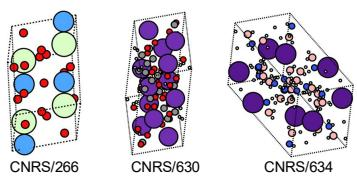

a  
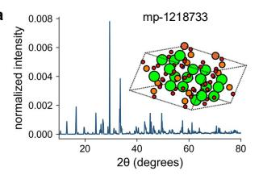

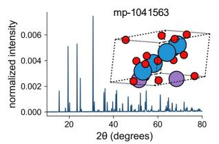

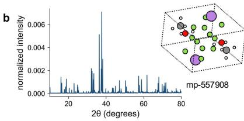

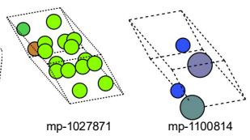

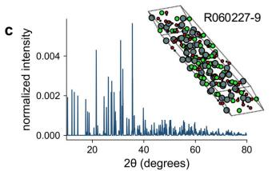

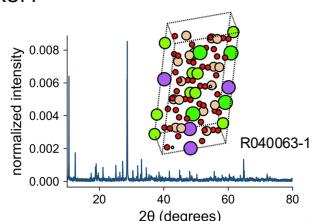

d  
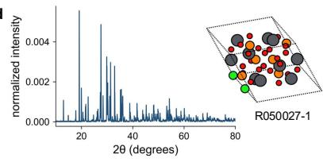

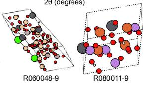

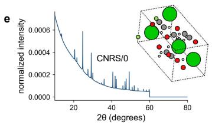

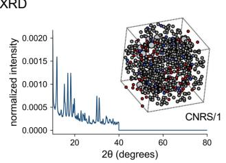

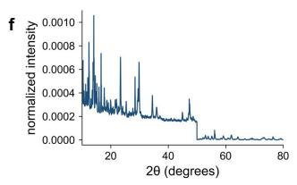  
Figure S1. Representative single- and multiphase samples in DeltaXRDbench. $\mathbf { a } , \mathbf { b } ,$ <sub>,</sub> Sim<sub>u</sub>l<sub>a</sub>t<sub>e</sub>d MP500 p<sup>atterns</sup>; $\mathbf { c , d , }$ <sub>expe</sub>rim<sub>e</sub>nt<sub>a</sub>l RRUFF <sub>pa</sub>tt<sub>e</sub>rn<sub>s;</sub> <sub>a</sub>nd $\mathbf { e , f , }$ <sub>expe</sub>rim<sub>e</sub>nt<sub>a</sub>l <sub>op</sub>XRD <sub>pa</sub>tt<sub>e</sub>rn<sub>s.</sub> $\mathbf { a } , \mathbf { c } , \mathbf { e }$ s<sup>h</sup>ow re<sub>p</sub>re-<sub>sen</sub>t<sub>a</sub>ti<sub>ve s</sub>i<sub>ng</sub>l<sub>e-p</sub>h<sub>ase examp</sub>l<sub>es, pa</sub>i<sub>r</sub>i<sub>ng eac</sub>h <sub>norma</sub>li<sub>ze</sub>d <sub>pow</sub>d<sub>er-</sub>XRD <sub>pro</sub>fil<sub>e w</sub>ith it<sub>s crys</sub>t<sub>a</sub>l <sub>s</sub>t<sub>ruc</sub>t<sub>ure.</sub> $\mathbf { b , d , f }$ <sub>s</sub>h<sub>ow</sub> <sub>represen</sub>t<sub>a</sub>ti<sub>ve</sub> <sub>mu</sub>lti<sub>p</sub>h<sub>ase</sub> <sub>m</sub>i<sub>x</sub>t<sub>ures,</sub> <sub>w</sub>ith th<sub>e</sub> <sub>com</sub>bi<sub>ne</sub>d <sub>pro</sub>fil<sub>e</sub> <sub>a</sub>t l<sub>e</sub>ft <sub>an</sub>d th<sub>e</sub> <sub>cons</sub>tit<sub>uen</sub>t <sub>p</sub>h<sub>ase</sub> structures at ri<sub>g</sub>ht. The horizontal axis is 2� (de<sub>g</sub>rees) and the vertical axis is normalized intensit<sub>y</sub>; labels id<sub>en</sub>tif<sub>y</sub> th<sub>e correspon</sub>di<sub>ng</sub> d<sub>a</sub>t<sub>a</sub>b<sub>ase recor</sub>d<sub>s.</sub> S<sub>p</sub>h<sub>ere co</sub>l<sub>ours</sub> di<sub>s</sub>ti<sub>ngu</sub>i<sub>s</sub>h <sub>a</sub>t<sub>om</sub>i<sub>c e</sub>l<sub>emen</sub>t<sub>s an</sub>d d<sub>as</sub>h<sub>e</sub>d <sub>po</sub>l<sub>y</sub>h<sub>e</sub>d<sub>ra</sub> i<sub>n</sub>di<sub>ca</sub>t<sub>e</sub> <sub>un</sub>it<sub>-ce</sub>ll b<sub>oun</sub>d<sub>ar</sub>i<sub>es.</sub>

Table S2. Dataset composition in the current DeltaXRDbench release. “Single” denotes single-phase <sub>pa</sub>tt<sub>erns,</sub> <sub>w</sub>h<sub>ereas</sub> “M<sub>u</sub>lti” d<sub>eno</sub>t<sub>es</sub> <sub>mu</sub>lti<sub>p</sub>h<sub>ase</sub> <sub>pa</sub>tt<sub>erns</sub> <sub>genera</sub>t<sub>e</sub>d b<sub>y</sub> <sub>m</sub>i<sub>x</sub>i<sub>ng</sub> <sub>s</sub>i<sub>ng</sub>l<sub>e-p</sub>h<sub>ase</sub> <sub>pa</sub>tt<sub>erns.</sub>
<table><tr><td>Source</td><td>Single</td><td>Multi</td><td>Total</td></tr><tr><td>MP500 (simulated)</td><td>10,000</td><td>30,000</td><td>40,000</td></tr><tr><td>RRUFF (experimental)</td><td>1,164</td><td>10,000</td><td>11,164</td></tr><tr><td>opXRD (experimental)</td><td>880</td><td>10,000</td><td>10,880</td></tr><tr><td>All sources</td><td>12,044</td><td>50,000</td><td>62,044</td></tr></table>

Th<sub>e</sub> <sub>ran</sub>d<sub>om</sub> <sub>see</sub>d<sub>,</sub> <sub>gr</sub>id<sub>,</sub> <sub>preprocess</sub>i<sub>ng</sub> <sub>se</sub>tti<sub>ngs,</sub> <sub>an</sub>d <sub>m</sub>i<sub>x</sub>t<sub>ure</sub> f<sub>rac</sub>ti<sub>ons</sub> <sub>are</sub> <sub>recor</sub>d<sub>e</sub>d i<sub>n</sub> <sub>man</sub>if<sub>es</sub>t<sub>s.</sub> Mi<sub>x</sub>t<sub>ures</sub> <sub>pro</sub>b<sub>e</sub> <sub>pea</sub>k <sub>over</sub>l<sub>ap</sub> <sub>an</sub>d <sub>se</sub>t<sub>-va</sub>l<sub>ue</sub>d <sub>pre</sub>di<sub>c</sub>ti<sub>on,</sub> b<sub>u</sub>t d<sub>o</sub> <sub>no</sub>t <sub>mo</sub>d<sub>e</sub>l <sub>every</sub> <sub>exper</sub>i<sub>men</sub>t<sub>a</sub>l <sub>non</sub>li<sub>near</sub>it<sub>y,</sub> <sub>suc</sub>h <sub>as</sub> <sub>a</sub>b<sub>sorp</sub>ti<sub>on,</sub> <sub>or</sub> <sub>m</sub>i<sub>cros</sub>t<sub>ruc</sub>t<sub>ura</sub>l i<sub>n</sub>t<sub>erac</sub>ti<sub>on.</sub>

## Task 1: Phase identification

Th<sub>e</sub> <sub>eva</sub>l<sub>ua</sub>t<sub>o</sub>r r<sub>ea</sub>d<sub>s</sub> <sub>a</sub> UTF<sub>-</sub>8 JSONL <sub>su</sub>bmi<sub>ss</sub>i<sub>o</sub>n <sub>co</sub>nt<sub>a</sub>inin<sub>g</sub> <sub>o</sub>n<sub>e</sub> r<sub>eco</sub>rd <sub>pe</sub>r <sub>sa</sub>m<sub>p</sub>l<sub>e.</sub> E<sub>ac</sub>h r<sub>eco</sub>rd s<sub>p</sub>ecifies a sample\_id and an ordered list of <sub>p</sub>redicted CIF files or canonical <sub>p</sub>hase identifiers for th<sub>e</sub> <sub>s</sub>i<sub>ng</sub>l<sub>e-p</sub>h<sub>ase</sub> t<sub>rac</sub>k<sub>,</sub> <sub>or</sub> <sub>an</sub> <sub>unor</sub>d<sub>ere</sub>d <sub>p</sub>h<sub>ase</sub> li<sub>s</sub>t <sub>w</sub>ith <sub>op</sub>ti<sub>ona</sub>l f<sub>rac</sub>ti<sub>ons</sub> f<sub>or</sub> th<sub>e</sub> <sub>mu</sub>lti<sub>p</sub>h<sub>ase</sub> t<sub>rac</sub>k<sub>.</sub> P<sub>re</sub>di<sub>c</sub>ti<sub>ons</sub> <sub>are</sub> <sub>reso</sub>l<sub>ve</sub>d t<sub>o</sub> <sub>s</sub>t<sub>ruc</sub>t<sub>ures</sub> b<sub>e</sub>f<sub>ore</sub> <sub>scor</sub>i<sub>ng;</sub> d<sub>a</sub>t<sub>a</sub>b<sub>ase</sub> id<sub>en</sub>tifi<sub>ers</sub> th<sub>emse</sub>l<sub>ves</sub> <sub>are</sub> <sub>never</sub> <sub>use</sub>d <sub>as</sub> th<sub>e</sub> <sub>correc</sub>t<sub>ness</sub> <sub>cr</sub>it<sub>er</sub>i<sub>on.</sub> A CIF th<sub>a</sub>t <sub>canno</sub>t b<sub>e</sub> <sub>parse</sub>d i<sub>s</sub> i<sub>nva</sub>lid<sub>.</sub> St<sub>ruc</sub>t<sub>ura</sub>ll<sub>y</sub> <sub>equ</sub>i<sub>va</sub>l<sub>en</sub>t d<sub>up</sub>li<sub>ca</sub>t<sub>es</sub> <sub>are</sub> <sub>co</sub>ll<sub>apse</sub>d<sub>,</sub> <sub>re</sub>t<sub>a</sub>i<sub>n</sub>i<sub>ng</sub> th<sub>e</sub> <sub>ear</sub>li<sub>es</sub>t <sub>occurrence</sub> i<sub>n</sub> <sub>a</sub> <sub>ran</sub>k<sub>e</sub>d <sub>s</sub>i<sub>ng</sub>l<sub>e-p</sub>h<sub>ase</sub> li<sub>s</sub>t<sub>.</sub> F<sub>rac</sub>ti<sub>ons</sub> <sub>a</sub>f<sub>ec</sub>t <sub>on</sub>l<sub>y</sub> <sub>w</sub>h<sub>e</sub>th<sub>er</sub> <sub>a</sub> <sub>mu</sub>lti<sub>p</sub>h<sub>ase</sub> <sub>can</sub>did<sub>a</sub>t<sub>e</sub> i<sub>s</sub> <sub>re</sub>t<sub>a</sub>i<sub>ne</sub>d d<sub>ur</sub>i<sub>ng</sub> th<sub>e</sub> <sub>spec</sub>ifi<sub>e</sub>d filt<sub>er</sub>i<sub>ng</sub> <sub>s</sub>t<sub>ep;</sub> th<sub>ey</sub> d<sub>o</sub> <sub>no</sub>t <sub>we</sub>i<sub>g</sub>ht th<sub>e</sub> id<sub>en</sub>tifi<sub>ca</sub>ti<sub>on</sub> <sub>scores.</sub>

The evaluator uses the benchmark StructureMatcher im<sub>p</sub>lementation<sup>5</sup>, with lattice-len<sub>g</sub>th, <sub>s</sub>it<sub>e an</sub>d <sub>angu</sub>l<sub>ar</sub> t<sub>o</sub>l<sub>erances o</sub>f 0<sub>.</sub>2<sub>,</sub> 0<sub>.</sub>3 <sub>an</sub>d $5 ^ { \circ }$ <sub>, respec</sub>ti<sub>ve</sub>l<sub>y.</sub> D<sub>e</sub>fi<sub>ne</sub>

$$
\begin{array} { r } { \mathrm { S M } ( A , B ) = \left\{ \begin{array} { l l } { 1 , } & { \mathrm { i f ~ s t r u c t u r e s ~ } A \mathrm { ~ a n d ~ } B \mathrm { ~ a r e ~ e q u i v a l e n t ~ u n d e r ~ t h e s e ~ s e t t i n g s } , } \\ { } \\ { 0 , } & { \mathrm { o t h e r w i s e } . } \end{array} \right. } \end{array}\tag{S5}
$$

Thi<sub>s</sub> <sub>cr</sub>it<sub>er</sub>i<sub>on</sub> <sub>perm</sub>it<sub>s</sub> <sub>crys</sub>t<sub>a</sub>ll<sub>ograp</sub>hi<sub>ca</sub>ll<sub>y</sub> <sub>equ</sub>i<sub>va</sub>l<sub>en</sub>t <sub>ce</sub>ll d<sub>escr</sub>i<sub>p</sub>ti<sub>ons</sub> <sub>w</sub>hil<sub>e</sub> <sub>requ</sub>i<sub>r</sub>i<sub>ng</sub> th<sub>e</sub> b<sub>enc</sub>h<sub>mar</sub>k’<sub>s</sub> <sub>s</sub>it<sub>e</sub> <sub>an</sub>d l<sub>a</sub>tti<sub>ce</sub> <sub>agreemen</sub>t<sub>.</sub> F<sub>or</sub> <sub>a</sub> <sub>mu</sub>lti<sub>p</sub>h<sub>ase</sub> <sub>samp</sub>l<sub>e,</sub> <sub>a</sub>ll <sub>pre</sub>di<sub>c</sub>t<sub>e</sub>d<sub>–re</sub>f<sub>erence</sub> <sub>pa</sub>i<sub>rs</sub> satisf<sub>y</sub>in<sub>g</sub> SM = 1 form the ed<sub>g</sub>es of a bi<sub>p</sub>artite <sub>g</sub>ra<sub>p</sub>h. A maximum-cardinalit<sub>y</sub> matchin<sub>g</sub> on this <sub>grap</sub>h <sub>supp</sub>li<sub>es</sub> th<sub>e</sub> <sub>num</sub>b<sub>er</sub> <sub>o</sub>f <sub>correc</sub>t <sub>p</sub>h<sub>ases,</sub> <sub>so</sub> <sub>ne</sub>ith<sub>er</sub> <sub>one</sub> <sub>pre</sub>di<sub>c</sub>t<sub>e</sub>d CIF <sub>nor</sub> <sub>one</sub> <sub>re</sub>f<sub>erence</sub> CIF <sub>can</sub> b<sub>e</sub> <sub>coun</sub>t<sub>e</sub>d t<sub>w</sub>i<sub>ce.</sub>

For both sin<sub>g</sub>le-<sub>p</sub>hase and multi<sub>p</sub>hase identification, let I denote the com<sub>p</sub>lete eli<sub>g</sub>ible <sub>eva</sub>l<sub>ua</sub>ti<sub>on</sub> <sub>se</sub>t f<sub>or</sub> <sub>a</sub> <sub>s</sub>t<sub>a</sub>t<sub>e</sub>d <sub>me</sub>th<sub>o</sub>d<sub>,</sub> d<sub>a</sub>t<sub>ase</sub>t <sub>an</sub>d i<sub>npu</sub>t <sub>con</sub>diti<sub>on,</sub> <sub>w</sub>ith $N = | { \boldsymbol { J } } |$ <sub>.</sub> Thi<sub>s</sub> <sub>se</sub>t i<sub>s</sub> fi<sub>xe</sub>d i<sub>n</sub>d<sub>epen</sub>d<sub>en</sub>tl<sub>y</sub> <sub>o</sub>f <sub>w</sub>h<sub>e</sub>th<sub>er</sub> <sub>a</sub> <sub>me</sub>th<sub>o</sub>d <sub>re</sub>t<sub>urns</sub> <sub>a</sub> <sub>va</sub>lid <sub>pre</sub>di<sub>c</sub>ti<sub>on.</sub> L<sub>e</sub>t $\mathcal { V } \subseteq \mathcal { I }$ <sub>con</sub>t<sub>a</sub>i<sub>n</sub> th<sub>e</sub> <sub>samp</sub>l<sub>es</sub> f<sub>or</sub> <sub>w</sub>hi<sub>c</sub>h <sub>a</sub>t l<sub>eas</sub>t <sub>one</sub> <sub>va</sub>lid <sub>pre</sub>di<sub>c</sub>ti<sub>on</sub> <sub>rema</sub>i<sub>ns</sub> <sub>a</sub>ft<sub>er</sub> <sub>pars</sub>i<sub>ng,</sub> d<sub>e</sub>d<sub>up</sub>li<sub>ca</sub>ti<sub>on</sub> <sub>an</sub>d <sub>any</sub> d<sub>ec</sub>l<sub>are</sub>d <sub>compos</sub>iti<sub>on</sub> filt<sub>er.</sub> P<sub>re</sub>di<sub>c</sub>ti<sub>on</sub> <sub>coverage</sub> i<sub>s</sub>

$$
\mathrm { C o v e r a g e } = 1 0 0 { \frac { | \mathcal { V } | } { N } } .\tag{S6}
$$

All sam<sub>p</sub>les in I contribute to the denominators of sin<sub>g</sub>le-<sub>p</sub>hase To<sub>p</sub>-1, To<sub>p</sub>-3, To<sub>p</sub>-5 and MRR@5, <sub>an</sub>d <sub>mu</sub>lti<sub>p</sub>h<sub>ase</sub> <sub>exac</sub>t<sub>-se</sub>t <sub>recovery</sub> <sub>an</sub>d <sub>macro-average</sub>d <sub>prec</sub>i<sub>s</sub>i<sub>on,</sub> <sub>reca</sub>ll <sub>an</sub>d F1<sub>.</sub> Mi<sub>ss</sub>i<sub>ng,</sub> <sub>emp</sub>t<sub>y,</sub> <sub>or</sub> i<sub>nva</sub>lid <sub>can</sub>did<sub>a</sub>t<sub>e</sub> li<sub>s</sub>t<sub>s</sub> <sub>or</sub> <sub>p</sub>h<sub>ase</sub> <sub>se</sub>t<sub>s</sub> <sub>con</sub>t<sub>r</sub>ib<sub>u</sub>t<sub>e</sub> <sub>zero</sub> t<sub>o</sub> <sub>every</sub> id<sub>en</sub>tifi<sub>ca</sub>ti<sub>on</sub> <sub>me</sub>t<sub>r</sub>i<sub>c</sub> i<sub>n</sub> th<sub>e</sub> corres<sub>p</sub>ondin<sub>g</sub> track and remain in I. This rule also a<sub>pp</sub>lies when no valid candidate remains <sub>a</sub>ft<sub>er</sub> <sub>pars</sub>i<sub>ng,</sub> d<sub>e</sub>d<sub>up</sub>li<sub>ca</sub>ti<sub>on</sub> <sub>an</sub>d <sub>any</sub> d<sub>ec</sub>l<sub>are</sub>d <sub>compos</sub>iti<sub>on</sub> filt<sub>er.</sub> Th<sub>e</sub> <sub>su</sub>b<sub>se</sub>t $\boldsymbol { \mathbf { \mathit { \Phi } } } _ { \mathbf { \mathit { \Phi } } } \mathbf { \mathcal { \mathbf { \Lambda } } } _ { \mathbf { \mathcal { V } } }$ i<sub>s</sub> <sub>use</sub>d <sub>on</sub>l<sub>y</sub> <sub>as</sub> th<sub>e</sub> <sub>numera</sub>t<sub>or</sub> <sub>o</sub>f <sub>pre</sub>di<sub>c</sub>ti<sub>on</sub> <sub>coverage,</sub> <sub>never</sub> <sub>as</sub> th<sub>e</sub> <sub>scor</sub>i<sub>ng</sub> d<sub>enom</sub>i<sub>na</sub>t<sub>or.</sub> F<sub>or</sub> th<sub>e</sub> <sub>mu</sub>lti<sub>p</sub>h<sub>ase</sub> <sub>resu</sub>lt<sub>s</sub> i<sub>n</sub> T<sub>a</sub>bl<sub>e</sub> 2<sub>,</sub> $N = 1 { , } 0 0 0$ f<sub>or</sub> <sub>eac</sub>h d<sub>a</sub>t<sub>ase</sub>t<sub>,</sub> i<sub>npu</sub>t <sub>con</sub>diti<sub>on</sub> <sub>an</sub>d <sub>run.</sub>

## Single-phase identification metrics

E<sub>ac</sub>h <sub>e</sub>li<sub>g</sub>ibl<sub>e</sub> <sub>s</sub>i<sub>ng</sub>l<sub>e-p</sub>h<sub>ase</sub> <sub>samp</sub>l<sub>e</sub> $i \in \mathcal { I }$ h<sub>as</sub> <sub>one</sub> <sub>re</sub>f<sub>erence</sub> <sub>s</sub>t<sub>ruc</sub>t<sub>ure</sub> $S _ { i }$ <sub>an</sub>d <sub>an</sub> <sub>or</sub>d<sub>ere</sub>d<sub>,</sub> <sub>s</sub>t<sub>ruc</sub>t<sub>ura</sub>ll<sub>y</sub> d<sub>e</sub>d<sub>up</sub>li<sub>ca</sub>t<sub>e</sub>d <sub>can</sub>did<sub>a</sub>t<sub>e</sub> li<sub>s</sub>t

$$
\widehat { S } _ { i } = ( \hat { S } _ { i , 1 } , \ldots , \hat { S } _ { i , K _ { i } } ) , \qquad 0 \leq K _ { i } \leq 5 .\tag{S7}
$$

Mi<sub>ss</sub>i<sub>ng,</sub> <sub>emp</sub>t<sub>y,</sub> <sub>or</sub> i<sub>nva</sub>lid <sub>can</sub>did<sub>a</sub>t<sub>e</sub> li<sub>s</sub>t<sub>s</sub> <sub>are</sub> <sub>represen</sub>t<sub>e</sub>d b<sub>y</sub> $K _ { i } = 0$ <sub>.</sub> F<sub>or</sub> <sub>cu</sub>t<sub>o</sub>f $k \in \{ 1 , 3 , 5 \}$ <sub>,</sub> th<sub>e</sub> <sub>samp</sub>l<sub>e</sub> i<sub>s</sub> <sub>a</sub> hit if <sub>a</sub> <sub>correc</sub>t <sub>s</sub>t<sub>ruc</sub>t<sub>ure</sub> <sub>occurs</sub> <sub>w</sub>ithi<sub>n</sub> th<sub>e</sub> fi<sub>rs</sub>t � <sub>ava</sub>il<sub>a</sub>bl<sub>e</sub> <sub>can</sub>did<sub>a</sub>t<sub>es:</sub>

$$
h _ { i } ^ { ( k ) } = \mathbf { 1 } \left[ \exists j \leq \operatorname* { m i n } ( k , K _ { i } ) : \mathbf { S M } ( \hat { S } _ { i , j } , S _ { i } ) = 1 \right] .\tag{S8}
$$

Th<sub>e</sub> fi<sub>rs</sub>t <sub>correc</sub>t <sub>ran</sub>k <sub>an</sub>d t<sub>runca</sub>t<sub>e</sub>d <sub>rec</sub>i<sub>proca</sub>l<sub>-ran</sub>k <sub>con</sub>t<sub>r</sub>ib<sub>u</sub>ti<sub>on</sub> <sub>are</sub>

$$
r _ { i } = \operatorname* { m i n } \{ j : \mathrm { S M } ( { \hat { S } } _ { i , j } , S _ { i } ) = 1 \} , \quad r _ { i } = \infty { \mathrm { ~ i f ~ t h e ~ s e t ~ i s ~ e m p t y } } ,\tag{S9}
$$

$$
q _ { i } = \left\{ \begin{array} { l l } { 1 / r _ { i } , } & { r _ { i } \leq 5 , } \\ { 0 , } & { r _ { i } > 5 . } \end{array} \right.\tag{S10}
$$

F<sub>or</sub> $K _ { i } = 0 , h _ { i } ^ { ( k ) } = 0 , r _ { i } = \infty$ <sub>an</sub>d $q _ { i } = 0 ;$ th<sub>e</sub> <sub>samp</sub>l<sub>e</sub> <sub>rema</sub>i<sub>ns</sub> i<sub>n</sub> th<sub>e</sub> <sub>eva</sub>l<sub>ua</sub>ti<sub>on</sub> <sub>se</sub>t<sub>.</sub> Th<sub>e</sub> d<sub>a</sub>t<sub>ase</sub>t<sub>-</sub>l<sub>eve</sub>l <sub>percen</sub>t<sub>ages over a</sub>ll � <sub>e</sub>li<sub>g</sub>ibl<sub>e samp</sub>l<sub>es are</sub>

$$
\mathrm { T o p } { \cdot } k = \frac { 1 0 0 } { N } \sum _ { i \in J } h _ { i } ^ { ( k ) } , \qquad k \in \{ 1 , 3 , 5 \} ,\tag{S11}
$$

$$
\mathrm { M R R } @ 5 = \frac { 1 0 0 } { N } \sum _ { i \in J } q _ { i } .\tag{S12}
$$

Th<sub>us</sub> T<sub>op-</sub>� <sub>measures w</sub>h<sub>e</sub>th<sub>er a correc</sub>t <sub>s</sub>t<sub>ruc</sub>t<sub>ure</sub> i<sub>s re</sub>t<sub>r</sub>i<sub>eve</sub>d b<sub>y ran</sub>k $k ,$ <sub>, w</sub>h<sub>ereas</sub> MRR@5 <sub>a</sub>l<sub>so</sub> <sub>rewar</sub>d<sub>s</sub> <sub>p</sub>l<sub>ac</sub>i<sub>ng</sub> it <sub>ear</sub>li<sub>er.</sub> If th<sub>e</sub> fi<sub>rs</sub>t <sub>ma</sub>t<sub>c</sub>h i<sub>s</sub> <sub>a</sub>t <sub>ran</sub>k t<sub>wo,</sub> th<sub>a</sub>t <sub>samp</sub>l<sub>e</sub> <sub>con</sub>t<sub>r</sub>ib<sub>u</sub>t<sub>es</sub> 0 t<sub>o</sub> T<sub>op-</sub>1<sub>,</sub> 1 t<sub>o</sub> T<sub>op-</sub>3 <sub>a</sub>nd T<sub>op-</sub>5<sub>,</sub> <sub>a</sub>nd $1 / 2$ t<sub>o</sub> MRR@5<sub>.</sub> A<sub>s</sub> <sub>a</sub> <sub>co</sub>m<sub>p</sub>l<sub>e</sub>t<sub>e</sub> n<sub>u</sub>m<sub>e</sub>ri<sub>ca</sub>l <sub>exa</sub>m<sub>p</sub>l<sub>e,</sub> <sub>suppose</sub> th<sub>ere</sub> <sub>are</sub> f<sub>our</sub> <sub>e</sub>li<sub>g</sub>ibl<sub>e</sub> <sub>samp</sub>l<sub>es:</sub> th<sub>ree</sub> <sub>re</sub>t<sub>urn</sub> <sub>va</sub>lid <sub>can</sub>did<sub>a</sub>t<sub>e</sub> li<sub>s</sub>t<sub>s</sub> <sub>w</sub>ith fi<sub>rs</sub>t<sub>-ma</sub>t<sub>c</sub>h <sub>ran</sub>k<sub>s</sub> 1<sub>,</sub> 2 and ∞, and the fourth returns no valid candidates. All four sam<sub>p</sub>les remain in the denominator. Th<sub>en</sub> T<sub>op-</sub>1 i<sub>s</sub> $1 0 0 ( 1 / 4 ) = 2 5 . 0 0 \%$ <sub>,</sub> T<sub>op-</sub>3 <sub>a</sub>nd T<sub>op-</sub>5 <sub>a</sub>r<sub>e</sub> <sub>eac</sub>h $1 0 0 ( 2 / 4 ) = 5 0 . 0 0 \%$ <sub>,</sub> MRR@5 i<sub>s</sub> $1 0 0 ( 1 + 1 / 2 + 0 + 0 ) / 4 = 3 7 . 5 0 \%$ <sub>,</sub> <sub>an</sub>d <sub>coverage</sub> i<sub>s</sub> $1 0 0 ( 3 / 4 ) = 7 5 . 0 0 \%$ <sub>.</sub> B<sub>ecause</sub> th<sub>ere</sub> i<sub>s exac</sub>tl<sub>y</sub> <sub>one</sub> <sub>re</sub>f<sub>erence</sub> <sub>per</sub> <sub>samp</sub>l<sub>e,</sub> <sub>app</sub>l<sub>y</sub>i<sub>ng</sub> <sub>se</sub>t<sub>-</sub>b<sub>ase</sub>d R<sub>eca</sub>ll@1 <sub>or</sub> F1@1 t<sub>o</sub> th<sub>e</sub> t<sub>op-ran</sub>k<sub>e</sub>d <sub>can</sub>did<sub>a</sub>t<sub>e</sub> <sub>pro</sub>d<sub>uces</sub> th<sub>e</sub> <sub>same</sub> <sub>va</sub>l<sub>ue</sub> <sub>as</sub> T<sub>op-</sub>1 <sub>an</sub>d <sub>a</sub>dd<sub>s</sub> <sub>no</sub> i<sub>n</sub>d<sub>epen</sub>d<sub>en</sub>t i<sub>n</sub>f<sub>orma</sub>ti<sub>on.</sub>

## Multiphase identification metrics

F<sub>or</sub> <sub>eac</sub>h <sub>e</sub>li<sub>g</sub>ibl<sub>e</sub> <sub>m</sub>i<sub>x</sub>t<sub>ure</sub> $i \in \mathcal { I }$ <sub>,</sub> l<sub>e</sub>t $\widehat { \mathcal { T } } _ { i }$ b<sub>e</sub> th<sub>e</sub> <sub>pre</sub>di<sub>c</sub>t<sub>e</sub>d <sub>p</sub>h<sub>ase</sub> <sub>se</sub>t <sub>a</sub>ft<sub>er</sub> <sub>pars</sub>i<sub>ng,</sub> <sub>s</sub>t<sub>ruc</sub>t<sub>ura</sub>l d<sub>e</sub>d<sub>up</sub>li<sub>ca</sub>ti<sub>on</sub> <sub>an</sub>d <sub>any</sub> d<sub>ec</sub>l<sub>are</sub>d <sub>compos</sub>iti<sub>on</sub> filt<sub>er</sub>i<sub>ng,</sub> <sub>an</sub>d l<sub>e</sub>t $\mathcal { T } _ { i }$ b<sub>e</sub> th<sub>e</sub> <sub>non-emp</sub>t<sub>y</sub> <sub>re</sub>f<sub>erence</sub> <sub>p</sub>h<sub>ase</sub> <sub>se</sub>t<sub>.</sub> If th<sub>e</sub> <sub>su</sub>b<sub>m</sub>i<sub>ss</sub>i<sub>on</sub> i<sub>s</sub> <sub>m</sub>i<sub>ss</sub>i<sub>ng</sub> <sub>or</sub> <sub>no</sub> <sub>va</sub>lid <sub>can</sub>did<sub>a</sub>t<sub>e</sub> <sub>rema</sub>i<sub>ns,</sub> <sub>se</sub>t ${ \widehat { \mathcal { T } } } _ { i } = \emptyset$ <sub>.</sub> D<sub>eno</sub>t<sub>e</sub> th<sub>e</sub>i<sub>r</sub> <sub>s</sub>i<sub>zes</sub> b<sub>y</sub>

$$
p _ { i } = | \widehat { \mathcal { T } _ { i } } | , \qquad t _ { i } = | \mathcal { T } _ { i } | > 0 ,\tag{S13}
$$

<sub>an</sub>d l<sub>e</sub>t $m _ { i }$ b<sub>e</sub> th<sub>e s</sub>i<sub>ze o</sub>f th<sub>e max</sub>i<sub>mum one-</sub>t<sub>o-one s</sub>t<sub>ruc</sub>t<sub>ura</sub>l <sub>ma</sub>t<sub>c</sub>hi<sub>ng</sub> d<sub>e</sub>fi<sub>ne</sub>d <sub>a</sub>b<sub>ove.</sub> H<sub>ence</sub> $0 \leq m _ { i } \leq \operatorname* { m i n } ( p _ { i } , t _ { i } )$ <sub>,</sub> <sub>w</sub>ith $m _ { i } = 0$ <sub>w</sub>h<sub>en</sub> $p _ { i } = 0$ <sub>.</sub> Th<sub>e</sub> <sub>per-samp</sub>l<sub>e</sub> <sub>prec</sub>i<sub>s</sub>i<sub>on,</sub> <sub>reca</sub>ll <sub>an</sub>d F1 <sub>score</sub> <sub>are</sub>

$$
P _ { i } = \left\{ \begin{array} { l l } { \displaystyle \frac { m _ { i } } { p _ { i } } , } & { p _ { i } > 0 , } \\ { 0 , } & { R _ { i } = \displaystyle \frac { m _ { i } } { t _ { i } } , } \end{array} \right. F 1 _ { i } = \frac { 2 m _ { i } } { p _ { i } + t _ { i } } .\tag{S14}
$$

Th<sub>us</sub> <sub>a</sub> <sub>m</sub>i<sub>ss</sub>i<sub>ng,</sub> <sub>emp</sub>t<sub>y,</sub> <sub>or</sub> i<sub>nva</sub>lid <sub>pre</sub>di<sub>c</sub>ti<sub>on</sub> h<sub>as</sub> $P _ { i } = R _ { i } = F 1 _ { i } = 0$ <sub>;</sub> <sub>prec</sub>i<sub>s</sub>i<sub>on</sub> i<sub>s</sub> <sub>exp</sub>li<sub>c</sub>itl<sub>y</sub> d<sub>e</sub>fi<sub>ne</sub>d <sub>a</sub>t $p _ { i } = 0$ t<sub>o</sub> <sub>avo</sub>id di<sub>v</sub>i<sub>s</sub>i<sub>on</sub> b<sub>y</sub> <sub>zero.</sub>

P<sub>rec</sub>i<sub>s</sub>i<sub>on pena</sub>li<sub>zes ex</sub>t<sub>ra pre</sub>di<sub>c</sub>t<sub>e</sub>d <sub>p</sub>h<sub>ases, w</sub>h<sub>ereas reca</sub>ll <sub>pena</sub>li<sub>zes m</sub>i<sub>sse</sub>d <sub>re</sub>f<sub>erence p</sub>h<sub>ases.</sub> E<sub>xac</sub>t<sub>-se</sub>t <sub>recovery</sub> i<sub>s s</sub>t<sub>r</sub>i<sub>c</sub>t<sub>er:</sub>

$$
E _ { i } = \mathbf { 1 } [ m _ { i } = p _ { i } = t _ { i } ] .\tag{S15}
$$

It <sub>equa</sub>l<sub>s</sub> <sub>one</sub> <sub>on</sub>l<sub>y</sub> <sub>w</sub>h<sub>en</sub> <sub>every</sub> <sub>pre</sub>di<sub>c</sub>t<sub>e</sub>d <sub>p</sub>h<sub>ase</sub> i<sub>s</sub> <sub>ma</sub>t<sub>c</sub>h<sub>e</sub>d<sub>,</sub> <sub>every</sub> <sub>re</sub>f<sub>erence</sub> <sub>p</sub>h<sub>ase</sub> i<sub>s</sub> <sub>recovere</sub>d <sub>an</sub>d th<sub>e</sub> t<sub>wo</sub> <sub>se</sub>t <sub>s</sub>i<sub>zes</sub> <sub>are</sub> <sub>equa</sub>l<sub>.</sub> M<sub>ere</sub>l<sub>y</sub> <sub>ma</sub>t<sub>c</sub>hi<sub>ng</sub> th<sub>e</sub> <sub>correc</sub>t <sub>num</sub>b<sub>er</sub> <sub>o</sub>f <sub>p</sub>h<sub>ases</sub> i<sub>s</sub> i<sub>nsu</sub>fi<sub>c</sub>i<sub>en</sub>t if <sub>any</sub> <sub>s</sub>t<sub>ruc</sub>t<sub>ura</sub>l <sub>ass</sub>i<sub>gnmen</sub>t i<sub>s</sub> <sub>wrong.</sub>

Th<sub>e</sub> <sub>repor</sub>t<sub>e</sub>d <sub>mu</sub>lti<sub>p</sub>h<sub>ase</sub> <sub>me</sub>t<sub>r</sub>i<sub>cs</sub> <sub>are</sub> <sub>samp</sub>l<sub>e-w</sub>i<sub>se</sub> <sub>macro</sub> <sub>averages</sub> <sub>over</sub> <sub>a</sub>ll � <sub>e</sub>li<sub>g</sub>ibl<sub>e</sub> <sub>m</sub>i<sub>x</sub>t<sub>ures,</sub> i<sub>nc</sub>l<sub>u</sub>di<sub>ng</sub> f<sub>a</sub>il<sub>ures:</sub>

$$
P _ { \mathrm { { m a c r o } } } = \frac { 1 0 0 } { N } \sum _ { i \in \mathcal { I } } P _ { i } ,
$$

$$
R _ { \mathrm { { m a c r o } } } = \frac { 1 0 0 } { N } \sum _ { i \in \mathcal { T } } R _ { i } ,\tag{S16}
$$

$$
F 1 _ { \mathrm { { m a c r o } } } = { \frac { 1 0 0 } { N } } \sum _ { i \in \mathcal { I } } F 1 _ { i } ,
$$

$$
\mathrm { E x a c t } = \frac { 1 0 0 } { N } \sum _ { i \in J } E _ { i } .\tag{S17}
$$

B<sub>ecause</sub> $t _ { i } > 0$ <sub>,</sub> <sub>an</sub> <sub>emp</sub>t<sub>y</sub> <sub>pre</sub>di<sub>c</sub>ti<sub>on</sub> <sub>a</sub>l<sub>so</sub> h<sub>as</sub> $E _ { i } = 0$ <sub>.</sub> F<sub>or</sub> <sub>examp</sub>l<sub>e,</sub> if 800 <sub>o</sub>f 1<sub>,</sub>000 <sub>e</sub>li<sub>g</sub>ibl<sub>e</sub> <sub>m</sub>i<sub>x</sub>t<sub>ures</sub> <sub>rece</sub>i<sub>ve</sub> <sub>pre</sub>di<sub>c</sub>ti<sub>ons</sub> <sub>an</sub>d <sub>every</sub> <sub>re</sub>t<sub>urne</sub>d <sub>p</sub>h<sub>ase</sub> <sub>se</sub>t i<sub>s</sub> <sub>exac</sub>tl<sub>y</sub> <sub>correc</sub>t<sub>,</sub> <sub>coverage,</sub> <sub>macro</sub> <sub>prec</sub>i<sub>s</sub>i<sub>on,</sub> <sub>macro</sub> <sub>reca</sub>ll<sub>,</sub> <sub>macro</sub> F1 <sub>an</sub>d <sub>exac</sub>t<sub>-se</sub>t <sub>recovery</sub> <sub>are</sub> <sub>a</sub>ll 80%<sub>,</sub> <sub>no</sub>t 100%<sub>.</sub>

Th<sub>ese</sub> <sub>are</sub> <sub>unwe</sub>i<sub>g</sub>ht<sub>e</sub>d <sub>means</sub> <sub>o</sub>f <sub>samp</sub>l<sub>e</sub> <sub>scores,</sub> <sub>no</sub>t <sub>m</sub>i<sub>cro-averages</sub> f<sub>orme</sub>d b<sub>y</sub> <sub>poo</sub>li<sub>ng</sub> <sub>p</sub>h<sub>ase</sub> <sub>coun</sub>t<sub>s</sub> <sub>across</sub> <sub>samp</sub>l<sub>es.</sub> F<sub>or</sub> <sub>examp</sub>l<sub>e,</sub> <sub>cons</sub>id<sub>er</sub> <sub>a</sub> th<sub>ree-p</sub>h<sub>ase</sub> <sub>re</sub>f<sub>erence</sub> $\mathcal { T } _ { i } = \{ A , B , C \}$ If th<sub>e pre</sub>di<sub>c</sub>ti<sub>on</sub> i<sub>s</sub> $\widehat { \mathcal { T } _ { i } } = \left\{ A , B , D \right\}$ <sub>an</sub>d � <sub>an</sub>d � <sub>ma</sub>t<sub>c</sub>h <sub>one-</sub>t<sub>o-one,</sub> th<sub>en</sub> $p _ { i } = t _ { i } = 3 , m _ { i } = 2$ $P _ { i } = R _ { i } = F 1 _ { i } = 2 / 3$ <sub>,</sub> <sub>an</sub>d $E _ { i } = 0$ <sub>.</sub> If th<sub>e</sub> <sub>pre</sub>di<sub>c</sub>ti<sub>on</sub> i<sub>s</sub> i<sub>ns</sub>t<sub>ea</sub>d $\{ A , B \}$ <sub>,</sub> th<sub>en</sub> $p _ { i } = 2 , t _ { i } = 3 , m _ { i } = 2$ <sub>g</sub><sup>i</sup>v<sup>i</sup>n<sub>g</sub> $P _ { i } = 1 , R _ { i } = 2 / 3 , F 1 _ { i } = 4 / 5$ <sub>,</sub> <sub>an</sub>d <sub>s</sub>till $E _ { i } = 0$ <sub>.</sub> Th<sub>e</sub> <sub>secon</sub>d <sub>pre</sub>di<sub>c</sub>ti<sub>on</sub> h<sub>as</sub> <sub>per</sub>f<sub>ec</sub>t <sub>prec</sub>i<sub>s</sub>i<sub>on</sub> b<sub>u</sub>t i<sub>s</sub> <sub>no</sub>t <sub>an</sub> <sub>exac</sub>t id<sub>en</sub>tifi<sub>ca</sub>ti<sub>on</sub> b<sub>ecause</sub> <sub>p</sub>h<sub>ase</sub> � i<sub>s</sub> <sub>m</sub>i<sub>ss</sub>i<sub>ng.</sub>

## Sampling Strategy for Multiphase Evaluation

F<sub>or</sub> th<sub>e</sub> b<sub>enc</sub>h<sub>mar</sub>k <sub>resu</sub>lt<sub>s</sub> <sub>repor</sub>t<sub>e</sub>d i<sub>n</sub> thi<sub>s</sub> <sub>paper,</sub> <sub>we</sub> <sub>ran</sub>d<sub>om</sub>l<sub>y</sub> <sub>samp</sub>l<sub>e</sub> 1<sub>,</sub>000 <sub>pa</sub>tt<sub>erns</sub> f<sub>rom</sub> th<sub>e</sub> <sub>mu</sub>lti<sub>p</sub>h<sub>ase</sub> <sub>pa</sub>tt<sub>erns</sub> t<sub>o</sub> <sub>re</sub>d<sub>uce</sub> th<sub>e</sub> <sub>compu</sub>t<sub>a</sub>ti<sub>ona</sub>l <sub>cos</sub>t<sub>.</sub> All <sub>mu</sub>lti<sub>p</sub>h<sub>ase</sub> <sub>exper</sub>i<sub>men</sub>t<sub>s</sub> <sub>are</sub> <sub>repea</sub>t<sub>e</sub>d <sub>us</sub>i<sub>ng</sub> th<sub>ree</sub> fi<sub>xe</sub>d <sub>ran</sub>d<sub>om</sub> <sub>see</sub>d<sub>s.</sub> F<sub>or</sub> <sub>any</sub> <sub>me</sub>t<sub>r</sub>i<sub>c</sub> �<sub>,</sub> th<sub>e</sub> <sub>repor</sub>t<sub>e</sub>d <sub>va</sub>l<sub>ue</sub> i<sub>s</sub> th<sub>e</sub> <sub>ar</sub>ith<sub>me</sub>ti<sub>c</sub> <sub>mean</sub> <sub>o</sub>f th<sub>e</sub> th<sub>ree</sub> <sub>see</sub>d<sub>-</sub>l<sub>eve</sub>l <sub>va</sub>l<sub>ues</sub> <sub>compu</sub>t<sub>e</sub>d i<sub>n</sub>d<sub>epen</sub>d<sub>en</sub>tl<sub>y:</sub>

$$
\overline { { { M } } } = \frac { 1 } { 3 } \sum _ { s = 1 } ^ { 3 } M ^ { ( s ) } ,\tag{S18}
$$

Each seed-level identification metric uses the com<sub>p</sub>lete set of � = 1,000 eli<sub>g</sub>ible mixtures as its d<sub>enom</sub>i<sub>na</sub>t<sub>or,</sub> <sub>w</sub>ith th<sub>e</sub> <sub>zero-</sub>f<sub>or-</sub>f<sub>a</sub>il<sub>ure</sub> <sub>conven</sub>ti<sub>on</sub> d<sub>e</sub>fi<sub>ne</sub>d <sub>a</sub>b<sub>ove.</sub> C<sub>overage</sub> i<sub>s</sub> <sub>compu</sub>t<sub>e</sub>d <sub>over</sub> th<sub>e</sub> <sub>same</sub> <sub>se</sub>t <sub>an</sub>d <sub>average</sub>d <sub>across</sub> <sub>see</sub>d<sub>s</sub> <sub>separa</sub>t<sub>e</sub>l<sub>y.</sub> Th<sub>e</sub> <sub>pre</sub>di<sub>c</sub>ti<sub>ons</sub> f<sub>rom</sub> th<sub>e</sub> th<sub>ree</sub> <sub>runs</sub> <sub>are</sub> <sub>no</sub>t <sub>poo</sub>l<sub>e</sub>d b<sub>e</sub>f<sub>ore</sub> <sub>me</sub>t<sub>r</sub>i<sub>c</sub> <sub>ca</sub>l<sub>cu</sub>l<sub>a</sub>ti<sub>on.</sub>

## Task 2: Refinement assessment

Th<sub>e</sub> <sub>ca</sub>l<sub>cu</sub>l<sub>a</sub>t<sub>e</sub>d <sub>pa</sub>tt<sub>ern</sub> i<sub>s</sub> li<sub>near</sub>l<sub>y</sub> i<sub>n</sub>t<sub>erpo</sub>l<sub>a</sub>t<sub>e</sub>d <sub>on</sub>t<sub>o</sub> th<sub>e</sub> <sub>exper</sub>i<sub>men</sub>t<sub>a</sub>l <sub>gr</sub>id <sub>an</sub>d <sub>sca</sub>l<sub>e</sub>d <sub>us</sub>i<sub>ng</sub> <sub>an</sub> <sub>op</sub>ti<sub>ona</sub>l <sub>non-nega</sub>ti<sub>ve</sub> <sub>g</sub>l<sub>o</sub>b<sub>a</sub>l f<sub>ac</sub>t<sub>or.</sub> P<sub>ro</sub>fil<sub>e</sub> <sub>agreemen</sub>t i<sub>s</sub> <sub>quan</sub>tifi<sub>e</sub>d <sub>us</sub>i<sub>ng</sub>

$$
R _ { p } = { \frac { \sum _ { i } { \vert y _ { i } ^ { \mathrm { o b s } } - y _ { i } ^ { \mathrm { c a l c } } \vert } } { \sum _ { i } { \vert y _ { i } ^ { \mathrm { o b s } } \vert } } }\tag{S19}
$$

<sub>a</sub>l<sub>ongs</sub>id<sub>e</sub> th<sub>e</sub> <sub>we</sub>i<sub>g</sub>ht<sub>e</sub>d <sub>res</sub>id<sub>ua</sub>l $R _ { w p }$ <sub>,</sub> f<sub>or</sub> <sub>w</sub>hi<sub>c</sub>h <sub>approx</sub>i<sub>ma</sub>t<sub>e</sub> P<sub>o</sub>i<sub>sson</sub> <sub>we</sub>i<sub>g</sub>ht<sub>s</sub> <sub>are</sub> <sub>use</sub>d <sub>w</sub>h<sub>en</sub> <sub>po</sub>i<sub>n</sub>t<sub>-w</sub>i<sub>se</sub> <sub>uncer</sub>t<sub>a</sub>i<sub>n</sub>ti<sub>es</sub> <sub>are</sub> <sub>unava</sub>il<sub>a</sub>bl<sub>e.</sub> P<sub>earson</sub> <sub>corre</sub>l<sub>a</sub>ti<sub>on</sub> <sub>prov</sub>id<sub>es</sub> <sub>a</sub> <sub>comp</sub>l<sub>emen</sub>t<sub>ary</sub> <sub>measure</sub> <sub>o</sub>f <sub>w</sub>h<sub>o</sub>l<sub>e-pa</sub>tt<sub>ern</sub> <sub>agreemen</sub>t<sub>.</sub>

## Reproducibility

Each source director<sub>y</sub> contains patterns.h5, manifest.jsonl, and reference structures. HDF5 <sub>s</sub>t<sub>ores</sub> th<sub>e</sub> <sub>common</sub> 2� <sub>gr</sub>id <sub>an</sub>d d<sub>ense</sub> i<sub>n</sub>t<sub>ens</sub>it<sub>y</sub> <sub>arrays;</sub> <sub>man</sub>if<sub>es</sub>t<sub>s</sub> <sub>map</sub> <sub>a</sub> <sub>samp</sub>l<sub>e</sub> t<sub>o</sub> it<sub>s</sub> <sub>array</sub> l<sub>oca</sub>ti<sub>on,</sub> t<sub>as</sub>k<sub>,</sub> <sub>source,</sub> <sub>an</sub>d <sub>au</sub>dit <sub>me</sub>t<sub>a</sub>d<sub>a</sub>t<sub>a.</sub> Th<sub>e</sub> <sub>re</sub>f<sub>erence</sub> i<sub>mp</sub>l<sub>emen</sub>t<sub>a</sub>ti<sub>on</sub> <sub>exposes</sub> b<sub>u</sub>ild<sub>ers</sub> <sub>an</sub>d <sub>an</sub> <sub>eva</sub>l<sub>ua</sub>t<sub>or</sub> th<sub>roug</sub>h <sub>a</sub> P<sub>y</sub>th<sub>on</sub> <sub>pac</sub>k<sub>age</sub> <sub>an</sub>d <sub>comman</sub>d<sub>-</sub>li<sub>ne</sub> i<sub>n</sub>t<sub>er</sub>f<sub>ace.</sub> A <sub>por</sub>t<sub>a</sub>bl<sub>e</sub> <sub>eva</sub>l<sub>ua</sub>ti<sub>on</sub> <sub>repor</sub>t <sub>con</sub>t<sub>a</sub>i<sub>ns</sub> <sub>aggrega</sub>t<sub>e</sub> <sub>me</sub>t<sub>r</sub>i<sub>cs</sub> <sub>an</sub>d <sub>samp</sub>l<sub>e-</sub>l<sub>eve</sub>l <sub>ev</sub>id<sub>ence,</sub> i<sub>nc</sub>l<sub>u</sub>di<sub>ng</sub> <sub>m</sub>i<sub>ss</sub>i<sub>ng</sub> <sub>pre</sub>di<sub>c</sub>ti<sub>ons</sub> <sub>an</sub>d <sub>ex</sub>t<sub>ra</sub> <sub>su</sub>b<sub>m</sub>i<sub>ss</sub>i<sub>on</sub> id<sub>en</sub>tifi<sub>ers.</sub>

## 1.3 XMatcher: search-and-match XRD phase identification

S<sub>earc</sub>h<sub>-an</sub>d<sub>-ma</sub>t<sub>c</sub>h <sub>rema</sub>i<sub>ns</sub> <sub>cen</sub>t<sub>ra</sub>l t<sub>o</sub> <sub>exper</sub>t XRD <sub>ana</sub>l<sub>ys</sub>i<sub>s</sub> b<sub>ecause</sub> it <sub>com</sub>bi<sub>nes</sub> <sub>c</sub>h<sub>em</sub>i<sub>ca</sub>l <sub>an</sub>d <sub>exper</sub>i<sub>men</sub>t<sub>a</sub>l <sub>pr</sub>i<sub>ors w</sub>ith <sub>re</sub>fl<sub>ec</sub>ti<sub>on-</sub>l<sub>eve</sub>l <sub>ev</sub>id<sub>ence</sub><sup>7</sup><sub>.</sub> Thi<sub>s</sub> i<sub>n</sub>t<sub>erpre</sub>t<sub>a</sub>bilit<sub>y</sub> i<sub>s par</sub>ti<sub>cu</sub>l<sub>ar</sub>l<sub>y va</sub>l<sub>ua</sub>bl<sub>e</sub> f<sub>or</sub> <sub>samp</sub>l<sub>es</sub> <sub>a</sub>f<sub>ec</sub>t<sub>e</sub>d b<sub>y</sub> i<sub>mpur</sub>iti<sub>es,</sub> <sub>po</sub>l<sub>ymorp</sub>hi<sub>sm,</sub> <sub>pre</sub>f<sub>erre</sub>d <sub>or</sub>i<sub>en</sub>t<sub>a</sub>ti<sub>on,</sub> <sub>pea</sub>k <sub>over</sub>l<sub>ap</sub> <sub>or</sub> i<sub>ncomp</sub>l<sub>e</sub>t<sub>e</sub> <sub>re</sub>f<sub>erence</sub> d<sub>a</sub>t<sub>a.</sub> XM<sub>a</sub>t<sub>c</sub>h<sub>er</sub> th<sub>ere</sub>f<sub>ore</sub> <sub>repor</sub>t<sub>s</sub> <sub>w</sub>hi<sub>c</sub>h <sub>o</sub>b<sub>serva</sub>ti<sub>ons</sub> <sub>suppor</sub>t <sub>or</sub> <sub>con</sub>t<sub>ra</sub>di<sub>c</sub>t <sub>eac</sub>h <sub>can</sub>did<sub>a</sub>t<sub>e</sub> <sub>an</sub>d id<sub>en</sub>tifi<sub>es</sub> <sub>res</sub>id<sub>ua</sub>l f<sub>ea</sub>t<sub>ures</sub> <sub>requ</sub>i<sub>r</sub>i<sub>ng</sub> i<sub>nspec</sub>ti<sub>on.</sub>

XM<sub>a</sub>t<sub>c</sub>h<sub>er</sub> i<sub>s</sub> <sub>a</sub> <sub>componen</sub>t <sub>o</sub>f G<sub>an</sub> Ji<sub>ang.</sub> Whil<sub>e</sub> it<sub>s</sub> f<sub>u</sub>ll i<sub>mp</sub>l<sub>emen</sub>t<sub>a</sub>ti<sub>on</sub> <sub>rema</sub>i<sub>ns</sub> <sub>un</sub>d<sub>er</sub> <sub>c</sub>l<sub>ose</sub>d<sub>-</sub> <sub>source</sub> d<sub>eve</sub>l<sub>opmen</sub>t<sub>,</sub> <sub>a</sub> b<sub>as</sub>i<sub>c</sub> <sub>vers</sub>i<sub>on</sub> i<sub>s</sub> <sub>ava</sub>il<sub>a</sub>bl<sub>e</sub> t<sub>o</sub> th<sub>e</sub> <sub>commun</sub>it<sub>y</sub> f<sub>or</sub> <sub>ma</sub>t<sub>c</sub>hi<sub>ng</sub> <sub>exper</sub>i<sub>men</sub>t<sub>a</sub>l <sub>pow</sub>d<sub>er</sub> X<sub>-ray</sub> dif<sub>rac</sub>ti<sub>on</sub> <sub>pa</sub>tt<sub>erns</sub> <sub>aga</sub>i<sub>ns</sub>t th<sub>eore</sub>ti<sub>ca</sub>l <sub>pea</sub>k lib<sub>rar</sub>i<sub>es.</sub> I<sub>n</sub> <sub>con</sub>t<sub>ras</sub>t t<sub>o</sub> <sub>es</sub>t<sub>a</sub>bli<sub>s</sub>h<sub>e</sub>d <sub>commerc</sub>i<sub>a</sub>l <sub>pac</sub>k<sub>ages,</sub> <sub>suc</sub>h <sub>as</sub> $\mathrm { J A D E ^ { 8 } }$ <sub>,</sub> Hi<sub>g</sub>hS<sub>co</sub>r<sub>e</sub><sup>9</sup><sub>,</sub> M<sub>a</sub>t<sub>c</sub>h!<sup>10</sup><sub>,</sub> DIFFRAC<sub>.</sub>EVA<sup>11</sup><sub>,</sub> <sub>a</sub>nd $\mathrm { P D X L } ^ { 1 2 }$ th<sub>e</sub> <sub>open</sub> <sub>vers</sub>i<sub>on</sub> <sub>prov</sub>id<sub>es</sub> <sub>access</sub> t<sub>o</sub> it<sub>s</sub> <sub>re</sub>f<sub>erence</sub> d<sub>a</sub>t<sub>a,</sub> <sub>can</sub>did<sub>a</sub>t<sub>e-genera</sub>ti<sub>on</sub> <sub>proce</sub>d<sub>ure,</sub> <sub>an</sub>d <sub>ma</sub>t<sub>c</sub>hi<sub>ng</sub> <sub>ev</sub>id<sub>ence,</sub> <sub>ena</sub>bli<sub>ng</sub> i<sub>nspec</sub>ti<sub>on,</sub> <sub>repro</sub>d<sub>uc</sub>ibilit<sub>y,</sub> <sub>an</sub>d f<sub>ur</sub>th<sub>er</sub> d<sub>eve</sub>l<sub>opmen</sub>t<sub>.</sub>

## Overview and notation

Th<sub>e</sub> XM<sub>a</sub>t<sub>c</sub>h<sub>er</sub> <sub>wor</sub>kfl<sub>ow</sub> <sub>cons</sub>i<sub>s</sub>t<sub>s</sub> <sub>o</sub>f th<sub>eore</sub>ti<sub>ca</sub>l lib<sub>rary</sub> <sub>cons</sub>t<sub>ruc</sub>ti<sub>on,</sub> <sub>exper</sub>i<sub>men</sub>t<sub>a</sub>l <sub>pro</sub>fil<sub>e</sub> <sub>preprocess</sub>i<sub>ng</sub> <sub>an</sub>d <sub>pea</sub>k d<sub>e</sub>t<sub>ec</sub>ti<sub>on,</sub> <sub>s</sub>i<sub>ng</sub>l<sub>e-p</sub>h<sub>ase</sub> <sub>can</sub>did<sub>a</sub>t<sub>e</sub> <sub>re</sub>t<sub>r</sub>i<sub>eva</sub>l<sub>,</sub> A<sub>u</sub>t<sub>o</sub>Mi<sub>x</sub> fitti<sub>ng</sub> <sub>o</sub>f <sub>mu</sub>lti<sub>p</sub>h<sub>ase</sub> h<sub>ypo</sub>th<sub>eses,</sub> <sub>an</sub>d <sub>w</sub>h<sub>o</sub>l<sub>e-pa</sub>tt<sub>ern</sub> <sub>va</sub>lid<sub>a</sub>ti<sub>on</sub> <sub>aga</sub>i<sub>ns</sub>t th<sub>e</sub> <sub>supp</sub>li<sub>e</sub>d <sub>s</sub>t<sub>ruc</sub>t<sub>ures.</sub>

W<sub>e</sub> d<sub>eno</sub>t<sub>e</sub> <sub>an</sub> <sub>exper</sub>i<sub>men</sub>t<sub>a</sub>l <sub>pro</sub>fil<sub>e</sub> b<sub>y</sub> $D = \{ ( x _ { i } , I _ { i } ) \} _ { i = 1 } ^ { N }$ <sub>,</sub> <sub>w</sub>h<sub>ere</sub> $x _ { i } = 2 \theta _ { i }$ <sub>an</sub>d $I _ { i } \geq 0$ <sub>.</sub> Th<sub>e</sub> d<sub>e</sub>t<sub>ec</sub>t<sub>e</sub>d <sub>pea</sub>k<sub>s</sub> <sub>re</sub>t<sub>a</sub>i<sub>ne</sub>d f<sub>or</sub> <sub>ma</sub>t<sub>c</sub>hi<sub>ng</sub> <sub>are</sub> $E = \{ ( e _ { i } , a _ { i } ) \} _ { i = 1 } ^ { m }$ <sub>,</sub> <sub>w</sub>h<sub>ere</sub> $e _ { i }$ <sub>an</sub>d $a _ { i }$ <sub>are</sub> th<sub>e</sub> <sub>pos</sub>iti<sub>on</sub> <sub>an</sub>d i<sub>n</sub>t<sub>ens</sub>it<sub>y</sub> <sub>o</sub>f <sub>pea</sub>k �<sub>,</sub> <sub>respec</sub>ti<sub>ve</sub>l<sub>y.</sub> F<sub>or</sub> <sub>eac</sub>h <sub>can</sub>did<sub>a</sub>t<sub>e</sub> <sub>p</sub>h<sub>ase</sub> $q .$ <sub>,</sub> th<sub>e</sub> th<sub>eore</sub>ti<sub>ca</sub>l lib<sub>rary</sub> <sub>s</sub>t<sub>ores</sub> $T _ { q } = \{ ( t _ { q j } , b _ { q j } , h _ { q j } , d _ { q j } ) \} _ { j = 1 } ^ { n _ { q } }$ <sub>,</sub> <sub>w</sub>h<sub>ere</sub> $t _ { q j } , b _ { q j } , h _ { q j }$ <sub>,</sub> <sub>an</sub>d $d _ { q j }$ d<sub>eno</sub>t<sub>e</sub> th<sub>e</sub> <sub>ca</sub>l<sub>cu</sub>l<sub>a</sub>t<sub>e</sub>d <sub>pos</sub>iti<sub>on,</sub> <sub>re</sub>l<sub>a</sub>ti<sub>ve</sub> i<sub>n</sub>t<sub>ens</sub>it<sub>y,</sub> <sub>re</sub>fl<sub>ec</sub>ti<sub>on</sub> f<sub>am</sub>il<sub>y,</sub> <sub>an</sub>d i<sub>n</sub>t<sub>erp</sub>l<sub>anar</sub> <sub>spac</sub>i<sub>ng</sub> <sub>o</sub>f <sub>re</sub>fl<sub>ec</sub>ti<sub>on</sub> $j ,$ res<sub>p</sub>ect<sup>i</sup>ve<sup>l</sup><sub>y</sub>.

## Theoretical pattern calculation

For radiation of wavelength �, a reflection from planes indexed b<sub>y</sub> Miller indices (ℎ��) and se<sub>p</sub>arate<sup>d</sup> <sup>b</sup><sub>y</sub> $d _ { h k l }$ <sup>occ</sup>u<sup>rs</sup> <sup>at</sup> <sup>Bra</sup>gg <sup>an</sup>g<sup>le</sup> $\theta _ { h k l }$ <sub>accor</sub>di<sub>ng</sub> t<sub>o</sub> B<sub>ragg</sub>’<sub>s</sub> l<sub>aw,</sub>

$$
2 d _ { h k l } \sin \theta _ { h k l } = \lambda , \qquad 2 \theta _ { h k l } = 2 \arcsin \left( \frac { \lambda } { 2 d _ { h k l } } \right) .\tag{S20}
$$

XM<sub>a</sub>t<sub>c</sub>h<sub>e</sub>r <sub>uses</sub> th<sub>e</sub> <sub>py</sub>m<sub>a</sub>t<sub>ge</sub>n’<sub>s</sub> XRD <sub>ca</sub>l<sub>cu</sub>l<sub>a</sub>t<sub>o</sub>r<sub>,</sub> <sub>a</sub>ft<sub>e</sub>r <sub>co</sub>n<sub>ve</sub>rtin<sub>g</sub> <sub>eac</sub>h ASE r<sub>eco</sub>rd t<sub>o</sub> <sub>a</sub> <sub>py</sub>m<sub>a</sub>t<sub>ge</sub>n <sub>s</sub>t<sub>ruc</sub>t<sub>ure,</sub> t<sub>o</sub> <sub>o</sub>bt<sub>a</sub>i<sub>n</sub> id<sub>ea</sub>l <sub>re</sub>fl<sub>ec</sub>ti<sub>on</sub> i<sub>n</sub>t<sub>ens</sub>iti<sub>es.</sub> E<sub>ac</sub>h <sub>p</sub>h<sub>ase</sub> i<sub>s</sub> <sub>norma</sub>li<sub>ze</sub>d i<sub>n</sub>d<sub>epen</sub>d<sub>en</sub>tl<sub>y:</sub>

$$
b _ { q j } ^ { ( \mathcal { I } _ { 0 } ) } = 1 0 0 \frac { b _ { q j } } { \operatorname* { m a x } _ { k } b _ { q k } } ,\tag{S21}
$$

<sub>w</sub>h<sub>ere</sub> � <sub>spans</sub> th<sub>e</sub> <sub>re</sub>fl<sub>ec</sub>ti<sub>ons</sub> <sub>o</sub>f <sub>p</sub>h<sub>ase</sub> $q$ <sub>.</sub> M<sub>easure</sub>d i<sub>n</sub>t<sub>ens</sub>iti<sub>es</sub> <sub>may</sub> dif<sub>er</sub> b<sub>ecause</sub> <sub>o</sub>f t<sub>ex</sub>t<sub>ure,</sub> <sub>a</sub>b<sub>sorp</sub>ti<sub>on,</sub> <sub>ex</sub>ti<sub>nc</sub>ti<sub>on,</sub> <sub>crys</sub>t<sub>a</sub>llit<sub>e</sub> <sub>s</sub>i<sub>ze,</sub> fl<sub>uorescence,</sub> b<sub>ac</sub>k<sub>groun</sub>d<sub>,</sub> <sub>m</sub>i<sub>cros</sub>t<sub>ra</sub>i<sub>n</sub> <sub>an</sub>d i<sub>ns</sub>t<sub>rumen</sub>t<sub>a</sub>l <sup>res</sup>p<sup>onse</sup>.

## Gan Jiang dataset indexing

The ofline builder converts GanJiang.db into GJ\_xrd.pkl, storin<sub>g</sub> identifiers, com<sub>p</sub>osition, <sub>space-group</sub> <sub>me</sub>t<sub>a</sub>d<sub>a</sub>t<sub>a</sub> <sub>an</sub>d <sub>ca</sub>l<sub>cu</sub>l<sub>a</sub>t<sub>e</sub>d <sub>pea</sub>k<sub>s.</sub> Th<sub>e</sub> <sub>re</sub>l<sub>ease</sub>d lib<sub>rary</sub> <sub>uses</sub> C<sub>u</sub> K<sub>�</sub> <sub>ra</sub>di<sub>a</sub>ti<sub>on,</sub> $1 0 ^ { \circ } \leq$ $2 \theta \leq 9 0 ^ { \circ }$ <sub>,</sub> <sub>a</sub> <sub>m</sub>i<sub>n</sub>i<sub>mum</sub> � <sub>spac</sub>i<sub>ng</sub> <sub>o</sub>f 0<sub>.</sub>5 Å <sub>an</sub>d <sub>at</sub> <sub>most</sub> 30 <sub>re</sub>fl<sub>ect</sub>i<sub>ons</sub> <sub>per</sub> <sub>structure.</sub>

A<sub>n exac</sub>t i<sub>n</sub>d<sub>ex maps sor</sub>t $( \mathcal { E } _ { q } )$ t<sub>o p</sub>h<sub>ases, w</sub>h<sub>ereas an</sub> i<sub>nver</sub>t<sub>e</sub>d i<sub>n</sub>d<sub>ex maps eac</sub>h <sub>e</sub>l<sub>emen</sub>t t<sub>o</sub> <sub>p</sub>h<sub>ases</sub> <sub>co</sub>nt<sub>a</sub>inin<sub>g</sub> it<sub>.</sub> F<sub>o</sub>r <sub>que</sub>r<sub>y</sub> <sub>se</sub>t $Q ,$ <sub>exac</sub>t <sub>an</sub>d <sub>con</sub>t<sub>a</sub>i<sub>ns</sub> filt<sub>er</sub>i<sub>ng</sub> <sub>re</sub>t<sub>urn</sub> $\{ \boldsymbol { q } : \mathcal { E } _ { \boldsymbol { q } } = \boldsymbol { Q } \}$ <sub>an</sub>d $\{ q : Q \subseteq \mathcal { E } _ { q } \}$ <sub>,</sub> <sub>respec</sub>ti<sub>ve</sub>l<sub>y.</sub> I<sub>n</sub> <sub>uncons</sub>t<sub>ra</sub>i<sub>ne</sub>d A<sub>u</sub>t<sub>o</sub>Mi<sub>x,</sub> <sub>eac</sub>h <sub>componen</sub>t <sub>may</sub> <sub>con</sub>t<sub>a</sub>i<sub>n</sub> <sub>any</sub> <sub>su</sub>b<sub>se</sub>t <sub>o</sub>f th<sub>e</sub> <sub>perm</sub>itt<sub>e</sub>d <sub>e</sub>l<sub>emen</sub>t<sub>s,</sub> <sub>a</sub>ll<sub>ow</sub>i<sub>ng,</sub> f<sub>or</sub> <sub>examp</sub>l<sub>e,</sub> $\mathrm { T i O } _ { 2 }$ <sub>an</sub>d $\mathrm { S i O } _ { 2 }$ under the joint scope {Ti, Si, O}.

## Experimental peak detection

I<sub>nva</sub>lid <sub>ang</sub>l<sub>e–</sub>i<sub>n</sub>t<sub>ens</sub>it<sub>y</sub> <sub>pa</sub>i<sub>rs</sub> <sub>are</sub> <sub>remove</sub>d<sub>,</sub> <sub>nega</sub>ti<sub>ve</sub> i<sub>n</sub>t<sub>ens</sub>iti<sub>es</sub> <sub>are</sub> <sub>c</sub>li<sub>ppe</sub>d t<sub>o</sub> <sub>zero</sub> <sub>an</sub>d <sub>o</sub>b<sub>serva</sub>ti<sub>ons</sub> <sub>are</sub> <sub>sor</sub>t<sub>e</sub>d b<sub>y</sub> 2�<sub>.</sub> Th<sub>e</sub> <sub>raw</sub> <sub>pro</sub>fil<sub>e</sub> i<sub>s</sub> <sub>re</sub>t<sub>a</sub>i<sub>ne</sub>d<sub>,</sub> <sub>w</sub>hil<sub>e</sub> <sub>pea</sub>k d<sub>e</sub>t<sub>ec</sub>ti<sub>on</sub> <sub>uses</sub> <sub>con</sub>fi<sub>gura</sub>bl<sub>e</sub> <sub>smoo</sub>thi<sub>ng</sub> <sub>an</sub>d b<sub>ase</sub>li<sub>ne</sub> <sub>su</sub>bt<sub>rac</sub>ti<sub>on:</sub>

$$
I _ { i } ^ { \prime } = \operatorname* { m a x } \left( 0 , \tilde { I } _ { i } - B _ { i } \right) .\tag{S22}
$$

L<sub>oca</sub>l <sub>max</sub>i<sub>ma mus</sub>t <sub>sa</sub>ti<sub>s</sub>f<sub>y m</sub>i<sub>n</sub>i<sub>mum</sub> h<sub>e</sub>i<sub>g</sub>ht<sub>, prom</sub>i<sub>nence an</sub>d <sub>angu</sub>l<sub>ar-separa</sub>ti<sub>on cr</sub>it<sub>er</sub>i<sub>a an</sub>d <sub>may</sub> b<sub>e</sub> <sub>re</sub>fi<sub>ne</sub>d f<sub>rom</sub> <sub>ne</sub>i<sub>g</sub>hb<sub>our</sub>i<sub>ng</sub> <sub>samp</sub>l<sub>es.</sub> R<sub>e</sub>t<sub>r</sub>i<sub>eva</sub>l <sub>uses</sub> th<sub>e</sub> l<sub>ea</sub>di<sub>ng</sub> <sub>�</sub> <sub>pea</sub>k<sub>s,</sub> <sub>norma</sub>li<sub>ze</sub>d <sub>as</sub>

$$
a _ { i } ^ { ( \% ) } = 1 0 0 \frac { a _ { i } } { \operatorname* { m a x } _ { r \in \{ 1 , \ldots , m \} } a _ { r } } .\tag{S23}
$$

D<sub>e</sub>t<sub>ec</sub>t<sub>or</sub> <sub>se</sub>tti<sub>ngs</sub> <sub>are</sub> <sub>recor</sub>d<sub>e</sub>d b<sub>ecause</sub> <sub>re</sub>t<sub>a</sub>i<sub>n</sub>i<sub>ng</sub> t<sub>oo</sub> f<sub>ew</sub> <sub>pea</sub>k<sub>s</sub> <sub>can</sub> <sub>suppress</sub> <sub>ev</sub>id<sub>ence</sub> f<sub>rom</sub> <sub>m</sub>i<sub>nor</sub> <sub>p</sub><sup>h</sup>ases.

## Single-phase searching

F<sub>or eac</sub>h <sub>p</sub>h<sub>ase</sub> $q ,$ XM<sub>a</sub>t<sub>c</sub>h<sub>er eva</sub>l<sub>ua</sub>t<sub>es a common s</sub>hift $\delta \in [ - \Delta , \Delta ]$ <sub>us</sub>i<sub>ng</sub> <sub>a</sub> <sub>regu</sub>l<sub>ar</sub> <sub>gr</sub>id <sub>augmen</sub>t<sub>e</sub>d b<sub>y</sub> experimental– theoretical peak diferences. Pair (�, �) is eligible when

$$
| e _ { i } - ( t _ { q j } + \delta ) | \le \tau ,\tag{S24}
$$

<sub>w</sub>h<sub>ere</sub> $\tau$ i<sub>s</sub> th<sub>e</sub> <sub>pos</sub>iti<sub>ona</sub>l t<sub>o</sub>l<sub>erance.</sub> Eli<sub>g</sub>ibl<sub>e-pa</sub>i<sub>r</sub> <sub>cos</sub>t <sub>com</sub>bi<sub>nes</sub> <sub>angu</sub>l<sub>ar</sub> <sub>an</sub>d <sub>re</sub>l<sub>a</sub>ti<sub>ve-</sub>i<sub>n</sub>t<sub>ens</sub>it<sub>y</sub> di<sub>sagreemen</sub>t<sub>:</sub>

$$
C _ { i j } ( \delta ) = w _ { x } \frac { \lvert e _ { i } - ( t _ { q j } + \delta ) \rvert } { \tau } + w _ { I } \frac { \lvert a _ { i } ^ { ( \varsigma _ { 0 } ) } - b _ { q j } ^ { ( \varsigma _ { 0 } ) } \rvert } { 1 0 0 } , \qquad w _ { x } + w _ { I } = 1 .\tag{S25}
$$

<sub>w</sub>h<sub>ere</sub> $w _ { x } , w _ { I } \ge 0$ <sub>.</sub> I<sub>ne</sub>li<sub>g</sub>ibl<sub>e</sub> <sub>pa</sub>i<sub>rs</sub> h<sub>ave</sub> i<sub>n</sub>fi<sub>n</sub>it<sub>e</sub> <sub>cos</sub>t<sub>.</sub> Li<sub>near-sum</sub> <sub>ass</sub>i<sub>gnmen</sub>t i<sub>s</sub> <sub>res</sub>t<sub>r</sub>i<sub>c</sub>t<sub>e</sub>d t<sub>o</sub> <sub>rows</sub> <sub>an</sub>d <sub>co</sub>l<sub>umns</sub> <sub>w</sub>ith fi<sub>n</sub>it<sub>e</sub> <sub>can</sub>did<sub>a</sub>t<sub>es,</sub> <sub>so</sub> <sub>unma</sub>t<sub>c</sub>h<sub>e</sub>d <sub>pea</sub>k<sub>s</sub> <sub>rema</sub>i<sub>n</sub> <sub>res</sub>id<sub>ua</sub>l <sub>ev</sub>id<sub>ence</sub> <sub>w</sub>ith<sub>ou</sub>t i<sub>nva</sub>lid<sub>a</sub>ti<sub>ng</sub> <sub>o</sub>th<sub>er</sub> <sub>ma</sub>t<sub>c</sub>h<sub>es.</sub> Th<sub>e</sub> <sub>resu</sub>lti<sub>ng</sub> $M _ { q } ( \delta )$ i<sub>s</sub> <sub>one-</sub>t<sub>o-one.</sub>

F<sub>or eac</sub>h <sub>s</sub>hift<sub>, prec</sub>i<sub>s</sub>i<sub>on</sub> $P = | M _ { q } ( \delta ) | / m$ <sub>an</sub>d th<sub>eore</sub>ti<sub>ca</sub>l <sub>reca</sub>ll $R = | M _ { q } ( \delta ) | / n _ { q }$ measure <sub>ma</sub>t<sub>c</sub>h<sub>e</sub>d <sub>pea</sub>k <sub>coun</sub>t<sub>s.</sub> I<sub>n</sub>t<sub>ens</sub>it<sub>y-we</sub>i<sub>g</sub>ht<sub>e</sub>d <sub>coverage</sub> i<sub>s</sub>

$$
C _ { E } = \frac { \sum _ { ( i , j ) \in M _ { q } ( \delta ) } a _ { i } ^ { ( \mathfrak { q } _ { \mathrm { 0 } } ) } } { \sum _ { i } a _ { i } ^ { ( \mathfrak { q } _ { \mathrm { 0 } } ) } } , \qquad C _ { T } = \frac { \sum _ { ( i , j ) \in M _ { q } ( \delta ) } b _ { q j } ^ { ( \mathfrak { q } _ { \mathrm { 0 } } ) } } { \sum _ { j } b _ { q j } ^ { ( \mathfrak { q } _ { \mathrm { 0 } } ) } } .\tag{S26}
$$

Th<sub>e qua</sub>lit<sub>y</sub> f<sub>ac</sub>t<sub>or</sub> i<sub>s</sub> $Q = 1 0 0 \mathrm { e x p } [ - \mathrm { m e a n } _ { ( i , j ) \in M _ { q } ( \delta ) } C _ { i j } ]$ <sub>.</sub> Th<sub>e</sub> d<sub>e</sub>f<sub>au</sub>lt <sub>ran</sub>ki<sub>ng score com</sub>bi<sub>nes</sub> <sub>ass</sub>i<sub>gnmen</sub>t <sub>qua</sub>lit<sub>y,</sub> <sub>pea</sub>k<sub>-ma</sub>t<sub>c</sub>hi<sub>ng</sub> <sub>prec</sub>i<sub>s</sub>i<sub>on</sub> <sub>an</sub>d <sub>reca</sub>ll<sub>,</sub> <sub>an</sub>d i<sub>n</sub>t<sub>ens</sub>it<sub>y</sub> <sub>coverage:</sub>

$$
H = w _ { Q } Q \left( \frac { P + R } { 2 } \right) + w _ { T } ( 1 0 0 C _ { T } ) + w _ { E } ( 1 0 0 C _ { E } ) + w _ { B } [ 1 0 0 \operatorname* { m i n } ( P , R ) ] ,\tag{S27}
$$

<sub>w</sub>h<sub>ere</sub> $w _ { Q } , w _ { T } , w _ { E } , w _ { B }$ <sub>are</sub> <sub>nonnega</sub>ti<sub>ve</sub> <sub>we</sub>i<sub>g</sub>ht<sub>s</sub> th<sub>a</sub>t <sub>sum</sub> t<sub>o</sub> <sub>one.</sub> H<sub>ere</sub> $C _ { E }$ <sub>an</sub>d $C _ { T }$ <sub>are</sub> f<sub>rac</sub>ti<sub>ons,</sub> <sub>w</sub>h<sub>ereas</sub> $Q$ <sub>an</sub>d � <sub>range</sub> f<sub>rom</sub> 0 t<sub>o</sub> 100<sub>.</sub> Th<sub>e</sub> <sub>score</sub> � i<sub>s</sub> <sub>use</sub>d t<sub>o</sub> <sub>ran</sub>k h<sub>ypo</sub>th<sub>eses</sub> <sub>an</sub>d d<sub>oes</sub> <sub>no</sub>t<sub>,</sub> b<sub>y</sub> it<sub>se</sub>lf<sub>,</sub> <sub>es</sub>t<sub>a</sub>bli<sub>s</sub>h <sub>p</sub>h<sub>ase</sub> id<sub>en</sub>tit<sub>y.</sub> XM<sub>a</sub>t<sub>c</sub>h<sub>er</sub> <sub>re</sub>t<sub>a</sub>i<sub>ns</sub> th<sub>e</sub> <sub>op</sub>ti<sub>m</sub>i<sub>ze</sub>d <sub>s</sub>hift<sub>,</sub> <sub>pea</sub>k <sub>ass</sub>i<sub>gnmen</sub>t<sub>s,</sub> <sub>an</sub>d <sub>unma</sub>t<sub>c</sub>h<sub>e</sub>d <sub>pea</sub>k<sub>s</sub> f<sub>or</sub> i<sub>nspec</sub>ti<sub>on.</sub>

## AutoMix searching

A<sub>u</sub>t<sub>o</sub>Mi<sub>x</sub> f<sub>orms</sub> <sub>com</sub>bi<sub>na</sub>ti<sub>ons</sub> <sub>o</sub>f <sub>up</sub> t<sub>o</sub> <sub>�</sub> <sub>p</sub>h<sub>ases</sub> f<sub>rom</sub> th<sub>e</sub> l<sub>ea</sub>di<sub>ng</sub> <sub>�</sub> <sub>s</sub>i<sub>ng</sub>l<sub>e-p</sub>h<sub>ase</sub> <sub>can</sub>did<sub>a</sub>t<sub>es,</sub> <sub>eva</sub>l<sub>ua</sub>ti<sub>ng</sub> $\textstyle \sum _ { k = 1 } ^ { p } { \binom { n } { k } }$ h<sub>ypo</sub>th<sub>eses.</sub> Th<sub>e</sub> d<sub>e</sub>f<sub>au</sub>lt $n = 8$ <sub>an</sub>d $p = 3$ <sub>pro</sub>d<sub>uce</sub> 92 <sub>com</sub>bi<sub>na</sub>ti<sub>ons.</sub> I<sub>n</sub> k<sub>nown-p</sub>h<sub>ase</sub> <sub>mo</sub>d<sub>e,</sub> <sub>exac</sub>t <sub>e</sub>l<sub>emen</sub>t <sub>se</sub>t<sub>s</sub> <sub>an</sub>d <sub>s</sub>t<sub>ruc</sub>t<sub>ure</sub> ID<sub>s</sub> <sub>are</sub> <sub>reso</sub>l<sub>ve</sub>d l<sub>oca</sub>ll<sub>y</sub> <sub>an</sub>d <sub>com</sub>bi<sub>ne</sub>d <sub>w</sub>ith l<sub>og</sub>i<sub>ca</sub>l $\mathrm { A N D } ;$ <sub>can</sub>did<sub>a</sub>t<sub>es</sub> <sub>sa</sub>ti<sub>s</sub>f<sub>y</sub>i<sub>ng</sub> <sub>eac</sub>h <sub>requ</sub>i<sub>re</sub>d f<sub>am</sub>il<sub>y</sub> <sub>are</sub> <sub>re</sub>t<sub>a</sub>i<sub>ne</sub>d <sub>even</sub> <sub>w</sub>h<sub>en</sub> th<sub>e</sub>i<sub>r</sub> <sub>s</sub>i<sub>ng</sub>l<sub>e-p</sub>h<sub>ase</sub> <sub>scores are</sub> l<sub>ower.</sub>

F<sub>or</sub> <sub>an</sub> <sub>�-p</sub>h<sub>ase</sub> h<sub>ypo</sub>th<sub>es</sub>i<sub>s,</sub> $A \in \mathbb { R } ^ { m \times r }$ <sub>con</sub>t<sub>a</sub>i<sub>ns</sub> th<sub>e</sub> <sub>norma</sub>li<sub>ze</sub>d i<sub>n</sub>t<sub>ens</sub>it<sub>y</sub> <sub>ass</sub>i<sub>gne</sub>d f<sub>rom</sub> <sub>p</sub>h<sub>ase</sub> ℓ t<sub>o</sub> <sub>exper</sub>i<sub>men</sub>t<sub>a</sub>l <sub>pea</sub>k $i ,$ <sub>w</sub>ith <sub>unma</sub>t<sub>c</sub>h<sub>e</sub>d <sub>en</sub>t<sub>r</sub>i<sub>es</sub> <sub>se</sub>t t<sub>o</sub> <sub>zero</sub> <sub>an</sub>d <sub>non-zero</sub> <sub>co</sub>l<sub>umns</sub> <sub>sca</sub>l<sub>e</sub>d t<sub>o</sub> <sub>un</sub>it<sub>y.</sub> Gi<sub>ven</sub> $y = ( a _ { 1 } , \ldots , a _ { m } ) ^ { \intercal }$ <sub>,</sub> <sub>non-nega</sub>ti<sub>ve</sub> <sub>coe</sub>fi<sub>c</sub>i<sub>en</sub>t<sub>s</sub> <sub>are</sub> fitt<sub>e</sub>d b<sub>y</sub>

$$
\hat { w } = \mathop { \mathrm { a r g } \operatorname* { m i n } } _ { w \geq 0 } \| A w - y \| _ { 2 } ^ { 2 } .\tag{S28}
$$

<sub>w</sub>ith $\hat { y } = A \hat { w } , \varepsilon = y - \hat { y }$ <sub>an</sub>d $\begin{array} { r } { \mathrm { S S E } = \sum _ { i } \varepsilon _ { i } ^ { 2 } } \end{array}$ <sub>.</sub> Th<sub>e</sub> <sub>unpena</sub>li<sub>ze</sub>d fit <sub>score</sub> i<sub>s</sub>

$$
V = 1 0 0 \operatorname* { m a x } \left( 0 , 1 - \frac { \mathrm { S S E } } { \sum _ { i } y _ { i } ^ { 2 } } \right) .\tag{S29}
$$

A<sub>u</sub>t<sub>o</sub>Mi<sub>x ran</sub>k<sub>s com</sub>bi<sub>na</sub>ti<sub>ons</sub> b<sub>y</sub> $S = V - 0 . 7 5 ( r - 1 )$ <sub>.</sub> Th<sub>e</sub> di<sub>sp</sub>l<sub>aye</sub>d <sub>con</sub>t<sub>r</sub>ib<sub>u</sub>ti<sub>on o</sub>f <sub>p</sub>h<sub>ase</sub> ℓ i<sub>s</sub>

$$
\rho _ { \ell } = 1 0 0 \frac { \sum _ { i } A _ { i \ell } \hat { w } _ { \ell } } { \sum _ { i } \hat { y } _ { i } } .\tag{S30}
$$

Non-zero $\rho _ { \ell }$ <sub>va</sub>l<sub>ues</sub> <sub>sum</sub> t<sub>o</sub> 100% b<sub>u</sub>t <sub>represen</sub>t <sub>on</sub>l<sub>y</sub> th<sub>e</sub> fitt<sub>e</sub>d <sub>con</sub>t<sub>r</sub>ib<sub>u</sub>ti<sub>on</sub> t<sub>o</sub> <sub>re</sub>t<sub>a</sub>i<sub>ne</sub>d <sub>pea</sub>k <sub>ev</sub>id<sub>ence, no</sub>t Ri<sub>e</sub>t<sub>ve</sub>ld<sub>-re</sub>fi<sub>ne</sub>d <sub>mass or vo</sub>l<sub>ume</sub> f<sub>rac</sub>ti<sub>ons.</sub> P<sub>ea</sub>k<sub>s are ass</sub>i<sub>gne</sub>d t<sub>o</sub> th<sub>e</sub> l<sub>arges</sub>t fitt<sub>e</sub>d <sub>componen</sub>t<sub>,</sub> <sub>mar</sub>k<sub>e</sub>d <sub>as</sub> <sub>over</sub>l<sub>app</sub>i<sub>ng</sub> <sub>w</sub>h<sub>en</sub> <sub>severa</sub>l <sub>p</sub>h<sub>ases</sub> <sub>con</sub>t<sub>r</sub>ib<sub>u</sub>t<sub>e</sub> <sub>su</sub>b<sub>s</sub>t<sub>an</sub>ti<sub>a</sub>ll<sub>y,</sub> <sub>an</sub>d <sub>re</sub>t<sub>a</sub>i<sub>ne</sub>d <sub>as</sub> <sub>res</sub>id<sub>ua</sub>l<sub>s</sub> <sub>w</sub>h<sub>en</sub> $y _ { i } > \hat { y } _ { i }$ <sub>.</sub> A <sub>requ</sub>i<sub>re</sub>d <sub>s</sub>t<sub>ruc</sub>t<sub>ure</sub> ID <sub>mus</sub>t <sub>excee</sub>d th<sub>e</sub> <sub>con</sub>fi<sub>gure</sub>d <sub>m</sub>i<sub>n</sub>i<sub>mum</sub> <sub>con</sub>t<sub>r</sub>ib<sub>u</sub>ti<sub>on</sub> (3% b<sub>y</sub> default), <sub>p</sub>reventin<sub>g</sub> its inclusion with a numericall<sub>y</sub> ne<sub>g</sub>li<sub>g</sub>ible coeficient.

## 1.4 XQueryer Lightweight

XQuer<sub>y</sub>er Li<sub>g</sub>htwei<sub>g</sub>ht is a compact variant of XQuer<sub>y</sub>er desi<sub>g</sub>ned for eficient trainin<sub>g</sub> and i<sub>n</sub>f<sub>erence</sub> <sub>an</sub>d i<sub>n</sub>t<sub>egra</sub>ti<sub>on</sub> i<sub>n</sub>t<sub>o</sub> <sub>au</sub>t<sub>oma</sub>t<sub>e</sub>d dif<sub>rac</sub>ti<sub>on</sub> <sub>wor</sub>kfl<sub>ows,</sub> <sub>w</sub>hil<sub>e</sub> <sub>re</sub>t<sub>a</sub>i<sub>n</sub>i<sub>ng</sub> th<sub>e</sub> <sub>or</sub>i<sub>g</sub>i<sub>na</sub>l f<sub>ramewor</sub>k’<sub>s</sub> <sub>core</sub> <sub>s</sub>t<sub>ruc</sub>t<sub>ure-</sub>id<sub>en</sub>tifi<sub>ca</sub>ti<sub>on</sub> <sub>capa</sub>biliti<sub>es</sub><sup>13</sup><sub>.</sub> It <sub>com</sub>bi<sub>nes</sub> <sub>mu</sub>lti<sub>sca</sub>l<sub>e,</sub> f<sub>requency-aware</sub>

Table S3. Default ranges sampled for dynamic Pysimxrd simulation.
<table><tr><td>Quantity</td><td>Range / setting</td></tr><tr><td>Grain size</td><td>10-100</td></tr><tr><td>Preferred orientation (each component)</td><td>-0.3-0.3</td></tr><tr><td>Thermal vibration</td><td>0-2</td></tr><tr><td>Zero shift</td><td>0-2</td></tr><tr><td>Detector-sample distance</td><td>300-600</td></tr><tr><td>Detector half-height / sample half-height</td><td>3-8 / 1-4</td></tr><tr><td>Background order / ratio</td><td>6 / 0.02–0.20</td></tr><tr><td>Mixture noise ratio</td><td>0.01-0.10</td></tr><tr><td>XRD representation</td><td>reciprocal</td></tr></table>

<sub>pea</sub>k <sub>enco</sub>di<sub>ng</sub> <sub>w</sub>ith <sub>compac</sub>t <sub>e</sub>l<sub>emen</sub>t<sub>-gu</sub>id<sub>e</sub>d <sub>cross-a</sub>tt<sub>en</sub>ti<sub>on</sub> t<sub>o</sub> <sub>re</sub>d<sub>uce</sub> <sub>compu</sub>t<sub>a</sub>ti<sub>ona</sub>l <sub>cos</sub>t <sub>w</sub>hil<sub>e</sub> <sub>cap</sub>t<sub>ur</sub>i<sub>ng</sub> th<sub>e</sub> dif<sub>rac</sub>ti<sub>on</sub> <sub>an</sub>d <sub>compos</sub>iti<sub>ona</sub>l i<sub>n</sub>f<sub>orma</sub>ti<sub>on</sub> <sub>nee</sub>d<sub>e</sub>d f<sub>or</sub> l<sub>arge-sca</sub>l<sub>e</sub> <sub>p</sub>h<sub>ase</sub> id<sub>en</sub>tifi<sub>ca</sub>ti<sub>on.</sub> The model is trained on the MP500 dataset (Section 2.2).

## Problem formulation and data generation

L<sub>e</sub>t $s _ { i }$ d<sub>eno</sub>t<sub>e</sub> th<sub>e</sub> �<sub>-</sub>th <sub>s</sub>t<sub>ruc</sub>t<sub>ure</sub> i<sub>n</sub> th<sub>e</sub> MP500 d<sub>a</sub>t<sub>a</sub>b<sub>ase,</sub> <sub>w</sub>ith l<sub>a</sub>b<sub>e</sub>l $y _ { i }$ <sub>.</sub> F<sub>or</sub> <sub>eac</sub>h <sub>reques</sub>t<sub>e</sub>d <sub>samp</sub>l<sub>e,</sub> th<sub>e</sub> <sub>s</sub>i<sub>mu</sub>l<sub>a</sub>t<sub>or</sub> d<sub>raws</sub> <sub>a</sub> <sub>parame</sub>t<sub>er</sub> <sub>vec</sub>t<sub>or</sub> $\phi$ <sub>an</sub>d <sub>pro</sub>d<sub>uces</sub> <sub>an</sub> <sub>ang</sub>l<sub>e–</sub>i<sub>n</sub>t<sub>ens</sub>it<sub>y</sub> <sub>pa</sub>i<sub>r</sub> $( 2 \pmb \theta , \mathbf z ) = S ( s _ { i } ; \phi )$ Th<sub>e</sub> i<sub>n</sub>t<sub>ens</sub>it<sub>y</sub> i<sub>s</sub> li<sub>near</sub>l<sub>y</sub> i<sub>n</sub>t<sub>erpo</sub>l<sub>a</sub>t<sub>e</sub>d t<sub>o</sub>

$$
\mathbf { x } \in \mathbb { R } ^ { 3 5 0 0 } , \qquad 2 \theta _ { j } \in [ 1 0 , 9 0 ] { \mathrm { ~ d e g r e e s } } ,\tag{S31}
$$

th<sub>en</sub> <sub>c</sub>li<sub>ppe</sub>d t<sub>o</sub> <sub>non-nega</sub>ti<sub>ve</sub> <sub>va</sub>l<sub>ues</sub> <sub>an</sub>d <sub>sca</sub>l<sub>e</sub>d <sub>so</sub> th<sub>a</sub>t it<sub>s</sub> <sub>max</sub>i<sub>mum</sub> i<sub>s</sub> 100<sub>.</sub> Th<sub>e</sub> <sub>same</sub> i<sub>n</sub>t<sub>erpo</sub>l<sub>a</sub>ti<sub>on</sub> i<sub>s</sub> <sub>app</sub>li<sub>e</sub>d t<sub>o</sub> <sub>exper</sub>i<sub>men</sub>t<sub>a</sub>l i<sub>npu</sub>t<sub>s.</sub>

Rather than splitting structures across folds, this repository uses an XRD-level split: every split covers every structure but uses a disjoint range of deterministic simulation seeds. Thus validation <sub>an</sub>d t<sub>es</sub>t <sub>pa</sub>tt<sub>erns</sub> h<sub>ave</sub> dif<sub>eren</sub>t <sub>s</sub>i<sub>mu</sub>l<sub>a</sub>t<sub>e</sub>d <sub>con</sub>diti<sub>ons</sub> f<sub>rom</sub> th<sub>e</sub>i<sub>r</sub> t<sub>ra</sub>i<sub>n</sub>i<sub>ng coun</sub>t<sub>erpar</sub>t<sub>s, w</sub>hil<sub>e</sub> th<sub>e</sub> <sub>c</sub>l<sub>ass</sub>ifi<sub>ca</sub>ti<sub>on</sub> l<sub>a</sub>b<sub>e</sub>l <sub>space</sub> i<sub>s</sub> fi<sub>xe</sub>d<sub>.</sub> D<sub>e</sub>f<sub>au</sub>lt <sub>coun</sub>t<sub>s</sub> <sub>are</sub> 20 t<sub>ra</sub>i<sub>n</sub>i<sub>ng,</sub> <sub>one</sub> <sub>va</sub>lid<sub>a</sub>ti<sub>on,</sub> <sub>an</sub>d t<sub>wo</sub> t<sub>es</sub>t <sub>pa</sub>tt<sub>erns</sub> <sub>per</sub> <sub>s</sub>t<sub>ruc</sub>t<sub>ure.</sub> Th<sub>e</sub> t<sub>ra</sub>i<sub>n</sub>/<sub>va</sub>lid<sub>a</sub>ti<sub>on</sub>/t<sub>es</sub>t <sub>samp</sub>l<sub>e</sub> <sub>coun</sub>t<sub>s</sub> <sub>un</sub>d<sub>er</sub> thi<sub>s</sub> d<sub>e</sub>f<sub>au</sub>lt <sub>are</sub> th<sub>ere</sub>f<sub>ore</sub> 2<sub>,</sub>006<sub>,</sub>300<sub>,</sub> 100<sub>,</sub>315<sub>,</sub> <sub>a</sub>nd 200<sub>,</sub>630<sub>,</sub> r<sub>espec</sub>ti<sub>ve</sub>l<sub>y.</sub>

## Frequency-aware peak encoding

Th<sub>e</sub> <sub>norma</sub>li<sub>ze</sub>d i<sub>npu</sub>t i<sub>s</sub> fi<sub>rs</sub>t t<sub>rans</sub>f<sub>orme</sub>d <sub>w</sub>ith <sub>a</sub> <sub>rea</sub>l FFT<sub>.</sub> I<sub>n</sub> <sub>a</sub>dditi<sub>on</sub> t<sub>o</sub> th<sub>e</sub> <sub>unmo</sub>difi<sub>e</sub>d t<sub>race,</sub> th<sub>ree</sub> l<sub>ow-pass</sub> <sub>recons</sub>t<sub>ruc</sub>ti<sub>ons</sub> <sub>are</sub> <sub>o</sub>bt<sub>a</sub>i<sub>ne</sub>d b<sub>y</sub> <sub>re</sub>t<sub>a</sub>i<sub>n</sub>i<sub>ng</sub> 0<sub>.</sub>35<sub>,</sub> 0<sub>.</sub>60<sub>,</sub> <sub>an</sub>d 0<sub>.</sub>85 f<sub>rac</sub>ti<sub>ons</sub> <sub>o</sub>f th<sub>e</sub> r<sub>ea</sub>l<sub>-</sub>fr<sub>eque</sub>n<sub>cy</sub> <sub>spec</sub>tr<sub>u</sub>m <sub>a</sub>nd <sub>app</sub>l<sub>y</sub>in<sub>g</sub> th<sub>e</sub> in<sub>ve</sub>r<sub>se</sub> r<sub>ea</sub>l FFT<sub>.</sub> C<sub>o</sub>n<sub>ca</sub>t<sub>e</sub>n<sub>a</sub>tin<sub>g</sub> th<sub>ese</sub> <sub>v</sub>i<sub>ews</sub> <sub>g</sub>i<sub>ves</sub> <sub>a</sub> f<sub>our-c</sub>h<sub>anne</sub>l <sub>s</sub>i<sub>gna</sub>l<sub>.</sub> Thi<sub>s</sub> <sub>parame</sub>t<sub>er-</sub>f<sub>ree</sub> <sub>opera</sub>ti<sub>on</sub> <sub>supp</sub>li<sub>es</sub> th<sub>e</sub> <sub>enco</sub>d<sub>er</sub> <sub>w</sub>ith <sub>pea</sub>k <sub>represen</sub>t<sub>a</sub>ti<sub>ons</sub> <sub>a</sub>t <sub>mu</sub>lti<sub>p</sub>l<sub>e</sub> f<sub>requency</sub> <sub>sca</sub>l<sub>es.</sub>

Th<sub>e</sub> f<sub>our c</sub>h<sub>anne</sub>l<sub>s are processe</sub>d b<sub>y a</sub> 1D CNN<sub>.</sub> A <sub>s</sub>t<sub>em convo</sub>l<sub>u</sub>ti<sub>on</sub> i<sub>s</sub> f<sub>o</sub>ll<sub>owe</sub>d b<sub>y</sub> fi<sub>ve res</sub>id<sub>ua</sub>l d<sub>ep</sub>th<sub>w</sub>i<sub>se-separa</sub>bl<sub>e</sub> bl<sub>oc</sub>k<sub>s</sub> <sub>w</sub>ith k<sub>erne</sub>l <sub>s</sub>i<sub>zes</sub> 17<sub>,</sub> 15<sub>,</sub> 11<sub>,</sub> 9<sub>,</sub> <sub>an</sub>d $7 ;$ <sub>eac</sub>h bl<sub>oc</sub>k h<sub>as</sub> <sub>s</sub>t<sub>r</sub>id<sub>e</sub> t<sub>wo.</sub> D<sub>ep</sub>th<sub>w</sub>i<sub>se</sub> filt<sub>er</sub>i<sub>ng</sub> <sub>cap</sub>t<sub>ures</sub> l<sub>oca</sub>l li<sub>ne-s</sub>h<sub>ape</sub> <sub>c</sub>h<sub>anges</sub> <sub>e</sub>fi<sub>c</sub>i<sub>en</sub>tl<sub>y,</sub> <sub>w</sub>hil<sub>e</sub> <sub>po</sub>i<sub>n</sub>t<sub>w</sub>i<sub>se</sub> <sub>convo</sub>l<sub>u</sub>ti<sub>ons</sub> <sub>m</sub>i<sub>x</sub> th<sub>e</sub> f<sub>requency</sub> <sub>v</sub>i<sub>ews.</sub> F<sub>or</sub> th<sub>e</sub> d<sub>e</sub>f<sub>au</sub>lt <sub>w</sub>idth <sub>o</sub>f 64<sub>,</sub> th<sub>e</sub> fi<sub>na</sub>l f<sub>ea</sub>t<sub>ure</sub> <sub>map</sub> h<sub>as</sub> 192 <sub>c</sub>h<sub>anne</sub>l<sub>s.</sub> Adaptive average pooling compresses it to 96 tokens, which are projected to an attention width of 192 <sub>an</sub>d <sub>augmen</sub>t<sub>e</sub>d b<sub>y</sub> l<sub>earne</sub>d <sub>pos</sub>iti<sub>ona</sub>l <sub>em</sub>b<sub>e</sub>ddi<sub>ngs.</sub>

## Compact element-guided cross-attention

F<sub>or</sub> <sub>a</sub> <sub>s</sub>t<sub>ruc</sub>t<sub>ure</sub> <sub>w</sub>ith <sub>a</sub>t<sub>om</sub>i<sub>c</sub> <sub>num</sub>b<sub>ers</sub> <sub>no</sub> <sub>grea</sub>t<sub>er</sub> th<sub>an</sub> 92<sub>,</sub> <sub>an</sub> <sub>e</sub>l<sub>emen</sub>t<sub>-presence</sub> <sub>vec</sub>t<sub>or</sub> $\mathbf { e } \in \{ 0 , 1 \} ^ { 9 2 }$ records which elements occur. An MLP maps e to four vectors of dimension 192. These vectors <sub>are</sub> <sub>a</sub>dd<sub>e</sub>d t<sub>o</sub> f<sub>our</sub> l<sub>earne</sub>d <sub>query</sub> <sub>em</sub>b<sub>e</sub>ddi<sub>ngs</sub> <sub>an</sub>d <sub>rea</sub>d th<sub>e</sub> XRD t<sub>o</sub>k<sub>en</sub> <sub>sequence</sub> <sub>us</sub>i<sub>ng</sub> <sub>mu</sub>lti<sub>-</sub>h<sub>ea</sub>d <sub>cross-a</sub>tt<sub>en</sub>ti<sub>on.</sub> E<sub>ac</sub>h <sub>o</sub>f t<sub>wo</sub> <sub>a</sub>tt<sub>en</sub>ti<sub>on</sub> bl<sub>oc</sub>k<sub>s</sub> <sub>app</sub>li<sub>es</sub> <sub>res</sub>id<sub>ua</sub>l <sub>cross-a</sub>tt<sub>en</sub>ti<sub>on,</sub> <sub>query</sub> <sub>se</sub>lf<sub>-a</sub>tt<sub>en</sub>ti<sub>on,</sub> <sub>an</sub>d <sub>a</sub> f<sub>ee</sub>d<sub>-</sub>f<sub>orwar</sub>d <sub>ne</sub>t<sub>wor</sub>k<sub>:</sub>

$$
\mathbf { q } ^ { \prime } = \mathbf { q } + \mathbf { M H A } ( \mathrm { L N } ( \mathbf { q } ) , \mathrm { L N } ( \mathbf { t } ) , \mathrm { L N } ( \mathbf { t } ) ) ,\tag{S32}
$$

$$
\begin{array} { r } { \mathbf { q } ^ { + } = \mathbf { q } ^ { \prime } + \mathbf { M H A } ( \mathbf { L N } ( \mathbf { q } ^ { \prime } ) , \mathbf { L N } ( \mathbf { q } ^ { \prime } ) , \mathbf { L N } ( \mathbf { q } ^ { \prime } ) ) + \mathbf { F F N } ( \mathbf { L N } ( \cdot ) ) . } \end{array}\tag{S33}
$$

Here t denotes the XRD tokens. This design retains composition-guided matching while replacing <sub>a</sub> h<sub>eavy</sub> <sub>e</sub>l<sub>emen</sub>t<sub>-</sub>t<sub>o-</sub>l<sub>eng</sub>th<sub>-</sub>3500 <sub>expans</sub>i<sub>on</sub> <sub>w</sub>ith <sub>on</sub>l<sub>y</sub> f<sub>our</sub> <sub>compac</sub>t <sub>quer</sub>i<sub>es.</sub>

Th<sub>e</sub> fl<sub>a</sub>tt<sub>ene</sub>d <sub>quer</sub>i<sub>es</sub> <sub>are</sub> <sub>conca</sub>t<sub>ena</sub>t<sub>e</sub>d <sub>w</sub>ith <sub>g</sub>l<sub>o</sub>b<sub>a</sub>l CNN <sub>mean</sub>/<sub>max</sub> <sub>s</sub>t<sub>a</sub>ti<sub>s</sub>ti<sub>cs</sub> <sub>an</sub>d <sub>g</sub>l<sub>o</sub>b<sub>a</sub>l FFT <sub>mean</sub>/<sub>s</sub>t<sub>an</sub>d<sub>ar</sub>d<sub>-</sub>d<sub>ev</sub>i<sub>a</sub>ti<sub>on</sub> <sub>s</sub>t<sub>a</sub>ti<sub>s</sub>ti<sub>cs.</sub> A t<sub>wo-</sub>l<sub>ayer</sub> MLP <sub>pro</sub>d<sub>uces</sub> <sub>a</sub> 256<sub>-</sub>di<sub>mens</sub>i<sub>ona</sub>l d<sub>escr</sub>i<sub>p</sub>t<sub>or.</sub> B<sub>y</sub>

Table S4. Default model configuration. The parameter count was computed from count\_parameters(Xmodel()).
<table><tr><td>Component</td><td>Setting</td></tr><tr><td>Input grid</td><td>3,500 samples; 10–90°</td></tr><tr><td>FFT views</td><td>original + 3 low-pass views</td></tr><tr><td>CNN base channels</td><td>64</td></tr><tr><td>Attention dimension / heads</td><td>192 / 6</td></tr><tr><td>XRD tokens / element queries</td><td>96/4</td></tr><tr><td>Attention refinement blocks</td><td>2</td></tr><tr><td>Classifier</td><td>cosine, 100,315 classes</td></tr><tr><td>Dropout</td><td>0.15</td></tr><tr><td>Trainable parameters</td><td>28,012,497</td></tr></table>

d<sub>e</sub>f<sub>au</sub>lt<sub>, a norma</sub>li<sub>ze</sub>d <sub>cos</sub>i<sub>ne c</sub>l<sub>ass</sub>ifi<sub>er ass</sub>i<sub>gns</sub> th<sub>e</sub> d<sub>escr</sub>i<sub>p</sub>t<sub>or</sub> t<sub>o one o</sub>f th<sub>e</sub> 100<sub>,</sub>315 <sub>s</sub>t<sub>ruc</sub>t<sub>ures</sub> <sub>a</sub>m<sub>o</sub>n<sub>g</sub> MP500<sub>:</sub>

$$
\ell _ { k } = \alpha \frac { \mathbf { h } ^ { \top } \mathbf { w } _ { k } } { \| \mathbf { h } \| _ { 2 } \| \mathbf { w } _ { k } \| _ { 2 } } ,\tag{S34}
$$

<sub>w</sub>h<sub>ere</sub> $\alpha$ i<sub>s a</sub> l<sub>earne</sub>d<sub>,</sub> b<sub>oun</sub>d<sub>e</sub>d t<sub>empera</sub>t<sub>ure</sub> i<sub>n</sub>iti<sub>a</sub>li<sub>ze</sub>d t<sub>o</sub> 30<sub>.</sub>

## Training and inference

T<sub>ra</sub>i<sub>n</sub>i<sub>ng</sub> <sub>uses</sub> Ad<sub>am</sub>W <sub>w</sub>ith l<sub>earn</sub>i<sub>ng</sub> <sub>ra</sub>t<sub>e</sub> $3 \times 1 0 ^ { - 4 }$ <sub>an</sub>d <sub>we</sub>i<sub>g</sub>ht d<sub>ecay</sub> $1 0 ^ { - 4 }$ b<sub>y</sub> d<sub>e</sub>f<sub>au</sub>lt<sub>.</sub> Th<sub>e</sub> l<sub>earn</sub>i<sub>ng-</sub> <sub>ra</sub>t<sub>e</sub> <sub>sc</sub>h<sub>e</sub>d<sub>u</sub>l<sub>e</sub> li<sub>near</sub>l<sub>y</sub> <sub>warms</sub> <sub>up</sub> f<sub>or</sub> fi<sub>ve</sub> <sub>epoc</sub>h<sub>s</sub> <sub>an</sub>d th<sub>en</sub> f<sub>o</sub>ll<sub>ows</sub> <sub>cos</sub>i<sub>ne</sub> d<sub>ecay.</sub> C<sub>ross-en</sub>t<sub>ropy</sub> <sub>uses</sub> l<sub>a</sub>b<sub>e</sub>l <sub>smoo</sub>thi<sub>ng</sub> 0<sub>.</sub>05<sub>;</sub> <sub>gra</sub>di<sub>en</sub>t <sub>norms</sub> <sub>are</sub> <sub>c</sub>li<sub>ppe</sub>d t<sub>o</sub> 1<sub>.</sub>0<sub>.</sub> O<sub>p</sub>ti<sub>ona</sub>l <sub>wea</sub>k XRD <sub>m</sub>i<sub>xup</sub> <sub>com</sub>bi<sub>nes</sub> i<sub>n</sub>t<sub>ens</sub>it<sub>y</sub> t<sub>races</sub> <sub>an</sub>d <sub>uses</sub> th<sub>e</sub> <sub>e</sub>l<sub>emen</sub>t<sub>-w</sub>i<sub>se</sub> <sub>max</sub>i<sub>mum</sub> <sub>o</sub>f th<sub>e</sub>i<sub>r</sub> <sub>e</sub>l<sub>emen</sub>t <sub>vec</sub>t<sub>ors.</sub> A<sub>n</sub> EMA <sub>o</sub>f <sub>mo</sub>d<sub>e</sub>l <sub>we</sub>i<sub>g</sub>ht<sub>s</sub> <sub>w</sub>ith d<sub>ecay</sub> 0<sub>.</sub>999 i<sub>s</sub> <sub>ma</sub>i<sub>n</sub>t<sub>a</sub>i<sub>ne</sub>d <sub>an</sub>d i<sub>s</sub> <sub>use</sub>d f<sub>or</sub> <sub>va</sub>lid<sub>a</sub>ti<sub>on</sub> <sub>c</sub>h<sub>ec</sub>k<sub>po</sub>i<sub>n</sub>t<sub>s</sub> <sub>an</sub>d i<sub>n</sub>f<sub>erence</sub> when available. The trainer su<sub>pp</sub>orts CPU, one GPU, and distributed torchrun execution usin<sub>g</sub> P<sub>y</sub>T<sub>orc</sub>h<sup>14</sup><sub>.</sub>

At inference time, an XRD file containin<sub>g</sub> angle and intensity columns is inter<sub>p</sub>olated <sub>on</sub>t<sub>o</sub> th<sub>e</sub> t<sub>ra</sub>i<sub>n</sub>i<sub>ng</sub> <sub>gr</sub>id <sub>an</sub>d <sub>passe</sub>d t<sub>o</sub> th<sub>e</sub> <sub>c</sub>l<sub>ass</sub>ifi<sub>er.</sub> Th<sub>e</sub> <sub>comman</sub>d<sub>-</sub>li<sub>ne</sub> i<sub>n</sub>t<sub>er</sub>f<sub>ace</sub> <sub>repor</sub>t<sub>s</sub> th<sub>e</sub> t<sub>op-</sub>� <sub>pre</sub>di<sub>c</sub>t<sub>e</sub>d <sub>c</sub>l<sub>ass</sub> ID<sub>s,</sub> th<sub>e</sub> <sub>correspon</sub>di<sub>ng</sub> MP500 d<sub>a</sub>t<sub>a</sub>b<sub>ase</sub> <sub>en</sub>t<sub>ry</sub> ID<sub>s,</sub> <sub>assoc</sub>i<sub>a</sub>t<sub>e</sub>d MP id<sub>en</sub>tifi<sub>ers</sub> when available, and softmax scores. XQuer<sub>y</sub>er-LW is trained for the element-aware settin<sub>g</sub> used i<sub>n</sub> G<sub>an</sub> Ji<sub>ang</sub> <sub>an</sub>d <sub>requ</sub>i<sub>res</sub> th<sub>e</sub> <sub>cons</sub>tit<sub>uen</sub>t <sub>e</sub>l<sub>emen</sub>t<sub>s</sub> <sub>as</sub> i<sub>npu</sub>t <sub>a</sub>t i<sub>n</sub>f<sub>erence</sub> ti<sub>me.</sub> It th<sub>ere</sub>f<sub>ore</sub> d<sub>oes</sub> <sub>no</sub>t <sub>genera</sub>t<sub>e</sub> <sub>pre</sub>di<sub>c</sub>ti<sub>ons</sub> <sub>w</sub>h<sub>en</sub> <sub>e</sub>l<sub>emen</sub>t<sub>a</sub>l i<sub>n</sub>f<sub>orma</sub>ti<sub>on</sub> i<sub>s</sub> <sub>unava</sub>il<sub>a</sub>bl<sub>e.</sub> Thi<sub>s</sub> dif<sub>ers</sub> f<sub>rom</sub> th<sub>e</sub> <sub>or</sub>i<sub>g</sub>i<sub>na</sub>l XQuer<sub>y</sub>er, which was desi<sub>g</sub>ned for more <sub>g</sub>eneral structure-identification settin<sub>g</sub>s.

## 1.5 XDecomposer: set-based decomposition of multiphase XRD

XD<sub>ecomposer</sub><sup>15</sup> d<sub>ecomposes</sub> th<sub>e</sub> XRD <sub>pa</sub>tt<sub>ern</sub> <sub>o</sub>f <sub>a</sub> <sub>m</sub>i<sub>xe</sub>d <sub>pow</sub>d<sub>er</sub> i<sub>n</sub>t<sub>o</sub> th<sub>e</sub> dif<sub>rac</sub>ti<sub>on</sub> <sub>con</sub>t<sub>r</sub>ib<sub>u</sub>ti<sub>ons</sub> <sub>o</sub>f i<sub>n</sub>di<sub>v</sub>id<sub>ua</sub>l <sub>componen</sub>t<sub>s</sub> <sub>pr</sub>i<sub>or</sub> t<sub>o</sub> <sub>p</sub>h<sub>ase</sub> id<sub>en</sub>tifi<sub>ca</sub>ti<sub>on.</sub> Thi<sub>s</sub> <sub>me</sub>th<sub>o</sub>d i<sub>n</sub>t<sub>egra</sub>t<sub>es</sub> <sub>a</sub> <sub>convo</sub>l<sub>u</sub>ti<sub>ona</sub>l <sub>enco</sub>d<sub>er,</sub> <sub>a</sub> <sub>pre-</sub>t<sub>ra</sub>i<sub>ne</sub>d T<sub>rans</sub>f<sub>ormer,</sub> <sub>an</sub>d <sub>a</sub> l<sub>earna</sub>bl<sub>e</sub> <sub>p</sub>h<sub>ase</sub> <sub>query</sub> <sub>mec</sub>h<sub>an</sub>i<sub>sm</sub> t<sub>o</sub> <sub>s</sub>i<sub>mu</sub>lt<sub>aneous</sub>l<sub>y</sub> <sub>es</sub>ti<sub>ma</sub>t<sub>e</sub> <sub>mu</sub>lti<sub>p</sub>l<sub>e</sub> <sub>componen</sub>t<sub>s.</sub> Th<sub>e</sub> d<sub>ecompos</sub>iti<sub>on</sub> <sub>process</sub> <sub>requ</sub>i<sub>res</sub> <sub>ne</sub>ith<sub>er</sub> <sub>a</sub> <sub>pre</sub>d<sub>e</sub>fi<sub>ne</sub>d li<sub>s</sub>t <sub>o</sub>f <sub>can</sub>did<sub>a</sub>t<sub>e</sub> <sub>s</sub>t<sub>ruc</sub>t<sub>ures</sub> <sub>nor</sub> <sub>a</sub> <sub>spec</sub>ifi<sub>e</sub>d <sub>num</sub>b<sub>er</sub> <sub>o</sub>f <sub>p</sub>h<sub>ases.</sub> Th<sub>e</sub> <sub>pre</sub>di<sub>c</sub>t<sub>e</sub>d <sub>componen</sub>t dif<sub>rac</sub>ti<sub>on</sub> <sub>pa</sub>tt<sub>erns</sub> <sub>an</sub>d th<sub>e</sub>i<sub>r</sub> <sub>ac</sub>ti<sub>v</sub>it<sub>y</sub> <sub>scores</sub> <sub>prov</sub>id<sub>e</sub> th<sub>e</sub> i<sub>npu</sub>t<sub>s</sub> f<sub>or</sub> <sub>su</sub>b<sub>sequen</sub>t <sub>p</sub>h<sub>ase</sub> id<sub>en</sub>tifi<sub>ca</sub>ti<sub>on.</sub>

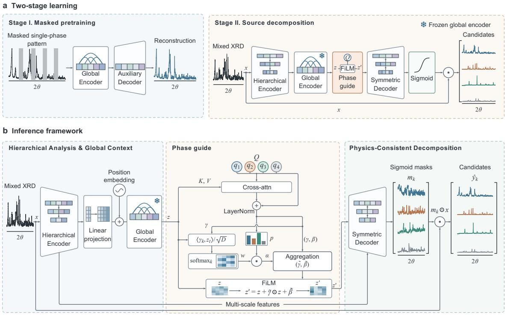  
Figure S2. XDecomposer learns to separate multiphase difraction signals without a predefined phase list. a, Two-stage learning. Stage I pretrains a global encoder by reconstructing masked regions of sin<sub>g</sub>le-<sub>p</sub>hase <sub>p</sub>atterns. Sta<sub>g</sub>e II combines a hierarchical encoder, the frozen <sub>g</sub>lobal encoder (snowflake), a feature-wise linear modulation (FiLM) <sub>p</sub>hase <sub>g</sub>uide and a s<sub>y</sub>mmetric decoder to <sub>p</sub>roduce a set of candidate component patterns from a mixed XRD input. b, Inference framework. Hierarchical multi-scale features <sub>an</sub>d <sub>g</sub>l<sub>o</sub>b<sub>a</sub>l <sub>con</sub>t<sub>ex</sub>t <sub>are</sub> <sub>con</sub>diti<sub>one</sub>d b<sub>y</sub> l<sub>earne</sub>d <sub>p</sub>h<sub>ase</sub> <sub>quer</sub>i<sub>es</sub> th<sub>roug</sub>h <sub>cross-a</sub>tt<sub>en</sub>ti<sub>on</sub> <sub>an</sub>d <sub>aggrega</sub>ti<sub>on;</sub> th<sub>e</sub> d<sub>eco</sub>d<sub>er ou</sub>t<sub>pu</sub>t<sub>s s</sub>i<sub>gmo</sub>id <sub>mas</sub>k<sub>s</sub> $m _ { k }$ <sub>, w</sub>hi<sub>c</sub>h <sub>are app</sub>li<sub>e</sub>d t<sub>o</sub> th<sub>e</sub> i<sub>npu</sub>t <sub>pro</sub>fil<sub>e �</sub> t<sub>o y</sub>i<sub>e</sub>ld <sub>p</sub>h<sub>ys</sub>i<sub>cs-cons</sub>i<sub>s</sub>t<sub>en</sub>t <sub>componen</sub>t <sub>can</sub>did<sub>a</sub>t<sub>es</sub> $\hat { y } _ { k }$ <sub>.</sub> C<sub>urves</sub> <sub>represen</sub>t dif<sub>rac</sub>ti<sub>on</sub> i<sub>n</sub>t<sub>ens</sub>it<sub>y</sub> <sub>as</sub> <sub>a</sub> f<sub>unc</sub>ti<sub>on</sub> <sub>o</sub>f 2�<sub>;</sub> <sub>co</sub>l<sub>ours</sub> di<sub>s</sub>ti<sub>ngu</sub>i<sub>s</sub>h <sub>pre</sub>di<sub>c</sub>t<sub>e</sub>d <sub>componen</sub>t<sub>s.</sub>

## Problem formulation and data preparation

In<sub>p</sub>ut XRD <sub>p</sub>rofiles are inter<sub>p</sub>olated onto a uniform <sub>g</sub>rid of � = 3,500 <sub>p</sub>oints s<sub>p</sub>annin<sub>g</sub> $1 0 ^ { \circ } \leq$ $2 \theta \leq 8 0 ^ { \circ }$ <sub>,</sub> <sub>w</sub>ith <sub>non-nega</sub>ti<sub>ve</sub> i<sub>n</sub>t<sub>ens</sub>iti<sub>es</sub> <sub>norma</sub>li<sub>ze</sub>d t<sub>o</sub> <sub>a</sub> <sub>un</sub>it <sub>max</sub>i<sub>mum.</sub> F<sub>or</sub> <sub>a</sub> <sub>m</sub>i<sub>x</sub>t<sub>ure</sub> <sub>con</sub>t<sub>a</sub>i<sub>n</sub>i<sub>ng</sub> � <sub>p</sub>h<sub>ases,</sub> th<sub>e</sub> <sub>pro</sub>fil<sub>e</sub> $\mathbf { x } \in \mathbb { R } _ { \geq 0 } ^ { L }$ i<sub>s</sub> <sub>represen</sub>t<sub>e</sub>d <sub>un</sub>d<sub>er</sub> th<sub>e</sub> li<sub>near</sub> <sub>superpos</sub>iti<sub>on</sub> <sub>approx</sub>i<sub>ma</sub>ti<sub>on</sub> <sub>as</sub>

$$
\begin{array} { l } { { \displaystyle { \bf x } = \sum _ { k = 1 } ^ { K } { \bf c } _ { k } + \varepsilon } , \quad \quad { \bf c } _ { k } = w _ { k } { \bf s } _ { k } , \quad \quad w _ { k } \geq 0 , \quad \displaystyle \sum _ { k = 1 } ^ { K } w _ { k } = 1 , } \end{array}\tag{S35}
$$

<sub>w</sub>h<sub>ere</sub> $\mathbf { s } _ { k }$ d<sub>eno</sub>t<sub>es</sub> th<sub>e</sub> <sub>s</sub>i<sub>ng</sub>l<sub>e-p</sub>h<sub>ase</sub> dif<sub>rac</sub>ti<sub>on</sub> <sub>pro</sub>fil<sub>e</sub> <sub>on</sub> <sub>a</sub> <sub>spec</sub>ifi<sub>e</sub>d i<sub>n</sub>t<sub>ens</sub>it<sub>y</sub> <sub>sca</sub>l<sub>e,</sub> $w _ { k }$ i<sub>s</sub> th<sub>e</sub> corresponding mixing coeficient, and � accounts for noise and other residual contributions. XD<sub>eco</sub>m<sub>pose</sub>r <sub>acco</sub>mm<sub>o</sub>d<sub>a</sub>t<sub>es</sub> <sub>a</sub>n <sub>u</sub>nkn<sub>ow</sub>n <sub>p</sub>h<sub>ase</sub> <sub>cou</sub>nt <sub>us</sub>in<sub>g</sub> $K _ { \operatorname* { m a x } } = 4$ <sub>ou</sub>t<sub>pu</sub>t <sub>s</sub>l<sub>o</sub>t<sub>s,</sub> <sub>eac</sub>h <sub>pre</sub>di<sub>c</sub>ti<sub>ng</sub> <sub>a</sub> <sub>componen</sub>t <sub>con</sub>t<sub>r</sub>ib<sub>u</sub>ti<sub>on</sub> $\hat { \mathbf { c } } _ { k }$ <sub>an</sub>d <sub>an</sub> <sub>assoc</sub>i<sub>a</sub>t<sub>e</sub>d <sub>ac</sub>ti<sub>v</sub>it<sub>y</sub> <sub>pro</sub>b<sub>a</sub>bilit<sub>y</sub> $p _ { k }$

Th<sub>e</sub> <sub>s</sub>im<sub>u</sub>l<sub>a</sub>t<sub>e</sub>d <sub>co</sub>r<sub>pus</sub> <sub>co</sub>m<sub>p</sub>ri<sub>ses</sub> 2<sub>,</sub>006<sub>,</sub>300 <sub>pa</sub>tt<sub>e</sub>rn<sub>s</sub> <sub>ge</sub>n<sub>e</sub>r<sub>a</sub>t<sub>e</sub>d <sub>us</sub>in<sub>g</sub> <sub>pys</sub>im<sub>x</sub>rd<sup>4</sup> fr<sub>o</sub>m 100<sub>,</sub>315 MP500 d<sub>a</sub>t<sub>a,</sub> <sub>w</sub>ith 20 <sub>pro</sub>fil<sub>es</sub> <sub>per</sub> <sub>s</sub>t<sub>ruc</sub>t<sub>ure</sub> i<sub>ncorpora</sub>ti<sub>ng</sub> <sub>var</sub>i<sub>a</sub>ti<sub>ons</sub> i<sub>n</sub> <sub>pea</sub>k <sub>pos</sub>iti<sub>ons,</sub> <sub>w</sub>idth<sub>s,</sub> b<sub>ac</sub>k<sub>groun</sub>d <sub>an</sub>d i<sub>ns</sub>t<sub>rumen</sub>t<sub>a</sub>l <sub>con</sub>diti<sub>ons.</sub> Si<sub>mu</sub>l<sub>a</sub>ti<sub>on parame</sub>t<sub>ers are summar</sub>i<sub>ze</sub>d i<sub>n</sub> T<sub>a</sub>bl<sub>e</sub> S5<sub>.</sub> C<sub>rys</sub>t<sub>a</sub>l ID<sub>s</sub> <sub>are</sub> <sub>par</sub>titi<sub>one</sub>d i<sub>n</sub>t<sub>o</sub> t<sub>ra</sub>i<sub>n</sub>i<sub>ng,</sub> <sub>va</sub>lid<sub>a</sub>ti<sub>on</sub> <sub>an</sub>d t<sub>es</sub>t <sub>su</sub>b<sub>se</sub>t<sub>s</sub> i<sub>n</sub> <sub>an</sub> 8<sub>:</sub>1<sub>:</sub>1 <sub>ra</sub>ti<sub>o</sub> b<sub>e</sub>f<sub>ore</sub> <sub>m</sub>i<sub>x</sub>t<sub>ure</sub> <sub>cons</sub>t<sub>ruc</sub>ti<sub>on,</sub> <sub>w</sub>ith <sub>a</sub>ll <sub>s</sub>i<sub>mu</sub>l<sub>a</sub>t<sub>e</sub>d <sub>var</sub>i<sub>an</sub>t<sub>s</sub> <sub>o</sub>f <sub>a</sub> <sub>g</sub>i<sub>ven</sub> <sub>crys</sub>t<sub>a</sub>l <sub>ass</sub>i<sub>gne</sub>d t<sub>o</sub> th<sub>e</sub> <sub>same</sub> <sub>su</sub>b<sub>se</sub>t<sub>.</sub> D<sub>ur</sub>i<sub>ng</sub> d<sub>a</sub>t<sub>a</sub> l<sub>oa</sub>di<sub>ng,</sub> <sub>m</sub>i<sub>x</sub>t<sub>ures</sub> <sub>are</sub> <sub>cons</sub>t<sub>ruc</sub>t<sub>e</sub>d b<sub>y</sub> <sub>com</sub>bi<sub>n</sub>i<sub>ng</sub> <sub>an</sub> <sub>anc</sub>h<sub>or</sub> <sub>p</sub>h<sub>ase</sub> <sub>w</sub>ith $K - 1$ <sub>a</sub>dditi<sub>ona</sub>l di<sub>s</sub>ti<sub>nc</sub>t <sub>p</sub>h<sub>ases</sub> <sub>samp</sub>l<sub>e</sub>d f<sub>rom</sub> th<sub>e</sub> <sub>same</sub> <sub>su</sub>b<sub>se</sub>t<sub>,</sub> <sub>w</sub>h<sub>ere</sub> $K \in \{ 2 , 3 , 4 \}$ <sub>.</sub> Mi<sub>x</sub>i<sub>ng coe</sub>fi<sub>c</sub>i<sub>en</sub>t<sub>s are</sub> obtained through Dirichlet-based sampling subject to $w _ { k } \ge 0 . 1 5$ <sub>.</sub> A <sub>common norma</sub>li<sub>za</sub>ti<sub>on</sub> f<sub>ac</sub>t<sub>or</sub> i<sub>s</sub> <sub>app</sub>li<sub>e</sub>d t<sub>o</sub> <sub>eac</sub>h <sub>m</sub>i<sub>x</sub>t<sub>ure</sub> <sub>an</sub>d it<sub>s</sub> <sub>we</sub>i<sub>g</sub>ht<sub>e</sub>d <sub>componen</sub>t t<sub>arge</sub>t<sub>s</sub> t<sub>o</sub> <sub>preserve</sub> th<sub>e</sub>i<sub>r</sub> <sub>re</sub>l<sub>a</sub>ti<sub>ve</sub> <sub>amp</sub>lit<sub>u</sub>d<sub>es;</sub> <sub>unuse</sub>d t<sub>arge</sub>t <sub>s</sub>l<sub>o</sub>t<sub>s</sub> <sub>are</sub> <sub>zero-pa</sub>dd<sub>e</sub>d<sub>.</sub>

## Difraction encoding and phase-query modulation

A hi<sub>erarc</sub>hi<sub>ca</sub>l <sub>one-</sub>di<sub>mens</sub>i<sub>ona</sub>l <sub>convo</sub>l<sub>u</sub>ti<sub>ona</sub>l <sub>enco</sub>d<sub>er</sub> <sub>ex</sub>t<sub>rac</sub>t<sub>s</sub> <sub>mu</sub>lti<sub>sca</sub>l<sub>e</sub> f<sub>ea</sub>t<sub>ures</sub> f<sub>rom</sub> th<sub>e</sub> i<sub>npu</sub>t dif<sub>rac</sub>ti<sub>on</sub> <sub>pro</sub>fil<sub>e.</sub> S<sub>uccess</sub>i<sub>ve</sub> l<sub>ayers</sub> <sub>cap</sub>t<sub>ure</sub> l<sub>oca</sub>l <sub>pea</sub>k <sub>s</sub>h<sub>apes</sub> <sub>an</sub>d <sub>re</sub>l<sub>a</sub>ti<sub>ons</sub>hi<sub>ps</sub> <sub>among</sub> <sub>re</sub>fl<sub>ec</sub>ti<sub>ons</sub> <sub>over</sub> <sub>progress</sub>i<sub>ve</sub>l<sub>y</sub> l<sub>arger</sub> <sub>angu</sub>l<sub>ar</sub> i<sub>n</sub>t<sub>erva</sub>l<sub>s.</sub> I<sub>n</sub>t<sub>erme</sub>di<sub>a</sub>t<sub>e</sub> f<sub>ea</sub>t<sub>ure</sub> <sub>maps</sub> <sub>are</sub> <sub>re</sub>t<sub>a</sub>i<sub>ne</sub>d f<sub>or</sub> skip connections to the reconstruction decoder. The final convolutional features are projected i<sub>n</sub>t<sub>o</sub> <sub>a</sub> l<sub>a</sub>t<sub>en</sub>t <sub>sequence,</sub> <sub>augmen</sub>t<sub>e</sub>d <sub>w</sub>ith <sub>pos</sub>iti<sub>ona</sub>l <sub>enco</sub>di<sub>ngs</sub> <sub>an</sub>d <sub>processe</sub>d b<sub>y</sub> <sub>a</sub> <sub>pre</sub>t<sub>ra</sub>i<sub>ne</sub>d T<sub>rans</sub>f<sub>ormer enco</sub>d<sub>er</sub><sup>16</sup> t<sub>o mo</sub>d<sub>e</sub>l d<sub>epen</sub>d<sub>enc</sub>i<sub>es across</sub> th<sub>e</sub> dif<sub>rac</sub>ti<sub>on pro</sub>fil<sub>e.</sub> Th<sub>e</sub> T<sub>rans</sub>f<sub>ormer</sub> encoder is pretrained on single-phase XRD profiles using a masked reconstruction objective<sup>17</sup>, <sub>w</sub>ith <sub>an</sub> <sub>aux</sub>ili<sub>ary</sub> d<sub>eco</sub>d<sub>er</sub> <sub>recons</sub>t<sub>ruc</sub>ti<sub>ng</sub> <sub>mas</sub>k<sub>e</sub>d <sub>reg</sub>i<sub>ons</sub> f<sub>rom</sub> th<sub>e</sub> <sub>v</sub>i<sub>s</sub>ibl<sub>e</sub> i<sub>npu</sub>t<sub>.</sub> Th<sub>e</sub> <sub>pre</sub>t<sub>ra</sub>i<sub>ne</sub>d <sub>enco</sub>d<sub>er</sub> i<sub>s</sub> th<sub>en</sub> i<sub>ncorpora</sub>t<sub>e</sub>d i<sub>n</sub>t<sub>o</sub> th<sub>e</sub> d<sub>ecompos</sub>iti<sub>on</sub> <sub>ne</sub>t<sub>wor</sub>k<sub>,</sub> <sub>an</sub>d it<sub>s</sub> <sub>parame</sub>t<sub>ers</sub> <sub>rema</sub>i<sub>n</sub> fi<sub>xe</sub>d d<sub>ur</sub>i<sub>ng</sub> t<sub>ra</sub>i<sub>n</sub>i<sub>ng</sub> <sub>on</sub> <sub>mu</sub>lti<sub>p</sub>h<sub>ase</sub> <sub>m</sub>i<sub>x</sub>t<sub>ures</sub><sup>15</sup><sub>.</sub> It<sub>s</sub> <sub>ou</sub>t<sub>pu</sub>t i<sub>s</sub> d<sub>eno</sub>t<sub>e</sub>d b<sub>y</sub> $\mathbf { Z } \in \mathbb { R } ^ { T \times d }$ <sub>,</sub> <sub>w</sub>h<sub>ere</sub> � i<sub>s</sub> th<sub>e</sub> l<sub>a</sub>t<sub>en</sub>t <sub>sequence</sub> l<sub>eng</sub>th <sub>an</sub>d � i<sub>s</sub> th<sub>e</sub> f<sub>ea</sub>t<sub>ure</sub> di<sub>mens</sub>i<sub>on.</sub>

Table S5. Parameters used to generate simulated pretraining data for XDecomposer.
<table><tr><td>Category</td><td>Parameter</td><td>Value or range</td></tr><tr><td rowspan="6">Random perturbations</td><td>Crystallite size (nm)</td><td>10-120</td></tr><tr><td>Thermal vibration coefficient</td><td>0.01–0.20</td></tr><tr><td>Zero shift</td><td>0-0.20</td></tr><tr><td>Detector-sample distance (mm)</td><td>300-600</td></tr><tr><td>Detector slit half-height (mm)</td><td>3-8</td></tr><tr><td>Sample half-height (mm)</td><td>1-4</td></tr><tr><td rowspan="4">Fixed parameters</td><td>Preferred-orientation factor</td><td>0.15</td></tr><tr><td>Background polynomial order</td><td>6</td></tr><tr><td>Mixture noise ratio</td><td>0.02</td></tr><tr><td>Lattice extinction/torsion ratio</td><td>0.01/0.01</td></tr><tr><td rowspan="3">Data configuration</td><td>2θ range</td><td>10°-80°</td></tr><tr><td>Step size</td><td>0.02°</td></tr><tr><td>Patterns per crystal ID</td><td>20</td></tr></table>

E<sub>ac</sub>h l<sub>earna</sub>bl<sub>e</sub> <sub>p</sub>h<sub>ase</sub> <sub>query</sub> $\mathbf { q } _ { k }$ aggregates information from Z through multi-head cross-<sub>a</sub>tt<sub>en</sub>ti<sub>on.</sub> Th<sub>e</sub> <sub>resu</sub>lti<sub>ng</sub> <sub>query</sub> <sub>represen</sub>t<sub>a</sub>ti<sub>on</sub> i<sub>s</sub> <sub>mappe</sub>d t<sub>o</sub> <sub>a</sub> <sub>s</sub>l<sub>o</sub>t <sub>ac</sub>ti<sub>v</sub>it<sub>y</sub> <sub>pro</sub>b<sub>a</sub>bilit<sub>y</sub> <sub>an</sub>d <sub>parame</sub>t<sub>ers</sub> for feature-wise linear modulation (FiLM)<sup>18</sup>:

$$
{ \bf h } _ { k } = \mathrm { L N } [ { \bf q } _ { k } + \mathrm { M H A } ( { \bf q } _ { k } , { \bf Z } , { \bf Z } ) ] ,\tag{S36}
$$

$$
p _ { k } = \sigma ( f _ { \mathrm { a c t } } ( \mathbf { h } _ { k } ) ) , \qquad ( \boldsymbol { \gamma } _ { k } , \beta _ { k } ) = f _ { \mathrm { m o d } } ( \mathbf { h } _ { k } ) ,\tag{S37}
$$

<sub>w</sub>h<sub>ere</sub> LN<sub>,</sub> MHA <sub>an</sub>d $\sigma$ d<sub>eno</sub>t<sub>e</sub> l<sub>ayer</sub> <sub>norma</sub>li<sub>za</sub>ti<sub>on,</sub> <sub>mu</sub>lti<sub>-</sub>h<sub>ea</sub>d <sub>cross-a</sub>tt<sub>en</sub>ti<sub>on</sub> <sub>an</sub>d th<sub>e</sub> <sub>s</sub>i<sub>gmo</sub>id f<sub>unc</sub>ti<sub>on,</sub> <sub>respec</sub>ti<sub>ve</sub>l<sub>y.</sub> Th<sub>e</sub> <sub>pre</sub>di<sub>c</sub>ti<sub>on</sub> h<sub>ea</sub>d<sub>s</sub> $f _ { \mathrm { a c t } }$ <sub>an</sub>d $f _ { \mathrm { m o d } }$ <sub>pro</sub>d<sub>uce</sub> th<sub>e</sub> <sub>ac</sub>ti<sub>v</sub>it<sub>y</sub> <sub>pro</sub>b<sub>a</sub>bilit<sub>y</sub> $p _ { k }$ <sub>an</sub>d th<sub>e</sub> <sub>sca</sub>li<sub>ng</sub> <sub>an</sub>d <sub>o</sub>f<sub>se</sub>t <sub>vec</sub>t<sub>ors</sub> $( \gamma _ { k } , \beta _ { k } )$ <sub>.</sub> At <sub>eac</sub>h l<sub>a</sub>t<sub>en</sub>t <sub>pos</sub>iti<sub>on</sub> �<sub>,</sub> <sub>compa</sub>tibilit<sub>y</sub> <sub>scores</sub> b<sub>e</sub>t<sub>ween</sub> th<sub>e</sub> <sub>mo</sub>d<sub>u</sub>l<sub>a</sub>ti<sub>on</sub> <sub>vec</sub>t<sub>ors</sub> $\gamma _ { k }$ <sub>an</sub>d th<sub>e</sub> l<sub>a</sub>t<sub>en</sub>t f<sub>ea</sub>t<sub>ure</sub> $\mathbf { Z } _ { t }$ <sub>are</sub> <sub>norma</sub>li<sub>ze</sub>d <sub>across</sub> <sub>s</sub>l<sub>o</sub>t<sub>s</sub> <sub>an</sub>d <sub>sca</sub>l<sub>e</sub>d b<sub>y</sub> th<sub>e</sub> <sub>correspon</sub>di<sub>ng</sub> <sub>ac</sub>ti<sub>v</sub>it<sub>y</sub> <sub>pro</sub>b<sub>a</sub>biliti<sub>es:</sub>

$$
a _ { k t } = p _ { k } \frac { \exp ( \gamma _ { k } ^ { \top } { \bf Z } _ { t } / \sqrt { d } ) } { \sum _ { j = 1 } ^ { K _ { \operatorname* { m a x } } } \exp ( \gamma _ { j } ^ { \top } { \bf Z } _ { t } / \sqrt { d } ) } ,\tag{S38}
$$

$$
\mathbf { Z } _ { t } ^ { \prime } = \mathbf { Z } _ { t } \odot \left( \mathbf { 1 } + \sum _ { k = 1 } ^ { K _ { \operatorname* { m a x } } } a _ { k t } \pmb { \gamma } _ { k } \right) + \sum _ { k = 1 } ^ { K _ { \operatorname* { m a x } } } a _ { k t } \pmb { \beta } _ { k } .\tag{S39}
$$

Here, ⊙ denotes element-wise multi<sub>p</sub>lication, and $a _ { k t }$ d<sub>e</sub>t<sub>erm</sub>i<sub>nes</sub> th<sub>e</sub> <sub>con</sub>t<sub>r</sub>ib<sub>u</sub>ti<sub>on</sub> <sub>o</sub>f <sub>query</sub> � t<sub>o</sub> the afine transformation at position �. The modulated sequence Z<sup>′</sup> and the retained convolutional f<sub>ea</sub>t<sub>ure</sub> <sub>maps</sub> <sub>prov</sub>id<sub>e</sub> th<sub>e</sub> i<sub>npu</sub>t<sub>s</sub> t<sub>o</sub> th<sub>e</sub> <sub>recons</sub>t<sub>ruc</sub>ti<sub>on</sub> d<sub>eco</sub>d<sub>er.</sub>

## Component reconstruction

T<sub>ranspose</sub>d <sub>convo</sub>l<sub>u</sub>ti<sub>ons</sub> <sub>an</sub>d <sub>s</sub>ki<sub>p-</sub>f<sub>ea</sub>t<sub>ure</sub> f<sub>us</sub>i<sub>on</sub> <sub>res</sub>t<sub>ore</sub> <sub>angu</sub>l<sub>ar</sub> <sub>reso</sub>l<sub>u</sub>ti<sub>on</sub> <sub>an</sub>d <sub>pro</sub>d<sub>uce</sub> <sub>mas</sub>k l<sub>og</sub>it<sub>s</sub> ${ \bf u } _ { k }$ <sub>.</sub> Th<sub>e</sub> <sub>recons</sub>t<sub>ruc</sub>t<sub>e</sub>d <sub>componen</sub>t<sub>s</sub> <sub>an</sub>d th<sub>e</sub>i<sub>r</sub> <sub>sum</sub> <sub>are</sub>

$$
\hat { \mathbf { c } } _ { k } = \sigma ( \mathbf { u } _ { k } ) \odot \mathbf { x } , \qquad \hat { \mathbf { x } } = \sum _ { k = 1 } ^ { K _ { \operatorname* { m a x } } } \hat { \mathbf { c } } _ { k } .\tag{S40}
$$

I<sub>n</sub>d<sub>epen</sub>d<sub>en</sub>t <sub>s</sub>i<sub>gmo</sub>id <sub>mas</sub>k<sub>s</sub> <sub>ass</sub>i<sub>gn</sub> <sub>a</sub> <sub>con</sub>ti<sub>nuous</sub> f<sub>rac</sub>ti<sub>on</sub> <sub>o</sub>f th<sub>e</sub> <sub>o</sub>b<sub>serve</sub>d i<sub>n</sub>t<sub>ens</sub>it<sub>y</sub> t<sub>o</sub> <sub>eac</sub>h <sub>ou</sub>t<sub>pu</sub>t <sub>componen</sub>t<sub>.</sub> Thi<sub>s</sub> <sub>parame</sub>t<sub>er</sub>i<sub>za</sub>ti<sub>on</sub> <sub>ensures</sub> $0 \leq \hat { c } _ { k \ell } \leq x _ { \ell }$ <sub>a</sub>t <sub>eac</sub>h <sub>angu</sub>l<sub>ar</sub> <sub>samp</sub>l<sub>e</sub> ℓ<sub>.</sub> C<sub>on</sub>ti<sub>nuous</sub> <sub>mas</sub>k<sub>s</sub> <sub>accommo</sub>d<sub>a</sub>t<sub>e</sub> <sub>con</sub>t<sub>r</sub>ib<sub>u</sub>ti<sub>ons</sub> f<sub>rom</sub> <sub>mu</sub>lti<sub>p</sub>l<sub>e</sub> <sub>p</sub>h<sub>ases</sub> <sub>a</sub>t <sub>over</sub>l<sub>app</sub>i<sub>ng</sub> <sub>re</sub>fl<sub>ec</sub>ti<sub>ons.</sub> A <sub>m</sub>i<sub>x</sub>t<sub>ure-recons</sub>t<sub>ruc</sub>ti<sub>on</sub> l<sub>oss</sub> <sub>encourages</sub> th<sub>e</sub>i<sub>r</sub> <sub>summe</sub>d i<sub>n</sub>t<sub>ens</sub>it<sub>y</sub> t<sub>o</sub> <sub>repro</sub>d<sub>uce</sub> th<sub>e</sub> i<sub>npu</sub>t <sub>pro</sub>fil<sub>e.</sub>

## Decomposition objective

For predicted and reference profiles u and v, the component loss combines intensity-weighted <sub>amp</sub>lit<sub>u</sub>d<sub>e</sub> <sub>error,</sub> <sub>s</sub>h<sub>ape</sub> <sub>s</sub>i<sub>m</sub>il<sub>ar</sub>it<sub>y</sub> <sub>an</sub>d fi<sub>n</sub>it<sub>e</sub> dif<sub>erences</sub> i<sub>n</sub> th<sub>e</sub> <sub>square-roo</sub>t d<sub>oma</sub>i<sub>n:</sub>

$$
\begin{array} { r l } & { \ell ( { \mathbf { u } } , { \mathbf { v } } ) = A \left[ ( { \mathbf { u } } - { \mathbf { v } } ) \odot ( { \mathbf { 1 } } + \alpha { \mathbf { v } } ) \right] - \lambda _ { \mathrm { s h a p e } } \mathrm { S I } \mathrm { - S D R } ( { \mathbf { u } } , { \mathbf { v } } ) } \\ & { ~ + ~ \lambda _ { \mathrm { g e o } } \left\{ A \Big ( \Delta \sqrt { { \mathbf { u } } } - \Delta \sqrt { { \mathbf { v } } } \Big ) + \beta A \Big ( \Delta ^ { 2 } \sqrt { { \mathbf { u } } } - \Delta ^ { 2 } \sqrt { { \mathbf { v } } } \Big ) \right\} . } \end{array}\tag{S41}
$$

Here, � denotes the mean absolute value, Δ the first-order finite diference and SI-SDR the <sub>sca</sub>l<sub>e-</sub>i<sub>nvar</sub>i<sub>an</sub>t <sub>s</sub>i<sub>gna</sub>l<sub>-</sub>t<sub>o-</sub>di<sub>s</sub>t<sub>or</sub>ti<sub>on</sub> <sub>ra</sub>ti<sub>o</sub><sup>19</sup><sub>.</sub> SI<sub>-</sub>SDR <sub>eva</sub>l<sub>ua</sub>t<sub>es</sub> <sub>pro</sub>fil<sub>e</sub> <sub>s</sub>h<sub>ape</sub> b<sub>y</sub> <sub>compar</sub>i<sub>ng</sub> th<sub>e</sub> prediction with its least-squares projection onto the target. Square roots use a positive numerical fl<sub>oor,</sub> <sub>an</sub>d th<sub>e</sub> SI<sub>-</sub>SDR t<sub>erm</sub> i<sub>s</sub> <sub>om</sub>itt<sub>e</sub>d f<sub>or</sub> <sub>zero</sub> t<sub>arge</sub>t<sub>s.</sub> A<sub>mp</sub>lit<sub>u</sub>d<sub>e</sub> <sub>we</sub>i<sub>g</sub>hti<sub>ng</sub> <sub>emp</sub>h<sub>as</sub>i<sub>zes</sub> <sub>s</sub>t<sub>ronger</sub> <sub>re</sub>fl<sub>ec</sub>ti<sub>ons,</sub> <sub>w</sub>hil<sub>e</sub> th<sub>e</sub> dif<sub>erence</sub> t<sub>erms</sub> <sub>cons</sub>t<sub>ra</sub>i<sub>n</sub> <sub>pea</sub>k <sub>s</sub>l<sub>opes</sub> <sub>an</sub>d <sub>curva</sub>t<sub>ure.</sub>

P<sub>ermu</sub>t<sub>a</sub>ti<sub>on-</sub>i<sub>nvar</sub>i<sub>an</sub>t t<sub>ra</sub>i<sub>n</sub>i<sub>ng</sub><sup>20</sup> <sub>m</sub>i<sub>n</sub>i<sub>m</sub>i<sub>zes</sub> th<sub>e</sub> t<sub>o</sub>t<sub>a</sub>l <sub>componen</sub>t <sub>error</sub> <sub>over</sub> <sub>a</sub>ll <sub>permu</sub>t<sub>a</sub>ti<sub>ons</sub> <sub>o</sub>f th<sub>e</sub> <sub>zero-pa</sub>dd<sub>e</sub>d <sub>re</sub>f<sub>erence</sub> <sub>se</sub>t $\{ \bar { \mathbf { c } } _ { k } \} _ { k = 1 } ^ { K _ { \operatorname* { m a x } } }$

$$
\mathcal { L } _ { \mathrm { s e p } } = \operatorname* { m i n } _ { \pi \in \mathfrak { S } _ { K _ { \operatorname* { m a x } } } } \sum _ { k = 1 } ^ { K _ { \operatorname* { m a x } } } \ell ( \hat { \mathbf { c } } _ { \pi ( k ) } , \bar { \mathbf { c } } _ { k } ) ,\tag{S42}
$$

<sub>w</sub>h<sub>ere</sub> ${ \mathfrak { S } } _ { K _ { \mathrm { m a x } } }$ <sub>con</sub>t<sub>a</sub>i<sub>ns</sub> <sub>s</sub>l<sub>o</sub>t <sub>permu</sub>t<sub>a</sub>ti<sub>ons.</sub> Th<sub>e</sub> <sub>m</sub>i<sub>n</sub>i<sub>m</sub>i<sub>z</sub>i<sub>ng</sub> <sub>ass</sub>i<sub>gnmen</sub>t d<sub>e</sub>fi<sub>nes</sub> bi<sub>nary</sub> <sub>ac</sub>ti<sub>v</sub>it<sub>y</sub> <sup>tar</sup>g<sup>ets</sup> $b _ { j }$ <sub>,</sub> <sub>w</sub>ith $b _ { j } = 1$ f<sub>or</sub> <sub>s</sub>l<sub>o</sub>t<sub>s</sub> <sub>ma</sub>t<sub>c</sub>h<sub>e</sub>d t<sub>o</sub> <sub>non-zero</sub> <sub>componen</sub>t<sub>s.</sub> Thi<sub>s</sub> <sub>ass</sub>i<sub>gnmen</sub>t <sub>ma</sub>k<sub>es</sub> supervision independent of the ordering of reference phases. The complete objective is

$$
\mathcal { L } = \mathcal { L } _ { \mathrm { s e p } } + \frac { \lambda _ { \mathrm { a c t } } } { K _ { \mathrm { m a x } } } \sum _ { j = 1 } ^ { K _ { \mathrm { m a x } } } \mathrm { B C E } ( p _ { j } , b _ { j } ) + \lambda _ { \mathrm { m i x } } A ( \hat { \mathbf { x } } - \mathbf { x } ) ,\tag{S43}
$$

where binar<sub>y</sub> cross-entro<sub>py</sub> (BCE) su<sub>p</sub>ervises slot occu<sub>p</sub>anc<sub>y</sub> and the final term encoura<sub>g</sub>es <sub>agreemen</sub>t <sub>w</sub>ith th<sub>e</sub> <sub>o</sub>b<sub>serve</sub>d <sub>m</sub>i<sub>x</sub>t<sub>ure.</sub>

## Inference and evaluation

A <sub>s</sub>i<sub>ng</sub>l<sub>e</sub> f<sub>orwar</sub>d <sub>pass</sub> <sub>pre</sub>di<sub>c</sub>t<sub>s</sub> <sub>componen</sub>t <sub>pro</sub>fil<sub>es</sub> <sub>an</sub>d <sub>ac</sub>ti<sub>v</sub>it<sub>y</sub> <sub>pro</sub>b<sub>a</sub>biliti<sub>es.</sub> Th<sub>res</sub>h<sub>o</sub>ldi<sub>ng</sub> <sub>a</sub>t <sub>�</sub> <sub>y</sub>i<sub>e</sub>ld<sub>s</sub> th<sub>e re</sub>t<sub>a</sub>i<sub>ne</sub>d <sub>componen</sub>t<sub>s an</sub>d <sub>p</sub>h<sub>ase coun</sub>t<sub>:</sub>

$$
\hat { C } = \{ \hat { \mathbf { c } } _ { k } : p _ { k } > \tau \} , \qquad \hat { K } = \sum _ { k = 1 } ^ { K _ { \mathrm { m a x } } } \mathbf { 1 } [ p _ { k } > \tau ] .\tag{S44}
$$

R<sub>e</sub>t<sub>a</sub>i<sub>ne</sub>d <sub>pro</sub>fil<sub>es preserve</sub> th<sub>e</sub>i<sub>r amp</sub>lit<sub>u</sub>d<sub>es on</sub> th<sub>e m</sub>i<sub>x</sub>t<sub>ure sca</sub>l<sub>e an</sub>d <sub>serve as quer</sub>i<sub>es</sub> f<sub>or p</sub>h<sub>ase</sub> id<sub>en</sub>tifi<sub>ca</sub>ti<sub>on.</sub>

## 1.6 Statistical whole-pattern decomposition with PyXplore

Bragg peak positions, intensities and line shapes jointly encode geometric and chemical infor-<sub>ma</sub>ti<sub>on,</sub> b<sub>u</sub>t <sub>ex</sub>t<sub>rac</sub>ti<sub>ng</sub> th<sub>ese</sub> <sub>quan</sub>titi<sub>es</sub> f<sub>rom</sub> <sub>a</sub> <sub>one-</sub>di<sub>mens</sub>i<sub>ona</sub>l <sub>pow</sub>d<sub>er</sub> <sub>pro</sub>fil<sub>e</sub> i<sub>s</sub> i<sub>n</sub>t<sub>r</sub>i<sub>ns</sub>i<sub>ca</sub>ll<sub>y</sub> ill<sub>-pose</sub>d b<sub>ecause</sub> <sub>mu</sub>lti<sub>p</sub>l<sub>e</sub> <sub>re</sub>fl<sub>ec</sub>ti<sub>ons</sub> <sub>can</sub> <sub>co</sub>i<sub>nc</sub>id<sub>e</sub> i<sub>n</sub> $2 \theta ^ { 2 1 , 2 2 }$ <sub>.</sub> Cl<sub>ass</sub>i<sub>ca</sub>l <sub>w</sub>h<sub>o</sub>l<sub>e-pa</sub>tt<sub>ern</sub> <sub>re</sub>fi<sub>nemen</sub>t methods (Rietveld, Pawle<sub>y</sub> and Le Bail) enforce cr<sub>y</sub>stallo<sub>g</sub>ra<sub>p</sub>hic consistenc<sub>y</sub> b<sub>y</sub> cou<sub>p</sub>lin<sub>g</sub> all <sub>re</sub>fl<sub>ec</sub>ti<sub>ons</sub> th<sub>roug</sub>h <sub>a</sub> <sub>s</sub>i<sub>ng</sub>l<sub>e</sub> <sub>s</sub>t<sub>ruc</sub>t<sub>ura</sub>l <sub>mo</sub>d<sub>e</sub>l<sup>23–26</sup><sub>.</sub> U<sub>n</sub>d<sub>er</sub> <sub>severe</sub> <sub>over</sub>l<sub>ap,</sub> h<sub>owever,</sub> th<sub>e</sub> <sub>resu</sub>lti<sub>ng</sub> least-squares <sub>p</sub>roblem can be numericall<sub>y</sub> fra<sub>g</sub>ile and ma<sub>y</sub> admit non-<sub>p</sub>h<sub>y</sub>sical solutions (e.<sub>g</sub>., <sub>p</sub>oorl<sub>y</sub> determined or even ne<sub>g</sub>ative intensities).

P<sub>y</sub>X<sub>p</sub>l<sub>ore</sub> <sub>a</sub>dd<sub>resses</sub> thi<sub>s</sub> b<sub>o</sub>ttl<sub>enec</sub>k b<sub>y</sub> <sub>recas</sub>ti<sub>ng</sub> <sub>w</sub>h<sub>o</sub>l<sub>e-pa</sub>tt<sub>ern</sub> d<sub>ecompos</sub>iti<sub>on</sub> <sub>as</sub> <sub>pro</sub>b<sub>a</sub>bili<sub>s</sub>ti<sub>c</sub> inference subject to hard difraction constraints. Specifically, we treat the background-subtracted <sub>p</sub>rofile as a mixture of <sub>p</sub>eak-sha<sub>p</sub>e functions (PSFs) and estimate com<sub>p</sub>onent res<sub>p</sub>onsibilities via ex<sub>p</sub>ectation maximization (EM), which naturall<sub>y</sub> handles stron<sub>g</sub> overla<sub>p</sub> throu<sub>g</sub>h soft assi<sub>g</sub>nments. The observed intensit<sub>y</sub> profile <sub>�</sub>(2�) is approximated as

$$
y ( 2 \theta ) \approx \sum _ { i = 1 } ^ { m } w _ { i } p _ { i } ( 2 \theta ; \pmb { \phi } _ { i } ) ,\tag{S45}
$$

<sub>w</sub>h<sub>ere</sub> $p _ { i }$ is a normalized PSF (we use a <sub>p</sub>seudo-Voi<sub>g</sub>t famil<sub>y</sub> in <sub>p</sub>ractice), $w _ { i } \geq 0$ i<sub>s</sub> th<sub>e</sub> <sub>componen</sub>t wei<sub>g</sub>ht (<sub>p</sub>ro<sub>p</sub>ortional to inte<sub>g</sub>rated intensit<sub>y</sub>), and $\phi _ { i }$ <sub>co</sub>ll<sub>ec</sub>t<sub>s</sub> <sub>pea</sub>k<sub>-s</sub>h<sub>ape</sub> <sub>parame</sub>t<sub>ers.</sub>

I<sub>n</sub> P<sub>y</sub>X<sub>p</sub>l<sub>ore,</sub> thi<sub>s</sub> <sub>m</sub>i<sub>x</sub>t<sub>ure</sub> <sub>v</sub>i<sub>ew</sub> i<sub>s</sub> <sub>ma</sub>d<sub>e</sub> <sub>exp</sub>li<sub>c</sub>it b<sub>y</sub> i<sub>n</sub>t<sub>erpre</sub>ti<sub>ng</sub> th<sub>e</sub> b<sub>ac</sub>k<sub>groun</sub>d<sub>-su</sub>bt<sub>rac</sub>t<sub>e</sub>d difraction profile as a continuous measure function assembled from � peak-shape functions. Each PSF is modelled usin<sub>g</sub> a thin-tailed <sub>p</sub>seudo-Voi<sub>g</sub>t (PV) densit<sub>y</sub>, i.e., a convex combination <sub>o</sub>f L<sub>oren</sub>t<sub>z</sub>i<sub>an</sub> <sub>an</sub>d G<sub>auss</sub>i<sub>an</sub> <sub>componen</sub>t<sub>s,</sub>

$$
p _ { \mathrm { p v } } ( x ) = \Delta \cdot \frac { 1 } { \pi } \frac { \gamma } { ( x - \mu ) ^ { 2 } + \gamma ^ { 2 } } + ( 1 - \Delta ) \cdot \frac { 1 } { \sqrt { 2 \pi } \sigma } \exp \left( - \frac { ( x - \mu ) ^ { 2 } } { 2 \sigma ^ { 2 } } \right) ,\tag{S46}
$$

<sub>w</sub>h<sub>ere</sub> $\mu$ i<sub>s</sub> th<sub>e</sub> Br<sub>agg-pea</sub>k <sub>ce</sub>ntr<sub>e,</sub> $\gamma$ is the Lorentzian half width at half maximum (HWHM), $\sigma$ i<sub>s</sub> th<sub>e</sub> G<sub>auss</sub>i<sub>an</sub> <sub>s</sub>t<sub>an</sub>d<sub>ar</sub>d d<sub>ev</sub>i<sub>a</sub>ti<sub>on,</sub> <sub>an</sub>d $\Delta \in ( 0 , 1 )$ <sub>con</sub>t<sub>ro</sub>l<sub>s</sub> th<sub>e</sub> L<sub>oren</sub>t<sub>z</sub>i<sub>an–</sub>G<sub>auss</sub>i<sub>an</sub> <sub>m</sub>i<sub>x</sub>i<sub>ng</sub> (with $\Delta $ 1 <sub>recover</sub>i<sub>ng</sub> <sub>a</sub> L<sub>oren</sub>t<sub>z</sub>i<sub>an</sub> <sub>an</sub>d $\Delta  0$ recoverin<sub>g</sub> a Gaussian). Unlike Le Bail-t<sub>yp</sub>e <sub>pro</sub>fil<sub>e</sub> <sub>ma</sub>t<sub>c</sub>hi<sub>ng,</sub> <sub>w</sub>hi<sub>c</sub>h <sub>o</sub>ft<sub>en</sub> <sub>cons</sub>t<sub>ra</sub>i<sub>ns</sub> th<sub>e</sub> L<sub>oren</sub>t<sub>z</sub>i<sub>an</sub> <sub>an</sub>d G<sub>auss</sub>i<sub>an</sub> <sub>w</sub>idth<sub>s</sub> th<sub>roug</sub>h <sub>a</sub> <sub>s</sub>h<sub>are</sub>d full width at half maximum (FWHM) model (for exam<sub>p</sub>le, $\Gamma ^ { 2 } = U \tan ^ { 2 } \theta + V \tan \theta + W )$ <sub>,</sub> we treat $\gamma$ <sub>an</sub>d $\sigma$ <sub>as</sub> i<sub>n</sub>d<sub>epen</sub>d<sub>en</sub>t <sub>var</sub>i<sub>a</sub>bl<sub>es</sub> <sub>an</sub>d <sub>op</sub>ti<sub>m</sub>i<sub>ze</sub> th<sub>em</sub> di<sub>rec</sub>tl<sub>y</sub> <sub>w</sub>ithi<sub>n</sub> EM<sub>–</sub>B<sub>ragg</sub> t<sub>o</sub> <sub>accommo</sub>d<sub>a</sub>t<sub>e</sub> h<sub>e</sub>t<sub>erogeneous</sub> b<sub>roa</sub>d<sub>en</sub>i<sub>ng</sub> <sub>an</sub>d <sub>severe</sub> <sub>over</sub>l<sub>ap.</sub>

The closed-form update rules in the (� + 1)-th maximization step are given b<sub>y</sub>

$$
\begin{array} { r l } & { \mu _ { i } ^ { ( t + 1 ) } = \frac { \frac { 2 \pi } { \gamma _ { i } ^ { ( t ) } } \sum _ { j = 1 } ^ { N } y _ { j } ^ { \mathrm { n b } } \beta _ { j i } ^ { L ( t ) } x _ { j } + \frac { 1 } { \sigma _ { i } ^ { 2 ( t ) } } \sum _ { j = 1 } ^ { N } y _ { j } ^ { \mathrm { n b } } T _ { j i } ^ { R ( t ) } x _ { j } } { \frac { 2 \pi } { \gamma _ { i } ^ { ( t ) } } \sum _ { j = 1 } ^ { N } y _ { j } ^ { \mathrm { n b } } \beta _ { j i } ^ { L ( t ) } + \frac { 1 } { \sigma _ { i } ^ { 2 ( t ) } } \sum _ { j = 1 } ^ { N } y _ { j } ^ { \mathrm { n b } } T _ { j i } ^ { R ( t ) } } , } \\ & { \gamma _ { i } ^ { ( t + 1 ) } = \left[ \frac { \sum _ { j = 1 } ^ { N } y _ { j } ^ { \mathrm { n b } } \beta _ { j i } ^ { L ( t ) } \left( x _ { j } - \mu _ { i } ^ { ( t ) } \right) ^ { 2 } } { \sum _ { j = 1 } ^ { N } y _ { j } ^ { \mathrm { n b } } \beta _ { j i } ^ { L ( t ) } } \right] ^ { 1 / 2 } , } \end{array}\tag{S47}
$$

(S48)

$$
\sigma _ { i } ^ { 2 ( t + 1 ) } = \frac { \sum _ { j = 1 } ^ { N } y _ { j } ^ { \mathrm { n b } } T _ { j i } ^ { R ( t ) } \left( x _ { j } - \mu _ { i } ^ { ( t ) } \right) ^ { 2 } } { \sum _ { j = 1 } ^ { N } y _ { j } ^ { \mathrm { n b } } T _ { j i } ^ { R ( t ) } } ,\tag{S49}
$$

$$
\Delta _ { i } ^ { ( t + 1 ) } = \frac { \sum _ { j = 1 } ^ { N } y _ { j } ^ { \mathrm { n b } } T _ { j i } ^ { L ( t ) } } { \sum _ { j = 1 } ^ { N } y _ { j } ^ { \mathrm { n b } } T _ { j i } ^ { ( t ) } } .\tag{S50}
$$

H<sub>ere</sub> ${ y } _ { j } ^ { \mathrm { n b } }$ denotes the background-subtracted intensity at grid point �, $T _ { j i } ^ { L }$ is the (normalized) responsibility/weight that assigns point � to peak component � in the E-step (with superscripts indicatin<sub>g</sub> the u<sub>p</sub>date used), and $\beta _ { j i } ^ { L }$ <sub>an</sub>d $T _ { j i }$ <sub>are</sub> <sub>aux</sub>ili<sub>ary</sub> <sub>quan</sub>titi<sub>es</sub> <sub>use</sub>d i<sub>n</sub> th<sub>e</sub> <sub>c</sub>l<sub>ose</sub>d<sub>-</sub>f<sub>orm</sub> M<sub>-s</sub>t<sub>ep</sub> <sub>up</sub>d<sub>a</sub>t<sub>es;</sub> th<sub>e</sub>i<sub>r</sub> <sub>exp</sub>li<sub>c</sub>it d<sub>e</sub>fi<sub>n</sub>iti<sub>ons</sub> <sub>prov</sub>id<sub>e</sub>d b<sub>e</sub>l<sub>ow.</sub>

Under the Bra<sub>gg</sub>-law constraint on the <sub>p</sub>eak centres, Eqs. (S87)–(S90) are iterated to u<sub>p</sub>date th<sub>e m</sub>i<sub>x</sub>t<sub>ure parame</sub>t<sub>ers,</sub> i<sub>nc</sub>l<sub>u</sub>di<sub>ng</sub> th<sub>e pea</sub>k <sub>pos</sub>iti<sub>on</sub> $\mu _ { i }$ <sub>,</sub> th<sub>e</sub> L<sub>oren</sub>t<sub>z</sub>i<sub>an an</sub>d G<sub>auss</sub>i<sub>an w</sub>idth p<sup>arameters</sup> $\gamma _ { i }$ <sub>an</sub>d $\sigma _ { i } ^ { 2 }$ <sub>,</sub> <sub>an</sub>d th<sub>e</sub> <sub>m</sub>i<sub>x</sub>i<sub>ng</sub> <sub>coe</sub>fi<sub>c</sub>i<sub>en</sub>t $\Delta _ { i }$

## Mathematical framework

W<sub>e</sub> fi<sub>rs</sub>t d<sub>e</sub>fi<sub>ne</sub> th<sub>e no</sub>t<sub>a</sub>ti<sub>on use</sub>d th<sub>roug</sub>h<sub>ou</sub>t th<sub>e</sub> d<sub>er</sub>i<sub>va</sub>ti<sub>on.</sub> L<sub>e</sub>t $Y ^ { \mathrm { e x } } ( x _ { j } )$ d<sub>eno</sub>t<sub>e</sub> th<sub>e</sub> <sub>exper</sub>i<sub>men</sub>t<sub>a</sub>ll<sub>y</sub> <sub>o</sub>b<sub>serve</sub>d XRD <sub>pro</sub>fil<sub>e,</sub> $Y ^ { \mathrm { n b } } ( x _ { j } )$ th<sub>e measure</sub>d <sub>pro</sub>fil<sub>e a</sub>ft<sub>er</sub> b<sub>ac</sub>k<sub>groun</sub>d <sub>remova</sub>l<sub>, an</sub>d $Y ^ { \mathrm { W P E M } } ( x _ { j } )$ th<sub>e</sub> <sub>ca</sub>l<sub>cu</sub>l<sub>a</sub>t<sub>e</sub>d <sub>pa</sub>tt<sub>ern</sub> <sub>o</sub>bt<sub>a</sub>i<sub>ne</sub>d f<sub>rom</sub> <sub>an</sub> <sub>�-componen</sub>t <sub>m</sub>i<sub>x</sub>t<sub>ure</sub> <sub>mo</sub>d<sub>e</sub>l<sub>.</sub> H<sub>ere,</sub> $x _ { j } \ : ( j = 1 , 2 , \ldots , | \widetilde { 2 \theta } | )$ <sub>represen</sub>t<sub>s</sub> th<sub>e</sub> <sub>samp</sub>li<sub>ng</sub> <sub>po</sub>i<sub>n</sub>t<sub>s</sub> <sub>correspon</sub>di<sub>ng</sub> t<sub>o</sub> th<sub>e</sub> dif<sub>rac</sub>ti<sub>on</sub> <sub>ang</sub>l<sub>e</sub> $\widetilde { 2 \theta }$ <sub>,</sub> <sub>an</sub>d $| \widetilde { 2 \theta } |$ d<sub>eno</sub>t<sub>es</sub> th<sub>e</sub> total number of sampled points. The objective of the model is to minimize the residual between th<sub>e ca</sub>l<sub>cu</sub>l<sub>a</sub>t<sub>e</sub>d <sub>pa</sub>tt<sub>ern</sub> $Y ^ { \mathrm { W P E M } } ( x _ { j } )$ <sub>an</sub>d th<sub>e exper</sub>i<sub>men</sub>t<sub>a</sub>l <sub>o</sub>b<sub>serva</sub>ti<sub>on</sub> $Y ^ { \mathrm { e x } } ( x _ { j } )$

M-component Mixture Model. The profile fitting task is formulated as a density estimation <sub>pro</sub>bl<sub>em</sub> b<sub>ase</sub>d <sub>on</sub> <sub>an</sub> <sub>�-componen</sub>t <sub>m</sub>i<sub>x</sub>t<sub>ure</sub> <sub>mo</sub>d<sub>e</sub>l <sub>an</sub>d i<sub>s</sub> <sub>so</sub>l<sub>ve</sub>d <sub>us</sub>i<sub>ng</sub> <sub>a</sub> b<sub>a</sub>t<sub>c</sub>h <sub>op</sub>ti<sub>m</sub>i<sub>za</sub>ti<sub>on</sub> <sub>s</sub>t<sub>ra</sub>t<sub>egy</sub> t<sub>erme</sub>d th<sub>e</sub> B<sub>ragg-</sub>b<sub>ase</sub>d <sub>expec</sub>t<sub>a</sub>ti<sub>on</sub> <sub>max</sub>i<sub>m</sub>i<sub>za</sub>ti<sub>on</sub> <sub>process</sub> f<sub>or</sub> <sub>w</sub>h<sub>o</sub>l<sub>e-pa</sub>tt<sub>ern</sub> d<sub>ecompos</sub>iti<sub>on.</sub> Th<sub>e</sub> b<sub>ac</sub>k<sub>groun</sub>d<sub>-</sub>f<sub>ree</sub> <sub>pow</sub>d<sub>er</sub> XRD <sub>pro</sub>fil<sub>e</sub> i<sub>s</sub> i<sub>n</sub>t<sub>erpre</sub>t<sub>e</sub>d <sub>as</sub> <sub>a</sub> <sub>measure</sub> f<sub>unc</sub>ti<sub>on</sub> <sub>compose</sub>d <sub>o</sub>f <sub>�</sub> <sub>pea</sub>k <sub>s</sub>h<sub>ape</sub> f<sub>unc</sub>ti<sub>ons,</sub> <sub>eac</sub>h <sub>represen</sub>ti<sub>ng</sub> <sub>an</sub> <sub>un</sub>d<sub>er</sub>l<sub>y</sub>i<sub>ng</sub> dif<sub>rac</sub>ti<sub>on</sub> <sub>reg</sub>i<sub>me.</sub> A <sub>so</sub>ft <sub>ass</sub>i<sub>gnmen</sub>t <sub>assoc</sub>i<sub>a</sub>t<sub>es</sub> each observation 2f� with all components, yielding $\widetilde { 2 \theta }$

$$
Y ^ { \mathrm { W P E M } } ( x _ { j } ) = \sum _ { i = 1 } ^ { m } W _ { i } Y _ { i } ( x _ { j } ) ,\tag{S51}
$$

<sub>w</sub>h<sub>ere</sub> $Y _ { i } ( x _ { j } )$ d<sub>eno</sub>t<sub>es</sub> th<sub>e</sub> �<sub>-</sub>th PSF <sub>an</sub>d $W _ { i }$ i<sub>s</sub> it<sub>s</sub> <sub>correspon</sub>di<sub>ng</sub> <sub>we</sub>i<sub>g</sub>ht<sub>,</sub> <sub>re</sub>fl<sub>ec</sub>ti<sub>ng</sub> th<sub>e</sub> <sub>e</sub>f<sub>ec</sub>ti<sub>ve</sub> <sub>num</sub>b<sub>er</sub> <sub>o</sub>f <sub>o</sub>b<sub>serva</sub>ti<sub>ons</sub> <sub>exp</sub>l<sub>a</sub>i<sub>ne</sub>d b<sub>y</sub> th<sub>a</sub>t <sub>componen</sub>t<sub>.</sub> Th<sub>e</sub> l<sub>oca</sub>ti<sub>on</sub> <sub>parame</sub>t<sub>er</sub> <sub>o</sub>f <sub>eac</sub>h PSF d<sub>e</sub>t<sub>erm</sub>i<sub>nes</sub> th<sub>e</sub> dif<sub>rac</sub>ti<sub>on</sub> i<sub>n</sub>d<sub>ex</sub> <sub>o</sub>f th<sub>e</sub> <sub>assoc</sub>i<sub>a</sub>t<sub>e</sub>d B<sub>ragg</sub> <sub>pea</sub>k <sub>an</sub>d <sub>converges</sub> t<sub>o</sub> th<sub>e</sub> <sub>va</sub>l<sub>ue</sub> <sub>prescr</sub>ib<sub>e</sub>d b<sub>y</sub> B<sub>ragg</sub>’<sub>s</sub> l<sub>aw.</sub> B<sub>ecause</sub> PSF<sub>s</sub> <sub>are</sub> d<sub>e</sub>fi<sub>ne</sub>d <sub>as</sub> <sub>con</sub>ti<sub>nuous</sub> f<sub>unc</sub>ti<sub>ons,</sub> <sub>smoo</sub>th <sub>op</sub>ti<sub>m</sub>i<sub>za</sub>ti<sub>on</sub> <sub>sc</sub>h<sub>emes</sub> <sub>can</sub> b<sub>e</sub> <sub>emp</sub>l<sub>oye</sub>d<sub>,</sub> <sub>ena</sub>bli<sub>ng</sub> <sub>a</sub> <sub>con</sub>ti<sub>nuous</sub> <sub>an</sub>d <sub>p</sub>h<sub>ys</sub>i<sub>ca</sub>ll<sub>y</sub> <sub>cons</sub>i<sub>s</sub>t<sub>en</sub>t <sub>represen</sub>t<sub>a</sub>ti<sub>on</sub> <sub>o</sub>f dif<sub>rac</sub>ti<sub>on</sub> i<sub>n</sub>t<sub>ens</sub>iti<sub>es</sub> <sub>over</sub> th<sub>e</sub> <sub>en</sub>ti<sub>re</sub> <sub>angu</sub>l<sub>ar</sub> <sub>range.</sub>

I<sub>n</sub> th<sub>e</sub> f<sub>ramewor</sub>k<sub>,</sub> <sub>an</sub> XRD <sub>pa</sub>tt<sub>ern</sub> i<sub>s</sub> <sub>cons</sub>t<sub>ruc</sub>t<sub>e</sub>d <sub>as</sub> <sub>a</sub> <sub>measure</sub> f<sub>unc</sub>ti<sub>on</sub> <sub>un</sub>d<sub>er</sub> th<sub>e</sub> <sub>assump</sub>ti<sub>on</sub> th<sub>a</sub>t <sub>eac</sub>h <sub>componen</sub>t i<sub>n</sub> th<sub>e</sub> <sub>m</sub>i<sub>x</sub>t<sub>ure</sub> <sub>mo</sub>d<sub>e</sub>l f<sub>o</sub>ll<sub>ows</sub> <sub>a</sub> <sub>spec</sub>ifi<sub>c</sub> <sub>pro</sub>b<sub>a</sub>bilit<sub>y</sub> d<sub>ens</sub>it<sub>y</sub> f<sub>unc</sub>ti<sub>on</sub> (<sub>p</sub>.d.f.). Under this formulation, <sub>p</sub>rofile fittin<sub>g</sub> is converted into a densit<sub>y</sub> estimation <sub>p</sub>roblem <sub>w</sub>ith l<sub>a</sub>t<sub>en</sub>t <sub>var</sub>i<sub>a</sub>bl<sub>es,</sub> <sub>w</sub>hi<sub>c</sub>h i<sub>s</sub> <sub>so</sub>l<sub>ve</sub>d <sub>us</sub>i<sub>ng</sub> th<sub>e</sub> EM <sub>a</sub>l<sub>gor</sub>ith<sub>m</sub> t<sub>o</sub> <sub>per</sub>f<sub>orm</sub> <sub>max</sub>i<sub>mum</sub> lik<sub>e</sub>lih<sub>oo</sub>d estimation subject to the constraint imposed by Bragg’s law. The generative process can be d<sub>escr</sub>ib<sub>e</sub>d <sub>exp</sub>li<sub>c</sub>itl<sub>y</sub> <sub>as</sub> f<sub>o</sub>ll<sub>ows.</sub> A l<sub>a</sub>t<sub>en</sub>t <sub>var</sub>i<sub>a</sub>bl<sub>e</sub> � i<sub>s</sub> d<sub>rawn</sub> f<sub>rom</sub> <sub>a</sub> di<sub>scre</sub>t<sub>e</sub> <sub>p.</sub>d<sub>.</sub>f<sub>.</sub> <sub>�,</sub> <sub>suc</sub>h th<sub>a</sub>t $P ( W = W _ { i } ) = w _ { i }$ <sub>,</sub> <sub>an</sub>d i<sub>s</sub> <sub>ass</sub>i<sub>gne</sub>d t<sub>o</sub> <sub>componen</sub>t $Y _ { i } .$ <sub>.</sub> E<sub>ac</sub>h <sub>co</sub>m<sub>po</sub>n<sub>e</sub>nt $Y _ { i }$ f<sub>o</sub>ll<sub>ows</sub> <sub>a</sub> <sub>p.</sub>d<sub>.</sub>f<sub>.</sub> $y _ { i }$ <sub>parame</sub>t<sub>er</sub>i<sub>ze</sub>d b<sub>y</sub> $\pmb \theta ,$ <sub>,</sub> th<sub>a</sub>t i<sub>s,</sub> $Y _ { i } \sim y _ { i } ( \pmb \theta )$ <sub>.</sub> A<sub>ccor</sub>di<sub>ng</sub>l<sub>y,</sub> th<sub>e</sub> <sub>resu</sub>lti<sub>ng</sub> <sub>�-componen</sub>t <sub>m</sub>i<sub>x</sub>t<sub>ure</sub> <sub>mo</sub>d<sub>e</sub>l <sub>can</sub> b<sub>e wr</sub>itt<sub>en as</sub>

$$
y ^ { \mathrm { W P E M } } ( x _ { j } ) = \sum _ { i = 1 } ^ { m } w _ { i } y _ { i } ( x _ { j } ) .\tag{S52}
$$

F<sub>rom</sub> thi<sub>s</sub> <sub>perspec</sub>ti<sub>ve,</sub> th<sub>e</sub> XRD <sub>pa</sub>tt<sub>ern</sub> i<sub>s</sub> <sub>a</sub> <sub>con</sub>ti<sub>nuous</sub> <sub>measure</sub> f<sub>unc</sub>ti<sub>on</sub> d<sub>e</sub>fi<sub>ne</sub>d <sub>on</sub> th<sub>e</sub> fi<sub>e</sub>ld <sub>o</sub>f <sub>rea</sub>l <sub>num</sub>b<sub>ers,</sub> <sub>sa</sub>ti<sub>s</sub>f<sub>y</sub>i<sub>ng</sub>

$$
\Omega \Big ( y ^ { \mathrm { W P E M } } \Big ) = \int _ { - \infty } ^ { + \infty } y ^ { \mathrm { W P E M } } ( x ) \mathrm { d } x = I _ { \mathrm { a r e a } } ,\tag{S53}
$$

<sub>w</sub>h<sub>ere</sub> $I _ { \mathrm { a r e a } }$ d<sub>eno</sub>t<sub>es</sub> th<sub>e</sub> t<sub>o</sub>t<sub>a</sub>l i<sub>n</sub>t<sub>egra</sub>t<sub>e</sub>d i<sub>n</sub>t<sub>ens</sub>it<sub>y,</sub> <sub>correspon</sub>di<sub>ng</sub> t<sub>o</sub> th<sub>e</sub> <sub>area</sub> <sub>enc</sub>l<sub>ose</sub>d b<sub>y</sub> th<sub>e</sub> b<sub>ac</sub>k<sub>groun</sub>d<sub>-</sub>f<sub>ree</sub> XRD <sub>pro</sub>fil<sub>e.</sub> C<sub>onsequen</sub>tl<sub>y,</sub>

$$
\int _ { - \infty } ^ { + \infty } \left( \sum _ { i = 1 } ^ { m } w _ { i } y _ { i } ( x ) \right) \mathrm { d } x = \Omega \Big ( y ^ { \mathrm { W P E M } } \Big ) ,\tag{S54}
$$

<sub>w</sub>hi<sub>c</sub>h <sub>y</sub>i<sub>e</sub>ld<sub>s</sub> th<sub>e norma</sub>li<sub>za</sub>ti<sub>on con</sub>diti<sub>on</sub> $\begin{array} { r } { \sum _ { i = 1 } ^ { m } w _ { i } = I _ { \mathrm { a r e a } } } \end{array}$ <sub>, w</sub>ith $w _ { i } \in ( 0 , I _ { \mathrm { a r e a } } )$ <sub>.</sub> F<sub>or</sub> XRD <sub>pa</sub>tt<sub>erns</sub> d<sub>e</sub>fi<sub>ne</sub>d <sub>over</sub> th<sub>e</sub> $\widetilde { 2 \theta }$ d<sub>oma</sub>i<sub>n,</sub> thi<sub>n-</sub>t<sub>a</sub>il<sub>e</sub>d <sub>p.</sub>d<sub>.</sub>f<sub>.s</sub> <sub>are</sub> <sub>recommen</sub>d<sub>e</sub>d t<sub>o</sub> <sub>mo</sub>d<sub>e</sub>l th<sub>e</sub> PSF<sub>,</sub> <sub>ensur</sub>i<sub>ng</sub> b<sub>o</sub>th <sub>p</sub>h<sub>ys</sub>i<sub>ca</sub>l <sub>p</sub>l<sub>aus</sub>ibilit<sub>y</sub> <sub>an</sub>d <sub>numer</sub>i<sub>ca</sub>l <sub>s</sub>t<sub>a</sub>bilit<sub>y.</sub>

E<sub>ac</sub>h PSF<sub>,</sub> d<sub>escr</sub>ib<sub>e</sub>d b<sub>y</sub> <sub>an</sub> i<sub>n</sub>di<sub>v</sub>id<sub>ua</sub>l <sub>p.</sub>d<sub>.</sub>f<sub>.,</sub> $y _ { i }$ <sub>,</sub> i<sub>s</sub> f<sub>ur</sub>th<sub>er</sub> <sub>mo</sub>d<sub>e</sub>l<sub>e</sub>d <sub>us</sub>i<sub>ng</sub> <sub>a</sub> PV f<sub>unc</sub>ti<sub>on</sub> $p _ { \mathrm { p v } }$ <sub>w</sub>hi<sub>c</sub>h it<sub>se</sub>lf i<sub>s</sub> <sub>a</sub> <sub>we</sub>i<sub>g</sub>ht<sub>e</sub>d <sub>m</sub>i<sub>x</sub>t<sub>ure</sub> <sub>o</sub>f L<sub>oren</sub>t<sub>z</sub>i<sub>an</sub> <sub>an</sub>d G<sub>auss</sub>i<sub>an</sub> <sub>componen</sub>t<sub>s.</sub> Th<sub>e</sub> L<sub>oren</sub>t<sub>z</sub>i<sub>an</sub> <sub>componen</sub>t <sub>cap</sub>t<sub>ures</sub> th<sub>e</sub> i<sub>n</sub>t<sub>r</sub>i<sub>ns</sub>i<sub>c</sub> dif<sub>rac</sub>ti<sub>on</sub> <sub>em</sub>i<sub>ss</sub>i<sub>on</sub> <sub>an</sub>d th<sub>e</sub> ti<sub>me-o</sub>f<sub>-re</sub>fl<sub>ec</sub>ti<sub>on</sub> <sub>pro</sub>b<sub>a</sub>bilit<sub>y</sub> <sub>assoc</sub>i<sub>a</sub>t<sub>e</sub>d <sub>w</sub>ith th<sub>e</sub> i<sub>n</sub>t<sub>erac</sub>ti<sub>on</sub> b<sub>e</sub>t<sub>ween</sub> <sub>a</sub> <sub>crys</sub>t<sub>a</sub>l <sub>p</sub>l<sub>ane</sub> <sub>an</sub>d th<sub>e</sub> i<sub>nc</sub>id<sub>en</sub>t X<sub>-ray</sub> b<sub>eam,</sub> <sub>w</sub>h<sub>ereas</sub> th<sub>e</sub> G<sub>auss</sub>i<sub>an</sub> <sub>componen</sub>t <sub>accoun</sub>t<sub>s</sub> f<sub>or</sub> <sub>s</sub>t<sub>oc</sub>h<sub>as</sub>ti<sub>c</sub> b<sub>roa</sub>d<sub>en</sub>i<sub>ng</sub> <sub>ar</sub>i<sub>s</sub>i<sub>ng</sub> f<sub>rom</sub> i<sub>ns</sub>t<sub>rumen</sub>t<sub>a</sub>l <sub>e</sub>f<sub>ec</sub>t<sub>s</sub> <sub>an</sub>d <sub>ran</sub>d<sub>om</sub> <sub>no</sub>i<sub>se.</sub> E<sub>ac</sub>h PV f<sub>unc</sub>ti<sub>on</sub> i<sub>s</sub> <sub>a</sub> thi<sub>n-</sub>t<sub>a</sub>il<sub>e</sub>d<sub>,</sub> <sub>con</sub>ti<sub>nuous</sub> <sub>p.</sub>d<sub>.</sub>f<sub>.</sub> <sub>sa</sub>ti<sub>s</sub>fi<sub>es</sub>

$$
\int _ { - \infty } ^ { + \infty } p _ { \mathrm { p v } } ( x ) \mathrm { d } x = 1 .\tag{S55}
$$

It i<sub>s</sub> d<sub>e</sub>fi<sub>ne</sub>d <sub>as</sub>

$$
p _ { \mathrm { p v } } ( x ) = \Delta \cdot \frac { 1 } { \pi } \frac { \gamma } { ( x - \mu ) ^ { 2 } + \gamma ^ { 2 } } + ( 1 - \Delta ) \cdot \frac { 1 } { \sqrt { 2 \pi } \sigma } \exp \left( - \frac { ( x - \mu ) ^ { 2 } } { 2 \sigma ^ { 2 } } \right) ,\tag{S56}
$$

<sub>w</sub>h<sub>ere</sub> $\Delta \in ( 0 , 1 )$ adjusts the angle-dependent noise level and represents the weight of the L<sub>oren</sub>t<sub>z</sub>i<sub>an componen</sub>t<sub>.</sub> S<sub>u</sub>b<sub>s</sub>tit<sub>u</sub>ti<sub>ng</sub> thi<sub>s p.</sub>d<sub>.</sub>f<sub>.</sub> i<sub>n</sub>t<sub>o</sub> E<sub>q.</sub> S52 <sub>y</sub>i<sub>e</sub>ld<sub>s</sub>

$$
y ^ { \mathrm { W P E M } } ( x ) = \sum _ { i = 1 } ^ { m } w _ { i } \left[ \frac { \Delta _ { i } } { \pi } \frac { \gamma _ { i } } { ( x - \mu _ { i } ) ^ { 2 } + \gamma _ { i } ^ { 2 } } + \frac { 1 - \Delta _ { i } } { \sqrt { 2 \pi } \sigma _ { i } } \exp \left( - \frac { ( x - \mu _ { i } ) ^ { 2 } } { 2 \sigma _ { i } ^ { 2 } } \right) \right] ,\tag{S57}
$$

<sub>w</sub>h<sub>ere</sub> $\mu _ { i }$ d<sub>eno</sub>t<sub>es</sub> th<sub>e</sub> B<sub>ragg</sub> <sub>pea</sub>k <sub>pos</sub>iti<sub>on</sub> <sub>o</sub>f th<sub>e</sub> �<sub>-</sub>th dif<sub>rac</sub>ti<sub>on</sub> <sub>pea</sub>k<sub>,</sub> $\gamma _ { i }$ i<sub>s</sub> th<sub>e</sub> HWHM <sub>o</sub>f th<sub>e</sub> L<sub>oren</sub>t<sub>z</sub>i<sub>an</sub> di<sub>s</sub>t<sub>r</sub>ib<sub>u</sub>ti<sub>on,</sub> <sub>an</sub>d $\sigma _ { i } ^ { 2 }$ i<sub>s</sub> th<sub>e</sub> <sub>var</sub>i<sub>ance</sub> <sub>o</sub>f th<sub>e</sub> G<sub>auss</sub>i<sub>an</sub> di<sub>s</sub>t<sub>r</sub>ib<sub>u</sub>ti<sub>on.</sub>

I<sub>n</sub> th<sub>e</sub> L<sub>e</sub> B<sub>a</sub>il <sub>me</sub>th<sub>o</sub>d <sub>an</sub>d <sub>re</sub>l<sub>a</sub>t<sub>e</sub>d <sub>w</sub>h<sub>o</sub>l<sub>e</sub> <sub>pow</sub>d<sub>er</sub> <sub>pa</sub>tt<sub>ern</sub> d<sub>ecompos</sub>iti<sub>on</sub> <sub>approac</sub>h<sub>es,</sub> th<sub>e</sub> <sub>num</sub>b<sub>er</sub> of refinement <sub>p</sub>arameters is reduced b<sub>y</sub> enforcin<sub>g</sub> an identical FWHM (Γ) for the Lorentzian and G<sub>auss</sub>i<sub>an</sub> <sub>componen</sub>t<sub>s</sub> <sub>o</sub>f th<sub>e</sub> PV f<sub>unc</sub>ti<sub>on.</sub> S<sub>pec</sub>ifi<sub>ca</sub>ll<sub>y,</sub>

$$
2 \gamma = 2 \sqrt { 2 \ln 2 } \sigma = \Gamma ,\tag{S58}
$$

where Γ is refined usin<sub>g</sub> a semi-em<sub>p</sub>irical model, for exam<sub>p</sub>le,

$$
\Gamma ^ { 2 } = U \tan ^ { 2 } \widetilde { \theta } + V \tan \widetilde { \theta } + W .\tag{S59}
$$

I<sub>n our wor</sub>kfl<sub>ow,</sub> th<sub>e</sub> L<sub>oren</sub>t<sub>z</sub>i<sub>an an</sub>d G<sub>auss</sub>i<sub>an w</sub>idth <sub>parame</sub>t<sub>ers,</sub> $\gamma$ <sub>an</sub>d $\sigma ^ { 2 }$ <sub>, are</sub> t<sub>rea</sub>t<sub>e</sub>d <sub>as</sub> i<sub>n</sub>d<sub>epen</sub>d<sub>en</sub>t <sub>var</sub>i<sub>a</sub>bl<sub>es</sub> <sub>an</sub>d <sub>are</sub> di<sub>rec</sub>tl<sub>y</sub> <sub>op</sub>ti<sub>m</sub>i<sub>ze</sub>d <sub>w</sub>ithi<sub>n</sub> th<sub>e</sub> EM<sub>–</sub>B<sub>ragg</sub> <sub>process.</sub>

Construction of the Q Function in the EM–Bragg Process. The EM–Bragg process is f<sub>ormu</sub>l<sub>a</sub>t<sub>e</sub>d t<sub>o</sub> <sub>max</sub>i<sub>m</sub>i<sub>ze</sub> th<sub>e</sub> <sub>pos</sub>t<sub>er</sub>i<sub>or</sub> lik<sub>e</sub>lih<sub>oo</sub>d <sub>o</sub>f th<sub>e</sub> l<sub>a</sub>t<sub>en</sub>t <sub>var</sub>i<sub>a</sub>bl<sub>e</sub> $T _ { i j }$ <sub>,</sub> <sub>w</sub>h<sub>ere</sub> � i<sub>n</sub>d<sub>exes</sub> th<sub>e</sub> PV components and � denotes the sampling index corresponding to $\widetilde { 2 \theta }$ <sub>.</sub> Th<sub>e</sub> <sub>mo</sub>d<sub>e</sub>l <sub>parame</sub>t<sub>ers</sub> <sub>are</sub> d<sub>e</sub>fi<sub>ne</sub>d <sub>as</sub> $\{ \Delta _ { i } , w _ { i } , \mu _ { i } , \gamma _ { i } , \sigma _ { i } ^ { 2 } \} \triangleq \pmb \theta$ <sub>,</sub> th<sub>e o</sub>b<sub>serva</sub>ti<sub>ons as</sub> $( x _ { 1 } , x _ { 2 } , \ldots , x _ { j } ) \ \triangleq \ \mathbf { X }$ <sub>,</sub> <sub>an</sub>d th<sub>e</sub> <sub>correspon</sub>di<sub>ng</sub> <sub>measure</sub> f<sub>unc</sub>ti<sub>on</sub> <sub>as</sub> $y ^ { \mathrm { W P E M } } ( x ) \triangleq P$ <sub>.</sub> U<sub>n</sub>d<sub>er</sub> thi<sub>s</sub> <sub>no</sub>t<sub>a</sub>ti<sub>on,</sub> <sub>parame</sub>t<sub>er</sub> <sub>es</sub>ti<sub>ma</sub>ti<sub>on</sub> <sub>amoun</sub>t<sub>s</sub> t<sub>o max</sub>i<sub>m</sub>i<sub>z</sub>i<sub>ng</sub> th<sub>e</sub> l<sub>og-</sub>lik<sub>e</sub>lih<sub>oo</sub>d

$$
\arg \operatorname* { m a x } _ { \pmb { \theta } } \log P ( \mathbf { X } \mid \pmb { \theta } ) .\tag{S60}
$$

T<sub>o</sub> f<sub>ac</sub>ilit<sub>a</sub>t<sub>e</sub> th<sub>e op</sub>ti<sub>m</sub>i<sub>za</sub>ti<sub>on,</sub> th<sub>e</sub> l<sub>a</sub>t<sub>en</sub>t <sub>var</sub>i<sub>a</sub>bl<sub>e</sub> $T _ { i j }$ i<sub>s</sub> i<sub>n</sub>t<sub>ro</sub>d<sub>uce</sub>d<sub>, y</sub>i<sub>e</sub>ldi<sub>ng</sub>

$$
\arg \operatorname* { m a x } _ { \pmb { \theta } } \log \left( \int P ( \mathbf { X } , T _ { i j } \mid \pmb { \theta } ) \mathrm { d } T _ { i j } \right) ,\tag{S61}
$$

<sub>s</sub>i<sub>nce</sub> $P ( \mathbf { X } \mid \pmb { \theta } )$ is the marginal distribution of the joint probability $P ( \mathbf { X } , T _ { i j } \mid \mathbf { \theta } )$ <sub>.</sub> A<sub>ssum</sub>i<sub>ng</sub> th<sub>a</sub>t th<sub>e</sub> di<sub>s</sub>t<sub>r</sub>ib<sub>u</sub>ti<sub>on o</sub>f $T _ { i j }$ i<sub>s</sub> k<sub>nown as</sub> $P ( T _ { i j } )$ <sub>,</sub> J<sub>ensen</sub>’<sub>s</sub> i<sub>nequa</sub>lit<sub>y</sub> l<sub>ea</sub>d<sub>s</sub> t<sub>o</sub>

$$
\begin{array} { r } { \arg \operatorname* { m a x } _ { \theta } \log \left( \int P ( \mathbf { X } , T _ { i j } \mid \theta ) \mathrm { d } T _ { i j } \right) = \arg \operatorname* { m a x } _ { \theta } \log \left( \int \frac { P ( \mathbf { X } , T _ { i j } \mid \theta ) } { P ( T _ { i j } ) } P ( T _ { i j } ) \mathrm { d } T _ { i j } \right) } \\ { \geq \arg \operatorname* { m a x } _ { \theta } \int \log \left( \frac { P ( \mathbf { X } , T _ { i j } \mid \theta ) } { P ( T _ { i j } ) } \right) P ( T _ { i j } ) \mathrm { d } T _ { i j } . } \end{array}\tag{S62}
$$

E<sub>q.</sub> S62 <sub>correspon</sub>d<sub>s</sub> t<sub>o eva</sub>l<sub>ua</sub>ti<sub>ng</sub> th<sub>e expec</sub>t<sub>a</sub>ti<sub>on o</sub>f l<sub>og</sub> $\left( P ( \mathbf { X } , T _ { i j } \mid \pmb { \theta } ) / P ( T _ { i j } ) \right)$ <sub>w</sub>ith <sub>respec</sub>t t<sub>o</sub> th<sub>e</sub> l<sub>a</sub>t<sub>en</sub>t <sub>var</sub>i<sub>a</sub>bl<sub>e</sub> $T _ { i j }$ <sub>,</sub> <sub>w</sub>hi<sub>c</sub>h <sub>co</sub>n<sub>s</sub>tit<sub>u</sub>t<sub>es</sub> th<sub>e</sub> E<sub>-s</sub>t<sub>ep</sub> <sub>o</sub>f th<sub>e</sub> EM<sub>-</sub>Br<sub>agg</sub> <sub>p</sub>r<sub>ocess.</sub> H<sub>e</sub>r<sub>e,</sub> $P ( T _ { i j } )$ d<sub>epen</sub>d<sub>s</sub> <sub>on</sub>l<sub>y on</sub> th<sub>e parame</sub>t<sub>ers o</sub>bt<sub>a</sub>i<sub>ne</sub>d <sub>a</sub>t th<sub>e</sub> �<sub>-</sub>th it<sub>era</sub>ti<sub>on an</sub>d i<sub>s</sub> th<sub>ere</sub>f<sub>ore wr</sub>itt<sub>en as</sub> $P ( T _ { i j } \mid \theta ^ { ( t ) } )$ . S<sub>u</sub>b<sub>s</sub>tit<sub>u</sub>ti<sub>ng</sub> thi<sub>s</sub> <sub>re</sub>l<sub>a</sub>ti<sub>on</sub> i<sub>n</sub>t<sub>o</sub> E<sub>q.</sub> S62 <sub>y</sub>i<sub>e</sub>ld<sub>s</sub>

$$
\begin{array} { r } { \arg \underset { \theta } { \operatorname* { m a x } } \int \log \left( \frac { P ( \mathbf { X } , T _ { i j } \mid \theta ) } { P ( T _ { i j } \mid \theta ^ { ( t ) } ) } \right) P ( T _ { i j } \mid \theta ^ { ( t ) } ) \mathrm { d } T _ { i j } = \arg \operatorname* { m a x } _ { \theta } \Bigg \{ \int \log \left( P ( \mathbf { X } , T _ { i j } \mid \theta ) \right) P ( T _ { i j } \mid \theta ^ { ( t ) } ) \mathrm { d } T _ { i j } } \\ { - \int \log \left( P ( T _ { i j } \mid \theta ^ { ( t ) } ) \right) P ( T _ { i j } \mid \theta ^ { ( t ) } ) \mathrm { d } T _ { i j } \Bigg \} . } \end{array}\tag{S63}
$$

The second term in Eq. S63 is independent of � for a fixed ${ \pmb \theta } ^ { ( t ) }$ <sub>an</sub>d <sub>can</sub> th<sub>ere</sub>f<sub>ore</sub> b<sub>e om</sub>itt<sub>e</sub>d d<sub>ur</sub>i<sub>ng</sub> <sub>max</sub>i<sub>m</sub>i<sub>za</sub>ti<sub>on.</sub> Th<sub>e</sub> <sub>rema</sub>i<sub>n</sub>i<sub>ng</sub> t<sub>erm</sub> d<sub>e</sub>fi<sub>nes</sub> th<sub>e</sub> $Q .$ function in the EM–Bragg process,

$$
Q ( \pmb \theta \mid \pmb \theta ^ { ( t ) } ) = \int \log \left( P ( \mathbf { X } , T _ { i j } \mid \pmb \theta ) \right) P ( T _ { i j } \mid \pmb \theta ^ { ( t ) } ) \mathrm d T _ { i j } ,\tag{S64}
$$

<sub>w</sub>hi<sub>c</sub>h <sub>cons</sub>tit<sub>u</sub>t<sub>es a</sub> l<sub>ower</sub> b<sub>oun</sub>d <sub>on</sub> th<sub>e</sub> l<sub>og-</sub>lik<sub>e</sub>lih<sub>oo</sub>d<sub>.</sub> A<sub>ccor</sub>di<sub>ng</sub>l<sub>y,</sub> th<sub>e</sub> M<sub>-s</sub>t<sub>ep up</sub>d<sub>a</sub>t<sub>es</sub> th<sub>e</sub> p<sup>arameters</sup> <sup>as</sup>

$$
\pmb { \theta } ^ { ( t + 1 ) } = \arg \operatorname* { m a x } _ { \pmb { \theta } } \mathcal { Q } ( \pmb { \theta } \mid \pmb { \theta } ^ { ( t ) } ) .\tag{S65}
$$

At <sub>eac</sub>h it<sub>era</sub>ti<sub>on,</sub> th<sub>e</sub> B<sub>ragg</sub> lik<sub>e</sub>lih<sub>oo</sub>d i<sub>s</sub> <sub>recons</sub>t<sub>ruc</sub>t<sub>e</sub>d <sub>us</sub>i<sub>ng</sub> th<sub>e</sub> <sub>up</sub>d<sub>a</sub>t<sub>e</sub>d <sub>pea</sub>k <sub>pos</sub>iti<sub>ons</sub> $\mu _ { i } ^ { ( t + 1 ) }$ <sub>an</sub>d th<sub>e</sub> <sub>correspon</sub>di<sub>ng</sub> <sub>parame</sub>t<sub>ers</sub> <sub>are</sub> <sub>re-op</sub>ti<sub>m</sub>i<sub>ze</sub>d<sub>,</sub> <sub>as</sub> d<sub>e</sub>t<sub>a</sub>il<sub>e</sub>d b<sub>e</sub>l<sub>ow.</sub>

Initialization of Model. According to Bragg’s law, difraction occurs when the scattering <sub>vec</sub>t<sub>or</sub> <sub>co</sub>i<sub>nc</sub>id<sub>es</sub> <sub>w</sub>ith <sub>a</sub> <sub>rec</sub>i<sub>proca</sub>l l<sub>a</sub>tti<sub>ce</sub> <sub>vec</sub>t<sub>or,</sub> <sub>w</sub>hi<sub>c</sub>h <sub>can</sub> b<sub>e</sub> <sub>expresse</sub>d <sub>as</sub>

$$
2 d _ { ( H K L ) } \sin \widetilde { \theta } _ { \mathrm { B r g } } = \lambda ,\tag{S66}
$$

<sub>w</sub>h<sub>ere</sub> $d _ { ( H K L ) }$ denotes the interplanar spacing and (�, �, �) are the Miller indices of the dif<sub>rac</sub>ti<sub>ng</sub> <sub>p</sub>l<sub>anes.</sub>

Th<sub>e</sub> <sub>pre</sub>li<sub>m</sub>i<sub>nary</sub> <sub>pea</sub>k <sub>pos</sub>iti<sub>ons</sub> $\mu _ { i } ^ { ( 0 ) }$ <sub>are</sub> <sub>compu</sub>t<sub>e</sub>d di<sub>rec</sub>tl<sub>y</sub> f<sub>rom</sub> B<sub>ragg</sub>’<sub>s</sub> <sub>equa</sub>ti<sub>on</sub> <sub>us</sub>i<sub>ng</sub> l<sub>a</sub>tti<sub>ce</sub> constants obtained from an initial structure identification model, such as XQuer<sub>y</sub>er<sup>13</sup>. Based on $\mu _ { i } ^ { ( 0 ) }$ <sub>,</sub> th<sub>e</sub> i<sub>n</sub>iti<sub>a</sub>l <sub>va</sub>l<sub>ues</sub> <sub>o</sub>f th<sub>e</sub> L<sub>oren</sub>t<sub>z</sub>i<sub>an</sub> <sub>an</sub>d G<sub>auss</sub>i<sub>an</sub> <sub>w</sub>idth <sub>parame</sub>t<sub>ers,</sub> $\gamma _ { i } ^ { ( 0 ) }$ <sub>an</sub>d $\sigma _ { i } ^ { 2 ( 0 ) }$ , are <sub>es</sub>ti<sub>ma</sub>t<sub>e</sub>d f<sub>rom</sub> th<sub>e</sub> FWHM<sub>,</sub> $\Gamma _ { i }$ <sub>,</sub> <sub>o</sub>f th<sub>e</sub> dif<sub>rac</sub>ti<sub>on</sub> <sub>pea</sub>k<sub>s,</sub>

$$
\gamma _ { i } ^ { ( 0 ) } = \Delta _ { i } ^ { ( 0 ) } \frac { \Gamma _ { i } } { 2 } , \qquad \sigma _ { i } ^ { 2 ( 0 ) } = \left( 1 - \Delta _ { i } ^ { ( 0 ) } \right) \frac { \Gamma _ { i } } { 2 } ,\tag{S67}
$$

<sub>w</sub>h<sub>ere</sub> $\Delta _ { i } ^ { ( 0 ) }$ d<sub>eno</sub>t<sub>es</sub> th<sub>e</sub> L<sub>oren</sub>t<sub>z</sub>i<sub>an</sub> <sub>m</sub>i<sub>x</sub>i<sub>ng</sub> <sub>we</sub>i<sub>g</sub>ht i<sub>n</sub> th<sub>e</sub> <sub>pseu</sub>d<sub>o-</sub>V<sub>o</sub>i<sub>g</sub>t f<sub>unc</sub>ti<sub>on.</sub> U<sub>n</sub>l<sub>ess</sub> <sub>o</sub>th<sub>erw</sub>i<sub>se</sub> <sub>spec</sub>ifi<sub>e</sub>d<sub>,</sub> ${ \boldsymbol { \Delta } } _ { i } ^ { ( 0 ) }$ i<sub>s</sub> <sub>se</sub>t t<sub>o</sub> 0<sub>.</sub>8<sub>,</sub> <sub>re</sub>fl<sub>ec</sub>ti<sub>ng</sub> th<sub>a</sub>t th<sub>e</sub> L<sub>oren</sub>t<sub>z</sub>i<sub>an</sub> <sub>componen</sub>t d<sub>om</sub>i<sub>na</sub>t<sub>es</sub> th<sub>e</sub> PSF<sub>s.</sub>

T<sub>o</sub> <sub>ensure</sub> <sub>numer</sub>i<sub>ca</sub>l <sub>s</sub>t<sub>a</sub>bilit<sub>y</sub> d<sub>ur</sub>i<sub>ng</sub> th<sub>e</sub> it<sub>era</sub>ti<sub>ve</sub> <sub>op</sub>ti<sub>m</sub>i<sub>za</sub>ti<sub>on,</sub> b<sub>o</sub>th $\gamma _ { i }$ <sub>an</sub>d $\sigma _ { i } ^ { 2 }$ <sub>are</sub> <sub>cons</sub>t<sub>ra</sub>i<sub>ne</sub>d t<sub>o</sub> <sub>rema</sub>i<sub>n</sub> l<sub>arger</sub> th<sub>an</sub> <sub>a</sub> <sub>sma</sub>ll <sub>pos</sub>iti<sub>ve</sub> <sub>cons</sub>t<sub>an</sub>t $\varepsilon$ (default $\varepsilon = 5 \times 1 0 ^ { - 4 } )$ <sub>, a</sub>lth<sub>oug</sub>h th<sub>e prec</sub>i<sub>se</sub> threshold may be adjusted depending on the application.

Th<sub>e</sub> i<sub>n</sub>iti<sub>a</sub>l <sub>pea</sub>k <sub>we</sub>i<sub>g</sub>ht<sub>s</sub> $w _ { i } ^ { ( 0 ) }$ <sub>are</sub> d<sub>e</sub>fi<sub>ne</sub>d <sub>as</sub>

$$
w _ { i } ^ { ( 0 ) } = \frac { y _ { i } ^ { \mathrm { n b } } } { \sum _ { i = 1 } ^ { m } y _ { i } ^ { \mathrm { n b } } } I _ { \mathrm { a r e a } } , \qquad i = 1 , \ldots , m ,\tag{S68}
$$

<sub>w</sub>h<sub>ere</sub> $y _ { i } ^ { \mathrm { n b } }$ d<sub>eno</sub>t<sub>es</sub> th<sub>e</sub> b<sub>ac</sub>k<sub>groun</sub>d<sub>-e</sub>li<sub>m</sub>i<sub>na</sub>t<sub>e</sub>d i<sub>n</sub>t<sub>ens</sub>it<sub>y</sub> <sub>an</sub>d $I _ { \mathrm { a r e a } }$ i<sub>s</sub> th<sub>e</sub> t<sub>o</sub>t<sub>a</sub>l i<sub>n</sub>t<sub>egra</sub>t<sub>e</sub>d i<sub>n</sub>t<sub>ens</sub>it<sub>y</sub> <sub>o</sub>f th<sub>e</sub> dif<sub>rac</sub>ti<sub>on pro</sub>fil<sub>e.</sub>

Th<sub>ese</sub> i<sub>n</sub>iti<sub>a</sub>l <sub>va</sub>l<sub>ues</sub> <sub>are</sub> <sub>use</sub>d t<sub>o</sub> i<sub>n</sub>iti<sub>a</sub>li<sub>ze</sub> th<sub>e</sub> EM<sub>–</sub>B<sub>ragg</sub> <sub>process,</sub> <sub>a</sub>ft<sub>er</sub> <sub>w</sub>hi<sub>c</sub>h <sub>re</sub>li<sub>a</sub>bl<sub>e</sub> <sub>resu</sub>lt<sub>s</sub> <sub>are o</sub>bt<sub>a</sub>i<sub>ne</sub>d th<sub>roug</sub>h <sub>pos</sub>t<sub>er</sub>i<sub>or</sub> lik<sub>e</sub>lih<sub>oo</sub>d <sub>max</sub>i<sub>m</sub>i<sub>za</sub>ti<sub>on.</sub>

## EM–Bragg Process.

I<sub>n</sub> th<sub>e</sub> <sub>�-componen</sub>t <sub>m</sub>i<sub>x</sub>t<sub>ure</sub> <sub>mo</sub>d<sub>e</sub>l<sub>,</sub> <sub>eac</sub>h <sub>o</sub>b<sub>serva</sub>ti<sub>on</sub> <sub>con</sub>t<sub>r</sub>ib<sub>u</sub>t<sub>es</sub> t<sub>o</sub> <sub>a</sub>ll <sub>componen</sub>t<sub>s</sub> $y _ { i }$ <sub>,</sub> <sub>an</sub>d th<sub>e</sub> <sub>curren</sub>t <sub>parame</sub>t<sub>er</sub> <sub>es</sub>ti<sub>ma</sub>t<sub>es</sub> <sub>are</sub> <sub>use</sub>d t<sub>o</sub> <sub>ass</sub>i<sub>gn</sub> <sub>respons</sub>ibiliti<sub>es</sub> <sub>o</sub>f th<sub>e</sub> d<sub>a</sub>t<sub>a</sub> t<sub>o</sub> i<sub>n</sub>di<sub>v</sub>id<sub>ua</sub>l dif<sub>rac</sub>ti<sub>on</sub> <sub>pea</sub>k<sub>s.</sub> N<sub>o</sub>t<sub>a</sub>bl<sub>y,</sub> th<sub>ere</sub> <sub>are</sub> $y _ { j } ^ { \mathrm { n b } }$ samples at the �-th angular position $x _ { j }$ <sub>.</sub> D<sub>ur</sub>i<sub>ng</sub> th<sub>e</sub> <sub>max</sub>i<sub>m</sub>i<sub>za</sub>ti<sub>on</sub> <sub>s</sub>t<sub>ep,</sub> th<sub>ese</sub> <sub>respons</sub>ibiliti<sub>es</sub> <sub>are</sub> i<sub>ncorpora</sub>t<sub>e</sub>d i<sub>n</sub>t<sub>o</sub> <sub>a</sub> <sub>we</sub>i<sub>g</sub>ht<sub>e</sub>d <sub>max</sub>i<sub>mum</sub> <sub>pos</sub>t<sub>er</sub>i<sub>or</sub> lik<sub>e</sub>lih<sub>oo</sub>d <sub>es</sub>ti<sub>ma</sub>ti<sub>on</sub> t<sub>oge</sub>th<sub>er</sub> <sub>w</sub>ith <sub>cons</sub>t<sub>ra</sub>i<sub>n</sub>t<sub>s</sub> i<sub>mpose</sub>d b<sub>y</sub> B<sub>ragg</sub>’<sub>s</sub> l<sub>aw.</sub>

A<sub>ccor</sub>di<sub>ng</sub>l<sub>y,</sub> th<sub>e</sub> <sub>pos</sub>t<sub>er</sub>i<sub>or</sub> <sub>pro</sub>b<sub>a</sub>bilit<sub>y</sub> $P ( T _ { i j } )$ i<sub>s</sub> d<sub>e</sub>fi<sub>ne</sub>d t<sub>o</sub> <sub>quan</sub>tif<sub>y</sub> th<sub>e</sub> <sub>respons</sub>ibilit<sub>y</sub> <sub>o</sub>f <sub>o</sub>b<sub>serva</sub>ti<sub>on</sub> $x _ { j }$ f<sub>or</sub> th<sub>e</sub> �<sub>-</sub>th <sub>pea</sub>k $y _ { i } ,$ , <sub>g</sub><sup>i</sup>ven <sup>b</sup><sub>y</sub>

$$
\begin{array} { r l } & { P ( T _ { i j } ) = \frac { w _ { i } p _ { \mathrm { p v } , i } ( x _ { j } ) } { \sum _ { i = 1 } ^ { m } w _ { i } \ : p _ { \mathrm { p v } , i } ( x _ { j } ) } } \\ & { \qquad = \frac { w _ { i } \left[ \frac { \Delta _ { i } } { \pi } \frac { \gamma _ { i } } { ( x _ { j } - \mu _ { i } ) ^ { 2 } + \gamma _ { i } ^ { 2 } } + \frac { 1 - \Delta _ { i } } { \sqrt { 2 \pi } \sigma _ { i } } \exp \left( - \frac { ( x _ { j } - \mu _ { i } ) ^ { 2 } } { 2 \sigma _ { i } ^ { 2 } } \right) \right] } { \sum _ { i = 1 } ^ { m } w _ { i } \left[ \frac { \Delta _ { i } } { \pi } \frac { \gamma _ { i } } { ( x _ { j } - \mu _ { i } ) ^ { 2 } + \gamma _ { i } ^ { 2 } } + \frac { 1 - \Delta _ { i } } { \sqrt { 2 \pi } \sigma _ { i } } \exp \left( - \frac { ( x _ { j } - \mu _ { i } ) ^ { 2 } } { 2 \sigma _ { i } ^ { 2 } } \right) \right] } , \quad i = 1 , \dots , n . } \end{array}\tag{S69}
$$

H<sub>ere,</sub> <sub>�</sub> d<sub>eno</sub>t<sub>es</sub> th<sub>e</sub> <sub>num</sub>b<sub>er</sub> <sub>o</sub>f <sub>m</sub>i<sub>x</sub>t<sub>ure</sub> <sub>componen</sub>t<sub>s</sub> <sub>an</sub>d <sub>�</sub> th<sub>e</sub> <sub>num</sub>b<sub>er</sub> <sub>o</sub>f <sub>o</sub>b<sub>serve</sub>d $\widetilde { 2 \theta }$ sam<sub>p</sub><sup>li</sup>n<sub>g</sub> <sub>po</sub>i<sub>n</sub>t<sub>s.</sub> Th<sub>e</sub> l<sub>a</sub>t<sub>en</sub>t <sub>var</sub>i<sub>a</sub>bl<sub>e</sub> $T _ { i j }$ represents the fractional contribution of observation � to the �-th <sub>p</sub>seu<sup>d</sup>o-<sup>V</sup>o<sup>i</sup><sub>g</sub>t com<sub>p</sub>onent $p _ { \mathrm { p v } , i \cdot }$ <sub>,</sub> <sub>common</sub>l<sub>y</sub> <sub>re</sub>f<sub>erre</sub>d t<sub>o</sub> <sub>as</sub> th<sub>e</sub> <sub>respons</sub>ibilit<sub>y</sub> <sub>o</sub>f <sub>componen</sub>t � f<sub>or</sub> observation �. Under the soft-assignment assumption, the normalization condition $\begin{array} { r } { \sum _ { i = 1 } ^ { m } T _ { i j } = 1 } \end{array}$ holds for each �.

The Q function $Q ( \pmb \theta \mid \pmb \theta ^ { ( t ) } )$ d<sub>er</sub>i<sub>ve</sub>d <sub>a</sub>b<sub>ove</sub> <sub>can</sub> b<sub>e</sub> <sub>exp</sub>li<sub>c</sub>itl<sub>y</sub> <sub>wr</sub>itt<sub>en</sub> f<sub>or</sub> th<sub>e</sub> EM<sub>–</sub>B<sub>ragg</sub> <sub>process</sub> as

$$
\begin{array} { l } { \displaystyle \mathcal { Q } ( \theta \mid \theta ^ { ( t ) } ) = \ln \left[ \prod _ { j = 1 } ^ { N } \left( \sum _ { i = 1 } ^ { m } w _ { i } p _ { \mathrm { p v } , i } ( x _ { j } ) \right) ^ { y _ { j } ^ { \mathrm { n b } } } \right] } \\ { = \sum _ { j = 1 } ^ { N } y _ { j } ^ { \mathrm { n b } } \ln \left( \sum _ { i = 1 } ^ { m } w _ { i } p _ { \mathrm { p v } , i } ( x _ { j } ) \right) } \\ { = \sum _ { j = 1 } ^ { N } y _ { j } ^ { \mathrm { n b } } \ln \sum _ { i = 1 } ^ { m } w _ { i } \left[ \frac { \Delta _ { i } } { \pi } \frac { \gamma _ { i } } { ( x _ { j } - \mu _ { i } ) ^ { 2 } + \gamma _ { i } ^ { 2 } } + \frac { 1 - \Delta _ { i } } { \sqrt { 2 \pi } \sigma _ { i } } \exp \left( - \frac { ( x _ { j } - \mu _ { i } ) ^ { 2 } } { 2 \sigma _ { i } ^ { 2 } } \right) \right] . } \end{array}\tag{S70}
$$

Th<sub>e</sub> <sub>su</sub>fi<sub>c</sub>i<sub>en</sub>t <sub>s</sub>t<sub>a</sub>ti<sub>s</sub>ti<sub>cs</sub> i<sub>n</sub> thi<sub>s</sub> f<sub>ormu</sub>l<sub>a</sub>ti<sub>on</sub> <sub>are</sub> <sub>g</sub>i<sub>ven</sub> b<sub>y</sub> th<sub>e</sub> <sub>pa</sub>i<sub>rs</sub> $( x _ { j } , T _ { i j } ^ { ( t ) } )$ <sub>.</sub> H<sub>owever,</sub> di<sub>rec</sub>t <sub>max</sub>i<sub>m</sub>i<sub>za</sub>ti<sub>on</sub> <sub>o</sub>f E<sub>q.</sub> S70 i<sub>s</sub> <sub>no</sub>t t<sub>rac</sub>t<sub>a</sub>bl<sub>e</sub> i<sub>n</sub> <sub>prac</sub>ti<sub>ce.</sub> Thi<sub>s</sub> difi<sub>cu</sub>lt<sub>y</sub> <sub>ar</sub>i<sub>ses</sub> f<sub>rom</sub> th<sub>e</sub> L<sub>oren</sub>t<sub>z</sub>i<sub>an</sub> <sub>componen</sub>t i<sub>n</sub> <sub>eac</sub>h <sub>m</sub>i<sub>x</sub>t<sub>ure</sub> t<sub>erm,</sub> <sub>w</sub>h<sub>ose</sub> <sub>expec</sub>t<sub>a</sub>ti<sub>on</sub> d<sub>o</sub> <sub>no</sub>t <sub>ex</sub>i<sub>s</sub>t<sub>,</sub> <sub>as</sub> th<sub>e</sub> L<sub>oren</sub>t<sub>z</sub>i<sub>an</sub> <sub>pro</sub>fil<sub>e</sub> <sub>correspon</sub>d<sub>s</sub> t<sub>o</sub> <sub>a</sub> C<sub>auc</sub>h<sub>y</sub> di<sub>s</sub>t<sub>r</sub>ib<sub>u</sub>ti<sub>on.</sub>

T<sub>o</sub> <sub>a</sub>dd<sub>ress</sub> thi<sub>s</sub> i<sub>ssue,</sub> <sub>we</sub> <sub>a</sub>d<sub>op</sub>t <sub>a</sub> <sub>ma</sub>th<sub>ema</sub>ti<sub>ca</sub>l <sub>cons</sub>t<sub>ruc</sub>ti<sub>on</sub> t<sub>o</sub> d<sub>er</sub>i<sub>ve</sub> <sub>a</sub> <sub>surroga</sub>t<sub>e</sub> l<sub>ower</sub> b<sub>oun</sub>d<sub>,</sub> <sub>w</sub>hi<sub>c</sub>h <sub>guaran</sub>t<sub>ees</sub> <sub>a</sub> <sub>mono</sub>t<sub>on</sub>i<sub>c</sub> i<sub>ncrease</sub> <sub>o</sub>f th<sub>e</sub> l<sub>og-</sub>lik<sub>e</sub>lih<sub>oo</sub>d l<sub>ower</sub> b<sub>oun</sub>d <sub>a</sub>t <sub>eac</sub>h it<sub>era</sub>ti<sub>on,</sub> i<sub>.e.,</sub> $Q ( \pmb \theta ^ { ( t + 1 ) } ) > Q ( \pmb \theta ^ { ( t ) } )$ <sub>,</sub> th<sub>ere</sub>b<sub>y</sub> <sub>ensur</sub>i<sub>ng</sub> <sub>mono</sub>t<sub>on</sub>i<sub>c</sub> <sub>convergence</sub> <sub>o</sub>f th<sub>e</sub> EM<sub>–</sub>B<sub>ragg</sub> <sub>a</sub>l<sub>gor</sub>ith<sub>m.</sub> Th<sub>e</sub> <sub>spec</sub>ifi<sub>c</sub> <sub>up</sub>d<sub>a</sub>t<sub>e</sub> <sub>ru</sub>l<sub>es</sub> <sub>are</sub> d<sub>e</sub>t<sub>a</sub>il<sub>e</sub>d b<sub>e</sub>l<sub>ow.</sub>

## Mathematical Construction.

E<sub>q.</sub> S69 <sub>can</sub> b<sub>e</sub> d<sub>ecompose</sub>d i<sub>n</sub>t<sub>o</sub> L<sub>oren</sub>t<sub>z</sub>i<sub>an</sub> <sub>an</sub>d G<sub>auss</sub>i<sub>an</sub> <sub>con</sub>t<sub>r</sub>ib<sub>u</sub>ti<sub>ons,</sub> <sub>y</sub>i<sub>e</sub>ldi<sub>ng</sub>

$$
\begin{array} { c } { { \displaystyle T _ { j i } ^ { L } = \frac { w _ { i } \frac { \Delta _ { i } } { \pi } \frac { \gamma _ { i } } { ( x _ { j } - \mu _ { i } ) ^ { 2 } + \gamma _ { i } ^ { 2 } } } { \sum _ { i = 1 } ^ { m } w _ { i } p _ { \mathrm { p v } , i } ( x _ { j } ) } , \nonumber } } \\ { { \displaystyle T _ { j i } ^ { R } = \frac { w _ { i } \frac { 1 - \Delta _ { i } } { \sqrt { 2 \pi } \sigma _ { i } } \exp \left( - \frac { ( x _ { j } - \mu _ { i } ) ^ { 2 } } { 2 \sigma _ { i } ^ { 2 } } \right) } { \sum _ { i = 1 } ^ { m } w _ { i } p _ { \mathrm { p v } , i } ( x _ { j } ) } . } } \end{array}\tag{S71}
$$

(S72)

W<sub>e</sub> f<sub>ur</sub>th<sub>er</sub> d<sub>e</sub>fi<sub>ne</sub> th<sub>e</sub> <sub>aux</sub>ili<sub>ary</sub> <sub>quan</sub>tit<sub>y</sub>

$$
\beta _ { j i } ^ { L } \triangleq T _ { j i } ^ { L } \frac { \gamma _ { i } } { \pi \left[ ( x _ { j } - \mu _ { i } ) ^ { 2 } + \gamma _ { i } ^ { 2 } \right] } , \quad j = 1 , \hdots , n , \ i = 1 , \hdots , m .\tag{S73}
$$

I<sub>n</sub> th<sub>e</sub> <sub>max</sub>i<sub>m</sub>i<sub>za</sub>ti<sub>on</sub> <sub>s</sub>t<sub>ep,</sub> <sub>a</sub>ll <sub>parame</sub>t<sub>ers</sub> <sub>are</sub> <sub>up</sub>d<sub>a</sub>t<sub>e</sub>d b<sub>y</sub> <sub>max</sub>i<sub>m</sub>i<sub>z</sub>i<sub>ng</sub> th<sub>e</sub> $Q$ f<sub>unc</sub>ti<sub>on</sub> <sub>g</sub>i<sub>ven</sub> th<sub>e</sub> l<sub>a</sub>t<sub>en</sub>t <sub>var</sub>i<sub>a</sub>bl<sub>es</sub> $\mathbb { P } ( T _ { i j } ^ { ( t ) } )$ <sub>.</sub> Thi<sub>s</sub> l<sub>ea</sub>d<sub>s</sub> t<sub>o</sub> th<sub>e</sub> f<sub>o</sub>ll<sub>ow</sub>i<sub>ng</sub> <sub>cons</sub>t<sub>ra</sub>i<sub>ne</sub>d <sub>op</sub>ti<sub>m</sub>i<sub>za</sub>ti<sub>on</sub> <sub>pro</sub>bl<sub>em:</sub>

$$
\hat { \boldsymbol { \theta } } ^ { ( t + 1 ) } = \arg \operatorname* { m a x } _ { \boldsymbol { \theta } } \left\{ \sum _ { j = 1 } ^ { N } y _ { j } ^ { \mathrm { n b } } \ln \sum _ { i = 1 } ^ { m } w _ { i } \left[ \frac { \Delta _ { i } } { \pi } \frac { \gamma _ { i } } { ( x _ { j } - \mu _ { i } ) ^ { 2 } + \gamma _ { i } ^ { 2 } } + \frac { 1 - \Delta _ { i } } { \sqrt { 2 \pi } \sigma _ { i } } \exp \left( - \frac { ( x _ { j } - \mu _ { i } ) ^ { 2 } } { 2 \sigma _ { i } ^ { 2 } } \right) \right] \right\} ,\tag{S74}
$$

subject to the normalization constraint

$$
\sum _ { i = 1 } ^ { m } w _ { i } = I _ { \mathrm { a r e a } } .\tag{S75}
$$

Th<sub>e</sub> <sub>su</sub>fi<sub>c</sub>i<sub>en</sub>t <sub>con</sub>diti<sub>ons</sub> f<sub>or</sub> $\hat { \pmb { \theta } }$ <sub>are</sub> <sub>o</sub>bt<sub>a</sub>i<sub>ne</sub>d <sub>us</sub>i<sub>ng</sub> th<sub>e</sub> L<sub>agrange</sub> <sub>mu</sub>lti<sub>p</sub>li<sub>er</sub> <sub>me</sub>th<sub>o</sub>d<sub>.</sub> W<sub>e</sub> d<sub>e</sub>fi<sub>ne</sub> th<sub>e</sub> L<sub>ag</sub>r<sub>a</sub>n<sub>g</sub>i<sub>a</sub>n

$$
\begin{array} { r l } & { \mathcal { L } _ { 1 } = \displaystyle \sum _ { j = 1 } ^ { N } y _ { j } ^ { \mathrm { n b } } \ln \sum _ { i = 1 } ^ { m } w _ { i } \left[ \frac { \Delta _ { i } } { \pi } \frac { \gamma _ { i } } { ( x _ { j } - \mu _ { i } ) ^ { 2 } + \gamma _ { i } ^ { 2 } } + \frac { 1 - \Delta _ { i } } { \sqrt { 2 \pi } \sigma _ { i } } \exp \left( - \frac { ( x _ { j } - \mu _ { i } ) ^ { 2 } } { 2 \sigma _ { i } ^ { 2 } } \right) \right] } \\ & { \quad \quad + \lambda \left( \displaystyle \sum _ { i = 1 } ^ { m } w _ { i } - I _ { \mathrm { a r e a } } \right) , } \end{array}\tag{S76}
$$

<sub>w</sub>h<sub>ere</sub> � i<sub>s</sub> th<sub>e</sub> L<sub>agrange mu</sub>lti<sub>p</sub>li<sub>er.</sub>

T<sub>a</sub>ki<sub>ng</sub> fi<sub>rs</sub>t<sub>-or</sub>d<sub>er</sub> d<sub>er</sub>i<sub>va</sub>ti<sub>ves</sub> <sub>w</sub>ith <sub>respec</sub>t t<sub>o</sub> <sub>eac</sub>h <sub>parame</sub>t<sub>er</sub> <sub>y</sub>i<sub>e</sub>ld<sub>s</sub>

$$
\frac { \partial \mathcal { L } _ { 1 } } { \partial w _ { i } } = \sum _ { j = 1 } ^ { N } y _ { j } ^ { \mathrm { n b } } \frac { \frac { \Delta _ { i } } { \pi } \frac { \gamma _ { i } } { ( x _ { j } - \mu _ { i } ) ^ { 2 } + \gamma _ { i } ^ { 2 } } + \frac { 1 - \Delta _ { i } } { \sqrt { 2 \pi } \sigma _ { i } } \exp \left( - \frac { ( x _ { j } - \mu _ { i } ) ^ { 2 } } { 2 \sigma _ { i } ^ { 2 } } \right) } { \sum _ { i = 1 } ^ { m } w _ { i } p _ { \mathrm { p v } , k } ( x _ { j } ) } + \lambda = 0 ,\tag{S77}
$$

$$
\frac { \partial \mathcal { L } _ { 1 } } { \partial \mu _ { i } } = \sum _ { j = 1 } ^ { N } y _ { j } ^ { \mathrm { n b } } \frac { w _ { i } \left[ \frac { \Delta _ { i } } { \pi } \frac { 2 \gamma _ { i } } { \left[ ( x _ { j } - \mu _ { i } ) ^ { 2 } + \gamma _ { i } ^ { 2 } \right] ^ { 2 } } + \frac { 1 - \Delta _ { i } } { \sqrt { 2 \pi } \sigma _ { i } ^ { 3 } } \exp \Bigl ( - \frac { ( x _ { j } - \mu _ { i } ) ^ { 2 } } { 2 \sigma _ { i } ^ { 2 } } \Bigr ) \right] } { \sum _ { i = 1 } ^ { m } w _ { i } p _ { \mathrm { p v } , k } ( x _ { j } ) } ( x _ { j } - \mu _ { i } ) = 0 ,\tag{S78}
$$

$$
\frac { \partial \mathcal { L } _ { 1 } } { \partial \gamma _ { i } } = \sum _ { j = 1 } ^ { N } y _ { j } ^ { \mathrm { n b } } \frac { w _ { i } \frac { \Delta _ { i } } { \pi } \frac { ( x _ { j } - \mu _ { i } ) ^ { 2 } - \gamma _ { i } ^ { 2 } } { \big [ ( x _ { j } - \mu _ { i } ) ^ { 2 } + \gamma _ { i } ^ { 2 } \big ] ^ { 2 } } } { \sum _ { i = 1 } ^ { m } w _ { i } p _ { \mathrm { p v } , k } ( x _ { j } ) } = 0 ,\tag{S79}
$$

$$
\frac { \partial \mathcal { L } _ { 1 } } { \partial \sigma _ { i } } = \sum _ { j = 1 } ^ { N } y _ { j } ^ { \mathrm { n b } } \frac { w _ { i } \frac { 1 - \Delta _ { i } } { \sqrt { 2 \pi } \sigma _ { i } } \exp \left( - \frac { ( x _ { j } - \mu _ { i } ) ^ { 2 } } { 2 \sigma _ { i } ^ { 2 } } \right) } { \sum _ { i = 1 } ^ { m } w _ { i } p _ { \mathrm { p v } , k } ( x _ { j } ) } \left( \frac { ( x _ { j } - \mu _ { i } ) ^ { 2 } } { \sigma _ { i } ^ { 3 } } - \frac { 1 } { \sigma _ { i } } \right) = 0 ,\tag{S80}
$$

$$
\frac { \partial \mathcal { L } _ { 1 } } { \partial \Delta _ { i } } = \sum _ { j = 1 } ^ { N } y _ { j } ^ { \mathrm { n b } } \frac { w _ { i } \left[ \frac { 1 } { \pi } \frac { \gamma _ { i } } { ( x _ { j } - \mu _ { i } ) ^ { 2 } + \gamma _ { i } ^ { 2 } } - \frac { 1 } { \sqrt { 2 \pi } \sigma _ { i } } \exp \Bigl ( - \frac { ( x _ { j } - \mu _ { i } ) ^ { 2 } } { 2 \sigma _ { i } ^ { 2 } } \Bigr ) \right] } { \sum _ { i = 1 } ^ { m } w _ { i } p _ { \mathrm { p v } , k } ( x _ { j } ) } = 0 .\tag{S81}
$$

S<sub>o</sub>l<sub>v</sub>in<sub>g</sub> E<sub>q.</sub> S77 <sub>y</sub>i<sub>e</sub>ld<sub>s</sub>

$$
w _ { i } ^ { ( t + 1 ) } = I _ { \mathrm { a r e a } } \frac { \sum _ { j = 1 } ^ { N } y _ { j } ^ { \mathrm { n b } } T _ { j i } ^ { ( t ) } } { \sum _ { j = 1 } ^ { N } y _ { j } ^ { \mathrm { n b } } } ,\tag{S82}
$$

<sub>w</sub>hi<sub>c</sub>h h<sub>as</sub> <sub>a</sub> <sub>c</sub>l<sub>ear</sub> <sub>p</sub>h<sub>ys</sub>i<sub>ca</sub>l i<sub>n</sub>t<sub>erpre</sub>t<sub>a</sub>ti<sub>on</sub> <sub>as</sub> th<sub>e</sub> <sub>m</sub>i<sub>x</sub>i<sub>ng</sub> <sub>pro</sub>b<sub>a</sub>bilit<sub>y</sub> <sub>o</sub>f th<sub>e</sub> �<sub>-</sub>th <sub>pseu</sub>d<sub>o-</sub>V<sub>o</sub>i<sub>g</sub>t <sub>co</sub>m<sub>po</sub>n<sub>e</sub>nt<sub>.</sub> Int<sub>e</sub>r<sub>es</sub>tin<sub>g</sub>l<sub>y,</sub> th<sub>e</sub> r<sub>e</sub>m<sub>a</sub>inin<sub>g</sub> <sub>pa</sub>r<sub>a</sub>m<sub>e</sub>t<sub>e</sub>r<sub>s</sub> $\{ \Delta _ { i } , \mu _ { i } , \gamma _ { i } , \sigma _ { i } ^ { 2 } \}$ <sub>can</sub> b<sub>e</sub> <sub>up</sub>d<sub>a</sub>t<sub>e</sub>d di<sub>rec</sub>tl<sub>y</sub> i<sub>n</sub> th<sub>e</sub> M<sub>-s</sub>t<sub>ep</sub> b<sub>y</sub> i<sub>ncorpora</sub>ti<sub>ng</sub> <sub>a</sub>dditi<sub>ona</sub>l i<sub>n</sub>f<sub>orma</sub>ti<sub>on</sub> b<sub>eyon</sub>d $T _ { j i } ^ { ( t ) }$ t<sub>o</sub> <sub>o</sub>bt<sub>a</sub>i<sub>n</sub> <sub>a</sub> “b<sub>e</sub>tt<sub>er</sub>” <sub>so</sub>l<sub>u</sub>ti<sub>on</sub> b<sub>y</sub> <sub>our ma</sub>th<sub>ema</sub>ti<sub>ca</sub>l <sub>cons</sub>t<sub>ruc</sub>ti<sub>on.</sub>

S<sub>pec</sub>ifi<sub>ca</sub>ll<sub>y,</sub> <sub>we</sub> <sub>su</sub>b<sub>s</sub>tit<sub>u</sub>t<sub>e</sub> th<sub>e</sub> <sub>parame</sub>t<sub>ers</sub> $\pmb { \theta } ^ { ( t ) } = \{ \Delta _ { i } ^ { ( t ) } , \mu _ { i } ^ { ( t ) } , \gamma _ { i } ^ { ( t ) } , \sigma _ { i } ^ { 2 ( t ) } \}$ int<sub>o</sub> E<sub>qs.</sub> S78<sub>–</sub> S81<sub>,</sub> which significantl<sub>y</sub> simplifies the optimization at the (� + 1)-th iteration. The resulting first-order <sub>con</sub>diti<sub>ons</sub> b<sub>ecome</sub>

$$
\frac { \partial \mathcal { L } _ { 1 } } { \partial \mu _ { i } } = \sum _ { j = 1 } ^ { N } y _ { j } ^ { \mathrm { n b } } \left[ \frac { 2 \pi } { \gamma _ { i } } \beta _ { j i } ^ { L } + \frac { 1 } { \sigma _ { i } ^ { 2 } } T _ { j i } ^ { R } \right] \left( x _ { j } - \mu _ { i } \right) = 0 ,\tag{S83}
$$

$$
\frac { \partial \mathcal { L } _ { 1 } } { \partial \gamma _ { i } } = \frac { \pi } { \gamma _ { i } ^ { 2 } } \sum _ { j = 1 } ^ { N } y _ { j } ^ { \mathrm { n b } } \beta _ { j i } ^ { L } ( x _ { j } - \mu _ { i } ) ^ { 2 } - \pi \sum _ { j = 1 } ^ { N } y _ { j } ^ { \mathrm { n b } } \beta _ { j i } ^ { L } = 0 ,\tag{S84}
$$

$$
\frac { \partial \mathcal { L } _ { 1 } } { \partial \sigma _ { i } } = \sum _ { j = 1 } ^ { N } y _ { j } ^ { \mathrm { n b } } T _ { j i } ^ { R } \left( \frac { ( x _ { j } - \mu _ { i } ) ^ { 2 } } { \sigma _ { i } ^ { 3 } } - \frac { 1 } { \sigma _ { i } } \right) = 0 ,\tag{S85}
$$

$$
\frac { \partial \mathcal { L } _ { 1 } } { \partial \Delta _ { i } } = \sum _ { j = 1 } ^ { N } y _ { j } ^ { \mathrm { n b } } \left( \frac { T _ { j i } ^ { L } } { \Delta _ { i } } - \frac { T _ { j i } ^ { R } } { 1 - \Delta _ { i } } \right) = 0 .\tag{S86}
$$

Consequentl<sub>y</sub>, the closed-form update rules in the (� + 1)-th maximization step are given b<sub>y</sub>

$$
\begin{array} { r } { \mu _ { i } ^ { ( t + 1 ) } = \frac { \frac { 2 \pi } { \gamma _ { i } ^ { ( t ) } } \sum _ { j = 1 } ^ { N } y _ { j } ^ { \mathrm { n b } } \beta _ { j i } ^ { L ( t ) } x _ { j } + \frac { 1 } { \sigma _ { i } ^ { 2 ( t ) } } \sum _ { j = 1 } ^ { N } y _ { j } ^ { \mathrm { n b } } T _ { j i } ^ { R ( t ) } x _ { j } } { \frac { 2 \pi } { \gamma _ { i } ^ { ( t ) } } \sum _ { j = 1 } ^ { N } y _ { j } ^ { \mathrm { n b } } \beta _ { j i } ^ { L ( t ) } + \frac { 1 } { \sigma _ { i } ^ { 2 ( t ) } } \sum _ { j = 1 } ^ { N } y _ { j } ^ { \mathrm { n b } } T _ { j i } ^ { R ( t ) } } , } \end{array}\tag{S87}
$$

$$
\gamma _ { i } ^ { ( t + 1 ) } = \left[ \frac { \sum _ { j = 1 } ^ { N } y _ { j } ^ { \mathrm { n b } } \beta _ { j i } ^ { L ( t ) } \left( x _ { j } - \mu _ { i } ^ { ( t ) } \right) ^ { 2 } } { \sum _ { j = 1 } ^ { N } y _ { j } ^ { \mathrm { n b } } \beta _ { j i } ^ { L ( t ) } } \right] ^ { 1 / 2 } ,\tag{S88}
$$

$$
\sigma _ { i } ^ { 2 ( t + 1 ) } = \frac { \sum _ { j = 1 } ^ { N } y _ { j } ^ { \mathrm { n b } } T _ { j i } ^ { R ( t ) } \left( x _ { j } - \mu _ { i } ^ { ( t ) } \right) ^ { 2 } } { \sum _ { j = 1 } ^ { N } y _ { j } ^ { \mathrm { n b } } T _ { j i } ^ { R ( t ) } } ,\tag{S89}
$$

$$
\Delta _ { i } ^ { ( t + 1 ) } = \frac { \sum _ { j = 1 } ^ { N } y _ { j } ^ { \mathrm { n b } } T _ { j i } ^ { L ( t ) } } { \sum _ { j = 1 } ^ { N } y _ { j } ^ { \mathrm { n b } } T _ { j i } ^ { ( t ) } } .\tag{S90}
$$

I<sub>n eac</sub>h EM<sub>–</sub>B<sub>ragg</sub> it<sub>era</sub>ti<sub>on,</sub> th<sub>e</sub> d<sub>er</sub>i<sub>ve</sub>d <sub>pea</sub>k l<sub>oca</sub>ti<sub>ons are corre</sub>l<sub>a</sub>t<sub>e</sub>d <sub>w</sub>ith <sub>a spec</sub>ifi<sub>c se</sub>t <sub>o</sub>f lattice constants by minimizing the following objective function:

$$
\mathcal { L } _ { 2 } = \frac { 1 } { 2 m ^ { \prime } } \sum _ { i \in m ^ { \prime } } \left( \mu _ { i } ^ { \mathrm { W P E M } } - 2 \arcsin \left( \frac { \lambda } { 2 d _ { H _ { i } K _ { i } L _ { i } } } \right) \right) ^ { 2 } ,\tag{S91}
$$

<sub>w</sub>h<sub>ere</sub> $m ^ { \prime }$ d<sub>eno</sub>t<sub>es</sub> <sub>a</sub> <sub>su</sub>b<sub>se</sub>t <sub>o</sub>f <sub>s</sub>t<sub>a</sub>bl<sub>e</sub> dif<sub>rac</sub>ti<sub>on</sub> <sub>pea</sub>k<sub>s</sub> <sub>se</sub>l<sub>ec</sub>t<sub>e</sub>d f<sub>or</sub> l<sub>a</sub>tti<sub>ce</sub> <sub>re</sub>fi<sub>nemen</sub>t<sub>,</sub> � i<sub>s</sub> th<sub>e</sub> X<sub>-ray</sub> <sub>wave</sub>l<sub>eng</sub>th<sub>,</sub> <sub>an</sub>d $d _ { H _ { i } K _ { i } L _ { i } }$ i<sub>s</sub> th<sub>e</sub> i<sub>n</sub>t<sub>erp</sub>l<sub>anar</sub> <sub>spac</sub>i<sub>ng</sub> <sub>assoc</sub>i<sub>a</sub>t<sub>e</sub>d <sub>w</sub>ith th<sub>e</sub> $( H _ { i } K _ { i } L _ { i } )$ <sub>re</sub>fl<sub>ec</sub>ti<sub>on.</sub> Aft<sub>er</sub> thi<sub>s</sub> <sub>correc</sub>ti<sub>on,</sub> <sub>a</sub>ll <sub>pea</sub>k <sub>pos</sub>iti<sub>ons</sub> <sub>are</sub> <sub>un</sub>ifi<sub>e</sub>d <sub>an</sub>d <sub>s</sub>t<sub>r</sub>i<sub>c</sub>tl<sub>y</sub> <sub>ca</sub>lib<sub>ra</sub>t<sub>e</sub>d <sub>accor</sub>di<sub>ng</sub> t<sub>o</sub> B<sub>ragg</sub>’<sub>s</sub> l<sub>aw.</sub>

A <sub>s</sub>i<sub>mp</sub>l<sub>e</sub> <sub>gra</sub>di<sub>en</sub>t<sub>-</sub>d<sub>escen</sub>t <sub>sc</sub>h<sub>eme</sub> i<sub>s</sub> <sub>emp</sub>l<sub>oye</sub>d t<sub>o</sub> <sub>so</sub>l<sub>ve</sub> E<sub>q.</sub> S91 f<sub>or</sub> l<sub>a</sub>tti<sub>ce</sub> <sub>ca</sub>lib<sub>ra</sub>ti<sub>on,</sub> <sub>y</sub>i<sub>e</sub>ldi<sub>ng</sub>

$$
\mathrm { l c } ^ { * } = \mathrm { l c } - r \frac { 1 } { m ^ { \prime } } \sum _ { i \in m ^ { \prime } } \left( \mu _ { i } ^ { \mathrm { W P E M } } - \mu _ { i } ^ { \mathrm { B r g } } \right) \frac { \lambda } { d _ { H _ { i } K _ { i } L _ { i } } ^ { 2 } \sqrt { 1 - \lambda ^ { 2 } / ( 4 d _ { H _ { i } K _ { i } L _ { i } } ^ { 2 } ) } } \frac { \partial d _ { H _ { i } K _ { i } L _ { i } } } { \partial \mathrm { l c } } ,\tag{S92}
$$

<sub>w</sub>h<sub>ere</sub> l<sub>c</sub> $\in \ \{ a , b , c , \alpha , \beta , \gamma \}$ d<sub>eno</sub>t<sub>es</sub> th<sub>e</sub> l<sub>a</sub>tti<sub>ce</sub> <sub>cons</sub>t<sub>an</sub>t<sub>s</sub> <sub>an</sub>d l<sub>a</sub>tti<sub>ce</sub> <sub>ang</sub>l<sub>es,</sub> <sub>an</sub>d $\mu _ { i } ^ { \mathrm { B r g } } ~ =$ 2 <sub>arcs</sub>i<sub>n</sub> $( \lambda / 2 d _ { H _ { i } K _ { i } L _ { i } } )$ i<sub>s</sub> th<sub>e</sub> B<sub>ragg</sub> <sub>pea</sub>k <sub>pos</sub>iti<sub>on</sub> <sub>compu</sub>t<sub>e</sub>d f<sub>rom</sub> th<sub>e</sub> <sub>curren</sub>t l<sub>a</sub>tti<sub>ce</sub> <sub>parame-</sub> t<sub>ers.</sub> Th<sub>e</sub> l<sub>earn</sub>i<sub>ng</sub> <sub>ra</sub>t<sub>e</sub> <sub>�</sub> i<sub>s</sub> <sub>es</sub>ti<sub>ma</sub>t<sub>e</sub>d <sub>us</sub>i<sub>ng</sub> <sub>a</sub> fi<sub>n</sub>it<sub>e-</sub>dif<sub>erence</sub> <sub>sc</sub>h<sub>eme,</sub>

$$
r = \frac { 2 \tau } { \frac { \partial \mathcal { L } _ { 2 } \left( \mu _ { i } ^ { \mathrm { W P E M } } , \mu _ { i } ^ { \mathrm { B r g } } ; l c + \tau \right) } { \partial ( l c + \tau ) } - \frac { \partial \mathcal { L } _ { 2 } \left( \mu _ { i } ^ { \mathrm { W P E M } } , \mu _ { i } ^ { \mathrm { B r g } } ; l c - \tau \right) } { \partial ( l c - \tau ) } } ,\tag{S93}
$$

<sub>w</sub>h<sub>ere</sub> th<sub>e</sub> <sub>s</sub>t<sub>ep</sub> <sub>s</sub>i<sub>ze</sub> i<sub>s</sub> <sub>se</sub>t t<sub>o</sub> $\tau = 0 . 0 5$ <sub>.</sub> Th<sub>e</sub> <sub>op</sub>ti<sub>m</sub>i<sub>za</sub>ti<sub>on</sub> t<sub>erm</sub>i<sub>na</sub>t<sub>es</sub> <sub>w</sub>h<sub>en</sub> $\vert \mathrm { l c } ^ { * } - \mathrm { l c } \vert < 1 0 ^ { - 8 }$ <sub>.</sub> Th<sub>e</sub> <sub>up</sub>d<sub>a</sub>t<sub>e</sub>d l<sub>a</sub>tti<sub>ce</sub> <sub>cons</sub>t<sub>an</sub>t<sub>s</sub> <sub>are</sub> <sub>su</sub>b<sub>sequen</sub>tl<sub>y</sub> <sub>use</sub>d t<sub>o</sub> <sub>compu</sub>t<sub>e</sub> B<sub>ragg</sub> <sub>pea</sub>k <sub>pos</sub>iti<sub>ons</sub> f<sub>or</sub> th<sub>e</sub> <sub>nex</sub>t EM<sub>–</sub>Br<sub>agg</sub> it<sub>e</sub>r<sub>a</sub>ti<sub>o</sub>n<sub>.</sub>

For multi-com<sub>p</sub>onent (materials) mixtures, <sub>p</sub>eaks from all com<sub>p</sub>onents are first <sub>p</sub>ooled and sorted b<sub>y</sub> difraction an<sub>g</sub>le, while their com<sub>p</sub>onent labels (<sub>p</sub>eak identities) are stored for later <sub>re</sub>t<sub>r</sub>i<sub>eva</sub>l<sub>.</sub> I<sub>n</sub> th<sub>e max</sub>i<sub>m</sub>i<sub>za</sub>ti<sub>on s</sub>t<sub>ep, a</sub>ll <sub>pea</sub>k<sub>s are up</sub>d<sub>a</sub>t<sub>e</sub>d <sub>w</sub>ithi<sub>n</sub> th<sub>e un</sub>ifi<sub>e</sub>d f<sub>ramewor</sub>k <sub>o</sub>f Eqs. S87– S90. The updated peak positions are then mapped back to each component and adjusted <sub>us</sub>i<sub>ng</sub> it<sub>s</sub> <sub>own</sub> l<sub>a</sub>tti<sub>ce</sub> <sub>geome</sub>t<sub>ry</sub> <sub>v</sub>i<sub>a</sub> E<sub>q.</sub> S92<sub>.</sub> P<sub>ea</sub>k<sub>s</sub> b<sub>e</sub>l<sub>ong</sub>i<sub>ng</sub> t<sub>o</sub> th<sub>e</sub> <sub>same</sub> <sub>crys</sub>t<sub>a</sub>lli<sub>ne</sub> <sub>componen</sub>t <sub>are</sub> <sub>groupe</sub>d i<sub>n</sub>t<sub>o</sub> b<sub>a</sub>t<sub>c</sub>h<sub>es,</sub> <sub>w</sub>ithi<sub>n</sub> <sub>w</sub>hi<sub>c</sub>h l<sub>a</sub>tti<sub>ce</sub> <sub>parame</sub>t<sub>ers</sub> <sub>are</sub> <sub>re</sub>fi<sub>ne</sub>d i<sub>n</sub>d<sub>epen</sub>d<sub>en</sub>tl<sub>y</sub> b<sub>y</sub> <sub>en</sub>f<sub>orc</sub>i<sub>ng</sub> B<sub>ragg</sub>’<sub>s</sub> l<sub>aw.</sub> Th<sub>e</sub> <sub>op</sub>ti<sub>m</sub>i<sub>ze</sub>d <sub>pea</sub>k <sub>pos</sub>iti<sub>ons</sub> <sub>are</sub> fi<sub>na</sub>ll<sub>y</sub> <sub>mappe</sub>d b<sub>ac</sub>k t<sub>o</sub> th<sub>e</sub>i<sub>r</sub> <sub>or</sub>i<sub>g</sub>i<sub>na</sub>l <sub>s</sub>t<sub>ore</sub>d i<sub>n</sub>di<sub>ces,</sub> <sub>propaga</sub>t<sub>e</sub>d t<sub>o</sub> th<sub>e</sub> <sub>nex</sub>t EM<sub>–</sub>B<sub>ragg</sub> it<sub>era</sub>ti<sub>on,</sub> <sub>an</sub>d <sub>use</sub>d f<sub>or</sub> <sub>su</sub>b<sub>sequen</sub>t <sub>ass</sub>i<sub>gnmen</sub>t<sub>.</sub> Thi<sub>s</sub> <sub>m</sub>i<sub>xe</sub>d<sub>-p</sub>h<sub>ase</sub> polycrystalline powder-difraction workflow is termed batch EM–Bragg optimization.

## Volume Fraction Determination.

Th<sub>e</sub> <sub>sca</sub>tt<sub>er</sub>i<sub>ng</sub> <sub>o</sub>f X<sub>-rays</sub> <sub>or</sub> <sub>neu</sub>t<sub>rons</sub> b<sub>y</sub> <sub>ma</sub>tt<sub>er</sub> <sub>or</sub>i<sub>g</sub>i<sub>na</sub>t<sub>es</sub> f<sub>rom</sub> th<sub>e</sub>i<sub>r</sub> i<sub>n</sub>t<sub>erac</sub>ti<sub>on</sub> <sub>w</sub>ith <sub>cons</sub>tit<sub>uen</sub>t <sub>a</sub>t<sub>oms.</sub> F<sub>or</sub> X<sub>-rays,</sub> <sub>sca</sub>tt<sub>er</sub>i<sub>ng</sub> <sub>ar</sub>i<sub>ses</sub> f<sub>rom</sub> th<sub>e</sub> i<sub>n</sub>t<sub>erac</sub>ti<sub>on</sub> b<sub>e</sub>t<sub>ween</sub> i<sub>nc</sub>id<sub>en</sub>t <sub>p</sub>h<sub>o</sub>t<sub>ons</sub> <sub>an</sub>d th<sub>e</sub> <sub>e</sub>l<sub>ec</sub>t<sub>rons</sub> <sub>surroun</sub>di<sub>ng</sub> <sub>a</sub>t<sub>om</sub>i<sub>c</sub> <sub>nuc</sub>l<sub>e</sub>i<sup>21</sup><sub>.</sub> A<sub>ccor</sub>di<sub>ng</sub> t<sub>o</sub> Th<sub>omson</sub> <sub>sca</sub>tt<sub>er</sub>i<sub>ng</sub> th<sub>eory,</sub> th<sub>e</sub> i<sub>n</sub>t<sub>ens</sub>it<sub>y</sub> <sub>sca</sub>tt<sub>ere</sub>d b<sub>y</sub> <sub>an</sub> id<sub>ea</sub>l <sub>e</sub>l<sub>ec</sub>t<sub>ron</sub> <sub>a</sub>t <sub>a</sub> di<sub>s</sub>t<sub>ance</sub> � i<sub>s</sub> <sub>g</sub>i<sub>ven</sub> b<sub>y</sub>

$$
I = I _ { 0 } \frac { e ^ { 4 } } { m ^ { 2 } c ^ { 4 } R ^ { 2 } } \sin ^ { 2 } \varphi ,\tag{S94}
$$

<sub>w</sub>h<sub>ere</sub> $I _ { 0 }$ i<sub>s</sub> th<sub>e</sub> i<sub>nc</sub>id<sub>en</sub>t X<sub>-ray</sub> i<sub>n</sub>t<sub>ens</sub>it<sub>y,</sub> <sub>�,</sub> <sub>�,</sub> <sub>an</sub>d <sub>�</sub> d<sub>eno</sub>t<sub>e</sub> th<sub>e</sub> <sub>e</sub>l<sub>ec</sub>t<sub>ron</sub> <sub>c</sub>h<sub>arge,</sub> <sub>mass,</sub> <sub>an</sub>d th<sub>e</sub> <sub>spee</sub>d <sub>o</sub>f li<sub>g</sub>ht<sub>,</sub> <sub>respec</sub>ti<sub>ve</sub>l<sub>y,</sub> <sub>an</sub>d $\varphi$ i<sub>s</sub> th<sub>e</sub> <sub>ang</sub>l<sub>e</sub> b<sub>e</sub>t<sub>ween</sub> th<sub>e</sub> <sub>sca</sub>tt<sub>ere</sub>d X<sub>-ray</sub> di<sub>rec</sub>ti<sub>on</sub> <sub>an</sub>d th<sub>e</sub> <sub>e</sub>l<sub>ec</sub>t<sub>r</sub>i<sub>c</sub> fi<sub>e</sub>ld <sub>vec</sub>t<sub>or o</sub>f th<sub>e</sub> i<sub>nc</sub>id<sub>en</sub>t <sub>ra</sub>di<sub>a</sub>ti<sub>on.</sub>

F<sub>or</sub> <sub>unpo</sub>l<sub>ar</sub>i<sub>ze</sub>d i<sub>nc</sub>id<sub>en</sub>t X<sub>-rays,</sub> th<sub>e</sub> <sub>e</sub>l<sub>ec</sub>t<sub>r</sub>i<sub>c</sub> fi<sub>e</sub>ld di<sub>rec</sub>ti<sub>on</sub> i<sub>s</sub> <sub>ar</sub>bit<sub>rary</sub> <sub>w</sub>ithi<sub>n</sub> th<sub>e</sub> <sub>p</sub>l<sub>ane</sub> <sub>perpen</sub>di<sub>cu</sub>l<sub>ar</sub> t<sub>o</sub> th<sub>e</sub> i<sub>nc</sub>id<sub>en</sub>t b<sub>eam.</sub> Th<sub>e</sub> <sub>correspon</sub>di<sub>ng</sub> <sub>sca</sub>tt<sub>ere</sub>d i<sub>n</sub>t<sub>ens</sub>it<sub>y</sub> <sub>o</sub>f <sub>a</sub> <sub>s</sub>i<sub>ng</sub>l<sub>e</sub> <sub>e</sub>l<sub>ec</sub>t<sub>ron</sub> b<sub>ecomes</sub>

$$
I = I _ { 0 } \frac { e ^ { 4 } } { m ^ { 2 } c ^ { 4 } } \frac { 1 + \cos ^ { 2 } 2 \theta } { 2 } ,\tag{S95}
$$

H<sub>ere,</sub> 2� d<sub>eno</sub>t<sub>es</sub> th<sub>e</sub> <sub>sca</sub>tt<sub>er</sub>i<sub>ng</sub> <sub>ang</sub>l<sub>e,</sub> <sub>an</sub>d th<sub>e</sub> f<sub>ac</sub>t<sub>or</sub> $( 1 + \cos ^ { 2 } 2 \theta ) / 2$ <sub>represen</sub>t<sub>s</sub> th<sub>e</sub> <sub>po</sub>l<sub>ar</sub>i<sub>za</sub>ti<sub>on</sub> t<sub>e</sub>rm<sub>.</sub> In d<sub>e</sub>ri<sub>v</sub>in<sub>g</sub> th<sub>e</sub> EM<sub>–</sub>Br<sub>agg</sub> <sub>p</sub>r<sub>oce</sub>d<sub>u</sub>r<sub>e,</sub> <sub>we</sub> intr<sub>o</sub>d<sub>uce</sub> $\widetilde { \theta }$ t<sub>o</sub> di<sub>s</sub>ti<sub>ngu</sub>i<sub>s</sub>h <sub>mo</sub>d<sub>e</sub>l<sub>-parame</sub>t<sub>er</sub> <sub>no</sub>t<sub>a</sub>ti<sub>on.</sub> F<sub>or</sub> <sub>c</sub>l<sub>ar</sub>it<sub>y</sub> <sub>an</sub>d <sub>cons</sub>i<sub>s</sub>t<sub>ency</sub> <sub>w</sub>ith <sub>s</sub>t<sub>an</sub>d<sub>ar</sub>d dif<sub>rac</sub>ti<sub>on</sub> <sub>conven</sub>ti<sub>ons,</sub> <sub>we</sub> <sub>use</sub> � t<sub>o</sub> d<sub>eno</sub>t<sub>e</sub> th<sub>e</sub> dif<sub>rac</sub>ti<sub>on</sub> <sub>ang</sub>l<sub>e</sub> th<sub>roug</sub>h<sub>ou</sub>t th<sub>e</sub> <sub>rema</sub>i<sub>n</sub>d<sub>er</sub> <sub>o</sub>f thi<sub>s</sub> <sub>sec</sub>ti<sub>on.</sub>

Th<sub>e a</sub>t<sub>om</sub>i<sub>c arrangemen</sub>t <sub>o</sub>f <sub>a crys</sub>t<sub>a</sub>lli<sub>ne ma</sub>t<sub>er</sub>i<sub>a</sub>l <sub>can</sub> b<sub>e</sub> d<sub>escr</sub>ib<sub>e</sub>d <sub>as an</sub> i<sub>n</sub>fi<sub>n</sub>it<sub>e</sub>l<sub>y per</sub>i<sub>o</sub>di<sub>c</sub> <sub>repe</sub>titi<sub>on</sub> <sub>o</sub>f <sub>a</sub> <sub>un</sub>it <sub>ce</sub>ll i<sub>n</sub> th<sub>ree-</sub>di<sub>mens</sub>i<sub>ona</sub>l <sub>space.</sub> Th<sub>e</sub> <sub>s</sub>t<sub>ruc</sub>t<sub>ure</sub> f<sub>ac</sub>t<sub>or</sub> i<sub>s</sub> th<sub>ere</sub>f<sub>ore</sub> i<sub>n</sub>t<sub>ro</sub>d<sub>uce</sub>d t<sub>o</sub> <sub>c</sub>h<sub>arac</sub>t<sub>er</sub>i<sub>ze</sub> th<sub>e</sub> dif<sub>rac</sub>ti<sub>on</sub> <sub>amp</sub>lit<sub>u</sub>d<sub>e</sub> <sub>o</sub>f <sub>a</sub> <sub>un</sub>it <sub>ce</sub>ll <sub>re</sub>l<sub>a</sub>ti<sub>ve</sub> t<sub>o</sub> <sub>a</sub> <sub>s</sub>i<sub>ng</sub>l<sub>e</sub> <sub>e</sub>l<sub>ec</sub>t<sub>ron</sub> <sub>an</sub>d i<sub>s</sub> <sub>expresse</sub>d <sub>as</sub>

$$
F _ { H K L } = \sum _ { j = 1 } ^ { N } f _ { j } \left[ \cos \left( 2 \pi ( H x _ { j } + K y _ { j } + L z _ { j } ) \right) + i \sin \left( 2 \pi ( H x _ { j } + K y _ { j } + L z _ { j } ) \right) \right] ,\tag{S96}
$$

<sub>w</sub>h<sub>ere</sub> $f _ { j }$ is the atomic scattering factor of the �-th atom, and $( x _ { j } , y _ { j } , z _ { j } )$ <sub>are</sub> it<sub>s</sub> f<sub>rac</sub>ti<sub>ona</sub>l <sub>coor</sub>di<sub>na</sub>t<sub>es</sub> <sub>w</sub>ithi<sub>n</sub> th<sub>e</sub> <sub>un</sub>it <sub>ce</sub>ll<sub>.</sub>

Th<sub>e</sub> <sub>o</sub>b<sub>serve</sub>d dif<sub>rac</sub>ti<sub>on</sub> <sub>pea</sub>k i<sub>n</sub>t<sub>ens</sub>it<sub>y</sub> i<sub>s</sub> <sub>a</sub> <sub>com</sub>bi<sub>ne</sub>d <sub>resu</sub>lt <sub>o</sub>f <sub>e</sub>l<sub>ec</sub>t<sub>ron</sub> <sub>sca</sub>tt<sub>er</sub>i<sub>ng,</sub> <sub>sys</sub>t<sub>ema</sub>ti<sub>c</sub> <sub>ex</sub>ti<sub>nc</sub>ti<sub>on,</sub> dif<sub>rac</sub>ti<sub>on</sub> <sub>geome</sub>t<sub>ry,</sub> <sub>a</sub>b<sub>sorp</sub>ti<sub>on,</sub> <sub>mu</sub>lti<sub>p</sub>l<sub>e</sub> <sub>sca</sub>tt<sub>er</sub>i<sub>ng,</sub> <sub>an</sub>d th<sub>erma</sub>l <sub>v</sub>ib<sub>ra</sub>ti<sub>on</sub> <sub>e</sub>f<sub>ec</sub>t<sub>s.</sub> It <sub>can</sub> b<sub>e</sub> <sub>wr</sub>itt<sub>en</sub> <sub>as</sub>

$$
I = \frac { 1 } { 3 2 \pi D } I _ { 0 } \frac { e ^ { 4 } } { m ^ { 2 } c ^ { 4 } } \frac { \lambda ^ { 3 } } { V _ { 0 } ^ { 2 } } V F _ { H K L } ^ { 2 } P \frac { 1 + \cos ^ { 2 } 2 \theta } { \sin ^ { 2 } \theta \cos \theta } e ^ { - 2 M } A ( \theta ) ,\tag{S97}
$$

<sub>w</sub>h<sub>ere</sub> � i<sub>s</sub> th<sub>e</sub> <sub>spec</sub>i<sub>men–</sub>d<sub>e</sub>t<sub>ec</sub>t<sub>or</sub> di<sub>s</sub>t<sub>ance,</sub> � i<sub>s</sub> th<sub>e</sub> X<sub>-ray</sub> <sub>wave</sub>l<sub>eng</sub>th<sub>,</sub> $V _ { 0 }$ i<sub>s</sub> th<sub>e</sub> <sub>un</sub>it<sub>-ce</sub>ll <sub>vo</sub>l<sub>ume,</sub> � i<sub>s</sub> th<sub>e</sub> i<sub>rra</sub>di<sub>a</sub>t<sub>e</sub>d <sub>pow</sub>d<sub>er</sub> <sub>vo</sub>l<sub>ume,</sub> � i<sub>s</sub> th<sub>e</sub> <sub>re</sub>fl<sub>ec</sub>ti<sub>on</sub> <sub>mu</sub>lti<sub>p</sub>li<sub>c</sub>it<sub>y,</sub> $e ^ { - 2 M }$ i<sub>s</sub> th<sub>e</sub> D<sub>e</sub>b<sub>ye–</sub>W<sub>a</sub>ll<sub>er</sub> f<sub>ac</sub>t<sub>or</sub> <sub>accoun</sub>ti<sub>ng</sub> f<sub>or</sub> th<sub>erma</sub>l <sub>v</sub>ib<sub>ra</sub>ti<sub>on,</sub> <sub>an</sub>d $A ( \theta )$ d<sub>eno</sub>t<sub>es</sub> th<sub>e</sub> <sub>a</sub>b<sub>sorp</sub>ti<sub>on</sub> f<sub>ac</sub>t<sub>or.</sub>

B<sub>ase</sub>d <sub>on</sub> dif<sub>rac</sub>ti<sub>on</sub> i<sub>n</sub>t<sub>ens</sub>it<sub>y</sub> th<sub>eory,</sub> th<sub>e</sub> <sub>vo</sub>l<sub>ume</sub> f<sub>rac</sub>ti<sub>ons</sub> <sub>o</sub>f <sub>m</sub>i<sub>x</sub>t<sub>ure</sub> <sub>componen</sub>t<sub>s</sub> <sub>can</sub> b<sub>e</sub> d<sub>e</sub>t<sub>erm</sub>i<sub>ne</sub>d <sub>quan</sub>tit<sub>a</sub>ti<sub>ve</sub>l<sub>y.</sub> E<sub>q.</sub> S97 <sub>can</sub> b<sub>e</sub> d<sub>ecompose</sub>d i<sub>n</sub>t<sub>o</sub> <sub>an</sub> <sub>ang</sub>l<sub>e-</sub>i<sub>n</sub>d<sub>epen</sub>d<sub>en</sub>t <sub>cons</sub>t<sub>an</sub>t <sub>an</sub>d <sub>an</sub> <sub>ang</sub>l<sub>e-</sub>d<sub>epen</sub>d<sub>en</sub>t t<sub>erm.</sub> F<sub>or</sub> <sub>pow</sub>d<sub>er</sub> <sub>componen</sub>t<sub>s</sub> <sub>measure</sub>d <sub>un</sub>d<sub>er</sub> id<sub>en</sub>ti<sub>ca</sub>l <sub>exper</sub>i<sub>men</sub>t<sub>a</sub>l <sub>con</sub>diti<sub>ons,</sub> th<sub>e</sub> D<sub>e</sub>b<sub>ye–</sub>W<sub>a</sub>ll<sub>er</sub> f<sub>ac</sub>t<sub>or</sub> <sub>�</sub><sup>−</sup> <sub>can</sub> b<sub>e</sub> <sub>approx</sub>i<sub>ma</sub>t<sub>e</sub>d <sub>as</sub> <sub>cons</sub>t<sub>an</sub>t<sub>.</sub> Th<sub>e</sub> <sub>a</sub>b<sub>sorp</sub>ti<sub>on</sub> f<sub>ac</sub>t<sub>or</sub> i<sub>s</sub> f<sub>ur</sub>th<sub>er</sub> $e ^ { - 2 M }$ <sub>s</sub>i<sub>mp</sub>lifi<sub>e</sub>d <sub>as</sub> $A ( \theta ) \approx c / \mu$ <sub>,</sub> <sub>w</sub>h<sub>ere</sub> <sub>�</sub> i<sub>s</sub> <sub>a</sub> <sub>cons</sub>t<sub>an</sub>t <sub>an</sub>d $\mu$ i<sub>s</sub> th<sub>e</sub> li<sub>near</sub> <sub>a</sub>b<sub>sorp</sub>ti<sub>on</sub> <sub>coe</sub>fi<sub>c</sub>i<sub>en</sub>t<sub>,</sub> <sub>w</sub>hi<sub>c</sub>h d<sub>epen</sub>d<sub>s</sub> <sub>on</sub>l<sub>y</sub> <sub>on</sub> th<sub>e</sub> i<sub>n</sub>t<sub>r</sub>i<sub>ns</sub>i<sub>c</sub> <sub>ma</sub>t<sub>er</sub>i<sub>a</sub>l <sub>proper</sub>ti<sub>es.</sub>

U<sub>n</sub>d<sub>er</sub> th<sub>ese</sub> <sub>approx</sub>i<sub>ma</sub>ti<sub>ons,</sub> th<sub>e</sub> dif<sub>rac</sub>ti<sub>on</sub> i<sub>n</sub>t<sub>ens</sub>it<sub>y</sub> <sub>o</sub>f <sub>componen</sub>t � <sub>can</sub> b<sub>e</sub> <sub>expresse</sub>d <sub>as</sub>

$$
I _ { i } = C Q _ { i } V _ { i } ,\tag{S98}
$$

<sub>w</sub>h<sub>ere</sub> � i<sub>s</sub> <sub>an</sub> <sub>ang</sub>l<sub>e-</sub>i<sub>n</sub>d<sub>epen</sub>d<sub>en</sub>t <sub>cons</sub>t<sub>an</sub>t <sub>an</sub>d

$$
Q _ { i } = F _ { H K L , i } ^ { 2 } P _ { i } \frac { 1 + \cos ^ { 2 } 2 \theta } { \sin ^ { 2 } \theta \cos \theta } \frac { 1 } { \mu _ { i } } ,\tag{S99}
$$

i<sub>s</sub> <sub>a</sub> <sub>componen</sub>t<sub>-</sub>d<sub>epen</sub>d<sub>en</sub>t f<sub>ac</sub>t<sub>or</sub> d<sub>e</sub>t<sub>erm</sub>i<sub>ne</sub>d b<sub>y</sub> th<sub>e</sub> <sub>crys</sub>t<sub>a</sub>l <sub>s</sub>t<sub>ruc</sub>t<sub>ure,</sub> <sub>a</sub>t<sub>om</sub>i<sub>c</sub> <sub>pos</sub>iti<sub>ons,</sub> dif<sub>rac</sub>ti<sub>on</sub> an<sub>g</sub>le<sub>,</sub> and <sub>p</sub>h<sub>y</sub>sical <sub>p</sub>ro<sub>p</sub>erties of com<sub>p</sub>onent �<sub>.</sub>

The volume fraction ratio between components � and � is therefore given by

$$
\frac { V _ { i } } { V _ { j } } = \frac { I _ { i } / Q _ { i } } { I _ { j } / Q _ { j } } .\tag{S100}
$$

Si<sub>nce</sub> th<sub>e</sub> <sub>s</sub>t<sub>ruc</sub>t<sub>ure</sub> f<sub>ac</sub>t<sub>or</sub> $F _ { H K L } ^ { 2 }$ d<sub>epen</sub>d<sub>s</sub> <sub>on</sub> d<sub>e</sub>t<sub>a</sub>il<sub>e</sub>d <sub>a</sub>t<sub>om</sub>i<sub>c</sub> <sub>coor</sub>di<sub>na</sub>t<sub>es</sub> <sub>an</sub>d <sub>sca</sub>tt<sub>er</sub>i<sub>ng</sub> f<sub>ac</sub>t<sub>ors</sub> th<sub>a</sub>t <sub>are</sub> <sub>no</sub>t <sub>a</sub>l<sub>ways</sub> <sub>rea</sub>dil<sub>y</sub> <sub>ava</sub>il<sub>a</sub>bl<sub>e,</sub> <sub>we</sub> <sub>prov</sub>id<sub>e</sub> th<sub>ree</sub> <sub>a</sub>lt<sub>erna</sub>ti<sub>ve</sub> <sub>sc</sub>h<sub>emes</sub> f<sub>or</sub> <sub>vo</sub>l<sub>ume</sub> f<sub>rac</sub>ti<sub>on</sub> <sub>es</sub>ti<sub>ma</sub>ti<sub>on:</sub>

1. Strict intensity-based method: the volume fraction is computed directly using Eq. S100.

2. Approximate intensity-based method: only the angular factor $( 1 + \cos ^ { 2 } 2 \theta ) / ( \sin ^ { 2 } \theta \cos \theta )$ i<sub>s</sub> <sub>re</sub>t<sub>a</sub>i<sub>ne</sub>d<sub>,</sub> <sub>y</sub>i<sub>e</sub>ldi<sub>ng</sub> $Q _ { i } \approx ( 1 + \cos ^ { 2 } 2 \theta ) / ( \sin ^ { 2 } \theta \cos \theta )$

3. Integral intensity method: the volume fraction is estimated from the integrated difraction i<sub>n</sub>t<sub>ens</sub>iti<sub>es,</sub>

$$
\frac { V _ { i } } { V _ { j } } = \frac { \int I _ { i } \mathrm { d } \theta } { \int I _ { j } \mathrm { d } \theta } ,\tag{S101}
$$

<sub>w</sub>h<sub>ere</sub> $\int I _ { i }$ <sub>an</sub>d $\int I _ { j }$ <sub>are</sub> th<sub>e</sub> i<sub>n</sub>t<sub>egra</sub>t<sub>e</sub>d <sub>areas</sub> <sub>o</sub>f th<sub>e</sub> d<sub>ecompose</sub>d dif<sub>rac</sub>ti<sub>on</sub> <sub>componen</sub>t<sub>s.</sub>

## 1.7 XRDinspector: a screening layer for PXRD phase identification and refinement assessment

PXRD i<sub>s</sub> f<sub>requen</sub>tl<sub>y</sub> <sub>use</sub>d <sub>as</sub> <sub>a</sub> <sub>rap</sub>id d<sub>ec</sub>i<sub>s</sub>i<sub>on</sub> t<sub>oo</sub>l i<sub>n</sub> <sub>ma</sub>t<sub>er</sub>i<sub>a</sub>l<sub>s</sub> di<sub>scovery,</sub> <sub>process</sub> <sub>con</sub>t<sub>ro</sub>l <sub>an</sub>d <sub>c</sub>h<sub>arac</sub>t<sub>er</sub>i<sub>za</sub>ti<sub>on.</sub> Y<sub>e</sub>t th<sub>e pa</sub>th f<sub>rom a</sub> dif<sub>rac</sub>t<sub>ogram</sub> t<sub>o a conc</sub>l<sub>us</sub>i<sub>on com</sub>bi<sub>nes severa</sub>l di<sub>s</sub>ti<sub>nc</sub>t tasks: candidate generation, structural calculation, profile modelling and expert judgement. These t<sub>as</sub>k<sub>s</sub> <sub>s</sub>h<sub>ou</sub>ld <sub>no</sub>t b<sub>e</sub> <sub>co</sub>ll<sub>apse</sub>d i<sub>n</sub>t<sub>o</sub> <sub>a</sub> <sub>s</sub>i<sub>ng</sub>l<sub>e</sub> <sub>opaque</sub> <sub>con</sub>fid<sub>ence</sub> l<sub>a</sub>b<sub>e</sub>l<sub>.</sub> I<sub>n</sub> <sub>par</sub>ti<sub>cu</sub>l<sub>ar,</sub> <sub>a</sub> <sub>can</sub>did<sub>a</sub>t<sub>e</sub> <sub>may</sub> <sub>a</sub>li<sub>gn</sub> <sub>w</sub>ith <sub>prom</sub>i<sub>nen</sub>t f<sub>ea</sub>t<sub>ures</sub> <sub>w</sub>hil<sub>e</sub> l<sub>eav</sub>i<sub>ng</sub> <sub>mean</sub>i<sub>ng</sub>f<sub>u</sub>l <sub>measure</sub>d i<sub>n</sub>t<sub>ens</sub>it<sub>y</sub> <sub>unexp</sub>l<sub>a</sub>i<sub>ne</sub>d<sub>;</sub> <sub>converse</sub>l<sub>y,</sub> <sub>a</sub> <sub>p</sub>h<sub>ys</sub>i<sub>ca</sub>ll<sub>y</sub> <sub>p</sub>l<sub>aus</sub>ibl<sub>e</sub> <sub>m</sub>i<sub>nor</sub> <sub>p</sub>h<sub>ase</sub> <sub>can</sub> <sub>rema</sub>i<sub>n</sub> b<sub>e</sub>l<sub>ow</sub> th<sub>e</sub> <sub>prac</sub>ti<sub>ca</sub>l d<sub>e</sub>t<sub>ec</sub>ti<sub>on</sub> li<sub>m</sub>it<sub>.</sub> A <sub>use</sub>f<sub>u</sub>l <sub>qua</sub>lit<sub>y</sub> l<sub>ayer</sub> <sub>mus</sub>t th<sub>ere</sub>f<sub>ore</sub> <sub>expose</sub> <sub>ev</sub>id<sub>ence</sub> <sub>an</sub>d li<sub>m</sub>it<sub>s</sub> <sub>ra</sub>th<sub>er</sub> th<sub>an</sub> <sub>overs</sub>t<sub>a</sub>t<sub>e</sub> <sub>cer</sub>t<sub>a</sub>i<sub>n</sub>t<sub>y.</sub> XRDins<sub>p</sub>ector acce<sub>p</sub>ts either (i) an observed <sub>p</sub>attern and one or more com<sub>p</sub>lete CIF structures, or (ii) observed and calculated <sub>p</sub>atterns ex<sub>p</sub>orted b<sub>y</sub> external refinement software (Fi<sub>g</sub>. S3 a).

## Position-resolved evidence for phase hypotheses

For each su<sub>pp</sub>lied CIF, theoretical reflections are calculated with <sub>py</sub>mat<sub>g</sub>en’s XRDCalculator, i<sub>nc</sub>l<sub>u</sub>di<sub>ng</sub> <sub>sys</sub>t<sub>ema</sub>ti<sub>c</sub> <sub>a</sub>b<sub>sences</sub> <sub>an</sub>d <sub>ca</sub>l<sub>cu</sub>l<sub>a</sub>t<sub>e</sub>d <sub>re</sub>l<sub>a</sub>ti<sub>ve</sub> i<sub>n</sub>t<sub>ens</sub>iti<sub>es</sub><sup>5</sup><sub>.</sub> R<sub>e</sub>fl<sub>ec</sub>ti<sub>ons</sub> b<sub>e</sub>l<sub>ow</sub> <sub>a</sub> <sub>con</sub>fi<sub>gura</sub>bl<sub>e</sub> <sub>re</sub>l<sub>a</sub>ti<sub>ve-</sub>i<sub>n</sub>t<sub>ens</sub>it<sub>y</sub> th<sub>res</sub>h<sub>o</sub>ld <sub>are</sub> <sub>remove</sub>d<sub>.</sub> L<sub>oca</sub>l <sub>max</sub>i<sub>ma</sub> i<sub>n</sub> th<sub>e</sub> <sub>o</sub>b<sub>serve</sub>d <sub>pa</sub>tt<sub>ern</sub> <sub>are</sub> b<sub>ase</sub>li<sub>ne-</sub> <sub>correc</sub>t<sub>e</sub>d <sub>an</sub>d <sub>separa</sub>t<sub>e</sub>d b<sub>y</sub> <sub>a</sub> <sub>m</sub>i<sub>n</sub>i<sub>mum</sub> <sub>angu</sub>l<sub>ar</sub> di<sub>s</sub>t<sub>ance.</sub> A <sub>con</sub>fi<sub>gura</sub>bl<sub>e</sub> 2� t<sub>o</sub>l<sub>erance,</sub> <sub>w</sub>ith <sub>an</sub> <sub>op</sub>ti<sub>ona</sub>l <sub>zero</sub> <sub>s</sub>hift<sub>,</sub> th<sub>en</sub> <sub>re</sub>l<sub>a</sub>t<sub>es</sub> <sub>o</sub>b<sub>serve</sub>d <sub>an</sub>d <sub>pre</sub>di<sub>c</sub>t<sub>e</sub>d <sub>pos</sub>iti<sub>ons.</sub>

The identification score aggregates complementary quantities. Observed-peak coverage <sub>measures</sub> th<sub>e</sub> f<sub>rac</sub>ti<sub>on</sub> <sub>o</sub>f <sub>ex</sub>t<sub>rac</sub>t<sub>e</sub>d <sub>exper</sub>i<sub>men</sub>t<sub>a</sub>l <sub>pea</sub>k <sub>prom</sub>i<sub>nence</sub> <sub>accoun</sub>t<sub>e</sub>d f<sub>or</sub> b<sub>y</sub> <sub>a</sub>t l<sub>eas</sub>t one predicted position. Predicted-peak precision measures the fraction of predicted positions supported by the experiment. Phase support is averaged across candidate phases so that an unsupported minor candidate cannot be concealed by a strongly supported major phase. In <sub>mu</sub>lti<sub>p</sub>h<sub>ase</sub> i<sub>npu</sub>t<sub>s,</sub> <sub>a</sub> <sub>non-nega</sub>ti<sub>ve</sub> l<sub>eas</sub>t<sub>-squares</sub> fit <sub>o</sub>f <sub>p</sub>h<sub>ase-re</sub>l<sub>a</sub>ti<sub>ve</sub> i<sub>n</sub>t<sub>ens</sub>iti<sub>es</sub> <sub>supp</sub>li<sub>es</sub> <sub>a</sub> <sub>separa</sub>t<sub>e</sub> i<sub>n</sub>t<sub>ens</sub>it<sub>y-agreemen</sub>t <sub>componen</sub>t<sub>.</sub> Th<sub>ese</sub> <sub>componen</sub>t<sub>s,</sub> <sub>ma</sub>t<sub>c</sub>hi<sub>ng</sub> <sub>coun</sub>t<sub>s</sub> <sub>an</sub>d <sub>p</sub>h<sub>ase-w</sub>i<sub>se</sub> <sub>ev</sub>id<sub>ence</sub> states are retained in the returned re<sub>p</sub>ort (Fi<sub>g</sub>. S3 b).

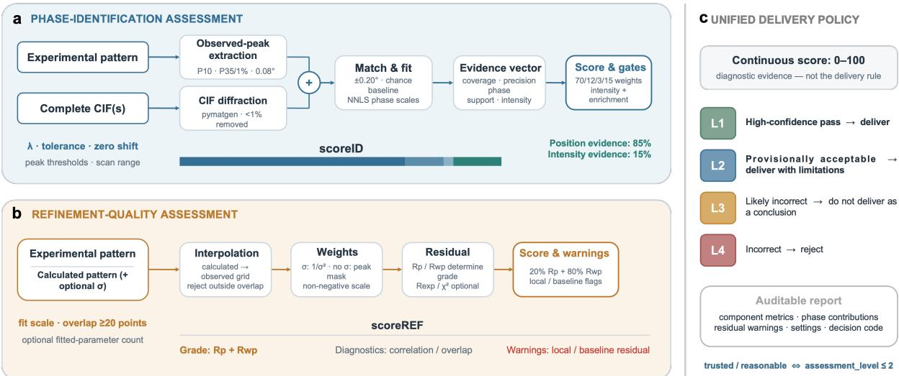  
Figure S3. XRDinspector provides transparent quality assessment for PXRD results. a, Candidate CIF(s) and an ex<sub>p</sub>erimental <sub>p</sub>attern are ali<sub>g</sub>ned to quantif<sub>y p</sub>eak covera<sub>g</sub>e, <sub>p</sub>recision, <sub>p</sub>hase su<sub>pp</sub>ort and intensity agreement. b, Observed and calculated profiles are evaluated using $R _ { p } , R _ { w p }$ <sub>,</sub> <sub>corre</sub>l<sub>a</sub>ti<sub>on,</sub> <sub>over</sub>l<sub>ap</sub> and local-residual diagnostics. c, The unified policy converts these diagnostic scores into four delivery levels, from hi<sub>g</sub>h-confidence deliver<sub>y</sub> (L1) to rejection (L4), and returns an auditable re<sub>p</sub>ort with metrics, <sub>warn</sub>i<sub>ngs</sub> <sub>an</sub>d <sub>se</sub>tti<sub>ngs.</sub>

Th<sub>e</sub> <sub>score</sub> i<sub>s</sub> <sub>con</sub>ti<sub>nuous,</sub> b<sub>u</sub>t <sub>commun</sub>i<sub>ca</sub>ti<sub>on</sub> d<sub>eman</sub>d<sub>s</sub> <sub>ac</sub>ti<sub>ona</sub>bl<sub>e</sub> b<sub>oun</sub>d<sub>ar</sub>i<sub>es.</sub> XRDi<sub>nspec</sub>t<sub>or</sub> <sub>maps</sub> <sub>ev</sub>id<sub>ence</sub> t<sub>o</sub> f<sub>our</sub> d<sub>e</sub>li<sub>very</sub> l<sub>eve</sub>l<sub>s:</sub> hi<sub>g</sub>h<sub>-con</sub>fid<sub>ence</sub> <sub>pass,</sub> <sub>prov</sub>i<sub>s</sub>i<sub>ona</sub>ll<sub>y</sub> <sub>accep</sub>t<sub>a</sub>bl<sub>e,</sub> <sub>uncer</sub>t<sub>a</sub>i<sub>n</sub>/<sub>-</sub> lik<sub>e</sub>l<sub>y</sub> i<sub>ncorrec</sub>t <sub>an</sub>d i<sub>ncorrec</sub>t<sub>.</sub> Th<sub>e</sub> <sub>mapp</sub>i<sub>ng</sub> i<sub>s</sub> d<sub>e</sub>lib<sub>era</sub>t<sub>e</sub>l<sub>y</sub> <sub>conserva</sub>ti<sub>ve:</sub> <sub>a</sub> l<sub>eve</sub>l 1 <sub>or</sub> 2 <sub>conc</sub>l<sub>us</sub>i<sub>on</sub> <sub>can</sub> b<sub>e</sub> d<sub>e</sub>li<sub>vere</sub>d<sub>,</sub> <sub>w</sub>ith li<sub>m</sub>it<sub>a</sub>ti<sub>ons</sub> f<sub>or</sub> l<sub>eve</sub>l 2<sub>;</sub> l<sub>eve</sub>l<sub>s</sub> 3 <sub>an</sub>d 4 <sub>are</sub> <sub>no</sub>t d<sub>e</sub>li<sub>vera</sub>bl<sub>e</sub> <sub>as</sub> <sub>sc</sub>i<sub>en</sub>tifi<sub>c</sub> <sub>conc</sub>l<sub>us</sub>i<sub>ons.</sub> I<sub>n</sub> <sub>a</sub> <sub>mu</sub>lti<sub>p</sub>h<sub>ase</sub> <sub>mo</sub>d<sub>e</sub>l<sub>,</sub> <sub>a</sub> <sub>zero</sub> fitt<sub>e</sub>d <sub>con</sub>t<sub>r</sub>ib<sub>u</sub>ti<sub>on</sub> i<sub>s</sub> d<sub>escr</sub>ib<sub>e</sub>d <sub>as</sub> “<sub>no</sub>t d<sub>e</sub>t<sub>ec</sub>t<sub>e</sub>d <sub>or</sub> b<sub>e</sub>l<sub>ow</sub> d<sub>e</sub>t<sub>ec</sub>ti<sub>on</sub> li<sub>m</sub>it”<sub>,</sub> <sub>no</sub>t <sub>as</sub> <sub>proo</sub>f th<sub>a</sub>t <sub>a</sub> <sub>can</sub>did<sub>a</sub>t<sub>e</sub> i<sub>s</sub> i<sub>ncorrec</sub>t<sub>.</sub>

## Whole-pattern refinement checks

F<sub>or</sub> <sub>re</sub>fi<sub>nemen</sub>t <sub>ou</sub>t<sub>pu</sub>t<sub>s,</sub> th<sub>e</sub> <sub>ca</sub>l<sub>cu</sub>l<sub>a</sub>t<sub>e</sub>d t<sub>race</sub> i<sub>s</sub> i<sub>n</sub>t<sub>erpo</sub>l<sub>a</sub>t<sub>e</sub>d <sub>on</sub>t<sub>o</sub> th<sub>e</sub> <sub>exper</sub>i<sub>men</sub>t<sub>a</sub>l 2� <sub>gr</sub>id<sub>.</sub> E<sub>va</sub>l<sub>ua</sub>ti<sub>on</sub> i<sub>s</sub> bl<sub>oc</sub>k<sub>e</sub>d <sub>w</sub>h<sub>en</sub> th<sub>e</sub> <sub>common</sub> <sub>range</sub> i<sub>s</sub> t<sub>oo</sub> <sub>s</sub>h<sub>or</sub>t<sub>,</sub> <sub>preven</sub>ti<sub>ng</sub> <sub>an</sub> <sub>ar</sub>tifi<sub>c</sub>i<sub>a</sub>ll<sub>y</sub> f<sub>avoura</sub>bl<sub>e</sub> <sub>par</sub>ti<sub>a</sub>l<sub>-range</sub> <sub>compar</sub>i<sub>son.</sub> A <sub>non-nega</sub>ti<sub>ve</sub> <sub>we</sub>i<sub>g</sub>ht<sub>e</sub>d <sub>g</sub>l<sub>o</sub>b<sub>a</sub>l <sub>sca</sub>l<sub>e</sub> f<sub>ac</sub>t<sub>or</sub> <sub>may</sub> b<sub>e</sub> fitt<sub>e</sub>d b<sub>e</sub>f<sub>ore</sub> <sup>com</sup>pu<sup>tin</sup>g $R _ { p } , R _ { w p }$ <sub>an</sub>d <sub>w</sub>h<sub>o</sub>l<sub>e-pa</sub>tt<sub>ern</sub> <sub>corre</sub>l<sub>a</sub>ti<sub>on.</sub> Wh<sub>en</sub> <sub>uncer</sub>t<sub>a</sub>i<sub>n</sub>t<sub>y</sub> <sub>va</sub>l<sub>ues</sub> <sub>are</sub> <sub>supp</sub>li<sub>e</sub>d th<sub>roug</sub>h th<sub>e</sub> P<sub>y</sub>th<sub>on</sub> API<sub>,</sub> $R _ { \mathrm { e x p } } , \chi ^ { 2 }$ <sub>an</sub>d d<sub>egrees</sub> <sub>o</sub>f f<sub>ree</sub>d<sub>om</sub> <sub>are</sub> <sub>a</sub>l<sub>so</sub> <sub>repor</sub>t<sub>e</sub>d<sub>.</sub>

Th<sub>e re</sub>fi<sub>nemen</sub>t <sub>score com</sub>bi<sub>nes a res</sub>id<sub>ua</sub>l <sub>componen</sub>t d<sub>om</sub>i<sub>na</sub>t<sub>e</sub>d b<sub>y</sub> $R _ { w p }$ <sub>w</sub>ith <sub>a corre</sub>l<sub>a</sub>ti<sub>on</sub> <sub>componen</sub>t<sub>.</sub> A <sub>max</sub>i<sub>mum</sub> <sub>re</sub>l<sub>a</sub>ti<sub>ve</sub> <sub>res</sub>id<sub>ua</sub>l fl<sub>ags</sub> l<sub>oca</sub>l di<sub>sagreemen</sub>t <sub>even</sub> <sub>w</sub>h<sub>ere</sub> <sub>a</sub> <sub>g</sub>l<sub>o</sub>b<sub>a</sub>l <sub>score</sub> seems reasonable (Fi<sub>g</sub>. S3 c). The re<sub>p</sub>ort therefore su<sub>pp</sub>orts a com<sub>p</sub>act first <sub>p</sub>ass throu<sub>g</sub>h lar<sub>g</sub>e b<sub>a</sub>t<sub>c</sub>h<sub>es</sub> <sub>o</sub>f <sub>re</sub>fi<sub>nemen</sub>t <sub>expor</sub>t<sub>s</sub> <sub>w</sub>hil<sub>e</sub> <sub>preserv</sub>i<sub>ng</sub> th<sub>e</sub> di<sub>agnos</sub>ti<sub>cs</sub> <sub>nee</sub>d<sub>e</sub>d t<sub>o</sub> i<sub>nspec</sub>t th<sub>e</sub> dif<sub>erence</sub> p<sup>attern</sup>.

## Identification scoring

Si<sub>ng</sub>l<sub>e-p</sub>h<sub>ase can</sub>did<sub>a</sub>t<sub>es are score</sub>d b<sub>y com</sub>bi<sub>n</sub>i<sub>ng o</sub>b<sub>serve</sub>d<sub>-pea</sub>k <sub>coverage, pre</sub>di<sub>c</sub>t<sub>e</sub>d<sub>-pos</sub>iti<sub>on</sub> <sub>prec</sub>i<sub>s</sub>i<sub>on,</sub> <sub>an</sub>d <sub>pos</sub>iti<sub>ona</sub>l <sub>suppor</sub>t<sub>:</sub>

$$
S _ { \mathrm { i d } } ^ { ( 1 ) } = \kappa _ { \mathrm { i d } } \left( \alpha _ { 1 } C _ { \mathrm { o b s } } + \beta _ { 1 } P _ { \mathrm { p r e d } } + \gamma _ { 1 } S _ { \mathrm { p h a s e } } \right) .\tag{S102}
$$

F<sub>or</sub> <sub>mu</sub>lti<sub>p</sub>h<sub>ase</sub> <sub>can</sub>did<sub>a</sub>t<sub>es,</sub> th<sub>e</sub> <sub>score</sub> <sub>a</sub>dditi<sub>ona</sub>ll<sub>y</sub> <sub>accoun</sub>t<sub>s</sub> f<sub>or</sub> <sub>re</sub>l<sub>a</sub>ti<sub>ve-</sub>i<sub>n</sub>t<sub>ens</sub>it<sub>y</sub> <sub>agreemen</sub>t<sub>:</sub>

$$
S _ { \mathrm { i d } } ^ { ( m ) } = \kappa _ { \mathrm { i d } } \left( \alpha _ { m } C _ { \mathrm { o b s } } + \beta _ { m } P _ { \mathrm { p r e d } } + \gamma _ { m } S _ { \mathrm { p h a s e } } + \delta _ { m } A _ { \mathrm { i n t } } \right) .\tag{S103}
$$

H<sub>ere,</sub> $C _ { \mathrm { o b s } }$ d<sub>eno</sub>t<sub>es</sub> i<sub>n</sub>t<sub>ens</sub>it<sub>y-we</sub>i<sub>g</sub>ht<sub>e</sub>d <sub>o</sub>b<sub>serve</sub>d<sub>-pea</sub>k <sub>coverage,</sub> $P _ { \mathrm { p r e d } }$ <sub>pre</sub>di<sub>c</sub>t<sub>e</sub>d<sub>-pos</sub>iti<sub>on</sub> <sub>prec</sub>i<sub>s</sub>i<sub>on,</sub> $S _ { \mathrm { p h a s e } }$ mean <sub>p</sub>er-<sub>p</sub><sup>h</sup>ase <sub>p</sub>os<sup>i</sup>t<sup>i</sup>ona<sup>l</sup> su<sub>pp</sub>ort, an<sup>d</sup> $A _ { \mathrm { i n t } }$ <sub>non-nega</sub>ti<sub>ve</sub> <sub>re</sub>l<sub>a</sub>ti<sub>ve-</sub>i<sub>n</sub>t<sub>ens</sub>it<sub>y</sub> <sub>agreemen</sub>t<sub>.</sub> Th<sub>e</sub> <sub>coe</sub>fi<sub>c</sub>i<sub>en</sub>t<sub>s</sub> <sub>are</sub> <sub>non-nega</sub>ti<sub>ve</sub> <sub>an</sub>d <sub>norma</sub>li<sub>ze</sub>d <sub>w</sub>ithi<sub>n</sub> <sub>eac</sub>h <sub>scor</sub>i<sub>ng</sub> <sub>sc</sub>h<sub>eme.</sub> Th<sub>e</sub> d<sub>e</sub>f<sub>au</sub>lt X<sub>-ray</sub> <sub>wave</sub>l<sub>eng</sub>th <sub>an</sub>d <sub>pos</sub>iti<sub>ona</sub>l t<sub>o</sub>l<sub>erance</sub> <sub>are</sub> d<sub>eno</sub>t<sub>e</sub>d b<sub>y</sub> $\lambda _ { 0 }$ <sub>an</sub>d $\Delta _ { 2 \theta }$ , res<sub>p</sub>ect<sup>i</sup>ve<sup>l</sup><sub>y</sub>.

## Refinement scoring

R<sub>e</sub>fi<sub>nemen</sub>t <sub>qua</sub>lit<sub>y</sub> i<sub>s</sub> <sub>repor</sub>t<sub>e</sub>d <sub>us</sub>i<sub>ng</sub>

$$
R _ { p } = \frac { \sum _ { i } \left| y _ { \mathrm { o b s } , i } - y _ { \mathrm { c a l c } , i } \right| } { \sum _ { i } \left| y _ { \mathrm { o b s } , i } \right| } , \qquad R _ { w p } = \left[ \frac { \sum _ { i } w _ { i } ( y _ { \mathrm { o b s } , i } - y _ { \mathrm { c a l c } , i } ) ^ { 2 } } { \sum _ { i } w _ { i } y _ { \mathrm { o b s } , i } ^ { 2 } } \right] ^ { 1 / 2 } .\tag{S104}
$$

Wh<sub>en</sub> <sub>measuremen</sub>t <sub>uncer</sub>t<sub>a</sub>i<sub>n</sub>ti<sub>es</sub> <sub>are</sub> <sub>unava</sub>il<sub>a</sub>bl<sub>e,</sub> th<sub>e</sub> <sub>we</sub>i<sub>g</sub>ht<sub>s</sub> $w _ { i }$ <sub>are</sub> <sub>es</sub>ti<sub>ma</sub>t<sub>e</sub>d <sub>un</sub>d<sub>er</sub> <sub>an</sub> <sub>approx</sub>i<sub>ma</sub>t<sub>e</sub> P<sub>o</sub>i<sub>sson</sub> <sub>no</sub>i<sub>se</sub> <sub>mo</sub>d<sub>e</sub>l<sub>.</sub> Th<sub>e</sub> <sub>re</sub>fi<sub>nemen</sub>t <sub>score</sub> <sub>com</sub>bi<sub>nes</sub> <sub>a</sub> <sub>res</sub>id<sub>ua</sub>l<sub>-</sub>b<sub>ase</sub>d t<sub>erm</sub> <sub>w</sub>ith th<sub>e</sub> P<sub>earson</sub> <sub>corre</sub>l<sub>a</sub>ti<sub>on</sub> <sub>�</sub> <sub>a</sub>ft<sub>er</sub> i<sub>n</sub>t<sub>erpo</sub>l<sub>a</sub>ti<sub>on</sub> <sub>an</sub>d<sub>,</sub> <sub>w</sub>h<sub>ere</sub> <sub>app</sub>li<sub>ca</sub>bl<sub>e,</sub> <sub>non-nega</sub>ti<sub>ve</sub> <sub>sca</sub>li<sub>ng:</sub>

$$
S _ { \mathrm { r e f } } = \kappa _ { \mathrm { r e f } } \left[ \eta \exp \left( - \frac { R _ { w p } } { \tau } \right) + \left( 1 - \eta \right) \frac { r + 1 } { 2 } \right] ,\tag{S105}
$$

<sub>w</sub>h<sub>ere</sub> $\eta$ <sub>an</sub>d $\tau$ are scor<sup>i</sup>n<sub>g</sub> <sub>p</sub>arameters an<sup>d</sup> $K _ { \mathrm { r e f } }$ <sub>se</sub>t<sub>s</sub> th<sub>e</sub> <sub>score</sub> <sub>sca</sub>l<sub>e.</sub>

## 1.8 Gan Jiang enables evidence-governed refinement across FullProf and GSAS-II

W<sub>e</sub> d<sub>eve</sub>l<sub>ope</sub>d <sub>an</sub> <sub>au</sub>dit<sub>a</sub>bl<sub>e</sub> <sub>wor</sub>kfl<sub>ow</sub> i<sub>n</sub> <sub>w</sub>hi<sub>c</sub>h G<sub>an</sub> Ji<sub>ang</sub> <sub>coor</sub>di<sub>na</sub>t<sub>es</sub> <sub>re</sub>fi<sub>nemen</sub>t <sub>w</sub>hil<sub>e</sub> th<sub>e</sub> <sub>crys</sub>t<sub>a</sub>ll<sub>ograp</sub>hi<sub>c</sub> <sub>eng</sub>i<sub>nes</sub> <sub>per</sub>f<sub>orm</sub> th<sub>e</sub> <sub>numer</sub>i<sub>ca</sub>l <sub>op</sub>ti<sub>m</sub>i<sub>za</sub>ti<sub>on.</sub> F<sub>or</sub> <sub>eac</sub>h t<sub>as</sub>k<sub>,</sub> G<sub>an</sub> Ji<sub>ang</sub> <sub>exam</sub>i<sub>nes</sub> the difraction data, instrument metadata, candidate structures, and scientific objective; formulates <sub>a</sub> f<sub>ocuse</sub>d<sub>,</sub> t<sub>es</sub>t<sub>a</sub>bl<sub>e</sub> <sub>re</sub>fi<sub>nemen</sub>t h<sub>ypo</sub>th<sub>es</sub>i<sub>s;</sub> <sub>se</sub>l<sub>ec</sub>t<sub>s</sub> <sub>an</sub> <sub>appropr</sub>i<sub>a</sub>t<sub>e</sub> <sub>eng</sub>i<sub>ne;</sub> <sub>an</sub>d i<sub>n</sub>t<sub>erpre</sub>t<sub>s</sub> th<sub>e</sub> <sub>resu</sub>lti<sub>ng</sub> <sub>me</sub>t<sub>r</sub>i<sub>cs,</sub> <sub>res</sub>id<sub>ua</sub>l <sub>pro</sub>fil<sub>es,</sub> <sub>an</sub>d <sub>re</sub>fi<sub>ne</sub>d <sub>parame</sub>t<sub>ers.</sub> F<sub>u</sub>llP<sub>ro</sub>f <sub>an</sub>d GSAS<sub>-</sub>II <sub>comp</sub>l<sub>emen</sub>t our WPEM (P<sub>y</sub>X<sub>p</sub>lore) en<sub>g</sub>ine, with each selected en<sub>g</sub>ine retainin<sub>g</sub> res<sub>p</sub>onsibilit<sub>y</sub> for <sub>p</sub>rofile <sub>ca</sub>l<sub>cu</sub>l<sub>a</sub>ti<sub>on</sub> <sub>an</sub>d l<sub>eas</sub>t<sub>-squares</sub> <sub>op</sub>ti<sub>m</sub>i<sub>za</sub>ti<sub>on.</sub> Th<sub>e</sub> i<sub>n</sub>t<sub>egra</sub>ti<sub>on</sub> <sub>o</sub>f F<sub>u</sub>llP<sub>ro</sub>f <sub>an</sub>d GSAS<sub>-</sub>II i<sub>n</sub>t<sub>o</sub> thi<sub>s</sub> <sub>wor</sub>kfl<sub>ow</sub> i<sub>s</sub> d<sub>escr</sub>ib<sub>e</sub>d b<sub>e</sub>l<sub>ow.</sub>

## Controlled hypothesis testing with FullProf

Thi<sub>s</sub> b<sub>ranc</sub>h t<sub>arge</sub>t<sub>s pow</sub>d<sub>er-</sub>dif<sub>rac</sub>ti<sub>on</sub> d<sub>a</sub>t<sub>a</sub> f<sub>or w</sub>hi<sub>c</sub>h th<sub>e can</sub>did<sub>a</sub>t<sub>e p</sub>h<sub>ase se</sub>t i<sub>s</sub> k<sub>nown or</sub> su<sub>pp</sub>orted b<sub>y</sub> <sub>p</sub>rior identification evidence. The in<sub>p</sub>uts com<sub>p</sub>rise a difraction <sub>p</sub>attern (for exam<sub>p</sub>le, .xy), a structural model (.cif or .pcr), instrument metadata and a stated refinement objective. G<sub>an</sub> Ji<sub>ang</sub> <sub>au</sub>dit<sub>s</sub> th<sub>ese</sub> i<sub>npu</sub>t<sub>s</sub> <sub>an</sub>d <sub>cons</sub>t<sub>ruc</sub>t<sub>s</sub> <sub>a</sub> <sub>narrow</sub>l<sub>y</sub> <sub>scope</sub>d PCR b<sub>ranc</sub>h f<sub>or</sub> th<sub>e</sub> <sub>curren</sub>t h<sub>ypo</sub>th<sub>es</sub>i<sub>s.</sub> Th<sub>e</sub> <sub>au</sub>t<sub>oma</sub>ti<sub>on</sub> l<sub>ayer</sub> th<sub>en</sub> <sub>crea</sub>t<sub>es</sub> <sub>an</sub> i<sub>so</sub>l<sub>a</sub>t<sub>e</sub>d <sub>wor</sub>ki<sub>ng</sub> di<sub>rec</sub>t<sub>ory,</sub> <sub>cop</sub>i<sub>es</sub> th<sub>e</sub> i<sub>mmu</sub>t<sub>a</sub>bl<sub>e</sub> in<sub>p</sub>uts, invokes the FullProf fp2k backend, <sub>p</sub>reserves the execution lo<sub>g</sub>s and <sub>p</sub>arses the refinement <sub>me</sub>t<sub>r</sub>i<sub>cs.</sub> G<sub>an</sub> Ji<sub>ang</sub> <sub>rev</sub>i<sub>ews</sub> th<sub>ese</sub> <sub>ou</sub>t<sub>pu</sub>t<sub>s</sub> b<sub>e</sub>f<sub>ore</sub> d<sub>ec</sub>idi<sub>ng</sub> <sub>w</sub>h<sub>e</sub>th<sub>er</sub> t<sub>o</sub> <sub>accep</sub>t th<sub>e</sub> <sub>c</sub>h<sub>ange,</sub> <sub>rever</sub>t it <sub>or</sub> f<sub>ormu</sub>l<sub>a</sub>t<sub>e</sub> th<sub>e</sub> <sub>nex</sub>t <sub>re</sub>fi<sub>nemen</sub>t <sub>s</sub>t<sub>ep.</sub>

Table S6. Roles in the Gan Jiang–FullProf refinement workflow.
<table><tr><td>Component</td><td>Role</td></tr><tr><td>Experiment Gan Jiang</td><td>Provides diffraction data, structural candidates and instrument metadata.</td></tr><tr><td>Automation</td><td>Audits inputs, defines hypotheses, evaluates outputs and reports conclusions.</td></tr><tr><td>FullProf</td><td>Isolates each run, executes the backend and records logs. Calculates diffraction profiles and performs least-squares refinement.</td></tr></table>

Fi<sub>gure</sub> S4 <sub>summar</sub>i<sub>zes</sub> th<sub>e</sub> <sub>opera</sub>ti<sub>ona</sub>l l<sub>oop,</sub> <sub>w</sub>hi<sub>c</sub>h <sub>separa</sub>t<sub>es</sub> d<sub>a</sub>t<sub>a</sub> <sub>s</sub>t<sub>ewar</sub>d<sub>s</sub>hi<sub>p,</sub> <sub>numer</sub>i<sub>ca</sub>l <sub>execu</sub>ti<sub>on</sub> <sub>an</sub>d <sub>sc</sub>i<sub>en</sub>tifi<sub>c</sub> <sub>accep</sub>t<sub>ance.</sub> E<sub>ac</sub>h it<sub>era</sub>ti<sub>on</sub> t<sub>es</sub>t<sub>s</sub> <sub>one</sub> <sub>exp</sub>li<sub>c</sub>it h<sub>ypo</sub>th<sub>es</sub>i<sub>s,</sub> <sub>suc</sub>h <sub>as</sub> <sub>re</sub>l<sub>eas</sub>i<sub>ng</sub> th<sub>e</sub> b<sub>ac</sub>k<sub>groun</sub>d <sub>coe</sub>fi<sub>c</sub>i<sub>en</sub>t<sub>s</sub> <sub>or</sub> i<sub>n</sub>t<sub>ro</sub>d<sub>uc</sub>i<sub>ng</sub> <sub>a</sub> <sub>s</sub>i<sub>ng</sub>l<sub>e</sub> <sub>pre</sub>f<sub>erre</sub>d<sub>-or</sub>i<sub>en</sub>t<sub>a</sub>ti<sub>on</sub> di<sub>rec</sub>ti<sub>on.</sub> G<sub>an</sub> Ji<sub>ang</sub> <sub>avo</sub>id<sub>s</sub> i<sub>n</sub>iti<sub>a</sub>ll<sub>y</sub> <sub>re</sub>l<sub>eas</sub>i<sub>ng</sub> <sub>s</sub>t<sub>rong</sub>l<sub>y</sub> <sub>corre</sub>l<sub>a</sub>t<sub>e</sub>d <sub>quan</sub>titi<sub>es</sub> t<sub>oge</sub>th<sub>er;</sub> f<sub>or</sub> <sub>examp</sub>l<sub>e,</sub> it <sub>s</sub>t<sub>a</sub>bili<sub>zes</sub> th<sub>e</sub> <sub>g</sub>l<sub>o</sub>b<sub>a</sub>l <sub>pea</sub>k<sub>-pos</sub>iti<sub>on</sub> <sub>correc</sub>ti<sub>on</sub> b<sub>e</sub>f<sub>ore</sub> <sub>re</sub>fi<sub>n</sub>i<sub>ng</sub> th<sub>e</sub> <sub>un</sub>it<sub>-ce</sub>ll <sub>parame</sub>t<sub>ers.</sub> It th<sub>en</sub> <sub>procee</sub>d<sub>s</sub> th<sub>roug</sub>h th<sub>e</sub> f<sub>o</sub>ll<sub>ow</sub>i<sub>ng</sub> <sub>revers</sub>ibl<sub>e</sub> <sub>s</sub>t<sub>ages</sub> <sub>an</sub>d i<sub>nspec</sub>t<sub>s</sub> th<sub>e</sub> <sub>o</sub>b<sub>serve</sub>d<sub>,</sub> <sub>ca</sub>l<sub>cu</sub>l<sub>a</sub>t<sub>e</sub>d <sub>an</sub>d dif<sub>erence</sub> <sub>pro</sub>fil<sub>es</sub> <sub>a</sub>ft<sub>er</sub> eac<sup>h</sup> sta<sub>g</sub>e.

1. Preflight. Verify the data link, scan range, wavelength, space group, atom types and phase li<sub>s</sub>t<sub>.</sub> A<sub>n</sub> <sub>un</sub>k<sub>nown</sub> <sub>samp</sub>l<sub>e</sub> fi<sub>rs</sub>t <sub>requ</sub>i<sub>res</sub> <sub>pea</sub>k <sub>ana</sub>l<sub>ys</sub>i<sub>s,</sub> i<sub>n</sub>d<sub>ex</sub>i<sub>ng</sub> <sub>or</sub> <sub>p</sub>h<sub>ase-searc</sub>h <sub>ev</sub>id<sub>ence.</sub>

2. Scale and global position. With the structural, cell and profile model fixed, fit scale. If th<sub>e</sub> <sub>res</sub>id<sub>ua</sub>l <sub>suppor</sub>t<sub>s</sub> <sub>a</sub> <sub>common</sub> <sub>pos</sub>iti<sub>on</sub> <sub>s</sub>hift<sub>,</sub> t<sub>es</sub>t <sub>exac</sub>tl<sub>y</sub> <sub>one</sub> <sub>g</sub>l<sub>o</sub>b<sub>a</sub>l <sub>correc</sub>ti<sub>on</sub> <sub>an</sub>d h<sub>o</sub>ld <sub>compe</sub>ti<sub>ng</sub> <sub>correc</sub>ti<sub>ons</sub> fi<sub>xe</sub>d<sub>.</sub>

3. Background, cell and profile. Begin with the smallest smooth background model; refine <sub>ce</sub>ll <sub>parame</sub>t<sub>ers</sub> <sub>on</sub>l<sub>y</sub> <sub>a</sub>ft<sub>er</sub> th<sub>e</sub> <sub>g</sub>l<sub>o</sub>b<sub>a</sub>l <sub>pos</sub>iti<sub>on</sub> i<sub>s</sub> <sub>s</sub>t<sub>a</sub>bl<sub>e;</sub> th<sub>en</sub> <sub>a</sub>dd <sub>on</sub>l<sub>y</sub> th<sub>e</sub> <sub>pea</sub>k<sub>-w</sub>idth<sub>,</sub> <sub>s</sub>h<sub>ape</sub> <sub>or</sub> <sub>asymme</sub>t<sub>ry</sub> t<sub>erms</sub> <sub>suppor</sub>t<sub>e</sub>d b<sub>y</sub> th<sub>e</sub> <sub>res</sub>id<sub>ua</sub>l<sub>.</sub>

4. Structure and specimen efects. Release coordinates, constrained occupancies, preferred <sub>or</sub>i<sub>en</sub>t<sub>a</sub>ti<sub>on</sub> <sub>or</sub> <sub>s</sub>i<sub>ze</sub>/<sub>s</sub>t<sub>ra</sub>i<sub>n</sub> <sub>on</sub>l<sub>y</sub> <sub>w</sub>h<sub>en</sub> <sub>reso</sub>l<sub>u</sub>ti<sub>on,</sub> <sub>coun</sub>ti<sub>ng</sub> <sub>s</sub>t<sub>a</sub>ti<sub>s</sub>ti<sub>cs</sub> <sub>an</sub>d <sub>c</sub>h<sub>em</sub>i<sub>s</sub>t<sub>ry</sub> <sub>suppor</sub>t th<sub>e</sub>i<sub>r</sub> id<sub>en</sub>tifi<sub>a</sub>bilit<sub>y.</sub> T<sub>es</sub>t <sub>one</sub> <sub>e</sub>f<sub>ec</sub>t <sub>a</sub>t <sub>a</sub> ti<sub>me.</sub>

5. Restricted final cycle. Jointly release only parameters that were stable in earlier stages. R<sub>ever</sub>t <sub>an</sub>d <sub>s</sub>i<sub>mp</sub>lif<sub>y</sub> if <sub>va</sub>l<sub>ues</sub> hit b<sub>oun</sub>d<sub>s,</sub> d<sub>epen</sub>d <sub>on</sub> th<sub>e</sub> <sub>s</sub>t<sub>ar</sub>ti<sub>ng</sub> <sub>po</sub>i<sub>n</sub>t <sub>or</sub> <sub>v</sub>i<sub>o</sub>l<sub>a</sub>t<sub>e</sub> <sub>c</sub>h<sub>em</sub>i<sub>s</sub>t<sub>ry.</sub>

## Reproducible refinement planning with GSAS-II

Th<sub>e</sub> GSAS<sub>-</sub>II br<sub>a</sub>n<sub>c</sub>h <sub>co</sub>nn<sub>ec</sub>t<sub>s</sub> th<sub>e</sub> <sub>sa</sub>m<sub>e</sub> r<sub>easo</sub>nin<sub>g</sub> l<sub>oop</sub> t<sub>o</sub> th<sub>e</sub> <sub>sc</sub>ri<sub>p</sub>t<sub>a</sub>bl<sub>e</sub> GSAS<sub>-</sub>II $\mathsf { A P I } ^ { 2 7 }$ <sub>.</sub> It<sub>s</sub> in<sub>pu</sub>t<sub>s,</sub> i<sub>nc</sub>l<sub>u</sub>di<sub>ng</sub> th<sub>e</sub> dif<sub>rac</sub>ti<sub>on</sub> d<sub>a</sub>t<sub>a,</sub> i<sub>ns</sub>t<sub>rumen</sub>t <sub>parame</sub>t<sub>er</sub> fil<sub>e,</sub> <sub>an</sub>d <sub>one</sub> <sub>or</sub> <sub>more</sub> <sub>s</sub>t<sub>ruc</sub>t<sub>ura</sub>l CIF<sub>s,</sub> <sub>rema</sub>i<sub>n</sub> immutable (Fi<sub>g</sub>. S4). For ever<sub>y</sub> attem<sub>p</sub>t, Gan Jian<sub>g</sub> creates a new isolated workin<sub>g</sub> director<sub>y</sub> and records the intended model chan<sub>g</sub>es in refinement\_plan.json. The automation la<sub>y</sub>er returns both a GSAS-II <sub>p</sub>roject and refinement\_result.json; the latter records the execution state, <sub>p</sub>l<sub>an,</sub> fil<sub>e</sub> <sub>pa</sub>th<sub>s,</sub> fit <sub>me</sub>t<sub>r</sub>i<sub>cs</sub> <sub>an</sub>d<sub>,</sub> <sub>w</sub>h<sub>en</sub> <sub>a</sub> <sub>run</sub> f<sub>a</sub>il<sub>s,</sub> th<sub>e</sub> <sub>error</sub> t<sub>race</sub>b<sub>ac</sub>k<sub>.</sub> C<sub>onsequen</sub>tl<sub>y,</sub> <sub>eac</sub>h <sub>ac</sub>ti<sub>on</sub> <sub>can</sub> b<sub>e</sub> <sub>recons</sub>t<sub>ruc</sub>t<sub>e</sub>d i<sub>n</sub>d<sub>epen</sub>d<sub>en</sub>tl<sub>y</sub> <sub>o</sub>f th<sub>e</sub> di<sub>a</sub>l<sub>ogue</sub> th<sub>a</sub>t i<sub>n</sub>iti<sub>a</sub>t<sub>e</sub>d it<sub>.</sub>

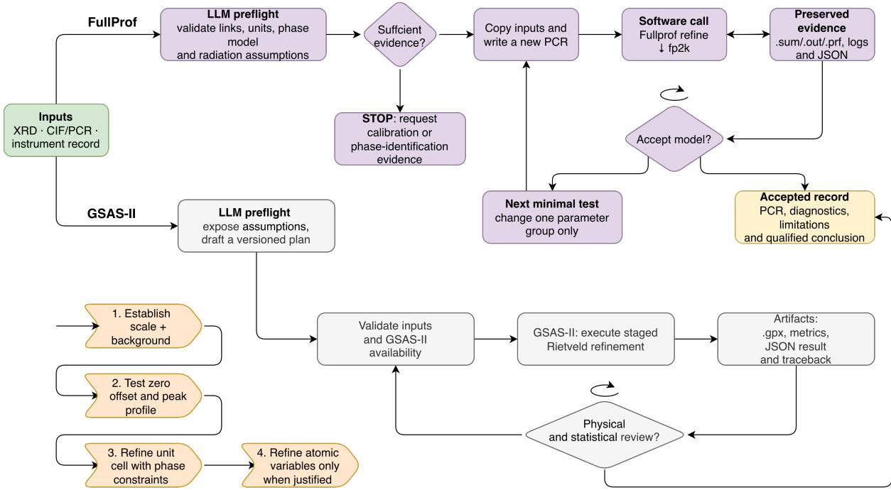  
Figure S4. Evidence-governed refinement workflow for the FullProf and GSAS-II branches. Experi<sub>men</sub>t<sub>a</sub>l XRD d<sub>a</sub>t<sub>a, s</sub>t<sub>ruc</sub>t<sub>ura</sub>l CIF<sub>s or</sub> PCR fil<sub>es, an</sub>d i<sub>ns</sub>t<sub>rumen</sub>t <sub>recor</sub>d<sub>s</sub> fi<sub>rs</sub>t <sub>un</sub>d<sub>ergo</sub> l<sub>anguage-mo</sub>d<sub>e</sub>l <sub>pre</sub>fli<sub>g</sub>ht <sub>c</sub>h<sub>ec</sub>k<sub>s</sub> <sub>o</sub>f li<sub>n</sub>k<sub>s,</sub> <sub>un</sub>it<sub>s,</sub> <sub>p</sub>h<sub>ase</sub> <sub>mo</sub>d<sub>e</sub>l <sub>an</sub>d <sub>ra</sub>di<sub>a</sub>ti<sub>on</sub> <sub>assump</sub>ti<sub>ons.</sub> I<sub>nsu</sub>fi<sub>c</sub>i<sub>en</sub>t <sub>ev</sub>id<sub>ence</sub> t<sub>r</sub>i<sub>ggers</sub> a request for calibration or <sub>p</sub>hase-identification information. The FullProf branch (to<sub>p</sub>) co<sub>p</sub>ies in<sub>p</sub>uts i<sub>n</sub>t<sub>o</sub> <sub>a</sub> <sub>new</sub> PCR fil<sub>e,</sub> <sub>per</sub>f<sub>orms</sub> <sub>re</sub>fi<sub>nemen</sub>t <sub>an</sub>d <sub>e</sub>ith<sub>er</sub> <sub>preserves</sub> th<sub>e</sub> <sub>resu</sub>lti<sub>ng</sub> <sub>pro</sub>fil<sub>es,</sub> l<sub>ogs</sub> <sub>an</sub>d JSON summar<sub>y</sub> or <sub>p</sub>roceeds to the next minimal <sub>p</sub>arameter-<sub>g</sub>rou<sub>p</sub> test. The GSAS-II branch (bottom) validates its staged inputs, executes Rietveld refinement, and subjects the result to physical and statistical review before recording project files, metrics and tracebacks. Yellow chevrons denote the ordered refinement <sub>s</sub>t<sub>ages;</sub> di<sub>amon</sub>d<sub>s</sub> d<sub>eno</sub>t<sub>e</sub> d<sub>ec</sub>i<sub>s</sub>i<sub>on ga</sub>t<sub>es.</sub> A<sub>ccep</sub>t<sub>e</sub>d <sub>ana</sub>l<sub>yses re</sub>t<sub>a</sub>i<sub>n</sub> di<sub>agnos</sub>ti<sub>cs,</sub> li<sub>m</sub>it<sub>a</sub>ti<sub>ons an</sub>d <sub>a qua</sub>lifi<sub>e</sub>d <sub>conc</sub>l<sub>us</sub>i<sub>on.</sub>

A<sub>cross</sub> b<sub>o</sub>th b<sub>ranc</sub>h<sub>es,</sub> G<sub>an</sub> Ji<sub>ang</sub> <sub>serves</sub> <sub>as</sub> th<sub>e</sub> <sub>p</sub>l<sub>anner</sub> b<sub>e</sub>t<sub>ween</sub> th<sub>e</sub> <sub>sc</sub>i<sub>en</sub>ti<sub>s</sub>t <sub>an</sub>d th<sub>e</sub> d<sub>e</sub>t<sub>erm</sub>i<sub>n-</sub> i<sub>s</sub>ti<sub>c re</sub>fi<sub>nemen</sub>t <sub>eng</sub>i<sub>ne.</sub> It <sub>ma</sub>i<sub>n</sub>t<sub>a</sub>i<sub>ns a</sub> l<sub>e</sub>d<sub>ger o</sub>f <sub>w</sub>h<sub>a</sub>t <sub>c</sub>h<sub>ange</sub>d<sub>, w</sub>h<sub>y</sub> th<sub>e c</sub>h<sub>ange was</sub> i<sub>n</sub>t<sub>ro</sub>d<sub>uce</sub>d <sub>an</sub>d <sub>w</sub>hi<sub>c</sub>h di<sub>agnos</sub>ti<sub>c</sub> <sub>was</sub> <sub>expec</sub>t<sub>e</sub>d t<sub>o</sub> i<sub>mprove.</sub> Fit <sub>s</sub>t<sub>a</sub>ti<sub>s</sub>ti<sub>cs</sub> <sub>suc</sub>h <sub>as</sub> $R _ { w p }$ <sub>are</sub> t<sub>rea</sub>t<sub>e</sub>d <sub>as</sub> di<sub>agnos</sub>ti<sub>cs</sub> <sub>ra</sub>th<sub>er</sub> th<sub>an</sub> fi<sub>na</sub>l <sub>ver</sub>di<sub>c</sub>t<sub>s.</sub> A<sub>ccep</sub>t<sub>ance</sub> <sub>a</sub>dditi<sub>ona</sub>ll<sub>y</sub> <sub>requ</sub>i<sub>res</sub> i<sub>nspec</sub>ti<sub>on</sub> <sub>o</sub>f th<sub>e</sub> <sub>res</sub>id<sub>ua</sub>l <sub>pro</sub>fil<sub>e,</sub> <sub>p</sub>h<sub>ase</sub> id<sub>en</sub>tit<sub>y,</sub> <sub>space</sub> <sub>group,</sub> <sub>compos</sub>iti<sub>on,</sub> <sub>parame</sub>t<sub>er</sub> <sub>uncer</sub>t<sub>a</sub>i<sub>n</sub>ti<sub>es</sub> <sub>an</sub>d th<sub>e</sub> <sub>p</sub>h<sub>ys</sub>i<sub>ca</sub>l <sub>p</sub>l<sub>aus</sub>ibilit<sub>y</sub> <sub>o</sub>f l<sub>a</sub>tti<sub>ce</sub> <sub>parame</sub>t<sub>ers,</sub> di<sub>sp</sub>l<sub>acemen</sub>t <sub>parame</sub>t<sub>ers</sub> <sub>an</sub>d <sub>s</sub>it<sub>e</sub> <sub>occupanc</sub>i<sub>es.</sub> G<sub>an</sub> Ji<sub>ang</sub> <sub>a</sub>l<sub>so</sub> fl<sub>ags</sub> <sub>parame</sub>t<sub>ers</sub> th<sub>a</sub>t <sub>are</sub> <sub>s</sub>t<sub>rong</sub>l<sub>y</sub> <sub>corre</sub>l<sub>a</sub>t<sub>e</sub>d<sub>,</sub> <sub>sens</sub>iti<sub>ve</sub> t<sub>o</sub> i<sub>n</sub>iti<sub>a</sub>li<sub>za</sub>ti<sub>on</sub> <sub>or</sub> <sub>una</sub>bl<sub>e</sub> t<sub>o</sub> <sub>accoun</sub>t f<sub>or</sub> <sub>sys</sub>t<sub>ema</sub>ti<sub>c</sub> <sub>m</sub>i<sub>s</sub>fit<sub>.</sub> Thi<sub>s</sub> <sub>ev</sub>id<sub>ence-governe</sub>d <sub>sequenc</sub>i<sub>ng</sub> <sub>preven</sub>t<sub>s</sub> <sub>re</sub>d<sub>uc</sub>ti<sub>ons</sub> i<sub>n</sub> $R _ { w p }$ <sub>o</sub>bt<sub>a</sub>i<sub>ne</sub>d th<sub>roug</sub>h <sub>non-p</sub>h<sub>ys</sub>i<sub>ca</sub>l compensation while producing a complete, reviewable record of the refinement trajectory.

## Supplementary Note 2 Supplementary results

## 2.1 Gan Jiang API

## Agent mode and direct CLI access.

G<sub>an</sub> Ji<sub>ang</sub> i<sub>s</sub> <sub>pr</sub>i<sub>mar</sub>il<sub>y</sub> d<sub>es</sub>i<sub>gne</sub>d <sub>as</sub> <sub>an</sub> <sub>au</sub>t<sub>onomous</sub> dif<sub>rac</sub>ti<sub>on-ana</sub>l<sub>ys</sub>i<sub>s</sub> <sub>agen</sub>t th<sub>a</sub>t <sub>coor</sub>di<sub>na</sub>t<sub>es</sub> <sub>spec</sub>i<sub>a</sub>li<sub>se</sub>d <sub>sc</sub>i<sub>en</sub>tifi<sub>c</sub> t<sub>oo</sub>l<sub>s</sub> th<sub>roug</sub>h <sub>execu</sub>t<sub>a</sub>bl<sub>e s</sub>kill<sub>s an</sub>d <sub>ev</sub>id<sub>ence-gu</sub>id<sub>e</sub>d d<sub>ec</sub>i<sub>s</sub>i<sub>on po</sub>li<sub>c</sub>i<sub>es.</sub> I<sub>n</sub> the standard agent mode, a user provides difraction data together with a scientific objective, <sub>an</sub>d G<sub>an</sub> Ji<sub>ang</sub> d<sub>e</sub>t<sub>erm</sub>i<sub>nes</sub> <sub>w</sub>hi<sub>c</sub>h <sub>opera</sub>ti<sub>ons</sub> t<sub>o</sub> <sub>per</sub>f<sub>orm,</sub> h<sub>ow</sub> th<sub>e</sub> i<sub>n</sub>t<sub>erme</sub>di<sub>a</sub>t<sub>e</sub> <sub>resu</sub>lt<sub>s</sub> <sub>s</sub>h<sub>ou</sub>ld b<sub>e</sub> i<sub>n</sub>t<sub>erpre</sub>t<sub>e</sub>d<sub>,</sub> <sub>an</sub>d <sub>w</sub>hi<sub>c</sub>h <sub>su</sub>b<sub>sequen</sub>t <sub>ana</sub>l<sub>ys</sub>i<sub>s</sub> <sub>s</sub>t<sub>eps</sub> <sub>are</sub> <sub>requ</sub>i<sub>re</sub>d<sub>.</sub>

I<sub>n</sub> <sub>a</sub>dditi<sub>on</sub> t<sub>o</sub> thi<sub>s</sub> <sub>agen</sub>t<sub>-</sub>b<sub>ase</sub>d i<sub>n</sub>t<sub>erac</sub>ti<sub>on,</sub> <sub>we</sub> <sub>expose</sub> <sub>a</sub> <sub>su</sub>b<sub>se</sub>t <sub>o</sub>f th<sub>e</sub> <sub>compu</sub>t<sub>a</sub>ti<sub>ona</sub>l <sub>capa</sub>biliti<sub>es</sub> i<sub>n</sub>t<sub>egra</sub>t<sub>e</sub>d i<sub>n</sub> G<sub>an</sub> Ji<sub>ang</sub> f<sub>or</sub> di<sub>rec</sub>t <sub>programma</sub>ti<sub>c</sub> <sub>use.</sub> Th<sub>ese</sub> <sub>capa</sub>biliti<sub>es</sub> <sub>can</sub> b<sub>e</sub> <sub>accesse</sub>d th<sub>roug</sub>h a command-line interface (CLI), <sub>p</sub>rovidin<sub>g</sub> an alternative mode in which the caller ex<sub>p</sub>licitl<sub>y</sub> <sub>se</sub>l<sub>ec</sub>t<sub>s</sub> i<sub>n</sub>di<sub>v</sub>id<sub>ua</sub>l <sub>opera</sub>ti<sub>ons.</sub> Th<sub>e un</sub>d<sub>er</sub>l<sub>y</sub>i<sub>ng</sub> dif<sub>rac</sub>ti<sub>on</sub> t<sub>oo</sub>l<sub>s are s</sub>h<sub>are</sub>d b<sub>e</sub>t<sub>ween</sub> th<sub>e</sub> t<sub>wo mo</sub>d<sub>es;</sub> th<sub>e</sub> di<sub>s</sub>ti<sub>nc</sub>ti<sub>on</sub> i<sub>s</sub> <sub>w</sub>h<sub>e</sub>th<sub>er</sub> th<sub>e</sub>i<sub>r</sub> <sub>execu</sub>ti<sub>on</sub> i<sub>s</sub> <sub>au</sub>t<sub>oma</sub>ti<sub>ca</sub>ll<sub>y</sub> <sub>orc</sub>h<sub>es</sub>t<sub>ra</sub>t<sub>e</sub>d b<sub>y</sub> G<sub>an</sub> Ji<sub>ang</sub> <sub>or</sub> <sub>spec</sub>ifi<sub>e</sub>d di<sub>rec</sub>tl<sub>y</sub> b<sub>y</sub> th<sub>e</sub> <sub>user</sub> <sub>or</sub> <sub>an</sub> <sub>ex</sub>t<sub>erna</sub>l <sub>program.</sub>

F<sub>o</sub>r <sub>exa</sub>m<sub>p</sub>l<sub>e,</sub> in <sub>age</sub>nt m<sub>o</sub>d<sub>e,</sub> <sub>a</sub> r<sub>eques</sub>t t<sub>o</sub> <sub>a</sub>n<sub>a</sub>l<sub>yse</sub> <sub>a</sub>n <sub>u</sub>nkn<sub>ow</sub>n <sub>pow</sub>d<sub>e</sub>r<sub>-</sub>XRD <sub>pa</sub>tt<sub>e</sub>rn m<sub>ay</sub> <sub>cause</sub> G<sub>an</sub> Ji<sub>ang</sub> t<sub>o</sub> <sub>per</sub>f<sub>orm</sub> <sub>pea</sub>k d<sub>e</sub>t<sub>ec</sub>ti<sub>on,</sub> <sub>re</sub>t<sub>r</sub>i<sub>eve</sub> <sub>can</sub>did<sub>a</sub>t<sub>e</sub> <sub>s</sub>t<sub>ruc</sub>t<sub>ures,</sub> i<sub>nspec</sub>t th<sub>e</sub> <sub>resu</sub>lti<sub>ng</sub> <sub>ev</sub>id<sub>ence</sub> <sub>an</sub>d <sub>su</sub>b<sub>sequen</sub>tl<sub>y</sub> l<sub>aunc</sub>h <sub>re</sub>fi<sub>nemen</sub>t<sub>.</sub> I<sub>n</sub> CLI <sub>mo</sub>d<sub>e,</sub> th<sub>e</sub> <sub>same</sub> <sub>opera</sub>ti<sub>ons</sub> <sub>can</sub> i<sub>ns</sub>t<sub>ea</sub>d b<sub>e</sub> i<sub>nvo</sub>k<sub>e</sub>d i<sub>n</sub>di<sub>v</sub>id<sub>ua</sub>ll<sub>y,</sub> f<sub>or</sub> <sub>examp</sub>l<sub>e</sub> b<sub>y</sub> di<sub>rec</sub>tl<sub>y</sub> <sub>reques</sub>ti<sub>ng</sub> <sub>p</sub>h<sub>ase</sub> <sub>ma</sub>t<sub>c</sub>hi<sub>ng,</sub> <sub>ca</sub>l<sub>cu</sub>l<sub>a</sub>ti<sub>ng</sub> <sub>a</sub> dif<sub>rac</sub>ti<sub>on</sub> <sub>pa</sub>tt<sub>ern</sub> f<sub>rom</sub> <sub>a</sub> CIF<sub>,</sub> <sub>or</sub> <sub>su</sub>b<sub>m</sub>itti<sub>ng</sub> <sub>a</sub> <sub>spec</sub>ifi<sub>e</sub>d <sub>s</sub>t<sub>ruc</sub>t<sub>ura</sub>l <sub>mo</sub>d<sub>e</sub>l f<sub>or</sub> <sub>re</sub>fi<sub>nemen</sub>t<sub>.</sub>

## CLI invocation.

Pro<sub>g</sub>rammatic access is <sub>p</sub>rovided throu<sub>g</sub>h the delta-cli client on the Delta infrastructure <sub>p</sub>l<sub>a</sub>tf<sub>orm</sub><sup>28</sup><sub>.</sub> Aft<sub>er</sub> i<sub>ns</sub>t<sub>a</sub>lli<sub>ng</sub> <sub>an</sub>d <sub>au</sub>th<sub>or</sub>i<sub>z</sub>i<sub>ng</sub> <sub>v</sub>i<sub>a</sub> <sub>s</sub>i<sub>mp</sub>l<sub>e</sub> <sub>comman</sub>d<sub>:</sub>

```shell
CLI | Installation and authorization
# install
npx @delta-infra/cli@latest install
# authorize
delta-cli auth login
```

S<sub>c</sub>i<sub>en</sub>tifi<sub>c</sub> <sub>opera</sub>ti<sub>ons</sub> f<sub>o</sub>ll<sub>ow</sub> th<sub>e</sub> <sub>genera</sub>l f<sub>orm</sub>

CLI | Scientific tool invocation   
# caling science tools   
delta-cli science invoke --tool xrd \   
--endpoint <ENDPOINT> \   
[--data <JSON> | --file <FILE> --params <JSON>]

Here, –tool xrd selects the difraction toolchain, while –endpoint s<sub>p</sub>ecifies the o<sub>p</sub>eration to execute. Structured re<sub>q</sub>uests are su<sub>pp</sub>lied throu<sub>g</sub>h –data. File-based in<sub>p</sub>uts are u<sub>p</sub>loaded throu<sub>g</sub>h –file, to<sub>g</sub>ether with metadata <sub>p</sub>rovided throu<sub>g</sub>h –params.

Th<sub>e</sub> i<sub>n</sub>t<sub>er</sub>f<sub>ace</sub> <sub>exposes</sub> <sub>opera</sub>ti<sub>ons</sub> f<sub>or</sub> <sub>serv</sub>i<sub>ce</sub> i<sub>nspec</sub>ti<sub>on,</sub> <sub>ar</sub>tif<sub>ac</sub>t <sub>managemen</sub>t<sub>,</sub> <sub>p</sub>h<sub>ase</sub> id<sub>en</sub>tifi<sub>ca-</sub> ti<sub>on,</sub> <sub>mu</sub>lti<sub>p</sub>h<sub>ase</sub> <sub>ana</sub>l<sub>ys</sub>i<sub>s,</sub> <sub>s</sub>t<sub>ruc</sub>t<sub>ure-</sub>b<sub>ase</sub>d dif<sub>rac</sub>ti<sub>on</sub> <sub>ca</sub>l<sub>cu</sub>l<sub>a</sub>ti<sub>on,</sub> <sub>re</sub>fi<sub>nemen</sub>t <sub>an</sub>d <sub>async</sub>h<sub>ronous</sub> job management. Table S7 summarises the major functional groups. The listed names are endpoint id<sub>en</sub>tifi<sub>ers</sub> <sub>supp</sub>li<sub>e</sub>d t<sub>o</sub> th<sub>e</sub> CLI <sub>ra</sub>th<sub>er</sub> th<sub>an</sub> lit<sub>era</sub>l HTTP <sub>pa</sub>th<sub>s.</sub>

Table S7. Programmatic access to selected capabilities of the Gan Jiang difraction toolchain. Endpoint identifiers are su<sub>pp</sub>lied to the –endpoint ar<sub>g</sub>ument of delta-cli science invoke –tool xrd.  
Function Endpoint identifiers   
S<sub>erv</sub>i<sub>ce s</sub>t<sub>a</sub>t<sub>us an</sub>d healthz, readyz, capabilities, xmatcher-status   
<sub>capa</sub>biliti<sub>es</sub>   
A<sub>r</sub>tif<sub>ac</sub>t <sub>managemen</sub>t xmatcher-artifacts, xmatcher-artifact,   
xmatcher-artifact-content   
Id<sub>en</sub>tifi<sub>ca</sub>ti<sub>on an</sub>d xmatcher-detect-peaks, xmatcher-match,   
d<sub>ecompos</sub>iti<sub>on</sub> xmatcher-multiphase-match, xqueryer-predictions,   
xdecomposer-predictions   
<sup>S</sup>tructure ex<sub>p</sub>ort an<sup>d</sup> <sub>p</sub>attern mp500-cif-exports, xmatcher-cif-xrd,   
<sub>ca</sub>l<sub>cu</sub>l<sub>a</sub>ti<sub>on</sub> xmatcher-pdf-peaks-xlsx, xmatcher-refinement-patterns   
R<sub>e</sub>fi<sub>nemen</sub>t refinement-gsasii, refinement-fullprof, refinement-wpem   
Job mana<sub>g</sub>ement refinement-job, refinement-job-events,   
refinement-job-artifacts, refinement-job-cancel

## Artifact-based data exchange.

Fil<sub>es</sub> <sub>exc</sub>h<sub>ange</sub>d th<sub>roug</sub>h th<sub>e</sub> CLI <sub>are</sub> <sub>represen</sub>t<sub>e</sub>d <sub>as</sub> <sub>ar</sub>tif<sub>ac</sub>t<sub>s.</sub> Dif<sub>rac</sub>ti<sub>on</sub> <sub>pa</sub>tt<sub>erns,</sub> <sub>s</sub>t<sub>ruc</sub>t<sub>ura</sub>l CIF<sub>s</sub> and derived com<sub>p</sub>utational in<sub>p</sub>uts are first u<sub>p</sub>loaded throu<sub>g</sub>h xmatcher-artifacts. The u<sub>p</sub>load s<sub>p</sub>ecifies the filename, artifact kind and media t<sub>yp</sub>e, and returns an artifact\_id to<sub>g</sub>ether with a SHA<sub>-</sub>256 <sub>c</sub>h<sub>ec</sub>k<sub>sum.</sub>

S<sub>u</sub>b<sub>sequen</sub>t <sub>opera</sub>ti<sub>ons</sub> <sub>re</sub>f<sub>erence</sub> th<sub>ese</sub> id<sub>en</sub>tifi<sub>ers</sub> <sub>ra</sub>th<sub>er</sub> th<sub>an</sub> <sub>a</sub> <sub>c</sub>li<sub>en</sub>t<sub>-</sub>l<sub>oca</sub>l fil<sub>e</sub> <sub>pa</sub>th<sub>.</sub> The artifact kind records the intended role of the file, for exam<sub>p</sub>le observed\_pattern, model\_input\_pattern or cif. Derived re<sub>p</sub>resentations, such as refinement-read<sub>y</sub> <sub>p</sub>atterns <sub>an</sub>d <sub>provenance</sub> <sub>man</sub>if<sub>es</sub>t<sub>s,</sub> <sub>are</sub> <sub>s</sub>t<sub>ore</sub>d <sub>as</sub> <sub>separa</sub>t<sub>e</sub> <sub>ar</sub>tif<sub>ac</sub>t<sub>s</sub> <sub>ra</sub>th<sub>er</sub> th<sub>an</sub> <sub>overwr</sub>iti<sub>ng</sub> th<sub>e</sub> <sub>or</sub>i<sub>g</sub>i<sub>na</sub>l measurement.

Thi<sub>s</sub> d<sub>es</sub>i<sub>gn</sub> <sub>a</sub>ll<sub>ows</sub> th<sub>e</sub> <sub>same</sub> i<sub>npu</sub>t t<sub>o</sub> b<sub>e</sub> <sub>reuse</sub>d <sub>across</sub> dif<sub>eren</sub>t <sub>opera</sub>ti<sub>ons</sub> <sub>w</sub>hil<sub>e</sub> <sub>re</sub>t<sub>a</sub>i<sub>n-</sub> i<sub>ng</sub> it<sub>s</sub> id<sub>en</sub>tit<sub>y</sub> <sub>an</sub>d <sub>provenance.</sub> F<sub>or</sub> <sub>examp</sub>l<sub>e,</sub> <sub>a</sub> <sub>can</sub>did<sub>a</sub>t<sub>e</sub> CIF <sub>o</sub>bt<sub>a</sub>i<sub>ne</sub>d th<sub>roug</sub>h <sub>s</sub>t<sub>ruc</sub>t<sub>ure</sub> <sub>re</sub>t<sub>r</sub>i<sub>eva</sub>l <sub>can</sub> <sub>su</sub>b<sub>sequen</sub>tl<sub>y</sub> b<sub>e</sub> <sub>passe</sub>d t<sub>o</sub> dif<sub>rac</sub>ti<sub>on-pa</sub>tt<sub>ern</sub> <sub>ca</sub>l<sub>cu</sub>l<sub>a</sub>ti<sub>on</sub> <sub>an</sub>d t<sub>o</sub> <sub>a</sub> <sub>re</sub>fi<sub>nemen</sub>t backend. Artifact metadata and file content can be retrieved throu<sub>g</sub>h xmatcher-artifact and xmatcher-artifact-content, res<sub>p</sub>ectivel<sub>y</sub>.

Th<sub>e</sub> <sub>same</sub> <sub>ar</sub>tif<sub>ac</sub>t <sub>represen</sub>t<sub>a</sub>ti<sub>on</sub> i<sub>s</sub> <sub>use</sub>d i<sub>n</sub>t<sub>erna</sub>ll<sub>y</sub> <sub>w</sub>h<sub>en</sub> th<sub>e</sub> <sub>opera</sub>ti<sub>ons</sub> <sub>are</sub> <sub>se</sub>l<sub>ec</sub>t<sub>e</sub>d b<sub>y</sub> th<sub>e</sub> G<sub>an</sub> Ji<sub>ang</sub> <sub>agen</sub>t<sub>.</sub> C<sub>onsequen</sub>tl<sub>y,</sub> <sub>an</sub> <sub>ana</sub>l<sub>ys</sub>i<sub>s</sub> <sub>can</sub> <sub>move</sub> b<sub>e</sub>t<sub>ween</sub> <sub>agen</sub>t<sub>-con</sub>t<sub>ro</sub>ll<sub>e</sub>d <sub>orc</sub>h<sub>es</sub>t<sub>ra</sub>ti<sub>on</sub> <sub>an</sub>d di<sub>rec</sub>t CLI i<sub>nvoca</sub>ti<sub>on</sub> <sub>w</sub>ith<sub>ou</sub>t <sub>requ</sub>i<sub>r</sub>i<sub>ng</sub> <sub>a</sub> <sub>separa</sub>t<sub>e</sub> d<sub>a</sub>t<sub>a</sub> <sub>represen</sub>t<sub>a</sub>ti<sub>on.</sub>

## Phase identification and difraction calculations.

S<sub>evera</sub>l id<sub>en</sub>tifi<sub>ca</sub>ti<sub>on</sub> <sub>capa</sub>biliti<sub>es</sub> <sub>o</sub>f G<sub>an</sub> Ji<sub>ang</sub> <sub>are</sub> <sub>ava</sub>il<sub>a</sub>bl<sub>e</sub> <sub>as</sub> i<sub>n</sub>di<sub>v</sub>id<sub>ua</sub>l CLI <sub>opera</sub>ti<sub>ons.</sub> xmatcher-detect-peaks extracts <sub>p</sub>eaks from an observed difraction <sub>p</sub>attern, while xmatcher-match <sub>p</sub>erforms sin<sub>g</sub>le-<sub>p</sub>hase search–match a<sub>g</sub>ainst the structural database. xmatcher-multiphase-match <sub>p</sub>rovides the corres<sub>p</sub>ondin<sub>g</sub> multi<sub>p</sub>hase search ca<sub>p</sub>abilit<sub>y</sub>.

The learned retrieval and decom<sub>p</sub>osition com<sub>p</sub>onents are ex<sub>p</sub>osed throu<sub>g</sub>h xqueryer-predictions and xdecomposer-predictions, res<sub>p</sub>ectivel<sub>y</sub>. Their out<sub>p</sub>uts can be consumed directl<sub>y</sub> b<sub>y</sub> an <sub>ex</sub>t<sub>erna</sub>l <sub>wor</sub>kfl<sub>ow</sub> <sub>or</sub> <sub>use</sub>d <sub>as</sub> i<sub>n</sub>t<sub>erme</sub>di<sub>a</sub>t<sub>e</sub> <sub>ev</sub>id<sub>ence</sub> <sub>w</sub>ithi<sub>n</sub> G<sub>an</sub> Ji<sub>ang.</sub>

Th<sub>e</sub> CLI <sub>a</sub>l<sub>so</sub> <sub>exposes</sub> <sub>s</sub>t<sub>ruc</sub>t<sub>ure-</sub>b<sub>ase</sub>d <sub>ca</sub>l<sub>cu</sub>l<sub>a</sub>ti<sub>ons.</sub> C<sub>an</sub>did<sub>a</sub>t<sub>e</sub> <sub>s</sub>t<sub>ruc</sub>t<sub>ures</sub> f<sub>rom</sub> MP500 <sub>can</sub> b<sub>e</sub> <sub>ex-</sub> <sub>p</sub>orted throu<sub>g</sub>h mp500-cif-exports. Given one or more structural CIFs, xmatcher-cif-xrd calculates their difraction <sub>p</sub>atterns, whereas xmatcher-pdf-peaks-xlsx ex<sub>p</sub>orts a table of <sub>ca</sub>l<sub>cu</sub>l<sub>a</sub>t<sub>e</sub>d <sub>re</sub>fl<sub>ec</sub>ti<sub>ons.</sub> U<sub>ser-supp</sub>li<sub>e</sub>d CIF<sub>s</sub> <sub>can</sub> b<sub>e</sub> <sub>passe</sub>d t<sub>o</sub> th<sub>ese</sub> <sub>opera</sub>ti<sub>ons</sub> di<sub>rec</sub>tl<sub>y,</sub> <sub>w</sub>ith<sub>ou</sub>t <sub>requ</sub>i<sub>r</sub>i<sub>ng</sub> <sub>a</sub> <sub>prece</sub>di<sub>ng</sub> <sub>p</sub>h<sub>ase-</sub>id<sub>en</sub>tifi<sub>ca</sub>ti<sub>on</sub> <sub>s</sub>t<sub>ep.</sub>

## Example: structure-based difraction calculation.

Th<sub>e</sub> f<sub>o</sub>ll<sub>ow</sub>i<sub>ng</sub> <sub>examp</sub>l<sub>e</sub> ill<sub>us</sub>t<sub>ra</sub>t<sub>es</sub> <sub>a</sub> di<sub>rec</sub>t t<sub>oo</sub>l<sub>-</sub>l<sub>eve</sub>l <sub>wor</sub>kfl<sub>ow.</sub> A <sub>s</sub>t<sub>ruc</sub>t<sub>ura</sub>l CIF i<sub>s</sub> fi<sub>rs</sub>t <sub>up</sub>l<sub>oa</sub>d<sub>e</sub>d <sub>as an ar</sub>tif<sub>ac</sub>t <sub>an</sub>d i<sub>s</sub> th<sub>en reuse</sub>d t<sub>o reques</sub>t it<sub>s ca</sub>l<sub>cu</sub>l<sub>a</sub>t<sub>e</sub>d dif<sub>rac</sub>ti<sub>on-pea</sub>k t<sub>a</sub>bl<sub>e.</sub>

```shell
CLI | CIF upload and difraction-peak export
# Inspect the available diffraction services.
delta-cli science invoke --tool xrd \
--endpoint capabilities
# Upload a structural CIF.
delta-cli science invoke --tool xrd \
--endpoint xmatcher-artifacts \
--file "Mn2O3.cif" \
--content-type application/octet-stream \
--params ’{
"filename": "Mn2O3.cif",
"kind": "cif",
"media_type": "chemical/x-cif"
}’ > cif-upload-response.json
# Reuse the returned artifact reference.
delta-cli science invoke --tool xrd \
--endpoint xmatcher-pdf-peaks-xlsx \
--data ’{
"schema_version": 1,
"cifs": [
{
"artifact": {
"artifact_id": "<CIF_ARTIFACT_ID>",
"sha256": "<CIF_SHA256>"
},
"name": "Mn2O3"
}
]
}’ > peak-table-response.json
```

The artifact\_id and sha256 values in the second re<sub>q</sub>uest are obtained from the u<sub>p</sub>load <sub>response.</sub> Th<sub>e</sub> <sub>resu</sub>lti<sub>ng</sub> t<sub>a</sub>bl<sub>e</sub> <sub>con</sub>t<sub>a</sub>i<sub>ns</sub> th<sub>e</sub> Mill<sub>er</sub> i<sub>n</sub>di<sub>ces,</sub> dif<sub>rac</sub>ti<sub>on</sub> <sub>ang</sub>l<sub>es,</sub> i<sub>n</sub>t<sub>erp</sub>l<sub>anar</sub> <sub>spac</sub>i<sub>ngs</sub> <sub>an</sub>d <sub>re</sub>l<sub>a</sub>ti<sub>ve</sub> i<sub>n</sub>t<sub>ens</sub>iti<sub>es</sub> <sub>o</sub>f th<sub>e</sub> <sub>ca</sub>l<sub>cu</sub>l<sub>a</sub>t<sub>e</sub>d <sub>re</sub>fl<sub>ec</sub>ti<sub>ons.</sub> Bi<sub>nary</sub> <sub>ou</sub>t<sub>pu</sub>t i<sub>s</sub> <sub>represen</sub>t<sub>e</sub>d i<sub>n</sub> th<sub>e</sub> CLI <sub>response</sub> <sub>us</sub>i<sub>ng</sub> <sub>a</sub> b<sub>ase</sub>64<sub>-enco</sub>d<sub>e</sub>d <sub>pay</sub>l<sub>oa</sub>d <sub>an</sub>d <sub>can</sub> b<sub>e</sub> d<sub>eco</sub>d<sub>e</sub>d t<sub>o</sub> <sub>recover</sub> th<sub>e</sub> <sub>correspon</sub>di<sub>ng</sub> XLSX fil<sub>e.</sub>

Thi<sub>s</sub> <sub>examp</sub>l<sub>e</sub> ill<sub>us</sub>t<sub>ra</sub>t<sub>es</sub> th<sub>e</sub> dif<sub>erence</sub> b<sub>e</sub>t<sub>ween</sub> th<sub>e</sub> t<sub>wo</sub> <sub>access</sub> <sub>mo</sub>d<sub>es.</sub> Wh<sub>en</sub> th<sub>e</sub> <sub>same</sub> <sub>opera</sub>ti<sub>on</sub> i<sub>s use</sub>d <sub>w</sub>ithi<sub>n</sub> G<sub>an</sub> Ji<sub>ang,</sub> th<sub>e agen</sub>t d<sub>e</sub>t<sub>erm</sub>i<sub>nes w</sub>h<sub>y</sub> th<sub>e ca</sub>l<sub>cu</sub>l<sub>a</sub>ti<sub>on</sub> i<sub>s nee</sub>d<sub>e</sub>d <sub>an</sub>d h<sub>ow</sub> th<sub>e resu</sub>lti<sub>ng</sub> <sub>re</sub>fl<sub>ec</sub>ti<sub>ons</sub> <sub>con</sub>t<sub>r</sub>ib<sub>u</sub>t<sub>e</sub> t<sub>o</sub> th<sub>e</sub> <sub>curren</sub>t <sub>s</sub>t<sub>ruc</sub>t<sub>ura</sub>l h<sub>ypo</sub>th<sub>es</sub>i<sub>s.</sub> Th<sub>roug</sub>h di<sub>rec</sub>t CLI <sub>access,</sub> th<sub>e</sub> <sub>ca</sub>ll<sub>er</sub> <sub>exp</sub>li<sub>c</sub>itl<sub>y</sub> <sub>reques</sub>t<sub>s</sub> th<sub>e</sub> <sub>ca</sub>l<sub>cu</sub>l<sub>a</sub>ti<sub>on</sub> <sub>an</sub>d <sub>rece</sub>i<sub>ves</sub> it<sub>s</sub> <sub>compu</sub>t<sub>a</sub>ti<sub>ona</sub>l <sub>ou</sub>t<sub>pu</sub>t<sub>.</sub>

## Structural refinement.

R<sub>e</sub>fi<sub>nemen</sub>t <sub>capa</sub>biliti<sub>es</sub> <sub>are</sub> <sub>expose</sub>d i<sub>n</sub> th<sub>e</sub> <sub>same</sub> <sub>way.</sub> A<sub>n</sub> <sub>o</sub>b<sub>serve</sub>d dif<sub>rac</sub>ti<sub>on</sub> <sub>pa</sub>tt<sub>ern</sub> i<sub>s</sub> fi<sub>rs</sub>t <sub>pre-</sub> <sub>p</sub>ared for refinement throu<sub>g</sub>h xmatcher-refinement-patterns, which <sub>p</sub>roduces a refinementi<sub>npu</sub>t <sub>ar</sub>tif<sub>ac</sub>t <sub>an</sub>d <sub>an</sub> <sub>assoc</sub>i<sub>a</sub>t<sub>e</sub>d <sub>provenance</sub> <sub>man</sub>if<sub>es</sub>t<sub>.</sub> Th<sub>e</sub> <sub>prepare</sub>d <sub>pa</sub>tt<sub>ern</sub> i<sub>s</sub> th<sub>en</sub> <sub>com</sub>bi<sub>ne</sub>d <sub>w</sub>ith <sub>one</sub> <sub>or</sub> <sub>more</sub> <sub>s</sub>t<sub>ruc</sub>t<sub>ura</sub>l CIF <sub>ar</sub>tif<sub>ac</sub>t<sub>s</sub> <sub>an</sub>d <sub>su</sub>b<sub>m</sub>itt<sub>e</sub>d t<sub>o</sub> th<sub>e</sub> d<sub>es</sub>i<sub>re</sub>d b<sub>ac</sub>k<sub>en</sub>d<sub>.</sub>

The available refinement o<sub>p</sub>erations include refinement-gsasii, refinement-fullprof and refinement-wpem, corres<sub>p</sub>ondin<sub>g</sub> to GSAS-II, FullProf and P<sub>y</sub>WPEM/P<sub>y</sub>X<sub>p</sub>lore. Multi<sub>p</sub>le b<sub>ac</sub>k<sub>en</sub>d<sub>s</sub> <sub>may</sub> <sub>a</sub>l<sub>so</sub> b<sub>e</sub> <sub>con</sub>fi<sub>gure</sub>d f<sub>or</sub> th<sub>e</sub> <sub>same</sub> i<sub>npu</sub>t<sub>,</sub> <sub>a</sub>ll<sub>ow</sub>i<sub>ng</sub> th<sub>e</sub>i<sub>r</sub> <sub>ou</sub>t<sub>pu</sub>t<sub>s</sub> t<sub>o</sub> b<sub>e</sub> <sub>re</sub>t<sub>a</sub>i<sub>ne</sub>d i<sub>n</sub>d<sub>epen</sub>d<sub>en</sub>tl<sub>y.</sub>

Refinement is executed asynchronously. A submission returns a job identifier, which can subse<sub>q</sub>uentl<sub>y</sub> be used to ins<sub>p</sub>ect the job state throu<sub>g</sub>h refinement-job, retrieve its event histor<sub>y</sub> throu<sub>g</sub>h refinement-job-events, and obtain the <sub>p</sub>roduced artifacts throu<sub>g</sub>h refinement-job-artifacts. Jobs can also be cancelled throu<sub>g</sub>h refinement-job-cancel.

O<sub>u</sub>t<sub>pu</sub>t <sub>ar</sub>tif<sub>ac</sub>t<sub>s</sub> <sub>can</sub> i<sub>nc</sub>l<sub>u</sub>d<sub>e</sub> <sub>re</sub>fi<sub>ne</sub>d CIF<sub>s,</sub> <sub>ca</sub>l<sub>cu</sub>l<sub>a</sub>t<sub>e</sub>d dif<sub>rac</sub>ti<sub>on</sub> <sub>pro</sub>fil<sub>es,</sub> fit di<sub>agnos</sub>ti<sub>cs</sub> <sub>an</sub>d b<sub>ac</sub>k<sub>en</sub>d<sub>-spec</sub>ifi<sub>c</sub> <sub>summar</sub>i<sub>es.</sub> S<sub>epara</sub>ti<sub>ng</sub> <sub>su</sub>b<sub>m</sub>i<sub>ss</sub>i<sub>on</sub> f<sub>rom</sub> <sub>resu</sub>lt <sub>re</sub>t<sub>r</sub>i<sub>eva</sub>l <sub>a</sub>ll<sub>ows</sub> l<sub>onger</sub> <sub>re</sub>fi<sub>nemen</sub>t <sub>ca</sub>l<sub>cu</sub>l<sub>a</sub>ti<sub>ons</sub> t<sub>o</sub> b<sub>e</sub> <sub>execu</sub>t<sub>e</sub>d <sub>w</sub>ith<sub>ou</sub>t k<sub>eep</sub>i<sub>ng</sub> th<sub>e</sub> <sub>or</sub>i<sub>g</sub>i<sub>na</sub>l CLI <sub>process</sub> <sub>ac</sub>ti<sub>ve.</sub>

## Example: direct multiphase refinement.

C<sub>ons</sub>id<sub>er</sub> <sub>a</sub> dif<sub>rac</sub>ti<sub>on</sub> <sub>pa</sub>tt<sub>ern</sub> f<sub>or</sub> <sub>w</sub>hi<sub>c</sub>h $\mathrm { L i } _ { 2 } \mathrm { C O } _ { 3 }$ <sub>an</sub>d N<sub>a</sub>Cl h<sub>ave</sub> <sub>a</sub>l<sub>rea</sub>d<sub>y</sub> b<sub>een</sub> <sub>se</sub>l<sub>ec</sub>t<sub>e</sub>d <sub>as</sub> <sub>can</sub>did<sub>a</sub>t<sub>e</sub> <sub>p</sub>h<sub>ases.</sub> Th<sub>e</sub> <sub>o</sub>b<sub>serve</sub>d <sub>pa</sub>tt<sub>ern</sub> <sub>an</sub>d th<sub>e</sub> t<sub>wo</sub> <sub>correspon</sub>di<sub>ng</sub> CIF<sub>s</sub> <sub>are</sub> <sub>up</sub>l<sub>oa</sub>d<sub>e</sub>d <sub>as</sub> <sub>separa</sub>t<sub>e</sub> <sub>ar</sub>tif<sub>ac</sub>t<sub>s.</sub> Th<sub>e</sub> <sub>o</sub>b<sub>serva</sub>ti<sub>on</sub> i<sub>s</sub> <sub>conver</sub>t<sub>e</sub>d i<sub>n</sub>t<sub>o</sub> <sub>a</sub> <sub>re</sub>fi<sub>nemen</sub>t<sub>-rea</sub>d<sub>y</sub> <sub>represen</sub>t<sub>a</sub>ti<sub>on</sub> <sub>us</sub>i<sub>ng</sub> xmatcher-refinement-patterns, after which the <sub>p</sub>re<sub>p</sub>ared <sub>p</sub>attern and <sub>p</sub>hase structures are submitted to, for exam<sub>p</sub>le, refinement-gsasii.

The returned job identifier provides access to the subsequent execution state and output <sub>ar</sub>tif<sub>ac</sub>t<sub>s.</sub> A <sub>comp</sub>l<sub>e</sub>t<sub>e</sub>d <sub>re</sub>fi<sub>nemen</sub>t <sub>may</sub> <sub>pro</sub>d<sub>uce</sub> <sub>up</sub>d<sub>a</sub>t<sub>e</sub>d CIF<sub>s</sub> f<sub>or</sub> th<sub>e</sub> t<sub>wo</sub> <sub>p</sub>h<sub>ases,</sub> th<sub>e</sub> <sub>ca</sub>l<sub>cu</sub>l<sub>a</sub>t<sub>e</sub>d <sub>w</sub>h<sub>o</sub>l<sub>e-pa</sub>tt<sub>ern</sub> <sub>pro</sub>fil<sub>e,</sub> <sub>an</sub>d b<sub>ac</sub>k<sub>en</sub>d di<sub>agnos</sub>ti<sub>cs.</sub> Th<sub>ese</sub> <sub>ou</sub>t<sub>pu</sub>t<sub>s</sub> <sub>can</sub> th<sub>en</sub> b<sub>e</sub> <sub>consume</sub>d di<sub>rec</sub>tl<sub>y</sub> b<sub>y</sub> <sub>a</sub>n <sub>e</sub>xt<sub>e</sub>rn<sub>a</sub>l <sub>p</sub>r<sub>og</sub>r<sub>a</sub>m <sub>o</sub>r <sub>supp</sub>li<sub>e</sub>d t<sub>o</sub> <sub>su</sub>b<sub>seque</sub>nt G<sub>a</sub>n Ji<sub>a</sub>n<sub>g</sub> <sub>a</sub>n<sub>a</sub>l<sub>ys</sub>i<sub>s</sub> <sub>co</sub>m<sub>po</sub>n<sub>e</sub>nt<sub>s.</sub>

I<sub>n</sub> <sub>agen</sub>t <sub>mo</sub>d<sub>e,</sub> th<sub>e</sub> <sub>correspon</sub>di<sub>ng</sub> <sub>sequence</sub> <sub>can</sub> i<sub>ns</sub>t<sub>ea</sub>d b<sub>e</sub> <sub>genera</sub>t<sub>e</sub>d <sub>au</sub>t<sub>oma</sub>ti<sub>ca</sub>ll<sub>y:</sub> G<sub>an</sub> Ji<sub>ang</sub> <sub>se</sub>l<sub>ec</sub>t<sub>s</sub> th<sub>e</sub> <sub>re</sub>fi<sub>nemen</sub>t <sub>opera</sub>ti<sub>on</sub> <sub>a</sub>ft<sub>er</sub> <sub>eva</sub>l<sub>ua</sub>ti<sub>ng</sub> th<sub>e</sub> <sub>prece</sub>di<sub>ng</sub> <sub>p</sub>h<sub>ase</sub> <sub>ev</sub>id<sub>ence,</sub> <sub>re</sub>t<sub>r</sub>i<sub>eves</sub> th<sub>e</sub> <sub>compu</sub>t<sub>a</sub>ti<sub>ona</sub>l <sub>ou</sub>t<sub>pu</sub>t<sub>s</sub> <sub>an</sub>d <sub>passes</sub> th<sub>em</sub> t<sub>o</sub> th<sub>e</sub> <sub>re</sub>fi<sub>nemen</sub>t I<sub>nspec</sub>t<sub>or</sub> b<sub>e</sub>f<sub>ore</sub> d<sub>ec</sub>idi<sub>ng</sub> <sub>w</sub>h<sub>e</sub>th<sub>er</sub> the current structural hypothesis should be accepted, revised or rejected. Direct CLI invocation <sub>exposes</sub> th<sub>e</sub> <sub>same</sub> <sub>compu</sub>t<sub>a</sub>ti<sub>ona</sub>l <sub>opera</sub>ti<sub>on</sub> <sub>w</sub>hil<sub>e</sub> l<sub>eav</sub>i<sub>ng</sub> th<sub>ese</sub> <sub>wor</sub>kfl<sub>ow</sub> d<sub>ec</sub>i<sub>s</sub>i<sub>ons</sub> t<sub>o</sub> th<sub>e</sub> <sub>ca</sub>ll<sub>er.</sub>

## Execution results and scientific interpretation.

Th<sub>e</sub> di<sub>rec</sub>t i<sub>n</sub>t<sub>er</sub>f<sub>ace</sub> d<sub>e</sub>lib<sub>era</sub>t<sub>e</sub>l<sub>y</sub> di<sub>s</sub>ti<sub>ngu</sub>i<sub>s</sub>h<sub>es</sub> <sub>execu</sub>ti<sub>on</sub> <sub>o</sub>f <sub>a</sub> <sub>compu</sub>t<sub>a</sub>ti<sub>on</sub> f<sub>rom</sub> i<sub>n</sub>t<sub>erpre</sub>t<sub>a</sub>ti<sub>on</sub> <sub>o</sub>f its scientific meanin<sub>g</sub>. A refinement job reachin<sub>g</sub> completed with pipeline\_status=success i<sub>n</sub>di<sub>ca</sub>t<sub>es</sub> th<sub>a</sub>t th<sub>e</sub> <sub>reques</sub>t<sub>e</sub>d <sub>compu</sub>t<sub>a</sub>ti<sub>ona</sub>l <sub>wor</sub>kfl<sub>ow</sub> h<sub>as</sub> <sub>comp</sub>l<sub>e</sub>t<sub>e</sub>d<sub>.</sub> It d<sub>oes</sub> <sub>no</sub>t<sub>,</sub> b<sub>y</sub> it<sub>se</sub>lf<sub>,</sub> <sub>es</sub>t<sub>a</sub>bli<sub>s</sub>h th<sub>a</sub>t th<sub>e</sub> <sub>supp</sub>li<sub>e</sub>d <sub>p</sub>h<sub>ase</sub> <sub>mo</sub>d<sub>e</sub>l i<sub>s</sub> <sub>sc</sub>i<sub>en</sub>tifi<sub>ca</sub>ll<sub>y</sub> <sub>correc</sub>t<sub>.</sub>

Th<sub>e</sub> <sub>re</sub>t<sub>urne</sub>d <sub>ou</sub>t<sub>pu</sub>t<sub>s</sub> th<sub>ere</sub>f<sub>ore</sub> <sub>re</sub>t<sub>a</sub>i<sub>n</sub> fit di<sub>agnos</sub>ti<sub>cs,</sub> <sub>convergence</sub> i<sub>n</sub>f<sub>orma</sub>ti<sub>on,</sub> <sub>ca</sub>l<sub>cu</sub>l<sub>a</sub>t<sub>e</sub>d <sub>pro</sub>fil<sub>es</sub> <sub>an</sub>d <sub>s</sub>t<sub>ruc</sub>t<sub>ura</sub>l <sub>ar</sub>tif<sub>ac</sub>t<sub>s</sub> <sub>requ</sub>i<sub>re</sub>d f<sub>or</sub> <sub>su</sub>b<sub>sequen</sub>t i<sub>nspec</sub>ti<sub>on.</sub> Wh<sub>en</sub> i<sub>nvo</sub>k<sub>e</sub>d th<sub>roug</sub>h G<sub>an</sub> Ji<sub>ang,</sub> th<sub>ese</sub> <sub>ou</sub>t<sub>pu</sub>t<sub>s</sub> <sub>are</sub> <sub>eva</sub>l<sub>ua</sub>t<sub>e</sub>d b<sub>y</sub> th<sub>e</sub> <sub>correspon</sub>di<sub>ng</sub> <sub>ev</sub>id<sub>ence</sub> <sub>an</sub>d <sub>accep</sub>t<sub>ance</sub> <sub>po</sub>li<sub>c</sub>i<sub>es</sub> d<sub>escr</sub>ib<sub>e</sub>d i<sub>n</sub> Fi<sub>g.</sub> 2<sub>.</sub> Wh<sub>en</sub> th<sub>e</sub> <sub>same</sub> <sub>opera</sub>ti<sub>on</sub> i<sub>s</sub> i<sub>nvo</sub>k<sub>e</sub>d di<sub>rec</sub>tl<sub>y</sub> th<sub>roug</sub>h th<sub>e</sub> CLI<sub>,</sub> th<sub>e</sub> <sub>ca</sub>ll<sub>er</sub> <sub>can</sub> <sub>per</sub>f<sub>orm</sub> <sub>an</sub> <sub>equ</sub>i<sub>va</sub>l<sub>en</sub>t d<sub>owns</sub>t<sub>ream</sub> <sub>assessmen</sub>t <sub>or</sub> i<sub>ncorpora</sub>t<sub>e</sub> th<sub>e</sub> <sub>resu</sub>lt<sub>s</sub> i<sub>n</sub>t<sub>o</sub> <sub>an</sub> <sub>ex</sub>t<sub>erna</sub>l <sub>wor</sub>kfl<sub>ow.</sub>

I<sub>n</sub> thi<sub>s</sub> <sub>way,</sub> th<sub>e</sub> CLI <sub>mo</sub>d<sub>e</sub> <sub>prov</sub>id<sub>es</sub> di<sub>rec</sub>t <sub>programma</sub>ti<sub>c</sub> <sub>access</sub> t<sub>o</sub> <sub>se</sub>l<sub>ec</sub>t<sub>e</sub>d <sub>sc</sub>i<sub>en</sub>tifi<sub>c</sub> <sub>capa</sub>biliti<sub>es</sub> <sub>a</sub>l<sub>rea</sub>d<sub>y</sub> i<sub>n</sub>t<sub>egra</sub>t<sub>e</sub>d i<sub>n</sub> G<sub>an</sub> Ji<sub>ang,</sub> <sub>w</sub>hil<sub>e</sub> th<sub>e</sub> <sub>agen</sub>t <sub>mo</sub>d<sub>e</sub> <sub>prov</sub>id<sub>es</sub> th<sub>e</sub> hi<sub>g</sub>h<sub>er-</sub>l<sub>eve</sub>l <sub>orc</sub>h<sub>es</sub>t<sub>ra</sub>ti<sub>on,</sub> <sub>ev</sub>id<sub>ence</sub> i<sub>n</sub>t<sub>erpre</sub>t<sub>a</sub>ti<sub>on</sub> <sub>an</sub>d it<sub>era</sub>ti<sub>ve</sub> d<sub>ec</sub>i<sub>s</sub>i<sub>on-ma</sub>ki<sub>ng</sub> <sub>requ</sub>i<sub>re</sub>d f<sub>or</sub> <sub>an</sub> <sub>au</sub>t<sub>onomous</sub> dif<sub>rac</sub>ti<sub>on-</sub> <sub>ana</sub>l<sub>ys</sub>i<sub>s</sub> <sub>wor</sub>kfl<sub>ow.</sub>

## 2.2 Gan Jiang structural dataset

A <sub>crys</sub>t<sub>a</sub>l <sub>s</sub>t<sub>ruc</sub>t<sub>ure</sub> d<sub>a</sub>t<sub>a</sub>b<sub>ase</sub> i<sub>s</sub> <sub>essen</sub>ti<sub>a</sub>l t<sub>o</sub> PXRD<sub>-</sub>b<sub>ase</sub>d <sub>wor</sub>kfl<sub>ows.</sub> W<sub>e</sub> <sub>ma</sub>i<sub>n</sub>t<sub>a</sub>i<sub>n</sub> th<sub>e</sub> G<sub>an</sub> Ji<sub>ang</sub> database, which combines structures sourced from the Materials Project with experimental <sub>s</sub>tr<sub>uc</sub>t<sub>u</sub>r<sub>es</sub> fr<sub>o</sub>m RRUFF<sub>,</sub> <sub>op</sub>XRD<sub>,</sub> <sub>a</sub>nd <sub>ou</sub>r <sub>p</sub>r<sub>ev</sub>i<sub>ous</sub>l<sub>y</sub> <sub>co</sub>ll<sub>ec</sub>t<sub>e</sub>d <sub>c</sub>r<sub>ys</sub>t<sub>a</sub>l<sub>s.</sub> Th<sub>e</sub> <sub>cu</sub>rr<sub>e</sub>nt <sub>sys</sub>t<sub>e</sub>m <sub>searc</sub>h<sub>es</sub> th<sub>ese</sub> t<sub>wo</sub> <sub>sources</sub> f<sub>or</sub> <sub>can</sub>did<sub>a</sub>t<sub>e</sub> <sub>s</sub>t<sub>ruc</sub>t<sub>ures.</sub> It <sub>a</sub>l<sub>so</sub> <sub>suppor</sub>t<sub>s</sub> <sub>ex</sub>t<sub>erna</sub>l d<sub>a</sub>t<sub>a</sub>b<sub>ases,</sub> <sub>suc</sub>h <sub>as</sub> ICSD <sub>an</sub>d CCDC<sub>,</sub> th<sub>roug</sub>h <sub>p</sub>l<sub>ug</sub>i<sub>ns</sub> th<sub>a</sub>t <sub>parse</sub> <sub>an</sub>d <sub>manage</sub> th<sub>e</sub>i<sub>r</sub> <sub>recor</sub>d<sub>s</sub> d<sub>ynam</sub>i<sub>ca</sub>ll<sub>y;</sub> th<sub>ese</sub> <sub>ex</sub>t<sub>erna</sub>l <sub>sources</sub> <sub>are</sub> <sub>no</sub>t <sub>use</sub>d i<sub>n</sub> th<sub>e</sub> <sub>presen</sub>t <sub>sys</sub>t<sub>em.</sub>

## MP500 dataset

We assembled MP500, a compact, ASE-compatible SQLite database of periodic cr<sub>y</sub>stal structures indexed by Materials Project-style identifiers, to serve as a structural backbone for Gan Jiang. Th<sub>e</sub> <sub>presen</sub>t <sub>re</sub>l<sub>ease</sub> <sub>con</sub>t<sub>a</sub>i<sub>ns</sub> 100<sub>,</sub>315 <sub>s</sub>t<sub>ruc</sub>t<sub>ures</sub> <sub>spann</sub>i<sub>ng</sub> 84 <sub>c</sub>h<sub>em</sub>i<sub>ca</sub>l <sub>e</sub>l<sub>emen</sub>t<sub>s</sub> <sub>an</sub>d <sub>compr</sub>i<sub>s</sub>i<sub>ng</sub> 3<sub>,</sub>143<sub>,</sub>789 <sub>a</sub>t<sub>oms</sub> i<sub>n</sub> t<sub>o</sub>t<sub>a</sub>l<sub>.</sub> E<sub>ac</sub>h <sub>en</sub>t<sub>ry</sub> <sub>s</sub>t<sub>ores</sub> <sub>a</sub>t<sub>om</sub>i<sub>c</sub> <sub>num</sub>b<sub>ers,</sub> C<sub>ar</sub>t<sub>es</sub>i<sub>an</sub> <sub>coor</sub>di<sub>na</sub>t<sub>es,</sub> <sub>a</sub> <sub>un</sub>it <sub>ce</sub>ll<sub>,</sub> <sub>per</sub>i<sub>o</sub>di<sub>c-</sub>b<sub>oun</sub>d<sub>ary</sub> <sub>me</sub>t<sub>a</sub>d<sub>a</sub>t<sub>a,</sub> <sub>a</sub>t<sub>om</sub> <sub>coun</sub>t<sub>,</sub> <sub>an</sub>d <sub>un</sub>it<sub>-ce</sub>ll <sub>vo</sub>l<sub>ume,</sub> <sub>a</sub>l<sub>ong</sub> <sub>w</sub>ith <sub>a</sub> <sub>un</sub>i<sub>que</sub> i<sub>n</sub>t<sub>erna</sub>l identifier, a se<sub>q</sub>uential numeric label, and an mpid field. Structures contain 1 to 360 atoms <sub>p</sub>er <sub>s</sub>t<sub>ore</sub>d <sub>ce</sub>ll<sub>, w</sub>ith <sub>a me</sub>di<sub>an o</sub>f 20 <sub>a</sub>t<sub>oms;</sub> th<sub>e me</sub>di<sub>an vo</sub>l<sub>ume per a</sub>t<sub>om</sub> i<sub>s</sub> 15<sub>.</sub>09 $\mathring { \mathrm { A } } ^ { 3 }$

The collection s<sub>p</sub>ans broad elemental and com<sub>p</sub>ositional s<sub>p</sub>ace (Fi<sub>g</sub>. S5). Tri-element structures form the lar<sub>g</sub>est chemical-order class (45,132 structures, 45.0%), followed b<sub>y</sub> four-element structures (26,974 structures, 26.9%) and binar<sub>y</sub> structures (12,677 structures, 12.6%). This <sub>compos</sub>iti<sub>on</sub> i<sub>s</sub> <sub>use</sub>f<sub>u</sub>l f<sub>or</sub> b<sub>enc</sub>h<sub>mar</sub>ki<sub>ng</sub> <sub>me</sub>th<sub>o</sub>d<sub>s</sub> th<sub>a</sub>t <sub>mus</sub>t <sub>rema</sub>i<sub>n</sub> i<sub>n</sub>f<sub>orma</sub>ti<sub>ve</sub> b<sub>eyon</sub>d <sub>s</sub>i<sub>mp</sub>l<sub>e</sub> <sub>unary</sub> <sub>an</sub>d bi<sub>nary</sub> <sub>ma</sub>t<sub>er</sub>i<sub>a</sub>l<sub>s.</sub> W<sub>e</sub> <sub>repor</sub>t <sub>s</sub>t<sub>ruc</sub>t<sub>ure-</sub>l<sub>eve</sub>l <sub>e</sub>l<sub>emen</sub>t<sub>a</sub>l <sub>preva</sub>l<sub>ence</sub> <sub>ra</sub>th<sub>er</sub> th<sub>an</sub> <sub>raw</sub> <sub>a</sub>t<sub>om</sub> <sub>coun</sub>t<sub>s,</sub> <sub>so</sub> th<sub>a</sub>t <sub>e</sub>l<sub>emen</sub>t<sub>s</sub> <sub>occurr</sub>i<sub>ng</sub> i<sub>n</sub> l<sub>arge</sub> <sub>conven</sub>ti<sub>ona</sub>l <sub>ce</sub>ll<sub>s</sub> d<sub>o</sub> <sub>no</sub>t d<sub>om</sub>i<sub>na</sub>t<sub>e</sub> th<sub>e</sub> d<sub>a</sub>t<sub>ase</sub>t <sub>summary.</sub> Fi<sub>gure</sub> S5 i<sub>s</sub> <sub>a</sub> d<sub>escr</sub>i<sub>p</sub>ti<sub>ve</sub> <sub>ana</sub>l<sub>ys</sub>i<sub>s</sub> <sub>o</sub>f th<sub>e</sub> <sub>comp</sub>l<sub>e</sub>t<sub>e</sub> d<sub>a</sub>t<sub>a</sub>b<sub>ase.</sub> Th<sub>e</sub> fi<sub>gure</sub> i<sub>s</sub> i<sub>n</sub>t<sub>en</sub>d<sub>e</sub>d t<sub>o</sub> answer five com<sub>p</sub>lementar<sub>y</sub> questions: which com<sub>p</sub>ositional re<sub>g</sub>ions are re<sub>p</sub>resented (a), which elements recur to<sub>g</sub>ether (b and e), how chemicall<sub>y</sub> com<sub>p</sub>lex the stored structures are (c), and how lar<sub>g</sub>e their cr<sub>y</sub>stallo<sub>g</sub>ra<sub>p</sub>hic cells are (d).

F<sub>or</sub> <sub>s</sub>t<sub>ruc</sub>t<sub>ure</sub> �<sub>,</sub> <sub>we</sub> <sub>cons</sub>t<sub>ruc</sub>t<sub>e</sub>d <sub>an</sub> 84<sub>-</sub>di<sub>mens</sub>i<sub>ona</sub>l <sub>compos</sub>iti<sub>on</sub> <sub>vec</sub>t<sub>or</sub> $\mathbf { x } _ { i } = ( x _ { i 1 } , \dots , x _ { i 8 4 } )$ <sub>w</sub>h<sub>ere</sub> $x _ { i j } = n _ { i j } / N _ { i }$ is the fraction of atoms of element �, $n _ { i j }$ i<sub>s</sub> it<sub>s</sub> <sub>s</sub>t<sub>ore</sub>d <sub>a</sub>t<sub>om</sub>i<sub>c</sub> <sub>coun</sub>t <sub>an</sub>d $\begin{array} { r } { N _ { i } \ = \ \sum _ { j } n _ { i j } } \end{array}$ i<sub>s</sub> th<sub>e</sub> t<sub>o</sub>t<sub>a</sub>l <sub>num</sub>b<sub>er</sub> <sub>o</sub>f <sub>a</sub>t<sub>oms</sub> i<sub>n</sub> th<sub>e</sub> <sub>s</sub>t<sub>ore</sub>d <sub>ce</sub>ll<sub>.</sub> P<sub>r</sub>i<sub>nc</sub>i<sub>pa</sub>l <sub>componen</sub>t <sub>ana</sub>l<sub>ys</sub>i<sub>s</sub> (PCA) was fitted after mean-centerin<sub>g</sub> these vectors across all 100,315 structures. The first t<sub>wo</sub> <sub>componen</sub>t<sub>s</sub> <sub>exp</sub>l<sub>a</sub>i<sub>n</sub> 25<sub>.</sub>7% <sub>an</sub>d 5<sub>.</sub>6% <sub>o</sub>f th<sub>e</sub> t<sub>o</sub>t<sub>a</sub>l <sub>compos</sub>iti<sub>ona</sub>l <sub>var</sub>i<sub>ance,</sub> <sub>respec</sub>ti<sub>ve</sub>l<sub>y.</sub> E<sub>ac</sub>h h<sub>exagon</sub> <sub>aggrega</sub>t<sub>es</sub> <sub>s</sub>t<sub>ruc</sub>t<sub>ures</sub> <sub>w</sub>ith <sub>s</sub>i<sub>m</sub>il<sub>ar</sub> t<sub>wo-</sub>di<sub>mens</sub>i<sub>ona</sub>l PCA <sub>coor</sub>di<sub>na</sub>t<sub>es,</sub> <sub>an</sub>d it<sub>s</sub> <sub>co</sub>l<sub>our</sub> <sub>enco</sub>d<sub>es</sub> th<sub>e</sub> <sub>num</sub>b<sub>er</sub> <sub>o</sub>f <sub>s</sub>t<sub>ruc</sub>t<sub>ures</sub> i<sub>n</sub> th<sub>a</sub>t bi<sub>n</sub> <sub>on</sub> <sub>a</sub> l<sub>ogar</sub>ith<sub>m</sub>i<sub>c</sub> <sub>sca</sub>l<sub>e.</sub> Th<sub>us,</sub> d<sub>ense</sub> <sub>reg</sub>i<sub>ons</sub> id<sub>en</sub>tif<sub>y</sub> f<sub>requen</sub>tl<sub>y</sub> <sub>represen</sub>t<sub>e</sub>d <sub>compos</sub>iti<sub>on</sub> f<sub>am</sub>ili<sub>es,</sub> <sub>w</sub>h<sub>ereas</sub> i<sub>so</sub>l<sub>a</sub>t<sub>e</sub>d h<sub>exagons</sub> id<sub>en</sub>tif<sub>y</sub> <sub>sparse</sub>l<sub>y</sub> <sub>represen</sub>t<sub>e</sub>d <sub>compos</sub>iti<sub>ons.</sub> Th<sub>e</sub> l<sub>a</sub>b<sub>e</sub>ll<sub>e</sub>d <sub>arrows</sub> <sub>correspon</sub>d t<sub>o</sub> <sub>se</sub>l<sub>ec</sub>t<sub>e</sub>d hi<sub>g</sub>h<sub>-</sub>l<sub>oa</sub>di<sub>ng</sub> <sub>e</sub>l<sub>emen</sub>t<sub>s</sub> <sub>an</sub>d i<sub>n</sub>di<sub>ca</sub>t<sub>e</sub> th<sub>e</sub> di<sub>rec</sub>ti<sub>ons</sub> i<sub>n</sub> <sub>w</sub>hi<sub>c</sub>h th<sub>e</sub>i<sub>r</sub> <sub>a</sub>t<sub>om</sub>i<sub>c</sub> f<sub>rac</sub>ti<sub>ons</sub> <sub>con</sub>t<sub>r</sub>ib<sub>u</sub>t<sub>e</sub> <sub>mos</sub>t <sub>s</sub>t<sub>rong</sub>l<sub>y</sub> t<sub>o</sub> th<sub>e</sub> di<sub>sp</sub>l<sub>aye</sub>d PCA axes (Fi<sub>g</sub>. S5 a).

F<sub>or</sub> <sub>eac</sub>h <sub>e</sub>l<sub>emen</sub>t <sub>pa</sub>i<sub>r</sub> $( p , q )$ <sub>,</sub> <sub>we</sub> <sub>ca</sub>l<sub>cu</sub>l<sub>a</sub>t<sub>e</sub>d th<sub>e</sub> <sub>s</sub>t<sub>ruc</sub>t<sub>ure-</sub>l<sub>eve</sub>l <sub>co-occurrence</sub> <sub>coun</sub>t $C _ { p q } =$ $\textstyle \sum _ { i } I _ { i p } I _ { i q }$ <sub>,</sub> <sub>w</sub>h<sub>ere</sub> $I _ { i p } = 1$ <sub>w</sub>h<sub>en s</sub>t<sub>ruc</sub>t<sub>ure</sub> � <sub>con</sub>t<sub>a</sub>i<sub>ns e</sub>l<sub>emen</sub>t $p$ <sub>an</sub>d <sub>zero o</sub>th<sub>erw</sub>i<sub>se.</sub> N<sub>o</sub>d<sub>es are</sub> th<sub>e</sub> 16 <sub>e</sub>l<sub>emen</sub>t<sub>s</sub> <sub>w</sub>ith th<sub>e</sub> hi<sub>g</sub>h<sub>es</sub>t <sub>s</sub>t<sub>ruc</sub>t<sub>ure</sub> <sub>preva</sub>l<sub>ence;</sub> <sub>no</sub>d<sub>e</sub> <sub>area</sub> i<sub>ncreases</sub> <sub>w</sub>ith th<sub>e</sub> <sub>num</sub>b<sub>er</sub> <sub>o</sub>f <sub>s</sub>t<sub>ruc</sub>t<sub>ures</sub> <sub>con</sub>t<sub>a</sub>i<sub>n</sub>i<sub>ng</sub> th<sub>a</sub>t <sub>e</sub>l<sub>emen</sub>t<sub>.</sub> T<sub>o</sub> k<sub>eep</sub> th<sub>e</sub> <sub>grap</sub>hi<sub>c</sub> <sub>rea</sub>d<sub>a</sub>bl<sub>e,</sub> <sub>on</sub>l<sub>y</sub> th<sub>e</sub> 28 <sub>pa</sub>i<sub>rs</sub> <sub>w</sub>ith th<sub>e</sub> l<sub>arges</sub>t <sub>raw</sub> <sub>va</sub>l<sub>ues</sub> <sub>o</sub>f $C _ { p q }$ <sub>are</sub> d<sub>rawn.</sub> Li<sub>n</sub>k <sub>w</sub>idth <sub>an</sub>d <sub>opac</sub>it<sub>y</sub> b<sub>o</sub>th i<sub>ncrease</sub> <sub>w</sub>ith $C _ { p q }$ <sub>.</sub> Th<sub>e</sub> <sub>pane</sub>l th<sub>ere</sub>f<sub>ore</sub> <sub>revea</sub>l<sub>s</sub> <sub>recurr</sub>i<sub>ng</sub> <sub>compos</sub>iti<sub>ona</sub>l <sub>assoc</sub>i<sub>a</sub>ti<sub>ons</sub> i<sub>n</sub> th<sub>e</sub> <sub>s</sub>t<sub>ore</sub>d d<sub>a</sub>t<sub>a</sub>b<sub>ase,</sub> <sub>no</sub>t <sub>c</sub>h<sub>em</sub>i<sub>ca</sub>l b<sub>on</sub>d <sub>s</sub>t<sub>reng</sub>th<sub>s,</sub> i<sub>n</sub>t<sub>erac</sub>ti<sub>on</sub> <sub>energ</sub>i<sub>es</sub> <sub>or</sub> <sub>con</sub>diti<sub>ona</sub>l <sub>pro</sub>b<sub>a</sub>biliti<sub>es.</sub> I<sub>n</sub> <sub>par</sub>ti<sub>cu</sub>l<sub>ar,</sub> hi<sub>g</sub>h <sub>preva</sub>l<sub>ence</sub> <sub>o</sub>f <sub>an</sub> <sub>e</sub>l<sub>emen</sub>t <sub>can</sub> increase its raw co-occurrence counts; panel e provides the full matrix representation for the leadin<sub>g</sub> elements (Fi<sub>g</sub>. S5 b).

Ch<sub>em</sub>i<sub>ca</sub>l <sub>comp</sub>l<sub>ex</sub>it<sub>y</sub> <sub>was</sub> d<sub>e</sub>fi<sub>ne</sub>d <sub>as</sub> $\begin{array} { r } { K _ { i } = \sum _ { j } I _ { i j } } \end{array}$ <sub>,</sub> th<sub>e</sub> <sub>num</sub>b<sub>er</sub> <sub>o</sub>f di<sub>s</sub>ti<sub>nc</sub>t <sub>e</sub>l<sub>emen</sub>t<sub>s</sub> i<sub>n</sub> <sub>s</sub>t<sub>ruc</sub>t<sub>ure</sub> �<sub>.</sub> W<sub>e</sub> <sub>ca</sub>l<sub>cu</sub>l<sub>a</sub>t<sub>e</sub>d th<sub>e</sub> <sub>pe</sub>r<sub>ce</sub>nt<sub>age</sub> $\begin{array} { r } { 1 0 0 N ^ { - 1 } \sum _ { i } I ( K _ { i } = k ) } \end{array}$ f<sub>or</sub> <sub>eac</sub>h <sub>va</sub>l<sub>ue</sub> <sub>o</sub>f �<sub>,</sub> <sub>group</sub>i<sub>ng</sub> th<sub>e</sub> <sub>sparse</sub> t<sub>a</sub>il <sub>as</sub> $K _ { i } \ge 7$ <sub>.</sub> Th<sub>e</sub> <sub>resu</sub>lti<sub>ng</sub> di<sub>s</sub>t<sub>r</sub>ib<sub>u</sub>ti<sub>on</sub> i<sub>s</sub> <sub>cen</sub>t<sub>re</sub>d <sub>on</sub> t<sub>ernary</sub> <sub>ma</sub>t<sub>er</sub>i<sub>a</sub>l<sub>s:</sub> 45<sub>,</sub>132 <sub>s</sub>t<sub>ruc</sub>t<sub>ures</sub> (45.0%) contain three elements. Four-element and binar<sub>y</sub> structures account for $2 6 . 9 \%$ <sub>an</sub>d $1 2 . 6 \%$ <sub>,</sub> <sub>respec</sub>ti<sub>ve</sub>l<sub>y,</sub> <sub>w</sub>h<sub>ereas</sub> <sub>unary</sub> <sub>s</sub>t<sub>ruc</sub>t<sub>ures</sub> <sub>accoun</sub>t f<sub>or</sub> 0<sub>.</sub>6%<sub>.</sub> Th<sub>e</sub> d<sub>a</sub>t<sub>ase</sub>t i<sub>s</sub> <sub>consequen</sub>tl<sub>y</sub> <sub>we</sub>i<sub>g</sub>ht<sub>e</sub>d t<sub>owar</sub>d<sub>s</sub> t<sub>ernary</sub> <sub>an</sub>d <sub>qua</sub>t<sub>ernary</sub> <sub>compos</sub>iti<sub>ons,</sub> <sub>a</sub> <sub>po</sub>i<sub>n</sub>t th<sub>a</sub>t <sub>s</sub>h<sub>ou</sub>ld b<sub>e</sub> <sub>cons</sub>id<sub>ere</sub>d <sub>w</sub>h<sub>en</sub> constructin<sub>g</sub> train–test s<sub>p</sub>lits or re<sub>p</sub>ortin<sub>g</sub> <sub>p</sub>erformance b<sub>y</sub> chemical order (Fi<sub>g</sub>. S5 c).

F<sub>or</sub> <sub>eac</sub>h <sub>en</sub>t<sub>ry,</sub> <sub>ce</sub>ll <sub>s</sub>i<sub>ze</sub> i<sub>s</sub> th<sub>e</sub> <sub>s</sub>t<sub>ore</sub>d <sub>a</sub>t<sub>om</sub> <sub>coun</sub>t $N _ { i }$ <sub>,</sub> <sub>no</sub>t th<sub>e</sub> <sub>num</sub>b<sub>er</sub> <sub>o</sub>f <sub>symme</sub>t<sub>ry-</sub>i<sub>nequ</sub>i<sub>va</sub>l<sub>en</sub>t <sub>s</sub>it<sub>es an</sub>d <sub>no</sub>t <sub>a pr</sub>i<sub>m</sub>iti<sub>ve-ce</sub>ll <sub>a</sub>t<sub>om coun</sub>t<sub>.</sub> W<sub>e p</sub>l<sub>o</sub>t th<sub>e emp</sub>i<sub>r</sub>i<sub>ca</sub>l <sub>cumu</sub>l<sub>a</sub>ti<sub>ve</sub> di<sub>s</sub>t<sub>r</sub>ib<sub>u</sub>ti<sub>on</sub> $F ( n ) =$ $\begin{array} { r } { N ^ { - 1 } \sum _ { i } I ( N _ { i } \leq n ) } \end{array}$ <sub>on</sub> <sub>a</sub> l<sub>ogar</sub>ith<sub>m</sub>i<sub>c</sub> h<sub>or</sub>i<sub>zon</sub>t<sub>a</sub>l <sub>ax</sub>i<sub>s,</sub> <sub>w</sub>hi<sub>c</sub>h <sub>preserves</sub> b<sub>o</sub>th <sub>sma</sub>ll <sub>an</sub>d l<sub>arge</sub> <sub>ce</sub>ll<sub>s.</sub> Th<sub>e me</sub>di<sub>an</sub> i<sub>s</sub> 20 <sub>a</sub>t<sub>oms per s</sub>t<sub>ore</sub>d <sub>ce</sub>ll <sub>an</sub>d th<sub>e</sub> 90th <sub>percen</sub>til<sub>e</sub> i<sub>s</sub> 68 <sub>a</sub>t<sub>oms;</sub> th<sub>e comp</sub>l<sub>e</sub>t<sub>e range</sub> i<sub>s</sub> 1–360 atoms (Fi<sub>g</sub>. S5 d).

The panel e displays the same count $C _ { p q }$ as Fig. S5 b for the 12 elements with the highest <sub>s</sub>t<sub>ruc</sub>t<sub>ure</sub> <sub>preva</sub>l<sub>ence.</sub> Th<sub>e</sub> di<sub>agona</sub>l i<sub>s</sub> <sub>suppresse</sub>d <sub>an</sub>d <sub>one</sub> t<sub>r</sub>i<sub>angu</sub>l<sub>ar</sub> h<sub>a</sub>lf i<sub>s</sub> <sub>s</sub>h<sub>own</sub> b<sub>ecause</sub> $C _ { p q } = C _ { q p }$ <sub>.</sub> D<sub>ar</sub>k<sub>er</sub> <sub>ce</sub>ll<sub>s</sub> d<sub>eno</sub>t<sub>e</sub> <sub>more</sub> <sub>s</sub>t<sub>ruc</sub>t<sub>ures</sub> <sub>con</sub>t<sub>a</sub>i<sub>n</sub>i<sub>ng</sub> b<sub>o</sub>th i<sub>n</sub>di<sub>ca</sub>t<sub>e</sub>d <sub>e</sub>l<sub>emen</sub>t<sub>s.</sub> U<sub>n</sub>lik<sub>e</sub> th<sub>e</sub> <sub>ne</sub>t<sub>wor</sub>k<sub>,</sub> thi<sub>s</sub> <sub>ma</sub>t<sub>r</sub>i<sub>x</sub> <sub>re</sub>t<sub>a</sub>i<sub>ns</sub> <sub>every</sub> <sub>pa</sub>i<sub>r</sub> <sub>w</sub>ithi<sub>n</sub> th<sub>e</sub> <sub>se</sub>l<sub>ec</sub>t<sub>e</sub>d 12<sub>-e</sub>l<sub>emen</sub>t <sub>se</sub>t<sub>,</sub> i<sub>nc</sub>l<sub>u</sub>di<sub>ng</sub> <sub>wea</sub>k associations omitted from the network for visual clarity. Together, panels b and e distinguish th<sub>e</sub> d<sub>a</sub>t<sub>a</sub>b<sub>ase</sub>’<sub>s</sub> d<sub>om</sub>i<sub>nan</sub>t <sub>co-occurrence</sub> b<sub>ac</sub>kb<sub>one</sub> f<sub>rom</sub> it<sub>s</sub> l<sub>ower-</sub>f<sub>requency</sub> <sub>compos</sub>iti<sub>on</sub> <sub>pa</sub>i<sub>rs</sub> (Fi<sub>g</sub>. S5 e).

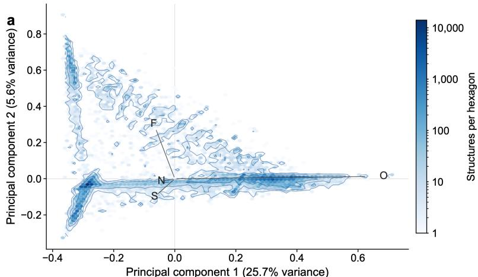  
b

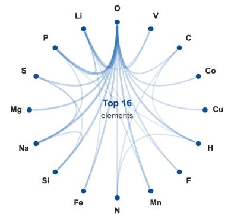  
O Li P S MgNa Si Fe N Mn F H

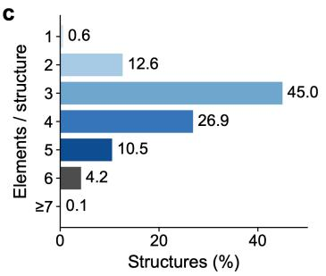

d  
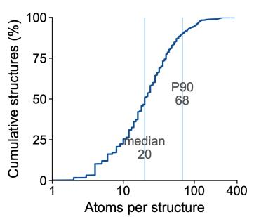

e  
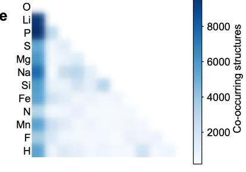  
Figure S5. Compositional and structural landscape of the MP500 dataset. a, Principal-component <sub>map o</sub>f <sub>e</sub>l<sub>emen</sub>t<sub>a</sub>l <sub>compos</sub>iti<sub>on</sub> f<sub>or a</sub>ll 100<sub>,</sub>315 <sub>s</sub>t<sub>ore</sub>d <sub>s</sub>t<sub>ruc</sub>t<sub>ures; co</sub>l<sub>our</sub> d<sub>eno</sub>t<sub>es</sub> th<sub>e num</sub>b<sub>er o</sub>f <sub>s</sub>t<sub>ruc</sub>t<sub>ures</sub> per hexagonal bin. b, Co-occurrence network of the 16 most prevalent elements; links represent the 28 largest pairwise co-occurrence counts. c, Distribution of chemical complexity, expressed as the number of distinct elements per structure. d, Empirical cumulative distribution of atoms per stored unit cell; vertical lines mark the median and 90th percentile. e, Pairwise co-occurrence matrix of prevalent elements.

## 2.2.1 Experimental dataset

T<sub>o</sub> <sub>comp</sub>l<sub>emen</sub>t th<sub>e</sub> <sub>s</sub>t<sub>ruc</sub>t<sub>ures</sub> i<sub>n</sub> MP500<sub>,</sub> <sub>we</sub> <sub>assem</sub>bl<sub>e</sub>d <sub>an</sub> <sub>exper</sub>i<sub>men</sub>t<sub>-</sub>li<sub>n</sub>k<sub>e</sub>d <sub>s</sub>t<sub>ruc</sub>t<sub>ure</sub> <sub>co</sub>ll<sub>ec</sub>ti<sub>on</sub> fr<sub>o</sub>m RRUFF <sub>a</sub>nd <sub>a</sub> <sub>seco</sub>nd br<sub>a</sub>n<sub>c</sub>h th<sub>a</sub>t <sub>co</sub>mbin<sub>es</sub> <sub>op</sub>XRD <sub>w</sub>ith <sub>ou</sub>r <sub>p</sub>ri<sub>va</sub>t<sub>e</sub> d<sub>a</sub>t<sub>a.</sub> RRUFF <sub>p</sub>r<sub>ov</sub>id<sub>es</sub> <sub>crys</sub>t<sub>a</sub>ll<sub>ograp</sub>hi<sub>c</sub> <sub>mo</sub>d<sub>e</sub>l<sub>s</sub> f<sub>or</sub> <sub>exper</sub>i<sub>men</sub>t<sub>a</sub>ll<sub>y</sub> <sub>c</sub>h<sub>arac</sub>t<sub>er</sub>i<sub>ze</sub>d <sub>m</sub>i<sub>nera</sub>l<sub>s</sub> t<sub>oge</sub>th<sub>er</sub> <sub>w</sub>ith dif<sub>rac</sub>ti<sub>on,</sub> <sub>spec</sub>t<sub>roscop</sub>i<sub>c,</sub> <sub>an</sub>d <sub>c</sub>h<sub>em</sub>i<sub>ca</sub>l <sub>recor</sub>d<sub>s</sub><sup>6</sup><sub>.</sub> <sub>op</sub>XRD i<sub>s</sub> <sub>a</sub> <sub>mu</sub>lti<sub>-</sub>i<sub>ns</sub>tit<sub>u</sub>ti<sub>ona</sub>l <sub>co</sub>ll<sub>ec</sub>ti<sub>on</sub> <sub>o</sub>f <sub>exper</sub>i<sub>men</sub>t<sub>a</sub>l <sub>pow</sub>d<sub>er</sub> X<sub>-ray</sub> dif<sub>rac</sub>ti<sub>on</sub> d<sub>a</sub>t<sub>a;</sub> <sub>among</sub> it<sub>s</sub> l<sub>a</sub>b<sub>e</sub>l<sub>e</sub>d <sub>recor</sub>d<sub>s,</sub> <sub>a</sub> <sub>su</sub>b<sub>se</sub>t i<sub>s</sub> <sub>accompan</sub>i<sub>e</sub>d b<sub>y</sub> <sub>a</sub> <sub>comp</sub>l<sub>e</sub>t<sub>e</sub> <sub>c</sub>r<sub>ys</sub>t<sub>a</sub>l <sub>s</sub>tr<sub>uc</sub>t<sub>u</sub>r<sub>e</sub><sup>1</sup><sub>.</sub> Th<sub>e</sub> <sub>p</sub>r<sub>ese</sub>nt G<sub>a</sub>n Ji<sub>a</sub>n<sub>g</sub> <sub>s</sub>n<sub>aps</sub>h<sub>o</sub>t <sub>uses</sub> 1<sub>,</sub>159 RRUFF <sub>s</sub>tr<sub>uc</sub>t<sub>u</sub>r<sub>es</sub> <sub>a</sub>nd 848 <sub>s</sub>tr<sub>uc</sub>t<sub>u</sub>r<sub>es</sub> f<sub>rom</sub> th<sub>e</sub> <sub>com</sub>bi<sub>ne</sub>d <sub>op</sub>XRD + <sub>pr</sub>i<sub>va</sub>t<sub>e-</sub>d<sub>a</sub>t<sub>a</sub> b<sub>ranc</sub>h<sub>,</sub> <sub>g</sub>i<sub>v</sub>i<sub>ng</sub> 2<sub>,</sub>007 <sub>source-qua</sub>lifi<sub>e</sub>d <sub>recor</sub>d<sub>s</sub> i<sub>n</sub> t<sub>o</sub>t<sub>a</sub>l<sub>.</sub> O<sub>n</sub>l<sub>y</sub> <sub>recor</sub>d<sub>s</sub> <sub>con</sub>t<sub>a</sub>i<sub>n</sub>i<sub>ng</sub> <sub>a</sub> <sub>comp</sub>l<sub>e</sub>t<sub>e,</sub> <sub>parsea</sub>bl<sub>e</sub> th<sub>ree-</sub>di<sub>mens</sub>i<sub>ona</sub>l <sub>per</sub>i<sub>o</sub>di<sub>c</sub> <sub>s</sub>t<sub>ruc</sub>t<sub>ure</sub> <sub>are</sub> i<sub>nc</sub>l<sub>u</sub>d<sub>e</sub>d i<sub>n</sub> th<sub>e</sub> <sub>can</sub>did<sub>a</sub>t<sub>e</sub> lib<sub>rary.</sub>

D<sub>ur</sub>i<sub>ng</sub> i<sub>nges</sub>ti<sub>on,</sub> <sub>eac</sub>h <sub>s</sub>t<sub>ruc</sub>t<sub>ure</sub> i<sub>s</sub> <sub>s</sub>t<sub>ore</sub>d <sub>w</sub>ith it<sub>s</sub> <sub>source</sub> <sub>an</sub>d <sub>source-spec</sub>ifi<sub>c</sub> id<sub>en</sub>tifi<sub>er,</sub> <sub>samp</sub>l<sub>e</sub> id<sub>en</sub>tifi<sub>er,</sub> <sub>or</sub>i<sub>g</sub>i<sub>na</sub>l CIF fil<sub>ename,</sub> <sub>an</sub>d <sub>a</sub> SHA<sub>-</sub>256 <sub>c</sub>h<sub>ec</sub>k<sub>sum.</sub> Th<sub>ese</sub> fi<sub>e</sub>ld<sub>s</sub> <sub>preserve</sub> <sub>provenance</sub> <sub>an</sub>d <sub>perm</sub>it <sub>exac</sub>t d<sub>up</sub>li<sub>ca</sub>t<sub>e</sub> d<sub>e</sub>t<sub>ec</sub>ti<sub>on</sub> <sub>w</sub>ith<sub>ou</sub>t <sub>con</sub>fl<sub>a</sub>ti<sub>ng</sub> <sub>s</sub>t<sub>ruc</sub>t<sub>ures</sub> th<sub>a</sub>t <sub>mere</sub>l<sub>y</sub> <sub>s</sub>h<sub>are</sub> <sub>a</sub> <sub>compos</sub>iti<sub>on.</sub> Th<sub>e</sub> <sub>curren</sub>t <sub>snaps</sub>h<sub>o</sub>t <sub>con</sub>t<sub>a</sub>i<sub>ns</sub> 2<sub>,</sub>001 di<sub>s</sub>ti<sub>nc</sub>t CIF <sub>c</sub>h<sub>ec</sub>k<sub>sums</sub> <sub>an</sub>d 1<sub>,</sub>339 di<sub>s</sub>ti<sub>nc</sub>t <sub>re</sub>d<sub>uce</sub>d <sub>compos</sub>iti<sub>ons,</sub> s<sub>p</sub>ans 80 chemical elements, and contains cells ran<sub>g</sub>in<sub>g</sub> from 2 to 496 atoms (median 54). For the d<sub>escr</sub>i<sub>p</sub>ti<sub>ve</sub> <sub>s</sub>t<sub>a</sub>ti<sub>s</sub>ti<sub>cs</sub> i<sub>n</sub> Fi<sub>g.</sub> S6<sub>,</sub> <sub>space</sub> <sub>groups</sub> <sub>were</sub> <sub>reass</sub>i<sub>gne</sub>d f<sub>rom</sub> th<sub>e</sub> <sub>s</sub>t<sub>ore</sub>d <sub>ce</sub>ll<sub>s</sub> <sub>us</sub>i<sub>ng</sub> <sub>spglib</sub> <sub>w</sub>ith <sub>a</sub> <sub>symme</sub>t<sub>ry</sub> t<sub>o</sub>l<sub>erance</sub> <sub>o</sub>f $1 0 ^ { - 2 } \mathring { \mathrm { A } } ^ { 2 9 }$ <sub>.</sub> Th<sub>e</sub> <sub>resu</sub>lti<sub>ng</sub> <sub>s</sub>t<sub>ruc</sub>t<sub>ures</sub> <sub>cover</sub> 141 <sub>space</sub> <sub>groups</sub> <sub>across</sub> all seven cr<sub>y</sub>stal s<sub>y</sub>stems; monoclinic structures are the lar<sub>g</sub>est class (587 records), followed b<sub>y</sub> orthorhombic structures (428 records). The two sources are chemicall<sub>y</sub> com<sub>p</sub>lementar<sub>y</sub>: RRUFF i<sub>s</sub> <sub>enr</sub>i<sub>c</sub>h<sub>e</sub>d i<sub>n</sub> <sub>oxygen-</sub>b<sub>ear</sub>i<sub>ng</sub> <sub>m</sub>i<sub>nera</sub>l <sub>sys</sub>t<sub>ems</sub> <sub>con</sub>t<sub>a</sub>i<sub>n</sub>i<sub>ng</sub> Si<sub>,</sub> C<sub>a,</sub> <sub>an</sub>d Al<sub>,</sub> <sub>w</sub>h<sub>ereas</sub> th<sub>e</sub> <sub>com</sub>bi<sub>ne</sub>d <sub>op</sub>XRD + <sub>pr</sub>i<sub>va</sub>t<sub>e-</sub>d<sub>a</sub>t<sub>a</sub> b<sub>ranc</sub>h <sub>con</sub>t<sub>a</sub>i<sub>ns</sub> <sub>a</sub> l<sub>arger</sub> f<sub>rac</sub>ti<sub>on</sub> <sub>o</sub>f C<sub>-,</sub> H<sub>-,</sub> <sub>an</sub>d N<sub>-</sub>b<sub>ear</sub>i<sub>ng</sub> <sub>s</sub>t<sub>ruc</sub>t<sub>ures.</sub> Thi<sub>s</sub> di<sub>vers</sub>it<sub>y</sub> b<sub>roa</sub>d<sub>ens</sub> th<sub>e</sub> <sub>exper</sub>i<sub>men</sub>t<sub>a</sub>l <sub>can</sub>did<sub>a</sub>t<sub>e</sub> <sub>space</sub> b<sub>eyon</sub>d th<sub>e</sub> <sub>compu</sub>t<sub>e</sub>d i<sub>norgan</sub>i<sub>c</sub> <sub>s</sub>t<sub>ruc</sub>t<sub>ures</sub> i<sub>n</sub> MP500<sub>.</sub>

## 2.3 Indexing of Gan Jiang crystal dataset

Efi<sub>c</sub>i<sub>en</sub>t <sub>s</sub>t<sub>ruc</sub>t<sub>ure</sub> <sub>searc</sub>h <sub>an</sub>d <sub>ma</sub>t<sub>c</sub>h <sub>requ</sub>i<sub>res</sub> <sub>a</sub> <sub>searc</sub>h<sub>a</sub>bl<sub>e</sub> li<sub>n</sub>k b<sub>e</sub>t<sub>ween</sub> <sub>crys</sub>t<sub>a</sub>l <sub>s</sub>t<sub>ruc</sub>t<sub>ures</sub> <sub>an</sub>d th<sub>e</sub>i<sub>r</sub> <sub>expec</sub>t<sub>e</sub>d <sub>pow</sub>d<sub>er-</sub>dif<sub>rac</sub>ti<sub>on</sub> <sub>pa</sub>tt<sub>erns.</sub> T<sub>o</sub> <sub>es</sub>t<sub>a</sub>bli<sub>s</sub>h thi<sub>s</sub> li<sub>n</sub>k<sub>,</sub> th<sub>eore</sub>ti<sub>ca</sub>l PXRD <sub>pa</sub>tt<sub>erns</sub> <sub>are</sub> <sub>genera</sub>t<sub>e</sub>d f<sub>rom</sub> th<sub>e</sub> <sub>s</sub>t<sub>ruc</sub>t<sub>ures</sub> i<sub>n</sub> th<sub>e</sub> G<sub>an</sub> Ji<sub>ang</sub> d<sub>a</sub>t<sub>a</sub>b<sub>ase</sub> <sub>an</sub>d <sub>assoc</sub>i<sub>a</sub>t<sub>e</sub>d <sub>w</sub>ith th<sub>e</sub>i<sub>r</sub> <sub>source</sub> <sub>recor</sub>d<sub>s.</sub> E<sub>ac</sub>h i<sub>n</sub>d<sub>exe</sub>d <sub>recor</sub>d <sub>re</sub>t<sub>a</sub>i<sub>ns</sub> th<sub>e</sub> <sub>s</sub>t<sub>ruc</sub>t<sub>ure</sub> id<sub>en</sub>tifi<sub>er,</sub> <sub>provenance,</sub> <sub>an</sub>d <sub>a</sub> dif<sub>rac</sub>ti<sub>on</sub> <sub>s</sub>i<sub>gna</sub>t<sub>ure</sub> <sub>compr</sub>i<sub>s</sub>i<sub>ng</sub> <sub>pre</sub>di<sub>c</sub>t<sub>e</sub>d <sub>pea</sub>k <sub>pos</sub>iti<sub>ons</sub> <sub>an</sub>d <sub>re</sub>l<sub>a</sub>ti<sub>ve</sub> i<sub>n</sub>t<sub>ens</sub>iti<sub>es.</sub> Thi<sub>s</sub> <sub>a</sub>ll<sub>ows</sub> <sub>a</sub> <sub>measure</sub>d <sub>pa</sub>tt<sub>ern</sub> t<sub>o</sub> b<sub>e</sub> <sub>compare</sub>d <sub>w</sub>ith d<sub>a</sub>t<sub>a</sub>b<sub>ase</sub> <sub>can</sub>did<sub>a</sub>t<sub>es</sub> <sub>w</sub>ith<sub>ou</sub>t <sub>reca</sub>l<sub>cu</sub>l<sub>a</sub>ti<sub>ng</sub> <sub>every</sub> th<sub>eore</sub>ti<sub>ca</sub>l <sub>pa</sub>tt<sub>ern</sub> d<sub>ur</sub>i<sub>ng</sub> <sub>eac</sub>h <sub>searc</sub>h<sub>.</sub> D<sub>ur</sub>i<sub>ng</sub> id<sub>en</sub>tifi<sub>ca</sub>ti<sub>on,</sub> th<sub>e</sub> <sub>o</sub>b<sub>serve</sub>d dif<sub>rac</sub>ti<sub>on</sub> <sub>pea</sub>k<sub>s</sub> <sub>are</sub> <sub>use</sub>d t<sub>o</sub> <sub>re</sub>t<sub>r</sub>i<sub>eve</sub> <sub>an</sub>d <sub>ran</sub>k <sub>p</sub>l<sub>aus</sub>ibl<sub>e</sub> <sub>s</sub>t<sub>ruc</sub>t<sub>ures.</sub> C<sub>an</sub>did<sub>a</sub>t<sub>e</sub> <sub>ma</sub>t<sub>c</sub>h<sub>es</sub> <sub>are</sub> th<sub>en</sub> <sub>exam</sub>i<sub>ne</sub>d <sub>us</sub>i<sub>ng</sub> th<sub>e</sub> f<sub>u</sub>ll <sub>pa</sub>tt<sub>ern</sub> <sub>an</sub>d<sub>,</sub> <sub>w</sub>h<sub>ere</sub> <sub>appropr</sub>i<sub>a</sub>t<sub>e,</sub> <sub>passe</sub>d t<sub>o</sub> <sub>su</sub>b<sub>sequen</sub>t <sub>re</sub>fi<sub>nemen</sub>t<sub>.</sub> K<sub>eep</sub>i<sub>ng</sub> th<sub>e</sub> dif<sub>rac</sub>ti<sub>on</sub> i<sub>n</sub>d<sub>ex</sub> li<sub>n</sub>k<sub>e</sub>d t<sub>o</sub> th<sub>e</sub> <sub>un</sub>d<sub>er</sub>l<sub>y</sub>i<sub>ng</sub> <sub>s</sub>t<sub>ruc</sub>t<sub>ura</sub>l <sub>recor</sub>d<sub>s</sub> <sub>a</sub>ll<sub>ows</sub> <sub>searc</sub>h <sub>resu</sub>lt<sub>s</sub> t<sub>o</sub> b<sub>e</sub> t<sub>race</sub>d b<sub>ac</sub>k t<sub>o</sub> th<sub>e</sub>i<sub>r</sub> <sub>source</sub> <sub>s</sub>t<sub>ruc</sub>t<sub>ures</sub> <sub>an</sub>d <sub>up</sub>d<sub>a</sub>t<sub>e</sub>d <sub>w</sub>h<sub>en</sub> d<sub>a</sub>t<sub>a</sub>b<sub>ase</sub> <sub>en</sub>t<sub>r</sub>i<sub>es</sub> <sub>c</sub>h<sub>ange.</sub>

We index archive covera<sub>g</sub>e alon<sub>g</sub> five cou<sub>p</sub>led dimensions (Fi<sub>g</sub>. S7). In Fi<sub>g</sub>. S7a, ever<sub>y</sub> stored <sub>re</sub>fl<sub>ec</sub>ti<sub>on</sub> <sub>con</sub>t<sub>r</sub>ib<sub>u</sub>t<sub>es</sub> t<sub>o</sub> <sub>a</sub> 0<sub>.</sub>25<sup>◦</sup> 2� hi<sub>s</sub>t<sub>ogram,</sub> <sub>norma</sub>li<sub>ze</sub>d t<sub>o</sub> it<sub>s</sub> <sub>max</sub>i<sub>mum.</sub> Th<sub>e</sub> <sub>resu</sub>lti<sub>ng</sub> <sub>curve</sub> i<sub>s</sub> <sub>s</sub>t<sub>ruc</sub>t<sub>ure</sub>d <sub>ra</sub>th<sub>er</sub> th<sub>an</sub> <sub>spec</sub>t<sub>ra</sub>ll<sub>y</sub> <sub>un</sub>if<sub>orm:</sub> <sub>occupancy</sub> <sub>r</sub>i<sub>ses</sub> <sub>s</sub>h<sub>arp</sub>l<sub>y</sub> i<sub>n</sub> th<sub>e</sub> l<sub>ow-ang</sub>l<sub>e</sub> <sub>reg</sub>i<sub>on,</sub> <sub>reac</sub>h<sub>es</sub> <sub>a</sub> <sub>mo</sub>d<sub>a</sub>l <sub>va</sub>l<sub>ue</sub> <sub>a</sub>t $3 0 . 9 ^ { \circ }$ <sub>,</sub> <sub>an</sub>d d<sub>ecays</sub> <sub>s</sub>t<sub>ea</sub>dil<sub>y</sub> <sub>a</sub>b<sub>ove</sub> <sub>approx</sub>i<sub>ma</sub>t<sub>e</sub>l<sub>y</sub> 60<sup>◦</sup><sub>.</sub> Th<sub>us,</sub> hi<sub>g</sub>h<sub>-ang</sub>l<sub>e</sub> <sub>agreemen</sub>t i<sub>s</sub> i<sub>n</sub>t<sub>r</sub>i<sub>ns</sub>i<sub>ca</sub>ll<sub>y</sub> <sub>suppor</sub>t<sub>e</sub>d b<sub>y</sub> f<sub>ewer</sub> <sub>re</sub>f<sub>erence</sub> <sub>re</sub>fl<sub>ec</sub>ti<sub>ons</sub> <sub>an</sub>d <sub>s</sub>h<sub>ou</sub>ld <sub>no</sub>t b<sub>e</sub> i<sub>n</sub>t<sub>erpre</sub>t<sub>e</sub>d as carrying the same prior weight as agreement near the modal region. Figure S7b converts th<sub>e</sub> 50 fi<sub>xe</sub>d<sub>-see</sub>d <sub>examp</sub>l<sub>e pa</sub>tt<sub>erns</sub> i<sub>n</sub>t<sub>o a s</sub>t<sub>ruc</sub>t<sub>ure-</sub>b<sub>y-ang</sub>l<sub>e</sub> b<sub>arco</sub>d<sub>e: eac</sub>h $0 . 1 ^ { \circ }$ bi<sub>n</sub> i<sub>s co</sub>l<sub>oure</sub>d b<sub>y</sub> th<sub>e max</sub>i<sub>mum norma</sub>li<sub>ze</sub>d i<sub>n</sub>t<sub>ens</sub>it<sub>y</sub> i<sub>n a</sub> fi<sub>ve-</sub>bi<sub>n</sub> l<sub>oca</sub>l <sub>w</sub>i<sub>n</sub>d<sub>ow.</sub> Th<sub>e</sub> b<sub>arco</sub>d<sub>e s</sub>h<sub>ows repea</sub>t<sub>e</sub>d l<sub>ow-ang</sub>l<sub>e</sub> b<sub>an</sub>d<sub>s</sub> <sub>across</sub> <sub>mu</sub>lti<sub>p</sub>l<sub>e</sub> <sub>recor</sub>d<sub>s,</sub> b<sub>u</sub>t <sub>a</sub>l<sub>so</sub> <sub>s</sub>h<sub>ows</sub> th<sub>a</sub>t th<sub>e</sub> d<sub>ar</sub>k<sub>,</sub> hi<sub>g</sub>h<sub>-</sub>i<sub>n</sub>t<sub>ens</sub>it<sub>y</sub> <sub>ce</sub>ll<sub>s</sub> <sub>are</sub> di<sub>scon</sub>ti<sub>nuous</sub> f<sub>rom</sub> <sub>one</sub> <sub>s</sub>t<sub>ruc</sub>t<sub>ure</sub> t<sub>o</sub> th<sub>e</sub> <sub>nex</sub>t<sub>.</sub> I<sub>n</sub> <sub>o</sub>th<sub>er</sub> <sub>wor</sub>d<sub>s,</sub> <sub>common</sub> i<sub>n</sub>di<sub>v</sub>id<sub>ua</sub>l <sub>pea</sub>k <sub>pos</sub>iti<sub>ons</sub> coexist with highly specific co-occurrence patterns. This is the retrieval-relevant result: a single <sub>pea</sub>k <sub>near</sub> <sub>a</sub> f<sub>requen</sub>tl<sub>y</sub> <sub>occup</sub>i<sub>e</sub>d <sub>ang</sub>l<sub>e</sub> i<sub>s</sub> <sub>wea</sub>k <sub>ev</sub>id<sub>ence,</sub> <sub>w</sub>h<sub>ereas</sub> <sub>agreemen</sub>t <sub>among</sub> <sub>severa</sub>l <sub>pea</sub>k<sub>s</sub> i<sub>n</sub> th<sub>e</sub> <sub>same</sub> b<sub>arco</sub>d<sub>e</sub> <sub>pa</sub>tt<sub>ern</sub> i<sub>s</sub> <sub>muc</sub>h <sub>more</sub> di<sub>scr</sub>i<sub>m</sub>i<sub>na</sub>ti<sub>ve</sub> f<sub>or</sub> <sub>p</sub>h<sub>ase</sub> id<sub>en</sub>tifi<sub>ca</sub>ti<sub>on.</sub>

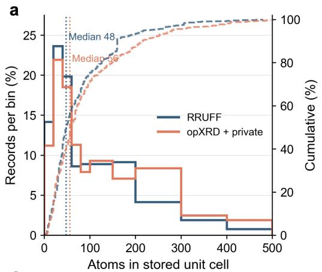

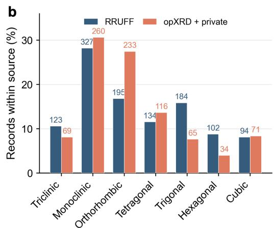

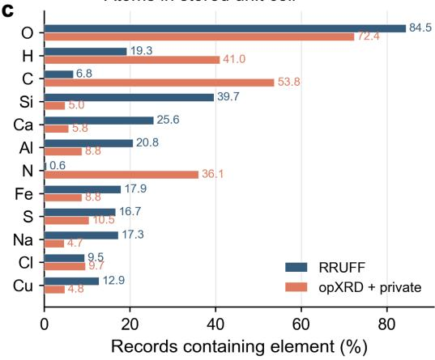

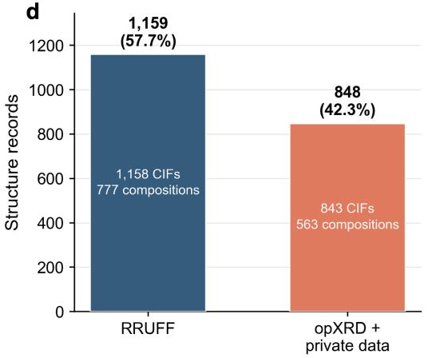  
Figure S6. Overview of the experimental candidate library. a, Distribution of the number of atoms in th<sub>e s</sub>t<sub>ore</sub>d <sub>un</sub>it <sub>ce</sub>ll<sub>s; so</sub>lid <sub>ou</sub>tli<sub>nes s</sub>h<sub>ow</sub> bi<sub>nne</sub>d f<sub>rac</sub>ti<sub>ons,</sub> d<sub>as</sub>h<sub>e</sub>d <sub>curves s</sub>h<sub>ow emp</sub>i<sub>r</sub>i<sub>ca</sub>l <sub>cumu</sub>l<sub>a</sub>ti<sub>ve</sub> distributions, and dotted vertical lines mark the medians. b, Crystal-system distributions within RRUFF and the combined o<sub>p</sub>XRD + <sub>p</sub>rivate-data branch; s<sub>y</sub>mmetries were identified with spglib usin<sub>g</sub> s<sub>y</sub>m<sub>p</sub>rec = $1 0 ^ { - 2 } \mathrm { \AA }$ , and numbers above the bars give record counts. c, Occurrence of the 12 most prevalent elements, with each element counted at most once per structure record. d, Source composition of the collection, with di<sub>s</sub>ti<sub>nc</sub>t CIF <sub>coun</sub>t<sub>s</sub> d<sub>e</sub>t<sub>erm</sub>i<sub>ne</sub>d f<sub>rom</sub> th<sub>e s</sub>t<sub>ore</sub>d SHA<sub>-</sub>256 <sub>c</sub>h<sub>ec</sub>k<sub>sums.</sub>

Figure S7c ranks the 12 most frequent space groups by record count. It exposes strong <sub>crys</sub>t<sub>a</sub>ll<sub>ograp</sub>hi<sub>c</sub> <sub>concen</sub>t<sub>ra</sub>ti<sub>on:</sub> th<sub>e</sub> l<sub>ea</sub>di<sub>ng</sub> <sub>group</sub> <sub>a</sub>l<sub>one</sub> <sub>con</sub>t<sub>r</sub>ib<sub>u</sub>t<sub>es</sub> <sub>near</sub>l<sub>y</sub> 10<sub>,</sub>000 <sub>s</sub>t<sub>ruc</sub>t<sub>ures,</sub> f<sub>o</sub>ll<sub>owe</sub>d b<sub>y</sub> <sub>a</sub> <sub>progress</sub>i<sub>ve</sub> d<sub>ec</sub>li<sub>ne</sub> <sub>across</sub> th<sub>e</sub> <sub>rema</sub>i<sub>n</sub>i<sub>ng</sub> <sub>groups.</sub> Thi<sub>s</sub> di<sub>s</sub>t<sub>r</sub>ib<sub>u</sub>ti<sub>on</sub> t<sub>e</sub>ll<sub>s</sub> <sub>rea</sub>d<sub>ers</sub> th<sub>a</sub>t a chemically filtered retrieval will still confront an uneven structural prior. Figure S7e maps the i<sub>nver</sub>t<sub>e</sub>d <sub>e</sub>l<sub>emen</sub>t<sub>a</sub>l i<sub>n</sub>d<sub>ex</sub> <sub>on</sub>t<sub>o</sub> th<sub>e</sub> <sub>per</sub>i<sub>o</sub>di<sub>c</sub> t<sub>a</sub>bl<sub>e;</sub> <sub>eac</sub>h til<sub>e</sub> i<sub>s</sub> <sub>co</sub>l<sub>oure</sub>d b<sub>y</sub> th<sub>e</sub> <sub>num</sub>b<sub>er</sub> <sub>o</sub>f <sub>s</sub>t<sub>ruc</sub>t<sub>ures</sub> <sub>con</sub>t<sub>a</sub>i<sub>n</sub>i<sub>ng</sub> th<sub>a</sub>t <sub>e</sub>l<sub>emen</sub>t<sub>.</sub> O<sub>xygen</sub> i<sub>s</sub> <sub>espec</sub>i<sub>a</sub>ll<sub>y</sub> <sub>preva</sub>l<sub>en</sub>t<sub>,</sub> <sub>w</sub>h<sub>ereas</sub> <sub>pa</sub>l<sub>e</sub> til<sub>es</sub> id<sub>en</sub>tif<sub>y</sub> <sub>e</sub>l<sub>emen</sub>t<sub>s</sub> <sub>a</sub>b<sub>sen</sub>t f<sub>rom</sub> th<sub>e</sub> <sub>arc</sub>hi<sub>ve.</sub> Th<sub>ese</sub> <sub>are</sub> <sub>exp</sub>li<sub>c</sub>it <sub>no-coverage</sub> <sub>reg</sub>i<sub>ons</sub> f<sub>or</sub> <sub>an</sub> <sub>e</sub>l<sub>emen</sub>t<sub>-cons</sub>t<sub>ra</sub>i<sub>ne</sub>d <sub>query,</sub> <sub>ra</sub>th<sub>er</sub> th<sub>an</sub> <sub>an</sub> <sub>unexp</sub>l<sub>a</sub>i<sub>ne</sub>d <sub>re</sub>t<sub>r</sub>i<sub>eva</sub>l f<sub>a</sub>il<sub>ure.</sub>

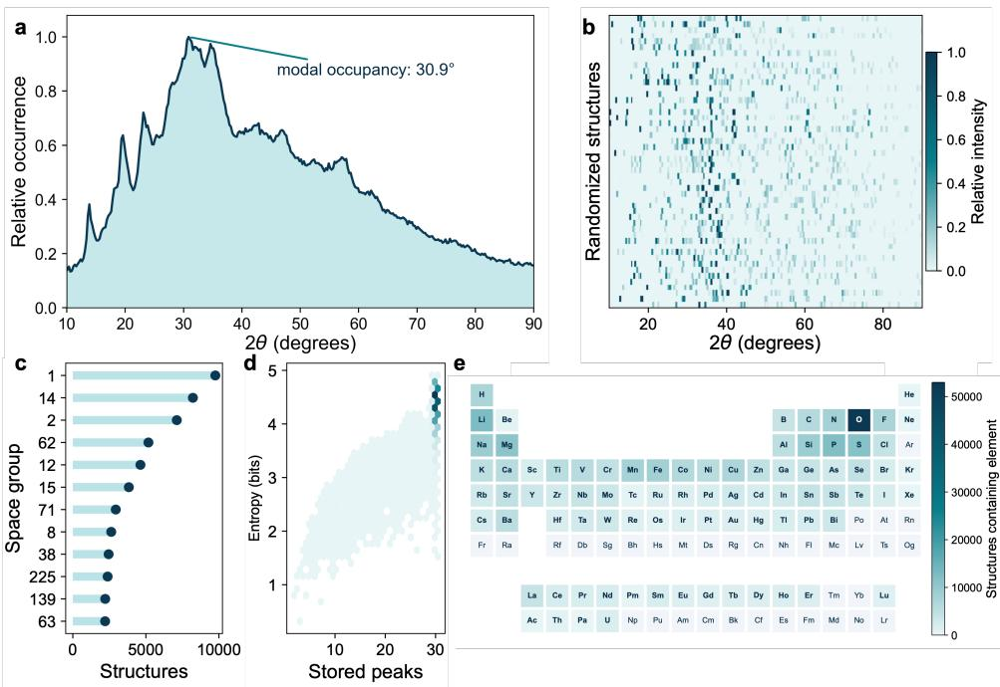  
Figure S7. Five-dimensional index of the MP500 XRD archive. a, Archive-wide occupancy of 2,934,906 <sub>s</sub>t<sub>ore</sub>d th<sub>eore</sub>ti<sub>ca</sub>l <sub>re</sub>fl<sub>ec</sub>ti<sub>on pos</sub>iti<sub>ons, w</sub>ith <sub>a mo</sub>d<sub>a</sub>l <sub>va</sub>l<sub>ue a</sub>t $3 0 . 9 ^ { \circ } 2 \theta .$ . b, Structure-resolved difraction barcode for 50 fixed-seed records; colour denotes normalized reflection intensity. c, Rank-frequency distribution of leading space groups. d, Hexagonally binned relation between stored-peak count and Shannon entropy of normalized peak intensity. e, Elemental support of the inverted index; colour denotes th<sub>e</sub> <sub>num</sub>b<sub>er</sub> <sub>o</sub>f <sub>s</sub>t<sub>ruc</sub>t<sub>ures</sub> <sub>con</sub>t<sub>a</sub>i<sub>n</sub>i<sub>ng</sub> <sub>an</sub> <sub>e</sub>l<sub>emen</sub>t<sub>.</sub>

Finally, Fig. S7d measures the information compactness of every record. The horizontal axis i<sub>s</sub> th<sub>e</sub> <sub>num</sub>b<sub>er</sub> <sub>o</sub>f <sub>re</sub>t<sub>a</sub>i<sub>ne</sub>d <sub>re</sub>fl<sub>ec</sub>ti<sub>ons</sub> <sub>an</sub>d th<sub>e</sub> <sub>ver</sub>ti<sub>ca</sub>l <sub>ax</sub>i<sub>s</sub> i<sub>s</sub> Sh<sub>annon</sub> <sub>en</sub>t<sub>ropy,</sub> $\begin{array} { r } { H = - \sum _ { i } p _ { i } \log _ { 2 } p _ { i } . } \end{array}$ <sub>ca</sub>l<sub>cu</sub>l<sub>a</sub>t<sub>e</sub>d f<sub>rom</sub> th<sub>e</sub> <sub>norma</sub>li<sub>ze</sub>d <sub>pea</sub>k i<sub>n</sub>t<sub>ens</sub>iti<sub>es</sub> $p _ { i }$ <sub>o</sub>f <sub>one</sub> <sub>s</sub>t<sub>ruc</sub>t<sub>ure.</sub> E<sub>ac</sub>h h<sub>exagon</sub> <sub>represen</sub>t<sub>s</sub> <sub>recor</sub>d<sub>s</sub> f<sub>a</sub>lli<sub>ng</sub> <sub>w</sub>ithi<sub>n</sub> th<sub>e</sub> <sub>same</sub> <sub>pea</sub>k<sub>-coun</sub>t<sub>–en</sub>t<sub>ropy</sub> i<sub>n</sub>t<sub>erva</sub>l<sub>;</sub> d<sub>ar</sub>k<sub>er</sub> h<sub>exagons</sub> <sub>con</sub>t<sub>a</sub>i<sub>n</sub> <sub>more</sub> <sub>recor</sub>d<sub>s.</sub> Th<sub>e</sub> <sub>r</sub>i<sub>s</sub>i<sub>ng</sub> <sub>enve</sub>l<sub>ope</sub> <sub>means</sub> th<sub>a</sub>t <sub>pa</sub>tt<sub>erns</sub> <sub>w</sub>ith <sub>more</sub> <sub>re</sub>t<sub>a</sub>i<sub>ne</sub>d <sub>pea</sub>k<sub>s</sub> <sub>can</sub> di<sub>s</sub>t<sub>r</sub>ib<sub>u</sub>t<sub>e</sub> i<sub>n</sub>t<sub>ens</sub>it<sub>y</sub> <sub>across</sub> <sub>more</sub> <sub>re</sub>fl<sub>ec</sub>ti<sub>ons</sub> <sub>an</sub>d th<sub>ere</sub>f<sub>ore</sub> <sub>reac</sub>h hi<sub>g</sub>h<sub>er</sub> <sub>en</sub>t<sub>ropy.</sub> C<sub>onverse</sub>l<sub>y,</sub> th<sub>e</sub> l<sub>ow-en</sub>t<sub>ropy</sub> <sub>reg</sub>i<sub>on</sub> <sub>a</sub>t <sub>sma</sub>ll <sub>pea</sub>k <sub>coun</sub>t<sub>s</sub> <sub>correspon</sub>d<sub>s</sub> t<sub>o</sub> fi<sub>ngerpr</sub>i<sub>n</sub>t<sub>s</sub> d<sub>om</sub>i<sub>na</sub>t<sub>e</sub>d b<sub>y</sub> <sub>one</sub> <sub>or</sub> <sub>a</sub> f<sub>ew</sub> <sub>re</sub>fl<sub>ec</sub>ti<sub>ons.</sub> Th<sub>e</sub> d<sub>ense</sub> <sub>ver</sub>ti<sub>ca</sub>l <sub>accumu</sub>l<sub>a</sub>ti<sub>on</sub> <sub>a</sub>t 30 <sub>pea</sub>k<sub>s</sub> i<sub>s</sub> <sub>expec</sub>t<sub>e</sub>d<sub>:</sub> 30 i<sub>s</sub> th<sub>e</sub> <sub>arc</sub>hi<sub>ve</sub>’<sub>s</sub> <sub>s</sub>t<sub>orage</sub> <sub>cap,</sub> <sub>so</sub> <sub>a</sub>ll <sub>pa</sub>tt<sub>erns</sub> <sub>w</sub>ith <sub>a</sub>t l<sub>eas</sub>t 30 <sub>usa</sub>bl<sub>e</sub> <sub>re</sub>fl<sub>ec</sub>ti<sub>ons</sub> t<sub>erm</sub>i<sub>na</sub>t<sub>e</sub> <sub>a</sub>t th<sub>e</sub> <sub>same</sub> h<sub>or</sub>i<sub>zon</sub>t<sub>a</sub>l <sub>coor</sub>di<sub>na</sub>t<sub>e.</sub> Th<sub>e</sub> <sub>me</sub>di<sub>an</sub> <sub>en</sub>t<sub>ropy</sub> i<sub>s</sub> 4<sub>.</sub>39 bit<sub>s.</sub> F<sub>or</sub> <sub>re</sub>t<sub>r</sub>i<sub>eva</sub>l<sub>,</sub> thi<sub>s</sub> <sub>pane</sub>l di<sub>s</sub>ti<sub>ngu</sub>i<sub>s</sub>h<sub>es</sub> <sub>a</sub> l<sub>ow-en</sub>t<sub>ropy</sub> <sub>can</sub>did<sub>a</sub>t<sub>e,</sub> <sub>w</sub>h<sub>ose</sub> <sub>score</sub> <sub>may</sub> b<sub>e</sub> d<sub>r</sub>i<sub>ven</sub> b<sub>y</sub> <sub>on</sub>l<sub>y</sub> <sub>a</sub> f<sub>ew</sub> d<sub>om</sub>i<sub>nan</sub>t <sub>pea</sub>k<sub>s,</sub> f<sub>rom</sub> <sub>a</sub> hi<sub>g</sub>h<sub>-en</sub>t<sub>ropy</sub> <sub>can</sub>did<sub>a</sub>t<sub>e</sub> <sub>w</sub>h<sub>ose</sub> <sub>agreemen</sub>t i<sub>s</sub> di<sub>s</sub>t<sub>r</sub>ib<sub>u</sub>t<sub>e</sub>d <sub>over</sub> <sub>a</sub> <sub>r</sub>i<sub>c</sub>h<sub>er</sub> fi<sub>ngerpr</sub>i<sub>n</sub>t<sub>.</sub>

## 2.4 Skill learning through refinement case studies

W<sub>e</sub> <sub>compare</sub> <sub>rev</sub>i<sub>s</sub>i<sub>ons</sub> t<sub>o</sub> th<sub>e</sub> F<sub>u</sub>llP<sub>ro</sub>f<sub>,</sub> GSAS<sub>-</sub>II<sub>,</sub> <sub>an</sub>d WPEM <sub>re</sub>fi<sub>nemen</sub>t <sub>s</sub>kill<sub>s.</sub> P<sub>a</sub>i<sub>re</sub>d bl<sub>oc</sub>k<sub>s</sub> <sub>repro</sub>d<sub>uce</sub> <sub>se</sub>l<sub>ec</sub>t<sub>e</sub>d <sub>s</sub>kill <sub>excerp</sub>t<sub>s</sub> b<sub>e</sub>f<sub>ore</sub> <sub>an</sub>d <sub>a</sub>ft<sub>er</sub> <sub>rev</sub>i<sub>s</sub>i<sub>on.</sub> F<sub>u</sub>llP<sub>ro</sub>f <sub>represen</sub>t<sub>s</sub> <sub>a</sub> hi<sub>s</sub>t<sub>or</sub>i<sub>ca</sub>l <sub>wor</sub>kfl<sub>ow</sub> <sub>re</sub>d<sub>es</sub>i<sub>gn,</sub> <sub>w</sub>h<sub>ereas</sub> th<sub>e</sub> GSAS<sub>-</sub>II <sub>an</sub>d WPEM <sub>excerp</sub>t<sub>s</sub> b<sub>e</sub>l<sub>ow</sub> <sub>come</sub> f<sub>rom</sub> <sub>s</sub>kill<sub>-on</sub>l<sub>y</sub> <sub>op</sub>ti<sub>m</sub>i<sub>za</sub>ti<sub>on.</sub>

FullProf: from a general refinement sequence to a bounded profile search.

Before | staged parameter refinement

5. Sequential Logic: Follow the mandator<sub>y</sub> refinement loo<sub>p</sub> strictl<sub>y</sub>: scale → zero → cell → profile\_w. Onl<sub>y</sub> introduce background when there is clear evidence of a non-zero baseline in the <sub>res</sub>id<sub>ua</sub>l <sub>au</sub>dit<sub>,</sub> <sub>an</sub>d h<sub>an</sub>dl<sub>e</sub> f<sub>a</sub>il<sub>ures</sub> <sub>grace</sub>f<sub>u</sub>ll<sub>y.</sub>

After | task-specific search policy

U<sub>se</sub> th<sub>e</sub> fi<sub>xe</sub>d f<sub>orwar</sub>d<sub>-mo</sub>d<sub>e</sub>l t<sub>oo</sub>l<sub>s</sub> t<sub>o</sub> <sub>re</sub>fi<sub>ne</sub> G<sub>auss</sub>i<sub>an</sub> <sub>w</sub>idth <sub>an</sub>d <sub>angu</sub>l<sub>ar</sub> <sub>zero</sub> <sub>w</sub>hil<sub>e</sub> <sub>re</sub>t<sub>a</sub>i<sub>n</sub>i<sub>ng</sub> th<sub>e</sub> <sub>supp</sub>li<sub>e</sub>d <sub>s</sub>t<sub>ruc</sub>t<sub>ure.</sub> E<sub>xper</sub>i<sub>men</sub>t<sub>a</sub>l XRD<sub>, neu</sub>t<sub>ron,</sub> TOF <sub>an</sub>d <sub>quan</sub>tit<sub>a</sub>ti<sub>ve p</sub>h<sub>ase ana</sub>l<sub>ys</sub>i<sub>s requ</sub>i<sub>re</sub> th<sub>e</sub>i<sub>r</sub> <sub>own</sub> <sub>ra</sub>di<sub>a</sub>ti<sub>on,</sub> b<sub>ac</sub>k<sub>groun</sub>d <sub>an</sub>d <sub>uncer</sub>t<sub>a</sub>i<sub>n</sub>t<sub>y</sub> <sub>mo</sub>d<sub>e</sub>l<sub>s.</sub>

St<sub>ar</sub>t f<sub>rom</sub> th<sub>e exac</sub>t <sub>na</sub>ti<sub>ve</sub> fit <sub>propose</sub>d b<sub>y</sub> th<sub>e</sub> t<sub>oo</sub>l’<sub>s approx</sub>i<sub>ma</sub>t<sub>e</sub> i<sub>n</sub>iti<sub>a</sub>li<sub>za</sub>ti<sub>on.</sub> T<sub>es</sub>t <sub>a ne</sub>i<sub>g</sub>hb<sub>or</sub>h<sub>oo</sub>d <sub>w</sub>ith <sub>w</sub>idth <sub>ra</sub>di<sub>us</sub> 0<sub>.</sub>008 d<sub>egrees an</sub>d <sub>zero ra</sub>di<sub>us</sub> 0<sub>.</sub>004 d<sub>egrees.</sub> Th<sub>en re</sub>d<sub>uce</sub> th<sub>e ra</sub>dii t<sub>o</sub> 0<sub>.</sub>004/0<sub>.</sub>002 <sub>an</sub>d 0<sub>.</sub>002/0<sub>.</sub>001 d<sub>egrees.</sub> I<sub>nspec</sub>t <sub>w</sub>h<sub>e</sub>th<sub>er</sub> th<sub>e</sub> b<sub>es</sub>t <sub>po</sub>i<sub>n</sub>t <sub>moves,</sub> th<sub>e we</sub>i<sub>g</sub>ht<sub>e</sub>d <sub>res</sub>id<sub>ua</sub>l f<sub>a</sub>ll<sub>s an</sub>d th<sub>e re</sub>l<sub>a</sub>ti<sub>ve</sub> L2 <sub>error</sub> i<sub>mproves.</sub> Wh<sub>en</sub> th<sub>e</sub> b<sub>es</sub>t <sub>po</sub>i<sub>n</sub>t k<sub>eeps mov</sub>i<sub>ng, repea</sub>t <sub>a ne</sub>i<sub>g</sub>hb<sub>or</sub>h<sub>oo</sub>d <sub>a</sub>t th<sub>a</sub>t <sub>reso</sub>l<sub>u</sub>ti<sub>on</sub> b<sub>e</sub>f<sub>ore</sub> <sub>ma</sub>ki<sub>ng</sub> it <sub>sma</sub>ll<sub>er.</sub>

Th<sub>e</sub> <sub>rev</sub>i<sub>se</sub>d t<sub>ex</sub>t <sub>ma</sub>k<sub>es</sub> th<sub>e</sub> <sub>searc</sub>h <sub>var</sub>i<sub>a</sub>bl<sub>es,</sub> <sub>s</sub>t<sub>ep</sub> <sub>s</sub>i<sub>zes,</sub> <sub>an</sub>d <sub>progress</sub>i<sub>on</sub> <sub>ru</sub>l<sub>e</sub> <sub>exp</sub>li<sub>c</sub>it<sub>.</sub>

GSAS-II: from general rollback advice to explicit execution safeguards.

The original playbook already required rejecting unhelpful or unstable parameter additions. Th<sub>e</sub> <sub>s</sub>kill<sub>-on</sub>l<sub>y</sub> <sub>rev</sub>i<sub>s</sub>i<sub>on</sub> <sub>re</sub>t<sub>a</sub>i<sub>ne</sub>d th<sub>a</sub>t <sub>pr</sub>i<sub>nc</sub>i<sub>p</sub>l<sub>e</sub> <sub>an</sub>d <sub>a</sub>dd<sub>e</sub>d <sub>a</sub> <sub>spec</sub>ifi<sub>c</sub> <sub>warn</sub>i<sub>ng</sub> <sub>a</sub>b<sub>ou</sub>t <sub>s</sub>i<sub>mu</sub>lt<sub>aneous</sub> refinement and saved-project consistency.

Before | general acceptance and rollback rule

Di<sub>sa</sub>bl<sub>e an</sub>d <sub>ro</sub>ll b<sub>ac</sub>k <sub>a new parame</sub>t<sub>er c</sub>l<sub>ass w</sub>h<sub>en</sub> it <sub>pro</sub>d<sub>uces on</sub>l<sub>y a</sub> t<sub>r</sub>i<sub>v</sub>i<sub>a</sub>l R<sub>wp re</sub>d<sub>uc</sub>ti<sub>on,</sub> hit<sub>s a</sub> b<sub>oun</sub>d<sub>,</sub> i<sub>ncreases</sub> <sub>es</sub>d<sub>s,</sub> h<sub>as</sub> hi<sub>g</sub>h <sub>corre</sub>l<sub>a</sub>ti<sub>on,</sub> <sub>or</sub> d<sub>oes</sub> <sub>no</sub>t i<sub>mprove</sub> th<sub>e</sub> <sub>correspon</sub>di<sub>ng</sub> <sub>res</sub>id<sub>ua</sub>l <sub>s</sub>h<sub>ape.</sub>

After | added staged-refinement safeguard

P<sub>re</sub>f<sub>er</sub> <sub>a</sub> <sub>s</sub>t<sub>age</sub>d<sub>,</sub> i<sub>n</sub>di<sub>v</sub>id<sub>ua</sub>ll<sub>y</sub> <sub>ver</sub>ifi<sub>e</sub>d <sub>sequence</sub> <sub>o</sub>f <sub>sma</sub>ll <sub>re</sub>fi<sub>nemen</sub>t<sub>s</sub> <sub>over</sub> <sub>one</sub> l<sub>arge</sub> <sub>s</sub>i<sub>mu</sub>lt<sub>aneous</sub> refinement: a fully simultaneous pass can leave the saved project inconsistent with its own final <sub>ca</sub>l<sub>cu</sub>l<sub>a</sub>t<sub>e</sub>d <sub>curve</sub> <sub>even</sub> <sub>w</sub>h<sub>en</sub> it <sub>converges</sub> <sub>c</sub>l<sub>ean</sub>l<sub>y.</sub>

Th<sub>e rev</sub>i<sub>s</sub>i<sub>on a</sub>l<sub>so a</sub>dd<sub>e</sub>d th<sub>e</sub> f<sub>o</sub>ll<sub>ow</sub>i<sub>ng response con</sub>t<sub>rac</sub>t<sub>.</sub> Th<sub>ere was no correspon</sub>di<sub>ng</sub> bl<sub>oc</sub>k i<sub>n</sub> th<sub>e</sub> f<sub>rozen s</sub>kill<sub>;</sub> th<sub>e va</sub>l<sub>ues s</sub>h<sub>own are</sub> th<sub>e or</sub>i<sub>g</sub>i<sub>na</sub>l <sub>can</sub>did<sub>a</sub>t<sub>e</sub>’<sub>s examp</sub>l<sub>e se</sub>tti<sub>ngs.</sub>

After | newly added parameter-response contract   
{   
"parameters": {   
"background\_terms": 4, "cycles": 12,   
"profile\_order": "after\_cell", "profile": "W",   
"zero": false, "joint\_final": false,   
"initial\_W": 43.5   
},   
"reason": "One-sentence physical justification per override."   
}

The new contract re<sub>q</sub>uires overrides inside parameters, <sub>p</sub>reventin<sub>g</sub> a documented failure i<sub>n</sub> <sub>w</sub>hi<sub>c</sub>h t<sub>op-</sub>l<sub>eve</sub>l k<sub>eys</sub> <sub>were</sub> <sub>s</sub>il<sub>en</sub>tl<sub>y</sub> i<sub>gnore</sub>d<sub>.</sub> Th<sub>e</sub> <sub>s</sub>kill f<sub>ur</sub>th<sub>er</sub> <sub>requ</sub>i<sub>res</sub> <sub>con</sub>fi<sub>rma</sub>ti<sub>on</sub> f<sub>rom</sub> <sub>run</sub> out<sub>p</sub>ut before claimin<sub>g</sub> that a su<sub>gg</sub>estion was a<sub>pp</sub>lied. Its added rules set joint\_final=false b<sub>y</sub> default followin<sub>g</sub> saved-curve verification failures, im<sub>p</sub>ose a <sub>p</sub>ractical initial\_W floor of 2 <sub>a</sub>b<sub>ove</sub> th<sub>e</sub> <sub>sc</sub>h<sub>ema</sub> <sub>m</sub>i<sub>n</sub>i<sub>mum</sub> <sub>o</sub>f 0<sub>.</sub>25 t<sub>o</sub> <sub>avo</sub>id i<sub>nva</sub>lid <sub>s</sub>t<sub>ar</sub>ti<sub>ng</sub> <sub>w</sub>idth<sub>s</sub> <sub>w</sub>ith th<sub>e</sub> d<sub>e</sub>f<sub>au</sub>lt i<sub>ns</sub>t<sub>rumen</sub>t file, and limit large patterns to six cycles, at most eight, with no joint pass under the historical 600 <sub>s</sub> b<sub>u</sub>d<sub>ge</sub>t<sub>.</sub>

## WPEM: reconciling the known-CIF workflow.

Th<sub>e ma</sub>i<sub>n wor</sub>kfl<sub>ow</sub> i<sub>n</sub>iti<sub>a</sub>ll<sub>y requ</sub>i<sub>re</sub>d <sub>s</sub>t<sub>ruc</sub>t<sub>ure so</sub>l<sub>v</sub>i<sub>ng</sub> f<sub>or every supp</sub>li<sub>e</sub>d <sub>p</sub>h<sub>ase.</sub> Th<sub>e rev</sub>i<sub>se</sub>d <sub>wor</sub>kfl<sub>ow</sub> <sub>an</sub>d <sub>examp</sub>l<sub>es</sub> <sub>cons</sub>i<sub>s</sub>t<sub>en</sub>tl<sub>y</sub> b<sub>ypasse</sub>d th<sub>a</sub>t <sub>s</sub>t<sub>ep</sub> f<sub>or</sub> k<sub>nown</sub> <sub>s</sub>t<sub>ruc</sub>t<sub>ures.</sub>

Before | structure solving in the default call sequence

```bazel
# Run once per phase, before CIFpreprocess.
WPEM.StructureSolve(
no_bac_intensity_file="./ConvertedDocuments/no_bac_intensity.csv",
cif_file="phase-0.cif",
)
```

After | known-CIF default in the call example

# Known-CIF default: skip StructureSolve unless explicitly requested.   
# WPEM.StructureSolve(...) # Only when pre\_solve=true

Th<sub>e</sub> <sub>rev</sub>i<sub>s</sub>i<sub>on</sub> <sub>supp</sub>l<sub>emen</sub>t<sub>e</sub>d <sub>gener</sub>i<sub>c</sub> t<sub>un</sub>i<sub>ng</sub> <sub>a</sub>d<sub>v</sub>i<sub>ce</sub> <sub>w</sub>ith <sub>an</sub> <sub>exp</sub>li<sub>c</sub>it <sub>response</sub> t<sub>o</sub> B<sub>ragg-s</sub>t<sub>ep</sub> di<sub>vergence an</sub>d ti<sub>meou</sub>t<sub>s.</sub>

Before | general convergence adjustments

<sub>-</sub> F<sub>or</sub> i<sub>na</sub>d<sub>equa</sub>t<sub>e</sub> <sub>convergence,</sub> fi<sub>rs</sub>t <sub>ver</sub>if<sub>y</sub> CIF id<sub>en</sub>tit<sub>y</sub>/<sub>or</sub>d<sub>er,</sub> <sub>wave</sub>l<sub>eng</sub>th<sub>,</sub> <sub>range,</sub> <sub>an</sub>d <sub>pea</sub>k li<sub>s</sub>t<sub>s.</sub> Then adjust InitializationEpoch, iter\_max, subset\_number, low\_bound, or up\_bound <sub>conserva</sub>ti<sub>ve</sub>l<sub>y.</sub>

After | budget-aware tuning and targeted recovery

<sub>-</sub> F<sub>or</sub> i<sub>na</sub>d<sub>equa</sub>t<sub>e convergence,</sub> fi<sub>rs</sub>t <sub>ver</sub>if<sub>y</sub> CIF id<sub>en</sub>tit<sub>y</sub>/<sub>or</sub>d<sub>er, wave</sub>l<sub>eng</sub>th<sub>, range, an</sub>d <sub>pea</sub>k li<sub>s</sub>t<sub>s.</sub> Then adjust InitializationEpoch, iter\_max, or subset\_number conservativel<sub>y</sub>, res<sub>p</sub>ectin<sub>g</sub> th<sub>e run</sub>ti<sub>me ru</sub>l<sub>es a</sub>b<sub>ove.</sub>

<sub>-</sub> F<sub>or</sub> B<sub>ragg-s</sub>t<sub>ep</sub> di<sub>vergence</sub> <sub>or</sub> ti<sub>meou</sub>t<sub>s</sub> <sub>on</sub> l<sub>ow-symme</sub>t<sub>ry,</sub> <sub>re</sub>fl<sub>ec</sub>ti<sub>on-r</sub>i<sub>c</sub>h <sub>ce</sub>ll<sub>s,</sub> <sub>pre</sub>f<sub>er</sub> fixed\_cell=true over more iterations.

Th<sub>e</sub> <sub>up</sub>d<sub>a</sub>t<sub>e</sub>d <sub>s</sub>kill <sub>recommen</sub>d<sub>s</sub> th<sub>ree</sub> t<sub>o</sub> fi<sub>ve</sub> EM it<sub>era</sub>ti<sub>ons</sub> f<sub>or</sub> d<sub>ense</sub> <sub>pa</sub>tt<sub>erns</sub> <sub>or</sub> <sub>re</sub>fl<sub>ec</sub>ti<sub>on-r</sub>i<sub>c</sub>h l<sub>ow-symme</sub>t<sub>ry</sub> <sub>ce</sub>ll<sub>s</sub> <sub>un</sub>d<sub>er</sub> th<sub>e</sub> hi<sub>s</sub>t<sub>or</sub>i<sub>ca</sub>l 600 <sub>s,</sub> <sub>one-</sub>CPU b<sub>u</sub>d<sub>ge</sub>t<sub>.</sub> Th<sub>e</sub> i<sub>n</sub>t<sub>er</sub>f<sub>ace</sub> d<sub>e</sub>f<sub>au</sub>lt <sub>rema</sub>i<sub>ns</sub> fixed\_cell=false; the exam<sub>p</sub>le’s true value is a su<sub>gg</sub>ested override. The text also stren<sub>g</sub>thens d<sub>e</sub>f<sub>au</sub>lt<sub>-</sub>fi<sub>rs</sub>t<sub>,</sub> <sub>one-group-a</sub>t<sub>-a-</sub>ti<sub>me</sub> t<sub>un</sub>i<sub>ng,</sub> <sub>c</sub>iti<sub>ng</sub> <sub>a</sub> t<sub>ra</sub>i<sub>n</sub>i<sub>ng</sub> <sub>examp</sub>l<sub>e</sub> i<sub>n</sub> <sub>w</sub>hi<sub>c</sub>h <sub>a</sub> <sub>mu</sub>lti<sub>-group</sub> i<sub>n</sub>t<sub>erven</sub>ti<sub>on</sub> <sub>gave</sub> <sub>re</sub>l<sub>a</sub>ti<sub>ve</sub> $L _ { 2 } \approx 0 . 8 1$ <sub>,</sub> <sub>compare</sub>d <sub>w</sub>ith <sub>approx</sub>i<sub>ma</sub>t<sub>e</sub>l<sub>y</sub> 0<sub>.</sub>23 f<sub>or</sub> d<sub>e</sub>f<sub>au</sub>lt<sub>s.</sub>

## Supplementary Note 3 Extended results

T<sub>a</sub>bl<sub>e</sub> S8 <sub>summar</sub>i<sub>zes</sub> th<sub>e</sub> <sub>re</sub>fi<sub>ne</sub>d l<sub>a</sub>tti<sub>ce</sub> <sub>parame</sub>t<sub>ers</sub> <sub>o</sub>f th<sub>e</sub> E<sub>gyp</sub>ti<sub>an</sub> <sub>cosme</sub>ti<sub>c</sub> <sub>pow</sub>d<sub>er.</sub>

Table S8. Refined lattice parameters of the five mineral phases identified in the ancient Egyptian cosmetic <sub>pow</sub>d<sub>er.</sub> V<sub>a</sub>l<sub>ues</sub> i<sub>n</sub> <sub>paren</sub>th<sub>eses</sub> <sub>are</sub> th<sub>e</sub> <sub>es</sub>ti<sub>ma</sub>t<sub>e</sub>d <sub>uncer</sub>t<sub>a</sub>i<sub>n</sub>ti<sub>es</sub> i<sub>n</sub> th<sub>e</sub> fi<sub>na</sub>l <sub>repor</sub>t<sub>e</sub>d di<sub>g</sub>it<sub>.</sub>
<table><tr><td>Phase</td><td> $a ~ \mathrm { ( \mathring { A } ) }$ </td><td> $b ( \mathring \mathrm { A } )$ </td><td> $c \left( \mathring { \mathrm { A } } \right)$ </td><td> $\alpha \left( ^ { \circ } \right)$ </td><td> $\beta ( ^ { \circ } )$   $\gamma \left( ^ { \circ } \right)$ </td></tr><tr><td>Gypsum</td><td>5.6800(9)</td><td>15.2144(0)</td><td>6.5303(7)</td><td>90 118.4841(5)</td><td>90</td></tr><tr><td>Phosgenite</td><td>8.1600(0)</td><td>8.1600(0)</td><td>8.8834(3)</td><td>90 90</td><td>90</td></tr><tr><td>Cerussite</td><td>5.1794(7)</td><td>8.4922(9)</td><td>6.1418(1)</td><td>90 90</td><td>90</td></tr><tr><td>Galena</td><td>5.9388(0)</td><td>5.9388(0)</td><td>5.9388(0)</td><td>90 90</td><td>90</td></tr><tr><td>Laurionite</td><td>9.7002(6)</td><td>4.0200(3)</td><td>7.1108(1)</td><td>90 90</td><td>90</td></tr></table>

Fi<sub>gure</sub> S8 ill<sub>us</sub>t<sub>ra</sub>t<sub>es</sub> <sub>w</sub>h<sub>o</sub>l<sub>e-pa</sub>tt<sub>ern</sub> d<sub>ecompos</sub>iti<sub>on</sub> <sub>o</sub>f <sub>con</sub>t<sub>ro</sub>ll<sub>e</sub>d bi<sub>nary</sub> <sub>an</sub>d t<sub>ernary</sub> <sub>m</sub>i<sub>x</sub>t<sub>ures.</sub> F<sub>or</sub> th<sub>e nom</sub>i<sub>na</sub>l 2<sub>:</sub>8 $\mathrm { S i O } _ { 2 } \mathrm { - T i O } _ { 2 }$ <sub>m</sub>i<sub>x</sub>t<sub>ure an</sub>d th<sub>e nom</sub>i<sub>na</sub>l 1<sub>:</sub>1<sub>:</sub>1 $\mathrm { A l } _ { 2 } \mathrm { O } _ { 3 } { - } \mathrm { Z n O - N a C l }$ <sub>m</sub>i<sub>x</sub>t<sub>ure,</sub> Gan Jiang jointly fits the measured scan, smooth background and phase-resolved difraction <sub>con</sub>t<sub>r</sub>ib<sub>u</sub>ti<sub>ons.</sub> Th<sub>e</sub> <sub>recovere</sub>d <sub>componen</sub>t <sub>pro</sub>fil<sub>es</sub> <sub>re</sub>t<sub>a</sub>i<sub>n</sub> th<sub>e</sub> <sub>c</sub>h<sub>arac</sub>t<sub>er</sub>i<sub>s</sub>ti<sub>c</sub> <sub>re</sub>fl<sub>ec</sub>ti<sub>ons</sub> <sub>o</sub>f th<sub>e</sub>i<sub>r</sub> <sub>ass</sub>i<sub>gne</sub>d <sub>p</sub>h<sub>ases,</sub> <sub>s</sub>h<sub>ow</sub>i<sub>ng</sub> th<sub>a</sub>t th<sub>e</sub> <sub>sys</sub>t<sub>em</sub> <sub>can</sub> <sub>separa</sub>t<sub>e</sub> <sub>over</sub>l<sub>app</sub>i<sub>ng</sub> <sub>s</sub>i<sub>gna</sub>l<sub>s</sub> <sub>w</sub>hil<sub>e</sub> <sub>preserv</sub>i<sub>ng</sub> <sub>a</sub> di<sub>rec</sub>t<sub>,</sub> i<sub>nspec</sub>t<sub>a</sub>bl<sub>e</sub> <sub>connec</sub>ti<sub>on</sub> t<sub>o</sub> th<sub>e</sub> <sub>measure</sub>d <sub>pa</sub>tt<sub>ern.</sub>

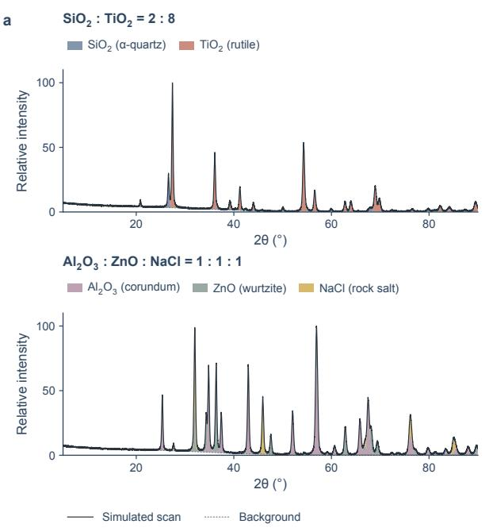

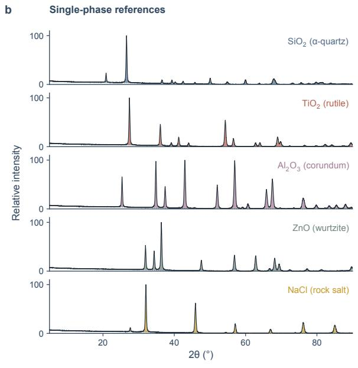  
Figure S8. Whole-pattern decomposition of binary and ternary powder mixtures. a, Fits to a nominal $2 { : } 8 \ \mathrm { S i O } _ { 2 }$ $( \alpha { \mathrm { - q u a r t z } } ) { \mathrm { - T i O } } _ { 2 }$ (rutile) mixture (to<sub>p</sub>) and a nominal 1:1:1 $\mathbf { A l } _ { 2 } \mathbf { O } _ { 3 }$ (corundum)–ZnO (wurtzite)– NaCl (rock salt) mixture (bottom). Black curves show the measured scans, <sub>g</sub>re<sub>y</sub> dashed curves show the fitted background and coloured fills show the phase-resolved contributions. b, Component difraction <sub>pro</sub>fil<sub>es recovere</sub>d f<sub>or eac</sub>h <sub>p</sub>h<sub>ase</sub> i<sub>n</sub> th<sub>e</sub> t<sub>wo m</sub>i<sub>x</sub>t<sub>ures, us</sub>i<sub>ng</sub> th<sub>e same co</sub>l<sub>our co</sub>d<sub>e.</sub>

## References

[1] Hollarek, D. et al. opxrd: Open experimental powder x-ray difraction database. Advanced Intelligent Discovery 2, e202500044 (2026).

[2] Lafuente, B. et al. The power of databases: the rruf project. Highlights in mineralogical crystallography 1, 25 (2015).

[3] Jain, A. et al. The materials project: Accelerating materials design through theory-driven data and tools. Handbook of Materials Modeling: Methods: Theory and Modeling 1751–1784 (2020).

[4] Cao, B. et al. Simxrd-4m: big simulated x-ray difraction data and crystal symmetry classification benchmark. In International Conference on Learning Representations, vol. 2025, 70721–70745 (2025).

[5] Ong, S. P. et al. Python materials genomics (pymatgen): A robust, open-source python library for materials analysis. Computational Materials Science 68, 314–319 (2013).

[6] Lafuente, B., Downs, R. T., Yan<sub>g</sub>, H. & Stone, N. The <sub>p</sub>ower of databases: The rruf <sub>p</sub>roject. In Armbruster, T. & Danisi, R. M. (eds.) Highlights in Mineralogical Crystallography, 1–30 (Walter de Gru<sub>y</sub>ter, 2015).

[7] Warren, B. E. X-ray Difraction (Courier Corporation, 1990).

[8] Materials Data Inc. JADE Pro. https://www.icdd.com/mdi-jade/ (2026).

[9] Malvern Panal<sub>y</sub>tical. Hi<sub>g</sub>hScore Plus. https://www.malvernpanalytical.com/ en/products/category/software/x-ray-diffraction-software/highscore (2026).

[10] Cr<sub>y</sub>stal Im<sub>p</sub>act GbR. Match! Phase Anal<sub>y</sub>sis usin<sub>g</sub> Powder Difraction. https://www. crystalimpact.com/match/ (2026).

[11] Bruker AXS GmbH. DIFFRAC.EVA. https://www.bruker.com/en/ products-and-solutions/diffractometers-and-x-ray-microscopes/ x-ray-diffractometers/diffrac-suite-software/diffrac-eva.html (2026).

[12] Rigaku, C. Integrated x-ray powder difraction software pdxl. Rigaku J 26, 23–27 (2010).

[13] Cao, B. et al. Xqueryer: an intelligent crystal structure identifier for powder x-ray difraction. National Science Review 12, nwaf421 (2025).

[14] Paszke, A. et al. Pytorch: An imperative style, high-performance deep learning library. Advances in neural information processing systems 32 (2019).

[15] Gao, H., Cao, B., Su, Y., Zhan<sub>g</sub>, T.-Y. & Liu, Q. Xdecom<sub>p</sub>oser: Learnin<sub>g</sub> <sub>p</sub>rior-free set decomposition for multiphase x-ray difraction. arXiv preprint arXiv:2605.05866 (2026).

[16] Vaswani, A. et al. Attention is all you need. Advances in neural information processing systems 30 (2017).

[17] He, K. et al. Masked autoencoders are scalable vision learners. In 2022 IEEE/CVF conference on computer vision and pattern recognition (CVPR), 15979–15988 (IEEE, 2022).

[18] Perez, E., Strub, F., De Vries, H., Dumoulin, V. & Courville, A. Film: Visual reasonin<sub>g</sub> with a general conditioning layer. In Proceedings of the AAAI conference on artificial intelligence, vol. 32 (2018).

[19] Le Roux, J., Wisdom, S., Erdo<sub>g</sub>an, H. & Hershe<sub>y</sub>, J. R. Sdr–half-baked or well done? In ICASSP 2019-2019 IEEE International Conference on Acoustics, Speech and Signal Processing (ICASSP), 626–630 (IEEE, 2019).

[20] Yu, D., Kolbæk, M., Tan, Z.-H. & Jensen, J. Permutation invariant trainin<sub>g</sub> of dee<sub>p</sub> models for speaker-independent multi-talker speech separation. In 2017 IEEE international conference on acoustics, speech and signal processing (ICASSP), 241–245 (IEEE, 2017).

[21] Dinnebier, R. E. & Billinge, S. J. Powder difraction: theory and practice (Royal society of chemistr<sub>y</sub>, 2015).

[22] Deb<sub>y</sub>e, P. & Scherrer, P. Interferenzen an re<sub>g</sub>ellos orientierten teilchen im rönt<sub>g</sub>enlicht. i. Nachrichten von der Gesellschaft der Wissenschaften zu Göttingen, Mathematisch-Physikalische Klasse 1916, 1–15 (1916).

[23] Rietveld, H. Line <sub>p</sub>rofiles of neutron <sub>p</sub>owder-difraction <sub>p</sub>eaks for structure refinement. Acta Crystallographica 22, 151–152 (1967).

[24] Rietveld, H. M. A profile refinement method for nuclear and magnetic structures. Journal of applied Crystallography 2, 65–71 (1969).

[25] Pawley, G. Unit-cell refinement from powder difraction scans. Journal of Applied Crystallography 14, 357–361 (1981).

[26] Le Bail, A., Duro<sub>y</sub>, H. & Four<sub>q</sub>uet, J. L. Ab-initio structure determination of lisbwo6 b<sub>y</sub> x-ray powder difraction. Materials Research Bulletin 23, 447–452 (1988).

[27] Tob<sub>y</sub>, B. H. & Von Dreele, R. B. Gsas-ii: the <sub>g</sub>enesis of a modern o<sub>p</sub>en-source all <sub>p</sub>ur<sub>p</sub>ose crystallography software package. Applied Crystallography 46, 544–549 (2013).

[28] Yan<sub>g</sub>tze AI Lab. Delta infra dashboard. https://delta-infra-dashboard. yangtzeailab.com/. Accessed: 2026-09-30.

[29] To<sub>g</sub>o, A., Shinohara, K. & Tanaka, I. S<sub>pg</sub>lib: a software librar<sub>y</sub> for cr<sub>y</sub>stal s<sub>y</sub>mmetr<sub>y</sub> search. Science and Technology ofAdvanced Materials: Methods 4, 2384822 (2024).