# Global Transport Couplings for Classifier-Free Guided Flows

Katarina Petrović1,2 Zander W. Blasingame1 Danyal Rehman1,3,4,5 İsmail İlkan Ceylan6,1,2 Michael Bronstein1,2 Stephen Y. Zhang7† Lazar Atanackovic8,9,10† Alexander Tong1†

1AITHYRA 2University of Oxford 3Mila - Québec AI Institute 4Université de Montréal 5Massachusetts Institute of Technology 6Technische Universität Wien 7Flatiron Institute 8University of Alberta 9Alberta Machine Intelligence Institute 10Canada CIFAR AI Chair

†Equal advising

## Abstract

Optimal-transport couplings have been shown to reduce training variance in unconditional flow models, but their role in conditional generation remains unclear. A natural approach constructs separate couplings for each condition, but this is impractical for large or continuous conditioning spaces found in modern image foundation models. We introduce Global Transport (GT), a global class-agnostic optimal-transport coupling, computed without class labels. GT can associate different conditions with different regions of the source noise, and consequently worsens performance without guidance. However, when combined with classifier-free guidance (CFG), GT consistently improves generation across domains, model scales, and sampling budgets. This reversal suggests that couplings for conditional flows should be evaluated both empirically and theoretically under the guided flow used at inference, rather than on unguided generation. We evaluate GT over both discrete class and continuous text conditioned image generation across model scales, and investigate how coupling choice alters guided trajectories. These results identify coupling design in the guided flow setting as a simple training time axis to improve performance without modifying existing architectures, samplers, or guidance mechanisms.

Correspondence: kpetrovic@aithyra.at Date: 6 October, 2026

## 1 Introduction

Flow matching (Albergo and Vanden-Eijnden, 2023; Lipman et al., 2023; Peluchetti, 2023) and difusion models (Ho et al., 2020; Song et al., 2021) have emerged as powerful paradigms for generative modeling, achievin state-of-the-art eneration results across a wide ran e of domains includin ima es (Rombach et al., 2022; Esser et al., 2024; Ma et al., 2024), videos (Ho et al., 2022; Blattmann et al., 2023; Polyak et al., 2024), and biological data (Li et al., 2026; Morehead et al., 2026). In the simplest construction, source and data samples are paired independently. A widely adopted strategy for improving generation quality is by incorporating optima transport (OT) couplings between noise samples and data points (Pooladian et al., 2023; Tong, Fatras, et al., 2024). OT pairs noise and data to minimize transport cost, reducing the training variance and enabling more eficient numerical integration and sampling eficiency of flow matching models (Berthelot et al., 2026; Lu, Sun, et al., 2026; Malnick et al., 2026). These benefits suggest that coupling design could also improve conditional generation. It is less obvious, however, what an appropriate coupling should be when every data sample is associated with a class, text prompt, or other condition.

The natural extension of this paradigm is to match source and data separately for each condition. Such class- conditional OT respects the common source distribution used to sample each class, but requires suficiently large batches of examples sharing a condition (Kerrigan et al., 2024; Chemseddine et al., 2025; Cheng and Schwing, 2025; Kong et al., 2026; Mousavi-Hosseini et al., 2026). This becomes impractical when there are many classes and is infeasible when conditions, such as text-embeddings, are continuous. As a result, class-conditional OT has achieved limited adoption in the conditional generative setting.

There is, however, an additional confounder in the case of conditional eneration. Conditional flow models are almost ubiquitously sampled with classifier-free guidance (CFG) (Ho and Salimans, 2022), which combines conditional and unconditional velocities and is used to steer towards a condition and away from the unconditional density. Class-conditional OT has been shown to improve both the unguided conditional flow, and the guided flow (Cheng and Schwing, 2025). The natural extension of this paradigm to the conditional generative setting is via class-conditional OT, where one seeks an optimal coupling for each class. However, this procedure necessitates the computation of couplings for class-conditioned batches, which becomes impractical for large conditioning spaces frequently found in modern generative models, and infeasible in continuous conditioning spaces used in text-to-image models (Esser et al., 2024). As a result, class-conditional OT has achieved limited adoption in the conditional generative setting, and yields modest gains for the added computational cost.

CFG trains a flow model to perform both conditional and unconditional generation, dropping the conditioning signal on some fraction of the data points; at inference time, guided samples are drawn by linearly composing the two velocit fields modulated b a uidance scale. As a result CFG uided sam les follow trajectories defined jointly by both conditional and unconditional velocity fields, rather than by the conditional model alone. Class conditional OT improves both the unconditional and conditional fields separately. A natural question then arises:

## Can a coupling that considers both fields together produce a better guided generator?

We answer in the afirmative with Global Transport (GT), which computes a single global OT assignment across source and target samples without considering their conditions. GT is straightforward to apply to both class labels and text conditioning, and requires no change to the model, sampler, or CFG rule. However, GT comes with a tradeof: Although the coupling preserves the overall source marginal, the conditional source distribution do not need to be consistent with the unconditional source distribution. Following from this mismatch, GT performs worse in unguided conditional sampling in our experiments. Under CFG, however, the ordering reverses with GT improving guided generation across domains, model scales, and sampling budgets.

To investigate the cause of this reversal, we study the coupling choice from the perspective of the guided flow. We find GT reduces the prediction gap (Wang et al., 2025; Cai et al., 2026), the diference between the conditional and unconditional flows. This reduces a pattern we term the yo-yo efect, where independent flows exhibit pronounced contraction, re-expansion, and overshooting along guided trajectories with increasing guidance strength. Our contributions are:

• We propose GT, a practical, low-overhead coupling strategy for conditional generation that requires no change to architectures, samplers, or guidance mechanisms.

• We demonstrate that unguided conditional performance does not always correlate with guided performance, and analyze how coupling choice afects guided trajectories and the prediction gap.

• We show that GT consistently yields competitive generation performance on class-conditioned image generation (e.g. FID 1.91 on ImageNet-256), text-conditioned image generation, and single-cell gene expression data, across model scales and sampling budgets, and outperforms both independent and class-conditional couplings.

## 2 Background and preliminaries

Flow Matching. Flow matching (FM) (Albergo et al., 2023; Lipman et al., 2023; Liu et al., 2023; Peluchetti, 2023) allows continuous time transport between distributions: the algorithm trains a velocity field that evolves samples from a source distribution $p _ { 0 }$ to a target data distribution $p _ { 1 } = p _ { \mathrm { d a t a } }$ , where $p _ { 0 }$ is typically chosen to be an easy-to-sample distribution such as $\mathcal { N } ( 0 , I _ { d } )$

Posit a continuous-time transport, i.e. a probability path, $( p _ { t } ) _ { t \in [ 0 , 1 ] }$ with the rescribed boundar condi tions $( p _ { 0 } , p _ { 1 } )$ . An such $p _ { t }$ is generated b a marginal velocit field $u _ { t }$ such that $\partial _ { t } p _ { t } + \nabla \cdot \left( p _ { t } \ * u _ { t } \right) \ = \ 0 .$ FM seeks to approximate $u _ { t }$ with a model $u _ { t } ^ { \theta }$ by least-squares regression, minimizing $\begin{array} { r l } { \mathcal { L } _ { \mathrm { F M } } ( \theta ) } & { { } = } \end{array}$ $\mathbb { E } _ { t \sim U [ 0 , 1 ] , x _ { t } \sim p _ { t } } \left\lceil \left\| u _ { t } ^ { \theta } ( x _ { t } ) - u _ { t } ( x _ { t } ) \right\| _ { 2 } ^ { 2 } \right\rceil$ This objective is intractable, as in practice $u _ { t }$ is unavailable in closed form. Conditional FM (Albergo et al., 2023; Tong, Fatras, et al., 2024) instead introduces a coupling $\pi \in \Pi ( p _ { 0 } , p _ { 1 } )$ and a conditional probability path $p _ { t } ( \cdot \mid x _ { 0 } , x _ { 1 } )$ generated by tractable conditional velocity field $\boldsymbol { u } _ { t } ( \cdot | \boldsymbol { x } _ { 0 } , \boldsymbol { x } _ { 1 } )$ . Taking expectations yields the CFM objective, which trains a neural velocity field $u ^ { \theta }$ by regression onto the closed-form conditional velocit $u _ { t } ( x _ { t } \mid x _ { 0 } , x _ { 1 } )$

$$
\begin{array} { r } { \mathcal { L } _ { \mathrm { C F M } } ( \theta ) = \mathbb { E } _ { t , ( x _ { 0 } , x _ { 1 } ) \sim \pi , x _ { t } \sim p _ { t } ( \cdot | x _ { 0 } , x _ { 1 } ) } \left[ \left| \left| u _ { t } ^ { \theta } ( x _ { t } ) - u _ { t } ( x _ { t } \mid x _ { 0 } , x _ { 1 } ) \right| \right| _ { 2 } ^ { 2 } \right] . } \end{array}\tag{1}
$$

Once trained, samples from $p _ { 1 }$ can be generated by first drawing from the source $x _ { 0 } \sim p _ { 0 }$ , then numerically integrating the ODE ${ \dot { x } } _ { t } = u _ { t } ( x _ { t } )$

Classifier-free Guidance. Conditional generation, present in many applications such as text-to-image or textto-video synthesis, requires sampling given a prompt $c \in { \mathcal { C } }$ , achieved by learning a prompt-conditioned velocity field $\boldsymbol { u } _ { t } ( \boldsymbol { x } _ { t } \mid c )$ via the analogue of equation 1,

$$
\begin{array} { r } { \mathcal { L } _ { \mathrm { C F M } } ^ { c } ( \theta ) = \mathbb { E } _ { t , ( x _ { 0 } , x _ { 1 } , c ) \sim \pi , x _ { t } \sim p _ { t } ( \cdot | x _ { 0 } , x _ { 1 } ) } \left[ \left| \left| u _ { t } ^ { \theta } ( x _ { t } , c ) - u _ { t } ( x _ { t } \mid x _ { 0 } , x _ { 1 } , c ) \right| \right| _ { 2 } ^ { 2 } \right] . } \end{array}\tag{2}
$$

Classifier-free guidance (CFG) (Ho and Salimans, 2022) improves sample quality and prompt alignment by sampling from a linear combination of the marginal and conditional fields,

$$
\begin{array} { r } { \widetilde { u } _ { t } ^ { w } ( x _ { t } \mid c ) = u _ { t } ( x _ { t } ) + w g ( x _ { t } , t , c ) , \quad g ( x _ { t } , t , c ) = u _ { t } ( x _ { t } \mid c ) - u _ { t } ( x _ { t } ) } \end{array}\tag{3}
$$

where $w \ge 1$ and $g$ are the guidance weight and vector respectively. In practice, a single model is trained across all conditions, with c replaced by a null token ∅ with some probability, so that $u _ { t } ^ { \theta } ( x _ { t } , \theta )$ estimates the margina field. Appendix E.1 reviews the theory underlying CFG.

Optimal Transport. Optimal transport conditional flow matching (OT-CFM) (Pooladian et al., 2023; Tong, Fatras, et al., 2024; Kong et al., 2026; Mousavi-Hosseini et al., 2026) replaces the independent coupling $\pi = p _ { 0 } \otimes p _ { 1 }$ with a roximations of the Euclidean OT cou lin π , defined as the solution to

$$
\begin{array} { r } { \pi _ { \mathrm { O T } } = \mathop { \bf a r g m i n } _ { \pi \in \Pi ( p _ { 0 } , p _ { 1 } ) } \mathbb { E } _ { ( x _ { 0 } , x _ { 1 } ) \sim \pi } \| x _ { 0 } - x _ { 1 } \| _ { . } ^ { 2 } } \end{array}\tag{4}
$$

The resulting trajectories are straighter in practice and therefore easier to integrate in the few-step sampling regime, shown to achieve modest but consistent gains in the unconditional setting.

Class-conditional Optimal Transport. Class-conditional eneration involves sam lin from data distribution $p _ { 1 } ( x \mid c )$ conditioned on selected class $c \in { \mathcal { C } } .$ A naïve adaptation of minibatch OT-CFM to the class-conditional setting involves solving |C| independent OT problems, one for each class $c \in { \mathcal { C } }$ . However, this quickly becomes infeasible when the number of classes |C| becomes even moderately large (for instance, ImageNet contains 1000 classes), and is not possible in settings where the condition itself is a continuous latent state, as is the case for text-to-image generation for example. (Kerrigan et al., 2024; Chemseddine et al., 2025; Cheng and Schwing, 2025) proposed to approximate this by minimizing

$$
\pi _ { \mathbf { C ^ { 2 } O T } } = \arg \operatorname* { m i n } _ { \pi \in \Pi ( p _ { 0 } , p _ { 1 } ) } \mathbb { E } _ { ( ( x _ { 0 } , c _ { 0 } ) , ( x _ { 1 } , c _ { 1 } ) ) \sim \pi } \left[ \| x _ { 0 } - x _ { 1 } \| ^ { 2 } + \beta \| c _ { 0 } - c _ { 1 } \| ^ { 2 } \right]\tag{5}
$$

where $\beta$ is adjusted to fit the scale and $c _ { 0 , 1 }$ denotes the class associated with $x _ { 0 , 1 }$ . This allows the use of much smaller batches in practice, but with unknown degradation, and thus far has not been widely adopted in conditional generation settings, where independent couplings are almost universal.

## 3 Global Transport

We next introduce Global Transport (GT) a practical and low overhead application of optimal transport which improves performance in the class-conditioned setting. GT computes an approximate optimal trans-port coupling without encouraging or constraining as-signments to preserve class labels. The method does

Algorithm 1 GT training step   
$x _ { 0 } \sim p _ { 0 } , \ ( x _ { 1 } , c ) \sim p _ { 1 } , \ t \sim \mathcal { U } ( 0 , 1 )$   
$\tilde { c } \gets \emptyset$ w.p. puncond, else ${ \tilde { c } } \gets c$   
$\hat { x } _ { 0 } \gets \pi _ { \mathsf { G T } } ( x _ { 0 } ) ; \quad x _ { t } \gets t x _ { 1 } + ( 1 - t ) \hat { x } _ { 0 }$   
$\theta \gets \mathrm { U p d a t e } \big ( \theta , \nabla _ { \theta } \| u _ { t } ^ { \theta } ( x _ { t } , \tilde { c } ) - ( x _ { 1 } - \hat { x } _ { 0 } ) \| ^ { 2 } \big )$

not change the architecture nor inference algorithm and adds only a training-time assignment step. We first describe the overall objective, then two approximations either using (1) a mini-batch approximation (Fatras et al., 2021; Pooladian et al., 2023; Tong, Fatras, et al., 2024) or (2) a semi-discrete approximation (Kong et al., 2026; Mousavi-Hosseini et al., 2026).

General objective. Given noise samples $x _ { 0 } \sim p _ { 0 }$ and class conditional data samples $( x _ { 1 } , c ) \sim p _ { 1 }$ , for the optimal transport coupling $\pi _ { O T }$ as defined in equation 4, and a standard linear flow matching path $x _ { t } = t x _ { 1 } + ( 1 - t ) x _ { 0 }$ where the noise is rearranged to match the closest data points, ignoring the labels c. This results in the conditional flow matching objective:

$$
\mathcal { L } _ { \mathrm { G T } } ( \theta ) = \mathbb { E } _ { t \sim U [ 0 , 1 ] , ( x _ { 0 } , x _ { 1 } ) \sim \pi _ { \mathrm { O T } } } \Vert u _ { t } ^ { \theta } ( x _ { t } , \tilde { c } ) - ( x _ { 1 } - x _ { 0 } ) \Vert ^ { 2 }\tag{6}
$$

where c˜ is set to ∅ with probability $p _ { \mathrm { u n c o n d } }$ and c otherwise. The full algorithm appears in Algorithm 1.

Minibatch-OT Implementation. We com ute the assi nment usin the Hun arian al orithm with s uared Euclidean cost in the model in ut s ace. For a batch of size $B ,$ the cost matrix re uires $O ( B ^ { 2 } )$ memor and the exact assignment $O ( B ^ { 3 } )$ time. This is generally dwarfed by network evaluation time on large systems and is negligible (usually < 2% overhead) for modern workflows. However, it can be expensive for large batch sizes, if this setting is desired a regularized (Cuturi, 2013; Tong, Malkin, et al., 2024; Zhang et al., 2026), or semi-discrete approach may be more appropriate.

Semi-discrete OT Implementation. Building of of recent work on Flow matching with semi-discrete optimal transport couplings, we can also use an approximate semi-discrete OT implementation. This approach first performs an expensive preprocessing step to optimize a semi-dual potential function over all discrete datapoints, which can then be used to calculate couplings with any member of the continuous noise measure.

The conditional source distribution mismatch. Ignoring conditions while constructing the coupling changes the distribution of $( x _ { 0 } , x _ { 1 } )$ pairs the conditional model learns from. To illustrate this, we consider the full batch, idealized setting using the true OT coupling $\pi _ { O T }$ , with associated transport map $T : p _ { 0 } \to p _ { 1 }$ . Draw $x _ { 0 } \sim p _ { 0 }$ and set $x _ { 1 } = T ( x _ { 0 } )$ with condition $C .$ . Then the source points that are paired with points with condition c do not need to be distributed like $p _ { 0 }$ as diferent conditions may be paired with source points from diferent regions of the prior. In other words, although $x _ { 0 } \sim p _ { 0 }$ , the conditional distribution $x _ { 0 } \mid C = c$ need not equal $p _ { 0 }$ . This tells us that under the unguided setting $( w = 1 )$ , the standard class conditioned inference procedure starting with samples from $p _ { 0 }$ will not necessarily land at $p _ { 1 } | c ,$ , and is only guaranteed to if the initial samples are drawn from the intractable distribution $x _ { 0 } \mid C = c .$

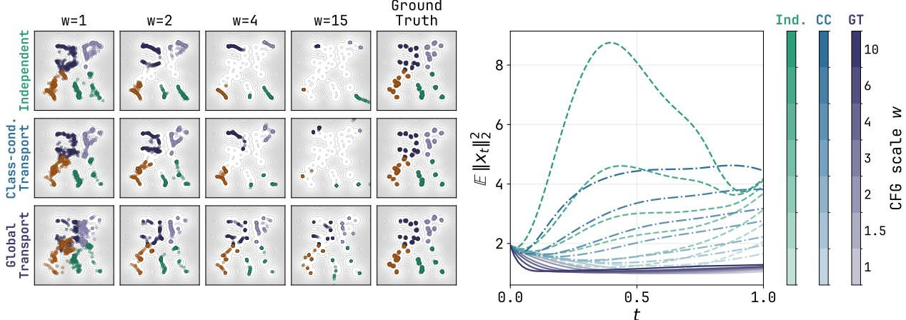  
Figure 1 2-dimensional depiction of the “yo-yo” efect. This efect pushes samples away from the center at high guidance scales for the independent and class-conditional OT couplings, degrading generative performance. Global Transport fixes this and is stable under increasing guidance w.

## 4 Coupling Choice With Classifier-Free Guidance

The conditional source distribution mismatch described above suggests that GT may be a poor choice for unguided conditional generation $( w = 1 )$ , which we observe in a 2-dimensional 40-Gaussian mixture model example with four classes (Figures 1 and 6 with details in Appendix A). However, the result changes under guidance $( w > 1 )$ . This guidance dependent efect motivates studying the unconditional and conditional fields together as they are used during inference, rather than judging a coupling by its unguided conditional generation performance.

## 4.1 Geometry of guided trajectories

Let $X _ { t } ^ { ( w ) }$ denote a sample generated by integrating $\dot { X } _ { t } ^ { ( w ) } = \widetilde { u } _ { t } ^ { w } ( X _ { t } ^ { ( w ) } \mid c )$ from $X _ { 0 } ^ { ( w ) } \sim p _ { 0 }$ . To track its radial position over time, we measure

$$
Y _ { w } ( t ) = \mathbb { E } \| X _ { t } ^ { ( w ) } \| _ { 2 } .\tag{7}
$$

Unlike the distribution of linear interpolants used in training, $Y _ { w } ( t )$ describes the radial position of trajectories produced by the guided sampler.

In our GMM example, trajectories trained with independent pairing contract before expanding toward their class modes (Figure 2). As w increases, the re-expansion becomes more pronounced and can overshoot the target regions (Figure 1). We refer to this contraction followed by re-expansion as the yo-yo efect. Class-conditional OT reduces some aspects of this behavior, while GT exhibits less pronounced contraction and overshoot over the guidance scales we test (Figures 1 and 3).

## 4.2 Coupling controls the prediction gap

Recall from equation 3 the guidance vector $g ( x _ { t } , t , c ) = u _ { t } ( x _ { t } | c ) - u _ { t } ( x _ { t } )$ measures the gap between unconditional and conditional velocity fields. Following Wang et al. (2025) we call $\| g ( x , t , c ) \| ^ { 2 }$ the prediction gap and ask how the trainin cou lin constrains its size.

Let π be the joint distribution of matched source points $x _ { 0 }$ , data points $x _ { 1 }$ , and conditions $C .$ . Its $( x _ { 0 } , x _ { 1 } )$ marginal couples $p _ { 0 }$ and $p _ { 1 }$ . Define the training interpolant $x _ { t } = ( 1 - t ) x _ { 0 } + t x _ { 1 }$ and its coupling cost $\operatorname { C o s t } ( \pi ) =$

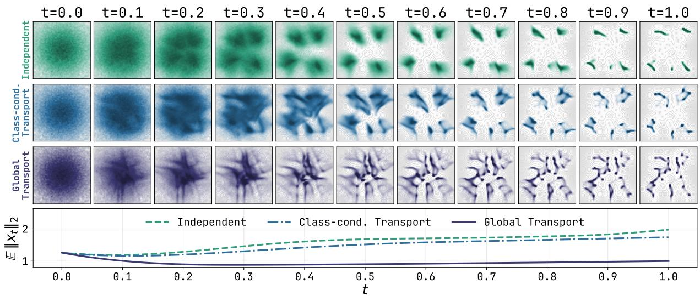

Figure 2 Density over time for Independent, Class conditional, and GT couplings. Independent $\mathrm { \bf { \ddot { y } 0 y 0 } } ^ { \prime \prime } \mathrm { \bf { S } , }$ contracting towards the class ori in then ex andin outwards, whereas GT is stable.  
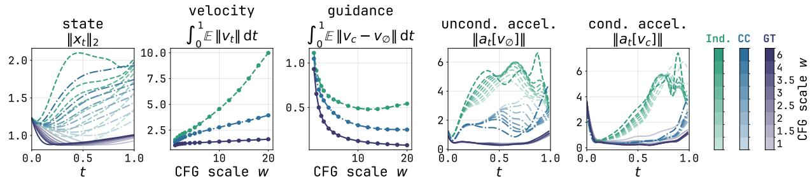  
Figure 3 Guided dynamics on the 40-GMM across guidance scales w. From left: state norm along guided trajectories; integrated guided velocity norm; integrated prediction gap $\| v _ { c } - v _ { \emptyset } \|$ ; unconditional and conditional material acceleration $\| a _ { t } [ v ] \|$

$$
\mathbb { E } _ { \pi } \| x _ { 1 } - x _ { 0 } \| ^ { 2 } .
$$

Proposition 4.1 (Transport cost bounds the on-path prediction gap). Suppose $u _ { t } ( x )$ and $\boldsymbol u _ { t } ( \boldsymbol x \mid c )$ are the population squared-error minimizers for the common flow-matching target $x _ { 1 } - x _ { 0 }$ under π. Then

$$
\begin{array} { r } { \mathbb { E } _ { t , \pi } \left[ \| g ( X _ { t } , t , C ) \| ^ { 2 } \right] \leq \operatorname { C o s t } ( \pi ) - \mathcal { W } _ { 2 } ^ { 2 } ( p _ { 0 } , p _ { 1 } ) . } \end{array}\tag{8}
$$

The proof in Appendix B.1 first expresses the expected prediction gap as the diference between the optimal unconditional and conditional flow-matchin re ression errors. It then bounds the inte rated unconditiona error by the excess quadratic transport cost. A lower-cost coupling can therefore give a tighter upper bound on the average prediction gap along its training interpolants. We note that this bound holds strictly along the linear training interpolants and does not govern the distribution of states visited during guided inference $( w > 1 )$ , which we verify empirically. We also note that at the optimal transport limit, the bound contracts to zero because deterministic transport renders class conditioning redundant on the training support. In practice, finite mini-batch OT retains a non-zero prediction gap while regularizing the velocity fields. Further, we can show a hierarchy of coupling costs between diferent methods compared in this paper, which we do in the following proposition.

Proposition 4.2. For all β the coupling costs satisfy

$$
\mathrm { C o s t } ( \pi _ { \mathfrak { G } \mathbb { T } } ^ { \star } ) \leq \mathrm { C o s t } ( \pi _ { C ^ { 2 } O T ( \beta ) } ^ { \star } ) \leq \mathrm { C o s t } ( \pi _ { \mathrm { i n d } } ) .\tag{9}
$$

with the lower equality achieved at $\beta = 0 .$

which establishes that the GT algorithm has a tighter upperbound on the prediction gap than $\mathrm { C } ^ { 2 } \mathrm { O T } \left( \mathrm { f o r } \beta > 0 \right)$ which has a tighter upper bound on the prediction gap than independent couplings.

While these results establish tighter upperbounds on the prediction gap, this does not establish causality between lower prediction gaps and improved performance. We use the bound to motivate the prediction-gap measurements in Figure 3, not as an explanation of generation performance on its own.

## 5 Experiments

We now demonstrate the efectiveness of GT on conditional generation in several diferent settings including image generation and single-cell experiments. We first show that GT improves the performance of classifier-free guided class-conditional generation on ImageNet (Deng et al., 2009) (256 × 256) when training flow matching models and distilling them into flow maps. Then we move to the case of continuous conditioned models in the text-to-image setting, before finally demonstrating the impact on single-cell data generation guided by cell type labels across multiple single-cell datasets. We denote the minibatch version of GT-MB as GT, and the semi-discrete OT version of GT as GT + SD-OT.

Table 1 Left: FID↓ comparison against baselines. †denotes results obtained with guidance interval (Kynkäänniemi et al., 2024). Right: Curated class-conditional samples from SiT-XL/2 + GT on ImageNet-256.
<table><tr><td>Method</td><td>NFE</td><td>CFG</td><td>Params</td><td>FID ↓</td></tr><tr><td colspan="5">GANs / Normalizing Flows / Autoregressive models</td></tr><tr><td>StyleGAN-XL (Sauer et al., 2022)</td><td>1</td><td>x</td><td>166M</td><td>2.30</td></tr><tr><td>STARFlow (Gu et al., 2025)</td><td>1</td><td>x</td><td>1.4B</td><td>2.40</td></tr><tr><td>VAR-d30 (Tian et al., 2024)</td><td>20</td><td></td><td>2B</td><td>1.92</td></tr><tr><td>MAR-H/2 (Li et al., 2024)</td><td>64</td><td>V</td><td>943M</td><td>1.55</td></tr><tr><td colspan="5">Diffusion / Flow models</td></tr><tr><td>ADM (Dhariwal and Nichol, 2021)</td><td>500</td><td></td><td>554M</td><td>10.94</td></tr><tr><td>LDM (Rombach et al., 2022)</td><td>500</td><td></td><td>400M</td><td>3.60</td></tr><tr><td>RIN (Jabri et al., 2022)</td><td>1000</td><td>x</td><td>410M</td><td>3.42</td></tr><tr><td>SimDiff (Hoogeboom et al., 2023)</td><td>1024</td><td></td><td>2B</td><td>2.77</td></tr><tr><td>U-ViT-H/2 (Bao et al., 2023)</td><td>100</td><td></td><td>501M</td><td>2.29</td></tr><tr><td>DiT-XL/2 (Peebles and Xie, 2023)</td><td>500</td><td></td><td>675M</td><td>2.27</td></tr><tr><td>SiT-XL/2† (Ma et al., 2024)</td><td>500</td><td></td><td>675M</td><td>2.06</td></tr><tr><td>SiT-XL/2 + GT † (ours)</td><td>500</td><td>L</td><td>675M</td><td>1.91</td></tr></table>

## 5.1 Class- and text- conditioned image generation on ImageNet-256

We follow the hyperparameter set-up of Ma et al. (2024) to train a SiT model on conditional generation across B/2, L/2 and XL/2 model scales using independent, class-conditional and GT transport. We report the Fréchet Inception Distance (FID) (Heusel et al., 2017) and $\mathrm { F D } _ { \mathrm { D I N O v 2 } }$ (Stein et al., 2023) metrics to measure the distributional distance between the generated and real distributions. We highlight our best configuration in Table 1 showing an improvement from the standard SiT-XL/2 trained with independent couplings to ours trained with the GT strategy, improving from 2.06 to 1.91 in FID. This one result, however, lays in front of a more interesting story.

Namely, with GT the guidance scale w can be pushed to much larger values before performance begins to degrade, enabling us to push far more aggressively into high guidance strength regimes. To illustrate, consider Figure 4 where we compare the performance at various guidance scales w along with applying the guidance interval technique (Kynkäänniemi et al., 2024). We notice that for the model trained with GT couplings we can use markedly higher guidance scales than the model trained with

Table 2 Comparison of diferent couplings across various NFEs and model sizes reported in FID and $\mathrm { F D } _ { \mathrm { D I N O v 2 } } .$ We swept for the optimal guidance strength $w ^ { \ast }$ for each setting and report the best result.
<table><tr><td rowspan="2">Model</td><td rowspan="2">Coupling</td><td colspan="3">FID↓</td><td colspan="3"> $\mathrm { F D } _ { \mathrm { D I N O v 2 } } \downarrow$ </td></tr><tr><td>16</td><td>32</td><td>64</td><td>16</td><td>32</td><td>64</td></tr><tr><td rowspan="4">SiT-B/2 (130M)</td><td>Independent</td><td>5.88</td><td>5.33</td><td>5.16</td><td>137.3</td><td>132.9</td><td>132.3</td></tr><tr><td>Class-cond. OT</td><td>5.79</td><td>5.20</td><td>5.08</td><td>136.4</td><td>132.2</td><td>131.4</td></tr><tr><td> $\mathsf { G T } + \mathsf { S D - O T }$ </td><td>5.11</td><td>4.90</td><td>4.85</td><td>199.6</td><td>194.6</td><td>184.7</td></tr><tr><td>GT</td><td>5.15</td><td>4.35</td><td>4.15</td><td>123.6</td><td>118.0</td><td>116.4</td></tr><tr><td rowspan="3">SiT-L/2 (459M)</td><td>Independent</td><td>5.50</td><td>5.74</td><td>2.95</td><td>91.1</td><td>84.6</td><td>83.3</td></tr><tr><td>Class-cond. OT</td><td>5.47</td><td>5.68</td><td>2.98</td><td>102.0</td><td>99.2</td><td>95.0</td></tr><tr><td>GT</td><td>3.94</td><td>3.84</td><td>2.69</td><td>83.5</td><td>78.7</td><td>73.5</td></tr><tr><td rowspan="2">SiT-XL/2 (675M)</td><td>Independent</td><td>3.95</td><td>3.00</td><td>2.78</td><td>84.2</td><td>78.7</td><td>77.8</td></tr><tr><td>GT</td><td>3.22</td><td>2.69</td><td>2.59</td><td>72.7</td><td>69.1</td><td>68.4</td></tr></table>

independent couplings; along with having an overall better minimum w.r.t. FID. Observe that interval tuning improves all the couplings and shifts their optima to larger w, whilst GT obtains the best global optima among the coupling strategies. Notably, the gap between GT and independent couplings grows as w increases. Further, observe that semi-discrete GT which is closer to the exact OT map is the most robust at higher guidance scales, however does not reach the overall global minima FID. To complement Figure 4 we report the best results across the diferent coupling strategies under several model sizes, swept over diferent guidance scales (per metric) in Table 2. Observe that across all NFE and model sizes the GT couplings obtain the strongest performance yielding a noticeable improvement. For model and training configurations please refer to appendix C.

Distillation into a flow map. We next assess whether GT couplings can serve as a distillation strategy for few-step generators. Following Lee et al. (2026), we distill a SiT-B/2 and SiT-L/2 flow matching teacher into a flow map with usin the meanflow distillation objective (Gen et al., 2025). The teacher is retrained with either inde endent or GT couplings and the student is distilled with GT in both cases. On SiT-B/2, observe that applying GT only at distillation (i.e., from an independently pretrained teacher) matches pretraining with GT throughout, indicating that GT is efective purely as a distillation strategy for stronger few-step generators outperforming other coupling choices.

Adaptive step sampling. We compare coupling plans under the adaptive dopri5 solver as shown in Table 4. GT attains the lowest FID and $\mathrm { F D } _ { \mathrm { D I N O v 2 } }$ overall, while semi-discrete GT requires the fewest function evaluations and outperforms the other couplings at high guidance scales.

Continuous Conditions. We next demonstrate that GT improves text-conditioned generation under classifier-

SiT-B/2, GI [0, 0.7]  
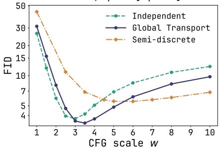

Independent  
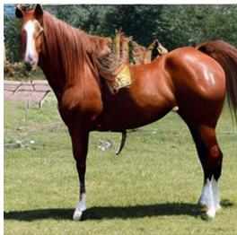

Class-cond. Transport  
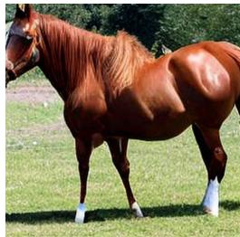

Global Transport  
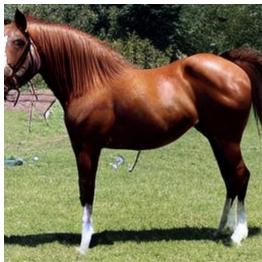  
Figure 4 Left: Guidance scale w swee for SiT-B/2 (Euler-64 ste s) FID ↓ under a tuned uidance interval [0, 0.7]. Right: Class-conditional samples for class 339 (sorrel) from SiT-L/2 (Euler-64 steps, w = 2.5) under independent, class-conditional, and GT transport.

Table 3 Left: FID ↓ on ImageNet-256 for DMF distilled with independent, class-conditional and GT couplings, at B/2 and L/2 scale. Right: Curated sam les from GT DMF-B/2 at 4-NFE.
<table><tr><td rowspan="2">Model</td><td rowspan="2">Coupling</td><td colspan="3">Teacher (NFE)</td><td colspan="3">Student (NFE)</td></tr><tr><td>16</td><td>32</td><td>64</td><td>1</td><td>2</td><td>4</td></tr><tr><td rowspan="4">DMF-B/2</td><td>Independent</td><td>5.88</td><td>5.33</td><td>5.16</td><td>5.82</td><td>5.19</td><td>5.19</td></tr><tr><td>Class-cond. OT</td><td>5.79</td><td>5.20</td><td>5.08</td><td>5.83</td><td>5.18</td><td>5.25</td></tr><tr><td>GT (from GT teacher)</td><td>5.15</td><td>4.35</td><td>4.15</td><td>5.66</td><td>4.17</td><td>4.14</td></tr><tr><td>GT (from ind. teacher)</td><td>5.88</td><td>5.32</td><td>5.22</td><td>5.88</td><td>4.21</td><td>4.18</td></tr><tr><td rowspan="2">DMF-L/2</td><td>Independent</td><td>5.50</td><td>5.74</td><td>2.95</td><td>3.31</td><td>2.82</td><td>2.68</td></tr><tr><td>GT</td><td>3.94</td><td>3.84</td><td>2.69</td><td>4.03</td><td>2.46</td><td>2.37</td></tr></table>

Table 4 FID ↓, $\mathrm { F D } _ { \mathrm { D I N O v 2 } } \ .$ ↓, and NFE ↓ for SiT-B/2 over coupling plans and guidance scales w.
<table><tr><td rowspan="2">w</td><td colspan="3">Independent</td><td colspan="3">Class-cond. OT</td><td colspan="3">GT</td><td colspan="3">GT +SD-OT</td></tr><tr><td>FID</td><td> $\mathrm { F D } _ { \mathrm { D I N O v 2 } }$ </td><td>NFE</td><td>FID</td><td> $\mathrm { F D } _ { \mathrm { D I N O v 2 } }$ </td><td>NFE</td><td>FID</td><td> $\mathrm { F D } _ { \mathrm { D I N O v 2 } }$ </td><td>NFE</td><td>FID</td><td> $\mathrm { F D } _ { \mathrm { D I N O v 2 } }$ </td><td>NFE</td></tr><tr><td>1.0</td><td>25.01</td><td>586.47</td><td>50.83</td><td>25.23</td><td>589.00</td><td>47.73</td><td>29.65</td><td>618.75</td><td>49.17</td><td>42.39</td><td>772.55</td><td>38.00</td></tr><tr><td>2.0</td><td>5.17</td><td>206.41</td><td>60.99</td><td>5.08</td><td>208.96</td><td>60.56</td><td>4.06</td><td>220.08</td><td>61.54</td><td>7.56</td><td>341.00</td><td>50.00</td></tr><tr><td>3.0</td><td>11.13</td><td>138.30</td><td>76.39</td><td>10.98</td><td>137.98</td><td>75.84</td><td>8.77</td><td>130.56</td><td>73.45</td><td>4.79</td><td>226.95</td><td>62.80</td></tr><tr><td>4.0</td><td>15.77</td><td>132.94</td><td>90.04</td><td>15.56</td><td>132.06</td><td>89.86</td><td>13.37</td><td>116.34</td><td>85.63</td><td>5.47</td><td>194.00</td><td>77.09</td></tr></table>

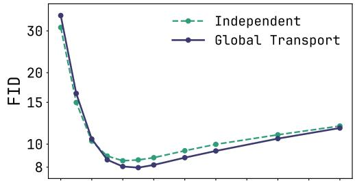

Independent  
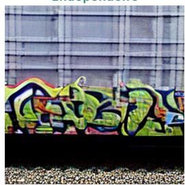

Global Transport  
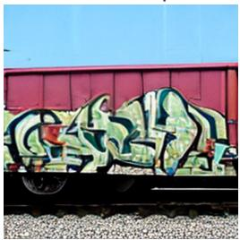  
“a train car with graffiti on it”

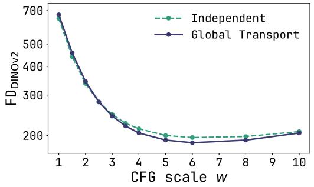

  
“a close up of a green parrot with bright red eyes”  
Figure 5 Left: FID↓ and $\mathrm { F D } _ { \mathrm { D I N O v } 2 } \downarrow$ for text-conditioned ImageNet-256 across guidance scales w. Right: Text-conditioned ImageNet samples from independent and GT coupling models at w = 4.

free guidance. Following the text-conditioned ImageNet-256 setup of Cheng and Schwing (2025), we condition on image captions from an enriched version of ImageNet (VisualLayer, 2024). Captions are encoded by a frozen pretrained CLIP text encoder followed by an MLP that maps them to the conditioning signal. The null condition used for guidance dropout is a zero vector. As shown in Figure 5, GT achieves lower FID and $\mathrm { F D } _ { \mathrm { D I N O v 2 } }$ at higher guidance scales.

Table 5 Comparison of GT with single-cell generative models on distribution-matching metrics (RBF-kernel MMD and 2-Wasserstein distance), averaged over three seeds.
<table><tr><td></td><td colspan="2">PBMC3K</td><td colspan="2">Dentate gyrus</td><td colspan="2">HLCA</td></tr><tr><td></td><td>MMD (↓)</td><td>WD (4)</td><td>MMD (↓)</td><td>WD (↓)</td><td>MMD (↓)</td><td>WD (↓)</td></tr><tr><td>c-CFGen</td><td> $\mathbf { 0 . 4 5 \pm 0 . 0 0 }$ </td><td> ${ \bf 1 1 . 1 7 \pm 0 . 0 2 }$ </td><td> $\underline { { \mathbf { 0 . 0 6 \pm 0 . 0 0 } } }$ </td><td> $7 . 2 6 \pm \mathbf { 0 . 0 3 }$ </td><td> $\mathbf { 0 . 0 6 \pm 0 . 0 0 }$ </td><td> ${ \bf 5 . 0 6 \pm 0 . 0 0 }$ </td></tr><tr><td>c-CFGen-linear</td><td> $\underline { { \mathbf { 0 . 4 1 \pm 0 . 0 0 } } }$ </td><td> ${ \underline { { 1 0 . 2 7 } } } \pm 0 . 0 8$ </td><td> $\mathbf { 0 . 0 6 \pm 0 . 0 0 }$ </td><td> ${ \bf 6 . 6 9 \pm 0 . 0 1 }$ </td><td> $\underline { { \mathbf { 0 . 0 7 \pm 0 . 0 0 } } }$ </td><td> $\mathbf { 4 . 8 9 \mathop { \pm } { = } 0 . 0 1 }$ </td></tr><tr><td>scDiffusion</td><td> $\mathbf { 0 . 6 7 \pm 0 . 0 6 }$ </td><td> ${ \bf 1 } 2 . { \bf 1 } 1 \pm { \bf 0 . 1 6 }$ </td><td> $\underline { { \mathbf { 0 . 0 6 \pm 0 . 0 0 } } }$ </td><td> ${ \bf 5 . 8 9 \pm 0 . 0 1 }$ </td><td> $\mathbf { 0 . 1 2 \pm 0 . 0 0 }$ </td><td> ${ \bf 5 . 4 2 \pm 0 . 0 1 }$ </td></tr><tr><td>scVI</td><td> $\mathbf { 0 . 5 8 \pm 0 . 0 1 }$ </td><td> ${ \bf 1 3 . 3 9 \pm 0 . 1 6 }$ </td><td> $\mathbf { 0 . 1 1 \pm 0 . 0 0 }$ </td><td> ${ \bf 7 . 3 4 \pm 0 . 0 3 }$ </td><td> $\mathbf { 0 . 1 3 \pm 0 . 0 0 }$ </td><td> ${ \bf 6 . 3 9 \pm 0 . 0 1 }$ </td></tr><tr><td>GT (ours)</td><td> $\mathbf { 0 . 3 9 \pm 0 . 0 0 }$ </td><td> $\mathbf { 9 . 8 0 \ : \pm { \ : 0 . 0 2 } }$ </td><td> $\mathbf { 0 . 0 5 \ : \pm { \ : 0 . 0 0 } }$ </td><td> $\underline { { 6 . 6 1 \pm 0 . 0 1 } }$ </td><td> $\underline { { \mathbf { 0 . 0 7 \pm 0 . 0 0 } } }$  </td><td> $\mathbf { 4 . 9 8 \pm 0 . 0 0 }$ </td></tr></table>

## 5.2 Single-cell Experiments

We evaluate GT on conditional single-cell generation following Palma et al. (2025), conditioning on cell type for PBMC3K1, Dentate gyrus (La Manno et al., 2018) and HLCA (Sikkema et al., 2023). Against c-CFGen (Palma et al., 2025), its linear interpolant variant, scDifusion (Luo et al., 2024) and scVI (Gayoso et al., 2021), GT is best on three of six metrics and second best on three out of six (Table $5 ,$ details in Appendix D).

## 6 Related Work

Optimal Transport for Generative Models. Optimal transport (Benamou and Brenier, 2000) is widely used to im rove unconditional (Pooladian et al., 2023; Ton , Fatras, et al., 2024; Ton , Malkin, et al., 2024; Calvo-Ordonez et al., 2026) and class-conditional (Chemseddine et al., 2025; Cheng and Schwing, 2025) generation, at scale via semi-discrete potentials (Kong et al., 2026; Mousavi-Hosseini et al., 2026) and “re-flow”-style strategies that exploit flow invertibility (Kim et al., 2025; Berthelot et al., 2026). In biology, it has been applied to single-cell trajectory inference (Schiebinger et al., 2019; Kapuśniak et al., 2024; Petrović et al., 2025) and measure-to-measure transport (Haviv et al., 2025; Vandergrift et al., 2026).

Flow Maps. Flow maps (Bofi et al., 2025; Frans et al., 2025; Geng et al., 2025) have recently emerged as an eficient route to one- and few-step generators, either distilled (Sabour et al., 2025; Lee et al., 2026) or trained from scratch (Bofi et al., 2025; Geng et al., 2025, 2026), with applications to image (Lu, Lu, et al., 2026; Wang et al., 2026) and video (Gu et al., 2026; Shaul et al., 2026) generation.

Classifier-Free Guidance for Flow Models. Classifier-free guidance (CFG) (Ho and Salimans, 2022) is a widely adopted strategy for improving conditional generation with difusion and flow matching models (Zheng et al., 2023). Subsequent work includes guidance interval tuning (Kynkäänniemi et al., 2024), velocity field projection (Fan et al., 2025; Cai et al., 2026), guidance weight schedules (Wang et al., 2024; Chung et al., 2025; Galashov et al., 2026) and guiding with a weaker checkpoint of the same model (Karras et al., 2024).

## 7 Conclusion

In this work, we studied how coupling choice afects conditional flow models sampled with classifier-free guidance. We introduced Global Transport (GT), which constructs condition-agnostic OT couplings and requires no change to the model architecture, sampler, or guidance rule. Although this choice may lead to a mismatch between the source distribution seen by each condition during training and degrades performance in the unguided conditional generation setting, in our experiments GT improves guided generation across all settings we study. This contrast shows that unguided performance is not a reliable basis for choosing a coupling when CFG is used during inference, and opens up a new direction of inquiry in designing couplings for more exotic inference strategies.

Limitations and future work Our prediction gap bound does not control the learned fields along CFG trajectories or guarantee a resulting hierarchy of generation quality. Understanding when each construction is preferable and how coupling choice interacts with other guidance and post-training methods are useful directions for future work. As CFG is primarily used in image and video generation, transferring these gains to domains outside of cells in the life sciences, where other factors dominate, remains open.

## Acknowledgments

The authors would like to thank Romeo Passaro who participated in planting the seeds of this idea, initia experiments and discussions, as well as Scott le Roux for feedback on initial draft. Danyal Rehman received financial support from the Natural Sciences and Engineering Research Council’s (NSERC) Banting Postdoctoral Fellowship under Funding Reference No. 198506. Lazar Atanackovic was supported by the Canada CIFAR AI Chairs program. The research was enabled in part by computational resources provided by AITHYRA (https://aithyra. at), the Digital Research Alliance of Canada (https://alliancecan.ca), the Alberta Machine Intelligence Institute (https://www.amii.ca), and NVIDIA. AITHYRA is supported by the Austrian Academy of Sciences and the not-for-profit Boehringer Ingelheim Stiftung. This research is partially supported by EPSRC Turing AI World-Leadin Research Fellowshi No. EP/X040062/1 and EPSRC AI Hub on Mathematical Foundations of Intelligence: An “Erlangen Programme” for AI No. EP/Y028872/1.

## References

Albergo, Michael S., Bofi, Nicholas M., and Vanden-Eijnden, Eric (2023). “Stochastic Interpolants: A Unifying Framework for Flows and Difusions”. In: arXiv preprint 2303.08797 (cit. on p. 3).

Albergo, Michael Samuel and Vanden-Eijnden, Eric (2023). “Building Normalizing Flows with Stochastic Interpolants”. In: International Conference on Learning Representations (cit. on p. 1).

Bao, Fan, Nie, Shen, Xue, Kaiwen, Cao, Yue, Li, Chongxuan, Su, Hang, and Zhu, Jun (2023). “All are worth words: A vit backbone for difusion models”. In: 2023 IEEE/CVF Conference on Computer Vision and Pattern Recognition (CVPR). IEEE, pp. 22669–22679 (cit. on p. 7).

Benamou, Jean-David and Brenier, Yann (2000). “A computational fluid mechanics solution to the Monge-Kantorovich mass transfer problem”. In: Numerische Mathematik 84.3, pp. 375–393 (cit. on pp. 10, 21).

Berthelot David Chen Tianron Gu Jiatao Cuturi Marco Dinh Laurent Chandna Bhavik Klein Michal Susskind, Josh, and Zhai, Shuangfei (2026). “The coupling within: Flow matching via distilled normalizing flows”. In: arXiv preprint arXiv:2603.09014 (cit. on pp. 1, 10).

Blattmann, Andreas, Dockhorn, Tim, Kulal, Sumith, Mendelevitch, Daniel, Kilian, Maciej, Lorenz, Dominik, Levi, Yam, En lish, Zion, Voleti, Vikram, Letts, Adam, et al. (2023). “Stable video difusion: Scalin latent video difusion models to large datasets”. In: arXiv preprint arXiv:2311.15127 (cit. on p. 1).

Bofi, Nicholas, Albergo, Michael, and Vanden-Eijnden, Eric (2025). “How to build a consistency model: Learning flow maps via self-distillation”. In: Advances in Neural Information Processing Systems (cit. on p. 10).

Boïté, Samuel, Delon, Julie, and Nadjahi, Kimia (2026). “Expected Batch Optimal Transport Plans and Consequences for Flow Matching”. In: arXiv preprint arXiv:2605.12174 (cit. on p. 20).

Cai, Jian-Feng, Liu, Haixia, Su, Zhengyi, and Wang, Chao (2026). “Improving Classifier-Free Guidance of Flow Matching via Manifold Projection”. In: International Conference on Machine Learning (cit. on pp. 2, 10).

Calvo-Ordonez, Sergio, Meunier, Matthieu, Cartea, Alvaro, Reisinger, Christoph, Gal, Yarin, and Hernandez-Lobato, Jose Miguel (2026). “Weighted Conditional Flow Matching”. In: arXiv preprint arXiv:2507.22270 (cit. on p. 10).

Chemseddine, Jannis, Hagemann, Paul, Steidl, Gabriele, and Wald, Christian (2025). “Conditional Wasserstein distances with applications in Bayesian OT flow matching”. In: Journal ofMachine Learning Research 26.141, pp. 1–47 (cit. on pp. 2, 4, 10).

Cheng, Ho Kei and Schwing, Alexander (2025). “The curse of conditions: Analyzing and improving optimal transport for conditional flow-based generation”. In: 2025 IEEE/CVF International Conference on Computer Vision (ICCV). IEEE, pp. 15875–15884 (cit. on pp. 2, 4, 9, 10, 30).

Chung, Hyungjin, Kim, Jeongsol, Park, Geon Yeong, Nam, Hyelin, and Ye, Jong Chul (2025). “Cfg++: Manifoldconstrained classifier free guidance for difusion models”. In: International Conference on Learning Representations (cit. on p. 10).

Cuturi, Marco (2013). “Sinkhorn distances: Lightspeed computation of optimal transport”. In: Advances in Neural Information Processing Systems (cit. on p. 4).

Deng, Jia, Dong, Wei, Socher, Richard, Li, Li-Jia, Li, Kai, and Fei-Fei, Li (2009). “Imagenet: A large-scale hierarchical image database”. In: 2009 IEEE conference on computer vision and pattern recognition. IEEE, pp. 248–255 (cit. on p. 7).

Dhariwal, Prafulla and Nichol, Alexander Quinn (2021). “Difusion Models Beat GANs on Image Synthesis”. In: Advances in Neural Information Processing Systems (cit. on p. 7).

Esser, Patrick, Kulal, Sumith, Blattmann, Andreas, Entezari, Rahim, Müller, Jonas, Saini, Harry, Levi, Yam, Lorenz, Dominik, Sauer, Axel, Boesel, Frederic, et al. (2024). “Scaling rectified flow transformers for high-resolution image synthesis”. In: International Conference on Machine Learning (cit. on pp. 1, 2).

Fan, Weichen, Zheng, Amber Yijia, Yeh, Raymond A, and Liu, Ziwei (2025). “Cfg-zero\*: Improved classifier-free guidance for flow matching models”. In: arXiv preprint arXiv:2503.18886 (cit. on p. 10).

Fatras, Kilian, Zine, Younes, Majewski, Szymon, Flamary, Rémi, Gribonval, Rémi, and Courty, Nicolas (2021). “Minibatch optimal transport distances; analysis and applications”. In: arXiv preprint arXiv:2101.01792 (cit. on p. 4).

Frans, Kevin, Hafner, Danijar, Levine, Sergey, and Abbeel, Pieter (2025). “One step difusion via shortcut models”. In: International Conference on Learning Representations (cit. on p. 10).

Galashov, Alexandre, Pokle, Ashwini, Doucet, Arnaud, Gretton, Arthur, Delbracio, Mauricio, and Bortoli, Valentin De (2026). “Learn to Guide Your Difusion Model”. In: International Conference on Learning Representations (cit. on p. 10).

Gayoso, Adam, Steier, Zoë, Lopez, Romain, Regier, Jefrey, Nazor, Kristopher L, Streets, Aaron, and Yosef, Ni (2021). “Joint probabilistic modeling of single-cell multi-omic data with totalVI”. In: Nature methods 18.3, pp. 272–282 (cit. on p. 10).

Geng, Zhengyang, Deng, Mingyang, Bai, Xingjian, Kolter, Zico, and He, Kaiming (2025). “Mean flows for one-step generative modeling”. In: Advances in Neural Information Processing Systems (cit. on pp. 8, 10, 29).

Geng, Zhengyang, Lu, Yiyang, Wu, Zongze, Shechtman, Eli, Kolter, J. Zico, and He, Kaiming (2026). “Improved Mean Flows: On the Challenges of Fastforward Generative Models”. In: Conference on Computer Vision and Pattern Recognition 2026 (cit. on . 10).

Gu, Jiatao, Chen, Tianrong, Berthelot, David, Zheng, Huangjie, Wang, Yuyang, ZHANG, Ruixiang, Dinh, Laurent, Bautista, Miguel Ángel, Susskind, Joshua M., and Zhai, Shuangfei (2025). “STARFlow: Scaling Latent Normalizing Flows for High-resolution Image Synthesis”. In: Advances in Neural Information Processing Systems (cit. on p. 7).

Gu, Yuchao, Fang, Guian, Jiang, Yuxin, Mao, Weijia, Han, Song, Cai, Han, and Shou, Mike Zheng (2026). “Anyflow: Any-step video difusion model with on-policy flow map distillation”. In: European Conference on Computer Vision (cit. on p. 10).

Haviv, Doron, Pooladian, Aram-Alexandre, Pe’er, Dana, and Amos, Brandon (2025). “Wasserstein Flow Matching: Generative Modeling Over Families of Distributions”. In: Forty-second International Conference on Machine Learning (cit. on p. 10).

Heusel, Martin, Ramsauer, Hubert, Unterthiner, Thomas, Nessler, Bernhard, and Hochreiter, Sepp (2017). “GANs Trained by a Two Time-Scale Update Rule Converge to a Local Nash Equilibrium”. In: Advances in neural information processing systems (cit. on p. 7).

Ho, Jonathan, Jain, Ajay, and Abbeel, Pieter (2020). “Denoising difusion probabilistic models”. In: Advances in Neural Information Processing Systems (cit. on p. 1).

Ho, Jonathan and Salimans, Tim (2022). “Classifier-free difusion guidance”. In: arXiv preprint arXiv:2207.12598 (cit. on pp. 2, 3, 10).

Ho, Jonathan, Salimans, Tim, Gritsenko, Alexey, Chan, William, Norouzi, Mohammad, and Fleet, David (2022). “Video difusion models”. In: Advances in Neural Information Processing Systems (cit. on p. 1).

Hoogeboom, Emiel, Heek, Jonathan, and Salimans, Tim (2023). “Simple difusion: End-to-end difusion for high resolution images”. In: International Conference on Machine Learning (cit. on p. 7).

Jabri, Allan, Fleet, David, and Chen, Ting (2022). “Scalable adaptive computation for iterative generation”. In: arXiv preprint arXiv:2212.11972 (cit. on p. 7).

Kapuśniak, Kacper, Potaptchik, Peter, Reu, Teodora, Zhang, Leo, Tong, Alexander, Bronstein, Michael, Bose, Avishek J, and Di Giovanni, Francesco (2024). “Metric flow matching for smooth interpolations on the data manifold”. In: Advances in Neural Information Processing Systems (cit. on p. 10).

Karras, Tero, Aittala, Miika, Kynkäänniemi, Tuomas, Lehtinen, Jaakko, Aila, Timo, and Laine, Samuli (2024). “Guiding a difusion model with a bad version of itself”. In: Advances in Neural Information Processing Systems (cit. on p. 10).

Kerrigan, Gavin, Migliorini, Giosue, and Smyth, Padhraic (2024). “Dynamic conditional optimal transport through simulation-free flows”. In: Advances in Neural Information Processing Systems (cit. on pp. 2, 4).

Kim, Beomsu, Hsieh, Yu-Guan, Klein, Michal, Cuturi, Marco, Ye, Jong Chul, Kawar, Bahjat, and Thornton, James (2025). “Simple ReFlow: Improved Techniques for Fast Flow Models”. In: International Conference on Learning Representations (cit. on p. 10).

Kong, Lingkai, Tao, Molei, Liu, Yang, Wang, Bryan, Fu, Jinmiao, Wang, Chien-Chih, and Liu, Huidong (2026). “AlignFlow: Improving Flow-based Generative Models with Semi-Discrete Optimal Transport”. In: International Conference on Learning Representations (cit. on pp. 2–4, 10).

K nkäänniemi, Tuomas, Aittala, Miika, Karras, Tero, Laine, Samuli, Aila, Timo, and Lehtinen, Jaakko (2024). “Applying guidance in a limited interval improves sample and distribution quality in difusion models”. In: Advances in Neural Information Processing Systems (cit. on pp. 7, 8, 10).

La Manno, Gioele, Soldatov, Ruslan, Zeisel, Amit, Braun, Emelie, Hochgerner, Hannah, Petukhov, Viktor, Lidschreiber, Katja, Kastriti, Maria E, Lönnerberg, Peter, Furlan, Alessandro, et al. (2018). “RNA velocity of single cells”. In: Nature 560.7719, pp. 494–498 (cit. on pp. 10, 31).

Lee, Kyungmin, Yu, Sihyun, and Shin, Jinwoo (2026). “Decoupled MeanFlow: Turning Flow Models into Flow Maps for Accelerated Sampling”. In: International Conference on Learning Representations (cit. on pp. 8, 10, 29).

Li, Tianhong, Tian, Yonglong, Li, He, Deng, Mingyang, and He, Kaiming (2024). “Autoregressive Image Generation without Vector Quantization”. In: Advances in Neural Information Processing Systems (cit. on p. 7).

Li, Zihao, Zeng, Zhichen, Lin, Xiao, Fang, Feihao, Qu, Yanru, Xu, Zhe, Liu, Zhining, Ning, Xuying, Wei, Tianxin, Liu, Ge, et al. (2026). “Flow matching meets biology and life science: a survey”. In: npj Artificial Intelligence 2.1, p. 17 (cit. on p. 1).

Lipman, Yaron, Chen, Ricky T. Q., Ben-Hamu, Heli, Nickel, Maximilian, and Le, Matt (2023). “Flow Matching for Generative Modeling”. In: International Conference on Learning Representations (cit. on pp. 1, 3).

Liu, Xingchao, Gong, Chengyue, and liu, qiang (2023). “Flow Straight and Fast: Learning to Generate and Transfer Data with Rectified Flow”. In: International Conference on Learning Representations (cit. on p. 3).

Lu, Yiyang, Lu, Susie, Sun, Qiao, Zhao, Hanhong, Jiang, Zhicheng, Wang, Xianbang, Li, Tianhong, Geng, Zhengyang, and He, Kaiming (2026). “One-step Latent-free Image Generation with Pixel Mean Flows”. In: International Conference on Machine Learning (cit. on p. 10).

Lu, Yiyang, Sun, Qiao, Wang, Xianbang, Jiang, Zhicheng, Zhao, Hanhong, and He, Kaiming (2026). “Bidirectional Normalizing Flow: From Data to Noise and Back”. In: Conference on Computer Vision and Pattern Recognition 2026 (cit. on p. 1).

Luo, Erpai, Hao, Minsheng, Wei, Lei, and Zhang, Xuegong (2024). “scDifusion: conditional generation of highquality single-cell data using difusion model”. In: Bioinformatics 40.9, btae518 (cit. on p. 10).

Ma, Nanye, Goldstein, Mark, Albergo, Michael S., Bofi, Nicholas Matthew, Vanden-Eijnden, Eric, and Xie, Saining (2024). “SiT: Exploring Flow and Difusion-based Generative Models with Scalable Interpolant Transformers”. In: European Conference on Computer Vision (cit. on pp. 1, 7, 29).

Malnick, Shimon, Rusanovsky, Matan, Fried, Ohad, and Avidan, Shai (2026). “Optimal Transport Flow Matching by Design”. In: arXiv preprint arXiv:2606.04092 (cit. on p. 1).

Midgley, Laurence Illing, Stimper, Vincent, Simm, Gregor N. C., Schölkopf, Bernhard, and Hernández-Lobato, José Miguel (2023). “Flow Annealed Importance Sampling Bootstrap”. In: International Conference on Learning Representations (cit. on p. 17).

Morehead, Alex, Atanackovic, Lazar, Hegde, Akshata, Wang, Yanli, Boadu, Frimpong, Selvaraj, Joel, Tong, Alexander, Krishnapriyan, Aditi, and Cheng, Jianlin (2026). “Flow matching for generative modelling in bioinformatics and computational biology”. In: Nature Machine Intelligence, pp. 1–18 (cit. on p. 1).

Mousavi-Hosseini, Alireza, Zhang, Stephen Y., Klein, Michal, and cuturi, marco (2026). “Flow Matching with Semidiscrete Couplings”. In: International Conference on Learning Representations (cit. on pp. 2–4, 10).

Palma, Alessandro, Richter, Till, Zhang, Hanyi, Lubetzki, Manuel, Tong, Alexander, Dittadi, Andrea, and Theis, Fabian J (2025). “Multi-Modal and Multi-Attribute Generation of Sin le Cells with CFGen”. In: International Conference on Learning Representations (cit. on pp. 10, 31).

Peebles, William and Xie, Saining (2023). “Scalable Difusion Models with Transformers”. In: Proceedings of the IEEE/CVF International Conference on Computer Vision (ICCV) (cit. on p. 7).

Peluchetti, Stefano (2023). “Non-denoising forward-time difusions”. In: arXiv preprint arXiv:2312.14589 (cit. on pp. 1, 3).

Petrović, Katarina, Atanackovic, Lazar, Moro, Viggo, Kapuśniak, Kacper, Ceylan, Ismail Ilkan, Bronstein, Michael M., Bose, Joey, and Tong, Alexander (2025). “Curly Flow Matching for Learning Non-gradient Field Dynamics”. In: Advances in Neural Information Processing Systems (cit. on p. 10).

Polyak, Adam, Zohar, Amit, Brown, Andrew, Tjandra, Andros, Sinha, Animesh, Lee, Ann, Vyas, Apoorv, Shi, Bowen, Ma, Chih-Yao, Chuang, Ching-Yao, et al. (2024). “Movie gen: A cast of media foundation models”. In: arXiv preprint arXiv:2410.13720 (cit. on p. 1).

Pooladian, Aram-Alexandre, Ben-Hamu, Heli, Domingo-Enrich, Carles, Amos, Brandon, Lipman, Yaron, and Chen, Ricky T. Q. (2023). “Multisample Flow Matching: Straightening Flows with Minibatch Couplings”. In: International Conference on Machine Learning (cit. on pp. 1, 3, 4, 10).

Rombach, Robin, Blattmann, Andreas, Lorenz, Dominik, Esser, Patrick, and Ommer, Björn (2022). “High-Resolution Image Synthesis With Latent Difusion Models”. In: Proceedings ofthe IEEE/CVF Conference on Computer Vision and Pattern Recognition (CVPR) (cit. on pp. 1, 7).

Sabour, Amirmojtaba, Fidler, Sanja, and Kreis, Karsten (2025). “Align your flow: Scaling continuous-time flow map distillation”. In: Advances in Neural Information Processing Systems (cit. on p. 10).

Sauer, Axel, Schwarz, Katja, and Geiger, Andreas (2022). “StyleGAN-XL: Scaling StyleGAN to Large Diverse Datasets”. In: arXiv preprint arXiv:2202.00273 (cit. on p. 7).

Schiebinger, Geofrey, Shu, Jian, Tabaka, Marcin, Cleary, Brian, Subramanian, Vidya, Solomon, Aryeh, Gould, Joshua, Liu, Siyan, Lin, Stacie, Berube, Peter, Lee, Lia, Chen, Jenny, Brumbaugh, Justin, Rigollet, Philippe, Hochedlinger, Konrad, Jaenisch, Rudolf, Regev, Aviv, and Lander, Eric S. (2019). “Optimal-Transport Analysis of Single-Cell Gene Expression Identifies Developmental Trajectories in Reprogramming”. In: Cell 176.4, 928– 943.e22 (cit. on p. 10).

Shaul, Neta, Liu, Chao, Vahdat, Arash, and Berner, Julius (2026). “Parallel Decoding Distillation for Fast Image and Video Generation”. In: arXiv preprint arXiv:2607.26004 (cit. on p. 10).

Sikkema, Lisa, Ramírez-Suástegui, Ciro, Strobl, Daniel C, Gillett, Tessa E, Zappia, Luke, Madissoon, Elo, Markov, Nikolay S, Zaragosi, Laure-Emmanuelle, Ji, Yuge, Ansari, Meshal, et al. (2023). “An integrated cell atlas of the lung in health and disease”. In: Nature medicine 29.6, pp. 1563–1577 (cit. on pp. 10, 31).

Song, Yang, Sohl-Dickstein, Jascha, Kingma, Diederik P, Kumar, Abhishek, Ermon, Stefano, and Poole, Ben (2021). “Score-Based Generative Modeling through Stochastic Diferential Equations”. In: International Conference on Learning Representations (cit. on p. 1).

Stein, George, Cresswell, Jesse C., Hosseinzadeh, Rasa, Sui, Yi, Ross, Brendan Leigh, Villecroze, Valentin, Liu, Zhaoyan, Caterini, Anthony L., Taylor, Eric, and Loaiza-Ganem, Gabriel (2023). “Exposing flaws of generative model evaluation metrics and their unfair treatment of difusion models”. In: Advances in Neural Information Processing Systems (cit. on p. 7).

Tian, Keyu, Jiang, Yi, Yuan, Zehuan, Peng, Bingyue, and Wang, Liwei (2024). “Visual Autoregressive Modeling: Scalable Image Generation via Next-Scale Prediction”. In: Advances in Neural Information Processing Systems (cit. on p. 7).

Ton , Alexander, Fatras, Kilian, Malkin, Nikola , Hu uet, Guillaume, Zhan , Yanlei, Rector-Brooks, Jarrid, Wolf, Guy, and Bengio, Yoshua (2024). “Improving and generalizing flow-based generative models with minibatch optimal transport”. In: Transactions on Machine Learning Research (TMLR) (cit. on pp. 1, 3, 4, 10).

Tong, Alexander, Malkin, Nikolay, Fatras, Kilian, Atanackovic, Lazar, Zhang, Yanlei, Huguet, Guillaume, Wolf, Guy, and Bengio, Yoshua (2024). “Simulation-Free Schrödinger Bridges via Score and Flow Matching”. In: AISTATS (cit. on pp. 4, 10).

Vandergrift, Matthew, White, Martha, Polyanskiy, Yury, Rigollet, Philippe, and Atanackovic, Lazar (2026). “Measure-to-measure Regression with Transformers”. In: arXiv preprint arXiv:2605.28075 (cit. on p. 10).

VisualLayer (2024). “Imagenet-1K-VL-Enriched”. In: Hugging Face dataset. URL: https://huggingface.co/ datasets/visual-layer/imagenet-1k-vl-enriched (cit. on pp. 9, 30).

Wang, Kaibo, Mao, Jianda, Wu, Tong, and Xiang, Yang (2025). “Towards a Golden Classifier-Free Guidance Path via Foresight Fixed Point Iterations”. In: Advances in Neural Information Processing Systems (cit. on pp. 2, 5).

Wang, Xi, Dufour, Nicolas, Andreou, Nefeli, Cani, Marie-Paule, Abrevaya, Victoria Fernandez, Picard, David, and Kalogeiton, Vicky (2024). “Analysis of Classifier-Free Guidance Weight Schedulers”. In: arXiv preprint arXiv:2404.13040 (cit. on p. 10).

Wang, Zidong, Zhang, Yiyuan, Yue, Xiaoyu, Yue, Xiangyu, Li, Yangguang, Ouyang, Wanli, and Bai, Lei (2026). “Transition Models: Rethinking the Generative Learning Objective”. In: Conference on Computer Vision and Pattern Recognition 2026 (cit. on p. 10).

Zhang, Stephen Y., Mousavi-Hosseini, Alireza, Klein, Michal, and Cuturi, Marco (2026). “On Fitting Flow Models with Large Sinkhorn Couplings”. In: Transactions on Machine Learning Research (cit. on p. 4).

Zheng, Qinqing, Le, Matt, Shaul, Neta, Lipman, Yaron, Grover, Aditya, and Chen, Ricky T. Q. (2023). “Guided Flows for Generative Modeling and Decision Making”. In: arXiv preprint arXiv:2311.13443 (cit. on p. 10).

## Appendices

A Synthetic Example 17   
B Proofs and Derivations . 18   
B.1 Relationship between coupling and prediction gap . . . 18   
B.2 Proof of Proposition 4.2: Hierarchy of Coupling Costs . . 21   
B.3 Coupling controls flow curvature 23   
C ImageNet-256 . 29   
C.1 Implementation Details . . . . . . . . . . . . . . . . 29   
C.2 Additional results on ImageNet-256 . . . . . . . . . . . . . . . . . . . 30   
D Single-cell Datasets 31   
E Additional Background . 32   
E.1 Classifier and classifier-free guidance . . . . . . . . . . . . . . . . 32   
F GT Uncurated Samples . 35   
G Class-conditional OTUncurated Samples 36   
H Independent Coupling Uncurated Samples . 37   
I Text-conditioned ImageNet-256 Uncurated Samples . 38   
I.1 GT text-conditioned ImageNet-256 . 39   
I.2 Independent text-conditioned ImageNet-256 . 40

## A Synthetic Example

Dataset construction. We construct a 40-Gaussian-Mixture with 4 classes. Following Midgley et al., 2023, we use a two-dimensional 40-component Gaussian mixture (40-GMM). All components have equal weight and share the isotropic covariance

$$
\Sigma = \binom { 4 0 } { 0 } \quad \textstyle { 0 } \atop { 4 0 } \biggr ) ,\tag{10}
$$

with means $\mu _ { i }$ drawn uniformly from the box $[ - 4 0 , 4 0 ] ^ { 2 }$ , i.e. $\mu _ { i } \sim \mathcal { U } ( - 4 0 , 4 0 ) ^ { 2 }$ , giving the density

$$
p _ { \mathrm { g m m } } ( x ) = \frac { 1 } { 4 0 } \sum _ { i = 1 } ^ { 4 0 } \mathcal { N } ( x ; \mu _ { i } , \Sigma ) .\tag{11}
$$

The ground truth is shown in figure 6.

Generated trajectories. We provide generated trajectories across a wide range of guidance scales for Independent, Class-conditional and GT transport. We observe that $\mathrm { \ " { y o - y o } } ^ { \prime \prime }$ is present in Independent with trajectories curvin inwards and outwards close to the conditioned class.

Velocity Field Heatmaps. We compute heatmaps for unconditional and conditional velocity fields comparing diferent coupling plans. Under the independent coupling, both unconditional and conditional field start as a sink located around class origin, reorganizing rapidly at t = 0.5. Under GT we observe that unconditional velocity field forms already at t = 0 and remains stable across the trajectory.

class 0 class 1

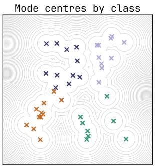

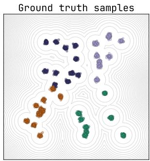  
class 2 class 3

Figure 6 40-GMM ground truth data. Left: Mode centers by class, Right: Ground truth samples.  
w=1  
w=1.5  
w=2  
w=2.5  
w=3  
w=4  
w=10  
w=20  
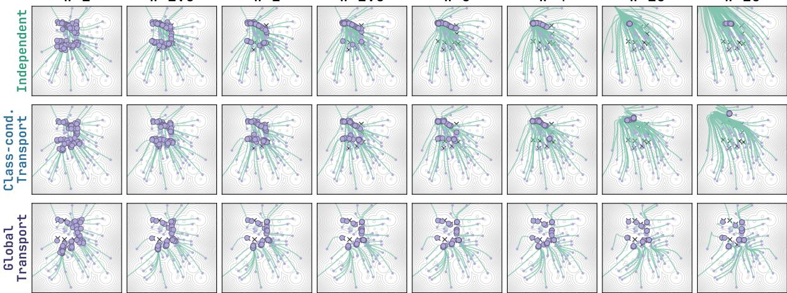  
Figure 7 Generated trajectories for Independent, Class-conditional and GT on $4 0 { \mathrm { - } } \mathrm { G M M }$

Additional samples. We provide additional generated samples to accompany figure 1 demonstrating GT does not drop of the modes even in cases of extremely high guidance scale $w = 2 0$

## B Proofs and Derivations

## B.1 Relationship between coupling and prediction gap

For the ease of notation we will write $u _ { t } ( x _ { t } )$ as $v _ { u }$ and $\boldsymbol { u } _ { t } ( \boldsymbol { x } _ { t } \mid c )$ as $v _ { c }$

Proposition B.1. For any coupling π, $\mathbb { E } _ { \boldsymbol \pi } \left[ \left\| u _ { t } ( \boldsymbol { x } _ { t } \mid \boldsymbol { c } ) - u _ { t } ( \boldsymbol { x } _ { t } ) \right\| ^ { 2 } \right] = L _ { u } ^ { \pi } ( t ) - L _ { \boldsymbol { c } } ^ { \pi } ( t ) .$

Proof. We can write the following by adding and subtracting u to $g = v _ { c } - v _ { u }$

$$
u - v _ { u } = ( u - v _ { c } ) + ( v _ { c } - v _ { u } )\tag{12}
$$

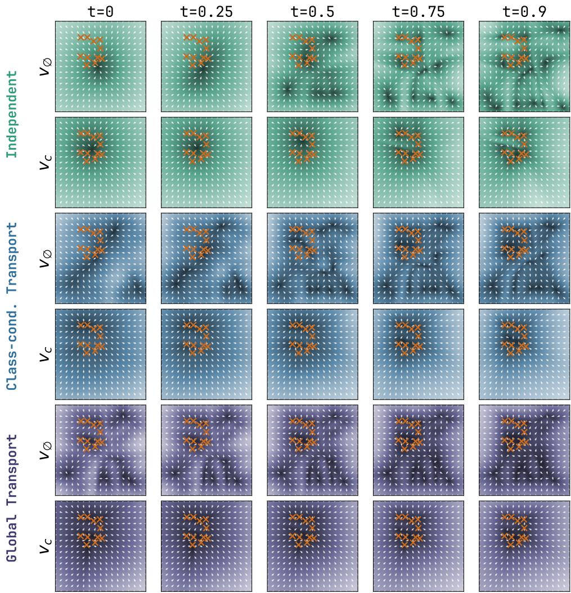  
Figure 8 Velocity field heat maps for conditional $v _ { c }$ and unconditional $v _ { \emptyset }$ for Independent, Class-conditional and GT transport.

By squaring and taking the norm we get

$$
\begin{array} { r l } & { \| u - v _ { u } \| ^ { 2 } = \| u - v _ { c } \| ^ { 2 } + \| v _ { c } - v _ { u } \| ^ { 2 } } \\ & { \qquad + \ 2 \langle u - v _ { c } , v _ { c } - v _ { u } \rangle . } \end{array}\tag{13}
$$

We now take expectation over $( x _ { 0 } , x _ { 1 } , c ) \sim \pi$

$$
\begin{array} { r l } & { \mathbb { E } _ { \pi } \| u - v _ { u } \| ^ { 2 } = \mathbb { E } _ { \pi } \| u - v _ { c } \| ^ { 2 } + \mathbb { E } _ { \pi } \| v _ { c } - v _ { u } \| ^ { 2 } } \\ & { \qquad + \ 2 \mathbb { E } _ { \pi } \langle u - v _ { c } , v _ { c } - v _ { u } \rangle . } \end{array}\tag{14}
$$

The expectation of the final term is zero:

$$
\begin{array} { r l } & { \mathbb { E } _ { \boldsymbol { \pi } } \left[ \left. \boldsymbol { u } - \boldsymbol { v } _ { c } , \boldsymbol { v } _ { c } - \boldsymbol { v } _ { u } \right. \right] } \\ & { \mathrm { ~ = ~ } \mathbb { E } _ { \boldsymbol { \pi } } \left[ \mathbb { E } _ { \boldsymbol { \pi } } \left[ \left. \boldsymbol { u } - \boldsymbol { v } _ { c } , \boldsymbol { v } _ { c } - \boldsymbol { v } _ { u } \right. \mid \boldsymbol { x } _ { t } , c \right] \right] } \\ & { \mathrm { ~ = ~ } \mathbb { E } _ { \boldsymbol { \pi } } \left[ \left. \mathbb { E } _ { \boldsymbol { \pi } } [ \boldsymbol { u } - \boldsymbol { v } _ { c } \mid \boldsymbol { x } _ { t } , c ] , \boldsymbol { v } _ { c } - \boldsymbol { v } _ { u } \right. \right] . } \end{array}\tag{15}
$$

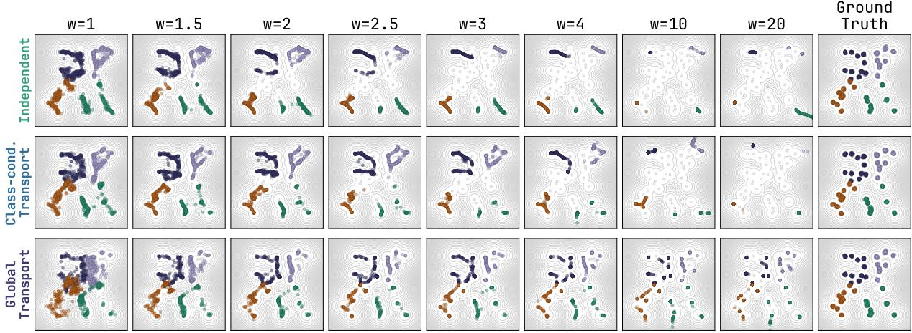  
Figure 9 Additional 40-GMM samples across a range of guidance scales.

By the definition of the conditional field,

$$
v _ { c } ( x _ { t } , t , c ) = \mathbb { E } _ { \pi } [ u \mid x _ { t } , c ] ,\tag{16}
$$

and therefore

$$
\mathbb { E } _ { \pi } [ u - v _ { c } \mid x _ { t } , c ] = 0 .\tag{17}
$$

Hence

$$
\mathbb { E } _ { \pi } \left[ \left. u - v _ { c } , v _ { c } - v _ { u } \right. \right] = 0 .\tag{18}
$$

Taking expectations in equation 13 now gives

$$
\mathbb { E } _ { \pi } \| u - v _ { u } \| ^ { 2 } = \mathbb { E } _ { \pi } \| u - v _ { c } \| ^ { 2 } + \mathbb { E } _ { \pi } \| v _ { c } - v _ { u } \| ^ { 2 } .\tag{19}
$$

Using the definitions of $L _ { u } ^ { \pi } ( t )$ and $L _ { c } ^ { \pi } ( t )$ , we obtain

$$
\begin{array} { r } { \Big \vert \mathbb { E } _ { \pi } \| v _ { c } - v _ { u } \| ^ { 2 } = L _ { u } ^ { \pi } ( t ) - L _ { c } ^ { \pi } ( t ) \Big \vert } \end{array}\tag{20}
$$

which proves the result.

Proposition B.2. The error term $L _ { u } ^ { \pi } ( t )$ can be upper bounded as

$$
\begin{array} { r } { \int _ { 0 } ^ { 1 } L _ { u } ^ { \pi } ( t ) \mathrm { d } t \leq c ( \pi ) - \mathcal { W } _ { 2 } ^ { 2 } ( p _ { 0 } , p _ { 1 } ) = : d ( \pi ) , } \end{array}\tag{21}
$$

where $c ( \pi )$ is the coupling cost and $d ( \pi ) \geq 0$ denotes the excess quadratic transport cost, $i . e . ,$ , the suboptimality of π relative to the population-optimal coupling (Boïté et al., 2026).

Proof. Let us consider coupling cost $c ( \pi ) = \mathbb { E } _ { \pi } \left\lceil \left\| x _ { 1 } - x _ { 0 } \right\| ^ { 2 } \right\rceil$ and ideal minimizer of the unconditional field $v _ { u } ( x , t ) = \mathbb { E } _ { \pi } \left[ u \mid x = x _ { t } \right]$ , where $u = x _ { 1 } - x _ { 0 }$ . We assume that the joint distribution $\pi ( x _ { 0 } , x _ { 1 } )$ induces a probability path $x _ { t } \sim p _ { t }$ . We can then express time-dependent error $L _ { u } ^ { \pi } ( t )$ as

$$
L _ { u } ^ { \pi } ( t ) = \mathbb { E } _ { \pi } \left[ \left\| u - v _ { u } ( x _ { t } , t ) \right\| ^ { 2 } \right]\tag{22}
$$

$$
= \mathbb { E } _ { \boldsymbol \pi } \left[ \left. u \right. ^ { 2 } \right] - 2 \underbrace { \mathbb { E } _ { \boldsymbol \pi } \langle u , v _ { u } ( x _ { t } , t ) \rangle } _ { \star } + \mathbb { E } _ { \boldsymbol { x } _ { t } \sim p _ { t } } \left[ \left. v _ { u } ( x _ { t } , t ) \right. ^ { 2 } \right]\tag{23}
$$

We further express ⋆ as

$$
\begin{array} { r l } & { \mathbb { E } _ { \boldsymbol \pi } \big [ \langle \boldsymbol u , \boldsymbol v _ { \boldsymbol u } ( \boldsymbol x _ { t } , t ) \rangle \big ] = \mathbb { E } _ { \boldsymbol { x } _ { t } \sim p _ { t } } \Big [ \Big \langle \underbrace { \mathbb { E } _ { \boldsymbol \pi } [ \boldsymbol u \mid \boldsymbol x _ { t } ] } _ { = \boldsymbol v _ { \boldsymbol u } ( \boldsymbol x _ { t } , t ) } , ~ \boldsymbol v _ { \boldsymbol u } ( \boldsymbol x _ { t } , t ) \rangle \Big ] } \\ & { \mathrm { ~ \ ~ \ } } \\ & { \mathrm { \ ~ \ } = \mathbb { E } _ { \boldsymbol { x } _ { t } \sim p _ { t } } \big [ \langle \boldsymbol v _ { \boldsymbol u } ( \boldsymbol x _ { t } , t ) , \boldsymbol v _ { \boldsymbol u } ( \boldsymbol x _ { t } , t ) \rangle \big ] } \\ & { \mathrm { \ ~ \ ~ \ } = \mathbb { E } _ { \boldsymbol { x } _ { t } \sim p _ { t } } \big [ \big \| \boldsymbol v _ { \boldsymbol u } ( \boldsymbol x _ { t } , t ) \big \| ^ { 2 } \big ] . } \end{array}\tag{24}
$$

From here it follows

$$
L _ { u } ^ { \pi } ( t ) = \underbrace { \mathbb { E } _ { \pi } \left[ \left. u \right. ^ { 2 } \right] } _ { c ( \pi ) } - \mathbb { E } _ { x _ { t } \sim p _ { t } } \left[ \left. v _ { u } ( x _ { t } , t ) \right. ^ { 2 } \right]\tag{25}
$$

or equivalently

$$
L _ { u } ^ { \pi } ( t ) = c ( \pi ) - \mathbb { E } _ { x _ { t } \sim p _ { t } } \left[ \left. v _ { u } ( x _ { t } , t ) \right. ^ { 2 } \right]\tag{26}
$$

If we integrate both sides with respect to t

$$
\int _ { 0 } ^ { 1 } L _ { u } ^ { \pi } ( t ) \mathrm { d } t = c ( \pi ) - \int _ { 0 } ^ { 1 } \mathbb { E } _ { x _ { t } \sim p _ { t } } \left[ \left. v _ { u } ( x _ { t } , t ) \right. ^ { 2 } \right] \mathrm { d } t\tag{27}
$$

Using Benamou and Brenier (2000) we can express

$$
\int _ { 0 } ^ { 1 } \mathbb { E } _ { x _ { t } \sim p _ { t } } \left[ \left\| v _ { u } ( x _ { t } , t ) \right\| ^ { 2 } \right] \mathrm { d } t \geq \mathcal { W } _ { 2 } ^ { 2 } ( p _ { 0 } , p _ { 1 } )\tag{28}
$$

From which identity follows

$$
\begin{array} { r } { \boxed { \int _ { 0 } ^ { 1 } L _ { u } ^ { \pi } ( t ) \mathrm { d } t \le \underbrace { c ( \pi ) - \mathcal { W } _ { 2 } ^ { 2 } ( p _ { 0 } , p _ { 1 } ) } _ { d ( \pi ) } . } } \end{array}\tag{29}
$$

## B.2 Proof of Proposition 4.2: Hierarchy of Coupling Costs

Proposition B.3 (Coupling Cost Ordering). For all $\beta \geq 0$ , the quadratic transport costs ofthe global transport coupling $\pi _ { \mathsf { G T } } ^ { \star }$ , the class-conditional optimal transport coupling $\pi _ { \mathrm { C ^ { 2 } O T } ( \beta ) } ^ { \star }$ , and the independent coupling $\pi _ { \mathrm { i n d } } = p _ { 0 } \otimes p _ { 1 }$ satisfy:

$$
\mathrm { C o s t } ( \pi _ { \mathfrak { G } \mathbb { T } } ^ { \star } ) \leq \mathrm { C o s t } ( \pi _ { \mathrm { C } ^ { 2 } \mathrm { O T } ( \beta ) } ^ { \star } ) \leq \mathrm { C o s t } ( \pi _ { \mathrm { i n d } } ) ,\tag{30}
$$

with the lower equality achieved when $\beta = 0$

Proof. Let $\mathcal { X } = \mathbb { R } ^ { d }$ denote the state space and $\mathcal { C }$ denote the conditioning space (endowed with metric $d _ { \mathcal { C } }$ or squared norm $\| c _ { 0 } - c _ { 1 } \| ^ { 2 } )$ . Let $p _ { 0 }$ be the source noise distribution on $\mathcal { X }$ , and let $p _ { 1 } ( x _ { 1 } , c _ { 1 } )$ be the joint data-conditioning distribution on $\mathcal { X } \times \mathcal { C }$ with spatial marginal $\begin{array} { r } { p _ { 1 } ( x _ { 1 } ) = \int _ { \mathcal { C } } p _ { 1 } ( x _ { 1 } , c _ { 1 } ) \mathrm { d } c _ { 1 } } \end{array}$ . Recall that the quadratic transport cost of any coupling π with marginals $p _ { 0 }$ and $p _ { 1 } ( x _ { 1 } )$ is defined by:

$$
\begin{array} { r } { \mathrm { C o s t } ( { \boldsymbol \pi } ) : = \mathbb { E } _ { ( x _ { 0 } , x _ { 1 } ) \sim \pi } \left[ \| x _ { 1 } - x _ { 0 } \| ^ { 2 } \right] . } \end{array}\tag{31}
$$

Part 1: $\mathrm { C o s t } ( \pi _ { 6 \mathsf { T } } ^ { \star } ) \leq \mathrm { C o s t } ( \pi _ { \mathrm { C ^ { 2 } O T } ( \beta ) } ^ { \star } )$ . By definition, the global transport coupling $\pi _ { 6 \intercal } ^ { \star }$ is the minimizer of the unconstrained Kantorovich optimal transport problem between $p _ { 0 }$ and the spatial data marginal $p _ { 1 } ( x _ { 1 } )$

$$
\pi _ { \mathsf { G T } } ^ { \star } \in \operatorname { a r g m i n } _ { \pi \in \Pi ( p _ { 0 } , p _ { 1 } ) } \mathbb { E } _ { \pi } \left[ \| x _ { 1 } - x _ { 0 } \| ^ { 2 } \right] .\tag{32}
$$

Therefore, for any admissible joint distribution $\pi \in \Pi ( p _ { 0 } , p _ { 1 } )$ , we have by definition of the infimum:

$$
\mathrm { C o s t } ( \pi _ { \mathsf { G T } } ^ { \star } ) \leq \mathrm { C o s t } ( \pi ) .\tag{33}
$$

Now consider the class-conditional optimal transport coupling $\pi _ { \mathrm { C ^ { 2 } O T } ( \beta ) } ^ { \star }$ . For any regularization strength $\beta \geq 0 _ { : }$ $\pi _ { \mathrm { C ^ { 2 } O T } ( \beta ) } ^ { \star }$ is defined as the minimizer of the joint spatial and condition transport problem:

$$
\pi _ { \mathbf { C } ^ { 2 } \mathrm { O T } ( \beta ) } ^ { \star } \in \underset { \pi \in \Pi ( p _ { 0 } , p _ { 1 } ) } { \mathrm { a r g m i n } } \ \mathbb { E } _ { ( ( x _ { 0 } , c _ { 0 } ) , ( x _ { 1 } , c _ { 1 } ) ) \sim \pi } \left[ \Vert x _ { 1 } - x _ { 0 } \Vert ^ { 2 } + \beta \Vert c _ { 1 } - c _ { 0 } \Vert ^ { 2 } \right] .\tag{34}
$$

Since the spatial marginals of any candidate coupling in equation $3 4$ are constrained to be $p _ { 0 }$ and $p _ { 1 } ( x _ { 1 } )$ , the resulting optimal coupling $\pi _ { \mathrm { C ^ { 2 } O T } ( \beta ) } ^ { \star }$ is itself an admissible coupling in $\Pi ( p _ { 0 } , p _ { 1 } )$

Applying the optimality property of $\pi _ { 6 \intercal } ^ { \star }$ from equation 33 directly to $\pi = \pi _ { \mathrm { C ^ { 2 } O T } ( \beta ) } ^ { \star }$ yields:

$$
\mathrm { C o s t } ( \pi _ { 6 \intercal } ^ { \star } ) \leq \mathrm { C o s t } ( \pi _ { \mathrm { C ^ { 2 } O T } ( \beta ) } ^ { \star } ) , \quad \forall \beta \geq 0 .\tag{35}
$$

When $\beta = 0 _ { ; }$ , the penalty on the condition labels vanishes, and the objective in equation 34 reduces identically to the objective in equation 32. Thus, $\pi _ { \mathrm { C ^ { 2 } O T ( 0 ) } } ^ { \star } = \pi _ { \mathsf { G T } } ^ { \star }$ , achieving equality.

Part 2: $\mathrm { C o s t } ( \pi _ { \mathrm { C ^ { 2 } O T } ( \beta ) } ^ { \star } ) \le \mathrm { C o s t } ( \pi _ { \mathrm { i n d } } )$ . Next, we show that the independent product coupling $\pi _ { \mathrm { i n d } } = p _ { 0 } \otimes p _ { 1 }$ serves as an upper bound on Cost $\big ( \pi _ { \mathrm { C ^ { 2 } O T } ( \beta ) } ^ { \star } \big )$ . Let $( x _ { 0 } , c _ { 0 } ) \sim p _ { 0 } \times p c$ and $( x _ { 1 } , c _ { 1 } ) \sim p _ { 1 }$ be drawn independently, where $p _ { \mathcal { C } }$ is the marginal condition distribution under $p _ { 1 }$ assigned independently to noise points $x _ { 0 }$ Because $\pi _ { \mathrm { i n d } } \in \Pi ( p _ { 0 } , p _ { 1 } )$ is an admissible joint distribution, the minimality of $\pi _ { \mathrm { C ^ { 2 } O T } ( \beta ) } ^ { \star }$ for the joint objective in equation 34 implies:

$$
\begin{array} { r l } & { \mathbb { E } _ { \pi _ { \mathbf { C } ^ { 2 } { \operatorname { o r } ( \beta ) } } ^ { \star } } \left[ \| x _ { 1 } - x _ { 0 } \| ^ { 2 } \right] \leq \mathbb { E } _ { \pi _ { \mathbf { C } ^ { 2 } { \operatorname { o r } ( \beta ) } } ^ { \star } } \left[ \| x _ { 1 } - x _ { 0 } \| ^ { 2 } \right] + \beta \mathbb { E } _ { \pi _ { \mathbf { C } ^ { 2 } { \operatorname { o r } ( \beta ) } } ^ { \star } } \left[ \| c _ { 1 } - c _ { 0 } \| ^ { 2 } \right] } \\ & { \qquad \leq \mathbb { E } _ { \pi _ { \operatorname { i n d } } } \left[ \| x _ { 1 } - x _ { 0 } \| ^ { 2 } + \beta \| c _ { 1 } - c _ { 0 } \| ^ { 2 } \right] . } \end{array}\tag{36}
$$

In the independent coupling $\pi _ { \mathrm { i n d } }$ , the conditioning assignments $c _ { 0 }$ and $c _ { 1 }$ are mutually independent identically distributed samples from $p _ { \mathcal { C } }$

In the hard class-matching limit $( \beta \to \infty$ or exact class-conditional coupling where $c _ { 0 } = c _ { 1 } )$ , the transport problem decomposes into |C| independent within-class sub-problems. For each class $c \in { \mathcal { C } }$ with prevalence $p ( c )$ :

$$
\pi _ { \mathbb { C } ^ { 2 } \mathrm { O T } ( \infty ) } ^ { \star } = \sum _ { c \in \mathcal { C } } p ( c ) \pi _ { c } ^ { \star } , \quad \mathrm { ~ w h e r e ~ } \pi _ { c } ^ { \star } \in \operatorname * { a r g m i n } _ { \pi \in \Pi ( p _ { 0 } , p _ { 1 } ( \cdot | c ) ) } \mathbb { E } _ { \pi } \left[ \| x _ { 1 } - x _ { 0 } \| ^ { 2 } \right] .\tag{37}
$$

For every class $c ,$ the product measure $\pi _ { \mathrm { i n d } , c } = p _ { 0 } \otimes p _ { 1 } ( \cdot \mid c )$ is an admissible coupling for the c-th sub-problem. By the optimality of $\pi _ { c } ^ { \star }$ over $\Pi ( p _ { 0 } , p _ { 1 } ( \cdot \mid c ) )$

$$
\begin{array} { r } { \mathbb { E } _ { \pi _ { c } ^ { \star } } \left[ \| x _ { 1 } - x _ { 0 } \| ^ { 2 } \right] \leq \mathbb { E } _ { \pi _ { \mathrm { i n d } , c } } \left[ \| x _ { 1 } - x _ { 0 } \| ^ { 2 } \right] . } \end{array}\tag{38}
$$

Taking the expectation over the class distribution $p ( c )$ yields:

$$
\begin{array} { r l } { \displaystyle \mathrm { C o s t } \big ( \pi _ { \mathrm { C ^ { 2 } O T ( \infty ) } } ^ { \star } \big ) = \displaystyle \sum _ { c \in \mathcal { C } } p ( c ) \mathbb { E } _ { \pi _ { c } ^ { \star } } \left[ \| x _ { 1 } - x _ { 0 } \| ^ { 2 } \right] } & { } \\ { \displaystyle \leq \sum _ { c \in \mathcal { C } } p ( c ) \mathbb { E } _ { \pi _ { \mathrm { i n d } , c } } \left[ \| x _ { 1 } - x _ { 0 } \| ^ { 2 } \right] } & { } \\ { \displaystyle } & { = \mathbb { E } _ { \pi _ { \mathrm { i n d } } } \left[ \| x _ { 1 } - x _ { 0 } \| ^ { 2 } \right] = \mathrm { C o s t } \big ( \pi _ { \mathrm { i n d } } \big ) . } \end{array}\tag{39}
$$

By monotonicity of the optimal transport objective under relaxation of the condition constraint, Cos $\langle \pi _ { \mathrm { C ^ { 2 } O T } ( \beta ) } ^ { \star } \rangle \leq \mathrm { C o s t } ( \pi _ { \mathrm { i n d } } )$ holds for all $\beta \geq 0$

Combining Part 1 and Part 2 gives the complete chain of inequalities:

$$
\mathrm { C o s t } ( \pi _ { \mathfrak { G } \mathbb { T } } ^ { \star } ) \leq \mathrm { C o s t } ( \pi _ { \mathrm { C } ^ { 2 } \mathrm { O T } ( \beta ) } ^ { \star } ) \leq \mathrm { C o s t } ( \pi _ { \mathrm { i n d } } ) ,\tag{40}
$$

which concludes the proof.

## B.3 Coupling controls flow curvature

We next compare the acceleration in the flow induced by the coupling in the standardized Gaussian setting. We use a Gaussian lu -in model of mini-batch OT which rovides an anal ticall tractable rox for the intractable discrete mini-batch coupling used in our experiments. For a velocity field $v _ { t } ,$ , let $a _ { t } [ v ] ( x ) : = \partial _ { t } v _ { t } ( x ) +$ $D _ { x } v _ { t } ( x ) v _ { t } ( x )$ be the acceleration experienced by a particle ${ \dot { x } } _ { t } = v _ { t } ( x _ { t } )$ following the flow, also known as the material acceleration.

Proposition B.4 (Material acceleration under Gaussian couplings). Let $p _ { 0 } = p _ { 1 } = \mathcal { N } ( 0 , \mathrm { I d } _ { d } )$ , and let $v _ { t } ^ { \mathrm { i n d } } , v _ { t , n } ,$ and $v _ { t } ^ { \star }$ denote respectively the vectorfields constructed using (i) the independent coupling, (ii) mini-batch plug-in Gaussian OT coupling with batch size n, and (iii) the population OT coupling. Fixing d, as $n  \infty ,$ the following holds pointwise in (t, x):

$$
\begin{array} { r } { a _ { t } [ v ^ { \mathrm { i n d } } ] ( x ) = \frac { x } { ( ( 1 - t ) ^ { 2 } + t ^ { 2 } ) ^ { 2 } } , \qquad a _ { t } [ v _ { n } ] ( x ) = \frac { 2 \| x \| ^ { 2 } - ( d - 1 ) } { 2 n } x + o \left( \frac { 1 } { n } \right) , \quad a _ { t } [ v ^ { \star } ] ( x ) = 0 . } \end{array}\tag{41}
$$

Define the total material acceleration $\begin{array} { r } { \mathfrak { A } ( v ) ^ { 2 } : = \mathbb { E } _ { X _ { 0 } } \int _ { 0 } ^ { 1 } \lVert a _ { t } [ v ] ( X _ { t } ) \rVert ^ { 2 } } \end{array}$ dt. Then,

$$
\begin{array} { r } { \mathfrak { A } ( v ^ { \mathrm { i n d } } ) = \sqrt { \left( 2 + \frac { 3 \pi } { 4 } \right) d } , \qquad \mathfrak { A } ( v _ { n } ) = \frac { \sqrt { d ( d ^ { 2 } + 1 8 d + 4 1 ) } } { 2 n } + o ( n ^ { - 1 } ) , \qquad \mathfrak { A } ( v ^ { \star } ) = 0 . } \end{array}\tag{42}
$$

Thus both pointwise and total material acceleration scale as $O ( n ^ { - 1 } )$ for Gaussian plug-in mini-batch OT, remain $O ( 1 )$ for independent FM, and vanish for population OT.

Gaussian plug-in minibatch model We study minibatch OT flow matching using an analytically tractable Gaus-sian model. Let $p _ { 0 } = \mathcal { N } ( 0 , \mathrm { { I d } ) }$ and $p _ { 1 } = \mathcal { N } ( 0 , \Sigma )$ be the source and target distributions. For independent minibatches of size n from $p _ { 0 }$ and $p _ { 1 }$ , we fit the source and target means and covariances, couple the fitted Gaussians by their Gaussian Monge map, and marginalize the resulting conditional flow-matching fields over the randoml drawn minibatches. We em hasize that this is a Gaussian plug-in model of mini-batch trans ort that we use for its analytical tractability, since exact analysis of the discrete Hungarian coupling used in our experiments would likel be si nificantl more involved.

Writing $\widehat { p } _ { t , n } ( x )$ and $\widehat { v } _ { t , n } ( x )$ for the path density and velocity induced by a batch pair, the marginal flow field learned by flow matching is

$$
v _ { t , n } ( x ) = \frac { \mathbb { E } [ \widehat { p } _ { t , n } ( x ) \widehat { v } _ { t , n } ( x ) ] } { \mathbb { E } [ \widehat { p } _ { t , n } ( x ) ] } .\tag{43}
$$

Here and throughout this section, these expectations are understood to be taken over the independently sampled source and target minibatches. This posterior density weighting creates a nonlinear correction even though every batch-conditional field is afine.

Since $p _ { 0 }$ is isotropic, we may assume that the target has diagonal covariance $\Sigma = \mathrm { d i a g } ( \sigma _ { 1 } ^ { 2 } , \dots , \sigma _ { d } ^ { 2 } ) , \sigma _ { i } > 0 \nonumber$

Define $m _ { i } ( t ) = ( 1 - t ) + t \sigma _ { i }$ , and the coeficients

$$
\theta _ { i j } ( t ) : = \frac { \sigma _ { i } \sigma _ { j } } { \sigma _ { i } + \sigma _ { j } } \left[ \frac { 2 t \sigma _ { i } \sigma _ { j } } { \sigma _ { i } + \sigma _ { j } } \big ( m _ { i } ( t ) + m _ { j } ( t ) \big ) - m _ { i } ( t ) m _ { j } ( t ) \right] ,\tag{44}
$$

$$
\kappa _ { i } ( t ) : = - \frac { \sigma _ { i } ^ { 2 } } { m _ { i } ( t ) ^ { 2 } } \sum _ { j \neq i } \frac { \sigma _ { j } ( 2 t \sigma _ { j } - m _ { j } ( t ) ) } { ( \sigma _ { i } + \sigma _ { j } ) ^ { 2 } m _ { j } ( t ) } .\tag{45}
$$

Proposition B.5 (Gaussian plug-in minibatch field). Forfixed d, positive-definite diagonal Σ as above, and fixed $( x , t )$ , the marginalized field (equation 43) satisfies, as $n  \infty$

$$
[ v _ { t , n } ( x ) ] _ { i } = \frac { \sigma _ { i } - 1 } { m _ { i } ( t ) } x _ { i } + \frac { 1 } { n } \left[ \kappa _ { i } ( t ) x _ { i } + \frac { x _ { i } } { m _ { i } ( t ) ^ { 3 } } \sum _ { j = 1 } ^ { d } \theta _ { i j } ( t ) \frac { x _ { j } ^ { 2 } } { m _ { j } ( t ) ^ { 3 } } \right] + o ( n ^ { - 1 } ) .\tag{46}
$$

Corollary B.5.1 (Standardized endpoints). $I f \Sigma = { \mathrm { I d } } ,$ , then

$$
v _ { t , n } ( x ) = \frac { 2 t - 1 } { 4 n } \left( 2 \| x \| ^ { 2 } - ( d - 1 ) \right) x + o ( n ^ { - 1 } ) ,\tag{47}
$$

$$
\partial _ { t } v _ { t , n } ( x ) = \frac { 1 } { 2 n } \left( 2 \| x \| ^ { 2 } - ( d - 1 ) \right) x + o ( n ^ { - 1 } ) .\tag{48}
$$

Proposition B.6 (Independent Gaussian flow-matching field). For independentflow matchingwith $p _ { 0 } = \mathcal { N } ( 0 , \mathrm { H } )$ and $p _ { 1 } = { \mathcal { N } } ( 0 , \mathrm { d i a g } ( \sigma _ { 1 } ^ { 2 } , \dots , \sigma _ { d } ^ { 2 } ) )$ , define $q _ { i } ( t ) = ( \bar { 1 } - t ) ^ { 2 } + t ^ { 2 } \sigma _ { i } ^ { 2 } , r _ { i } ( t ) = t \sigma _ { i } ^ { 2 } - ( 1 - t )$ . Then

$$
[ v _ { t } ^ { \mathrm { i n d } } ( x ) ] _ { i } = \frac { r _ { i } ( t ) } { q _ { i } ( t ) } x _ { i } ,\tag{49}
$$

$$
[ \partial _ { t } v _ { t } ^ { \mathrm { i n d } } ( x ) ] _ { i } = \left[ \frac { 1 + \sigma _ { i } ^ { 2 } } { q _ { i } ( t ) } - \frac { 2 r _ { i } ( t ) ^ { 2 } } { q _ { i } ( t ) ^ { 2 } } \right] x _ { i } .\tag{50}
$$

$I f { \boldsymbol { \Sigma } } = { \mathrm { I d } }$ , these expressions specialize to

$$
v _ { t } ^ { \mathrm { i n d } } ( x ) = \frac { 2 t - 1 } { ( 1 - t ) ^ { 2 } + t ^ { 2 } } x , \qquad \partial _ { t } v _ { t } ^ { \mathrm { i n d } } ( x ) = \frac { 4 t ( 1 - t ) } { ( ( 1 - t ) ^ { 2 } + t ^ { 2 } ) ^ { 2 } } x .\tag{51}
$$

The population Gaussian OT field is $[ v _ { t } ^ { \star } ( x ) ] _ { i } = ( \sigma _ { i } - 1 ) x _ { i } / m _ { i } ( t )$ . Unlike the plug-in correction, the independent field in Proposition B.6 has no batch-size dependence. When $\Sigma = \mathrm { I d }$ , population OT is the identity and has zero velocity and time derivative, whereas independent FM exhibits an order-one contraction–expansion (referred to in the main paper as the “yo-yo” efect) despite having identical endpoint distributions. Gaussian plug-in minibatching retains a residual version of this motion, but Corollary $\mathrm { B } . 5 . 1$ 1 shows that its magnitude and Eulerian time derivative deca as $1 / n$

We next prove Proposition B.5 and its corollary; Proposition B.6 follows from the joint Gaussian conditioning calculation given afterward.

Setup. We keep d and Σ fixed as $n \to \infty$ and assume $n > d .$ . With $\varepsilon = n ^ { - 1 / 2 }$ and unbiased sample covariances, write the source and target parameters as

$$
\widehat { \mu } _ { n } ^ { 0 } = \varepsilon h ,
$$

$$
\widehat { \Sigma } _ { n } ^ { 0 } = \mathrm { I d } + \varepsilon H ,\tag{52}
$$

$$
\widehat { \mu } _ { n } ^ { 1 } = \varepsilon \Sigma ^ { 1 / 2 } h ^ { \prime } ,
$$

$$
\widehat { \Sigma } _ { n } ^ { 1 } = \Sigma + \varepsilon \Sigma ^ { 1 / 2 } H ^ { \prime } \Sigma ^ { 1 / 2 } .\tag{53}
$$

Here $h , h ^ { \prime }$ are independent standard Gaussian vectors, while $H , H ^ { \prime }$ are inde endent centered Wishart fluctua tions and are independent of the sample means. Their leading second moments are

$$
\mathbb { E } [ H _ { i j } H _ { k l } ] = \delta _ { i k } \delta _ { j l } + \delta _ { i l } \delta _ { j k } + O ( n ^ { - 1 } ) ,\tag{54}
$$

and likewise for $H ^ { \prime } .$ The $O ( n ^ { - 1 } )$ term in equation 54 contributes only beyond the order retained below.

The Monge map between the two fitted Gaussians is

$$
T _ { n } ( x ) = \widehat { \mu } _ { n } ^ { 1 } + A _ { n } ( x - \widehat { \mu } _ { n } ^ { 0 } ) , \qquad A _ { n } \widehat { \Sigma } _ { n } ^ { 0 } A _ { n } = \widehat { \Sigma } _ { n } ^ { 1 } , \qquad A _ { n } \succ 0 .\tag{55}
$$

Expanding $A _ { n } = \Sigma ^ { 1 / 2 } + \varepsilon K + \varepsilon ^ { 2 } L + O _ { p } ( \varepsilon ^ { 3 } )$ and matching powers in the covariance identity gives

$$
\Sigma ^ { 1 / 2 } K + K \Sigma ^ { 1 / 2 } = \Sigma ^ { 1 / 2 } ( H ^ { \prime } - H ) \Sigma ^ { 1 / 2 } ,\tag{56}
$$

$$
\Sigma ^ { 1 / 2 } L + L \Sigma ^ { 1 / 2 } = - K ^ { 2 } - \Sigma ^ { 1 / 2 } H K - K H \Sigma ^ { 1 / 2 } .\tag{57}
$$

Since $\Sigma$ is diagonal, the first equation has the entrywise solution

$$
K _ { i j } = c _ { i j } ( H _ { i j } ^ { \prime } - H _ { i j } ) , \qquad c _ { i j } : = \frac { \sigma _ { i } \sigma _ { j } } { \sigma _ { i } + \sigma _ { j } } .\tag{58}
$$

For later use, define

$$
M _ { t } = ( 1 - t ) \mathrm { I d } + t \Sigma ^ { 1 / 2 } , \qquad W _ { t } = M _ { t } ^ { - 1 } .\tag{59}
$$

The diagonal entries of $M _ { t }$ are the scalars $m _ { i } ( t )$ . The population Gaussian OT field is

$$
v _ { t } ^ { \star } ( x ) = ( \Sigma ^ { 1 / 2 } - \mathrm { I d } ) W _ { t } x , \qquad [ v _ { t } ^ { \star } ( x ) ] _ { i } = { \frac { \sigma _ { i } - 1 } { m _ { i } ( t ) } } x _ { i } .\tag{60}
$$

Batch-conditional and marginalized fields. For a fixed pair of batch fits, set

$$
X _ { t } = ( 1 - t ) X _ { 0 } + t T _ { n } ( X _ { 0 } ) , \qquad X _ { 0 } \sim { \mathcal { N } } ( { \widehat { \mu } } _ { n } ^ { 0 } , { \widehat { \Sigma } } _ { n } ^ { 0 } ) .\tag{61}
$$

Writing

$$
B _ { t , n } = ( 1 - t ) \mathrm { I d } + t A _ { n } , \qquad { \widehat m } _ { t , n } = ( 1 - t ) { \widehat \mu } _ { n } ^ { 0 } + t { \widehat \mu } _ { n } ^ { 1 } ,\tag{62}
$$

the conditional path is Gaussian and its FM field is the afine map

$$
\widehat { v } _ { t , n } ( x ) = \widehat { \mu } _ { n } ^ { 1 } - \widehat { \mu } _ { n } ^ { 0 } + ( A _ { n } - \mathrm { I d } ) B _ { t , n } ^ { - 1 } ( x - \widehat { m } _ { t , n } ) .\tag{63}
$$

If

$$
\alpha _ { t } = ( 1 - t ) h + t \Sigma ^ { 1 / 2 } h ^ { \prime } , \qquad e _ { t } = \Sigma ^ { 1 / 2 } W _ { t } ( h ^ { \prime } - h ) ,\tag{64}
$$

then expansion of equation 63 yields

$$
\widehat v _ { t , n } ( x ) = v _ { t } ^ { \star } ( x ) + \varepsilon v _ { t } ^ { ( 1 ) } ( x ) + \varepsilon ^ { 2 } v _ { t } ^ { ( 2 ) } ( x ) + O _ { p } ( \varepsilon ^ { 3 } ) ,\tag{65}
$$

where

$$
v _ { t } ^ { ( 1 ) } ( x ) = W _ { t } K W _ { t } x + e _ { t } ,\tag{66}
$$

$$
v _ { t } ^ { ( 2 ) } ( x ) = ( W _ { t } L W _ { t } - t W _ { t } K W _ { t } K W _ { t } ) x - W _ { t } K W _ { t } \alpha _ { t } .\tag{67}
$$

The marginalization in equation $4 3$ weights each batch-conditional field by $\widehat { p } _ { t , n } ( x )$ . We therefore expand this conditional path density about $p _ { t } ^ { \star } = \mathcal { N } ( 0 , M _ { t } ^ { 2 } )$ .

Conditional on the fitted batches, the covariance of $X _ { t }$ has the expansion

$$
B _ { t , n } \widehat { \Sigma } _ { n } ^ { 0 } B _ { t , n } = M _ { t } ^ { 2 } + \varepsilon G _ { t } + O _ { p } ( \varepsilon ^ { 2 } ) , \qquad G _ { t } = M _ { t } H M _ { t } + t ( K M _ { t } + M _ { t } K ) .\tag{68}
$$

Consequently,

$$
\widehat { p } _ { t , n } ( x ) = p _ { t } ^ { \star } ( x ) \left[ 1 + \varepsilon \ell _ { t } ( x ) + O _ { p } ( \varepsilon ^ { 2 } ) \right] ,\tag{69}
$$

with

$$
\boldsymbol { \ell } _ { t } ( \boldsymbol { x } ) = \alpha _ { t } ^ { \mathsf { T } } \boldsymbol { W } _ { t } ^ { 2 } \boldsymbol { x } + \frac { 1 } { 2 } \boldsymbol { x } ^ { \mathsf { T } } \boldsymbol { W } _ { t } ^ { 2 } \boldsymbol { G } _ { t } \boldsymbol { W } _ { t } ^ { 2 } \boldsymbol { x } - \frac { 1 } { 2 } \operatorname { t r } ( \boldsymbol { W } _ { t } ^ { 2 } \boldsymbol { G } _ { t } ) .\tag{70}
$$

Since $\alpha _ { t }$ and $G _ { t }$ are centered, $\mathbb { E } [ \ell _ { t } ( x ) ] = 0 ;$ similarly, the centered fluctuations K and $e _ { t }$ give $\mathbb { E } [ v _ { t } ^ { ( 1 ) } ( x ) ] = 0$ Expanding the density-weighted ratio equation 43 gives

$$
v _ { t , n } ( x ) = v _ { t } ^ { \star } ( x ) + \frac { 1 } { n } \left\{ \mathbb { E } [ v _ { t } ^ { ( 2 ) } ( x ) ] + \mathbb { E } [ \ell _ { t } ( x ) v _ { t } ^ { ( 1 ) } ( x ) ] \right\} + o ( n ^ { - 1 } ) .\tag{71}
$$

The second-order density fluctuation cancels between the numerator and denominator. The second expectation in equation $7 1$ is precisely the posterior density-weighting term omitted by an unweighted batch average.

Closed-form coeficient. We now evaluate the coeficient of the order- $\cdot 1 / n$ term in equation $^ { 7 1 }$ . In the posteriorweighting term $\mathbb { E } [ \ell _ { t } ( x ) v _ { t } ^ { ( 1 ) } ( x ) ]$ , the covariance-dependent part of $\ell _ { t }$ is linear in $G _ { t }$ , while the matrix-dependent part of $\bar { v _ { t } ^ { ( 1 ) } }$ is linear in $K$ . Thus, using equation 58 and the Wishart moments in equation $5 4 \AA$ their required covariance contraction is

$$
\mathbb { E } [ [ G _ { t } ] _ { i j } K _ { k l } ] = \theta _ { i j } ( t ) ( \delta _ { i k } \delta _ { j l } + \delta _ { i l } \delta _ { j k } ) + O ( n ^ { - 1 } ) .\tag{72}
$$

Combining this contraction with the second Sylvester equation in equation $5 7 ,$ which determines the mean of $v _ { t } ^ { ( 2 ) }$ , gives

$$
\mathbb { E } [ v _ { t } ^ { ( 2 ) } ( x ) ] _ { i } = \beta _ { i } ( t ) x _ { i } + O ( n ^ { - 1 } ) ,\tag{73}
$$

$$
\mathbb { E } [ \ell _ { t } ( x ) v _ { t } ^ { ( 1 ) } ( x ) ] _ { i } = \eta _ { i } ( t ) x _ { i } + \frac { x _ { i } } { m _ { i } ( t ) ^ { 3 } } \sum _ { j = 1 } ^ { d } \theta _ { i j } ( t ) \frac { x _ { j } ^ { 2 } } { m _ { j } ( t ) ^ { 3 } } - \frac { \theta _ { i i } ( t ) } { m _ { i } ( t ) ^ { 4 } } x _ { i } + O ( n ^ { - 1 } ) ,\tag{74}
$$

where

$$
\beta _ { i } ( t ) = - \frac { \sigma _ { i } ^ { 2 } } { m _ { i } ( t ) ^ { 2 } } \sum _ { j = 1 } ^ { d } ( 1 + \delta _ { i j } ) \frac { \sigma _ { j } ( 2 t \sigma _ { j } - m _ { j } ( t ) ) } { ( \sigma _ { i } + \sigma _ { j } ) ^ { 2 } m _ { j } ( t ) } ,\tag{75}
$$

$$
\eta _ { i } ( t ) = \frac { \sigma _ { i } ( 2 t \sigma _ { i } - m _ { i } ( t ) ) } { m _ { i } ( t ) ^ { 3 } } .\tag{76}
$$

The diagonal identities

$$
\beta _ { i } ( t ) = \kappa _ { i } ( t ) - \frac { 1 } { 2 } \eta _ { i } ( t ) , \qquad \frac { \theta _ { i i } ( t ) } { m _ { i } ( t ) ^ { 4 } } = \frac { 1 } { 2 } \eta _ { i } ( t )\tag{77}
$$

cancel all diagonal linear contributions. Inserting the remaining terms into equation 71 proves equation 46.

Standardized specialization. When $\Sigma = \mathrm { I d }$ , we have $\sigma _ { i } = m _ { i } ( t ) = 1$ and $2 t \sigma _ { i } - m _ { i } ( t ) = 2 t - 1$ . Equations equation 44 and equation 45 reduce to

$$
\theta _ { i j } ( t ) = \frac { 2 t - 1 } { 2 } , \qquad \kappa _ { i } ( t ) = - \frac { ( d - 1 ) ( 2 t - 1 ) } { 4 } .\tag{78}
$$

Substituting these expressions into equation $4 6$ gives equation $4 7 ;$ diferentiating at fixed x gives equation 48, proving Corollary B.5.1. $\mathrm { A t } t = 1 / 2$ the field is in fact exactly zero for every n: exchanging the i.i.d. fitted batches preserves the midpoint and reverses the displacement.

In one dimension, the of-diagonal sum in equation 45 is empty. Writing $m ( t ) = ( 1 - t ) + t \sigma$ , the general result becomes

$$
v _ { t , n } ( x ) = \frac { \sigma - 1 } { m ( t ) } x + \frac { 1 } { n } \frac { \sigma ( 2 t \sigma - m ( t ) ) } { 2 m ( t ) ^ { 5 } } x ^ { 3 } + o ( n ^ { - 1 } ) .\tag{79}
$$

Hence the entire linear order- $1 / n$ correction cancels in one dimension.

Comparison with the independent coupling.

Proof of Proposition B.6. For independent $X _ { 0 } \sim \mathcal { N } ( 0 , \mathrm { I d } )$ and $X _ { 1 } \sim { \mathcal { N } } ( 0 , \Sigma )$ , let $X _ { t } = ( 1 - t ) X _ { 0 } + t X _ { 1 }$ and $U = X _ { 1 } - X _ { 0 }$ . Joint Gaussian conditioning yields

$$
v _ { t } ^ { \mathrm { i n d } } ( x ) = \mathbb { E } [ U \mid X _ { t } = x ] = ( t \Sigma - ( 1 - t ) \mathrm { I d } ) \left( ( 1 - t ) ^ { 2 } \mathrm { I d } + t ^ { 2 } \Sigma \right) ^ { - 1 } x .\tag{80}
$$

Diagonalizing this expression and diferentiating at fixed x gives equation 49 and equation 50; setting $\Sigma = \mathrm { I d }$ recovers equation 51. □

The independent field is also exactly the field induced by singleton discrete minibatch OT, because the sole source and target observations must be paired. This does not identify it with Gaussian plug-in OT at $n = 1$ , for which an unbiased sample covariance is undefined.

Acceleration along flow trajectories. For a time-dependent velocity field $v _ { t }$ , define its material acceleration by

$$
a _ { t } [ v ] ( x ) : = \partial _ { t } v _ { t } ( x ) + D _ { x } v _ { t } ( x ) v _ { t } ( x ) .\tag{81}
$$

This is the acceleration of a trajectory satisfying ${ \dot { x } } _ { t } = v _ { t } ( x _ { t } )$ . In particular, the population Gaussian OT field follows straight displacement trajectories and therefore satisfie $a _ { t } [ v ^ { \star } ] ( x ) = 0$

For the plug-in field, let

$$
b _ { i } ( t ) : = \frac { \sigma _ { i } - 1 } { m _ { i } ( t ) }\tag{82}
$$

and write overdots for time derivatives. Expanding equation 81 using equation 46 gives

$$
\begin{array} { l } { { \displaystyle \left[ a _ { t } [ v _ { n } ] ( x ) \right] _ { i } = \frac { x _ { i } } { n } \bigg [ \dot { \kappa } _ { i } ( t ) + 2 b _ { i } ( t ) \kappa _ { i } ( t ) } } \\ { { \displaystyle \qquad + \sum _ { j = 1 } ^ { d } \frac { \dot { \theta } _ { i j } ( t ) - ( b _ { i } ( t ) + b _ { j } ( t ) ) \theta _ { i j } ( t ) } { m _ { i } ( t ) ^ { 3 } m _ { j } ( t ) ^ { 3 } } x _ { j } ^ { 2 } \bigg ] + o ( n ^ { - 1 } ) . } } \end{array}\tag{83}
$$

For independent flow matching, the corresponding expression is exact:

$$
[ a _ { t } [ v ^ { \mathrm { i n d } } ] ( x ) ] _ { i } = \frac { \sigma _ { i } ^ { 2 } } { q _ { i } ( t ) ^ { 2 } } x _ { i } .\tag{84}
$$

When $\Sigma = \mathrm { I d }$ , write $q ( t ) = ( 1 - t ) ^ { 2 } + t ^ { 2 }$ . The three acceleration fields simplify to

$$
a _ { t } [ v ^ { \star } ] ( x ) = 0 , \qquad a _ { t } [ v _ { n } ] ( x ) = \frac { 2 \| x \| ^ { 2 } - ( d - 1 ) } { 2 n } x + o ( n ^ { - 1 } ) , \qquad a _ { t } [ v ^ { \mathrm { i n d } } ] ( x ) = \frac { x } { q ( t ) ^ { 2 } } .\tag{85}
$$

The plug-in material acceleration agrees with the Eulerian derivative in equation 48 to order $1 / n ,$ because the convective term is of order $1 / n ^ { 2 }$ in the standardized case.

Finally, let $x _ { t }$ denote the flow trajectory initialized at $x _ { 0 } ,$ , and define its integrated squared acceleration by

$$
\mathcal { A } [ \boldsymbol { v } ; \boldsymbol { x } _ { 0 } ] : = \int _ { 0 } ^ { 1 } \| a _ { t } [ \boldsymbol { v } ] ( \boldsymbol { x } _ { t } ) \| ^ { 2 } \mathrm { d } t .\tag{86}
$$

For standardized endpoints, $x _ { t } ^ { \star } = x _ { 0 } , x _ { t } ^ { \mathrm { i n d } } = \sqrt { q ( t ) }$ x0, and $x _ { t , n } ^ { \mathrm { p l u g } } = x _ { 0 } + O ( n ^ { - 1 } )$ . Consequently,

$$
\begin{array} { r } { A [ v ^ { \star } ; x _ { 0 } ] = 0 , } \end{array}\tag{87}
$$

$$
\mathcal { A } [ v _ { n } ; x _ { 0 } ] = \frac { \| x _ { 0 } \| ^ { 2 } \left( 2 \| x _ { 0 } \| ^ { 2 } - ( d - 1 ) \right) ^ { 2 } } { 4 n ^ { 2 } } + o ( n ^ { - 2 } ) ,\tag{88}
$$

$$
\mathcal { A } [ v ^ { \mathrm { i n d } } ; x _ { 0 } ] = \left( 2 + \frac { 3 \pi } { 4 } \right) \| x _ { 0 } \| ^ { 2 } .\tag{89}
$$

Thus the leading plug-in acceleration energy is nonincreasing in n and decays as $n ^ { - 2 }$ , while independent FM incurs order-one acceleration and exact OT incurs none. For every fixed $x _ { 0 } \neq 0 ,$ , inde endent FM therefore has the largest of these three acceleration energies for all suficiently large n. This comparison concerns the controlled large-n expansion and does not assert exact monotonicity of the finite-n Gaussian plug-in field.

If the initial condition is itself random, $X _ { 0 } \sim { \mathcal { N } } ( 0 , \operatorname { I d } )$ , then $R : = \| X _ { 0 } \| ^ { 2 } \sim \chi _ { d } ^ { 2 }$ , with

$$
\mathbb { E } [ R ] = d , \qquad \mathbb { E } [ R ^ { 2 } ] = d ( d + 2 ) , \qquad \mathbb { E } [ R ^ { 3 } ] = d ( d + 2 ) ( d + 4 ) .\tag{90}
$$

Consequently, assuming the plug-in expansion above holds in $L ^ { 1 }$ with respect to $X _ { 0 }$

$$
\mathbb { E } [ \mathcal { A } [ v ^ { \star } ; X _ { 0 } ] ] = 0 ,\tag{91}
$$

$$
\mathbb { E } [ A [ v _ { n } ; X _ { 0 } ] ] = \frac { d \left( d ^ { 2 } + 1 8 d + 4 1 \right) } { 4 n ^ { 2 } } + o ( n ^ { - 2 } ) ,\tag{92}
$$

$$
\mathbb { E } \left[ \mathcal { A } [ v ^ { \mathrm { i n d } } ; X _ { 0 } ] \right] = \left( 2 + \frac { 3 \pi } { 4 } \right) d .\tag{93}
$$

Thus, at fixed dimension, the expected plug-in acceleration energy again decays as $n ^ { - 2 }$ , whereas the independent-coupling energy remains order one in n.

## C ImageNet-256

## C.1 Implementation Details

Training details. In tables 6 and 7, we show training configurations across our SiT (Ma et al., 2024) and DMF (Lee et al., 2026) experiments for B/2, L/2 and XL/2 model scales. All ImageNet-256 experiments use mini-batch setting of 256 batch size. DMF (Lee et al., 2026) conditions the encoder on time t and adds additional time r to condition its decoder, turning a flow matching model into a flow map. Following their set-up, we also select logit-normal distribution to sample (t, r) pairs using the time proposal parameters in table 6. DMF is trained by finetuning a pretrained SiT model via self-distillation meanflow objective (Geng et al., 2025) with a diagonal split of 0.5.

Table 6 ImageNet-256 implementation details across model scales.
<table><tr><td></td><td>B/2</td><td>L/2</td><td>XL/2</td></tr><tr><td colspan="4">Backbone</td></tr><tr><td>Resolution</td><td>256 × 256</td><td>256 × 256</td><td>256 × 256</td></tr><tr><td>Params (M)</td><td>130</td><td>458</td><td>675</td></tr><tr><td>FLOPS (G)</td><td>23.1</td><td>80.7</td><td>118.6</td></tr><tr><td>Hidden dim.</td><td>768</td><td>1024</td><td>1152</td></tr><tr><td>Heads</td><td>12</td><td>16</td><td>16</td></tr><tr><td>Patch size</td><td>2 × 2</td><td>2 × 2</td><td>2 × 2</td></tr><tr><td>Sequence length</td><td>256</td><td>256</td><td>256</td></tr><tr><td>Layers</td><td>12</td><td>24</td><td>28</td></tr><tr><td colspan="4">Flow Matching (SiT) (Ma et al., 2024)</td></tr><tr><td>Training iterations</td><td>800K</td><td>800K</td><td>800K</td></tr><tr><td>Epochs</td><td>160</td><td>160</td><td>160</td></tr><tr><td>Class dropout probability</td><td>0.1</td><td>0.1</td><td>0.1</td></tr><tr><td colspan="4">Flow Map (DMF) (Lee et al., 2026)</td></tr><tr><td>DMF depth</td><td>8</td><td>18</td><td>20</td></tr><tr><td>Training iterations</td><td>400K</td><td>400K</td><td>400K</td></tr><tr><td>Epochs</td><td>80</td><td>80</td><td>80</td></tr><tr><td>Class dropout probability</td><td></td><td>0.1</td><td></td></tr><tr><td>Time proposal µFM</td><td></td><td>0.0</td><td></td></tr><tr><td>Time proposal  $( \mu _ { \mathrm { M F } } ^ { ( 1 ) } , \mu _ { \mathrm { M F } } ^ { ( 2 ) } )$ </td><td></td><td>(0.4, −1.2)</td><td></td></tr><tr><td>Model guidance scale ω</td><td>0.5</td><td>0.6</td><td>0.6</td></tr><tr><td>Guidance interval</td><td>[0.0, 1.0]</td><td>[0.0, 0.7]</td><td>[0.0,0.7]</td></tr></table>

Table 7 Optimization hyperparameters, shared across all model scales and both training stages.
<table><tr><td>Optimizer</td><td>AdamW</td></tr><tr><td>Batch size</td><td>256</td></tr><tr><td>Learning rate</td><td>1e-4</td></tr><tr><td>Adam  $( \beta _ { 1 } , \beta _ { 2 } )$ </td><td>(0.9,0.95)</td></tr><tr><td>Adam €</td><td>1e-8</td></tr><tr><td>Weight decay</td><td>0.0</td></tr><tr><td>EMA decay rate</td><td>0.9999</td></tr></table>

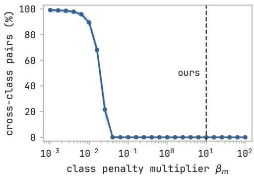  
Figure 10 Sweeping $\beta _ { m }$ for class-conditional OT.

Compute budget. In table 8, we show cost per optimizer step for each of the coupling plans. We observe that class-conditional OT and GT add a modest cost per optimizer step, with GT being slightly higher than class-conditional due to not being restricted per class.

Table 8 Compute cost per optimizer step of SiT-B/2 training on ImageNet-256 for the three coupling plans. The second column is the increase over the independent coupling.
<table><tr><td>Coupling</td><td>ms / step</td><td>↑cost</td></tr><tr><td>Independent</td><td>155.5</td><td>一</td></tr><tr><td>Class-cond. OT</td><td>157.9</td><td> $\uparrow 1 . 6 \%$ </td></tr><tr><td>GT</td><td>160.4</td><td> $\uparrow 3 . 1 \%$ </td></tr></table>

Choice of $\beta$ for class-conditional OT. We choose $\beta$ such that it prevents any cross-class coupling, thereby computing transport plan within each class following (Cheng and Schwing, 2025). In practice, we define $\beta =$ $\begin{array} { r } { \beta _ { m } \cdot \frac { 1 } { B ^ { 2 } } \sum _ { i = 1 } ^ { B } \sum _ { j = 1 } ^ { B } \lVert x _ { i } - x _ { j } \rVert _ { 2 } ^ { 2 } } \end{array}$ . We sweep $\beta _ { m }$ and show analysis in figure $^ { 1 0 , }$ choosing $\beta _ { m } = 1 0$

Text-conditioning for ImageNet. Every ImageNet-1k image is paired with the captions taken from VisualLayer (2024) dataset. Each caption is encoded once with the frozen DFN5B CLIP ViT-H/14 text tower into its pooled, ℓ2-normalised 1024-d text embedding $c \in \mathbb { R } ^ { 1 0 2 4 }$

## C.2 Additional results on ImageNet-256

GT preserves mode stability. Figure 11 sweeps w for fixed noise and class. Under the independent coupling, increasing guidance results in abrupt change in composition and pose, e.g. from a portrait to a full-body view. Under GT the object remains stable for the full range of w.

Guidance interval tuning. We show that GT achieves strongest results overall with applied guidance interval tuning across B/2, L/2 and XL/2 scales in table 10.

Table 9 FID ↓ and $\mathrm { F D } _ { \mathrm { D I N O v 2 } } \downarrow$ vs. guidance scale w for independent, class-conditional OT and GT couplings across SiT scales (64 Euler steps), under the full guidance interval [0, 1].
<table><tr><td>SiT-B/2</td><td colspan="13"></td></tr><tr><td>Coupling</td><td>Metric</td><td>w=1.0</td><td>1.5</td><td>2.0</td><td>2.5</td><td>3.0</td><td>3.5</td><td>4.0</td><td>5.0</td><td>6.0</td><td>8.0</td><td>10.0</td></tr><tr><td>Independent</td><td>FID FDDINOv2</td><td>26.44 605.11</td><td>6.68 337.16</td><td>5.16 212.66</td><td>7.93 159.87</td><td>11.04 139.10</td><td>13.65 132.46</td><td>15.76 132.27</td><td>18.63 139.64</td><td>20.42 149.79</td><td>22.40 169.51</td><td>23.28 189.02</td></tr><tr><td>Class-cond. OT</td><td>FID FDDINOv2</td><td>26.72 607.86</td><td>6.70 340.46</td><td>5.08 215.04</td><td>7.81 160.77</td><td>10.90 139.17</td><td>13.47 131.64</td><td>15.59 131.41</td><td>18.44 138.27</td><td>20.28 148.37</td><td>22.25 168.91</td><td>23.12 189.17</td></tr><tr><td>GT</td><td>FID FDDINOv2</td><td>31.16 636.79</td><td>8.13 365.26</td><td>4.15 226.75</td><td>5.88 161.94</td><td>8.72 132.62</td><td>11.32 120.25</td><td>13.41 116.36</td><td>16.51 119.84</td><td>18.62 128.33</td><td>20.81 148.82</td><td>21.62 171.99</td></tr><tr><td colspan="10"></td><td></td><td></td><td></td></tr><tr><td colspan="10"></td></tr><tr><td>Coupling</td><td></td><td>Metric</td><td>w=1.0</td><td>1.5</td><td>1.75</td><td>2.0</td><td>2.5</td><td>3.0</td><td>3.5</td><td>4.0</td><td></td></tr><tr><td>Independent</td><td>FID FDDINOv2</td><td></td><td>13.85 360.44</td><td>2.95 154.77</td><td>3.86 115.56</td><td>5.85 95.16</td><td>10.10 83.28</td><td>13.53 86.46</td><td>16.03 94.58</td><td>17.89 103.47</td><td></td></tr><tr><td>Class-cond. OT</td><td>FID</td><td>FDDINOv2</td><td>13.96 360.38</td><td>2.98 154.83</td><td>3.84 115.16</td><td>5.81 95.01</td><td>10.02 83.41</td><td>13.42 86.38</td><td>15.93 94.01</td><td>17.79 102.64</td><td></td></tr><tr><td>GT</td><td>FID</td><td>FDDINOv2</td><td>17.72 392.20</td><td>2.96 170.86</td><td>2.69 123.70</td><td>3.88 97.58</td><td>7.38 76.33</td><td>10.66 73.48</td><td>13.25 77.32</td><td>15.17 83.28</td><td></td></tr><tr><td colspan="10">SiT-XL/2</td></tr><tr><td>Coupling</td><td>Metric</td><td>w=1.0</td><td>1.5</td><td>1.75</td><td>2.0</td><td>2.25</td><td>2.5</td><td>3.0</td><td>3.5</td><td>4.0</td><td></td></tr><tr><td>Independent</td><td>FID FDDINOv2</td><td>12.58 328.83</td><td>2.78</td><td>3.98</td><td>6.10</td><td>8.32</td><td>10.41 77.76</td><td>13.76 83.29</td><td>16.14 92.02</td><td>17.87 101.67</td><td></td></tr><tr><td>GT</td><td>FID</td><td>16.11</td><td>135.91 2.63</td><td>101.78 2.59</td><td>85.35 3.87</td><td>78.40 5.65</td><td>7.47</td><td>10.70</td><td>13.16</td><td>15.09</td><td></td></tr><tr><td></td><td>FDDINOv2</td><td>357.67</td><td>150.28</td><td>108.56</td><td>85.80</td><td>73.95</td><td>69.01</td><td>68.44</td><td>73.27</td><td>80.05</td><td></td></tr></table>

## D Single-cell Datasets

PBMC3K. 2,638 peripheral blood mononuclear cells from a healthy donor across 8 cell types.

Dentate gyrus. 18,213 cells from the developing mouse hippocampus (La Manno et al., 2018), annotated with 14 cell types.

HLCA. 584,944 human lung cells from 486 individuals across 49 datasets (Sikkema et al., 2023), annotated with 50 cell types.

Implementation Details. We add couplings on top of the uni-modal generation set-up described in Palma et al. (2025). Within the single-cell dataset, CFGen splits data into 90% training and 10% validation. Evaluation is performed on the corresponding held-out test data. Since CFGen (Palma et al., 2025) considers interpolant $\boldsymbol { x } _ { t } = t \boldsymbol { x } _ { 1 } + \sigma _ { t } \boldsymbol { \epsilon } , \boldsymbol { \epsilon } \sim \mathcal { N } ( 0 , I _ { d } )$ , we implement baseline with linear interpolant used in our image experiments (CFGen-linear) which trains CFGen with independent coupling. We then compare both baselines to GT transport. Our evaluation scri t uses 0, 1, 2 seeds

CFGen splits its training into two stages: 1) encoding single-cell data with an RNA autoencoder and 2) training a conditional flow matchin model in latent s ace. We show h er arameter choices for trainin and backbone model in tables 11 and 12. Note that PBMC3k and Dentate gyrus use resnet small and HLCA uses resnet big.

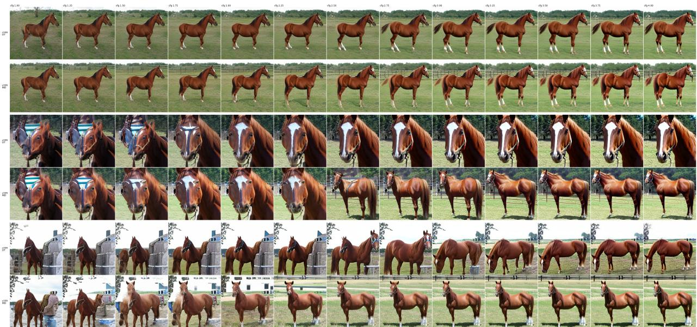  
Figure 11 SiT-XL/2 curated samples for class 339 sorrel across guidance scales w and coupling choices. Under GT the sample object characteristics remain stable, while for independent and class-conditional object changes its composition, pose, background at higher w.

Table 10 FID ↓ across model scales and couplings, under the full guidance interval and tuned interval [0, 0.7].
<table><tr><td></td><td></td><td></td><td colspan="5">Full</td><td colspan="5">GI [0, 0.7]</td></tr><tr><td>Model</td><td>Coupling</td><td> $w { = } 1 . 0$ </td><td>1.5</td><td>2.0</td><td>2.5</td><td>3.0</td><td>4.0</td><td>1.5</td><td>2.0</td><td>2.5</td><td>3.0</td><td>4.0</td></tr><tr><td></td><td>Independent</td><td>26.44</td><td>6.68</td><td>5.16</td><td>7.93</td><td>11.04</td><td>15.76</td><td>11.93</td><td>5.95</td><td>3.95</td><td>3.72</td><td>5.07</td></tr><tr><td>SiT-B/2</td><td>Class-cond. OT</td><td>26.72</td><td>6.70</td><td>5.08</td><td>7.81</td><td>10.90</td><td>15.59</td><td>12.13</td><td>6.00</td><td>3.92</td><td>3.68</td><td>5.00</td></tr><tr><td></td><td>GT</td><td>31.16</td><td>8.13</td><td>4.15</td><td>5.88</td><td>8.72</td><td>13.41</td><td>15.63</td><td>8.03</td><td>4.71</td><td>3.52</td><td>3.70</td></tr><tr><td>SiT-L/2</td><td>Independent</td><td>13.85</td><td>2.95</td><td>5.85</td><td>10.10</td><td>13.53</td><td>17.89</td><td>4.53</td><td>2.35</td><td>2.62</td><td>3.65</td><td>6.00</td></tr><tr><td></td><td>GT</td><td>17.72</td><td>2.96</td><td>3.88</td><td>7.38</td><td>10.66</td><td>15.17</td><td>6.64</td><td>2.96</td><td>2.17</td><td>2.48</td><td>4.02</td></tr><tr><td>SiT-XL/2</td><td>Independent</td><td>12.58</td><td>2.78</td><td>6.10</td><td>10.41</td><td>13.76</td><td>17.87</td><td>3.96</td><td>2.16</td><td>2.63</td><td>3.73</td><td>6.04</td></tr><tr><td></td><td>GT</td><td>16.11</td><td>2.63</td><td>3.87</td><td>7.47</td><td>10.70</td><td>15.09</td><td>5.89</td><td>2.61</td><td>2.01</td><td>2.40</td><td>3.91</td></tr></table>

## E Additional Background

## E.1 Classifier and classifier-free guidance

Classifier Guidance. By applying Bayes’ Rule we can write

$$
p _ { t } ( x \mid c ) = { \frac { p _ { t } ( c \mid x ) p _ { t } ( x ) } { p _ { t } ( c ) } }\tag{94}
$$

Taking a logarithm of each side we get

$$
\log p _ { t } ( x \mid c ) = \log p _ { t } ( c \mid x ) + \log p _ { t } ( x ) - \log p _ { t } ( c )\tag{95}
$$

By applying $\nabla _ { x }$ to both sides we get

$$
\nabla _ { \boldsymbol { x } } \log p _ { t } ( \boldsymbol { x } \mid \boldsymbol { c } ) = \nabla _ { \boldsymbol { x } } \log p _ { t } ( \boldsymbol { c } \mid \boldsymbol { x } ) + \nabla _ { \boldsymbol { x } } \log p _ { t } ( \boldsymbol { x } ) - \underbrace { \nabla _ { \boldsymbol { \alpha } } \log p _ { t } ( \boldsymbol { c } ) } _ { \mathrm { ~ } }\tag{96}
$$

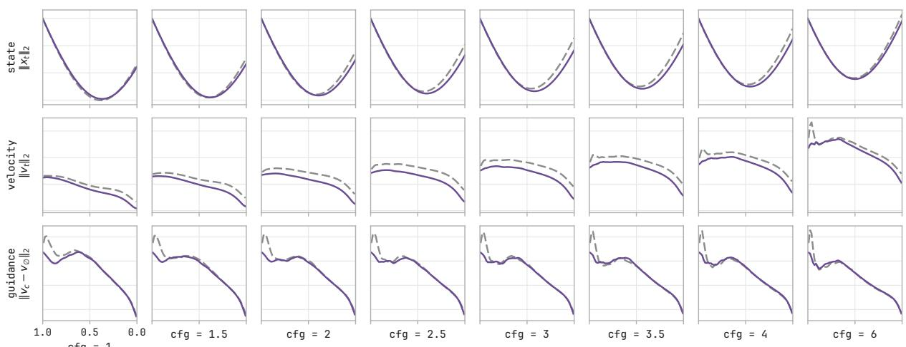  
flow time t (1 = noise, 0 = data)

Figure 12 Measuring yo-yo efect and prediction gap across trajectory using SiT-XL/2 (64 steps).  
Table 11 Training configuration for uni-modal generation with CFGen.
<table><tr><td>Parameter</td><td>Autoencoder</td><td>Latent Flow Matching</td></tr><tr><td>Batch size</td><td>256</td><td>256 (64 for PBMC3K)</td></tr><tr><td>Epochs</td><td>300</td><td>1500</td></tr><tr><td>Optimizer</td><td> $\mathrm { A d a m W }$ </td><td>AdamW</td></tr><tr><td>Learning rate</td><td> $1 \times 1 0 ^ { - 3 }$ </td><td> $1 \times 1 0 ^ { - 4 }$ </td></tr><tr><td>Weight decay</td><td> $1 \times 1 0 ^ { - 5 }$ </td><td> $1 \times 1 0 ^ { - 6 }$ </td></tr><tr><td>Gradient clipping</td><td>1.0</td><td>1.0</td></tr><tr><td>Train/validation split</td><td>90% / 10%</td><td>90% / 10%</td></tr></table>

leading to

$$
\nabla _ { x } \log { p _ { t } ( x \mid c ) } = \nabla _ { x } \log { p _ { t } ( c \mid x ) } + \nabla _ { x } \log { p _ { t } ( x ) }\tag{97}
$$

Using the conversion formula for score we can further write this as

$$
\boldsymbol { v } _ { c } ( \boldsymbol { x } , t , c ) = \boldsymbol { v } _ { u } ( \boldsymbol { x } _ { t } , t ) + a _ { t } \nabla _ { \boldsymbol { x } } \log p _ { t } ( c | \boldsymbol { x } )\tag{98}
$$

Classifier guidance constructs a velocity field by enhancing classifier $p _ { t } ( c \vert x )$ with scaling factor w which we refer to as guidance scale, yielding

$$
\boxed { v _ { c } ^ { C F } ( x , t , c ) = v _ { u } ( x _ { t } , t ) + w a _ { t } \nabla _ { x } \log p _ { t } ( c \mid x ) }\tag{99}
$$

where $\begin{array} { r } { a _ { t } = \frac { 1 - t } { t } } \end{array}$ and $\begin{array} { r } { b _ { t } = \frac { 1 } { t } } \end{array}$

The main issue with using classifier guidance is the need to train $p _ { t } ( c \vert x )$ classifier, which drastically increases training compute. In the following section, we derive classifier-free guidance.

Classifier-free Guidance. Classifier-free guidance takes a step further to construct a guided field that does not require additional training of classifier $p _ { t } ( c \mid x )$

Table 12 CFGen ResNet Backbone.
<table><tr><td>Hyperparameter</td><td>ResNet Small</td><td>ResNet Big</td></tr><tr><td>Hidden dimension</td><td>32</td><td>64</td></tr><tr><td>Residual blocks</td><td>3</td><td>3</td></tr><tr><td>Embedding dimension</td><td>20</td><td>100</td></tr><tr><td>Dropout probability</td><td>0.0</td><td>0.0</td></tr><tr><td>Condition dropout probability</td><td>0.2</td><td>0.2</td></tr></table>

We can add $b _ { t } x _ { t }$ and subtract from the RHS of equation 99

$$
\begin{array} { r l } & { v ^ { \mathrm { C F G } } ( x _ { t } , t , c ) = v _ { u } ( x _ { t } , t ) + w a _ { t } \nabla _ { x } \log p _ { t } ( c \mid x _ { t } ) } \\ & { \phantom { = } = v _ { u } ( x _ { t } , t ) + w a _ { t } \nabla _ { x } \log \frac { p _ { t } ( x _ { t } \mid c ) p _ { t } ( c ) } { p _ { t } ( x _ { t } ) } } \\ & { \phantom { = } = v _ { u } ( x _ { t } , t ) + w \big [ a _ { t } \nabla _ { x } \log p _ { t } ( x _ { t } \mid c ) + \underbrace { a _ { t } \nabla _ { \ast } \log p _ { t } ( c ) } _ { = v _ { u } ( x _ { t } , t ) + w \big [ \underbrace { a _ { t } \nabla _ { x } \log p _ { t } ( x _ { t } ) } _ { v _ { c } ( x _ { t } , t , c ) } \big ] } } \\ & { \phantom { = = } = v _ { u } ( x _ { t } , t ) + w \big [ \underbrace { a _ { t } \nabla _ { x } \log p _ { t } ( x _ { t } \mid c ) + b _ { t } x _ { t } } _ { v _ { c } ( x _ { t } , t , c ) } - \underbrace { \big ( a _ { t } \nabla _ { x } \log p _ { t } ( x _ { t } ) + b _ { t } x _ { t } \big ) } _ { v _ { u } ( x _ { t } , t ) } \big ] } \end{array}\tag{100}
$$

which leads to

$$
\boxed { v _ { c } ^ { C F G } ( x , t , c ) = v _ { u } ( x _ { t } , t ) + w \underbrace { \left( v _ { c } ( x , t , c ) - v _ { u } ( x , t ) \right) } _ { g ( x , t , c ) } }\tag{101}
$$

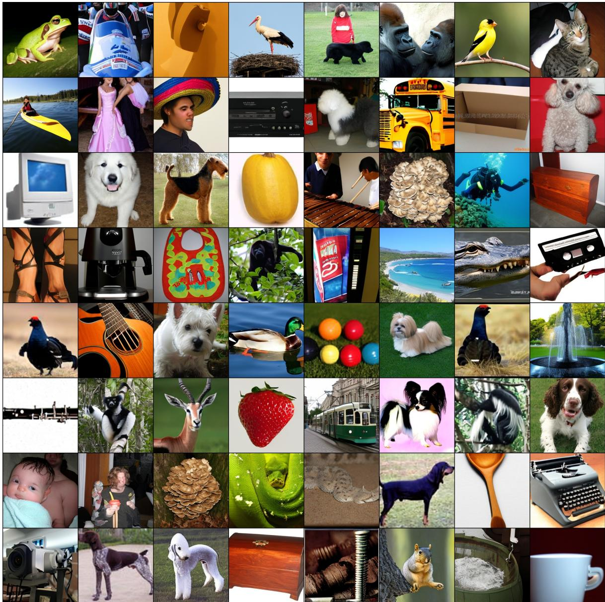  
Figure 13 Samples generated with SiT-L/2, Euler (16 steps), w = 4.0

## G Class-conditional OT Uncurated Samples

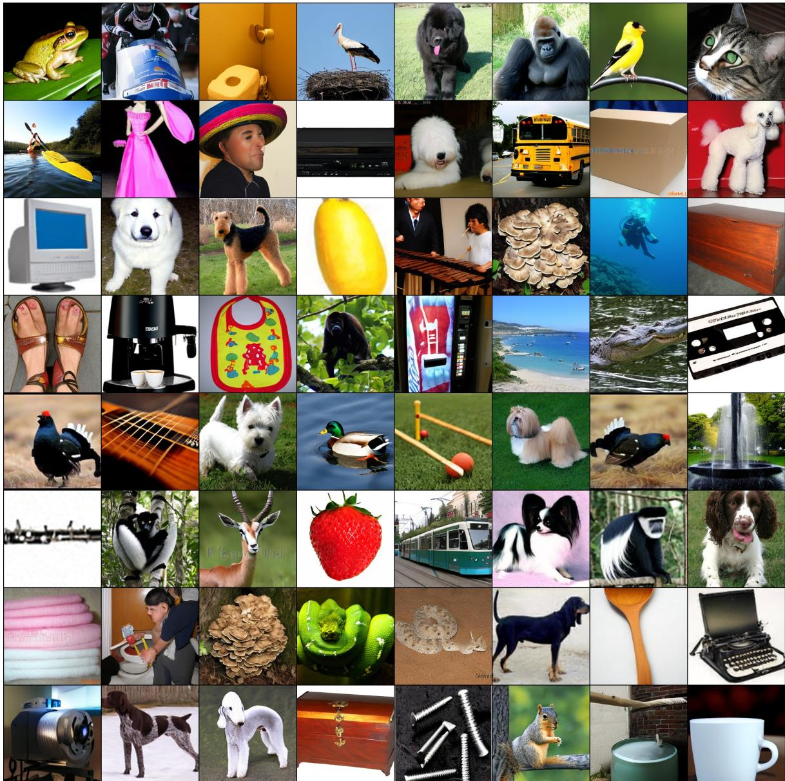  
Figure 14 Samples generated with SiT-L/2, Euler (16 steps), w = 4.0

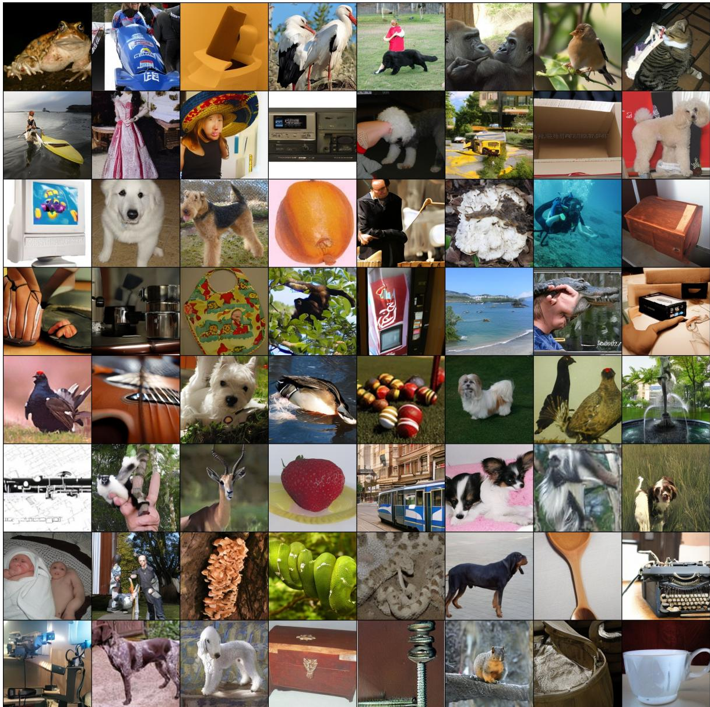  
Figure 15 Samples generated with SiT-L/2, Euler (16 steps), w = 4.0

## I Text-conditioned ImageNet-256 Uncurated Samples

We show samples for the following prompts read left to right:{two mittens with colorful yarn on a bed, a white keyboard with a small white keypad, a sink with a white marble top and a black base, a green and purple flower with a black center, three monkeys sitting on a wooden bench, a black and white photo of a stethoscope, a dog is looking at ducks in a pond, a woman feeding her baby with a bottle, a bowl of food, a dog sitting on the grass with a red building in the background, a rocky cliff, a snake is laying on top of hay in a cage, a plate of food on a table, a white monkey hanging on a wooden pole, casio dg-2000 boombox, a dog laying in the grass, a bathroom with a toilet and a bathtub with gummy bears, a chameleon is sitting on a branch with green leaves, a group of masks with different colors and designs, a monkey sitting in a tree with leaves, a person walking along a road near a body of water, a wolf laying on the ground, a black and white photo of a wheel, a large dam with a large waterfall in front of it, a lab coat with a picture of a man in a lab coat, a female swimmer in the pool with a yellow cap, a brown and white dog with a collar on, a plate with shrimp and bacon, a pair of scissors on a wooden table, a bird with a long beak sitting on a branch, a spider sits on its web in the sun, a tree with a branch, a group of people standing in a line, a pool table in an empty building with a green light, panasonic pd-wg-g1, a meerkat standing on a rock in a zoo, a small hamster sleeping in a person’s hand, a woman looking at a dinosaur in a museum, a knitting dish cloth and a knitting needle, a stone wall in the middle of a yard, a white and yellow sea slug on a coral reef, a large cicada sitting on a person’s hand, two women in kimono, a vintage sewing machine sitting in the grass, a couple standing in front of a yurt, a man lifting a barbell on a competition stage, a circular clock with a white circle in the middle, a military vehicle with a gun mounted on top, three graduates pose for a photo in blue graduation gowns, two cars driving on a race track, a woman holding a large fruit, a large black and white whale with its tail out in the water, a wall of banjos hanging on a wall, a bowl of guacamole with a tortilla chip on top, a close up of a dog with a collar, two dogs are standing in the dirt, a dock with a concrete wall and palm trees, a plate of mashed potatoes, a pair of sunglasses on the ground, a large building with many people walking around it, a small orange fish in a bowl, a close up of a metal fan with a metal cover, three monkeys sitting on a log, a skillet with food in it}

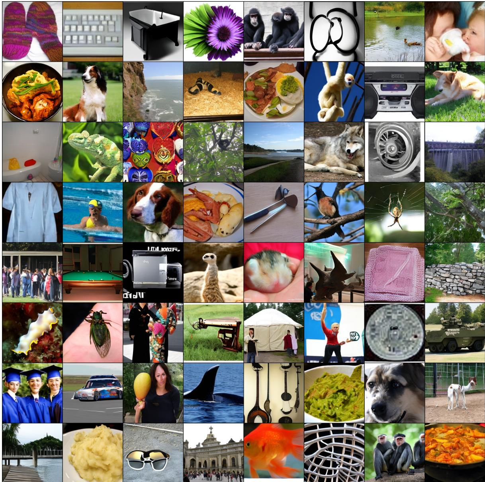  
Figure 16 Samples generated with SiT-B/2, Euler (16 steps), w = 4.0

  
Figure 17 Samples generated with SiT-B/2, Euler (16 steps), w = 4.0