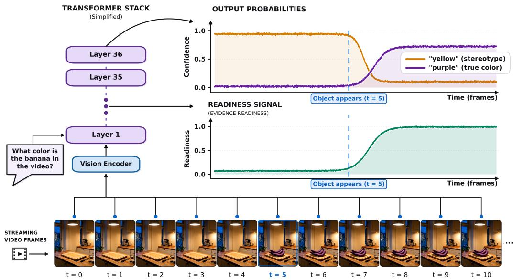
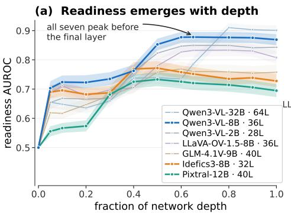
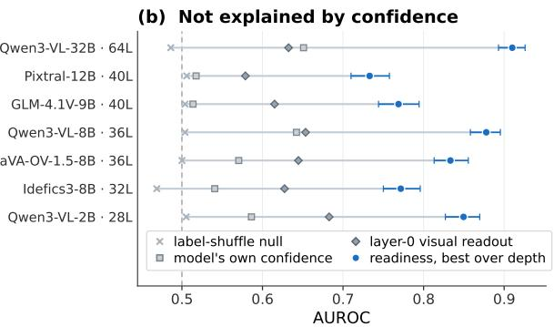
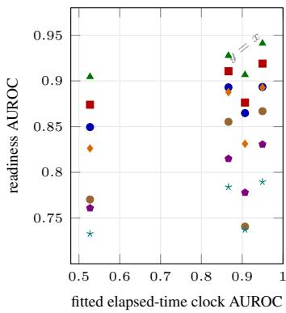
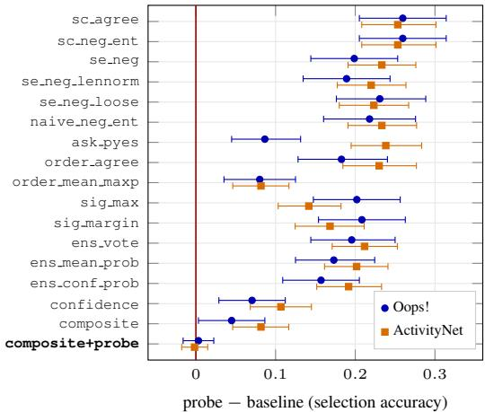
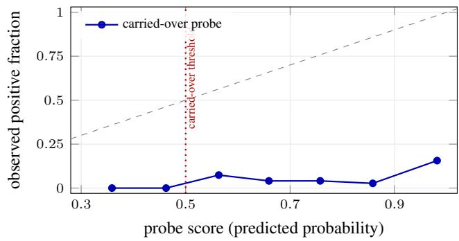
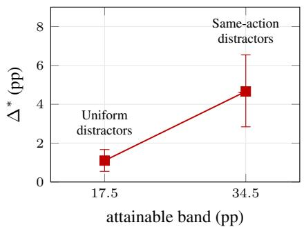
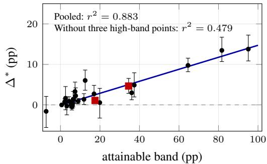

# HAVE I SEEN ENOUGH? FROZEN VIDEO-LANGUAGE MODELS ENCODE EVIDENCE READINESS

Dan Ben-Ami1 Kobi Cohen2 Chaim Baskin1

1INSIGHT Lab, Ben-Gurion University of the Negev, Israel

2Ben-Gurion University of the Negev, Israel

## ABSTRACT

Streaming video-language models must decide not only what to answer, but whether the evidence needed for the current question has arrived. Existing systems learn that decision as a separate trigger; we ask whether an unmodified model already computes it. We show that frozen VideoLLMs carry a linearly readable evidence-readiness signal, labelled from timestamped evidence rather than from model output. It decodes in all seven models of a shared byte-identical evaluation (AUROC 0.733–0.905 under the strictest not-ready sampling, where a fitted clock is near chance), and a probe fitted without any of a benchmark family’s footage still reads that family. It is question-conditioned: on byte-identical windows, changing only the question reverses the readout on 66.1% of pairs, while every question-blind control is at chance by construction. The model can answer incorrectly and still encode readiness: AUROC remains 0.722 among wrong answers. Readiness also beats uncertainty estimators and their supervised combination on latency-matched answer selection, and tracks independent human judgments more closely than confidence. Released streaming triggers are also linear readouts, yet a trained trigger read on its own base model’s activations is approximately orthogonal to readiness and decodes it far less accurately than a probe. We turn the readout into Readiness Gating, an answer-timing policy that improves accuracy by up to +9.75 pp at matched video duration with negligible computational overhead. How much it gains varies with the accuracy headroom the task makes available: across 26 configurations the gain tracks that headroom, and an intervention that moves it over identical pixels moves the gain with it.

## 1 INTRODUCTION

Video-language models are moving from offline clips to continuous, interactive streams (Lin et al., 2024; Chen et al., 2024a; Wang et al., 2025a; Azad et al., 2026; Xie et al., 2026). This changes the inference problem: in an offline benchmark the complete clip is available before the question is answered, whereas in a stream the question may arrive before, during, or after the event that resolves it, so a system must decide both what to answer and whether it has seen enough yet. Existing streaming systems learn a readiness token, response trigger, auxiliary head, or activation model; we ask whether the state they require is already computed inside a frozen VideoLLM.

Consider a model asked what object a person will pick up. Before the hand reaches it, scene and language priors already give a plausible answer high probability; after contact the relevant pixels are available, yet perception or reasoning can still fail. Confidence cannot distinguish these cases and can point the wrong way (Figure 1). We therefore separate three variables video QA often conflates: evidence availability, a property of the delivered video relative to the question; confidence, a property of the output distribution; and correctness, which also depends on perception and reasoning. Our labels use question-specific evidence timestamps, fixed before any model output is seen.

Nothing in how these models are trained asks them to represent this: next-token prediction supervises what to say, not whether the frames delivered so far settle the question, so a model could reach high accuracy on complete clips without ever forming it. Frozen VideoLLMs form it anyway. Readiness becomes linearly readable in the residual stream after the first transformer block and strengthens with depth. Changing only the question reverses the readout on byte-identical pixels, tying the signal to vision–language interaction.

  
Figure 1: A model can be confident and unready at the same time. Asked an object’s colour before it enters the stream, the model answers confidently from prior alone; a linear readout of its frozen residual stream reports that the evidence has not arrived. (Schematic; measured in section 4.)

Readiness survives depth, shuffle, frame-count and identical-pixel controls, remains readable within confidence strata and wrong answers, and appears across seven models on identical inputs and footage excluded from probe training. Eleven uncertainty estimators and released streaming triggers test competing readouts. Readiness Gating uses the signal for answer timing, with gains depending on task headroom.

## Contributions.

• We identify evidence readiness in frozen VideoLLMs: a linear readout recovers whether the current question’s evidence is available. On identical video windows, changing only the question reverses the readout on 66.1% of pairs (section 4).

• We distinguish readiness from confidence and correctness: it remains decodable among wrong answers, outperforms eleven uncertainty estimators on the tested selection tasks, and tracks independent human judgments more closely than output confidence (subsection 4.2).

• We establish generality across models and footage: readiness decodes in seven models, and probes retain informative rankings on held-out benchmark families (subsection 4.3).

• We introduce Readiness Gating: an answer-timing policy that improves accuracy by up to 9.75 pp at matched video duration in offline replay, without an additional forward pass (subsection 4.4).

## 2 RELATED WORK

Streaming video and answer timing. Streaming benchmarks expose the gap between completeclip models and systems that operate as frames arrive (Lin et al., 2024; Niu et al., 2025), and online VideoLLMs address it with interleaved training, memory, proactive-response modules, or explicitly learned readiness mechanisms (Chen et al., 2024a; Wang et al., 2025a; Azad et al., 2026; Xie et al., 2026). These optimize when a model should respond; we ask instead whether a standard frozen model already contains a reusable internal variable from which that decision can be made. Where the learned trigger is released it is itself a linear readout of a residual stream (Wang et al., 2025c; Qian et al., 2025; Chen et al., 2024a), which lets us compare it with our probe directly (subsection 4.5).

Temporal grounding and evidence. Moment retrieval localizes a language-described interval, while grounded and evidence-backed VideoQA associate an answer with temporal or spatiotemporal support (Hendricks et al., 2017; Xiao et al., 2024; Wang et al., 2026). Adaptive frame selection chooses which frames to present to a VideoLLM (Yu et al., 2023; 2025; Ben-Ami et al., 2026); we use evidence annotations to assess whether the delivered frames already support the question. An annotated span need not be the earliest or only sufficient evidence, a measured boundary on utility.

Uncertainty, abstention, and answerability. Calibration and self-evaluation estimate whether an output is correct (Guo et al., 2017; Kadavath et al., 2022); sampling-based consistency and semantic entropy measure stability across generations or meanings (Wang et al., 2023; Farquhar et al., 2024); and work on abstention separates answer correctness from question answerability (Wagner, 2026). Our target is question-specific visual evidence in the frames observed so far. Because predicting a correct answer does not necessarily reveal missing evidence, we evaluate readiness separately at the representation and decision levels.

Probing and activation intervention. Probes can expose information available in a representation even when generation does not express it (Belinkov, 2022; Orgad et al., 2025). To distinguish represented information from probe learning (Hewitt & Liang, 2019), we accompany decoding with layer-0 controls, grouped nulls, identical-pixel question interventions, and analyses conditioned on confidence and correctness. Activation steering tests whether a decoded direction affects behavior (Li et al., 2023b; Zou et al., 2023), but conclusions depend on the intervention and control (Zhang & Nanda, 2024; Tan et al., 2024), so we use per-example magnitude matching and treat sufficiency and necessity as separate hypotheses.

## 3 MEASURING EVIDENCE READINESS

## 3.1 VIDEO INPUTS AND READINESS LABELS

For question q, we label readiness from the benchmark’s evidence timestamps and the frames shown to the model, independently of its answer. We use HD-EPIC (Perrett et al., 2025), NExT-GQA (Xiao et al., 2024), ST-Evidence (Wang et al., 2026), ActivityNet-Captions (Krishna et al., 2017), Oops! (Epstein et al., 2020), HERBench (Ben Ami et al., 2026) and OVO-Bench (Niu et al., 2025). Most evaluations use natural evidence; controlled stimuli add colour cues that contradict prior expectations to egocentric video. We construct questions from source annotations for HD-EPIC action pairs, HERBench shot identification, ActivityNet-Captions and Oops! (Appendix D.2). Benchmarks supplying questions and evidence timestamps test whether readiness is encoded in model representations without relying on our question construction; policy evaluations require settings where evidence arrival can improve answers.

Fixed-duration windows. Our reference input, used wherever possible, is a 16 s video window advanced every 2 s, with 32 sampled frames. Across fixed-duration formats, a question is labelled ready only when the delivered frames cover the interval from the earliest evidence start to the latest evidence end. This interval is the evidence hull; covering it completely isfull containment. Windows covering none of the evidence are not ready. Partial-coverage examples are excluded from binary probe fitting and scoring, and retained as not ready in policy evaluation, because an answering policy must handle them; against fractional coverage they are ordered rather than dropped (Appendix A.2). Fixed duration removes window length as a cue to readiness; window times are chosen indepen dently of evidence timestamps.

Growing prefixes. A growing prefix [0, t] shows sampled frames from the video’s beginning to the current time. Its binary label marks onset: at least one delivered frame lies within an annotated evidence segment, rather than requiring the full interval to have passed. Switching to containment on the same cached representations, with partial cases excluded, changes probe AUROC by at most 0.011 on the two natural prefix datasets (Appendix A.2). For growing prefixes, we also measure how much of the question’s evidence has been shown. The target seen/K is the number of annotated evidence segments observed divided by the total number for that question, giving questions with different numbers of segments a common scale. We evaluate prefixes at times selected from the annotated evidence starts and ends. Because this schedule depends on evidence annotations, these results support comparisons of which policy answers earlier on that schedule, but not claims about absolute latency in deployment.

Agreement between windows and prefixes supports the signal’s presence across different ways of presenting video. Seven additional formats serve specific designs. Frame count is constant within each format, and AUROCs should not be compared across formats (Appendix A). Each result identifies its label.

Checking against people. Evidence timestamps mark where an answer is shown, not necessarily when it first becomes answerable. Three raters at our institution, unaffiliated with this work, judged 900 blinded screens showing the frozen model’s exact input frames. Before adjudication, the two primary raters’ three-category judgments on all screens (yes, no, uncertain) yield Cohen’s κ = 0.717 (Appendix B). Section 4 evaluates the probe against their judgments.

Sampling not-ready windows. We compare not-ready windows sampled before the evidence, just before it, after it, and on both sides. Moving from before-only to both-sided sampling reduces the time-only baseline’s AUROC from 0.950 to 0.527, while readiness remains decodable across all seven models. We therefore use both-sided sampling as the primary regime and the full sweep to assess sensitivity to timing shortcuts (subsection 4.3).

## 3.2 FROZEN REPRESENTATIONS, PROBE, AND CONTROLS

The probe tests linear availability; it does not teach the model readiness. We freeze the VideoLLM, Qwen3-VL-8B unless stated otherwise, and extract residual-stream states after decoder layers addressed by fraction of model depth, so one procedure applies across architectures; the primary state is the final prompt token immediately before answer generation, with option-token and pooled visual states as complementary controls. Layer 0, the input embeddings before any transformer block, differs in kind between the two positions: at the language position that state is identical across checkpoints for a fixed question, so chance there is an entailment of the architecture, whereas visual layer-0 states can already separate ready from not-ready inputs on raw image statistics and so supply a measured baseline the language-position readout must exceed. An L2-regularized logistic regression is standardized on training-fold statistics only, with readout layer and regularization selected inside nested cross-validation; whole videos are held out, and both members of a matched pair or all four members of a crossed quad stay in one fold. We report held-out AUROC for binary readiness and partial Spearman correlation for graded progress, with cluster-bootstrap intervals over videos or controlled cue groups. Where one probe is fitted across benchmarks, it is fitted on the union of all-but-one benchmark family and applied frozen to the family held out (Appendix C.2).

Elapsed time means a different thing on each of three pools. The basic null is a within-group label shuffle; further baselines include elapsed time or fractional video progress, confidence, pixel statistics, motion and frame self-similarity, evidence-segment count, answer letter and correctness. Where not-ready rows are drawn only from before the evidence, elapsed time measures the sampling shortcut above, and both-sided sampling weakens it. On a growing prefix it is informative: 0.628–0.722 on the prefix evaluations of Table 1, and higher where evidence onset is itself strongly time-correlated, as an entailment of the geometry that no sampling choice removes, since the prefix lengthens while the evidence arrives once. On a policy ladder, where checkpoints are placed without reading any timestamp and each delivers a fixed span, it carries no clock at all and sits at 0.500–0.506. Every clock number below names its pool. The decision comparison includes eleven estimators adapted from five method families covering self-consistency, semantic and predictive entropy, direct self-assessment, option-order consistency and SigLIP retrieval (Zhai et al., 2023). We give each estimator its most favourable tie-break and include model confidence and three no-forward-pass window ensembles as references (Appendix E.4).

The crossed-quad DiD cancels everything but question–evidence alignment. Recent-window matched pairs hold the video, question, option order and frame count fixed while changing evidence containment. Crossed quads are stronger: two questions from one video with disjoint evidence hulls are crossed with two windows, each containing exactly one hull, so every window is ready for one question and not ready for the other. Their difference-in-differences (DiD), the 2 × 2 interaction of readiness score in question and window, takes both inner differences on byte-identical frames, so any fixed question or window effect cancels and what survives is the alignment between which evidence is present and which question is asked. The DiD is 0 for any readout that ignores the question, and any statistic depending only on the pixels receives the same positive and negative multisets and so is necessarily at AUROC 0.5 (Appendix C.4).

<table><tr><td>source</td><td>geometry</td><td>label</td><td>units</td><td>shuffle control</td><td>confidence</td><td>visual layer-0</td><td>readiness AUROC</td></tr><tr><td>HD-EPIC†</td><td>composite</td><td>cue present</td><td>520 prefixes</td><td>0.524</td><td>0.845</td><td>0.500</td><td>0.985 [.965, .999]</td></tr><tr><td>HD-EPIC†</td><td>matched pair</td><td>availability</td><td>4,800 windows</td><td>0.495</td><td>0.636</td><td>0.495</td><td>0.827 [.812, .840]</td></tr><tr><td>NExT-GQA</td><td>quad</td><td>containment</td><td>1,208 quads</td><td>0.498</td><td>0.588</td><td>0.500</td><td>0.727 [.710, .745]</td></tr><tr><td>NExT-GQA</td><td>prefix</td><td>onset</td><td>5,580 windows</td><td>0.502</td><td>0.580</td><td>0.544</td><td>0.733 [.715, .749]</td></tr><tr><td>ST-Evidence</td><td>prefix</td><td>onset</td><td>6,546 windows</td><td>0.484</td><td>0.589</td><td>0.552</td><td>0.722 [.706, .739]</td></tr><tr><td>ST-Evidence-Gen</td><td>prefix</td><td>onset</td><td>4,346 prefixes</td><td>0.578</td><td>0.622</td><td>0.651</td><td>0.827 [.813, .840]</td></tr><tr><td> $0 \mathrm { o p s ! } ^ { \dagger }$ </td><td>short window</td><td></td><td>containment 1,204 windows</td><td>0.496</td><td>0.642</td><td>0.654</td><td>0.874 [.855, .892]</td></tr><tr><td> $\mathrm { \bf A c t i v i t y N e t } ^ { \dagger }$ </td><td>containment window containment 2,390 windows</td><td></td><td></td><td>0.493</td><td>0.579</td><td>0.517</td><td>0.764 [.742, .787]</td></tr><tr><td>HERBench†</td><td>burst</td><td>availability</td><td>6,209 bursts</td><td>0.498</td><td>0.738</td><td>0.534</td><td>0.918 [.906, .930]</td></tr></table>

Table 1: Core representation results. Labels come from evidence timestamps, not model correctness. Rows marked † pose questions we construct rather than questions the source ships (Appendix D.2). The column is nine separate tests, not one scale: rows differ in geometry and strictness, so each AUROC is read against the three columns beside it rather than against the rows above it (Appendix A). Read that way the verdict is uniform, with readiness above all three columns on every row by 0.133 to 0.220. Only the shuffle is a control, and it is measured on every row rather than 0.500 by construction; the other two are competing readouts that may legitimately carry signal. Visual layer-0 reads raw patch embeddings before any decoder layer, against a language-position layer-0 readout forced to 0.500 everywhere (section 3); it is forced by the design on the crossed quads, and on the controlled composites is quoted under a pair-preserving grouping (subsection C.4).

## 3.3 READINESS GATING

Probing establishes that the state is present; Readiness Gating is the policy that acts on it: inferencetime rules that decide when to answer from the probe’s score rather than from output confidence, in two modes. Gated stopping stops at the first checkpoint where readiness and confidence both clear one training-selected threshold on their train-fold quantile ranks; gated selection returns, at a fixed deadline, the answer cached at the highest-readiness window so far, so all selection methods use identical video duration. Both add ${ \mathrm { ~ a ~ } } 1 . 0 6 \mu { \mathrm { s } }$ dot product to a 251 ms forward pass, reusing an existing residual vector, and neither decodes at a checkpoint: the answer logits come from that same pass, so a checkpoint retains a letter and a scalar rather than a key-value cache (Appendix I). Throughout, the probe is the fitted readout that AUROC measures, while Readiness Gating is the policy built on it that the timing and selection numbers measure. We report the accuracy difference $\Delta ^ { * }$ , in percentage points (pp), against the same rule on confidence alone at matched video seconds, so $\Delta ^ { * }$ is what readiness adds to confidence, not what it beats.

## 4 EVIDENCE READINESS: PRESENCE, SEPARATION, GENERALITY, UTILITY

## 4.1 A COMPUTED, QUESTION-CONDITIONED READINESS SIGNAL

Readiness decodes even when prior knowledge cannot answer. We composite 119 recoloured cue objects into clean HD-EPIC cooking windows, making their usual colours unreliable guides to the question “what colour is the object?” Each composited window is asked about the colour of the object in it and about the colour of an object that never appears, so the same frames carry one ready and one not-ready case. Across 260 instances, 520 prefixes and 31 videos, under nested crossvalidation with the cue object held out, readiness decodes at AUROC 0.985 [0.965, 0.999] against a grouped shuffle of 0.524 at constant frame count, and separates the queried cue from an equally salient irrelevant one (Appendix E.1; Appendix E.2).

On identical pixels, changing the question flips the readout on most pairs. The decisive intervention changes the question on fixed video bytes. In the controlled set, swapping “what colour is $\mathbf { A } ? ^ { \prime }$ for “what colour is $\mathbf { B } ? ^ { \prime }$ reverses the score on 98.1% of 520 pairs. On natural NExT-GQA footage each crossed quad pairs two disjoint-evidence questions with two windows, one containing each hull. Across 1,208 quads, changing the question on identical pixels shifts model accuracy by +14.0 pp in the predicted direction (77.9% versus 63.9%) and reverses the readout on 66.1% of swaps. Readiness reaches AUROC 0.727 [0.710, 0.745]. Every window-only statistic, including elapsed time, motion, brightness, segment count and pooled vision, has AUROC 0.500 by construction (section 3). The difference-in-differences, which cancels any fixed difference between the two question embeddings and so is stronger than a single swap (Appendix E.2), is 0.429 [0.378, 0.482] and replicates at 0.487 [0.393, 0.594] on ST-Evidence-MCQ. Each is on its own probe’s fitted scale, so the sign and separation from zero carry the claim rather than the magnitude.

On natural footage, the signal rises with how much evidence has arrived. The readiness advantage extends to natural footage, exceeding both time and confidence on all three prefix evaluations: AUROC 0.733 against a clock of 0.633 on NExT-GQA, 0.722 against 0.628 on ST-Evidence-MCQ, and 0.827 against 0.722 on ST-Evidence-Gen. The growing-prefix geometry itself makes elapsed time informative (section 3). On ST-Evidence-Gen (K = 1–11 evidence segments) readiness rises with seen/K even after controlling fractional video progress (partial ρ = 0.378 [0.350, 0.402]); raw segment count gives a false null, since “one of one” and “one of five” differ (Appendix E.5). A donor question on byte-identical frames collapses within-arm AUROC from 0.832 to 0.546. Readiness also exceeds the clock on the settings used below: 0.874 versus 0.527 for Oops! short window and 0.764 versus 0.505 for constructed ActivityNet-Captions windows (Table 1).

Human judgments support the readiness interpretation. On the same windows, raters recover the timestamp labels at AUROC 0.681–0.778 and the probe those same labels at 0.671–0.791 (Appendix B.2). Their disagreement with the annotations highlights the distinction between timestamp coverage and perceived sufficiency. The raters’ judgments also predict answerability: model accuracy is 16.5, 36.9 and 28.0 pp higher on windows they call ready (Appendix B.3). Together, the depth (Figure 2), crossed-question, graded and rater analyses support a question-conditioned evidence-readiness signal beyond question-blind visual cues and output confidence.

## 4.2 SEPARATION FROM CONFIDENCE, CORRECTNESS, AND OVERT BEHAVIOUR

Confidence does not explain the readout. Readiness is not a relabelling of answer probability, and three prediction tests say so. Within six fixed confidence bins on the HD-EPIC matched PRESENT/ABSENT windows, readiness AUROC stays at 0.688–0.757; residualizing the readiness score on confidence moves AUROC by at most 0.0002 on every pool in Appendix E.3; and adding the activation score to confidence improves AUROC by +0.088 to +0.397; readiness outranks confidence in every one of the seven models of Figure 2b. The separation survives replacing the target. Scored against the 900 screens’ human readiness verdict instead of a timestamp (section 3), the probe reads 0.871–0.944 on the three evaluations where the model’s own confidence reads 0.643– 0.691. An external multimodal LLM (gemini-3-flash-preview), shown the identical frames and asked directly whether they suffice, ranks the human verdict at only 0.576–0.629. AUROC is threshold-free, so that is a failure to order the screens as people do rather than a badly set yes-rate, and it is not noise: the judge answers consistently across repeats (κ = 0.698) (Appendix B.4).

The uncertainty estimators we tested predict correctness, not evidence availability. The sharper test is downstream answer selection (subsection 4.4) on Oops! evidence windows and an evidence-sensitive ActivityNet-Captions condition, the two natural-video settings where readiness selection converts most. All eleven estimators of section 3, each given its own most favourable tie-break, lose on both, every interval excluding zero. They are not simply weak: confidence, selfconsistency and option-order agreement predict the model’s own correctness above chance here (0.572–0.687) while ranking evidence availability worse and picking the wrong window more often, and semantic entropy sits near chance because descriptive video answers fragment into almost one cluster per sample, a limit of this application rather than of the method (Appendix E.4).

Readiness reads evidence the model fails to use. Availability and correctness change the readout differently: readiness stays decodable when the model is wrong. Across 4,800 HD-EPIC examples, AUROC is 0.722 among wrong answers, including 681 with evidence present, and 0.753 among correct answers. Model accuracy is 53.5%, and the same-example clock reaches 0.506. HERBench closes the other regime: on a growing prefix whose evidence onset is strongly time-correlated (clock 0.956 against readiness 0.980), so that it contributes the within-wrong comparison only, availability still decodes at 0.970 among 2,169 present-but-wrong examples at 22.7% accuracy against a 20.0% chance level. The readout tracks evidence availability whether or not the model can use it.

<table><tr><td>measurement</td><td colspan="2">Oops!</td><td>ActivityNet-Captions</td></tr><tr><td>readiness AUROC on evaluated windows</td><td colspan="2">0.831</td><td>0.753</td></tr><tr><td>elapsed-time AUROC on the same windows</td><td colspan="2">0.519</td><td>0.436</td></tr><tr><td>selection accuracy, answering at end of video</td><td colspan="2">48.7%</td><td>35.8%</td></tr><tr><td>selection accuracy, confidence</td><td colspan="2">60.6%</td><td>54.0%</td></tr><tr><td>selection accuracy, Readiness Gating (ours)</td><td colspan="2">67.6%</td><td>64.7%</td></tr><tr><td>gating advantage over supervised combination</td><td></td><td> $+ 4 . 5 \mathrm { p p } [ + 0 . 3 , + 8 . 7 ]$ </td><td> $+ 8 . 2 \mathrm { p p } [ + 4 . 6 , + 1 1 . 7 ]$ </td></tr><tr><td>combination with gating, relative to gating alone</td><td></td><td> $+ 0 . 3 \mathrm { p p } \left[ - 1 . 6 , + 2 . 2 \right]$ </td><td> $- 0 . 2 \mathrm { p p } [ - 1 . 8 , + 1 . 5 ]$ </td></tr></table>

Table 2: Uncertainty baselines do not recover readiness on the two tested high-conversion settings. All arms answer at an identical deadline; the middle block gives the accuracies the advantages come from (paired margins +7.1 and +10.7 pp over confidence). The two AUROCs are read on the windows the policy chooses among, not the Table 1 pools of the same names. Every estimator loses on both, and adding a supervised combination back to gating gives no detectable gain.

The probe exposes readiness more reliably than overt responses. The natural-data prompts carry an explicit “there is not enough evidence yet” option, so a model can report what the probe reads. It largely does not: on NExT-GQA, Qwen3-VL-8B selects it on 9.7% of not-ready against 3.8% of ready rows (5,695 rows), InternVL3.5-8B on 7.5% against 2.1%, LLaVA-OneVision-7B on 0.3% against 0.0%. The latter two run on the same 5,580 byte-identical rows with indistinguishable readouts, both at AUROC 0.720 ([0.704, 0.738] and [0.704, 0.737]), yet differ 26× in how often they act on it. The option is usable in principle (composited cues drive deferral to 59.2% and 52.5% on not-ready items against 0.2% and 0.8% when ready) and deferral rates depend on the option set and instruction, so this describes these models under this prompt; within that scope it is a third dissociation: the probe exposes readiness that these prompts leave largely unspoken.

Injected at one site, the direction turns deferral into an answer. Forced in, the state does move that behaviour. We estimate a rank-32 readiness subspace from matched PRESENT/ABSENT differences and add it at a preselected mid-depth residual site in Qwen3-VL-8B, before the answer letter is decodable, against a wrong-target direction of equal residual magnitude on the same example: 101 deferral-to-answer flips against three for that control, a commitment log-odds increase of $+ 0 . 3 9 2 \ [ + 0 . 3 3 1 , + 0 . 4 5 4 ]$ over it, monotone across four doses $( \rho = 1 . 0 )$ , exceeding all 35 alternative directions $( p = 0 . 0 2 7 8 )$ and leaving answer content inside a pre-specified equivalence margin. With the site and analysis unchanged, InternVL3.5-8B produces 91 flips against the control’s seven and a commitment log-odds increase of +0.350 [+0.306, +0.395]. The direction and magnitude replicate; the dose curve is not fully monotone. This establishes sufficiency at the tested site, not necessity: subtraction changes the model no more than a magnitude-matched wrong-target edit, and the strictest component knockout amplifies the addition effect rather than removing it (Appendix J).

## 4.3 GENERALITY ACROSS MODELS, FOOTAGE, AND TASKS

Every model we tested carries the signal. The seven models read one frozen manifest of Oops! short windows, the substrate of the Oops! row of Table 1, with byte-identical frames and option order, and readiness decodes in all of them under every negative-sampling scheme. In the primary regime, with not-ready windows drawn from both sides of the evidence, AUROC runs 0.733–0.905 and none of the 28 model-by-sampling measurements falls lower; grouped shuffles run 0.467–0.506, and every language-position readout clears its measured visual layer-0 baseline of 0.579–0.683 (Appendix F.1). The three Qwen3-VL sizes rise from 0.849 to 0.905 alongside task accuracy, so the claim is architectural breadth rather than a scaling law; the seven span four language-backbone families, a fifth entering on the grounded pools. A depth sweep on the same rows (Figure 2) reads 0.500 at the raw input embedding and peaks between 0.5 and 0.8 of depth in all seven, so question-specific availability appears only after vision and language interact rather than being readable off the input, and the models’ own answer probabilities rank those rows at only 0.514–0.651.

  
Figure 2: Readiness accrues with depth, and it is not the model’s own confidence. Seven models, four language-backbone families, on one frozen Oops! manifest of 1,204 windows over 301 videos with not-ready rows drawn from both sides of the evidence. (a) Held-out AUROC at the final language position against fraction of decoder depth, cluster-bootstrap bands over videos; layer 0 is the raw input embedding, exactly 0.500 by construction, and every model peaks between 0.5 and 0.8 of depth rather than at the output. (b) Readiness at each model’s best depth, rows ordered by parameter count, against the model’s own answer probability (0.514–0.651), the measured layer-0 visual readout (0.579–0.683) and the label-shuffle null, all on the same rows. Parameter count does not order readiness: the 2B model reads above four larger ones.

Ranking transfers to unseen footage; the threshold does not. OVO-Bench is a stronger shift. The probe is fitted on one family only, 16 s containment windows over ST-Evidence-Gen footage (3,059 rows over 693 videos, ready when the window holds released evidence), and is then read on OVO’s 42 unseen videos against OVO’s own labels and its own task definition. Carrying the scaler, direction and layer over without refitting yields 0.748 [0.689, 0.799] on the 3,913 scored windows, about 90% of the 0.832 a target-fitted probe reaches, while the obvious proxies point the wrong way rather than sitting at chance (shuffle 0.509, elapsed time 0.451, the benchmark’s own checkpoint index 0.479, confidence 0.350). The operating point does not come with it: the frozen probe calls 99.3% of target rows ready and reaches 13.8% accuracy at the carried-over threshold against 86.8% at a target-chosen one, though refitting the threshold alone on eight target videos recovers 86.5%. At these base rates even an oracle threshold beats a constant predictor by at most 0.028, so what crosses the shift is the ranking and not the operating point (Appendix G).

One direction reads five families it was not fitted on. The transfer above moves one direction across a single shift. We test transfer to an entirely unseen family by training on the union of the remaining families and applying the probe without refitting (section 3), holding out whole footage groups rather than single benchmarks because NExT-GQA and ST-Evidence-MCQ share 221 NExT-QA videos. The off-diagonal probe then reads each of the five held-out families at 0.653–0.761 against that family’s own fitted ceiling of 0.745–0.874, 0.922 of it on average with ActivityNet weakest, controls holding in every cell (shuffles 0.498–0.521, visual layer-0 0.497–0.551, clock 0.455–0.545) and dropping the one off-geometry family moving every remaining cell by less than 0.02 (Appendix F.3). Evidence readiness is thus observed in seven shared-input models over four language-backbone families and eight benchmark families; ranking is portable, while the operating point needs a little target calibration.

## 4.4 READINESS GATING AND THE ATTAINABLE-BAND RELATIONSHIP

Gating buys accuracy at matched latency. Readiness Gating (subsection 3.3) is cheap enough that what limits it is the quality of the score, not the cost of reading it, but the gain depends strongly on the task. Gated stopping improves accuracy over confidence-gated stopping observing the same amount of video at matched latency: +9.75 pp [+8.19, +11.54] on HERBench shot identification, +6.03 pp [+3.62, +8.61] on Oops!, and +4.66 pp [+2.84, +6.54] on the evidence-sensitive ActivityNet-Captions condition. Every $\Delta ^ { * }$ we report is matched on video seconds rather than on checkpoint index (Appendix H). Gated selection is a threshold-free alternative: at a fixed deadline return the cached answer from the highest-readiness window, so every method observes the same duration and latency is matched by construction. Its statistic is not $\Delta ^ { * }$ but the selection edge over the same policy driven by confidence, positive in 24 of 26 configurations with intervals excluding zero in 15: a median +3.85 pp on fixed-span windows, +3.26 pp on growing prefixes, and +40.5 pp on sparse four-option bursts, aided there by their one-in-eight readiness rate.

<table><tr><td rowspan="2">monitor</td><td colspan="2">HERBench shot-ID</td><td colspan="2">ActivityNet, same-action</td></tr><tr><td>readiness AUROC selection acc.</td><td></td><td>readiness AUROC selection acc.</td><td></td></tr><tr><td>answer at end (no selection)</td><td></td><td>0.251</td><td></td><td>0.358</td></tr><tr><td>evidence oracle</td><td></td><td>0.897</td><td></td><td>0.703</td></tr><tr><td>Readiness Gating (ours)</td><td>0.926</td><td>0.763</td><td>0.753</td><td>0.647</td></tr><tr><td>confidence</td><td>0.749</td><td>0.495</td><td>0.594</td><td>0.540</td></tr><tr><td>elapsed time</td><td>0.507</td><td></td><td>0.436</td><td></td></tr><tr><td>MMDuet relevance (zero-shot)</td><td>0.513</td><td>0.276</td><td>0.484</td><td>0.413</td></tr><tr><td>MMDuet informative (zero-shot)</td><td>0.532</td><td>0.325</td><td>0.496</td><td>0.433</td></tr><tr><td>Dispider silent (zero-shot)</td><td>0.477</td><td>0.289</td><td></td><td></td></tr></table>

Table 3: Released streaming triggers, scored against evidence-readiness labels on two substrates. These are the policy ladders, 6,368 and 16,109 windows, not the Table 1 probing pools of the same names (Appendix I). At a common deadline every arm emits the answer cached from its own highest-scoring window, so selection is latency-matched by construction. Our probe is fitted on each dataset’s training folds and evaluated on held-out folds; the released triggers are applied without fitting. Removing that asymmetry does not change the ordering: on MMDuet’s own activations a probe reads 0.843 where its trained head reads 0.607 (subsection 4.5). The comparison tests transfer to readiness labels, not which complete streaming system performs best. Dispider is a secondary baseline and decides once per 16 s, too coarse for the ActivityNet ladder, so those cells are empty; every rival selection arm is significantly worse than plain confidence (−0.107 to −0.219).

Policy gains track task headroom. The attainable band is the accuracy gap between the evidence oracle and answering at the end (Appendix H), and it is worth measuring before optimizing a response trigger. A controlled distractor manipulation tests how the reference gap and policy gain move together: holding videos, windows, frames, evidence labels and answer positions fixed on the ActivityNet arm and replacing only the distractor options moves end-of-video accuracy from 35.8% to 79.5% and the band from 34.5 to 17.5 pp, and the gain falls with it from +4.66 to +1.10 pp, a 4.2× contrast at an implied +0.209 pp of gain per pp of headroom. Across all 26 matched-latency configurations over ten substrates, each entering once on its full item pool, $\Delta ^ { * }$ tracks the band observationally at roughly 15% conversion and rank correlation $\rho = \mathbf { 0 . 7 9 }$ , which holds at 0.70 over the 23 that remain when the three sparse-burst configurations are dropped (Appendix H). What the band identifies is where evidence-timed answering can help, not how much: representation quality, calibration and policy error determine what is realized, and the Oops! gate converts 0.48 of its band against the pooled 0.15. This is why utility is conditional while the representation claim is not.

## 4.5 RELEASED STREAMING TRIGGERS VERSUS THE READINESS PROBE

Zero-shot, the trained triggers do not transfer. Streaming systems use learned heads to decide when to respond. In the released systems examined here, these heads are linear residual-stream readouts, like our probe: MMDuet uses 2×3584 maps on LLaVA-OneVision (Qwen2-7B), Dispider a 1 × 1536 head, and VideoLLM-online an unembedding row (Wang et al., 2025c; Qian et al., 2025; Chen et al., 2024a). We drive the two whose released weights we could run end-to-end through their own inference code, scoring them against our labels by ranking rather than at a threshold (Table 3). The readiness probe substantially outperforms MMDuet’s relevance head on identical rows: AUROC 0.753 versus 0.484 [0.470, 0.498] on ActivityNet-Captions, and 0.926 versus 0.513 [0.496, 0.529] on HERBench shot-ID. On ActivityNet-Captions, the trigger’s interval lies entirely below chance. It is not being driven incorrectly: through the same code on MMDuet’s own published benchmark, Charades-STA temporal grounding (Gao et al., 2017), it reaches R@IoU=0.5 of 53.2 against the 42.4 originally reported (Appendix I).

On its own base model’s activations, the trained direction points elsewhere. MMDuet’s base model is by value the same language model in the same basis as a checkpoint our extraction path can load, so the substrate difference can be removed. A forward pre-hook captures exactly what MMDuet’s relevance head receives, using its runtime, adapter, replaced visual projector and query-first prompt order. We evaluate 1,204 balanced Oops! windows over 301 videos, drawn from both sides of the evidence so that a fitted clock on them reads 0.528. The trained direction reads 0.607 [0.579, 0.634] there, clearing by +0.059 the 0.548 a layer-0 readout at the same frame position reaches, where a probe fitted on the identical rows and activations reads 0.843 [0.822, 0.864] and clears the same floor by +0.295. The two directions are statistically indistinguishable from orthogonal, at absolute cosine 0.016 against a random-direction null whose 99th percentile is 0.043. MM-Duet’s question-blind informative head detects our readiness labels better than its relevance head, achieving AUROC 0.666 at that same cell. The two head directions are nearly orthogonal (cos = 0.029). Thus, the head trained for relevance is not the better readiness readout. The transplant rests on this one substrate, the only one whose base our path can load (Appendix I).

## 5 DISCUSSION

Frozen VideoLLMs contain a linearly readable state for whether the current question’s evidence has arrived. Identical-pixel crossed questions and depth controls, uncertainty baselines and wronganswer analyses, the seven-model evaluation with held-out footage, and external transfer make this a representation result rather than a confidence or timing artifact, and the probe exposes readiness these prompts leave largely unspoken. The released streaming triggers we tested transfer poorly to our readiness labels, and on its own base model’s activations the one trigger we could check is approximately orthogonal to readiness and decodes it far less well than a probe on those same activations (Appendix I). Readiness Gating turns it into an answer-timing policy whose gain varies with task headroom (Appendix H). Evidence readiness is a promising primitive for streaming systems: already present in the model, separable from confidence, and portable in ranking.

Limitations. Each bound below is expanded with its numbers in Appendix L. A live-decoding audit complements our offline policy replay; long-stream latency and memory growth remain outside scope. Outside the explicit transfer evaluations probes are fitted within each benchmark on video-disjoint folds; ranking transfers externally, so gated selection carries over, but gated stopping needs an operating point that can fail under label shift. Evidence annotations identify where the answer is shown, although it may be inferable earlier. Independent human ratings measure this gap, but the labels remain timestamp-based. Two natural-data evaluations also share footage. The trigger comparison establishes non-transfer of a foreign trigger, not superiority as a system. The causal evidence covers one primary intervention site and two video-language models, and establishes sufficiency there rather than necessity.

## AI USE STATEMENT

Generative AI tools were used for writing assistance, literature discovery, and the experimental procedures described below.

The first is aiding and polishing writing. Tools were used to draft and revise passages of this paper from author-supplied content and notes, to improve the readability and concision of text written by the authors, to tighten the argument, to help organise the manuscript into sections, and to format references, tables, and figure captions in LATEX. Every such passage was read, checked, and edited by the authors, who wrote or verified each claim it makes.

The second is retrieval and discovery. For literature discovery, AI tools helped find candidate papers and relevant passages. Searches covered streaming video and answer timing, temporal grounding, uncertainty and abstention, and probing and activation intervention. The authors read the papers used. No citation entered this paper on a tool’s assertion alone: each reference was retrieved and read at its primary source, and its attributed claim checked there, by the authors.

Generative AI was also used to construct and screen benchmark items and as an evaluation baseline, as documented in the relevant appendices. The authors take responsibility for all text, data, analyses, and reported results.

## ETHICS STATEMENT

This work analyses frozen, publicly released video-language models on publicly released video question-answering benchmarks (HD-EPIC, NExT-GQA, ST-Evidence-MCQ and ST-Evidence-Gen, ActivityNet-Captions, Oops!, HERBench, and OVO-Bench); no new video was recorded. One part of the evaluation involved people: three raters at our institution, unaffiliated with this work, judged 900 screens of that same publicly released footage to check our readiness labels (Appendix B). They volunteered without compensation, were told what the task was for, and could stop at any point; we collected no personal or demographic data from them, release no participant-level data, and they are not identifiable in anything we release. No crowdsourcing platform was used. Because the study collected no personal data and involved only viewing already public video, we did not seek institutional review. The egocentric footage in HD-EPIC depicts identifiable people and private home interiors, and we use it only under its own release terms, report no frame-level content beyond what those releases already make public, and release no derived media. The readiness readout we study is a diagnostic on frozen activations rather than a deployed capability, but we note the dual-use direction it points in: a reliable internal signal for “the evidence needed to answer has now arrived” is also a signal for when a continuously observing system has acquired what it was watching for, and applying it to camera streams of people raises surveillance and privacy concerns that are separate from the accuracy questions studied here. We see no conflicts of interest or sponsorship to disclose.

## REPRODUCIBILITY STATEMENT

The video-language models used here are frozen: no weights are trained, fine-tuned, or adapted at any point, and the only fitted object is a linear probe on frozen activations. Readiness labels are derived from each benchmark’s own evidence timestamps before any model output is inspected, and Appendix B reports the independent-rater check on those labels together with its instrument and its limits. Every reported generalization number is held out at the level of whole videos, with the readout layer and the regularization strength selected on an inner held-out-group loop, and every confidence interval is a cluster bootstrap over whole groups. Appendix C gives the probe protocol and the full control battery, Appendix A the streaming geometries and label definitions, Appendix D the benchmarks, pools, and models, and Appendix K the determinism and compute details, including the two respects in which our numbers are not bit-reproducible. Code, configurations, the frozen item sets of Appendix D.2, and the result payload behind every number we report are provided as supplementary material, together with a script that re-reads each headline number from those payloads. Video frames, activation caches, and rater-level data are not redistributed, for the reasons given in Appendix D.7.

## REFERENCES

Pravesh Agrawal, Szymon Antoniak, Emma Bou Hanna, Baptiste Bout, Devendra Chaplot, Jessica Chudnovsky, Diogo Costa, Baudouin De Monicault, Saurabh Garg, Theophile Gervet, Soham Ghosh, Amelie H´ eliou, Paul Jacob, Albert Q. Jiang, Kartik Khandelwal, Timoth´ ee Lacroix,´ Guillaume Lample, Diego Las Casas, Thibaut Lavril, Teven Le Scao, Andy Lo, William Marshall, Louis Martin, Arthur Mensch, Pavankumar Muddireddy, Valera Nemychnikova, Marie Pellat, Patrick Von Platen, Nikhil Raghuraman, Baptiste Roziere, Alexandre Sablayrolles, Lucile\` Saulnier, Romain Sauvestre, Wendy Shang, Roman Soletskyi, Lawrence Stewart, Pierre Stock, Joachim Studnia, Sandeep Subramanian, Sagar Vaze, Thomas Wang, and Sophia Yang. Pixtral 12b, 2024. URL https://arxiv.org/abs/2410.07073.

Xiang An, Yin Xie, Kaicheng Yang, Wenkang Zhang, Xiuwei Zhao, Zheng Cheng, Yirui Wang, Songcen Xu, Changrui Chen, Didi Zhu, Chunsheng Wu, Huajie Tan, Chunyuan Li, Jing Yang, Jie Yu, Xiyao Wang, Bin Qin, Yumeng Wang, Zizhen Yan, Ziyong Feng, Ziwei Liu, Bo Li, and Jiankang Deng. LLaVA-OneVision-1.5: Fully open framework for democratized multimodal training, 2025. URL https://arxiv.org/abs/2509.23661.

Ali Athar, Xueqing Deng, and Liang-Chieh Chen. ViCaS: A dataset for combining holistic and pixellevel video understanding using captions with grounded segmentation. In IEEE/CVF Conference

on Computer Vision and Pattern Recognition (CVPR), 2025. URL https://arxiv.org/ abs/2412.09754.

Shehreen Azad, Vibhav Vineet, and Yogesh Singh Rawat. StreamReady: Learning what to answer and when in long streaming videos. In IEEE/CVF Conference on Computer Vision and Pattern Recognition (CVPR), pp. 40494–40504, 2026.

Kamyar Azizzadenesheli, Anqi Liu, Fanny Yang, and Animashree Anandkumar. Regularized learning for domain adaptation under label shifts. In International Conference on Learning Representations (ICLR), 2019. URL https://arxiv.org/abs/1903.09734.

Yonatan Belinkov. Probing classifiers: Promises, shortcomings, and advances. Computational Linguistics, 48(1):207–219, 2022. doi: 10.1162/coli a 00422. URL https://aclanthology. org/2022.cl-1.7/.

Dan Ben Ami, Gabriele Serussi, Kobi Cohen, and Chaim Baskin. HERBench: A benchmark for multi-evidence integration in video question answering. In IEEE/CVF Conference on Computer Vision and Pattern Recognition (CVPR), pp. 4505–4514, 2026.

Dan Ben-Ami, Gabriele Serussi, Kobi Cohen, and Chaim Baskin. HiMu: Hierarchical multimodal frame selection for long video question answering. arXiv preprint arXiv:2603.18558, 2026. URL https://arxiv.org/abs/2603.18558.

Joya Chen, Zhaoyang Lv, Shiwei Wu, Kevin Qinghong Lin, Chenan Song, Difei Gao, Jia-Wei Liu, Ziteng Gao, Dongxing Mao, and Mike Zheng Shou. VideoLLM-online: Online video large language model for streaming video. In IEEE/CVF Conference on Computer Vision and Pattern Recognition (CVPR), pp. 18407–18418, 2024a. doi: 10.1109/CVPR52733.2024.01742.

Lingjiao Chen, Matei Zaharia, and James Zou. FrugalGPT: How to use large language models while reducing cost and improving performance. Transactions on Machine Learning Research, 2024b. URL https://openreview.net/forum?id=cSimKw5p6R.

Jacob Cohen. A coefficient of agreement for nominal scales. Educational and Psychological Measurement, 20(1):37–46, 1960. doi: 10.1177/001316446002000104.

Shangzhe Di and Weidi Xie. Grounded question-answering in long egocentric videos. In IEEE/CVF Conference on Computer Vision and Pattern Recognition (CVPR), 2024. URL https://arxiv.org/abs/2312.06505.

Dave Epstein, Boyuan Chen, and Carl Vondrick. Oops! predicting unintentional action in video. In IEEE/CVF Conference on Computer Vision and Pattern Recognition (CVPR), 2020.

Sebastian Farquhar, Jannik Kossen, Lorenz Kuhn, and Yarin Gal. Detecting hallucinations in large language models using semantic entropy. Nature, 630:625–630, 2024. doi: 10.1038/ s41586-024-07421-0.

Joseph L. Fleiss. Measuring nominal scale agreement among many raters. Psychological Bulletin, 76(5):378–382, 1971. doi: 10.1037/h0031619.

Jiyang Gao, Chen Sun, Zhenheng Yang, and Ram Nevatia. TALL: Temporal activity localization via language query. In IEEE International Conference on Computer Vision (ICCV), 2017.

Yonatan Geifman and Ran El-Yaniv. SelectiveNet: A deep neural network with an integrated reject option. In Proceedings of the 36th International Conference on Machine Learning (ICML), volume 97 of Proceedings of Machine Learning Research, pp. 2151–2159. PMLR, 2019. URL https://proceedings.mlr.press/v97/geifman19a.html.

GLM-V Team, Wenyi Hong, Wenmeng Yu, Xiaotao Gu, Guo Wang, Guobing Gan, Haomiao Tang, Jiale Cheng, Ji Qi, Junhui Ji, Lihang Pan, et al. GLM-4.5V and GLM-4.1V-Thinking: Towards versatile multimodal reasoning with scalable reinforcement learning, 2025. URL https:// arxiv.org/abs/2507.01006.

Renjie Gu, Jiaxu Li, Yihao Wang, Yun Yue, Hansong Xiao, Yefei Chen, Yuan Wang, Chunxiao Guo, Pei Wei, Jinjie Gu, and Yixin Cao. Bridging the detection-to-abstention gap in reasoning models under insufficient information. arXiv preprint arXiv:2605.28070, 2026.

Chuan Guo, Geoff Pleiss, Yu Sun, and Kilian Q. Weinberger. On calibration of modern neural networks. In Proceedings of the 34th International Conference on Machine Learning (ICML), volume 70 of PMLR, pp. 1321–1330, 2017. URL https://proceedings.mlr.press/ v70/guo17a.html.

Charles R. Harris, K. Jarrod Millman, Stefan J. van der Walt, Ralf Gommers, Pauli Virtanen,´ David Cournapeau, Eric Wieser, Julian Taylor, Sebastian Berg, Nathaniel J. Smith, Robert Kern, Matti Picus, Stephan Hoyer, Marten H. van Kerkwijk, Matthew Brett, Allan Haldane, Jaime Fernandez del R´ ´ıo, Mark Wiebe, Pearu Peterson, Pierre Gerard-Marchant, Kevin Sheppard, Tyler´ Reddy, Warren Weckesser, Hameer Abbasi, Christoph Gohlke, and Travis E. Oliphant. Array programming with NumPy. Nature, 585(7825):357–362, 2020. doi: 10.1038/s41586-020-2649-2.

Pengcheng He, Xiaodong Liu, Jianfeng Gao, and Weizhu Chen. DeBERTa: Decoding-enhanced BERT with disentangled attention. In International Conference on Learning Representations (ICLR), 2021. URL https://openreview.net/forum?id=XPZIaotutsD.

Lisa Anne Hendricks, Oliver Wang, Eli Shechtman, Josef Sivic, Trevor Darrell, and Bryan Russell. Localizing moments in video with natural language. In IEEE International Conference on Computer Vision (ICCV), pp. 5804–5813, 2017. doi: 10.1109/ICCV.2017.618.

John Hewitt and Percy Liang. Designing and interpreting probes with control tasks. In Proceedings of the 2019 Conference on Empirical Methods in Natural Language Processing and the 9th International Joint Conference on Natural Language Processing (EMNLP-IJCNLP), pp. 2733– 2743. Association for Computational Linguistics, 2019. doi: 10.18653/v1/D19-1275. URL https://aclanthology.org/D19-1275/.

Gao Huang, Danlu Chen, Tianhong Li, Felix Wu, Laurens van der Maaten, and Kilian Q. Weinberger. Multi-scale dense networks for resource efficient image classification. In International Conference on Learning Representations (ICLR), 2018. URL https://arxiv.org/abs/ 1703.09844.

Minyoung Huh, Brian Cheung, Tongzhou Wang, and Phillip Isola. Position: The platonic representation hypothesis. In Proceedings of the 41st International Conference on Machine Learning (ICML), volume 235 of Proceedings of Machine Learning Research, pp. 20617–20642. PMLR, 2024. URL https://proceedings.mlr.press/v235/huh24a.html.

Saurav Kadavath, Tom Conerly, Amanda Askell, Tom Henighan, Dawn Drain, Ethan Perez, Nicholas Schiefer, Zac Hatfield-Dodds, Nova DasSarma, Eli Tran-Johnson, Scott Johnston, Sheer El-Showk, Andy Jones, Nelson Elhage, Tristan Hume, Anna Chen, Yuntao Bai, Sam Bowman, Stanislav Fort, Deep Ganguli, Danny Hernandez, Josh Jacobson, Jackson Kernion, Shauna Kravec, Liane Lovitt, Kamal Ndousse, Catherine Olsson, Sam Ringer, Dario Amodei, Tom Brown, Jack Clark, Nicholas Joseph, Ben Mann, Sam McCandlish, Chris Olah, and Jared Kaplan. Language models (mostly) know what they know. arXiv preprint arXiv:2207.05221, 2022.

Minji Kim, Taekyung Kim, and Bohyung Han. Map the flow: Revealing hidden pathways of information in VideoLLMs. In International Conference on Learning Representations (ICLR), 2026.

Simon Kornblith, Mohammad Norouzi, Honglak Lee, and Geoffrey Hinton. Similarity of neural network representations revisited. In Proceedings of the 36th International Conference on Machine Learning (ICML), volume 97 of Proceedings of Machine Learning Research, pp. 3519–3529. PMLR, 2019. URL https://proceedings.mlr.press/v97/kornblith19a.html.

Ranjay Krishna, Kenji Hata, Frederic Ren, Li Fei-Fei, and Juan Carlos Niebles. Dense-captioning events in videos. In IEEE International Conference on Computer Vision (ICCV), 2017.

Lorenz Kuhn, Yarin Gal, and Sebastian Farquhar. Semantic uncertainty: Linguistic invariances for uncertainty estimation in natural language generation. In International Conference on Learning Representations (ICLR), 2023. URL https://arxiv.org/abs/2302.09664.

Hugo Laurenc¸on, Andres Marafioti, Victor Sanh, and L´ eo Tronchon. Building and better un-´ derstanding vision-language models: Insights and future directions, 2024. URL https: //arxiv.org/abs/2408.12637.

Jae Joong Lee. Accuracy without grounding: Diagnosing visual dependency dissociation in video LLM benchmarks. In ACM International Conference on Multimedia (ACM MM), 2026. URL https://arxiv.org/abs/2607.13305. To appear.

Bo Li, Yuanhan Zhang, Dong Guo, Renrui Zhang, Feng Li, Hao Zhang, Kaichen Zhang, Peiyuan Zhang, Yanwei Li, Ziwei Liu, and Chunyuan Li. LLaVA-OneVision: Easy visual task transfer. Transactions on Machine Learning Research, 2025. URL https://openreview.net/ forum?id=zKv8qULV6n.

Kenneth Li, Aspen K. Hopkins, David Bau, Fernanda Viegas, Hanspeter Pfister, and Martin Watten-´ berg. Emergent world representations: Exploring a sequence model trained on a synthetic task. In International Conference on Learning Representations (ICLR), 2023a.

Kenneth Li, Oam Patel, Fernanda Viegas, Hanspeter Pfister, and Martin Wattenberg. Inference-´ time intervention: Eliciting truthful answers from a language model. In Advances in Neural Information Processing Systems (NeurIPS), 2023b.

Yifan Li, Yifan Du, Kun Zhou, Jinpeng Wang, Wayne Xin Zhao, and Ji-Rong Wen. Evaluating object hallucination in large vision-language models. In Proceedings of the 2023 Conference on Empirical Methods in Natural Language Processing (EMNLP), pp. 292–305. Association for Computational Linguistics, 2023c. doi: 10.18653/v1/2023.emnlp-main.20. URL https:// aclanthology.org/2023.emnlp-main.20/.

Junming Lin, Zheng Fang, Chi Chen, Zihao Wan, Fuwen Luo, Peng Li, Yang Liu, and Maosong Sun. StreamingBench: Assessing the gap for MLLMs to achieve streaming video understanding. arXiv preprint arXiv:2411.03628, 2024.

Zachary C. Lipton, Yu-Xiang Wang, and Alexander J. Smola. Detecting and correcting for label shift with black box predictors. In Proceedings ofthe 35th International Conference on Machine Learning (ICML), volume 80, pp. 3122–3130, 2018. URL https://proceedings.mlr. press/v80/lipton18a.html.

Samuel Marks and Max Tegmark. The geometry of truth: Emergent linear structure in large language model representations of true/false datasets. In Conference on Language Modeling (COLM), 2024.

Luca Moschella, Valentino Maiorca, Marco Fumero, Antonio Norelli, Francesco Locatello, and Emanuele Rodola. Relative representations enable zero-shot latent space communication. In\` International Conference on Learning Representations (ICLR), 2023. URL https://arxiv. org/abs/2209.15430.

Aaron Mueller, Jannik Brinkmann, Millicent Li, Samuel Marks, Koyena Pal, Nikhil Prakash, Can Rager, Aruna Sankaranarayanan, Arnab Sen Sharma, Jiuding Sun, Eric Todd, David Bau, and Yonatan Belinkov. The quest for the right mediator: Surveying mechanistic interpretability for NLP through the lens of causal mediation analysis. Computational Linguistics, 52(1):331–378, 2026. doi: 10.1162/coli.a.572. URL https://aclanthology.org/2026.cl-1.10/.

Junbo Niu, Yifei Li, Ziyang Miao, Chunjiang Ge, Yuanhang Zhou, Qihao He, Xiaoyi Dong, Haodong Duan, Shuangrui Ding, Rui Qian, Pan Zhang, Yuhang Zang, Yuhang Cao, Conghui He, and Jiaqi Wang. OVO-Bench: How far is your video-LLMs from real-world online video understanding? In IEEE/CVF Conference on Computer Vision and Pattern Recognition (CVPR), pp. 18902–18913, 2025. doi: 10.1109/CVPR52734.2025.01761.

Hadas Orgad, Michael Toker, Zorik Gekhman, Roi Reichart, Idan Szpektor, Hadas Kotek, and Yonatan Belinkov. LLMs know more than they show: On the intrinsic representation of LLM hallucinations. In International Conference on Learning Representations (ICLR), 2025.

Adam Paszke, Sam Gross, Francisco Massa, Adam Lerer, James Bradbury, Gregory Chanan, Trevor Killeen, Zeming Lin, et al. PyTorch: An imperative style, high-performance deep learning library. In Advances in Neural Information Processing Systems (NeurIPS), volume 32, 2019. URL https://arxiv.org/abs/1912.01703.

Viorica Patr˘ aucean, Lucas Smaira, Ankush Gupta, Adri˘ a Recasens Continente, Larisa Markeeva,\` Dylan Banarse, Skanda Koppula, Joseph Heyward, Mateusz Malinowski, Yi Yang, Carl Doersch, Tatiana Matejovicova, Yury Sulsky, Antoine Miech, Alex Frechette, Hanna Klimczak, Raphael Koster, Junlin Zhang, Stephanie Winkler, Yusuf Aytar, Simon Osindero, Dima Damen, Andrew Zisserman, and Joao Carreira. Perception test: A diagnostic benchmark for multimodal video˜ models. In Advances in Neural Information Processing Systems (NeurIPS), volume 36, 2023. URL https://openreview.net/forum?id=HYEGXFnPoq.

Fabian Pedregosa, Gael Varoquaux, Alexandre Gramfort, Vincent Michel, Bertrand Thirion, Olivier¨ Grisel, Mathieu Blondel, Peter Prettenhofer, Ron Weiss, Vincent Dubourg, Jake Vanderplas, Alexandre Passos, David Cournapeau, Matthieu Brucher, Matthieu Perrot, and Edouard Duch-´ esnay. Scikit-learn: Machine learning in Python. Journal of Machine Learning Research, 12(85): 2825–2830, 2011. URL https://jmlr.org/papers/v12/pedregosa11a.html.

Toby Perrett, Ahmad Darkhalil, Saptarshi Sinha, Omar Emara, Sam Pollard, Kranti Kumar Parida, Kaiting Liu, Prajwal Gatti, Siddhant Bansal, Kevin Flanagan, Jacob Chalk, Zhifan Zhu, Rhodri Guerrier, Fahd Abdelazim, Bin Zhu, Davide Moltisanti, Michael Wray, Hazel Doughty, and Dima Damen. HD-EPIC: A highly-detailed egocentric video dataset. In IEEE/CVF Conference on Computer Vision and Pattern Recognition (CVPR), pp. 23901–23913, 2025. doi: 10.1109/CVPR52734.2025.02226.

John C. Platt. Probabilistic outputs for support vector machines and comparisons to regularized likelihood methods. In Alexander J. Smola, Peter Bartlett, Bernhard Scholkopf, and Dale Schuurmans (eds.), ¨ Advances in Large-Margin Classifiers, pp. 61–74. MIT Press, 2000. URL https://mitpress.mit.edu/9780262194488/ advances-in-large-margin-classifiers/.

Rui Qian, Shuangrui Ding, Xiaoyi Dong, Pan Zhang, Yuhang Zang, Yuhang Cao, Dahua Lin, and Jiaqi Wang. Dispider: Enabling video LLMs with active real-time interaction via disentangled perception, decision, and reaction. In IEEE/CVF Conference on Computer Vision and Pattern Recognition (CVPR), pp. 24045–24055, 2025. doi: 10.1109/CVPR52734.2025.02239.

Qwen Team. Qwen3-VL technical report. arXiv preprint arXiv:2511.21631, 2025.

Maithra Raghu, Justin Gilmer, Jason Yosinski, and Jascha Sohl-Dickstein. SVCCA: Singular vector canonical correlation analysis for deep learning dynamics and interpretability. In Advances in Neural Information Processing Systems (NeurIPS), volume 30, 2017. URL https://papers.nips.cc/paper\_files/paper/2017/hash/ dc6a7e655d7e5840e66733e9ee67cc69-Abstract.html.

Israfel Salazar, Stella Frank, Dan Oneata, Desmond Elliott, and Constanza Fierro. Pathways of visual information flow in vision-language models. arXiv preprint arXiv:2607.03358, 2026.

Peter H. Schonemann. A generalized solution of the orthogonal procrustes problem.¨ Psychometrika, 31(1):1–10, 1966. doi: 10.1007/BF02289451.

Daniel Tan, David Chanin, Aengus Lynch, Brooks Paige, Dimitrios Kanoulas, Adria Garriga-\` Alonso, and Robert Kirk. Analysing the generalisation and reliability of steering vectors. In Advances in Neural Information Processing Systems (NeurIPS), 2024.

Surat Teerapittayanon, Bradley McDanel, and H. T. Kung. BranchyNet: Fast inference via early exiting from deep neural networks. In 23rd International Conference on Pattern Recognition (ICPR), pp. 2464–2469. IEEE, 2016. doi: 10.1109/ICPR.2016.7900006.

Benedikt J. Wagner. Two axes of LLM abstention: Answer correctness and question answerability. arXiv preprint arXiv:2607.08456, 2026.

Dequan Wang, Evan Shelhamer, Shaoteng Liu, Bruno Olshausen, and Trevor Darrell. Tent: Fully test-time adaptation by entropy minimization. In International Conference on Learning Representations (ICLR), 2021. URL https://arxiv.org/abs/2006.10726.

Haibo Wang, Bo Feng, Zhengfeng Lai, Mingze Xu, Shiyu Li, Weifeng Ge, Afshin Dehghan, Meng Cao, and Ping Huang. StreamBridge: Turning your offline video large language model into a proactive streaming assistant. In Advances in Neural Information Processing Systems (NeurIPS), 2025a.

Shijie Wang, Honglu Zhou, Ziyang Wang, Ran Xu, Caiming Xiong, Silvio Savarese, Chen Sun, and Juan Carlos Niebles. Evidence-backed video question answering. In European Conference on Computer Vision (ECCV), 2026. URL https://arxiv.org/abs/2607.11862. To appear.

Weiyun Wang, Zhangwei Gao, Lixin Gu, Hengjun Pu, Long Cui, Xingguang Wei, Zhaoyang Liu, Linglin Jing, Shenglong Ye, Jie Shao, et al. InternVL3.5: Advancing open-source multimodal models in versatility, reasoning, and efficiency, 2025b. URL https://arxiv.org/abs/ 2508.18265.

Xuezhi Wang, Jason Wei, Dale Schuurmans, Quoc V. Le, Ed H. Chi, Sharan Narang, Aakanksha Chowdhery, and Denny Zhou. Self-consistency improves chain of thought reasoning in language models. In International Conference on Learning Representations (ICLR), 2023.

Yueqian Wang, Xiaojun Meng, Yuxuan Wang, Jianxin Liang, Jiansheng Wei, Huishuai Zhang, and Dongyan Zhao. VideoLLM knows when to speak: Enhancing time-sensitive video comprehension with video-text duet interaction format. In Findings of the Association for Computational Linguistics: EMNLP 2025, pp. 6338–6359. Association for Computational Linguistics, 2025c. doi: 10.18653/v1/2025.findings-emnlp.336. URL https://aclanthology.org/2025. findings-emnlp.336/.

Thomas Wolf, Lysandre Debut, Victor Sanh, Julien Chaumond, Clement Delangue, Anthony Moi, Pierric Cistac, Tim Rault, Remi Louf, Morgan Funtowicz, Joe Davison, Sam Shleifer, Patrick von Platen, Clara Ma, Yacine Jernite, Julien Plu, Canwen Xu, Teven Le Scao, Sylvain Gugger, Mariama Drame, Quentin Lhoest, and Alexander Rush. Transformers: State-of-the-art natural language processing. In Proceedings of the 2020 Conference on Empirical Methods in Natural Language Processing: System Demonstrations, pp. 38–45. Association for Computational Linguistics, 2020. doi: 10.18653/v1/2020.emnlp-demos.6. URL https://aclanthology. org/2020.emnlp-demos.6/.

Bo Wu, Shoubin Yu, Zhenfang Chen, Joshua B. Tenenbaum, and Chuang Gan. STAR: A benchmark for situated reasoning in real-world videos. In Advances in Neural Information Processing Systems (NeurIPS), volume 34, 2021. URL https://openreview.net/forum?id= EfgNF5-ZAjM.

Junbin Xiao, Xindi Shang, Angela Yao, and Tat-Seng Chua. NExT-QA: Next phase of questionanswering to explaining temporal actions. In Proceedings ofthe IEEE/CVF Conference on Computer Vision and Pattern Recognition (CVPR), pp. 9777–9786, 2021.

Junbin Xiao, Angela Yao, Yicong Li, and Tat-Seng Chua. Can I trust your answer? Visually grounded video question answering. In IEEE/CVF Conference on Computer Vision and Pattern Recognition (CVPR), pp. 13204–13214, 2024. doi: 10.1109/CVPR52733.2024.01254.

Ming Xie, Zizheng Huang, Xudong Tan, Chao Wang, Xiangyu Zeng, Wenxiao Wu, Tao Chen, Limin Wang, and Yanwei Fu. StreamOV: Streaming omni-video understanding via evidence-guided memory and response triggering. arXiv preprint arXiv:2605.25621, 2026.

Jian Xu, Yanning Wu, Delu Zeng, John Paisley, and Qibin Zhao. Look again before you abstain: Budgeted conformal evidence acquisition for reliable vision-language models. arXiv preprint arXiv:2606.16667, 2026.

W. J. Youden. Index for rating diagnostic tests. Cancer, 3(1):32–35, 1950. URL https: //doi.org/10.1002/1097-0142(1950)3:1<32::AID-CNCR2820030106>3.0. CO;2-3.

Shoubin Yu, Jaemin Cho, Prateek Yadav, and Mohit Bansal. Self-chained image-language model for video localization and question answering. In Advances in Neural Information Processing Systems (NeurIPS), 2023. URL https://arxiv.org/abs/2305.06988.

Sicheng Yu, Chengkai Jin, Huanyu Wang, Zhenghao Chen, Sheng Jin, Zhongrong Zuo, Xiaolei Xu, Zhenbang Sun, Bingni Zhang, Jiawei Wu, Hao Zhang, and Qianru Sun. Frame-Voyager: Learning to query frames for video large language models. In International Conference on Learning Representations (ICLR), 2025. URL https://arxiv.org/abs/2410.03226.

Xiaohua Zhai, Basil Mustafa, Alexander Kolesnikov, and Lucas Beyer. Sigmoid loss for language image pre-training. In IEEE/CVF International Conference on Computer Vision (ICCV), pp. 11941–11952, 2023. doi: 10.1109/ICCV51070.2023.01100.

Fred Zhang and Neel Nanda. Towards best practices of activation patching in language models: Metrics and methods. In International Conference on Learning Representations (ICLR), 2024. URL https://arxiv.org/abs/2309.16042.

Chujie Zheng, Hao Zhou, Fandong Meng, Jie Zhou, and Minlie Huang. Large language models are not robust multiple choice selectors. In International Conference on Learning Representations (ICLR), 2024. URL https://arxiv.org/abs/2309.03882.

Andy Zou, Long Phan, Sarah Chen, James Campbell, Phillip Guo, Richard Ren, Alexander Pan, Xuwang Yin, Mantas Mazeika, Ann-Kathrin Dombrowski, Shashwat Goel, Nathaniel Li, Michael J. Byun, Zifan Wang, Alex Mallen, Steven Basart, Sanmi Koyejo, Dawn Song, Matt Fredrikson, Zico Kolter, and Dan Hendrycks. Representation engineering: A top-down approach to AI transparency. arXiv preprint arXiv:2310.01405, 2023.

## APPENDIX GUIDE

The appendices follow the argument from the readiness label to its use in an answer-timing policy.   
The following routes connect each question to the evidence that addresses it.

• What does readiness measure? Appendix A defines delivered evidence coverage; Appendix B compares it with independent judgments of sufficiency and answer correctness.

• How is the signal measured? Appendices C and D specify the held-out probe protocol, controls, evaluation pools and task provenance.

• Is it specific to the question rather than confidence or correctness? Appendix E gives the identical-pixel crossed-question tests, conditional analyses, uncertainty comparisons and graded-evidence results.

• What generalizes? Appendices F and G separate readability across models and footage from transfer of a usable operating threshold.

• When does it improve answer timing? Appendix H defines the policy comparison and relates its gains to task headroom, with a controlled distractor manipulation.

• What do the additional tests establish? Appendices I and J examine released triggers and activation interventions. Appendices K and L give reproducibility details and scope limits; Appendix M expands the related work.

## A STREAMING GEOMETRIES AND READINESS LABELS

Readiness labels measure coverage of the question’s annotated evidence in the delivered frames, before inspecting any model output. This is distinct from perceived sufficiency, a judgment that the frames support an answer, and from correctness, the outcome of answering. A question may be inferable before its annotated evidence appears, or answered incorrectly after it appears. Appendix B compares these quantities on the same delivered frames.

For a fixed-span window, availability concerns the current input, not everything that has appeared earlier in the stream. Its label can return to not ready when the evidence leaves the window. The geometries and coverage conventions below make that distinction explicit.

## A.1 THE GEOMETRIES

Every evaluation delivers frames to the model under one of the geometries in Table A.1. Two properties matter: span and checkpoint placement. A growing prefix [0, t] expands as the stream advances, making elapsed time informative by construction: the clock reads 0.63–0.74 on the prefix pools and 0.956 on the shot-ordering prefixes. Afixed-span window [t − W, t] does not expand. The clock reads 0.500–0.506 on the evidence-agnostic policy ladders; fixed-span probing pools can still carry a timing shortcut through their negative sampling (Appendix A.3).

Checkpoint placement is a separate issue. Prefix endpoints placed at evidence onset and offset make the checkpoint index itself informative, so those ladders support policy ordering rather than absolute latency. The reference containment window instead combines a constant span with an evidence-agnostic grid. Prefix results provide the graded seen/K accumulation test and a different frame-delivery regime, but retain their stronger timing confound.

## A.2 WHERE THE COVERAGE THRESHOLD SITS

A readiness label is a threshold on delivered coverage, and the threshold can be placed at either end of the range: at onset, where any delivered frame falls inside an evidence segment, or at containment, where the delivered frames cover the whole evidence hull. This paper places it at containment on every fixed-span geometry, and at onset on the growing prefix, where a prefix that contains the hull is simply a prefix that has run past the evidence. This subsection reports what the choice is worth, separating the effect on the monitor from the effect on the oracle, because they are not the same size.

The containment builder emits three labels per row from a single activation cache, so the same activations can be scored under each without re-running the model:

<table><tr><td>geometry</td><td>shape</td><td>frames</td><td>label</td><td>what it is for</td></tr><tr><td>growing prefix</td><td>[0, t], evidence-relative ends</td><td>32</td><td>onset, seen/ K</td><td>graded accumulation; earliest evidence</td></tr><tr><td>recent window</td><td>[t − W, t], fixed span, 50% overlap 32</td><td></td><td>containment</td><td>first evidence-agnostic ladder</td></tr><tr><td>containment window</td><td>16 s span, free 2 s stride</td><td></td><td>32 @ 2 fps containment</td><td>the reference format; model axis, utility</td></tr><tr><td>short window</td><td>2 s span, 0.5 s stride</td><td>8 @ 4 fps</td><td>containment</td><td>point-onset footage</td></tr><tr><td>matched pair</td><td>2 rows per item, all else fixed</td><td>32 @ 2 fps availability</td><td></td><td>availability vs. correctness; causal work</td></tr><tr><td>crossed quad</td><td>2 questions × 2 windows</td><td></td><td>32 @ 2 fps containment</td><td>question-conditioning; visual controls at 0.5</td></tr><tr><td>region window</td><td>jittered context cut around evidence</td><td></td><td>32 @ 2 fps containment</td><td>the manipulated difficulty contrast</td></tr><tr><td>sparse bursts</td><td>16 frames in 3–6 bursts per block</td><td>16</td><td>availability</td><td>sparse multi-burst streaming</td></tr><tr><td>controlled composite</td><td>counter-prior cue on real footage</td><td></td><td>16 @ 2 fps cue present</td><td>the existence test, full control</td></tr></table>

Table A.1: Every streaming geometry, its shape, its frame budget, and its label. The containment window (bold) is the primary geometry: constant span and an evidence-agnostic checkpoint grid. Sampled frame count is constant within each geometry, so no readout can substitute “how many frames” for “which frames”. Reported AUROCs are not comparable across rows: the rows differ both in how strict the label is and in how the not-ready rows are drawn (Appendix A.3), so each result in section 4 names the row it belongs to.

<table><tr><td>label</td><td>definition</td><td>used for</td></tr><tr><td>containment deployed</td><td>coverage contains the evidence hull; null on partial probe fitting the same, partial folded into not-ready</td><td>policy evaluation</td></tr></table>

Table A.2: Three labels from one cache. Rows with partial coverage are excluded from binary probe fitting, because their state is genuinely intermediate; a deployed policy may not drop a row, so it treats them as not ready.

The monitor barely moves. On the two natural prefix pools the same frozen activations can be scored under either threshold. Under the convention used on every window geometry, containment is required and partial rows are excluded. This reads 0.7224 over 3,486 rows on NExT-GQA and 0.7292 over 4,333 rows on ST-Evidence-MCQ, against 0.733 and 0.722 at onset: a change of at most 0.011, in opposite directions on the two pools. Folding partial rows into not-ready instead, the deployed convention, reads lower at 0.656 and 0.637, because on a prefix every checkpoint between evidence onset and offset then becomes a not-ready row that already shows part of the evidence. Where the threshold sits changes which rows count as intermediate; it does not change whether the state is present, and the prefix readings in Table 1 are not an artefact of the choice.

Partial rows are ordered, not ignored. Nulling partial rows in the binary label does not leave the readout undefined on them. Scored against fractional hull coverage, a continuous target on [0, 1], the same activations track coverage within an item at Spearman ρ of 0.454 [0.424, 0.482] over 1,165 items on NExT-GQA, 0.490 [0.444, 0.536] over 349 on ST-Evidence, and 0.558 [0.494, 0.619] over 214 on ST-Evidence-Gen, with median item correlations of 0.584, 0.659 and 0.739, and a positive correlation on 85.3%, 86.8% and 87.9% of items. Strictly partial rows are 15.6%, 15.0% and 22.5% of those pools. The nulls hold: a layer-0 readout reads −0.043 to −0.019 and a within-video shuffle 0.013 to 0.041. Elapsed time within an item reads −0.081 and −0.094 on the first two pools, so the ordering is not a restatement of the clock there, although it reads +0.094 on the third. The containment ladder over ActivityNet-Captions builds no partial rows, so this target is degenerate on it and it is left out. A gate crossing these rows therefore sees a graded score rather than an arbitrary one.

The oracle moves a great deal. The threshold matters far more for what the task makes attain able than for what the probe can read, and this is the reason the fixed-span geometries use containment. On the reference 16 s window, moving the label from onset to containment moves the evidence-oracle advantage from +2.1 to +9.0 pp and the attainable band from 3.7 to 10.5 pp; on the same 1,728 items the latency-matched selection edge over confidence moves from +1.33 pp [−0.18, +2.96] to +1.68 pp [+0.12, +3.28]. These are paired results from one run, not the +3.85 pp median over the 21 window configurations quoted in subsection 4.4. An onset-labelled oracle is allowed to stop at a checkpoint that has shown part of the evidence and calls it ready, which understates the headroom an evidence-timing policy is competing for. The band therefore depends on the label convention and supplies a reference for policy gain rather than a guaranteed upper bound (subsection 4.4).

How much a threshold at onset actually withholds is a property of the geometry. Where the window is narrow, the evidence can routinely outrun it. On the measured pool, a 4 s window faced a median evidence duration of 8.4 s, with the evidence longer than the window on 77% of items. An onset-positive checkpoint holds a median of only 18.5% of the evidence and just 2.49% of such rows hold all of it, while answer accuracy tracks delivered coverage closely $( r = 0 . 9 5 7 , 0 . 9 8 6 7$ and 0.9968 on three benchmarks). On that geometry, an onset positive can therefore be no usable evidence rather than weak evidence. On the paper’s reference geometry the same statistic reads very differently: a 16 s window with the hull capped at 12 s makes onset rows carry a median of 100% and a mean of 80.2% of the evidence, and 57.8% of them are full containment. The two labels are therefore close to interchangeable on the geometry this paper reports and far apart on a narrower one, which is why the numbers above are small and why the threshold is stated for every result rather than assumed.

## A.3 WHERE THE NOT-READY ROWS COME FROM

On footage whose evidence is effectively an onset rather than an interval, the not-ready rows have to be drawn from somewhere, and the choice is load-bearing rather than incidental. We expose it as a parameter and score one frozen activation cache under four regimes: not-ready windows drawn strictly before the evidence, immediately before it (near), strictly after it, or from both sides.

Before-only sampling makes elapsed time almost sufficient. Every ready row is then late and every not-ready row early, so the end of the window predicts the label directly: a clock fitted on that pool reaches AUROC 0.9403 on one build and 0.9497 on the frozen manifest. Jittering the boundary does not remove this shortcut: the pool collapses to 26–69 items and the fitted clock stays between 0.92 and 1.00. Drawing from both sides weakens this timing shortcut, because a not-ready window may now be early or late, and the same fitted clock falls to 0.5154 and 0.5271 respectively. Drawing strictly after the evidence gives 0.53.

We therefore report the both-sided regime as primary throughout and use the full sweep to compare the readiness readout’s sensitivity to negative sampling with that of the fitted clock.

## A.4 CLOCK TRACKING

The sweep in Appendix A.3 yields a statistic that separates a readiness readout from a stopwatch on any substrate where the clock cannot be removed by design. It is read on the before→both contrast, the one that moves the clock furthest, with the near cell excluded as a content control rather than a clock cell:

$$
{ \mathrm { c l o c k ~ t r a c k i n g } } = { \frac { \mathrm { p r o b e ~ A U R O C ~ d r o p ~ f r o m ~ b e ~ f o r e ~ t o ~ b o t h } } { \mathrm { f i t t e d ~ c l o c k ~ A U R O C ~ d r o p ~ o v e r ~ t h e ~ s a m e ~ c o n t r a s t } } } .
$$

A readout of elapsed time would move one-for-one with the clock and score near 1. Measured on one build the probe moves 0.0335 (0.9109 → 0.8774) while the clock moves 0.4249, giving 0.0788; on the frozen manifest the same statistic reads 0.1065 (probe 0.9190; clock 0.9497 → 0.5271). Across the seven models of the shared evaluation it ranges from 0.0864 to 0.2286 (Appendix F).

## A.5 GRADED EVIDENCE

Where a question’s evidence is split into K segments and K varies across items, the raw count of segments seen is not a readiness axis: one count level mixes opposite states, since “one of one” is ready and “one of five” is barely started. The graded target is therefore the fraction seen/K, which places items with different K on one accumulation scale. On the same pool the count axis gives a non-monotonic pooled curve $( \rho = 0 . 1 3 3 )$ and a partial correlation of −0.009. This is a false null: the fraction axis gives +0.378. We also report per-K staircases as the honest per-level view, each with its minority-class count, since a stratum with very few positives cannot support a stable AUROC.

To ask whether the readout carries information a stopwatch does not, we regress both the probe score and the graded target on fractional video progress and correlate the residuals, with a videocluster bootstrap interval. One caveat travels with this: a partial correlation cannot fully exclude the probe reading the confounder more finely than the variable used to control for it. That is why the identical-pixel manipulation, not the partial correlation, is the decisive control (section 4).

Finally, a constant sampled frame count does not by itself guarantee a constant count of distinct frames, because a short early window can repeat source frames. Frame budgets are fixed per geometry (Table A.1) and graded ladders are constructed so that revealed evidence segments are actually sampled, with at least two frames per revealed segment on the graded pools.

## B INDEPENDENT RATERS ON THE READINESS LABEL

The coverage labels of Appendix A specify where annotated evidence is delivered; they do not certify the first moment at which an answer can be inferred. Independent raters check how those labels relate to perceived sufficiency. We compare the probe and raters against the timestamp label, then score the probe against the raters’ own verdicts. Their answers to the underlying questions provide a separate check on correctness. These comparisons distinguish the three quantities rather than treating agreement with any one of them as agreement with all three.

## B.1 INSTRUMENT

What a rater saw. Three raters at our institution, unaffiliated with this work, judged 900 distinct screens. The pool comprises 180 items, with 60 each from NExT-GQA, ActivityNet-Captions and Oops!, drawn by a deterministic digest of the item id. Each item appears five times, once per streaming window, for 180 × 5 = 900 separate judgments. The five windows per item span the range the probe is evaluated over: two before the evidence, one at partial coverage, one at first full coverage, and one after. A screen carried the question, the answer options, and the exact frames the frozen model received at that window, re-hashed from disk against the extraction digest so that what a rater saw is byte-identical to what the model was given. Windows of the same item were not presented together and carried no marker of their order.

For each screen a rater answered two questions: whether the delivered footage is enough to answer the question (yes, no, or uncertain), and what the answer is. No rater saw the gold answer, the readiness label, the checkpoint identity, any timestamp, any frame index, or any model output.

Consensus. Two raters judged all 900 screens independently. A third judged only the 317 screens on which the first two disagreed on either question and resolved all of them; 153 of those disagreements were on the three-category readiness verdict. The consensus verdict is therefore the first two raters’ judgment where they agree and the third’s where they do not; it is a tie-break rather than a three-way vote, and treating it as a majority over three full passes would mix two different measure ment processes. Annotation took 12.6 hours in total.

The question is well posed. Before adjudication, the two primary raters agree on the threecategory readiness verdict (yes, no, uncertain) on 83.0% of all 900 screens, with Cohen’s κ (Cohen, 1960) of 0.717 pooled and 0.700/0.771/0.680 on NExT-GQA, ActivityNet-Captions and Oops!. The third rater does not enter either agreement measure. This is substantial agreement between people who never conferred, on a judgment neither of them was given a rule for.

## B.2 THE PROBE READS THE ANNOTATION AT RATER LEVEL

<table><tr><td>scored against the benchmark&#x27;s evidence label</td><td>NExT-GQA</td><td>ActivityNet-Cap.</td><td>Oops!</td></tr><tr><td>AUROC, readiness probe AUROC, independent rater verdict</td><td>0.671 [.607, .733] 0.778 [.731, .822]</td><td>0.752 [.693, .804] 0.681 [.628, .734]</td><td>0.791 [.712, .860] 0.722 [.655, .787]</td></tr><tr><td>rater accuracy</td><td>0.760</td><td>0.697</td><td>0.733</td></tr><tr><td>rater κ</td><td>0.527</td><td>0.364</td><td>0.385</td></tr><tr><td>rater sensitivity / specificity screens (n)</td><td>0.687/0.868 300</td><td>0.600/0.761 300</td><td>0.700/0.744 240</td></tr></table>

Table B.1: A person shown the delivered frames recovers the benchmark’s own evidence label about as well as the probe does. Intervals overlap on all three evaluations, with the raters ahead on NExT-GQA and behind on the other two. The 240 on Oops! is because 60 of its 300 screens sit at partial coverage and carry no binary label there; the rater-verdict comparisons in Table B.2 use all 300.

These results highlight the distinction between timestamp coverage and perceived sufficiency, rather than establishing a ceiling on representation performance. The comparison is descriptive: a binary rater verdict has AUROC (sensitivity + specificity)/2, while the probe contributes a continuous score. Raters disagree with the annotation on 24–30% of screens, at κ = 0.364–0.527.

## B.3 THE RATER VERDICT AS THE TARGET

Turning the comparison around and scoring each candidate against what the raters said gives a readiness target that owes nothing to a timestamp convention.
<table><tr><td>scored against the raters’ readiness verdict</td><td>NExT-GQA</td><td>ActivityNet-Cap.</td><td>Oops!</td></tr><tr><td>AUROC, readiness probe</td><td>0.871 [.832, .909]</td><td>0.944 [.916, .967]</td><td>0.923 [.891, .949]</td></tr><tr><td>AUROC, the model&#x27;s own confidence</td><td>0.643</td><td>0.691</td><td>0.674</td></tr><tr><td>AUROC, an external LLM asked directly</td><td>0.629</td><td>0.594</td><td>0.576</td></tr><tr><td>model accuracy, rater-ready screens</td><td>81.7%</td><td>71.6%</td><td>62.6%</td></tr><tr><td>model accuracy, rater-not-ready screens</td><td>65.2%</td><td>34.6%</td><td>34.6%</td></tr><tr><td>screens (n), probe and confidence</td><td>300</td><td>300</td><td>300</td></tr><tr><td>screens (n), external LLM</td><td>262</td><td>256</td><td>252</td></tr></table>

Table B.2: The readout tracks a human readiness verdict; the model’s own confidence and an external LLM asked the question directly do not. All three rows are continuous scores on the same screens. The lower block shows the raters’ verdict is not a private opinion: the frozen model answers correctly 16.5, 36.9 and 28.0 pp more often on the screens they called ready.

## B.4 ASKING A MODEL DIRECTLY

The third row of Table B.2 is a baseline, not a second validation of the label. An external multimodal LLM (gemini-3-flash-preview) was shown the same frames as the raters and asked the same question, with three independently seeded repetitions per screen over a 600-item superset of the rater pool; 8,881 of the 8,907 queries issued completed, and the comparison above uses the subset the raters also judged. The judge answers consistently across its repetitions, with Fleiss’ κ (Fleiss, 1971) of 0.698 pooled and 0.673–0.734 per evaluation, so the low agreement with people is not query noise. It is also not a matter of calibration: the judge is lenient, calling 46–81% of pre-evidence windows sufficient, but the AUROCs above are computed from its continuous rate of answering “enough” and are therefore threshold-free. Removing its yes-bias entirely leaves it ordering screens the way people do at 0.576–0.629. The probe’s advantage over overt responses (subsection 4.2) therefore extends to this external judge under the tested configuration.

Two bounds on that claim. This is one judge in one configuration, run with a small reasoning budget, so it bounds what asking this model directly achieves rather than what any such judge could; and the judge is zero-shot while the probe is fitted, the same asymmetry that limits the comparison with released triggers in subsection 4.5.

## B.5 WHAT THE RATERS’ OWN ANSWERS SHOW

Raters also answered the question on every screen, which tests the window construction independently of any stated readiness judgment. Their accuracy tracks the labelled states, rising into the evidence-containing windows and, where the design moves the evidence back out of a fixed-span window, falling again after it.
<table><tr><td>rater answer accuracy</td><td>pre (far)</td><td>pre (near)</td><td>partial</td><td>first ready</td><td>post</td><td>overall</td></tr><tr><td>NExT-GQA</td><td>0.700</td><td>0.717</td><td>0.867</td><td>0.917</td><td>0.950</td><td>0.830</td></tr><tr><td>ActivityNet-Cap.</td><td>0.433</td><td>0.450</td><td>0.883</td><td>0.833</td><td>0.483</td><td>0.617</td></tr><tr><td>Oops!</td><td>0.733</td><td>0.933</td><td>0.950</td><td>0.983</td><td>0.883</td><td>0.897</td></tr></table>

Table B.3: The windows sit where the design says they do. Accuracy rises into the evidencecontaining windows on all three evaluations. It stays high in the post window on NExT-GQA, where the delivered frames still contain the evidence, and falls on the other two, where by that window the evidence has left the span. This reproduces the non-monotonicity of the labels themselves.

## B.6 LIMITS OF THIS CHECK

Each evaluation contributes 60 items at five windows, so the individual per-evaluation gaps carry wide intervals; what we claim is the consistent direction across all three, not the size of any one gap. ActivityNet-Captions is the hardest pool for raters, at 0.617 own-answer accuracy against 0.830 and 0.897, and is correspondingly the noisiest row above. The raters are not reproducing the model: their answers coincide with the model’s on 0.653, 0.433 and 0.443 of screens. Three raters at one institution are not a demographically sampled population, and the readiness question was posed in English over multiple-choice items, so this establishes that the target notion is legible and reproducible between independent people rather than that it is universal. Finally, this is a check on the label, run on three of the paper’s evaluations; it does not extend to the controlled composites, the model axis, or the transfer results, whose labels are validated only by construction.

## C PROBES, CROSS-VALIDATION, AND CONTROLS

This appendix expands the probe protocol of section 3 and gives the full control battery.

## C.1 WHERE WE READ

After each decoder layer, every token position holds a hidden state: the running residual the layer read from and wrote to. It is 4096-dimensional for Qwen3-VL-8B. We write L for the residual stream after layer L, so that L = 0 denotes the raw input embeddings, before any transformer layer has run.

Four readout positions are captured. The final prompt token, from which the model is about to answer, is the primary position throughout. The option-letter tokens and the pooled vision tokens provide complementary views, and on the controlled stimuli, where the question names a specific object, the object-name tokens are available as well. Comparing positions and layers localises where a signal lives: readiness is at chance at layer 0 at every language position and rises with depth, and it is carried by the language stream rather than by the pooled visual representation.

Layers are snapshotted at fixed fractions of decoder depth (0.40, 0.50, 0.65, 0.80 and 0.90), plus layer 0. We use fractions rather than absolute indices because depth differs across architectures (Qwen3-VL-8B and InternVL3.5-8B have 36 decoder layers, Qwen3-VL-32B 64, LLaVA-OneVision 28). Cross-model comparisons are therefore made at matched depth fractions. The depth fractions reported for the crossed-question replications in Appendix F.2 rescale this grid so the deepest probed layer sits at 1.0, which is why the shallowest sampled site reads 0.44–0.45 rather than 0.40.

<table><tr><td>evaluation</td><td>held-out unit</td><td>fitting and scoring</td></tr><tr><td>controlled-composite headline</td><td>cue object</td><td>Nested within-pool fitting; evaluation on held-out objects.</td></tr><tr><td>controlled-composite visual null</td><td>pair-preserving group</td><td>Both questions on identical frames share a fold; distinct from the headline protocol.</td></tr><tr><td>natural within-benchmark probes, including the</td><td>video</td><td>Video-grouped inner selection and outer evaluation; matched pairs and crossed quads stay together.</td></tr><tr><td>model axis held-out-family transfer footage family</td><td></td><td>Selection on source families only; the target family&#x27;s footage is excluded from fitting.</td></tr><tr><td>external transfer</td><td>disjoint source and target videos</td><td>Source scaler, layer and probe are frozen on the target; a target-fitted probe is a separate comparison.</td></tr></table>

Table C.1: Which groups are held out, and where fitting occurs. The geometry, label and scored row counts for the within-benchmark representation results are listed together in Table E.1. Table D.1 inventories the source and builder pools, whose counts can differ from the scored subset. Transfer details are in Appendices F and G.

## C.2 PROBE AND EVALUATION

The probe is an L2-regularized logistic regression fitted on top of the frozen model’s activations to predict the objective readiness label. Features are standardized to zero mean and unit variance using training-fold statistics only. The model’s weights are never touched. Because the probe is linear, it can exploit only a single direction in activation space, so success means the information is linearly decodable. The structure was already computed by the network, not taught to the probe.

We report held-out ROC AUROC, the threshold-free probability that a randomly chosen ready example outscores a randomly chosen not-ready one. AUPRC accompanies it wherever the classes are imbalanced, and expected calibration error is reported wherever an operating threshold is under discussion, since a ranking result and an operating-point result are different claims (Appendix G). For graded targets we use ridge regression on the count directly, reported as mean held-out prediction per true level alongside Spearman $\rho ,$ mean absolute error, and exact and within-one accuracy.

Within-benchmark generalization holds out whole groups: video id on natural footage and the cue object for the controlled crossed-composite headline. An inner held-out-group loop selects the readout layer and regularization, so test groups influence neither standardization nor model selection. Table C.1 distinguishes these fits from the explicit transfer tests.

On natural matched-pair and crossed-quad designs, both members of a pair, and all four members of a quad, remain in one fold. Splitting byte-identical twins can produce an inverted visual readout rather than a valid null. The controlled composites are the explicit exception: holding out cue objects separates questions about different objects on the same frames. Their pair-preserving visual null is therefore a separate evaluation, not the grouping used for the headline probe (Appendix C.4).

Confidence intervals resample whole groups with replacement 1,000 times and take the 2.5–97.5 percentiles of the recomputed statistic. Ordinary error bars would understate uncertainty because examples are clustered, with many windows per video and many items per object. The same machinery gives intervals for Spearman and partial correlations.

One disclosure belongs with every number in this paper: the pipeline was run at a single seed. The reported intervals are cluster bootstraps conditional on the fitted cross-validation splits. A same-seed, same-host re-run reproduces a published AUROC to about three decimal places: 0.8055 against a recorded 0.8056 on one check. The residual drift is attributable to BLAS threading rather than to the seed. We therefore quote probe AUROCs to three decimals and treat fourth-decimal differences as noise.

Concretely, the classifier is a StandardScaler + LogisticRegression pipeline with an L2 penalty, class weight="balanced" and max iter= 3000, searching $C \in \mathbf { \Sigma }$ {0.01, 0.03, 0.1, 0.3, 1, 3, 10}. The nesting is a 5-fold outer GroupKFold over videos with a 3-fold inner GroupKFold inside each outer training fold; the inner criterion is a single AUROC pooled over the inner folds’ out-of-fold predictions rather than a mean of per-fold AUROCs. GroupKFold performs no shuffling, so for a given grouping column the splits are deterministic and there is nothing to seed at the fold-assignment level.

## C.3 THE CONTROL BATTERY

Probe performance needs controls for what the probe itself can learn (Hewitt & Liang, 2019). Some comparisons sit at chance by construction and only verify the wiring; the informative ones are the baselines that can carry real signal.

Layer-0 cells are two different objects. At the final language position, layer 0 is the same embedded token on every row of an item, so it is at exactly 0.500 by construction. This standard control is worth reporting because its exact value of 0.500 is verifiable. But it cannot fail and should never be offered as evidence on its own. The pooled-vision position is different in kind: its layer-0 embedding already carries raw visual features, so on inputs where ready and not-ready conditions contain different pixels it can and does discriminate them. It reads 0.686–0.819 under before-only negative sampling and 0.579–0.683 once the clock is balanced. It is a measured baseline to be exceeded, not a null.

The shuffled-label null is measured, not assumed. Permuting readiness labels within groups and re-probing collapses a real signal to chance. The resulting value is not automatically 0.500: where the readiness base rate varies by source and source is itself decodable, the within-group shuffle sits above chance. It reaches 0.578 on the graded pool, so the graded result there is read as “0.827 against ≈ 0.58” rather than against 0.500. Every probe AUROC in this paper is accompanied by its own measured shuffle.

Timing, confidence, and nuisance baselines. A readout must beat what a stopwatch achieves: elapsed time, and on graded data fractional video progress, which is the primary timing control there because absolute seconds is only a coarse proxy across variable-length videos. The model’s own answer confidence is fitted as a competing predictor. Beyond these we decode answer letter, answer content, question type, correctness and source domain from the same activations, to record what else is linearly available. These are not always clean nulls: where item identity is constant across an item’s rows while readiness varies, they are inflated by construction. We therefore report them as measurements rather than as controls.

Two further baselines are model-independent. A pixel-statistics probe over luminance, contrast and motion, fitted under the same cross-validation, sits at 0.5761–0.6590 across the four negative sampling regimes of the seven-model evaluation, and the weakest model cell there clears its own baseline by +0.16. On a variable-K benchmark the evidence-segment count alone predicts readiness at 0.58–0.70, so it is reported beside any binary readiness AUROC on that pool.

The build-time placement audit. Synthesising the input geometry determines which burst falls in which block, which window becomes a negative, and which context region is cut. These choices can themselves predict the label. Before any GPU time is spent, the builder computes the AUROC of every input-visible nuisance column against the label and refuses to write the manifest if one exceeds its threshold. The audit tests |AUROC − 0.5| rather than AUROC, because an inverse leak is still a leak: a burst-count column at 0.428 is as informative as one at 0.572. A column that fails is fixed in the sampler, never by relaxing the threshold, and the general remedy is to make a nuisance property constant within an item rather than randomising it per row.

Some columns must leak by construction: a growing prefix carries a clock, and an external benchmark’s own grid carries its anchoring. Those are moved from gated to reported by name in the configuration and echoed into the audit artefact, while every other column stays gated at its full threshold. The probing pool and the policy ladder are audited separately and can differ enormously, so a clock value always names which of the two it was measured on. On the crossed design the audit is set 20× tighter than usual (0.005 rather than 0.10), because both rows of a crossed pair share one window and any window-only column is arithmetically 0.500; it met that bar at exactly 0.0.

## C.4 THE CROSSED-QUAD GUARANTEE

For two questions $q _ { 1 } , q _ { 2 }$ on one video whose evidence hulls are disjoint, we construct window $W _ { 1 }$ containing $\mathrm { h u l l } ( q _ { 1 } )$ and disjoint from $\mathrm { h u l l } ( q _ { 2 } )$ , and $W _ { 2 }$ the reverse, with a 0.5 s separation margin enforced between hull and window boundary. All four (window, question) rows are emitted. Both orderings are required: a pool in which only one of the two questions is ever the contained one is not admissible, because the question that can be contained is systematically the shorter-hulled one and the resulting position skew cannot be removed by construction.

Writing $s ( W , q )$ for the probe’s readiness probability on window $W$ under question q, and $W _ { i }$ for the window containing the evidence for $q _ { i }$ , the difference-in-differences (DiD) is the $2 \times 2$ interaction

$$
\mathrm { D i D ~ = ~ } \left[ s ( W _ { 1 } , q _ { 1 } ) - s ( W _ { 1 } , q _ { 2 } ) \right] ~ - ~ \left[ s ( W _ { 2 } , q _ { 1 } ) - s ( W _ { 2 } , q _ { 2 } ) \right] ,\tag{1}
$$

averaged over quads. The design yields four reported quantities: held-out AUROC, the $\mathit { \Pi } \mathit { f i v } _ { \mathit { p } }$ rate (how often changing only the question flips which row scores higher), the DiD of Equation 1, and the model’s own accuracy on the contained question against the other, which is +0.1402 [0.1159, 0.1634] at no extra forward pass.

Its decisive property is algebraic rather than empirical. Each window appears once as ready and once as not ready, so the positive and negative sets receive the same multiset of windows. Any statistic that is a function of the video alone therefore receives identical inputs under both labels. This includes elapsed time, motion, brightness, segment count, pooled vision, and the visual layer-0 cell; each is forced to AUROC 0.500. This is a design guarantee, not a measurement, and it is a stronger claim than clearing an empirical baseline: the objection “perhaps the probe reads whether anything salient is visible” has nothing left to attach to. A single question swap does not have this property, because it can be carried by a fixed difference between two question embeddings; the $2 \times 2$ design subtracts that fixed difference and then asks whether it reverses with the evidence-containing window.

The guarantee is conditional on the fold assignment: both members of a pair must fall in one fold, or the two rows are scored by different fold models and the tie that forces 0.500 is broken. This holds on every natural crossed pool, where folds group by video and a pair shares its video. It does not hold on the controlled composites, whose held-out-object protocol asks the two members of each pair about different objects and so separates them; there the visual layer-0 cell is measured rather than forced and reads 0.069, which is as far from chance as 0.931 since a linear readout is free to flip its sign. Table 1 therefore quotes that cell under a pair-preserving grouping, where it is 0.500.

<table><tr><td></td><td></td><td colspan="3">layer 0</td><td></td><td></td><td></td><td></td><td></td></tr><tr><td>evaluation</td><td>probe</td><td>final</td><td>vision</td><td>option</td><td>shuffle</td><td>clock</td><td>conf.</td><td>resid. drop</td><td>∆ over conf.</td></tr><tr><td>NExT-GQA</td><td>0.733</td><td>0.500</td><td>0.544</td><td>0.500</td><td>0.502</td><td>0.633</td><td>0.573</td><td>0.0001</td><td>+0.106</td></tr><tr><td>ST-Evidence-MCQ</td><td>0.722</td><td>0.500</td><td>0.552</td><td>0.500</td><td>0.484</td><td>0.628</td><td>0.589</td><td>-0.0001</td><td>+0.088</td></tr><tr><td>ST-Evidence-Gen</td><td>0.827</td><td>0.500</td><td>0.651</td><td>0.507</td><td>0.578</td><td>0.722</td><td>0.622</td><td>0.0001</td><td>+0.180</td></tr><tr><td>the streaming cohort</td><td>0.808</td><td>0.500</td><td>0.602</td><td>0.485</td><td>0.529</td><td>0.737</td><td>0.626</td><td>0.0000</td><td>+0.164</td></tr><tr><td>HERBench shot-ID</td><td>0.918</td><td>0.500</td><td>0.534</td><td>0.500</td><td>0.498</td><td>0.505</td><td>0.738</td><td>0.0000</td><td>+0.155</td></tr><tr><td>HERBench (shot ordering)</td><td>0.980</td><td>0.500</td><td></td><td></td><td>0.503</td><td>0.956</td><td>0.763</td><td>0.0001</td><td>+0.212</td></tr><tr><td>ActivityNet-Captions</td><td>0.764</td><td>0.500</td><td>0.517</td><td>0.500</td><td>0.493</td><td>0.505</td><td>0.579</td><td>-0.0002</td><td>+0.096</td></tr><tr><td>Oops!</td><td>0.874</td><td>0.500</td><td>0.654</td><td>0.500</td><td>0.496</td><td>0.527</td><td>0.642</td><td>-0.0001</td><td>+0.108</td></tr><tr><td>external benchmark</td><td>0.748</td><td>0.500</td><td></td><td></td><td>0.509</td><td>0.451</td><td>0.350</td><td></td><td></td></tr></table>

Table C.2: The dissociation battery. One row per evaluation, each read against its own comparisons; values are not comparable down a column, because the rows differ in geometry and in label strictness (Appendix A.1). The three layer-0 cells are different objects (Appendix C.3): at the final language position, and at the option tokens wherever the option count is constant, layer 0 is the same embedded state on every row and is forced to 0.500, whereas the vision cell is a baseline that can carry real signal. The two option cells that depart from 0.500 belong to the pools that mix twoand four-option items, where that cell becomes an indicator of the option count rather than a control. A dash marks a cell not available on that pool; such a cell is never assumed to be 0.500. For shot ordering, the activation cache was not retained. The clock column names a different pool in each row: it is high wherever evidence onset is strongly time-correlated, which is why those rows carry the qualification stated in Appendix E.1 and are not read as readiness results on their own. “Conf.”, “resid. drop” and the last column, which gives the AUROC gain of the readiness score over a confidence-only baseline, all come from the pooled confidence-separation estimator on the same rows (Table E.3), which is why the confidence figure here can differ in the third decimal from the fitted baseline in Table 1. Every row uses the pixel-cleaned pool that section 4 reports on. The indented row is the same graded shot-boundary prefix ladder as the row above it, restricted to the streaming eligibility cohort; it is a growing prefix, which is why its clock sits with the other prefixes.

## D DATASETS, POOLS, MODELS, AND PROMPTS

This appendix gives the data behind every evaluation: the benchmark families and the pools built from them, what footage they share, the models run, the frame budgets and pixel quality control applied, and what is documented about the prompt. The streaming geometries themselves are in Appendix A and are not repeated here.

## D.1 BENCHMARK FAMILIES AND EVALUATION POOLS

Table D.1 inventories the source and builder pools. These are not always the rows used to fit or score a probe: filtering and negative sampling can select a subset. Use Table E.1 for each representation result’s geometry, label and scored row count, and Table C.1 for its fitting and grouping protocol. In particular, the composites’ source-video count is not their held-out-object evaluation unit.

Table D.1: Source and builder pools, evidence annotations, and sizes. “Rows” counts delivered checkpoints, not items. Readiness gives ready / not-ready counts where recorded and marks the balanced matched and crossed designs. Source groups describe the listed pool, not necessarily the split or bootstrap key. A dash marks a value not recorded. Pixel filtering and its pool-specific effects are detailed in Appendix D.5; scored representation pools are identified in Table E.1.
<table><tr><td>pool</td><td>footage</td><td>evidence timestamps</td><td>items</td><td>rows</td><td>source groups</td><td>readiness</td><td>model acc.</td></tr><tr><td>controlled composites, crossed</td><td>HD-EPIC egocentric,</td><td>cue presence by construction,</td><td>260 (520 prefixes)</td><td>1,040</td><td>31 videos, 90 clips</td><td>0.5 by constr.</td><td></td></tr><tr><td>matched PRESENT/ABSENT</td><td>P01-P09 HD-EPIC egocentric,</td><td>17-object library official fine-grained action segments</td><td>2,400 pairs</td><td>4,800</td><td>142 videos</td><td>0.5 by constr.</td><td></td></tr><tr><td>windows fine-grained action VQA</td><td>P01-P09 HD-EPIC egocentric</td><td>the benchmark&#x27;s own items</td><td>1,200</td><td></td><td>86 videos</td><td></td><td></td></tr></table>

<table><tr><td rowspan=1 colspan=7>pool            footage        evidence timestamps items     rows      source    readiness   model acc.groups</td></tr><tr><td rowspan=3 colspan=7>NExT-GQA       NExT-QA      human temporal     1,000     5,695     473      3,600 /     0.729prefixes                         grounding                               videos    2,095      five-opt.,0.695six-opt.NExT-GQA       NExT-QA      human temporal     1,208     4,808     277      0.5 bycrossed quads                    grounding         quads                videos    constr.(1,196intact)ST-Evidence-MCQ NExT-QA      independent human   1,298     6,756     348      4,400 /     0.704prefixes                                                                           2,356ST-Evidence-MCQ</td></tr><tr><td rowspan=2 colspan=5> NExT-QA indenent human 3 11 quads -</td><td rowspan=1 colspan=1></td></tr><tr><td rowspan=1 colspan=1>88 videos 0.5 by-</td></tr><tr><td rowspan=1 colspan=3>crossed quads</td><td rowspan=1 colspan=3>evidence</td><td></td></tr><tr><td rowspan=2 colspan=3>ST-Evidence-Gen  pt, star, vicas,</td><td rowspan=2 colspan=3>released segments,   1,643     4,346</td><td></td></tr><tr><td rowspan=1 colspan=1>constr.1,529    2,894 /     0.702</td></tr><tr><td rowspan=1 colspan=6>prefixes          ego4d         K=1-11</td><td rowspan=1 colspan=1>videos    1,452</td></tr><tr><td rowspan=1 colspan=2>ST-Evidence-Gen</td><td rowspan=1 colspan=4>pt, star, vicas,   released segments,   1,643     92.6k over</td><td rowspan=1 colspan=1>1,529                0.586–0.677</td></tr><tr><td rowspan=1 colspan=2>containment</td><td rowspan=1 colspan=4>ego4d         evidence-agnostic    (1,244 at 8 5 formats</td><td rowspan=1 colspan=1>videos</td></tr><tr><td rowspan=1 colspan=2>windows</td><td rowspan=1 colspan=4>clock             frames)</td><td rowspan=2 colspan=1>588</td></tr><tr><td rowspan=1 colspan=2>containment</td><td rowspan=1 colspan=4>NExT-QA; pt,   released segments,   1,728     37,129</td></tr><tr><td rowspan=1 colspan=2>rebuild, three</td><td rowspan=1 colspan=1>star, vicas, ego4d</td><td rowspan=1 colspan=2>hull ≤ 12 s</td><td rowspan=1 colspan=1></td><td rowspan=3 colspan=1>clusters87 trailers            0.227</td></tr><tr><td rowspan=1 colspan=2>benchmarks</td><td rowspan=1 colspan=1></td><td rowspan=1 colspan=1></td><td rowspan=2 colspan=1>2,144</td><td></td></tr><tr><td rowspan=1 colspan=2>shot-ordering</td><td rowspan=1 colspan=1>movie trailers</td><td rowspan=1 colspan=1>shot timestamps,</td><td rowspan=1 colspan=1>12,582</td></tr><tr><td rowspan=1 colspan=2>prefixes</td><td rowspan=1 colspan=1></td><td rowspan=1 colspan=1>K=4 constant</td><td rowspan=1 colspan=1></td><td rowspan=1 colspan=1></td><td rowspan=1 colspan=1>five-way</td></tr><tr><td rowspan=1 colspan=2>shot-identification</td><td rowspan=1 colspan=1>movie trailers,</td><td rowspan=1 colspan=1>shot timestamps and</td><td rowspan=1 colspan=1>956 with a</td><td rowspan=1 colspan=1>7,648 per</td><td rowspan=1 colspan=1>86 trailers,            0.887</td></tr><tr><td rowspan=1 colspan=2>bursts</td><td rowspan=1 colspan=1>the same 87</td><td rowspan=1 colspan=1>per-shot descriptions,</td><td rowspan=1 colspan=1>full ladder</td><td rowspan=1 colspan=1>variant</td><td rowspan=1 colspan=1>77 after              delivered,</td></tr><tr><td rowspan=1 colspan=2></td><td rowspan=1 colspan=1></td><td rowspan=1 colspan=1>K=1</td><td rowspan=1 colspan=1></td><td rowspan=1 colspan=1></td><td rowspan=1 colspan=1>filtering              0.223 not</td></tr><tr><td rowspan=1 colspan=2>ActivityNet</td><td rowspan=1 colspan=1>ActivityNet-</td><td rowspan=1 colspan=1>caption spans</td><td rowspan=1 colspan=1>600 per</td><td rowspan=1 colspan=1>16,109</td><td rowspan=1 colspan=1>447</td></tr><tr><td rowspan=1 colspan=2>windows</td><td rowspan=1 colspan=1>Captions</td><td rowspan=1 colspan=1></td><td rowspan=1 colspan=1>arm</td><td rowspan=1 colspan=1></td><td rowspan=1 colspan=1>clusters</td></tr><tr><td rowspan=1 colspan=2>ActivityNet</td><td rowspan=1 colspan=1>ActivityNet-</td><td rowspan=1 colspan=1>caption spans</td><td rowspan=1 colspan=1>250</td><td rowspan=1 colspan=1>6,664</td><td rowspan=1 colspan=1>179</td></tr><tr><td rowspan=1 colspan=2>held-out cell</td><td rowspan=1 colspan=1>Captions</td><td rowspan=1 colspan=1></td><td rowspan=1 colspan=1></td><td rowspan=1 colspan=1></td><td rowspan=1 colspan=1>clusters</td></tr><tr><td rowspan=1 colspan=2>Oops! short</td><td rowspan=1 colspan=1>Oops!</td><td rowspan=1 colspan=1>human failure-onset</td><td rowspan=1 colspan=1>312</td><td rowspan=1 colspan=1>6,475</td><td rowspan=1 colspan=1>312</td></tr><tr><td rowspan=1 colspan=2>windows</td><td rowspan=1 colspan=1>compilation clips</td><td rowspan=1 colspan=1>instants</td><td rowspan=1 colspan=1></td><td rowspan=1 colspan=1>(+1,248)</td><td rowspan=1 colspan=1>clusters</td></tr><tr><td rowspan=1 colspan=2>OVO-Bench,</td><td rowspan=1 colspan=1>COIN tutorials,</td><td rowspan=1 colspan=1>the benchmark&#x27;s own</td><td rowspan=1 colspan=1>145 + 48</td><td rowspan=1 colspan=1>11,086</td><td rowspan=1 colspan=1>42 + 10              not</td></tr><tr><td rowspan=1 colspan=2>external</td><td rowspan=1 colspan=5>videos               comparableinstants</td></tr></table>

Readiness positive rates vary widely across pools and are reported with each result rather than as sumed: 0.500 by construction on the matched-pair and crossed designs, 0.63–0.67 on the three prefix benchmarks, 0.34 on the shot-ordering pool, and 0.13–0.19 on the short-window substrates and the external benchmark. Two pools have no single scalar rate, being intrinsically multi-cell; their components are given where they are used.

Controlled composites on egocentric footage. Ninety clean HD-EPIC cooking windows from 31 videos (P01–P09) carry a rendered cue object in a counter-prior colour, so the question (“what colour is the object?”) cannot be answered from the object’s usual colour. The cue library holds 17 objects, each with a canonical variant in its real colour alongside its recolours. An instance takes two of those objects and one shared clip and renders a prefix for each at matched cue salience; both colour questions are then asked of both prefixes, so over byte-identical frames the queried object is present in half the rows and absent in the other half. The 260 instances give 520 prefixes on this design. Object identity is crossed with answer colour, canonical and counter-prior variants are balanced, and option order is shuffled per item. The library’s food-like objects, which could occur naturally in kitchen footage, are screened against the clips by asking the frozen model whether the object appears in the clean window; this excludes 41 of the 540 (object, clip) pairs the screen covers. This checks the background’s content; it never filters on correctness. The headline crossed-question probe holds out cue objects, not videos. The pair-preserving grouping used for its visual null is reported separately (Table C.1). The evidence annotation here is exact rather than estimated: the queried object is composited across the whole observed prefix or not at all, so readiness is set by construction.

Grounded and evidence-backed VideoQA on everyday video. NExT-GQA extends NExT-QA (Xiao et al., 2021) with human temporal grounding (Xiao et al., 2024): five reasoning types, five options, and an annotation that may be several disjoint segments (891 of the sampled 1,000 questions are single-window). Videos run a median 35.5 s, with evidence from a median 9.8 s to 19.0 s. ST-Evidence ships human-verified spatio-temporal evidence per question–answer pair (Wang et al., 2026); we use its multiple-choice task and its temporal segments only, and its items carry more multi-segment evidence, which is why its crossed-quad pool is proportionally larger. In both the annotation marks where a human looked to justify the answer, and readiness thresholds the delivered fraction of it.

The generation companion, and the two filters it needs. The generation companion covers five sources with released segments and per-item counts from 1 to 11, and is the only natural pool where the graded seen/K axis has real support. Two item filters run before anything else: a lexical filter removes questions whose wording leaks where a segment sits (“first”, “last”, “finally”; “before” and “after” are kept, being relative order rather than fixed position), dropping 376 items, and a 10.0 s minimum-duration floor drops a further 686 and removes one source entirely, whose items are all the same length and whose sub-second segments cannot meet the guarantee of two frames per revealed segment. The four that remain are Perception Test (Patr ˘ aucean et al., 2023), STAR (Wu ˘ et al., 2021), ViCaS (Athar et al., 2025) and a trimmed QaEgo4D (Di & Xie, 2024), listed as pt, star, vicas and ego4d in Table D.1. Per-source readiness positive rates then run from 0.573 to 0.903, which is why this pool’s within-group shuffle null sits at 0.578 rather than 0.500 and why its decoding result is quoted against that null.

Multi-evidence questions on movie trailers. The temporal shot-ordering task names four scenes and asks for their chronological order, one of five options being “two or more descriptions do not match” (Ben Ami et al., 2026); the annotation is the four shot windows, so evidence is constant at K=4. One structural property bounds it: the shots fall roughly one per video quarter and the evidence spans nearly the whole trailer (median start 22.6 s, end 120.7 s of 149 s), so delivered fraction and revealed-shot count are close to the same variable. The shot-identification task on the same 87 trailers asks instead which described shot has been seen, which makes evidence one segment per item and gives the burst ladder exactly one ready checkpoint per item.

Caption spans, and failure onsets. ActivityNet-Captions supplies dense caption spans over YouTube footage (Krishna et al., 2017), from which five-way items are constructed with the caption span as the evidence annotation; two distractor arms are built over identical pixels, one from the same action class and one uniform, making question difficulty a manipulated rather than an observed variable. Oops! annotates the instant an intentional action goes wrong, from three annotators per clip (Epstein et al., 2020), and is the only pool whose evidence is a point rather than an interval, which motivates its short, dense window. Onsets sit at a median 3.50 s and 0.45 of the clip (p5–p95 fractional 0.10–0.88), wide enough that no fixed-time policy can lock onto them, and items are kept only where annotator disagreement is at most 0.5 s. Its multiple-choice task is constructed rather than shipped (Appendix D.2). Because these are compilation trims, 40.0% of the pool carries a hard cut, so the delivered region is the detected shot containing the onset, and over-long shots are dropped rather than trimmed because trimming would place a synthetic edge at a fixed offset from the onset.

An external streaming benchmark. OVO-Bench is used only as a zero-shot transfer target, with its own prompt text carried over verbatim (Niu et al., 2025). Its two relevant tasks carry its own labels, a step interval and a single clue instant. Its format is Yes/No, so its trivial baseline is not chance and its accuracy is not comparable with the multiple-choice pools: on its own step rungs, always answering Yes scores 0.6689 against the model’s 0.6290, and on the evidence-agnostic clock ladder always answering No scores 0.8694 against the model’s 0.8025.

## D.2 CONSTRUCTED ITEMS: WHAT WE AUTHORED, AND HOW

Four of our evaluations pose questions that do not ship with the source dataset. In each case the source supplies footage and a timestamped annotation: caption spans, action segments, shot windows, or failure onsets. We author the question, the answer and the distractors from that annotation. Table D.2 states which is which, and the paragraphs below give each construction. Nothing about the readiness label depends on this: labels come from the source’s timestamps in every case. What depends on it is the accuracy numbers, which are accuracy on our items wherever the provenance column says constructed.

<table><tr><td>evaluation</td><td>questions</td><td>source of the items</td></tr><tr><td>HD-EPIC controlled composites</td><td>constructed</td><td>synthetic cues composited onto real footage</td></tr><tr><td>HD-EPIC matched PRESENT/ABSENT</td><td>constructed</td><td>from the official fine-grained action segments</td></tr><tr><td>HD-EPIC fine-grained action VQA</td><td>shipped</td><td>the benchmark&#x27;s own items, read verbatim</td></tr><tr><td>NExT-GQA</td><td>shipped</td><td>NExT-QA&#x27;s questions with human grounding</td></tr><tr><td>ST-Evidence-MCQ</td><td>shipped</td><td>the benchmark&#x27;s own QA and evidence</td></tr><tr><td>ST-Evidence-Gen</td><td>shipped</td><td>the benchmark&#x27;s own items, two item filters applied</td></tr><tr><td>HERBench temporal shot ordering</td><td>shipped</td><td>the released task, read verbatim</td></tr><tr><td>HERBench shot identification</td><td>constructed</td><td>re-posed from the released shot timestamps</td></tr><tr><td>ActivityNet-Captions</td><td>constructed</td><td>from dense caption spans</td></tr><tr><td>Oops!</td><td>constructed</td><td>from the failure-onset and free-text annotations</td></tr><tr><td>OVO-Bench</td><td>shipped, external</td><td>its own prompts and labels, carried verbatim</td></tr></table>

Table D.2: Task provenance. “Constructed” means we authored the question, the answer and the distractors from the source’s annotation; the footage and the evidence timestamps are always the source’s. Readiness labels are derived from source timestamps throughout.

ActivityNet-Captions. One item per caption span, with one fixed question, Which event happens in this clip?. The correct option is the caption sentence itself, changed only by stripping whitespace; the four distractors are other caption sentences, so answer and distractors have identical provenance and identical surface form. The arms differ only in the pool they are drawn from: the same-action-class arm draws from other videos carrying the same ActivityNet-200 labe set. The class attaches to the video, the only granularity the release offers, giving 208 distinct class keys. The uniform arm draws from the whole split. Both exclude the target’s own video, require the candidate to fall within 30 characters of the target’s length, and reject any candidate whose contentword Jaccard similarity to the target exceeds 0.5; four are then taken from a per-item seeded shuffle. No model is involved at any point in this build, and that lexical screen is the only check that a distractor is false. This is weaker than the verifier chain used on Oops!, making the text-only control important here: a text-only model scores 0.155 and 0.147 on the two arms against chance 0.200, so the options are not separable without the video. The length screen matches answer and distractor lengths to within about one character on average. Answer position is assigned from a balanced vector seeded on the split, giving χ2 = 0.00 and placing the answer on the same letter in both arms. The funnel, per split: 37,421 raw train caption spans reduce to 974 items, capped to 600, under filters for video length, boilerplate captions, a 12 s span cap and the requirement of room before the evidence and a placeable region; the span cap (21,786 spans) and the 60 s video-length floor (7,426) are the two largest losses. The held-out split runs 17,505 → 444, capped to 250. Videos are disjoint across splits, and a video contributes at most 8 items.

Oops! One fixed question, What happens in this video?, chosen neutral rather than “what goes wrong” so the question does not presuppose the failure. The answer is not the annotator’s sentence verbatim: it is a rewrite of the annotator’s free-text description of what went wrong, produced by the same model that writes the distractors, required to entail it in both directions, and required to be verified against the evidence window. This verification drops 73 items outright and switches which of the two annotators’ sentences is used for 13.9% of the survivors. The ground truth is therefore model-mediated, which is a real qualification on this pool and is why we do not treat it as a human-authored benchmark. The four distractors are generated by InternVL3.5-8B from the last clean pre-onset window, using exactly the frames the model under test sees at the hardest negative rung, together with the clip’s stated goal. Generation has three passes: the ordinary continuation, a near-miss of that continuation, and mishaps. Every candidate then passes five screens, all run by the same model: a text check rejecting any candidate that could also describe the same clip; a vision check over 16 frames of the whole clip rejecting any candidate that actually happens; a pre-evidence check rejecting any candidate the visible scene makes impossible, which removes 1,550 options; a lexical containment cut at 0.6 against options already accepted; and a blind fiveoption screen that drops the item entirely if the generator recovers the answer with no video under both of two option shuffles. The frozen item set retains 312 of 621 attempted items. InternVL3.5- 8B scores no row of this benchmark: the models evaluated on it are the three Qwen3-VL sizes, GLM-4.1V-9B-Thinking, LLaVA-OneVision-1.5-8B, Idefics3-8B-Llama3 and Pixtral-12B, none of which had any part in writing or screening the options. Because one question string serves every item, the question-swap control on this pool is an option swap, and is reported as such.

HERBench shot identification. The released ordering task names four scenes per question; we re-pose it as identification. The four shot descriptions are recovered by parsing them out of the released question string (all 2,144 parse) and re-paired with their own timestamps, one shot becomes the target and three become distractors, all from the same trailer, each at least 2.5 s from the target and from each other, with the target between 0.8 and 2.0 s long. The question presents the four descriptions in a per-item shuffled order and asks which of them appears in the frames delivered so far; the options are the literal strings Shot 1 to Shot 4, so no option carries content and the model must read the descriptions. The deferral option, where used, reads None of these shots has appeared yet. One property is worth stating because it would otherwise be a confound: a distractor shot could in principle have been delivered by the burst sampler, making two options true at that checkpoint. The construction prevents this: the sampler guards all four candidate windows with a ±2.5 s exclusion zone and places every non-target burst clear of it. We verified this on the frozen manifest by recovering each row’s delivered timestamps from its frame files: no distractor shot is delivered on any of the 7,648 rows, and no row has more than one satisfiable option. The guard is paid for at build time, in items that cannot be placed at all and are skipped rather than shipped with an ambiguous label.

HD-EPIC matched PRESENT/ABSENT. One fixed question, Which action does the person perform in this clip?, over five options that are all canonical class surfaces: for each (verb class, noun class) pair we take the wording annotators used most often for that pair, so the correct option’s surface has the same provenance as the distractors’ and cannot be identified by how it is phrased. The distractors are one sharing the target’s verb class, one sharing its noun class, and the rest drawn from the 800 most frequent class pairs while excluding both of the target’s classes; any candidate whose class pair appears on any narration overlapping the 16 s window is rejected, so exactly one option can be true, and this is established from the annotation rather than by a model call. Class-level matching means a synonymous narration cannot silently make a second option true. The action’s position inside the PRESENT window is drawn uniformly over the placements that keep it whole, rather than centred. The ABSENT window is anchored on a real action of a different class and jittered exactly as the PRESENT window is, matching the placement rule across labels. Negatives are stratified into 1,824 where the target’s object is off screen, 508 hard ones where the object is visible and the queried action is not happening, and 68 where both classes occur but never together; the hard fraction runs 0.203–0.224 across the three video-disjoint splits. Items are selected by scanning a shuffled pool of actions between 1 and 6 s long and stopping at 2,400 pairs. No correctness filter runs: nothing is dropped for being answered wrongly when the evidence is present, which is what leaves the present-but-wrong cell populated and makes the availability-versus-correctness test of subsection 4.2 possible.

## D.3 FOOTAGE INDEPENDENCE

The paper spans eight benchmark families. Families are the correct unit, not eight independent datasets. Footage is shared in three places.

The grounded and the evidence-backed multiple-choice evaluations both run on NExT-QA video: all 348 videos in the evidence-backed pool resolve to the same local NExT-QA files (269 validation, 79 test), and the two pools share 221 videos and 240 raw item identifiers; every prefix, crossed-quad, gating and containment-rebuild pool built from either inherits that overlap. These two evaluations therefore replicate under independent annotations of sharedfootage, not under independent video: two annotation efforts, working from different task definitions, marked evidence on overlapping videos. That is a real but weaker form of replication and is labelled as such wherever it is used, including in Appendix F, where holding out a benchmark and holding out a footage family give different numbers and the second is the one reported.

HD-EPIC footage is shared by the controlled composites, the matched PRESENT/ABSENT windows, and the causal and head-level analyses built on splits of the matched-pair pool that fitting never touched (Appendix J); movie-trailer footage is shared by the two HERBench evaluations, which differ in task, annotation granularity and evidence structure but not in video. The remaining families are the generation companion’s sources, ActivityNet-Captions, Oops! and OVO-Bench. These are independent of the shared-footage families and of each other.

## D.4 MODELS

Table D.3 lists every model evaluated. Throughout, model family means the language backbone, not the vision tower: the probe reads language-model states, so two systems with different vision towers over the same backbone are not two families for our purpose.
<table><tr><td>model</td><td>HuggingFace id</td><td>vision tower</td><td>language backbone</td><td>dec. lay.</td><td>how frames are fed</td><td>probed layers</td></tr><tr><td>Qwen3-VL-8B- Instruct</td><td>Qwen/Qwen3-VL-8B- Instruct</td><td>Qwen-ViT</td><td>Qwen3-8B</td><td>36</td><td>native video path, video metadata</td><td>0, 14, 18, 23, 29, 32</td></tr><tr><td>Qwen3-VL-2B- Instruct</td><td>Qwen/Qwen3-VL-2B- Instruct</td><td>Qwen-ViT</td><td>Qwen3-2B</td><td></td><td>native video path</td><td>0, 11, 14, 18, 22, 25</td></tr><tr><td>Qwen3-VL-32B- Instruct</td><td>Qwen/Qwen3-VL-32B- Instruct</td><td>Qwen-ViT</td><td>Qwen3-32B</td><td></td><td>native video path</td><td>0, 26, 32, 42, 51, 58</td></tr><tr><td>InternVL3.5-8B (Wang et al., 2025b)</td><td>OpenGVLab/ InternVL3_5-8B-HF</td><td>InternViT</td><td>Qwen3-8B</td><td>36</td><td>multi-image, one 448 px tile per frame</td><td>0, 14, 18, 23, 29, 32</td></tr><tr><td>LLaVA-OneVision- 7B (Li et al., 2025)</td><td>llava-hf/1lava- onevision-qwen2-</td><td>SigLIP (Zhai et al.,</td><td>Qwen2-7B</td><td>28</td><td>native video path, no metadata</td><td>by depth fraction</td></tr><tr><td>LLaVA-OneVision- 1.5-8B (An et al.,</td><td>7b-ov-hf 1mms-lab/LLaVA- OneVision-1.5-8B-</td><td></td><td>Qwen3-8B</td><td></td><td></td><td>0, 14, 18, 23, 29, 32</td></tr><tr><td>2025) GLM-4.1V-9B- Thinking (GLM-V Team et al., 2025)</td><td>Instruct zai-org/GLM-4.1V- 9B-Thinking</td><td></td><td>GLM-4-9B</td><td></td><td>native video path</td><td>0, 16, 20, 26, 32, 36</td></tr><tr><td>Idefics3-8B-Llama3 (Laurençon et al., 2024)</td><td>HuggingFaceM4/ Idefics3-8B-Llama3</td><td></td><td>Llama-3.1-8B</td><td></td><td></td><td>0, 13, 16, 21, 26, 29</td></tr><tr><td>Pixtral-12B (Agrawal et al., 2024)</td><td>mistral-community/ pixtral-12b</td><td></td><td>Mistral-Nemo- 12B</td><td></td><td>image-native; no video path</td><td>0, 16, 20, 26, 32, 36</td></tr></table>

Table D.3: Every model evaluated. Layers are probed at fractions of each model’s own depth rather than at transcribed indices, because decoder depth differs across architectures; the indices shown are the resolved ones where they are recorded, and a dash marks a value not recorded. Qwen3-VL-8B-Instruct (Qwen Team, 2025) is the default everywhere unless a result names another.

Frame packing is fixed by the architecture: InternVL must be driven as multi-image, because dynamic tiling at 32 frames overruns the context window, and Pixtral has no video path at all. Every model nonetheless receives the same sampled frames from the same manifest; only the processor packing differs, and each architecture is verified per run for non-empty visual token identifiers and for coverage of the vision, option and final positions.

Two of the systems above carry a Qwen3-8B backbone whose text-side geometry is identical to Qwen3-VL-8B’s, and the consequence reaches backwards through the paper: the matched-pair transfer arm and the crossed-quad evaluation vary the vision tower on one Qwen3 language backbone, and must be described that way rather than as separate model families. The three-model comparison on the grounded prefixes is not of that kind, its third model being LLaVA-OneVision-7B on a Qwen2 backbone. The model-axis evaluation on the frozen short-window manifest is the one that varies the backbone: four language-backbone families (Qwen3 at 2B, 8B and 32B; GLM-4; Llama-3.1; Mistral-Nemo) over a 2B to 32B span on a single manifest. GLM-4.1V, Idefics3 and Pixtral are the first genuinely independent language backbones in the paper. LLaVA-OneVision-7B, on the NExT-QA pools, adds the fifth family the paper reports, Qwen2, which is also the backbone both scored rival triggers run on (Appendix I).

Three details complete the table. No checkpoint revision is pinned in configuration: models are loaded by identifier, so exact reproduction requires pinning the revisions we report resolved on our hosts. All models are loaded in bfloat16 except LLaVA-OneVision-7B, whose checkpoint ships float16 natively and is loaded as such; nothing is quantised. No attention implementation is selected, so each architecture’s library default applies. Probed layer indices follow from the depth fractions in Appendix C.1: for a 28-layer decoder they are {0, 11, 14, 18, 22, 25}, for 32 layers {0, 13, 16, 21, 26, 29}, for 36 layers {0, 14, 18, 23, 29, 32}, for 40 layers {0, 16, 20, 26, 32, 36}, and for 64 layers {0, 26, 32, 42, 51, 58}.

## D.5 FRAME BUDGETS AND PIXEL QUALITY CONTROL

Table D.4 gives the delivery budget per geometry; what each geometry is for is in Appendix A. The property that matters for reading any decoding result is that the sampled frame count is constant within every geometry, so a probe cannot read “how many frames” in place of “which frames”: across the rows of a pool the tensor handed to the model always has the same shape and only its contents change.
<table><tr><td>geometry</td><td>frames</td><td>rate</td><td>span</td><td>stride</td><td>decode resolution</td></tr><tr><td>controlled composites</td><td>16</td><td>2 fps</td><td>fixed 8 s</td><td></td><td>448 px long side</td></tr><tr><td>growing prefixes</td><td>32</td><td></td><td>[0, t]</td><td>evidence-relative ends</td><td>448 px long side</td></tr><tr><td>containment windows</td><td>32</td><td>2 fps</td><td>16s</td><td>free 2 s</td><td>一</td></tr><tr><td>short windows</td><td>8</td><td>4fps</td><td>2s</td><td>0.5 s</td><td></td></tr><tr><td>sparse bursts</td><td>16</td><td>2-3 fps</td><td>3–6 bursts of 1–2 s</td><td>one block</td><td></td></tr></table>

Table D.4: Frame budgets per geometry. Frame count is constant across every row of a geometry. Prefixes sample uniformly across [0, t], except on the segment-aligned pools, where sampling guarantees at least two frames per revealed evidence segment. A dash marks a value not recorded.

A model-independent filter reads raw frame luminance and drops rows whose delivered frames are flat or black, before any model runs and without reference to any outcome; on one pool it removed the exact same rows for all three models compared there, which independently confirms its modelindependence. Drop counts are in Table D.5.

<table><tr><td>pool</td><td>dropped</td><td>of</td><td>rate</td></tr><tr><td>NExT-GQA prefixes</td><td>115 prefixes (21 items entirely)</td><td>5,695</td><td>2.0%</td></tr><tr><td>ST-Evidence-MCQ prefixes</td><td>210 prefixes</td><td>6,756</td><td>3.1%</td></tr><tr><td>ST-Evidence-Gen prefixes</td><td>5 prefixes</td><td>4,346</td><td>0.1%</td></tr><tr><td>matched PRESENT/ABSENT windows</td><td>0</td><td>4,800</td><td>0%</td></tr><tr><td>model-axis short windows</td><td>0</td><td></td><td>0%</td></tr><tr><td>Oops! short windows</td><td></td><td></td><td>0.3%</td></tr><tr><td>shot-ordering prefixes</td><td>not run</td><td></td><td></td></tr><tr><td>shot-identification bursts</td><td>1,439 prefixes</td><td>7,648</td><td>18.8%</td></tr></table>

Table D.5: Pixel quality-control drop counts. The filter is model-independent and runs before any outcome exists. Only the last row has a rate large enough to change what a pool can support.

Where the filter had to be handled asymmetrically. On the trailer-based shot-identification ladder the drop rate is 18.8%, and it is not uniform along the ladder: the keep rate is 0.762 in the first block and 0.499 in the last, roughly 0.9 in between, because trailers open on a studio logo over black and close on titles. On a ladder with exactly one ready checkpoint per item, this has structural rather than cosmetic consequences: it costs 137 of 956 items their only reachable stop, and only 247 items keep all eight rows. A filter that preferentially removes late rungs could by itself make an early-stopping policy look better, so the probing pool and the policy ladder are handled differently here: the probe is fitted and scored on the pixel-cleaned rows, where a flat or black window would otherwise contribute a meaningless activation, while the answer-timing ladder is scored on the intact ladder with only the behavioural eligibility criterion applied, so no rung is removed from among the policy’s choices. The filter therefore cannot manufacture the timing effect, because it never touched the rows the policy chose among. Elsewhere the rates are small enough that the distinction does not arise and the cleaned pool is used throughout. Where its count differs from the raw count in Table D.1, the reported cleaned pool has 979 items and 5,580 rows for the grounded prefixes and 6,546 rows over 338 videos for the evidence-backed prefixes.

## D.6 PROMPTS

Every evaluation uses a multiple-choice prompt with a fixed option count for the pool it runs on, so chance is constant within a pool and the answer is always a single option token. Two forms exist. The five-option form presents the benchmark’s substantive options only; the six-option form appends one further option, the explicit deferral “not enough evidence yet”, which the model may select instead of committing. Which form is used is a configuration setting rather than a per-item decision, and the same rows can be run under both: the grounded prefix pool scores 0.729 under the five-option form and 0.695 under the six-option form.

The deferral option is what makes the behavioural comparison in subsection 4.2 possible. With it in the option set, the model’s own decision about whether to commit becomes an observable event with a score attached, so the readiness readout can be compared against what the model does overtly rather than only against its confidence in whichever answer it was forced to give. It also supplies the commitment quantity used by the activation interventions of section 4.2, defined as the gap between the substantive options and the deferral option, which does not exist without it.

Option counts are not uniform across benchmarks, because some ship their own: the grounded and evidence-backed multiple-choice pools, shot ordering, and the constructed ActivityNet and Oops! items are five-option; shot identification is four-option; and the generation companion’s items are 84% two-option and 16% four-option, giving chance rates of 0.200, 0.250 and 0.460. This is why every pooled number is also reported per benchmark.

Every prompt is built by one dataset-agnostic function and wrapped as a single user turn containing the video followed by the text; no system message is used anywhere. The text is the question, the lettered options, and one fixed closing instruction, after which the literal string Answer: is appended so the answer is read from the next token position:

why is the baby smiling   
A) excited about the food   
B) playing with the dog   
C) lady tickles him   
D) playing with adult   
E) happy   
Answer with the letter of the correct option.

The six-option form is byte-identical except that the deferral option is appended last, as F). Its wording is set per evaluation: Not enough evidence yet on the prefix benchmarks, Not enough visual evidence has appeared yet. on the matched-pair substrate, and None of these shots has appeared yet on shot identification. No benchmark overrides the closing instruction or adds a question prefix. The option count varies: five on the prefix benchmarks, four on shot identification, and two on the external benchmark. The external benchmark also carries over its own published prompt text verbatim as the question string. Architecture changes only how frames are packed: three models take the native video path and four receive the identical frames as separate images, leaving the option text untouched.

## D.7 LICENSING, DATA AVAILABILITY, AND HUMAN SUBJECTS

Human subjects. Every readiness label used to fit or evaluate a probe is derived programmatically from evidence timestamps that already ship with the benchmarks we use; no annotation collected for this work enters any label, model, or fitted object. Human judgment enters at two points, both as checks. The first is the authors’ own comparison of an automated shot-transition detector against 28 sampled transitions, which audits a tool rather than collecting data from participants. The second is the rater study of Appendix B: three people at our institution, unaffiliated with this work, judged 900 screens of publicly released benchmark footage, volunteering their time without compensation and with the purpose of the task explained to them beforehand. We collected no personal or demographic data from them, we release no participant-level data, and the raters are not identifiable in anything we release. No crowdsourcing platform was used. Because no personal data was collected, we did not seek institutional review.

Licences. All benchmarks are used under the terms of their public research releases, and we redistribute no video frames. Terms differ materially across them: several are non-commercial or share-alike, one composite source carries a restrictive custom licence prohibiting raw-video redistribution, and one benchmark is built from third-party compilation footage whose underlying rights sit with the original uploaders. We therefore point to each benchmark’s own repository for authoritative terms rather than asserting a single licence string. The model checkpoints are permissively licensed: Apache 2.0 for the Qwen3-VL family, InternVL3.5, both LLaVA-OneVision checkpoints and Pixtral, MIT for GLM-4.1V, and Apache 2.0 for Idefics3 subject to the additional obligations of its Llama-3 base. Of the two released streaming triggers we score, one is MIT-licensed and the other non-commercial share-alike.

## E EXTENDED RESULTS: SIGNAL, CONFIDENCE, AND CORRECTNESS

This appendix gives the per-evaluation detail behind section 4 and subsection 4.2: every decodability cell with the comparisons measured beside it, the identical-pixel evidence at full precision, the confidence and correctness dissociations evaluation by evaluation, the uncertainty baselines one row at a time, and the graded ladder.

## E.1 DECODABILITY, EVALUATION BY EVALUATION

<table><tr><td>pool</td><td>geometry</td><td>label</td><td>rows / clusters</td><td>probe AUROC</td><td></td><td>shuffle</td><td>L0@vision</td><td>clock</td></tr><tr><td>controlled composites</td><td>controlled composite</td><td>cue presence</td><td>1,040 / 17 obj.</td><td>0.985</td><td>[.965, .999]</td><td>0.524</td><td>0.500</td><td></td></tr><tr><td>matched windows</td><td>matched pair</td><td>availability</td><td>4,800 / 142</td><td>0.827</td><td>[.812, .840]</td><td>0.495</td><td>0.495</td><td>0.506</td></tr><tr><td>the same, InternVL3.5-8B</td><td>matched pair</td><td>availability</td><td>4,800 / 142</td><td>0.815</td><td>[.802, .829]</td><td>0.504</td><td>0.510</td><td>0.506</td></tr><tr><td>NExT-GQA prefixes</td><td>growing prefix</td><td>onset</td><td>5,580 / 458</td><td>0.733</td><td>[.715, .749]</td><td>0.502</td><td>0.544</td><td>0.633</td></tr><tr><td>ST-Evidence-MCQ prefixes</td><td>growing prefix</td><td>onset</td><td>6,546 / 338</td><td>0.722</td><td>[.706, .739]</td><td>0.484</td><td>0.552</td><td>0.628</td></tr><tr><td>ST-Evidence-Gen prefixes</td><td>growing prefix</td><td>seen/K</td><td>4,346 / 1,529</td><td>0.827</td><td>[.813, .840]</td><td>0.578</td><td>0.651</td><td>0.722</td></tr><tr><td>NExT-GQA crossed quads</td><td>crossed quad</td><td>containment</td><td>4,808 / 277</td><td>0.727</td><td>[.710, .745]</td><td>0.498</td><td>0.500</td><td>0.500</td></tr><tr><td>the same, InternVL3.5-8B</td><td>crossed quad</td><td>containment</td><td>4,808 / 277</td><td>0.700</td><td>[.684, .716]</td><td>0.500</td><td>0.500</td><td>0.500</td></tr><tr><td>ST-Evidence-MCQ quads</td><td>crossed quad</td><td>containment</td><td>1,244 / 88</td><td>0.707</td><td>[.670, .747]</td><td>0.499</td><td>0.500</td><td>0.500</td></tr><tr><td>ActivityNet windows</td><td>containment window</td><td>containment</td><td>2,390 / 447</td><td>0.764 [.742, .787]</td><td></td><td>0.493</td><td>0.517</td><td>0.505</td></tr><tr><td>Oops! short windows</td><td>short window</td><td>containment</td><td>1,204 / 301</td><td>0.874</td><td>[.855, .892]</td><td>0.496</td><td>0.654</td><td>0.527</td></tr><tr><td>shot-ordering prefixes</td><td>growing prefix</td><td>availability</td><td>12,582 / 87</td><td>0.980</td><td>[.974, .984]</td><td>0.503</td><td></td><td>0.956</td></tr></table>

Table E.1: Every decodability cell with its own comparisons. All AUROCs are nested, cluster held-out, and read at the final prompt token. The column is not a ranking: the rows differ in geometry (Table A.1), in label strictness (Table A.2) and in where the not-ready rows are drawn from (Appendix A.3), so each cell is interpretable only against the comparisons printed beside it. The shuffle is the cluster-grouped label shuffle measured on that pool, not assumed to be 0.500; on the graded prefixes it is 0.578, a base-rate artefact, so that row reads “0.827 against ∼0.58”. The clock is a fitted elapsed-time baseline on the same rows: it is informative by construction on a growing prefix, exactly 0.500 on a balanced crossed pool, and 0.956 on the shot-ordering prefixes, where evidence onset is strongly time-correlated and the readiness reading is therefore not creditable on its own. Layer 0 at the final language position is exactly 0.500 in every row by construction; the visual layer-0 baseline, which can carry real signal, is the adjacent column. It is forced to 0.500 on the crossed quads by the design and is quoted on the controlled composites under a pair-preserving grouping (Appendix C.4); the dash on the shot-ordering prefixes marks a cell that is not measurable, its activation cache not having been retained, rather than one assumed to be 0.500, and the composited stimuli carry no elapsed-time column at all. Row counts identify the reported decoding pools; pixel quality control is documented in Appendix D.5, and grouping in Table C.1. Oops! is quoted in the both-sided negative regime; the before-only regime reads 0.919 but carries a clock at 0.950.

The controlled-composite cell is uniform across the cue library rather than carried by a few easy objects: under held-out-object cross-validation 16 of the 17 objects read above 0.98.

## E.2 QUESTION-CONDITIONING, AT FULL PRECISION

Identical pixels. On the controlled composites, the two members of a pair are the same 16 frames asked two different questions. Across 520 identical-prefix pairs the readout reverses on 0.9808 of them, with a mean signed margin of 0.9296 and a crossed DiD of 1.859 in score units; against an equally salient but irrelevant cue the relevant question is ranked first on 0.9981 of 520 matched pairs, with mean readiness 0.9587 when the asked-about cue is present against 0.0119 when only the distractor is.

On natural footage the same manipulation is run as a 2 × 2. Each crossed quad pairs two disjointevidence questions with two windows, one containing each evidence hull, and every pair is verified byte-identical at build time. On NExT-GQA, over the 1,196 of 1,208 quads left intact by pixel QC, from 277 videos, the score flips with the question on 0.6614 [0.6411, 0.6805] of swaps (1,590 of 2,404 pairs positive) and the DiD is 0.4288 [0.3783, 0.4819], positive on 945 of 1,196 quads $( p = 5 . 2 \times 1 0 ^ { - 9 5 }$ , sign test). The same rows move the model’s own behaviour in the predicted direction: accuracy is 0.7787 when the window contains evidence for the asked question against 0.6385 for the other question, a difference of +0.1402 [0.1159, 0.1634] from one forward pass each on identical frames, while output confidence moves only +0.0446. On ST-Evidence-MCQ, whose evidence annotations are independent of NExT-GQA’s, the flip rate is 0.7074 [0.6685, 0.7500], the DiD is 0.4874 [0.3931, 0.5935] over 311 quads, and accuracy moves +0.1302 [0.0819, 0.1824]. A second model on row-identical inputs flips at nearly the same rate (0.6535) with a DiD of 0.4099, but its per-pair margins correlate only $r = 0 . 2 2$ and 0.20 with the first model’s: the two models agree on how often the question decides the readout, not on which pairs it decides.

Why the crossed design is stronger than a single swap. A one-sided swap compares one question against another and can be moved by any fixed difference between the two prompts, including their length, register, and the probability mass they leave on the answer letters. The 2 × 2 subtracts that fixed difference twice over and asks only whether it reverses with the evidence-containing window, so the DiD measures the alignment between which evidence is visible and which question is asked. It also makes the visual controls a design guarantee rather than an empirical baseline: both labels receive the same multiset of windows, so elapsed time, motion, brightness, segment count, and the pooled visual representation are forced to exactly 0.500 rather than merely measured near it. This is why the crossed quads are built in a fixed-span window geometry: the four cells of one quad cannot all exist on a growing prefix.

The donor-distance ladder. How far a question has to move before the readout follows is itself measurable. We use one frozen short-window manifest whose corpus carries a single question string for every row, so only the donor manipulates the question. The same 624 evidence-carrying pairs are re-scored on byte-identical frames under three donors at increasing distance: another item’s identical question, a paraphrase of it drawn from another corpus, and a distinct, specific question drawn from a pool with one question per item.

<table><tr><td rowspan="2">model</td><td rowspan="2">language backbone</td><td colspan="4">paired drop on byte-identical frames, 624 pairs</td></tr><tr><td>identical question</td><td>paraphrase</td><td>distinct question</td><td>register-matched</td></tr><tr><td>Qwen3-VL-2B</td><td>Qwen3</td><td>+0.196</td><td>+0.448</td><td>+0.594</td><td>+0.477</td></tr><tr><td>Qwen3-VL-8B</td><td>Qwen3</td><td>+0.080</td><td>+0.153</td><td>+0.778</td><td>+0.732</td></tr><tr><td>Qwen3-VL-32B</td><td>Qwen3</td><td>+0.300</td><td>+0.579</td><td>+0.418</td><td>+0.680</td></tr><tr><td>LLaVA-OV-1.5-8B</td><td>Qwen3</td><td>+0.305</td><td>+0.435</td><td>+0.708</td><td>+0.431</td></tr><tr><td>GLM-4.1V-9B</td><td>GLM-4</td><td>+0.003</td><td>+0.140</td><td>+0.269</td><td>+0.458</td></tr><tr><td>Idefics3-8B</td><td>Llama-3.1</td><td>-0.026</td><td>-0.087</td><td>+0.383</td><td>+0.408</td></tr><tr><td>Pixtral-12B</td><td>Mistral-Nemo</td><td>-0.086</td><td>-0.072</td><td>+0.325</td><td>+0.325</td></tr></table>

Table E.2: Replacing the question collapses the readout in every model tested. Each cell is the mean paired drop in readiness score between a row and the same row re-asked with a donor question, on the same 624 evidence-carrying pairs and byte-identical frames. Distance increases left to right: another item’s identical question, a paraphrase from a different corpus, and a specific question from a pool carrying one question per item, with a register-matched build of that last donor in the final column. Under a genuinely distinct question every model drops by +0.27 to +0.78, on 64–98% of pairs. Register is not what drives it: Pixtral’s raw and register-matched drops agree to four decimals (0.3252, 0.3253) and Idefics3’s register-matched drop is the larger of its two, so the two builds should be read as a range rather than a point.

The ranking statistic moves with the level. Scoring the swapped rows against the source rows’ labels gives 0.641–0.732 under the paraphrase donor and 0.555–0.645 under the distinct one; nothing reaches 0.500, which is expected, because the frames still carry their own evidence and the probe still reads it. Two consequences travel with any question-conditioning number. First, whether the substrate’s question varies per item is part of the measurement: on a corpus with one question string for every row, a donor swap manipulates the options and leaves the question generic, and a generic “what happens here” is answerable from any frames. Second, the unit that carries the claim is the ladder rather than any single donor. An independent route agrees: on a pool whose question genuinely varies per item, identical-prefix pairwise accuracy against a 0.500 floor is 0.8024, 0.7244 and 0.6732 for three of these models, with layer 0 at exactly 0.500 in all eight cells and every shuffle within 0.031 of chance.

## E.3 CONFIDENCE AND CORRECTNESS

Conditioning on confidence. Within fixed confidence bins the readout stays informative: AUROC runs 0.688–0.757 over six bins on the matched windows, 0.615–0.807 on the graded prefixes, 0.60– 0.69 on the NExT-GQA prefixes and 0.91–0.98 on the shot-ordering prefixes. Residualizing the score on confidence changes nothing anywhere (Table E.3), and the score adds large incremental AUROC over a confidence-only baseline on every pool.

<table><tr><td>pool</td><td>readiness AUROC</td><td>residualized on conf.</td><td>drop</td><td>confidence alone</td><td>increment</td></tr><tr><td>controlled composites, factorial</td><td>0.9317</td><td>0.9317</td><td>0.0000</td><td>0.534</td><td>+0.397</td></tr><tr><td>controlled composites, crossed</td><td>0.9920</td><td>0.9920</td><td>0.0000</td><td>0.845</td><td>+0.147</td></tr><tr><td>matched windows</td><td>0.7701</td><td>0.7702</td><td>-0.0001</td><td>0.636</td><td>+0.135</td></tr><tr><td>the same, InternVL3.5-8B</td><td>0.7506</td><td>0.7506</td><td>0.0000</td><td>0.567</td><td>+0.184</td></tr><tr><td>NExT-GQA prefixes</td><td>0.6793</td><td>0.6792</td><td>+0.0001</td><td>0.573</td><td>+0.106</td></tr><tr><td>ST-Evidence-MCQ prefixes</td><td>0.6761</td><td>0.6762</td><td>-0.0001</td><td>0.589</td><td>+0.088</td></tr><tr><td>ST-Evidence-Gen prefixes</td><td>0.8019</td><td>0.8018</td><td>+0.0001</td><td>0.622</td><td>+0.180</td></tr><tr><td>ActivityNet windows, containment</td><td>0.6856</td><td>0.6858</td><td>-0.0002</td><td>0.590</td><td>+0.096</td></tr><tr><td>shot-ordering prefixes</td><td>0.9747</td><td>0.9746</td><td>+0.0001</td><td>0.763</td><td>+0.212</td></tr></table>

Table E.3: Confidence explains none of the readout. Each row residualizes the readiness score on the model’s output confidence over the same examples and re-scores; the drop is raw minus residualized, and the largest movement in either direction is 0.0002. These cells use a pooled estimator, and the ActivityNet row is the containment-label build, so the levels are not comparable with Table E.1 and only the drop and the increment are read here. The increment is the AUROC gain of the activation score over a confidence-only baseline on the same rows.

Conditioning on correctness. Availability and correctness enter the readout differently. On the 4,800 matched windows the four cell means are 0.2667 for ABSENT/wrong (1,553 rows), 0.4062 for ABSENT/correct (847), 0.5780 for PRESENT/wrong (681) and 0.7362 for PRESENT/correct (1,719): the availability contrast is roughly twice the correctness contrast within either level. Availability decodes at 0.7224 among wrong answers and 0.7534 among correct ones, with model accuracy at 53.5% and the same-example clock at 0.506. The controlled composites give the same shape on 480 factorial rows: cell means are 0.0793, 0.0587, 0.6593, 0.8644, with availability AUROC 0.8611 among wrong and 0.9256 among correct, and 0.9028 with the cells balanced. Thus, the dissociation is not an artefact of one label. The two factors are not orthogonal: within a fixed availability level the score still separates correct from wrong answers (0.737 inside ready, 0.726 inside not-ready). Availability sets the level; correctness modulates it.

The complementary case is a pool on which the model is near chance at the task, so that the readout cannot be riding on correctness at all. On the shot-ordering prefixes accuracy is 22.7% against a five-way chance level of 20.0%, and availability still decodes at 0.9695 among 2,169 present-butwrong rows and 0.9473 among correct ones, with cell means 0.0579, 0.1867, 0.8342 and 0.9190. This evaluation contributes the within-wrong comparison and nothing else: its evidence onset is strongly time-correlated, and the elapsed-time baseline on the same rows is 0.956 against readiness 0.980, so its absolute level is not a readiness result. Taken together the competent and the nearchance regimes close both ways the 2 × 2 could fail: a pool where correctness is too rare to populate the off-diagonal, and a pool where correctness and availability coincide.

A note on cosines. None of these tests is geometric, deliberately. In 4096 dimensions two unrelated directions have $\mathrm { S D ( c o s ) \approx 1 / \sqrt { 4 0 9 6 } \approx 0 . 0 1 6 }$ , so a cosine near zero between a readiness direction and a confidence direction is exactly what chance predicts and is not evidence that the two are independent. Every claim of separation in this paper is therefore prediction-level, supported by within-bin decoding, residualization, incremental validity, and downstream selection. The same caution applies wherever directions from two different systems are compared (Appendix I).

## E.4 UNCERTAINTY ESTIMATORS, ONE ROW AT A TIME

Table E.4 expands Table 2 and Figure F.1b: every alternative signal, what it is, its selection accuracy at an identical deadline, and the probe’s margin over it with a video-cluster bootstrap interval. The two substrates are the Oops! evidence windows and the same-action-class ActivityNet-Captions condition, the two settings in which readiness selection has its largest effect; the probe is fitted on these substrates and scored out of fold, which is why the comparison is read as “these signals do not substitute for it here” rather than as a system-level win.

<table><tr><td rowspan="2">signal</td><td rowspan="2">what it is</td><td colspan="2">Oops! windows</td><td colspan="2">ActivityNet</td></tr><tr><td>acc.</td><td>probe — this</td><td>acc.</td><td>probe — this</td></tr><tr><td>sc_agree</td><td>share of K sampled answers, each with a rationale, agreeing with the</td><td>0.417</td><td>+0.260 [.205, .314]</td><td>0.393</td><td>+0.253 [.208, .301]</td></tr><tr><td>sc_neg-entropy</td><td>mode negative entropy of that sampled answer distribution</td><td>0.417</td><td>+0.260 [.205, .314]</td><td>0.393</td><td>+0.253 [.208, .301]</td></tr><tr><td>se_neg</td><td>semantic entropy: K open-ended answers clustered by bidirectional</td><td>0.478</td><td>+0.199 [.144, .253]</td><td>0.413</td><td>+0.233 [.191, .276]</td></tr><tr><td>se_neg-lennorm</td><td>entailment the same, length-normalized</td><td>0.487</td><td>+0.189 [.135, .244]</td><td>0.427</td><td>+0.220 [.177, .264]</td></tr><tr><td>se_neg-loose</td><td>the same, one-direction clustering</td><td>0.446</td><td>+0.231 [.176, .288]</td><td>0.423</td><td>+0.223 [.180, .267]</td></tr><tr><td>naive_neg-entropy</td><td>clustering-free predictive entropy over sequence log-probabilities</td><td>0.458</td><td>+0.218 [.160, .276]</td><td>0.413</td><td>+0.233 [.191, .277]</td></tr><tr><td>ask-pyes</td><td>P(yes) from asking the model directly whether it has enough</td><td>0.590</td><td>+0.087 [.045, .131]</td><td>0.408</td><td>+0.238 [.195, .283]</td></tr><tr><td>order_agree</td><td>evidence yet answer agreement across cyclic</td><td>0.494</td><td>+0.183 [.128, .240]</td><td>0.417</td><td>+0.230 [.184, .277]</td></tr><tr><td>order_mean_maxp</td><td>option rotations mean top-option probability across the same rotations</td><td>0.596</td><td>+0.080 [.035, .125]</td><td>0.565</td><td>+0.082 [.046, .117]</td></tr><tr><td>sig_max</td><td>SigLIP retrieval, max frame-option similarity in the window</td><td>0.474</td><td>+0.202 [.147, .256]</td><td>0.505</td><td>+0.142 [.103, .182]</td></tr><tr><td>sig_margin</td><td>the same, top-1 minus top-2 option margin</td><td>0.468</td><td>+0.208 [.154, .263]</td><td>0.478</td><td>+0.168 [.125, .211]</td></tr><tr><td>confidence</td><td>the model&#x27;s own answer probability</td><td>0.606</td><td>+0.071 [.029, .112]</td><td>0.540</td><td>+0.107 [.068, .145]</td></tr><tr><td>ens_vote</td><td>pooling what the model already says across the ladder: vote</td><td>0.481</td><td>+0.196 [.144, .250]</td><td>0.435</td><td>+0.212 [.171, .253]</td></tr><tr><td>ens_mean_prob</td><td>... mean probability</td><td>0.503</td><td>+0.173 [.125, .224]</td><td>0.445</td><td>+0.202 [.161, .241]</td></tr><tr><td>ens_conf-prob</td><td>... confidence-weighted probability</td><td>0.519</td><td>+0.157 [.109, .205]</td><td>0.455</td><td>+0.192 [.152, .233]</td></tr><tr><td>composite</td><td>supervised head over all baseline columns, out of fold by video</td><td>0.631</td><td>+0.045 [.003, .087]</td><td>0.565</td><td>+0.082 [.046, .117]</td></tr><tr><td>composite+probe</td><td>the same head with the probe&#x27;s column added</td><td>0.673</td><td>+0.003 [−.016, .022]</td><td>0.648</td><td>-0.002 [−.018, .015]</td></tr></table>

Table E.4: Every alternative signal, and the probe’s margin over it. Selection accuracy is measured at an identical deadline, so the comparison is latency-matched by construction; the probe reads 0.676 and 0.647 on these substrates and answering only at the end reads 0.487 and 0.358. Intervals are video-cluster bootstraps of the paired difference. Every alternative loses on both substrates; adding the supervised head back to the probe moves selection by +0.003 and −0.002, both intervals spanning zero. Signal names match Figure F.1b.

The table groups the signals by what they read: two sampled-answer agreement columns, four entropy-based columns, one direct self-assessment, two option-order columns, two retrieval columns, the model’s own answer probability, and three no-forward-pass ensembles over the win dow ladder, with the supervised head and the head-plus-probe row beneath them. The eleven estimators are adaptations and variants from five families: self-consistency (Wang et al., 2023) over 8 sampled answers (temperature 1.0, top-p 0.95); semantic and predictive entropy over 10 samples (temperature 1.0, top-p 0.9), clustered by bidirectional entailment under a DeBERTa MNLI model (He et al., 2021; Kuhn et al., 2023; Farquhar et al., 2024); direct self-assessment, adapting probability-based self-evaluation (Kadavath et al., 2022) to the probability of answering “yes” when asked whether enough evidence is available; option-order robustness, motivated by documented option-position bias (Zheng et al., 2024); and SigLIP frame–text retrieval (Zhai et al., 2023). The table also carries the model’s own confidence, three window-ladder ensembles, and two supervised combinations, which are reference columns rather than members of the eleven.

Tie-breaking. The probe keeps the published convention of resolving an argmax tie in favour of the earliest window, while each alternative is additionally scored under its own most favourable tie-break. This matters: sampled-answer agreement takes about 5.5 distinct values across a median of 19 windows, so it ties constantly and moves from 0.417 to 0.583 on the Oops! substrate on the convention alone, and option-order agreement moves from 0.494 to 0.609. The ordering survives the correction designed to break it: every alternative re-scored this way stays positive on both substrates, with a smallest surviving margin of +0.067 on Oops! and +0.082 on ActivityNet.

Why competent uncertainty estimators still rank evidence badly. The estimators are not broken; they are answering a different question. Output confidence, sampled-answer agreement and option-order consistency all read the model’s own correctness well above chance on both substrates (0.572–0.687) while reading evidence availability worse (0.547–0.655) and selecting the wrong window. Being a good uncertainty detector does not make a signal a readiness detector. The alternative that asks the model directly about readiness is also the only one that reads availability (0.712) above correctness (0.573), which is what it was designed to do, and it is the strongest single baseline on Oops!; it still loses selection by +0.087, and on ActivityNet it falls to chance on both axes (0.503 and 0.479), so a direct question is substrate-dependent rather than a substitute.

Semantic entropy (Farquhar et al., 2024) sits at chance on both axes on both substrates (0.495/0.494 against availability, 0.482/0.473 against correctness), and the reason is specific to this application rather than to the method. The sampled answers are coherent and video-grounded and parse at rate 1.0 from 10 samples per row, but two descriptions that differ only in an incidental detail do not mutually entail, so strict bidirectional entailment returns a mode of 9–10 clusters from those 10 samples (mean 7.1) and the estimator sits near its ceiling with nothing left to discriminate. A one-direction clustering variant and a clustering-free predictive entropy agree with it, so the null is not an artefact of the clustering criterion. Semantic entropy was built for short factoid answers; on descriptive video answers its estimator saturates. That is a limit of applying it here, and we report it as one.

## E.5 GRADED EVIDENCE

On the graded prefixes, where a question’s evidence is split into $K = 1 { - } 1 1$ segments, readiness reads 0.827 [0.813, 0.840] against a measured within-video shuffle of 0.578. The shuffle reflects a base-rate artefact of the pool, not the 0.500 a balanced design would give. The elapsed-time baseline reads 0.722 and confidence 0.622. Score rises with the graded target seen/K after regressing both on fractional video progress: the partial Spearman correlation is 0.3775 [0.3501, 0.4019], against a confound correlation of 0.293 between progress and segments seen. The axis has to be the fraction: with the raw segment count in its place, the same control gives −0.0092 [−0.0575, +0.0393], a false null produced by pooling “one of one” with “one of five” (Appendix A.5).

<table><tr><td>K</td><td>rows</td><td>ready</td><td>not ready</td><td>AUROC</td></tr><tr><td>1</td><td>2,309</td><td>1,877</td><td>432</td><td>0.852</td></tr><tr><td>2</td><td>1,121</td><td>667</td><td>454</td><td>0.787</td></tr><tr><td>3</td><td>379</td><td>174</td><td>205</td><td>0.716</td></tr><tr><td>4</td><td>211</td><td>81</td><td>130</td><td>0.699</td></tr><tr><td>5</td><td>156</td><td>51</td><td>105</td><td>0.729</td></tr><tr><td>6</td><td>75</td><td>24</td><td>51</td><td>0.555</td></tr></table>

Table E.5: Per-K strata, each with its minority-class count. Read on the pixel quality-controlled build of the graded prefixes, which reads 0.831 [0.817, 0.844] overall. The minority class is in bold and falls from 432 rows at $K = 1$ to 24 at $K = 6 ;$ the $K = 6$ cell rests on 24 positives and is printed for completeness rather than read as a decline. Strata above $K = 6$ are not tabulated for the same reason. Within each K the mean score rises monotonically with the number of segments seen for $K = 1 { - } 5$ , which is 96% of the rows, with within-K Spearman correlations of 0.489, 0.521, 0.505, 0.599 and 0.614.

The graded structure is question-conditioned rather than a property of the footage. Re-asking the same 4,346 prefixes, using the same JPEGs on disk but an unrelated video’s question, collapses within-arm AUROC from 0.832 to 0.546 and the mean score from 0.595 to 0.169, a mean paired drop of 0.4268 [0.4123, 0.4423] with 85.5% of pairs falling. Progress tracking goes with it: the correlation between score and seen/K falls from 0.554 to 0.064, and between score and fractional video progress from 0.435 to 0.085. A generic accumulator of visual events would have reproduced both curves unchanged.

The ladder itself is monotone over the bulk of the mass: mean probe score rises from 0.150 at seen/K = 0 (130 rows) through 0.291 at one third (107), 0.431 at one half (395) and 0.477 at two thirds (115), to 0.688 when all segments have been seen (1,014). The intermediate fractions carrying only a handful of rows are not read individually.

## F GENERALITY ACROSS MODELS AND BENCHMARKS

Section 4.3 reports the endpoints of each generality axis; this appendix gives the cells behind them.

## F.1 THE FULL MODEL AXIS, ALL FOUR NEGATIVE-SAMPLING REGIMES

The seven models read one frozen manifest of Oops! footage (Epstein et al., 2020): 8 frames over a 2 s window, with 6,475 ladder rows over 312 video clusters. Frames and option order are byte-identical across models. A mask then selects which not-ready rows the probe is fitted against, leaving a matched subset of 728–1,248 rows over 182–312 clusters:

• before: not-ready rows only from before the evidence; a fitted elapsed-time clock on those same rows reads 0.9497.

• near: a same-scene content control, 1–2 s before the evidence onset, so only the evidence is missing. Clock 0.8663.

• after: not-ready rows only from after the evidence has passed. Clock 0.9069.

• both: rows from both sides. This is the regime Section 4.3 reports, and the one that breaks the clock: the same fitted readout falls to 0.5271.

Table F.1 gives all 28 cells. Two spans matter, and neither is interpretable without its regime named: under the reported both-sided regime, readiness runs 0.7329–0.9046, and under the before-only regime it runs 0.7896–0.9411. The before-only figures are the larger ones and we do not lead with them, for a reason worth stating plainly: before-only is the regime in which elapsed time is nearly sufficient on its own. A fitted clock scores 0.9497 there, above every readiness cell in that regime, whose best is 0.9411. A strong reading there therefore says little about readiness. The both-sided regime is the least favourable of the four in six of seven models and holds the lowest cell in the grid (0.7329); in the seventh, Idefics3-8B, the after-only cell is lower still at 0.7406. No cell, under any regime, falls below 0.7329. The clock-tracking column divides each model’s readiness drop from before to both by the clock’s drop over the same contrast (0.4226): a readout reading elapsed time would land near 1, and the measured range is 0.0864–0.2286. The near cell is excluded from that ratio by construction, being a content control rather than a clock cell.

Table F.1: The full model axis: seven models × four negative-sampling regimes. Readiness AUROC is nested cross-validated with video-disjoint folds; the interval is a video-cluster bootstrap. The final-language-position layer-0 column is 0.500 in all 28 cells and is forced to be: at layer 0 a fixed text position holds the same embedded token on every row, so the readout is degenerate before any frame is consulted. The visual layer-0 column can carry real signal because it reads raw patch embeddings. It spans 0.5790–0.8194, and the language-position readout clears it in every cell, by at least 0.0740. The within-video shuffle stays inside 0.4669–0.5206 throughout. The fitted elapsedtime clock is a property of the regime rather than the model: 0.9497 (before), 0.8663 (near), 0.9069 (after), 0.5271 (both). Clock tracking is one number per model, on the before→both contrast.
<table><tr><td>backbone</td><td>model</td><td>regime</td><td>AUROC</td><td>95%CI</td><td>L0@final</td><td>L0@vision</td><td>shuffle</td><td>clock track</td></tr><tr><td>Qwen3</td><td>Qwen3-VL-2B</td><td>before</td><td>0.8934</td><td>[0.8727, 0.913]</td><td>0.500</td><td>0.8194</td><td>0.4920</td><td>0.1039</td></tr><tr><td></td><td></td><td>near</td><td>0.8930</td><td>[0.8722, 0.9126]</td><td>0.500</td><td>0.8085</td><td>0.5078</td><td></td></tr><tr><td></td><td></td><td>after</td><td>0.8648</td><td>[0.8364, 0.8923]</td><td>0.500</td><td>0.6974</td><td>0.4986</td><td></td></tr><tr><td></td><td></td><td>both</td><td>0.8495</td><td>[0.8277, 0.8705]</td><td>0.500</td><td>0.6828</td><td>0.5021</td><td></td></tr><tr><td>Qwen3</td><td>Qwen3-VL-8B</td><td>before</td><td>0.9190</td><td>[0.9022, 0.9356]</td><td>0.500</td><td>0.7848</td><td>0.4925</td><td>0.1065</td></tr><tr><td></td><td></td><td>near</td><td>0.9106</td><td>[0.8925, 0.9275]</td><td>0.500</td><td>0.7834</td><td>0.5006</td><td></td></tr><tr><td></td><td></td><td>after</td><td>0.8764</td><td>[0.8503, 0.9022]</td><td>0.500</td><td>0.6714</td><td>0.4930</td><td></td></tr><tr><td></td><td></td><td>both</td><td>0.8740</td><td>[0.855, 0.8922]</td><td>0.500</td><td>0.6535</td><td>0.4962</td><td></td></tr><tr><td>Qwen3</td><td>Qwen3-VL-32B</td><td></td><td>0.9411</td><td></td><td></td><td></td><td></td><td>0.0864</td></tr><tr><td></td><td></td><td>before near</td><td>0.9277</td><td>[0.9258, 0.9549] [0.9102, 0.9442]</td><td>0.500 0.500</td><td>0.7373 0.7436</td><td>0.5078 0.5206</td><td></td></tr><tr><td></td><td></td><td>after</td><td>0.9067</td><td>[0.8832, 0.9295]</td><td>0.500</td><td>0.6595</td><td>0.4705</td><td></td></tr><tr><td></td><td></td><td>both</td><td>0.9046</td><td>[0.888, 0.9211]</td><td>0.500</td><td>0.6324</td><td>0.4866</td><td></td></tr><tr><td>Qwen3</td><td>LLaVA-OV-1.5-8B</td><td>before</td><td>0.8927</td><td></td><td></td><td></td><td>0.5041</td><td>0.1574</td></tr><tr><td></td><td></td><td>near</td><td>0.8877</td><td>[0.8735, 0.9112] [0.8673, 0.907]</td><td>0.500 0.500</td><td>0.7734 0.7669</td><td>0.5008</td><td></td></tr><tr><td></td><td></td><td>after</td><td>0.8312</td><td>[0.7999, 0.8624]</td><td>0.500</td><td>0.6286</td><td>0.5115</td><td></td></tr><tr><td></td><td></td><td>both</td><td>0.8262</td><td>[0.8042, 0.8486]</td><td>0.500</td><td>0.6446</td><td>0.5037</td><td></td></tr><tr><td>GLM-4</td><td>GLM-4.1V-9B</td><td></td><td></td><td></td><td></td><td></td><td></td><td></td></tr><tr><td></td><td></td><td>before near</td><td>0.8306 0.8149</td><td>[0.8057, 0.8525] [0.7902, 0.8375]</td><td>0.500 0.500</td><td>0.7071 0.7186</td><td>0.4971 0.5088</td><td>0.1649</td></tr><tr><td></td><td></td><td>after</td><td>0.7779</td><td>[0.7467, 0.8101]</td><td>0.500</td><td>0.6470</td><td>0.4916</td><td></td></tr><tr><td></td><td></td><td>both</td><td>0.7609</td><td>[0.737, 0.784]</td><td>0.500</td><td>0.6153</td><td>0.4985</td><td></td></tr><tr><td>Llama-3.1</td><td>Idefics3-8B</td><td></td><td></td><td></td><td></td><td></td><td></td><td></td></tr><tr><td></td><td></td><td>before</td><td>0.8669 0.8553</td><td>[0.8425, 0.8898]</td><td>0.500</td><td>0.7823 0.7775</td><td>0.4913 0.5092</td><td>0.2286</td></tr><tr><td></td><td></td><td>near after</td><td>0.7406</td><td>[0.8321, 0.8775] [0.7088, 0.7748]</td><td>0.500 0.500</td><td>0.6534</td><td>0.5138</td><td></td></tr><tr><td></td><td></td><td>both</td><td>0.7703</td><td>[0.7471, 0.7953]</td><td>0.500</td><td>0.6274</td><td>0.4669</td><td></td></tr><tr><td>Mistral-Nemo Pixtral-12B</td><td></td><td></td><td></td><td></td><td></td><td></td><td></td><td></td></tr><tr><td></td><td></td><td>before</td><td>0.7896 0.7840</td><td>[0.7651, 0.8137]</td><td>0.500</td><td>0.6865 0.6862</td><td>0.4935 0.4885</td><td>0.1342</td></tr><tr><td></td><td></td><td>near</td><td>0.7373</td><td>[0.7585, 0.8098] [0.7053, 0.7712]</td><td>0.500 0.500</td><td>0.5813</td><td>0.4934</td><td></td></tr><tr><td></td><td></td><td>after</td><td></td><td></td><td></td><td></td><td></td><td></td></tr><tr><td></td><td></td><td>both</td><td>0.7329</td><td>[0.7106, 0.757]</td><td>0.500</td><td>0.5790</td><td>0.5062</td><td></td></tr></table>

## F.2 WHERE IN DEPTH THE SIGNAL APPEARS

Figure 2 shows the seven-model depth profiles on the clock-balanced Oops! evaluation. Two crossed-question replications on natural footage also show increasing decodability with depth. Their depth fractions are normalized to the deepest sampled layer, not to the whole decoder (Appendix C.1). At the shallowest sampled site (0.44–0.45 on this scale), readiness AUROC is near chance (0.5488 and 0.5271), rising to 0.6597 and 0.6477 at the deepest sampled site.

The input controls have different roles (Appendix C.3). The final language token is constant at layer 0, so its 0.500 is a protocol check. The visual layer-0 readout is a measured baseline: it reaches 0.5790–0.8194 across the grid, and the language-position readout exceeds it in all 28 cells.

Figure F.1a displays the negative-sampling comparison: the clock falls from 0.9497 to 0.5271 between before-only and both-sided sampling, while each probe changes much less. The before-only clock is stronger than every probe; the evidence for readiness is its persistence when that shortcut weakens. Figure F.1b shows the complementary answer-selection comparison with uncertainty estimators, detailed in Appendix E.4.

## F.3 HOLDING OUT A BENCHMARK FAMILY

Every cell above is a probe fitted on the pool it is scored on, which supports the phenomenon recurs rather than one direction underlies it. For the stronger statement we fit a single probe on the union of all-but-one benchmark family, weighting each family equally. Layer and regularization are chosen by leave-one-source-family-out cross-validation inside the source union only. The probe is then applied frozen to the held-out family. Source unions run 4,450–9,639 rows over 889–1,131 videos; selected sites are late (0.72–1.0 of depth) at C = 0.01 throughout. Two hold-out definitions are possible and they disagree. Holding out a benchmark leaves NExT-GQA (Xiao et al., 2024) and ST-Evidence-MCQ in each other’s training unions. Because they share 221 NExT-QA videos, footage the frozen probe was fitted on reappears in the cell it is scored on. Holding out the whole footage group removes that leak, and it is the honest reading (Table F.2).

The baselines hold in every held-out cell and are best read as a block: visual layer-0 within 0.4974– 0.5507, within-video shuffle within 0.4976–0.5208, elapsed-time clock within 0.4548–0.5446. The frozen probe is not recovering the held-out family through frame density, video identity, or the clock. Nor is the pooling carrying the result, although one family has a different geometry: Oops! delivers 8 frames over 2 s where the others deliver 32 over 16 s. Rebuilding the matrix with that family dropped, and comparing like with like against the benchmark-wise hold-out on the four remaining families, moves each transfer AUROC by at most 0.0190: 0.7472, 0.7873, 0.7311 and 0.6421 against 0.7502, 0.7748, 0.7501 and 0.6525.

  
(a)

  
(b)

Figure F.1: Readiness is neither a stopwatch nor an uncertainty estimate. (a) Readiness AU-ROC against the AUROC of a fitted elapsed-time clock, one point per model × negative regime. Colours identify Qwen3-VL-2B (blue), Qwen3-VL-8B (red), Qwen3-VL-32B (green), LLaVA-OV-1.5-8B (orange), GLM-4.1V-9B (violet), Idefics3-8B (brown) and Pixtral-12B (teal). Before-only sampling makes the clock (0.950) stronger than every probe. With both-sided sampling the clock falls to 0.527, while all seven probes remain informative: their AUROCs change much less than the clock’s. (b) Eleven modern uncertainty estimators, plus a supervised head fitted over all of them (composite), compared on fixed-deadline answer selection. Points are Readiness Gating’s margin over each baseline with a cluster-bootstrap interval, using earliest-window tie-breaking; Appendix E.4 reports the favourable-tie-break comparison. Every estimator loses on both substrates. The last row compares the combined head (composite+probe) with Readiness Gating alone: adding the baseline scores yields no detectable selection gain, with both intervals spanning zero.
<table><tr><td>held-out family</td><td>transfer AUROC</td><td>95%CI</td><td>own AUROC</td><td>retention</td><td>L0@vision</td><td>shuffle</td><td>clock</td></tr><tr><td>NExT-GQA</td><td>0.7073</td><td>[0.6893, 0.7261]</td><td>0.7464</td><td>0.9476</td><td>0.5139</td><td>0.5006</td><td>0.4586</td></tr><tr><td>ST-Evidence-MCQ</td><td>0.7153</td><td>[0.6904, 0.7425]</td><td>0.7448</td><td>0.9604</td><td>0.5310</td><td>0.4976</td><td>0.4548</td></tr><tr><td>ST-Evidence-Gen</td><td>0.7501</td><td>[0.7211, 0.7808]</td><td>0.7692</td><td>0.9752</td><td>0.5389</td><td>0.5208</td><td>0.5446</td></tr><tr><td>ActivityNet</td><td>0.6525</td><td>[0.6335, 0.6745]</td><td>0.7637</td><td>0.8544</td><td>0.4974</td><td>0.5040</td><td>0.4942</td></tr><tr><td>Oops!</td><td>0.7610</td><td>[0.7382, 0.7843]</td><td>0.8740</td><td>0.8707</td><td>0.5507</td><td>0.5022</td><td>0.5278</td></tr><tr><td colspan="4">mean retention, footage-group hold-out</td><td colspan="4">0.9217</td></tr><tr><td colspan="4">mean retention, benchmark hold-out</td><td colspan="4">0.9491</td></tr></table>

Table F.2: One probe, fitted without a family’s footage, read on that family. Rows are the footage-group hold-out, in which NExT-GQA and ST-Evidence-MCQ are removed together because they share 221 videos. Retention is transfer AUROC over the family’s own fitted AUROC, the comparable quantity given that the family ceilings themselves run 0.7448–0.8740. Holding out benchmarks singly raises the mean to 0.9491, and the whole of that difference is the two NExT-QA families, whose retention rises by 0.0575 and 0.0799 once their shared footage is allowed back into the training union. Every cell sits fully inside the source union’s delivered frame-density envelope.

## F.4 READING ONE MODEL’S PROBE IN ANOTHER MODEL’S BASIS

Going off-diagonal across benchmarks still leaves the models separate. To ask whether these are one readout in different coordinates, we fit an orthogonal map between two models’ activations (Schonemann, 1966) on a video-disjoint half of the frozen Oops! manifest¨ using no labels, then read model $S ^ { \ast } s$ frozen probe in model $T \ ' _ { \mathbf { S } }$ basis on the held-out half: 1,204 rows over 301 clusters, the map fitted on 150 videos and scored on 604 rows at base rate 0.5, over all $7 \times 6 = 4 2$ ordered pairs. An orthogonal map in high dimension aligns almost anything, so an aligned value means nothing without two companions quoted at the same rank: a random orthogonal map of that rank, and the un-aligned transfer that skips the map (Table F.3).

<table><tr><td>rank</td><td>aligned (median)</td><td>random-rotation null</td><td>row-shuffled alignment</td><td>pairs beating own null</td></tr><tr><td>4</td><td>0.5135</td><td>0.4932</td><td>0.5109</td><td>32/42</td></tr><tr><td>8</td><td>0.6733</td><td>0.4822</td><td>0.4801</td><td>41/42</td></tr><tr><td>16</td><td>0.6938</td><td>0.5175</td><td>0.5114</td><td>42/42</td></tr><tr><td>32</td><td>0.6935</td><td>0.4940</td><td>0.5237</td><td>42/42</td></tr><tr><td>64</td><td>0.6925</td><td>0.5060</td><td>0.4925</td><td>42/42</td></tr><tr><td>128</td><td>0.7134</td><td>0.4963</td><td>0.5009</td><td>42/42</td></tr><tr><td>256</td><td>0.7181</td><td>0.5037</td><td>0.5048</td><td>42/42</td></tr></table>

Table F.3: The cross-model rotation, with both controls read at the same rank. Medians over the 42 ordered model pairs on the frozen Oops! manifest. Rank 128 is the primary rank; reading an aligned value against a null taken from a different rank is exactly the error these columns exist to prevent. In un-aligned transfer, the source probe is applied to the target’s activations with no map at all. It reads 0.4668 over the 14 ordered pairs whose two models share $d _ { \mathrm { m o d e l } } .$ , i.e. at chance. Recovering the basis therefore needs paired activations on shared inputs, and this is not a shippable probe.

At rank 128 the aligned median is 0.7134, against a same-rank random-rotation null of 0.4963, a row-shuffled alignment of 0.5009, and un-aligned transfer, which skips the map entirely, at 0.4668. All 42 ordered pairs beat their own null, as they do at every rank from 16 upward, across four language-backbone families and a 2B–32B span, and against each target model’s own fitted ceiling the aligned readout retains a median 0.8983, range 0.8189–0.9889.

What this bounds. The same label-free map preserves properties that are decodable but are not readiness at least as well as it preserves readiness. Applied to the gold answer letter, the clock, and the source model’s own correctness, those survive the rotation as well or better, and on two of three substrates a control is preserved better than readiness is: median preservation 0.8030 for readiness against 0.8948 for the source model’s correctness on Oops!, and 0.7346 against 0.8960 for the gold answer letter on ST-Evidence-MCQ, with HD-EPIC (Perrett et al., 2025) close to a tie (0.9504 against 0.9074). The map carries generic shared structure, so the supported claim is limited: the readiness readout is not model-idiosyncratic. We do not claim that readiness is the direction these models share.

## F.5 TRANSFER ACROSS THE ATTRIBUTE THE READINESS IS ABOUT

A last axis holds model and footage fixed and varies what the question asks about. On controlled HD-EPIC composites (Perrett et al., 2025), where a counter-prior cue is placed on real footage so the evidence for the answer is known exactly, a probe fitted only on colour questions, with its weights, scaler, layer and threshold then frozen, reads readiness on size questions at AUROC 0.9380 (0.9502 pairwise on identical prefixes; 0.8756 with the focal object held out); the reverse direction reads 0.9954 (0.9942; 0.9874), against a jointly trained ceiling of 0.9957 and 0.9889. On the same size rows the model’s own confidence reads 0.6939, and elapsed time, cue salience, and visible-cue count each read exactly 0.5000.

The geometry is the point: the colour and size readiness directions are not aligned, with cosine 0.2656, yet each predicts the other close to the joint ceiling. Two independent attribute-specific detectors would not transfer; two non-aligned readouts of one underlying state would, which is why our test is cross-task predictive transfer rather than vector cosine.

The bound, plainly: a single source, controlled synthetic composites, one model, and a held-outobject arm that holds out the focal object but not every relational one, since colour and size draw from the same 17-object library. It is an existence result under full control, not a claim about natural footage.

## G EXTERNAL TRANSFER AND THE OPERATING POINT

Appendix F varies the model, the footage, and the benchmark while holding the label definition fixed. This appendix goes one step further out, to an external benchmark with its own task definition and its own readiness labels, neither of which the probe has seen. The result splits in two, and the split is the point: the probe’s ranking survives the move, its operating point does not.

## G.1 CARRYING A FROZEN PROBE TO AN EXTERNAL BENCHMARK

We take the standardizing scaler, the direction, and the read-out layer from a source probe fitted on the ST-Evidence-Gen containment-window pool. This uses 32-frame, 16 s windows advanced on an evidence-agnostic clock, with a window counting as ready when it holds at least one released evidence segment (3,059 rows over 693 videos, 68.8% ready; held-out source AUROC 0.7828). We apply all three unchanged to OVO-Bench (Niu et al., 2025), scoring against OVO’s own labels and its own task definition. Nothing is fitted, selected, or rescaled on the target. The target pool is 4,440 windows over 145 items and 42 videos, of which the 3,913 rows carrying labels are scored, at a positive rate of 0.1306.

The frozen probe reads AUROC 0.7484 [0.6890, 0.7994]. A probe fitted directly on the target with video-grouped nested cross-validation reaches 0.8322 [0.7789, 0.8754], so the carried-over direction recovers about 90% of what fitting on the target would buy. The controls on the same rows: the within-video shuffle is 0.5085 and the fitted elapsed-time clock is 0.4511.

The trivial columns deserve a sentence of their own: on this target they sit below chance, with their rankings inverted. OVO’s own probe-grid index reads 0.4790 and fraction-of-video 0.4796, the model’s own confidence reads 0.3496, and a probe fitted on a different, wrong notion of readiness and carried over the same way reads 0.3134 [0.2698, 0.3545]. Where the obvious proxies point the wrong way, 0.7484 has to come from somewhere else.

The operating point does not come with it. The same frozen probe is badly miscalibrated on the target: expected calibration error 0.8079, accuracy 0.1377 at the carried-over threshold against 0.8681 at a target-chosen one, on a target whose base rate is 0.1306. The mechanism is visible in the scores: the mean carried-over score is 0.9385, with 99.28% of rows called ready. This failure is easy to miss in a favourable case, since on a majority-positive target the same defect reads as 0.674 → 0.727 and looks cosmetic. That is why those four numbers must travel together. A second external leg behaves the same way: the frozen probe reads the official Fine-grained Action benchmark at 0.738 [0.725, 0.752] over 1,200 items and 86 unseen videos, 94% of that pool’s 0.787 refit ceiling, at ECE 0.334, converting none of a demonstrated +9.0-point ground-truth-oracle headroom there. Two positive rates describe this pool and they count different rows: 0.1948 over the 601 rows carrying the benchmark’s own readiness annotation, and 0.1306 over the 3,913 evidence-agnostic rows the transfer probe is scored on. The accuracies quoted here are computed on the latter.

## G.2 REPAIRING THE OPERATING POINT, AND WHAT THE REPAIR IS WORTH

The failure is a threshold, not a direction, so we price it. Holding the direction, the layer, and the scaler untouched, we refit only the decision threshold on k target videos drawn without replacement, evaluate on the complement, and resample 200 times. Table G.1 gives k = 8 on four deployment cells.

The gain is entirely a base-rate effect, and it is confined to cells whose deployment base rate differs from the balanced pool the probe was standardized on. Across the twelve evaluated cells, seven are base-rate-shifted (rates 0.1306–0.2881); there the mean gap between the carried-over accuracy and an oracle threshold is 0.2327, and eight labelled videos close 92.7% of it. The remaining five cells are the balanced probing pools, at base rate 0.500 by construction; there the gap is 0.0078 to begin with, and the same eight labels make accuracy worse. Knowing which regime one is in requires knowing the target’s base rate, which a deployer may not.

What the labels actually buy. Not thresholded skill. On the base-rate-shifted cells an oracle threshold, which gives the best any threshold could do with the labels free, beats a constant “not ready” predictor by at most +0.0281, and on the OVO cell by −0.0013, meaning the oracle threshold loses to the constant predictor there. At base rates of 0.13–0.29, thresholded accuracy simply cannot express what the probe knows. What the eight labels remove is a deployment hazard: a probe that calls 99.28% of rows ready would commit at every rung of the ladder. What the probe knows is its ranking, which reads AUROC 0.65–0.76 on these cells and is what a policy can act on. This is why the paper’s decision results in Section 4.4 are selection and stopping statistics rather than thresholded accuracy, and why we write that the ranking transfers and the operating point does not, rather than that the probe transfers.

<table><tr><td>cell</td><td>base rate</td><td>carried-over</td><td>J at k = 8</td><td>Platt at k = 8</td><td>oracle threshold</td><td>constant predictor</td></tr><tr><td>OVO-Bench (window)</td><td>0.1306</td><td>0.1377</td><td>0.6955</td><td>0.8648</td><td>0.8681</td><td>0.8694</td></tr><tr><td>Fine-grained Action</td><td>0.2733</td><td>0.5764</td><td>0.6456</td><td>0.7277</td><td>0.7311</td><td>0.7267</td></tr><tr><td>NExT-GQA ladder</td><td>0.1968</td><td>0.6744</td><td>0.6515</td><td>0.8006</td><td>0.8062</td><td>0.8032</td></tr><tr><td>ActivityNet ladder</td><td>0.1850</td><td>0.4715</td><td>0.5982</td><td>0.8099</td><td>0.8151</td><td>0.8150</td></tr></table>

Table G.1: Accuracy under a threshold refitted on eight labelled target videos. Direction, layer, and scaler are frozen throughout; only the threshold moves. The two refitting arms differ in objective: our intercept-only variant of Platt scaling (Platt, 2000) moves the crossing point, whereas Youden’s J (Youden, 1950) maximizes TPR − FPR, which is not an accuracy objective and loses by roughly 0.17 on the same eight labels (0.6955 [0.6083, 0.7854] against 0.8648 [0.8473, 0.8791] on the first row). The last column is the accuracy of always predicting the majority class, and it is the number that bounds how much this repair can be worth.

  
Figure G.1: The ranking transfers; the operating point does not. Reliability of the carriedover probe on the external benchmark over 3,913 scored rows, against the diagonal. The probe concentrates almost all mass above 0.9, placing 3,093 of 3,913 rows there despite the pool’s far lower positive rate. At the carried-over threshold of 0.5, almost every row is therefore called ready. The curve is nonetheless monotone at the top end, which is why the ordering survives while the calibration does not (ECE 0.808).

## H READINESS GATING: ANSWER TIMING AND THE ATTAINABLE-BAND RELATIONSHIP

Policy gains depend on how much evidence-timed answering can improve the model’s accuracy on a given task. After defining the evaluation, we test that relationship with a controlled distractor manipulation and then place it beside the descriptive comparison across configurations.

## H.1 THE UNIT IS A STOP DECISION

The unit of every result in this appendix is an item’s stop decision, not a row, and the metric is accuracy at matched latency rather than AUROC. This analysis shares no code with the probing pipeline.

Readiness Gating has two modes, and they do not use the same monitor. Gated stopping maps the readiness score and the model’s confidence each to its train-fold quantile rank and walks the ladder, stopping at the first rung where the smaller of the two ranks crosses a single training-selected threshold, then emitting that rung’s answer. It is compared against the same construction on confidence alone at matched latency, and the reported quantity $\Delta ^ { * }$ is the accuracy difference at the budget where latency matches. Keeping one threshold across both arms holds them to the same number of free parameters, and it makes $\Delta ^ { * }$ an incremental-validity statistic: what the readiness readout adds to the confidence the model already exposes, rather than what it beats. A selection policy instead returns, at a fixed deadline, the answer cached from the highest-readiness window observed so far, with no confidence term and no threshold. Because every arm then stops on the same rung, selection is latency-matched by construction, with no budget grid and no latency guard needed. It is the cleaner estimator, and it is the one used for the comparison against uncertainty estimators in subsection 4.2.

The two modes therefore carry two different statistics and they are not interchangeable. $\Delta ^ { * }$ is a stopping gain for the readiness-and-confidence conjunction over confidence alone at equal latency; the selection edge is a fixed-deadline accuracy difference between a readiness-only monitor and a rival monitor on the same rungs. subsection 4.4 quotes the selection edge for the per-format medians and the count of configurations that improve, and $\Delta ^ { * }$ everywhere else; Figure H.1b plots $\Delta ^ { * }$

## H.2 MATCHING LATENCY: RUNGS OR SECONDS

$\Delta ^ { * }$ can be matched on the rung index or on wall-clock seconds. These are not the same quantity once rung counts vary across items: 20 to 33 on one substrate and 4 to 83 on another. Every $\Delta ^ { * }$ the paper reports is matched on seconds. The choice can change the verdict: on the containment rebuild the rung-matched figure is $+ 0 . 0 0 6 7 \ [ - 0 . 0 0 0 5 , + 0 . 0 1 3 9 ]$ , an interval spanning zero, while the seconds-matched figure on the same run is $+ 0 . 0 0 9 2 \left[ + 0 . 0 0 2 \dot { 8 } , + 0 . 0 1 5 8 \right]$ ], which does not. Three of the 26 configurations disagree this way, and it is why the variable is named rather than assumed.

A second, subtler point: matching the mean is not matching per item. A confidence-style policy allocates latency adaptively across items while Readiness Gating allocates it comparatively flat, so at equal mean latency the two are not directly comparable. Readiness Gating can beat confidence inside every cohort and still lose on the pooled average, which is a genuine Simpson’s paradox rather than a rounding artefact. The two remedies used here are per-item latency standardization and the selection view, which matches latency by construction.

## H.3 GUARDS

Three checks run alongside every timing result and are reported rather than patched: that the two arms’ latencies actually match at the reported budget; that a fixed-time policy which never consults the model does not reproduce the readiness arm, which is what rules out the ladder having inherited an anchoring leak from how its checkpoints were placed (Appendix C.3); and that the count of distinct frames does not track the label. A result whose anchoring check does not pass is not creditable as a timing result, and is not reported as one.

## H.4 THE ATTAINABLE BAND

The attainable band is the accuracy difference between the evidence oracle and answering at the end of the video:

$$
\mathrm { b a n d } = \mathrm { e v i d e n c e - o r a c l e ~ a c c u r a c y - a c c u r a c y ~ f r o m ~ a n s w e r i n g ~ a t ~ t h e ~ e n d , }
$$

using the end rather than the first checkpoint because a stopping policy can always choose to wait. This is a reference gap, not a guaranteed upper bound, and can be negative. It depends on the model, question and answer format, delivered windows, evidence labels and oracle tie-breaking convention.

Evidence timestamps alone do not determine answerability. Removing the annotated span from the complete video costs only 7.6, 8.4 and 5.2 pp on three benchmarks, so a model can often answer without those frames. Moving the readiness threshold from onset to containment also changes which windows the oracle treats as ready (Appendix A.2). Both properties affect the reference gap against which policy gain is measured.

## H.5 A CONTROLLED CHANGE IN HEADROOM

The ActivityNet-Captions comparison changes only the distractor options, keeping items, videos, windows, frames, evidence labels and answer positions fixed. Same-action-class distractors yield a 34.5 pp band and $\Delta ^ { * } \ \mathrm { o f } + 4 . 6 6 \ \mathrm { p p } \ [ + 2 . 8 4 , + \bar { 6 } . 5 4 ] ;$ ; uniform distractors yield a 17.5 pp band and $+ 1 . 1 0 \mathrm { p p } \left[ + 0 . 5 5 , + 1 . 6 7 \right]$ . Gain differs by 4.2× while the delivered visual evidence is unchanged. This is a controlled change in answer format, not an isolated intervention on the band itself: distractor difficulty can affect both headroom and the policy’s ability to use it. The two move together at an implied +0.209 pp of gain per pp of headroom (Figure H.1a).

  
(a) Controlled comparison on identical pixels

  
(b) Descriptive relationship across 26 configurations

Figure H.1: Changing distractors moves headroom and policy gain together. (a) ActivityNet-Captions conditions hold items, videos, windows, labels, frames and answer positions fixed, changing only the distractors. The attainable band moves from 17.5 to 34.5 pp and $\Delta ^ { * } \ \mathrm { f r o m + 1 . 1 0 }$ to +4.66 pp; error bars are the reported confidence intervals. (b) The same two conditions (red) enter the 26-configuration comparison over ten substrates, each configuration entering once on its full item pool. The plotted quantity is the seconds-matched $\Delta ^ { * }$ of gated stopping, not the selection edge quoted in subsection 4.4, which is why some configurations sit below zero. The fitted slope is +0.148 pp per band pp. Three high-band configurations carry much of the pooled relationship; the remaining $2 3 { \mathrm { ~ g i v e ~ } } r ^ { 2 } = 0 . 4 7 9$ . These are configuration-level observations, not 26 independent dataset replications. The band tracks gain but does not determine it.

## H.6 DECIDABLE ITEMS AND FLAT LADDERS

A stop-decision metric must never be averaged over all items without reporting how many of them a stopping policy could possibly have changed. On several pools, three items in four have a constant right-or-wrong ladder: the answer is the same at every rung, so no timing policy can move them. They dilute the measured effect and make the realized minimum detectable effect look far tighter than the design’s real sensitivity. We therefore report the decidable cohort beside the full set, and report the flat-item share.

That share is itself informative. Under the controlled difficulty intervention of subsection 4.4, which holds videos, windows, frames, evidence labels and answer positions fixed and replaces only the distractor options, the flat-item share moves from 25.7% to 59.6%. This same manipulation moves the attainable band. Where most ladders are flat, there is nothing for a timing policy to convert.

## H.7 ORACLES ARE MOSTLY TIES

A binary evidence oracle is nearly all ties: wherever an item has more than one ready window, every one of them is an equally good stop, and an argmax convention silently picks the earliest. That convention systematically handicaps the oracle. Oracle accuracy is therefore reported as a family over tie-breaking conventions rather than as a single number, and any comparison against it names the convention used.

## H.8 DECISION-RULE LEVERS

Two levers are defined on a finished run with nothing refitted. Memory emits the answer cached from the best-scoring window so far, exactly as in the selection policy above. Per-item running normalization standardizes the score stream within an item; two variants exist and are not interchangeable, one letting warm-up rows score zero and therefore fire, the other marking them as ineligible so they cannot, and swapping one for the other changes the basis of a reported number.

Memory is significant on exactly those substrates where the thresholded policy already converted, and it replicates out of sample (+0.1087 on a split never fitted on). The honest statement is therefore that a decision-rule lever amplifies an existing effect and does not create one. A lever cannot substitute for attainable band.

## H.9 THE BAND REGRESSION

Figure H.1b places the controlled comparison within 26 configurations spanning ten substrates, with $\Delta ^ { * }$ matched on seconds throughout. Each configuration enters once on its full item pool; six cohortfiltered subsets of recent-window configurations are not counted again beside their full-pool counterparts. Twenty-five of the twenty-six take confidence as the rival monitor; one growing-prefix configuration takes a trained selector head instead, on both sides of the contrast. Configurations can share footage, models and geometry, so they are not independent dataset replications. The descrip tive fit is

$$
\Delta _ { \mathrm { p p } } ^ { * } = 0 . 1 4 8 2 \mathrm { b a n d } _ { \mathrm { p p } } - 0 . 1 0 , \qquad r = 0 . 9 3 9 9 , \quad r ^ { 2 } = 0 . 8 8 3 .
$$

The controlled contrast and the pooled fit agree in sign and scale. The fit summarizes the observed configurations rather than establishing a universal conversion rate.

Two bounds on how far the line should be pushed. The first is that the band alone does not determine gain. The clearest case is a substrate the paper reports: on Oops! the gate converts 0.48 of a 12.5 pp band where the fit predicts 0.15 of it, the largest positive residual in the set. Substrates with near-identical headroom can therefore differ several-fold in what a timing policy actually extracts, so no reading of Figure H.1 should treat a large band as a promise.

The second is leverage. Three configurations, all of them sparse four-option bursts, have bands past 0.6 while the remaining 23 all sit below 0.38, and those three carry the least-squares fit: restricted to the other 23 the slope is +0.1139 at $r ^ { 2 } = 0 . 4 7 9$ . Rank order is the more stable summary. Spearman’s $\rho$ is 0.793 [0.550, 0.926] over all 26 and 0.700 [0.383, 0.874] over the 23, both intervals from a bootstrap over configurations. What weakens when the three are removed is the least-squares relationship, not the ordering. The defensible claim is that the band tracks policy gain across substrates, not that it predicts any single configuration’s $\Delta ^ { * }$ to a point.

## I COMPARISON WITH PUBLISHED STREAMING TRIGGERS

This appendix gives the detail behind subsection 4.5: what each released trigger is, how it was driven, the validation that establishes it was driven correctly, and the bounds on what the comparison supports.

## I.1 THE TRIGGERS, AND HOW THEY WERE DRIVEN

Streaming systems that decide when to respond ship that decision as a small learned head, and in every released case we could obtain, the head is a linear readout of a residual stream (Wang et al., 2025c; Qian et al., 2025; Chen et al., 2024a).

<table><tr><td>system</td><td>head</td><td>shape</td><td>base model</td></tr><tr><td>MMDuet</td><td>relevance, informative 2 × 3584ea.</td><td></td><td>LLaVA-OneVision (Qwen2-7B)</td></tr><tr><td>Dispider</td><td>silent</td><td>1 × 1536</td><td>Qwen2</td></tr><tr><td></td><td>VideoLLM-online streaming-EOS logit</td><td>unembedding row Llama-3-8B</td><td></td></tr></table>

Table I.1: The released triggers are linear residual-stream readouts, the same kind of object as our probe. MMDuet ships as a 0.13 GB adapter and publishes a 2 fps rate; Dispider’s head is embedded in its checkpoint’s root shards and decides once per 16 s, and its sign convention is that a high score means respond. VideoLLM-online was obtained but never run, so no number is asserted for it anywhere in this paper.

Each rival is driven inside its own environment and framework pin (4.41.2 and 4.44.2 respectively, against 5.1.0 for our own extraction path), so no rival is run under a library version it was not released against. The two substrates are our own shot-identification and ActivityNet-Captions ladders, replayed bit-identically; nothing was refitted, and no new footage was introduced for this comparison. StreamReady and StreamOV had released no code at the time of writing, and StreamBridge releases its implementation but withholds the activation model’s weights for video copyright reasons, so none of the three could be driven end-to-end here.

## I.2 VALIDATION: THE SAME HEAD ON ITS OWN BENCHMARK

A rival reading near chance invites the objection that it was driven incorrectly. We therefore ran the same head, through the same code, on the benchmark its own paper uses to evaluate it: Charades-STA temporal grounding (Gao et al., 2017), 3,720 test examples over 1,334 videos, using their annotations and their evaluation procedure. It reaches R@IoU=0.5 of 53.2 against the 42.4 reported in the original paper (Wang et al., 2025c), so the head is being driven at or above its published level. Scored by our metric on their task it reads AUROC 0.6998, against 0.4837–0.5133 on ours. This is the like-for-like contrast.

One reproducibility fact belongs here neutrally: the released evaluation script cannot read the released inference script’s output, as the two disagree on field names and on whether the relevance score is a scalar or a pair. The metric was therefore reimplemented from their own code.

## I.3 ZERO-SHOT READINGS ON OUR LABELS

The two substrates of Table 3 are scored at the following scale. Shot identification contributes 796 items over 77 video clusters and 6,368 windows, at a ready base rate of 0.125; the ActivityNet-Captions condition contributes 600 items over 447 clusters and 16,109 windows, at a base rate of 0.185.

On natural ActivityNet-Captions footage, where MMDuet’s own 2 fps frame grid coincides exactly with our window grid and alignment staleness is 0.00 s, its relevance head reads 0.4837, below chance with the interval excluding 0.5, against 0.753 for readiness on identical rows. On shot identification it reads 0.5133, an interval spanning chance, against 0.9260 for readiness. Because that ActivityNet cell runs at the rival’s own published rate with no staleness, the off-distribution objection does not apply to it.

Dispider’s head reads 0.4767 on shot identification. It is reported as a secondary carrying no claim of its own, for the reason given in Appendix I.7.

On latency-matched answer selection the ordering is the same. Our probe’s edge over plain confidence is +0.26759 on shot identification, reproducing the anchor established independently on that substrate, which is what licenses the rival columns placed beside it; MMDuet’s relevance head scores −0.21859 against the same reference, significantly worse than confidence.

## I.4 THE TRAINED DIRECTION, ON ITS OWN BASE MODEL

The substrate difference can be removed entirely. MMDuet’s base model is, by value, the same language model in the same basis as a checkpoint our extraction path can load: of 339 shared language-model tensors, 337 are identical to a maximum absolute difference of $2 . 9 8 \times 1 0 ^ { - 8 }$ , bf16 round-trip precision. The two that differ are the token embedding and the output head, and they differ only along the vocabulary axis (152,064 against 152,128); the 3,584-dimensional residual axis, which is where a direction lives, is identical in both. That is what makes a cosine between its head and our probe a defined quantity rather than an assumption. It licenses the cosine only: it says nothing about the visual stream entering that basis, which the rival’s released adapter changes outright by replacing the visual-to-language projector. The readings below therefore do not rest on it, being taken on the rival’s own adapted stream.

The vector its relevance head actually consumes is captured by a forward pre-hook on the head’s own input, inside MMDuet’s own runtime and framework pin, with its adapter applied, its replaced visual-to-language projector in place and its query-first prompt order. The basis is therefore the one its head reads by construction rather than by reimplementation. The pool is 1,204 balanced windows over 301 Oops! videos at a ready base rate of 0.500, drawn under the clock-balanced both negative regime of Appendix A.3, where a fitted elapsed-time clock on these rows reads 0.5276, and the readout cell is the layer and frame position its head uses.

At that cell the relevance direction reads 0.6072 [0.5791, 0.6339] against our labels: above chance, with the interval excluding 0.5, and above the 0.5484 that a layer-0 readout at the same frame position reaches, but only by +0.059. A probe fitted on the identical rows and the identical activations reads 0.8433 [0.8220, 0.8639], clearing that same floor by +0.295, against a within-video label shuffle of 0.5073. Its absolute cosine with our probe is 0.0162, and all 56 measured cosines lie inside a random-direction null (99th percentile 0.043 at d = 3584), the largest being 0.0414. The state is thus linearly present in the trained system’s own residual stream, while the direction that system learned to trigger on is statistically indistinguishable from orthogonal to it.

Scored instead with not-ready rows drawn only from before the evidence, the same three readouts read 0.6073, 0.6098 and 0.9001 while a fitted clock on those rows reads 0.9497. Moving to bothsided sampling drops the clock by 0.422 and those readouts by 0.000, 0.061 and 0.057, giving clock-tracking ratios (Appendix A.4) of 0.000 for the trained direction and 0.135 for our probe, both far from the 1 a stopwatch would score. Most of the before-only floor was the clock, which is why the trained direction’s margin over it changes sign between the two regimes while our probe’s does not (+0.290 against +0.295). One bound on the contrast: the balanced pool also has eleven fewer videos and after-side negatives containing the aftermath, so our probe’s 0.057 drop cannot be attributed to the clock alone.

MMDuet’s second head reads our label better than the head it triggers on: informative reaches 0.6662 at the same cell, clearing the layer-0 floor by +0.118, despite not being question-conditioned. Reported as an observation; no claim about question-conditioning rests on it, that result being established by the identical-pixel controls of section 4.

A by-product from the same weights points the same way and bounds it: MMDuet’s two heads are mutually near-orthogonal (cos = 0.0286), so informative and relevant to the current question are close to independent directions in one space. That supports readiness not being generic salience, and cautions that readiness need not be a single thing.

## I.5 COVERAGE AND TEMPORAL RESOLUTION

Coverage is complete on both substrates. For MMDuet, alignment staleness is at most one of its own frame intervals, and 0.00 s on the ActivityNet cell where the grids coincide. Dispider decides once per 16 s by construction, giving a staleness of at most 16.00 s with a median of 6.05 s, and leaving 83.4% of our rungs more than one of its own intervals stale.

## I.6 DEPLOYMENT COST

On our primary geometry (Qwen3-VL-8B, 32 frames, sequence length 2,462), one monitored forward pass costs 251.24 ms (p95 251.85, 3.98 checkpoints per second, peak 17.80 GB), while the entire readiness readout, one dot product on a residual vector the model has already computed, costs 1.057 µs, or 0.00042% of it. Running a separate activation model alongside the base model is a second full forward, so +100%, a ratio of roughly 237,000×.

Two caveats travel with these numbers. They are wall-clock inference seconds, a different object from the video seconds in which every other latency figure in this paper is expressed. And the separate-model figure is a proxy: the weights of the system it stands for are withheld, so our own backbone stands in for theirs. No timing transfers across stacks.

## I.7 WHAT THE COMPARISON DOES AND DOES NOT SUPPORT

Four bounds travel with every number above.

The comparison is asymmetric, deliberately. Our probe is fitted on these substrates and scored out of fold; each rival’s direction is zero-shot and never saw this benchmark, this label, or this task. The supported claim is that a foreign trained trigger does not transfer usefully to this task, not that our monitor is a better system. On its own base, the trigger reads no better than a layer-0 floor. We did not refit either rival’s head on our labels; the probe fitted on the identical rows and activations from MMDuet’s own base, above, is the closest stand-in we have for that like-for-like upper bound.

Only one rival is validated. MMDuet can be checked against a published head-level number and passes convincingly. Dispider’s paper reports whole-system answer benchmarks with no head-level number to reproduce, so its reading is consistent both with a weak evidence detector and with a detector of a different notion entirely, and the comparison cannot separate those. It therefore carries no claim.

Both scored rivals share a Qwen2 language backbone. The only non-Qwen rival was obtained but not run. The head-to-head therefore reproduces, on the rival axis, precisely the single-backbonefamily weakness that the seven-model evaluation removes on ours (Appendix F). This is the comparison’s sharpest remaining limitation.

A rival reading that does not clear the floor remains ambiguous between “the frozen state is weaker on this substrate” and “the notion being triggered on differs”. The evidence favours the second: scored against a clock-monotone label MMDuet’s relevance inverts to 0.2733–0.3074, and its trained direction sits inside a random-direction null against ours. But the design cannot fully separate the two readings, and we do not claim it does.

## J ACTIVATION INTERVENTION DETAIL

This appendix expands section 4.2: how the intervention site is chosen, what is added and what it is compared against, and what the result does and does not establish.

## J.1 CHOOSING THE SITE

The site is determined by a measurement, not by a search over outcomes. The probe is fitted on a training split, its site selected on a validation split, and then frozen. Alongside it we measure layer eligibility: how decodable the model’s own answer letter is at each layer. The answer letter reads 0.996–0.997 at late depth across four footage families and five models, and every layer at which readiness decodes above roughly 0.72 also carries answer-letter AUROC between 0.90 and 1.00. Those layers are ineligible, because an intervention there would move the output for a trivial reason: it would be editing the answer, not the state that precedes it. A mid-depth site satisfies both constraints and is re-derived independently in every evaluation that runs this procedure.

A second requirement is checked before any intervention runs: the frozen probe must read the deferral-prompt variant of the same rows at $\mathrm { \bar { A U R O C } } \geq 0 . 8 0$ . A readout that does not survive the change of prompt is not a stable enough object to intervene on. This requirement is binding rather than nominal: where a candidate substrate or model falls below it, the threshold is not lowered and the site is not re-selected, and that configuration simply contributes nothing to the results in section 4.2.

## J.2 WHAT IS ADDED, AND WHAT IT IS COMPARED AGAINST

We estimate a rank-32 readiness subspace by taking the singular value decomposition of the meancentred matrix of matched PRESENT minus ABSENT activation differences, computed on the training split only, and keeping its leading 32 right singular vectors. The edit moves a row’s coordinates on that basis toward a target coordinate; on treated rows the target is the row’s own partner in the matched pair, so the edit size is that item’s observed evidence gap rather than a free parameter. We add it at the frozen site on ABSENT rows measuring the change in the model’s commitment: the signed change in the substantive-answer logits against the deferral logit. Three quantities are recorded. The signed logit change carries direction directly. A divergence measure of the whole output change is sign-blind by construction, so it is never used to support a directional statement on its own; a signed companion in the same units is used for that.

An effect counts only as an excess over a matched control, and how the control is matched is loadbearing. A control matched only on the number of edited units leaves the effect inflated, because the tested units may simply write more into the residual stream than an arbitrary unit does. Every comparison here uses a per-item magnitude-matched control: the target coordinate is taken from a different pair’s partner, so the control’s edit magnitude on each item is a real evidence gap drawn from the same population, matched item by item rather than on average. Adopting per-item matching in place of count matching absorbed roughly a third of one previously measured effect, which is why it is stated rather than assumed.

Around that comparison sit four further controls. The first is a family of 35 alternative directions: 19 random unit vectors, 8 drawn orthogonal to the readiness subspace’s leading component, and 8 recomputed from labels shuffled within video. All are evaluated under the identical edit and dose, so the family is a null over which direction is moved rather than over item order. The reported p is a one-sided max-statistic value over that family, controlling the family-wise error rate directly; when the treatment exceeds all 35, it takes its floor of 1/36 = 0.0278. Then: a dose–response curve over four doses, summarised by a Spearman correlation; an equivalence test showing the distribution over answer content did not move; and a replication restricted to the evidence-present-but-wrong subset.

## J.3 RESULTS

On the matched-pair test split, adding the direction produces the effects in Table J.1. The response is monotone across doses in the primary model, it exceeds all 35 alternative directions, and the answer-content distribution stays inside its equivalence margin.

<table><tr><td>quantity</td><td>Qwen3-VL-8B</td><td>InternVL3.5-8B</td></tr><tr><td>commitment excess over a magnitude-matched control</td><td></td><td>1 +0.3924 [+.331, +.454] +0.3495 [+.306, +.395]</td></tr><tr><td>deferral-to-answer flips, treatment vs. control</td><td>101 vs.3</td><td>91 vs. 7</td></tr><tr><td>exceeds all 35 alternative directions</td><td>yes, pmax T = 0.0278</td><td>yes, same p</td></tr><tr><td>dose-response Spearman over four doses</td><td>1.0</td><td>0.8</td></tr><tr><td>answer-content equivalence test</td><td>passes</td><td>passes</td></tr><tr><td>replicates on evidence-present-but-wrong</td><td>yes</td><td>yes</td></tr></table>

Table J.1: Adding the readiness direction changes answer commitment. Nothing was re-selected for the second model: it ran through the locked cell chosen on the first. The second model’s dose curve is not fully monotone, which is the one qualitative difference between them.

## J.4 HEAD-LEVEL MODULATION

Naming the units in advance turns a post-hoc search into a test. Two attention heads named before evaluation rank first and second of 32 at the intervention layer for modulating the addition effect, giving the minimum attainable rank-sum of 3 and an exact p-value of 1/496 = 0.0020 from the ranksum distribution. A companion index-free statistic measures the share of total effect mass carried by the named units against a within-item permutation null, so the question can travel to models whose head indices do not correspond. A share statistic is blind to the magnitude of what is being shared and needs a magnitude floor beneath it; ours is reported with one.

One implementation detail is a blocking check rather than a footnote. A residual-stream hook at a given layer leaves that layer’s hidden state byte-identical, with maximum absolute difference exactly 0.0 over 120 measurements. The first observable change appears exactly one layer later. A headlevel forward pre-hook fires inside the preceding decoder layer and lands at the layer itself. The two therefore land at different effective depths, and an analysis run under the wrong convention is mislabelled by one layer. This was verified on three models at three layers.

## J.5 SCOPE

These interventions establish sufficiency at the tested site: adding the decoded direction changes answer commitment, specifically, monotonically in dose, and beyond what a magnitude-matched edit of the same size achieves on the same example. They do not establish necessity. Subtracting the subspace changes the model broadly and no more specifically than a magnitude-matched wrongtarget edit, and the strictest component knockout amplifies the addition effect rather than removing it, while leaving the model’s natural evidence-present against evidence-absent commitment gap intact. The supported statement is that the decoded direction has a behavioural role when added, not that this subspace or this head pair is the necessary locus of readiness. The evidence is also narrow in coverage: one intervention site, one matched-pair construction, and two video-language models.

## K REPRODUCIBILITY AND COMPUTE

## K.1 WHAT IS AND IS NOT FITTED

The video-language model is frozen throughout. No weights are trained, fine-tuned, or adapted at any point in this work. The only fitted object is the L2-regularized logistic-regression probe described in Appendix C.2, whose features are standardized using training-fold statistics only. The activation interventions of section 4.2 are hooks applied to the residual stream during a forward pass: they change activations for the duration of that pass and never change a parameter.

Evaluation is group-held-out throughout. The video identifier is the grouping key for every naturalfootage evaluation; nested cross-validation selects the readout layer and the regularization strength on an inner held-out-group loop, so test groups influence neither the standardization, nor the hyperparameters, nor the layer choice. Confidence intervals are cluster bootstraps over whole groups with 1,000 resamples.

## K.2 DETERMINISM, AND TWO EXCEPTIONS WORTH STATING

Frozen weights and fixed, pre-decoded frames make each forward pass deterministic. Frame sets are content-addressed by SHA-256, and the crossed designs verify byte-identity pair by pair at build time, which is what licenses the identical-pixel claims in section 4. Sampling is deterministic wherever the geometry permits it; the one geometry that requires randomness, the sparse-burst layout, keys its generator per item rather than drawing from a global stream, so a shard, an item cap, or a re-run reproduces the same bursts for the same item and no item’s geometry depends on how many items preceded it.

The constructed item sets. The four constructed benchmarks of Appendix D.2 are built by seeded, deterministic loaders: one global seed, and a per-item generator keyed on the item’s own identifier, so an item’s distractors and option order do not depend on how many items preceded it or on how the build was sharded. Two of the four commit a frozen artefact alongside the code, by two different mechanisms. The Oops! option set is a build input: the loader joins it by item identifier and hash rather than regenerating it, which is what makes that build reproducible without re-running its generator model. The matched PRESENT/ABSENT pairs are rebuilt from the official annotations by the seeded loader, and the committed manifest is the frozen record of that build, one row per item carrying the content hash the rebuild must reproduce. For the other two, the item population is frozen and committed while the per-arm frame manifests are rebuilt from it by the same seeded loader; that build is annotation-driven and CPU-only, so it reproduces without a GPU. The one build that cannot be reproduced from annotations alone is the Oops! option set, since regenerating it would require a full pass of the generator model; the committed artefact is therefore the definition of that benchmark rather than a cache of it.

Two exceptions are real and are stated rather than smoothed over.

First, a nominally deterministic solver is not bit-reproducible across hosts. Re-running one fitted control reproduced 3 of 26 committed values exactly, with the remainder moving by up to 0.0152. Fitted control values are therefore not quoted to four decimal places anywhere in this paper.

Second, per-item activation values are not portable across GPU architectures: the maximum peritem difference between architectures is 0.113, against arm-level agreement of 0.0059. Aggregates are portable and per-item values are not, so any analysis whose claim is the absence of an effect was run on a single host, and per-item numbers are never compared across hardware.

## K.3 COMPUTE

Runtime depends on the software and hardware stack, so the timing measurements below specify both their environment and measurement procedure. To reduce random-seek decode cost, the framebuild pipeline uses pre-transcoding to a 640 px long side with a short GOP before resizing sampled frames to 448 px. This preserves frame rate and frame count.

Extraction ran on a shared cluster of RTX PRO 6000, RTX 6000 Ada, and L40S GPUs. Two individual costs are measured: the head-level intervention analysis at ≈ 40 GPU-hours, and the uncertainty-baseline sweep’s ActivityNet cell at 41.07 GPU-hours.

No programme-wide GPU-hour total was recorded, and we do not estimate one. The analysis and probing pipeline runs under Python 3.10 with PyTorch 2.8.0/CUDA 12.8 (Paszke et al., 2019), transformers 5.1.0 (Wolf et al., 2020), scikit-learn 1.7.2 (Pedregosa et al., 2011), NumPy 2.2.6 (Harris et al., 2020) and PyAV 16.1. The GPU stack is not a single environment: the timing measurement below ran under PyTorch 2.10.0, a different build from the extraction stack, so we cite the stack beside each timing number rather than presenting one global environment table.

The timing figures quoted in subsection 4.4 were measured on one host under PyTorch 2.10.0/CUDA 12.8 at batch size 1, with 3 discarded warm-up iterations and 40 timed repetitions, synchronising the device at both ends of every timed call. The forward pass has mean 251.24 ms with p50 251.25, p95 251.85, and a min–max range of 250.06–255.40 ms; no standard deviation was recorded. The monitor figure is the mean of 5,000 repetitions of a single-precision dot product on one residual vector, timed on CPU. The separate-activation-model figure is a declared proxy rather than a measurement: it is defined as one additional identical forward pass, because the weights of the system it stands fo are not publicly released.

## L EXTENDED LIMITATIONS

This appendix expands the limitations stated in section 5. It records the limits of the results we report, and the reasons several controls take the form they do.

## L.1 COVERAGE

The representation results rest on the seven models of the shared frozen-manifest evaluation, spanning four language-backbone families and 2B to 32B parameters, with a fifth, Qwen2, entering on the NExT-QA pools. The remaining results are narrower, and the difference matters. The graded accumulation results come from a single model. The activation interventions cover two video-language models at one primary site. The cross-attribute transfer result comes from one model on controlled stimuli. All models evaluated here are open-weight; we test nothing closed. Breadth on the representation claim should not be read as breadth on the graded, causal, or attribute-transfer claims.

## L.2 EVIDENCE ANNOTATIONS ARE PROXIES

A grounding interval marks where the answer is depicted, which is a proxy for the earliest moment at which the question becomes answerable. The labels therefore measure timestamp coverage rather than perceived sufficiency. The gap is measured directly in Appendix B: on the 840 of 900 screens that carry a binary label, independent raters shown only the delivered frames recover the benchmark’s own evidence label at AUROC 0.681–0.778, which is the level the probe reads it at, while disagreeing with that label on 24–30% of screens. A separate label-cleaning diagnostic on the grounded pool points the same way: independent models recover a human readiness label from their own behaviour at only AUROC ≈ 0.56, while hidden states decode the same label $\mathrm { a t } \approx 0 . 7 3$ . The internal representation tracks the annotated window considerably better than any behaviour does, and crisper action boundaries on egocentric footage decode higher still. Relatedly, on one benchmark family the annotated span uniquely decides the answer for only about 5% of items, which bounds what an evidence-timing policy can recover there (Appendix H).

## L.3 SHARED FOOTAGE BETWEEN TWO NATURAL-EVIDENCE EVALUATIONS

One of the two natural-evidence multiple-choice evaluations is a human re-annotation of a subset of the other’s source corpus: all 348 of its videos are NExT-QA files and 221 of them also appear in the other pool. The two are therefore not independent domains. That pairing replicates the labelling, not the footage: different annotators independently marked evidence timing under different instructions. Genuinely independent video enters with the movie-trailer substrate, the multi-source graded pool, and the independent ActivityNet-Captions evaluation, and this is why the paper says eight benchmarkfamilies rather than eight independent datasets.

## L.4 SCOPE OF THE CONTROLLED STIMULI

Two limits apply to the composited-cue experiments. Absence is model-screened rather than groundtruth annotated: 41 of 540 (object, clip) pairs were excluded by asking the frozen model whether the object appears, and a genuinely annotated absence set would be stronger. And because the two attributes share one 17-object library, held-out-object cross-validation holds out thefocal object but not every relational object appearing in the scene.

## L.5 CALIBRATION

Expected calibration error in domain is 0.104, 0.144 and 0.139 on three evaluations. For a signal intended as a deployed answer-timing trigger, calibration in that range is not good enough on its own. Under distribution shift it is far worse: the carried-over probe on the external benchmark reaches ECE 0.8079, with accuracy 0.1377 at the carried-over threshold against 0.8681 at a target-chosen one.

Appendix G measures the repair rather than leaving this open, but three limits remain. It needs labels, so a genuinely zero-label deployment still carries the miscalibration. Label-free correction cannot substitute in at least two cases for structural reasons: a label-shift estimator’s input is the predicted positive rate at the very threshold that is broken, and temperature scaling cannot move accuracy at a fixed threshold at all. It helps only under base-rate shift, and where the deployment base rate already matches the pool the probe was standardized on, spending the same labels makes accuracy slightly worse. And knowing which of those two regimes one is in requires knowing the target’s base rate, which a deployer may not.

## L.6 METHODOLOGICAL CAVEATS

Late layers couple to the output. Where the correct answer maps deterministically onto a fixed option, the late-layer readiness direction nearly coincides with the direction that emits that letter. Every causal claim in this paper is therefore made at a mid-depth site, chosen before the answer letter becomes decodable, and randomising option order removes the confound and strengthens the mid-depth effect rather than weakening it.

Cosine between high-dimensional directions is weak evidence. In 4096 dimensions, unrelated vectors have $\mathrm { S D ( c o s ) \approx 1 / \sqrt { 4 0 9 6 } \approx 0 . 0 1 6 }$ , so a cosine near zero is exactly what chance predicts and is not evidence of independence. The dissociation results in subsection 4.2 are therefore prediction-level throughout, using within-bin decoding, residualization, and incremental validity. Where we do report a cosine, we compare it with a measured random-direction null at the relevant dimension. Conversely, the cross-attribute cosine of 0.266 is informative precisely because transfer succeeds despite the directions not being aligned.

The crossed $2 \times 2$ is impossible on a growing prefix. A crossed design needs both time orderings: one question’s evidence entirely after the other’s, and the reverse. For a growing prefix, this contradicts the fact that an evidence span starts before it ends. No crossed pool built on a growing prefix can yield a DiD, so the prefix-based crossed evaluations report the paired contrast only. A fixed-span window can sit before or after a given question’s evidence, so both orders exist for one question pair, which is why the DiD reported in section 4 is a window result.

The same-pixels control is unavailable on both graded benchmarks, for opposite reasons. On the movie-trailer substrate there are many questions per video, but every question’s evidence spans the whole video, so no pair of questions has disjoint evidence hulls and there are zero separable pairs. On the multi-source graded pool the opposite holds: there is essentially one question per video, giving only 22 separable pairs over 20 videos, too few to support video-disjoint cross-validation with a cluster bootstrap. The fallback there is to ask a different video’s question on byte-identical frames, which is if anything a sharper test, because the swapped question’s evidence is absent by construction.

## L.7 OFFLINE REPLAY

Every accuracy result in this paper is an offline ladder replay: rows are pre-decoded, checkpoints are pre-enumerated, and the policy chooses among them after the fact. One substrate was checked against a live-decoding run of the same policy. Selection accuracy differed by 0.031 (two items in 64, over 1,685 rows from 40 videos). This is not distinguishable from zero at that sample size, while the rung the policy selected agreed on only 44% of items.

That instability is a property of the decision rather than of the harness. Re-running the identical forward pass on the identical frames already flips about a quarter of the rungs while changing accuracy by exactly zero, and at the activation level a re-run reproduces the cached vector at cosine 0.99997 with rank correlation 0.9825. A perturbation of a few parts in 105 is enough to move an argmax over roughly 27 near-tied rungs, and leaves both the ranking and the emitted answer intact.

The audit provides an initial live-decoding check, but does not establish equivalence with replay. No claim about which checkpoint a policy selects should be read out of these experiments. We also do not measure memory growth over long streams.

Two properties bound what the cost figures mean. Because every substrate here poses a fixed answer set whose options sit in the prompt, the final prompt token’s logits are the answer distribution and that same token’s residual is the probe’s input: one forward pass yields both, so running the policy online adds no decoding and no retained key-value state. An open-ended answer would instead require generating at each checkpoint or deferring generation to the deadline, and the overhead figures would not carry over. Separately, our windows are fixed-span, so context never exceeds the model’s budget; whether the readiness direction survives dynamic key-value eviction on longer streams is untested.

## M EXTENDED RELATED WORK

This appendix expands section 2, including the representational-similarity methods used in Appendix F and the calibration questions raised by Appendix G.

Streaming video and learned response triggers. Streaming benchmarks measure the gap between models that consume a complete clip and systems that must act as frames arrive (Lin et al., 2024; Niu et al., 2025), and online VideoLLMs close it by training for it: interleaved video–text training, memory, proactive-response modules, or a learned readiness mechanism (Chen et al., 2024a; Wang et al., 2025c; Qian et al., 2025; Wang et al., 2025a; Xie et al., 2026; Azad et al., 2026). This is the closest neighbourhood. Those systems train a head to answer “respond now?”; we ask whether a frozen, unmodified model already carries the state such a head would need. The comparison in subsection 4.5 is deliberately asymmetric: our probe is fitted on the substrate and scored out of fold, whereas a released trigger is applied zero-shot. It therefore establishes that a foreign trigger does not transfer to this task, not that our monitor is the better system on the task that trigger was built for. Because each released trigger is itself a linear readout of a residual stream, the two can be compared as the same kind of object (Appendix I).

Temporal grounding and evidence annotation. Moment retrieval localises a language-described interval in untrimmed video (Hendricks et al., 2017; Gao et al., 2017; Krishna et al., 2017), and grounded or evidence-backed VideoQA attaches temporal or spatio-temporal support to an answer (Xiao et al., 2024; Wang et al., 2026; Ben Ami et al., 2026). We consume these annotations rather than compete with them: a span intersected with the frames delivered so far defines the readiness label, which is fixed before the model runs. Retrieval asks where the moment is; we ask whether an internal state marks that enough of it has arrived. A frame-level retrieval baseline is in the control battery (Appendix C); a trained span regressor is not, and that is a stated gap. The annotations also bound us: an annotated span need not be the earliest sufficient evidence.

Uncertainty, abstention, and answerability. Calibration and self-evaluation estimate whether an output is likely correct (Guo et al., 2017; Kadavath et al., 2022); consistency and semantic entropy measure stability across generations or meanings (Wang et al., 2023; Farquhar et al., 2024). SelectiveNet learns prediction and rejection jointly on a fixed input (Geifman & El-Yaniv, 2019); our streaming policy can instead wait for additional visual evidence. Recent abstention work separates whether an answer is right from whether the question is answerable (Wagner, 2026; Gu et al., 2026; Xu et al., 2026). Our readiness label is an input-side quantity, defined without consulting the model’s answer. The distinction is tested rather than asserted: a battery of such estimators, including a semantic-entropy implementation with entailment-based clustering, is scored against the same labels (subsection 4.2), and several read the model’s own correctness well while reading readiness worse.

Probing and activation intervention. Linear probes expose information carried in a representation even when generation does not express it (Belinkov, 2022; Li et al., 2023a; Marks & Tegmark, 2024; Orgad et al., 2025), and work on visual information flow asks where in a VideoLLM such information becomes available (Kim et al., 2026; Salazar et al., 2026). Control-task work moti vates interpreting probe performance alongside controls for what the probe itself can learn (Hewitt & Liang, 2019). The contribution is not that a probe decodes something, but the design around it: a question-swapped, byte-identical-pixel construction with a DiD and a label that never touches model behaviour. Activation steering and causal tracing then ask whether a decoded direction matters be haviourally (Li et al., 2023b; Zou et al., 2023; Mueller et al., 2026), where conclusions depend on the intervention and its control (Zhang & Nanda, 2024; Tan et al., 2024); we use per-example magnitude matching, treat sufficiency and necessity as separate hypotheses, and report the necessity side as it came out (section 4.2). Critiques showing that video-LLM accuracy can be attained without genuine visual grounding (Lee, 2026; Li et al., 2023c) are one reason the label is defined on the delivered frames rather than on the model’s success.

Representational similarity between models. Methods for comparing or relating representations include orthogonal Procrustes alignment (Schonemann, 1966), SVCCA and CKA (Raghu et al.,¨ 2017; Kornblith et al., 2019), and relative representations (Moschella et al., 2023). The Platonic Representation Hypothesis proposes that increasingly capable models converge toward shared representational structure (Huh et al., 2024). Appendix F asks a narrower functional question: we fit an orthogonal map between two frozen VideoLLMs’ residual streams without labels, on shared inputs, and then read one model’s task probe in the other’s basis. This functional test asks whether a specific readout survives the change of basis, rather than treating global similarity as evidence of readiness-specific structure. Orthogonal alignment in high dimension fits almost anything, so the controls carry the result: a random-rotation null at the same rank, a correspondence-broken null, an un-aligned baseline, and a sweep over rank. The un-aligned baseline is at chance, which is what makes the aligned reading meaningful and also what bounds it: the shared structure is recoverable only up to a rotation, and recovering that rotation needs paired activations on shared inputs, so this is not a probe that ships between models.

Label shift, post-hoc calibration, and source-free adaptation. When a probe moves to a new distribution the standard repairs are label-shift estimators such as black-box shift estimation and its regularised variants (Lipton et al., 2018; Azizzadenesheli et al., 2019), and post-hoc calibration such as temperature scaling (Guo et al., 2017). Entropy minimisation also supports source-free test time adaptation, as in Tent (Wang et al., 2021), which updates model parameters rather than only calibrating a frozen score. Appendix G instead measures threshold repair with a small labelled target budget while keeping the VideoLLM and probe direction frozen. These approaches address different failure modes. A label-shift estimator’s input is the source classifier’s confusion at its own operating threshold, so its estimate of the target prior is a function of the predicted positive rate at exactly the threshold that has broken; when that threshold calls almost every row ready, the statistic it consumes is already saturated. Temperature scaling is worse placed still: it is a strictly monotone rescoring, so it cannot change the ranking. At the binary decision threshold of 0.5, positive-temperature scaling changes the reported probabilities but not the predicted class. The same monotonicity argument governs a quantile-thresholded stopping policy, where any monotone rescoring moves zero stops. What survives is the distinction between a ranking result and an operating-point result, and only the second needs target labels to repair.

Answer timing, anytime prediction, and cascades. Anytime prediction (Huang et al., 2018), early exiting (Teerapittayanon et al., 2016) and cascaded inference (Chen et al., 2024b) allocate computation before emitting a prediction. Our policy instead chooses when to answer as additional video evidence arrives, or which cached answer to return at a fixed deadline. Our stopping and selection policies are deliberately standard, so that what varies between arms is the monitor consulted and not the policy consuming it; the contribution on this axis is the monitor and the measured relation between what it gains and how much an evidence-timing policy could recover at all (subsection 4.4).