# High-Dimensional Statistical Inference for Sparse Support Vector Machines

Peng Zeng∗ Department of Mathematics and Statistics Auburn University, Auburn, AL 36849 zengpen@auburn.edu

Hanwen Huang Department of Biostatistics, Data Science and Epidemiology Medical College of Georgia, Augusta University, Augusta, GA, 30912 hhuang1@augusta.edu

October 7, 2026

## Abstract

Using a replica-symmetric high-dimensional characterization, we develop an inferential framework for sparse support vector machines when the sample size and number of features grow proportionally. The main challenge is the nonsmooth hinge loss, which prevents direct application of debiasing arguments developed for smooth classification losses. We overcome this dificulty by representing the L1-penalized support vector machine (SVM) as a linear program and identifying the hinge-loss subgradient through its dual variables. This yields a computationally accessible debiased estimator whose coordinates are asymptotically Gaussian under the proportional asymptotic regime. The resulting distributional characterization provides confidence intervals and hypothesis tests for individual features and enables false-discovery-rate-controlled variable selection. Extensive simulations examine calibration, power, and variable-selection performance under a range of covariance structures, including strongly correlated designs. An analysis of high-dimensional breast cancer gene-expression data illustrates how the proposed inference can distinguish statistically significant features from variables selected by the original sparse SVM.

Keywords: sparse support vector machine; high-dimensional inference; debiased estimator; nonsmooth loss; variable selection; proportional asymptotics

## 1 Introduction

The support vector machine (SVM) is a classical convex method for binary classification that remains useful in high-dimensional scientific applications in which prediction and feature interpretability are both important. In genomics and other molecular-data settings, for example, a classifier may be used not only to discriminate two biological states but also to identify a relatively small set of features for downstream investigation. This motivates sparse classification methods that combine predictive performance with interpretable variable selection. We do not view sparse

SVMs as a universally dominant modern classifier; rather, they provide a particularly transparent convex benchmark in which sparsity, nonsmooth optimization, and high-dimensional inference interact in a mathematically tractable way.

A natural approach is to combine the SVM with an $L _ { 1 }$ penalty. The resulting sparse SVM simultaneously performs classification and variable selection through the hinge-loss objective and the $L _ { 1 }$ regularizer. This formulation has a long history (Bradley and Mangasarian, 1998; Zhu et al., 2004; Zou, 2007), and nonconvex penalties such as SCAD and MCP have also been considered to reduce regularization bias (Fan and Li, 2001; Zhang et al., 2016). These developments have substantially advanced sparse classification for prediction and variable selection. However, rigorous statistical inference for sparse SVM coeficients remains much less developed in the proportional high-dimensional regime in which n and p grow at comparable rates.

The inferential problem is fundamentally diferent from the corresponding problem for smooth classification losses. Here, “debiased” refers to a bias-correction construction rather than unbiasedness in the classical finite-sample sense: the correction is designed to remove the first-order shrinkage induced by the $L _ { 1 }$ penalty and to produce an estimator with an asymptotically Gaussian proxy. Thus, the relevant guarantee is asymptotic distributional equivalence, not the identity $\mathbb { E } ( \bar { \bf w } ) = { \bf w }$ at finite sample size. In particular, the hinge loss

$$
V ( u ) = ( 1 - u ) _ { + } ,
$$

where $( z ) _ { + } : = \operatorname* { m a x } ( z , 0 )$ denotes the positive part of z, is nondiferentiable at the classification margin $u = 1$ . Consequently, score- and derivative-based debiasing arguments developed for smooth losses cannot be transferred directly to the SVM. The nonsmoothness must be handled both theoretically, in establishing the distributional behavior of the debiased estimator, and computationally, in evaluating the appropriate subgradient at the fitted estimator.

Classical asymptotic results for SVMs provide important foundations for inference. For example, Koo et al. (2008) established a Bahadur representation for the linear SVM when the dimension is fixed. In the moderately high-dimensional regime, Zhang et al. (2016) established an oracle property for nonconvex penalized SVMs and showed that a local linear approximation initialized at the $L _ { 1 ^ { - } }$ penalized SVM can recover the oracle estimator under suitable conditions. Their results, however, do not provide coordinatewise distributional limits or formal confidence intervals and hypothesis tests in the proportional regime $p \asymp n$

Recently, Huang and Zeng (2025) developed a proportional-asymptotic inferential framework for $L _ { \mathrm { 1 - p e n a l i z e d } }$ classification and demonstrated its efectiveness for logistic regression. The present work addresses the substantially diferent nonsmooth setting of the $L _ { \mathrm { 1 - p e n a l i z e d } }$ SVM. Rather than treating the SVM as a routine specialization of the smooth-loss framework, we exploit its optimization structure: the $L _ { 1 }$ -penalized SVM admits an exact linear-program representation, and the LP dual variables identify a valid subgradient of the hinge loss. This correspondence provides the missing computational link between the nonsmooth optimization problem and the debiasing construction.

Our contributions are threefold. First, we establish a proportional-asymptotic characterization of the debiased L1-penalized SVM under the Gaussian-mixture classification model, with its asymptotic behavior described through a finite-dimensional saddlepoint system. Second, we resolve the key nonsmoothness obstacle by showing that the hinge-loss subgradient can be recovered directly from the dual variables of the LP representation, leading to the computable correction

$$
\bar { \mathbf { w } } = \hat { \mathbf { w } } + \frac { 1 } { \zeta } \mathbf { \Sigma } ^ { - 1 } \sum _ { i = 1 } ^ { n } \nu _ { i } y _ { i } \mathbf { x } _ { i } .
$$

Here wˆ is the fitted L -penalized SVM coeficient vector, $( y _ { i } , \mathbf { x } _ { i } ) _ { i = 1 } ^ { n }$ is the observed sample of la bels and feature vectors, Σ is the feature covariance matrix, $\nu _ { i } \geq 0$ are the dual variables of the SVM’s linear-program formulation identified in Section 3, and ζ is a scalar calibration parameter obtained from the saddlepoint system introduced in Section 2; formal definitions of all quantities appear in those two sections. Third, the resulting Gaussian approximation yields coordinatewise confidence intervals and hypothesis tests and provides a basis for multiple-testing procedures and FDR-controlled variable selection. Numerical experiments examine calibration, power, and robustness under several correlation structures, and a breast cancer gene-expression analysis illustrates the distinction between variables selected by the sparse SVM and variables supported by formal statistical inference.

The present work is situated within a broader statistical-physics literature on high-dimensional classification and generalized linear models, of which Huang and Zeng (2025) is the most closely related instance. Other studies in this literature show that replica methods can describe nonseparable perceptron regimes (Franz et al., 2019) and class-imbalanced high-dimensional linear classification (Lofredo et al., 2024). These studies help delimit the scope of our contribution: we develop coeficient-level inference for the sparse hinge-loss SVM under the balanced and linearly separable assumptions stated above.

The methodological novelty can therefore be summarized as

$$
\begin{array} { r l } & { \mathrm { p r o p o r t i o n a l ~ h i g h - d i m e n s i o n a l ~ c l a s s i f i c a t i o n ~ t h e o r y } } \\ & { + \mathrm { n o n s m o o t h ~ h i n g e - l o s s ~ s u b g r a d i e n t ~ c h a r a c t e r i z a t i o n } } \\ & { + \mathrm { L P - d u a l ~ d e b i a s i n g } } \\ & { \longrightarrow \mathrm { c o e f f i c i e n t - l e v e l ~ i n f e r e n c e ~ f o r ~ s p a r s e ~ S V M s } . } \end{array}
$$

The proportional-asymptotic machinery in this decomposition is inherited from the existing highdimensional classification framework of Huang and Zeng (2025); the new SVM-specific step is the treatment of the nonsmooth hinge loss through its LP-dual subgradient. This step is not a routine substitution of one loss function for another: the absence of a derivative at the margin requires a subgradient characterization that is compatible with both the asymptotic theory and the numerical optimization problem. The LP-dual representation supplies this characterization, so the debiasing correction is directly computable using quantities already returned by standard SVM optimization software.

The remainder of the paper is organized as follows. Section 2 introduces the high-dimensional SVM model, the debiased estimator, the Gaussian proxy, and the saddlepoint characterization, followed by the resulting inferential procedures. Section 3 develops the LP-dual implementation and establishes the connection between the dual variables and the hinge-loss subgradient. Section 4 evaluates the asymptotic approximation and inferential performance through simulations and a breast cancer gene-expression application. Section 5 summarizes the contribution and discusses limitations and future directions.

## 2 Asymptotic framework of high-dimensional classification

In binary classification, we observe an independent sample $\{ ( y _ { i } , \mathbf { x } _ { i } ) \} _ { i = 1 } ^ { n }$ from an unknown joint distribution $P ( \mathbf { x } , y )$ , where $y _ { i } \in \{ - 1 , + 1 \}$ is the class label and $\mathbf { x } _ { i } \in \mathbb { R } ^ { p }$ is the covariate vector. The goal is to learn a linear decision rule $\mathrm { s i g n } ( \mathbf { x } ^ { T } \mathbf { w } )$ , parameterized by a weight vector $\mathbf { w } \in \mathbb { R } ^ { p }$ , that

correctly predicts the label y for any given x. The $L _ { 1 }$ -penalized SVM estimates w by solving

$$
\hat { \mathbf { w } } = \underset { \mathbf { w } \in \mathbb { R } ^ { p } } { \arg \operatorname* { m i n } } \sum _ { i = 1 } ^ { n } V \left( \frac { y _ { i } \mathbf { x } _ { i } ^ { T } \mathbf { w } } { \sqrt { p } } \right) + J _ { \lambda } ( \mathbf { w } ) ,\tag{1}
$$

where $V ( u ) = ( 1 - u ) _ { + }$ is the hinge loss and $J _ { \lambda } ( \mathbf { w } )$ is the regularization term with tuning parameter $\lambda > 0$ . The standard SVM uses L -regularization $J _ { \lambda } ( \mathbf { w } ) = \lambda \| \mathbf { w } \| _ { 2 } ^ { 2 } ;$ ; here we instead adopt $L _ { 1 ^ { - } }$ regularization $J _ { \lambda } ( \mathbf { w } ) = \lambda \| \mathbf { w } \| _ { 1 }$ , which promotes sparsity in wˆ and enables variable selection.

We work within the proportional asymptotic framework of Huang and Zeng (2025), which takes the joint limit $n , p \to \infty$ with a fixed ratio $\alpha = n / p$ . The data are assumed to arise from a symmetric two-component Gaussian mixture model:

$$
\mathrm { ~ \bf ~ x ~ } | \ y = + 1 \sim N _ { p } ( { \pmb \mu } , { \pmb \Sigma } ) , \qquad \mathrm { ~ \bf ~ x ~ } | \ y = - 1 \sim N _ { p } ( - { \pmb \mu } , { \pmb \Sigma } ) ,
$$

with balanced classes,

$$
\mathbb { P } ( y = + 1 ) = \mathbb { P } ( y = - 1 ) = \frac { 1 } { 2 } .
$$

We assume balanced classes for analytical simplicity. High-dimensional statistical-physics analyses of linear classifiers and SVMs under class imbalance show that class proportions can afect classification performance; see, for example, Lofredo et al. (2024). Extending the present inferential framework to unequal class proportions is an important direction for future work. Here $\pmb { \mu } \in \mathbb { R } ^ { p }$ denotes the mean-shift vector, Σ is a positive definite covariance matrix, $\mu = \| \pmb { \mu } \|$ is the signal strength, and $\hat { \pmb { \mu } } = \pmb { \mu } / \| \pmb { \mu } \|$ is the unit signal direction. For any vector $\mathbf { v _ { \theta } } \in \mathbb { R } ^ { p }$ , we define the Σ-weighted squared norm $\| \mathbf { v } \| _ { \mathbf { S } } ^ { 2 } = \mathbf { v } ^ { \top } \pmb { \Sigma } \mathbf { v }$

We further restrict attention to the linearly separable regime, in which the fitted SVM admits a separating hyperplane for the training sample. This restriction is inherited from the asymptotic characterization used here and is important because the present derivation follows the replicasymmetric calculation for the separating solution. The restriction is not inherent to the replica method itself: related statistical-physics analyses have treated nonseparable (UNSAT or jammed) regimes of perceptron-type models; see, for example, Franz et al. (2019). Extending the present debiased-inference framework to the nonseparable SVM regime is beyond the scope of this work. We emphasize that the empirical optimization problem itself is convex: both the hinge loss and the $L _ { 1 }$ penalty are convex, so there are no spurious local minima, although the objective need not be strictly convex and the optimizer need not be unique in every finite-sample realization.

The saddlepoint characterization below is obtained from the replica method applied to the high-dimensional convex optimization problem. We use the replica-symmetric (RS) ansatz. As in the underlying framework of Huang and Zeng (2025), we do not provide a rigorous proof of the RS ansatz or a separate Almeida–Thouless-type stability analysis. Accordingly, the resulting equations should be interpreted as a replica prediction, whose validity is assessed empirically in the numerical experiments. This distinction is important: the close agreement between simulations and the saddlepoint formulas provides strong evidence for the prediction, but it is not itself a proof of the replica calculation.

For completeness, we recall the notion of a subgradient. For a convex function V , a number g is a subgradient of V at u if

$$
V ( v ) \geq V ( u ) + g ( v - u ) \qquad { \mathrm { f o r ~ a l l ~ } } v .
$$

The set of all such g is denoted $\partial V ( u )$ . For the hinge loss $V ( u ) = ( 1 - u ) _ { + }$

$$
\partial V ( u ) = \left\{ \begin{array} { l l } { \{ - 1 \} , } & { u < 1 , } \\ { [ - 1 , 0 ] , } & { u = 1 , } \\ { \{ 0 \} , } & { u > 1 . } \end{array} \right.
$$

Thus the subgradient is unique except exactly at the margin. The LP-dual construction in Section 3 selects a valid member of this set. Under the generic continuous Gaussian design considered here, the event that an observation lies exactly on the margin has probability zero; consequently the resulting subgradient, and hence the debiasing correction, is unique almost surely.

The inferential procedure is based on a debiased estimator w¯ and a Gaussian proxy $\tilde { \bf w }$ . The key point is that, although the original SVM optimization problem is p-dimensional, its asymptotic behavior is characterized by a finite collection of scalar order parameters. This reduction makes the resulting inferential procedure computationally accessible in the proportional high-dimensional regime. The two quantities are defined as

$$
\bar { \bf w } = \hat { \bf w } - \frac { 1 } { \sqrt { p } \zeta } \sum _ { i = 1 } ^ { n } y _ { i } \partial V \left( \frac { y _ { i } { \bf x } _ { i } ^ { T } \hat { \bf w } } { \sqrt { p } } \right) { \bf \Sigma } ^ { - 1 } { \bf x } _ { i } ,\tag{2}
$$

$$
\tilde { \bf w } = \frac { \sqrt { p } R _ { 0 } } { \zeta } \Sigma ^ { - 1 } \hat { \pmb { \mu } } + \tau \Sigma ^ { - 1 / 2 } { \bf z } ,\tag{3}
$$

where $\partial V ( \cdot )$ denotes the subgradient of the hinge loss, $\mathbf { z } \sim N ( \mathbf { 0 } , \mathbf { I } _ { p } )$ , and $\tau = \sqrt { \zeta _ { 0 } } / \zeta$ . The scalar parameters $\zeta _ { 0 } , \zeta , R _ { 0 } , q _ { 0 } , q .$ , and R are the solution to the following saddlepoint system:

$$
\begin{array} { r l r l } & { \zeta _ { 0 } = \displaystyle \frac { \alpha } { q ^ { 2 } } { \mathbb { E } } ( \hat { u } _ { \epsilon } - R \mu - \sqrt { q _ { 0 } } \epsilon ) ^ { 2 } , } & & { q _ { 0 } = \displaystyle \frac { 1 } { p } { \mathbb { E } } \| \hat { \mathbf { w } } _ { \mathbf { z } } \| _ { \mathbf { Z } } ^ { 2 } , } \\ & { \zeta = - \displaystyle \frac { \alpha } { q \sqrt { q _ { 0 } } } { \mathbb { E } } \big [ \big ( \hat { u } _ { \epsilon } - R \mu - \sqrt { q _ { 0 } } \epsilon \big ) \epsilon \big ] , } & & { q = \displaystyle \frac { 1 } { p \sqrt { \zeta _ { 0 } } } { \mathbb { E } } \Big ( \hat { \mathbf { w } } _ { \mathbf { z } } ^ { T } \mathbf { \Sigma } ^ { 1 / 2 } \mathbf { z } \Big ) , } \\ & { R _ { 0 } = \displaystyle \frac { \alpha \mu } { q } { \mathbb { E } } \big ( \hat { u } _ { \epsilon } - R \mu - \sqrt { q _ { 0 } } \epsilon \big ) , } & & { R = \displaystyle \frac { 1 } { \sqrt { p } } { \mathbb { E } } \big ( \hat { \mathbf { w } } _ { \mathbf { z } } ^ { T } \hat { \mu } \big ) . } \end{array}\tag{4}
$$

The expectations in the left column are over $\epsilon \sim N ( 0 , 1 )$ ; those in the right column are over $\mathbf { z } \sim N ( \mathbf { 0 } , \mathbf { I } _ { p } )$ . The order parameters have direct geometric interpretations in the replica calculation. The quantity $q _ { 0 }$ is the asymptotic Σ-weighted self-overlap (squared norm) of the efective estimator, while R measures its overlap with the signal direction $\hat { \pmb { \mu } }$ . The auxiliary scalar q controls the efective scalar optimization associated with the hinge loss, and $R _ { 0 }$ is the corresponding signal-alignment coeficient in the Gaussian proxy. The quantities $\zeta _ { 0 }$ and $\zeta$ describe the efective fluctuation and curvature/response scales of the high-dimensional optimization, with $\tau ^ { 2 } = \zeta _ { 0 } / \zeta ^ { 2 }$ determining the coordinatewise Gaussian variance. In a replica interpretation, these quantities summarize selfoverlaps, overlaps with the signal, and the efective response of the estimator to the random highdimensional design, reducing the original p-dimensional problem to a finite-dimensional system. The auxiliary minimizers $\hat { u } _ { \epsilon }$ and $\hat { \mathbf { w } } _ { \mathbf { z } }$ appearing in (4) are defined by

$$
\hat { u } _ { \epsilon } = \underset { u \in \mathbb { R } } { \arg \operatorname* { m i n } } \left[ V ( u ) + \frac { ( u - R \mu - \sqrt { q _ { 0 } } \epsilon ) ^ { 2 } } { 2 q } \right] ,\tag{5}
$$

$$
\hat { \mathbf { w } } _ { \mathbf { z } } = \underset { \mathbf { w } \in \mathbb { R } ^ { p } } { \arg \operatorname* { m i n } } \left[ \frac { \zeta } { 2 } \| \mathbf { w } \| _ { \Sigma } ^ { 2 } - \left. \sqrt { \zeta _ { 0 } } \Sigma ^ { 1 / 2 } \mathbf { z } + \sqrt { p } R _ { 0 } \hat { \mu } , \mathbf { w } \right. + \sum _ { j = 1 } ^ { p } J _ { \boldsymbol { \lambda } } ( w _ { j } ) \right] .\tag{6}
$$

The central asymptotic result of Huang and Zeng (2025) establishes that w¯ and w˜ have the same asymptotic distribution as $n , p \to \infty$ with $\alpha = n / p$ fixed. We specialize this result to the L -penalized SVM by taking V to be the hinge loss and $J _ { \lambda }$ to be the $L _ { 1 }$ penalty. The additional contribution of the present work is to show how the nonsmooth loss can be handled exactly through the LP-dual representation developed in Section 3.

Interpretation of the Gaussian proxy. The asymptotic statement should be read as follows: the raw SVM estimator wˆ is the solution of the original penalized empirical optimization problem and is therefore the object used for prediction. The corrected estimator w¯ is constructed from wˆ by removing the leading $L _ { 1 }$ -induced shrinkage. The vector $\tilde { \bf w }$ is not another estimator computed from the data; it is a theoretical Gaussian representation whose distribution approximates that of w¯ . Consequently, wˆ , w¯ , and w˜ have distinct roles:

wˆ : prediction and sparse optimization,   
w¯ : inference after bias correction,   
w˜ : asymptotic Gaussian proxy.

The resulting Gaussian proxy provides the principal inferential consequence of the theory. Since $\tilde { \bf w }$ in (3) is Gaussian with componentwise variance $\tau ^ { 2 } = \zeta _ { 0 } / \zeta ^ { 2 }$ , each component of the debiased estimator is asymptotically normal with the corresponding variance. Thus, for each coordinate $j ,$ a Wald-type confidence interval and a p-value for $H _ { 0 } : w _ { j } = 0$ can be constructed from $\bar { w } _ { j }$ and $\tau ^ { 2 }$ These p-values can subsequently be adjusted using a false discovery rate procedure (Benjamini and Hochberg, 1995), providing a principled route from sparse classification to formal variable selection with error-rate control. In addition, the asymptotic classification accuracy is

$$
\Phi ( R \| \mu \| / { \sqrt { q _ { 0 } } } ) ,
$$

where R and $q _ { 0 }$ are obtained from the saddlepoint system (4). Thus the same finite-dimensional characterization simultaneously describes predictive performance and coordinatewise inferential uncertainty.

## 3 SVM Implementation

The empirical optimization problem is convex, although generally not strictly convex: the hinge loss and the $L _ { 1 }$ penalty are both convex. Hence the optimization does not sufer from spurious local minima. The role of the replica calculation is therefore not to identify a local optimum, but to characterize the high-dimensional statistical behavior of the global convex optimum.

The main computational dificulty is to evaluate the hinge-loss subgradient at the fitted estimator. Because the hinge loss is nondiferentiable at the classification margin, numerical diferentiation is neither natural nor necessary. The $L _ { \mathrm { 1 - p e n a l i z e d } }$ SVM has an exact linear-program representation whose dual variables provide the required subgradient directly. Thus the theoretical debiasing correction can be computed from quantities already returned by a standard LP solver.

The $L _ { 1 ^ { - } }$ penalized SVM can be written as

$$
V ( u ) = ( 1 - u ) _ { + } , \qquad J _ { \lambda } ( w ) = \lambda | w | .
$$

The framework requires evaluating the subgradient of the loss function in place of its derivative, since the hinge loss is not diferentiable at $u = 1$ . In the following, we show that this subgradient can be identified with the dual variables of an associated linear programming problem.

The resulting optimization problem is the following linear program:

$$
\operatorname* { m i n } _ { \xi , \mathbf { w } , \mathbf { u } } \sum _ { i = 1 } ^ { n } \xi _ { i } + \lambda \sum _ { j = 1 } ^ { p } u _ { j }
$$

subject to

$$
\begin{array} { r } { y _ { i } \mathbf { x } _ { i } ^ { T } \mathbf { w } \geq \sqrt { p } ( 1 - \xi _ { i } ) , \quad - u _ { j } \leq w _ { j } \leq u _ { j } , \quad \xi _ { i } \geq 0 , \quad i = 1 , \ldots , n , } \\ { u _ { j } \geq 0 , \quad j = 1 , \ldots , p . } \end{array}
$$

Introducing Lagrange multipliers $\nu _ { i } , s _ { j } , t _ { j } , \psi _ { i } , \rho _ { j }$ for each constraint in turn, the Lagrangian is

$$
\begin{array} { l } { { \displaystyle { \cal L } = \sum _ { i = 1 } ^ { n } \xi _ { i } + \lambda \sum _ { j = 1 } ^ { p } u _ { j } + \sum _ { i = 1 } ^ { n } \nu _ { i } \big ( \sqrt { p } \big ( 1 - \xi _ { i } \big ) - y _ { i } { \mathbf { x } } _ { i } ^ { T } { \mathbf { w } } \big ) } } \\ { { \displaystyle ~ + \sum _ { j = 1 } ^ { p } s _ { j } \big ( - u _ { j } - w _ { j } \big ) + \sum _ { j = 1 } ^ { p } t _ { j } \big ( w _ { j } - u _ { j } \big ) - \sum _ { i = 1 } ^ { n } \psi _ { i } \xi _ { i } - \sum _ { j = 1 } ^ { p } \rho _ { j } u _ { j } } , }  \end{array}
$$

where $\nu _ { i } \geq 0$ and $\psi _ { i } \geq 0$ for $i = 1 , \ldots , n .$ , and $s _ { j } \geq 0 , t _ { j } \geq 0$ , and $\rho _ { j } \geq 0$ for $j = 1 , \dotsc , p$ . The KKT stationarity conditions are

$$
\begin{array} { r l r } & { } & { \displaystyle \frac { \partial L } { \partial \xi _ { i } } = 1 - \sqrt { p } \nu _ { i } - \psi _ { i } = 0 , \quad i = 1 , \ldots , n , } \\ & { } & { \displaystyle \frac { \partial L } { \partial w _ { j } } = - \sum _ { i = 1 } ^ { n } \nu _ { i } y _ { i } x _ { i j } - s _ { j } + t _ { j } = 0 , \quad j = 1 , \ldots , p , } \\ & { } & { \displaystyle \nu _ { i } \big ( \sqrt { p } ( 1 - \xi _ { i } ) - y _ { i } \mathbf { x } _ { i } ^ { T } \mathbf { w } \big ) = 0 , \quad i = 1 , \ldots , n , } \\ & { } & { \displaystyle \psi _ { i } \xi _ { i } = 0 , \quad i = 1 , \ldots , n . } \end{array}
$$

The first stationarity condition implies $0 \leq \nu _ { i } \leq 1 / \sqrt { p } .$ . The three possible cases for $\xi _ { i }$ are:

• When $\xi _ { i } > 0$ , we have $\psi _ { i } = 0$ , which further implies $\nu _ { i } = 1 / \sqrt { p }$ and $\xi _ { i } = 1 - y _ { i } \mathbf { x } _ { i } ^ { T } \mathbf { w } / \sqrt { p } .$

• When $\xi _ { i } = 0$ and $y _ { i } \mathbf { x } _ { i } ^ { T } \mathbf { w } / \sqrt { p } > 1$ , we have $\nu _ { i } = 0$ and $\psi _ { i } = 1$

• When $\xi _ { i } = 0$ and $y _ { i } \mathbf { x } _ { i } ^ { T } \mathbf { w } / \sqrt { p } = 1$ , we have $\nu _ { i } \in [ 0 , 1 / \sqrt { p } ]$ and $\psi _ { i } \in [ 0 , 1 ]$

These cases can be summarized as

$$
\begin{array} { r } { \nu _ { i } = \left\{ \begin{array} { l l } { 1 / \sqrt { p } , } & { 1 - y _ { i } \mathbf { x } _ { i } ^ { T } \mathbf { w } / \sqrt { p } > 0 , } \\ { [ 0 , 1 / \sqrt { p } ] , } & { 1 - y _ { i } \mathbf { x } _ { i } ^ { T } \mathbf { w } / \sqrt { p } = 0 , } \\ { 0 , } & { 1 - y _ { i } \mathbf { x } _ { i } ^ { T } \mathbf { w } / \sqrt { p } < 0 . } \end{array} \right. } \end{array}
$$

The second stationarity condition gives

$$
\sum _ { i = 1 } ^ { n } \nu _ { i } y _ { i } x _ { i j } + \left( s _ { j } - t _ { j } \right) = 0 , \quad j = 1 , \ldots , p .
$$

At the same time, the stationarity condition of the original SVM problem (1) requires that

$$
0 \in \sum _ { i = 1 } ^ { n } \partial V _ { i } \cdot { \frac { y _ { i } \mathbf { x } _ { i } } { \sqrt { p } } } + \lambda \partial \| \mathbf { w } \| _ { 1 } ,
$$

where $\partial V _ { i } = \partial V \big ( y _ { i } \mathbf { x } _ { i } ^ { T } \mathbf { w } / \sqrt { p } \big )$ . Comparing the two conditions, we identify the subgradient as $\partial V _ { i } =$ $- \nu _ { i } \sqrt { p }$ , or more precisely,

$$
\partial V _ { i } = - \nu _ { i } \sqrt { p } = \left\{ \begin{array} { l l } { - 1 , } & { 1 - y _ { i } \mathbf { x } _ { i } ^ { T } \mathbf { w } / \sqrt { p } > 0 , } \\ { [ - 1 , 0 ] , } & { 1 - y _ { i } \mathbf { x } _ { i } ^ { T } \mathbf { w } / \sqrt { p } = 0 , } \\ { 0 , } & { 1 - y _ { i } \mathbf { x } _ { i } ^ { T } \mathbf { w } / \sqrt { p } < 0 , } \end{array} \right.
$$

which is consistent with the definition of the subgradient of the hinge loss. Hence, the debiased estimator (2) can be expressed in closed form as

$$
\bar { \bf w } = \hat { \bf w } - \frac { 1 } { \sqrt { p } \zeta } \sum _ { i = 1 } ^ { n } y _ { i } \partial V \left( \frac { y _ { i } { \bf x } _ { i } ^ { T } \hat { \bf w } } { \sqrt { p } } \right) { \bf \Sigma } { \bf \Sigma } ^ { - 1 } { \bf x } _ { i } = \hat { \bf w } + \frac { 1 } { \zeta } { \bf \Sigma } ^ { - 1 } \sum _ { i = 1 } ^ { n } \nu _ { i } y _ { i } { \bf x } _ { i } .
$$

Most standard linear programming solvers return the dual variables $\nu _ { i }$ automatically. We solve the linear program using Gurobi (https://www.gurobi.com/), where the dual variables are returned as pi in the solver output.

Geometric interpretation. The sparse SVM chooses a separating direction by trading of margin violations against the total absolute size of the coeficient vector. The $L _ { 1 }$ penalty therefore favors separating hyperplanes whose normal vectors concentrate their mass on a relatively small number of coordinate directions. When $\Sigma = \mathbf { I } _ { p } ,$ the signal direction $\hat { \pmb { \mu } }$ provides the natural reference direction, while the $L _ { 1 }$ penalty can rotate the fitted normal toward coordinate-aligned sparse directions. For nonisotropic Σ, the geometry is governed jointly by the signal direction and the covariance metric: directions with smaller variance can provide larger standardized separation, while the $L _ { 1 }$ penalty favors sparse coordinate representations. The order parameter R quantifies alignment with the signal direction, whereas $q _ { 0 }$ quantifies the overall Σ-weighted size of the efective classifier. The debiasing step does not change the fitted separating rule used for prediction; rather, it corrects the coeficient-level shrinkage so that uncertainty about individual coordinates can be quantified.

## 4 Numerical studies

This section evaluates the theoretical and practical performance of the proposed inferential procedure. We focus on four questions. First, does the proportional-asymptotic characterization accurately predict classification performance? Second, are the resulting confidence intervals calibrated across diferent covariance structures and sparsity levels? Third, do the resulting tests provide useful power and variable-selection performance? Fourth, does the method remain efective under strong predictor correlation? We also illustrate the procedure using a high-dimensional breast cancer gene-expression dataset.

The SVM models are formulated and solved as linear programs using the R package gurobi, which provides an interface to the Gurobi optimizer (https://www.gurobi.com/). The LP dual variables required for the debiasing correction are returned by the same optimization step; no additional optimization problem is required. The code used for the numerical studies is available on https://github.com/pzengauburn/svm-lasso/.

## 4.1 Classification accuracy

This subsection compares the empirical classification accuracies computed by Monte Carlo with those computed from the asymptotic result in Section 2. We set $p = 1 0 0 0$ and $n = p \alpha$ , where $\alpha =$

0.5. The class labels $y \in \{ - 1 , + 1 \}$ are sampled independently with $\mathbb { P } ( y = + 1 ) = \mathbb { P } ( y = - 1 ) = 1 / 2 .$ matching the balanced-mixture assumption used in the asymptotic characterization. The predictor $\smash { \textbf { x } | \textbf { \em y } }$ is simulated from $N _ { p } ( y \mu , \Sigma )$ for various configurations of $\pmb { \mu }$ and Σ. We choose $\pmb { \mu } = a \pmb { \Sigma } \mathbf { w } _ { 0 }$ where $\mathbf { w } _ { 0 }$ is a sparse vector with components equal to 1 or 0 and sparsity level $s = 0 . 0 1 , 0 . 0 5 , 0 . 1$ and a is selected to ensure that the length of $\pmb { \mu }$ is 2. Set $\pmb { \Sigma } = \sigma ^ { 2 } \mathbf { C }$ , where $\sigma ^ { 2 } = 2 . 0$ . We consider four diferent correlation structures for C: (1) IID, $\mathbf { C } = \mathbf { I } _ { p }$ , the identity matrix; (2) block diagonal, C is a block diagonal matrix with blocks ${ \left( \begin{array} { l l } { 1 } & { 0 . 8 } \\ { 0 . 8 } & { 1 } \end{array} \right) } ; ~ ( 3 ) ~ { \mathrm { A R } } ( 1 ) , ~ \mathbf { C } = ( 0 . 8 ^ { | i - j | } )$ representing an autoregressive model of order 1; (4) banded, C is a banded correlation matrix where the diagonal elements are $C _ { i i } = 1$ and the of-diagonal elements are $C _ { i j } = 0 . 4 \mathrm { i f } i \neq j$ and $| i - j | \le 2$ and $C _ { i j } = 0$ otherwise.

The classification accuracy is the probability of correctly classifying a new observation, defined as $P ( \tilde { y } \tilde { \mathbf { x } } ^ { T } \hat { \mathbf { w } } > 0 )$ , where $\hat { \mathbf { w } }$ is the coeficient vector estimated from the training data and $( \tilde { y } , \tilde { \mathbf { x } } )$ denotes a new observation. In practice, the classification accuracy is approximated by the proportion of correctly classified observations in a test dataset of size $n ,$ simulated using the same mechanism as the training data. As $n , p \to \infty .$ , the asymptotic classification accuracy is given by $\Phi ( R \| \pmb { \mu } \| / \sqrt { q _ { 0 } } )$ , where $\Phi ( \cdot )$ denotes the CDF of the standard normal distribution, and R and $q _ { 0 }$ are saddlepoint parameters.

Figure 1 compares the empirical and asymptotic classification accuracies under diferent settings. In each setting, we simulate 500 training datasets with a specified correlation structure and sparsity level. Each training dataset is fitted using a sequence of tuning parameters, log $\lambda = - 3 , - 2 . 5 , \ldots , 1$ The empirical classification accuracy is evaluated using separately simulated test data. The error bars denote the 95% confidence intervals for the mean classification accuracies, while the lines represent the asymptotic classification accuracies. The figure shows close agreement between the empirical and asymptotic rates. The classification accuracy increases as $\mathbf { w } _ { 0 }$ becomes sparser for each correlation structure. At each sparsity level, the classification accuracy decreases as the correlation structure becomes more complex. Specifically, the IID case yields the highest accuracy, whereas the $\mathrm { A R } ( 1 )$ case results in the lowest accuracy.

Figure 1 suggests that the classification accuracy depends on the choice of $\lambda ,$ where the optimal value of log λ lies approximately between 0 and 0.5, depending on the correlation structure and sparsity level. To further investigate performance in terms of the optimal classification accuracy, we conduct additional simulations for $\alpha = 0 . 3 , \ldots , 1 . 5$ , following a similar procedure, to examine how the optimal classification accuracy depends on α. The optimal classification accuracy is the best classification accuracy among the scenarios when log $\lambda = - 3 , - 2 . 5 , . . . , 1$ . In Figure 2, the lines denote the asymptotic optimal classification accuracy at diferent sparsity levels, whereas the error bars represent the 95% confidence intervals for the mean optimal classification accuracies. The optimal classification accuracy increases as the true underlying model becomes sparser or as α increases. Both scenarios correspond to settings in which n becomes much larger relative to the efective dimension, that is, the number of relevant variables.

## 4.2 Variable selection

This subsection evaluates the inferential calibration and variable-selection performance of the proposed procedure. We consider three aspects: asymptotic normality, confidence-interval coverage, and power for detecting nonzero coeficients. Because the proposed framework also produces coordinatewise p-values, we additionally describe how those p-values can be used for FDR-controlled selection.

Unlike the preceding subsection, which evaluates prediction using $\hat { \mathbf { w } } .$ , the following experiments use w¯ and its Gaussian proxy for inference. The purpose is to determine whether the correction removes the regularization-induced distortion suficiently well to support calibrated uncertainty quantification.

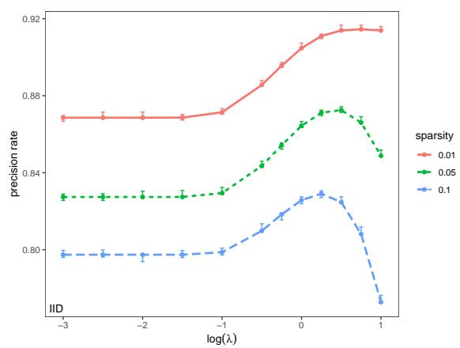

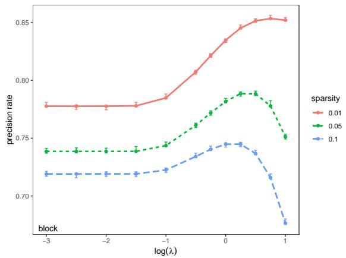

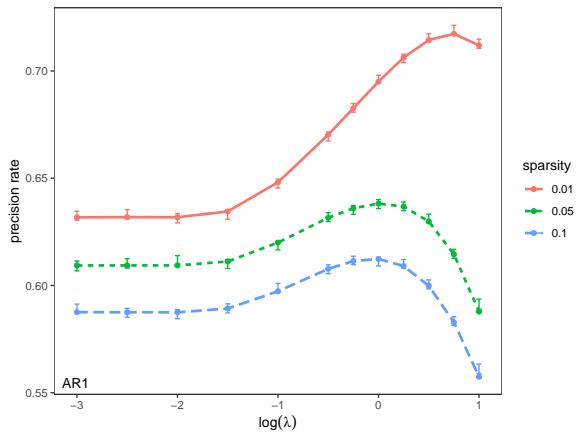

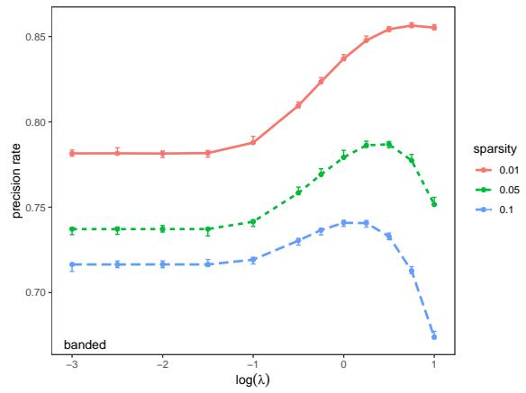  
Figure 1: Empirical and asymptotic classification accuracies as a function of log λ for four different correlation structures: IID (top-left), block (top-right), AR(1) (bottom-left), and banded (bottom-right). The lines are the asymptotic classification accuracies at diferent sparsity levels $s = 0 . 0 1 , 0 . 0 5 , 0 . 1$ The error bars are the 95% confidence intervals for the mean classification accuracies based on 500 replicates.

First, we verify the asymptotic normality of the debiased estimator discussed in Section 2. We simulate a dataset using the AR(1) correlation structure with $\alpha = 0 . 5$ and s = 0.1, and fit the model using λ = 1. The left plot in Figure 3 shows the histogram of the estimated coeficients wˆ , which exhibits a large spike at zero, indicating that many estimated coeficients are exactly zero. The right plot displays the histogram of the debiased estimates w¯ for the zero components, along with the asymptotic normal density curve. Note that the mean of w¯ is $\sqrt { p } R _ { 0 } { \bf { \Sigma } } ^ { - 1 } \hat { \pmb { \mu } } / \zeta$ , corresponding to the first term in expression (3). The asymptotic normal density curve closely matches the histogram. Similar results are observed for other choices of correlation structure, α, or s.

Second, we validate the formula for constructing confidence intervals. Recall that a 95% confidence interval is expected to contain the true mean 95% of the time when such intervals are constructed for datasets drawn from the same population. We set $\alpha \ : = \ : 0 . 5$ and generate 500 datasets with a specified correlation structure and sparsity level. For each dataset, 95% confidence intervals are constructed for every component. The empirical confidence level is defined as the proportion of times these confidence intervals contain the corresponding true mean. Figure 4 presents boxplots of the empirical confidence levels for each combination of correlation structure, sparsity level, and tuning parameter. The horizontal line at 0.95 represents the nominal confidence level. The close agreement across all settings confirms the validity of the confidence interval formula.

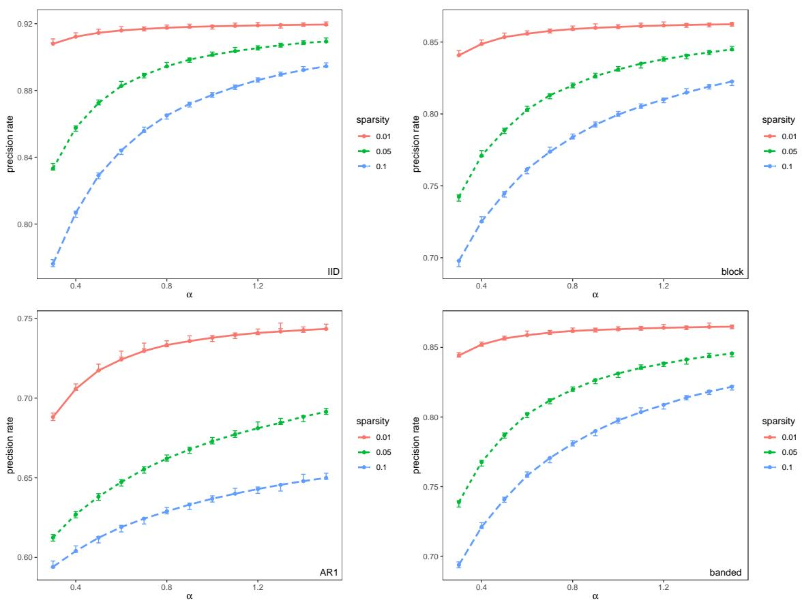  
Figure 2: Empirical and asymptotic optimal classification accuracies as a function of α for four diferent correlation structures: IID (top-left), block (top-right), AR(1) (bottom-left), and banded (bottom-right). The lines are the asymptotic optimal classification accuracies at diferent sparsity levels $s = 0 . 0 1 , 0 . 0 5 , 0 . 1$ . The error bars are the 95% confidence intervals for the mean optimal classification accuracies based on 500 replicates.

Next, we assess variable selection performance using power, defined as the probability of correctly identifying a significant variable when its true coeficient is nonzero. The asymptotic power is derived from the results in Section 2, while the empirical power is estimated as the proportion of nonzero components whose 95% confidence intervals do not include zero. Figure 5 shows the asymptotic power as lines and the 95% confidence intervals of the mean empirical powers based on 500 replicates as error bars. The close agreement between the asymptotic and empirical powers validates the theoretical results. The power increases as the true underlying model becomes sparser, because the efective dimension of the model is reduced. The power also increases with λ, because a larger λ shrinks more insignificant variables to zero, making the significant variables easier to detect.

The area under the curve (AUC) is a common measure of variable selection performance. For each component, the p-value corresponding to the null hypothesis that the component is insignificant can be computed using the results in Section 2. These p-values allow us to construct the ROC curve and compute the AUC. Figure 6 presents the 95% confidence intervals for the AUC under diferent correlation structures and sparsity levels. The performance of variable selection improves as the true underlying model becomes sparser. The relationship between AUC and λ is similar to that between power and λ in Figure 5.

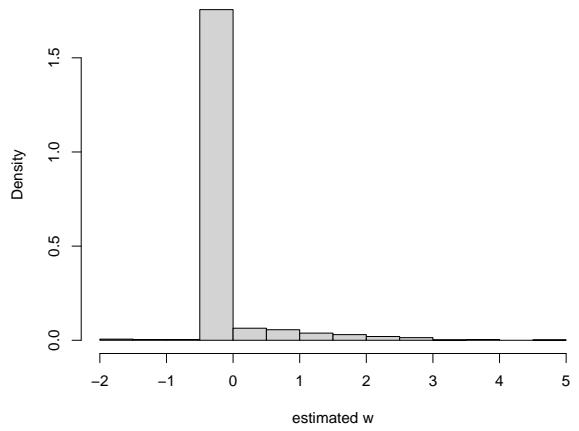

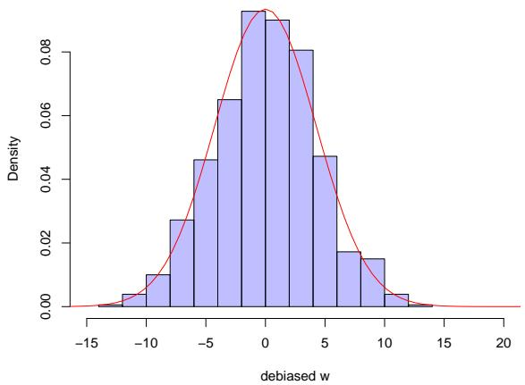  
Figure 3: The left plot shows the histogram of the estimated coeficients $\hat { \mathbf { w } } _ { ; }$ whereas the right plot displays the histogram of the debiased estimates $\bar { \bf w }$ for the zero components along with the asymptotic normal density curve.

## 4.3 Real data analysis

The human breast cancer dataset used in this section is from the MicroArray Quality Control (MAQC) II project (Popovici et al., 2010; Shi et al., 2010). The data are publicly available through the Gene Expression Omnibus (GEO) database (https://www.ncbi.nlm.nih.gov/geo/) under accession number GSE20194. The study includes stage I–III breast cancer patients, of whom 164 have positive clinical estrogen receptor status and 114 have negative status. Thus the observed classes are moderately imbalanced. Statistical-physics analyses of high-dimensional linear classification under class imbalance, including Lofredo et al. (2024), show that class proportions can afect classification performance. Because the theoretical analysis in this paper assumes a balanced Gaussian mixture, we regard the real-data analysis as an illustrative application of the fitted framework rather than as a validation of a theory that explicitly models class imbalance. For each subject, gene expression measurements are available for 22,283 genes.

We first perform two-sample t-tests for each gene separately and select the top $p = 1 0 0 0$ genes with the smallest p-values for further analysis. This preliminary screening is used to reduce the computational dimension and should be viewed as a data-reduction step rather than part of the formal inferential guarantee developed in Sections 2–3. In particular, the reported post-screening p-values are interpreted as illustrative rather than as unconditional end-to-end inference over all 22,283 genes. A sample-splitting analysis would provide a more stringent inferential interpretation and is an important direction for future work.

The gene expression data are then recentered so that the mean expression levels of the two groups are $\pm \pm \mu ,$ , respectively. The covariance matrix is estimated using the principal orthogonal complement thresholding (POET) method (Fan et al., 2013). We estimate the covariance matrices for the two groups separately, and then compute their average weighted by the respective sample sizes. Set $\alpha = n / p .$ where $n = 1 6 4 + 1 1 4$ is the total sample size. For each given $\lambda ,$ we compute the saddlepoint parameters and the debiased estimates. The resulting coordinatewise p-values for testing $H _ { 0 } : w _ { j } = 0$ are adjusted for multiple comparisons using the false discovery rate procedure (Benjamini and Hochberg, 1995). Because the preliminary screening is data-dependent, these results are intended to illustrate the distinction between variables selected by the sparse SVM and variables supported by the proposed inferential procedure rather than to claim unconditional genome-wide error-rate control.

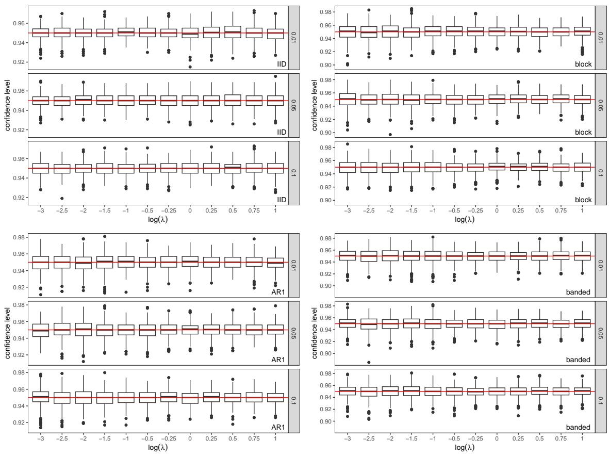  
Figure 4: Boxplots of empirical confidence levels based on 500 datasets for four correlation structures: IID (top-left), block (top-right), AR(1) (bottom-left), and banded (bottom-right). The horizontal line at 0.95 indicates the nominal confidence level. Diferent rows of plots represent diferent sparsity levels, $s = 0 . 0 1 , 0 . 0 5 , 0 . 1$

Figure 7 displays the asymptotic classification accuracy as a function of log(λ). The classification accuracy first increases and then decreases as log(λ) increases. The optimal classification accuracy is achieved at $\log ( \lambda ) = - 2 . 5$ , at which point the procedure identifies 60 significant genes. For comparison, the lasso estimate wˆ has 99 nonzero components.

## 5 Conclusion

We have developed a high-dimensional inferential framework for the $L _ { \mathrm { 1 - p e n a l i z e d } }$ SVM in the proportional asymptotic regime where $n , p \to \infty$ with $n / p \to \alpha$ . The central mathematical dificulty is the nonsmooth hinge loss. Rather than treating this dificulty as a minor technical modification

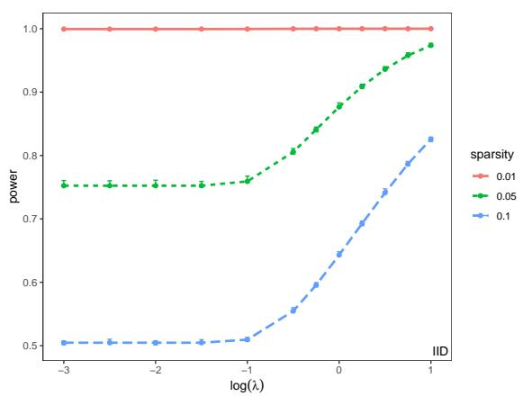

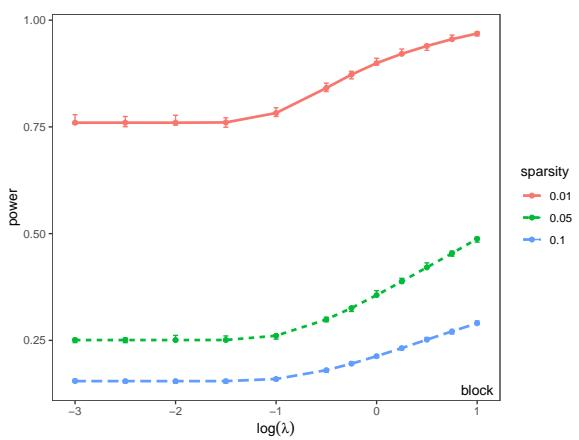

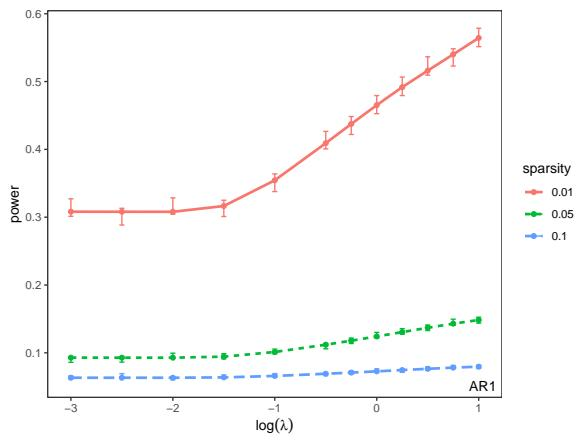

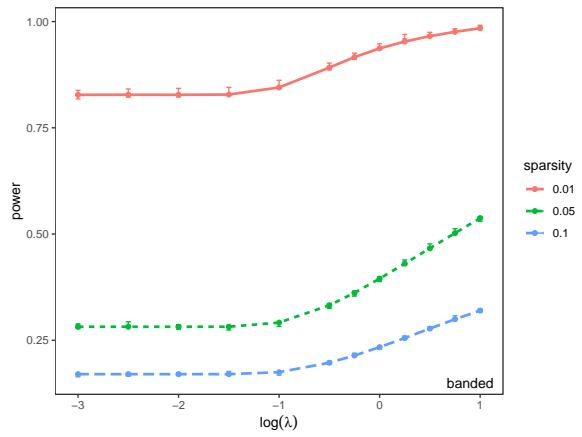  
Figure 5: Empirical and asymptotic powers as a function of log λ for four diferent correlation structures: IID (top-left), block (top-right), AR(1) (bottom-left), and banded (bottom-right). The lines are the asymptotic powers at diferent sparsity levels $s = 0 . 0 1 , 0 . 0 5 , 0 . 1$ . The error bars are the 95% confidence intervals for the mean powers based on 500 replicates.

of a smooth-loss theory, we exploit the exact linear-program structure of the sparse SVM: its dual variables identify a valid hinge-loss subgradient and therefore provide the quantities required by the debiasing correction. This yields the directly computable representation

$$
\bar { \mathbf { w } } = \hat { \mathbf { w } } + \frac { 1 } { \zeta } \mathbf { \Sigma } ^ { - 1 } \sum _ { i = 1 } ^ { n } \nu _ { i } y _ { i } \mathbf { x } _ { i } .
$$

The resulting Gaussian approximation provides coordinatewise confidence intervals and hypothesis tests and ofers a principled basis for multiple-testing and variable-selection procedures.

The simulation studies show that the asymptotic characterization accurately describes classification performance and inferential calibration across several covariance structures, including strongly correlated designs. The breast cancer application illustrates the practical distinction between the variables selected by the raw sparse SVM and those supported by the proposed inferential procedure. The current real-data analysis uses preliminary feature screening for computational reduction; consequently, its post-screening inferential results should be interpreted as illustrative rather than as unconditional genome-wide inference.

Several directions remain open. First, the present theory is restricted to balanced, linearly separable data; extending it to class-imbalanced designs (Lofredo et al., 2024) or to the nonseparable perceptron regime (Franz et al., 2019) is a natural next step. Second, the theoretical framework is based on a replica-symmetric characterization and does not provide a rigorous proof of the RS ansatz or its stability; establishing such results, or identifying conditions under which the RS solution can be justified rigorously, is an important theoretical problem. Third, the framework assumes a Gaussian-mixture model for the class-conditional distributions, and extending the theory to broader distributional classes would increase its applicability. Fourth, the current analysis is restricted to the $L _ { 1 }$ penalty; extending the proportional-asymptotic theory to nonconvex penalties such as SCAD (Fan and Li, 2001) or MCP could combine reduced regularization bias with formal inferential guarantees. Fifth, a theoretically justified, data-driven procedure for selecting the tuning parameter λ remains an important problem. Finally, developing sample-splitting or other selectionaware procedures for the preliminary screening step in high-dimensional applications would provide a cleaner end-to-end inferential framework.

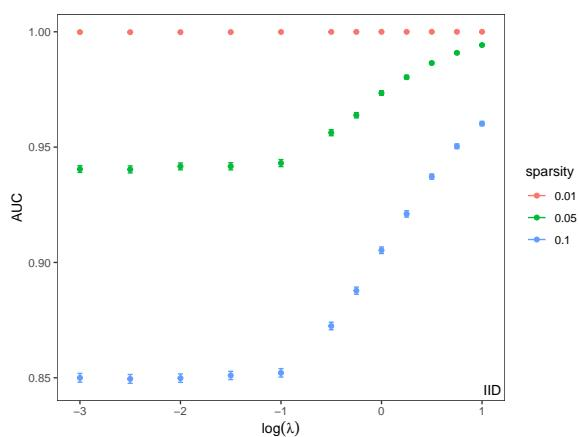

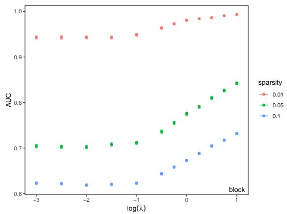

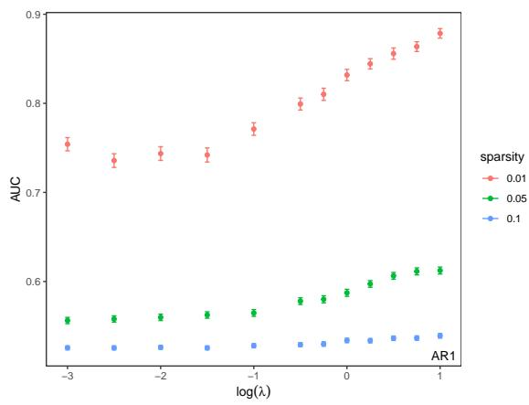

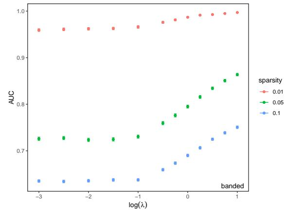  
Figure 6: AUC as a function of log λ for four diferent correlation structures: IID (top-left), block (top-right), AR(1) (bottom-left), and banded (bottom-right). The error bars are the 95% confidence intervals for the mean AUC based on 500 replicates at diferent sparsity levels $s = 0 . 0 1 , 0 . 0 5 , 0 . 1$

## References

Benjamini, Y. and Y. Hochberg (1995). Controlling the false discovery rate: a practical and powerful approach to multiple testing. Journal of the Royal statistical society: series B (Methodological) 57 (1), 289–300.

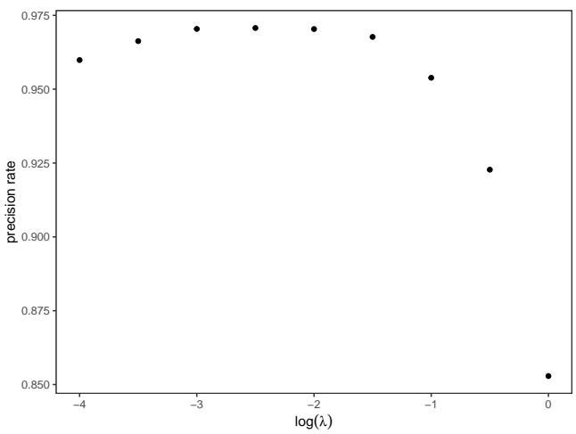  
Figure 7: Asymptotic classification accuracies as a function of log(λ) for the breast cancer dataset.

Bradley, P. S. and O. L. Mangasarian (1998). Feature selection via concave minimization and support vector machines. In Proceedings of the Fifteenth International Conference on Machine Learning (ICML), pp. 82–90.

Fan, J. and R. Li (2001). Variable selection via nonconcave penalized likelihood and its oracle properties. Journal of the American Statistical Association 96 (456), 1348–1360.

Fan, J., Y. Liao, and M. Mincheva (2013). Large covariance estimation by thresholding principal orthogonal complements. Journal of the Royal Statistical Society Series B: Statistical Methodology 75 (4), 603–680.

Franz, S., A. Sclocchi, and P. Urbani (2019). Critical jammed phase of the linear perceptron. Physical Review Letters 123 (11), 115702.

Huang, H. and P. Zeng (2025, apr). Statistical inference in classification of high-dimensional gaussian mixture. Journal of Physics A: Mathematical and Theoretical 58 (17), 175002.

Koo, J.-Y., Y. Lee, Y. Kim, and C. Park (2008). A Bahadur representation of the linear support vector machine. Journal of Machine Learning Research 9, 1343–1368.

Lofredo, E., M. Pastore, S. Cocco, and R. Monasson (2024). Restoring balance: principled under/oversampling of data for optimal classification. In Proceedings of the 41st International Conference on Machine Learning, Volume 235 of Proceedings of Machine Learning Research, pp. 32643–32670.

Popovici, V., W. Chen, B. D. Gallas, C. Hatzis, et al. (2010). Efect of training-sample size and classification dificulty on the accuracy of genomic predictors. Breast Cancer Research 12 (1), R5.

Shi, L., G. Campbell, W. D. Jones, F. Campagne, et al. (2010). The microarray quality control (MAQC)-II study of common practices for the development and validation of microarray-based predictive models. Nature Biotechnology 28 (8), 827–838.

Zhang, X., Y. Wu, L. Wang, and R. Li (2016). Variable selection for support vector machines in moderately high dimensions. Journal of the Royal Statistical Society: Series B (Statistical Methodology) 78 (1), 53–76.

Zhu, J., S. Rosset, R. Tibshirani, and T. Hastie (2004). 1-norm support vector machines. In Advances in Neural Information Processing Systems, Volume 16, pp. 49–56.

Zou, H. (2007). An improved 1-norm SVM for simultaneous classification and variable selection. In Proceedings of the Eleventh International Conference on Artificial Intelligence and Statistics.