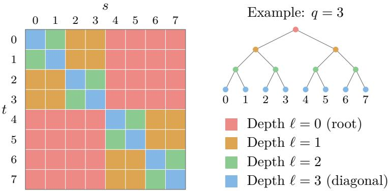
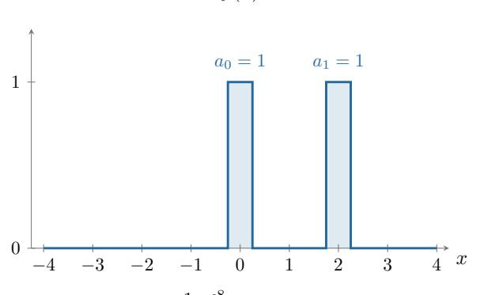
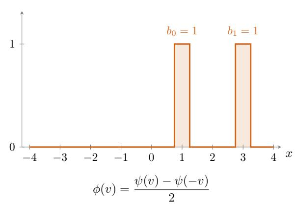
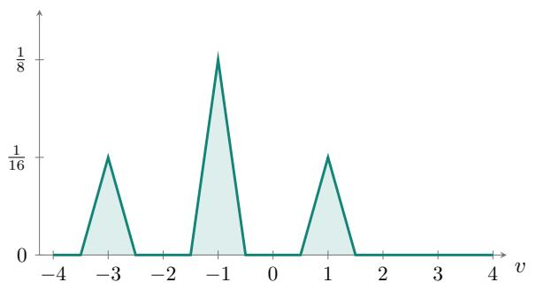
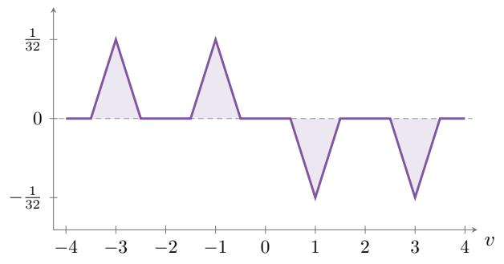

# High-dimensional online calibration from harmonic weights

Maxwell Fishelson∗

Mehryar Mohri†

October 7, 2026

## Abstract

We study the online calibration of multidimensional forecasts over an arbitrary convex set $\mathcal { V } \subseteq \mathbb { R } ^ { d }$ relative to an arbitrary error norm $\| \cdot \| _ { \mathcal { L } }$ . For forecasting d binary outcomes simultaneously $( \mathcal { V } = [ 0 , 1 ] ^ { d } )$ , we give the first algorithm that achieves ε-calibration in a number of rounds that is polynomial in d for every fixed accuracy. It requires $d ^ { O ( 1 / \varepsilon ) }$ rounds, exponentially improving the dimension dependence of previous bounds [Per14, $\mathrm { F K O ^ { + } 2 5 }$ , FGMS25]. For multiclass forecasting $( \mathcal { V } = \Delta _ { d } )$ , we obtain the same $d ^ { O ( 1 / \varepsilon ) }$ rate, improving the $d ^ { \widetilde { O } ( 1 / \varepsilon ^ { 2 } ) }$ bounds of Peng [Pen25] and Fishelson et al. [FGMS25].

Our algorithm is simple: on each round, it outputs a harmonically weighted distribution over harmonically smoothed past outcomes. The same algorithm works for every forecast set and norm. More generally, it achieves ε-calibration after $\exp ( O ( \gamma ( \mathcal { V } , \mathcal { L } ) / \varepsilon ) )$ rounds, where $\gamma ( \mathcal { V } , \mathcal { L } )$ is a geometric parameter defined by a matrix discrepancy problem. The harmonic weights are motivated by the fact that the discrete Hilbert transform matrix achieves the optimal discrepancy up to a universal constant, simultaneously for every . This optimality result may be of independent interest.

## 1 Introduction

Consider a forecaster who reports a probability of rain each day. What should it mean for these probabilities to be reliable? A natural requirement is that, among the days on which the forecaster predicts a 40% chance of rain, it should rain on approximately 40% of them. The same requirement should hold for every probability the forecaster reports. This agreement between forecasts and observed frequencies is called calibration. It gives a way to assess probabilistic predictions over time, since a single day’s outcome says little about the reliability of a 40% forecast.

We study calibration in an online setting: on each round, the forecaster makes a prediction, observes the outcome, and uses this feedback to form subsequent predictions. To measure its error, group together the rounds on which it made the same prediction, compare that prediction with the empirical frequency in the group, and average the discrepancies with weights proportional to the group sizes. A forecaster is approximately calibrated when this average error is small. The online question is whether one can guarantee such agreement without assuming a stochastic model for the outcomes. Classical work on randomized forecasting shows that calibration is possible even against adversarial sequences under suitable information timing [FV98, DDF 24]. Calibration also provides a guarantee for downstream decision makers: agents who respond to calibrated forecasts have vanishing regret [FV97, Per14, KPLST23, RS24, HW24, BHNU26].

Early calibration algorithms studied the forecasting of a single binary outcome [FV98]. Many forecasting problems, however, require higher-dimensional predictions. In multi-event forecasting, a forecaster predicts several binary events concurrently: for example, whether it will rain in each of d cities. The forecast is a vector in $[ 0 , 1 ] ^ { d }$ , and the outcome records which cities receive rain. Calibration asks that, on rounds sharing the same entire forecast vector, the empirical frequency of each event agree with its predicted probability. We measure the discrepancy in the norm $\| \cdot \| _ { \infty } ,$ which controls all d events simultaneously.

In multi-class forecasting, the forecaster predicts a single event with d possible outcomes: for example, assigning a probability to each possible next token in a vocabulary of size d. Calibration compares the empirical outcome frequencies with the predicted probabilities, here in the norm $\| \cdot \| _ { 1 }$

The central dificulty in higher-dimensional forecasting is the dependence on dimension. Standard algorithms discretize the forecast set using an ε-net and predict over this finite set [FV98, Per14, $\mathrm { F K O ^ { + } 2 5 ] }$ . Such a grid requires $( 1 / \varepsilon ) ^ { O ( d ) }$ points and yields algorithms with calibration rates that are exponential in d even for fixed accuracy. This dependence is prohibitive for modern forecasting tasks with many events or classes.

Recent breakthroughs improve the dimension dependence in important settings, at the cost of a worse dependence on accuracy. Peng [Pen25] (FOCS 2025) gives a multi-class calibration algorithm that achieves ε-calibration in $d ^ { \widetilde { O } ( 1 / \varepsilon ^ { 2 } ) }$ rounds. The TreeCal algorithm of Fishelson et al. [FGMS25] (NeurIPS 2025, oral) generalizes this approach to arbitrary convex forecast sets $\mathcal { V }$ and error norms $\| \cdot \| _ { \mathcal { L } }$ , obtaining a suficient horizon of $\exp ( \widetilde { O } ( \rho / \varepsilon ^ { 2 } ) )$ , where $\rho$ is a geometric eparameter related to online linear optimization rates. This recovers the multi-class bound and gives a dimension-independent horizon of $\exp ( \widetilde { O } ( 1 / \varepsilon ^ { 2 } ) )$ for Euclidean forecasting $( \mathcal { V } = B _ { 2 } ^ { d } )$ . Notably, for emulti-event forecasting, the resulting bound is $\exp ( \widetilde { O } ( d / \varepsilon ^ { 2 } ) )$ , which remains exponential in dimension. eDiscretization-based methods give the stronger bound $( 1 / \varepsilon ) ^ { O ( d ) }$ in this setting [Per14], but still incur exponential dimension dependence. We improve the dimension and accuracy dependence of these guarantees using a single elementary algorithm.

Our principal results concern the following distributional protocol. On round t, the forecaster announces a finite distribution $\mu _ { t }$ over points in $\mathcal { V } _ { : }$ and the adversary chooses $y _ { t } \in \mathcal { V }$ after seeing it. This interaction repeats for $T$ rounds. At its conclusion, we evaluate the calibration error by comparing each forecast $p \in \mathcal { V }$ with its associated average outcome. On round t, the forecast p receives weight $\mu _ { t } ( p )$ and the outcome is $y _ { t }$ , so its weighted average outcome over all rounds is

$$
\nu _ { p } = \frac { \sum _ { t } \mu _ { t } ( p ) y _ { t } } { \sum _ { t } \mu _ { t } ( p ) } ,
$$

whenever its total weight is positive. For an error norm $\| \cdot \| _ { \mathcal { L } }$ with unit ball $\mathcal { L } .$ , the -calibration error is

$$
\mathsf { C a l } _ { \mathcal { L } , T } = \sum _ { p } \left( \sum _ { t } \mu _ { t } ( p ) \right) \| \nu _ { p } - p \| _ { \mathcal { L } } = \sum _ { p } \left\| \sum _ { t } \mu _ { t } ( p ) ( y _ { t } - p ) \right\| _ { \mathcal { L } } ,
$$

where the sum is over distinct forecast points with positive total weight [FGMS25]. Thus $\mathsf { C a l } _ { \mathcal { L } , T } / T$ is the average calibration error. We say that an algorithm achieves ε-calibration in $T$ rounds if $\mathsf { C a l } _ { \mathcal { L } , T } / T \le \varepsilon$ for every realized transcript $( \mu _ { 0 } , y _ { 0 } ) , \dots , ( \mu _ { T - 1 } , y _ { T - 1 } )$ . Our goal is to achieve ε-calibration in as few rounds $T$ as possible.

In some of the literature, this setting is called pseudo-calibration. We simply refer to it as calibration and call the setting in which the forecaster must sample a single forecast each round sampled calibration. The distributional notion is the more natural formulation, as it sufices for downstream regret guarantees. For sampled calibration, Appendix A obtains the same headline rates in expectation.

Our results. Our algorithm works for every convex forecast set $\mathcal { V }$ and error norm $\| \cdot \| _ { \mathcal { L } }$ . We first present its guarantees in three standard forecasting settings, then describe the algorithm and state its general geometric guarantee. For multi-event forecasting, we obtain ε-calibration in $d ^ { O ( 1 / \varepsilon ) }$ rounds. This is the first algorithm for multi-event calibration whose horizon is polynomial in d for each fixed accuracy. For multi-class forecasting we obtain the same horizon, sharpening the accuracy dependence in the bounds of Peng [Pen25] and Fishelson et al. [FGMS25] from $d ^ { O ( \varepsilon ^ { - 2 } \log ( 1 / \varepsilon ) ) }$ to $d ^ { { \bar { O ( 1 / \varepsilon ) } } }$ . On the Euclidean unit ball, we improve the horizon of Fishelson et al. [FGMS25] from exp $\cdot ( O ( \varepsilon ^ { - 2 } \log ( 1 / \varepsilon ) ) )$ to $\exp ( O ( 1 / \varepsilon ) )$ , independently of $d ,$ again improving the accuracy dependence in the exponent. Table 1 summarizes the improved rates.

Theorem 1.1 (Principal consequences). A single explicit anytime algorithm, stated formally as Algorithm 1, achieves average calibration error $\mathsf { C a l } _ { \mathcal { L } , T } / T \le \varepsilon$ whenever

$$
T \geq \left\{ \begin{array} { l l } { d ^ { O ( 1 / \varepsilon ) } } & { f o r ~ m u l t i - e v e n t ~ f o r e c a s t i n g ~ ( \mathcal { V } = [ 0 , 1 ] ^ { d } , ~ \mathcal { L } = B _ { \infty } ^ { d } ) , } \\ { d ^ { O ( 1 / \varepsilon ) } } & { f o r ~ m u l t i - c l a s s ~ f o r e c a s t i n g ~ ( \mathcal { V } = \Delta _ { d } , ~ \mathcal { L } = B _ { 1 } ^ { d } ) , } \\ { \exp ( O ( 1 / \varepsilon ) ) } & { f o r ~ E u c l i d e a n ~ f o r e c a s t i n g ~ ( \mathcal { V } = \mathcal { L } = B _ { 2 } ^ { d } ) , } \end{array} \right.
$$

where $B _ { q } ^ { d } = \{ x \in \mathbb { R } ^ { d } : \| x \| _ { q } \leq 1 \}$ is the unit ball of the $\ell _ { q }$ norm in d dimensions.

<table><tr><td rowspan=1 colspan=1>Setting</td><td rowspan=1 colspan=1>ε-net approaches $[ \mathrm { P e r 1 4 , F K O ^ { + } 2 5 } ]$ </td><td rowspan=1 colspan=1>High-dimensional regime</td><td rowspan=1 colspan=1>This work</td></tr><tr><td rowspan=1 colspan=1>Multi-event</td><td rowspan=1 colspan=1> $( 1 / \varepsilon ) ^ { O ( d ) }$ </td><td rowspan=1 colspan=1></td><td rowspan=1 colspan=1> $\overline { { d ^ { O ( 1 / \varepsilon ) } } }$ </td></tr><tr><td rowspan=1 colspan=1>Multi-class</td><td rowspan=1 colspan=1> $( 1 / \varepsilon ) ^ { O ( d ) }$ </td><td rowspan=1 colspan=1> $\overline { { { d ^ { O ( \varepsilon ^ { - 2 } \log ( 1 / \varepsilon ) ) } \ [ \mathrm { P e n 2 5 } , } } }$ FGMS25]</td><td rowspan=1 colspan=1> $\overline { { d ^ { O ( 1 / \varepsilon ) } } }$ </td></tr><tr><td rowspan=1 colspan=1>Euclidean</td><td rowspan=1 colspan=1> $( 1 / \varepsilon ) ^ { O ( d ) }$ </td><td rowspan=1 colspan=1> $\exp \bigl ( O ( \varepsilon ^ { - 2 } \log ( 1 / \varepsilon ) ) \bigr )$  [FGMS25]</td><td rowspan=1 colspan=1> $\exp ( O ( 1 / \varepsilon ) )$ </td></tr></table>

Table 1: Rounds suficient to achieve ε-calibration in the three forecasting settings of Theorem 1.1.

An elementary algorithm. The algorithm has two operations. As it observes outcomes $y _ { 0 } , \ldots , y _ { t }$ it stores harmonically weighted average outcomes $p _ { 0 } , \ldots , p _ { t }$ . At each round, it outputs a harmonically weighted distribution over previously stored forecasts. Both operations use weights that decay inversely with age, as in $1 , { \frac { 1 } { 3 } } , { \frac { 1 } { 5 } } , \ldots , { \frac { 1 } { 2 t + 1 } }$ , normalized to sum to $1 . { } ^ { 1 }$

On the first round, we choose $p _ { \mathrm { i n i t } } \in \mathcal { V }$ and announce $\mu _ { 0 } = \delta _ { p _ { \mathrm { i n i t } } }$ . For subsequent rounds $t \geq 1$ we first compute and store a harmonically weighted average of the past outcomes:

$$
p _ { t - 1 } \propto \sum _ { s \leq t - 1 } \frac { y _ { s } } { 2 ( t - s ) - 1 } .
$$

Here $\propto$ means that the sum is normalized by its total weight, $\textstyle 1 + { \frac { 1 } { 3 } } + \cdots + { \frac { 1 } { 2 t - 1 } }$ . Thus $p _ { t - 1 } \in \mathcal { V }$ We then construct our output $\mu _ { t }$ for the round as a distribution supported on the stored forecasts $p _ { 0 } , \ldots , p _ { t - 1 }$ . Let $\delta _ { p _ { s } }$ denote the Dirac distribution that puts all its mass on $p _ { s }$ . Using the same harmonically decaying weights, we set

$$
\mu _ { t } \propto \sum _ { s \leq t - 1 } { \frac { \delta _ { p _ { s } } } { 2 ( t - s ) - 1 } } .
$$

Algorithm 1 gives the formal statement. The procedure is independent of the norm, the horizon, and the target accuracy.

A general geometric guarantee. In fact, the same algorithm admits a general singly exponential horizon bound governed by a matrix discrepancy objective. For nonempty compact convex sets $\mathcal { A } , \mathcal { B } \subseteq \mathbb { R } ^ { d }$ and a real $T \times T$ matrix H, define

$$
\Gamma _ { { \mathcal A } , \mathcal B } ^ { ( T ) } ( H ) = \operatorname* { s u p } _ { \substack { a _ { 0 } , \ldots , a _ { T - 1 } \in \mathcal A } } \sum _ { t , s = 0 } ^ { T - 1 } H _ { t s } \langle a _ { t } , b _ { s } \rangle .\tag{1}
$$

This objective relates to our calibration rates as follows. Let $c y$ be the center of mass of $\mathcal { V }$ , and define

$$
\boldsymbol { \widetilde { y } } = \boldsymbol { y } - \boldsymbol { c } \boldsymbol { y } .
$$

Let $\mathscr { L } ^ { \circ }$ be the polar of the norm ball $\mathcal { L } \mathrm { : }$

$$
\mathcal { L } ^ { \circ } = \{ r \in \mathbb { R } ^ { d } : \langle \ell , r \rangle \leq 1 \mathrm { ~ f o r ~ e v e r y ~ } \ell \in \mathcal { L } \} .
$$

Let $K _ { T }$ be the shifted discrete Hilbert transform matrix:

$$
( K _ { T } ) _ { t s } = { \frac { 1 } { 2 ( t - s ) - 1 } } \qquad ( 0 \leq t , s < T ) .\tag{2}
$$

The quantity $\Gamma _ { \tilde { y } , \mathcal { L } ^ { \circ } } ^ { ( T ) } ( K _ { T } )$ governs our calibration rates. As we will see in Section 3, $\Gamma _ { \mathcal { \widetilde { V } } , \mathcal { L } ^ { \circ } } ^ { ( T ) } ( K _ { T } ) =$ $O _ { \mathcal { Y } , \mathcal { L } } ( T )$ e efor every forecast set and norm ball . Thus we define the geometric coeficient

$$
\boxed { \begin{array} { r l } & { \gamma ( \mathcal { Y } , \mathcal { L } ) = \operatorname* { s u p } _ { T \geq 1 } \frac { \Gamma _ { \mathcal { \widetilde { Y } } , \mathcal { L } ^ { \circ } } ^ { ( T ) } ( K _ { T } ) } { T } . } \end{array} }\tag{3}
$$

Our main algorithm obtains the following guarantee.

Theorem 1.2 (General geometric guarantee). Let  be any norm unit ball, let  be a nonempty compact convex forecast set. For an absolute constant C, Algorithm 1 achieves ε-calibration for every

$$
T \geq \exp \left( \frac { C \gamma ( y , \mathcal { L } ) } { \varepsilon } \right) .
$$

Why harmonic weights? In Section 2, we consider a generalized version of our algorithm with arbitrary admissible weights encoded by a matrix H. Its calibration bound is governed by $\Gamma _ { \mathcal { \widetilde { V } } , \mathcal { L } ^ { \circ } } ^ { ( T ) } ( H )$ 2 so we seek weights that minimize this objective.

Section 4 proves that, for sets , with $0 \in { \mathcal { A } }$ and $\boldsymbol { B } = - \boldsymbol { B } , \ K _ { T }$ minimizes $\Gamma _ { A , B } ^ { ( T ) }$ up to an absolute constant factor over our class of matrices $\mathcal { H } _ { T }$

$$
\Gamma _ { A , B } ^ { ( T ) } ( K _ { T } ) \leq C \operatorname* { m i n } _ { H \in \mathcal { H } _ { T } } \Gamma _ { A , B } ^ { ( T ) } ( H ) .
$$

The class $\mathcal { H } _ { T }$ consists of matrices with nonnegative entries below the diagonal, nonpositive entries on and above the diagonal, and the same total absolute mass as $K _ { T }$ . We defer the precise definition to Section 4.

Section 3 explains why this choice gives sublinear calibration, with polynomial dimension dependence for many classes of interest. Our core tool is the following bound, proved in Lemma 3.2.

Lemma 1.3 (Finite Hilbert matrix moment bounds). There is an absolute constant C such that, for every $T \geq 1$ , every $q \in \{ 2 , 4 , 8 , \dots \}$ , and every $\boldsymbol { x } \in \mathbb { R } ^ { T }$ 2

$$
\| K _ { T } x \| _ { q } \leq C q \| x \| _ { q } .
$$

Human acknowledgements. The authors thank Jon Schneider and Yuval Dagan for many helpful discussions throughout this work.

AI acknowledgements. The authors utilized Gemini, ChatGPT, and Claude to assist with proving various lemmas and the creation of this manuscript. However, despite the simplicity of the main algorithm, finding such an algorithm was outside of the one-shot capabilities of the current best commercially available models. Here are two experiments demonstrating that GPT-6 Astra Ultra and Claude Fable 5.1 Max are unable to resolve even a simplified version of the problem (orthant calibration) given a massive in-depth prompt detailing all the relevant past work and algorithmic ideas known.

• Prompt: https://maxkfish.com/wp-content/uploads/2026/10/prompt.txt

• GPT: https://chatgpt.com/share/6ac4672a-5968-83e8-8b96-25e4ad40b3ab

• Fable: https://claude.ai/share/2ec24e46-ee20-4cbd-b682-1fee29989d2c

A more detailed account of AI usage will be provided in a future version of the manuscript. We will discuss the algorithmic insights we had that helped us steer our AI usage over the course of 2 years of work.

## 2 A general matrix formulation

We now present a family of forecasting algorithms that includes our main algorithm (Algorithm 1) as a special case. Each algorithm is specified by matrices $P , Q \in \mathbb { R } ^ { T \times T }$ , chosen before observing any outcomes. The matrix $P$ is lower triangular and row stochastic. The matrix $Q$ is strictly lower triangular and row stochastic (except for the first row, which is all zero). That is,

$$
\begin{array} { r l r } & { P _ { t s } , Q _ { t s } \ge 0 , \quad \quad P _ { t s } = 0 } & { ( s > t ) , \quad \quad Q _ { t s } = 0 \quad ( s \ge t ) , } \\ & { \displaystyle \sum _ { s = 0 } ^ { t } P _ { t s } = 1 \quad ( 0 \le t < T ) , \quad \quad \displaystyle \sum _ { s = 0 } ^ { t - 1 } Q _ { t s } = 1 \quad ( 1 \le t < T ) . } \end{array}\tag{4}
$$

Our generalized algorithm is simply

$$
p _ { t } = \sum _ { s \leq t } P _ { t s } y _ { s } \quad ( t \geq 0 ) , \qquad \mu _ { t } = \sum _ { s < t } Q _ { t s } \delta _ { p _ { s } } \quad ( t \geq 1 ) .\tag{5}
$$

We choose $\mu _ { 0 } = \delta _ { p _ { \mathrm { i n i t } } }$ for an arbitrary $p _ { \mathrm { i n i t } } \in \mathcal { V }$ . Each stored forecast $p _ { t }$ is a convex combination of $y _ { 0 } , \ldots , y _ { t }$ , so it belongs to $\mathcal { V } .$ . For $t \geq 1 , \mu _ { t }$ is a probability distribution supported on $p _ { 0 } , \ldots , p _ { t - 1 }$ and therefore depends only on $y _ { 0 } , \ldots , y _ { t - 1 }$ . Thus the algorithm is feasible and causal.

We now show that this algorithm has a calibration guarantee in terms of the matrix objective from the introduction. To state the guarantee, define

$$
H = Q - P ^ { \mathsf { T } } .
$$

The constraints on $P , Q$ in (4) can equivalently be written as constraints on H. Define

$$
\widehat { \mathcal { H } } _ { T } = \left\{ \begin{array} { l l l } { \displaystyle H _ { t s } \geq 0 } & { ( s < t ) , } \\ { \displaystyle H _ { t s } \leq 0 } & { ( t \leq s ) , } \\ { \displaystyle H \in \mathbb { R } ^ { T \times T } : } & { \displaystyle \sum _ { s = 0 } ^ { t - 1 } H _ { t s } = 1 } & { ( 1 \leq t < T ) , } \\ { \displaystyle } & { \displaystyle - \sum _ { t = 0 } ^ { s } H _ { t s } = 1 } & { ( 0 \leq s < T ) } \end{array} \right\} .\tag{6}
$$

Indeed, given $H \in \widehat { \mathcal { H } } _ { T }$ , we can recover P and $Q ,$ , defining a valid instance of (5). We have the following guarantee.

Theorem 2.1. For every $H \in \widehat { \mathcal { H } } _ { T }$ , the algorithm (5) parameterized by H satisfies

$$
\mathsf { C a l } _ { \mathcal { L } , T } = O \bigg ( \Gamma _ { \widetilde { \mathcal { V } } , \mathcal { L } ^ { \circ } } ^ { ( T ) } ( H ) \bigg )\tag{7}
$$

for every outcome sequence $y _ { 0 } , \dots , y _ { T - 1 } \in \mathcal { Y }$

Proof. Keep a separate bucket for each stored forecast. On each round $t \geq 1$ , Algorithm (5) announces a forecast distribution $\mu _ { t }$ supported on the stored forecasts $p _ { 0 } , \ldots , p _ { t - 1 }$ , assigning weight $Q _ { t s }$ to $p _ { s }$ . Thus, for each forecast value p and round $t \geq 1$ , the weight placed on $p$ is

$$
\mu _ { t } ( p ) = \sum _ { s : p _ { s } = p } Q _ { t s } .
$$

Two stored forecasts $p _ { s }$ and $p _ { s ^ { \prime } }$ may happen to be the same vector. Mass placed on these forecasts would have one shared contribution to the total calibration error, which would only reduce the error by the triangle inequality. We upper bound by treating all stored forecasts and $p _ { \mathrm { i n i t } }$ as distinct.

$$
\begin{array} { r l } {  { \mathsf { C a l } _ { \mathcal { L } , \mathcal { T } } = \sum _ { p \in \mathcal { Y } } \| \displaystyle \sum _ { t = 0 } ^ { T - 1 } \mu _ { t } ( p ) ( y _ { t } - p ) \| _ { \mathcal { L } } } } \\ & { \leq \| y _ { 0 } - p _ { \mathrm { i n i t } } \| _ { \mathcal { L } } + \displaystyle \sum _ { p \in \mathcal { Y } } \| \displaystyle \sum _ { t = 1 } ^ { T - 1 } \sum _ { s : p _ { s } = p } Q _ { t s } ( y _ { t } - p _ { s } ) \| _ { \mathcal { L } } } \\ & { \leq \| y _ { 0 } - p _ { \mathrm { i n i t } } \| _ { \mathcal { L } } + \displaystyle \sum _ { s } \| \displaystyle \sum _ { t = 1 } ^ { T - 1 } Q _ { t s } ( y _ { t } - p _ { s } ) \| _ { \mathcal { L } } . } \end{array}
$$

Note that $\begin{array} { r } { p _ { s } = \sum _ { t } P _ { s t } y _ { t } } \end{array}$ and $\begin{array} { r } { \sum _ { t } P _ { s t } = 1 } \end{array}$ . Therefore, $\begin{array} { r } { \sum _ { t } P _ { s t } ( y _ { t } - p _ { s } ) = 0 } \end{array}$ , and

$$
\left\| \sum _ { t } Q _ { t s } ( y _ { t } - p _ { s } ) \right\| _ { \underline { { c } } } = \left\| \sum _ { t } ( Q _ { t s } - P _ { s t } ) ( y _ { t } - p _ { s } ) \right\| _ { \underline { { c } } } = \left\| \sum _ { t } H _ { t s } ( y _ { t } - p _ { s } ) \right\| _ { \underline { { c } } } .\tag{8}
$$

Center at $c _ { \mathcal { V } }$ and write $\widetilde { y } _ { t } = y _ { t } - c _ { \mathcal { Y } }$ and $\widetilde { p } _ { s } = p _ { s } - c _ { \mathcal { Y } }$ . Both vectors belong to $\widetilde { \mathcal { V } } .$ . Then

$$
\begin{array} { l } { \displaystyle \left\| \sum _ { t } H _ { t s } ( y _ { t } - p _ { s } ) \right\| _ { \mathcal { L } } = \left\| \sum _ { t } H _ { t s } ( \widetilde { y } _ { t } - \widetilde { p } _ { s } ) \right\| _ { \mathcal { L } } } \\ { \displaystyle \qquad \leq \left\| \sum _ { t } H _ { t s } \widetilde { y } _ { t } \right\| _ { \mathcal { L } } + \left\| \sum _ { t } H _ { t s } \widetilde { p } _ { s } \right\| _ { \mathcal { L } } . } \end{array}
$$

We bound the sum over s of each term by $\Gamma _ { \widetilde { y } , \mathcal { L } ^ { \circ } } ^ { ( T ) } ( H )$ . Recall the definition of $\Gamma _ { \widetilde { y } , \mathcal { L } ^ { \circ } } ^ { ( T ) } ( H )$ from (1):

$$
\Gamma _ { \widetilde { \mathcal { Y } } , \mathscr { L } ^ { \circ } } ^ { ( T ) } ( H ) = \underset { \stackrel { a _ { t } \in \widetilde { \mathcal { Y } } } { b _ { s } \in \mathcal { L } ^ { \circ } } } { \operatorname* { s u p } } \sum _ { s , t } H _ { t s } \langle a _ { t } , b _ { s } \rangle = \underset { a _ { t } \in \widetilde { \mathcal { Y } } } { \operatorname* { s u p } } \sum _ { s } \left. \sum _ { t } H _ { t s } a _ { t } \right. _ { \mathscr { L } } .
$$

The first term is therefore bounded directly

$$
\sum _ { s } \left\| \sum _ { t } H _ { t s } \widetilde { y } _ { t } \right\| _ { \mathcal { L } } \leq \Gamma _ { \widetilde { \mathcal { V } } , \mathcal { L } ^ { \circ } } ^ { ( T ) } ( H ) .
$$

For the second term, take every $a _ { t }$ to be the same vector $a \in \widetilde { \mathcal { V } }$ maximizing $\| a \| _ { \mathcal { L } }$ . The same definition gives

$$
\Gamma _ { \widetilde { y } , \mathscr { L } ^ { \circ } } ^ { ( T ) } ( H ) \geq \sum _ { s } \left. \left( \sum _ { t } H _ { t s } \right) a \right. _ { \mathscr { L } } = \operatorname* { m a x } _ { y \in \widetilde { \mathcal { V } } } \Vert y \Vert _ { \mathcal { L } } \sum _ { s } \left| \sum _ { t } H _ { t s } \right| .
$$

Consequently,

$$
\begin{array} { l } { \displaystyle \sum _ { s } \left\| \sum _ { t } H _ { t s } \widetilde { p } _ { s } \right\| _ { \mathcal L } = \displaystyle \sum _ { s } \left| \sum _ { t } H _ { t s } \right| \| \widetilde { p } _ { s } \| _ { \mathcal L } } \\ { \leq \Gamma _ { \widetilde { \mathcal V } , \mathcal L ^ { \circ } } ^ { ( T ) } ( H ) . } \end{array}
$$

eCombining the two bounds with the initial-round contribution yields

$$
\mathsf { C a l } _ { \mathcal { L } , T } \leq \| y _ { 0 } - p _ { \mathrm { i n i t } } \| _ { \mathcal { L } } + 2 \Gamma _ { \widetilde { y } , \mathcal { L } ^ { \circ } } ^ { ( T ) } ( H ) .
$$

For $T \geq 2$ , we have $H _ { 0 0 } = - 1$ and $H _ { 1 0 } = 1$ . Taking $a _ { 0 } = y _ { 0 } - c y , a _ { 1 } = p _ { \mathrm { i n i t } } - c y$ , and $a _ { t } = 0 \in \widetilde { \mathcal { V } }$ for $t \geq 2$ therefore gives $\Gamma _ { \mathcal { \tilde { V } } , \mathcal { L ^ { \circ } } } ^ { ( T ) } ( H ) \geq \| y _ { 0 } - p _ { \mathrm { i n i t } } \| _ { \mathcal { L } }$ . Thus $\mathsf { C a l } _ { \mathcal { L } , T } \leq 3 \Gamma _ { \mathcal { \tilde { y } } , \mathcal { L } ^ { \circ } } ^ { ( T ) } ( H )$ . For $T = 1$ e, the bound eholds with constant 2 by the triangle inequality. □

In the next section, we show that setting $H = \widehat { K } _ { T }$ , a row-column normalized shifted discrete cHilbert transform matrix, attains the desired sublinear rates for $\Gamma _ { \mathcal { \widetilde { V } } , \mathcal { L } ^ { \circ } } ^ { ( T ) } ( H )$ . In the section after that, we demonstrate that $\widehat { K } _ { T }$ minimizes $\Gamma _ { \widetilde { y } , \mathcal { L } ^ { \mathrm { o } } } ^ { ( T ) } ( H )$ over $H \in \widehat { \mathcal { H } } _ { T }$ eup to an absolute constant factor, for every forecast set ${ \mathcal { V } } ,$ norm ball ${ \mathcal { L } } ,$ eand horizon $T \geq 2$ . Thus, fixing the harmonic weights in our main algorithm (Algorithm 1) gives, up to an absolute constant factor, as good a calibration bound as optimizing the weights in the general algorithm (5).

## 3 Harmonic growth and geometric calibration rates

We now state our main algorithm formally. Let $\begin{array} { r } { h _ { t } = \sum _ { j = 0 } ^ { t - 1 } 1 / ( 2 j + 1 ) } \end{array}$ , and define

$$
( \widehat { K } _ { T } ) _ { t s } = \left\{ \begin{array} { l l } { 1 / [ h _ { t } ( 2 ( t - s ) - 1 ) ] , } & { s < t , } \\ { - 1 / [ h _ { s + 1 } ( 2 ( s - t ) + 1 ) ] , } & { t \leq s , } \end{array} \right. \quad \quad 0 \leq t , s < T .\tag{9}
$$

Each positive lower row sums to 1, and each negative upper column sums to 1, so $\widehat { K } _ { T } \in \widehat { \mathcal { H } } _ { T }$ . Our main algorithm is exactly algorithm (5) with $H = \widehat { K } _ { T }$

Algorithm 1 Harmonic averaging and replay   
1: Choose $p _ { \mathrm { i n i t } } \in \mathcal { V } ;$ announce $\mu _ { 0 } = \delta _ { p _ { \mathrm { i n i t } } } ;$ observe $y _ { 0 }$   
2: Store $p _ { 0 } = y _ { 0 }$ and set $h = 1$   
3: for $t = 1 , 2 , \ldots$ . do   
4: Announce $\mu _ { t }  \sum _ { s = 0 } ^ { t - 1 } \delta _ { p _ { s } } / [ h ( 2 ( t - s ) - 1 ) ] ,$   
(Aggregate masses of equal point values if needed.)   
5: Observe $y _ { t } \in \mathcal { V }$ and append it to the outcome list.   
6: $h  h + 1 / ( 2 t + 1 )$   
7: Store $\begin{array} { r } { p _ { t } \gets \sum _ { s = 0 } ^ { t } y _ { s } / [ h ( 2 ( t - s ) + 1 ) ] } \end{array}$   
8: end for

The algorithm requires neither $\mathcal { L }$ nor T as input.

We compare the algorithm matrix $\widehat { K } _ { T }$ with the unnormalized shifted discrete Hilbert transform matrix $K _ { T }$ cintroduced in (2). Recall that

$$
( K _ { T } ) _ { t s } = { \frac { 1 } { 2 ( t - s ) - 1 } } \qquad ( 0 \leq t , s < T ) .
$$

In Appendix B.1, we prove the following lemma by a simple accounting for the normalization terms.

Lemma 3.1 (Comparison of harmonic normalizations). For nonempty compact convex sets $A , B \subseteq$ $\mathbb { R } ^ { d }$ with $B = - B$ , and every $T \geq 1$ ，

$$
\frac { 1 } { 3 } \Gamma _ { A , B } ^ { ( T ) } ( K _ { T } ) \leq h _ { T } \Gamma _ { A , B } ^ { ( T ) } ( \widehat { K } _ { T } ) \leq 3 \Gamma _ { A , B } ^ { ( T ) } ( K _ { T } ) .\tag{10}
$$

Combining this lemma with Theorem 2.1 gives our main theorem. Recall the definition of $\gamma \colon$

$$
\gamma ( \mathcal { y } , \mathcal { L } ) = \operatorname* { s u p } _ { T \geq 1 } \frac { \Gamma _ { \mathcal { \widetilde { y } } , \mathcal { L } ^ { \circ } } ^ { ( T ) } ( K _ { T } ) } { T } .
$$

In Theorem 3.4, we show that $\Gamma _ { \mathcal { \tilde { V } } , \mathcal { L } ^ { \circ } } ^ { ( T ) } ( K _ { T } ) = O _ { \mathcal { V } , \mathcal { L } } ( T )$ for all $y , { \mathcal { L } } .$ . This shows that $\gamma ( \mathcal { V } , \mathcal { L } )$ is finite and well-defined.

Theorem 1.2 (restated). Let $\mathcal { L }$ be any norm unit ball, let  be a nonempty compact convex forecast set. For an absolute constant $C ,$ Algorithm 1 achieves ε-calibration for every

$$
T \geq \exp \left( \frac { C \gamma ( y , \mathcal { L } ) } { \varepsilon } \right) .
$$

Proof of Theorem 1.2. Theorem 2.1, Lemma 3.1, and $\begin{array} { r } { h _ { T } \geq \frac { 1 } { 2 } } \end{array}$ log T give, for every $T \geq 2$

$$
\mathsf { C a l } _ { \mathcal { L } , T } \le 3 \Gamma _ { \widetilde { \mathcal { Y } } , \mathcal { L } ^ { \circ } } ^ { ( T ) } ( \widehat { K } _ { T } ) \le \frac { 1 8 } { \log T } \Gamma _ { \widetilde { \mathcal { Y } } , \mathcal { L } ^ { \circ } } ^ { ( T ) } ( K _ { T } ) \le \frac { 1 8 \gamma ( \mathcal { Y } , \mathcal { L } ) T } { \log T } .\tag{11}
$$

Consequently, for every $T \geq \exp ( 1 8 \gamma ( y , \mathcal { L } ) / \varepsilon )$

$$
\varepsilon \geq { \frac { 1 8 \gamma ( y , \mathcal { L } ) } { \log T } } \geq { \frac { \mathsf { C a l } _ { \mathcal { L } , T } } { T } }
$$

as desired.

We now establish the following bounds, with additional examples proved in Appendix D:

These bounds give dimension-independent calibration horizons for the Euclidean ball and horizons polynomial in d for multi-event and multi-class forecasting, at every fixed accuracy.

<table><tr><td>Geometry</td><td>y</td><td>L</td><td>Bound on γ(, L)</td></tr><tr><td>Euclidean ball</td><td> $B _ { 2 } ^ { d }$ </td><td> $B _ { 2 } ^ { d }$ </td><td>O(1)</td></tr><tr><td>Multi-event</td><td> $[ 0 , 1 ] ^ { d }$ </td><td> $B _ { \infty } ^ { d }$ </td><td> $O ( \log ( 2 d ) )$ </td></tr><tr><td>Multi-class</td><td> $\Delta _ { d }$ </td><td> $B _ { 1 } ^ { d }$ </td><td> $O ( \log ( 2 d ) )$ </td></tr><tr><td> $\ell _ { p }$  balls  $( 2 \leq p \leq \infty )$ </td><td> $B _ { p } ^ { d }$ </td><td> $B _ { p } ^ { d }$ </td><td> $O ( \operatorname* { m i n } \{ p , \log ( 2 d ) \} )$ </td></tr><tr><td> $\ell _ { p }$  balls  $( 1 \leq p \leq 2 )$ </td><td> $B _ { p } ^ { d }$ </td><td> $B _ { p } ^ { d }$ </td><td> $O ( \operatorname* { m i n } \{ 1 / ( p - 1 ) , \log ( 2 d ) \} )$ </td></tr><tr><td>Symmetric polytopes (m constraints)</td><td> $\mathcal { L }$ </td><td> $\mathcal { L }$ </td><td> $O ( \log ( 2 m ) )$ </td></tr><tr><td>Product of Euclidean balls</td><td> $\textstyle \prod _ { j = 1 } ^ { k } B _ { 2 } ^ { d _ { j } }$ </td><td> $\textstyle \prod _ { j = 1 } ^ { k } B _ { 2 } ^ { d _ { j } }$ </td><td> $O ( \log ( 2 k ) )$ </td></tr><tr><td>Arbitrary norm</td><td> $\mathcal { V }$ </td><td> $\mathcal { L }$ </td><td> $O ( \mathrm { d i a m } _ { \mathcal { L } } ( \mathcal { Y } ) \sqrt { d } )$ </td></tr></table>

Table 2: Bounds on $\gamma ( \mathcal { V } , \mathcal { L } )$ for diferent geometries.

## 3.1 Higher moments of the finite Hilbert matrix

The following lemma is our main tool for upper bounding γ. For $x \in \mathbb { R } ^ { T }$ and $1 \leq q < \infty$ , define

$$
\| x \| _ { q } = \left( \sum _ { t = 0 } ^ { T - 1 } | x _ { t } | ^ { q } \right) ^ { 1 / q } .
$$

Lemma 3.2 (Finite Hilbert matrix moment bounds). There is an absolute constant C such that, for every $T \geq 1$ , every $q = 2 ^ { k }$ with integer $k \geq 1$ , and every $x \in \mathbb { R } ^ { T } , ^ { 2 }$

$$
\| K _ { T } x \| _ { q } \leq C q \| x \| _ { q } .\tag{12}
$$

Proof. Fix T and write $K = K _ { T }$ . We first prove $\| K x \| _ { 2 } \leq ( \pi / 2 ) \| x \| _ { 2 }$ using the Fourier maps U, V :

$$
( U y ) ( \theta ) = \sum _ { t = 0 } ^ { T - 1 } y _ { t } e ^ { i ( 2 t ) \theta } , \qquad ( V x ) ( \theta ) = \sum _ { s = 0 } ^ { T - 1 } x _ { s } e ^ { i ( 2 s + 1 ) \theta } , \qquad 0 \leq \theta \leq \pi .
$$

Readers new to Fourier analysis may find Appendix C helpful: it explains how these maps give an analogue of a singular value decomposition of K.

For every integer k,

$$
{ \frac { 1 } { \pi } } \int _ { 0 } ^ { \pi } e ^ { i k \theta } d \theta = { \left\{ \begin{array} { l l } { 1 , } & { k = 0 , } \\ { { \frac { 2 i } { \pi k } } , } & { k { \mathrm { ~ o d d } } , } \\ { 0 , } & { k \neq 0 { \mathrm { ~ e v e n } } . } \end{array} \right. }
$$

Thus these maps are isometries: they preserve the 2-norm when we average over $[ 0 , \pi ]$ . Indeed,

$$
\begin{array} { l } { \displaystyle \frac { 1 } { \pi } \int _ { 0 } ^ { \pi } | ( U y ) ( \theta ) | ^ { 2 } d \theta = \displaystyle \frac { 1 } { \pi } \int _ { 0 } ^ { \pi } \left( \sum _ { t = 0 } ^ { T - 1 } y _ { t } e ^ { i ( 2 t ) \theta } \right) \left( \sum _ { u = 0 } ^ { T - 1 } \overline { { y _ { u } } } e ^ { - i ( 2 u ) \theta } \right) d \theta } \\ { \displaystyle = \sum _ { t , u < T } y _ { t } \overline { { y _ { u } } } \frac { 1 } { \pi } \int _ { 0 } ^ { \pi } e ^ { i 2 ( t - u ) \theta } d \theta } \\ { \displaystyle = \sum _ { t < T } | y _ { t } | ^ { 2 } = \| y \| _ { 2 } ^ { 2 } . } \end{array}
$$

The same calculation gives $\begin{array} { r } { { \frac { 1 } { \pi } } \int _ { 0 } ^ { \pi } | ( V x ) ( \theta ) | ^ { 2 } d \theta = \| x \| _ { 2 } ^ { 2 } } \end{array}$ . These maps also give a decomposition of $K$ since

$$
K _ { t s } = \frac { 1 } { 2 ( t - s ) - 1 } = \frac { i } { 2 } \int _ { 0 } ^ { \pi } e ^ { i ( 2 s + 1 ) \theta } \overline { { { e ^ { i ( 2 t ) \theta } } } } d \theta .
$$

Consequently, for $x , y \in \mathbb { C } ^ { T }$ ，

$$
\langle y , K x \rangle = { \frac { i } { 2 } } \int _ { 0 } ^ { \pi } ( V x ) ( \theta ) { \overline { { ( U y ) ( \theta ) } } } d \theta .
$$

Cauchy–Schwarz and the norm identities above give

$$
| \langle y , K x \rangle | \leq { \frac { \pi } { 2 } } \left( { \frac { 1 } { \pi } } \int _ { 0 } ^ { \pi } | ( V x ) ( \theta ) | ^ { 2 } d \theta \right) ^ { 1 / 2 } \left( { \frac { 1 } { \pi } } \int _ { 0 } ^ { \pi } | ( U y ) ( \theta ) | ^ { 2 } d \theta \right) ^ { 1 / 2 } = { \frac { \pi } { 2 } } \| x \| _ { 2 } \| y \| _ { 2 } .
$$

Taking the supremum over $\| y \| _ { 2 } = 1$ proves $\| K x \| _ { 2 } \leq ( \pi / 2 ) \| x \| _ { 2 }$

The higher moments follow from the finite cancellation identity

$$
( K x ) ^ { 2 } = K \big ( x ( K - K ^ { \mathsf { T } } ) x \big ) + R ( x ) ,\tag{13}
$$

where products and squares are coordinatewise and

$$
R _ { t } ( x ) = \sum _ { s , u < T } \frac { K _ { t s } K _ { t u } x _ { s } x _ { u } } { 1 - 4 ( s - u ) ^ { 2 } } .
$$

Indeed, for all $t , s , u$ , including repeated indices,

$$
K _ { t s } K _ { t u } = \frac { 1 } { 2 } ( K _ { t s } - K _ { t u } ) ( K _ { s u } - K _ { u s } ) + \frac { K _ { t s } K _ { t u } } { 1 - 4 ( s - u ) ^ { 2 } } .
$$

Multiplying by $x _ { s } x _ { u }$ , summing over s, u, and interchanging s, u in one of the two terms proves (13). To bound the remainder, observe that

$$
\sum _ { j \in \mathbb { Z } } \frac { 1 } { | 1 - 4 j ^ { 2 } | } = 1 + 2 \sum _ { j \ge 1 } \frac { 1 } { 4 j ^ { 2 } - 1 } = 2 .
$$

Thus $2 | a b | \leq | a | ^ { 2 } + | b | ^ { 2 }$ gives

$$
| R _ { t } ( x ) | \leq 2 \sum _ { s < T } K _ { t s } ^ { 2 } | x _ { s } | ^ { 2 } .
$$

Every row and column sum of the matrix $J _ { t s } = K _ { t s } ^ { 2 }$ is at most $\textstyle \sum _ { j \in \mathbb { Z } } ( 2 j - 1 ) ^ { - 2 } = \pi ^ { 2 } / 4$ . Hence, for every $q \geq 1$ 2

$$
\| R ( x ) \| _ { q } \leq 2 \| J ( | x | ^ { 2 } ) \| _ { q } \leq \frac { \pi ^ { 2 } } { 2 } \| x \| _ { 2 q } ^ { 2 } .
$$

Write $c _ { q } = \| K \| _ { q \to q }$ over complex vectors. Reversing the order of the coordinates conjugates K to $K ^ { \mathsf { T } }$ , so their q-operator norms agree. Taking the q-norm in (13) and using Hölder therefore gives

$$
\| K x \| _ { 2 q } ^ { 2 } \leq c _ { q } \| x \| _ { 2 q } ( \| K x \| _ { 2 q } + \| K ^ { \mathsf { T } } x \| _ { 2 q } ) + \frac { \pi ^ { 2 } } { 2 } \| x \| _ { 2 q } ^ { 2 } .
$$

Taking the supremum over $\| \boldsymbol { x } \| _ { 2 q } = 1$ yields $c _ { 2 q } ^ { 2 } \leq 2 c _ { q } c _ { 2 q } + \pi ^ { 2 } / 2$ , and hence

$$
c _ { 2 q } \leq c _ { q } + \sqrt { c _ { q } ^ { 2 } + \pi ^ { 2 } / 2 } .\tag{14}
$$

Starting from $c _ { 2 } \leq \pi / 2 \leq \pi / \sqrt { 2 }$ , the identity cot $( \theta / 2 ) = \cot \theta + \sqrt { 1 + \cot ^ { 2 } \theta }$ proves by induction that

$$
c _ { q } \leq \frac { \pi } { \sqrt { 2 } } \cot \frac { \pi } { 2 q } \leq \sqrt { 2 } q , \qquad q = 2 ^ { k } , \quad k \in \mathbb { Z } _ { \geq 1 } .\tag{15}
$$

This proves the lemma, and the same bounds hold for $K ^ { \mathsf { T } }$

□

## 3.2 Geometric bounds

We are now ready to prove our bounds on $\begin{array} { r } { \gamma ( \mathcal { Y } , \mathcal { L } ) = \operatorname* { s u p } _ { T \geq 1 } \frac { \Gamma _ { \mathcal { \widetilde { V } } , \mathcal { L } ^ { \circ } } ^ { ( T ) } ( K _ { T } ) } { T } } \end{array}$ . For a matrix $Z ,$ let $Z _ { : , s }$ denote column s and $Z _ { i , \cdot }$ e: denote row i. We want to upper bound quantities of the form

$$
\Gamma _ { \mathcal { \tilde { Y } } , \mathcal { L } ^ { \circ } } ^ { ( T ) } ( K _ { T } ) = \operatorname* { s u p } _ { \stackrel { a _ { t } \in \widetilde { \mathcal { Y } } } { b _ { s } \in \mathcal { L } ^ { \circ } } } \sum _ { t , s < T } ( K _ { T } ) _ { t s } \langle a _ { t } , b _ { s } \rangle = \operatorname* { s u p } _ { A \in \widetilde { \mathcal { Y } } ^ { T } } \sum _ { s < T } \Vert ( A K _ { T } ) _ { : , s } \Vert _ { \mathcal { L } } .
$$

Here $\widetilde { y } ^ { T }$ is the set of $d \times T$ matrices whose columns belong to $\widetilde { \mathcal { V } } .$

Lemma 3.3 (The three principal examples). For every d $\geq 2$

$$
\gamma ( B _ { 2 } ^ { d } , B _ { 2 } ^ { d } ) \leq \frac { \pi } { 2 } , \qquad \gamma ( B _ { \infty } ^ { d } , B _ { \infty } ^ { d } ) = \gamma ( B _ { 1 } ^ { d } , B _ { 1 } ^ { d } ) = O ( \log d ) .\tag{16}
$$

Consequently, Algorithm 1 attains ε-calibration for every

$$
\begin{array} { l l } { { T \geq \exp ( C / \varepsilon ) } } & { { i f \mathcal { V } = \mathcal { L } = B _ { 2 } ^ { d } , } } \\ { { } } & { { } } \\ { { T \geq d ^ { C / \varepsilon } } } & { { i f \mathcal { V } \in \{ [ 0 , 1 ] ^ { d } , B _ { \infty } ^ { d } \} , \mathcal { L } = B _ { \infty } ^ { d } , } } \\ { { } } & { { } } \\ { { T \geq d ^ { C / \varepsilon } } } & { { i f \mathcal { V } \in \{ \Delta _ { d } , B _ { 1 } ^ { d } \} , \mathcal { L } = B _ { 1 } ^ { d } , } } \end{array}
$$

for an absolute constant C.

Proof. Fix T and write $K = K _ { T }$ . Note the following norm inequality and power mean inequality. For $x \in \mathbb { R } ^ { n }$ and $1 \leq p \leq q \leq \infty$

$$
\| x \| _ { q } \leq \| x \| _ { p } , \qquad n ^ { - 1 / p } \| x \| _ { p } \leq n ^ { - 1 / q } \| x \| _ { q } .
$$

These are standard consequences of Hölder’s inequality.

Euclidean ball $( \gamma ( B _ { 2 } ^ { d } , B _ { 2 } ^ { d } ) )$ . Set $Z = A K$ . We want to bound $\begin{array} { r } { \frac { 1 } { T } \sum _ { s < T } { \| Z _ { : , s } \| _ { 2 } } } \end{array}$ uniformly over $A \in ( B _ { 2 } ^ { d } ) ^ { T }$ . First apply the power-mean inequality with exponents 1 and 2 to the column norms:

$$
\frac { 1 } { T } \sum _ { s < T } \| Z _ { : , s } \| _ { 2 } \leq \left( \frac { 1 } { T } \sum _ { s < T } \| Z _ { : , s } \| _ { 2 } ^ { 2 } \right) ^ { 1 / 2 } .
$$

The $q = 2$ bound in Lemma 3.2 also holds for $K ^ { \mathsf { T } }$ and gives

$$
\begin{array} { r l r } {  { \sum _ { s < T } \| Z _ { : , s } \| _ { 2 } ^ { 2 } = \sum _ { i = 1 } ^ { d } \| Z _ { i , : } \| _ { 2 } ^ { 2 } = \sum _ { i = 1 } ^ { d } \| A _ { i , : } K \| _ { 2 } ^ { 2 } } } \\ & { } & { \leq ( \displaystyle { \frac { \pi } { 2 } } ) ^ { 2 } \sum _ { i = 1 } ^ { d } \| A _ { i , : } \| _ { 2 } ^ { 2 } } \\ & { } & { = ( \displaystyle { \frac { \pi } { 2 } } ) ^ { 2 } \sum _ { t < T } \| A _ { : , t } \| _ { 2 } ^ { 2 } \leq ( \displaystyle { \frac { \pi } { 2 } } ) ^ { 2 } T . } \end{array}
$$

Combining the two estimates gives $\begin{array} { r } { \frac { 1 } { T } \sum _ { s < T } \| Z _ { : , s } \| _ { 2 } \leq \pi / 2 } \end{array}$ . Taking the supremum over the inputs and the horizon gives $\gamma ( B _ { 2 } ^ { d } , B _ { 2 } ^ { d } ) \leq \pi \bar { / 2 }$

Multi-event forecasting $( \gamma ( { \cal B } _ { \infty } ^ { d } , { \cal B } _ { \infty } ^ { d } ) )$ . Set $Z = A K$ . We want to bound $\begin{array} { r } { { \frac { 1 } { T } } \sum _ { s < T } \| Z _ { : , s } \| _ { \infty } } \end{array}$ uniformly over $A \in ( B _ { \infty } ^ { d } ) ^ { T }$ . Fix $q \geq 2$ to be a power of 2. First apply the power-mean inequality

with exponents 1 and $q$ to the column norms, then the norm inequality with exponents q and within each column:

$$
\begin{array} { r } { \displaystyle \frac { 1 } { T } \sum _ { s < T } \| Z _ { : , s } \| _ { \infty } \leq \left( \frac { 1 } { T } \sum _ { s < T } \| Z _ { : , s } \| _ { \infty } ^ { q } \right) ^ { 1 / q } } \\ { \leq \left( \frac { 1 } { T } \sum _ { s < T } \| Z _ { : , s } \| _ { q } ^ { q } \right) ^ { 1 / q } . } \end{array}
$$

The bound in Lemma 3.2 also holds for $K ^ { \mathsf { T } }$ and gives

$$
\begin{array} { l } { \displaystyle \sum _ { s < T } \| Z _ { : , s } \| _ { q } ^ { q } = \displaystyle \sum _ { i = 1 } ^ { d } \| Z _ { i , : } \| _ { q } ^ { q } = \displaystyle \sum _ { i = 1 } ^ { d } \| A _ { i , : } K \| _ { q } ^ { q } } \\ { \leq ( C q ) ^ { q } \displaystyle \sum _ { i = 1 } ^ { d } \| A _ { i , : } \| _ { q } ^ { q } } \\ { = ( C q ) ^ { q } \displaystyle \sum _ { t \in \mathcal { T } } \| A _ { : , t } \| _ { q } ^ { q } \leq ( C q ) ^ { q } T d , } \end{array}
$$

where the final inequality follows from the power-mean inequality with exponents q and , since $\| A _ { : , t } \| _ { \infty } \leq 1$ . Combining these estimates gives

$$
\frac { 1 } { T } \sum _ { s < T } \| Z _ { : , s } \| _ { \infty } \le C q d ^ { 1 / q } .
$$

Choose the least power of two $q \geq \operatorname* { m a x } \{ 2 , \log d \}$ . Then $d ^ { 1 / q } \leq e$ and $q = O ( \log d )$ . Taking the supremum over the inputs and the horizon proves the cube bound.

Multi-class forecasting $( \gamma ( B _ { 1 } ^ { d } , B _ { 1 } ^ { d } ) )$ . Swapping the row and column tests in the matrix objective gives

$$
\frac { 1 } { T } \Gamma _ { B _ { 1 } ^ { d } , B _ { \infty } ^ { d } } ^ { ( T ) } ( K ) = \frac { 1 } { T } \Gamma _ { B _ { \infty } ^ { d } , B _ { 1 } ^ { d } } ^ { ( T ) } ( K ^ { \mathsf { T } } ) = \frac { 1 } { T } \Gamma _ { B _ { \infty } ^ { d } , B _ { 1 } ^ { d } } ^ { ( T ) } ( K ) = O ( \log d ) .
$$

The second equality holds because reversing both index orders turns K into $K ^ { \mathsf { T } }$ , and permuting indices does not change the supremum. Thus $\gamma ( B _ { 1 } ^ { d } , B _ { 1 } ^ { d } ) = \gamma ( B _ { \infty } ^ { d } , B _ { \infty } ^ { d } )$ . Theorem 1.2 now gives the calibration bounds. □

Theorem 3.4 (General test sets). Let $\mathcal { A } , \mathcal { B } \subseteq \mathbb { R } ^ { d }$ be nonempty compact convex sets with $0 \in { \mathcal { A } }$ and $B = - B$ , and write $r = \operatorname* { m a x } _ { a \in A , b \in B } \langle a , b \rangle$ . For every $T \geq 1$

$$
\Gamma _ { A , B } ^ { ( T ) } ( K _ { T } ) \leq \frac { \pi } { 2 } r \sqrt { d } T .
$$

In particular, for every nonempty compact convex forecast set $\mathcal { V } \subseteq \mathbb { R } ^ { d }$ and norm ball $\mathcal { L } \subseteq \mathbb { R } ^ { d }$

$$
\gamma ( \mathcal { V } , \mathcal { L } ) \leq \frac { \pi } { 2 } \dim _ { \mathcal { L } } ( \mathcal { V } ) \sqrt { d } < \infty .\tag{17}
$$

Proof. Fix T and write $K = K _ { T } . { \mathrm { ~ I f ~ } } { \mathcal { B } } = \{ 0 \}$ , the general bound is immediate. Otherwise, project onto span( ) and work in that subspace. This preserves all dot products and does not increase the dimension, so we may assume that  has nonempty interior. The norm with unit ball $B ^ { \circ }$ is $\| v \| _ { \mathcal { B } ^ { \circ } } = \operatorname* { m a x } _ { b \in \mathcal { B } } \langle v , b \rangle$ . John’s ellipsoid theorem [Bal92, Theorem J and its symmetric consequence] gives an invertible linear map $S : \mathbb { R } ^ { d }  \mathbb { R } ^ { d }$ such that

$$
\| v \| _ { \mathcal { B } ^ { \circ } } \leq \| S v \| _ { 2 } \leq \sqrt { d } \| v \| _ { \mathcal { B } ^ { \circ } } \qquad ( v \in \mathbb { R } ^ { d } ) .
$$

Every $a \in { \mathcal { A } }$ satisfies $\| a \| _ { B ^ { \circ } } \leq r ,$ and hence $\| S a \| _ { 2 } \leq r { \sqrt { d } } .$ . Fix $A \in { \mathcal { A } } ^ { T }$ and set $Z = A K$ , so $S Z = ( S A ) K$ . The first three inequalities below use the ellipsoid comparison, the power-mean inequality across columns, and the $q = 2$ moment bound on coordinate rows, respectively:

$$
\begin{array} { r l } { \displaystyle \sum _ { s < T } \| Z _ { : , s } \| _ { \mathcal { B } ^ { \circ } } \leq \displaystyle \sum _ { s < T } \| ( S Z ) _ { : , s } \| _ { 2 } \leq \left( T \displaystyle \sum _ { s < T } \| ( S Z ) _ { : , s } \| _ { 2 } ^ { 2 } \right) ^ { 1 / 2 } } & { } \\ { = \left( T \displaystyle \sum _ { i = 1 } ^ { d } \| ( S Z ) _ { i , : } \| _ { 2 } ^ { 2 } \right) ^ { 1 / 2 } \leq \frac { \pi } { 2 } \left( T \displaystyle \sum _ { i = 1 } ^ { d } \| ( S A ) _ { i , : } \| _ { 2 } ^ { 2 } \right) ^ { 1 / 2 } } & { } \\ { = \displaystyle \frac { \pi } { 2 } \left( T \displaystyle \sum _ { t \leq T } \| ( S A ) _ { : , t } \| _ { 2 } ^ { 2 } \right) ^ { 1 / 2 } \leq \frac { \pi } { 2 } r \sqrt { d } T . } \end{array}
$$

Taking the supremum over $A \in { \mathcal { A } } ^ { T }$ proves the general bound. For $\boldsymbol { A } = \boldsymbol { \widetilde { y } }$ and $\boldsymbol { B } = \mathcal { L } ^ { \circ }$ , we have $r = \mathrm { m a x } _ { a \in \widetilde { \mathcal { V } } } \| a \| _ { \mathcal { L } } \leq \mathrm { d i a m } _ { \mathcal { L } } ( \mathcal { V } )$ , because $c _ { \mathcal { Y } } \in \mathcal { Y }$ e. Dividing by T and taking the supremum over the ehorizon proves (17). □

The $\sqrt { d }$ bound in Theorem 3.4 can be loose: for $\mathcal { Y } = \mathcal { L } = B _ { \infty } ^ { d }$ it gives $O ( { \sqrt { d } } )$ , whereas the more refined argument above gives $O ( \log d )$ . One might therefore conjecture that $\gamma ( \mathcal { L } , \mathcal { L } ) = O ( \log d )$ for every norm ball $\mathcal { L } \subseteq \mathbb { R } ^ { d }$ . However, Theorem D.4 in Appendix D uses a construction of Bourgain [Bou83b] to give norm balls with $\gamma ( \mathcal { L } , \mathcal { L } ) = \Omega ( d ^ { 1 / 3 } )$ Thus the general guarantee in Theorem 1.2 cannot give a polynomial-in-d calibration horizon for every norm ball.

We defer the remaining cases, including $\ell _ { p }$ balls, symmetric polytopes, and products of Euclidean balls, to Appendix D.

## 4 Universal Optimality of the Discrete Hilbert Transform Matrix

The idea of using harmonic weights for high-dimensional calibration stems from the TreeCal algorithm [FGMS25, Pen25]. The algorithm organizes historical outcomes into nested blocks of time and mixes forecasts associated with diferent levels of the tree.3 This corresponds to weighting historical data with harmonically decaying importance. A deeper reason for these weights is revealed by our proof that harmonic weights in algorithm (5) are optimal up to a constant factor for the matrix objective, a result that rests on a fundamental property of the Hilbert transform.

Recall the shifted discrete Hilbert transform matrix $K _ { T }$ and its row-column normalized version $\widehat { K } _ { T }$ from (2) and (9):

$$
( K _ { T } ) _ { t s } = { \frac { 1 } { 2 ( t - s ) - 1 } } \qquad ( 0 \leq t , s < T ) ,
$$

$$
( \widehat { K } _ { T } ) _ { t s } = \left\{ \begin{array} { l l } { 1 / [ h _ { t } ( 2 ( t - s ) - 1 ) ] , } & { s < t , } \\ { - 1 / [ h _ { s + 1 } ( 2 ( s - t ) + 1 ) ] , } & { t \leq s , } \end{array} \right. \quad \quad 0 \leq t , s < T ,
$$

where $\begin{array} { r } { h _ { t } = \sum _ { j = 0 } ^ { t - 1 } 1 / ( 2 j + 1 ) } \end{array}$ . Also recall that algorithm (5) can be instantiated with any matrix in

the class

$$
\widehat { \mathcal { H } } _ { T } = \left\{ \begin{array} { l l l } { \displaystyle H _ { t s } \geq 0 } & { ( s < t ) , } \\ { \displaystyle H _ { t s } \leq 0 } & { ( t \leq s ) , } \\ { \displaystyle H \in \mathbb { R } ^ { T \times T } : } & { \displaystyle \sum _ { s = 0 } ^ { t - 1 } H _ { t s } = 1 } & { ( 1 \leq t < T ) , } \\ { \displaystyle } & { \displaystyle - \sum _ { t = 0 } ^ { s } H _ { t s } = 1 } & { ( 0 \leq s < T ) } \end{array} \right\} .
$$

Choosing $H = \widehat { K } _ { T }$ gives our harmonic algorithm. The following corollary shows that this choice cminimizes the matrix objective up to an absolute constant factor, simultaneously for every pair of test sets.

Corollary 4.1 (Optimality of harmonic weights). There is an absolute constant C such that, for every pair of nonempty compact convex sets $\mathcal { A } , \mathcal { B } \subseteq \mathbb { R } ^ { d }$ with $0 \in { \mathcal { A } }$ and $B = - B$ , every $T \geq 2$ , and every $H \in \hat { \mathcal { H } } _ { T }$

$$
\Gamma _ { A , B } ^ { ( T ) } ( \widehat { K } _ { T } ) \leq C \Gamma _ { A , B } ^ { ( T ) } ( H ) .\tag{18}
$$

We prove a stronger property: $K _ { T }$ is optimal over the more general class

$$
\begin{array}{c} \mathcal { H } _ { T } = \left\{ { H \in \mathbb { R } ^ { T \times T } : H _ { t s } \leq 0 ~ \mathrm { f o r } ~ s < t } , \right. \qquad \\ { \left. \| { H } \| _ { 1 } = \| { K } _ { T } \| _ { 1 } = T ( 2 h _ { T } - 1 ) \ \right\} . } \end{array}\tag{19}
$$

Here $\begin{array} { r } { \| H \| _ { 1 } = \sum _ { t , s } | H _ { t s } | } \end{array}$ is the entrywise absolute mass. The class $\mathcal { H } _ { T }$ has the same sign constraints as $\widehat { \mathcal { H } } _ { T }$ , but constrains only the total absolute mass, not the masses of individual lower rows and bupper columns. We choose this total mass so that $K _ { T } \in \mathcal { H } _ { T } \colon$ for each $0 \leq j < T$ , there are $2 T - 2 j - 1$ entries of $K _ { T }$ with magnitude $1 / ( 2 j + 1 )$ , and hence

$$
\| K _ { T } \| _ { 1 } = \sum _ { j = 0 } ^ { T - 1 } { \frac { 2 T - 2 j - 1 } { 2 j + 1 } } = 2 T \sum _ { j = 0 } ^ { T - 1 } { \frac { 1 } { 2 j + 1 } } - T = T ( 2 h _ { T } - 1 ) .
$$

Our main theorem in this section is the following.

Theorem 4.2 (Universal optimality of the discrete Hilbert transform). There is an absolute constant C such that, for every pair of nonempty compact convex sets $\mathcal { A } , \mathcal { B } \subseteq \mathbb { R } ^ { d }$ with $0 \in { \mathcal { A } }$ and $B = - B$ 2 every $T \geq 2$ , and every $H \in \mathcal { H } _ { T }$ ,

$$
\Gamma _ { A , B } ^ { ( T ) } ( K _ { T } ) \leq C \Gamma _ { A , B } ^ { ( T ) } ( H ) .\tag{20}
$$

The constant is independent of the sets, their dimension, and the horizon.

Corollary 4.1 follows from Lemma 3.1 and the fact that every matrix in $\widehat { \mathcal { H } } _ { T }$ has total absolute mass $2 T - 1$ , so

$$
\frac { T ( 2 h _ { T } - 1 ) } { 2 T - 1 } \widehat { \mathcal { H } } _ { T } \subseteq \mathcal { H } _ { T } .\tag{21}
$$

## 4.1 Scalar warm-up

As a warm-up to proving Theorem 4.2, we show that $\Gamma _ { A , B } ^ { ( T ) } ( H ) = \Omega ( T )$ for every $H \in \mathcal { H } _ { T }$ . This matches the T dependence of $\Gamma _ { A , B } ^ { ( T ) } ( K _ { T } ) = O ( T )$ proved in Theorem 3.4. In Section 4.2, we use a more involved construction to obtain a lower bound on $\Gamma _ { A , B } ^ { ( T ) } ( H )$ that matches not only the $\Theta ( T )$ growth of $\Gamma _ { A , B } ^ { ( T ) } ( K _ { T } )$ , but also its dependence on d through the geometry of and (see Table 2).

We prove the $\Gamma _ { A , B } ^ { ( T ) } ( H ) = \Omega ( T )$ lower bound in the scalar setting $\textstyle A = B = [ - 1 , 1 ]$ . We obtain the lower bound for general sets by embedding this scalar construction. Note that $\| H \| _ { 1 } = \Theta ( T \log T )$ for all $H \in \mathcal { H } _ { T }$ . Below we prove the general lower bound $\Gamma _ { [ - 1 , 1 ] , [ - 1 , 1 ] } ^ { ( T ) } ( H ) = \Omega ( \| H \| _ { 1 } / \log T )$

Lemma 4.3 (Dyadic scalar tests). Let $T \geq 2$ and let $H \in \mathbb { R } ^ { T \times T }$ satisfy $H _ { t s } \geq 0$ for $t > s$ and $H _ { t s } \leq 0 ~ f o r ~ t \leq s$ . With $M = \| H \| _ { 1 }$ 1,

$$
\Gamma _ { [ - 1 , 1 ] , [ - 1 , 1 ] } ^ { ( T ) } ( H ) = \Omega \left( \frac { M } { \log T } \right) .\tag{22}
$$

Proof. Put $q = \lceil \log _ { 2 } T \rceil$ and pad H with zero rows and columns to size $2 ^ { q } \times 2 ^ { q }$ . View the row and column indices as the leaves, from left to right, of a complete binary tree of depth $q ,$ with the root at depth 0 and the leaves at depth q. Partition the $2 ^ { 2 q }$ entries of H into $q + 1$ parts: entry $H _ { t s }$ belongs to part ℓ if the lowest common ancestor of leaves t and s has depth ℓ. Thus the diagonal entries form part q.

Let $M _ { \ell }$ be the absolute mass of part ℓ. Since $\textstyle \sum _ { \ell = 0 } ^ { q } M _ { \ell } = M _ { \ell }$ , some part has mass at least $M / ( q + 1 ) = \Omega ( M / \log T )$ . It therefore sufices to construct, for each $\ell ,$ random signs $a _ { t } , b _ { s } \in \{ - 1 , 1 \}$ such that

$$
\mathbb { E } \sum _ { t , s } H _ { t s } a _ { t } b _ { s } = M _ { \ell } .
$$

This guarantees a realization whose objective is at least the mass of the largest part.

Fix $\ell < q$ and choose independent uniform signs $\epsilon _ { v } , \eta _ { v } \in \{ - 1 , 1 \}$ for all nodes v at depth ℓ. For each leaf t below v, set

$$
( a _ { t } , b _ { t } ) = { \left\{ \begin{array} { l l } { ( \epsilon _ { v } , \eta _ { v } ) , } & { t { \mathrm { ~ l i e s ~ b e l o w ~ t h e ~ l e f t ~ c h i l d ~ o f ~ } } v , } \\ { ( \eta _ { v } , - \epsilon _ { v } ) , } & { t { \mathrm { ~ l i e s ~ b e l o w ~ t h e ~ r i g h t ~ c h i l d ~ o f ~ } } v . } \end{array} \right. }
$$

If $H _ { t s }$ belongs to part ℓ, then t and s lie in opposite child subtrees of the same node v. The product $a _ { t } b _ { s }$ is +1 when $t > s \mathrm { ~ a n d ~ } - 1$ when $t < s ,$ , so $H _ { t s } a _ { t } b _ { s } = | H _ { t s } |$ . All other products have expectation 0: leaves in the same child subtree use the independent signs $\epsilon _ { v } , \eta _ { v }$ , and leaves below diferent nodes use independent signs. Thus the expected objective is $M _ { \ell }$ . For the diagonal part, take independent Rademacher signs $\epsilon _ { t }$ and set $a _ { t } = \epsilon _ { t } , b _ { t } = - \epsilon _ { t } ;$ the expected objective is $\begin{array} { r } { - \sum _ { t } H _ { t t } = M _ { q } , } \end{array}$ completing the construction. □

Note that the discrete Hilbert transform matrix $K _ { T }$ spreads its $\Theta ( T \log T )$ mass such that $M _ { \ell } = { \cal { O } } ( T )$ for every $\ell ,$ attaining the lower bound up to constants.

A lower bound for general test sets. Embedding the scalar construction gives a baseline lower bound that is independent of dimension. In Section 4.2, we use this bound to control an error term while proving the sharper comparison with $\Gamma _ { A , B } ^ { ( T ) } ( K _ { T } )$ , which also captures the dependence on the geometry of  and . Let $\mathcal { A } , \mathcal { B } \subseteq \mathbb { R } ^ { d }$ be nonempty compact convex sets with $0 \in { \mathcal { A } }$ and $B = - B$ 2 and put

$$
r = \operatorname* { m a x } _ { a \in \mathcal { A } , b \in \mathcal { B } } \langle a , b \rangle .
$$

The scalar construction also gives, for every sign-compatible $T \times T$ matrix H of mass M and $T \geq 2$

$$
\Gamma _ { A , B } ^ { ( T ) } ( H ) \geq \frac { r M } { 2 ( 1 + \lceil \log _ { 2 } T \rceil ) } \geq \frac { r M } { 1 8 \log T } .\tag{23}
$$

Indeed, choose $u \in { \mathcal { A } } , v \in B$ with $\langle u , v \rangle = r$ . Replace the scalar signs $a _ { t } , b _ { s }$ by $( ( 1 + a _ { t } ) / 2 ) u$ and $b _ { s } v$ . These vectors are admissible, and $\mathbb { E } b _ { s } = 0$ in every distribution above, so each expected pairing is $r / 2$ times its scalar value.

## 4.2 Full proof of Theorem 4.2

Throughout this subsection, write $K = K _ { T }$

Proof idea. To prove Theorem 4.2, we want to show that, for every $H \in \mathcal { H } _ { T }$ 2

$$
\operatorname* { m a x } _ { a _ { 0 : T - 1 } \in A ^ { T } } \sum _ { t , s < T } K _ { t s } \langle a _ { t } , b _ { s } \rangle \leq C \operatorname* { m a x } _ { a _ { 0 : T - 1 } ^ { \prime } \in A ^ { T } } \sum _ { t , s < T } H _ { t s } \langle a _ { t } ^ { \prime } , b _ { s } ^ { \prime } \rangle .
$$

The general proof relies on a stronger structural property of harmonic weights. Fix vectors $a _ { 0 } , \dotsc , a _ { T - 1 } \in \mathcal { A }$ and $b _ { 0 } , \dotsc , b _ { T - 1 } \in B$ that attain the maximum for $K$ . We want to construct random vectors $a _ { 0 } ^ { \prime } , \ldots , a _ { T - 1 } ^ { \prime } \in \mathcal { A }$ and $b _ { 0 } ^ { \prime } , \ldots , b _ { T - 1 } ^ { \prime } \in B$ such that

$$
\mathbb { E } \left[ \sum _ { t , s } H _ { t s } { \langle a _ { t } ^ { \prime } , b _ { s } ^ { \prime } \rangle } \right] \geq \frac { 1 } { C } \sum _ { t , s } K _ { t s } { \langle a _ { t } , b _ { s } \rangle } \qquad \mathrm { f o r ~ e v e r y ~ } H \in \mathcal { H } _ { T } .
$$

For each fixed $H$ , some choice of these vectors attains at least this expectation, proving the desired comparison.

Since this bound must hold for every $H \in \mathcal { H } _ { T }$ , we consider which choice of H makes the expectation smallest for a given distribution over $a _ { 0 : T - 1 } ^ { \prime }$ and $b _ { 0 : T - 1 } ^ { \prime }$ . Recall that $\mathcal { H } _ { T }$ requires $H _ { t s } \geq 0$ for $t > s$ and $H _ { t s } \leq 0$ for $t \leq s$ , and fixes the total absolute mass. Subject to these constraints, the minimizing H puts all its mass on a single entry $H _ { t s }$ minimizing $\pm \mathbb { E } \langle a _ { t } ^ { \prime } , b _ { s } ^ { \prime } \rangle$ , with + for $t > s$ and for $t \leq s$ . To prevent any one pair of indices from limiting the bound, we aim to make the expected dot products approximately equal up to sign:

$$
\begin{array} { r } { \mathbb { E } \langle a _ { t } ^ { \prime } , b _ { s } ^ { \prime } \rangle \approx \left\{ { \small \alpha } , \quad t > s , \quad \quad \right. \alpha > 0 . } \end{array}
$$

We will construct $a _ { 0 : T - 1 } ^ { \prime }$ and $b _ { 0 : T - 1 } ^ { \prime }$ as random weighted sums of $a _ { 0 : T - 1 }$ and $b _ { 0 : T - 1 }$ , respectively. How can their expected dot product depend only on the sign of $\begin{array} { r } { t - s - \frac { 1 } { 2 } } \end{array}$ , and not its magnitude? The key is harmonic weights, whose efect is easiest to see with functions of a continuous variable.

For example, let $\phi : \mathbb { R }  \mathbb { R }$ be an odd function. Suppose we are tasked with constructing a new function $\phi ^ { \prime }$ as a weighted integral of values of $\phi ,$ such that $\phi ^ { \prime } ( k )$ depends only on the sign of $k .$ . If the improper integral $\begin{array} { r } { I = \int _ { 0 } ^ { \infty } \phi ( v ) } \end{array}$ dv/v converges, then we can naturally construct $\phi ^ { \prime }$ using harmonic weights:

$$
\phi ^ { \prime } ( k ) : = \int _ { 0 } ^ { \infty } { \frac { \phi ( k u ) } { u } } d u = \operatorname { s g n } ( k ) \int _ { 0 } ^ { \infty } { \frac { \phi ( v ) } { v } } d v = \operatorname { s g n } ( k ) I \qquad ( k \neq 0 ) .\tag{24}
$$

Here we use oddness to factor out $\operatorname { s g n } ( k )$ , then substitute $v = | k | u$ . The harmonic weight $1 / u$ cancels the change of scale, leaving only the sign of $k$

To make use of this identity, we have to turn our discrete lists of vectors $a _ { 0 } , \dots , a _ { T - 1 }$ and $b _ { 0 } , \dots , b _ { T - 1 }$ into functions $f$ and $g$ of a continuous variable, respectively. A natural way to do this is to use pulse functions. The function $f$ will take the value $a _ { t }$ on a short interval of width w for each t and be zero outside these intervals, and likewise $g$ takes the value $b _ { s }$ on a short interval for each s. An antisymmetrized convolution of $f$ and $g$ produces the odd function $\phi ,$ , which encodes the relevant dot products $\left. \boldsymbol { a } _ { t } , \boldsymbol { b } _ { s } \right.$ . The pulse locations align with the Hilbert denominators, so the harmonic weights roughly give

$$
I = \int _ { 0 } ^ { \infty } \frac { \phi ( v ) } { v } d v \approx \frac { 1 } { 3 2 T } \sum _ { t , s < T } K _ { t s } \langle a _ { t } , b _ { s } \rangle = \frac { \Gamma _ { A , B } ^ { ( T ) } ( K ) } { 3 2 T } .
$$

We then give a random construction of the vectors $a _ { t } ^ { \prime } , b _ { s } ^ { \prime }$ that mirrors the harmonic averaging used to define $\phi ^ { \prime } .$ , in such a way that, for all $t , s$

$$
\begin{array} { r } { \mathbb { E } \langle a _ { t } ^ { \prime } , b _ { s } ^ { \prime } \rangle \approx \phi ^ { \prime } ( t - s - \frac { 1 } { 2 } ) = \mathrm { s g n } ( t - s - \frac { 1 } { 2 } ) I . } \end{array}
$$

This gives the desired relationship between the expected dot products and $\Gamma _ { A , B } ^ { ( T ) } ( K )$ , with signs matching those of the entries of $H$

The above is a rough picture motivating our construction of $a _ { t } ^ { \prime } , b _ { s } ^ { \prime }$ and the proof of Theorem 4.2. For the actual proof, we must also deal with error terms originating from truncation and approxi mation. The weights $d v / v$ have infinite total mass, whereas the distribution over $a _ { t } ^ { \prime } , b _ { s } ^ { \prime }$ must have total mass 1. Our actual construction therefore aligns the expected dot products with a normalized, truncated integral. The resulting expectation is

$$
\mathbb { E } \langle a _ { t } ^ { \prime } , b _ { s } ^ { \prime } \rangle = \frac { 1 } { \log ( 2 5 6 T ^ { 2 } ) } \int _ { 1 / ( 2 T ) } ^ { 1 2 8 T } \frac { \phi ( ( t - s - \frac { 1 } { 2 } ) v ) } { v } d v ,
$$

introducing an error in recovering $\operatorname { s g n } ( t - s - { \frac { 1 } { 2 } } ) I$ . Additionally, the finite pulse width and periodic copies introduce errors in recovering the Hilbert objective. The proof below demonstrates how we can control all of these errors.4

Proof of Theorem $4 . 2 .$ Let $r = \operatorname* { m a x } _ { a \in A , b \in B } \langle a , b \rangle$ . Fix vectors $a _ { 0 } , \dotsc , a _ { T - 1 } \in \mathcal { A }$ and $b _ { 0 } , \dots , b _ { T - 1 } \in$ that attain the maximum for $K \gets$

$$
\sum _ { t , s < T } \frac { \langle a _ { t } , b _ { s } \rangle } { 2 ( t - s ) - 1 } = \Gamma _ { A , B } ^ { ( T ) } ( K ) .
$$

Define pulse functions using $a , b .$ . For a visual aid, Appendix B.3 illustrates the construction of $f , g , \psi$ , and $\phi$ in a scalar example. Set $w = 1 / 2 , P = 4 T$ , and define $P -$ -periodic pulse functions $f : \mathbb { R } \to \mathcal { A } , g : \mathbb { R } \to B$ as follows. For each $t , s \in \{ 0 , \ldots , T - 1 \}$ , set

$$
\begin{array} { r l } { f ( x ) = a _ { t } } & { \mathrm { w h e n ~ } | x - 2 t | < w / 2 , } \\ { g ( x ) = b _ { s } } & { \mathrm { w h e n ~ } | x - ( 2 s + 1 ) | < w / 2 . } \end{array}
$$

Set both functions to 0 elsewhere in $[ - w / 2 , P - w / 2 ]$ , then repeat this pattern with period $P .$ That is, $f$ takes the value $a _ { t }$ on a pulse centered at 2t with width $w ,$ and $g$ takes the value $b _ { s }$ on a pulse centered at $2 s + 1$ with width $w .$ . Note that the second half of each period is empty, leaving a gap between repetitions of the pulse configuration.

Thus $f ( x ) \in { \mathcal { A } }$ and $g ( x ) \in B$ for all $x \in \mathbb { R }$ , and $| \langle f ( x ) , g ( y ) \rangle | \leq r$ for all $x , y \in \mathbb { R }$ . The signed distance between the centers of the $a _ { t }$ pulse in $f$ and the $b _ { s }$ pulse in $g$ is exactly $2 ( t - s ) - 1$ , the denominator of $K _ { t s }$ . The small width keeps row and column supports separated.

Define

$$
\psi ( v ) = { \frac { 1 } { P } } \int _ { 0 } ^ { P } \langle f ( x + v ) , g ( x ) \rangle d x , \qquad \phi ( v ) = { \frac { \psi ( v ) - \psi ( - v ) } { 2 } } .\tag{25}
$$

The convolution is a finite sum of pulse-overlap functions, so it is Lipschitz even though the pulses themselves are piecewise constant. Moreover, ϕ is odd and periodic, $| \phi | \leq r ,$ and $\phi ( v ) = 0$ for $| v | \leq 1 / 2$ . Its mean over a period is zero, so $\begin{array} { r } { \Phi ( v ) = \int _ { 0 } ^ { v } \phi ( z ) } \end{array}$ dz is periodic with $\| \Phi \| _ { \infty } \leq r P$ . These facts give convergence of

$$
I = \int _ { 0 } ^ { \infty } { \frac { \phi ( v ) } { v } } d v .\tag{26}
$$

To see why this integral recovers the original objective $\Gamma _ { A , B } ^ { ( T ) } ( K )$ , consider the contribution of an $a _ { t }$ pulse in $f$ and a $b _ { s }$ pulse in g to $\psi ( v )$ . Before adding its periodic copies, this is

$$
\frac { \langle a _ { t } , b _ { s } \rangle } { P } ( w - | v - ( 2 t - ( 2 s + 1 ) ) | ) _ { + } ,
$$

where $( a ) _ { + } = \operatorname* { m a x } \{ a , 0 \}$ . This is a signed triangular bump centered at $2 t - ( 2 s + 1 )$ , the denominator of the shifted discrete Hilbert transform matrix entry $K _ { t s }$ . Its area is $w ^ { 2 } \langle a _ { t } , b _ { s } \rangle / P$ . Across this narrow bump, $1 / v$ is close to $K _ { t s }$ . Taking the odd part, integrating, and summing over pulse pairs therefore gives

$$
\int _ { 0 } ^ { \infty } \frac { \phi ( v ) } { v } d v \approx \frac { w ^ { 2 } } { 2 P } \sum _ { t , s < T } \frac { \langle a _ { t } , b _ { s } \rangle } { 2 ( t - s ) - 1 } = \frac { \Gamma _ { A , B } ^ { ( T ) } ( K ) } { 3 2 T } .
$$

The next lemma controls the two approximations: the finite pulse width and the periodic copies.

Lemma 4.4 (The Hilbert objective survives the pulse embedding). The pulses just constructed satisfy

$$
I \geq \frac { \Gamma _ { A , B } ^ { ( T ) } ( K ) } { 3 2 T } - \frac { r } { 1 6 } .\tag{27}
$$

Appendix B.2 proves the estimate by periodizing the reciprocal kernel. The coeficient $1 / ( 3 2 T )$ is $w ^ { 2 } / ( 2 P )$ . The two errors, from periodization and from replacing pulses by their centers, are at most $r / 6 4$ and $3 r / 6 4$ , respectively.

Constructing $a ^ { \prime }$ and $b ^ { \prime } .$ . Our construction begins by sampling a scale variable $u > 0$ with density proportional to $1 / u$ over a finite interval specified below. We first describe how to construct $a ^ { \prime }$ and $b ^ { \prime }$ conditional on a fixed value of $u .$ Draw x uniformly modulo $P$ and choose each of the following two families with probability $1 / 2 { : }$

$$
\begin{array} { r l r } & { a _ { t } ^ { \prime } = f ( x + t u ) , } & { b _ { s } ^ { \prime } = g ( x + ( s + \frac { 1 } { 2 } ) u ) , \mathrm { o r } } \\ & { a _ { t } ^ { \prime } = f ( x - t u ) , } & { b _ { s } ^ { \prime } = - g ( x - ( s + \frac { 1 } { 2 } ) u ) , 0 \le t , s < T . } \end{array}\tag{28}
$$

Every realization remains in $\mathcal { A }$ and $B { \mathrm { : } }$ the central symmetry of $\boldsymbol { B }$ allows us to negate the $b _ { s } ^ { \prime }$ values in the second family. For $k = t - s - 1 / 2$

$$
\begin{array} { r } { \mathbb { E } \big [ \langle a _ { t } ^ { \prime } , b _ { s } ^ { \prime } \rangle \mid u , \mathrm { f r s t ~ f a m i l y } \big ] = \cfrac { 1 } { P } \int _ { 0 } ^ { P } \langle f ( x + t u ) , g ( x + ( s + \frac { 1 } { 2 } ) u ) \rangle d x } \\ { = \cfrac { 1 } { P } \int _ { 0 } ^ { P } \langle f ( y + k u ) , g ( y ) \rangle d y = \psi ( k u ) , } \end{array}
$$

using the substitution $\begin{array} { r } { y = x + ( s + \frac { 1 } { 2 } ) u } \end{array}$

$$
\begin{array} { r l } { \mathbb { E } \big [ \langle a _ { t } ^ { \prime } , b _ { s } ^ { \prime } \rangle \mid u , \mathrm { s e c o n d ~ f a m i l y } \big ] = - \displaystyle \frac { 1 } { P } \int _ { 0 } ^ { P } \langle f ( x - t u ) , g ( x - ( s + \frac { 1 } { 2 } ) u ) \rangle d x } & { } \\ { = - \displaystyle \frac { 1 } { P } \int _ { 0 } ^ { P } \langle f ( y - k u ) , g ( y ) \rangle d y = - \psi ( - k u ) , } \end{array}
$$

using the substitution $\begin{array} { r } { y = x - ( s + \frac { 1 } { 2 } ) u } \end{array}$ . Because each family is selected with probability $1 / 2$ , we have

$$
{ \mathbb E } \big [ \langle a _ { t } ^ { \prime } , b _ { s } ^ { \prime } \rangle \mid u \big ] = \frac { 1 } { 2 } \big ( \psi ( k u ) - \psi ( - k u ) \big ) = \phi ( k u ) .
$$

The half-step shift makes $k > 0$ for $t > s$ and $k < 0$ for $t \leq s ,$ , with $1 / 2 \le | k | < T$

A finite logarithmic average nearly removes the distance. Independently draw u from $[ 1 / ( 2 T )$ , 128T] with density $1 / [ u \log ( 2 5 6 T ^ { 2 } ) ]$ ]. Averaging over u gives

$$
\begin{array} { r l } & { \mathbb { E } \langle a _ { t } ^ { \prime } , b _ { s } ^ { \prime } \rangle = \frac { 1 } { \log ( 2 5 6 T ^ { 2 } ) } \int _ { 1 / ( 2 T ) } ^ { 1 2 8 T } \frac { \phi ( k u ) } { u } d u } \\ & { \qquad = \frac { \mathrm { s g n } ( k ) } { \log ( 2 5 6 T ^ { 2 } ) } \int _ { | k | / ( 2 T ) } ^ { 1 2 8 T | k | } \frac { \phi ( v ) } { v } d v } \\ & { \qquad = \frac { \mathrm { s g n } ( k ) } { \log ( 2 5 6 T ^ { 2 } ) } \left( I - \int _ { 0 } ^ { | k | / ( 2 T ) } \frac { \phi ( v ) } { v } d v - \int _ { 1 2 8 T | k | } ^ { \infty } \frac { \phi ( v ) } { v } d v \right) , } \end{array}\tag{29}
$$

using oddness and the substitution $v = | k | u$ . The first subtracted integral is $0 ,$ since $| k | / ( 2 T ) \le 1 / 2$ and $\phi ( v ) = 0 \mathrm { o n } [ 0 , 1 / 2 ]$ . To bound the upper tail, recall that $\begin{array} { r } { \Phi ( v ) = \int _ { 0 } ^ { v } \phi ( z ) } \end{array}$ dz satisfies $\| \Phi \| _ { \infty } \leq r P$ For any $z > 0$ , integration by parts gives

$$
\left| \int _ { z } ^ { \infty } \frac { \phi ( v ) } { v } d v \right| = \left| - \frac { \Phi ( z ) } { z } + \int _ { z } ^ { \infty } \frac { \Phi ( v ) } { v ^ { 2 } } d v \right| \leq \frac { 2 \| \Phi \| _ { \infty } } { z } \leq \frac { 2 r P } { z } ,
$$

where the boundary term at infinity vanishes because $\Phi$ is bounded. Taking $z = 1 2 8 T | k | \geq 6 4 T =$ $1 6 P$ bounds the upper tail by $r / 8$ . Thus every entry satisfies

$$
\mathrm { s g n } ( k ) \mathbb { E } \langle a _ { t } ^ { \prime } , b _ { s } ^ { \prime } \rangle \ge \frac { I - r / 8 } { \log ( 2 5 6 T ^ { 2 } ) } \ge \frac { \Gamma _ { A , B } ^ { ( T ) } ( K ) / ( 3 2 T ) - 3 r / 1 6 } { \log ( 2 5 6 T ^ { 2 } ) } .
$$

Fix any $H \in \mathcal { H } _ { T }$ . Multiplying the entrywise bounds by $| H _ { t s } |$ and summing gives

$$
\begin{array} { l } { \Gamma _ { A , \mathcal { B } } ^ { ( T ) } ( H ) \geq \mathbb { E } \left[ \displaystyle \sum _ { { t , s < T } } H _ { t s } \langle a _ { t } ^ { \prime } , b _ { s } ^ { \prime } \rangle \right] } \\ { \geq \displaystyle \frac { \| H \| _ { 1 } } { \log \left( 2 5 6 T ^ { 2 } \right) } \left( \frac { \Gamma _ { A , \mathcal { B } } ^ { ( T ) } ( K ) } { 3 2 T } - \frac { 3 r } { 1 6 } \right) . } \end{array}
$$

Since $\| H \| _ { 1 } = T ( 2 h _ { T } - 1 )$ , rearranging yields

$$
\Gamma _ { A , B } ^ { ( T ) } ( K ) \leq \frac { 3 2 \log ( 2 5 6 T ^ { 2 } ) } { 2 h _ { T } - 1 } \Gamma _ { A , B } ^ { ( T ) } ( H ) + 6 r T .\tag{30}
$$

For $T \geq 2$ , we have log $; ( 2 5 6 T ^ { 2 } ) \le 1 0$ log T and $2 h _ { T } - 1 \geq \log T$ , while (23) gives

$$
\Gamma _ { A , B } ^ { ( T ) } ( H ) \geq \frac { r T ( 2 h _ { T } - 1 ) } { 1 8 \log T } \geq \frac { r T } { 1 8 } .
$$

Thus (30) yields

$$
\Gamma _ { A , B } ^ { ( T ) } ( K ) \leq 3 2 0 \Gamma _ { A , B } ^ { ( T ) } ( H ) + 6 r T \leq 5 1 2 \Gamma _ { A , B } ^ { ( T ) } ( H ) .\tag{31}
$$

This proves the theorem with $C = 5 1 2$

## References

[Bal92] Keith Ball. Ellipsoids of maximal volume in convex bodies. Geometriae Dedicata, 41:241–250, 1992.

[BHNU26] Konstantina Bairaktari, Lunjia Hu, Huy L. Nguyen, and Jonathan Ullman. Testable and actionable calibration for full swap regret. arXiv:2605.17749, 2026.

[Bou83a] J. Bourgain. Some remarks on Banach spaces in which martingale diference sequences are unconditional. Arkiv för Matematik, 21:163–168, 1983.

[Bou83b] Jean Bourgain. Sur les sommes de sinus. In Analyse harmonique: groupe de travail sur les espaces de Banach invariants par translation, volume 83-01 of Publications mathématiques d’Orsay. Université Paris XI, 1983. Exposé 3.

[DDF+24] Yuval Dagan, Constantinos Daskalakis, Maxwell Fishelson, Noah Golowich, Robert Kleinberg, and Princewill Okoroafor. Breaking the $t ^ { 2 / 3 }$ barrier for sequential calibration. arXiv preprint arXiv:2406.13668, 2024.

[DDFG24] Yuval Dagan, Constantinos Daskalakis, Maxwell Fishelson, and Noah Golowich. From external to swap regret 2.0: An eficient reduction for large action spaces. In Proceedings of the 56th Annual ACM Symposium on Theory of Computing, pages 1216–1222. Association for Computing Machinery, 2024. Full version, arXiv:2310.19786v4, February 24, 2025, titled From External to Swap Regret 2.0: An Eficient Reduction and Oblivious Adversary for Large Action Spaces.

[FGMS25] Maxwell Fishelson, Noah Golowich, Mehryar Mohri, and Jon Schneider. Highdimensional calibration from swap regret. In Advances in Neural Information Processing Systems, volume 38, 2025. Revised version: arXiv:2505.21460v2, August 11, 2026.

[FKO+25] Maxwell Fishelson, Robert Kleinberg, Princewill Okoroafor, Renato Paes Leme, Jon Schneider, and Yifeng Teng. Full swap regret and discretized calibration. In Proceedings of The 36th International Conference on Algorithmic Learning Theory, volume 272 of Proceedings of Machine Learning Research, pages 444–480. PMLR, 2025.

[FV97] Dean P. Foster and Rakesh V. Vohra. Calibrated learning and correlated equilibrium. Games and Economic Behavior, 21(1–2):40–55, 1997.

[FV98] Dean P. Foster and Rakesh V. Vohra. Asymptotic calibration. Biometrika, 85(2):379– 390, 1998.

[HW24] Lunjia Hu and Yifan Wu. Predict to minimize swap regret for all payof-bounded tasks. In 2024 IEEE 65th Annual Symposium on Foundations of Computer Science (FOCS), pages 244–263. IEEE, 2024. Full version titled Calibration Error for Decision Making.

[KPLST23] Robert Kleinberg, Renato Paes Leme, Jon Schneider, and Yifeng Teng. U-calibration: Forecasting for an unknown agent. In Proceedings of Thirty Sixth Conference on Learning Theory, volume 195 of Proceedings of Machine Learning Research, pages 5143–5145. PMLR, 2023.

[Pen25] Binghui Peng. High dimensional online calibration in polynomial time. In 2025 IEEE 66th Annual Symposium on Foundations of Computer Science (FOCS). IEEE, 2025. Theorem references use arXiv:2504.09096v1, April 12, 2025.

[Per14] Vianney Perchet. Approachability, regret and calibration: Implications and equivalences. Journal of Dynamics and Games, 1(2):181–254, 2014.

[PR24] Binghui Peng and Aviad Rubinstein. Fast swap regret minimization and applications to approximate correlated equilibria. In Proceedings of the 56th Annual ACM Symposium on Theory of Computing, pages 1223–1234. Association for Computing Machinery, 2024.

[RS24] Aaron Roth and Mirah Shi. Forecasting for swap regret for all downstream agents. In Proceedings of the 25th ACM Conference on Economics and Computation, pages 466–488. Association for Computing Machinery, 2024.

## A Sampled forecasts by repetition

The distributional guarantee has a sampled counterpart with an additional cost, provided each virtual forecast distribution is repeated suficiently many times. The guarantee in this appendix is in expectation. Throughout, the adversary may observe the current announced distribution and all past sampled forecasts, but it must select the current outcome without observing the current sampled forecast. More precisely, the current forecast is a fresh draw from the announced distribution conditional on the history and the current outcome. This timing condition is stronger than the condition needed for the pathwise distributional theorem.

We retain the main text’s time convention: actual rounds are indexed by $t = 0 , \ldots , T - 1$ , with announced distribution $\mu _ { t }$ and outcome $y _ { t }$ . Write $\widehat { p } _ { t } \sim \mu _ { t }$ for the sampled forecast, to distinguish it from the stored points $p _ { s }$ bin Algorithm 1. Throughout, an abbreviated time sum such as $\scriptstyle \sum _ { t < T }$ means $\scriptstyle \sum _ { t = 0 } ^ { T - 1 }$ . The sampled objective is

$$
{ \mathsf { C a l } } _ { \mathcal { L } , T } ^ { \mathrm { s a m p l e } } = \sum _ { p } \left\| \sum _ { t = 0 } ^ { T - 1 } \mathbf { 1 } \{ \widehat { p } _ { t } = p \} ( y _ { t } - p ) \right\| _ { \mathcal { L } } ,\tag{32}
$$

where the sum is over distinct realized point values. In particular, repeated occurrences of the same point always share one bucket.

Why an additional argument is necessary. There is no support-free transfer from distributional to sampled calibration. For example, fix $T \geq 4$ distinct points within $1 / T$ of $1 / 2$ in [0, 1], and announce their uniform distribution on every round. Against independent fair binary outcomes, the expected distributional error is at most ${ \sqrt { T } } / 2 + 1 \colon$ its pathwise value is at most $| \textstyle \sum _ { t = 0 } ^ { \bar { T } - 1 } y _ { t } - T / 2 | + 1$ Independent sampling from these distributions creates an expected $T ( 1 - 1 / T ) ^ { T - 1 }$ singleton buckets. Each singleton contributes at least $1 / 2 - 1 / T$ to sampled calibration, so the expected sampled error is linear in T. Thus the total number of forecast labels, and not merely the support size on an individual round, matters in a sampling proof.

## A.1 A vector martingale bound for predictable labels

As in the main text, $\| \cdot \| _ { 2 }$ denotes the standard Euclidean norm on $\mathbb { R } ^ { d }$ . Fix a norm-comparison constant $c _ { \mathrm { E } } > 0$ and define

$$
\| v \| _ { \mathcal { L } } \leq c _ { \mathrm { E } } \| v \| _ { 2 } \quad ( v \in \mathbb { R } ^ { d } ) , \qquad \delta _ { 2 } = \operatorname* { s u p } _ { p , y \in \mathcal { V } } \| y - p \| _ { 2 } , \qquad C _ { \mathrm { s a m p } } = c _ { \mathrm { E } } \delta _ { 2 } .\tag{33}
$$

The constant $c _ { \mathrm { E } }$ is finite by equivalence of norms, and $\delta _ { 2 }$ is finite because the forecast set  is compact. The constant $C _ { \mathrm { s a m p } }$ controls only the sampling error.

Lemma A.1 (Predictably created forecast labels). Suppose at most m distinct forecast points are ever announced during T rounds, where m is a deterministic bound. Each point is chosen before any sample that can select it. Under the timing condition above,

$$
\mathbb { E } \mathsf { C } \mathsf { a l } _ { \mathcal { L } , T } ^ { \mathrm { s a m p l e } } \leq \mathbb { E } \mathsf { C } \mathsf { a l } _ { \mathcal { L } , T } ( \mu , y ) + C _ { \mathrm { s a m p } } \sqrt { m T } ,\tag{34}
$$

where $\begin{array} { r } { \mathsf { C a l } _ { \mathcal { L } , T } ( \mu , y ) = \sum _ { p } \parallel \sum _ { t < T } \mu _ { t } ( p ) ( y _ { t } - p ) \parallel _ { \mathcal { L } } } \end{array}$ . The labels may be random and may depend on past sampled forecasts.

Proof. Assign each newly announced distinct point a permanent slot in order of first announcement, using a fixed measurable order within a round. The slots are $k = 1 , \ldots , m$ . A point already seen retains its slot; thus equal point values are merged as they appear. Fix an anchor $p _ { \mathrm { i n i t } } \in \mathcal { V }$ . Let $p _ { t , k }$ be the value of slot k at round t if that slot has been born, and let $p _ { t , k } = p _ { \mathrm { i n i t } }$ before its birth. Let $w _ { t , k }$ be its announced probability, with $w _ { t , k } = 0$ before birth. Once born, a slot’s point value never changes.

For precision about conditioning, let $\mathcal { F } _ { t }$ contain the entire history before the current outcome is selected, including the announced distribution and all labels born by that announcement. Set $\mathcal G _ { t } = \mathcal F _ { t } \vee \sigma ( y _ { t } )$ , and take $\mathcal { F } _ { t + 1 }$ to contain $\mathcal { G } _ { t }$ and the current sampled forecast. Writing $I _ { t }$ for the sampled slot, the timing condition is

$$
\mathbb { P } ( I _ { t } = k \mid \mathcal { G } _ { t } ) = w _ { t , k } .
$$

The outcome may depend on all earlier samples. Define the $\mathbb { R } ^ { d } .$ -valued increments

$$
\xi _ { t , k } = ( \mathbf { 1 } \{ I _ { t } = k \} - w _ { t , k } ) ( y _ { t } - p _ { t , k } ) , \qquad \Xi _ { k } = \sum _ { t < T } \xi _ { t , k } .
$$

Before birth these increments are zero, and otherwise their point value is already known. Consequently

$$
\begin{array} { r l } & { \mathbb { E } [ \xi _ { t , k } \ | \ \mathcal { G } _ { t } ] = 0 , } \\ & { \mathbb { E } [ \| \xi _ { t , k } \| _ { 2 } ^ { 2 } \ | \ \mathcal { G } _ { t } ] = w _ { t , k } ( 1 - w _ { t , k } ) \| y _ { t } - p _ { t , k } \| _ { 2 } ^ { 2 } . } \end{array}
$$

For $i < t ,$ , the increment $\xi _ { i , k }$ is t-measurable, so $\mathbb { E } \langle \xi _ { i , k } , \xi _ { t , k } \rangle = 0$ . Euclidean martingale orthogonality and $\begin{array} { r } { \sum _ { k } w _ { t , k } = 1 } \end{array}$ therefore give

$$
\begin{array} { r l r } {  { \sum _ { k = 1 } ^ { m } \mathbb { E } \| \Xi _ { k } \| _ { 2 } ^ { 2 } = \sum _ { t < T } \sum _ { k = 1 } ^ { m } \mathbb { E } [ w _ { t , k } ( 1 - w _ { t , k } ) \| y _ { t } - p _ { t , k } \| _ { 2 } ^ { 2 } ] } } \\ & { } & { \leq \delta _ { 2 } ^ { 2 } T . } \end{array}\tag{35}
$$

In particular, no conditioning on the terminal collection of labels has been used. Cauchy–Schwarz over the fixed m slots, followed by Jensen’s inequality, yields

$$
\mathbb { E } \sum _ { k = 1 } ^ { m } \| \Xi _ { k } \| _ { \mathcal { L } } \leq c _ { \mathrm { E } } \mathbb { E } \sqrt { m \sum _ { k = 1 } ^ { m } \| \Xi _ { k } \| _ { 2 } ^ { 2 } } \leq c _ { \mathrm { E } } \sqrt { m \sum _ { k = 1 } ^ { m } \mathbb { E } \| \Xi _ { k } \| _ { 2 } ^ { 2 } } \leq C _ { \mathrm { s a m p } } \sqrt { m T } .
$$

Pathwise, for each born slot the sampled residual equals its distributional residual plus $\Xi _ { k }$ . Slots not born contribute zero. The triangle inequality proves (34). Alternatively, an algorithm may maintain separate slots for repeated values. Apply the variance argument to these slots and then sum their discrepancies within each point bucket; this merging contracts the sum of discrepancy norms. Such a proof requires a deterministic bound on the total number of slots, including the ones never sampled. □

## A.2 The repeated harmonic algorithm

Run Algorithm 1 for $n \geq 2$ virtual rounds, indexed by $u = 0 , \ldots , n - 1$ , and choose an integer repetition count $S \geq 1$ . Write $\overline { { \mu } } _ { u }$ and $\overline { { y } } _ { u }$ for its distribution and outcome. Virtual round u occupies actual rounds $t = u S , \ldots , ( u + 1 ) S - 1$ , so the actual horizon is $T = n S$ . On every round in this block, announce $\mu _ { t } = \overline { { \mu } } _ { u }$ and draw a fresh forecast from this distribution. After the block, return the average outcome

$$
\overline { { y } } _ { u } = \frac { 1 } { S } \sum _ { t = u S } ^ { ( u + 1 ) S - 1 } y _ { t }\tag{36}
$$

to the virtual algorithm. Convexity ensures that $\overline { { y } } _ { u } \in \mathcal { V }$ . In particular, $\overline { { \mu } } _ { u }$ uses only averages from blocks completed before virtual round u. Within a block, the distribution remains fixed even if the adversary adapts to past sampled forecasts. The virtual initialization is $\overline { { \mu } } _ { 0 } = \delta _ { p _ { \mathrm { i n i t } } }$ ; the stored virtual points are $\overline { { p } } _ { u }$ , obtained by applying Algorithm 1 to the averages $\overline { { y } } _ { 0 } , \ldots , \overline { { y } } _ { u }$ . The virtual run announces only $p _ { \mathrm { i n i t } } , \overline { { p } } _ { 0 } , \ldots , \overline { { p } } _ { n - 2 }$ , hence at most n distinct forecast points.

Theorem A.2 (Expected sampled calibration). Suppose there is a constant $C _ { \mathrm { c a l } } \geq 0$ such that the harmonic algorithm satisfies, for every virtual outcome sequence and every $n \geq 2$

$$
\frac { 1 } { n } \mathsf C \mathsf a | _ { \mathcal L , n } ( \overline { { \mu } } , \overline { { y } } ) \le \frac { C _ { \mathrm { c a l } } } { h _ { n } } .\tag{37}
$$

Then the repeated algorithm satisfies, at the real horizon $T = n S$

$$
\frac { 1 } { T } \mathbb { E } \mathbb { C } \mathsf { a l } _ { \mathcal { L } , T } ^ { \mathrm { s a m p l e } } \leq \frac { C _ { \mathrm { c a l } } } { h _ { n } } + \frac { C _ { \mathrm { s a m p } } } { \sqrt { S } } .\tag{38}
$$

In particular, for every $\varepsilon > 0$ , the choices

$$
n = \operatorname* { m a x } \{ 2 , \lceil \exp ( 4 C _ { \mathrm { c a l } } / \varepsilon ) \rceil \} , \qquad S = \operatorname* { m a x } \{ 1 , \lceil 4 C _ { \mathrm { s a m p } } ^ { 2 } / \varepsilon ^ { 2 } \rceil \} , \qquad T = n S\tag{39}
$$

give

$$
\mathbb { E } \mathsf { C a l } _ { \mathcal { L } , T } ^ { \mathrm { s a m p l e } } \leq \varepsilon T , \qquad T \leq n ( 1 + 4 C _ { \mathrm { s a m p } } ^ { 2 } / \varepsilon ^ { 2 } ) .\tag{40}
$$

One may take $C _ { \mathrm { c a l } } = 9 \gamma ( \mathcal { V } , \mathcal { L } )$ : the proof of Theorem 1.2, before replacing $h _ { n }$ by a logarithm, gives

$$
\frac { 1 } { n } \mathsf { C a l } _ { \mathcal { L } , n } \leq \frac { 3 } { n } \Gamma _ { \widetilde { \mathcal { V } } , \mathcal { L } ^ { \circ } } ^ { ( n ) } ( \widehat { K } _ { n } ) \leq \frac { 9 \gamma ( \mathcal { V } , \mathcal { L } ) } { h _ { n } } ,
$$

using Lemma 3.1.

Proof. Write $\mu _ { t } = \overline { { \mu } } _ { u }$ on block $u .$ For every point value $p ,$ exactly

$$
\sum _ { t < T } \mu _ { t } ( p ) ( y _ { t } - p ) = S \sum _ { u < n } \overline { { { \mu } } } _ { u } ( p ) ( \overline { { { y } } } _ { u } - p ) .
$$

Thus the real distributional calibration error equals $S$ times the virtual distributional error. Although the block averages may be random and depend on within-block samples, the virtual guarantee is pathwise for every outcome sequence, so its use here is valid. The virtual run announces at most n distinct points, including $p _ { \mathrm { i n i t } }$ , each known before it can be sampled. Lemma A.1, applied once over all T real rounds, adds at most $C _ { \mathrm { s a m p } } \sqrt { n T }$ . Since $T = n S$ , division by T proves (38).

The elementary inequality $2 h _ { n } \geq$ log n and (39) bound the virtual term by $\varepsilon / 2$ . The same choices bound the sampling term by $\varepsilon / 2$ . Finally, max $\{ 1 , \lceil x \rceil \} \leq 1 +$ x for $x \geq 0$ , proving the stated integer horizon bound, including the degenerate case $C _ { \mathrm { s a m p } } = 0$ □

The global application of Lemma A.1 is essential for the stated cost. Applying a separate support bound within each block and adding the results would instead give the valid but larger normalized cost $C _ { \mathrm { s a m p } } \sqrt { n / S }$

Corollary A.3 (The three principal sampled horizons). Let $0 < \varepsilon \le 1$ . Choose an absolute constant $C _ { 0 } > 0$ such that $4 C _ { \mathrm { c a l } } \leq C _ { 0 }$ for the Euclidean unit ball and $2 C _ { \mathrm { c a l } } \leq C _ { 0 } \log ( 2 d )$ both for the cube with the infinity norm and for the simplex with the one norm, using the geometric bounds in Section 3.2. Set

$$
n _ { \mathrm { b a l l } } = \left\lceil \exp \left( \frac { C _ { 0 } } { \varepsilon } \right) \right\rceil , \qquad n _ { \mathrm { p o l y } } = \left\lceil ( 2 d ) ^ { 2 C _ { 0 } / \varepsilon } \right\rceil ,
$$

increasing $C _ { 0 }$ if necessary so that $n _ { \mathrm { p o l y } } \geq 2$ . Expected sampled calibration at most $\varepsilon$ is attained at the following real horizons:

$$
T _ { B _ { 2 } ^ { d } , 2 } ^ { \mathrm { s a m p l e } } = n _ { \mathrm { b a l l } } \left\lceil \frac { 1 6 } { \varepsilon ^ { 2 } } \right\rceil \leq n _ { \mathrm { b a l l } } \left( 1 + \frac { 1 6 } { \varepsilon ^ { 2 } } \right) ,\tag{41}
$$

$$
T _ { [ - 1 , 1 ] ^ { d } , \infty } ^ { \mathrm { s a m p l e } } = n _ { \mathrm { p o l y } } \left\lceil \frac { 1 6 d } { \varepsilon ^ { 2 } } \right\rceil \leq n _ { \mathrm { p o l y } } \left( 1 + \frac { 1 6 d } { \varepsilon ^ { 2 } } \right) ,\tag{42}
$$

$$
T _ { \Delta _ { d } , 1 } ^ { \mathrm { s a m p l e } } = n _ { \mathrm { p o l y } } \left\lceil \frac { 8 d } { \varepsilon ^ { 2 } } \right\rceil \leq n _ { \mathrm { p o l y } } \left( 1 + \frac { 8 d } { \varepsilon ^ { 2 } } \right) .\tag{43}
$$

Here these symbols denote particular suficient horizons of the repeated algorithm. In particular their asymptotic upper bounds are $\exp ( C / \varepsilon ) , ( 2 d ) ^ { C / \varepsilon }$ , and $( 2 d ) ^ { C / \varepsilon }$ , respectively, for an absolute constant C.

Proof. For the Euclidean unit ball, take $c _ { \mathrm { E } } = 1 , \delta _ { 2 } = 2 \ :$ , and $C _ { \mathrm { s a m p } } = 2$ , and use $\gamma ( B _ { 2 } ^ { d } , B _ { 2 } ^ { d } ) \leq \pi / 2$ For the cube, take $c _ { \mathrm { E } } = 1$ and $\delta _ { 2 } = 2 { \sqrt { d } } .$ giving $C _ { \mathrm { s a m p } } = 2 { \sqrt { d } }$ . For the simplex, the inequalities $\| v \| _ { 1 } \leq \sqrt { d } \| v \| _ { 2 }$ and diam2 $( \Delta _ { d } ) ~ \le ~ \sqrt { 2 }$ give $C _ { \mathrm { s a m p } } \leq \sqrt { 2 d }$ The displayed bounds follow from Theorem $\mathrm { A . 2 } ;$ the simplex at $d = 1$ is a singleton and in fact has zero error. For $0 < \varepsilon \le 1$ , the polynomial factors in d and $1 / \varepsilon$ are absorbed by increasing the absolute exponent constant, using $\log ( 1 / \varepsilon ) \leq 1 / \varepsilon$ and $\log ( 2 d ) \geq \log 2$ □

These are expectation statements at the specified product horizons. No high-probability or anytime sampled guarantee is implicit. The Euclidean bound is dimension independent; the displayed Euclidean embedding argument does not give dimension independence for every norm on $\mathbb { R } ^ { d }$

## B Harmonic normalization and pulse estimates

We give the normalization calculations and analytic estimates used in Sections 3 and 4. Throughout, $\mathcal { A } , \mathcal { B } \subseteq \mathbb { R } ^ { d }$ are nonempty compact convex sets, $B = - B$ , and $r = \operatorname* { m a x } _ { a \in A , b \in B } \langle a , b \rangle$ . Subsection B.2 also assumes $0 \in { \mathcal { A } } .$ , as in Section 4.

## B.1 Mass identities and normalization corrections

Set $h _ { 0 } = 0$ , the empty-sum convention, for the identities below. The positive lower row sums of $K _ { T }$ are $h _ { t } ,$ , and its negative upper column sums have magnitudes $h _ { s + 1 }$ . Interchanging finite sums gives

$$
\sum _ { j = 0 } ^ { T - 1 } h _ { j } = ( T - \textstyle { \frac { 1 } { 2 } } ) h _ { T } - T / 2 , \qquad \sum _ { j = 1 } ^ { T } h _ { j } = ( T + \textstyle { \frac { 1 } { 2 } } ) h _ { T } - T / 2 .\tag{44}
$$

For example, the first sum is $\begin{array} { r } { \sum _ { k = 0 } ^ { T - 1 } ( T - 1 - k ) / ( 2 k + 1 ) } \end{array}$ ; the second difers by $h _ { T }$ . Adding the identities proves $\| K _ { T } \| _ { 1 } = T ( 2 h _ { T } - 1 )$ , and hence $K _ { T } \in \mathcal { H } _ { T }$ . Normalizing each positive lower row and each negative upper column separately gives $\widehat { K } _ { T }$ in (9). There are $T - 1$ such rows and $T$ such columns, so its total absolute mass is $2 T - 1$ c. The same mass identity holds for every member of $\widehat { \mathcal { H } } _ { T }$ and proves the scaled inclusion in (21). We also use

$$
2 h _ { T } - 1 = 1 + \sum _ { j = 1 } ^ { T - 1 } \frac { 2 } { 2 j + 1 } \geq \sum _ { j = 1 } ^ { T } \frac { 1 } { j } \geq \log T .
$$

For matrices of the same size, the bound $| \langle a , b \rangle | \leq r$ and central symmetry of $\boldsymbol { B }$ give

$$
| \Gamma _ { A , B } ^ { ( T ) } ( A ) - \Gamma _ { A , B } ^ { ( T ) } ( B ) | \leq \Gamma _ { A , B } ^ { ( T ) } ( A - B ) \leq r \sum _ { t , s < T } | A _ { t s } - B _ { t s } | .\tag{45}
$$

This turns a bound on correction mass into a bound on the objective.

Proposition B.1 (Normalization correction). For every $T \geq 1$ ，

$$
\left| h _ { T } \Gamma _ { A , B } ^ { ( T ) } ( \widehat { K } _ { T } ) - \Gamma _ { A , B } ^ { ( T ) } ( K _ { T } ) \right| \leq r ( T - h _ { T } ) .\tag{46}
$$

Proof. Write $h = h _ { T }$ and

$$
\widehat { K } _ { T } = K _ { T } / h + C _ { T } - G _ { T } ^ { \mathsf { T } } ,
$$

where the nonnegative matrices $C _ { T } , G _ { T }$ have entries

$$
( C _ { T } ) _ { t s } = \frac { 1 / h _ { t } - 1 / h } { 2 ( t - s ) - 1 } \quad ( s < t ) , \qquad ( G _ { T } ) _ { s t } = \frac { 1 / h _ { s + 1 } - 1 / h } { 2 ( s - t ) + 1 } \quad ( t \leq s ) ,
$$

and zero entries elsewhere. Their supports in the displayed decomposition are disjoint. By (44),

$$
\sum _ { t , s } ( C _ { T } ) _ { t s } = \sum _ { t = 1 } ^ { T - 1 } ( 1 - h _ { t } / h ) = \frac { T } { 2 h } - \frac { 1 } { 2 } , \qquad \sum _ { s , t } ( G _ { T } ) _ { s t } = \sum _ { s = 0 } ^ { T - 1 } ( 1 - h _ { s + 1 } / h ) = \frac { T } { 2 h } - \frac { 1 } { 2 } .
$$

The correction therefore has absolute mass $T / h - 1$ . Apply (45) and multiply by h.

Proof of Lemma 3.1. For $T = 1$ , both matrices equal $( - 1 )$ and $h _ { 1 } = 1$ , so the claim is immediate. Assume $T \geq 2$ . Write $h = h _ { T } , a = \Gamma _ { A , B } ^ { ( T ) } ( K _ { T } )$ , and $b = \Gamma _ { A , B } ^ { ( T ) } ( \widehat { K } _ { T } )$ . The normalization correction in Proposition B.1 gives

$$
| h b - a | \leq r ( T - h ) .
$$

To absorb the additive term, choose $v \in { \mathcal { A } }$ and $u \in B$ with $\langle v , u \rangle = r$ . Use

$$
a _ { t } = v , \qquad b _ { s } = \frac { T - 1 - 2 s } { T - 1 } u .
$$

These right tests lie in the segment joining u and u. Summing their objectives using (44) gives

$$
a \geq r { \frac { T ^ { 2 } - h } { 2 ( T - 1 ) } } \geq { \frac { r T } { 2 } } , \qquad h b \geq { \frac { r h } { T - 1 } } \sum _ { t = 1 } ^ { T - 1 } { \frac { t } { h _ { t } } } \geq { \frac { r T } { 2 } } ,
$$

where we used $h _ { t } \leq h \leq T$ . It follows that $h b \leq a + r ( T - h ) \leq$ 3a and $a \leq h b + r ( T - h ) \leq 3 h b$ Hence

$$
\frac { 1 } { 3 } \Gamma _ { A , B } ^ { ( T ) } ( K _ { T } ) \leq h _ { T } \Gamma _ { A , B } ^ { ( T ) } ( \widehat { K } _ { T } ) \leq 3 \Gamma _ { A , B } ^ { ( T ) } ( K _ { T } ) ,
$$

as claimed.

For completeness, the comparison need not be exact minimization. When $\textstyle A = B = [ - 1 , 1 ]$ and $T = 2$ , the individually normalized matrices are

$$
H ( a ) = \left( \begin{array} { c c } { - 1 } & { - a } \\ { 1 } & { - ( 1 - a ) } \end{array} \right) , \quad 0 \leq a \leq 1 , \qquad \Gamma _ { [ - 1 , 1 ] , [ - 1 , 1 ] } ^ { ( 2 ) } ( H ( a ) ) = \operatorname* { m a x } \{ 1 + 2 a , 3 - 2 a \} .
$$

The minimum is $2$ at $a = 1 / 2$ , whereas $\widehat { K } _ { 2 }$ has $a = 1 / 4$ and value $5 / 2$

## B.2 Recovering the Hilbert objective from pulses

Proof of Lemma $4 { \cdot } 4 .$ Use the maximizing vectors and pulses from the main text, with $w = 1 / 2$ and $P = 4 T$ . Set $Q = [ - w / 2 , P - w / 2 ]$ . The purpose of this calculation is to recover the original maximizing sum

$$
\sum _ { t , s < T } \frac { \langle a _ { t } , b _ { s } \rangle } { 2 ( t - s ) - 1 } = \Gamma _ { A , B } ^ { ( T ) } ( K _ { T } )
$$

from the integral I that determines the randomized witnesses’ common signed correlation. We will justify the two approximations

$$
I \approx \frac { 1 } { 2 P } \int _ { Q } \int _ { Q } \frac { \langle f ( x ) , g ( y ) \rangle } { x - y } d x d y \approx \frac { w ^ { 2 } } { 2 P } \sum _ { t , s < T } \frac { \langle a _ { t } , b _ { s } \rangle } { 2 ( t - s ) - 1 } ,
$$

with absolute errors at most $r / 6 4$ and $3 r / 6 4$ , respectively. The second approximation is easy to interpret: on a row/column pulse rectangle the dot product is the constant $\left. \boldsymbol { a } _ { t } , \boldsymbol { b } _ { s } \right.$ , the rectangle has area $w ^ { 2 }$ , and $x - y$ is close to the center diference $2 ( t - s ) - 1$ . The first approximation accounts for the periodic copies of these rectangles. This is why a periodic reciprocal kernel enters.

Account for periodic copies. Taking the odd part gives

$$
\int _ { 0 } ^ { \infty } { \frac { \phi ( v ) } { v } } d v = { \frac { 1 } { 2 } } \operatorname* { l i m } _ { R \to \infty } \int _ { - R } ^ { R } { \frac { \psi ( v ) } { v } } d v .
$$

Substituting the definition of $\psi$ and setting $x = y + v$ turns the weight $1 / v$ into $1 / ( x - y )$ . Because the functions are periodic, all translated copies contribute as well. Their summed kernel is

$$
I = \frac { 1 } { 2 P } \int _ { Q } \int _ { Q } \langle f ( x ) , g ( y ) \rangle k _ { P } ( x - y ) d x d y , \qquad k _ { P } ( z ) = \frac { \pi } { P } \cot \frac { \pi z } { P } .\tag{47}
$$

Here the factor $1 / P$ comes from shift averaging, and the factor $1 / 2$ from taking the odd part. To justify the identity, observe that on the two supports $1 / 2 \le | x - y | < P / 2$ . With $R _ { m } = ( m + 1 / 2 ) P$ change variables $x = y + v$ modulo $P$ to obtain

$$
\int _ { 0 } ^ { R _ { m } } { \frac { \phi ( v ) } { v } } d v = { \frac { 1 } { 2 } } \int _ { - R _ { m } } ^ { R _ { m } } { \frac { \psi ( v ) } { v } } d v = { \frac { 1 } { 2 P } } \int _ { Q } \int _ { Q } \langle f ( x ) , g ( y ) \rangle \sum _ { i = - m } ^ { m } { \frac { 1 } { x - y + j P } } d x d y .
$$

There is no singularity on the supports. The cotangent partial-fraction expansion

$$
{ \frac { 1 } { z } } + \sum _ { j = 1 } ^ { \infty } \left( { \frac { 1 } { z + j P } } + { \frac { 1 } { z - j P } } \right) = { \frac { \pi } { P } } \cot { \frac { \pi z } { P } }
$$

converges uniformly on these diferences: the paired terms equal $2 z / ( z ^ { 2 } - j ^ { 2 } P ^ { 2 } ) = O ( 1 / ( P j ^ { 2 } ) )$ Passing to the limit proves (47).

For $0 < | z | \leq P / 2 .$

$$
| k _ { P } ( z ) - 1 / z | \leq 2 / P .\tag{48}
$$

Indeed, $1 / u - \cot u$ increases from zero to $2 / \pi$ on $( 0 , \pi / 2 ]$ . The support lengths of $f$ and $g$ are both $w T$ , and every pairing has magnitude at most $r .$ Thus replacing $k _ { P }$ by $1 / z$ in (47) costs at most $r w ^ { 2 } T ^ { 2 } / P ^ { 2 } = r / 6 4$

Recover the original Hilbert denominators. Next replace each pulse pair by its centers. Put $c = 2 ( t - s ) - 1$ and write $z = c + u - v$ with $| u | , | v | \leq w / 2$ . In the identity

$$
\frac { 1 } { c + q } = \frac { 1 } { c } - \frac { q } { c ^ { 2 } } + \frac { q ^ { 2 } } { c ^ { 2 } ( c + q ) } , \qquad q = u - v ,
$$

the linear term integrates to zero. Since $\vert q \vert \le w = 1 / 2$ and $| c | \geq 1$ , the remainder has magnitude at most $2 w ^ { 2 } / | c | ^ { 3 }$ . The integral over a pulse pair therefore difers from $w ^ { 2 } / c$ by at most $2 w ^ { 4 } / | c | ^ { 3 }$ . Using

$$
\sum _ { t , s < T } | 2 ( t - s ) - 1 | ^ { - 3 } \leq T \sum _ { j \in \mathbb { Z } } | 2 j - 1 | ^ { - 3 } < 3 T ,
$$

the total error, including the prefactor $1 / ( 2 P )$ and the pairing bound $r ,$ is at most $2 r w ^ { 4 } ( 3 T ) / ( 2 P ) =$ $3 r / 6 4$ . The center terms equal

$$
\frac { w ^ { 2 } } { 2 P } \sum _ { t , s < T } \frac { \langle a _ { t } , b _ { s } \rangle } { 2 ( t - s ) - 1 } = \frac { \Gamma _ { A , B } ^ { ( T ) } ( K _ { T } ) } { 3 2 T } .
$$

The two errors sum to $r / 1 6$ , proving the lemma.

g(x)

## B.3 A visual example of the pulse construction

For illustration, consider a one-dimensional example with $T = 2 , \mathcal { A } = \mathcal { B } = [ - 1 , 1 ]$ , and $a _ { 0 } = a _ { 1 } =$ $b _ { 0 } = b _ { 1 } = 1$ . Then $w = 1 / 2$ and $P = 8 \colon$ the pulses of $f$ are centered at 0, 2, and those of $g$ at 1, 3. The plots below show these functions together with their correlation $\psi$ and its odd part $\phi$ from (25). The correlation $\psi ( v )$ is the total overlap length of the shifted pulses $f ( x + v )$ and the pulses $g ( x )$ divided by 8. Two pulse pairs have center diference $- 1$ , giving the middle triangle twice the height of the other two. Taking $( \psi ( v ) - \psi ( - v ) ) / 2$ gives the odd function $\phi .$

$$
\begin{array} { c c c } { { T = 2 , } } & { { \quad \mathcal { A } = B = [ - 1 , 1 ] , } } & { { a _ { 0 } = a _ { 1 } = b _ { 0 } = b _ { 1 } = 1 } } \\ { { } } & { { } } & { { w = \frac { 1 } { 2 } , } } & { { P = 8 } } \end{array}
$$

  
One period is shown on $[ - 4 , 4 ] ;$ all four functions repeat every $8$ units.

## C Fourier maps as an analogue of the SVD

This appendix explains the Fourier representation used to bound the 2-norm of $K \ : = \ : K _ { T }$ in Lemma 3.2. For readers familiar with matrices but new to Fourier analysis, the singular value decomposition (SVD) provides a useful analogy. In the usual SVD $K = U _ { 0 } \Sigma V _ { 0 } ^ { * }$ , the $T \times T$ matrices $U _ { 0 } , V _ { 0 }$ have orthonormal columns, so they preserve Euclidean norms. The diagonal matrix Σ then determines how much a vector can be stretched.

The Fourier maps

$$
( U y ) ( \theta ) = \sum _ { t = 0 } ^ { T - 1 } y _ { t } e ^ { i ( 2 t ) \theta } , \qquad ( V x ) ( \theta ) = \sum _ { s = 0 } ^ { T - 1 } x _ { s } e ^ { i ( 2 s + 1 ) \theta } , \qquad 0 \le \theta \le \pi ,
$$

play a similar role. Think of each map as a matrix with $T$ columns and an uncountable collection of rows indexed by $\theta \in [ 0 , \pi ]$ . Multiplying by a vector gives a function of $\theta$ in place of a vector of $T$ coordinates. We take inner products of these functions by averaging over the interval:

$$
\langle f , g \rangle = \frac { 1 } { \pi } \int _ { 0 } ^ { \pi } \overline { { { f ( \theta ) } } } g ( \theta ) d \theta , \qquad \| f \| _ { 2 } ^ { 2 } = \frac { 1 } { \pi } \int _ { 0 } ^ { \pi } | f ( \theta ) | ^ { 2 } d \theta .
$$

The columns of each map are orthonormal under this inner product. For $U .$

$$
{ \frac { 1 } { \pi } } \int _ { 0 } ^ { \pi } { \overline { { e ^ { i ( 2 t ) \theta } } } } e ^ { i ( 2 u ) \theta } d \theta = { \frac { 1 } { \pi } } \int _ { 0 } ^ { \pi } e ^ { i 2 ( u - t ) \theta } d \theta = { \left\{ \begin{array} { l l } { 1 , } & { t = u , } \\ { 0 , } & { t \neq u . } \end{array} \right. }
$$

The same calculation applies to $V ,$ since the diference between two odd frequencies is again an even integer. Expanding the squares and using this orthogonality gives

$$
\| U y \| _ { 2 } ^ { 2 } = \sum _ { t = 0 } ^ { T - 1 } | y _ { t } | ^ { 2 } = \| y \| _ { 2 } ^ { 2 } , \qquad \| V x \| _ { 2 } ^ { 2 } = \sum _ { s = 0 } ^ { T - 1 } | x _ { s } | ^ { 2 } = \| x \| _ { 2 } ^ { 2 } .
$$

Thus $U , V$ are isometries: just like matrices with orthonormal columns, they preserve the 2-norm.

The adjoint $U ^ { * }$ takes inner products with the columns of $U$

$$
( U ^ { * } f ) _ { t } = \frac { 1 } { \pi } \int _ { 0 } ^ { \pi } f ( \theta ) \overline { { { e ^ { i ( 2 t ) \theta } } } } d \theta .
$$

It records the coeficients of the orthogonal projection onto those columns, so $\| U ^ { * } f \| _ { 2 } \leq \| f \| _ { 2 }$ . For every odd integer $k ,$

$$
\frac { i } { 2 } \int _ { 0 } ^ { \pi } e ^ { - i k \theta } d \theta = \frac { 1 } { k } .
$$

Taking $k = 2 ( t - s ) - 1$ therefore gives the factorization

$$
K = { \frac { i \pi } { 2 } } U ^ { * } V .
$$

The factor π appears because the inner product defining $U ^ { * }$ uses $d \theta / \pi$ , whereas the preceding integral uses $d \theta$ . We can now read of the norm bound:

$$
\| K x \| _ { 2 } = \frac { \pi } { 2 } \| U ^ { * } V x \| _ { 2 } \leq \frac { \pi } { 2 } \| V x \| _ { 2 } = \frac { \pi } { 2 } \| x \| _ { 2 } .
$$

This is the sense in which the Fourier maps give an analogue of an SVD: the factorization isolates the scalar $\pi / 2$ , while the remaining maps have norm at most one. It gives an upper bound on every singular value of $K$

## D Further geometric bounds

We prove the additional geometric bounds listed in Section 3: general $\ell _ { p }$ norms, symmetric polytopes, and products of Euclidean balls. We then give a polynomial lower bound for $\gamma$ for some norms. Throughout, C denotes an absolute constant that may change between occurrences. We use the column-norm representation of the matrix objective from Section 3.2.

Each upper bound gives a calibration guarantee through Theorem 1.2. More generally, if $\mathcal { V } \subseteq c + r \mathcal { L }$ , then $c _ { \mathcal { V } } \in \mathcal { V }$ implies $\widetilde { \mathcal { V } } \subseteq 2 r \mathcal { L }$ , so $\gamma ( \mathcal { V } , \mathcal { L } ) \leq 2 r \gamma ( \mathcal { L } , \mathcal { L } )$ .

## D.1 General $\ell _ { p }$ norms

Theorem D.1. For every $d \geq 1$ and $1 \leq p \leq \infty$ ，

$$
\gamma ( B _ { p } ^ { d } , B _ { p } ^ { d } ) \leq C \operatorname* { m i n } \{ p ^ { * } , \log ( 2 d ) \} ,
$$

where $p ^ { * } =$ max $\{ p , p / ( p - 1 ) \}$ for $1 < p < \infty$ , and $p ^ { * } = \infty$ at the endpoints. Consequently, for $\mathcal { V } \subseteq c + r B _ { p } ^ { d }$ and $\mathcal { L } = B _ { p } ^ { d }$ , Algorithm 1 achieves ε-calibration whenever

$$
T \geq \exp \left( \frac { C r \operatorname* { m i n } \{ p ^ { * } , \log ( 2 d ) \} } { \varepsilon } \right) .
$$

Proof. Lemma 3.2 and the interpolation in Footnote 2 give the scalar moment estimate for every real $q \geq 2$ . Duality extends it to $1 < q < 2$ , since reversing both coordinate orders turns $K _ { T }$ into $K _ { T } ^ { \mathsf { T } }$ . Thus

$$
\begin{array} { r } { \| K _ { T } ^ { \mathsf { T } } x \| _ { q } \leq C q ^ { * } \| x \| _ { q } , \qquad q ^ { * } = \operatorname* { m a x } \{ q , q / ( q - 1 ) \} , \quad 1 < q < \infty . } \end{array}\tag{49}
$$

For $x _ { 0 } , \ldots , x _ { T - 1 } \in B _ { q } ^ { d }$ , put $\begin{array} { r } { z _ { s } = \sum _ { t < T } ( K _ { T } ) _ { t s } x _ { t } } \end{array}$ . Applying the scalar estimate in each coordinate gives

$$
\sum _ { s < T } \| z _ { s } \| _ { q } ^ { q } \leq ( C q ^ { * } ) ^ { q } \sum _ { t < T } \| x _ { t } \| _ { q } ^ { q } \leq ( C q ^ { * } ) ^ { q } T .
$$

Hölder over s and the column-norm representation give $\gamma ( B _ { q } ^ { d } , B _ { q } ^ { d } ) \leq C q ^ { * }$

For every $v \in \mathbb { R } ^ { d }$ and $1 \leq p \leq \infty$

$$
\| v \| _ { q } \leq d ^ { ( 1 / q - 1 / p ) _ { + } } \| v \| _ { p } , \qquad \| v \| _ { p } \leq d ^ { ( 1 / p - 1 / q ) _ { + } } \| v \| _ { q } ,
$$

where $a _ { + } = \operatorname* { m a x } \{ a , 0 \}$ and $1 / \infty = 0$ . Applying these comparisons to the inputs and output columns yields

$$
\gamma ( B _ { p } ^ { d } , B _ { p } ^ { d } ) \leq C \operatorname* { i n f } _ { 1 < q < \infty } d ^ { \left| 1 / p - 1 / q \right| } q ^ { \ast } .
$$

Let $q _ { 0 } = \operatorname* { m a x } \{ 2 , \log d \}$ . For $p \geq 2 .$ , choose $q = \operatorname* { m i n } \{ p , q _ { 0 } \}$ , taking $q = q _ { 0 }$ at $p = \infty$ . Either $q = p ,$ , or $d ^ { 1 / q _ { 0 } - 1 / p } \leq e .$ For $1 \le p \le 2$ , choose $q = \operatorname* { m a x } \{ p , q _ { 0 } / ( q _ { 0 } - 1 ) \}$ . Either $q = p ,$ , or $d ^ { 1 / p - 1 / q } \leq d ^ { 1 / q _ { 0 } } \leq e$ In both cases, $q ^ { * } \leq C$ min $\{ p ^ { * } , \log ( 2 d ) \}$ . This proves the geometric bound, and Theorem 1.2 gives the calibration guarantee. □

## D.2 Symmetric polytopes

Theorem D.2. Suppose the norm unit ball is

$$
\mathcal { L } = \{ x \in \mathbb { R } ^ { d } : | \langle u _ { i } , x \rangle | \leq 1 , \ 1 \leq i \leq m \} .
$$

Then $\gamma ( { \mathcal { L } } , { \mathcal { L } } ) \leq C \log ( 2 m )$ . For $\mathcal { V } = \mathcal { L }$ , Algorithm 1 achieves ε-calibration whenever $T \geq ( 2 m ) ^ { C / \varepsilon }$

Proof. Write $f _ { i } ( x ) = \langle u _ { i } , x \rangle$ , so $\| x \| _ { \mathcal { L } } = \operatorname* { m a x } _ { i } | f _ { i } ( x ) |$ . For $x _ { t } \in { \mathcal { L } } .$ , put $\begin{array} { r } { z _ { s } = \sum _ { t < T } ( K _ { T } ) _ { t s } x _ { t } } \end{array}$ . For every $q \geq 2$ , Hölder over time and (49) give

$$
\begin{array} { r l r } {  { \frac { 1 } { T } \sum _ { s < T } \| z _ { s } \| _ { \mathcal { L } } \leq ( \frac { 1 } { T } \sum _ { s < T } \sum _ { i = 1 } ^ { m } | f _ { i } ( z _ { s } ) | ^ { q } ) ^ { 1 / q } } } \\ & { } & { \leq C q ( \frac { 1 } { T } \sum _ { t < T } \sum _ { i = 1 } ^ { m } | f _ { i } ( x _ { t } ) | ^ { q } ) ^ { 1 / q } \leq C q m ^ { 1 / q } . } \end{array}
$$

Choose $q = \operatorname* { m a x } \{ 2 , \log m \}$ . Then $m ^ { 1 / q } \leq e$ and $q = O ( \log ( 2 m ) )$ . Taking the supremum over the inputs and the horizon proves the claim; Theorem 1.2 gives the calibration guarantee. □

## D.3 Products of Euclidean balls

Theorem D.3. Let $\begin{array} { r } { \mathcal { L } = \prod _ { j = 1 } ^ { k } B _ { 2 } ^ { d _ { j } } } \end{array}$ , with associated norm $\| v \| _ { \mathcal { L } } = \operatorname* { m a x } _ { j } \| v _ { j } \| _ { 2 }$ . Then

$$
\gamma ( \mathcal { L } , \mathcal { L } ) \leq C \log ( 2 k ) ,
$$

independently of the dimensions $d _ { j } . \ F o r \ { \mathcal { V } } = { \mathcal { L } }$ , Algorithm 1 achieves ε-calibration whenever $T \geq ( 2 k ) ^ { C / \varepsilon }$

Proof. First extend (49) to a sequence $f _ { 0 } , \ldots , f _ { T - 1 }$ in a finite-dimensional Euclidean space. For a standard Gaussian vector g in that space and $q \geq 2$

$$
\mathbb { E } | \langle g , v \rangle | ^ { q } = m _ { q } \| v \| _ { 2 } ^ { q }
$$

for a positive scalar $m _ { q }$ . Apply the scalar estimate to $( \langle g , f _ { t } \rangle ) _ { t < T }$ , take expectations, and cancel $m _ { q }$ This gives

$$
\sum _ { s < T } \left\| \sum _ { t < T } ( K _ { T } ) _ { t s } f _ { t } \right\| _ { 2 } ^ { q } \leq ( C q ) ^ { q } \sum _ { t < T } \| f _ { t } \| _ { 2 } ^ { q } .
$$

Now take $x _ { t } \in \mathcal { L }$ and let $\begin{array} { r } { z _ { s } = \sum _ { t < T } ( K _ { T } ) _ { t s } x _ { t } } \end{array}$ . Applying this estimate in each block yields

$$
\begin{array} { r l r } {  { \displaystyle \frac { 1 } { T } \sum _ { s < T } \| z _ { s } \| _ { \boldsymbol { \mathcal { L } } } \leq ( \frac { 1 } { T } \sum _ { s < T } \sum _ { j = 1 } ^ { k } \| ( z _ { s } ) _ { j } \| _ { 2 } ^ { q } ) ^ { 1 / q } } } \\ & { } & { \leq C q ( \frac { 1 } { T } \sum _ { t < T } \sum _ { j = 1 } ^ { k } \| ( x _ { t } ) _ { j } \| _ { 2 } ^ { q } ) ^ { 1 / q } \leq C q k ^ { 1 / q } . } \end{array}
$$

Choose $q = \operatorname* { m a x } \{ 2 , \log k \}$ and take the supremum over the inputs and the horizon. Theorem 1.2 gives the calibration guarantee. Its buckets are complete joint forecasts. □

## D.4 A polynomial lower bound for the geometric coeficient

Bourgain constructed sums of n sines of size $O ( n ^ { 2 / 3 } )$ , although the corresponding cosine sum has value n at zero. We use translates of these sine sums as witnesses for the matrix objective.

Theorem D.4. There is an absolute constant $c > 0$ such that, for every $d \geq 2$ , some norm ball $\mathcal { L } \subseteq \mathbb { R } ^ { d }$ satisfies

$$
\gamma ( { \mathcal { L } } , { \mathcal { L } } ) \geq c d ^ { 1 / 3 } .
$$

Proof. Bourgain’s sine-sum theorem [Bou83b] gives, for every $n \geq 1$ , distinct positive integers $\lambda _ { 1 } , \ldots , \lambda _ { n }$ such that

$$
S ( u ) = \sum _ { j = 1 } ^ { n } \sin ( \lambda _ { j } u ) , \qquad A : = \operatorname* { s u p } _ { u \in \mathbb { R } } | S ( u ) | \leq C _ { 0 } n ^ { 2 / 3 } ,
$$

where $C _ { 0 }$ is an absolute constant. Consider the real vector space

$$
E = \operatorname { s p a n } \{ \sin ( \lambda _ { j } \cdot ) , \cos ( \lambda _ { j } \cdot ) : 1 \leq j \leq n \} , \qquad \| f \| = \operatorname * { s u p } _ { u \in \mathbb { R } } | f ( u ) | .
$$

Identify E with $\mathbb { R } ^ { 2 n }$ using the displayed basis, and let  be its norm unit ball. Translation preserves this space and its norm, and every evaluation $f \mapsto f ( u )$ belongs to $\mathscr { L } ^ { \circ }$

Choose $0 < \eta < 2 \pi / \operatorname* { m a x } _ { j } \lambda _ { j }$ and write $\omega _ { j } = \lambda _ { j } \eta \in ( 0 , 2 \pi )$ . For $0 \leq t , s < T$ , take

$$
a _ { t } ( u ) = \frac { S ( u + t \eta ) } { A } , \qquad b _ { s } ( f ) = f \bigl ( - ( s + \textstyle { \frac { 1 } { 2 } } ) \eta \bigr ) .
$$

Then $a _ { t } \in \mathcal { L }$ and $b _ { s } \in \mathcal { L } ^ { \circ }$ , and $\begin{array} { r } { \langle a _ { t } , b _ { s } \rangle = A ^ { - 1 } \sum _ { j = 1 } ^ { n } \sin ( ( t - s - \frac { 1 } { 2 } ) \omega _ { j } ) } \end{array}$ . Counting the $T - | k |$ pairs with $t - s = k$ therefore gives

$$
{ \frac { \Gamma _ { \mathcal { L } , \mathcal { L } ^ { \circ } } ^ { ( T ) } ( K _ { T } ) } { T } } \geq { \frac { 1 } { A } } \sum _ { j = 1 } ^ { n } \sum _ { k = - ( T - 1 ) } ^ { T - 1 } \left( 1 - { \frac { | k | } { T } } \right) { \frac { \sin ( ( k - { \frac { 1 } { 2 } } ) \omega _ { j } ) } { 2 k - 1 } } .\tag{50}
$$

For every $0 < \omega < 2 \pi$ , the odd sine series gives

$$
\operatorname* { l i m } _ { N \to \infty } \sum _ { k = - N } ^ { N } { \frac { \sin ( ( k - { \frac { 1 } { 2 } } ) \omega ) } { 2 k - 1 } } = 2 \sum _ { m = 0 } ^ { \infty } { \frac { \sin ( ( 2 m + 1 ) \omega / 2 ) } { 2 m + 1 } } = { \frac { \pi } { 2 } } .
$$

Both tails converge by Dirichlet’s test; the last equality is the Fourier series of the square wave on $( 0 , \pi )$ . The weights $1 - | k | / T$ in (50) take the arithmetic mean of the symmetric partial sums with $N = 0 , \ldots , T - 1$ , so the weighted sum has the same limit. Since $\mathcal { L }$ is centrally symmetric, its center of mass is zero. Letting $T \to \infty$ in (50) yields

$$
\gamma ( \mathcal { L } , \mathcal { L } ) \geq \frac { \pi n } { 2 A } \geq \frac { \pi } { 2 C _ { 0 } } n ^ { 1 / 3 } .
$$

This proves the claim in dimension $2 n$ . For odd $d ,$ take $n = \lfloor d / 2 \rfloor$ and replace this ball by $\mathcal { L } \times [ - 1 , 1 ]$ Extending the vectors and functionals above by a zero coordinate preserves their objective values. Since $n \geq d / 3$ for $d \geq 2$ , adjusting the absolute constant proves the claim in every dimension.

This rules out a uniform polylogarithmic bound on $\gamma ( \mathcal { L } , \mathcal { L } )$ . It is a limitation of the guarantee in Theorem 1.2; it does not by itself give a lower bound on calibration error.