## Highlights

Closing the Regenerative-Energy Gap in Learned Path Following: Preview-Augmented Reinforcement Learning versus NMPC for Electric Vehicles in the Frenet Frame

Mohamed Sabaa, Mostafa Emam

• Benchmarking the tracking–regeneration trade-of under a unified EV energy model.

• Preview observation + energy-based reward close 76% of NMPC’s energy gap.

• Same change improves tracking: $\mathrm { R M S E } _ { d } \ 0 . 4 5 9  0 . 3 1 4 ( \mathrm { m } )$

• 0∕30 failures over LHS initial conditions; Wilcoxon $p < 0 . 0 0 0 1 , d = 0 . 8 2 6$

• Policy transfers in simulation experiments to unseen tracks, road grade, and a tire-dynamics plant.

# Closing the Regenerative-Energy Gap in Learned Path Following: Preview-Augmented Reinforcement Learning versus NMPC for Electric Vehicles in the Frenet Frame

Mohamed Sabaaa, Mostafa Emamb,∗

aComputer Science Department, Najran University, Najran, Saudi Arabia

bInstitute of Applied Mathematics and Scientific Computing, University of the Bundeswehr Munich, Neubiberg, 85579, Germany

## A R T I C L E I N F O

Keywords:   
Electric Vehicles   
Frenet Frame   
Nonlinear Model Predictive Control   
Proximal Policy Optimization   
Reinforcement Learning   
Regenerative Braking   
Preview Control   
Curriculum Learning

## A BS T R AC T

Path-following control strategies typically follow the bi-objective optimization dilemma: minimizing deviations from a reference path while maintaining smooth speed profiles. The latter objective is especially relevant for Electric Vehicles (EVs), since their limited driving range can be extended by recovering energy through regenerative braking, a feature that has not yet been suficiently studied in the literature. In this work, we perform a comparative analysis of four controllers under one common Frenet frame-based kinematic vehicle model, utilizing a validated energy model (VT-CPEM) with explicit regenerative braking. Herein, we implement the following controllers: Nonlinear Model Predictive Control (NMPC), Proximal Policy Optimization (PPO), gain-scheduled Ackermann state-feedback baseline (PID-SF), and a Stanley geometric baseline. To satisfy real-time requirements, we implement the NMPC using JITcompiled CasADi. Moreover, we train the PPO using traditional straight and S-curve tracks, after which we successfully transfer the unmodified policy to unseen tracks, including: an ISO 3888- 1 lane-change, a chicane, randomly-generated parameterized-splines, and a ±3◦ graded road. In addition, the policy transfers to a dynamic single-track vehicle model with linear tires, zero-shot with an acceptable initial performance, which was optimized after brief fine-tuning. Thereby, we demonstrate that our PPO is readily transferable to more comprehensive vehicle models. We conclude with a performance analysis of developed controllers and discuss ideas for future work.

## 1. Introduction

Among its advantages, Autonomous Driving (AD) is pursued because an estimated 94% of crashes are attributable to driver (i.e., human) error, and as it promises to extend personal mobility to individuals unable to drive themselves Paden et al. (2016). Electric vehicles (EVs) are increasingly becoming the platform of choice for this transition, yet they remain constrained by limited driving range, which makes accurate, real-time estimation and management of energy consumption during travel a first-order design requirement rather than an afterthought Ding et al. (2024).

The decision-making pipeline of a self-driving vehicle is commonly decomposed into route planning, behavioral decision-making, motion planning, and localfeedback control Paden et al. (2016); Wu et al. (2024); Zhao et al. (2024). This paper addresses the last layer. Herein, a reference path and a path-parameterized reference speed trajectory are assumed to be provided by an upstream planner, where the developed controllers are tasked with computing steeringrate and longitudinal-acceleration/deceleration commands in real-time, with the objective of minimizing tracking errors while adhering to actuator bounds. To meet strict real-time requirements, path-following controllers typically decouple these dynamics, addressing longitudinal and lateral tracking independently or sequentially. However, due to the nonholonomic nature of EVs, the resulting control commands are suboptimal Paden et al. (2016); Liu et al. (2021). Moreover, the performance evaluation benchmarks predominately focus on tracking errors without reporting energy metrics, excluding a fundamental criterion for the deployment of EVs Liu et al. (2021); Lee and Yim (2023). This work intends to address this research gap by: (i) accommodating the path-following problem with coupled dynamics, (ii) satisfying strict real-time requirements, and (iii) providing a comprehensive analysis covering both tracking errors and energy-consumption metrics. Thereby, we establish a theoretical foundation and provide practical benchmarking results for future studies investigating real-time, energy-aware path-following controllers with coupled dynamical models.

## 2. Literature Review

Nonlinear model predictive control (NMPC) has emerged as a central framework for path-following in AD applications, owing to its explicit handling of multi-variable vehicle dynamics, constraints, and performance objectives within a receding-horizon optimization setting Rawlings et al. (2017). Recent works highlight the continued relevance of MPC-based controllers, in particular due to its ability to integrate trajectory tracking, constraint satisfaction, and robustness considerations into a unified formulation Stano et al. (2023); Zhao et al. (2024). For example, Belkebir et al. (2026) addressed real-time path tracking by integrating path-following and curvature-aware velocity tracking objectives into a unified NMPC cost function, solving the resulting optimization problem with CasADi/IPOPT for real-time feasibility. Beyond nominal tracking, other studies focused on operation near the limit of handling, where accurate prediction of tire and vehicle dynamics is critical. For instance, Fu et al. proposed an NMPC strategy with stable limit handling, while Domina and Tihanyi developed an LTV-MPC formulation for path-following at the handling limits Fu et al. (2022); Domina and Tihanyi (2022). Reiter et al. demonstrated the importance of coordinate and model representations, showing that Frenet-Cartesian formulations can improve NMPC-based obstacle avoidance and tracking performance in AD contexts Reiter et al. (2023). Consequently, these contributions emphasize that NMPC is particularly well-suited for safe path-following when both geometric accuracy and dynamic feasibility are required Rawlings et al. (2017); Stano et al. (2023).

Contrary to traditional methods, Reinforcement learning (RL) provides a data-driven alternative for vehicle control, ofering a flexible approach to situations where hand-crafted control laws are costly to tune across varying driving conditions. Early works demonstrated that RL and deep learning can be efectively utilized for lateral control in AD applications, motivating further research into learning-based path-following controllers Li et al. (2019), with subsequent studies focusing on policy learning, employing deep deterministic approaches and reward-shaping strategies tailored to autonomous racing and trajectory tracking Hess and Ljungbergh (2021); Evans et al. (2021). More recently, RL has been combined with model-based control, for instance through MPC demonstrations or stochastic MPC structures to enhance stability and sample eficiency Wu et al. (2025); Zarrouki et al. (2024). In addition, Frenet-frame formulations have been adopted to simplify trajectory learning and improve geometric interpretability in autonomous driving tasks Yoon et al. (2024). Survey studies further highlight the increasing relevance of RLbased methods for AD behavior planning; however, these methods remain heavily reliant on careful design of reward functions, adequate choice of training data, and efective integration with safety-oriented fallback conventional controllers Wu et al. (2024).

Curriculum Learning (CL) naturally complements RL by structuring the training process from simpler to more complex driving tasks, thereby improving convergence and policy robustness Bengio et al. (2009). In AD applications, CL has been implemented in staged training regimes for learning lane-keeping and maneuvering under increasingly challenging conditions Anzalone et al. (2021). Furthermore, Bécsi proposed RRT-guided experience generation to bias exploration toward informative trajectories for autonomous lane keeping, interpreting this as a curriculum-like mechanism for accelerating RL training Bécsi (2024). These works indicate that curriculum design is particularly valuable in RL-based vehicle control, where direct end-to-end learning from scratch is often ineficient and unstable.

With the increasing adoption of EVs, researchers began to investigate energy-aware vehicle control strategies, since electrified powertrains inherently integrate energy eficiency as an essential component of motion planning and control. Fiori et al. developed and validated a power-based energy consumption model, establishing a foundation for incorporating energy terms into control and planning objectives Fiori et al. (2016). More recent studies have utilized this approach to refine control actions, such as optimal regenerative braking strategies that consider braking intention and enhance energy recuperation Tang and Zhang (2024). Furthermore, NMPC-based approaches have been extended to accommodate safety and stability requirements while adhering to the dynamics of EVs Liu et al. (2024). At the planning level, energy-eficient hybrid MPC and trajectory optimization, incorporating energy-model-aware design, indicate that trajectory generation algorithms can achieve balanced behavior between travel eficiency, drivability, and energy consumption Ding et al. (2024); Tian et al. (2025). Collectively, these developments highlight that energy awareness is becoming an essential design criterion in AD control, particularly for EVs.

As previously mentioned, path-following controllers typically do not explicitly include an energy model, limiting the driving range and negatively impacting the adoptability of EVs. Moreover, energy-aware controllers generally prioritize longitudinal or velocity control, thereby limiting an accurate representation of the consumed energy due to suboptimal lateral behavior. A notable exception is the work of Tian et al. (2025), which addresses energy-aware trajectory optimization by generating feasible quintic candidate trajectories within the Frenet frame and, subsequently, refining them through an online nonlinear programming (NLP) step to enhance fuel eficiency. However, since the approach relies on candidate generation, it ofers no guarantees regarding optimality nor robustness. Furthermore, the study does not report solution times, raising questions regarding its real-time applicability.

Comparative overview of representative control and planning methods discussed in this section.
<table><tr><td>Research and Scope</td><td>Vehicle Model</td><td>Control Strategy</td><td>Energy Model</td><td>Experiments</td></tr><tr><td>Fu et al. (2022): Path tracking at handling limits</td><td>Nonlinear vehicle dynamics with tire-force, load-transfer, and adhesion effects</td><td>NMPC</td><td></td><td>HIL and simulation using CarSim.</td></tr><tr><td>Domina and Tihanyi (2022): Automated path following near handling limits</td><td>Linear time-varying vehicle model considering steering dynamics</td><td>LTV-MPC</td><td></td><td>Simulation-based using MATLAB.</td></tr><tr><td>Reiter et al. (2023): Obstacle avoidance and path following</td><td>Kinematic vehicle model in combined Cartesian/Frenet coordinate representation</td><td>NMPC</td><td></td><td>Simulation-based using ACADOS.</td></tr><tr><td>Belkebir et al. (2026) Curvature-aware path tracking with</td><td>Augmented kinematic model in Frenet frame</td><td>NMPC with curvature-aware speed and Lyapunov terminal</td><td></td><td>Simulation using CARLA and embedded timing with CasADi on Raspberry Pi 5 and Xavier</td></tr><tr><td>embedded NMPC Li et al. (2019): Vision-based lateral</td><td>TORCS / VTORCS simulator with a perception-to-control</td><td>cost RL + deep learning perception</td><td></td><td>AGX. Simulator-based training and evaluation using VTORCS;</td></tr><tr><td>control Hess and Ljungbergh (2021): Longitudinal and lateral path</td><td>pipeline Custom kinematic bicycle model</td><td>DDPG</td><td></td><td>compared against LQR, MPC. Simulation-based using PyTorch.</td></tr><tr><td>following Evans et al. (2021): Autonomous racing</td><td>Kinematic vehicle model (scaled F1/10th)</td><td>RL with reward design</td><td></td><td>Simulation-based using OpenAl-Gym.</td></tr><tr><td>local planning Wu et al. (2025): Lateral control</td><td>Time-invariant continuous</td><td>DRL with MPC-PID</td><td></td><td>Simulator-based using CARLA.</td></tr><tr><td>Zarrouki et al. (2024): Motion control under</td><td>dynamic linear model Dynamic nonlinear single-track model</td><td>demonstration RL-driven adaptive Stochastic NMPC</td><td></td><td>Simulation-based using TUM-CONTROL framework.</td></tr><tr><td>uncertainty Yoon et al. (2024): Trajectory learning in</td><td>Frenet-frame road geometry for curved/urban scenarios</td><td>RL-based trajectory learning</td><td></td><td>Simulation-based using Gazebo</td></tr><tr><td>the Frenet frame Anzalone et al. (2021): Autonomous</td><td>CARLA simulator; end-to-end driving policy</td><td>Reinforced curriculum</td><td></td><td>and ROS. Simulator-based using CARLA.</td></tr><tr><td>driving in simulation Fiori et al. (2016): EV energy-consumption</td><td>Power-based EV energy consumption model</td><td>learning + DRL</td><td>Same as vehicle model</td><td>Evaluated on actual EVs, including Nissan Leaf and Tesla</td></tr><tr><td>modeling Tang and Zhang (2024): Regenerative</td><td>EV braking, load, and battery-SoC-dependent</td><td>Deterministic (flowchart-based)</td><td>Same as vehicle model</td><td>model S. HIL and simulation using dSPACE ASM Suite.</td></tr><tr><td>braking control Ding et al. (2024): Energy-efficient</td><td>recovery model Kinematic vehicle model with motion forces and passive</td><td>analytical braking strategy Hybrid controller using Dynamic- and</td><td>Same as vehicle model</td><td>Simulation-based using Matlab, Carsim, and Prescan.</td></tr><tr><td>velocity planning Tian et al. (2025): Energy-aware trajectory optimization</td><td>energy recovery Frenet polynomial trajectories with differentiable fuel model</td><td>Quadratic- Programming EMATO: online NLP/BVP over quintic Frenet candidates</td><td>Differentiable fuel-rate model</td><td>Simulation-based on custom sedan and truck models.</td></tr></table>

The remainder of this work is structured as follows:

• We start with presenting our fundamental vehicle model; a coupled kinematic vehicle model in the Frenet frame, providing a compact yet adequate basis for longitudinal–lateral path-following control.

• Using this model, we develop and compare four control strategies: (i) an NMPC controller implemented with JIT acceleration via CasADi and tuned using Latin Hypercube Sampling (LHS), (ii) an RL-PPO controller with preview information and an energy-aware reward designed through five-phase CL, (iii) a PID-SF controller based on Ackermann state feedback and tuned with pole placement, and (iv) a Stanley-geometric baseline with a proportional inner loop and a longitudinal PI law shared with PID-SF.

• Afterwards, we perform a dedicated comparative study of the RL-PPO reward design, including the five CL phases, to quantify its influence on learning and closed-loop behavior. Similarly, we discuss the policy transferability and undertaken measures to enhance robustness against noise and unmodelled disturbances.

• We conduct an energy analysis for our developed controllers, reporting the overall energy consumption and the amount of successfully recovered energy through regenerative braking.

• For a more comprehensive evaluation, we simulate our controllers on a dynamic single-track plant and across standardized tracks, including an additional LQR baseline for reference.

• Finally, we summarize our findings and present our ideas for future work.

## 3. System Formulation

Having specified the scope of this work, we now construct the shared mathematical framework, upon which our controllers operate. Herein, three components interact by design: the kinematic model defines vehicle motion in the Frenet frame, the velocity profile imposes a curvature-aware speed demand, and the energy model converts that demand into a scalar quantity, which is comparable across the diferent controllers.

## 3.1. Kinematic Vehicle Model

Compared to the Cartesian representation, the Frenet coordinate system Werling et al. (2010) describes vehicle motion relative to a reference path, decomposing the position into traversed arclength � along the path and signed lateral deviation � from it, taken positive to the left of the path. More formally, let $r ( s ) : [ 0 , s _ { \mathrm { m a x } } ] \to \mathbb { R } ^ { 2 }$ be a reference path parameterized by arclength, e.g., using a natural cubic spline. The vehicle state is defined as $\pmb { x } = [ s , d , \alpha , \delta , v ] ^ { \top }$ , with the arclength � (m), lateral deviation � (m), heading error � (rad), front-wheel steering angle � (rad), and longitudinal speed $v \ ( \mathrm { m s ^ { - 1 } } )$ with respect to the travel direction Reiter et al. (2023). The reference path is characterized by its curvature $\kappa ( s ) \ ( \mathrm { m } ^ { - 1 } )$ , and the vehicle is actuated through the controls $\pmb { u } = [ u _ { 1 } , u _ { 2 } ] ^ { T }$ , where $u _ { 1 } = \dot { \delta } ( \mathrm { r a d s ^ { - 1 } } )$ and $u _ { 2 } = \dot { v } ( \mathrm { m s } ^ { - 2 } )$ denote the steering-rate and acceleration commands, respectively. The model dynamics are given by:

$$
\dot { s } = \frac { v \cos \alpha } { 1 - d \kappa ( s ) } ,\tag{1}
$$

$$
\dot { d } = v \sin \alpha ,\tag{2}
$$

$$
\dot { \alpha } = \frac { v \tan \delta } { L _ { f } } - \kappa ( s ) \dot { s } ,\tag{3}
$$

$$
\dot { \delta } = u _ { 1 } , \qquad \dot { v } = u _ { 2 } .\tag{4}
$$

where $L _ { f } \ \left( \mathrm { m } \right)$ denotes the wheelbase. For real- and discrete-time systems, (1)–(4) are typically discretized and computed using fourth-order Runge–Kutta integration, e.g., with a sampling time of $T _ { s } ~ = ~ 0 . 1 ~ ( s )$ . Moreover, the model dynamics are only valid when the projection unto the reference path is unique and the denominator in (1) remains separated from zero. These conditions are explicitly verified and guaranteed during the construction phase of reference paths for training and evaluation purposes, where we enforce:

$$
1 - d \kappa ( s ) \geq \epsilon _ { d } > 0 ,\tag{5}
$$

with the numerical safety guard $\epsilon _ { d } = 1 0 ^ { - 6 }$ , which is typically suficient for urban scenarios. For example, the extreme corridor failure boundary max $\vert d \vert = 4 . 9 ( \mathrm { m } )$ on the benchmark S-curve with $\kappa _ { \mathrm { m a x } } = 0 . 1 1 0 1 ( \mathrm { m ^ { - 1 } } )$ yields a maximum value of $\operatorname* { m a x } _ { s \in [ 0 , s _ { \mathrm { m a x } } ] } | d \kappa ( s ) | ~ \approx ~ 0 . 5 4 ~ < ~ 1 . 0$ , confirming that no division-by-zero singularity occurs prior to episode termination. For coordinate-transformation, we implement a Newton-method-based minimization function to identify and uniquely transform between Cartesian and Frenet coordinates. Furthermore, to preserve the validity of the no-slip kinematic assumption, we define a curvature-aware upper bound on the vehicle’s longitudinal velocity derived from:

$$
a _ { \mathrm { l a t } } = \frac { v ^ { 2 } | \tan \delta | } { L _ { f } } \leq a _ { \mathrm { l a t , m a x } } ,\tag{6}
$$

with the maximum lateral acceleration $a _ { \mathrm { l a t , m a x } } = 2 . 5 ~ ( \mathrm { m s } ^ { - 2 } )$ . To simplify the control problem, (6) is enforced as a minimization objective rather than a hard constraint; therefore, we include $a _ { \mathrm { l a t } }$ as a reporting metric across our training and validation scenarios to prove that no constraint violations occur.

Energy-Aware Path Following: Comparative Analysis of Reinforcement Learning and NMPC for Electric Vehicles

## 3.2. Reference Velocity Generation

For the given reference path, we define the curvature-aware reference speed as:

$$
v _ { \mathrm { r e f } } ( s ) = \operatorname* { m i n } \left( v _ { \mathrm { m a x } } , \sqrt { \frac { a _ { \mathrm { l a t , m a x } } } { \lvert \kappa ( s ) \rvert + \epsilon _ { \kappa } } } , \sqrt { 2 a _ { \mathrm { l n g , m a x } } \operatorname* { m a x } ( s _ { \mathrm { m a x } } - s , 0 ) } \right) ,\tag{7}
$$

augmenting the work of Belkebir et al. (2026) and employing a moving-average filter with a three-step window to suppress spline-derivative noise. Here, $v _ { \mathrm { r e f } } ^ { 2 } | \kappa ( s ) | \leq a _ { \mathrm { l a t , m a x } }$ ensures that $a _ { \mathrm { l a t } }$ does not exceed the maximum allowed lateral acceleration $a _ { \mathrm { l a t , m a x } }$ when operating at the dynamic limits; the regularization term $\epsilon _ { \kappa }$ (m) prevents division by zero on straight segments. Furthermore, we adopt a smooth terminal stopping profile with $\sqrt { 2 a _ { \mathrm { l n g } } \operatorname* { m a x } ( s _ { \mathrm { m a x } } - s , 0 ) }$ which emphasizes the comfort deceleration limi $a _ { \mathrm { l n g , m a x } } ~ ( \mathrm { m s } ^ { - 2 } )$ until reaching standstill at the end of path, i.e., at $s = s _ { \mathrm { m a x } }$ . Note that the terminal ramp contributes the largest proportion of sustained negative power recovered by the energy model, thereby serving as the dominant source of regenerative energy fractions reported in subsequent sections of this study.

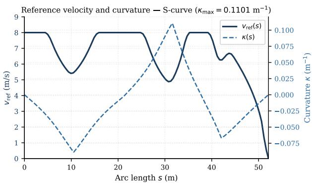  
Figure 1: Reference velocity $v _ { \mathrm { r e f } } ( s )$ and curvature $\kappa ( s )$ on an $\mathsf { S - }$ curve. The terminal deceleration ramp drives regenerative energy recovery.

## 3.3. Electric Energy Model

We utilize VT-CPEM Fiori et al. (2016) for determining the required traction power and recoverable energy fraction. Here, the road-load force is given by:

$$
F ( v , a ) = m a + \frac { 1 } { 2 } \rho C _ { D } A _ { f } v ^ { 2 } + m g C _ { r } \cos \theta _ { \mathrm { r o a d } } + m g \sin \theta _ { \mathrm { r o a d } } ,\tag{8}
$$

where the parameters are delineated in Table 2, yielding the required wheel power $\boldsymbol { P _ { w } } = \boldsymbol { F } \boldsymbol { v } .$ . A consistent battery-side power boundary can be written as:

$$
P _ { b a t t } = \left\{ \begin{array} { l l } { P _ { a u x } + \eta _ { t } P _ { w } , } & { P _ { w } \ge 0 , } \\ { P _ { a u x } + \eta _ { r } P _ { w } , } & { P _ { w } < 0 , } \end{array} \right.\tag{9}
$$

with the traction (drivetrain) eficiency $\eta _ { t }$ and energy-recovery eficiency $\eta _ { r }$ . Notably, Fiori et al. (2016) define $\eta _ { r }$ as a deceleration-dependent feature, which we assume here to be constant to disentangle dependencies and reduce the computational burden on the real-time NMPC. We amend this through a sensitivity analysis over a comprehensive range of $\eta _ { r }$ values, which we later explain in Section 5.5.

The auxiliary power $P _ { a u x }$ represents energy consumed by vehicle electronics, infotainment systems, and internal ECUs. This variable is significantly afected by operating conditions, such as temperature, battery state, and currently active electronic components, rendering it challenging to incorporate into simulation studies Kropiwnicki and Gawłas (2023). In our case, we primarily focus on diferent controller energy requirements; specifically, $P _ { a u x }$ reduces to the energy consumed by a simulative ECU computing the control commands. Using the discretization sampling time $T _ { s }$ we define the energy quantities as:

$$
E _ { t } = \eta _ { t } \operatorname* { m a x } ( P _ { w } , 0 ) T _ { s } , \qquad E _ { r } = \eta _ { r } \operatorname* { m a x } ( - P _ { w } , 0 ) T _ { s } , \qquad E _ { n e t } = E _ { t } + E _ { E C U } - E _ { r } ,\tag{10}
$$

with the traction energy $E _ { t } ,$ , the recovered energy $E _ { r }$ , the controller energy requirement $E _ { E C U } ~ = ~ \sum _ { k } P _ { E C U } t _ { e x e , k }$ summed over � solving steps, and the total consumed energy $E _ { \mathrm { n e t } }$ . Since the energy split depends strictly on the sign of mechanical wheel power $P _ { w }$ rather than vehicle acceleration, gentle decelerations, where traction force remains positive due to aerodynamic drag and rolling resistance, are correctly assigned to $E _ { t }$ and excluded from regenerative recovery $E _ { r }$ . Note that $E _ { E C U }$ is typically negligible for the quasi-instantaneous controllers (PPO and PID-based), yet it is comparatively higher for the optimization-based NMPC. Nevertheless, we retain it as a fairness safeguard rather than a discriminator.

## 4. Controller Design

## Table 2

Complete Parameter List.

<table><tr><td>Symbol</td><td>Value</td><td>Description</td></tr><tr><td colspan="3">Vehicle (adopted from VT-CPEM Fiori et al. (2016))</td></tr><tr><td>m</td><td>1500 (kg)</td><td>Mass</td></tr><tr><td> $L _ { f }$ </td><td>4.0 (m)</td><td>Wheelbase</td></tr><tr><td> $C _ { D }$ </td><td>0.30</td><td>Drag coefficient</td></tr><tr><td> $A _ { f }$ </td><td> $2 . 2 \ ( \mathrm { m } ^ { 2 } )$ </td><td>Frontal area</td></tr><tr><td> $C _ { r }$ </td><td>0.01</td><td>Rolling resistance</td></tr><tr><td> $\rho$ </td><td> $1 . 2 2 5 ~ ( \mathrm { k g } \mathrm { m } ^ { - 3 } )$ </td><td>Air density</td></tr><tr><td> $\eta _ { r }$ </td><td>0.65</td><td>Regen efficiency (constant, cf. Section 5.5)</td></tr><tr><td> $P _ { \mathrm { E C U } }$ </td><td>5 (W)</td><td>Embedded ECU power draw (estimated)</td></tr><tr><td colspan="3">Dynamic model (Section 5.14)</td></tr><tr><td> $I _ { z z }$ </td><td>3000 (kg m2)</td><td>Yaw inertia</td></tr><tr><td> $l _ { f } , l _ { r }$ </td><td> $2 . 0 , 2 . 0 ~ \mathrm { { ( m ) } }$ </td><td>Axle distances from CoG</td></tr><tr><td> ${ \dot { C } } _ { f } , C _ { r } ^ { \mathrm { t r e } }$ </td><td> $8 0 \ ( \mathrm { k N r a d } ^ { - 1 } )$ </td><td>Cornering stiffness Rajamani (2012)</td></tr><tr><td colspan="3">State and input bounds</td></tr><tr><td>d</td><td> $[ - 5 , 5 ] ~ ( \mathrm { m } )$ </td><td>Lateral deviation</td></tr><tr><td>α</td><td> $\left[ - \pi , \pi \right] ( \mathrm { r a d } )$ </td><td>Heading error</td></tr><tr><td>δ</td><td> $[ - 0 . 6 , 0 . 6 ] \ ( \mathrm { r a d } )$ </td><td>Steering angle</td></tr><tr><td> $v$ </td><td> $[ 0 , 8 ] ~ ( \mathrm { m s ^ { - 1 } } )$ </td><td>Speed</td></tr><tr><td> $u _ { 1 }$ </td><td> $[ - 0 . 4 , 0 . 4 ] ~ ( \mathrm { r a d s } ^ { - 1 } )$ </td><td>Steering rate</td></tr><tr><td> $u _ { 2 }$ </td><td> $[ - 2 . 5 , 2 . 5 ] ~ ( \mathrm { m s } ^ { - 2 } )$ </td><td>Acceleration</td></tr><tr><td colspan="3">Reference velocity profile (7)</td></tr><tr><td> $v _ { \mathrm { m a x } }$ </td><td> $8 . 0 ~ ( \mathrm { m s ^ { - 1 } } )$ </td><td>Maximum speed</td></tr><tr><td> $a _ { \mathrm { l a t } }$ </td><td> $2 . 5 ~ ( \mathrm { m s } ^ { - 2 } )$ </td><td>Lateral acceleration limit</td></tr><tr><td> $a _ { \mathrm { l n g } }$ </td><td> $3 . 0 ~ ( \mathrm { m } \mathrm { s } ^ { - 2 } )$ </td><td>Longitudinal deceleration limit</td></tr><tr><td> $T _ { s }$ </td><td>0.1 (s)</td><td>Discretization (sampling) period</td></tr><tr><td colspan="3">NMPC</td></tr><tr><td> $N _ { h }$ </td><td>50</td><td>Number of horizon (prediction) points</td></tr><tr><td> $w _ { d } , w _ { \alpha } , w _ { v }$ </td><td>10,100,1</td><td>Lateral, heading, speed weights</td></tr><tr><td> $w _ { u _ { 1 } } , w _ { u _ { 2 } }$ </td><td>1,1</td><td>Steering and acceleration weights</td></tr><tr><td colspan="3">Gain-Scheduled Full-State Feedback PID-SF</td></tr><tr><td> $K _ { d } ^ { 0 } , K _ { \alpha } ^ { 0 } , K _ { \delta }$ </td><td> $3 . 0 , 1 9 . 0 , 9 . 0$ </td><td>Lateral gains computed at  $v _ { 0 } = 5 ~ ( \mathrm { m s ^ { - 1 } } )$ </td></tr><tr><td> $K _ { p } ^ { \mathrm { { \tilde { l o n } } } } , \bar { K } _ { i } ^ { \mathrm { { l o n } } }$ </td><td>1.0,0.02</td><td>Longitudinal gains</td></tr><tr><td colspan="3">Stanley Hoffmann et al. (2007)</td></tr><tr><td> $k _ { e } , k _ { \mathrm { s o f t } } , K _ { \delta }$ </td><td> $1 . 0 , 1 . 0 , 5 . 0$ </td><td>Cross-track, softening, inner loop</td></tr><tr><td colspan="3"> $P P O \ R a f f i n$  et al. (2021)</td></tr><tr><td> $\gamma , \lambda _ { \mathrm { G A E } }$ </td><td>0.99,0.95</td><td>Discount, GAE</td></tr><tr><td> $\varepsilon _ { \mathrm { c l i p } } , \mathsf { b a t c h }$ </td><td>0.2,256</td><td>Clip range, mini-batch</td></tr><tr><td> $\scriptstyle { \mathrm { n e t w o r k } } , \eta$ </td><td> $[ 2 5 6 , 2 5 6 ] , 3 { \times } 1 0 ^ { - 4 }$ </td><td>MLP layers, Adam LR</td></tr><tr><td> $L _ { s } ^ { i }$ </td><td>5,15,30 (m)</td><td>Preview lookahead distances, cf. Section 4.4</td></tr><tr><td>seeds</td><td> $\{ 4 2 , \ldots , 5 1 \}$ </td><td>Ten training seeds</td></tr></table>

## 4.1. NMPC

Our first strategy represents the optimal control approach, which is dedicated to identifying the best control inputs (as determined by a predefined objective function) for a feasible problem. Consequently, this approach guarantees an optimal solution, albeit often at the cost of increased computational resources. At each step $k ,$ the solver tries to find the controls that minimize the objective function:

$$
\operatorname* { m i n } _ { u } \ \sum _ { j = 0 } ^ { N _ { h } - 1 } \left[ w _ { d } \left( \frac { d } { d _ { \operatorname* { m a x } } } \right) ^ { 2 } + w _ { \alpha } \left( \frac { \alpha } { \pi } \right) ^ { 2 } + w _ { v } \left( \frac { v - v _ { \mathrm { r e f } } } { v _ { \operatorname* { m a x } } } \right) ^ { 2 } + \sum _ { i = 1 } ^ { 2 } w _ { u _ { i } } \left( \frac { u _ { i } } { u _ { i , \operatorname* { m a x } } } \right) ^ { 2 } \right] ,\tag{11a}
$$

$$
\mathrm { s . t . } ~ { \pmb x } _ { k + j + 1 } = f ( { \pmb x } _ { k + j } , { \pmb u } _ { k + j } ) , ~ { \pmb x } \in \mathscr { X } , ~ { \pmb u } \in \mathscr { V } .\tag{11b}
$$

Each term is normalized by the square of its own bound, so that the five cost components are dimensionless and comparably scaled; in other words, we utilize the efective weights $w _ { i } / x _ { i , \mathrm { { m a x } } } ^ { 2 }$ . Here, X, U are the bound sets of Table 2 and $f ( \cdot , \cdot )$ is the RK4 discretization of (1)–(4). We employ a horizon of $N _ { h } = 5 0$ steps, yielding a time of 5 (s), and solve the problem with IPOPT Wächter and Biegler (2006) with a maximum number of iterations max $\mathtt { . i t e r } = 2 0$ to respect the real-time requirements. Critically, the closed-loop plant is the same nonlinear Frenet model used by every other controller, such that no controller possesses a model advantage.

## 4.1.1. Warm-Starting

To further accelerate the NMPC solving time, we initialize IPOPT with the shifted solution from the previous solution step, thereby reducing the required iterations and solve time, on average, from 124.4 (ms) to 90.6 (ms), i.e., a 1.37× speedup. Note that warm-starting biases the solver towards the previous plan, which may be undesired in the case of highly-dynamic environments Rawlings et al. (2017); however, it is practical and justified in our application.

## 4.2. Gain-Scheduled Full-State Feedback (PID-SF)

The second approach follows traditional error-correction control techniques Yang et al. (2020), where we split the control law into two independent longitudinal speed and lateral deviation stabilizers. For lateral control, we linearize the nonlinear system dynamics (2)–(4) at a constant speed $v _ { 0 } = 5 ( \mathrm { m s ^ { - 1 } } )$ , such that, for small values of �, � on a locally straight path, the lateral error dynamics become:

$$
\dot { d } = v \alpha , \qquad \dot { \alpha } = \frac { v } { L _ { f } } \delta , \qquad \dot { \delta } = u _ { 1 } ,\tag{12}
$$

with the control law $u _ { 1 } = - K _ { d } d - K _ { \alpha } \alpha - K _ { \delta } \delta$ . Consequently, we get the characteristic polynomial:

$$
p ( \lambda ) = \lambda ^ { 3 } + K _ { \delta } \lambda ^ { 2 } + \frac { v } { L _ { f } } K _ { \alpha } \lambda + \frac { v ^ { 2 } } { L _ { f } } K _ { d } ,\tag{13}
$$

which, using pole-placement methods to identify the poles {−1.5, −2.5, −5.0}, yields:

$$
p _ { d } ( \lambda ) = \lambda ^ { 3 } + 9 \lambda ^ { 2 } + 2 3 . 7 5 \lambda + 1 8 . 7 5 .\tag{14}
$$

For $v _ { 0 } = 5 ( \mathrm { m s ^ { - 1 } } )$ and $L _ { f } = 4 . 0 \ : ( \mathrm { m ) }$ , we get the lateral gain $K _ { d } = 3 . 0$ , heading gain $K _ { \alpha } = 1 9 . 0 $ , and steering gain $K _ { \delta } = 9 . 0$ . Note that the gains must be adequately scaled to preserve the constant-speed linearization coeficients of (13), in which we adaptively compute:

$$
K _ { d } ( v ) = K _ { d } ^ { 0 } \left( \frac { v _ { 0 } } { v _ { s } } \right) ^ { 2 } , \qquad K _ { \alpha } ( v ) = K _ { \alpha } ^ { 0 } \frac { v _ { 0 } } { v _ { s } } , \qquad v _ { s } = \operatorname * { m a x } ( v , v _ { \operatorname * { m i n } } ) ,\tag{15}
$$

where the clamp $v _ { \mathrm { m i n } } = 0 . 5 ( \mathrm { m s ^ { - 1 } } )$ avoids unboundedly-increasing controls as $v  0$ . Finally, we improve the handling at curved paths (cf. Paden et al. (2016)) by defining the kinematic steering reference $\delta _ { \mathrm { r e f } } ( s ) = \arctan ( L _ { f } \kappa ( s ) )$ , with:

$$
\dot { \delta } _ { \mathrm { \scriptsize { r e f } } } = \frac { L _ { f } \dot { \kappa } ( s ) } { 1 + \left( L _ { f } \kappa ( s ) \right) ^ { 2 } } ,
$$

Energy-Aware Path Following: Comparative Analysis of Reinforcement Learning and NMPC for Electric Vehicles and, thereby, amend the control law to become:

$$
u _ { 1 } = - K _ { d } ( v ) d - K _ { \alpha } ( v ) \alpha - K _ { \delta } \delta + K _ { f f } \kappa ( s ) L _ { f } .\tag{16}
$$

We record that the closed-loop matrix of the constant-speed linearized model is Hurwitz-stable $\forall v _ { s } > 0 .$ , albeit with a degraded performance within the active clamping region $0 < v _ { s } \le v _ { \mathrm { m i n } }$ ; this is suficient for our application, since the active clamping region is dominated by the terminal deceleration profile and steering control is herein unsubstantial. Nevertheless, we acknowledge that is a local result, i.e., not a proof of global stability for the nonlinear, curvaturevarying, saturated system.

For longitudinal control, we employ a PI-controller, with:

$$
u _ { 2 } = - K _ { p } ^ { \mathrm { l o n } } e _ { v } - K _ { i } ^ { \mathrm { l o n } } \int _ { 0 } ^ { T } e _ { v } d t , \qquad e _ { v } = v - v _ { \mathrm { r e f } } ,\tag{17}
$$

with the gains $K _ { p } ^ { \mathrm { l o n } } = 1 . 0 , K _ { i } ^ { \mathrm { l o n } } = 0 . 0 2$ , which we utilize across all evaluation scenarios. Fig. 2 demonstrates that the unit step response comfortably settles from $d _ { 0 } = 1 \mathrm { ( m ) } , v _ { 0 } = 5 \mathrm { ( m s ^ { - 1 } ) t o } | d | < 0 . 0 5 \mathrm { ( m ) }$ within 2.90 (s).

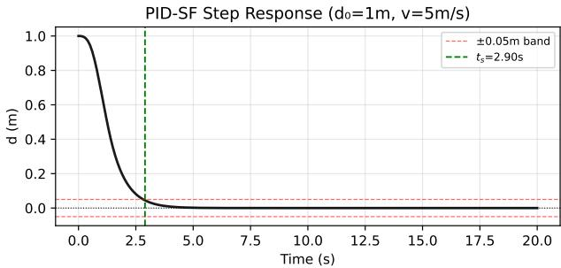  
Figure 2: PID-SF unit step response on the kinematic model $\left( d _ { 0 } = 1 \ ( \mathrm { m } ) , \ v = 5 \ ( \mathrm { m s ^ { - 1 } } ) \right)$

To summarize, we use the independently-computed control laws (16), (17) in our gain-scheduled full-state feedback controller (PID-SF), with the gain parameters defined in Table 2.

## 4.3. Stanley Geometric Baseline

Third, we implement the widely deployed Stanley geometric controller Hofmann et al. (2007) for a comprehensive evaluation. Here, we modify the lateral control law to become:

$$
\delta _ { \mathrm { d e s } } = - \alpha - \arctan \left( k _ { e } \frac { d } { k _ { \mathrm { s o f t } } + v } \right) + K _ { f f } \kappa ( s ) L _ { f }\tag{18}
$$

$$
u _ { 1 } = K _ { \delta } \left( \delta _ { \mathrm { d e s } } - \delta \right)\tag{19}
$$

where we tuned $k _ { e }$ to accommodate our Frenet frame representation. Specifically, the original Stanley formulation measures cross-track error at the front axle, while � represents lateral deviation at the rear axle; this is amended by tuning the parameter with a linear dependency to $L _ { f }$ . Moreover, we adopt the longitudinal PI from our PID-SF with the same gains for a fair comparison.

## 4.4. PPO with Preview Observation and Energy Reward

Our fourth and final strategy represents learning-based methods, namely Reinforcement Learning (RL) using Proximal Policy Optimization (PPO). Here, we utilize two observation vectors, denoted base and preview, with two base and energy-augmented rewards; they are thoroughly explained in the upcoming sections.

Energy-Aware Path Following: Comparative Analysis of Reinforcement Learning and NMPC for Electric Vehicles

## 4.4.1. Observation Vector(s)

For the base observation, we have the eight-dimensional normalized vector:

$$
o _ { \mathrm { b a s e } } = \Bigg [ \frac { d } { d _ { \mathrm { m a x } } } , ~ \frac { \alpha } { \pi } , ~ \frac { \kappa } { \kappa _ { \mathrm { m a x } } } , ~ \frac { v _ { \mathrm { r e f } } } { v _ { \mathrm { m a x } } } , ~ \frac { \delta } { \delta _ { \mathrm { m a x } } } , ~ \frac { v } { v _ { \mathrm { m a x } } } , ~ \frac { s } { s _ { \mathrm { m a x } } } , ~ \frac { v - v _ { \mathrm { r e f } } } { v _ { \mathrm { m a x } } } \Bigg ] ^ { \top } ,\tag{20}
$$

where $\kappa _ { \mathrm { m a x } }$ is the peak realized curvature across a given reference path, a constant precomputed value from the path profile. Note that the last two terms ${ \frac { s } { s _ { \mathrm { m a x } } } } , { \frac { v - v _ { \mathrm { r e f } } } { v _ { \mathrm { m a x } } } }$ are essential to identify the terminal stopping phase, which facilitate the appropriate deceleration and subsequent halt before $s _ { \mathrm { m a x } }$

During our experiments, we identified a fundamental deficit of purely reactive learned control. Specifically, with a strictly local observation, a step-level reward cannot anticipate a deceleration ramp several seconds ahead. Therefore, the base PPO controller fared significantly worse than the NMPC owing to its predictive characteristics. We amend this in the preview variant, which augments (20) with upcoming curvatures and reference speeds at multiple lookahead distances $L _ { s } ^ { i } \in \{ 5 , 1 5 , 3 0 \}$ (m), yielding:

$$
\rho ( s ) = \left\{ \frac { \kappa ( s + L _ { s } ^ { i } ) } { \kappa _ { \mathrm { m a x } } } , \ \frac { v _ { \mathrm { r e f } } ( s + L _ { s } ^ { i } ) } { v _ { \mathrm { m a x } } } \right\} _ { i = 1 } ^ { 3 } , \qquad o = \left[ o _ { \mathrm { b a s e } } ^ { \top } , \rho ^ { \top } \right] ^ { \top } \in \mathbb { R } ^ { 1 4 } ,\tag{21}
$$

where the preview arclengths are clipped to $s _ { \mathrm { m a x } } ,$ , such that, near the end of path, the previewed $v _ { \mathrm { r e f } }$ values decay to zero and the agent observes the stopping ramp several seconds before reaching it.

Why preview substitutes for a horizon: The NMPC stage cost (11a) inherently accommodates future $\kappa ( \cdot ) , v _ { \mathrm { r e f } } ( \cdot )$ along its prediction horizon, which cannot be directly covered by $o _ { \mathrm { b a s e } } . \mathrm { B y }$ selecting a finite number of representative lookahead distances $L _ { s } ^ { i }$ , inferred from the operating velocity range $v \in [ 0 , v _ { \operatorname* { m a x } } ]$ , we enable the policy to replicate the NMPC predictive behavior, thereby shifting the lookahead burden from online optimization to ofline learning. Moreover, the residual gap reported in Section 5.1 is consistent with a finite preview window of $3 0 \ : ( \mathrm { m } )  3 . 7 5$ (s) at $v _ { \mathrm { m a x } } = 8 ( \mathrm { m s ^ { - 1 } } )$ compared to the NMPC horizon 5 (�), together with value-function approximation error.

## 4.4.2. Reward Design

In addition to the normalized observation (base and preview) vectors, we have the dimensionless reward:

$$
r = w _ { p } \exp \mathrm { c l i p } \left( \frac { \operatorname* { m a x } ( \Delta s , 0 ) } { v _ { \mathrm { m a x } } T _ { s } } , 0 , 1 \right) + w _ { h } \frac { v \cos \alpha } { v _ { \mathrm { m a x } } } - w _ { d } \frac { | d | } { d _ { \mathrm { m a x } } } - w _ { \delta } \frac { | \delta | } { \delta _ { \mathrm { m a x } } } - r _ { 0 0 \mathrm { B } } \mathbb { 1 } _ { \mathrm { O O B } } - w _ { v } \frac { | v - v _ { \mathrm { r e f } } | } { v _ { \mathrm { m a x } } } - w _ { a } \frac { | u _ { 2 } | } { u _ { 2 , \mathrm { m a x } } } - w _ { e } e ,\tag{22}
$$

where the first term exclusively rewards forward progression, with $\Delta s \ = \ s _ { k } - s _ { k - 1 }$ . Here, we utilize an out-ofbounds penalty $r _ { \mathrm { O O B } } = 5$ exactly once at the terminal step of an episode that leaves the permissible driving corridor $| d | \geq d _ { \operatorname* { m a x } } - 0 . 1$ (m), subsequently terminating the episode and flagging it as a failure; the indicator $\mathbb { 1 } _ { \mathrm { O O B } }$ is therefore non-zero only on that terminal step. Furthermore, we apply a penalty of 0.5 when the normalized speed error exceeds 0.25 to enhance velocity tracking Hess and Ljungbergh (2021).

The reward term � incorporates energy-aware driving, where it distinguishes the two reward variants:

$$
e _ { \mathrm { s m p l } } = \frac { | u _ { 2 } | } { u _ { 2 , \mathrm { m a x } } } , \qquad e _ { \mathrm { e n e r g y } } = \frac { \operatorname* { m a x } ( P , 0 ) - \eta _ { r } \operatorname* { m a x } ( - P , 0 ) } { P _ { \mathrm { s c a l e } } } ,\tag{23}
$$

where $P = F ( v , a ) v$ is the mechanical wheel power. Note that $e _ { \mathrm { s m p l } }$ is functionally identical to the acceleration penalty already present in (22), so in the simplified variant the two terms combine and the efective weight on $| u _ { 2 } |$ is $w _ { a } + w _ { e } ;$ with the Phase-4 values of Table 14 this is 0.45 rather than the nominal 0.15. The simplified variant is therefore not energy-aware in any physical sense: because it penalises $| u _ { 2 } |$ irrespective of sign, it discourages the very deceleration from which energy is recovered. By contrast $e _ { \mathrm { e n e r g y } }$ is signed, so braking yields a negative contribution and is rewarded. This distinction is what the second axis of the $2 \times 2$ ablation isolates. The energy variant penalizes net battery draw and promotes regeneration, since a wasteful accelerate-then-brake cycle loses $( \eta _ { t } - \eta _ { r } )$ of the energy it produces. Per-phase reward weights are listed in Appendix A.

Energy-Aware Path Following: Comparative Analysis of Reinforcement Learning and NMPC for Electric Vehicles

## 4.4.3. Five-Phase Curriculum

To adequately handle our coupled dynamics, we adopt a five-stage curriculum-learning strategy, thereby reducing learning dificulty by separating speed regulation from curved-path tracking. Here, we sequentially introduce:

• Phase 0 trains longitudinal control on a straight track with $\kappa \approx 0 , s _ { \mathrm { m a x } } = 2 0 0 ( \mathrm { m } )$ , enabling the policy to learn proper acceleration and deceleration profiles, in addition to stopping at the end of path.

• Phase 1 introduces the S-curve with small ofsets, so that the policy learns the interdependency of longitudinal and lateral dynamics, as well as reacts to small perturbations.

• Phases 2-3 apply gradually increasing initial-condition disturbances and observation perturbations to consolidate vehicle control.

• Phase 4 introduces the energy optimization reward (penalty) for improving energy-aware decision making.

Table 3 summarizes the curriculum schedule; the impact of each phase is later discussed in Section 5.13.

## Table 3

Five-Phase Curriculum Schedule.

<table><tr><td>Phase</td><td>Objective</td><td>Steps</td><td>Description</td></tr><tr><td>0</td><td>Longitudinal control</td><td> $5 0 \times 1 0 ^ { 3 }$ </td><td>Straight line  $\left( \kappa \approx 0 \right)$  speed tracking</td></tr><tr><td>1</td><td>Lateral control</td><td> $1 2 0 \times 1 0 ^ { 3 }$ </td><td>S-curve, lateral introduction  $| d _ { 0 } | \le 0 . 3 ~ \mathrm { ( m ) }$ </td></tr><tr><td>2</td><td>Longitudinal + Lateral</td><td> $8 0 \times 1 0 ^ { 3 }$ </td><td>Refining controls of coupled dynamics</td></tr><tr><td>3</td><td>Disturbance recovery</td><td> $8 0 \times 1 0 ^ { 3 }$ </td><td> $| d _ { 0 } | \le 1 . 5$  (m),  $\sigma _ { \mathrm { o b s } } = 0 . 0 2$  applied</td></tr><tr><td>4</td><td>Energy optimization</td><td> $1 2 0 \times 1 0 ^ { 3 }$ </td><td>Refining controls with respect to energy  $e _ { \mathrm { { c n e r g y } } }$ </td></tr></table>

Total: 450 k steps; five seeds (42–46).

## 5. Experimental Results

For a fair comparison, all controllers share the same nonlinear plant, energy model, and compute the same controls. The employed tracks for training and primary evaluation are: (i) a 200 (m) straight line for Phase 0 and (ii) an S-curve with $s _ { \mathrm { m a x } } = 5 2 . 1 2 ( \mathrm { m } ) , \kappa _ { \mathrm { m a x } } = 0 . 1 1 0 1 ( \mathrm { m } ^ { - 1 } )$ for all subsequent phases. For evaluation only, we utilize the tracks: (i) an ISO 3888-1 double lane-change $s _ { \operatorname* { m a x } } = 1 2 5 . 5 5$ (m), (ii) a chicane with $s _ { \operatorname* { m a x } } = 1 1 4 . 0 9 ( \mathrm { m } )$ , and (iii) 20 random splines that are explained in Section 5.9. The baseline initial condition is $\pmb { x } _ { 0 } = [ 0 , 0 . 5 , 0 . 1 , 0 , 3 ] ^ { \top }$ , and runs either successfully terminate at the end of path when $s \ge s _ { \mathrm { m a x } } - 0 . 1$ (m), or terminate as a failure when $\vert d \vert \ge 4 . 9 ( \mathrm { m } )$ .

## 5.1. The Regenerative-Energy Gap and How Far Preview Closes It

Table 4 and Fig. 3 report the 2 × 2 ablation over the two proposed PPO adaptations for observations and rewards, trained with the primary seed under an identical budget. The base policy recovers only 9.3% of the traction energy against the NMPC’s 59.9%. The augmented preview independently enhances this result to 23.1%, i.e., closing 27% of the gap, while the energy-based reward independently improves it to 32.7%, i.e., closing 46% of the gap. By combining both strategies with extended preview observation and energy-aware reward, we achieve an energy recovery of 47.9%, thereby approaching the NMPC performance by 76%; the two adaptations are essentially constructive. Moreover, we highlight that this combination significantly improves tracking from the base $\mathrm { R M S E } _ { d } = 0 . 4 5 9$ (m) to 0.314 (m), as depicted in Fig. 3. This is a marginally worse result than the preview with $\mathrm { R M S E } _ { d } = 0 . 3 1 0 \ \mathrm { ( m ) }$ , which is mitigated by the significant improvement in energy recovery. Accordingly, we adopt this configuration preview+energy in all subsequent experiments.

## 5.2. Tracking, Energy and Solving Time

Table 5 and Fig. 4 summarize the closed-loop performance at the benchmark initial condition.

Orientation Tracking Accuracy. In addition to lateral deviation, Fig. 5 illustrates the heading error �(�) across all four controllers. The preview-augmented policy achieves smooth orientation tracking comparable to NMPC, dampening transient yaw oscillations without inducing late-corner overshoot.

Table 4  
Table 5  
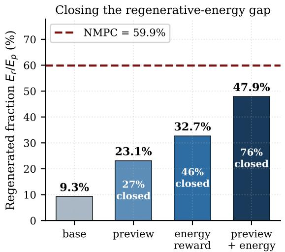

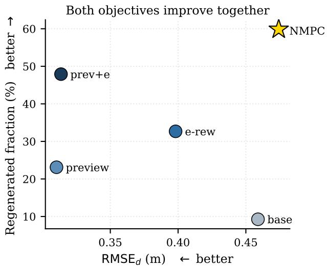  
Figure 3: Closing the regenerative-energy gap. Left: regenerated fraction $E _ { r } / E _ { t }$ for the four ablation variants against the NMPC reference; annotations highlight the share of the gap closed. Right: the same variants in the tracking–energy plane, signifying that preview improves both objectives simultaneously.

2×2 ablation of the two proposed changes (primary seed, S-curve, benchmark IC). Gap closed is measured against NMPC’s regenerative fraction: preview 27%, energy-reward 46%, both 76%. Energies are at the single benchmark IC; � = 30 means difer compared to Table 8.
<table><tr><td>Variant</td><td>Preview observation</td><td>Energy reward</td><td> $\mathrm { R M S E } _ { d } \ \mathrm { ( m ) }$ </td><td>Regen (%)</td></tr><tr><td>base</td><td>X</td><td>X</td><td>0.459</td><td>9.3</td></tr><tr><td>preview</td><td>√</td><td>X</td><td>0.310</td><td>23.1</td></tr><tr><td>energy-reward</td><td>X</td><td>√</td><td>0.398</td><td>32.7</td></tr><tr><td>preview+energy</td><td>√</td><td>√</td><td>0.314</td><td>47.9</td></tr><tr><td>NMPC (reference)</td><td>一</td><td>一</td><td>0.474</td><td>59.9</td></tr></table>

Main Results (S-curve, $\pmb { x } _ { 0 } = [ 0 , 0 . 5 , 0 . 1 , 0 , 3 ] ^ { \top } )$ . Energies in kJ; solve time in ms. Speedups are relative to the JIT-compiled NMPC, cf. Section 5.3. The do-mpc timings are: mean 117.6, p95 149.5, max 164.5. The compiled solver was executed for timing analysis only; its energy figures are omitted because it solves the identical optimal control problem and its trajectory deviation (0.453 vs. 0.474) difers only by solver tolerance.
<table><tr><td>Controller</td><td> $\mathrm { R M S E } _ { d } ~ ( \mathrm { m } )$ </td><td> $E _ { t } ~ \mathrm { { ( k J ) } }$ </td><td> $E _ { r } ~ \mathrm { { ( k J ) } }$ </td><td> $E _ { n e t } ~ \mathrm { { ( k J ) } }$ </td><td>Solving time (ms)</td><td>Speedup</td></tr><tr><td>NMPC (do-mpc)</td><td>0.474</td><td>41.69</td><td>24.95</td><td>16.79</td><td>117.6</td><td>一</td></tr><tr><td>NMPC (compiled)</td><td>0.453</td><td></td><td></td><td></td><td>16.3</td><td>1x</td></tr><tr><td>PPO (preview+e)</td><td>0.314</td><td>49.76</td><td>23.85</td><td>25.92</td><td>0.407</td><td>40×</td></tr><tr><td>PID-SF</td><td>1.155</td><td>57.76</td><td>24.74</td><td>33.02</td><td>0.065</td><td>251×</td></tr><tr><td>Stanley</td><td>1.666</td><td>57.72</td><td>25.24</td><td>32.48</td><td>0.088</td><td>185x</td></tr></table>

Control Efort and Actuator Bounds. Fig. 6 confirms that both NMPC and the learned preview policy operate strictly within the actuator constraints $\lvert u _ { 1 } \rvert \leq 0 . 4 ( r a d s ^ { - 1 } )$ and $| u _ { 2 } | \leq 2 . 5 ( \mathrm { m s } ^ { - 2 } )$ . PID-based controllers sufer from control oscillations, while the learned policy produces smooth control profiles that preserve actuator longevity.

Dynamic Handling Limits and Kinematic Feasibility. To verify physical limits under the kinematic bicycle assumption, Fig. 7 reports the instantaneous lateral acceleration $a _ { \mathrm { l a t } } ( t )$ for all controllers. Owing to curvature preview and smooth steering rates, the PPO policy remain strictly below the feasible handling limit $a _ { \mathrm { l a t , m a x } } ~ \le ~ 2 . 5 ~ ( \mathrm { m s ^ { - 1 } } )$ throughout the maneuver, which the NMPC provides by design. In contrast, the tracking overshoot of PID-SF and

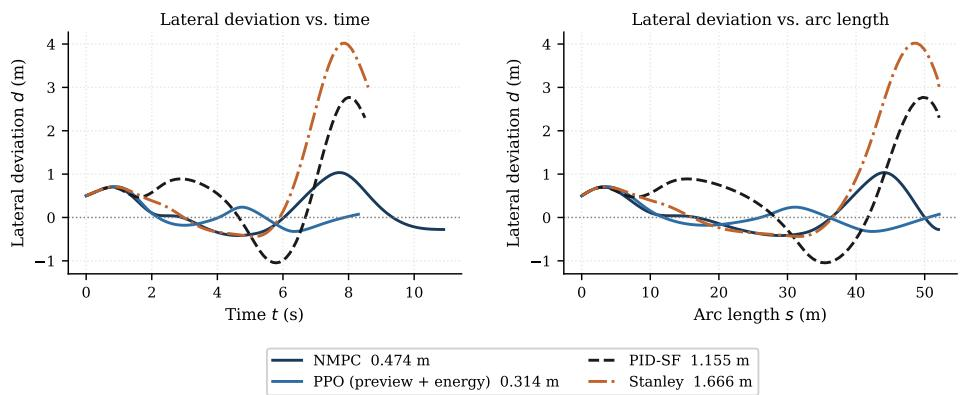  
Figure 4: Lateral deviation �(�) on the S-curve for the four controllers at the benchmark initial condition. Legend values are the RMSE of the plotted tracks.

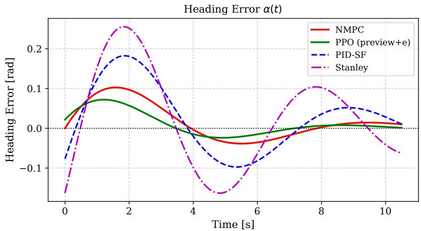  
Figure 5: Heading error �(�) on the S-curve for the four controllers at the benchmark initial condition. NMPC and PPO preview+energy maintain smooth orientation tracking, while PID-SF and Stanley exhibit considerable oscillations.

Stanley forces sharp steering corrections at high speed, causing peak lateral accelerations to exceed feasible limits and violating the no-slip assumption.

## 5.3. Real-Time Feasibility: Interpreted versus Compiled NMPC

Reported RL-versus-NMPC speedups are strongly implementation-dependent, so we quantify the efect directly. The do-mpc/IPOPT combination yields a solution, on average, in 117.6 (ms), albeit with p95 149.5 (ms), and maximum 164.5 (ms). Therefore, it violates the desired budget $T _ { s } = 1 0 0 \mathrm { ( m s ) }$ on a non-trivial fraction of steps. Re-implementing the identical optimal control problem in pure CasADi with JIT-compiled callbacks and warm-starting the controller significantly reduces the solution times to a mean of 16.3 (ms), p95 24.6 (ms), and maximum 30.6 (ms), which comfortably respects the real-time requirements. Consequently, we report all speedups against the compiled solver: the learned policy with 0.407 (ms) is 40× faster than a state-of-the-art NMPC implementation, rather than three orders of magnitude faster than an interpreted one. Even though this weakens the computational argument for learned control, it retains the energy and robustness arguments.

## 5.4. Energy Analysis

Fig. 8 demonstrates the energy breakdown. Owing to its predictive behavior, NMPC anticipates the terminal ramp and plans the deceleration optimally, recovering $E _ { r } = 2 4 . 9 5 \ \mathrm { ( k J ) } , \mathrm { i . e . , } 5 9 . 9 \%$ of $E _ { t } ,$ and achieving the total consumed energy $E _ { \mathrm { n e t } } = 1 6 . 7 9$ (kJ). In comparison, the preview policy recovers only 47.9%, yielding a consumption of $E _ { \mathrm { n e t } } = 2 5 . 9 2 \ : ( \mathrm { k J } )$ . The residual gap is consistent with the finite preview window and value approximation error discussed in Section 4.4. A hybrid variant that hands longitudinal control to the analytic stopping ramp inside the terminal zone was also evaluated and produced worse results with $E _ { \mathrm { n e t } } = 2 8 . 1 4 ( \mathrm { k J } )$ , indicating that the policy has learned a better stopping profile than the analytic override.

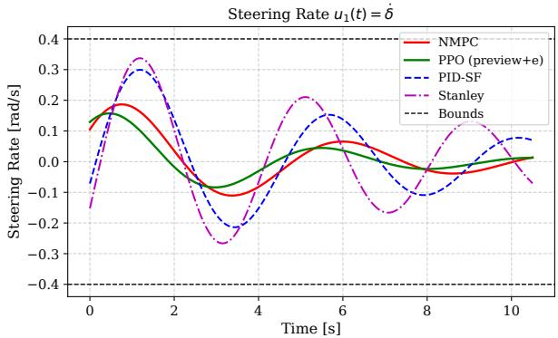

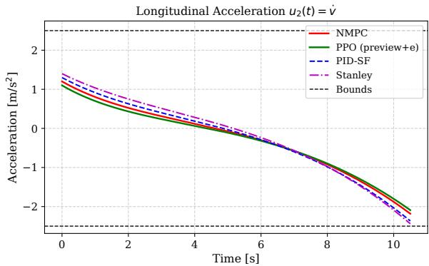  
Figure 6: Control inputs on the S-curve: steering rate $u _ { 1 } = \dot { \delta }$ (left) and longitudinal acceleration $u _ { 2 } = \dot { v }$ (right). Both NMPC and PPO strictly respect actuator bounds without high-frequency oscillations.

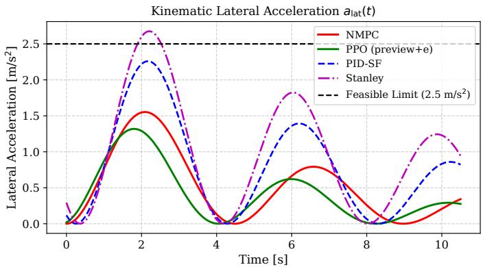  
Figure 7: Kinematic lateral acceleration on the S-curve. The black dashed line marks the dynamics handling limit $a _ { \mathrm { l a t , m a x } } .$

## 5.5. Sensitivity to Regeneration Eficiency

Since we adopted $\eta _ { r }$ as a constant simplification of the deceleration-dependent eficiency, we recompute $E _ { \mathrm { n e t } }$ for $\eta _ { r } \in \{ 0 . 5 0 , 0 . 6 5 , 0 . 8 0 \}$ to analyze the sensitivity of our policy to diferent values of $\eta _ { r }$ . Here, $E _ { r }$ scales linearly in $\eta _ { r } $ therefore the analysis does not require additional simulations; the controller ranking by $E _ { \mathrm { n e t } }$ remains unafected.

## Table 6

$E _ { \mathrm { n e t } }$ (kJ) versus regeneration eficiency $\eta _ { r } .$
<table><tr><td>Controller</td><td> $\eta _ { r } = 0 . 5 0$ </td><td> $\eta _ { r } = 0 . 6 5$ </td><td> $\eta _ { r } = 0 . 8 0$ </td></tr><tr><td>NMPC</td><td>22.55</td><td>16.79</td><td>11.04</td></tr><tr><td>PPO</td><td>31.42</td><td>25.92</td><td>20.42</td></tr><tr><td>PID-SF</td><td>38.73</td><td>33.02</td><td>27.31</td></tr><tr><td>Stanley</td><td>38.30</td><td>32.48</td><td>26.65</td></tr></table>

## 5.6. Pareto-Frontier Analysis for NMPC Weight Tuning

Here, we analyze the behavior of the selected (default) NMPC weights. Our defaults follow the common strategy of weighting the safety-critical states an order of magnitude above the control-efort terms, the practice adopted by Fu et al. (2022), rather than being tuned to a specific behavior. Sampling � = 30 weight vectors by LHS McKay et al.

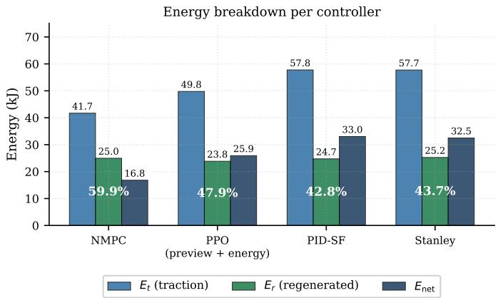  
Figure 8: Energy breakdown per controller. Percentages show regenerative fraction $E _ { r } / E _ { t }$ . NMPC achieves the highest recovery at 59.9%, while the preview policy only reaches 47.9%.

(1979) in $\log _ { 1 0 } \mathrm { - s p a c e }$ $( w _ { d } \in \mathsf { I l } , \mathsf { I l } 0 0 \rbrack$ , �� ∈ [1, 1000], $w _ { v } , w _ { u _ { 1 } } , w _ { u _ { 2 } } \in \left[ 0 . 1 , 1 0 \right] )$ yields the nine Pareto-optimal configurations illustrated in Fig. 9 and Table 7. The best-tracking configuration reaches $\mathrm { R M S E } _ { d } ~ = ~ 0 . 3 0 9$ (m) at $E _ { \mathrm { n e t } } = 2 0 . 5 9 ( \mathrm { k J } )$ , while the best-energy configuration reaches 15.84 (kJ) at 0.719 (m). This is an expected behavior due to the interdependency of both objectives. Our analysis concludes that the default weights yield an acceptable compromise between path following and energy recovery, confirming the validity of standardized practices without necessitating exhaustive objective-weight tuning.

## Table 7

Extremes of the NMPC weight Pareto front (� = 30 LHS, nine non-dominated configurations).
<table><tr><td>Configuration</td><td> $w _ { d }$ </td><td> $w _ { \alpha }$ </td><td> $w _ { v }$ </td><td> $w _ { u _ { 1 } }$ </td><td> $w _ { u _ { 2 } }$ </td><td> $\mathrm { R M S E } _ { d }$  (m)</td><td> $E _ { \mathrm { n e t } }$  (kJ)</td></tr><tr><td>Best tracking</td><td>76.50</td><td>100.75</td><td>6.00</td><td>0.81</td><td>0.80</td><td>0.309</td><td>20.59</td></tr><tr><td>Best energy</td><td>4.33</td><td>239.75</td><td>0.95</td><td>4.95</td><td>3.32</td><td>0.719</td><td>15.84</td></tr><tr><td>Default</td><td>10.0</td><td>100.0</td><td>1.0</td><td>1.0</td><td>1.0</td><td>0.474</td><td>16.79</td></tr></table>

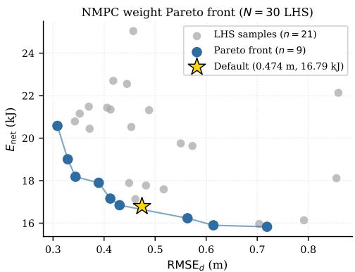  
Figure 9: Pareto-frontier analysis for the ${ \mathsf { N M P C } }$ weights with $N = 3 0 \mathsf { L H S }$ . The selected (default) configuration approaches the frontier, exhibiting an acceptable outcome without exhaustive tuning.

## 5.7. Statistical Validation (� = 30 LHS) and Seed Variance

Since a single initial condition cannot establish superiority, we evaluate all controllers across varying initial conditions sampled by LHS with $d _ { 0 } \in [ - 1 . 5 , 1 . 5 ]$ (m), $\alpha _ { 0 } \in [ - 0 . 2 , 0 . 2 ]$ (rad), and $v _ { 0 } \in [ 2 , 6 ] ( \mathrm { m s ^ { - 1 } } )$ . Here, the preview policy attains $0 . 3 8 7 \pm 0 . 1 9 0$ (m) against NMPC’s $0 . 5 2 0 \pm 0 . 1 2 0 \ \mathrm { { ( m ) } }$ . Furthermore, we report a Wilcoxon signed-rank test $( p < 0 . 0 0 0 1 )$ alongside the unpaired Mann–Whitney result $( p = 0 . 0 0 0 3 ) ;$ here, Cohen’s $d = 0 . 8 2 6$ indicates a signifcant impact, and $d = 2 . 7 9 1$ against PID-SF. As previously recorded, neither NMPC nor PPO ever leave the permissible driving corridor, whereas the classical baselines failed on $5 / 3 0$ and $4 / 3 0$ runs, respectively. Across ten training seeds the policy attains $0 . 3 3 6 \pm 0 . 0 3 6 \mathrm { ( m ) }$ with $0 / 1 0$ failures, confirming the result is not a seed artifact. The achieved results are summarized in Table 8 and Fig. 10.

## Table 8

Statistical results over $N = 3 0$ LHS initial conditions, which difer from the single-IC values of Table 5. Wilcoxon signed-rank (paired), $\mathsf { P P O } < \mathsf { N M P C }$ $p < 0 . 0 0 0 1$ ; Cohen’s $d = 0 . 8 2 6$ . Speedups here are relative to the interpreted do-mpc solver; check Section 5.3 for the compiled comparison.
<table><tr><td>Controller</td><td> $\mathrm { R M S E } _ { d } \ \mathrm { ( m ) }$ </td><td> $E _ { \mathrm { n e t } } \ ( \mathrm { k J } )$ </td><td>Speedup</td><td>Failures</td></tr><tr><td>NMPC</td><td> $0 . 5 2 0 \pm 0 . 1 2 0$ </td><td> $1 0 . 3 4 \pm 7 . 3 5$ </td><td>1x</td><td>0/30</td></tr><tr><td>PPO</td><td> $\mathbf { 0 . 3 8 7 \pm 0 . 1 9 0 }$ </td><td> $1 9 . 3 6 \pm 7 . 1 4$ </td><td>250x</td><td>0/30</td></tr><tr><td>PID-SF</td><td> $1 . 3 3 7 \pm 0 . 4 3 4$ </td><td> $2 7 . 9 6 \pm 7 . 5 5$ </td><td>1880×</td><td>5/30</td></tr><tr><td>Stanley</td><td> $1 . 7 1 3 \pm 0 . 1 2 7$ </td><td> $2 8 . 3 1 \pm 8 . 5 4$ </td><td>1535x</td><td>4/30</td></tr></table>

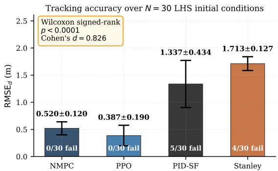  
Figure 10: Tracking accuracy over $N = 3 0 ~ \mathsf { L H S }$ initial conditions $( \mathsf { m e a n } \pm \mathsf { s t d } ,$ , failure counts annotated). Wilcoxon $p < 0 . 0 0 0 1$ ; Cohen’s $d = 0 . 8 2 6$

## 5.8. Generalization to Unseen Tracks

The policy successfully transfers without retraining, achieving $\mathrm { R M S E } _ { d } = 0 . 1 9 7 ( \mathrm { m } )$ on the ISO 3888-1 lane-change and 0.189 (m) on the chicane, both of which are within the 1 (m) corridor and with a lower error than the training S-curve; this is an expected result since these tracks have a more lenient curvature profile. We emphasize an honest reading of Table 9: NMPC and Stanley track these two low-curvature tracks more accurately than the policy. However, our claim, which this data supports, is that the policy generalizes safely and withoutfailure of-distribution, not that it necessarily dominates. Results are summarized in Table 9 and Fig. 11.

## Table 9

Multi-track evaluation. The policy is not retrained on any evaluation track.
<table><tr><td>Controller</td><td>S-curve (m)</td><td>ISO 3888-1 (m)</td><td>Chicane (m)</td></tr><tr><td>NMPC</td><td>0.474</td><td>0.112</td><td>0.135</td></tr><tr><td>PPO (zero-shot)</td><td>0.314</td><td>0.197</td><td>0.189</td></tr><tr><td>PID-SF</td><td>1.155</td><td>0.198</td><td>0.451</td></tr><tr><td>Stanley</td><td>1.666</td><td>0.124</td><td>0.141</td></tr></table>

## 5.9. Random-Track Generalization

For a more comprehensive evaluation, we analyze the controllers’ response over a family of 20 randomly generated cubic splines with curvature capped at $\kappa _ { \mathrm { m a x } } < 0 . 1 ( \mathrm { m } ^ { - 1 } )$ . Here, the policy successfully completes all 30 tracks with $0 . 2 5 6 \pm 0 . 0 3 2$ (m) without a single failure; its variance across tracks is the lowest of the learned-versus-classical comparison, while NMPC remains the most accurate.

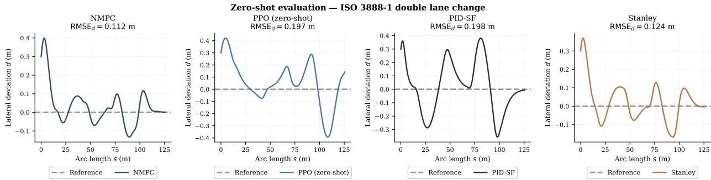  
Figure 11: Zero-shot evaluation on the ISO 3888-1 double lane change. The policy was trained only on the ${ \mathsf { S - C u r v e } } ;$ no retraining was performed.

Energy-Aware Path Following: Comparative Analysis of Reinforcement Learning and NMPC for Electric Vehicles

## Table 10

Generalization over 30 unseen random splines with $\kappa _ { \mathrm { m a x } } ~ \in ~ [ 0 . 0 2 1 , 0 . 0 8 5 ] ~ ( \mathrm { m } ^ { - 1 } )$ . All controllers, including NMPC, are evaluated on all 30 tracks.

<table><tr><td>Controller</td><td>Tracks</td><td> $\mathrm { R M S E } _ { d } \ \mathrm { ( m ) }$ </td><td>Failures</td></tr><tr><td>NMPC</td><td>30</td><td> $\mathbf { 0 . 1 6 3 \pm 0 . 0 3 8 }$ </td><td>0/30</td></tr><tr><td>PPO</td><td>30</td><td> $0 . 2 5 6 \pm 0 . 0 3 2$ </td><td>0/30</td></tr><tr><td>Stanley</td><td>30</td><td> $0 . 3 0 4 \pm 0 . 4 2 6$ </td><td>1/30</td></tr><tr><td>PID-SF</td><td>30</td><td> $0 . 3 7 5 \pm 0 . 1 0 1$ </td><td>0/30</td></tr></table>

## 5.10. Road-Grade Robustness

Relaxing the flat-road assumption of (8), we impose $\begin{array} { r } { \theta _ { \mathrm { r o a d } } ( s ) = 3 ^ { \circ } \sin \left( 2 \pi \frac { s } { s _ { \mathrm { m a x } } } \right) } \end{array}$ in both the plant and the energy model while all controllers retain the flat-road profile, i.e., the grade acts as an unmodelled disturbance. Here, the policy is essentially unafected with $\mathrm { R M S E } _ { d } = 0 . 3 1 1$ (m) compared to 0.314 (m) flat, while NMPC degrades moderately with $\mathrm { R M S E } _ { d } = 0 . 5 2 4 \ \mathrm { ( m ) }$ compared to 0.474 (m) as its internal model omits the grade term. Similarly, PID-SF degrades to $\mathrm { R M S E } _ { d } = 1 . 0 3 1$ (m).

## 5.11. Sensor Noise Robustness

Table 11 reports sensitivity to Gaussian observation noise at evaluation time, where Phase 3 training applies matched randomization at $\sigma = 0 . 0 2$ . Performance is unchanged up to the training noise level, where the policy is marginally better at $\sigma = 0 . 0 1$ than the noise-free case, with $\mathrm { R M S E } _ { d } = 0 . 3 0 8$ compared to 0.314 (m). This is consistent with the matched randomization acting as a regularizer. The policy degrades sharply only beyond $\sigma = 0 . 0 5$ , which is outside the accuracy of typical sensing hardware as depicted below.

For comparison, production automotive GNSS achieves 0.1–0.2 (m) lateral accuracy under RTK-fixed conditions Reid et al. (2019), i.e., $\sigma \approx 0 . 0 3 6$ after normalization by $d _ { \mathrm { m a x } }$ , while automotive-grade MEMS IMUs report heading errors of $1 ^ { \circ } - 3 ^ { \circ }$ Gonzalez and Dabove (2019), i.e., $\sigma \approx 0 . 0 0 6  – 0 . 0 1 7$

## Table 11

Observation-noise robustness. Values are mean ± std over five independent noise realizations of the same trained policy;   
the zero standard deviation at $\sigma = 0$ reflects the deterministic policy. This difers from the five training seeds of Section 5.7.

<table><tr><td> $\sigma _ { \mathrm { o b s } }$ </td><td> $\mathrm { R M S E } _ { d } ~ ( \mathrm { m } )$ </td></tr><tr><td>0.000</td><td> $0 . 3 1 4 \pm 0 . 0 0 0$ </td></tr><tr><td>0.010</td><td> $0 . 3 0 8 \pm 0 . 0 0 8$ </td></tr><tr><td>0.020</td><td> $0 . 3 6 9 \pm 0 . 0 3 1$ </td></tr><tr><td>0.050</td><td> $1 . 5 4 9 \pm 0 . 5 4 6$ </td></tr><tr><td>0.100</td><td> $2 . 0 1 5 \pm 0 . 3 3 7$ </td></tr></table>

Energy-Aware Path Following: Comparative Analysis of Reinforcement Learning and NMPC for Electric Vehicles

## 5.12. Predictive Safety Filter

Since a learned policy inherently does not have a constraint guarantee, we add a minimally invasive projection filter as follows: candidate steering rates are evaluated by a short forward rollout of the kinematic model, where the admissible candidate closest to the policy’s proposal is applied. On the $N = 3 0$ set, the filter is efectively insignificant with a filtered response of $\mathrm { R M S E } _ { d } = 0 . 3 8 6$ (m) compared to an unfiltered response of 0.387 (m). Similarly, every aforementioned result remain essentially unafected. However, under deliberately extreme initialization conditions $| d _ { 0 } |$ up to 4.2 (m), it intervenes frequently but does not eliminate all corridor violations. Therefore, we present it as a practical projection filter and not a formal safety certificate, for which a control-barrier formulation may be necessary.

## 5.13. Curriculum Ablation: Tracking-Neutral, Energy-Critical

In Table 12, we train four schedules under an identical $2 0 0 \times 1 0 ^ { 3 }$ budget to analyze the conventional reading of curriculum benefits. Tracking is essentially insensitive to the schedule: all four variants lie within 0.067 (m) of one another, where the no-curriculum variant still exhibits an acceptable behavior. On the contrary, the curriculum drives energy-aware control: the full schedule reduces the energy requirements to $E _ { \mathrm { n e t } } = 2 6 . 8 9$ (kJ), which is less than half of the required energy by the no-curriculum variant 63.65 (kJ). Phase 4, in which the energy term is activated after the tracking skill is established, is the primary source of this outcome. Therefore, the curriculum may be regarded as energy-critical and tracking-neutral in this problem, rather than as a general accelerator of tracking performance.

## Table 12

Curriculum ablation $( 2 0 0 \times 1 0 ^ { 3 }$ steps each). Ranking is by $E _ { \mathrm { n e t } }$ since tracking is efectively unafected, i.e., tracking spread across variants is 0.067 (m), while energy spread is 36.8 (kJ).
<table><tr><td>Var.</td><td>Description</td><td> $\mathrm { R M S E } _ { d }$  (m)</td><td> $E _ { \mathrm { n e t } }$  (kJ)</td></tr><tr><td>A</td><td>Full  $( \mathsf { P h . ~ } 0 \to 1 \to 2 \to 3 \to 4 )$ </td><td>0.379</td><td>26.89</td></tr><tr><td>B</td><td>Phase 1 only</td><td>0.332</td><td>58.10</td></tr><tr><td>C</td><td>Phases 1+2 only</td><td>0.312</td><td>47.51</td></tr><tr><td>D</td><td>Phase 2 only (no curriculum)</td><td>0.323</td><td>63.65</td></tr></table>

## 5.14. Validation with a Dynamic Single-Track Model

The kinematic model neglects tire slip, which is the principal threat to the external validity of the preceding results. We therefore repeat the benchmark on a dynamic single-track plant with linear tires, a state vector $[ s , d , \alpha , \delta , v _ { x } , v _ { y } , r ] ^ { \top }$ and the standard force balance Rajamani (2012):

$$
\dot { v } _ { y } = \frac { F _ { y f } \cos \delta + F _ { y r } } { m } - r v _ { x } ,
$$

$$
\dot { r } = \frac { l _ { f } F _ { y f } \cos \delta - l _ { r } F _ { y r } } { I _ { z z } } ,\tag{24}
$$

$$
F _ { y f } = C _ { f } \left( \delta - \frac { v _ { y } + l _ { f } r } { v _ { x } } \right) ,
$$

$$
F _ { y r } = - C _ { r } ^ { \mathrm { t i r e } } \frac { v _ { y } - l _ { r } r } { v _ { x } } ,\tag{25}
$$

with parameters in Table 2 and slip angles clipped at 0.12 (rad) to keep the linear tire assumption valid. In addition, we accommodate the more nuanced lateral dynamics by integrating the plant with ten RK4 sub-steps per control period.

Dynamic baseline comparison The analysis of controllers designed primarily for a kinematic model on a dynamic plant may be insuficient; hence, we introduce a standard dynamic-model baseline Rajamani (2012), i.e., an LQR on the lateral error state $[ e _ { 1 } , \dot { e } _ { 1 } , e _ { 2 } , \dot { e } _ { 2 } ] ^ { \top }$ with speed-scheduled gains obtained from the algebraic Riccati equation, curvature feed-forward, partnered with a conditional integral term that is only engaged once the transient terms have decayed. Here, a unit step response starting at $d _ { 0 } = 1 \mathrm { ( m ) } , v _ { 0 } = 5 \mathrm { ( m s ^ { - 1 } ) }$ ) settles within 1.6 (s) with an overshoot of 0.02 (m), and a steady-state error of 0.012 (m).

The results demonstrated in Table 13 and Fig. 12 support the following claims:

1. The policy transfers: It is applied zero-shot to a plant it never saw and completes the path at 0.473 (m). Moreover, $1 0 0 \times 1 0 ^ { 3 }$ fine-tuning steps elevate its performance to 0.273 (m) with peak lateral acceleration 3.48 $( \mathrm { m } \mathrm { s } ^ { - 2 } )$ inside the linear-tire regime.

2. Qualitative ordering of the kinematic study survives: NMPC retains the highest regeneration (68.6%) and the classical kinematic-designed baselines degrade, while at this higher speed the fine-tuned policy becomes the most accurate controller, overtaking the dynamic LQR whose gains are synthesised at $v _ { 0 } = 5 ( \mathrm { m s ^ { - 1 } } )$ and therefore detune as speed rises.

Table 13  
Dynamic single-track validation with linear tires, $C _ { f } = C _ { r } ^ { \mathrm { t i r e } } = 8 0 ( \mathrm { k N r a d } ^ { - 1 } ) , \ v \leq 8 ( \mathrm { m s } ^ { - 1 } )$ . All runs reach the end of path. NMPC retains its kinematic internal model and operates under plant–model mismatch, a nominal case in practice.
<table><tr><td>Controller</td><td> $\mathrm { R M S E } _ { d } \ \left( \mathfrak { m } \right)$ </td><td> $E _ { n } \ ( \mathsf { k } \mathsf { J } )$ </td><td>Regen (%)</td><td>Status</td></tr><tr><td>PPO fine-tuned (100 k)</td><td>0.273</td><td>25.56</td><td>48.9</td><td>ok</td></tr><tr><td>LQR (dynamic model)</td><td>0.438</td><td>29.30</td><td>46.0</td><td>ok</td></tr><tr><td>PPO zero-shot</td><td>0.473</td><td>25.00</td><td>48.0</td><td>ok</td></tr><tr><td>NMPC (kinematic model)</td><td>0.560</td><td>13.69</td><td>68.6</td><td>ok</td></tr><tr><td>PID-SF (kinematic design)</td><td>0.740</td><td>30.10</td><td>44.7</td><td>ok</td></tr><tr><td>Stanley (re-tuned)</td><td>2.008</td><td>25.06</td><td>52.2</td><td>ok</td></tr></table>

3. Results are bounded: The study is valid for $v \leq 8 ( \mathrm { m s ^ { - 1 } } )$ and $| \alpha _ { \mathrm { s l i p } } | \leq 0 . 1 2$ (rad). A nonlinear tire model with slip-dependent regenerative torque limits, such as Pacejka, is defered to future work.

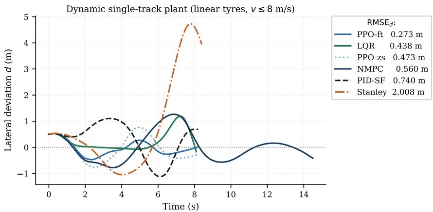  
Figure 12: Lateral deviation on the dynamic single-track plant with linear tires and $v \leq 8 ( \mathrm { m s ^ { - 1 } } )$ . The fine-tuned policy tracks second only to the purposefully-designed dynamic LQR, while remaining within the linear-tire regime $| a _ { \mathrm { l a t } } | \approx 3 . 4 8 ~ \mathrm { ( m s ^ { - 2 } ) }$ .

## 6. Discussion

What the trade-of actually looks like. The analysis this paper set out to make paints an asymmetric picture. An optimizer with an explicit horizon converts the terminal ramp into recovered energy more efectively than a reactive policy (59.9% against 9.3% for the naive policy), which is a structural consequence of what each controller can observe, not of the training budget. Supplying the policy with a 30 (m) preview and an energy-aware reward recovers three quarters of that deficit at no cost in tracking, rather with an improvement in performance. This is our paper’s central quantitative claim.

Why preview also improves tracking. Previewed curvature anticipates lateral demand, which is exactly the information a feed-forward term supplies to a classical controller. The improvement from $\mathrm { R M S E } _ { d } = 0 . 4 5 9$ to 0.314 (m) is therefore not only expected, but also informative: it confirms the interdependency of the two objectives.

When NMPC remains preferable. NMPC enforces state and input constraints explicitly and retains the highest regenerative fraction on both the kinematic and dynamic plants. Across our evaluated controllers, it yields the least deviations on unseen low-curvature tracks, cf. Tables 9 and 10. Moreover, a JIT compiled solver provenly satisfies strict real-time requirements, as discussed in Section 5.3. The case for the learned policy is therefore not dominance but a rather yielding comparable or better accuracy under disturbance, zero failures, insensitivity to road grade, and a 40× computational margin that relieves constrained hardware in AD applications.

On curriculum-learning. At equal budgets, phase ordering has no significant impact on tracking, yet more than halves the net consumed energy, cf. Table 12. We attribute this to positioning of Phase 4, where an energy term introduced before the tracking skill exists competes with it, while the same term applied to a competent policy refines the speed profile and, therefore, reduces energy consumption.

Limitations. In this work, we acknowledge the following limitations: (i) All achieved results stem from numerical simulations. The dynamic study in Section 5.14 mitigates this issue, yet does not completely rectify it; hardware-inthe-loop validations remain necessary. (ii) The dynamic study highlights the limitations of the kinematic assumption. When pushing the vehicle to the maximum speed envelope $( v _ { 0 } = 8 \mathrm { { m s ^ { - 1 } } ) }$ on the dynamic plant, the lateral accelerations exceed the linear tire regime, rendering both NMPC and PPO unstable $( \mathrm { R M S E } _ { d } \gg 5 \ \mathrm { m } )$ . This emphasizes that future migration into the nonlinear regime (e.g., using Pacejka tire models) is critical, specifically since the stability logic blends regenerative torque down near the friction limit, which is a coupling not captured by (8). (iii) $\eta _ { r }$ is constant rather than deceleration-dependent, which we attempted to address in our sensitivity analysis in Section 5.5, yet honestly report here. Finally, (iv) the proposed safety filter is a projection heuristic, not a safety guarantee.

## 7. Conclusion

In this work, we set out to provide a comprehensive analysis of vehicle controllers for energy-and velocity-aware path following. We proposed a kinematic vehicle model, for which we implemented four control methods following classical, optimal, and learning-based strategies. Moreover, we extended our developed controllers to accommodate a single-track vehicle model with linear tires, implementing a baseline LQR for a fair comparison. For our RL-based PPO controller, we summarize our findings as follows:

• The structural deficit is real. With a purely local observation, a learned policy recovers 9.3% of consumed energy, whereas NMPC recovers 59.9%.

• This deficit can be largely rectified without an online optimizer. A 30 (m) preview of curvature and reference speed together with a VT-CPEM energy-based reward successfully raised recovery to $4 7 . 9 \% \mathrm { ~ - ~ } 7 6 \%$ of the identified energy gap, while improving tracking from $\mathrm { R M S E } _ { d } = 0 . 4 5 9$ (m) to 0.314 (m); the two metrics are essentially complementary.

• The advantage is robust, not incidental. $0 . 3 8 7 \pm 0 . 1 9 0$ (m) against $\mathrm { N M P C ^ { \prime } s 0 . 5 2 0 \pm 0 . 1 2 0 ( m ) }$ over $N = 3 0$ LHS initial conditions (Wilcoxon $p < 0 . 0 0 0 1 , d = 0 . 8 2 6 )$ , 0∕30 failures, and $0 . 3 3 6 \pm 0 . 0 3 6 \mathrm { ( m ) }$ in ten seeds.

• It generalizes. ISO 3888-1 lane-change 0.197 (m), chicane 0.189 (m), 30 random splines $0 . 2 5 6 { \pm } 0 . 0 3 2 \mathrm { ( m ) }$ with 0∕30 failures, and near-invariance to $\mathfrak { i } \pm 3 ^ { \circ }$ road grade.

• It survives tire dynamics. On a dynamic single-track plant, the policy transfers zero-shot with $\mathrm { R M S E } _ { d } ~ =$ 0.473 (m), reaching 0.273 (m) after brief fine-tuning, ahead of a properly designed dynamic LQR at 0.438 (m). Here, NMPC still retains the highest energy regeneration.

• Real-time claims are proven. A compiled NMPC with JIT acceleration via CasADi meets the real-time budge $T _ { s } = 1 0 0$ (s). Nevertheless, the learned policy remains 40× faster than a real-time NMPC.

• The curriculum is energy-critical, not tracking-critical. At equal budget, schedules difer by 0.067 (m) in tracking but by 36.8 (kJ) in net energy.

Future work follows directly: (i) A longer or learned preview horizon with a recurrent value function to close the residual gap 24%, (ii) a nonlinear tire model with slip-dependent regenerative limits, (iii) a control-barrier formulation to replace the projection filter with a certificate, (iv) validation on a high-fidelity simulator and/or on actual hardware, and (v) addressing high-level control objectives, such as obstacle avoidance and reference trajectory generation.

## A. Per-Phase Reward Weights

Table 14 lists the weights of (22) for each curriculum phase, so that the reward is fully reproducible. Symbols map to the implementation as $w _ { h } = w _ { \mathrm { h e a d i n g } } , w _ { d } = w _ { \mathrm { c t e } } , w _ { p } = w _ { \mathrm { p r o g } } , w _ { \delta } = w _ { \mathrm { d e l t a } } , w _ { v } , w _ { a } = w _ { \mathrm { a c c } }$ and $w _ { e } = w _ { \mathrm { e n e r g y } }$ . The energy term is deliberately inactive until Phase 4 to adequately establish the path- and velocity- tracking skills first. Section 5.13 explains how this ordering renders the schedule energy-critical.

Table 14  
Reward weights of (22) by curriculum phase. An additional penalty of 0.5 is applied whenever the normalized speed error exceeds 0.25 Hess and Ljungbergh (2021), and $r _ { \mathrm { O O B } } = 5$ is applied once at the terminal step of a failed episode.
<table><tr><td>Phase</td><td> $w _ { h }$ </td><td> $w _ { d }$ </td><td> $w _ { p }$ </td><td> $w _ { \delta }$ </td><td> $w _ { v }$ </td><td> $w _ { a }$ </td><td> $w _ { e }$ </td></tr><tr><td>0 (longitudinal, straight)</td><td>0.3</td><td>0.3</td><td>1.0</td><td>0.02</td><td>0.8</td><td>0.10</td><td>0.0</td></tr><tr><td>1 (lateral introduction)</td><td>0.8</td><td>1.2</td><td>0.5</td><td>0.05</td><td>0.3</td><td>0.05</td><td>0.0</td></tr><tr><td>2 (stopping, full path)</td><td>0.8</td><td>1.2</td><td>0.8</td><td>0.05</td><td>0.3</td><td>0.05</td><td>0.0</td></tr><tr><td>3 (disturbance recovery)</td><td>1.0</td><td>1.5</td><td>0.5</td><td>0.10</td><td>0.4</td><td>0.05</td><td>0.0</td></tr><tr><td>4 (energy optimization)</td><td>0.6</td><td>1.0</td><td>0.5</td><td>0.10</td><td>0.5</td><td>0.15</td><td>0.3</td></tr></table>

## CRediT Author Statement

Mohamed Sabaa: Conceptualization, Methodology, Software, Formal analysis, Investigation, Visualization, Writing – original draft. Mostafa Emam: Conceptualization, Methodology, Software, Supervision, Validation, Writing – review & editing.

## Declaration of Competing Interests

The authors declare that they have no known competing financial interests or personal relationships that could have appeared to influence the work reported in this paper.

## Funding

This research did not receive any specific grant from funding agencies in the public, commercial, or not-for-profit sectors.

## Data Availability

The simulation code, trained policies, and the scripts that reproduce every table and figure in this paper are openly available at https://github.com/mohamedkamalsabaa/Regenerative-Energy-in-Learned-Path-Following. The archive includes the companion notebook, the exported figure data, and the plotting script, so all reported results can be regenerated from a single execution. The do-mpc framework is available at https://www.do-mpc.com and Stable-Baselines3 at https://stable-baselines3.readthedocs.io.

## Acknowledgements

The authors thank the developers of do-mpc, CasADi, and Stable-Baselines3 for their open-source contributions.

## References

Anzalone, L., Barra, S., Nappi, M., 2021. Reinforced curriculum learning for autonomous driving in CARLA, in: Proc. IEEE ICIP, pp. 3318–3322. doi:10.1109/ICIP42928.2021.9506673.

Bécsi, T., 2024. RRT-guided experience generation for reinforcement learning in autonomous lane keeping. Scientific Reports 14. doi:10.1038/ s41598-024-73881-z.

Belkebir, T., Belkebir, H., Mansouri, A., 2026. Real-time embedded nmpc for autonomous vehicle path tracking with curvature-aware speed adaptation and sensitivity analysis. Automation 7. doi:10.3390/automation7020044.

Bengio, Y., Louradour, J., Collobert, R., Weston, J., 2009. Curriculum learning, in: Proc. ICML, pp. 41–48. doi:10.1145/1553374.1553380.

Ding, F., Luo, X., Li, G., Tew, H.H., Loo, J.Y., Tong, C.W., Bakibillah, A., Zhao, Z., Tao, Z., 2024. Energy-eficient hybrid model predictive trajectory planning for autonomous electric vehicles, in: 2024 IEEE International Conference on Systems, Man, and Cybernetics (SMC), pp. 1263-1269.doi:10.1109/SMC54092.2024.10831081.

Domina, Á., Tihanyi, V., 2022. LTV-MPC approach for automated vehicle path following at the limit of handling. Sensors 22, 5807. doi:10.3390/s22155807.

Evans, B., Engelbrecht, H.A., Jordaan, H.W., 2021. Reward signal design for autonomous racing, in: Proc. 20th ICAR, pp. 455–460. doi:10.1109/ ICAR53236.2021.9659438.

Fiori, C., Ahn, K., Rakha, H.A., 2016. Power-based electric vehicle energy consumption model: Model development and validation. Applied Energy 168, 257–268. doi:10.1016/j.apenergy.2016.01.097.

Fu, T., Zhou, H., Liu, Z., 2022. NMPC-based path tracking control strategy for autonomous vehicles with stable limit handling. IEEE Transactions on Vehicular Technology 71, 12499–12510. doi:10.1109/TVT.2022.3196315.

Gonzalez, R., Dabove, P., 2019. Performance assessment of an ultra low-cost inertial measurement unit for ground vehicle navigation. Sensors 19, 3865.doi:10.3390/s19183865.

Hess, G., Ljungbergh, W., 2021. Deep deterministic path following. arXiv:2104.06014.

Hofmann, G.M., Tomlin, C.J., Montemerlo, M., Thrun, S., 2007. Autonomous automobile trajectory tracking for of-road driving: Controller design, experimental validation and racing, in: Proc. American Control Conference (ACC), pp. 2296–2301. doi:10.1109/ACC.2007.4282788.

Kropiwnicki, J., Gawłas, T., 2023. Evaluation of the energy eficiency of electric vehicle drivetrains under urban operating conditions. Combustion Engines doi:10.19206/ce-169492.

Lee, J., Yim, S., 2023. Comparative study of path tracking controllers on low friction roads for autonomous vehicles. Machines 11, 403. doi:10.3390/machines11030403.

Li, D., Zhao, D., Zhang, Q., Chen, Y., 2019. Reinforcement learning and deep learning based lateral control for autonomous driving [application notes]. IEEE Computational Intelligence Magazine 14, 83–98. doi:10.1109/MCI.2019.2901089.

Liu, H., Zhang, L., Li, S., et al., 2024. A safety requirements’ adaptive NMPC strategy for electric vehicle stability control. IEEE Transactions on Transportation Electrification 10, 3991–4005. doi:10.1109/TTE.2023.3312397.

Liu, J., Yang, Z., Huang, Z., et al., 2021. Simulation performance evaluation of pure pursuit, stanley, LQR, MPC controller for autonomous vehicles, in: Proc. IEEE RCAR, pp. 1444–1449. doi:10.1109/RCAR52367.2021.9517448.

McKay, M.D., Beckman, R.J., Conover, W.J., 1979. A comparison of three methods for selecting values of input variables. Technometrics 21, 239–245. doi:10.2307/1268522.

Paden, B., Cáp, M., Yong, S.Z., Yershov, D., Frazzoli, E., 2016. A survey of motion planning and control techniques for self-driving urban vehicles. IEEE Transactions on Intelligent Vehicles 1, 33–55. doi:10.1109/TIV.2016.2578706.

Rafin, A., Hill, A., Gleave, A., Kanervisto, A., Ernestus, M., Dormann, N., 2021. Stable-baselines3: Reliable reinforcement learning implementations. Journal of Machine Learning Research 22, 1–8.

Rajamani, R., 2012. Vehicle Dynamics and Control. Springer. doi:10.1007/978-1-4614-1433-9.

Rawlings, J.B., Mayne, D.Q., Diehl, M., 2017. Model Predictive Control: Theory, Computation, and Design. 2 ed., Nob Hill Publishing.

Reid, T.G.R., Pervez, N., Ibrahim, U., Houts, S.E., Pandey, G., Alla, N.K., Hsia, A., 2019. Standalone and rtk gnss on 30,000 km of north american highways, in: Proceedings of the 32nd International Technical Meeting of the Satellite Division of The Institute of Navigation (ION GNSS+ 2019), Institute of Navigation. pp. 2135–2158. doi:10.33012/2019.16914.

Reiter, R., Nurkanovíc, A., Frey, J., Diehl, M., 2023. Frenet–Cartesian model representations for automotive obstacle avoidance within nonlinear MPC. European Journal of Control 74, 100847. doi:10.1016/j.ejcon.2023.100847.

Stano, P., Montanaro, U., Tavernini, D., et al., 2023. Model predictive path tracking control for automated road vehicles: A review. Annual Reviews in Control 55, 194–236. doi:10.1016/j.arcontrol.2022.11.001.

Tang, M., Zhang, X., 2024. Optimal regenerative braking control strategy for electric vehicles based on braking intention recognition. IEEE Transactions on Vehicular Technology 73, 3378–3392. doi:10.1109/TVT.2023.3327298.

Tian, Z., Xia, L., Shi, W., 2025. Emato: Energy-model-aware trajectory optimization for autonomous driving, in: 2025 IEEE International Conference on Robotics and Automation (ICRA), pp. 9682–9688. doi:10.1109/ICRA55743.2025.11127833.

Wächter, A., Biegler, L.T., 2006. On the implementation of an interior-point filter line-search algorithm for large-scale nonlinear programming. Mathematical Programming 106, 25–57. doi:10.1007/s10107-004-0559-y.

Werling, M., Ziegler, J., Kammel, S., Thrun, S., 2010. Optimal trajectory generation for dynamic street scenarios in a frenét frame, in: 2010 IEEE International Conference on Robotics and Automation, IEEE. pp. 987–993. doi:10.1109/robot.2010.5509799.

i h hk ll 5 hi l l l l i d i f l i i h demonstration, in: Proc. IEEE IV Symposium, pp. 2317–2324. doi:10.1109/IV64158.2025.11097527.

Wu, J., Huang, C., Huang, H., Lv, C., Wang, Y., Wang, F.Y., 2024. Recent advances in reinforcement learning-based autonomous driving behavior planning: A survey. Transportation Research Part C: Emerging Technologies , 104654doi:10.1016/j.trc.2024.104654.

Yang, X., Xiong, L., Leng, B., Zeng, D., Zhuo, G., 2020. Design, validation and comparison of path following controllers for autonomous vehicles. Sensors 20, 6052. doi:10.3390/s20216052.

Yoon, S., Kwon, Y., Ryu, J., Kim, S., Choi, S., Lee, K., 2024. Reinforcement-learning-based trajectory learning in Frenét frame for autonomous driving. Applied Sciences 14, 6977. doi:10.3390/app14166977.

Zarrouki, B., Wang, C., Betz, J., 2024. Adaptive stochastic nonlinear MPC with look-ahead deep reinforcement learning for autonomous vehicle motion control, in: Proc. IEEE/RSJ IROS, pp. 12726–12733. doi:10.1109/IROS58592.2024.10801876.

Zhao, J., Zhao, W., Deng, B., Wang, Z., Zhang, F., Zheng, W., Cao, W., Nan, J., Lian, Y., Burke, A.F., 2024. Autonomous driving system: A comprehensive survey. Expert Systems with Applications , 122836doi:10.1016/j.eswa.2023.122836.