# Information-Dense Synthesis for Molecular Discovery

Kasper K. Jakobsen<sup>∗</sup> & Eli N. Weinstein<sup>∗</sup>

October 7, 2026

## Abstract

Machine learning can accelerate molecular discovery by designing molecules and planning experiments. However, many scientific challenges demand molecules with very rare properties, and in this sparse setting, existing algorithms ofer little gain over random guessing. We propose a method to eficiently search large regions of molecular space using algorithmically controlled stochastic synthesis. Rather than design, make and test individual molecules, we design and make complex mixtures, test them as a pool, then deconvolute the molecule-activity map. We optimize synthesis to encode maximal information. Theoretically, this approach can reduce the number of experiments required to find the optimal molecule among d candidates from (d) to $\mathcal { O } ( \log d ) \ \mathrm { o r } \ \mathcal { O } ( 1 )$ . In simulation, on estimated protein fitness landscapes, it finds active molecules with an order of magnitude fewer experiments than existing Bayesian optimization methods.

## 1 Introduction

Lab-in-the-loop ML and AI systems promise to eficiently explore molecular space, by iteratively learning from data and generating new molecules to test (e.g. Romero & Arnold, 2009; Romero et al., 2013; Frey et al., 2025; Rapp et al., 2024; Liu et al., 2025b; Mints et al., 2022; Hastrup et al., 2026). But very often, the region of molecular space where molecules have a desired property is exceedingly narrow: within the combinatorial vastness of possible molecules, only a small subset catalyzes a reaction or treats a disease. This sparseness poses fundamental challenges to existing lab-in-the-loop systems, which design and test candidate molecules individually. Most candidates fail, and therefore provide almost no information about the optimal molecule. On sparse problems, even state-of-the-art algorithms perform no better than random (Proposition 1) (Bach, 2020).

In this article we propose lab-in-the-loop learning with information-dense synthesis (LIDS), a method that designs, builds and tests complex mixtures of molecules, rather than individual molecules. It is tractable to synthesize complex mixtures, without added laboratory time or cost, by combinatorial chemistry (Szostak, 1997; Houghten et al., 1999). Our idea is to control these stochastic chemical reactions algorithmically, within the framework of Bayesian optimization and experimental design (Rainforth et al., 2024; Shahriari et al., 2016). We use generative models to describe stochastic synthesis (Weinstein et al., 2022, 2026). We test the synthesized mixture as a pool (Liu et al., 2025a). We optimize synthesis so the experiment provides maximum information about the

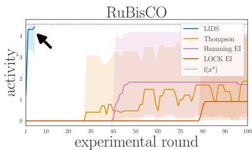  
Figure 1: Lab-in-the-loop speedup. Optimizing an in silico oracle with LIDS (blue) versus baselines (Sec. 6).

molecule with the highest activity (Hernández-Lobato et al., 2014; Russo & Van Roy, 2018). The method yields rapid acceleration on sparse molecular discovery problems (Fig. 1).

Our contributions are:

1. A recipe to accelerate lab-in-the-loop molecular discovery by controlled stochastic synthesis, rather than deterministic synthesis.

2. Eficient approximate Bayesian computation for designing stochastic syntheses, and learning from assays that test the resulting mixtures as a pool (Sec. 3).

3. Theoretical results showing exponential speedups over methods that design and test molecules individually (Sec. 5).

4. Empirical demonstration of order-of-magnitude speedups across diverse simulated DNA and peptide activity landscapes (Sec. 6).

Notation is defined where introduced; a table is in $\mathrm { A p p }$ . A.

## 2 Problem Setting

Our goal is to discover molecules with a desired property. Let  denote the space of molecules we are exploring, and let $\mathrm { \Phi } \mathrm { f } : \mathcal { X } \to$ R denote the mapping from molecule to activity. Our goal is to find $x ^ { \star } \in \mathrm { a r g m a x } _ { x } \mathrm { f } ( x )$ . For example,  could be the space of peptide sequences of length $L _ { ; }$ i.e. $\mathcal { X } = \{ A , C , \ldots \} ^ { L }$ , and f(x) could be activation of a target receptor, e.g. GLP-1. We study lab-in-the-loop optimization methods where we query f(x) by running an experiment.

Current approach. The usual technique for solving this problem is to iteratively (1) design a molecule $x _ { t } , \ ( 2 )$ synthesize $x _ { t }$ in the laboratory, (3) test $x _ { t }$ in an assay that returns $y _ { t }$ , a noisy measurement of $\mathrm { f } ( { \boldsymbol { x } } _ { t } )$ , and (4) update our knowledge of f and its optimum. Algorithms based on Bayesian optimization or reinforcement learning can be used to learn from the data $\mathcal { D } _ { t - 1 } =$ $\left\{ ( x _ { 1 } , y _ { 1 } ) , \dotsc , ( x _ { t - 1 } , y _ { t - 1 } ) \right\}$ and propose new molecules $x _ { t }$ (steps 1 and 4) (Romero & Arnold, 2009; Romero et al., 2013; Maus et al., 2026; Groth et al., 2024; Jankowiak et al., 2026). Robotic systems are increasingly used to automate synthesis and testing (steps 2 and 3) (Ha et al., 2023). Compiled together, steps 1-4 have become a basic recipe for automated $\mathrm { o r } \ \mathrm { } ^ { \ast } \mathrm { s e l f - d r i v i n g } ^ { \prime \ }$ labs in the molecular sciences (Rapp et al., 2024; Abolhasani, 2026).

Core challenge. Active molecules often occupy a narrow region of the molecular space. For example: antibody screens turn up one useful sequence among a billion candidates (Skora et al., 2015); flipping a single chiral center in thalidomide makes the drug toxic (Vargesson, 2015); 0.14% of single point mutations in RuBisCO, a $\mathrm { C O _ { 2 } }$ capturing enzyme, increase activity over baseline (Prywes et al., 2025). The sparseness of molecule-activity maps poses a fundamental challenge to existing lab-in-the-loop discovery methods. To illustrate, consider a simple setting in which we have $d \triangleq | \mathcal { X } |$ candidate molecules, but only one is active, and we have no prior knowledge about which one. Then there does not exist a learning algorithm that can outperform a random screen.

Proposition 1. Assume $\operatorname { f } ( x ) = \mathbb { I } ( x = x ^ { \star } )$ where $x ^ { \star } \sim$ $\operatorname { U n i f o r m } ( 1 , \ldots , d )$ , and there is no noise in the assay, so we measure $y _ { t } = \mathrm { f } ( x _ { t } )$ . Define expected regret, ${ \cal R } \triangleq \mathbb { E } _ { x ^ { \star } } [ \mathbb { E } _ { \pi } [ \sum _ { t = 1 } ^ { \infty } \mathbb { I } ( X _ { t } \neq X ^ { \star } ) ] ]$ . A policy $\pi ( x _ { t } \mid \mathcal { D } _ { t - 1 } )$ that selects the next candidate $x _ { t }$ uniformly at random from among remaining candidates has expected regret $( d - 1 ) / 2$ . There does not exist a policy with lower expected regret.

Proof in $\mathrm { A p p }$ . B. In short, any algorithm–using Bayesian optimization, reinforcement learning, generative models, agents, or anything else–will have $( d - 1 ) / 2$ failed experiments on average before finding the optimum. The problem is that on sparse problems there is no information to extrapolate from: an experiment only tells us whether or not the tested molecule works.

Information-Dense Synthesis

Our approach. To break the $( d - 1 ) / 2$ regret barrier of Proposition 1, we propose designing, synthesizing and testing mixtures of molecules, so that each experiment carries information about many molecules at once, as depicted in Fig. 2 (Aldridge et al., 2026; Russo & Van Roy, 2018; Liu et al., 2025a).

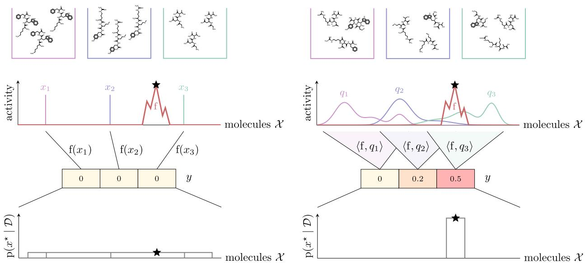  
Figure 2: Overview. Information-dense synthesis uses mixtures of molecules q, instead of single molecules x. By testing the mixtures as a pool, we encode the activity from many molecules into experiment outcomes $y .$ Compared to individual synthesis, this can carry much more information about the optimal molecule $x ^ { \star }$ , especially on sparse molecule-activity maps f.

## 3 Method

We optimize $\operatorname { f } ( x )$ by synthesizing and testing mixtures of molecules. Mathematically, we specify a mixture as a positive measure $q ( x )$ : a distribution over diferent molecules, $\bar { q } ( x ) \in \mathcal { P } ( \mathcal { X } )$ , times a yield $0 < c < \infty$ , the total number of molecules that are made, $q ( x ) = c \cdot \bar { q } ( x ) \in \mathcal { M } ^ { + } ( \mathcal { X } )$ . When we test the mixture, we assume the assay provides a noisy measurement of the average activity,

$$
y _ { t } = \int \mathrm { f } ( x ) q _ { t } ( x ) \mathrm { d } x + \epsilon _ { t } = \langle \mathrm { f } , q _ { t } \rangle + \epsilon _ { t }\tag{1}
$$

where $\epsilon _ { t }$ is noise, and $\langle \mathrm { f } , \mathrm { g } \rangle \triangleq \int \mathrm { f } ( x ) \mathrm { g } ( x ) \mathrm { d } x$ denotes the inner product on functions. In the case where we synthesize a pure compound, the distribution of molecules $q _ { t } ( x )$ reduces to a delta mass at a single point $x _ { t } ,$ and we recover the standard problem setting, $y _ { t } = \mathrm { f } ( x _ { t } ) + \epsilon _ { t }$

Eq. (1) contains a linearity assumption: it says the experiment’s outcome depends on the sum of the activity of each $x , \ \mathrm { f } ( x )$ , weighted by how much of x is in the mixture, $q _ { t } ( x )$ . This is an assumption about the assay, not about the activity map $\operatorname { f } : \mathcal { X }  \mathbb { R }$ , which can be arbitrarily complex and nonlinear. For example, in spectroscopy, the total signal depends on the sum of the absorbance or emission of each individual molecule, even if the absorbance and emission depend in a complex way on molecular structure. In vitro or in vivo, linearity violations are drug-drug interactions, which are often lower order contributions to a cocktail’s efect (Liu et al., 2025a).

Our recipe for lab-in-the-loop learning consists of:

1. A synthesis model that describes the chemical process of creating a mixture. It specifies which $q ( x ) \in { \mathcal { M } } ^ { + } ( \mathcal { X } )$ are practically achievable.

2. An assay model that describes the noise associated with measurement, $\epsilon _ { t }$

3. A design algorithm that chooses the next mixture $q _ { t }$ to maximize information.

4. An inference algorithm that updates our knowledge of f based on the experimental data.

## 3.1 Synthesis models

We aim to design a complex mixture of molecules that is tractable to synthesize in the lab. To do so, we build on variational synthesis, which describes the output of stochastic synthesis using a generative model (Weinstein et al., 2022, 2026). Our synthesis model consists of a family of measures $\mathcal { Q } = \{ q _ { \psi } : \psi \in \Psi \} \subseteq \mathcal { M } ^ { + } ( \mathcal { X } )$ , where (1) ψ denotes experimental parameters, i.e. specific instructions that can be sent to a synthesizer, and $( 2 ) \ q _ { \psi } ( x )$ describes the mixture of molecules that come out of the synthesizer. To design a mixture we choose a $\psi \in \Psi$

We focus on models for solid phase synthesis, a combinatorial synthesis approach that is widely applied to make DNA, RNA, peptides, carbohydrates and more (Beaucage & Caruthers, 1981; Caruthers, 2013; Merrifield, 1963; Zuckermann et al., 1992). Consider synthesizing peptides of length L. The molecular space is $\mathcal { X } = B ^ { L }$ where is the alphabet of amino acids, size $B \triangleq | B |$ . A solid phase peptide synthesizer makes peptides by sequentially adding amino acids. At each step it can add a single amino acid, or it can add a mixture of diferent amino acids, so that each growing peptide molecule will randomly encounter and react with a diferent amino acid. The resulting mixture can be described by a site-wise independent distribution $\begin{array} { r } { \mathrm { C a t } ( \boldsymbol { x } \mid \beta _ { 1 } ) = \prod _ { j = 1 } ^ { L } \beta _ { 1 j x _ { j } } } \end{array}$ where the probability of amino acid $x _ { j }$ at position $j$ depends on its efective concentration in the $j \mathrm { t h }$ reaction, $\beta _ { 1 j x _ { j } }$ , with $\beta _ { 1 } \in ( \Delta _ { B - 1 } ) ^ { L }$ (Houghten et al., 1999). By repeating the synthesis process S times with diferent input concentrations, and mixing the products, we build up a distribution,

$$
\bar { q } _ { \psi } ( x ) = \sum _ { s = 1 } ^ { S } \alpha _ { s } \mathrm { C a t } ( x \mid \beta _ { s } ) ,\tag{2}
$$

where $\alpha \in \Delta _ { S - 1 }$ specifies the relative concentration of peptides from each synthesis $s ,$ and $\beta \in$ $( \Delta _ { B - 1 } ) ^ { S \times L }$ . This is a mixture model over discrete sequences. We set $\mathcal { Q } = \{ q _ { \psi = ( \alpha , \beta , c ) } : c \sum _ { s = 1 } ^ { S } \alpha _ { s } \mathrm { C a t } ( x$ $\beta _ { s } ) \}$ as the family of synthesizable distributions, where $\psi = ( \alpha , \beta , c )$ are the experimental parameters, including the overall yield c. This synthesis model is applicable to a range of heteropolymers, e.g. for DNA we can set $\boldsymbol { B }$ to be the nucleotides (Weinstein et al., 2022, 2026).

The laboratory time and resources required to synthesize the mixture distribution in Eq. (2) is efectively the same as that required to synthesize S pure sequences $x _ { 1 } , \ldots , x _ { S }$ . The number of reaction steps and the amount of reagents are the same. The only added complexity is from mixing reagents before or during each synthesis step, a process amenable to automated liquid handling (Torres-Acosta et al., 2022).

## 3.2 Assay models

We assume a model of the assay’s noise. We focus on Gaussian noise, $\epsilon _ { t } \sim \mathrm { N o r m a l } ( 0 , \sigma )$ . Though not required, our method exploits prior knowledge of the noise level, e.g. from control experiments, so we assume the standard deviation σ is known. Bernoulli or Poisson noise is also possible.

## 3.3 Designing mixtures

We work in the framework of sequential Bayesian experimental design (Rainforth et al., 2024). We optimize synthesis to maximize the information our next experiment will deliver about the optimum. This acquisition function has been proposed in predictive entropy search and information directed

sampling (Hernández-Lobato et al., 2014; Russo $\&$ Van Roy, 2018). First, we place a prior on the unknown molecule-activity map,

$$
\theta \sim \mathrm { p } ( \theta )\tag{3}
$$

$$
Y _ { t } \sim \mathrm { p } ( y \mid \langle \mathrm { f } _ { \theta } , q _ { t } \rangle )\tag{4}
$$

After performing t 1 experiments, our posterior updates to $\operatorname { p } ( \boldsymbol { \theta } \mid \mathcal { D } _ { t - 1 } = \{ ( y _ { 1 } , q _ { 1 } ) , \dots , ( y _ { t - 1 } , q _ { t - 1 } ) \} )$ To choose the next mixture, we maximize the expected information gain (EIG) about the optimum: $q _ { t } = \underset { q _ { \psi } \in \mathcal { Q } } { \mathrm { a r g m a x } } \mathrm { E I G } _ { x ^ { \star } } ( q _ { \psi } ) =$

$$
\underset { q _ { \psi } \in \mathcal { Q } } { \arg \operatorname* { m a x } } [ \mathcal { H } ( \mathrm { p } ( x _ { \theta } ^ { \star } \mid \mathcal { D } _ { t - 1 } ) ) - \mathbb { E } _ { \mathrm { p } ( y _ { t } \mid q _ { \psi } , \mathcal { D } _ { t - 1 } ) } [ \mathcal { H } ( \mathrm { p } ( x _ { \theta } ^ { \star } \mid \mathcal { D } _ { t - 1 } \cup \{ ( Y _ { t } , q _ { \psi } ) \} ) ) ] ]\tag{5}
$$

where denotes the Shannon entropy and $x _ { \theta } ^ { \star } \triangleq \operatorname { a r g m a x } _ { x } \mathrm { f } _ { \theta } ( x )$ This objective quantifies the reduction in uncertainty about $x ^ { \star }$ after observing $y _ { t }$ , on average across predicted $y _ { t } \sim \int \mathrm { p } ( y _ { t } \ |$ $q _ { \psi } , \theta ) \mathrm { p } ( \theta \mid \mathcal { D } _ { t - 1 } ) d \theta$ . It is equivalent to the mutual information between the new datapoint, $( y _ { t } , q _ { t } )$ and the optimal molecule $x ^ { \star }$ (Hennig & Schuler, 2012; Hernández-Lobato et al., 2014, 2015; Jones et al., 1998; Russo & Van Roy, 2018). Assays are often run in parallel, e.g. in a 96 well plate format, in which case we can consider a batch version of the objective, with $\mathcal { D } _ { t - 1 } \cup \{ ( Y _ { 1 } ^ { t } , q _ { \psi _ { 1 } } ) , \dotsc , ( Y _ { E } ^ { t } , q _ { \psi _ { E } } ) \}$

The EIG is critical to exploiting stochastic synthesis. Thompson sampling draws $\theta \sim \mathrm { p } ( \theta \ |$ $\mathcal { D } _ { t - 1 } )$ and chooses the next design as $q _ { t } = \operatorname { a r g m a x } _ { q \in \mathcal { Q } } \langle \mathrm { f } _ { \theta } , q \rangle \ = \delta _ { x _ { \theta } ^ { \star } }$ , i.e. it reverts to synthesizing and testing individual molecules (Thompson, 1933). The upper confidence bound algorithm and expected improvement produce the same degeneracy $\left( \mathrm { A p p . ~ C } \right)$ (Auer et al., 2002; Jones et al., 1998). As a result, these standard acquisition functions fail to provide major speedups on sparse problems, even when given access to stochastic synthesis (Sec. 6) (Russo & Van Roy, 2018).

Approximating the information gain The EIG is dificult to compute explicitly. Instead, we optimize the Barber-Agakov variational bound (Foster et al., 2020; Barber & Agakov, 2003),

$$
\begin{array} { r } { \mathrm { E I G } _ { x ^ { \star } } ( q _ { \psi _ { 1 : E } ^ { t } } ) \geq \mathcal { H } ( \mathrm { p } ( x _ { \theta } ^ { \star } \mid \mathcal { D } _ { t - 1 } ) ) + \mathbb { E } _ { \mathrm { p } ( \theta \mid \mathcal { D } _ { t - 1 } ) \mathrm { p } ( \epsilon ) } [ \log r _ { \phi } ( x _ { \theta } ^ { \star } \mid \langle \mathrm { f } _ { \theta } , q _ { \psi _ { 1 : E } ^ { t } } \rangle + \sigma \epsilon _ { 1 : E } ) ] } \end{array}\tag{6}
$$

$\triangleq { \mathcal { T } } _ { B A } ( x ^ { \star } ; q _ { \psi } , \phi )$ , where $r _ { \phi } ( x ^ { \star } \mid y )$ is the approximate posterior and $\mathrm { p } ( \epsilon ) = \mathrm { N o r m a l } ( 0 , 1 )$ is the reparameterized noise $( \mathrm { A p p . ~ D } )$ . We first draw samples from the posterior $\theta _ { 1 : M } \stackrel { i i d } { \sim } \mathrm { p } ( \theta \mid \mathcal { D } _ { t - 1 } )$ (Sec. 3.4), then jointly optimize the synthesis $q _ { \psi }$ and the approximate posterior $r _ { \phi }$ by stochastic gradient ascent, using AdamW (Loshchilov & Hutter, 2018; Foster et al., 2020). Details on architecture and training are in App. E. This variational bound can be understood as an encoder-decoder model (Grover & Ermon, 2019). The laboratory experiment encodes the unknown molecule-activity map f<sub>θ</sub> into a noisy E-dimensional measurement $y _ { 1 : E } ^ { t } = \langle \mathrm { f } _ { \theta } , q _ { \psi _ { 1 : E } ^ { t } } \rangle + \sigma \epsilon _ { 1 : E }$ . The approximate posterior $r _ { \phi }$ decodes the optimal molecule $x ^ { \star }$ from this measurement.

A tractable sparse function class We need a function class and prior that can describe sparse molecule-activity maps, which can be challenging to model with Gaussian processes (Park, 2022; Meng et al., 2021). We consider a single-layer Bayesian neural network with an exponential nonlinearity, $\mathrm { f } _ { \theta = ( W , V ) } ( x ) = W ^ { \top } \exp ( V \cdot x )$ where $x \in B ^ { L }$ is represented as a one-hot encoding, $W \in \mathbb { R } ^ { N }$ $V \in \mathbb { R } ^ { N \times L \times B }$ , and the dot product is over the length dimension $L$ and alphabet dimension B. We design a prior that encourages sparsity, so only x that closely match one of the filters $V _ { 1 } , \dots , V _ { N }$ produce nontrivial outputs, and assume that we have an informative prior on the maximum activity that the assay can record, $\| \mathrm { f } \| _ { \infty } .$ , based on e.g. positive control experiments. This function class is expressive, and ofers closed-form computation of the integral $\textstyle \int \mathrm { f } ( x ) q _ { \psi } ( x ) \mathrm { d } x$ , as well as fast approximation of $x ^ { \star } \left( \operatorname { A p p . } \mathrm { { F } } \right)$

## 3.4 Inference from mixtures

We perform automated approximate Bayesian inference in a probabilistic programming language (NumPyro), adaptively switching from MCMC to stochastic variational inference as the posterior concentrates (App. G). When done gathering data, we approximately generate the maximum a posteriori molecule, $\hat { x } ^ { \star } = \mathrm { a r g m a x } _ { x } \mathrm { p } ( x _ { \theta } ^ { \star } = x \mid \mathcal { D } _ { t } )$ , as our best guess of the optimal molecule $x ^ { \star }$ The full procedure is summarized in $\mathrm { A l g . ~ 1 }$

```tcl
Algorithm 1 Learning with Information-Dense Synthesis (LIDS)
Require: batch size $E \in \mathbb { N } ,$ syntheses $S \in \mathbb { N } ,$ noise σ, posterior samples $M \in \mathbb { N } ,$ prior $\pi ( \theta )$
while conducting experiments, $t = 1 , 2 , 3 , . . .$ . do
$q _ { 1 : E } ^ { t } , \phi _ { t } = \mathrm { a r g m a x } \mathcal { T } _ { B A } ( x ^ { \star } ; q _ { \psi } , \phi )$ ▷ Maximize EIG
$y _ { 1 : E } ^ { t } = \langle \mathrm { f } , q _ { 1 : E } ^ { t } \rangle + \sigma \epsilon _ { 1 : E } ^ { t }$ ▷ Run batch of experiments
$\mathcal { D } _ { t }  \mathcal { D } _ { t - 1 } \cup \{ ( y _ { i } ^ { t } , q _ { i } ^ { t } ) _ { i = 1 } ^ { E } \}$
$\theta _ { 1 : M } ^ { t } \overset { i i d } { \sim } \mathrm { p } ( \theta \mid \mathcal { D } _ { t } )$ ▷ Update beliefs
end while
return $\begin{array} { r } { \hat { x } _ { t } ^ { \star } = \mathrm { a r g m a x } _ { x } \frac { 1 } { M } \sum _ { j = 1 } ^ { M } \mathbb { I } [ x = x _ { \theta _ { j } ^ { t } } ^ { \star } ] } \end{array}$
```

## 4 Related Work

Our approach extends group testing, which searches among many candidates by conducting pooled tests, to a high-dimensional Bayesian optimization setting (Aldridge et al., 2026; Garnett, 2023). Group testing methods have a long history in molecular discovery and combinatorial chemistry (Kainkaryam & Woolf, 2009). They are closely related to compressed sensing, which exploits structure such as sparsity to learn from limited measurements (Atia & Saligrama, 2009). Liu et al. (2025a) propose compressed screening to learn the activity of a set of compounds synthesized individually, using pooled tests (Yao et al., 2023; Cleary & Regev, 2020). Weinstein et al. (2025) generalize from learning vectors to training sequence activity models; they synthesize DNA stochastically by variational synthesis, then deliver multiple DNA sequences into the same cell to make randomized mixtures. We extend these ideas, learning sequence-activity models through iterative experimentation with model-designed mixtures.

A critical advantage of pooled testing is that it does not require barcoding individual molecules (Peterson & Liu, 2023). LIDS is therefore not restricted to DNA and DNA-encoded libraries, and can instead be applied to other classes of molecules (Szostak, 1997).

LIDS builds on previous methods for optimization based on the EIG, such as entropy search (MacKay, 1992; Villemonteix et al., 2009; Hennig & Schuler, 2012; Hernández-Lobato et al., 2014). Russo & Van Roy (2018) show the EIG enables rapid optimization of sparse functions, where UCB and TS fail. To operationalize this idea, we apply recent advances in EIG approximation (Rainforth et al., 2024; Foster et al., 2020). Like the uncertainty autoencoder (UAE) (Grover & Ermon, 2019), we design experiments end-to-end by training an encoder and decoder, but our focus is on learning sparse functions f(x) rather than sparse Euclidean vectors. Like Sharrock (2026) we optimize distributions $q ( x )$ , but our goal is to design mixtures not ease computation.

Molecular discovery relies on causal assumptions: a molecule-activity map f(x) specifies the efect of an intervention x on an outcome y. We disaggregate the conventional causal model, $y = \operatorname { f } ( x ) + \epsilon ,$ and replace it with a hierarchical causal model, where many molecules (subunits) afect an outcome (Fig. 8) (Weinstein & Blei, 2026; Weinstein et al., 2024). The corresponding estimator, Eqs. (3) and (4), is Bayesian distributional regression (Zaheer et al., 2018; Szabó et al., 2016).

## 5 Theory

We show information-dense synthesis can rapidly search large molecular spaces $\mathrm { ( S e c . ~ 5 . 1 ) }$ , but is slowed by experimental limitations (Sec. 5.2)

## 5.1 Exponential speed ups

In principle, information-dense synthesis can find the optimal molecule with a single experiment.

Example 1 (No noise, discrete map). Assume activity is discrete, s.t. $\textrm { f } : \ X \  \ \mathcal { y } \ f o r \ \mathcal { y } \ =$ $\{ 0 , \ldots | \mathcal { V } | - 1 \}$ . Assume the model is well specified, ${ \mathrm { f } } \in \{ { \mathrm { f } } _ { \theta } : \theta \in \Theta \}$ , and $\pi ( \mathrm { f } _ { \theta } = \mathrm { f } ) > 0$ , we can synthesize any $q \in \mathcal { Q } = \mathcal { P } ( \mathcal { X } )$ , and our assay has no noise, $y _ { t } = \langle \mathrm { f } , q \rangle$ . Then, by optimizing the EIG $( E q . \ ( 5 ) )$ , we find $x ^ { \star }$ after one experiment.

Proof sketch. Set $\begin{array} { r } { q ( x ) = \frac { 1 } { Z } \frac { 1 } { | \mathcal { V } | ^ { x } } } \end{array}$ where $\begin{array} { r } { Z = \sum _ { x = 1 } ^ { d } \frac { 1 } { | y | ^ { x } } } \end{array}$ . Now $\begin{array} { r } { Z y = Z \langle \mathrm { f } , q \rangle = \sum _ { x = 1 } ^ { d } \frac { \mathrm { f } ( x ) } { | \mathcal { V } | ^ { x } } } \end{array}$ , so $\operatorname { f } ( x )$ is encoded in the digits of $Z y , \mathrm { e . g }$ . for $| y | = 1 0$ we have $Z y = 0 . \operatorname { f } ( 1 ) \operatorname { f } ( 2 ) \ldots \operatorname { f } ( d )$ □

Proof in $\operatorname { A p p }$ . H. This example assumes discrete activity, e.g. y could be the number of fluorophores that attach to x. However, $\mathcal { O } ( 1 )$ optimization can also be achieved for $\mathcal { V } = \mathbb { R }$ , when $\mathrm { f } _ { \theta }$ is sparse $\left( \mathrm { A p p . ~ I } \right)$ . Next, consider assays that return just one bit, instead of a continuous value.

Example 2 (Binary activity test). Assume f is 1-sparse, ${ \mathrm { f } } ( x ) \in \{ w \mathbb { I } ( x = \theta ) : \theta \in \mathcal { X } , \ w \in \mathbb { R } _ { + } \} .$ , we can synthesize any $q \in \mathcal { Q } = \mathcal { P } ( \mathcal { X } )$ , and our model is well-specified, with uniform prior $\pi ( \theta ) = 1 / d$ The assay reports where any molecule is active, $y _ { t } = \mathbb { I } [ \langle \mathrm { f } , q \rangle > 0 ]$ . Then, by optimizing the EIG with batch size E $( E q . \ ( 6 ) )$ , we find $x ^ { \star }$ after $\lceil \log _ { 2 } d / E \rceil$ batched experiments.

Proof sketch. The EIG executes $2 ^ { E _ { \mathrm { - a r y } } }$ search. Each q contains half the current possible $x ^ { \star }$ values.   
Observing y tells us whether $x ^ { \star }$ is in that half or the other, cutting the search space in half.

Proof in $\operatorname { A p p . } J .$ , with an additional example in App. K. The space of all small molecules is estimated at $d = { \sim } 1 0 ^ { 6 0 }$ (Ruddigkeit et al., 2012). This suggests it could be searched with three 96-well plates, where testing compounds individually would require ${ \sim } 1 0 ^ { 6 0 }$ experiments (Proposition 1). We next discuss how reality intervenes.

## 5.2 Limitations and tradeofs

Our analytic examples assumed no noise, full control over the molecular mixture, and restrictions on the molecule-activity map. In this section we examine the method’s behavior as these assumptions are relaxed or changed. We first examine the information gained in a single experiment.

Proposition 2 (Information bound). Assume Gaussian noise, $y = \langle \mathrm { f } _ { \theta } , q \rangle { + } \sigma \epsilon$ , where ϵ  Normal(0, 1), and $\langle \mathrm { f } _ { \theta } , \bar { q } \rangle \in \mathcal { Z }$ for  a finite set. Then,

$$
E I G _ { \theta } ( q ) \leq \operatorname* { m i n } \left\{ { \mathcal { H } } ( \langle \mathrm { f } _ { \theta } , { \bar { q } } \rangle ) , { \frac { 1 } { 2 } } \log \left( 1 + { \frac { c ^ { 2 } } { \sigma ^ { 2 } } } \mathrm { V a r } _ { \pi } [ \langle \mathrm { f } _ { \theta } , { \bar { q } } \rangle ] \right) \right\} .\tag{7}
$$

The proof $( \mathrm { A p p . ~ L } )$ applies the Shannon-Hartley theorem. This bound shows information is limited by an assay’s signal-to-noise ratio $\begin{array} { r } { \mathrm { S N R } ( q ) \triangleq \frac { c ^ { 2 } } { \sigma ^ { 2 } } \mathrm { V a r } _ { \pi } [ \langle \mathrm { f } _ { \theta } , \bar { q } \rangle ] } \end{array}$ . High noise $\sigma$ can reduce the EIG to zero. High synthesis yield c can increase the EIG: if we have more material to test, the SNR will increase. Control over synthesis is also important: we must achieve a high inner product between what we can make, q, and the molecule-activity map we want to learn, f<sub>θ</sub>.

This bound also reveals a tradeof that comes from using stochastic synthesis rather than individual synthesis. We can often increase the signal’s entropy $\mathcal { H } ( \langle \mathrm { f } _ { \theta } , \bar { q } \rangle )$ by testing more spread out mixtures ${ \bar { q } } ( x )$ . However, the SNR is maximized by concentrating on a single molecule, since $\exists \delta _ { x } \in \operatorname { a r g m a x } _ { \bar { q } } \operatorname { V a r } _ { \boldsymbol { \pi } } [ \left. \operatorname { f } _ { \theta } , \bar { q } \right. ]$ , following Bauer’s maximum principle (App. L.1).

Example 3. Assume the molecule activity map is 1-sparse with maximum value one, $\operatorname { f } _ { \theta } ( x ) ~ \in$ $\{ \mathbb { I } ( x = \theta ) : \theta \in \mathcal { X } \}$ , and the prior is uniform, $\pi ( \theta ) = 1 / d .$ . Assume a synthesis model that creates uniform mixtures, $\begin{array} { r } { q ( x ) = \frac { 1 } { d _ { q } } \mathbb { I } ( x \in U ) } \end{array}$ for $U \subseteq { \mathcal { X } } , \| q \| _ { 1 } = c = 1$ and $d _ { q } \ \triangleq \ | U |$ . Assume Gaussian noise $y ~ = ~ \langle \mathrm { f } _ { \theta } , q \rangle + \sigma \epsilon$ where ϵ  Normal(0, 1). In this example, we can numerically solve the EIG, and compare with the bounds from Proposition 2, see Fig. 3. As the noise σ increases, the optimal tradeof between entropy and SNR shifts to smaller values of $d _ { q }$ See App. M for details.

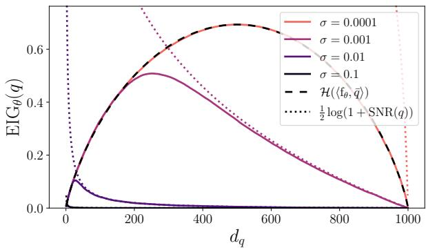  
Figure 3: EIG tradeofs. EIG from Example 3, plotted alongside MI upper bounds from Proposition 2, as a function of $d _ { q } = \left| \operatorname { s u p p } ( q ) \right.$ |<sup>.</sup>

Synthesizing mixtures can ofer major gains in early experiments, but the advantage over individual synthesis decreases to zero in the limit as the number of experiments goes to infinity.

Proposition 3. Let $\operatorname { f } _ { \theta } : \mathcal { X }  \mathbb { R } _ { + }$ be a model of the molecule-activity map, where $\{ \mathrm { f } _ { \theta } = ( \mathrm { f } _ { \theta } ( x ) ) _ { x \in \mathcal { X } } :$ $\theta \in \Theta \} = \mathbb { R } ^ { | \mathcal { X } | }$ . Assume the prior $\pi ( \mathrm { f } _ { \theta } )$ is positive and absolutely continuous in a neighborhood of the true f. Consider maximizing the EIG for $\operatorname { f } _ { \theta }$ . Let $\mathcal { M } _ { c } ^ { + } ( \mathcal { X } ) = \{ q = c \bar { q } : \bar { q } \in \mathcal { P } ( \mathcal { X } ) \}$ be the set of mixtures and let $\mathcal { S } _ { c } ( \mathcal { X } ) = \{ q = c \delta _ { x } : x \in \mathcal { X } \}$ be the set of delta mixtures (individual synthesis). Define $\sigma _ { i n f o } ^ { 2 } ( \mathscr { Q } ) \ \triangleq \ \operatorname* { l i m } _ { t \to \infty } t \cdot \mathrm { C o v } [ \mathrm { p } ( \mathrm { f } _ { \theta } \ | \ \mathscr { D } _ { t } ) ]$ to be the asymptotic covariance of the posterior when we choose $q \in \mathcal { Q }$ at each step t by maximizing the EIG. Then, the asymptotic covariance is equal regardless of whether we test mixtures or individual molecules: $\sigma _ { i n f o } ^ { 2 } ( S _ { c } ( \mathcal { X } ) ) = \sigma _ { i n f o } ^ { 2 } ( \mathcal { M } _ { c } ^ { + } ( \mathcal { X } ) )$ .

The proof is in App. N; it uses the Bernstein-von Mises theorem for sequential Bayesian design from Paninski (2005), which implies the posterior over $\operatorname { f } _ { \theta }$ is asymptotically normal. A limitation of this result is it applies to the EIG for learning the entire function $\operatorname { f } _ { \theta }$ , while LIDS focuses just on the optimum $x ^ { \star } ;$ we conjecture similar behavior for learning the optimum, since it is a deterministic function of $\operatorname { f } _ { \theta }$ . The overall picture is that at the beginning of learning, synthesizing mixtures can ofer major advantages, but in the limit as we collect infinite data and approach complete knowledge of f, the advantages diminish.

## 6 Empirical Results

We compare LIDS to individual synthesis empirically. We evaluate in simulations, where the ground truth molecule-activity map f is specified by diferent oracles, and measurements have Gaussian noise with known variance. We compare to molecular optimization methods that use individual synthesis. First, Thompson sampling using the same prior $\pi ( \theta )$ and model $\mathrm { f } _ { \theta }$ as LIDS (Thompson) (Thompson, 1933). Then, Gaussian process (GP) Bayesian optimization with expected improvement (EI), using either the exponential Hamming kernel (Hamming EI) or the LOCK kernel (LOCK EI), which is SOTA for learning protein activity from limited data (Jankowiak et al., 2026; Amin et al., 2023; Groth et al., 2024). Finally, we ablate LIDS by removing stochasticity from its synthesis design $q _ { t } ,$ replacing it with ${ { \bar { q } } _ { t } } ( x ) \gets \mathrm { a r g m a x } _ { \delta _ { x } } \langle \delta _ { x } , { \bar { q } } _ { t } \rangle$ (LIDS-argmax). To compare LIDS fairly to individual synthesis, we set the number of syntheses equal to the batch size $S = E$ and only vary the weights within a batch $\psi _ { 1 : E } ^ { t } = ( \alpha _ { 1 } ^ { t } , \beta , c ) , . . . , ( \alpha _ { E } ^ { t } , \beta , c )$ , so the synthesis cost (amount of reagents, number of reaction steps) is the same (Note when experiments are bottlenecked by assay cost rather than synthesis cost, LIDS can use $S \gg E$ to reach higher EIG). To monitor performance, after every round t we evaluate the true activity of the predicted optimum, f(ˆx<sup>⋆</sup>). All experiments use a single

Table 1: Sparse oracle. Number of rounds until finding the optimal molecule, $\hat { x } ^ { \star } = x ^ { \star }$  
Table 2: PLM oracle. Number of rounds until finding the optimal molecule, $\hat { x } ^ { \star } = x ^ { \star }$
<table><tr><td rowspan="2">Noise level</td><td rowspan="2">Method</td><td colspan="3"># of rounds ↓</td></tr><tr><td>min</td><td>median</td><td>max</td></tr><tr><td rowspan="3">Low</td><td>Thompson</td><td>14</td><td>&gt;100</td><td>&gt;100</td></tr><tr><td>Hamming EI</td><td>42</td><td>&gt;100</td><td>&gt;100</td></tr><tr><td>LIDS (ours)</td><td>2</td><td>2</td><td>8</td></tr><tr><td rowspan="3">Medium</td><td>Thompson</td><td>19</td><td>&gt;100</td><td>&gt;100</td></tr><tr><td>Hamming EI</td><td>45</td><td>&gt;100</td><td>&gt;100</td></tr><tr><td>LIDS (ours)</td><td>3</td><td>4.5</td><td>14</td></tr><tr><td rowspan="3">High</td><td>Thompson</td><td>38</td><td>&gt;100</td><td>&gt;100</td></tr><tr><td>Hamming EI</td><td>41</td><td>&gt;100</td><td>&gt;100</td></tr><tr><td>LIDS (ours)</td><td>21</td><td>&gt;100</td><td>&gt;100</td></tr></table>

<table><tr><td rowspan="2">Protein</td><td rowspan="2">Method</td><td colspan="3"> $\#$  of rounds ↓</td></tr><tr><td>min</td><td>median</td><td>max</td></tr><tr><td rowspan="5">PETase</td><td>Thompson</td><td>&gt;100</td><td>&gt;100</td><td>&gt;100</td></tr><tr><td>Hamming EI</td><td>9</td><td>27</td><td>88</td></tr><tr><td>LOCK EI</td><td>12</td><td>27</td><td>47</td></tr><tr><td>LIDS-argmax</td><td>&gt;5</td><td>&gt;5</td><td>&gt;5</td></tr><tr><td>LIDS (ours)</td><td>2</td><td>3</td><td>&gt;5</td></tr><tr><td rowspan="5">RuBisCO</td><td>Thompson</td><td>72</td><td>&gt;100</td><td>&gt;100</td></tr><tr><td>Hamming EI</td><td>42</td><td>118</td><td>&gt;200</td></tr><tr><td>LOCK EI</td><td>81</td><td>&gt;100</td><td>&gt;100</td></tr><tr><td>LIDS-argmax</td><td>&gt;5</td><td>&gt;5</td><td>&gt;5</td></tr><tr><td>LIDS (ours)</td><td>2</td><td>2</td><td>&gt;5</td></tr><tr><td rowspan="5">SazCA</td><td>Thompson</td><td>&gt;100</td><td>&gt;100</td><td>&gt;100</td></tr><tr><td>Hamming EI</td><td>&gt;100</td><td>&gt;100</td><td>&gt;100</td></tr><tr><td>LOCK EI</td><td>&gt;100</td><td>&gt;100</td><td>&gt;100</td></tr><tr><td>LIDS-argmax</td><td>&gt;5</td><td>&gt;5</td><td>&gt;5</td></tr><tr><td>LIDS (ours)</td><td>&gt;5</td><td>&gt;5</td><td>&gt;5</td></tr></table>

Nvidia A100 GPU. LIDS is by far the most computationally intensive: EIG maximization takes 30min and posterior updates take  30min for the oracles in Sec. 6.2. Key results:

• On synthetic f with rare activity, LIDS finds the optimum in 2-5 experiments (median) where individual synthesis methods fail even after 100.

• On learned f from a protein language model, LIDS optimizes an order of magnitude faster.

• LIDS is robust to model misspecification and to noise in the assay or synthesis, with performance degrading gradually towards individual synthesis as noise increases.

## 6.1 Sparse synthetic oracle

We first evaluate LIDS on a small-scale problem where we specify a sparse f as an oracle.

Setup Let $\mathcal { X } = \{ A , T , C , G \} ^ { 8 }$ be the set of all $d = | \mathcal { X } | = 6 5 , 5 3 6 ~ \mathrm { D N A }$ sequences of length $L = 8 .$ We construct an oracle f where the optimal sequence $x ^ { \star }$ has activity one and all sequences more than one mutation away from $x ^ { \star }$ have activity zero. Measurement adds Gaussian noise with standard deviation $\sigma \in \{ 1 0 ^ { - 2 } , 1 0 ^ { - 3 } , 1 0 ^ { - 4 } \}$ . We fix the yield $c = 1$ . This corresponds to peak-signal-to-noise ratio PSNR $\triangleq 1 0 \log _ { 1 0 } ( \frac { c ^ { 2 } } { \sigma ^ { 2 } } ) \in \{ 4 0 , 6 0 , 8 0 \}$ dB. At every round, we test a batch of $E = 1 2$ designs. We run 10 independent repeats for each method. Details in $\mathrm { A p p . ~ O }$

Results At low noise-levels $( \mathrm { P S N R } = 8 0 ~ \mathrm { d B } )$ , LIDS identifies the optimum $x ^ { \star }$ in less than 8 rounds of experiments across all 10 repeats, with a median of just 2 rounds (Tab. 1 and fig. 5a) In most repeats, the individual synthesis methods (Thompson sampling and Hamming EI) failed to find the optimum within 100 rounds of experiments. As the assay noise increases, the advantage of LIDS diminishes gradually, approaching the individual synthesis methods (Figs. 5b and 5c).

We visualized LIDS qualitatively by a low-dimensional projection of its designs $q _ { t }$ and beliefs $\mathrm { p } ( x ^ { \star } \mid \mathcal { D } _ { t } ) \ ( \mathrm { F i g . 4 } )$ . At each round t, LIDS designs complex stochastic syntheses that cover its remaining uncertainty.

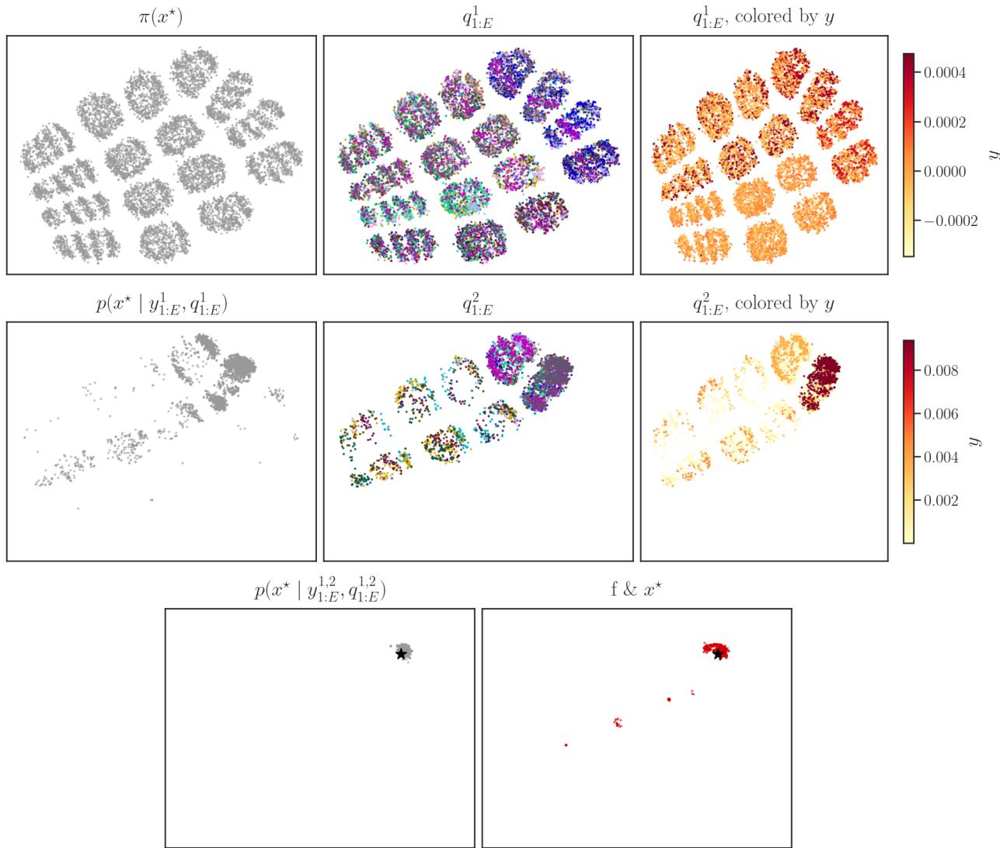  
Figure 4: Two rounds of LIDS on a sparse synthetic oracle (Sec. 6.1). UMAP projection of DNA sequences. Row 1: samples from the prior $\pi ( \boldsymbol { x } ^ { \star } )$ (left), the mixtures designed at $t = 1$ by LIDS $q _ { 1 : E } ^ { 1 }$ (middle), and the same mixtures, colored by their measured activity $y _ { 1 : E } ^ { \bar { 1 } }$ (right). Row 2: the posterior after one experiment round, $\mathrm { p } ( x ^ { \star } \mid \mathcal { D } _ { 1 } = ( q _ { 1 : E } ^ { 1 } , y _ { 1 : E } ^ { 1 } ) )$ (left), the mixtures designed at $t = 2$ by LIDS $q _ { 1 : E } ^ { 2 }$ (middle), and the same mixtures, colored by their activity $y _ { 1 : E } ^ { 2 }$ (right). Row 3: the posterior after two experiment rounds, $\mathrm { p } ( x ^ { \star } \mid \mathcal { D } _ { 2 } = ( q _ { 1 : E } ^ { 1 , 2 } , y _ { 1 : E } ^ { 1 , 2 } ) )$ (left), and the true activity (right), normalized to be a distribution for visualization $\scriptstyle { \mathrm { f } } ( x ) / \sum _ { x \in { \mathcal { X } } } { \mathrm { f } } ( x )$ . After these two rounds, LIDS has converged on the global optimum (star).

## 6.2 Protein language model oracle

We next evaluate LIDS on a peptide discovery problem, where the oracle molecule-activity map f is estimated from large scale data.

Setup Let $\mathcal { X } = \mathcal { B } ^ { L }$ be the set of peptides of length L, where $B = \{ A , C , \ldots \}$ is the 20 natural amino acids. As an oracle $\operatorname { f } : \mathcal { X }  \mathbb { R }$ , we use an estimate of evolutionary fitness based on a pre-trained protein language model (PLM),

$$
\begin{array}{c} \begin{array} { r }  \mathrm { f } ( x ) \triangleq ( \log \frac { \mathrm { p } _ { \mathrm { P L M } } ( x  { | \begin{array} { l } { x _ { 1 : \tau } ^ { w t } } \end{array}  ) } \\ { \mathrm { p } _ { \mathrm { P L M } } ( x _ { \tau + 1 : \tau + L } ^ { w t }  { | \begin{array} { l } { x _ { 1 : \tau } ^ { w t } } \end{array}   } + 1 ) _ { + } } \end{array}  } \end{array}\tag{8}
$$

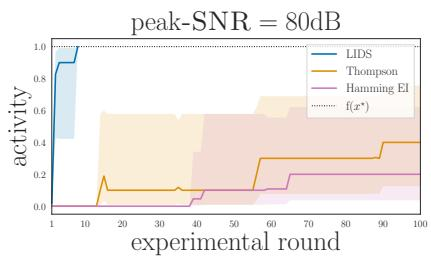  
(a)

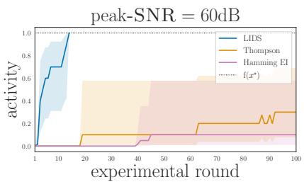  
(b)

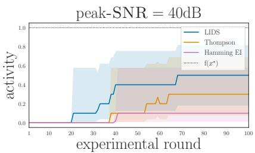  
(c)

Figure 5: Synthetic f with rare activity. LIDS, Thompson, and Hamming EI, at varying noise-level σ, optimizing a synthetic oracle. The activity of the predicted optimum, $\operatorname { f } ( \hat { x } _ { t } ^ { \star } )$ , is plotted as a function of experimental round $t ,$ averaged over 10 duplicates. The 95% CI is calculated using a logit transform and the delta method, so that it stays bounded in the interval $[ 0 , \mathrm { f } ( x ^ { \star } ) ]$ (See App. P).  
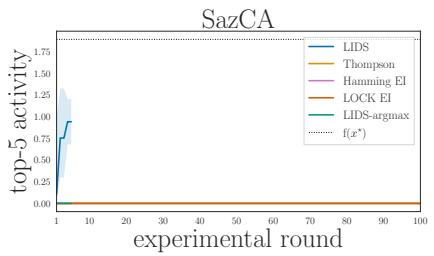  
(a)

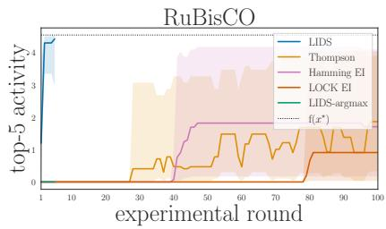  
(b)

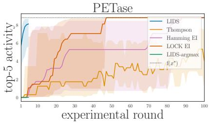  
(c)  
Figure 6: PLM oracle. LIDS, Thompson, Hamming EI, and LOCK EI, applied to a PLM oracle, with low noise (PSNR = 80dB). The maximum activity of the 5 latest test molecules max $\mathrm { f } ( \hat { x } _ { t - 5 } ^ { \star } ) , . . . , \mathrm { f } ( \hat { x } _ { t } ^ { \star } )$ , is plotted as a function of the experimental round t, averaged over 5 duplicates. The 95% CI is calculated using a logit transform and the delta method, so that it stays bounded in the interval $[ 0 , \mathrm { f } ( x ^ { \star } ) ]$ (See App. P).

where we set $\operatorname { p } _ { \operatorname { P L M } } ( x )$ to ProGen2’s likelihood and $x ^ { w t }$ to a wild-type protein sequence (Nijkamp et al., 2023). The likelihood ratio is the evolutionary index, which compares the probability of evolution generating x versus a natural sequence; it has been shown to reliably correlate with diverse measures of protein activity (Hopf et al., 2017; Riesselman et al., 2018). The conditional $\mathrm { p } _ { \mathrm { { P L M } } } ( x \mid x _ { 1 : \tau } ^ { w t } )$ is predictive of whether a peptide x will interact with $x _ { 1 : \tau } ^ { w t }$ (Chen et al., 2026). Sequences below a threshold evolutionary index are typically dysfunctional or pathogenic, so we apply a cutof (Frazer et al., 2021). Unlike benchmarks based on raw experimental data, $\operatorname { p } _ { \operatorname { P L M } } ( x )$ is defined over all of sequence space, allowing us to compute the activity of a mixture (Notin et al., 2023). Crucially, we can approximate the integral $\langle \mathrm { f } , q \rangle = \mathbb { E } _ { x \sim q ( x ) } [ \mathrm { f } ( x ) ]$ even when active sequences are rare under f, by generating samples from the same PLM whose likelihood defines f. We use importance sampling with a defensive mixture as the proposal, $\begin{array} { r } { s ( x ) = \frac { 1 } { 2 } q ( x ) + \frac { 1 } { 2 } \mathrm { p } _ { \mathrm { P L M } } ( x \mid x _ { 1 : \tau } ^ { w t } ) } \end{array}$ ensuring we evaluate $q ( x ) \mathrm { f } ( x )$ in regions where either q or f are high (Hesterberg, 1995) $\left( \mathrm { A p p . ~ Q . 1 } \right)$

We consider three wild-type proteins $x ^ { w t }$ : the $\mathrm { C O } _ { 2 } .$ -anhydrase SazCA, the CO<sub>2</sub>-capturing Ru-BisCO, and the plastic-degrading PETase. We prompt with the first $\tau = 9 5$ amino acids of the wild-type, and design the next 5, so the molecular space $\mathcal { X } ~ = ~ B ^ { 5 }$ is size $d = | \mathcal { X } | = 3 , 2 0 0 , 0 0 0$ molecules. The LIDS model is given an unbiased prior $\pi ( \theta )$ , with no evolutionary or physicochemical data that could be predictive of $\operatorname { p } _ { \operatorname { P L M } } ( x )$ . LOCK uses BLOSUM, a model of amino acid correlations based on evolutionary data (Jankowiak et al., 2026; Henikof & Henikof, 1992). At every experimental round, we test a batch of E = 96 designs. We run 5 repeats, with independent initialization and measurement noise with PSNR = 80dB. We run the individual synthesis methods for 100 rounds and, due to computational expense, LIDS for 5. Details in App. Q

Results LIDS finds high-activity molecules faster than methods based on individual synthesis (Fig. 6). LIDS’ improvement is smallest on the PETase landscape, where active sequences are more common: here LIDS finds the global optimum in 3 rounds (median across repeats), whereas the GP methods take 27 rounds (median) (Tab. 2). On the RuBisCO landscape, LIDS finds the global optimum in 2 rounds (median), whereas individual synthesis methods did not find it within 100 rounds, in the majority of repeats (Tab. 2). We kept running Hamming EI for an additional 100 rounds; even so, it only found the optimum in 3/5 repeats. On the SazCA landscape, LIDS does not find the unique global optimum, but identifies sequences with non-zero activity within 5 rounds, while the alternatives find nothing after 100 rounds (Fig. 6a). When LIDS failed to find the global optimum, it appeared to be due to ineficient posterior sampling. Reducing the number of posterior samples M degraded LIDS’ performance (Fig. 9).

LIDS’ advantage is from information-dense stochastic synthesis. Ablating stochastic synthesis, by replacing each design $q _ { t }$ with its optimum, ablated performance entirely (LIDSargmax ). So did ablating stochastic synthesis by using Thompson sampling with the same model $\operatorname { f } _ { \theta }$ and prior $\pi ( \theta )$ as LIDS (Thompson). Using a SOTA GP model, containing additional prior information about f, did not compensate for the advantages of stochastic synthesis (LOCK).

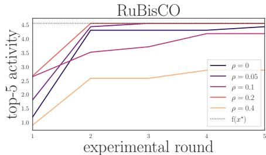  
Figure 7: LIDS with synthesis errors. We add random errors to the designed mixtures $q _ { t }$ by replacing $\beta _ { s l }$ with $( 1 - \rho ) \beta _ { s l } + \rho \omega$ where $\omega \sim \mathrm { D i r } ( \vec { 1 } _ { B } )$

LIDS is robust: its model $\operatorname { f } _ { \theta }$ is misspecified for these oracle f. Adding synthesis errors, so that the tested $q _ { t }$ difers from the design, began substantially reducing performance only when 40% of every mixture $\beta _ { s l }$ was corrupted (Fig. 7).

## 7 Discussion

We showed that using information-dense stochastic synthesis, instead of synthesizing and testing individual molecules, can lead to very large speedups on hard molecular discovery problems.

Limitations. First, LIDS has only been evaluated in simulation, not in the wetlab. Second, LIDS shifts costs from experimentation to computation: it requires fewer wetlab experiments but much more compute than individual synthesis. The challenge is LIDS requires (a) calculating the predicted activity of a complex mixture rather than a single molecule, (b) optimizing the EIG, and (c) large numbers of posterior samples. Scaling LIDS to larger molecules and more complex surrogate models $\operatorname { f } _ { \theta }$ will require accelerating Bayesian experimental design, e.g. using amortization (Foster et al., 2020, 2021; Hedman et al., 2025). The mixture’s activity $\left. \operatorname { f } _ { \theta } , q \right.$ could remain tractable if the surrogate $\operatorname { f } _ { \theta }$ is a smooth and decomposable probabilistic circuit (Vergari et al., 2021).

Outlook. Scaling molecular machine learning requires scaling laboratory feedback. One axis for scaling is performing more experiments. When testing individual molecules, this is essentially the only hope, since no adaptive algorithm can overcome a sparse activity map (Bach, 2020, Proposition 1). LIDS opens another, complementary approach to scaling: achieving precise control over synthesis, higher synthesis yields, and higher assay signal-to-noise ratios. These improvements do not change the number of datapoints, but rather the information they carry. This opens new opportunities and directions for scaling automated molecular science.

## Acknowledgments

We wish to thank Victor Veitch, Katrine Qvortrup, Elizabeth Wood, and Alan Amin for useful discussions and suggestions. This work was supported by a Start Package Grant from the Novo Nordisk Foundation to ENW. We thank the DTU Computing Center and the Pioneer Centre for AI for providing compute resources and support.

## References

Yasin Abbasi-yadkori, Dávid Pál, and Csaba Szepesvári. Improved Algorithms for Linear Stochastic Bandits. In Advances in Neural Information Processing Systems, volume 24. Curran Associates, Inc., 2011. URL https://papers.nips.cc/paper\_files/paper/2011/hash/e1d5be1c7f2f456 670de3d53c7b54f4a-Abstract.html.

Milad Abolhasani. The lab that learns. Science, 393(6813):761–763, August 2026. doi: 10.1126/sc ience.aee2448. URL https://www.science.org/doi/10.1126/science.aee2448.

Matthew Aldridge, Oliver Johnson, and Jonathan Scarlett. Group Testing: An Information Theory Perspective. Foundations and Trends® in Communications and Information Theory, 23(1-2): 1–221, May 2026. ISSN 1567-2190, 1567-2328. doi: 10.1108/FTCIT-11-2025-0150. URL http://arxiv.org/abs/1902.06002. arXiv:1902.06002 [cs.IT].

Alan Nawzad Amin, Eli Nathan Weinstein, and Debora Susan Marks. Biological Sequence Kernels with Guaranteed Flexibility, April 2023. URL http://arxiv.org/abs/2304.03775. arXiv:2304.03775 [stat].

Michael Riis Andersen, Ole Winther, and Lars Kai Hansen. Bayesian Inference for Structured Spike and Slab Priors. In Advances in Neural Information Processing Systems, volume 27. Curran Associates, Inc., 2014. URL https://proceedings.neurips.cc/paper\_files/paper/2014/ha sh/8927f9b43dbc13ddfa1edf2103f2191f-Abstract.html.

George Kamal Atia and Venkatesh Saligrama. Boolean compressed sensing and noisy group testing. arXiv [cs.IT], July 2009.

Peter Auer, Nicolò Cesa-Bianchi, and Paul Fischer. Finite-time Analysis of the Multiarmed Bandit Problem. Machine Learning, 47(2):235–256, May 2002. ISSN 1573-0565. doi: 10.1023/A: 1013689704352. URL https://doi.org/10.1023/A:1013689704352.

Francis Bach. Optimization is as hard as approximation. https://francisbach.com/optimizati on-is-as-hard-as-approximation/, 2020. Accessed: 2025-7-3.

David Barber and Felix Agakov. Information Maximization in Noisy Channels : A Variational Approach. In Advances in Neural Information Processing Systems, volume 16. MIT Press, 2003. URL https://proceedings.neurips.cc/paper/2003/hash/a6ea8471c120fe8cc35a2954c9b9c 595-Abstract.html.

Heinz Bauer. Minimalstellen von Funktionen und Extremalpunkte. Archiv der Mathematik, 9(4): 389–393, November 1958. ISSN 1420-8938. doi: 10.1007/BF01898615. URL https://doi.org/ 10.1007/BF01898615.

S. L. Beaucage and M. H. Caruthers. Deoxynucleoside phosphoramidites—A new class of key intermediates for deoxypolynucleotide synthesis. Tetrahedron Letters, 22(20):1859–1862, January 1981. ISSN 0040-4039. doi: 10.1016/S0040-4039(01)90461-7. URL https://www.sciencedirec t.com/science/article/pii/S0040403901904617.

Michael Betancourt. Sparsity Blues, May 2021. URL https://betanalpha.github.io/assets/ case\_studies/modeling\_sparsity.html.

Andy Brock, Soham De, Samuel L. Smith, and Karen Simonyan. High-Performance Large-Scale Image Recognition Without Normalization. In Proceedings of the 38th International Conference on Machine Learning, pp. 1059–1071. PMLR, July 2021. URL https://proceedings.mlr.pres s/v139/brock21a.html.

Marvin H. Caruthers. The Chemical Synthesis of DNA/RNA: Our Gift to Science. The Journal of Biological Chemistry, 288(2):1420–1427, January 2013. ISSN 0021-9258. doi: 10.1074/jbc.X112 .442855. URL https://pmc.ncbi.nlm.nih.gov/articles/PMC3543024/.

Carlos M. Carvalho, Nicholas G. Polson, and James G. Scott. Handling Sparsity via the Horseshoe. In Proceedings of the Twelfth International Conference on Artificial Intelligence and Statistics, pp. 73–80. PMLR, April 2009. URL https://proceedings.mlr.press/v5/carvalho09a.html.

Leo Tianlai Chen, Zachary Quinn, Madeleine Dumas, Christina Peng, Lauren Hong, Moises Lopez-Gonzalez, Alexander Mestre, Rio Watson, Sophia Vincof, Lin Zhao, Jianli Wu, Audrey Stavrand, Mayumi Schaepers-Cheu, Tian Zi Wang, Divya Srijay, Connor Monticello, Pranay Vure, Rishab Pulugurta, Sarah Pertsemlidis, Kseniia Kholina, Shrey Goel, Matthew P. DeLisa, Jen-Tsan Ashley Chi, Ray Truant, Hector C. Aguilar, and Pranam Chatterjee. Target sequence-conditioned design of peptide binders using masked language modeling. Nature Biotechnology, 44(6):1002–1010, June 2026. ISSN 1546-1696. doi: 10.1038/s41587-025-02761-2. URL https://www.nature.com/art icles/s41587-025-02761-2.

Brian Cleary and Aviv Regev. The necessity and power of random, under-sampled experiments in biology. arXiv [q-bio.QM], December 2020.

Adam Foster, Martin Jankowiak, Matthew O’Meara, Yee Whye Teh, and Tom Rainforth. A Unified Stochastic Gradient Approach to Designing Bayesian-Optimal Experiments. In Proceedings of the Twenty Third International Conference on Artificial Intelligence and Statistics, pp. 2959–2969. PMLR, June 2020. URL https://proceedings.mlr.press/v108/foster20a.html.

Adam Foster, Desi R. Ivanova, Ilyas Malik, and Tom Rainforth. Deep Adaptive Design: Amortizing Sequential Bayesian Experimental Design, June 2021. URL http://arxiv.org/abs/2103.02438. arXiv:2103.02438 [stat].

Jonathan Frazer, Pascal Notin, Mafalda Dias, Aidan Gomez, Joseph K. Min, Kelly Brock, Yarin Gal, and Debora S. Marks. Disease variant prediction with deep generative models of evolutionary data. Nature, 599(7883):91–95, November 2021. ISSN 1476-4687. doi: 10.1038/s41586-021-04043-8. URL https://www.nature.com/articles/s41586-021-04043-8.

Nathan C. Frey, Isidro Hötzel, Samuel D. Stanton, Ryan Kelly, Robert G. Alberstein, Emily K. Makowski, Karolis Martinkus, Daniel Berenberg, Jack Bevers, Tyler Bryson, Pamela Chan, Yongmei Chen, Alicja Czubaty, Tamica D’Souza, Henri Dwyer, Anna Dziewulska, James W. Fairman, Allen Goodman, Jennifer Hofmann, Henry Isaacson, Aya Ismail, Samantha James, Taylor Joren, Simon Kelow, James R. Kiefer, Matthieu Kirchmeyer, Joseph Kleinhenz, James T. Koerber, Julien Lafrance-Vanasse, Andrew Leaver-Fay, Jae Hyeon Lee, Edith Lee, Donald Lee, Wei-Ching Liang, Joshua Yao-Yu Lin, Sidney Lisanza, Andreas Loukas, Jan Ludwiczak, Sai Pooja Mahajan, Omar Mahmood, Homa Mohammadi-Peyhani, Santrupti Nerli, Ji Won Park, Jaewoo Park, Stephen Ra, Sarah Robinson, Saeed Saremi, Franziska Seeger, Imee Sinha, Anna M. Sokol, Natasa Tagasovska, Hao To, Edward Wagstaf, Amy Wang, Andrew M. Watkins, Blair Wilson, Shuang Wu, Karina Zadorozhny, John Marioni, Aviv Regev, Yan Wu, Kyunghyun Cho, Richard Bonneau, and Vladimir Gligorijević. Lab-in-the-loop therapeutic antibody design with deep learning, February 2025. URL http://biorxiv.org/lookup/doi/10.1101/2025.02.19.639050.

Roman Garnett. Bayesian Optimization. Cambridge University Press, 2023.

Peter Mø rch Groth, Mads Herbert Kerrn, Lars Olsen, Jesper Salomon, and Wouter Boomsma. Kermut: Composite kernel regression for protein variant efects. In Advances in Neural Information Processing Systems, volume 37, pp. 29514–29565. Curran Associates, Inc., 2024. doi:

10.52202/079017-0929. URL https://proceedings.neurips.cc/paper\_files/paper/2024/ha sh/34547650b2ca69d91f3b3c3ae8b21962-Abstract-Conference.html.

Aditya Grover and Stefano Ermon. Uncertainty Autoencoders: Learning Compressed Representations via Variational Information Maximization. In Proceedings of the Twenty-Second International Conference on Artificial Intelligence and Statistics, pp. 2514–2524. PMLR, April 2019. URL https://proceedings.mlr.press/v89/grover19a.html.

Taesin Ha, Dongseon Lee, Youngchun Kwon, Min Sik Park, Sangyoon Lee, Jaejun Jang, Byungkwon Choi, Hyunjeong Jeon, Jeonghun Kim, Hyundo Choi, Hyung-Tae Seo, Wonje Choi, Wooram Hong, Young Jin Park, Junwon Jang, Joonkee Cho, Bosung Kim, Hyukju Kwon, Gahee Kim, Won Seok Oh, Jin Woo Kim, Joonhyuk Choi, Minsik Min, Aram Jeon, Yongsik Jung, Eunji Kim, Hyosug Lee, and Youn-Suk Choi. AI-driven robotic chemist for autonomous synthesis of organic molecules. Science Advances, 9(44):eadj0461, November 2023. doi: 10.1126/sciadv.adj0461. URL https://www.science.org/doi/10.1126/sciadv.adj0461.

Bjarke Hastrup, Francois Cornet, Tejs Vegge, and Arghya Bhowmik. AtomComposer: Discovering Chemical Space from First Principles with Reinforcement Learning, May 2026. URL http: //arxiv.org/abs/2605.28287. arXiv:2605.28287 [cs.LG].

Marcel Hedman, Desi R Ivanova, Cong Guan, and Tom Rainforth. Step-DAD: Semi-amortized policy-based bayesian experimental design. In Forty-second International Conference on Machine Learning, June 2025.

Steven Henikof and Jorja G Henikof. Amino acid substitution matrices from protein blocks. Proc. Natl. Acad. Sci. U. S. A., 89(22):10915–10919, November 1992.

Philipp Hennig and Christian J. Schuler. Entropy search for information-eficient global optimization. The Journal of Machine Learning Research, 13(null):1809–1837, June 2012. ISSN 1532-4435. URL https://dl.acm.org/doi/10.5555/2188385.2343701.

José Miguel Hernández-Lobato, Matthew W. Hofman, and Zoubin Ghahramani. Predictive Entropy Search for Eficient Global Optimization of Black-box Functions. In Advances in Neural Information Processing Systems, volume 27. Curran Associates, Inc., 2014. URL https: //proceedings.neurips.cc/paper\_files/paper/2014/hash/6488484c982e9af5c35689523ba 1abfe-Abstract.html.

José Miguel Hernández-Lobato, Michael Gelbart, Matthew Hofman, Ryan Adams, and Zoubin Ghahramani. Predictive Entropy Search for Bayesian Optimization with Unknown Constraints. In Proceedings of the 32nd International Conference on Machine Learning, pp. 1699–1707. PMLR, June 2015. URL https://proceedings.mlr.press/v37/hernandez-lobatob15.html.

Tim Hesterberg. Weighted Average Importance Sampling and Defensive Mixture Distributions. Technometrics, 37(2):185–194, May 1995. ISSN 0040-1706. doi: 10.1080/00401706.1995.10484303. URL https://www.tandfonline.com/doi/abs/10.1080/00401706.1995.10484303.

Thomas A. Hopf, John B. Ingraham, Frank J. Poelwijk, Charlotta P. I. Schärfe, Michael Springer, Chris Sander, and Debora S. Marks. Mutation efects predicted from sequence co-variation. Nature Biotechnology, 35(2):128–135, February 2017. ISSN 1546-1696. doi: 10.1038/nbt.3769.

Richard A. Houghten, Clemencia Pinilla, Jon R. Appel, Sylvie E. Blondelle, Colette T. Dooley, Jutta Eichler, Adel Nefzi, and John M. Ostresh. Mixture-Based Synthetic Combinatorial Libraries. Journal of Medicinal Chemistry, 42(19):3743–3778, September 1999. ISSN 0022-2623. doi: 10.1 021/jm990174v. URL https://doi.org/10.1021/jm990174v.

Martin Jankowiak, Yerdos Ordabayev, Rudraksh Tuwani, Henry N. Ward, Hunter Nisonof, James M. McFarland, and Gevorg Grigoryan. Flexible Kernels for Protein Property Prediction, June 2026. URL http://arxiv.org/abs/2606.11057. arXiv:2606.11057 [cs.LG].

Donald R. Jones, Matthias Schonlau, and William J. Welch. Eficient Global Optimization of Expensive Black-Box Functions. Journal of Global Optimization, 13(4):455–492, December 1998. ISSN 1573-2916. doi: 10.1023/A:1008306431147. URL https://doi.org/10.1023/A:10083064 31147.

Raghunandan M Kainkaryam and Peter J Woolf. Pooling in high-throughput drug screening. Curr. Opin. Drug Discov. Devel., 12(3):339–350, May 2009.

Nuo Liu, Walaa E. Kattan, Benjamin E. Mead, Conner Kummerlowe, Thomas Cheng, Sarah Ingabire, Jaime H. Cheah, Christian K. Soule, Anita Vrcic, Jane K. McIninch, Sergio Triana, Manuel Guzman, Tyler T. Dao, Joshua M. Peters, Kristen E. Lowder, Lorin Crawford, Ava P. Amini, Paul C. Blainey, William C. Hahn, Brian Cleary, Bryan Bryson, Peter S. Winter, Srivatsan Raghavan, and Alex K. Shalek. Scalable, compressed phenotypic screening using pooled perturbations. Nature Biotechnology, 43(8):1324–1336, August 2025a. ISSN 1546-1696. doi: 10.1038/s41587-024-02403-z. URL https://www.nature.com/articles/s41587-024-02403-z.

Yuanbin Liu, Ata Madanchi, Andy S. Anker, Lena Simine, and Volker L. Deringer. The amorphous state as a frontier in computational materials design. Nature Reviews Materials, 10(3):228–241, March 2025b. ISSN 2058-8437. doi: 10.1038/s41578-024-00754-2. URL https://www.nature.c om/articles/s41578-024-00754-2.

Ilya Loshchilov and Frank Hutter. Decoupled Weight Decay Regularization. September 2018. URL https://openreview.net/forum?id=Bkg6RiCqY7.

David J. C. MacKay. Information-Based Objective Functions for Active Data Selection. Neural Computation, 4(4):590–604, July 1992. ISSN 0899-7667. doi: 10.1162/neco.1992.4.4.590. URL https://doi.org/10.1162/neco.1992.4.4.590.

Natalie Maus, Yimeng Zeng, Haydn Thomas Jones, Yining Huang, Gaurav Ng Goel, Alden Rose, Kyurae Kim, Hyun-Su Lee, Marcelo Der Torossian Torres, Fangping Wan, Cesar de la Fuente-Nunez, Mark Yatskar, Osbert Bastani, and Jacob R. Gardner. Purely Agent-Driven Black-Box Optimization for Biological Design, May 2026. URL http://arxiv.org/abs/2601.22382. arXiv:2601.22382 [cs.LG].

Qun Meng, Songhao Wang, and Szu Hui Ng. Combined Global and Local Search for Optimization with Gaussian Process Models, July 2021. URL http://arxiv.org/abs/2107.03217. arXiv:2107.03217 [stat.ML].

R. B. Merrifield. Solid Phase Peptide Synthesis. I. The Synthesis of a Tetrapeptide. Journal of the American Chemical Society, 85(14):2149–2154, July 1963. ISSN 0002-7863. doi: 10.1021/ja0089 7a025. URL https://doi.org/10.1021/ja00897a025.

Vladislav A. Mints, Jack K. Pedersen, Alexander Bagger, Jonathan Quinson, Andy S. Anker, Kirsten M. Ø. Jensen, Jan Rossmeisl, and Matthias Arenz. Exploring the Composition Space of High-Entropy Alloy Nanoparticles for the Electrocatalytic H /CO Oxidation with Bayesian Optimiza tion. ACS Catalysis, 12(18):11263–11271, September 2022. ISSN 2155-5435, 2155-5435. doi: 10.1021/acscatal.2c02563. URL https://pubs.acs.org/doi/10.1021/acscatal.2c02563.

Erik Nijkamp, Jefrey A. Rufolo, Eli N. Weinstein, Nikhil Naik, and Ali Madani. ProGen2: Exploring the boundaries of protein language models. Cell Systems, 14(11):968–978.e3, November 2023. ISSN 2405-4712, 2405-4720. doi: 10.1016/j.cels.2023.10.002. URL https: //www.cell.com/cell-systems/abstract/S2405-4712(23)00272-7.

Pascal Notin, Aaron Kollasch, Daniel Ritter, Lood van Niekerk, Stefanie Paul, Han Spinner, Nathan Rollins, Ada Shaw, Rose Orenbuch, Ruben Weitzman, Jonathan Frazer, Mafalda Dias, Dinko Franceschi, Yarin Gal, and Debora Marks. ProteinGym: Large-Scale Benchmarks for Protein Fitness Prediction and Design. Advances in Neural Information Processing Systems, 36:64331– 64379, December 2023. doi: 10.52202/075280-2810. URL https://papers.nips.cc/paper\_fil es/paper/2023/hash/cac723e5ff29f65e3fcbb0739ae91bee-Abstract-Datasets\_and\_Benchm arks.html.

Liam Paninski. Asymptotic Theory of Information-Theoretic Experimental Design. Neural Computation, 17(7):1480–1507, July 2005. ISSN 0899-7667, 1530-888X. doi: 10.1162/0899766053723032. URL https://direct.mit.edu/neco/article/17/7/1480-1507/6997.

Chiwoo Park. Jump Gaussian Process Model for Estimating Piecewise Continuous Regression Functions. Journal of Machine Learning Research, 23(278):1–37, 2022. ISSN 1533-7928. URL http://jmlr.org/papers/v23/21-1472.html.

Trevor Park and George Casella. The Bayesian Lasso. Journal of the American Statistical Association, 103(482):681–686, June 2008. ISSN 0162-1459, 1537-274X. doi: 10.1198/01621450800000 0337. URL https://www.tandfonline.com/doi/full/10.1198/016214508000000337.

Alexander A Peterson and David R Liu. Small-molecule discovery through DNA-encoded libraries. Nat. Rev. Drug Discov., 22(9):699–722, September 2023.

Du Phan, Neeraj Pradhan, and Martin Jankowiak. Composable Efects for Flexible and Accelerated Probabilistic Programming in NumPyro, December 2019. URL http://arxiv.org/abs/1912.1 1554. arXiv:1912.11554 [stat.ML].

Juho Piironen and Aki Vehtari. Sparsity information and regularization in the horseshoe and other shrinkage priors. Electronic Journal of Statistics, 11(2), January 2017. ISSN 1935-7524. doi: 10.1214/17-EJS1337SI. URL https://projecteuclid.org/journals/electronic-journal-o f-statistics/volume-11/issue-2/Sparsity-information-and-regularization-in-the-h orseshoe-and-other-shrinkage/10.1214/17-EJS1337SI.full.

Noam Prywes, Naiya R. Phillips, Luke M. Oltrogge, Sebastian Lindner, Leah J. Taylor-Kearney, Yi-Chin Candace Tsai, Benoit de Pins, Aidan E. Cowan, Hana A. Chang, Renée Z. Wang, Laina N. Hall, Daniel Bellieny-Rabelo, Hunter M. Nisonof, Rachel F. Weissman, Avi I. Flamholz, David Ding, Abhishek Y. Bhatt, Oliver Mueller-Cajar, Patrick M. Shih, Ron Milo, and David F. Savage. A map of the rubisco biochemical landscape. Nature, 638(8051):823–828, February 2025. ISSN 1476-4687. doi: 10.1038/s41586-024-08455-0. URL https://www.nature.com/articles/s415 86-024-08455-0.

Tom Rainforth, Adam Foster, Desi R. Ivanova, and Freddie Bickford Smith. Modern Bayesian Experimental Design. Statistical Science, 39(1):100–114, February 2024. ISSN 0883-4237, 2168- 8745. doi: 10.1214/23-STS915. URL https://projecteuclid.org/journals/statistical-s cience/volume-39/issue-1/Modern-Bayesian-Experimental-Design/10.1214/23-STS915. full.

Rajesh Ranganath, Sean Gerrish, and David Blei. Black Box Variational Inference. In Proceedings of the Seventeenth International Conference on Artificial Intelligence and Statistics, pp. 814–822. PMLR, April 2014. URL https://proceedings.mlr.press/v33/ranganath14.html.

Jacob T. Rapp, Bennett J. Bremer, and Philip A. Romero. Self-driving laboratories to autonomously navigate the protein fitness landscape. Nature Chemical Engineering, 1(1):97–107, January 2024. ISSN 2948-1198. doi: 10.1038/s44286-023-00002-4. URL https://www.nature.com/articles/ s44286-023-00002-4.

Adam J. Riesselman, John B. Ingraham, and Debora S. Marks. Deep generative models of genetic variation capture the efects of mutations. Nature Methods, 15(10):816–822, October 2018. ISSN 1548-7105. doi: 10.1038/s41592-018-0138-4. URL https://www.nature.com/articles/s41592 -018-0138-4.

Philip A. Romero and Frances H. Arnold. Exploring protein fitness landscapes by directed evolution. Nature Reviews Molecular Cell Biology, 10(12):866–876, December 2009. ISSN 1471-0080. doi: 10.1038/nrm2805. URL https://www.nature.com/articles/nrm2805.

Philip A. Romero, Andreas Krause, and Frances H. Arnold. Navigating the protein fitness landscape with Gaussian processes. Proceedings of the National Academy of Sciences, 110(3), January 2013. ISSN 0027-8424, 1091-6490. doi: 10.1073/pnas.1215251110. URL https://pnas.org/doi/ful l/10.1073/pnas.1215251110.

Lars Ruddigkeit, Ruud van Deursen, Lorenz C. Blum, and Jean-Louis Reymond. Enumeration of 166 Billion Organic Small Molecules in the Chemical Universe Database GDB-17. Journal of Chemical Information and Modeling, 52(11):2864–2875, October 2012. ISSN 1549-9596. doi: 10.1021/ci300415d. URL https://doi.org/10.1021/ci300415d.

Daniel Russo and Benjamin Van Roy. Learning to Optimize via Information-Directed Sampling. Operations Research, 66(1):230–252, February 2018. ISSN 0030-364X. doi: 10.1287/opre.2017.16 63. URL https://pubsonline.informs.org/doi/10.1287/opre.2017.1663.

Bobak Shahriari, Kevin Swersky, Ziyu Wang, Ryan P. Adams, and Nando De Freitas. Taking the Human Out of the Loop: A Review of Bayesian Optimization. Proceedings of the IEEE, 104(1): 148–175, January 2016. ISSN 0018-9219, 1558-2256. doi: 10.1109/JPROC.2015.2494218. URL https://ieeexplore.ieee.org/document/7352306/.

C. E. Shannon. A mathematical theory of communication. The Bell System Technical Journal, 27(3):379–423, July 1948. ISSN 0005-8580. doi: 10.1002/j.1538-7305.1948.tb01338.x. URL https://ieeexplore.ieee.org/document/6773024.

Louis Sharrock. Wasserstein Gradient Flows for Batch Bayesian Optimal Experimental Design, 2026. URL https://arxiv.org/abs/2603.12102. Version Number: 1.

Andrew D. Skora, Jacqueline Douglass, Michael S. Hwang, Ada J. Tam, Richard L. Blosser, Sandra B. Gabelli, Jianhong Cao, Luis A. Diaz, Nickolas Papadopoulos, Kenneth W. Kinzler, Bert Vogelstein, and Shibin Zhou. Generation of MANAbodies specific to HLA-restricted epitopes encoded by somatically mutated genes. Proceedings of the National Academy of Sciences, 112 (32):9967–9972, August 2015. ISSN 0027-8424, 1091-6490. doi: 10.1073/pnas.1511996112. URL https://pnas.org/doi/full/10.1073/pnas.1511996112.

Zoltán Szabó, Bharath K Sriperumbudur, Barnabás Póczos, and Arthur Gretton. Learning theory for distribution regression. J. Mach. Learn. Res., 17(152):1–40, 2016.

Jack W Szostak. Introduction: Combinatorial chemistry. Chem. Rev., 97(2):347–348, April 1997.

William R. Thompson. On the Likelihood that One Unknown Probability Exceeds Another in View of the Evidence of Two Samples. Biometrika, 25(3/4):285–294, 1933. ISSN 00063444. doi: 10.2307/2332286. URL http://www.jstor.org/stable/2332286.

Mario A. Torres-Acosta, Gary J. Lye, and Duygu Dikicioglu. Automated liquid-handling operations for robust, resilient, and eficient bio-based laboratory practices. Biochemical Engineering Journal, 188:108713, December 2022. ISSN 1369-703X. doi: 10.1016/j.bej.2022.108713. URL https: //www.sciencedirect.com/science/article/pii/S1369703X22003825.

Neil Vargesson. Thalidomide-induced teratogenesis: History and mechanisms. Birth Defects Research Part C: Embryo Today: Reviews, 105(2):140–156, 2015. ISSN 1542-9768. doi: 10.1002/bdrc.21096. URL https://onlinelibrary.wiley.com/doi/abs/10.1002/bdrc.21096. \_eprint: https://onlinelibrary.wiley.com/doi/pdf/10.1002/bdrc.21096.

Antonio Vergari, YooJung Choi, Anji Liu, Stefano Teso, and Guy Van den Broeck. A compositional atlas of tractable circuit operations for probabilistic inference. In Proceedings of the 35th International Conference on Neural Information Processing Systems, NIPS ’21, pp. 13189–13201, Red Hook, NY, USA, December 2021. Curran Associates Inc. ISBN 978-1-7138-4539-3.

Julien Villemonteix, Emmanuel Vazquez, and Eric Walter. An informational approach to the globa optimization of expensive-to-evaluate functions. Journal of Global Optimization, 44(4):509–534, August 2009. ISSN 1573-2916. doi: 10.1007/s10898-008-9354-2. URL https://doi.org/10.100 7/s10898-008-9354-2.

Eli N Weinstein and David M Blei. Hierarchical causal models. J. Mach. Learn. Res., 27(37):1–73, 2026.

Eli N. Weinstein, Alan N. Amin, Will S. Grathwohl, Daniel Kassler, Jean Disset, and Debora Marks. Optimal Design of Stochastic DNA Synthesis Protocols based on Generative Sequence Models. In Proceedings of The 25th International Conference on Artificial Intelligence and Statistics, pp. 7450–7482. PMLR, May 2022. URL https://proceedings.mlr.press/v151/weinstein22a.ht ml.

Eli N Weinstein, Elizabeth B Wood, and David M Blei. Estimating the causal efects of T cell receptors. arXiv:2410.14127, 2024.

Eli N Weinstein, Andrei Slabodkin, Mattia G Gollub, Kerry Dobbs, Xiao-Bing Cui, Fang Zhang, Kristina Gurung, and Elizabeth B Wood. Lifting biomolecular data acquisition. arXiv [q-bio.BM], December 2025.

Eli N. Weinstein, Mattia G. Gollub, Andrei Slabodkin, Kerry Dobbs, Xiao-Bing Cui, Cameron L. Gardner, Ryan J. Grant, Kristina Gurung, Amira Bailey, Alan N. Amin, George M. Church, and Elizabeth B. Wood. Manufacturing-aware generative models enable petascale synthesis of designed DNA. Nature Biotechnology, pp. 1–9, March 2026. ISSN 1546-1696. doi: 10.1038/s415 87-026-03020-8. URL https://www.nature.com/articles/s41587-026-03020-8.

David Wingate and Theophane Weber. Automated Variational Inference in Probabilistic Programming, January 2013. URL http://arxiv.org/abs/1301.1299. arXiv:1301.1299 [stat.ML].

Douglas Yao, Loic Binan, Jon Bezney, Brooke Simonton, Jahanara Freedman, Chris J Frangieh, Kushal Dey, Kathryn Geiger-Schuller, Basak Eraslan, Alexander Gusev, Aviv Regev, and Brian Cleary. Scalable genetic screening for regulatory circuits using compressed perturb-seq. Nat. Biotechnol., October 2023.

Manzil Zaheer, Satwik Kottur, Siamak Ravanbakhsh, Barnabas Poczos, Ruslan Salakhutdinov, and Alexander Smola. Deep Sets, April 2018. URL http://arxiv.org/abs/1703.06114. arXiv:1703.06114 [cs].

Ronald N. Zuckermann, Janice M. Kerr, Stephen B. H. Kent, and Walter H. Moos. Eficient method for the preparation of peptoids [oligo(N-substituted glycines)] by submonomer solid-phase synthesis. Journal of the American Chemical Society, 114(26):10646–10647, December 1992. ISSN 0002-7863. doi: 10.1021/ja00052a076. URL https://doi.org/10.1021/ja00052a076.

## A Notation

<table><tr><td>Notation</td><td>Description</td></tr><tr><td>X</td><td>The molecular space, usually a Hamming space</td></tr><tr><td> $\mathcal { P } ( \mathcal { X } )$ </td><td> $\overline { { = \{ \mathrm { p } ( \cdot ) : \mathrm { p } ( x ) \geq 0 , \int _ { \mathcal { X } } \mathrm { p } ( x ) \mathrm { d } x = 1 \} } }$  The set of probability distributions on X</td></tr><tr><td> $\overline { { \mathrm { f } : \mathcal X \to \mathbb R _ { + } } }$ </td><td>The molecule-activity map</td></tr><tr><td> $q : \mathcal { X } \to \mathbb { R } _ { + }$ </td><td>The design - can be a mixture or a delta. The restriction on q comes from the synthesis model.</td></tr><tr><td> $\begin{array} { r } { \bar { q } = \frac { q } { c } \in \mathcal { P } ( \mathcal { X } ) } \end{array}$ </td><td>The normalized design, where c is the yield, the total number of molecules produced by a synthesis.</td></tr><tr><td> $c \in \mathbb { R } _ { + }$ </td><td>The chemical yield. The total number of molecules produced by the synthesis model.</td></tr><tr><td> $\overline { { \epsilon \sim \mathrm { N o r m a l } ( 0 , \sigma ) } }$ </td><td>The assay noise, drawn from a Gaussian.</td></tr><tr><td>I[]</td><td>The indicator function, which takes value 1 when the input is true, and 0 otherwise.</td></tr><tr><td>Uniform(z)</td><td>A uniform distribution over a set z</td></tr><tr><td> $\overline { { [ d ] \triangleq \{ 1 , \dots , d \} } }$ </td><td>A set of d elements</td></tr><tr><td> $\overline { { \Delta _ { B - 1 } } } = \{ v \in \mathbb { R } _ { + } ^ { B } : \sum _ { j } v _ { j } = 1 \}$ </td><td>The simplex.</td></tr><tr><td>1d</td><td>The d-vector of all ones</td></tr><tr><td> $\begin{array} { r } { \mathrm { L S E } _ { k = 1 } ^ { K } [ x _ { k } ] = \log \sum _ { k = 1 } ^ { K } \exp [ x _ { k } ] } \end{array}$ </td><td>The &#x27;logsumexp&#x27; operation.</td></tr></table>

## B Proof of Proposition 1

Assume $\operatorname { f } ( x ) = \mathbb { I } ( x = x ^ { \star } )$ where $x ^ { \star } \sim \operatorname { U n i f o r m } ( 1 , \ldots , d )$ , and there is no noise in the assay, so we measure $y _ { t } = \mathrm { f } ( x _ { t } )$ . Define expected regret, ${ \cal R } \triangleq \mathbb { E } _ { x ^ { \star } } [ \mathbb { E } _ { \pi } [ \sum _ { t = 1 } ^ { \infty } \mathbb { I } ( X _ { t } \neq X ^ { \star } ) ] ]$ . Let $\pi _ { 0 } ( x _ { t } \mid \mathcal { D } _ { t - 1 } )$ denote a policy that selects the next candidate uniformly at random from among the remaining candidates until the hit is discovered.

$$
\pi _ { 0 } ( x _ { t } \mid { \mathcal { D } } _ { t - 1 } ) = { \left\{ \begin{array} { l l } { x _ { t } \sim \operatorname { U n i f o r m } ( \{ x \not { \in } { \mathcal { D } } _ { t - 1 } \} ) } & { { \mathrm { ~ i f ~ } } x ^ { \star } \not \in { \mathcal { D } } _ { t - 1 } } \\ { x _ { t } = x ^ { \star } } & { { \mathrm { ~ o t h e r w i s e } } } \end{array} \right. }\tag{9}
$$

This policy has expected regret $( d - 1 ) / 2$ . There does not exist a policy π with lower expected regret.

Proof. We first calculate the regret of the randomized policy $\pi _ { 0 }$ . We have

$$
\begin{array} { r l r } & { R _ { 0 } = \mathbb { E } _ { x ^ { \prime } } [ \mathbb { E } _ { x } | \sum _ { i } ^ { \infty } \mathbb { I } ( X _ { t } \neq X ^ { * } ) ] | } & { \quad { \scriptstyle ( 1 0 ) } } \\ & { \quad \quad - \displaystyle \sum _ { i = 1 } ^ { \infty } \mathbb { P } ( x \neq x ^ { * } ) } & { \quad { \scriptstyle ( i 1 ) } } \\ & { \quad = \mathbb { p } ( x _ { 1 } \neq x ^ { * } ) + \mathbb { p } ( x _ { 1 } \neq x ^ { * } ) \mathbb { p } ( x _ { 2 } \neq x ^ { * } \mid x _ { 1 } \neq x ^ { * } ) + \mathbb { p } ( x _ { 1 2 } \neq x ^ { * } ) \mathbb { p } ( x _ { 3 } \neq x ^ { * } \mid x _ { 1 2 } \neq x ^ { * } ) + \cdots } \\ & { \quad \quad - \displaystyle \frac { d - 1 } { d } + \frac { d - 1 } { d } \frac { d - 2 } { d - 1 } + \frac { d - 2 } { d } \frac { d - 3 } { d - 2 } + \cdots } & { \quad { \scriptstyle ( 1 3 ) } } \\ & { \quad = \frac { d - 1 } { d } + \frac { d - 2 } { d } + \cdots + \frac { 1 } { d } } & { \quad { \scriptstyle ( 1 4 ) } } \\ & { \quad \quad - \frac { d - 1 } { d } } & { \quad { \scriptstyle ( 1 5 ) } } \end{array}
$$

Next consider an arbitrary policy $\pi .$ . We will show that it cannot achieve lower regret than the randomized policy. We assume without loss of generality that π plays $x _ { t } = x ^ { \star }$ once $x ^ { \star } \in \mathcal { D }$ , since if it does not, its regret will only be improved by substituting this rule. Now start with the regret at $t = 1$ . We have

$$
\mathbb { E } _ { \boldsymbol { x } ^ { \star } } [ \mathbb { E } _ { \pi } [ \mathbb { I } [ X _ { 1 } \neq X ^ { \star } ] ] ] = \frac { 1 } { d } \sum _ { x ^ { \star } = 1 } ^ { d } \pi ( x _ { 1 } \neq x ^ { \star } ) = \frac { 1 } { d } \sum _ { x ^ { \star } = 1 } ^ { d } [ 1 - \pi ( x _ { 1 } = x ^ { \star } ) ] = \frac { 1 } { d } ( d - 1 )\tag{16}
$$

Next consider the regret at $t = 2$ . We have

$$
\mathbb { E } _ { x ^ { \star } } [ \mathbb { E } _ { \pi } [ \mathbb { I } [ X _ { 1 : 2 } \neq X ^ { \star } ] ] ] = \mathrm { p } ( x _ { 1 } \neq x ^ { \star } ) \mathbb { E } _ { \mathrm { p } ( x _ { 1 } | x _ { 1 } \neq x ^ { \star } ) \mathrm { p } ( x ^ { \star } | x _ { 1 } \neq x ^ { \star } , x _ { 1 } ) \mathrm { p } ( x _ { 2 } | x _ { 1 } , x ^ { \star } , x _ { 1 } \neq x ^ { \star } ) } [ \mathbb { I } ( x _ { 2 } \neq x ^ { \star } ) ] \mathrm { ~ }\tag{17}
$$

$$
= \mathrm { p } ( x _ { 1 } \neq x ^ { \star } ) \mathbb { E } _ { \mathrm { p } ( x _ { 1 } | x _ { 1 } \neq x ^ { \star } ) \mathrm { p } ( x ^ { \star } | x _ { 1 } \neq x ^ { \star } , x _ { 1 } ) } [ \pi ( x _ { 2 } \neq x ^ { \star } \mid x _ { 1 } , y _ { 1 } = 0 ) ]\tag{18}
$$

$$
= \mathrm { p } ( x _ { 1 } \neq x ^ { \star } ) \mathbb { E } _ { \mathrm { p } ( x _ { 1 } | x _ { 1 } \neq x ^ { \star } ) } [ \frac { 1 } { d - 1 } \sum _ { x ^ { \star } \neq x _ { 1 } } \pi ( x _ { 2 } \neq x ^ { \star } \mid x _ { 1 } , y _ { 1 } = 0 ) ]\tag{19}
$$

$$
= \operatorname { p } ( x _ { 1 } \neq x ^ { \star } ) \mathbb { E } _ { \operatorname { p } ( x _ { 1 } \mid x _ { 1 } \neq x ^ { \star } ) } [ 1 - { \frac { 1 } { d - 1 } } \sum _ { x ^ { \star } \neq x _ { 1 } } \pi ( x _ { 2 } = x ^ { \star } \mid x _ { 1 } , y _ { 1 } = 0 ) ]\tag{20}
$$

$$
\geq \mathrm { p } ( x _ { 1 } \neq x ^ { \star } ) \mathbb { E } _ { \mathrm { p } ( x _ { 1 } | x _ { 1 } \neq x ^ { \star } ) } [ 1 - \frac { 1 } { d - 1 } ]\tag{21}
$$

$$
\ = \ { \frac { d - 1 } { d } } { \frac { d - 2 } { d - 1 } } = { \frac { d - 2 } { d } }\tag{22}
$$

Where for the second line we have used the fact that the distribution of $x _ { 2 }$ just depends on the policy, which just depends on $x _ { 1 } , y _ { 1 }$ and not on the unobserved $x ^ { \star }$ . The inequality is strict when π does not assign any probability to the previous observation $x _ { 1 }$ when $y _ { 1 } = 0$

Repeating this argument for arbitrary t,

$$
\mathbb { E } _ { x ^ { * } } [ \mathbb { E } _ { \pi } [ \mathbb { I } [ X _ { 1 : t } \neq X ^ { * } ] ] ] = \mathrm { p } ( x _ { 1 : t - 1 } \neq x ^ { * } ) \mathbb { E } _ { \mathrm { p } ( x _ { 1 : t - 1 } | x _ { 1 : t - 1 } \neq x ^ { * } ) \mathrm { p } ( x ^ { * } | x _ { 1 : t - 1 } \neq x ^ { * } , x _ { 1 : t - 1 } ) } [ \pi ( x _ { t } \neq x ^ { * } | x _ { 1 : t - 1 } , y _ { 1 : t - 1 } = 0 ) ]\tag{23}
$$

$$
= \mathrm { p } ( x _ { 1 : t - 1 } \neq x ^ { \star } ) \mathbb { E } _ { \mathrm { p } ( x _ { 1 : t - 1 } | x _ { 1 : t - 1 } \neq x ^ { \star } ) } \frac { 1 } { d - t + 1 } \sum _ { x ^ { \star } \neq x _ { 1 : t - 1 } } \pi ( x _ { t } \neq x ^ { \star } \mid x _ { 1 : t - 1 } , y _ { 1 : t - 1 } = 0 )\tag{24}
$$

$$
\geq \operatorname { p } ( x _ { 1 : t - 1 } \neq x ^ { \star } ) { \frac { d - t } { d - t + 1 } }\tag{25}
$$

$$
= \frac { d - t } { d }\tag{26}
$$

where the final step is from induction over t.

Summing over all $t ,$ we obtain the result.

## C Popular acquisition functions are not useful to optimize mixtures

Most acquisition functions are useless when it comes to designing mixtures. The proof for the Upper Confidence Bound and Expected Improvement acquisitions functions are given below, which hinge on the fact that while $\operatorname { f } : \mathcal { X }  \mathbb { R }$ is an arbitrary bounded function, in a lifted setting $\langle \mathrm { f } , q \rangle$ is an afine function over the convex set $q \in { \mathcal { P } } ( { \mathcal { X } } )$

Define the set of delta functions as $S \triangleq \{ \delta _ { x } : x \in \mathcal { X } \} \subset \mathcal { P } ( \mathcal { X } )$

Upper Confidence Bound The UCB acquisition function for a mixture is defined as (Auer et al., 2002; Abbasi-yadkori et al., 2011)

$$
\mathrm { U C B } ( q ) \triangleq \operatorname* { s u p } _ { \mathrm { f } \in \mathcal { F } _ { t - 1 } } \langle \mathrm { f } , q \rangle ,\tag{27}
$$

where $\mathcal { F } _ { t - 1 }$ is a confidence set of possible f, conditioned on the data at timepoint $t - 1$ . Note when $q \in S$ this reduces to $\mathrm { U C B } ( x ) = { \mathrm { s u p } } _ { \mathrm { f } \in { \mathcal { F } } _ { t - 1 } } \mathrm { f } ( x )$ (Abbasi-yadkori et al., 2011). As this is the pointwise supremum over linear functions in q, $\mathrm { U C B ( q ) }$ is convex in $q .$ The next mixture is chosen by $q _ { t } = \operatorname { a r g m a x } _ { q \in { \mathcal { P } } ( \chi ) } \operatorname { U C B } ( q )$ . Since $S \subset { \mathcal { P } } ( { \mathcal { X } } )$ we have the inequality $\begin{array} { r } { \operatorname* { m a x } _ { q \in { \cal S } } \operatorname { U C B } ( q ) \leq } \end{array}$ $\operatorname* { m a x } _ { q \in { \mathcal { P } } ( { \mathcal { X } } ) } \operatorname { U C B } ( q )$ . A second inequality follows by Jensen’s inequality:

$$
\mathrm { U C B } \left( \int _ { \mathcal { X } } q ( \boldsymbol { x } ) \cdot \delta _ { \boldsymbol { x } } \mathrm { d } \boldsymbol { x } \right) \leq \int _ { \mathcal { X } } q ( \boldsymbol { x } ) \mathrm { U C B } ( \delta _ { \boldsymbol { x } } ) \mathrm { d } \boldsymbol { x }\tag{28}
$$

$$
\leq \operatorname* { m a x } _ { x \in \mathcal { X } } \mathrm { U C B } ( \delta _ { x } ) = \operatorname* { m a x } _ { q \in \mathcal { S } } \mathrm { U C B } ( q )\tag{29}
$$

This establishes that ma $\begin{array} { r } { \mathbf { { x } } _ { q \in { \mathcal { S } } } \operatorname { U C B } ( q ) = \operatorname* { m a x } _ { q \in { \mathcal { P } } ( \mathcal { X } ) } \operatorname { U C B } ( q ) } \end{array}$ , and as such there must always exist a $q ^ { \star } \in S$ which is a maximizer of $\operatorname { U C B } ( q )$

Expected Improvement Let $y = \langle \mathrm { f } , \boldsymbol { q } \rangle$ denote the experimental outcome, and $y ^ { \star } = \operatorname* { m a x } _ { i < t } y _ { i }$ denote the maximum experimental outcome so far. The improvement is defined as $I ( q ) \triangleq \operatorname* { m a x } ( 0 , \langle \mathrm { f } , q \rangle -$ $y ^ { \star } )$ , and the expected improvement is the expectation over the randomness in f,

$$
\begin{array} { r } { \operatorname { E I } ( q ) = \operatorname { \mathbb { E } } _ { \operatorname { p } ( \operatorname { f } | \mathcal { D } _ { t - 1 } ) } [ \operatorname* { m a x } ( 0 , \langle \operatorname { f } , q \rangle - y ^ { \star } ) ] . } \end{array}\tag{30}
$$

Inside the expectation is the max of two afine functions, max $\left( 0 , \left. \mathrm { f } , \boldsymbol { q } \right. - \boldsymbol { y } ^ { \star } \right)$ . Since the max of two afine functions is a convex function, $\operatorname { E I } ( q )$ is an expectation over terms that are convex in $q ,$ which is itself, a convex function. It then follows from the same logic as for the UCB acquisition function, that ma $\begin{array} { r } { \mathfrak { c } _ { q \in { \mathcal { S } } } \operatorname { E I } ( q ) \le \operatorname* { m a x } _ { q \in { \mathcal { P } } ( { \mathcal { X } } ) } \operatorname { E I } ( q ) } \end{array}$ , and

$$
\mathrm { E I } \left( \int _ { \mathcal { X } } q ( x ) \cdot \delta _ { x } \mathrm { d } x \right) \leq \int _ { \mathcal { X } } q ( x ) \mathrm { E I } ( \delta _ { x } ) \mathrm { d } x\tag{31}
$$

$$
\leq \operatorname* { m a x } _ { x \in \mathcal { X } } \operatorname { E I } ( \delta _ { x } ) = \operatorname* { m a x } _ { q \in \mathcal { S } } \operatorname { E I } ( q ) ,\tag{32}
$$

and as such there must always exist a $q ^ { \star } \in S$ which is a maximizer of $\operatorname { E I } ( q )$

## D Derivation of variational lower bound on EIG

We can construct a lower variational bound on the mutual information, $\mathcal { T } _ { B A }$ , where $r _ { \phi }$ denotes a variational distribution with parameters $\phi ,$ and $\mathrm { K L } ( \mathrm { p } \| r ) \geq 0$ denotes the KL divergence between distributions p and $r$ (Barber & Agakov, 2003). To rewrite the expectation over $y _ { t }$ , we use the fact that $y _ { t }$ is a deterministic function of $q _ { t } , \epsilon _ { t }$ and $\theta _ { ; }$ , using $y _ { t } = \langle \mathrm { f } _ { \theta } , q _ { t } \rangle + \sigma \epsilon _ { t }$ for some noise level $\sigma$ and $\epsilon _ { t } \sim \mathrm { N o r m a l } ( 0 , 1 )$

$$
E I G _ { x ^ { \star } } ( q _ { t } ) = \mathcal { H } ( \mathrm { p } ( x _ { \theta } ^ { \star } \mid \mathcal { D } _ { t - 1 } ) ) + \mathbb { E } _ { \mathrm { p } ( \theta \mid \mathcal { D } _ { t - 1 } ) \mathrm { p } ( y _ { t } \mid q _ { t } , \theta ) } [ \log \mathrm { p } ( x _ { \theta } ^ { \star } \mid \{ y _ { t } , q _ { t } \} ) ]\tag{33}
$$

$$
= \mathcal { H } ( \mathrm { p } ( x _ { \theta } ^ { \star } \mid \mathcal { D } _ { t - 1 } ) ) + \mathbb { E } _ { \mathrm { p } ( \theta \mid \mathcal { D } _ { t - 1 } ) \mathrm { p } ( y _ { t } \mid q _ { t } , \theta ) } [ \log r _ { \phi } ( x _ { \theta } ^ { \star } \mid y _ { t } ) + \mathrm { K L } ( \mathrm { p } ( \cdot \mid \{ y _ { t } , q _ { t } \} ) \| r _ { \phi } ( \cdot \mid y _ { t } ) ) ]\tag{34}
$$

$$
\begin{array} { r } { \geq \mathcal { H } ( \mathrm { p } ( x _ { \theta } ^ { \star } \mid \mathcal { D } _ { t - 1 } ) ) + \mathbb { E } _ { \mathrm { p } ( \theta \mid \mathcal { D } _ { t - 1 } ) \mathrm { p } ( y _ { t } \mid q _ { t } , \theta ) } [ \log r _ { \phi } ( x _ { \theta } ^ { \star } \mid y _ { t } ) ] } \end{array}\tag{35}
$$

$$
= \mathcal { H } ( \mathrm { p } ( x _ { \theta } ^ { \star } \mid \mathcal { D } _ { t - 1 } ) ) + \mathbb { E } _ { \mathrm { p } ( \theta \mid \mathcal { D } _ { t - 1 } ) \mathrm { p } ( \epsilon _ { t } ) } [ \log r _ { \phi } ( x _ { \theta } ^ { \star } \mid \langle \mathrm { f } _ { \theta } , q _ { t } \rangle + \sigma \epsilon _ { t } ) ]\tag{36}
$$

$$
\triangleq \mathbb { Z } _ { B A } ( q _ { t } , \phi )\tag{37}
$$

## E Details on variational distribution $r _ { \phi }$

## E.1 Architecture

The variational distribution approximates the conditional $\mathrm { p } ( x ^ { \star } \mid y , q ) \approx r _ { \phi } ( x ^ { \star } \mid y )$ . As the design $q = q _ { \psi }$ is fixed for any step of training, we don’t include it as an input to the variational distribution. The efect of $\psi$ on the EIG enters through the likelihood $\operatorname { p } ( y \mid \langle \mathrm { f } _ { \theta } , q _ { \psi } \rangle )$ . For a batch of experimental outcomes $\bar { y } = [ y _ { t } , . . . y _ { t + E } ]$ we parameterize the variational distribution $r _ { \phi } : \mathbb { R } ^ { E }  { \mathcal { P } } ( \mathcal { X } )$ as a linear regression from y¯ to a position-wise independent categorical distribution $\begin{array} { r } { \mathrm { C a t } ( \boldsymbol { x } \mid \beta ) = \prod _ { j = 1 } ^ { L } \beta _ { j x _ { j } } } \end{array}$ by

$$
r _ { \phi = ( A , C ) } ( x ^ { \star } \mid \bar { y } ) = \mathrm { C a t } ( x ^ { \star } \mid \mathrm { s o f t m a x } ( A \cdot \bar { y } + C ) ) ,\tag{38}
$$

where $A \in \mathbb { R } ^ { L \times B \times E }$ is a weight tensor, and $C \in \mathbb { R } ^ { L \times B }$ is a bias. The softmax is applied over the last dimension, which has size $B .$

## E.2 Training

For Gaussian noise, using the reparameterization trick to reduce variance (Foster et al., 2020), we obtain the gradient

$$
\nabla _ { \psi , \phi } \mathcal { T } _ { B A } ( x ^ { \star } ; \psi , \phi ) \approx \frac { 1 } { K } \sum _ { j = 1 } ^ { M } \nabla _ { \psi , \phi } \log r _ { \phi } ( x _ { \theta _ { j } } ^ { \star } \mid \langle \mathrm { f } _ { \theta _ { j } } , q _ { \psi } \rangle + \sigma \epsilon _ { j } )\tag{39}
$$

where $\epsilon _ { 1 : M } \stackrel { i i d } { \sim }$ Normal(0, 1).

The variational distribution parameters $\phi ,$ as well as mixture parameters $\psi ,$ are optimized jointly using stochastic gradient ascent on $\nabla _ { \psi , \phi } \mathcal { T } _ { B A } ( x ^ { \star } ; \psi , \phi )$ , using the AdamW optimizer with a learning rate of 0.01, momentum of 0.9, and weight decay of $1 0 ^ { - 5 }$ (Loshchilov & Hutter, 2018). We train all our models on a dataset of 100000 samples of $\theta ,$ either drawn from the prior $\pi ( \theta )$ (see App. F.1), or from the approximate posterior, $\mathrm { p } ( \theta \mid \mathcal { D } )$ (see App. G). We use 10000 linear warmup steps, and train for either 1000 epochs (for the sparse oracle, Sec. 6.1), or 5000 epoch (for the PLM oracle, Sec. 6.2). Training is done on an A100 Nvidia GPU with a batchsize of 512.

## F Details on Bayesian neural network $\mathrm { f } _ { \theta }$

We consider a Bayesian neural network $\begin{array} { r } { \mathrm { f } _ { \theta = ( W , V ) } ( x ) = \sum _ { n = 1 } ^ { N } W _ { n } \exp ( V _ { n } \cdot x ) } \end{array}$ as a function class for sparse molecule-activity maps.

## F.1 Sparsity-inducing prior

We define $w \cdot u _ { n } \triangleq W _ { n }$ , and log $v _ { n } \triangleq V _ { n }$ . We restrict the domains of u and v to be $u \in \mathcal { U } = \{ u \in$ $[ 0 , 1 ] ^ { N } : \| u \| _ { \infty } = 1 \}$ and $v \in \mathcal { V } = \{ v \in [ 0 , 1 ] ^ { N \times L \times B } : \| v _ { n , l , \cdot } \| _ { \infty } = 1 \forall n , l \}$ . We can then construct a prior, $\pi ( \theta ) = \pi ( w , u , v )$ that induces sparsity in the filters $V _ { 1 } , \dots V _ { N }$ by setting

$$
v _ { n l b } ^ { \prime } \sim \mathrm { E x p o n } ( \frac { 1 } { 2 } )\tag{40}
$$

$$
v _ { n l b } = \exp ( v _ { n l b } ^ { \prime } - \operatorname* { m a x } _ { b } v _ { n l b } ^ { \prime } )\tag{41}
$$

and

$$
\log u _ { n } ^ { \prime } \sim \mathcal { N } ( 0 , 1 )\tag{42}
$$

$$
u _ { n } = \exp ( \log u _ { n } ^ { \prime } - \operatorname* { m a x } _ { n } ( \log u _ { n } ^ { \prime } ) )\tag{43}
$$

Where Expon $( \gamma )$ denotes the exponential distribution with rate parameter $\gamma .$ This choice is motivated by the use of the Laplace distribution for Bayesian LASSO (Park $\&$ Casella, 2008). It carries the belief that only few $v _ { n l b }$ are relevant. There exists extensive literature on sparsityinducing priors (Carvalho et al., 2009; Piironen & Vehtari, 2017; Andersen et al., 2014; Betancourt, 2021). We found the process above to be robust to posterior approximation by NUTS, whereas many other priors led to dificult posterior geometry, a significant amount of divergences, and high Gelman-Rubin statistics. The function $h ( x _ { n } ) = \exp ( x _ { n } ^ { \prime } - \operatorname* { m a x } _ { n } x _ { n } ^ { \prime } )$ is used to bring u and v to their restricted domains, $u \in \mathcal { U }$ and $v \in \mathcal V$ . Our prior on w carries our belief about the maximum activity that the assay can record, $\| \mathbf { f } \| _ { \infty } \geq w$ , with equality if the filters are disjoint $\Pi _ { l } \langle v _ { n l } , v _ { n ^ { \prime } l } \rangle = 0 \forall n \neq n ^ { \prime }$ Additionally, when the filters are disjoint, at least one $x ^ { \star }$ will have activity $\mathrm { f } _ { \theta } ( x ^ { \star } ) = w$ , and all other $x ^ { \prime } \neq x ^ { \star }$ will have lower activity $ { \mathrm { f } _ { \theta } } ( x ^ { \prime } ) \le w$ . This makes it easy to incorporate prior information about the maximum activity, by setting $\pi ( \| \mathbf { f } \| _ { \infty } ) = \pi ( w )$ . In the our simulations we use $\mathrm { p } ( w ) = \delta _ { w = 1 }$ (for Sec. 6.1) and $\operatorname { p } ( w ) = \operatorname { G a m m a } ( w - 1 \mid 1 , 1 )$ (for Sec. 6.2), where Gamma $\mathbf { \alpha } ( \mathbf { x } \mid \alpha , \beta )$ is the gamma pdf with shape α and rate $\beta .$

## F.2 Regularization

We add a regularization term to the joint distribution, to prevent mode collapse of the diferent bump functions. Additionally, this encourages $\operatorname { f } _ { \theta }$ for which the argmax approximation is tighter, since it encourages the filters $V _ { 1 } , \dots V _ { N }$ to be disjoint. This term is defined as

$$
\log p ^ { \prime } ( \theta , \mathcal { D } ) = \log p ( \theta , \mathcal { D } ) - \lambda \cdot \frac { 1 } { B ^ { L } } \sum _ { n < m } \prod _ { l = 1 } ^ { L } \langle v _ { n , l } , v _ { m , l } \rangle ,\tag{44}
$$

where the normalization is to bring the regularization term to the interval $[ 0 , N _ { p a i r s } ]$ , and $\lambda$ is a hyperparameter that controls the strength of the regularization. $\begin{array} { r } { N _ { p a i r s } = \frac { N ( \bar { N } - 1 ) } { 2 } } \end{array}$ is the number of pairs of bump functions.

## F.3 Inner product $\langle \mathrm { f } _ { \theta } , q _ { \psi } \rangle$

The inner product can be computed by

$$
\langle \mathrm { f } _ { \theta } , q _ { \psi } \rangle = c \sum _ { s = 1 } ^ { S } \alpha _ { s } \sum _ { n = 1 } ^ { N } W _ { n } \prod _ { l = 1 } ^ { L } \langle \exp V _ { n l } , \beta _ { s l } \rangle\tag{45}
$$

The synthesis model is defined as $\begin{array} { r } { \bar { q } _ { \psi = ( \alpha , \beta ) } ( x ) = \sum _ { s = 1 } ^ { S } \alpha _ { s } \prod _ { l = 1 } ^ { L } \langle \beta _ { s l } , x _ { l } \rangle } \end{array}$ . To see how the inner product $\langle { \mathrm { f } } _ { \theta } , { \bar { q } } _ { \psi } \rangle$ can be computed in closed form, first rewrite the network as

$$
\mathrm { f } _ { \theta } ( x ) = w \cdot \sum _ { n = 1 } ^ { N } u _ { n } \exp \sum _ { l = 1 } ^ { L } \sum _ { b = 1 } ^ { B } \log v _ { n l b } \cdot x _ { l b }\tag{46}
$$

$$
= w \cdot \sum _ { n = 1 } ^ { N } u _ { n } \exp { \sum _ { l = 1 } ^ { L } \log \sum _ { b = 1 } ^ { B } v _ { n l b } \cdot x _ { l b } }\tag{47}
$$

$$
= w \cdot \sum _ { n = 1 } ^ { N } u _ { n } \prod _ { l = 1 } ^ { L } \sum _ { b = 1 } ^ { B } v _ { n l b } \cdot x _ { l b }\tag{48}
$$

$$
= w \cdot \sum _ { n = 1 } ^ { N } u _ { n } \prod _ { l = 1 } ^ { L } \langle v _ { n l } \cdot x _ { l } \rangle .\tag{49}
$$

The inner product can then be derived as

$$
\langle \mathrm { f } _ { \theta } , \bar { q } _ { \psi } \rangle = \sum _ { x \in \mathcal { X } } \mathrm { f } _ { \theta } ( x ) \bar { q } _ { \psi } ( x )\tag{50}
$$

$$
= \sum _ { x \in \mathcal { X } } \left( w \cdot \sum _ { n = 1 } ^ { N } u _ { n } \prod _ { l = 1 } ^ { L } \langle v _ { n l } , x _ { l } \rangle \right) \cdot \left( \sum _ { s = 1 } ^ { S } \alpha _ { s } \prod _ { l = 1 } ^ { L } \langle \beta _ { s l } , x _ { l } \rangle \right)\tag{51}
$$

$$
= \sum _ { s = 1 } ^ { S } \alpha _ { s } w \sum _ { n = 1 } ^ { N } u _ { n } \sum _ { x \in \mathcal { X } } \prod _ { l = 1 } ^ { L } \langle \beta _ { s l } , x _ { l } \rangle \langle v _ { n l } , x _ { l } \rangle\tag{52}
$$

$$
= \sum _ { s = 1 } ^ { S } \alpha _ { s } w \sum _ { n = 1 } ^ { N } u _ { n } \prod _ { l = 1 } ^ { L } \langle v _ { n l } , \beta _ { s l } \rangle\tag{53}
$$

(54)

In practice, for numerical stability, we compute the functional inner product in log-space by

$$
\log \langle \mathsf { f } _ { \theta } , \bar { q } _ { \psi } \rangle = \operatorname { L S E } _ { s = 1 } ^ { S } \left[ \log \alpha _ { s } + \log w + \mathrm { L S E } \left[ \log u _ { n } + \sum _ { B } \mathrm { L S E } \left[ \log v _ { n l b } + \log \beta _ { s l b } \right] \right] \right] ,\tag{55}
$$

where $\begin{array} { r } { \mathrm { L S E } _ { k = 1 } ^ { K } [ x _ { k } ] = \log \sum _ { k = 1 } ^ { K } \exp [ x _ { k } ] } \end{array}$ is the ’logsumexp’ operation

## F.4 Approximation of $x ^ { \star }$

This function class has a tractable approximation of $x ^ { \star } = \operatorname { a r g m a x } _ { x } \mathrm { f } _ { \theta } ( x )$ , or equivalently, argmax<sub>x</sub> log $\operatorname { f } _ { \theta } ( x )$ . First, observe that we can write

$$
\log \mathrm { f } _ { \theta } ( x ) = \log \sum _ { n } \exp ( \log w _ { n } + \sum _ { \ell } \log v _ { n , \ell } ^ { \top } x _ { \ell } )\tag{56}
$$

$$
= \operatorname { L S E } _ { n = 1 } \left[ \log w _ { n } + \sum _ { \ell } \log v _ { n , \ell } ^ { \top } x _ { \ell } \right] .\tag{57}
$$

The LSE operation can be bounded by

$$
\operatorname* { m a x } _ { n } \log w _ { n } + \sum _ { \ell } \log v _ { n , \ell } ^ { \top } x _ { \ell } \leq \operatorname { I S E } _ { n = 1 } ^ { N } \left[ \log w _ { n } + \sum _ { \ell } \log v _ { n , \ell } ^ { \top } x _ { \ell } \right] \leq \operatorname* { m a x } _ { n } \log w _ { n } + \sum _ { \ell } \log v _ { n , \ell } ^ { \top } x _ { \ell } + \log N .\tag{58}
$$

To approximate the maximum over $\operatorname { f } _ { \theta } ( x )$ , we can maximize the lower bound. We have

$$
\hat { x } = \underset { x } { \mathrm { a r g m a x } } \underset { n } { \mathrm { m a x } } \log w _ { n } + \sum _ { \ell } \log v _ { n , \ell } ^ { \top } x _ { \ell }\tag{59}
$$

This is tractable. Define

$$
\hat { x } _ { \ell } ^ { n } = \mathop { \mathrm { a r g m a x } } _ { b } v _ { n , \ell }\tag{60}
$$

$$
\hat { n } = \underset { n } { \mathrm { a r g m a x ~ } } \log w _ { n } + \sum _ { \ell } \log v _ { n , \ell } ^ { \top } \hat { x } _ { \ell } ^ { n }\tag{61}
$$

Then $\hat { x } ^ { \star } = \hat { x } = \hat { x } ^ { \hat { n } }$ is the approximate maximizer. This is exact when the filters are disjoint $\Pi _ { l } \langle v _ { n l } , v _ { n ^ { \prime } l } \rangle = 0 \forall n \neq n ^ { \prime }$ , which is encouraged by the regularizer.

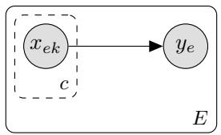  
(a)

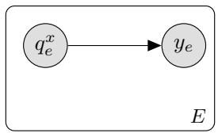  
(b)  
Figure 8: Hierarchical causal model. (a) Our model can be viewed as a hierarchical causal model, where multiple molecules $x _ { i j }$ afect the outcome $y _ { i }$ in each experiment $i ,$ and there are c total molecules. (b) The collapsed hierarchical causal model, where $q ^ { x }$ is the distribution of x (elsewhere we drop the superscript <sup>x</sup> for conciseness). This model leads to the estimator in Eqs. (3) and (4).

## G Posterior approximation

We implement Eqs. (3) and (4) in the probabilistic programming language NumPyro (Phan et al., 2019). To approximate the posterior distribution $\mathrm { p } (  { \boldsymbol { \theta } } \mid  { \mathcal { D } } _ { t - 1 } )$ , we primarily use the No-U-Turn-Sampler (NUTS) with a diagonal mass matrix, target acceptance probability of 0.8, and maximum tree depth of 10 (Phan et al., 2019). 8 NUTS chains are run in parallel on a single A100 with 2000 warmup samples, drawing a total of 100000 samples. We have observed that a large amount of samples is highly beneficial to prevent overfitting of our mixtures, $q _ { \psi } ,$ especially in the low SNR regime. If we obtain a Gelman-Rubin statistic (r-hat) greater than 2 we take this as an indication that the posterior is highly focused, preventing NUTS from sampling eficiently. In this case the posterior approximation switches to stochastic variational inference (SVI), using a meanfield approximation with a Gaussian distribution with diagonal covariance as the variational family. For SVI we use the AdamW optimizer with a learning rate of 0.001, momentum of 0.9, and adaptive gradient clipping at a ratio of 0.1 (Brock et al., 2021). We use a linear warmup of the learning rate over the first 4000 steps, and use a cosine decay throughout the rest of the training, for a total of 200000 steps. We train using the ELBO with 64 particles to reduce variance of the gradient (Wingate & Weber, 2013; Ranganath et al., 2014).

## H Proof of Example 1

Example 4 (No noise, discrete map). Assume activity is discrete, s.t. ${ \mathrm { ~ f ~ } : \mathcal { X } \mathrm { ~ } \to \mathrm { ~ } \mathcal { Y } }$ for $\mathcal { V } =$ $\{ 0 , \ldots | \mathcal { V } | - 1 \}$ . Assume the model is well specified, ${ \mathrm { f } } \in \{ { \mathrm { f } } _ { \theta } : \theta \in \Theta \}$ , and $\pi ( \mathrm { f } _ { \theta } = \mathrm { f } ) > 0$ . Assume we can synthesize arbitrary mixtures $q \in \mathcal { Q } = \mathcal { P } ( \mathcal { X } )$ , and our assay has no noise, $y _ { t } = \langle \mathrm { f } , q \rangle$

Then, by optimizing the EIG $\left( E q . \ ( 5 ) \right)$ , we find $x ^ { \star }$ after running one experiment.

Proof. Number the molecules, so $\mathcal { X } = \{ 1 , \ldots , d \}$ . Set $\begin{array} { r } { q ( x ) = \frac { 1 } { Z } \frac { 1 } { | \mathcal { V } | ^ { x } } } \end{array}$ where $\begin{array} { r } { Z = \sum _ { x = 1 } ^ { d } \frac { 1 } { | y | ^ { x } } } \end{array}$ is the normalizing constant. Now, $\begin{array} { r } { y = \langle \mathrm { f } , q \rangle = { \frac { 1 } { Z } } \sum _ { x = 1 } ^ { d } { \frac { \mathrm { f } ( x ) } { | \mathcal { V } | ^ { j } } } \Rightarrow Z y = \sum _ { x = 1 } ^ { d } { \frac { \mathrm { f } ( x ) } { | \mathcal { V } | ^ { j } } } } \end{array}$ . So f(x) is encoded in the digits of $Z y , \mathrm { e . g }$ . for $| y | = 1 0$ we have the decimal expansion $Z y = \dot { 0 } . \mathrm { f } ( 1 ) \mathrm { f } ( 2 ) \mathrm { f } ( 3 ) \dots$ So for this experiment, the posterior over $x ^ { \star }$ is a point mass at the true $x ^ { \star }$ , and the EIG is maximized. So the posterior entropy can be driven to zero. Optimizing the EIG will find this solution or anything equally as good, which also drives the entropy to zero. □

## I Speedup for noiseless 1-sparse molecule-activity maps

Example 5 (No noise, continuous output, 1-sparse). Assume the molecule activity map is 1-sparse: $\operatorname { f } ( x ) = w ^ { \star } \mathbb { I } ( x = x ^ { \star } )$ . Assume our model is well-specified, so $\mathrm { f } _ { \theta } ( x ) = w \mathbb { I } ( x = x _ { 0 } )$ for $\theta = ( w , x _ { 0 } ) \in$ $\mathbb { R } _ { + } \times \mathcal { X }$ and the prior has positive support π $( w ^ { \star } , x ^ { \star } ) > 0$ . Assume we can synthesize arbitrary mixtures $q \in \mathcal { Q } = \mathcal { P } ( \mathcal { X } )$ , and our assay has no noise, $y _ { t } = \langle \mathrm { f } , q \rangle$

Then, by optimizing the EIG $\left( E q . \ ( 5 ) \right)$ , we find $x ^ { \star }$ after running two experiments in parallel.

Proof. Set $\begin{array} { r } { q _ { 1 } ( x ) = \frac { 1 } { d } \vec { 1 } _ { d } . } \end{array}$ , where $\vec { 1 } _ { d }$ is the d-vector of all ones, and set $q _ { 2 } ( x )$ so that no two entries are the same, $q _ { 2 } ( x ) \neq q _ { 2 } ( x ^ { \prime } )$ for any $x \neq x ^ { \prime }$ . Now, $\begin{array} { r } { y _ { 1 } = \langle \mathrm { f } , q _ { 1 } \rangle = \frac { 1 } { d } w ^ { \star } \Rightarrow w ^ { \star } = d y _ { 1 } } \end{array}$ , so $w ^ { \star }$ is identified. Moreover, $y _ { 2 } = \langle \mathrm { f } , q _ { 2 } \rangle = w ^ { \star } q _ { 2 } ( x ^ { \star } ) \Rightarrow q _ { 2 } ( x ^ { \star } ) = y _ { 2 } / w ^ { \star }$ , so $ { \boldsymbol { q } } _ { 2 } (  { \boldsymbol { x } } ^ { \star } )$ is identified. Since each $q _ { 2 } ( x ) : x \in \mathcal { X }$ is diferent, $x ^ { \star }$ is identified. So for this choice of experiments, the posterior over $x ^ { \star }$ is a point mass at the true $x ^ { \star }$ , and the EIG is maximized. □

By contrast, if we tested one molecule at a time, we would need $\mathcal O ( d )$ experiments instead of $\mathcal { O } ( 1 )$ , by the argument in Proposition 1.

## J Proof of Example 2

Proof. The EIG executes $2 ^ { E } .$ -ary search. After testing $q _ { 1 }$ , the posterior over $x ^ { \star }$ is a uniform distribution over the set

$$
\begin{array} { r } { X _ { y _ { 1 } } \triangleq \left\{ \begin{array} { l l } { \{ x : q _ { 1 } ( x ) > 0 \} \mathrm { ~ i f ~ } y _ { 1 } = 1 } \\ { \{ x : q _ { 1 } ( x ) = 0 \} \mathrm { ~ o t h e r w i s e , } } \end{array} \right. } \end{array}\tag{62}
$$

where the probability of $y _ { 1 } = 1 \ \mathrm { i s } \ | X _ { 1 } | / d .$ Testing a batch $q _ { 1 : E }$ and receiving data $y _ { 1 : E }$ we obtain the posterior $\operatorname { p } ( x ^ { \star } \mid q _ { 1 : E } , y _ { 1 : E } ) = \operatorname { U n i f o r m } ( X _ { y _ { 1 : E } } )$ where $X _ { y _ { 1 : E } } \triangleq X _ { y _ { 1 } } \cap . . . \cap X _ { y _ { e } }$ . The probability of $y _ { 1 : E }$ is $| X _ { y _ { 1 : E } } | / d .$ . The $X _ { y _ { 1 : E } }$ are non-overlapping and partition $\mathcal { X }$ . So the EIG will be maximized if we set $q _ { 1 : E }$ such that $\begin{array} { r } { \lfloor \frac { d } { 2 ^ { E } } \rfloor \le \vert X _ { y _ { 1 : E } } \vert \le \lceil \frac { d } { 2 ^ { E } } \rceil } \end{array}$ for all $y \in \{ 0 , 1 \} ^ { E }$ , making all partitions (as close as possible to) equal size.

After testing the first batch, we know $x ^ { \star } \in X _ { y _ { 1 : E } }$ , and our posterior is uniform over this domain. Applying the same logic, the next round will cut the number of possible optima down to $\lceil \frac { d } { ( 2 ^ { E } ) ^ { 2 } } \rceil$ in the worst case. Iterating $k$ times, we are left with just one molecule when $\begin{array} { r } { 1 = \big \lceil \frac { d } { ( 2 ^ { E } ) ^ { k } } \big \rceil \stackrel { \cdot } { \Rightarrow } \dot { k } = } \end{array}$ $\lceil \frac { \log _ { 2 } d } { E } \rceil$ □

## K Information gain under a detection threshold

Assays struggle to detect activity when only a very small number of physical molecules in the mixture have activity. Rather than assume we can detect any $\langle \mathrm { f } , q \rangle > 0$ , consider a detection threshold τ. Consider an assay $y = \mathbb { I } [ \{ \mathrm { f } , q \} > \tau ]$ . The maximum expected information gain from a single experiment is

$$
\operatorname* { m a x } _ { q \in \mathcal { Q } } \mathcal { H } ( \mathrm { B e r n } ( \mathbb { P } _ { \theta } ( \langle \mathrm { f } _ { \theta } , q \rangle > \tau ) ) ) ,\tag{63}
$$

where $\mathcal { H } ( \mathrm { B e r n } ( r ) )$ is the entropy of a Bernoulli distribution with parameter r.

The Bernoulli entropy is maximized at Bern(0.5). Higher detection thresholds restrict our maximum information gain, making it harder and harder for $\operatorname* { P r } _ { \theta } ( \langle \mathrm { f } _ { \theta } , q \rangle > \tau )$ to reach 0.5. For example, assume the maximum activity is $\| \mathbf { f } _ { \theta } \| _ { \infty }$ for all θ. In the extreme where $\tau = \| \mathbf { f } _ { \theta } \| _ { \infty }$ , we only have $\operatorname* { P r } _ { \theta } ( \langle \mathrm { f } _ { \theta } , q \rangle > \tau ) > 0 \mathrm { i f } q ( x )$ is a delta mass at a single sequence, i.e. we revert to standard testing of individual molecules. In sum, we can only take advantage of mixtures if we can achieve high enough yield that more than one molecular species in the mixture passes the detection threshold.

Proof. Define the experimental outcome as a random variable by

$$
Y ( q ) = \mathbb { I } [ \langle \mathrm { f } _ { \theta } , q \rangle > \tau ]\tag{64}
$$

$$
= \left\{ { \begin{array} { l l } { 1 , } & { { \mathrm { i f } } \quad \langle \mathrm { f } _ { \theta } , q \rangle > \tau } \\ { 0 , } & { { \mathrm { o t h e r w i s e } } , } \end{array} } \right.\tag{65}
$$

where the randomness stems from the randomness in θ. This is a Bernoulli random variable with parameter $\operatorname* { P r } _ { \theta } ( \langle \mathrm { f } _ { \theta } , q \rangle > \tau )$ . The EIG is given by the mutual information between $Y ( q )$ and θ, using $\operatorname { E I G } _ { \theta } ( q ) = { \mathcal { H } } ( Y ( q ) ) - { \mathcal { H } } ( Y ( q ) \mid \theta )$ . Since $Y ( q )$ is a deterministic function of $\theta ,$ the conditional entropy is zero, $\mathcal { H } ( Y ( q ) \mid \theta ) = 0$ . Therefore, the EIG is

$$
\operatorname { E I G } _ { \boldsymbol { \theta } } ( \boldsymbol { q } ) = \mathcal { H } ( Y ( \boldsymbol { q } ) )\tag{66}
$$

$$
= \mathcal { H } ( \mathrm { B e r n } ( \operatorname* { P r } _ { \theta } ( \langle \mathrm { f } _ { \theta } , q \rangle > \tau ) ) )\tag{67}
$$

□

## L Proof of Proposition 2

Proof. The signal of our experiment is $S \ { \stackrel { \triangle } { = } } \ \langle \mathrm { f } _ { \theta } , q \rangle$ . This is a random variable with randomness stemming from $\pi ,$ the prior on $\theta .$

By the chain rule $\mathrm { M I } ( \theta , S ; Y ) = \mathrm { M I } ( S ; Y ) + \mathrm { M I } ( \theta ; Y \mid S )$ . Since $\operatorname { p } ( y \mid \theta , S ) = \operatorname { p } ( y \mid S )$ , then $\operatorname { M I } ( \theta ; Y \mid S ) = 0$ . So for a fixed design $q .$ the mutual information between Y and S is equal to the EIG, $\operatorname { M I } ( \theta ; Y ) = \operatorname { M I } ( S ; Y ) = \operatorname { E I G } _ { \theta } ( q )$ . We now bound M $\operatorname { I } ( S ; Y )$ . The first bound stems from the bound on the entropy of $S ,$ by bounding the mutual information by the prior entropy as

$$
\operatorname { M I } ( S ; Y ) = { \mathcal { H } } ( S ) - { \mathcal { H } } ( S \mid Y )\tag{68}
$$

$$
\leq \mathcal { H } ( S ) = \mathcal { H } ( \langle \mathrm { f } _ { \theta } , \bar { q } \rangle ) ,\tag{69}
$$

where we use the fact that $S$ comes from a finite set $\mathcal { Z }$ . This is an upper bound on the amount of information we can encode into an experiment. The second bound stems from the channel capacity of an additive gaussian noise channel derived by Shannon (Shannon, 1948) by

$$
\operatorname { M I } ( S ; Y ) = h ( Y ) - h ( Y \mid S ) = h ( Y ) - { \frac { 1 } { 2 } } \log ( 2 \pi e \sigma ^ { 2 } ) .\tag{70}
$$

From our assumptions on $\left. \operatorname { f } _ { \theta } , q \right.$ , Y must have bounded second moment. ${ \mathrm { S o } } ,$ the diferential entropy, $h ( Y )$ , can be bounded by its maximum entropy, which is achieved when Y is Gaussian distributed with variance $\operatorname { V a r } ( Y ) = \operatorname { V a r } ( S + \epsilon \sigma ) = \operatorname { V a r } ( S ) + \sigma ^ { 2 }$

$$
h ( Y ) \leq { \frac { 1 } { 2 } } \log ( 2 \pi e ( \operatorname { V a r } ( S ) + \sigma ^ { 2 } ) )\tag{71}
$$

Combining Eq. (70) and Eq. (71) we get

$$
\mathrm { M I } ( S ; Y ) \leq { \frac { 1 } { 2 } } \log ( 2 \pi e ( \operatorname { V a r } ( S ) + \sigma ^ { 2 } ) ) - { \frac { 1 } { 2 } } \log ( 2 \pi e \sigma ^ { 2 } )\tag{72}
$$

$$
\mathrm { M I } ( S ; Y ) \leq \frac { 1 } { 2 } \log \left( 1 + \frac { \mathrm { V a r } ( \langle \mathrm { f } _ { \theta } , q \rangle ) } { \sigma ^ { 2 } } \right) .\tag{73}
$$

Defining $\begin{array} { r } { \mathrm { S N R } ( q ) \triangleq \frac { c ^ { 2 } } { \sigma ^ { 2 } } \mathrm { V a r } (  { \langle \mathrm { f } _ { \theta } , \bar { q } \rangle } ) } \end{array}$ , and combining the two bounds we get

$$
\mathrm { E I G } _ { \theta } ( q ) \leq \operatorname* { m i n } \left\{ \mathcal { H } ( \langle \mathrm { f } _ { \theta } , \bar { q } \rangle ) , \frac { 1 } { 2 } \log \left( 1 + \frac { c ^ { 2 } } { \sigma ^ { 2 } } \mathrm { V a r } ( \langle \mathrm { f } _ { \theta } , \bar { q } \rangle ) \right) \right\} .\tag{74}
$$

## L.1 SNR(q) is maximized at $\bar { q } = \delta _ { x }$

Proof. To maximize $\begin{array} { r } { \mathrm { S N R } ( q ) = \frac { c ^ { 2 } } { \sigma ^ { 2 } } \mathrm { V a r } _ { \pi } ( \langle \mathrm { f } _ { \theta } , \bar { q } \rangle ) } \end{array}$ , we need to maximize $\operatorname { V a r } _ { \pi } ( \langle \operatorname { f } _ { \theta } , { \bar { q } } \rangle )$ . Define $\widetilde { \boldsymbol { \mathrm { f } } } _ { \theta } \ \triangleq$ $\mathrm { f } _ { \theta } - \mathbb { E } _ { \pi } [ \mathrm { f } _ { \theta } ]$ , the centered f<sub>θ</sub>. Then $\operatorname { V a r } _ { \pi } ( \langle \mathrm { f } _ { \theta } , \bar { q } \rangle ) = \mathbb { E } _ { \pi } [ ( \langle \tilde { \mathrm { f } } _ { \theta } , \bar { q } \rangle ) ^ { 2 } ]$ . For any fixed $\theta , \ \langle \tilde { \mathrm { f } } _ { \theta } , \bar { q } \rangle$ is a linear function in q¯. Since $x ^ { 2 }$ is a convex function, $( \langle \tilde { \mathrm { f } } _ { \theta } , \bar { q } \rangle ) ^ { 2 }$ is a convex function for any fixed θ.

So, the variance is an expectation over pointwise convex functions, which means that it is a convex function. We are therefore trying to find the maximum of a convex function $\operatorname { V a r } _ { \pi } ( \langle \operatorname { f f } _ { \theta } , { \bar { q } } \rangle )$ over a compact convex set $\mathcal { P } ( \mathcal { X } )$ . By Bauer’s maximum principle, this attains its maximum at an extreme point (Bauer, 1958). For $\mathcal { P } ( \mathcal { X } )$ , the extreme points are $\{ \delta _ { x } : x \in \mathcal { X } \}$ , the set of measures concentrated on a single molecule. We can therefore establish

$$
\exists \delta _ { x } \in \underset { \bar { q } \in \mathcal { P } ( \mathcal { X } ) } { \mathrm { a r g m a x V a r } } ( \langle \mathrm { f } _ { \theta } , \bar { q } \rangle )\tag{75}
$$

## M Proof of Example 3

Assume the molecule activity map is 1-sparse with maximum value one, $\mathrm { f } _ { \theta } ( x ) \in \{ \mathbb { I } ( x = \theta ) : \theta \in \mathcal { X } \}$ and the prior is uniform, $\pi ( \theta ) = 1 / d$ . Assume a synthesis model that creates uniform mixtures, $\begin{array} { r } { q ( x ) = \frac { 1 } { d _ { q } } \mathbb { I } ( x \in U ) } \end{array}$ for $U \subseteq \mathcal { X } , \| q \| _ { 1 } = c = 1$ and $d _ { q } \triangleq \lvert U \rvert$ . Assume Gaussian noise $y = \langle \mathrm { f } _ { \theta } , q \rangle + \sigma \epsilon$ where $\epsilon \stackrel { \cdot } { \sim } \mathrm { N o r m a l } ( 0 , 1 )$

## EIG bound from Proposition 2

$$
\mathrm { E I G } _ { \theta } ( q ) \leq \operatorname* { m i n } \left\{ - p _ { q } \log p _ { q } - ( 1 - p _ { q } ) \log ( 1 - p _ { q } ) , \frac { 1 } { 2 } \log \left( 1 + \frac { 1 } { \sigma ^ { 2 } } \left( \frac { 1 } { d _ { q } d } - \frac { 1 } { d ^ { 2 } } \right) \right) \right\} ,\tag{76}
$$

where $p _ { q } \triangleq \frac { d _ { q } } { d }$ . The first term is strictly increasing on the interval $d _ { q } \in [ 0 , \frac { d } { 2 } ]$ , while the second term is strictly decreasing in $d _ { q }$

The exact EIG is given by,

$$
\mathrm { E I G } _ { \theta } ( q ) = \left( 1 - \frac { d _ { q } } { d } \right) \mathrm { K L } \left( \mathcal { N } \left( 0 , \sigma ^ { 2 } \right) | | p ( y ) \right) + \frac { d _ { q } } { d } \mathrm { K L } \left( \mathcal { N } \left( \frac { 1 } { d _ { q } } , \sigma ^ { 2 } \right) | | p ( y ) \right)\tag{77}
$$

where $\begin{array} { r } { p ( y ) = ( 1 - \frac { d _ { q } } { d } ) \cdot \mathcal { N } ( y ; 0 , \sigma ^ { 2 } ) + \frac { d _ { q } } { d } \cdot \mathcal { N } ( y ; 1 / d _ { q } , \sigma ^ { 2 } ) } \end{array}$ , with $\mathcal { N } ( y ; \mu , \sigma ^ { 2 } )$ the Gaussian pdf. We approximate this by Monte Carlo to obtain Fig. 3.

Proof. Define the random variable $S ( q ) = \left. \mathrm { f } _ { \theta } , q \right.$ , where $\theta \sim \pi ( \theta )$ . It has probability mass function (pmf)

$$
\begin{array} { r } { \mathrm { p } ( S ( q ) ) = \left\{ \begin{array} { l l } { \frac { d _ { q } } { d } , } & { \mathrm { i f } \ S ( q ) = \frac { 1 } { d _ { q } } } \\ { 1 - \frac { d _ { q } } { d } , } & { \mathrm { i f } \ S ( q ) = 0 } \end{array} \right. } \end{array}\tag{78}
$$

This is the pmf of a Bernoulli random variable, scaled by $\frac { 1 } { d _ { q } }$ , which has entropy $ \mathcal { H } ( \mathrm { p } ( S ( q ) ) ) =$ $- p _ { q } \log p _ { q } - ( 1 - p _ { q } ) \log ( 1 - p _ { q } )$ , and variance

$$
\operatorname { V a r } _ { \pi } [ S ( q ) ] = { \frac { 1 } { d _ { q } ^ { 2 } } } \cdot { \frac { d _ { q } } { d } } ( 1 - { \frac { d _ { q } } { d } } )\tag{79}
$$

$$
= \frac { 1 } { d _ { q } d } - \frac { 1 } { d ^ { 2 } } .\tag{80}
$$

Plugging into Proposition 2 we get

$$
\mathrm { E I G } _ { \theta } ( q ) \leq \operatorname* { m i n } \left\{ - p _ { q } \log p _ { q } - ( 1 - p _ { q } ) \log ( 1 - p _ { q } ) , \frac { 1 } { 2 } \log \left( 1 + \frac { 1 } { \sigma ^ { 2 } } \left( \frac { 1 } { d _ { q } d } - \frac { 1 } { d ^ { 2 } } \right) \right) \right\} .\tag{81}
$$

For this example, we can even compute the exact EIG.

## True MI

Proof. The EIG can be defined as the expected KL-divergence between the prior and the posterior by

$$
\operatorname { E I G } _ { \theta } ( q ) = \operatorname { E I G } _ { S } ( q ) = \mathbb { E } _ { S ( q ) } \operatorname { K L } ( \operatorname { p } ( Y ( q ) \mid S ( q ) ) \| \operatorname { p } ( Y ( q ) ) ) ,\tag{82}
$$

where $Y ( q ) = S ( q ) + \sigma \epsilon$ . This is a scaled Bernoulli random variable plus a Gaussian random variable, with pdf $\begin{array} { r } { p ( y ) = ( 1 - \frac { d q } { d } ) \cdot \mathcal { N } ( y ; 0 , \sigma ^ { 2 } ) + \frac { d q } { d } \cdot \mathcal { N } ( y ; 1 / d _ { q } , \sigma ^ { 2 } ) } \end{array}$ , where $\mathcal { N } ( y ; \mu , \sigma ^ { 2 } )$ is the Gaussian pdf. Since $\mathrm { p } ( S ( q ) )$ is a Bernoulli distribution pmf, the EIG can be simplified to

$$
\operatorname { E I G } _ { S } ( q ) = \left( 1 - { \frac { d _ { q } } { d } } \right) \operatorname { K L } ( \operatorname { p } ( Y ( q ) \mid S ( q ) = 0 ) \| \operatorname { p } ( Y ( q ) ) )\tag{83}
$$

$$
+ \left( { \frac { d _ { q } } { d } } \right) \mathrm { K L } ( \mathrm { p } ( Y ( q ) \mid S ( q ) = { \frac { 1 } { d _ { q } } } ) \| \mathrm { p } ( Y ( q ) ) )\tag{84}
$$

$$
= \left( 1 - \frac { d _ { q } } { d } \right) \mathrm { K L } ( \mathcal { N } \left( 0 , \sigma ^ { 2 } \right) ) \| \mathrm { p } ( y ) ) + \left( \frac { d _ { q } } { d } \right) \mathrm { K L } ( \mathcal { N } \left( \frac { 1 } { d _ { q } } , \sigma ^ { 2 } \right) ) \| \mathrm { p } ( y ) )\tag{85}
$$

## N Proof of Proposition 3

Proof. Let $\mathcal { X } = [ d ]$ be the search space of size $| { \mathcal { X } } | = d .$ . Let $\operatorname { f } _ { \theta } : \mathcal { X }  \mathbb { R } _ { + }$ be an arbitrary moleculeactivity map. We aim to gain information about f<sub>θ</sub>, not its parameters.

$q \in \mathcal { M } _ { c } ^ { + } ( \mathcal { X } )$ is a positive measure subject to a 1-norm constraint $\| q \| _ { 1 } = c$ . Additionally, define the set of delta functions as $\mathcal { S } _ { c } ( \mathcal { X } ) = \{ c \delta _ { x } : x \in \mathcal { X } \} \subset \mathcal { M } _ { c } ^ { + } ( \mathcal { X } )$ subject to the same constraint. Assume Gaussian noise $\operatorname { p } ( y \mid \operatorname { f } _ { \theta } , q , \sigma ) = \mathcal { N } ( \langle \operatorname { f } _ { \theta } , q \rangle , \sigma ^ { 2 } )$ . The score function for this likelihood is

$$
\nabla _ { \mathbf { f } _ { \theta } } \log \mathcal { N } ( \langle \mathrm { f } _ { \theta } , q \rangle , \sigma ^ { 2 } ) = \nabla _ { \mathbf { f } _ { \theta } } \left( - \frac { 1 } { 2 } \log ( 2 \pi \sigma ^ { 2 } ) - \frac { ( y - \langle \mathrm { f } _ { \theta } , q \rangle ) ^ { 2 } } { 2 \sigma ^ { 2 } } \right)\tag{86}
$$

$$
= \nabla _ { \mathrm { f } _ { \theta } } \left( - \frac { ( y - \langle \mathrm { f } _ { \theta } , q \rangle ) ^ { 2 } } { 2 \sigma ^ { 2 } } \right)\tag{87}
$$

$$
= \frac { y - \langle \mathrm { f } _ { \theta } , q \rangle } { \sigma ^ { 2 } } \nabla _ { \mathrm { f } _ { \theta } } \langle \mathrm { f } _ { \theta } , q \rangle\tag{88}
$$

$$
= \frac { y - \langle \mathrm { f } _ { \theta } , q \rangle } { \sigma ^ { 2 } } q\tag{89}
$$

The information matrix is given by the outer product of the score function, evaluated at the true parameter $\mathrm { f } _ { \theta _ { 0 } }$ by

$$
\mathcal { T } _ { \mathrm { f } _ { \theta _ { 0 } } } ( q ) = \mathbb { E } _ { \mathrm { p } ( y \mid q , \mathrm { f } _ { \theta } ) } \left[ \nabla _ { \mathrm { f } _ { \theta } } \log \mathrm { p } ( y \mid q , \mathrm { f } _ { \theta } ) \nabla _ { \mathrm { f } _ { \theta } } \log \mathrm { p } ( y \mid q , \mathrm { f } _ { \theta } ) ^ { \top } \Big | _ { \mathrm { f } _ { \theta } = \mathrm { f } _ { \theta _ { 0 } } } \right]\tag{90}
$$

$$
= \mathbb { E } _ { \mathrm { p } ( y | q , \mathrm { f } _ { \theta } ) } \left[ \left( \frac { y - \langle \mathrm { f } _ { \theta } , q \rangle } { \sigma ^ { 2 } } q \right) \left( \frac { y - \langle \mathrm { f } _ { \theta } , q \rangle } { \sigma ^ { 2 } } q \right) ^ { \top } \bigg | _ { \mathrm { f } _ { \theta } = \mathrm { f } _ { \theta _ { 0 } } } \right]\tag{91}
$$

$$
= \frac { 1 } { \sigma ^ { 4 } } \mathbb { E } _ { \mathrm { p } ( y \mid q , \mathrm { f } _ { \boldsymbol { \theta } } ) } \left[ \left( y - \left. \mathrm { f } _ { \boldsymbol { \theta } } , q \right. \right) ^ { 2 } q \otimes q \Big | _ { \mathrm { f } _ { \boldsymbol { \theta } } = \mathrm { f } _ { \boldsymbol { \theta } _ { 0 } } } \right]\tag{92}
$$

$$
\begin{array} { r l } & { \mathrel { \phantom { = } } \frac { \mathbb { E } _ { \mathrm { p } ( y \mid q , \mathrm { f } _ { \theta } ) } \left[ ( y - \langle \mathrm { f } _ { \theta } , q \rangle ) ^ { 2 } \Big | _ { \mathrm { f } _ { \theta } = \mathrm { f } _ { \theta _ { 0 } } } \right] } { \sigma ^ { 4 } } q \otimes q } \\ & { \mathrel { \phantom { = } } \frac { 1 } { \sigma ^ { 2 } } q \otimes q } \end{array}\tag{93}
$$

(94)

□

The result from Paninski (Paninski, 2005) states that for information optimal sampling, the posterior $\mathrm { p } ( \mathrm { f } _ { \theta } \mid \mathcal { D } _ { t } )$ is asymptotically normal, with covariance matrix $\frac { \sigma _ { i n f o } ^ { 2 } } { t }$ determined by

$$
\sigma _ { i n f o } ^ { 2 } ( \mathcal { Q } ) = \left( \underset { C \in c o ( \mathbb { Z } _ { \theta _ { 0 } } ( \mathcal { Q } ) ) } { \mathrm { a r g m a x } } ~ \operatorname* { d e t } ( C ) \right) ^ { - 1 } ,\tag{95}
$$

where $c o ( \mathcal { T } _ { \mathrm { f } _ { \theta _ { 0 } } } ( \cdot ) )$ denotes the convex closure of the set of information matrices, and det(A) is the determinant of a matrix A. We will now show how restricting  to $S _ { c } ( \mathcal { X } )$ does not change the asymptotic variance over the case of the full measure $\mathcal { M } _ { c } ^ { + } ( \mathcal { X } )$ . First, note that $\begin{array} { r } { \mathcal { T } _ { \mathrm { f } _ { \theta _ { 0 } } } ( q ) = \frac { 1 } { \sigma ^ { 2 } } q \otimes q \in } \end{array}$ $\mathbb { R } _ { + } ^ { d \times d }$ is positive semidefinite by construction, and that it has a fixed sum $\begin{array} { r l } { \sum _ { i , j } \mathcal { T } _ { \mathrm { f } _ { \boldsymbol { \theta } _ { 0 } } } ( \boldsymbol { q } ) _ { i , j } = \frac { 1 } { \sigma ^ { 2 } } q _ { i } q _ { j } = } \end{array}$ $\frac { c ^ { 2 } } { \sigma ^ { 2 } }$ . The convex closure of any set of information matrices inherits these properties, because the set of positive semidefinite matrices is convex, as is the set of matrices with a fixed sum, and the set of positive-valued matrices. We can write this succinctly as co $( { \mathscr { T } } _ { \mathrm { f } _ { \theta _ { 0 } } } ( \mathcal { Q } ) ) \subseteq \{ M : \ { M } _ { i j } \ \geq$ $\begin{array} { r } { 0 \forall i , j , \lambda _ { 1 } , . . . \lambda _ { d } \ge 0 , \sum _ { i , j } M _ { i , j } = \frac { c ^ { 2 } } { \sigma ^ { 2 } } \} } \end{array}$ , where λ denotes an eigenvalue. We can use det $\begin{array} { r } { ( C ) = \prod _ { i = 1 } ^ { d } \lambda _ { i } } \end{array}$ as well as $\begin{array} { r } { \mathrm { T r } ( C ) = \sum _ { i = 1 } ^ { d } \lambda _ { i } = \sum _ { i = 1 } ^ { d } C _ { i , i } \le \sum _ { i , j } C _ { i , j } = \frac { c ^ { 2 } } { \sigma ^ { 2 } } } \end{array}$ to conclude that the determinant is bounded by det $\begin{array} { r } { ( C ) \le \prod _ { i = 1 } ^ { d } \frac { c ^ { 2 } } { d \sigma ^ { 2 } } } \end{array}$ , as this is the point where all eigenvalues are equal, and the trace is maximal. Furthermore, since

$$
\operatorname * { d e t } ( \operatorname { I } _ { d } \cdot \frac { c ^ { 2 } } { d \sigma ^ { 2 } } ) = \prod _ { i = 1 } ^ { d } \frac { c ^ { 2 } } { d \sigma ^ { 2 } } ,\tag{96}
$$

and

$$
\mathrm { I } _ { d } \cdot \frac { c ^ { 2 } } { d \sigma ^ { 2 } } \in c o ( \mathcal { T } _ { \mathrm { f } _ { \theta _ { 0 } } } ( S _ { c } ( \mathcal { X } ) ) ) ,\tag{97}
$$

this supremum is attained within ${ \cal S } _ { c } ( \mathcal { X } )$ . To say it another way, the determinant, and hence the asymptotic variance, is maximized at $\textstyle C ^ { \star } = \operatorname { I } _ { d } \cdot { \frac { c ^ { 2 } } { d \sigma ^ { 2 } } }$ . Because $C ^ { \star } \in c o ( \mathcal { T } _ { \mathrm { f _ { \theta _ { 0 } } } } ( S _ { c } ( \mathcal { X } ) ) )$ , there can be nothing to gain in the asymptotic sense by lifting to $q \in \mathcal { M } _ { c } ^ { + } ( \mathcal { X } )$ , and we may conclude

$$
\sigma _ { i n f o } ^ { 2 } ( S _ { c } ( \mathcal { X } ) ) = \sigma _ { i n f o } ^ { 2 } ( \mathcal { M } _ { c } ^ { + } ( \mathcal { X } ) )\tag{98}
$$

## O Details on sparse synthetic oracle simulations

Our sparse oracle is created by sparsifying draws from our prior $\pi ( \theta )$ and setting the maximum to one $\| \mathbf { f } \| _ { \infty } = 1$ . The prior is described in App. F.1. We set $N = 1$ and $w = 1$ , and then draw 10 independent repeats $\theta _ { 1 : 1 0 } \sim \pi ( \theta )$ . Afterwards, we construct the oracle by $\operatorname { f } ( x ) = \operatorname { f } _ { \theta _ { j } } ( x )$ $\mathbb { I } [ d _ { H } ( x , x _ { \theta _ { i } } ^ { \star } ) \le 1 ]$ , where $d _ { H }$ denotes the Hamming distance.

Such molecule-activity maps $\mathrm { f } : \mathcal { X }  [ 0 , 1 ]$ have the following qualities:

1. Exactly one DNA sequence $x ^ { \star }$ has activity $\operatorname { f } ( x ^ { \star } ) = 1$

2. Every single mutation has lower activity. $0 < \mathsf { f } ( x ) < \mathsf { f } ( x ^ { \star } ) \forall d _ { H } ( x , x ^ { \star } ) = 1$

3. Every double mutation abolishes activity. $\mathrm { f } ( x ) = 0 \forall d _ { H } ( x , x ^ { \star } ) > 1$

For both LIDS and Thompson, we use the same hyperparameters of the model $\mathrm { f } _ { \theta }$ . We set the number of filters to $N = 8$ , regularization strength $\lambda = 1$ , and use $\mathrm { p } ( w ) = \delta _ { w = 1 }$ as the prior on $\| \mathrm { \mathbf { f } } \| _ { \infty }$ . Hyperparameters for EIG optimization and posterior approximation are described in Apps. E.2 and G, respectively.

## P CI calculation

95% confidence intervals are calculated using a critical t-value and the delta method. Let $\hat { \mathrm { f } } _ { n } \triangleq \mathrm { f } ( \hat { x } _ { n } ^ { \star } )$ be the activity of the test molecules for the N replicates, and $\operatorname { f } ( x ^ { \star } )$ the known true maximum activity. First, compute the standard error and mean.

$$
\hat { \mu } = \frac { 1 } { N } \sum _ { n = 1 } ^ { N } \hat { \mathrm { f } } _ { n }\tag{99}
$$

$$
s ^ { 2 } = { \frac { 1 } { N - 1 } } \sum _ { n = 1 } ^ { N } ( \hat { \mathrm { f } } _ { n } - \hat { \mu } ) ^ { 2 }\tag{100}
$$

$$
S E = \frac { s } { \sqrt { N } }\tag{101}
$$

This naive standard error (SE) can be very large, making our confidence interval go below 0, or above the maximum possible activity. To make the confidence interval (CI) stay bounded in $[ 0 , \mathrm { f } ( x ^ { \star } ) ]$ , we use a logit transformation $g : [ 0 , \operatorname { f } ( x ^ { \star } ) ]  \mathbb { R }$ , along with the delta method. Specifically, we use $\begin{array} { r } { g ( y ) \triangleq \log ( \frac { y } { \mathrm { f } ( x ^ { \star } ) - y } ) } \end{array}$ , which has derivative $\begin{array} { r } { g ^ { \prime } ( y ) = \frac { \operatorname { f } ( x ^ { \star } ) } { y ( \operatorname { f } ( x ^ { \star } ) - y ) } } \end{array}$ , and inverse $\begin{array} { r } { g ^ { - 1 } ( y ) = \frac { \mathrm { f } ( x ^ { \star } ) } { 1 + \exp ( - y ) } } \end{array}$

$$
S E _ { l o g i t } = g ^ { \prime } ( \hat { \mu } ) \cdot S E\tag{102}
$$

$$
C I _ { l o g i t } = g ( \hat { \mu } ) \pm t _ { N - 1 } ( 0 . 9 7 5 ) \cdot S E _ { l o g i t }\tag{103}
$$

$$
C I = g ^ { - 1 } ( C I _ { l o g i t } )\tag{104}
$$

$t _ { N - 1 } ( 0 . 9 7 5 )$ is the 0.975 quantile of the student-t distribution with $N - 1$ degrees of freedom. For the $N = 5$ and $N = 1 0$ applied in this article, this corresponds to 99.45% and 97.63% CI respectively, if we were to use the Gaussian distribution instead of a student-t. We then plot the arithmetic mean $\hat { \mu } ,$ along with the $C I \subset [ 0 , \mathrm { f } ( x ^ { \star } ) ]$

## Q Details on PLM oracle simulations

For the hyperparameters of the surrogate $\mathrm { f } _ { \theta }$ , we set the number of filters to $N = 2 0$ , regularization strength $\lambda = 1$ , and use $\operatorname { p } ( w ) = 1 + \operatorname { G a m m a } ( 1 , 1 )$ as the prior on $\| \mathrm { f } \| _ { \infty }$ . Hyperparameters for training and posterior approximation are described in Apps. E.2 and G.

## Q.1 Importance sampling $\langle \mathrm { f } , q \rangle$

To simulate an experiment we need to evaluate $\langle \mathrm { f } , q \rangle = \mathbb { E } _ { x \sim q ( x ) } [ \mathrm { f } ( x ) ]$ . To do so we exploit the fact that $\mathrm { p } ( x )$ can be sampled from, as it is given by a PLM, which is a generative model. We set a defensive mixture distribution $\begin{array} { r } { s ( x ) = { \frac { 1 } { 2 } } q ( x ) + { \frac { 1 } { 2 } } \mathrm p ( x ) } \end{array}$ as the proposal distribution (Hesterberg, 1995) and approximate the expectation by importance sampling.

$$
\langle \mathrm { f } , q \rangle \approx \frac { 1 } { N } \sum _ { i = 1 } ^ { N } \frac { q ( x ^ { i } ) } { s ( x ^ { i } ) } \mathrm { f } ( x ^ { i } ) , \quad x ^ { i } \sim s ( x )\tag{105}
$$

## R Ablation of posterior approximation

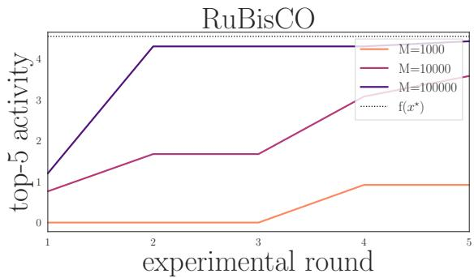  
Figure 9: Posterior approximation. LIDS using diferent number of posterior samples M. The setup is the same as in Sec. 6.2.