# Is $\sqrt { d }$ Separation Necessary for Gradient EM to Learn Gaussian Mixtures in High Dimensions?

Yiran Zhang University of California, Berkeley zhangyir@berkeley.edu

Weihang Xu University of Washington xuwh@cs.washington.edu

Maryam Fazel University of Washington Amazon, Inc. mfazel@uw.edu

Mo Zhou University of Washington mozhou17@cs.washington.edu

Simon S. Du University of Washington ssdu@cs.washington.edu

## Abstract

Learning Gaussian mixture models (GMMs) using the Expectation-Maximization (EM) algorithm and its gradient-based variants is a fundamental problem in machine learning. It is known that randomly initialized (gradient) EM fails to learn multi-component GMMs in the exact-parameterized setting, where the number of components matches that of the ground-truth GMM. Recently, global convergence of gradient EM has been established in the over-parameterized setting, where more components are used, provided that the ground-truth components are well separated. In particular, the minimum separation between ground-truth components is required to scale as $\Omega ( { \sqrt { d } } )$ , where d is the dimension. In this paper, we show that this dimensional dependence is unavoidable in high-dimensional settings. Specifically, we consider a hybrid EM algorithm that uses standard EM updates for the mixing weights and gradient EM updates for the component means. For any $\epsilon > 0 .$ , we prove that when the dimension is sufficiently large, in the worst case a separation of order $\Omega ( d ^ { 0 . 5 - \epsilon } )$ is insufficient to guarantee global convergence of population gradient EM in sub-exponential time under random initialization, even in the over-parameterized regime. Our result establishes an almost optimal worstcase lower bound on the ground-truth separation required for learning Gaussian mixtures via gradient EM in high dimensions.

## 1 Introduction

The Expectation-Maximization (EM) algorithm [Dempster et al., 1977] is one of the most popular methods for learning latent-variable models. Despite its empirical success and significant theoretical progress [Wu, 1983, Xu and Jordan, 1996, Balakrishnan et al., 2017, Dwivedi et al., 2020b, Wu and Zhou, 2021], the global behavior of EM, as well as its practical variants such as gradient EM, remains not fully understood. In this paper, we study the classical problem of learning Gaussian Mixture Models (GMMs) as a canonical testbed for analyzing EM dynamics. Our primary focus is on how global convergence depends on the separation between mixture component means in high-dimensional settings.

Specifically, we consider the problem of learning Gaussian mixtures with identity covariance. The ground truth distribution is a d-dimensional m-component Gaussian mixture model (m-GMM) with

the probability density function $p ^ { * }$ given by

$$
p ^ { * } ( x ) = \sum _ { i = 1 } ^ { m } \pi _ { i } ^ { * } \phi ( \mu _ { i } ^ { * } ; x ) ,
$$

where $\pi _ { i } ^ { * } \in \mathbb { R } _ { + }$ are the mixing weights with $\textstyle \sum _ { i } \pi _ { i } ^ { * } = 1 , \mu _ { i } ^ { * } \in \mathbb { R } ^ { d }$ are the true mean vectors. The function $\phi ( \mu ; x )$ is the p.d.f. of a d dimensional Gaussian with mean $\mu$ and identity covariance $I _ { d }$

$$
\phi ( \mu ; x ) : = ( 2 \pi ) ^ { - d / 2 } \exp \left( - \| x - \mu \| ^ { 2 } / 2 \right) ,
$$

where $\| \cdot \|$ denotes 2-norm throughout the paper. The goal is to recover the true distribution $p ^ { * }$ with observed data sampled from it.

The EM and Gradient EM Algorithms. The EM algorithm fits an n-GMM

$$
p ( x ) = \sum _ { i = 1 } ^ { n } \pi _ { i } \phi ( \mu _ { i } ; x ) ,\tag{1}
$$

to recover the ground-truth GMM $p ^ { * }$ , where the number of Gaussian components in the model (n) and in the ground truth (m) may differ. The algorithm iteratively updates the mixing weights $\bar { \pi } : = ( \pi _ { 1 } , \ldots , \bar { \pi } _ { n } ) ^ { \top }$ and model means $\mu : = ( \mu _ { 1 } ^ { \top } , \ldots , \mu _ { n } ^ { \top } ) ^ { \top }$ . In practice, a commonly used variant is gradient EM, which replaces the exact maximization step when standard EM updates are computationally expensive.

To understand optimization behavior in its cleanest form, we focus on the population dynamics of EM and gradient EM to separate statistical issues from optimization dynamics. This population-level analysis is standard in studies of EM algorithm [Xu et al., 2016, 2024, Zhou et al., 2025].

At iteration ℓ, both population EM and gradient EM consist of two steps:

Expectation (E) step. For $i = 1 , \ldots , n ,$ , compute the membership weight function $\psi _ { i } : \mathbb { R } ^ { d }  \mathbb { R } _ { + }$ ， the posterior probability of $x \in \mathbb { R } ^ { d }$ being sampled from the i-th Gaussian:

$$
\psi _ { i } ( x ) = \mathrm { P r } ( x | i ) = \frac { \pi _ { i } ^ { ( \ell ) } \phi ( \mu _ { i } ^ { ( \ell ) } ; x ) } { \sum _ { k = 1 } ^ { n } \pi _ { k } ^ { ( \ell ) } \phi ( \mu _ { k } ^ { ( \ell ) } ; x ) } .\tag{2}
$$

Maximization (M) step. Define the $Q$ function as

$$
Q ( \pi , \mu \mid \pi ^ { ( \ell ) } , \mu ^ { ( \ell ) } ) = \mathbb { E } _ { x \sim p ^ { * } } \left[ \sum _ { i = 1 } ^ { n } \psi _ { i } ( x ; \pi ^ { ( \ell ) } , \mu ^ { ( \ell ) } ) \left( \log \pi _ { i } - { \frac { 1 } { 2 } } \| x - \mu _ { i } \| _ { 2 } ^ { 2 } \right) \right] .\tag{3}
$$

Standard EM updates $( \pi , \mu )$ to be the maximizer of $Q$ function:

$$
( \pi ^ { ( \ell + 1 ) } , \mu ^ { ( \ell + 1 ) } ) = \arg \operatorname* { m a x } _ { \pi , \mu } Q ( \pi , \mu \mid \pi ^ { ( \ell ) } , \mu ^ { ( \ell ) } ) .
$$

Gradient EM replaces this maximization by a gradient step on Q function. Let $\eta \in \mathbb { R } _ { + }$ be the learning rate. The update rule is:

$$
( \pi ^ { ( \ell + 1 ) } , \mu ^ { ( \ell + 1 ) } ) \gets ( \pi ^ { ( \ell ) } , \mu ^ { ( \ell ) } ) + \eta \nabla _ { \pi , \mu } Q ( \pi , \mu | \pi ^ { ( \ell ) } , \mu ^ { ( \ell ) } ) .\tag{4}
$$

A central quantity governing both the computational complexity of learning GMMs and the dynamics of EM is the minimum separation between the true component means:

$$
\Delta : = \operatorname* { m i n } _ { i \neq j } \| \mu _ { i } ^ { * } - \mu _ { j } ^ { * } \| .
$$

Information-theoretic bounds suggest that $\Delta = \Omega ( { \sqrt { \log m } } )$ is necessary for efficient learning [Regev and Vijayaraghavan, 2017], and specialized algorithms have been developed to match this bound [Liu and Li, 2022, Diakonikolas and Kane, 2024]. However, these algorithms often differ significantly from the EM algorithm used in practice. Despite extensive study [Balakrishnan et al., 2017, Dwivedi et al., 2020b, Wu and Zhou, 2021], the global convergence of EM for general m-GMMs under such separation remains an open problem. Moreover, Jin et al. [2016] showed that when $n = m$ the exact-parameterized (gradient) EM fails to converge to global minima starting from random initialization, even for well-separated GMMs with $\Delta = \Omega ( { \sqrt { d } } )$

Recent work by Zhou et al. [2025] established a global convergence guarantee for gradient EM in the over-parameterized regime where $n = O ( m \log m )$ , under certain technical assumptions. One of their key assumptions (see Assumption 3 in Zhou et al. [2025]) requires the separation $\Delta = \Omega ( { \sqrt { d } } )$ Under this condition, when the initializations for $\mu _ { i }$ are randomly sampled from the ground-truth mixture, each true mean $\mu _ { i } ^ { * }$ has, with high probability, a nonempty neighborhood consisting of some $\mu _ { j } \mathrm { ^ { * } s . }$ . Roughly speaking, $\mu _ { j }$ is a neighbor of $\mu _ { i } ^ { * }$ if its distance to $\mu _ { i } ^ { * }$ is substantially smaller than its distance to any other $\mu _ { k } ^ { * }$ . Consequently, the training dynamics in the vicinity of each $\mu _ { i } ^ { * }$ behave similarly to the single-component setting analyzed by Xu et al. [2024]. When the ground-truth separation falls below ${ \sqrt { d } } ,$ however, this intuition no longer applies, and existing analyses cannot establish global convergence. This motivates the central question of this paper:

## Can global convergence ofgradient EM be guaranteedfor smaller separation?

In this paper, we show that the $\Omega ( { \sqrt { d } } )$ dependence on the dimension d is intrinsic to global convergence in high dimensions. We prove that for any $\epsilon > 0 .$ , in the worst case a separation of order $\Omega ( \breve { d } ^ { 0 . 5 - \epsilon } )$ is insufficient to guarantee global convergence in sub-exponential time for sufficiently large d. In contrast, a separation of order $\Omega ( { \sqrt { d } } )$ suffices to ensure global convergence in polynomial time, and therefore constitutes a nearly optimal separation.

## 1.1 Related Work

Analysis of EM and gradient EM algorithm. The theoretical analysis of (gradient) EM dates back to the seminal works of Wu [1983], Xu and Jordan [1996]. Here we focus on EM for learning GMMs. For exactly parameterized 2-GMMs, a line of work established local and, in some cases, global convergence guarantees [Balakrishnan et al., 2017, Daskalakis et al., 2017, Xu et al., 2016, Wu and Zhou, 2021, Weinberger and Bresler, 2022]. Beyond two components, existing results for exactly parameterized m-GMMs guarantee only local convergence from good initialization [Yan et al., 2017, Zhao et al., 2020, Kwon and Caramanis, 2020, Segol and Nadler, 2021], while global convergence is known to be intractable due to spurious local optima even under strong separation [Jin et al., 2016]. In the over-parameterized regime, prior work primarily studied using multi-component mixtures to learn one or two Gaussians [Dwivedi et al., 2020b,a, 2018, Xu et al., 2024] and the optimization landscape of general m-GMMs [Chen et al., 2024]. Recently, Zhou et al. [2025] provided the first global convergence guarantee for (gradient) EM beyond the special case of $m = 1 , 2$

Learning Gaussian Mixtures. Following Dasgupta [1999], which introduced efficient GMM learning into theoretical computer science and learning theory, many algorithmic alternatives to EM have been developed. Early works typically clustered the data before parameter estimation [Sanjeev and Kannan, 2001, Vempala and Wang, 2004, Achlioptas and McSherry, 2005]. More recently, theoretical algorithms based on sum-of-squares proofs [Hopkins and Li, 2018b, Kothari et al., 2018, Liu and Li, 2022] and method-of-moments techniques [Feldman et al., 2006, Anandkumar et al., 2014, Ge et al., 2015, Bhaskara et al., 2014] have achieved strong guarantees. In practice, however, despite these theoretical advances, EM remains the most widely used method due to its simplicity and efficiency. It is still not well understood under what conditions EM succeeds or whether it can achieve optimal guarantees. This work addresses these questions in the high-dimensional setting.

Separation requirement in learning GMMs. The difficulty of learning GMMs is largely governed by the minimum separation $\Delta$ between ground-truth components. It is known that $\Delta \bar { = } \bar { \Omega ( \sqrt { \log m } ) }$ is necessary for efficient learning [Regev and Vijayaraghavan, 2017]. Early algorithms required much stronger separation, such as $\Delta = \Omega ( { \sqrt { d } } )$ or $\Delta = \Omega ( d ^ { 1 / 4 } )$ [Dasgupta, 1999, Dasgupta and Schulman, 2007, Sanjeev and Kannan, 2001], while later spectral methods reduced the dependence on d to m by projecting onto the span of the true means [Vempala and Wang, 2004, Achlioptas and McSherry, 2005]. Method-of-moments approaches avoid explicit separation assumptions but rely on algebraic non-degeneracy [Feldman et al., 2006, Anandkumar et al., 2014, Ge et al., 2015, Bhaskara et al., 2014]. More recent sum-of-squares and higher-order moment methods achieve learning under $\Delta = \Omega ( m ^ { 1 / \gamma } )$ with polynomial complexity in $\mathbf { \bar { \Gamma } } _ { d ^ { \mathrm { p o l y } } } ( 1 / \gamma )$ [Hopkins and Li, 2018a, Kothari et al., 2018, Diakonikolas et al., 2018], and were further improved to $\Delta = \Omega ( { \sqrt { \log m } } )$ , matching the information-theoretic limit [Liu and Li, 2022, Diakonikolas and Kane, 2024]. In contrast, EM is only guaranteed to converge locally under this optimal separation with good initialization [Kwon and

Caramanis, 2020]. We prove that in high dimensions EM fails from random initialization even with large separation, showing that the main challenge for EM lies in the early, pre-local phase.

## 2 Preliminaries

In this section, we specify the update scheme used in our analysis and present some useful facts.

In mixture models, the mixing weights lie on the simplex $\textstyle \sum _ { i } \pi _ { i } = 1$ , so a naive unconstrained gradient step (4) on $\pi$ does not preserve feasibility. Accordingly, throughout this paper we use standard EM updates for π and gradient steps only for $\mu .$ . We believe this is a more natural choice and automatically preserves feasibility. Formally, at iteration $t ,$ we consider the following update:

$$
\begin{array} { r l } & { \pi _ { i } ^ { ( t + 1 ) } = \mathbb { E } _ { x \sim p ^ { * } } [ \psi _ { i } ( x ) ] , } \\ & { \mu _ { i } ^ { ( t + 1 ) } = \mu _ { i } ^ { ( t ) } + \eta \nabla _ { \mu _ { i } } Q ( \pi , \mu \mid \pi ^ { ( t ) } , \mu ^ { ( t ) } ) . } \end{array}
$$

We initialize all $\mu _ { i }$ ’s independently according to $p ^ { * }$ , and we let $\textstyle \pi _ { i } = { \frac { 1 } { n } }$ in the initialization. The ful procedure is summarized in Algorithm 1.

Algorithm 1 Population Hybrid (Gradient) EM   
Require: Step size $\eta > 0 ,$ number of components n   
1: Initialization: for any $i \in [ n ] .$ , set $\mu _ { i } ^ { ( 0 ) } \sim p ^ { * }$ and $\begin{array} { r } { \pi _ { i } ^ { ( 0 ) } = \frac { 1 } { n } } \end{array}$   
2: for $t = 0 , 1 , 2 , \ldots$ do   
3: for $i = 1$ to n do   
4: Update π: $\pi _ { i } ^ { ( t + 1 ) } \gets \mathbb { E } _ { x \sim p ^ { * } } [ \psi _ { i } ( x ) ]$   
5: Update µ $: \mu _ { i } ^ { ( t + 1 ) } \gets \mu _ { i } ^ { ( t ) } + \eta \nabla _ { \mu _ { i } } Q ( \mu \mid \pi ^ { ( t ) } , \mu ^ { ( t ) } ) = \mu _ { i } ^ { ( t ) } - \eta \nabla _ { \mu _ { i } } \mathcal { L } ( \pi ^ { ( t ) } , \mu ^ { ( t ) } )$   
6: end for   
7: end for

One interpretation of the above update rule is that (gradient) EM is equivalent to minimizing the following KL divergence loss [Jin et al., 2016, Xu et al., 2024]:

$$
\mathcal { L } ( \pi , \mu ) : = D _ { K L } ( p ^ { * } | | p ) = - \mathbb { E } _ { x \sim p ^ { * } } [ \log p ( x ) ] + \mathbb { E } _ { x \sim p ^ { * } } [ \log p ^ { * } ( x ) ] .
$$

The lemma below formalizes the equivalence between a gradient step on the $Q \cdot$ -function in gradient EM and a gradient step on the KL loss ${ \mathcal { L } } .$ It also provides an explicit form of the gradient update that we rely on in our analysis. Its proof can be found in Zhou et al. [2025].

Lemma 1. For each $1 \leq i \leq n ,$ the gradient of the loss is equivalent to the following:

$$
\nabla _ { \mu _ { i } } \mathcal { L } = - \nabla _ { \mu _ { i } } Q ( \mu \mid \pi ^ { ( t ) } , \mu ^ { ( t ) } ) = \sum _ { j } \pi _ { j } ^ { * } \mathbb { E } _ { x \sim j } \left[ \psi _ { i } ( x ) \sum _ { k } \psi _ { k } ( x ) ( \mu _ { k } - \mu _ { j } ^ { * } ) \right] .
$$

In this paper, for each $1 \leq j \leq m$ , we use $x \sim j$ as a simplified notation for $x \sim \mathcal N ( \mu _ { j } ^ { * } , I _ { d } )$

## 3 Main results

In this section, we present our main negative and positive results. We assume that $m \geq 3$ and that the ground-truth mixture has a unique component of largest weight. Relabeling the components if necessary, we write

$$
\pi _ { 1 } ^ { * } > \operatorname* { m a x } _ { 2 \leq i \leq m } \pi _ { i } ^ { * } .
$$

We use the notation

$$
\pi _ { \operatorname* { m i n } } ^ { * } : = \operatorname* { m i n } _ { 1 \leq i \leq m } \pi _ { i } ^ { * } , \qquad \pi _ { \operatorname { g a p } } ^ { * } : = \pi _ { 1 } ^ { * } - \operatorname* { m a x } _ { 2 \leq i \leq m } \pi _ { i } ^ { * } , \qquad \rho : = \operatorname* { m i n } \{ \pi _ { \operatorname* { m i n } } ^ { * } , \pi _ { \operatorname { g a p } } ^ { * } \} .
$$

For $0 < \epsilon \leq 0 . 0 1$ , define

$$
d _ { 0 } ( \epsilon ) : = \exp \left( \frac { C _ { 0 } } { \epsilon } \log \frac { C _ { 0 } } { \epsilon } \right) .\tag{5}
$$

Here and below, $C _ { 0 }$ denotes a sufficiently large universal constant.

## 3.1 A Separation Lower Bound at $d ^ { 0 . 5 - \epsilon }$

Our main result in this paper is the following:

Theorem 2. Let $\begin{array} { r } { n \geq \frac { 3 } { \pi _ { \operatorname* { m i n } } ^ { * } } } \end{array}$ log m and $0 < \epsilon \leq 0 . 0 1$ . Suppose that

$$
d \ge \operatorname* { m a x } \left\{ C _ { 0 } \left( \frac { 1 0 0 n } { \rho } \right) ^ { 1 5 / \epsilon } , d _ { 0 } ( \epsilon ) \right\} .\tag{6}
$$

Then there exist $\mu _ { 1 } ^ { * } , \mu _ { 2 } ^ { * } , \ldots , \mu _ { m } ^ { * }$ such that:

• For each $1 \leq i < j \leq m , \| \mu _ { i } ^ { * } - \mu _ { j } ^ { * } \| = d ^ { 0 . 5 - \epsilon } .$

• Consider using Algorithm 1 to learn the ground truth with learning rate $0 ~ < ~ \eta ~ \leq$ $1 / ( n ^ { 1 0 } d ^ { 0 . 6 } )$ . With probability at least $\textstyle 1 - { \frac { 1 } { m } } ,$ for each $t \leq \exp \left( d / 1 0 0 \right) \^ { \cdot } \eta ,$ , the loss

$$
\mathcal { L } \left( \pi ^ { ( t ) } , \mu ^ { ( t ) } \right) \geq \frac { ( 1 - \pi _ { 1 } ^ { * } ) ^ { 2 } } { 3 } .
$$

Remark 3. This theorem shows that for fixed m, n, and the ground-truth mixing weights, when the dimension d is sufficiently large, gradient EM fails to learn an m-component Gaussian mixture in sub-exponential time if the component separation is only guaranteed to be at least $d ^ { 0 . 5 - \epsilon }$ . Thus no fixed separation exponent below $1 / 2$ can guarantee efficient learning by this hybrid update in the stated regime. This is an exponent-level lower bound. It does not rule out thresholds such as ${ \sqrt { d } } / \log d .$

The dimension condition also quantifies the range of over-parameterization covered by the counterexample. For fixed true weights and fixed ϵ, it applies to $n \leq c \rho d ^ { \epsilon / 1 5 }$ , where $c > 0$ is a sufficiently small universal constant, subject to the initialization lower bound on n. Avoiding this particular obstruction therefore requires leaving that range; the theorem does not assert that increasing n beyond it suffices. The positive result below concerns the same hybrid update.

We briefly sketch the proof of this theorem in Section 4. The full proof is deferred to Section B.

## 3.2 Exponentially Small Loss under $\sqrt { d }$ Separation

To complement the negative result, we show that $\Delta \ge 1 0 \sqrt { d }$ suffices for the same hybrid population update to reach exponentially small KL loss from random initialization within the stated polynomial time bound.

Theorem 4. Let $\begin{array} { r } { n \geq \frac { 3 } { \pi _ { \operatorname* { m i n } } ^ { * } } } \end{array}$ log m,

$$
d \geq \operatorname* { m a x } \left\{ C _ { 0 } \left( \frac { 1 0 0 n } { \rho } \right) ^ { 1 5 0 0 } , d _ { 0 } ( 1 / 1 0 0 ) \right\} , \qquad 0 < \eta \leq 1 / ( n ^ { 1 0 } d ^ { 0 . 6 } ) .
$$

Assume thatfor each $1 \leq i < j \leq m , \| \mu _ { i } ^ { * } - \mu _ { i } ^ { * } \| \geq 1 0 \sqrt { d } .$ Then with probability at least $\textstyle { \left( { 1 - { \frac { 1 } { m } } } \right) }$ for each $1 0 d / ( \eta \pi _ { \mathrm { m i n } } ^ { * } ) \le t \le \exp ( d / 5 0 ) / \eta ,$ , Algorithm 1 returns the loss

$$
\begin{array} { r } { \mathcal { L } \leq \exp ( - d / 2 0 0 ) . } \end{array}
$$

The proof of this theorem is deferred to Appendix C.

Remark 5. The positive guarantee is a finite-accuracy statement on the displayed time interval for sufficiently large d. It does not assert that the loss tends to zero as $t \to \infty$ at fixed d. Together with Theorem 2, it identifies the separation exponent $1 / 2$ up to an arbitrarily small fixed polynomial factor for Algorithm 1.

## 4 Proof sketch of Theorem 2

In this section, we provide a proof sketch of Theorem 2. We show that random initialization satisfies the desired property in Section 4.1. We then analyze the dynamics of gradient EM (Algorithm 1) in three stages, presented in Section 4.2, Section 4.3, and Section 4.4, respectively. The lower bound is

established over the following class of ground-truth instances: the true means $\{ \mu _ { i } ^ { * } \} _ { i = 1 } ^ { m }$ are separated satisfying

$$
\lVert \boldsymbol { \mu } _ { i } ^ { * } - \boldsymbol { \mu } _ { j } ^ { * } \rVert = d ^ { 0 . 5 - \epsilon }
$$

for any $i \neq j$ . Translate the affine span of the true means to contain the origin, and let $\mathcal { P }$ be an $( m - 1 )$ )-dimensional linear subspace containing it. For the centered equilateral construction, $\mathcal { P }$ is exactly that span. The initialization and Stage 1 lemmas below also hold for arbitrary true means with minimum separation at least $d ^ { 0 . 5 - \epsilon }$ and $0 < \epsilon \leq 0 . 0 1$ ; their proofs do not require an upper bound on separation. This generality will be used in Appendix C.

## 4.1 Initialization

For initialization, we prove that with high probability, we have the following properties.

Lemma 6. Under initialization from $p ^ { * }$ , let $S _ { i }$ be the set of indices j for which $\mu _ { j }$ was sampled from true component i. For each $\mu _ { i } ,$ , we consider its projection on P to be $\mu _ { i } ^ { \parallel }$ . With probability at least $\textstyle { \left( { 1 - { \frac { 1 } { m } } } \right) }$ , by permuting indices of $\dot { \mu } _ { i }$ ’s (and corresponding $\mu _ { i } ^ { \parallel , } s )$ we have:

• For each $1 \leq i \leq m , | S _ { i } | \geq 1 .$

• For each $1 \leq i \leq m ,$ , we have $\begin{array} { r } { i = \arg \operatorname* { m i n } _ { j \in S _ { i } } \| \mu _ { j } - \mu _ { j } ^ { \parallel } \| } \end{array}$ . Also, for any $k \in S _ { i } , k \neq i ,$ $\begin{array} { r } { \| \mu _ { k } - \mu _ { k } ^ { \parallel } \| \geq \| \mu _ { i } - \mu _ { i } ^ { \parallel } \| + \frac { 1 } { n ^ { 3 } } } \end{array}$

• For each $1 \leq i \leq m , j \in S _ { i } , \| \mu _ { j } ^ { \parallel } - \mu _ { i } ^ { * } \| \leq n .$

• For each $1 \leq j \leq n , \sqrt { d } - n \leq \| \mu _ { j } - \mu _ { j } ^ { \parallel } \| \leq \sqrt { d } + n .$

• For each $1 \leq i \leq n ,$ there exists $\mu _ { i } ^ { \perp } \perp \mathcal { P }$ such that

1. $( \mu _ { i } - \mu _ { i } ^ { \perp } ) \perp \mu _ { i } ^ { \perp } .$

2. $\| \mu _ { i } - \mu _ { i } ^ { \perp } - \mu _ { i } ^ { \parallel } \| \leq n .$

3. $\mu _ { i } ^ { \perp } , 1 \le i \le$ n are pairwise orthogonal.

The proof of this lemma is deferred to Section B.1. Here we briefly outline the main ideas behind the initialization analysis. The first item is a direct result from $\begin{array} { r } { n \geq \frac { 3 } { \pi _ { \operatorname* { m i n } } ^ { * } } } \end{array}$ log m. Now we consider the other items.

Notice that each $\mu _ { j }$ is sampled from one of the ground-truth components $\mathcal { N } ( \mu _ { i } ^ { * } , I _ { d } )$ . We decompose $\mu _ { j }$ into its projection $\mu _ { j } ^ { \parallel }$ onto the subspace $\mathcal { P }$ and its orthogonal component $\mu _ { j } - \mu _ { j } ^ { \parallel }$ . From this viewpoint, $\mu _ { j } ^ { \parallel }$ and $\mu _ { j } - \mu _ { j } ^ { \parallel }$ can be treated as independent Gaussian vectors drawn from an $( m - 1 )$ - dimensional and a $( d - m + 1 )$ -dimensional Gaussian distribution, respectively. Items $( 2 ) - ( 4 )$ follow from a careful analysis of the concentration properties of these two components. In particular, the norms of the orthogonal components $\| \mu _ { j } - \mu _ { j } ^ { \parallel } \|$ concentrate sharply around ${ \sqrt { d } } .$ , while the projected components $\mu _ { j } ^ { \parallel }$ remain within a bounded distance of the corresponding ground-truth means $\mu _ { i } ^ { * }$

Finally, since the vectors $\mu _ { j } - \mu _ { j } ^ { \parallel }$ lie in a $( d - m + 1 )$ )-dimensional space and are independently sampled, they are nearly orthogonal to one another with high probability. Item (5) formalizes this intuition by introducing vectors $\mu _ { j } ^ { \perp }$ that approximate the directions of $\mu _ { j } - \mu _ { j } ^ { \parallel }$ and are pairwise orthogonal.

In the following, we analyze the training dynamics.

## 4.2 Stage 1

In this stage, given an initialization satisfying all items in Lemma $^ { 6 , }$ we prove the following lemma: Lemma 7. Assume minimum true-center separation at least $d ^ { 0 . 5 - \epsilon }$ and the standing dimension and step-size conditions. Given the initialization in Lemma $\delta ,$ when $t = \lceil 1 0 0 0 n ^ { 1 0 } d ^ { \epsilon - 0 . 5 } / \eta \rceil$ , the following are true:

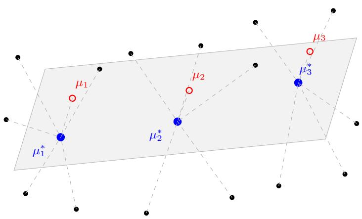  
Figure 1: The gray parallelogram represents the ground-truth subspace ${ \mathcal { P } } _ { \mathrm { { : } } }$ , and the blue points denote the ground-truth means $\mu _ { 1 } ^ { * } , \mu _ { 2 } ^ { * } , \mu _ { 3 } ^ { * }$ . For each $1 \leq i \leq m$ , we assumed $\mu _ { i }$ as the initialized parameter in $S _ { i }$ whose distance to $\mathcal { P }$ is minimal. The remaining parameters in $S _ { i }$ are denoted by black points. At the end of Stage 1, the distance from $\mu _ { i }$ to $\mathcal { P }$ is smaller than that of any other $\mu _ { j } \in S _ { i }$ by at least $d ^ { \epsilon }$

• For $1 \leq i \leq m , \pi _ { i } > \pi _ { i } ^ { * } / n .$

• For any $i \in [ m ] , j \in S _ { i }$ such that $i \neq j , \| \mu _ { i } - \mu _ { i } ^ { \parallel } \| \leq \| \mu _ { j } - \mu _ { j } ^ { \parallel } \| - d ^ { \epsilon } ,$

• For each $1 \leq i \leq m , j \in S _ { i } , \| \mu _ { j } ^ { \parallel } - \mu _ { i } ^ { * } \| \leq 2 n ;$

• For each $1 \leq j \leq n , \sqrt { d } - 2 d ^ { 2 \epsilon } \leq \| \mu _ { j } - \mu _ { j } ^ { \parallel } \| \leq \sqrt { d } + 2 n .$

The proof of this lemma is in Section B.2. Here we briefly outline the main idea of this lemma and how to prove it. This stage shows that, given the initialization in Lemma $^ { 6 , }$ in some steps, for any $i ,$ there is a $\mu _ { j }$ that is far closer to $\mu _ { i } ^ { * }$ than any other $\mu _ { k }$ . Moreover, the projection of each $\mu _ { j }$ on $\mathcal { P }$ doesn’t move much. An illustration is in Figure 1.

The main idea of this lemma is to use induction to prove that in $\lceil 1 0 0 0 n ^ { 1 0 } d ^ { \epsilon - 0 . 5 } / \eta \rceil$ steps, all properties in Lemma 6 still hold with some small relaxations. By such properties, we can use Lemma 1 to analyze the gradient. Recall the formula in Lemma 1. We prove that for each $i \in S _ { l }$ only the $( \mu _ { i } - \mu _ { l } ^ { * } )$ term dominates the gradient. Therefore, for any $i \in \bar { S _ { j } }$ , intuitively we have

$$
\nabla _ { \mu _ { i } } \mathcal { L } \approx \pi _ { j } ^ { * } \mathbb { E } _ { x \sim j } \left[ \psi _ { i } ( x ) ^ { 2 } ( \mu _ { i } - \mu _ { j } ^ { * } ) \right] .\tag{7}
$$

Finally, we show that when d is large enough, for each $j \in S _ { i }$ such that $j \neq i ,$

$$
\begin{array} { r } { \mathbb { E } _ { x \sim i } [ \psi _ { i } ( x ) ^ { 2 } ] \geq \mathbb { E } _ { x \sim i } [ \psi _ { j } ( x ) ^ { 2 } ] + \mathrm { p o l y } ( 1 / n ) . } \end{array}
$$

Therefore, since the update rule is

$$
\boldsymbol { \mu } _ { i } ^ { ( t + 1 ) } = \boldsymbol { \mu } _ { i } ^ { ( t ) } - \eta \nabla _ { \mu _ { i } } \mathcal { L } ( \pi ^ { ( t ) } , \boldsymbol { \mu } ^ { ( t ) } ) ,
$$

by $( 7 )$ , we can prove that for each $1 \leq i \leq m , \mu _ { i }$ moves towards $\mu _ { i } ^ { * }$ at a higher speed than any other $\mu _ { j }$ $j \in S _ { i }$ . Also, for each $j \in S _ { i }$ , the moving direction of $\mu _ { j }$ is almost towards $\mu _ { i } ^ { * }$ . Therefore, by a careful analysis, we can prove Lemma 7.

## 4.3 Stage 2

In this subsection, we are given the parameters generated by Stage 1. We prove the following lemma:

Lemma 8. Given the initialization corresponding to Stage 1 (i.e., it satisfies the four conditions in Lemma 7), after ⌈log $d / ( \pi _ { 1 } ^ { * } \eta ) ]$ steps, thefollowing are true:

$$
\cdot \ \| \mu _ { 1 } - \mu _ { 1 } ^ { \parallel } \| \leq 1 .
$$

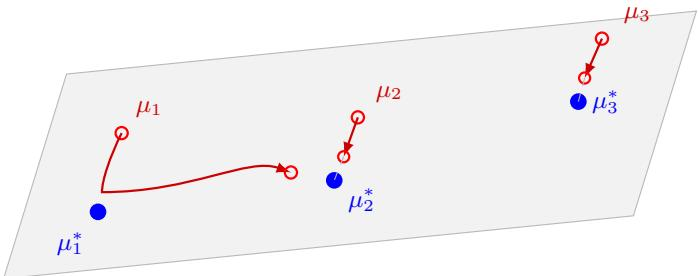  
Figure 2: Illustration of Stage 2 dynamics. Similar as in Figure 1, the gray parallelogram represents the ground-truth subspace $\mathcal { P }$ , and the blue points denote the ground-truth means $\mu _ { 1 } ^ { * } , \mu _ { 2 } ^ { * } , \mu _ { 3 } ^ { * }$ . During this stage, at first each $\mu _ { i }$ moves towards $\mu _ { i } ^ { * }$ for $1 \leq i \leq m$ , but at last $\mu _ { 1 }$ becomes very close to $\mathcal { P }$ while others stay far from $\mathcal { P }$

• For any $2 \leq i \leq n ,$ , we have $\pi _ { i } \leq 2 \exp ( - d ^ { 2 \epsilon / 3 } / 3 )$

• For each $\begin{array} { r } { 1 \leq i \leq m , \| \mu _ { 1 } ^ { \parallel } - \mu _ { i } ^ { * } \| \leq d ^ { 0 . 5 - \epsilon } + 2 n + \frac { 8 0 0 } { ( \pi _ { \mathrm { g a p } } ^ { * } ) ^ { 2 } } . } \end{array}$

$$
\bullet \operatorname { \textit { F o r a n y } } 2 \leq i \leq n , \sqrt { d } - 1 0 0 d ^ { 0 . 5 - 2 \epsilon } / \pi _ { \mathrm { g a p } } ^ { * } \leq \| \mu _ { i } - \mu _ { i } ^ { \parallel } \| \leq \sqrt { d } + 2 n + 8 0 0 / ( \pi _ { \mathrm { g a p } } ^ { * } ) ^ { 2 } .
$$

$$
\begin{array} { r } { \bullet \ F o r 2 \leq i \leq n , i \in S _ { j } , \| \mu _ { i } ^ { \parallel } - \mu _ { j } ^ { * } \| \leq 2 n + \frac { 8 0 0 } { ( \pi _ { \mathrm { g a p } } ^ { * } ) ^ { 2 } } . } \end{array}
$$

This lemma shows that after Stage 2, only one $\mu _ { i }$ is close to $\mathcal { P } _ { \cdot }$ , while others are far away from $\mathcal { P } _ { \cdot }$ . The proof of this lemma is in Section B.3. Here we still outline the main idea of this lemma. The intuition is that given the stage 1 input, for any $i > m , \| \nabla _ { \mu _ { i } } \mathcal { L } \|$ is exponentially small, and for $1 \leq i \leq m , \mu _ { i }$ moves towards $\mathcal { P }$ at a speed proportional $\mathbf { t o } \pi _ { i } ^ { * }$ at first. As we assumed $\pi _ { 1 } ^ { * }$ to be the largest, and the separation of each two $\mu _ { j } ^ { * }$ is $d ^ { 0 . 5 - \epsilon }$ , at last $\mu _ { 1 }$ becomes the closest parameter to $\mathcal { P } _ { \cdot }$ , while other $\mu _ { k } \mathrm { ^ { * } s }$ are far away from ${ \mathcal { P } } .$ . An illustration is in Figure $^ { 2 }$

More precisely, Lemma 28 first proves that every representative has weight at least half its true weight during an initial interval. Before that interval ends, component 1 becomes closer than every non-representative to every true source. Thereafter non-representatives are suppressed by comparison with component 1, without any assumption about their weights relative to the other representatives. These responsibility estimates give the refined gradients that close the Stage 2 induction.

The collapse becomes quantitative after $t > 1 0 d ^ { - 2 \epsilon } / ( \eta \pi _ { \mathrm { g a p } } ^ { * } )$ . At that point $\mathbb { E } _ { x \sim p ^ { * } } \left[ \psi _ { i } ( x ) \right]$ is exponentially small for every $i \geq 2$ , so only $\mu _ { 1 }$ experiences a non-negligible update. Since the number of iterations before this point is small, the motion parallel to $\mathcal { P }$ remains controlled. In this regime, we show that

$$
\nabla _ { \mu _ { 1 } } \mathcal { L } \approx \sum _ { j } \pi _ { j } ^ { * } \mathbb { E } _ { x \sim j } \left[ \psi _ { 1 } ( x ) ^ { 2 } ( \mu _ { 1 } - \mu _ { j } ^ { * } ) \right] .
$$

Therefore, $\mu _ { 1 }$ is driven toward the subspace $\mathcal { P }$ and converges to a point near both $\mathcal { P }$ and the convex hull of the ground-truth means $\{ \mu _ { j } ^ { * } \}$ }. This describes the mechanism formalized in Lemma 8.

## 4.4 Stage 3

In this section, we prove that given the input of Stage 2, when $t \leq \exp \left( d / 1 0 0 \right) / \eta$ , the loss is lower bounded by $\frac { ( 1 - \pi _ { 1 } ^ { * } ) ^ { 2 } } { 3 }$ . We need to prove the following lemma.

Lemma 9. Given the output of Stage $2 ( i . e .$ , the conditions in Lemma $\delta ) ,$ , when $t \leq \exp \left( d / 1 0 0 \right) / \eta ,$

$$
\mathcal { L } \left( \pi ^ { ( t ) } , \mu ^ { ( t ) } \right) \geq \frac { ( 1 - \pi _ { 1 } ^ { * } ) ^ { 2 } } { 3 } .
$$

The proof of this lemma is in Section B.4. Here we also outline the main ideas. Using the output properties in Lemma $8 ,$ , we prove that every $\mu _ { i } , i \geq 2$ , moves only an exponentially small distance for $\bar { t } \leq \exp ( d / 1 0 0 ) / \eta$ . Therefore, we prove the following lemma:

Lemma 10 (See also Lemma 34). Given the initialization corresponding to Lemma $\delta ,$ for any $t \leq \exp ( d / 1 0 0 ) / \eta ,$ , we always have

$\| \mu _ { 1 } - \mu _ { 1 } ^ { \parallel } \| \leq 1$

• At local time $t = 0 , \pi _ { i } \leq 2 \exp ( - d ^ { 2 \epsilon / 3 } / 3 ) f o r i \geq 2 ; a t e \nu e r y t \geq 1 , \pi _ { i } \leq 2 \exp ( - d / 2 0 )$

• For each $\begin{array} { r } { 1 \leq i \leq m , \| \mu _ { 1 } ^ { \parallel } - \mu _ { i } ^ { * } \| \leq d ^ { 0 . 5 - \epsilon } + 2 n + \frac { 8 0 0 } { ( \pi _ { \mathrm { g a p } } ^ { * } ) ^ { 2 } } . } \end{array}$

• For any $2 \leq i \leq n , \sqrt { d } - 2 0 0 d ^ { 0 . 5 - 2 \epsilon } / \pi _ { \mathrm { g a p } } ^ { * } \leq \| \mu _ { i } - \mu _ { i } ^ { \parallel } \| \leq 2 \sqrt { d } .$

• For any 2 ≤ i ≤ n and $1 \leq j \leq m , \| \mu _ { i } ^ { \parallel } - \mu _ { j } ^ { * } \| \leq 2 d ^ { 0 . 5 - \epsilon } .$

Then we can prove the lower bound of loss based on the following lemma:

Lemma 11 (See also Lemma 37). If for all $j \geq 2$ and $i \in [ m ] , \| \mu _ { j } - \mu _ { i } ^ { * } \| \ge \sqrt { d } / 2 ,$ , then the loss satisfies $\begin{array} { r } { \mathcal { L } \ge \frac { ( 1 - \pi _ { 1 } ^ { * } ) ^ { 2 } } { 3 } } \end{array}$

Notice that during Stage 1 and Stage 2, we also always have $\lVert \mu _ { j } - \mu _ { i } ^ { * } \rVert \geq \sqrt { d } / 2$ for $j \geq 2$ and $i \in [ m ]$ . This completes the proof of Theorem 2.

## 5 Experiments

In this section, we present several numerical simulations that illustrate the behavior of our updates and support our results.

In all experiments, we use the EM update for the mixing weights $\pi _ { i }$ and the gradient EM update for the means $\mu _ { i } ,$ both computed on fresh samples at each iteration. For the experiments shown here, the learning rate is set to 0.05 and the batch size is 8192. We train the student model for 2000 steps. We consider a mixture model with two ground-truth components,

$$
\pi _ { 1 } ^ { * } = 0 . 3 , \qquad \pi _ { 2 } ^ { * } = 0 . 7 , \qquad \mu _ { 1 } ^ { * } = ( 3 , 0 , 0 , \ldots ) , \qquad \mu _ { 2 } ^ { * } = ( - 3 , 0 , 0 , \ldots ) .
$$

The initialization of $( \pi _ { i } , \mu _ { i } )$ follows Algorithm 1. We use $n = 1 0$ components to fit the two ground-truth components.

We examine two cases with different dimension d, using seed 0 in both:

$d = 1 0 \colon$ a low-dimensional setting in which the algorithm successfully fits both ground-truth components.

$d = 5 0 0 \colon { \mathrm { a } }$ high-dimensional setting in which most learned means fail to approach the 1D signal subspace, resulting in an underfitting regime.

Figure 3 shows the trajectories of all learned $\mu _ { i } \mathrm { ^ { * } s }$ under the 2D projection of

$$
x _ { i } ( t ) = \mu _ { i , 1 } ^ { ( t ) } , \qquad y _ { i } ( t ) = \big \| \mu _ { i , 2 : d } ^ { ( t ) } \big \| _ { 2 } .
$$

The ground-truth means appear as red stars on the horizontal axis $( y = 0 )$ , and the evolution of each learned component is plotted as a curve.

The empirical results are consistent with our theoretical analysis. When the dimension d is small, learning the ground-truth distribution is relatively easy. In the $d = 5 0 0$ run shown, a single fitted component receives essentially all the weight and its mean moves between $\mu _ { 1 } ^ { * }$ and $\mu _ { 2 } ^ { * } .$ , demonstrating the difficulty of learning Gaussian mixtures when the separation is small relative to the dimension. Additional experiments across three random seeds and with dimension-dependent separation at $d = 1 0 ^ { 6 }$ are reported in Appendix D. The code used to reproduce the experiments in this paper is publicly available at https://github.com/Ryanzhang887/EM\_Separation.

## 6 Conclusion

In this paper, we study the ground-truth separation required for global convergence of gradient EM in the high-dimensional regime. Our results show that $\Omega ( \sqrt { d } )$ separation is nearly optimal when the dimension d is very large. Our analysis of the training dynamics characterizes how the parameters converge to the ground truth. However, our work focuses on the regime where the number of components n is much smaller than the dimension d. One natural direction for future work is to investigate whether heavier over-parameterization, with n comparable to or larger than d, can enable global convergence under weaker separation. Another direction is to extend our analysis to the classical EM algorithm. Finally, we believe that balanced mixtures, in which all ground-truth mixing weights are equal, may exhibit a different separation threshold; understanding this setting remains an open problem.

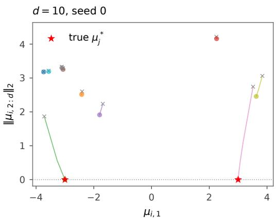

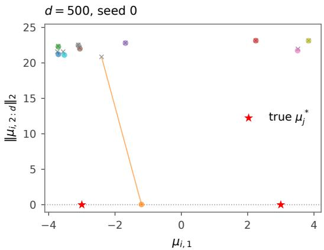  
Figure 3: Trajectories of the learned means $\mu _ { i }$ for $d = 1 0 , 5 0 0$ , generated by the released code with seed 0. Left: $d = 1 0$ . Both ground-truth components are fit by some $\mu _ { i }$ . Right: $d = 5 0 0$ . Only one component converges toward the signal axis, while the remaining ones stay far away, demonstrating underfitting in this run. Gray crosses mark initialization, colored dots mark final means, and red stars mark true means. All three seeds are shown in Appendix D.

## Acknowledgements

SSD was supported by NSF DMS 2134106, NSF IIS 2143493, NSF IIS 2229881, Sloan Fellowship, and the AI2050 program at Schmidt Sciences. MF, MZ, and WX acknowledge the support of NSF TRIPODS II DMS 2023166. The work of MF was also supported by awards NSF CCF 2212261 and NSF CCF 2312775 and the Moorthy Family Professorship at UW.

## References

Dimitris Achlioptas and Frank McSherry. On spectral learning of mixtures of distributions. In International Conference on Computational Learning Theory, pages 458–469. Springer, 2005.

Animashree Anandkumar, Rong Ge, Daniel J Hsu, Sham M Kakade, Matus Telgarsky, et al. Tensor decompositions for learning latent variable models. J. Mach. Learn. Res., 15(1):2773–2832, 2014.

Sivaraman Balakrishnan, Martin J Wainwright, and Bin Yu. Statistical guarantees for the em algorithm: From population to sample-based analysis. The Annals of Statistics, 2017.

Aditya Bhaskara, Moses Charikar, Ankur Moitra, and Aravindan Vijayaraghavan. Smoothed analysis of tensor decompositions. In Proceedings of the forty-sixth annual ACM symposium on Theory of computing, pages 594–603, 2014.

Yudong Chen, Dogyoon Song, Xumei Xi, and Yuqian Zhang. Local minima structures in gaussian mixture models. IEEE Transactions on Information Theory, 2024.

Sanjoy Dasgupta. Learning mixtures of gaussians. In 40th annual symposium on foundations of computer science (Cat. No. 99CB37039), pages 634–644. IEEE, 1999.

Sanjoy Dasgupta and Leonard Schulman. A probabilistic analysis of em for mixtures of separated, spherical gaussians. Journal ofMachine Learning Research, 8(2), 2007.

Constantinos Daskalakis, Christos Tzamos, and Manolis Zampetakis. Ten steps of em suffice for mixtures of two gaussians. In Conference on Learning Theory, pages 704–710. PMLR, 2017.

Arthur P Dempster, Nan M Laird, and Donald B Rubin. Maximum likelihood from incomplete data via the em algorithm. Journal of the royal statistical society: series B (methodological), 39(1): 1–22, 1977.

Ilias Diakonikolas and Daniel M Kane. Implicit high-order moment tensor estimation and learning latent variable models. arXiv preprint arXiv:2411.15669, 2024.

Ilias Diakonikolas, Daniel M Kane, and Alistair Stewart. List-decodable robust mean estimation and learning mixtures of spherical gaussians. In Proceedings ofthe 50th Annual ACM SIGACT Symposium on Theory ofComputing, pages 1047–1060, 2018.

Raaz Dwivedi, Koulik Khamaru, Martin J Wainwright, Michael I Jordan, et al. Theoretical guarantees for em under misspecified gaussian mixture models. Advances in Neural Information Processing Systems, 31, 2018.

Raaz Dwivedi, Nhat Ho, Koulik Khamaru, Martin Wainwright, Michael Jordan, and Bin Yu. Sharp analysis of expectation-maximization for weakly identifiable models. In International Conference on Artificial Intelligence and Statistics, pages 1866–1876. PMLR, 2020a.

Raaz Dwivedi, Nhat Ho, Koulik Khamaru, Martin J Wainwright, Michael I Jordan, and Bin Yu. Singularity, misspecification and the convergence rate of em. The Annals of Statistics, 48(6): 3161–3182, 2020b.

Jon Feldman, Rocco A Servedio, and Ryan O’Donnell. Pac learning axis-aligned mixtures of gaussians with no separation assumption. In International Conference on Computational Learning Theory, pages 20–34. Springer, 2006.

Rong Ge, Qingqing Huang, and Sham M Kakade. Learning mixtures of gaussians in high dimensions. In Proceedings of the forty-seventh annual ACM symposium on Theory of computing, pages 761–770, 2015.

Samuel B Hopkins and Jerry Li. Mixture models, robustness, and sum of squares proofs. In Proceedings ofthe 50th Annual ACM SIGACT Symposium on Theory ofComputing, pages 1021– 1034, 2018a.

Samuel B Hopkins and Jerry Li. Mixture models, robustness, and sum of squares proofs. In Proceedings ofthe 50th Annual ACM SIGACT Symposium on Theory ofComputing, pages 1021– 1034, 2018b.

Chi Jin, Yuchen Zhang, Sivaraman Balakrishnan, Martin J Wainwright, and Michael I Jordan. Local maxima in the likelihood of gaussian mixture models: Structural results and algorithmic consequences. Advances in neural information processing systems, 29, 2016.

Norman L Johnson, Samuel Kotz, and Narayanaswamy Balakrishnan. Continuous univariate distributions, volume 2, volume 2. John wiley & sons, 1995.

Pravesh K Kothari, Jacob Steinhardt, and David Steurer. Robust moment estimation and improved clustering via sum of squares. In Proceedings ofthe 50th Annual ACM SIGACT Symposium on Theory of Computing, pages 1035–1046, 2018.

Jeongyeol Kwon and Constantine Caramanis. The em algorithm gives sample-optimality for learning mixtures of well-separated gaussians. In Conference on Learning Theory, pages 2425–2487. PMLR, 2020.

Beatrice Laurent and Pascal Massart. Adaptive estimation of a quadratic functional by model selection. Annals ofstatistics, pages 1302–1338, 2000.

Allen Liu and Jerry Li. Clustering mixtures with almost optimal separation in polynomial time. In Proceedings of the 54th Annual ACM SIGACT Symposium on Theory of Computing, pages 1248–1261, 2022.

Michael Mitzenmacher and Eli Upfal. Probability and Computing: Randomized Algorithms and Probabilistic Analysis. Cambridge University Press, New York, NY, USA, 2005.

Frank WJ Olver. NIST handbook of mathematical functions hardback and CD-ROM. Cambridge university press, 2010.

Oded Regev and Aravindan Vijayaraghavan. On learning mixtures of well-separated gaussians. In 2017 IEEE 58th Annual Symposium on Foundations of Computer Science (FOCS), pages 85–96. IEEE, 2017.

Arora Sanjeev and Ravi Kannan. Learning mixtures of arbitrary gaussians. In Proceedings of the thirty-third annual ACM symposium on Theory ofcomputing, pages 247–257, 2001.

Nimrod Segol and Boaz Nadler. Improved convergence guarantees for learning gaussian mixture models by em and gradient em. Electronic journal ofstatistics, 15(2):4510–4544, 2021.

Santosh Vempala and Grant Wang. A spectral algorithm for learning mixture models. Journal of Computer and System Sciences, 68(4):841–860, 2004.

Larry Wasserman. All of statistics: a concise course in statistical inference. Springer Science & Business Media, 2013.

Nir Weinberger and Guy Bresler. The em algorithm is adaptively-optimal for unbalanced symmetric gaussian mixtures. Journal ofMachine Learning Research, 23(103):1–79, 2022.

CF Jeff Wu. On the convergence properties of the em algorithm. The Annals of statistics, pages 95–103, 1983.

Yihong Wu and Harrison H Zhou. Randomly initialized em algorithm for two-component gaussian mixture achieves near optimality in $o ( \sqrt { n } )$ iterations. Mathematical Statistics & Learning, 4, 2021.

Ji Xu, Daniel J Hsu, and Arian Maleki. Global analysis of expectation maximization for mixtures of two gaussians. Advances in Neural Information Processing Systems, 29, 2016.

Lei Xu and Michael I Jordan. On convergence properties of the em algorithm for gaussian mixtures. Neural computation, 8(1):129–151, 1996.

Weihang Xu, Maryam Fazel, and Simon S Du. Toward global convergence of gradient em for over-paramterized gaussian mixture models. Advances in Neural Information Processing Systems, 37:10770–10800, 2024.

Bowei Yan, Mingzhang Yin, and Purnamrita Sarkar. Convergence of gradient em on multi-component mixture of gaussians. Advances in Neural Information Processing Systems, 30, 2017.

Ruofei Zhao, Yuanzhi Li, and Yuekai Sun. Statistical convergence of the em algorithm on gaussian mixture models. Electronic Journal ofStatistics, 2020.

Mo Zhou, Weihang Xu, Maryam Fazel, and Simon S Du. Global convergence of gradient em for over-parameterized gaussian mixtures. arXiv preprint arXiv:2506.06584, 2025.

## A Further Preliminaries

Lemma 12 (Chi distribution). Let $X \sim { \mathcal { N } } ( 0 , I _ { d } )$ and $R : = \| X \|$ . Then $R \sim \chi _ { d }$ with density

$$
f _ { d } ( r ) = \frac { 1 } { 2 ^ { \frac { d } { 2 } - 1 } \Gamma ( \frac { d } { 2 } ) } r ^ { d - 1 } e ^ { - r ^ { 2 } / 2 } , \qquad r \geq 0 .
$$

Moreover,for all $d \geq 2 ,$

$$
\| f _ { d } \| _ { \infty } \leq 1 .
$$

Proof. The density $f _ { d }$ is Chi distribution (see, e.g., Johnson et al. [1995]).

We first maximize $f _ { d } ( r )$ over $r \geq 0 .$ . Since $f _ { d } ( r ) > 0$ for $r > 0 ,$ , we equivalently maximize

$$
\log f _ { d } ( r ) = ( d - 1 ) \log r - \frac { r ^ { 2 } } { 2 } + C _ { d } ,
$$

where $C _ { d }$ is a constant independent of $r _ { \ast }$ The differentiate of it corresponding to $r$ is:

$$
( \log f _ { d } ( r ) ) ^ { \prime } = \frac { d - 1 } { r } - r ,
$$

so $f _ { d } ( r )$ is maximized at $r = \sqrt { d - 1 }$ . We have

$$
f _ { d } ( \sqrt { d - 1 } ) = { \frac { ( d - 1 ) ^ { \frac { d - 1 } { 2 } } e ^ { - { \frac { d - 1 } { 2 } } } } { 2 ^ { \frac { d } { 2 } - 1 } \Gamma ( { \frac { d } { 2 } } ) } } .
$$

A standard Gamma function lower bound (see, e.g., section 5.6 in Olver [2010]) shows

$$
\Gamma ( x ) > \sqrt { 2 \pi } \cdot x ^ { x - 0 . 5 } e ^ { - x } .
$$

Therefore,

$$
\begin{array} { l } { \displaystyle \| f _ { d } \| _ { \infty } = f _ { d } ( \sqrt { d - 1 } ) = \frac { ( d - 1 ) ^ { \frac { d - 1 } { 2 } } e ^ { - \frac { d - 1 } { 2 } } } { 2 ^ { \frac { d } { 2 } - 1 } \Gamma ( \frac { d } { 2 } ) } } \\ { \displaystyle \leq \frac { \sqrt { e } } { \sqrt { \pi } } \left( 1 - \frac { 1 } { d } \right) ^ { \frac { d - 1 } { 2 } } \leq 1 . } \end{array}
$$

We also need the following Mill’s inequality, which can be found in Wasserman [2013].

Lemma 13 (Mill’s Inequality). For any $t > 0$ , we have

$$
\operatorname* { P r } _ { x \sim \mathcal { N } ( 0 , 1 ) } [ x \ge t ] \le \frac { 1 } { t } \exp ( - t ^ { 2 } / 2 ) .
$$

The following Gaussian tail bound is a direct consequence of Lemma 1 in Laurent and Massart [2000].

Lemma 14 (Gaussian Tail Bound). Let d be a positive integer. For any positive real number $t > 0$ we have

$$
\operatorname* { P r } _ { x \sim \mathcal { N } ( \mathbf { 0 } , I _ { d } ) } \left[ \| x \| _ { 2 } \geq t + \sqrt { d } \right] \leq \exp \left( - t ^ { 2 } / 2 \right) .
$$

Moreover, for any $\begin{array} { r } { 0 \leq t \leq \frac { 1 } { 2 } \sqrt { d } , } \end{array}$ , we have

$$
\operatorname* { P r } _ { x \sim \mathcal { N } ( \mathbf { 0 } , I _ { d } ) } \left[ \| x \| _ { 2 } \leq \sqrt { d } - t \right] \leq \exp \left( - t ^ { 2 } / 2 \right) .
$$

Lemma 15. (Chernoff bounds (see, e.g., Mitzenmacher and Upfal [2005])). Let $X _ { 1 } , \ldots , X _ { n }$ be independent Bernoulli variables with $\mathbb { E } [ X _ { i } ] = p _ { i } .$ . Let $\begin{array} { r } { X = \sum _ { i = 1 } ^ { \hat { n } } { \tilde { X _ { i } } } } \end{array}$ and $\textstyle \mu = \operatorname { \mathbb { E } } [ X ] = \sum _ { i = 1 } ^ { n } p _ { i }$ For $\nu \geq 6 \mu$ , one has $\operatorname* { P r } [ X \geq \nu ] \leq 2 ^ { - \nu }$

## B Proof of Theorem 2

Throughout this appendix, we assume m $\geq 3 ,$ , relabel the true components so that $\pi _ { 1 } ^ { * } ~ >$ $\operatorname* { m a x } _ { 2 \leq i \leq m } \pi _ { i } ^ { * }$ , and assume $n \geq 3 ( \pi _ { \operatorname* { m i n } } ^ { * } ) ^ { - 1 } \log m$ . We also impose the dimension condition Equation (6), with $0 < \epsilon \le 0 . 0 1$ . The initialization and Stage 1 arguments below apply to arbitrary true means satisfying

$$
\operatorname* { m i n } _ { i \neq j } \| \mu _ { i } ^ { * } - \mu _ { j } ^ { * } \| \geq d ^ { 0 . 5 - \epsilon } .
$$

There is no upper bound on their diameter. Translate their affine span to contain the origin, and choose a fixed $( m - 1 )$ )-dimensional linear subspace $\mathcal { P }$ containing it. Equal pairwise separation is imposed only in Stages 2 and 3 of the negative construction.

## B.1 Initialization Analysis

In this section, we prove Lemma 6.

Proof. We verify the five items in Lemma 6 on a common high-probability event.

For item 1, a particular true component i receives no initialized fitted center with probability $( 1 - \pi _ { i } ^ { * } ) ^ { n }$ Since $1 - u \leq e ^ { - u }$ and $n \pi _ { i } ^ { * } \geq n \pi _ { \operatorname* { m i n } } ^ { * } \geq 3$ log m,

$$
\mathrm { P r } [ | S _ { i } | = 0 ] = ( 1 - \pi _ { i } ^ { * } ) ^ { n } \le e ^ { - n \pi _ { i } ^ { * } } \le m ^ { - 3 } .
$$

A union bound over the m true components gives failure probability at most $m ^ { - 2 }$

We next prove items 2 and 4. Conditional on the source labels of the initialization, the vectors $\mu _ { j } - \mu _ { j } ^ { \parallel }$ $1 \leq j \leq n$ , are independent and distributed as $\mathcal { N } ( 0 , I _ { d - m + 1 } )$ . For each pair $1 \leq k < j \leq \dot { n } ,$ Lemma 12 gives

$$
\left| \| \mu _ { j } - \mu _ { j } ^ { \parallel } \| - \| \mu _ { k } - \mu _ { k } ^ { \parallel } \| \right| \leq \frac { 1 } { n ^ { 3 } }
$$

with probability at most $2 / n ^ { 3 }$ . There are at most $n ^ { 2 } / 2$ pairs, so the probability that any two orthogonal norms differ by at most $1 / n ^ { 3 }$ is at most $1 / n$ . On the complementary event, each group $S _ { i }$ has a unique smallest orthogonal norm; relabeling the fitted centers inside each group makes that minimizer index i and proves item 2.

For item 4, Lemma 14 gives, for each $j ,$

$$
\operatorname* { P r } \left[ \left| \| \mu _ { j } - \mu _ { j } ^ { \parallel } \| - \sqrt { d - m + 1 } \right| > n / 2 \right] \leq 2 \exp ( - n ^ { 2 } / 8 ) \leq 1 / n ^ { 3 } .
$$

Because $m \leq n$ and

$$
0 \leq \sqrt { d } - \sqrt { d - m + 1 } = \frac { m - 1 } { \sqrt { d } + \sqrt { d - m + 1 } } \leq n / 2 ,
$$

the displayed concentration event implies $\sqrt { d } - n \leq \| \mu _ { j } - \mu _ { j } ^ { \parallel } \| \leq \sqrt { d } + n$ . A union bound over j therefore proves item 4 except on an event of probability at most 2n $\exp ( - n ^ { 2 } / 8 )$

For item 3, i $\mathrm { ~ f ~ } j \in S _ { i }$ , then $\mu _ { j } ^ { \parallel } - \mu _ { i } ^ { * }$ is a standard Gaussian vector on the $( m - 1 )$ -dimensional subspace P. Hence Lemma 14 gives

$$
\operatorname* { P r } \Big [ \| \mu _ { j } ^ { \| } - \mu _ { i } ^ { * } \| > n \Big ] \leq \exp \big ( - ( n - \sqrt { m - 1 } ) ^ { 2 } / 2 \big ) \leq \exp ( - ( 0 . 7 5 n ) ^ { 2 } / 2 ) \leq \exp ( - n ^ { 2 } / 4 ) .
$$

There are n initialized centers, so item 3 fails with probability at most $n \exp ( - n ^ { 2 } / 4 )$

It remains to prove item 5. For this construction only, use the original sampling order, before the data-dependent relabeling that selects the representatives. Process the vectors $\mu _ { i } - \mu _ { i } ^ { \parallel }$ in increasing order of i and set

$$
\mathcal { P } _ { i } : = \mathrm { s p a n } \{ \mu _ { 1 } - \mu _ { 1 } ^ { \parallel } , \ldots , \mu _ { i - 1 } - \mu _ { i - 1 } ^ { \parallel } \} , \qquad 1 \leq i \leq n + 1 .
$$

Every $\mathcal { P } _ { i }$ is contained in $\mathcal { P } ^ { \perp }$ . Let $\mu _ { i } ^ { \prime }$ be the orthogonal projection of $\mu _ { i } - \mu _ { i } ^ { \parallel }$ onto $\mathcal { P } _ { i }$ . Conditional on the preceding vectors, $\mu _ { i } ^ { \prime }$ is a standard Gaussian vector on a space of dimension at most $i - 1 \le n$ Thus Lemma 14 implies

$$
\begin{array} { r } { \operatorname* { P r } [ \| \mu _ { i } ^ { \prime } \| > n ] \le \exp ( - ( n - \sqrt { n } ) ^ { 2 } / 2 ) \le \exp ( - n ^ { 2 } / 5 ) . } \end{array}
$$

On the event that $\| \mu _ { i } ^ { \prime } \| \leq n$ for every i, define

$$
\mu _ { i } ^ { \perp } : = \mu _ { i } - \mu _ { i } ^ { \parallel } - \mu _ { i } ^ { \prime } .
$$

By construction, $\mu _ { i } ^ { \perp } \perp \left( \mathcal { P } + \mathcal { P } _ { i } \right)$ , while $\mu _ { i } - \mu _ { i } ^ { \perp } = \mu _ { i } ^ { \parallel } + \mu _ { i } ^ { \prime } \in \mathcal { P } + \mathcal { P } _ { i }$ . Therefore $( \mu _ { i } - \mu _ { i } ^ { \perp } ) \perp \mu _ { i } ^ { \perp }$ Moreover, $\| \mu _ { i } - \mu _ { i } ^ { \perp } - \mu _ { i } ^ { \| } \| = \| \mu _ { i } ^ { \prime } \| \leq n$ . Finally, $\mu _ { i } ^ { \perp }$ is a linear combination of $\mu _ { 1 } - \mu _ { 1 } ^ { \parallel } , \ldots , \mu _ { i } - \mu _ { i } ^ { \parallel }$ and hence belongs to $\mathcal { P } _ { i + 1 } . \mathrm { ~ I f ~ } i < j$ , then $\mu _ { i } ^ { \perp } \in \mathcal { P } _ { j }$ whereas $\mu _ { j } ^ { \perp } \perp \mathcal { P } _ { j } ,$ , proving $\mu _ { i } ^ { \perp } \perp \mu _ { j } ^ { \perp }$ . This establishes all three parts of item 5 in the original sampling order. Applying the same permutation to the fitted means, their projections, and these constructed vectors preserves all three conclusions. A union bound over the original indices gives failure probability at most $n \exp ( - n ^ { 2 } / 5 )$

Combining the preceding estimates, the total failure probability is at most

$$
m ^ { - 2 } + n ^ { - 1 } + 2 n \exp ( - n ^ { 2 } / 8 ) + n \exp ( - n ^ { 2 } / 4 ) + n \exp ( - n ^ { 2 } / 5 ) \leq { \frac { 1 } { m } } .
$$

Here the last inequality uses $\pi _ { \mathrm { m i n } } ^ { * } \leq 1 / m$ , and hence $n \geq$ 3m log m, together with $m \geq 3 .$

## B.2 Stage 1 Analysis

We reset the iteration counter to $t = 0$ at the start of Stage 1 and write

$$
T _ { 1 } : = \lceil 1 0 0 0 n ^ { 1 0 } d ^ { \epsilon - 0 . 5 } / \eta \rceil .
$$

When analyzing a fixed update from time t to time $t + 1$ , an unprimed parameter denotes its time-t value and a primed parameter denotes its time- $( t + 1 )$ value. We restore superscripts when more than one time is present in the same calculation.

Recall that

$$
\nabla _ { \mu _ { i } } \mathcal { L } = \sum _ { j } \pi _ { j } ^ { * } \mathbb { E } _ { x \sim j } \left[ \psi _ { i } ( x ) \sum _ { k } \psi _ { k } ( x ) ( \mu _ { k } - \mu _ { j } ^ { * } ) \right] .
$$

Without loss of generality, after the relabeling in Lemma $^ { 6 , }$ for each $1 \leq i \leq$ m we have $i =$ arg $\mathrm { m i n } _ { j \in S _ { i } } \| \mu _ { j } - \mu _ { j } ^ { \parallel } \|$ . For clarity about the time-dependent notation, let $u _ { i }$ be the unit vector in the direction of the initial $\mu _ { i } ^ { \perp }$ . At later iterations we use $\mu _ { i } ^ { \perp } : = \langle \mu _ { i } , u _ { i } \rangle u _ { i }$ and let $\mu _ { i } ^ { \parallel }$ denote the orthogonal projection of $\mu _ { i }$ onto ${ \mathcal P } .$ The directions $u _ { i }$ are fixed and pairwise orthogonal. The remaining component $\mu _ { i } - \mu _ { i } ^ { \parallel } - \mu _ { i } ^ { \perp }$ is orthogonal to $\mu _ { i } ^ { \perp }$

Lemma 16. For every integer $0 \leq t \leq T _ { 1 }$ , thefollowing invariants hold at time t:

• For $1 \leq i \leq m , \pi _ { i } = \operatorname* { m a x } _ { j \in S _ { i } } \pi _ { j }$ . Moreover, $\pi _ { i } > \pi _ { i } ^ { * } / n$

• For each $1 \leq i \leq m ,$ , and any $k \in S _ { i } , k \neq i , \| \mu _ { k } - \mu _ { k } ^ { \parallel } \| \geq \| \mu _ { i } - \mu _ { i } ^ { \parallel } \| + \frac { 1 } { n ^ { 3 } }$

• For each $1 \leq i \leq m , j \in S _ { i } , \| \mu _ { i } ^ { \parallel } - \mu _ { i } ^ { * } \| \leq n + 2 n \eta t \leq 2 n .$

• For each $1 \leq j \leq n , \sqrt { d } - 2 d ^ { 2 \epsilon } \leq \| \mu _ { j } - \mu _ { i } ^ { \parallel } \| \leq \sqrt { d } + n + 2 n \eta t \leq \sqrt { d } + 2 n .$

• For each $1 \leq i \leq n , \mu _ { i } ^ { \perp } \perp \mathcal { P }$ satisfy that

1. $( \mu _ { i } - \mu _ { i } ^ { \perp } ) \perp \mu _ { i } ^ { \perp } .$

2. $\| \mu _ { i } - \mu _ { i } ^ { \perp } - \mu _ { i } ^ { \parallel } \| \leq n + 2 n \eta t \leq 2 n .$

3. $\mu _ { i } ^ { \perp } , 1 \le i \le$ n are pairwise orthogonal.

Moreover, at $t = T _ { 1 }$ , the following stronger conclusions hold:

• For $1 \leq i \leq m , \pi _ { i } > \pi _ { i } ^ { * } / n .$

• For any $i \in [ m ] , j \in S _ { i }$ such that $i \neq j , \| \mu _ { i } - \mu _ { i } ^ { \parallel } \| \leq \| \mu _ { j } - \mu _ { j } ^ { \parallel } \| - d ^ { \epsilon } ,$

• For each $1 \leq i \leq m , j \in S _ { i } , \| \mu _ { j } ^ { \parallel } - \mu _ { i } ^ { * } \| \leq 2 n ;$

• For each $1 \leq j \leq n , \sqrt { d } - 2 d ^ { 2 \epsilon } \leq \| \mu _ { j } - \mu _ { i } ^ { \parallel } \| \leq \sqrt { d } + 2 n .$

Define the fixed subspace

$$
\mathcal { P } _ { 0 } : = \operatorname { s p a n } \bigl ( \mathcal { P } \cup \{ \mu _ { 1 } ^ { ( 0 ) } , \dots , \mu _ { n } ^ { ( 0 ) } \} \bigr ) .
$$

Every vector appearing in the gradient formula is a linear combination of the current fitted means and the true means. It follows inductively that $\mu _ { i } ^ { ( t ) } \in \mathcal { P } _ { 0 }$ for every i and every Stage 1 iteration t. The projections $( \mu _ { i } ^ { \parallel } ) ^ { ( t ) }$ and $( \mu _ { i } ^ { \perp } ) ^ { ( t ) }$ also belong to $\mathcal { P } _ { 0 }$ . The densities share the factor ex $\mathrm { p } ( - \| x - P _ { 0 } x \| ^ { 2 } / 2 )$ where $P _ { 0 }$ is the orthogonal projector onto $\mathcal { P } _ { 0 }$ . This factor cancels in every responsibility ratio. Thus the responsibilities, although not the individual full-dimensional densities, depend on x only through $P _ { 0 } x .$

Let $d _ { 0 } : = \mathrm { d i m } ( \mathcal { P } _ { 0 } ) \leq m + n \leq 2 n$ , and let x¯ denote the projection of x onto $\mathcal { P } _ { 0 }$ . Then, for every $i , t ,$ and x,

$$
\psi _ { i } ^ { ( t ) } ( x ) = \psi _ { i } ^ { ( t ) } ( \bar { x } ) .\tag{8}
$$

Notice that $\bar { x } \in \mathcal { P } _ { 0 }$ but need not belong to ${ \mathcal { P } } ;$ ; its component orthogonal to $\mathcal { P }$ will be controlled using $\| \bar { x } - \mu _ { i } ^ { * } \|$

Lemma 17. Let x $\sim \mathcal { N } ( \mu _ { i } ^ { * } , I _ { d } )$ . With probability at least $1 - \exp \left( - d ^ { 4 \epsilon } / 3 \right)$ , we have

$$
\lVert \bar { x } - \mu _ { i } ^ { * } \rVert \leq d ^ { 2 \epsilon } .
$$

Proof. Since $\mu _ { i } ^ { \ast } \in \mathcal { P } _ { 0 } .$ , projecting $x \sim \mathcal N ( \mu _ { i } ^ { * } , I _ { d } )$ onto $\mathcal { P } _ { 0 }$ gives a standard Gaussian on this $d _ { 0 } \mathbf { \cdot }$ dimensional subspace, centered at $\mu _ { i } ^ { * }$ . Thus Lemma 14 gives

$$
\operatorname* { P r } _ { \bar { x } \sim \mathcal { N } ( \mu _ { i } ^ { * } , I _ { d _ { 0 } } ) } \left[ \left. \bar { x } - \mu _ { i } ^ { * } \right. > d ^ { 2 \epsilon } \right] \leq \exp \left( - \left( d ^ { 2 \epsilon } - \sqrt { d _ { 0 } } \right) ^ { 2 } / 2 \right) \leq \exp \left( - d ^ { 4 \epsilon } / 3 \right) .
$$

For the final inequality we used $d _ { 0 } \leq 2 n$ and the consequence $\sqrt { 2 n } \leq ( 1 - \sqrt { 2 / 3 } ) d ^ { 2 \epsilon }$ of Equation (6). □

Lemma 18. Fix $0 \leq t \leq T _ { 1 }$ and suppose that the invariants in Lemma 16 hold at time t. If $\lVert \bar { x } - \mu _ { i } ^ { * } \rVert \leq d ^ { 2 \epsilon }$ , then for every $j \in S _ { i }$ and $k \notin S _ { i }$

$$
\| \bar { x } - \mu _ { k } \| ^ { 2 } - \| \bar { x } - \mu _ { j } \| ^ { 2 } \geq d ^ { 1 - 2 \epsilon } / 2 .
$$

Proof. All fitted parameters in this proof are evaluated at the fixed time t. Let $P _ { \| }$ and $P _ { \perp }$ be the orthogonal projections onto $\mathcal { P }$ and $\mathcal { P } ^ { \perp }$ , and set $\bar { x } _ { \parallel } : = P _ { \parallel } \bar { x }$ and $\bar { x } _ { \perp } : = P _ { \perp } \bar { x }$ . Since $\mu _ { i } ^ { * } \in \mathcal { P }$ and $\lVert \bar { x } - \mu _ { i } ^ { * } \rVert \leq d ^ { 2 \epsilon }$

$$
\| \bar { x } _ { \| } - \mu _ { i } ^ { * } \| \leq d ^ { 2 \epsilon } , \qquad \| \bar { x } _ { \perp } \| \leq d ^ { 2 \epsilon } .\tag{9}
$$

Because the sets $S _ { 1 } , \ldots , S _ { m }$ partition $[ n ]$ , there is a unique $\ell \neq i$ such that $k \in S _ { \ell }$ . The third invariant in Lemma 16 and the true-center separation give

$$
\begin{array} { r l } & { \| \bar { x } _ { \| } - \mu _ { k } ^ { \| } \| \ge \| \mu _ { i } ^ { * } - \mu _ { \ell } ^ { * } \| - \| \bar { x } _ { \| } - \mu _ { i } ^ { * } \| - \| \mu _ { k } ^ { \| } - \mu _ { \ell } ^ { * } \| } \\ & { \qquad \ge d ^ { 0 . 5 - \epsilon } - d ^ { 2 \epsilon } - 2 n , } \end{array}\tag{10}
$$

whereas $j \in S _ { i }$ implies

$$
\| \bar { x } _ { \| } - \mu _ { j } ^ { \| } \| \leq \| \bar { x } _ { \| } - \mu _ { i } ^ { * } \| + \| \mu _ { j } ^ { \| } - \mu _ { i } ^ { * } \| \leq d ^ { 2 \epsilon } + 2 n .\tag{11}
$$

For the orthogonal components, Equation (9) and the fourth invariant in Lemma 16 yield

$$
\| P _ { \perp } ( \bar { x } - \mu _ { k } ) \| \ge \| \mu _ { k } - \mu _ { k } ^ { \parallel } \| - \| \bar { x } _ { \perp } \| \ge \sqrt { d } - 3 d ^ { 2 \epsilon } ,\tag{12}
$$

$$
\| P _ { \perp } ( \bar { x } - \mu _ { j } ) \| \leq \| \mu _ { j } - \mu _ { j } ^ { \parallel } \| + \| \bar { x } _ { \perp } \| \leq \sqrt { d } + 2 n + d ^ { 2 \epsilon } .\tag{13}
$$

The dimension condition implies $2 n \leq d ^ { 2 \epsilon }$ . Applying the Pythagorean identity to $\mathcal { P } \oplus \mathcal { P } ^ { \perp }$ and then using Equations (10) to (13), we obtain

$$
\begin{array} { r l } & { \| \bar { x } - \mu _ { k } \| ^ { 2 } - \| \bar { x } - \mu _ { j } \| ^ { 2 } } \\ & { \ge \left( \sqrt { d } - 3 d ^ { 2 \epsilon } \right) ^ { 2 } + \left( d ^ { 0 . 5 - \epsilon } - 2 d ^ { 2 \epsilon } \right) ^ { 2 } - \left( \sqrt { d } + 2 d ^ { 2 \epsilon } \right) ^ { 2 } - \left( 2 d ^ { 2 \epsilon } \right) ^ { 2 } } \\ & { = d ^ { 1 - 2 \epsilon } - 1 0 d ^ { 0 . 5 + 2 \epsilon } - 4 d ^ { 0 . 5 + \epsilon } + 5 d ^ { 4 \epsilon } } \\ & { \ge d ^ { 1 - 2 \epsilon } / 2 . } \end{array}
$$

For the final inequality, note that $0 < \epsilon \le 0 . 0 1$ , so the exponents $0 . 5 + 2 \epsilon , 0 . 5 + \epsilon ,$ and 4ϵ are all strictly smaller than $1 - 2 \epsilon$ ; the required simultaneous comparison is guaranteed by Equation (6).

Lemma 19. Under assumptions in Lemma 16, for any $1 \leq i \leq m ,$ , we have

$$
\sum _ { j \in S _ { i } } \mathbb { E } _ { x \sim p ^ { * } } [ \psi _ { j } ( x ) ] \ge \pi _ { i } ^ { * } \left( 1 - 2 \exp \left( - d ^ { 4 \epsilon } / 3 \right) \right) .
$$

Proof. Fix a time at which the invariants of Lemma 16 hold, and let $G _ { i } : = \{ \| \bar { x } - \mu _ { i } ^ { * } \| \leq d ^ { 2 \epsilon } \}$ . By Equation $( 8 )$ , it is enough to work with x¯. On $G _ { i }$ , Lemma 18 implies, simultaneously for every $j \in S _ { i }$ and k $\notin S _ { i }$

$$
e ^ { - \| \bar { x } - \mu _ { k } \| ^ { 2 } / 2 } \leq e ^ { - d ^ { 1 - 2 \epsilon } / 4 } e ^ { - \| \bar { x } - \mu _ { j } \| ^ { 2 } / 2 } .
$$

Let $\textstyle q _ { i } : = \sum _ { j \in S _ { i } } \pi _ { j }$ . After multiplying the preceding inequality by the weights and summing, the total unnormalized responsibility outside $S _ { i }$ is at most $e ^ { - d ^ { 1 - 2 \epsilon } / 4 } ( 1 - q _ { i } ) / q _ { i }$ times the total unnormalized responsibility inside $S _ { i }$ . Consequently,

$$
\begin{array} { r l } { \displaystyle \sum _ { j \in S _ { i } } \psi _ { j } ( \bar { x } ) = \frac { \sum _ { j \in S _ { i } } \pi _ { j } \exp ( - \| \bar { x } - \mu _ { j } \| ^ { 2 } / 2 ) } { \sum _ { k \in [ n ] } \pi _ { k } \exp ( - \| \bar { x } - \mu _ { k } \| ^ { 2 } / 2 ) } } & { } \\ { \displaystyle \geq \frac { q _ { i } } { q _ { i } + e ^ { - d ^ { 1 - 2 \epsilon } / 4 } ( 1 - q _ { i } ) } . } \end{array}
$$

The first invariant gives

$$
q _ { i } \geq \pi _ { i } \geq \pi _ { i } ^ { * } / n .
$$

Using $1 / ( 1 + u ) \geq 1 - u$ for $u \geq 0$ , we obtain

$$
\begin{array} { l } { \displaystyle \sum _ { j \in S _ { i } } \psi _ { j } ( \bar { x } ) \geq \frac { \pi _ { i } ^ { * } / n } { \pi _ { i } ^ { * } / n + e ^ { - d ^ { 1 - 2 \epsilon } / 4 } } } \\ { \geq 1 - \frac { n } { \pi _ { i } ^ { * } } \exp { \left( - d ^ { 1 - 2 \epsilon } / 4 \right) } } \\ { \geq 1 - \exp ( - d ^ { 0 . 5 } ) . } \end{array}
$$

The last inequality follows from Equation (6), which implies $\log ( n / \pi _ { \operatorname* { m i n } } ^ { * } ) \leq d ^ { 1 - 2 \epsilon } / 4 - d ^ { 0 . 5 }$

Under $x \sim i .$ , Lemma 17 gives $\operatorname* { P r } ( G _ { i } ) \geq 1 - e ^ { - d ^ { 4 \epsilon } / 3 }$ . Since all responsibilities are nonnegative, retaining only the contribution of true component i and the event $G _ { i }$ yields

$$
\sum _ { j \in S _ { i } } \mathbb { E } _ { x \sim p ^ { * } } [ \psi _ { j } ( x ) ] \ge \pi _ { i } ^ { * } \left( 1 - \exp \left( - d ^ { 4 \epsilon } / 3 \right) \right) \left( 1 - \exp ( - d ^ { 0 . 5 } ) \right)
$$

$$
\geq \pi _ { i } ^ { * } \left( 1 - 2 \exp \left( - d ^ { 4 \epsilon } / 3 \right) \right) .
$$

In the last step we used $e ^ { - d ^ { 0 . 5 } } \leq e ^ { - d ^ { 4 \epsilon } / 3 }$ , which follows from $4 \epsilon < 0 . 5 .$

Lemma 20. Under assumptions in Lemma 16, for any $1 \leq i \leq m , j \notin S _ { i } ,$ , we have

$$
\begin{array} { r } { \mathbb { E } _ { x \sim i } [ \psi _ { j } ( x ) ] \le 2 \exp \left( - d ^ { 4 \epsilon } / 3 \right) . } \end{array}
$$

Proof. Fix the current iteration and set $G _ { i } : = \{ \| \bar { x } - \mu _ { i } ^ { * } \| \leq d ^ { 2 \epsilon } \}$ . Equation (8) gives $\psi _ { j } ( x ) = \psi _ { j } ( \bar { x } )$ and Lemma 17 gives $\operatorname* { P r } _ { x \sim i } ( G _ { i } ^ { c } ) \leq e ^ { - d ^ { 4 \epsilon } / 3 }$ . On $G _ { i } ,$ compare fitted component $j \notin S _ { i }$ with the representative $i \in S _ { i }$ in the denominator. By Lemma 18 and the first invariant in Lemma 16,

$$
\begin{array} { l } { \displaystyle \psi _ { j } ( x ) = \frac { \pi _ { j } \exp \left( - \| \bar { x } - \mu _ { j } \| ^ { 2 } / 2 \right) } { \sum _ { k \in [ n ] } \pi _ { k } \exp \left( - \| \bar { x } - \mu _ { k } \| ^ { 2 } / 2 \right) } } \\ { \displaystyle \quad \leq \frac { \pi _ { j } } { \pi _ { i } } \exp \left( \left( \| \bar { x } - \mu _ { i } \| ^ { 2 } - \| \bar { x } - \mu _ { j } \| ^ { 2 } \right) / 2 \right) } \\ { \displaystyle \quad \leq \frac { n } { \pi _ { i } ^ { * } } \exp ( - d ^ { 1 - 2 \epsilon } / 4 ) } \\ { \displaystyle \quad \leq \exp ( - d ^ { 0 . 4 } ) . } \end{array}
$$

The last comparison is guaranteed by Equation (6). Since $0 \leq \psi _ { j } \leq 1$ on $G _ { i } ^ { c }$

$$
\begin{array} { r } { \mathbb { E } _ { x \sim i } [ \psi _ { j } ( x ) ] \le \exp ( - d ^ { 0 . 4 } ) + \exp \left( - d ^ { 4 \epsilon } / 3 \right) \le 2 \exp \left( - d ^ { 4 \epsilon } / 3 \right) . } \end{array}
$$

Here $0 . 4 > 4 \epsilon$ because $\epsilon \leq 0 . 0 1$

Lemma 21. Assume Equation $( 6 ) ,$ , and suppose that all current means and true means belong to the fixed subspace ${ \mathcal P } _ { 0 } ,$ where dim $( \mathcal { P } _ { 0 } ) \leq 2 n$ . For any $1 \leq i \leq m$ such that

$$
\pi _ { i } \geq \frac { \pi _ { i } ^ { * } } { n } , \qquad \| \mu _ { i } - \mu _ { i } ^ { * } \| \leq \frac { 8 } { 7 } \sqrt { d } ,
$$

and any $1 \leq j \leq n$ such that $s : = \| \mu _ { j } - \mu _ { i } ^ { * } \| \geq 8 \sqrt { d } ,$ , we have

$$
\begin{array} { r } { \underset { x \sim i } { \operatorname* { P r } } \left[ s \psi _ { j } ( x ) \ge \exp ( - s ^ { 2 } / 1 0 ) \right] \le \frac { 1 } { s } \exp ( - s ^ { 2 } / 2 0 ) , } \\ { s \mathbb { E } _ { x \sim i } [ \psi _ { j } ( x ) ] \le 2 \exp ( - s ^ { 2 } / 2 0 ) . } \end{array}
$$

Proof. Fix $i , j$ as in the statement, and let $G _ { i } : = \{ \| \bar { x } - \mu _ { i } ^ { * } \| \leq s / 3 \}$ . Recall that x¯ is the projection of x onto $\mathcal { P } _ { 0 }$ and $d _ { 0 } : = \mathrm { d i m } ( \mathcal { P } _ { 0 } ) \leq 2 n$ . By Lemma 14 and Equation (6),

$$
\operatorname* { P r } _ { x \sim i } [ G _ { i } ^ { c } ] \le \exp \left( - \left( s / 3 - \sqrt { d _ { 0 } } \right) ^ { 2 } / 2 \right) \le \frac { 1 } { s } \exp ( - s ^ { 2 } / 2 0 ) .
$$

On $G _ { i } ,$ , since $\| \mu _ { i } - \mu _ { i } ^ { * } \| \le ( 8 / 7 ) \sqrt { d } \le s / 7$ , the triangle inequality gives

$$
\begin{array} { l } { \displaystyle | \bar { x } - \mu _ { j } | | ^ { 2 } - | | \bar { x } - \mu _ { i } | | ^ { 2 } \geq \left( s - | | \bar { x } - \mu _ { i } ^ { * } | \right) ^ { 2 } - \left( | | \bar { x } - \mu _ { i } ^ { * } | | + | | \mu _ { i } - \mu _ { i } ^ { * } | | \right) ^ { 2 } } \\ { \displaystyle \geq \left( \frac { 2 s } { 3 } \right) ^ { 2 } - \left( \frac { s } { 3 } + \frac { s } { 7 } \right) ^ { 2 } } \\ { \displaystyle = \frac { 9 6 } { 4 4 1 } s ^ { 2 } } \\ { \displaystyle > \frac { s ^ { 2 } } { 5 } + 2 \log \frac { n s } { \pi _ { i } ^ { * } } . } \end{array}
$$

The last inequality follows from Equation (6) and $s \geq 8 { \sqrt { d } } .$

Using $\psi _ { j } ( x ) = \psi _ { j } ( \bar { x } )$ and comparing with component i in the denominator, we obtain

$$
\begin{array} { l } { \displaystyle \psi _ { j } ( \boldsymbol { x } ) \leq \frac { \pi _ { j } } { \pi _ { i } } \exp \left( \left( \| \bar { \boldsymbol { x } } - \boldsymbol { \mu } _ { i } \| ^ { 2 } - \| \bar { \boldsymbol { x } } - \boldsymbol { \mu } _ { j } \| ^ { 2 } \right) / 2 \right) } \\ { \displaystyle ~ < \frac { n } { \pi _ { i } ^ { * } } \exp \left( - \frac { s ^ { 2 } } { 1 0 } - \log \frac { n s } { \pi _ { i } ^ { * } } \right) } \\ { \displaystyle ~ = \frac { 1 } { s } \exp ( - s ^ { 2 } / 1 0 ) . } \end{array}
$$

Therefore,

$$
\operatorname* { P r } _ { x \sim i } \left[ s \psi _ { j } ( x ) \ge \exp ( - s ^ { 2 } / 1 0 ) \right] \le \operatorname* { P r } _ { x \sim i } [ G _ { i } ^ { c } ] \le \frac { 1 } { s } \exp ( - s ^ { 2 } / 2 0 ) .
$$

Finally, splitting the expectation over $G _ { i }$ and $G _ { i } ^ { c }$ and using $0 \leq \psi _ { j } ( x ) \leq 1$ , we have

$$
\begin{array} { r l } & { s \mathbb { E } _ { x \sim i } [ \psi _ { j } ( x ) ] \leq \exp ( - s ^ { 2 } / 1 0 ) + s \operatorname* { P r } _ { x \sim i } [ G _ { i } ^ { c } ] } \\ & { \qquad \leq \exp ( - s ^ { 2 } / 1 0 ) + \exp ( - s ^ { 2 } / 2 0 ) } \\ & { \qquad \leq 2 \exp ( - s ^ { 2 } / 2 0 ) . } \end{array}
$$

Under the Stage 1 invariants, this lemma and Lemma 20 imply the uniform bound

$$
\| \mu _ { k } - \mu _ { i } ^ { * } \| \mathbb { E } _ { x \sim i } [ \psi _ { k } ( x ) ] \leq 1 6 { \sqrt { d } } e ^ { - d ^ { 4 \epsilon } / 3 } \qquad ( k \notin S _ { i } ) .\tag{14}
$$

Indeed, if the distance is at most $8 { \sqrt { d } } ,$ use Lemma 20; otherwise use Lemma 21, with reference i. Its reference-radius condition follows from $\| \mu _ { i } - \mu _ { i } ^ { * } \| \leq \sqrt { d } + 4 n \leq ( 8 / 7 ) \sqrt { d } .$

Lemma 22. Let $a _ { 1 } , a _ { 2 } \geq \sqrt { d / 2 }$ such that $\begin{array} { r } { a _ { 1 } + \frac { 1 } { 8 n ^ { 3 } } \le a _ { 2 } } \end{array}$ . Let $X _ { 1 } , X _ { 2 }$ be two independent random variables and $X _ { 1 } , X _ { 2 } \sim { \mathcal { N } } ( 0 , 1 )$ . For $i = 1 , 2 , l e t Y _ { i } = ( a _ { i } - X _ { i } ) ^ { 2 }$ . Then we have

1.

$$
\operatorname* { P r } [ Y _ { 1 } + d ^ { 5 \epsilon } \leq Y _ { 2 } ] \geq \operatorname* { P r } [ Y _ { 2 } - d ^ { 5 \epsilon } \leq Y _ { 1 } ] + { \frac { 1 } { 1 0 0 0 n ^ { 3 } } } .
$$

2. For any positive real number $M > d / 1 0 ,$

$$
\operatorname* { P r } [ Y _ { 1 } + d ^ { 5 \epsilon } \leq M , Y _ { 2 } ] \geq \operatorname* { P r } [ Y _ { 2 } - d ^ { 5 \epsilon } \leq M , Y _ { 1 } ] .
$$

3. For any positive integer $3 \leq s \leq n ,$ when $M > ( a _ { 1 } - { \sqrt { 2 \log s } } ) ^ { 2 } ,$

$$
\operatorname* { P r } [ Y _ { 1 } + d ^ { 5 \epsilon } \leq M , Y _ { 2 } ] \geq \operatorname* { P r } [ Y _ { 2 } - d ^ { 5 \epsilon } \leq M , Y _ { 1 } ] + { \frac { 1 } { 1 0 0 n ^ { 3 } s ^ { 6 } } } .
$$

Proof. Let $D : = d ^ { 5 \epsilon }$ . Define $g ( x ) = ( 2 \pi ) ^ { - 1 / 2 } e ^ { - x ^ { 2 } / 2 }$ and $\begin{array} { r } { G ( x ) = \int _ { - \infty } ^ { x } g ( t ) d t } \end{array}$ , the standard Gaussian density and distribution function. We prove the three claims in order.

## 1. First consider

$$
p = \mathrm { P r } \left[ X _ { 2 } \leq X _ { 1 } + { \frac { 1 } { 1 0 n ^ { 3 } } } \right] .
$$

Then

$$
p = \int _ { - \infty } ^ { + \infty } g ( x ) G \left( x + { \frac { 1 } { 1 0 n ^ { 3 } } } \right) d x .
$$

When $| x | \leq 1 , g ( x ) \geq 0 . 1$ . Thus for $- 1 \leq x \leq 0$

$$
G \left( x + { \frac { 1 } { 1 0 n ^ { 3 } } } \right) - G ( x ) = \int _ { x } ^ { x + { \frac { 1 } { 1 0 n ^ { 3 } } } } g ( y ) d y \geq { \frac { 1 } { 1 0 0 n ^ { 3 } } } .
$$

Therefore,

$$
\begin{array} { l } { { \displaystyle p \geq \int _ { - 1 } ^ { 0 } g ( x ) \left( G \left( x + \frac { 1 } { 1 0 n ^ { 3 } } \right) - G ( x ) \right) d x + \int _ { - \infty } ^ { + \infty } g ( x ) G ( x ) d x } } \\ { { \displaystyle \quad \geq \frac { 1 } { 1 0 0 0 n ^ { 3 } } + \mathrm { P r } [ X _ { 2 } \leq X _ { 1 } ] = \frac { 1 } { 1 0 0 0 n ^ { 3 } } + \frac { 1 } { 2 } . } } \end{array}
$$

By a union bound and the one-dimensional Gaussian tail estimate, the standing dimension condition implies

$$
\operatorname* { P r } [ \operatorname* { m a x } \{ | X _ { 1 } | , | X _ { 2 } | \} \geq d ^ { \epsilon / 3 } ] \leq 4 e ^ { - d ^ { 2 \epsilon / 3 } / 2 } \leq \frac { 1 } { 2 0 0 0 n ^ { 3 } } .
$$

Therefore, the following two conditions hold simultaneously with probability at least $1 / 2 +$ $1 / ( 2 0 0 0 n ^ { 3 } )$ :

$$
\begin{array} { r l } & { \bullet X _ { 1 } , X _ { 2 } < d ^ { \epsilon / 3 } ; } \\ & { \bullet X _ { 2 } \leq X _ { 1 } + \frac { 1 } { 1 0 n ^ { 3 } } , } \end{array}
$$

On this event, $a _ { 2 } - X _ { 2 } \geq a _ { 1 } - X _ { 1 } + 1 / ( 8 n ^ { 3 } ) - 1 / ( 1 0 n ^ { 3 } ) = a _ { 1 } - X _ { 1 } + 1 / ( 4 0 n ^ { 3 } )$ , and hence

$$
\begin{array} { r l } & { Y _ { 2 } - Y _ { 1 } = ( a _ { 2 } - X _ { 2 } ) ^ { 2 } - ( a _ { 1 } - X _ { 1 } ) ^ { 2 } } \\ & { \qquad \geq ( a _ { 1 } - X _ { 1 } + 1 / ( 4 0 n ^ { 3 } ) ) ^ { 2 } - ( a _ { 1 } - X _ { 1 } ) ^ { 2 } } \\ & { \qquad \geq \displaystyle \frac { 1 } { 2 0 n ^ { 3 } } ( a _ { 1 } - X _ { 1 } ) } \\ & { \qquad \geq \displaystyle \frac { \sqrt { d } } { 4 0 n ^ { 3 } } > d ^ { 5 \epsilon } . } \end{array}
$$

The penultimate inequality uses $a _ { 1 } - X _ { 1 } \geq \sqrt { d / 2 } - d ^ { \epsilon / 3 } \geq \sqrt { d } / 2 .$ , and the final inequality is a consequence of Equation (6).

Thus

$$
\operatorname* { P r } [ Y _ { 1 } + D \leq Y _ { 2 } ] \geq { \frac { 1 } { 2 } } + { \frac { 1 } { 2 0 0 0 n ^ { 3 } } } .
$$

Apart from a probability-zero equality event, $\left\{ Y _ { 2 } - D \leq Y _ { 1 } \right\}$ is the complement of $\{ Y _ { 1 } +$ $\bar { D _ { \mathrm { ~ < ~ } } } Y _ { 2 } \}$ . Therefore

$$
\operatorname* { P r } [ Y _ { 2 } - D \leq Y _ { 1 } ] \leq { \frac { 1 } { 2 } } - { \frac { 1 } { 2 0 0 0 n ^ { 3 } } } ,
$$

and subtracting proves item 1.

2. Fix $M > d / 1 0$ . For readability, write

$$
A : = a _ { 1 } - \sqrt { M - D } , \qquad B : = a _ { 2 } - \sqrt { M + D } ,
$$

$$
p _ { 1 } : = \mathrm { { P r } } \left[ X _ { 1 } \geq A , X _ { 2 } \leq X _ { 1 } + { \frac { 1 } { 1 0 n ^ { 3 } } } \right] ,
$$

$$
p _ { 2 } : = \mathrm { P r } \left[ X _ { 2 } \geq B , X _ { 2 } \geq X _ { 1 } + { \frac { 1 } { 1 0 n ^ { 3 } } } \right] .
$$

The standing dimension condition ensures $D < M$ and makes both square roots well defined. If $A \leq X _ { 1 } \leq a _ { 1 } - \sqrt { d } / 5$ and $X _ { 2 } \leq X _ { 1 } + 1 / ( 1 0 n ^ { 3 } )$ , then the calculation from item 1 gives

$$
Y _ { 2 } \geq \left( a _ { 1 } - X _ { 1 } + \frac { 1 } { 4 0 n ^ { 3 } } \right) ^ { 2 } \geq Y _ { 1 } + D .
$$

The condition $X _ { 1 } \geq A$ is exactly $Y _ { 1 } \le M - D$ on the relevant side of the Gaussian tail, and therefore $Y _ { 1 } + D \le M$ . We have proved that the event defining $p _ { 1 }$ , except possibly for $X _ { 1 } > a _ { 1 } - \sqrt { d } / 5$ , is contained in $\{ Y _ { 1 } + D \leq M , Y _ { 2 } \}$ . Hence

$$
\begin{array} { r } { \operatorname* { P r } [ Y _ { 1 } + D \le M , Y _ { 2 } ] \ge p _ { 1 } - \operatorname* { P r } \left[ X _ { 1 } > a _ { 1 } - \sqrt { d } / 5 \right] \qquad } \\ { \ge p _ { 1 } - \exp \left( - \left( a _ { 1 } - \frac { \sqrt { d } } { 5 } - 1 \right) ^ { 2 } / 2 \right) . } \end{array}\tag{15}
$$

The final line is a deliberately loose form of the Gaussian tail bound; the extra −1 avoids tracking a prefactor.

Conversely, suppose $Y _ { 2 } - D \le M$ and $Y _ { 2 } - D \le Y _ { 1 }$ . The first inequality implies $X _ { 2 } \geq B$ on the relevant side. If also $X _ { 2 } - 1 / ( 1 0 n ^ { 3 } ) \le X _ { 1 } \le a _ { 1 } - \sqrt { d } / 5$ , then

$$
Y _ { 2 } - Y _ { 1 } \ge \left( a _ { 1 } - X _ { 1 } + \frac { 1 } { 4 0 n ^ { 3 } } \right) ^ { 2 } - ( a _ { 1 } - X _ { 1 } ) ^ { 2 } > D ,
$$

contradicting $Y _ { 2 } - D \le Y _ { 1 }$ . Thus the target event is contained in the union of the event defining $p _ { 2 }$ and $\{ X _ { 1 } > a _ { 1 } - { \sqrt { d } } / 5 \}$ . Consequently,

$$
\begin{array} { r } { \operatorname* { P r } [ Y _ { 2 } - D \le M , Y _ { 1 } ] \le p _ { 2 } + \operatorname* { P r } \left[ X _ { 1 } > a _ { 1 } - \sqrt { d } / 5 \right] \qquad } \\ { \le p _ { 2 } + \exp \left( - \left( a _ { 1 } - \displaystyle \frac { \sqrt { d } } { 5 } - 1 \right) ^ { 2 } / 2 \right) . } \end{array}\tag{16}
$$

We next compare the two integration thresholds. Since

$$
\sqrt { M + D } - \sqrt { M - D } = \frac { 2 D } { \sqrt { M + D } + \sqrt { M - D } } \le d ^ { - 5 \epsilon }
$$

under Equation (6), and since $a _ { 2 } - a _ { 1 } \geq 1 / ( 8 n ^ { 3 } )$ and $d ^ { - 5 \epsilon } \leq 1 / ( 4 0 n ^ { 3 } )$ , we have

$$
A \leq B - { \frac { 1 } { 1 0 n ^ { 3 } } } .
$$

We prove the second item in this lemma by considering the following two cases (as in item 3, we let $3 \leq s \leq n$ to be a positive integer):

Case 1: $M \leq ( a _ { 1 } - \sqrt { 2 \log s } ) ^ { 2 }$

The definitions of $p _ { 1 } , p _ { 2 }$ and independence give $\begin{array} { r } { p _ { 1 } = \int _ { A } ^ { \infty } g ( x ) G ( x + 1 / ( 1 0 n ^ { 3 } ) ) } \end{array}$ dx and $\begin{array} { r } { p _ { 2 } = \int _ { B } ^ { \infty } g ( x ) G ( x - 1 / ( 1 0 n ^ { 3 } ) ) d } \end{array}$ dx. The threshold ordering $A \leq B - 1 / ( 1 0 n ^ { 3 } )$ leaves an interval of length at least $1 / ( 1 0 n ^ { 3 } )$ that contributes only to $p _ { 1 }$ . Moreover, in this case $A \geq \sqrt { 2 \log s } > 0$ , so $G \dot { ( } \dot { x } + 1 \dot { / } ( 1 0 n ^ { 3 } ) ) \ge 1 / 2$ on that interval. Therefore, Put $h = 1 / ( 1 0 n ^ { 3 } )$ . Then

$$
\begin{array} { l } { \displaystyle p _ { 1 } = \int _ { A } ^ { \infty } g ( x ) G ( x + h ) d x } \\ { \displaystyle \quad \geq \int _ { B } ^ { \infty } g ( x ) G ( x - h ) d x + \frac { 1 } { 2 } \int _ { A } ^ { A + h } g ( x ) d x } \\ { \displaystyle \quad \geq p _ { 2 } + \frac { h } { 2 \sqrt { 2 \pi } } e ^ { - ( A + h ) ^ { 2 } / 2 } } \\ { \displaystyle \quad \geq p _ { 2 } + 2 \exp \left[ - \frac { 1 } { 2 } \left( a _ { 1 } - \frac { \sqrt { d } } { 5 } - 1 \right) ^ { 2 } \right] . } \end{array}
$$

The last inequality uses $M > d / 1 0$ and the standing dimension condition; it says that the mass of the extra interval dominates twice the tail error appearing in Equations (15) and (16). Combining Equation (15), Equation (16) and the interval bound gives

$$
\begin{array} { r l } & { \operatorname* { P r } [ Y _ { 1 } + d ^ { 5 \epsilon } \leq M , Y _ { 2 } ] \geq p _ { 1 } - \exp \left( - \left( a _ { 1 } - \frac { \sqrt { d } } { 5 } - 1 \right) ^ { 2 } / 2 \right) } \\ & { \qquad \geq p _ { 2 } + \exp \left( - \left( a _ { 1 } - \frac { \sqrt { d } } { 5 } - 1 \right) ^ { 2 } / 2 \right) } \\ & { \qquad \geq \operatorname* { P r } [ Y _ { 2 } - d ^ { 5 \epsilon } \leq M , Y _ { 1 } ] . } \end{array}
$$

Case 2: $M > ( a _ { 1 } - \sqrt { 2 \log s } ) ^ { 2 }$

In this case, the difference between the two Gaussian cdf factors supplies a quantitative gain. Indeed, integrating $G ( x + 1 / ( 1 0 n ^ { 3 } ) ) - G ( x - 1 / ( 1 0 n ^ { 3 } ) )$ ) over $[ \sqrt { 2 \log s } + \bar { 0 } . 0 1 , \sqrt { 2 \log s } +$ 1.01] gives

$$
\begin{array} { r l } & { p _ { 1 } = \displaystyle \int _ { a _ { 1 } - \sqrt { M - d ^ { 8 } \epsilon } } ^ { + \infty } g ( x ) G \left( x + \frac { 1 } { 1 0 m ^ { 3 } } \right) d x } \\ & { \quad \ge \displaystyle \int _ { a _ { 1 } - \sqrt { M - d ^ { 8 } \epsilon } } ^ { + \infty } g ( x ) G \left( x - \frac { 1 } { 1 0 m ^ { 3 } } \right) d x + \frac { 1 } { 1 0 m ^ { 3 } } \int _ { \sqrt { 2 \log s } + 0 , 0 1 } ^ { \sqrt { 2 \log s } + 1 , 0 1 } g ( x ) ^ { 2 } d x } \\ & { \quad \ge \displaystyle \int _ { a _ { 1 } - \sqrt { M - d ^ { 8 } \epsilon } } ^ { + \infty } g ( x ) G \left( x - \frac { 1 } { 1 0 m ^ { 3 } } \right) d x + \frac { 1 } { 1 0 m ^ { 3 } } \cdot \frac { 1 } { 2 \pi } \exp \left( - \left( \sqrt { 2 \log s } + 1 . 0 1 \right) ^ { 2 } \right) } \\ & { \quad \ge \displaystyle \int _ { a _ { 1 } - \sqrt { M - d ^ { 8 } \epsilon } } ^ { + \infty } g ( x ) G \left( x - \frac { 1 } { 1 0 m ^ { 3 } } \right) d x + \frac { 1 } { 2 0 \pi n ^ { 3 } } \cdot \frac { 1 } { s ^ { 6 } } } \\ & { \quad \ge p _ { 2 } + \frac { 1 } { 2 0 \pi n ^ { 3 } s ^ { 6 } } . } \end{array}
$$

Here $g ( x ) ^ { 2 } = ( 2 \pi ) ^ { - 1 } e ^ { - x ^ { 2 } }$ and $( \sqrt { 2 \log s } + 1 . 0 1 ) ^ { 2 } \leq 6 \log s$ for $s \geq 3$ . The integration interval lies above $A ,$ , since $A \leq \sqrt { 2 \log s } + d ^ { - 5 \epsilon } < \sqrt { 2 \log s } + 0 . 0 1$ . On this interval $g$ is convex, so $G ( x + h ) - G ( x - h ) \geq 2 h g ( x ) \geq h g ( x )$ for $h = 1 / ( 1 0 n ^ { 3 } )$ . Each of the two tail corrections in Equations (15) and (16) is at most $1 / ( 1 0 0 0 n ^ { 3 } s ^ { 6 } )$ under Equation (6);

consequently the net gain is at least $( 1 / ( 2 0 \pi ) - 2 / 1 0 0 0 ) / ( n ^ { 3 } s ^ { 6 } ) > 1 / ( 1 0 0 n ^ { 3 } s ^ { 6 } )$ . Hence

$$
\begin{array} { r l } & { \operatorname* { P r } [ Y _ { 1 } + d ^ { 5 \epsilon } \le M , Y _ { 2 } ] \ge p _ { 1 } - \exp \left( - \left( a _ { 1 } - \frac { \sqrt { d } } { 5 } - 1 \right) ^ { 2 } / 2 \right) } \\ & { \qquad \ge \left( p _ { 2 } + \exp \left( - \left( a _ { 1 } - \frac { \sqrt { d } } { 5 } - 1 \right) ^ { 2 } / 2 \right) \right) + \frac { 1 } { 1 0 0 m ^ { 3 } s ^ { 6 } } } \\ & { \qquad \ge \operatorname* { P r } [ Y _ { 2 } - d ^ { 5 \epsilon } \le M , Y _ { 1 } ] + \frac { 1 } { 1 0 0 m ^ { 3 } s ^ { 6 } } . } \end{array}
$$

Cases 1 and 2 together prove item 2 for every $M > d / 1 0$

3. Under the additional hypothesis in item 3, only Case 2 applies. The last display in that case is exactly the claimed improvement by $1 / ( 1 0 \dot { 0 } n ^ { 3 } s ^ { 6 } )$

Lemma 23. Fix a positive integer $2 \leq s \leq n$ . Let $a _ { 1 } , a _ { 2 } , \cdot \cdot \cdot , a _ { s } \geq \sqrt { d / 2 }$ and for $2 \leq j \leq s ,$ $\begin{array} { r } { a _ { 1 } + \frac { 1 } { 8 n ^ { 3 } } \le a _ { j } } \end{array}$ . Also, let $\delta _ { 1 } , \cdots , \delta _ { s }$ be real numbers such that $\delta _ { 1 } \le \delta _ { 2 } , \cdots , \delta _ { s }$ . Consider s independent Gaussian variables $X _ { 1 } , \cdot \cdot \cdot , X _ { s } \sim \mathcal { N } ( 0 , 1 )$ . We define

$$
P _ { 1 } = \operatorname* { P r } \left[ ( a _ { 1 } - X _ { 1 } ) ^ { 2 } + \delta _ { 1 } + d ^ { 5 \epsilon } \leq ( a _ { j } - X _ { j } ) ^ { 2 } + \delta _ { j } , 2 \leq j \leq s \right]
$$

For any $2 \leq i \leq s ,$ , we define

$$
P _ { i } = \operatorname* { P r } \left[ ( a _ { i } - X _ { i } ) ^ { 2 } + \delta _ { i } - d ^ { 5 \epsilon } \leq ( a _ { j } - X _ { j } ) ^ { 2 } + \delta _ { j } , 1 \leq j \leq s , j \neq i \right]
$$

Then $\begin{array} { r } { P _ { 1 } \geq P _ { i } + \frac { 1 } { 3 0 0 n ^ { 3 } s ^ { 6 } } } \end{array}$

Proof. The indices $2 , \ldots , s$ are symmetric, so it is enough to prove the claim for $i = 2$ . Holding all other parameters fixed, $P _ { 1 }$ is nondecreasing in $\delta _ { 2 }$ , while $P _ { 2 }$ is nonincreasing in $\delta _ { 2 }$ . Hence the smallest possible value of $P _ { 1 } - P _ { 2 }$ occurs at $\delta _ { 2 } = \delta _ { 1 }$ , and we may assume equality. If $s = 2$ , item 1 of Lemma 22 gives the stronger gap $1 / ( 1 0 0 0 n ^ { 3 } )$ . We therefore assume $s \geq 3$

In this case, let M be the random variable

$$
M = \operatorname* { m i n } _ { 3 \leq j \leq s } \left\{ ( a _ { j } - X _ { j } ) ^ { 2 } + \delta _ { j } - \delta _ { 1 } \right\} .
$$

Set $Y _ { 1 } = ( a _ { 1 } - X _ { 1 } ) ^ { 2 }$ and $Y _ { 2 } = ( a _ { 2 } - X _ { 2 } ) ^ { 2 }$ . Since M depends only on $X _ { 3 } , \ldots , X _ { s }$ , it is independent of $( Y _ { 1 } , Y _ { 2 } )$ . Conditional on $M ,$ , the two events become

$$
P _ { 1 } = { \mathrm { P r } } [ Y _ { 1 } + d ^ { 5 \epsilon } \leq M , Y _ { 2 } ] , \qquad P _ { 2 } = { \mathrm { P r } } [ Y _ { 2 } - d ^ { 5 \epsilon } \leq M , Y _ { 1 } ] .
$$

Let $P _ { 1 } ( M ) , P _ { 2 } ( M )$ denote the corresponding conditional probabilities over $( Y _ { 1 } , Y _ { 2 } )$ . Item 2 of Lemma 22 gives $P _ { 1 } ( M ) \geq P _ { 2 } ( M )$ whenever $\bar { M } > d / 1 0$

If $M \leq d / 1 0$ , then, because $\delta _ { j } - \delta _ { 1 } \geq 0$ , some $j \in \{ 3 , \ldots , s \}$ satisfies $| a _ { j } - X _ { j } | \leq \sqrt { d / 1 0 }$ . Since $a _ { j } \geq \sqrt { d / 2 }$ , this implies $X _ { j } \geq \sqrt { d / 2 } - \sqrt { d / 1 0 } \geq \sqrt { d } / 3$ . Thus the Gaussian tail bound and a union bound give

$$
\operatorname* { P r } [ M \leq d / 1 0 ] \leq \sum _ { j = 3 } ^ { s } \operatorname* { P r } [ X _ { j } \geq { \sqrt { d } } / 3 ] \leq ( s - 2 ) \exp ( - d / 2 0 ) .
$$

Next consider the region in which item 3 of Lemma 22 gives a strict gain. If $X _ { j } \leq \sqrt { 2 }$ log s for every $3 \leq j \leq s ,$ then $a _ { j } \geq a _ { 1 }$ and $\delta _ { j } \geq \delta _ { 1 }$ imply $M \geq ( a _ { 1 } - \sqrt { 2 \log s } ) ^ { 2 }$ . Moreover, Lemma 13 gives

$$
\operatorname* { P r } [ X _ { j } > { \sqrt { 2 \log s } } ] \leq { \frac { 1 } { s { \sqrt { 4 \pi \log s } } } } .
$$

and a union bound over $3 \le j \le s$ shows that these inequalities hold simultaneously with probability at least $1 / 2$ . Therefore,

$$
\operatorname* { P r } \left[ M > ( a _ { 1 } - { \sqrt { 2 \log s } } ) ^ { 2 } \right] \geq \operatorname* { P r } [ X _ { j } \leq { \sqrt { 2 \log s } } , 3 \leq j \leq s ] \geq { \frac { 1 } { 2 } } .
$$

Finally, average the conditional difference over $M .$ . On $M \leq d / 1 0$ use the trivial lower bound $P _ { 1 } ( M ) - P _ { 2 } ( \overline { { M } } ) \geq - 1 ; \mathsf { o n } M > d / 1 0$ use item 2 of Lemma 22; and on the favorable subevent use the additional gain from item 3. This gives

$$
\begin{array} { r l } { P _ { 1 } - P _ { 2 } = \mathbb { E } _ { M } \left[ P _ { 1 } ( M ) - P _ { 2 } ( M ) \right] } & { } \\ { \displaystyle \geq - \operatorname* { P r } [ M \leq d / 1 0 ] + \frac { 1 } { 1 0 0 n ^ { 3 } s ^ { 6 } } \operatorname* { P r } [ M > ( a _ { 1 } - \sqrt { 2 \log s } ) ^ { 2 } ] } & { } \\ { \displaystyle \geq \frac { 1 } { 2 0 0 n ^ { 3 } s ^ { 6 } } - ( s - 2 ) \exp ( - d / 2 0 ) } & { } \\ { \displaystyle \geq \frac { 1 } { 3 0 0 n ^ { 3 } s ^ { 6 } } . } \end{array}
$$

The final comparison follows from Equation (6).

Lemma 24. Under assumptions in Lemma $^ { I 6 , }$ for any $1 \leq i \leq m , j \in S _ { i }$ such that $j \neq i ,$ , we have

$$
\operatorname* { P r } _ { x \sim i } \left[ \psi _ { i } ( x ) \ge 1 - \exp { ( - d ^ { \epsilon } ) } \right] \ge \operatorname* { P r } _ { x \sim i } [ \psi _ { j } ( x ) > \exp ( - d ^ { \epsilon } ) ] + \frac { 1 } { 4 0 0 n ^ { 9 } } .
$$

Proof. Fix the current Stage 1 iteration and evaluate all fitted parameters at this time. Let $G _ { i } : =$ $\{ \| \bar { x } ^ { } - \mu _ { i } ^ { * } \| \leq d ^ { 2 \epsilon } \}$ . For each fitted index l, let $u _ { l }$ be the fixed unit direction introduced before Lemma 16, set y $\mathbf { \Phi } _ { I l } : = \langle \bar { x } , u _ { l } \rangle , \bar { x } _ { l } : = y _ { l } u _ { l }$ , and $a _ { l } : = \| \mu _ { l } ^ { \perp } \|$ . We orient $u _ { l }$ so that $\mu _ { l } ^ { \perp } = a _ { l } u _ { l }$ . Since $( \mu _ { l } - \mu _ { l } ^ { \perp } ) \perp u _ { l }$ , Pythagoras gives

$$
\| \bar { x } - \mu _ { l } \| ^ { 2 } = ( y _ { l } - a _ { l } ) ^ { 2 } + \| \bar { x } - \bar { x } _ { l } - ( \mu _ { l } - \mu _ { l } ^ { \perp } ) \| ^ { 2 } .\tag{17}
$$

For $l \in S _ { i }$ , the third invariant and item 5(b) of Lemma 16 give $\| \mu _ { l } - \mu _ { l } ^ { \perp } - \mu _ { i } ^ { * } \| \leq 4 n$ . On $G _ { i } ,$ orthogonality of $u _ { l }$ and $\mu _ { i } ^ { * }$ gives $| y _ { l } | \le d ^ { 2 \epsilon }$ and $\lVert \bar { x } - \bar { x } _ { l } - \mu _ { i } ^ { * } \rVert \leq 2 d ^ { 2 \epsilon }$ . Since $4 n \leq d ^ { 2 \epsilon }$ under Equation (6),

$$
\| \bar { x } - \bar { x } _ { l } - ( \mu _ { l } - \mu _ { l } ^ { \perp } ) \| \le 3 d ^ { 2 \epsilon } .
$$

Substituting this estimate into Equation (17) yields

$$
\left| \| { \bar { x } } - \mu _ { l } \| ^ { 2 } - ( a _ { l } - y _ { l } ) ^ { 2 } \right| \leq 9 d ^ { 4 \epsilon } \qquad ( l \in S _ { i } ) .\tag{18}
$$

Because the $u \ i \mathrm { s }$ are pairwise orthogonal and orthogonal to $\mathcal { P }$ , the variables $\{ y _ { l } : l \in S _ { i } \}$ are independent $\mathcal { N } ( 0 , 1 )$ variables under $x \sim i$

We next verify the hypotheses of Lemma 23. Put $r _ { l } : = \| \mu _ { l } - \mu _ { l } ^ { \parallel } \|$ and $b _ { l } : = \| \mu _ { l } - \mu _ { l } ^ { \parallel } - \mu _ { l } ^ { \perp } \|$ . Then $a _ { l } ^ { 2 } = r _ { l } ^ { 2 } - b _ { l } ^ { 2 }$ . For $k \in S _ { i } \setminus \{ i \}$ , the second invariant and item 5(b) imply

$$
\begin{array} { l } { { a _ { k } ^ { 2 } - a _ { i } ^ { 2 } = ( r _ { k } - r _ { i } ) ( r _ { k } + r _ { i } ) - b _ { k } ^ { 2 } + b _ { i } ^ { 2 } } } \\ { { \ ~ \geq \displaystyle \frac { r _ { i } } { n ^ { 3 } } - 4 n ^ { 2 } \geq \displaystyle \frac { \sqrt { d } } { 2 n ^ { 3 } } . } } \end{array}
$$

The final inequality uses $r _ { i } \ge \sqrt { d } - 2 d ^ { 2 \epsilon }$ and the standing dimension condition. The Stage 1 orthogonal-radius bound directly gives $a _ { l } \leq r _ { l } \leq \sqrt { d } + 2 n \leq 2 \sqrt { d } ,$ independently of the true-center diameter. Hence

$$
a _ { k } - a _ { i } = \frac { a _ { k } ^ { 2 } - a _ { i } ^ { 2 } } { a _ { k } + a _ { i } } \geq \frac { 1 } { 8 n ^ { 3 } } .
$$

Likewise, $a _ { l } ^ { 2 } = r _ { l } ^ { 2 } - b _ { l } ^ { 2 } \geq ( \sqrt { d } - 2 d ^ { 2 \epsilon } ) ^ { 2 } - ( 2 n ) ^ { 2 } \geq d / 2 , \ s \ o \ a _ { l } \geq \sqrt { d / 2 } .$

Define the offsets $\delta _ { l } : = - 2 \log \pi _ { l }$ . The first invariant in Lemma 16 gives $\delta _ { i } \leq \delta _ { l }$ for $l \in S _ { i }$ . Let $P _ { 1 }$ be the probability of

$$
( a _ { i } - y _ { i } ) ^ { 2 } + \delta _ { i } + d ^ { 5 \epsilon } \leq ( a _ { l } - y _ { l } ) ^ { 2 } + \delta _ { l } \qquad { \mathrm { f o r ~ e v e r y ~ } } l \in S _ { i } \setminus \{ i \} .\tag{19}
$$

On $G _ { i }$ , Equation (18) and $1 8 d ^ { 4 \epsilon } \leq d ^ { 5 \epsilon } / 2$ imply that the unnormalized responsibility of component i exceeds that of every other component in $S _ { i }$ by a factor at least $e ^ { d ^ { 5 \epsilon } / 4 }$ . For $k \notin S _ { i }$ , Lemma 18 and $\pi _ { i } \geq \pi _ { i } ^ { * } / n$ give the stronger comparison

$$
\frac { \pi _ { i } e ^ { - \| \bar { x } - \mu _ { i } \| ^ { 2 } / 2 } } { \pi _ { k } e ^ { - \| \bar { x } - \mu _ { k } \| ^ { 2 } / 2 } } \geq \frac { \pi _ { i } ^ { * } } { n } e ^ { d ^ { 1 - 2 \epsilon } / 4 } \geq e ^ { d ^ { 1 - 2 \epsilon } / 6 } .
$$

Therefore, on $G _ { i }$ and the event in Equation (19),

$$
\psi _ { i } ( x ) \geq \frac { e ^ { d ^ { 5 \epsilon } / 4 } } { e ^ { d ^ { 5 \epsilon } / 4 } + n } \geq 1 - e ^ { - d ^ { \epsilon } } .
$$

Since Lemma 17 gives $\operatorname* { P r } ( G _ { i } ^ { c } ) \leq e ^ { - d ^ { 4 \epsilon } / 3 }$

$$
\operatorname* { P r } _ { x \sim i } [ \psi _ { i } ( x ) \ge 1 - e ^ { - d ^ { \epsilon } } ] \ge P _ { 1 } - e ^ { - d ^ { 4 \epsilon } / 3 } .\tag{20}
$$

For the fixed competitor $j \in S _ { i } \setminus \{ i \}$ , let $P _ { 2 }$ be the probability of

$$
( a _ { j } - y _ { j } ) ^ { 2 } + \delta _ { j } - d ^ { 5 \epsilon } \leq ( a _ { l } - y _ { l } ) ^ { 2 } + \delta _ { l } \qquad { \mathrm { f o r ~ e v e r y ~ } } l \in S _ { i } \setminus \{ j \} .\tag{21}
$$

If this event fails, then some $l \in S _ { i }$ beats component j by an energy margin $d ^ { 5 \epsilon }$ . On $G _ { i }$ , Equation (18) then gives $\psi _ { j } ( x ) \le \exp [ - ( d ^ { 5 \epsilon } - 9 d ^ { 4 \epsilon } ) / 2 ] \le e ^ { - d ^ { 5 \epsilon } / 4 } < e ^ { - d ^ { \epsilon } }$ . Consequently,

$$
\operatorname* { P r } _ { x \sim i } [ \psi _ { j } ( x ) > e ^ { - d ^ { \epsilon } } ] \leq P _ { 2 } + e ^ { - d ^ { 4 \epsilon } / 3 } .\tag{22}
$$

Apply Lemma 23 with $s = | S _ { i } |$ , distinguished index $i ,$ competitor $j ,$ , radii $a _ { l } .$ , and offsets $\delta _ { l }$ . Since $s \leq n$

$$
P _ { 1 } - P _ { 2 } \ge \frac { 1 } { 3 0 0 n ^ { 3 } s ^ { 6 } } \ge \frac { 1 } { 3 0 0 n ^ { 9 } } .
$$

Combining this inequality with Equations (20) and (22), and using $2 e ^ { - d ^ { 4 \epsilon } / 3 } \leq 1 / ( 1 2 0 0 n ^ { 9 } )$ , proves

$$
\operatorname* { P r } _ { x \sim i } [ \psi _ { i } ( x ) \ge 1 - e ^ { - d ^ { \epsilon } } ] \ge \operatorname* { P r } _ { x \sim i } [ \psi _ { j } ( x ) > e ^ { - d ^ { \epsilon } } ] + \frac { 1 } { 4 0 0 n ^ { 9 } } .
$$

Lemma 25. For any $i , j \in [ n ] , i \neq j ,$ , let $r = \| \mu _ { i } - \mu _ { j } \|$ . Thenfor any $k \in [ m ] , \mathbb { E } _ { x \sim k } [ \psi _ { i } ( x ) \psi _ { j } ( x ) ] \le$ $\frac { 1 } { 1 . 1 r }$ when $r > 0 . \ H r = 0 \quad$ , the bound $\psi _ { i } \psi _ { j } \leq 1 / 4$ applies instead. Moreover, under the assumptions in Lemma $^ { I 6 , }$ we have $\begin{array} { r } { \mathbb { E } _ { x \sim k } [ \psi _ { i } ( x ) \psi _ { j } ( x ) ] \le \frac { 1 } { 1 . 1 \sqrt { d } } } \end{array}$

Proof. Fix the current iteration and assume $r > 0$ . Retaining only the two terms indexed by i and j in the responsibility denominators gives

$$
\Delta ( x ) : = ( \| x - \mu _ { i } \| ^ { 2 } - \| x - \mu _ { j } \| ^ { 2 } ) / 2 = ( \mu _ { j } - \mu _ { i } ) ^ { \top } x + \frac { \| \mu _ { i } \| ^ { 2 } - \| \mu _ { j } \| ^ { 2 } } { 2 } .
$$

Let $a : = \pi _ { j } / \pi _ { i }$ . Then

$$
\psi _ { i } ( x ) \leq \frac { 1 } { 1 + a e ^ { \Delta ( x ) } } , \qquad \psi _ { j } ( x ) \leq \frac { 1 } { 1 + a ^ { - 1 } e ^ { - \Delta ( x ) } } .
$$

Thus

$$
\psi _ { i } ( x ) \psi _ { j } ( x ) \leq \frac { 1 } { ( 1 + a e ^ { \Delta ( x ) } ) ( 1 + a ^ { - 1 } e ^ { - \Delta ( x ) } ) } \leq \frac { 1 } { e ^ { | \Delta ( x ) + \log a | } } .
$$

$$
\begin{array} { r } { \mathrm { L e t } \zeta : = \frac { \| \mu _ { i } \| ^ { 2 } - \| \mu _ { j } \| ^ { 2 } } { 2 } + \log a + ( \mu _ { j } - \mu _ { i } ) ^ { \top } \mu _ { k } ^ { * } \mathrm { ~ a n d } \sigma : = r . \mathrm { ~ U n d e r ~ } x \sim \mathcal { N } ( \mu _ { k } ^ { * } , I _ { d } ) , } \end{array}
$$

$$
Z : = \Delta ( x ) + \log a = ( \mu _ { j } - \mu _ { i } ) ^ { \top } x + \left( { \frac { \| \mu _ { i } \| ^ { 2 } - \| \mu _ { j } \| ^ { 2 } } { 2 } } + \log a \right) \sim { \mathcal { N } } ( \zeta , \sigma ^ { 2 } ) .
$$

Thus

$$
\mathbb { E } [ \psi _ { i } ( X ) \psi _ { j } ( X ) ] \leq \mathbb { E } [ e ^ { - | Z | } ] .
$$

Let $\varphi _ { \zeta , \sigma }$ be the density of ${ \mathcal { N } } ( \zeta , \sigma ^ { 2 } )$ . Then

$$
\mathbb { E } [ e ^ { - | Z | } ] = \int _ { \mathbb { R } } e ^ { - | z | } \varphi _ { \zeta , \sigma } ( z ) d z = \int _ { 0 } ^ { \infty } e ^ { - t } \big ( \varphi _ { \zeta , \sigma } ( t ) + \varphi _ { \zeta , \sigma } ( - t ) \big ) d t .
$$

Since $\varphi _ { \zeta , \sigma } ( z ) \leq ( \sqrt { 2 \pi } \sigma ) ^ { - 1 }$ for every $z ,$

$$
\mathbb { E } [ e ^ { - | Z | } ] \le \frac { 2 } { \sqrt { 2 \pi } \sigma } \int _ { 0 } ^ { \infty } e ^ { - t } d t = \frac { 2 } { \sqrt { 2 \pi } \sigma } = \frac { 2 } { \sqrt { 2 \pi } r } .
$$

Hence

$$
\mathbb { E } [ \psi _ { i } ( X ) \psi _ { j } ( X ) ] \leq \frac { 2 } { \sqrt { 2 \pi } r } \leq \frac { 1 } { 1 . 1 r } .
$$

It remains to derive the uniform bound $( 1 . 1 \sqrt { d } ) ^ { - 1 }$ under the Stage 1 invariants. If i and $j$ belong to different groups, then for every true source k, at least one of $i , j$ is outside $S _ { k }$ . Hence Lemma 20 and $\psi _ { i } \psi _ { j } \leq \operatorname* { m i n } \{ \psi _ { i } , \psi _ { j } \}$ give

$$
\mathbb { E } _ { x \sim k } [ \psi _ { i } ( x ) \psi _ { j } ( x ) ] \le 2 e ^ { - d ^ { 4 \epsilon } / 3 } \le \frac { 1 } { 1 . 1 \sqrt { d } } .
$$

If i and $j$ are in the same group, item 5(c) gives $\mu _ { i } ^ { \perp } \perp \mu _ { j } ^ { \perp }$ , while the other components are bounded by the third and fifth invariants. Therefore

$$
\begin{array} { r l } & { \| \mu _ { i } - \mu _ { j } \| \geq \| \mu _ { i } ^ { \perp } - \mu _ { j } ^ { \perp } \| - \| \mu _ { i } - \mu _ { i } ^ { \perp } - \mu _ { i } ^ { \| } \| - \| \mu _ { j } - \mu _ { j } ^ { \perp } - \mu _ { j } ^ { \| } \| - \| \mu _ { i } ^ { \| } - \mu _ { j } ^ { \| } \| } \\ & { \qquad \geq \sqrt { 2 } \cdot ( \sqrt { d } - 3 d ^ { 2 \epsilon } ) - 8 n \geq \sqrt { d } . } \end{array}
$$

Applying the already-proved $1 / ( 1 . 1 r )$ bound completes this case. All final comparisons follow from Equation (6).

Now we are ready to prove Lemma 16.

ProofofLemma 16. We prove all invariants simultaneously by induction on t. ${ \bf A t } \ t \ = \ 0$ , the geometric statements are exactly the conclusions of Lemma ${ \dot { 6 } } .$ The algorithm initializes every fitted weight to $1 / n$ , so the first invariant also holds. Assume the invariants hold at some $t < T _ { 1 }$ Throughout the proof, unprimed quantities are evaluated at time t and primed quantities at time $t + 1$ We first propagate the invariants and then record the strengthened terminal gap.

Gaps inside one group. Fix a group $S _ { q } \left( q \in \left[ m \right] \right)$ and a competitor $k \in S _ { q } \setminus \{ q \}$ . Put $\alpha : = e ^ { - d ^ { \epsilon } }$ By Lemma 24,

$$
\operatorname* { P r } _ { x \sim q } [ \psi _ { q } ( x ) \ge 1 - \alpha ] \ge \operatorname* { P r } _ { x \sim q } [ \psi _ { k } ( x ) > \alpha ] + \frac { 1 } { 4 0 0 n ^ { 9 } } .
$$

Since $0 \leq \psi _ { l } \leq 1$ , this probability inequality implies both a first-moment and a second-moment gap. Indeed,

$$
\begin{array} { r l } & { \mathbb { E } _ { x \sim q } [ \psi _ { q } ( x ) ] \geq ( 1 - \alpha ) \underset { x \sim q } { \mathrm { P r } } [ \psi _ { q } ( x ) \geq 1 - \alpha ] } \\ & { \qquad \quad \geq \underset { x \sim q } { \mathrm { P r } } [ \psi _ { k } ( x ) > \alpha ] + \frac { 1 } { 4 5 0 n ^ { 9 } } } \\ & { \qquad \quad \geq \mathbb { E } _ { x \sim q } [ \psi _ { k } ( x ) ] + \frac { 1 } { 5 0 0 n ^ { 9 } } , } \\ & { \mathbb { E } _ { x \sim q } [ \psi _ { q } ( x ) ^ { 2 } ] \geq ( 1 - \alpha ) ^ { 2 } \underset { x \sim q } { \mathrm { P r } } [ \psi _ { q } ( x ) \geq 1 - \alpha ] } \\ & { \qquad \quad \geq \mathbb { E } _ { x \sim q } [ \psi _ { k } ( x ) ^ { 2 } ] + \frac { 1 } { 5 0 0 n ^ { 9 } } . } \end{array}\tag{23}
$$

(24)

For the last line of each estimate, split the expectation of ψk or $\psi _ { k } ^ { 2 }$ according to $\{ \psi _ { k } > \alpha \}$ and use $\alpha \leq 1 / ( 1 0 ^ { 4 } n ^ { 9 } )$ . This comparison follows from Equation (6).

Proof of the first item. The exact EM weight update is $\pi _ { l } ^ { \prime } = \mathbb { E } _ { x \sim p ^ { * } } [ \psi _ { l } ( x ) ]$ . For $l \neq q$ where $l \in [ m ]$ , both q and k are outside S ; hence Lemma 20 bounds the magnitude of their total contribution from true groups other than $q$ by $4 e ^ { - d ^ { 4 \epsilon } / 3 }$ . Combining this with Equation (23) gives

$$
\pi _ { q } ^ { \prime } - \pi _ { k } ^ { \prime } \geq \frac { \pi _ { q } ^ { * } } { 5 0 0 n ^ { 9 } } - 4 e ^ { - d ^ { 4 \epsilon } / 3 } \geq \frac { \pi _ { q } ^ { * } } { 6 0 0 n ^ { 9 } } > 0 .\tag{25}
$$

Thus the representative $\pi _ { q }$ remains the unique largest-weight member of $S _ { q }$ after the update.

It remains to show $\pi _ { q } ^ { \prime } > \pi _ { q } ^ { * } / n$ . Let $s : = | S _ { q } |$ . By Lemma 19, the updated total weight of $S _ { q }$ is at least $\pi _ { q } ^ { * } ( 1 - 2 e ^ { - d ^ { 4 \epsilon } / 3 } )$ . If $s = 1$ , this already proves the claim. ${ \mathrm { I f ~ } } s \geq 2 .$ , then Equation (25) and elementary averaging imply

$$
\begin{array} { l } { \displaystyle \pi _ { q } ^ { \prime } \geq \frac 1 s \sum _ { l \in S _ { q } } \pi _ { l } ^ { \prime } + \frac { s - 1 } { s } \frac { \pi _ { q } ^ { * } } { 6 0 0 n ^ { 9 } } } \\ { \displaystyle \geq \frac { \pi _ { q } ^ { * } } { n } \left( 1 - 2 e ^ { - d ^ { 4 \epsilon } / 3 } \right) + \frac { \pi _ { q } ^ { * } } { 1 2 0 0 n ^ { 9 } } > \frac { \pi _ { q } ^ { * } } { n } . } \end{array}
$$

This proves the first invariant at time $t + 1$

A one-step gradient decomposition. Fix a fitted index $r \in S _ { q }$ and define

$$
A _ { r } : = \pi _ { q } ^ { * } \mathbb { E } _ { x \sim q } [ \psi _ { r } ( x ) ^ { 2 } ] , \qquad e _ { r } : = \nabla _ { \mu _ { r } } \mathcal { L } - A _ { r } ( \mu _ { r } - \mu _ { q } ^ { * } ) .
$$

For $l \in S _ { h }$ , the induction hypotheses give the local radius bound

$$
\| \mu _ { l } - \mu _ { h } ^ { * } \| \leq \sqrt { d } + 4 n \leq 2 \sqrt { d } .\tag{26}
$$

Put $\beta = e ^ { - d ^ { 4 \epsilon } / 3 }$ . For source $q ,$ the same-group terms with $l \neq r$ are bounded using Lemma 25; the other fitted indices are bounded using Equation (14). For each other source $h \neq q ,$ use $\sum \imath \in S _ { h }$ ψl $\leq 1$ and $\mathbb { E } _ { h } \psi _ { r } \le 2 \beta$ for its local terms, and the distance-weighted bound for its nonlocal terms. Since $\psi _ { r } \leq 1$ , this gives

$$
\begin{array} { l } { \displaystyle { \| e _ { r } \| \leq \frac { 2 n \pi _ { q } ^ { * } } { 1 . 1 } + 1 6 n \pi _ { q } ^ { * } \sqrt { d } \beta + 4 \sqrt { d } \beta + 1 6 n \sqrt { d } \beta } } \\ { \displaystyle { \quad \leq 2 n \pi _ { q } ^ { * } . } } \end{array}
$$

The last comparison uses the standing dimension, in particular $\pi _ { q } ^ { * } \geq \pi _ { \operatorname* { m i n } } ^ { * }$ . It follows also that $\| \nabla _ { \mu _ { r } } { \mathcal { L } } \| \leq A _ { r } ( { \sqrt { d } } + 4 n ) +$ 2n $\pi _ { q } ^ { * } \leq 2 \sqrt { d }$ . No upper bound on a cross-group distance has been used. Thus the one-step mean update can be written as

$$
\mu _ { r } ^ { \prime } = ( 1 - \eta A _ { r } ) \mu _ { r } + \eta A _ { r } \mu _ { q } ^ { * } - \eta e _ { r } , \qquad \| e _ { r } \| \le 2 n \pi _ { q } ^ { * } .\tag{27}
$$

The learning-rate assumption ensures $0 \leq \eta A _ { r } \leq 1$

Proof of the second item. Let $r _ { l } : = \| \mu _ { l } - \mu _ { l } ^ { \parallel } \|$ . Projecting Equation (27) onto $\mathcal { P } ^ { \perp }$ gives

$$
P _ { \mathcal P ^ { \perp } } \mu _ { l } ^ { \prime } = ( 1 - \eta A _ { l } ) P _ { \mathcal P ^ { \perp } } \mu _ { l } - \eta P _ { \mathcal P ^ { \perp } } e _ { l } .\tag{28}
$$

For $k \in S _ { q } \setminus \{ q \}$ , let $\delta : = r _ { k } - r _ { q } \geq 1 / n ^ { 3 }$ . The reverse and ordinary triangle inequalities, Equation (24), and $\| e _ { l } \| \le 2 n \pi _ { q } ^ { * }$ imply

$$
\begin{array} { r l } & { r _ { k } ^ { \prime } - r _ { q } ^ { \prime } \geq ( 1 - \eta A _ { k } ) r _ { k } - ( 1 - \eta A _ { q } ) r _ { q } - \eta ( \| e _ { k } \| + \| e _ { q } \| ) } \\ & { \qquad = \delta - \eta A _ { k } \delta + \eta ( A _ { q } - A _ { k } ) r _ { q } - \eta ( \| e _ { k } \| + \| e _ { q } \| ) } \\ & { \qquad \geq \delta + \frac { \eta \pi _ { q } ^ { * } \sqrt { d } } { 8 0 0 n ^ { 9 } } . } \end{array}
$$

In the last step we used $r _ { q } \ge \sqrt { d } - 2 d ^ { 2 \epsilon }$ and the consequences $\eta A _ { k } \delta + 4 \eta n \pi _ { q } ^ { * } \leq \eta \pi _ { q } ^ { * } { \sqrt { d } } / ( 4 0 0 0 n ^ { 9 } )$ of Equation (6). In particular, the gap remains at least $1 / n ^ { 3 }$ , proving the second invariant at time $t + 1$ . Iterating the strict increment for $T _ { 1 }$ steps gives

$$
r _ { k } ( T _ { 1 } ) - r _ { q } ( T _ { 1 } ) \geq \frac { 1 } { n ^ { 3 } } + T _ { 1 } \frac { \eta \pi _ { q } ^ { * } \sqrt { d } } { 8 0 0 n ^ { 9 } } \geq d ^ { \epsilon } ,
$$

where the last inequality follows from $T _ { 1 } \geq 1 0 0 0 n ^ { 1 0 } d ^ { \epsilon - 0 . 5 } / \eta$ and $n \pi _ { q } ^ { * } \geq n \pi _ { \operatorname* { m i n } } ^ { * } \geq 3 \log m > 1$ This proves the strengthened terminal gap.

Proof of the third and fifth items. Let $Q _ { r }$ denote the orthogonal projection onto the complement of $\mathcal { P } \oplus \operatorname { s p a n } \{ u _ { r } \}$ . Then $Q _ { r } \mu _ { r } = \mu _ { r } - \mu _ { r } ^ { \parallel } - \mu _ { r } ^ { \perp }$ . Projecting Equation (27) onto $\mathcal { P }$ and onto the range of $Q _ { r }$ r gives

$$
\begin{array} { r l } & { \Big ( \mu _ { r } ^ { \parallel } \Big ) ^ { \prime } - \mu _ { q } ^ { * } = ( 1 - \eta A _ { r } ) ( \mu _ { r } ^ { \parallel } - \mu _ { q } ^ { * } ) - \eta P _ { \mathcal P } e _ { r } , } \\ & { \quad \quad \quad Q _ { r } \mu _ { r } ^ { \prime } = ( 1 - \eta A _ { r } ) Q _ { r } \mu _ { r } - \eta Q _ { r } e _ { r } . } \end{array}
$$

Because $0 \leq 1 - \eta A _ { r } \leq 1$ , both norms can increase by at most $\eta \lVert e _ { r } \rVert \leq 2 n \eta \pi _ { q } ^ { * } \leq 2 n \eta$ in one step. Starting from the initialization bounds in Lemma 6, we obtain

$$
\begin{array} { r } { \| ( \mu _ { r } ^ { \parallel } ) ^ { ( t ) } - \mu _ { q } ^ { * } \| \leq n + 2 n \eta t , } \\ { \| \mu _ { r } ^ { ( t ) } - ( \mu _ { r } ^ { \parallel } ) ^ { ( t ) } - ( \mu _ { r } ^ { \perp } ) ^ { ( t ) } \| \leq n + 2 n \eta t . } \end{array}
$$

The fixed directions $u _ { r }$ remain pairwise orthogonal, so the corresponding vectors $( \mu _ { r } ^ { \perp } ) ^ { ( t ) }$ remain pairwise orthogonal as well. Finally, $2 n \eta T _ { 1 } \leq n$ under Equation (6); this proves the third and fifth invariants, including their displayed upper bounds by 2n.

Proof of the fourth item. Equation (28) shows $r _ { r } ^ { \prime } \le r _ { r } + 2 n \eta \pi _ { q } ^ { * }$ , because the principal term is a contraction. Hence

$$
r _ { r } ( t ) \leq r _ { r } ( 0 ) + 2 n \eta t \leq \sqrt { d } + n + 2 n \eta t .
$$

For the lower bound, use the crude gradient estimate following Equation (26). Orthogonal projection is nonexpansive, so

$$
\begin{array} { r l } & { r _ { r } ( t ) \geq r _ { r } ( 0 ) - \displaystyle \sum _ { s = 0 } ^ { t - 1 } \eta \| \nabla _ { \mu _ { r } } \mathcal { L } ( \pi ^ { ( s ) } , \mu ^ { ( s ) } ) \| } \\ & { \qquad \geq \sqrt { d } - n - 2 \eta t \sqrt { d } } \\ & { \qquad \geq \sqrt { d } - 2 d ^ { 2 \epsilon } . } \end{array}
$$

The last step uses $n + 2 \eta T _ { 1 } \sqrt { d } \leq 2 d ^ { 2 \epsilon }$ , which follows from Equation (6). This proves the fourth invariant.

All five invariants have now been propagated from t to t + 1. Their strengthened versions at $t = T _ { 1 }$ were established in the same argument, completing the induction. 口

## B.3 Stage 2 Analysis

We reset $t = 0$ at the beginning of this stage. For $1 \leq i \leq n$ , let $\lambda _ { i } : = \| \mu _ { i } ^ { ( 0 ) } - ( \mu _ { i } ^ { \parallel } ) ^ { ( 0 ) } \|$ ; thus $\lambda _ { i }$ is fixed throughout Stage 2. Write $\Delta = d ^ { 0 . 5 - \epsilon }$ and define

$$
K : = \left\lceil \frac { \left( 1 + \frac { \pi _ { \mathrm { m i n } } ^ { * } } { 4 \pi _ { 1 } ^ { * } } \right) d ^ { - 2 \epsilon } } { 2 \pi _ { 1 } ^ { * } \eta } \right\rceil .\tag{29}
$$

Beginning in this stage, we assume that for all $1 \leq i < j \leq m , \| \mu _ { i } ^ { * } - \mu _ { i } ^ { * } \| = d ^ { 0 . 5 - \epsilon }$ . Such a configuration exists in an $( m - 1 )$ )-dimensional linear subspace: writing $\mathbf { 1 } _ { m } \overset { \cdot } { = } \left( 1 , \ldots , 1 \right)$ , one may take

$$
\mu _ { j } ^ { * } = \frac { d ^ { 0 . 5 - \epsilon } } { \sqrt { 2 } } \left( e _ { j } - \frac 1 m { \bf 1 } _ { m } \right) , \qquad 1 \leq j \leq m .
$$

By Lemma $^ { 7 , }$ we know $\sqrt { d } - 2 d ^ { 2 \epsilon } \leq \lambda _ { i } \leq \sqrt { d } + 2 n$ . Throughout the proof below we analyze a fixed iteration t. Unless a time superscript is displayed, $\mu _ { i } , \pi _ { i }$ , and $\psi _ { i }$ mean the parameters and responsibilities computed from $( \mu ^ { ( t ) } , \pi ^ { ( t ) } )$ . We write $\mu _ { i } ^ { \prime }$ and $\pi _ { i } ^ { \prime }$ for the parameters after the update, i.e., at time $t + 1$ . Thus every occurrence of $\mu _ { i }$ in Lemmas 27 and 29 to 33 refers to a time-t iterate. This convention is important because these lemmas are invoked inside the outer induction proving Lemma 26.

Lemma 26. For every $0 \leq t \leq T _ { 2 } : = \lceil \log d / ( \pi _ { 1 } ^ { * } \eta ) ^ { - }$ ⌉, the following invariants hold:

• We always have $\pi _ { 1 } \geq 1 / n ^ { 2 }$

• For $\begin{array} { r } { 2 \leq i \leq n , i \in S _ { j } , \| \mu _ { i } ^ { \parallel } - \mu _ { j } ^ { * } \| \leq 2 n + \frac { 8 0 0 } { ( \pi _ { \mathsf { s a p } } ^ { * } ) ^ { 2 } } . A l s o , \| \mu _ { i } - \mu _ { i } ^ { \parallel } \| \leq \sqrt { d } + 2 n + \frac { 8 0 0 } { ( \pi _ { \mathsf { s a p } } ^ { * } ) ^ { 2 } } . } \end{array}$ $I f i > m$ , then in addition

$$
\begin{array} { r } { \| \mu _ { i } - \mu _ { i } ^ { \parallel } \| \geq \lambda _ { i } - \eta t \exp ( - d ^ { \epsilon / 2 } ) . } \end{array}
$$

• For any $j \in S _ { i } , j \neq i ,$ we have $\| \mu _ { j } - \mu _ { j } ^ { \parallel } \| \geq \| \mu _ { i } - \mu _ { i } ^ { \parallel } \| + d ^ { \epsilon } / 2$ and $\| \mu _ { j } - \mu _ { i } ^ { * } \| \ge$ $\| \mu _ { i } - \mu _ { i } ^ { * } \| + d ^ { \epsilon } / 3 ;$

$$
2 \leq i \leq m , \| \mu _ { i } - \mu _ { i } ^ { \parallel } \| \geq \lambda _ { i } - \pi _ { i } ^ { * } \eta t \left( \sqrt { d } + 8 0 d ^ { 2 \epsilon } / \pi _ { \mathrm { g a p } } ^ { * } \right) .
$$

• For any $2 \leq i \leq n , \| \mu _ { i } - \mu _ { i } ^ { \parallel } \| \geq \sqrt { d } - 1 0 0 d ^ { 0 . 5 - 2 \epsilon } / \pi _ { \mathrm { g a p } } ^ { * } .$

• ∥µ1 − µ∥1∥ ≤ λ1 1 − π∗1η + d−0.4ηt.

• When $1 \leq t \leq d ^ { - 2 \epsilon } / ( 1 0 \eta ) , f o r 1 \leq i \leq m , \pi _ { i } \geq \pi _ { i } ^ { * } / 2 .$

• When $t \leq d ^ { - 2 \epsilon } / ( 1 0 \eta ) , \| \mu _ { 1 } ^ { \parallel } - \mu _ { 1 } ^ { * } \| \leq 3 n + 1 0 / \pi _ { \mathrm { g a p } } ^ { * }$ and, for every $1 \leq j \leq n ,$

$$
\| \mu _ { j } - \mu _ { j } ^ { \parallel } \| \geq \| \mu _ { j } ^ { ( 0 ) } - ( \mu _ { j } ^ { \parallel } ) ^ { ( 0 ) } \| - 2 \eta t \sqrt { d } \geq \sqrt { d } - 2 d ^ { 2 \epsilon } - \frac { 1 } { 5 } d ^ { 0 . 5 - 2 \epsilon } .\tag{30}
$$

• For each $\begin{array} { r } { 1 \leq i \leq m , \| \mu _ { 1 } ^ { \parallel } - \mu _ { i } ^ { * } \| \leq d ^ { 0 . 5 - \epsilon } + 2 n + \frac { 8 0 0 } { ( \pi _ { \mathrm { g a p } } ^ { * } ) ^ { 2 } } . } \end{array}$

Moreover, at $t = T _ { 2 }$ we have

$\| \mu _ { 1 } - \mu _ { 1 } ^ { \parallel } \| \leq 1 .$

$\pi _ { 1 } \geq 1 - 2 n \exp ( - d ^ { 2 \epsilon / 3 } / 3 )$ , and $\pi _ { i } \leq 2 \exp ( - d ^ { 2 \epsilon / 3 } / 3 )$ for every $i \geq 2 .$

The proof first establishes Lemma 28 directly from the Stage 1 output. This preliminary lemma does not assume any Stage 2 invariant. We then prove the properties in Lemma 16 by induction.

Lemma 27. Let $x \sim \mathcal N ( \mu _ { i } ^ { * } , I _ { d } )$ . With probability at least $1 - \exp \left( - d ^ { 2 \epsilon / 3 } / 3 \right)$ , we have

$$
\lVert \bar { x } - \mu _ { i } ^ { * } \rVert \leq d ^ { \epsilon / 3 } .
$$

Here x¯ is the projection ofx on ${ \mathcal { P } } _ { 0 } .$

Proof. Let $P _ { 0 }$ be the orthogonal projector onto $\mathcal { P } _ { 0 }$ and put $d _ { 0 } = \dim ( \mathcal { P } _ { 0 } )$ . Because $\mu _ { i } ^ { * } \in \mathcal { P } _ { 0 }$ and $x = \mu _ { i } ^ { * } + z$ with $z \sim \mathcal { N } ( 0 , \overset { \cdot } { I } _ { d } )$ , we have $\bar { x } = P _ { 0 } x = \mu _ { i } ^ { * } \bar { { + } } P _ { 0 } z .$ . In an orthonormal basis of $\mathcal { P } _ { 0 }$ , the vector $P _ { 0 } z$ has distribution $\mathcal { N } ( 0 , I _ { d _ { 0 } } )$ . Hence Lemma 14 gives

$$
\mathrm { P r } \Big [ \| \bar { x } - \mu _ { i } ^ { * } \| > d ^ { \epsilon / 3 } \Big ] \leq \exp \left( - \frac { ( d ^ { \epsilon / 3 } - \sqrt { d _ { 0 } } ) ^ { 2 } } { 2 } \right) .
$$

The initialization construction gives $d _ { 0 } \leq m + n$ , while Equation (6) implies $\sqrt { d _ { 0 } } \leq d ^ { \epsilon / 3 } / 1 0$ Therefore $( d ^ { \epsilon / 3 } - \sqrt { d _ { 0 } } ) ^ { 2 } / 2 \geq d ^ { 2 \epsilon / 3 } / 3$ , which proves the claim. □

Lemma 28. For the trajectory initialized by the Stage 1 output, for every integer $0 \leq t \leq K$

$$
\left\| \mu _ { i } ^ { ( t ) } - \mu _ { i } ^ { * } - ( 1 - \eta \pi _ { i } ^ { * } ) ^ { t } ( \mu _ { i } ^ { ( 0 ) } - \mu _ { i } ^ { * } ) \right\| \leq 2 0 n \sqrt { d } \exp ( - d ^ { 2 \epsilon / 3 } / 3 ) \eta t \leq 1 \quad ( 1 \leq i \leq m ) ,\tag{31}
$$

$$
\| \mu _ { j } ^ { ( t ) } - \mu _ { j } ^ { ( 0 ) } \| \le 2 0 n \sqrt { d } \exp ( - d ^ { 2 \epsilon / 3 } / 3 ) \eta t \le 1 \quad ( j > m ) .\tag{32}
$$

For $1 \le t \le K , \pi _ { i } ^ { ( t ) } \ge \pi _ { i } ^ { * } / 2$ for every $1 \leq i \leq m$ . Moreover, for $0 \leq t \leq K , i f \| \bar { x } - \mu _ { i } ^ { * } \| \leq d ^ { \epsilon / 3 }$ then

$$
\psi _ { j } ^ { ( t ) } ( \bar { x } ) < \exp ( - d ^ { \epsilon } ) \qquad ( j \neq i ) .
$$

Proof. We induct on the two path estimates and the weight lower bounds, starting from the Stage 1 output. At time zero $\pi _ { i } \geq \pi _ { i } ^ { * } / n$ , and at each later time the induction hypothesis gives $\pi _ { i } \geq \pi _ { i } ^ { * } / 2$ All estimates below concern the current time. The standing dimension and step size imply

$$
\eta K \leq \frac { d ^ { - 2 \epsilon } } { \pi _ { 1 } ^ { * } } , \qquad 2 0 n \sqrt { d } \exp ( - d ^ { 2 \epsilon / 3 } / 3 ) \eta K \leq 1 .
$$

The path hypotheses give a parallel displacement at most $2 n + 1$ from the appropriate true mean. They also give orthogonal radii within one of $( 1 - \eta \pi _ { i } ^ { * } ) ^ { t } \lambda _ { i }$ for representatives and within one of $\lambda _ { j }$ for non-representatives. For $j \in S _ { i } \setminus \{ i \}$ }, the initial gap and $( 1 - \eta \pi _ { i } ^ { * } ) ^ { t } \leq 1$ imply

$$
\| \mu _ { j } - \mu _ { i } ^ { * } \| - \| \mu _ { i } - \mu _ { i } ^ { * } \| \geq \lambda _ { j } - \lambda _ { i } - 2 - 4 n ^ { 2 } / \sqrt { d } \geq d ^ { \epsilon } / 2 .
$$

The sum of these two distances is at least ${ \sqrt { d } } / 2$ Thus their squared-distance gap is at least $d ^ { 0 . 5 + \epsilon } / 4$ Now fix two representatives $1 \leq i , j \leq$ m with $j \neq i$ . Since both true means belong to $\mathcal { P }$ orthogonality gives the exact identity

$$
\begin{array} { r l } & { \| \mu _ { j } - \mu _ { i } ^ { * } \| ^ { 2 } - \| \mu _ { i } - \mu _ { i } ^ { * } \| ^ { 2 } } \\ & { = \| \mu _ { j } ^ { \parallel } - \mu _ { i } ^ { * } \| ^ { 2 } - \| \mu _ { i } ^ { \parallel } - \mu _ { i } ^ { * } \| ^ { 2 } + \| \mu _ { j } - \mu _ { j } ^ { \parallel } \| ^ { 2 } - \| \mu _ { i } - \mu _ { i } ^ { \parallel } \| ^ { 2 } . } \end{array}
$$

We bound the parallel and orthogonal terms separately.

For the parallel terms, the path hypotheses and the Stage 1 output give $\| \mu _ { i } ^ { \parallel } - \mu _ { i } ^ { * } \| , \| \mu _ { j } ^ { \parallel } - \mu _ { j } ^ { * } \| \leq 2 n + 1$ A $\mathrm { ~ s ~ } \| \boldsymbol { \mu } _ { j } ^ { * } - \boldsymbol { \mu } _ { i } ^ { * } \| = \Delta$ and $\Delta > 2 n + 1$ , the triangle inequality yields

$$
\begin{array} { c } { \| \mu _ { j } ^ { \| } - \mu _ { i } ^ { * } \| ^ { 2 } - \| \mu _ { i } ^ { \| } - \mu _ { i } ^ { * } \| ^ { 2 } \geq ( \Delta - 2 n - 1 ) ^ { 2 } - ( 2 n + 1 ) ^ { 2 } } \\ { = \Delta ^ { 2 } - ( 4 n + 2 ) \Delta . } \end{array}
$$

For the orthogonal terms, projecting the path hypothesis onto $\mathcal { P } ^ { \perp }$ and applying the reverse triangle inequality gives, for each representative i,

$$
\left| \| \mu _ { i } - \mu _ { i } ^ { \parallel } \| - ( 1 - \eta \pi _ { i } ^ { * } ) ^ { t } \lambda _ { i } \right| \leq 1 .
$$

Here $0 \leq ( 1 - \eta \pi _ { i } ^ { * } ) ^ { t } \leq 1$ . Consequently,

$$
\begin{array} { r l } & { \left| \| \mu _ { i } - \mu _ { i } ^ { \parallel } \| ^ { 2 } - ( 1 - \eta \pi _ { i } ^ { * } ) ^ { 2 t } \lambda _ { i } ^ { 2 } \right| } \\ & { \leq \left| \| \mu _ { i } - \mu _ { i } ^ { \parallel } \| - ( 1 - \eta \pi _ { i } ^ { * } ) ^ { t } \lambda _ { i } \right| \left( \| \mu _ { i } - \mu _ { i } ^ { \parallel } \| + ( 1 - \eta \pi _ { i } ^ { * } ) ^ { t } \lambda _ { i } \right) } \\ & { \leq 2 ( 1 - \eta \pi _ { i } ^ { * } ) ^ { t } \lambda _ { i } + 1 \leq 2 ( \sqrt { d } + 2 n ) + 1 \leq 5 \sqrt { d } . } \end{array}
$$

The same estimate holds for representative j. Squaring the Stage 1 bounds $\sqrt { d } - 2 d ^ { 2 \epsilon } \leq \lambda _ { i } \leq \sqrt { d } + 2 n$ gives

$$
d - \lambda _ { i } ^ { 2 } \leq 4 d ^ { 0 . 5 + 2 \epsilon } , \qquad \lambda _ { i } ^ { 2 } - d \leq 4 n \sqrt { d } + 4 n ^ { 2 } \leq 5 d ^ { 0 . 5 + 2 \epsilon } .
$$

Thus $| \lambda _ { i } ^ { 2 } - d | \leq 5 d ^ { 0 . 5 + 2 \epsilon }$ , and the same bound holds for $\lambda _ { j }$ . Combining these estimates, we obtain

$$
\begin{array} { r l } & { \| \mu _ { j } - \mu _ { j } ^ { \parallel } \| ^ { 2 } - \| \mu _ { i } - \mu _ { i } ^ { \parallel } \| ^ { 2 } } \\ & { \geq ( 1 - \eta \pi _ { j } ^ { * } ) ^ { 2 t } \lambda _ { j } ^ { 2 } - ( 1 - \eta \pi _ { i } ^ { * } ) ^ { 2 t } \lambda _ { i } ^ { 2 } - 1 0 \sqrt { d } } \\ & { \geq d \left( ( 1 - \eta \pi _ { j } ^ { * } ) ^ { 2 t } - ( 1 - \eta \pi _ { i } ^ { * } ) ^ { 2 t } \right) - 1 0 d ^ { 0 . 5 + 2 \epsilon } - 1 0 \sqrt { d } . } \end{array}
$$

The last line uses that both contraction factors lie in $[ 0 , 1 ]$

Bernoulli’s inequality, together with $\exp ( - u ) \leq 1 - u + u ^ { 2 } / 2$ for $u \geq 0 ,$ gives

$$
\begin{array} { r } { 1 - 2 \pi _ { i } ^ { * } \eta t \leq ( 1 - \eta \pi _ { i } ^ { * } ) ^ { 2 t } \leq \exp ( - 2 \pi _ { i } ^ { * } \eta t ) \leq 1 - 2 \pi _ { i } ^ { * } \eta t + 2 ( \pi _ { i } ^ { * } \eta t ) ^ { 2 } . } \end{array}
$$

Using the lower bound for the factor indexed by j and the upper bound for the factor indexed by i, we have

$$
\begin{array} { c } { { ( 1 - \eta \pi _ { j } ^ { * } ) ^ { 2 t } - ( 1 - \eta \pi _ { i } ^ { * } ) ^ { 2 t } \geq ( 1 - 2 \pi _ { j } ^ { * } \eta t ) - \left( 1 - 2 \pi _ { i } ^ { * } \eta t + 2 ( \pi _ { i } ^ { * } \eta t ) ^ { 2 } \right) } } \\ { { { } } } \\ { { = 2 ( \pi _ { i } ^ { * } - \pi _ { j } ^ { * } ) \eta t - 2 ( \pi _ { i } ^ { * } \eta t ) ^ { 2 } . } } \end{array}
$$

Since $\pi _ { i } ^ { * } \leq 1 , \eta t \leq d ^ { - 2 \epsilon } / \pi _ { 1 } ^ { * }$ , and ${ \sqrt { d } } \leq d ^ { 0 . 5 + 2 \epsilon }$ , it follows that

$$
\begin{array} { r l } & { \| \mu _ { j } - \mu _ { j } ^ { \parallel } \| ^ { 2 } - \| \mu _ { i } - \mu _ { i } ^ { \parallel } \| ^ { 2 } } \\ & { \geq 2 ( \pi _ { i } ^ { * } - \pi _ { j } ^ { * } ) \eta t d - 2 d ( \pi _ { i } ^ { * } \eta t ) ^ { 2 } - 1 0 d ^ { 0 . 5 + 2 \epsilon } - 1 0 \sqrt { d } } \\ & { \geq 2 ( \pi _ { i } ^ { * } - \pi _ { j } ^ { * } ) \eta t d - \cfrac { 2 d ^ { 1 - 4 \epsilon } } { ( \pi _ { 1 } ^ { * } ) ^ { 2 } } - 2 0 d ^ { 0 . 5 + 2 \epsilon } . } \end{array}
$$

Adding the parallel-distance bound now proves

$$
\begin{array} { l } { \| \mu _ { j } - \mu _ { i } ^ { * } \| ^ { 2 } - \| \mu _ { i } - \mu _ { i } ^ { * } \| ^ { 2 } } \\ { \geq \Delta ^ { 2 } + 2 ( \pi _ { i } ^ { * } - \pi _ { j } ^ { * } ) \eta t d - ( 4 n + 2 ) \Delta - 2 0 d ^ { 0 . 5 + 2 \epsilon } - \displaystyle \frac { 2 d ^ { 1 - 4 \epsilon } } { ( \pi _ { 1 } ^ { * } ) ^ { 2 } } } \\ { \geq \Delta ^ { 2 } + 2 ( \pi _ { i } ^ { * } - \pi _ { j } ^ { * } ) \eta t d } \\ { \quad - 4 0 \left( d ^ { 0 . 5 + 2 \epsilon } + ( n + 1 ) \Delta + ( n + 1 ) ^ { 2 } + \displaystyle \frac { d ^ { 1 - 4 \epsilon } } { ( \pi _ { 1 } ^ { * } ) ^ { 2 } } + \eta d \right) . } \end{array}\tag{33}
$$

The last line enlarges the error bound, using $4 n + 2 \leq 4 0 ( n + 1 )$ . By Equation (6),

$$
4 0 \left( d ^ { 0 . 5 + 2 \epsilon } + ( n + 1 ) \Delta + ( n + 1 ) ^ { 2 } + \frac { d ^ { 1 - 4 \epsilon } } { ( \pi _ { 1 } ^ { * } ) ^ { 2 } } + \eta d \right) \leq \frac { \pi _ { \operatorname* { m i n } } ^ { * } \Delta ^ { 2 } } { 8 \pi _ { 1 } ^ { * } } .
$$

Since $\pi _ { j } ^ { * } - \pi _ { i } ^ { * } \leq \pi _ { 1 } ^ { * } - \pi _ { \operatorname* { m i n } } ^ { * }$ and

$$
\eta t \leq \frac { \left( 1 + \frac { \pi _ { \operatorname* { m i n } } ^ { * } } { 4 \pi _ { 1 } ^ { * } } \right) d ^ { - 2 \epsilon } } { 2 \pi _ { 1 } ^ { * } } + \eta ,
$$

we have

$$
\begin{array} { r l } & { \Delta ^ { 2 } - 2 ( \pi _ { 1 } ^ { * } - \pi _ { \mathrm { m i n } } ^ { * } ) \eta t d \geq \left[ 1 - \left( 1 - \frac { \pi _ { \mathrm { m i n } } ^ { * } } { \pi _ { 1 } ^ { * } } \right) \left( 1 + \frac { \pi _ { \mathrm { m i n } } ^ { * } } { 4 \pi _ { 1 } ^ { * } } \right) \right] \Delta ^ { 2 } - 2 \pi _ { 1 } ^ { * } \eta d } \\ & { \qquad \geq \frac { 3 \pi _ { \mathrm { m i n } } ^ { * } \Delta ^ { 2 } } { 4 \pi _ { 1 } ^ { * } } - 2 \pi _ { 1 } ^ { * } \eta d . } \end{array}
$$

Thus the squared-distance gap in Equation (33) is at least $\pi _ { \mathrm { m i n } } ^ { * } \Delta ^ { 2 } / ( 4 \pi _ { 1 } ^ { * } )$ . For a non-representative $j > m$ with $j \notin S _ { i }$ , the bound $\| \mu _ { j } ^ { ( t ) } - \mu _ { j } ^ { ( 0 ) } \| \leq 1 \mathrm { g i v e s } \left| \| \mu _ { j } - \mu _ { j } ^ { \parallel } \| - \lambda _ { j } \right| \leq 1$ . Its parallel distance to $\mu _ { i } ^ { * }$ is at least $\Delta - 2 n - 1$ , because its own true mean is at distance $\dot { \Delta }$ from $\mu _ { i } ^ { * }$ . The preceding squared-radius estimates therefore give

$$
\begin{array} { r l } & { \| \mu _ { j } - \mu _ { i } ^ { * } \| ^ { 2 } - \| \mu _ { i } - \mu _ { i } ^ { * } \| ^ { 2 } } \\ & { \geq \Delta ^ { 2 } - ( 4 n + 2 ) \Delta + \lambda _ { j } ^ { 2 } - ( 1 - \eta \pi _ { i } ^ { * } ) ^ { 2 t } \lambda _ { i } ^ { 2 } - 1 0 \sqrt { d } } \\ & { \geq \Delta ^ { 2 } - ( 4 n + 2 ) \Delta + d \left( 1 - ( 1 - \eta \pi _ { i } ^ { * } ) ^ { 2 t } \right) - 1 0 d ^ { 0 . 5 + 2 \epsilon } - 1 0 \sqrt { d } } \\ & { \geq \Delta ^ { 2 } - ( 4 n + 2 ) \Delta - 2 0 d ^ { 0 . 5 + 2 \epsilon } } \\ & { \geq \Delta ^ { 2 } - \frac { \pi _ { \operatorname* { m i n } } ^ { * } \Delta ^ { 2 } } { 8 \pi _ { 1 } ^ { * } } \geq \Delta ^ { 2 } / 2 . } \end{array}
$$

Here we used $( 1 - \eta \pi _ { i } ^ { * } ) ^ { 2 t } \leq 1$ and the same bound on the error terms as in Equation (33).

Every fitted mean is within $2 \sqrt { d }$ of every true mean during this induction. Let $G _ { i } : = \{ \| \bar { x } - \mu _ { i } ^ { * } \| \leq$ $d ^ { \epsilon / 3 } \}$ . Changing the sample from $\mu _ { i } ^ { * }$ to $\bar { x } \in G _ { i }$ changes any squared-distance difference by at most $8 \sqrt { d } d ^ { \epsilon / 3 }$ . The standing dimension ensures

$$
\frac { 1 } { 2 } \left( \operatorname* { m i n } \left\{ \frac { d ^ { 0 . 5 + \epsilon } } { 4 } , \frac { \pi _ { \operatorname* { m i n } } ^ { * } \Delta ^ { 2 } } { 4 \pi _ { 1 } ^ { * } } \right\} - 8 \sqrt { d } d ^ { \epsilon / 3 } \right) > d ^ { \epsilon } + \log \frac { n } { \pi _ { \operatorname* { m i n } } ^ { * } } .
$$

Comparison with representative $i ,$ whose weight is at least $\pi _ { i } ^ { * } / n$ , proves the stated pointwise responsibility bound. By Lemma 27, $\mathbb { E } _ { x \sim i } [ \psi _ { j } ( x ) ] \le 2 \exp ( - d ^ { 2 \epsilon / 3 } / 3 )$ for $j \neq i$ . The weight update consequently gives

$$
\pi _ { i } ^ { \prime } \geq \pi _ { i } ^ { * } \left( 1 - 2 n \exp ( - d ^ { 2 \epsilon / 3 } / 3 ) \right) \geq \pi _ { i } ^ { * } / 2 .
$$

Finally, isolate the source-i, fitted-index-i term in the gradient of a representative. Using $1 - \psi _ { i } ^ { 2 } \leq$ $2 \sum _ { j \neq i } \psi _ { j }$ under source i and the bound $\| \mu _ { j } - \mu _ { i } ^ { * } \| \leq 2 \sqrt { d }$ for every fitted index j and true index i gives

$$
\begin{array} { c } { { \| \nabla _ { \mu _ { i } } { \mathcal L } - \pi _ { i } ^ { * } ( \mu _ { i } - \mu _ { i } ^ { * } ) \| \leq ( 1 2 n + 4 ) \sqrt d \exp ( - d ^ { 2 \epsilon / 3 } / 3 ) } } \\ { { \leq 2 0 n \sqrt d \exp ( - d ^ { 2 \epsilon / 3 } / 3 ) . } } \end{array}
$$

For a non-representative, the same estimates give

$$
\begin{array} { r } { \| \nabla _ { \mu _ { j } } \mathcal { L } \| \leq 4 \sqrt { d } \exp ( - d ^ { 2 \epsilon / 3 } / 3 ) \leq 2 0 n \sqrt { d } \exp ( - d ^ { 2 \epsilon / 3 } / 3 ) . } \end{array}
$$

The representative update is therefore a contraction toward its true mean plus an error of norm at most $2 0 \eta n \sqrt { d } \exp ( - d ^ { 2 \epsilon / 3 } / 3 )$ ; summing these errors proves Equations (31) and (32) at time $t + 1$ This closes the induction. The same current-time comparisons at $t = K$ prove the last responsibility assertion at the endpoint as well. 口

Lemma 29. Under assumptions in Lemma 26, for any $2 \leq i \leq m ,$ , we always have

$$
\| \mu _ { i } - \mu _ { i } ^ { \parallel } \| - \| \mu _ { 1 } - \mu _ { 1 } ^ { \parallel } \| \geq \operatorname* { m i n } \left\{ d ^ { 0 . 5 - 1 . 5 \epsilon } , \frac { \pi _ { \mathrm { g a p } } ^ { * } } { 2 } \eta t \sqrt { d } - 3 d ^ { 2 \epsilon } \right\} .
$$

Proof. Write $r _ { i } ( t ) : = \| \mu _ { i } ^ { ( t ) } - ( \mu _ { i } ^ { \parallel } ) ^ { ( t ) } \|$ and $q : = \pi _ { 1 } ^ { * } - d ^ { - 0 . 4 }$ . For $t \leq t _ { 0 } : = 1 0 d ^ { - 1 . 5 \epsilon } / ( \eta \pi _ { \mathrm { g a p } } ^ { * } )$ the standing dimension and step-size conditions imply $0 \leq q \eta t \leq 1 / 1 0$ . The elementary estimate $( 1 - a ) ^ { t } \leq \bar { 1 } - a t + 2 ( a t ) ^ { 2 }$ , valid when $0 \leq a t \leq 1 / 1 0$ , together with the fourth and sixth invariants gives

$$
\begin{array} { r l } & { r _ { i } ( t ) - r _ { 1 } ( t ) \geq \lambda _ { i } - \pi _ { i } ^ { * } \eta t ( \sqrt { d } + 8 0 d ^ { 2 \epsilon } / \pi _ { \mathrm { g a p } } ^ { * } ) - \lambda _ { 1 } ( 1 - q \eta ) ^ { t } } \\ & { \qquad \geq \lambda _ { i } - \lambda _ { 1 } + \eta t \big ( \lambda _ { 1 } q - \pi _ { i } ^ { * } \sqrt { d } - 8 0 \pi _ { i } ^ { * } d ^ { 2 \epsilon } / \pi _ { \mathrm { g a p } } ^ { * } \big ) - 2 \lambda _ { 1 } ( q \eta t ) ^ { 2 } . } \end{array}
$$

To justify the simplification of the last line, write

$$
\lambda _ { 1 } q - \pi _ { i } ^ { * } \sqrt { d } = ( \pi _ { 1 } ^ { * } - \pi _ { i } ^ { * } ) \sqrt { d } - \pi _ { 1 } ^ { * } ( \sqrt { d } - \lambda _ { 1 } ) - \lambda _ { 1 } d ^ { - 0 . 4 } .
$$

Since $| \sqrt { d } - \lambda _ { 1 } | \leq 2 d ^ { 2 \epsilon } + 2 n$ and $\pi _ { 1 } ^ { * } - \pi _ { i } ^ { * } \geq \pi _ { \mathrm { g a p } } ^ { * }$ , Equation (6) implies

$$
\pi _ { 1 } ^ { * } | \sqrt { d } - \lambda _ { 1 } | + \lambda _ { 1 } d ^ { - 0 . 4 } + 8 0 \pi _ { i } ^ { * } d ^ { 2 \epsilon } / \pi _ { \mathrm { g a p } } ^ { * } + 2 \lambda _ { 1 } q ^ { 2 } \eta t \le \frac { \pi _ { 1 } ^ { * } - \pi _ { i } ^ { * } } { 2 } \sqrt { d } .
$$

Using also $\lambda _ { i } - \lambda _ { 1 } \geq - 3 d ^ { 2 \epsilon }$ therefore yields

$$
\begin{array} { l } { r _ { i } ( t ) - r _ { 1 } ( t ) \geq \displaystyle \frac { \pi _ { 1 } ^ { * } - \pi _ { i } ^ { * } } { 2 } \eta t \sqrt { d } - 3 d ^ { 2 \epsilon } } \\ { \geq \displaystyle \frac { \pi _ { \mathrm { g a p } } ^ { * } } { 2 } \eta t \sqrt { d } - 3 d ^ { 2 \epsilon } . } \end{array}
$$

At the real comparison threshold $t _ { 0 }$ , the affine lower bound is at least $5 d ^ { 0 . 5 - 1 . 5 \epsilon } - 3 d ^ { 2 \epsilon } \geq d ^ { 0 . 5 - 1 . 5 \epsilon }$ No iterate at the possibly noninteger time $t _ { 0 }$ is needed in the following comparison of envelopes. For integer $t \geq t _ { 0 } .$ , the sixth invariant gives the decreasing upper envelope $r _ { 1 } ( t ) \bar { \leq } U ( t ) : = \lambda _ { 1 } ( \bar { 1 - q } \eta ) ^ { t }$ whereas the fifth invariant gives the uniform lower envelope

$$
r _ { i } ( t ) \geq L : = \sqrt { d } - 1 0 0 d ^ { 0 . 5 - 2 \epsilon } / \pi _ { \mathrm { g a p } } ^ { * } .
$$

Moreover, $( 1 - q \eta ) ^ { t _ { 0 } } \leq 1 - q \eta t _ { 0 } / 2$ and $q \ge \pi _ { 1 } ^ { * } / 2 \ge \pi _ { \mathrm { g a p } } ^ { * } / 2 .$ , so

$$
\begin{array} { l } { { L - U ( t _ { 0 } ) \geq \sqrt d - 1 0 0 d ^ { 0 . 5 - 2 \epsilon } / \pi _ { \mathrm { g a p } } ^ { * } - \lambda _ { 1 } + \frac 1 2 \lambda _ { 1 } q \eta t _ { 0 } } } \\ { { \mathrm { } } } \\ { { \mathrm { } \geq d ^ { 0 . 5 - 1 . 5 \epsilon } . } } \end{array}
$$

The last inequality is another explicit consequence of Equation (6): the positive term is at least $2 d ^ { 0 . 5 - 1 . 5 \epsilon }$ , while $\bar { | \lambda _ { 1 } - \sqrt { d } | } + 1 0 \bar { 0 } d ^ { 0 . 5 - 2 \epsilon } / \pi _ { \mathrm { g a p } } ^ { * }$ is at most $\bar { d } ^ { 0 . 5 - 1 . 5 \epsilon }$ . Since $U ( t ) \leq U ( t _ { 0 } )$ for $t \geq t _ { 0 }$ we conclude $r _ { i } ( t ) - r _ { 1 } ( t ) \geq L - U ( t _ { 0 } ) \geq \check { d } ^ { \hat { 0 } . 5 - 1 . 5 \epsilon }$ . Combining the two time ranges proves the claimed minimum bound. □

Lemma 30. Under assumptions in Lemma 26, for $1 \leq i \leq m$ and $2 \leq j \leq n$ such that $j \neq i ,$ , when $\| \bar { x } - \mu _ { i } ^ { * } \| \leq d ^ { \epsilon / 3 }$

$$
\psi _ { j } ( \bar { x } ) \leq \exp ( - d ^ { \epsilon } ) .
$$

Moreover, when $t \leq d ^ { - 2 \epsilon } / ( 1 0 \eta )$ and $2 \leq i \leq m ,$ , the same bound also holds $f o r j = 1$

Proof. For any reference component r with $\pi _ { r } > 0$

$$
\psi _ { j } ( \bar { x } ) \leq \frac { \pi _ { j } } { \pi _ { r } } \exp \left[ { - \frac { 1 } { 2 } \big ( \| \bar { x } - \mu _ { j } \| ^ { 2 } - \| \bar { x } - \mu _ { r } \| ^ { 2 } \big ) } \right] .\tag{34}
$$

Writing $h = \bar { x } - \mu _ { i } ^ { * }$ , the exact identity is

$$
\| \bar { x } - \mu _ { j } \| ^ { 2 } - \| \bar { x } - \mu _ { r } \| ^ { 2 } = \| \mu _ { i } ^ { * } - \mu _ { j } \| ^ { 2 } - \| \mu _ { i } ^ { * } - \mu _ { r } \| ^ { 2 } - 2 \langle h , \mu _ { j } - \mu _ { r } \rangle .\tag{35}
$$

The current geometric invariants imply $\| \mu _ { j } - \mu _ { r } \| \leq 4 { \sqrt { d } }$ . Thus the last term has absolute value at most $8 \sqrt { d } d ^ { \epsilon / 3 }$ on the stated event.

For $t \leq K ,$ all claims follow directly from Lemma 28. In particular, this covers the additional assertion for $j = 1$ , since $d ^ { - 2 \epsilon } / ( 1 0 \eta ) \dot { < } K$ . For the remainder of the proof suppose $t > K$

First let $j > m$ be any non-representative, with no restriction on its source group. The second invariant gives $r _ { j } : = \| \mu _ { j } - \mu _ { j } ^ { \parallel } \| \geq \sqrt { d } - 3 d ^ { 2 \epsilon }$ . The sixth invariant and $t \geq K$ give

$$
\begin{array} { r l } & { r _ { 1 } ^ { 2 } \leq \lambda _ { 1 } ^ { 2 } \exp \left( - 2 ( \pi _ { 1 } ^ { * } - d ^ { - 0 . 4 } ) \eta K \right) } \\ & { \quad \leq d - \left( 1 + \frac { \pi _ { \operatorname* { m i n } } ^ { * } } { 4 \pi _ { 1 } ^ { * } } \right) \Delta ^ { 2 } + 1 0 d ^ { 0 . 5 + 2 \epsilon } + \frac { 1 0 d ^ { 1 - 4 \epsilon } } { ( \pi _ { 1 } ^ { * } ) ^ { 2 } } + \frac { 4 d ^ { 0 . 6 - 2 \epsilon } } { \pi _ { 1 } ^ { * } } } \\ & { \quad \leq d - \left( 1 + \frac { \pi _ { \operatorname* { m i n } } ^ { * } } { 8 \pi _ { 1 } ^ { * } } \right) \Delta ^ { 2 } . } \end{array}
$$

For the second line, use $e ^ { - u } \leq 1 - u + u ^ { 2 } / 2 .$ , the initial radius bounds, and

$$
2 ( \pi _ { 1 } ^ { * } - d ^ { - 0 . 4 } ) \eta K \geq \frac { \pi _ { 1 } ^ { * } - d ^ { - 0 . 4 } } { \pi _ { 1 } ^ { * } } \left( 1 + \frac { \pi _ { \operatorname* { m i n } } ^ { * } } { 4 \pi _ { 1 } ^ { * } } \right) d ^ { - 2 \epsilon } .
$$

All error terms are at most $\pi _ { \mathrm { m i n } } ^ { * } \Delta ^ { 2 } / ( 8 \pi _ { 1 } ^ { * } )$ by the standing dimension. The ninth invariant consequently yields, for every true source i,

$$
\begin{array} { l } { \displaystyle \| \mu _ { j } - \mu _ { i } ^ { * } \| ^ { 2 } - \| \mu _ { 1 } - \mu _ { i } ^ { * } \| ^ { 2 } \geq ( \sqrt { d } - 3 d ^ { 2 \epsilon } ) ^ { 2 } - \left[ d - \left( 1 + \frac { \pi _ { \operatorname* { m i n } } ^ { * } } { 8 \pi _ { 1 } ^ { * } } \right) \Delta ^ { 2 } \right] } \\ { \displaystyle - \left( \Delta + 2 n + \frac { 8 0 0 } { ( \pi _ { \mathtt { g a p } } ^ { * } ) ^ { 2 } } \right) ^ { 2 } } \\ { \geq \frac { \pi _ { \operatorname* { m i n } } ^ { * } \Delta ^ { 2 } } { 1 6 \pi _ { 1 } ^ { * } } . } \end{array}
$$

This is a direct comparison with component 1, even when $j \in S _ { i }$

It remains to consider a representative $2 \leq j \leq m$ with $j \neq i$ . Since $t > K > d ^ { - 2 \epsilon } / ( 1 0 \eta )$ Lemma 29 and the fifth invariant give

$$
r _ { j } - r _ { 1 } \ge \frac { \pi _ { \mathrm { g a p } } ^ { * } } { 3 0 } d ^ { 0 . 5 - 2 \epsilon } , \qquad r _ { j } + r _ { 1 } \ge \sqrt { d } / 2 .
$$

Moreover,

$$
\| \mu _ { j } ^ { \parallel } - \mu _ { i } ^ { * } \| \ge \Delta - 2 n - \frac { 8 0 0 } { ( \pi _ { \mathtt { g a p } } ^ { * } ) ^ { 2 } } , \qquad \| \mu _ { 1 } ^ { \parallel } - \mu _ { i } ^ { * } \| \le \Delta + 2 n + \frac { 8 0 0 } { ( \pi _ { \mathtt { g a p } } ^ { * } ) ^ { 2 } } ,
$$

where the second inequality is the ninth invariant. Hence

$$
\begin{array} { r l } { \| \mu _ { j } - \mu _ { i } ^ { * } \| ^ { 2 } - \| \mu _ { 1 } - \mu _ { i } ^ { * } \| ^ { 2 } \geq \frac { \pi _ { \mathtt { g a p } } ^ { * } } { 6 0 } \Delta ^ { 2 } + \left( \Delta - 2 n - \frac { 8 0 0 } { ( \pi _ { \mathtt { g a p } } ^ { * } ) ^ { 2 } } \right) ^ { 2 } - \left( \Delta + 2 n + \frac { 8 0 0 } { ( \pi _ { \mathtt { g a p } } ^ { * } ) ^ { 2 } } \right) ^ { 2 } } & { } \\ { = \frac { \pi _ { \mathtt { g a p } } ^ { * } } { 6 0 } \Delta ^ { 2 } - 4 \left( 2 n + \frac { 8 0 0 } { ( \pi _ { \mathtt { g a p } } ^ { * } ) ^ { 2 } } \right) \Delta } & { } \\ { \geq \frac { \pi _ { \mathtt { g a p } } ^ { * } } { 1 0 0 } \Delta ^ { 2 } . } \end{array}
$$

In both cases the sample perturbation is at most $8 \sqrt { d } d ^ { \epsilon / 3 }$ , and $\pi _ { j } / \pi _ { 1 } \leq n ^ { 2 }$ . Half of the remaining energy margin exceeds $d ^ { \bar { \epsilon } } + 2 \log n$ . Substituting $r = 1$ in Equation (34) proves the claim for every $t > K$ □

Lemma 31. Under assumptions in Lemma $^ { 2 6 , }$ for any $2 \leq i \leq m ,$ , we have

$$
\mathbb { E } _ { x \sim i } [ \psi _ { 1 } ( x ) \psi _ { i } ( x ) ] \le \frac { 3 0 } { \pi _ { \mathrm { g a p } } ^ { * } d ^ { 0 . 5 - 2 \epsilon } } .
$$

Proof. When $t \le d ^ { - 2 \epsilon } / ( 1 0 \eta )$ , Lemma 30 shows that, on the event $G _ { i } : = \{ \| \bar { x } - \mu _ { i } ^ { * } \| \leq d ^ { \epsilon / 3 } \}$ $\psi _ { 1 } ( \bar { x } ) \leq \exp ( - d ^ { \epsilon } )$ because $i \neq 1$ . Since $0 \leq \psi _ { i } , \psi _ { 1 } \leq 1$ , splitting the expectation over $G _ { i }$ and $\dot { G } _ { i } ^ { c }$ and invoking Lemma 27 gives

$$
\mathbb { E } _ { x \sim i } [ \psi _ { 1 } ( x ) \psi _ { i } ( x ) ] \le e ^ { - d ^ { \epsilon } } \operatorname* { P r } ( G _ { i } ) + \operatorname* { P r } ( G _ { i } ^ { c } ) \le e ^ { - d ^ { \epsilon } } + e ^ { - d ^ { 2 \epsilon / 3 } / 3 } \le 2 e ^ { - d ^ { 2 \epsilon / 3 } / 3 } .
$$

When $t > d ^ { - 2 \epsilon } / ( 1 0 \eta )$ , by Lemma 29,

$$
\| \mu _ { i } - \mu _ { i } ^ { \parallel } \| - \| \mu _ { 1 } - \mu _ { 1 } ^ { \parallel } \| \geq \frac { \pi _ { \mathrm { g a p } } ^ { * } } { 2 0 } d ^ { 0 . 5 - 2 \epsilon } - 3 d ^ { 2 \epsilon } \geq \frac { \pi _ { \mathrm { g a p } } ^ { * } } { 3 0 } d ^ { 0 . 5 - 2 \epsilon } .
$$

Orthogonal projection is non-expansive, and hence

$$
\| \mu _ { i } - \mu _ { 1 } \| \geq \left| \| \mu _ { i } - \mu _ { i } ^ { \parallel } \| - \| \mu _ { 1 } - \mu _ { 1 } ^ { \parallel } \| \right| \geq \frac { \pi _ { \mathrm { g a p } } ^ { * } } { 3 0 } d ^ { 0 . 5 - 2 \epsilon } .
$$

Applying Lemma 25 with $r = \| \mu _ { i } - \mu _ { 1 } \|$ now yields

$$
\mathbb { E } _ { x \sim i } [ \psi _ { 1 } ( x ) \psi _ { i } ( x ) ] \le \frac { 3 0 } { \pi _ { \mathrm { g a p } } ^ { * } d ^ { 0 . 5 - 2 \epsilon } } .
$$

Lemma 32. Under assumptions in Lemma $^ { 2 6 , }$ when $t > 1 0 d ^ { - 2 \epsilon } / ( \eta \pi _ { \mathrm { g a p } } ^ { * } )$ , for every $2 \leq i \leq m$

$$
\begin{array} { r } { \mathbb { E } _ { x \sim i } [ \psi _ { i } ( x ) ] \le 2 \exp ( - d ^ { 2 \epsilon / 3 } / 3 ) . } \end{array}
$$

Proof. Put $r _ { k } = \| \mu _ { k } - \mu _ { k } ^ { \parallel } \| . \mathrm { A t } t \geq 1 0 d ^ { - 2 \epsilon } / ( \eta \pi _ { \mathrm { g a p } } ^ { * } )$ , Lemma 29 gives

$$
r _ { i } - r _ { 1 } \ge \operatorname* { m i n } \left\{ d ^ { 0 . 5 - 1 . 5 \epsilon } , 5 d ^ { 0 . 5 - 2 \epsilon } - 3 d ^ { 2 \epsilon } \right\} \ge 4 d ^ { 0 . 5 - 2 \epsilon } .
$$

The fifth invariant gives $r _ { i } \geq \sqrt { d } / 2$ . Hence

$$
r _ { i } ^ { 2 } - r _ { 1 } ^ { 2 } = ( r _ { i } - r _ { 1 } ) ( r _ { i } + r _ { 1 } ) \geq 2 d ^ { 1 - 2 \epsilon } .\tag{36}
$$

Because the true means lie in $\mathcal { P }$ and the orthogonal and parallel components are perpendicular,

$$
\begin{array} { r l } & { \| \mu _ { i } - \mu _ { i } ^ { * } \| ^ { 2 } - \| \mu _ { 1 } - \mu _ { i } ^ { * } \| ^ { 2 } } \\ & { = \| \mu _ { i } ^ { \parallel } - \mu _ { i } ^ { * } \| ^ { 2 } - \| \mu _ { 1 } ^ { \parallel } - \mu _ { i } ^ { * } \| ^ { 2 } + r _ { i } ^ { 2 } - r _ { 1 } ^ { 2 } } \\ & { \geq 2 d ^ { 1 - 2 \epsilon } - \big ( d ^ { 0 . 5 - \epsilon } + 2 n + 8 0 0 / ( \pi _ { \mathtt { g a p } } ^ { * } ) ^ { 2 } \big ) ^ { 2 } } \\ & { \geq \frac { 1 } { 2 } d ^ { 1 - 2 \epsilon } . } \end{array}
$$

In the last line we used the ninth invariant and Equation (6). On $G _ { i } : = \lbrace \| \bar { x } - \mu _ { i } ^ { * } \| \leq d ^ { \epsilon / 3 } \rbrace$ Equation (35) shows that replacing $\mu _ { i } ^ { * }$ by x¯ reduces this energy gap by at most $8 \sqrt { d } d ^ { \epsilon / 3 }$ . Therefore

$$
\| \bar { x } - \mu _ { i } \| ^ { 2 } - \| \bar { x } - \mu _ { 1 } \| ^ { 2 } \geq \frac { 1 } { 4 } d ^ { 1 - 2 \epsilon } .
$$

Since $\pi _ { 1 } \geq 1 / n ^ { 2 }$ and $\pi _ { i } \leq 1$ , comparison with component 1 in the responsibility denominator yields

$$
\psi _ { i } ( \bar { x } ) \leq n ^ { 2 } \exp \left( - \frac { 1 } { 8 } d ^ { 1 - 2 \epsilon } \right) \leq e ^ { - \sqrt { d } } .
$$

Finally, $0 \leq \psi _ { i } \leq 1$ and Lemma 27 imply

$$
\mathbb { E } _ { x \sim i } [ \psi _ { i } ( x ) ] \le e ^ { - \sqrt { d } } + \operatorname* { P r } ( G _ { i } ^ { c } ) \le e ^ { - \sqrt { d } } + e ^ { - d ^ { 2 \epsilon / 3 } / 3 } \le 2 e ^ { - d ^ { 2 \epsilon / 3 } / 3 } .
$$

Lemma 33. Under assumptions in Lemma 26, we have the following inequalities:

$$
I . ~ F o r ~ i \ge m + 1 , ~ \| \nabla _ { \mu _ { i } } \mathcal { L } \| \le \exp { \left( - d ^ { \epsilon / 2 } \right) } ;
$$

$$
2 . \mathrm { ~ } F o r 2 \leq i \leq m , \left\| \nabla _ { \mu _ { i } } \mathcal { L } - \pi _ { i } ^ { * } \mathbb { E } _ { x \sim i } \left[ \psi _ { i } ( x ) ^ { 2 } ( \mu _ { i } - \mu _ { i } ^ { * } ) \right] \right\| \leq 7 0 \pi _ { i } ^ { * } d ^ { 2 \epsilon } / \pi _ { \mathrm { g a p } } ^ { * }
$$

$$
\begin{array} { r } { 3 . \ \left\| \nabla _ { \mu _ { 1 } } \mathcal { L } - \sum _ { j } \pi _ { j } ^ { * } \mathbb { E } _ { x \sim j } \left[ \psi _ { 1 } ( x ) ^ { 2 } ( \mu _ { 1 } - \mu _ { j } ^ { * } ) \right] \right\| \leq 7 0 d ^ { 2 \epsilon } / \pi _ { \mathrm { g a p } } ^ { * } . } \end{array}
$$

Moreover, when $t > 1 0 d ^ { - 2 \epsilon } / ( \eta \pi _ { \mathrm { g a p } } ^ { * } )$

$$
I . \ F o r \ 2 \leq i \leq m , \ \left\| \nabla _ { \mu _ { i } } \mathcal L - \pi _ { i } ^ { * } \mathbb E _ { x \sim i } \left[ \psi _ { i } ( x ) ^ { 2 } ( \mu _ { i } - \mu _ { i } ^ { * } ) \right] \right\| \leq 1 0 n \sqrt { d } \exp \left( - d ^ { 2 \epsilon / 3 } / 3 \right)
$$

$$
\begin{array} { r } { 2 . \Big \lvert \Big \rvert \nabla _ { \mu _ { 1 } } \mathcal { L } - \sum _ { j } \pi _ { j } ^ { * } \mathbb { E } _ { x \sim j } \left[ \psi _ { 1 } ( x ) ^ { 2 } ( \mu _ { 1 } - \mu _ { j } ^ { * } ) \right] \Big \rvert \Big \rvert \le 1 0 n \sqrt { d } \exp \big ( - d ^ { 2 \epsilon / 3 } / 3 \big ) . } \end{array}
$$

Proof. Recall that

$$
\nabla _ { \mu _ { i } } \mathcal { L } = \sum _ { j } \pi _ { j } ^ { * } \mathbb { E } _ { x \sim j } \left[ \psi _ { i } ( x ) \sum _ { k } \psi _ { k } ( x ) ( \mu _ { k } - \mu _ { j } ^ { * } ) \right] .
$$

The current-time invariants imply, for every fitted index k and true index $j ,$

$$
\| \mu _ { k } - \mu _ { j } ^ { * } \| \leq \| \mu _ { k } - \mu _ { k } ^ { \parallel } \| + \| \mu _ { k } ^ { \parallel } - \mu _ { j } ^ { * } \| \leq 2 \sqrt { d } ,
$$

where the last inequality uses the diameter $\Delta = d ^ { 0 . 5 - \epsilon }$ and Equation (6). Because the responsibilities sum to one, it follows that

$$
\left\| \sum _ { k } \psi _ { k } ( x ) ( \mu _ { k } - \mu _ { j } ^ { * } ) \right\| \leq 2 { \sqrt { d } } .\tag{37}
$$

$\mathrm { ~ I f ~ } i > m ,$ then $i \neq j$ for every true component $1 \leq j \leq m$ . On the good event of Lemma 27, Lemma 30 gives $\psi _ { i } \leq e ^ { - d ^ { \epsilon } }$ ; on its complement we use $\psi _ { i } \leq 1$ . Thus, for every $j ,$

$$
\begin{array} { r } { \mathbb { E } _ { x \sim j } [ \psi _ { i } ( x ) ] \le e ^ { - d ^ { \epsilon } } + e ^ { - d ^ { 2 \epsilon / 3 } / 3 } \le 2 e ^ { - d ^ { 2 \epsilon / 3 } / 3 } . } \end{array}
$$

Combining this estimate with Equation (37) gives

$$
\| \nabla _ { \mu _ { i } } \mathcal { L } \| \leq 4 \sqrt { d } e ^ { - d ^ { 2 \epsilon / 3 } / 3 } \leq e ^ { - d ^ { \epsilon / 2 } } ,
$$

where the final comparison follows from Equation (6). This proves item 1.

For $2 \leq i \leq m$ , isolate from the gradient the summand with source $j = i$ and fitted index $k = i .$ . The triangle inequality and Equation (37) give

$$
\begin{array} { r l } & { \| \nabla _ { \mu _ { i } } \mathcal { L } - \pi _ { i } ^ { * } \mathbb { E } _ { x \sim i } \left[ \psi _ { i } ( x ) ^ { 2 } ( \mu _ { i } - \mu _ { i } ^ { * } ) \right] \| } \\ & { \leq 2 \sqrt { d } \displaystyle \sum _ { j \neq i } \pi _ { j } ^ { * } \mathbb { E } _ { x \sim j } \left[ \psi _ { i } ( x ) \right] } \\ & { \quad + \ 2 \pi _ { i } ^ { * } \sqrt { d } \displaystyle \sum _ { k \neq i } \mathbb { E } _ { x \sim i } [ \psi _ { i } ( x ) \psi _ { k } ( x ) ] } \\ & { \leq 8 n \sqrt { d } \exp \left( - d ^ { 2 \epsilon / 3 } / 3 \right) + 2 \pi _ { i } ^ { * } \sqrt { d } \mathbb { E } _ { x \sim i } [ \psi _ { i } ( x ) \psi _ { 1 } ( x ) ] . } \end{array}
$$

For the last line, the good-event/bad-event split above controls the source terms $j \neq i .$ . For $k \neq 1 , i$ the same split controls $\psi _ { k }$ under source i; the only interaction not exponentially small at all times is the pair $( 1 , i )$ , which is retained explicitly.

For component 1, isolate the fitted-index $k = 1$ term separately for every true source. This gives

$$
\begin{array} { r l } & { \left\| \nabla _ { \mu _ { 1 } } \mathcal { L } - \displaystyle \sum _ { j } \pi _ { j } ^ { * } \mathbb { E } _ { x \sim j } \left[ \psi _ { 1 } ( x ) ^ { 2 } ( \mu _ { 1 } - \mu _ { j } ^ { * } ) \right] \right\| } \\ & { \leq 2 \sqrt { d } \displaystyle \sum _ { j } \pi _ { j } ^ { * } \sum _ { k \neq 1 } \mathbb { E } _ { x \sim j } [ \psi _ { 1 } ( x ) \psi _ { k } ( x ) ] } \\ & { \leq 8 n \sqrt { d } \exp \left( - d ^ { 2 \epsilon / 3 } / 3 \right) + 2 \sqrt { d } \displaystyle \sum _ { 2 < j \leq m } \pi _ { j } ^ { * } \mathbb { E } _ { x \sim j } [ \psi _ { j } ( x ) \psi _ { 1 } ( x ) ] . } \end{array}
$$

Indeed, for source $j = 1$ every $k \neq 1$ is exponentially small, while for source $j > 1$ every $\ c \notin \{ 1 , j \}$ is exponentially small; this leaves only the displayed $( 1 , j )$ interaction.

For all t and $2 \leq i \leq m$ , by Lemma 31 we have

$$
\mathbb { E } _ { x \sim i } \left[ \psi _ { i } ( x ) \psi _ { 1 } ( x ) \right] \leq \frac { 3 0 } { \pi _ { \mathrm { g a p } } ^ { * } d ^ { 0 . 5 - 2 \epsilon } } .
$$

Therefore,

$$
8 n \sqrt { d } \exp \left( - d ^ { 2 \epsilon / 3 } / 3 \right) + \frac { 6 0 \pi _ { i } ^ { * } d ^ { 2 \epsilon } } { \pi _ { \mathtt { g a p } } ^ { * } } \le 7 0 \pi _ { i } ^ { * } d ^ { 2 \epsilon } / \pi _ { \mathtt { g a p } } ^ { * } \qquad ( 2 \le i \le m ) .
$$

The exponentially small term is at most $1 0 \pi _ { \mathrm { m i n } } ^ { * } d ^ { 2 \epsilon } / \pi _ { \mathrm { g a p } } ^ { * }$ . This proves the representative estimate with its required factor $\pi _ { i } ^ { * }$ . For component 1, use $\textstyle \sum _ { i = 2 } ^ { m } \pi _ { i } ^ { * } \leq 1$ in the displayed weighted sum to obtain the bound $7 0 d ^ { 2 \epsilon } / \pi _ { \mathrm { g a p } } ^ { * }$ . When $t > 1 0 d ^ { - 2 \epsilon } / ( \eta \pi _ { \mathrm { g a p } } ^ { * } )$ , by Lemma 32, for any $2 \leq i \leq m$

$$
\begin{array} { r } { \mathbb { E } _ { x \sim i } \left[ \psi _ { i } ( x ) \psi _ { 1 } ( x ) \right] \le \mathbb { E } _ { x \sim i } \left[ \psi _ { i } ( x ) \right] \le 2 \exp ( - d ^ { 2 \epsilon / 3 } / 3 ) . } \end{array}
$$

Therefore, for such large t we have

$$
8 n \sqrt { d } \exp \left( - d ^ { 2 \epsilon / 3 } / 3 \right) + 4 \sqrt { d } \exp \left( - d ^ { 2 \epsilon / 3 } / 3 \right) \leq 1 0 n \sqrt { d } \exp \left( - d ^ { 2 \epsilon / 3 } / 3 \right) .
$$

The same estimate applies to the weighted sum in the component 1 bound, completing the proof.

ProofofLemma 26. We prove the invariants simultaneously by induction on t. They hold at $t = 0$ by Lemma 7: the Stage 1 terminal bounds give the required projected and orthogonal estimates, and $\dot { \lambda _ { j } } - \lambda _ { i } \geq d ^ { \epsilon }$ for $j \in S _ { i } \setminus \{ i \}$ . For the first invariant, $\pi _ { 1 } \geq \pi _ { 1 } ^ { * } / n \geq 1 / ( m n ) \breve { \geq } 1 / n ^ { 2 }$ . The initial full-distance gap follows from the orthogonal gap and $\sqrt { r ^ { 2 } + p ^ { 2 } } - r \le p ^ { 2 } / ( 2 r )$ , using $p \leq 2 n$ and $r \geq \sqrt { d } / 2$ . Assume now that all invariants hold at time $t < T _ { 2 }$ . In accordance with the convention preceding the lemma, all unprimed quantities below are evaluated at this same time t.

Recall that

$$
\nabla _ { \mu _ { i } } \mathcal { L } = \sum _ { j } \pi _ { j } ^ { * } \mathbb { E } _ { x \sim j } \left[ \psi _ { i } ( x ) \sum _ { k } \psi _ { k } ( x ) ( \mu _ { k } - \mu _ { j } ^ { * } ) \right] .
$$

The induction hypotheses give

$$
\begin{array} { r l r } {  { \| \mu _ { k } - \mu _ { j } ^ { * } \| \le \| \mu _ { k } - \mu _ { k } ^ { \| } \| + \| \mu _ { k } ^ { \| } - \mu _ { j } ^ { * } \| } } \\ & { } & { \le \sqrt { d } + 2 n + 8 0 0 / ( \pi _ { \mathtt { g a p } } ^ { * } ) ^ { 2 } + \Delta + 2 n + 8 0 0 / ( \pi _ { \mathtt { g a p } } ^ { * } ) ^ { 2 } \le 2 \sqrt { d } } \end{array}
$$

for every fitted index k and true index $j .$ (For $k = 1$ , use the sixth and ninth invariants.) Consequently, the gradient formula, the triangle inequality, and $\textstyle \sum _ { k } \psi _ { k } = 1$ give

$$
\begin{array} { r l } & { \| \nabla _ { \mu _ { i } } \mathcal { L } \| \leq \displaystyle \sum _ { j } \pi _ { j } ^ { * } \mathbb { E } _ { x \sim j } \left[ \psi _ { i } ( x ) \displaystyle \sum _ { k } \psi _ { k } ( x ) \| \mu _ { k } - \mu _ { j } ^ { * } \| \right] } \\ & { \qquad \leq 2 \sqrt { d } \displaystyle \sum _ { j } \pi _ { j } ^ { * } \mathbb { E } _ { x \sim j } [ \psi _ { i } ( x ) ] \leq 2 \sqrt { d } . } \end{array}\tag{38}
$$

Let $R _ { j } ( v ) : = \| \mu _ { j } ^ { ( v ) } - ( \mu _ { j } ^ { \parallel } ) ^ { ( v ) } \|$ . Since orthogonal projection is non-expansive, the update and Equation (38) imply

$$
R _ { j } ( t + 1 ) \geq R _ { j } ( t ) - \eta \| \nabla _ { \mu _ { j } } \mathcal { L } \| \geq R _ { j } ( t ) - 2 \eta \sqrt { d } .
$$

Iterating this inequality from time 0 gives, whenever $t + 1 \le d ^ { - 2 \epsilon } / ( 1 0 \eta )$

$$
R _ { j } ( t + 1 ) \geq R _ { j } ( 0 ) - 2 \eta ( t + 1 ) \sqrt { d } \geq \sqrt { d } - 2 d ^ { 2 \epsilon } - \frac { 1 } { 5 } d ^ { 0 . 5 - 2 \epsilon } .
$$

Thus the new orthogonal lower bound is propagated to time $t + 1$ before invoking Lemma 30; its time-t instance, including the $j = 1$ case, was already part of the induction hypothesis.

We next verify the weight invariants using the exact update

$$
\pi _ { k } ^ { \prime } = \sum _ { q = 1 } ^ { m } \pi _ { q } ^ { * } \mathbb { E } _ { \boldsymbol { x } \sim q } [ \psi _ { k } ( \boldsymbol { x } ) ] .\tag{39}
$$

For source 1, Lemmas 27 and 30 give $\begin{array} { r } { \mathbb { E } _ { x \sim 1 } \psi _ { 1 } \geq 1 - 2 n \delta , } \end{array}$ where $\delta = e ^ { - d ^ { 2 \epsilon / 3 } / 3 }$ . Thus $\pi _ { 1 } ^ { \prime } \geq$ $\pi _ { 1 } ^ { * } ( 1 - 2 n \delta ) \geq 1 / ( 2 m ) \geq 1 / n ^ { 2 }$ . This proves the all-time weight invariant without comparing two small weights.

In the early window, for a sample from true component $i ,$ all fitted components other than i have responsibility at most $e ^ { - d ^ { \epsilon } }$ on the good event (the additional $j = 1$ part of Lemma 30 is used when $i \neq 1 )$ . Hence

$$
\begin{array} { r l } & { \mathbb { E } _ { x \sim i } [ \psi _ { i } ( x ) ] \geq 1 - n e ^ { - d ^ { \epsilon } } - e ^ { - d ^ { 2 \epsilon / 3 } / 3 } , } \\ & { \qquad \pi _ { i } ^ { \prime } \geq \pi _ { i } ^ { * } \mathbb { E } _ { x \sim i } [ \psi _ { i } ( x ) ] \geq \pi _ { i } ^ { * } \big ( 1 - 2 n e ^ { - d ^ { 2 \epsilon / 3 } / 3 } \big ) \geq \pi _ { i } ^ { * } / 2 . } \end{array}
$$

This proves the first and seventh invariants at time $t + 1$ . Notice that the all-time first invariant does not assert $\pi _ { i } > \pi _ { i } ^ { * } / n$ for $i \geq 2 ;$ ; such an assertion would be incompatible with the terminal collapse of those weights. The other representatives need an absolute weight lower bound only during the initial interval, where Lemma 28 supplies it.

For the second item, take a representative $2 \leq i \leq m$ and put $a _ { i } : = \pi _ { i } ^ { * } \mathbb { E } _ { x \sim i } [ \psi _ { i } ( x ) ^ { 2 } ] \in [ 0 , \pi _ { i } ^ { * } ]$ . The refined gradient estimate has the form $\nabla _ { \mu _ { i } } \mathcal { L } = a _ { i } ( \mu _ { i } - \mu _ { i } ^ { * } ) + e _ { i }$ . Since $\eta a _ { i } \in [ 0 , 1 ]$ , the principal update $( \mu _ { i } - \mu _ { i } ^ { * } ) \mapsto ( 1 - \eta a _ { i } ) ( \mu _ { i } - \mu _ { i } ^ { * } )$ cannot increase either its full norm or the norm of its projection onto $\mathcal { P } ^ { \perp }$ . The only possible increase comes from $e _ { i }$ . Let $t _ { s } : = 1 0 d ^ { - 2 \epsilon } / ( \eta \pi _ { \mathrm { g a p } } ^ { * } )$ . There are at most $\lfloor t _ { s } \rfloor + 1$ updates whose starting time is at most $t _ { s } .$ . Summing the coarse error over these updates and the sharper error over the remaining updates gives

$$
\eta ( \lfloor t _ { s } \rfloor + 1 ) \frac { 7 0 d ^ { 2 \epsilon } } { \pi _ { \mathtt { g a p } } ^ { * } } + \eta T _ { 2 } 1 0 n \sqrt { d } e ^ { - d ^ { 2 \epsilon / 3 } / 3 } \le \frac { 7 0 0 } { ( \pi _ { \mathtt { g a p } } ^ { * } ) ^ { 2 } } + 2 \le \frac { 8 0 0 } { ( \pi _ { \mathtt { g a p } } ^ { * } ) ^ { 2 } } .
$$

For a non-representative $i > m$ , item 1 of Lemma 33 gives the one-step estimate $\| \mu _ { i } ^ { \prime } - \mu _ { i } \| \leq \eta e ^ { - d ^ { \epsilon / 2 } }$ Summing it proves both

$$
\| \mu _ { i } ^ { ( t ) } - \mu _ { i } ^ { ( 0 ) } \| \leq \eta t e ^ { - d ^ { \epsilon / 2 } } \quad \mathrm { a n d } \quad \| \mu _ { i } - \mu _ { i } ^ { \parallel } \| \geq \lambda _ { i } - \eta t e ^ { - d ^ { \epsilon / 2 } } .
$$

Combining these estimates with the Stage 1 input bounds proves every assertion in the second invariant at time t + 1.

For the third item, both kinds of representative have a principal update that cannot increase their orthogonal radius. For $i \geq 2$ this is a contraction toward $\mu _ { i } ^ { * }$ . For $i = 1$ , write $a _ { j } : = \pi _ { j } ^ { * } \mathbb { E } _ { x \sim j } [ \psi _ { 1 } ( x ) ^ { 2 } ]$ Since $\textstyle \sum _ { j } a _ { j } \leq 1$ , its principal update is

$$
\mu _ { 1 } \longmapsto \left( 1 - \eta \sum _ { j } a _ { j } \right) \mu _ { 1 } + \eta \sum _ { j } a _ { j } \mu _ { j } ^ { * } .
$$

The total gradient-error budget is at most $8 0 0 / ( \pi _ { \mathrm { g a p } } ^ { * } ) ^ { 2 }$ for each representative. A non-representative moves by at most $\eta T _ { 2 } e ^ { - d ^ { \epsilon / 2 } }$ . Consequently, for every $j \in S _ { i } \setminus \{ i \}$ ,

$$
\begin{array} { r } { \| \mu _ { j } - \mu _ { j } ^ { \parallel } \| - \| \mu _ { i } - \mu _ { i } ^ { \parallel } \| \geq \lambda _ { j } - \lambda _ { i } - \eta T _ { 2 } e ^ { - d ^ { \epsilon / 2 } } - 8 0 0 / ( \pi _ { \tt g a p } ^ { * } ) ^ { 2 } \geq d ^ { \epsilon } / 2 . } \end{array}
$$

For the full-distance gap, the principal update for $i = 1$ satisfies

$$
\begin{array} { r l } & { \left\| \left( 1 - \eta \displaystyle \sum _ { j } a _ { j } \right) \mu _ { 1 } + \eta \displaystyle \sum _ { j } a _ { j } \mu _ { j } ^ { * } - \mu _ { 1 } ^ { * } \right\| } \\ & { \leq \left( 1 - \eta \displaystyle \sum _ { j } a _ { j } \right) \| \mu _ { 1 } - \mu _ { 1 } ^ { * } \| + \eta \displaystyle \sum _ { j } a _ { j } \Delta } \\ & { \leq \operatorname* { m a x } \{ \| \mu _ { 1 } - \mu _ { 1 } ^ { * } \| , \Delta \} . } \end{array}
$$

Its initial full radius exceeds $\Delta .$ , so its radius is at most its initial value plus the same accumulated error budget. The analogous statement for $i \geq 2$ follows from contraction toward $\mu _ { i } ^ { * }$ . Initially the full-distance gap is at least $d ^ { \epsilon } - 4 n ^ { 2 } / \sqrt { d }$ . Subtracting the two motion budgets gives a gap at least $d ^ { \epsilon } / 3$ for every group, including $S _ { 1 }$

Now we consider the fourth item. For $2 \leq i \leq m$ , the second invariant and the standing dimension give

$$
\| \mu _ { i } - \mu _ { i } ^ { * } \| \leq \| \mu _ { i } - \mu _ { i } ^ { \parallel } \| + \| \mu _ { i } ^ { \parallel } - \mu _ { i } ^ { * } \| \leq \sqrt { d } + 1 0 d ^ { 2 \epsilon } / \pi _ { \mathrm { g a p } } ^ { * } .
$$

The principal term in Lemma 33 has norm at most $\pi _ { i } ^ { * } \| \boldsymbol { \mu } _ { i } - \boldsymbol { \mu } _ { i } ^ { * } \|$ , because $\mathbb { E } _ { i } [ \psi _ { i } ^ { 2 } ] \le 1$ . Adding the error bound $7 0 \pi _ { i } ^ { * } d ^ { 2 \epsilon } / \pi _ { \mathrm { g a p } } ^ { * }$ gives

$$
\| \nabla _ { \mu _ { i } } \mathcal { L } \| \leq \pi _ { i } ^ { * } \left( \sqrt { d } + 8 0 d ^ { 2 \epsilon } / \pi _ { \mathrm { g a p } } ^ { * } \right) .
$$

Thus, by non-expansiveness of orthogonal projection,

$$
\begin{array} { r l } & { \| \mu _ { i } ^ { \prime } - \left( \mu _ { i } ^ { \parallel } \right) ^ { \prime } \| \geq \| \mu _ { i } - \mu _ { i } ^ { \parallel } \| - \eta \| \nabla _ { \mu _ { i } } \mathcal { L } \| } \\ & { \qquad \geq \lambda _ { i } - \pi _ { i } ^ { * } \eta ( t + 1 ) \left( \sqrt { d } + 8 0 d ^ { 2 \epsilon } / \pi _ { \mathrm { g a p } } ^ { * } \right) , } \end{array}
$$

which is precisely the fourth invariant at time $t + 1$

For the fifth item, first take $2 \leq i \leq m$ . Through the integer time $\lfloor 1 0 d ^ { - 2 \epsilon } / ( \eta \pi _ { \mathrm { g a p } } ^ { * } ) \rfloor + 1$ , the fourth item gives

$$
\lVert \mu _ { i } - \mu _ { i } ^ { \parallel } \rVert \geq \sqrt { d } - 2 0 d ^ { 0 . 5 - 2 \epsilon } / \pi _ { \mathrm { g a p } } ^ { * } .
$$

For every update starting at $t \geq \lfloor t _ { s } \rfloor + 1$ , Lemma 32 bounds the coefficient of the principal gradient by $2 \pi _ { i } ^ { * } \delta .$ . Together with the late error estimate, the entire gradient is bounded by $1 2 n { \sqrt { d } } \delta$ . Its remaining accumulated norm is at most $1 2 \eta T _ { 2 } n \sqrt { d } \delta \leq 1$ . This proves the stated lower bound with constant 100 for representatives. For $i > m$ , use the second invariant directly: $\lVert \mu _ { i } - \mu _ { i } ^ { \parallel } \rVert \ge \sqrt { d } - 2 d ^ { 2 \epsilon } - \eta T _ { 2 } e ^ { - d ^ { \epsilon / 2 } }$ which is stronger than the required bound.

For the sixth item, we consider two cases for t. Put

$$
r _ { 1 } ( t ) : = \| \mu _ { 1 } ^ { ( t ) } - ( \mu _ { 1 } ^ { \parallel } ) ^ { ( t ) } \| , \qquad a : = 1 - \pi _ { 1 } ^ { * } \eta + d ^ { - 0 . 4 } \eta , \qquad \delta : = e ^ { - d ^ { 2 \epsilon / 3 } / 3 } .
$$

Projecting the principal term in the component-1 gradient onto $\mathcal { P } ^ { \perp }$ multiplies the orthogonal component by a nonnegative scalar. Retaining only the contribution of true component 1 and dropping the other nonnegative contraction coefficients therefore gives

$$
\begin{array} { r } { r _ { 1 } ( t + 1 ) \le r _ { 1 } ( t ) \left( 1 - \eta \pi _ { 1 } ^ { * } \mathbb { E } _ { x \sim 1 } [ \psi _ { 1 } ( x ) ^ { 2 } ] \right) + \eta E _ { t } , } \end{array}\tag{40}
$$

where $E _ { t } = 7 0 d ^ { 2 \epsilon } / \pi _ { \mathrm { g a p } } ^ { * }$ for all t and $E _ { t } = 1 0 n \sqrt { d } \delta \mathrm { a f t e r } t _ { s } = 1 0 d ^ { - 2 \epsilon } / ( \eta \pi _ { \mathrm { g a p } } ^ { * } ) .$

For a source-1 sample, Lemmas 27 and 30 and a good-event split give $\begin{array} { r } { \sum _ { k > 1 } \mathbb { E } _ { x \sim 1 } [ \psi _ { k } ( x ) ] \le 2 n \delta , } \end{array}$ Hence

$$
\mathbb { E } _ { x \sim 1 } [ \psi _ { 1 } ( x ) ] \geq 1 - 2 n \delta , \qquad \mathbb { E } _ { x \sim 1 } [ \psi _ { 1 } ( x ) ^ { 2 } ] \geq \mathbb { E } _ { x \sim 1 } [ \psi _ { 1 } ( x ) ] ^ { 2 } \geq 1 - 4 n \delta ,
$$

where the middle inequality is Jensen’s inequality.

Assume inductively that $r _ { 1 } ( t ) \le U _ { t } : = \lambda _ { 1 } a ^ { t } . ~ \mathrm { I f } ~ t \le t _ { s }$ , then $U _ { t } \ge \lambda _ { 1 } ( 1 - \pi _ { 1 } ^ { * } \eta t ) \ge \sqrt { d } / 2$ . The standing dimension gives

$$
4 n \pi _ { 1 } ^ { * } \delta + \frac { 7 0 d ^ { 2 \epsilon } } { \pi _ { \mathrm { g a p } } ^ { * } U _ { t } } \leq d ^ { - 0 . 4 } .
$$

Substituting these inequalities into Equation (40) yields

$$
r _ { 1 } ( t + 1 ) \leq U _ { t } \left( 1 - \eta \pi _ { 1 } ^ { * } + \eta d ^ { - 0 . 4 } \right) = U _ { t + 1 } .
$$

If $t > t _ { s } ,$ , then $U _ { t } \ge \lambda _ { 1 } \exp ( - 2 \pi _ { 1 } ^ { * } \eta T _ { 2 } ) \ge 1 / ( 2 d ^ { 2 } )$ . In this range the sharper error estimate and Equation (6) give

$$
4 n \pi _ { 1 } ^ { * } \delta + \frac { 1 0 n \sqrt { d } \delta } { U _ { t } } \leq d ^ { - 0 . 4 } ,
$$

so the same substitution again gives $r _ { 1 } ( t + 1 ) \leq U _ { t + 1 }$ . This proves the sixth invariant in both time ranges.

Now we consider the eighth item. By Lemma $3 0 ,$ , when $t \leq d ^ { - 2 \epsilon } / ( 1 0 \eta )$ , for any $i \neq 1$

$$
\begin{array} { r } { \mathbb { E } _ { x \sim i } [ \psi _ { 1 } ^ { 2 } ( x ) ] \le 2 \exp ( - d ^ { 2 \epsilon / 3 } / 3 ) . } \end{array}
$$

Therefore,

$$
\begin{array} { r } { \left\| \nabla _ { \mu _ { 1 } } \mathcal { L } - \pi _ { 1 } ^ { * } \mathbb { E } _ { x \sim 1 } \left[ \psi _ { 1 } ( x ) ^ { 2 } ( \mu _ { 1 } - \mu _ { 1 } ^ { * } ) \right] \right\| \leq 8 0 d ^ { 2 \epsilon } / \pi _ { \mathrm { g a p } } ^ { * } } \end{array}
$$

Indeed, the contribution of every source $i \neq 1$ is bounded by the displayed responsibility estimate, and the remaining cross-fitted-index terms are covered by the third estimate of Lemma 33; their sum is at most the stated constant. After projection onto ${ \mathcal { P } } _ { \mathrm { { : } } }$ the principal term is a nonnegative multiple of $\mu _ { 1 } ^ { \parallel } - \mu _ { 1 } ^ { * }$ and therefore cannot increase $\| \mu _ { 1 } ^ { \parallel } - \mu _ { 1 } ^ { * } \|$ . Telescoping only the error term over the early window gives

$$
\| \mu _ { 1 } ^ { \parallel } - \mu _ { 1 } ^ { * } \| \leq 3 n + \eta \frac { d ^ { - 2 \epsilon } } { 1 0 \eta } \frac { 8 0 d ^ { 2 \epsilon } } { \pi _ { \mathrm { g a p } } ^ { * } } \leq 3 n + 1 0 / \pi _ { \mathrm { g a p } } ^ { * } .
$$

Together with the crude-gradient argument at the beginning of the induction step, this proves both parts of the eighth invariant.

For the ninth item, again write $a _ { j } : = \pi _ { j } ^ { * } \mathbb { E } _ { x \sim j } [ \psi _ { 1 } ( x ) ^ { 2 } ]$ , so that $\textstyle \sum _ { j } a _ { j } \leq 1$ . For every true index $i ,$ the principal projected update is a convex combination, so

$$
\begin{array} { l } { \displaystyle \left\| \left( 1 - \eta \displaystyle \sum _ { j } a _ { j } \right) \mu _ { 1 } ^ { \parallel } + \eta \displaystyle \sum _ { j } a _ { j } \mu _ { j } ^ { * } - \mu _ { i } ^ { * } \right\| } \\ { \leq \left( 1 - \eta \displaystyle \sum _ { j } a _ { j } \right) \| \mu _ { 1 } ^ { \parallel } - \mu _ { i } ^ { * } \| + \eta \displaystyle \sum _ { j } a _ { j } \Delta } \\ { \leq \operatorname* { m a x } \{ \| \mu _ { 1 } ^ { \parallel } - \mu _ { i } ^ { * } \| , \Delta \} . } \end{array}
$$

The initial distance is at most $\Delta + 2 n$ . Summing the gradient errors over the $\lfloor t _ { s } \rfloor + 1$ coarse updates and the subsequent fine updates, exactly as for the second item, gives

$$
\| \mu _ { 1 } ^ { \parallel } - \mu _ { i } ^ { * } \| \leq \Delta + 2 n + 8 0 0 / ( \pi _ { \mathrm { g a p } } ^ { * } ) ^ { 2 } .
$$

This explicitly retains the Stage 1 projection buffer and proves the ninth invariant.

It remains to verify the two terminal claims. Since $d ^ { - 0 . 4 } \leq \pi _ { 1 } ^ { * } / 5$ under Equation (6),

$$
\begin{array} { r l } & { \| \mu _ { 1 } - \mu _ { 1 } ^ { \parallel } \| \leq ( \sqrt { d } + 2 n ) \left( 1 - \pi _ { 1 } ^ { * } \eta + d ^ { - 0 . 4 } \eta \right) ^ { T _ { 2 } } } \\ & { \qquad \leq ( \sqrt { d } + 2 n ) \exp ( - 0 . 8 \pi _ { 1 } ^ { * } \eta T _ { 2 } ) } \\ & { \qquad \leq ( \sqrt { d } + 2 n ) e ^ { - 0 . 8 \log d } \leq 1 . } \end{array}
$$

Finally fix $i \geq 2$ in the weight update preceding time $T _ { 2 }$ . If $\cdot \ i \leq m$ , then Lemma 32 controls its responsibility under source $i ; \mathrm { i f } i > m$ , then i is not a true-source index. Under every other source, Lemma 30 and Lemma 27 give the same bound. Hence, in either case,

$$
\pi _ { i } = \sum _ { q = 1 } ^ { m } \pi _ { q } ^ { * } \mathbb { E } _ { \boldsymbol { x } \sim q } [ \psi _ { i } ( \boldsymbol { x } ) ] \leq 2 e ^ { - d ^ { 2 \epsilon / 3 } / 3 } .
$$

Since the fitted weights sum to one,

$$
\pi _ { 1 } = 1 - \sum _ { i = 2 } ^ { n } \pi _ { i } \geq 1 - 2 n e ^ { - d ^ { 2 \epsilon / 3 } / 3 } .
$$

This completes the induction and the proof of all terminal conclusions.

## B.4 Stage 3 Analysis

We reset $t = 0$ at the output of Stage 2. The first Stage 3 update is treated explicitly because the Stage 2 weight bound is $\exp ( - d ^ { 2 \epsilon / 3 } / 3 )$ , whereas the stronger Stage 3 geometry makes the next EM weight update $\exp ( - \Omega ( d ) )$ . As in Stage 2, all unmarked parameters in the subsidiary lemmas refer to one fixed current time t, and primes denote the parameters after the update to time $t + 1$

Lemma 34. Given the initialization corresponding to Lemma 8, for any $t \leq \exp ( d / 1 0 0 ) / \eta$ , we always have

$\| \mu _ { 1 } - \mu _ { 1 } ^ { \parallel } \| \leq 1 .$

$A t t = 0 , \pi _ { i } \leq 2 \exp ( - d ^ { 2 \epsilon / 3 } / 3 )$ for every $i \geq 2 ;$ for every $t \geq 1 , \pi _ { i } \leq 2 \exp ( - d / 2 0 )$

• For each $\begin{array} { r } { 1 \leq i \leq m , \| \mu _ { 1 } ^ { \parallel } - \mu _ { i } ^ { * } \| \leq d ^ { 0 . 5 - \epsilon } + 2 n + \frac { 8 0 0 } { ( \pi _ { \mathrm { g a p } } ^ { * } ) ^ { 2 } } } \end{array}$

• For any $2 \leq i \leq n , \sqrt { d } - 2 0 0 d ^ { 0 . 5 - 2 \epsilon } / \pi _ { \mathrm { g a p } } ^ { * } \leq \| \mu _ { i } - \mu _ { i } ^ { \parallel } \| \leq 2 \sqrt { d } .$

• For any $2 \leq i \leq n$ and $1 \leq j \leq m , \| \mu _ { i } ^ { \parallel } - \mu _ { j } ^ { * } \| \leq 2 d ^ { 0 . 5 - \epsilon } .$

Lemma 35. Given assumptions in Lemma 34,for any $2 \leq i \leq n , 1 \leq j \leq m$ , consider an $\bar { x } \in \mathcal { P } _ { 0 }$ Let $A = \| \bar { x } - \mu _ { j } ^ { * } \|$ . Then

$$
\psi _ { i } ( \bar { x } ) \leq \left\{ \begin{array} { l l } { \displaystyle 2 \pi _ { i } \exp \left( \sqrt { d } A - \frac { d } { 2 } + 1 0 d ^ { 1 - \epsilon } \right) , } & { \displaystyle i f A \leq \sqrt { d } - \frac { 3 0 0 d ^ { 0 . 5 - 2 \epsilon } } { \pi _ { \mathrm { g a p } } ^ { * } } , } \\ { \displaystyle 2 \pi _ { i } \exp \left( \frac { ( A + 2 d ^ { 0 . 5 - \epsilon } ) ^ { 2 } } { 2 } \right) , } & { \displaystyle i f A \geq \sqrt { d } - \frac { 3 0 0 d ^ { 0 . 5 - 2 \epsilon } } { \pi _ { \mathrm { g a p } } ^ { * } } . } \end{array} \right.
$$

Proof. The second weight invariant and $\textstyle \sum _ { k } \pi _ { k } = 1$ imply $\begin{array} { r } { \pi _ { 1 } = 1 - \sum _ { k > 2 } \pi _ { k } \geq 1 / 2 } \end{array}$ (at $t = 0$ use its weaker displayed bound; for $t \geq 1$ use the stronger one). Comparing only with component 1 in the responsibility denominator gives

$$
\psi _ { i } ( \bar { x } ) \leq \frac { \pi _ { i } } { \pi _ { 1 } } \exp \mathopen { } \mathclose \bgroup \left( \frac { \mathopen { } \mathclose \bgroup \left\| \bar { x } - \mu _ { 1 } \aftergroup \egroup \right\| ^ { 2 } - \mathopen { } \mathclose \bgroup \left\| \bar { x } - \mu _ { i } \aftergroup \egroup \right\| ^ { 2 } } { 2 } \aftergroup \egroup \right) .\tag{41}
$$

The first and third invariants, together with Equation (6), give

$$
\| \mu _ { 1 } - \mu _ { j } ^ { * } \| \leq \| \mu _ { 1 } - \mu _ { 1 } ^ { \parallel } \| + \| \mu _ { 1 } ^ { \parallel } - \mu _ { j } ^ { * } \| \leq 2 d ^ { 0 . 5 - \epsilon } .
$$

Hence $\lVert \bar { \boldsymbol { x } } - \mu _ { 1 } \rVert \leq A + 2 d ^ { 0 . 5 - \epsilon }$ . On the other hand, the fourth invariant implies

$$
\| \mu _ { i } - \mu _ { j } ^ { * } \| \ge \| \mu _ { i } - \mu _ { i } ^ { \| } \| \ge \sqrt { d } - B , \qquad B : = \frac { 2 0 0 d ^ { 0 . 5 - 2 \epsilon } } { \pi _ { \mathrm { g a p } } ^ { * } } ,
$$

and therefore $\| \bar { x } - \mu _ { i } \| \ge \sqrt { d } - B - A$ whenever the latter quantity is nonnegative. For $A \leq$ $\sqrt { d } - 3 0 0 d ^ { 0 . 5 - 2 \epsilon } / \pi _ { \mathrm { g a p } } ^ { * } ,$ , it is nonnegative, so expansion gives

$$
\begin{array} { l } { \displaystyle \frac 1 2 \left[ ( A + 2 d ^ { 0 . 5 - \epsilon } ) ^ { 2 } - ( \sqrt d - B - A ) ^ { 2 } \right] } \\ { \displaystyle = \sqrt d A - \frac d 2 + 2 A d ^ { 0 . 5 - \epsilon } - A B + B \sqrt d - \frac { B ^ { 2 } } 2 + 2 d ^ { 1 - 2 \epsilon } } \\ { \displaystyle \le \sqrt d A - \frac d 2 + 1 0 d ^ { 1 - \epsilon } . } \end{array}
$$

The final inequality follows term by term from $A \le \sqrt { d } , B \le d ^ { 0 . 5 - \epsilon }$ , and Equation (6). Substitution into Equation (41), with $1 / \pi _ { 1 } \leq 2 .$ , proves the first case. If $A \geq \sqrt { d } - 3 0 0 d ^ { 0 . 5 - 2 \epsilon } / \pi _ { \mathrm { g a p } } ^ { * }$ , we simply have

$$
\psi _ { i } ( \bar { x } ) \leq 2 \pi _ { i } \exp \left( \frac { \| \bar { x } - \mu _ { 1 } \| ^ { 2 } } { 2 } \right) \leq 2 \pi _ { i } \exp \left( \frac { ( A + 2 d ^ { 0 . 5 - \epsilon } ) ^ { 2 } } { 2 } \right)
$$

where we only used $e ^ { - \| \bar { x } - \mu _ { i } \| ^ { 2 } / 2 } \leq 1$ . This proves the second case.

Lemma 36. Given assumptions in Lemma 34, for $2 ~ \leq ~ i ~ \leq ~ n ,$ , we have $\mathbb { E } _ { x \sim p ^ { * } } [ \psi _ { i } ( x ) ] \ \leq$ $2 \exp ( - d / 2 0 )$ .

Proof. Fix a true component j and define $G _ { j } : = \{ \| \bar { x } - \mu _ { j } ^ { * } \| \leq \sqrt { d } / 3 \}$ . For sufficiently large $d ,$ the threshold ${ \sqrt { d } } / 3$ is in the first case of Lemma 35. Since $\pi _ { i } \leq 1$ , that lemma gives, on $G _ { j }$

$$
\begin{array} { c l c r } { { \displaystyle \psi _ { i } ( x ) = \psi _ { i } ( \bar { x } ) \leq 2 \exp \left( \frac { d } { 3 } - \frac { d } { 2 } + 1 0 d ^ { 1 - \epsilon } \right) } } \\ { { \leq e ^ { - d / 7 } . } } \end{array}
$$

Here $\psi _ { i } ( x ) = \psi _ { i } ( \bar { x } )$ is the projection identity established in Stage 1.

Under $x \sim \mathcal N ( \mu _ { i } ^ { * } , I _ { d } )$ , the vector $\bar { x } - \mu _ { j } ^ { * }$ is a standard Gaussian in the $d _ { 0 } : = \mathrm { d i m } ( \mathcal { P } _ { 0 } ) \leq m + n$ dimensional space $\mathcal { P } _ { 0 }$ . By Lemma 14 and the standing dimension,

$$
\mathrm { P r } ( G _ { j } ^ { c } ) \leq \exp \left[ - \frac { 1 } { 2 } \left( \frac { \sqrt { d } } { 3 } - \sqrt { d _ { 0 } } \right) ^ { 2 } \right] \leq e ^ { - d / 2 0 } .
$$

Splitting the expectation and using $0 \leq \psi _ { i } \leq 1$ gives

$$
\begin{array} { r } { \mathbb { E } _ { x \sim j } [ \psi _ { i } ( x ) ] \le e ^ { - d / 7 } \operatorname* { P r } ( G _ { j } ) + \operatorname* { P r } ( G _ { j } ^ { c } ) \le 2 e ^ { - d / 2 0 } . } \end{array}
$$

Finally average this estimate with weights $\pi _ { j } ^ { * }$ over $1 \leq j \leq m$

ProofofLemma 34. We argue by induction. The geometric items hold at $t = 0$ by Lemma 8; the weaker initial weight bound is also part of that lemma. It implies $\textstyle \pi _ { 1 } = 1 - \sum _ { i = 2 } ^ { r _ { i } } \pi _ { i } \geq 1 / 2$ by Equation (6). Assume the invariants hold at time t, with all unprimed quantities evaluated at that time. Recall that

$$
\nabla _ { \mu _ { i } } \mathcal { L } = \sum _ { j } \pi _ { j } ^ { * } \mathbb { E } _ { x \sim j } \left[ \psi _ { i } ( x ) \sum _ { k } \psi _ { k } ( x ) ( \mu _ { k } - \mu _ { j } ^ { * } ) \right] .
$$

For the first item, separate the $k = 1$ term in the inner sum. The invariants give the uniform diameter bound $\| \mu _ { k } - \mu _ { j } ^ { * } \| \leq 3 \sqrt { d } .$ , so

$$
\begin{array} { r l } & { \left| \nabla _ { \mu _ { 1 } } \mathcal { L } - \displaystyle \sum _ { j } \pi _ { j } ^ { * } \mathbb { E } _ { x \sim j } \left[ \psi _ { 1 } ^ { 2 } ( x ) ( \mu _ { 1 } - \mu _ { j } ^ { * } ) \right] \right| } \\ & { \quad \le 3 \sqrt { d } \displaystyle \sum _ { j } \pi _ { j } ^ { * } \mathbb { E } _ { x \sim j } \left[ \psi _ { 1 } ( x ) \displaystyle \sum _ { i = 2 } ^ { n } \psi _ { i } ( x ) \right] } \\ & { \quad \le 3 \sqrt { d } \displaystyle \sum _ { i = 2 } ^ { n } \mathbb { E } _ { x \sim p ^ { * } } \left[ \psi _ { i } ( x ) \right] \le 6 n \sqrt { d } e ^ { - d / 2 0 } . } \end{array}\tag{42}
$$

The pointwise inequality $z ^ { 2 } \geq 2 z - 1$ for $0 \leq z \leq 1$ and Lemma 36 yield

$$
\begin{array} { l } { \mathbb { E } _ { x \sim p ^ { * } } [ \psi _ { 1 } ^ { 2 } ( x ) ] \geq 2 \mathbb { E } _ { x \sim p ^ { * } } [ \psi _ { 1 } ( x ) ] - 1 } \\ { = 1 - 2 \displaystyle \sum _ { i = 2 } ^ { n } \mathbb { E } _ { x \sim p ^ { * } } [ \psi _ { i } ( x ) ] } \\ { \geq 1 - 4 n e ^ { - d / 2 0 } \geq \frac { 1 } { 2 } . } \end{array}
$$

Because every true mean lies in ${ \mathcal P } ,$ the projection of the principal term in Equation (42) onto $\mathcal { P } ^ { \perp }$ equals $\mathbb { E } _ { p ^ { * } } [ \psi _ { 1 } ^ { 2 } ] ( \mu _ { 1 } - \mu _ { 1 } ^ { \parallel } )$ ). Projecting the update therefore gives

$$
\left\| \mu _ { 1 } ^ { \prime } - \left( \mu _ { 1 } ^ { \parallel } \right) ^ { \prime } \right\| \leq ( 1 - \eta / 2 ) \| \mu _ { 1 } - \mu _ { 1 } ^ { \parallel } \| + 6 \eta n \sqrt { d } e ^ { - d / 2 0 } \leq \operatorname* { m a x } \{ 1 , \| \mu _ { 1 } - \mu _ { 1 } ^ { \parallel } \| \} .
$$

The last inequality uses $6 n \sqrt { d } e ^ { - d / 2 0 } \leq 1 / 2$ . Since the radius is at most one at time 0, this proves the first invariant at time $t + 1$

For the second item, the exact EM update and Lemma 36 give, for every $i \geq 2$

$$
\pi _ { i } ^ { \prime } = \mathbb { E } _ { x \sim p ^ { * } } [ \psi _ { i } ( x ) ] \le 2 e ^ { - d / 2 0 } .
$$

Thus the weaker Stage 2 bound is used only at $t = 0 ,$ , and the stronger bound holds from time 1 onward.

For the third item, write $a _ { j } = \pi _ { j } ^ { * } \mathbb { E } _ { j } \psi _ { 1 } ^ { 2 }$ and $\textstyle a = \sum _ { j } a _ { j } \in [ 1 / 2 , 1 ]$ , as proved above. Put $B =$ $2 n + 8 0 0 / ( \pi _ { \mathrm { g a p } } ^ { * } ) ^ { 2 }$ and $r = \| \mu _ { 1 } ^ { \parallel } - \mu _ { i } ^ { * } \| \leq \Delta + B$ . The principal projected update is a convex combination of $\mu _ { 1 } ^ { \parallel }$ and the true means. Therefore Equation (42) gives

$$
\begin{array} { r l } & { \| \left( \mu _ { 1 } ^ { \parallel } \right) ^ { \prime } - \mu _ { i } ^ { * } \| \leq ( 1 - \eta a ) r + \eta a \Delta + 6 \eta n \sqrt { d } e ^ { - d / 2 0 } } \\ & { \qquad \leq \Delta + B - \eta a B + 6 \eta n \sqrt { d } e ^ { - d / 2 0 } \leq \Delta + B . } \end{array}
$$

The last step uses $a \ge 1 / 2$ and $6 n \sqrt { d } e ^ { - d / 2 0 } \leq B / 2$ . This proves the required invariance without discarding a quadratic step-size term.

For the fourth and fifth items, the exact gradient formula and the uniform $3 \sqrt { d }$ diameter bound give, for $i \geq 2$

$$
\| \nabla _ { \mu _ { i } } \mathcal { L } \| \le 3 \sqrt { d } \mathbb { E } _ { x \sim p ^ { * } } [ \psi _ { i } ( x ) ] \le 6 \sqrt { d } e ^ { - d / 2 0 } .
$$

Over at most $\exp ( d / 1 0 0 ) / \eta$ updates, the total motion is therefore at most

$$
6 \sqrt { d } e ^ { - d / 2 0 + d / 1 0 0 } = 6 \sqrt { d } e ^ { - d / 2 5 } .
$$

At time zero, Lemma 8 gives the lower orthogonal radius $\sqrt { d } - 1 0 0 d ^ { 0 . 5 - 2 \epsilon } / \pi _ { \mathrm { g a p } } ^ { * }$ , and its upper and parallel bounds are separated from the Stage 3 limits by polynomial margins. The exponentially small total motion is below each margin, so non-expansiveness of the relevant projections proves the fourth and fifth invariants at time $t + 1$ . This closes the induction. □

Lemma 37. $I f \| \mu _ { j } - \mu _ { i } ^ { * } \| \geq \sqrt { d } / 2$ for every student index $j \geq 2$ and every true index $i \in [ m ]$ , then

$$
\mathcal { L } \geq \frac { ( 1 - \pi _ { 1 } ^ { * } ) ^ { 2 } } { 3 } .
$$

Proof. Let $\Delta = d ^ { 0 . 5 - \epsilon }$ and let x¯ denote the projection of x onto $\mathcal { P } _ { 0 }$ . Because the true means are pairwise $\Delta$ apart, at most one of them can lie within $\Delta / 2 . 1$ of $\mu _ { 1 }$ . Let k be this index if it exists, and choose an arbitrary k otherwise. Define the measurable event

$$
X : = \bigcup _ { \ell \neq k } \left\{ x : \| \bar { x } - \mu _ { \ell } ^ { * } \| \leq \Delta / 5 \right\} .
$$

If $x \sim \ell$ with $\ell \neq k$ , Gaussian concentration in the at-most $( m + n )$ -dimensional subspace $\mathcal { P } _ { 0 }$ gives

$$
\operatorname* { P r } [ x \neq X \mid x \sim \ell ] \leq \operatorname* { P r } [ \Vert \bar { x } - \mu _ { \ell } ^ { * } \Vert > \Delta / 5 ] \leq \exp ( - \Delta ^ { 2 } / 1 0 0 ) .
$$

For the second inequality, write $\bar { x } - \mu _ { \ell } ^ { * }$ as a standard Gaussian in $d _ { 0 } \leq m + n$ dimensions and apply Lemma 14; the standing dimension ensures that $\Delta / 5 - \sqrt { d _ { 0 } } \geq \Delta / 6$ . Since $\pi _ { k } ^ { * } \leq \pi _ { 1 } ^ { * }$ , it follows that

$$
p ^ { * } ( X ) \geq ( 1 - \pi _ { 1 } ^ { * } ) \bigl ( 1 - \exp ( - \Delta ^ { 2 } / 1 0 0 ) \bigr ) .\tag{43}
$$

We next bound the same event under the fitted mixture. We use the following elementary consequence of the same Gaussian tail estimate: if $Y \sim { \mathcal { N } } ( \nu , I _ { d } )$ and $\lVert P _ { 0 } \nu - c \rVert \geq R { \stackrel {  } { + } } s$ with $s \geq \sqrt { d _ { 0 } }$ , then

$$
\operatorname* { P r } [ \| P _ { 0 } Y - c \| \le R ] \le \operatorname* { P r } [ \| P _ { 0 } ( Y - \nu ) \| \ge s ] \le \exp \left[ - \frac { 1 } { 2 } ( s - \sqrt { d _ { 0 } } ) ^ { 2 } \right] .\tag{44}
$$

For the first fitted component, $\| \mu _ { 1 } - \mu _ { \ell } ^ { * } \| \ge \Delta - \Delta / 2 . 1 > \Delta / 2$ for every $\ell \neq k$ if an exceptional index exists; if none exists, the distance is at least $\Delta / 2 . 1$ . Either bound leaves a constant multiple of

$\Delta$ between $\mu _ { 1 }$ and each radius- $\cdot \Delta / 5$ ball. Applying Equation (44) and a union bound over at most $m - 1$ balls shows that a sample from $\mathcal { N } ( \mu _ { 1 } , I _ { d } )$ enters X with probability at most $m e ^ { - \Delta ^ { 2 } / 1 0 0 }$

For every fitted component $j \geq 2$ , the hypothesis gives $\lVert \mu _ { j } - \mu _ { \ell } ^ { * } \rVert \geq \sqrt { d } / 2$ . Since $\Delta / 5 + \sqrt { d _ { 0 } } \leq$ ${ \sqrt { d } } / 3$ , Equation (44) and the same union bound give entry probability at most $m e ^ { - d / 1 0 0 }$ . Averaging these bounds over the fitted weights yields

$$
p ( X ) \leq m \exp ( - \Delta ^ { 2 } / 1 0 0 ) + m \exp ( - d / 1 0 0 ) .\tag{45}
$$

By Equation (6), the right-hand side of Equation (45) and the error in Equation (43) are together at most ${ \bar { ( 1 - \pi _ { 1 } ^ { * } ) } } / 1 0$ . Therefore $| p ^ { * } ( X ) - \hat { p ( X ) } | \geq 2 ( 1 - \pi _ { 1 } ^ { * } ) / 3$ . Pinsker’s inequality now gives

$$
\mathcal { L } = D _ { \mathrm { K L } } ( p ^ { * } \| p ) \geq 2 | p ^ { * } ( X ) - p ( X ) | ^ { 2 } \geq \frac { ( 1 - \pi _ { 1 } ^ { * } ) ^ { 2 } } { 3 } .
$$

Proof of Lemma 9. For every $j \geq 2$ and every true index $i ,$ the fourth invariant of Lemma 34 gives

$$
\| \mu _ { j } - \mu _ { i } ^ { * } \| \ge \| \mu _ { j } - \mu _ { j } ^ { \parallel } \| \ge \sqrt { d } - 2 0 0 d ^ { 0 . 5 - 2 \epsilon } / \pi _ { \mathrm { g a p } } ^ { * } \ge \sqrt { d } / 2 .
$$

Thus the hypothesis of Lemma 37 holds at every Stage 3 iteration up to $\exp ( d / 1 0 0 ) / \eta$ . Applying that lemma at each such iteration proves the lemma. □

ProofofTheorem 2. Let $T _ { 1 } = \lceil 1 0 0 0 n ^ { 1 0 } d ^ { \epsilon - 0 . 5 } / \eta \rceil$ and $T _ { 2 } = \lceil \log d / ( \pi _ { 1 } ^ { * } \eta ) \rceil$ . During Stages 1 and 2, Lemmas 16 and 26 imply $\lVert \mu _ { j } - \mu _ { i } ^ { * } \rVert \geq \sqrt { d } / 2$ for every $j \ \geq \ 2$ and $i \in [ m ] :$ in Stage 1 this follows from the orthogonal-radius invariants, and in Stage 2 it follows from the fifth invariant for representatives and the non-representative lower bound in the second invariant. Hence Lemma 37 gives the desired loss bound for all global iterations up to $T _ { 1 } + T _ { 2 }$ . At global time $T _ { 1 } + T _ { 2 }$ , the conclusions of Lemma 8 are exactly the initialization hypotheses of Lemma 9. Therefore that lemma applies to all subsequent iterations. A Stage 3 local time is at most the corresponding global time, so its validity through $\exp ( d / 1 0 0 ) / \eta$ covers every global time asserted by Theorem 2. □

## C Proof of Theorem 4

Throughout this appendix we assume the hypotheses of Theorem 4, including $\lVert \boldsymbol { \mu } _ { i } ^ { * } - \boldsymbol { \mu } _ { j } ^ { * } \rVert \geq 1 0 \sqrt { d }$ for distinct true components. The proof has two stages. We first apply the Stage 1 lemma with $\epsilon = 1 / 1 0 0$ and convert its orthogonal-radius bounds into bounds on full distances. We then prove convergence under the stronger separation assumption.

We record some consequences of the dimension and learning-rate assumptions:

$$
m \leq n , \qquad { \frac { n } { \pi _ { \mathrm { m i n } } ^ { * } } } \leq { \frac { n } { \rho } } \leq { \frac { d ^ { 1 / 1 5 0 0 } } { 1 0 0 } } , \qquad 0 < \eta \leq 1 .\tag{46}
$$

Here $\rho = \operatorname* { m i n } \{ \pi _ { \mathrm { m i n } } ^ { * } , \pi _ { \mathrm { g a p } } ^ { * } \}$ . We take the universal constant $C _ { 0 }$ in that theorem sufficiently large for the numerical comparisons below.

Lemma 38. With probability at least $1 - 1 / m ,$ after permuting the fitted-component indices and setting

$$
T _ { 1 } : = \lceil 1 0 0 0 n ^ { 1 0 } d ^ { - 0 . 4 9 } / \eta \rceil ,
$$

the parameters at time $T _ { 1 }$ satisfy thefollowing properties:

• For $1 \leq i \leq m , \pi _ { i } > \pi _ { i } ^ { * } / n$

• For each $1 \leq i \leq m ,$ , the group $S _ { i }$ is nonempty and contains its representative i. Here $S _ { i }$ consists ofthefitted indices initializedfrom $\hat { \mathcal { N } } ( \mu _ { i } ^ { * } , I _ { d } )$

• For $i \in [ m ]$ and $j \in S _ { i } \setminus \{ i \} , \| \mu _ { i } - \mu _ { i } ^ { * } \| \leq \| \mu _ { j } - \mu _ { i } ^ { * } \| - d ^ { 0 . 0 1 } / 2 .$

• For $i \in [ m ]$ and $j \in S _ { i } , \sqrt { d } - d ^ { 0 . 0 3 } \le \| \mu _ { j } - \mu _ { i } ^ { * } \| \le \sqrt { d } + d ^ { 0 . 0 3 } .$

Proof. Condition on the initialization event in Lemma 6, which has probability at least $1 - 1 / m$ Every $S _ { i }$ is then nonempty. Use the representative labels from that lemma: i minimizes the initial orthogonal radius within $\dot { S } _ { i }$

Apply the Stage 1 lemma (Lemma 7) with $\epsilon = 1 / 1 0 0$ . Its dimension and learning-rate conditions are precisely those assumed here, and its separation condition holds because $1 0 \sqrt { d } \geq d ^ { 0 . 4 9 }$ . This application uses only a lower bound on true-center separation. At time $T _ { 1 }$ , the Stage 1 lemma gives $\pi _ { i } > \pi _ { i } ^ { * } / n$ and, for every $j \in S _ { i }$

$$
\| \mu _ { j } ^ { \parallel } - \mu _ { i } ^ { * } \| \le 2 n , \qquad \sqrt { d } - 2 d ^ { 0 . 0 2 } \le \| \mu _ { j } - \mu _ { j } ^ { \parallel } \| \le \sqrt { d } + 2 n ,\tag{47}
$$

$$
\| \mu _ { j } - \mu _ { j } ^ { \parallel } \| - \| \mu _ { i } - \mu _ { i } ^ { \parallel } \| \geq d ^ { 0 . 0 1 } \qquad { \mathrm { i f ~ } } j \neq i .\tag{48}
$$

Fix $i \in [ m ]$ . For $j \in S _ { i }$ , write

$$
r _ { j } : = \| \mu _ { j } - \mu _ { j } ^ { \parallel } \| , \qquad q _ { j } : = \| \mu _ { j } ^ { \parallel } - \mu _ { i } ^ { * } \| , \qquad R _ { j } : = \| \mu _ { j } - \mu _ { i } ^ { * } \| .
$$

Since $\mu _ { i } ^ { * } \in \mathcal { P }$ and $\mu _ { j } ^ { \parallel }$ is the orthogonal projection onto ${ \mathcal P } _ { : }$ , we have $R _ { j } ^ { 2 } = r _ { j } ^ { 2 } + q _ { j } ^ { 2 }$ . In particular, $r _ { j } \geq \sqrt { d } / 2$ and

$$
0 \leq R _ { j } - r _ { j } = \frac { q _ { j } ^ { 2 } } { R _ { j } + r _ { j } } \leq \frac { q _ { j } ^ { 2 } } { 2 r _ { j } } \leq \frac { 4 n ^ { 2 } } { \sqrt { d } } .\tag{49}
$$

The dimension assumption implies

$$
2 d ^ { 0 . 0 2 } \leq d ^ { 0 . 0 3 } , \qquad 2 n + \frac { 4 n ^ { 2 } } { \sqrt { d } } \leq d ^ { 0 . 0 3 } , \qquad \frac { 4 n ^ { 2 } } { \sqrt { d } } \leq \frac { d ^ { 0 . 0 1 } } { 2 } .
$$

Therefore Equations (47) and (49) give

$$
\begin{array} { r } { \sqrt { d } - d ^ { 0 . 0 3 } \leq R _ { j } \leq \sqrt { d } + d ^ { 0 . 0 3 } . } \end{array}
$$

For $j \in S _ { i } \setminus \{ i \}$ , they also give

$$
R _ { j } - R _ { i } \ge r _ { j } - r _ { i } - \frac { 4 n ^ { 2 } } { \sqrt { d } } \ge d ^ { 0 . 0 1 } - \frac { 4 n ^ { 2 } } { \sqrt { d } } \ge \frac { d ^ { 0 . 0 1 } } { 2 } .
$$

These are the remaining two conclusions. The entire argument is conditional on the same initialization event, so there is no additional probability loss. □

We reset the local iteration counter to zero at the end of the first stage. The following lemma describes the second stage.

Lemma 39. Start from parameters satisfying the four conclusions of Lemma 38, with the groups and representative labels fixed there. For every integer $0 \leq t \leq \exp ( d / 5 0 ) / \eta ,$ , thefollowing hold:

• For $1 \leq i \leq m , \pi _ { i } > \pi _ { i } ^ { * } / n .$

• For $i \in [ m ]$ and $j \in S _ { i } , \| \mu _ { j } - \mu _ { i } ^ { * } \| \leq \sqrt { d } + 2 d ^ { 0 . 0 3 }$

• For i ∈ [m] and j ∈ Si\{i}, ∥µi−µ∗i ∥ ≤ ∥µj −µ∗i ∥−d0.01/2 and ∥µj −µ∗i ∥ ≥ √d−2d0.03.

$I f t \geq 8 d / ( \eta \pi _ { \operatorname* { m i n } } ^ { * } )$ , then $\| \mu _ { j } - \mu _ { j } ^ { * } \| \le \exp ( - d / 5 0 )$ for every $1 \leq j \leq m$

• If t ≥ 8d/(ηπ∗min) + 1, then |πi − π∗i | ≤ 4n exp(−d/40) for every $1 \leq i \leq m$

For the second stage, let $\mathcal { P } _ { 0 }$ be the fixed span of the true means and the fitted means at local time zero. The gradient formula expresses every mean update as a linear combination of current fitted means and true means, so all subsequent means remain in $\mathcal { P } _ { 0 }$ . Thus $d _ { 0 } : = \mathrm { d i m } ( \mathcal { P } _ { 0 } ) \leq m + n$ . Write x¯ for the orthogonal projection of x onto $\mathcal { P } _ { 0 }$ . The common factor contributed by $x - \bar { x }$ cancels in the responsibilities, so they depend only on x¯. Conditional on source $i , \bar { x } - \mu _ { i } ^ { * }$ is a standard Gaussian on this d0-dimensional subspace. At a fixed iteration, unprimed parameters refer to the current time and primed parameters refer to the next time.

The next three lemmas assume only that the first three conclusions of Lemma 39 hold at the current iteration. They will be used to prove that these properties are preserved.

Lemma 40. Suppose the first three conclusions of Lemma 39 hold at the current iteration. For $i \in [ m ]$ and $j \in [ n ] \setminus \{ i \}$

$$
\operatorname* { P r } _ { x \sim i } [ \psi _ { j } ( x ) \ge \exp ( - d ^ { 0 . 0 1 } ) ] \le \exp ( - d ^ { 0 . 0 1 } ) .
$$

Proof. Let $q = d ^ { 0 . 0 1 } / 5$ and $G _ { i } = \{ \| \bar { x } - \mu _ { i } ^ { * } \| \leq q \}$ . The dimension assumption gives $\sqrt { d _ { 0 } } \leq$ $d ^ { 0 . 0 1 } / 1 0$ and $d ^ { 0 . 0 2 } / 2 0 \overset { \cdot } { 0 } \geq d ^ { 0 . 0 1 }$ . Hence Lemma 14 yields

$$
\operatorname* { P r } _ { x \sim i } ( G _ { i } ^ { c } ) \leq \exp \biggl ( - \frac { 1 } { 2 } ( q - \sqrt { d _ { 0 } } ) ^ { 2 } \biggr ) \leq \exp ( - d ^ { 0 . 0 2 } / 2 0 0 ) \leq \exp ( - d ^ { 0 . 0 1 } ) .
$$

Put $a = \| \mu _ { j } - \mu _ { i } ^ { * } \|$ and $b = \| \mu _ { i } - \mu _ { i } ^ { * } \| . \operatorname { I f } j \in S _ { i } \setminus \{ i \}$ , the third conclusion gives $a - b \geq d ^ { 0 . 0 1 } / 2$ ${ \mathrm { I f ~ } } j \notin S _ { i }$ , the true separation and the second conclusion give

$$
a - b \geq 1 0 { \sqrt { d } } - 2 ( { \sqrt { d } } + 2 d ^ { 0 . 0 3 } ) = 8 { \sqrt { d } } - 4 d ^ { 0 . 0 3 } \geq 7 { \sqrt { d } } \geq d ^ { 0 . 0 1 } / 2 .
$$

Thus in both cases $a \geq d ^ { 0 . 0 1 } / 2 > q .$ . For $x \in G _ { i }$ , the triangle inequalities and the nonnegativity of $a - q \mathrm { g i v e }$

$$
\begin{array} { r l } { \| \bar { x } - \mu _ { j } \| ^ { 2 } - \| \bar { x } - \mu _ { i } \| ^ { 2 } \geq ( a - q ) ^ { 2 } - ( b + q ) ^ { 2 } } & { } \\ { \ } & { = ( a - b - 2 q ) ( a + b ) } \\ { \ } & { \geq \displaystyle \frac { d ^ { 0 . 0 1 } } { 1 0 } \cdot \displaystyle \frac { d ^ { 0 . 0 1 } } { 2 } = \displaystyle \frac { d ^ { 0 . 0 2 } } { 2 0 } . } \end{array}
$$

Comparing with component i in the responsibility denominator gives

$$
\psi _ { j } ( x ) \leq \frac { \pi _ { j } } { \pi _ { i } } \exp \biggl ( - \frac { \| \bar { x } - \mu _ { j } \| ^ { 2 } - \| \bar { x } - \mu _ { i } \| ^ { 2 } } { 2 } \biggr ) \leq \frac { n } { \pi _ { i } ^ { * } } \exp ( - d ^ { 0 . 0 2 } / 4 0 ) < \exp ( - d ^ { 0 . 0 1 } ) .
$$

The last strict inequality follows from log $\mathrm { \Delta } ( n / \pi _ { \mathrm { m i n } } ^ { * } ) < d ^ { 0 . 0 2 } / 4 0 - d ^ { 0 . 0 1 }$ , using Equation (46). Consequently, $\{ \psi _ { j } \geq \mathrm { e x p } ( - \dot { d } ^ { 0 . 0 1 } ) \} \subseteq G _ { i } ^ { c }$ , and hence

$$
\operatorname* { P r } _ { x \sim i } [ \psi _ { j } \geq \exp ( - d ^ { 0 . 0 1 } ) ] \leq \operatorname* { P r } _ { x \sim i } ( G _ { i } ^ { c } ) \leq \exp ( - d ^ { 0 . 0 1 } ) .
$$

The pointwise bound holds everywhere on $G _ { i } ,$ so there is only one exceptional probability to bound. The Gaussian upper-tail inequality used above is one-sided. □

Lemma 41. Suppose thefirst three conclusions ofLemma 39 hold at the current iteration. $I f i \in [ m ]$ satisfies $\| \mu _ { i } - \bar { \mu _ { i } ^ { * } } \| \leq 1$ , thenfor every $j \in [ n ] \setminus \{ i \}$ ,

$$
\operatorname* { P r } _ { x \sim i } [ \psi _ { j } ( x ) \ge \exp ( - d / 2 0 ) ] \le \exp ( - d / 4 0 ) .
$$

Proof. Let $G _ { i } = \{ \| \bar { x } - \mu _ { i } ^ { * } \| \leq \sqrt { d } / 4 \}$ . Since $\sqrt { d _ { 0 } } \leq \sqrt { d } / 1 0 0$ , Gaussian concentration gives

$$
\operatorname* { P r } _ { x \sim i } ( G _ { i } ^ { c } ) \leq \exp \biggl ( - \frac { 1 } { 2 } ( \sqrt { d } / 4 - \sqrt { d _ { 0 } } ) ^ { 2 } \biggr ) \leq \exp ( - 1 8 d / 6 2 5 ) \leq \exp ( - d / 4 0 ) .
$$

Put $a ~ = ~ \lVert \boldsymbol { \mu } _ { j } - \boldsymbol { \mu } _ { i } ^ { * } \rVert$ and $b = \| \mu _ { i } - \mu _ { i } ^ { * } \| \leq 1$ . For $j ~ \in ~ S _ { i } \setminus \{ i \}$ , the third conclusion gives $a \geq \sqrt { d } - 2 d ^ { 0 . 0 3 }$ . For $j \notin S _ { i }$ , true separation and the second conclusion give $a \geq 9 \sqrt { d } - 2 d ^ { 0 . 0 3 }$ , so the same lower bound holds. In particular,

$$
a - b - \frac { \sqrt { d } } { 2 } \geq \frac { \sqrt { d } } { 2 } - 2 d ^ { 0 . 0 3 } - 1 \geq \frac { \sqrt { d } } { 3 } , \qquad a + b \geq \frac { \sqrt { d } } { 2 } .
$$

Also $a - \sqrt { d } / 4 \geq 0$ . Thus, on $G _ { i }$

$$
\begin{array} { r l r } & { } & { \| \bar { x } - \mu _ { j } \| ^ { 2 } - \| \bar { x } - \mu _ { i } \| ^ { 2 } \geq ( a - \sqrt { d } / 4 ) ^ { 2 } - ( b + \sqrt { d } / 4 ) ^ { 2 } } \\ & { } & { = ( a - b - \sqrt { d } / 2 ) ( a + b ) \geq d / 6 . } \end{array}
$$

Using $\pi _ { i } > \pi _ { i } ^ { * } / n , \pi _ { j } \leq 1$ , and $\log ( n / \pi _ { \operatorname* { m i n } } ^ { * } ) < d / 3 0$ , we obtain

$$
\psi _ { j } ( x ) \leq { \frac { n } { \pi _ { i } ^ { * } } } \exp ( - d / 1 2 ) < \exp ( - d / 2 0 ) \qquad ( x \in G _ { i } ) .
$$

The exceptional responsibility event is therefore contained in $G _ { i } ^ { c }$

Lemma 42. Suppose the first three conclusions of Lemma 39 hold at the current iteration. For $i \in [ m ]$ and j /∈ Si, put $s = \| \boldsymbol { \mu } _ { j } - \boldsymbol { \mu } _ { i } ^ { * } \|$ . Then $s \geq 8 \sqrt { d }$ and

$$
\operatorname* { P r } _ { x \sim i } [ s \psi _ { j } ( x ) \ge \exp ( - s ^ { 2 } / 1 0 ) ] \le s ^ { - 1 } \exp ( - s ^ { 2 } / 2 0 ) .
$$

Proof. True separation and the second conclusion give $s \geq 9 \sqrt { d } - 2 d ^ { 0 . 0 3 } \geq 8 \sqrt { d } .$ . For all such s, the standing dimension implies

$$
\sqrt { d _ { 0 } } \leq s / 1 2 0 , \qquad \log s \leq \frac { 9 s ^ { 2 } } { 3 2 0 0 } , \qquad 2 \log \frac { n s } { \pi _ { \mathrm { m i n } } ^ { * } } < \frac { 1 3 s ^ { 2 } } { 7 3 5 } .\tag{50}
$$

For completeness, the logarithmic inequalities hold at $s = 8 \sqrt { d }$ by Equation (46). The differences between their quadratic right-hand sides and logarithmic left-hand sides are increasing for $s \geq 8 { \sqrt { d } } .$ which proves their uniform validity without an upper bound on s.

Let $G _ { i } ( s ) = \{ \| \bar { x } - \mu _ { i } ^ { * } \| \leq s / 3 \}$ . By Gaussian concentration and Equation (50),

$$
\operatorname* { P r } _ { x \sim i } ( G _ { i } ( s ) ^ { c } ) \leq \exp \biggl ( - \frac { 1 } { 2 } ( s / 3 - \sqrt { d _ { 0 } } ) ^ { 2 } \biggr ) \leq \exp ( - 1 6 9 s ^ { 2 } / 3 2 0 0 ) \leq s ^ { - 1 } \exp ( - s ^ { 2 } / 2 0 ) .
$$

The representative satisfies $\| \mu _ { i } - \mu _ { i } ^ { * } \| \leq \sqrt { d } + 2 d ^ { 0 . 0 3 } \leq s / 7 .$ . Consequently, on $G _ { i } ( s )$

$$
\begin{array} { l } { \displaystyle | | \bar { x } - \mu _ { j } | | ^ { 2 } - | | \bar { x } - \mu _ { i } | | ^ { 2 } \geq ( 2 s / 3 ) ^ { 2 } - ( s / 3 + s / 7 ) ^ { 2 } } \\ { \displaystyle = \frac { 9 6 } { 4 4 1 } s ^ { 2 } } \\ { \displaystyle > \frac { s ^ { 2 } } { 5 } + 2 \log \frac { n s } { \pi _ { i } ^ { * } } . } \end{array}
$$

Here $9 6 / 4 4 1 - 1 / 5 = 1 3 / 7 3 5$ , so the last step follows from Equation (50). Comparing with component i in the responsibility denominator gives

$$
\psi _ { j } ( x ) < \frac { n } { \pi _ { i } ^ { * } } \exp \biggl ( - \frac { s ^ { 2 } } { 1 0 } - \log \frac { n s } { \pi _ { i } ^ { * } } \biggr ) = s ^ { - 1 } \exp ( - s ^ { 2 } / 1 0 ) .
$$

Thus $\{ s \psi _ { j } \geq \exp ( - s ^ { 2 } / 1 0 ) \} \subseteq G _ { i } ( s ) ^ { c }$ , as required.

Proof of Lemma 39. We prove the first three items by induction on the integer time t. They hold at $t = 0$ by Lemma 38. Assume they hold through time t, where $t + 1 \le \bar { \exp ( d / 5 0 ) } / \eta$ . Recall the gradient form

$$
\nabla _ { \mu _ { j } } \mathcal { L } = \sum _ { i } \pi _ { i } ^ { * } \mathbb { E } _ { x \sim i } \left[ \psi _ { j } ( x ) \sum _ { k } \psi _ { k } ( x ) ( \mu _ { k } - \mu _ { i } ^ { * } ) \right] .
$$

We first consider the contribution of each i, k. ${ \mathrm { I f } } k \notin S _ { i }$ , then $s : = \| \mu _ { k } - \mu _ { i } ^ { * } \| \geq 8 \sqrt { d } .$ , and Lemma 42 gives

$$
\begin{array} { r l } & { \mathbb { E } _ { x \sim i } [ \psi _ { k } ( x ) \| \mu _ { k } - \mu _ { i } ^ { * } \| ] \leq \exp ( - s ^ { 2 } / 1 0 ) + s \operatorname* { P r } _ { x \sim i } [ s \psi _ { k } ( x ) \geq \exp ( - s ^ { 2 } / 1 0 ) ] } \\ & { \qquad \leq 2 \exp ( - s ^ { 2 } / 2 0 ) \leq \exp ( - d ) . } \end{array}
$$

If $k \in S _ { i }$ , then $\| \mu _ { k } - \mu _ { i } ^ { * } \| \leq 2 { \sqrt { d } } .$ For $j \neq i ,$ since $0 \leq \psi _ { j } ( x ) \leq 1$ , Lemma 40 gives

$$
\begin{array} { r l } & { \mathbb { E } _ { x \sim i } [ \psi _ { j } ( x ) ] \le \exp ( - d ^ { 0 . 0 1 } ) + \operatorname* { P r } _ { x \sim i } [ \psi _ { j } ( x ) \ge \exp ( - d ^ { 0 . 0 1 } ) ] } \\ & { \qquad \le 2 \exp ( - d ^ { 0 . 0 1 } ) . } \end{array}
$$

Consequently,

$$
\begin{array} { r } { \mathbb { E } _ { x \sim i } [ \psi _ { j } ( x ) \vert \vert \mu _ { k } - \mu _ { i } ^ { * } \vert \vert ] \le 4 \sqrt { d } \exp ( - d ^ { 0 . 0 1 } ) . } \end{array}
$$

If also $\| \mu _ { i } - \mu _ { i } ^ { * } \| \leq 1$ , then Lemma 41 gives

$$
\begin{array} { r l } & { \mathbb { E } _ { x \sim i } [ \psi _ { j } ( x ) \| \mu _ { k } - \mu _ { i } ^ { * } \| ] \leq 2 \sqrt { d } \left( \exp ( - d / 2 0 ) + \underset { x \sim i } { \operatorname* { P r } } [ \psi _ { j } ( x ) \geq \exp ( - d / 2 0 ) ] \right) } \\ & { \qquad \leq 4 \sqrt { d } \exp ( - d / 4 0 ) . } \end{array}
$$

Therefore, for any $j > m$ , summing over k and averaging over the true weights gives

$$
\| \nabla _ { \mu _ { j } } \mathcal { L } \| \leq 4 n \sqrt { d } \exp ( - d ^ { 0 . 0 1 } ) .
$$

Moreover, if $\| \mu _ { i } - \mu _ { i } ^ { * } \| \leq 1$ for every $1 \leq i \leq m$ , then

$$
\| \nabla _ { \mu _ { j } } \mathcal { L } \| \leq 4 n \sqrt { d } \exp ( - d / 4 0 ) \qquad ( j > m ) .
$$

For a representative $1 \leq j \leq m$ , all terms in the gradient except $i = k = j$ have total norm at most 4n $\sqrt { d } \exp ( - d ^ { 0 . 0 1 } )$ . Indeed, when $i = j$ and $k \in S _ { j } \setminus \{ j \}$ , use the bound on $\mathbb { E } _ { x \sim j } [ \psi _ { k } ( x ) ]$ ; all other terms are covered by the preceding two cases. Using $\begin{array} { r } { 1 - \psi _ { j } ( x ) ^ { 2 } = ( 1 + \psi _ { j } ( x ) ) \sum _ { l \neq j } \psi _ { l } ( x ) } \end{array}$ , we obtain

$$
\begin{array} { r l } & { \| \nabla _ { \mu _ { j } } { \mathcal { L } } - \pi _ { j } ^ { * } ( \mu _ { j } - \mu _ { j } ^ { * } ) \| } \\ & { \leq \pi _ { j } ^ { * } \| \mu _ { j } - \mu _ { j } ^ { * } \| \mathbb { E } _ { x \sim j } [ 1 - \psi _ { j } ( x ) ^ { 2 } ] + 4 n \sqrt { d } \exp ( - d ^ { 0 . 0 1 } ) } \\ & { \leq 4 \sqrt { d } \displaystyle \sum _ { l \neq j } \mathbb { E } _ { x \sim j } [ \psi _ { l } ( x ) ] + 4 n \sqrt { d } \exp ( - d ^ { 0 . 0 1 } ) } \\ & { \leq 1 2 n \sqrt { d } \exp ( - d ^ { 0 . 0 1 } ) . } \end{array}\tag{51}
$$

If $\| \mu _ { i } - \mu _ { i } ^ { * } \| \leq 1$ for every $1 \leq i \leq m$ , the same calculation using Lemma 41 gives

$$
\| \nabla _ { \mu _ { j } } \mathcal { L } - \pi _ { j } ^ { * } ( \mu _ { j } - \mu _ { j } ^ { * } ) \| \leq 1 2 n \sqrt { d } \exp ( - d / 4 0 ) .\tag{52}
$$

The dimension assumption implies

$$
1 2 n \sqrt { d } \exp ( - d ^ { 0 . 0 1 } ) \leq \frac { \pi _ { \operatorname* { m i n } } ^ { * } } { 2 0 } , 1 2 n \sqrt { d } \exp ( - d / 4 0 ) \leq \frac { \pi _ { \operatorname* { m i n } } ^ { * } } { 2 } \exp ( - d / 5 0 ) .\tag{53}
$$

By Equation (51), for each $1 \leq j \leq m$

$$
\begin{array} { r } { \| \mu _ { j } ^ { \prime } - \mu _ { j } ^ { * } \| \leq ( 1 - \eta \pi _ { j } ^ { * } ) \| \mu _ { j } - \mu _ { j } ^ { * } \| + 1 2 \eta n \sqrt { d } \exp ( - d ^ { 0 . 0 1 } ) . } \end{array}\tag{54}
$$

Thus, when $\| \mu _ { j } - \mu _ { j } ^ { * } \| \ge 0 . 1$

$$
\begin{array} { r } { \| \mu _ { j } ^ { \prime } - \mu _ { j } ^ { * } \| \leq ( 1 - \eta \pi _ { j } ^ { * } / 2 ) \| \mu _ { j } - \mu _ { j } ^ { * } \| . } \end{array}
$$

Also, Equations (53) and (54) show that $\| \mu _ { j } - \mu _ { j } ^ { * } \| \leq 1$ implies $\| \mu _ { j } ^ { \prime } - \mu _ { j } ^ { * } \| \leq 1$ . Starting from $\| \mu _ { j } ^ { ( 0 ) } - \mu _ { j } ^ { * } \| \leq 2 \sqrt { d } .$ , these bounds give

$$
\begin{array} { r } { \| \mu _ { j } ^ { ( u ) } - \mu _ { j } ^ { * } \| \leq 1 \quad \mathrm { w h e n e v e r } \quad \left\lceil \frac { 1 0 \log d } { \eta \pi _ { \mathrm { { m i n } } } ^ { * } } \right\rceil \leq u \leq t + 1 . } \end{array}\tag{55}
$$

Indeed, before entering the unit ball the distance contracts at every step; after the displayed number of steps its bound is at most $2 { \sqrt { d } } \exp ( - 5 \log d ) \leq 1$ . Once it enters the unit ball, it remains there. This argument uses only updates through the current time t. In particular, when $t \geq \lceil 1 0 \log d / ( \eta \pi _ { \operatorname* { m i n } } ^ { * } ) \rceil$ the stronger gradient bounds apply to the current update.

We now verify the first three items at time $t + 1$ . For the first item, Lemma 40 and the exact weight update give

$$
\begin{array} { r } { \pi _ { i } ^ { \prime } \geq \pi _ { i } ^ { * } \mathbb { E } _ { { x } \sim { i } } [ \psi _ { i } ( x ) ] \geq \pi _ { i } ^ { * } \left( 1 - 2 n \exp ( - d ^ { 0 . 0 1 } ) \right) > \pi _ { i } ^ { * } / n . } \end{array}
$$

For the second item, the principal update of a representative contracts toward its true mean, while the entire gradient of a non-representative has the bounds above. Therefore the total possible increase of $\| \mu _ { j } - \mu _ { i } ^ { * } \|$ , for $j \in S _ { i }$ , through time $t + 1$ is at most

$$
\begin{array} { r l } & { 1 2 \eta n \sqrt { d } \exp ( - d ^ { 0 . 0 1 } ) \left\lceil \frac { 1 0 \log d } { \eta \pi _ { \mathrm { m i n } } ^ { * } } \right\rceil + \frac { \exp ( d / 5 0 ) } { \eta } 1 2 \eta n \sqrt { d } \exp ( - d / 4 0 ) } \\ & { \qquad \leq d ^ { 0 . 0 3 } . } \end{array}\tag{56}
$$

Here the first term counts at most the displayed number of initial updates; every later update has the stronger bound by Equation (55). The last inequality follows from Equation (46) and $\lceil x \rceil \leq x + 1$ Combining this with Lemma 38 gives $\| \mu _ { j } ^ { \prime } - \mu _ { i } ^ { * } \| \leq \sqrt { d } + 2 d ^ { 0 . 0 3 }$

For $j \in S _ { i } \setminus \{ i \}$ , the same sum with 4 in place of 12 bounds the total displacement of $\mu _ { j }$ . Hence $\| \mu _ { j } ^ { \prime } - \mu _ { i } ^ { * } \| \ge \sqrt { d } - 2 d ^ { 0 . 0 3 } . \operatorname { I f } \| \mu _ { i } - \mu _ { i } ^ { * } \| \le 1$ , we also have $\| \mu _ { i } ^ { \prime } - \mu _ { i } ^ { * } \| \leq 1$ , and

$$
\| \mu _ { j } ^ { \prime } - \mu _ { i } ^ { * } \| - \| \mu _ { i } ^ { \prime } - \mu _ { i } ^ { * } \| \ge \sqrt { d } - 2 d ^ { 0 . 0 3 } - 1 \ge d ^ { 0 . 0 1 } / 2 .
$$

If $\| \mu _ { i } - \mu _ { i } ^ { * } \| > 1$ , then its distance decreases by at least $\eta \pi _ { i } ^ { * } / 2$ , whereas the non-representative distance decreases by at most 4ηn $\sqrt { d } \exp ( - d ^ { 0 . 0 1 } )$ . Consequently,

$$
\begin{array} { l } { \displaystyle \left( \| \mu _ { j } ^ { \prime } - \mu _ { i } ^ { * } \| - \| \mu _ { i } ^ { \prime } - \mu _ { i } ^ { * } \| \right) - \left( \| \mu _ { j } - \mu _ { i } ^ { * } \| - \| \mu _ { i } - \mu _ { i } ^ { * } \| \right) } \\ { \displaystyle \qquad \geq \eta \left( \frac { \pi _ { i } ^ { * } } { 2 } - 4 n \sqrt { d } \exp ( - d ^ { 0 . 0 1 } ) \right) \geq 0 . } \end{array}
$$

Thus the gap is preserved. This proves the third item and closes the induction for the first three items throughout the stated time interval.

For the fourth item, when $t \geq \lceil 1 0 \log d / ( \eta \pi _ { \operatorname* { m i n } } ^ { * } ) \rceil$ , all representatives are within one of their true means. By Equation (52),

$$
\begin{array} { r } { \| \mu _ { j } ^ { \prime } - \mu _ { j } ^ { * } \| \leq ( 1 - \eta \pi _ { j } ^ { * } ) \| \mu _ { j } - \mu _ { j } ^ { * } \| + 1 2 \eta n \sqrt { d } \exp ( - d / 4 0 ) . } \end{array}\tag{57}
$$

If $\lVert \mu _ { j } - \mu _ { j } ^ { * } \rVert \ge \exp ( - d / 5 0 )$ , Equation (53) therefore implies

$$
\begin{array} { r } { \| \mu _ { j } ^ { \prime } - \mu _ { j } ^ { * } \| \leq ( 1 - \eta \pi _ { j } ^ { * } / 2 ) \| \mu _ { j } - \mu _ { j } ^ { * } \| . } \end{array}
$$

$\operatorname { I f } \| \mu _ { j } - \mu _ { j } ^ { * } \| \leq \exp ( - d / 5 0 )$ , the same recurrence gives $\| \mu _ { j } ^ { \prime } - \mu _ { j } ^ { * } \| \le \exp ( - d / 5 0 )$ . Starting from the unit bound, at most $\lceil d / ( 2 0 \eta \pi _ { \mathrm { m i n } } ^ { * } ) \rceil$ further steps suffice, since contraction over that many steps gives a bound of $\exp ( - d / 4 0 ) \leq \exp ( - d / 5 0 )$ ) unless the smaller ball has already been reached. Finally,

$$
\biggl [ \frac { 1 0 \log d } { \eta \pi _ { \mathrm { m i n } } ^ { * } } \biggr ] + \biggl [ \frac { d } { 2 0 \eta \pi _ { \mathrm { m i n } } ^ { * } } \biggr ] \leq \frac { 1 0 \log d + d / 2 0 } { \eta \pi _ { \mathrm { m i n } } ^ { * } } + 2 \leq \frac { 8 d } { \eta \pi _ { \mathrm { m i n } } ^ { * } } .
$$

This proves the fourth item, including persistence of the bound at later times in the stated interval. For the fifth item, fix an integer $t \geq 8 d / ( \eta \pi _ { \mathrm { m i n } } ^ { * } )$ with $t + 1 \leq \exp ( d / 5 0 ) / \eta$ . By Lemma 41,

$$
\mathbb { E } _ { x \sim i } [ 1 - \psi _ { i } ( x ) ] = \sum _ { j \neq i } \mathbb { E } _ { x \sim i } [ \psi _ { j } ( x ) ] \leq 2 n \exp ( - d / 4 0 ) .\tag{58}
$$

For $k \neq i ,$ we have $i \notin S _ { k }$ and $\| \mu _ { i } - \mu _ { k } ^ { * } \| \geq 8 \sqrt { d } \geq 1$ . The distance-weighted estimate at the beginning of this proof therefore gives

$$
\begin{array} { r } { \mathbb { E } _ { \boldsymbol { x } \sim k } [ \psi _ { i } ( \boldsymbol { x } ) ] \le \mathbb { E } _ { \boldsymbol { x } \sim k } [ \psi _ { i } ( \boldsymbol { x } ) \lVert \mu _ { i } - \mu _ { k } ^ { * } \rVert ] \le \exp ( - d ) . } \end{array}\tag{59}
$$

Using the exact weight update,

$$
\begin{array} { r l } & { | \pi _ { i } ^ { \prime } - \pi _ { i } ^ { * } | = \biggr | - \pi _ { i } ^ { * } \mathbb { E } _ { x \sim i } [ 1 - \psi _ { i } ( x ) ] + \underset { k \neq i } { \sum } \pi _ { k } ^ { * } \mathbb { E } _ { x \sim k } [ \psi _ { i } ( x ) ] \biggr | } \\ & { \qquad \leq 2 n \exp ( - d / 4 0 ) + \exp ( - d ) \leq 4 n \exp ( - d / 4 0 ) . } \end{array}
$$

This is the required bound at time $t + 1$ , proving the fifth item with its one-step offset. □

Lemma 43. Let $0 < \delta \leq \exp ( - d / 1 0 0 )$ . If, for every $1 \leq i \leq m$

$$
| \pi _ { i } - \pi _ { i } ^ { * } | \leq \delta , \quad \quad \| \mu _ { i } - \mu _ { i } ^ { * } \| \leq \delta ,
$$

then $\mathcal { L } \leq \exp ( - d / 2 0 0 )$ .

Proof. Let $\phi ( \mu ; x )$ denote the density of $\textstyle { \mathcal { N } } ( \mu , I _ { d } )$ , and set

$$
\widetilde { p } ( x ) : = \sum _ { i = 1 } ^ { m } \pi _ { i } \phi ( \mu _ { i } ; x ) , \qquad w _ { i } ( x ) : = \frac { \pi _ { i } ^ { * } \phi ( \mu _ { i } ^ { * } ; x ) } { p ^ { * } ( x ) } .
$$

The dimension assumption ensures $\delta \leq \pi _ { \operatorname* { m i n } } ^ { * } / 2 .$ , so every matching weight is positive. Since $p \geq \widetilde { p }$ and $\textstyle \sum _ { i } w _ { i } ( x ) = 1$ , Jensen’s inequality for − log gives, pointwise,

$$
\begin{array} { c l c r } { \displaystyle \log \frac { p ^ { * } ( \boldsymbol { x } ) } { p ( \boldsymbol { x } ) } \leq - \log \left( \sum _ { i = 1 } ^ { m } w _ { i } ( \boldsymbol { x } ) \frac { \pi _ { i } \phi ( \mu _ { i } ; \boldsymbol { x } ) } { \pi _ { i } ^ { * } \phi ( \mu _ { i } ^ { * } ; \boldsymbol { x } ) } \right) } \\ { \displaystyle \leq \sum _ { i = 1 } ^ { m } w _ { i } ( \boldsymbol { x } ) \log \frac { \pi _ { i } ^ { * } \phi ( \mu _ { i } ^ { * } ; \boldsymbol { x } ) } { \pi _ { i } \phi ( \mu _ { i } ; \boldsymbol { x } ) } . } \end{array}
$$

Integrating against $p ^ { * }$ and using the equal-covariance Gaussian density ratio yields

$$
\mathcal { L } \leq \sum _ { i = 1 } ^ { m } \pi _ { i } ^ { * } \log \frac { \pi _ { i } ^ { * } } { \pi _ { i } } + \frac { 1 } { 2 } \sum _ { i = 1 } ^ { m } \pi _ { i } ^ { * } \| \mu _ { i } - \mu _ { i } ^ { * } \| ^ { 2 } .
$$

Indeed, the expectation of log $( \phi ( \mu _ { i } ^ { * } ; x ) / \phi ( \mu _ { i } ; x ) )$ under $x \sim \mathcal N ( \mu _ { i } ^ { * } , I _ { d } )$ is $\| \mu _ { i } - \mu _ { i } ^ { * } \| ^ { 2 } / 2$ . This argument allows the matching fitted weights to sum to less than one.

For $0 \leq u \leq 1 / 2 , - \log ( 1 - u ) \leq 2 u$ . Consequently,

$$
\pi _ { i } ^ { * } \log \frac { \pi _ { i } ^ { * } } { \pi _ { i } } \leq \pi _ { i } ^ { * } \left[ - \log \left( 1 - \frac { \delta } { \pi _ { i } ^ { * } } \right) \right] \leq 2 \delta .
$$

It follows that

$$
\mathcal { L } \leq 2 m \delta + \frac { \delta ^ { 2 } } { 2 } \leq 2 m \exp ( - d / 1 0 0 ) + \frac { 1 } { 2 } \exp ( - d / 5 0 ) \leq \exp ( - d / 2 0 0 ) ,
$$

where the last comparison follows from Equation (46).

ProofofTheorem 4. Condition on the event of Lemma 38, of probability at least $1 - 1 / m$ , and let

$$
T _ { 1 } : = \left\lceil 1 0 0 0 n ^ { 1 0 } d ^ { - 0 . 4 9 } / \eta \right\rceil .
$$

The dimension and learning-rate conditions imply $T _ { 1 } \leq d / ( \eta \pi _ { \mathrm { m i n } } ^ { * } )$ . Apply Lemma 38 for the first $T _ { 1 }$ global iterations, and then apply Lemma 39 with its local clock reset to zero. At every local integer time $s \geq \lceil 8 d / ( \eta \pi _ { \mathrm { m i n } } ^ { * } ) \rceil + 1$ within its horizon, the last two conclusions give

$$
\| \mu _ { i } - \mu _ { i } ^ { * } \| \leq \exp ( - d / 5 0 ) , \qquad | \pi _ { i } - \pi _ { i } ^ { * } | \leq 4 n \exp ( - d / 4 0 ) \qquad ( 1 \leq i \leq m ) .
$$

Both bounds are at most $\delta : = \exp ( - d / 1 0 0 )$ . Also,

$$
{ \cal T } _ { 1 } + \left\lceil \frac { 8 d } { \eta \pi _ { \mathrm { m i n } } ^ { * } } \right\rceil + 1 \leq \frac { 1 0 d } { \eta \pi _ { \mathrm { m i n } } ^ { * } } .
$$

For any global integer time $1 0 d / ( \eta \pi _ { \mathrm { m i n } } ^ { * } ) \le t \le \exp ( d / 5 0 ) / \eta ,$ , the local time $s = t - T _ { 1 }$ therefore satisfies the required lower bound and is at most $\mathrm { { x p } } ( \ r { d } / 5 0 ) / \eta$ . Thus Lemma 43 applies throughout the claimed global interval and gives $\mathcal { L } \leq \exp ( - d / 2 0 0 )$ □

## D Additional experiments

We supplement Section 5 with three-seed evaluations and comparisons with dimension-dependent separation. All settings use two ground-truth components with weights $( 0 . 3 , 0 . 7 )$ , ten fitted components, and learning rate $\eta \ : = \ : 0 . 0 5$ . Initialization follows Algorithm 1: independently draw $Z _ { i } \sim$ Categorica $| ( 0 . 3 , 0 . 7 )$ and $\mu _ { i } ^ { ( 0 ) } = \mu _ { Z _ { i } } ^ { * } + \varepsilon _ { i }$ , where $\varepsilon _ { i } \sim \mathcal { N } ( 0 , I _ { d } )$ , and set $\pi _ { i } ^ { ( 0 ) } = 1 / 1 0$ . We report all runs for seeds 0, 1, 2.

Three seeds for the fixed-separation experiment. We repeat the setting in Section 5: $d = 1 0 , 5 0 0$ ground-truth means $( \pm 3 , 0 , \ldots )$ , batch size $B = 8 1 9 2 .$ , and 2000 updates. Figure 4 shows all six trajectories. $\mathbf { A } \mathbf { t } d = \mathrm { \dot { 1 } } 0$ , all three runs approach both true components. $\mathrm { \bf A t } d = 5 0 0$ , all three runs exhibit underfitting: one fitted component receives essentially all the final weight and its mean approaches the mixture mean between the true centers. As with the main-text experiment, this fixed-separation setting is an illustration rather than an instance of the negative theorem.

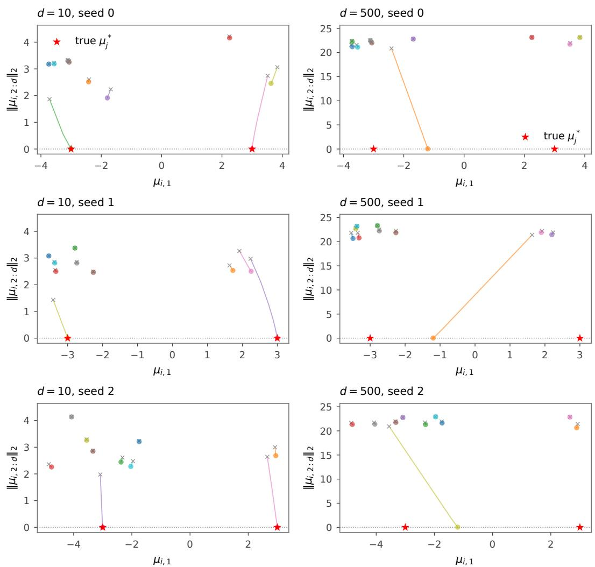  
Figure 4: Three-seed evaluation of the fixed-separation experiment in Section 5. Columns show $d = 1 0 , 5 0 0$ ; rows show seeds 0, 1, 2. As in Figure 3, gray crosses mark initialization, colored dots mark final means, and red stars mark true means. At $d = 1 0$ , all three seeds approach both true components. A $\ t d = 5 0 0 .$ , all three seeds exhibit underfitting, with a single fitted component carrying essentially all final weight.

Mean and weight trajectories at $d = 1 0 ^ { 6 }$ We compare separations $\Delta = d ^ { 0 . 4 5 } \approx 5 0 1 . 1 9$ and $\Delta = 1 0 \sqrt { d } = 1 0 0 0 0$ at $d = 1 0 ^ { 6 }$ , placing the true means at $( \Delta / 2 , 0 , \ldots )$ and $( - \Delta / 2 , 0 , \ldots )$ . We use $B = 1 6$ fresh samples per update for 500 updates, keeping the component counts, true weights, Gaussian initialization, and learning rate specified above. Figures 5 and 6 show all ten fitted means and weights at every update, for each seed and separation. Mean trajectories use the same projection as Figure $3 \colon x _ { i } ( t ) = \mu _ { i , 1 } ^ { ( t ) }$ and $y _ { i } ( t ) = \| \mu _ { i , 2 : d } ^ { ( t ) } \| _ { 2 }$ . At the smaller separation, one active mean moves between the true centers and receives essentially all final weight in every seed. At the larger separation, two active means approach the distinct true centers, and their weights fluctuate during training. The full trajectories include temporary weight losses. Component colors and indices are fixed across these two figures and retain initialization order. Here an active component has fitted weight at least 0.01.

$$
\begin{array} { r } { \begin{array} { r l } { \_ i = 1 } & { { } \quad \_ { i = 3 } } \\ { \_ { i = 2 } } & { { } \quad \_ { i = 4 } } \end{array} \quad \_ { i = 4 } \quad \_ { i = 6 } ^ { \quad } \quad \_ { i = 7 } \quad \_ { i = 8 } \quad \_ { i = 1 0 } } \end{array}
$$

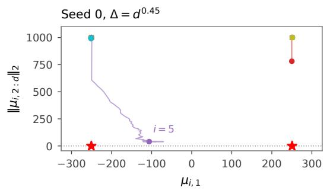

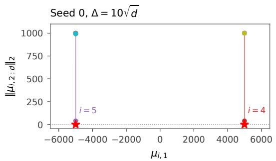

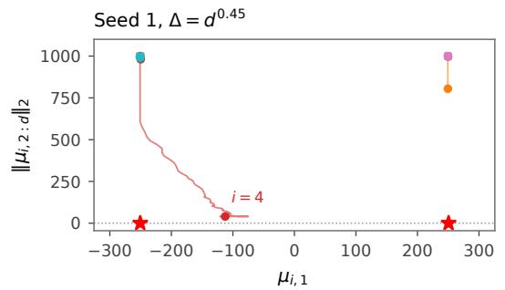

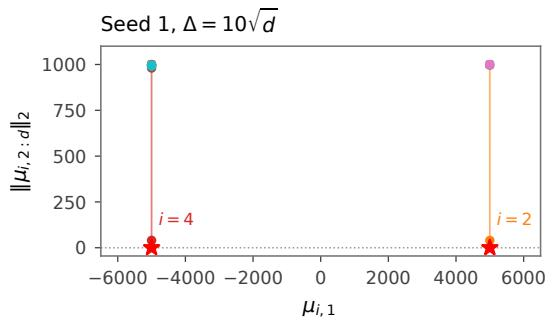

$$
\Delta = d ^ { 0 . 4 5 }
$$

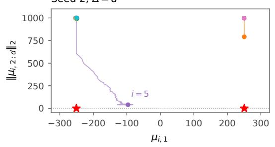

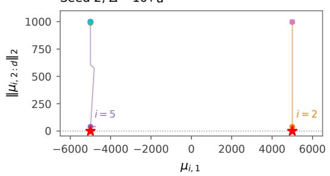  
Figure 5: Mean trajectories at $d = 1 0 ^ { 6 } .$ using the same coordinates and style as Figure 3. Rows show seeds 0, 1, 2; columns show the two separations. At the smaller separation one active mean lies between the true centers; at the larger separation two active means approach the distinct true centers.

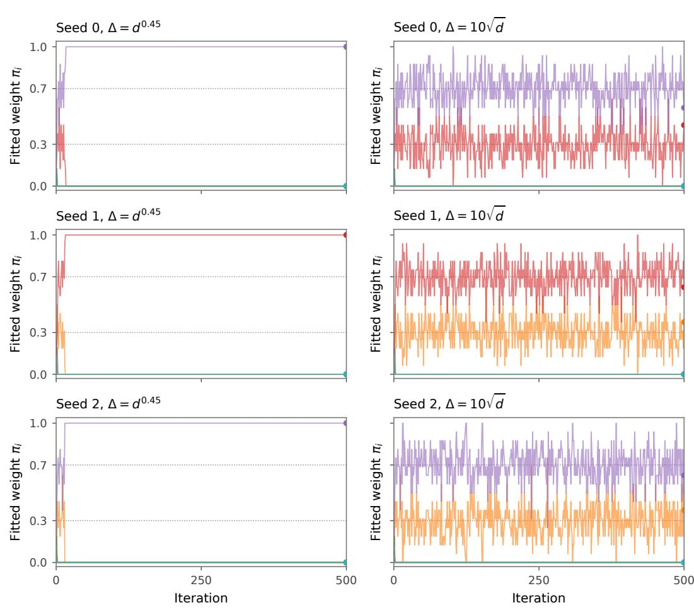  
Figure 6: Fitted-weight trajectories $\pi _ { i } ^ { ( t ) }$ at $d = 1 0 ^ { 6 }$ for all ten components and all 500 updates. At the smaller separation one component receives almost all final weight. At the larger separation two components have substantial final weights.