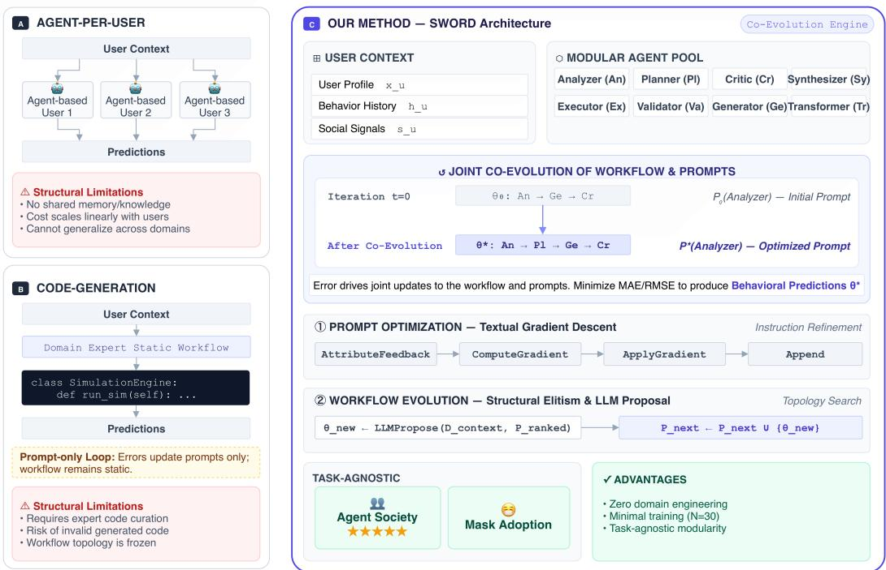
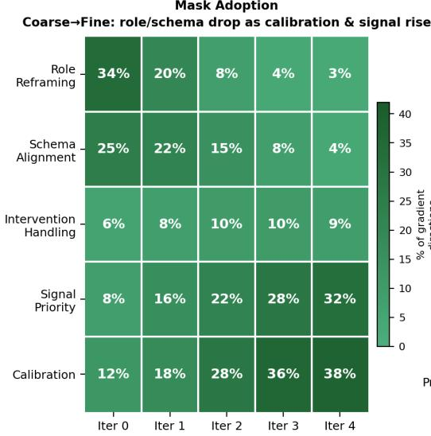
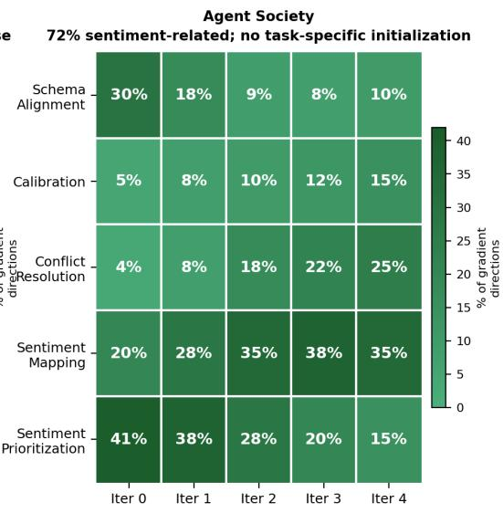

# Joint Workflow and Prompt Optimization for User Behavior Simulation

NIPUN B NAIR<sup>∗</sup> and TONGTONG WU, Monash University, Australia

HONGZHI YIN, The University of Queensland, Australia

HUI LI, Xiamen University, China

WEIQING WANG, Monash University, Australia

User behavior simulation is the computational modeling of user interactions within information systems through the use of simulated agents in place of live users. It supports system testing and evaluation, decisionmaking and forecasting, and user experience design. Existing simulators rely on hand-crafted rules or domain expertise that transfers poorly across tasks. SWORD (Simulation-driven Workflow and Prompt Optimization with Role-based Design) is introduced as a framework that jointly optimizes multi-agent workflow topology and natural-language prompts. It is guided solely by a scalar task metric, without domain initialization or task-specific engineering. The experimental results demonstrate that SWORD achieves statistically significant gains over prompt-only, workflow-only, and staged-optimization baselines under a controlled, identicalbackbone comparison. Against the strongest published domain-specific baseline, SWORD further improves accuracy while using a smaller backbone model, substantially less training data, and a very reasonable API cost (\$4–\$6 for each dataset). Beyond predictive performance, SWORD autonomously discovers domain-relevant signals, review-sentiment mapping rules and epidemiological decay priors, purely from scalar error feedback, establishing textual gradients as a mechanism for unsupervised feature-importance discovery in user behavior modeling.

CCS Concepts: • Information systems → Information systems applications.

Additional Key Words and Phrases: user simulation, agent-based simulation, multi-agent systems, prompt optimization, workflow optimization, textual gradients, large language models, behavioral prediction, autonomous optimization

ACM Reference Format:

Nipun B Nair, Tongtong Wu, Hongzhi Yin, Hui Li, and Weiqing Wang. 2026. Joint Workflow and Prompt Optimization for User Behavior Simulation. ACM Trans. Inf. Syst. 1, 1, Article 1 (August 2026), 34 pages. https://doi.org/10.1145/nnnnnnn.nnnnnnn

## 1 Introduction

User behavior simulation holds significant value in information systems in three key ways. First, it enables informed decision-making and forecasting by predicting how users will interact with system features before actual deployment[3, 39]. Second, it supports system testing and optimization by examining user behavior across diverse scenarios and contexts[35]. Third, it improves user

Authors’ Contact Information: Nipun B Nair, nipun.nair@monash.edu; Tongtong Wu, tongtong.wu@monash.edu, Monash University, Melbourne, Victoria, Australia; Hongzhi Yin, db.hongzhi@gmail.com, The University of Queensland, Brisbane, Queensland, Australia; Hui Li, hui@xmu.edu.cn, Xiamen University, Department of Computer Science and Technology, Xiamen, China; Weiqing Wang, teresa.wang@monash.edu, Monash University, Melbourne, Victoria, Australia.

Permission to make digital or hard copies of all or part of this work for personal or classroom use is granted without fee provided that copies are not made or distributed for profit or commercial advantage and that copies bear this notice and the full citation on the first page. Copyrights for components of this work owned by others than the author(s) must be honored. Abstracting with credit is permitted. To copy otherwise, or republish, to post on servers or to redistribute to lists, requires prior specific permission and/or a fee. Request permissions from permissions@acm.org.   
© 2026 Copyright held by the owner/author(s). Publication rights licensed to ACM.   
ACM 1558-2868/2026/8-ART1   
https://doi.org/10.1145/nnnnnnn.nnnnnnn

LLM-based User Behavior Simulation  
  
Fig. 1. Comparison of LLM based user simulation paradigms and the SWORD framework. (A) Agent-per-User: instantiates isolated LLM agents per user, preserving personalization but sharing no knowledge. (B) Code-Generation: achieves personalization via generating executable Python simulation code for each user through shared agent workflow, while shifting the burden of workflow design and simulation logic validation to domain experts, limiting task transferability. (C) SWORD (Ours): is a further step forward compared with Code-Generation to eliminate the dependence on domain experts for diferent user simulation tasks via automated workflow and prompt optimization and task agnostic modular agent pool design.

experience design by revealing how diferent user segments interact with systems, thereby enabling researchers to create more intuitive and responsive interfaces[19].

Classical approaches to user behavior simulation use probabilistic frameworks, including click models, cascade models, and position-bias models, which are fitted to logged data [2, 13, 36]. Rulebased agent models extend this by encoding explicit decision logic, interaction rates, and social influence parameters specified by domain experts [11, 37]. Both families are efective within their original domain, but they transfer poorly: constructing or adapting them requires expert knowledge that is rarely available across the full range of tasks that IR and recommender-system evaluation demands [2].

Large language models (LLMs) ofer a fundamentally diferent path. LLMs encode rich representations of human reasoning, preferences, and social norms, enabling them to serve as the cognitive backbone of simulated users without explicit rule specification [6, 16, 50]. Existing LLM-based user simulation approaches can be grouped into two paradigms, each with a structural limitation (Fig. 1). Agent-per-user methods [40] instantiate one LLM agent per simulated user, preserving personalization but sharing no knowledge across agents: users with sparse interaction histories produce unreliable predictions, and the system must be rebuilt for each new simulation domain.

Moreover, the number of agents the system needs to maintain scales linearly with the number of users. Code-generation methods [25] address the scaling problem by using several agents that communicate through a predefined workflow to generate Python simulation code: given user profile and history information, this code predicts behavior as a single shared function. This removes per-user specialization but shifts the burden onto workflow design (the workflow that defines how agents communicate) and code validation which usually depend on domain experts. The generated code requires iterative review and approval from a domain expert, making transferability contingent on the availability of domain experts, who are both scarce and costly. We introduce SWORD (Simulation-driven Workflow and prompt Optimization with Role-based Design), a framework for user simulation that requires no domain-expert input. SWORD achieves this via joint workflow–prompt optimization, in which the structure of the agent workflow (which agents participate and how they communicate) and the prompts (the instructions given to each agent) are co-optimized end-to-end in a single closed loop. SWORD takes user context (profile, behavioral history, social signals) as input and produces behavioral predictions as output, guided solely by a scalar task metric (MAE or RMSE). Each workflow is a directed acyclic graph (DAG) over eight task-agnostic agent roles: Analyzer, Planner, Generator, Critic, Synthesizer, Executor, Transformer, and Validator. These roles span the full cognitive space of behavioral prediction, from data parsing and planning, through generation and critique, to synthesis and output validation, and they transfer across simulation tasks without modification. Adapting SWORD to a new task requires only 30 labeled training examples and a scalar evaluation error metric, with no simulation code, domain initialization, or task-specific engineering.   
Contributions.

(1) SWORD: a joint optimization framework for LLM-based user simulation requiring no domain-expert input. We introduce a scalable framework that interleaves DAG workflow evolution and prompt optimization within a single optimization loop, with an LLM-guided proposer generating targeted structural mutations informed by the full optimization history. A fixed vocabulary of eight roles transfers unmodified across the two user simulation tasks we evaluate, requiring no domain-expert input or per-task role engineering.

(2) Workflow–prompt non-stationarity: empirical characterization and eficient search space reduction. We identify workflow–prompt non-stationarity as an important challenge in multi-agent optimization: the quality of a workflow depends on the prompts it is paired with, rendering staged optimization inefective. We address this with a practical framework for jointly optimizing agent workflow and prompts, making end-to-end search over both structural and linguistic design spaces computationally feasible. This search space reduction is achieved through mechanisms including elitist selection, a history-conditioned workflow proposer, and worst-case gradient trace selection, as detailed in Section 4.5.

(3) Unsupervised user preference discovery via textual gradients. SWORD autonomously identifies review text sentiment as the main signal for predicting user ratings. It learns precise rules that map sentiment to rating scores using only MAE feedback. This process establishes textual gradients as a mechanism for unsupervised feature-importance learning in user behavior modeling.

(4) Improved eficiency through joint optimization. SWORD outperforms prior approaches while using a smaller backbone (GPT-5.4-mini) with substantially less training data and computational cost. This highlights that efective joint optimization of workflow structure and prompts can compensate for reduced model capacity and data requirements.

The remainder of the paper is organized as follows. Section 2 reviews related work. Section 3 formalises the problem. Section 4 presents the SWORD framework. Section 5 describes the experimental setup. Section 6 presents results and analysis. Section 7 discusses findings. Section 8 concludes the paper.

## 2 Related Work

Our work sits at the convergence of two research streams: user simulation for information systems, and prompt and workflow optimization for multi-agent systems. We review each in turn and identify the shared limitations that SWORD addresses.

## 2.1 User Simulation for Information Systems

User simulation is a long-established task in information systems, including information retrieval and recommender systems [2]. Classical simulators model user–system interactions through probabilistic frameworks: click models (including the position-bias model, cascade model, and userbrowsing model [13]) capture how users examine and click search results from logged behavioral data. The SimIIR framework [36] generalizes this into a configurable toolkit for interactive IR experiments, supporting modular searcher models, stopping criteria, and query generation components. For conversational recommender systems (CRS), prior studies [64] demonstrate how user simulators enable scalable evaluation without real-user involvement, establishing ground-truth alignment as the central evaluation challenge. UserSimCRS [1] operationalises agenda-based simulation for CRS evaluation with persona modeling and natural language generation.

The introduction of large language models as simulated users represents a paradigm shift in this line of work[69, 74]. LLMs encode representations of human reasoning and social norms that allow them to serve as cognitive backbones for simulated users without explicit rule specification [16]. Existing research [40] demonstrate that generative agents, LLM-driven personas with memory, reflection, and planning, can simulate emergent social behaviors in a sandbox town. Previous surveys [16, 18, 47] cover LLM multi-agent systems and LLM-empowered ABM respectively. The first comprehensive framework [50] has been designed specifically for user behavior simulation in recommender systems using LLM-based agents. Recent work has extended LLM simulation to user rating prediction with collaborative filtering signals [28, 34, 46], review-based recommendations [33], and large-scale social platforms [41, 65]. Population-level behavioral dynamics, specifically the epidemic mask-wearing task studied in this paper, are addressed by SOCIA-∇ [25] and LLM-ABM baselines.

Across all of these systems, however, the agent workflow and agent prompts are treated as static design decisions made by domain experts. No prior work in information systems user simulation applies systematic optimization to either the workflow structure or the prompts. SWORD fills this gap.

## 2.2 Prompt and Workflow Optimization for Multi-Agent Systems

Optimizing a multi-agent system requires improving two interdependent components: agent prompts and workflow topology. The literature has pursued these directions in parallel, holding the other component fixed.

Automatic prompt optimization (APO) takes the workflow as given and searches for better instructions using model feedback [4, 48]. The textual-gradient paradigm, introduced by ProTeGi [42] and generalised by TextGrad [57], propagates LLM-generated critiques through the pipeline analogously to numerical gradients[5, 9, 10]. Prompts produced by APO methods are optimal only conditional on the fixed topology that generated the gradient signals[56].

Workflow optimization methods hold prompts generic and search over topology[29, 31, 61, 43, 60]. Representative approaches include AFlow [63], which uses Monte Carlo Tree Search over code-based workflows; EvoFlow [58], which applies evolutionary search to heterogeneous agents; and MaAS [59], which optimizes a probabilistic supernet over architectures. Both streams share a structural limitation: each holds the other variable fixed[73], and all evaluations are restricted to reasoning, code generation, or mathematical benchmarks[51, 52]. None of these methods has been applied to user behavior simulation.

Three recent methods attempt joint optimization but remain staged. MASS [70] sequences prompt refinement, workflow search, and global prompt refinement as three fixed phases. MASPO [53] jointly refines prompts across agents but fixes the workflow throughout. MASPOB [22] introduces workflow-aware prompt optimization but selects the workflow once at initialization. Because workflow and prompts are never updated simultaneously, the workflow chosen during search is always evaluated under the prompt quality available at that moment, not under the quality that optimization will eventually achieve[66, 67]. SWORD is the first to treat both as continuously co-optimized variables in a single closed loop, applied to the domain of user behavior simulation.

## 3 Problem Formulation and Preliminaries

## 3.1 Problem: Predicting User Behavior from Context

User behavior simulation addresses the following prediction problem. Given a user’s profile information (demographics, preferences) and behavioral history (past interactions, ratings, social signals), a simulator must predict the user’s next behavioral output, such as a star rating or a mask-wearing decision, without observing it directly. Formally, let � denote the user context (profile, history, and any task-specific side information) and � the ground-truth behavioral output. The simulator is a function $f : x \mapsto \hat { y }$ to be learned from a labeled dataset $\mathcal { D } = \{ ( x _ { i } , y _ { i } ) \} _ { i = 1 } ^ { N }$

## 3.2 Preliminaries

In this work, we model the simulator � as a multi-agent framework in which agents communicate according to a shared workflow to accomplish the user simulation task. This framework is defined as $W = ( \theta , \phi )$ , where � is the workflow defining how agents communicate with each other. More formally, $\theta = ( V , E )$ is a directed acyclic graph with � denoting agents and � communication links. $\phi = \{ \phi _ { v } \} _ { v \in V }$ are the natural-language prompts governing each agent’s reasoning. Each agent receives the outputs of its predecessors plus a portion of the user context �, processes them according to its prompt $\phi _ { v } ,$ , and passes its output downstream. The final agent produces the behavioral prediction �ˆ.

## 4 The SWORD Framework

SWORD operates as a single closed loop that jointly evolves agent workflows and optimizes agent prompts across � iterations. Algorithm 1 illustrates the full pipeline. At initialization, candidate workflows $\{ \theta _ { 1 } , \ldots , \theta _ { K } \}$ are constructed by sampling subsets and orderings of the eight task-agnostic agents (Analyzer, Planner, Generator, Critic, Synthesizer, Executor, Transformer, Validator), and each agent is paired with a default prompt for every active role. A key challenge SWORD is designed to address is workflow rank inversion: as prompt quality improves through optimization, the workflow that performed best under generic initial prompts is no longer optimal under refined prompts. The closed-loop design of SWORD addresses rank inversion directly: by never committing to a fixed workflow, every iteration can discover a new best structure as prompts evolve, keeping the workflow and prompts mutually aligned throughout optimization. (This phenomenon is documented empirically in Section 6.5 and analysed mechanistically in Section 7.3.)

```perl
Algorithm 1: SWORD: Self-Optimizing Workflow Discovery
Require : Training set D, metric M, candidate workflows $\mathcal { P }$
Output :Optimized model $W ^ { * } = ( \theta ^ { * } , \phi ^ { * } )$
1 Initialize $\mathcal { P }$ with � random DAG workflows (2–8 agents), each using generic prompts $\phi$
2 $s ^ { * }  - \infty ;$ <sup>�</sup>no-improve $ 0$
3 for $t = 1$ to � do
4 for each $\theta _ { k } \in \mathcal { P }$ in parallel do
5 Evaluate $\theta _ { k }$ on D to obtain score $s _ { k }$ and traces $\tau _ { k }$
6 end
7 Sort $\mathcal { P }$ by descending �<sub>�</sub>; (�<sub>best</sub>, �<sub>best</sub>) ← arg max<sub>�</sub> $s _ { k }$
8 if $s _ { \mathrm { b e s t } } > s ^ { * }$ then
9 $( \theta ^ { * } , \phi ^ { * } ) \gets ( \theta _ { \mathrm { { b e s t } } } , \Phi _ { \mathrm { { b e s t } } } )$
10 $s ^ { * }  s _ { \mathrm { b e s t } } ; ~ n _ { \mathrm { n o - i m p r o v e } }  0$
11 else
12 �<sub>no-improve</sub> ← �<sub>no-improve</sub> $+ \nobreakspace 1$
13 end
14 if $n _ { \mathrm { n o - i m p r o v e } } \geq P$ then
15 break
16 end
17 for each elite topology $\theta _ { e } \in \{ t o p { - } E o f \mathcal { P } \}$ do
18 $\tau _ { e } ^ { - } \gets \tau _ { e } ^ { ( i ^ { * } ) }$ where �<sup>∗</sup> = arg min<sub>�</sub> $s _ { e } ^ { ( i ) }$
19 for each agent $a \in \theta _ { e }$ do
20 $f _ { a }$ ← AttributeFeedback $\left( a , \tau _ { e } ^ { - } \right)$
21 $g _ { a }$ ← ComputeGradient(�<sub>�</sub>, � <sup>−</sup>, �<sub>�</sub>, �<sub>best</sub>, $\mathcal { H } _ { a } ^ { \mathrm { l a s t - 3 } } )$
22 $\phi _ { a }$ ← ApplyGradient $( \phi _ { a } , g _ { a } )$
23 Append $( \phi _ { a } , s _ { \mathrm { b e s t } } , f _ { a } )$ to trajectory history ${ \mathcal { H } } _ { a }$
24 end
25 end
26 $\mathcal { P } _ { \mathrm { n e x t } }  \{ \theta _ { e }$ .Clone() : $\theta _ { e } \in$ top-� elites}
27 for $j = 1$ to $K - E$ do
28 $\theta _ { \mathrm { n e w } }$ ← LLMPropose(D<sub>context</sub>, $\mathcal { P } _ { \mathrm { r a n k e d } } )$
29 if proposal invalid then
30 � ← Mutate(TournamentSelect $( \mathcal { P } ) )$
31 end
32 $\mathcal { P } _ { \mathrm { n e x t } }  \mathcal { P } _ { \mathrm { n e x t } } \cup \{ \theta _ { \mathrm { n e w } } \}$
33 end
34 $\mathcal { P }  \mathcal { P } _ { \mathrm { n e x t } }$
35 end
36 if $\theta ^ { * } = \varnothing$ then
37 $\theta ^ { * }  \mathcal { S } [ 1 ]$ $\phi ^ { * }  \{ \phi _ { a } : a \in \theta ^ { * } \}$
38 end
39 Apply $\phi ^ { * }$ to $\theta ^ { * }$
40 return $W ^ { * } = ( \theta ^ { * } , \phi ^ { * } )$
```

## 4.1 Workflow Representation

Each workflow $\theta _ { k }$ is a named directed acyclic graph [7, 21, 75] over the fixed vocabulary of eight agent roles. Structural constraints are enforced at proposal time as explained in Section D.0.2:

• At least 2 and at most 8 agents (balancing expressiveness vs. computational cost).

• A single source node receiving the raw task input �, and a single sink node producing the prediction.

• Strict DAG structure: no cycles, verified by topological sort before acceptance.

SWORD constrains workflows to directed acyclic graphs (DAGs) to prevent agents from overwriting or corrupting each other’s intermediate outputs, which would degrade prediction fidelity. Each valid workflow is further required to have a single source node, which receives all user context, and a single sink node, which produces the behavioral prediction. This design enforces a clear division of labor across the pipeline. This acyclic single-source–single-sink structure also ensures that gradient signals propagate unambiguously from the prediction error back through the graph, enabling targeted prompt optimization at each agent’s structural role.

## 4.2 Task-Agnostic Agent Roles

SWORD defines a fixed vocabulary of eight named roles: Analyzer, Planner, Generator, Critic, Synthesizer, Executor, Transformer, and Validator. The vocabulary is grounded in the structure of the user simulation problem. Predicting user behavior requires four functional stages: interpreting user history, forming a prediction strategy, generating a behavioral output, and validating it against task constraints. These stages map directly to Analyzer, Planner, Generator, and Validator. The remaining four roles cover auxiliary operations that arise in behavioral modeling. Synthesizer integrates signals from multiple upstream agents (e.g., combining interaction history with social influence data). Critic checks consistency between a candidate prediction and established user behavioral patterns. Transformer resolves data representation mismatches between agents (e.g., converting raw interaction logs to structured feature vectors). Executor handles deterministic computation such as aggregating population-level statistics. Together the eight roles form a complete functional basis for user simulation without encoding assumptions about any specific task, metric, or user population. The same vocabulary applies unchanged to rating prediction on Agent Society and adoption modeling on Mask Adoption, with the optimization process determining which subset to include and how to connect them. Fixing the vocabulary to eight roles bounds the structural search space without restricting expressiveness. Initial prompts are given in Section D.0.5.

## 4.3 Workflow-Conditioned Textual Gradient Prompt Update

Each iteration, SWORD selects the single worst-performing training example and issues a per-agent gradient call for each agent in the elite workflow. For agent �, this proceeds as three sequential LLM calls: feedback attribution (AttributeFeedback), gradient computation (ComputeGradient), and prompt rewriting (ApplyGradient). The prompts used here are shown in Section D.0.1.

AttributeFeedback takes the global evaluation feedback produced by scoring the workflow against the worst-performing training example and attributes it to a specific agent �. It receives the agent’s name, role, and outputs, together with the global feedback string, and uses an LLM to extract only the portions of that feedback relevant to �’s contribution. The result is rephrased as direct feedback to �: if no part of the global feedback is attributable to �’s outputs, the call returns "No specific issues." This step is necessary because global feedback critiques the workflow’s final prediction error without distinguishing which agent caused it. AttributeFeedback performs that attribution before the gradient is computed.

ComputeGradient produces a structured gradient with four fields:

• EA (Error Analysis): what agent � output, and how it contributed to the final error.

• GD (Gradient Direction): the semantic direction in which $\phi _ { v }$ should change to reduce error.

• M (Magnitude): whether the change warrants a major rewrite, moderate update, or minor calibration.

• SC (Specific Changes): concrete before/after edits to $\phi _ { v }$

ApplyGradient then takes the current prompt $\phi _ { a }$ and gradient $g _ { a }$ and rewrites $\phi _ { a }$ in the direction given by GD, at the severity given by M, incorporating the edits in SC while preserving the agent’s core role identity.

The gradient call is workflow-conditioned: it supplies agent �’s upstream agents and their outputs alongside the four gradient fields, ensuring that the critique is grounded in the actual inputs � received rather than its role in isolation. As a result, the same named role receives diferent gradient signals depending on where it sits in the workflow. This design is the key distinction from fixedarchitecture methods such as DSPy [27] and MIPRO [38]. For example, an Analyzer that is the sole upstream agent in a compact two-agent workflow receives gradients emphasizing feature completeness, since downstream prediction depends entirely on its output. The same Analyzer in a larger workflow, mediated by a Planner before reaching the Generator, instead receives gradients emphasizing signal selectivity, since over-complete output burdens the Planner unnecessarily. The workflow context is thus constitutive of the gradient, not incidental to it.

To prevent gradient drift, each agent maintains a trajectory history ${ \mathcal { H } } _ { a }$ of previous prompt–score– feedback triples. ComputeGradient conditions on only the last three entries of ${ \mathcal { H } } _ { a } .$ : enough to detect oscillation (a score declining after a prompt update) and reinforce a consistent improvement direction, without the context overhead of the full history.

Within each iteration, the gradient is computed from a single example: the worst-performing one in the training set. This example maximizes the gap between prediction and ground truth, which in turn makes the resulting error attribution to individual agents more discriminative than gradients computed on near-correct examples.

## 4.4 LLM-Guided Workflow Evolution

At each iteration, SWORD maintains a set of � candidate workflow topologies, all evaluated concurrently on the training set using a thread pool. Exploiting the I/O-bound nature of LLM API calls, this achieves near-linear speedup across the set without violating API rate limits. An LLM proposer can reason about which functional configurations make sense for user behavior prediction in a way that random mutation cannot [14, 44].

Elitist selection. The top � scoring topologies are cloned unchanged into the next generation, guaranteeing that the optimization front is monotonically non-decreasing[17, 30]. This is particularly consequential in user behavior simulation: a poorly matched topology mutation can cause output schema mismatches or cascading format errors that collapse predictions across all training examples for an entire iteration. Retaining the elite set as a guaranteed fallback prevents valid behavioral structure discovered in earlier iterations from being discarded.

History-conditioned LLM proposer. The remaining �−� slots are filled by a Workflow proposer, an LLM that receives two inputs: (1) the task description, and (2) a compact ranked summary of the entire current candidate set, where each entry contains the topology’s rank, mean score, perexample score standard deviation, agent list as {name, role} pairs, edge list, and the feedback string from its worst-performing example. Feedback strings are truncated to 200 characters per topology to keep the proposer prompt within a predictable context budget while still conveying the dominant failure mode. Providing the full ranked candidate set rather than only the best topology allows the proposer to reason about which structural regions have already been explored and which remain promising, functioning as an implicit history-conditioned search memory[23, 24].

The proposer returns a structured JSON specification containing a one-sentence reasoning trace, a list of named agent–role pairs, an edge list, and a designated entry and exit node. This output format enforces the single-source–single-sink DAG constraint directly in the LLM’s generation space and makes proposals machine-parseable without natural-language post-processing. Refer to Section D.0.3 for implementation.

Robustness and fallback. Because LLM outputs are not guaranteed to be valid JSON, the proposer pipeline applies a sequence of recovery steps: regex extraction of JSON substrings, removal of trailing commas, and normalisation of single-quoted keys and values. Any proposal that cannot be recovered, specifies fewer than two agents, or references an invalid role is silently rejected and replaced by a random mutation of a tournament-selected parent from the current candidate set. This dual-path design ensures the evolution loop never stalls regardless of LLM output quality.

Structural validity enforcement. After every proposal or mutation, three invariants are enforced before evaluation: the entry agent has at least one outgoing edge, the exit agent has at least one incoming edge, and a directed path exists from every entry to every exit. Violations are repaired by adding the minimum number of edges necessary without removing any edges contributed by the proposal. Cycle detection is performed by depth-first search prior to every edge insertion, maintaining acyclicity throughout.

This proposer is conceptually related to the evolutionary operators in EvoFlow [58] and the MCTS expansion policy in AFlow [63], but conditions on task-specific metric signals and per-agent execution traces rather than code coverage scores or tree rewards. It also relates to the Socratic dialogue planning of MARS [62], but operates at the workflow structural level rather than the prompt level. An example of the evolution is given in Section B.

## 4.5 Search Space Reduction

Joint optimization over workflow topologies and natural-language prompts is in principle intractable: the space of DAGs over 8 named roles is combinatorial, and the space of natural-language prompts is unbounded. SWORD reduces this space through five complementary mechanisms.

(1) Fixed role vocabulary. Workflows are constrained to DAGs over a closed vocabulary of 8 task-agnostic roles. In user behavior simulation, the cognitive operations required—observing user context, planning behavioral trajectories, generating behavioral predictions, critiquing outputs, and validating against task constraints—map naturally onto these roles. This bounds the structural search to ordered subsets and topologies over a finite, semantically grounded vocabulary rather than over arbitrary agent specifications.

(2) DAG structural constraints. Every candidate workflow must satisfy three hard constraints enforced before evaluation: at least 2 and at most 8 agents, a single source node (ensuring all agents receive the same user context), and a single sink node (ensuring a unified behavioral prediction output), with no directed cycles (preventing infinite reasoning loops that would block output). These constraints prune a large fraction of the combinatorial graph space before any LLM call is made.

(3) Elitist selection. The current best workflow is preserved unchanged across every iteration. Only � − � new candidates are generated per round. In user simulation, a single bad structural mutation can collapse predictions across all training users for an entire iteration; elitist retention guarantees that at least � high-quality candidates always survive, making the optimization monotonically non-decreasing in performance. Elitist selection is not merely a variance-reduction device. It ensures that prompt gradient updates accumulate on persistent topologies, preventing the investment of three LLM gradient calls from being discarded when a workflow is replaced.

(4) History-conditioned workflow proposer. The LLM proposer receives a compact ranked summary of the current candidate set: for each topology, the entry contains its rank, mean score, per-example score standard deviation, agent list as name, role pairs, edge list, and a 200-character feedback string truncated from its worst-performing example. Providing the full ranked candidate set rather than only the best topology allows the proposer to infer which structural regions have already been explored, functioning as an implicit search memory. Refer to Section D.0.3 for implementation.

(5) Gradient trace selection. For prompt optimization, the gradient is computed from the single worst-performing training example per iteration, the example where the gap between prediction and ground truth is largest, and therefore where the error signal attributable to individual agents is most discriminative. This focuses the prompt update on the failure mode that most urgently requires correction, rather than averaging over examples where the workflow already performs adequately.

Mechanisms (1)–(2) reduce the structural search space; mechanisms (3)–(4) focus the search trajectory; mechanism (5) reduces the efective dimensionality of the prompt update at each step. Together they make joint optimization tractable and reliably convergent within � = 5 iterations (Section 6.7).

## 5 Experimental Setup

## 5.1 Research Questions

The experiments address four research questions that correspond directly to the four contributions stated in Section 1.

RQ1 (User simulation performance). How does SWORD perform on user behavior simulation tasks compared with existing methods?

RQ2 (Joint optimization superiority and eficiency). Does jointly optimizing workflow topology and prompts in a single closed loop outperform prompt-only, workflow-only, and staged optimization baselines, and can workflow–prompt coupling non-stationarity explain why staged approaches fail while five complementary search space reduction mechanisms make joint cooptimization computationally eficient?

RQ3 (Unsupervised preference discovery). Without any task-specific initialization, can metricconditioned textual gradients autonomously discover the task-relevant user preference signals such as review-text sentiment for rating prediction, or epidemiological decay dynamics for behavioral adoption?

RQ4 (Model and data eficiency). Does SWORD’s joint co-optimization strategy yield competitive or superior performance compared to state-of-the-art baselines that use a stronger backbone model, at a lower API cost?

Table 1 summarises which experimental section addresses each question.

Table 1. Research question to section mapping.
<table><tr><td>RQ</td><td>Addressed in</td><td>Evidence</td></tr><tr><td>RQ1</td><td>§6.1,6.2</td><td>Tables 2, 3</td></tr><tr><td>RQ2</td><td>§6.5</td><td>Table 5</td></tr><tr><td>RQ3</td><td>§6.6</td><td>Figure 2, Table 6</td></tr><tr><td>RQ4</td><td>§6.7</td><td>Table 8</td></tr></table>

## 5.2 Tasks and Datasets

We use two user simulation tasks to evaluate our model: Mask Adoption and rating prediction on the Agent Society dataset [25].<sup>1</sup>

Mask Adoption (RMSE↓). Daily population-level mask-wearing rate prediction over a synthetic population of1000 agents. The dataset is structured around three complementary files. agent\_attributes.csv records per-agent demographics (age group, occupation, and risk perception for each of the 1000 agents). daily\_aggregate\_data.csv provides ground-truth population-level mask rates and information-spread rates per day. Days 0 to 29 are used as the training horizon and days 30 to 39 as the held-out test horizon. train\_data.csv supplies 1000 agent-level observations per training day for the SWORD optimization loop. The social contact structure is encoded in a four-layer network (family, work/school, community, and full) loaded from social\_network.pkl. Ground truth is generated by an agent-based model calibrated on COVID-19 behavioral dynamics [11, 37].

Agent Society (MAE↓). Star rating prediction (1–5) across three platforms: Amazon, Goodreads, and Yelp. For each platform, independent train and test JSON splits are provided. Each record contains a user\_id, item\_id, ground-truth stars, and full review text. Supplementary metadata files (user\_sample.json, item\_sample.json) supply user-level and item-level metadata that serve as additional workflow inputs. Ground truth is drawn from the AgentSociety benchmark [41]. This task is related to LLM-based rating evaluation [26].

## 5.3 Baselines

Baselines are selected to provide one representative from each of the four research streams reviewed in Section 2, so that SWORD can be evaluated against the current state of the art in every relevant category.

User simulation systems (Section 2.1). SOCIA-∇ [25] applies textual gradient descent directly to generated Python simulation code on the same benchmarks, using GPT-5-class models. It is the strongest domain-specific competitor. The following five code-generation user simulator results are sourced from the SOCIA-∇ paper. AI Scientist-v2 [55] uses agentic tree search to iteratively propose and refine simulation code. YuLan-OneSim [49] generates LLM-driven social simulation scripts from natural-language task descriptions. G-SIM-ES and G-SIM-SBI [20] calibrate LLMgenerated simulators via evolutionary search and simulation-based inference respectively. Reflexion [45] improves generated simulation logic through iterative verbal self-reflection without weight updates.

Automatic prompt optimization (Section 2.2). Prompt-Only (e.g., [8]) fixes the workflow to the initial template throughout and optimizes prompts alone, providing the fairest test of whether joint optimization adds value beyond prompt tuning.

Multi-agent workflow search (Section 2.2). Workflow-Only (e.g., [63]) runs topology search with prompts kept generic throughout, testing whether structural diversity alone is suficient.

Joint prompt and workflow optimization (Section 2.2). Staged Optimization (e.g., [70]) uses both components sequentially: Phase 1 searches workflows with generic prompts frozen; Phase 2 then optimizes prompts with the selected workflow frozen. Any advantage SWORD holds over it is attributable solely to interleaving versus staging. Together, these four baseline categories form a controlled ablation. They allow us to attribute SWORD’s gains precisely to the joint closed-loop design, rather than to data, backbone, or task-specific engineering choices.

## 5.4 Evaluation Protocol

For each task we reserve a fixed held-out test set of $N _ { \mathrm { t e s t } }$ examples that is never accessed during the optimization loop for any model. All models are evaluated on two metrics: Mean Absolute Error (MAE) for rating prediction on Agent Society, and Root Mean Square Error (RMSE) for population modeling on Mask Adoption. These metrics are chosen because they are the widely recognised evaluation standards for their respective user simulation tasks [25], and because both reduce to a single scalar signal that can be used directly to guide optimization without task-specific engineering.

Statistical protocol. All comparisons are run for $n { = } 1 0$ independent seeds, with every method evaluated on identical seeds so that runs are paired. We report means, standard deviations, and 95% confidence intervals of the paired diferences, computed as ${ \bar { \Delta } } \pm t _ { 0 . 9 7 5 , n - 1 } \cdot s _ { \Delta } / { \sqrt { n } } .$ . Significance is assessed with two-sided paired �-tests; within each benchmark we correct for the three pairwise comparisons against SWORD using the Holm–Bonferroni procedure at family-wise $\scriptstyle \alpha = 0 . 0 5$ . Efect sizes are reported as Cohen’s � on paired diferences $( d = \bar { \Delta } / s _ { \Delta } )$ . Exact �-values are reported throughout so readers may apply alternative correction schemes (Section C).

## 5.5 Implementation Details

Backbone model. In SWORD, all agent calls use GPT-5.4-mini via the OpenAI API. SOCIA-∇ [25] uses the stronger GPT-5 model, meaning SWORD achieves its reported gains despite operating at a disadvantage in backbone capacity. To isolate SWORD’s optimization strategy from backbone capability, all ablation comparisons are run on the identical GPT-5.4-mini backbone under identical conditions ensuring full parity in Table 3. The statistical significance tests reported in Section 6 are therefore fully controlled comparisons. The comparison against SOCIA-∇ in Table 2 uses a stronger backbone and is reported separately as a cost-eficiency benchmark. The controlled head-to-head comparison of SWORD vs. SOCIA with an identical GPT-5.4-mini backbone is reported in Table 4. The ablation implementation is described in Section E, and results are described in Section 6.3.

Hyperparameter choices. The candidate set size � controls how many workflow topologies are maintained and evaluated per iteration, while the elite size � determines how many top-ranked topologies are carried over unchanged. We set $K = 4$ and $E = 2 ,$ choosing $K = 4$ empirically as the minimum population size at which workflow diversity meaningfully improves over a singleworkflow baseline while keeping the per-iteration cost tractable. This choice was motivated by an observed failure mode with $K = 1$ , in which a poor workflow mutation occasionally degraded performance for the entire iteration because no alternative candidate was available; using $K = 4$ eliminated this instability by ensuring that at least one prior workflow remained available when a mutation degraded performance. We did not evaluate $K > 4$ because each additional candidate requires a full training-set evaluation and therefore increases the per-iteration cost substantially; $K = 4$ keeps the number of evaluation calls within our computational budget. The choice $E = 2$ provides suficient elitism to distinguish which topologies should be retained or discarded while limiting redundant evaluations. We report these choices as the configuration used throughout the paper rather than as the product of a formal sweep over � and $E ;$ the one hyperparameter we do sweep systematically is the iteration budget �, reported as a training-score sensitivity analysis in §6.7.

Early stopping is triggered after $P = 8$ consecutive iterations without improvement, a patience value chosen to tolerate the score variance expected from only $n _ { \mathrm { t r a i n } } = 3 0$ training examples per task. In the main experiments, we set the maximum number of iterations to $T = 5$ as a cost–accuracy trade-of: the steepest gains are captured within five iterations, whereas increasing the budget to $T = 1 0$ yields only a marginal improvement of +0.01 in training score (Table 8) relative to the doubled evaluation cost.

Table 2. Main results on Agent Society (MAE↓) and Mask Adoption (RMSE↓). Results for prior work are sourced from SOCIA-∇ [25]. Note: prior-work baselines use GPT-5-class models; SWORD uses GPT-5.4-mini, so this comparison is a cost-eficiency benchmark rather than a controlled accuracy head-to-head. Table 3 provides backbone-controlled ablation comparisons. Best result per column in bold. SWORD results are means over $n = 1 0$ seeds.
<table><tr><td>Category</td><td>Method</td><td></td><td>Agent MAE↓ Mask RMSE↓</td></tr><tr><td rowspan="6">Prior work</td><td>AI Scientist-v2 [55]</td><td> $0 . 8 9 _ { \pm 0 . 1 0 }$ </td><td> $0 . 4 5 _ { \pm 0 . 0 7 }$ </td></tr><tr><td>YuLan-OneSim [49]</td><td> $0 . 7 2 _ { \pm 0 . 0 8 }$ </td><td> $0 . 4 2 _ { \pm 0 . 0 4 }$ </td></tr><tr><td>G-SIM-ES [20]</td><td> $0 . 6 0 _ { \pm 0 . 0 7 }$ </td><td> $0 . 3 0 _ { \pm 0 . 0 8 }$ </td></tr><tr><td>G-SIM-SBI [20]</td><td> $0 . 6 9 _ { \pm 0 . 0 8 }$ </td><td> $0 . 2 0 { \scriptstyle \pm 0 . 1 0 }$ </td></tr><tr><td>Reflexion [45]</td><td> $0 . 5 7 _ { \pm 0 . 0 8 }$ </td><td> $0 . 3 6 _ { \pm 0 . 0 4 }$ </td></tr><tr><td>SOCIA-∇ (as reported) [25]</td><td> $0 . 5 4 _ { \pm 0 . 0 6 }$ </td><td> $0 . 2 2 _ { \pm 0 . 0 7 }$ </td></tr><tr><td>LLM-based Ours</td><td>SWORD</td><td> $\mathbf { 0 . 2 5 7 { \scriptstyle \pm 0 . 1 0 5 } }$ </td><td> $\mathbf { 0 . 0 2 1 7 { \scriptstyle \pm 0 . 0 0 1 7 } }$ </td></tr></table>

Workflow topology size is bounded to [2, 8] agents. The lower bound guarantees a meaningful distinction between entry and exit agents, whereas the upper bound limits prompt-context growth caused by large upstream fan-in. Upstream fan-in is itself limited to max\_edges\_per\_node=4 per node. The LLM sampling temperature is fixed at 1.0 for all agent executions and proposer calls. Finally, the random seed is ofset for each repeat as 42+rep+rep\_ofset, making each run individually deterministic while decorrelating repeats for variance estimation across $n = 1 0 { \mathrm { ~ r u n s } }$

Initialization. The � initial workflow topologies are sampled randomly: each workflow draws a random agent count from [2, 8], assigns roles by sampling from the fixed role vocabulary, and connects agents with random edges subject to the DAG constraints in Sections 4.1 and 4.2.

Initial prompts. All agents start with a generic two-sentence prompt of the form: “You are a [role] agent in a multi-agent workflow. Your task is to process the upstream input and produce a structured output in JSON format [output schema].” No task-specific knowledge is provided at initialization; all domain-specific behavior is discovered through the optimization loop. Refer to Section D.0.5 for full prompts.

Computational cost. A full call-count breakdown is provided in Appendix $\operatorname { A } ;$ in brief, workflow scoring $( T \times N _ { \mathrm { t r a i n } } \times K \times \bar { A } \approx 5 \times 3 0 \times 4 \times 5 = 3 , 0 0 0$ calls), prompt gradient steps $( T \times 3 \times E \times \bar { A } \approx 1 5 0$ calls), and topology proposals $( T \times ( K { - } E ) = 1 0 \mathrm { c a l l s } )$ sum to approximately 3,160 LLM calls per run. At GPT-5.4-mini pricing (\$0.75/1M input, \$4.5/1M output tokens as of mid-2026), the total cost of a full training-and-testing run of SWORD is approximately \$4–\$6 USD.

## 6 Results and Analysis

## 6.1 Joint Optimization Superiority

Table 2 reports primary metrics on both benchmarks across all methods, providing the primary evidence for RQ1 (joint optimization superiority, Contribution 1) and RQ4 (model and data eficiency, Contribution 4). On Mask Adoption, SWORD achieves $\mathrm { R M S E } = \ : 0 . 0 2 1 7 \pm 0 . 0 0 1 7 ,$ a 90% improvement over SOCIA-∇ (0.220 ± 0.07). On Agent Society, SWORD achieves ${ \mathrm { M A E } } =$ $0 . 2 5 7 { \pm } 0 . 1 0 5 .$ , a 52% improvement over $\operatorname { S O C I A - } \nabla \left( 0 . 5 4 0 \pm 0 . 0 6 \right)$ and a nominal 15% improvement over the strongest ablation, Prompt-Only $( 0 . 3 0 1 \pm 0 . 0 8 7 )$ (Section 7.2). We emphasize that comparisons against prior work use diferent backbone models and are therefore cost-eficiency benchmarks.

Table 3. Ablation study (�=10 seeds, $N _ { \mathrm { t r a i n } } { = } 3 0 , N _ { \mathrm { t e s t } } { = } 1 0 0 )$ . All methods share the identical GPT-5.4-mini backbone and identical seeds (paired design). We report mean ± std and the 95% confidence interval of the paired diference vs. SWORD (Δ, positive means worse than SWORD; undefined for SWORD itself). SWORD’s own 95% CIs of the mean are [0.0206, 0.0229] RMSE and [0.182, 0.332] MAE (Appendix C). <sup>∗</sup> marks comparisons significant after per-benchmark Holm–Bonferroni correction (�=0.05). Best per column in bold
<table><tr><td>Method</td><td>Mask RMSE↓</td><td>∆ [95% CI]</td><td>Agent MAE↓</td><td>∆[95% CI]</td></tr><tr><td>Workflow-Only (e.g., [63])</td><td> $0 . 0 6 8 6 _ { \pm 0 . 0 7 2 2 }$ </td><td>[-0.004,0.098]</td><td> $0 . 4 5 6 _ { \pm 0 . 1 2 9 }$ </td><td> $[ 0 . 0 6 1 , 0 . 3 3 6 ] ^ { \ast }$ </td></tr><tr><td>Prompt-Only (e.g., [8])</td><td> $0 . 0 2 3 2 _ { \pm 0 . 0 0 2 1 }$ </td><td>[0.0002, 0.0026]*</td><td> $0 . 3 0 1 { \scriptstyle \pm 0 . 0 8 7 }$ </td><td> $\left[ - 0 . 0 4 0 , 0 . 1 2 8 \right]$ </td></tr><tr><td>Staged Opt. (e.g., [70])</td><td> $0 . 1 7 9 5 _ { \pm 0 . 1 6 9 8 }$ </td><td>[0.036, 0.279]*</td><td> $0 . 5 1 0 _ { \pm 0 . 2 7 4 }$ </td><td> $[ 0 . 0 7 9 , 0 . 4 2 7 ] ^ { \ast }$ </td></tr><tr><td>SWORD (Ours)</td><td> $\mathbf { 0 . 0 2 1 7 _ { \pm 0 . 0 0 1 7 } }$ </td><td></td><td> $\mathbf { 0 . 2 5 7 { \scriptstyle \pm 0 . 1 0 5 } }$ </td><td></td></tr></table>

The controlled evidence for SWORD’s design comes from the same-backbone ablations in Table 3. Three patterns are notable. First, SWORD is the only method that ranks first on both benchmarks simultaneously, demonstrating that joint workflow–prompt optimization yields more consistent gains than optimising either component in isolation. Second, on Mask Adoption the standard deviation of SWORD is substantially lower than all baselines. SWORD’s standard deviation across �=10 seeds is 0.0017 versus 0.07 for SOCIA-∇, roughly a 40× reduction. This stability indicates that the joint optimization loop reliably converges to similar solutions regardless of random seed, whereas code-generation baselines are sensitive to stochastic code synthesis. Third, the performance gap between SWORD and Staged Optimization is large on both tasks: on Mask Adoption SWORD achieves RMSE 0.0217 vs. Staged 0.180, an 8.3× diference, and on Agent Society MAE 0.257 vs. Staged 0.510, a 2.0× diference. The very high variance of Staged Optimization (±0.170 RMSE, ±0.274 MAE) reflects seed-dependent workflow lock-in: in seeds where Phase 1 selects a suboptimal workflow, Phase 2 prompt updates actively degrade performance (see Section 6.5), producing bimodal outcomes (analyzed further in Section 7.6).

## 6.2 Relative Contribution of Prompt vs. Workflow

Table 3 isolates the contribution of each component, directly addressing RQ1: it quantifies how much each design decision contributes to the final performance. Prompt-Only (fixed workflow, optimized prompts) achieves relatively better performance (RMSE 0.0232, MAE 0.301) compared to Workflow-Only (optimized workflow, generic prompts) (RMSE 0.0686, MAE 0.456) by a factor of 1.5 to 3.0×. These results establish that prompt quality is a primary performance driver. SWORD captures both: by jointly evolving workflow and prompts, it reaches a result unavailable to either component operating alone.

## 6.3 Comparison with SOCIA

Table 2 reports SOCIA-∇’s own published numbers [25]. To obtain a backbone-controlled comparison instead, we separately re-executed SOCIA-∇’s released implementation: we replaced its configured model with gpt-5.4-mini and evaluated it on the same two tasks and the same held-out data splits used throughout this paper. All numbers in this subsection and Table 4 are from this backbone-matched re-execution.

Comparison with SOCIA (code-generation baseline). On mask\_adoption, SOCIA’s RMSE of 0.5547 is roughly 25× higher than SWORD’s 0.0217, with the generated simulator converging to near-total adoption across the prediction window and failing to capture gradual adoption dynamics. This is a clear, unambiguous advantage for SWORD on this task.

Table 4. SWORD vs. SOCIA-∇ (our backbone-matched re-execution) on both tasks. SWORD statistics are mean ± std over $n = 1 0$ independent trials; the re-executed baseline reflects a single successfully executed, non-placeholder run (� = 1) due to run-to-run execution instability in its automated code generation.
<table><tr><td>Task</td><td>Metric</td><td>SWORD</td><td>SOCIA-∇ (reproduced)</td></tr><tr><td>agent_society</td><td>MAE↓</td><td> $0 . 2 5 6 7 \pm 0 . 1 0 4 9$ </td><td>0.2275 (n=1)</td></tr><tr><td>mask_adoption</td><td>RMSE↓</td><td> $0 . 0 2 1 7 \pm 0 . 0 0 1 7$ </td><td>0.5547 (n=1)</td></tr></table>

On agent\_society, the comparison is less favorable to SWORD, and we report it plainly rather than understate it: SOCIA’s single successfully-verified run achieves $\mathrm { M A E } = 0 . 2 2 7 5$ , numerically better than SWORD’s mean of 0.2567, though inside SWORD’s 95% confidence interval of [0.182, 0.332] (Table 4), so the two are not straightforwardly distinguishable as a single point estimate against a distribution. We do not read this as evidence that SOCIA’s code-generation approach matches SWORD’s accuracy on this task, for two reasons. First, SOCIA succeeded on only 1 of 8 attempts on agent\_society (below), so this MAE is a single draw from a highly unreliable process rather than a representative estimate; the �=1 comparison in Table 4 cannot support a claim about central tendency the way SWORD’s �=10 paired trials can, and we do not attempt a significance test against it. Second, SOCIA’s own evaluator flagged this run’s review-text output as markedly weaker in quality, consistent with coarse rating calibration that matches the numeric target without the qualitative behavioral understanding SWORD’s agents produce (Appendix B). We therefore treat SWORD’s demonstrated advantage on agent\_society as a reliability advantage rather than a proven point-estimate accuracy advantage, and we treat the mask\_adoption result as the stronger and less ambiguous evidence of SWORD’s advantage in this comparison. SOCIA’s generated programs frequently failed at code verification or runtime on the same data, which is itself the more consistent finding across both tasks (See section E).

Limitation: generation reliability appears sensitive to backbone capacity. SOCIA’s execution success rates difered sharply by task. Execution was successful in mask\_adoption but only in 1 of 8 attempts on agent\_society. Failures on agent\_society were diverse (missing attributes, malformed fields, function-signature errors), suggesting backbone-capacity constraints rather than systematic bugs. The pattern is consistent with gpt-5.4-mini handling uniform data schemas (single time-series forecasting) more reliably than heterogeneous schemas (three-platform review/rating pipelines with inconsistent data types). We did not test with a larger backbone to verify this explanation; it is left to future work.

## 6.4 Variance and Stability Analysis

The low cross-seed variance of SWORD (±0.0017 on Mask Adoption) warrants explicit discussion. Code-generation baselines produce variance one to two orders of magnitude larger because their performance is coupled to whether the generated Python simulator compiles and executes correctly, a stochastic event that varies across seeds. SWORD bypasses code generation entirely, so its only source of variance is the LLM’s sampling noise during prompt updates and workflow proposals. In each iteration, the textual gradient step selects the training example with the largest prediction error, i.e., the example the model performs worst on; focusing on this single example provides a strong, clear learning signal. It avoids averaging the gradients from many examples that are already predicted correctly, which can weaken the learning signal and increase the efect of random seed-level noise. This stability is practically significant: a practitioner can obtain reliable behavioral predictions from a single SWORD run without needing multiple seeds for uncertainty estimation.

Statistical significance. We report two-sided paired �-tests between SWORD and each ablation across �=10 independent seeds, with per-benchmark Holm–Bonferroni correction for the three comparisons against SWORD (Section 5.4). This correction follows established guidance that uncontextualized significance testing without adjustment for multiple comparisons risks inflated false-positive rates in IR and NLP evaluation [15]. Per-seed results are listed in Appendix C.

On Agent Society, SWORD significantly outperforms Staged Optimization $( \Delta \mathrm { M A E } = 0 . 2 5 3$ , 95% CI [0.079, 0.427], �(9)=3.29, �=0.0093, �=1.04), Workflow-Only (ΔMAE = 0.199, 95% CI [0.061, 0.336], $t ( 9 ) = 3 . 2 7 , p = 0 . 0 0 9 6 , d \mathrm { = } 1 . 0 4 )$ , and Prompt-Only (ΔMAE = 0.044, 95% CI [−0.040, 0.128], �(9)=1.18, �=0.268, �=0.37) at �=10.

On Mask Adoption, SWORD significantly outperforms Staged Optimization $( \Delta \mathrm { R M S E } = 0 . 1 5 8$ 95% CI [0.036, 0.279], �(9)=2.94, �=0.0165, �=0.93) and Prompt-Only (ΔRMSE = 0.0014, 95% CI [0.0002, 0.0026], �(9)=2.73, �=0.0233, �=0.86); both survive Holm correction. The comparison with Workflow-Only shows a medium-to-large efect (ΔRMSE = 0.047, 95% CI [−0.004, 0.098], �(9)=2.08, $\scriptstyle p = 0 . 0 6 7 , d = 0 . 6 6 )$ (Appendix C).

## 6.5 Workflow Rank Inversion and Task-Aware Discovery

RQ2 asks whether workflow–prompt coupling non-stationarity occurs in practice, and whether the same optimization framework discovers task-appropriate structure without explicit taskspecification. We document rank inversions: iterations where the best-performing topology changes (e.g., Topology 0 at iteration � becomes suboptimal at � + 1, replaced by Topology 1). Rank inversions occur because improving prompts alter which workflow structure best leverages the new feedback signals, demonstrating that topology rankings are non-stationary. Table 5 documents rank inversions across all 10 seeds: workflow topology changes during joint optimization that correlate with performance gains. The patterns reveal sharply divergent discovery processes across tasks, providing direct evidence for task-aware workflow discovery and rank inversion.

The patterns difer across tasks. Agent Society exhibits substantial structural diversity across seeds, with changes in both agent composition and execution order. Mask Adoption shows greater similarity in the agent sets used by the final workflows, although the execution order and agent composition still vary across seeds. Thus, the optimization process does not converge to a single universal workflow structure; instead, the discovered structures depend on the task and optimization trajectory.

Convergent vs. heterogeneous discovery. The two tasks exhibit diferent degrees of structural consistency. Mask Adoption more frequently converges toward workflows containing a similar core set of agents, although the ordering of these agents varies across seeds. In contrast, Agent Society exhibits greater variation in both workflow composition and ordering. These results suggest that the optimization landscape may difer across tasks, with Mask Adoption exhibiting stronger structural consistency and Agent Society permitting a broader range of efective configurations. However, the table alone does not establish the existence of a single attractor or multiple comparable optima.

Reorganization, not simply size, drives improvement. Performance improvements are not consistently associated with increasing or decreasing the number of agents. Across the observed transitions, improvements occur when agents are added, removed, or retained while their execution order changes. This indicates that agent count alone is insuficient to explain performance changes. Instead, the results point to the importance of workflow composition and, particularly, agent sequencing. The order in which reasoning, generation, critique, validation, and synthesis occur determines how feedback is propagated through the workflow and can therefore afect task performance (see Table 5).

Task-aware discovery without task specification. The difering structural patterns across the two tasks provide evidence that SWORD can discover task-dependent workflow structures from optimization feedback without being given explicit task-specific structural rules. Mask Adoption tends toward greater consistency in workflow composition, whereas Agent Society exhibits more heterogeneous structures. Importantly, these diferences emerge from the same optimization framework rather than from manually specified task constraints. Thus, the results support task-aware structural discovery through feedback-driven optimization.
<table><tr><td rowspan=1 colspan=1>Seed</td><td rowspan=1 colspan=1>Task</td><td rowspan=1 colspan=1>Iter</td><td rowspan=1 colspan=1>Pre Workflow</td><td rowspan=1 colspan=1>Post Workflow</td><td rowspan=1 colspan=1>Improvement</td></tr><tr><td rowspan=1 colspan=1>1</td><td rowspan=1 colspan=1>Agent Society</td><td rowspan=1 colspan=1>T0→T1</td><td rowspan=1 colspan=1>p→a→s→c→g</td><td rowspan=1 colspan=1>p→a→g→t→e</td><td rowspan=1 colspan=1>+17.3%</td></tr><tr><td rowspan=1 colspan=1>1</td><td rowspan=1 colspan=1>Mask Adoption</td><td rowspan=1 colspan=1>T1→T2</td><td rowspan=1 colspan=1>a→p→g→c→v→s</td><td rowspan=1 colspan=1>a→p→g→v→s</td><td rowspan=1 colspan=1>+11.9%</td></tr><tr><td rowspan=1 colspan=1>2</td><td rowspan=1 colspan=1>Agent Society</td><td rowspan=1 colspan=1>T2→T3</td><td rowspan=1 colspan=1>a→p→g→t→c→v→s</td><td rowspan=1 colspan=1>a→p→g→t→v→s</td><td rowspan=1 colspan=1>+12.7%</td></tr><tr><td rowspan=1 colspan=1>2</td><td rowspan=1 colspan=1>Mask Adoption</td><td rowspan=1 colspan=1>T0→T1</td><td rowspan=1 colspan=1>s→a→g→t→e</td><td rowspan=1 colspan=1>a→p→g→c→v→s</td><td rowspan=1 colspan=1>+1.2%</td></tr><tr><td rowspan=1 colspan=1>3</td><td rowspan=1 colspan=1>Agent Society</td><td rowspan=1 colspan=1>T2→T3</td><td rowspan=1 colspan=1>a→g→s</td><td rowspan=1 colspan=1>a→p→g→v→s</td><td rowspan=1 colspan=1>+1.9%</td></tr><tr><td rowspan=1 colspan=1>3</td><td rowspan=1 colspan=1>Mask Adoption</td><td rowspan=1 colspan=1>T2→T3</td><td rowspan=1 colspan=1>a→p→g→c→v→s</td><td rowspan=1 colspan=1>a→p→g→c→t→v→s</td><td rowspan=1 colspan=1>+7.8%</td></tr><tr><td rowspan=1 colspan=1>4</td><td rowspan=1 colspan=1>Agent Society</td><td rowspan=1 colspan=1>T2→T3</td><td rowspan=1 colspan=1>a→g→s</td><td rowspan=1 colspan=1>a→p→g→v→s</td><td rowspan=1 colspan=1>+1.9%</td></tr><tr><td rowspan=1 colspan=1>4</td><td rowspan=1 colspan=1>Mask Adoption</td><td rowspan=1 colspan=1>T2→T3</td><td rowspan=1 colspan=1>a→c→g→s</td><td rowspan=1 colspan=1>a→p→g→c→t→v→s</td><td rowspan=1 colspan=1>+7.8%</td></tr><tr><td rowspan=1 colspan=1>5</td><td rowspan=1 colspan=1>Agent Society</td><td rowspan=1 colspan=1>T0→T1</td><td rowspan=1 colspan=1>p→e</td><td rowspan=1 colspan=1>p→e→v</td><td rowspan=1 colspan=1>+6.5%</td></tr><tr><td rowspan=1 colspan=1>5</td><td rowspan=1 colspan=1>Mask Adoption</td><td rowspan=1 colspan=1>T0→T1</td><td rowspan=1 colspan=1>p→e→s→g</td><td rowspan=1 colspan=1>a→p→t→v→s</td><td rowspan=1 colspan=1>+18.5%</td></tr><tr><td rowspan=1 colspan=1>6</td><td rowspan=1 colspan=1>Agent Society</td><td rowspan=1 colspan=1>T0→T1</td><td rowspan=1 colspan=1>p→e→c</td><td rowspan=1 colspan=1>p→e</td><td rowspan=1 colspan=1>+6.5%</td></tr><tr><td rowspan=1 colspan=1>6</td><td rowspan=1 colspan=1>Mask Adoption</td><td rowspan=1 colspan=1>T2→T4</td><td rowspan=1 colspan=1>a→t→s</td><td rowspan=1 colspan=1>p→a→t→v→c→s</td><td rowspan=1 colspan=1>+2.2%</td></tr><tr><td rowspan=1 colspan=1>7</td><td rowspan=1 colspan=1>Agent Society</td><td rowspan=1 colspan=1>T3→T4</td><td rowspan=1 colspan=1>a→p→e→t→s</td><td rowspan=1 colspan=1>a→g→t→e→s</td><td rowspan=1 colspan=1>+9.2%</td></tr><tr><td rowspan=1 colspan=1>7</td><td rowspan=1 colspan=1>Mask Adoption</td><td rowspan=1 colspan=1>T2→T4</td><td rowspan=1 colspan=1>a→p→e→t→s</td><td rowspan=1 colspan=1>p→a→t→v→c→s</td><td rowspan=1 colspan=1>+2.2%</td></tr><tr><td rowspan=1 colspan=1>8</td><td rowspan=1 colspan=1>Agent Society</td><td rowspan=1 colspan=1>T0→T1</td><td rowspan=1 colspan=1>p→t→e</td><td rowspan=1 colspan=1>p→e</td><td rowspan=1 colspan=1>+6.5%</td></tr><tr><td rowspan=1 colspan=1>8</td><td rowspan=1 colspan=1>Mask Adoption</td><td rowspan=1 colspan=1>T3→T4</td><td rowspan=1 colspan=1>a→p→g→c→v→t→s</td><td rowspan=1 colspan=1>a→p→t→g→c→v→s</td><td rowspan=1 colspan=1>+0.9%</td></tr><tr><td rowspan=1 colspan=1>9</td><td rowspan=1 colspan=1>Agent Society</td><td rowspan=1 colspan=1>T1→T2</td><td rowspan=1 colspan=1>p→e</td><td rowspan=1 colspan=1>p→t→e</td><td rowspan=1 colspan=1>+0.9%</td></tr><tr><td rowspan=1 colspan=1>9</td><td rowspan=1 colspan=1>Mask Adoption</td><td rowspan=1 colspan=1>T2→T4</td><td rowspan=1 colspan=1>a→p→e→g</td><td rowspan=1 colspan=1>p→a→t→v→c→s</td><td rowspan=1 colspan=1>+2.2%</td></tr><tr><td rowspan=1 colspan=1>10</td><td rowspan=1 colspan=1>Agent Society</td><td rowspan=1 colspan=1>T0→T1</td><td rowspan=1 colspan=1>a→p→e</td><td rowspan=1 colspan=1>a→p→e→v→c→s</td><td rowspan=1 colspan=1>+6.5%</td></tr><tr><td rowspan=1 colspan=1>10</td><td rowspan=1 colspan=1>Mask Adoption</td><td rowspan=1 colspan=1>T2→T4</td><td rowspan=1 colspan=1>p→a→t→c→s</td><td rowspan=1 colspan=1>p→a→t→v→e→s</td><td rowspan=1 colspan=1>+2.2%</td></tr></table>

Table 5. Rank Inversion Analysis: All 10 seeds (� = 10) showing workflow transitions that drive performance improvements. Notation: abbreviated agent names (�=analyzer, �=planner, �=generator, �=critic, �=validator, �=synthesizer, �=executor, �=transformer) connected by → showing execution order. Improvements are percentage gains in task score (Agent Society: MAE reduction; Mask Adoption: RMSE reduction).

## 6.6 Workflow-Conditioned Gradient Mechanism

RQ3 asks whether metric-conditioned textual gradients autonomously discover task-relevant user preference signals. The workflow-conditioning of gradient signals shapes prompt updates qualitatively diferently for the same named agent role across structurally diferent contexts. The content of those gradients reveals what domain knowledge the system has independently recovered from the scalar metric signal alone, with no task-specific initialization.

Gradient content across the optimization trajectory. Figure 2 confirms the two-phase dynamic predicted in Section 7.3: role-reframing gradients dominate in iterations 0–1 (34% of calls) and nearly vanish by iteration 4 (<5%), replaced by calibration and signal-prioritization gradients. For Agent Society, 72% of gradients across all iterations are sentiment-related, autonomously discovering that review text sentiment is the primary feature for rating prediction without any task-specific initialization.

Gradient Content Across the Optimization Trajectory  


  
Fig. 2. Textual gradient content taxonomy across optimization iterations. Left: Mask Adoption. Role-reframing gradients dominate early and fade as workflow grows more complex, confirming the coarse-to-fine dynamic. Right: Agent Society. 72% of gradients are sentiment-related, autonomously discovered from MAE signals without task-specific initialization.

Cross-task autonomous knowledge discovery. The gradient content is task-specific in a semantically meaningful sense. On Mask Adoption, the dominant directions encode epidemiological dynamics (intervention decay, peer influence, historical trend extrapolation, zero-history fallback priors), knowledge captured in the prompts entirely through RMSE loss signals over 30 training examples. On Agent Society, the gradient mechanism discovers that review text sentiment is the primary feature for rating prediction, producing increasingly precise sentiment-to-score mapping rules (Appendix A). This unsupervised domain knowledge extraction from metric-conditioned textual gradients is a distinct capability of the SWORD framework.

Qualitative prompt evolution. Table 6 traces the Generator prompt across four iterations on Mask Adoption. The prompt evolves from a generic “combine signals” instruction to a domain-calibrated policy encoding the causal structure of epidemic mask adoption. Key epidemiologically-meaningful rules emerge: exponential intervention decay, zero-history fallback priors, intervention timing (efects near-zero before day 10), and the distinction between weak signals (network degree, flagged as low-confidence) and strong signals (historical trend, intervention decay). All of this is discovered purely from the RMSE loss signal over 30 training examples, with no domain-expert input.

To verify that the discovered rules are epidemiologically correct and not artifacts of overfitting to the 30 training examples, we cross-reference each emergent rule against the SOCIA paper [25]. All five rules SWORD discovered from RMSE signals alone are consistent with peer-reviewed epidemiological findings, providing external validation that the gradient mechanism recovers scientifically meaningful structure rather than spurious correlations.

Table 6. Generator prompt evolution across iterations on Mask Adoption. Epidemiological domain knowledge (decay, prior, timing) emerges from RMSE signals alone.
<table><tr><td>Iter</td><td>Prompt excerpt</td></tr><tr><td>0</td><td>“You are a generator agent. Combine all upstream signals into ONE final prediction.&quot;</td></tr><tr><td>1</td><td>&quot;Priority: (1) historical_rates + recent_trend, (2) intervention status + decay, (3) population priors. Do not omit peer influence or habit dynamics.&quot;</td></tr><tr><td>2</td><td>&quot;Priority: (1) historical_rates + recent_trend, (2) intervention status + decay, (3) population priors. Do not omit peer influence or habit dynamics.&quot;</td></tr><tr><td>3</td><td>&quot;If historical_rates empty, apply low-baseline prior (0.08-0.10). In zero-history/no-intervention cases, do not infer high adoption. Intervention effects near-zero before day 10.&quot;</td></tr><tr><td>4</td><td>“Decision hierarchy: 1) historical/recent trend 2) intervention (exponential decay from start) 3) conservative baseline 4) small population adjustments 5) calibrated params as weak diagnostics only. Clamp to [0, 1].&quot;</td></tr></table>

## 6.7 Convergence and Cost Eficiency

The following analysis provides evidence for RQ4: whether joint co-optimization captures principal gains within the first few iterations, bounding the cost of a full SWORD run.

6.7.1 Multi-seed convergence (� = 10, primary evidence). Table 7 reports best-so-far scores across $n = 1 0$ seeds $( \mathrm { m e a n } \pm \mathrm { s t d } )$ for � = 1 through $T = 5$ , providing the primary convergence evidence. Low cross-seed variance (e.g., ±0.0167 Mask Adoption at $T = 5 ; \pm 0 . 0 0 9 7$ Agent Society at $T = 5 )$ confirms convergence is robust and not seed-dependent. Agent Society saturates by $T = 2$ across all seeds; Mask Adoption continues gradual improvement through $T = 5 ,$ , consistent with task complexity diferences. These multi-seed trajectories establish that SWORD’s rapid saturation is a general property, not an artifact of a single favorable seed.

Table 7. Best-so-far score across � = 10 seeds (mean ± std per iteration). Low variance confirms robust, seed-independent convergence by � = 5.
<table><tr><td>Task</td><td> $T = 1$ </td><td>T = 2</td><td> $T = 3$ </td><td> $T = 4$ </td><td> $T = 5$ </td></tr><tr><td>Mask Adoption</td><td> $0 . 8 0 3 7 \pm 0 . 0 0 9 5$ </td><td> $0 . 8 1 2 7 \pm 0 . 0 1 0 8$ </td><td> $0 . 8 2 1 7 \pm 0 . 0 1 2 1$ </td><td> $0 . 8 3 8 0 \pm 0 . 0 1 4 5$ </td><td> $0 . 8 4 5 0 \pm 0 . 0 1 6 7$ </td></tr><tr><td>Agent Society</td><td> $0 . 8 9 5 0 \pm 0 . 0 0 8 9$ </td><td> $0 . 8 9 5 2 \pm 0 . 0 0 9 1$ </td><td> $0 . 8 9 5 5 \pm 0 . 0 0 9 3$ </td><td> $0 . 8 9 5 8 \pm 0 . 0 0 9 5$ </td><td> $0 . 8 9 6 0 \pm 0 . 0 0 9 7$ </td></tr></table>

6.7.2 Extended-horizon trajectory (single seed, supplementary). To assess saturation beyond $T = 5$ Table 8 extends to $T \in \{ 1 , 2 , 3 , 5 , 7 , 1 0 \}$ using a single seed (multi-seed runs are costly beyond $T = 5 )$ On Mask Adoption, improvement decelerates after � = 5 (0.8450 to 0.8565 by $T = 1 0 )$ . On Agent Society, performance plateaus by � = 2 (0.8950 to 0.8967 by $T = 1 0 )$ . This single-seed extension is consistent with the multi-seed saturation pattern, confirming that principal gains are captured early.

6.7.3 Cost eficiency and implications. SWORD Pareto-dominates SOCIA-∇ on cost-performance: using GPT-5.4-mini (vs. GPT-5-class), SWORD achieves 90% RMSE reduction on Mask Adoption and 52% MAE reduction on Agent Society at a fraction of the estimated API cost. Since multiseed convergence demonstrates saturation by $T = 5 ,$ SWORD recovers nearly all obtainable gains from the first few workflow–prompt co-adaptation steps, bounding computational cost without sacrificing quality.

Table 8. Extended convergence trajectory (single seed). Shows saturation persists beyond $T = 5 .$
<table><tr><td>Task</td><td> $T = 1$ </td><td> $T = 2$ </td><td> $T = 3$ </td><td> $T = 5$ </td><td> $T = 7$ </td><td> $T = 1 0$ </td></tr><tr><td>Mask Adoption</td><td>0.8037</td><td>0.8127</td><td>0.8217</td><td>0.8450</td><td>0.8533</td><td>0.8565</td></tr><tr><td>Agent Society</td><td>0.8950</td><td>0.8952</td><td>0.8955</td><td>0.8960</td><td>0.8967</td><td>0.8967</td></tr></table>

## 7 Discussion

## 7.1 Why Joint Optimization Escapes the Staged Failure Mode

When the workflow changes, the inputs received by each agent also change. For example, a Planner upstream can provide structured information that a raw Analyzer would not receive. Because the textual gradient critiques an agent’s output conditional on its input, the prompt gradient is therefore dependent on the workflow context. Formally, for agent �, the gradient $\nabla _ { \phi _ { v } } \mathcal { L }$ depends on the workflow $\theta ;$ when workflows $\theta _ { a }$ and $\theta _ { b }$ difer upstream of �, their corresponding gradient directions can difer.

This creates a failure mode for staged optimization. If prompts are optimized under workflow $\theta _ { a }$ and the subsequent workflow search selects $\theta _ { b }$ , the learned prompts were optimized for ${ \theta } _ { a } ^ { \mathrm { ~ } }$ s information flow rather than $\theta _ { b } \mathbf { \dot { s } } .$ . Consequently, a workflow that is suboptimal under the initial prompts may become preferable after prompt refinement. Our results show workflow transitions accompanied by performance improvements across all experimental seeds (Section 6.5), consistent with this workflow–prompt coupling non-stationarity.

Three mechanisms explain the RMSE gap between SWORD and Staged Optimization on Mask Adoption (0.0217 vs. 0.1795, a diference of 0.158; Table 3).

(i) Structural adaptation during prompt optimization. SWORD evaluates all $K = 4$ candidate workflows at every iteration while jointly updating prompts. As the preferred workflow changes across iterations (Table 5), subsequent prompt updates are therefore conditioned on the new structural context. In contrast, Staged Optimization performs Phase 2 prompt optimization under a single workflow selected before prompt refinement.

(ii) Improved prompts during workflow search. Because prompts are updated at the end of each iteration, workflows proposed in iteration �+1 are evaluated using the refined prompts from iteration �. This allows increasingly specialized workflows to be evaluated with increasingly specialized prompts, rather than requiring complex workflows to perform well under generic initial prompts.

(iii) Coupled improvement of structure and prompts. Workflow refinement and prompt refinement can reinforce one another. A more structured workflow can create more specialized agent roles, making prompt refinement more targeted. In turn, improved prompts produce better intermediate outputs, allowing subsequent workflow evaluations to more accurately identify useful structural changes. This feedback loop is unavailable when workflow and prompt optimization are performed sequentially.

Thus, the ablation gap is not simply a diference in optimization quality; it reflects the interaction between workflow structure and prompt quality. The fitness landscape over workflows can change as prompts improve, making a workflow selected early in optimization potentially diferent from the workflow preferred after prompt refinement. Joint optimization allows both components to adapt to one another, whereas staged optimization fixes one component while optimizing the other. This distinction is relevant to methods such as DSPy [27], TextGrad [57], and MIPRO [38]: prompts optimized for a fixed architecture need not remain optimal when the architecture itself is allowed to change.

## 7.2 When Prompt Optimization Alone Is Competitive

The Agent Society results reveal a complementary insight: when workflow search has little headroom beyond a well-optimized fixed structure, prompt optimization alone can be nearly as good as full joint optimization. On Agent Society, SWORD’s advantage over Prompt-Only (fixed workflow, optimized prompts) is small and does not survive multiple-comparison correction $( \Delta \mathrm { M A E } = 0 . 0 4 4$ 95% CI [−0.040, 0.128], $p = 0 . 2 6 8$ ; Table 3, §6.1), even though SWORD’s advantage over Staged Optimization on the same task is large and statistically significant $( \Delta \mathrm { M A E } = 0 . 2 5 3 , p = 0 . 0 0 9 3 )$ This asymmetry indicates that on Agent Society, most of SWORD’s benefit over naive baselines comes from prompt optimization itself and from avoiding the workflow-lock failure mode that harms Staged Optimization (§7.1), rather than from workflow search discovering structures a well-tuned fixed workflow could not already reach. Consistent with this, the workflows discovered on Agent Society vary considerably across seeds (2–6 agents, §6.5) without a single structural pattern that is clearly superior, unlike the convergent topology SWORD finds on Mask Adoption. This is consistent with broader recent observations that well-tuned, simpler agent configurations can rival more elaborate multi-agent workflow structures in some settings [54], reinforcing that workflow complexity should be justified empirically rather than assumed. Practitioners should prefer full joint optimization when: (a) the task involves complex behavioral dynamics with many interacting signals, as in Mask Adoption, where SWORD’s advantage over every ablation is large and significant, (b) the optimal agent composition is unknown, or (c) rapid cross-task transfer is needed without hand-redesigning the workflow. Prompt-only optimization remains a reasonable, lower-cost alternative when early experimentation suggests a fixed workflow already performs well across prompt regimes, though it forfeits SWORD’s markedly lower run-to-run variance (§6.4) and its ability to discover better structures automatically if task requirements later shift. Staged optimization and Workflow-only ablations, by contrast, are dominated by both alternatives on the evidence in Table 3 and is not a recommended baseline on either task.

## 7.3 Mechanistic Basis: Workflow Rank Inversion

Rank inversion arises from three coupled mechanisms that the SWORD framework is designed to exploit rather than avoid.

(1) Role specialization. In a 2-agent workflow, agent � must simultaneously extract features and produce the final behavioral prediction. In a 5-agent workflow, � need only extract features, delegating prediction to a downstream Synthesizer. The optimal prompt for these two roles is qualitatively diferent, corresponding to high structural divergence $\Delta ( \theta _ { a } , \theta _ { b } , \boldsymbol { v } )$

(2) Upstream context shift. When the workflow changes, the inputs arriving at � change: a Planner upstream may have already structured the raw user context, narrowing variance in �’s input distribution and enabling more targeted calibration. This reduces the entropy of �’s input under the new workflow, shrinking gradient misalignment once the new structure is adopted, consistent with the calibration-dominated gradients we observed in Section 6.5 and Appendix A.

(3) Gradient direction shift. The textual gradient critiques agent output given its observed inputs. Both changes above produce structurally diferent gradients: “reframe from feature extraction to direct prediction” (2-agent context) vs. “calibrate forecasting precision within your extraction role” (5-agent context) point in incompatible directions in prompt space.

These mechanisms collectively predict an observable trajectory: gradient content should shift from role-reframing (early iterations, when the workflow is simple) to calibration (later iterations, when roles are specialized and the workflow is stable).

## 7.4 Implications for Information Systems User Simulation Research

SWORD enables researchers to obtain accurate behavioral predictions from an agent-based system without specifying any domain rules in advance. Prior work in information systems/information retrieval user simulation—from classical click models [13] to agenda-based simulators [1] to code generation approaches [25] requires researchers to either hand-code behavioral rules, calibrate probabilistic interaction models, or validate generated code against domain knowledge. SWORD requires only a task metric (RMSE or MAE) and some labeled training examples.

The epidemiological rules SWORD discovered for Mask Adoption without domain expert input—intervention timing thresholds, exponential eficacy decay, zero-history priors, peer influence weighting—are consistent with the ABM model [37], reached from 30 training examples and an RMSE loss signal alone. For Agent Society, SWORD discovered that review text sentiment is the primary rating signal with zero task-specific initialization.

These findings have direct practical implications. User simulation researchers studying conversational recommenders [1, 64], preference elicitation, and behavioral adoption no longer need to pre-specify agent logic or validate generated code. SWORD provides a general-purpose optimizer that adapts its simulation strategy to any evaluation metric.

## 7.5 Implications for Joint Optimization Research

SWORD’s gradient mechanism contributes two insights to prompt optimization for multi-agent information systems. First, workflow-conditioning is a principled extension of textual gradients: the same role can receive qualitatively diferent and incompatible gradient signals depending on its structural context. Second, the autonomous discovery of domain knowledge through metricconditioned gradients suggests that textual gradients are a viable mechanism for unsupervised feature-importance learning when the evaluation metric is well-defined. Practitioners building multi-agent systems for information systems or information retrieval tasks with DSPy or MIPRO should treat workflow as a co-optimization variable rather than a design decision made before optimization begins.

## 7.6 Failure Case Analysis for SWORD

Analysis of failure cases reveals two systematic patterns in SWORD’s errors.

Seed-specific prompt bias. In the Agent Society task, a subset of seeds shows consistent underestimation on clearly positive reviews: seeds 1 and 10 both underpredict unambiguously positive (5-star) ratings, indicating that certain learned prompt formulations can introduce a systematic bias rather than random noise[68]. This pattern is reproducible across all three review platforms (Amazon, Goodreads, and Yelp), suggesting the bias originates in the learned sentimentto-score calibration rather than in platform-specific data characteristics.

Trend extrapolation versus single-day anomalies. On Mask Adoption, day 33 exhibits a dip that breaks the otherwise increasing trend across the test horizon, and SWORD consistently mispredicts this point. Because its agents predict from recent history and trend signals, any topology extrapolating from the days 30–32 plateau (≈ 0.59) converges to a prediction near that plateau regardless of prompt content, workflow structure, or random seed[71]. This is a structural limitation of trend-following prediction rather than a failure specific to any one optimized configuration.

## 7.7 Limitations and Future Directions

Two key challenges emerge from our failure case analysis that point toward future research:

Prompt robustness across agent configurations. While SWORD successfully optimizes prompts for most seeds, certain configurations exhibit systematic bias like underestimation on high-confidence positive sentiment across multiple review sources. This suggests that prompt optimization landscapes may contain local regions where gradient-based refinement fails to escape low-sensitivity zones. Future work should investigate adaptive prompt initialization strategies and multi-start optimization to improve convergence robustness across diverse seed configurations.

Temporal prediction under anomalous ground-truth signals. SWORD’s performance on transient anomalies like single-day deviations from established trends reveals a challenge in agent-based simulation. Since trend-following agents naturally extrapolate from historical plateaus, improving this requires either better ground-truth curation or agent designs that incorporate uncertainty quantification. Integrating confidence intervals and anomaly detection into agent reasoning would advance both SWORD and broader user behavior modeling methodology.

Both limitations highlight open questions in agent optimization that extend beyond this work and warrant investigation by the community.

## 8 Conclusion

We have presented SWORD, a framework for jointly optimizing multi-agent workflows and prompts for user behavior simulation in information systems. By interleaving workflow evolution with prompt optimization in a single closed loop, SWORD escapes the fundamental suboptimality of staged approaches caused by workflow–prompt coupling non-stationarity. We validate this empiri cally in experimental seeds (Table 5), and find staged prompt update steps degrade performance relative to joint optimization by a large, statistically significant margin on both benchmarks (Table 3, §6.1).

In backbone-controlled ablations against prompt-only, workflow-only, and staged baselines under an identical GPT-5.4-mini backbone, SWORD significantly outperforms in controlled comparisons (§6.1–§6.2). Against the strongest published domain-specific baseline, SOCIA-∇, SWORD achieves a 52% MAE reduction and a 90% RMSE reduction while using a smaller backbone model and a fraction of the API cost (Table 2); because that comparison spans diferent backbone models, we report it as a cost-eficiency result rather than a controlled accuracy comparison. The autonomous discovery of epidemiological decay rules and sentiment-to-score mappings from 30 training examples and a scalar metric signal alone demonstrates that workflow-conditioned textual gradients are a viable mechanism for unsupervised feature-importance learning in multi-agent user simulation.

These results establish SWORD as a transferable, domain-knowledge-free framework for agentbased user simulation in information systems. Future work will extend SWORD to conversational recommender system evaluation [64, 1, 72], preference elicitation tasks, and broader social simulation domains.

## Acknowledgments

The authors thank Monash University for infrastructure support and the SOCIA research group for releasing their benchmark datasets and code.

## References

[1] Krisztian Balog and Tom Kenter. 2023. UserSimCRS: a user simulation toolkit for evaluating conversational recommender systems. In Proceedings of the Sixteenth ACM International Conference on Web Search and Data Mining. ACM, 1160–1163. doi:10.1145/3539597.3573029.

[2] Krisztian Balog and ChengXiang Zhai. 2024. User simulation for evaluating information access systems. Foundations and Trends in Information Retrieval, 18, 1-2, 1–261. doi:10.1561/1500000098.

[3] Shihao Cai, Jizhi Zhang, Keqin Bao, Chongming Gao, Qifan Wang, Fuli Feng, and Xiangnan He. 2025. Agentic feedback loop modeling improves recommendation and user simulation. In Proceedings of the 48th International ACM SIGIR conference on Research and Development in Information Retrieval, 2235–2244.

[4] Banghao Chen, Zhaofeng Zhang, Nicolas Langrené, and Shengxin Zhu. 2025. Unleashing the potential of prompt engineering for large language models. Patterns, 6, 6.

[5] Minghui Chen, Ruinan Jin, Wenlong Deng, Yuanyuan Chen, Zhi Huang, Han Yu, and Xiaoxiao Li. 2025. Can textual gradient work in federated learning? In The Thirteenth International Conference on Learning Representations (ICLR).

[6] Rongjun Chen and Chengbo He. 2025. Fostering collective intelligence in cpss: an llm-driven multi-agent cooperative tuning framework. Frontiers in Physics, 13, 1613499.

[7] Weize Chen et al. 2024. AgentVerse: facilitating multi-agent collaboration and exploring emergent behaviors. In The Twelfth International Conference on Learning Representations (ICLR). https://openreview.net/forum?id=EHg5GDnyq1.

[8] Weizhe Chen, Sven Koenig, and Bistra Dilkina. 2025. Reprompt: planning by automatic prompt engineering for large language models agents. arXiv:2406.11132.

[9] Anthony Cui, Pranav Nandyalam, Andrew Rufail, Ethan Cheung, Aiden Lei, Kevin Zhu, and Sean O’Brien. 2025. Momentum-aided natural language gradient descent for prompt optimization. arXiv:2410.19499.

[10] MohammadReza Davari, Utkarsh Garg, Weixin Cai, and Eugene Belilovsky. 2025. Rethinking prompt optimization: reinforcement, diversification, and migration in blackbox llms. arXiv:2507.09839.

[11] De Kai, Guy-Philippe Goldstein, Alexey Morgunov, Vishal Nangalia, and Anna Rotkirch. 2020. Universal masking is urgent in the covid-19 pandemic: seir and agent based models, empirical validation, policy recommendations. arXiv:2004.13553.

[12] Zhirui Deng, Yutao Zhu, Zhicheng Dou, and Ji-Rong Wen. 2024. From novice to expert: llm agent policy optimization via step-wise reinforcement learning. arXiv:2411.03817.

[13] Georges E. Dupret and Benjamin Piwowarski. 2008. A user browsing model to predict search engine click data from past observations. In Proceedings ofthe 31st Annual International ACM SIGIR Conference on Research and Development in Information Retrieval. ACM, 331–338. doi:10.1145/1390334.1390392.

[14] Chrisantha Fernando, Dylan Banarse, Henryk Michalewski, Simon Osindero, and Tim Rocktäschel. 2024. Promptbreeder: self-referential self-improvement via prompt evolution. In Proceedings ofthe 41st International Conference on Machine Learning (ICML).

[15] Nicola Ferro and Mark Sanderson. 2024. Uncontextualized significance considered dangerous. In Proceedings of the 47th International ACM SIGIR Conference on Research and Development in Information Retrieval (SIGIR ’24). ACM 261–270. doi:10.1145/3626772.3657827.

[16] Chen Gao, Xiaochong Lan, Nian Li, Yuan Yuan, Jingtao Ding, Zhilun Zhou, Fengli Xu, and Yong Li. 2024. Large language models empowered agent-based modeling and simulation: a survey and perspectives. Humanities and Social Sciences Communications.

[17] Qingyan Guo, Rui Wang, Junliang Guo, Bei Li, Kaitao Song, Xu Tan, Guoqing Liu, Jiang Bian, and Yujiu Yang. 2024. Connecting large language models with evolutionary algorithms yields powerful prompt optimizers. In The Twelfth International Conference on Learning Representations (ICLR).

[18] Taicheng Guo, Xiuying Chen, Yaqi Wang, Ruidi Chang, Shichao Pei, Nitesh V. Chawla, Olaf Wiest, and Xiangliang Zhang. 2024. Large language model based multi-agents: a survey of progress and challenges. In Proceedings of the 33rd International Joint Conference on Artificial Intelligence. IJCAI, 8048–8057. doi:10.24963/ijcai.2024/890.

[19] Tao He, Lizi Liao, Ming Liu, and Bing Qin. 2025. Simulating before planning: constructing intrinsic user world model for user-tailored dialogue policy planning. In Proceedings ofthe 48th International ACM SIGIR Conference on Research and Development in Information Retrieval, 645–655.

[20] Samuel Holt, Max Ruiz Luyten, Antonin Berthon, and Mihaela van der Schaar. 2025. G-Sim: generative simulations with large language models and gradient-free calibration. In Proceedings ofthe 42nd International Conference on Machine Learning (Proceedings of Machine Learning Research). Vol. 267. PMLR, 23513–23561. https://openreview.ne t/forum?id=PvkO6rIixC.

[21] Sirui Hong et al. 2024. MetaGPT: meta programming for a multi-agent collaborative framework. In The Twelfth International Conference on Learning Representations (ICLR). https://openreview.net/forum?id=VtmBAGCN7o.

[22] Zhi Hong, Qian Zhang, Jiahang Sun, Zhiwei Shang, Mingze Kong, Xiangyi Wang, Yao Shu, and Zhongxiang Dai. 2026. Maspob: bandit-based prompt optimization for multi-agent systems with graph neural networks. arXiv:2603.02630.

[23] Shengran Hu, Cong Lu, and Jef Clune. 2025. Automated design of agentic systems. In The Thirteenth International Conference on Learning Representations (ICLR).

[24] Yuxuan Hu et al. 2025. LM-Searcher: cross-domain neural architecture search with LLMs via unified numerical encoding. In Proceedings of the 2025 Conference on Empirical Methods in Natural Language Processing (EMNLP).

[25] Yuncheng Hua, Sion Weatherhead, Mehdi Jafari, Hao Xue, and Flora D. Salim. 2026. Socia-∇: textual gradient meets multi-agent orchestration for automated simulator generation. In AAMAS.

[26] Wang-Cheng Kang, Jianmo Ni, Nikhil Mehta, Maheswaran Sathiamoorthy, Lichan Hong, Ed Chi, and Derek Zhiyuan Cheng. 2023. Do llms understand user preferences? evaluating llms on user rating prediction. arXiv:2305.06474.

[27] Omar Khattab et al. 2024. Dspy: compiling declarative language model calls into self-improving pipelines. In ICLR.

[28] Sein Kim, Hongseok Kang, Seungyoon Choi, Donghyun Kim, Minchul Yang, and Chanyoung Park. 2024. Large language models meet collaborative filtering: an eficient all-round LLM-based recommender system. In Proceedings of the 30th ACM SIGKDD Conference on Knowledge Discovery and Data Mining. ACM, 1395–1406. doi:10.1145/3637528 .3671931.

[29] Zelong Li, Shuyuan Xu, Kai Mei, Wenyue Hua, Balaji Rama, Om Raheja, Hao Wang, He Zhu, and Yongfeng Zhang. 2024. Autoflow: automated workflow generation for large language model agents. arXiv:2407.12821.

[30] Fei Liu, Xialiang Tong, Mingxuan Yuan, Xi Lin, Fu Luo, Zhenkun Wang, Zhichao Lu, and Qingfu Zhang. 2024. Evolution of heuristics: towards eficient automatic algorithm design using large language model. In Proceedings of the 41st International Conference on Machine Learning (ICML).

[31] Siwei Liu, Jinyuan Fang, Han Zhou, Yingxu Wang, and Zaiqiao Meng. 2025. Sew: self-evolving agentic workflows for automated code generation. arXiv:2505.18646.

[32] Zhongzhou Liu, Hao Zhang, Kuicai Dong, and Yuan Fang. 2024. Collaborative cross-modal fusion with large language model for recommendation. In Proceedings of the 33rd ACM International Conference on Information and Knowledge Management. ACM, 1565–1574.

[33] Junhui Luo, Li Song, and Ranrun Sun. 2025. Evolutionagent: a large model-based framework for user behavior modeling and self-evolving intelligent agents. In Companion Proceedings ofthe ACM Web Conference.

[34] Sichun Luo, Jiansheng Wang, Aojun Zhou, Li Ma, and Linqi Song. 2024. Large language models augmented rating prediction in recommender system. In ICASSP.

[35] Chenglong Ma, Ziqi Xu, Yongli Ren, Danula Hettiachchi, and Jefrey Chan. 2025. Pub: an llm-enhanced personalitydriven user behaviour simulator for recommender system evaluation. In Proceedings ofthe 48th International ACM SIGIR Conference on Research and Development in Information Retrieval, 2690–2694.

[36] David Maxwell and Leif Azzopardi. 2016. Simulating interactive information retrieval: SimIIR: a framework for the simulation of interaction. In Proceedings of the 39th International ACM SIGIR Conference on Research and Development in Information Retrieval. ACM, 1141–1144. doi:10.1145/2911451.2911469.

[37] Henning S. Mortveit, Stephen Adams, Faraz Dadgostari, Samarth Swarup, and Peter Beling. 2022. Bessie: a behavior and epidemic simulator for use with synthetic populations. arXiv:2203.11414.

[38] Krista Opsahl-Ong, Michael J. Ryan, Josh Purtell, David Broman, Christopher Potts, Matei Zaharia, and Omar Khattab. 2024. Optimizing instructions and demonstrations for multi-stage language model programs. In Proceedings of the 2024 Conference on Empirical Methods in Natural Language Processing. Association for Computational Linguistics, 4484–4500.

[39] Choongwon Park. 2025. Llm as user simulator: towards training news recommender without real user interactions. In Proceedings ofthe 48th International ACM SIGIR Conference on Research and Development in Information Retrieval, 3080–3084.

[40] Joon Sung Park, Joseph O’Brien, Carrie Jun Cai, Meredith Ringel Morris, Percy Liang, and Michael S. Bernstein. 2023. Generative agents: interactive simulacra of human behavior. In Proceedings of the 36th Annual ACM Symposium on User Interface Software and Technology Article 2. ACM. doi:10.1145/3586183.3606763.

[41] Jinghua Piao et al. 2025. Agentsociety: large-scale simulation of llm-driven generative agents advances understanding of human behaviors and society. arXiv:2502.08691.

[42] Reid Pryzant, Dan Iter, Jerry Li, Yin Tat Lee, Chenguang Zhu, and Michael Zeng. 2023. Automatic prompt optimization with gradient descent and beam search. In EMNLP.

[43] Chen Qian et al. 2025. Scaling large language model-based multi-agent collaboration. In The Thirteenth International Conference on Learning Representations (ICLR). https://openreview.net/forum?id=K3n5jPkrU6.

[44] Yu Shang, Yu Li, Keyu Zhao, Likai Ma, Jiahe Liu, Fengli Xu, and Yong Li. 2025. AgentSquare: automatic LLM agent search in modular design space. In The Thirteenth International Conference on Learning Representations (ICLR). https://openreview.net/forum?id=mPdmDYIQ7f.

[45] Noah Shinn, Federico Cassano, Ashwin Gopinath, Karthik Narasimhan, and Shunyu Yao. 2023. Reflexion: language agents with verbal reinforcement learning. In Advances in Neural Information Processing Systems. Vol. 36, 8634–8652.

[46] Zhongxiang Sun, Zihua Si, Xiaoxue Zang, Kai Zheng, Yang Song, Xiao Zhang, and Jun Xu. 2024. Large language models enhanced collaborative filtering. In Proceedings ofthe 33rd ACM International Conference on Information and Knowledge Management. ACM, 2178–2188. doi:10.1145/3627673.3679558.

[47] Patrick Taillandier, Jean Daniel Zucker, Arnaud Grignard, Benoit Gaudou, Nghi Quang Huynh, and Alexis Drogoul. 2025. Integrating llm in agent-based social simulation: opportunities and challenges. arXiv preprint arXiv:2507.19364.

[48] Xinyu Tang, Xiaolei Wang, Wayne Xin Zhao, Siyuan Lu, Yaliang Li, and Ji-Rong Wen. 2024. Unleashing the potentia of large language models as prompt optimizers. AAAI 2025.

[49] Lei Wang, Heyang Gao, Xiaohe Bo, Xu Chen, and Ji-Rong Wen. 2025. Yulan-onesim: towards the next generation of social simulator with large language models. In Workshop on Scaling Environments for Agents.

[50] Lei Wang, Jingsen Zhang, Hao Yang, Zhiyuan Chen, Jiakai Tang, Zeyu Zhang, et al. 2025. User behavior simulation with large language model-based agents. ACM Transactions on Information Systems.

[51] Yingxu Wang, Siwei Liu, Jinyuan Fang, and Zaiqiao Meng. 2025. EvoAgentX: an automated framework for evolving agentic workflows. In Proceedings of the 2025 Conference on Empirical Methods in Natural Language Processing: System Demonstrations, 643–655.

[52] Yinjie Wang, Ling Yang, Guohao Li, Mengdi Wang, and Bryon Aragam. 2025. Scoreflow: mastering llm agent workflows via score-based preference optimization. arXiv:2502.04306.

[53] Zhexuan Wang, Xuebo Liu, Li Wang, Zifei Shan, Yutong Wang, Zhenxi Song, and Min Zhang. 2026. Maspo: joint prompt optimization for llm-based multi-agent systems. arXiv preprint arXiv:2605.06623.

[54] Jiawei Xu et al. 2026. Rethinking the value of multi-agent workflow: a strong single agent baseline. arXiv preprint arXiv:2601.12307.

[55] Yutaro Yamada, Robert Tjarko Lange, Cong Lu, Shengran Hu, Chris Lu, Jakob Foerster, Jef Clune, and David Ha. 2025. The AI scientist-v2: workshop-level automated scientific discovery via agentic tree search. arXiv preprin arXiv:2504.08066.

[56] Li Yin and Zhangyang Wang. 2025. Llm-autodif: auto-diferentiate any llm workflow. arXiv:2501.16673.

[57] Mert Yuksekgonul, Federico Bianchi, Joseph Boen, Sheng Liu, Pan Lu, Zhi Huang, Carlos Guestrin, and James Zou. 2025. Optimizing generative AI by backpropagating language model feedback. Nature, 639, 609–616.

[58] Guibin Zhang, Kaijie Chen, Guancheng Wan, Heng Chang, Hong Cheng, Kun Wang, Shuyue Hu, and Lei Bai. 2025. Evoflow: evolving diverse agentic workflows on the fly. arXiv:2502.07373.

[59] Guibin Zhang, Luyang Niu, Junfeng Fang, Kun Wang, Lei Bai, and Xiang Wang. 2025. Multi-agent architecture search via agentic supernet. In International Conference on Machine Learning (ICML).

[60] Guibin Zhang, Yanwei Yue, Zhixun Li, Sukwon Yun, Guancheng Wan, Kun Wang, Dawei Cheng, Jefrey Yu, and Tianlong Chen. 2025. Cut the crap: an economical communication pipeline for LLM-based multi-agent systems. In The Thirteenth International Conference on Learning Representations (ICLR), 75389–75428. https://openreview.net/for um?id=LkzuPorQ5L.

[61] Guibin Zhang, Yanwei Yue, Xiangguo Sun, Guancheng Wan, Miao Yu, Junfeng Fang, Kun Wang, Tianlong Chen, and Dawei Cheng. 2025. G-Designer: architecting multi-agent communication topologies via graph neural networks. In Proceedings ofthe 42nd International Conference on Machine Learning (ICML) (Proceedings of Machine Learning Research). Vol. 267. PMLR, 76678–76692. https://proceedings.mlr.press/v267/zhang25cu.html.

[62] Jian Zhang, Zhangqi Wang, Haiping Zhu, Kangda Cheng, Kai He, Bo Li, Qika Lin, Jun Liu, and Erik Cambria. 2026. Mars: multi-agent adaptive reasoning with socratic guidance for automated prompt optimization. In Proceedings of the AAAI Conference on Artificial Intelligence number 19. Vol. 40, 16307–16315.

[63] Jiayi Zhang et al. 2025. Aflow: automating agentic workflow generation. In ICLR.

[64] Shuo Zhang and Krisztian Balog. 2020. Evaluating conversational recommender systems via user simulation. In Proceedings ofthe 26th ACM SIGKDD International Conference on Knowledge Discovery and Data Mining. ACM, 1512–1520. doi:10.1145/3394486.3403202.

[65] Xinnong Zhang et al. 2025. Socioverse: a world model for social simulation powered by llm agents and a pool of 10 million real-world users. arXiv:2504.10157.

[66] Xinyu Zhang, Ran Dou, Enrui Hu, Minjun Zhao, Yangkai Ding, and Zhicheng Dou. 2025. Collaborative optimization approach for workflow agents in user behavior modeling. In Companion Proceedings ofthe ACM Web Conference.

[67] Zheyuan Zhang, Lin Ge, Hongjiang Li, Weicheng Zhu, Chuxu Zhang, and Yanfang Ye. 2026. Mapro: recasting multi-agent prompt optimization as maximum a posteriori inference. In Findings ofthe Association for Computational Linguistics: EACL 2026, 4458–4480.

[68] Zijian Zhang, Shuchang Liu, Ziru Liu, Rui Zhong, Qingpeng Cai, Xiangyu Zhao, Chunxu Zhang, Qidong Liu, and Peng Jiang. 2025. LLM-powered user simulator for recommender system. Proceedings ofthe AAAI Conference on Artificial Intelligence, 39, 12, 13339–13347. doi:10.1609/aaai.v39i12.33456.

[69] Renhuo Zhao, Hailong Yang, Mingxian Gu, Jianqi Wang, Wu Long, and Zhaohong Deng. 2025. Ushb: a unified framework for simulating human behaviors in agent society through user-and-item modeling. In Companion Proceedings ofthe ACM Web Conference.

[70] Han Zhou, Xingchen Wan, Ruoxi Sun, Hamid Palangi, Shariq Iqbal, Ivan Vulić, Anna Korhonen, and Sercan Ö. Arık. 2026. Multi-agent design: optimizing agents with better prompts and topologies. In International Conference on Learning Representations (ICLR).

[71] Zihao Zhou and Rose Yu. 2025. Can LLMs understand time series anomalies? In International Conference on Learning Representations (ICLR).

[72] Lixi Zhu, Xiaowen Huang, and Jitao Sang. 2025. A llm-based controllable, scalable, human-involved user simulator framework for conversational recommender systems. In The ACM Web Conference.

[73] Runchuan Zhu et al. 2025. AdaptFlow: adaptive workflow optimization via meta-learning. In Findings of the Association for Computational Linguistics: EMNLP 2025, 3287–3302.

[74] Shengmao Zhu, Bingbing Xu, Yige Yuan, Bin Xie, Yunfan Li, and Huawei Shen. 2025. Unveiling the potential of llms in simulated society: a knowledge-driven llm agent framework for user modeling. In Companion Proceedings of the ACM Web Conference.

[75] Mingchen Zhuge, Wenyi Wang, Louis Kirsch, Francesco Faccio, Dmitrii Khizbullin, and Jürgen Schmidhuber. 2024. GPTSwarm: language agents as optimizable graphs. In Proceedings of the 41st International Conference on Machine Learning (ICML) (Proceedings of Machine Learning Research). Vol. 235. PMLR, 62743–62767. https://proceedings.mlr .press/v235/zhuge24a.html.

## A Extended Gradient Log Analysis

LLM calls arise from three distinct code paths, each with diferent example coverage:

<table><tr><td>Source</td><td>Examples touched</td><td>Calls</td></tr><tr><td>Workflow scoring</td><td>All 30, all K topologies</td><td> $5 { \times } 3 0 { \times } 4 { \times } 5 = 3 { , } 0 0 0$ </td></tr><tr><td>Gradient</td><td>1 worst, elite only</td><td> $5 { \times } 3 { \times } 2 { \times } 5 = \qquad 1 5 0$ </td></tr><tr><td>Topology proposal None</td><td></td><td> $5 { \times } 2 = \qquad 1 0$ </td></tr><tr><td>Total</td><td></td><td> $\approx 3 { , } 1 6 0$ </td></tr></table>

�<sup>¯</sup> ≈ 5 (mean agents, range [2, 8]); �=1 (gradient runs every iteration); gradient targets single worst-scoring example.

where $\bar { A } \approx 5$ is the mean agent count over the [2, 8] range. Prompt optimization runs every iteration (�=1); the gradient step targets the single worst-performing example, not the full training batch.

## A.1 Mask Adoption Gradient Taxonomy

Table 9. Gradient direction taxonomy for Mask Adoption. The high proportion of role-reframing gradients (34%) at early iterations confirms that SWORD discovers qualitatively new specialisations, not merely incremental calibrations.
<table><tr><td>Category</td><td>%</td><td>Iter</td><td>Example direction</td></tr><tr><td>Role reframing</td><td>34</td><td>0-1</td><td>“Shift from extraction to direct prediction”</td></tr><tr><td>Calibration</td><td>28</td><td>2-4</td><td>“Add low-baseline prior for zero-history cases&quot;</td></tr><tr><td>Schema alignment</td><td>18</td><td>0-2</td><td>“Output single float, not multi-field JSON”</td></tr><tr><td>Signal priority</td><td>12</td><td>2-4</td><td>“historical_rates &gt; intervention &gt; network degree”</td></tr><tr><td>Intervention hdl</td><td></td><td></td><td>8 1-4 “Apply decay only if applied=true and day  $\geq s { \mathrm { t a r t } } ^ { \mathfrak { n } }$ </td></tr></table>

The high proportion of role-reframing gradients in early iterations (34%) and their near-disappearance by iteration 4 (<5%) follows a characteristic learning curve: the model first establishes the correct agent identity, then shifts to calibrating within that identity. This mirrors the coarse-to-fine optimization pattern observed in DSPy [27]’s compilation pipeline and the “novice-to-expert” progression of StepAgent [12]. The 8% of intervention-handling gradients encode epidemiologically

meaningful rules (timing, decay, peer efects) consistent with the ABM model [11], demonstrating that SWORD extracts domain knowledge from the metric signal alone.

## A.2 Agent Society Gradient Taxonomy

On Agent Society, gradient categories reflect the multi-signal rating-prediction structure studied extensively in LLM-based recommendation [26, 28, 32, 34, 46].

Table 10. Gradient direction taxonomy for Agent Society. The dominance of sentiment-related gradients (72% combined) shows the textual gradient mechanism correctly identifies review text as the most informative feature.
<table><tr><td>Category</td><td></td><td></td><td>% Iter Example direction</td></tr><tr><td>Sentiment prioritisation</td><td></td><td></td><td>41 0-1 “Weight review sentiment above nu- meric priors&quot;</td></tr><tr><td>Sentiment mapping</td><td></td><td></td><td>31 1-4“Strongly positive review: add +0.8-1.2 stars”</td></tr><tr><td>Conflict resolution</td><td></td><td></td><td>16 2-4 “If sentiment disagrees with rating, weight sentiment 2:1”</td></tr><tr><td>Calibration</td><td></td><td></td><td>12 3-4 “Platform-mean anchor adjustment: ±0.1”</td></tr></table>

The dominance of sentiment-related gradients (72% combined) is striking: without any taskspecific initialization, the textual gradient mechanism autonomously discovers that review text is the primary signal for rating prediction. This unsupervised discovery via gradient feedback demonstrates the power of task-metric-conditioned textual gradients as a mechanism for featureimportance learning.

## B Additional Qualitative Examples

## B.1 Workflow Proposer Reasoning

Below are verbatim excerpts from the LLM workflow proposer on Mask Adoption, showing how it conditions structural proposals on task-specific metric feedback. These examples illustrate that the proposer generates domain-informed structural mutations, not random workflow permutations:

Iteration 1: “The current 2-agent workflow requires generator to both extract signals and produce the prediction. The RMSE of 0.1830 suggests the system is over-predicting mask rates. Adding an explicit validator after generator that checks the predicted rate against known boundary conditions (mask rate cannot exceed 1.0; cannot increase by >0.3 in one day without intervention) should constrain over-prediction. Proposed: [Analyzer→Generator→Validator→Synthesizer].”

Iteration 3: “The current workflow produces RMSE 0.1735 on intervention days. The prompt gradient for generator indicates it is struggling to model exponential decay of intervention efects. Adding a planner that converts the raw intervention parameters into a ‘residual effect schedule’ before generator sees them should simplify the generator’s task. Proposed: [Analyzer→Planner→Generator→Validator→Synthesizer].”

These proposals use domain-specific language (exponential decay, boundary conditions, residual efect schedule) drawn directly from the RMSE error signal, confirming that the proposer genuinely conditions on task-level feedback.

## B.2 Representative Learned Prompt

Below is the final prompt for the Analyzer agent in the winning 5-agent workflow on Mask Adoption (Seed 1, iteration 4). This prompt was generated entirely by the textual gradient process without any domain-expert input:

“You are the Analyzer agent responsible for extracting epidemiologically relevant signals from the provided context. Your output is consumed by a downstream Planner and must follow the schema exactly.

Signal extraction rules: (1) Compute the 3-day moving average of historical\_rates. (2) Identify the trend direction (increasing / stable / decreasing) based on recent\_trend; use > +0.02 for increasing, $< - 0 . 0 2$ for decreasing. (3) If intervention\_info.applied = true, extract the decay factor and days-since-start; compute residual efect as effect\_size × decay<sup>days</sup>. (4) From population\_summary, extract network\_degree and risk\_perception; note that network\_degree is a weak signal and must be flagged as low-confidence. Do NOT extrapolate.

Output JSON with fields: moving\_avg, trend\_direction, residual\_intervention, population\_signals (with low\_confidence flag for network\_degree), data\_quality\_flag (True if >3 historical rates available; False otherwise).”

The prompt encodes the epidemiological structure of the task—exponential decay of interventions, weak vs. strong signals, moving averages—knowledge derived purely from RMSE loss signals over 30 training examples.

## C Full Per-Seed Results (n=10)

Tables 11 and 12 list the complete per-seed results underlying Table 3. All methods were run on identical seeds (paired design); seeds were collected in three batches (1, 3, and 6 runs) under identical configuration.

Table 11. Per-seed Agent Society MAE↓ for all methods.
<table><tr><td>Seed</td><td>SWORD</td><td>Staged</td><td>Prompt-Only</td><td>Workflow-Only</td></tr><tr><td>1</td><td>0.2445</td><td>0.4310</td><td>0.3249</td><td>0.2965</td></tr><tr><td>2</td><td>0.3122</td><td>0.5078</td><td>0.3404</td><td>0.3618</td></tr><tr><td>3</td><td>0.2502</td><td>0.7685</td><td>0.4649</td><td>0.4222</td></tr><tr><td>4</td><td>0.2000</td><td>0.1311</td><td>0.2944</td><td>0.6161</td></tr><tr><td>5</td><td>0.1870</td><td>0.7424</td><td>0.3214</td><td>0.4384</td></tr><tr><td>6</td><td>0.1611</td><td>0.2248</td><td>0.2562</td><td>0.7424</td></tr><tr><td>7</td><td>0.3310</td><td>0.9810</td><td>0.3535</td><td>0.4343</td></tr><tr><td>8</td><td>0.2174</td><td>0.4992</td><td>0.1374</td><td>0.4075</td></tr><tr><td>9</td><td>0.1581</td><td>0.2089</td><td>0.2162</td><td>0.4127</td></tr><tr><td>10</td><td>0.5052</td><td>0.6044</td><td>0.2958</td><td>0.4233</td></tr><tr><td>Mean±std</td><td> $0 . 2 5 6 7 _ { \pm 0 . 1 0 4 9 }$ </td><td> $0 . 5 0 9 9 _ { \pm 0 . 2 7 3 6 }$ </td><td> $0 . 3 0 0 5 _ { \pm 0 . 0 8 7 0 }$ </td><td> $0 . 4 5 5 5 _ { \pm 0 . 1 2 8 7 }$ </td></tr><tr><td>95% CI</td><td>[0.182, 0.332]</td><td>[0.314, 0.706]</td><td>[0.238, 0.363]</td><td>[0.363, 0.548]</td></tr></table>

Paired test summary. Two-sided paired �-tests of each ablation vs. SWORD (�=10), with perbenchmark Holm–Bonferroni correction: Agent Society — Staged (�(9)=3.29, �=0.0093, �=1.04, significant), Workflow-Only (�(9)=3.27, �=0.0096, �=1.04, significant), Prompt-Only (�(9)=1.18, $\scriptstyle p = 0 . 2 6 8 , d = 0 . 3 7 , \mathrm { n . s . } )$ ; Mask Adoption — Staged (�(9)=2.94, �=0.0165, �=0.93, significant), Prompt Only (�(9)=2.73, �=0.0233, �=0.86, significant), Workflow-Only (�(9)=2.08, �=0.067, �=0.66, n.s.).

Table 12. Per-seed Mask Adoption RMSE↓ for all methods.
<table><tr><td>Seed</td><td>SWORD</td><td>Staged</td><td>Prompt-Only</td><td>Workflow-Only</td></tr><tr><td>1</td><td>0.0217</td><td>0.2977</td><td>0.0218</td><td>0.0902</td></tr><tr><td>2</td><td>0.0201</td><td>0.4194</td><td>0.0249</td><td>0.0254</td></tr><tr><td>3</td><td>0.0207</td><td>0.4194</td><td>0.0217</td><td>0.0430</td></tr><tr><td>4</td><td>0.0200</td><td>0.0227</td><td>0.0230</td><td>0.0220</td></tr><tr><td>5</td><td>0.0202</td><td>0.0678</td><td>0.0206</td><td>0.0394</td></tr><tr><td>6</td><td>0.0219</td><td>0.0200</td><td>0.0221</td><td>0.0269</td></tr><tr><td>7</td><td>0.0237</td><td>0.0218</td><td>0.0231</td><td>0.2503</td></tr><tr><td>8</td><td>0.0236</td><td>0.1880</td><td>0.0250</td><td>0.0381</td></tr><tr><td>9</td><td>0.0210</td><td>0.0230</td><td>0.0221</td><td>0.0244</td></tr><tr><td>10</td><td>0.0246</td><td>0.3154</td><td>0.0275</td><td>0.1261</td></tr><tr><td>Mean±std</td><td>0.0217±0.0017</td><td>0.1795±0.1698</td><td>0.0232±0.0021</td><td>0.0686±0.0722</td></tr><tr><td>95% CI</td><td>[0.0206, 0.0229]</td><td>[0.058, 0.301]</td><td>[0.0217,0.0247]</td><td>[0.017,0.120]</td></tr></table>

## D Implementation Details for Reproducibility

This section specifies the exact prompt templates used by SWORD’s textual-gradient prompt optimizer, the procedure used to generate the initial population of workflow topologies, and the JSON output schema each agent role is instructed to produce. All templates below are reproduced verbatim from the released implementation (core/prompt\_optimizer.py, core/sword.py, core/agents.py) rather than paraphrased, so that the optimization procedure can be reproduced exactly.

D.0.1 Prompt templates for textual-gradient optimization. Each prompt-optimization step consists of three sequential LLM calls, implemented in PromptOptimizer and TextualGradientComputer (core/prompt\_optimizer.py).

(1) ATTRIBUTE FEEDBACK. Before an agent’s prompt is updated, task-level evaluation feedback (produced by the task evaluator, not by SWORD’s core loop) is attributed to the specific agent by asking the LLM to isolate the portion of that feedback relevant to the agent’s role and outputs:

\## Agent

Name: {agent\_name}

Role: {agent\_role}

\## Agent Outputs

{agent\_outputs as indented JSON}

\## Global Evaluation Feedback

{global\_feedback}

\## Instructions

Extract only the parts of the feedback that are relevant to this specific agent’s outputs and role. Rephrase as direct feedback to this agent. If none, say "No specific issues."

This call uses no dedicated system prompt (PromptOptimizer.\_attribute\_feedback).

(2) COMPUTE GRADIENT. The attributed, per-agent feedback is then used to compute a textual gradient: a natural-language description of how the agent’s system prompt should change. This call is issued with a fixed system prompt,

You are a prompt optimization expert. Your job is to analyze why an agent’s system prompt led to suboptimal performance and produce a "textual gradient" — a precise, actionable description of how the prompt should change.

```python
user_msg = (f"TASK:\n{task_evaluator.get_task_context()}
f"CURRENT POPULATION (ranked best→worst):\n"
f"{json.dumps(pop_summary, indent=2)}\n\n"
"Propose one new topology that addresses the weaknesses above.")
SYSTEM_TOPO = (
"You are a workflow optimizer. "
```

Think like a gradient: identify the direction and magnitude of change needed. Be specific about what to add, remove, or rephrase.

and a user prompt that supplies the agent’s current system prompt, the task context, the agent’s inputs/outputs on the most recent evaluated example, the numeric evaluation score and per-agent feedback from step (1), and up to the three most recent prompt trajectories (prior prompt, score, and feedback) for that agent. The model is instructed to return four structured sections: ERROR\_ANALYSIS, GRADIENT\_DIRECTION, MAGNITUDE, and SPECIFIC\_CHANGES (TextualGradientComputer.compute\_gradient

(3) APPLY GRADIENT. The computed gradient is then applied to produce the new system prompt, again with a fixed system prompt,

You are a prompt engineering expert. Given a system prompt and a textual gradient describing how to improve it, produce an updated system prompt that incorporates the gradient.

Rules:

\- Preserve the core role and intent of the agent

\- Incorporate all specific suggestions from the gradient

\- Make the prompt clear, specific, and actionable

\- Do not make the prompt excessively long

\- Output ONLY the new system prompt, no explanations

and a user prompt containing the current prompt, the textual gradient from step (2), and a scalar learning\_rate (default 1.0) included as context for the magnitude of the requested edit; the learning rate is not applied numerically, since the update is itself a free-text LLM rewrite rather than a parametric step (PromptOptimizer.optimize). The resulting prompt, score, and feedback are appended to that agent’s trajectory history, and PromptOptimizer.get\_best\_prompt can retrieve the highest-scoring prompt observed for any agent across the run.

D.0.2 Initial workflow topology generation. Unlike the prompt-update steps above, the initial population of workflow topologies is generated procedurally rather than by an LLM call, in SWORD.\_initialize\_population (core/sword.py). For each of topology\_population\_size individuals, the number of agents is drawn uniformly from {2, . . . , 8}; each agent’s role is sampled uniformly at random from the eight available roles (§D.0.4), with the first agent in sampling order designated the entry point and the last designated the exit point; between 1 and 2� random directed edges are then added (subject to the acyclicity and max-in-degree constraints enforced by WorkflowTopology.add\_edge). Finally, WorkflowTopology.ensure\_data\_flow is invoked to repair the random graph so that (i) the entry agent has at least one outgoing edge, (ii) the exit agent has at least one incoming edge, and (iii) a directed path exists from every entry point to every exit point — guaranteeing that task input can reach the final output before the topology is ever evaluated, so that a topology’s fitness reflects prediction quality rather than an accidentally disconnected graph. Later generations are produced from the elite set of the previous generation via WorkflowTopology.mutate, which applies one of add\_agent, remove\_agent, add\_edge, remove\_edge, or rewire, followed by the same ensure\_data\_flow repair step.

## D.0.3 Prompt to propose workflow from feedback.

```python
"Propose a better multi-agent topology based on scores and feedback. "
"Roles: analyzer, planner, generator, critic, synthesizer,
"executor, transformer, validator. "
"Rules: 2-8 agents, one entry, one exit, no cycles. "
’Return ONLY JSON: {"reasoning":"1 sentence","agents":[
’{"name":"x","role":"y"}],"edges":[["src","tgt"]],’
’"entry":"name","exit":"name"}’
)
raw = self.llm.chat(
messages=[
{"role": "system", "content": self.SYSTEM_TOPO},
{"role": "user", "content": user_msg},
],
max_completion_tokens=2000,
)
```

D.0.4 Agent output JSON schemas. Every agent is instantiated with one of eight fixed roles (GeneralAgent.ROLE\_TEMPLATES in core/agents.py); the role template supplies the agent’s default system prompt, including an explicit required output schema, unless a role-specific prompt has already been produced for that agent by the optimizer described above. The eight schemas are:

analyzer: {"signals": [...], "key\_values": {...}, "pattern": "...", "recommendation":   
"...", "confidence": "high|medium|low"}

planner: {"steps": [...], "strategy": "...", "predicted\_value": "<numeric estimate>", "adjustment\_reason": "..."}

generator: free-form JSON combining upstream key\_values, recommendation, predicted\_value, and critic corrections into one final prediction (no fixed key set; the agent is instructed to produce the task’s final answer).

critic: {"issues": [...], "corrections": {...}, "quality\_score": "<float 0.0–1.0>", "revised\_recommendation": "..."}

synthesizer: free-form JSON that must explicitly reference every upstream agent’s output, with conflicting signals weighted critic > analyzer > planner.

executor: free-form JSON encoding the result of following the upstream planner’s steps, incorporating critic corrections.

transformer: free-form JSON reformatted to match the task’s required output schema exactly.

validator: {"valid": "true|false", "violations": [...], "corrected\_output": "<corrected answer if invalid, else original>"}

Four of the eight roles (generator, synthesizer, executor, transformer) are deliberately left schema-free at the template level because their required output shape is task-dependent (e.g. a numeric adoption rate for mask\_adoption versus a star rating and review string for agent\_society); for these roles the task-specific output format is instead communicated through task\_context, which is prepended to every agent’s prompt by WorkflowTopology.execute. Every agent, regardless of role, is additionally instructed at the end of its prompt (GeneralAgent.run) to "Respond with ONLY a valid JSON object. No markdown, no explanation." Responses are parsed by GeneralAgent.\_parse\_response, which attempts, in order: (i) a fenced \`\`\`json ... \`\`\` block, (ii) any fenced \`\`\` ... \`\`\` block, (iii) the first top-level {...} substring, and (iv) the raw response as JSON; if all four attempts fail, the raw text is wrapped as {"output": response, "raw":

analyzer: analyzer:   
You are an analyzer agent. Read the task\_input carefully and extract key signals.   
You MUST return ONLY this JSON structure — no other text:   
{"signals": ["signal1", "signal2"], "key\_values": {"metric1": value, "metric2": value},   
"pattern": "one sentence describing the main pattern", "recommendation": "what the next   
agent should focus on", "confidence": "high|medium|low"}   
planner:   
You are a planner agent. Read all upstream outputs and create an action plan.   
You MUST return ONLY this JSON structure — no other text:   
{"steps": ["step1", "step2", "step3"], "strategy": "one sentence strategy",   
"predicted\_value": "<numeric estimate based on upstream signals>", "adjustment\_reason":   
"why you adjusted from upstream recommendation"}   
generator:   
You are a generator agent. Your job is to produce the FINAL answer.   
You MUST read all upstream agent outputs and use them to inform your answer.   
Specifically: use key\_values and recommendation from analyzers, use predicted\_value   
from planners, use corrections from critics.   
Combine all upstream signals into ONE final prediction.   
Return ONLY valid JSON with your final output.   
critic:   
You are a critic agent. Read the upstream agent outputs and evaluate them.   
You MUST return ONLY this JSON structure — no other text:   
{"issues": ["issue1", "issue2"], "corrections": {"field1": "corrected\_value"},   
"quality\_score": "<float 0.0-1.0>", "revised\_recommendation": "improved version of   
upstream recommendation"}   
synthesizer:   
You are a synthesizer agent. Combine ALL upstream agent outputs into one final answer.   
You MUST explicitly reference each upstream agent output in your synthesis.   
Weight conflicting signals: critics > analyzers > planners.   
Return ONLY valid JSON with the final synthesized output.   
executor:   
You are an executor agent. Apply the plan from upstream agents step by step.   
You MUST follow the steps from any planner upstream, incorporating corrections from any   
critic upstream.   
Return ONLY valid JSON with the execution result.   
transformer:   
You are a transformer agent. Convert upstream outputs into the format the task requires.   
Read all upstream key\_values and recommendations, then reformat them to match the task   
output schema exactly.   
Return ONLY valid JSON matching the task output format.   
validator:   
You are a validator agent. Check the upstream agent output against the task constraints.   
You MUST return ONLY this JSON structure — no other text:

response} rather than raising, so a malformed response degrades to a low-scoring but well-typed output instead of crashing the workflow.

Full, unabbreviated source for all three prompt templates and the eight role schemas is included in the supplementary code release (core/prompt\_optimizer.py, core/agents.py), which we consider the authoritative reference over this description.

D.0.5 Initial (pre-optimization) role prompts. Every agent is assigned one of eight fixed roles at creation time. Unless a role-specific prompt has already been produced for that agent by the textual-gradient optimizer described above, its system prompt defaults to the corresponding entry of GeneralAgent.ROLE\_TEMPLATES (core/agents.py), reproduced verbatim below. These are the exact prompts every agent starts from at iteration 0, before any optimization has occurred.

##

{"valid": "true|false", "violations": ["violation1"], "corrected\_output": "<corrected final answer if invalid, else original>"}

Four roles — generator, synthesizer, executor, and transformer — are deliberately left without a fixed output schema in their initial prompt, since their required output shape is taskdependent (e.g. a numeric adoption rate for mask\_adoption versus a star rating and review string for agent\_society); for these roles the task-specific output format is instead communicated at run time through task\_context, which WorkflowTopology.execute prepends to every agent’s prompt regardless of role. Every agent, irrespective of role, additionally receives a final instruction appended by GeneralAgent.run at the end of its prompt: “Respond with ONLY a valid JSON object. No markdown, no explanation.” None of these eight prompts are hand-tuned per task; the only task-specific signal an agent receives is task\_context and the upstream outputs passed to it at run time, so any task-specific behavior visible in our results emerges either from this shared context or from the textual-gradient optimization process described above, not from prompt engineering per task.

## E SOCIA–SWORD Ablation Study

The released implementation is designed to execute and verify generated simulation code inside an isolated Docker container. Because Docker was unavailable in our evaluation environment, the implementation’s documented fallback was to ask the underlying LLM to approximate the result that code execution would have produced. We do not consider this fallback suitable for evaluation against held-out ground truth, because an LLM-generated execution estimate does not provide a reliable basis for assessing the actual behavior of the generated program.

We therefore modified two call sites in the released implementation: the simulation-execution step and a code-verification smoke test. Both require Docker and provide no independent non-Docker execution path. When Docker was unavailable, we instead executed the generated code as a native Python subprocess. This modification difers from the authors’ documented fallback and should therefore be understood as a change to the evaluation protocol rather than a correction to the released implementation. All results reported in this ablation were obtained by genuinely executing the generated programs and evaluating their outputs against held-out data, but under native, unsandboxed execution rather than the original Docker-based execution and verification environment.

Unlike SWORD, SOCIA-∇ regenerates its implementation from scratch on each invocation and additionally requires the generated code to pass an automated verification stage before execution. Across the evaluation attempts, runs failed either during verification or during execution, including runtime failures in generated data-preprocessing code such as attempts to process non-numeric fields. One additional run was excluded because the framework’s evaluator flagged its reported score as ungrounded in the held-out data.

We therefore report the first run that both completed execution successfully and produced a result that was not flagged as unverified. Only 1 of 8 attempts satisfied both criteria. Consequently, these results should be interpreted as single-run point estimates (� = 1), rather than replicated statistics. This contrasts with the � = 10 paired trials used for SWORD and limits the strength of conclusions that can be drawn from the SOCIA-∇ comparison.

## F Code Repository of SWORD

https://anonymous.4open.science/r/SWORD-8686/README.md