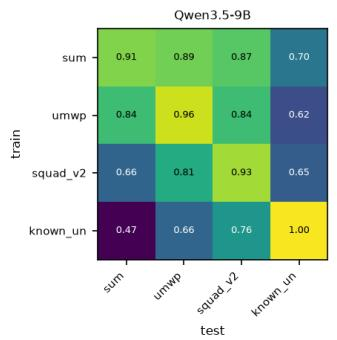
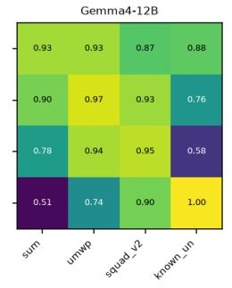
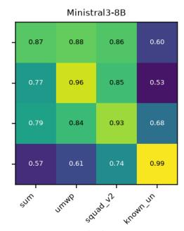
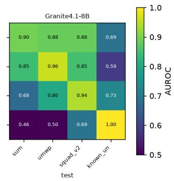
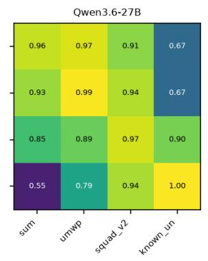
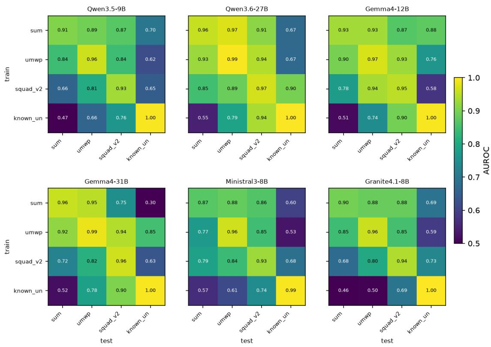
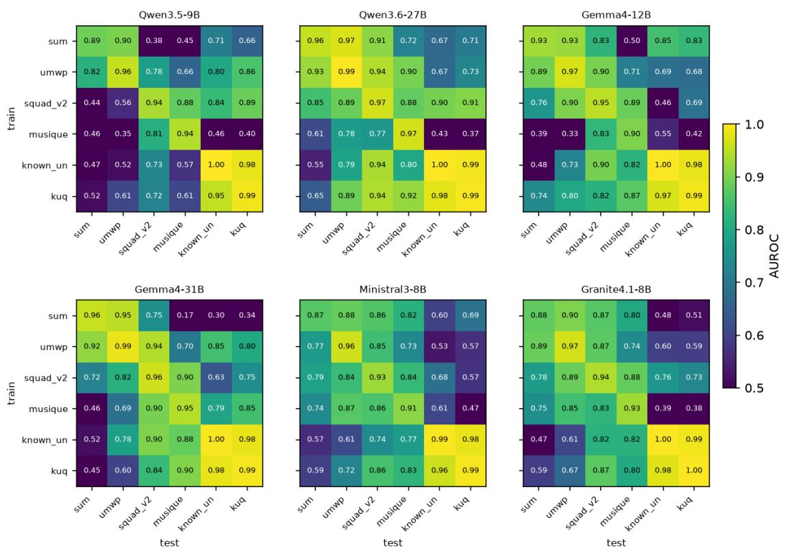

# Knowing When Not to Answer: Cross-Domain and Multi-Turn Generalization of Latent Underspecification Signals

Jerzy Kaminski Ilya Galyukshev Artem Kuznetsov´ Danil Fedorov Kirill Redko Sergey Chuprin Aidar Shumbalov Stanislav Chumakov Anna Kalyuzhnaya ITMO University, Saint Petersburg, Russia

## Abstract

Large language models routinely answer questions that cannot be answered from the informa tion given, and in dialogue they answer before enough has been said. Unanswerability is lin early decodable from hidden states, but it is unclear which of its forms share a representation and whether the signal is useful in dialogue. We contribute a turn-labeled multi-turn benchmark (423 conversations, 1,661 labeled turn-states) and an evaluation harness with a simulated user who answers clarifying questions, and use them with six datasets and six open-weight LLMs to test how far probes for unanswerability carry. Probes transfer robustly between datasets that share a ground of unanswerability: missing information in math (AUROC 0.77–0.97) and in a passage (SQuAD 2.0↔MuSiQue, 0.77–0.90). Probes for epistemic “known-unknowns” transfer poorly to math, but this separation weak ens under lexical controls and changes with layer and coordinate system, so it remains unresolved. Single-turn probes fail zero-shot to detect when a conversation becomes answerable; in-structure probes recover it, but no better than a bag-of-words classifier. A gate on the calibrated probe, with no model fine-tuning, fires on underspecified turns far more precisely than chance, and its end-task success comes within 0.08 of a gate given the true labels. Yet across four models it does not reliably beat vanilla generation or prompted consolidation. The re maining gap lies mostly in how models use a clarification, not in detection.

## 1 Introduction

Recent work shows that whether a question is answerable is linearly decodable from a language model’s hidden states, and uses this to mitigate abstention failures in reasoning models (Liu et al., 2026). That work is, however, demonstrated within a single domain (unanswerable math), and its outlook is training-centric: “Future work aims to explore training-time alignment strategies to improve abstention fidelity” (Liu et al., 2026). Transfer beyond the training data has been examined before: answerability probes carry across extractive QA benchmarks (Slobodkin et al., 2023), while hidden-state error and truthfulness detectors generalize only partially across tasks and domains (Orgad et al., 2025; Liu et al., 2024). What remains open is which forms of unanswerability share a representation. A question can be unanswerable because the question omits information (a math problem missing a quantity), because the supplied context omits it (a passage without the answer), or because no one knows the answer. All three call for the same behavior, abstention, but need not share a latent direction usable as a read-out without fine-tuning the model.

Independently, LLMs degrade sharply when instructions are revealed incrementally across an under-specified conversation rather than stated all at once (Laban et al., 2025). That work maps the degradation and its workarounds but leaves its scope open (“Establishing whether models get lost in conversation in other languages, or in tasks that involve multiple modalities [. . . ] could help establish the scope of the degradation observed in LLM multi-turn capabilities” (Laban et al., 2025)), and it does not provide a mechanism that detects, turn by turn, when a conversation is still under-specified.

These two open problems share a premise: if the latent unanswerability signal were domain- and structure-general, it could gate generation without any fine-tuning of the model: read the probe, then abstain on unanswerable inputs and ask a clarifying question in under-specified dialogue. We evaluate RQ1 on six open-weight models from four families and test the full premise end-to-end on the four 8–12B models. It holds only in parts:

• RQ1, across datasets. The signal transfers robustly between datasets that share a ground of unanswerability. Whether epistemic unknowability is represented separately remains unresolved: its apparent separation depends on layer, lexical controls and coordinate system.

• RQ2, across structure. Single-turn probes do not transfer zero-shot to turn-level dialogue states at the layers where they are strongest. Turn-level answerability is recoverable instructure, but no better than a TF-IDF classifier on the user turns recovers it.

• RQ3, at deployment. A leakage-free gate fires on underspecified turns far more precisely than chance, and its end-task success comes close to that of a gate given the true labels. It still does not beat prompting workarounds.

## Contributions. 1

• A turn-labeled multi-turn underspecification benchmark. The benchmark has 423 conversations and 1,661 turn-states, with constraints revealed one per turn and labels fixed by construction. It was audited by eight annotators and repaired by a judge from a model family other than the generator’s, under rules fixed before the repair ran.

• An answering-user evaluation harness for clarification policies. The simulated user answers from the not-yet-revealed constraints but cannot leak anything beyond them. Oracle, position and rate-matched random gates separate detector error from intervention cost.

• Careful transfer and deployment results, mostly negative.

– RQ1: probes transfer robustly within a ground of unanswerability: math 0.77– 0.97, and extractive QA 0.77–0.90, replicating Slobodkin et al., 2023. The known-unknowns separation is fragile under lexical, layer and coordinate controls (Tables 1 and 2).

– RQ2: single-turn probes fail zero-shot on turn-states, and in-structure probes only match TF-IDF (Table 3).

– RQ3: the probe gate beats vanilla on single-turn abstention but trails a oneline prompt. In dialogue, its firing precision is 0.74–0.88, against 0.54–0.58 for a random gate, and its success is within 0.08 of the oracle gate. Its end-task endpoint, fixed in advance, is still negative (Table 4).

## 2 Method

## 2.1 Probing for Unanswerability

For every (model, dataset) pair we run a single prompt-only forward pass per example (the model’s own chat template, no generation), cache all layers’ hidden states in fp16, and read out at the last prompt token (a mean-pooled read-out is cached alongside; last-token is used throughout). Probes are ℓ2-regularized logistic regressions on the readout at one layer: features are standardized by a scaler fit on the training data only; the regularization strength is chosen from a log-grid (10−4– 102) by inner cross-validation on the training fold; within-domain numbers are 5-fold stratified CV over seeds {13, 42, 77} and reported as mean ± sd. Cross-domain and cross-structure evaluations apply the frozen probe with its frozen train-domain scaler to the entire test set: no test-side fitting of any kind. Layer indices are model-specific. For the transfer matrix, the common layer maximizes mean within-domain cross-validation AUROC. For LODO, we evaluate the full layer sweep and report the best held-out-domain layer as an explicitly optimistic, descriptive upper bound; it is not used to fit or tune the probe.

We use six open-weight instruction models from four families (Qwen3.5-9B, Qwen3.6-27B, gemma-4-12B-it, gemma-4-31B-it, Ministral-3-8B-Instruct, and granite-4.1-8b), plus DeepSeek-R1- Distill-Qwen-7B as the anchor for reproducing the single-domain result of Liu et al. (2026) (reproduced at AUROC 0.871/0.948 on SUM/UMWP, within the published range). The two 27–31B models enter RQ1 only: RQ2 and RQ3 require multiturn roll-outs and many generation runs per model, which our compute budget allowed for the four 8–12B base models. Label-shuffle nulls and TF-IDF baselines on identical splits are run for all six models and reported inline with the results. Nulls are at chance throughout. On the math and extractive sets the probe beats TF-IDF by a wide margin; the known-unknowns sets are lexically separable, which we analyze separately.

## 2.2 Domains and Datasets

Six frozen single-turn datasets (600 balanced items each; SUM 568), two per ground of unanswerability:

• information missingfrom the question (math): SUM (Song et al., 2025), minimally edited answerable/unanswerable pairs of math problems, and UMWP (Sun et al., 2024), unanswerable math word problems;

• information missing from the context (extractive): SQuAD 2.0 (Rajpurkar et al., 2018), and MuSiQue (Trivedi et al., 2022) built as minimal pairs in the setting of Slobodkin et al. (2023). Each MuSiQue question appears in both classes; its unanswerable context replaces the missing hop’s supporting paragraph with the most similar paragraph that contains no hop answer;

• epistemic unknowability (known-unknowns): SelfAware (Yin et al., 2023) (e.g. “Did we invent math or discover it?”), and KUQ (Amayuelas et al., 2024), restricted to its epistemic categories (future, unsolved, controversial, counterfactual).

Labels follow each source. Every frozen set is versioned with a content hash and deduplicated against the others.

## 2.3 Transfer and Geometry

RQ1 measures the full train×test matrix: for each ordered domain pair, the frozen probe (with its train-domain scaler) is evaluated on the full test domain; the diagonal is within-domain CV. A leave-one-domain-out (LODO) variant trains one pooled probe on all-but-one domain and tests on the held-out domain. Geometry compares classseparation directions $\Delta \mu = \overline { { x } } _ { y = 1 } - \overline { { x } } _ { y = 0 }$ per (domain, seed, fold) at the common best layer: pairwise cosines, the participation-ratio effective rank of the stacked directions, and the principal angle between the {math, extractive} subspace and the known-unknowns axis, all mean ± sd over the 15 seed×fold splits. The robustness analyses add three things:

• bootstrap-over-items 95% CIs with withindataset split-half null angles, plus a whitened (shrinkage-LDA) variant in a common pooled coordinate system;

• a lexical residualization, which removes the component of the hidden state predicted from TF-IDF features, with the map fit on training folds only;

• layer selection from the training dataset alone.

Each analysis has a decision rule committed before it ran (Appendix A).

## 2.4 A Turn-Labeled Multi-Turn Benchmark

Following the sharded-instruction setting of Laban et al. (2025), each conversation reveals the atomic constraints of a task one per user turn in a randomized order; a deterministic rule labels every turnstate (the conversation up to and including user turn t, before the model’s reply) as underspecified (1) until the predefined sufficiency set of constraints has been revealed, then answerable (0). Sources: grade-school math (numeric answer), small Python functions (reference implementation), and data-totext (slot-value sentence); 21% of conversations are early-fully-specified distractors so that position alone does not determine the label. The generated pool (504 conversations) was audited by eight human annotators (728 verdicts, disjoint shards plus a shared calibration set), which surfaced a systematic defect: default-confirming constraints padded into sufficiency sets. A shrink-only repair by a judge model from a family other than the generator’s, with rules fixed in advance and validated against the annotators’ calibration set, plus a rule-based drop pass, froze the benchmark at 423 conversations / 1,661 turn-states (drops: 58 question-arrives-last math items, 19 unexplained flags, 4 judge conflicts). For RQ2, each model first replies to every turn of every conversation (greedy roll-out), so turn-state read-outs contain the model’s own intermediate replies in context; an excluded-replies variant is the control.

## 2.5 Probe-Gated Intervention

RQ3 turns the probe into a gate that requires no fine-tuning of the model (a worked example of one conversation, from constraints to gate decisions, is in Appendix F). The raw probe score at the last prompt token is mapped to a calibrated probability by Platt scaling (Platt, 1999) fit on held-out training-side validation data, and thresholded at τ = 0.5 (τ swept in the appendix). Gate probes never see gated items: single-turn items of domain D are gated by the LODO probe trained on the other domains (transfer is the mechanism); multiturn conversations are gated out-of-fold: probes trained on grouped conversation folds that never contained the gated conversation, since single-turn probes do not transfer across structure (see the RQ2 results). When the gate fires, the model does not answer: single-turn, it emits the same fixed abstention string as the prompted abstain baseline; multi-turn, a fixed prompt appended to the flagged turn makes the same model ask one clarifying question about the most important missing constraint. Baselines on identical, N-matched items: vanilla generation, prompted ask-when-unsure, prompted abstain, and RECAP-style consolidation (a recap turn restating all user turns before the final answer) (Laban et al., 2025). All decoding is greedy with a 384-token cap. In multi-turn runs the user answers clarifying questions. An LLM (gpt-5.6-terra, T=0, from a family distinct from the generator and the evaluated models) only selects which not-yet-revealed constraint answers the model’s question. The user then sends that constraint verbatim; the math goal sentence is also selectable. A generic question receives the next scripted constraint, and an unanswerable question receives a fixed “no further details” reply. Scripted turns already revealed are skipped, and the same user serves every condition.

To separate detector error from intervention cost, three reference gates use the same clarify prompt: an oracle gate (fires iff the sufficiency set is unrevealed), a position gate (fires while any scripted constraint is unrevealed), and a random gate that matches the probe gate’s per-conversation firing rate (seeds 13/42/77). End-of-conversation success is objective per source: numeric match (math), differential execution against the reference implementation on a typed input battery (code), and slotvalue coverage (data-to-text); single-turn correct behavior is refusal on unanswerable items and a normalized gold match on answerable ones. Paired comparisons use exact McNemar tests and paired bootstrap CIs on matched items.

## 3 Results

Before each analysis we committed its decision rule to version control, then ran it. Appendix A lists the commits and timestamps, and the code release will include each report as it stood at its commit. This is a timestamped record kept by the authors, not registration with a third party, and one rule was amended before its run; we flag both where

relevant.

## 3.1 RQ1: Cross-Dataset Transfer

Within-dataset probes are strong everywhere (mean diagonal 0.94–0.98; Table 1). The robust transfer result concerns datasets that share a ground of unanswerability. The two math sets transfer at 0.77– 0.97 in all six models, in both directions. The two extractive sets also transfer in both directions in every model: SQuAD 2.0 and MuSiQue, the latter built as minimal pairs in the setting of Slobodkin et al. (2023), transfer at 0.77–0.90 at the six-dataset common layer. This replicates Slobodkin et al.’s cross-dataset result on current models.

Transfer across grounds depends on model and layer. At the layer that maximizes within-domain AUROC over the four core datasets, math and extractive QA transfer at 0.66–0.94 (Figure 1). Adding the two new datasets moves the common layer in three of six models (Qwen3.5 20→29, Granite 26→31, Gemma4-12B 32→31). At that layer the same math↔SQuAD cells span 0.38– 0.94, and math↔MuSiQue spans 0.17–0.90 (Appendix Figure 3). Known-unknowns probes are at or near chance on SUM (SelfAware→SUM 0.46– 0.57) despite ≈0.995 within-dataset AUROC.

By the decision rule we fixed before the first transfer run (cross-dataset mean ≤ 0.65 or drop ≥ 0.20 ⇒ dissociation), four of six models land on dissociation. Two of these verdicts sit on the boundary under seed-and-sampling bootstrap (Qwen3.5 0.93, Ministral 0.87 of replicates; Table 1). If the layer is instead chosen per training dataset, so that no target label touches selection, all six models are classified as dissociation. These verdicts concern the four-dataset matrix as a whole; the next paragraph asks which part of it is robust.

Is known-unknowns represented separately? SelfAware is lexically separable (TF-IDF 0.94), and so is the second known-unknowns benchmark we add, KUQ (0.94). Both build the answerable class from factoid QA sets and write the unanswerable class separately, so the label coincides with the source genre. A TF-IDF classifier trained on either set transfers to the other at 0.89–0.91. KUQ therefore replicates SelfAware rather than controlling for its confound. We tested the separation three ways, each with a decision rule committed before the run (Table 2).

• Replication on KUQ. At the six-dataset layer, KUQ’s probe also transfers poorly to SUM (≤ 0.65 in 5/6 models). At the four-dataset layer, KUQ→SUM exceeds 0.65 in 3/6.

  
Figure 1: Train×test transfer matrices on the four core datasets for the four 8–12B models (AUROC, mean over seeds). All six models on all six datasets are in Appendix Figure 3.

<table><tr><td></td><td colspan="4">four datasets (common layer)</td><td colspan="2">six datasets</td></tr><tr><td>model</td><td>diag</td><td></td><td>cross [95% ČI]</td><td>drop [95% CI]</td><td>SQ→MQ MQ→SQ</td><td></td></tr><tr><td>Qwen3.5-9B</td><td>0.948</td><td></td><td>0.732 [.721,.743]</td><td>0.216 [.195,.236]</td><td>0.88</td><td>0.81</td></tr><tr><td>Qwen3.6-27B</td><td>0.979</td><td></td><td>0.834 [.825,.843]</td><td>0.145 [.129,.159]</td><td>0.88</td><td>0.77</td></tr><tr><td>Gemma4-12B</td><td>0.962</td><td></td><td>0.808 [.799,.818]</td><td>0.153 [.138,.169]</td><td>0.89</td><td>0.83</td></tr><tr><td>Gemma4-31B</td><td>0.976</td><td></td><td>0.757 [.747,.767]</td><td>0.219 [.202,.235]</td><td>0.90</td><td>0.90</td></tr><tr><td>Ministral3-8B</td><td></td><td></td><td></td><td>0.939 0.727 [.715,.738] 0.213 [.191,.233]</td><td>0.84</td><td>0.86</td></tr><tr><td>Granite4.1-8B</td><td></td><td></td><td></td><td>0.9490.717 [.706,.729]0.232 [.214,.249]</td><td>0.88</td><td>0.83</td></tr></table>

Table 1: RQ1 transfer (AUROC, mean over seeds {13, 42, 77}). Left: the four-core-dataset matrix at the common best layer. Diag is within-dataset; cross averages all off-diagonal cells (including SUM↔UMWP); drop = diag − cross. CIs come from a seed and sampling bootstrap. Right: extractive-pair transfer between SQuAD 2.0 (SQ) and MuSiQue (MQ) at the six-dataset common layer. Per-model LODO and source-only-layer results are in the appendix.

• Lexical residualization. We remove the component of the hidden state that TF-IDF features predict, fitting the projection on training folds only. A known-unknowns signal survives: within-dataset AUROC is 0.81–0.92 for SelfAware, and items that TF-IDF misclassifies are separated at 0.98–0.99. Its non-transfer to math does not survive: SelfAware→SUM rises above 0.65 in 3/6 models, which our decision rule classifies as negative. Our committed rule compared residualized SelfAware↔KUQ transfer with raw known-unknowns→math transfer and held in 6/6. Compared like for like, both residualized, it holds in only 4/6: it fails for both Gemma models, and Qwen3.5 passes by 0.02.

• Geometry with uncertainty. In $\Delta \mu$ space the {math, extractive} subspace is further from the known-unknowns direction than math is from extractive in 6/6 models (CI > 0), well above the within-dataset split-half floor (14– 29◦). After whitening by the pooled covariance (shrinkage LDA), the gap is positive in no model and significantly negative in 3/6. With MuSiQue as the extractive set, the raw gap reverses for both Gemma models.

<table><tr><td rowspan="2">model</td><td rowspan="2">SA→SUM KUQ→SUM raw / res.</td><td rowspan="2"> $\mathrm { L _ { 6 } / L _ { 4 } }$ </td><td rowspan="2"> $\mathbf { S A } {  } \mathbf { K U Q } /$  SA→math, res.</td><td colspan="2">D (deg)</td></tr><tr><td> $\Delta \mu$ </td><td>whitened</td></tr><tr><td>Qwen3.5-9B</td><td>.47 / .61</td><td>.52 / .68</td><td>.66 / .64</td><td> $+ 5 . 2 ^ { * }$ </td><td>-2.1*</td></tr><tr><td>Qwen3.6-27B</td><td>.55 / .77</td><td>.65 / .65</td><td>.81 / .79</td><td> $+ 8 . 2 ^ { * }$ </td><td>-0.4</td></tr><tr><td>Gemma4-12B</td><td>.51 / .80</td><td>.74 / .75</td><td>.72 /.86</td><td> $+ 5 . 8 ^ { * }$ </td><td>-1.8*</td></tr><tr><td>Gemma4-31B</td><td>.52 / .79</td><td>.45 / .45</td><td>.78 / .86</td><td> $+ 6 . 2 ^ { * }$ </td><td>-2.4*</td></tr><tr><td>Ministral3-8B</td><td>.57 / .63</td><td>.60 / .60</td><td>.72 / .70</td><td> $+ 1 5 . 9 ^ { * }$ </td><td>+0.6</td></tr><tr><td>Granite4.1-8B</td><td>.46 / .53</td><td>.59 / .71</td><td>.78 / .53</td><td> $+ 1 0 . 0 ^ { * }$ </td><td>+1.4</td></tr></table>

Table 2: Robustness of the known-unknowns separation (SA = SelfAware). Transfer is AUROC; res. means after removing the TF-IDF-predictable component of the hidden state. KUQ→SUM is shown at the six-dataset $\left( \mathrm { L } _ { 6 } \right)$ and four-dataset $\mathrm { ( L _ { 4 } ) }$ common layers. The fourth column compares residualized SA↔KUQ transfer (mean of both directions) with residualized SA→{SUM, UMWP}; underlined where known-unknowns transfers no better within its ground than to math. D is the angle between the {math, extractive} subspace and the known-unknowns direction minus the math–extractive angle; ∗: 95% bootstrap CI excludes 0. Bold: above the 0.65 threshold.

The known-unknowns separation is therefore unresolved. Raw probes and raw $\Delta \mu$ geometry suggest a separate direction in every model, but removing lexical cues, whitening the coordinates, or changing the layer or the extractive dataset each removes it in some models. We read RQ1 as robust transfer within a ground of unanswerability, and make no claim about separation between grounds.

Controls: label-shuffle nulls are 0.47–0.52 for all six models and six datasets. The modelindependent TF-IDF baseline trails the probe by

<table><tr><td>model</td><td>zero-shot</td><td>ceiling</td><td>within-turn</td><td>∠ to ST</td></tr><tr><td>qwen3.5-9b</td><td>0.784</td><td>0.927</td><td>0.76–0.84</td><td> $7 3 . 9 ^ { \circ }$ </td></tr><tr><td>ministral-3-8b</td><td>0.774</td><td>0.935</td><td>0.79–0.86</td><td> $5 6 . 7 ^ { \circ }$ </td></tr><tr><td>granite-4.1-8b</td><td>0.789</td><td>0.925</td><td>0.76–0.84</td><td> $8 1 . 2 ^ { \circ }$ </td></tr><tr><td>gemma-4-12b</td><td>0.845</td><td>0.934</td><td>0.79–0.86</td><td> $5 8 . 7 ^ { \circ }$ </td></tr></table>

Table 3: RQ2 turn-level AUROC. Zero-shot: best layer of the frozen single-turn probe (mid/late layers are at or below chance, 0.20–0.55). Ceiling: probe trained on turn-states with conversation-grouped CV. Within-turn: ceiling restricted to fixed turn indices $_ { 2 - 4 }$ , min–max over turns (absolute position is fixed; relative position still varies with conversation length). ∠ to ST: principal angle of the multi-turn $\Delta \mu$ to the whole single-turn subspace.

44–72 AUROC points on the math and extractive sets; SUM’s and MuSiQue’s minimal pairs defeat it outright (0.24, 0.48). Best-layer selection cannot create the weak cross-ground transfer: the weakest headline AUROC survives Bonferroni correction across layers (appendix).

## 3.2 RQ2: Cross-Structure Transfer to Multi-Turn

Can the single-turn probe detect, zero-shot, the moment a conversation becomes answerable? No – and the failure is itself structured (Table 3). Applied to turn-states, frozen single-turn probes are at or below chance at the mid/late layers where they live (0.20–0.55 for three of four models): the single-turn underspecification direction anticorrelates with turn-level underspecification. What zero-shot signal exists sits in the first one or two layers (0.77–0.85) and is partially surface-driven. Behaviorally, the frozen probe declares “sufficient” one to two turns prematurely in 74–98% of conversations (mean lag −1.3 to −2.3 turns): it would stop asking clarifying questions too early.

Turn-level underspecification is nonetheless strongly decodable in-structure: probes trained on turn-states (grouped by conversation so no conversation straddles train/test) reach 0.925–0.935 AUROC. Because turn-level labels are positioncorrelated by construction (relative position alone scores 0.934), we also evaluate within fixed turn indices, where absolute position is constant: the ceiling stays at 0.76–0.86 (min–max over turns 2–4 and models; Table 3), while zero-shot retains only a weak trace (0.51–0.79). Within a turn index, however, the label remains partly predictable from the text of the user turns alone: a TF-IDF classifier on them, trained with the same conversation-grouped splits, reaches 0.79 within-turn (0.91 overall), on par with the ceiling averaged over turns 2–4 (0.79– 0.81 across models). We therefore read the instructure result as showing that the information is present and linearly available, not that the probe captures more than the surface text does. Labels also remain largely predictable from the conversation’s design within a turn index. Position relative to the total number of turns, which a turn-state prefix does not reveal, matches the probe within 0.02. A logistic model on design features (turn index, total turns, source task, context length) exceeds it by 0.07–0.10. The probe’s within-turn signal is therefore consistent with, but not proof of, the model inferring task size from content. This makes the zero-shot failure starker: a signal that a bag of-words classifier recovers is not picked up by the single-turn direction. Label-shuffle nulls for the ceiling are clean (0.486–0.496). Geometrically, the multi-turn direction is rotated $5 7 { - } 8 1 ^ { \circ }$ from the entire single-turn subspace (raw $\Delta \mu$ coordinates), and its cosine to the known-unknowns direction is negative in all four models. Two further con trols: per-domain zero-shot transfer follows the RQ1 ordering (math probes transfer best, knownunknowns worst); and removing the model’s own replies from the context improves zero-shot transfer for granite (0.829 vs 0.789) while slightly shrinking the rotation: the model’s own reply tokens are part of what rotates the direction. Replies truncated at the 384-token cap (17–63% of replies, depending on the model) shift within-turn AUROC by up to 0.10 for the ceiling and 0.15 for zero-shot, in opposite directions across models (Appendix J). These shifts are far smaller than the zero-shot failure itself.

## 3.3 RQ3: Probe-Gated Abstention and Clarification

RQ3 asks whether the signal, deployed as a leakagefree calibrated gate, improves end-task performance. We test it on all four 8–12B models (Table 4).

Single-turn. In all four models the gate beats vanilla by +0.15 to +0.21 (McNemar $p \leq 1 0 ^ { - 2 4 } )$ but it trails the one-line abstain prompt by 0.05– 0.09. The cause is threshold transfer, which RQ1 predicts. For Qwen and Granite, which our offline risk–coverage analysis covers, the leave-onedomain-out gate’s calibrated threshold fires on 94– 99% of math items and on none of SQuAD. Yet its ranking within each dataset beats chance in 7 of 8 model–dataset pairs, and at the same abstention budget an oracle detector would beat the prompt. A full τ -sweep (appendix) rescues neither model, and a cost-sensitive threshold fixed in advance does not help either.

<table><tr><td>condition</td><td>Qwen3.5</td><td>Granite</td><td>Gemma4-12B</td><td>Ministral</td></tr><tr><td>multi-turn success, answering user</td><td></td><td></td><td></td><td></td></tr><tr><td>vanilla</td><td>0.764</td><td>0.598</td><td>0.506</td><td>0.811</td></tr><tr><td>ask-when-unsure</td><td>0.759</td><td>0.811</td><td>0.459</td><td>0.766</td></tr><tr><td>consolidation (RECAP)</td><td>0.837</td><td>0.825</td><td>0.631</td><td>0.856</td></tr><tr><td>probe gate (τ=0.5)</td><td>0.693</td><td>0.681</td><td>0.584</td><td>0.853</td></tr><tr><td>oracle gate (true labels)</td><td>0.721</td><td>0.681</td><td>0.660</td><td>0.861</td></tr><tr><td>random gate, rate-matched (3 seeds)</td><td>0.510</td><td>0.537</td><td>0.300</td><td>0.584</td></tr><tr><td>position gate†</td><td>0.820</td><td>0.719</td><td>0.754</td><td>0.915</td></tr><tr><td>premature: vanilla → probe</td><td>.98→.43</td><td>.99→.62</td><td>.94→.23</td><td>.92→.69</td></tr><tr><td>probe firing precision / recall</td><td>.88 / .75</td><td>.86 / .70</td><td>.74 / .90</td><td>.85 / .68</td></tr><tr><td>random firing precision</td><td>.57</td><td>.57</td><td>.55</td><td>.58</td></tr><tr><td>single-turn correct behavior</td><td></td><td></td><td></td><td></td></tr><tr><td>vanilla</td><td>0.378</td><td>0.378</td><td>0.427</td><td>0.315</td></tr><tr><td>abstain prompt</td><td>0.636</td><td>0.611</td><td>0.663</td><td>0.582</td></tr><tr><td>probe gate</td><td>0.589</td><td>0.525</td><td>0.609</td><td>0.515</td></tr></table>

Table 4: RQ3 on N-matched items (423 conversations; 2,368 single-turn items). Multi-turn success is objective per source: numeric match, differential code execution, or slot coverage. The user simulator answers clarifying questions from the not-yet-revealed constraints. †The position gate fires while any scripted constraint is unrevealed; it needs the script length and is not deployable. Firing precision is the share of fired turns that are underspecified, and recall the share of underspecified turns on which the gate fires; random precision is the mean over three seeds (oracle: 1/1 by construction). The scripted-user results and the cost-sensitive gate are in the appendix.

Multi-turn, with a user who answers. A scripted user who cannot answer clarifying questions makes asking pure cost. We therefore evaluate with a simulated user in the style of CLAM (Kuhn et al., 2022), who knows the not-yet-revealed constraints. An LLM only selects which hidden constraint answers the model’s question, and the user then replies with that constraint verbatim, so nothing beyond the scripted information can leak. The simulator was validated before use: on 60 real exchanges it was judged correct in 56 by a human, with no over-reveals.

The endpoint, fixed before any gated run was scored, is negative. The probe gate beats vanilla significantly in two of four models (Granite +0.083, Gemma +0.078; Holm-adjusted p < 0.02). It is significantly worse for Qwen (−0.071) and indistinguishable for Ministral. It loses to RECAP-style consolidation in two of four (−0.144 for Qwen and Granite). The reference gates locate the gap:

• Detection. Against the turn labels, the probe gate fires with precision 0.74–0.88, against 0.54–0.58 for a random gate. It misses 10– 32% of underspecified turns (recall 0.68–0.90; the oracle is exact by construction), and these misses account for 68–100% of its premature answers. These premature answers cost little: conversations with one end correct as often as those without, within 0.04 in every model, because the model revises its answer once the remaining constraints arrive (Appendix F). This is why better detection would add little: the true-label gate’s success is at most 0.08 higher.

• Asking at the right moment matters. At the same firing rate, the probe gate beats randomly timed asking by +0.14 to +0.28 in every model, and random asking is strongly harmful.

• The remaining limit is how the model uses a clarification. For Qwen, even the truelabel gate does not beat vanilla. The nondeployable position gate keeps asking until the script is exhausted, and it is the best gate in every model. This suggests that more persistent asking can pay off.

Letting the user answer raises the probe gate by +0.10 (Qwen) and +0.19 (Granite) over the scripteduser setting, so a user who cannot answer gives a loose lower bound. In short, the probe gate asks at better-than-chance moments and nearly matches a true-label gate, but neither turns asking into endtask gains over consolidation. Firing precision and recall are a descriptive analysis added after the endpoint was scored.

## 4 Related Work

Probing internal states for answerability and truthfulness. Linear structure in the residual stream has been reported for truthfulness: supervised probes separate true from false statements (Azaria and Mitchell, 2023), unsupervised consistency objectives recover latent truth directions (Burns et al., 2023), and true/false datasets exhibit emergent linear geometry that supports steering (Marks and Tegmark, 2023). Closest to us, Liu et al. (2026) show that answerability is linearly decodable from hidden states of reasoning models and use it to analyze abstention failures – within a single (math) domain. Slobodkin et al. (2023)

probe answerability on SQuAD 2.0, Natural Questions and MuSiQue and find that the learned subspace transfers across these extractive benchmarks; Orgad et al. (2025) show that hidden-state error detectors do not transfer universally across ten tasks, and Liu et al. (2024) search for a single truthfulness hyperplane shared across tasks and domains. We build on this line but vary the ground of unanswerability rather than the benchmark: information missing from the question, information missing from the context, and epistemic unknowability. We then follow the same signal across conversational structure (RQ2) and into a deployed gate (RQ3). Transfer is robust within a ground, while the separation between grounds remains unresolved.

Abstention and selective prediction. Abstention in LLMs is typically elicited by prompting, fine-tuning, or confidence heuristics; Wen et al. (2024) survey the space and explicitly pose whether abstention can be “a meta-capability that transcends specific tasks or domains.” Our unanswerable sets instantiate distinct abstention grounds: information missing from the question (SUM (Song et al., 2025), UMWP (Sun et al., 2024)), information missing from a passage (SQuAD 2.0 (Rajpurkar et al., 2018)), and questions unanswerable for anyone (SelfAware (Yin et al., 2023), KUQ (Amayuelas et al., 2024)). Our RQ1 results give a partial answer to the survey’s question. Missing-information abstention transfers across datasets that share a ground. Whether epistemic unknowability shares that representation is not settled by our data: its apparent separation weakens under lexical controls and changes with layer and coordinate system.

Multi-turn underspecification and clarifying questions. Laban et al. (2025) document that models “get lost” in sharded, underspecified conversations and evaluate prompt-level workarounds (recap and snowball-style consolidation), which we adopt as baselines. We add what that line lacks: a benchmark whose turn-states are labeled for answerability by construction (with human audit and rule-based repair), a latent detector evaluated turnby-turn against those labels, and a gate that asks a clarifying question exactly when the detector fires. Our RQ3 result sharpens the workaround comparison: consolidation attacks context loss and wins. Detection-gated asking fires far more precisely than chance and nearly matches a true-label gate, yet does not convert this into end-task gains, even with a user who answers. Selective clarification has also been studied with simulated users who hold the missing information: CLAM (Kuhn et al., 2022) asks only for ambiguous inputs and answers from such a simulator, and Zhang and Choi (2025) decide when a clarification is worth its cost from its expected benefit. Our gate makes this decision from a hidden-state probe rather than from the model’s own outputs.

Calibration and confidence. Our gate reads a single scalar through Platt scaling (Platt, 1999) fit on training-side validation data only, a monotone recalibration that leaves probe ranking untouched; the model itself is never fine-tuned. Throughout, we control the classic confound of confidence readouts: label-shuffle nulls and TF-IDF baselines on identical splits separate representation content from lexical surface, and a position-only baseline plus within-turn evaluation do the same for conversational position (RQ2 results).

## 5 Conclusion

We asked how far the latent unanswerability signal in LLM hidden states carries, using a new turnlabeled benchmark and an answering-user harness.

• Across datasets. Probes transfer robustly when two datasets share a ground of unanswerability. Whether epistemic unknowability is represented separately remains open: the evidence changes with layer, lexical controls and coordinate system.

• Across structure. Single-turn probes fail zero-shot on turn-level dialogue states. Instructure probes recover turn-level answerability, but no better than a classifier on the user turns.

• At deployment. A leakage-free gate fires on underspecified turns far more precisely than chance, and comes within 0.08 of a true-label gate in end-task success. It still does not beat consolidation.

These are mostly negative results, reported with their controls. The benchmark, the simulator and the result tables are the parts we expect to be most useful, and we release all of them.

## Limitations

Scale and architecture coverage. Four model families and two size tiers (8–12B and 27–31B), but only Qwen and Gemma are represented in both; the Qwen pair also changes model generation (3.5 to 3.6), so it is not a controlled scaling comparison. granite-4.1-8b is a hybrid Mamba-2/transformer, so layer indices are not comparable across architectures; all layer selections are per-model. Synthetic multi-turn data. The benchmark’s conversations are generated, then human-audited and repaired under a fixed protocol (728 verdicts surfaced a sys tematic sufficiency-set defect; the repaired, frozen set drops 81 of 504 conversations); labels are deterministic given sufficiency sets, but the conver sations are not naturally occurring dialogue. Correlational probes. All probe results are decoding claims, not causal ones: we did not run the planned activation-steering ablation, so nothing here shows the probed direction causally mediates abstention. Layer selection and multiple comparisons. Best layers come from full layer sweeps; the appendix quantifies the exposure: the weakest headline AU-ROC survives Bonferroni correction across all lay ers $( p \approx 2 \times 1 0 ^ { - 1 3 } \mathrm { v s } \alpha \approx 1 0 ^ { - 3 } )$ , the RQ2 ceiling is layer-insensitive (0.885–0.934 across all layers), and held-out LODO layer selection biases transfer upward, so it cannot create the weak transfer we report. Annotators are authors. The eight bench mark annotators are authors of this paper, so the audit is not independent. Its role was to find defects, which it did; the labels themselves follow from the sufficiency sets by rule. Simulated user. The answering user replies only with scripted constraints, selected by an LLM, and never improvises or mis understands. It was validated on 60 exchanges by a single annotator. Real users would answer less cleanly, which affects every ask-based condition alike. Known-unknowns datasets. Both knownunknowns benchmarks build their answerable class from a different source than their unanswerable class, so label and genre coincide. Lexical residualization reduces this confound but cannot remove it; a lexically matched known-unknowns set would be needed. Run recovery. Some RQ3 generation runs were resumed from checkpoints after infras tructure failures, and one run spans two GPU types; all are listed in a run log released with the code Judge-scored clarify quality was declared in advance as secondary-only evidence and is not reported; all multi-turn success metrics are objective (numeric match, differential code execution, slot coverage). Token accounting uses whitespace to kens, identical across conditions, so only deltas are meaningful.

## Ethical Considerations

Potential risks. A probe gate that fires too often withholds answers users need. One that fires too rarely gives false assurance that a model “knows” when it cannot answer. Our gates do not beat simple prompting baselines, so we do not recommend deploying them as a safeguard. The probes read hidden states of open-weight models and offer no defense against adversarial inputs.

Data and annotation. All data are public research datasets, used under their licenses, or synthetic conversations without personal information. The eight benchmark annotators are authors of this paper and took part voluntarily; no data about them were collected.

Use of AI assistants. Beyond the LLMs that are part of our method (benchmark generation, benchmark repair, and the user simulator; Section 2), we used AI assistants to help write code, to draft parts of the text, and to fix grammar. The authors designed the study, fixed the decision rules before each run, checked the results, and take responsibility for all content.

## References

Alfonso Amayuelas, Kyle Wong, Liangming Pan, Wenhu Chen, and William Yang Wang. 2024. Knowledge of knowledge: Exploring known-unknowns uncertainty with large language models. In Findings of the Association for Computational Linguistics: ACL 2024, pages 6416–6432. Association for Computational Linguistics.

Amos Azaria and Tom Mitchell. 2023. The internal state of an LLM knows when it’s lying. arXiv preprint arXiv:2304.13734.

Collin Burns, Haotian Ye, Dan Klein, and Jacob Steinhardt. 2023. Discovering latent knowledge in language models without supervision. In International Conference on Learning Representations (ICLR).

Lorenz Kuhn, Yarin Gal, and Sebastian Farquhar. 2022. CLAM: Selective clarification for ambiguous questions with generative language models. arXiv preprint arXiv:2212.07769.

Philippe Laban, Hiroaki Hayashi, Yingbo Zhou, and Jennifer Neville. 2025. Llms get lost in multi-turn conversation. arXiv preprint arXiv:2505.06120.

Junteng Liu, Shiqi Chen, Yu Cheng, and Junxian He. 2024. On the universal truthfulness hyperplane inside LLMs. In Proceedings of the 2024 Conference on Empirical Methods in Natural Language Processing, pages 18199–18224. Association for Computational Linguistics.

Yi Liu, Xiangyu Liu, Zequn Sun, and Wei Hu. 2026. Answering the unanswerable is to err knowingly: Analyzing and mitigating abstention failures in large reasoning models. In Proceedings ofthe AAAI Conference on Artificial Intelligence, volume 40, pages 32231–32239.

Samuel Marks and Max Tegmark. 2023. The geometry of truth: Emergent linear structure in LLM representations of true/false datasets. arXiv preprint arXiv:2310.06824.

Hadas Orgad, Michael Toker, Zorik Gekhman, Roi Reichart, Idan Szpektor, Hadas Kotek, and Yonatan Belinkov. 2025. LLMs know more than they show: On the intrinsic representation of LLM hallucinations. In The Thirteenth International Conference on Learning Representations (ICLR).

John C. Platt. 1999. Probabilistic outputs for support vector machines and comparisons to regularized likelihood methods. In Advances in Large Margin Classifiers. MIT Press.

Pranav Rajpurkar, Robin Jia, and Percy Liang. 2018. Know what you don’t know: Unanswerable questions for SQuAD. In Proceedings ofthe 56th Annual Meeting of the Association for Computational Linguistics (ACL).

Aviv Slobodkin, Omer Goldman, Avi Caciularu, Ido Dagan, and Shauli Ravfogel. 2023. The curious case of hallucinatory (un)answerability: Finding truths in the hidden states of over-confident large language models. In Proceedings ofthe 2023 Conference on Empirical Methods in Natural Language Processing, pages 3607–3625. Association for Computational Linguistics.

Linxin Song, Taiwei Shi, and Jieyu Zhao. 2025. The hallucination tax of reinforcement finetuning. arXiv preprint arXiv:2505.13988.

Yuhong Sun, Zhangyue Yin, Qipeng Guo, Jiawen Wu, Xipeng Qiu, and Hui Zhao. 2024. Benchmarking hallucination in large language models based on unanswerable math word problem. In Proceedings of the 2024 Joint International Conference on Computational Linguistics, Language Resources and Evaluation (LREC-COLING).

Harsh Trivedi, Niranjan Balasubramanian, Tushar Khot, and Ashish Sabharwal. 2022. MuSiQue: Multihop questions via single-hop question composition. Transactions of the Association for Computational Linguistics, 10:539–554.

Bingbing Wen, Jihan Yao, Shangbin Feng, Chenjun Xu, Yulia Tsvetkov, Bill Howe, and Lucy Lu Wang. 2024. Know your limits: A survey of abstention in large language models. Transactions of the Association for Computational Linguistics.

Zhangyue Yin, Qiushi Sun, Qipeng Guo, Jiawen Wu, Xipeng Qiu, and Xuanjing Huang. 2023. Do large language models know what they don’t know? In

Findings ofthe Associationfor Computational Linguistics (ACL).

Michael J. Q. Zhang and Eunsol Choi. 2025. Clarify when necessary: Resolving ambiguity through interaction with LMs. In Findings of the Association for Computational Linguistics: NAACL 2025, pages 5541–5558. Association for Computational Linguistics.

## A Decision Rules Committed Before Each Run

Table 5 lists each decision rule that the paper describes as fixed in advance. For each it gives the commit that fixed the rule and the earliest timestamp of the run’s output: the first result row, or the first API spend-log entry for judge runs. The code release will include a folder prereg/ with each report exactly as it stood at that commit, with status planned, the rule written, and no results. Every result row also records the git hash of the code that produced it.

This record establishes order, not independence. It is kept in our own repository rather than a thirdparty registry. For several rules the run followed within minutes, because the code was ready and only the rule remained to be written. Reports not listed here were written together with their results, and we do not describe their rules as fixed in advance.

<table><tr><td>rule</td><td>commit</td><td>committed (UTC)</td><td>first result (UTC)</td></tr><tr><td>RQ1 dissociation rule</td><td>3600fc0</td><td>07-11 21:32</td><td>07-11 21:44</td></tr><tr><td>LODO pooled probe</td><td>c577bc9</td><td>07-12 11:34</td><td>07-12 11:35</td></tr><tr><td>Direction geometry</td><td>462b8dd</td><td>07-12 16:12</td><td>07-12 16:33</td></tr><tr><td>Benchmark repair protocol</td><td>bc2049f</td><td>07-17 14:23</td><td>07-17 14:25</td></tr><tr><td>RQ3 endpoint + metrics</td><td>d80bc2c</td><td>07-20 09:49</td><td>07-20 10:20</td></tr><tr><td>Robustness datasets, text baselines</td><td>1bd8f6d</td><td>09-25 07:07</td><td>09-25 07:07</td></tr><tr><td>Simulator validation + RQ3-v2 endpoint</td><td>cf5450f</td><td>09-25 08:09</td><td>10-01 07:31</td></tr><tr><td>RQ2 text/metadata baselines</td><td>a824f63</td><td>09-25 09:33</td><td>09-25 09:34</td></tr><tr><td>RQ3 ofline + cost-sensitive gate</td><td>281609b</td><td>09-2509:34</td><td>09-25 09:39</td></tr><tr><td>Table 1 CIs; source-only layers</td><td>ac7e547</td><td>09-2509:34</td><td>09-25 09:35</td></tr><tr><td>Lexical residualization; geometry CIs</td><td>6740551</td><td>10-01 08:08</td><td>10-01 08:17</td></tr><tr><td>Second known-unknowns / extractive sets</td><td>ece0f8f</td><td>10-01 08:38</td><td>10-01 08:57</td></tr><tr><td>RQ3-v2 scoring (Holm, best baseline)</td><td>96705a2</td><td>10-0123:10</td><td>10-02 02:35</td></tr></table>

Table 5: Rule commits and first outputs (all 2026, UTC). Rows below the line cover the robustness analyses and the answering-user evaluation. The twosided headline (unified mechanism vs dissociation) is fixed in the project specification committed on 07- 10. The answering-user scoring commit restates the cf5450f endpoint and makes two implicit details explicit: Holm correction across models, and the permodel best prompted baseline. Before that commit, exactly one generation output (Granite vanilla) had been inspected, as a harness sanity check. The rule for the second known-unknowns set was amended by the authors before its run, to read SelfAware↔KUQ transfer only after lexical residualization.

## B Threshold Sensitivity

Table 6 sweeps the gate threshold τ over the singleturn suite offline: for each τ, items whose recorded calibrated gate probability exceeds τ receive the abstention string, all others the vanilla reply (valid because decoding is greedy on identical prompts; the gated runs record a gate probability for every item). qwen improves monotonically toward high τ (0.603 at τ=0.9) but never reaches the abstain prompt (0.636); granite peaks near $\tau { = } 0 . 2 -$ 0.3 (0.549, prompt 0.611). For multi-turn, the recorded final-turn probabilities give the would-fire rate at the already-sufficient final turn: for qwen 19.1% at $\tau { = } 0 . 5  6 . 9 \%$ at 0.7 → 1.9% at 0.8; for granite 7.8% → 0% at 0.7 (earlier-turn trajectories change with τ , so full multi-turn curves require re-generation and are left to future work).

<table><tr><td>model</td><td>T</td><td>correct</td><td> $\mathrm { \ a b s t { _ { u n a n s } } }$ </td><td>false-abst</td><td> $\operatorname { a c c } _ { \mathrm { a n s } }$ </td></tr><tr><td>qwen</td><td>0.1</td><td>0.575</td><td>0.888</td><td>0.726</td><td>0.262</td></tr><tr><td>qwen</td><td>0.3</td><td>0.582</td><td>0.869</td><td>0.676</td><td>0.294</td></tr><tr><td>qwen</td><td>0.5</td><td>0.589</td><td>0.861</td><td>0.643</td><td>0.317</td></tr><tr><td>qwen</td><td>0.7</td><td>0.600</td><td>0.849</td><td>0.585</td><td>0.351</td></tr><tr><td>qwen</td><td>0.9</td><td>0.603</td><td>0.781</td><td>0.475</td><td>0.424</td></tr><tr><td>granite</td><td>0.1</td><td>0.548</td><td>0.841</td><td>0.730</td><td>0.254</td></tr><tr><td>granite</td><td>0.3</td><td>0.549</td><td>0.803</td><td>0.663</td><td>0.294</td></tr><tr><td>granite</td><td>0.5</td><td>0.526</td><td>0.726</td><td>0.586</td><td>0.325</td></tr><tr><td>granite</td><td>0.7</td><td>0.492</td><td>0.601</td><td>0.454</td><td>0.383</td></tr><tr><td>granite</td><td>0.9</td><td>0.441</td><td>0.383</td><td>0.237</td><td>0.499</td></tr></table>

Table 6: Single-turn τ sweep (pooled, n=2368): correct behavior, abstention on unanswerable, false abstention on answerable, accuracy on answerable. Full grid (nine values of τ) in results/rq3\_tau\_single.csv.

## C Multi-Turn Dataset Datasheet

Language and coverage. All datasets and conversations are in English. The benchmark covers three task types (arithmetic word problems, small Python functions, and data-to-text records), and its data-to-text records are invented.

Construction. 504 generated conversations over three sources (grade-school math, small Python functions, data-to-text records); atomic constraints revealed one per user turn in randomized order; deterministic turn-state labels from predefined sufficiency sets; 21% distractors fully specified before the final turn. Audit. Eight annotators, 728 verdicts (disjoint 59-item shards + a shared 32-item calibration set): flags concentrated on math/code (26.6%/23.0% vs 0.4% data-to-text) and converged on one defect – default-confirming constraints padded into sufficiency sets. Repair and freeze.

A shrink-only repair by a non-generator-family judge model (fixed prompt, temperature 0), validated against the calibration set under a rule fixed before the repair ran; conversations whose flags the repair could not explain, whose decomposition conflicted, or whose answerability flip is carried by the final question utterance were dropped (58 math $+ \ 1 9 + 4 )$ . Frozen set: 423 conversations, 1,661 turn-states (code 164 / data-to-text 167 / math 92), content-hashed. Roll-outs. Each model replies to every turn (greedy, 384-token cap); truncation rates are a model-verbosity signature (17–63%) and are recorded per manifest.

Annotation. The eight annotators are authors of this paper and took part voluntarily. No personal data were collected.

Compute. Activation extraction and generation used NVIDIA V100 32 GB GPUs (fp16) and, for the 27–31B models and some generation runs, H100 GPUs (bf16). Including development and failed runs, we estimate about 200 GPU-hours in total, roughly 85% of them on V100s. The largest share, about 100 GPU-hours, went to the answering-user evaluation. Probing, transfer, geometry and all statistics run on CPU from cached activations. API costs were about \$62 for the user simulator and under \$10 for generating and repairing the benchmark.

Software. Probes, scalers, Platt calibration and TF-IDF baselines use scikit-learn 1.9 with the settings in Section 2. Models run through Hugging Face transformers with greedy decoding. Code success is scored in a CPython 3.14 sandbox. Exact versions are pinned in the pyproject.toml of the code release.

## D Layer Selection and Multiple Comparisons

Best layers are chosen from full per-layer sweeps $( L = 3 3 – 6 5$ for RQ1; 33–49 for the four-model RQ2 evaluation). This raises two questions. (1) Is any headline number a sweep artifact? A conservative Hanley–McNeil bound on the weakest headline AUROC (within-turn ceiling, 0.686 at turn 1, n=423) gives z ≈ 7.2, p ≈ 2 × 10−13 – far below the Bonferroni-corrected threshold $\alpha = 0 . 0 5 / 4 9$ ≈ $1 0 ^ { - 3 } ;$ every stronger cell passes a fortiori. The RQ2 in-structure ceiling is additionally layer-insensitive: 0.885–0.934 across all non-embedding layers of all four models, so no layer choice drives it. (2) Does optimistic layer selection bias the transfer conclusion? The LODO curves of the four 8–12B models peak narrowly (1–4 layers within 0.02 of best), but the selection direction is conservative for our claim: choosing the best layer per held-out domain can only inflate transfer, so it cannot create the weak cells we report. The common-best-layer transfer matrix (Table 1, left) uses within-dataset CV selection only. Every reported LODO value, including the 27–31B extension, is explicitly treated as an optimistic upper bound.

## E Additional Ablations and Controls

Excluded-replies read-out. Removing the model’s own replies from turn-state contexts im proves zero-shot transfer for granite (0.829 vs 0.789) and slightly shrinks the single-turn-to-multiturn rotation $( 7 8 . 6 ^ { \circ } \ \mathrm { v s } \ 8 1 . 2 ^ { \circ } )$ : the model’s own reply tokens are part of what rotates the direction. Position controls. Relative position alone $( - t / T )$ reaches 0.934 AUROC on turn-state labels, so RQ2 claims are also stated within fixed turn indices. Within a turn index absolute position is constant, but relative position is not (conversations have 3–5 turns): $- t / T$ still scores 0.70/0.88/0.86 at turns 2/3/4, and a metadata model that knows the conversation length reaches 0.89. That length is not observable from a turnstate prefix; the observable metadata model (position, constraints revealed, context length, source) reaches 0.68, and a TF-IDF classifier on the user turns 0.79 (results/rq2\_baselines.csv). Shuffle nulls. Ceiling label-shuffle nulls 0.486–0.496; single-turn nulls 0.47–0.52 across all six models and four datasets, run with TF-IDF baselines on identical splits at each dataset’s own best layer (results/controls.csv). Per-seed tables are in the released CSVs (results/), each row carrying config hash and seed; the 27–31B extension follows the same seeds and probe configuration, and its transfer, pooled, geometry, and control rows are in the same CSVs. Infrastructure. Hidden-state extraction and generation ran in fp16 on NVIDIA V100 (32 GB) nodes for the 8–12B models and in bf16 on a single 80 GB H100 for the 27–31B pair; extraction dtype is recorded in each cache’s metadata. Probing, statistics, and evaluation are CPU-only (PyTorch, transformers, and scikit-learn; exact versions pinned in the released lockfile).

## F Worked Example

Table 7 traces one benchmark conversation (mt-math-0004) through the answering-user evaluation for qwen3.5-9b with the probe gate. The task (“Maria bakes 6 trays of 12 muffins, donates a quarter, sells the rest at \$2; how much does she raise?”, gold answer \$108) is decomposed into four atomic constraints, all in the sufficiency set. At each turn the last-prompt-token read-out at the gate layer is scored by the out-of-fold probe and mapped through Platt scaling. The gate fires at $p \geq 0 . 5$ and appends the fixed clarify prompt; the simulated user then answers from the constraints not yet revealed.

The trace shows both behaviors behind the RQ3 results. At turns 1–2 the gate fires and the user answers each question with the constraint it asks for, in the order the model asks, not the script’s. At turn 3 the gate misses an underspecified turn $( p = 0 . 3 5 )$ and the model answers prematurely with a revenue of \$144. The donation constraint then arrives as the next scripted turn, and the model revises its answer to the correct \$108. Across models, 68–100% of the probe gate’s premature answers occur on turns where it did not fire, as here. The rest are turns where it fired but the model answered anyway.

## G Transfer Matrices for All Six Models

## H Pooled and Source-Only Transfer

Table 8 reports, on the four core datasets, a probe pooled over all but one domain and evaluated frozen on the held-out domain. It also shows the dissociation verdict when each training dataset’s layer is chosen from that dataset alone, so that no target label touches layer selection.

## I RQ3: Scripted User and Cost-Sensitive Gate

Table 9 contrasts a scripted user, who cannot answer clarifying questions, with the answering user of Section 3.3. It also reports the cost-sensitive gate. Its threshold is derived in closed form from a fixed cost matrix (an extra exchange costs κ=0.1; asking on an already-sufficient turn adds λ=0.7) and the model’s answerable accuracy: $\tau ^ { * } = ( \kappa +$ $\lambda - 1 + \operatorname { a c c } ) / ( \operatorname { a c c } + \lambda )$ .

## J RQ2: Reply Truncation

Model replies in the RQ2 roll-outs are capped at 384 tokens, and the cap is hit by 16.6% (Qwen), 30.7% (Granite), 39.3% (Ministral) and 63.0% (Gemma) of replies. Table 10 splits within-turn AUROC (turns 2–4) by whether any earlier reply in the context was truncated. Under our threshold fixed before the split was run $( | \Delta | \geq 0 . 0 5 )$ truncation is material, with a model-specific sign. It does not account for the zero-shot failure, which puts mid/late layers at or below chance.

<table><tr><td>t</td><td>user turn (source)</td><td>label</td><td>p</td><td>gate</td><td>model reply (excerpt)</td></tr><tr><td>1</td><td>66 .. . I made 6 trays of them.&quot; (script)</td><td>1</td><td>0.995</td><td>ask</td><td>“.. . I need to know how many muffins are on each tray. How many muffins are on each tray?&quot;</td></tr><tr><td>2</td><td>&quot;Each tray holds 12 muffins.&quot; (an- swer)</td><td>1</td><td>0.793</td><td>ask</td><td>“.. . the most important piece of information missing is the selling price per muffin .. . How much are you planning to sell each muffin for?&quot;</td></tr><tr><td>3</td><td>“The muffins I do sell go for $2 each.&quot; (answer)</td><td>1</td><td>0.345</td><td>answer</td><td> $\hat { \cdots } . . .$  Total muffins:  $6 \times 1 2 = 7 2 . .$  . Total potential revenue: 72 muffins  $\times \$ 32\ldots "$  (premature)</td></tr><tr><td>4</td><td>“Before selling any, I set aside one quarter .. . to donate . . .&quot; (script)</td><td>0</td><td>0.403</td><td>answer</td><td> $\cdots { \frac { 1 } { 4 } }$  of  $7 2 = 1 8$  muffins ... the amount you will actually raise . . . is $108.&quot;</td></tr></table>

Table 7: Worked example (qwen3.5-9b, probe gate, answering user). Source: script is the next scripted constraint; answer is the simulated user’s reply to the model’s question. Label: 1 = underspecified (sufficiency set not yet revealed). p: Platt-calibrated gate probability.

<table><tr><td></td><td colspan="3">LODO held-out</td><td colspan="2">source-only layers</td></tr><tr><td>model</td><td>math</td><td>extr</td><td>k-unk</td><td>cross / drop</td><td>verdict</td></tr><tr><td>Qwen3.5-9B</td><td>0.649</td><td>0.878</td><td>0.888</td><td>0.680 / 0.272</td><td>dissoc.</td></tr><tr><td>Qwen3.6-27B</td><td>0.796</td><td>0.936</td><td>0.850</td><td>0.766 / 0.213</td><td>dissoc. (was mixed)</td></tr><tr><td>Gemma4-12B</td><td>0.731</td><td>0.920</td><td>0.856</td><td>0.720 / 0.244</td><td>dissoc. (was mixed)</td></tr><tr><td>Gemma4-31B</td><td>0.780</td><td>0.939</td><td>0.812</td><td>0.670 / 0.307</td><td>dissoc.</td></tr><tr><td>Ministral3-8B</td><td>0.671</td><td>0.869</td><td>0.680</td><td>0.682 / 0.261</td><td>dissoc.</td></tr><tr><td>Granite4.1-8B</td><td>0.665</td><td>0.900</td><td>0.770</td><td>0.721 / 0.231</td><td>dissoc.</td></tr></table>

Table 8: Left: LODO, a descriptive upper bound reported at the best held-out-domain layer. Right: transfer when each training dataset’s layer is chosen from that dataset alone. Selecting the layer on seed 13 and evaluating on seeds 42 and 77 gives the same 6/6.

<table><tr><td></td><td>Qwen3.5</td><td>Granite</td><td>Gemma4-12B Ministral</td><td></td></tr><tr><td>vanilla, scripted user</td><td>0.759</td><td>0.589</td><td>一</td><td>一</td></tr><tr><td>probe gate, scripted user</td><td>0.596</td><td>0.492</td><td></td><td></td></tr><tr><td>vanilla, answering user</td><td>0.764</td><td>0.598</td><td>0.506</td><td>0.811</td></tr><tr><td>probe gate, answering user</td><td>0.693</td><td>0.681</td><td>0.584</td><td>0.853</td></tr><tr><td>cost gate, answering user</td><td>0.669</td><td>0.690</td><td>0.407</td><td>0.856</td></tr><tr><td>user turns, vanilla→probe</td><td>4.3→4.8</td><td>4.0→4.9</td><td>4.1→4.9</td><td>4.2→5.3</td></tr><tr><td>&quot;no further details&quot;≥1, probe</td><td>0.71</td><td>0.62</td><td>0.68</td><td>0.77</td></tr></table>

Table 9: Multi-turn success under the scripted user (two models) and the answering user. The cost-sensitive gate does not improve on τ=0.5. The last row is the share of probe-gated conversations in which the model asked at least one question that the hidden constraints could not answer.

## K Transfer Matrices on Six Datasets

Figure 3 shows the full train×test transfer matrices for all six models on all six datasets, including MuSiQue and KUQ.

<table><tr><td>model</td><td>∆ ceiling</td><td>∆ zero-shot</td></tr><tr><td>Qwen3.5-9B</td><td> $+ 0 . 0 6 9 \pm 0 . 0 1 0$ </td><td>+0.071</td></tr><tr><td>Ministral3-8B</td><td> $+ 0 . 1 0 1 \pm 0 . 0 0 7$ </td><td>+0.066</td></tr><tr><td>Granite4.1-8B</td><td> $+ 0 . 0 2 5 \pm 0 . 0 0 9$ </td><td>-0.050</td></tr><tr><td>Gemma4-12B</td><td> $- 0 . 0 0 5 \pm 0 . 0 2 5$ </td><td>-0.153</td></tr></table>

Table 10: $\Delta \ = \ \mathrm { A U R O C ( c l e a n }$ context) − AU-ROC(context with a truncated reply), within turns 2–4; mean ± sd over seeds. The zero-shot probe is seeddeterministic.

## L Annotator Instructions

The full text given to the eight annotators, all authors of this paper, is reproduced below. It accompanied a self-contained HTML annotation tool that showed each conversation with its task, the computed turn labels and, on request, the gold answer. Essential turns had a blue border and optional turns an orange one. Each annotator received a disjoint shard plus a shared calibration set (Appendix C).

## Annotator instructions — multi-turn underspecification

Thanks for helping verify our benchmark. You have one file, annotate\_<your-letter>.html (alpha, beta, . . . ). Open it in any browser — no install, works offline, and your progress saves automatically.

What you’re checking. Each item is a short conversation where the user reveals the task one piece per turn. We’ve auto-labeled every turn as:

• UNDERSPECIFIED — the task can’t be answered yet (information still missing), or

• ANSWERABLE — enough has been said to answer.

## Your job: is that label correct at every turn?

The rule: a turn is answerable once all the ES-SENTIAL constraints have appeared (bluebordered turns). OPTIONAL turns (orange) are redundant extra detail — they must not change whether the task is answerable. So the label should switch from UNDERSPECIFIED to AN-SWERABLE exactly at the turn that completes the essential information, and stay ANSWER-ABLE afterward.

  
Figure 2: Train×test transfer matrices at each model’s common best layer (AUROC, mean over seeds {13, 42, 77}) for all six models; the color scale is clipped at 0.5. Rows are the training dataset, columns the test dataset. Generated from results/transfer\_bestlayer.csv by scripts/plot\_transfer\_heatmap.py.

How to judge each conversation.

1. Read the task and turns. Reveal the gold answer if it helps.

2. Check the flip point (marked “▲ becomes answerable at turn N”): is it right?

• Too early — it says answerable but something essential is still missing.

• Too late — it’s answerable but still marked underspecified.

• An “optional” turn actually adds needed information (so it wasn’t optional).

• The task itself is broken, nonsensical, or a later turn leaks earlier.

3. Press a if all labels are correct, or f to flag it and type a one-line note on what’s wrong (which turn, and why).

Keys: a correct · f flag · j/k previous/next.

When you’re done. Click Export JSON, save annotations\_<your-letter>.json, and send it back. You’ll see ∼91 conversations; some are shared across annotators on purpose (that’s how we measure agreement). When in doubt, flag with a note rather than guessing — a flagged item gets a second look, an unflagged one is trusted.

RQ1 cross-dataset transfer (common\_best layer)  
  
Figure 3: Train×test transfer on all six datasets at each model’s six-dataset common best layer (AUROC, mean over seeds {13, 42, 77}; color clipped at 0.5). Generated from results/rq1\_v2/transfer\_bestlayer.csv by scripts/plot\_transfer\_heatmap.py.