# LEARNED ADAPTIVE MULTIRESOLUTION DIFFUSION IMAGING

CHRISTIAN TANTARDINI ∗, STIG RUNE JENSEN †, ROBERTO DI REMIGIO EIK˚AS ‡, AND JOAKIM HENRIK BECK §

Abstract. Adaptive multiresolution methods reduce representation cost by concentrating finescale degrees of freedom where needed, but their tree updates are usually governed by fixed local criteria. We introduce Learned Adaptive Multiresolution Difusion Imaging (Learned AMDI), which preserves the AMDI fixed-tree propagator and hierarchy constraints while replacing the postpropagation selector with a shared local policy trained by proximal policy optimization. Regression tests reproduce deterministic AMDI trajectories to machine precision when identical trees are used. In the Haar implementation studied here, the deterministic one-step selector accepts no refinements in 54 decisions. Across nine held-out cases, Learned AMDI executes 393 refinements and reduces the mean terminal reference discrepancy from 0.17496 to 0.13657, while occupancy rises from 0.13737 to 0.26660. Step-resolved diagnostics reveal occasional small adaptation-energy increases; fixed-tree energy stability therefore does not guarantee monotonicity of the learned outer iteration. At comparable occupancy, a validation-tuned observed-detail threshold reaches a discrepancy of 0.13792 with slightly better RMSE and SSIM, placing both methods on essentially the same accuracy–occupancy tradeof. A decision-1-only control reaches 0.13742, indicating that most of the improvement on this static benchmark arises from the initial allocation. The shared actor transfers without retraining to 64 × 64 and 128 × 128 images, improving reference discrepancy, RMSE, and SSIM relative to deterministic AMDI, while the frozen threshold rule remains competitive. Learned AMDI thus provides a hierarchy-constrained, resolution-transferable mechanism for adaptive allocation and clarifies the contribution of sequential decisions.

Key words. adaptive multiresolution methods, reinforcement learning, difusion imaging, wavelets, adaptive discretization, proximal policy optimization

MSC codes. 65N12, 65N30, 65T60, 49J40

1. Introduction. Difusion-based methods remain attractive for image denoising because their smoothing mechanisms follow from explicit models [1, 2, 3, 4]. Total-variation and nonlocal formulations provide complementary edge-preserving viewpoints [5, 6, 7]. Their numerical representations, however, need not have uniform resolution. Smooth regions may require few degrees of freedom, whereas edges and localized textures require finer spatial detail. Wavelet and multiresolution frameworks exploit this disparity by retaining fine-scale information only where it is needed [8, 9, 10, 11, 12, 13, 14]. Data-dependent wavelet shrinkage provides a closely related precedent for spatially selective denoising [15, 16]; adaptive representations have also been used directly in difusion-based imaging [17].

The previous work on deterministic adaptive multiresolution difusion imaging (AMDI) [18] developed a variational method in which the active multiresolution tree, its coeficients, and the associated interaction graph together form the adaptive state. Each outer iteration combines a fixed-tree coeficient update with a deterministic choice among admissible tree modifications. Because the interaction operator depends on the active hierarchy, changing the tree also changes the graph used in subsequent updates. In the present work, we preserve the AMDI coeficient update, numerical parameters, and hierarchy constraints, and replace only the rule used to select the next tree.

This distinction is important because a tree modification can have a delayed benefit. Refinement may increase the immediate energy and representation cost while making additional coeficients available to later propagation steps. A selector based only on the current penalized energy can therefore reject a refinement that would improve the terminal state. We address this limitation using a learned policy trained from complete trajectories, while explicitly testing whether repeated decisions provide a measurable advantage over a single early adaptation.

Classical adaptive mesh refinement established hierarchical local resolution as a general strategy for balancing discretization error and computational work [19, 20]. More recently, reinforcement learning has been used to select adaptive meshes during numerical simulations [21, 22, 23, 24]. These studies provide precedents for policies that act on local information, optimize trajectory-level objectives, and transfer across problem sizes. Within scientific machine learning, physics-informed models incorporate the governing equations into training [25, 26], whereas neural operators and multiscale operator architectures learn solution maps between function spaces [27, 28, 29, 30, 31]. Graph-based simulators provide a further route to discretization-aware learned dynamics [32, 33]. Our objective is narrower: the learned policy proposes admissible modifications of the active AMDI tree, while the image field continues to evolve through the prescribed numerical operator.

Let $( u ^ { n } , \mathcal { M } ^ { n } )$ denote the accepted field and multiresolution representation after adaptation at time $t _ { n }$ . The next outer iteration first propagates the field while holding the representation fixed:

$$
\widetilde { \boldsymbol { u } } ^ { n + 1 } = \mathcal { D } _ { \Delta t } \left( \boldsymbol { u } ^ { n } ; \mathcal { M } ^ { n } \right) .\tag{1.1}
$$

The policy then acts on a state $S ^ { n }$ constructed from the propagated field, the observed image, and the current hierarchy:

$$
a ^ { n } \sim \pi _ { \theta } \left( \cdot | S ^ { n } \right) .\tag{1.2}
$$

The local actions request refinement, retention, or coarsening. A deterministic multiresolution update resolves these requests and enforces hierarchical admissibility before the next coeficient update.

Deterministic and Learned AMDI therefore use the same fixed-tree propagation and the same propagate–then–adapt ordering. Their trajectories difer only through the selected trees, which produce the active coeficients and subsequent interaction graphs. The energy inequality established for the variational selector in the companion work does not automatically extend to a learned tree update. We consequently record the energy immediately before and after every adaptation, rather than assuming monotonic decay of the learned outer iteration.

The shared local policy is trained using proximal policy optimization. Its trajectory reward combines discrepancy from a uniformly resolved AMDI calculation, representation occupancy, and hierarchy switching. The uniformly resolved trajectory is a numerical reference rather than the clean image; reference discrepancy is therefore reported separately from RMSE and SSIM against the clean target. Similarly, occupancy measures the fraction of active degrees of freedom and should not be interpreted directly as execution time or memory consumption.

The numerical study is designed to identify what the selectors actually do. On the same nine holdout cases and noise realizations, we record proposed and executed actions, active degrees of freedom, deterministic candidate energies, and pre- and postadaptation energy. We compare Learned AMDI not only with deterministic AMDI, but also with retention of the initial tree and two independently validation-tuned observed-detail controls. A further temporal control permits the actor to act only at the first decision.

The numerical results identify the role of the learned selector in the implemented AMDI configuration. Zero initialization creates a structural barrier for the deterministic one-step refinement candidate, and the deterministic selector consequently accepts no refinements in the 54 holdout decisions. Learned AMDI executes 393 refinements and reduces the mean terminal reference error from 0.17496 to 0.13657, a reduction of 21.9%, while increasing the active representation. At nearby but not identical occupancy, the validation-tuned threshold rule reaches essentially the same accuracy–occupancy tradeof and gives slightly better RMSE and SSIM. The principal demonstrated benefit is therefore objective-driven allocation under the AMDI hierarchy constraints. The temporal control shows that this allocation is formed almost entirely at the first decision on the static benchmark, while the shared local actor transfers without retraining to $6 4 \times 6 4$ and $1 2 8 \times 1 2 8$ images.

The contribution of this work is a finite-horizon formulation of AMDI tree selection, a shared local policy that preserves hierarchical admissibility, and a step-resolved numerical analysis connecting proposed and executed actions to representation occupancy, reference accuracy, and energy change. Together, these elements provide a transparent learned mechanism for selecting an adaptive representation while retaining the established AMDI propagation procedure.

Section 2 recalls the AMDI construction. Section 3 defines the decision process, and Section 4 describes the policy and its training. Section 5 presents the numerical protocol, controls, diagnostics, and transfer experiments. Section 6 summarizes the conclusions and limitations.

2. Deterministic Adaptive Multiresolution Difusion Imaging. We first summarize the components of the deterministic Adaptive Multiresolution Difusion Imaging (AMDI) formulation that are required for the learned extension developed below. The purpose of this section is not to repeat the complete derivation of AMDI, which is given in the companion paper [18], but to establish the notation and identify precisely which part of the original algorithm is replaced by learning.

2.1. Difusion evolution. Let $\Omega \subset \mathbb { R } ^ { d }$ be the spatial domain. In the denoising experiments $d = 2$ , and $u ^ { n }$ denotes the image field after the nth accepted adaptive update. For an active representation ${ \mathcal { M } } ^ { n }$ , write $V ( \mathcal { M } ^ { n } )$ for its approximation space. The next field update is performed while this representation is held fixed:

$$
\widetilde { \boldsymbol { u } } ^ { n + 1 } = \mathcal { D } _ { \Delta t } \left( \boldsymbol { u } ^ { n } ; \mathcal { M } ^ { n } \right) .\tag{2.1}
$$

In the variational AMDI formulation, the corresponding ideal fixed-tree step min imizes an incremental term together with the AMDI energy:

$$
\widetilde { u } _ { \mathrm { i d e a l } } ^ { n + 1 } \in \mathop { \mathrm { a r g } \operatorname* { m i n } } _ { v \in V ( \mathcal { M } ^ { n } ) } \left\{ \frac { 1 } { 2 \Delta t } \| v - u ^ { n } \| _ { 2 } ^ { 2 } + \mathcal { E } ( \mathcal { M } ^ { n } ; v ) \right\} .\tag{2.2}
$$

Writing $c = \left( c _ { i } \right)$ for the active Haar coeficients and $u _ { \mathcal { M } , c }$ for their reconstruction,

the implemented AMDI energy is

$$
\begin{array} { l } { \displaystyle \mathcal { E } ( { \mathcal { M } } ; c ) = \frac { 1 } { 2 } \| { \boldsymbol u } _ { \mathcal { M } , c } - { \boldsymbol u } _ { \mathrm { o b s } } \| _ { 2 } ^ { 2 } + \frac { \alpha } { 4 } \sum _ { i , j } w _ { i j } ( \mathcal { M } , c ) ( c _ { i } - c _ { j } ) ^ { 2 } } \\ { + \beta \sum _ { i } \nu _ { i } | c _ { i } | + \tau \sum _ { i } \left( 1 + \gamma _ { \mathrm { l e v } } \ell _ { i } \right) , \qquad \nu _ { i } = 1 + 0 . 0 5 \ell _ { i } . } \end{array}\tag{2.3}
$$

Here $\ell _ { i }$ is the level of coeficient $i ,$ and the symmetric weights $w _ { i j } \geq 0$ define the statedependent interaction graph. The factor $\alpha / 4$ corresponds to summation over ordered index pairs. The four terms represent data fidelity, graph interaction, coeficient sparsity, and tree complexity, respectively. During a fixed-tree minimization, the final term is constant.

The reported Haar implementation uses a frozen-interaction approximation: interaction weights are assembled from the accepted state, the resulting coeficient problem is solved approximately, and a backtracking check tests the original AMDI energy before the coeficient update is accepted. This safeguard concerns the fixed-tree update. Tree selection takes place afterward. Thus, $\mathcal { D } _ { \Delta t }$ denotes the same numerical procedure in both methods, while its assembled interactions depend on the representation and coeficients supplied to it.

2.2. Multiresolution representation. At each difusion step, AMDI represents the field on an adaptive multiresolution structure rather than on a permanently active finest-level discretization. We denote the complete active representation at step n by ${ \mathcal { M } } ^ { n }$ . The object ${ \mathcal { M } } ^ { n }$ contains the active multiresolution degrees of freedom required to represent $u ^ { n }$ according to the adaptive hierarchy of deterministic AMDI [18].

This representation inherits the hierarchical character of standard multiresolution methods, in which spatial information is organized across resolution levels and localized fine-scale contributions can be introduced or removed according to their relevance [8, 11, 14]. We intentionally retain the compact notation ${ \mathcal { M } } ^ { n }$ here because the detailed construction of the deterministic hierarchy is given in the companion paper and is not modified in the present work.

Let $N _ { \mathrm { a c t } } ^ { n }$ denote the number of active multiresolution degrees of freedom contained in ${ \mathcal { M } } ^ { n }$ , and let $N _ { \mathrm { f u l l } }$ denote the corresponding number for the uniformly resolved finest representation. We define the instantaneous representation occupancy as

$$
\rho _ { \mathrm { a c t } } ^ { n } = \frac { N _ { \mathrm { a c t } } ^ { n } } { N _ { \mathrm { f u l l } } } , \qquad 0 < \rho _ { \mathrm { a c t } } ^ { n } \leq 1 .\tag{2.4}
$$

Thus, $\rho _ { \mathrm { a c t } } ^ { n } = 1$ corresponds to the complete uniformly resolved representation, whereas $\rho _ { \mathrm { a c t } } ^ { n } \ll 1$ indicates that only a small fraction of the available multiresolution degrees of freedom is active.

We distinguish representation occupancy from implementation-dependent computational cost. In the present work, $\rho _ { \mathrm { a c t } } ^ { n }$ and its terminal value $C _ { \mathrm { r e l } }$ used in the numerical summaries are therefore measures of representation complexity rather than direct surrogates for wall-clock time or memory consumption.

2.3. Deterministic adaptive evolution. The deterministic AMDI algorithm used as the baseline in the present work is the adaptive difusion procedure introduced in Ref. [18]. Its outer iteration follows a propagate–then–adapt sequence. Starting from the accepted field $u ^ { n }$ represented on the active hierarchy ${ \mathcal { M } } ^ { n }$ , the field is first advanced over one difusion increment while the hierarchy is held fixed:

$$
\widetilde { \boldsymbol { u } } ^ { n + 1 } = \mathcal { D } _ { \Delta t } \left( \boldsymbol { u } ^ { n } ; \mathcal { M } ^ { n } \right) .\tag{2.5}
$$

Here $\widetilde u ^ { n + 1 }$ denotes the propagated field before the adaptive representation is updated.

The deterministic AMDI adaptation is then applied to the propagated field. For compactness, we introduce in the present work the notation $\mathcal { U } _ { \mathrm { d e t } }$ for this complete deterministic adaptive update:

$$
\left( u ^ { n + 1 } , \mathcal { M } ^ { n + 1 } \right) = \mathcal { U } _ { \mathrm { d e t } } \left( \widetilde { u } ^ { n + 1 } , \mathcal { M } ^ { n } \right) .\tag{2.6}
$$

The symbol $\mathcal { U } _ { \mathrm { d e t } }$ is used here only as an abstract representation of the deterministic adaptation procedure of Ref. [18]; it is not an additional operator introduced into the underlying AMDI dynamics.

For the denoising implementation used below, $\mathcal { U } _ { \mathrm { d e t } }$ constructs at most three candidate trees: the current tree, a tree formed by refining the highest-scoring admissible leaves, and a tree formed by coarsening the lowest-scoring prunable groups. The scores use Haar details of the observed image; the reported refinement and coarsening fractions are specified in Section 5. The propagated coeficients are transferred to each candidate representation, and newly opened detail coeficients are initialized to zero in the reported implementation. The selected candidate minimizes the AMDI energy after transfer plus the prescribed tree-change penalty [18].

Because the unchanged tree is among the candidates, exact minimization of the tree-selection criterion gives a selected candidate whose energy plus tree-change penalty is no larger than that of the post-propagation state on the unchanged tree.

For the reported Haar implementation, zero initialization creates a structural refinement barrier. Transferring the propagated coeficients to a strictly refined tree while setting every newly opened detail coeficient to zero leaves the reconstructed field, and therefore the fidelity term in Eq. (2.3), unchanged. It also leaves the nonsmoothed sparsity term unchanged. For the refinement-stable interaction graph used here, refinement preserves all pre-existing interactions and can add only nonnegative quadratic contributions. At the same time, the positive tree-complexity term strictly increases. The nonnegative tree-change penalty can only increase this diference. Consequently, every strict refinement candidate has a larger implemented selection objective than the unchanged-tree candidate and cannot be selected by $\mathcal { U } _ { \mathrm { d e t } }$ . This property is specific to the implemented transfer-and-score construction; it need not hold if newly opened details are initialized from the observed data or if candidate coeficients are refitted before the trees are compared. Coarsening and retention remain data dependent.

The representation selected at step n is used in the next fixed-tree update. Both AMDI variants use this propagate–then–adapt ordering.

2.4. From deterministic to learned adaptive evolution. Deterministic AMDI and Learned AMDI difer only in the mechanism used to obtain the adaptive representation after propagation. In both methods, the accepted state $( u ^ { n } , \mathcal { M } ^ { n } )$ is first advanced using the same difusion propagator,

$$
\widetilde { \boldsymbol { u } } ^ { n + 1 } = \mathcal { D } _ { \Delta t } \left( \boldsymbol { u } ^ { n } ; \mathcal { M } ^ { n } \right) .\tag{2.7}
$$

For deterministic AMDI, the propagated field is processed by the deterministic adaptive procedure summarized by $\mathcal { U } _ { \mathrm { d e t } }$ 2

$$
\left( u ^ { n + 1 } , \mathcal { M } ^ { n + 1 } \right) = \mathcal { U } _ { \mathrm { d e t } } \left( \widetilde { u } ^ { n + 1 } , \mathcal { M } ^ { n } \right) .\tag{2.8}
$$

In Learned AMDI, the adaptive selection is instead obtained by a parameterized policy. The policy acts on information constructed from the propagated field $\widetilde u ^ { n + 1 }$ and the current hierarchy ${ \mathcal { M } } ^ { n }$

$$
a ^ { n } \sim \pi _ { \theta } \left( \cdot \left| S ^ { n } \right) , \right.\tag{2.9}
$$

and the selected actions are applied through the constrained multiresolution-update operator,

$$
\left( u ^ { n + 1 } , \mathcal { M } ^ { n + 1 } \right) = \mathcal { U } _ { \mathrm { M R } } \left( \widetilde { u } ^ { n + 1 } , \mathcal { M } ^ { n } , a ^ { n } \right) .\tag{2.10}
$$

For identical accepted inputs, the two methods call the same fixed-tree update and obtain the same propagated field. They then choose the next representation diferently: $\mathcal { U } _ { \mathrm { d e t } }$ evaluates its prescribed candidate trees, whereas $\mathcal { U } _ { \mathrm { M R } }$ resolves the policy’s local proposals subject to hierarchy constraints. Once their representations difer, subsequent interaction graphs and propagated fields can difer as well.

The learned update preserves the admissibility of the resulting hierarchy. It is not, however, the energy-minimizing tree update used in the companion AMDI energy argument. That argument does not automatically give energy decay for a learned outer iteration.

3. Adaptive Multiresolution Difusion as a Sequential Decision Problem. The deterministic AMDI formulation updates the multiresolution representation through the adaptive procedure summarized in Section 2.3. Learned AMDI replaces the deterministic selection mechanism within this post-propagation adaptive stage by a policy optimized from complete difusion trajectories. Because a decision made at step n modifies the representation available to all subsequent difusion updates, the adaptive problem is inherently sequential. We therefore formulate Learned AMDI as a finite-horizon Markov decision process (MDP) [34, 35], following the general viewpoint used in reinforcement-learning approaches to adaptive numerical discretization [21, 22].

We denote the finite-horizon decision process by

$$
{ \mathfrak { M } } = ( { \mathcal { S } } , { \mathcal { A } } , { \mathcal { P } } , R , \mu _ { 0 } , \gamma , N _ { t } ) ,\tag{3.1}
$$

where $\mathcal { S }$ is the state space, $\mathcal { A }$ is the adaptive action space, $\mathcal { P }$ is the transition kernel, $R$ is the stage-reward function, $\mu _ { 0 }$ is the initial-state distribution, $\gamma \in \mathsf { ( 0 , 1 ] }$ is the discount factor, and $N _ { t }$ is the finite number of difusion steps in one episode. The individual components are defined below so that the learned decision process remains compatible with the deterministic AMDI dynamics introduced in Section 2.

3.1. State representation. It is useful to distinguish the accepted AMDI state from the state at which the adaptive decision is made. After adaptation at time $t _ { n }$ let

$$
\mathcal { X } ^ { n } = ( u ^ { n } , \mathcal { M } ^ { n } , t _ { n } )\tag{3.2}
$$

denote the accepted physical–multiresolution state.

Consistently with the deterministic AMDI outer iteration, the next decision is not made from $\mathcal { X } ^ { n }$ directly. The field is first propagated on the current representation:

$$
\widetilde { \boldsymbol { u } } ^ { n + 1 } = \mathcal { D } _ { \Delta t } \left( \boldsymbol { u } ^ { n } ; \mathcal { M } ^ { n } \right) .\tag{3.3}
$$

The features supplied to the policy are then constructed from this post-propagation, pre-adaptation field,

$$
{ \phi } ^ { n } = \mathcal { F } \left( { \boldsymbol { u } } _ { \mathrm { o b s } } , \widetilde { { \boldsymbol { u } } } ^ { n + 1 } , \mathcal { M } ^ { n } , t _ { n + 1 } \right) .\tag{3.4}
$$

We therefore define the MDP decision state at outer iteration n as

$$
\mathcal { S } ^ { n } = \left( u _ { \mathrm { o b s } } , \widetilde { u } ^ { n + 1 } , \mathcal { M } ^ { n } , \phi ^ { n } , t _ { n + 1 } \right) \in \mathcal { S } .\tag{3.5}
$$

Here $u _ { \mathrm { o b s } }$ is fixed throughout one episode and enters the environment state because part of the local feature construction depends on the observed image. The actor does not receive the complete observed image directly; it receives only the local feature vectors defined in Section 4.1. The index n labels the adaptive decision stage, while the propagated field contained in $S ^ { n }$ has already reached $t _ { n + 1 }$

For fixed numerical parameters and a specified observed image, the full decision state in Eq. (3.5) contains the information needed to get the next state after an action is applied. The same fixed-tree update routine is then called on the newly accepted representation. In this sense the environment is Markov. The actor has a narrower view: it receives the local feature vectors and action masks, not the complete field and observed image. The Markov property of the environment does not imply that each local actor observation is itself a complete Markov state.

The initial distribution $\mu _ { 0 }$ in Eq. (3.1) is understood as the distribution of the first decision state obtained by sampling the initial image and applying the first deterministic propagation on $\mathcal { M } ^ { 0 }$

3.2. Adaptive action space. Let $\mathcal { C } ( \mathcal { M } ^ { n } )$ denote the set of multiresolution elements at which an adaptive decision can be made at step n. For each candidate element $i \in \mathcal { C } ( \mathcal { M } ^ { n } )$ , the learned policy selects an action from

$$
\mathcal { A } _ { i } = \left\{ \mathrm { c o a r s e n } , \mathrm { r e t a i n } , \mathrm { r e f i n e } \right\} .\tag{3.6}
$$

The actor samples one proposal for each candidate element. Let $\mathcal { A } _ { i } ^ { \mathrm { l o c } } ( \mathcal { M } ^ { n } )$ contain the actions left available by the local mask, and define the joint proposal space by

$$
\mathcal { A } _ { \mathrm { p r o p } } ( \mathcal { M } ^ { n } ) = \prod _ { i \in \mathcal { C } ( \mathcal { M } ^ { n } ) } \mathcal { A } _ { i } ^ { \mathrm { l o c } } ( \mathcal { M } ^ { n } ) .\tag{3.7}
$$

Thus the feasible proposal set depends on the current representation. The symbol A in Eq. (3.1) denotes the collection of these proposal vectors over admissible representations. A sampled action is

$$
a ^ { n } = \{ a _ { i } ^ { n } \} _ { i \in \mathcal { C } ( \mathcal { M } ^ { n } ) } \in \mathcal { A } _ { \mathrm { p r o p } } ( \mathcal { M } ^ { n } ) .\tag{3.8}
$$

Local eligibility does not mean that every joint proposal is executed unchanged. For example, a proposed coarsening is carried out only when the required sibling decisions agree. The deterministic map $\mathcal { U } _ { \mathrm { M R } }$ resolves such proposals and produces an admissible representation. The policy distribution is therefore a distribution over proposed local actions; the realized tree is the result of applying $\mathcal { U } _ { \mathrm { M R } }$

The policy is written as

$$
a ^ { n } \sim \pi _ { \theta } \left( \cdot | S ^ { n } \right) ,\tag{3.9}
$$

where θ denotes the trainable parameters. The stochastic formulation in Eq. (3.9) permits exploration during training; a deterministic decision rule may subsequently be obtained from the learned policy during evaluation.

3.3. Multiresolution update and dynamical transition. At decision stage $n ,$ the field $\widetilde u ^ { n + 1 }$ has already been propagated on ${ \mathcal { M } } ^ { n }$ and is contained in the decision state $S ^ { n }$ . The policy therefore acts only after this propagation has been completed.

Once an action $a ^ { n }$ has been selected, the propagated field and current hierarchy are updated through

$$
\left( u ^ { n + 1 } , \mathcal { M } ^ { n + 1 } \right) = \mathcal { U } _ { \mathrm { M R } } \left( \widetilde { u } ^ { n + 1 } , \mathcal { M } ^ { n } , a ^ { n } \right) .\tag{3.10}
$$

The map $\boldsymbol { \mathcal { U } } _ { \mathrm { M R } }$ interprets the sampled proposals, resolves grouped coarsening, applies refinement to surviving eligible leaves, and transfers the propagated field to the resulting admissible representation. Several diferent proposal vectors can produce the same accepted tree. The map performs no further coeficient propagation. Because it does not select the tree by minimizing the AMDI energy, hierarchical admissibility here should not be confused with energy decay.

The result defines the accepted state

$$
\mathcal { X } ^ { n + 1 } = \left( u ^ { n + 1 } , \mathcal { M } ^ { n + 1 } , t _ { n + 1 } \right) .\tag{3.11}
$$

For all nonterminal decision stages $n = 0 , \ldots , N _ { t } - 2$ , the next MDP decision state is obtained by applying the unchanged AMDI propagator to the accepted state,

$$
\widetilde { \boldsymbol { u } } ^ { n + 2 } = \mathcal { D } _ { \Delta t } \left( \boldsymbol { u } ^ { n + 1 } ; \mathcal { M } ^ { n + 1 } \right) ,\tag{3.12}
$$

followed by feature construction,

$$
{ \phi } ^ { n + 1 } = \mathcal { F } \left( u _ { \mathrm { o b s } } , \widetilde { u } ^ { n + 2 } , \mathcal { M } ^ { n + 1 } , t _ { n + 2 } \right) .\tag{3.13}
$$

Hence,

$$
\mathcal { S } ^ { n + 1 } = \left( u _ { \mathrm { o b s } } , \widetilde { u } ^ { n + 2 } , \mathcal { M } ^ { n + 1 } , \phi ^ { n + 1 } , t _ { n + 2 } \right) , \qquad n = 0 , \dots , N _ { t } - 2 .\tag{3.14}
$$

After the final decision at $n = N _ { t } - 1$ , the adaptive update produces the terminal accepted state $\left( { { u } ^ { N _ { t } } } , { { M } ^ { N _ { t } } } \right)$ . No additional difusion step is performed. The final adaptive decision is nevertheless included in the terminal occupancy and switching measures. In particular, a newly refined detail initialized to zero is counted as active even though no subsequent coeficient update uses it. For the MDP notation, we associate this endpoint with an absorbing terminal state

$$
\mathcal { S } ^ { N _ { t } } = \mathcal { S } _ { \mathrm { t e r m } } \left( \mathcal { X } ^ { N _ { t } } \right) , \qquad \mathcal { X } ^ { N _ { t } } = \left( \boldsymbol { u } ^ { N _ { t } } , \boldsymbol { \mathcal { M } } ^ { N _ { t } } , t _ { N _ { t } } \right) , \qquad V _ { \psi } \left( \mathcal { S } ^ { N _ { t } } \right) = 0 .\tag{3.15}
$$

Thus the finite horizon contains exactly $N _ { t }$ physical propagation steps and $N _ { t }$ adaptive decisions, with no propagation beyond $t _ { N _ { t } }$

The complete transition can therefore be represented by

$$
\begin{array} { r } { \boldsymbol { S } ^ { n + 1 } = \boldsymbol { \mathcal { G } } \left( \boldsymbol { S } ^ { n } , \boldsymbol { a } ^ { n } \right) , \qquad \boldsymbol { n } = \boldsymbol { 0 } , \ldots , \boldsymbol { N } _ { t } - 1 , } \end{array}\tag{3.16}
$$

where, for $n = 0 , \ldots , N _ { t } - 2 , \mathcal { G }$ consists of the constrained adaptive update followed by the deterministic propagation and feature construction required to form the next decision state. For the final decision $n = N _ { t } – 1$ , G terminates after the adaptive update and maps the resulting accepted state to $\boldsymbol { S } _ { \mathrm { t e r m } }$ without performing any additional propagation.

For deterministic AMDI dynamics and a deterministic multiresolution-update operator, the transition kernel is

$$
\mathcal { P } \left( d S ^ { \prime } | S ^ { n } , a ^ { n } \right) = \delta _ { \mathcal { G } ( S ^ { n } , a ^ { n } ) } \left( d S ^ { \prime } \right) .\tag{3.17}
$$

To make the physical ordering explicit, one complete AMDI outer iteration is

$$
\boxed { \begin{array} { c } { \left( u ^ { n } , \mathcal { M } ^ { n } \right) \xrightarrow { \mathcal { D } _ { \Delta t } } \widetilde { u } ^ { n + 1 } , } \\ { \phi ^ { n } = \mathcal { F } \left( u _ { \mathrm { o b s } } , \widetilde { u } ^ { n + 1 } , \mathcal { M } ^ { n } , t _ { n + 1 } \right) , } \\ { a ^ { n } \sim \pi _ { \theta } \left( \cdot | S ^ { n } \right) , } \\ { \left( u ^ { n + 1 } , \mathcal { M } ^ { n + 1 } \right) = \mathcal { U } _ { \mathrm { M R } } \left( \widetilde { u } ^ { n + 1 } , \mathcal { M } ^ { n } , a ^ { n } \right) . } \end{array} }\tag{3.18}
$$

Equation (3.18) has exactly the same propagate–then–adapt ordering as deterministic AMDI. The only diference is the mechanism used to select the post-propagation adaptive update.

3.4. Accuracy, representation occupancy, and adaptive switching. The learned policy should balance approximation accuracy against the size of the active multiresolution representation. A policy that always activates the finest-level representation can approach the uniformly resolved solution but does not constitute a useful adaptive algorithm. Conversely, aggressive coarsening can reduce representation occupancy at the expense of unacceptable difusion error. We therefore include representation occupancy explicitly in the learning objective. Representation occupancy and adaptive switching are used here as algorithmic complexity measures; they are not interpreted as direct measurements of wall-clock computational cost.

Let $u _ { \mathrm { r e f } } ^ { n }$ denote the uniformly resolved reference solution at step n. Because the adaptive and reference solutions may be represented on diferent hierarchies, we denote by ${ \mathcal { R } } _ { \mathrm { f u l l } }$ the reconstruction of an adaptive field onto the uniformly resolved comparison space and define

$$
\widehat { \boldsymbol { u } } ^ { n } = \mathcal { R } _ { \mathrm { f u l l } } \left( \boldsymbol { u } ^ { n } , \mathcal { M } ^ { n } \right) .\tag{3.19}
$$

A normalized instantaneous error is then

$$
E ^ { n } = \frac { \left. \widehat { \boldsymbol { u } } ^ { n } - \boldsymbol { u } _ { \mathrm { r e f } } ^ { n } \right. _ { 2 } } { \left. \boldsymbol { u } _ { \mathrm { r e f } } ^ { n } \right. _ { 2 } + \epsilon _ { \mathrm { n u m } } } ,\tag{3.20}
$$

where $\epsilon _ { \mathrm { { n u m } } } > 0$ is a numerical regularization constant.

Representation usage is measured by the occupancy $\rho _ { \mathrm { a c t } } ^ { n }$ defined in Eq. (2.4). This dimensionless quantity measures the fraction of the uniformly resolved representation that remains active at difusion step n.

A third quantity is introduced to quantify changes in the active multiresolution hierarchy between consecutive difusion steps. Since ${ \mathcal { M } } ^ { n }$ denotes the complete adaptive representation rather than a mathematical set, we first define the corresponding active index set by

$$
\Lambda ^ { n } = \Lambda \left( \mathcal { M } ^ { n } \right) ,\tag{3.21}
$$

where $\Lambda ^ { n }$ contains the indices of the multiresolution degrees of freedom that are active at step n.

We then define the normalized switching measure as

$$
\sigma _ { \mathrm { s w } } ^ { n } = \frac { \left| \Lambda ^ { n + 1 } \triangle \Lambda ^ { n } \right| } { N _ { \mathrm { f u l l } } } ,\tag{3.22}
$$

where $\bigtriangleup$ denotes the symmetric diference between the active index sets at two consecutive difusion steps. Thus, $| \Lambda ^ { n + 1 } \triangle \Lambda ^ { n } |$ counts the multiresolution degrees of freedom whose activity status changes between steps n and $n + 1$

The quantity $\sigma _ { \mathrm { s w } } ^ { n }$ therefore measures the fraction of the full representation that is activated or deactivated during one adaptive update. The switching contribution penalizes changes in the active hierarchy within the trajectory objective. Because the policy is optimized jointly with the accuracy and occupancy terms, this penalty need not translate into a monotonic reduction of the realized switching measure after retraining.

3.5. Reward and trajectory objective. Because the adaptive action deterministically generates the accepted state $\mathcal { X } ^ { n + 1 }$ before construction of the next decision state, the stage reward can be written as a function of the current decision state and action,

$$
R : \mathcal { S } \times \mathcal { A } \longrightarrow \mathbb { R } .\tag{3.23}
$$

For the action $a ^ { n }$ taken from $S ^ { n }$ , let

$$
\mathcal { X } ^ { n + 1 } = \left( u ^ { n + 1 } , \mathcal { M } ^ { n + 1 } , t _ { n + 1 } \right)\tag{3.24}
$$

denote the accepted post-adaptation state generated by $\mathcal { U } _ { \mathrm { M R } }$ . The stage reward is then

$$
R ^ { n } = { \cal R } \left( S ^ { n } , a ^ { n } \right) ,\tag{3.25}
$$

and is chosen as

$$
R ^ { n } = - \left[ \lambda _ { \mathrm { e r r } } E ^ { n + 1 } + \lambda _ { \mathrm { o c c } } \rho _ { \mathrm { a c t } } ^ { n + 1 } + \lambda _ { \mathrm { s w } } \sigma _ { \mathrm { s w } } ^ { n } \right] ,\tag{3.26}
$$

where $\lambda _ { \mathrm { e r r } } \geq 0 , \lambda _ { \mathrm { o c c } } \geq 0$ , and $\lambda _ { \mathrm { s w } } \geq 0$ , with at least one coeficient strictly positive, control the relative importance of reference fidelity, representation occupancy, and adaptive switching, respectively.

For a given observed image, initial condition, and numerical protocol, the uniformly resolved reference trajectory is computed deterministically. The referencedependent reward is therefore defined for the full environment state even though the reference field is not supplied to the actor or critic as an input. It is used during training and evaluation, but a deployed policy needs only the features in Section 4.1.

The error $E ^ { n + 1 }$ measures agreement with the uniformly resolved AMDI computation. It does not measure agreement with the clean image. Reconstruction quality is assessed separately in the numerical section.

For a trajectory of $N _ { t }$ difusion steps,

$$
\tau = \left( S ^ { 0 } , a ^ { 0 } , S ^ { 1 } , a ^ { 1 } , \dots , S ^ { N _ { t } } \right) ,\tag{3.27}
$$

the discounted return is

$$
G ( \tau ) = \sum _ { n = 0 } ^ { N _ { t } - 1 } \gamma ^ { n } R ^ { n } .\tag{3.28}
$$

The probability law of a trajectory under policy $\pi _ { \theta }$ is induced jointly by the initialstate distribution, the policy, and the transition kernel. We denote the corresponding trajectory measure by

$$
\mathbb { P } _ { \theta } \left( d \tau \right) = \mu _ { 0 } \left( d S ^ { 0 } \right) \prod _ { n = 0 } ^ { N _ { t } - 1 } \pi _ { \theta } \left( d a ^ { n } | S ^ { n } \right) \mathcal { P } \left( d S ^ { n + 1 } | S ^ { n } , a ^ { n } \right) .\tag{3.29}
$$

The policy objective is the expected return

$$
J ( \theta ) = \mathbb { E } _ { \tau \sim \mathbb { P } _ { \theta } } \left[ G ( \tau ) \right] .\tag{3.30}
$$

PPO seeks to increase this objective from sampled trajectories; it does not provide a global maximizer of J. The symbol $\theta ^ { \star }$ used below denotes the checkpoint chosen by validation return after training.

In the reported experiments $\gamma = 1$ , so rewards from all six decision stages enter the return without discounting. An early tree choice can afect later coeficient updates and later rewards. This makes trajectory training meaningful as a formulation, but it does not by itself establish that the trained policy uses temporal feedback more efectively than a one-step selector. That question requires a separate numerical comparison.

3.6. Consistency with deterministic AMDI. The two methods have the same accepted state at the next step if, for the same propagated field and current representation, their adaptive updates return the same field and tree:

$$
\mathcal { U } _ { \mathrm { M R } } \left( \widetilde { \boldsymbol { u } } ^ { n + 1 } , \mathcal { M } ^ { n } , \boldsymbol { a } ^ { n } \right) = \mathcal { U } _ { \mathrm { d e t } } \left( \widetilde { \boldsymbol { u } } ^ { n + 1 } , \mathcal { M } ^ { n } \right) .\tag{3.31}
$$

If this equality holds at every decision and the initial states agree, induction over the common fixed-tree update gives identical trajectories.

This is a conditional consistency statement. It does not assert that the factorized local policy can reproduce the deterministic selector’s global ranking of candidates, nor that the learned tree update inherits its energy inequality. Diferences in tree selection can change the state-dependent operator assembled at later steps.

4. Learned Policy Architecture and Optimization. The MDP formulation of Section 3 specifies what is learned, but it does not prescribe a particular parameterization or optimization algorithm. We now define the implementation used for learned AMDI. The design is guided by three requirements. First, adaptive decisions must remain local enough to scale with the number of active multiresolution degrees of freedom. Second, the same policy should be applicable to representations with diferent numbers of active elements and, consequently, to images at resolutions not encountered during training. Third, learning must respect the admissibility constraints of the underlying AMDI hierarchy rather than attempting to recover them statistically.

To satisfy these requirements, we employ a shared local policy whose parameters are applied to every candidate multiresolution element. Locally inadmissible actions are removed by an explicit admissibility mask, and the resulting policy is optimized with a clipped actor–critic objective. Policy-gradient and actor–critic methods provide the underlying optimization framework [36, 37]; the implementation uses proximal policy optimization (PPO) [38]. Temporal credit assignment is performed using generalized advantage estimation [39]. The uniformly resolved reference trajectory enters the training reward through Eq. (3.20), but it is never supplied to the policy itself.

4.1. Local feature construction. The local policy features are constructed after the AMDI propagation and before the adaptive update, consistently with the propagate–then–adapt ordering of deterministic AMDI. Starting from the accepted state $( u ^ { n } , \mathcal { M } ^ { n } )$ , the field is first propagated on the current multiresolution representation,

$$
\widetilde { \boldsymbol { u } } ^ { n + 1 } = \mathcal { D } _ { \Delta t } \left( \boldsymbol { u } ^ { n } ; \mathcal { M } ^ { n } \right) .\tag{4.1}
$$

The propagated field $\widetilde u ^ { n + 1 }$ and the still-current hierarchy ${ \mathcal { M } } ^ { n }$ then define the information available to the adaptive policy.

Let

$$
\mathcal C ^ { n } = \mathcal C \left( \mathcal M ^ { n } \right)\tag{4.2}
$$

denote the set of multiresolution elements at which an adaptive decision can be made after the propagation in Eq. (4.1). For each $i \in \mathcal { C } ^ { n }$ , let $K _ { i }$ denote its local spatial support and $\ell _ { i }$ its current resolution level. Rather than receiving a flattened representation of the complete image, the shared policy acts on the local feature vector

$$
\mathbf { x } _ { i } ^ { n } = \left[ q _ { i } ^ { n } , g _ { i } ^ { n } , v _ { i } ^ { n } , \frac { \ell _ { i } } { L } , \rho _ { i } ^ { n } , \frac { n + 1 } { N _ { t } } \right] ^ { \mathsf { T } } ,\tag{4.3}
$$

where the individual components quantify the local multiresolution content, spatial variation, current resolution level, neighborhood occupancy, and position within the finite difusion trajectory.

For a candidate leaf i, let

$$
\mathbf { d } _ { i } ^ { \mathrm { o b s } } = \left[ d _ { i , 1 } ^ { \mathrm { o b s } } , d _ { i , 2 } ^ { \mathrm { o b s } } , d _ { i , 3 } ^ { \mathrm { o b s } } \right] ^ { \mathsf { T } }\tag{4.4}
$$

denote the three tensor-product Haar detail coeficients of the observed image associated with the prospective refinement of that leaf. The local multiresolution-magnitude feature is

$$
q _ { i } ^ { n } = \frac { \left. \mathbf { d } _ { i } ^ { \mathrm { o b s } } \right. _ { 2 } } { s _ { q } + \epsilon _ { \mathrm { f e a t } } } .\tag{4.5}
$$

The observed-image Haar details do not evolve during an episode; the superscript n records the changing candidate set. Changes in the policy input over time come from the propagated-field features, hierarchy, and decision stage. The same observeddetail magnitude also provides a natural non-learned ranking rule for the numerical comparisons.

Let $K _ { i } ^ { + }$ denote the pixel support of candidate leaf i enlarged by a one-pixel halo in each coordinate direction and clipped at the image boundary. The post-propagation spatial features are

$$
g _ { i } ^ { n } = \frac { \displaystyle \left[ \sum _ { p \in K _ { i } ^ { + } } { \left\| \nabla _ { h } \widetilde { u } ^ { n + 1 } ( p ) \right\| _ { 2 } ^ { 2 } } \right] ^ { 1 / 2 } } { s _ { g } + \epsilon _ { \mathrm { f e a t } } } ,\tag{4.6}
$$

and

$$
v _ { i } ^ { n } = \frac { \mathrm { V a r } _ { K _ { i } ^ { + } } \left( \widetilde { u } ^ { n + 1 } \right) } { s _ { v } + \epsilon _ { \mathrm { f e a t } } } .\tag{4.7}
$$

Here $\nabla _ { h }$ denotes the discrete image gradient used in the numerical implementation. The normalized hierarchy level

$$
\frac { \ell _ { i } } { L } \in [ 0 , 1 ]\tag{4.8}
$$

provides the policy with the location of the candidate element within the available multiresolution hierarchy, where $L$ denotes the maximum admissible resolution level.

Let ${ \mathcal { L } } ^ { n }$ denote the set of active leaf cells of the current hierarchy. For a candidate $i , \mathcal { N } _ { i }$ contains its cell, the geometrically present siblings, its parent when present, and same-level face-neighbor cells inside the domain. Its denominator counts these locations whether or not they are active leaves; its numerator counts only members of the active leaf set ${ \mathcal { L } } ^ { n }$ . In particular, an internal parent may contribute to the denominator without contributing to the numerator. The local occupancy feature is

$$
\rho _ { i } ^ { n } = \frac { | \mathcal { L } ^ { n } \cap \mathcal { N } _ { i } | } { | \mathcal { N } _ { i } | } .\tag{4.9}
$$

Finally,

$$
\frac { n + 1 } { N _ { t } }\tag{4.10}
$$

identifies the normalized position of the post-propagation decision state within the finite difusion horizon. The shift by one reflects the fact that the policy acts after propagation from $t _ { n }$ to $t _ { n + 1 }$

The complete feature component of the decision state introduced in Eq. (3.5) is therefore

$$
\boldsymbol { \phi } ^ { n } = \{ \mathbf { x } _ { i } ^ { n } \} _ { i \in \mathcal { C } ^ { n } } .\tag{4.11}
$$

The scales $s _ { q } , \ s _ { g } .$ , and $s _ { v }$ are fixed before policy training as the 0.95 quantiles of the absolute raw values of the corresponding features computed over the training images. The scale-estimation trajectories use the first three post-propagation decision states generated with deterministic AMDI adaptation. The same scales are subsequently used for training, validation, testing, resolution transfer, and deployment, with $\epsilon _ { \mathrm { f e a t } } = 1 0 ^ { - 1 2 }$ . The uniformly resolved reference trajectory is not used in the feature construction and is therefore unavailable to the policy at inference time.

4.2. Shared local policy. The number of candidate elements varies during the difusion trajectory and changes with image resolution. A fixed-size policy acting on the complete multiresolution state would therefore introduce an unnecessary dependence on the discretization size. We instead use a shared local policy: the same parameterized map is applied independently to the feature vector of every candidate element.

Let

$$
\mathbf { h } _ { i } ^ { n } = f _ { \theta } ^ { \mathrm { e n c } } \left( \mathbf { x } _ { i } ^ { n } \right)\tag{4.12}
$$

denote the latent representation obtained from a multilayer perceptron with shared parameters. In the implementation considered here, the encoder contains two fully connected hidden layers,

$$
\mathbf { h } _ { i } ^ { n } = \sigma \left[ W _ { 2 } \sigma \left( W _ { 1 } \mathbf { x } _ { i } ^ { n } + \mathbf { b } _ { 1 } \right) + \mathbf { b } _ { 2 } \right] ,\tag{4.13}
$$

where $\sigma =$ tanh in all numerical experiments reported below.

The actor head maps this latent representation to three logits,

$$
\mathbf { z } _ { i } ^ { n } = W _ { \pi } \mathbf { h } _ { i } ^ { n } + \mathbf { b } _ { \pi } \in \mathbb { R } ^ { 3 } ,\tag{4.14}
$$

corresponding to the actions

$$
\left\{ \mathrm { c o a r s e n , r e t a i n , r e f i n e } \right\} .\tag{4.15}
$$

Weight sharing across candidate elements is important for two reasons. It makes the number of trainable parameters independent of the number of active multiresolution degrees of freedom, and it allows the same local decision rule to be applied to previously unseen spatial resolutions. Resolution dependence enters explicitly through the normalized level feature $\ell _ { i } / L$ rather than through the dimensions of the network.

4.3. Admissibility masking. The learned policy is not permitted to generate an invalid multiresolution hierarchy. We therefore use an action mask to remove locally inadmissible decisions before sampling. Global consistency of the resulting multiresolution hierarchy remains enforced deterministically by $\mathcal { U } _ { \mathrm { M R } }$ , using the admissibility construction inherited from AMDI.

For candidate element i, let

$$
m _ { i , a } ^ { n } \in \{ 0 , 1 \} , \qquad a \in \mathcal { A } ,\tag{4.16}
$$

where $m _ { i , a } ^ { n } = 1$ if action a is admissible for the current multiresolution representation and $m _ { i , a } ^ { n } = 0$ otherwise. The retain action is always admissible, ensuring that at least one valid action exists for every candidate element.

The masked categorical policy is defined by

$$
\pi _ { \boldsymbol { \theta } } \left( a _ { i } ^ { n } = a \vert \mathbf { x } _ { i } ^ { n } , \mathbf { m } _ { i } ^ { n } \right) = \frac { m _ { i , a } ^ { n } \exp \left( z _ { i , a } ^ { n } \right) } { \displaystyle \sum _ { b \in \mathcal { A } _ { i } } m _ { i , b } ^ { n } \exp \left( z _ { i , b } ^ { n } \right) } .\tag{4.17}
$$

The mask removes locally ineligible proposals before sampling; retain remains available at every candidate. The sampled proposals are then passed to $\mathcal { U } _ { \mathrm { M R } }$ . A parent is coarsened only if all four active leaf children propose coarsening. Proposals that do not form such a group produce no coarsening. Refinement is applied afterward to eligible leaves that remain active. The update map, rather than the independent local samples, guarantees that the resulting hierarchy is admissible.

Conditioned on the complete state, the joint adaptive policy is represented by the factorized distribution

$$
\pi _ { \boldsymbol \theta } \left( a ^ { n } | \boldsymbol S ^ { n } \right) = \prod _ { i \in \mathcal { C } ^ { n } } \pi _ { \boldsymbol \theta } \left( a _ { i } ^ { n } | \mathbf { x } _ { i } ^ { n } , \mathbf { m } _ { i } ^ { n } \right) .\tag{4.18}
$$

Equation (4.18) describes the distribution of sampled proposals. The deterministic map $\mathcal { U } _ { \mathrm { M R } }$ can send diferent proposals to the same realized hierarchy. Rewards are assigned after this map has been applied, while policy log-probabilities are computed for the proposals that were actually sampled.

4.4. Value function. PPO is implemented in actor–critic form. Because the number of candidate elements varies with ${ \mathcal { M } } ^ { n }$ , the critic must also accept a variablesize adaptive representation. We construct a fixed-dimensional global descriptor through permutation-invariant pooling of the local features,

$$
\overline { { \mathbf { x } } } ^ { n } = \frac { 1 } { | \mathcal { C } ^ { n } | } \sum _ { i \in \mathcal { C } ^ { n } } \mathbf { x } _ { i } ^ { n } ,\tag{4.19}
$$

and

$$
\mathbf { x } _ { \mathrm { m a x } } ^ { n } = \operatorname* { m a x } _ { i \in \mathcal { C } ^ { n } } \mathbf { x } _ { i } ^ { n } ,\tag{4.20}
$$

where the maximum is taken componentwise.

The critic input is

$$
\mathbf { g } ^ { n } = \left[ \overline { { \mathbf { x } } } ^ { n } , \mathbf { x } _ { \mathrm { m a x } } ^ { n } , \rho _ { \mathrm { a c t } } ^ { n } , \frac { n + 1 } { N _ { t } } \right] .\tag{4.21}
$$

The value function is represented by

$$
V _ { \psi } \left( { \cal { S } } ^ { n } \right) = f _ { \psi } ^ { V } \left( { \bf { g } } ^ { n } \right) ,\tag{4.22}
$$

where $\psi$ denotes the critic parameters. Mean and maximum pooling make the critic independent of the cardinality of the current candidate set.

4.5. Advantage estimation. For a rollout generated by the current policy, the one-step temporal diference residual is evaluated using the critic parameters fixed during rollout generation,

$$
\delta _ { n } = R ^ { n } + \gamma V _ { \psi _ { \mathrm { o l d } } } \left( S ^ { n + 1 } \right) - V _ { \psi _ { \mathrm { o l d } } } \left( S ^ { n } \right) .\tag{4.23}
$$

At the terminal state,

$$
V _ { \psi _ { \mathrm { o l d } } } \left( S ^ { N _ { t } } \right) = V _ { \psi _ { \mathrm { o l d } } } \left( S _ { \mathrm { t e r m } } \right) = 0 .\tag{4.24}
$$

Generalized advantage estimation is then used to construct

$$
\widehat { A } _ { n } = \sum _ { l = 0 } ^ { N _ { t } - n - 1 } \left( \gamma \lambda _ { \mathrm { G A E } } \right) ^ { l } \delta _ { n + l } ,\tag{4.25}
$$

where $\lambda _ { \mathrm { G A E } } \in [ 0 , 1 ]$ controls the bias–variance tradeof [39]. The corresponding valuefunction target is

$$
\widehat { V } _ { n } = \widehat { A } _ { n } + V _ { \psi _ { \mathrm { o l d } } } \left( S ^ { n } \right) ,\tag{4.26}
$$

where $\psi _ { \mathrm { o l d } }$ denotes the critic parameters used to generate the rollout.

4.6. Clipped policy optimization. Because the adaptive action $a ^ { n }$ consists of the complete set of local decisions taken at difusion step n, the PPO likelihood ratio must be defined for the corresponding joint action. Using the factorization in Eq. (4.18), the log-probability ratio is

$$
\log r _ { n } ( \theta ) = \sum _ { i \in \mathcal { C } ^ { n } } \left[ \log \pi _ { \theta } \left( a _ { i } ^ { n } | \mathbf { x } _ { i } ^ { n } , \mathbf { m } _ { i } ^ { n } \right) - \log \pi _ { \theta _ { \mathrm { o l d } } } \left( a _ { i } ^ { n } | \mathbf { x } _ { i } ^ { n } , \mathbf { m } _ { i } ^ { n } \right) \right] .\tag{4.27}
$$

The probability ratio for the complete sampled proposal is

$$
r _ { n } ( \theta ) = \exp [ \log r _ { n } ( \theta ) ] .\tag{4.28}
$$

This ratio concerns the sampled proposal vector, not the tree produced by $\boldsymbol { \mathcal { U } } _ { \mathrm { M R } }$ . Its log-ratio is summed over candidates without dividing by $| { \mathcal { C } } ^ { n } |$

For the actor update, let ${ \widetilde { A } } _ { n }$ denote $\widehat { A } _ { n }$ standardized over the decision-step samples in the pooled rollout. The value target in Eq. (4.26) retains the unstandardized advantage. The clipped PPO objective is

$$
\mathcal { L } _ { \mathrm { c l i p } } ( \theta ) = \mathbb { E } \Big [ \operatorname* { m i n } \Big ( r _ { n } ( \theta ) \widetilde { A } _ { n } , \mathrm { c l i p } ( r _ { n } ( \theta ) , 1 - \epsilon _ { \mathrm { P P O } } , 1 + \epsilon _ { \mathrm { P P O } } \Big ) \widetilde { A } _ { n } \Big ) \Big ] .\tag{4.29}
$$

Here $\epsilon _ { \mathrm { P P O } } > 0$ specifies the clipping interval for a joint decision step [38]. Since the number of candidates can change between steps, a fixed joint clipping interval does not impose the same bound on each local action.

The critic is optimized using

$$
\mathcal { L } _ { V } ( \psi ) = \mathbb { E } \left[ \left( V _ { \psi } \left( \mathcal { S } ^ { n } \right) - \widehat { V } _ { n } \right) ^ { 2 } \right] .\tag{4.30}
$$

To maintain suficient exploration during training, we also define the mean categorical entropy

$$
\mathcal { H } ( \boldsymbol { \theta } ) = \mathbb { E } \left[ \frac { 1 } { | \mathcal { C } ^ { n } | } \sum _ { i \in \mathcal { C } ^ { n } } H \left[ \pi _ { \boldsymbol { \theta } } \left( \cdot | \mathbf { x } _ { i } ^ { n } , \mathbf { m } _ { i } ^ { n } \right) \right] \right] .\tag{4.31}
$$

The complete objective minimized during training is

$$
\mathcal { L } _ { \mathrm { t r a i n } } = - \mathcal { L } _ { \mathrm { c l i p } } + c _ { V } \mathcal { L } _ { V } - c _ { H } \mathcal { H } ,\tag{4.32}
$$

where $c _ { V } \geq 0$ and $c _ { H } \geq 0$ control the contributions of the critic loss and entropy regularization, respectively. Optimization uses Adam [40]. A PPO update in the reported six-step protocol collects 16 trajectories, giving 96 decision-step samples. In each of four optimization epochs, the steps are shufled and processed with a minibatch of one decision step, with gradient clipping at each optimizer step. Thus one PPO update comprises 384 Adam steps under the reported protocol.

4.7. Training protocol. Training episodes are generated by sampling initial images from the prescribed training-image distribution. After construction of the initial multiresolution representation $\mathcal { M } ^ { 0 }$ and the first deterministic propagation, this image distribution induces the initial decision-state distribution $\mu _ { 0 }$ appearing in Eq. (3.1). For every training initial condition, the uniformly resolved difusion trajectory required to evaluate $E ^ { n }$ is computed independently using the same difusion parameters and temporal discretization as the adaptive calculation. These reference trajectories are used only to construct the reward and are not supplied to the actor or critic as state information.

One training episode proceeds as follows:

1. Sample an initial image and construct the initial accepted representation $\mathcal { M } ^ { 0 }$ and field $u ^ { 0 }$

2. For each outer iteration $n ,$ , first propagate the accepted field on the current representation,

$$
\widetilde { \boldsymbol { u } } ^ { n + 1 } = \mathcal { D } _ { \Delta t } \left( \boldsymbol { u } ^ { n } ; \mathcal { M } ^ { n } \right) .\tag{4.33}
$$

3. Construct the post-propagation decision state $S ^ { n }$ , the candidate set ${ \mathcal { C } } ^ { n }$ , the local feature vectors $\mathbf { x } _ { i } ^ { n }$ , and the admissibility masks $\mathbf { m } _ { i } ^ { n }$

4. Sample the adaptive actions from the masked policy $\pi _ { \theta }$

5. Apply the selected actions to the propagated state using $\mathcal { U } _ { \mathrm { M R } }$

$$
\left( u ^ { n + 1 } , \mathcal { M } ^ { n + 1 } \right) = \mathcal { U } _ { \mathrm { M R } } \left( \widetilde { u } ^ { n + 1 } , \mathcal { M } ^ { n } , a ^ { n } \right) .\tag{4.34}
$$

6. Evaluate the approximation error, representation occupancy, and switching measure on the resulting accepted state and construct the reward using Eq. (3.26).

7. Continue until $n = N _ { t } - 1$ , producing a complete rollout.

8. Compute the advantages using Eq. (4.25) and update the actor and critic using Eq. (4.32).

In the reported protocol, $\lambda _ { \mathrm { e r r } } = 1 ; \lambda _ { \mathrm { o c c } }$ and $\lambda _ { \mathrm { s w } }$ set the relative penalties for representation occupancy and tree changes. The architecture and optimizer settings are stated in Section 5. For each training run, we select the checkpoint with the highest mean return under greedy actions on the validation images. The held-out test images are used only for final evaluation.

Because $E ^ { n } , \rho _ { \mathrm { a c t } } ^ { n }$ , and $\sigma _ { \mathrm { s w } } ^ { n }$ are dimensionless, the reward coeficients have a direct interpretation as relative tradeof parameters rather than compensating for incompatible physical units.

4.8. Deployment and resolution transfer. During deployment, the propagate– then–adapt ordering of deterministic AMDI [18] is preserved. At each outer iteration, the field is first propagated on the current representation,

$$
\widetilde { \boldsymbol { u } } ^ { n + 1 } = \mathcal { D } _ { \Delta t } \left( \boldsymbol { u } ^ { n } ; \mathcal { M } ^ { n } \right) .\tag{4.35}
$$

The local features and admissibility masks are then constructed from the post-propagation state. Stochastic exploration is removed, and for each candidate element the action is selected according to

$$
a _ { i } ^ { n } = \arg \operatorname* { m a x } _ { a \in \mathcal { A } _ { i } } \pi _ { \theta ^ { \star } } \left( a | \mathbf { x } _ { i } ^ { n } , \mathbf { m } _ { i } ^ { n } \right) .\tag{4.36}
$$

The selected actions are subsequently applied through $\mathcal { U } _ { \mathrm { M R } }$ to obtain $\left( u ^ { n + 1 } , \mathcal { M } ^ { n + 1 } \right)$

No uniformly resolved reference trajectory is required during deployment, and the critic is not needed once training has been completed. Deployment therefore requires only the unchanged AMDI propagation, deterministic feature construction, actor evaluation, admissibility masking, and the constrained post-propagation multiresolution update.

The shared local parameterization makes the number of actor parameters independent of both $N _ { \mathrm { a c t } } ^ { n }$ and $N _ { \mathrm { f u l l } }$ . Together with the normalized level and time features, this permits the same policy to be evaluated on multiresolution representations containing diferent numbers of active elements. This architectural property does not by itself guarantee generalization to unseen resolutions; rather, it removes a fixed-dimensional restriction that would otherwise prevent such transfer. Resolution transfer is therefore treated as an empirical generalization assessment and is evaluated explicitly in Section 5.5.

The operational order during deployment is

$$
\boxed { \begin{array} { r c l } { \mathcal { D } _ { \Delta t } \longrightarrow \mathcal { F } \longrightarrow \pi _ { \theta ^ { \star } } \longrightarrow \mathcal { U } _ { \mathrm { M R } } } \end{array} } .\tag{4.37}
$$

The field is updated by the specified fixed-tree AMDI procedure, features and masks are constructed deterministically, and the actor proposes local tree actions. The final map enforces hierarchy admissibility. The critic and uniformly resolved reference are not needed during deployment. Because the operator assembled for a later step depends on the accepted tree, retaining the AMDI update procedure does not mean that two diferent adaptive trajectories use identical realized operators.

5. Numerical validation. We assess Learned AMDI against deterministic AMDI, a uniformly resolved AMDI reference, and nonlearned controls constructed from the observed-image Haar details. The numerical study addresses six questions: (i) whether the modular implementation reproduces the retained deterministic implementation; (ii) which actions the deterministic and learned selectors propose and execute; (iii) whether a learned selector improves on validation-tuned one-step detail rules at comparable occupancy; (iv) how the accuracy–representation tradeof changes with the occupancy penalty; (v) whether the selected policy and the frozen controls transfer to finer resolutions; and (vi) how sensitive the conclusions are to policy initialization and to the reward terms.

All methods use the same AMDI propagator, Haar representation, frozen-weight update, fixed-tree energy safeguard, and hierarchical admissibility constraints. They difer only in the post-propagation treatment of the adaptive tree. Deterministic AMDI [18] minimizes its prescribed energy-plus-tree penalty over retain, refinement, and coarsening candidates. Learned AMDI uses the frozen PPO actor defined in Section 4. The additional controls either retain the initial tree or refine once according to the observed-image Haar details and then retain the resulting tree.

5.1. Synthetic data and evaluation sets. The experiments use a deterministic, seed-controlled family of multiscale images,

$$
u _ { \mathrm { c l e a n } } = \mathcal { G } _ { \mathrm { R M S } } ( N ; s ) ,\tag{5.1}
$$

where $N \times N$ is the image resolution and s initializes the random number generator. At the pixel centers

$$
X _ { i j } = { \frac { j + 1 / 2 } { N } } , \qquad Y _ { i j } = { \frac { i + 1 / 2 } { N } } ,
$$

the unnormalized image is initialized as

$$
g ( X , Y ) = 0 . 1 5 + 0 . 2 0 X + 0 . 1 0 Y .
$$

Three Gaussian components

$$
A _ { k } \exp \left[ - \frac { ( X - x _ { k } ) ^ { 2 } + ( Y - y _ { k } ) ^ { 2 } } { q _ { k } } \right] , \qquad k = 1 , 2 , 3 ,
$$

are then added, with

$$
( x _ { k } , y _ { k } ) \sim \mathcal { U } ( [ 0 . 1 5 , 0 . 8 5 ] ^ { 2 } ) , \qquad q _ { k } \sim \mathcal { U } ( 0 . 0 2 5 , 0 . 1 2 ) , \qquad A _ { k } \sim \mathcal { U } ( 0 . 1 5 , 0 . 4 5 ) .
$$

A rectangular inclusion has lower-left corner sampled from $\mathcal { U } ( [ 0 . 1 , 0 . 6 ] ^ { 2 } )$ , independent side lengths sampled from $\mathcal { U } ( 0 . 1 2 , 0 . 3 0 )$ , and amplitude sampled from U(0.15, 0.35). Finally, a local oscillatory contribution

$$
0 . 1 0 \sin ( 2 \pi f X ) \sin ( 2 \pi f Y )
$$

is added on the square $| X - p _ { x } | < 0 . 2 0 , | Y - p _ { y } | < 0 . 2 0$ , where $( p _ { x } , p _ { y } ) \sim \mathcal { U } ( [ 0 . 4 5 , 0 . 7 5 ] ^ { 2 } )$ and f is sampled uniformly from $\{ 4 , \ldots , 9 \}$ . The result is normalized by

$$
u _ { \mathrm { c l e a n } } = { \frac { g - \operatorname* { m i n } g } { \operatorname* { m a x } g - \operatorname* { m i n } g } } .
$$

All draws are generated deterministically from s, so a fixed pair $( N , s )$ reproduces the same image.

The independently prescribed four-region target is

$$
u _ { 4 \mathrm { r e g } } ( X , Y ) = \left\{ \begin{array} { l l } { 0 . 2 5 , } & { X < 0 . 5 , Y < 0 . 5 , } \\ { 0 . 1 5 + 1 . 4 ( X - 0 . 5 ) , } & { X \geq 0 . 5 , Y < 0 . 5 , } \\ { 0 . 9 0 , } & { ( X - 0 . 2 5 ) ^ { 2 } + ( Y - 0 . 7 5 ) ^ { 2 } \leq 0 . 1 2 ^ { 2 } , } \\ { 0 . 1 5 , } & { X < 0 . 5 , Y \geq 0 . 5 \mathrm { o u t s i d e t h e \ d i s k } , } \\ { 0 . 5 0 + 0 . 2 8 \sin ( 1 8 \pi X ) \sin ( 1 8 \pi Y ) , } & { X \geq 0 . 5 , Y \geq 0 . 5 . } \end{array} \right.\tag{5.2}
$$

The observed image is

$$
u _ { \mathrm { o b s } } = \Pi _ { [ 0 , 1 ] } \left( u _ { \mathrm { c l e a n } } + \eta \right) , \qquad \eta _ { i j } \overset { \mathrm { i i d } } { \sim } \mathcal { N } ( 0 , \sigma ^ { 2 } ) , \qquad \sigma = 0 . 0 8 ,\tag{5.3}
$$

with pointwise clipping $\Pi _ { [ 0 , 1 ] }$

Training is performed only at $N _ { \mathrm { t r a i n } } = 3 2$ . The image-seed sets are

$$
\begin{array} { r l } & { \mathcal { T } _ { \mathrm { t r a i n } } = \{ 0 , 1 , \ldots , 1 5 \} , } \\ & { \quad \mathcal { T } _ { \mathrm { v a l } } = \{ 1 0 0 , 1 0 1 , 1 0 2 , 1 0 3 \} , } \\ & { \mathcal { T } _ { \mathrm { t e s t } } = \{ 1 0 0 0 , 1 0 0 1 , \ldots , 1 0 0 7 \} . } \end{array}\tag{5.4}
$$

The sets are mutually disjoint. Validation images are used for checkpoint selection and for selecting the parameters of the nonlearned controls; test images are not used for either purpose.

The principal holdout set contains the eight images generated from $\mathcal { T } _ { \mathrm { t e s t } }$ and one independently prescribed four-region benchmark with constant, smoothly varying, edge-dominated, and textured regions. Thus the holdout comparison contains nine cases. The Pareto comparison uses the common four-image subset

$$
\mathcal { T } _ { 4 } = \{ 1 0 0 0 , 1 0 0 1 , 1 0 0 2 , 1 0 0 3 \} \subset \mathcal { T } _ { \mathrm { t e s t } } ,\tag{5.5}
$$

with the same noise realization for every method at a given image seed.

Resolution transfer is evaluated on the same four image seeds at $N \in \{ 3 2 , 6 4 , 1 2 8 \}$ The $3 2 \times 3 2$ set is an independent-noise same-resolution deployment check, while the 64 × 64 and $1 2 8 \times 1 2 8$ sets are genuine transfer calculations. Neither the actor nor the top-K and threshold parameters is retuned at the two finer resolutions.

Two references are used and should be distinguished. The clean image $u _ { \mathrm { c l e a n } }$ defines RMSE and the structural similarity index (SSIM) [41]. The uniformly resolved AMDI trajectory defines the algorithmic error $E _ { \mathrm { r e f } }$ in Eq. (3.20). Consequently, agreement with uniform AMDI and agreement with the clean image are diferent objectives.

5.2. Numerical protocol and implementation checks. Each trajectory contains six propagate–then–adapt outer iterations. The AMDI parameters are fixed in all comparisons:

$$
\begin{array} { l l l } { { \alpha = 0 . 0 1 0 , } } & { { \beta = 2 \times 1 0 ^ { - 4 } , } } & { { \tau = 1 0 ^ { - 7 } , } } \\ { { \sigma _ { c } = 0 . 1 2 , } } & { { h = 0 . 6 0 , } } & { { \zeta = 1 0 ^ { - 6 } . } } \end{array}\tag{5.6}
$$

The remaining energy and graph parameters are

$$
\gamma _ { \mathrm { l e v } } = 0 . 1 , \qquad \sigma _ { x } = 2 , \qquad \sigma _ { \ell } = 1 . 5 , \qquad \kappa _ { \mathrm { r e f } } = 0 . 3 5 ,
$$

where a parent–child graph weight is multiplied by $2 ^ { - \kappa _ { \mathrm { r e f } } \operatorname* { m a x } ( \ell _ { i } , \ell _ { j } ) }$ . Graph weights no larger than $1 0 ^ { - 1 4 }$ are discarded, and the nonsmoothed $\ell ^ { 1 }$ sparsity term is used. The numerical and feature-normalization constants are $\epsilon _ { \mathrm { n u m } } = \epsilon _ { \mathrm { f e a t } } = 1 0 ^ { - 1 2 }$ . The initial Haar-detail threshold is 0.012, the minimum admissible level is 2, and the deterministic refinement and coarsening fractions are both 0.10.

The actor and critic each have two width-64 hidden layers with hyperbolic tangent activations. PPO uses

$$
\begin{array} { c c c } { { \gamma = 1 , } } & { { \lambda _ { \mathrm { G A E } } = 0 . 9 5 , } } & { { \epsilon _ { \mathrm { P P O } } = 0 . 1 0 , } } \\ { { c _ { V } = 0 . 5 , } } & { { c _ { H } = 0 . 0 2 , } } & { { \eta _ { \mathrm { A d a m } } = 5 \times 1 0 ^ { - 5 } . } } \end{array}\tag{5.7}
$$

Each update contains 16 complete trajectories and four optimization epochs, with gradient norm clipped at 0.5. Training is run for at most 400 updates. For each training seed, the checkpoint with the largest mean validation return under deterministic action selection is retained. The principal checkpoint has training seed 20260811 and reward coeficients

$$
\lambda _ { \mathrm { e r r } } = 1 , \qquad \lambda _ { \mathrm { o c c } } = 0 . 1 5 , \qquad \lambda _ { \mathrm { s w } } = 0 . 0 2 .\tag{5.8}
$$

We perform two distinct deterministic regression checks. First, a low-level backend comparison applies the direct deterministic solver and its modular wrapper to the same state. Both paths return the same tree with 190 active degrees of freedom,

$$
\varepsilon _ { \mathrm { r e g } } ^ { u } = 0 , \qquad d _ { \mathrm { t r e e } } = 0 , \qquad C _ { \mathrm { r e l } } = \frac { 1 9 0 } { 1 0 2 4 } = 0 . 1 8 5 5 4 6 8 7 5 ,\tag{5.9}
$$

and a maximum coeficient diference no larger than $2 . 2 \times 1 0 ^ { - 1 9 }$ across the retained platform checks. Second, a within-backend trajectory check compares the retained deterministic AMDI pathway with the modular propagate–then–adapt control. In that separate case,

$$
C _ { \mathrm { r e l } } ^ { \mathrm { b a s e } } = C _ { \mathrm { r e l } } ^ { \mathrm { c t r l } } = 0 . 1 5 6 2 5 , \qquad d _ { \mathrm { t r e e } } = 0 ,\tag{5.10}
$$

and the reconstructed fields and complete trajectories coincide. The occupancies 0.18555 and 0.15625 therefore belong to diferent regression cases and are not interchangeable.

An end-to-end integration test applies the selected checkpoint and publication configuration to all nine holdout cases. It reproduces the archived terminal metrics within the prescribed tolerance and records nonzero executed learned actions. The calculation exercises the actor, feature construction, masked action selection, constrained tree update, and terminal metrics in the released implementation, complementing the two deterministic regression checks.

The uniformly resolved AMDI reference uses all 1024 Haar degrees of freedom at $3 2 \times 3 2$ . Its energy is monotone and all fixed-tree safeguards are accepted. For an adaptive trajectory, the reported terminal quantities are

$$
E _ { \mathrm { r e f } } : = E ^ { N _ { t } } , \qquad C _ { \mathrm { r e l } } : = \rho _ { \mathrm { a c t } } ^ { N _ { t } } = \frac { N _ { \mathrm { a c t } } ^ { N _ { t } } } { N _ { \mathrm { f u l l } } } ,\tag{5.11}
$$

Table 1  
Nine-case holdout comparison. $\overline { { N } } _ { \mathrm { a c t } }$ is the mean terminal number of active degrees of freedom. $N _ { \mathrm { r e f } } / N _ { \mathrm { c r s } }$ gives the total number of executed refined cells and coarsened parent groups, respectively, over nine cases and six decisions. “Val.-return” and “val.-occupancy” denote parameters selected exclusively on the validation images. All terminal fields are clipped to [0, 1] before RMSE and SSIM are computed.
<table><tr><td>Method</td><td> $E _ { \mathrm { r e f } }$ </td><td> $C _ { \mathrm { r e l } }$ </td><td> $\overline { { N } } _ { \mathrm { a c t } }$ </td><td>RMSE</td><td>SSIM</td><td> $\overline { { \sigma } } _ { \mathrm { { s w } } }$ </td><td> $N _ { \mathrm { r e f } } / N _ { \mathrm { c r s } }$ </td></tr><tr><td>Deterministic AMDI</td><td>0.17496</td><td>0.13737</td><td>140.67</td><td>0.05391</td><td>0.80851</td><td>0.00022</td><td>0/4</td></tr><tr><td>Retain initial tree</td><td>0.17494</td><td>0.13867</td><td>142.00</td><td>0.05392</td><td>0.80813</td><td>0</td><td>0/0</td></tr><tr><td>Top-K, val.-return (K = 32)</td><td>0.14442</td><td>0.23242</td><td>238.00</td><td>0.05286</td><td>0.80829</td><td>0.01563</td><td>288/0</td></tr><tr><td>Top-K, val.-occupancy  $( K = 3 6 )$ </td><td>0.14175</td><td>0.24414</td><td>250.00</td><td>0.05290</td><td>0.80628</td><td>0.01758</td><td>324/0</td></tr><tr><td>Threshold, val.-return</td><td>0.14617</td><td>0.22331</td><td>228.67</td><td>0.05178</td><td>0.81162</td><td>0.01411</td><td>260/0</td></tr><tr><td>Threshold, val.-occupancy</td><td>0.13792</td><td>0.26042</td><td>266.67</td><td>0.05266</td><td>0.80196</td><td>0.02029</td><td>374/0</td></tr><tr><td>Learned, decision 1 only</td><td>0.13742</td><td>0.26335</td><td>269.67</td><td>0.05279</td><td>0.80135</td><td>0.02078</td><td>383/0</td></tr><tr><td>Learned AMDI</td><td>0.13657</td><td>0.26660</td><td>273.00</td><td>0.05306</td><td>0.79899</td><td>0.02132</td><td>393/0</td></tr><tr><td>Uniform AMDI reference</td><td>0</td><td>1</td><td>1024.00</td><td>0.07141</td><td>0.70150</td><td>0</td><td></td></tr></table>

and the trajectory-mean switching measure is

$$
\overline { { \sigma } } _ { \mathrm { s w } } = \frac { 1 } { N _ { t } } \sum _ { n = 0 } ^ { N _ { t } - 1 } \sigma _ { \mathrm { s w } } ^ { n } .\tag{5.12}
$$

Before RMSE and SSIM are evaluated, every terminal reconstruction is clipped pointwise to [0, 1] and then compared with $u _ { \mathrm { c l e a n } } .$ Unless otherwise stated, reported evaluation-set values are arithmetic means of the case-level quantities.

5.3. Holdout controls and step-resolved action–energy analysis. Three nonlearned controls are evaluated with the same cases and noise as the selected policy. The retain-tree control never changes the threshold-initialized tree. The top-K control ranks eligible leaves by the raw Euclidean norm of their three observed-image Haar details and refines the K largest at decision 1. The threshold control refines every eligible leaf whose raw detail norm exceeds a fixed threshold, also only at decision 1. Both detail controls retain their trees for decisions 2–6 while continuing the same six AMDI propagation steps. Their coeficient-ranking and coeficient-thresholding constructions are motivated by classical spatially adaptive wavelet denoising [15, 16].

The control parameters are selected using only the four validation images. The selected policy has mean validation occupancy 0.236816. Maximizing the validation trajectory return gives K = 32 and $\tau _ { \mathrm { d e t a i l } } = 6 . 8 7 5 3 4 \times 1 0 ^ { - 3 }$ , whereas matching the learned validation occupancy gives $K = 3 6$ and $\tau _ { \mathrm { d e t a i l } } = 6 . 1 2 5 7 1 \times 1 0 ^ { - 3 }$ . These four choices are frozen before the holdout, Pareto, and transfer evaluations.

Table 1 reports the resulting nine-case means and the accepted tree changes. Deterministic AMDI accepts no refinement in any of the 54 holdout decisions. It accepts four coarsened parent groups in the first decision of the four-region case and retains the tree in the other 53 decisions. Its terminal metrics are therefore nearly identical to those of the retain-tree control. In the present configuration, deterministic AMDI should consequently be interpreted as an almost static initial-tree calculation, not as a strongly adapting baseline.

Table 2 resolves the behavior of the two selectors. At decision 1, the learned actor proposes and executes 383 refinements. It executes ten additional refinements at decision 2 and none thereafter. The actor later proposes coarsening actions, but no coarsening group satisfies the execution rules. As predicted by the structural argument in Section 2.3, the deterministic refinement candidate has higher AMDI energy than the unchanged candidate in all 54 decisions, even before the nonnegative tree-change penalty is added. The candidate-energy analysis therefore confirms the refinement barrier of the implemented construction.

Table 2  
Nine-case action and energy analysis by adaptation decision. Here R/F/C denotes retain/refine/coarsen for deterministic AMDI, whereas R/C denotes learned refinement/coarsening counts. Learned proposals and executions are totals over the nine cases. “Energy $u p '$ reports the number of cases in which the post-adaptation energy exceeds the post-propagation energy.
<table><tr><td></td><td>Decision AMDI R/F/C Proposed R/C Executed R/C</td><td></td><td></td><td> $\overline { { N } } _ { \mathrm { a c t } }$ </td><td>Energy up</td></tr><tr><td>1</td><td>8/0/1</td><td>383/0</td><td></td><td>383/0 269.67</td><td>9/9</td></tr><tr><td>2</td><td>9/0/0</td><td>10/0</td><td></td><td>10/0 273.00</td><td>6/9</td></tr><tr><td>3</td><td> $9 / 0 / 0$ </td><td>0/0</td><td></td><td>0/0 273.00</td><td>0/9</td></tr><tr><td>4</td><td> $9 / 0 / 0$ </td><td>0/5</td><td></td><td>0/0 273.00</td><td>0/9</td></tr><tr><td>5</td><td> $9 / 0 / 0$ </td><td>0/10</td><td></td><td>0/0 273.00</td><td>0/9</td></tr><tr><td>6</td><td>9/0/0</td><td>0/30</td><td></td><td>0/0 273.00</td><td>0/9</td></tr></table>

Table 3

Paired holdout diferences relative to Learned AMDI. Entries are control minus learned and are reported as the mean ± sample standard deviation over nine cases. Both controls use parameters selected by matching the learned validation occupancy.
<table><tr><td>Difference</td><td>Top-K</td><td>Threshold</td></tr><tr><td> $\overline { { \Delta E _ { \mathrm { r e f } } } }$ </td><td> $\overline { { + 0 . 0 0 5 1 8 \pm 0 . 0 0 9 5 8 } }$ </td><td> $\overline { { + 0 . 0 0 1 3 5 \pm 0 . 0 0 1 0 6 } }$ </td></tr><tr><td> $\Delta C _ { \mathrm { r e l } }$ </td><td> $- 0 . 0 2 2 4 6 \pm 0 . 0 3 9 4 4$ </td><td> $- 0 . 0 0 6 1 8 \pm 0 . 0 0 4 7 3$ </td></tr><tr><td>∆RMSE</td><td> $- 0 . 0 0 0 1 7 \pm 0 . 0 0 1 4 8$ </td><td> $- 0 . 0 0 0 4 1 \pm 0 . 0 0 0 3 7$ </td></tr><tr><td>∆SSIM</td><td> $+ 0 . 0 0 7 2 8 \pm 0 . 0 1 3 2 3$ </td><td> $+ 0 . 0 0 2 9 6 \pm 0 . 0 0 2 9 7$ </td></tr></table>

The validation-tuned threshold rule and the selected learned policy operate at nearby but not identical occupancies. To preserve the paired design, Table 3 reports case-level control-minus-learned diferences; $^ { 6 6 } \pm \ v { r }$ denotes the sample standard deviation over the nine paired diferences. The threshold control uses a slightly smaller mean representation $( \Delta C _ { \mathrm { r e l } } = - 0 . 0 0 6 1 8 )$ and has a mean $E _ { \mathrm { r e f } }$ only $1 . 3 5 \times 1 0 ^ { - 3 }$ above Learned AMDI. It gives smaller RMSE and larger SSIM on average and improves both metrics in eight of the nine cases. Learned AMDI gives the smaller $E _ { \mathrm { r e f } }$ in eight cases, but this sign pattern does not isolate the quality of spatial selection because the learned policy also uses the larger representation. The small reference-error ofset is consistent with the accuracy–occupancy trend shown by the control frontiers. The experiment therefore supports PPO as a learned allocation mechanism, but does not establish superior spatial selection relative to the tuned observed-detail rule.

Using the same six-step scalar reward employed for policy selection, the mean holdout returns are −1.14552 for Learned AMDI, −1.14540 for the occupancy-matched threshold rule, and −1.14678 for the occupancy-matched top-K rule. The validationreturn settings give −1.14701 for the threshold rule and −1.14758 for top-K; larger values are better. Thus, Learned AMDI and the occupancy-matched threshold rule are also essentially indistinguishable under the reported scalar trajectory objective.

The temporal control reaches $E _ { \mathrm { r e f } } = 0 . 1 3 7 4 2$ when the actor is allowed to act only at decision 1, compared with 0.13657 under unrestricted deployment. The mean diference is $8 . 4 9 \times 1 0 ^ { - 4 }$ , obtained at 3.33 additional active degrees of freedom for the unrestricted policy. The decision-1-only control also gives a slightly smaller RMSE (0.05279 versus 0.05306) and larger SSIM (0.80135 versus 0.79899). On these static test images, the learned behavior is therefore strongly front-loaded: the first decision produces the substantive tree change, the second provides a small correction, and decisions 3–6 do not execute further changes. We consequently do not infer material sequential control from the trajectory plot alone. Establishing a stronger sequential advantage would require a problem whose localized features change during the trajectory.

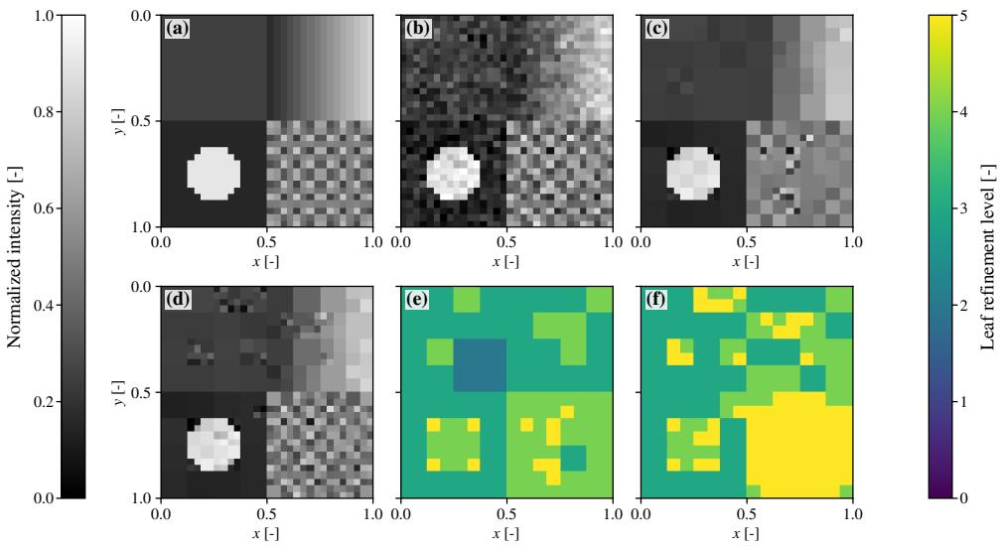  
Fig. 1. Representative spatial outcome for the four-region holdout case: (a) clean image; (b) noisy input; (c) deterministic-AMDI reconstruction; (d) Learned-AMDI reconstruction; (e) final deterministic-AMDI refinement levels; and (f) final learned refinement levels. This figure illustrates the terminal allocations; sequential contribution is assessed separately by the decision-1-only control.

The energy log also distinguishes the fixed-tree propagation safeguard from the learned tree update. All fixed-tree safeguards are accepted, but learned adaptation raises the post-propagation AMDI energy in all nine cases at decision 1 and in six cases at decision 2. The corresponding mean post-adaptation increments are $3 . 2 9 \times 1 0 ^ { - 5 }$ and $4 . 7 8 \times 1 0 ^ { - 7 }$ . At decision 1 the complete propagation-plus-adaptation update also increases the energy relative to the state before propagation by $1 . 8 2 \times 1 0 ^ { - 5 }$ on average. Hence the fixed-tree safeguard guarantees the accepted propagation update only; it does not guarantee monotone decay of the learned outer iteration after a tree change.

5.4. Accuracy–representation tradeof. To examine the occupancy tradeof, independent policies are trained with

$$
\lambda _ { \mathrm { o c c } } \in \{ 0 . 0 3 , 0 . 0 8 , 0 . 1 5 , 0 . 2 5 , 0 . 3 0 , 0 . 6 0 \} ,\tag{5.13}
$$

while the remaining reward coeficients and PPO parameters are fixed. Every PPO point and every control point in Fig. 3 is evaluated on the same four images, $s \in \mathcal { T } _ { 4 }$ ， with noise seeds $4 0 0 0 0 + s$ . The $\lambda _ { \mathrm { o c c } } = 0 . 1 5$ point is not a newly trained duplicate: it reuses the selected principal checkpoint.

The nonlearned frontiers use the complete prespecified validation grids of top-K budgets and observed-detail thresholds. The grids are fixed before their evaluation on the four Pareto images. Increasing the number of selected details moves both control families smoothly from the retain-tree point toward larger representations and smaller $E _ { \mathrm { r e f } }$

The learned family spans a wider occupancy range,

$$
C _ { \mathrm { r e l } } : 0 . 9 5 0 9 3 \to 0 . 7 5 4 6 4 \to 0 . 2 6 0 9 9 \to 0 . 1 5 6 9 8 \to 0 . 1 1 3 7 7 \to 0 . 0 9 9 1 2 ,\tag{5.14}
$$

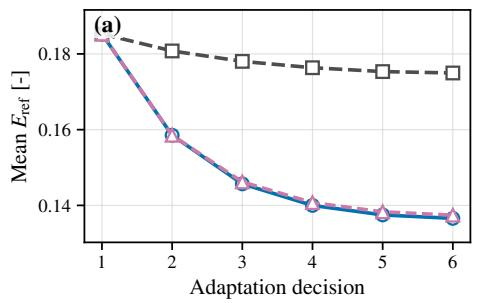

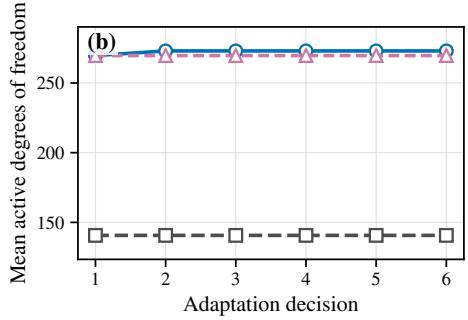

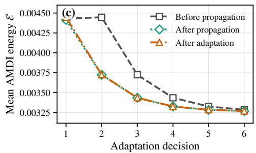

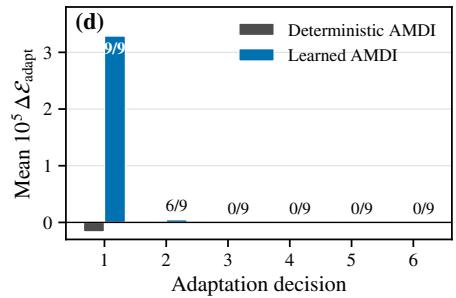  
Fig. 2. Nine-case action and energy analysis. (a) Mean reference error and (b) mean active degrees of freedom for deterministic AMDI, unrestricted Learned AMDI, and the decision-1-only temporal control. (c) Mean learned trajectory energy immediately before propagation, after propagation, and after adaptation. (d) Mean energy change caused by adaptation; labels give the number of cases with a positive change. The near coincidence of the two learned trajectories after decision 1 shows that later decisions make only a small contribution on this benchmark, while panels (c)–(d) show that the fixed-tree safeguard does not extend across the learned tree update.

with $E _ { \mathrm { r e f } }$ increasing from 0.02296 to 0.18491. Within this four-image subset, the smallest learned RMSE and largest learned SSIM occur at $\lambda _ { \mathrm { o c c } } = 0 . 2 5$ , where

$$
C _ { \mathrm { r e l } } = 0 . 1 5 6 9 8 , \quad E _ { \mathrm { r e f } } = 0 . 1 6 6 1 6 , \quad \mathrm { R M S E } = 0 . 0 5 1 4 1 , \quad \mathrm { S S I M } = 0 . 8 2 0 1 9 .\tag{5.15}
$$

At the selected $\lambda _ { \mathrm { o c c } } = 0 . 1 5$ point, Learned AMDI gives

$$
\begin{array} { r } { ( C _ { \mathrm { r e l } } , E _ { \mathrm { r e f } } ) = ( 0 . 2 6 0 9 9 , 0 . 1 3 8 0 8 ) , } \\ { ( \mathrm { R M S E } , \mathrm { S S I M } ) = ( 0 . 0 5 2 4 1 , 0 . 8 1 4 3 0 ) . } \end{array}\tag{5.16}
$$

On the identical cases and noise, the threshold control at $\tau _ { \mathrm { d e t a i l } } = 6 . 1 2 5 7 1 \times 1 0 ^ { - 3 }$ gives

$$
\begin{array} { r } { ( C _ { \mathrm { r e l } } , E _ { \mathrm { r e f } } ) = ( 0 . 2 5 8 7 9 , 0 . 1 3 8 6 2 ) , } \\ { ( \mathrm { R M S E } , \mathrm { S S I M } ) = ( 0 . 0 5 2 1 1 , 0 . 8 1 4 7 6 ) . } \end{array}\tag{5.17}
$$

The frontiers therefore confirm the holdout conclusion: at comparable occupancy, the validation-tuned detail rule matches the selected learned policy within small diferences and is slightly better in the image metrics. The present evidence supports a learned route to the allocation tradeof, but not a claim that PPO is intrinsically superior to observed-detail ranking on these static synthetic images.

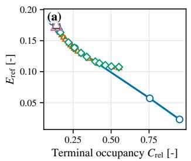

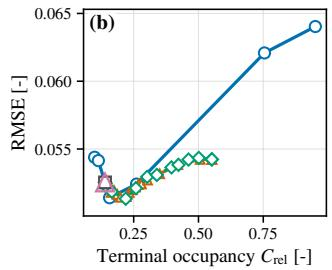

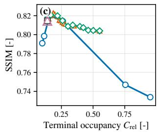  
Fig. 3. Accuracy–representation frontiers on the same four test images and noise realizations for every method. Shown are (a) reference error, (b) RMSE, and (c) SSIM versus terminal occupancy. Blue points are learned policies obtained by varying $\lambda _ { \mathrm { o c c } ; }$ the $\lambda _ { \mathrm { o c c } } = 0 . 1 5$ point reuses the selected principal checkpoint. Orange and green curves are the prespecified top-K and observeddetail-threshold grids, respectively. The square and triangle denote deterministic AMDI and the retain-tree control.

Table 4  
Same-resolution deployment and resolution transfer on four images at each N. $\overline { { N } } _ { \mathrm { a c t } }$ is the mean absolute terminal basis size, and $N _ { \mathrm { r e f } } ^ { ( 4 ) }$ is the total number of executed refinements over the four trajectories. The top-K and threshold parameters are the validation-occupancy choices $K = 3 6$ and $\tau _ { \mathrm { d e t a i l } } = 6 . 1 2 5 7 1 \times 1 0 ^ { - 3 }$
<table><tr><td>N</td><td> $N _ { \mathrm { f u l l } }$ </td><td>Method</td><td> $C _ { \mathrm { r e l } }$ </td><td> $\overline { { N } } _ { \mathrm { a c t } }$ </td><td> $\overline { { N _ { \mathrm { r e f } } ^ { ( 4 ) } } }$ </td><td> $E _ { \mathrm { r e f } }$ </td><td>RMSE</td><td>SSIM</td></tr><tr><td>32</td><td>1024</td><td>Deterministic AMDI</td><td>0.13648</td><td>139.75</td><td>0</td><td>0.17301</td><td>0.05378</td><td>0.80623</td></tr><tr><td>32</td><td>1024</td><td>Learned AMDI</td><td>0.24927</td><td>255.25</td><td>154</td><td>0.13814</td><td>0.05466</td><td>0.80512</td></tr><tr><td>32</td><td>1024</td><td>Top-K control</td><td>0.24194</td><td>247.75</td><td>144</td><td>0.13977</td><td>0.05412</td><td>0.81135</td></tr><tr><td>32</td><td>1024</td><td>Threshold control</td><td>0.24487</td><td>250.75</td><td>148</td><td>0.13932</td><td>0.05398</td><td>0.81207</td></tr><tr><td>64</td><td>4096</td><td>Deterministic AMDI</td><td>0.03650</td><td>149.50</td><td>0</td><td>0.17534</td><td>0.04673</td><td>0.72399</td></tr><tr><td>64</td><td>4096</td><td>Learned AMDI</td><td>0.04089</td><td>167.50</td><td>24</td><td>0.17104</td><td>0.04404</td><td>0.73740</td></tr><tr><td>64</td><td>4096</td><td>Top-K control</td><td>0.06287</td><td>257.50</td><td>144</td><td>0.16149</td><td>0.04006</td><td>0.78733</td></tr><tr><td>64</td><td>4096</td><td>Threshold control</td><td>0.04126</td><td>169.00</td><td>26</td><td>0.17084</td><td>0.04380</td><td>0.74187</td></tr><tr><td>128</td><td>16384</td><td>Deterministic AMDI</td><td>0.00876</td><td>143.50</td><td>0</td><td>0.15712</td><td>0.04529</td><td>0.67959</td></tr><tr><td>128</td><td>16384</td><td>Learned AMDI</td><td>0.00931</td><td>152.50</td><td>12</td><td>0.15382</td><td>0.04318</td><td>0.69029</td></tr><tr><td>128</td><td>16384</td><td>Top-K control</td><td>0.01535</td><td>251.50</td><td>144</td><td>0.14326</td><td>0.03595</td><td>0.74693</td></tr><tr><td>128</td><td>16384</td><td>Threshold control</td><td>0.00949</td><td>155.50</td><td>16</td><td>0.15312</td><td>0.04268</td><td>0.69274</td></tr></table>

5.5. Resolution transfer without retraining. Transfer is evaluated on four images at each resolution, using image seeds 1000–1003 and noise seed $5 0 0 0 0 + s +$ N. Table 4 reports both the relative occupancy and the absolute number of active degrees of freedom. The control parameters are those selected at 32 × 32 and are not retuned. The retain-tree calculation coincides with deterministic AMDI throughout this experiment because deterministic AMDI accepts no tree change in any of the 72 transfer decisions.

The 32 × 32 transfer rows use independent noise and are therefore not duplicates of Table 1. Learned AMDI reduces $E _ { \mathrm { r e f } }$ from 0.17301 to 0.13814, but its RMSE and SSIM are nearly unchanged relative to deterministic AMDI. The frozen threshold control reaches essentially the same occupancy and reference error while giving the best image metrics among the three adaptive methods in these four same-resolution cases.

At 64 × 64 and $1 2 8 \times 1 2 8$ , the number of learned refinements falls from 154 at

Deterministic AMDI Learned AMDI

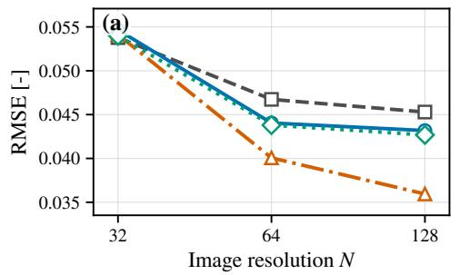

Top-K control Threshold control

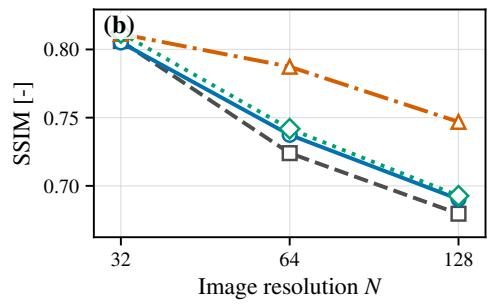

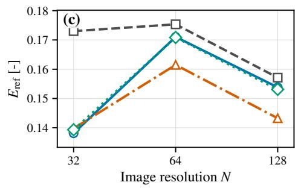

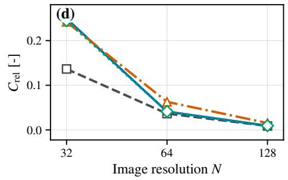  
Fig. 4. Same-resolution deployment at $N = 3 2$ and resolution transfer to $N = 6 4$ and $N = 1 2 8 ,$ using four images at each resolution. Shown are (a) RMSE, (b) SSIM, (c) reference error, and (d) relative occupancy for deterministic AMDI, Learned AMDI, the frozen top-K control, and the frozen observed-detail-threshold control. The actor and both control parameters are fixed at $N = 3 2$ and are not retuned at the finer resolutions. Absolute active basis sizes and executed refinements are reported in Table $\it 4 .$

32 × 32 to 24 and 12, respectively. The absolute terminal basis sizes are 167.5 and 152.5, compared with 149.5 and 143.5 for deterministic AMDI. The frozen threshold control closely tracks these action counts and basis sizes and slightly improves all three accuracy measures. By contrast, the fixed K = 36 rule executes exactly 144 refinements over the four cases at every resolution; its occupancy increasingly exceeds the learned occupancy on the two finer grids and produces correspondingly better accuracy. It is therefore not occupancy matched after transfer. These results show that the actor can be deployed at finer resolutions without retraining, but they do not show an advantage over the frozen threshold rule.

5.6. Training robustness and reward ablation. Following established recommendations for reporting variation in deep reinforcement-learning experiments [42, 43], sensitivity to policy initialization is assessed using training seeds 20260811, 20260817, and 20260823. Each retained checkpoint is evaluated on the same four image seeds and noise realizations. The resulting means are

$$
\mathrm { R M S E } = 0 . 0 5 2 1 8 \pm 0 . 0 0 1 8 3 , \qquad \mathrm { S S I M } = 0 . 8 1 5 2 3 \pm 0 . 0 0 9 0 7 ,\tag{5.18}
$$

and

$$
C _ { \mathrm { r e l } } = 0 . 2 3 6 0 8 \pm 0 . 0 5 5 9 5 , \qquad E _ { \mathrm { r e f } } = 0 . 1 4 8 8 6 \pm 0 . 0 1 4 7 6 , \qquad { \overline { { \sigma } } } _ { \mathrm { s w } } = 0 . 0 1 5 0 6 \pm 0 . 0 0 9 5 6 .\tag{5.19}
$$

Table 5  
Reward ablation on the common four-image subset. The Full row reuses the selected checkpoint but is evaluated with the ablation experiment’s noise realizations.
<table><tr><td>Reward</td><td> $E _ { \mathrm { r e f } }$ </td><td> $C _ { \mathrm { r e l } }$ </td><td> $\overline { { \sigma } } _ { \mathrm { { s w } } }$ </td><td>RMSE</td></tr><tr><td>Full</td><td>0.13769</td><td>0.27710</td><td>0.02209</td><td>0.05414</td></tr><tr><td>No occupancy term</td><td>0.02080</td><td>0.99561</td><td>0.14185</td><td>0.06483</td></tr><tr><td>No switching term</td><td>0.15126</td><td>0.22363</td><td>0.01318</td><td>0.05260</td></tr></table>

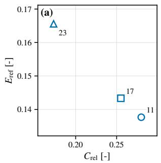

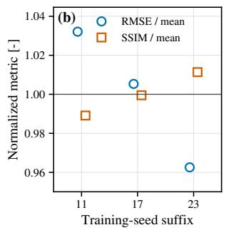

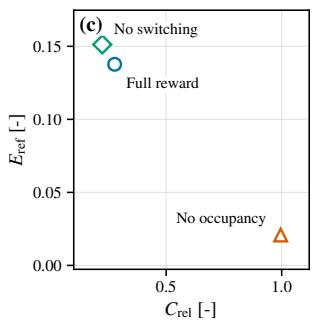  
Fig. 5. Policy-seed sensitivity and reward ablation. (a) Error–occupancy operating points for three independently trained policy seeds; (b) RMSE and SSIM, normalized by their respective means across the three policy-seed means; and (c) operating points for the full reward and the two reward ablations.

Here $^ { 6 6 } \pm \ v { r }$ denotes the sample standard deviation of the three policy-seed means, not the dispersion of the twelve individual trajectories. Each policy-seed mean is first formed from its four common evaluation cases. Across the three training seeds, the image metrics vary less than representation occupancy and reference error, indicating that the learned allocation remains sensitive to policy initialization.

The reward ablation retrains after removing either the occupancy or switching term. Its results are summarized in Table 5.

Removing the occupancy penalty drives the representation to an almost uniform state, $C _ { \mathrm { r e l } } = 0 . 9 9 5 6 1$ , demonstrating that this reward component is responsible for compression. Removing the switching term gives a smaller measured switching value and a smaller representation, but increases $E _ { \mathrm { r e f } }$ from 0.13769 to 0.15126. The switching term is therefore part of a coupled trajectory objective; it does not control the observed switching rate monotonically in isolation.

The Full checkpoint in Table 5, the seed-20260811 checkpoint in the robustness calculation, and the principal checkpoint are the same stored policy. Their numerical values difer because they are evaluated with diferent noise: the holdout comparison uses noise seeds 30000 + s (and seed 137 for the four-region case), the ablation comparison uses 60000 + s, and the robustness comparison uses 70000 + s. This diference is evaluation-noise variation, not a change in the trained policy.

5.7. Independent multiresolution localization diagnostic. Finally, regional localization is compared with an independent VAMPyR/MRCPP calculation [44]. VAMPyR is used to form an order-five adaptive multiwavelet projection of the clean analytic four-region target, with requested precision $1 0 ^ { - 3 }$ and maximum depth eight. It is not run on the noisy image, the AMDI state, or the learned trajectory. This calculation is therefore a qualitative localization diagnostic, not an independent validation of the learned dynamics.

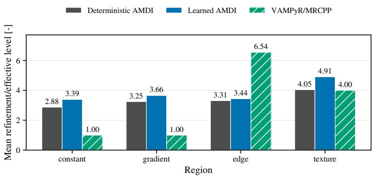  
Fig. 6. Regional localization for deterministic AMDI, Learned AMDI, and an independent VAMPyR/MRCPP order-five projection of the clean analytic target, computed with precision 10−3 and maximum depth eight. The method-dependent level values are used only as qualitative regional indicators.

The VAMPyR efective level is 1 in the constant and gradient regions, has mean value 6.54 in the edge region, and is 4 in the textured region. The terminal Learned-AMDI Haar tree has regional mean levels 3.39063, 3.65625, 3.43750, and 4.90625 in the constant, gradient, edge, and textured regions, respectively. Deterministic AMDI gives 2.87500, 3.25000, 3.31250, and 4.04688. Because Haar levels and VAMPyR efective levels have diferent definitions, their numerical values are not compared quantitatively. The regional orderings are only partly aligned. VAMPyR assigns its largest efective level to the edge region, whereas Learned AMDI assigns its largest mean level to the textured region and does not preferentially resolve the edge over the smooth-gradient region. The comparison therefore provides a qualitative diagnostic of method-dependent localization, not evidence that VAMPyR validates the learned allocation.

6. Conclusions. We introduced Learned AMDI, in which a shared local policy selects the adaptive multiresolution representation while the AMDI propagation and hierarchy constraints remain unchanged. In the reported Haar implementation, zero-initialized refinement candidates cannot be selected by the deterministic onestep criterion. Accordingly, deterministic AMDI accepts no refinements in the 54 holdout decisions and behaves as a nearly static initial-tree method. Learned AMDI executes 393 refinements and reduces the mean terminal reference error from 0.17496 to 0.13657, a 21.9% reduction, while increasing terminal occupancy from 0.13737 to 0.26660. Thus, relative to the implemented deterministic selector, the learned policy produces a genuinely adaptive allocation and substantially improves agreement with the uniformly resolved AMDI trajectory. The step-resolved energy data also show that learned tree changes can introduce small energy increases, so the fixed-tree safeguard does not imply monotonicity of the complete learned iteration.

At nearby but not identical occupancy, the validation-tuned threshold rule uses a slightly smaller mean representation (0.26042 versus 0.26660) and gives a slightly higher reference error (0.13792 versus 0.13657), while achieving slightly better RMSE and SSIM. The learned and threshold selectors therefore occupy essentially the same observed accuracy–occupancy tradeof. The demonstrated role of PPO is to convert the trajectory objective into an admissible adaptive allocation without prescribing a fixed detail threshold; the present results do not establish superior spatial ranking at fixed occupancy.

The shared actor also transfers without retraining. Over the four transfer images, the number of learned refinements decreases from 154 at 32×32 to 24 at 64×64 and 12 at 128 × 128, adapting the absolute representation size without resolution-specific retuning. At the two finer resolutions, Learned AMDI improves reference error, RMSE, and SSIM relative to deterministic AMDI, while the frozen threshold rule remains closely comparable. The decision-1-only control shows that most of the benefit on the present static images is produced by the initial allocation; problems with moving or emerging localized structure provide the natural setting for testing stronger sequential behavior. Overall, Learned AMDI provides a transparent, hierarchy-constrained, and resolution-transferable mechanism for adaptive multiresolution allocation.

Data Availability Statement. The source code, numerical implementation, trained policy checkpoint, experiment scripts, numerical result files, and figure-generation scripts required to reproduce the results reported in this study are openly available in the Learned AMDI numerical validation repository at https://github.com/ Christian48596/amdi ii validation. The repository also provides the publication configuration, parameter settings, software environment, validation tests, and instructions for reproducing the reported calculations. All numerical data presented in this study are generated computationally by the supplied scripts. No proprietary or restricted datasets were used.

## REFERENCES

[1] P. Perona and J. Malik, Scale-space and edge detection using anisotropic difusion, IEEE Transactions on Pattern Analysis and Machine Intelligence, 12 (1990), pp. 629–639, doi:10. 1109/34.56205, https://doi.org/10.1109/34.56205.

[2] F. Catte, P.-L. Lions, J.-M. Morel, and T. Coll ´ , Image selective smoothing and edge detection by nonlinear difusion, SIAM Journal on Numerical Analysis, 29 (1992), pp. 182– 193, doi:10.1137/0729012, https://doi.org/10.1137/0729012.

[3] J. Weickert, Coherence-enhancing difusion filtering, International Journal of Computer Vision, 31 (1999), pp. 111–127, doi:10.1023/A:1008009714131, https://doi.org/10.1023/A: 1008009714131.

[4] M. J. Black, G. Sapiro, D. H. Marimont, and D. Heeger, Robust anisotropic difusion, IEEE Transactions on Image Processing, 7 (1998), pp. 421–432, doi:10.1109/83.661192, https://doi.org/10.1109/83.661192.

[5] L. I. Rudin, S. Osher, and E. Fatemi, Nonlinear total variation based noise removal algorithms, Physica D: Nonlinear Phenomena, 60 (1992), pp. 259–268, doi:10.1016/ 0167-2789(92)90242-F, https://doi.org/10.1016/0167-2789(92)90242-F.

[6] A. Chambolle, An algorithm for total variation minimization and applications, Journal of Mathematical Imaging and Vision, 20 (2004), pp. 89–97, doi:10.1023/B:JMIV.0000011325. 36760.1E, https://doi.org/10.1023/B:JMIV.0000011325.36760.1E.

[7] A. Buades, B. Coll, and J.-M. Morel, A non-local algorithm for image denoising, in 2005 IEEE Computer Society Conference on Computer Vision and Pattern Recognition, vol. 2, IEEE, 2005, pp. 60–65, doi:10.1109/CVPR.2005.38, https://doi.org/10.1109/CVPR.2005. 38.

[8] S. G. Mallat, A theory for multiresolution signal decomposition: The wavelet representation, IEEE Transactions on Pattern Analysis and Machine Intelligence, 11 (1989), pp. 674–693, doi:10.1109/34.192463, https://doi.org/10.1109/34.192463.

[9] I. Daubechies, Ten Lectures on Wavelets, vol. 61 of CBMS-NSF Regional Conference Series in Applied Mathematics, Society for Industrial and Applied Mathematics, Philadelphia, PA, 1992, doi:10.1137/1.9781611970104, https://doi.org/10.1137/1.9781611970104.

[10] A. Harten, Multiresolution algorithms for the numerical solution of hyperbolic conservation laws, Communications on Pure and Applied Mathematics, 48 (1995), pp. 1305–1342, doi:10. 1002/cpa.3160481201, https://doi.org/10.1002/cpa.3160481201.

[11] A. Harten, Multiresolution representation of data: A general framework, SIAM Journal on Numerical Analysis, 33 (1996), pp. 1205–1256, doi:10.1137/0733060, https://doi.org/10. 1137/0733060.

[12] R. A. DeVore, Nonlinear approximation, Acta Numerica, 7 (1998), pp. 51–150, doi:10.1017/ S0962492900002816, https://doi.org/10.1017/S0962492900002816.

[13] A. Cohen, W. Dahmen, and R. DeVore, Adaptive wavelet methods for elliptic operator equations: Convergence rates, Mathematics of Computation, 70 (2001), pp. 27–75, doi:10. 1090/S0025-5718-00-01252-7, https://doi.org/10.1090/S0025-5718-00-01252-7.

[14] A. Cohen, S. M. Kaber, S. Muller, and M. Postel¨ , Fully adaptive multiresolution finite volume schemes for conservation laws, Mathematics of Computation, 72 (2003), pp. 183– 225, doi:10.1090/S0025-5718-01-01391-6, https://doi.org/10.1090/S0025-5718-01-01391-6.

[15] D. L. Donoho and I. M. Johnstone, Ideal spatial adaptation by wavelet shrinkage, Biometrika, 81 (1994), pp. 425–455, doi:10.1093/biomet/81.3.425, https://doi.org/10.1093/biomet/81. 3.425.

[16] D. L. Donoho, De-noising by soft-thresholding, IEEE Transactions on Information Theory, 41 (1995), pp. 613–627, doi:10.1109/18.382009, https://doi.org/10.1109/18.382009.

[17] T. Preußer and M. Rumpf, An adaptive finite element method for large scale image processing, Journal of Visual Communication and Image Representation, 11 (2000), pp. 183–195, doi:10.1006/jvci.1999.0444, https://doi.org/10.1006/jvci.1999.0444.

[18] C. Tantardini, S. R. Jensen, R. Di Remigio Eik˚as, and J. H. Beck, Adaptive multiresolution difusion operators: A variational theory on evolving multiresolution spaces, 2026, doi:10. 48550/arXiv.2610.01809, https://arxiv.org/abs/2610.01809, arXiv:2610.01809. Preprint.

[19] M. J. Berger and J. Oliger, Adaptive mesh refinement for hyperbolic partial diferential equations, Journal of Computational Physics, 53 (1984), pp. 484–512, doi:10.1016/ 0021-9991(84)90073-1, https://doi.org/10.1016/0021-9991(84)90073-1.

[20] M. J. Berger and P. Colella, Local adaptive mesh refinement for shock hydrodynamics, Journal of Computational Physics, 82 (1989), pp. 64–84, doi:10.1016/0021-9991(89)90035-1, https://doi.org/10.1016/0021-9991(89)90035-1.

[21] J. Yang, T. Dzanic, B. Petersen, J. Kudo, K. Mittal, V. Tomov, J.-S. Camier, T. Zhao, H. Zha, T. Kolev, R. Anderson, and D. Faissol, Reinforcement learning for adaptive mesh refinement, in Proceedings of the 26th International Conference on Artificial Intelligence and Statistics, vol. 206 of Proceedings of Machine Learning Research, PMLR, 2023, pp. 5997–6014, doi:10.48550/arXiv.2103.01342, https://proceedings.mlr.press/v206 yang23e.html, arXiv:2103.01342.

[22] C. Foucart, A. Charous, and P. F. J. Lermusiaux, Deep reinforcement learning for adaptive mesh refinement, Journal of Computational Physics, 491 (2023), p. 112381, doi:10.1016/j. jcp.2023.112381, https://doi.org/10.1016/j.jcp.2023.112381.

[23] N. Freymuth, P. Dahlinger, T. Wurth, S. Reisch, L. K¨ arger, and G. Neu-¨ mann, Swarm reinforcement learning for adaptive mesh refinement, in Advances in Neural Information Processing Systems, vol. 36, 2023, pp. 73312– 73347, doi:10.48550/arXiv.2304.00818, https://papers.neurips.cc/paper files/paper/2023/ hash/e85454a113e8b41e017c81875ae68d47-Abstract-Conference.html, arXiv:2304.00818.

[24] T. Dzanic, K. Mittal, D. Kim, J. Yang, S. Petrides, B. Keith, and R. Anderson, DynAMO: Multi-agent reinforcement learning for dynamic anticipatory mesh optimization with applications to hyperbolic conservation laws, Journal of Computational Physics, 506 (2024), p. 112924, doi:10.1016/j.jcp.2024.112924, https://doi.org/10.1016/j.jcp.2024. 112924.

[25] M. Raissi, P. Perdikaris, and G. E. Karniadakis, Physics-informed neural networks: A deep learning framework for solving forward and inverse problems involving nonlinear partial diferential equations, Journal of Computational Physics, 378 (2019), pp. 686–707, doi:10.1016/j.jcp.2018.10.045, https://doi.org/10.1016/j.jcp.2018.10.045.

[26] G. E. Karniadakis, I. G. Kevrekidis, L. Lu, P. Perdikaris, S. Wang, and L. Yang, Physicsinformed machine learning, Nature Reviews Physics, 3 (2021), pp. 422–440, doi:10.1038/ s42254-021-00314-5, https://doi.org/10.1038/s42254-021-00314-5.

[27] L. Lu, P. Jin, G. Pang, Z. Zhang, and G. E. Karniadakis, Learning nonlinear operators via DeepONet based on the universal approximation theorem of operators, Nature Machine Intelligence, 3 (2021), pp. 218–229, doi:10.1038/s42256-021-00302-5, https://doi.org/10. 1038/s42256-021-00302-5.

[28] Z. Li, N. Kovachki, K. Azizzadenesheli, B. Liu, K. Bhattacharya, A. Stuart, and A. Anandkumar, Fourier neural operator for parametric partial diferential equations, in International Conference on Learning Representations, 2021, doi:10.48550/arXiv.2010. 08895, https://arxiv.org/abs/2010.08895, arXiv:2010.08895.

[29] N. Kovachki, Z. Li, B. Liu, K. Azizzadenesheli, K. Bhattacharya, A. Stuart, and A. Anandkumar, Neural operator: Learning maps between function spaces with applications to PDEs, Journal of Machine Learning Research, 24 (2023), pp. 1–97, doi:10.48550/

arXiv.2108.08481, https://www.jmlr.org/papers/v24/21-1524.html, arXiv:2108.08481.

[30] G. Gupta, X. Xiao, and P. Bogdan, Multiwavelet-based operator learning for diferential equations, in Advances in Neural Information Processing Systems, vol. 34, 2021, pp. 24048–24062, doi:10.48550/arXiv.2109.13459, https://papers.neurips.cc/paper/2021/ hash/c9e5c2b59d98488fe1070e744041ea0e-Abstract.html, arXiv:2109.13459.

[31] H. Pandey, S. Patel, and R. Behera, LiNO: Lifting-based multiresolution neural operator, 2026, doi:10.48550/arXiv.2607.02715, https://arxiv.org/abs/2607.02715, arXiv:2607.02715. Preprint.

[32] T. Pfaff, M. Fortunato, A. Sanchez-Gonzalez, and P. W. Battaglia, Learning meshbased simulation with graph networks, in International Conference on Learning Representations, 2021, doi:10.48550/arXiv.2010.03409, https://openreview.net/forum?id=roNqYL0 XP, arXiv:2010.03409.

[33] J. Brandstetter, D. E. Worrall, and M. Welling, Message passing neural PDE solvers, in International Conference on Learning Representations, 2022, doi:10.48550/arXiv.2202. 03376, https://openreview.net/forum?id=vSix3HPYKSU, arXiv:2202.03376.

[34] L. P. Kaelbling, M. L. Littman, and A. W. Moore, Reinforcement learning: A survey, Journal of Artificial Intelligence Research, 4 (1996), pp. 237–285, doi:10.1613/JAIR.301, https://doi.org/10.1613/JAIR.301.

[35] M. L. Puterman, Markov Decision Processes: Discrete Stochastic Dynamic Programming, John Wiley & Sons, New York, 1994, doi:10.1002/9780470316887, https://doi.org/10.1002/ 9780470316887.

[36] R. J. Williams, Simple statistical gradient-following algorithms for connectionist reinforcement learning, Machine Learning, 8 (1992), pp. 229–256, doi:10.1007/BF00992696, https: //doi.org/10.1007/BF00992696.

[37] V. R. Konda and V. S. Borkar, Actor–critic-type learning algorithms for markov decision processes, SIAM Journal on Control and Optimization, 38 (1999), pp. 94–123, doi:10.1137/ S036301299731669X, https://doi.org/10.1137/S036301299731669X.

[38] J. Schulman, F. Wolski, P. Dhariwal, A. Radford, and O. Klimov, Proximal policy optimization algorithms, 2017, doi:10.48550/arXiv.1707.06347, https://arxiv.org/abs/1707. 06347, arXiv:1707.06347. Preprint.

[39] J. Schulman, P. Moritz, S. Levine, M. I. Jordan, and P. Abbeel, High-dimensional continuous control using generalized advantage estimation, in International Conference on Learning Representations, 2016, doi:10.48550/arXiv.1506.02438, https://arxiv.org/abs/ 1506.02438, arXiv:1506.02438.

[40] D. P. Kingma and J. Ba, Adam: A method for stochastic optimization, in International Conference on Learning Representations, 2015, doi:10.48550/arXiv.1412.6980, https://arxiv. org/abs/1412.6980, arXiv:1412.6980.

[41] Z. Wang, A. C. Bovik, H. R. Sheikh, and E. P. Simoncelli, Image quality assessment: From error visibility to structural similarity, IEEE Transactions on Image Processing, 13 (2004), pp. 600–612, doi:10.1109/TIP.2003.819861, https://doi.org/10.1109/TIP.2003.819861.

[42] P. Henderson, R. Islam, P. Bachman, J. Pineau, D. Precup, and D. Meger, Deep reinforcement learning that matters, in Proceedings of the AAAI Conference on Artificial Intelligence, vol. 32, 2018, pp. 3207–3214, doi:10.1609/aaai.v32i1.11694, https: //doi.org/10.1609/aaai.v32i1.11694.

[43] R. Agarwal, M. Schwarzer, P. S. Castro, A. Courville, and M. G. Bellemare, Deep reinforcement learning at the edge of the statistical precipice, in Advances in Neural Information Processing Systems, vol. 34, 2021, pp. 29304–29320, doi:10.48550/arXiv.2108.13264, https: //papers.neurips.cc/paper/2021/hash/f514cec81cb148559cf475e7426eed5e-Abstract.html, arXiv:2108.13264.

[44] M. Bjørgve, C. Tantardini, S. R. Jensen, G. A. Gerez S., P. Wind, R. Di Remigio Eik˚as, E. Dinvay, and L. Frediani, VAMPyR—a high-level python library for mathematical operations in a multiwavelet representation, The Journal of Chemical Physics, 160 (2024), p. 162502, doi:10.1063/5.0203401, https://doi.org/10.1063/5.0203401.