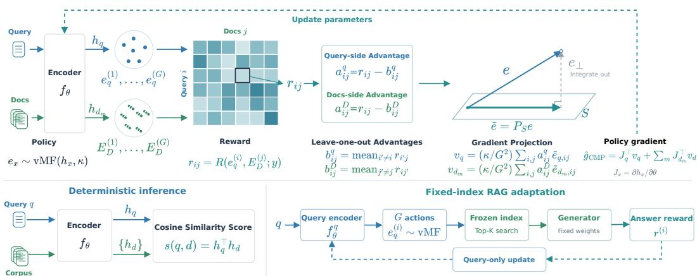
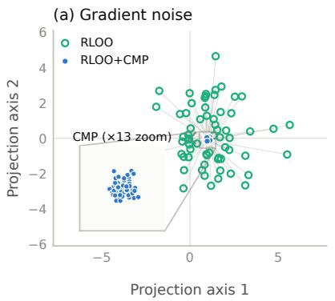
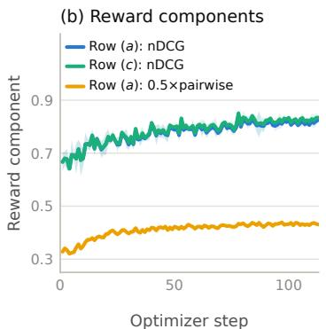
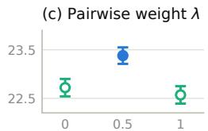
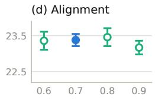

# LEARNING TO RETRIEVE VIA REINFORCEMENT LEARNING IN EMBEDDING SPACE

Qi Liu, Fengming Liang, Yiqun Chen, Erhan Zhang, Jiaxin Mao Renmin University of China

qiliu6777@gmail.com, maojiaxin@gmail.com

## ABSTRACT

Dense retrieval models are typically trained with contrastive objectives that learn effective representations but do not directly optimize retrieval metrics or downstream task performance. To address this problem, we introduce RELER (REinforcement LEarning for Retrieval), a reinforcement learning framework that enables existing embedding models to learn to retrieve directly in embedding space and align to task-specific rewards. We train RELER by sampling unit-length query and document embedding actions from von Mises–Fisher (vMF) distributions centered on normalized encoder outputs, scoring the resulting retrieval or downstream outcomes as rewards, and updating the encoder with REINFORCE using a leave-one-out baseline (RLOO). As exploration in the high-dimensional embedding space is prone to sampling noise, we further propose conditionalmean projection (CMP), which projects each sampled embedding onto the lowdimensional subspace spanned by its encoder output and the candidate embeddings it is compared against, reducing noise in the policy gradient while preserving its expectation. We evaluate RELER on BRIGHT, a benchmark with reasoningintensive queries that remain challenging for existing embedding models. RELER consistently outperforms InfoNCE and LambdaLoss in average nDCG@10 when post-training BGE-M3 and Qwen3-Embedding backbones. We further evaluate downstream utility through retrieval-augmented generation (RAG), where we adapt only the query encoder while keeping the document index and generator fixed. Across seven QA datasets, jointly optimizing retrieval and answer rewards improves both average retrieval performance and answer quality in RAG.

## 1 INTRODUCTION

Dense retrieval models enable large-scale semantic retrieval by encoding queries and documents into a shared embedding space, where relevance is modeled by vector similarity (Karpukhin et al., 2020; Zhang et al., 2025). They support applications including web search (Huang et al., 2013), retrievalaugmented generation (RAG) (Lewis et al., 2020), agentic search (Jin et al., 2025a), and memory recall for long-horizon agents (Packer et al., 2023). Despite these varied uses, most text embedding models are trained with large-scale contrastive learning, encouraging relevant query–document pairs to have higher similarity than irrelevant ones (Zhan et al., 2020; Wang et al., 2022). This training objective, however, is only indirectly related to retrieval metrics such as nDCG or downstream task performance such as answer accuracy in RAG. Reducing the contrastive loss therefore does not necessarily translate into better retrieval quality or downstream utility (Zhang et al., 2024).

This objective mismatch is analogous to that in language model alignment: next-token prediction does not directly optimize human preferences or task success. Reinforcement learning (RL) provides a principled approach by optimizing rewards derived from human preferences or task outcomes (Ouyang et al., 2022; DeepSeek-AI, 2025). This motivates using RL to align retrieval models directly with retrieval and downstream metrics, as RL can optimize such non-differentiable objectives by sampling retrieval decisions, evaluating their outcomes with the target metrics, and estimating policy gradients without differentiating through the retrieval process or the downstream evaluator (Williams, 1992). Recent work has explored RL for embedding and retrieval models through policies over generated text (Sun et al., 2026; Jiang et al., 2026) or discrete document selections (Salemi et al., 2024; Liu et al., 2025c; Zhang et al., 2026). These policies explore text or document choices; the query and document vectors used for similarity scoring are not themselves sampled as actions.

In this work, we revisit reinforcement learning for dense retrieval by treating embeddings as learnable retrieval actions. Because their similarities determine which documents are retrieved, exploring alternative embeddings allows task feedback to guide the representations themselves. We introduce RELER (REinforcement LEarning for Retrieval), a framework for post-training embedding models to learn to retrieve: sample embedding actions, evaluate the retrieval results or downstream answers they produce, and update the encoder to favor actions with higher rewards. The framework explores both query and document embeddings, and also supports query-only adaptation against a fixed document index. Inference retains deterministic single-vector retrieval.

To turn this view into a practical learning algorithm, RELER places a von Mises–Fisher (vMF) policy around each normalized encoder output, enabling exploration on the unit sphere used for cosine retrieval (Bendada et al., 2025). To optimize retrieval, RELER independently samples query and document embeddings and uses product rollouts (Kuntz et al., 2022) to pair every sampled query with every document bundle. Averaging rewards across these pairings gives each action feedback from multiple retrieval outcomes without additional encoder passes. REINFORCE with a leaveone-out baseline (Kool et al., 2019) then converts this feedback into updates to the shared encoder. High-dimensional exploration, however, also introduces random components that leave retrieval scores unchanged but add gradient noise. Building on document-space projection (Wang et al., 2019), we develop conditional-mean projection (CMP): for each reward term, sampled actions are projected onto the subspace spanned by their policy mean and the directions that determine the reward. Applied only in gradient computation, CMP averages out this irrelevant randomness while preserving the relevant scores and the expected policy gradient.

We evaluate RELER as a post-training method for existing embedding models, first on reasoning retrieval and then on downstream RAG tasks. Existing embeddings receive extensive training on tasks represented in MTEB (Muennighoff et al., 2023) and already perform strongly (Chen et al., 2024; Zhang et al., 2025). We therefore focus on BRIGHT (Su et al., 2025), whose reasoning-intensive queries expose remaining weaknesses, to test whether limited additional supervision can improve these models. Using fewer than 5k queries, RELER consistently outperforms supervised baselines trained on the same data across BGE-M3 and Qwen3-Embedding backbones. For downstream RAG, we test whether task feedback improves answer quality by adapting only the query encoder with the index and generator frozen. Combining retrieval and answer rewards improves average retrieval and answer quality over the pretrained encoder across seven QA datasets.

## 2 RELATED WORK

Training dense retrievers and embedding models. Contrastive learning dominates dense retrieval: dual encoders learn a shared geometry by scoring relevant query–document pairs above negatives (Karpukhin et al., 2020), while hard-negative mining and improved sampling sharpen these comparisons (Xiong et al., 2021; Qu et al., 2021). General-purpose embedding models scale this recipe with weak supervision, multi-stage and multi-task training, and multilingual or multifunction objectives (Wang et al., 2022; Li et al., 2023; Xiao et al., 2024; Chen et al., 2024). LLMbased models adapt decoder-only backbones through bidirectional attention or specialized pooling, together with synthetic pairs, instructions, and contrastive fine-tuning (BehnamGhader et al., 2024; Wang et al., 2024; Lee et al., 2025; Muennighoff et al., 2025; Zhang et al., 2025). These methods provide the pretrained dual encoder that RELER subsequently adapts with task-level rewards. ReasonIR, RaDeR, and DIVER develop retrievers for reasoning-intensive queries, while ReasonEmbed uses reasoning-aware synthetic data and adaptive contrastive training (Shao et al., 2025; Das et al., 2025; Long et al., 2025; Chen et al., 2026).

Reward-based adaptation of retrievers and embedding models. Existing RL approaches differ in the action they sample and how rewards reach the encoder. ROPG-RL samples a personal document from a categorical policy and uses downstream generation quality as reward (Salemi et al., 2024). Retrieval-GRPO assigns multi-objective rewards to dynamically retrieved products and optimizes the dense retriever through their similarity scores (Liu et al., 2025c), whereas HARR samples ordered document lists from a Plackett–Luce policy and uses answer-level rewards (Zhang et al., 2026). These policies reshape retrieval geometry through document selections or scores. Another approach uses generated reasoning: GRACE pools rationale-conditioned states into embeddings, while Embed-RL trains a reasoner using feedback from a separate embedder (Sun et al., 2026; Jiang et al., 2026). For large action sets, Bendada et al. (2025) sample a state embedding from a vMF distribution and select actions through nearest-neighbor search. RELER independently samples both query and document embeddings and uses retrieval rewards with CMP to update a shared encoder. Deployment uses deterministic single-vector encoder outputs. Appendix F discusses additional retrieval methods and the prior work underlying our policy-gradient estimator.

## 3 METHOD

We present the embedding-space policy, product-rollout RLOO, and conditional-mean projection, then describe fixed-index query adaptation and the training rewards, as illustrated in Figure 1.

## 3.1 RETRIEVAL AS AN EMBEDDING-SPACE POLICY

Let $h _ { x } = f _ { \theta } ( x ) \in \mathbb { S } ^ { d - 1 }$ be a normalized text representation. The query and document roles share the trainable encoder. At deployment, the similarity of query and document is defined by $h _ { q } ^ { \top } h _ { d } .$ Small changes in embedding direction can change the score, therefore influencing retrieval outcomes or downstream task performance. Exploring around the encoder outputs lets retrieval or answer feedback guide the representations, even when the reward is not differentiable. To explore on the unit sphere, we let each representation define a von Mises–Fisher (vMF) policy during training (Mardia & Jupp, 2000; Bendada et al., 2025):

$$
\begin{array} { r } { \pi _ { \theta } ( e _ { x } \mid x ) = C _ { d } ( \kappa ) \exp ( \kappa h _ { x } ^ { \top } e _ { x } ) , \qquad e _ { x } \in \mathbb { S } ^ { d - 1 } . } \end{array}\tag{1}
$$

Here $C _ { d }$ normalizes the density and $\kappa > 0$ controls exploration. We specify κ through the expected alignment $\rho = \mathbb { E } [ h _ { x } ^ { \top } e _ { x } ] ;$ larger $\rho$ concentrates actions around the deterministic representation. We describe the detailed sampling procedure in Appendix B.1.

A training record $( q , D , y )$ contains a query, valid candidates $D = \left( d _ { 1 } , \ldots , d _ { n } \right)$ , and task supervision y, such as relevance labels for retrieval or reference answers for RAG. The policy $\pi _ { \boldsymbol { \theta } } ( \cdot \mid q , D )$ samples the query action $e _ { q }$ and each document action in $E _ { D } = \left( e _ { d _ { 1 } } , \dots , e _ { d _ { n } } \right)$ independently. The training objective is

$$
\mathcal { T } _ { \kappa } ( \theta \mid q , D , y ) = \mathbb { E } _ { \pi _ { \theta } ( \cdot \vert q , D ) } [ R ( e _ { q } , E _ { D } ; y ) ] .\tag{2}
$$

Here R is a task-defined scalar reward that evaluates the retrieved document list or a downstream output against $y .$ It need not be differentiable, so the same objective accommodates both retrieval metrics and downstream task metrics.

## 3.2 PRODUCT ROLLOUTS WITH REINFORCE-LOO

For each training record, we sample a rollout group consisting of $G \ge 2$ query actions and G document bundles. One-to-one pairing would give each query action feedback from only one document bundle, making its evaluation depend on that particular draw. Product rollouts (Kuntz et al., 2022) evaluate all pairings within the group, so every query action is compared against the same document bundles and every bundle against the same query actions:

$$
r ^ { ( i , j ) } = R ( e _ { q } ^ { ( i ) } , E _ { D } ^ { ( j ) } ; y ) , \qquad i , j = 1 , \ldots , G .\tag{3}
$$

Reusing actions yields $G ^ { 2 }$ correlated rewards without additional encoder passes or action samples, at the cost of more score and reward evaluations.

To evaluate each action, we average over the opposite role’s draws. The row mean $m _ { q } ^ { ( i ) } ~ =$ $G ^ { - 1 } \sum _ { j } r ^ { ( i , j ) }$ measures query action $i ,$ and the column mean $\begin{array} { r } { m _ { D } ^ { ( j ) } = G ^ { - 1 } \sum _ { i } r ^ { ( i , j ) } } \end{array}$ measures document bundle j. These averages make feedback less dependent on any single pairing. We then compare each action’s mean reward with those of the other actions in the same role using REINFORCE with a leave-one-out baseline (REINFORCE-LOO, or RLOO) (Kool et al., 2019; Ahmadian et al.,

  
Figure 1: RELER workflow. Top: embedding rollouts yield rewards for RLOO+CMP updates. Bottom left: deterministic cosine retrieval at inference. Bottom right: query-only adaptation with a frozen document index and generator.

2024). For role $c \in \{ q , D \}$ , the unnormalized advantage is

$$
A _ { c } ^ { ( g ) } = m _ { c } ^ { ( g ) } - \frac { 1 } { G - 1 } \sum _ { g ^ { \prime } \neq g } m _ { c } ^ { ( g ^ { \prime } ) } = \frac { G } { G - 1 } \big ( m _ { c } ^ { ( g ) } - \bar { r } \big ) ,\tag{4}
$$

where $\begin{array} { r } { \bar { r } = G ^ { - 2 } \sum _ { i , j } r ^ { ( i , j ) } } \end{array}$ is the grand mean. These advantages weight the query and document log-densities in the surrogate loss:

$$
\mathcal { L } _ { \mathrm { R L O O } } = - \frac { 1 } { G } \sum _ { i } A _ { q } ^ { ( i ) } \log \pi _ { \theta } ( e _ { q } ^ { ( i ) } \mid q ) - \frac { 1 } { G } \sum _ { j } A _ { D } ^ { ( j ) } \log \pi _ { \theta } ( E _ { D } ^ { ( j ) } \mid D ) ,\tag{5}
$$

where advantages and sampled actions are held fixed during differentiation. The bundle log-density sums over valid documents. The ascent estimator is $\widehat { g } _ { \mathrm { R L O O } } = - \nabla _ { \theta } \mathcal { L } _ { \mathrm { R L O O } }$ . Conditional on the opposite role’s draws, each baseline is independent of the action it evaluates and has zero expected score-weighted contribution. Thus $\mathbb { E } [ \widehat { g } _ { \mathrm { R L O O } } ] = \nabla _ { \boldsymbol { \theta } } \mathcal { T } _ { \kappa }$ . Each rollout batch supplies one on-policy update.

To express this update in encoder parameters, let $\mathbf { J } _ { x } = \partial h _ { x } / \partial \theta$ be the encoder Jacobian. For the vMF policy at fixed $\kappa ,$

$$
\nabla _ { \boldsymbol { \theta } } \log \pi _ { \boldsymbol { \theta } } ( e _ { x } \mid x ) = \kappa \mathbf { J } _ { x } ^ { \top } e _ { x } , \qquad \mathbf { J } _ { x } ^ { \top } h _ { x } = 0 .\tag{6}
$$

Unit normalization leaves only the action’s tangent component contributing to the gradient; its contribution is weighted by the corresponding advantage. Appendix A.1 gives the gradient derivation and unbiasedness proof.

## 3.3 VARIANCE REDUCTION BY CONDITIONAL-MEAN PROJECTION

Sampling in a high-dimensional embedding space introduces randomness along many directions, while a reward based on candidate scores observes only inner products with the candidates. When the candidate span is small relative to the embedding dimension, many sampled components are invisible to the reward but still enter the policy-gradient estimate. They can therefore add gradient noise without providing useful reward information. Conditional-mean projection (CMP) averages out this residual randomness while preserving every candidate score. It extends document-space projection (Wang et al., 2019) to vMF actions for both queries and documents.

Projection as conditional averaging. Consider a query action e with fixed candidates. Let S span those vectors and the policy mean $h ,$ and let $P _ { S }$ be its orthogonal projector. Projection retains every candidate score: $( P \bar { s e } ) ^ { \top } \bar { v } = e ^ { \top } v .$ . Let $\mathcal { H }$ contain all other sampled actions. Conditioning on $\mathcal { \dot { H } }$ and $P _ { S } e$ fixes these scores, leaving only the residual $( I - P _ { S } ) { \mathrm {                } }$ e random. Because $h \in S$ , the vMF distribution is symmetric under reflection of this residual, whose conditional mean is therefore zero:

$$
\mathbb { E } [ e \mid \mathcal { H } , P s e ] = P s e .\tag{7}
$$

We call this conditional-mean projection because the projection equals the action’s conditional mean given the other actions and its retained projection. When the LOO weight is determined by this same information, the weighted gradient term is also conditionally averaged. CMP uses $P s e$ only as a gradient coefficient, without renormalization or changes to sampling and reward evaluation.

Projection for product rollouts. Each reward cell $( i , j )$ uses document bundle $j$ and query draw i. Including the corresponding policy means gives the subspaces

$$
\mathcal { S } _ { j } ^ { q } = \mathrm { s p a n } ( h _ { q } , e _ { d _ { 1 } } ^ { ( j ) } , \ldots , e _ { d _ { n } } ^ { ( j ) } ) , \qquad \mathcal { S } _ { i m } ^ { d } = \mathrm { s p a n } ( h _ { d _ { m } } , e _ { q } ^ { ( i ) } ) .\tag{8}
$$

The query space retains all candidate directions; each document space retains its score against query draw i. Because these spaces vary across cells, we keep cellwise LOO weights until projection:

$$
a _ { i j } ^ { q } = r ^ { ( i , j ) } - \frac { \sum _ { i ^ { \prime } \neq i } r ^ { ( i ^ { \prime } , j ) } } { G - 1 } , \qquad a _ { i j } ^ { D } = r ^ { ( i , j ) } - \frac { \sum _ { j ^ { \prime } \neq j } r ^ { ( i , j ^ { \prime } ) } } { G - 1 } .\tag{9}
$$

Each baseline holds the opposite role’s draw fixed, and all documents in a bundle share $a _ { i j } ^ { D } .$ . Averaging recovers the marginal advantages: $\begin{array} { r } { A _ { q } ^ { ( i ) } = G ^ { - 1 } \sum _ { j } a _ { i j } ^ { q } } \end{array}$ and $A _ { D } ^ { ( j ) } = G ^ { - 1 } \sum _ { i } a _ { i j } ^ { D }$ . For reward R, the projected estimator, RLOO+CMP, is

$$
\widehat { g } _ { \mathrm { C M P } } = \frac { \kappa } { G ^ { 2 } } \sum _ { i , j = 1 } ^ { G } \left[ a _ { i j } ^ { q } \mathbf { J } _ { q } ^ { \top } P _ { S _ { j } ^ { q } } e _ { q } ^ { ( i ) } + a _ { i j } ^ { D } \sum _ { m = 1 } ^ { n } \mathbf { J } _ { d _ { m } } ^ { \top } P _ { S _ { i m } ^ { d } } e _ { d _ { m } } ^ { ( j ) } \right] .\tag{10}
$$

Replacing the projectors by the identity recovers $\widehat { g } _ { \mathrm { R L O O } }$

For bounded rewards determined by the retained candidate scores, CMP preserves the expected gradient and does not increase any individual summand’s variance along any parameter direction (Appendices A.2 and B.3).

## 3.4 QUERY ADAPTATION WITH A FIXED INDEX

In practice, dense retrieval is typically served through an approximate nearest neighbor search (ANNS) index built over precomputed document embeddings, which is costly to rebuild whenever the document encoder changes. In this setting, RELER instead adapts only the query encoder. We freeze the pretrained document encoder and keep its precomputed corpus embeddings unchanged. A separate query encoder, initialized from the same pretrained weights, learns to retrieve against these fixed vectors without document re-encoding or index rebuilding.

For each training query, we draw a group of G query vectors from its vMF policy. Each vector retrieves a top-k list from the full index and receives a reward computed from that list. Query-only RLOO uses the mean of the other G − 1 rewards as each action’s baseline and updates the query encoder through the first term of Eq. (5). No document sampling or product rollouts is needed. We do not apply CMP in this fixed-index setting. Projecting onto the span of the policy mean and retrieved document vectors preserves the scores of those documents, but need not preserve the fullindex top-k list: documents outside the retrieved set can cross the retrieval cutoff.

We also anchor the query encoder to its pretrained initialization: for each training query, we penalize the cosine distance between its current deterministic embedding and its initial embedding. This limits drift relative to the frozen index; the loss and its fixed-concentration vMF interpretation are given in Appendix D.3.

The reward can use retrieval quality, downstream performance, or both. For RAG, a frozen generator produces an answer from the original query and each retrieved list. Passage relevance labels and reference answers provide the two sources of feedback (Section 3.5). The same RLOO update then trains the query encoder without differentiating through retrieval or generation. At deployment, the deterministic query embedding $h _ { q }$ replaces sampled actions and searches the unchanged index.

## 3.5 TRAINING REWARDS

We instantiate rewards from relevance labels for retrieval and reference answers for RAG.

Retrieval rewards. From supervision y, we compute $R _ { \mathrm { n D C G } }$ as nDCG@10 with exponential gains on D and form positive–negative pairs $\mathcal { P } _ { q }$ from its labels. With scores $s _ { p } , s _ { n }$ , we use

$$
R = R _ { \mathrm { n D C G } } + \lambda R _ { \mathrm { p a i r } } , \qquad R _ { \mathrm { p a i r } } = \frac { 1 } { \left| \mathcal { P } _ { q } \right| } \sum _ { ( p , n ) \in \mathcal { P } _ { q } } \left( \mathbf { 1 } [ s _ { p } > s _ { n } ] + \frac { 1 } { 2 } \mathbf { 1 } [ s _ { p } = s _ { n } ] \right) , \quad \lambda = 0 . 5 .\tag{11}
$$

The nDCG reward emphasizes graded ordering near the cutoff; the pairwise term covers the full candidate set. Appendix B.2 specifies the gains and labels.

Componentwise projection. We apply Eq. (10) to nDCG to obtain $\widehat { g } _ { \mathrm { C M P } } ^ { \mathrm { n D C G } }$ . Each pair uses its own LOO weights and a query subspace spanning the policy mean and document-vector difference, since its reward depends only on the corresponding score difference. Averaging the pair estimators gives $\widehat { g } _ { \mathrm { p a i r } }$ (Appendix A.3), yielding

$$
\widehat { g } _ { \mathrm { R E L E R } } = \widehat { g } _ { \mathrm { C M P } } ^ { \mathrm { n D C G } } + \lambda \widehat { g } _ { \mathrm { p a i r } } .\tag{12}
$$

This is unbiased for the combined reward by linearity; both terms share the actions, candidates, and backward pass.

Answer feedback for RAG. For the fixed-index RAG setting (Section 3.4), let $L _ { 1 0 }$ be the retrieved top-ten list and aˆ the frozen generator’s answer from that list. We compare graded retrieval nDCG@10, answer token F1, and their equal mixture:

$$
\begin{array} { r } { R _ { \mathrm { R A G } } ^ { \mathrm { m i x } } = \frac { 1 } { 2 } \mathrm { n D C G @ 1 0 } ( L _ { 1 0 } ; y _ { \mathrm { r e l } } ) + \frac { 1 } { 2 } \mathrm { F } 1 ( \hat { a } , y _ { \mathrm { a n s } } ) , } \end{array}\tag{13}
$$

where $y _ { \mathrm { r e l } }$ contains passage relevance grades and $y _ { \mathrm { a n s } }$ contains reference answers. The F1 term uses the task’s answer-normalization rules; each single-reward control uses one of the two terms alone.

## 4 EXPERIMENTS

We evaluate BRIGHT post-training and fixed-index QA adaptation, with ablations of rewards, rollouts, and gradient estimation.

## 4.1 REASONING-INTENSIVE RETRIEVAL

## 4.1.1 EXPERIMENTAL SETUP

Baselines. We compare RELER with each pretrained encoder and two supervised objectives: LambdaLoss (Wang et al., 2018), which weights pairwise logistic losses by nDCG@10 swap changes using teacher grades, and InfoNCE (van den Oord et al., 2018), which averages positiveversus-negative contrastive losses over known positives at temperature 0.03.

Training setup. We adapt Qwen3-Embedding-0.6B/4B (Q3E-0.6B/4B) (Zhang et al., 2025) and BGE-M3 (Chen et al., 2024) on 4,963 queries from ReasonRank (Liu et al., 2025b), each with up to 20 candidates. LLM-provided candidate rankings supply the graded relevance labels used by LambdaLoss and RELER. All methods train for 113 steps (approximately 3 epochs), using paired seeds 42, 3407, and 2026. Q3E-0.6B and BGE-M3 are fully fine-tuned at a learning rate of $5 \times$ $1 0 ^ { - 6 }$ . For Q3E-4B, all methods use LoRA with a learning rate of $2 \times 1 0 ^ { - 4 }$ . The RELER recipe combines product rollouts and RLOO+CMP with G = 64, $\rho = 0 . 7 0 \ :$ , and a graded nDCG@10 reward augmented by pairwise feedback (λ = 0.5). We run all experiments on eight NVIDIA H100 80GB GPUs. Training time is similar to that of contrastive learning; embedding sampling and reward computation reuse the encoder outputs. Full training settings appear in Appendix C.

Benchmark and evaluation. Modern embeddings perform strongly on conventional MTEB/BEIR retrieval but struggle on reasoning-intensive BRIGHT queries (Zhang et al., 2025; Chen et al., 2024; Su et al., 2025). We use BRIGHT to test post-training with limited additional supervision. We report nDCG@10 (×100), averaged equally over its 12 subsets. Results are means ± sample SD over three seeds; pretrained models are evaluated once. Each checkpoint uses both original queries and the official GPT-4 reasoning queries.

Table 1: BRIGHT nDCG@10 (×100). Subsets show three-seed means; Avg. is the macro-average ± SD. Pretrained models are evaluated once. Bold/underline mark best/second-best scores per model and query setting; shading marks RELER. TheoQ./TheoT.: TheoremQA questions/theorems.
<table><tr><td></td><td colspan="6">StackExchange</td><td colspan="2">Coding</td><td colspan="3">Theorem-based</td><td></td></tr><tr><td>Method</td><td>Bio.</td><td>Earth.</td><td>Econ.</td><td>Psy. Rob.</td><td></td><td>Stack. Sus.</td><td></td><td>Leet. Pony</td><td></td><td>AoPS</td><td>TheoQ.</td><td>TheoT.</td><td>Avg.</td></tr><tr><td colspan="10">Original query</td><td></td><td></td><td></td><td></td></tr><tr><td>BGE-M3</td><td>9.5</td><td>15.3</td><td>11.9</td><td>13.2</td><td>12.1</td><td>10.6</td><td>10.2</td><td>15.8</td><td>15.2</td><td>1.3</td><td>8.4</td><td>4.3</td><td>10.66</td></tr><tr><td>LambdaLoss</td><td>17.2</td><td>14.1</td><td>12.4</td><td>16.2</td><td>12.8</td><td>14.0</td><td>16.6</td><td>15.0</td><td>3.5</td><td>2.7</td><td>8.2</td><td>4.2</td><td>11.40 ± 0.08</td></tr><tr><td>InfoNCE</td><td>18.0</td><td>17.0</td><td>14.7</td><td>20.2</td><td>15.2</td><td>14.3</td><td>16.7</td><td>10.0</td><td>8.5</td><td>2.2</td><td>10.1</td><td>4.7</td><td>12.63 ± 0.11</td></tr><tr><td>RELER</td><td>22.9</td><td>25.8</td><td>19.4</td><td>24.7</td><td>17.0</td><td>17.0</td><td>18.4</td><td>4.9</td><td>6.6</td><td>1.7</td><td>10.2</td><td>5.4</td><td>14.49±0.04</td></tr><tr><td>Q3E-0.6B</td><td>13.4</td><td>27.8</td><td>18.0</td><td>16.6</td><td>12.0</td><td>12.8</td><td>13.2</td><td>14.2</td><td>0.7</td><td>3.3</td><td>17.2</td><td>32.1</td><td>15.10</td></tr><tr><td>LambdaLoss</td><td>24.3</td><td>25.5</td><td>23.9</td><td>29.0</td><td>17.6</td><td>22.9</td><td>21.9</td><td>12.4</td><td>1.4</td><td>3.3</td><td>21.0</td><td>29.0</td><td>19.36 ± 0.28</td></tr><tr><td>InfoNCE</td><td>34.3</td><td>34.1</td><td>26.2</td><td>33.4</td><td>21.0</td><td>28.8</td><td>27.4</td><td>10.2</td><td>1.2</td><td>3.1</td><td>19.7</td><td>32.3</td><td>22.64 ± 0.20</td></tr><tr><td>RELER</td><td>45.9</td><td>37.3</td><td>28.6</td><td>34.0</td><td>18.4</td><td>29.3</td><td>25.2</td><td>9.4</td><td>2.2</td><td>2.3</td><td>19.0</td><td>28.9</td><td>23.38±0.17</td></tr><tr><td>Q3E-4B</td><td>17.2</td><td>34.6</td><td>16.4</td><td>23.0</td><td>13.0</td><td>15.9</td><td>17.1</td><td>21.2</td><td>2.0</td><td>3.7</td><td>19.6</td><td>40.9</td><td>18.70</td></tr><tr><td>LambdaLoss 32.3</td><td></td><td>35.5</td><td>27.5</td><td>36.0</td><td>19.9</td><td>27.0</td><td>30.8</td><td>18.5</td><td>3.6</td><td>3.8</td><td>23.3</td><td>42.0</td><td>25.01 ± 0.37</td></tr><tr><td>InfoNCE</td><td>48.5</td><td>47.0</td><td>32.0</td><td>42.3 26.7</td><td></td><td>34.7</td><td>35.9</td><td>15.2</td><td>6.6</td><td>3.8</td><td>23.5</td><td>44.7</td><td>30.08 ± 0.16</td></tr><tr><td>RELER</td><td>48.9</td><td>50.2</td><td>32.9</td><td>44.3</td><td>25.8</td><td>33.4</td><td>33.6</td><td>13.8</td><td>11.3</td><td>3.6</td><td>20.7</td><td>46.9</td><td>30.46±0.55</td></tr><tr><td colspan="10">GPT-4 reasoning query</td><td colspan="3"></td><td colspan="2"></td></tr><tr><td>BGE-M3</td><td>28.3</td><td>38.1</td><td>23.1</td><td>34.8</td><td>15.0</td><td>23.9</td><td>18.4</td><td>11.6</td><td>24.3</td><td>1.5</td><td>14.3</td><td>24.0</td><td>21.45</td></tr><tr><td>LambdaLoss</td><td>38.7</td><td>42.7</td><td>22.2</td><td>25.7</td><td>15.0</td><td>19.3</td><td>23.0</td><td>9.0</td><td>17.7</td><td>2.0</td><td>8.3</td><td>6.0</td><td>19.13 ± 0.10</td></tr><tr><td>InfoNCE</td><td>37.1</td><td>42.9</td><td>23.5</td><td>30.8</td><td>17.4</td><td>21.8</td><td>23.8</td><td>4.3</td><td>19.8</td><td>1.1</td><td>12.0</td><td>13.0</td><td>20.62 ± 0.09</td></tr><tr><td>RELER</td><td>44.7</td><td>47.3</td><td>25.5</td><td>38.2</td><td>18.0</td><td>24.7</td><td>23.9</td><td>1.5</td><td>30.0</td><td>1.1</td><td>11.9</td><td>19.4</td><td>23.84±0.07</td></tr><tr><td>Q3E-0.6B</td><td></td><td>36.3</td><td>24.1</td><td></td><td></td><td></td><td></td><td></td><td>3.2</td><td>2.1</td><td>16.9</td><td>36.8</td><td>20.38</td></tr><tr><td>LambdaLoss</td><td>27.6 34.9</td><td>38.0</td><td>28.1</td><td>28.2 35.5</td><td>13.5 18.3</td><td>17.3 27.7</td><td>19.8 28.8</td><td>18.6 12.6</td><td>3.5</td><td>3.2</td><td>20.8</td><td>36.3</td><td>23.97 ± 0.36</td></tr><tr><td>InfoNCE</td><td>40.1</td><td>46.6</td><td>29.7</td><td>39.8</td><td>21.4</td><td>34.9</td><td>29.7</td><td>8.8</td><td>6.8</td><td>3.1</td><td>19.1</td><td>38.2</td><td>26.51 ± 0.10</td></tr><tr><td>RELER</td><td>48.1</td><td>48.9</td><td>30.7</td><td>41.1</td><td>18.8</td><td>33.0</td><td>26.5</td><td>9.8</td><td>6.9</td><td>2.9</td><td>19.7</td><td>39.2</td><td>27.15±0.04</td></tr><tr><td>Q3E-4B</td><td>28.1</td><td>39.6</td><td>22.6</td><td></td><td></td><td></td><td></td><td>21.1</td><td>2.9</td><td>3.1</td><td>20.5</td><td>38.9</td><td>22.01</td></tr><tr><td>LambdaLoss</td><td>35.4</td><td>39.3</td><td>25.5</td><td>31.4 36.3</td><td>15.4 22.5</td><td>18.8 29.8</td><td>21.9 29.8</td><td>17.8</td><td>7.9</td><td>3.3</td><td>20.9</td><td>39.9</td><td>25.69 ± 0.25</td></tr><tr><td>InfoNCE</td><td>51.3</td><td>49.9</td><td>31.2</td><td>42.2</td><td>25.4</td><td>38.8</td><td>35.5</td><td>14.7</td><td>9.7</td><td>3.1</td><td>20.8</td><td>40.8</td><td>30.29 ± 0.35</td></tr><tr><td>RELER</td><td>52.5</td><td>51.2</td><td>32.2</td><td>45.3</td><td>26.8</td><td>38.2</td><td>33.3</td><td>12.7</td><td>14.7</td><td>3.9</td><td>19.4</td><td>42.6</td><td>31.07 ± 0.39</td></tr></table>

## 4.1.2 MAIN RESULTS

RELER consistently outperforms the baselines across encoders. RELER achieves the highest average nDCG@10 on all three backbones with both original and GPT-4 reasoning queries (Table 1), ahead of InfoNCE, LambdaLoss, and the pretrained encoders. Its consistent advantage over LambdaLoss, which uses the same teacher grades, suggests that graded supervision alone does not explain the gains. The lead persists with GPT-4 queries, showing that embedding post-training remains beneficial when query-side reasoning is already provided.

RELER’s margins vary across backbones and baselines. Relative to InfoNCE, RELER has its largest average gains on BGE-M3: 1.86 points with original queries and 3.22 with GPT-4 reasoning. For GPT-4 queries, however, InfoNCE falls below the pretrained BGE-M3 encoder; RELER’s improvement over that encoder is 2.39 points. The Qwen backbones gain more over their pretrained encoders but have smaller margins over InfoNCE. Q3E-4B achieves the highest macro-average nDCG@10 in both query settings. The subset scores reveal trade-offs: a higher average does not imply gains on every domain. This variation may partly reflect how closely each BRIGHT subset matches the training distribution.

## 4.1.3 ABLATIONS AND TRAINING ANALYSIS

CMP improves accuracy and reduces seed variation. With the combined reward, BRIGHT rises from 21.91 ± 0.70 to 23.38 ± 0.17 (Table 2, (b) to (a)). CMP also adds 1.87 points with graded nDCG alone; every paired seed improves in both comparisons. Matched probes at fixed encoder states show 291–590-fold lower gradient variance (Table 9; Figure 2(a)). Since CMP preserves the expected gradient, these gains are consistent with more effective optimization through reduced rollout noise. Appendix C.5 details the protocol.

Embedding exploration benefits from product rollouts. Product rollouts outperform one-to-one pairing by 2.14 points under graded nDCG without CMP ((d) vs. (e)). Recombining the same actions into $\breve { G ^ { 2 } }$ reward cells lets each query draw receive feedback from every document bundle, without an additional encoder forward pass. Query-only and document-only sampling also lower performance ((f) and $( g ) )$ , despite updating the shared encoder. These results favor exploring both embedding sides and reusing their samples.

Table 2: BRIGHT ablations (Q3E-0.6B, original queries). Avg. is nDCG@10 (×100), mean ± SD over three seeds; StackEx., Coding, and Theorem average 7, 2, and 3 subsets, respectively. Shading marks full RELER. Query-only and document-only sample one embedding side while updating the shared encoder. Full results are in Appendix C.3.
<table><tr><td></td><td>Reward</td><td>Rollout</td><td>CMP</td><td>StackEx.</td><td>Coding</td><td>Theorem</td><td>Avg.</td></tr><tr><td></td><td>(a) Graded + pairwise</td><td>Product</td><td>Yes</td><td>31.25</td><td>5.79</td><td>16.73</td><td>23.38±0.17</td></tr><tr><td>(b)</td><td>Graded + pairwise</td><td>Product</td><td>No</td><td>28.09</td><td>5.73</td><td>18.27</td><td> $2 1 . 9 1 \pm 0 . 7 0$ </td></tr><tr><td>(c)</td><td>Graded nDCG</td><td>Product</td><td>Yes</td><td>29.80</td><td>6.21</td><td>17.24</td><td>22.72 ± 0.18</td></tr><tr><td>(d)</td><td>Graded nDCG</td><td>Product</td><td>No</td><td>26.22</td><td>5.79</td><td>18.36</td><td>20.85 ± 0.68</td></tr><tr><td>(e)</td><td>Graded nDCG</td><td>Paired</td><td>No</td><td>22.55</td><td>6.68</td><td>17.78</td><td> $1 8 . 7 1 \pm 0 . 5 3$ </td></tr><tr><td>(f)</td><td>Graded nDCG</td><td>Query only</td><td>No</td><td>17.92</td><td>8.64</td><td>15.85</td><td> $1 5 . 8 5 \pm 0 . 2 6$ </td></tr><tr><td>(g)</td><td>Graded nDCG</td><td>Document only</td><td>No</td><td>22.10</td><td>5.98</td><td>18.25</td><td> $1 8 . 4 5 \pm 1 . 5 6$ </td></tr><tr><td>(h)</td><td>Binary nDCG</td><td>Product</td><td>Yes</td><td>21.74</td><td>4.49</td><td>16.07</td><td> $1 7 . 4 5 \pm 0 . 6 5$ </td></tr><tr><td>(i)</td><td>Binary MRR</td><td>Product</td><td>Yes</td><td>23.42</td><td>4.69</td><td>17.83</td><td> $1 8 . 9 0 \pm 0 . 4 3$ </td></tr></table>

Graded rewards outperform binary rewards. With product rollouts and CMP fixed, replacing binary labels with teacher grades raises the nDCG-based result from 17.45 to 22.72 ((h) vs. (c)). Binary MRR fares better than binary nDCG but remains well below graded nDCG. Distinguishing levels of candidate relevance matters more here than the choice between the two binary metrics.

Pairwise feedback brings further gains. Adding the pairwise term improves BRIGHT by a further 0.66 points, with gains at all three seeds ((c) to (a)). The two recipes follow similar training nDCG curves, while the pairwise reward continues to rise (Figure 2(b)). The extra feedback improves the final retrieval score without a clear separation in training nDCG.

A larger pairwise weight hurts performance. Setting λ = 1 reduces BRIGHT to 22.57, slightly below graded-only training (Figure 2(c)). The best tested weight is 0.5. Because the pairwise reward weights comparisons throughout the candidate list, a larger coefficient may put too much emphasis on ordering away from the top ranks favored by nDCG@10.

Performance is stable across alignment values. BRIGHT varies little over $\rho = 0 . 6 0 – 0 . 9 0$ (Figure 2(d)). The best mean occurs at 0.80, but its advantage over the default 0.70 changes sign across seeds. Within this range, the method is not sensitive to a precise alignment value. Lower alignment allows samples to move farther from the encoder output; higher alignment keeps them closer. Neither direction yields a consistent improvement over the default. The full sweep spans only 0.29 points, much less than the effects of CMP or rollout design under the same training budget.

  
Alignment ρ  
Figure 2: Training dynamics and sensitivity. (a) CMP reduces gradient noise before fine-tuning (inset: zoom). (b) Pairwise feedback improves BRIGHT despite similar training nDCG reward curves. (Table 2, rows (a,c)). (c,d) BRIGHT nDCG@10 $( \times 1 0 0 )$ is highest at $\lambda = 0 . 5$ and stable across $\rho = 0 . 6 0 – 0 . 9 0$ . Filled points mark defaults; unsmoothed curves and error bars show threeseed means ± SD. Sweep details are in Appendix C.4.

Table 3: Fixed-index QA (×100), seed 42. In-domain/out-of-domain average 2/5 datasets; Avg. covers all seven. Bold marks column bests. Per-dataset results are in Appendix D.5.
<table><tr><td></td><td colspan="3">In-domain</td><td colspan="3">Out-of-domain</td><td colspan="3">Avg.</td></tr><tr><td>Method</td><td>EM</td><td>F1</td><td>Hit@10</td><td>EM</td><td>F1</td><td>Hit@10</td><td>EM</td><td>F1</td><td>Hit@10</td></tr><tr><td>Q3E-0.6B</td><td>33.79</td><td>44.17</td><td>65.67</td><td>31.71</td><td>39.40</td><td>51.94</td><td>32.30</td><td>40.76</td><td>55.87</td></tr><tr><td>InfoNCE</td><td>33.63</td><td>44.07</td><td>64.30</td><td>30.19</td><td>37.76</td><td>46.72</td><td>31.18</td><td>39.56</td><td>51.74</td></tr><tr><td>RLOO, graded nDCG</td><td>34.66</td><td>45.08</td><td>67.25</td><td>31.38</td><td>39.08</td><td>51.97</td><td>32.32</td><td>40.80</td><td>56.34</td></tr><tr><td>RLOO, answer F1</td><td>34.71</td><td>45.16</td><td>66.77</td><td>31.38</td><td>39.14</td><td>52.61</td><td>32.33</td><td>40.86</td><td>56.66</td></tr><tr><td> $\mathsf { R L O O } , \mathsf { n D C G } + \mathsf { F 1 }$ </td><td>34.82</td><td>45.14</td><td>66.87</td><td>32.21</td><td>39.48</td><td>52.19</td><td>32.96</td><td>41.10</td><td>56.38</td></tr></table>

## 4.2 RETRIEVAL-AUGMENTED GENERATION

## 4.2.1 EXPERIMENTAL SETUP

We build a Q3E-0.6B index over FlashRAG’s 2018 Wikipedia passage corpus (Jin et al., 2025b). The index and Qwen2.5-7B-Instruct generator remain frozen, so all adaptation comes from updating the query encoder. We train on DPR-labeled NQ and FlashRAG HotpotQA for one epoch with seed 42 and query-anchor coefficient 0.5. Human-positive NQ passages and annotated HotpotQA supporting facts are aligned to the corpus as binary relevance labels. The five out-of-domain datasets are PopQA, TriviaQA, 2WikiMultihopQA, MuSiQue, and Bamboogle; none supplies training queries. InfoNCE trains on a fixed offline candidate pool; query-only RLOO searches the full index with graded nDCG@10, answer F1, or their equal mixture as reward, without CMP. InfoNCE negatives are mined from the constructed index; offline mining and online retrieval are part of the respective training methods being compared. Evaluation retrieves once per question, passing the top-10 passages to the generator. We report answer EM/F1 and answer-containing-passage Hit@10, macroaveraged across datasets. Full details are in Appendix D.2.

## 4.2.2 RESULTS AND ANALYSIS

RLOO improves fixed-index retrieval and QA. All three RLOO recipes improve Hit@10 and answer EM/F1 over InfoNCE (Table 3). With the document index and generator frozen, these gains show that adapting the query encoder can improve the context delivered to an existing RAG pipeline. The mixed reward also exceeds the pretrained encoder on all three seven-dataset averages, although its F1 margin is smaller than the gap over InfoNCE. The reference matters because InfoNCE falls below the pretrained encoder, while the RLOO recipes recover or exceed its average scores. RLOO searches the full index, whereas InfoNCE uses a fixed candidate pool, so their gap reflects both objective and candidate access.

Answer feedback captures utility beyond retrieval hits. Answer-F1 reward slightly improves average EM/F1 over graded nDCG, and their mixture gives the best overall answer scores. Answer-F1 has the highest overall Hit@10 but trails the mixture in EM/F1; graded nDCG and the mixture also have nearly identical Hit@10 despite different answer scores. Hit@10 counts any answercontaining top-ten passage and ignores passage order, distracting context, and evidence removed by the generator’s input limit. Reward choice can thus improve the utility of the generator’s context even when answer containment changes little.

## 5 CONCLUSION

RELER aligns embedding models with retrieval and downstream task rewards through vMF exploration in embedding space during training, while retaining deterministic vector retrieval at inference. Conditional-mean projection removes reward-invisible gradient noise without changing the expected fixed-candidate gradient. Across BRIGHT backbones, RELER generally improves average retrieval over InfoNCE, although gains vary by query form and domain. With a fixed document index and generator, adapting only the query encoder improves both retrieval performance and end-to-end answer quality. These results show the potential of embedding-space RL for retrieval post-training, and motivate future work on adaptive exploration policies and multi-step retrieval for search agents.

## REFERENCES

Arash Ahmadian, Chris Cremer, Matthias Galle, Marzieh Fadaee, Julia Kreutzer, Olivier Pietquin,´ Ahmet Ust¨ un, and Sara Hooker. Back to basics: Revisiting REINFORCE style optimization¨ for learning from human feedback in LLMs. arXiv preprint arXiv:2402.14740, 2024. URL https://arxiv.org/abs/2402.14740.

Parishad BehnamGhader, Vaibhav Adlakha, Marius Mosbach, Dzmitry Bahdanau, Nicolas Chapados, and Siva Reddy. LLM2Vec: Large language models are secretly powerful text encoders. In Conference on Language Modeling (COLM), 2024.

Walid Bendada, Guillaume Salha-Galvan, Romain Hennequin, Theo Bontempelli, Thomas Bouabc¸a,´ and Tristan Cazenave. Exploring large action sets with hyperspherical embeddings using von mises-fisher sampling. In Proceedings of the 42nd International Conference on Machine Learning, volume 267 of Proceedings of Machine Learning Research, pp. 3677–3711. PMLR, 2025. URL https://proceedings.mlr.press/v267/bendada25a.html.

Chris Burges, Tal Shaked, Erin Renshaw, Ari Lazier, Matt Deeds, Nicole Hamilton, and Greg Hullender. Learning to rank using gradient descent. In Proceedings of the International Conference on Machine Learning (ICML), 2005.

George Casella and Christian P. Robert. Rao-Blackwellisation of sampling schemes. Biometrika, 83 (1):81–94, 1996.

Jianlv Chen, Shitao Xiao, Peitian Zhang, Kun Luo, Defu Lian, and Zheng Liu. M3-embedding: Multi-linguality, multi-functionality, multi-granularity text embeddings through self-knowledge distillation. In Findings of the Association for Computational Linguistics (ACL), 2024.

Jianlyu Chen, Junwei Lan, Chaofan Li, Defu Lian, and Zheng Liu. ReasonEmbed: Enhanced text embeddings for reasoning-intensive document retrieval. In Proceedings ofthe 64th Annual Meeting of the Association for Computational Linguistics (Volume 1: Long Papers), pp. 1203–1221, 2026. doi: 10.18653/v1/2026.acl-long.54.

Debrup Das, Sam O’Nuallain, and Razieh Rahimi. RaDeR: Reasoning-aware dense retrieval models. In Proceedings of the Conference on Empirical Methods in Natural Language Processing (EMNLP), 2025.

Tim R. Davidson, Luca Falorsi, Nicola De Cao, Thomas Kipf, and Jakub M. Tomczak. Hyperspherical variational auto-encoders. In Proceedings of the Conference on Uncertainty in Artificial Intelligence (UAI), 2018.

DeepSeek-AI. DeepSeek-R1: Incentivizing reasoning capability in LLMs via reinforcement learning. arXiv preprint arXiv:2501.12948, 2025.

Kenneth Enevoldsen, Isaac Chung, Imene Kerboua, Marton Kardos, Ashwin Mathur, David Stap,´ Jay Gala, Wissam Siblini, Dominik Krzeminski, Genta Indra Winata, et al. MMTEB: Massive´ multilingual text embedding benchmark. In International Conference on Learning Representations (ICLR), 2025.

Evan Greensmith, Peter L. Bartlett, and Jonathan Baxter. Variance reduction techniques for gradient estimates in reinforcement learning. Journal ofMachine Learning Research, 5:1471–1530, 2004.

Po-Sen Huang, Xiaodong He, Jianfeng Gao, Li Deng, Alex Acero, and Larry Heck. Learning deep structured semantic models for web search using clickthrough data. In Proceedings of the ACM International Conference on Information and Knowledge Management (CIKM), 2013.

Haonan Jiang, Yuji Wang, Yongjie Zhu, Xin Lu, Wenyu Qin, Meng Wang, Pengfei Wan, and Yansong Tang. Embed-RL: Reinforcement learning for reasoning-driven multimodal embeddings. arXiv preprint arXiv:2602.13823, 2026.

Bowen Jin, Hansi Zeng, Zhenrui Yue, Jinsung Yoon, Sercan Arik, Dong Wang, Hamed Zamani, and Jiawei Han. Search-R1: Training LLMs to reason and leverage search engines with reinforcement learning. arXiv preprint arXiv:2503.09516, 2025a.

Jiajie Jin, Yutao Zhu, Zhicheng Dou, Guanting Dong, Xinyu Yang, Chenghao Zhang, Tong Zhao, Zhao Yang, and Ji-Rong Wen. FlashRAG: A modular toolkit for efficient retrieval-augmented generation research. In Companion Proceedings ofthe ACM Web Conference 2025, pp. 737–740, 2025b. doi: 10.1145/3701716.3715313.

Vladimir Karpukhin, Barlas Oguz, Sewon Min, Patrick Lewis, Ledell Wu, Sergey Edunov, Danqi˘ Chen, and Wen-tau Yih. Dense passage retrieval for open-domain question answering. In Proceedings of the Conference on Empirical Methods in Natural Language Processing (EMNLP), 2020.

Wouter Kool, Herke van Hoof, and Max Welling. Buy 4 REINFORCE samples, get a baseline for free! In ICLR Workshop on Deep Reinforcement Learning Meets Structured Prediction, 2019. URL https://wouterkool.github.io/publication/ buy-4-samples-free-baseline/.

Juan Kuntz, Francesca R. Crucinio, and Adam M. Johansen. Product-form estimators: exploiting independence to scale up Monte Carlo. Statistics and Computing, 32(1):12, 2022. doi: 10.1007/ s11222-021-10069-9. URL https://arxiv.org/abs/2102.11575.

Chankyu Lee, Rajarshi Roy, Mengyao Xu, Jonathan Raiman, Mohammad Shoeybi, Bryan Catanzaro, and Wei Ping. NV-embed: Improved techniques for training LLMs as generalist embedding models. In International Conference on Learning Representations (ICLR), 2025.

Patrick Lewis, Ethan Perez, Aleksandra Piktus, Fabio Petroni, Vladimir Karpukhin, Naman Goyal, Heinrich Kuttler, Mike Lewis, Wen-tau Yih, Tim Rockt¨ aschel, Sebastian Riedel, and Douwe¨ Kiela. Retrieval-augmented generation for knowledge-intensive NLP tasks. In Advances in Neural Information Processing Systems (NeurIPS), 2020.

Zehan Li, Xin Zhang, Yanzhao Zhang, Dingkun Long, Pengjun Xie, and Meishan Zhang. Towards general text embeddings with multi-stage contrastive learning. arXiv preprint arXiv:2308.03281, 2023.

Qi Liu, Yanzhao Zhang, Mingxin Li, Dingkun Long, Pengjun Xie, and Jiaxin Mao. E2Rank: Your text embedding can also be an effective and efficient listwise reranker. arXiv preprint arXiv:2510.22733, 2025a.

Tie-Yan Liu. Learning to Rankfor Information Retrieval. Springer, 2009.

Wenhan Liu, Xinyu Ma, Weiwei Sun, Yutao Zhu, Yuchen Li, Dawei Yin, and Zhicheng Dou. ReasonRank: Empowering passage ranking with strong reasoning ability. arXiv preprint arXiv:2508.07050, 2025b.

Xingxian Liu, Dongshuai Li, Jiahui Wan, Tao Wen, Gui Ling, Yuliang Yan, Fuyu Lv, Dan Ou, Haihong Tang, and Bo Zheng. Retrieval-GRPO: A multi-objective reinforcement learning framework for dense retrieval in Taobao search. arXiv preprint arXiv:2511.13885, 2025c.

Meixiu Long, Duolin Sun, Dan Yang, Junjie Wang, Yue Shen, Jian Wang, Peng Wei, Jinjie Gu, and Jiahai Wang. DIVER: A multi-stage approach for reasoning-intensive information retrieval. arXiv preprint arXiv:2508.07995, 2025.

Kanti V. Mardia and Peter E. Jupp. Directional Statistics. John Wiley & Sons, 2000.

Niklas Muennighoff, Nouamane Tazi, Lo¨ıc Magne, and Nils Reimers. MTEB: Massive text embedding benchmark. In Proceedings of the Conference of the European Chapter of the Association for Computational Linguistics (EACL), 2023.

Niklas Muennighoff, Hongjin Su, Liang Wang, Nan Yang, Furu Wei, Tao Yu, Amanpreet Singh, and Douwe Kiela. Generative representational instruction tuning. In International Conference on Learning Representations (ICLR), 2025.

Long Ouyang, Jeffrey Wu, Xu Jiang, Diogo Almeida, Carroll Wainwright, Pamela Mishkin, Chong Zhang, Sandhini Agarwal, Katarina Slama, Alex Ray, et al. Training language models to follow instructions with human feedback. In Advances in Neural Information Processing Systems (NeurIPS), 2022.

Charles Packer, Sarah Wooders, Kevin Lin, Vivian Fang, Shishir G. Patil, Ion Stoica, and Joseph E. Gonzalez. MemGPT: Towards LLMs as operating systems. arXiv preprint arXiv:2310.08560, 2023.

Przemysław Pobrotyn and Radosław Białobrzeski. NeuralNDCG: Direct optimisation of a ranking metric via differentiable relaxation of sorting. arXiv preprint arXiv:2102.07831, 2021.

Yingqi Qu, Yuchen Ding, Jing Liu, Kai Liu, Ruiyang Ren, Wayne Xin Zhao, Daxiang Dong, Hua Wu, and Haifeng Wang. RocketQA: An optimized training approach to dense passage retrieval for open-domain question answering. In Proceedings of the Conference of the North American Chapter of the Association for Computational Linguistics (NAACL), 2021.

Alireza Salemi, Surya Kallumadi, and Hamed Zamani. Optimization methods for personalizing large language models through retrieval augmentation. In Proceedings of the International ACM SIGIR Conference on Research and Development in Information Retrieval (SIGIR), pp. 752–762, 2024. doi: 10.1145/3626772.3657783.

Rulin Shao, Rui Qiao, Varsha Kishore, Niklas Muennighoff, Xi Victoria Lin, Daniela Rus, Bryan Kian Hsiang Low, Sewon Min, Wen-tau Yih, Pang Wei Koh, and Luke Zettlemoyer. ReasonIR: Training retrievers for reasoning tasks. arXiv preprint arXiv:2504.20595, 2025.

Ashudeep Singh and Thorsten Joachims. Policy learning for fairness in ranking. In Advances in Neural Information Processing Systems (NeurIPS), 2019.

Hongjin Su, Howard Yen, Mengzhou Xia, Weijia Shi, Niklas Muennighoff, Han-yu Wang, Haisu Liu, Quan Shi, Zachary S. Siegel, Michael Tang, Ruoxi Sun, Jinsung Yoon, Sercan O. Arik, Danqi Chen, and Tao Yu. BRIGHT: A realistic and challenging benchmark for reasoning-intensive retrieval. In International Conference on Learning Representations (ICLR), 2025.

Jiashuo Sun, Shixuan Liu, Zhaochen Su, Xianrui Zhong, Pengcheng Jiang, Bowen Jin, Peiran Li, Weijia Shi, and Jiawei Han. GRACE: Generative representation learning via contrastive policy optimization. In International Conference on Learning Representations (ICLR), 2026.

Michael Taylor, John Guiver, Stephen Robertson, and Tom Minka. SoftRank: Optimizing nonsmooth rank metrics. In Proceedings of the International Conference on Web Search and Data Mining (WSDM), 2008.

Aaron van den Oord, Yazhe Li, and Oriol Vinyals. Representation learning with contrastive predictive coding. arXiv preprint arXiv:1807.03748, 2018.

Huazheng Wang, Sonwoo Kim, Eric McCord-Snook, Qingyun Wu, and Hongning Wang. Variance reduction in gradient exploration for online learning to rank. In Proceedings of the International ACM SIGIR Conference on Research and Development in Information Retrieval (SIGIR), 2019. doi: 10.1145/3331184.3331264. URL https://arxiv.org/abs/1906.03766.

Liang Wang, Nan Yang, Xiaolong Huang, Binxing Jiao, Linjun Yang, Daxin Jiang, Rangan Majumder, and Furu Wei. Text embeddings by weakly-supervised contrastive pre-training. arXiv preprint arXiv:2212.03533, 2022.

Liang Wang, Nan Yang, Xiaolong Huang, Linjun Yang, Rangan Majumder, and Furu Wei. Improving text embeddings with large language models. In Proceedings of the Annual Meeting of the Associationfor Computational Linguistics (ACL), 2024.

Xuanhui Wang, Cheng Li, Nadav Golbandi, Michael Bendersky, and Marc Najork. The LambdaLoss framework for ranking metric optimization. In Proceedings ofthe ACM International Conference on Information and Knowledge Management (CIKM), 2018.

Zeng Wei, Jun Xu, Yanyan Lan, Jiafeng Guo, and Xueqi Cheng. Reinforcement learning to rank with Markov decision process. In Proceedings of the International ACM SIGIR Conference on Research and Development in Information Retrieval (SIGIR), 2017.

Ronald J. Williams. Simple statistical gradient-following algorithms for connectionist reinforcement learning. Machine Learning, 8(3–4):229–256, 1992.

Andrew T. A. Wood. Simulation of the von Mises Fisher distribution. Communications in Statistics— Simulation and Computation, 23(1):157–164, 1994.

Shitao Xiao, Zheng Liu, Peitian Zhang, Niklas Muennighoff, Defu Lian, and Jian-Yun Nie. C-pack: Packed resources for general Chinese embeddings. In Proceedings of the International ACM SIGIR Conference on Research and Development in Information Retrieval (SIGIR), 2024.

Lee Xiong, Chenyan Xiong, Ye Li, Kwok-Fung Tang, Jialin Liu, Paul N. Bennett, Junaid Ahmed, and Arnold Overwijk. Approximate nearest neighbor negative contrastive learning for dense text retrieval. In International Conference on Learning Representations (ICLR), 2021.

Jingtao Zhan, Jiaxin Mao, Yiqun Liu, Min Zhang, and Shaoping Ma. Learning to retrieve: How to train a dense retrieval model effectively and efficiently. arXiv preprint arXiv:2010.10469, 2020.

Hengran Zhang, Ruqing Zhang, Jiafeng Guo, Maarten de Rijke, Yixing Fan, and Xueqi Cheng. Are large language models good at utility judgments? In Proceedings of the 47th International ACM SIGIR Conference on Research and Development in Information Retrieval, pp. 1941–1951, 2024.

Yanzhao Zhang, Mingxin Li, Dingkun Long, Xin Zhang, Huan Lin, Baosong Yang, Pengjun Xie, An Yang, Dayiheng Liu, Junyang Lin, Fei Huang, and Jingren Zhou. Qwen3 embedding: Advancing text embedding and reranking through foundation models. arXiv preprint arXiv:2506.05176, 2025.

Yicheng Zhang, Zhen Qin, Zhaomin Wu, Wenqi Zhang, and Shuiguang Deng. Reinforcement finetuning for history-aware dense retriever in RAG. arXiv preprint arXiv:2602.03645, 2026. URL https://arxiv.org/abs/2602.03645v1.

Shengyao Zhuang, Xueguang Ma, Bevan Koopman, Jimmy Lin, and Guido Zuccon. Rank-R1: Enhancing reasoning in LLM-based document rerankers via reinforcement learning. arXiv preprint arXiv:2503.06034, 2025.

Appendix A gives the derivations and proofs, and Appendix B describes the implementation. Experimental settings and results are grouped by study: BRIGHT in Appendix C, fixed-index RAG in Appendix D, and training from a general-purpose LLM in Appendix E. Extended related work appears in Appendix F.

## A THEORETICAL ANALYSIS

We first derive the product-rollout policy gradient, then prove $\mathrm { C M P } \mathrm { s }$ unbiasedness and per-term variance guarantee, and finally specialize the estimator to pairwise rewards. Throughout, the training record, candidate masks, encoder state, and concentration are fixed for each update.

## A.1 GRADIENT ESTIMATION FOR RELER

Fix a training record $( q , D , y )$ and concentration κ. The objective is $\mathcal { T } _ { \kappa } = \mathbb { E } [ R ( e _ { q } , E _ { D } ; y ) ]$ under independent query and document vMF actions. The labeled candidate set D is fixed; candidate construction is outside the derivative studied here. For a sampled action $e _ { x } ,$ the vMF log-density is log $\pi _ { \boldsymbol { \theta } } ( e _ { x } \mid x ) = \log C _ { d } ( { \boldsymbol { \kappa } } ) + { \boldsymbol { \kappa } } h _ { x } ^ { \top } e _ { x }$ . Since the normalizer is independent of θ at fixed $\kappa ,$

$$
\nabla _ { \boldsymbol { \theta } } \log \pi _ { \boldsymbol { \theta } } ( e _ { x } \mid x ) = \kappa \mathbf { J } _ { x } ^ { \top } e _ { x } , \qquad \mathbf { J } _ { x } = \frac { \partial h _ { x } } { \partial \boldsymbol { \theta } } .\tag{14}
$$

Sampled actions are held fixed when differentiating the log-density; gradients pass through the encoder means. The surrogate can omit log $C _ { d } ( \kappa )$ without changing its gradient.

Unit normalization and tangent gradients. The encoder output satisfies $h _ { x } ^ { \top } h _ { x } = 1$ for every θ. Differentiating this identity by the chain rule gives

$$
0 = \nabla _ { \boldsymbol { \theta } } \big ( h _ { x } ^ { \top } h _ { x } \big ) = 2 \left( \frac { \partial h _ { x } } { \partial \boldsymbol { \theta } } \right) ^ { \top } h _ { x } = 2 \mathbf { J } _ { x } ^ { \top } h _ { x } .\tag{15}
$$

Thus $\mathbf { J } _ { x } ^ { \top } h _ { x } = 0 :$ any first-order change of a unit embedding is orthogonal to its current direction. Decompose the sampled action into its radial and tangent components, $e _ { x } = ( h _ { x } ^ { \top } e _ { x } ) h _ { x } + [ e _ { x } -$ $( h _ { x } ^ { \top } e _ { x } ) \dot { h } _ { x } ]$ . The radial term vanishes under $\mathbf { J } _ { x } ^ { \top }$ , so

$$
\nabla _ { \theta } \log \pi _ { \theta } ( e _ { x } \mid x ) = \kappa \mathbf { J } _ { x } ^ { \top } \left[ e _ { x } - ( h _ { x } ^ { \top } e _ { x } ) h _ { x } \right] .\tag{16}
$$

The bracketed vector is orthogonal to $h _ { x }$ and therefore lies in the tangent space of the unit sphere at $h _ { x }$ . This establishes both identities in Eq. (6) and explains why radial action components contribute no encoder gradient.

Query and document contributions. RELER samples the query and every document independently, although their means share encoder parameters. The document-bundle log-density is therefore

$$
\log \pi _ { \theta } ( E _ { D } \mid D ) = \sum _ { m = 1 } ^ { n } \log \pi _ { \theta } ( e _ { d _ { m } } \mid d _ { m } ) .\tag{17}
$$

The sum covers valid documents without list-length averaging. For $X \sim \pi _ { \theta } ( \cdot \mid q ) $ and $Y \sim \pi _ { \theta } ( \cdot \ |$ D), the two contributions to $\nabla _ { \boldsymbol { \theta } } \mathcal { I } _ { \kappa }$ are

$$
\begin{array} { r l } & { g _ { q } = \mathbb { E } _ { X } [ \mathbb { E } _ { Y } [ R ( X , Y ) ] \nabla _ { \theta } \log \pi _ { \theta } ( X \mid q ) ] , } \\ & { g _ { D } = \mathbb { E } _ { Y } [ \mathbb { E } _ { X } [ R ( X , Y ) ] \nabla _ { \theta } \log \pi _ { \theta } ( Y \mid D ) ] , } \end{array} \quad \quad \nabla _ { \theta } \mathcal { T } _ { \kappa } = g _ { q } + g _ { D } .\tag{18}
$$

The reward table’s row and column means estimate these inner expectations: each query action is evaluated across document bundles, and each bundle across query actions. Pairing G draws from each role reuses 2G component actions for $G ^ { 2 }$ correlated reward evaluations (Kuntz et al., 2022). Shared encoder parameters do not make the draws dependent, and the reward evaluations are not independent samples.

Leave-one-out feedback. For a query action i, condition on all document-bundle draws. Its baseline uses only the other query draws and is independent of action i; the action’s log-density gradient has conditional mean zero. The baseline therefore has zero expected score-weighted contribution. The same argument applies to a document bundle $j$ after conditioning on the query draws and excluding bundle j from its baseline. Applying this argument to the surrogate in Eq. (5) gives

$$
\mathbb { E } [ \widehat { g } _ { \mathrm { R L O O } } ] = g _ { q } + g _ { D } = \nabla _ { \theta } \mathcal { T } _ { \kappa } .\tag{19}
$$

This is the standard RLOO baseline argument applied to RELER’s paired actions (Williams, 1992; Kool et al., 2019; Ahmadian et al., 2024). The statement is conditional on the fixed record, candidate masks, and concentration. RELER uses no sample-dependent reward standardization or documentdensity averaging; either modification can change the expected gradient. Each rollout batch supplies one on-policy encoder update.

## A.2 CONDITIONAL-MEAN PROJECTION: UNBIASEDNESS AND VARIANCE

CMP replaces each sampled action in a weighted gradient term by its projection, retaining the same cellwise LOO weight. For query draw i, document bundle j, and document $m _ { : }$ , the projection spaces are

$$
\mathcal { S } _ { j } ^ { q } = \mathrm { s p a n } ( h _ { q } , e _ { d _ { 1 } } ^ { ( j ) } , \ldots , e _ { d _ { n } } ^ { ( j ) } ) , \qquad \mathcal { S } _ { i m } ^ { d } = \mathrm { s p a n } ( h _ { d _ { m } } , e _ { q } ^ { ( i ) } ) ,\tag{20}
$$

These spaces contain the policy mean and every direction needed to retain the current action’s candidate scores.

Proposition 1 (Unbiasedness and variance reduction). Fix the encoder state, record, candidate masks, and concentration κ. Assume independent vMF actions and a bounded reward depending on each action only through the candidate inner products retained by Eq. (20). The CMP estimator is unbiased: $\mathbb { E } [ \widehat { g } _ { \mathrm { C M P } } ] = \mathbb { E } [ \widehat { g } _ { \mathrm { R L O O } } ] = \nabla _ { \theta } \mathcal { J } _ { \kappa }$ . Each projected query summand $( i , j )$ and document summand $( i , j , m )$ ) has no greater variance along any parameter direction than its unprojected counterpart.

Proof of Proposition 1. At a fixed encoder state, the means and Jacobians are deterministic. Consider any one query or individual-document summand of the estimator. Let e be its current action, $s$ its subspace, J its Jacobian, and a its cellwise LOO weight. Let $\mathcal { H }$ contain all other sampled actions and define $\mathcal { G } = \sigma ( \mathcal { H } , P s e )$ . The subspace is H-measurable and does not depend on e. By independence, conditional on ${ \mathcal { H } } ,$ e still follows its vMF law.

Write $Q = 2 P _ { S } - I .$ . This orthogonal map fixes $s$ and negates $\mathcal { S } ^ { \perp }$ . Because $h \in \mathcal { S } , h ^ { \top } Q e = h ^ { \top } e ,$ and $Q$ preserves both surface measure and the vMF density. It also leaves $P _ { S } e$ unchanged. Hence the conditional law of $( I - P s ) \epsilon$ e given $\mathcal { G }$ is symmetric about zero, which proves

$$
\mathbb { E } [ e \mid { \mathcal { G } } ] = P s e .\tag{21}
$$

For a query term, every score in bundle $j ,$ including every valid frozen candidate, is determined by $P _ { S _ { i } ^ { q } } e _ { q } ^ { ( i ) }$ . The baseline excludes query action i, so it is already determined by $\mathcal { H } .$ . For a document term, condition on all other documents in the current bundle as well as all other actions. The current document affects the reward only through $e _ { q } ^ { ( i ) \top } e _ { d _ { m } } ^ { ( j ) }$ ; the baseline excludes bundle $j .$ . Thus a is ${ \mathcal { G } } .$ -measurable in both cases.

For $Z = \kappa a \mathbf { J } ^ { \top } e , \mathrm { E q . ~ } ( 2 1 )$ yields $Z _ { \mathrm { C M P } } = \mathbb { E } [ Z \mid { \mathcal G } ] = \kappa a { \mathbf J } ^ { \top } P _ { S } e$ . This is the Rao–Blackwell construction (Casella & Robert, 1996) applied to the entire weighted gradient term. Taking expectations and summing the $G ^ { - 2 }$ -weighted terms proves $\mathbb { E } [ \widehat { g } _ { \mathrm { C M P } } ] \ : = \ : \mathbb { E } [ \widehat { \bar { g } } _ { \mathrm { R L O O } } ]$ . The preceding LOO derivation identifies their common expectation with $\nabla _ { \boldsymbol { \theta } } \mathcal { I } _ { \kappa }$ . For bounded rewards, the law of total covariance also gives

$$
\operatorname { C o v } ( Z ) - \operatorname { C o v } ( Z _ { \mathrm { C M P } } ) = \operatorname { \mathbb { E } } [ \operatorname { C o v } ( Z \mid { \mathcal { G } } ) ] \succeq 0 .\tag{22}
$$

The conditioning $\mathcal { G }$ differs between summands. Consequently this identity does not order the covariance of their sums. □

Scope of the guarantee. The result concerns the stated estimator with candidates and concentration fixed within each rollout table. All reward-relevant frozen directions must be retained. In particular, a subspace containing only returned full-corpus top-k hits need not preserve the retrieved list and does not satisfy this condition. The variance guarantee is per term; correlations between terms prevent an automatic ordering of the summed gradient covariance.

## A.3 PAIRWISE CONDITIONAL-MEAN PROJECTION

For pair $( p , n ) \in \mathcal { P } _ { q }$ and document bundle $j ,$ let $\delta _ { p n } ^ { ( j ) } = v _ { p } ^ { ( j ) } - v _ { n } ^ { ( j ) }$ . Each v is a sampled ownquery vector $e _ { d } ^ { ( j ) }$ or a fixed vector $\rho h _ { d }$ , where $\rho = \mathbb { E } [ h _ { d } ^ { \top } e _ { d } ]$ . Define $r _ { i j } ^ { p n } = \mathbf { 1 } [ e _ { q } ^ { ( i ) \top } \delta _ { p n } ^ { ( j ) } > 0 ] +$ $\begin{array} { r } { \frac { 1 } { 2 } \mathbf { 1 } [ e _ { q } ^ { ( i ) \top } \delta _ { p n } ^ { ( j ) } = 0 ] } \end{array}$ ]. Its LOO weights are

$$
a _ { i j } ^ { q , p n } = { r _ { i j } ^ { p n } } - \frac { 1 } { G - 1 } \sum _ { i ^ { \prime } \ne i } { r _ { i ^ { \prime } j } ^ { p n } } , \qquad a _ { i j } ^ { D , p n } = { r _ { i j } ^ { p n } } - \frac { 1 } { G - 1 } \sum _ { j ^ { \prime } \ne j } { r _ { i j ^ { \prime } } ^ { p n } } .\tag{23}
$$

Let ${ \mathcal { T } } _ { p n }$ denote the pair’s sampled own-query endpoints. With $S _ { j , p n } ^ { q } = \mathrm { s p a n } ( h _ { q } , \delta _ { p n } ^ { ( j ) } )$ ) and document spaces $S _ { i m } ^ { d } = \mathrm { s p a n } ( h _ { d _ { m } } , e _ { q } ^ { ( i ) } )$ , the estimator is

$$
\widehat { g } _ { \mathrm { p a i r } } = \frac \kappa { G ^ { 2 } \left| \mathcal P _ { q } \right| } \sum _ { ( p , n ) \in \mathcal P _ { q } } \sum _ { i , j } \left[ a _ { i j } ^ { q , p n } \mathbf J _ { q } ^ { \top } P _ { S _ { j , p n } ^ { q } } e _ { q } ^ { ( i ) } + a _ { i j } ^ { D , p n } \sum _ { m \in \mathcal Z _ { p n } } \mathbf J _ { d _ { m } } ^ { \top } P _ { S _ { i m } ^ { d } } e _ { d _ { m } } ^ { ( j ) } \right] .\tag{24}
$$

For an empty pair set this is zero. Each query projection retains its pair’s score difference; each document projection retains that endpoint’s score. The symmetry argument of Proposition 1 therefore applies to every term. Actions of documents outside the pair have zero expected score-weighted contribution and can be omitted. It follows that $\mathbb { E } [ \widehat { g } _ { \mathrm { p a i r } } ] \ : \stackrel { \cdot } { = } \ : \nabla _ { \theta } \mathbb { E } [ R _ { \mathrm { p a i r } } ]$ , conditional on the fixed record, detached additions, and κ. For $R = R _ { \mathrm { { n D C G } } } + \lambda R _ { \mathrm { { p a i r } } } .$ , combining the listwise and pairwise estimators gives $\mathbb { E } [ \widehat { g } _ { \mathrm { R E L E R } } ] = \nabla _ { \theta } \mathcal { T } _ { \kappa }$ for the combined reward. Linearity permits shared actions across reward components; the termwise variance guarantee does not order the covariance of their sum.

## B IMPLEMENTATION DETAILS

We describe embedding sampling, reward evaluation, and gradient projection, then combine them into the complete training algorithm.

## B.1 EXPLORATION AND EMBEDDING SAMPLING

RELER specifies exploration through the expected alignment of a sampled embedding with its encoder output:

$$
\rho = A _ { d } ( \kappa ) = \mathbb { E } [ h _ { x } ^ { \top } e _ { x } ] = \frac { I _ { d / 2 } ( \kappa ) } { I _ { d / 2 - 1 } ( \kappa ) } ,\tag{25}
$$

where $I _ { \nu }$ is the modified Bessel function of the first kind. We solve for κ at the embedding dimension and use it in the sampler below.

Exact vMF sampling. We sample vMF actions using the rejection sampler of Wood (1994), shown in Algorithm 1. Each action decomposes as $e = w h + \sqrt { 1 - w ^ { 2 } } v$ , where $w = h ^ { \top } e$ sets its alignment with the mean and v is a uniformly sampled unit direction orthogonal to h. Rejection sampling generates w; projecting and normalizing an independent Gaussian vector generates v.

We apply this procedure independently to each query and document mean. The implementation batches all pending draws, evaluates the rejection test in FP64, and constructs tangent directions and actions in FP32 before casting to the input dtype. It raises an error if any draw remains unaccepted after 256 rejection rounds. Sampled actions are held fixed in the policy-gradient update.

In contrast, normalize $( h + \sigma \epsilon )$ follows a projected-normal law. Scoring such samples with a vMF density does not give the score-function gradient of their sampling law. We include that approximation only as a sampling/scoring mismatch diagnostic, using the nominal local scale $\sigma = 1 / \sqrt { \kappa }$

## B.2 REWARD DEFINITIONS

In our implementation, y collects teacher-assigned relevance grades and the original binary relevance annotations. Let $c _ { 1 } , \ldots , c _ { M }$ be the candidates for a query, with grades $\ell _ { m }$ and scores $s _ { m }$ . Sorting

Algorithm 1 Sampling a group of vMF embedding actions   
Require: Unit mean $h \in \mathbb { S } ^ { d - 1 } , d \geq 3 ;$ concentration $\kappa > 0 ;$ group size G   
Ensure: Independent actions $e ^ { ( 1 ) } , \ldots , e ^ { ( G ) } \sim \mathrm { v M F } ( h , \kappa )$   
1: $a \gets ( d - 1 ) / 2$   
d − 1   
2: b ←   
$\overline { { 2 \kappa + \sqrt { 4 \kappa ^ { 2 } + ( d - 1 ) ^ { 2 } } } }$   
3: $w _ { 0 }  ( 1 - b ) / ( 1 + b ) ; c  \kappa w _ { 0 } + ( d - 1 ) \log ( 1 - w _ { 0 } ^ { 2 } )$   
4: for $g = 1 , \ldots , G$ do   
5: repeat ▷ Sample the alignment coefficient   
6: z ∼ Beta(a, a); u ∼ Uniform(0, 1)   
$\_ { 1 } - ( 1 + b ) z$   
7: w $ $   
8: until $\kappa w + ( d - 1 ) \log ( 1 - w \circ w ) - c \geq$ log u   
9: $\xi \sim \mathcal { N } ( 0 , I _ { d } )$ ▷ Sample an independent tangent direction   
10: $v  \xi - ( h ^ { \top } \xi ) h ; v  v / \| v \|$   
11: $e ^ { ( g ) }  w h + \sqrt { 1 - w ^ { 2 } } v$   
12: end for   
13: return $e ^ { ( 1 ) } , \ldots , e ^ { ( G ) }$

by score gives a permutation π. For cutoff k and $k ^ { \prime } = \operatorname* { m i n } ( k , M )$

$$
\mathrm { n D C G @ } k = \frac { \sum _ { t = 1 } ^ { k ^ { \prime } } ( 2 ^ { \ell _ { \pi _ { t } } } - 1 ) / \log _ { 2 } ( t + 1 ) } { \operatorname* { m a x } _ { \pi ^ { \prime } } \sum _ { t = 1 } ^ { k ^ { \prime } } ( 2 ^ { \ell _ { \pi _ { t } ^ { \prime } } } - 1 ) / \log _ { 2 } ( t + 1 ) } .\tag{26}
$$

Zero ideal DCG gives zero reward. The pool contains only valid own-query candidates. Teacher ranks map to grades $\ell _ { m } \colon 3$ for rank 1, 2 for ranks $2 { - } 5 ,$ 1 for ranks $6 { - } 1 0 ,$ , and 0 otherwise. The main reward is $R _ { \mathrm { n D C G } } + \lambda R _ { \mathrm { p a i r } }$ with $\lambda = 0 . 5$ . The pairwise term averages a score of 1 for a positive ranked above a negative, $1 / 2$ for a tie, and 0 otherwise. Positive membership comes from the original binary annotations in $y ,$ not a threshold on teacher grades. A query with no valid pair receives zero pairwise reward and remains in the batch average. For binary nDCG and MRR controls, labels indicate all annotated positives. MRR@10 is the reciprocal rank of the first positive within the top ten, or zero if none occurs. All rewards are evaluated exactly; no differentiable rank relaxation is used.

Exploration and discrete feedback. For the retrieval rewards used by RELER, changing embeddings provides feedback only when it changes a reward-relevant ordering. If every pairing in the reward table has the same value, all marginal and cellwise LOO weights vanish. Both RLOO and CMP then give zero updates for that reward component: projection can remove gradient noise but cannot create a missing reward difference. Concentrating actions too tightly around their means can make such constant reward tables more frequent; broader exploration changes candidate orderings more often but can move retrieval behavior farther from deterministic deployment.

RELER uses graded nDCG together with binary pairwise feedback. Graded labels make more swaps reward-relevant, while an individual positive–negative pair can change order even when nDCG remains constant. The pairwise term can therefore supply feedback in those cases.

## B.3 CONDITIONAL-MEAN PROJECTION IMPLEMENTATION

Projection bases use the current encoder means and sampled actions. We detach the bases and coefficients, then apply the resulting gradient through the live unit means.

For listwise rewards, the query subspace spans the policy mean, sampled documents in the current bundle. The implementation projects the query weighted sum separately for each bundle. With at most 20 own-query candidates and the policy mean, the listwise query subspace has dimension at most 21, compared with $d = 1 0 2 4$ . We construct the basis with reduced SVD in FP32, setting padded and masked candidate columns to zero. For $\iota \ d \times \omega$ basis-input matrix with largest singular value $\sigma _ { \mathrm { m a x } } .$ , we retain singular vectors whose singular values exceed $\operatorname* { m a x } ( d , w ) \epsilon _ { \mathrm { F P 3 2 } } \sigma _ { \mathrm { m a x } }$ . This handles duplicate or linearly dependent columns without adding arbitrary directions. For documents, write $u _ { i m } = e _ { q } ^ { ( i ) } - ( h _ { d _ { m } } ^ { \top } e _ { q } ^ { ( i ) } ) h _ { d _ { m } }$ . The tangent projection is $u _ { i m } u _ { i m } ^ { \top } e _ { d _ { m } } ^ { ( j ) } / \| u _ { i m } \| ^ { 2 }$ ; the radial component vanishes under the normalized mean’s Jacobian. We form this tangent direction in FP64 to avoid cancellation for nearly parallel vectors, normalize it when its norm exceeds $1 0 ^ { - 1 2 }$ , and set it to zero otherwise; the subsequent contractions use FP32. The implemented coefficient retains the radial component, which normalization removes during backpropagation. CMP requires no additional encoder forwards or reward evaluations.

For each pairwise reward, the query subspace spans the policy mean and the positive–negative document-vector difference, giving dimension at most two. We project each pair before averaging, rather than applying one listwise projector to the aggregate pair reward. The implementation processes pairs in small blocks, reuses the product scores, and accumulates query and document coefficients before one encoder backward pass. Linearity allows us to sum the query coefficients over query draws before projecting within each document bundle, and to sum document coefficients over document draws before projecting for each query draw. These contractions implement Eq. (10) without materializing a $B \times G \times G \times n \times$ d tensor, where B is the microbatch size. Actions, LOO weights, and projectors are detached throughout; gradients flow only through the live normalized encoder means. Projected coefficients are not renormalized to unit length.

## B.4 QUERY–DOCUMENT POST-TRAINING ALGORITHM

Algorithm 2 assembles the main recipe into one training loop using each query’s labeled documents. Each ${ \widehat { g } } ^ { ( q ) }$ estimates the full shared-encoder gradient for record q. In the pseudocode, sg denotes stop-gradient, and SAMPLEVMF is Algorithm 1.

LOO subtracts other-row means for query weights and other-column means for document weights. LISTCMP and PAIRCMP form the listwise and individual pair gradients using the current actions and means. The combined batch gradient requires one backward pass; AdamW receives its negative for ascent. An empty pair set leaves only the listwise contribution.

Algorithm 2 RELER: embedding post-training with retrieval feedback   
Require: Encoder fθ ; minibatches of records $( q , D , y )$   
Require: G = 64, ρ = 0.70, λ = 0.5   
Ensure: Deterministic retriever fθ   
1: $\theta  \theta _ { 0 } ; \kappa  A _ { d } ^ { - 1 } ( \rho )$   
2: for each minibatch B do   
3: {hx} ← fθ(B) ▷ Encode queries and documents once   
4: for each $( q , \dot { D } , y ) \in B$ do   
5: e (1:G)q ← SampleVMF(hq, κ, G)   
6: $e _ { d } ^ { ( 1 : G ) } \gets \mathrm { S a m p l e V M F } ( h _ { d } , \kappa , G )$ for each d ∈ D   
7: $S = ( s _ { m } ^ { ( i , j ) } ) \gets \mathrm { S c o r e s } ( e _ { q } ^ { ( 1 : G ) } , E _ { D } ^ { ( 1 : G ) } )$   
8: R ← [nDCG@10(Sij,:, y)]Gi,j=1   
9: $( \mathbf { a } ^ { q } , \mathbf { a } ^ { D } ) \gets \mathrm { L O O } ( \mathbf { R } )$ ▷ Cellwise leave-one-out weights   
10: gb(q) ← ListCMP(aq, aD) ▷ Listwise gradient   
11: $\mathsf { \bar { \mathcal { P } } } _ { q } \gets \operatorname { P a i r s } ( y , D )$   
12: for each $( p , n ) \in \mathcal { P } _ { q }$ do   
13: $\mathbf { R } ^ { p n }  [ \mathbf { 1 } _ { \cdot } [ s _ { p } ^ { ( i , j ) ^ { \smash { * } } } > s _ { n } ^ { ( i , j ) } ] + \frac { 1 } { 2 } \mathbf { 1 } [ s _ { p } ^ { ( i , j ) } = s _ { n } ^ { ( i , j ) } ] ] _ { i , j = 1 } ^ { G }$   
14: $( \mathbf { a } ^ { q , p n } , \mathbf { a } ^ { D , p n } ) \gets \mathrm { L O O } ( \mathbf { R } ^ { p n } )$   
15: $\widehat { g } ^ { ( q ) } \gets \widehat { g } ^ { ( q ) } + \frac { \lambda } { | \mathcal { P } _ { q } | }$ PairCMP(aq,pn, aD,pn; p, n)   
16: end for   
17: end for   
18: θ ← AdamW $\left( \theta , - { \frac { 1 } { | B | } } \sum _ { q \in B } { \widehat { g } } ^ { ( q ) } \right)$ ▷ One optimizer step   
19: end for   
20: return fθ

## C BRIGHT EXPERIMENTS

This section collects the BRIGHT training and evaluation protocol, reference baselines, complete ablation results, and gradient measurements.

## C.1 EXPERIMENTAL SETUP

## C.1.1 DATA AND PREPROCESSING

ReasonRank preprocessing removes 133 possible BRIGHT overlaps, 1,546 MS MARCO records, 61 relevance-conflict records, 17 records without negatives, and one duplicate query from 6,721 records. The remaining 4,963 queries contain 15,830 positive occurrences. Text deduplication preserves all known positives; annotations and teacher ranks remain separate supervision sources. Source-wise batching retains 4,896 queries at a per-device batch size of 16, reshuffling within sources each epoch. Training seeds pair the data order across methods; embedding exploration and negative sampling use separate random-number streams. There is no internal development split. Overlap screening does not establish complete semantic decontamination.

## C.1.2 REPRESENTATION AND EVALUATION SETTINGS

Training and evaluation use the same model and tokenizer initialization. For Qwen3-Embedding, we reserve one position when truncating text and append a single terminal token, then pool its hidden state. Last-token pooling, normalization, and similarity computation use FP32. Queries contain a task instruction followed by the query text; documents use raw text. The backbone uses BF16 during training and FP16 during evaluation. Training query/document limits are 512/1024 tokens; external evaluation permits 8192 tokens. Deterministic retrieval uses unscaled cosine similarity.

BGE-M3 uses its dense encoder with CLS pooling, right padding, no appended terminal token, and no query/document prefixes. Training lengths and the 8192-token evaluation limit follow the same budget as Qwen3. Its nine training runs use the same prepared ReasonRank data, global batch 128, 113 steps, learning rate $5 \times 1 0 ^ { - 6 }$ , and three seeds as the Q3E-0.6B comparison, with full-encoder fine-tuning. Only dense retrieval is evaluated; BGE-M3’s other retrieval modes are not used.

Both query settings use the same BRIGHT corpus, relevance labels. 1 For GPT-4 reasoning, we use the released query field without human-annotated reasoning.

## C.1.3 BASELINE OBJECTIVES

InfoNCE treats each positive separately, excluding other positives from its denominator, then averages across positives and queries:

$$
\mathcal { L } _ { \mathrm { C L } } ( q ) = - \frac { 1 } { | P _ { q } | } \sum _ { p \in P _ { q } } \log \frac { \exp ( s ( q , p ) / \tau ) } { \exp ( s ( q , p ) / \tau ) + \sum _ { n \in N _ { q } } \exp ( s ( q , n ) / \tau ) } , \qquad \tau = 0 . 0 3 .\tag{27}
$$

InfoNCE uses the full valid cross-device pool, with cross-query document gradients. LambdaLoss uses teacher grades and normalizes its weighted logistic sum by the total swap weight within each query. Swap weights are detached absolute nDCG@10 changes, with logistic scale $1 \bar { / } 0 . 0 3$ on cosine scores.

## C.1.4 TRAINING HYPERPARAMETERS

Table 4 summarizes the training configurations.

BRIGHT adaptation disables gradient clipping, reference-policy KL, and auxiliary contrastive losses. Its main reward uses $\lambda = 0 . 5$ . The shared step budget fixes query exposure across methods.

Exploration settings. The main BRIGHT recipe fixes alignment at $\rho \mathrm { ~  ~ { ~ = ~ } ~ } 0 . 7 0$ and solves $A _ { d } ( \kappa ) = \rho$ for the model’s embedding dimension d. The alignment sweep in Figure 2(d) uses

Table 4: Training settings for Q3E-0.6B BRIGHT adaptation. All 4B BRIGHT methods use LoRA (rank 16) with a learning rate of $2 \times 1 0 ^ { - 4 }$
<table><tr><td>Setting</td><td>Q3E-0.6B BRIGHT adaptation</td></tr><tr><td>Trainable parameters</td><td>Full shared encoder</td></tr><tr><td>Optimizer / learning rate</td><td>AdamW / 5 × 10−6</td></tr><tr><td>Global / per-device batch</td><td>128 / 16 (8 devices)</td></tr><tr><td>Training steps</td><td>113</td></tr><tr><td>Schedule / warm-up fraction</td><td>Linear / 0.03</td></tr><tr><td>Weight decay</td><td>0.01</td></tr><tr><td>Training seeds</td><td>42, 3407, 2026</td></tr><tr><td>RL group size / alignment</td><td>64 / 0.70</td></tr><tr><td>RL reward</td><td>Graded nDCG + pairwise</td></tr><tr><td>Checkpoint selection</td><td>Final step</td></tr></table>

$\rho \in \{ 0 . 6 0 , 0 . 7 0 , 0 . 8 0 , 0 . 9 0 \}$ , fixed throughout each run. The implementation logs reward spread, near-degenerate groups, and mean alignment.

## C.1.5 PER-SEED MAIN RESULTS

Table 5 reports the individual runs underlying Table 1. With GPT-4 reasoning queries, RELER exceeds InfoNCE at every paired seed on all three backbones. Group means and SDs are computed before rounding the displayed per-seed values.

Table 5: Per-seed BRIGHT nDCG@10 (×100), averaged over 12 subsets. The pretrained encoders are evaluated once. GPT-4 reasoning queries use the released gpt4 reason.query inputs.
<table><tr><td></td><td></td><td colspan="3">Original query</td><td colspan="3">GPT-4 reasoning query</td></tr><tr><td>Model</td><td>Method</td><td>42</td><td>3407</td><td>2026</td><td>42</td><td>3407</td><td>2026</td></tr><tr><td>Q3E-0.6B</td><td>Q3E-0.6B</td><td>15.10</td><td>一</td><td>一</td><td>20.38</td><td>1</td><td></td></tr><tr><td></td><td>InfoNCE</td><td>22.50</td><td>22.56</td><td>22.87</td><td>26.40</td><td>26.59</td><td>26.56</td></tr><tr><td></td><td>LambdaLoss</td><td>19.13</td><td>19.30</td><td>19.67</td><td>23.61</td><td>23.96</td><td>24.34</td></tr><tr><td></td><td>RELER</td><td>23.27</td><td>23.57</td><td>23.29</td><td>27.15</td><td>27.19</td><td>27.10</td></tr><tr><td>Q3E-4B</td><td>Q3E-4B</td><td>18.70</td><td></td><td>1</td><td>22.01</td><td>1</td><td></td></tr><tr><td></td><td>InfoNCE</td><td>30.17</td><td>30.17</td><td>29.89</td><td>30.12</td><td>30.70</td><td>30.05</td></tr><tr><td></td><td>LambdaLoss</td><td>25.44</td><td>24.76</td><td>24.85</td><td>25.96</td><td>25.49</td><td>25.61</td></tr><tr><td></td><td>RELER</td><td>29.98</td><td>31.06</td><td>30.33</td><td>30.77</td><td>31.52</td><td>30.92</td></tr><tr><td>BGE-M3</td><td>BGE-M3</td><td>10.66</td><td>一</td><td></td><td>21.45</td><td>一</td><td></td></tr><tr><td></td><td>InfoNCE</td><td>12.67</td><td>12.51</td><td>12.71</td><td>20.69</td><td>20.63</td><td>20.52</td></tr><tr><td></td><td>LambdaLoss</td><td>11.38</td><td>11.33</td><td>11.49</td><td>19.12</td><td>19.03</td><td>19.24</td></tr><tr><td></td><td>RELER</td><td>14.48</td><td>14.46</td><td>14.54</td><td>23.77</td><td>23.91</td><td>23.84</td></tr></table>

## C.2 BRIGHT REFERENCE BASELINES

Table 6 shows original-query BRIGHT results from Table 2 of Chen et al. (2026), excluding their MS MARCO fine-tuning controls and pretrained Qwen3-Embedding rows, and including their ReasonEmbed-Qwen3-4B Redapter model. It also includes our pretrained 4B baseline and trained recipes from Table 1. Published results were not rerun under our evaluation protocol; their score provide context rather than controlled comparisons with RELER.

Table 6: Original-query BRIGHT nDCG@10 (×100). Literature rows are from Table 2 of Chen et al. (2026); MS MARCO fine-tuning controls and pretrained Qwen3-Embedding rows are omitted. ReasonEmbed-Qwen3-4B uses Redapter. Our 4B rows repeat Table 1; Avg. reports three-seed mean ± sample SD for trained recipes. Literature and our results use different training and evaluation protocols. Abbreviations follow the main table.
<table><tr><td></td><td colspan="6">StackExchange</td><td colspan="2">Coding</td><td colspan="3">Theorem-based</td><td></td><td></td></tr><tr><td>Method</td><td>Bio. Earth. Econ.</td><td></td><td></td><td>Psy. Rob. Stack. Sus.</td><td></td><td></td><td></td><td>Leet. Pony</td><td></td><td></td><td>AoPS TheoQ.</td><td>TheoT.</td><td>Avg.</td></tr><tr><td colspan="10">General-purpose methods</td><td></td><td></td><td></td><td></td></tr><tr><td>BM25</td><td>18.9</td><td>27.2</td><td>14.912.5</td><td></td><td>13.6</td><td>18.4 15.0</td><td></td><td>24.4</td><td>7.9</td><td>6.2</td><td>10.4</td><td>4.9</td><td>14.5</td></tr><tr><td>OpenAI-3-Large</td><td>23.3</td><td>26.7</td><td>19.5</td><td>27.6</td><td>12.8</td><td>14.320.5</td><td></td><td>23.6</td><td>2.4</td><td>8.5</td><td>23.5</td><td>11.7</td><td>17.9</td></tr><tr><td>Google-Gecko-1B-768</td><td>22.7</td><td>34.8</td><td>19.6</td><td>27.8</td><td>15.7</td><td></td><td>20.1 17.1</td><td>29.6</td><td>3.6</td><td>9.3</td><td>23.8</td><td>15.9</td><td>20.0</td></tr><tr><td>GritLM-7B</td><td>24.8</td><td>32.3</td><td>18.9</td><td>19.8</td><td>17.1</td><td></td><td>13.617.8</td><td>29.9</td><td>22.0</td><td>8.8</td><td>25.2</td><td>21.2</td><td>21.0</td></tr><tr><td>gte-Qwen2-7B-instruct</td><td>34.1</td><td>42.6</td><td>18.2</td><td>27.4</td><td>13.2</td><td></td><td>17.3 20.9</td><td>30.4</td><td>2.2</td><td>13.3</td><td>30.6</td><td>32.6</td><td>23.5</td></tr><tr><td colspan="10">Tailored methods for reasoning-intensive retrieval</td><td></td><td></td><td></td><td></td><td></td></tr><tr><td>ReasonIR-8B</td><td>26.2</td><td>31.4</td><td>23.3 30.0</td><td></td><td>18.0</td><td></td><td>23.920.5</td><td>35.0</td><td>10.5</td><td>14.7</td><td>31.9</td><td>27.2</td><td>24.4</td></tr><tr><td>RaDeR-gte-Qwen2-7B</td><td>34.6</td><td>38.9</td><td>22.1</td><td>33.0</td><td>14.8</td><td></td><td>22.523.7</td><td>37.3</td><td>5.0</td><td>10.2</td><td>28.4</td><td>35.1</td><td>25.5</td></tr><tr><td>Seed-1.5-Embedding DIVER-Retriever (4B)</td><td>34.8</td><td>46.9</td><td>23.4 31.6</td><td></td><td>19.1</td><td></td><td>25.4 21.0</td><td>43.2</td><td>4.9</td><td>12.2</td><td>33.3</td><td>30.5</td><td>27.2</td></tr><tr><td>ReasonEmbed-Q3E-4B</td><td>41.8</td><td>43.7</td><td>21.735.3</td><td></td><td>21.0</td><td></td><td>21.2 25.1</td><td>37.6</td><td>13.2</td><td>10.7</td><td>38.4</td><td>37.3</td><td>28.9</td></tr><tr><td>(Redapter)</td><td>55.4</td><td>54.5</td><td>34.946.9</td><td></td><td>34.0</td><td></td><td>36.1 37.4</td><td>34.5</td><td>13.6</td><td>11.3</td><td>41.4</td><td>45.1</td><td>37.1</td></tr><tr><td colspan="10">Our Q3E-4B adaptation</td><td></td><td></td><td></td><td></td><td></td></tr><tr><td>Q3E-4B</td><td>17.2</td><td>34.6</td><td>16.4 23.0</td><td></td><td>13.0</td><td></td><td>15.917.1</td><td>21.2</td><td>2.0</td><td>3.7</td><td>19.6</td><td>40.9</td><td>18.70</td></tr><tr><td>LambdaLoss</td><td>32.3</td><td>35.5</td><td>27.5 36.0</td><td></td><td>19.9</td><td>27.030.8</td><td></td><td>18.5</td><td>3.6</td><td>3.8</td><td>23.3</td><td>42.0</td><td>25.01 ± 0.37</td></tr><tr><td>InfoNCE</td><td>48.5</td><td>47.0</td><td>32.0 42.3</td><td></td><td>26.7</td><td></td><td>34.7 35.9</td><td>15.2</td><td>6.6</td><td>3.8</td><td>23.5</td><td>44.7</td><td>30.08 ± 0.16</td></tr><tr><td>RELER</td><td>48.9</td><td>50.2</td><td>32.944.3</td><td></td><td>25.8</td><td></td><td>33.4 33.6</td><td>13.8</td><td>11.3</td><td>3.6</td><td>20.7</td><td>46.9</td><td>30.46±0.55</td></tr></table>

## C.3 COMPLETE BRIGHT ABLATION RESULTS

The BRIGHT ablation and sensitivity tables use Q3E-0.6B with original queries, G = 64, 113 training steps, and seeds 42, 3407, and 2026. Subset entries are three-seed means of nDCG@10 (×100); Avg. is the 12-subset macro-average with sample SD across seeds. Subset means are computed from the rounded per-subset exports; Avg. and SD retain the grouped export precision. Bold marks the highest displayed mean within each block, and shading marks the main RELER setting.

Table 7 gives the 12-subset breakdown of Table 2, retaining its row labels and order. All rows use own-query candidates and ρ = 0.70. The first block compares full RELER with its unprojected RLOO control, disabling CMP in both reward components while retaining the other settings. The second compares CMP, rollouts, and one-sided policies under standalone graded nDCG; the third reports binary rewards with product rollouts and RLOO+CMP. Paired rollouts use one-to-one query– bundle pairings, whereas product rollouts evaluate all $G ^ { 2 }$ pairings. The one-sided policies sample only the named embeddings while updating the shared encoder. These rollout comparisons all use graded nDCG@10 on the own-query candidate set.

Table 7: Complete subset results for Table 2. RELER uses $\lambda = 0 . 5 .$ Subset abbreviations follow Table 1.
<table><tr><td></td><td colspan="6">StackExchange</td><td colspan="2">Coding</td><td colspan="3">Theorem-based</td><td></td></tr><tr><td>Training variant</td><td>Bio. Earth. Econ. Psy. Rob. Stack. Sus. Leet. Pony AoPS TheoQ. TheoT. Avg.</td><td></td><td></td><td></td><td></td><td></td><td></td><td></td><td></td><td></td><td></td><td></td></tr><tr><td colspan="9">Graded nDCG + pairwise</td><td></td><td></td><td></td><td></td></tr><tr><td>(a) RELER</td><td>45.9</td><td>37.3</td><td>28.6 34.0 18.4</td><td></td><td></td><td>29.3 25.2</td><td></td><td>9.4 2.2</td><td>2.3</td><td>19.0</td><td></td><td>28.9 23.38±0.17</td></tr><tr><td>(b) RELER w/o CMP</td><td>33.6</td><td>35.3</td><td></td><td>27.1 32.0</td><td>18.0</td><td>27.0 23.7</td><td>10.2</td><td>1.3</td><td>2.7</td><td>19.7</td><td></td><td>32.4 21.91 ± 0.70</td></tr><tr><td colspan="9">Graded nDCG</td><td></td><td></td><td></td><td></td></tr><tr><td>(c) RLOO+CMP / product</td><td>40.5</td><td>38.0</td><td>28.0 34.7</td><td></td><td>18.2</td><td>25.4 23.7</td><td>10.1</td><td>2.3</td><td>2.7</td><td>19.4</td><td>29.6</td><td> $2 2 . 7 2 \pm 0 . 1 8$ </td></tr><tr><td>(d) RLOO / product</td><td>27.7</td><td>31.9</td><td></td><td>27.3 32.4</td><td>17.3</td><td>23.8 23.1</td><td>10.2</td><td></td><td>1.3 3.0</td><td>19.7</td><td>32.4</td><td> $2 0 . 8 5 \pm 0 . 6 8$ </td></tr><tr><td>(e) RLOO / paired</td><td>20.6</td><td>29.4</td><td></td><td>24.6 27.8</td><td>14.2</td><td>20.6 20.7</td><td></td><td>12.2</td><td>1.2</td><td>3.4</td><td>18.5</td><td>31.4  $1 8 . 7 1 \pm 0 . 5 3$ </td></tr><tr><td>(f) RLOO / query only</td><td>15.5</td><td>21.3</td><td></td><td>19.2 20.0</td><td>14.2</td><td>16.5 18.8</td><td></td><td>16.2</td><td>1.1</td><td>2.8</td><td>18.0</td><td>26.7  $1 5 . 8 5 \pm 0 . 2 6$ </td></tr><tr><td>(g) RLOO / document only 21.0</td><td></td><td>32.0</td><td></td><td>24.6 25.7</td><td>14.4</td><td>18.7 18.1</td><td></td><td>10.8</td><td>1.1</td><td>2.5</td><td>17.5</td><td>34.8  $1 8 . 4 5 \pm 1 . 5 6$ </td></tr><tr><td colspan="9">Binary rewards (product rollouts, RLOO+CMP)</td><td></td><td></td><td></td><td></td></tr><tr><td>(h) Binary nDCG</td><td>27.0</td><td>24.1</td><td>21.3 21.2</td><td></td><td>12.2</td><td>29.2 17.1</td><td></td><td>7.5</td><td>1.4</td><td>2.0</td><td>16.1</td><td>30.1 17.45 ± 0.65</td></tr><tr><td>(i) Binary MRR</td><td>32.9</td><td>28.0</td><td></td><td>22.9 22.2</td><td>13.8</td><td>27.7 16.5</td><td></td><td>8.2</td><td>1.2</td><td>2.8</td><td>16.7</td><td>34.0  ${ \bf 1 8 . 9 0 \pm 0 . 4 3 }$ </td></tr></table>

## C.4 PAIRWISE WEIGHT AND ALIGNMENT

Table 8 gives the full subset results behind Figure 2(c,d). Both sweeps use own-query candidates and product rollouts with ${ \mathrm { R L O O } } { \mathrm { + C M P } }$ . The first varies λ at $\rho = 0 . 7 0 $ ; the second varies ρ at $\lambda = 0 . 5$ The main setting $( \lambda = 0 . 5 , \rho = 0 . 7 0 )$ is repeated in both blocks. The gain from $\lambda = 0 . 5$ comes from StackExchange; Coding and Theorem-based retrieval score lower than with $\lambda = 0$ . Changing alignment has a smaller effect on the average. Although $\rho = 0 . 8 0$ scores 0.08 points above the main setting, it does not improve every paired seed.

Table 8: Complete BRIGHT subset results for the pairwise-weight and alignment sweeps in Figure 2(c,d). The first column is λ in the upper block and $\rho$ in the lower block.
<table><tr><td rowspan="2">Setting</td><td colspan="6">StackExchange</td><td colspan="2">Coding</td><td colspan="4">Theorem-based</td><td rowspan="2"></td></tr><tr><td>Bio.</td><td>Earth.</td><td>Econ.</td><td>Psy. Rob. Stack. Sus.</td><td></td><td></td><td></td><td>Leet. Pony</td><td></td><td>AoPS TheoQ.</td><td>TheoT.</td><td>Avg.</td></tr><tr><td colspan="10">Pairwise weight  $\backprime ( \rho = 0 . 7 0 )$ </td><td></td><td></td><td></td><td></td></tr><tr><td>0</td><td>40.5</td><td>38.0</td><td>28.034.7</td><td></td><td>18.2</td><td></td><td>25.4 23.7</td><td>10.1</td><td>2.3</td><td>2.7</td><td>19.4</td><td></td><td>29.622.72 ± 0.18</td></tr><tr><td>0.5</td><td>45.9</td><td>37.3</td><td>28.6 34.0</td><td></td><td>18.4</td><td></td><td>29.3 25.2</td><td>9.4</td><td>2.2</td><td>2.3</td><td>19.0</td><td>28.9</td><td> $2 3 . 3 8 \pm 0 . 1 7$ </td></tr><tr><td>1.0</td><td>43.6</td><td>34.9</td><td>27.2 32.8</td><td></td><td>18.1</td><td></td><td>29.7 23.9</td><td>9.0</td><td>2.0</td><td>1.9</td><td>18.9</td><td>28.9</td><td>22.57 ± 0.18</td></tr><tr><td colspan="10"> $A l i g n m e n t \rho \left( \lambda = 0 . 5 \right)$ </td><td></td><td></td><td></td><td></td></tr><tr><td>0.60</td><td>46.2</td><td>38.3</td><td>28.8 34.3</td><td></td><td>18.2</td><td></td><td>29.6 24.9</td><td>8.8</td><td>2.1</td><td>2.7</td><td>18.9</td><td></td><td>27.5 23.36 ± 0.25</td></tr><tr><td>0.70</td><td>45.9</td><td>37.3</td><td>28.6 34.0</td><td></td><td>18.4</td><td></td><td>29.3 25.2</td><td>9.4</td><td>2.2</td><td>2.3</td><td>19.0</td><td></td><td>28.923.38±0.17</td></tr><tr><td>0.80</td><td>45.1</td><td>37.5</td><td>28.6 34.3</td><td></td><td>19.6</td><td></td><td>28.7 24.9</td><td>10.0</td><td>2.0</td><td>2.2</td><td>19.0</td><td></td><td>29.6 23.46±0.25</td></tr><tr><td>0.90</td><td>42.4</td><td>37.1</td><td>28.2 33.8</td><td></td><td>19.1</td><td>28.2</td><td>24.6</td><td>10.3</td><td>2.0</td><td>2.2</td><td>19.5</td><td>30.6</td><td> $2 3 . 1 7 \pm 0 . 1 9$ </td></tr></table>

## C.5 GRADIENT VARIANCE: PROTOCOL AND RESULTS

Matched main-recipe probes. We fix Q3E-0.6B before fine-tuning and at steps 50 and 113 of the seed-3407 RELER run $( \lambda = 0 . 5 )$ . At each state, three fixed training microbatches (Stack Overflow, math-theorem, and biology) receive 64 independent rollout draws. Both estimators use the same actions, own-query candidate shortlist, graded reward table, and pairwise inputs. The unprojected control replaces CMP in both reward components with RLOO score-function terms; it does not leave the pairwise CMP path active. Draw-level hashes and exact pairwise-reward agreement check the pairing. Dropout is disabled and no optimizer update is made. The measurements include every trainable encoder parameter.

For gradients $g _ { 1 } , \ldots , g _ { N }$ in one fixed state and microbatch, define $\bar { g } \ : = \ : N ^ { - 1 } \sum _ { k } g _ { k }$ and $\widehat { V } \ =$ $\begin{array} { r } { ( N - 1 ) ^ { - 1 } \sum _ { k } \| g _ { k } - \bar { g } \| ^ { 2 } } \end{array}$ , with $N \ : = \ : 6 4$ . The bias-corrected squared signal estimate is ${ \widehat { S } } ^ { 2 } =$ $\lVert \bar { g } \rVert ^ { 2 } - \widehat { V } / N .$ , and we report the single-draw signal-to-noise ratio $\sqrt { \operatorname* { m a x } ( \widehat { S } ^ { 2 } , 0 ) / \widehat { V } }$ . For paired differences $\delta _ { k } = g _ { k } ^ { \mathrm { C M P } } - g _ { k } ^ { \mathrm { R L O O } }$ , we compare $\lVert \bar { \delta } \rVert ^ { 2 } - \widehat { V } _ { \delta } / N$ with zero as a descriptive Monte Carlo resolution check, not a formal significance test.

Complete-gradient measurements. The variance reduction holds in all nine probes (Table 9): CMP lowers full-gradient variance by 291–590 times, and raises the single-draw SNR above one throughout. The cost is an 11–14% increase in forward/backward time per draw, so the reduction remains large when measured by variance times runtime. These are fixed-state measurements of rollout noise; the BRIGHT seed SD also reflects the subsequent optimization trajectory.

Table 9: Complete-encoder gradient measurements for the combined reward. Each row uses 64 paired rollout draws at one fixed encoder state and microbatch. V is the sample gradient variance and t is mean forward/backward time per draw. Ratios compare CMP to RLOO; SNR uses the bias-corrected signal estimate.
<table><tr><td></td><td></td><td colspan="2">SNR</td><td colspan="3">CMP/RLOO</td></tr><tr><td>Encoder state</td><td>Microbatch</td><td>RLOO</td><td>CMP</td><td>V</td><td>t</td><td>Vt</td></tr><tr><td>Before fine-tuning</td><td>Stack Overflow</td><td>0.25</td><td>5.35</td><td>0.00226</td><td>1.14</td><td>0.00258</td></tr><tr><td></td><td>Math-theorem</td><td>0.27</td><td>6.00</td><td>0.00182</td><td>1.11</td><td>0.00203</td></tr><tr><td></td><td>Biology</td><td>0.20</td><td>4.85</td><td>0.00169</td><td>1.13</td><td>0.00191</td></tr><tr><td>Step 50</td><td>Stack Overflow</td><td>0.23</td><td>4.07</td><td>0.00322</td><td>1.14</td><td>0.00367</td></tr><tr><td></td><td>Math-theorem</td><td>0.22</td><td>3.81</td><td>0.00321</td><td>1.11</td><td>0.00358</td></tr><tr><td></td><td>Biology</td><td>0.23</td><td>4.53</td><td>0.00248</td><td>1.13</td><td>0.00280</td></tr><tr><td>Step 113</td><td>Stack Overflow</td><td>0.23</td><td>3.95</td><td>0.00343</td><td>1.14</td><td>0.00392</td></tr><tr><td></td><td>Math-theorem</td><td>0.19</td><td>3.30</td><td>0.00305</td><td>1.12</td><td>0.00341</td></tr><tr><td></td><td>Biology</td><td>0.19</td><td>3.64</td><td>0.00283</td><td>1.13</td><td>0.00318</td></tr></table>

After correcting for sampling noise, the estimated squared difference between the two mean gradients is nonpositive in five probes. In the remaining four, it is at most 2.81% of CMP’s estimated squared signal. These finite-sample measurements supplement the unbiasedness proof in Appendix A.2. The proof bounds each summand’s variance; Table 9 measures the variance after summing all contributions to the encoder gradient.

Gradient-cloud visualization. Figure 2(a) uses the math-theorem microbatch before fine-tuning. We project each complete gradient onto eight fixed random sign vectors (seed 20260925), shared by both estimators, then display the axes with the largest and smallest absolute CMP mean coordinates. Both axes use the same scale, the absolute CMP mean on the first axis, and its sign is oriented so that the CMP mean has first coordinate one. The inset zooms into the CMP cloud. This selected two-dimensional view illustrates the paired draws; all quantitative variance and SNR comparisons use the complete parameter gradients in Table 9.

## D FIXED-INDEX RAG EXPERIMENTS

## D.1 CORPUS AND TRAINING DATA

The fixed-index QA protocol in Section 4.2 builds a Q3E-0.6B index over FlashRAG’s wiki18 100w release: 21,015,324 100-word passages from December 2018 English Wikipedia (Karpukhin et al., 2020).2 The index and Qwen2.5-7B-Instruct generator stay frozen while the query encoder adapts. All trained rows use NQ and HotpotQA for one epoch, seed 42, and anchor coefficient 0.5. InfoNCE uses once-mined candidates, whereas query-only RLOO searches the full index. The recipes differ in both candidate access and objective. Training labels use DPR NQ human-positive passages and HotpotQA supporting facts mapped to this corpus; queries without complete evidence mappings are excluded.

## D.2 TRAINING OBJECTIVES AND HYPERPARAMETERS

Passage judgments and rewards. The prepared NQ and HotpotQA records associate corpus passage IDs with three judgments: external binary qrels, supporting-evidence membership, and reference-answer containment. Qrels come from DPR human-positive NQ passages and corpusaligned HotpotQA supporting facts. For graded nDCG, qrel positives receive grade 3, other supporting-evidence passages grade 2, and remaining answer-containing passages grade 1; all others receive grade 0. The highest-priority applicable grade is used. Gains are $2 ^ { \ell } - 1$ . Retrieved IDs are matched against these fixed passage judgments; IDs absent from the judgment set receive zero gain. Ideal DCG is computed from the highest grades in the query’s complete prepared judgment set, independently of the sampled retrieved list. Zero ideal DCG gives zero reward. Answer-F1 rewards use the maximum normalized token F1 over reference answers; the mixed reward averages this value and graded nDCG@10.

InfoNCE candidates and masking. The offline pool is mined once with the pretrained query encoder at depth 1,000, retaining all mapped qrel positives within this fixed-size pool. InfoNCE uses the binary qrel positives in its numerator, at temperature 0.03. Answer-containing passages that are not qrel positives are excluded from the negative denominator, rather than treated as negatives. Query-only RLOO instead searches the frozen full-corpus index for each sampled action. All four trained recipes use the cosine anchor in Appendix D.3; Table 10 lists the common optimizer and rollout settings.

Table 10: Fixed-index RAG training and generation settings. The query encoder is fully fine-tuned; the document index and generator remain frozen.
<table><tr><td>Setting</td><td>Value</td></tr><tr><td>Training budget / seed</td><td>One epoch / 42</td></tr><tr><td>Optimizer / learning rate</td><td>AdamW  $/ 5 \times 1 0 ^ { - 6 }$ </td></tr><tr><td>Global / per-device batch</td><td>128 / 16</td></tr><tr><td>Schedule / warm-up / weight decay</td><td>Cosine / 0.03 / 0.01</td></tr><tr><td>Training query limit</td><td>128 tokens</td></tr><tr><td>InfoNCE temperature / anchor coefficient RL group size / alignment</td><td>0.03 / 0.5</td></tr><tr><td>RL baseline / advantage normalization</td><td>32 / 0.80</td></tr><tr><td>Retrieval reward / generator context depth</td><td>Leave-one-out / none</td></tr><tr><td></td><td>Top 10 / top 10</td></tr><tr><td>Generator</td><td>Qwen2.5-7B-Instruct</td></tr><tr><td>Decoding / input limit / output limit</td><td>Greedy / 2,048 / 32 tokens</td></tr></table>

## D.3 FIXED-INDEX QUERY ANCHOR

Let $h _ { 0 } ( q )$ denote the normalized query embedding produced by the pretrained encoder, and let $h _ { \theta } ( q )$ be the current deterministic query embedding. For a training batch B, the fixed-index experiments add the following term to either the InfoNCE or query-only RLOO loss:

$$
{ \mathcal L } _ { \mathrm { a n c h o r } } ( \theta ) = \alpha _ { \mathrm { a n c } } \frac { 1 } { \vert \mathcal B \vert } \sum _ { q \in { \mathcal B } } \left( 1 - h _ { \theta } ( q ) ^ { \top } h _ { 0 } ( q ) \right) , \qquad \alpha _ { \mathrm { a n c } } = 0 . 5 .\tag{28}
$$

The initial embeddings are computed once, before the first optimizer step, using the same query prompt, tokenizer, pooling, and normalization as the trainable encoder. They are stored by trainingrow position in FP16 and treated as constants; gradients pass only through $h _ { \theta } ( q )$ . The term changes neither the retrieval or answer reward nor the frozen document index and generator. Inference uses $h _ { \theta } ( q )$ directly and requires no anchor lookup. Thus the penalty directly constrains training queries; any effect on unseen queries comes through the learned encoder parameters.

The directional penalty also has a policy interpretation when both query vMF distributions use the same fixed concentration κ. Writing $A _ { d } ( \kappa )$ for the vMF mean resultant length, their KL divergence is

$$
D _ { \mathrm { K L } } ( \mathrm { v M F } ( h _ { \theta } ( q ) , \kappa ) \| \mathrm { v M F } ( h _ { 0 } ( q ) , \kappa ) ) = \kappa A _ { d } ( \kappa ) \left( 1 - h _ { \theta } ( q ) ^ { \top } h _ { 0 } ( q ) \right) .\tag{29}
$$

Hence Eq. (28) is proportional to a KL penalty for fixed κ; $\alpha _ { \mathrm { a n c } }$ is the coefficient on cosine distance, not the coefficient on the KL itself. This equivalence does not apply if the two policies use different concentrations.

## D.4 GENERATION AND EVALUATION

We present passages in retrieval order, with numbered document blocks and their titles, followed by the original question, using the generator’s chat template. The system prompt is: “Answer the question based on the given documents. Only give me the answer and do not output any other words.” Prompts exceeding the input budget drop the lowest-ranked passages first; if one remaining passage is still too long, its prefix is retained together with the question. Greedy decoding uses temperature zero. Evaluation caches generated answers by query, ordered passage IDs, context, and generation configuration. EM/F1 lower-case text, remove punctuation and English articles, and normalize whitespace; F1 uses token overlap and requires an exact normalized match for yes/no/noanswer references or predictions. Hit@10 checks normalized reference-answer containment in any of the ten passages, independently of generator input truncation.

## D.5 PER-DATASET RESULTS

The averages in Table 3 conceal differences across datasets. InfoNCE remains best on NQ, reaching 47.98 F1 despite its lower overall average. Among the RL rewards, answer F1 exceeds graded nDCG in F1 on five of seven datasets; NQ and Bamboogle are the exceptions. The mixed reward adds 0.40 out-of-domain F1 points over graded nDCG, alongside a 0.22-point Hit@10 gain. Its F1 margin over graded nDCG falls from +0.30 points across seven datasets to +0.13 without Bamboogle. Relative to answer-F1 training, the mixed reward’s +0.24-point seven-dataset F1 margin becomes −0.25 without Bamboogle.

Table 11 reports the dataset results and query counts behind Table 3. Each dataset has equal weight in the group means despite the different query counts.

Table 11: Per-dataset fixed-index QA results (×100), seed 42. n is the number of evaluation queries; 2Wik denotes 2WikiMultihopQA. The same document index, generator, and query counts are used for all recipes.
<table><tr><td>Method Queries (n)</td><td>NQ 3,610</td><td>HotpotQA 7,405</td><td>PopQA 14,267</td><td>TriviaQA 11,313</td><td>2Wiki 12,576</td><td>MuSiQue 2,417</td><td>Bamboogle 125</td></tr><tr><td colspan="6">Answer EM</td><td></td><td></td></tr><tr><td>Q3E-0.6B</td><td>34.99</td><td>32.59</td><td>42.22</td><td>61.00</td><td>28.76</td><td>7.36</td><td>19.20</td></tr><tr><td>InfoNCE</td><td>37.01</td><td>30.26</td><td>42.07</td><td>60.26</td><td>23.81</td><td>5.63</td><td>19.20</td></tr><tr><td>RLOO, graded nDCG</td><td>36.01</td><td>33.32</td><td>41.82</td><td>60.54</td><td>29.03</td><td>6.48</td><td>19.02</td></tr><tr><td>RLOO, answer F1</td><td>35.94</td><td>33.49</td><td>42.40</td><td>61.43</td><td>28.98</td><td>7.27</td><td>16.80</td></tr><tr><td>RLOO, nDCG + F1</td><td>36.12</td><td>33.52</td><td>42.70</td><td>61.20</td><td>28.75</td><td>6.80</td><td>21.60</td></tr><tr><td colspan="8">Answer F1</td></tr><tr><td>Q3E-0.6B</td><td>45.68</td><td>42.67</td><td>49.25</td><td>69.67</td><td>35.07</td><td>14.93</td><td>28.07</td></tr><tr><td>InfoNCE</td><td>47.98</td><td>40.17</td><td>49.20</td><td>69.08</td><td>30.12</td><td>12.43</td><td>27.97</td></tr><tr><td>RLOO, graded nDCG</td><td>46.69</td><td>43.48</td><td>48.96</td><td>69.29</td><td>35.16</td><td>14.26</td><td>27.73</td></tr><tr><td>RLOO, answer F1</td><td>46.66</td><td>43.67</td><td>49.53</td><td>69.92</td><td>35.34</td><td>14.96</td><td>25.94</td></tr><tr><td>RLOO, nDCG + F1</td><td>46.63</td><td>43.65</td><td>49.01</td><td>69.72</td><td>34.87</td><td>14.73</td><td>29.09</td></tr><tr><td colspan="8">Hit@10</td></tr><tr><td>Q3E-0.6B</td><td>76.84</td><td>54.50</td><td>76.74</td><td>79.24</td><td>46.25</td><td>27.89</td><td>29.60</td></tr><tr><td>InfoNCE</td><td>79.86</td><td>48.73</td><td>77.61</td><td>79.08</td><td>34.18</td><td>21.14</td><td>21.60</td></tr><tr><td>RLOO, graded nDCG</td><td>78.78</td><td>55.71</td><td>76.83</td><td>79.60</td><td>46.73</td><td>27.10</td><td>29.60</td></tr><tr><td>RLOO, answer F1</td><td>77.61</td><td>55.93</td><td>76.90</td><td>79.53</td><td>46.14</td><td>29.29</td><td>31.20</td></tr><tr><td>RLOO, nDCG + F1</td><td>78.09</td><td>55.65</td><td>76.72</td><td>79.76</td><td>46.26</td><td>27.60</td><td>30.60</td></tr></table>

## E EMBEDDING TRAINING FROM A GENERAL-PURPOSE LLM

We also train embeddings directly from Qwen3-0.6B, a general-purpose post-trained LLM, without embedding-specific initialization. Both InfoNCE and RELER use the E2Rank training data (Liu et al., 2025a), full fine-tuning for 1,200 steps, learning rate $5 \times 1 0 ^ { - 6 }$ , global batch size 128, and seed 42. RELER uses graded nDCG@10 plus pairwise feedback $( \lambda = 0 . 5 )$ , own-query candidates, product rollouts, RLOO+CMP, $G = 6 4 .$ , and $\rho = 0 . 7 0$ . We evaluate the final checkpoints on MTEB English v2 (Muennighoff et al., 2023; Enevoldsen et al., 2025), covering 41 tasks in seven types.

Table 12: Direct embedding training from Qwen3-0.6B on MTEB English v2 (×100), seed 42. Each type column averages its tasks; Task avg. weights all 41 tasks equally, while Type avg. weights the seven task-type means equally. Classif.: classification; Clust.: clustering; Pair class.: pair classification; Rerank.: reranking; Summ.: summarization. Bold marks the higher score in each column.
<table><tr><td>Objective</td><td>Classif.</td><td>Clust.</td><td>Pair class.</td><td>Rerank.</td><td>Retrieval</td><td>STS</td><td>Summ.</td><td>Task avg.</td><td>Type avg.</td></tr><tr><td>InfoNCE</td><td>72.84</td><td>44.19</td><td>82.11</td><td>44.80</td><td>51.52</td><td>75.94</td><td>29.49</td><td>60.99</td><td>57.27</td></tr><tr><td>RELER</td><td>73.41</td><td>45.81</td><td>79.76</td><td>45.13</td><td>50.04</td><td>76.81</td><td>26.61</td><td>61.01</td><td>56.80</td></tr></table>

RELER and InfoNCE are nearly tied in the all-task average (Table 12), but InfoNCE leads in retrieval by 1.48 points and also has the higher task-type average. This experiment provides no clear advantage for RELER when starting from a general-purpose LLM. The comparison uses one seed and complete recipes with different supervision and candidate handling.

## F EXTENDED RELATED WORK

Retriever training and learning to rank. Contrastive training underlies dense retrieval and general-purpose embedding adaptation (Karpukhin et al., 2020; Wang et al., 2022; BehnamGhader et al., 2024). Learning-to-rank methods complement this representation-learning perspective with pairwise and listwise surrogates, including differentiable approximations to retrieval metrics (Burges et al., 2005; Liu, 2009; Taylor et al., 2008; Pobrotyn & Białobrzeski, 2021). Policy gradients have also been used to optimize retrieval utility through MDP-based ranking policies and stochastic rankings with fairness constraints (Wei et al., 2017; Singh & Joachims, 2019). RELER studies a one-step embedding action with offline relevance feedback. Its contribution is the continuous policy over query and document embeddings and its gradient estimator; matched InfoNCE and LambdaLoss controls assess its value beyond supervised adaptation.

Reward-based retrieval and reasoning. ROPG-RL samples a profile document from a categorical policy over a fixed candidate subset and uses a frozen LLM’s generation metric as reward (Salemi et al., 2024). RELER’s fixed-index mode instead samples a query vector and searches the full index, using retrieval or answer feedback in our QA experiments. Retrieval-GRPO updates dense retrieval using rewards on dynamically retrieved products (Liu et al., 2025c), while Rank-R1 and Search-R1 optimize generated reranking or search-and-reasoning sequences (Zhuang et al., 2025; Jin et al., 2025a). GRACE optimizes rationale tokens with representation-based rewards and pools rationaleconditioned states into embeddings (Sun et al., 2026); Embed-RL trains a separate reasoner with feedback from a frozen multimodal embedder (Jiang et al., 2026). The latter two approaches use generated reasoning to support retrieval. RELER directly samples query and document embeddings during training and retains deterministic single-vector inference.

Embedding policies and gradient estimation. vMF distributions also have precedents in hyperspherical representation learning (Davidson et al., 2018). REINFORCE baselines, multi-sample LOO, and product-form recombination are established estimation tools (Williams, 1992; Greensmith et al., 2004; Kool et al., 2019; Ahmadian et al., 2024; Kuntz et al., 2022). Their use in RELER’s query and document gradient estimator is detailed in Section 3.2 and Appendix A.1. The closest antecedent of CMP is document-space projection: Wang et al. (2019) project exploration directions after interleaved feedback in linear rankers. Our conditional-expectation construction includes vMF means and accounts for each query–document reward cell and its LOO baseline before updating a shared encoder. It applies Rao–Blackwell averaging (Casella & Robert, 1996), with a per-term variance guarantee; variance of the summed encoder gradient is evaluated empirically. The projection must retain every reward-relevant direction, so the guarantee does not extend to using only returned full-corpus top-k hits.