# LFHE: Local-First Heuristic Evolution for Bounded Local Topology Search in Decentralized Learning with Non-IID Data

Yin-Kuan Liang1 Yan Gao2 Yang Long1

1 Durham University 2University of Cambridge

October 2026

## Abstract

Decentralized learning is highly sensitive to communication topology under non-IID data. Adaptive peer-selection methods can exploit local model information, but broader peer discovery may require increasingly large control state, whereas direct spectral optimization typically relies on graph-wide information. We study the intermediate setting of bounded local topology search and propose Local-First Heuristic Evolution (LFHE), a representationdriven rewiring framework whose candidate discovery and scoring use only ego-neighborhood and friend-of-a-friend (FoF) information. The structural score admits an exact interpretation through graph Dirichlet energy: its sum across clients equals twice the representation Dirichlet energy, which under standard linear consensus dynamics governs the instantaneous dissipation of representation disagreement. LFHE combines this state-dependent structural signal with early exploration and degree control, while algebraic connectivity remains an ofline graph diagnostic. Under bounded sparse degree, its FoF candidate state remains local rather than expanding toward population-wide peer tracking. Across four image, speech, and text benchmarks, LFHE achieves competitive decentralized learning performance. Matched-protocol controls identify the structural term as the principal empirical topologyselection signal, while comparison with broader peer discovery exposes a trade-of between predictive performance and discovery-state locality. Together, these results motivate stateaware bounded local topology search between pairwise peer selection and globally informed topology optimization.

## 1 Introduction

Decentralized federated learning (DFL) enables collaborative model training without a central aggregation server. Instead, clients exchange and average model information over a peer-to-peer communication graph [11, 15]. Removing a central coordinator makes the communication graph part of the optimization dynamics: its connectivity and mixing properties strongly influence how quickly information propagates and local models move toward consensus [5, 18, 20].

The topology problem becomes more dificult under non-IID data. Sparse or poorly mixed graphs can sustain disagreement between local models and slow decentralized optimization [3, 7, 13]. Existing adaptive approaches often use model similarity or dissimilarity to choose communication partners [6]. These signals are locally useful, but a sequence of locally attractive pairwise choices does not by itself determine whether the realized sparse graph supports eficient graph-wide information propagation. Conversely, methods that directly optimize mixing matrices or spectral graph objectives are more explicit about global communication structure, but commonly require graph-wide information or centralized computation [4, 20, 25].

We study a middle ground: bounded local topology search. Rather than reconstructing a global graph objective, each client searches only its ego-neighborhood and current FoF frontier. With maximum local degree ¯d, the two-hop candidate state is O( ¯d2) per client and O(N ¯d2) system-wide, reducing to O(1) and O(N) under fixed sparse degree. By contrast, gossip-based discovery that progressively approaches population-wide peer coverage, as in Morph [6], can grow toward O(N) state per client and $O ( N ^ { 2 } )$ system-wide. This comparison concerns discovery/control state rather than total communication volume.

Based on this view, we propose Local-First Heuristic Evolution (LFHE). At each topology update, a client samples an FoF candidate and evaluates an edge addition or one-edge swap using structural disagreement, early exploration, and degree control. The structural score is a node-local contribution to the representation Dirichlet energy; under standard linear consensus dynamics, this global energy governs the instantaneous dissipation of representation disagreement. LFHE does not compute algebraic connectivity $\lambda _ { 2 } ;$ spectral quantities remain ofline diagnostics. The reference implementation serializes topology operations, so our decentralization claim concerns local information requirements rather than concurrent or asynchronous execution guarantees.

Our contribution is threefold. First, we formulate adaptive communication as bounded egoneighborhood topology search, separating local online information from global ofline diagnostics. Second, we establish an exact graph-theoretic interpretation of LFHE’s structural score: its nodewise values decompose the representation Dirichlet energy, which under standard linear consensus dynamics governs instantaneous disagreement dissipation. Third, we evaluate LFHE across image, speech, and text tasks using matched mechanism controls, sensitivity and communication analyses, update-order diagnostics, and comparison with broader peer-discovery strategies. The results identify the structural term as the principal topology-selection signal in the tested regime while exposing the trade-of between localized discovery and broader peer exposure.

## 2 Related Work

Decentralized learning and heterogeneous data. Federated learning usually aggregates client updates through a server [16], with methods such as FedProx [14] and SCAFFOLD [10] addressing optimization under heterogeneity. DFL instead relies on peer-to-peer communication [11, 15]. Classical distributed optimization and gossip results make clear that convergence and consensus depend strongly on the communication graph [5, 17, 18, 22]. D-Cliques [3] and STL-FW [13] explicitly incorporate heterogeneity into sparse communication design, but rely on broader graph or mixing-matrix construction than the local online search considered here.

Adaptive peer discovery and topology evolution. Epidemic Learning [7] uses randomized sparse communication. Morph [6] performs gossip-based peer discovery and modeldissimilarity-driven replacement, progressively broadening discovered-peer state to enlarge peerselection exposure. LFHE instead restricts candidate exposure to the current FoF frontier and evaluates the resulting ego-topology after an add or swap. The distinction is primarily in search scope: under bounded sparse degree, LFHE operates over a bounded local candidate frontier, whereas gossip-based peer discovery can progressively expose a client to a much broader portion of the network.

Connectivity-oriented graph design. Graph-theoretic results show that locally constructed sparse graphs need not have favorable global connectivity, particularly as the system grows [1, 2, 26]. More generally, decentralized averaging and consensus depend strongly on global graph and mixing properties [4, 19–21]. Direct optimization of graph structure or mixing matrices explicitly targets these properties [4, 25], including in DFL-specific sparse overlays [9], but typically requires graph-wide state or centralized optimization.

Positioning. LFHE occupies the space between pairwise peer-selection methods and direct global graph optimization. Its novelty is not dynamic topology adaptation itself, nor the use of model dissimilarity. It is the combination of restricted FoF candidate discovery, post-operation ego-topology scoring, and local add-or-swap updates without online global graph statistics. The structural score is state-dependent rather than a topology-only spectral objective: it is a nodelocal contribution to the representation Dirichlet energy, whose aggregate governs instantaneous disagreement dissipation under standard linear consensus dynamics, whereas $\lambda _ { 2 }$ characterizes the graph’s worst-case normalized dissipation over non-consensus directions. LFHE does not estimate or optimize $\lambda _ { 2 }$

## 3 Method

We formulate topology adaptation as a constrained local combinatorial search problem. At each topology-update step, client i restricts its candidate edge operations to those available from its ego-neighborhood and FoF frontier. LFHE performs sampled greedy search over this local action set and commits an operation only when it improves the initiator-local objective. The composite objective is a local decision rule, while its structural component admits an exact interpretation through representation Dirichlet energy and consensus dissipation.

## 3.1 Problem Setup

We consider a decentralized learning system with N clients connected by a time-varying undirected graph

$$
G _ { t } = ( V , E _ { t } ) ,
$$

where node $i \in V$ denotes a client and edge $( i , j ) \in E _ { t }$ indicates that clients i and $j$ can exchange model information at round t. Let ${ \mathcal { N } } _ { i } ( t )$ denote the neighbor set of client i.

Each client i holds a private local dataset $\mathcal { D } _ { i }$ and maintains a local model $\boldsymbol { w } _ { i } ^ { t }$ . At round $t ,$ client i performs local training on $\mathcal { D } _ { i }$ and then communicates only with neighbors in $\mathcal { N } _ { i } ( t )$ . Its local objective is

$$
F _ { i } ( w ) = \mathbb { E } _ { ( x , y ) \sim \mathcal { D } _ { i } } [ \ell ( w ; x , y ) ] ,
$$

and the global learning objective is

$$
\operatorname* { m i n } _ { w } F ( w ) = \sum _ { i = 1 } ^ { N } p _ { i } F _ { i } ( w ) ,
$$

where $p _ { i } \geq 0$ and $\begin{array} { r } { \sum _ { i = 1 } ^ { N } p _ { i } = 1 } \end{array}$

The communication graph strongly influences how eficiently information propagates across clients and how quickly local models approach consensus, especially under non-IID data. We therefore treat topology as an adaptive decision variable rather than a fixed background structure.

Our setting is subject to three operational constraints: during online topology adaptation, no client requires a global graph statistic; candidate discovery is restricted to ego-neighborhood and FoF information; and online edge acquisition is regulated by a degree threshold $D _ { \mathrm { m a x } }$ . In the reference implementation, the initial connected Erdős–Rényi graph is generated with expected degree four and may contain nodes whose initial degree exceeds $D _ { \mathrm { m a x } }$ . Consequently, $D _ { \mathrm { m a x } }$ should be interpreted as an online degree threshold: a new edge is added only when both endpoints are below the threshold, while a feasible swap preserves the initiator’s degree.

Under these conditions, the objective is to perform bounded local topology search without global spectral computation. LFHE evaluates initiator-local improvement only; it does not require an afected peer endpoint to improve its own score, and it does not guarantee preservation or monotonic improvement of global connectivity.

Local topology-search problem. For client $i ,$ let $\mathcal { A } _ { i } ( G _ { t } , k )$ denote the feasible one-step actions induced by sampled FoF candidate k: keep $G _ { t }$ , add $( i , k )$ when the degree condition holds, or replace an incident edge $( i , j )$ with $( i , k )$ when local redundancy and degree conditions permit. For feasible $G ^ { \prime } .$ , define

$$
J _ { i } ( G ^ { \prime } ; t ) = \omega _ { 1 } ( 1 - \beta _ { t } ) C _ { i } ( G ^ { \prime } ) + \omega _ { 2 } \beta _ { t } D _ { i } ( G ^ { \prime } ) - \omega _ { 3 } \frac { \deg _ { G ^ { \prime } } ( i ) } { D _ { \operatorname* { m a x } } } .\tag{1}
$$

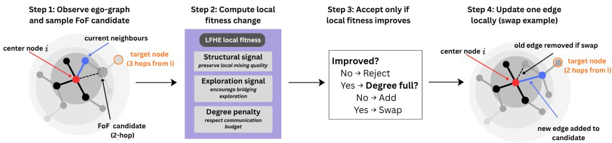  
Figure 1: Overview of LFHE. Each client i observes only its ego-graph, samples a two-hop FoF candidate, and evaluates it using a local objective with structural, exploration, and degree-control terms. If the candidate improves the objective, LFHE adds the edge when direct addition is feasible or performs a feasible one-edge swap otherwise; if no improving feasible operation exists, the candidate is rejected.

Given k, LFHE selects the highest-scoring feasible local operation and commits it only if $J _ { i } ( G ^ { \prime } ; t ) > J _ { i } ( G _ { t } ; t )$ . Thus LFHE performs sampled greedy search over a locally observable topology neighborhood rather than optimization over the global graph space.

## 3.2 Overview of the Framework

LFHE performs online topology adaptation through local rewiring. At each topology-update round, client i samples a FoF candidate and tests a direct addition or one-edge swap. A proposal is committed only when it improves the initiator’s score and satisfies the degree and local redundancy checks. Candidate discovery therefore remains local, while online edge acquisition is explicitly regulated.

The objective combines three signals with distinct roles. The structural term scores represen tation disagreement over incident communication edges; Section 3.5 shows that it is exactly a node-local contribution to representation Dirichlet energy. The mismatch term supplies early exploration, encouraging clients to examine alternative local neighborhoods rather than selecting dissimilar peers indiscriminately. The degree term regulates edge acquisition and discourages excessive communication concentration. Beyond the structural component, their combination remains a heuristic design choice whose role is evaluated empirically.

As illustrated in Figure 1, LFHE is a bounded local-search layer on top of decentralized learning. Each client observes only its local neighborhood, proposes a FoF add or swap, and accepts it according to initiator-local fitness. The reference experiments serialize proposals within a synchronous topology-update step; fully concurrent proposal conflicts, stale snapshots, and asynchronous commits are outside the evaluated protocol.

## 3.3 Local Fitness Function Design

The local objective in Eq. 1 uses $\omega _ { 1 } , \omega _ { 2 } , \omega _ { 3 } > 0$ , representation $r _ { i } \in \mathbb { R } ^ { d }$ , and annealing coeficient

$$
\beta _ { t } = \beta _ { 0 } e ^ { - \kappa t } ,
$$

where $\beta _ { 0 } > 0$ controls the initial exploration weight and $\kappa > 0$ its decay. Representations are treated as fixed while candidate topology operations are evaluated. The three terms play distinct roles: the structural term targets current representation disagreement over incident communication edges, mismatch supplies early exploration, and degree regularization controls communication concentration.

Local structural term.

$$
C _ { i } ( G ) = \sum _ { j \in \mathcal { N } _ { i } ( G ) } \| r _ { i } - r _ { j } \| _ { 2 } ^ { 2 } .\tag{2}
$$

If $R = [ r _ { 1 } ^ { \top } , \ldots , r _ { N } ^ { \top } ] ^ { \top }$ , then $\begin{array} { r } { \frac 1 2 \sum _ { i } C _ { i } ( G ) = \mathrm { T r } ( R ^ { \top } L R ) } \end{array}$ , the representation Dirichlet energy of the current graph. Under standard linear consensus dynamics, this global energy equals the instantaneous rate at which centered representation disagreement is dissipated. Thus $C _ { i } ( G )$ gives client i a locally computable contribution to a state-dependent consensus quantity without requiring a global graph statistic. It is not a surrogate for $\lambda _ { 2 } \colon C _ { i }$ depends on both the graph and the current representation field, whereas $\lambda _ { 2 }$ is a topology-only worst-case quantity.

Neighborhood mismatch term.

$$
D _ { i } ( G ) = 1 - \cos \left( r _ { i } , \frac { 1 } { | \mathscr { N } _ { i } ( G ) | } \sum _ { j \in \mathscr { N } _ { i } ( G ) } r _ { j } \right) .\tag{3}
$$

This term measures directional mismatch between node i and its mean neighborhood representation. Unlike $C _ { i } ( G )$ , which has the Dirichlet-energy interpretation above, $D _ { i } ( G )$ primarily supplies exploration pressure. Large values indicate directional mismatch with the current neighborhood and increase the influence of exploration early in training. It is therefore used to expose alternative local neighborhoods rather than to favor dissimilar peers indiscriminately.

Degree regularization. The term deg $( i ) / D _ { \mathrm { m a x } }$ penalizes high initiator degree, discouraging excessive edge acquisition and communication concentration.

Overall behavior. As $\beta _ { t }$ decays, the composite rule shifts from mismatch-driven exploration toward the consensus-grounded structural signal. Early in training, $D _ { i } ( G )$ receives greater weight; later, $C _ { i } ( G )$ becomes more influential. The annealing schedule and relative coeficients remain design choices; only the structural component carries the exact consensus-theoretic interpretation developed below.

## 3.4 Topology Evolution Mechanism

LFHE performs bounded local topology search using only ego-neighborhood and FoF information. For client i, candidate peers are sampled from

$$
\Omega _ { i } = \{ k \in \mathcal { N } _ { j } \mid j \in \mathcal { N } _ { i } , \ k \neq i , \ ( i , k ) \notin E \} .
$$

This two-hop construction expands peer exposure beyond the current neighborhood without requiring a global peer directory. Let $d _ { i } = | { \mathcal { N } } _ { i } |$ and $\bar { d } = \operatorname* { m a x } _ { j } d _ { j }$ . Before removing duplicates and already connected peers, the number of distinct two-hop candidates available to client i is bounded by

$$
| \Omega _ { i } ^ { ( 2 ) } | \leq d _ { i } ( \bar { d } - 1 ) .
$$

Hence the full FoF candidate space is $O ( \bar { d } ^ { 2 } )$ per client and $O ( N \bar { d } ^ { 2 } )$ system-wide. Under bounded sparse degree, this yields $O ( 1 )$ per-client and $O ( N )$ system-wide discovery state, so the local search space need not grow with population size. The implementation may sample only part of this frontier; these bounds characterize candidate discovery and control state rather than total communication volume.

For a sampled candidate, LFHE first considers direct addition when both endpoints satisfy the online degree threshold. Otherwise, it evaluates feasible one-edge swaps. A common-neighbor check preserves local redundancy when removing an incident edge, while accepted operations are selected according to the initiator-local objective.

Two structural properties follow. First, with representations fixed during a topology decision, every committed operation strictly improves the initiator objective $J _ { i }$ . Second, each decision uses only ego/FoF structure, representations, and endpoint degree information, requiring neither a global peer directory nor online computation of $L$ or $\lambda _ { 2 }$ . Thus LFHE provides monotone local improvement within a population-independent per-client search space under bounded degree.

The reference implementation commits proposals sequentially within each topology-update step, so later clients observe earlier modifications and the realized graph can depend on processing order. The local redundancy check is not a global connectivity certificate, and improvement is guaranteed for the initiating client rather than every afected endpoint.

## 3.5 Consensus-Dissipation Interpretation

Let $R = [ r _ { 1 } ^ { \top } , \ldots , r _ { N } ^ { \top } ] ^ { \top }$ stack client representations and let $L = D - A$ denote the graph Laplacian. The structural scores exactly decompose the representation Dirichlet energy:

$$
\mathcal { E } _ { G } ( \boldsymbol { R } ) = \mathrm { T r } ( \boldsymbol { R } ^ { \top } \boldsymbol { L } \boldsymbol { R } ) = \sum _ { ( i , j ) \in \boldsymbol { E } } \| \boldsymbol { r } _ { i } - \boldsymbol { r } _ { j } \| _ { 2 } ^ { 2 } = \frac { 1 } { 2 } \sum _ { i } C _ { i } ( G ) .\tag{4}
$$

Thus, $C _ { i } ( G )$ is a node-local contribution to a global state-dependent consensus energy. Under standard linear consensus dynamics ${ \dot { R } } = - L R$ , define centered representation disagreement as

$$
V ( R ) = \frac 1 2 \| P R \| _ { F } ^ { 2 } , \qquad P = I - \frac 1 N \mathbf { 1 1 } ^ { \top } .
$$

Then

$$
\dot { V } = - { \mathcal E } _ { G } ( R ) .\tag{5}
$$

Hence the representation Dirichlet energy is exactly the instantaneous rate at which centered disagreement is dissipated.

For fixed $R ,$ replacing edge $( i , j )$ by (i, k) changes this energy by

$$
\mathcal { E } _ { G ^ { \prime } } ( R ) - \mathcal { E } _ { G } ( R ) = \| r _ { i } - r _ { k } \| _ { 2 } ^ { 2 } - \| r _ { i } - r _ { j } \| _ { 2 } ^ { 2 } .
$$

Therefore, a positive structural-energy change increases the instantaneous rate of disagreement dissipation for the current representation field.

Rayleigh–Ritz further gives

$$
\begin{array} { r } { \mathcal { E } _ { G } ( R ) \geq \lambda _ { 2 } ( L ) \Vert P R \Vert _ { F } ^ { 2 } . } \end{array}\tag{6}
$$

Thus, $\lambda _ { 2 }$ characterizes the graph’s worst-case normalized dissipation over non-consensus directions, whereas LFHE’s structural score evaluates the representation field currently realized on the graph. This establishes an exact consensus-theoretic interpretation for the structural component; the full LFHE objective additionally trades this signal against exploration and degree control and does not directly optimize $\lambda _ { 2 }$ . The full derivation is provided in Appendix D.

## 3.6 Algorithm Description

Each communication round consists of local training and decentralized aggregation, with an additional topology-adaptation step every K rounds.

Local training. Each client performs E local epochs on its private dataset using the task-specific local optimizer.

Decentralized aggregation. Each node aggregates neighbor models using degree-aware weights

$$
a _ { i j } = \frac { 1 } { 1 + \operatorname* { m a x } ( \deg ( i ) , \deg ( j ) ) } , \qquad a _ { i i } = 1 - \sum _ { j \in \mathcal { N } _ { i } } a _ { i j } .
$$

Topology adaptation. Every K rounds, each client samples a FoF candidate, evaluates the feasible addition and one-edge-swap operations induced by that candidate, and commits the highest-scoring feasible operation only when it improves the initiator-local objective. Full pseudocode and implementation details are provided in Appendix E.

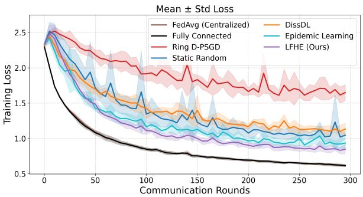  
(a) Training loss

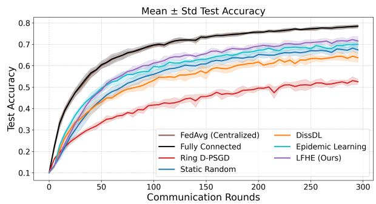  
(b) Test accuracy  
Figure 2: Main convergence results on CIFAR-10 under non-IID data. LFHE shows favorable longrun performance relative to the reported decentralized baselines; shaded bands summarize run-to-run variability.

## 4 Experimental Setup

We evaluate LFHE on four datasets across three modalities: CIFAR-10 and CIFAR-100 [12], Google Speech Commands [24], and Sentiment140 [8]. Unless otherwise stated, data are partitioned with class-wise Dirichlet $\alpha = 0 . 1$ , the main system has N = 30 clients, and LFHE uses online degree threshold $D _ { \mathrm { m a x } } = 4$ The main comparison includes FedAvg [16], Fully Connected, Ring [15], Static Random, Epidemic Learning [7], and DissDL, a legacy dissimilarity-guided implementation retained from our original benchmark.

For shared learning components, comparisons use matched data partitions, model initialization, local optimization budgets, and evaluation schedules where applicable. Topology-specific discovery, edge direction, and communication semantics follow each method’s native design. Main results use five seeds {42, 43, 44, 45, 46}; diagnostic studies use three seeds or a single controlled seed where explicitly stated. Complete model, optimizer, representation, initialization, and communication details are provided in Appendix F. The connected Erdős–Rényi initializer targets expected degree four and may contain nodes above $D _ { \mathrm { m a x } } ;$ accordingly, $D _ { \mathrm { m a x } }$ denotes an online edge-acquisition threshold rather than a hard maximum degree in the reference LFHE implementation.

## 5 Main Convergence Results and Topology Analysis

We evaluate LFHE with 30 clients across image, speech, and text tasks. Among the decentralized methods reported in Table 1, LFHE reaches the earliest or joint-earliest mean target accuracy on all four datasets and obtains the highest mean final accuracy on CIFAR-10, CIFAR-100, and Speech Commands. On Sentiment140, Epidemic Learning has the highest mean final accuracy. Because several diferences are comparable to the reported standard deviations, these results support competitive and often favorable performance rather than uniform statistical dominance. Figure 2 illustrates CIFAR-10 dynamics at α = 0.1.

Target attainment. As shown in Table 1, LFHE reaches the selected target first among the reported decentralized methods at rounds 225, 125, and 170 on CIFAR-10, CIFAR-100, and Sentiment140, respectively, and jointly reaches the Speech Commands target with Epidemic Learning at round 60. These measurements are based on communication rounds rather than wall-clock time or bytes-to-target and depend on the selected accuracy thresholds.

Final performance. Among the decentralized methods in Table 1, LFHE achieves the highest mean final accuracy on CIFAR-10, CIFAR-100, and Speech Commands, at 71.6%, 45.2%, and 78.8%, respectively. On Sentiment140, LFHE reaches 65.3%, slightly below Epidemic Learning at 65.5%. The small gaps on several tasks and overlapping run variability indicate strong cross-modal competitiveness rather than consistent superiority over every alternative.

Table 1: Convergence speed and final accuracy across datasets over five random seeds. R@T denotes the communication round at which the mean accuracy across seeds first reaches the target specified in each dataset column, and $\cdot \underline { { \cdot } } , \cdot$ indicates that the target was not reached within the training budget. Final accuracy is reported as mean±std. FedAvg and Fully Connected are included as reference points. Among decentralized methods, the best result is shown in bold and the second-best in underline.
<table><tr><td rowspan="2">Method</td><td colspan="2">CIFAR-10 (≥70%)</td><td colspan="2">CIFAR-100 (≥35%)</td><td colspan="2">Speech Commands (≥70%)</td><td colspan="2">Sentiment140 (≥65%)</td></tr><tr><td>R@T</td><td>Final Acc. (%)</td><td>R@T</td><td>Final Acc. (%)</td><td>R@T</td><td>Final Acc. (%)</td><td>R@T</td><td>Final Acc. (%)</td></tr><tr><td>FedAvg</td><td>115</td><td>78.40±0.80</td><td>85</td><td>51.90±0.30</td><td>35</td><td>86.80±0.50</td><td>40</td><td>70.60±2.70</td></tr><tr><td>Fully Connected</td><td>105</td><td>78.40±0.70</td><td>85</td><td>51.80±0.50</td><td>35</td><td>86.40±1.40</td><td>40</td><td>70.60±2.60</td></tr><tr><td>Ring</td><td></td><td>52.60±1.20</td><td></td><td>27.00±0.80</td><td></td><td>53.00±3.10</td><td></td><td>58.00±2.70</td></tr><tr><td>Static Random</td><td></td><td>67.40±1.70</td><td>160</td><td>41.70±1.20</td><td>75</td><td>74.20±3.50</td><td></td><td>63.50±2.30</td></tr><tr><td>Epidemic Learning</td><td></td><td>70.00±1.60</td><td>130</td><td>44.10±0.70</td><td>60</td><td>78.10±3.30</td><td>190</td><td>65.50±2.30</td></tr><tr><td>DissDL (legacy impl.)</td><td></td><td>63.70±2.10</td><td>185</td><td>40.20±0.30</td><td>80</td><td>74.60±3.70</td><td>230</td><td>64.20±3.80</td></tr><tr><td>LFHE (Ours)</td><td>225</td><td>71.60±2.10</td><td>125</td><td>45.20±0.60</td><td>60</td><td>78.80±2.30</td><td>170</td><td>65.30±1.70</td></tr></table>

Scalability perspective. A preliminary three-seed accuracy study at $N \in \{ 1 0 , 5 0 , 1 0 0 \}$ is complemented by a discovery-state diagnostic extending to N = 500. Across N = 30 to N = 500, LFHE’s measured mean FoF candidate set remains between 9.76 and 11.86 peers per client. This empirical stability is consistent with the O(1)-per-client discovery-state bound under sparse degree that does not scale with N, showing that LFHE’s local candidate space need not grow with population size. This result concerns discovery/control state rather than total communication volume or large-system learning speed. Additional moderate-scale accuracy is provided in Appendix G.5.

Key insight. Taken together, the results separate the efect of localized candidate exposure from that of structural scoring. Random-FoF reaches accuracy close to LFHE in the matched regime, indicating that FoF exposure itself contributes substantially to the observed learning performance. However, degree-preserving random swaps and the graph-only control show that topology churn or high algebraic connectivity alone do not reproduce LFHE’s behavior, while the structural score produces substantially diferent realized communication graphs. Together with the Dirichlet-energy interpretation, these controls support the structural term as a principled state-dependent topology-selection signal whose clearest empirical efect is on communication structure rather than a universal accuracy advantage. Full matched-control trajectories are provided in Appendix H, with computational and control-overhead measurements in Appendix I.

## 5.1 Topology Evolution Behavior

To examine how LFHE reshapes the communication graph, we analyze global topology statistics and representative graph snapshots under the highly non-IID CIFAR-10 setting $( \alpha = 0 . 1 )$ Figure $\mathrm { 3 ( a ) }$ tracks the evolution of algebraic connectivity and clustering, while Figure 3(b) shows representative graph snapshots over training. Additional consensus and client-level variance diagnostics are provided in Appendix G.7.

Early improvement in global connectivity. As shown in Figure 3(a)–(b), the ofline diagnostic $\lambda _ { 2 }$ rises early and then stabilizes, showing that the realized graphs become more algebraically connected. This complements the state-dependent interpretation developed in Section 3.5: LFHE scores the current representation field locally, while $\lambda _ { 2 }$ independently measures the resulting graph’s worst-case spectral connectivity.

Reduced local redundancy. The clustering coeficient decreases early and then stabilizes at a lower level. Together with the increase in $\lambda _ { 2 }$ , this indicates that LFHE restructures local connectivity rather than simply forming denser neighborhoods. The resulting graphs remain sparse while exhibiting communication patterns compatible with broader information propagation across the network.

Exploration-to-refinement dynamics. The trajectories and snapshots are consistent with early bridge-like exploration followed by less frequent rewiring as the annealing schedule shifts weight toward the structural term. By rounds 10–20, new cross-region edges coincide with the sharp rise in $\lambda _ { 2 } ;$ later graphs remain sparse and show no dominant hub. These observations are consistent with the intended exploration-to-refinement behavior, while the component diagnostics below separately examine the roles of the individual objective terms.

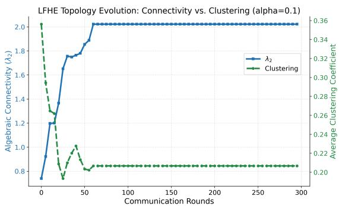

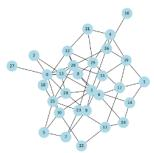  
(b) Round 0

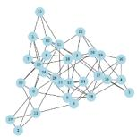

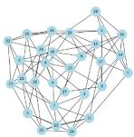  
(e) Round 30  
(c) Round 10

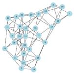

(a) Evolution of $\lambda _ { 2 }$ and clustering  
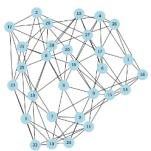  
(f) Round 50

(d) Round 20  
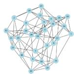  
(g) Round 80  
(b) Topology snapshots  
Figure 3: Topology evolution of LFHE on CIFAR-10 under non-IID data $( \alpha = 0 . 1 )$ . Left: algebraic connectivity $\lambda _ { 2 }$ and clustering coeficient. Right: representative graph snapshots at diferent training rounds.

## 5.2 Component and Mechanism Diagnostics

The original removal ablation on CIFAR-10 with $\alpha = 0 . 3$ shows that full LFHE reaches the target first and obtains the highest final mean among the reported removal variants. A stricter matched-score diagnostic at $\alpha = 0 . 1$ , however, shows that Structural-only slightly exceeds full LFHE: final $\lambda _ { 2 }$ is 2.306 versus 2.247, and final accuracy is 75.08% versus 74.82%. Explorationonly rewires more frequently (3.406 versus 1.333 accepted rewires per update for LFHE) while producing weaker connectivity and accuracy. These results identify the structural term as the principal empirical topology-selection signal in this regime, with exploration and degree control acting as regime-dependent search regulators rather than universally necessary components.

Additional matched controls reinforce this interpretation without reducing topology quality to a single graph statistic. Random-FoF reaches $7 4 . 6 2 \pm 2 . 2 5 \%$ final accuracy across three seeds, close to LFHE, but produces lower final algebraic connectivity (1.696 versus 2.247). A degree-preserving random-swap control performs many topology changes but reaches only 66.24% accuracy, while a representation-free graph-only control reaches a higher final $\lambda _ { 2 } = 2 . 4 0 3$ but only 73.52% accuracy. Together, these controls show that neither topology churn nor maximizing spectral connectivity alone explains LFHE’s behavior, and they support the role of state-dependent structural scoring. Full removal ablations are provided in Appendix $\mathrm { A } ,$ and matched mechanism controls and trajectories in Appendix H.

## 6 Discussion

LFHE’s structural signal is not merely a heuristic proxy for algebraic connectivity. For the current representation field, $C _ { i }$ is exactly a node-local contribution to graph Dirichlet energy, whose value gives the instantaneous dissipation rate of centered disagreement under standard linear consensus. LFHE therefore performs state-aware local topology search rather than approximating a global spectral objective.

The experiments support this distinction. Structural-only slightly exceeds full LFHE in the matched-score diagnostic, while Random-FoF, graph-only, and random-swap controls show that neither FoF exposure, high $\lambda _ { 2 } .$ , nor topology churn alone explains the observed behavior. The structural term therefore acts as the principal topology-selection signal in the tested regime, while exploration and degree control regulate how that signal is searched and constrained.

A separate three-seed comparison with Morph (Appendix G.2) further illustrates this trade-of. Morph achieves stronger predictive performance, whereas LFHE restricts search to a bounded FoF frontier. Under bounded sparse degree, LFHE maintains O(1) candidate state per client and O(N) system-wide, emphasizing discovery locality rather than predictive superiority or lower total communication.

The reference implementation serializes topology proposals, so realized graphs may depend on update order; Appendix G.3 quantifies this sensitivity. Fully concurrent or asynchronous execution remains outside the evaluated protocol.

## 7 Conclusion

We introduced LFHE, a framework for bounded local topology search in decentralized learning with non-IID data. LFHE evaluates local add-or-swap operations using structural disagreement, exploration, and degree control without online global spectral computation. Its structural scores exactly decompose representation Dirichlet energy, which under standard linear consensus determines instantaneous disagreement dissipation.

Across the reported baselines, LFHE shows favorable target attainment and competitive final accuracy, while matched diagnostics identify the structural term as the main empirical topologyselection signal. LFHE should therefore be viewed as state-aware localized topology search with bounded FoF discovery, rather than as an approximation to global spectral optimization.

Limitations. The theoretical result applies to the structural component with fixed representations during each topology decision and under standard linear consensus. The full objective still depends on representation choice, coeficient settings, and the annealing schedule. $D _ { \mathrm { m a x } }$ is an online edge-acquisition threshold rather than a strict global degree cap, acceptance is initiator-local, and topology updates are serialized. Evaluation remains limited to controlled benchmarks and moderate training populations.

Future work. Future directions include the analysis of the discrete weighted aggregation operator, the development of learned exploration schedules, the investigation of concurrent topology updates, and large-scale evaluation under communication-normalized settings.

## Reproducibility statement

The main protocol, optimization settings, and comparison scope are summarized in Section 4. Complete experimental settings and architectures are provided in Appendix F, full algorithmic details in Appendix E, and sensitivity and diagnostic protocols in Appendices G.4–G.7.

## AI use statement

Generative AI tools were used to assist with language editing, restructuring portions of the manuscript, experiment planning, and software/code edits. AI-assisted text, code changes, and experiment configurations were reviewed by the authors, while numerical results were taken from the executed experimental pipelines and checked against saved outputs. The authors take responsibility for the final text, claims, code, and reported artifacts produced with AI assistance.

## References

[1] Paul Balister, Béla Bollobás, Amites Sarkar, and Mark Walters. Connectivity of random k-nearest-neighbour graphs. Advances in Applied Probability, 37(1):1–24, 2005. doi: 10.1239/ aap/1113402397.

[2] Paul Balister, Béla Bollobás, Amites Sarkar, and Mark Walters. A critical constant for the k nearest-neighbour model. Advances in Applied Probability, 41(1):1–12, 2009. doi: 10.1239/aap/1240319574.

[3] Aurélien Bellet, Anne-Marie Kermarrec, and Erick Lavoie. D-cliques: Compensating for data heterogeneity with topology in decentralized federated learning. In IEEE 41st Symposium on Reliable Distributed Systems, 2022. doi: 10.1109/SRDS55811.2022.00011.

[4] Stephen Boyd, Persi Diaconis, and Lin Xiao. Fastest mixing markov chain on a graph. SIAM Review, 46(4):667–689, 2004. doi: 10.1137/S0036144503423264.

[5] Stephen Boyd, Arpita Ghosh, Balaji Prabhakar, and Devavrat Shah. Randomized gossip algorithms. IEEE Transactions on Information Theory, 52(6):2508–2530, 2006. doi: 10. 1109/TIT.2006.874516.

[6] Bart Cox, Antreas Ioannou, and Jérémie Decouchant. Dynamic topology optimization for non-iid data in decentralized learning. arXiv preprint arXiv:2602.03383, 2026. doi: 10.48550/arXiv.2602.03383.

[7] Martijn De Vos, Sadegh Farhadkhani, Rachid Guerraoui, Anne-Marie Kermarrec, Rafael Pires, and Rishi Sharma. Epidemic learning: Boosting decentralized learning with randomized communication. In Advances in Neural Information Processing Systems, volume 36, 2023.

[8] Alec Go, Richa Bhayani, and Lei Huang. Twitter sentiment classification using distant supervision. Cs224n project report, Stanford University, 2009.

[9] Yifan Hua, Kevin Miller, Andrea L. Bertozzi, Chen Qian, and Bao Wang. Eficient and reliable overlay networks for decentralized federated learning. SIAM Journal on Applied Mathematics, 82(4):1558–1586, 2022. doi: 10.1137/21M1465081.

[10] Sai Praneeth Karimireddy, Satyen Kale, Mehryar Mohri, Sashank J. Reddi, Sebastian U. Stich, and Ananda Theertha Suresh. Scafold: Stochastic controlled averaging for federated learning. In Proceedings of the 37th International Conference on Machine Learning, volume 119 of Proceedings of Machine Learning Research, pages 5132–5143, 2020.

[11] Anastasia Koloskova, Tao Lin, Sebastian U. Stich, and Martin Jaggi. Decentralized deep learning with arbitrary communication compression. In International Conference on Learning Representations, 2020.

[12] Alex Krizhevsky. Learning multiple layers of features from tiny images. Technical Report TR-2009, University of Toronto, 2009.

[13] Batiste Le Bars, Aurélien Bellet, Marc Tommasi, Erick Lavoie, and Anne-Marie Kermarrec. Refined convergence and topology learning for decentralized sgd with heterogeneous data. In Proceedings of The 26th International Conference on Artificial Intelligence and Statistics, volume 206 of Proceedings of Machine Learning Research, pages 1672–1702, 2023.

[14] Tian Li, Anit Kumar Sahu, Manzil Zaheer, Maziar Sanjabi, Ameet Talwalkar, and Virginia Smith. Federated optimization in heterogeneous networks. In Proceedings of Machine Learning and Systems, volume 2, 2020.

[15] Xiangru Lian, Ce Zhang, Huan Zhang, Cho-Jui Hsieh, Wei Zhang, and Ji Liu. Can decentralized algorithms outperform centralized algorithms? a case study for decentralized parallel stochastic gradient descent. In Advances in Neural Information Processing Systems, volume 30, 2017.

[16] H. Brendan McMahan, Eider Moore, Daniel Ramage, Seth Hampson, and Blaise Aguera y Arcas. Communication-eficient learning of deep networks from decentralized data. In Proceedings of the 20th International Conference on Artificial Intelligence and Statistics, volume 54 of Proceedings of Machine Learning Research, pages 1273–1282, 2017.

[17] Angelia Nedić and Asuman Ozdaglar. Distributed subgradient methods for multi-agent optimization. IEEE Transactions on Automatic Control, 54(1):48–61, 2009. doi: 10.1109/ TAC.2008.2009515.

[18] Angelia Nedić, Alex Olshevsky, and Michael G. Rabbat. Network topology and communication-computation tradeofs in decentralized optimization. Proceedings of the IEEE, 106(5):953–976, 2018. doi: 10.1109/JPROC.2018.2817461.

[19] Reza Olfati-Saber and Richard M. Murray. Consensus problems in networks of agents with switching topology and time-delays. IEEE Transactions on Automatic Control, 49(9): 1520–1533, 2004. doi: 10.1109/TAC.2004.834113.

[20] Reza Olfati-Saber, J. Alex Fax, and Richard M. Murray. Consensus and cooperation in networked multi-agent systems. Proceedings of the IEEE, 95(1):215–233, 2007. doi: 10.1109/JPROC.2006.887293.

[21] Jiantao Sun, Stephen Boyd, Lin Xiao, and Persi Diaconis. The fastest mixing markov process on a graph and a connection to a maximum variance unfolding problem. SIAM Review, 48 (4):681–699, 2006. doi: 10.1137/S0036144504443821.

[22] John N. Tsitsiklis, Dimitri P. Bertsekas, and Michael Athans. Distributed asynchronous deterministic and stochastic gradient optimization algorithms. IEEE Transactions on Automatic Control, 31(9):803–812, 1986. doi: 10.1109/TAC.1986.1104412.

[23] Thijs Vogels, Hadrien Hendrikx, and Martin Jaggi. Beyond spectral gap: The role of the topology in decentralized learning. In Advances in Neural Information Processing Systems, volume 35, 2022.

[24] Pete Warden. Speech commands: A dataset for limited-vocabulary speech recognition. arXiv preprint arXiv:1804.03209, 2018.

[25] Lin Xiao and Stephen Boyd. Fast linear iterations for distributed averaging. Systems & Control Letters, 53(1):65–78, 2004. doi: 10.1016/j.sysconle.2004.02.022.

[26] Feng Xue and P. R. Kumar. The number of neighbors needed for connectivity of wireless networks. Wireless Networks, 10(2):169–181, 2004. doi: 10.1023/B:WINE.0000013081.09837. c0.

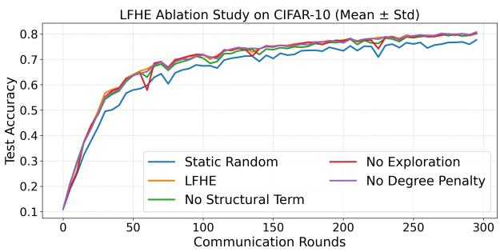  
Figure 4: Ablation study on CIFAR-10 showing test accuracy for LFHE and its ablated variants.

<table><tr><td>Method R@Target Final Acc.</td></tr><tr><td>Static Random 85</td></tr><tr><td>0.7766 55 0.8079</td></tr><tr><td>LFHE  $\mathrm { w / o }$  Structural 65 0.8019</td></tr><tr><td>Exploration 65 0.8017</td></tr><tr><td> $\mathrm { w / o }$   $\mathrm { w / o }$  Degree Reg. 60 0.8063</td></tr><tr><td></td></tr></table>

Table 2: Ablation results on CIFAR-10 with $\alpha = 0 . 3$ . R@Target denotes the round at which accuracy first reaches 0.65, and Final Acc. denotes the final test accuracy.

## A Full Component Ablation

## A.1 Original removal ablation and topology diagnostics

To assess the role of each component, we conduct an ablation on CIFAR-10 with $\alpha = 0 . 3$ . Under this specific protocol, full LFHE reaches the target first and has the highest final mean among the removal variants. This experiment tests removal from the full objective; it should be distinguished from the matched-score diagnostic at $\alpha = 0 . 1$ , where structural-only is slightly stronger than full LFHE.

Efect of the local structural term. Removing the structural term causes the clearest degradation in topology quality. In Figure 5, the variant without $C _ { i }$ attains the weakest and most unstable $\lambda _ { 2 } .$ together with slower convergence and lower final accuracy in Figure 4 and Table 2. This pattern is consistent with the Dirichlet-energy interpretation in Appendix D: removing $C _ { i }$ removes the objective component that directly scores current representation disagreement across incident communication edges.

Efect of exploration. Removing the exploration term produces a mild degradation in this ablation. Without the early exploratory signal, nodes are more likely to remain in locally convenient neighborhoods rather than expose bridge-forming opportunities across heterogeneous regions. The small diference, together with the structural-only result in Appendix H, indicates that exploration is a regime-dependent search regulator rather than a universally necessary source of final accuracy.

Efect of degree regularization. Removing the degree penalty increases $\lambda _ { 2 }$ the most, but does not yield the best accuracy. The resulting graph also maintains higher clustering, indicating denser and less controlled connectivity. This indicates that stronger connectivity alone is insuficient; without degree control, the topology becomes denser and less communication-constrained, while the additional connectivity does not translate into improved learning performance [23].

Topology dynamics and insight. Figure 5 identifies the structural term as the clearest source of the measured topology change. Exploration modestly afects search in this regime, while removing degree regularization yields denser connectivity without a corresponding accuracy gain. Importantly, the matched $\alpha = 0 . 1$ diagnostic reports final $\lambda _ { 2 } = 2 . 3 0 6$ and accuracy 0.7508 for structural-only, compared with 2.247 and 0.7482 for full LFHE. We therefore do not claim that all three terms are jointly optimal in every regime; full LFHE is the reference composite rule, whereas structural-only can be stronger under the matched-score setting.

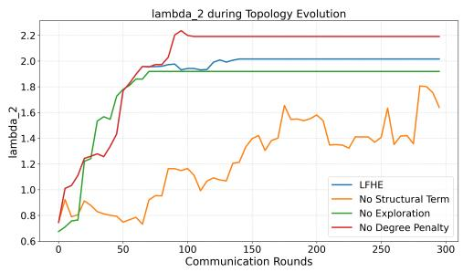

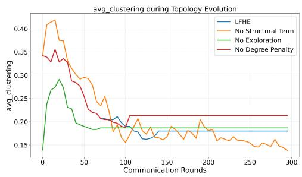  
Figure 5: Topology evolution under ablation. Left: algebraic connectivity $\left( \lambda _ { 2 } \right)$ . Right: clustering coeficient.

Table 3: Comparison of representative communication-structure approaches. The last column refers to online information requirements rather than concurrent execution semantics. $\checkmark ^ { * }$ denotes a state-dependent Dirichlet structural signal rather than direct optimization of $\lambda _ { 2 }$
<table><tr><td>Method</td><td>Connectivity-aware</td><td>Similarity-aware</td><td></td><td>Ego-graph local No global graph statistics</td></tr><tr><td>Spectral methods</td><td>√</td><td>X</td><td>X</td><td>×</td></tr><tr><td>D-PSGD / Gossip</td><td>X</td><td>×</td><td>×</td><td>√</td></tr><tr><td>D-Cliques / STL-FW</td><td>√</td><td>√</td><td>×</td><td>×</td></tr><tr><td>Epidemic Learning</td><td>×</td><td>X</td><td>√</td><td>√</td></tr><tr><td>DissDL (legacy impl.)</td><td>×</td><td>√</td><td>√</td><td>√</td></tr><tr><td>Morph</td><td>X</td><td>√</td><td>X</td><td>√</td></tr><tr><td>FedAMP / Ditto</td><td>X</td><td>√</td><td>X</td><td>×</td></tr><tr><td>LFHE</td><td> $\checkmark ^ { * }$ </td><td>√</td><td>√</td><td> $\checkmark$ </td></tr></table>

## B Related Work Comparison Table

## C Graph Laplacian, Dirichlet Energy, and Algebraic Connectivity

For an undirected graph $G = ( V , E )$ with $| V | = n$ , let A be its adjacency matrix, $D =$ dia $\mathrm { g } ( d _ { 1 } , \ldots , d _ { n } )$ its degree matrix, and $L = D - A$ its combinatorial Laplacian. For a scalar graph signal $x \in \mathbb { R } ^ { n }$

$$
x ^ { \top } L x = { \frac { 1 } { 2 } } \sum _ { i = 1 } ^ { n } \sum _ { j = 1 } ^ { n } A _ { i j } ( x _ { i } - x _ { j } ) ^ { 2 } = \sum _ { ( i , j ) \in E } ( x _ { i } - x _ { j } ) ^ { 2 } .\tag{7}
$$

For vector-valued representations $R = [ r _ { 1 } ^ { \top } , \ldots , r _ { n } ^ { \top } ] ^ { \top } \in \mathbb { R } ^ { n \times d }$ , summing over dimensions gives

$$
\mathcal { E } _ { G } ( R ) : = \mathrm { T r } ( R ^ { \top } L R ) = \sum _ { ( i , j ) \in E } \| r _ { i } - r _ { j } \| _ { 2 } ^ { 2 } ,\tag{8}
$$

the graph Dirichlet energy of the current representation field.

The eigenvalues satisfy $0 = \lambda _ { 1 } \leq \lambda _ { 2 } \leq \cdot \cdot \cdot \leq \lambda _ { n }$ . By the Courant–Fischer theorem,

$$
\lambda _ { 2 } ( L ) = \operatorname* { m i n } _ { x \neq 0 } \frac { x ^ { \top } L x } { x ^ { \top } x } .\tag{9}
$$

Thus $\lambda _ { 2 }$ is not the energy of the current model state; it is the smallest normalized Dirichlet energy over all non-consensus directions, explaining its role as a topology-only worst-case connectivity and consensus quantity [19, 20].

## D Structural Signal as Local Consensus Dissipation

LFHE uses

$$
C _ { i } ( R , G ) = \sum _ { j \in \mathcal { N } _ { i } ( G ) } \| r _ { i } - r _ { j } \| _ { 2 } ^ { 2 } .\tag{10}
$$

Proposition 1 (Local Dirichlet decomposition). For any undirected $G$ and fixed $R ,$

$$
\mathcal { E } _ { G } ( R ) = \frac { 1 } { 2 } \sum _ { i = 1 } ^ { n } C _ { i } ( R , G ) .\tag{11}
$$

Proof. Summing $C _ { i }$ counts every undirected edge disagreement once from each endpoint:

$$
\sum _ { i } C _ { i } = 2 \sum _ { ( i , j ) \in E } \| \boldsymbol { r } _ { i } - \boldsymbol { r } _ { j } \| _ { 2 } ^ { 2 } = 2 \operatorname { T r } ( R ^ { \top } L R ) .
$$

Dividing by two proves the result.

Proposition 2 (Consensus-dissipation identity). Consider standard continuous-time linear consensus

$$
\dot { R } = - L R .\tag{12}
$$

Let $\begin{array} { r } { P = I - \frac { 1 } { n } \mathbf { 1 } \mathbf { 1 } ^ { \top } } \end{array}$ and $\begin{array} { r } { V ( R ) = \frac { 1 } { 2 } \| P R \| _ { F } ^ { 2 } } \end{array}$ . Then

$$
\dot { V } ( R ) = - \mathcal { E } _ { G } ( R ) = - \frac { 1 } { 2 } \sum _ { i } C _ { i } ( R , G ) .\tag{13}
$$

Proof. Since $L \mathbf { 1 } = 0 , P L = L P = L$ , and therefore

$$
\dot { V } = \operatorname { T r } \Big ( ( P R ) ^ { \top } P \dot { R } \Big ) = - \operatorname { T r } ( R ^ { \top } L R ) = - \mathcal { E } _ { G } ( R ) .
$$

Proposition 1 gives the second equality.

Thus $C _ { i }$ is client $i \mathrm { \ ' } _ { \mathrm { S } }$ local contribution to the instantaneous dissipation of the currently observed representation disagreement. LFHE can therefore allocate limited communication using current model state without reconstructing a global spectral objective.

Corollary (One-edge swap). Let $G ^ { \prime }$ replace $( i , j )$ in G by $( i , k )$ , with R fixed during the topology decision. Then

$$
\mathcal { E } _ { G ^ { \prime } } ( R ) - \mathcal { E } _ { G } ( R ) = \| r _ { i } - r _ { k } \| _ { 2 } ^ { 2 } - \| r _ { i } - r _ { j } \| _ { 2 } ^ { 2 } .\tag{14}
$$

A positive structural change therefore strictly increases the instantaneous dissipation rate in Proposition 2. This statement concerns the structural component; the full objective may trade structural change against exploration or degree terms.

Finally, because every column of $P R$ is orthogonal to 1, Eq. 9 gives

$$
\begin{array} { r } { \mathcal E _ { G } ( R ) \geq \lambda _ { 2 } ( L ) \| P R \| _ { F } ^ { 2 } = 2 \lambda _ { 2 } ( L ) V ( R ) , } \end{array}\tag{15}
$$

hence ${ \dot { V } } \leq - 2 \lambda _ { 2 } ( L ) V$ . Algebraic connectivity is therefore a worst-case graph-level lower bound on dissipation, whereas $C _ { i }$ evaluates the representation field currently present during training. LFHE does not approximate $\lambda _ { 2 } ;$ it performs state-aware local structural search within the same Dirichlet-energy framework.

Relation to the implemented averaging rule. For fixed $G ,$ the degree-aware aggregator is $W = I - L _ { a }$ , with edge weights $a _ { i j } = 1 / ( 1 + \operatorname* { m a x } ( d _ { i } , d _ { j } ) )$ . Its weighted Dirichlet energy is

$$
\mathcal { E } _ { a } ( R ) = \sum _ { ( i , j ) \in E } a _ { i j } \| r _ { i } - r _ { j } \| _ { 2 } ^ { 2 } .
$$

If $\bar { d }$ = maxi $d _ { i }$ , then

$$
\frac { \mathcal { E } _ { G } ( R ) } { 1 + \bar { d } } \leq \mathcal { E } _ { a } ( R ) \leq \frac { 1 } { 2 } \mathcal { E } _ { G } ( R ) .
$$

Thus bounded degree links LFHE’s structural score to the energy induced by the implemented aggregation weights, up to degree-controlled factors.

The experiments use discrete degree-aware averaging rather than the continuous-time model above. The propositions establish the structural score’s consensus-theoretic meaning, while the matched FoF controls test its relevance under the implemented learning dynamics. There, Structural-only and LFHE produce the largest measured $\lambda _ { 2 }$ gains and lowest model divergence among matched score variants.

## E Full Algorithm Description

In this appendix, we provide the procedural description of the decentralized learning framework with LFHE topology adaptation. Local training and aggregation are synchronous. Within a topology-update call, client proposals are evaluated and committed sequentially on a copied graph, matching the reference implementation used in the experiments.

## E.1 Decentralized Federated Learning Procedure

Algorithm 1 Decentralized Federated Learning with LFHE Topology Updates   
Require: local batch size B, local epochs E, task-specific local optimizer O, total rounds T,   
topology update interval K   
Ensure: final local models $\{ w _ { i } ^ { T } \} _ { i \in V }$   
1: Initialize a connected communication graph $G ^ { 0 } = ( V , E ^ { 0 } )$   
2: Initialize local models $\{ w _ { i } ^ { 0 } \} _ { i \in V }$   
3: for each round $t = 0 , 1 , \dots , T - 1$ do   
// Local training   
4: for each client $i \in V$ in parallel do   
5: for $e = 1 , \ldots , E$ do   
6: for mini-batch b sampled from client i do   
7: $w _ { i } \gets \mathrm { O P T I M I Z E R S T E P } ( w _ { i } , b ; \mathcal { O } )$   
8: end for   
9: end for   
10: end for   
// Synchronous decentralized aggregation   
11: for each client $i \in V$ in parallel do   
12: $N _ { i } \gets { \mathcal { N } } _ { i } ( G ^ { t } )$   
13: for each $j \in N _ { i }$ do   
1   
14: $\begin{array} { r } { a _ { i j }  \frac { } { 1 + \operatorname* { m a x } ( \deg ( i ) , \deg ( j ) ) } } \end{array}$   
15: end for   
16: $\begin{array} { r } { a _ { i i }  1 - \sum _ { j \in N _ { i } } a _ { i j } } \end{array}$   
17: $\begin{array} { r } { \tilde { w } _ { i } \gets a _ { i i } w _ { i } + \sum _ { j \in N _ { i } } a _ { i j } w _ { j } } \end{array}$   
18: end for   
19: for each client $i \in V$ do   
20: $w _ { i } \gets w _ { i }$   
21: end for   
// Periodic serialized topology update   
22: if t mod $K = 0$ then   
23: $G ^ { t + 1 } \gets \mathrm { L F H E - U P D A T E } ( G ^ { t } , \{ w _ { i } \} , t )$   
24: else   
25: $G ^ { t + 1 }  G ^ { t }$   
26: end if   
27: end for   
28: return $\{ w _ { i } ^ { T } \} _ { i \in V }$

## E.2 LFHE Topology Update

LFHE performs local graph rewiring using only ego-network information. For each client i, a candidate node is discovered through a FoF mechanism. The candidate edge is accepted if it improves the node-level fitness under the degree constraint. When direct addition is not feasible,

LFHE attempts an atomic swap by replacing one existing neighbor with the candidate.

Algorithm 2 LFHE Topology Update with Degree Constraint and Atomic Swap   
Require: graph $G = ( V , E )$ , client models $\{ w _ { i } \}$ , online degree threshold $D _ { \mathrm { m a x } } .$ , fitness weights   
$\omega _ { 1 } , \omega _ { 2 } , \omega _ { 3 }$ , round t   
Ensure: updated graph $G ^ { \prime }$   
1: $G ^ { \prime }  G$   
2: for each client $i \in V$ do   
3: $N _ { i } \gets { \mathcal { N } } _ { i } ( G ^ { \prime } )$   
4: if $| N _ { i } | = 0$ then   
5: continue   
6: end if   
Friend-of-Friend candidate discovery   
7: Sample $j \sim \mathrm { U n i f } ( N _ { i } )$   
8: $\mathcal { C } _ { i }  \{ k \in \mathcal { N } _ { j } ( G ^ { \prime } ) ~ | ~ k \neq i , ~ ( i , k ) \notin E ( G ^ { \prime } ) \}$   
9: if $\mathcal { C } _ { i } = \emptyset$ then   
10: continue   
11: end if   
12: Sample $k \sim \mathrm { U n i f } ( \mathcal { C } _ { i } )$   
13: $f _ { \mathrm { o l d } } $ Fitness $( i , G ^ { \prime } , \{ w _ { i } \} , t )$   
14: if deg $\mathit { \Omega } ( i ) < D _ { \mathrm { m a x } }$ and de $\varsigma ( k ) < D _ { \mathrm { m a x } }$ then   
15: Add edge $( i , k )$ to $G ^ { \prime }$   
16: $f _ { \mathrm { n e w } } $ Fitness $( i , G ^ { \prime } , \{ w _ { i } \} , t )$   
17: if $f _ { \mathrm { n e w } } \leq f _ { \mathrm { o l d } }$ then   
18: Remove edge $( i , k )$ from $G ^ { \prime }$   
19: end if   
20: else   
21: $f _ { \mathrm { b e s t } }  - \infty$   
22: $j ^ { \star } \gets$ None   
23: for each $j ^ { \prime } \in N _ { i }$ do   
24: if $\deg ( i ) \leq 1$ then   
25: continue   
26: end if   
27: if deg $( j ^ { \prime } ) \leq 1$ then   
28: continue   
29: end if   
30: if deg $( k ) \geq D _ { \mathrm { m a x } }$ then   
31: continue   
32: end if   
33: if not AlternativePath $( G ^ { \prime } , i , j ^ { \prime } )$ then   
34: continue   
35: end if   
36: Temporarily remove $( i , j ^ { \prime } )$ and add (i, k)   
37: fswap ← Fitness(i, G′, {wi}, t)   
38: if $f _ { \mathrm { s w a p } } > f _ { \mathrm { b e s t } }$ then   
39: fbest ← fswap   
40: $j ^ { \star }  j ^ { \prime }$   
41: end if   
42: Restore the original edges   
43: end for   
44: if $f _ { \mathrm { b e s t } } > f _ { \mathrm { o l d } }$ then   
45: Remove edge $( i , j ^ { \star } )$ from $G ^ { \prime }$   
46: Add edge (i, k) to $G ^ { \prime }$   
47: end if   
48: end if   
49: end for 19   
50: return $G ^ { \prime }$

## E.3 Fitness Function

For each client i, LFHE evaluates the quality of its local neighborhood using a node-level fitness function. Let $r _ { i } \in \mathbb { R } ^ { d }$ denote the representation vector extracted from client i’s local model. The annealing coeficient is defined as

$$
\beta _ { t } = \beta _ { 0 } e ^ { - \kappa t } ,
$$

where $\beta _ { 0 } > 0$ is the initial annealing weight and $\kappa > 0$ is the decay constant.

The first component is a local structural term,

$$
C _ { i } ( G ) = \sum _ { j \in \mathcal { N } _ { i } ( G ) } \| r _ { i } - r _ { j } \| _ { 2 } ^ { 2 } ,
$$

which measures the incident-edge contribution to representation Dirichlet energy. As shown in Appendix D, its network-wide sum has an exact consensus-dissipation interpretation; it is state-dependent and does not require computing a global spectral statistic.

The second component is a neighborhood mismatch term, implemented through cosine similarity to the mean neighbor representation:

$$
\bar { r } _ { i } = \frac { 1 } { \vert \mathcal { N } _ { i } ( G ) \vert } \sum _ { j \in \mathcal { N } _ { i } ( G ) } r _ { j } ,
$$

$$
\quad \sin _ { i } ( G ) = \cos ( r _ { i } , { \bar { r } } _ { i } ) .
$$

The corresponding mismatch signal $1 - \sin _ { i } ( G )$ acts primarily as an exploration term.

The third component is a degree penalty,

$$
\deg \_ { \operatorname { n o r m } _ { i } } = { \frac { \deg ( i ) } { D _ { \operatorname { m a x } } } } ,
$$

which discourages overly dense local connectivity.

The final fitness used in the implementation is

$$
\operatorname { F r T N E S S } ( i , G , \{ w _ { i } \} , t ) = w _ { 1 } ( 1 - \beta _ { t } ) C _ { i } ( G ) + w _ { 2 } \beta _ { t } \big ( 1 - \sin _ { i } ( G ) \big ) - w _ { 3 } \frac { \deg ( i ) } { D _ { \operatorname* { m a x } } } .
$$

This formulation yields a time-varying trade-of. In early rounds, when $\beta _ { t }$ is relatively large, the mismatch term $1 - \sin _ { i } ( G )$ has stronger influence and encourages exploration. In later rounds, as $\beta _ { t }$ decays, the local structural term becomes more influential, promoting topology refinement while still penalizing excessive degree growth.

## E.4 Auxiliary Procedures

The implementation uses a lightweight local connectivity safeguard before accepting a swap. In particular, the procedure Alternative $\mathrm { P A T H } ( G , i , j )$ returns true if clients i and j share at least one common neighbor:

$$
\mathrm { A L T E R N A T I V E P A T H } ( G , i , j ) = \left\{ \begin{array} { l l } { \mathrm { t r u e , } } & { \mathrm { i f } \ \mathcal { N } _ { i } ( G ) \cap \mathcal { N } _ { j } ( G ) \not = \emptyset , } \\ { \mathrm { f a l s e , } } & { \mathrm { o t h e r w i s e . } } \end{array} \right.
$$

This is a local redundancy safeguard when an edge is removed. A shared neighbor certifies a two-hop alternative path between the endpoints of the specific edge at the time of the decision, without requiring a global path search. This statement concerns the serialized reference update; stale or conflicting concurrent removals would require additional validation.

## E.5 Implementation Notes

In the reference implementation, LFHE-Update is executed on a copy of the current graph and applied sequentially over clients in fixed order. Each accepted operation is committed immediately, so later clients observe earlier changes and the realized topology can depend on processing order. Candidate discovery remains restricted to FoF nodes. If direct addition is infeasible, the initiator evaluates feasible one-edge swaps and commits the swap with the largest improvement in its own fitness. The notation {wi} in Algorithms 1–2 denotes simulator state compactly; an initiator-local fitness evaluation uses only the representations associated with its current ego-neighborhood and the current FoF candidate.

The afected endpoints do not separately approve the operation, so acceptance is initiator-local rather than bilaterally Pareto-improving. In a controlled update-order diagnostic, changing the client order substantially changed the final edge set and $\lambda _ { 2 }$ , while the three observed final accuracies stayed within a 1.51-percentage-point range; details are reported in Appendix G.3. Across the recorded topology audit, none of 2,280 graph states from 38 runs was disconnected. This is empirical evidence about the observed trajectories, not a connectivity theorem for the common-neighbor safeguard.

A concurrent realization could forward FoF candidate identifiers and representation summaries through current neighbors, and could use proposal–validate–commit with endpoint-local topology versions to reject stale or conflicting operations. We present this only as a deployment direction. The experiments in this paper do not implement or validate arbitrary asynchronous transaction semantics.

## F Additional Experimental Details

We provide additional details on datasets, non-IID partitioning, training protocols, model architectures, and implementation hyperparameters used in the experiments.

Datasets. CIFAR-10 and CIFAR-100 [12] are standard image classification benchmarks derived from the Tiny Images dataset. CIFAR-10 contains 50,000 training images and 10,000 test images across 10 classes, while CIFAR-100 uses the same train–test split structure but has 100 classes. For Google Speech Commands [24], we use a 10-keyword subset consisting of yes, no, up, down, left, right, on, of, stop, go, following the standard training and testing splits. For Sentiment140 [8], we use a binary sentiment classification setting and apply balanced random subsampling before client partitioning, resulting in 12,000 training tweets and 2,000 test tweets.

Non-IID partitioning. To simulate heterogeneous client distributions, data are partitioned using class-wise Dirichlet sampling. For each class $c ,$ we sample a client allocation vector $p _ { c } \sim \operatorname { D i r } ( \alpha )$ and distribute samples of that class across clients accordingly. Unless otherwise stated, we use $\alpha = 0 . 1$ as the default highly non-IID setting. The component ablation and moderate-scale diagnostic use $\alpha = 0 . 3$ and are reported separately from the main protocol.

System setting. Unless otherwise specified, experiments use N = 30 clients and online degree threshold $D _ { \mathrm { m a x } } = 4$ . Static Random and LFHE start from the same connected Erdős–Rényi graph with expected degree four. Because this initializer is not degree-capped, some initial nodes may exceed $D _ { \mathrm { m a x } } ;$ the threshold regulates subsequent additions and swaps rather than retroactively enforcing a hard cap. We additionally report a preliminary study at $N \in \{ 1 0 , 5 0 , 1 0 0 \}$ . Ring, Fully Connected, FedAvg, and dynamic baselines retain their respective topology mechanisms.

Training protocol. All methods are implemented in PyTorch. CIFAR and Speech Commands experiments use SGD with learning rate 0.05 and batch size 32. Sentiment140 uses Adam with learning rate $1 0 ^ { - 3 }$ and batch size 16. Unless otherwise stated, each client performs one local epoch per communication round, except Sentiment140 where each client performs two local epochs. LFHE updates the communication topology every $K = 5$ communication rounds. Results are averaged over five random seeds, $\{ 4 2 , 4 3 , 4 4 , 4 5 , 4 6 \}$ . Unless otherwise stated, all LFHE experiments use $\omega _ { 1 } = 1 . 0 , \omega _ { 2 } = 1 . 0 , \omega _ { 3 } = 0 . 1 , D _ { \mathrm { m a x } } = 4$ , and the annealing schedule $\beta _ { t } = \exp ( - 0 . 0 1 t )$

Table 4: Implementation details and hyperparameters used in the main experiments.
<table><tr><td>Item</td><td>Setting</td></tr><tr><td>Number of clients</td><td>N = 30 for the main experiments;  $N \in \{ 1 0 , 5 0 , 1 0 0 \}$  for scalability experiments.</td></tr><tr><td>Online degree threshold</td><td> $D _ { \mathrm { m a x } } = 4 ;$  the expected-degree initializer is not guaranteed to</td></tr><tr><td>Topology update interval</td><td>satisfy a hard cap.  $K = 5$  communication rounds.</td></tr><tr><td>Evaluation interval</td><td>Every 5 communication rounds.</td></tr><tr><td>Random seeds</td><td>{42, 43, 44, 45, 46}.</td></tr><tr><td>Non-IID partitioning</td><td>Class-wise Dirichlet partitioning with  $\alpha = 0 . 1$  by default; the  $\alpha = 0 . 3 .$ </td></tr><tr><td>Initial sparse graph</td><td>component ablation and moderate-scale diagnostic use Static Random and LFHE use the same connected Erdős-Rényi graph with expected degree 4 and seed matched to the experi- mental seed. Ring uses a cycle graph, Fully Connected uses a</td></tr><tr><td>Aggregation rule</td><td>complete graph, and FedAvg uses centralized aggregation. Degree-aware decentralized averaging with  $\begin{array} { r c l } { a _ { i j } } & { = } & { 1 / ( 1 \ + } \end{array}$ </td></tr><tr><td>LFHE weights</td><td>max(deg(i), deg(j))) and  $\begin{array} { r } { a _ { i i } = 1 - \sum _ { j \in N _ { i } } a _ { i j } . } \end{array}$   $\omega _ { 1 } = 1 . 0 , \omega _ { 2 } = 1 . 0 , \omega _ { 3 } = 0 . 1 .$ </td></tr><tr><td>Annealing schedule</td><td> $\beta _ { t } = \beta _ { 0 } e ^ { - \kappa t }$  with  $\beta _ { 0 } = 1 . 0$  and  $\kappa = 0 . 0 1 .$ </td></tr><tr><td>LFHE update rule</td><td>Each client samples a FoF candidate, evaluates the local fitness, and accepts the candidate only if the fitness improves. If both</td></tr><tr><td>CIFAR optimizer</td><td>edge; otherwise, it evaluates feasible one-edge swaps and commits the best improving swap. SGD with learning rate 0.05, batch size 32, and one local epoch</td></tr><tr><td>Speech optimizer</td><td>per communication round. SGD with learning rate 0.05, batch size 32, and one local epoch</td></tr><tr><td>Sentiment140 optimizer</td><td>per communication round. Adam with learning rate  $1 0 ^ { - 3 }$  , batch size 16, and two local epochs</td></tr><tr><td>Training rounds</td><td>per communication round. 300 rounds for CIFAR-10, CIFAR-100, and Sentiment140; 100</td></tr><tr><td>CIFAR preprocessing</td><td>rounds for Google Speech Commands. Random crop with padding 4, random horizontal flip, tensor</td></tr><tr><td>Speech preprocessing</td><td>conversion, and dataset-specific normalization. 10-keyword subset of Speech Commands using 64-bin Mel spectro-</td></tr><tr><td>Sentiment140 preprocessing</td><td>grams followed by amplitude-to-dB conversion. Variable-length spectrograms are padded within each batch. Binary labels are mapped from {0, 4} to {0, 1}, followed by bal- anced subsampling with 12,000 training tweets and 2,000 test</td></tr></table>

Compute resources. All experiments were implemented in PyTorch 2.2.2+cu118 with Python 3.12.0 and run in a Python virtual environment on a Windows workstation equipped with an NVIDIA GeForce RTX 4060 Laptop GPU with 8GB of GPU memory. The installed NVIDIA driver version was 560.76. PyTorch used CUDA 11.8, while the system driver reported CUDA 12.6 support. The main experiments were averaged over five random seeds, and scalability and overhead analyses used three random seeds where specified. The additional runtime overhead of LFHE topology updates is reported separately in Appendix I.

Table 5: Model architectures and representation extraction rules.
<table><tr><td>Dataset</td><td>Model architecture</td><td>Representation  $r _ { i }$ </td></tr><tr><td>CIFAR-10</td><td>CNN with two convolutional blocks: Conv(3,32)-BN- ReLU, Conv(32,32)-BN-ReLU, MaxPool; Conv(32,64)- BN-ReLU, Conv(64,64)-BN-ReLU, MaxPool; adaptive average pooling to 4 × 4; MLP classifier 1024 → 256 → 10 with dropout 0.3.</td><td>Flattened final classifier-layer weights.</td></tr><tr><td>CIFAR-100</td><td>Same CNN backbone as CIFAR-10, with the final classifier dimension changed to 100 classes: 1024 →  $2 5 6  1 0 0 .$ </td><td>Mean-reduced fi- nal classifier-layer weights, producing a 100-dimensional representation.</td></tr><tr><td>Speech Commands</td><td>CNN over log-Mel spectrograms: Conv(1,32)-BN- ReLU, Conv(32,32)-BN-ReLU, MaxPool; Conv(32,64)- BN-ReLU, Conv(64,64)-BN-ReLU, MaxPool; adaptive average pooling to 4 × 4; MLP classifier 1024 → 256 → 10 with dropout 0.3.</td><td>Flattened final classifier-layer weights.</td></tr><tr><td>Sentiment140</td><td>Embedding-based text classifier with 128-dimensional token embeddings, attention-mask mean pooling, and MLP classifier  $1 2 8 \to 1 2 8 \to 2$  with dropout 0.2.</td><td>Flattened final classifier-layer weights.</td></tr></table>

## G Additional Experimental Results

## G.1 Results on Additional Datasets

To assess behavior beyond CIFAR-10, we evaluate LFHE on CIFAR-100, Google Speech Commands, and Sentiment140. Figure 6 reports the mean test-accuracy trajectories. LFHE remains competitive across all three modalities. On CIFAR-100 it reaches the 0.35 target at round 125 and finishes at 45.19%, ahead of the reported decentralized baselines. On Speech Commands it reaches 0.70 at round 60, jointly earliest with Epidemic Learning, and finishes at 78.76%. On Sentiment140, LFHE reaches 0.65 at round 170 versus 190 for Epidemic Learning, but Epidemic Learning finishes slightly higher (65.45% versus 65.29%). The text setting is therefore a convergence advantage rather than a final-accuracy win.

## G.2 Direct Comparison with Morph

Morph [6] is the closest recent adaptive comparison, but it does not share LFHE’s discovery protocol. We therefore report it as a separate systems comparison rather than fold it into the matched FoF controls. Under a shared three-seed learning protocol, Morph achieves stronger predictive performance than LFHE.

Table 6: Three-seed LFHE–Morph comparison under the shared diagnostic protocol. nAUC denotes normalized accuracy area under the learning curve.
<table><tr><td>Method</td><td>Final accuracy  $( \% )$ </td><td> $\mathrm { n A U C } ~ ( \% )$ </td></tr><tr><td>LFHE</td><td> $7 1 . 3 7 { \pm } 2 . 1 9$ </td><td> $6 0 . 5 7 { \pm } 1 . 5 2 $ </td></tr><tr><td>Morph</td><td> $\mathbf { 7 2 . 2 5 { \pm } 1 . 9 2 }$ </td><td> $\mathbf { 6 3 . 1 7 \pm 1 . 2 3 }$ </td></tr></table>

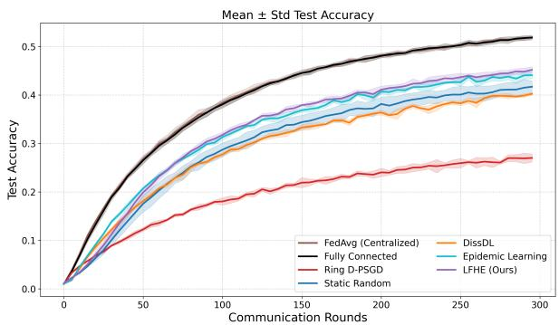  
(a) CIFAR-100

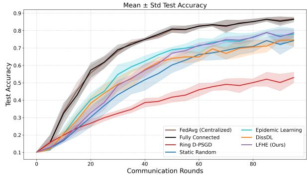  
(b) Google Speech Commands

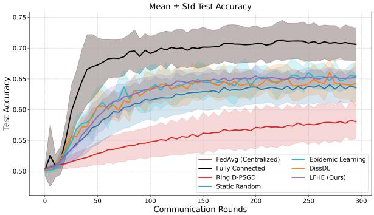  
(c) Sentiment140  
Figure 6: Test accuracy (mean ± std) on additional datasets under non-IID data. LFHE is competitive across image, speech, and text tasks; Sentiment140 illustrates that faster target attainment need not imply the best final accuracy.

Morph also reaches 65% accuracy 16.7 rounds earlier on average. We therefore do not claim predictive superiority over Morph. The distinction lies in peer-discovery scope. From N = 30 to N = 500, LFHE’s measured mean FoF candidate set remains 9.76–11.86 peers per client, whereas Morph’s discovered-peer state grows from 29 to 499 peers per client. The corresponding system-wide discovery entries grow from 480 to 8,000 for LFHE and from 3,480 to 998,000 for Morph. This comparison concerns discovery/control state rather than total communication trafic: broader discovery can improve peer selection, and the present evidence does not show that LFHE uses less total communication overall.

## G.3 Update-Order and Endpoint Efects

The reference simulator serializes topology changes, so we test fixed, reverse, and independently randomized per-update client orders on a controlled CIFAR-10 seed while holding the data partition, initialization, training configuration, candidate generation, acceptance rule, and topology-update frequency fixed.

Table 7: Single-seed update-order diagnostic. Edge Jaccard is measured against the final graph from fixed order.
<table><tr><td>Order</td><td>Final acc. (%)</td><td>nAUC (%)</td><td>R@65</td><td>Final  $\lambda _ { 2 }$ </td><td>Edge Jaccard</td></tr><tr><td>Fixed</td><td>69.03</td><td>58.82</td><td>160</td><td>0.936</td><td>1.000</td></tr><tr><td>Reverse</td><td>70.54</td><td>60.29</td><td>145</td><td>0.685</td><td>0.291</td></tr><tr><td>Random/update</td><td>69.61</td><td>59.24</td><td>155</td><td>0.807</td><td>0.271</td></tr></table>

All three final graphs remain connected. The exact topology is substantially order-dependent, whereas the observed final accuracies remain within 1.51 percentage points in this diagnostic. Acceptance is also one-sided: at least one afected non-initiator endpoint has a negative localfitness change in 33.3%, 31.5%, and 41.5% of accepted operations for fixed, reverse, and randomized processing, respectively; the added-endpoint rates are 33.3%, 29.6%, and 39.0%. Thus, positive initiator gain should not be interpreted as bilateral utility improvement.

## G.4 Sensitivity and Communication Trade-of

We use a separate three-seed CIFAR-10 diagnostic to vary one LFHE design factor at a time while keeping the remaining protocol fixed. Varying either the structural coeficient $\omega _ { 1 }$ or exploration coeficient $\omega _ { 2 }$ from 0.5× to $2 \times$ its default keeps final accuracy within 78.01–78.32%, compared with 78.11±1.84% for the default, and keeps R@65 within 71.7–73.3 rounds. Halving the degree coeficient from 0.1 to 0.05 gives 77.64±1.46% and R@65 of 71.7. A slower exponential decay gives 78.19% mean accuracy, 67.21% nAUC, and R@65 of 71.7, compared with 78.11%, 67.23%, and 73.3 for the reference schedule. These measurements support a locally stable region around the chosen coeficients; they do not establish cross-dataset hyperparameter invariance.

The degree threshold exposes a clearer resource trade-of. Increasing the online threshold from 4 to 6 raises three-seed mean accuracy from 78.11% to 79.70±1.28%, nAUC from 67.23% to 69.38%, and final $\lambda _ { 2 }$ from 1.086 to 1.942, while reducing R@65 from 73.3 to 63.3 rounds. In the seed-42 communication audit, model transmissions increase from 37,810 to 52,540, a 39% increase. Thus, additional degree capacity improves this diagnostic’s learning metrics at a material communication cost.

## G.5 Moderate-Scale Accuracy Study

We report a preliminary three-seed CIFAR-10 study with α = 0.3 and $N \in \{ 1 0 , 5 0 , 1 0 0 \}$ . Figure 7 reports final test accuracy. LFHE has the highest mean final accuracy among the plotted methods at these three scales. Because the experiment stops at N = 100, uses only three seeds, and does not normalize the comparison by total communication, it is evidence of moderate-scale behavior rather than a large-system scaling law.

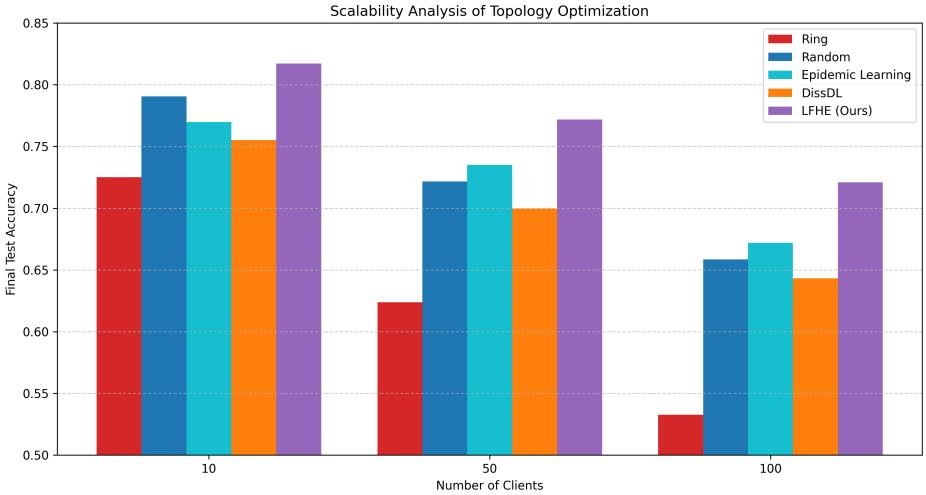  
Figure 7: Moderate-scale CIFAR-10 diagnostic under $\alpha = 0 . 3$ with $N \in \{ 1 0 , 5 0 , 1 0 0 \}$ . Bars report final test accuracy averaged over three seeds.

## G.6 Deployment-Stress Diagnostic

We test one compounded communication-disruption condition on seed 42 without retuning LFHE: 80% client participation, 10% link-failure probability, and bufered 0–1-round message delay. The graph remains connected throughout the run and the minimum observed $\lambda _ { 2 }$ is 0.670, despite 2,472 dropped model messages, 147 dropped control messages, and 636 delayed or stale control messages. Final accuracy decreases from 79.53% in the clean diagnostic to 60.18% under stress.

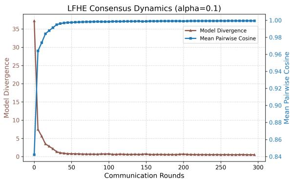  
(a) Consensus dynamics.

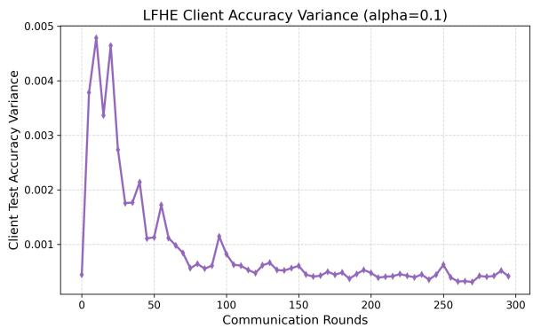  
(b) Client accuracy variance.  
Figure 8: Additional LFHE diagnostics on $\mathrm { C I F A R – 1 0 }$ with $\alpha = 0 . 1$ . Left: model-consensus quantities. Right: client-level test-accuracy variance.

This result separates topological operation from predictive robustness. The observed topology remains connected, but learning performance degrades substantially. Because this is a single-seed compounded stress test, it is preliminary evidence only and does not establish robustness to arbitrary asynchrony, long delays, or real distributed failures.

## G.7 Additional Consensus and Client-Variance Diagnostics

Figure 8 reports model-consensus and client-accuracy-variance diagnostics for LFHE on CIFAR-10 with $\alpha = 0 . 1$ . Model divergence decreases and mean pairwise cosine similarity rises during training; client-level accuracy variance also declines after the early phase. These are descriptive within-method trajectories. Without matched causal interventions, they should not be interpreted as proving that a particular topology statistic causes the learning improvement.

## H Bridge Evidence Under Matched Rewiring Budget

To more directly test whether the proposed structural term is associated with improved communication structure rather than topology churn alone, we conduct a controlled bridge experiment on CIFAR-10 under highly non-IID data $( \alpha = 0 . 1 )$ . The goal is not to re-evaluate the full learning system against all baselines, but to isolate how diferent local rewiring objectives afect topology quality and optimization behavior under a matched local update protocol.

## H.1 Protocol

We compare five methods: Static, Similarity-only, Exploration-only, Structural-only, and LFHE. All adaptive variants use the same FoF candidate-generation rule, the same maximum rewiring budget per update, the same initial random graph, and the same training and aggregation protocol. Thus, the compared methods difer only in the local score used to rank candidate updates; candidate access, update frequency, and communication budget are held fixed.

The compared local rewiring scores are

$$
\mathrm { S i m i l a r i t y - o n l y : } ~ S _ { i } - \omega _ { 3 } \frac { \deg ( i ) } { D _ { \operatorname* { m a x } } } , \qquad \mathrm { E x p l o r a t i o n - o n l y : } ~ D _ { i } - \omega _ { 3 } \frac { \deg ( i ) } { D _ { \operatorname* { m a x } } } ,
$$

Structural-only:

$$
C _ { i } - \omega _ { 3 } \frac { \deg ( i ) } { D _ { \operatorname* { m a x } } } , \qquad \mathrm { L F H E : } ~ \omega _ { 1 } ( 1 - \beta _ { t } ) C _ { i } + \omega _ { 2 } \beta _ { t } D _ { i } - \omega _ { 3 } \frac { \deg ( i ) } { D _ { \operatorname* { m a x } } } .
$$

Table 8: Summary of matched-budget bridge evidence on CIFAR-10 with $\alpha = 0 . 1$ . Final $\lambda _ { 2 }$ reports the final algebraic connectivity. $\Delta \lambda _ { 2 }$ is computed relative to the shared initial graph used by all matchedbudget variants. Mean divergence is computed over the last 20% of evaluation rounds.
<table><tr><td>Method</td><td>Final  $\lambda _ { 2 }$ </td><td> $\Delta \lambda _ { 2 }$ </td><td>Final Acc.</td><td></td><td>Mean Div. Mean Rewires</td></tr><tr><td>Static</td><td>0.592</td><td>0.000</td><td>0.6675</td><td>0.766</td><td>0.000</td></tr><tr><td>Similarity-only</td><td>0.578</td><td>-0.014</td><td>0.6704</td><td>0.727</td><td>0.183</td></tr><tr><td>Exploration-only</td><td>1.038</td><td>0.447</td><td>0.7356</td><td>0.221</td><td>3.406</td></tr><tr><td>Structural-only</td><td>2.306</td><td>1.715</td><td>0.7508</td><td>0.136</td><td>1.111</td></tr><tr><td>LFHE</td><td>2.247</td><td>1.655</td><td>0.7482</td><td>0.133</td><td>1.333</td></tr></table>

All methods therefore operate under the same local rewiring mechanism and difer only in the objective used to evaluate candidate updates.

## H.2 Results

Table 8 summarizes the matched-budget bridge evidence, while Figures 9 and 10 show the full trajectories. Because all adaptive variants use the same candidate-generation rule, rewiring budget, and training protocol, the observed diferences are attributable to the local rewiring objective rather than to protocol asymmetries.

First, the two objectives containing the structural term (Structural-only and LFHE) produce the largest gains in the ofline algebraic-connectivity diagnostic. Structural-only is slightly stronger than full LFHE in this regime: final $\lambda _ { 2 }$ is 2.306 versus 2.247, and final accuracy is 0.7508 versus 0.7482. This identifies the structural term as the main empirical signal in the matched protocol and rules out a claim that the complete objective is universally optimal.

Second, the connectivity gains are not explained by rewiring frequency alone. As shown in Table 8 and Figure 10, Exploration-only performs the most accepted rewires on average (3.406 per update), yet it does not achieve the strongest connectivity, the lowest model divergence, or the best final accuracy. Conversely, Structural-only and LFHE achieve substantially stronger topology and optimization outcomes with far fewer rewires. This indicates that the benefit comes from which local objective guides rewiring, rather than from topology churn alone.

Taken together, these matched score controls show that topology churn alone does not explain the observed structure and that $C _ { i }$ is the dominant score component in this regime. The matched score-factor diagnostic isolates the efect of the local scoring rule under shared FoF access; the next subsection adds score-free Random-FoF, degree-preserving random-swap, and representation-free graph-only controls to test broader alternative explanations. None of these results implies that $C _ { i } ( t )$ monotonically tracks $\lambda _ { 2 }$

## H.3 Additional Simple Controls

The score-factor study above is complemented by simpler controls designed to test alternative explanations. Across three seeds, a matched Random-FoF variant reaches $7 4 . 6 2 \pm 2 . 2 5 \%$ final accuracy, close to LFHE’s 74.82% in this diagnostic, but has lower final algebraic connectivity (1.696 versus 2.247). On seed 42, Random-FoF commits 81 accepted operations and reaches 73.24% final accuracy with 61.26% nAUC. A degree-preserving random-swap diagnostic accepts 297 double-edge swaps but reaches only 66.24% accuracy. Conversely, a representation-free graph-only control reaches a higher final $\lambda _ { 2 }$ of 2.403 but only 73.52% accuracy.

These controls rule out two simple explanations. First, more topology activity is not suficient for better learning. Second, maximizing a graph-only connectivity diagnostic is not suficient either. The Random-FoF result is also a useful caution: its final accuracy is close to LFHE in the matched regime, so the evidence supports a structural diference more strongly than a large universal accuracy gap. We therefore avoid attributing all LFHE gains uniquely to its score.

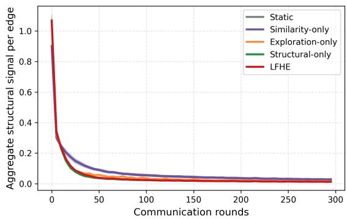

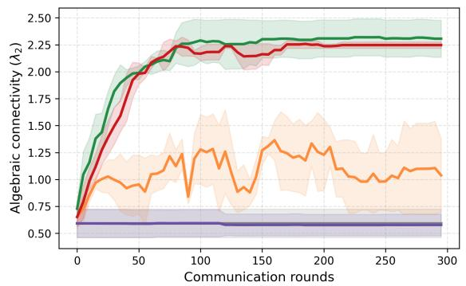

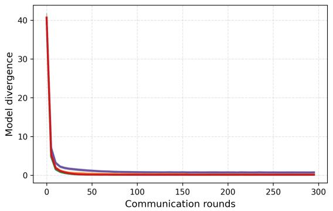

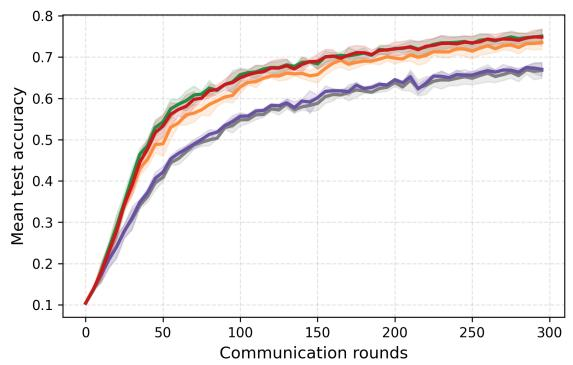  
Figure 9: Bridge evidence under matched FoF candidate generation and rewiring budget on CIFAR-10 with $\alpha = 0 . 1$ . Methods containing the structural term (Structural-only and LFHE) produce substantially larger and more stable gains in algebraic connectivity than Similarity-only or Exploration-only. The same methods also achieve lower model divergence and stronger test accuracy under the same local update protocol.

## H.4 Interpretation

This experiment complements the removal ablation by holding FoF access fixed and varying only the score. Together with Appendix D, it separates two claims: $C _ { i }$ has an exact state-dependent Dirichlet-energy interpretation, and the matched experiment shows that using this signal produces the strongest measured topology change in this regime. Structural-only can still outperform the full objective, so exploration and degree control are best understood as search and resource regulators rather than theoretically necessary components of every optimal update.

## I Cost Analysis

In this appendix, we analyze the computational overhead of LFHE-based topology optimization in the decentralized training pipeline. Our implementation records both wall-clock topology-update time and a set of control-overhead statistics, including neighbor-list reads, FoF candidate checks, fitness evaluations, accepted rewires, and edge changes. These quantities are accumulated during training and summarized across multiple random seeds.

## I.1 Measurement Protocol

The cost analysis follows the main CIFAR-10 configuration with $N = 3 0 , T = 3 0 0$ , local epoch $E = 1$ , topology interval $K = 5$ , and online degree threshold $D _ { \mathrm { m a x } } = 4$ . LFHE is therefore executed every five communication rounds, resulting in 60 topology update calls per seed over the full training process. For each topology update, the implementation measures the elapsed

Accepted rewires under shared maximum budget  
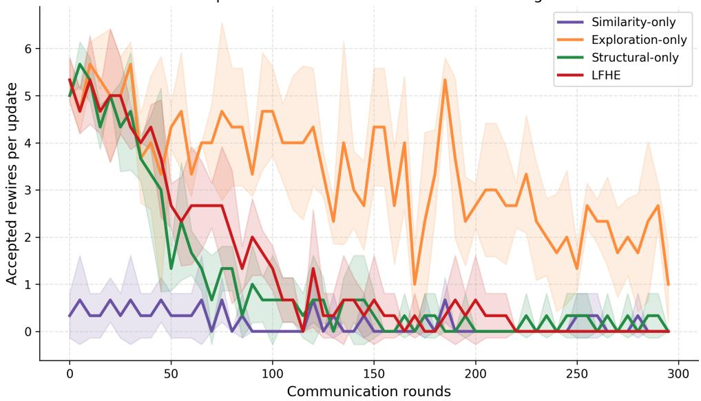  
Figure 10: Accepted rewires per topology update under the same maximum rewiring budget. Exploration-only performs more rewiring than LFHE or Structural-only during much of training, but does not achieve the strongest connectivity or accuracy. This shows that the advantage of structural-term methods is not explained by rewiring frequency alone.

wall-clock time of LFHE-Update:

$$
\tau _ { t } = t _ { \mathrm { e n d } } - t _ { \mathrm { s t a r t } } ,
$$

where $t _ { \mathrm { s t a r t } }$ and $t _ { \mathrm { e n d } }$ are recorded immediately before and after the topology update routine. The total topology overhead and amortized per-round overhead are defined as

$$
\tau _ { \mathrm { t o t a l } } = \sum _ { t \in \mathcal { T } _ { \mathrm { { u p d } } } } \tau _ { t } , \qquad \tau _ { \mathrm { r o u n d } } = \frac { \tau _ { \mathrm { t o t a l } } } { T } ,
$$

where $\mathcal { T } _ { \mathrm { u p d } }$ denotes the set of update rounds.

In addition to runtime, we record several control-overhead statistics:

• Neighbor-list reads: the number of accesses to local neighborhood structure;

• Candidate checks: the number of FoF candidates examined;

• Fitness evaluations: the number of node-level fitness computations;

• Accepted rewires: the number of candidate rewiring operations that are committed;

• Edge changes: the total number of edge insertions/removals between consecutive graph states.

## I.2 Asymptotic Cost Discussion

LFHE restricts discovery to ego-network and FoF information. Let $\bar { d } = \operatorname* { m a x } _ { i } d _ { i }$ denote the maximum degree actually present during an update, including any degree inherited from the initializer. The candidate-inspection cost is bounded by

$$
O \left( \sum _ { i = 1 } ^ { N } d _ { i } ^ { 2 } \right) \subseteq O ( N \bar { d } ^ { 2 } ) .
$$

If the initializer and online protocol keep ¯d bounded independently of N, the control computation is linear in the number of clients. Because the reference initializer is specified by expected degree

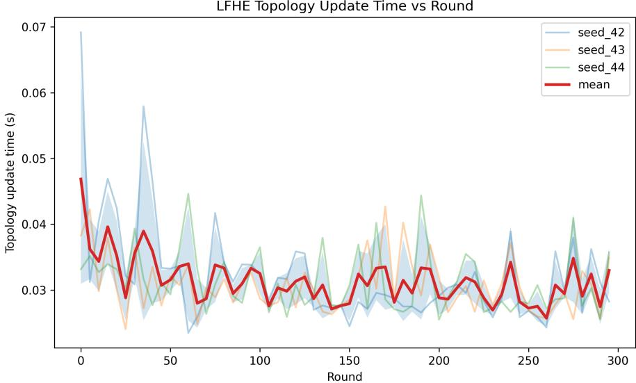  
Figure 11: Per-update LFHE topology overhead across communication rounds. Thin lines show individual seeds and the bold line shows the mean across seeds. The runtime remains stable throughout training, indicating that LFHE does not incur increasing topology-update cost in later rounds.

rather than a hard cap, this conditional statement is more precise than replacing ¯d unconditionally by $D _ { \mathrm { m a x } }$

In addition, each candidate test only requires a local fitness computation based on the current representation of a node and its neighbors. Hence, LFHE avoids repeated global eigendecomposition or full-graph optimization during training.

## I.3 Observed Runtime Overhead

Across seeds 42, 43, and 44, the mean total topology-update time is $1 . 8 8 6 \pm 0 . 0 3 8$ seconds for the entire 300-round training run. When amortized over all communication rounds, this corresponds to only $0 . 0 0 6 2 9 \pm 0 . 0 0 0 1 3$ seconds per round. Since topology evolution is triggered once every five communication rounds, the mean time per topology update is $0 . 0 3 1 4 \pm 0 . 0 0 0 6$ seconds.

These measurements show small simulator-side topology-update time on the reported workstation. They do not include real network latency or all deployment control trafic, so they should be interpreted as implementation overhead for this synchronous simulator rather than an end-to-end systems cost.

As shown in Figure 11, the wall-clock cost of LFHE updates fluctuates slightly across rounds and seeds but remains within a narrow range. This suggests that the local rewiring mechanism does not become progressively more expensive as training proceeds.

## I.4 Control Overhead

The control statistics reveal that LFHE performs bounded local exploration while committing only a small number of structural updates. Averaged across seeds, LFHE performs $3 5 3 . 7 8 \pm 4 8 . 5 5$ candidate checks and the same number of fitness evaluations per update, while accepting only $0 . 3 3 9 \pm 0 . 1 2 2$ rewires per update.

Over the full training run, this corresponds to $2 1 , 2 2 6 . 6 7 \pm 2 , 9 1 3 . 0 7$ candidate checks, $2 1 , 2 2 6 . 6 7 \pm 2 , 9 1 3 . 0 7$ fitness evaluations, and $2 0 . 3 3 \pm 7 . 3 2$ accepted rewires. The total number of neighbor-list reads is $8 , 3 2 6 \pm 5 6 2 . 7 5$ , and the total number of edge changes is $4 3 . 3 3 \pm 1 5 . 8 4$

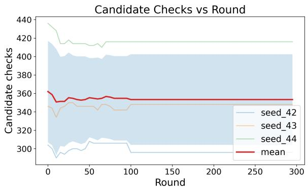  
(a) Candidate checks per topology update.

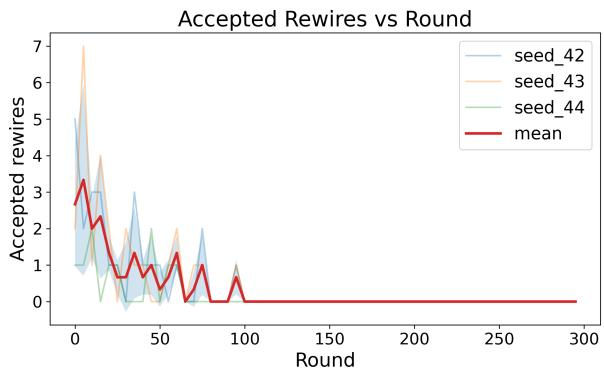  
(b) Accepted rewires per topology update.  
Figure 12: Control overhead of LFHE during topology evolution. Left: Candidate checks increase in the early stage and then stabilize, showing a stable candidate-check workload over later training rounds. Right: Accepted rewiring operations are concentrated in early rounds and become rare as the topology stabilizes.

These results indicate that LFHE explores a large number of local candidates but commits only a very small subset of rewiring operations. This behavior is consistent with a conservative accept-if-improves policy, which favors stability over aggressive topology modification.

Figure 12 further illustrates this behavior. As shown in Figure 12a, the number of candidate checks rises during the early phase of training and then stabilizes at around 350 checks per update. This shows that the recorded candidate-check workload remains approximately stable over later training rounds in these runs; it should not be interpreted as an empirical scaling law in N. Figure 12b shows a complementary trend: accepted rewires are more frequent in the early stage but become rare in later rounds, consistent with a stabilizing communication topology.

## I.5 Acceptance Ratio

A useful empirical measure of update selectivity is

$$
\mathrm { A c c e p t R a t e } = \frac { \# \mathrm { a c c e p t e d ~ r e w i r e s } } { \operatorname* { m a x } ( \# \mathrm { c a n d i d a t e ~ c h e c k s } , 1 ) } .
$$

Using the full-run averages, this yields an eficiency on the order of $1 0 ^ { - 3 }$ , indicating that only a very small fraction of evaluated candidates are accepted. Only a small fraction of inspected candidates is therefore committed. This is consistent with a conservative accept-if-improves rule at the initiator, but “accepted” should not be read as globally or bilaterally beneficial.

Taken together, Figures 12a and 12b show that LFHE performs selective rather than aggressive topology modification: it continues to inspect local candidates, but commits only those rewiring operations that improve node-level fitness under the imposed constraints.