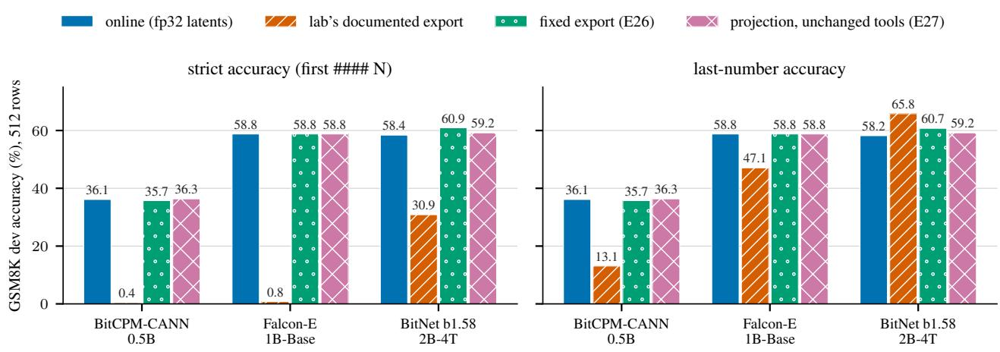
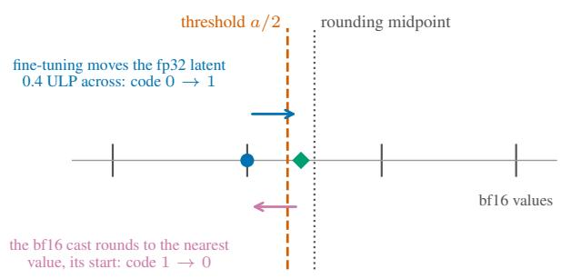
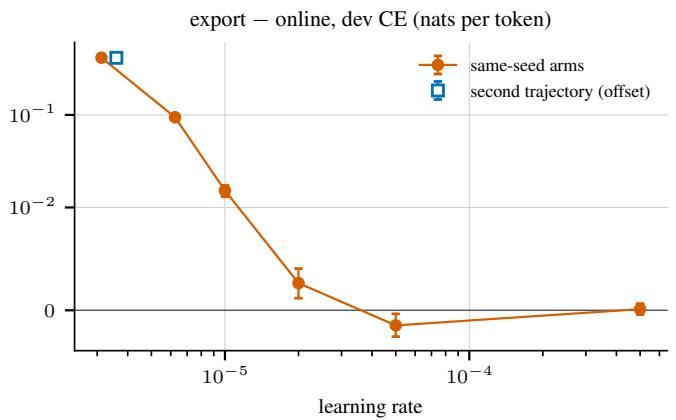
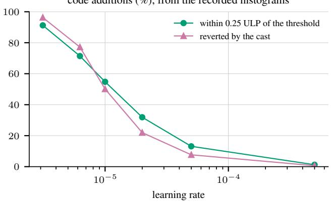
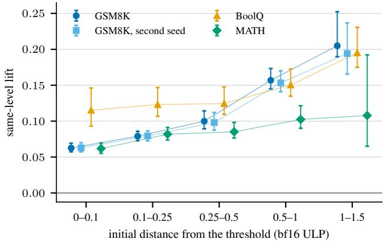

# LOST IN THE BF16 CAST: EXPORTING TERNARY LANGUAGE MODELS CAN REVERT MOST LOW-LEARNING-RATE CODE CHANGES

Avichal Sahai Ofbusiness avichal.sahai@ofbusiness.in

Nishant Raj Ofbusiness nishant.raj@ofbusiness.in

Animesh Srivastava Ofbusiness animesh.srivastava@ofbusiness.in

## ABSTRACT

Ternary language models such as BitNet b1.58, Falcon-E and BitCPM are fine-tuned with higher-precision latent weights and deployed as ternary codes produced by an export step that, in the labs’ documented pipelines, first casts the latents to bf16. We audit those pipelines across three labs. In released checkpoints, fp32 quantization of the shipped latents disagrees with the deployed codes on 0.83–1.77% of codes in Falcon-E and BitCPM and on 1.530% in BitNet 2B-4T; for Falcon-E and BitCPM most disagreements are products that bf16 rounding lands exactly on the threshold, which ties-to-even maps to zero, and the unmodified onebitllms exporter reproduces all four Falcon-E releases byte for byte. At fine-tuned endpoints, with learning rates selected to match a nominal learning-rate-to-bf16-ULP ratio, the documented export lowers greedy GSM8K strict accuracy from 58.79% to 0.78% for Falcon-E-1B-Base and from 36.13% to 0.39% for BitCPM-CANN-0.5B, and a bf16 save and reload lowers BitNet 2B-4T’s strict accuracy by 27.54 points while its last-number accuracy rises. Two compatibility remedies, writing the training quantizer’s codes directly or adjusting the bf16 inputs until the unchanged tools emit them, each met a 4-point strict-accuracy non-inferiority criterion against online evaluation in all three models. In two model families, randomized interventions on the initial distance from the threshold support distance-dependen selection of the codes that fine-tuning changes.

## 1 INTRODUCTION

Ternary language models store each linear weight as a code in {−1, 0, +1} with a per-tensor or per-row scale (Ma et al., 2024; 2025). Labs release them in two forms: a latent checkpoint in bf16, from which quantization-aware finetuning starts, and a deployed checkpoint of codes and scales, produced by an export step. Fine-tuning updates higherprecision latent weights, and a code changes only when its latent crosses a threshold at half the mean magnitude of its tensor (of its row, for BitCPM). At low learning rates most changed latents finish just past that threshold (§4). The labs’ documented exports pass the latents through bf16, whose 8-bit significand spaces representable values roughly 0.4–0.8% apart near the threshold, so the cast can return a just-crossed latent to its starting value (Figure 2). The model evaluated during fine-tuning is then not the model that ships.

We audit this boundary in the documented pipelines of three labs: TII’s onebitllms exporter for Falcon-E (Technology Innovation Institute, 2025a;b), a bf16 checkpoint reloaded with online quantization for Microsoft’s BitNet b1.58 2B-4T (Microsoft, 2025; Hugging Face, 2026), and OpenBMB’s qat-convert for BitCPM-CANN (OpenBMB, 2026a). Our contributions:

• A release audit (§3). In matched releases, fp32 quantization of the released latents disagrees with the deployed codes on 0.83–1.77% of codes (Falcon-E, BitCPM) and 1.530% (2B-4T). For Falcon-E and BitCPM most disagreements are bf16 products that land exactly on the rounding threshold, |w · r| = 1 with r the inverse scale, which ties-to-even maps to zero, and the unmodified onebitllms exporter reproduces all four Falcon-E releases byte for byte.

• The export at fine-tuned endpoints (§4). At learning rates selected to match a nominal learning-rate-tobf16-ULP ratio across models, the documented export lowers greedy GSM8K strict accuracy from 58.79% to 0.78% (Falcon-E-1B-Base) and from 36.13% to 0.39% (BitCPM-CANN-0.5B); a bf16 save and reload lowers 2B-4T’s strict accuracy by 27.54 points while its lastnumber accuracy rises by 7.62. At the higher learning rates tested the effect shrinks or is not detected.

• Two remedies (§5). Writing the training quantizer’s captured codes directly into the deployed representation, or adjusting the bf16 inputs in bounded steps until the unchanged tools emit those codes, was non-inferior to online evaluation at a 4-point strict-accuracy margin in all three models (Figure 1).

• Which codes fine-tuning changes (§6). On 2B-4T, changed codes are enriched for positive first-order basegradient scores relative to codes at the same stored level, increasingly with initial distance from the threshold, and randomized interventions that change only the starting distance support distance-dependent selection in two model families.

We claim neither a new rounding mechanism—the cancellation of small updates by bf16 rounding is known (Zamirai et al., 2020; Miahi & Belilovsky, 2026)—nor a general export penalty. The results concern one recipe family, one or two trajectories per arm, and 512 GSM8K dev prompts. For the prospectively packaged experiments, the analysis and decision rule were frozen before the run; Appendix A describes the protocol and lists its exceptions, including the analyses that were exploratory, adaptive or post hoc.1

## 2 BACKGROUND

Ternary quantization. BitNet-style absmean quantization maps a latent tensor W to codes $q \quad =$ round(clamp(W r, −1, 1)), with amplitude $a = \mathrm { m e a n } | W |$ and inverse scale $r = 1 / a ,$ , per tensor for Falcon-E and 2B-4T and per row for BitCPM, and deploys q · a. A weight’s code is nonzero when |w| exceeds $a / 2 ,$ that is, when $\begin{array} { r } { | w \cdot r | > \frac { 1 } { 2 } } \end{array}$ . This notation is idealized: the exporters operation order and bf16 roundings are part of what §3 measures. Quantization-aware training uses a straight-through estimator: the forward pass uses the codes, and the backward pass updates the latents, kept here in fp32.

bf16 near the threshold. bf16 has an 8-bit significand (Kalamkar et al., 2019). Near a threshold t the spacing of representable values, one ULP, is $2 ^ { \lfloor \log _ { 2 } t \rfloor - 7 }$ , between 0.4% and 0.8% of t. Hold the threshold t fixed, between adjacent bf16 values $L < U .$ A code addition that starts at L reverts under round-to-nearest if its endpoint lies above t but below the rounding midpoint $( L + U ) / 2$ . More generally, a latent returns to its starting bf16 value whenever its total displacement keeps it inside that value’s rounding cell; overshoot beyond the threshold does not by itself decide this, since an endpoint just past t can lie beyond the midpoint and round onward. Exact midpoint ties go to the even neighbour (Figure 2). The export’s actual threshold also moves with its recomputed scale, which is part of the measured pipeline. Products computed in bf16 can also land exactly on $\begin{array} { r } { | w \cdot r | = \frac { 1 } { 2 } } \end{array}$ , which torch.round maps to 0 because it rounds ties to even.

Table 1. The labs’ documented export paths and where bf16 enters.
<table><tr><td>model (lab)</td><td>documented path</td><td>bf16 enters</td></tr><tr><td>Falcon-E (TII)</td><td>onebitllms quantize_to_1bit on the bf16 checkpoint; packed codes,</td><td>latent cast; bf16 scale and products</td></tr><tr><td>BitNet b1.58 2B-4T</td><td>bf16 scale bf16 checkpoint, reloaded with Transformers&#x27; online</td><td>latent cast</td></tr><tr><td>(Microsoft) BitCPM- CANN</td><td>WeightQuant qat-convert on bf16 latents; per-row bf16</td><td>latent cast; bf16 magnitudes and products</td></tr></table>

Table 2. fp32 codes from the released latents against the deployed codes. For Falcon-E and BitCPM the release’s own arithmetic reproduces the deployed codes exactly; for 2B-4T no bf16 recipe we tried does, and its historical source is not observed.
<table><tr><td>release</td><td>codes</td><td>disagreements</td><td>direction</td></tr><tr><td>Falcon-E-1B-Base</td><td>1,585,446,912</td><td>28,132,333 (1.774%)</td><td> $\mathrm { a l l } \pm 1  0$ </td></tr><tr><td>Falcon-E-1B-Instruct</td><td>1,585,446,912</td><td>26,397,811 (1.665%)</td><td> $\mathrm { a l l } \pm 1  0$ </td></tr><tr><td>Falcon-E-3B-Base</td><td>2,919,235,584</td><td>31,511,209 (1.079%)</td><td> $\mathrm { a l l } \pm 1  0$ </td></tr><tr><td>Falcon-E-3B-Instruct</td><td>2,919,235,584</td><td>28,130,481 (0.964%)</td><td> $\mathrm { a l l } \pm 1  0$ </td></tr><tr><td>BitCPM-CANN-0.5B</td><td>358,612,992</td><td>5,996,444 (1.672%)</td><td> $\mathrm { a l l } \pm 1  0$ </td></tr><tr><td>BitCPM-CANN-3B</td><td>3,229,614,080</td><td>26,828,322 (0.831%)</td><td> $\mathrm { a l l } \pm 1  0$ </td></tr><tr><td>BitNet b1.58 2B-4T</td><td>2,084,044,800</td><td>31,895,216 (1.530%) both ways</td><td></td></tr></table>

The documented export paths (Table 1). All three pass the latents through bf16; two also compute the scale and the products in bf16.

## 3 RELEASED CHECKPOINTS ENCODE A DIFFERENT MODEL

For each matched release we quantized the released bf16 latents with fp32 absmean arithmetic, which is what the training quantizers of onebitllms and Transformers’ online BitLinear compute, and compared the codes with the deployed ones (Table 2). We found no matched latent checkpoint for the reviewed TriLM releases, so they are excluded; the three families are the matched pairs this search identified, not a census of all releases.

One numerical cause in two labs’ export code. For BitCPM, 95.71% (0.5B) and 93.87% (3B) of the disagreements are weights whose bf16 product has |w · r| exactly 0.5, which torch.round maps to zero; the rest have bf16 products just below 0.5, where the bf16 scale moved the threshold. For Falcon-E-1B-Base under onebitllms’ export arithmetic the share is 93.52%. Every Falcon-E and BitCPM disagreement removes a ±1 code at most about 1.5 bf16 ULP above the threshold. Rounding ties away from zero instead turns the error mostly into additions, so changing the tie rule changes the dominant direction without removing the precision-induced disagreement.

The actual exporter. The unmodified onebitllms 0.0.4 quantize to 1bit, run on each Falcon-E release’s prequantized checkpoint, reproduces all four releases byte for byte in every tensor, including packed codes, weight scales and non-projection tensors. This is computational provenance, not a recovered export log.

Figure 1. GSM8K dev accuracy (512 rows, greedy) of one fine-tuned endpoint per model: evaluated online from the fp32 latents, after the lab’s documented export, after the fixed export (Experiment 26) and after the projection that lets the unchanged tools emit the online codes (Experiment 27). Strict accuracy takes the first #### N; the last-number rule takes the last number. The documented paths differ by model (§4). Bars are descriptive point estimates; the paired contrasts and their intervals are in Tables 3 and 4.  
  
Figure 2. Schematic of the reversion at a fixed threshold. The latent starts on a bf16 value 0.3 ULP below the threshold, and fp32 finetuning moves it 0.4 ULP, to 0.1 ULP above. That endpoint is still below the rounding midpoint, inside its starting value’s rounding cell, so the export’s round-to-nearest bf16 cast returns it to its start and the code reverts. An endpoint beyond the midpoint would round onward and keep its new code.

2B-4T’s hidden codes. 2B-4T’s 31,895,216 disagreements (16,170,283 removed, 15,724,933 added) lie within 0.5 ULP of the threshold in both directions, compatible with rounding of the released latent representation; its original master and export history are unavailable (dmitrii-f-t27, 2026a;b). They matter for fine-tuning: about 41% of all code changes made by fine-tuning 2B-4T from its bf16 master land on these coordinates and afterwards agree with the packed code.

Because the pre-release latents are not observed, this agreement is operational, not a claim of restoration.

The loss consequence depends on the release. In a declared comparison on C4 (Raffel et al., 2020) (validation shard 00001, 1,024 documents, one common forward with int8 activations), the deployed codes and scales raise cross-entropy over fp32 quantization of the released latents by +0.0125 [+0.0114, +0.0137] nats per token for Falcon-E-1B-Base and +0.0077 [+0.0066, +0.0087] for 3B-Base, lower it for 2B-4T (−0.0053 [−0.0067, −0.0039]), and show no detectable difference for the two Instruct releases (Appendix Table 7). In a separate precision contrast on the same BitCPM-CANN latents, the release’s bf16 output has lower loss than an fp32 counterfactual (−0.035544 [−0.037267, −0.033914] for 0.5B and −0.006814 [−0.007933, −0.005625] for 3B), and rounding ties away from zero is worse than both (Table 8). The two comparisons measure different estimands in different forwards, so we infer no rule across releases: the practical point is consistency with the quantizer a model was trained under, not that fp32 is better.

## 4 THE EXPORT AT FINE-TUNED ENDPOINTS

Setup. Each model is fully fine-tuned on GSM8K (Cobbe et al., 2021) for 300 steps with gradient accumulation 16 (4,800 rows from a 6,833-row training pool), fp32 latents, PagedAdamW8bit, a 30-step warm-up and a cosine schedule. 2B-4T trains at learning rate 10−4; Falcon-E-1B-Base and BitCPM-CANN-0.5B train at $3 . 1 2 5 \times 1 0 ^ { - 6 } .$ , chosen to match 2B-4T’s nominal median ratio of learning rate to bf16 ULP. Each state answers the same 512 dev prompts, carved from the official training split, by greedy zero-shot decoding. Strict accuracy takes the first #### N; the lastnumber rule takes the last number in the answer. Intervals are 95% paired row bootstraps (2,000 draws). Each comparison was declared before its run, with one or two trajectories per arm. The nominal ratio is a rule for choosing the rates; it is not measured optimizer displacement or matched training dynamics. The Falcon-E fp32-master runs train through Transformers’ online AutoBitLinear, whereas TII’s documented training implementation uses onebitllms’ Triton BitNetLinear: the documented exporter is exercised exactly, but the lab’s training stack is not replicated in full.

Falcon-E (Experiments 17–20). At the low-rate endpoint the documented export raises dev cross-entropy by +0.41513 nats per token, and along the declared export path the projection-latent cast carries the largest increment (+0.38053 [+0.36875, +0.39357]). Of that endpoint’s 4,055,607 code additions, 91.2% lie within 0.25 bf16 ULP of the threshold, and the cast alone reverts 96.3% of them (descriptive summaries of the recorded histograms). Greedy strict accuracy falls from 58.79% to 0.78%, alongside a collapse of adherence to the fine-tuned answer format (97.1% to 21.7%); under the last-number rule accuracy also falls, from 58.79% to 47.07%. This is not an erasure of all fine-tuning: under the last-number rule the exported model stays above the base model by +23.24 [+17.97, +28.52] points. The cost recurs on a second trajectory at the same rate $( + 0 . 4 1 4 0 1 [ + 0 . 4 0 1 3 9 , + 0 . 4 2 7 1 4 ] )$ ; no replication rule was declared, and two trajectories do not measure seed variance. Over the same-seed rates from $3 . 1 2 5 \times 1 0 ^ { - 6 }$ through $5 \times 1 0 ^ { - 5 }$ the point estimates decrease (Figure 3), together with the share of additions that sit near the threshold: +0.09436 at 6.25×10−6, +0.01524 at $1 0 ^ { - 5 }$ and +0.00264 at $2 \times 1 0 ^ { - 5 }$ , and at $5 \times 1 0 ^ { - 5 }$ the export slightly lowers loss $\left( - 0 . 0 0 1 4 7 \ [ - 0 . 0 0 2 5 6 , \ - 0 . 0 0 0 3 4 ] \right)$ At $5 \times 1 0 ^ { - 4 }$ the documented learning rate, the contrast is near zero (+0.00011 [−0.00041, +0.00065]), so the full sequence is not monotonic, and neither its fp32-master arm nor its bf16-parameter arm shows a detectable accuracy difference; the bf16-parameter arm matches the documented parameter precision within this recipe, not TII’s training pipeline. No between-rate difference or curve was tested. $\mathrm { ~ A ~ 2 ~ } \times \mathrm { ~ 2 ~ } \times \mathrm { ~ 2 ~ }$ factorial at the low-rate endpoint, with the non-projection parameters fixed and the same endpoint and dev rows, crosses the export’s two code-change groups, reverted additions (F1) and newly zeroed codes (F2), with a substitution of the amplitudes. F1 and F2 interact strongly: +0.27123 [+0.26188, +0.28077] nats per token at the online ampli tudes and +0.27081 [+0.26133, +0.28051] at the export amplitudes, while all four conditional amplitude contrasts include zero (Appendix C). F1 is not the cast and F2 is not the arithmetic; neither these contrasts nor the ordered-path increments are shares of the cost.

BitNet 2B-4T (Experiment 22). Saving the fine-tuned model as a bf16 checkpoint and reloading it with online quantization lowers strict accuracy by 27.54 points (C1) and 23.63 points (a second trajectory, C2), while last-number accuracy rises by 7.62 points in each; adherence to the answer format falls from 98.4% to 41.4% in C1. The harm here is mostly to the fine-tuned format, and it does not imply erasure of mathematical ability. Experiment 22 is the declared evaluation retry of Experiment 21, which an out-of-memory defect had blocked, on the same retained endpoints; nothing was retrained.

BitCPM (Experiments 23 and 24). Served through OpenBMB’s own pipeline, the low-rate fine-tune loses accuracy under both rules. Of its 1,122,949 changed codes the bf16 cast returns 95.3% to the start code, and the served model differs from the published checkpoint in 99,080 codes. At 32 times the rate the same pipeline leaves no detectable strict-accuracy change and a small cross-entropy cost; the cast then returns only 4.0% of 14,972,249 changes.

What these show. At these low-rate endpoints the documented exports undo most of fine-tuning’s code changes and can collapse strict-format accuracy; the size of the effect depends on the learning rate, the export path and the scoring rule. The rows come from the training split and were used in earlier analyses, so they are not a fresh test set.

## 5 TWO REMEDIES

Both remedies start from one existing fine-tuned endpoint per model and its online codes—BitCPM-CANN-0.5B’s B2, and Falcon-E’s A1 and 2B-4T’s C1 retrained to their pinned endpoints with the fp32 latents retained—and compare a deployed state with the online state on the same 512 dev rows.

The fixed export (Experiment 26) writes the codes captured under the fp32 training quantizer into each model’s declared deployed representation and evaluates it in bf16 without autocast. It replaces the export step.

The projection (Experiment 27) keeps each lab’s tool unchanged and adjusts its input (Algorithm 1). It reproduces the tool’s exact arithmetic per tensor (per row for qat-convert). Each iteration moves every mis-exported coordinate, and for 2B-4T’s fp32 quantizer every coordinate inside a relative margin $\mu = 2 ^ { - 1 6 }$ of the rounding threshold, by the smallest number of bf16 ULPs, at most 8, that gives its target code under the current scale, never across zero and at most 16 ULPs from the plain cast. Where these moves change the tool’s scale, single-ULP compensating moves on matching coordinates restore it, bitwise for the two bf16 exporters and within a relative $\mu / 2$ for 2B-4T; a tensor or row whose scale cannot be restored has that iteration’s moves withdrawn, and no accepted iterate may create a new mismatch. The real tool’s output is then checked on every coordinate, for 2B-4T through the compiled reload. In the recorded runs all 546 projection tensors converged within two iterations, no margin moves were needed, and the CPU stage took about ten minutes for the three models together; this records these runs and is not a convergence guarantee. Appendix A gives the implementation’s portability checks.

code additions (%), from the recorded histograms  
Table 3. The documented export at fine-tuned endpoints, against online evaluation: strict and last-number accuracy in percentage points and dev cross-entropy in nats per token (95% paired row bootstrap). The documented paths are the onebitllms export (Falcon-E), a bf16 save and reload (2B-4T) and qat-convert (BitCPM). The last column is the share of fine-tuning’s code changes that the bf16 cast alone returns to the start code (Falcon-E: of code additions).
<table><tr><td>model, arm (experiment)</td><td></td><td>online</td><td>exported</td><td>∆ strict</td><td>∆ last-number</td><td>ΔCE</td><td>cast returns</td></tr><tr><td>Falcon-E-1B-Base, A1 (17, 20)</td><td> $3 . 1 2 5 \times 1 0 ^ { - }$  -6</td><td>58.79%</td><td>0.78%</td><td>-58.01 [-62.30, -53.91]</td><td>-11.72  $[ - 1 6 . 9 9 , - 6 . 6 4 ]$ </td><td>+0.41513  $\operatorname { i + 0 . 4 0 2 5 1 , + 0 . 4 2 9 1 4 }$ </td><td>96.3%</td></tr><tr><td>Falcon-E-1B-Base, A3 (17, 20)</td><td> $5 \times 1 0 ^ { - 4 }$ </td><td>15.82%</td><td>16.21%</td><td>+0.39  $_ { - 2 7 . 5 4 } ^ { [ - 1 . 5 6 , + 2 . 3 4 ] }$ </td><td>+0.20  $_ { + 7 . 6 2 } ^ { [ - 1 . 7 6 , + 2 . 1 5 ] }$ </td><td>+0.00011 [-0.00041,+0.00065]</td><td>0.6%</td></tr><tr><td>BitNet 2B-4T, C1 (22)</td><td> $1 0 ^ { - 4 }$ </td><td>58.40%</td><td>30.86%</td><td> $\begin{array} { l } { { [ - 3 3 . 0 1 , - 2 2 . 0 7 ] } } \\ { { - 3 5 . 7 4 } } \end{array}$ </td><td> $_ { - 2 3 . 0 5 } ^ { [ + 2 . 5 4 , + 1 2 . 1 1 ] }$ </td><td>+0.30198  $\begin{array} { l } { { [ + 0 . 2 8 9 9 0 , + 0 . 3 1 5 2 0 ] } } \\ { { + 0 . 2 1 2 8 3 } } \end{array}$ </td><td></td></tr><tr><td>BitCPM-CANN-0.5B, B2 (23)</td><td> $3 . 1 2 5 \times 1 0 ^ { - 6 }$ </td><td>36.13%</td><td>0.39%</td><td> $\begin{array} { l } { { [ - 4 0 . 0 4 , - 3 1 . 8 4 ] } } \\ { { + 0 . 2 0 } } \end{array}$ </td><td> $\begin{array} { l } { { [ - 2 7 . 5 4 , - 1 8 . 9 5 ] } } \\ { { + 0 . 2 0 } } \end{array}$ </td><td>[+0.20486,+0.22082]</td><td>95.3%</td></tr><tr><td>BitCPM-CANN-0.5B, B3 (24)</td><td> $1 0 ^ { - 4 }$ </td><td>26.37%</td><td>26.56%</td><td> $[ - 2 . 9 3 , + 3 . 1 2 ]$ </td><td> $[ - 2 . 9 3 , + 3 . 1 2 ]$ </td><td>+0.00305  $\left[ + 0 . 0 0 2 0 2 , + 0 . 0 0 3 9 9 \right]$ </td><td>4.0%</td></tr></table>

  
Figure 3. Falcon-E-1B-Base, the documented export across fine-tuning learning rates (fp32 latents, one trajectory per arm). Left: export minus online dev cross-entropy with 95% paired row-bootstrap intervals, on a symmetric log scale; the open square is the second trajectory at the lowest rate, offset horizontally for visibility. Right: descriptive summaries of each endpoint’s recorded margin histogram, the share of code additions within 0.25 bf16 ULP of the threshold and the share the cast reverts; they are counts, not measurements of laten displacement. Lines connect the declared rates for reading; no curve or between-rate difference was tested.

The non-inferiority margin, δ = 4 points, is the median 95% half-width of the documented-export primaries (4.199, 5.469 and 4.102 points), rounded down and fixed before launch; it reflects those contrasts’ resolution, not an application tolerance.

What the labels mean. Each interval’s lower bound exceeds −4 points, satisfying the predeclared non-inferiority rule on these rows; this is not a zero-loss guarantee. The intervals still include losses of up to 1.95 and 2.73 points under the fixed export (BitCPM, Falcon-E) and 1.17, 2.54 and 1.37 points under the projection.

Codes, accuracy and answers. Both remedies reproduce the online codes on every coordinate—358,612,992, 1,585,446,912 and 2,084,044,800 codes—read from the saved files or the tools’ own output and, for 2B-4T’s projection, from the compiled quantizer on the GPU. The generations are nevertheless identical on only 395, 266 and 314 of 512 rows under the fixed export, and 390, 281 and 305 under the projection: same codes, same accuracy and same answers are different claims. Once the codes agree, what remains is the exporter’s scale representation, inference-path arithmetic and the casting of non-projection parameters, which neither experiment isolates. BitNet’s +2.54 under the fixed export is detectably positive on these rows, but it is a residual of the complete exported path, not an established general benefit; the projected 2B-4T model lies −1.76 [−4.10, +0.59] points from it, and the two are not ranked. BitCPM’s projected cross-entropy is the one detectable CE difference, 0.03% higher than online.

What the projection moves. It moved 1.669%, 1.909% and

Table 4. The two remedies: strict accuracy and cross-entropy against online (95% paired row bootstrap, 2,000 draws; δ = 4 points; CE in nats per token). Labels: FIX NONINFERIOR (E26) and PROJ NONINFERIOR (E27).
<table><tr><td>model</td><td>online strict</td><td> $\mathrm { f i x e d - o n l i n e }$  (E26)</td><td>label</td><td>projected — online (E27)</td><td>label</td><td>CE, fixed – online</td><td></td><td>CE, projected - online</td></tr><tr><td>BitCPM-CANN-0.5B (B2)</td><td>36.13%</td><td>-0.39  $[ - 1 . 9 5 , + 1 . 1 7 ]$ </td><td>non-inferior</td><td>+0.20  $[ - 1 . 1 7 , + 1 . 5 6 ]$ </td><td>non-inferior</td><td>+0.00006 [-0.00006, +0.00018]</td><td></td><td>+0.00013 [+0.00001,+0.00026]</td></tr><tr><td>Falcon-E-1B-Base (A1)</td><td>58.79%</td><td>+0.00  $[ - 2 . 7 3 , + 2 . 7 3 ]$ </td><td>non-inferior</td><td>+0.00 [-2.54, +2.34]</td><td>non-inferior</td><td>-0.00004 [-0.00032, +0.00025]</td><td></td><td>-0.00021 [-0.00048, +0.00006]</td></tr><tr><td>BitNet 2B-4T (C1)</td><td>58.40%</td><td>+2.54  $[ + 0 . 5 9 , + 4 . 6 9 ]$ </td><td>non-inferior, detectably above</td><td>+0.78  $[ - 1 . 3 7 , + 2 . 9 3 ]$ </td><td>non-inferior</td><td>+0.00017  $[ - 0 . 0 0 0 1 5 , + 0 . 0 0 0 5 1 ]$ </td><td></td><td>+0.00018  $[ - 0 . 0 0 0 1 3 , + 0 . 0 0 0 4 8 ]$ </td></tr></table>

Table 5. What the projection moved: code-correcting moves, scale-compensating moves on coordinates whose codes already matched, and the bf16 ULP displacement from the plain cast. Every tensor converged within two iterations.
<table><tr><td>model</td><td>coordinates</td><td>correcting compensating</td><td></td><td>moved ULP: count</td><td></td></tr><tr><td>BitCPM-CANN-0.5B</td><td>358,612,992</td><td>5,985,171</td><td></td><td>2771.669%</td><td> $1 \colon 5 , 6 6 7 , 3 7 7 ; 2 \colon 3 1 8 , 0 6 6 ; 3 \colon 5$ </td></tr><tr><td>Falcon-E-1B-Base</td><td>1,585,446,91230,266,748</td><td></td><td></td><td>01.909%</td><td> $1 ; 2 7 , 4 1 8 , 3 6 8 ; 2 \colon 2 , 8 4 8 , 3 8 0$ </td></tr><tr><td>BitNet 2B-4T</td><td>2,084,044,80012,651,712</td><td></td><td></td><td></td><td>449,6250.629%1: 13,101,337</td></tr></table>

0.629% of the projection coordinates (BitCPM, Falcon-E, 2B-4T) by 1–3 ULPs from the plain bf16 cast, including scale-compensating moves on coordinates whose codes already matched (277 in BitCPM, 449,625 in 2B-4T). Every code the documented exports got wrong at these endpoints was corrected by such a move. The median relative L2 distance to the fp32 latents rises from 2.97, 3.01 and $2 . 5 3 \times 1 0 ^ { - 4 }$ for the plain cast to 4.34, 4.25 and $4 . 0 3 \times 1 0 ^ { - 4 }$ Global minimality is not established.

What each requires. Both need the online codes as executed: recomputing the training quantizer on CPU from the same latents differs from the GPU-captured codes at 59, 427 and 852 coordinates. The fixed export replaces the export step and, for Falcon-E and BitCPM, writes a convention that differs from the labs’ release arithmetic. The projection keeps the tools unchanged but needs each exporter’s exact arithmetic, and it holds for these tool versions on this host. Where writing the deployed codes directly is permitted, the fixed export is the simpler demonstrated option. Against the documented state, $2 \mathrm { B } { \cdot } 4 \mathrm { T } \mathrm { s }$ strict accuracy changes by $+ 3 0 . 0 8 \left[ + 2 5 . 0 0 , + 3 5 . 1 6 \right]$ points under the fixed export, but its last-number accuracy $\mathbf { b y - 5 . 0 8 \ [ - 9 . 7 7 , - 0 . 3 9 ] }$ , so neither remedy supports a scoring-rule-independent “accuracy restored” reading.

## 6 WHICH CODES FINE-TUNING CHANGES

Low-rate code changes sit close to the threshold, which is why the export reverts them. A related question is which coordinates change at all. On 2B-4T fine-tuned on GSM8K, 12,905,594 of 2,084,044,800 codes change, 99.97% of them at the stored level nearest the threshold. Each eligible coordinate i, within 2 bf16 ULP of the threshold and not exactly zero, gets the score $b _ { i } = - g _ { i } a \Delta q _ { i }$ : the base model’s firstorder prediction of the loss reduction from its candidate code change, with $g _ { i }$ the base-model loss gradient, a the tensor’s amplitude and $\Delta q _ { i }$ the change of code, so that a positive score predicts lower loss. A level is the set of eligible coordinates in one tensor and class (additions from code 0, removals from ±1) that share one exact bf16 magnitude, and a crosser is a coordinate whose code changed by the endpoint. Same-level lift is the crossers’ share of positive scores minus that share among all eligible coordinates of the same level, averaged over levels with crosser weights: a difference of shares, positive when crossers are more often predicted to help than their level-mates.

  
Figure 4. Same-level lift (the crossers’ share of positive first-order scores minus their level-mates’ share) by initial distance from the threshold on 2B-4T, at the GSM8K endpoint, its second seed, and the BoolQ and MATH endpoints. Bars are 95% tensor-bootstrap intervals conditional on each endpoint; only bins with at least 1,000 crossers from at least 10 tensors are drawn.

Observational. Lift rises with initial distance (Figure 4): from +0.063 below 0.1 ULP to +0.157 at 0.5–1 ULP. The distance contrast, the lift at 0.5–1 ULP minus the lift below 0.1 ULP, is +0.094 [+0.081, +0.111] on GSM8K and +0.090 [+0.077, +0.108] at a second seed, and, under rules declared before their outcomes, +0.035 [+0.003, +0.068] on BoolQ (Clark et al., 2019) and +0.041 [+0.026, +0.060] on MATH (Hendrycks et al., 2021). It survives scores computed on separate rows, and excluding the 1.53% of coordinates whose released packed code differs from the bf16 master. All intervals here are 95% tensor-cluster bootstraps conditional on the fixed trajectories: they resample tensors, not training runs or models.

<table><tr><td>Algorithm 1 The projection as executed (Experiment 27), per tensor; per row for qat-convert.</td></tr><tr><td>Input: online codes 50  $\overline { { T } }$  as executed; the plain cast  $v _ { 0 } = \mathrm { b f 1 6 } ( W )$  ; the exporter&#x27;s exact scale S(v) and codes  $C ( v , s ) ;$  margin  $\mu ( 2 ^ { - 1 6 }$  for 2B-4T, else 0)  $v  v _ { 0 }$  for it = 1 to 16 do  $\begin{array} { r l r } { s } & { { }  } & { S ( v ) ; } \end{array}$   $M \gets \{ i$  not already a residual:</td></tr><tr><td> $C ( v , s ) _ { i } \neq T _ { i } .$  , or i inside the margin} if  $M = \emptyset$  then stop end if for each  $i \in M \colon$  the smallest  $k \leq 8$  such that moving</td></tr><tr><td> $| v _ { i } |$  by k ULPs toward  $T _ { i } ^ { , }$  s side (not across zero, within 16 ULPs of  $v _ { 0 } )$  gives  $C ( \cdot , s ) _ { i } = T _ { i }$  outside the margin; if none, i is a residual if the moves change the scale (its bf16 bits; beyond a relative  $\mu / 2$  for 2B-4T) then add single-ULP moves on matched, unmoved coordi-</td></tr><tr><td>nates, by descending |v|: the shortest prefix, at most 1% of the group, that restores the scale; if none does, withdraw the group&#x27;s moves and stop the group end if accept the iterate only if it creates no new mismatch;</td></tr><tr><td>otherwise withdraw that group&#x27;s moves and stop the group</td></tr><tr><td>end for record residual mismatches and margin failures, with reasons run the real tool on v (2B-4T: the compiled reload) and require its codes to equal T everywhere</td></tr></table>

Causal. Pairs of coordinates with the same starting value were moved apart in the fp32 latent, one to half and one to one and a half times their distance, with roles swapped between two arms and the starting computation bitwise identical (Table 6). The far-moved members’ lift exceeds the near-moved members’ in both families. Moving a coordinate farther also makes it less likely to cross (on Falcon-E the far-minus-near crossing probability is −0.133 [−0.147, −0.119]), so the result concerns what the remaining crossings are enriched for, not a larger number of useful edits.

Table 6. The randomized initial-distance intervention: far-moved minus near-moved lift (95% tensor-cluster bootstrap, conditional on the fixed trajectories) against the frozen prediction. All three are SUPPORTED under their declared rules; the label does not validate the predicted magnitude.
<table><tr><td>model (experiment)</td><td> $\Delta$ </td><td>prediction</td><td>tensors</td><td>excluded</td></tr><tr><td>2B-4T, seed 1 (9)</td><td>+0.0372 [+0.0320, +0.0423]</td><td>+0.040</td><td>144</td><td>34.5%</td></tr><tr><td>2B-4T, seed 2 (9R)</td><td>+0.0391 [+0.0330,+0.0449]</td><td>+0.040</td><td>144</td><td>34.7%</td></tr><tr><td>Falcon-E-1B-Base (25)</td><td>+0.0885  $\left[ + 0 . 0 7 4 6 , + 0 . 1 0 2 3 \right]$ </td><td>+0.125</td><td>105</td><td>34.0%</td></tr></table>

Support depends on the outcome: strata that fail the far-role 20-crosser floor are excluded, about 34% of the pair weight, and on Falcon-E the supported strata lie at smaller initial distances (pair-weighted mean 0.194 ULP, against 0.411 for the excluded ones). Falcon-E’s estimate supports the declared positive direction but falls below its frozen prediction; the SUPPORTED label does not validate that magnitude. That intervention, Experiment 25, was declared after an earlier observational replication on Falcon-E, Experiment 13, had missed its frozen rule (22/25 pairs against a required 0.90), and its prediction’s estimator was chosen from Experiment 13’s data; Experiment 13 remains NOT REPLICATED. On 2B-4T, Experiment 9 was accepted as qualified pilot evidence, with its input bindings verified after the verdict (Appendix Table 16).

Finite edits. In BitNet’s intervention endpoints (Experiment 10, on Experiment ${ 9 } \mathrm { { s } }$ two arms), reverting the far-role crossers raises dev loss by +0.00325 [+0.00258, +0.00391] nats per token more than reverting an equal number of near-role crossers. The far set holds all far-role crossers while the near set is an equal-size sample, so role and coverage do not vary independently. These results support distance-dependent selection under the joint intervention. They do not establish a benefit for individual coordinates, a new generic threshold mechanism, or improved task performance (Appendix D).

## 7 IMPLICATIONS FOR DEPLOYING TERNARY FINE-TUNES

Check codes, not only loss. A census of deployed against online codes takes seconds on a CPU, and it measures an export’s code changes directly; we recommend running it before any task evaluation.

Export with the quantizer the model was trained under. Keep the fp32 latents or the codes they produced, and either write those codes directly (the fixed export) or, if the toolchain must stay unchanged, adjust its inputs (the projection). Both need the codes as executed: recomputing them on another backend moved up to 852 threshold decisions.

Score more than one way. 2B-4T’s harm was mostly to the fine-tuned answer format, while Falcon-E’s and BitCPM’s appeared under both scoring rules; a single metric would have hidden one or the other.

Where to expect reversion. Reversion is expected wherever fine-tuning leaves changed latents inside their starting values’ bf16 rounding cells. Low learning rates make that likely, but it is a property of the endpoint: long runs can also end near a boundary. In the reinforcement-learning configurations that Miahi & Belilovsky (2026) measured, about 99% of per-step updates leave the bf16 weights unchanged between successive snapshots; that concerns changes between snapshots, not the permanent loss of accumulated fp32 updates. We did not test RL fine-tuning of ternary models, and its exposure to export reversion is a hypothesis.

## 8 RELATED WORK

Precision and requantization. Nearest rounding in bf16 cancels small weight updates (Zamirai et al., 2020), and in the reinforcement-learning configurations that Miahi & Belilovsky (2026) measured most per-step updates leave bf16 snapshots unchanged; we measure the analogous onetime cast at export. Requantization can corrupt small posttraining deltas (Yu et al., 2026), open a deployment gap (Wu et al., 2026), and delete an adapter merged into a native 4-bit checkpoint, which Scale-QLoRA avoids by freezing codes and training scales (Li et al., 2026). QATFactory treats the inference engine as the numerical specification and exports without a further lossy conversion (Xu et al., 2026b); our fixed export is a ternary instance of that principle. In-Cell Learning keeps updates inside quantization cells so that re-quantization reproduces released codes (Liu et al., 2026), and adaptive rounding (Nagel et al., 2020; Lee et al., 2023) and weight preconditioning (Zhang et al., 2024) adjust weights before a fixed quantizer to minimise a loss; our projection instead adjusts bf16 inputs until unchanged exporters reproduce given codes. Training without fullprecision masters (Nikdan et al., 2026; Zhao et al., 2024) removes the latents that our setting exports. Our contribution is an audit of specific released pipelines: exact artifact reproduction, code censuses and task consequences at finetuned endpoints, with two tested remedies.

Release artifacts. The Axolotl/TII guide describes converting trained checkpoints to ternary format without a beforeand-after comparison (Axolotl & TII, 2025); OpenBMB’s report describes the export as saving native ternary tensors (OpenBMB, 2026b). A public issue and a followup note report disagreement between 2B-4T’s bf16 master and its packed checkpoint in sampled tensors (dmitrii-f-t27, 2026a;b); we give the full census and a fine-tuning consequence. In a bounded search we found no report of the bf16 export reverting fine-tuning of these models.

Threshold distance. Latent weights act as inertia (Helwegen et al., 2019); latents near thresholds oscillate (Nagel et al., 2022); transition rates can be scheduled (Lee et al., 2024); the cost of imposed sign switches grows with hidden-weight magnitude (Laborieux et al., 2020); gradientdirection instability depends on the distance to the threshold (Liu et al., 2023); ternary LLMs suffer deadzone trapping (Huang et al., 2025); and a crossing law with gradientaligned terms and a bf16 starting lattice has been described (Xu et al., 2026a). TerMeZO fine-tunes BitNet models through the latents closest to the decision boundaries (Sifaou et al., 2026), where we find the least gradient-enriched crossings—a contrast in design premise, not a measured contradiction. Our distinction is the controlled measurement: realized crossers against same-level pools, separately scored gradients, and a counterbalanced intervention on starting distance with the starting computation held fixed.

## 9 LIMITATIONS

The fine-tuned-endpoint results rest on one recipe family, one or two trajectories per arm, and 512 GSM8K dev prompts from the training split under one greedy decoding configuration; greedy answers are sensitive to the batch configuration. We measure PyTorch bf16 paths, not bitnet.cpp, CANN or integer kernels. The remedies use one existing endpoint per model and one attempt each; non-inferiority at a resolution-based margin is not equivalence, and the projection holds only for these tool versions. The Falcon-E runs train through Transformers’ AutoBitLinear rather than TII’s Triton BitNetLinear. The threshold-distance study examines one released model in depth, with one randomized intervention per model family, first-order scores and an outcome-dependent support rule. Parts of two evaluations, BitCPM’s B2 in Experiment 23 and BitCPM’s fixed state in Experiment 26, shared the GPU with a production job; free-GPU checks ran at recorded phase boundaries, not continuously, and the sampled occupancy log cannot prove exclusivity. Our literature search was bounded, and we make no priority claim.

## 10 CONCLUSION

The documented bf16 exports of three labs’ ternary models can silently revert most of the code changes made by lowlearning-rate fine-tuning, collapsing strict-format accuracy at the tested endpoints; how much task accuracy is lost depends on the scoring rule, and 2B-4T’s last-number accuracy rose. Exporting the codes the training quantizer actually produced, or adjusting the inputs so that the unchanged tools emit them, avoided the strict-accuracy collapse and met the declared four-point non-inferiority rule on these rows. Fine-tuning pipelines for ternary models should export with the quantizer the model was trained under and verify the deployed codes against the online ones.

## STATEMENT ON AI ASSISTANCE

Analysis code, drafting and review in this project were done with AI assistants (Anthropic Claude models and OpenAI Codex). “Independent review” in Appendix A means a pass by a second AI reviewer working from the saved evidence files, separate from the session that produced the result; these are consistency checks, not human peer review. The authors take responsibility for all claims.

## ACKNOWLEDGMENTS

We thank Bhuvan Gupta (Ofbusiness) for providing the compute infrastructure and for research guidance.

## REFERENCES

Axolotl and TII. Training low-bit ternary models with Axolotl. https:// huggingface.co/blog/axolotl-ai-co/ finetuning-ternary-llms-tii-axolotl, 2025. Blog post, not peer reviewed.

Clark, C., Lee, K., Chang, M.-W., Kwiatkowski, T., Collins, M., and Toutanova, K. BoolQ: Exploring the surprising difficulty of natural yes/no questions. arXiv preprint arXiv:1905.10044, 2019.

Cobbe, K., Kosaraju, V., Bavarian, M., Chen, M., Jun, H., Kaiser, L., Plappert, M., Tworek, J., Hilton, J., Nakano, R., Hesse, C., and Schulman, J. Training verifiers to solve math word problems. arXiv preprint arXiv:2110.14168, 2021.

dmitrii-f-t27. bitnet-b1.58-2B-4T: weight scale precision (bf16 vs I2 S f32) and packed trits vs the bf16 master weights. GitHub issue #632, microsoft/BitNet, https://github.com/microsoft/BitNet/ issues/632, 2026a. Not peer reviewed.

dmitrii-f-t27. Ternary Check: first results on real checkpoints. https://github.com/ dmitrii-f-t27/trinity-memory/blob/ master/docs/ternary-check.md, 2026b. Technical note, not peer reviewed.

Helwegen, K., Widdicombe, J., Geiger, L., Liu, Z., Cheng, K.-T., and Nusselder, R. Latent weights do not exist: Rethinking binarized neural network optimization. arXiv preprint arXiv:1906.02107, 2019.

Hendrycks, D., Burns, C., Kadavath, S., Arora, A., Basart, S., Tang, E., Song, D., and Steinhardt, J. Measuring mathematical problem solving with the MATH dataset. arXiv preprint arXiv:2103.03874, 2021.

Huang, H., Wu, D., Cen, R., Yu, G., Li, Z., Liu, K., Zhu, J., Chen, P., Liu, X., and Wu, D. Tequila: Trapping-free ternary quantization for large language models. arXiv preprint arXiv:2509.23809, 2025.

Hugging Face. Hugging Face Transformers, BitNet model implementation. https://github.com/ huggingface/transformers, version 5.17.0, 2026.

Kalamkar, D., Mudigere, D., Mellempudi, N., Das, D., Banerjee, K., Avancha, S., Vooturi, D. T., Jammalamadaka, N., Huang, J., Yuen, H., Yang, J., Park, J., Heinecke, A., Georganas, E., Srinivasan, S., Kundu, A., Smelyanskiy, M., Kaul, B., and Dubey, P. A study of BFLOAT16 for deep learning training. arXiv preprint arXiv:1905.12322, 2019.

Laborieux, A., Ernoult, M., Hirtzlin, T., and Querlioz, D. Synaptic metaplasticity in binarized neural networks. arXiv preprint arXiv:2003.03533, 2020.

Lee, J., Jeon, J., Kim, D., and Ham, B. Scheduling weight transitions for quantization-aware training. arXiv preprint arXiv:2404.19248, 2024.

Lee, J. H., Kim, J., Kwon, S. J., and Lee, D. FlexRound: Learnable rounding based on element-wise division for post-training quantization. arXiv preprint arXiv:2306.00317, 2023.

Li, T.-L., Huang, J., Wang, L.-C., and Gotei, J. R. Scale-QLoRA: Code-invariant adapter merging for native 4-bit microscaling LLMs. arXiv preprint arXiv:2609.04526, 2026.

Liu, S.-Y., Liu, Z., and Cheng, K.-T. Oscillation-free quantization for low-bit vision transformers. arXiv preprint arXiv:2302.02210, 2023.

Liu, Z., Lu, Y., Wu, X., Du, Z., Mao, Y., Wang, Z., Shi, W., Jing, Z., and Liu, L. In-cell learning: Language models that update their own weights in sequence without changing the file they ship. arXiv preprint arXiv:2608.20873, 2026.

Ma, S., Wang, H., Ma, L., Wang, L., Wang, W., Huang, S., Dong, L., Wang, R., Xue, J., and Wei, F. The era of 1-bit LLMs: All large language models are in 1.58 bits. arXiv preprint arXiv:2402.17764, 2024.

Ma, S., Wang, H., Huang, S., Zhang, X., Hu, Y., Song, T., Xia, Y., and Wei, F. BitNet b1.58 2B4T technical report. arXiv preprint arXiv:2504.12285, 2025.

Miahi, E. and Belilovsky, E. Understanding and exploiting weight update sparsity for communication-efficient distributed RL. arXiv preprint arXiv:2602.03839, 2026.

Microsoft. microsoft/bitnet-b1.58-2B-4T and microsoft/bitnet-b1.58-2B-4T-bf16. Hugging Face model repositories, 2025.

Nagel, M., Amjad, R. A., van Baalen, M., Louizos, C., and Blankevoort, T. Up or down? Adaptive rounding for posttraining quantization. arXiv preprint arXiv:2004.10568, 2020.

Nagel, M., Fournarakis, M., Bondarenko, Y., and Blankevoort, T. Overcoming oscillations in quantizationaware training. arXiv preprint arXiv:2203.11086, 2022.

Nikdan, M., Zandieh, A., Alistarh, D., and Mirrokni, V. ECO: Quantized training without full-precision master weights. arXiv preprint arXiv:2601.22101, 2026.

OpenBMB. BitCPM-CANN-0.5B and -3B, with their -unquantized QAT checkpoints and qat-convert.py. Hugging Face model repositories (openbmb), 2026a.

OpenBMB. BitCPM-CANN technical report. https://github.com/OpenBMB/MiniCPM/ blob/main/docs/BitCPM\_CANN.pdf, 2026b.

Raffel, C., Shazeer, N., Roberts, A., Lee, K., Narang, S., Matena, M., Zhou, Y., Li, W., and Liu, P. J. Exploring the limits of transfer learning with a unified text-to-text transformer. Journal ofMachine Learning Research, 21 (140):1–67, 2020.

Sifaou, H., Katti, P., Rajendran, B., and Simeone, O. Ter-MeZO: Ternary sparse zeroth-order optimization for fine-tuning BitNet models at the edge. arXiv preprint arXiv:2609.33548, 2026.

Technology Innovation Institute. Falcon-E: tiiuae/Falcon-E-1B-Base, -1B-Instruct, -3B-Base and -3B-Instruct. Hugging Face model repositories, branches prequantized and main, 2025a.

Technology Innovation Institute. onebitllms: quantize to 1bit. https://github.com/ tiiuae/onebitllms, version 0.0.4, 2025b.

Wu, S., Lin, Z., and Yao, Q. Fine-tuning low-bit models with gradient in quantized code space. arXiv preprint arXiv:2608.30908, 2026.

Xu, S.-A., Li, H., Ma, J., and Cui, Y. Beyond shadow weights: Quantization-aware training as quantizedendpoint descent. arXiv preprint arXiv:2609.21834, 2026a.

Xu, W., Li, J., Jian, Y., Li, C., Sha, Z., Yu, Y., Wu, Q., Xu, C., Zhou, Z., Zhang, T., and Athiwaratkun, B. QAT-Factory: A versatile, deployment-aligned framework for

quantization-aware training and distillation of LLMs. arXiv preprint arXiv:2609.39223, 2026b.

Yu, X., Tang, S., Yu, G., Xie, L., Liu, S., Zhu, J., and Li, F. DAQ: Delta-aware quantization for post-training LLM weight compression. arXiv preprint arXiv:2603.22324, 2026.

Zamirai, P., Zhang, J., Aberger, C. R., and De Sa, C. Revisiting BFloat16 training. arXiv preprint arXiv:2010.06192, 2020.

Zhang, A., Wang, N., Deng, Y., Li, X., Yang, Z., and Yin, P. MagR: Weight magnitude reduction for enhancing posttraining quantization. arXiv preprint arXiv:2406.00800, 2024.

Zhao, K., Tabaru, T., Kobayashi, K., Honda, T., Yamazaki, M., and Tsuruoka, Y. Direct quantized training of language models with stochastic rounding. arXiv preprint arXiv:2412.04787, 2024.

## A PROTOCOL AND PROVENANCE

Declared experiments. For the prospectively packaged experiments, each was pre-registered before its code was written and frozen as a package—a manifest of source and record hashes, a spec digest and pinned inputs—after a build check on training rows, with its analysis code frozen before launch. A controller verified the package at its phase boundaries, refused to launch if the GPU was occupied at those checks, and recorded each phase’s GPU time. The exceptions below are part o the record.

Review. AI review timing differed across stages. Later packages received separate pre-launch reviews where recorded; for Experiments 9 and 9R the recorded package assessments came after launch, for 9R together with its result review. Result reviews recomputed the primary contrasts from the saved records (Statement on AI assistance). Reporting corrections were applied in dated successor reports, and frozen records were retained.

Numbers. The appendix tables are generated cell for cell from the internal manuscript, whose numbers are checked by script against the accepted runs’ evidence files. In the main text, the key results are checked directly against those evidence files, and every other number is checked for its presence in the internal manuscript. That presence check does not establish the number’s context, which was reviewed editorially.

Exceptions, disclosed.

• The GSM8K threshold-distance association was found exploratorily; BoolQ and MATH were declared prospectively. Experiments 12 and 18 were adaptive.

• Experiment 9’s input bindings were verified after its verdict, and its probe identity is unverified; it was accepted as qualified pilot evidence. Experiment 9R was bound before launch.

• Experiment 22 is the declared evaluation retry of Experiment 21, which an out-of-memory defect had blocked; it evaluated the same retained endpoints, and nothing was retrained.

• Experiment 25 was declared after Experiment 13’s failure and a post hoc re-examination of its rule, and its prediction’s estimator was chosen from Experiment 13’s data. Its report generator was completed after the launch, and its hash was recorded after qualification, before the primary analysis existed.

• Experiment 26 was launched inside a time window that its pre-launch review had excluded.

• Experiment 27’s stage-2 package was built on 2026-10-01 at 15:40:29Z, after Experiment 26’s and stage 1’s outcomes were known, with the declared design unchanged; its freeze record, which states that time, was written on 2026-10-03 at 06:55:37Z, before the claim.

• Free-GPU checks ran at recorded phase boundaries, not continuously. A production job shared the GPU for part of B2’s evaluation in Experiment 23 and for part of BitCPM’s fixed state in Experiment 26.

Projection details. Algorithm 1 follows the executed implementation. Its portability checks are diagnostics, not guarantees across arbitrary kernels or versions. For Falcon-E, onebitllms’ scale was identical at 1, 4 and 24 CPU threads in all 168 tensors, and the implementation includes a safeguard that keeps a tensor’s exact mean magnitude at least a relative 2−20 away from a bf16 rounding midpoint. For BitCPM, 50 rows whose exact per-row mean lies within 2−20 of a bf16 rounding midpoint were recorded, since a host with a different summation order could round them differently. For 2B-4T, every fp32 product stays at least the relative margin µ clear of the threshold, and the compiled GPU census passed on every coordinate in the build check and in the run.

Compute. All runs used one NVIDIA RTX 4090. A 300-step 2B-4T fine-tune takes about 1,800 GPU-seconds, and a Falcon-E fine-tune about 1,100.

## B ADDITIONAL RELEASE-AUDIT RESULTS

Table 7 gives the C4 comparison of §3 (Experiment 14): A is fp32 quantization of the released latents, B the deployed codes and scales, C the deployed codes at A’s scale and D A’s codes at the deployed scale, so that $B - A = ( C - A ) + ( D - A ) + I ,$ with the interaction I reported descriptively. The Falcon-E intervals share documents and bootstrap draws, so they are correlated, and no detectable difference is not equivalence. Table 8 is the BitCPM precision contrast (Experiment 16): B is the release’s own bf16 arithmetic on the released latents, which reproduces the deployed weights, A the fp32-arithmetic counterfactual on the same latents, C and D swap codes and magnitudes as above, and E rounds ties away from zero at the bf16 product and magnitude.

Table 7. B − A in nats per predicted token [95% document bootstrap]. C − A swaps the codes at A’s scale, and D − A swaps the scale at A’s codes.
<table><tr><td>release</td><td>label</td><td>B - A</td><td>C - A</td><td>D - A</td><td>I</td></tr><tr><td rowspan="2">Falcon-E-1B-Base</td><td rowspan="2">DEPLOYED_WORSE</td><td>+0.0125</td><td>+0.0125</td><td>-0.0002</td><td rowspan="2">+3.0e-04</td></tr><tr><td>[+0.0114, +0.0137]</td><td>[+0.0113, +0.0136]</td><td>[-0.0005, +0.0000]</td></tr><tr><td rowspan="2">Falcon-E-1B-Instruct</td><td rowspan="2">NO_DETECTABLE_DIFFERENCE</td><td>-0.0006</td><td>-0.0004</td><td>+0.0000</td><td rowspan="2">-1.8e-04</td></tr><tr><td>[-0.0018, +0.0007]</td><td>[-0.0017, +0.0008]</td><td>[-0.0002, +0.0003]</td></tr><tr><td rowspan="2">BitNet b1.58 2B-4T</td><td rowspan="2">DEPLOYED_BETTER</td><td>-0.0053</td><td>-0.0053</td><td>+0.0000</td><td rowspan="2">+0.0e+00</td></tr><tr><td>[-0.0067, -0.0039]</td><td>[-0.0067, -0.0039]</td><td>[+0.0000, +0.0000]</td></tr><tr><td rowspan="2">Falcon-E-3B-Base</td><td rowspan="2">DEPLOYED_WORSE</td><td>+0.0077</td><td>+0.0079</td><td>-0.0001</td><td rowspan="2">-1.2e-04</td></tr><tr><td>[+0.0066, +0.0087]</td><td></td><td></td></tr><tr><td rowspan="2">Falcon-E-3B-Instruct</td><td rowspan="2"></td><td></td><td>[+0.0069, +0.0090]</td><td>[-0.0004,+0.0001]</td><td rowspan="2"></td></tr><tr><td>+0.0009</td><td></td><td></td></tr><tr><td rowspan="2"></td><td rowspan="2">NO.DETECTABLE_DIFFERENCE</td><td></td><td>+0.0011</td><td>-0.0002</td><td rowspan="2">-1.0e-06</td></tr><tr><td>[-0.0000, +0.0019]</td><td>[+0.0002, +0.0021]</td><td>[-0.0004, +0.0001]</td></tr></table>

Table 8. Experiment 16, nats per predicted token [95% document bootstrap].
<table><tr><td>release</td><td>label</td><td>B - A</td><td>C - A</td><td></td><td>D - A</td><td>E- A</td><td>E-B</td><td></td><td>I</td></tr><tr><td rowspan="2"></td><td rowspan="2">BitCPM-CANN-0.5B DEPLOYED_BETTER</td><td>-0.035544</td><td></td><td>-0.035645</td><td></td><td>+0.000131</td><td>+0.024380</td><td>+0.059923</td><td>-3.01e-05</td></tr><tr><td></td><td></td><td></td><td></td><td>[-0.037267,-0.033914][-0.037337,-0.034011] [+0.000035,+0.000226]</td><td>[+0.022860, +0.025848] [+0.057852, +0.062146]</td><td></td><td></td></tr><tr><td rowspan="2">BitCPM-CANN-3B</td><td rowspan="2">DEPLOYED_BETTER</td><td>-0.006814</td><td></td><td>-0.006617</td><td></td><td>-0.000402</td><td>+0.003834</td><td>+0.010648</td><td></td></tr><tr><td></td><td></td><td></td><td></td><td>[-0.007933, -0.005625] [-0.007754, -0.005409] [-0.000508, -0.000290] [+0.002750, +0.004922] [+0.009151, +0.012184]</td><td></td><td></td><td>+2.05e-04</td></tr></table>

## C ADDITIONAL FINE-TUNED-ENDPOINT RESULTS

Tables 9–14 give the per-experiment detail behind §4. Arm labels are local to each experiment: A1–A4 are Experiment 17’s Falcon-E arms (Experiment 20 scores the same states for accuracy), B1–B4 in Table 11 are Experiment 19’s Falcon-E arms, C1–C2 are Experiment 22’s 2B-4T trajectories, and B1–B2 in Table 14 are Experiment 23’s BitCPM arms. The three steps of the declared path online → cast Ptrained → export Ptrained → export are the projection cast, the export arithmetic given the cast latents, and the non-projection cast.

Table 9. Experiment 17, nats per target token [95% row bootstrap]. The declared path online → cast Ptrained → export Ptrained → export splits each primary exactly, in that order.
<table><tr><td>arm</td><td>master</td><td>lr</td><td>label</td><td>export – online</td><td>projection cast</td><td>export arithmetic, given cast latents</td><td>non-projection cast</td></tr><tr><td>A1</td><td>fp32</td><td>3.125e-06</td><td>EXPORT_COSTS</td><td>+0.41513 [+0.40251, +0.42914]</td><td>+0.38053 [+0.36875, +0.39357]</td><td>+0.03412 [+0.03191, +0.03645]</td><td>+0.00048 [+0.00001, +0.00094]</td></tr><tr><td>A2</td><td>bf16</td><td>0.0005</td><td>EXPORT_COSTS</td><td>+0.00111 [+0.00037, +0.00186]</td><td>+0.00000 [+0.00000, +0.00000]</td><td>+0.00111 [+0.00037, +0.00186]</td><td>+0.00000 [+0.00000, +0.00000]</td></tr><tr><td>A3</td><td>fp32</td><td>0.0005</td><td>NO_DETECTABLE_DIFFERENCE</td><td>+0.00011 [-0.00041, +0.00065]</td><td>-0.00032 [-0.00069, +0.00003]</td><td>+0.00047 [-0.00005, +0.00102]</td><td>-0.00004 [-0.00023, +0.00014]</td></tr><tr><td>A4</td><td>fp32</td><td>5e-05</td><td>EXPORT_HELPS</td><td>-0.00147 [-0.00256, -0.00034]</td><td>+0.00017 [-0.00042, +0.00079]</td><td>-0.00149 [-0.00258, -0.00040]</td><td>-0.00015 [-0.00036, +0.00005]</td></tr></table>

Table 10. Where each endpoint’s code additions sit (descriptive; post hoc summaries of Experiment 17’s declared margin histograms and flip decompositions). The near share is the fraction of additions within 0.25 bf16 ULP above the fp32 threshold, boundary cases included. The reverted shares are the fractions the cast and the export return to the base code. The continuous margins cannot be recomputed independently without the unsaved fp32 masters; codex checked their provenance and internal consistency.
<table><tr><td>arm</td><td>additions</td><td>near share</td><td>reverted by the cast</td><td>reverted by the export</td></tr><tr><td>A1</td><td>4,055,607</td><td>91.2%</td><td>96.3%</td><td>98.3%</td></tr><tr><td>A2</td><td>94,497,902</td><td>0.9%</td><td>0.0%</td><td>3.6%</td></tr><tr><td>A3</td><td>100,821,391</td><td>1.2%</td><td>0.6%</td><td>3.0%</td></tr><tr><td>A4</td><td>33,248,011</td><td>13.1%</td><td>7.6%</td><td>28.1%</td></tr></table>

Table 11. Experiment 19, nats per target token [95% row bootstrap], along Table ${ 9 } \mathrm { { s } }$ declared path.
<table><tr><td>arm</td><td>lr</td><td>seed</td><td>export — online</td><td>label</td><td>cast_Ptrained — online</td><td>export_Ptrained — cast_Ptrained</td><td>export — export_Ptrained</td></tr><tr><td>B1</td><td>3.125e-06</td><td>2026092301</td><td>+0.41401 [+0.40139, +0.42714]</td><td>EXPORT_COSTS</td><td>+0.38345 [+0.37159, +0.39566]</td><td>+0.02962 [+0.02746, +0.03192]</td><td>+0.00094 [+0.00045, +0.00142]</td></tr><tr><td>B2</td><td>6.25e-06</td><td>2026091700</td><td>+0.09436 [+0.09022, +0.09852]</td><td>EXPORT_COSTS</td><td>+0.04578 [+0.04291, +0.04864]</td><td>+0.04881 [+0.04666, +0.05081]</td><td>-0.00022 [-0.00057, +0.00010]</td></tr><tr><td>B3</td><td>1e-05</td><td>2026091700</td><td>+0.01524 [+0.01306, +0.01736]</td><td>EXPORT_COSTS</td><td>-0.00120 [-0.00212, -0.00031]</td><td>+0.01633 [+0.01447, +0.01811]</td><td>+0.00010 [-0.00014, +0.00036]</td></tr><tr><td>B4</td><td>2e-05</td><td>2026091700</td><td>+0.00264 [+0.00118, +0.00405]</td><td>EXPORT_COSTS</td><td>+0.00064 [-0.00016, +0.00141]</td><td>+0.00223 [+0.00077, +0.00370]</td><td>-0.00023 [-0.00044, -0.00001]</td></tr></table>

Table 12. Experiment 20: greedy accuracy on the 512 dev prompts (percentage points; 95% paired row bootstrap).
<table><tr><td>arm</td><td>master lr</td><td></td><td>online strict / last-number</td><td>export strict / last-number</td><td>export - online, strict</td><td>label</td><td>export — online, last-number</td><td>format online → export</td></tr><tr><td>A1</td><td>fp32</td><td>3.125e-06</td><td>58.79% / 58.79%</td><td>0.78% / 47.07%</td><td>-58.01  $[ - 6 2 . 3 0 , - 5 3 . 9 1 ]$ </td><td>EXPORT_LOWERS_ACCURACY</td><td>-11.72  $[ - 1 6 . 9 9 , - 6 . 6 4 ]$ </td><td> $9 7 . 1 \%  2 1 . 7 \%$ </td></tr><tr><td>A2</td><td>bf16</td><td>0.0005</td><td>13.48% / 13.67%</td><td>11.72% / 11.91%</td><td>-1.76 [−3.71, +0.00]</td><td>NO_DETECTABLE_DIFFERENCE</td><td>-1.76  $[ - 3 . 7 1 , + 0 . 0 0 ]$ </td><td> $8 7 . 3 \%  8 8 . 5 \%$ </td></tr><tr><td>A3</td><td>fp32</td><td>0.0005</td><td>15.82% / 16.21%</td><td>16.21% / 16.41%</td><td>+0.39 [−1.56, +2.34]</td><td>NO_DETECTABLE_DIFFERENCE</td><td>+0.20  $[ - 1 . 7 6 , + 2 . 1 5 ]$ </td><td> $9 1 . 0 \%  9 2 . 4 \%$ </td></tr><tr><td>A4</td><td>fp32</td><td>5e-05</td><td>40.04% / 40.04%</td><td>37.70% / 37.50%</td><td>-2.34  $[ - 5 . 4 7 , + 0 . 7 8 ]$ </td><td>NO_DETECTABLE_DIFFERENCE</td><td>-2.54 [−5.47, +0.39]</td><td> $9 4 . 9 \%  9 3 . 9 \%$ </td></tr></table>

Table 13. Experiment 22: greedy accuracy and dev CE, online and reloaded (95% paired row bootstrap).
<table><tr><td>arm online strict / last-number</td><td>reload_user strict / last-number reload_user — online, strict</td><td></td><td>label</td><td>reload_user — online, last-number</td><td>CE, nats/token</td><td>format online → reload_user</td></tr><tr><td>Cl</td><td>58.40% / 58.20%</td><td>30.86% / 65.82%</td><td>-27.54  $[ - 3 3 . 0 1 , - 2 2 . 0 7 ]$ </td><td>SAVELOWERS_ACCURACY</td><td>+7.62</td><td>+0.30198</td><td> $9 8 . 4 \%  4 1 . 4 \%$ </td></tr><tr><td>C2</td><td>58.98% / 58.98%</td><td>35.35% / 66.60%</td><td>-23.63  $[ - 2 8 . 7 1 , - 1 8 . 5 5 ]$ </td><td>SAVE.LOWERS_ACCURACY</td><td> $[ + 2 . 5 4 , + 1 2 . 1 1 ]$  +7.62  $[ + 2 . 5 4 , + 1 2 . 7 0 ]$ </td><td>[+0.28990, +0.31520] +0.29636</td><td> $9 8 . 2 \%  4 5 . 1 \%$ </td></tr></table>

Table 14. Experiment 23: greedy accuracy and dev CE, online and deployed (95% paired row bootstrap). The last two columns are the census: the share of fine-tuning’s code changes the bf16 cast returns to the start code, and the codes in which the served model differs from the published checkpoint.
<table><tr><td>arm</td><td>online strict / last-number deployed strict / last-number</td><td></td><td>deployed</td><td>— online, strict label</td><td></td><td>deployed — online, last-number</td><td>CE, nats/token</td><td></td><td>cast returns</td><td>served codes differing</td></tr><tr><td rowspan="2">B1</td><td rowspan="2">33.98% / 33.98%</td><td rowspan="2">0.98% / 12.11%</td><td>-33.01</td><td rowspan="2"></td><td rowspan="2">EXPORT LOWERS_ACCURACY</td><td>-21.88</td><td rowspan="2"></td><td>+0.21367</td><td rowspan="2">95.3%</td><td rowspan="2">98,887 (8.8%)</td></tr><tr><td></td><td></td><td>[+0.20582, , +0.22180]</td></tr><tr><td rowspan="2">B2</td><td rowspan="2">36.13% / 36.13%</td><td rowspan="2">0.39% / 13.09%</td><td> $[ - 3 7 . 1 1 , - 2 8 . 7 1 ]$ </td><td></td><td>EXPORT_LOWERS_ACCURACY</td><td> $[ - 2 6 . 3 7 , - 1 7 . 5 8 ]$ </td><td></td><td>+0.21283</td><td rowspan="2"></td><td rowspan="2">99,080 (8.8%)</td></tr><tr><td></td><td> $[ - 4 0 . 0 4 , - 3 1 . 8 4 ]$ </td><td></td><td> $[ - 2 7 . 5 4 , - 1 8 . 9 5 ]$ </td><td>[+0.20486, +0.22082]</td><td>95.3%</td></tr></table>

## D THRESHOLD-DISTANCE SELECTION IN FULL

Table 15 gives the distance contrast, the same-level lift in the 0.5–1 ULP bin minus the lift below 0.1 ULP, for each endpoint and scoring. P1 counts, among tensors in which both nearest levels (the adjacent bf16 values straddling the threshold) qualify, those whose farther nearest level has the larger lift. In Table $^ { 1 6 , }$ “input bindings” records whether the experiment’s input hashes were verified after the verdict or bound before launch, and the last row is the independen AI review’s verdict (Statement on AI assistance). Table 17 gives Experiment $1 2 \mathrm { { ' } s }$ exact-partition interactions, ${ \boldsymbol { J } } =$ L(whole) − L(quarter) − L(complement) + L(endpoint), for the far set $( J _ { F } )$ and the near set $( J _ { N } )$ , and their difference $D .$

Table 15. The distance contrast.
<table><tr><td>endpoint and scores</td><td>contrast [95%]</td><td>P1</td></tr><tr><td>GSM8K original seed, original scores</td><td>+0.094 [+0.081, +0.111]</td><td>41/41</td></tr><tr><td>GSM8K original seed, separate scoring halves (256 rows)</td><td>+0.096 [+0.083, +0.111]</td><td>41/41</td></tr><tr><td>GSM8K second seed, original scores</td><td>+0.090 [+0.077, +0.108]</td><td>39/40</td></tr><tr><td>GSM8K second seed, separate scoring halves</td><td>+0.090 [+0.076, +0.107]</td><td>40/40</td></tr><tr><td>BoolQ (its own scores; a declared secondary)</td><td>+0.035 [+0.003, +0.068]</td><td>29/29</td></tr><tr><td>MATH (its own scores; a declared secondary)</td><td>+0.041 [+0.026, +0.060]</td><td>40/41</td></tr></table>

Table 16. The intervention at two training seeds.
<table><tr><td></td><td>Experiment 9 (seed 2026091700)</td><td>Experiment 9R (seed 2026092301)</td></tr><tr><td>arms</td><td>A, B, C (C untouched)</td><td>A, B; historical C as descriptive context</td></tr><tr><td>∆ [95%]</td><td>+0.037 [+0.032, +0.042], SUPPORTED</td><td>+0.039 [+0.033, +0.045], SUPPORTED</td></tr><tr><td>supported pair weight (tensors)</td><td>65.5% (144)</td><td>65.3% (144)</td></tr><tr><td>input bindings</td><td>verified after the verdict</td><td>bound before launch</td></tr><tr><td>codex</td><td>accepted as qualified pilot evidence</td><td>accepted (retrospective review of the completed run)</td></tr></table>

Table 17. Exact-partition interactions (Experiment 12; nats per token; joint row bootstrap).
<table><tr><td></td><td>pooled</td><td>arm A</td><td>arm B</td></tr><tr><td>J_F (far set)</td><td>+0.00348 [+0.00307, +0.00388]</td><td>+0.00348</td><td>+0.00349</td></tr><tr><td>J_N (near set)</td><td>+0.00151 [+0.00117, +0.00184]</td><td>+0.00135</td><td>+0.00168</td></tr><tr><td>D = JF − JN</td><td>+0.00197 [+0.00155, +0.00240]</td><td>+0.00213</td><td>+0.00181</td></tr></table>