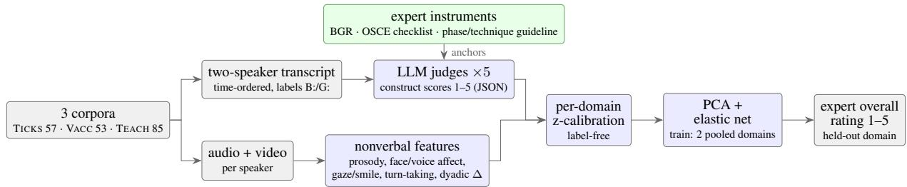
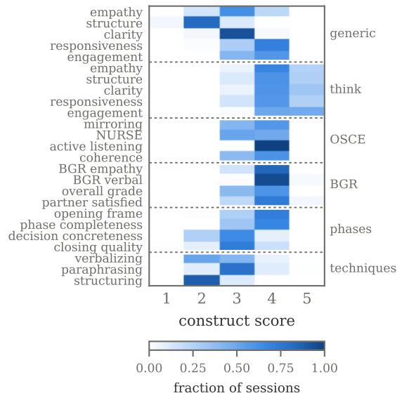
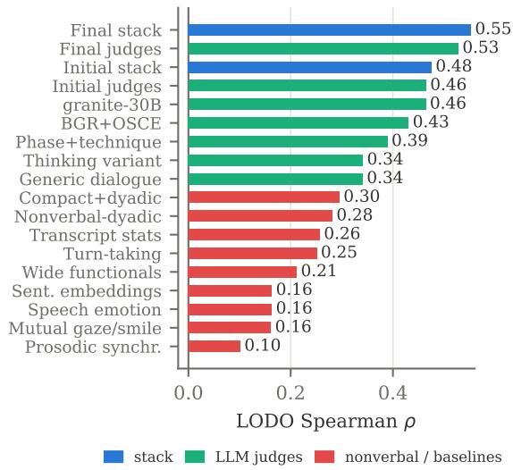

# Language Carries the Expert’s Impression: Instrument-Anchored LLM Judges Transfer Counseling-Quality Assessment and Beat In-Domain Training

Tobias Hallmen   
Chair for Human-Centered   
Artificial Intelligence   
University of Augsburg   
tobias.hallmen@uni-a.de

## Abstract

Automatic assessment of communication qual ity in dyadic counseling conversations is bottlenecked by data: expert-rated corpora are small and expensive to grow. We study cross-domain transfer of expert overall-impression prediction across three German corpora of simulated counseling (two general-practice medical, one school-related parent–teacher; n=195 expertrated sessions, one corpus after scale equating). Training on the other domains beats training indomain: leave-one-domain-out transfer reaches nested Spearman ρ = 0.54 against ≤ 0.48 within the target domain, a paired session-level gap of +0.15 that holds at +0.12 when the training-set sizes are matched, so it is not simply data volume. The decisive features are session-level construct scores from small open weight LLMs reading the two-speaker transcript, with the constructs largely derived from the experts’ rating instruments: the instrumentderived battery lifts a single judge from 0.32 to 0.41 over generic dialogue qualities, judges from three model families ensemble to 0.51 language-only, and a nonverbal-dyadic block adds +0.03 more, not separable from noise at this sample size. We also price the recording setup: one corpus lost its per-speaker audio, 16% of its diarised segments carry the wrong speaker, and repair is worth +0.07 there. At practically attainable corpus sizes, the expert’s overall impression is carried by what is said, and by other communication programs’ data more than by one’s own.

## 1 Introduction

Professional communication training programs in medicine and education rely on simulated conversations, such as objective structured clinical examinations (OSCEs) and parent–teacher role-plays, that are rated by human experts on global communication quality. Such ratings are expensive: they consume scarce expert time on top of the paid trained

Elisabeth André Chair for Human-Centered Artificial Intelligence University of Augsburg elisabeth.andre@uni-a.de

actors each simulation requires, and each such program produces only dozens of sessions, rated with program-specific instruments. Automating them would enable formative feedback at scale, but the obvious supervised route collides with the data reality: at 53–85 sessions per corpus, within-domain models plateau below the ceiling the ratings’ own reliability implies (Section 7).

This paper asks whether the assessment itself transfers: can a model trained on other counseling domains predict the expert’s overall impression in an unseen one? We work with three Germanlanguage corpora of simulated dyadic counseling conversations, each pairing a student with a simulated interlocutor: general-practice consultations about tick bites, vaccination counseling, and school-related parent–teacher conversations, each rated by domain experts on a 1–5 overall impression scale. The three settings are institutionally distinct but theoretically kin: their rating instruments descend from a shared construct system of counseling quality (structuring, empathy, conversation techniques), named and measured in discipline-specific ways (Section 3), and that lineage is what makes transfer plausible at all. We evaluate leave-one-domain-out (LODO): the test domain contributes no training sessions.

Our central finding is a modality attribution result. The nonverbal channel gets the strongest session-level representation we could build: widely used facial expression and speech emotion extractors, genuinely dyadic features (assessed-minusinterlocutor affect deltas, mutual gaze, mutual smiling, turn-taking and response latencies), and perdomain calibration. The nonverbal-dyadic block carries real signal (ρ = 0.28 LODO alone) yet is dominated by session-level construct scores from small open-weight LLMs reading the two-speaker transcript: the language-only judge ensemble transfers at ρ = 0.51, and the entire nonverbal block adds +0.03 on top. Crucially, the judges are not only generic quality prompts: their constructs are derived from the instruments the experts actually used, the Berlin Global Rating (Scheffer, 2009), an OSCE checklist of empathic techniques and a counseling phase/technique codebook (Hallmen et al., 2026). Being construct-level scores, they also name what a learner would practise rather than only scoring the session.

  
Figure 1: Pipeline. Both speakers’ transcripts feed LLM judges whose constructs are largely derived from the expert rating instruments; nonverbal-dyadic features come from the recordings. All low-dimensional blocks are z-calibrated per domain (features only), then a model trained on the two other domains predicts the held-out domain’s expert rating.

Contributions:

1. Cross-corpus transfer beats in-domain training. Pooling two foreign counseling corpora and testing leave-one-domain-out reaches Spearman 0.54, against ≤ 0.48 for cross-validation inside the target domain. At 53–85 rated sessions per corpus, a communication program’s neighbors are worth more than its own data, and cross-domain evaluation is the regime deployment on a new communication program actually requires.

2. Instrument-derived LLM judges. Sessionlevel construct scores from small local LLMs of three model families, the strongest of them asked the experts’ own constructs, are the single strongest feature family; we add model-sensitivity negative results and a seedaveraging remedy for a noisy judge.

3. What per-speaker capture is worth. One corpus lost its per-role audio to a microphone failure; against human speech-activity annotation, 16% of its diarised segments carry the wrong speaker, and restoring the attribution lifts that domain’s transfer by +0.07, to our knowledge the first estimate of speakerattribution error priced in downstream predictive validity rather than in diarization error rate (Section 6).

4. Modality attribution and robustness analysis. The nonverbal increment’s bootstrap interval includes zero; prosodic synchrony and sentence embeddings do not transfer; lowdimensional projection beats every selector we tried. Headline numbers use one fixed configuration, ensemble membership chosen by nested LODO and judges admitted by a labelfree gate; best-over-grid cells are reported separately as exploratory upper bounds.

## 2 Related Work

Assessing communication in simulated consultations. The corpora used here were collected in a family of studies on simulation-based communication training: expert Berlin-Global-Rating scores of standardized tick-bite consultations regressed on manually annotated nonverbal parameters and physiological arousal (Zerbini et al., 2025); FACS-coded smiling in vaccination counseling, which predicts the patient’s rating but not the experts’ (Schneider et al., 2025); and automatically extracted nonverbal features fed back to teacher students (Gietl et al., 2026; Hallmen et al., 2025a). The teacher–parent corpus additionally carries sentence-level annotations of conversational phases (Benien, 2003) and communication techniques, with encoder baselines that drop sharply when transferred to medical consultations (Hallmen et al., 2026). This line of work is correlational or single-domain. We predict the expert’s overall impression across domains and show the decisive information is in the transcript.

LLM judging and language-based counseling assessment. LLM-as-judge is established for evaluating machine-generated text (Zheng et al., 2023; Liu et al., 2023), though judges are documented to be position-biased and inconsistent (Wang et al., 2024; Stureborg et al., 2024), which matters more here because the judge is the instrument. We use it differently: as a feature extractor over human behavior, with constructs largely from validated rating instruments and small local open-weight models, a requirement in privacy-sensitive educational and medical settings. That language carries such signal is supported by psychotherapy research, where behavioral codes and session-level competence scores are predicted from transcripts (Flemotomos et al., 2022, 2021; Pérez-Rosas et al., 2019) and LLM rating scales score transcribed sessions (Eberhardt et al., 2025), all within one domain and with hundreds to thousands of sessions. Closest to our modality question, Schwartz et al. (2024) predict therapy outcome from nonverbal, paraverbal and verbal layers of session video, though with shallow language features rather than a language model. At 53–85 sessions per domain, instrumentanchored judging plus cross-domain pooling replaces both the large corpus and the in-domain training data.

Closest in setting, Wang and Demszky (2023) score classroom instruction zero-shot against a validated instrument and Ramakrishnan et al. (2023) estimate CLASS dimensions from classroom video, both within one instrument. That text dominates other modalities is familiar from multimodal prediction of human impressions (Naim et al., 2018); we test whether it survives a change of domain.

Cross-corpus generalization. Cross-corpus evaluation is a known stress test in affective computing, where models degrade sharply across recording conditions, annotation schemes and populations (Gideon et al., 2019). The three corpora share the counseling setting and a construct lineage (Section 3), which is what makes transfer a reasonable hypothesis here; per-domain z-calibration is a simple label-free instance of the same idea, applied to judge scores rather than representations.

## 3 Data

The data are three German-language corpora of simulated dyadic counseling conversations from communication training programs at a German university, described in the corpus publications cited in Section 2. In each session one assessed person (medical student or teacher-education student) converses with a simulated interlocutor (a trained actor, or a peer in role). All three collections were designed for per-speaker capture, one camera on each participant’s face and one microphone per participant, so that role attribution follows from the channel rather than from a model. In VACC the perrole audio was lost to a lapel-microphone failure, so its speaker labels come from diarising the mixed channel; we restore role attribution against human speech-activity annotation (Section 6), which recovers the role attribution the other two get from the channel, though overlap-based features remain zero by construction. Its per-role video is unaffected.

TICKS (57 sessions): simulated general-practice consultations in which a standardized patient worries about a tick bite she has already removed; embedded in a longitudinal communication curriculum (Zerbini et al., 2024), expert rated with the Berlin Global Rating (Zerbini et al., 2025; Scheffer, 2009). VACC (53 sessions): simulated vaccination counseling in which a trained actor plays a parent hesitant about the scheduled vaccination of their three-month-old infant; BGR-rated by communication experts (Schneider et al., 2025). TEACH (85 sessions): simulated parent–teacher conversations from a counseling-competence seminar, peer role-plays and final simulations with professional actors (Hallmen et al., 2026, 2025a); experts rated an overall-impression item.

TICKS and VACC are the closer pair: same institution, BGR instrument and doctor–patient dyad, and a rater pool overlapping by one person, though topic, actor and recording differ. TEACH shares none of these. For all three corpora we include every session with a complete audio-video recording and an available expert overall rating at analysis time; session counts therefore differ from the analysis subsets reported in the respective publications, which also report the participant demographics.

The prediction target is the expert’s overall impression of the assessed person (1–5, higher is better): the BGR overall item (Gesamteindruck) for the two medical corpora and the corresponding global item of the teacher questionnaire. Each session carries one target rating; the extra raters in Table 1 rate overlap subsets only, and even these calibrated experts agree exactly on only a minority of sessions (pairwise exact .42–.47; designs and arithmetic in Appendix A). Our targets are therefore effectively single-rater scores read through a noisy instrument, which is what the ceiling argument of Section 7 rests on. The TEACH overall item also changed from a five-point to a four-point scale after those first 24 sessions, and the four-point answers were stored rounded onto categories the fivepoint era already occupies. We invert that rounding and re-spread them, so both eras share one scale; Appendix A scores the candidate codings against a coding-free within-era reference and reports what the choice is worth. Both medical corpora additionally contain the standardized patient’s and the student’s own BGR ratings, which we use to estimate human cross-perspective agreement (Appendix C). Targets are ordinal school-grade-like levels concentrated on 3–4, which motivates rank over absoluteerror metrics (Section 4.4). Notably the instruments share a construct system across disciplines: the teacher questionnaire’s subscales mirror the BGR’s item structure and its items operationalize the same techniques (paraphrasing, active listening, offering support) that the medical OSCE checklist anchors: one concept of counseling quality, named and measured in discipline-specific ways, and arguably a precondition for the transfer we measure.

<table><tr><td></td><td>TICKS</td><td>VACC</td><td>TEACH</td></tr><tr><td>sessions</td><td>57</td><td>53</td><td>85</td></tr><tr><td>duration (min)</td><td>7.1±0.6</td><td>6.9±0.9</td><td>9.5±2.3</td></tr><tr><td>assessed role</td><td>doctor</td><td>doctor</td><td>teacher</td></tr><tr><td>interlocutor role</td><td>patient</td><td>patient</td><td>parent</td></tr><tr><td>target instrument</td><td>BGR</td><td>BGR</td><td>global item</td></tr><tr><td>rating</td><td>1-5</td><td>1-5</td><td>1-5 / 1-4</td></tr><tr><td>expert raters</td><td>2</td><td>4</td><td>4</td></tr><tr><td>agreement (ICC)</td><td>.80</td><td>.77-.85</td><td>.53-.82</td></tr></table>

Table 1: Corpora. Berlin Global Rating overall impression (BGR; inverted so 5 = best). ICC = between-expert agreement on the double-rated subsets for TICKS/VACC, and single-rater/average-rater ICC(2,1)–ICC(2,k) on the four-rater panel for TEACH, which rated a parallel overall item rather than the target one (Appendix A). TEACH switched its overall item from five to four points after the first 24 sessions (Appendix A).

## 4 Method

Every session is reduced to one vector of sessionlevel scalars, drawn from the feature families below, and a single rating is predicted from it under the transfer protocol of Section 4.4.

## 4.1 Feature families

All automatic processing runs as modules of the DISCOVER platform (Hallmen et al., 2025b): transcripts come from its WhisperX module (Bain et al., 2023), with human-assisted speaker diarization where the per-role audio is missing (VACC), and every extractor named below is a DISCOVER module as well. All features are session-level scalars over the assessed role (and, for dyadic features, the interlocutor).

Wide functionals baseline. eGeMAPS (Eyben et al., 2016) low-level descriptors (88), extracted with openSMILE (Eyben et al., 2013), OpenFace 2.0 (Baltrušaitis et al., 2018) action units (17) and EmotiEffLib (Savchenko, 2023) facial valence/arousal (2), each summarized by five functionals, plus facial expression time fractions (8), transcript-sentiment functionals (Barbieri et al., 2022) and gaze/smile statistics: 563 features, a deliberate dimensionality baseline.

Compact summary and dyadic deltas. One scalar per channel, 14 features (cmp): pitch mean/std, loudness, sentiment, gaze and smile rates, happy/neutral expression fractions, words per second, speech-emotion valence/arousal/dominance (Wagner et al., 2023) and facial valence/arousal, plus the assessed-minus-interlocutor difference of the same 14 (dlt).

Nonverbal-dyadic block. The deltas, plus mutual gaze and mutual smile (interval intersection of both speakers’ segments), turn-taking statistics from the two transcripts (response latencies both ways, interruption and overlap fractions, speakingtime share, turns per minute, turn lengths), and windowed prosodic synchrony (correlation and lead– lag of pitch/loudness). The block is dyadic rather than strictly non-linguistic: turn-taking is timed from the transcripts, and the deltas include speech rate and transcript sentiment. Appendix D reports a strictly audio-visual variant.

Shallow transcript statistics. Seven ratenormalized surface features of the assessed role’s transcript: segments and words per minute, mean word length, question fraction, speaking-time share, mean segment duration, and the fraction of unfinished segments, a disfluency marker for students who run out of words mid-turn under pressure. The block is paraverbal, measuring how much is said rather than what, and involves no language understanding.

Sentence embeddings. Duration-weighted means of multilingual sentence embeddings (Reimers and Gurevych, 2019) as a highdimensional text baseline (paraphrase-multilingual-MiniLM-L12-v2, 384-dim), plus three further embedders spanning an untrained floor to a current mixture-of-experts model; none transfers (Section 5).

  
Figure 2: Score distributions over the 195 sessions. Row blocks are construct groups by source instrument (the inventory is Table 4); the generic battery appears twice, once per model, and the cross-family BGR+OSCE runs are omitted. Most constructs occupy a 3–4 band, but discriminative signal survives per-domain calibration.

## 4.2 Instrument-anchored LLM judges

The core feature family: a small local LLM reads the entire two-speaker transcript, time-ordered and speaker-labeled with domain-neutral tags (B: assessed, G: interlocutor, after German Bewertete(r) and Gesprächspartner(in); no professions, so no domain priors), and returns session-level construct ratings (1–5) as JSON.

The prompt caps the transcript at 16k characters, which no session reaches: the longest transcript is 15.2k characters and the longest prompt built from it 18k. Nor did any run approach the generation budget: the think-mode judge, the only configuration where prompt and budget could collide, spends 455–780 generated tokens on its seven longest sessions, whose prompts measure 4186– 4469 tokens, well below the 8192-token context we pin. Three groups of constructs (batteries), all German, run on five models from four open-weight families (Gemma Team, 2025; Qwen Team, 2025; IBM Research, 2026; Abdin et al., 2024); five of the eight resulting judges enter the final ensemble, and Table 4 in Appendix B is the inventory:

• Generic dialogue battery: empathy, structure, clarity, responsiveness, engagement, with strict scale anchors. Run on gemma3- 12B and, for decorrelated errors, on a reasoning model (qwen3-14B in thinking mode).

• BGR+OSCE battery: constructs derived from the experts’ instruments, with their level descriptions quoted and abridged to prompt length: BGR items (empathy, verbal expression, overall impression as an inverted school grade, flipped so 5 = best) and an OSCE checklist of empathic techniques (mirroring, NURSE (Back et al., 2005), active listening, coherence) from the medical communication curriculum (Zerbini et al., 2024), plus a perspective-flip item (“how satisfied does G leave?”). This is the battery we run across model families; the seed-noisy qwen3.6 judge enters as the mean over three sampling seeds.

• Phase+technique battery: constructs from a counseling phase model and technique codebook (Hallmen et al., 2026; Benien, 2003): opening frame, phase completeness, concreteness of the decision phase, closing quality, verbalizing, paraphrasing, structuring.

Each instrument-anchored battery carries one discipline’s instruments, and every judge runs on all three corpora.

Asking the judge for the construct the experts rate is the design goal, not a leak: the judge is zeroshot and never sees a rating, and TEACH, whose rating instrument the judges do not quote, is the strongest fold.

Derived, not transcribed. The batteries operationalize the instruments rather than replay them, and the mapping is deliberately not one-to-one; Appendix C gives it, with the argument for deriving constructs rather than quoting items.

Generation uses model-card sampling parameters with pinned seeds and seed-bumped retries; all 195 sessions parse within three attempts for every judge. Candidate models pass a label-free screening gate before any full run: on 30 pilot sessions a candidate must return a parseable object within three seeded attempts for $\geq 9 0 \%$ of sessions and keep a mean per-construct standard deviation $\geq 0 . 3 5$ . That gate is on between-session variance, whether a judge separates conversations at all, and within-session variance, whether it repeats its own score, is measured separately (Section 6). It excludes ceiling collapse rather than certifying quality; survivors clear both gates, at 100% parse and 0.37–0.80 spread. Both gates read model outputs only, so no judge enters for agreeing with the target; prompt wording was screened against targets separately (Appendix B). Four negative results: gemma4-12B (Gemma Team, 2026) and granite4.1-8B collapse to the scale ceiling despite the anchors, and reasoning modes repeatedly break the JSON contract (qwen3.5-27B mostly unparseable; qwen3.6-27B (Qwen Team, 2026) in think mode parses only 63%).

The surviving judges still rate conservatively, and two BGR+OSCE constructs are effectively constant (Figure 2); we keep them and let variance thresholding drop dead columns, and per-domain calibration (below) recovers discriminative signal from the compressed band.

## 4.3 Per-domain calibration

Judge scores and compact features receive perdomain z-standardization (feature marginals only, no target). This removes instrument and register offsets: a judge’s “3” sits at a different point of the quality range in a clinical consultation than in a parent conversation. The marginals include the held-out domain, so the step is transductive and assumes a batch of unlabelled target sessions.

## 4.4 Protocol

LODO: train on two pooled domains, test on the third; report the mean over the three folds. We report two selection protocols: nested, with the judge-ensemble variant chosen inside the fold on an inner leave-one-training-domain-out split, and fixed, one configuration applied to every feature set. They agree to within .01, which the selector plateau of Appendix D explains, so we headline the nested number and quote the fixed one alongside as the cheaper recipe (one fit per fold against roughly 1200). In-domain reference: 5-fold CV within each domain. All models are leakage-safe sklearn pipelines: median imputation → variance threshold → standardization → selector → regressor. Imputation handles missing values with identifiable causes, not random gaps: absent per-role streams, one corpus’s diarised audio without perrole acoustics, and one session whose face mask silently corrupted every facial feature while detector confidence stayed high. Selectors are univariate F-score selection, mutual-information selection (Kraskov et al., 2004), recursive feature elimination (Guyon et al., 2002) and PCA (Wold et al.,

  
Figure 3: Modality attribution under LODO transfer: the language-based judges dominate; every nonverbal family, and the surface transcript statistics grouped with them, stays below the weakest instrument-anchored judge. Initial = four judges before the cross-family runs and the repair of Section 6;final = five after both, which also drops the phase+technique judge, so the sets are not nested. Stack = those judges plus the compact block, its deltas and prosody, not the nonverbal-dyadic set.

1987); regressors are ridge (Hoerl and Kennard, 2000), elastic net (Zou and Hastie, 2005), RBF-SVR (Smola et al., 1997), gradient boosting (Friedman, 2001) and all-threshold ordinal regression (Rennie and Srebro, 2005); the grids are enumerated in Appendix F. We compare on Spearman ρ; MAE saturates and rewards mean-collapse, so we report it only for completeness. Where a choice among judge-ensemble variants is reported it is made by the nested protocol above, so the held-out domain never informs it. The feature set, selector and regressor are not nested this way; nesting them too over the whole grid returns the same $\rho = . 5 4 2$ (Appendix D).

## 5 Results

All numbers below use the de-rounded TEACH target (Appendix A); the repaired VACC attribution (Section 6) applies to the final ensembles and rebuilt blocks, not to the single-judge and initial rows.

Transfer beats in-domain. The best withindomain CV cell in the entire grid reaches $\rho = 0 . 4 8$ on the sweep’s single split and 0.47 when the strongest cells are re-scored over 20 splits (Appendix D). LODO transfer reaches 0.54 nested (folds 0.56/0.50/0.57) and 0.55 fixed; trained across domains versus within them on the same sessions, the paired gap is +0.15 (95% CI $[ + 0 . 1 0 , + 0 . 1 9 ]$ , Section 6). At 53–85 sessions per domain, two foreign domains beat the domain itself for every stack and judge block; only the two weakest text baselines of Table 2 fit better indomain, both at $\rho \le . 3 0$ . Adding the domain’s own data to the foreign pool does not help either: it is worse in all six domain × feature-set cells, by .02 on average, so this is not merely a cold-start result (Appendix D). Nor is it a training-set-size artifact: subsampled to the size the in-domain reference trains on, the foreign training set loses .03 (.551 → .521) and still wins in every fold (96– 100% of 200 draws), so transfer is nearly flat in training size where in-domain training is not. The in-domain reference is itself unstable: over 20 splits it averages .46 language-only (±.03) against the sweep’s single-split .42, narrowing the matchedsize gap to +.06 language-only and +.12 for the stack. At the fixed configuration the judges also predict better in-domain (.46 over 20 splits against the stack’s .41, where Table 2’s best-cell singlesplit CV column orders them the other way), so the smaller language-only transfer margin reflects stronger in-domain fitting, not weaker transfer.

<table><tr><td rowspan="2">Feature set</td><td colspan="2">LODOρ</td><td rowspan="2">CVρ best</td></tr><tr><td>fixed</td><td>best</td></tr><tr><td>Language: LLM judges</td><td></td><td></td><td></td></tr><tr><td>final ensemble (5 judges)</td><td>.528</td><td>.528</td><td>.453</td></tr><tr><td>initial ensemble (4 judges)</td><td>.450</td><td>.465</td><td>.416</td></tr><tr><td>granite-30B judge</td><td>.448</td><td>.464</td><td>.405</td></tr><tr><td>BGR+OSCE judge</td><td>.418</td><td>.431</td><td>.293</td></tr><tr><td>qwen3.6 judge (3-seed mean)</td><td>.375</td><td>.403</td><td>.368</td></tr><tr><td>phase+technique judge</td><td>.361</td><td>.389</td><td>.323</td></tr><tr><td>phi4-14B judge (declined)</td><td>.314</td><td>.351</td><td>.269</td></tr><tr><td>generic dialogue judge</td><td>.321</td><td>.341</td><td>.203</td></tr><tr><td>Language + nonverbal</td><td></td><td></td><td></td></tr><tr><td>final + compact+deltas</td><td>.545</td><td>.545</td><td>.471</td></tr><tr><td>+ prosody</td><td>.551</td><td>.553</td><td>.465</td></tr><tr><td>initial + compact+deltas</td><td>.467</td><td>.476</td><td>.370</td></tr><tr><td>without phase judge</td><td>.465</td><td>.465</td><td>.352</td></tr><tr><td>Nonverbal and surface baselines</td><td></td><td></td><td></td></tr><tr><td>compact+deltas</td><td>.161</td><td>.295</td><td>.249</td></tr><tr><td>nonverbal-dyadic (z)</td><td>.008</td><td>.281</td><td>.173</td></tr><tr><td>+ prosody</td><td>.164</td><td>.292</td><td>.229</td></tr><tr><td>shallow transcript stats</td><td>.052</td><td>.257</td><td>.296</td></tr><tr><td>turn-taking only</td><td>.000</td><td>.251</td><td>.140</td></tr><tr><td>wide functionals</td><td>.192</td><td>.212</td><td>.184</td></tr><tr><td></td><td></td><td></td><td>.176</td></tr><tr><td>sentence embeddings</td><td>.052</td><td>.163</td><td></td></tr></table>

Table 2: Main results (Spearman ρ). fixed = one configuration for all feature sets (PCA-10 + elastic net; a plateau width, not a tuned one, Appendix D); best = best selector × regressor per feature set (Appendix F). LODO = mean over three held-out domains, $\mathrm { C V } = 5 .$ fold within domain. Bold = best cell in the column; underlined = best language-only cell in the column: it is within .03 of the bold everywhere, while the whole nonverbal block stays below .30. Ensemble membership among the final judges is chosen by nested LODO (ρ = .513 language-only, .542 with the nonverbaldyadic block, Section 6). Nonverbal blocks are quoted at their best cell throughout, so the modality comparison is stacked against our own conclusion.

Language dominates. The four initial judges transfer at 0.450 and the final five-judge ensemble at 0.528; the nonverbal-dyadic block, which reaches 0.281 alone at its best cell, adds +0.03 under nested selection (Section 6), while wide functionals, embeddings and every single-channel nonverbal family stay at $\rho \leq 0 . 2 6$ (Table 2, Figure 3). Shallow transcript statistics reach 0.26, so the gap is made by language understanding, not surface talk statistics.

The constructs matter, the quoted anchors do not. At fixed model and transcript, asking the experts’ constructs instead of generic dialogue qualities raises transfer from 0.321 to 0.414, a comparison that also varies construct count and prompt length; quoting their level descriptions, with the battery fixed, adds +.004, inside seed noise (Appendix C). Judges from different instruments ensemble to 0.450. The phase+technique judge is useful alone (0.389 at its best cell) but adds only +.01 next to the BGR+OSCE judge at the fixed configuration, consistent with their construct overlap.

Projection beats selection. On one matched grid PCA is the best selector family (.274 against .259/.247/.231 for F-score, RFE and mutual information): the judge scores are inter-correlated, and selection discards what projection preserves. The headline is insensitive to the width, returning ρ = .551 from 3 to 50 components and .552 at 2 (Appendix D).

Negative results. Prosodic synchrony dilutes every combination it enters, and sentence embeddings transfer worst of all text representations $( \rho \le . 2 3$ across four embedder generations).

## 6 Final System and Ablations

The final ensemble. One judge (qwen3.6-27B) reproduces only 44–56% of its scores across seeds against 80–98% for the others, so it enters as a three-seed mean (0.26 → 0.38 solo). With that judge and the repaired attribution, nested LODO selection over ensemble memberships (Section 4.4) yields a language-only ensemble at $\rho =$ 0.513 (folds .48/.46/.59), though membership varies: TICKS drops qwen3.6, so .513 averages two memberships (the nonverbal-dyadic stack selects one candidate in all three); granite4.1-30B is the strongest single judge (0.464 alone, within .01 of the entire initial four-judge ensemble, 0.465). The phi4-14B judge is a candidate too but is declined in all three inner folds: band-compressed, weak alone (0.351) and worth −.017 in the ensemble (.528 → .511).

Pairing that ensemble with the complete nonverbal-dyadic block, the variant the inner folds select in all three, lifts it to $\rho = \mathbf { 0 . 5 4 } 2$ ; Table 2’s stack rows use the compact block and its deltas instead, and Table 15 reports both per fold. A paired session-level bootstrap $( 1 0 ^ { 4 }$ resamples, stratified by domain) puts that increment at +.029, 95% CI $[ - . 0 1 2 , + . 0 7 2 ]$ . The TEACH fold is negative (−.023), so the sign is not stable across folds and the increment is not separable from noise at n=195. Swapping it for the compact features and their deltas gives ρ = .530 (+.018, CI $[ - . 0 1 9 , + . 0 5 4 ] )$ , reported separately because that block is not modality-clean. The same bootstrap separates the transfer claim cleanly: against the in-domain model on the same sessions the gap is +.15 (CI [+.10, +.19]) for the stack and +.07 $( [ + . 0 5 , + . 0 9 ] )$ language-only, positive in every resample. Language still supplies the great majority of the .542.

What the second microphone is worth. VACC lost its per-role audio (Section 3) and is the one fold that stops improving as the judges strengthen. Against its human speech-activity annotation, 16.1% of diarised segments carried the wrong speaker; restoring the attribution lifts that fold by +0.07 and the LODO mean by +.05 (Appendix A).

## 7 Discussion

How high is the ceiling? An out-of-domain Spearman of 0.54 should be read against how well humans agree, not against 1.0. Our targets are effectively single-rater, and attenuation (Spearman, 1904) bounds even a perfect model near ICC: indicatively .73 on TEACH (single-rater ICC(2,1)

= .53) and .88–.92 on the medical corpora (doublerated subset ICCs .77–.85). Against them 0.54 is roughly 75% of what the noisiest target allows and 60% of the cleanest. It also agrees with the expert better than the other people in the room do. That bound is indicative rather than strict, and Appendix C gives both readings.

Why does language win? The expert instruments are themselves largely language-defined, and the one construct our judges cannot see, BGR’s nonverbal item, is not needed for transfer at 0.51. The result is not that nonverbal behavior is irrelevant, since the dyadic block reaches 0.28 at its best cell, but one of proportion: a conversation closing with a concrete, appreciated agreement rarely had hostile body language, so part of what experts perceive nonverbally is plausibly encoded in the transcript.

Deployment view. Acceptance studies on these communication programs report that learners ask for interpreted, construct-level statements rather than bare numbers (Bauermann et al., 2025; Gietl et al., 2026). A predictor that carries the expert’s judgment into a program that trained none of it is the step before that, and what we validate is its aggregate output, which ranks sessions rather than scoring them.

## 8 Conclusion

Across three small German corpora, an expert’s overall impression of counseling quality is predictable in a domain that contributed no training data (nested LODO $\rho ~ = ~ 0 . 5 4 )$ , beating every within-domain model we fit. Language carries it.

For a communication program with 53–85 rated sessions this is usable rather than curious: other programs’ data is the better training set, the judges are open-weight models small enough to run on institutional hardware, so no recording leaves the institution, and a rank-valid predictor already shows such programs which learners and which skills to look at first, without the expert time that currently limits how often sessions get rated. The judges score instrument constructs, so a low one names what to practise. Whether those scores are valid item by item, and whether the feedback helps learners, needs a long-term controlled study; producing it automatically, and calibrating it well enough to report levels rather than an ordering, is future work.

## Limitations

Data. All conversations are simulated role-plays with actor or peer interlocutors; real consultations carry higher emotional stakes and power asym metries that simulations may not reproduce. All corpora are German and from a single university, though from different disciplines; n=195 sessions across three domains means the LODO estimate it self rests on three folds, and per-fold numbers vary (0.50–0.57 for the final stack, 0.46–0.59 language only); the paired bootstrap of Section 6 resolves the transfer gap but not the +0.03 nonverbal increment at this sample size. Targets are effectively single rater per session with strong concentration on the middle of the scale, bounding both learnability and measurable performance; the small doubly-rated overlap in one corpus limits formal IRR estima tion. Grouping. Cross-validation folds are not grouped by participant, actor or rater. Each session has a distinct assessed student, so no student ap pears on both sides of a split, but actors and raters do recur: TICKS uses a single standardized patient throughout, and the VACC and TEACH raters split their corpora rather than rating all of it. Leave one-actor-out is therefore degenerate in one corpus and leave-one-rater-out leaves too few sessions per group to estimate anything, so we cannot separate what the model learns about counseling quality from what it learns about a particular actor’s man ner or a particular rater’s severity. Transductive calibration. The per-domain standardization uses the held-out domain’s own feature marginals, so the pipeline as evaluated assumes a batch of unla belled sessions from the target program rather than a single incoming session. That matches how a program with a cohort would adopt it, but not per session scoring at intake. Ranking, not scoring. The predicted means conditional on each rating level span under a point of the five-point range, so the evidence supports ordering sessions rather than scoring them on a calibrated scale; a deploy ment reporting numbers would need recalibration first (Appendix E). Scope of the claim. “Language carries the expert impression” is a statement about predicting a global 1–5 judgment on corpora whose sessions run from mediocre to very good. Across that range the channels are not independent: a ses sion in which the nonverbal behavior was genuinely poor would be unlikely to earn a high expert rating in the first place, so some of what the nonverbal block could contribute is already implied by the level of the conversation. The finding is one of proportion at this range and sample size, and it says nothing about formative feedback, where a behavior can be worth naming to a learner without adding predictive variance. Judges. The LLM judges show compressed rating bands (mostly 3– 4); two constructs collapsed to constants and contribute nothing. We prompt in German because the transcripts are German, which keeps prompt and material in one language but also means the judges apply whatever notion of good counseling their pretraining associates with German-language text; that notion is neither documented nor controllable, and generalization to other rating cultures and languages is untested. Judge scores are also not deterministic functions of the transcript alone (sampling with pinned seeds), and prompt wording matters: a sibling model family (gemma4) collapsed to the scale ceiling. Extractors. Extractor failures can be silent, and per-session validation is therefore necessary; detector confidence does not reveal them (Section 4.4). Nonverbal channel. Our attribution holds for current mid-size extractors (facial expression, speech emotion, gaze/smile segments, turn-taking); stronger visual backbones or interaction-specific pretraining could shift the balance. One domain lost its per-speaker audio, so its overlap-based turn-taking features are zero by construction and its voice features come from the mixed channel; restoring role attribution (Section 6) repairs its transcript-derived features but cannot separate the two voices after the fact.

## Ethical Considerations

All conversations are simulated role-plays between consenting adult students and trained actors or peers, recorded within the regular curricula of the students’ degree programs; the underlying data collections have documented ethics approvals and consent procedures in the respective corpus publications (Zerbini et al., 2025; Schneider et al., 2025; Hallmen et al., 2026). Automatic communication scoring is intended for formative feedback, not for high-stakes decisions; we report domain transfer precisely because deploying an in-domaintrained scorer on new populations without validation would be unsafe. No personally identifying data leaves the institution’s infrastructure; all LLM inference runs on local open-weight models. We have not established that the scores are equally valid across speaker groups: the corpora are too small and their demographic records too incomplete to estimate subgroup performance, the judges pretraining may carry register and accent priors, and the diarisation error we measure in one corpus need not fall evenly across speakers. Differential validity is therefore untested, which is a reason to keep such scores formative and paired with human review.

## Acknowledgments

This work was partially funded by the KodiLL project (FBM2020, Stiftung Innovation in der Hochschullehre).

## References

Marah Abdin, Jyoti Aneja, Harkirat Behl, Sébastien Bubeck, Ronen Eldan, Suriya Gunasekar, Michael Harrison, Russell J Hewett, Mojan Javaheripi, Piero Kauffmann, et al. 2024. Phi-4 technical report. arXiv preprint arXiv:2412.08905.

Anthony L Back, Robert M Arnold, Walter F Baile, James A Tulsky, and Kelly Fryer-Edwards. 2005. Approaching difficult communication tasks in oncology 1. CA: a cancer journal for clinicians, 55(3):164– 177.

Max Bain, Jaesung Huh, Tengda Han, and Andrew Zisserman. 2023. WhisperX: Time-accurate speech transcription of long-form audio. In Proc. INTER-SPEECH 2023, pages 4489–4493.

Tadas Baltrušaitis, Amir Zadeh, Yao Chong Lim, and Louis-Philippe Morency. 2018. OpenFace 2.0: Facial behavior analysis toolkit. In 2018 13th IEEE International Conference on Automatic Face & Gesture Recognition (FG 2018), pages 59–66. IEEE.

Francesco Barbieri, Luis Espinosa Anke, and Jose Camacho-Collados. 2022. Xlm-t: Multilingual language models in twitter for sentiment analysis and beyond. In Proceedings of the thirteenth language resources and evaluation conference, pages 258–266.

Moritz Bauermann, Thomas Rotthoff, Tobias Hallmen, Miriam Kunz, Elisabeth André, and Ann-Kathrin Schindler. 2025. Medical students’ perceptions of aibased feedback and feedforward on communication skills in doctor–patient consultation - an acceptance study in a video-based simulation. Medical Education Online, 30(1):2592414. PMID: 41324408.

Karl Benien. 2003. Schwierige gespräche führen. Modelle für Beratungs-, Kritik-und Konfliktgespräche im Berufsalltag. Rowohlt, Reinbeck bei Hamburg.

Mayla Boguslav and Kevin Bretonnel Cohen. 2017. Inter-annotator agreement and the upper limit on machine performance: Evidence from biomedical natural language processing. In MEDINFO 2017:

Precision Healthcare through Informatics, volume 245 of Studies in Health Technology and Informatics, pages 298–302. IOS Press.

Steffen T Eberhardt, Antonia Vehlen, Jana Schaffrath, Brian Schwartz, Tobias Baur, Dominik Schiller, Tobias Hallmen, Elisabeth André, and Wolfgang Lutz. 2025. Development and validation of large language model rating scales for automatically transcribed psychological therapy sessions. Scientific Reports, 15(1):29541.

Florian Eyben, Klaus R Scherer, Bjorn W Schuller, Johan Sundberg, Elisabeth André, Carlos Busso, Laurence Y Devillers, Julien Epps, Petri Laukka, Shrikanth S Narayanan, et al. 2016. The geneva minimalistic acoustic parameter set (gemaps) for voice research and affective computing. IEEE transactions on affective computing, 7(2):190–202.

Florian Eyben, Felix Weninger, Florian Gross, and Björn Schuller. 2013. Recent developments in openS-MILE, the Munich open-source multimedia feature extractor. In Proceedings of the 21st ACM International Conference on Multimedia, pages 835–838.

Nikolaos Flemotomos, Victor R Martinez, Zhuohao Chen, Torrey A Creed, David C Atkins, and Shrikanth Narayanan. 2021. Automated quality assessment of cognitive behavioral therapy sessions through highly contextualized language representations. PloS one, 16(10):e0258639.

Nikolaos Flemotomos, Victor R Martinez, Zhuohao Chen, Karan Singla, Victor Ardulov, Raghuveer Peri, Derek D Caperton, James Gibson, Michael J Tanana, Panayiotis Georgiou, et al. 2022. Automated evaluation of psychotherapy skills using speech and language technologies. Behavior research methods, 54(2):690–711.

Jerome H Friedman. 2001. Greedy function approximation: a gradient boosting machine. Annals of statistics, 29(5):1189–1232.

Gemma Team. 2025. Gemma 3 technical report. https://goo.gle/Gemma3Report. Technical report, published by Google via Kaggle.

Gemma Team. 2026. Gemma 4 technical report. Preprint, arXiv:2607.02770.

John Gideon, Melvin G McInnis, and Emily Mower Provost. 2019. Improving cross-corpus speech emotion recognition with adversarial discriminative domain generalization (addog). IEEE Transactions on Affective Computing, 12(4):1055–1068.

Kathrin Gietl, Karoline Hillesheim, Moritz Bauermann, Tobias Hallmen, and Andreas Hartinger. 2026. Förderung der beratungskompetenz von studierenden des lehramts an grundschulen durch simulierte elterngespräche und ki-basiertes feedback. erste ergebnisse aus einem interdisziplinären projekt. In Markus Peschel, Pascal Kihm, Melanie Platz, and Lea Marie

Gebauer, editors, Bezugsnotwendigkeiten der Grundschule. Pädagogik und Fachdidaktik in der Grundschulbildung., Jahrbuch Grundschulforschung. 29, pages 321–330. Verlag Julius Klinkhardt, Bad Heilbrunn.

Isabelle Guyon, Jason Weston, Stephen Barnhill, and Vladimir Vapnik. 2002. Gene selection for cancer classification using support vector machines. Machine learning, 46(1):389–422.

Tobias Hallmen, Kathrin Gietl, Karoline Hillesheim, Moritz Bauermann, Annemarie Friedrich, and Elisabeth André. 2025a. Ai-based feedback in counselling competence training of prospective teachers. Preprint, arXiv:2505.03423.

Tobias Hallmen, Kathrin Gietl, Karoline Hillesheim, Annemarie Friedrich, and Elisabeth André. 2026. Annotating conversational phases and communication techniques: A corpus of german teacher-parent counseling conversations. In Proceedings ofthe Fifteenth Language Resources and Evaluation Conference (LREC 2026), pages 6361–6372, Palma, Mallorca, Spain. European Language Resources Association (ELRA).

Tobias Hallmen, Dominik Schiller, Antonia Vehlen, Steffen Eberhardt, Tobias Baur, Daksitha Withanage Don, Wolfgang Lutz, and Elisabeth André. 2025b. Discover: a data-driven interactive system for comprehensive observation, visualization, and exploration of human behavior. Frontiers in Digital Health, 7:1638539.

Arthur E Hoerl and Robert W Kennard. 2000. Ridge regression: Biased estimation for nonorthogonal problems. Technometrics, 42(1):80–86.

IBM Research. 2026. Granite 4.1 language models. https://huggingface.co/blog/ ibm-granite/granite-4-1. Accessed: 2026-04-28.

Alexander Kraskov, Harald Stögbauer, and Peter Grassberger. 2004. Estimating mutual information. arXiv preprint cond-mat/0305641, 69(6).

Yang Liu, Dan Iter, Yichong Xu, Shuohang Wang, Ruochen Xu, and Chenguang Zhu. 2023. G-eval: NLG evaluation using gpt-4 with better human alignment. In Proceedings of the 2023 Conference on Empirical Methods in Natural Language Processing, pages 2511–2522, Singapore. Association for Computational Linguistics.

Iftekhar Naim, Md. Iftekhar Tanveer, Daniel Gildea, and Mohammed Ehsan Hoque. 2018. Automated analysis and prediction of job interview performance. IEEE Transactions on Affective Computing, 9(2):191– 204.

Fabian Pedregosa, Francis Bach, and Alexandre Gramfort. 2017. On the consistency of ordinal regression methods. Journal of Machine Learning Research, 18(55):1–35.

Fabian Pedregosa, Gaël Varoquaux, Alexandre Gramfort, Vincent Michel, Bertrand Thirion, Olivier Grisel, Mathieu Blondel, Peter Prettenhofer, Ron Weiss, Vincent Dubourg, et al. 2011. Scikit-learn: Machine learning in python. the Journal ofmachine Learning research, 12:2825–2830.

Verónica Pérez-Rosas, Xinyi Wu, Kenneth Resnicow, and Rada Mihalcea. 2019. What makes a good counselor? learning to distinguish between high-quality and low-quality counseling conversations. In Proceedings of the 57th annual meeting of the associationfor computational linguistics, pages 926–935.

Barbara Plank. 2022. The “problem” of human label variation: On ground truth in data, modeling and evaluation. In Proceedings of the 2022 Conference on Empirical Methods in Natural Language Processing, pages 10671–10682.

Qwen Team. 2025. Qwen3 technical report. Preprint, arXiv:2505.09388.

Qwen Team. 2026. Qwen3.6-27B: Flagship-level coding in a 27B dense model.

Anand Ramakrishnan, Brian Zylich, Erin Ottmar, Jennifer LoCasale-Crouch, and Jacob Whitehill. 2023. Toward automated classroom observation: Multimodal machine learning to estimate CLASS positive climate and negative climate. IEEE Transactions on Affective Computing, 14(1):664–679.

Nils Reimers and Iryna Gurevych. 2019. Sentence-bert: Sentence embeddings using siamese bert-networks. In Proceedings of the 2019 conference on empirical methods in natural language processing and the 9th international joint conference on natural language processing (EMNLP-IJCNLP), pages 3982–3992.

Jason DM Rennie and Nathan Srebro. 2005. Loss functions for preference levels: Regression with discrete ordered labels. In Proceedings of the IJCAI multidisciplinary workshop on advances in preference handling, volume 1, pages 1–6. AAAI Press Menlo Park, CA.

Andrey Savchenko. 2023. Facial expression recognition with adaptive frame rate based on multiple testing correction. In Proceedings of the 40th International Conference on Machine Learning (ICML), volume 202 of Proceedings ofMachine Learning Research, pages 30119–30129. PMLR.

Simone Scheffer. 2009. Validierung des „Berliner Global Rating “(BGR): ein Instrument zur Prüfung kommunikativer Kompetenzen Medizinstudierender im Rahmen klinisch-praktischer Prüfungen (OSCE). Dissertation, Medizinische Fakultät Charité – Universitätsmedizin Berlin.

Pia Schneider, Giulia Zerbini, Philipp Reicherts, Miriam Reicherts, Nina Roob, Tobias Hallmen, Elisabeth André, Thomas Rotthoff, and Miriam Kunz. 2025. Smiling doctor, satisfied patient—the impact of facial expressions on doctor-patient interactions. Frontiers in Medicine, 12.

Brian Schwartz, A. Vehlen, S. T. Eberhardt, Tobias Baur, Dominik Schiller, Tobias Hallmen, Elisabeth André, and W. Lutz. 2024. Going multimodal and multimethod using different data layers of video recordings to predict outcome in psychological therapy. Clinical Psychological Science (special issue on Multidisciplinary Clinical Psychological Science).

Ram Seshadri. 2020. GitHub - AutoViML/featurewiz: Use advanced feature engineering strategies and select the best features from your data set fast with a single line of code. https://github.com/ AutoViML/featurewiz. Source code.

Alex Smola, Vladimir Vapnik, et al. 1997. Support vector regression machines. Advances in neural information processing systems, 9(155-161):3.

C. Spearman. 1904. The proof and measurement of association between two things. The American Journal ofPsychology, 15(1):72–101.

Rickard Stureborg, Dimitris Alikaniotis, and Yoshi Suhara. 2024. Large language models are inconsistent and biased evaluators. Preprint, arXiv:2405.01724.

Alexandra N. Uma, Tommaso Fornaciari, Dirk Hovy, Silviu Paun, Barbara Plank, and Massimo Poesio. 2021. Learning from disagreement: A survey. Journal ofArtificial Intelligence Research, 72:1385– 1470.

Pauli Virtanen, Ralf Gommers, Travis E. Oliphant, Matt Haberland, Tyler Reddy, David Cournapeau, Evgeni Burovski, Pearu Peterson, Warren Weckesser, Jonathan Bright, Stéfan J. van der Walt, Matthew Brett, Joshua Wilson, K. Jarrod Millman, Nikolay Mayorov, Andrew R. J. Nelson, Eric Jones, Robert Kern, Eric Larson, and 16 others. 2020. SciPy 1.0: Fundamental Algorithms for Scientific Computing in Python. Nature Methods, 17:261–272.

Johannes Wagner, Andreas Triantafyllopoulos, Hagen Wierstorf, Maximilian Schmitt, Felix Burkhardt, Florian Eyben, and Björn W. Schuller. 2023. Dawn of the transformer era in speech emotion recognition: Closing the valence gap. IEEE Transactions on Pattern Analysis and Machine Intelligence, 45(9):10745– 10759.

Peiyi Wang, Lei Li, Liang Chen, Zefan Cai, Dawei Zhu, Binghuai Lin, Yunbo Cao, Lingpeng Kong, Qi Liu, Tianyu Liu, and Zhifang Sui. 2024. Large language models are not fair evaluators. In Proceedings of the 62nd Annual Meeting of the Association for Computational Linguistics (Volume 1: Long Papers), pages 9440–9450.

Rose Wang and Dorottya Demszky. 2023. Is ChatGPT a good teacher coach? measuring zero-shot performance for scoring and providing actionable insights on classroom instruction. In Proceedings of the 18th Workshop on Innovative Use ofNLPfor Building Educational Applications (BEA 2023), pages 626–667, Toronto, Canada. Association for Computational Linguistics.

Svante Wold, Kim Esbensen, and Paul Geladi. 1987. Principal component analysis. Chemometrics and intelligent laboratory systems, 2(1-3):37–52.

Giulia Zerbini, Philipp Reicherts, Miriam Reicherts, Nina Roob, Pia Schneider, Andrea Dankert, Sophie-Kathrin Greiner, Martina Kadmon, Veronica Lechner, Marco Roos, Mareike Schimmel, Wolfgang Strube, Selin Temizel, Luise Uhrmacher, and Miriam Kunz. 2024. Communication skills of medical students: Evaluation of a new communication curriculum at the university of augsburg. GMS Zeitschriftfür medizinische Ausbildung, 41.

Giulia Zerbini, Pia Schneider, Miriam Reicherts, Nina Roob, Kathrin Jung-Can, Miriam Kunz, and Philipp Reicherts. 2025. A novel multi-measure approach to study medical students’ communication performance and predictors of their communication quality - a cross-sectional study. BMC Medical Education, 25(1):685.

Lianmin Zheng, Wei-Lin Chiang, Ying Sheng, Siyuan Zhuang, Zhanghao Wu, Yonghao Zhuang, Zi Lin, Zhuohan Li, Dacheng Li, Eric Xing, et al. 2023. Judging llm-as-a-judge with mt-bench and chatbot arena. Advances in neural information processing systems, 36:46595–46623.

Hui Zou and Trevor Hastie. 2005. Regularization and variable selection via the elastic net. Journal ofthe Royal Statistical Society Series B: Statistical Methodology, 67(2):301–320.

## A Data and Target Integrity

The attribution repair in detail. VACC, the corpus whose per-role streams were lost (Section 3), is the one LODO fold that stops improving as the judges strengthen, but it carries human speech-activity annotation for all 53 sessions. Re-attributing every diarised segment to the role whose annotated speech overlaps it most shows that 16.1% carried the wrong speaker. Restoring the attribution lifts the granite judge’s strongest constructs markedly (+.08 on the overall grade, +.11 on partner satisfaction) and the VACC fold by +0.07, +.05 on the LODO mean since those sessions also train the other folds. That is what the microphone failure cost: a recording-setup decision priced in predictive validity rather than in diarization error rate. The repair propagates to every transcript-derived feature, turn-taking included, but not to the voice features, which have no per-role channel to come from; face and gaze were never affected. It errs in both directions: segmentation and overlap errors still come from the mixed signal, while human annotation attributes more cleanly than a second channel with bleed would.

<table><tr><td>Placement of the four-point era</td><td>ρ</td><td>ties</td></tr><tr><td>{1, 3, 4, 5} as stored {1, 2, 4, 5} midpoint-skipping</td><td>.44 .47</td><td>33.2% 30.8%</td></tr><tr><td>{1, 2.33, 3.67, 5} equal-interval {1, 2, 3, 4} shifted below</td><td>.53 .58</td><td>21.0% 30.4%</td></tr><tr><td>equipercentile†</td><td>.40</td><td>50.3%</td></tr><tr><td>within-era reference</td><td>.51</td><td></td></tr></table>

Table 3: Sensitivity of the TEACH fold to how the fourpoint era is placed on the five-point range, at one fixed reference configuration (lowdim\_all234\_z, elastic net on 10 principal components). The within-era reference is invariant to the placement, since every candidate is monotone within an era; a pooled value below it indicates destroyed cross-era ordering, above it manufactured separation. †The equipercentile map degenerates at $n { = } 2 4$ , sending two four-point categories to the same value, which is why it also depresses the within-era reference (to .44) rather than only the pooled score.

The second artifact is in the target itself. TEACH switched its overall item from five to four points after the first 24 of its 85 sessions, and the fourpoint answers were stored as round $( x \cdot 5 / 4 )$ , i.e. $\{ 1 , 2 , 3 , 4 \} \mapsto \{ 1 , 3 , 4 , 5 \}$ . The map is injective, and it is a defensible equating rather than a slip: it aligns the four-point categories with the top four five-point ones, and is within two session pairs of what one obtains by collapsing the five-point era’s near-empty bottom category (ρ = .99998; exactly one of those 24 sessions was ever rated 2, and none 1). What it also is, however, is the equating that maximises ties. Four categories placed on an integer five-point grid must collide with categories the five-point era already occupies, and because both eras sit in one LODO fold the rank metric is computed across them: 33.2% of session pairs in the fold are tied in the target, capping the Spearman a strictly ordered prediction can reach on that fold at .93 (a predictor that reproduced the ties exactly could still reach 1, which is precisely the advantage the coarse grid hands to ordinal models below). It is not a level distortion, the two eras’ means under this coding being 3.79 and 3.90, but a loss of resolution.

No session was rated on both scales, so no common-item design is available and no coding can be validated directly. Two facts let us choose anyway. First, any coding is monotone within an era, so within-era rank performance is invariant to the choice and serves as a coding-free reference: a pooled coding that scores below it is destroying cross-era ordering, and one that scores above it is manufacturing separation the model cannot demonstrate within either era. Table 3 scores the candidates against that reference. The equalinterval coding is the only one that lands within .02 of it; the coding that shifts the four-point era below the five-point one scores highest of all and is thereby identified as over-correction, not repair. Second, the four expert raters also scored the 24 five-point sessions on a separate four-point instrument (Appendix A); their mean, 2.98, sits essentially where the four-point era itself sits (2.93) and where a linear rescaling of the five-point ratings puts it (3.09). An instrument that was natively fourpoint and never rescaled thus places the two eras at the same level independently, which is what an over-correcting coding has to deny.

We therefore invert the rounding and re-spread the four-point answers over the five-point range, leaving the 24 five-point sessions untouched. This raises the fold’s attainable Spearman from .93 to .97, mechanical bookkeeping since any interpolating coding breaks ties, and lifts the TEACH fold from .51 to .59. The assumption-free estimates bound how much of that is a choice: scoring the eras separately and combining by Fisher z gives .59 and re-centring predictions within era gives .57, so roughly +.07 of the gain is rank information the stored rounding had destroyed and only about +.01 rests on the equal-interval assumption itself. De-rounding against the stored coding moves the three-fold mean by about +.03; the residual choice among reasonable interpolating codings moves it by under .01. The same inversion exposed one session whose rescale had been missed and later “corrected” to the wrong neighbour; we restore it from the surviving raw four-point sheet.

A coarse target can manufacture a modelling conclusion. The rounding did not only cost rank resolution; it reversed a modelling verdict. Fitted on the rounded target the all-threshold ordinal model could emit only the five stored levels, and on that grid it won both final ensemble sweeps outright (.526 and .530, ahead of ridge at .504/.525 and elastic net at .498/.524). Fitted on the de-rounded target it emits the true seven and loses that edge (.536 against ridge .536, and .543 against ridge .553). A coarser emission grid is easier to rankcorrelate than the real one, so any comparison of ordinal against continuous regressors on a rounded Likert target is confounded by the rounding itself rather than informative about the construct.

Rater Designs and Agreement. In TICKS one expert rated all sessions and a second independently rated 15% of them (ICC = .80) (Zerbini et al., 2025). In VACC four experts (experienced OSCE assessors with a long-shared, partly consensual rating practice, a pool that also includes the TICKS rater) split the corpus (17–18 sessions each); reliability on double-rated subsets is ICC = .77–.85 (Schneider et al., 2025), yet on the sixsession calibration overlap (five of them rated by all four, one by two) pairwise exact agreement on the overall item is 0.42, within-one 0.94, and Krippendorff’s ordinal α = .24 over 31 rater pairs, deflated by the overlap’s restricted variance. In TEACH the target comes from a pool of four school counseling experts (one rating per session); the same four each rated a 24-session subset on an overallhelpfulness item (100% overlap there): mean pairwise ρ = .56, Krippendorff’s α = .52, ICC(2,1) = .53, average-raters ICC(2,k) = .82, pairwise exact agreement .47, within-one .97. The four-rater mean on that subset correlates with the per-session target at ρ = .57, about .86 once corrected for the attenuation implied by those reliabilities, i.e. the same construct read through two noisy instruments.

<table><tr><td>Battery</td><td>Model (family)</td><td>#c</td><td>ens.</td></tr><tr><td>generic dialogue</td><td>gemma3-12B (gemma)</td><td>5</td><td></td></tr><tr><td>generic dialogue</td><td>qwen3-14B, think (qwen)</td><td>5</td><td></td></tr><tr><td>BGR+OSCE</td><td>gemma3-12B (gemma)</td><td>8</td><td></td></tr><tr><td>anti-band word- ing</td><td>gemma3-12B (gemma)</td><td>8</td><td></td></tr><tr><td>anti-band word- ing</td><td>qwen3.6-27B (qwen)</td><td>8</td><td></td></tr><tr><td>anti-band word- ing</td><td>granite4.1-30B (granite)</td><td>8</td><td></td></tr><tr><td>anti-band word-</td><td>phi4-14B (phi)</td><td>8</td><td></td></tr><tr><td>ing phase+technique</td><td>gemma3-12B (gemma)</td><td>7</td><td></td></tr></table>

Table 4: The eight full judge runs: three construct batteries (one of them in two promptings, Appendix B) across five models from four open-weight families (Gemma Team, 2025; Qwen Team, 2025; IBM Research, 2026; Abdin et al., 2024). #c = constructs returned per session; ens. marks the five judges nested selection keeps in the final ensemble (Section 6). Each run scores all 195 sessions. The two generic-dialogue runs share a prompt and differ only in model, which is what makes them ensemble partners with decorrelated errors; the phase+technique judge overlaps the BGR+OSCE battery in construct content and is not selected.

## B Judge Prompts and Variants

All judges receive the merged, time-ordered twospeaker transcript with domain-neutral labels (B: assessed person, G: interlocutor), truncated to 16k characters, and must answer with a single JSON object; parse failures trigger up to two retries with incremented seeds. Sampling uses each model card’s recommended parameters (temperature 0.4 for gemma3, granite and phi4, 0.6 for the thinking variant, 0.7 for qwen3.6) with pinned seeds. Prompts are German (the corpus language); constructs and anchor formulations of the theory and phase+technique judges quote the expert instruments. The generic dialogue judge (gemma3-12B, and qwen3-14B in thinking mode):

Du bewertest die Gesprächsführung der   
Person ”B” anhand des folgenden   
Gesprächstranskripts. ”B” ist die zu   
bewertende Person, ”G” ist ihr   
Gesprächspartner bzw. ihre   
Gesprächspartnerin. Bewerte NUR Person   
B auf einer Skala von 1 (sehr schlecht)   
bis 5 (sehr gut) in diesen Dimensionen:   
- empathie: einfühlsam, geht auf   
Gefühle von G ein   
- struktur: klar gegliedert, roter Faden   
- klarheit: verständlich, präzise   
formuliert   
- eingehen: reagiert auf das von G   
Gesagte, greift es auf, stellt Fragen

- engagement: aktiv, zugewandt,   
engagiert   
Sei streng und differenziert [...]   
Antworte AUSSCHLIESSLICH mit einem   
JSON-Objekt.

English translation: “You rate the conversational conduct of person ‘B’ based on the following transcript. ‘B’ is the person being assessed, ‘G’ is their interlocutor. Rate ONLY person B on a scale from 1 (very poor) to 5 (very good) on these dimensions: empathy (sensitive, responds to G’s feelings); structure (clearly organized, common thread); clarity (comprehensible, precisely phrased); responsiveness (reacts to what G said, picks it up, asks questions); engagement (active, attentive, committed). Be strict and discriminating [. . . ] Answer EXCLU-SIVELY with a JSON object.”

The BGR+OSCE judge (gemma3-12B) quotes the BGR items and the OSCE checklist anchors:

Du bewertest die Gesprächsführung der   
Person ”B” anhand des folgenden   
Gesprächstranskripts. ”B” ist die zu   
bewertende Person, ”G” ist ihr   
Gesprächspartner bzw. ihre   
Gesprächspartnerin. Bewerte NUR Person   
B nach diesen Kriterien aus   
Expertenbögen für Gesprächsführung   
(alle Skalen: 5 = am besten):   
- spiegeln: Paraphrasieren (Gesagtes in   
eigenen Worten wiedergeben) /   
Verbalisieren (vermutete oder geäußerte   
Emotionen benennen). 1 = spiegelt nie;   
2 = an wenig treffender Stelle oder   
sprachlich hölzern; 3 = an treffender   
Stelle, aber wenig   
authentisch/elaboriert; 4 = an   
treffender Stelle, elaboriert und   
authentisch; 5 = zusätzlich als   
fragendes Angebot, sodass G sich dazu ä   
ußern kann.   
- nurse: benennt Emotionen von G, zeigt   
Verständnis für die Lage/Sicht von G,   
respektiert Gefühle/Sicht von G, bietet   
Unterstützung an, exploriert bei   
Unklarheit. 1 = nichts davon; 2 = ein   
Aspekt an wenig treffender Stelle oder   
hölzern; 3 = ein Aspekt, wenig   
authentisch/elaboriert; 4 = ein Aspekt   
an treffender Stelle, elaboriert und   
authentisch; 5 = mehrere Aspekte an   
treffenden Stellen, elaboriert und   
authentisch.   
- aktives\_zuhoeren: offene Fragen,   
ausreden lassen, Hörsignale, zur   
Weiterrede ermutigen, Nachfragen,   
Gehörtes zusammenfassen. 1 = kein   
aktives Zuhören; 2 = selten oder an   
unpassender Stelle; 3 = mehrfach, aber   
wenig Variation; 4 = häufig und   
vielfältig, aber noch ausbaufähig; 5 =   
durchgängig angemessener, vielfältiger   
Einsatz.   
- kohaerenz: Stimmigkeit und roter   
Faden der Gesprächsführung. 1 = keine

erkennbare Struktur, G muss die Führung   
übernehmen; 3 = schablonenhaft, minimal   
flexibel oder inkonsistente Führung; 5   
= sehr gute Struktur, Kontrolle über   
das Gespräch, transparente Ü   
berleitungen, flexibel.   
- bgr\_empathie: 5 = geht durchgehend   
verständnisvoll auf Hinweise und   
Bedürfnisse von G ein bzw. reagiert   
angemessen; 1 = geht nicht auf   
offensichtliche Hinweise/Bedürfnisse   
ein oder reagiert unangemessen.   
- bgr\_verbal: 5 = kommuniziert so, dass   
G sie/ihn leicht versteht (Wortwahl,   
angemessene Ausdrucksweise); 1 =   
erschwert das Verstehen.   
- gesamtnote: Gesamteindruck des   
Gesprächs als invertierte Schulnote, 5   
= sehr gut, 1 = mangelhaft.   
- partner\_zufrieden: Wie zufrieden   
verlässt G vermutlich das Gespräch? 5 =   
sehr zufrieden, 1 = sehr unzufrieden.   
Sei streng und differenziert: 3   
bedeutet durchschnittlich, 5 nur ohne   
erkennbare Schwächen. Nutze die gesamte   
Skala. [Transkript] Antworte   
AUSSCHLIESSLICH mit einem JSON-Objekt,   
keine Erklärung.

English translation (constructs): mirroring (paraphrasing / verbalizing emotions; 1 = never mirrors . . . 5 = additionally offered as a question so G can respond); NURSE (names G’s emotions, shows understanding, respects G’s view, offers support, explores when unclear; anchored 1–5); active listening (open questions, letting finish, listener signals, encouraging, summarizing; 1 = none . . . 5 = consistently varied); coherence (common thread and control of the conversation; 1 = no discernible structure, G must take over . . . 5 = transparent transitions, flexible); BGR empathy (5 = consistently responds understandingly to G’s cues and needs; 1 = ignores obvious cues or reacts inappropriately); BGR verbal expression (5 = communicates so G understands easily; 1 = impedes understanding); overall as inverted school grade (5 = very good); partner satisfaction (how satisfied does G presumably leave, 1–5).

The phase+technique judge (gemma3-12B) quotes the phase-model and technique definitions of the annotation guideline:

Du bewertest die Gesprächsführung der   
Person ”B” anhand des folgenden   
Gesprächstranskripts eines   
Beratungsgesprächs. [...] Grundlage:   
Gesprächsphasenmodell (Benien) und   
Gesprächstechniken (Verbalisieren,   
Paraphrasieren, Strukturieren). Phasen   
dürfen in der Reihenfolge variieren und   
mehrfach vorkommen; bewerte   
Vorhandensein und Qualität, nicht   
starre Abfolge. Alle Skalen: 1 =

fehlt/sehr schlecht, 5 = vorbildlich. - anfang\_rahmen: Anfangsphase -- Begrüßung, ggf. Smalltalk, zeitlicher Rahmen (Zeitangabe) und inhaltlicher Rahmen (Anliegen/Agenda) werden geklärt. 5 = Kontakt hergestellt UND Zeit- und Inhaltsrahmen explizit geklärt.

- phasen\_vollstaendig: Sind die der Situation angemessenen Phasen erkennbar (Anfang, Information,   
Argumentation/Lösungssuche, Beschluss, Abschluss)? 5 = alle klar erkennbar und sinnvoll gefüllt; 1 = Gespräch bleibt in einer Phase stecken oder Phasen   
fehlen.

\- beschluss\_konkret: Beschlussphase -- werden Vorschläge in konkrete Handlungsschritte übersetzt, ggf. (SMARTe) Ziele oder Vereinbarungen? 5 = konkrete, gemeinsam getragene nächste Schritte; 1 = nichts vereinbart. - abschluss\_qualitaet: Abschlussphase -- wertschätzende Reflexion, ggf. Terminvereinbarung, Verabschiedung. 5 = würdigender, runder Abschluss; 1 = abruptes Ende.

- verbalisieren: B fokussiert   
wahrgenommene Gefühle von G --kurze Aufmerksamkeitsreaktionen, direktes Benennen eines Gefühls, klärende Fragen bei vagen Andeutungen, weiterführende emotionale offene Fragen. 5 = mehrfach, treffend, vertiefend.   
- paraphrasieren: B gibt die sachliche Kernaussage von G in eigenen Worten wieder (ggf. verknappt). 5 = mehrfach und treffend an wichtigen Stellen.   
- strukturieren: B wechselt auf die metakommunikative Ebene, um Ablauf zu steuern und transparent zu machen -- Agenda, Überleitungen, Zusammenfassen des Gesagten. 5 = durchgängig klare, transparente Steuerung.   
Sei streng und differenziert [...]   
Antworte AUSSCHLIESSLICH mit einem   
JSON-Objekt, keine Erklärung.

English translation (constructs): opening frame (greeting, small talk if appropriate, explicit time frame and content frame/agenda); phase completeness (are the situation-appropriate phases discernible: opening, information, argumentation/solution search, decision, closing; 1 = conversation stuck in one phase); decision concreteness (proposals turned into concrete, jointly supported next steps or (SMART) agreements); closing quality (appreciative reflection, follow-up appointment if appropriate, farewell; 1 = abrupt ending); verbalizing (focuses G’s perceived feelings: attention signals, naming a feeling, clarifying questions on vague hints, deepening open emotional questions); paraphrasing (restates G’s factual core message in own words); structuring (switches to the metacommunicative level to steer and make the process transparent: agenda, transitions, summarizing). Phases may vary in order and recur; presence and quality are rated, not rigid sequence.

Judge-Variant Screening. On a 30-session screening subset (10 per domain) we compared prompt and model variants of the BGR+OSCE judge against its cached run, using per-domain standardized scores against the expert target. (i) An added instruction to use the full scale and differentiate between dimensions improved the strongest constructs markedly (coherence .35 → .53, mirroring .30 → .48, overall grade .35 → .48). (ii) Running the theory prompt in a reasoning model (qwen3-14B, thinking mode) was unstable: single constructs improved while others turned negative. (iii) Asking the two literal overall-item wordings of the instruments alone (ρ = .26–.28) did not outperform the anchored overall-grade construct (.35); a bare target question is weaker than a construct battery.

Variant (i) was then run on all 195 sessions, and the screening estimate does not survive at full scale: per construct the gains shrink and change sign (coherence .35 → .39, overall grade .34 → .38, BGR empathy .13 → .21, but mirroring .33 → .29 and NURSE .25 → .18). At ensemble level the anti-band judge is worth +.01 (language-only .441 → .452, full stack .465 → .471). Nested selection, choosing per LODO fold among the original judge, the anti-band judge, and their combination on an inner leave-one-training-domain-out split, so the held-out domain never informs the choice, picks the combination in all three folds and returns ρ = .465, i.e. the gain does not survive an honest selection protocol either. This is the clearest single illustration of why the screening subset cannot be used to set a headline: a +.18-per-construct improvement on 30 sessions is a +.01 ensemble improvement on 195.

## C What the Judges Measure

The judge batteries are derived from the expert instruments, not transcribed from them, and the mapping is many-to-one in places. BGR contributes three constructs directly (bgr\_empathie, bgr\_verbal, and gesamtnote for the overall impression, all flipped so 5 = best); its structuring aspect is carried by kohaerenz, which is worded from the OSCE checklist’s anchors, and its nonverbal item is dropped, since a transcript-reading judge cannot observe it, which is precisely the modality gap Section 5 measures. The OSCE checklist of empathic techniques contributes spiegeln, nurse, aktives\_zuhoeren and kohaerenz, each with the checklist’s own level descriptions abridged to prompt length. The phase model (Benien, 2003) contributes four constructs rather than one per phase: its five phases enter through phasen\_vollstaendig (are the situation-appropriate phases present and filled), while the opening, decision and closing phases additionally get a quality item each, since those are the phases the codebook describes most concretely. One construct is added that no instrument contains, partner\_zufrieden (“how satisfied does G presumably leave?”), as a perspective flip on the same session.

Three arguments defend this over literal replay. Empirically, the instruments’ own overall-item wordings, asked alone, transfer at $\rho ~ = ~ . 2 6 \mathrm { - . 2 8 }$ against .35 for the anchored overall construct (Appendix B); and among the anchored constructs it is the behavior-level ones (phase completeness, coherence) that transfer across domains, while the most directly quoted scale items (BGR empathy, BGR verbal) are the unstable ones (Appendix C). Anchoring thus works at the level of observable behavior, not of scale labels. Structurally, a rating instrument is written for a trained human who watches the whole interaction after a calibration session and may consult the manual; a zero-shot judge has one self-contained prompt, no visual channel and no calibration, so the level descriptions must be inlined and the visual items dropped. Methodologically, we do not claim measurement equivalence with the instruments: the judge scores are features whose validity is argued predictively, against held-out expert ratings in domains that contributed no training data. An item-level equivalence claim would additionally require a within-domain agreement study against the instrument’s own trained raters, which our rating designs (Appendix A) do not support.

Model family and prompt wording are not separated. The three cross-family runs use the antiband rewording of the BGR+OSCE battery while the gemma3 run of that battery uses the original wording (Table 4). Two of the five judges in the final ensemble are therefore anti-band runs, so within the ensemble a model-family effect and a promptwording effect cannot be told apart. The controlled comparison below holds the model fixed and varies only the prompt, which is the cleaner of the two questions; the reverse comparison, holding prompt fixed across families, is not available for the original wording.

What anchoring is worth, controlled. The 0.321 → 0.414 comparison in Section 5 varies the construct count (5 vs 8), the constructs themselves, the prompt length and the presence of an overall-grade item, so it cannot attribute the gain. A third prompt isolates the anchors: same eight construct keys in the same order, same scale direction, same JSON contract, same strictness sentence, same model, transcripts and seeds, with each instrument-derived level description replaced by a one-line gloss (2653 → 919 prompt characters).

<table><tr><td>Prompt</td><td>LODO ρ</td><td>folds</td></tr><tr><td>generic, 5 constructs</td><td>.321</td><td>.34/.32/.30</td></tr><tr><td>experts’ 8 constructs, bare</td><td>.414</td><td>.45/.36/.43</td></tr><tr><td>+ quoted level descriptions</td><td>.418</td><td>.40/.43/.42</td></tr></table>

Table 5: Anchoring control: same model, transcripts, seeds, construct keys and JSON contract; only the instrument-derived level descriptions differ.

Selecting the experts’ constructs is worth +.093; quoting their level descriptions on top is worth +.004, well inside the seed noise of a single run. The instruments matter as a source of what to ask, not as text to reproduce, which is consistent with literal item wordings transferring worse still (Appendix B). Practically, two thirds of the prompt can be dropped at no cost.

## What the Judges Measure.

Construct-level transfer. Table 6 correlates each judge construct with the expert target per domain. The most domain-consistent constructs are phase completeness (mean ρ = .39, weakest domain .33) and coherence (.35/.33): experts across professions reward a conversation that moves through its phases under the professional’s control. Directly quoted rating-scale items (BGR empathy, BGR verbal) are unstable across domains, while anchored technique constructs transfer; anchoring works at the level of observable behaviors, not scale labels. No construct’s cross-domain mean exceeds $\rho = . 3 9 ,$ , yet the final ensemble reaches .53: the judges form a battery of individually modest, partially decorrelated measurements that composite into a reliable score: the classical construction of a reliable instrument from unreliable items, not one single good

<table><tr><td>Construct (judge)</td><td>TIC</td><td>VAC</td><td>TEA</td><td>min</td></tr><tr><td>phase completeness (P)</td><td>.33 .33</td><td>.44 .35</td><td>.40 .38</td><td>.33</td></tr><tr><td>coherence (B) overall grade (B)</td><td>.32</td><td>.29</td><td>.41</td><td>.33 .29</td></tr><tr><td>clarity (think) structure (generic)</td><td>.31</td><td>.27</td><td>.28</td><td>.27</td></tr><tr><td>empathy (generic)</td><td>.26</td><td>.31</td><td>.27</td><td>.26</td></tr><tr><td></td><td>.30</td><td>.25</td><td>.38</td><td>.25</td></tr><tr><td>BGR empathy (B)</td><td>.20</td><td>-.05</td><td>.23</td><td>-.05</td></tr><tr><td></td><td></td><td></td><td></td><td></td></tr><tr><td>structuring (P)</td><td>-.09</td><td>.19</td><td>.15</td><td>-.09</td></tr><tr><td>BGR verbal (B)</td><td>-.18</td><td>.27</td><td>.15</td><td>-.18</td></tr></table>

Table 6: Per-construct Spearman ρ with the expert target, per domain (B = BGR+OSCE judge, $\mathrm { ~ \bf ~ P ~ } =$ phase+technique judge, think = thinking variant); the six most domain-consistent constructs (top, ranked by their weakest domain) and the three least stable (bottom). Bold = best, underlined = second best per column, over all constructs of all judges.

question.

The judge as another rater in the room. Read as a rater, the BGR+OSCE judge’s overall grade agrees with the expert at $\rho \quad =$ .32/.29/.41 (TICKS/VACC/TEACH); the standardized patient reaches .33/.47/—, the student’s selfrating .31/.29/—, and the calibrated four-expert panel .57 (TEACH). A single zero-shot judge scores like the non-expert humans present in the conversation; the trained model (.54) surpasses them by combining many such judgments.

How high is the ceiling, and what would the top of it mean? Section 7 reads 0.54 against ICC, which treats expert disagreement as measurement error attenuating an otherwise recoverable true score. That reading is standard but contested in two ways, and both matter for how the number should be reported. Empirically, annotator agreement has been shown not to cap system performance: models exceed it where the annotation task is harder for humans than the prediction task is for a model (Boguslav and Cohen, 2017). Conceptually, disagreement between competent experts on a subjective construct is better read as genuine variation than as noise around one true score (Plank, 2022; Uma et al., 2021), in which case there is no single ceiling to approach. Both readings cut the same way here. A model that agreed perfectly with one expert would be reproducing that expert’s idiosyncrasy rather than the construct the instrument names, so we report ICC as the scale our number should be read on, not as a target we are falling short of. It is also why the calibrated four-expert panel $( \rho = . 5 7$ on TEACH) is the more informative comparison than any single rater.

Judges are reproducible. Judge variance decomposes on two axes that are easy to conflate. The screening gate of Section 4.2 asks whether a construct varies between sessions, which is what makes it able to discriminate conversations; seed stability asks whether it repeats within a session, which is measurement error. A useful judge maximizes the first and minimizes the second, and the two are the numerator and the denominator of a reliability ratio rather than competing goals: seed-averaging the one noisy judge raised its solo transfer from 0.26 to 0.38 without touching its prompt, which is error variance leaving the denominator. Re-running the BGR+OSCE judge with two fresh sampling seeds on 30 sessions reproduces 91–95% of construct scores exactly (mean pairwise ρ = .75–.83 per nonconstant construct). Its disagreement is confined to adjacent scale points, so at the resolution the expert target carries it behaves as a near-deterministic feature extractor. We quote exact agreement rather than within-one because the bands are compressed: 99–100% of all scores already lie within one point of the modal level, so a within-one reproducibility figure would mostly restate that compression; perjudge stability of the cross-family judges, and the seed-averaging remedy for the one unstable judge, are reported in Section 6.

Do speaker labels matter at all? Feeding the merged transcript without speaker tags and asking the judge to identify the counselor itself gains a little on the two medical corpora (+.02/+.03 mean construct correlation, since the doctor’s register is identifiable from content) but costs −.19 in TEACH, where two lay adults discussing a child are not separable by register.

Anchoring substitutes for calibration. Perdomain z-calibration helps blocks carrying raw instrument and register offsets and does little for anchored judge blocks, consistent with anchoring already aligning the scales. The z/non-z pairs in Appendix F are too few to put a number on the difference.

## D Protocol and Robustness Controls

What if the whole pipeline is nested? Only ensemble membership is chosen inside the fold in the protocol above; the feature set, selector and regressor were fixed after seeing LODO results on these same three domains. A stricter protocol selects them inside each fold too, on an inner leaveone-training-domain-out split of the two training domains, from a candidate space of 17 feature sets $\times 2 3$ selector settings $\times 5$ regressors, the whole selector and regressor grid of Section 4.4, and applies the winner once to the held-out domain.

<table><tr><td>Held out</td><td>selected inside the fold</td><td>ρ</td></tr><tr><td>TICKS</td><td>final stack, PCA-2, ridge</td><td>.565</td></tr><tr><td>VACC</td><td>final stack w/o prosody, PCA-5, ridge</td><td>.489</td></tr><tr><td>TEACH</td><td>judges + nonverbal, PCA-3, SVR</td><td>.570</td></tr><tr><td>mean</td><td></td><td>.542</td></tr></table>

Table 7: Fully nested LODO: feature set, selector and regressor chosen inside each fold on an inner leave-onetraining-domain-out split.

The three folds select three different pipelines and still land on .542, the value the ensemble-nested protocol gives, .01 below the fixed configuration’s .551. So the configuration is not what produces the result, as the selector plateau below shows, and a search against the outer folds bought .01. Restricting the same rerun to the two selector families of the headline configuration returns the identical three pipelines and the identical .542, so the other two families are inert here. Neither figure touches the choices that precede the sweep, which judges were built at all, the prompt wording chosen by the variant screening of Appendix B, that the prosody block exists, the target coding and the attribution repair; those were made with all three domains in view and no protocol applied after the fact can undo it.

Selectors on a Matched Grid. The sweep of Appendix F did not give the four selector families the same grid: F-score and mutual information ran at $k \in \{ 1 , 2 , 3 , 5 , 8 , 1 2 , 2 0 , 5 0 \}$ , RFE only at $k \in \{ 5 , 2 0 \}$ , and PCA at $n \in \{ 2 , 3 , 5 , 7 , 1 0 \}$ so PCA won at the ceiling of its grid, and family means averaged cells that were not comparable (the collapse-prone $k \leq 3$ cells exist for two families and not for the third). Table 8 reruns all four on one grid extended to $k = 5 0$ , capped per feature set at its width.

A learned selector does no better. Running featurewiz (Seshadri, 2020), which pairs a correlationpruning step (SULOV) with recursive XGBoost importance, inside each LODO fold on the training pool only, and evaluating the fold with exactly the features it picked, gives $\rho = . 4 1 6$ on the final stack and .441 language-only against .551 and .528 for PCA-10 with the same regressor. The failure mode is the one this appendix is about: SULOV drops features whose mutual correlation exceeds its threshold, and the judge constructs are exactly that, so the strongest block is pruned before importance ranking begins. What the procedure does yield is an interpretability result. The features picked in all three folds of the final stack are eight: four judge constructs (active listening, coherence, NURSE, partner satisfaction, all from the seed-averaged cross-family judge) and four nonverbal ones (words per second, its dyadic delta, the gaze-rate delta, and loudness variability). That set reaches $\rho = . 3 7 0$ on its own, which is a compact description of where the non-language signal sits: talking speed, mutual gaze and vocal dynamics relative to the interlocutor.

<table><tr><td>k</td><td>PCA</td><td>F-score</td><td>RFE</td><td>mut. inf.</td><td>headline</td></tr><tr><td>1</td><td>.240</td><td>.219</td><td>.191</td><td>.168</td><td>.251</td></tr><tr><td>2</td><td>.269</td><td>.248</td><td>.223</td><td>.204</td><td>.552</td></tr><tr><td>3</td><td>.277</td><td>.248</td><td>.224</td><td>.206</td><td>.551</td></tr><tr><td>5</td><td>.278</td><td>.263</td><td>.242</td><td>.224</td><td>.551</td></tr><tr><td>8</td><td>.289</td><td>.269</td><td>.251</td><td>.246</td><td>.551</td></tr><tr><td>12</td><td>.285</td><td>.267</td><td>.270</td><td>.253</td><td>.551</td></tr><tr><td>20</td><td>.282</td><td>.273</td><td>.273</td><td>.252</td><td>.551</td></tr><tr><td>30</td><td>.277</td><td>.270</td><td>.274</td><td>.259</td><td>.551</td></tr><tr><td>50</td><td>.267</td><td>.269</td><td>.272</td><td>.262</td><td>.551</td></tr><tr><td>mean</td><td>.274</td><td>.259</td><td>.247</td><td>.231</td><td></td></tr></table>

Table 8: Selector families on one matched grid (LODO Spearman $\rho ,$ mean over all feature sets of Table 2 and all five regressors; k capped per feature set at its width). The sweep of Appendix F gave the families different grids, and F-score and mutual information carried collapse-prone $k \leq 3$ cells that RFE never ran, so its family means were not comparable; these are. PCA wins at every k up to 12 and degrades most gracefully at $k = 1$ . headline = the paper’s configuration (PCA + elastic net on the final stack), which returns $\rho = . 5 5 1$ for every dimensionality from 3 to 50 and .552 at 2: the choice of PCA-10 is arbitrary within that plateau, not a tuned value.

The ordering is unchanged and the two artifacts do not materialize. PCA past its old ceiling buys nothing: for the final stack it peaks around $k = 3 – 8$ and falls away by $k = 3 0$ , so PCA-10 was not a truncated optimum. RFE given the full grid comes out below F-score rather than above it, so its sparse original grid had if anything flattered it. What does change is the reading of “insensitive to dimensionality”: it holds for the elastic net of the headline configuration exactly (near-identical $\rho$ from 2 to 50 components, since the $\ell _ { 1 }$ term discards the extra directions) but not for the other regressors, whose accuracy decays past roughly eight components (SVR .501 → .444 and ordinal $. 5 4 3  . 4 3 3$ between $k \mathit { \Theta } = \mathit { 3 }$ and $k = 3 0 )$ . The robustness is therefore a property of the regularized linear head, not of projection as such.

How stable is the in-domain reference? The sweep scores in-domain CV on one random 5-fold split. Repeating over 20 splits, the language-only reference averages . $4 6 0 \pm . 0 2 6$ against .423 for the split the sweep drew, and the stack . $. 4 0 5 \pm . 0 4 1$ against .392. The single split was pessimistic, most of all on VACC, where it drew .293 from a .293– .417 range. Corrected, the language-only transfer gap is $\approx + . 0 7$ rather than +.10; it survives, but it is smaller than the single split suggests, and any in-domain reference at 53–85 sessions should be reported with this spread.

Is the in-domain comparator’s best cell stable? The in-domain figure quoted in Section 5 is a maximum over the whole grid on one random 5-fold split, so it inherits the instability the previous paragraph documents, and it is a best-of-grid number set against a nested one. Re-scoring the 30 strongest cells over 20 random splits moves the maximum to $\rho ~ = ~ . 4 7 0 \pm . 0 1 7$ (l $\mathtt { l m 2 3 4 9 c \_ z } .$ PCA-2, elastic net), against the .482 the single split reports. The instability therefore runs in the direction that favours the in-domain comparator, not against it: the honest in-domain maximum is slightly lower than the number we quote. It remains a maximum over 30 cells, so it still overstates what a single in-domain model would be expected to achieve.

Provenance or volume? The transfer comparison pits a model trained on 110–142 pooled foreign sessions against one trained on the 42–68 sessions an in-domain 5-fold split leaves, so the two differ in training-set size as well as in provenance. Table 9 removes the size difference: we draw m sessions at random from the pooled foreign training set, where m is what the in-domain reference trains on, refit the same fixed configuration, and score the same held-out sessions; 200 draws per fold. The in-domain reference is averaged over 20 random splits, since one split is unstable at this n and the split the sweep drew was pessimistic, most of all on VACC.

Matched on size, transfer still wins. Cutting the foreign training set to the in-domain training size costs .03 for the final stack (.551 → .521) and .01 language-only (.528 → .520), leaving gaps of +.12 and +.06, with 96–100% of draws above the in-domain value. The volume advantage therefore accounts for a fifth of the observed gap at most, and under a sixth of it language-only. That transfer is nearly flat in training size while in-domain training at the same size is .06–.12 worse is the substantive result here: what the foreign sessions supply is not more rows but a domain-general mapping, whereas an in-domain model at this n spends its capacity on domain-specific idiosyncrasy. The control does not disentangle every difference between the two settings (the pooled training set is also more heterogeneous, which is itself a form of regularization), but it does exclude the simplest deflationary reading, that the transfer result is a data-quantity effect.

<table><tr><td>Held-out</td><td>m</td><td>LODO</td><td> $\mathrm { L O D O } _ { m }$ </td><td> $\mathrm { C V } _ { m }$ </td><td> ${ \mathrm { > C V } }$ </td></tr><tr><td colspan="6">final stack</td></tr><tr><td>TICKS</td><td>46</td><td>.562</td><td> $. 5 2 9 { \scriptstyle \pm . 0 4 8 }$ </td><td> $. 3 8 4 \pm . 0 5 2$ </td><td>0.99</td></tr><tr><td>VACC</td><td>42</td><td>.483</td><td> $. 4 4 2 \pm . 0 4 6$ </td><td> $. 3 0 6 \pm . 0 4 9$ </td><td>0.98</td></tr><tr><td>TEACH mean</td><td>68</td><td>.607 .551</td><td> $. 5 9 2 { \scriptstyle \pm . 0 2 5 }$  .521</td><td> $. 5 2 7 { \scriptstyle \pm . 0 2 3 }$  .405</td><td>0.98</td></tr><tr><td></td><td></td><td></td><td></td><td></td><td></td></tr><tr><td colspan="6">final judges (language only)</td></tr><tr><td>TICKS</td><td>46</td><td>.530</td><td> $. 5 1 7 { \scriptstyle \pm . 0 2 0 }$ </td><td> $. 4 7 2 { \scriptstyle \pm . 0 2 0 }$ </td><td>0.96</td></tr><tr><td>VACC</td><td>42</td><td>.464</td><td> $. 4 5 3 { \scriptstyle \pm . 0 3 4 }$ </td><td> $. 3 6 1 \pm . 0 3 6$ </td><td>0.97</td></tr><tr><td>TEACH</td><td>68</td><td>.589</td><td> $. 5 8 9 \pm . 0 0 7$ </td><td> $. 5 4 6 { \scriptstyle \pm . 0 2 1 }$ </td><td>1.00</td></tr><tr><td>mean</td><td></td><td>.528</td><td>.520</td><td>.460</td><td></td></tr></table>

Table 9: Training-set-size control (Spearman $\rho , { \mathrm { P C A } } \cdot$ $1 0 +$ elastic net). LODO = the paper’s transfer setting, trained on all 110–142 pooled foreign sessions; $\mathrm { L O D O } _ { m } =$ the same, with the foreign training set subsampled to $m \approx 0 . 8 n$ sessions, the size the in-domain reference trains on (mean ± sd over 200 draws); $\mathrm { C V } _ { m }$ = in-domain 5-fold CV, which trains on m sessions per fold by construction, scored on the same sessions and averaged over 20 random splits, since a single split is unstable at this n. $\scriptstyle > \mathbf { C V } = \mathbf { f r a c t i o n }$ of draws above $\operatorname { C V } _ { m } .$ Removing the size advantage costs .03 on the stack and .01 language-only; the remaining gap of +.12 and +.06 is provenance, not volume.

Does the domain’s own data help once foreign data is there? The comparison above is foreignonly against in-domain-only. The condition a communication program would actually face is both. We run it on the same outer folds, so all three numbers score identical held-out sessions: five folds inside the target domain, trained on (i) the two foreign domains, (ii) the fold’s in-domain training part, (iii) their union.

Adding the domain’s own sessions to the foreign pool lowers transfer in all six cells, although the augmented model sees strictly more data. At this n the domain’s own labels appear to pull the model toward domain-specific idiosyncrasy faster than they add generalizable signal. The practical reading is not that a communication program should discard its own data, but that pooling it in naively does not help, and the cross-domain result is not an artifact of the target domain having no training data at all.

<table><tr><td></td><td>foreign</td><td>+ own</td><td>own only</td></tr><tr><td>final stack</td><td>.551</td><td>.526</td><td>.392</td></tr><tr><td>final judges</td><td>.528</td><td>.507</td><td>.423</td></tr></table>

Table 10: Training on foreign data only, on foreign plus the domain’s own training fold, and on the domain’s own data only, scored on identical held-out sessions.

A strictly audio-visual block. The nonverbaldyadic block times turn-taking from the transcripts and its deltas include speech rate and sentiment, so it is dyadic rather than non-linguistic. Removing every transcript-derived column leaves 26 audiovisual features, and they are better, not worse: ρ = .199 alone against .008 for the full block at the fixed configuration, and .537 against .531 when paired with the judges. The transcript-derived columns were diluting the block rather than carrying it, which also means the modality attribution does not depend on them.

## E Error Analysis

Out-of-fold predictions of the final nested stack (results/preds\_final.csv) are strongly compressed toward the scale centre: mean prediction rises monotonically with the expert rating (3.09, 3.26, 3.58, 3.71, 3.96 for true 1 to 5), but spans only 0.9 of the five-point range. The ordering is therefore recovered while the level is not, which is exactly the regime in which rank metrics are informative and MAE is not: predicting the pooled mean everywhere would cost little absolute error and all rank information.

MAE beats the predict-the-mean baseline everywhere, but only by .09–.21, and quadratic-weighted κ against the rounded target is .36 pooled, well below the rank correlation. The predictions’ standard deviation is 0.43 against 0.99 for the targets, so the model reproduces the ordering while compressing the scale by more than half. Any deployment reporting numbers rather than rankings would need to recalibrate first; the language-only ensemble behaves the same way (MAE .694, QWK .356).

<table><tr><td></td><td>ρ</td><td>MAE</td><td>mean-only</td><td>QWK</td><td>sd(pred)</td></tr><tr><td>TICKS</td><td>.562</td><td>.699</td><td>.908</td><td>.347</td><td>0.43</td></tr><tr><td>VACC</td><td>.498</td><td>.728</td><td>.816</td><td>.361</td><td>0.49</td></tr><tr><td>TEACH</td><td>.566</td><td>.652</td><td>.754</td><td>.375</td><td>0.38</td></tr><tr><td>pooled</td><td>.545</td><td>.687</td><td>.815</td><td>.364</td><td>0.43</td></tr></table>

Table 11: Absolute-error and agreement metrics for the final stack, per domain. mean-only is the predict-themean MAE baseline.

Contrary to what we expected, the rank error is not concentrated at the extremes: normalized within each domain it is 0.224 for sessions rated $\leq 1 . 5 \ : \mathrm { o r } \geq 4 . 5$ against 0.213 for the middle mass. The model places extreme sessions on the correct side, it just refuses to leave the centre, the expected behavior of a regularized model trained on concentrated targets, and an argument for growing the pooled corpus at the tails rather than uniformly (only two sessions in the whole pool are rated 1).

## F Full Result Grids

Tables 13 and 14 report the full feature-set × selector grids (best regressor per cell) for LODO and in-domain CV. Table 15 reports per-fold results of the main configurations.

## G Reproducibility, Resources, and AI Assistance

Compute. All experiments ran on two university workstations with one NVIDIA RTX 4090 (24 GB) each. LLM judging totals roughly 40 GPU-hours (195 sessions × 8 full judge runs plus the anchoring control, screening and seed-stability reruns, 12B– 30B models via ollama 0.32.1, 4-bit quantizations); feature extraction ran on the DISCOVER platform; the regression sweeps are CPU-only (scikit-learn Pedregosa et al., 2011; mord Pedregosa et al., 2017; SciPy Virtanen et al., 2020) and complete in a few hours.

Determinism. Every stochastic component of the sweep is seeded: cross-validation folds, mutualinformation estimation, gradient boosting, and PCA. The last is easy to miss: for feature blocks wider than a few hundred columns scikit-learn’s PCA switches to a randomized solver whose seed defaults to unset. The effect is modest but real: re-running the two wide blocks with the seed pinned moved 107 of their 300 projection cells, by .01 on average and up to .10, and it is confined to those blocks; every narrow block reproduces bit-identically either way. The per-judge seed-agreement figures reported in Section 6 are kept as a table (seed\_agreement.csv) rather than quoted only in prose; the per-session judge outputs behind them are cached, so the agreement report recomputes offline.

<table><tr><td>Identifier</td><td>Meaning</td></tr><tr><td>1lmN_only</td><td>judge N alone: 2 generic (gemma3- 12B), 3 thinking (qwen3-14B), 4 BGR+OSCE (gemma3-12B), 5 phase+technique, 6 anti-band BGR+OSCE (Appendix B), 7</td></tr><tr><td>11mN1N2 . . ._z</td><td>phi4-14B, 9 granite4.1-30B per-domain z-scored scores of those judges, concatenated</td></tr><tr><td>lowdim_all..._z</td><td>the same judges plus the compact block and the dyadic deltas</td></tr><tr><td>c / f suffix</td><td>judge scores from the AU50-repaired vaccines transcripts (Section 6); c = every judge of the set repaired, plus</td></tr><tr><td>pro/prosody2</td><td>the seed-mean qwen3.6 prosody block (semitone F0, spread- /slope, jitter/shimmer/HNR)</td></tr><tr><td>shallow_ling7</td><td>shallow transcript statistics (7 surface counts)</td></tr><tr><td>tt_/mut_/syn_</td><td>turn-taking / mutual gaze+smile / prosodic synchrony</td></tr><tr><td>cmp_/dlt_</td><td>compact interpretable features / assessed-minus-interlocutor deltas</td></tr><tr><td>functionals</td><td>the wide openSMILE+emoW2V functional set; mean_only its</td></tr><tr><td>embed_..</td><td>mean-statistic subset sentence embeddings (MiniLM,</td></tr><tr><td>_z suffix</td><td>gbert-CLS, XLM-R-CLS, nomic-v2) per-domain z-standardization of that</td></tr><tr><td>nonverb_dyadic</td><td>block deltas, synchrony, mutual gaze/smile,</td></tr><tr><td>compact...</td><td>turn-taking; 2 adds prosody the 14 compact scalars alone / with</td></tr><tr><td>1lm_only,</td><td>their dyadic deltas the first role-only judge / the two</td></tr><tr><td>11m2+11m3 1lmb_only</td><td>generic-battery judges anchoring control: BGR+OSCE constructs without their</td></tr><tr><td>lowdim_syn,</td><td>level descriptions compact block + synchrony / the</td></tr><tr><td>shallow_ling4</td><td>four-feature subset of the shallow block wav2vec2 speech-emotion</td></tr></table>

Table 12: Feature-set identifiers used in the result grids (Tables 13 and 14) and in the released CSVs.

Provenance of every printed number. The sweeps live in six result CSVs, and nine feature sets were run twice: once on the original feature matrix and once after the attribution repair. Tables and figures are generated from those CSVs by scripts that resolve each feature set to exactly one sweep (repaired build first) and assert the resolution, so no printed cell can be an average of two experiments. Out-of-fold predictions of the final nested models are stored rather than recomputed; they (preds\_final.csv) are what make the error analysis of Appendix E and the paired bootstrap of Section 6 recomputable without refitting; the bootstrap uses $1 0 ^ { 4 }$ resamples of sessions, stratified by domain, scoring both systems on each resample. The controls of Appendix D are separate scripts writing their own CSVs, from which their tables are generated. The analysis code will be released on acceptance; the recordings and their sessionlevel derivatives cannot be, for the reasons given in Ethical Considerations.

Models and licenses. Judge models: gemma3- 12B (Gemma Terms of Use), qwen3-14B, qwen3.5- 27B, qwen3.6-27B and granite4.1-8B/30B (Apache 2.0), gemma4-12B (Gemma Terms of Use), phi4-14B (MIT). Feature extractors: WhisperX, openSMILE/eGeMAPS (audEERING research license, non-commercial), EmotiEffLib, a wav2vec2 speech-emotion model (Wagner et al., 2023), and multilingual sentence/sentiment models (Reimers and Gurevych, 2019; Barbieri et al., 2022); all used within their research license terms. No model was fine-tuned; all inference is local.

Data. The three corpora contain identifiable recordings of consenting students and actors and are not released, following the consent terms under which they were collected and the practice of the corpus publications (Section 3). Feature matrices and judge outputs are session-level derivatives of those recordings, so they are not released either. No recording, transcript, or personally identifying information leaves the institution’s infrastructure at any stage; remote inference within the institution transfers transcripts transiently over encrypted channels without storing them.

AI assistance. We used generative AI (Claude, Codex) for assistance in coding and in drafting text passages of this paper. Apart from the local judge models that are the object of study (Section 4.2), no labels, targets, or reported results were AI-generated. All decisions and responsibilities rest with the authors.

<table><tr><td>Feature set</td><td> $F { \mathrm { - s c o r e } }$ </td><td>MI</td><td>RFE</td><td>PCA</td></tr><tr><td> $\mathtt { l o w d i m \_ a l l } \mathtt { l } \mathtt { l } \mathtt { l } \mathtt { l } 2 3 4 7 9 \mathtt { c \_ p r o \_ z }$ </td><td>0.518</td><td>0.461</td><td>0.467</td><td>0.553</td></tr><tr><td>lowdim_all2349c_z</td><td>0.518</td><td>0.512</td><td>0.536</td><td>0.549</td></tr><tr><td>lowdim_all123479c_z</td><td>0.499</td><td>0.478</td><td>0.449</td><td>0.545</td></tr><tr><td>lowdim_all1234789c_z</td><td>0.526</td><td>0.487</td><td>0.501</td><td>0.536</td></tr><tr><td>lowdim_all23479_z</td><td>0.493</td><td>0.479</td><td>0.500</td><td>0.534</td></tr><tr><td> $\mathtt { l o w d i m \_ a l l } 2 3 4 9 \mathtt { f \_ z }$ </td><td>0.511</td><td>0.512</td><td>0.519</td><td>0.529</td></tr><tr><td>1lm23479c_z</td><td>0.458</td><td>0.458</td><td>0.456</td><td>0.528</td></tr><tr><td>1lm2349c_z</td><td>0.501</td><td>0.523</td><td>0.492</td><td>0.525</td></tr><tr><td>1lm2349f_z</td><td>0.511</td><td>0.516</td><td>0.495</td><td>0.519</td></tr><tr><td>11m23479_z</td><td>0.485</td><td>0.482</td><td>0.492</td><td>0.515</td></tr><tr><td>1lm234789c_z</td><td>0.458</td><td>0.458</td><td>0.455</td><td>0.511</td></tr><tr><td> $\mathtt { l o w d i m \_ a l l } 2 3 4 7 8 9 \_ \mathtt { Z }$ </td><td>0.488</td><td>0.490</td><td>0.491</td><td>0.509</td></tr><tr><td> $\mathtt { l o w d i m \_ a l l } 2 3 4 6 \mathtt { c \_ z }$ </td><td>0.479</td><td>0.469</td><td>0.467</td><td>0.505</td></tr><tr><td> $\mathtt { l o w d i m \_ a l l } 2 3 4 \mathtt { c \_ z }$ </td><td>0.506</td><td>0.486</td><td>0.457</td><td>0.500</td></tr><tr><td> $1 1 \mathrm { m } 2 3 4 7 9 \mathrm { m } \_ \mathrm { z }$ </td><td>0.460</td><td>0.458</td><td>0.437</td><td>0.500</td></tr><tr><td> $1 1 { \mathrm { m } } 2 3 4 7 8 9 { \mathrm { - } } { \mathrm { z } }$ </td><td>0.488</td><td>0.494</td><td>0.466</td><td>0.490</td></tr><tr><td> $1 1 \mathrm { m } 2 3 4 6 \mathrm { c } _ { - } \mathrm { z }$ </td><td>0.475</td><td>0.444</td><td>0.444</td><td>0.488</td></tr><tr><td> $1 0 \mathrm { w d i m \_ a l l } 2 3 4 6 \_ \mathrm { z }$ </td><td>0.456</td><td>0.442</td><td>0.424</td><td>0.483</td></tr><tr><td> $\mathtt { l o w d i m \_ a l l } 2 3 4 \mathtt { s l \_ z }$ </td><td>0.443</td><td>0.437</td><td>0.438</td><td>0.482</td></tr><tr><td>1lm234c_z</td><td>0.444</td><td>0.436</td><td>0.435</td><td>0.477</td></tr><tr><td> $1 0 \mathrm { w d i m \_ a l l } 2 3 4 5 \_ \mathrm { z }$ </td><td>0.457</td><td>0.464</td><td>0.418</td><td>0.476</td></tr><tr><td> $\mathtt { l o w d i m \_ a l l } 2 3 6 \_ \mathtt { z }$ </td><td>0.454</td><td>0.454</td><td>0.456</td><td>0.469</td></tr><tr><td> $1 0 \mathrm { w d i m \_ a l l } 2 3 4 7 \_ \mathrm { z }$ </td><td>0.460</td><td>0.451</td><td>0.414</td><td>0.469</td></tr><tr><td> $1 1 { \mathrm { m } } 2 3 6 _ { - 2 }$ </td><td>0.411</td><td>0.428</td><td>0.406</td><td>0.466</td></tr><tr><td> $\mathtt { l o w d i m \_ a l l } 2 3 4 \_ \mathtt { z }$ </td><td>0.457</td><td>0.450</td><td>0.397</td><td>0.465</td></tr><tr><td> $1 1 . 0 2 3 4 5 \_ z$ </td><td>0.431</td><td>0.454</td><td>0.418</td><td>0.465</td></tr><tr><td> $\scriptstyle { 1 \ln 9 } \_ { \mathrm { o n 1 y } }$ </td><td>0.461</td><td>0.455</td><td>0.452</td><td>0.464</td></tr><tr><td> $1 1 . 1 \mathrm { m } 2 3 4 6 \_ \mathrm { z }$ </td><td>0.398</td><td>0.441</td><td>0.394</td><td>0.455</td></tr><tr><td> $\mathtt { l o w d i m \_ a l l } 2 3 \mathtt { t t \_ z }$ </td><td>0.419</td><td>0.398</td><td>0.349</td><td>0.445</td></tr><tr><td> $\mathtt { l o w d i m \_ a l l } 2 3 \mathtt { t t m u t \_ z }$ </td><td>0.373</td><td>0.350</td><td>0.327</td><td>0.445</td></tr><tr><td>1lm234_z</td><td>0.414</td><td>0.434</td><td>0.396</td><td>0.442</td></tr><tr><td> $\mathtt { l o w d i m \_ a l l } 2 3 \mathtt { m u t \_ z }$ </td><td>0.437</td><td>0.400</td><td>0.365</td><td>0.436</td></tr><tr><td>11m2347_z</td><td>0.385</td><td>0.399</td><td>0.385</td><td>0.436</td></tr><tr><td> $1 1 { \bmod { 5 } } _ { - } z$ </td><td>0.477</td><td>0.459</td><td>0.433</td><td>0.433</td></tr><tr><td>1lm24_z</td><td>0.415</td><td>0.397</td><td>0.397</td><td>0.433</td></tr><tr><td> $1 \mathsf { o w d i m \_ a l l } 2 3 \_ \mathrm { z }$ </td><td>0.437</td><td>0.437</td><td>0.422</td><td>0.425</td></tr><tr><td> $1 1 \mathrm { m } 4 \mathrm { \_ o n } \mathrm { 1 y }$ </td><td>0.409</td><td>0.431</td><td>0.401</td><td>0.421</td></tr><tr><td> $ { 1 }  { 1 }  { \mathrm { m } } 6  { \mathrm { \_ o n } }  { \mathrm { l y } }$ </td><td>0.391</td><td>0.416</td><td>0.403</td><td>0.421</td></tr></table>

<table><tr><td colspan="5" rowspan="1">Feature set               $F { \mathrm { - s c o r e } }$  MI RFE PCA</td></tr><tr><td colspan="4" rowspan="1"> $1 1 \mathrm { m } 7 \mathrm { m } \_ \mathrm { o n } 1 \mathrm { y }$             0.389 0.3740.374</td><td colspan="1" rowspan="1">0.403</td></tr><tr><td colspan="3" rowspan="1"> $1 0 \mathrm { w d i m \_ a 1 1 } 3$            0.411 0.411</td><td colspan="1" rowspan="1">0.447</td><td colspan="1" rowspan="1">0.400</td></tr><tr><td colspan="3" rowspan="1"> $1 1 { \bmod { + } } 1 1 { \bmod { 3 } }$             0.338 0.387</td><td colspan="1" rowspan="1">0.334</td><td colspan="1" rowspan="1">0.395</td></tr><tr><td colspan="3" rowspan="1">11m23_z               0.340 0.387</td><td colspan="1" rowspan="1">0.340</td><td colspan="1" rowspan="1">0.394</td></tr><tr><td colspan="1" rowspan="1"> $1 \mathsf { o w d i m \_ a l l 3 \_ z }$ </td><td colspan="1" rowspan="1">0.409</td><td colspan="1" rowspan="1">0.409</td><td colspan="1" rowspan="1">0.391</td><td colspan="1" rowspan="1">0.392</td></tr><tr><td colspan="1" rowspan="1"> $1 0 \mathrm { w d i m \_ a 1 1 } 2 \_ \mathrm { z }$ </td><td colspan="1" rowspan="1">0.421</td><td colspan="1" rowspan="1">0.376</td><td colspan="1" rowspan="1">0.371</td><td colspan="1" rowspan="1">0.389</td></tr><tr><td colspan="1" rowspan="1"> $\mathtt { l o w d i m \_ a l l } 2$ </td><td colspan="1" rowspan="1">0.417</td><td colspan="1" rowspan="1">0.358</td><td colspan="1" rowspan="1">0.333</td><td colspan="1" rowspan="1">0.378</td></tr><tr><td colspan="1" rowspan="1"> $1 1 \mathrm { m } 5 _ { - } \mathrm { o n } 1 \mathrm { y }$ </td><td colspan="1" rowspan="1">0.389</td><td colspan="1" rowspan="1">0.389</td><td colspan="1" rowspan="1">0.389</td><td colspan="1" rowspan="1">0.369</td></tr><tr><td colspan="1" rowspan="1"> $1 1 \mathrm { m } 8 _ { - } \mathrm { o n } 1 \mathrm { y }$ </td><td colspan="1" rowspan="1">0.338</td><td colspan="1" rowspan="1">0.328</td><td colspan="1" rowspan="1">0.351</td><td colspan="1" rowspan="1">0.349</td></tr><tr><td colspan="1" rowspan="1"> $1 1 \mathrm { m } 3 \mathrm { \_ o n 1 y }$ </td><td colspan="1" rowspan="1">0.311</td><td colspan="1" rowspan="1">0.328</td><td colspan="1" rowspan="1">0.311</td><td colspan="1" rowspan="1">0.341</td></tr><tr><td colspan="1" rowspan="1"> $\mathtt { l o w d i m \_ s y n 2 \_ z }$ </td><td colspan="1" rowspan="1">0.392</td><td colspan="1" rowspan="1">0.390</td><td colspan="1" rowspan="1">0.368</td><td colspan="1" rowspan="1">0.336</td></tr><tr><td colspan="1" rowspan="1"> $1 1 \mathrm { m } 7 \mathrm { \_ o n 1 y }$ </td><td colspan="1" rowspan="1">0.323</td><td colspan="1" rowspan="1">0.323</td><td colspan="1" rowspan="1">0.323</td><td colspan="1" rowspan="1">0.332</td></tr><tr><td colspan="1" rowspan="1"> $1 1 { \bmod { - } } 0 \mathrm { n } 1 \mathrm { y }$ </td><td colspan="1" rowspan="1">0.341</td><td colspan="1" rowspan="1">0.328</td><td colspan="1" rowspan="1">0.307</td><td colspan="1" rowspan="1">0.323</td></tr><tr><td colspan="1" rowspan="1"> $\mathtt { l o w d i m \_ a l l \_ z }$ </td><td colspan="1" rowspan="1">0.366</td><td colspan="1" rowspan="1">0.337</td><td colspan="1" rowspan="1">0.350</td><td colspan="1" rowspan="1">0.299</td></tr><tr><td colspan="1" rowspan="1"> $\mathtt { l o w d i m \_ a l l }$ </td><td colspan="1" rowspan="1">0.344</td><td colspan="1" rowspan="1">0.301</td><td colspan="1" rowspan="1">0.302</td><td colspan="1" rowspan="1">0.282</td></tr><tr><td colspan="1" rowspan="1"> $\mathtt { n o n v e r b a l \_ d y a d i c \_ z }$ </td><td colspan="1" rowspan="1">0.260</td><td colspan="1" rowspan="1">0.260</td><td colspan="1" rowspan="1">0.203</td><td colspan="1" rowspan="1">0.281</td></tr><tr><td colspan="1" rowspan="1"> $\mathtt { c o m p a c t + d e l t a s }$ </td><td colspan="1" rowspan="1">0.295</td><td colspan="1" rowspan="1">0.233</td><td colspan="1" rowspan="1">0.266</td><td colspan="1" rowspan="1">0.265</td></tr><tr><td colspan="1" rowspan="1"> $\mathtt { p r o s o d y 2 \_ o n l y }$ </td><td colspan="1" rowspan="1">0.217</td><td colspan="1" rowspan="1">0.204</td><td colspan="1" rowspan="1">0.204</td><td colspan="1" rowspan="1">0.256</td></tr><tr><td colspan="1" rowspan="1"> $\mathtt { c o m p a c t + 1 1 m }$ </td><td colspan="1" rowspan="1">0.271</td><td colspan="1" rowspan="1">0.240</td><td colspan="1" rowspan="1">0.264</td><td colspan="1" rowspan="1">0.246</td></tr><tr><td colspan="1" rowspan="1"> $\mathtt { n o n v e r b a l \_ d y a d i c 2 \_ z }$ </td><td colspan="1" rowspan="1">0.292</td><td colspan="1" rowspan="1">0.185</td><td colspan="1" rowspan="1">0.269</td><td colspan="1" rowspan="1">0.243</td></tr><tr><td colspan="1" rowspan="1"> $\mathtt { l o w d i m \_ s y n }$ </td><td colspan="1" rowspan="1">0.284</td><td colspan="1" rowspan="1">0.279</td><td colspan="1" rowspan="1">0.293</td><td colspan="1" rowspan="1">0.242</td></tr><tr><td colspan="1" rowspan="1"> $\mathtt { s h a l l o w \_ l i n g 4 \_ z }$ </td><td colspan="1" rowspan="1">0.240</td><td colspan="1" rowspan="1">0.196</td><td colspan="1" rowspan="1">0.180</td><td colspan="1" rowspan="1">0.237</td></tr><tr><td colspan="1" rowspan="1"> $\mathtt { s h a l l o w \_ l i n g 7 }$ </td><td colspan="1" rowspan="1">0.245</td><td colspan="1" rowspan="1">0.288</td><td colspan="1" rowspan="1">0.184</td><td colspan="1" rowspan="1">0.234</td></tr><tr><td colspan="1" rowspan="1"> $\mathtt { s h a l l o w \_ l i n g 4 }$ </td><td colspan="1" rowspan="1">0.240</td><td colspan="1" rowspan="1">0.269</td><td colspan="1" rowspan="1">0.216</td><td colspan="1" rowspan="1">0.224</td></tr><tr><td colspan="1" rowspan="1"> $\ t \ t \_ { 0 } \mathrm { n } \bot \mathrm { y }$ </td><td colspan="1" rowspan="1">0.251</td><td colspan="1" rowspan="1">0.228</td><td colspan="1" rowspan="1">0.228</td><td colspan="1" rowspan="1">0.224</td></tr><tr><td colspan="1" rowspan="1"> $\mathtt { s h a l l o w \_ l i n g 7 \_ z }$ </td><td colspan="1" rowspan="1">0.257</td><td colspan="1" rowspan="1">0.223</td><td colspan="1" rowspan="1">0.223</td><td colspan="1" rowspan="1">0.223</td></tr><tr><td colspan="1" rowspan="1"> $\mathtt { f u n c t i o n a l s }$ </td><td colspan="1" rowspan="1">0.210</td><td colspan="1" rowspan="1">0.123</td><td colspan="1" rowspan="1">0.134</td><td colspan="1" rowspan="1">0.212</td></tr><tr><td colspan="1" rowspan="1"> $\mathtt { m e a n \_ o n l y }$ </td><td colspan="1" rowspan="1">0.200</td><td colspan="1" rowspan="1">0.159</td><td colspan="1" rowspan="1">0.202</td><td colspan="1" rowspan="1">0.203</td></tr><tr><td colspan="1" rowspan="1"> $\mathtt { p r o s o d y 2 \_ d y a d i c \_ z }$ </td><td colspan="1" rowspan="1">0.229</td><td colspan="1" rowspan="1">0.158</td><td colspan="1" rowspan="1">0.141</td><td colspan="1" rowspan="1">0.192</td></tr><tr><td colspan="1" rowspan="1"> ${ \tt 1 1 m \_ \tt { o n 1 y } }$ </td><td colspan="1" rowspan="1">0.257</td><td colspan="1" rowspan="1">0.188</td><td colspan="1" rowspan="1">0.153</td><td colspan="1" rowspan="1">0.155</td></tr><tr><td colspan="1" rowspan="1"> $\mathtt { c o m p a c t }$ </td><td colspan="1" rowspan="1">0.219</td><td colspan="1" rowspan="1">0.208</td><td colspan="1" rowspan="1">0.189</td><td colspan="1" rowspan="1">0.146</td></tr><tr><td colspan="1" rowspan="1"> $\mathtt { e m b e d \_ n o m i c \_ o n l y }$ </td><td colspan="1" rowspan="1">0.165</td><td colspan="1" rowspan="1">0.216</td><td colspan="1" rowspan="1">0.074</td><td colspan="1" rowspan="1">0.107</td></tr><tr><td colspan="1" rowspan="1"> $\mathsf { e m o w 2 v \_ o n l y }$ </td><td colspan="1" rowspan="1">0.098</td><td colspan="1" rowspan="1">0.163</td><td colspan="1" rowspan="1">0.119</td><td colspan="1" rowspan="1">0.105</td></tr><tr><td colspan="1" rowspan="1"> $\mathsf { e m b e d \_ c l s \_ o n l y }$ </td><td colspan="1" rowspan="1">0.090</td><td colspan="1" rowspan="1">0.230</td><td colspan="1" rowspan="1">0.046</td><td colspan="1" rowspan="1">0.098</td></tr><tr><td colspan="1" rowspan="1"> $\mathtt { e m b e d \_ c l s \_ x l m r \_ o n l y }$ </td><td colspan="1" rowspan="1">0.133</td><td colspan="1" rowspan="1">0.129</td><td colspan="1" rowspan="1">0.068</td><td colspan="1" rowspan="1">0.088</td></tr><tr><td colspan="1" rowspan="1"> $\mathsf { e m b e d \_ o n l y }$ </td><td colspan="1" rowspan="1">0.155</td><td colspan="1" rowspan="1">0.163</td><td colspan="1" rowspan="1">0.149</td><td colspan="1" rowspan="1">0.063</td></tr><tr><td colspan="1" rowspan="1"> $\mathtt { s y n \_ o n l y }$ </td><td colspan="1" rowspan="1">0.065</td><td colspan="1" rowspan="1">0.101</td><td colspan="1" rowspan="1">0.061</td><td colspan="1" rowspan="1">0.060</td></tr><tr><td colspan="1" rowspan="1"> $\mathtt { m u t \_ o n l y }$ </td><td colspan="2" rowspan="1">0.105 0.161</td><td colspan="1" rowspan="1">0.062</td><td colspan="1" rowspan="1">0.057</td></tr><tr><td>Feature set</td><td>F-score</td><td>MI</td><td>RFE</td><td>PCA</td></tr><tr><td>lowdim_al1234789c_z</td><td>0.356</td><td>0.317</td><td>0.323</td><td>0.482</td></tr><tr><td>lowdim_al123479c_z</td><td>0.374</td><td>0.372</td><td>0.386</td><td>0.471</td></tr><tr><td>lowdim_all23479c_pro_z</td><td>0.383</td><td>0.339</td><td>0.356</td><td>0.465</td></tr><tr><td>1lm234789c_z</td><td>0.390</td><td>0.390</td><td>0.309</td><td>0.456</td></tr><tr><td>1lm2349c_z</td><td>0.371</td><td>0.342</td><td>0.321</td><td>0.453</td></tr><tr><td>lowdim_all2349c_z</td><td>0.368</td><td>0.361</td><td>0.386</td><td>0.453</td></tr><tr><td>1lm23479c_z</td><td>0.379</td><td>0.372</td><td>0.366</td><td>0.453</td></tr><tr><td>11m23479m_z</td><td>0.392</td><td>0.359</td><td>0.353</td><td>0.433</td></tr><tr><td>1lm2349f_z</td><td>0.351</td><td>0.346</td><td>0.297</td><td>0.431</td></tr><tr><td>lowdim_all2349f_z</td><td>0.388</td><td>0.388</td><td>0.339</td><td>0.427</td></tr><tr><td>11m2345_z</td><td>0.330</td><td>0.318</td><td>0.211</td><td>0.416</td></tr><tr><td>lowdim_al1234789_z</td><td>0.322</td><td>0.291</td><td>0.260</td><td>0.412</td></tr><tr><td>1lm234789_z</td><td>0.352</td><td>0.314</td><td>0.237</td><td>0.409</td></tr><tr><td>1lm9_only</td><td>0.381</td><td>0.380</td><td>0.391</td><td>0.405</td></tr><tr><td>11m23479_z</td><td>0.377</td><td>0.329</td><td>0.280</td><td>0.405</td></tr><tr><td> $\mathtt { l o w d i m \_ a l l } 2 3 4 6 \mathtt { c \_ z }$ </td><td>0.319</td><td>0.310</td><td>0.384</td><td>0.403</td></tr><tr><td>lowdim_al123479_z</td><td>0.331</td><td>0.314</td><td>0.299</td><td>0.402</td></tr><tr><td>1lm2346c_z</td><td>0.325</td><td>0.334</td><td>0.268</td><td>0.393</td></tr><tr><td>1lm234c_z</td><td>0.328</td><td>0.260</td><td>0.269</td><td>0.386</td></tr><tr><td>lowdim_all234c_z</td><td>0.286</td><td>0.286</td><td>0.367</td><td>0.383</td></tr><tr><td>11m234_z</td><td>0.292</td><td>0.258</td><td>0.264</td><td>0.383</td></tr><tr><td>lowdim_all2346_z</td><td>0.319</td><td>0.309</td><td>0.317</td><td>0.382</td></tr><tr><td>11m2347_z</td><td>0.296</td><td>0.227</td><td>0.186</td><td>0.373</td></tr><tr><td>lowdim_all2345_z</td><td>0.332</td><td>0.334</td><td>0.324</td><td>0.370</td></tr><tr><td>11m2346_z</td><td>0.340</td><td>0.288</td><td>0.224</td><td>0.368</td></tr><tr><td>1lm45_z</td><td>0.364</td><td>0.295</td><td>0.261</td><td>0.354</td></tr><tr><td> $\mathtt { l o w d i m \_ a l l } 2 3 4 \_ \mathtt { z }$ </td><td>0.291</td><td>0.291</td><td>0.300</td><td>0.352</td></tr><tr><td>11m236_z</td><td>0.318</td><td>0.284</td><td>0.284</td><td>0.352</td></tr><tr><td>lowdim_all236_z</td><td>0.334</td><td>0.334</td><td>0.295</td><td>0.349</td></tr><tr><td>11m24_z</td><td>0.309</td><td>0.262</td><td>0.254</td><td>0.340</td></tr><tr><td>1lm7m_only</td><td>0.333</td><td>0.368</td><td>0.307</td><td>0.339</td></tr><tr><td> $1 0 \mathrm { w d i m \_ a l l } 2 3 4 7 \_ \mathrm { z }$ </td><td>0.294</td><td>0.291</td><td>0.262</td><td>0.335</td></tr><tr><td>1lm6_only</td><td>0.348</td><td>0.325</td><td>0.334</td><td>0.326</td></tr><tr><td>1lm5_only</td><td>0.274</td><td>0.262</td><td>0.249</td><td>0.323</td></tr><tr><td> $\mathtt { l o w d i m \_ a l l } 2 3 4 \mathtt { s l \_ z }$ </td><td>0.279</td><td>0.262</td><td>0.307</td><td>0.319</td></tr><tr><td>lowdim_all23_z</td><td>0.321</td><td>0.321</td><td>0.255</td><td>0.313</td></tr><tr><td> $\mathtt { l o w d i m \_ a l l } 2 3 \mathtt { m u t \_ z }$ </td><td>0.303</td><td>0.303</td><td>0.228</td><td>0.301</td></tr><tr><td>11m4_only</td><td>0.277</td><td>0.277</td><td>0.255</td><td>0.293</td></tr></table>

Table 13: Full LODO grid: Spearman ρ of the best cell per feature set × selector family (best regressor and best k/dimensionality; $k \in \{ 1 , 2 , 3 , 5 , 8 , 1 2 , 2 0 , 5 0 \}$ for F-score/MI, {5, 20} for RFE, 2–10 components for PCA). Bold = best family per feature set $\mathrm { L O D O } = \mathrm { m e a n }$ over three held-out domains. Identifiers are decoded in Table 12.

<table><tr><td rowspan=1 colspan=5>Feature set              F-score MI  RFE PCA</td></tr><tr><td rowspan=1 colspan=5>11m23_z               0.230 0.205 0.2100.262</td></tr><tr><td rowspan=1 colspan=3>11m2+11m3             0.230 0.205</td><td rowspan=1 colspan=1>0.210</td><td rowspan=1 colspan=1>0.262</td></tr><tr><td rowspan=1 colspan=3> $\mathtt { s h a l l o w \_ l i n g 7 \_ z }$       0.239 0.296</td><td rowspan=1 colspan=1>0.229</td><td rowspan=1 colspan=1>0.260</td></tr><tr><td rowspan=1 colspan=3>lowdim_all3_z        0.268 0.268</td><td rowspan=1 colspan=1>0.282</td><td rowspan=1 colspan=1>0.253</td></tr><tr><td rowspan=1 colspan=3>lowdim_all3           0.268 0.268</td><td rowspan=1 colspan=1>0.282</td><td rowspan=1 colspan=1>0.253</td></tr><tr><td rowspan=1 colspan=2>1lm8_only             0.269</td><td rowspan=1 colspan=1>0.236</td><td rowspan=1 colspan=1>0.250</td><td rowspan=1 colspan=1>0.242</td></tr><tr><td rowspan=1 colspan=1> $\mathtt { l o w d i m \_ a l l } 2 3 \mathtt { t t \_ z }$ </td><td rowspan=1 colspan=1>0.234</td><td rowspan=1 colspan=1>0.234</td><td rowspan=1 colspan=1>0.273</td><td rowspan=1 colspan=1>0.239</td></tr><tr><td rowspan=1 colspan=1>1lm3_only</td><td rowspan=1 colspan=1>0.229</td><td rowspan=1 colspan=1>0.197</td><td rowspan=1 colspan=1>0.197</td><td rowspan=1 colspan=1>0.238</td></tr><tr><td rowspan=1 colspan=1>lowdim_all23ttmut_z</td><td rowspan=1 colspan=1>0.226</td><td rowspan=1 colspan=1>0.204</td><td rowspan=1 colspan=1>0.238</td><td rowspan=1 colspan=1>0.231</td></tr><tr><td rowspan=1 colspan=1>nonverbal_dyadic2_z</td><td rowspan=1 colspan=1>0.210</td><td rowspan=1 colspan=1>0.140</td><td rowspan=1 colspan=1>0.194</td><td rowspan=1 colspan=1>0.229</td></tr><tr><td rowspan=1 colspan=1>lowdim_all2_z</td><td rowspan=1 colspan=1>0.276</td><td rowspan=1 colspan=1>0.276</td><td rowspan=1 colspan=1>0.288</td><td rowspan=1 colspan=1>0.223</td></tr><tr><td rowspan=1 colspan=1> $1 0 \mathrm { w d i m \_ a l l } 2$ </td><td rowspan=1 colspan=1>0.276</td><td rowspan=1 colspan=1>0.276</td><td rowspan=1 colspan=1>0.288</td><td rowspan=1 colspan=1>0.223</td></tr><tr><td rowspan=1 colspan=1>11m_only</td><td rowspan=1 colspan=1>0.263</td><td rowspan=1 colspan=1>0.222</td><td rowspan=1 colspan=1>0.222</td><td rowspan=1 colspan=1>0.222</td></tr><tr><td rowspan=1 colspan=1> $\mathtt { p r o s o d y 2 \_ o n l y }$ </td><td rowspan=1 colspan=1>0.097</td><td rowspan=1 colspan=1>0.150</td><td rowspan=1 colspan=1>0.086</td><td rowspan=1 colspan=1>0.221</td></tr><tr><td rowspan=1 colspan=1> $\mathtt { l o w d i m \_ s y n }$ </td><td rowspan=1 colspan=1>0.223</td><td rowspan=1 colspan=1>0.223</td><td rowspan=1 colspan=1>0.169</td><td rowspan=1 colspan=1>0.221</td></tr><tr><td rowspan=1 colspan=1> $1 0 \mathrm { w d i m \_ s y n 2 \_ z }$ </td><td rowspan=1 colspan=1>0.221</td><td rowspan=1 colspan=1>0.221</td><td rowspan=1 colspan=1>0.198</td><td rowspan=1 colspan=1>0.213</td></tr><tr><td rowspan=1 colspan=1> $\mathtt { c o m p a c t + d e l t a s }$ </td><td rowspan=1 colspan=1>0.221</td><td rowspan=1 colspan=1>0.249</td><td rowspan=1 colspan=1>0.225</td><td rowspan=1 colspan=1>0.189</td></tr><tr><td rowspan=1 colspan=1>1lm2_only</td><td rowspan=1 colspan=1>0.203</td><td rowspan=1 colspan=1>0.167</td><td rowspan=1 colspan=1>0.155</td><td rowspan=1 colspan=1>0.188</td></tr><tr><td rowspan=1 colspan=1> $\mathsf { e m b e d \_ c l s \_ o n l y }$ </td><td rowspan=1 colspan=1>0.142</td><td rowspan=1 colspan=1>0.223</td><td rowspan=1 colspan=1>0.118</td><td rowspan=1 colspan=1>0.184</td></tr><tr><td rowspan=1 colspan=1> $1 0 \mathrm { w d i m \_ a 1 1 \_ z }$ </td><td rowspan=1 colspan=1>0.269</td><td rowspan=1 colspan=1>0.269</td><td rowspan=1 colspan=1>0.249</td><td rowspan=1 colspan=1>0.177</td></tr><tr><td rowspan=1 colspan=1> $\mathtt { l o w d i m \_ a l l }$ </td><td rowspan=1 colspan=1>0.269</td><td rowspan=1 colspan=1>0.269</td><td rowspan=1 colspan=1>0.249</td><td rowspan=1 colspan=1>0.177</td></tr><tr><td rowspan=1 colspan=1> $1 1 \mathrm { m } 7 \mathrm { \_ o n 1 y }$ </td><td rowspan=1 colspan=1>0.184</td><td rowspan=1 colspan=1>0.189</td><td rowspan=1 colspan=1>0.171</td><td rowspan=1 colspan=1>0.170</td></tr><tr><td rowspan=1 colspan=1> $\mathtt { n o n v e r b a l \_ d y a d i c \_ z }$ </td><td rowspan=1 colspan=1>0.173</td><td rowspan=1 colspan=1>0.149</td><td rowspan=1 colspan=1>0.139</td><td rowspan=1 colspan=1>0.166</td></tr><tr><td rowspan=1 colspan=1> $\mathtt { p r o s o d y 2 \_ d y a d i c \_ z }$ </td><td rowspan=1 colspan=1>0.193</td><td rowspan=1 colspan=1>0.207</td><td rowspan=1 colspan=1>0.202</td><td rowspan=1 colspan=1>0.164</td></tr><tr><td rowspan=1 colspan=1> $\mathtt { s h a l l o w \_ l i n g 7 }$ </td><td rowspan=1 colspan=1>0.165</td><td rowspan=1 colspan=1>0.142</td><td rowspan=1 colspan=1>0.048</td><td rowspan=1 colspan=1>0.154</td></tr><tr><td rowspan=1 colspan=1> $\mathsf { e m b e d \_ o n l y }$ </td><td rowspan=1 colspan=1>0.176</td><td rowspan=1 colspan=1>0.072</td><td rowspan=1 colspan=1>0.088</td><td rowspan=1 colspan=1>0.154</td></tr><tr><td rowspan=1 colspan=1> $\mathtt { e m b e d \_ n o m i c \_ o n l y }$ </td><td rowspan=1 colspan=1>0.303</td><td rowspan=1 colspan=1>0.183</td><td rowspan=1 colspan=1>0.213</td><td rowspan=1 colspan=1>0.152</td></tr><tr><td rowspan=1 colspan=1> $\mathtt { c o m p a c t + 1 1 m }$ </td><td rowspan=1 colspan=1>0.134</td><td rowspan=1 colspan=1>0.131</td><td rowspan=1 colspan=1>0.081</td><td rowspan=1 colspan=1>0.151</td></tr><tr><td rowspan=1 colspan=1> $\mathtt { e m b e d \_ c l s \_ x l m r \_ o n l y }$ </td><td rowspan=1 colspan=1>0.119</td><td rowspan=1 colspan=1>0.238</td><td rowspan=1 colspan=1>0.094</td><td rowspan=1 colspan=1>0.134</td></tr><tr><td rowspan=1 colspan=1> $\mathtt { m u t \_ o n l y }$ </td><td rowspan=1 colspan=1>0.169</td><td rowspan=1 colspan=1>0.170</td><td rowspan=1 colspan=1>0.157</td><td rowspan=1 colspan=1>0.130</td></tr><tr><td rowspan=1 colspan=1> $_ { \mathsf { c o m p a c t } } -$ </td><td rowspan=1 colspan=1>0.004</td><td rowspan=1 colspan=1>0.006</td><td rowspan=1 colspan=1>-0.010</td><td rowspan=1 colspan=1>0.126</td></tr><tr><td rowspan=1 colspan=1> $\mathtt { f u n c t i o n a l s }$ </td><td rowspan=1 colspan=1>0.184</td><td rowspan=1 colspan=1>0.109</td><td rowspan=1 colspan=1>0.001</td><td rowspan=1 colspan=1>0.123</td></tr><tr><td rowspan=1 colspan=1> $\mathtt { m e a n \_ o n l y }$ </td><td rowspan=1 colspan=1>0.074</td><td rowspan=1 colspan=1>0.083</td><td rowspan=1 colspan=1>0.072</td><td rowspan=1 colspan=1>0.106</td></tr><tr><td rowspan=1 colspan=1> $\mathtt { s h a l l o w \_ l i n g 4 \_ z }$ </td><td rowspan=1 colspan=1>0.197</td><td rowspan=1 colspan=1>0.081</td><td rowspan=1 colspan=1>0.055</td><td rowspan=1 colspan=1>0.105</td></tr><tr><td rowspan=1 colspan=1> $\mathtt { s h a l l o w \_ l i n g 4 }$ </td><td rowspan=1 colspan=1>0.197</td><td rowspan=1 colspan=1>0.081</td><td rowspan=1 colspan=1>0.055</td><td rowspan=1 colspan=1>0.105</td></tr><tr><td rowspan=1 colspan=1> $\mathtt { s y n \_ o n l y }$ </td><td rowspan=1 colspan=1>0.044</td><td rowspan=1 colspan=1>0.102</td><td rowspan=1 colspan=1>-0.082</td><td rowspan=1 colspan=1>0.086</td></tr><tr><td rowspan=1 colspan=1> $\pm \mathrm { t } _ { - } \mathrm { o n } \mathrm { 1 y }$ </td><td rowspan=1 colspan=1>0.052</td><td rowspan=1 colspan=1>0.140</td><td rowspan=1 colspan=1>0.060</td><td rowspan=1 colspan=1>0.069</td></tr><tr><td rowspan=1 colspan=1> $\mathsf { e m o w 2 v \_ o n l y }$ </td><td rowspan=1 colspan=2>0.086 0.084</td><td rowspan=1 colspan=1>0.050</td><td rowspan=1 colspan=1>0.043</td></tr></table>

Table 14: Full CV grid: Spearman ρ of the best cell per feature set × selector family (best regressor and best k/dimensionality; $k \in \{ 1 , 2 , 3 , 5 , 8 , 1 2 , 2 0 , 5 0 \}$ for F-score/MI, {5, 20} for RFE, 2–10 components for PCA). Bold = best family per feature set. $\mathrm { C V } = 5 { \cdot } \mathrm { f o l d }$ within domain, mean. Identifiers are decoded in Table 12.

<table><tr><td>Feature set</td><td>TICKS</td><td>VACC</td><td>TEACH</td></tr><tr><td>final stack, nested</td><td>.562</td><td>.498</td><td>.566</td></tr><tr><td>compact-block variant, nested</td><td>.501</td><td>.483</td><td>.607</td></tr><tr><td>final judges only, nested</td><td>.484</td><td>.464</td><td>.589</td></tr><tr><td>final stack (23479c+pro)</td><td>.562</td><td>.483</td><td>.607</td></tr><tr><td>final judges only (23479c)</td><td>.530</td><td>.464</td><td>.589</td></tr><tr><td>initial stack, 3 judges (234)</td><td>.470</td><td>.395</td><td>.531</td></tr><tr><td>initial judges only (2345)</td><td>.470</td><td>.398</td><td>.483</td></tr><tr><td>nonverbal-dyadic (pca7, svr)</td><td>.299</td><td>.407</td><td>.139</td></tr></table>

Table 15: Per-fold LODO Spearman ρ. The nested rows select ensemble membership inside each fold (Section 4.4); the remaining rows hold one configuration fixed across all folds (PCA-10 + elastic net, except nonverbal-dyadic at its best cell, PCA-7 + SVR).