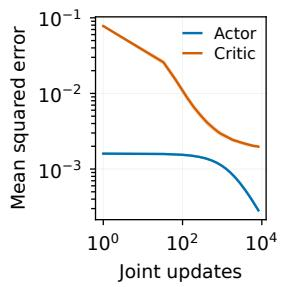
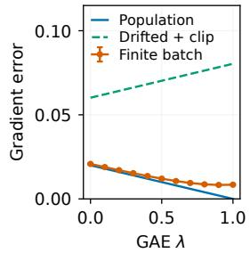
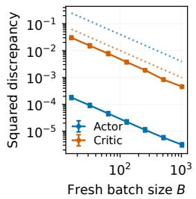
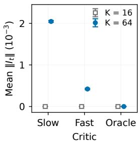
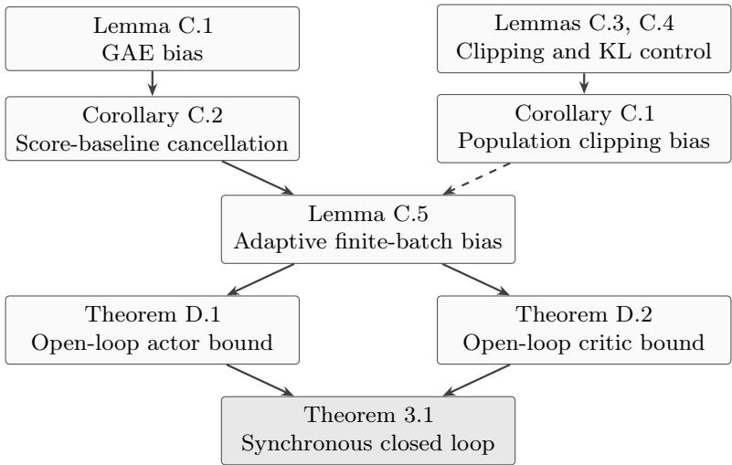
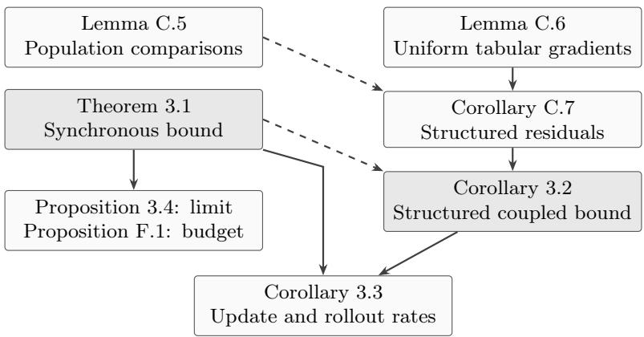
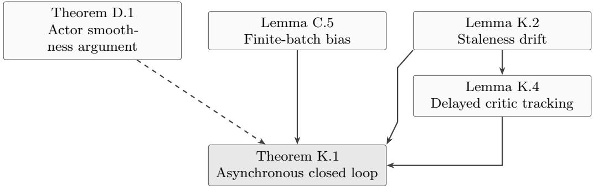
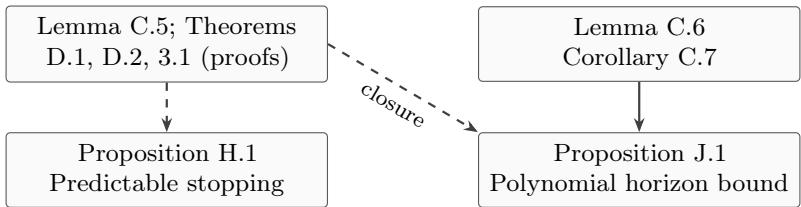

# A Closed-Loop Non-Asymptotic Convergence Analysis of PPO with Learned Critics and Clipping

Junwei Su School of Artificial Intelligence and Data Science, University of Science and Technology of China junweisu.cs@gmail.com

Mengfan Liu Department of Computer Science, University of Hong Kong

Yanyong Zhang School of Artificial Intelligence and Data Science, University of Science and Technology of China

Chuan Wu Department of Computer Science, University of Hong Kong

October 8, 2026

## Abstract

Despite its widespread use, Proximal Policy Optimization with clipping (PPO-Clip) remains dificult to tune, and the interactions among critic learning, clipping, and rollout reuse remain incompletely understood. We develop a non-asymptotic analysis of PPO-Clip as a closed-loop actor–critic system. It captures actor–critic coupling, nonsmooth probability-ratio clipping, finite-batch reuse, and predictable early stopping under explicit coverage and critic regularity assumptions, using raw GAE and Monte Carlo critic targets. Our synchronous and asynchronous guarantees jointly characterize policy stationarity and the tracking accuracy of the learned critic, with explicit dependence on algorithmic parameters. A suficient coupling condition gives optimization, critic tracking, clipping, and finite-batch errors a common amplification bound. The asynchronous result also requires a delay-dependent critic stepsize restriction; violating these conditions does not establish divergence. For finite layered MDPs with tabular critics, a uniform bound on the actual clipped-gradient class replaces complete-trajectory counting. A verified growing-horizon family has polynomial sample complexity, and a two-time-scale schedule gives $\bar { O ( T ^ { - 2 / 5 } ) }$ stationarity and critic-tracking bounds with explicit fresh-rollout accounting. These results together advance our understanding about PPO and provide theoretical guidance in tuning.

## 1 Introduction

Proximal Policy Optimization (PPO), particularly its clipped variant PPO-Clip, is widely used in reinforcement learning (RL) (Schulman et al., 2017). PPO-Clip typically uses an actor–critic framework: the actor updates the policy using sampled policy-gradient estimates, while the critic estimates values to compute advantage signals. Its practical success is commonly attributed to combining policy-gradient updates with stabilization mechanisms (Yu et al., 2022; Jin et al., 2023; Huang et al., 2024; Dwyer et al., 2025; Su et al., 2025). One motivating application is fine-tuning large language models (LLMs), including reinforcement learning from human feedback (RLHF) (Ouyang et al., 2022; Stiennon et al., 2020; Kirk et al., 2024; Havrilla et al., 2024).

PPO-Clip uses a clipped surrogate objective (Markowitz & Staley, 2023; Huang et al., 2024; Dwyer et al., 2025), which limits incentives for large probability-ratio changes relative to a reference policy. This trust-region–inspired design avoids explicit second-order optimization. Beyond clipping, practical implementations use synchronous or asynchronous actor–critic updates, minibatch reuse across multiple epochs, generalized advantage estimation, and early stopping based on KL divergence (Mnih et al., 2016; Dossa et al., 2021; Hilton et al., 2022; Yu et al., 2022; Xiao et al., 2022; Sun et al., 2022; Sheng et al., 2025). These mechanisms improve stability and sample eficiency but couple actor and critic dynamics across multiple time scales. Deploying PPO-Clip on new tasks often requires substantial tuning of learning rates, clipping thresholds, and update schedules to avoid instability or performance collapse (Engstrom et al., 2020; Agarwal et al., 2021; Zheng et al., 2023; Adkins et al., 2024; Moalla et al., 2024). Our limited understanding of these interactions motivates a joint analysis of PPO’s update mechanisms under explicit assumptions.

Existing Gap. Existing results include finite-time two-time-scale actor–critic analysis (Wu et al., 2020), stationary-point analysis retaining nonsmooth PPO clipping and multiple updates (Jin et al., 2023), and PPO-Clip methods with learned value estimation (Huang et al., 2024). Establishing a joint guarantee for interacting PPO mechanisms remains a substantive analytical challenge. The critic changes the actor’s advantage estimates, the actor moves the critic’s target, and both adapt to reused data; separate guarantees cannot simply be combined without controlling these dependencies. We address this challenge through a non-asymptotic analysis of interleaved raw-GAE updates, Monte Carlo critic targets, and finite-batch reuse. Under explicit coverage and critic regularity, the analysis jointly controls actor stationarity and critic tracking, including empirical and trajectory-policy discrepancies. Table 1 compares the analyzed processes and statistical premises.

Technical Challenges. Three technical challenges arise. First, PPO-Clip exhibits a bidirectionally coupled learning dynamic: approximation errors in the critic can bias bootstrapped policy updates, while policy drift simultaneously induces non-stationarity in the critic’s learning objective. Second, actor and critic iterates adapt to the same reused batch. Their conditional gradients are empirical means, while the desired guarantees concern current-policy population quantities; multistep GAE also retains the behavior policy’s continuation law. Third, sign-dependent clipping acts on evolving, trajectory-dependent advantage labels and makes the surrogate nonsmooth. We use smoothness of the return objective J and explicitly control the clipped update’s bias.

Contributions and Results. We develop a non-asymptotic analysis of PPO-Clip as a closed-loop actor–critic system. The central contribution is to combine and adapt policy-gradient, concentration, and tracking arguments into a unified analysis of these dependent mechanisms. By deriving their coupled errors within one specified learning process, we make their combined efects on actor stationarity and critic tracking explicit. Our contributions are:

1. Unified finite-time analysis of interacting PPO-Clip mechanisms. Theorem 3.1 jointly characterizes (i) the stationarity of the policy iterates with respect to the underlying reinforcement learning objective, and (ii) the finite-time tracking accuracy of the critic relative to its moving, policy-dependent optimum. A central outcome is an explicit coupling strength that provides a suficient condition for finite-time control. The bound quantifies their feedback through a common amplification factor for stochastic noise, critic tracking, reuse-induced drift, and clipping bias. The theory yields suficient tuning conditions within the stated model (see Sec. 3). A uniform empirical bound for the actual clipped-gradient class replaces complete-path counting in a tabular specialization. A growing-horizon example verifies every premise along actual reused-batch updates, with polynomial horizon dependence (Corollary 3.2 and Proposition J.1).

2. Finite-time refinement of classical actor–critic theory. In the asymptotic limit, the analysis recovers classical actor–critic convergence under time-scale separation, growing batch sizes, and vanishing KL budgets (Proposition 3.4). The finite-time bounds quantify this approach under constant step sizes. In particular, the analysis reveals how time-scale separation enters through an explicit coupling parameter and how minibatch reuse, clipping, and behavior-policy mismatch contribute finite-time residual terms that a vanishing-error asymptotic conclusion does not quantify. Score-baseline cancellation sharpens the coupling coeficient. An explicit schedule yields $O ( T ^ { - 2 / 5 } )$ stationarity and tracking, and a rollout-budget bound quantifies the competing efects of batch size and reuse (Corollary 3.3 and Proposition F.1). These are suficient upper bounds, not necessary instability thresholds.

3. Extension to asynchronous PPO-Clip. Appendix K extends the analysis to a singlegradient parameter-server model (Theorem K.1). The guarantee includes staleness penalties and requires both a delay-dependent critic stepsize restriction and a suficient coupling condition, under prescribed batch assignment and nonanticipative sampling.

Scope and limitations. This is a theoretical study of PPO-Clip under explicit coverage, value realizability, and critic regularity assumptions, using raw recomputed GAE with Monte Carlo critic targets. The guarantees have conservative constants and do not cover unrestricted neura PPO; the tabular experiments provide qualitative illustrations. The analysis informs PPO practice by identifying how actor–critic timescales, KL budgets, clipping ranges, and batch reuse afect finite-time error bounds, motivating coordinated tuning and diagnostics of critic error and policy drift. Its conditions are suficient and problem-dependent.

## 2 Preliminaries and Problem Formulation

In this section, we present our analytical setting. Further background is provided in Appendix A.

## 2.1 Finite-Horizon Episodic Setting

We consider a finite-horizon episodic MDP $( S , { \mathcal { A } } , P , r , \gamma )$ with horizon H and a fixed initial-state distribution. States include the time index. Under a parameterized policy $\pi _ { \boldsymbol { \theta } } ( \cdot \mid s )$ , a trajectory is

$$
\tau : = ( s _ { 0 } , a _ { 0 } , s _ { 1 } , a _ { 1 } , \ldots , s _ { H - 1 } , a _ { H - 1 } , s _ { H } ) .
$$

The reward mechanism is fixed during training. Since true advantages are unavailable in closed form, PPO estimates them from finite data using a learned value-function baseline, leading to an actor–critic architecture.

As a motivating example, LLM fine-tuning represents each action as a token from a vocabulary V. A prompt $x \in { \bar { \mathcal { X } } }$ is drawn from a distribution $\mathbf { \bar { \mathbb { P } } } ,$ and the state records the prompt and generated prefix:

$$
s _ { t } : = ( x , a _ { 0 : t - 1 } ) , \qquad s _ { 0 } : = ( x , \emptyset ) .
$$

Here $A : = \mathcal { V } ,$ , transitions append the chosen token, $s _ { t + 1 } = s _ { t } \circ a _ { t }$ , and a fixed reward model evaluates the generated trajectory.

## 2.2 Actor–Critic Framework

PPO is implemented as an actor–critic method in which the policy (actor) and value function (critic) are parameterized separately and updated jointly. This separation supports value-based advantage estimation when rewards are delayed. The critic enables advantage estimation and can reduce variance, but its approximation error can bias bootstrapped actor directions. Conversely, as the actor evolves, the critic’s regression target drifts. This bidirectional dependency gives rise to a closed-loop coupling that is central to our analysis.

Critic parameterization and learning objective. The critic is a parameterized value function $V _ { w } ( s )$ trained to approximate the policy-dependent value $V _ { \theta } ( s )$ by minimizing a policy-conditioned regression loss

$$
\begin{array} { r } { \mathcal { L } _ { c } ( \boldsymbol { \theta } , \boldsymbol { w } ) : = \mathbb { E } _ { \tau \sim \pi _ { \boldsymbol { \theta } } } \left[ \frac { 1 } { H } \sum _ { h = 0 } ^ { H - 1 } ( V _ { \boldsymbol { w } } \big ( \boldsymbol { s } _ { h } \big ) - G _ { h } ( \tau ) \big ) ^ { 2 } \right] , } \end{array}\tag{2.1}
$$

where $\begin{array} { r } { G _ { h } ( \tau ) = \sum _ { j = h } ^ { H - 1 } \gamma ^ { j - h } \dot { r } ( s _ { j } , a _ { j } ) + \gamma ^ { H - h } v _ { H } ( s _ { H } ) } \end{array}$ is the Monte Carlo return, with a prescribed terminal value $v _ { H }$ . The theorem analyzes these stored Monte Carlo targets. Bootstrapped targets require an additional target-error bound. The explicit dependence on θ is crucial: as the actor changes, both the state distribution and the target change, turning critic learning into a tracking problem. Let $w ^ { \star } ( \theta ) \in \arg \operatorname* { m i n } _ { w } L _ { c } ( \theta , w )$ denote a population minimizer. We quantify critic suboptimality via the critic tracking error

$$
\Delta ( \theta , w ) : = \| w - w ^ { \star } ( \theta ) \| ^ { 2 } ,\tag{2.2}
$$

which measures the distance to the moving solution $w ^ { \star } ( \theta )$ . In our analysis, $\Delta ( \theta , w )$ controls the bias injected into the actor update through imperfect advantage estimation.

Advantage estimation via GAE. Since the true advantage is unknown, PPO constructs an estimator using the critic. Let $\widehat { \delta } _ { t }$ be the temporal-diference (TD) residual. Generalized advantage estimation (GAE) defines

$$
\widehat { \delta } _ { t } : = \dot { r } ( s _ { t } , a _ { t } ) + \gamma V _ { w } \big ( s _ { t + 1 } \big ) - V _ { w } \big ( s _ { t } \big ) , \qquad \widehat { A } _ { t } ^ { ( \lambda ) } : = \sum _ { \ell = 0 } ^ { H - 1 - t } ( \gamma \lambda ) ^ { \ell } \widehat { \delta } _ { t + \ell } ,\tag{2.3}
$$

where $\lambda \in [ 0 , 1 ]$ trades variance against bias. At the terminal state, the estimator uses the prescribed boundary value from the return convention, so $V _ { w } ( s _ { H } ) = V _ { \theta } ( s _ { H } )$ . This value may be zero when all rewards are assigned to transitions, or the terminal payof when that payof is represented as a boundary value. A nonmatching terminal bootstrap requires the additional term in Lemma C.1. Bootstrapping changes the bias–variance trade-of. Our bounds quantify the critic-induced bias through explicit dependence on $\lambda$ and $\Delta ( \theta , w )$

Actor update (ideal form). Let ${ \mathcal { I } } ( \theta )$ denote the canonical RL objective optimized by the actor; the policy-gradient theorem yields

$$
\mathcal { I } ( \theta ) : = \frac { 1 } { H } \mathbb { E } _ { \tau \sim \pi _ { \theta } } [ G _ { 0 } ( \tau ) ] , \qquad \nabla _ { \theta } \mathcal { I } ( \theta ) = \mathbb { E } _ { \tau \sim \pi _ { \theta } } \left[ \frac { 1 } { H } \sum _ { h = 0 } ^ { H - 1 } \gamma ^ { h } \nabla _ { \theta } \log \pi _ { \theta } ( a _ { h } \mid s _ { h } ) A ^ { \pi _ { \theta } } ( s _ { h } , a _ { h } ) \right] ,
$$

where $A ^ { \pi _ { \theta } }$ is the true advantage for $G _ { h }$ . The factor $1 / H$ fixes the objective normalization; the actor uses the weights $\gamma ^ { h }$ (equal to one when $\gamma = 1 \rangle$ . Replacing the true advantage with GAE produces the idealized update direction

$$
\begin{array} { r } { \nabla _ { \theta } \mathcal { I } ( \theta ) \ \approx \ \mathbb { E } _ { \tau } \left[ \frac { 1 } { H } \sum _ { h = 0 } ^ { H - 1 } \gamma ^ { h } \nabla _ { \theta } \log \pi _ { \theta } ( a _ { h } \mid s _ { h } ) \widehat { A } _ { h } ^ { ( \lambda ) } \right] . } \end{array}\tag{2.4}
$$

While equation 2.4 targets the gradient of the underlying RL objective, PPO training typically reuses a finite batch of rollouts for multiple epochs. Without additional control, reuse can produce policy drift and of-policy bias, motivating the modern PPO-Clip surrogate.

## 2.3 Modern PPO-Clip Surrogate

In PPO-Clip, data are collected under a behavior policy $\pi _ { \theta _ { \mathrm { o l d } } }$ and reused for multiple actor updates. This improves sample eficiency but introduces distribution shift. PPO-Clip controls this shift using importance ratios, clipping, and KL-based early stopping.

Importance sampling ratio. For any state–action pair $( s , a )$ , define the likelihood ratio

$$
r _ { \theta , \theta _ { \mathrm { o l d } } } ( s , a ) : = \frac { \pi _ { \theta } ( a \mid s ) } { \pi _ { \theta _ { \mathrm { o l d } } } ( a \mid s ) } .
$$

This ratio allows objectives evaluated under $\pi _ { \theta _ { \mathrm { o l d } } }$ to approximate policy updates. However, large ratios can lead to unstable gradient estimates and brittle optimization, which motivates the use of clipping.

Clipped surrogate objective. PPO-Clip maximizes the surrogate objective

$$
\begin{array} { r l } & { \mathcal { L } ^ { \mathrm { c l i p } } ( \theta ; \theta _ { \mathrm { o l d } } ) : = \mathbb { E } _ { \underset { h \sim \mathrm { U n i f } \{ 0 , \ldots , H - 1 \} } { \pi \sim \pi _ { \theta _ { \mathrm { o l d } } } } } \Big [ \gamma ^ { h } \operatorname* { m i n } \big ( r _ { \theta , \theta _ { \mathrm { o l d } } } ( s , a ) \widehat { A } ( s , a ) , } \\ & { \qquad \mathrm { c l i p } ( r _ { \theta , \theta _ { \mathrm { o l d } } } ( s , a ) , 1 - \delta , 1 + \delta ) \widehat { A } ( s , a ) \big ) \Big ] , } \end{array}\tag{2.5}
$$

where $( s , a ) = ( s _ { h } , a _ { h } ) , \widehat { A } ( s , a ) = \widehat { A } _ { h } ^ { ( \lambda ) } ( \tau ; w )$ remains a random trajectory label, and $\delta \in ( 0 , 1 )$ is the clipping parameter. Clipping suppresses selected sample gradients according to the likelihood ratio and advantage sign. It is intended to limit excessive updates and introduces two analytical challenges. First, equation 2.5 is non-smooth at the boundaries $r _ { \theta , \theta _ { \mathrm { o l d } } } = 1 \pm \delta _ { \mathrm { : } }$ , requiring subgradient-based arguments. Second, clipping can induce systematic bias: active sample directions difer from their unclipped counterparts. The latter still has trajectory-policy and critic error under reused data. A central goal of our analysis is therefore to control the impact of clipping-induced distortion.

Actor update and KL trust region. At outer iteration $n ,$ the actor performs K inner updates

$$
\theta _ { n } ^ { ( k + 1 ) } = \theta _ { n } ^ { ( k ) } + \eta g _ { n } ^ { ( k ) } ,\tag{2.6}
$$

where $g _ { n } ^ { ( k ) }$ denotes stochastic (sub)gradients of $\mathcal { L } ^ { \mathrm { c l i p } } ( \cdot ; \theta _ { n } )$ . Because updates reuse data generated by $\pi _ { \theta _ { n } }$ , the analysis assumes a population KL budget $\kappa > 0$ at every inner iterate $\theta _ { n } ^ { ( k ) }$ :

$$
\begin{array} { r } { \mathbb { E } _ { s \sim \pi _ { \theta _ { n } } } \left[ \mathrm { K L } \big ( \pi _ { \theta _ { n } } ( \cdot \mid s ) \| \pi _ { \theta _ { n } ^ { ( k ) } } ( \cdot \mid s ) \big ) \right] \le \kappa . } \end{array}\tag{2.7}
$$

This trust-region constraint plays a dual role in the analysis: (i) it limits the distribution shift induced by multi-epoch reuse, ensuring that the surrogate remains meaningful; and (ii) it provides quantitative control over clipping activity, since small KL divergence implies that likelihood ratios remain close to one for most state–action pairs.

## 2.4 Objective of the Analysis and Assumptions

We establish non-asymptotic convergence guarantees for PPO-Clip with a learned actor–critic architecture. To keep the analysis tractable and interpretable, we impose the following regularity assumptions.

Assumption 1 (Smoothness of objective). The objective $\mathcal { I } ( \cdot )$ is bounded by $J _ { \mathrm { m a x } }$ and $L _ { J }$ -smooth.

Assumption 2 (Bounded conditional variance). Let $\mathcal { F } _ { t }$ denote the algorithm filtration. The stochastic actor update direction $g _ { t }$ satisfies $\mathbb { E } \left[ \Vert g _ { t } - \mathbb { E } [ g _ { t } \mid { \mathcal { F } } _ { t } ] \Vert ^ { 2 } \mid { \mathcal { F } } _ { t } \right] \leq \sigma _ { a } ^ { 2 }$ for some $\sigma _ { a } ^ { 2 } > 0$

Assumption 3 (Bounded advantages). There exists $A _ { \operatorname* { m a x } } > 0$ such that the raw GAE estimates, recomputed using the pre-update critic, satisfy $| \widehat { A } _ { t } ^ { ( \lambda ) } | \leq A _ { \operatorname* { m a x } }$ for every trajectory in the data support and every visited critic. No advantage normalization or clipping is applied in the analyzed update; such transformations require a separate bias term.

Assumption 4 (Critic learnability and stability). For each fixed policy θ, the critic loss $\mathcal { L } _ { c } ( \theta , \cdot )$ is locally convex, satisfies PL and quadratic-growth conditions with constants $\mu _ { c } , \mu _ { q } > 0$ , and has $L _ { c } – L i p s c h i t z$ gradients in w. Quadratic growth is measured from the selected stationary minimizer on a convex region containing that minimizer and the critic iterate. Moreover, the selected map $w ^ { \star } ( \theta )$ is measurable and $L _ { w ^ { \star } } { - } L i p s c h i t z$ in θ.

Assumption 5 (Value realization). In the visited region, the value parameterization is L -Lipschitz with respect to w and is realizable. For the critic-to-value step, the selected population regression minimizer is assumed to satisfy $V _ { w ^ { \star } ( \theta ) } = V ^ { \pi _ { \theta } }$ on the states used in the analysis.

Assumption 6 (KL trust-region control). During each outer iteration, the inner actor updates satisfy the population KL budget with parameter $\kappa > 0$ , and the score is bounded by $G _ { \pi }$ on the relevant parameter regions. The state law in the budget is the uniform average of the H behavior-policy state marginals.

These premises hold on regions containing all iterates used in the proof; KL control alone does not establish critic geometry or realizability. Appendix M.1 explains their roles and limitations, including value identification and the separate certification needed for empirical KL stopping.

Finite-batch protocol and coverage. The baseline finite-sample bridge uses a finite set Ω of complete trajectories (including initial states and rewards), with $S _ { \mathrm { t r a j } } : = | \Omega |$ . Corollary 3.2 replaces this support premise by finite layered states and actions, a bounded tabular critic, and bounded returns; the reward distribution may then be continuous. Write $P _ { \theta }$ for the complete trajectory law. At epoch $n ,$ conditionally on the past, collect B independent trajectories under the behavior policy $\bar { \theta } _ { n } = \theta _ { n } ^ { ( 0 ) }$ , and denote their empirical law by ${ \widehat { P } } _ { n }$ . Retain their Monte Carlo returns and reuse this batch for K joint updates. Before each update, compute raw GAE with the current critic $w _ { n } ^ { ( k ) }$ ; sample trajectory–time pairs uniformly with replacement from the stored batch and $\{ 0 , \ldots , H - 1 \}$ , or sample trajectories uniformly with replacement and average all H times. Both conventions have the same conditional mean. Use the empirical clipped actor gradient (with the advantage detached) and empirical Monte Carlo critic gradient, both evaluated at the pre-update parameters, then apply both updates. At a clipping tie, fix a measurable samplewise derivative rule in advance (for example, select the unclipped branch); it must not depend on the other samples in the minibatch. The two minibatches may coincide. Thus their noises may be correlated. The pre-update filtration contains the entire stored batch, all past draws, and the current parameters; conditional means are empirical means, not population gradients.

Assume $\pi _ { \theta } ( a \mid s ) \geq p _ { \operatorname* { m i n } } > 0$ for every relevant action and policy, and put $R _ { \mathrm { m a x } } : = 1 / p _ { \mathrm { m i n } }$ (or any verified smaller ratio bound). This coverage condition is imposed separately; it does not follow from the average KL constraint. Assume $\left| G _ { h } \right| \le G _ { \mathrm { m a x } } , \left| V _ { w } ( s ) \right| \le V _ { \mathrm { m a x } }$ , and $\| \nabla _ { w } V _ { w } ( s ) \| \le G _ { V }$ on the visited region, with matched terminal values. Consequently every single-sample critic gradient has norm at most $Q _ { c } : = 2 ( V _ { \operatorname* { m a x } } + G _ { \operatorname* { m a x } } ) G _ { V }$ . Appendix C.4 gives the full sampling specification and derives variance bounds and uniform population discrepancies under adaptive reuse. Appendix M.1 discusses the finite-support and structured cases and their verified examples.

## 3 Main Results

This section presents our main finite-time convergence guarantees for PPO-Clip. We analyze the specified synchronous actor–critic protocol; Appendix K extends the framework to bounded asynchronous staleness. All proofs are deferred to the appendix.

## 3.1 Convergence of PPO-Clip

We begin with our main closed-loop guarantee in the synchronous setting. The result jointly controls (i) the stationarity of the actor iterates with respect to the underlying RL objective $J ( \theta )$ and (ii) the tracking error of the learned critic. Crucially, the bounds are stated in terms of explicit hyperparameters and intrinsic noise/regularity constants.

Theorem 3.1 (Closed-loop non-asymptotic convergence of PPO-Clip). Consider the finite-batch protocol in Section 2, with fixed initial actor $\theta _ { 0 } , ~ N$ batches of B trajectories, and K actual joint updates per batch; set $T = { \dot { N } } K$ . Suppose Assumptions 1–6 and the stated coverage and boundedness premises hold, with $0 < \eta \leq 1 / ( 4 \bar { L _ { J } } )$ and $0 < \mathsf { \bar { \rho } } _ { c } \leq \operatorname* { m i n } \{ \mu _ { q } / ( 2 L _ { c } ^ { 2 } ) , 1 / \mu _ { q } \}$ . For matched terminal values, define

$$
\widetilde { C } _ { \lambda , H } = \gamma ( 1 - \lambda ) \sum _ { j = 0 } ^ { H - 2 } ( \gamma \lambda ) ^ { j } , a = 4 G _ { \pi } ^ { 2 } L _ { V } ^ { 2 } \widetilde { C } _ { \lambda , H } ^ { 2 } , \epsilon _ { B } = \operatorname* { m i n } \{ 1 , S _ { \mathrm { t r a j } } / ( 4 B ) \} , E _ { c } = 8 Q _ { c } ^ { 2 } \epsilon _ { B } + 4 Q _ { c } ^ { 2 } H \kappa .
$$

An empty sum is zero. The state-only GAE error cancels under the on-policy score identity (Corollary C.2); thus $0 \leq \widetilde { C } _ { \lambda , H } \leq \gamma$ and $a = 0$ when $\lambda = 1 ~ o r ~ H = 1$ . The empirical and clipping

terms in F remain. The actor bias floor is

$$
\begin{array} { r l } { F : = \underbrace { 1 6 R _ { \mathrm { m a x } } ^ { 2 } G _ { \tau } ^ { 2 } A _ { \mathrm { m a x } } ^ { 2 } \epsilon _ { B } } _ { j \mathrm { m i t } \epsilon - b a t \mathrm { \Delta } R \mathrm { \Delta } e s } + \underbrace { 8 G _ { \tau } ^ { 2 } A _ { \mathrm { m a x } } ^ { 2 } \kappa ( 1 + \sqrt { H } ) ^ { 2 } } _ { t r a j e c t o r y \mathrm { \Delta } f \mathrm { \Delta } e l \epsilon + y \mathrm { \Delta } f \mathrm { \Delta } f \mathrm { \Delta } t + y \mathrm { \Delta } } + \underbrace { 8 G _ { \tau } ^ { 2 } A _ { \mathrm { m a x } } ^ { 2 } \kappa ( 1 + 1 / \delta ) ^ { 2 } } _ { c l i p p i n g } . } & { \mathrm { ( 3 . 1 ) } } \\ { S e t } \\ { A _ { 0 } = \underbrace { \frac { 4 ( J _ { \mathrm { m a x } } - J ( \theta _ { 0 } ) ) } { \eta T } } _ { o p t i m i z a t i o n } + \underbrace { 2 L y \eta \sigma _ { a } ^ { 2 } } _ { a c t o r n \mathrm { \Delta } n o i s \epsilon } , } & { d = \underbrace { 4 0 L _ { w } ^ { 2 } \eta ^ { 2 } } _ { \mu _ { q } ^ { 2 } \beta _ { c } ^ { 2 } } , \quad U = \underbrace { \frac { 4 \mathbb { E } \Delta _ { 0 } } { \mu _ { q } \beta _ { c } T } } _ { c r i t i c a l s a t i o n } + \underbrace { \frac { 5 \beta \epsilon \sigma _ { c } ^ { 2 } } { \mu _ { q } } } _ { c r i t i c \mathrm { \Delta } n o i s \epsilon } + \underbrace { \frac { 4 0 E _ { c } } { \mu _ { q } ^ { 2 } } } _ { b a t c h i f u s p a t i o n \mathrm { \Delta } f \mathrm { \Delta } \mu _ { q } ^ { 2 } } } \end{array}
$$

Define the explicit coupling coeficient $\rho : =$ 10ad and suppose $\rho < 1$ . Then the actor stationarity and critic tracking bounds are

$$
\frac { 1 } { T } \sum _ { t < T } \mathbb { E } \| \nabla J ( \theta _ { t } ) \| ^ { 2 } \leq \frac { A _ { 0 } + 4 F + 4 a U + 4 a d \sigma _ { a } ^ { 2 } } { 1 - \rho } , \quad \frac { 1 } { T } \sum _ { t < T } \mathbb { E } \Delta _ { t } \leq \frac { U + d ( \sigma _ { a } ^ { 2 } + 2 A _ { 0 } + 1 0 F ) } { 1 - \rho } .\tag{3.2}
$$

The flattened index is $t = n K + k$ , and $\Delta _ { t } = \| w _ { t } - w ^ { \star } ( \theta _ { t } ) \| ^ { 2 }$

Corollary 3.2 (A batch bound from the clipped-gradient class). Retain the protocol and regularity premises of Theorem ${ } ^ { 3 . 1 , }$ but replace finite complete-trajectory support by finite layered state sets $S _ { h }$ finite actions, bounded rewards/returns, and a tabular critic $\dot { w } \in [ 0 , W ] ^ { d _ { c } }$ along every update, where $\begin{array} { r } { \dot { d } _ { c } = \sum _ { h < H } | S _ { h } | } \end{array}$ and $\begin{array} { r } { M = \sum _ { h < H } | S _ { h } | | \boldsymbol { \mathcal { A } } | } \end{array}$ . Assume a positive raw-GAE envelope $A _ { \operatorname* { m a x } } > 0$ holds on this entire critic cube, and select the unclipped derivative at clipping ties. Put $C = C _ { \lambda , H } \leq 2$ and

$$
\begin{array} { c } { { \ell _ { B } = \log ( 6 M ) + d _ { c } \log ( 2 + C W B / A _ { \mathrm { m a x } } ) , \qquad e _ { c } ( B ) = { \frac { 8 ( W ^ { 2 } + G _ { \mathrm { m a x } } ^ { 2 } ) } { H B } } , } } \\ { { e _ { a } ( B ) = \operatorname* { m i n } \left\{ 4 R _ { \mathrm { m a x } } ^ { 2 } G _ { \pi } ^ { 2 } A _ { \mathrm { m a x } } ^ { 2 } , { \frac { 4 R _ { \mathrm { m a x } } ^ { 2 } G _ { \pi } ^ { 2 } A _ { \mathrm { m a x } } ^ { 2 } M ^ { 2 } } { H ^ { 2 } B } } ( \ell _ { B } + 3 ) \right\} . } } \end{array}
$$

Both conclusions of the theorem hold after replacing the residuals by

$$
F _ { \mathrm { s t r } } = 4 e _ { a } ( B ) + 8 G _ { \pi } ^ { 2 } A _ { \mathrm { m a x } } ^ { 2 } \kappa [ ( 1 + \sqrt { H } ) ^ { 2 } + ( 1 + \delta ^ { - 1 } ) ^ { 2 } ] , \quad E _ { c , \mathrm { s t r } } = 2 e _ { c } ( B ) + 4 Q _ { c } ^ { 2 } H \kappa .\tag{3.3}
$$

Here $Q _ { c }$ can be any uniform envelope of the whole-trajectory critic gradient; minibatch variances are bounded separately for the chosen sampling convention.

Lemma C.6 proves these uniform deviations for the actual clipped vector gradient, including adaptive reuse. Within each time–state–action cell the advantage multiplier is ${ \widehat { A } } .$ its positive part, or its negative part. A critic-parameter cover controls these three classes without assuming continuity of the clipped gradient in actor parameters. The actor bound is $O ( M ^ { 2 } d _ { c }$ log $B / ( H ^ { 2 } B ) )$ times its squared envelope; it contains no complete-path cardinality. This is a structured tabular result: a prefix-tree state representation can itself have exponentially many states. Proposition J.1 verifies all premises along actual updates on a nonconstant-objective family with $2 ^ { H }$ action paths but $2 H - 1$ critic coordinates, and gives a full bound polynomial in H.

Corollary 3.3 (Update and fresh-rollout complexity). Fix the problem constants, clipping range, minibatch size, and $K$ . Consider runs with $T = N K$ , stepsizes constant within each run, $\eta = c _ { \eta } T ^ { - 3 / 5 }$ and $\beta _ { c } = c _ { \beta } T ^ { - 2 / 5 }$ , where the positive constants ensure the stepsize restrictions and $\rho \le \rho _ { 0 } < 1$ $I f \kappa _ { T } = O ( T ^ { - 2 / 5 } )$ , then both average squared stationarity and average critic parameter error are $O ( T ^ { - 2 / 5 } )$ , using either $B _ { T } = \lceil { S _ { \mathrm { t r a j } } \overline { { T ^ { 2 / 5 } } } } \rceil$ in the finite-support theorem or $B _ { T } = \lceil c _ { B } T ^ { 2 / 5 } \log ( e T ) \rceil$ ， $c _ { B } > 0$ , in Corollary 3.2. The fresh-trajectory count is $Q = N B = T B / K$ ; thus the respective suficient counts for error at most ε are $O ( \varepsilon ^ { - 7 / 2 } )$ and $\widetilde { O } ( \varepsilon ^ { - 7 / 2 } )$ , with problem-dependent constants. Environment transitions number $H Q$

Appendix F proves the rate, supplies an implementable KL certificate, and derives a fixedrollout-budget tradeof between B and K. The rate balances optimization, critic noise, and target movement; it is a suficient rate for this analysis, not a minimax claim or a comparison with global optimality results for diferent PPO variants. The explicitly verified horizon family has polynomial, but conservative, sample complexity.

Reading the guarantee: decomposition and amplification. The bounds separate optimization and stochastic noise from finite-batch reuse, trajectory drift, clipping, and critic-target mismatch. A defining structural feature is the prefactor $( 1 - \rho ) ^ { - 1 }$ . We interpret $( 1 - \rho ) ^ { - 1 }$ as a coupling amplification factor: it quantifies how actor–critic feedback amplifies all finite-time error sources (optimization error, noise, drift, clipping bias, and critic tracking error). The condition $\rho < 1$ sufices to close the coupled inequalities; numerical informativeness also depends on the numerator’s constants and error floors (Appendix M). For nonzero coupling, it motivates time-scale separation but does not establish a universal 5–10× learning-rate ratio or a necessary instability threshold.

Practical implications and tuning guidance. The optimization contribution decays as $1 / ( \eta N K )$ when the remaining constants and error floors are controlled. The efect of increasing K (more mini-batch reuse) depends on the resulting policy drift. Proposition F.1 makes this trade-of explicit under a certificate $\kappa \leq D K ^ { 2 } \eta ^ { 2 }$ and a fixed fresh-rollout budget. At fixed $\kappa ,$ , the theorem does not imply that larger K increases drift. The coupling factor $\rho$ scales as $( { \eta } / { \beta _ { c } } ) ^ { 2 }$ up to problem constants and $\widetilde { C } _ { \lambda , H } ^ { 2 }$

Once residual terms dominate the bound, further reducing its optimization term gives little improvement. The bound motivates coordinating three controls: $( i )$ tightening the trust region (smaller $\kappa , \mathrm { e . g . }$ , more aggressive KL-based early stopping), (ii) balancing reduced critic target lag against increased noise within its admissible stepsize range, and (iii) improving critic quality (reducing tracking error or variance).

Beyond these aggregate trade-ofs, the bound surfaces several concrete PPO-Clip–specific insights. First, the KL budget κ controls two distinct failure modes simultaneously: within-epoch distribution shift $( \propto \kappa )$ and clipping distortion $\left( \propto \kappa / \delta ^ { 2 } \right)$ , giving distinct reasons to control the behavior-policy mismatch. Certified predictable stopping is treated in $\mathrm { A }$ ppendix $\operatorname { H } ;$ an uncalibrated empirical check alone does not establish the population premise. Second, a smaller clipping range $\delta$ is not automatically more conservative: for fixed $\kappa ,$ the distortion term scales as $\kappa / \delta ^ { 2 }$ , so this upper bound becomes less informative for overly small clipping ranges; it does not establish a monotone law for the actual bias. Finally, bootstrapping enters the coupling through $\tilde { C } _ { \lambda , H } ^ { 2 } ,$ with $\widetilde { C } _ { \lambda , H } \leq \gamma \leq 1$ Matched terminal values give $a = \rho = 0$ when $\lambda = 1$ or $H = 1$ . Holding other constants fixed, smaller λ can tighten the suficient stepsize-ratio bound. Other constants, including critic coverage and return bounds, can still worsen with $H$

Connection to classical two-time-scale theory. Classical actor–critic analyses typically rely on asymptotic time-scale separation, often expressed as $\eta _ { t } / \beta _ { c , t }  0$ . Theorem 3.1 provides a finite-time counterpart tailored to $\mathrm { P P O - C l i p }$ , in which time-scale separation appears explicitly through the dimensionless coupling coeficient $\rho \propto ( \eta / \beta _ { c } ) ^ { 2 }$ (up to problem constants and $\widetilde { C } _ { \lambda , H } ^ { 2 } )$ . Thus, $\rho \ll 1$ means weak amplification in the bound; critic tracking also depends on $U$ and $d .$ In particular, $\lambda = 1$ or $H = 1$ gives $\rho = 0$ independently of critic speed. As $\rho  1$ , the bound increasingly amplifies noise and bias terms. In the asymptotic limit of diminishing step sizes and vanishing trust-region budgets, the bound recovers the classical two-time-scale picture. More formally, we have the following result.

Proposition 3.4 (Two-time-scale stationarity in a single-index t and horizon $T = N K )$ . Fix $H , \gamma , \lambda , \delta \in ( 0 , 1 )$ , and the initial actor $\theta _ { 0 }$ . For each $\overset { \smile } { T } \in \mathbb { N } .$ , consider a PPO-Clip run with $N = N ( T )$ outer iterations and $K = K ( T )$ actual inner actor–critic updates per iteration, where $T = \dot { N ( T ) } K ( T )$ is deterministic. Assume the model and regularity premises of Theorem ${ \it 3 . 1 , }$ including the finite-batch sampling and Monte Carlo target protocol, hold with constants uniform in $T ,$ fixed finite $S _ { \mathrm { t r a j } }$ , batch size $B _ { T } \to \infty ,$ and sup $\mathbb { E } [ \Delta _ { 0 , 0 } ] < \infty$ . Define the flattened time index $t : = n K + k , ( n , k ) \in \{ 0 , \ldots , N - 1 \} \times \{ 0 , \ldots , K - 1 \}$ . Let $\theta _ { t } : = \theta _ { n } ^ { ( k ) }$ and $\Delta _ { t } : = \Delta _ { n , k }$ denote the corresponding actor iterate and critic tracking error, respectively. Assume the run uses positive (possibly T-dependent) hyperparameters $( \eta _ { T } , \beta _ { c , T } , \kappa _ { T } )$ satisfying

$$
\eta _ { T }  0 , \quad \beta _ { c , T }  0 , \quad \kappa _ { T }  0 , \quad \eta _ { T } T  \infty , \quad \beta _ { c , T } N ( T )  \infty , \quad \frac { \eta _ { T } } { \beta _ { c , T } }  0 , \quad \frac { \eta _ { T } } { \beta _ { c , T } ^ { 2 } T }  0 .
$$

$I f \widehat t$ is sampled uniformly from $\{ 0 , \ldots , T - 1 \}$ independently of the run, then

$$
\mathbb { E } \big [ \| \nabla J ( \theta _ { \widehat { t } } ) \| ^ { 2 } \big ] \to 0 , \qquad \mathbb { E } \big [ \Delta _ { \widehat { t } } \big ] \to 0 ,
$$

recovering the classical two-time-scale actor–critic stationarity and critic tracking conclusions.

Takeaway. Proposition 3.4 shows that the finite-time closed-loop bound is consistent with the classical two-time-scale actor–critic limit. What our analysis adds beyond classical two-time-scale theory is an explicit finite-time characterization of how this limit is approached: time-scale separation enters quantitatively through $( { \eta } / { \beta _ { c } } ) ^ { 2 }$ (via $\rho$ and $( 1 - \rho ) ^ { - 1 } )$ , while PPO-Clip introduces additional bias floors controlled by the KL budget κ and the clipping threshold δ through $\kappa / \delta ^ { 2 }$ . These terms describe how clipping, trust-region enforcement, and critic tracking enter the finite-time bound; the displayed diminishing schedules are suficient to recover the asymptotic two-time-scale limit.

Asynchronous extension. The closed-loop analysis extends to a single-gradient parameter-server model with bounded actor and critic delays and a nonanticipative sampling schedule. The resulting stationarity and critic-tracking guarantees include additional staleness penalties and require a delay-dependent critic stepsize restriction alongside the suficient coupling condition $\rho _ { \mathrm { a s y n c } } < 1$ . The complete model, assumptions, Theorem K.1, and its proof appear in Appendix K.

## 3.2 Empirical Study

Our experiments provide controlled illustrations of the main mechanisms appearing in the theory. Figures 1a–1c use the two-step example from Appendix I. Figure 1a shows that actor stationarity error and critic tracking error decrease together under joint updates, illustrating the two quantities controlled simultaneously by Theorem 3.1. Figure 1b isolates the actor-bias decomposition: the criticinduced population GAE bias vanishes at $\lambda = 1$ , as predicted by the score–baseline cancellation, while finite-batch and behavior-policy/clipping residuals remain. Figure 1c then examines the statistical efect of reusing the same rollout batch: despite the actor and critic adapting to that batch, their empirical-to-population discrepancies decrease as the fresh batch size B grows, consistent with our uniform finite-batch bounds.

Figure 1d isolates the critic–clipping interaction during training on an eight-step chain. At $K = 6 4 .$ , critic error changes both clipping decisions and distortion: mean $\| I _ { t } \| \ \mathrm { i s \ 2 . 0 4 \times 1 0 ^ { - 3 } }$ for the slow critic and $4 . 2 1 \times 1 0 ^ { - 4 }$ for the fast critic. This illustrates the closed-loop mechanism in our theory: critic tracking afects clipped actor updates, while actor updates move the critic’s value target. At $K = 1 6$ , clipping is inactive; the exact-value oracle has $I _ { t } = 0$ by construction.

  
(a) Joint errors

  
(b) GAE and residuals

  
(c) Batch discrepancy

  
(d) Clipping interaction  
Figure 1: Two-step diagnostics: (a) joint average squared errors, (b) GAE bias and finite-batch RMS error, (c) adaptive batch discrepancy with expectation bounds (dotted). Eight-step diagnostic: (d) mean critic–clipping interaction with clipping enabled. Bands/bars show 95% bootstrap intervals.

These studies isolate and validate three ingredients of the theory: joint actor–critic tracking, finite-batch error under adaptive reuse, and the interaction between critic error and clipping. They are mechanism checks rather than validations of the theorem’s rates or constants: the eight-step setting does not satisfy a separately verified theorem certificate, and neither bound tightness nor the predicted convergence rate is tested here. Full protocols and additional results are given in Appendix L.

## 4 Related Work

An extended review appears in Appendix B.

Policy gradients and actor–critic methods. Classical theory establishes stochastic policygradient convergence under regularity and sampling assumptions (Sutton et al., 1999; Williams, 1992). Learned critics can reduce gradient variance but can introduce bias when approximate (Schulman et al., 2016, 2017; Wen et al., 2021; Kumar et al., 2023). Asymptotic and non-asymptotic actor–critic analyses use stochastic approximation and non-convex optimization (Liu et al., 2025; Zhong & Zhang, 2023; Holzleitner et al., 2021), including finite-time critic-tracking guarantees (Wu et al., 2020). We analyze interleaved critic fitting with clipping, raw GAE, and finite-batch reuse under explicit assumptions.

Theory of PPO and clipping. Existing PPO analyses vary in policy, value-estimation, and sampling models (Huang et al., 2024; Liu et al., 2023; Huang et al., 2021; Jin et al., 2023; Liu et al., 2025; Chen & Zhao, 2023). Jin et al. (2023) retain nonsmooth clipping and multiple updates; Huang et al. (2024) include learned value estimation. These features alone do not distinguish our analysis. Table 1 compares the updates and statistical premises. Our contribution derives advantage and sampling discrepancies for interleaved raw-GAE/Monte Carlo updates and closes the resulting actor–critic recursions. For finite layered MDPs with tabular critics, Corollary 3.2 controls adaptive reuse through trajectory-function classes rather than complete-path counting; Proposition J.1 verifies a growing-horizon family with polynomial constants. These conditional stationarity and tracking

Table 1: Closest theoretical comparisons under each work’s assumptions. Our row describes the structured tabular specialization.
<table><tr><td>Work</td><td>Actor update</td><td>Critic treatment</td><td>Statistical control</td><td>Conclusion</td></tr><tr><td>Jin et al. (2023)</td><td>Clipped surrogate gradients</td><td>Estimated advantages; no critic recursion</td><td>Sampling/advantage bias Stationarity up to retained as φn</td><td>bias</td></tr><tr><td>Huang et al. (2024)</td><td>Entropic mirror regression</td><td>Neural descent; neural policy action-value TD</td><td>Evaluation/improvement Global optimality and inner iterations</td><td>errors controlled by width for analyzed scheme</td></tr><tr><td>Wu et al. (2020)</td><td>Online score update with TD error</td><td>Simultaneous linear TD(0)</td><td>Markovian data; uniform mixing; critic tracking</td><td>Stationarity up to approximation error</td></tr><tr><td>Doering et al. Symmetric (2026)</td><td>clipped-gradient proxy</td><td>Bounded advantage bias assumed</td><td>Finite-buffer reuse with random reshuffling</td><td>Epoch-start stationarity with error floors</td></tr><tr><td>This work</td><td>Interleaved clipping; recomputed raw GAE</td><td>Tabular MC regression on stored returns</td><td>Uniform adaptive actor/critic batch bounds; and critic parameter population KL control</td><td>Joint stationarity tracking</td></tr></table>

guarantees cannot be directly ranked against rates under diferent objectives, sampling laws, or geometries.

## 5 Concluding Discussion

Our non-asymptotic, closed-loop analysis of PPO-Clip jointly characterizes policy stationarity and learned-critic tracking in synchronous and asynchronous settings. Under an explicit sampling protocol, it captures actor–critic coupling, nonsmooth clipping, old-policy trajectories, and finite-sample efects from multi-epoch batch reuse.

## References

Joshua Achiam, David Held, Aviv Tamar, and Pieter Abbeel. Constrained policy optimization. In International conference on machine learning, pp. 22–31. PMLR, 2017.

Jacob Adkins, Michael Bowling, and Adam White. A method for evaluating hyperparameter sensitivity in reinforcement learning. Advances in Neural Information Processing Systems, 37: 124820–124842, 2024.

Rishabh Agarwal, Max Schwarzer, Pablo Samuel Castro, Aaron C Courville, and Marc Bellemare. Deep reinforcement learning at the edge of the statistical precipice. Advances in neural information processing systems, 34:29304–29320, 2021.

Lichang Chen, Chen Zhu, Davit Soselia, Jiuhai Chen, Tianyi Zhou, Tom Goldstein, Heng Huang, Mohammad Shoeybi, and Bryan Catanzaro. Odin: Disentangled reward mitigates hacking in rlhf. arXiv preprint arXiv:2402.07319, 2024.

Xuyang Chen and Lin Zhao. Finite-time analysis of single-timescale actor-critic. Advances in Neural Information Processing Systems, 36:7017–7049, 2023.

Leif Doering, Daniel Schmidt, Moritz Melcher, Sebastian Kassing, Benedikt Wille, Tilman Aach, and Simon Weissmann. An approximate ascent approach to prove convergence of ppo. arXiv preprint arXiv:2602.03386, 2026.

Rousslan Fernand Julien Dossa, Shengyi Huang, Santiago Ontañón, and Takashi Matsubara. An empirical investigation of early stopping optimizations in proximal policy optimization. IEEE access, 9:117981–117992, 2021.

Madeleine Dwyer, Adam Sobey, and Adriane Chapman. It’s not you, it’s clipping: A soft trust-region via probability smoothing for llm rl. arXiv preprint arXiv:2509.21282, 2025.

Logan Engstrom, Andrew Ilyas, Shibani Santurkar, Dimitris Tsipras, Firdaus Janoos, Larry Rudolph, and Aleksander Madry. Implementation matters in deep policy gradients: A case study on ppo and trpo. arXiv preprint arXiv:2005.12729, 2020.

Jiayi Fu, Xuandong Zhao, Chengyuan Yao, Heng Wang, Qi Han, and Yanghua Xiao. Reward shaping to mitigate reward hacking in rlhf. arXiv preprint arXiv:2502.18770, 2025a.

Wei Fu, Jiaxuan Gao, Xujie Shen, Chen Zhu, Zhiyu Mei, Chuyi He, Shusheng Xu, Guo Wei, Jun Mei, Jiashu Wang, et al. Areal: A large-scale asynchronous reinforcement learning system for language reasoning. arXiv preprint arXiv:2505.24298, 2025b.

Saurabh Garg, Joshua Zhanson, Emilio Parisotto, Adarsh Prasad, Zico Kolter, Zachary Lipton, Sivaraman Balakrishnan, Ruslan Salakhutdinov, and Pradeep Ravikumar. On proximal policy optimization’s heavy-tailed gradients. In International Conference on Machine Learning, pp. 3610–3619. PMLR, 2021.

Yunxiao Guo, Han Long, Xiaojun Duan, Kaiyuan Feng, Maochu Li, and Xiaying Ma. Cim-ppo: proximal policy optimization with liu-correntropy induced metric. arXiv preprint arXiv:2110.10522, 2021.

Alex Havrilla, Yuqing Du, Sharath Chandra Raparthy, Christoforos Nalmpantis, Jane Dwivedi-Yu, Maksym Zhuravinskyi, Eric Hambro, Sainbayar Sukhbaatar, and Roberta Raileanu. Teaching large language models to reason with reinforcement learning, 2024. URL https://arxiv.org/ abs/2403.04642.

Jacob Hilton, Karl Cobbe, and John Schulman. Batch size-invariance for policy optimization. Advances in Neural Information Processing Systems, 35:17086–17098, 2022.

Markus Holzleitner, Lukas Gruber, José Arjona-Medina, Johannes Brandstetter, and Sepp Hochreiter. Convergence proof for actor-critic methods applied to ppo and rudder. In Transactions on Large-Scale Data-and Knowledge-Centered Systems XLVIII: Special Issue In Memory of Univ. Prof. Dr. Roland Wagner, pp. 105–130. Springer, 2021.

Nai-Chieh Huang, Ping-Chun Hsieh, Kuo-Hao Ho, Hsuan-Yu Yao, Kai-Chun Hu, Liang-Chun Ouyang, I Wu, et al. Neural ppo-clip attains global optimality: A hinge loss perspective. arXiv preprint arXiv:2110.13799, 2021.

Nai-Chieh Huang, Ping-Chun Hsieh, Kuo-Hao Ho, and I-Chen Wu. Ppo-clip attains global optimality: Towards deeper understandings of clipping. In Proceedings of the AAAI Conference on Artificial Intelligence, volume 38, pp. 12600–12607, 2024.

Ruinan Jin, Shuai Li, and Baoxiang Wang. On stationary point convergence of ppo-clip. In The Twelfth International Conference on Learning Representations, 2023.

Sajad Khodadadian, Thinh T Doan, Justin Romberg, and Siva Theja Maguluri. Finite-sample analysis of two-time-scale natural actor–critic algorithm. IEEE Transactions on Automatic Control, 68(6):3273–3284, 2022.

Robert Kirk, Ishita Mediratta, Christoforos Nalmpantis, Jelena Luketina, Eric Hambro, Edward Grefenstette, and Roberta Raileanu. Understanding the efects of RLHF on LLM generalisation and diversity. In The Twelfth International Conference on Learning Representations, 2024.

Harshat Kumar, Alec Koppel, and Alejandro Ribeiro. On the sample complexity of actor-critic method for reinforcement learning with function approximation. Machine Learning, 112(7): 2433–2467, 2023.

Boyi Liu, Qi Cai, Zhuoran Yang, and Zhaoran Wang. Neural proximal/trust region policy optimization attains globally optimal policy, 2023. URL https://arxiv.org/abs/1906.10306.

Yin Liu, Qiming Dai, Junyu Zhang, and Zaiwen Wen. Non-asymptotic global convergence of ppo-clip. arXiv preprint arXiv:2512.16565, 2025.

Jared Markowitz and Edward W Staley. Clipped-objective policy gradients for pessimistic policy optimization. arXiv preprint arXiv:2311.05846, 2023.

Yuchun Miao, Sen Zhang, Liang Ding, Yuqi Zhang, Lefei Zhang, and Dacheng Tao. The energy loss phenomenon in rlhf: A new perspective on mitigating reward hacking. arXiv preprint arXiv:2501.19358, 2025.

Volodymyr Mnih, Adrià Puigdomènech Badia, Mehdi Mirza, Alex Graves, Timothy P. Lillicrap, Tim Harley, David Silver, and Koray Kavukcuoglu. Asynchronous methods for deep reinforcement learning, 2016.

Skander Moalla, Andrea Miele, Daniil Pyatko, Razvan Pascanu, and Caglar Gulcehre. No representation, no trust: connecting representation, collapse, and trust issues in ppo. Advances in Neural Information Processing Systems, 37:69652–69699, 2024.

Arun Nair, Praveen Srinivasan, Sam Blackwell, Cagdas Alcicek, Rory Fearon, Alessandro De Maria, Vedavyas Panneershelvam, Mustafa Suleyman, Charles Beattie, Stig Petersen, Shane Legg, Volodymyr Mnih, Koray Kavukcuoglu, and David Silver. Massively parallel methods for deep reinforcement learning, 2015. URL https://arxiv.org/abs/1507.04296.

Long Ouyang, Jef Wu, Xu Jiang, Diogo Almeida, Carroll L. Wainwright, Pamela Mishkin, Chong Zhang, Sandhini Agarwal, Katarina Slama, Alex Ray, John Schulman, Jacob Hilton, Fraser Kelton, Luke Miller, Maddie Simens, Amanda Askell, Peter Welinder, Paul Christiano, Jan Leike, and Ryan Lowe. Training language models to follow instructions with human feedback, 2022. URL https://arxiv.org/abs/2203.02155.

John Schulman, Sergey Levine, Philipp Moritz, Michael Jordan, and Pieter Abbeel. Trust region policy optimization. In Proceedings of the 32nd International Conference on Machine Learning (ICML), pp. 1889–1897, 2015.

John Schulman, Philipp Moritz, Sergey Levine, Michael I Jordan, and Pieter Abbeel. Highdimensional continuous control using generalized advantage estimation. arXiv preprint arXiv:1506.02438, 2016.

John Schulman, Filip Wolski, Prafulla Dhariwal, Alec Radford, and Oleg Klimov. Proximal policy optimization algorithms, 2017. URL https://arxiv.org/abs/1707.06347.

Guangming Sheng, Chi Zhang, Zilingfeng Ye, Xibin Wu, Wang Zhang, Ru Zhang, Yanghua Peng, Haibin Lin, and Chuan Wu. Hybridflow: A flexible and eficient rlhf framework. In Proceedings of the Twentieth European Conference on Computer Systems, pp. 1279–1297, 2025.

Nisan Stiennon, Long Ouyang, Jefrey Wu, Daniel Ziegler, Ryan Lowe, Chelsea Voss, Alec Radford, Dario Amodei, and Paul F Christiano. Learning to summarize with human feedback. Advances in neural information processing systems, 33:3008–3021, 2020.

Zhenpeng Su, Leiyu Pan, Minxuan Lv, Yuntao Li, Wenping Hu, Fuzheng Zhang, Kun Gai, and Guorui Zhou. Ce-gppo: Coordinating entropy via gradient-preserving clipping policy optimization in reinforcement learning. arXiv preprint arXiv:2509.20712, 2025.

Mingfei Sun, Vitaly Kurin, Guoqing Liu, Sam Devlin, Tao Qin, Katja Hofmann, and Shimon Whiteson. You may not need ratio clipping in ppo. arXiv preprint arXiv:2202.00079, 2022.

Richard S Sutton, David McAllester, Satinder Singh, and Yishay Mansour. Policy gradient methods for reinforcement learning with function approximation. Advances in neural information processing systems, 12, 1999.

Yuhui Wang, Hao He, and Xiaoyang Tan. Truly proximal policy optimization. In Uncertainty in artificial intelligence, pp. 113–122. PMLR, 2020.

Junfeng Wen, Saurabh Kumar, Ramki Gummadi, and Dale Schuurmans. Characterizing the gap between actor-critic and policy gradient. In International conference on machine learning, pp. 11101–11111. PMLR, 2021.

Ronald J Williams. Simple statistical gradient-following algorithms for connectionist reinforcement learning. Machine learning, 8(3):229–256, 1992.

Yue Frank Wu, Weitong Zhang, Pan Xu, and Quanquan Gu. A finite-time analysis of two time-scale actor-critic methods. Advances in Neural Information Processing Systems, 33:17617–17628, 2020.

Zifan Wu, Chao Yu, Deheng Ye, Junge Zhang, Hankz Hankui Zhuo, et al. Coordinated proximal policy optimization. Advances in Neural Information Processing Systems, 34:26437–26448, 2021.

Yuchen Xiao, Weihao Tan, and Christopher Amato. Asynchronous actor-critic for multi-agent reinforcement learning. Advances in Neural Information Processing Systems, 35:4385–4400, 2022.

Chao Yu, Akash Velu, Eugene Vinitsky, Jiaxuan Gao, Yu Wang, Alexandre Bayen, and Yi Wu. The surprising efectiveness of ppo in cooperative multi-agent games. Advances in neural information processing systems, 35:24611–24624, 2022.

Qiying Yu, Zheng Zhang, Ruofei Zhu, Yufeng Yuan, Xiaochen Zuo, Yu Yue, Weinan Dai, Tiantian Fan, Gaohong Liu, Lingjun Liu, Xin Liu, Haibin Lin, Zhiqi Lin, Bole Ma, Guangming Sheng, Yuxuan Tong, Chi Zhang, Mofan Zhang, Wang Zhang, Hang Zhu, Jinhua Zhu, Jiaze Chen, Jiangjie Chen, Chengyi Wang, Hongli Yu, Yuxuan Song, Xiangpeng Wei, Hao Zhou, Jingjing Liu, Wei-Ying Ma, Ya-Qin Zhang, Lin Yan, Mu Qiao, Yonghui Wu, and Mingxuan Wang. Dapo: An open-source llm reinforcement learning system at scale, 2025.

Shangtong Zhang, Bo Liu, Hengshuai Yao, and Shimon Whiteson. Provably convergent twotimescale of-policy actor-critic with function approximation. In International Conference on Machine Learning, pp. 11204–11213. PMLR, 2020.

Rui Zheng, Wei Shen, Yuan Hua, Wenbin Lai, Shihan Dou, Yuhao Zhou, Zhiheng Xi, Xiao Wang, Haoran Huang, Tao Gui, et al. Improving generalization of alignment with human preferences through group invariant learning. arXiv preprint arXiv:2310.11971, 2023.

Han Zhong and Tong Zhang. A theoretical analysis of optimistic proximal policy optimization in linear markov decision processes. Advances in Neural Information Processing Systems, 36: 73666–73690, 2023.

Lu Zou, Wendi Ren, Weizhong Zhang, Liang Ding, and Shuang Li. Sampling complexity of td and ppo in rkhs. arXiv preprint arXiv:2509.24991, 2025.

## Appendix Contents and Proof Guide

The appendices provide background, complete proofs, verified examples, and experimental details.   
The contents and result references below are linked to their locations in the manuscript.

<table><tr><td>Appendix</td><td>Page</td></tr><tr><td>A</td><td>Further Background</td></tr><tr><td>B</td><td>20 Extended Related Work 24</td></tr><tr><td>C</td><td>Useful Lemmas 26</td></tr><tr><td>D</td><td>Open-Loop Convergence Results 45</td></tr><tr><td>E</td><td>Closed-Loop Convergence Results 49</td></tr><tr><td>F</td><td>Rates and Rollout-Budget Consequences</td></tr><tr><td>G</td><td>The Classical Two-Time-Scale Limit 53</td></tr><tr><td>H</td><td>Predictable Early Stopping and Population KL Control</td></tr><tr><td>I</td><td>An Explicit Finite-Batch Actor-Critic Example</td></tr><tr><td>J</td><td>A Growing-Horizon Example with Polynomial Resources 60</td></tr><tr><td>K</td><td>Asynchronous PPO-Clip</td></tr><tr><td>L</td><td>Experimental Details 75</td></tr><tr><td>M N</td><td>Discussion</td></tr><tr><td>Extensions and Alternative Critic Error Measures</td><td>84</td></tr></table>

Locations of the main proofs. The results stated in the main text are proved at the following locations. The asynchronous theorem is stated and proved in Appendix K.
<table><tr><td>Result</td><td>Conclusion</td><td>Proof location</td></tr><tr><td>Theorem 3.1</td><td>Synchronous stationarity and critic tracking</td><td>Appendix E, p. 49</td></tr><tr><td>Corollary 3.2</td><td>Structured finite-batch bound</td><td>Appendix F, p. 51</td></tr><tr><td>Corollary 3.3</td><td>Update and fresh-rollout complexity</td><td>Appendix F, p. 51</td></tr><tr><td>Proposition 3.4</td><td>Classical two-time-scale limit</td><td>Appendix G, p. 53</td></tr><tr><td>Theorem K.1</td><td>Asynchronous stationarity and tracking</td><td>Section K.4, p. 72</td></tr></table>

Reading the dependency graphs. An arrow points from a proof ingredient to the result that uses it. Solid arrows denote applications of results; dashed arrows denote reuse or adaptation of their proof arguments. The graphs show the principal dependencies and omit routine inequalities and some transitive edges. Each result retains its own stated assumptions. Lemma C.1 and Corollary C.1 have the same numerical identifier but are distinct results, so every node includes its result type.

## Synchronous Result Dependencies

From GAE and clipping bounds to the coupled guarantee. The finite-batch bound supplies the actor bias and the critic’s empirical-to-population error. The two open-loop estimates are then combined to prove the synchronous result.

  
The clipping argument is reproduced within Lemma C.5. Theorem D.2 proves a general biased tracking bound; the arrow into it identifies the finite-batch specialization of that bias.

Structured statistics, rates, and the classical limit. The structured concentration lemma replaces complete-trajectory counting. Its residuals enter the same synchronous proof, after which the rate and budget conclusions follow.

  
The two incoming arrows to Corollary 3.3 represent its finite-support and structured alternatives. Proposition F.1 also admits the structured residual coeficients described in Appendix F.

## Dependencies for Extensions and Examples

Asynchronous convergence. The asynchronous theorem combines finite-batch bias at stale parameters with a separately proved delayed-critic bound. It reuses the actor smoothness argument, rather than applying the synchronous convergence theorem directly.

Theorem K.1 additionally requires its nonanticipative schedule, mixed-parameter regularity, delaydependent critic stepsize, and coupling condition. The population clipping specialization is recorded separately:

The final asynchronous proof uses this clipping control through the finite-batch argument; Lemma K.3 is not a separate prerequisite for that proof.

Predictable stopping and verified examples. The stopping result adapts the one-step inequalities to a predictable gate. The growing-horizon example combines structured statistics with explicit bounds on every remaining problem constant.

Appendix I gives the two-step example, using the synchronous closure with instance-specific constants and the schedules of Corollary 3.3. Appendix J extends that construction, but derives its horizondependent resources explicitly. The loss-gap discussion in Section N.2 is a conditional route requiring additional drift and calibration estimates; it is not a proved replacement theorem. Section N.3 instead derives the approximation-error extension using the parameter-distance argument.

## A Further Background

This appendix reviews the reinforcement-learning (RL) background for PPO-style fine-tuning of large language models (LLMs), with emphasis on two features of the analyzed training loop: (i) multi-epoch mini-batch reuse (multiple gradient steps on a fixed rollout batch), and (ii) a jointly trained critic whose approximation error and tracking lag feed back into the actor update. The closed-loop actor–critic coupling arises because the actor update relies on critic-based advantage estimates, while the critic is trained to regress to policy-dependent targets that drift as the actor evolves.

## A.1 RL paradigms and where PPO-Clip sits

At a high level, RL algorithms can be categorized along two orthogonal axes: (i) on-policy vs. of-policy learning (whether updates are computed using data from the current policy), and (ii) value-based vs. policy-based optimization (whether one learns a value function and derives a policy, or directly optimizes a parameterized policy). PPO belongs to the family of on-policy policygradient methods augmented with a learned value baseline (actor–critic). However, modern PPO implementations used for LLM fine-tuning depart from “pure” on-policy updates in an important way: they reuse a fixed on-policy rollout batch for multiple epochs. This reuse improves sample eficiency and amortizes the high cost of LLM rollouts, but it creates a controlled distribution shift within an outer iteration because the policy is updated while the data batch is held fixed. This training structure consists of the following outer and inner loops:

• Outer loop (on-policy data collection). At iteration n, a fresh batch $\mathcal { D } _ { n }$ is collected under $\pi _ { \theta _ { \mathrm { o l d } } }$

• Inner loop (multi-epoch reuse). The batch $\mathcal { D } _ { n }$ is reused for K inner updates, during which the actor parameters drift away from $\theta _ { \mathrm { o l d } }$

PPO-Clip controls this drift by combining importance ratios (to correct for mismatch), clipping (to prevent unstable corrections), and a KL trust region (to keep the mismatch small on average). Our analysis is tailored to this “weakly of-policy” regime: the updates are computed using the behavior policy $\pi _ { \theta _ { \mathrm { o l d } } }$ but remain meaningful because the KL budget limits how far $\pi _ { \theta }$ can move during reuse.

## A.2 RL for LLM fine-tuning and the token-level MDP view

We model RL fine-tuning of an LLM as a finite-horizon episodic MDP at the token level. At the beginning of each episode, a prompt $x \in \mathcal { X }$ is sampled from P. Conditioned on x, the LLM generates a length-H sequence $( a _ { 0 } , \dotsc , a _ { H - 1 } ) \in \mathcal { V } ^ { H }$ . The state encodes the prompt and prefix,

$$
s _ { t } : = ( x , a _ { 0 : t - 1 } ) , \qquad s _ { 0 } : = ( x , \emptyset ) ,
$$

and actions correspond to next-token choices, $\mathcal { A } : = \mathcal { V } .$ . Transitions are deterministic, $s _ { t + 1 } = s _ { t } \circ a _ { t }$ A trajectory is

$$
\tau : = ( s _ { 0 } , a _ { 0 } , s _ { 1 } , a _ { 1 } , \ldots , s _ { H - 1 } , a _ { H - 1 } , s _ { H } ) .
$$

In RLHF-style settings, per-token rewards may be sparse, and a terminal reward $\bar { r } ( \tau )$ (from a learned reward model) often dominates. Given per-step rewards $\dot { r } ( s _ { t } , a _ { t } )$ and an optional terminal

reward $\bar { r } ( \tau )$ , the return from time t is

$$
G _ { t } ( \tau ) : = \sum _ { k = t } ^ { H - 1 } \gamma ^ { k - t } \dot { r } ( s _ { k } , a _ { k } ) + \gamma ^ { H - t } \bar { r } ( \tau ) ,\tag{A.1}
$$

where $\gamma \in ( 0 , 1 ]$ (often $\gamma = 1$ in finite-horizon alignment). The corresponding value functions under $\pi _ { \theta }$ are

$$
V ^ { \pi _ { \theta } } ( s ) : = \mathbb { E } [ G _ { t } ( \tau ) \mid s _ { t } = s ] , \qquad Q ^ { \pi _ { \theta } } ( s , a ) : = \mathbb { E } [ G _ { t } ( \tau ) \mid s _ { t } = s , a _ { t } = a ] ,
$$

and the advantage is $A ^ { \pi _ { \theta } } ( s , a ) : = Q ^ { \pi _ { \theta } } ( s , a ) - V ^ { \pi _ { \theta } } ( s )$ . Advantages provide the variance-reduced learning signal for policy gradients, but they are not available in closed form for LLMs; they must be estimated from finite rollouts, motivating an actor–critic implementation.

## A.3 Actor–critic coupling as a closed-loop learning system

Critic learning as policy-conditioned regression. PPO trains a critic $V _ { w } ( s )$ to approximate the policy-dependent value $V ^ { \pi _ { \theta } } ( s )$ . At the population level, this can be written as a policy-conditioned regression problem

$$
\mathcal { L } _ { c } ( \boldsymbol { \theta } , \boldsymbol { w } ) : = \mathbb { E } _ { \tau \sim P _ { \theta } } \left[ \frac { 1 } { H } \sum _ { h = 0 } ^ { H - 1 } ( V _ { \boldsymbol { w } } ( s _ { h } ) - G _ { h } ( \tau ) ) ^ { 2 } \right] ,\tag{A.2}
$$

where the state weighting is the uniform average over times and $G _ { h }$ is the Monte Carlo target in equation A.1. The analyzed update reuses stored Monte Carlo targets; bootstrapped critic targets are outside the stated theorem. Let $w ^ { \star } ( \theta ) \in \arg \operatorname* { m i n } _ { w } \mathcal { L } _ { c } ( \theta , w )$ denote a population minimizer. We measure critic suboptimality by the tracking error

$$
\Delta ( \theta , w ) : = \| w - w ^ { \star } ( \theta ) \| ^ { 2 } .\tag{A.3}
$$

This dependence on $\theta$ is the root of the coupling: as the actor changes, both the critic’s sampling distribution and its regression target drift.

Interleaved critic training. In the interleaved training pattern, the critic is updated inside the same multi-epoch inner loop as the actor. Each inner iteration k draws a minibatch from the fixed rollout batch $\mathcal { D } _ { n }$ and performs:

1. compute both the Monte Carlo critic gradient and the clipped actor gradient at the pre-update parameter pair, recomputing raw GAE with that critic; and

2. apply the critic descent and actor ascent steps, allowing their minibatches to coincide,

with fixed update counts in the main theorem. Appendix H handles a predictable stopping gate with a population-KL certificate. This joint inner-loop design captures the interleaving between critic fitting and actor drift found in large-scale PPO codebases: the critic tracks a moving target while shaping the actor’s update direction through advantages.

Advantage estimation and the bias–variance trade-of. Given a critic $V _ { w } .$ , PPO forms temporal-diference residuals

$$
\widehat { \delta } _ { t } : = \dot { r } ( s _ { t } , a _ { t } ) + \gamma V _ { w } ( s _ { t + 1 } ) - V _ { w } ( s _ { t } ) ,
$$

and computes generalized advantage estimation (GAE)

$$
\widehat { A } _ { t } ^ { ( \lambda ) } : = \sum _ { \ell = 0 } ^ { H - 1 - t } ( \gamma \lambda ) ^ { \ell } \widehat { \delta } _ { t + \ell } ,\tag{A.4}
$$

where $\lambda \in [ 0 , 1 ]$ trades variance against bias. We use the matched terminal value $V _ { w } ( s _ { H } ) = \bar { r } ( \tau )$ recompute the raw estimates before each update, and detach them when diferentiating the actor surrogate. Bootstrapping changes the bias–variance trade-of. The bounds quantify the critic-induced population bias through $\widetilde { C } _ { \lambda , H }$ and $\Delta ( \theta , w )$ ; they do not establish a monotone variance law.

## A.4 From policy gradients to PPO-Clip and KL trust regions

Policy gradients and importance ratios. Let $J ( \theta ) : = H ^ { - 1 } \mathbb { E } _ { \tau \sim \pi _ { \theta } } [ G _ { 0 } ( \tau ) ]$ be the normalized RL objective used throughout the analysis. The policy-gradient theorem yields

$$
\nabla _ { \theta } J ( \theta ) = \mathbb { E } _ { \tau \sim P _ { \theta } } \left[ \frac { 1 } { H } \sum _ { h = 0 } ^ { H - 1 } \gamma ^ { h } \nabla _ { \theta } \log \pi _ { \theta } ( a _ { h } \mid s _ { h } ) A ^ { \pi _ { \theta } } ( s _ { h } , a _ { h } ) \right] .
$$

In multi-epoch reuse, updates are computed using data sampled from $\pi _ { \theta _ { \mathrm { o l d } } }$ with importance ratios

$$
r _ { \theta , \theta _ { \mathrm { o l d } } } ( s , a ) : = \frac { \pi _ { \theta } ( a \mid s ) } { \pi _ { \theta _ { \mathrm { o l d } } } ( a \mid s ) } .
$$

Large ratios can yield high-variance updates; the clipped surrogate limits incentives for some large ratio changes.

Clipping as stability control (and as a source of bias). The PPO-Clip surrogate suppresses the sample gradient when the ratio exceeds 1 + δ for a positive advantage or falls below $1 - \delta$ for a negative advantage. The opposite-sign branches remain active. Clipping is intended to limit excessive surrogate updates but can introduce distortion relative to the unclipped importanceweighted direction. A single action ratio does not correct the complete trajectory law; Lemma C.5 bounds that remaining discrepancy. In our analysis, the impact of clipping is quantified through explicit “clip-activation” terms and their dependence on the KL budget and clipping threshold.

KL trust region and early stopping. Modern implementations often combine clipping with an empirical KL constraint (early stopping) to limit distribution shift during batch reuse. If the empirical KL on a minibatch exceeds κ, the inner loop breaks. Such an empirical statistic alone does not imply a population budget. The main theorem assumes that budget, and Appendix H certifies it for a specified predictable stopping rule. Analytically, the population budget plays two roles:

• it bounds the policy drift induced by multi-epoch reuse, keeping the surrogate meaningful; and

• it controls the prevalence of clipping by keeping likelihood ratios near one for most samples.

These mechanisms are central to obtaining interpretable finite-time bounds that reflect practical PPO behavior in LLM training.

## A.5 The role of actor–critic dependency

A defining feature of PPO-Clip in practical LLM fine-tuning is that the actor and critic are trained jointly and interleaved: each inner iteration performs (at least) one critic regression step and one actor policy update on the same reused rollout batch. This produces an intrinsically coupled learning system rather than two independent optimizers. The following observations explain how this dependency afects the update directions, critic targets, and interaction with clipping.

(i) The actor update is computed through the critic. In PPO, the update direction is not the true policy gradient $\nabla J ( \theta )$ but an estimate that depends on critic-based advantages, $\mathrm { e . g . } , \widehat { A } ^ { ( \lambda ) }$ in equation A.4. Consequently, the actor update admits a natural decomposition

$$
g ( \theta , w ) \ = \ \nabla J ( \theta ) \ + \ b ( \theta , w ) \ + \ \zeta ,
$$

where $b ( \theta , w )$ is the conditional-mean discrepancy from the true policy gradient and ζ is centered sampling noise. Exact values remove the population critic-induced component; empirical-batch, trajectory-policy, and clipping discrepancies can remain. Treating the critic as exact also removes its dynamic tracking error from the analysis.

(ii) The critic target drifts with the actor (tracking, not static regression). Critic learning is not a stationary supervised-learning problem. The regression target is policy-dependent: both the visitation distribution and the conditional return law in equation A.2 change as θ changes. Thus the critic must track a moving minimizer $w ^ { \star } ( \theta )$ rather than converge to a fixed optimum. Neglecting this drift—for example, by treating $w ^ { \star }$ as fixed or assuming the critic “converges” between actor updates—misses an essential mechanism in PPO: actor updates induce parameter drift, which creates critic tracking error, which can feed back into subsequent actor updates. This two-way dependency is particularly acute under multi-epoch reuse: within a single outer iteration, θ moves while the batch and empirical regression targets remain fixed. The current-policy population minimizer moves, creating a mismatch between the empirical gradient and the gradient of the moving population loss.

(iii) Interleaving matters: critic and actor have comparable update frequencies. Many theoretical treatments simplify actor–critic by assuming a strict two-time-scale separation (e.g., the critic is updated “to convergence” for each actor step, or the actor is efectively fixed during critic fitting). While analytically convenient, such a separation is typically not representative of modern PPO practice, where both actor and critic are updated a small number of times per outer iteration and often with comparable compute budgets. Interleaved inner updates capture this training pattern; equal update frequencies do not imply equal stepsizes. If one assumes the critic is fully converged at each step, the analysis may predict negligible critic-induced bias and may incorrectly attribute observed instability primarily to clipping or stochasticity, whereas in practice critic lag and advantage mis-estimation can dominate early training and can remain non-negligible throughout.

(iv) PPO-specific mechanisms interact with critic error. PPO-Clip introduces additional nonlinearities—clipping and KL-based early stopping—whose efects depend on the advantage estimates. For instance, the sign and magnitude of $\widehat { A } ( s , a )$ determine which branch of the clipped objective is active and how much gradient distortion occurs when clipping activates. If the critic underestimates or overestimates values, the resulting advantage errors can change: (i) the empirical clip-activation frequency, (ii) the efective step size implied by the surrogate, and (iii) the likelihood of triggering the KL early-stopping condition. Therefore, simplifying away critic error can also lead to an unfaithful characterization of clipping-induced bias and trust-region behavior. In other words, clipping/KL control do not operate on an abstract “true” gradient signal; they operate on a critic-dependent, data-dependent surrogate whose geometry is shaped by w.

(v) Scope of an open-loop surrogate. A common modeling shortcut is to analyze PPO as (stochastic) gradient ascent on a fixed surrogate objective $\mathcal { L } ^ { \mathrm { c l i p } } ( \boldsymbol { \theta } ; \boldsymbol { \theta } _ { \mathrm { o l d } } )$ with bounded noise. This viewpoint is useful for isolating clipping efects, but it becomes incomplete when used as a proxy for PPO dynamics in practice because:

• critic error can bias the population actor direction, although its contribution cancels when $\lambda = 1$ or H = 1 for a fixed critic under on-policy sampling and matched terminal values; empirical-batch, policy-drift, and clipping errors can remain;

• the critic update rule influences the distribution of advantages, and hence the surrogate geometry itself;

• the critic error evolves endogenously with actor drift (a feedback loop), rather than acting as exogenous noise.

As a result, theoretical predictions derived under open-loop assumptions (e.g., monotone improvement, stable steps under a fixed KL budget, or negligible bias floors) may fail to match observed behavior in LLM PPO runs, where the critic is learned online, targets are bootstrapped, and updates are interleaved with multi-epoch reuse.

Takeaway. The coupled updates describe feedback pathways through which critic tracking and actor drift afect PPO training. Our analysis treats PPO as a closed-loop learning system in which these errors co-evolve, with clipping and KL control modulating this coupling.

## A.6 Objective of the analysis

The analysis establishes non-asymptotic convergence guarantees for PPO-Clip with a learned critic under a restricted training regime that retains interleaved fitting, clipping, and multi-epoch reuse. The actor update uses critic-dependent advantages, and the critic follows a policy-dependent regression objective whose minimizer moves with the actor. The bounds quantify this closed-loop coupling through the contribution of critic error to actor stationarity and the efect of actor drift on critic tracking, alongside error terms from clipping and multi-epoch reuse.

## B Extended Related Work

Our work is most closely related to research on (i) policy-gradient and actor–critic theory, (ii) trust-region and proximal policy optimization, (iii) theoretical analyses of PPO and clipping, (iv) two-timescale stochastic approximation, and (v) RLHF and large language model (LLM) alignment.

Policy gradients and actor–critic methods. Classical policy-gradient theory establishes convergence of stochastic gradient ascent on the expected return under suitable regularity and sampling assumptions (Sutton et al., 1999; Williams, 1992). Actor–critic methods extend this framework by introducing a learned value function to reduce variance, which can introduce bias when approximate (Schulman et al., 2016, 2017; Wen et al., 2021; Kumar et al., 2023). A large body of work studies asymptotic and non-asymptotic convergence of actor–critic algorithms using tools from stochastic approximation and non-convex optimization, often under i.i.d. trajectory abstractions or mixing assumptions for Markovian sampling (Liu et al., 2025; Zhong & Zhang, 2023; Holzleitner et al., 2021). In particular, Wu et al. (2020) analyze simultaneous actor and linear TD(0) updates for an average-reward objective under Markovian sampling. Their Theorems 4.5 and 4.7 already couple actor stationarity to critic tracking; Corollary 4.9 retains a function-approximation residual. These results establish finite-time actor–critic coupling under a diferent protocol. Our analysis also accounts for the clipped surrogate, recomputed raw GAE, and adaptive reuse of stored rollout batches.

Trust-region and proximal policy optimization. Trust-region methods such as TRPO were introduced to stabilize policy optimization by explicitly constraining policy updates using KL divergence, yielding monotonic improvement guarantees under idealized assumptions (Schulman et al., 2015; Achiam et al., 2017; Garg et al., 2021). PPO was proposed as a first-order alternative that approximates trust-region behavior using surrogate objectives, most notably probability-ratio clipping and, in some variants, explicit KL penalties (Schulman et al., 2017; Wang et al., 2020; Guo et al., 2021; Wu et al., 2021). While PPO is now the dominant algorithm in large-scale RL and RLHF, its theoretical understanding remains less complete than that of earlier trust-region methods. Our analysis treats PPO as optimizing a clipped surrogate while targeting a smooth return objective under a population KL constraint, and makes explicit how KL budgets simultaneously control within-epoch distribution shift and clipping activation.

Theory of PPO and clipping. Several works study PPO and PPO-Clip under diferent policy, critic, and sampling models (Huang et al., 2024; Liu et al., 2023; Huang et al., 2021; Jin et al., 2023; Liu et al., 2025; Chen & Zhao, 2023). In their ICLR 2024 paper, Jin et al. (2023) analyze repeated clipped-surrogate gradient updates and retain an advantage/sampling discrepancy $\phi _ { n }$ (their Eq. (3)) in the stationarity conclusions of Theorems 3.1–3.3. They do not derive this discrepancy from an interleaved critic-fitting recursion. Our distinction is to bound the actual conditional actor and critic discrepancies under stored-batch reuse and then eliminate the tracking term through the coupled inequalities. Huang et al. (2024) learn neural action values by TD, construct a target policy by entropic mirror descent, and fit the neural actor to that target. Their Algorithm 1, Theorem 2, and Corollary 1 control policy evaluation and improvement errors through network widths and inner iterations. This establishes global optimality for a diferent update and sampling model, including uniformly sampled actions for policy improvement; it is not the joint raw-GAE/Monte Carlo gradient process analyzed here.

The function-space approach of Zou et al. (2025) controls kernel-TD evaluation using RKHS complexity and combines it with exponentiated natural-gradient policy improvement (their Algorithm 1 and Theorem 12). Its statistical complexity bounds concern a diferent policy-evaluation and improvement procedure. Our structured specialization instead controls the actual clipped-gradient trajectory class and tabular critic-gradient class uniformly over adaptively selected iterates (Corollary 3.2). Proposition J.1 verifies a growing-horizon family in which these bounds and the remaining regularity constants are polynomial despite exponentially many complete trajectories. The diferent update and sampling models prevent a direct comparison of rates.

Two-timescale stochastic approximation and tracking. The coupled actor–critic recursion fits naturally within the theory of two-timescale stochastic approximation, where one component tracks a moving target induced by another (Holzleitner et al., 2021; Wu et al., 2020; Zhang et al., 2020; Khodadadian et al., 2022). Classical results establish convergence under timescale separation (Holzleitner et al., 2021; Zhang et al., 2020), while more recent work provides finite-time tracking bounds that decompose error into transient, noise-floor, and drift-induced terms (Wu et al., 2020; Khodadadian et al., 2022). Our critic analysis builds on this perspective by treating the critic as a stochastic optimizer tracking the policy-dependent minimizer of a regression objective, yielding an explicit finite-time bound in which actor stepsizes directly control critic drift. This characterization is central to closing the loop in our PPO analysis.

RLHF and LLM alignment. Reinforcement learning from human feedback has become a standard paradigm for aligning large language models, typically combining learned reward models, KL regularization against a reference policy, and PPO-style optimization with minibatch reuse and multiple epochs (Ouyang et al., 2022; Schulman et al., 2016; Stiennon et al., 2020; Hilton et al., 2022; Yu et al., 2022; Sun et al., 2022). While extensive empirical work studies stability, reward hacking, and hyperparameter heuristics in RLHF, comparatively little theory addresses the finite-time behavior of PPO in this regime (Dossa et al., 2021; Miao et al., 2025; Yu et al., 2025; Fu et al., 2025a; Chen et al., 2024). RLHF motivates the present model, but the proved objective is normalized expected return with a fixed reward model and a population KL constraint. The explicit coverage, raw-GAE, Monte Carlo-target, and critic regularity premises delimit its applicability.

Relation to our analysis. Building on these lines of work, we derive and close actor and critic bias bounds for the specified interleaved, reused-batch PPO process. The structured specialization replaces trajectory-count dependence by bounds on the relevant function classes while retaining the coverage, realizability, critic geometry, and population-KL premises. The resulting guarantees concern stationarity and critic tracking; they do not assert global optimality or cover arbitrary neural PPO or LLM fine-tuning implementations.

## C Useful Lemmas

The lemmas in this appendix quantify how critic error, clipping, and batch reuse afect the actor update. They provide two components of the convergence proof.

• Critic-induced bias control. These results bound the efect of value-estimation error on the policy update through GAE, with explicit dependence on critic tracking error and the bootstrapping parameter.

• Clipping- and trust-region–induced distortion control. These results localize the nonsmoothness of the PPO-Clip surrogate to clipping events and bound the resulting deviation from the policy gradient under KL control.

The bounds depend explicitly on critic tracking error, the GAE parameter $\lambda ,$ the clipping threshold δ, and the KL budget κ. They apply at intermediate iterates under batch reuse, without requiring either component to have converged.

## C.1 Bounds for critic-based advantage estimation

We begin with lemmas controlling the accuracy of critic-based advantage estimates. In PPO, the actor update is driven by $\widehat { A } ^ { ( \lambda ) }$ , not the true advantage $A ^ { \pi _ { \theta } }$ . Discrepancies between $V _ { w }$ and $V ^ { \pi _ { \theta } }$ can induce actor bias through GAE, although some value errors cancel in the population policy gradient.

The following lemma bounds the conditional mean error of GAE in terms of value-estimation error, with a coeficient depending on λ, the horizon, and the terminal convention. This is a bias bound; the variance of GAE is outside its scope.

Lemma C.1 (Finite-horizon GAE bias bound (critic-induced bias)). Fix a policy $\pi _ { \boldsymbol { \theta } } ,$ , a finite horizon $H \geq 1$ , and $\gamma , \lambda \in [ 0 , 1 ]$ . The state includes the timestep, and rewards are integrable. Let $V _ { \theta }$ denote the true value function under $\pi _ { \theta }$ for the reward and terminal-value convention used by the algorithm, and let $V _ { w }$ be an arbitrary fixed critic. The value function satisfies the finite-horizon Bellman equation with that terminal convention. Define $e ( s ) : = V _ { w } ( s ) - V _ { \theta } ( s )$ and assume $\| e \| _ { \infty } < \infty .$ including terminal states. The policy and critic are fixed before sampling the on-policy trajectory; the critic is held fixed within it. In particular, $e ( s _ { H } )$ is not assumed to vanish.

For a trajectory generated under $\pi _ { \theta }$ , define the TD residual based on $V _ { w } .$

$$
\widehat { \delta } _ { t } ^ { ( w ) } : = r _ { t } + \gamma V _ { w } ( s _ { t + 1 } ) - V _ { w } ( s _ { t } ) ,
$$

and the finite-horizon GAE estimator

$$
\widehat { A } _ { t } ^ { ( \lambda , w ) } : = \sum _ { \ell = 0 } ^ { H - 1 - t } ( \gamma \lambda ) ^ { \ell } \widehat { \delta } _ { t + \ell } ^ { ( w ) } .
$$

Let

$$
\bar { A } _ { t } ^ { ( \lambda , w ) } ( s , a ) : = \mathbb { E } \Big [ \widehat { A } _ { t } ^ { ( \lambda , w ) } \ \Big | \ s _ { t } = s , a _ { t } = a \Big ]
$$

denote its conditional expectation. Then for all supported $( s , a )$ ，

$$
\begin{array} { r } { | \bar { A } _ { t } ^ { ( \lambda , w ) } ( s , a ) - A _ { \theta } ( s , a ) | \ \leq \ C _ { \lambda , H , t } ^ { \mathrm { t e r m } } \| e \| _ { \infty } \ \leq \ C _ { \lambda , H } ^ { \mathrm { t e r m } } \| e \| _ { \infty } , } \end{array}\tag{C.1}
$$

where one may take

$$
C _ { \lambda , H , t } ^ { \mathrm { t e r m } } : = 1 + ( 1 - \lambda ) \sum _ { \ell = 1 } ^ { H - 1 - t } ( \gamma \lambda ) ^ { \ell - 1 } \gamma + \gamma ( \gamma \lambda ) ^ { H - 1 - t } , \qquad C _ { \lambda , H } ^ { \mathrm { t e r m } } : = \operatorname* { s u p } _ { t \in \{ 0 , \ldots , H - 1 \} } C _ { \lambda , H , t } ^ { \mathrm { t e r m } } .
$$

In particular, the uniform bound

$$
C _ { \lambda , H } ^ { \mathrm { t e r m } } = 1 + \gamma\tag{C.2}
$$

holds for all $\gamma , \lambda \in [ 0 , 1 ]$ , with empty sums equal to zero and zeroth powers equal to one. If the critic and true value agree at the prescribed terminal boundary, $V _ { w } ( s _ { H } ) = V _ { \theta } ( s _ { H } )$ , the terminal term can be omitted. In this case $| \bar { A } _ { t } ^ { ( \lambda , w ) } ( s , a ) - A _ { \theta } ( s , a ) | \leq C _ { \lambda , H } \| e \| _ { \infty }$ , where

$$
C _ { \lambda , H } : = 1 + \gamma ( 1 - \lambda ) \sum _ { j = 0 } ^ { H - 2 } ( \gamma \lambda ) ^ { j } .
$$

This matching condition permits a zero terminal value $o r \ a$ known terminal payof.

Proof. Fix t and condition on $( s _ { t } , a _ { t } ) = ( s , a )$ . We compare the conditional mean of GAE computed with $V _ { w }$ with the true advantage $A _ { \theta } ( s , a )$

Step 1: Express the $V _ { w } – \mathbf { T D }$ residual as a perturbation of the $V _ { \theta ^ { - } } \mathbf { T D }$ residual. Define the TD residual based on the true value $V _ { \theta } { : }$

$$
\delta _ { t } ^ { ( \theta ) } : = r _ { t } + \gamma V _ { \theta } \big ( s _ { t + 1 } \big ) - V _ { \theta } \big ( s _ { t } \big ) .
$$

Using $V _ { w } = V _ { \theta } + e$ , we can write

$$
\begin{array} { c } { { \widehat { \delta } _ { t } ^ { ( w ) } = r _ { t } + \gamma ( V _ { \theta } ( s _ { t + 1 } ) + e ( s _ { t + 1 } ) ) - ( V _ { \theta } ( s _ { t } ) + e ( s _ { t } ) ) } } \\ { { = \delta _ { t } ^ { ( \theta ) } + \gamma e ( s _ { t + 1 } ) - e ( s _ { t } ) . } } \end{array}\tag{C.3}
$$

Step 2: Decompose $\widehat { A } _ { t } ^ { ( \lambda , w ) }$ into the true GAE term plus an error term. By definition,

$$
\begin{array} { r c l } { \widehat { A } _ { t } ^ { ( \lambda , w ) } = \displaystyle \sum _ { \ell = 0 } ^ { H - 1 - t } ( \gamma \lambda ) ^ { \ell } \widehat \delta _ { t + \ell } ^ { ( w ) } } \\ { = \displaystyle \sum _ { \ell = 0 } ^ { H - 1 - t } ( \gamma \lambda ) ^ { \ell } \delta _ { t + \ell } ^ { ( \theta ) } + \displaystyle \sum _ { \ell = 0 } ^ { H - 1 - t } ( \gamma \lambda ) ^ { \ell } \big ( \gamma e \big ( s _ { t + \ell + 1 } \big ) - e \big ( s _ { t + \ell } \big ) \big ) . } \end{array}\tag{C.4}
$$

The first sum is precisely the finite-horizon GAE computed with the true value function:

$$
\widehat { A } _ { t } ^ { ( \lambda , \theta ) } : = \sum _ { \ell = 0 } ^ { H - 1 - t } ( \gamma \lambda ) ^ { \ell } \delta _ { t + \ell } ^ { ( \theta ) } .
$$

Step 3: The true-value GAE has the correct conditional mean. For finite-horizon on-policy $\mathrm { G A E / T D } ( \lambda )$ ，

$$
\mathbb { E } \Big [ \widehat { A } _ { t } ^ { ( \lambda , \theta ) } \ \Big | \ s _ { t } = s , a _ { t } = a \Big ] \ = \ A _ { \theta } ( s , a ) .\tag{C.5}
$$

To see this, the Bellman identity gives $\mathbb { E } [ \delta _ { t } ^ { ( \theta ) } \ | \ s _ { t } = s , a _ { t } = a ] = A _ { \theta } ( s , a )$ . For $j > t ,$ let $\mathcal { H } _ { j }$ contain the trajectory history through $s _ { j }$ , before drawing $a _ { j }$ . On-policy sampling and the Bellman identity imply $\mathbb { E } [ \delta _ { j } ^ { ( \theta ) } \mid \mathcal { H } _ { j } ] = 0$ . Since $\left( { { s _ { t } } , { a _ { t } } } \right)$ is measurable with respect to $\mathcal { H } _ { j }$ , the tower property gives $\mathbb { E } [ \delta _ { j } ^ { ( \theta ) } \ | \ s _ { t } , a _ { t } ] = 0$ . Summing these conditional means with the finite GAE weights proves equation C.5.

Thus, taking conditional expectation in equation C.4 and using equation C.5,

$$
\bar { A } _ { t } ^ { ( \lambda , w ) } ( s , a ) - A _ { \theta } ( s , a ) \ = \ \mathbb { E } \left[ \sum _ { \ell = 0 } ^ { H - 1 - t } ( \gamma \lambda ) ^ { \ell } \big ( \gamma e ( s _ { t + \ell + 1 } ) - e ( s _ { t + \ell } ) \big ) \ \Bigg | \ s _ { t } = s , \ a _ { t } = a \right] .\tag{C.6}
$$

Step 4: Telescope the error terms with λ. Let $L : = H - 1 - t$ for brevity. Rewrite the right-hand side of equation C.6 as

$$
\begin{array} { l } { { S : = \displaystyle \sum _ { \ell = 0 } ^ { L } ( \gamma \lambda ) ^ { \ell } \big ( \gamma e \big ( s _ { t + \ell + 1 } \big ) - e \big ( s _ { t + \ell } \big ) \big ) } } \\ { { \mathrm { } } } \\ { { \displaystyle \quad = - e \big ( s _ { t } \big ) + \sum _ { \ell = 1 } ^ { L } \gamma ^ { \ell } \lambda ^ { \ell - 1 } \big ( 1 - \lambda \big ) e \big ( s _ { t + \ell } \big ) + ( \gamma \lambda ) ^ { L } \gamma e \big ( s _ { t + L + 1 } \big ) . } } \end{array}\tag{C.7}
$$

To verify equation C.7, collect coeficients of each $e ( s _ { t + j } )$

• For $j = 0$ , only the $- \ell = 0$ term contributes: coeficient −1.

• For $1 \leq j \leq L , e ( s _ { t + j } )$ appears twice: from $+ \gamma ( \gamma \lambda ) ^ { j - 1 } e ( s _ { t + j } )$ and from $- ( \gamma \lambda ) ^ { j } e ( s _ { t + j } )$ . The net coeficient is

$$
\gamma ( \gamma \lambda ) ^ { j - 1 } - ( \gamma \lambda ) ^ { j } = \gamma ^ { j } \lambda ^ { j - 1 } ( 1 - \lambda ) .
$$

• The last state $e { \bigl ( } s _ { t + L + 1 } )$ appears only from the final $+ \gamma ( \gamma \lambda ) ^ { L } e ( s _ { t + L + 1 } )$ term.

Now take conditional expectation of equation C.7 given $( s _ { t } , a _ { t } ) = ( s , a )$ and apply the triangle inequality:

$$
\begin{array} { r l } & { \displaystyle \left. \bar { A } _ { t } ^ { ( \lambda , w ) } ( s , a ) - A _ { \theta } ( s , a ) \right. = \displaystyle \left. \mathbb { E } [ S \mid s _ { t } = s , a _ { t } = a ] \right. } \\ & { \qquad \leq \mathbb { E } \big [ \displaystyle | e ( s _ { t } ) | \mid s _ { t } = s , a _ { t } = a \big ] } \\ & { \qquad + ( 1 - \lambda ) \displaystyle \sum _ { \ell = 1 } ^ { L } \gamma ^ { \ell } \lambda ^ { \ell - 1 } \mathbb { E } \big [ \vert e ( s _ { t + \ell } ) \vert \mid s _ { t } = s , a _ { t } = a \big ] } \\ & { \qquad + ( \gamma \lambda ) ^ { L } \gamma \mathbb { E } \big [ \vert e ( s _ { t + L + 1 } ) \vert \mid s _ { t } = s , a _ { t } = a \big ] . } \end{array}\tag{C.8}
$$

Step 5: Sup-norm bound and the constant $C _ { \lambda , H , t } ^ { \mathrm { t e r m } }$ . Since $| e ( s ) | \leq \| e \| _ { \infty }$ for all states $s ,$ equation C.8 yields

$$
\left| \bar { A } _ { t } ^ { ( \lambda , w ) } ( s , a ) - A _ { \theta } ( s , a ) \right| \leq \left( 1 + ( 1 - \lambda ) \sum _ { \ell = 1 } ^ { L } \gamma ^ { \ell } \lambda ^ { \ell - 1 } + ( \gamma \lambda ) ^ { L } \gamma \right) \| e \| _ { \infty } .
$$

This is exactly equation C.1 with

$$
C _ { \lambda , H , t } ^ { \mathrm { t e r m } } = 1 + ( 1 - \lambda ) \sum _ { \ell = 1 } ^ { H - 1 - t } ( \gamma \lambda ) ^ { \ell - 1 } \gamma + \gamma ( \gamma \lambda ) ^ { H - 1 - t } .
$$

Finally, write $n = H - t$ and $q = \gamma \lambda$ . Since $q \leq \lambda$

$$
\begin{array} { c } { { ( 1 - \lambda ) \displaystyle \sum _ { j = 0 } ^ { n - 2 } q ^ { j } + q ^ { n - 1 } \le ( 1 - \lambda ) \displaystyle \sum _ { j = 0 } ^ { n - 2 } \lambda ^ { j } + \lambda ^ { n - 1 } } } \\ { { = 1 . } } \end{array}
$$

Thus $C _ { \lambda , H , t } ^ { \mathrm { t e r m } } \le 1 + \gamma$ , with equality at $t = H - 1$ . This proves equation C.2. If $e ( s _ { H } ) = 0$ , deleting the terminal term in equation C.8 gives the stated sharper coeficient. The argument is on-policy and does not control old-policy sampling, a critic fitted adaptively to the same trajectory, or further normalization or clipping of GAE. □

Corollary C.2 (Baseline cancellation in the population actor bias). Under Lemma $C . 1 ,$ suppose the terminal values match and the policy has a diferentiable finite-action distribution with bounded score $z _ { h } = \nabla _ { \theta } \log \pi _ { \theta } ( a _ { h } \mid s _ { h } ) , \ \| z _ { h } \| \leq G _ { \pi }$ . For the normalized objective $J = \mathbb { E } G _ { 0 } / H$ , define

$$
\widetilde { C } _ { \lambda , H } : = C _ { \lambda , H } - 1 = \gamma ( 1 - \lambda ) \sum _ { j = 0 } ^ { H - 2 } ( \gamma \lambda ) ^ { j } \leq \gamma .
$$

Then

$$
\left\| \frac { 1 } { H } \mathbb { E } _ { P _ { \theta } } \sum _ { h = 0 } ^ { H - 1 } \gamma ^ { h } z _ { h } \widehat { A } _ { h } ^ { ( \lambda , w ) } - \nabla J ( \theta ) \right\| \leq G _ { \pi } \widetilde { C } _ { \lambda , H } \| V _ { w } - V _ { \theta } \| _ { \infty } .\tag{C.9}
$$

In particular, this population critic-induced bias is zero $i f \lambda = 1$ or $H = 1$ . This conclusion concerns the on-policy expectation with a fixed critic; it does not remove the empirical, clipping, or old-policy discrepancies.

Proof. For each fixed state, $\begin{array} { r } { \mathbb { E } [ z _ { h } \ \vert \ s _ { h } ] = \sum _ { a } \nabla _ { \theta } \pi _ { \theta } ( a \ \vert \ s _ { h } ) = 0 } \end{array}$ . Consequently the leading term $- e ( s _ { h } )$ in equation C.7 cancels after multiplication by $z _ { h }$ and expectation. The matched terminal term is zero. The remaining nonnegative coeficients sum to at most $\begin{array} { r } { \gamma ( 1 - \lambda ) \sum _ { j = 0 } ^ { H - 2 } ( \gamma \lambda ) ^ { j } } \end{array}$ at every time. Use $\left\| z _ { h } \right\| \le G _ { \pi } , \gamma ^ { h } \le 1$ , and the policy-gradient identity. Finally, $\begin{array} { r } { ( 1 - \lambda ) \sum _ { j = 0 } ^ { H - 2 } ( \gamma \lambda ) ^ { j } \le 1 } \end{array}$ including the endpoints by the finite-sum convention. □

## C.2 Handling PPO-Clip non-smoothness via event localization

A major analytical dificulty in PPO arises from the non-smooth nature of the clipped surrogate objective. The objective is not diferentiable at likelihood ratios $r _ { \theta , \theta _ { \mathrm { o l d } } } = 1 \pm \delta$ , which precludes a direct application of standard smooth optimization arguments.

The key observation underlying our analysis is that this non-smoothness is localized: it only afects samples at or beyond the relevant sign-dependent clipping boundary. We enclose the sign-dependent clip-active region and its boundary in the ratio event

$$
E _ { t } : = \{ | r _ { \theta _ { t } , \theta _ { \mathrm { o l d } } } ( s , a ) - 1 | \geq \delta \} .
$$

On the complement of this event, the sample derivative coincides with the unclipped importanceweighted surrogate derivative. This does not by itself make the reused-batch update unbiased for the policy gradient.

The next lemma makes this localization explicit by showing that the clipped gradient agrees with the unclipped gradient whenever $E _ { t }$ does not occur. This allows us to decompose PPO updates into a smooth component and a clipping-induced distortion term that is weighted by $\mathbb { P } ( E _ { t } )$

Lemma C.3 (PPO-Clip gradient localization). Let $L ^ { \mathrm { c l i p } } ( \theta ; \bar { \theta } _ { t } )$ be the PPO-Clip objective computed with a fixed behavior policy $\pi _ { \bar { \theta } _ { t } }$ . Policies are probabilities or densities with respect to a common action measure, with a fixed common support and positive values there. On a parameter ball

U of radius $R > 0$ centered at $\theta ,$ assume the current log-policy is continuously diferentiable and $\| \nabla _ { \vartheta } \log \pi _ { \vartheta } ( a \ | \ s ) \| \ \leq \ G _ { \pi }$ for almost every relevant $( s , a )$ , uniformly over $\vartheta \in U$ Let P be a fixed joint law of $( s , a , { \widehat { A } } )$ with state–action marginal given by $s \sim \nu , a \sim \pi _ { \bar { \theta } _ { t } } ( \cdot \mid s )$ , and $| \widehat { A } | \leq A _ { \mathrm { m a x } }$ . The advantage label and its law are held fixed when diferentiating, while its sign remains inside the expectations. Fix $\delta \in ( 0 , 1 )$ and write $r _ { \theta } = \pi _ { \theta } / \pi _ { \bar { \theta } _ { t } }$ . Define the active boundary $B _ { \theta } : = \{ \widehat { A } > 0 , r _ { \theta } = 1 + \delta \} \cup \{ \widehat { A } < 0 , r _ { \theta } = 1 - \delta \}$ . For any θ with $P ( B _ { \theta } ) = 0$ , the population objective is diferentiable and

$$
\nabla _ { \boldsymbol { \theta } } L ^ { \mathrm { c l i p } } ( \boldsymbol { \theta } ; \bar { \boldsymbol { \theta } } _ { t } ) = \mathbb { E } _ { P } \left[ \nabla _ { \boldsymbol { \theta } } r _ { \boldsymbol { \theta } , \bar { \boldsymbol { \theta } } _ { t } } ( s , \boldsymbol { a } ) \widehat { A } \mathbf { 1 } \{ \neg \boldsymbol { E } ( \boldsymbol { \theta } ; \boldsymbol { s } , \boldsymbol { a } , \widehat { A } ) \} \right] .\tag{C.10}
$$

On $B _ { \theta }$ , a sample Clarke derivative is selected by a measurable coeficient $\alpha \in [ 0 , 1 ]$ multiplying $\nabla _ { \theta } r _ { \theta } \widehat { A }$ . Of $B _ { \theta }$ , take $\alpha = 0$ on the strict clip-active event E and $\alpha = 1$ otherwise. The expected selected sample direction is then $\mathbb { E } _ { P } [ \alpha \nabla _ { \theta } r _ { \theta } \widehat { A } ]$ ; the indicator formula need not hold when $P ( B _ { \theta } ) > 0$

Proof. Fix an update index t and suppress the dependence on t when it is clear. Let the behavior policy be $\pi _ { \bar { \theta } _ { t } }$ and define the likelihood ratio

$$
r _ { \theta } ( s , a ) \ : = \ r _ { \theta , \bar { \theta } _ { t } } ( s , a ) \ = \ \frac { \pi _ { \theta } ( a \mid s ) } { \pi _ { \bar { \theta } _ { t } } ( a \mid s ) } .
$$

Condition on a sample $( s , a , { \widehat { A } } )$ and hold its advantage label fixed for diferentiation. The label remains random under the joint expectation P. The PPO-Clip objective can be written as

$$
\begin{array} { r l } & { L ^ { \mathrm { c l i p } } ( \theta ; \bar { \theta } _ { t } ) \ = \ \mathbb { E } _ { P } \big [ \ell ^ { \mathrm { c l i p } } ( \theta ; s , a ) \big ] , } \\ & { \ell ^ { \mathrm { c l i p } } ( \theta ; s , a ) \ : = \ \operatorname* { m i n } \Big \{ r _ { \theta } ( s , a ) \widehat { A } , \ \mathrm { c l i p } ( r _ { \theta } ( s , a ) , 1 - \delta , 1 + \delta ) \widehat { A } \Big \} . } \end{array}\tag{C.11}
$$

Step 1: Express the surrogate as a scalar piecewise function. For fixed $( s , a ) , \ell ^ { \mathrm { c l i p } } ( \theta ; s , a )$ depends on θ only through the scalar $r _ { \theta } ( s , a )$ . Define the scalar function (parameterized by $\widehat { A } )$

$$
\psi _ { \widehat { A } } ( u ) : = \operatorname* { m i n } \Big \{ u \widehat { A } , \mathrm { c l i p } ( u , 1 - \delta , 1 + \delta ) \widehat { A } \Big \} , \qquad u \geq 0 .
$$

Then for each sample (s, a), $( s , a )$

$$
\ell ^ { \mathrm { c l i p } } ( \theta ; s , a ) = \psi _ { \hat { A } } \big ( r _ { \theta } ( s , a ) \big ) .\tag{C.12}
$$

Step 2: Compute $\psi _ { \widehat { A } }$ explicitly and identify the clip-active region. Recall

$$
\mathrm { c l i p } ( u , 1 - \delta , 1 + \delta ) = \left\{ \begin{array} { l l } { 1 - \delta , } & { u < 1 - \delta , } \\ { u , } & { 1 - \delta \leq u \leq 1 + \delta , } \\ { 1 + \delta , } & { u > 1 + \delta . } \end{array} \right.
$$

For $\widehat { A } = 0$ , the sample function and all its derivatives are zero.

Case 1: $\widehat { A } > 0$ . Since $\widehat { A } > 0$ , the map $u \mapsto u \widehat { A }$ is increasing in u and

$$
\psi _ { \widehat { A } } ( u ) = \widehat { A } \cdot \operatorname* { m i n } \Big \{ u , \mathrm { c l i p } ( u , 1 - \delta , 1 + \delta ) \Big \} = \widehat { A } \cdot \operatorname* { m i n } \{ u , 1 + \delta \} .
$$

Indeed, if $u > 1 + \delta ,$ , then $\mathrm { c l i p } ( u , \cdot ) = 1 + \delta < u$ so the minimum is the clipped value; otherwise the minimum is u. Thus,

$$
\psi _ { \widehat { A } } ( u ) = \left\{ \begin{array} { l l } { u \widehat { A } , } & { u < 1 + \delta , } \\ { ( 1 + \delta ) \widehat { A } , } & { u > 1 + \delta , } \end{array} \right. \mathrm { ~ a n d ~ i t ~ i s ~ n o n - d i f f e r e n t i a b l e ~ a t ~ } u = 1 + \delta .\tag{C.13}
$$

Hence, for $\widehat { A } > 0$ , clipping is active exactly on $\{ u > 1 + \delta \}$

Case 2: $\widehat { A } < 0$ . Since $\widehat { A } < 0 ,$ multiplying by $\widehat { A }$ reverses inequalities, and

$$
\psi _ { \widehat { A } } ( u ) = \widehat { A } \cdot \operatorname* { m a x } \Big \{ u , \mathrm { c l i p } ( u , 1 - \delta , 1 + \delta ) \Big \} = \widehat { A } \cdot \operatorname* { m a x } \{ u , 1 - \delta \} .
$$

Indeed, if $u < 1 - \delta .$ , then $\mathrm { c l i p } ( u , \cdot ) = 1 - \delta > u$ so the maximum is the clipped value; otherwise the maximum is u. Thus,

$$
\psi _ { \widehat { A } } ( u ) = \left\{ \begin{array} { l l } { ( 1 - \delta ) \widehat { A } , } & { u < 1 - \delta , } \\ { u \widehat { A } , } & { u > 1 - \delta , } \end{array} \right. \mathrm { ~ a n d ~ i t ~ i s ~ n o n - d i f f e r e n t i a b l e ~ a t ~ } u = 1 - \delta .\tag{C.14}
$$

Hence, for $\widehat { A } < 0$ , clipping is active exactly on $\{ u < 1 - \delta \}$

Combining the two cases gives the clip-active event

$$
\begin{array} { r } { E ( \theta ; s , a , \widehat { A } ) : = \Big \{ \widehat { A } > 0 , r _ { \theta } ( s , a ) > 1 + \delta \Big \} \cup \Big \{ \widehat { A } < 0 , r _ { \theta } ( s , a ) < 1 - \delta \Big \} . } \end{array}\tag{C.15}
$$

On $E ( \theta ; s , a , \widehat { A } ) , \psi _ { \widehat { A } } ( r _ { \theta } )$ equals a constant (either $( 1 + \delta ) \widehat { A } \ \mathrm { o r } \ ( 1 - \delta ) \widehat { A } )$ , while on its complement it equals $r _ { \theta } \widehat { A }$

Step 3: Pointwise gradient for diferentiable points. Assume θ is such that $\ell ^ { \mathrm { c l i p } } ( \theta ; s , a )$ is diferentiable for P-almost every sample $( s , a , { \widehat { A } } )$ . From equation C.13–equation C.14, whenever $\psi _ { \widehat { A } }$ is diferentiable at $u = r _ { \theta } ( s , a )$ we have

$$
\psi _ { \widehat { A } } ^ { \prime } ( u ) = \left\{ \begin{array} { l l } { \widehat { A } , } & { - E ( \theta ; s , a , \widehat { A } ) , } \\ { 0 , } & { E ( \theta ; s , a , \widehat { A } ) , } \end{array} \right. \qquad \mathrm { ( i g n o r i n g ~ t h e ~ b o u n d a r y ~ p o i n t s ~ } u \in \{ 1 \pm \delta \} \} ) .
$$

By the chain rule and equation C.12,

$$
\nabla _ { \theta } \ell ^ { \mathrm { c l i p } } ( \theta ; s , a ) = \psi _ { \hat { A } } ^ { \prime } \big ( r _ { \theta } ( s , a ) \big ) \nabla _ { \theta } r _ { \theta } ( s , a ) = \nabla _ { \theta } r _ { \theta } ( s , a ) \hat { A } \mathbf { 1 } \{ \neg \scriptscriptstyle E ( \theta ; s , a , \hat { A } ) \} .\tag{C.16}
$$

Step 4: Interchange gradient and expectation. The joint law P does not depend on $\theta .$ Integrating the uniformly bounded score along the segment from θ to $\vartheta \in U$ gives

$$
r _ { \vartheta } ( s , a ) \leq e ^ { G _ { \pi } R } r _ { \theta } ( s , a ) , \qquad \| \nabla _ { \vartheta } r _ { \vartheta } ( s , a ) \| \leq G _ { \pi } e ^ { G _ { \pi } R } r _ { \theta } ( s , a ) .
$$

Since $u \mapsto \psi _ { \widehat { A } } ( u )$ is $| \widehat { A } |$ -Lipschit $\mathbf { Z } ,$ sample diference quotients and selected derivative norms are bounded by $\begin{array} { r } { \dot { \boldsymbol M } ( s , a ) : = A _ { \mathrm { m a x } } G _ { \pi } e ^ { G _ { \pi } R } r _ { \theta } ( s , a ) } \end{array}$ . Common support and normalization imply $\mathbb { E } _ { P } [ r _ { \theta } ] =$ 1, so $\mathbb { E } _ { P } [ M ] = A _ { \operatorname* { m a x } } G _ { \pi } e ^ { G _ { \pi } R } < \infty$ . This provides an integrable local envelope without finite

state/action sets or a pointwise likelihood-ratio cap. Hence, by dominated convergence (or standard diferentiation-under-the-integral rules),

$$
\nabla _ { \boldsymbol { \theta } } L ^ { \mathrm { c l i p } } ( \boldsymbol { \theta } ; \bar { \boldsymbol { \theta } } _ { t } ) = \mathbb { E } _ { P } \left[ \nabla _ { \boldsymbol { \theta } } \ell ^ { \mathrm { c l i p } } ( \boldsymbol { \theta } ; s , a ) \right] .
$$

Substituting the pointwise identity equation C.16 yields

$$
\nabla _ { \boldsymbol { \theta } } L ^ { \mathrm { c l i p } } ( \boldsymbol { \theta } ; \bar { \boldsymbol { \theta } } _ { t } ) = \mathbb { E } _ { P } \Big [ \nabla _ { \boldsymbol { \theta } } r _ { \boldsymbol { \theta } , \bar { \boldsymbol { \theta } } _ { t } } ( s , a ) \widehat { A } \mathbf { 1 } \{ \neg E ( \boldsymbol { \theta } ; \boldsymbol { s } , a , \widehat { A } ) \} \Big ] ,
$$

which is exactly equation C.10.

Step 5: Non-diferentiable boundary and Clarke subgradients. The only non-diferentiable points of $\psi _ { \widehat { A } }$ occur at $u = 1 + \delta$ when $\widehat { A } > 0$ and at $u = 1 - \delta$ when $\widehat { A } < 0$ . At those points the (scalar) Clarke subdiferential is

$$
\partial ^ { \circ } \psi _ { \widehat { A } } ( u ) = \left\{ \begin{array} { l l } { \mathrm { c o n v } \{ 0 , \widehat { A } \} , } & { \widehat { A } > 0 , u = 1 + \delta , } \\ { \mathrm { c o n v } \{ 0 , \widehat { A } \} , } & { \widehat { A } < 0 , u = 1 - \delta , } \\ { \lbrace \widehat { A } \rbrace , } & { - E ( \theta ; s , a , \widehat { A } ) \mathrm { ~ a n d ~ n o t ~ o n ~ b o u n d a r y } , } \\ { \lbrace 0 \rbrace , } & { E ( \theta ; s , a , \widehat { A } ) \mathrm { ~ a n d ~ n o t ~ o n ~ b o u n d a r y } . } \end{array} \right.
$$

By the chain rule for Clarke subgradients of compositions with smooth maps,

$$
\partial _ { \theta } ^ { \circ } \ell ^ { \mathrm { c l i p } } ( \theta ; s , a ) = \partial ^ { \circ } \psi _ { \hat { A } } \big ( r _ { \theta } ( s , a ) \big ) \cdot \nabla _ { \theta } r _ { \theta } ( s , a ) ,
$$

so any measurable selection $\widetilde { g } ( \theta ; s , a ) \in \partial _ { \theta } ^ { \circ } \ell ^ { \mathrm { c l i p } } ( \theta ; s , a )$ can be written as

$$
\begin{array} { r l } & { \widetilde { g } ( \theta ; s , a ) = \alpha ( \theta ; s , a , \widehat { A } ) \nabla _ { \theta } r _ { \theta } ( s , a ) \widehat { A } , } \\ & { \mathrm { ~ w i t h ~ } \alpha ( \theta ; s , a , \widehat { A } ) = \left\{ \begin{array} { l l } { 1 , } & { - E ( \theta ; s , a , \widehat { A } ) \mathrm { ~ ( a w a y ~ f r o m ~ b o u n d a r y ) } , } \\ { 0 , } & { E ( \theta ; s , a , \widehat { A } ) \mathrm { ~ ( a w a y ~ f r o m ~ b o u n d a r y ) } , } \\ { \in [ 0 , 1 ] , } & { \mathrm { o n ~ t h e ~ b o u n d a r y } . } \end{array} \right. } \end{array}
$$

At a zero advantage label one may take $\alpha = 1$ without changing the derivative. If $P ( B _ { \theta } ) = 0 \quad$ , the choice of boundary selector does not afect the expectation, and equation C.10 follows from Step 4. When the boundary has positive mass, the joint expectation includes the chosen selector:

$$
g _ { \mathrm { s e l } } ( \theta ) = \mathbb { E } _ { P } [ \alpha ( \theta ; s , a , \widehat { A } ) \nabla _ { \theta } r _ { \theta } ( s , a ) \widehat { A } ] .
$$

The clipping diference is supported on E ∪ $B _ { \theta } \subseteq \{ | r _ { \theta } - 1 | \geq \delta \}$ . No equality between this expression and an arbitrary population Clarke subgradient is assumed.

This completes the proof.

## C.3 Bounding clipping-induced bias

Clipping changes active sample directions and can introduce population bias. The following results control this distortion through the clipping event and the advantage and score envelopes. They contribute a KL-dependent term to the main theorem; an active clipping event need not produce nonzero aggregate bias.

Lemma C.4 (KL control bounds clip activation). For any $\delta \in ( 0 , 1 )$ and any state $s ,$ let $r ( a ) =$ $\pi _ { \theta _ { t } } ( a \mid s ) / \pi _ { \bar { \theta } _ { t } } ( a \mid s )$ . Both policies have probability mass functions or densities with respect to a common action measure, share a fixed support, and are positive there. The state law may be arbitrary. For densities, the sums below are interpreted as integrals. Then

$$
\operatorname* { P r } _ { a \sim \pi _ { \bar { \theta } _ { t } } ( \cdot | s ) } \left( | r ( a ) - 1 | \geq \delta \right) \ \leq \ \frac { \sqrt { 2 \operatorname { K L } ( \pi _ { \bar { \theta } _ { t } } ( \cdot \mid s ) \| \pi _ { \theta _ { t } } ( \cdot \mid s ) ) } } { \delta } .\tag{C.17}
$$

Consequently, for any fixed state law ν satisfying the population condition $\mathbb { E } _ { s \sim \nu } [ \mathrm { K L } ( \pi _ { \bar { \theta } _ { t } } ( \cdot \mid s ) \| \pi _ { \theta _ { t } } ( \cdot \mid$ $s ) ) \bigvee \leq \kappa _ { : }$ , the boundary-inclusive clip-active event $E _ { t }$ defined below satisfies

$$
\mathrm { P r } ( E _ { t } ) \leq \frac { \sqrt { 2 \kappa } } { \delta } .\tag{C.18}
$$

Proof. Fix an arbitrary time index t and a state s. For brevity, define the conditional action distributions

$$
p ( a ) : = \pi _ { { \bar { \theta } } _ { t } } ( a \mid s ) , \qquad q ( a ) : = \pi _ { \theta _ { t } } ( a \mid s ) , \qquad r ( a ) : = \frac { q ( a ) } { p ( a ) } .
$$

Actions with $p ( a ) = q ( a ) = 0$ may be omitted; a current-policy action outside the behavior support is excluded.

Step 1: A tail bound via Markov’s inequality and total variation. Let

$$
A _ { \delta } : = \{ a : | r ( a ) - 1 | \geq \delta \} .
$$

$\mathrm { B y }$ Markov’s inequality applied to the nonnegative random variable $| r ( a ) - 1 |$ under $a \sim p ,$

$$
\operatorname* { P r } _ { a \sim p } ( A _ { \delta } ) \ = \ \operatorname* { P r } _ { a \sim p } \big ( | r ( a ) - 1 | \ge \delta \big ) \ \le \ \frac { 1 } { \delta } \mathbb { E } _ { a \sim p } \big [ | r ( a ) - 1 | \big ] .\tag{C.19}
$$

We now compute the expectation explicitly:

$$
\mathbb { E } _ { a \sim p } \big [ | r ( a ) - 1 | \big ] = \sum _ { a } p ( a ) \left| \frac { q ( a ) } { p ( a ) } - 1 \right| = \sum _ { a } \big | q ( a ) - p ( a ) \big | \ = \ 2 \mathrm { T V } ( p , q ) .\tag{C.20}
$$

Substituting equation C.20 into equation C.19 yields

$$
\operatorname* { P r } _ { a \sim p } \left( | r ( a ) - 1 | \geq \delta \right) \ \leq \ \frac { 2 \mathrm { T V } ( p , q ) } { \delta } .\tag{C.21}
$$

Step 2: Convert the total-variation bound to a KL bound. By Pinsker’s inequality,

$$
\mathrm { T V } ( p , q ) \leq \sqrt { \frac 1 2 D _ { \mathrm { K L } } ( p \| q ) } .\tag{C.22}
$$

Combining equation C.21 and equation C.22 gives

$$
\operatorname* { P r } _ { a \sim p } \left( | r ( a ) - 1 | \ge \delta \right) \ \le \ \frac { 2 } { \delta } \sqrt { \frac { 1 } { 2 } D _ { \mathrm { K L } } ( p \| q ) } \ = \ \frac { \sqrt { 2 D _ { \mathrm { K L } } ( p \| q ) } } { \delta } ,
$$

which is exactly equation C.17 after substituting back $p ( \cdot ) = \pi _ { \bar { \theta } _ { t } } ( \cdot \mid s )$ and $q ( \cdot ) = \pi _ { \theta _ { t } } ( \cdot \mid s )$

Step 3: Average over the state distribution. Let $d _ { \bar { \theta } _ { t } } : = \nu$ denote the specified state distribution under which the population KL budget is enforced, and write

$$
K ( s ) : = D _ { \mathrm { K L } } \big ( \pi _ { \smash { \bar { \theta } } _ { t } } ( \cdot  { \mid s ) \parallel } \pi _ { \theta _ { t } } ( \cdot  { \mid s ) } \big ) .
$$

Taking expectation of equation C.17 over $s \sim d _ { \bar { \theta } _ { t } }$ yields

$$
\begin{array} { r l } & { \underset { s \sim d _ { \bar { \theta } _ { t } } , a \sim \pi _ { \bar { \theta } _ { t } } ( \cdot \vert s ) } { \operatorname* { P r } } \left( \vert r ( a ) - 1 \vert \ge \delta \right) = \mathbb { E } _ { s \sim d _ { \bar { \theta } _ { t } } } \Big [ \underset { a \sim \pi _ { \bar { \theta } _ { t } } ( \cdot \vert s ) } { \operatorname* { P r } } \left( \vert r ( a ) - 1 \vert \ge \delta \right) \Big ] } \\ & { \quad \quad \quad \quad \quad \quad \quad \quad \quad \leq \frac { \sqrt { 2 } } { \delta } \mathbb { E } _ { s \sim d _ { \bar { \theta } _ { t } } } \left[ \sqrt { K ( s ) } \right] . } \end{array}\tag{C.23}
$$

Since $\sqrt { \cdot }$ is concave on $\mathbb { R } _ { + }$ , Jensen’s inequality gives

$$
\begin{array} { r } { \mathbb { E } _ { s \sim d _ { \bar { \theta } _ { t } } } \left[ \sqrt { K ( s ) } \right] ~ \le ~ \sqrt { \mathbb { E } _ { s \sim d _ { \bar { \theta } _ { t } } } \left[ K ( s ) \right] } . } \end{array}\tag{C.24}
$$

Using the stated population KL budget,

$$
\begin{array} { r } { \mathbb { E } _ { s \sim d _ { \bar { \theta } _ { t } } } [ K ( s ) ] = \mathbb { E } _ { s \sim d _ { \bar { \theta } _ { t } } } D _ { \mathrm { K L } } \big ( \pi _ { \bar { \theta } _ { t } } ( \cdot \mid s ) \mid \mid \pi _ { \theta _ { t } } ( \cdot \mid s ) \big ) ~ \le ~ \kappa , } \end{array}
$$

and combining with equation C.23–equation C.24 yields

$$
\operatorname* { P r } _ { s \sim d _ { \bar { \theta } _ { t } } , a \sim \pi _ { \bar { \theta } _ { t } } ( \cdot | s ) } \left( | r ( a ) - 1 | \geq \delta \right) \ \leq \ \frac { \sqrt { 2 \kappa } } { \delta } .\tag{C.25}
$$

Step 4: Relating clip activation to likelihood-ratio deviation. Include the active boundaries in the clip-active event (for a sample $( s , a , { \widehat { A } } ) )$ ):

$$
E _ { t } \ : = \ \Big \{ \widehat { A } > 0 , \ r ( a ) \ge 1 + \delta \Big \} \cup \Big \{ \widehat { A } < 0 , \ r ( a ) \le 1 - \delta \Big \} .
$$

In either case, $E _ { t }$ implies $| r ( a ) - 1 | \geq \delta$ . Hence, regardless of the distribution of ${ \widehat { A } } .$

$$
\begin{array} { r } { \mathrm { P r } ( E _ { t } ) \ \leq \ \mathrm { P r } \left( | r ( a ) - 1 | \geq \delta \right) . } \end{array}
$$

Combining this with equation C.25 proves equation C.18:

$$
\mathrm { P r } ( E _ { t } ) \leq \frac { \sqrt { 2 \kappa } } { \delta } .
$$

Corollary C.1 (Population clipping distortion). Under the preceding lemma, let P be a fixed joint law of $( s , a , \widehat { A } )$ with state–action marginal $\nu ( s ) \pi _ { \bar { \theta } _ { t } } ( a \mid s )$ . Suppose $| \widehat { A } | \leq A _ { \mathrm { m a x } }$ and $\| \nabla \log \pi _ { \theta _ { t } } ( a \ |$ $s ) \| \leq G _ { \pi }$ . For a sample selector α as in Lemma C.3, the clipping diference from the unclipped direction under the same law is

$$
c _ { t } : = \mathbb { E } _ { P } [ ( 1 - \alpha ) r \nabla \log \pi _ { \theta _ { t } } ( a \mid s ) \widehat { A } ] .
$$

Then, without a pointwise likelihood-ratio cap,

$$
\begin{array} { r } { \| c _ { t } \| ^ { 2 } \leq 2 G _ { \pi } ^ { 2 } A _ { \operatorname* { m a x } } ^ { 2 } \kappa ( 1 + \delta ^ { - 1 } ) ^ { 2 } \leq 8 G _ { \pi } ^ { 2 } A _ { \operatorname* { m a x } } ^ { 2 } \kappa / \delta ^ { 2 } . } \end{array}\tag{C.26}
$$

Proof. Equation C.20, Pinsker’s inequality, and Jensen’s inequality give $\mathbb { E } _ { P } | r - 1 | \le \sqrt { 2 \kappa }$ . Since $0 \leq 1 - \alpha \leq \mathbf { 1 } _ { E _ { t } }$ , we have

$$
\begin{array} { r l } & { \| c _ { t } \| \leq G _ { \pi } A _ { \operatorname* { m a x } } \mathbb { E } _ { P } [ r { \mathbf { 1 } } _ { E _ { t } } ] } \\ & { \qquad \leq G _ { \pi } A _ { \operatorname* { m a x } } \big ( P ( E _ { t } ) + \mathbb { E } _ { P } | r - 1 | \big ) } \\ & { \qquad \leq G _ { \pi } A _ { \operatorname* { m a x } } \sqrt { 2 \kappa } ( 1 + \delta ^ { - 1 } ) . } \end{array}
$$

Squaring and using $\delta < 1$ proves the claim. The random advantage and its sign remain inside the joint expectation throughout □

The corollary compares two population surrogate directions. Relating the unclipped direction to the current-policy return gradient, or relating empirical KL and adaptive batch averages to population quantities, requires additional arguments.

Role in the convergence proof. Smoothness of the return objective J relates each actor update to progress in the objective. The localization and KL lemmas bound clipping distortion, while the GAE lemma controls the current-policy advantage error. The finite-batch bridge below adds the empirical-law and complete-trajectory discrepancies and combines all four terms. These bounds then enter the coupled analysis of actor stationarity and critic tracking.

## C.4 Finite-batch bias under adaptive rollout reuse

The following lemma bounds the discrepancy between empirical actor and critic directions and their current-policy population counterparts. Resampling a stored batch leaves a statistical error because its empirical gradients can difer from the population gradients.

Lemma C.5 (Adaptive finite-batch actor and critic bias). Let $P _ { \theta }$ be the law of a length-H trajectory, including its prompt and rewards, on a common finite support Ω of cardinality $S _ { \mathrm { t r a j } }$ . The environment, reward, and prompt kernels are policy independent, and policies have common positive action support. At outer iteration $n ,$ conditional on the history ${ \mathcal { G } } _ { n }$ before collection, draw B independent trajectories under the ${ \mathcal { G } } _ { n }$ -measurable behavior parameter $\bar { \theta } = \theta _ { n }$ . Write ${ \widehat { P } } _ { n }$ for their empirical law and

$$
\epsilon _ { B } : = \operatorname* { m i n } \left\{ 1 , \frac { S _ { \mathrm { t r a j } } } { 4 B } \right\} .
$$

For each deterministic inner index $t = n K + k _ { \mathrm { { s } } }$ , the pre-update history $\mathcal { F } _ { t }$ contains this batch and $( \theta _ { t } , w _ { t } )$ , which may depend on all preceding uses of the batch. Uniform minibatch sampling with replacement is the only additional randomness in the two update directions.

Define the return, normalized objective, and population critic loss by

$$
\begin{array} { l } { \displaystyle { G _ { h } ( \tau ) : = \sum _ { j = h } ^ { H - 1 } \gamma ^ { j - h } r _ { j } + \gamma ^ { H - h } v _ { \mathrm { t e r m } } ( s _ { H } ) , } } \\ { \displaystyle { J ( \theta ) : = \frac { 1 } { H } \mathbb { E } _ { P _ { \theta } } G _ { 0 } , \qquad \mathcal { L } _ { c } ( \theta , w ) : = \mathbb { E } _ { P _ { \theta } } \frac { 1 } { H } \sum _ { h = 0 } ^ { H - 1 } ( V _ { w } ( s _ { h } ) - G _ { h } ( \tau ) ) ^ { 2 } . } } \end{array}\tag{C.27}
$$

Here $\gamma \in ( 0 , 1 ]$ , the state includes time, and the critic matches the prescribed terminal boundary. At every update, raw GAE is recomputed on the stored paths using the current pre-update critic, held

fixed along each trajectory:

$$
\widehat { A } _ { h } ( w , \tau ) = \sum _ { \ell = 0 } ^ { H - 1 - h } ( \gamma \lambda ) ^ { \ell } [ r _ { h + \ell } + \gamma V _ { w } ( s _ { h + \ell + 1 } ) - V _ { w } ( s _ { h + \ell } ) ] , \qquad \lambda \in [ 0 , 1 ] .
$$

The actor holds these labels fixed when diferentiating the surrogate and weights the token-h direction by $\gamma ^ { h }$ . The critic uses the stored Monte Carlo targets $G _ { h . }$ , which do not depend on w. Both directions use pre-update parameters; the actor and critic minibatches may be shared. Fix a measurable samplewise clipping-tie derivative rule in advance, independently of the other minibatch samples.

Assume uniformly over supported trajectories and visited parameters that

$$
\begin{array} { r l r } {  { \| \nabla _ { \theta } \log \pi _ { \theta } ( a \mid s ) \| \le G _ { \pi } , } } & { \quad | \widehat { A } _ { h } ( w , \tau ) | \le A _ { \operatorname* { m a x } } , } & { \frac { \pi _ { \theta } ( a \mid s ) } { \pi _ { \theta } ( a \mid s ) } \le R _ { \operatorname* { m a x } } , } \\ & { } & { \quad | V _ { w } ( s ) | \le V _ { \operatorname* { m a x } } , \qquad | G _ { h } ( \tau ) | \le G _ { \operatorname* { m a x } } , \qquad \| \nabla _ { w } V _ { w } ( s ) \| \le G _ { V } . \quad } \end{array}
$$

The ratio envelope is a separate coverage premise: a uniform behavior-action probability floor $p _ { \operatorname* { m i n } } > 0$ permits $R _ { \mathrm { m a x } } = 1 / p _ { \mathrm { m i n } }$ . For the selected critic minimizer assume

$$
V _ { w ^ { \star } ( \theta ) } = V ^ { \pi _ { \theta } } , \qquad \| V _ { w } - V _ { w ^ { \star } ( \theta ) } \| _ { \infty } \leq L _ { V } \| w - w ^ { \star } ( \theta ) \| .
$$

At each such inner iterate, suppose the population KL budget holds almost surely:

$$
\frac { 1 } { H } \sum _ { h = 0 } ^ { H - 1 } \mathbb { E } _ { s _ { h } \sim P _ { \bar { \theta } } } \mathrm { K L } \bigl ( \pi _ { \bar { \theta } } ( \cdot \mid s _ { h } ) \parallel \pi _ { \theta _ { t } } ( \cdot \mid s _ { h } ) \bigr ) \le \kappa .\tag{C.28}
$$

Let $\Delta _ { t } = \| w _ { t } - w ^ { \star } ( \theta _ { t } ) \| ^ { 2 }$ , and define

$$
\begin{array} { r l r } & { } & { a : = 4 G _ { \pi } ^ { 2 } L _ { V } ^ { 2 } \widetilde C _ { \lambda , H } ^ { 2 } , \qquad Q _ { c } : = 2 ( V _ { \operatorname* { m a x } } + G _ { \operatorname* { m a x } } ) G _ { V } , } \\ & { } & { F _ { B , \kappa , \delta } : = 1 6 R _ { \operatorname* { m a x } } ^ { 2 } G _ { \pi } ^ { 2 } A _ { \operatorname* { m a x } } ^ { 2 } \epsilon _ { B } + 8 G _ { \pi } ^ { 2 } A _ { \operatorname* { m a x } } ^ { 2 } \kappa \big [ ( 1 + \sqrt { H } ) ^ { 2 } + ( 1 + \delta ^ { - 1 } ) ^ { 2 } \big ] , } \\ & { } & { E _ { c } : = 8 Q _ { c } ^ { 2 } \epsilon _ { B } + 4 Q _ { c } ^ { 2 } H \kappa , \qquad \widetilde C _ { \lambda , H } : = \gamma ( 1 - \lambda ) \displaystyle \sum _ { j = 0 } ^ { H - 2 } ( \gamma \lambda ) ^ { j } . \qquad } \end{array}\tag{C.29}
$$

The sum is empty for H = 1. For the actor and critic conditional biases

$$
b _ { t } : = \mathbb { E } [ g _ { t } \mid \mathcal { F } _ { t } ] - \nabla J ( \theta _ { t } ) , \qquad u _ { t } : = \mathbb { E } [ h _ { t } \mid \mathcal { F } _ { t } ] - \nabla _ { w } \mathcal { L } _ { c } ( \theta _ { t } , w _ { t } ) ,
$$

one has

$$
\mathbb { E } \| b _ { t } \| ^ { 2 } \leq a \mathbb { E } [ \Delta _ { t } ] + F _ { B , \kappa , \delta } ,\tag{C.30}
$$

$$
\mathbb { E } \Vert u _ { t } \Vert ^ { 2 } \leq E _ { c } .\tag{C.31}
$$

If each direction averages $m _ { a } ~ o r ~ m _ { c }$ independent uniform-with-replacement samples, respectively, valid conditional variance bounds are

$$
\begin{array} { r l } & { \mathbb { E } [ \| g _ { t } - \mathbb { E } [ g _ { t } \mid \mathcal { F } _ { t } ] \| ^ { 2 } \mid \mathcal { F } _ { t } ] \leq \frac { R _ { \operatorname* { m a x } } ^ { 2 } G _ { \pi } ^ { 2 } A _ { \operatorname* { m a x } } ^ { 2 } } { m _ { a } } , } \\ & { } \\ & { \mathbb { E } [ \| h _ { t } - \mathbb { E } [ h _ { t } \mid \mathcal { F } _ { t } ] \| ^ { 2 } \mid \mathcal { F } _ { t } ] \leq \frac { Q _ { c } ^ { 2 } } { m _ { c } } . } \end{array}\tag{C.32}
$$

A sample may be a whole trajectory with its token-averaged contribution, or a uniformly chosen trajectory–token pair; both give the same conditional means.

Proof. We first bound the discrepancy between the empirical and population trajectory laws, then apply this bound to the actor and critic integrands.

Step 1: a uniform empirical-law comparison. Condition on $\mathcal { G } _ { n } .$ , and let $p _ { i }$ and $\widehat { p } _ { i }$ be the population and empirical probabilities of the $S _ { \mathrm { t r a j } }$ paths. With $D _ { n } : = \mathrm { T V } ( \widehat { P } _ { n } , P _ { \bar { \theta } } )$ , Cauchy–Schwarz and the variance of each empirical frequency imply

$$
\mathbb { E } [ D _ { n } ^ { 2 } \mid { \mathcal G } _ { n } ] \le \frac { S _ { \mathrm { t r a j } } } { 4 } \sum _ { i } \mathbb { E } [ ( \widehat { p } _ { i } - p _ { i } ) ^ { 2 } \mid { \mathcal G } _ { n } ] = \frac { S _ { \mathrm { t r a j } } } { 4 B } \left( 1 - \sum _ { i } p _ { i } ^ { 2 } \right) .
$$

Since $D _ { n } \leq 1$ , this proves $\mathbb { E } [ D _ { n } ^ { 2 } ] \le \epsilon _ { B }$ . For every vector-valued integrand $f$ satisfying supτ $\| f ( \tau ) \| \leq$ $L ,$

$$
\| ( \widehat { P } _ { n } - P _ { \bar { \theta } } ) f \| \leq 2 L D _ { n } \quad \mathrm { p a t h w i s e } .\tag{C.33}
$$

This inequality holds simultaneously for all bounded integrands. In particular, $f$ may depend on the realized batch through the current actor and critic. We use the expectation bound on $D _ { n } ^ { 2 }$ only after this pathwise comparison; conditioning on the entire batch does not make its empirical error vanish.

Step 2: compare whole trajectory laws. The shared prompt and environment kernels cancel in the likelihood ratio. The KL chain rule and equation C.28 give

$$
\mathrm { K L } ( P _ { \theta } \| P _ { \theta _ { t } } ) = \sum _ { h } \mathbb { E } _ { P _ { \theta } } \mathrm { K L } ( \pi _ { \bar { \theta } } ( \cdot \ | \ s _ { h } ) \| \pi _ { \theta _ { t } } ( \cdot \ | \ s _ { h } ) ) \le H \kappa , \qquad \mathrm { T V } ( P _ { \bar { \theta } } , P _ { \theta _ { t } } ) ^ { 2 } \le H \kappa / 2 .\tag{C.34}
$$

These are pointwise comparisons at the realized parameters, so their validity is unafected by how those parameters were selected from the batch.

Step 3: identify the empirical actor direction. Suppress t and write $z _ { h } : = \nabla _ { \theta } \log \pi _ { \theta } ( a _ { h } \mid s _ { h } )$ and $r _ { h } : = \pi _ { \theta } ( a _ { h } \mid s _ { h } ) / \pi _ { \bar { \theta } } ( a _ { h } \mid s _ { h } )$ . Let $\alpha _ { h }$ be the selected sample derivative multiplier from Lemma $\mathrm { { C . 3 } ; }$ in particular, $0 \leq 1 - \alpha _ { h } \leq \mathbf { 1 } _ { \{ | r _ { h } - 1 | \geq \delta \} }$ . Define

$$
\begin{array} { l } { { \Phi ^ { \mathrm { c l i p } } ( \tau ) : = \displaystyle \frac 1 H \sum _ { h } \gamma ^ { h } \alpha _ { h } r _ { h } z _ { h } \widehat A _ { h } ( w , \tau ) , } } \\ { { \Phi ( \tau ) : = \displaystyle \frac 1 H \sum _ { h } \gamma ^ { h } r _ { h } z _ { h } \widehat A _ { h } ( w , \tau ) , \qquad \Psi ( \tau ) : = \displaystyle \frac 1 H \sum _ { h } \gamma ^ { h } z _ { h } \widehat A _ { h } ( w , \tau ) . } } \end{array}
$$

The random advantage and its sign stay inside $\alpha _ { h }$ . Uniform sampling from the stored batch gives exactly $\mathbb { E } [ g _ { t } \ | \mathcal { F } _ { t } ] = \widehat { P } _ { n } \Phi ^ { \mathrm { c l i p } }$ . Introduce four diferences:

$$
\begin{array} { r l } & { \boldsymbol { b } _ { t } = \underbrace { ( \widehat { P } _ { n } - P _ { \bar { \theta } } ) \boldsymbol { \Phi } ^ { \mathrm { c l i p } } } _ { \boldsymbol { b } ^ { \mathrm { b a t c h } } } + \underbrace { P _ { \bar { \theta } } ( \boldsymbol { \Phi } ^ { \mathrm { c l i p } } - \boldsymbol { \Phi } ) } _ { \boldsymbol { b } ^ { \mathrm { c l i p } } } } \\ & { \qquad + \underbrace { ( P _ { \bar { \theta } } \boldsymbol { \Phi } - P _ { \theta } \boldsymbol { \Psi } ) } _ { \boldsymbol { b } ^ { \mathrm { t r a j } } } + \underbrace { ( P _ { \theta } \boldsymbol { \Psi } - \boldsymbol { \nabla } \boldsymbol { J } ( \theta ) ) } _ { \boldsymbol { b } ^ { \mathrm { a d v } } } . } \end{array}\tag{C.35}
$$

Since $\| \Phi ^ { \mathrm { c l i p } } \| \le R _ { \operatorname* { m a x } } G _ { \pi } A _ { \operatorname* { m a x } }$ , Step 1 gives

$$
\| b ^ { \mathrm { b a t c h } } \| ^ { 2 } \leq 4 R _ { \operatorname* { m a x } } ^ { 2 } G _ { \pi } ^ { 2 } A _ { \operatorname* { m a x } } ^ { 2 } D _ { n } ^ { 2 } .\tag{C.36}
$$

Step 4: population clipping distortion. For any fixed state and timestep, put $p = \pi _ { \bar { \theta } } ( \cdot \mid s )$ and $q = \pi _ { \theta } ( \cdot \mid s )$ . The boundary-inclusive clip-active event is contained in $\{ | r - 1 | \geq \delta \}$ . Thus, even when the label is random,

$$
\begin{array} { r } { \mathbb { E } _ { p } [ r ( 1 - \alpha ) ] \le \mathbb { E } _ { p } [ r \mathbf { 1 } _ { \{ | r - 1 | \ge \delta \} } ] \le \operatorname* { P r } _ { p } ( | r - 1 | \ge \delta ) + \mathbb { E } _ { p } | r - 1 | \le \sqrt { 2 \mathrm { K L } ( p \| q ) } ( 1 + \delta ^ { - 1 } ) , } \end{array}
$$

where the last inequality follows from Markov and Pinsker as in Lemma C.4. Averaging over states and timesteps, applying Jensen, and using $\gamma ^ { h } \leq 1$ yields

$$
\begin{array} { r } { \| b ^ { \mathrm { c l i p } } \| ^ { 2 } \leq 2 G _ { \pi } ^ { 2 } A _ { \operatorname* { m a x } } ^ { 2 } \kappa ( 1 + \delta ^ { - 1 } ) ^ { 2 } . } \end{array}\tag{C.37}
$$

No likelihood-ratio envelope is needed for this population comparison.

Step 5: trajectory and action-ratio drift. Decompose

$$
b ^ { \mathrm { t r a j } } = P _ { \bar { \theta } } ( \Phi - \Psi ) + ( P _ { \bar { \theta } } - P _ { \theta } ) \Psi .
$$

The first term is bounded by

$$
\| P _ { \bar { \theta } } ( \Phi - \Psi ) \| \leq \frac { G _ { \pi } A _ { \operatorname* { m a x } } } { H } \sum _ { h } \mathbb { E } _ { P _ { \bar { \theta } } } | r _ { h } - 1 | \leq G _ { \pi } A _ { \operatorname* { m a x } } \sqrt { 2 \kappa } .
$$

Here $\mathbb { E } _ { a \sim p } { \lvert q / p - 1 \rvert } = 2 \mathrm { T V } ( p , q )$ and Jensen give the final inequality. Since $\| \Psi \| \le G _ { \pi } A _ { \mathrm { m a x } }$ , Step 2 bounds the second term by $G _ { \pi } A _ { \operatorname* { m a x } } \sqrt { 2 H \kappa }$ . Therefore

$$
\begin{array} { r } { \| b ^ { \mathrm { t r a j } } \| ^ { 2 } \leq 2 G _ { \pi } ^ { 2 } A _ { \operatorname* { m a x } } ^ { 2 } \kappa ( 1 + \sqrt { H } ) ^ { 2 } . } \end{array}\tag{C.38}
$$

The full-trajectory comparison changes both the state visitation and the future continuation law used in GAE. It does not identify action-only importance weighting with on-policy trajectories.

Step 6: current-policy GAE error and the combined actor bound. Under $P _ { \theta }$ , the realized current critic is fixed before this population expectation is evaluated. Corollary C.2 therefore applies. The policy-gradient identity with the stated return normalization is

$$
\nabla J ( \theta ) = \frac { 1 } { H } \mathbb { E } _ { P _ { \theta } } \sum _ { h } \gamma ^ { h } z _ { h } A ^ { \pi _ { \theta } } ( s _ { h } , a _ { h } ) .
$$

The score identity cancels the state-only baseline error before applying the norm bound. With value realization, this gives

$$
\lVert b ^ { \mathrm { a d v } } \rVert ^ { 2 } \leq G _ { \pi } ^ { 2 } L _ { V } ^ { 2 } \widetilde { C } _ { \lambda , H } ^ { 2 } \Delta _ { t } .\tag{C.39}
$$

Apply $\begin{array} { r } { \| \sum _ { i = 1 } ^ { 4 } v _ { i } \| ^ { 2 } \leq 4 \sum _ { i = 1 } ^ { 4 } \| v _ { i } \| ^ { 2 } } \end{array}$ to equation C.35, use equation C.36–equation C.39, and take total expectation. The resulting constants are exactly equation C.29, proving equation C.30.

Step 7: the stored-target critic bias. The trajectory gradient integrand is

$$
\Xi _ { w } ( \tau ) : = \frac { 1 } { H } \sum _ { h } 2 ( V _ { w } ( s _ { h } ) - G _ { h } ( \tau ) ) \nabla _ { w } V _ { w } ( s _ { h } ) , \qquad \| \Xi _ { w } ( \tau ) \| \le Q _ { c } .
$$

Diferentiation of the finite expectation in equation C.27 gives $P _ { \theta } \Xi _ { w } = \nabla _ { w } \mathcal { L } _ { c } ( \theta , w )$ , while uniform minibatch sampling gives $\mathbb { E } [ h _ { t } \mid { \mathcal { F } } _ { t } ] = { \widehat { P } } _ { n } \Xi _ { w _ { t } }$ . Consequently

$$
\begin{array} { r } { u _ { t } = ( \widehat { P } _ { n } - P _ { \bar { \theta } } ) \Xi _ { w _ { t } } + ( P _ { \bar { \theta } } - P _ { \theta _ { t } } ) \Xi _ { w _ { t } } . } \end{array}
$$

Steps 1–2 and the two-term squared triangle inequality imply

$$
\| u _ { t } \| ^ { 2 } \leq 8 Q _ { c } ^ { 2 } D _ { n } ^ { 2 } + 8 Q _ { c } ^ { 2 } \mathrm { T V } ( P _ { \bar { \theta } } , P _ { \theta _ { t } } ) ^ { 2 } \leq 8 Q _ { c } ^ { 2 } D _ { n } ^ { 2 } + 4 Q _ { c } ^ { 2 } H \kappa .
$$

Taking total expectation proves equation C.31. This argument permits adaptive fitting of $w _ { t }$ to the same stored trajectories because the comparison in equation C.33 is uniform over bounded integrands.

Step 8: minibatch variances. Conditional on $\mathcal { F } _ { t } .$ , a single actor contribution has norm at most $R _ { \mathrm { m a x } } G _ { \pi } A _ { \mathrm { m a x } }$ , and a single critic contribution has norm at most $Q _ { c }$ . Independence of the draws within each with-replacement minibatch and the variance identity give equation C.32. These are bounds on centered conditional variances; total second moments also contain the squared conditional means. The same bounds hold when the actor and critic share samples. □

Scope of the comparison. The finite-support constant may be large, and increasing the number of inner updates does not eliminate the $S _ { \mathrm { t r a j } } / B$ statistical floor. The lemma covers raw GAE recomputed with the current pre-update critic and stored Monte Carlo critic targets. Further advantage normalization, critic-dependent bootstrapped targets, or an empirical KL acceptance rule require additional arguments. The expectation bounds above hold at deterministic outer–inner indices; selecting among batches based on their realized data requires control of that selection as well.

## C.5 A structured bridge without trajectory counting

The finite-support comparison above controls every bounded function of a complete trajectory. For a tabular critic, the actual clipped actor gradient has a smaller class of trajectory-dependent scalar factors. Controlling that class gives the following alternative, including when rewards have continuous distributions.

Lemma C.6 (Uniform empirical gradients for a bounded tabular critic). Consider a finite layered Markov decision process with disjoint nonterminal state sets $\mathcal { S } _ { 0 } , \dots , \mathcal { S } _ { H - 1 }$ and a finite action set A. Write

$$
d _ { V } : = \sum _ { h = 0 } ^ { H - 1 } | S _ { h } | , \qquad M : = \sum _ { h = 0 } ^ { H - 1 } | S _ { h } | | A | .
$$

The critic is tabular: $V _ { w } ( s ) = w _ { s }$ at nonterminal states, with $w \in \mathcal { W } : = [ 0 , W ] ^ { d _ { V } }$ , and it has a fixed prescribed terminal boundary. Conditionally on the history $\mathcal { G } _ { n }$ before collection, collect $B \geq 1$ independent complete trajectories under a ${ \mathcal { G } } _ { n }$ -measurable behavior policy π¯. Let $P = P _ { \bar { \theta } }$ and $\widehat { P } = \widehat { P } _ { n }$ The state, reward, and initial-state kernels are policy independent; the reward distribution need not have finite support. Policies have common positive action support and are continuously diferentiable in a finite-dimensional parameter. All trajectory functions and parameter selections are measurable.

Use the stored targets $G _ { h }$ , raw $G A E \widehat { A } _ { h } ( w , \tau )$ , and $\gamma ^ { h } / H$ actor normalization from Lemma C.5. Suppose $| G _ { h } | \le G _ { \mathrm { m a x } }$ and $| \widehat { A } _ { h } ( w , \tau ) | \le A _ { \mathrm { m a x } }$ for every $w \in \mathcal { W }$ and supported trajectory, where $A _ { \operatorname* { m a x } } > 0$ . All admissible actor parameters satisfy the score and likelihood-ratio envelopes $G _ { \pi }$ and $R _ { \mathrm { m a x } } \ o f$ that lemma. Fix $\delta \in ( 0 , 1 )$ and select the unclipped derivative at both clipping boundaries. Define

$$
C : = C _ { \lambda , H } = 1 + \gamma ( 1 - \lambda ) \sum _ { j = 0 } ^ { H - 2 } ( \gamma \lambda ) ^ { j } \leq 2 , \qquad \ell _ { B } : = \log ( 6 M ) + d _ { V } \log \left( 2 + \frac { C W B } { A _ { \operatorname* { m a x } } } \right) ,
$$

where the sum is empty for $H = 1$ . For the actual clipped trajectory gradient $\Phi _ { \theta , w } ^ { \mathrm { c l i p } }$ from the preceding proof and the stored-target critic gradient

$$
\Xi _ { w } ( \tau ) : = \frac { 2 } { H } \sum _ { h = 0 } ^ { H - 1 } ( w _ { s _ { h } } - G _ { h } ( \tau ) ) e _ { s _ { h } } ,
$$

where $e _ { s }$ is the tabular coordinate vector, there exist nonnegative, random variables $D _ { a , n } , D _ { c , n }$ measurable with respect to ${ \mathcal { G } } _ { n }$ and the collected batch such that, simultaneously for every admissible actor parameter θ and $w \in \mathcal W$

$$
\| ( \widehat { P } - P ) \Phi _ { \theta , w } ^ { \mathrm { c l i p } } \| \leq D _ { a , n } , \qquad \| ( \widehat { P } - P ) \Xi _ { w } \| \leq D _ { c , n } .
$$

Their conditional second moments obey

$$
\begin{array} { r } { \mathbb { E } [ D _ { a , n } ^ { 2 } \mid { \mathcal G } _ { n } ] \le e _ { a } ( B ) , } \end{array}\tag{C.40}
$$

$$
\mathbb { E } [ D _ { c , n } ^ { 2 } \mid { \mathcal { G } } _ { n } ] \leq e _ { c } ( B ) ,\tag{C.41}
$$

where the following explicit constants are valid:

$$
\begin{array} { l } { { \displaystyle e _ { a } ( B ) : = \operatorname* { m i n } \biggl \{ 4 R _ { \mathrm { m a x } } ^ { 2 } G _ { \pi } ^ { 2 } A _ { \mathrm { m a x } } ^ { 2 } , \frac { 4 R _ { \mathrm { m a x } } ^ { 2 } G _ { \pi } ^ { 2 } A _ { \mathrm { m a x } } ^ { 2 } M ^ { 2 } } { H ^ { 2 } B } ( \ell _ { B } + 3 ) \biggr \} , } } \\ { { \displaystyle e _ { c } ( B ) : = \frac { 8 ( W ^ { 2 } + G _ { \mathrm { m a x } } ^ { 2 } ) } { H B } . } } \end{array}\tag{C.42}
$$

In particular these bounds hold when $( \theta , w )$ is selected adaptively after arbitrarily many preceding uses of the batch, at each deterministic outer–inner index. No covering number for the actor parameters is required.

Proof. All probabilities in this proof are conditional on ${ \mathcal { G } } _ { n } .$ so the behavior law is fixed before the independent trajectories are collected.

Step 1: the critic dependence of raw GAE. For two critics $w , v \in \mathcal { W }$ , the reward and fixed terminal terms cancel. Writing $q = \gamma \lambda$ , direct collection of the coeficients gives

$$
\widehat { A } _ { h } ( w , \tau ) - \widehat { A } _ { h } ( v , \tau ) = - ( w _ { s _ { h } } - v _ { s _ { h } } ) + \gamma ( 1 - \lambda ) \sum _ { j = 1 } ^ { H - 1 - h } q ^ { j - 1 } ( w _ { s _ { h + j } } - v _ { s _ { h + j } } ) .\tag{C.43}
$$

Thus raw GAE is afine in w and $| \widehat { A } _ { h } ( w , \tau ) - \widehat { A } _ { h } ( v , \tau ) | \leq C \| w - v \| _ { \infty }$ uniformly over trajectories and timesteps. The maps

$$
T _ { 0 } ( x ) = x , \qquad T _ { + } ( x ) = \operatorname* { m a x } \{ x , 0 \} , \qquad T _ { - } ( x ) = \operatorname* { m i n } \{ x , 0 \}
$$

are all 1-Lipschitz and have magnitude at most $A _ { \mathrm { m a x } } ~ \mathrm { o n } ~ [ - A _ { \mathrm { m a x } } , A _ { \mathrm { m a x } } ] .$

Step 2: the exact clipped gradient in each cell. For a cell $j = ( h , s , a )$ , let $I _ { j } ( \tau ) =$ ${ \bf 1 } _ { \{ s _ { h } = s , a _ { h } = a \} } , r _ { j } = \pi _ { \theta } ( a \mid s ) / \pi _ { \bar { \theta } } ( a \mid s )$ , and $z _ { j } = \nabla _ { \theta } \log \pi _ { \theta } ( \boldsymbol { a } \mid \boldsymbol { s } )$ . With the stated boundary rule, diferentiating the PPO surrogate while holding the advantage label fixed gives the scalar multiplier

$$
\alpha _ { j } \widehat { A } _ { h } ( w , \tau ) = \left\{ \begin{array} { l l } { T _ { + } ( \widehat { A } _ { h } ( w , \tau ) ) , } & { r _ { j } < 1 - \delta , } \\ { T _ { 0 } ( \widehat { A } _ { h } ( w , \tau ) ) , } & { 1 - \delta \leq r _ { j } \leq 1 + \delta , } \\ { T _ { - } ( \widehat { A } _ { h } ( w , \tau ) ) , } & { r _ { j } > 1 + \delta . } \end{array} \right.\tag{C.44}
$$

Here $T _ { - }$ is the signed negative part, so no additional minus sign is needed. For fixed $( \theta , { \bar { \theta } } )$ , the choice $u _ { j } \in \{ 0 , + , - \}$ depends only on the cell. In particular, although the label sign depends on the rest of the trajectory and on $w ,$ all that dependence stays inside $T _ { u _ { j } }$ . Consequently

$$
\Phi _ { \theta , w } ^ { \mathrm { c l i p } } ( \tau ) = \frac { 1 } { H } \sum _ { j = ( h , s , a ) } \gamma ^ { h } r _ { j } z _ { j } I _ { j } ( \tau ) T _ { u _ { j } } ( \widehat { A } _ { h } ( w , \tau ) ) .
$$

Let $f _ { j , u , w } ( \tau ) : = I _ { j } ( \tau ) T _ { u } ( \widehat { A } _ { h } ( w , \tau ) )$ . The vector coeficient $\gamma ^ { h } r _ { j } z _ { j }$ is constant on its cell, with norm at most $R _ { \mathrm { m a x } } G _ { \pi }$ . Therefore, pathwise and simultaneously for all admissible actor and critic parameters,

$$
\| ( \widehat { P } - P ) \Phi _ { \theta , w } ^ { \mathrm { c l i p } } \| \leq \frac { R _ { \operatorname* { m a x } } G _ { \pi } M } { H } \operatorname* { m a x } _ { j , u } \operatorname* { s u p } _ { w \in \mathcal { W } } | ( \widehat { P } - P ) f _ { j , u , w } | .\tag{C.45}
$$

The bound requires no continuity of the clipped gradient in $\theta .$ Because it holds uniformly, it also covers parameters selected using the collected data.

Step 3: a finite critic grid and its expected squared maximum. Set $\varepsilon = A _ { \mathrm { m a x } } / ( C B )$ . A product grid in $[ 0 , W ] ^ { d _ { V } }$ with mesh at most ε is an $\ell _ { \infty }$ cover with cardinality

$$
N \leq ( 2 + W / \varepsilon ) ^ { d _ { V } } = \left( 2 + { \frac { C W B } { A _ { \operatorname* { m a x } } } } \right) ^ { d _ { V } } .
$$

Indeed one may use the multiples of ε in each coordinate and add the endpoint $W ;$ if $W = 0$ , the grid is the singleton cube. For each of the at most 3MN grid functions, $f \in [ - A _ { \operatorname* { m a x } } , A _ { \operatorname* { m a x } } ]$ . Hoefding’s inequality for the B independent trajectories and a union bound $\mathrm { g i v e } .$ , for their maximal absolute empirical deviation $Z ,$

$$
\mathrm { P r } ( Z \geq x \mid \mathcal G _ { n } ) \leq \operatorname* { m i n } \left\{ 1 , 6 M N \exp \left( - \frac { B x ^ { 2 } } { 2 A _ { \operatorname* { m a x } } ^ { 2 } } \right) \right\} .
$$

Integrating the tail of $Z ^ { 2 }$ , split at $2 A _ { \operatorname* { m a x } } ^ { 2 } \log ( 6 M N ) / B$ , yields

$$
\mathbb { E } [ Z ^ { 2 } \mid \mathcal { G } _ { n } ] \leq \frac { 2 A _ { \operatorname* { m a x } } ^ { 2 } } { B } \big ( \log ( 6 M N ) + 1 \big ) \leq \frac { 2 A _ { \operatorname* { m a x } } ^ { 2 } } { B } ( \ell _ { B } + 1 ) .\tag{C.46}
$$

Step 1 implies that replacing any w by a grid point within ε changes $f _ { j , u , w }$ by at most Cε on each trajectory. Hence it changes its empirical-minus-population mean by at most $2 C \varepsilon = 2 A _ { \mathrm { m a x } } / B$ . It follows that

$$
\begin{array} { r l r } {  { \mathbb { E } [ ( \operatorname* { m a x } _ { j , u } \operatorname* { s u p } _ { w \in \mathcal { W } } | ( \widehat { P } - P ) f _ { j , u , w } | ) ^ { 2 } \bigg | \mathcal { G } _ { n } ] \leq 2 \mathbb { E } [ Z ^ { 2 } \mid \mathcal { G } _ { n } ] + \frac { 8 A _ { \operatorname* { m a x } } ^ { 2 } } { B ^ { 2 } } } } \\ & { } & { \leq \frac { 4 A _ { \operatorname* { m a x } } ^ { 2 } } { B } ( \ell _ { B } + 3 ) , } \end{array}
$$

where $B \geq 1$ is used in the last inequality. Together with equation C.45 this proves the second entry in the minimum defining $e _ { a }$ . The first entry follows from $\| \Phi _ { \theta , w } ^ { \mathrm { c l i p } } \| \le R _ { \operatorname* { m a x } } G _ { \pi } ^ { \mathrm { ^ { - } } } A _ { \operatorname* { m a x } }$ and the triangle inequality. Explicitly, a batch-measurable upper bound is

$$
D _ { a , n } : = \operatorname* { m i n } \Biggl \{ 2 R _ { \mathrm { m a x } } G _ { \pi } A _ { \mathrm { m a x } } , \frac { R _ { \mathrm { m a x } } G _ { \pi } M } { H } \biggl ( Z + \frac { 2 A _ { \mathrm { m a x } } } { B } \biggr ) \Biggr \} .
$$

Thus no measurability assumption on an uncountable actor supremum is needed.

Step 4: the sparse tabular critic gradient. Index nonterminal states by $\textstyle s \in \bigcup _ { h } S _ { h }$ , and let $h ( s )$ be the unique layer of s. Define

$$
I _ { s } ( \tau ) = { \bf 1 } _ { \{ s _ { h ( s ) } = s \} } , \quad X _ { s } = ( \widehat { P } - P ) I _ { s } , \quad Y _ { s } = ( \widehat { P } - P ) ( I _ { s } G _ { h ( s ) } ) .
$$

Every path visits exactly one state per layer, so $\textstyle \sum _ { s } P I _ { s } = H$ . The sth coordinate of $( \widehat { P } - P ) \Xi _ { w }$ is $2 ( w _ { s } X _ { s } - Y _ { s } ) / H$ . Thus

$$
\operatorname* { s u p } _ { w \in \mathcal { W } } \| ( \widehat { P } - P ) \Xi _ { w } \| ^ { 2 } \leq \frac { 8 } { H ^ { 2 } } \sum _ { s } ( W ^ { 2 } X _ { s } ^ { 2 } + Y _ { s } ^ { 2 } ) .
$$

Define $D _ { c , n }$ as the square root of this last right-hand side. The trajectories are independent, and hence

$$
\begin{array} { l } { \displaystyle \sum _ { s } \mathbb { E } [ X _ { s } ^ { 2 } \mid \mathcal { G } _ { n } ] = \frac { 1 } { B } \sum _ { s } \mathrm { V a r } _ { P } ( I _ { s } ) \le \frac { H } { B } , } \\ { \displaystyle \sum _ { s } \mathbb { E } [ Y _ { s } ^ { 2 } \mid \mathcal { G } _ { n } ] = \frac { 1 } { B } \sum _ { s } \mathrm { V a r } _ { P } ( I _ { s } G _ { h ( s ) } ) \le \frac { 1 } { B } \sum _ { s } P ( I _ { s } G _ { h ( s ) } ^ { 2 } ) \le \frac { H G _ { \operatorname* { m a x } } ^ { 2 } } { B } . } \end{array}
$$

These inequalities prove equation C.41. Dependence between states or rewards along a trajectory is allowed; only independence between the B complete trajectories was used. □

Corollary C.7 (Structured replacement in the coupled bounds). Use the structured setting and clipping-boundary rule ofLemma C.6, and retain the population-KL, realizability, and other population comparison assumptions of Lemma C.5. A finite trajectory support is not required. Then the actor and critic bias conclusions of that lemma hold with the same coeficient a, and with

$$
\begin{array} { r l r } & { } & { F _ { B , \kappa , \delta } ^ { \mathrm { s t r } } : = 4 e _ { a } ( B ) + 8 G _ { \pi } ^ { 2 } A _ { \mathrm { m a x } } ^ { 2 } \kappa \big [ ( 1 + \sqrt { H } ) ^ { 2 } + ( 1 + \delta ^ { - 1 } ) ^ { 2 } \big ] , } \\ & { } & { E _ { c } ^ { \mathrm { s t r } } : = 2 e _ { c } ( B ) + 4 Q _ { c } ^ { 2 } H \kappa , } \end{array}\tag{C.47}
$$

where $Q _ { c }$ may be any uniform bound on $\| \Xi _ { w } ( \tau ) \|$ . For example, layered tabular structure permits

$$
Q _ { c } = \frac { 2 ( W + G _ { \operatorname* { m a x } } ) } { \sqrt { H } } ; \qquad Q _ { c } = \frac { 2 \operatorname* { m a x } \{ W , G _ { \operatorname* { m a x } } \} } { \sqrt { H } } \quad i f \ : 0 \le G _ { h } \le G _ { \operatorname* { m a x } } .
$$

The synchronous coupled theorem therefore applies with $F = F ^ { \mathrm { s t r } }$ and $E _ { c } = E _ { c } ^ { \mathrm { s t r } }$ , whenever its remaining smoothness, critic contraction, and stepsize premises hold. For complete-trajectory minibatches the same $Q _ { c }$ also gives the critic variance bound $Q _ { c } ^ { 2 } / m _ { c } ;$ for token minibatches that variance instead uses a bound on the individual token gradient.

Proof. In equation C.35, replace only the expected squared empirical actor term by $e _ { a } ( B )$ from equation C.40. The other three population comparisons are unchanged and use bounded integrands and the KL chain rule, not the cardinality of the trajectory support. Their four-term squared triangle inequality contributes $4 e _ { a } ( B )$ . Continuous rewards cause no diferentiation problem: conditional on each finite state–action sequence, their law is policy independent. The expectations defining J and $\mathcal { L } _ { c }$ are therefore finite sums of diferentiable policy path probabilities times bounded reward integrals. Their derivatives are the same policy-gradient and critic-gradient expressions used above. For the critic, the same decomposition gives

$$
u _ { t } = ( \widehat { P } - P _ { \bar { \theta } } ) \Xi _ { w _ { t } } + ( P _ { \bar { \theta } } - P _ { \theta _ { t } } ) \Xi _ { w _ { t } } .
$$

The expected square of the first term is at most $e _ { c } ( B )$ , and the square of the second is at most $4 Q _ { c } ^ { 2 } \mathrm { T V } ( P _ { \bar { \theta } } , P _ { \theta _ { t } } ) ^ { \bar { 2 } } \leq 2 Q _ { c } ^ { 2 } H \kappa$ . The two-term squared triangle inequality proves the stated $E _ { c } ^ { \mathrm { s t r } }$ . Each path visits H distinct tabular coordinates, so

$$
\| \Xi _ { w } ( \tau ) \| ^ { 2 } = \frac { 4 } { H ^ { 2 } } \sum _ { h = 0 } ^ { H - 1 } ( w _ { s _ { h } } - G _ { h } ) ^ { 2 } .
$$

Bounding each residual by $W + G _ { \mathrm { m a x } }$ , or by max $\{ W , G _ { \mathrm { m a x } } \}$ for nonnegative targets, proves the displayed choices of $Q _ { c }$ and the corresponding complete-trajectory minibatch variance. This proof applies at deterministic outer–inner indices, as does the batch-collection conditioning above.

For example, if $M , d _ { V } = O ( H ) , W , G _ { \operatorname* { m a x } } , A _ { \operatorname* { m a x } } = O ( H )$ , and the score and ratio envelopes are bounded independently of $H ,$ then the uncapped actor bound is $e _ { a } ( B ) = O ( H ^ { 3 } \log ( B + H ) / B )$ and $e _ { c } ( B ) = O ( H / B )$ . These bounds depend on the dimensions of the specified gradient classes rather than the number of complete action sequences, with all complexity terms explicit.

## D Open-Loop Convergence Results

This appendix establishes open-loop finite-time guarantees for the actor updates in PPO-Clip. An explicit bias decomposition separates four efects that enter the stationarity analysis: (i) criticinduced advantage error (controlled by critic tracking), (ii) within-epoch trajectory drift (controlled by the population KL budget), (iii) clipping-induced distortion, and (iv) the finite-batch error that persists under adaptive reuse. These bounds are “open-loop” because they treat critic tracking error as an input. The closed-loop analysis combines the actor and critic inequalities to control this error.

## D.1 Open-Loop Convergence Results for the Actor

We first present a stationarity bound for the underlying smooth RL objective $J ( \theta )$ that makes the N–K update structure explicit. The theorem is stated at the level of inner iterates $\{ \theta _ { n } ^ { ( k ) } \}$ and decomposes the deviation between the expected PPO update direction and the true policy gradient into critic, drift, clipping, and finite-batch terms.

Theorem D.1 (Non-asymptotic stationarity of the actor (open-loop, explicit N–K structure)). Consider PPO-Clip with a fixed initial actor $\theta _ { 0 } { } _ { ; }$ , deterministic outer iterations $n = 0 , \ldots , N - 1$ , and K actual inner actor updates per outer iteration, with $\theta _ { n + 1 } = \theta _ { n } ^ { ( K ) }$ and $\theta _ { n } ^ { ( 0 ) } = \theta _ { n }$ . Let the inner iterates satisfy

$$
\theta _ { n } ^ { ( k + 1 ) } = \theta _ { n } ^ { ( k ) } + \eta g _ { n } ^ { ( k ) } , \qquad k = 0 , \dots , K - 1 ,
$$

with stepsize $0 < \eta \leq 1 / ( 4 L _ { J } )$ . Assume Assumptions 1 and 2 and the finite-batch sampling, coverage, raw- $G A E ,$ and population-KL premises of Lemma C.5. The objective is $J ( \theta ) = H ^ { - 1 } \mathbb { E } _ { P _ { \theta } } G _ { 0 _ { \lambda } }$ , and the actor uses the $\gamma ^ { h }$ -weighted, token-averaged sample direction defined in that lemma. Define the (conditional) actor bias at inner step (n, k) by

$$
b _ { n , k } : = \mathbb { E } [ g _ { n } ^ { ( k ) } \mid { \mathcal { F } } _ { n , k } ] - \nabla J ( \theta _ { n } ^ { ( k ) } ) .
$$

Then

$$
\begin{array} { r l } { \displaystyle \frac { 1 } { N K } \sum _ { n = 0 } ^ { N - 1 } \sum _ { k = 0 } ^ { K - 1 } \mathbb { E } \big [ \| \nabla J ( \theta _ { n } ^ { ( k ) } ) \| ^ { 2 } \big ] } & { \le \underbrace { \frac { 4 \big ( J _ { \operatorname* { m a x } } - J ( \theta _ { 0 } ) \big ) } { \eta N K } } _ { \mathrm { o p t i m i z a t i o n } } + \underbrace { 2 L _ { J } \eta \sigma _ { a } ^ { 2 } } _ { \mathrm { s t o c h a s t i c ~ n o i s e } } } \\ & { \qquad + \underbrace { \frac { 4 } { N K } \sum _ { n = 0 } ^ { N - 1 } \sum _ { k = 0 } ^ { K - 1 } \mathbb { E } \| b _ { n , k } \| ^ { 2 } } _ { \mathrm { s y s t e m a t i c ~ b i a s } } . } \end{array}\tag{D.1}
$$

Moreover, for each inner step $( n , k )$ , the bias satisfies

$$
\mathbb { E } \| b _ { n , k } \| ^ { 2 } \leq a \mathbb { E } [ \Delta _ { n , k } ] + F _ { B , \kappa , \delta } ,\tag{D.2}
$$

where $\Delta _ { n , k } : = \| w _ { n } ^ { ( k ) } - w ^ { \star } ( \theta _ { n } ^ { ( k ) } ) \| ^ { 2 }$ and $a , F _ { B , \kappa , \delta }$ are the explicit constants in equation C.29. Advantages are recomputed from the stored trajectories using the current pre-update critic $w _ { n } ^ { ( k ) }$ , as required by that lemma.

Interpretation. Theorem D.1 averages stationarity over all inner iterates $\{ \theta _ { n } ^ { ( k ) } \}$ , i $\mathbf { \nabla } \cdot \mathrm { e } _ { \cdot \mathbf { \nabla } } ,$ over the total number of actor gradient steps NK. The bound has the standard nonconvex SGD form: an ${ \cal O } ( 1 / ( \eta N K ) )$ optimization term, an ${ \cal { O } } ( \eta )$ noise term, and an additive bias term. The PPO-specific efects appear in equation D.2: critic-induced advantage error enters through the expected tracking error and the GAE coeficient $\widetilde { C } _ { \lambda , H } ;$ trajectory drift and clipping are controlled by κ and $\delta ;$ and adaptive reuse contributes an explicit finite-batch term through $\epsilon _ { B } = \mathrm { m i n } \{ 1 , S _ { \mathrm { t r a j } } / ( 4 B ) \}$ . The bound is open-loop because critic tracking remains to be controlled by its own update recursion. The finite-batch term is not removed by taking more inner updates.

Proof of Theorem D.1. We prove equation D.1 first (smoothness ⇒ stationarity), and then equation D.2 (PPO-specific bias decomposition).

Part I: from smoothness to the open-loop stationarity bound. Let $T : = N K$ and flatten the double index $( n , k )$ into a single time index

$$
t : = n K + k \in \{ 0 , 1 , \ldots , T - 1 \} .
$$

Define the single-index iterates and quantities

$$
\theta _ { t } : = \theta _ { n } ^ { ( k ) } , \qquad g _ { t } : = g _ { n } ^ { ( k ) } , \qquad b _ { t } : = b _ { n , k } , \qquad \mathcal { F } _ { t } : = \mathcal { F } _ { n , k } .
$$

Then the actor recursion becomes

$$
\theta _ { t + 1 } = \theta _ { t } + \eta g _ { t } , \qquad t = 0 , \tiny { \cdot } . . . , T - 1 ,
$$

and the averaged stationarity measure satisfies

$$
\frac { 1 } { T } \sum _ { t = 0 } ^ { T - 1 } \mathbb { E } \big [ \| \nabla J ( \theta _ { t } ) \| ^ { 2 } \big ] = \frac { 1 } { N K } \sum _ { n = 0 } ^ { N - 1 } \sum _ { k = 0 } ^ { K - 1 } \mathbb { E } \big [ \| \nabla J ( \theta _ { n } ^ { ( k ) } ) \| ^ { 2 } \big ] .
$$

By $L _ { J } .$ -smoothness of J (Assumption 1), for any $x , y$

$$
J ( y ) \ge J ( x ) + \langle \nabla J ( x ) , y - x \rangle - \frac { L _ { J } } { 2 } \| y - x \| ^ { 2 } .\tag{D.3}
$$

Apply equation D.3 with $x = \theta _ { t }$ and $y = \theta _ { t + 1 } = \theta _ { t } + \eta g _ { t } \mathrm { . }$

$$
J ( \theta _ { t + 1 } ) \ \geq \ J ( \theta _ { t } ) + \eta \langle \nabla J ( \theta _ { t } ) , g _ { t } \rangle - \frac { L _ { J } \eta ^ { 2 } } { 2 } \| g _ { t } \| ^ { 2 } .\tag{D.4}
$$

Taking conditional expectation given $\mathcal { F } _ { t }$ and using that $\theta _ { t }$ is $\mathcal { F } _ { t }$ -measurable yields

$$
\mathbb { E } [ J ( \theta _ { t + 1 } ) \mid \mathcal { F } _ { t } ] \ge J ( \theta _ { t } ) + \eta \langle \nabla J ( \theta _ { t } ) , \mathbb { E } [ g _ { t } \mid \mathcal { F } _ { t } ] \rangle - \frac { L _ { J } \eta ^ { 2 } } { 2 } \mathbb { E } \big [ \| g _ { t } \| ^ { 2 } \mid \mathcal { F } _ { t } \big ] .\tag{D.5}
$$

By definition of the (conditional) bias,

$$
b _ { t } : = \mathbb { E } [ g _ { t } \mid { \mathcal { F } } _ { t } ] - \nabla J ( \theta _ { t } ) \qquad \Longleftrightarrow \qquad \mathbb { E } [ g _ { t } \mid { \mathcal { F } } _ { t } ] = \nabla J ( \theta _ { t } ) + b _ { t } ,
$$

so

$$
\langle \nabla J ( \theta _ { t } ) , \mathbb { E } [ g _ { t } \mid \mathcal { F } _ { t } ] \rangle = \| \nabla J ( \theta _ { t } ) \| ^ { 2 } + \langle \nabla J ( \theta _ { t } ) , b _ { t } \rangle .
$$

Using $2 \langle u , v \rangle \geq - \| u \| ^ { 2 } - \| v \| ^ { 2 }$ with $u = \nabla J ( \theta _ { t } )$ and $v = b _ { t }$ , we get

$$
\langle \nabla J ( \theta _ { t } ) , b _ { t } \rangle \ge - \frac { 1 } { 2 } \| \nabla J ( \theta _ { t } ) \| ^ { 2 } - \frac { 1 } { 2 } \| b _ { t } \| ^ { 2 } .
$$

The conditional variance assumption gives

$$
\begin{array} { r } { \mathbb { E } \big [ \| g _ { t } \| ^ { 2 } \bigm | \mathcal F _ { t } \big ] = \mathbb { E } \big [ \| g _ { t } - \mathbb { E } [ g _ { t } \mid \mathcal F _ { t } ] \| ^ { 2 } \bigm | \mathcal F _ { t } \big ] + \| \nabla J ( \theta _ { t } ) + b _ { t } \| ^ { 2 } \leq \sigma _ { a } ^ { 2 } + 2 \| \nabla J ( \theta _ { t } ) \| ^ { 2 } + 2 \| b _ { t } \| ^ { 2 } . } \end{array}
$$

Substituting this bound into equation D.5 yields

$$
\mathbb { E } [ J ( \theta _ { t + 1 } ) \mid \mathcal { F } _ { t } ] \ge J ( \theta _ { t } ) + \left( \frac { \eta } { 2 } - L _ { J } \eta ^ { 2 } \right) \| \nabla J ( \theta _ { t } ) \| ^ { 2 } - \left( \frac { \eta } { 2 } + L _ { J } \eta ^ { 2 } \right) \| b _ { t } \| ^ { 2 } - \frac { L _ { J } \eta ^ { 2 } } { 2 } \sigma _ { a } ^ { 2 } .\tag{D.6}
$$

Since $\eta \leq 1 / ( 4 L _ { J } )$ , we have $\begin{array} { r } { \frac { \eta } { 2 } - L _ { J } \eta ^ { 2 } \ge \frac { \eta } { 4 } } \end{array}$ and $\begin{array} { r } { \frac { \eta } { 2 } + L _ { J } \eta ^ { 2 } \le \eta } \end{array}$ . Rearranging equation D.6 gives

$$
\frac { \eta } { 4 } \| \nabla J ( \theta _ { t } ) \| ^ { 2 } \leq \mathbb { E } [ J ( \theta _ { t + 1 } ) \mid \mathcal { F } _ { t } ] - J ( \theta _ { t } ) + \eta \| b _ { t } \| ^ { 2 } + \frac { L _ { J } \eta ^ { 2 } } { 2 } \sigma _ { a } ^ { 2 } .\tag{D.7}
$$

Taking total expectation in equation D.7 and summing over $t = 0 , \ldots , T - 1$ yields the telescoping bound

$$
\frac { \eta } { 4 } \sum _ { t = 0 } ^ { T - 1 } \mathbb { E } \| \nabla J ( \theta _ { t } ) \| ^ { 2 } \ \leq \ \mathbb { E } [ J ( \theta _ { T } ) ] - J ( \theta _ { 0 } ) + \eta \sum _ { t = 0 } ^ { T - 1 } \mathbb { E } \| b _ { t } \| ^ { 2 } + \frac { L _ { J } \eta ^ { 2 } } { 2 } T \sigma _ { a } ^ { 2 } .\tag{D.8}
$$

By the bounded-above assumption (Assumption 1), $\mathbb { E } [ J ( \theta _ { T } ) ] \le J _ { \mathrm { m a x } }$ . Plugging this into equation D.8 gives

$$
\frac { \eta } { 4 } \sum _ { t = 0 } ^ { T - 1 } \mathbb { E } \| \nabla J ( \theta _ { t } ) \| ^ { 2 } \leq \left( J _ { \operatorname* { m a x } } - J ( \theta _ { 0 } ) \right) + \eta \sum _ { t = 0 } ^ { T - 1 } \mathbb { E } \| b _ { t } \| ^ { 2 } + \frac { L _ { J } \eta ^ { 2 } } { 2 } T \sigma _ { a } ^ { 2 } .
$$

Divide both sides by $\eta T / 4$

$$
\frac { 1 } { T } \sum _ { t = 0 } ^ { T - 1 } \mathbb { E } \| \nabla J ( \theta _ { t } ) \| ^ { 2 } \leq \frac { 4 ( J _ { \operatorname* { m a x } } - J ( \theta _ { 0 } ) ) } { \eta T } + 2 L _ { J } \eta \sigma _ { a } ^ { 2 } + \frac { 4 } { T } \sum _ { t = 0 } ^ { T - 1 } \mathbb { E } \| b _ { t } \| ^ { 2 } .
$$

Finally, substitute $T = N K$ and restore the double index $t  ( n , k )$ to obtain equation D.1.

Part II: decomposition and control of the actor bias. Fix an inner step $( n , k )$ and condition on its pre-update history $\mathcal { F } _ { n , k } ,$ , which contains the stored rollout batch and the current actor and critic. Lemma C.5 identifies the conditional minibatch mean with the empirical clipped direction, not with a population gradient. It decomposes its bias into four terms: empirical-to-population error, population clipping distortion, whole-trajectory policy drift, and current-policy GAE error. The empirical total-variation bound holds uniformly over bounded integrands, so it continues to hold when both parameters have been fitted adaptively to the same batch. The trajectory comparison controls old-policy continuation errors in GAE in addition to state-visitation drift. The random advantage label and its sign remain inside the clipping selector. Applying equation C.30 at this deterministic index gives

$$
\begin{array} { r } { \mathbb { E } \| b _ { n , k } \| ^ { 2 } \leq 4 G _ { \pi } ^ { 2 } L _ { V } ^ { 2 } \widetilde { C } _ { \lambda , H } ^ { 2 } \mathbb { E } [ \Delta _ { n , k } ] + F _ { B , \kappa , \delta } , } \end{array}
$$

which gives equation D.2. This completes the proof.

## D.2 Open-Loop Convergence for the Critic

Theorem D.2 (Non-asymptotic tracking of the critic (open-loop, explicit N–K structure)). Consider $T = N K$ actual joint actor–critic updates, with $\theta _ { t + 1 } = \theta _ { t } + \eta g _ { t }$ and $w _ { t + 1 } = w _ { t } - \beta _ { c } h _ { t }$ . For $f _ { t } ( w ) = \mathcal { L } _ { c } ( \theta _ { t } , w )$ , assume the convexity, Lc-smoothness and selected-minimizer quadratic-growth premises of Assumption $^ { 4 , }$ with modulus $\mu _ { q } > 0$ . Let $w _ { t } ^ { \star } = w ^ { \star } ( \theta _ { t } )$ be measurable and $L _ { w ^ { \star } } { - } L i p s c h i t z$ along the actor iterates. The pre-update history $\mathcal { F } _ { t }$ includes the stored batch and current parameters. Define

$$
\begin{array} { r } { e _ { t } ^ { c } : = \mathbb { E } [ h _ { t } \mid \mathcal { F } _ { t } ] - \nabla f _ { t } ( w _ { t } ) , \qquad \xi _ { t } : = h _ { t } - \mathbb { E } [ h _ { t } \mid \mathcal { F } _ { t } ] , \quad \mathbb { E } [ \| \xi _ { t } \| ^ { 2 } \mid \mathcal { F } _ { t } ] \leq \sigma _ { c } ^ { 2 } . } \end{array}
$$

Thus $e _ { t } ^ { c }$ is a predictable bias, while $\xi _ { t }$ is conditionally centered. No independence from the actor direction is required. Set $\begin{array} { r } { \Delta _ { t } = \Vert w _ { t } - w _ { t } ^ { \star } \Vert ^ { 2 } , \mathcal { E } _ { c } = T ^ { - 1 } \sum _ { t < T } \mathbb { E } \Vert e _ { t } ^ { c } \Vert ^ { 2 } } \end{array}$ , and suppose

$$
0 < \beta _ { c } \leq \operatorname* { m i n } \left\{ \frac { \mu _ { q } } { 2 L _ { c } ^ { 2 } } , \frac { 1 } { \mu _ { q } } \right\} .
$$

Then

$$
\begin{array} { r l } { \cfrac { 1 } { T } \displaystyle \sum _ { t < T } \mathbb { E } \Delta _ { t } \leq } & { \underbrace { \frac { 4 \mathbb { E } \Delta _ { 0 } } { \mu _ { q } \beta _ { c } T } } _ { i n i t i a l i z a t i o n } + \underbrace { \frac { 5 \beta _ { c } \sigma _ { c } ^ { 2 } } { \mu _ { q } } } _ { n o i s e } + \underbrace { \frac { 4 0 \mathcal { E } _ { c } } { \mu _ { q } ^ { 2 } } } _ { s a m p l i n g / t a r g e t \ b i a s } } \\ & { + \underbrace { \frac { 4 0 L _ { w ^ { \star } } ^ { 2 } \eta ^ { 2 } } { \mu _ { q } ^ { 2 } \beta _ { c } ^ { 2 } } \frac { 1 } { T } \displaystyle \sum _ { t < T } \mathbb { E } \| g _ { t } \| ^ { 2 } } _ { a c t o r - i n d u c e d \ t a r g e t \ d r i f t } . } \end{array}\tag{D.9}
$$

For the finite-batch protocol, Lemma C.5 proves $\mathcal { E } _ { c } \leq E _ { c }$

Interpretation. The critic updates at each actual inner actor step and tracks the current-policy population minimizer. A minibatch from the stored rollout batch is centered on its empirical Monte Carlo loss. The discrepancy from the current-policy loss appears as the explicit bias floor $4 0 \mathcal { E } _ { c } / \mu _ { q } ^ { 2 } ;$ it is not treated as martingale noise. The target-drift term scales as $\eta ^ { 2 } / \beta _ { c } ^ { 2 }$

Proof of Theorem D.2. Flatten $t = n K + k$ and write $e _ { t } = w _ { t } - w _ { t } ^ { \star } , D _ { t } = \mathbb { E } \| e _ { t } \| ^ { 2 }$ . All subsequent expectations are taken with respect to the stated empirical-data filtration.

Step 1: one-step recursion for the tracking error. Define the history-measurable frozen-policy step $u _ { t } = e _ { t } - \beta _ { c } \nabla f _ { t } ( w _ { t } )$ and the target displacement $d _ { t } = w _ { t } ^ { \star } - w _ { t + 1 } ^ { \star }$ . Then

$$
e _ { t + 1 } = u _ { t } - \beta _ { c } \xi _ { t } + ( d _ { t } - \beta _ { c } e _ { t } ^ { c } ) .\tag{D.10}
$$

The displacement $d _ { t }$ may depend on the current actor noise and be correlated with $\xi _ { t }$

Step 2: separate contraction, noise, and displacement. For $\alpha > 0$ , Young’s inequality and conditional centering give

$$
\begin{array} { r l } & { \mathbb { E } [ \| e _ { t + 1 } \| ^ { 2 } \mid \mathcal { F } _ { t } ] \leq ( 1 + \alpha ) ( \| u _ { t } \| ^ { 2 } + \beta _ { c } ^ { 2 } \sigma _ { c } ^ { 2 } ) } \\ & { \qquad + 2 ( 1 + 1 / \alpha ) \left( \mathbb { E } [ \| d _ { t } \| ^ { 2 } \mid \mathcal { F } _ { t } ] + \beta _ { c } ^ { 2 } \| e _ { t } ^ { c } \| ^ { 2 } \right) . } \end{array}\tag{D.11}
$$

Conditional centering cancels the cross term between the measurable $u _ { t }$ and $\xi _ { t } .$ , without requiring independence between the noise and the target displacement.

Step 3: contract the frozen-policy gradient step. Convexity, quadratic growth around the selected stationary minimizer, and smoothness imply

$$
\langle \nabla f _ { t } ( w _ { t } ) , e _ { t } \rangle \ge \frac { \mu _ { q } } { 2 } \| e _ { t } \| ^ { 2 } , \qquad \| \nabla f _ { t } ( w _ { t } ) \| \le L _ { c } \| e _ { t } \| .
$$

Consequently

$$
\begin{array} { r } { \| u _ { t } \| ^ { 2 } \leq ( 1 - \mu _ { q } \beta _ { c } + L _ { c } ^ { 2 } \beta _ { c } ^ { 2 } ) \| e _ { t } \| ^ { 2 } \leq ( 1 - \mu _ { q } \beta _ { c } / 2 ) \| e _ { t } \| ^ { 2 } . } \end{array}\tag{D.12}
$$

The convex region must contain the current iterate and its selected stationary minimizer, as stated in the assumptions.

Step 4: control movement of the critic target. The minimizer Lipschitz property and the actor recursion give

$$
\lVert d _ { t } \rVert ^ { 2 } \leq L _ { w ^ { \star } } ^ { 2 } \eta ^ { 2 } \lVert g _ { t } \rVert ^ { 2 } .\tag{D.13}
$$

This holds pathwise even when the two update directions share a minibatch.

Step 5: choose the contraction slack. Take $\alpha = \mu _ { q } \beta _ { c } / 4$ . Since $0 < \mu _ { q } \beta _ { c } \leq 1$

$$
( 1 + \alpha ) ( 1 - \mu _ { q } \beta _ { c } / 2 ) \leq 1 - \mu _ { q } \beta _ { c } / 4 , \quad 1 + \alpha \leq 5 / 4 , \quad 1 + 1 / \alpha \leq 5 / ( \mu _ { q } \beta _ { c } ) .
$$

Substituting into equation D.11 and averaging yields

$$
\begin{array} { r l } & { D _ { t + 1 } \leq ( 1 - \mu _ { q } \beta _ { c } / 4 ) D _ { t } + \frac { 5 } { 4 } \beta _ { c } ^ { 2 } \sigma _ { c } ^ { 2 } + \frac { 1 0 \beta _ { c } } { \mu _ { q } } \mathbb { E } \| e _ { t } ^ { c } \| ^ { 2 } } \\ & { \qquad + \frac { 1 0 L _ { w ^ { \star } } ^ { 2 } \eta ^ { 2 } } { \mu _ { q } \beta _ { c } } \mathbb { E } \| g _ { t } \| ^ { 2 } . } \end{array}\tag{D.14}
$$

Step 6: telescope over actual updates. Sum equation D.14, discard the nonnegative $D _ { T }$ , and divide by $\mu _ { q } \beta _ { c } T / 4$ . This gives equation D.9. For reused Monte Carlo data, Lemma C.5 bounds the population discrepancy by $E _ { c }$ directly from the sampling protocol. □

## E Closed-Loop Convergence Results

Proof of Theorem 3.1. We combine the actor and critic recursions, accounting explicitly for finitebatch error and trajectory mismatch.

Step 0: count actual updates and define averages. Let $T = N K$ and $t = n K + k$ ; both actor and critic execute every update counted here. Define

$$
\begin{array} { r l } & { \bar { G } = T ^ { - 1 } \displaystyle \sum _ { t < T } \mathbb { E } \| \nabla J ( \theta _ { t } ) \| ^ { 2 } , } \\ & { \bar { B } = T ^ { - 1 } \displaystyle \sum _ { t < T } \mathbb { E } \| b _ { t } \| ^ { 2 } , } \end{array}
$$

$$
\begin{array} { l } { \displaystyle \bar { \Delta } = T ^ { - 1 } \sum _ { t < T } \mathbb { E } \Delta _ { t } , } \\ { \displaystyle \bar { S } = T ^ { - 1 } \sum _ { t < T } \mathbb { E } \| g _ { t } \| ^ { 2 } , } \end{array}\tag{E.1}
$$

where $b _ { t } = \mathbb { E } [ g _ { t } \mid { \mathcal { F } } _ { t } ] - \nabla J ( \theta _ { t } )$ and the history includes the stored batch. The averages count only executed updates. Appendix H treats predictable stopping.

Step 1: open-loop actor progress. The smoothness argument in Theorem D.1 gives

$$
\bar { G } \leq A _ { 0 } + 4 \bar { B } , \qquad A _ { 0 } = \frac { 4 ( J _ { \operatorname* { m a x } } - J ( \theta _ { 0 } ) ) } { \eta T } + 2 L _ { J } \eta \sigma _ { a } ^ { 2 } .\tag{E.2}
$$

Here the conditional bias uses the mean under resampling from the stored batch, which can difer from the population direction.

Step 2: control empirical, clipping, trajectory, and advantage errors. Lemma C.5 first compares the empirical clipped direction with its population counterpart. It then bounds clipping distortion with the random advantage sign inside the expectation, compares complete trajectory laws, and applies the on-policy GAE lemma. It proves

$$
\begin{array} { r } { \bar { B } \le a \bar { \Delta } + F , \qquad a = 4 G _ { \pi } ^ { 2 } L _ { V } ^ { 2 } \widetilde { C } _ { \lambda , H } ^ { 2 } . } \end{array}\tag{E.3}
$$

Here $F$ is exactly equation 3.1. The factor four comes from the four-term squared-norm bound. In particular, the finite-batch contribution remains even with an exact critic, identical behavior/current policies, and inactive clipping. The trajectory comparison accounts for the behavior-policy continuation law, since a single action ratio does not make multistep GAE on-policy.

Step 3: combine actor bias and critic tracking. Combining the preceding bounds yields

$$
\bar { G } \leq A _ { 0 } + 4 a \bar { \Delta } + 4 F .\tag{E.4}
$$

Step 4: open-loop critic tracking with the derived target bias. Theorem D.2 and the critic part of Lemma C.5 give

$$
\bar { \Delta } \leq U + d \bar { S } , \quad U = \frac { 4 \mathbb { E } \Delta _ { 0 } } { \mu _ { q } \beta _ { c } T } + \frac { 5 \beta _ { c } \sigma _ { c } ^ { 2 } } { \mu _ { q } } + \frac { 4 0 E _ { c } } { \mu _ { q } ^ { 2 } } , \quad d = \frac { 4 0 L _ { w ^ { \star } } ^ { 2 } \eta ^ { 2 } } { \mu _ { q } ^ { 2 } \beta _ { c } ^ { 2 } } .\tag{E.5}
$$

The critic uses stored Monte Carlo targets, whose batch and behavior-policy discrepancies are bounded by $E _ { c }$

Step 5: bound the update second moment. Conditional variance and $\| u + v \| ^ { 2 } \leq 2 \| u \| ^ { 2 } + 2 \| v \| ^ { 2 }$ imply

$$
\bar { S } \le \sigma _ { a } ^ { 2 } + 2 \bar { G } + 2 \bar { B } \le \sigma _ { a } ^ { 2 } + 2 A _ { 0 } + 1 0 a \bar { \Delta } + 1 0 F .
$$

Neither population-unbiased updates nor independent actor and critic minibatches are required.

Step 6: solve the critic inequality. Substitute into equation E.5. With $\rho = 1 0 a d < 1$

$$
\bar { \Delta } \leq \frac { U + d ( \sigma _ { a } ^ { 2 } + 2 A _ { 0 } + 1 0 F ) } { 1 - \rho } .\tag{E.6}
$$

This is the critic bound in the theorem.

Step 7: conclude actor stationarity. Substitute equation E.6 into equation E.4 and collect terms:

$$
\bar { G } \leq \frac { ( 1 - 2 a d ) A _ { 0 } + 4 F + 4 a U + 4 a d \sigma _ { a } ^ { 2 } } { 1 - 1 0 a d } \leq \frac { A _ { 0 } + 4 F + 4 a U + 4 a d \sigma _ { a } ^ { 2 } } { 1 - \rho } .
$$

The second inequality discards a nonpositive term because $A _ { 0 } \geq 0$ . This proves both bounds with the stated constants. □

## F Rates and Rollout-Budget Consequences

Proof of Corollary 3.2. Apply Corollary C.7 to the actual conditional means. The resulting bounds are $\bar { B } \leq a \bar { \Delta } + F _ { \mathrm { s t r } }$ and $\begin{array} { r } { T ^ { - 1 } \sum _ { t < T } \mathbb { E } \| u _ { t } \| ^ { 2 } \leq E _ { c , \mathrm { s t r } } } \end{array}$ . The proof in Appendix E otherwise uses only these two inequalities, bounded conditional variances, and the stated smoothness and critic geometry. Substituting the structured residuals gives both claims. Finite complete-path support is needed only for the empirical-law comparison in the finite-support bridge. Bounded rewards, finite actions, and the tabular critic sufice for the population identities and KL comparison in the structured bridge. □

Proof of Corollary 3.3. For fixed problem constants and $1 - \rho \ge 1 - \rho _ { 0 } > 0$ , the two bounds are at most constant multiples of

$$
\frac { 1 } { \eta T } + \eta + \frac { 1 } { \beta _ { c } T } + \beta _ { c } + \left( \frac { \eta } { \beta _ { c } } \right) ^ { 2 } + v ( B ) + \kappa ,\tag{F.1}
$$

where $v ( B ) = S _ { \mathrm { t r a j } } / B$ for the finite-support bridge and $v ( B ) = \log ( e B ) / B$ for a fixed structured problem. Indeed $\ddot { A _ { 0 } } = O ( ( \eta T ) ^ { - 1 } + \eta ) , U = O ( ( \beta _ { c } T ) ^ { - 1 } + \beta _ { c } + v ( B ) + \kappa )$ , and $d = O ( ( \eta / \beta _ { c } ) ^ { 2 } )$ ; the remaining products are bounded by the same expression when these quantities are bounded. Under the stated schedule their orders are respectively $\mathbf { \bar { \Gamma } } T ^ { - 2 / 5 } , T ^ { - 3 / 5 } , T ^ { - 3 / 5 } , T ^ { - 2 / 5 } , T ^ { - 2 / 5 }$ . The prescribed batches give v $( B _ { T } ) = O ( T ^ { - 2 / 5 } )$ in either case. Choosing $c _ { \beta }$ below the critic restriction and then choosing $c _ { \eta }$ suficiently small enforces all step restrictions and $\rho \le \rho _ { 0 }$ for every $T \geq 1 ;$ if $a = 0$ the coupling restriction is vacuous. This establishes the two rates. $\mathrm { A }$ suficiently large $T = { \cal O } ( \varepsilon ^ { - 5 / 2 } )$ , rounded up to a multiple of fixed $K ,$ sufices. Substitution in $Q = T B _ { T } / K$ gives the claimed counts and the extra logarithm in the structured case. These are averages of squared errors, not bounds on E $\| \nabla J \|$ at the same numerical tolerance. With m trajectories per minibatch, the actor and critic each process $m T$ trajectory samples, or $H m T$ time-indexed sample contributions; batch reuse reduces fresh sampling without removing this optimization cost. □

A suficient population-KL certificate. The rate corollary requires a vanishing population budget; a small empirical KL alone does not supply it. One suficient deterministic rule is available when $\| \nabla \log \pi _ { \theta } ( a \mid s ) \| \leq G _ { \pi }$ on every line segment joining within-epoch actor parameters and $\| g _ { t } \| \leq G _ { g }$ along every update. Then $\lVert { \boldsymbol { \theta } } _ { n } ^ { ( k ) } - \bar { \boldsymbol { \theta } } _ { n } \rVert \leq K \eta G _ { g }$ and the fundamental theorem of calculus gives, pointwise in state,

$$
\begin{array} { r } { \mathrm { K L } ( \pi _ { \bar { \theta } _ { n } } \| \pi _ { \theta _ { n } ^ { ( k ) } } ) \leq G _ { \pi } \| \theta _ { n } ^ { ( k ) } - \bar { \theta } _ { n } \| \leq G _ { \pi } G _ { g } K \eta . } \end{array}
$$

Thus fixed K and the schedule above give the suficient budget $\kappa _ { T } = G _ { \pi } G _ { g } K \eta _ { T } = O ( T ^ { - 3 / 5 } )$ . The score condition on these segments is an additional suficient certificate, not a consequence of a bound only at the iterates. The examples in Appendices I and J verify the stronger quadratic certificate $\kappa = D K ^ { 2 } \eta ^ { 2 }$ globally.

Proposition F.1 (A fixed-rollout-budget bound). Suppose the synchronous proof supplies $F \leq$ $f _ { B } / B + f _ { \kappa } \kappa$ and ${ \cal E } _ { c } \le e _ { B } / B + e _ { \kappa } \kappa$ , with nonnegative constants, and an actual-iterate certificate $\kappa \leq D K ^ { 2 } \eta ^ { 2 }$ . Fix $\eta , \beta _ { c } ,$ , m satisfying the theorem, with $\rho = 1 0 a d < 1$ , and use common envelope, variance, and initialization constants over the candidate batch sizes and epoch lengths. For an exact fresh-rollout budget $Q = N B$ and $T = N K = K Q / B$ , define

$$
P = \frac { 4 ( J _ { \operatorname* { m a x } } - J ( \theta _ { 0 } ) ) } { \eta } + \frac { 1 6 a \mathbb { E } \Delta _ { 0 } } { \mu _ { q } \beta _ { c } } ,
$$

$$
V = 2 L _ { J } \eta \sigma _ { a } ^ { 2 } + \frac { 2 0 a \beta _ { c } \sigma _ { c } ^ { 2 } } { \mu _ { q } } + 4 a d \sigma _ { a } ^ { 2 } ,
$$

$$
C _ { B } = 4 f _ { B } + \frac { 1 6 0 a e _ { B } } { \mu _ { q } ^ { 2 } } , \qquad C _ { \kappa } = 4 f _ { \kappa } + \frac { 1 6 0 a e _ { \kappa } } { \mu _ { q } ^ { 2 } } .
$$

Then

$$
\bar { G } \leq \frac { P B / ( K Q ) + C _ { B } / B + V + C _ { \kappa } D K ^ { 2 } \eta ^ { 2 } } { 1 - \rho } .\tag{F.2}
$$

For positive coeficients, the continuous minimizers of the variable terms, holding the other quantities fixed, are

$$
B _ { \mathrm { c o n t } } ( K ) = \sqrt { \frac { C _ { B } K Q } { P } } , \qquad K _ { \mathrm { c o n t } } ( B ) = \biggl ( \frac { P B } { 2 C _ { \kappa } D \eta ^ { 2 } Q } \biggr ) ^ { 1 / 3 } .\tag{F.3}
$$

These optimize this upper bound only. Actual choices must satisfy the integer, coverage, sampling, and stepsize requirements of the specified protocol.

Proof. Substitute the two residual bounds in equation 3.2, collect the $1 / T _ { \cdot }$ , constant, $1 / B ,$ and κ terms, and use $T = K Q / B$ and the deterministic KL certificate. This gives equation F.2 with the displayed coeficients. For fixed K, diferentiating $P B / ( K Q ) + C _ { B } / B$ gives the first minimizer. For fixed B, diferentiating $P B / ( K Q ) + C _ { \kappa } D \eta ^ { 2 } K ^ { 2 }$ gives the second. Both functions have positive second derivatives on the positive axis. On bounded continuous feasible intervals, truncate the minimizer to the interval; on a discrete feasible set, evaluate the neighboring feasible values using equation $\mathrm { F . 2 }$ Zero coeficients give the corresponding monotone or constant boundary cases. □

For the finite-support bridge one may use $f _ { B } = 4 R _ { \mathrm { m a x } } ^ { 2 } G _ { \pi } ^ { 2 } A _ { \mathrm { m a x } } ^ { 2 } S _ { \mathrm { t r a j } }$ and $e _ { B } = 2 Q _ { c } ^ { 2 } S _ { \mathrm { t r a j } }$ , with the drift coeficients read from equation 3.1. For the structured bridge and $1 \leq B \leq Q$ , replace $\ell _ { B }$ by $\ell _ { Q }$ in Corollary 3.2. Then

$$
f _ { B } ( Q ) = \frac { 1 6 R _ { \mathrm { m a x } } ^ { 2 } G _ { \pi } ^ { 2 } A _ { \mathrm { m a x } } ^ { 2 } M ^ { 2 } } { H ^ { 2 } } ( \ell _ { Q } + 3 ) , \qquad e _ { B } = \frac { 1 6 ( W ^ { 2 } + G _ { \mathrm { m a x } } ^ { 2 } ) } { H }
$$

give a valid budget-dependent majorant to which the same proposition applies. The bound expresses a tradeof: larger batches reduce uniform statistical error but permit fewer updates at fixed $Q , K$ greater reuse supplies updates but increases the certified drift. The stationary-point guarantee does not assert that these relaxed choices maximize return or that the upper bound is tight. If only the linear certificate $\kappa \leq D _ { 1 } K \eta$ is verified, replace the last term by $C _ { \kappa } D _ { 1 } K \eta ;$ its fixed-B continuous minimizer is $\sqrt { P B / ( C _ { \kappa } D _ { 1 } \eta Q ) }$

## G The Classical Two-Time-Scale Limit

We derive Proposition 3.4 from the finite-batch bounds.

Proof of Proposition 3.4. Fix the finite trajectory support, horizon, discount, GAE and clipping parameters, initial actor, and all regularity, coverage, and noise constants across the family of runs. The initial expected critic error is uniformly bounded, and each run executes $T = N ( T ) K ( T )$ joint updates using batches of size $B _ { T } \to \infty$

Step 1: random-iterate expectations equal time averages. The output index $\widehat { t }$ is uniform on $\{ 0 , \ldots , T - 1 \}$ and independent of the run. Hence

$$
\mathbb { E } \| \nabla J ( \theta _ { \hat { t } } ) \| ^ { 2 } = T ^ { - 1 } \sum _ { t < T } \mathbb { E } \| \nabla J ( \theta _ { t } ) \| ^ { 2 } ,\tag{G.1}
$$

$$
\mathbb { E } \Delta _ { \hat { t } } = T ^ { - 1 } \sum _ { t < T } \mathbb { E } \Delta _ { t } .\tag{G.2}
$$

Step 2: apply the finite-time bounds. Use $A _ { 0 , T } , U _ { T } , d _ { T } , F _ { T } , E _ { c , T }$ from Theorem 3.1. For suficiently large $T ,$ the diminishing positive stepsizes meet its actor and critic restrictions. The bounds are

$$
\bar { G } _ { T } \leq \frac { A _ { 0 , T } + 4 F _ { T } + 4 a U _ { T } + 4 a d _ { T } \sigma _ { a } ^ { 2 } } { 1 - 1 0 a d _ { T } } ,\tag{G.3}
$$

$$
\bar { \Delta } _ { T } \leq \frac { U _ { T } + d _ { T } ( \sigma _ { a } ^ { 2 } + 2 A _ { 0 , T } + 1 0 F _ { T } ) } { 1 - 1 0 a d _ { T } } .\tag{G.4}
$$

Since $S _ { \mathrm { t r a j } }$ is fixed and $B _ { T } \to \infty , \epsilon _ { B _ { T } } \to 0$ . Together with $\kappa _ { T }  0$ , this proves $F _ { T }  0$ and $E _ { c , T } \to 0 .$ . Thus both the finite-batch error and the error from stored behavior-policy targets vanish in the limit.

Step 3: control the coupling denominator. The ratio $\eta _ { T } / \beta _ { c , T } \  \ 0$ gives $d _ { T } \ \to \ 0$ and $\rho _ { T } = 1 0 a d _ { T } \to 0$ . Therefore $( 1 - \rho _ { T } ) ^ { - 1 } \leq 2$ eventually.

Step 4: every term in the critic bound vanishes. The initialization term tends to zero because $\beta _ { c , T } T \ge \beta _ { c , T } N ( T )  \infty$ and $\mathbb { E } \Delta _ { 0 }$ is uniformly bounded. The critic noise term vanishes with $\beta _ { c , T } ;$ the target-bias term vanishes with $E _ { c , T }$ . Thus $U _ { T } \to 0$ . Also $d _ { T } \sigma _ { a } ^ { 2 } \to 0$ and $d _ { T } F _ { T } \to 0$ For the remaining product,

$$
d _ { T } A _ { 0 , T } = O \left( { \frac { \eta _ { T } } { \beta _ { c , T } ^ { 2 } T } } + { \frac { \eta _ { T } ^ { 3 } } { \beta _ { c , T } ^ { 2 } } } \right) \longrightarrow 0
$$

under the stated schedules. Hence equation G.4 tends to zero.

Step 5: every term in the actor bound vanishes. The conditions $\eta _ { T } T \to \infty$ and $\eta _ { T }  0$ imply $A _ { 0 , T }  0$ . The preceding steps give $F _ { T } , U _ { T } , d _ { T }  0$ , so equation G.3 tends to zero as well. Apply equation G.1–equation G.2 to obtain the two claimed limits.

Conclusion. The result establishes stationarity and critic tracking in expectation; it does not imply policy optimality or monotonic improvement in return. Appendix I gives a concrete nonempty family of admissible schedules. □

## H Predictable Early Stopping and Population KL Control

We extend the analysis to predictable early stopping using an implementable certificate for the population KL budget. An empirical KL statistic alone does not provide this certificate. There are N epochs and at most K update slots per epoch, so $T _ { \mathrm { m a x } } = N K$ . Let $I _ { n , k } \in \{ 0 , 1 \}$ be measurable before the current minibatch draw, be zero after an epoch has stopped, and satisfy $I _ { n , 0 } = 1$ . Execute both updates when $I _ { n , k } = 1$ and leave both parameters unchanged otherwise. Write $\begin{array} { r } { M = \sum _ { n , k } I _ { n , k } . } \end{array}$ $R = \mathbb { E } M$ , and $\chi = T _ { \mathrm { m a x } } / R$ , so $N \leq R \leq N K$ . At each epoch, the B trajectories are conditionally i.i.d. given the pre-collection history. Subsequent minibatches are drawn uniformly with replacement from that stored batch, which is reused at most K times.

A suficient population certificate. Suppose the score bound holds on the segments from the behavior actor to the current actor and to every possible next actor produced by a minibatch update. For every state, the fundamental theorem of calculus gives

$$
\mathrm { K L } ( \pi _ { \bar { \theta } } ( \cdot \ | \ s ) \| \pi _ { \theta } ( \cdot \ | \ s ) ) \leq G _ { \pi } \| \theta - \bar { \theta } \| .
$$

Every empirical actor direction has norm at most $G _ { g } = R _ { \operatorname* { m a x } } G _ { \pi } A _ { \operatorname* { m a x } }$ . Consequently the predictable gate

$$
G _ { \pi } \big ( \| \theta _ { n } ^ { ( k ) } - \bar { \theta } _ { n } \| + \eta G _ { g } \big ) \leq \kappa\tag{H.1}
$$

ensures that both the current actor and the actor after the next update satisfy the population budget, for every possible current minibatch. Assume $\eta G _ { \pi } G _ { g } \leq \kappa ,$ so the first update is allowed. One may also require that the empirical KL of the current actor is below an empirical stopping threshold, using the stored batch, before executing the next step. This additional gate is predictable and can only stop the epoch sooner. If an executed step raises the empirical KL above the threshold, the epoch stops at the next slot; the population certificate still covers the executed step. Rejecting a proposal after inspecting its fresh stochastic gradient changes the conditional update law and is not covered by this rule.

Proposition H.1 (Finite-time control under predictable stopping). Under the synchronous theorem’s premises and the preceding stopping protocol, define the update-weighted quantities

$$
{ { \bar { G } } _ { R } } = \frac { { \mathbb { E } } \sum _ { t } { { I _ { t } } \| \nabla J ( { { \theta } _ { t } } ) \| ^ { 2 } } } { R } , \qquad { { \bar { \Delta } } _ { R } } = \frac { { \mathbb { E } } \sum _ { t } { { I _ { t } } \Delta _ { t } } } { R } .
$$

Use the synchronous theorem’s definitions with $T$ replaced by R and $\epsilon _ { B }$ replaced by $\chi \epsilon _ { B }$ in $F$ and $E _ { c }$ only. The resulting $A _ { 0 , R } , F _ { R } , E _ { c , R } , U _ { R }$ satisfy

$$
\bar { G } _ { R } \leq \frac { A _ { 0 , R } + 4 F _ { R } + 4 a U _ { R } + 4 a d \sigma _ { a } ^ { 2 } } { 1 - 1 0 a d } ,\tag{H.2}
$$

$$
\bar { \Delta } _ { R } \leq \frac { U _ { R } + d ( \sigma _ { a } ^ { 2 } + 2 A _ { 0 , R } + 1 0 F _ { R } ) } { 1 - 1 0 a d } .\tag{H.3}
$$

No extra factor is needed on the population drift/clipping or martingale-noise terms.

Proof. Let $Z _ { n } = \mathrm { T V } ( \widehat { P } _ { n } , P _ { \bar { \theta } _ { n } } )$ . The empirical-distribution bound holds conditional on the history before batch n is drawn, so $\mathbb { E } Z _ { n } ^ { 2 } \le \epsilon _ { B }$ . Although stopping depends on that batch,

$$
\mathbb { E } \sum _ { n , k } I _ { n , k } Z _ { n } ^ { 2 } \leq K \sum _ { n } \mathbb { E } Z _ { n } ^ { 2 } \leq N K \epsilon _ { B } .
$$

After dividing by $R ,$ the finite-batch term is at most $\chi \epsilon _ { B }$ . All trajectory and clipping population bounds hold at each executed step under equation H.1; their weighted sums therefore divide by R without a $\chi$ factor. This proves the active-update versions of the batch bridge.

Since $I _ { t }$ is predictable, multiplying the actor conditional progress inequality and critic conditional recursion by $I _ { t }$ preserves every conditional noise cancellation. On inactive slots, both parameters and the current-policy critic minimizer remain unchanged, so there is no progress or contraction to count. Summing over all slots telescopes the actual endpoints and yields

$$
\bar { G } _ { R } \leq A _ { 0 , R } + 4 \bar { B } _ { R } , \quad \bar { B } _ { R } \leq a \bar { \Delta } _ { R } + F _ { R } , \quad \bar { S } _ { R } \leq \sigma _ { a } ^ { 2 } + 2 \bar { G } _ { R } + 2 \bar { B } _ { R } , \quad \bar { \Delta } _ { R } \leq U _ { R } + d \bar { S } _ { R } .
$$

The same scalar elimination as in Appendix E proves the result. Predictability avoids conditioning the martingale law on a future acceptance event, while unchanged parameters on inactive slots contribute no critic contraction. □

Meaning of the output measure. The left sides are ratios of expectations, not expectations of a random ratio. They describe the occupation distribution of executed updates across runs, which weights a run proportionally to its number of executed updates. If instead a single run returns an index uniformly among its own M executed steps, then $M \geq N$ gives the explicit guarantees

$$
\mathbb { E } \Bigg [ \frac { 1 } { M } \sum _ { t } I _ { t } \| \nabla J ( \theta _ { t } ) \| ^ { 2 } \Bigg ] \leq \frac { R } { N } \bar { G } _ { R } , \qquad \mathbb { E } \Bigg [ \frac { 1 } { M } \sum _ { t } I _ { t } \Delta _ { t } \Bigg ] \leq \frac { R } { N } \bar { \Delta } _ { R } .
$$

Since $R / N \le K$ , these also imply vanishing error under the classical schedules when K is fixed. If all NK slots execute, then $M = T = N K$ deterministically, the occupation and ordinary uniform-output measures coincide, and $\chi = 1$

## I An Explicit Finite-Batch Actor–Critic Example

We construct an analytic example with two-step trajectories, a learned tabular critic, and repeated $\mathrm { P P O - C l i p }$ updates on a finite rollout batch. Population coverage and critic curvature hold along every realized iterate. Explicit bounds account for both empirical error and old-policy sampling. No projection, empirical KL acceptance test, or population-gradient oracle is used.

MDP, objective, and policy. Set $H = 2$ and $\gamma = 1$ . There is one initial state $s _ { 0 }$ and two states $s _ { + } , s _ { - }$ at time one. Both actions belong to $\{ - 1 , + 1 \}$ , the first action $a _ { 0 }$ determines $s _ { 1 } = s _ { a _ { 0 } }$ , and the second action terminates the episode. The rewards are $r _ { 0 } = 0$ and

$$
R ( a _ { 0 } , a _ { 1 } ) = r _ { 1 } = \frac { 1 + a _ { 0 } a _ { 1 } } { 2 } \in \{ 0 , 1 \} .
$$

The terminal value is zero. For a scalar parameter $\theta \in \mathbb { R }$ , use the same policy at all nonterminal states:

$$
q ( \theta ) = { \frac { 1 } { 2 } } \operatorname { t a n h } \theta , \qquad \pi _ { \theta } ( a \mid s ) = { \frac { 1 + a q ( \theta ) } { 2 } } .\tag{I.1}
$$

This is a globally exploratory smooth policy: each action has probability in $[ 1 / 4 , 3 / 4 ]$ . Equivalently, it mixes the uniform policy and the binary softmax policy with equal weights. The four possible trajectories form a support Ω with $| \Omega | = 4 .$ . Under the normalized objective used in the analysis,

$$
J ( \theta ) = \frac { 1 } { 2 } \mathbb { E } _ { \theta } R = \frac { 1 + q ( \theta ) ^ { 2 } } { 4 } , \qquad J ^ { \prime } ( \theta ) = \frac { q ( \theta ) q ^ { \prime } ( \theta ) } { 2 } .\tag{I.2}
$$

The objective is nonconstant. We take the fixed initial actor $\theta _ { 0 } = 1$ . In particular, $J ^ { \prime } ( \theta _ { 0 } ) > 0$

Critic, Monte Carlo targets, and updates. Use three parameters $w = ( w _ { 0 } , w _ { + } , w _ { - } )$ , with $V _ { w } ( s _ { i } ) = w _ { i }$ , and initialize all three at $1 / 2$ . Both Monte Carlo returns in a trajectory equal R. The current-policy population reference loss is

$$
L _ { c } ( \theta , w ) = \frac { 1 } { 2 } \mathbb { E } _ { \theta } \big [ ( w _ { 0 } - R ) ^ { 2 } + ( w _ { a _ { 0 } } - R ) ^ { 2 } \big ] .\tag{I.3}
$$

This is the time-average squared loss. Its unique minimizer is the true, unnormalized value function:

$$
w ^ { \star } ( \theta ) = \left( \frac { 1 + q ( \theta ) ^ { 2 } } { 2 } , \frac { 1 + q ( \theta ) } { 2 } , \frac { 1 - q ( \theta ) } { 2 } \right) .\tag{I.4}
$$

The actor objective is normalized by the horizon, whereas the value targets are unnormalized returns. At the start of epoch $n ,$ let $\bar { \theta } = \theta _ { n } ^ { ( 0 ) }$ and draw B independent trajectories from $\pi _ { \bar { \theta } } .$ . Keep their observed rewards and Monte Carlo targets throughout the epoch. Execute exactly $K \geq 2$ joint updates, with $N , K$ deterministic. At each update, sample $m \geq 1$ trajectory indices independently with replacement from this batch. Use the current pre-update critic w to recompute raw GAE, with $\lambda = 1 / 2$

$$
\widehat { A } _ { 0 } = - w _ { 0 } + ( 1 - \lambda ) w _ { a _ { 0 } } + \lambda R , \qquad \widehat { A } _ { 1 } = R - w _ { a _ { 0 } } .\tag{I.5}
$$

The labels are neither normalized nor truncated and are detached when diferentiating the actor surrogate. The clipping threshold is $\delta = 1 / 5$ . For one sampled trajectory, the actor direction is

$$
g ( \theta , w ; \tau ) = \frac { 1 } { 2 } \sum _ { h = 0 } ^ { 1 } \alpha _ { h } \frac { \pi _ { \theta } ( a _ { h } \mid s _ { h } ) } { \pi _ { \bar { \theta } } ( a _ { h } \mid s _ { h } ) } \partial _ { \theta } \log \pi _ { \theta } ( a _ { h } \mid s _ { h } ) \widehat { A } _ { h } ,
$$

where $\alpha _ { h }$ is the derivative selector of the clipped sample objective: it is one on the active unclipped branch, zero on the inactive branch, and belongs to [0, 1] at the corresponding boundary, using a fixed samplewise rule (we select the unclipped branch at ties). The actor update is $\theta ^ { + } = \theta + \eta g _ { t }$ where $g _ { t }$ is the average of the m sampled directions. The critic uses the average of the Monte Carlo gradients

$$
\psi ( w ; \tau ) = ( w _ { 0 } - R ) e _ { 0 } + ( w _ { a _ { 0 } } - R ) e _ { a _ { 0 } } , \qquad w ^ { + } = w - \beta _ { c } \frac { 1 } { m } \sum _ { i = 1 } ^ { m } \psi ( w ; \tau _ { i } ) .\tag{I.6}
$$

Here $e _ { i }$ denotes a coordinate vector. Both directions use the same pre-update pair $( \theta , w )$ . Their minibatch indices may be shared, so their noises need not be independent. After K actual updates, collect the next batch under the new actor.

Boundedness and regularity along all iterates. For $0 < \beta _ { c } \le 1$ , each updated critic coordinate is a convex combination of its old value and sampled targets in [0, 1]. For example, if $f _ { a }$ is the fraction of minibatch trajectories with first action $^ { a , }$ then

$$
w _ { a } ^ { + } = ( 1 - \beta _ { c } f _ { a } ) w _ { a } + \frac { \beta _ { c } } { m } \sum _ { i : a _ { 0 , i } = a } R _ { i } .
$$

The same formula with $f _ { 0 } = 1$ applies to $w _ { 0 }$ . Consequently $w _ { t } \in [ 0 , 1 ] ^ { 3 }$ for every realized batch and minibatch sequence. Equation I.5 then implies $| \widehat { A } _ { h } | \leq 1 \colon$ the target $( 1 - \lambda ) w _ { a _ { 0 } } + \lambda R$ is also in [0, 1]. The policy bounds hold for every $\theta \in \mathbb { R } ^ { }$

$$
\frac { \pi _ { \theta } ( a \mid s ) } { \pi _ { \theta } ( a \mid s ) } \leq 3 , \qquad | \partial _ { \theta } \log \pi _ { \theta } ( a \mid s ) | = \left| \frac { a q ^ { \prime } ( \theta ) } { 1 + a q ( \theta ) } \right| \leq 1 , \qquad | q ^ { \prime } ( \theta ) | \leq \frac { 1 } { 2 } , \quad | q ^ { \prime \prime } ( \theta ) | \leq 1 .
$$

The product admits a tighter bound than the separate ratio and score envelopes:

$$
\left| \frac { \pi _ { \theta } ( a \mid s ) } { \pi _ { { \bar { \theta } } } ( a \mid s ) } \partial _ { \theta } \log \pi _ { \theta } ( a \mid s ) \right| = \frac { | q ^ { \prime } ( \theta ) | } { 1 + a q ( { \bar { \theta } } ) } \leq 1 .
$$

Thus $| g _ { t } | \leq 1$ and $\| \psi ( w _ { t } ; \tau ) \| ^ { 2 } \leq 2$ . Conditioning on the full reused batch and the past, independent sampling with replacement gives the valid conditional variance bounds

$$
\sigma _ { a } ^ { 2 } = \frac { 1 } { m } , \quad \quad \sigma _ { c } ^ { 2 } = \frac { 2 } { m } .\tag{I.7}
$$

These are variances about the empirical conditional means, not assertions of population unbiasedness.   
Also $J \le J _ { \mathrm { m a x } } = 5 / 1 6$ and $| J ^ { \prime \prime } | \overset { - } { \leq } ( | q ^ { \prime } | ^ { 2 } + | q q ^ { \prime \prime } | ) / 2 \leq 3 / 8$ , so $L _ { J } = 1$ is valid.

Writing $p _ { \pm } = ( 1 \pm q ) / 2$ , the critic Hessian is

$$
\nabla _ { w } ^ { 2 } L _ { c } ( \theta , w ) = \mathrm { d i a g } ( 1 , p _ { + } , p _ { - } ) .
$$

Therefore the loss is globally convex and $L _ { c } = 1$ smooth, with quadratic-growth modulus $\mu _ { q } = 1 / 4$ around the unique stationary minimizer equation I.4. The PL condition also holds with modulus $1 / 4$ . The time-averaged state probabilities are $( 1 / 2 , p _ { + } / 2 , p _ { - } / 2 )$ , whose minimum is at least $1 / 8$ Population coverage therefore holds uniformly over all actor iterates, although a finite empirical batch may omit some states. Since

$$
\partial _ { \theta } w ^ { \star } = ( q q ^ { \prime } , q ^ { \prime } / 2 , - q ^ { \prime } / 2 ) , \qquad \| \partial _ { \theta } w ^ { \star } \| ^ { 2 } \leq \frac { 3 } { 1 6 } ,
$$

we may take $L _ { w ^ { \star } } = \sqrt { 3 } / 4$ . The value parameterization has $L _ { V } = G _ { V } = 1$ . With the stated initialization, $\Delta _ { 0 } \leq 9 / 6 4$

A deterministic implementable KL budget. Let $p = \pi _ { \theta } ( + 1 \mid s )$ and $\bar { p } = \pi _ { \bar { \theta } } ( + 1 \mid s )$ . Using $\mathrm { K L } \le \chi ^ { 2 } , p ( 1 - p ) \ge 3 / 1 6$ , and $| p - \bar { p } | \leq | \theta - \bar { \theta } | / 4$ gives

$$
\mathrm { K L } ( \pi _ { \bar { \theta } } ( \cdot \ | \ s ) | | \pi _ { \theta } ( \cdot \ | \ s ) ) \leq \frac { ( p - \bar { p } ) ^ { 2 } } { p ( 1 - p ) } \leq \frac { | \theta - \bar { \theta } | ^ { 2 } } { 3 } .\tag{I.8}
$$

The policy is state independent, so this is also the required state-averaged KL bound. Because $| g _ { t } | \le 1$ , every pre-update and post-update actor within an epoch satisfies $| \theta - \bar { \theta } | \leq K \eta$ . It is therefore suficient to choose

$$
K ^ { 2 } \eta ^ { 2 } / 3 \le \kappa .\tag{I.9}
$$

This rule uses known constants and the prescribed epoch length, and certifies population KL for every realized run. There is no empirical accept/reject conditioning or random stopping in this example.

Finite-batch and old-policy residuals. Let ${ \widehat { P } } _ { n }$ be the empirical distribution on $\Omega$ and let $P _ { \bar { \theta } }$ be its rollout law. Conditionally on the history before collecting the batch,

$$
\mathbb { E } \big [ \mathrm { T V } ( \widehat { P } _ { n } , P _ { \bar { \theta } } ) ^ { 2 } \big ] \leq \operatorname* { m i n } \bigg \{ 1 , \frac { | \Omega | } { 4 B } \bigg \} = : \epsilon _ { B } = \operatorname* { m i n } \{ 1 , 1 / B \} .
$$

Indeed, Cauchy–Schwarz bounds squared total variation by $| \Omega | \| \widehat { P } _ { n } - P _ { \bar { \theta } } \| _ { 2 } ^ { 2 } / 4$ , whose expectation is at most $| \Omega | / ( 4 B )$ . The resulting finite-support bound is uniform over the data-dependent actor and critic iterates: for every bounded trajectory function $f ,$ the inequality $\| ( \widehat { P } _ { n } - P _ { \bar { \theta } } ) f \| \leq 2 \| f \| _ { \infty } \mathrm { T V } ( \widehat { P } _ { n } , P _ { \bar { \theta } } )$ holds pathwise. Thus adaptive batch reuse is covered while retaining the empirical-to-population discrepancy.

The generic bridge permits $R _ { \mathrm { m a x } } = 3 , G _ { \pi } = L _ { V } = G _ { V } = A _ { \mathrm { m a x } } = 1 , V _ { \mathrm { m a x } } = G _ { \mathrm { m a x } } = 1$ and $Q _ { c } = 4 .$ . Direct calculation gives tighter bounds on three components for this example.

First, the actor integrand has envelope one, so its uniform squared empirical error is at most $4 \epsilon _ { B } = 4 / B$ . The four-term decomposition of the actor bias therefore contributes $1 6 / B$ . Its population drift and clipping contributions remain $8 ( 3 9 + 2 { \sqrt { 2 } } ) \kappa$ . Second, equation I.12 below gives the exact current-policy GAE bias. Since $| q ^ { \prime } | \leq 1 / 2$ and $( e _ { + } - \dot { e } _ { - } ) ^ { 2 } \leq 2 \| e \| ^ { 2 }$ , its square is at most $( 1 - \lambda ) ^ { 2 } \Delta _ { t } / 3 2$ Multiplying by the four-term factor yields $a = ( 1 - \lambda ) ^ { 2 } / 8 = 1 / 3 2$ at $\lambda = 1 / 2$

Third, the empirical critic discrepancy admits a direct covariance bound. Write $\delta p _ { a b } = \widehat { P } ( a _ { 0 } =$ $a , a _ { 1 } = b ) - P _ { \bar { \theta } } ( a _ { 0 } = a , a _ { 1 } = b )$ and $\delta r = \delta p _ { + + } + \delta p _ { -- }$ . Its initial-state component is $- \delta r ;$ its component for first action a is $w _ { a } \delta p _ { a , - a } - ( 1 - w _ { a } ) \delta p _ { a , a }$ . Uniformly over $w \in [ 0 , 1 ] ^ { 3 }$ 2

$$
\| ( \widehat { P } - P _ { \bar { \theta } } ) \psi _ { w } \| ^ { 2 } \leq ( \delta r ) ^ { 2 } + \sum _ { a , b } ( \delta p _ { a b } ) ^ { 2 } .
$$

Conditionally on the prebatch history, the expectation of this upper bound is

$$
\frac { \mathrm { V a r } ( R ) + 1 - \sum _ { a , b } P _ { \bar { \theta } } ( a , b ) ^ { 2 } } { B } \leq \frac { 1 / 4 + 3 / 4 } { B } = \frac { 1 } { B } .
$$

This pathwise envelope also controls a critic selected using the batch. For the old-policy component, regarding the population gradient as a function of $q ,$ its coordinates are

$$
( w _ { 0 } - ( 1 + q ^ { 2 } ) / 2 , p _ { + } w _ { + } - p _ { + } ^ { 2 } , p _ { - } w _ { - } - p _ { - } ^ { 2 } ) .
$$

Their derivatives in $q$ have absolute bounds $1 / 2 , 3 / 4 , 3 / 4$ , respectively, for all $w \in [ 0 , 1 ] ^ { 3 }$ . Thus the squared population-gradient diference is at most $( \dot { 1 } 1 / 8 ) \dot { | } q - \bar { q } | ^ { 2 }$ . Pinsker’s inequality for the common state-independent Bernoulli policy gives $| q - \bar { q } | ^ { 2 } \leq 2 \kappa$ . Combining the two critic components using a factor two yields ${ \cal E } _ { c } = 2 / B + 1 1 \kappa / 2$

Consequently the actual conditional biases obey

$$
\begin{array} { r l r } & { \displaystyle \frac { 1 } { T } \sum _ { t < T } \mathbb { E } | b _ { t } | ^ { 2 } \leq a \frac { 1 } { T } \sum _ { t < T } \mathbb { E } \Delta _ { t } + F , \quad \quad \quad } & & { a = \frac { 1 } { 3 2 } , } \\ & { \displaystyle \vphantom { \frac { 1 } { T } \sum _ { t < T } \mathbb { E } | b _ { t } | ^ { 2 } } F = \frac { 1 6 } { B } + 8 ( 3 9 + 2 \sqrt { 2 } ) \kappa , \quad \quad \quad } & \\ & { \displaystyle \frac { 1 } { T } \sum _ { t < T } \mathbb { E } \| e _ { t } ^ { c } \| ^ { 2 } \leq E _ { c } , \quad \quad \quad } & & { E _ { c } = \frac { 2 } { B } + \frac { 1 1 } { 2 } \kappa . } \end{array}\tag{I.10}
$$

(I.11)

These residuals retain the empirical and old-policy target discrepancies. Substituting these constants into the argument in Appendix E gives the stated closed-loop bounds without assuming population unbiasedness.

Nontrivial feedback. The actor objective is nonconstant, and the critic is inexact at initialization. At an epoch start with $\bar { \theta } = \theta ,$ clipping is inactive and a population expectation of the raw-GAE direction gives

$$
\mathbb { E } _ { \theta } g ( \theta , w ; \tau ) - J ^ { \prime } ( \theta ) = \frac { ( 1 - \lambda ) q ^ { \prime } ( \theta ) } { 4 } \big [ ( w _ { + } - w _ { + } ^ { \star } ) - ( w _ { - } - w _ { - } ^ { \star } ) \big ] .\tag{I.12}
$$

At the stated initialization this equals $- ( 1 - \lambda ) J ^ { \prime } ( \theta _ { 0 } ) / 2 \neq 0$ . Thus the learned critic changes the mean actor direction. Conversely, the nonconstant map equation I.4 moves when the actor changes. The formula is a population diagnostic of the coupling; the finite-batch discrepancies are separately retained in equation I.10–equation I.11. The example uses the clipped update but does not require clipping to activate at every admissible stepsize.

A nonempty stepsize regime and a vanishing-error family. The critic and actor restrictions are satisfied by

$$
0 < \beta _ { c } \le \frac { 1 } { 8 } , \qquad 0 < \eta \le \operatorname * { m i n } \left\{ \frac { 1 } { 4 } , \frac { \beta _ { c } } { 1 0 } , \frac { \sqrt { 3 \kappa } } { K } \right\} .
$$

The instance-specific bias coeficient gives

$$
d = 1 2 0 \frac { \eta ^ { 2 } } { \beta _ { c } ^ { 2 } } , \qquad \rho = 1 0 a d = \frac { 7 5 } { 2 } \frac { \eta ^ { 2 } } { \beta _ { c } ^ { 2 } } \le \frac { 3 } { 8 } < 1 .
$$

All constants hold along actual iterates without constraining θ to a compact set. For fixed $K \geq 2 .$ $0 < b \leq 1 / 8$ , and $m \geq 1$ , take T through multiples of K and set

$$
\begin{array} { c } { { \beta _ { c , T } = b T ^ { - 2 / 5 } , \qquad \eta _ { T } = \displaystyle \frac { b } { 1 0 } T ^ { - 3 / 5 } , \qquad \kappa _ { T } = K ^ { 2 } \eta _ { T } ^ { 2 } / 3 , } } \\ { { B _ { T } = \lceil T ^ { 2 / 5 } \rceil , \qquad N ( T ) = T / K . } } \end{array}\tag{I.13}
$$

Then $\rho _ { T } = ( 3 / 8 ) T ^ { - 2 / 5 }$ and both $F , E _ { c } = O ( T ^ { - 2 / 5 } )$ . Corollary 3.3 gives

$$
\frac { 1 } { T } \sum _ { t < T } \mathbb { E } | J ^ { \prime } ( \theta _ { t } ) | ^ { 2 } = O ( T ^ { - 2 / 5 } ) , \qquad \frac { 1 } { T } \sum _ { t < T } \mathbb { E } \Delta _ { t } = O ( T ^ { - 2 / 5 } ) , \qquad Q = N B = O ( T ^ { 7 / 5 } / K ) .
$$

The constants are uniform in T because the exploration floor is global and the critic cube is invariant. This is a synchronous example; it does not by itself establish the delayed or randomly stopped variants.

Numerical calibration of the complete bound. The elementary envelope for this objective is

$$
\operatorname* { s u p } _ { \theta } | J ^ { \prime } ( \theta ) | ^ { 2 } = \operatorname* { m a x } _ { x \in [ - 1 , 1 ] } { \frac { x ^ { 2 } ( 1 - x ^ { 2 } ) ^ { 2 } } { 6 4 } } = { \frac { 1 } { 4 3 2 } } .
$$

Use $T = 1 0 ^ { 6 } , K = 2 , B = 1 0 ^ { 6 } , m = 1 2 8 , \eta = 1 0 ^ { - 4 }$ , and $\beta _ { c } = 0 . 0 2$ . The actual-iterate certificate is $\kappa = 4 \cdot 1 0 ^ { - 8 } / 3$ , and $\rho = 0 . 0 0 0 9 3 7 5$ . Writing $q _ { 0 } = { \frac { 1 } { 2 } }$ tanh 1, the exact initial quantities are $J _ { \operatorname* { m a x } } - J ( 1 ) = 1 / 1 6 - q _ { 0 } ^ { 2 } / 4$ and $\Delta _ { 0 } = q _ { 0 } ^ { 4 } / 4 + q _ { 0 } ^ { 2 } / 2$ . Substitution in equation 3.2 with equation I.10– equation I.11 gives

$$
\bar { G } < 0 . 0 0 2 0 9 4 < 1 / 4 3 2 \approx 0 . 0 0 2 3 1 5 .
$$

This analytic certificate improves on the elementary stationarity envelope; it is not a training result. It requires $Q = 5 \cdot 1 0 ^ { 1 1 }$ fresh trajectories and $H Q = 1 0 ^ { 1 2 }$ transitions; the bound is therefore not a practical sample requirement and does not establish a tight quantitative prediction.

## J A Growing-Horizon Example with Polynomial Resources

The two-step example extends to every horizon $H \geq 2$ without introducing a separate state for each action prefix. The construction satisfies the assumptions along every realized update sequence. Applying the structured finite-batch bound gives polynomial resource bounds without an exponential trajectory-support factor. These upper bounds are conservative and do not provide practical tuning recommendations.

An $O ( H )$ -state chain and a shared policy. There is one initial state $s _ { 0 }$ and two states $s _ { h , + } , s _ { h , - }$ at each time $h \in \{ 1 , \ldots , H - 1 \}$ . Both actions lie in $\{ - 1 , + 1 \}$ ; taking action $a _ { h }$ moves to $s _ { h + 1 , a _ { h } }$ when $h < H - 1$ , and the final action terminates. Thus the state records only time and the immediately preceding action. Set $\gamma = 1$ , terminal value zero, and

$$
r _ { 0 } = 0 , \qquad r _ { h } = { \bf 1 } \{ a _ { h } = a _ { h - 1 } \} \quad ( 1 \leq h < H ) .
$$

Use the same scalar policy at every state,

$$
q ( \theta ) = { \textstyle { \frac { 1 } { 2 } } } \operatorname { t a n h } \theta , \qquad \pi _ { \theta } ( a \mid s ) = { \frac { 1 + a q ( \theta ) } { 2 } } , \qquad \theta _ { 0 } = 1 .
$$

Under a fixed policy, the actions are independent with mean q. Writing $c ( \theta ) = ( 1 + q ( \theta ) ^ { 2 } ) / 2$ , the normalized objective is

$$
J _ { H } ( \theta ) = \frac { H - 1 } { H } c ( \theta ) , \qquad J _ { H } ^ { \prime } ( \theta ) = \frac { H - 1 } { H } q ( \theta ) q ^ { \prime } ( \theta ) .\tag{J.1}
$$

This objective is nonconstant uniformly in the horizon: $\operatorname* { s u p } _ { \theta } J _ { H } ( \theta ) - J _ { H } ( 0 ) = ( H - 1 ) / ( 8 H ) \geq 1 / 1 6$ and $J _ { H } ^ { \prime } ( 1 ) \geq q ( 1 ) q ^ { \prime } ( 1 ) / 2 > 0$

A jointly learned tabular critic. There are $d _ { H } = 2 H - 1$ critic coordinates, with $V _ { w } ( s ) = w _ { s }$ and fixed terminal value zero. Initialize

$$
w _ { 0 , 0 } = \frac { H - 1 } { 2 } , \qquad w _ { 0 , h , + } = w _ { 0 , h , - } = \frac { H - h } { 2 } \quad ( 1 \leq h < H ) .
$$

For the observed Monte Carlo return $\begin{array} { r } { G _ { h } = \sum _ { j = h } ^ { H - 1 } r _ { j } } \end{array}$ , the reference loss and its unique minimizer are

$$
\begin{array} { r l r l } & { \displaystyle \mathcal { L } _ { c } ( \theta , w ) = \frac { 1 } { H } \mathbb { E } _ { \theta } \sum _ { h = 0 } ^ { H - 1 } ( w _ { s _ { h } } - G _ { h } ) ^ { 2 } , } \\ & { \displaystyle w _ { 0 } ^ { \star } ( \theta ) = ( H - 1 ) c ( \theta ) , } \\ & { \displaystyle w _ { h , x } ^ { \star } ( \theta ) = \frac { 1 + x q ( \theta ) } { 2 } + ( H - 1 - h ) c ( \theta ) , } & & { x \in \{ - 1 , + 1 \} . } \end{array}\tag{J.2}
$$

(J.3)

In particular this critic realizes the unnormalized true values.

At each of N deterministic epochs, collect B independent trajectories under the epoch-start actor ${ \bar { \theta } } ,$ , retain their rewards and returns, and execute exactly $K \geq 2$ joint updates. Each update samples $m \geq 1$ complete trajectories independently with replacement from that batch. Recompute raw GAE with $\lambda = 1 / 2$ and the current pre-update critic, detach its labels in the actor derivative, and use PPO-Clip with $\delta = 1 / 5$ . For one sampled path the directions are

$$
\begin{array} { c } { { g ( \theta , w ; \tau ) = \displaystyle \frac { 1 } { H } \sum _ { h = 0 } ^ { H - 1 } \alpha _ { h } \frac { \pi _ { \theta } \left( a _ { h } \mid s _ { h } \right) } { \pi _ { \bar { \theta } } \left( a _ { h } \mid s _ { h } \right) } \partial _ { \theta } \log \pi _ { \theta } ( a _ { h } \mid s _ { h } ) \widehat { A } _ { h } ( w , \tau ) , } } \\ { { \displaystyle \psi ( w ; \tau ) = \displaystyle \frac { 2 } { H } \sum _ { h = 0 } ^ { H - 1 } ( w _ { s _ { h } } - G _ { h } ) e _ { s _ { h } } . } } \end{array}\tag{J.4}
$$

Here $\alpha _ { h }$ is the clipped sample derivative selector, choosing the unclipped branch at ties. The actor and critic update from the same pre-update pair by $\theta ^ { + } = \theta + \eta g _ { t }$ and $w ^ { + } = w - \beta _ { c } h _ { t }$ , where $g _ { t } , h _ { t }$ are the minibatch averages. Their sampled indices may be shared.

Proposition J.1 (Polynomial resources for a growing-horizon chain). For every integer $H \geq 2 .$ fixed integers $K \geq 2 , m \geq 1$ , and $0 < b \leq 1 / 8$ , let $T = N K$ and choose

$$
\begin{array} { l } { { \displaystyle \beta _ { c , T } = b T ^ { - 2 / 5 } , \qquad \qquad \eta _ { T } = \frac { b } { 4 0 H ^ { 3 } } T ^ { - 3 / 5 } , \qquad \kappa _ { T } = 1 2 H ^ { 2 } K ^ { 2 } \eta _ { T } ^ { 2 } , } } \\ { { \displaystyle B _ { T } = \Big [ H ^ { 3 } T ^ { 2 / 5 } \log ( e H T ) \Big ] . \qquad } } \end{array}\tag{J.5}
$$

The process above satisfies all synchronous actor–critic premises along every realized sequence of batches and minibatches. In particular the population KL budget is certified by the deterministic step sizes. Define

$$
\begin{array} { l } { { A _ { H } = 2 0 H ^ { 3 } / b + 2 b / m , } } \\ { { F _ { H } = 1 0 1 3 7 6 + 6 b ^ { 2 } K ^ { 2 } , } } \\ { { U _ { H } = H ^ { 4 } / ( 4 b ) + 4 0 b H ^ { 2 } / m + 5 1 2 0 + 2 0 b ^ { 2 } K ^ { 2 } , } } \\ { { P _ { H } = 2 \big [ A _ { H } + 4 F _ { H } + 1 6 U _ { H } + 8 H / m \big ] . } } \end{array}
$$

Then the actual T updates obey

$$
\frac { 1 } { T } \sum _ { t < T } \mathbb { E } | J _ { H } ^ { \prime } ( \theta _ { t } ) | ^ { 2 } \leq P _ { H } T ^ { - 2 / 5 } , \qquad \frac { 1 } { T } \sum _ { t < T } \mathbb { E } \| w _ { t } - w ^ { \star } ( \theta _ { t } ) \| ^ { 2 } \leq P _ { H } T ^ { - 2 / 5 } .\tag{J.6}
$$

For $0 < \varepsilon \le 1$ , both errors are at most $\varepsilon$ when $T = K \lceil ( P _ { H } / \varepsilon ) ^ { 5 / 2 } / K \rceil$ . Counting newly collected trajectories as $Q = N B _ { T }$ , the resource upper bounds are

$$
Q = O \left( \frac { H ^ { 3 } } { K } ( P _ { H } / \varepsilon ) ^ { 7 / 2 } \log ( e H P _ { H } / \varepsilon ) \right) , \qquad H Q = O \left( \frac { H ^ { 4 } } { K } ( P _ { H } / \varepsilon ) ^ { 7 / 2 } \log ( e H P _ { H } / \varepsilon ) \right) .\tag{J.7}
$$

For fixed b, m, K, $P _ { H } = O ( H ^ { 4 } )$ ; hence these are respectively $\widetilde { O } ( H ^ { 1 7 } \varepsilon ^ { - 7 / 2 } )$ collected trajectories and $\widetilde { \cal O } ( H ^ { 1 8 } \varepsilon ^ { - 7 / 2 } )$ environment steps.

Proof. We establish the premises along the update sequence and substitute the resulting constants into the synchronous bound.

Invariant critic region and bounded directions. All Monte Carlo targets lie in $[ 0 , H ]$ . For a coordinate $i ,$ let $f _ { i }$ be the fraction of minibatch trajectories visiting its state. Its update is

$$
w _ { i } ^ { + } = \left( 1 - \frac { 2 \beta _ { c } f _ { i } } { H } \right) w _ { i } + \frac { 2 \beta _ { c } } { H m } \sum _ { j : s _ { i } \in \tau _ { j } } G _ { i } ( \tau _ { j } ) .
$$

The nonnegative weights sum to one when $0 < \beta _ { c } \le H / 2$ . Therefore $[ 0 , H ] ^ { d _ { H } }$ is invariant for every batch and minibatch realization, including batches missing some states. It contains the initialization and every $w ^ { \star } ( \theta )$ . Telescoping the matched-terminal raw GAE gives

$$
\widehat { A } _ { h } = - w _ { s _ { h } } + \sum _ { \ell = 0 } ^ { H - 1 - h } 2 ^ { - \ell } r _ { h + \ell } + \frac { 1 } { 2 } \sum _ { \ell = 1 } ^ { H - 1 - h } 2 ^ { - ( \ell - 1 ) } w _ { s _ { h + \ell } } .\tag{J.8}
$$

The two positive sums are at most $2$ and $H _ { ; }$ , respectively. Hence $- H \le \widehat { A } _ { h } \le H + 2 .$ so $A _ { \mathrm { m a x } } = 2 H$ is valid for $H \geq 2$

For every real θ the action probabilities lie in $[ 1 / 4 , 3 / 4 ]$ , the likelihood ratios are at most three, and

$$
| \partial _ { \theta } \log \pi _ { \theta } ( a \mid s ) | = \left| \frac { a q ^ { \prime } ( \theta ) } { 1 + a q ( \theta ) } \right| \le 1 , \qquad | q ^ { \prime } | \le \frac { 1 } { 2 } , \qquad | q ^ { \prime \prime } | \le 1 .
$$

Thus $| g _ { t } | \leq 6 H$ . Since a trajectory visits $H$ distinct time-state coordinates and $| w _ { s _ { h } } - G _ { h } | \le H$ , the squared norm of its critic direction is at most 4H. The conditional variances about the empirical means therefore satisfy

$$
\sigma _ { a } ^ { 2 } = 3 6 H ^ { 2 } / m , \qquad \sigma _ { c } ^ { 2 } = 4 H / m .\tag{J.9}
$$

These conditional means retain finite-batch bias.

Population coverage, critic geometry, and target motion. Writing $p _ { x } = ( 1 + x q ) / 2$ , the time-averaged state masses are $1 / H$ at $s _ { 0 }$ and $p _ { x } / H$ at $s _ { h , x } .$ . Their minimum is at least $1 / ( 4 H )$ , uniformly over all real actor parameters. The critic Hessian is diagonal with entries $2 / H$ at the initial state and $2 p _ { x } / H$ at the other states. Consequently

$$
\mu _ { q } = \frac { 1 } { 2 H } , \qquad L _ { c } = \frac { 2 } { H } , \qquad L _ { V } = G _ { V } = 1\tag{J.10}
$$

are valid global quadratic-growth, smoothness, and value regularity constants. The minimizer in equation J.3 is stationary and unique. Every coordinate of its derivative has absolute value at most $H / 4$ , since

$$
( w _ { 0 } ^ { \star } ) ^ { \prime } = ( H - 1 ) q q ^ { \prime } , \qquad ( w _ { h , x } ^ { \star } ) ^ { \prime } = x q ^ { \prime } / 2 + ( H - 1 - h ) q q ^ { \prime } .
$$

We may therefore take $L _ { w ^ { \star } } ^ { 2 } = H ^ { 3 } / 8$ . At initialization the coordinate errors are

$$
w _ { 0 , 0 } - w _ { 0 } ^ { \star } = - ( H - 1 ) q ( 1 ) ^ { 2 } / 2 , \qquad w _ { 0 , h , x } - w _ { h , x } ^ { \star } = - x q ( 1 ) / 2 - ( H - 1 - h ) q ( 1 ) ^ { 2 } / 2 .
$$

Their absolute values are at most $H / 8$ , giving $\Delta _ { 0 } \leq H ^ { 3 } / 3 2$ . Finally, $| J _ { H } ^ { \prime \prime } | \le | q ^ { \prime } | ^ { 2 } + | q q ^ { \prime \prime } | \le 3 / 4$ , so $L _ { J } = 1$ is valid, and $J _ { \operatorname* { m a x } } - J _ { H } ( 1 ) \leq 1 / 8$

A pathwise certificate for the population KL budget. For $p = \pi _ { \theta } ( + 1 \mid s )$ and $\bar { p } = \pi _ { \bar { \theta } } ( + 1 \mid s )$ ， the elementary Bernoulli comparison gives

$$
{ \mathrm { K L } } ( \pi _ { \bar { \theta } } \| \pi _ { \theta } ) \leq { \frac { ( p - { \bar { p } } ) ^ { 2 } } { p ( 1 - p ) } } \leq { \frac { | \theta - { \bar { \theta } } | ^ { 2 } } { 3 } } .
$$

The last inequality uses $p ( 1 - p ) \geq 3 / 1 6$ and $| p - \bar { p } | \leq | \theta - \bar { \theta } | / 4$ . Since $| g _ { t } | \leq 6 H$ , every pre-update and post-update actor in the epoch satisfies $| \theta - \bar { \theta } | \leq 6 H K \eta _ { T }$ . This proves the budget $\kappa _ { T } = 1 \bar { 2 } H ^ { 2 } K ^ { 2 } \eta _ { T } ^ { 2 }$ in equation J.5 along every realized run. The policy is state independent, so the same inequality is the required state-averaged population KL certificate.

Structured finite-batch errors. There are $M _ { H } = 2 d _ { H } = 4 H - 2$ time-state-action cells. Raw GAE is $C _ { 1 / 2 , H ^ { - 1 } }$ Lipschitz in the critic infinity norm, with $C _ { 1 / 2 , H } = 2 - 2 ^ { - ( H - 1 ) } \leq 2$ . Apply Lemma C.6 with $W = G _ { \mathrm { m a x } } = H , A _ { \mathrm { m a x } } = 2 H , R _ { \mathrm { m a x } } = 3 .$ , and $G _ { \pi } = 1$ . Its empirical actor and critic errors satisfy

$$
\begin{array} { l } { { \displaystyle e _ { a } ( B ) \leq \frac { 2 3 0 4 H ^ { 2 } } { B } \big [ \log ( 2 4 H ) + 2 H \log ( B + 2 ) + 3 \big ] , } } \\ { { \displaystyle e _ { c } ( B ) \leq \frac { 1 6 H } { B } . } } \end{array}\tag{J.11}
$$

These are uniform bounds over the data-dependent iterates in the critic cube; they do not enumerate the $2 ^ { H }$ possible action sequences. For the trajectory-level critic integrand, the bound above permits $Q _ { c } = 2 \sqrt { H }$ . The score-baseline cancellation gives $\widetilde { C } _ { 1 / 2 , H } = 1 - 2 ^ { - ( H ^ { - 1 } ) } \leq 1$ , so $a \leq 4 .$ . Corollary C.7 then gives

$$
\begin{array} { r l } & { F \le 4 e _ { a } ( B ) + 3 2 H ^ { 2 } \kappa \bigl [ ( 1 + \sqrt { H } ) ^ { 2 } + 3 6 \bigr ] \le 4 e _ { a } ( B ) + 6 7 2 H ^ { 3 } \kappa , } \\ & { E _ { c } \le 2 e _ { c } ( B ) + 1 6 H ^ { 2 } \kappa . } \end{array}\tag{J.12}
$$

The old-policy continuation and stored-target discrepancies are included in the κ terms.

Let $L = \log ( e H T )$ . The chosen batch size satisfies $B _ { T } \geq H ^ { 3 } T ^ { 2 / 5 } L , \log ( B _ { T } + 2 ) \leq 4 L$ , and $\log ( 2 4 H ) \leq 3 L$ for $H \geq 2 , T \geq 1$ . Hence the bracket in equation J.11 is at most $1 1 H L ,$ and

$$
e _ { a } ( B _ { T } ) \le 2 5 3 4 4 T ^ { - 2 / 5 } , \qquad F \le F _ { H } T ^ { - 2 / 5 } .
$$

The structured concentration bound removes the complete-trajectory support factor from this step.

Admissible steps and substitution. The critic restriction is $\beta _ { c } \le \operatorname* { m i n } \{ \mu _ { q } / ( 2 L _ { c } ^ { 2 } ) , 1 / \mu _ { q } \} = H / 1 6 ;$ it and cube invariance follow from $b \leq 1 / 8 , H \geq 2$ . The actor step also satisfies $\eta _ { T } \leq 1 / ( 4 L _ { J } )$ . With the constants above,

$$
d = \frac { 4 0 L _ { w ^ { \star } } ^ { 2 } \eta _ { T } ^ { 2 } } { \mu _ { q } ^ { 2 } \beta _ { c , T } ^ { 2 } } \leq \frac { 1 } { 8 0 H } T ^ { - 2 / 5 } , \qquad \rho = 1 0 a d \leq \frac { 1 } { 2 H } T ^ { - 2 / 5 } \leq \frac { 1 } { 4 } .\tag{J.13}
$$

The open-loop terms satisfy

$$
\begin{array} { c } { A _ { 0 } = \frac { 4 \left( J _ { \operatorname* { m a x } } - J _ { H } \left( 1 \right) \right) } { \eta _ { T } T } + 2 L _ { J } \eta _ { T } \sigma _ { a } ^ { 2 } \leq A _ { H } T ^ { - 2 / 5 } , } \\ { U = \frac { 4 \Delta _ { 0 } } { \mu _ { q } \beta _ { c , T } T } + \frac { 5 \beta _ { c , T } \sigma _ { c } ^ { 2 } } { \mu _ { q } } + \frac { 4 0 E _ { c } } { \mu _ { q } ^ { 2 } } \leq U _ { H } T ^ { - 2 / 5 } . } \end{array}
$$

For the last bound, the three terms are at most $H ^ { 4 } T ^ { - 3 / 5 } / ( 4 b ) , ~ 4 0 b H ^ { 2 } T ^ { - 2 / 5 } / m$ , and (5120 + $2 0 b ^ { 2 } K ^ { 2 } ) T ^ { - 2 / 5 }$ , respectively. The synchronous closure of Theorem 3.1, with $a \leq 4$ and $( 1 - \rho ) ^ { - 1 } \leq 4 / 3$ gives

$$
\begin{array} { r l } & { \bar { G } _ { T } \leq \frac { 4 } { 3 } \big [ A _ { H } + 4 F _ { H } + 1 6 { U } _ { H } + 3 6 H / ( 5 m ) \big ] T ^ { - 2 / 5 } , } \\ & { \bar { \Delta } _ { T } \leq \frac { 4 } { 3 } \big [ { U } _ { H } + 9 H / ( 2 0 m ) + ( 2 A _ { H } + 1 0 F _ { H } ) / ( 8 0 H ) \big ] T ^ { - 2 / 5 } . } \end{array}
$$

Both right sides are at most $P _ { H } T ^ { - 2 / 5 }$ . Finally $Q = ( T / K ) B _ { T }$ and every collected path has H steps. Substituting the stated $T$ proves equation J.7; the ceiling changes only numerical constants because $P _ { H } \ge K ^ { 2 / 5 }$ □

Nonzero actor–critic feedback. The critic is neither exact initially nor independent of the actor. For a fixed on-policy pair $( \theta , w )$ at an epoch start, put $e _ { h } ( s ) = V _ { w } ( s ) - V ^ { \pi _ { \theta } } ( s )$ and $z _ { h } = \partial _ { \theta } \log \pi _ { \theta } ( a _ { h } )$ The GAE error relative to the true critic is

$$
- e _ { h } ( s _ { h } ) + ( 1 - \lambda ) \sum _ { j = h + 1 } ^ { H - 1 } \lambda ^ { j - h - 1 } e _ { j } ( s _ { j } ) .
$$

The score has conditional mean zero, so its product with $e _ { h } ( s _ { h } )$ averages to zero. For $j \geq h + 2$ $s _ { j } = s _ { j , a _ { j } }$ is independent of $a _ { h }$ under this shared state-independent policy, so those terms also average to zero. Only $j = h + 1$ survives, and

$$
\mathbb { E } _ { \theta } [ z _ { h } e _ { h + 1 } ( s _ { h + 1 } ) ] = \frac { q ^ { \prime } ( \theta ) } { 2 } \big [ e _ { h + 1 } ( s _ { h + 1 , + } ) - e _ { h + 1 } ( s _ { h + 1 , - } ) \big ] .
$$

At an epoch start clipping is inactive. Consequently

$$
\mathbb { E } _ { \theta } g ( \theta , w ; \tau ) - J _ { H } ^ { \prime } ( \theta ) = \frac { ( 1 - \lambda ) q ^ { \prime } ( \theta ) } { 2 H } \sum _ { j = 1 } ^ { H - 1 } \left[ e _ { j } ( s _ { j , + } ) - e _ { j } ( s _ { j , - } ) \right] .\tag{J.14}
$$

At the stated initialization each bracket equals $- q ( 1 )$ , so this population actor bias is $- J _ { H } ^ { \prime } ( 1 ) / 4 \neq 0$ Conversely the selected critic target equation J.3 changes with the actor. This diagnostic concerns the population mean; the stored-batch residuals remain in equation J.12.

The guarantee concerns expected stationarity and critic tracking for this analytic family and does not assert global policy optimality. In particular, fixing K and m still gives a polynomial sample bound while H grows; uniform vanishing along a joint sequence follows, for example, when $H = o ( T ^ { 1 / 1 0 } )$ .

## K Asynchronous PPO-Clip

## K.1 Asynchronous PPO-Clip: Parameter-Server vs. Decoupled Rollout– Training

Large-model PPO-Clip systems can use asynchronous execution to improve throughput, mitigate stragglers, and accommodate heterogeneous hardware, such as many rollout workers paired with fewer training GPUs. Asynchrony introduces staleness: rollouts or gradients may be computed using parameters that lag behind the current model. We distinguish two asynchronous paradigms and explain their relation to the analysis.

Baseline: synchronous PPO-Clip. In the synchronous setting, outer iteration n collects a fresh batch under $\pi _ { \theta _ { n } }$ (and corresponding critic $V _ { w _ { n } } )$ , then performs K inner updates, producing $( \theta _ { n + 1 } , w _ { n + 1 } )$ . In asynchronous settings, this “iteration barrier” is relaxed: the data used at some update step may have been generated by an older policy $\pi _ { \boldsymbol { \theta } _ { n - \tau } }$ and/or evaluated by an older critic $V _ { w _ { n - \tau ^ { \prime } } }$ , where $\tau , \tau ^ { \prime } \geq 0$ denote staleness delays.

## K.1.1 Model I: Parameter-Server Asynchronous PPO-Clip

System architecture. In the parameter-server (PS) paradigm, a central server maintains the latest actor–critic parameters (θ, w). A set of workers interacts with environments (or prompts) to generate trajectories and compute per-minibatch gradients, while the server applies incoming updates asynchronously.

Asynchronous update rule. At (global) update index t, a worker pulls a stale snapshot $( \theta _ { t - \tau _ { t } } , w _ { t - \tau _ { t } ^ { \prime } } )$ from the server, computes a stochastic (sub)gradient of the PPO-Clip objective and a critic gradient using its assigned retained behavior-policy batch, and then pushes the gradients back to the server. The server applies these updates immediately:

$$
\theta _ { t + 1 } = \theta _ { t } + \eta g _ { t } ( \theta _ { t - \tau _ { t } } , w _ { t - \tau _ { t } ^ { \prime } } ; \xi _ { t } ) ,\tag{K.1}
$$

$$
w _ { t + 1 } = w _ { t } - \beta _ { c } h _ { t } ( \theta _ { t - \tau _ { t } } , w _ { t - \tau _ { t } ^ { \prime } } ; \xi _ { t } ) ,\tag{K.2}
$$

where $\xi _ { t }$ denotes the random minibatch/trajectory data used by the worker and the delays $\tau _ { t } , \tau _ { t } ^ { \prime }$ capture staleness in the actor and critic snapshots, respectively. In PPO-Clip, the worker also maintains a behavior reference $\theta _ { \mathrm { o l d } }$ for importance ratios $r _ { \theta , \theta _ { \mathrm { o l d } } }$ and clipping, which is the snapshot that generated the retained batch. It can precede the actor snapshot at which the current job is evaluated.

Efects of delayed evaluation. Evaluating updates at stale parameters and applying them to current parameters can introduce systematic staleness bias in addition to the other PPO error terms:

• Policy-gradient mismatch: the conditional update direction can difer from $\nabla J ( \theta _ { t } )$ , even without clipping, because it is evaluated at $\theta _ { t - \tau _ { t } }$ using a potentially older behavior-policy batch.

• Critic target drift under delay: critic updates track $w ^ { \star } ( \theta _ { t - \tau _ { t } } )$ rather than $w ^ { \star } ( \theta _ { t } )$ , adding delay-dependent terms to the tracking bound.

• PPO-specific distortion under delay: clipping and KL control compare the evaluation policy with the retained batch’s behavior reference, which can difer from the current server policy.

The analysis bounds these efects through the parameter drift over the delay window, $\mathrm { e . g . , ~ } { \lVert \theta _ { t } - \theta _ { t - \tau _ { t } } \rVert }$ \_ and $\| w _ { t } - w _ { t - \tau _ { t } ^ { \prime } } \|$

## K.1.2 Model II: Decoupled Rollout–Training Asynchronous PPO-Clip

System architecture. A second paradigm decouples trajectory generation (rollout) from training (optimization). A large pool of rollout workers continuously generates trajectories using periodically refreshed policy snapshots, and writes them into a replay-like bufer or queue. Separately, one or more trainers repeatedly sample batches from this bufer and perform PPO-Clip updates. Unlike of-policy RL, the bufer is shallow and is refreshed frequently; nonetheless, the trainer typically operates on stale data generated by older snapshots.

Data and parameter staleness. Let $\theta _ { t } ^ { \mathrm { r o l l } }$ denote the actor snapshot used by a rollout worker to generate a trajectory that later appears in the training batch at step t. The trainer updates the current parameters $( \theta _ { t } , w _ { t } )$ using samples generated under $\pi _ { \theta _ { + } ^ { \mathrm { r o l l } } }$ , where $\theta _ { t } ^ { \mathrm { r o l l } }$ may lag behind $\theta _ { t }$ by a delay $\tau _ { t }$ induced by bufering and queueing. The trainer update can be written as

$$
\theta _ { t + 1 } = \theta _ { t } + \eta g _ { t } \big ( \theta _ { t } ; \theta _ { t } ^ { \mathrm { r o l l } } , w _ { t } , \xi _ { t } \big ) ,\tag{K.3}
$$

$$
w _ { t + 1 } = w _ { t } - \beta _ { c } h _ { t } ( \theta _ { t } ; \theta _ { t } ^ { \mathrm { r o l l } } , w _ { t } , \xi _ { t } ) ,\tag{K.4}
$$

where the PPO surrogate uses importance ratios $r _ { \theta _ { t } , \theta _ { t } ^ { \mathrm { r o l l } } }$ and clipping relative to the behavior policy $\theta _ { t } ^ { \mathrm { r o l l } }$ . In this paradigm, the computation uses current parameters but stale data, whereas in the PS paradigm the computation itself may use stale parameters.

Practical variants. Two implementation choices are common:

• Snapshot-per-epoch rollouts: rollouts are generated using a fixed snapshot for a window of time, and trainers perform multiple PPO epochs on that window (multi-epoch reuse on bufered data).

• Streaming rollouts: rollouts arrive continuously with mixed staleness; trainers enforce a small KL constraint and/or discard overly stale samples to approximate on-policy behavior.

Both variants can be modeled through an upper bound on the delay $\tau _ { t }$ and a bound on the induced drift $\lVert { \boldsymbol { \theta } } _ { t } - { \boldsymbol { \theta } } _ { t } ^ { \mathrm { r o l l } } \rVert$

## K.1.3 Comparison and modeling implications

The PS and decoupled paradigms induce diferent mathematical efects:

• PS (stale compute): gradients are evaluated at $( \theta _ { t - \tau } , w _ { t - \tau ^ { \prime } } )$ and applied at $( \theta _ { t } , w _ { t } )$ , which can create a mismatch between the update direction and the current iterate.

• Decoupled (stale data): gradients are evaluated at current parameters but on data from an older behavior policy $\theta ^ { \mathrm { { r o l l } } }$ , creating potential trajectory-policy mismatch and clipping distortion.

Algorithm 1 Single-gradient parameter-server PPO-Clip with reused batches   
1: Input: B trajectories per batch, K jobs per batch, N batches, $T = N K$   
2: Input: $H , \gamma , \lambda , \delta ,$ stepsizes $\eta , \beta _ { c }$ , delay limits $\tau _ { a } , \tau _ { w } .$   
3: Fix the batch-to-job assignment and server application schedule independently of current job   
minibatch draws.   
4: Initialize server parameters $( \theta _ { 0 } , w _ { 0 } )$   
5: At each scheduled batch collection, draw B independent trajectories under its behavior snapshot   
${ \bar { \theta } } _ { n }$ and store their Monte Carlo returns.   
6: for server jobs $t = 0 , \ldots , T - 1$ (workers may compute concurrently) do   
7: Use causal actor/critic snapshots $( \theta _ { t - \tau _ { t } } , w _ { t - \nu _ { t } } )$ with delays within the prescribed limits.   
8: Use the assigned retained batch $\mathcal { D } _ { n }$ and its behavior reference ${ \bar { \theta } } _ { n } .$   
9: Maintain the stated population KL budget between ${ \bar { \theta } } _ { n }$ and $\theta _ { t - \tau _ { t } }$   
10: Draw a fresh empirical minibatch for this job; actor/critic draws may coincide.   
11: Compute raw GAE using the pre-job critic $w _ { t - \nu _ { t } } .$ , with no normalization or advantage clipping.   
12: Compute one PPO-Clip actor gradient $\widetilde { g } _ { t }$ at $\theta _ { t - \tau _ { t } } ,$ using weights $\gamma ^ { h }$ and reference ${ \bar { \theta } } _ { n }$   
13: Compute one Monte Carlo critic gradient $h _ { t }$ at $w _ { t - \nu _ { t } }$ from the stored returns.   
14: Apply the gradient pair at the server:   
15: $\theta _ { t + 1 }  \theta _ { t } + \eta \tilde { g } _ { t } , w _ { t + 1 }  w _ { t } - \beta _ { c } h _ { t } .$   
16: end for   
17: Return: server iterates (or an independently uniform server update index).

Recent parameter drift enters the staleness bounds and interacts with actor–critic coupling. The suficient asynchronous conditions jointly constrain actor and critic stepsizes according to the coupling and delay bounds; the permitted critic stepsize decreases with its delay bound. The behavior-policy KL premise separately controls data mismatch.

Scope of the theorem. The theorem analyzes the single-gradient parameter-server model under the stated scheduling and sampling premises. Parameter drift is bounded through stepsizes and staleness caps, while the KL budget separately controls policy-distribution mismatch. Applying the result to a decoupled rollout–training system requires verification of the same premises.

Remark (PS staleness and sampling). Algorithm 1 describes the single-gradient read-delay model used in the theorem. A worker job may be computed before application, provided the application schedule and delays do not inspect that job’s fresh minibatch noise; equivalently, its empirical mean remains the conditional mean given the pre-application history. Each job uses a critic snapshot taken before its gradient pair is computed. The theorem does not cover multi-step local fitting followed by accumulated parameter updates. The population KL premise can, for example, be guaranteed by a deterministic bound on behavior-snapshot age: if that age in actor updates is at most $D _ { b } ,$ then $G _ { \pi } \eta G _ { g } D _ { b } \leq \kappa$ sufices, with $G _ { g } = R _ { \mathrm { m a x } } G _ { \pi } A _ { \mathrm { m a x } }$ and the score bound along connecting segments.

## K.2 Asynchronous convergence guarantee

We extend the closed-loop finite-time guarantee in Theorem 3.1 to a specified asynchronous PPO-Clip model. Two forms of asynchrony arise in RL training: (i) a training–generation decoupled setting (Fu et al., 2025b), and (ii) a parameter-server setting (Nair et al., 2015; Mnih et al., 2016). In the training–generation decoupled setting, old-data efects can be bounded by the finite-batch trajectory comparison when its behavior-policy KL and data-assignment premises hold. The theorem concerns the single-gradient parameter-server model distinguished from decoupled rollout–training systems in Section K.1. Its additional challenge is staleness: rollouts, advantage estimates, and policy gradients may be computed using delayed actor and critic parameters and applied at a later server iterate.

Asynchronous update model (parameter server). Let $t = 0 , 1 , \dots , T - 1$ index server-side actor updates. This index t corresponds to the flattened index $t = n K + k$ in the synchronous outer– inner structure. At server update t, the parameter server maintains $( \theta _ { t } , w _ { t } )$ . A worker evaluates a job at a possibly stale snapshot $( \theta _ { t - \tau _ { t } } , w _ { t - \nu _ { t } } )$ using its assigned retained batch. The batch was generated by a behavior policy ${ \bar { \theta } } _ { n } .$ , which can precede this evaluation snapshot. Advantages are computed using the stale critic $V _ { w _ { t - \nu _ { t } } }$ . The server applies the delayed actor direction $\widetilde { g } _ { t }$ , where $\widetilde { g } _ { t }$ is the empirical clipped-gradient estimate at $( \theta _ { t - \tau _ { t } } , w _ { t - \nu _ { t } } )$ using the assigned retained batch. The critic gradient is evaluated at the same pair using stored Monte Carlo targets. Both gradients use the pre-job critic, with no intervening local optimization steps. The population KL bound and fixed job count are premises of the theorem; an empirical post-update stopping check alone does not establish them.

Assumption 7 (Bounded delay). Assume the staleness is uniformly bounded: there exist finite integers $( \tau _ { a } , \tau _ { w } )$ such that $0 ~ \le ~ \tau _ { t } ~ \le$ min $\mathsf { \Omega } _ { 1 } ( t , \tau _ { a } )$ and $0 ~ \leq ~ \nu _ { t } ~ \leq$ mi ${ \mathrm { \Omega } } _ { 1 } ( t , \tau _ { w } )$ for all t. Moreover, asynchronous actor update direction satisfies $\mathbb { E } \left[ \lVert \widetilde { g } _ { t } \rVert ^ { 2 } \ | \ \mathcal { F } _ { t } \right] \leq \bar { \sigma } _ { a } ^ { 2 } , \forall t \ f o r$ some finite constant $\bar { \sigma } _ { a } ^ { 2 } > 0$

Theorem K.1 (Closed-loop non-asymptotic convergence of asynchronous PPO-Clip). Consider the single-gradient parameter-server model described above, under the finite-batch protocol and Assumptions 1–6 and Assumption 7. Every batch contains B conditionally independent behaviorpolicy trajectories and is used for exactly K server jobs, with a deterministic assignment of batches to the $T = N K$ jobs. The application order and delays do not inspect a job’s fresh minibatch noise; its empirical mean is the conditional mean given the pre-application history. The evaluation indices $s _ { t } = t - \tau _ { t } , \ r _ { t } = t - \nu _ { t }$ are chosen before the current minibatch draw, with $0 \leq \tau _ { t } \leq$ min $\mathbf { \rho } _ { . } ( t , \tau _ { a } )$ and $0 \leq \nu _ { t } \leq \operatorname* { m i n } ( t , \tau _ { w } )$ The behavior-policy KL budget is imposed relative to the actor $\theta _ { s _ { t } }$ at which the job is evaluated. Suppose also that $\mathsf { \tilde { V } } _ { w } \bar { \mathcal { L } } _ { c } ( \theta , w )$ is L -Lipschitz in θ. The $L _ { c }$ and $L _ { \theta }$ bounds hold on all mixed current/stale parameter pairs and connecting segments used in the delay comparison; a common Cartesian region containing the iterates sufices. Set $m = \operatorname* { m i n } \{ \mu _ { q } / 2 , L _ { c } \}$ and require

$$
0 < \eta \leq \frac { 1 } { 4 L _ { J } } , \qquad 0 < \beta _ { c } \leq \frac { m } { 2 4 L _ { c } ^ { 2 } ( \tau _ { w } + 1 ) } .
$$

Retain $a , F , E _ { c } , A _ { 0 }$ from Theorem 3.1, and define

$$
U _ { \mathrm { a s y n c } } = \frac { 4 \mathbb { E } \Delta _ { 0 } } { m \beta _ { c } T } + \frac { ( 6 + 8 \tau _ { w } ) \beta _ { c } \sigma _ { c } ^ { 2 } } { m } + \frac { 4 9 E _ { c } } { m ^ { 2 } } , \qquad d _ { \mathrm { a s y n c } } = \frac { 1 2 L _ { w ^ { \star } } ^ { 2 } \eta ^ { 2 } } { m ^ { 2 } \beta _ { c } ^ { 2 } } + \frac { 9 8 L _ { \theta } ^ { 2 } \eta ^ { 2 } \tau _ { a } ^ { 2 } } { m ^ { 2 } } .
$$

Let $c _ { a } = 1 + 1 \{ \tau _ { a } > 0 \}$ and $c _ { w } = 1 + 1 \{ \tau _ { a } + \tau _ { w } > 0 \}$ , and put

$$
\begin{array} { r l } & { A _ { \mathrm { a s y n c } } = c _ { a } c _ { w } ( \tau _ { w } + 1 ) a , \quad F _ { \mathrm { a s y n c } } = c _ { a } F , \quad q _ { \mathrm { a s y n c } } = 2 c _ { a } a L _ { w ^ { \star } } ^ { 2 } \eta ^ { 2 } ( \tau _ { a } + \tau _ { w } ) ^ { 2 } + 2 L _ { J } ^ { 2 } \eta ^ { 2 } \tau _ { a } ^ { 2 } , } \\ & { \qquad h _ { \mathrm { a s y n c } } = A _ { \mathrm { a s y n c } } d _ { \mathrm { a s y n c } } + q _ { \mathrm { a s y n c } } , \qquad \rho _ { \mathrm { a s y n c } } = 1 0 h _ { \mathrm { a s y n c } } . } \end{array}
$$

$I f \rho _ { \mathrm { a s y n c } } < 1$ , then

$$
\frac { 1 } { T } \sum _ { t < T } \mathbb { E } \| \nabla J ( \theta _ { t } ) \| ^ { 2 } \leq \frac { A _ { 0 } + 4 F _ { \mathrm { a s y n c } } + 4 A _ { \mathrm { a s y n c } } U _ { \mathrm { a s y n c } } + 4 h _ { \mathrm { a s y n c } } \sigma _ { a } ^ { 2 } } { 1 - \rho _ { \mathrm { a s y n c } } } ,\tag{K.5}
$$

$$
\frac { 1 } { T } \sum _ { t < T } \mathbb { E } \Delta _ { t } \leq \frac { U _ { \mathrm { a s y n c } } + d _ { \mathrm { a s y n c } } ( \sigma _ { a } ^ { 2 } + 2 A _ { 0 } + 1 0 F _ { \mathrm { a s y n c } } ) } { 1 - \rho _ { \mathrm { a s y n c } } } .\tag{K.6}
$$

Relation to the synchronous bound. The asynchronous bound contains the same optimization, actor and critic noise, finite-batch, trajectory-shift, and clipping terms, along with terms for delayed critic updates and actor evaluation. At zero delay, $A _ { \mathrm { a s y n c } } = a , F _ { \mathrm { a s y n c } } = F$ , and $q _ { \mathrm { a s y n c } } = 0$ , yielding the synchronous form. Theorem 3.1 gives tighter critic constants in this zero-delay case.

Asynchronous stability conditions. Two distinct suficient restrictions are required: the delaydependent critic stepsize bound and $\rho _ { \mathrm { a s y n c } } < 1$ . Even with a fixed actor, delayed critic gradients can oscillate if the critic stepsize is too large. Thus increasing the critic stepsize is useful only within its delay-dependent admissible range. The theorem concerns one gradient pair per server job and a nonanticipative sampling schedule; accumulated local parameter deltas and data-dependent arrival selection require additional analysis.

## K.3 Auxiliary bounds for asynchronous convergence

## K.3.1 A key auxiliary bound: server drift under bounded staleness

We first bound the distance between a current iterate and a stale snapshot. The averaged bound permits snapshot indices that depend on the observed history.

Lemma K.2 (Parameter-server staleness drift). Suppose the server actor recursion is

$$
\theta _ { t + 1 } = \theta _ { t } + \Delta \theta _ { t } , \qquad \Delta \theta _ { t } = \eta \widetilde { g } _ { t } .\tag{K.7}
$$

For deterministic $0 \leq s \leq t _ { i }$

$$
\mathbb { E } \Vert \theta _ { t } - \theta _ { s } \Vert ^ { 2 } \leq ( t - s ) \sum _ { j = s } ^ { t - 1 } \mathbb { E } \Vert \Delta \theta _ { j } \Vert ^ { 2 } .\tag{K.8}
$$

$I f s _ { t } \in \{ \operatorname* { m a x } ( 0 , t - D ) , \dots , t \}$ is a possibly random snapshot index, then

$$
\frac { 1 } { T } \sum _ { t < T } \mathbb { E } \| \theta _ { t } - \theta _ { s _ { t } } \| ^ { 2 } \leq \eta ^ { 2 } D ^ { 2 } \bar { S } , \qquad \bar { S } : = \frac { 1 } { T } \sum _ { t < T } \mathbb { E } \| \widetilde { g } _ { t } \| ^ { 2 } .\tag{K.9}
$$

The same averaged bound holds between any two indices in the preceding window of length D. If $\mathbb { E } \lVert \Delta \theta _ { t } \rVert ^ { 2 } \leq \eta ^ { 2 } \bar { \sigma } _ { a } ^ { 2 }$ , each such snapshot distance has expectation at most $\eta ^ { 2 } \bar { D } ^ { 2 } \bar { \sigma } _ { a } ^ { 2 }$

Proof. Telescoping and Cauchy–Schwarz give $\begin{array} { r } { \| \theta _ { t } - \theta _ { s } \| ^ { 2 } \leq ( t - s ) \sum _ { j = s } ^ { t - 1 } \| \Delta \theta _ { j } \| ^ { 2 } } \end{array}$ . For a random snapshot, bound this pathwise by $D \textstyle \sum _ { j = \operatorname* { m a x } ( 0 , t - D ) } ^ { t - 1 } \| \Delta \theta _ { j } \| ^ { 2 }$ . On summing over $t < T$ , each increment occurs in at most D windows. The same argument applies to the subinterval joining two indices in a window. Taking expectations proves the assertions without an independence assumption on the indices. □

## K.3.2 Asynchronous control of clip activation in the parameter-server model

The population clipping bound compares the evaluated stale actor with the worker’s data-generating policy. The stored batch may have been collected before the actor snapshot was taken.

Lemma K.3 (PS-Async KL control of the clipping region). Fix behavior policy p, evaluated policy $q ,$ and $\delta \in ( 0 , 1 )$ , with common support as in Lemma C.4. If

$$
\begin{array} { r } { \mathbb { E } _ { s \sim d ^ { p } } \mathrm { K L } ( p ( \cdot \mid s ) \| q ( \cdot \mid s ) ) \le \kappa , } \end{array}\tag{K.10}
$$

then, $f o r ( s , a ) \sim d ^ { p } ( s ) p ( a \mid s ) a n d r = q ( a \mid s ) / p ( a \mid s ) ,$

$$
\mathrm { P r } ( | r - 1 | \geq \delta ) \leq \frac { \sqrt { 2 \kappa } } { \delta } .\tag{K.11}
$$

For bounded random advantage labels, the corresponding population squared gradient distortion is at most $2 G _ { \pi } ^ { 2 } A _ { \mathrm { m a x } } ^ { 2 } \kappa ( 1 + 1 / \delta ) ^ { 2 }$

Proof. Markov’s inequality gives $\begin{array} { r } { \operatorname* { P r } ( | r - 1 | \geq \delta ) \leq \mathbb { E } | r - 1 | / \delta . } \end{array}$ . The identity $\mathbb { E } _ { a \sim p } | r - 1 | = 2 \mathrm { T V } ( p , q )$ Pinsker’s inequality, and Jensen’s inequality give $\mathbb { E } | r - 1 | \le \sqrt { 2 \kappa }$ . The distortion claim follows from Corollary C.1, equation C.26. The clipped derivative is suppressed only on the appropriate advantage-sign branch, which is contained in the displayed ratio event. These population bounds are combined with a separate bound for empirical batch reuse below. □

## K.3.3 Open-loop critic tracking with delayed gradients

Lemma K.4 (Delayed critic tracking with predictable bias). Let $\theta _ { t + 1 } = \theta _ { t } + \eta \widetilde { g } _ { t }$ and

$$
w _ { t + 1 } = w _ { t } - \beta _ { c } h _ { t } , \qquad h _ { t } = \nabla _ { w } \mathcal { L } _ { c } ( \theta _ { t - \tau _ { t } } , w _ { t - \nu _ { t } } ) + u _ { t } + \xi _ { t } ,
$$

where $0 \leq \tau _ { t } \leq \operatorname* { m i n } ( t , \tau _ { a } )$ and $0 \leq \nu _ { t } \leq \operatorname* { m i n } ( t , \tau _ { w } )$ . The iterates, delays, and $u _ { t }$ are $\mathcal { F } _ { t }$ -measurable, and

$$
\mathbb { E } [ \xi _ { t } \mid \mathcal { F } _ { t } ] = 0 , \quad \mathbb { E } [ \| \xi _ { t } \| ^ { 2 } \mid \mathcal { F } _ { t } ] \leq \sigma _ { c } ^ { 2 } , \quad \frac { 1 } { T } \sum _ { t < T } \mathbb { E } \| u _ { t } \| ^ { 2 } \leq E _ { c } .
$$

Assume the convexity, quadratic-growth, stationary selected-minimizer, and $L _ { c }$ -smoothness conditions of Assumption 4 hold on the relevant visited region. In addition, suppose

$$
\| \nabla _ { w } \mathcal { L } _ { c } ( \theta , w ) - \nabla _ { w } \mathcal { L } _ { c } ( \theta ^ { \prime } , w ) \| \leq L _ { \theta } \| \theta - \theta ^ { \prime } \|
$$

for the mixed parameter pairs used in the proof. Both the $L _ { c }$ and $L _ { \theta }$ bounds hold on all such mixed current/stale pairs and connecting segments; a common Cartesian parameter region sufices. Put $m : = \operatorname* { m i n } \{ \mu _ { q } / 2 , L _ { c } \}$ and assume $0 < \beta _ { c } \leq m / [ 2 4 L _ { c } ^ { 2 } ( \tau _ { w } + 1 ) ]$ . Then

$$
\bar { \Delta } \leq U _ { \mathrm { a s y n c } } + d _ { \mathrm { a s y n c } } \bar { S } ,\tag{K.12}
$$

where

$$
U _ { \mathrm { a s y n c } } : = \frac { 4 \mathbb { E } \Delta _ { 0 } } { m \beta _ { c } T } + \frac { ( 6 + 8 \tau _ { w } ) \beta _ { c } \sigma _ { c } ^ { 2 } } { m } + \frac { 4 9 E _ { c } } { m ^ { 2 } } ,\tag{K.13}
$$

$$
d _ { \mathrm { a s y n c } } : = \frac { 1 2 L _ { w ^ { \star } } ^ { 2 } \eta ^ { 2 } } { m ^ { 2 } \beta _ { c } ^ { 2 } } + \frac { 9 8 L _ { \theta } ^ { 2 } \eta ^ { 2 } \tau _ { a } ^ { 2 } } { m ^ { 2 } } ,\tag{K.14}
$$

and $\begin{array} { r } { \bar { \Delta } = T ^ { - 1 } \sum _ { t < T } \mathbb { E } \| w _ { t } - w ^ { \star } ( \theta _ { t } ) \| ^ { 2 } } \end{array}$ . Actor and critic update noises may be correlated.

Proof. Write $e _ { t } = w _ { t } - w ^ { \star } ( \theta _ { t } ) , g _ { t } ^ { c } = \nabla _ { w } \mathcal { L } _ { c } ( \theta _ { t } , w _ { t } )$ , and

$$
q _ { t } ^ { c } : = \nabla _ { w } \mathcal { L } _ { c } ( \theta _ { t - \tau _ { t } } , w _ { t - \nu _ { t } } ) - g _ { t } ^ { c } .
$$

Convexity and quadratic growth imply $\langle e _ { t } , g _ { t } ^ { c } \rangle \geq m \Delta _ { t } ;$ stationarity and gradient Lipschitzness imply $\| g _ { t } ^ { c } \| \leq L _ { c } \| e _ { t } \|$ . Moreover,

$$
\| q _ { t } ^ { c } \| ^ { 2 } \leq 2 L _ { c } ^ { 2 } \| w _ { t } - w _ { t - \nu _ { t } } \| ^ { 2 } + 2 L _ { \theta } ^ { 2 } \| \theta _ { t } - \theta _ { t - \tau _ { t } } \| ^ { 2 } .\tag{K.15}
$$

Put $z _ { t } = q _ { t } ^ { c } + u _ { t }$ . Expanding around the current target, using conditional zero mean of $\xi _ { t }$ , and applying Young’s inequality gives

$$
\begin{array} { r l } & { \mathbb { E } [ \| e _ { t } - \beta _ { c } h _ { t } \| ^ { 2 } | \mathcal { F } _ { t } ] \leq \left( 1 - \frac { 3 } { 2 } m \beta _ { c } + 2 \beta _ { c } ^ { 2 } L _ { c } ^ { 2 } \right) \Delta _ { t } } \\ & { \qquad + \left( \frac { 2 \beta _ { c } } { m } + 2 \beta _ { c } ^ { 2 } \right) \| z _ { t } \| ^ { 2 } + \beta _ { c } ^ { 2 } \sigma _ { c } ^ { 2 } } \\ & { \qquad \leq ( 1 - m \beta _ { c } ) \Delta _ { t } + \frac { 4 \beta _ { c } } { m } \| z _ { t } \| ^ { 2 } + \beta _ { c } ^ { 2 } \sigma _ { c } ^ { 2 } . } \end{array}
$$

The last line uses $\beta _ { c } \leq m / ( 4 L _ { c } ^ { 2 } )$ and $m \beta _ { c } \le 1$ . To move the target to $w ^ { \star } ( \theta _ { t + 1 } )$ , apply the pathwise inequality

$$
\| x - y \| ^ { 2 } \leq ( 1 + m \beta _ { c } / 2 ) \| x \| ^ { 2 } + ( 1 + 2 / ( m \beta _ { c } ) ) \| y \| ^ { 2 } .
$$

Since $\lVert \boldsymbol { w } ^ { \star } ( \theta _ { t + 1 } ) - \boldsymbol { w } ^ { \star } ( \theta _ { t } ) \rVert ^ { 2 } \leq L _ { \boldsymbol { w } ^ { \star } } ^ { 2 } \eta ^ { 2 } \lVert \widetilde { g } _ { t } \rVert ^ { 2 }$ , this yields

$$
\begin{array} { r l } & { \mathbb { E } \Delta _ { t + 1 } \leq ( 1 - m \beta _ { c } / 2 ) \mathbb { E } \Delta _ { t } + \frac { 1 2 \beta _ { c } } { m } \mathbb { E } \| q _ { t } ^ { c } \| ^ { 2 } + \frac { 1 2 \beta _ { c } } { m } \mathbb { E } \| u _ { t } \| ^ { 2 } } \\ & { \qquad + \frac { 3 } { 2 } \beta _ { c } ^ { 2 } \sigma _ { c } ^ { 2 } + \frac { 3 L _ { w ^ { \star } } ^ { 2 } \eta ^ { 2 } } { m \beta _ { c } } \mathbb { E } \| \widetilde { g } _ { t } \| ^ { 2 } . } \end{array}\tag{K.16}
$$

Here $\| q _ { t } ^ { c } + u _ { t } \| ^ { 2 } \leq 2 \| q _ { t } ^ { c } \| ^ { 2 } + 2 \| u _ { t } \| ^ { 2 }$ was used. The target-shift argument does not require independent actor and critic noise.

Let $\begin{array} { r } { \bar { W } : = T ^ { - 1 } \sum _ { t < T } \mathbb { E } \| w _ { t } - w _ { t - \nu _ { t } } \| ^ { 2 } } \end{array}$ and $\begin{array} { r } { \bar { \Theta } : = T ^ { - 1 } \sum _ { t < T } \mathbb { E } \lVert \theta _ { t } - \theta _ { t - \tau _ { t } } \rVert ^ { 2 } } \end{array}$ . Summing equation K.16 and using equation K.15 gives

$$
\begin{array} { r l } & { \bar { \Delta } \leq \displaystyle \frac { 2 \mathbb { E } \Delta _ { 0 } } { m \beta _ { c } T } + \frac { 4 8 L _ { c } ^ { 2 } } { m ^ { 2 } } \bar { W } + \frac { 4 8 L _ { \theta } ^ { 2 } } { m ^ { 2 } } \bar { \Theta } + \frac { 2 4 E _ { c } } { m ^ { 2 } } } \\ & { \qquad + \displaystyle \frac { 3 \beta _ { c } \sigma _ { c } ^ { 2 } } { m } + \frac { 6 L _ { w ^ { \star } } ^ { 2 } \eta ^ { 2 } } { m ^ { 2 } \beta _ { c } ^ { 2 } } \bar { S } . } \end{array}\tag{K.17}
$$

Set $\begin{array} { r } { \bar { H } _ { c } : = T ^ { - 1 } \sum _ { t < T } \mathbb { E } \| h _ { t } \| ^ { 2 } } \end{array}$ . The window argument in Lemma K.2, applied to both recursions, gives

$$
\bar { W } \leq \beta _ { c } ^ { 2 } \tau _ { w } ^ { 2 } \bar { H } _ { c } , \qquad \bar { \Theta } \leq \eta ^ { 2 } \tau _ { a } ^ { 2 } \bar { S } .
$$

Conditional variance decomposition and a three-term norm bound give

$$
\bar { H } _ { c } \leq 3 L _ { c } ^ { 2 } \bar { \Delta } + 6 L _ { c } ^ { 2 } \bar { W } + 6 L _ { \theta } ^ { 2 } \bar { \Theta } + 3 E _ { c } + \sigma _ { c } ^ { 2 } .
$$

Since $6 L _ { c } ^ { 2 } \beta _ { c } ^ { 2 } \tau _ { w } ^ { 2 } \leq 1 / 2$ , absorption implies

$$
\bar { W } \leq \beta _ { c } ^ { 2 } \tau _ { w } ^ { 2 } \left( 6 L _ { c } ^ { 2 } \bar { \Delta } + 1 2 L _ { \theta } ^ { 2 } \bar { \Theta } + 6 E _ { c } + 2 \sigma _ { c } ^ { 2 } \right) .
$$

Substituting into equation K.17 leaves the coeficient $\chi _ { c } : = 2 8 8 \beta _ { c } ^ { 2 } \tau _ { w } ^ { 2 } L _ { c } ^ { 4 } / m ^ { 2 } \leq 1 / 2$ multiplying $\bar { \Delta }$ on its right. Absorbing again gives

$$
\begin{array} { r l } & { \bar { \Delta } \leq \frac { 4 \mathbb { E } \Delta _ { 0 } } { m \beta _ { c } T } + \left( \frac { 4 8 } { m ^ { 2 } } + \frac { 5 7 6 \beta _ { c } ^ { 2 } \tau _ { w } ^ { 2 } L _ { c } ^ { 2 } } { m ^ { 2 } } \right) E _ { c } } \\ & { \qquad + \left( \frac { 6 \beta _ { c } } { m } + \frac { 1 9 2 \beta _ { c } ^ { 2 } \tau _ { w } ^ { 2 } L _ { c } ^ { 2 } } { m ^ { 2 } } \right) \sigma _ { c } ^ { 2 } } \\ & { \qquad + \left( \frac { 9 6 L _ { \theta } ^ { 2 } } { m ^ { 2 } } + \frac { 1 1 5 2 \beta _ { c } ^ { 2 } \tau _ { w } ^ { 2 } L _ { c } ^ { 2 } L _ { \theta } ^ { 2 } } { m ^ { 2 } } \right) \bar { \Theta } + \frac { 1 2 L _ { w ^ { * } } ^ { 2 } \eta ^ { 2 } } { m ^ { 2 } \beta _ { c } ^ { 2 } } \bar { S } . } \end{array}
$$

Finally, $\beta _ { c } \tau _ { w } L _ { c } ^ { 2 } / m \leq 1 / 2 4$ and $m \leq L _ { c }$ bound the respective coeficients by $4 9 / m ^ { 2 } , ( 6 + 8 \tau _ { w } ) \beta _ { c } / m$ and $9 8 L _ { \theta } ^ { 2 } / m ^ { 2 }$ . Using $\bar { \Theta } \le \eta ^ { 2 } \tau _ { a } ^ { 2 } \bar { S }$ proves the result. □

## K.4 Closed-Loop Convergence of Asynchronous PPO-Clip (Parameter-Server Model)

We combine the finite-batch bias bound, delayed-gradient critic tracking, and actor stationarity. Each server job applies one actor gradient and one critic gradient. The result does not cover accumulated parameter changes from multiple worker updates.

Proof of Theorem K.1. At job t, write $s _ { t } = t - \tau _ { t } , r _ { t } = t - \nu _ { t } , \bar { \theta } _ { t } = \theta _ { s _ { t } }$ , and $\bar { w } _ { t } = w _ { r _ { t } }$ . The job evaluates the actor and critic at these stale parameters; its stored batch has the behavior policy specified in the theorem. The N batches each receive exactly K jobs under the deterministic batch-to-job mapping, so $T = N K$ . The filtration contains the batches already drawn, current and stale parameters, and chosen job indices, before the fresh minibatch draw.

Step 0: averaged quantities. Define

$$
\bar { G } : = T ^ { - 1 } \sum _ { t < T } \mathbb { E } \| \nabla J ( \theta _ { t } ) \| ^ { 2 } ,\tag{K.18}
$$

$$
\bar { \Delta } : = T ^ { - 1 } \sum _ { t < T } \mathbb { E } \Delta _ { t } , \quad \Delta _ { t } : = \| w _ { t } - w ^ { \star } ( \theta _ { t } ) \| ^ { 2 } ,\tag{K.19}
$$

$$
\bar { S } : = T ^ { - 1 } \sum _ { t < T } \mathbb { E } \| \widetilde { g } _ { t } \| ^ { 2 } .\tag{K.20}
$$

Let $b _ { t } : = \mathbb { E } [ \widetilde { g } _ { t } \ | \ \mathcal { F } _ { t } ] - \nabla J ( \theta _ { t } )$ and $e _ { t } : = \mathbb { E } [ \widetilde { g } _ { t } \ | \ \mathcal { F } _ { t } ] - \nabla J ( \theta _ { s _ { t } } )$ . Then

$$
b _ { t } = e _ { t } + \nabla J ( \theta _ { s _ { t } } ) - \nabla J ( \theta _ { t } ) , \qquad \bar { B } : = T ^ { - 1 } \sum _ { t < T } \mathbb { E } \| b _ { t } \| ^ { 2 } .\tag{K.21}
$$

Step 1: open-loop actor stationarity. Part I of the proof of Theorem D.1 uses only the current conditional mean bias, smoothness, and conditional variance, so it applies here. For $\eta \leq 1 / ( 4 L _ { J } )$

$$
\bar { G } \le A _ { 0 } + 4 \bar { B } , \qquad A _ { 0 } : = \frac { 4 ( J _ { \operatorname* { m a x } } - J ( \theta _ { 0 } ) ) } { \eta T } + 2 L _ { J } \eta \sigma _ { a } ^ { 2 } .\tag{K.22}
$$

Step 2: clipping and finite-batch reuse at the stale actor. Apply Lemma C.5 at $( \theta _ { s _ { t } } , w _ { r _ { t } } )$ relative to the job’s behavior policy. Its path-distribution and clipping bounds use the population KL premise between that behavior policy and $\theta _ { s _ { t } }$ ; they do not require the current server policy to equal either one. The empirical total-variation bound is uniform in the parameters, so it permits adaptive choices of stale snapshots. Exactly K jobs per batch ensure that the averaged squared empirical distribution error is bounded by the same $\varepsilon _ { B }$ as in the synchronous bridge. Thus, with $a , F , E _ { c }$ defined in the theorem,

$$
\frac { 1 } { T } \sum _ { t < T } \mathbb { E } \| e _ { t } \| ^ { 2 } \leq a \bar { R } + F , \qquad \bar { R } : = \frac { 1 } { T } \sum _ { t < T } \mathbb { E } \| w _ { r _ { t } } - w ^ { \star } ( \theta _ { s _ { t } } ) \| ^ { 2 } .\tag{K.23}
$$

The critic conditional-mean bias relative to $\nabla _ { w } \mathcal { L } _ { c } ( \theta _ { s _ { t } } , w _ { r _ { t } } )$ has average squared norm at most $E _ { c }$ The argument retains the reused batch’s empirical error after conditioning on the full history.

Step 3: relate stale critic errors to current tracking errors. Put $c _ { a } : = 1 + 1 \{ \tau _ { a } > 0 \}$ and $c _ { w } : = 1 + 1 \{ \tau _ { a } + \tau _ { w } > 0 \}$ . Lipschitzness of the selected critic minimizer gives

$$
\lVert \boldsymbol { w } _ { r _ { t } } - \boldsymbol { w } ^ { \star } ( \boldsymbol { \theta } _ { s _ { t } } ) \rVert ^ { 2 } \leq c _ { w } \Delta _ { r _ { t } } + 2 L _ { w ^ { \star } } ^ { 2 } \lVert \boldsymbol { \theta } _ { r _ { t } } - \boldsymbol { \theta } _ { s _ { t } } \rVert ^ { 2 } .
$$

For each realized delay sequence, any index $j$ can occur as $r _ { t }$ at most $\tau _ { w } + 1$ times. Both $r _ { t }$ and $s _ { t }$ lie in the preceding window of length $\tau _ { a } + \tau _ { w }$ . Lemma K.2 therefore gives

$$
\bar { R } \leq c _ { w } ( \tau _ { w } + 1 ) \bar { \Delta } + 2 L _ { w ^ { \star } } ^ { 2 } \eta ^ { 2 } ( \tau _ { a } + \tau _ { w } ) ^ { 2 } \bar { S } .\tag{K.24}
$$

Likewise, equation K.21, $L _ { J }$ -smoothness, and the window bound imply

$$
\bar { B } \leq c _ { a } \frac { 1 } { T } \sum _ { t < T } \mathbb { E } \Vert e _ { t } \Vert ^ { 2 } + 2 L _ { J } ^ { 2 } \eta ^ { 2 } \tau _ { a } ^ { 2 } \bar { S } .
$$

The indicator factors equal one when the corresponding delays vanish.

Step 4: the asynchronous actor bias inequality. Combining the preceding bounds gives

$$
\bar { B } \leq A _ { \mathrm { a s y n c } } \bar { \Delta } + q _ { \mathrm { a s y n c } } \bar { S } + F _ { \mathrm { a s y n c } } ,\tag{K.25}
$$

where

$$
\begin{array} { r l r } & { } & { A _ { \mathrm { a s y n c } } = c _ { a } c _ { w } ( \tau _ { w } + 1 ) a , \qquad F _ { \mathrm { a s y n c } } = c _ { a } F , } \\ & { } & { q _ { \mathrm { a s y n c } } = 2 c _ { a } a L _ { w ^ { \star } } ^ { 2 } \eta ^ { 2 } ( \tau _ { a } + \tau _ { w } ) ^ { 2 } + 2 L _ { J } ^ { 2 } \eta ^ { 2 } \tau _ { a } ^ { 2 } . } \end{array}
$$

In particular, equation K.22 yields

$$
\bar { G } \leq A _ { 0 } + 4 A _ { \mathrm { a s y n c } } \bar { \Delta } + 4 q _ { \mathrm { a s y n c } } \bar { S } + 4 F _ { \mathrm { a s y n c } } .\tag{K.26}
$$

Step 5: open-loop critic tracking with delayed gradients. The empirical critic bridge supplies $E _ { c }$ for the predictable bias $u _ { t }$ in Lemma K.4. Its centered minibatch noise has conditional mean zero and variance at most $\sigma _ { c } ^ { 2 }$ by the theorem’s model. Applying that lemma gives

$$
\bar { \Delta } \leq U _ { \mathrm { a s y n c } } + d _ { \mathrm { a s y n c } } \bar { S } .\tag{K.27}
$$

The additional restriction on $\beta _ { c }$ controls stale critic gradients even when the actor is fixed. The predictable critic bias contributes the explicit $4 9 E _ { c } / m ^ { 2 }$ floor.

Step 6: close the actor update second moment. Conditional variance decomposition gives

$$
\bar { S } \leq \sigma _ { a } ^ { 2 } + 2 \bar { G } + 2 \bar { B } \leq \sigma _ { a } ^ { 2 } + 2 A _ { 0 } + 1 0 \bar { B } .\tag{K.28}
$$

Let $\chi : = A _ { \mathrm { a s y n c } } d _ { \mathrm { a s y n c } } + q _ { \mathrm { a s y n c } }$ . Equations equation K.25 and equation K.27 imply

$$
\bar { B } \leq A _ { \mathrm { a s y n c } } U _ { \mathrm { a s y n c } } + F _ { \mathrm { a s y n c } } + \chi \bar { S } .
$$

Consequently, with $\rho _ { \mathrm { a s y n c } } = 1 0 \chi < 1$ 2

$$
\bar { S } \le \frac { \sigma _ { a } ^ { 2 } + 2 A _ { 0 } + 1 0 A _ { \mathrm { a s y n c } } U _ { \mathrm { a s y n c } } + 1 0 F _ { \mathrm { a s y n c } } } { 1 - \rho _ { \mathrm { a s y n c } } } .\tag{K.29}
$$

Step 7: conclude critic tracking. Substitute equation K.29 into equation K.27:

$$
\bar { \Delta } \leq \frac { ( 1 - 1 0 q _ { \mathrm { a s y n c } } ) U _ { \mathrm { a s y n c } } + d _ { \mathrm { a s y n c } } ( \sigma _ { a } ^ { 2 } + 2 A _ { 0 } + 1 0 F _ { \mathrm { a s y n c } } ) } { 1 - \rho _ { \mathrm { a s y n c } } } .
$$

Dropping the nonpositive term $- 1 0 q _ { \mathrm { a s y n c } } U _ { \mathrm { a s y n c } }$ proves equation K.6.

Step 8: conclude actor stationarity. Use $\bar { G } \leq A _ { 0 } + 4 A _ { \mathrm { a s y n c } } U _ { \mathrm { a s y n c } } + 4 F _ { \mathrm { a s y n c } } + 4 \chi \bar { S }$ and substitute equation K.29. After cancellation,

$$
\bar { G } \leq \frac { ( 1 - 2 \chi ) A _ { 0 } + 4 A _ { \mathrm { a s y n c } } U _ { \mathrm { a s y n c } } + 4 F _ { \mathrm { a s y n c } } + 4 \chi \sigma _ { a } ^ { 2 } } { 1 - \rho _ { \mathrm { a s y n c } } } .
$$

Dropping $- 2 \chi A _ { 0 }$ proves equation K.5. At zero delay, $c _ { a } = c _ { w } = 1 , q _ { \mathrm { a s y n c } } = 0$ , and $A _ { \mathrm { a s y n c } } = a$ . The bound then has the synchronous form, with the constants supplied by the delayed-critic lemma.

## L Experimental Details

## L.1 Purpose, environment, and update protocol

Figures 1a–1c examine three aspects of the synchronous analysis: joint actor stationarity and critic parameter tracking, population GAE bias cancellation, and empirical gradient discrepancy under adaptive batch reuse. The two-step runs use the $H = 2 , \gamma = 1$ example of Appendix I, with actions $a _ { 0 } , a _ { 1 } \in \{ - 1 , + 1 \}$ , terminal reward $R = ( 1 + a _ { 0 } a _ { 1 } ) / 2$ , and zero terminal value. The shared policy has $\begin{array} { r } { q ( \theta ) = \frac { 1 } { 2 } } \end{array}$ tanh θ and $\pi _ { \theta } ( a \mid s ) = ( 1 + a q ( \theta ) ) / 2$ . The normalized actor objective and the unnormalized critic target are, respectively,

$$
\begin{array} { r } { J ( \theta ) = \displaystyle \frac { 1 + q ( \theta ) ^ { 2 } } { 4 } , \quad J ^ { \prime } ( \theta ) = \displaystyle \frac { q ( \theta ) q ^ { \prime } ( \theta ) } { 2 } , \qquad w ^ { \star } ( \theta ) = \displaystyle \left( \frac { 1 + q ( \theta ) ^ { 2 } } { 2 } , \frac { 1 + q ( \theta ) } { 2 } , \frac { 1 - q ( \theta ) } { 2 } \right) . } \end{array}
$$

Every training run starts from $\theta _ { 0 } = 1$ and $w _ { 0 } = ( 1 / 2 , 1 / 2 , 1 / 2 )$ , with critic coordinates ordered as the initial state, positive-action state, and negative-action state.

At each epoch we collect B independent complete trajectories under the frozen behavior policy and retain their realized Monte Carlo returns. At each of exactly K joint updates, we draw m trajectories independently with replacement from that batch. Actor and critic share these draws and use the same pre-update parameters. Raw GAE is recomputed from the current critic using equation I.5; the actor uses the sign-dependent clipping selector, choosing the unclipped branch at ties, and the critic uses equation I.6. We use plain gradient updates without advantage normalization, projection, or early stopping. Here K counts actual joint updates, not full passes through the batch. The critic cube and the population KL bound follow from the example’s analytic invariance and stepsize certificates.

The four trajectory types permit exact multinomial compression: sample their counts from Multinomial $( B , P _ { \bar { \theta } } )$ , then sample each minibatch’s counts from Multinomial $. ( m , \widehat { P } )$ . Because paths of a given type have identical rewards and gradients, this is exactly the distribution of B indepen dent rollouts followed by replacement sampling of trajectory indices. This representation reduces computational cost while preserving the sample counts: $T = N K , Q = N B$ , and $H Q = 2 Q$

## L.2 Joint training diagnostics: Figure 1a

We run 32 independent seeds, 10000–10031, with

$$
T = 8 1 9 2 , \quad B = 2 5 6 , \quad K = 8 , \quad m = 3 2 , \quad \eta = 0 . 0 1 , \quad \beta _ { c } = 0 . 1 , \quad \lambda = 0 . 5 , \quad \delta = 0 . 2 .
$$

These settings satisfy the instance-specific restrictions: $\beta _ { c } \le 1 / 8 , \eta \le 1 / 4 , \rho = 3 7 . 5 ( \eta / \beta _ { c } ) ^ { 2 } = 0 . 3 7 5$ and $\kappa = K ^ { 2 } \eta ^ { 2 } / 3 \approx 0 . 0 0 2 1 3 3 3$ . Each seed represents $Q = 2 6 2$ ,144 fresh trajectories and $H Q = 5 2 4 { , } 2 8 8$ transitions. For each realized run we evaluate every pre-update iterate exactly and form

$$
\overline { G } _ { t } = \frac { 1 } { t } \sum _ { u = 0 } ^ { t - 1 } | J ^ { \prime } ( \theta _ { u } ) | ^ { 2 } , \qquad \overline { { \Delta } } _ { t } = \frac { 1 } { t } \sum _ { u = 0 } ^ { t - 1 } \lVert w _ { u } - w ^ { \star } ( \theta _ { u } ) \rVert ^ { 2 } .
$$

The plot averages these quantities over seeds; the critic metric is Euclidean parameter error, not a visitation-weighted value error. Its units difer from actor stationarity. All iterates enter the averages even though the curve is drawn at a subset of update indices. At $T = 8 1 9 2$ , the mean actor statistic is $2 . 8 4 1 3 \times 1 0 ^ { - 4 }$ (95% interval $[ 2 . 8 3 4 5 , 2 . 8 4 8 \bar { 2 } ] \times 1 0 ^ { - 4 } )$ , and the mean critic statistic is $1 . 9 7 9 0 \times 1 0 ^ { - 3 }$ (interval $\left[ 1 . 9 4 9 9 , 2 . 0 0 6 3 \right] \times 1 0 ^ { - 3 } )$ . The mean final pre-update episode return is $0 . 6 1 8 8 1$ . The largest observed within-epoch population $\mathrm { K L , }$ including post-update parameters, is $4 . 0 8 \times 1 0 ^ { - 7 }$ , below the deterministic certificate. No active clipping occurs in these training runs; the next diagnostic deliberately introduces drift to examine the clipped population gradient. Here active clipping means $\widehat { A } > 0 , r > 1 + \delta$ or $\widehat { A } < 0 , r < 1 - \delta$ . Ratios outside the interval with the opposite advantage sign retain the unclipped gradient.

Substituting these training settings into the complete bound with equation I.10–equation I.11 gives actor and critic upper bounds of 7.5065 and 35.1910. These exceed the elementary envelopes $1 / 4 3 2$ and 3, respectively, and are therefore vacuous here. The measured reductions do not establish tightness of the bound or verify the separate vanishing-stepsize rate. The nonvacuous analytic calibration in Appendix I uses a much larger budget than the experiments.

## L.3 Population cancellation and residual errors: Figure 1b

To isolate the efect of GAE, we hold $\theta = 1 , w = ( 1 / 2 , 1 / 2 , 1 / 2 )$ , and $\delta = 0 . 1$ , and vary $\lambda \in$ $\{ 0 , 0 . 1 , \ldots , 1 \}$ . In the on-policy condition, ${ \bar { \theta } } = \theta$ . We enumerate the four paths to evaluate the population raw-GAE actor direction exactly. Writing $e = w - w ^ { \star } ( \theta )$ , its signed bias is

$$
b _ { \mathrm { G A E } } = { \frac { ( 1 - \lambda ) q ^ { \prime } ( \theta ) } { 4 } } ( e _ { + } - e _ { - } ) .
$$

The solid population curve displays its absolute value, which equals the RMS error of this deterministic quantity. $\mathrm { A t } \ \lambda = 1$ it is zero, despite the inaccurate critic. For each λ, we also draw 1,024 independent batches of $B = 6 4$ trajectories, using seeds 20000–21023, and compute the empirical conditional mean actor direction on each batch. Its plotted RMS error is $\begin{array} { r } { \sqrt { 1 0 2 4 ^ { - 1 } \sum _ { i } | \widehat { P } _ { i } g - J ^ { \prime } ( \theta ) | ^ { 2 } } } \end{array}$ . Common batch seeds across λ give paired comparisons; batches within each setting are independent. At $\lambda = 1$ the measured RMS is 0.008439 (95% interval $[ 0 . 0 0 8 1 0 6 , 0 . 0 0 8 7 8 6 ] )$ , while exact enumeration of $b _ { \mathrm { G A E } } ^ { 2 } + \mathrm { V a r } _ { P _ { \theta } } ( g ) / B$ gives an RMS of 0.008704. Thus cancellation of the population critic contribution does not remove sampling error.

The dashed curve instead uses $\bar { \theta } = 0 . 5$ at the same current actor and critic, and evaluates the clipped population gradient under $P _ { \bar { \theta } }$ by exact enumeration. Clipping is active at this parameter setting. Its absolute bias remains 0.08035 at $\lambda = 1 ;$ ; the cancellation identity does not remove trajectory-distribution or clipping efects. This comparison isolates those residuals at fixed parameters; it does not use an iterate from the training runs above.

## L.4 Adaptive batch discrepancies: Figure 1c

For each $B \in \{ 1 6 , 3 2 , 6 4 , 1 2 8 , 2 5 6 , 5 1 2 , 1 0 2 4 \}$ , we draw 256 independent batches using seeds 30000– 30255 and run a single epoch from the common initialization. The update parameters match the joint training configuration, with $K = 8$ in the main figure. Let $\phi _ { \bar { \theta } , \theta , w }$ denote the per-trajectory clipped actor direction and $\psi _ { w }$ the Monte Carlo critic gradient. At every pre-update iterate, we compute

$$
z _ { k } ^ { a } = \big | ( \widehat { P } - P _ { \bar { \theta } } ) \phi _ { \bar { \theta } , \theta _ { k } , w _ { k } } \big | ^ { 2 } , \qquad z _ { k } ^ { c } = \big | \big | ( \widehat { P } - P _ { \bar { \theta } } ) \psi _ { w _ { k } } \big | \big | ^ { 2 } .
$$

The plotted values are the means, over independent batches and minibatch draws, of $\operatorname* { m a x } _ { 0 \leq k < K } z _ { k } ^ { a }$ and $\operatorname* { m a x } _ { 0 \leq k < K } z _ { k } ^ { c }$ . Later iterates depend on the same empirical batch used in the discrepancy, so this diagnostic includes adaptive selection. The maxima concern visited iterates, not suprema over the entire actor and critic classes. The example’s pathwise envelopes hold uniformly over those classes and yield expectation bounds $4 / B$ for the actor and $1 / B$ for the critic, drawn as dotted lines.

For $B = 1 6$ , the measured means are $1 . 7 9 1 5 \times 1 0 ^ { - 4 }$ (actor) and 0.030325 (critic); for $B = 1 0 2 4$ they are $3 . 1 1 6 9 \times 1 0 ^ { - 6 }$ and $0 . 0 0 0 4 5 4 8 7$ . Both decrease over the measured batch-size range. Every observed update sequence satisfies its batch-dependent pathwise envelope. Additional comparisons use $K = 1$ and $K = 3 2$ . For a fixed seed and $B ,$ these runs have common prefixes; the maximum over more iterates is necessarily nondecreasing in K and is not evidence that additional reuse harms learning. Clipping is inactive in all these adaptive runs. The $H = 2$ study illustrates adaptive empirical error but does not distinguish complete-path counting from the structured complexity bound at growing horizons.

## L.5 Statistical analysis and reproducibility

For the two-step study, all shaded bands and error bars are pointwise 95% percentile bootstrap intervals with 2,000 resamples and bootstrap seed 20260925. We resample independent training seeds or independent batch replicates, never correlated inner iterates. For the RMS statistic, each resample averages squared errors before taking a square root. Population curves and analytic envelopes are deterministic and have no sampling intervals. All experimental settings, including the $K = 8$ condition shown in the figure, were specified in advance. The analysis includes all 32 training seeds, 1,024 replicates per $\lambda ,$ and 256 replicates per $( B , K )$ setting, with no exclusions or replacements.

At each pre-update iterate, we evaluate the objectives, gradients, population $\mathrm { K L , }$ and clipping frequencies exactly. To distinguish the sources of actor bias, we decompose the empirical conditionalmean error as

$$
\begin{array} { r l } & { \widehat { P } \phi - J ^ { \prime } ( \theta ) = ( \widehat { P } - P _ { \bar { \theta } } ) \phi + P _ { \bar { \theta } } ( \phi - \phi ^ { \mathrm { u n c l i p } } ) } \\ & { \qquad + \left( P _ { \bar { \theta } } \phi ^ { \mathrm { u n c l i p } } - P _ { \theta } \phi ^ { \mathrm { o n } } \right) + \left( P _ { \theta } \phi ^ { \mathrm { o n } } - J ^ { \prime } ( \theta ) \right) , } \end{array}
$$

where $\phi ^ { \mathrm { u n c l i p } }$ retains behavior-policy ratios and $\phi ^ { \mathrm { { o n } } }$ uses current-policy scores and the same raw $\mathrm { G A E }$ The critic decomposition similarly separates empirical and old-policy errors. Both decompositions concern conditional means, so minibatch sampling noise is treated separately from these bias terms.

Code is available in the anonymous repository linked in the reproducibility statement. The two-step experiments ran on an ARM64 macOS CPU using Python 3.12.14, NumPy 2.5.3, and double-precision arithmetic; figures used Matplotlib 3.11.2. The experiments took 52.3 seconds, excluding figure generation. These controlled measurements do not test neural or LLM performance, asynchronous updates, a necessary threshold at $\rho = 1$ , the $T ^ { - 2 / 5 }$ rate, or the polynomial horizon resource exponents.

## L.6 Critic–clipping interaction during training

We examine whether critic error changes clipping decisions and distortion during training, while actor updates move the critic’s population target. This complements the two-step study, whose training updates have inactive clipping.

Environment and protocol. We use the previous-action chain in Appendix J with $H = 8 , \gamma = 1$ and zero terminal value. There is one initial state and two states per subsequent layer, recording the

preceding binary action, for 15 nonterminal states. Rewards are $r _ { 0 } = 0$ and $r _ { h } = { \bf 1 } \{ a _ { h } = a _ { h - 1 } \}$ for $h \geq 1$ . Unlike the shared scalar actor in that appendix, the experimental actor has an independent parameter at each state:

$$
\pi _ { \boldsymbol { \theta } } ( + 1 \mid s ) = 0 . 1 + 0 . 8 \operatorname { s i g m o i d } ( \theta _ { s } ) .
$$

All actor logits and learned tabular critic coordinates start at zero. The actor maximizes $J ( \theta ) =$ $\mathbb { E } [ G _ { 0 } ] / H ;$ reported returns are $\mathbb { E } [ G _ { 0 } ]$ , without horizon normalization.

We cross three critic modes—slow $\left( \beta _ { c } = 0 . 0 2 \right)$ , fast $( \beta _ { c } = 0 . 2 )$ , and an exact-current-value oracle—with $K \in \{ 1 6 , 6 4 \}$ and clipping enabled or disabled. Each of the 12 configurations has 16 replicates of $T = 2 0 4 8$ actual actor updates. The actor stepsize is $\eta = 0 . 2 5$ , the clipping half-width is $\delta = 0 . 0 5$ , and $\lambda = 0 . 5$ . Each epoch collects $B = 2 5 6$ independent trajectories under its frozen initial policy. Each update samples $m = 6 4$ trajectories with replacement from that batch, sharing actor and critic indices. Raw GAE is recomputed with the current pre-update critic and detached in the actor derivative. The critic loss averages squared residuals over trajectories and time positions, using stored, unnormalized Monte Carlo returns. Both gradients are evaluated before either plain ascent/descent update is applied. There is no advantage normalization, entropy bonus, gradient or value clipping, adaptive optimizer, KL rejection, early stopping, or extra critic update. Clipping ties select the unclipped derivative.

The oracle uses $V ^ { \pi _ { \theta _ { t } } }$ to recompute the same raw GAE on the stored trajectories; it neither refreshes the data nor substitutes true advantages. All $2 ^ { 8 } = 2 5 6$ action paths are enumerated for exact population diagnostics. Training still uses sampled finite batches and minibatches.

Clipping and interaction diagnostics. Let $c \in \{ 0 , 1 \}$ indicate whether clipping is enabled, and let $g _ { \mathrm { c l i p } } ( w )$ and $g _ { \mathrm { u n c l i p } } ( w )$ denote population directions with the same current actor, behavior trajectory law, ratios, and raw-GAE convention. The applied population direction is

$$
g _ { c } ( w ) = g _ { \mathrm { u n c l i p } } ( w ) + c [ g _ { \mathrm { c l i p } } ( w ) - g _ { \mathrm { u n c l i p } } ( w ) ] .
$$

For a trajectory label $\widehat { A } _ { h } ( w )$ and action ratio $r _ { h }$ , define

$$
\mathcal { C } _ { h } ( w ) = \{ \widehat { A } _ { h } ( w ) > 0 , \ r _ { h } > 1 + \delta \} \cup \{ \widehat { A } _ { h } ( w ) < 0 , \ r _ { h } < 1 - \delta \} .
$$

Applied clipping activity averages c1 $\mathsf { L } _ { \boldsymbol { C } _ { h } \left( \boldsymbol { w } \right) }$ over behavior trajectories and time positions; sampled activity averages it over the actual minibatch. With $w _ { t } ^ { \star } = V ^ { \pi _ { \theta _ { t } } }$ , the interaction vector is

$$
I _ { t } = c \Big ( [ g _ { \mathrm { c l i p } } ( w _ { t } ) - g _ { \mathrm { u n c l i p } } ( w _ { t } ) ] - [ g _ { \mathrm { c l i p } } ( w _ { t } ^ { \star } ) - g _ { \mathrm { u n c l i p } } ( w _ { t } ^ { \star } ) ] \Big ) .
$$

Mask disagreement averages $c \vert \mathbf { 1 } _ { \mathcal { C } _ { h } ( w _ { t } ) } - \mathbf { 1 } _ { \mathcal { C } _ { h } ( w _ { t } ^ { \star } ) } \vert$ . These counterfactuals change only the critic at the same checkpoint. Disabled-clipping zeros follow from $c = 0 ;$ they do not imply that the hypothetical event $\mathcal { C } _ { h }$ is absent. Oracle interaction is zero by construction.

Target movement and error measures. We measure the reverse direction of coupling by

$$
\begin{array} { r l } & { M _ { t } = \| V ^ { \pi _ { \theta _ { t + 1 } } } - V ^ { \pi _ { \theta _ { t } } } \| _ { 2 } ^ { 2 } , } \\ & { \ E _ { t } = \| w _ { t + 1 } - V ^ { \pi _ { \theta _ { t + 1 } } } \| _ { 2 } ^ { 2 } - \| w _ { t + 1 } - V ^ { \pi _ { \theta _ { t } } } \| _ { 2 } ^ { 2 } . } \end{array}
$$

Here $E _ { t }$ isolates target movement at a fixed updated critic; it is not the total one-step tracking-error change. Negative values mean target movement reduces that error. For the oracle, resetting the critic to the new exact value gives $E _ { t } = - M _ { t }$ . Critic MSE divides squared Euclidean tracking error by 15 and is unweighted over states. Stationarity is $\lVert \nabla J ( \theta _ { t } ) \rVert _ { 2 } ^ { 2 }$

Table 2: Configuration means over 16 replicates. Critic MSE and interaction norm are averaged over all pre-update checkpoints; final return is measured after 2048 updates. Disabled-clipping interaction is zero by definition.
<table><tr><td>Critic</td><td>K</td><td>Clipping</td><td>Final return</td><td>Critic MSE</td><td>mean∥t∥|</td></tr><tr><td>Slow</td><td>16</td><td>Enabled</td><td>6.03452</td><td>0.935176</td><td>0</td></tr><tr><td>Slow</td><td>16</td><td>Disabled</td><td>6.03452</td><td>0.935176</td><td>0</td></tr><tr><td>Slow</td><td>64</td><td>Enabled</td><td>6.01705</td><td>0.923023</td><td>0.00204463</td></tr><tr><td>Slow</td><td>64</td><td>Disabled</td><td>6.03721</td><td>0.972968</td><td>0</td></tr><tr><td>Fast</td><td>16</td><td>Enabled</td><td>6.02924</td><td>0.059509</td><td>0</td></tr><tr><td>Fast</td><td>16</td><td>Disabled</td><td>6.02924</td><td>0.059509</td><td>0</td></tr><tr><td>Fast</td><td>64</td><td>Enabled</td><td>5.99900</td><td>0.066098</td><td>0.00042109</td></tr><tr><td>Fast</td><td>64</td><td>Disabled</td><td>6.02917</td><td>0.067160</td><td>0</td></tr><tr><td>Oracle</td><td>16</td><td>Enabled</td><td>6.02953</td><td>0</td><td>0</td></tr><tr><td>Oracle</td><td>16</td><td>Disabled</td><td>6.02953</td><td>0</td><td>0</td></tr><tr><td>Oracle</td><td>64</td><td>Enabled</td><td>5.99662</td><td>0</td><td>0</td></tr><tr><td>Oracle</td><td>64</td><td>Disabled</td><td>6.02991</td><td>0</td><td>0</td></tr></table>

Results. Table 2 reports all configurations. At K = 64 with clipping, the mean interaction norms are 0.00204463 for slow and 0.000421091 for fast critics. Their paired diference is 0.00162354, with 95% bootstrap interval [0.00159658, 0.00165281]. Mask disagreement is respectively 1.59182% and 0.136202%. Both learned critics have positive mean interaction in every replicate. At $K = 1 6$ clipping is inactive and paired clipped/unclipped traces coincide.

The performance ordering is mixed. At $K = 6 4$ , the slow critic tracks less accurately but clips less (3.56532% versus 5.07150% population activity) and attains a slightly higher final return than the fast critic: a paired gain of 0.0180456 [0.0148847, 0.0212563], about 0.3% of the fast return. Clipping reduces final return relative to its disabled control by 0.0201616, 0.0301689, and 0.0332968 for slow, fast, and oracle modes, respectively. The oracle has 5.11585% clipping activity despite zero interaction. These observations do not give a universal performance ranking of critic speeds.

Mean target movement is $2 . 0 1 8 1 0 \times 1 0 ^ { - 5 } ,$ , 1. $. 9 3 7 0 6 \times 1 0 ^ { - 5 }$ , and $1 . 9 4 4 1 5 \times 1 0 ^ { - 5 }$ for the three clipped K = 64 modes. The learned critics’ mean signed efects are positive (0.0303849 and 0.00532343), but negative efects occur at 0.787354% and 12.4725% of checkpoints. The oracle’s negative efect follows from its exact reset.

Statistics, resources, and scope. Time averages first use all 2048 pre-update checkpoints within each replicate. Intervals use 2000 percentile bootstrap resamples of the 16 replicate summaries (seed 20260926, NumPy PCG64). Contrasts pair replicate IDs within a fixed $K ;$ correlated updates are not independent bootstrap observations. Rollout and minibatch seeds are $5 0 0 0 0 + 2 j$ and $5 0 0 0 1 + 2 j$ $j = 0 , \ldots , 1 5$ , with common random streams across matched configurations. Intervals are marginal, and curve bands are pointwise. Curves use nonoverlapping 64-update bins.

Each replicate processes $T m = 1 3 1 0 7 2$ trajectories per learned component. The K = 16 and K = 64 settings collect respectively 32768 and 8192 fresh trajectories, or 262144 and 65536 transitions. Thus cross-K comparisons match updates but not fresh-data budgets. The oracle is a privileged diagnostic control. Execution used CPU float64 with one PyTorch thread on an AMD EPYC 9B14 under Windows 11, Python 3.12.14, and PyTorch 2.10.0; the main run took 183.79 seconds. The modified actor and initialization require their own theoretical constants; Appendix J’s certificate is not transferred to these settings. The study supports interacting mechanisms, without testing the convergence rate, coupling condition, bound tightness, horizon scaling, or generalization to neural PPO.

## M Discussion

This appendix discusses the roles and limitations of the assumptions in the finite-time analysis and the interpretation of the coupling index $\rho .$

## M.1 Discussion of assumptions

The assumptions retain several features of PPO-Clip training—mini-batch reuse, clipping, KL control, and a learned critic—while permitting finite-time bounds with explicit dependence on hyperparameters. The geometric assumptions concern the visited parameter region and the connecting segments used in the proofs. KL control limits policy-distribution mismatch; it does not itself bound parameter distance or keep the iterates near initialization. The statistical bridge requires finite trajectory support or the structured tabular conditions of Corollary 3.2; positive action coverage and the conditional sampling protocol are separate premises. These restrictions make the result a finite-sample specialization, not a guarantee for arbitrary neural PPO implementations.

Smoothness of the actor objective. Assumption 1 imposes L -smoothness on the underlying reinforcement learning objective $J ( \theta )$ . This is the canonical regularity condition used in nonasymptotic analyses of stochastic gradient methods, enabling a one-step descent/ascent inequality and a telescoping argument. Smoothness is assumed for the true objective $J ( \theta )$ rather than for the PPO-Clip surrogate, which is non-smooth by construction due to clipping. In our analysis, this nonsmoothness is handled explicitly via event localization and clipping-activity bounds (Appendix C), allowing the smoothness of J to be used without approximating or smoothing the surrogate.

Variance control of stochastic actor updates. Assumption 2 bounds the conditional variance of the stochastic actor update direction. In the smoothness argument, this variance bound is combined with a small actor stepsize to absorb the conditional mean part of the update; in the closed-loop argument, it gives the variance–mean decomposition used to control the averaged update magnitude. Such bounds are standard in stochastic optimization and RL theory and formalize the requirement that minibatch gradient estimators do not exhibit heavy-tailed behavior on the visited region. In the analyzed protocol, bounded raw advantages, bounded scores, and the separate ratio envelope $r \leq R _ { \mathrm { m a x } }$ bound each actor contribution by $R _ { \mathrm { m a x } } G _ { \pi } A _ { \mathrm { m a x } }$ . The critic contribution is bounded by $Q _ { c } = 2 ( V _ { \operatorname* { m a x } } + G _ { \operatorname* { m a x } } ) G _ { V }$ . Thus $R _ { \mathrm { m a x } } ^ { 2 } G _ { \pi } ^ { 2 } A _ { \mathrm { m a x } } ^ { 2 }$ and $Q _ { c } ^ { 2 }$ sufice as conditional variance bounds $\sigma _ { a } ^ { 2 }$ and $\sigma _ { c } ^ { 2 }$ for single-sample draws. Uniform sampling with replacement then gives the conditional variance bounds in Lemma C.5. Average KL control alone does not imply a bounded likelihood ratio. Bounded neural-network logits alone also do not bound the parameter derivatives of those logits; the score bound remains an explicit premise.

Bounded advantages. Assumption 3 bounds the raw GAE labels used by the theorem. A finite horizon and bounded rewards and critic values provide such an envelope. Practical advantage normalization and clipping are diferent transformations; their efects on the actor mean are not included in the present raw-GAE result. Analytically, bounded advantages serve two essential roles: (i) they ensure that the PPO surrogate gradient has controlled magnitude, and (ii) they allow clipping-induced distortion to be quantified explicitly through the clip-activation event and its probability. Without bounded advantages, the clipped surrogate could still produce arbitrarily large gradients even when likelihood ratios are well controlled.

KL trust-region control. Assumption 6 is a population KL premise motivated by the empirical KL checks used in PPO practice. An empirical check or penalty alone does not establish this premise. Appendix H gives a suficient population certificate and a predictable stopping rule under which the finite-time bound remains valid. In our analysis, the KL budget plays a central dual role: (i) it controls within-epoch drift induced by multi-epoch reuse (placing PPO in a “weakly of-policy” regime), and (ii) it provides quantitative control over clipping activity by bounding the probability that likelihood ratios exit the clipping interval. These two controls determine how the KL budget enters the non-asymptotic PPO-Clip bounds.

Bounded return / objective. When a uniform bound $J ( \theta ) \leq J _ { \mathrm { m a x } }$ is invoked, it is not implied by smoothness. Rather, it is a standard RL assumption that follows from bounded rewards under a finite horizon, a condition that is typically enforced in RLHF through reward clipping or normalization. The corresponding return assumption requires a uniform bound on the region of parameter space visited by the algorithm.

Value realization and coverage. For the Monte Carlo loss, the conditional-variance decomposition shows that a realizable minimizer agrees with the true value on every state of positive visitation probability. The coverage premise in Section 2.4 makes these all relevant states; Appendix I verifies this identification in an explicit example.

Why local critic convexity and quadratic growth are used. Our analysis relies on a local convexity and quadratic-growth condition on the critic loss (Assumption 4). This condition is used to obtain the parameter-space tracking contraction needed by the actor–critic feedback argument. In PPO-Clip, the critic is not optimized against a fixed objective: as the policy parameters evolve, the population-optimal critic $w ^ { \star } ( \theta )$ becomes a moving target. When $a > 0$ , controlling the tracking error limits its contribution to the population actor-bias bound.

The quadratic-growth condition converts critic excess loss into distance to the selected critic optimum, while local convexity implies the one-point inequality

$$
f _ { \theta } ( w ) - f _ { \theta } ( w ^ { \star } ( \theta ) ) \leq \langle \nabla _ { w } f _ { \theta } ( w ) , w - w ^ { \star } ( \theta ) \rangle , \qquad f _ { \theta } ( w ) : = \mathcal { L } _ { c } ( \theta , w ) .
$$

Together with smoothness and the stated stepsize restriction, these properties imply that one critic gradient step contracts the expected tracking error up to conditional noise, the empirical-topopulation critic bias, and actor-induced target drift. This is the precise stability property needed to close the finite-time actor–critic inequalities.

Without such a local contraction condition, a smooth nonconvex critic objective may not correct critic error quickly enough relative to the movement of $w ^ { \star } ( \theta )$ induced by policy updates under constant stepsizes. Critic lag can then accumulate and propagate into the actor update through advantage estimation. A diferent analysis would require additional structure or a diferent error measure; the present parameter-distance proof does not establish tracking without its contraction premises.

Relaxing the critic-geometry assumption via loss-gap tracking. The local convexity and quadratic-growth assumption is not the only possible route to a closed-loop analysis. One can relax the parameter-space contraction requirement by redefining the critic tracking error in terms of the critic optimization loss rather than distance to the selected minimizer. Concretely, for $f _ { \boldsymbol { \theta } } ( w ) : = \mathcal { L } _ { c } ( \boldsymbol { \theta } , w )$ , define

$$
\Delta _ { t } ^ { \mathrm { l o s s } } : = f _ { \theta _ { t } } ( w _ { t } ) - f _ { \theta _ { t } } ( w ^ { \star } ( \theta _ { t } ) ) .
$$

For a fixed population objective, a Polyak–Łojasiewicz-type condition and smoothness give a functionvalue contraction when the critic step is decomposed into its population gradient, predictable bias, and centered noise. Reused data retain a bias floor as well as the noise floor. A changing objective requires a further drift bound; $\mathrm { P L }$ alone does not supply it. Rather than a direct contraction of $\| w _ { t } - w ^ { \star } ( \theta _ { t } ) \| ^ { 2 }$ , this route seeks a recursion for $\Delta _ { t } ^ { \mathrm { l o s s } }$

To close the actor–critic loop under this alternative metric, one then needs a calibration step connecting critic loss gap to value-estimation error. For example, one may assume a local value-error bound of the form

$$
\begin{array} { r } { \| V _ { w _ { t } } - V ^ { \pi _ { \theta _ { t } } } \| _ { \infty } ^ { 2 } \leq C _ { \mathrm { v a l } } \Delta _ { t } ^ { \mathrm { l o s s } } , } \end{array}
$$

or an analogous $L _ { 2 } ( d ^ { \pi _ { \theta _ { t } } } )$ bound together with a concentrability condition. Such a condition replaces the parameter-space Lipschitz bound $\lVert V _ { w } - V _ { w ^ { \star } ( \theta ) } \rVert _ { \infty } \leq L _ { V } \lVert w - w ^ { \star } ( \theta ) \rVert$ . The resulting expected actor-bias bound replaces aE∆t by $4 G _ { \pi } ^ { 2 } \widetilde { C } _ { \lambda , H } ^ { 2 } C _ { \mathrm { v a l } } \mathbb { E } \Delta _ { t } ^ { \mathrm { l o s s } }$ , while retaining the finite-batch, trajectory-mismatch, and clipping terms in $F .$

The remaining requirement is control of the moving-objective drift. In parameter-distance tracking, policy drift enters through

$$
\lVert \boldsymbol { w } ^ { \star } ( \theta _ { t + 1 } ) - \boldsymbol { w } ^ { \star } ( \theta _ { t } ) \rVert \leq L _ { w ^ { \star } } \lVert \theta _ { t + 1 } - \theta _ { t } \rVert .
$$

For loss-gap tracking, one instead has to compare $f _ { \theta _ { t + 1 } } ( w _ { t + 1 } ) - f _ { \theta _ { t + 1 } } ( w ^ { \star } ( \theta _ { t + 1 } ) )$ with $f _ { \theta _ { t } } ( w _ { t + 1 } ) -$ $f _ { \theta _ { t } } ( w ^ { \star } ( \theta _ { t } ) )$ . This requires additional Lipschitz or smoothness assumptions on the dependence of the critic loss and its optimal value on $\theta ,$ and it produces several extra drift terms proportional to policy movement, such as $\eta \lVert g _ { t } \rVert$ or $\eta ^ { 2 } \| g _ { t } \| ^ { 2 }$ after standard Young-type inequalities. Bounds on these drift terms would permit a corresponding closed-loop argument with a coupling condition adapted to the loss-gap metric. The calibration and drift estimates are substantive additional assumptions, not consequences of PL or of the main theorem. Appendix N develops this conditional route. The main result uses parameter-distance tracking and its explicit contraction premises.

Interpreting the condition in LLM PPO. Local convexity and quadratic growth are substantive restrictions on a neural critic. The following considerations motivate examining local geometry, but do not establish these assumptions for an LLM:

• Policy-distribution locality. The population KL budget controls mismatch from each batch’s behavior policy. It does not prevent cumulative parameter drift across batches or imply critic convexity. The required critic region and connecting segments must be checked separately.

• Post-training initialization. PPO is typically applied during post-training, starting from a supervised fine-tuning (SFT) checkpoint. This motivates studying the region reached from that checkpoint, but an SFT initialization does not guarantee high reward, local convexity, or quadratic growth of the subsequent critic loss.

• Over-parameterization and regression structure. Modern LLM critics operate in a highly over-parameterized regime and are trained via squared-error regression. Linearized regression models can motivate restricted geometric assumptions, but width and squarederror loss alone do not imply the selected-minimizer quadratic-growth condition. Parameter redundancies and insuficient state coverage can violate it.

Finite-batch scope and structured specialization. In the autoregressive setting, a finite prompt distribution, finite actions and horizon, and a deterministic reward model give finite trajectory support. The baseline cardinality-dependent bound can nevertheless scale exponentially with H. The structured specialization in Corollary 3.2 instead controls the clipped-gradient class through the numbers of critic coordinates and time–state–action cells. Its envelope is required on the entire critic cube and its clipping-tie rule selects the unclipped derivative. Appendices I and J verify the premises in explicit examples, including a growing-horizon family with polynomial constants. This remains a structured guarantee; validity for a particular neural PPO implementation requires separate verification.

## M.2 Stability lens: the coupling index $\rho$

When $a L _ { w ^ { \star } } ^ { 2 } > 0$ , the suficient synchronous condition $\rho < 1$ limits the actor-to-critic stepsize ratio, with a threshold determined by the problem constants. When $a = 0$ , including $\lambda = 1$ or $H = 1$ with matched terminal values, $\rho = 0$ imposes no time-scale restriction; critic tracking still depends on U and $d .$

Where $\rho$ comes from. At a high level, the open-loop actor bound takes the form

$$
\bar { G } \leq A _ { 0 } + 4 F + 4 a \bar { \Delta } ,
$$

while the open-loop critic tracking bound takes the form

$$
\bar { \Delta } \leq U + d \bar { S } , \qquad d = \frac { 4 0 L _ { w ^ { \star } } ^ { 2 } \eta ^ { 2 } } { \mu _ { q } ^ { 2 } \beta _ { c } ^ { 2 } } .
$$

Closing the loop requires controlling $\bar { S }$ (the average squared actor update magnitude) in terms of $\bar { G }$ and the actor bias, and the actor bias itself depends on $\bar { \Delta } .$ Here $U$ includes the critic finite-batch and trajectory-mismatch floor $4 0 E _ { c } / \mu _ { q } ^ { 2 } .$ After substitution, $\bar { \Delta }$ appears on both sides with coeficient $\rho = 1 0 a d$ . Thus $\rho < 1$ ensures the coupled inequalities can be solved with a finite amplification factor.

Interpretation. When $\rho \ll 1$ , feedback produces a small amplification factor in these inequalities; the numerical guarantee also depends on the sizes of the other constants and error floors. As $\rho \to 1 ^ { - }$ the factor $( 1 - \rho ) ^ { - 1 }$ becomes large. This deterioration of a suficient upper bound does not identify an actual stability transition in the algorithm. The divergence of the bound as $\rho \to 1 ^ { - }$ should be interpreted as a loss of uniform finite-time control, rather than immediate divergence of the iterates. When $\rho \geq 1$ , the scalar closure does not provide the stated guarantee. The theorem makes no conclusion about convergence or divergence in that regime, or about which implementation changes would restore stability.

Practical implication. For fixed regularity constants, reducing $\eta / \beta _ { c }$ reduces the synchronous coupling coeficient. Increasing $\beta _ { c }$ is subject to its contraction restriction and raises the critic noise floor; in the asynchronous theorem its permitted size also decreases with critic delay. Tightening κ reduces the explicit population mismatch floors, while increasing B reduces the finite-batch floor. These are implications for the proved bound, not necessary tuning rules or guarantees for alternative update schedules.

## N Extensions and Alternative Critic Error Measures

This appendix examines the critic assumptions underlying the parameter-distance tracking error

$$
\Delta _ { t } : = \| w _ { t } - w ^ { \star } ( \theta _ { t } ) \| ^ { 2 }
$$

and considers two extensions: tracking the critic loss gap under additional calibration and drift assumptions, and including critic approximation error in the closed-loop bounds.

## N.1 Why the strongest assumptions concern the critic landscape

Among the assumptions used in the paper, the strongest ones are the local regularity assumptions imposed on the critic landscape. In particular, Assumption 4 requires that, on the visited critic region and for each fixed policy parameter θ, the critic loss

$$
f _ { \boldsymbol { \theta } } ( w ) : = \mathcal { L } _ { c } ( \boldsymbol { \theta } , w )
$$

is locally convex, has Lipschitz-continuous gradients in $w .$ satisfies quadratic growth around a selected minimizer $w ^ { \star } ( \theta )$ , and has a selected minimizer map $w ^ { \star } ( \theta )$ that is Lipschitz in θ. These conditions are stronger than the actor smoothness, bounded-variance, bounded-advantage, and KL-control assumptions, because they impose geometric structure on a potentially nonconvex learned value-function objective.

This critic geometry yields a moving-target contraction for the parameter-distance tracking error $\Delta _ { t } = \| w _ { t } - w ^ { \star } ( \theta _ { t } ) \| ^ { 2 }$ :

$$
\begin{array} { r l } & { \mathbb { E } \Delta _ { t + 1 } \leq ( 1 - \mu _ { q } \beta _ { c } / 4 ) \mathbb { E } \Delta _ { t } + \frac { 5 } { 4 } \beta _ { c } ^ { 2 } \sigma _ { c } ^ { 2 } + \frac { 1 0 \beta _ { c } } { \mu _ { q } } \mathbb { E } \| e _ { t } ^ { c } \| ^ { 2 } } \\ & { \quad \quad \quad \quad \quad + \frac { 1 0 L _ { w ^ { \star } } ^ { 2 } \eta ^ { 2 } } { \mu _ { q } \beta _ { c } } \mathbb { E } \| g _ { t } \| ^ { 2 } , } \end{array}
$$

where $e _ { t } ^ { c } = \mathbb { E } [ h _ { t } \mid { \mathcal { F } } _ { t } ] - \nabla _ { w } { \mathcal { L } } _ { c } ( \theta _ { t } , w _ { t } )$ is the predictable critic bias. Averaging this recursion and applying the finite-batch bridge gives

$$
\bar { \Delta } \leq \frac { 4 \mathbb { E } \Delta _ { 0 } } { \mu _ { q } \beta _ { c } T } + \frac { 5 \beta _ { c } \sigma _ { c } ^ { 2 } } { \mu _ { q } } + \frac { 4 0 E _ { c } } { \mu _ { q } ^ { 2 } } + \frac { 4 0 L _ { w ^ { \star } } ^ { 2 } \eta ^ { 2 } } { \mu _ { q } ^ { 2 } \beta _ { c } ^ { 2 } } \bar { S } = U + d \bar { S } .
$$

When combined with the actor bias bound

$$
\mathbb { E } \| b _ { t } \| ^ { 2 } \leq a \mathbb { E } \Delta _ { t } + F ,
$$

this produces the closed-loop amplification factor

$$
\rho = 1 0 a d , \qquad a = 4 G _ { \pi } ^ { 2 } L _ { V } ^ { 2 } \widetilde { C } _ { \lambda , H } ^ { 2 } , \qquad d = { \frac { 4 0 L _ { w ^ { \star } } ^ { 2 } \eta ^ { 2 } } { \mu _ { q } ^ { 2 } \beta _ { c } ^ { 2 } } } .
$$

These parameter-space assumptions provide a suficient route to controlling actor–critic coupling, the GAE/horizon factor $\widetilde { C } _ { \lambda , H }$ , KL-controlled of-policy drift, and clipping distortion.

An alternative is critic-loss tracking under a Polyak–Łojasiewicz (PL) condition. PL and smoothness control a frozen objective; extending this control to the coupled process also requires a moving-objective drift bound and calibration from loss gap to value error. These are additional premises beyond the main assumptions.

## N.2 Tracking the critic loss gap instead of parameter distance

Define the critic optimal value and loss-gap tracking error by

$$
f _ { \theta } ^ { \star } : = \operatorname* { i n f } _ { w } f _ { \theta } ( w ) , \qquad \Delta _ { t } ^ { \mathrm { l o s s } } : = f _ { \theta _ { t } } ( w _ { t } ) - f _ { \theta _ { t } } ^ { \star } .
$$

This definition avoids requiring a locally unique or Lipschitz-selected minimizer in parameter space. Instead, the critic part of the analysis can be based on local smoothness and a PL inequality:

$$
\frac { 1 } { 2 } \| \nabla _ { w } f _ { \theta } ( w ) \| ^ { 2 } \geq \mu _ { \mathrm { P L } } \big ( f _ { \theta } ( w ) - f _ { \theta } ^ { \star } \big )
$$

on the visited region. Let the critic update have conditional mean $\nabla _ { w } f _ { \theta _ { t } } ( w _ { t } ) + e _ { t } ^ { c }$ and centered conditional variance at most $\sigma _ { c } ^ { 2 } .$ For $\beta _ { c } \leq \mathrm { m i n } \{ 1 / ( 4 L _ { c } ) , 1 / \mu _ { \mathrm { P L } } \}$ , smoothness and Young’s inequality give the frozen-objective bound

$$
\begin{array} { r } { \mathbb { E } \left[ f _ { \theta _ { t } } ( w _ { t + 1 } ) - f _ { \theta _ { t } } ^ { \star } \mid \mathcal { F } _ { t } \right] \leq ( 1 - \mu _ { \mathrm { P L } } \beta _ { c } ) \Delta _ { t } ^ { \mathrm { l o s s } } + \frac { 5 } { 4 } \beta _ { c } \| e _ { t } ^ { c } \| ^ { 2 } + \frac { 1 } { 2 } L _ { c } \beta _ { c } ^ { 2 } \sigma _ { c } ^ { 2 } , } \end{array}
$$

provided smoothness holds along the critic step. Indeed the descent calculation leaves at most $- \frac { 1 } { 2 } \beta _ { c } \| \nabla f _ { \theta _ { t } } ( w _ { t } ) \| ^ { 2 } + \frac { 5 } { 4 } \beta _ { c } \| e _ { t } ^ { c } \| ^ { 2 }$ before applying PL. The empirical-to-population bias does not vanish merely because the critic loss is PL.

The main diference is the moving-objective drift. In parameter-distance tracking, actor movement enters through

$$
\begin{array} { r } { \| w ^ { \star } ( \theta _ { t + 1 } ) - w ^ { \star } ( \theta _ { t } ) \| \leq L _ { w ^ { \star } } \| \theta _ { t + 1 } - \theta _ { t } \| = L _ { w ^ { \star } } \eta \| g _ { t } \| . } \end{array}
$$

With loss-gap tracking, there is no need to compare minimizers directly. Instead one must compare two diferent critic objectives:

$$
\Delta _ { t + 1 } ^ { \mathrm { l o s s } } = f _ { \theta _ { t + 1 } } ( w _ { t + 1 } ) - f _ { \theta _ { t + 1 } } ^ { \star } .
$$

Insert and subtract the old objective:

$$
\begin{array} { r l } & { \Delta _ { t + 1 } ^ { \mathrm { l o s s } } = \left( f _ { \theta _ { t } } ( w _ { t + 1 } ) - f _ { \theta _ { t } } ^ { \star } \right) } \\ & { \quad \quad \quad + \left( f _ { \theta _ { t + 1 } } ( w _ { t + 1 } ) - f _ { \theta _ { t } } ( w _ { t + 1 } ) \right) + \left( f _ { \theta _ { t } } ^ { \star } - f _ { \theta _ { t + 1 } } ^ { \star } \right) . } \end{array}
$$

The conditional expectation of the first term satisfies the biased PL bound above. The second and third terms are drift terms caused by policy movement. To control them, one needs regularity of the

critic objective with respect to θ, for example local Lipschitz or smooth dependence of $f _ { \boldsymbol { \theta } } ( \boldsymbol { w } )$ and $f _ { \theta } ^ { \star }$ on θ along the visited region. A typical bound would have the form

$$
\begin{array} { r l } & { \mathbb { E } [ \Delta _ { t + 1 } ^ { \mathrm { l o s s } } \mid \mathcal { F } _ { t } ] \leq ( 1 - \mu _ { \mathrm { P L } } \beta _ { c } ) \Delta _ { t } ^ { \mathrm { l o s s } } + \frac { 5 } { 4 } \beta _ { c } \| e _ { t } ^ { c } \| ^ { 2 } } \\ & { \qquad + \frac { 1 } { 2 } L _ { c } \beta _ { c } ^ { 2 } \sigma _ { c } ^ { 2 } + D _ { t } ^ { \mathrm { m o v e } } , } \end{array}
$$

where $D _ { t } ^ { \mathrm { m o v e } }$ is a history-measurable upper bound on the conditional expectation of the sum of the two objective-change terms. A uniform Lipschitz bound gives a term proportional to $\eta \mathbb { E } [ \left\| g _ { t } \right\| \cdot \mathcal { F } _ { t } ]$ A quadratic bound requires a separate estimate; it does not follow from PL alone. If such linear or quadratic movement control is established, averaging produces respectively a linear movement term of order

$$
\frac { \eta } { \mu _ { \mathrm { { P L } } } \beta _ { c } } \frac { 1 } { T } \sum _ { t = 0 } ^ { T - 1 } \mathbb { E } \| g _ { t } \|
$$

or, in the quadratic-drift case, a term comparable to

$$
\frac { \eta ^ { 2 } } { \mu _ { \mathrm { P L } } \beta _ { c } } \frac { 1 } { T } \sum _ { t = 0 } ^ { T - 1 } \mathbb { E } \Vert g _ { t } \Vert ^ { 2 } .
$$

The predictable critic bias additionally contributes at most $5 E _ { c } / ( 4 \mu _ { \mathrm { P L } } )$ after averaging. Young’s inequality can convert a linear movement term into squared-update terms plus a residual, but that residual and the resulting coupling condition must be retained.

On the actor side, parameter-distance tracking uses

$$
\lVert V _ { w } - V _ { w ^ { \star } ( \theta ) } \rVert _ { \infty } \leq L _ { V } \lVert w - w ^ { \star } ( \theta ) \rVert
$$

to turn parameter tracking into an advantage-estimation error. If the critic is tracked by loss gap, this step must be replaced by a calibration assumption such as

$$
\| V _ { w _ { t } } - V ^ { \pi _ { \theta _ { t } } } \| _ { \infty } ^ { 2 } \leq C _ { \mathrm { v a l } } \Delta _ { t } ^ { \mathrm { l o s s } }
$$

or an $L _ { 2 } ( d ^ { \pi _ { \theta _ { t } } } )$ version plus a concentrability condition. The actor bias bound then becomes

$$
\begin{array} { r } { \mathbb { E } \| b _ { t } \| ^ { 2 } \leq a _ { \mathrm { l o s s } } \mathbb { E } \Delta _ { t } ^ { \mathrm { l o s s } } + F , \qquad a _ { \mathrm { l o s s } } : = 4 G _ { \pi } ^ { 2 } \widetilde { C } _ { \lambda , H } ^ { 2 } C _ { \mathrm { v a l } } . } \end{array}
$$

If a separately proved drift estimate gives $\bar { \Delta } ^ { \mathrm { l o s s } } \leq U _ { \mathrm { l o s s } } + d _ { \mathrm { l o s s } } \bar { S }$ , the same scalar elimination as in the main proof uses

$$
\rho _ { \mathrm { l o s s } } = 1 0 a _ { \mathrm { l o s s } } d _ { \mathrm { l o s s } } < 1 .
$$

For example, the additional premise $D _ { t } ^ { \mathrm { m o v e } } \leq C _ { \mathrm { m o v e } } \eta ^ { 2 } \mathbb { E } [ \| g _ { t } \| ^ { 2 } \mid \mathcal { F } _ { t } ]$ would give $d _ { \mathrm { l o s s } } = C _ { \mathrm { m o v e } } \eta ^ { 2 } / ( \mu _ { \mathrm { P L } } \beta _ { c } )$ This quadratic drift estimate remains an additional premise. In particular, the $\beta _ { c } ^ { - 2 }$ dependence of the parameter-distance bound does not follow from PL alone. Linear movement control instead introduces the additional residuals discussed above.

Critic-loss tracking therefore ofers a possible relaxation of local parameter contraction, conditional on the additional calibration and drift estimates. A closed-loop bound based on this metric would depend on calibration constants, objective-drift constants, and possibly additional movement floors. The parameter-distance result follows from the explicit contraction premises of the main theorem; the loss-gap route outlined here requires these further estimates.

## N.3 Including critic approximation error

The main theorem assumes a realizable critic: the selected population critic satisfies

$$
V _ { w ^ { \star } ( \theta ) } = V ^ { \pi _ { \theta } }
$$

on the visited region. This removes irreducible value-approximation error, leaving tracking lag and the finite-batch, clipping, and trajectory-mismatch floors. The following extension allows an imperfect critic class while retaining the other geometry, coverage, sampling, terminal-boundary, and boundedness premises.

Let

$$
\varepsilon _ { \mathrm { a p p } } ^ { 2 } ( \theta ) : = \| V _ { w ^ { \star } ( \theta ) } - V ^ { \pi _ { \theta } } \| _ { \infty } ^ { 2 } , \qquad { \bar { \varepsilon } } _ { \mathrm { a p p } } ^ { 2 } : = \operatorname* { s u p } _ { \theta \in { \mathcal { R } } _ { \theta } } \varepsilon _ { \mathrm { a p p } } ^ { 2 } ( \theta ) .
$$

Then the value-estimation error decomposes as

$$
\begin{array} { r l } & { \| V _ { w _ { t } } - V ^ { \pi _ { \theta _ { t } } } \| _ { \infty } ^ { 2 } \leq 2 \| V _ { w _ { t } } - V _ { w ^ { \star } ( \theta _ { t } ) } \| _ { \infty } ^ { 2 } + 2 \| V _ { w ^ { \star } ( \theta _ { t } ) } - V ^ { \pi _ { \theta _ { t } } } \| _ { \infty } ^ { 2 } } \\ & { \qquad \leq 2 L _ { V } ^ { 2 } \Delta _ { t } + 2 \bar { \varepsilon } _ { \mathrm { a p p } } ^ { 2 } . } \end{array}
$$

Substituting this into the GAE term of the four-term actor-bias decomposition gives

$$
\begin{array} { r } { \mathbb { E } \| b _ { t } \| ^ { 2 } \leq a _ { \mathrm { a p p } } \mathbb { E } \Delta _ { t } + F _ { \mathrm { a p p } } , \qquad a _ { \mathrm { a p p } } : = 2 a , } \\ { F _ { \mathrm { a p p } } : = F + 8 G _ { \pi } ^ { 2 } \widetilde { C } _ { \lambda , H } ^ { 2 } \bar { \varepsilon } _ { \mathrm { a p p } } ^ { 2 } . } \end{array}
$$

The factor eight combines the factor two in the value-error decomposition and the factor four in the actor-bias decomposition. The critic recursion still tracks the selected population minimizer, so $U , d ,$ and $E _ { c }$ are unchanged. The increased tracking coeficient requires the updated condition $\rho _ { \mathrm { a p p } } : = 1 0 a _ { \mathrm { a p p } } d < 1$ . Scalar elimination then gives

$$
\begin{array} { r l } & { \bar { G } \le \frac { A _ { 0 } + 4 F _ { \mathrm { a p p } } + 4 a _ { \mathrm { a p p } } U + 4 a _ { \mathrm { a p p } } d \sigma _ { a } ^ { 2 } } { 1 - \rho _ { \mathrm { a p p } } } , } \\ & { \bar { \Delta } \le \frac { U + d ( \sigma _ { a } ^ { 2 } + 2 A _ { 0 } + 1 0 F _ { \mathrm { a p p } } ) } { 1 - \rho _ { \mathrm { a p p } } } . } \end{array}
$$

Thus the approximation floor also enters critic tracking through the actor update magnitude. This extension retains the learned-critic dynamics while adding irreducible value-approximation error to the closed-loop bounds.

An open-loop alternative assumes directly that the critic used by the actor satisfies

$$
\| V _ { w _ { t } } - V ^ { \pi _ { \theta _ { t } } } \| _ { \infty } ^ { 2 } \leq \varepsilon _ { \mathrm { c r i t } } ^ { 2 } \qquad { \mathrm { f o r ~ a l l ~ } } t .
$$

Then the finite-batch actor proof gives $\bar { G } \leq A _ { 0 } + 4 F + 1 6 G _ { \pi } ^ { 2 } \widetilde { C } _ { \lambda , H } ^ { 2 } \varepsilon _ { \mathrm { c r i t } } ^ { 2 }$ , and requires no critic tracking theorem. This formulation treats critic quality as an exogenous oracle property. The closed-loop analysis instead quantifies its dependence on critic optimization, actor drift, and the actor–critic timescale ratio.