# A GOOD SELF-TEACHER MEETS THE STUDENTWHERE THEY ARE: JOINT ON-POLICY LEARNINGAND TEACHING

Randy ArdywibowoPerplexityrandy@perplexity.ai

Arnav Dalal   
Perplexity   
arnav.dalal@perplexity.ai   
Jiantao Jiao   
NVIDIA   
jiantaoj@nvidia.com

## ABSTRACT

Reinforcement Learning (RL) from outcome rewards suffers from sparse supervision, particularly on difficult, long-horizon tasks where successful trajectories are rare and costly to generate. On-Policy Distillation (OPD) offers an attractive alternative by providing dense token-level supervision from a stronger teacher along the student’s own generations. Self-distillation methods further remove the need for a separate teacher model by conditioning the same policy on privileged information to serve as its own teacher. However, privileged conditioning alone does not guarantee that the resulting distillation update improves the student. Indeed, privileged information can lead the teacher to solve tasks through shortcuts unavailable to the student, producing supervision poorly matched to the student’s current behavior. Consequently, even a higher-performing teacher can provide guidance that degrades student performance. To address this, we analyze how the choice of privileged teacher affects the student’s update. We derive a necessary and sufficient condition for the teacher’s local distillation update to be a positive multiple of the student’s reward gradient. Our analysis suggests that the teacher should not only perform well on the task, but also provide guidance suited to the student’s current capabilities. This characterization motivates a practical teacher-training surrogate that combines outcome rewards with token-level Kullback–Leibler (KL) regularization toward the student. Based on this result, we propose Joint On-Policy Learning and Teaching (JOLT), which jointly trains a single policy in two roles: a privileged teacher using a KL-regularized objective, and an unprivileged student using dense on-policy distillation. Our experiments across mathematical reasoning, code generation, tool use, and agentic terminaluse tasks demonstrate improvements in both training efficiency and evaluation performance. On MATH, JOLT uses 13× fewer completion tokens and 6.5× fewer processed training tokens than GRPO at matched accuracy, without direct student reward. With student outcome rewards, JOLT+ achieves absolute gains over GRPO of +4.2% on MATH, +3.0% on LCBv6, +9.9% on AppWorld, and +4.5% in Terminal-Bench pass@32.

## 1 INTRODUCTION

Reinforcement Learning (RL) has become an effective way to improve language models on reasoning tasks (Shao et al., 2024; OpenAI, 2024; DeepSeek-AI, 2025). Many such methods rely on outcome rewards observed only after a trajectory ends, resulting in a sparse learning signal. This sparsity is especially challenging for difficult, long-horizon agentic tasks, where successful trajectories may be rare and costly to generate (Yang et al., 2026b; Li et al., 2026).

On the other hand, On-Policy Distillation (OPD) provides a complementary source of dense supervision. Rather than learning only from a final reward, OPD samples trajectories from the student and evaluates each sampled action under a stronger teacher. The teacher-student log-probability ratio then provides a dense learning signal at every visited state (Agarwal et al., 2024). More recently, On-Policy Self-Distillation (OPSD) removes the need for a separate teacher model. The student policy serves as its own teacher given privileged information, such as a verified solution, feedback, or a reference trace (Zhao et al., 2026; Penaloza et al., 2026).

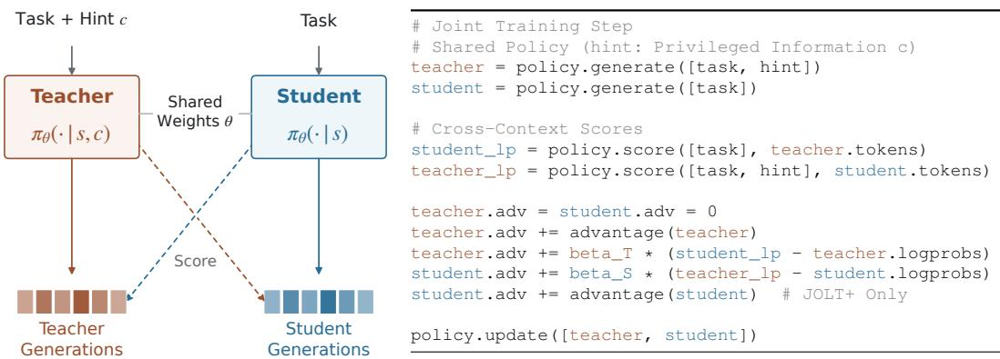  
Figure 1: Joint On-Policy Learning and Teaching (JOLT) trains a shared model as both a privileged teacher and an unprivileged student. The teacher learns from outcome rewards with KL regularization toward the student, while the student receives teacher supervision along its own generations. (Left): the joint teacher–student training process. (Right): pseudocode for a training step.

Despite growing interest in self-distillation methods that use privileged information, privileged conditioning alone does not guarantee that the resulting distillation update improves the student (Chakraborty et al., 2026; Kaur et al., 2026). Privileged information can lead the teacher to exploit shortcuts unavailable to the student, producing supervision poorly matched to the student’s current behavior. The teacher may also become unreliable when continuing from an erroneous studentgenerated prefix. A privileged teacher can therefore achieve higher expected reward while inducing an OPD update that locally decreases the student’s expected reward.

Teacher quality is therefore not determined by privileged task performance alone, but by the learning signal provided to the current student. We derive a necessary and sufficient condition for the teacher’s local distillation update to be a positive multiple of the student’s reward gradient. A sufficient pointwise construction reveals the principle underlying our approach: a good teacher meets the student where they are. The ideal teacher favors high-advantage actions under student continuations while remaining close to the student’s policy. This motivates a practical teacher-training surrogate combining outcome rewards with a teacher-student Kullback–Leibler (KL) penalty.

Because the resulting teacher is defined relative to the current student, learning and teaching are inherently coupled: as the student changes, so does the teacher best suited to it. Joint On-Policy Learning and Teaching (JOLT) closes this loop by jointly training both roles of the same policy, as illustrated in Figure 1. The privileged teacher learns from outcome rewards with token-level KL regularization toward the student, while the unprivileged student learns from the teacher’s dense distillation signal. Each role learns from trajectories generated under its own context, keeping both updates on-policy, and both update the shared parameters. When student outcome rewards are available, JOLT+ supplements the student’s distillation update with direct reinforcement learning.

Specifically, we make the following contributions:

• We characterize what makes a privileged teacher useful to its student. Higher teacher performance alone does not ensure that distillation improves the student. We derive a necessary and sufficient condition for the teacher’s local distillation update to follow the student’s reward gradient. This characterization motivates training the teacher to perform well while remaining close to the student’s current policy.

• We introduce JOLT, which learns the teacher alongside the student rather than simply imitating a privileged policy. A single model serves both roles: the teacher learns from rewards with teacher–student KL regularization, while the student receives dense distillation supervision. Both roles learn on-policy from their own generations. JOLT+ additionally incorporates student outcome rewards.

• We demonstrate that this approach improves performance across reasoning and agentic tasks. Across mathematical reasoning, code generation, tool use, and terminal interaction, JOLT+ achieves absolute gains over GRPO of 4.2 percentage points on MATH, 3.0 on LCBv6, 9.9 on AppWorld, and 4.5 in Terminal-Bench pass@32.

• We show that strong performance can be reached with substantially less training. On MATH, JOLT matches GRPO’s accuracy using $1 3 \times$ fewer completion tokens and $6 . 5 \times$ fewer processed training tokens, without direct rewards on student trajectories.

## 2 METHODOLOGY

## 2.1 BACKGROUND

Reinforcement Learning. We consider a language-model policy $\pi _ { \theta }$ acting in an episodic decision process. At each step t, the policy observes a state $s _ { t }$ and samples an action $a _ { t }$ . The resulting sequence forms a trajectory $\tau = ( s _ { 0 } , a _ { 0 } , s _ { 1 } , a _ { 1 } , \dots , s _ { T } )$ . Rolling out the policy induces a trajectory distribution, denoted $\tau \sim \pi _ { \theta }$ Let $R ( \tau ) \ \in$ R denote the return assigned to trajectory $\tau .$ The expected-return objective is $\mathcal { T } _ { \mathrm { R L } } ( \theta ) = \mathrm { \mathbb { E } } _ { \tau \sim \pi _ { \theta } } [ R ( \tau ) ]$ . The corresponding policy gradient for this objective can be expressed using the score-function estimator (Williams, 1992; Sutton et al., 2000):

$$
\nabla _ { \theta } \mathcal { J } _ { \mathrm { R L } } ( \theta ) = \mathbb { E } _ { \tau \sim \pi _ { \theta } } \left[ \sum _ { t } R ( \tau ) \nabla _ { \theta } \log \pi _ { \theta } ( a _ { t } \mid s _ { t } ) \right] .\tag{1}
$$

Although unbiased, this estimator can have high variance because the gradient contribution associated with $a _ { t }$ varies with subsequent actions and other trajectory randomness. Conditioning the return on the current state and action averages over this future randomness while preserving the expected policy gradient, with $Q ^ { \pi _ { \theta } } ( s _ { t } , a _ { t } ) \stackrel { - } { = } \mathbb { E } [ R ( \tau ) \mid s _ { t } , a _ { t } ]$ . The gradient also remains unchanged if a state-dependent baseline $b ( s _ { t } )$ is subtracted from the action value. Since the baseline does not depend on the sampled action,

$$
\begin{array} { r } { \mathbb { E } _ { a _ { t } \sim \pi _ { \theta } ( \cdot | s _ { t } ) } \left[ b ( s _ { t } ) \nabla _ { \theta } \log \pi _ { \theta } ( a _ { t } \mid s _ { t } ) \right] = 0 . } \end{array}\tag{2}
$$

The subtracted term therefore acts as a zero-mean control variate, allowing an appropriate baseline to reduce variance without biasing the policy gradient. Taking the baseline to be the expected action value under the current policy centers each action value relative to the alternatives available at the same state. This yields the on-policy advantage, with

$$
V ^ { \pi _ { \theta } } ( s _ { t } ) = \mathbb { E } _ { a \sim \pi _ { \theta } ( \cdot | s _ { t } ) } [ Q ^ { \pi _ { \theta } } ( s _ { t } , a ) ] , \qquad A ^ { \pi _ { \theta } } ( s _ { t } , a _ { t } ) = Q ^ { \pi _ { \theta } } ( s _ { t } , a _ { t } ) - V ^ { \pi _ { \theta } } ( s _ { t } ) .\tag{3}
$$

The policy gradient can therefore be written as

$$
\nabla _ { \theta } \mathcal { T } _ { \mathrm { R L } } ( \theta ) = \mathbb { E } _ { \tau \sim \pi _ { \theta } } \left[ \sum _ { t } A ^ { \pi _ { \theta } } ( s _ { t } , a _ { t } ) \nabla _ { \theta } \log \pi _ { \theta } ( a _ { t } \mid s _ { t } ) \right] .\tag{4}
$$

Thus, $A ^ { \pi _ { \theta } } ( s _ { t } , a _ { t } )$ measures the expected excess return of $a _ { t }$ relative to the current policy at $s _ { t } .$ Using it as the action-level weight exactly recovers the policy gradient of expected return. Since computing $Q ^ { \pi _ { \theta } }$ and $V ^ { \pi _ { \theta } }$ requires expectations over future trajectories, $A ^ { \pi _ { \theta } }$ is generally unavailable and must be estimated from sampled returns or a learned value function (Schulman et al., 2016). In particular, when the return is observed only through a sparse terminal reward, estimating useful action-level credit may require many rollouts.

On-Policy Distillation. On-policy distillation (OPD) instead obtains dense supervision from a stronger teacher policy πT (Agarwal et al., 2024). Let ¯θ denote the parameters used to collect trajectories. OPD minimizes the reverse KL at student-generated prefixes, holding the sampled prefix distribution and teacher targets fixed during differentiation:

$$
\mathcal { I } _ { \mathrm { O P D } } ( \theta ; \bar { \theta } ) = - \mathbb { E } _ { \tau \sim \pi _ { \bar { \theta } } } \left[ \sum _ { t } \mathrm { K L } \left( \pi _ { \theta } ( \cdot  { | } s _ { t } )  { | | } \pi _ { T } ( \cdot  { | } s _ { t } ) \right) \right] .\tag{5}
$$

The local gradient with respect to $\theta ,$ evaluated at $\theta = { \bar { \theta } } .$ , is

$$
g _ { \mathrm { O P D } } ( \bar { \theta } ; \pi _ { T } ) = \mathbb { E } _ { \tau \sim \pi _ { \bar { \theta } } } \left[ \sum _ { t } \left( \log \pi _ { T } ( a _ { t } \mid s _ { t } ) - \log \pi _ { \bar { \theta } } ( a _ { t } \mid s _ { t } ) \right) \nabla _ { \bar { \theta } } \log \pi _ { \bar { \theta } } ( a _ { t } \mid s _ { t } ) \right] .\tag{6}
$$

The teacher-student log-probability ratio therefore supervises each sampled action, reducing reliance on sparse rewards but requiring an additional teacher model.

On-Policy Self-Distillation. On-policy self-distillation (OPSD) uses the same policy for both roles, giving the teacher privileged information c, such as hints, feedback, verifier traces, or reference-side context (Zhao et al., 2026; Penaloza et al., 2026). The student $\pi _ { \boldsymbol { \theta } } ( a _ { t } \mid s _ { t } )$ and privileged teacher $\pi _ { \theta } ( a _ { t } \mid s _ { t } , c )$ share parameters θ. Each action sampled from $\pi _ { \bar { \theta } }$ is scored under both contexts. The OPSD surrogate is

$$
\mathcal { I } _ { \mathrm { O P S D } } ( \boldsymbol { \theta } ; \boldsymbol { \bar { \theta } } ) = - \mathbb { E } _ { \boldsymbol { \tau } \sim \pi _ { \bar { \theta } } } \left[ \sum _ { t } \mathrm { K L } \left( \pi _ { \boldsymbol { \theta } } ( \cdot \mid \boldsymbol { s } _ { t } ) \parallel \operatorname { s g } \left[ \pi _ { \boldsymbol { \bar { \theta } } } ( \cdot \mid \boldsymbol { s } _ { t } , c ) \right] \right) \right] ,\tag{7}
$$

where $\mathrm { s g }$ denotes stop-gradient. Its local gradient at $\theta = \bar { \theta }$ is

$$
g _ { \mathrm { O P S D } } ( { \bar { \theta } } ) = \mathbb { E } _ { \tau \sim \pi _ { \bar { \theta } } } \left[ \sum _ { t } \left( \log \pi _ { \bar { \theta } } ( a _ { t } \mid s _ { t } , c ) - \log \pi _ { \bar { \theta } } ( a _ { t } \mid s _ { t } ) \right) \nabla _ { \bar { \theta } } \log \pi _ { \bar { \theta } } ( a _ { t } \mid s _ { t } ) \right] .\tag{8}
$$

OPSD thus retains dense supervision without requiring an additional teacher model.

## 2.2 A REWARD-CONSISTENT TEACHER

Conditioning the policy on privileged information makes the teacher better informed, but does not guarantee that the resulting distillation signal improves the student. The privileged teacher may exploit shortcuts that are unavailable without the privileged information $c ,$ assign high probability to trajectories that are unlikely under the student, or provide unreliable guidance after errors in a student-generated prefix. Indeed, privileged-context distillation can degrade performance even when the teacher is more capable (Chakraborty et al., 2026; Kaur et al., 2026).

These failure modes motivate characterizing a teacher by the student update it induces, rather than by its expected reward under privileged information. For a fixed student policy $\pi _ { \bar { \theta } } .$ , we call a teacher $\pi _ { T } ^ { \star }$ reward-consistent if the local OPD update it induces matches, up to positive scaling, the policy gradient of the student’s expected return. That is, for some $\beta _ { T } > 0$

$$
g _ { \mathrm { O P D } } ( \bar { \theta } ; \pi _ { T } ^ { \star } ) = \frac { 1 } { \beta _ { T } } \nabla _ { \theta } \mathcal { T } _ { \mathrm { R L } } ( \theta ) | _ { \theta = \bar { \theta } } .\tag{9}
$$

Substituting the two gradients yields the necessary and sufficient condition

$$
\mathbb { E } _ { \tau \sim \pi _ { \bar { \theta } } } \left[ \sum _ { t } \left( \log \frac { \pi _ { T } ^ { \star } ( a _ { t } \mid s _ { t } , c ) } { \pi _ { \bar { \theta } } ( a _ { t } \mid s _ { t } ) } - \frac { 1 } { \beta _ { T } } A ^ { \pi _ { \bar { \theta } } } ( s _ { t } , a _ { t } ) \right) \nabla _ { \bar { \theta } } \log \pi _ { \bar { \theta } } ( a _ { t } \mid s _ { t } ) \right] = 0 .\tag{10}
$$

A sufficient pointwise condition for this proportionality is:

$$
\log \pi _ { T } ^ { \star } ( a \mid s , c ) - \log \pi _ { \bar { \theta } } ( a \mid s ) = \frac { 1 } { \beta _ { T } } A ^ { \pi _ { \bar { \theta } } } ( s , a ) - \log Z ( s ) ,\tag{11}
$$

for every state-action pair in the support of the student, where the normalizing constant is

$$
Z ( s ) = \sum _ { a ^ { \prime } } \pi _ { \bar { \theta } } ( a ^ { \prime } \mid s ) \exp \left( \frac { 1 } { \beta _ { T } } A ^ { \pi _ { \bar { \theta } } } ( s , a ^ { \prime } ) \right) .\tag{12}
$$

Note that log $Z ( s )$ does not affect the policy gradient update, as

$$
\mathbb { E } _ { a \sim \pi _ { \bar { \theta } } ( . | s ) } \left[ \log Z ( s ) \nabla _ { \bar { \theta } } \log \pi _ { \bar { \theta } } ( a \mid s ) \right] = 0 .\tag{13}
$$

Exponentiating equation (11) gives

$$
\pi _ { T } ^ { \star } ( a \mid s , c ) = \frac { 1 } { Z ( s ) } \pi _ { \bar { \theta } } ( a \mid s ) \exp \left( \frac { 1 } { \beta _ { T } } A ^ { \pi _ { \bar { \theta } } } ( s , a ) \right) .\tag{14}
$$

This exponential update from KL-regularized policy improvement (Peters et al., 2010; Abdolmalek et al., 2018) provides a sufficient teacher for local OPD gradient proportionality.

## 2.3 JOINT ON-POLICY LEARNING AND TEACHING (JOLT)

The preceding derivation characterizes a pointwise reward-consistent teacher for a fixed student. This suggests that the privileged teacher should be trained toward this target distribution by minimizing

$$
\operatorname* { m i n } _ { \theta } \quad \mathrm { K L } \left( \pi _ { \theta } ( \cdot  { \mid } s , c )  { \parallel } \pi _ { T } ^ { \star } ( \cdot  { \mid } s , c ) \right) .\tag{15}
$$

During this update, the student policy, its advantage, and the target distribution are fixed at ${ \bar { \theta } } .$ Substituting the expression for $\pi _ { T } ^ { \star }$ gives

$$
\begin{array} { l } { { \mathrm { K L } \left( \pi _ { \theta } ( \cdot \mid s , c ) \parallel \pi _ { T } ^ { \star } ( \cdot \mid s , c ) \right) } } \\ { { = \mathbb { E } _ { a \sim \pi _ { \theta } ( \cdot \mid s , c ) } \left[ \log \frac { \pi _ { \theta } ( a \mid s , c ) } { \operatorname { s g } [ \pi _ { \bar { \theta } } ( a \mid s ) ] } - \frac { 1 } { \beta _ { T } } A ^ { \pi _ { \bar { \theta } } } ( s , a ) + \log Z ( s ) \right] . } } \end{array}\tag{16}
$$

Since log $Z ( s )$ is constant during the teacher update, minimizing this divergence is equivalent to maximizing

$$
\mathbb { E } _ { a \sim \pi _ { \theta } ( \cdot \vert s , c ) } \left[ A ^ { \pi _ { \bar { \theta } } } ( s , a ) \right] - \beta _ { T } \mathrm { K L } \left( \pi _ { \theta } ( \cdot  { \vert } s , c ) \ \lVert \ \mathrm { s g } [ \pi _ { \bar { \theta } } ( \cdot  { \vert } s ) ] \right) .\tag{17}
$$

The objective above requires student continuation advantages, which are generally unavailable. Motivated by this construction, JOLT uses returns from the teacher’s own trajectories together with a separate token-level KL loss at sampled teacher prefixes, yielding the following practical training surrogate:

$$
\begin{array} { l } { \mathcal { T } _ { T } ( \theta ; \bar { \theta } ) = \mathbb { E } _ { \tau \sim \pi _ { \bar { \theta } } ( \cdot \vert c ) } \Big [ \sum _ { t } \big ( \mathrm { s g } [ \widehat { A } ( \tau ) ] \log \pi _ { \theta } ( a _ { t } \mid s _ { t } , c ) } \\ { ~ - ~ \beta _ { T } \mathrm { K L } ( \pi _ { \theta } ( \cdot \vert s _ { t } , c ) \ \Vert \ \mathrm { s g } [ \pi _ { \bar { \theta } } ( \cdot \vert s _ { t } ) ] ) \big ) \Big ] . } \end{array}\tag{18}
$$

Here, $ { \widehat { A } } ( \tau )$ is the within-role centered return defined below. Sampled teacher prefixes and the student reference are held fixed during differentiation. The gradient-proportionality result characterizes the local student distillation update under the ideal teacher for a fixed policy. Joint training applies teacher updates to the shared parameters, so the combined update falls outside this guarantee.

JOLT combines this teacher surrogate with student distillation, updating shared parameters θ. This provides task augmentation: the model learns from original tasks alongside assisted versions made easier by privileged information. The formulation is agnostic to how c is constructed and accommodates existing privileged contexts.

To reduce variance in the reward-based updates, we center returns within each role’s group of G sibling trajectories sampled under the same context (Shao et al., 2024), leaving the separate tokenlevel KL loss unchanged:

$$
\widehat { A } ( \tau ) = R ( \tau ) - \frac { 1 } { G } \sum _ { j = 1 } ^ { G } R ( \tau _ { j } ) .\tag{19}
$$

At the rollout parameters, the local gradients admit a sampled score-function representation. Writing $\Delta _ { t } ^ { \bar { \theta } } = \log \pi _ { \bar { \theta } } ( a _ { t } \mid s _ { t } , c ) - \log \pi _ { \bar { \theta } } ( a _ { t } \mid s _ { t } )$ for the teacher–student log-probability ratio evaluated at these parameters, the corresponding token weights are

$$
\widehat { A } _ { t } ^ { T } = \mathrm { s g } \Big [ \widehat { A } ( \tau ) - \beta _ { T } \Delta _ { t } ^ { \bar { \theta } } \Big ] , \qquad \widehat { A } _ { t } ^ { S } = \mathrm { s g } \Big [ \beta _ { S } \Delta _ { t } ^ { \bar { \theta } } \Big ] .\tag{20}
$$

The current-token log-ratio reproduces the gradient of the teacher’s separate KL loss in expectation at fixed prefixes and rollout parameters. Here, $\beta _ { T }$ scales teacher KL and $\beta _ { S }$ scales student distillation. JOLT+ adds the student’s return advantage, $\widehat { A } _ { t } ^ { S + } = \mathrm { s g } [ \widehat { A } ( \tau ) + \beta _ { S } \Delta _ { t } ^ { \bar { \theta } } ]$ , while leaving the teacher update unchanged.

Combining the teacher and student losses gives the shared-parameter surrogate

$$
\mathcal { I } _ { \mathrm { J O L T } } ( \boldsymbol { \theta } ; \bar { \boldsymbol { \theta } } ) = \mathcal { I } _ { T } ( \boldsymbol { \theta } ; \bar { \boldsymbol { \theta } } ) + \beta _ { S } \mathcal { I } _ { \mathrm { O P S D } } ( \boldsymbol { \theta } ; \bar { \boldsymbol { \theta } } ) .\tag{21}
$$

JOLT+ adds the analogous reward-based student surrogate, combining dense teacher supervision with direct outcome feedback on student trajectories. In both variants, each role learns from trajectories generated under its own context, and both roles update the shared policy.

## 3 RELATED WORK

On-Policy and Privileged Self-Distillation. Knowledge distillation traditionally transfers the output distribution of a fixed teacher into a student model (Hinton et al., 2015). For autoregressive models, sequence-level distillation commonly trains the student on teacher-generated trajec tories (Kim & Rush, 2016). Supervision is therefore concentrated on prefixes generated by the teacher, which may differ from those encountered during the student’s own generation. On-policy distillation addresses this mismatch by querying the teacher along student-generated trajectories (Agarwal et al., 2024; Song & Zheng, 2026). Its reverse-KL formulation provides dense supervision through the teacher-student log-probability ratio.

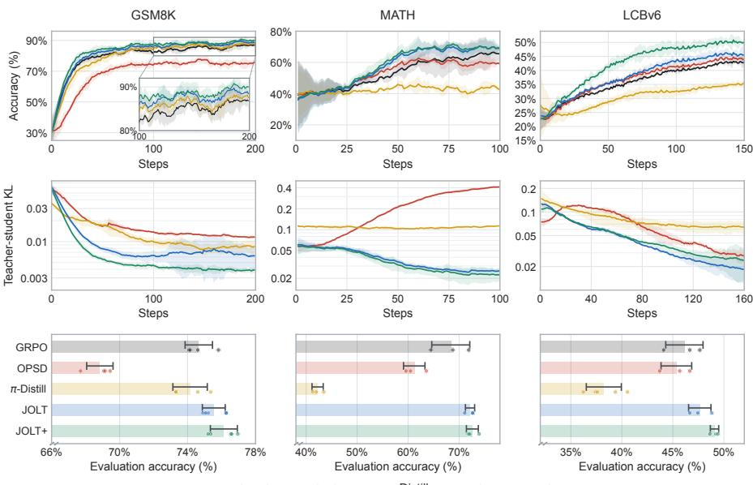  
Figure 2: Training accuracy (top), teacher–student KL (middle), and final evaluation (bottom) on GSM8K, MATH, and LCBv6. JOLT improves mean evaluation accuracy over the distillation baselines with closer teacher–student agreement. Bottom-row dots show runs, and error bars show standard deviations. Evaluation protocols appear in Appendix A.

Teacher supervision can also be obtained from the student model itself by conditioning it on additional information. This builds on context distillation, which transfers behavior elicited by additional context into a policy that acts without that context (Snell et al., 2022). Privileged self-distillation combines this idea with on-policy sampling, using verified solutions, demonstrations, textual feedback, system prompts, or prior experience to condition the teacher (Zhao et al., 2026; Shenfeld et al., 2026; Hubotter et al., 2026; Ye et al., 2026). The teacher shares the student’s parameters or uses a¨ frozen or moving-average copy, allowing this additional information to provide dense supervision without a separately trained teacher model.

Reliability of Teacher Supervision. Recent studies have identified failures arising from teacherstudent support mismatch, high-entropy teacher predictions, privileged-context leakage, and differences in reasoning style (Fu et al., 2026; Jin et al., 2026; Kim et al., 2026; Kaur et al., 2026). These studies show that teacher guidance can be unreliable on student-generated prefixes, even when the teacher performs well on its own trajectories.

To assess whether teacher supervision helps the student, Armandpour et al. (2026) compare distillation gradients with estimated success-improving gradients. Agrawal et al. (2026) examine this connection through policy-improvement analysis, deriving guarantees for a distributional DAgger objective under stated assumptions. Other approaches modify how reward and dense supervision are combined. RLSD uses outcome rewards to determine update directions while allowing teacherstudent disagreement to modulate their token-level magnitudes (Yang et al., 2026a). G-OPD instead interprets the teacher-reference log-probability ratio as an implicit dense reward, allowing its strength to be adjusted independently of KL regularization (Yang et al., 2026c). These approaches assess or modify the student update induced by a teacher. We instead characterize teacher distributions under which the OPD update follows the student’s reward policy gradient, using this condition to motivate teacher training.

Learned Teachers and Policy Improvement. Teacher training can improve supervision by accounting for the student’s learning needs. Reinforcement-Learned Teachers optimize explanations using the resulting student performance (Cetin et al., 2025), while SOAR rewards problem generation that improves the student on difficult tasks (Sundaram et al., 2026). Pedagogical RL trains a privileged teacher using task success together with a spike-sensitive surprise penalty that measures learnability under the student (Chakraborty et al., 2026). Teacher optimization can also be integrated with student learning. π-Distill jointly trains privileged teacher and student roles within a shared model, using a KL-regularized teacher objective. However, its student update remains offpolicy, relying on teacher-generated trajectories rather than the student’s own generations (Penaloza et al., 2026). The exponential reweighting in our teacher construction connects it to KL-regularized policy improvement and related self-distillation formulations (Peters et al., 2010; Abdolmaleki et al., 2018; Peng et al., 2019; Geist et al., 2019; Ding, 2026; Yu et al., 2026).

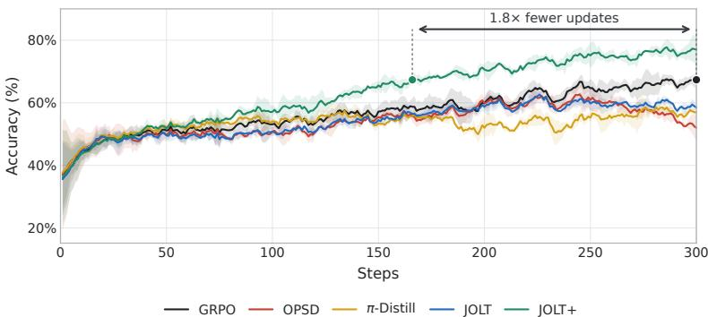  
Figure 3: Training performance on AppWorld. JOLT+ reaches GRPO’s final training performance using approximately 1.8× fewer updates, then continues improving. Combining teacher supervision with student outcome rewards outperforms both distillation baselines.

## 4 EXPERIMENTS

We evaluate joint teacher–student training both without direct student reward and alongside reward-based student learning. Our experiments span mathematical reasoning, code generation, tool use, and long-horizon terminal tasks. Across these settings, the teacher receives different forms of privileged information, including verified answers, worked solutions, execution feedback, and summaries of previous attempts. We compare against GRPO (Shao et al., 2024), OPSD (Zhao et al., 2026), and π-Distill (Penaloza et al., 2026), tuning hyperparameters for each

Table 1: Evaluation (%): MATH/LCBv6 accuracy and AppWorld development-set state-test pass rate. Mean ± standard deviation across runs. Run counts and protocols are in Appendix A.
<table><tr><td>Method</td><td>MATH</td><td>LCBv6</td><td>AppWorld</td></tr><tr><td>GRPO</td><td> $6 8 . 3 6 \pm 3 . 7 3$ </td><td> $4 6 . 1 3 \pm 1 . 8 3$ </td><td> $6 2 . 2 0 \pm 2 . 8 3$ </td></tr><tr><td>OPSD</td><td> $6 1 . 2 0 \pm 2 . 1 0$ </td><td> $4 5 . 3 4 \pm 1 . 5 0$ </td><td> $2 9 . 4 9 \pm 2 . 4 8$ </td></tr><tr><td>π-Distill</td><td> $4 2 . 2 5 \pm 1 . 1 0$ </td><td> $3 8 . 2 3 \pm 1 . 7 2$ </td><td> $5 9 . 8 5 \pm 2 . 9 7$ </td></tr><tr><td>JOLT</td><td> $7 2 . 1 4 \pm 0 . 9 0$ </td><td> $4 7 . 6 4 \pm 1 . 1 0$ </td><td> $5 1 . 9 2 \pm 5 . 3 0$ </td></tr><tr><td>JOLT+</td><td> ${ \bf 7 2 . 5 9 \pm 1 . 1 7 }$ </td><td> ${ \bf 4 9 . 0 8 \pm 0 . 4 1 }$ </td><td> $\mathbf { 7 2 . 0 9 \pm 6 . 0 1 }$ </td></tr></table>

method. Tables 1 and 2 summarize evaluation performance, while Appendix A provides experimental configurations, prompts, and tuning details

Table 1 reports means and standard deviations across runs. Appendix A gives run counts and other uncertainty conventions. We apply exponential moving-average smoothing only to training curves.

GSM8K. We train DeepSeek-V2-Lite (DeepSeek-AI, 2024) on GSM8K (Cobbe et al., 2021), supplying the teacher with the verified answer to each problem. As shown in Figure 2 (left), OPSD improves early in training but plateaus, whereas JOLT and JOLT+ continue improving as teacher– student disagreement decreases. Final evaluations in the bottom-left panel place JOLT close to tuned GRPO without direct student reward, with JOLT+ highest in mean accuracy.

MATH. We train Qwen3-0.6B (Qwen Team, 2025) on MATH (Hendrycks et al., 2021), supplying worked reference solutions to the teacher following Zhao et al. (2026). Figure 2 (middle) shows that JOLT and JOLT+ improve more rapidly than GRPO and reach higher training accuracy, while OPSD plateaus earlier. Teacher–student disagreement grows under OPSD but decreases under joint training. The bottom row shows both JOLT variants above OPSD and π-Distill in mean held-out accuracy. Table 1 also places JOLT above GRPO without direct student reward, with JOLT+ highest. Appendix C examines the contributions of the teacher’s reward and KL terms and shows that JOLT+ outperforms OPSD augmented with student outcome rewards.

LiveCodeBench-V6 (LCBv6). We next examine whether JOLT can use privileged information constructed during training. Following SDPO’s coding protocol (Hubotter et al., 2026), we train¨

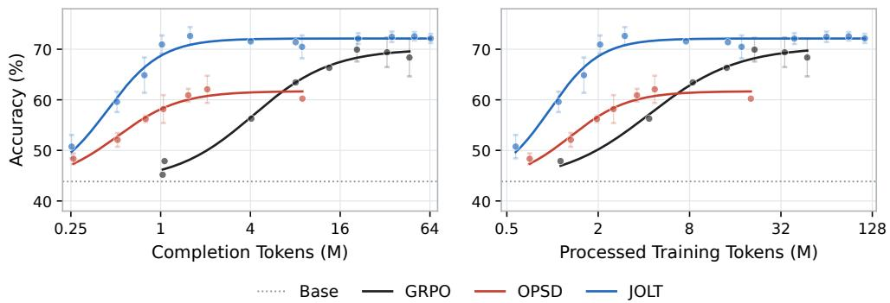  
Figure 4: Performance scaling with training token budget, as measured in completion tokens (left) and processed training tokens (right). On MATH, JOLT reaches high accuracy with fewer tokens than GRPO while surpassing OPSD’s early plateau under both token counters. Appendix B details token accounting, curve fitting, and the budget comparison.

Qwen3-8B (Qwen Team, 2025) on 131 LCBv6 problems (Jain et al., 2024) and evaluate on the complete test suites for those problems, including test cases withheld during training. We construct teacher guidance from the model’s own attempts: the teacher receives a successful sibling solution when available and execution feedback otherwise. As shown in Figure 2 (right), JOLT improves over the distillation baselines during training, with further gains from student outcome rewards in JOLT+. The bottom row shows higher mean accuracy for JOLT than GRPO and both distillation baselines, with JOLT+ highest. These results extend joint training to settings where privileged guidance come from sampled attempts and their outcomes.

AppWorld. AppWorld (Trivedi et al., 2024) tests tool use through interactions with stateful applications. We train Qwen3-4B-Instruct (Qwen Team, 2025), constructing privileged guidance from summaries of previous attempts following Wang et al. (2026). These summaries record successful strategies, mistakes, and suggested workflows. Following Skill-SD, we report state-test pass rate on the 57-task development split, averaging the fraction of tests passed per task. Figure 3 shows that OPSD deteriorates later in training, while JOLT remains competitive with π-Distill but below GRPO. Combining teacher supervision with student outcome rewards produces stronger results: JOLT+ reaches GRPO’s final training reward using approximately 1.8× fewer training updates and continues improving. As reported in Table 1, JOLT’s mean development-set state-test pass rate remains below π-Distill and GRPO, whereas JOLT+ achieves the highest mean.

Terminal-Bench. We train Qwen3-30B-A3B-Instruct (Qwen Team, 2025) on TMax (Ivison et al., 2026) and evaluate on Terminal-Bench 2.1 (Merrill et al., 2026) using TMax’s released agent and evaluation settings. During training, the teacher receives private verifier information in stateful shell environments. Evaluation uses the unprivileged student. Table 2 reports pass@k (Chen et al., 2021) for k ∈ {1, 4, 16, 32}. JOLT improves over the base model and both distillation baselines at every reported k, although GRPO achieves higher scores. JOLT+ achieves the highest pass@k across all

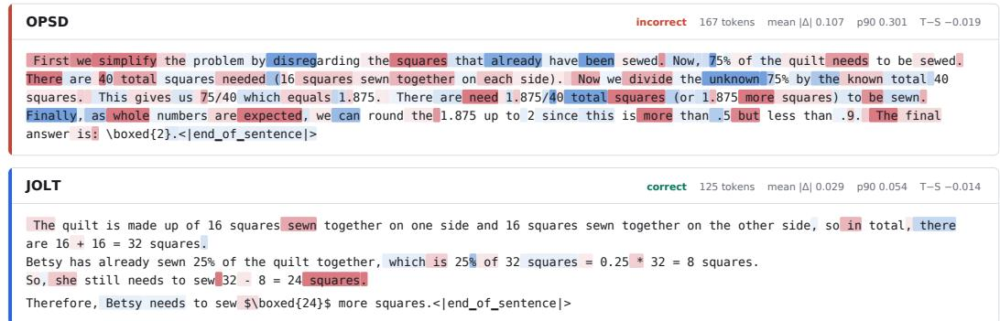  
Figure 5: Teacher–student log-probability differences along responses to the same GSM8K problem under OPSD (top) and JOLT (bottom). Red indicates higher teacher log probability, while blue indicates lower teacher log probability. In this example, OPSD exhibits disagreement throughout much of its response, while JOLT shows smaller differences concentrated at fewer token positions. Appendix D extends the comparison to π-Distill and JOLT+.

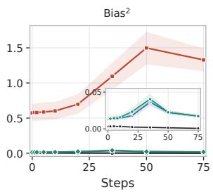

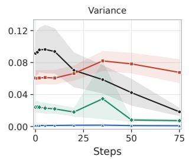  
GRPO OPSD JOLT JOLT+

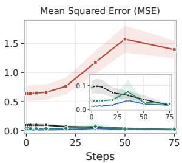  
Figure 6: Empirical squared bias (left), variance (middle), and mean squared error (right) of weighted student gradients along each method’s own training trajectory. Bias and MSE use Monte Carlo reward-gradient references. GRPO’s error is dominated by variance, whereas OPSD develops increasing empirical bias. JOLT and JOLT+ retain low variance with smaller empirical bias than OPSD. Bands show pointwise 95% batch-bootstrap intervals. See Appendix E for details. four reported values, suggesting that teacher supervision can complement student outcome rewards on long-horizon tasks.

Token Efficiency and Scaling. Beyond final accuracy, we are interested in how performance scales with training tokens, as a proxy for training compute. To this end, we evaluate models trained under different training token budgets. Following Khatri et al. (2025), we fit a sigmoidal relationship between accuracy and log trainingtoken budget. As shown in Figure 4, OPSD initially learns more efficiently than GRPO, but its advantage disappears as its performance plateaus while GRPO continues improving. Meanwhile, JOLT exhibits early sample efficiency while reach-

Table 2: Terminal-Bench 2.1 pass@k (%) after TMax training, using one training run per method.
<table><tr><td>Method</td><td>pass@1</td><td>pass@4</td><td>pass@16</td><td>pass@32</td></tr><tr><td>Base</td><td>5.18</td><td>10.84</td><td>18.35</td><td>22.81</td></tr><tr><td>GRPO</td><td>8.25</td><td>17.04</td><td>26.91</td><td>30.34</td></tr><tr><td>OPSD</td><td>2.82</td><td>6.96</td><td>13.59</td><td>16.90</td></tr><tr><td>π-Distill</td><td>4.99</td><td>10.50</td><td>18.30</td><td>22.31</td></tr><tr><td>JOLT</td><td>6.56</td><td>13.56</td><td>22.06</td><td>25.69</td></tr><tr><td>JOLT+</td><td>10.96</td><td>20.12</td><td>29.99</td><td>34.83</td></tr></table>

ing substantially higher accuracy compared to GRPO. This pattern holds for both completion tokens and processed training tokens, showing that joint training improves performance across training budgets. Appendix B details token accounting, curve fitting, and savings across accuracy targets.

Student–Teacher Alignment. Beyond the aggregate student–teacher KL measurements shown in Figure 2, we examine how the teacher and student disagree along individual generations. In the example shown in Figure 5, the privileged teacher under OPSD assigns markedly different probabilities to tokens throughout much of the student’s response. Meanwhile, under JOLT, these differences are smaller and concentrated at fewer locations. These observations illustrate differences in both the overall magnitude of contextual disagreement and its distribution across the tokens receiving supervision. Appendix D extends this token-level comparison to π-Distill and JOLT+.

Gradient Bias–Variance Analysis. To better understand the student learning signals encountered during training, we examine their empirical bias and variance at checkpoints along each method’s own trajectory. We estimate bias relative to a Monte Carlo reward-gradient reference obtained by averaging independent REINFORCE gradient estimates (Williams, 1992), and variance across repeated student-gradient estimates. As shown in Figure 6, GRPO’s measured error is dominated by variance, whereas OPSD exhibits low variance but increasing empirical bias during training. JOLT and JOLT+ retain low variance while showing substantially smaller empirical bias than OPSD. These measurements depend on gradient scale and learned policies. They do not isolate teacher training’s effect or establish reward consistency of the complete joint update. Appendix E gives definitions and a comparison of normalized gradient directions.

## 5 CONCLUSION

We introduced JOLT, a method that jointly trains a single policy as a privileged teacher and an unprivileged student. Our analysis connects the teacher’s supervision to the student’s reward objective, motivating a teacher objective that balances task performance with proximity to the current student.

Both roles learn from their own trajectories, and the formulation accommodates different sources of privileged information. Experiments demonstrate improvements in both the effectiveness and efficiency of self-distillation: joint training reaches competitive performance without direct student reward and achieves high accuracy with fewer training tokens. Incorporating student rewards further strengthens this approach by combining dense teacher supervision with direct feedback on the student’s own generations. The token-level visualizations show closer teacher–student agreement under JOLT, while the gradient analysis characterizes the variability and empirical reward-gradient discrepancies of the student updates along training. More broadly, this provides a way to supplement sparse rewards with dense supervision that adapts to the model’s current capabilities, without requiring a separate teacher.

## ACKNOWLEDGEMENTS

We thank Andrew Gordon Wilson, Ziqing Hu, Hang Wu, Senzeyu Zhang, Dongqi Wu, Yuan Liang, Yunfan Zhong, Lequn Chen, and Denis Yarats for insightful discussions that helped shape this work. We are also grateful to Ziqing Hu, Yunfan Zhong, Zhihao Wang, and Lequn Chen for their support with the training infrastructure that enabled our experiments.

## AI USE

The research ideas originated with the authors. Generative AI tools assisted with implementing and debugging methods and baselines, analysis and figure-generation code, literature search and synthesis, manuscript drafting and editing, and LaTeX preparation. They also supported discussion and critique of derivations, experimental design, and result interpretation. The authors thoroughly reviewed and iteratively refined the implementations, and cross-checked quantitative summaries and reproduced figures against experiment records. AI was not used to generate or clean benchmark datasets. The authors are responsible for the final text, mathematical claims, code, and reported results.

## REFERENCES

Abbas Abdolmaleki, Jost Tobias Springenberg, Yuval Tassa, Remi Munos, Nicolas Heess, and Martin Riedmiller. Maximum a posteriori policy optimisation. arXiv preprint arXiv:1806.06920, 2018.

Rishabh Agarwal, Max Schwarzer, Pablo Samuel Castro, Aaron Courville, and Marc G. Bellemare. Deep reinforcement learning at the edge of the statistical precipice. In Advances in Neural Information Processing Systems, 2021. URL https://arxiv.org/abs/2108.13264.

Rishabh Agarwal, Nino Vieillard, Yongchao Zhou, Piotr Stanczyk, Sabela Ramos, Matthieu Geist, and Olivier Bachem. On-policy distillation of language models: Learning from self-generated mistakes. In International Conference on Learning Representations, 2024.

Rishabh Agrawal, Jacob Fein-Ashley, and Paria Rashidinejad. Reinforcement learning from rich feedback with distributional DAgger. arXiv preprint arXiv:2606.05152, 2026.

Mohammadreza Armandpour, Fatih Ilhan, David Harrison, Ajay Jaiswal, Duc N. M. Hoang, Fartash Faghri, Yizhe Zhang, Minsik Cho, and Mehrdad Farajtabar. Unmasking on-policy distillation: Where it helps, where it hurts, and why. arXiv preprint arXiv:2605.10889, 2026.

Edoardo Cetin, Tianyu Zhao, and Yujin Tang. Reinforcement learning teachers of test time scaling. arXiv preprint arXiv:2506.08388, 2025.

Souradip Chakraborty, Noah Ziems, Furong Huang, Meng Jiang, Amrit Singh Bedi, and Omar Khattab. Pedagogical RL: Teaching models to teach themselves from privileged information, 2026. https://noahziems.com/pedagogical-rl.

Mark Chen, Jerry Tworek, Heewoo Jun, et al. Evaluating large language models trained on code. arXiv preprint arXiv:2107.03374, 2021. URL https://arxiv.org/abs/2107.03374.

Karl Cobbe, Vineet Kosaraju, Mohammad Bavarian, Mark Chen, Heewoo Jun, Lukasz Kaiser, Matthias Plappert, Jerry Tworek, Jacob Hilton, Reiichiro Nakano, Christopher Hesse, and John Schulman. Training verifiers to solve math word problems. arXiv preprint arXiv:2110.14168, 2021.

DeepSeek-AI. DeepSeek-V2: A strong, economical, and efficient mixture-of-experts language model. arXiv preprint arXiv:2405.04434, 2024.

DeepSeek-AI. DeepSeek-R1: Incentivizing reasoning capability in LLMs via reinforcement learning. arXiv preprint arXiv:2501.12948, 2025.

Ken Ding. HDPO: Hybrid distillation policy optimization via privileged self-distillation. arXiv preprint arXiv:2603.23871, 2026.

Yuqian Fu, Haohuan Huang, Kaiwen Jiang, Jiacai Liu, Zhuo Jiang, Yuanheng Zhu, and Dongbin Zhao. Revisiting on-policy distillation: Empirical failure modes and simple fixes. arXiv preprint arXiv:2603.25562, 2026.

Matthieu Geist, Bruno Scherrer, and Olivier Pietquin. A theory of regularized markov decision processes. In Proceedings of the 36th International Conference on Machine Learning, pp. 2160– 2169, 2019.

Dan Hendrycks, Collin Burns, Saurav Kadavath, Akul Arora, Steven Basart, Eric Tang, Dawn Song, and Jacob Steinhardt. Measuring mathematical problem solving with the MATH dataset. arXiv preprint arXiv:2103.03874, 2021.

Geoffrey Hinton, Oriol Vinyals, and Jeff Dean. Distilling the knowledge in a neural network. arXiv preprint arXiv:1503.02531, 2015.

Jonas Hubotter, Frederike L¨ ubeck, Lejs Behric, Anton Baumann, Marco Bagatella, Daniel Marta,¨ Ido Hakimi, Idan Shenfeld, Thomas Kleine Buening, Carlos Guestrin, and Andreas Krause. Reinforcement learning via self-distillation. arXiv preprint arXiv:2601.20802, 2026.

Hamish Ivison, Junjie Oscar Yin, Rulin Shao, Teng Xiao, Nathan Lambert, and Hannaneh Hajishirzi. Tmax: A simple recipe for terminal agents, 2026. URL https://arxiv.org/abs/2606. 23321.

Naman Jain, King Han, Alex Gu, Wen-Ding Li, Fanjia Yan, Tianjun Zhang, Sida Wang, Armando Solar-Lezama, Koushik Sen, and Ion Stoica. LiveCodeBench: Holistic and contamination free evaluation of large language models for code. arXiv preprint arXiv:2403.07974, 2024.

Woogyeol Jin, Taywon Min, Yongjin Yang, Dennis Wei, Yi Zhou, Swanand Ravindra Kadhe, Nathalie Baracaldo, and Kimin Lee. Entropy-aware on-policy distillation of language models. arXiv preprint arXiv:2603.07079, 2026.

Simran Kaur, Narutatsu Ri, Yinghui He, Liam Fowl, and Sanjeev Arora. Rethinking on-policy self-distillation for thinking models. arXiv preprint arXiv:2607.05184, 2026.

Devvrit Khatri, Lovish Madaan, Rishabh Tiwari, Rachit Bansal, Sai Surya Duvvuri, Manzil Zaheer, Inderjit S. Dhillon, David Brandfonbrener, and Rishabh Agarwal. The art of scaling reinforcement learning compute for LLMs. arXiv preprint arXiv:2510.13786, 2025. URL https://arxiv. org/abs/2510.13786.

Jeonghye Kim, Xufang Luo, Minbeom Kim, Sangmook Lee, Dohyung Kim, Jiwon Jeon, Dongsheng Li, and Yuqing Yang. Why does self-distillation (sometimes) degrade the reasoning capability of LLMs? arXiv preprint arXiv:2603.24472, 2026.

Yoon Kim and Alexander M. Rush. Sequence-level knowledge distillation. In Proceedings of the 2016 Conference on Empirical Methods in Natural Language Processing, 2016.

Zongxia Li, Zhongzhi Li, Yucheng Shi, Ruhan Wang, Junyao Yang, Zhichao Liu, Xiyang Wu, Anhao Li, Yue Yu, Ninghao Liu, Lichao Sun, Haotao Mi, and Leowei Liang. Long-Horizon-Terminal-Bench: Testing the limits of agents on long-horizon terminal tasks with dense rewardbased grading. arXiv preprint arXiv:2607.08964, 2026.

Mike A. Merrill, Alexander G. Shaw, Nicholas Carlini, et al. Terminal-Bench: Benchmarking agents on hard, realistic tasks in command line interfaces. arXiv preprint arXiv:2601.11868, 2026. URL https://arxiv.org/abs/2601.11868.

OpenAI. OpenAI o1 system card. arXiv preprint arXiv:2412.16720, 2024.

Emiliano Penaloza, Dheeraj Vattikonda, Nicolas Gontier, Alexandre Lacoste, Laurent Charlin, and Massimo Caccia. Privileged information distillation for language models. arXiv preprint arXiv:2602.04942, 2026.

Xue Bin Peng, Aviral Kumar, Grace Zhang, and Sergey Levine. Advantage-weighted regression: Simple and scalable off-policy reinforcement learning. arXiv preprint arXiv:1910.00177, 2019.

Jan Peters, Katharina Mulling, and Yasemin Alt ¨ un. Relative entropy policy search. In ¨ Proceedings of the AAAI Conference on Artificial Intelligence, volume 24, pp. 1607–1612, 2010.

Qwen Team. Qwen3 technical report. arXiv preprint arXiv:2505.09388, 2025. URL https: //arxiv.org/abs/2505.09388.

John Schulman, Philipp Moritz, Sergey Levine, Michael Jordan, and Pieter Abbeel. Highdimensional continuous control using generalized advantage estimation. In International Conference on Learning Representations, 2016.

Zhihong Shao, Peiyi Wang, Qihao Zhu, Runxin Xu, Junxiao Song, Xiao Bi, Haowei Zhang, Mingchuan Zhang, Y. K. Li, Y. Wu, and Daya Guo. DeepSeekMath: Pushing the limits of mathematical reasoning in open language models. arXiv preprint arXiv:2402.03300, 2024.

Idan Shenfeld, Mehul Damani, Jonas Hubotter, and Pulkit Agrawal. Self-distillation enables con-¨ tinual learning. arXiv preprint arXiv:2601.19897, 2026.

Charlie Snell, Dan Klein, and Ruiqi Zhong. Learning by distilling context. arXiv preprint arXiv:2209.15189, 2022.

Mingyang Song and Mao Zheng. A survey of on-policy distillation for large language models. arXiv preprint arXiv:2604.00626, 2026.

Shobhita Sundaram, John Quan, Ariel Kwiatkowski, Kartik Ahuja, Yann Ollivier, and Julia Kempe. Teaching models to teach themselves: Reasoning at the edge of learnability. arXiv preprint arXiv:2601.18778, 2026.

Richard S. Sutton, David McAllester, Satinder Singh, and Yishay Mansour. Policy gradient methods for reinforcement learning with function approximation. In Advances in Neural Information Processing Systems, volume 12, 2000.

Harsh Trivedi, Tushar Khot, Mareike Hartmann, Ruskin Manku, Vinty Dong, Edward Li, Shashank Gupta, Ashish Sabharwal, and Niranjan Balasubramanian. AppWorld: A controllable world of apps and people for benchmarking interactive coding agents. In Proceedings of the Association for Computational Linguistics, 2024.

Hao Wang, Guozhi Wang, Han Xiao, Yufeng Zhou, Yue Pan, Jichao Wang, Ke Xu, Yafei Wen, Xiaohu Ruan, Xiaoxin Chen, and Honggang Qi. Skill-sd: Skill-conditioned self-distillation for multi-turn llm agents. arXiv preprint arXiv:2604.10674, 2026. URL https://arxiv.org/ abs/2604.10674.

Ronald J. Williams. Simple statistical gradient-following algorithms for connectionist reinforcement learning. Machine Learning, 8(3–4):229–256, 1992.

Chenxu Yang, Chuanyu Qin, Qingyi Si, Minghui Chen, Naibin Gu, Dingyu Yao, Zheng Lin, Weiping Wang, Jiaqi Wang, and Nan Duan. Self-distilled RLVR. arXiv preprint arXiv:2604.03128, 2026a.

John Yang, Kilian Lieret, Jeffrey Ma, Parth Thakkar, Dmitrii Pedchenko, Sten Sootla, Emily McMilin, Pengcheng Yin, Rui Hou, Gabriel Synnaeve, Diyi Yang, and Ofir Press. Program-Bench: Can language models rebuild programs from scratch? arXiv preprint arXiv:2605.03546, 2026b.

Wenkai Yang, Weijie Liu, Ruobing Xie, Kai Yang, Saiyong Yang, and Yankai Lin. Learning beyond teacher: Generalized on-policy distillation with reward extrapolation. arXiv preprint arXiv:2602.12125, 2026c.

Shunyu Yao, Jeffrey Zhao, Dian Yu, Nan Du, Izhak Shafran, Karthik Narasimhan, and Yuan Cao. ReAct: Synergizing reasoning and acting in language models. In International Conference on Learning Representations, 2023. URL https://arxiv.org/abs/2210.03629.

Tianzhu Ye, Li Dong, Xun Wu, Shaohan Huang, and Furu Wei. On-policy context distillation for language models. arXiv preprint arXiv:2602.12275, 2026.

Xin Yu, Liuchen Liao, Yiwen Zhang, Yingchen Yu, Lingzhou Xue, and Qinzhen Guo. Preferencebased self-distillation: Beyond kl matching via reward regularization. arXiv preprint arXiv:2605.05040, 2026.

Siyan Zhao, Zhihui Xie, Mengchen Liu, Jing Huang, Guan Pang, Feiyu Chen, and Aditya Grover. Self-distilled reasoner: On-policy self-distillation for large language models. arXiv preprint arXiv:2601.18734, 2026.

## A EXPERIMENTAL DETAILS AND ADDITIONAL RESULTS

This appendix provides experimental settings, prompts, and additional results. Table 3 summarizes training hyperparameters, and Figure 7 shows evaluation curves and training summaries across benchmarks. Table 1 reports means and sample standard deviations across independent training runs, using three runs per configuration, except for π-Distill on LCBv6, which uses five. The evaluation panels in Figures 2 and 7 use these same runs for MATH, LCBv6, and AppWorld. GSM8K evaluation uses four runs for GRPO, OPSD, and π-Distill, and five for JOLT and JOLT+. Evaluation bands and error bars show standard deviations across runs. The training summaries in Figure 7 also show standard deviations, using five runs for GSM8K and three for MATH and LCBv6, except for π-Distill on LCBv6, which uses five. Other experiments use five independent training seeds and report normal-approximation 95% confidence intervals (mean ±1.96 standard errors), except for Terminal-Bench and the gradient analysis, which use one run per method. The gradient analysis uses batch-bootstrap intervals, as described in Appendix E. Exponential moving-average smoothing is applied only to training curves. Appendix A.6 assesses consistency across settings using the average probability of improvement and stratified bootstrap intervals.

Hyperparameter and checkpoint selection. We select hyperparameters separately for each method using training curves and final training performance. The selected configurations are fixed before the repeated-seed comparisons. The main result tables and final-checkpoint summaries report the final scheduled checkpoint of each training run. Figure 2 shows final evaluations at steps 200, 150, and 150 for GSM8K, MATH, and LCBv6, respectively; its MATH training and KL curves display only the first 100 steps.

Table 3: Selected training hyperparameters. B denotes the number of problems per update and G the group size per active role. On GSM8K and MATH, JOLT/JOLT+ use four teacher and four student rollouts per problem, while GRPO and OPSD use eight student rollouts. Learning rates are initial values where a schedule is used.
<table><tr><td>Method</td><td>Hyperparameter</td><td>GSM8K</td><td>MATH</td><td>LCBv6</td><td>AppWorld</td><td>TMax</td></tr><tr><td rowspan="4">GRPO</td><td>Learning Rate</td><td>1 × 10−⁶</td><td>3 × 10−⁶</td><td>1 × 10−⁶</td><td>5 × 10−7</td><td> $1 \times 1 0 ^ { - 6 }$ </td></tr><tr><td>Batch Size B</td><td>8</td><td>8</td><td>32</td><td>4</td><td>8</td></tr><tr><td>Group Size G</td><td>8</td><td>8</td><td>8</td><td>4</td><td>32</td></tr><tr><td>Num Steps</td><td>200</td><td>150</td><td>150</td><td>300</td><td>50</td></tr><tr><td rowspan="4">OPSD</td><td>Learning Rate</td><td>1 × 10−7</td><td>2 × 10−⁶</td><td>1 × 10 -6</td><td>1 × 10−7</td><td>2.5 × 10−7</td></tr><tr><td>Batch Size B</td><td>8</td><td>8</td><td>32</td><td>4</td><td>8</td></tr><tr><td>Group Size G</td><td>8</td><td>8</td><td>8</td><td>4</td><td>32</td></tr><tr><td>Num Steps</td><td>200</td><td>150</td><td>150</td><td>300</td><td>50</td></tr><tr><td rowspan="6">π-Distill</td><td>Learning Rate</td><td>1 × 10 6</td><td>2.5 × 10 -7</td><td>1 × 10 -6</td><td>5 × 10−7</td><td>5 × 10−7</td></tr><tr><td>Batch Size B</td><td>8</td><td>8</td><td>32</td><td>4</td><td>8</td></tr><tr><td>Group Size G</td><td>8</td><td>8</td><td>8</td><td>4</td><td>32</td></tr><tr><td>Num Steps</td><td>200</td><td>150</td><td>150</td><td>300</td><td>50</td></tr><tr><td>Teacher Mixing wT</td><td>0.5</td><td>0.5</td><td>0.1</td><td>0.5</td><td>0.5</td></tr><tr><td>Teacher KL βT</td><td>0.25</td><td>0</td><td>0.1</td><td>0.25</td><td>0.25</td></tr><tr><td rowspan="6">JOLT/JOLT+</td><td>Learning Rate</td><td> $1 \times 1 0 ^ { - 6 }$ </td><td> $2 \times 1 0 ^ { - 6 }$ </td><td>1 × 10−⁶</td><td>1 × 10−7</td><td>1 × 10−⁶</td></tr><tr><td>Batch Size B</td><td>8</td><td>8</td><td>8</td><td>2</td><td>8</td></tr><tr><td>Group Size G</td><td>4</td><td>4</td><td>8</td><td>4</td><td>16</td></tr><tr><td>Num Steps</td><td>200</td><td>150</td><td>150</td><td>300</td><td>50</td></tr><tr><td>Teacher KL βT</td><td>0.03</td><td>0.001</td><td>0.001</td><td>0.001</td><td>0.001</td></tr><tr><td>Student Distillationβs</td><td>0.1</td><td>0.1</td><td>0.1</td><td>0.1</td><td>0.1</td></tr></table>

GRPO OPSD  JOLT JOLT+GRPO OPSD π-Distill JOLT JOLT+  
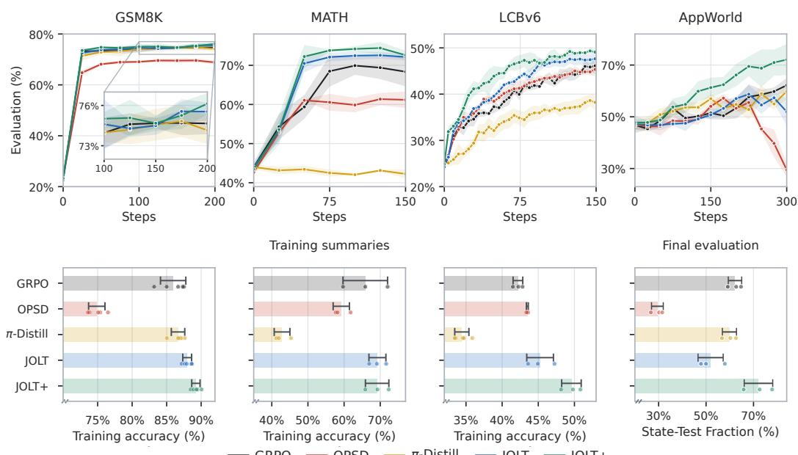  
Figure 7: Evaluation curves on GSM8K, MATH, LCBv6, and AppWorld (top), with trainingaccuracy summaries for the first three tasks and final AppWorld evaluation below. Final evaluation summaries for the first three tasks appear in Figure 2. LCBv6 evaluates training problems on complete test suites; AppWorld reports development-set state-test pass rate. Bands and error bars show standard deviations across runs; dots show individual runs.

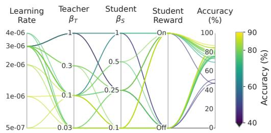

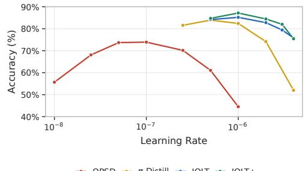  
Figure 8: Hyperparameter sensitivity on GSM8K, covering JOLT configurations (left) and learning rates across methods (right).

## A.1 GSM8K

Data and evaluation. We use the official GSM8K training and test splits, containing 7,473 and 1,319 problems, respectively. Training samples responses at temperature 1.0, while evaluation generates one response per test problem using greedy decoding. We use top-p = 1.0 during training and evaluation, with a maximum sequence length of 8,192 tokens and a completion limit of 4,096 tokens.

Sensitivity. Figure 8 summarizes the coefficient and method-specific learning-rate sweeps used to select the confirmatory settings. The strongest JOLT configurations use a learning rate near $\mathrm { 1 0 ^ { - 6 } }$ and coupling coefficients below one. Unit teacher and student coefficients are unstable in this setting, and increasing the learning rate beyond the selected range degrades all methods

The exploratory coefficient sweeps in Figure 9 are distinct from the five-seed confirmatory comparison.

Prompts and privileged context. Both roles receive the original question as a user message, without few-shot examples. The teacher’s system message additionally supplies the dataset’s final answer.

## Student System Message

You will be given a problem. Please reason step by step, and put your final answer within \boxed{}.

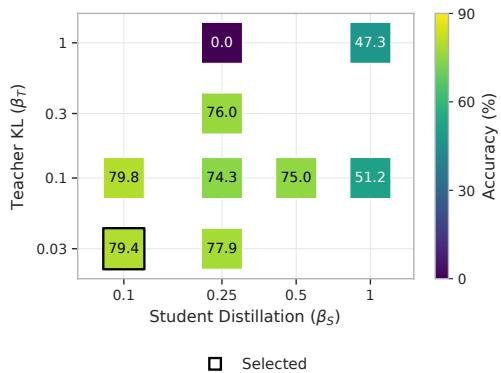  
(a) JOLT

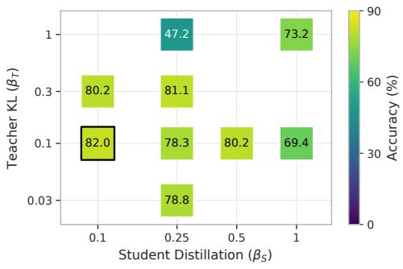  
(b) JOLT+  
Figure 9: GSM8K accuracy across teacher–student coupling strengths for (a) JOLT and (b) JOLT+.

System Message   
You are a helpful assistant.   
Student User Message   
{problem}   
Please reason step by step, and put your final answer within \boxed{}.

Teacher System Message   
You will be given a problem. Please reason step by step, and put your final answer   
within \boxed{}.   
Private reference answer: {answer}. This answer has been independently verified.   
Derive the solution yourself, use the reference to resolve uncertainty, and make   
your single boxed final answer match it.   
User Message (Both Roles)   
{question}

## A.2 MATH

Data and evaluation. We use the full official MATH training and test splits, containing 7,500 and 5,000 problems, respectively. Training and evaluation use temperature 1.0, top-p = 1.0, and a completion limit of 16,384 tokens. Evaluation samples one unprivileged student response per test problem. These evaluation settings apply to the main results, token-scaling experiments, and teacher-objective ablations.

We train Qwen3-0.6B (Qwen Team, 2025) on MATH (Hendrycks et al., 2021). We supply privileged information to the teacher by providing a worked reference solution. Both roles use the same system message and problem instruction. For the teacher, the dataset’s worked solution is appended to the user message, after a blank line. Braced names denote substituted fields. Qwen3 thinking is disabled; evaluation uses the student messages without the solution.

Teacher-Only Addition to the User Message   
Here is a verified reference solution to the problem:   
=== Reference Solution Begin ===   
{reference\_solution}   
=== Reference Solution End ===   
Understand the reference solution and its key steps. Then solve the problem   
independently in your own words, check the reasoning, and derive the same final   
answer.

## A.3 LIVECODEBENCH-V6

Data and evaluation. Following the coding setup of Hubotter et al. (2026), we use 131 Live-¨ CodeBench v6 problems released between February and April 2025. For each problem, we randomly select approximately 50% of its upstream private tests as training-visible tests, using NumPy seed 0. This produces 2,421 training-visible cases and leaves 2,431 cases withheld from training. Evaluation follows SDPO’s released implementation and uses the complete original suite of 4,852 test cases for these same problems, including both the training-visible and withheld cases. We generate four unprivileged student responses per problem and report average accuracy across responses and problems. Evaluation uses temperature 0.6 and top-p = 0.95, with maximum prompt and response lengths of 2,048 and 8,192 tokens, respectively. This protocol evaluates solutions to training problems against an expanded test suite containing unseen test inputs.

Each teacher context receives a generation that passed every training-visible test, if one exists, and otherwise the execution feedback for the corresponding attempt. Feedback can include a failing input, expected and observed output, or execution error. The student receives the following user message with no additional system message.

## Student User Message

You are a coding expert. You will be given a coding problem, and you need to write a correct Python program that matches the specification and passes all tests. The time limit is 1 second. You may start by outlining your thought process. In the end, please provide the complete code in a code block enclosed with \`\`\` \`\`\`.

{problem}

## Addition When Starter Code Specifies a Function Signature

Your solution should have the following signature: \`\`\`python   
{signature}

The teacher receives the same user message, a system message, and one of the two evidence blocks below. The evidence is appended to the user message after a blank line.

## Teacher System Message

You are a coding expert solving a problem with privileged evidence from sibling attempts. Work through the algorithm and edge cases carefully. Return one complete Python solution under the original response contract.

## Teacher Evidence: Successful Sibling

The following sibling response passed every public test. Use it as evidence while independently solving the original problem, but do not assume that public−test success proves it will pass the held−out tests. Check the algorithm and edge cases, return one complete Python program under the original response contract, and do not mention the sibling response in your answer.

<successful\_sibling\_response>   
{successful\_response}   
</successful\_sibling\_response>

Teacher Evidence: Execution Feedback   
The following is authoritative feedback from evaluating an earlier attempt on only   
the public test subset. Use it to correctly solve the original problem, but do not   
assume that passing these tests proves the solution will pass the held−out tests.   
Check the algorithm and edge cases, and return one complete Python program under the   
original response contract. Do not mention the feedback in your answer.   
<public\_test\_feedback>   
{public\_test\_feedback}   
</public\_test\_feedback>

## A.4 APPWORLD

Data and evaluation. We adapt the AppWorld setup of Wang et al. (2026), training on all 90 publicly available training tasks. All reported AppWorld evaluations use the 57 tasks in the official development split. Training runs for 300 optimizer updates, with evaluation every 25 updates. At each evaluated checkpoint, we generate one unprivileged student trajectory per task and training seed using greedy decoding (temperature 0), a total context limit of 65,536 tokens, and a maximum of 50 interaction turns. Evaluation uses the shared scaffold without retrieved skills. We report state-test pass rate, defined as the fraction of state tests passed for each task, averaged across tasks.

We train a Qwen3-4B-Instruct (Qwen Team, 2025) model on tool and API calling in the AppWorld task set (Trivedi et al., 2024). Following Wang et al. (2026), we construct privileged guidance by summarizing previous attempts into successful strategies, mistakes, and suggested workflows. Each run starts with an empty task-local skill bank.

We generate trajectory summaries using GPT-5.6 Sol (internal model identifier gpt 5 6 sol), with a 1,024-token request cap and up to two summarizer-level retries. Each summary contains success analysis, mistake analysis, and a suggested workflow. Temperature, top-p, and reasoning effort are left at backend defaults. The experiment artifacts do not record a dated backend model snapshot. Per-update runtime accounting includes summary generation.

The two roles share AppWorld’s adapted one-shot ReAct scaffold (Yao et al., 2023), including API-use instructions and supervisor information. The full scaffold is in the supplementary file appworld-react.txt. Its final user message is shown below. Execution results are returned as user messages beginning with Output:, followed by a fenced output block.

Final User Message after the Shared Demonstration and Instructions   
Using these APIs, now generate code to solve the actual task:   
My name is: {first\_name} {last\_name}. My personal email is {email} and phone number   
is {phone\_number}.   
Task: {instruction}

Teacher-Only System Message, Prepended to the Shared Conversation   
Private training−only trajectory−derived skill. Use it as fallible task−local   
guidance while independently checking live API documentation and execution results.   
Never mention this private context in your response.   
{skill\_json}

The inserted JSON skill contains success analysis, mistake analysis, and a suggested workflow. Retrieval first selects an unused skill for the task, then uses an upper-confidence-bound score (Wang et al., 2026). If the bank is empty, no teacher system message is added.

After each student attempt, the summarizer receives the task, outcome, fraction of state tests passed, turn count, and the live interaction trace without the demonstration. Credentials and common personal-data patterns in the trace are redacted before summarization. The resulting skill is stored for later attempts at the same task.

Skill Summarizer: System Message   
You are an expert AppWorld trajectory analyst. Derive reusable task−local guidance   
from the actual actions and observations. Do not reproduce credentials, personal   
data, opaque IDs, or access tokens. Return only the requested JSON object.

Skill Summarizer: User Message   
Analyze this completed AppWorld attempt. Focus on strategic intent when completion   
is high and root causes when completion is low. The golden workflow should be   
concise, actionable, and grounded in observed API behavior rather than copied code.   
Task:   
{instruction}   
Outcome: {outcome}   
Total turns: {turns}   
Completion rate: {completion\_rate}   
Conversation history:   
{transcript}   
Return a JSON object containing exactly three nonempty string fields:   
success\_analysis, mistake\_analysis, and golden\_workflow.

## A.5 TERMINAL-BENCH

The terminal setup uses Qwen3-30B-A3B-Instruct (Qwen Team, 2025) on TMax training tasks (Ivison et al., 2026), with a separate stateful shell sandbox for each role. The teacher alone sees private verifier source and related files in its system context. These files are not supplied to the student’s context, filesystem, or evaluation. Reward requires an explicit submission marker followed by hiddenverifier grading.

Evaluation. For each trained method, we evaluate the final checkpoint after 50 training updates on the complete Terminal-Bench 2.1 task set (Merrill et al., 2026). We use the mini-SWE-agent-based Vanillux2Agent harness with a persistent shell released by Ivison et al. (2026).1 Following its evaluation defaults, we use temperature 0.7, top-p = 0.95, a limit of 16,384 generated tokens per assistant turn, and at most 64 agent steps. Bash commands have a 120-second timeout; overall trial timeouts follow Terminal-Bench’s per-task defaults without overrides. Evaluation uses the unprivileged student and omits the teacher-only verifier information. For each task, we sample 128 trajectories and estimate pass@k for k ∈ {1, 4, 16, 32} using the estimator of Chen et al. (2021), averaging the resulting estimates across tasks. Due to resource constraints, Table 2 reports results from one training run per method. The 128 evaluation trajectories per task estimate each checkpoint’s pass@k; variability across training seeds is not assessed.

The following templates document the current TMax training setup. Each role receives a system message, the task and interaction instructions, and a bash tool accepting one string argument, command. Braced names denote substituted fields. The complete shared user prompt and JSON tool schema are supplied in the supplementary materials; the user-prompt opening and submission rule are reproduced below.

System Message (Both Roles)   
You are a helpful assistant that can interact with a computer.   
Your response must include a THOUGHT section before your action where you explain   
your reasoning. After the THOUGHT, you must call the \`bash\` tool with EXACTLY ONE   
bash command (multiple commands chained with \`&&\` or \`||\` count as a single action).   
Failure to follow these rules − calling no tool, calling a tool other than \`bash\`,   
or omitting the THOUGHT − will cause your response to be rejected.

Shared User Prompt: Opening   
Please solve this task:   
{instruction}   
You can execute bash commands and edit files (with \`sed\`, \`cat > file << 'EOF'\`,   
etc.) to implement the necessary changes.

Shared User Prompt: Submission Instruction   
6. Submit your changes and finish your work by issuing the following command:   
\`echo COMPLETE\_TASK\_AND\_SUBMIT\_FINAL\_OUTPUT   
Do not combine it with any other command. After this command, you cannot continue   
working on the task.

The remaining shared instructions describe inspecting the environment, implementing and testing changes, persistent shell state, noninteractive commands, and truncated output. The tool definition describes a stateful working directory and exported environment variables.

Teacher-Only Addition to the System Message   
You are the privileged teacher during training. The private verifier files below   
define the success criterion. Use them to derive a correct solution, but do not   
attempt to edit \`/tests\` or rely on the verifier being present in the sandbox: it is   
uploaded only after your work is complete.   
<private\_verifier>   
{verifier\_files}   
</private\_verifier>

The verifier block concatenates the supplied files in order, with each file rendered as --- {path} --- followed by its contents on a new line and a blank line between files. Terminal-Bench evaluation omits this teacher-only block.

## A.6 CONSISTENCY ACROSS SETTINGS

Table 1 reports mean performance and standard deviations across training runs. To complement these summaries, we compare JOLT+ with GRPO using the average probability of improvement proposed by Agarwal et al. (2021). For each setting, we compare all pairs of final-checkpoint eval uation runs, recording whether the JOLT+ score exceeds the GRPO score and assigning half credit to ties. We then average these probabilities, giving equal weight to GSM8K, MATH, LCBv6, and AppWorld. This metric summarizes the consistency of the observed ordering across runs.

The analysis uses the individual evaluation scores shown in Figures 2 and 7. We quantify uncertainty in this aggregate probability using a stratified percentile bootstrap, independently resampling training runs with replacement within each method and setting while preserving the run counts and keeping the four settings fixed. We evaluate the empirical bootstrap distribution exactly. We resample training runs because the pairwise comparisons share observations.

As shown in Table 4, JOLT+ outperforms GRPO in nearly all observed run comparisons. Every observed JOLT+ run exceeds every observed GRPO run on LCBv6 and AppWorld. The average probability of improvement is 94.7%, with a nominal 95% percentile bootstrap interval of [83.3%, 100.0%]. These results provide consistent empirical support for JOLT+ across the evaluated settings. With only three runs in most settings, bootstrap intervals can underestimate uncertainty, particularly when all observed comparisons favor one method (Agarwal et al., 2021). Terminal-Bench has one training run per method and is reported separately in Table 2.

Table 4: Empirical probability that a JOLT+ run outperforms a GRPO run at the final checkpoint, using the evaluations in Figures 2 and 7. The average gives equal weight to each setting.
<table><tr><td>Setting</td><td>JOLT+ Runs</td><td>GRPO Runs</td><td>Probability of Improvement (%)</td></tr><tr><td>GSM8K</td><td>5</td><td>4</td><td>90.0</td></tr><tr><td>MATH</td><td>3</td><td>3</td><td>88.9</td></tr><tr><td>LCBv6</td><td>3</td><td>3</td><td>100.0</td></tr><tr><td>AppWorld</td><td>3</td><td>3</td><td>100.0</td></tr><tr><td>Equal-weight average</td><td></td><td></td><td>94.7</td></tr></table>

## B TOKEN EFFICIENCY AND SCALING

We study how additional training budget translates into student accuracy on MATH. Our experiments combine token-budget sweeps with checkpoints from extended training runs, covering both early learning and performance at larger budgets. Figure 4 summarizes this relationship using completion tokens and processed training tokens as measures of training cost.

Experimental setup. We vary learning rates and training budgets for each method and measure performance at checkpoints throughout training. The budget sweeps characterize the accuracy attainable at different costs, while the extended runs examine whether additional training yields further improvement. Figure 4 shows each method’s Pareto frontier based on training-token expenditure and mean evaluation accuracy. Token counts reflect actual expenditure, including any overshoot of the target budget.

Token accounting. Completion tokens count student completions for GRPO and OPSD, and both teacher and student completions for JOLT. Processed training tokens count unpadded prompt and completion positions processed during optimization and cross-context scoring, including teacheronly context tokens, scoring passes without gradient computation, and repeated optimization passes. The MATH experiments use worked solutions supplied by the dataset, with no additional hint generation, retry rollouts, or discarded trajectories. These metrics measure token expenditure and do not directly quantify wall-clock savings.

Curve fitting. Following Khatri et al. (2025), we fit a sigmoidal relationship between accuracy and log training-token budget:

$$
a ( B ) = a _ { 0 } + \frac { a _ { \infty } - a _ { 0 } } { 1 + ( B _ { 5 0 } / B ) ^ { k } } ,\tag{22}
$$

where B is the budget in millions of tokens and $a _ { 0 }$ is the measured base-model accuracy. The parameter $a _ { \infty }$ describes the fitted plateau, $B _ { 5 0 }$ is the budget required to reach half the fitted accuracy gain, and k controls the slope with respect to log budget.

We estimate the three free parameters separately for each method and token counter using unweighted bounded nonlinear least squares. We use multiple initializations and retain the solution with the smallest residual sum of squares. Table 5 reports the fitted coefficients and root-meansquared error (RMSE).

Table 5: Fitted accuracy–token scaling parameters for Figure 4. Budgets are in millions of tokens; RMSE is in percentage points.
<table><tr><td>Token counter</td><td>Method</td><td> $a \mathrm { \infty } \left( \% \right)$ </td><td> $B _ { 5 0 }$ </td><td>k</td><td>RMSE</td></tr><tr><td>Completion</td><td>GRPO</td><td>70.044</td><td>4.173</td><td>1.655</td><td>0.994</td></tr><tr><td></td><td>OPSD</td><td>61.706</td><td>0.512</td><td>2.076</td><td>0.938</td></tr><tr><td></td><td>JOLT</td><td>72.123</td><td>0.440</td><td>2.413</td><td>1.126</td></tr><tr><td>Processed</td><td>GRPO</td><td>70.441</td><td>4.343</td><td>1.501</td><td>0.959</td></tr><tr><td></td><td>OPSD</td><td>61.691</td><td>1.314</td><td>2.270</td><td>0.937</td></tr><tr><td></td><td>JOLT</td><td>72.125</td><td>0.955</td><td>2.634</td><td>1.152</td></tr></table>

Efficiency comparison. We compare methods at the GRPO checkpoint near the knee of its learning curve, where mean evaluation accuracy is 63.44%. For each token counter, we read GRPO’s budget from this checkpoint in Figure 4 and obtain JOLT’s budget at the same accuracy by inverting its fitted curve, using the measured base accuracy $a _ { 0 } \simeq 4 3 . 8 5 \%$ . Table 6 reports the resulting budgets and their ratios. These are approximate point estimates from the mean-accuracy comparison; confidence intervals for the budget ratios are not estimated.

Table 6: Token budgets at 63.44% MATH accuracy. GRPO uses the observed checkpoint near its learning-curve knee; JOLT uses its fitted curve. Budgets are in millions of tokens, and values are approximate.
<table><tr><td>Token counter</td><td>GRPO</td><td>JOLT</td><td>GRPO/JOLT</td></tr><tr><td>Completion</td><td>8.04</td><td>0.617</td><td>13.0×</td></tr><tr><td>Processed</td><td>8.40</td><td>1.30</td><td>6.5×</td></tr></table>

Sensitivity to target accuracy. To examine how the estimated token savings depend on the comparison target, we evaluate both methods’ fitted curves at 55%, 60%, and 65% MATH accuracy. These targets lie within the observed accuracy ranges of both methods. We invert each fitted curve to estimate the required token budget,

$$
B ( a ) = B _ { 5 0 } \left( \frac { a - a _ { 0 } } { a _ { \infty } - a } \right) ^ { 1 / k } ,\tag{23}
$$

and report the ratio of GRPO’s budget to JOLT’s in Table 7. Across these targets, JOLT requires approximately 9.5–14.4× fewer completion tokens and 4.3–7.4× fewer processed training tokens. The estimated advantage therefore persists across this accuracy range, although its magnitude depends on the target. These comparisons use fitted budgets for both methods and are point estimates without confidence intervals.

Table 7: Estimated token budgets and GRPO/JOLT budget ratios at multiple MATH accuracy targets. Both methods’ budgets are obtained from their fitted curves. Budgets are in millions of tokens; ratios are calculated before rounding.
<table><tr><td rowspan="2">Target accuracy</td><td colspan="3">Completion tokens</td><td colspan="3">Processed training tokens</td></tr><tr><td>GRPO</td><td>JOLT</td><td>Ratio</td><td>GRPO</td><td>JOLT</td><td>Ratio</td></tr><tr><td>55%</td><td>3.48</td><td>0.368</td><td>9.5×</td><td>3.50</td><td>0.811</td><td>4.3×</td></tr><tr><td>60%</td><td>5.56</td><td>0.496</td><td>11.2×</td><td>5.81</td><td>1.065</td><td>5.5×</td></tr><tr><td>65%</td><td>9.92</td><td>0.691</td><td>14.4×</td><td>10.73</td><td>1.443</td><td>7.4×</td></tr></table>

## C TEACHER-OBJECTIVE ABLATIONS

We investigate how explicit teacher optimization affects student learning, with student distillation retained in every configuration. We compare OPSD with two JOLT variants that retain only the teacher KL term or only the teacher outcome-reward term. OPSD updates the shared model through student distillation, while the JOLT variants additionally optimize the model under the privileged teacher context. These comparisons examine whether either teacher-objective component can im prove student learning. We additionally evaluate OPSD with student outcome rewards, implemented by removing both teacher-objective terms from JOLT+ while retaining its student learning configuration. Figure 10 shows the teacher-objective ablation curves, and Table 8 reports the selected configurations and held-out accuracy, including JOLT and JOLT+ at step 75.

Experimental setup and tuning. We use the same model, task setup, and evaluation protocol as our MATH experiment. For OPSD and the two teacher-objective variants, we tune each configuration independently, searching learning rates of $\{ 1 0 ^ { - 6 } , 2 \times 1 0 ^ { - 6 } , 4 \times 1 0 ^ { - 6 } \}$ , with additional rates of $\{ 2 . 5 , \dot { 5 } , 7 . 5 \} \times \dot { 1 } 0 ^ { - 7 }$ for the teacher KL-only variant. Table 8 reports the selected learning rates and teacher-objective coefficients. The OPSD + Student Reward control uses the same student loss weights, normalization, rollout count, and training schedule as JOLT+, with no explicit teacher optimization. Its privileged teacher still shares the student’s parameters and therefore changes through student updates.
<table><tr><td>Configuration</td><td>Student outcome Teacher outcome reward</td><td>coefficient α</td><td>Teacher KL</td><td></td><td>Held-out coefficient β Tuned LR accuracy (%)</td></tr><tr><td>OPSD</td><td></td><td></td><td></td><td> $2 \times 1 0 ^ { - 6 }$ </td><td> $6 2 . 9 5 \pm 0 . 7 8$ </td></tr><tr><td>OPSD + Student Reward</td><td>√</td><td></td><td></td><td> $2 \times 1 0 ^ { - 6 }$ </td><td> $6 6 . 5 2 \pm 0 . 7 3$ </td></tr><tr><td>JOLT (teacher KL only)</td><td></td><td>一</td><td> $1 0 ^ { - 6 }$ </td><td> $1 0 ^ { - 6 }$ </td><td> $6 5 . 3 9 \pm 0 . 9 7$ </td></tr><tr><td>JOLT (teacher outcome only)</td><td></td><td>1</td><td></td><td> $2 \times 1 0 ^ { - 6 }$ </td><td> $6 7 . 8 7 \pm 0 . 8 6$ </td></tr><tr><td>JOLT (full objective)</td><td></td><td>1</td><td> $1 0 ^ { - 3 }$ </td><td> $2 \times 1 0 ^ { - 6 }$ </td><td> $7 2 . 1 0 \pm 0 . 8 2$ </td></tr><tr><td>JOLT+ (full objective)</td><td>V</td><td>1</td><td> $1 0 ^ { - 3 }$ </td><td> $2 \times 1 0 ^ { - 6 }$ </td><td> $7 3 . 8 0 \pm 0 . 7 4$ </td></tr></table>

Table 8: Held-out MATH accuracy at step 75. OPSD, OPSD + Student Reward, and the two teacherobjective variants report means across five shared training seeds, with 95% confidence-interval halfwidths. OPSD + Student Reward disables both teacher-objective terms in JOLT+. JOLT and JOLT+ use the step-75 evaluations in Figure 7, each with three runs and a 95% confidence interval; their configurations are given in Table 3. JOLT+’s interval is a Student-t interval computed from the plotted standard deviation. Dashes indicate absent objective terms.

Student Rewards without Teacher Optimization. This control combines sparse student rewards with dense privileged self-distillation, as also studied by Penaloza et al. (2026), without applying either teacher-objective term. At step 75, it attains $6 6 . { \overset { \cdot } { 5 } } 2 \pm 0 . 7 3 \%$ held-out accuracy, compared with $7 3 . 8 0 \pm 0 . 7 \mathrm { \dot { 4 } \% }$ for JOLT+. With the student learning configuration held fixed, this comparison supports a benefit from explicit teacher optimization beyond combining student rewards with distillation on MATH. Full JOLT also achieves higher accuracy than this control without using student outcome rewards.

Effect of Teacher Optimization. As shown in Figure 10, both teacher-training variants achieve higher accuracy than OPSD as training progresses. These gains also appear in the held-out evaluations in Table 8, where the teacher outcome-only variant achieves higher accuracy than the KL-only variant. The improvement from the KL-only variant suggests that encouraging agreement with the student can provide a useful teacher-training signal even without teacher outcome rewards. Together, these results support explicitly optimizing the teacher as a way to improve student learning. Because both roles share parameters, these comparisons do not separate improvements in the distillation signal from direct transfer through teacher updates.

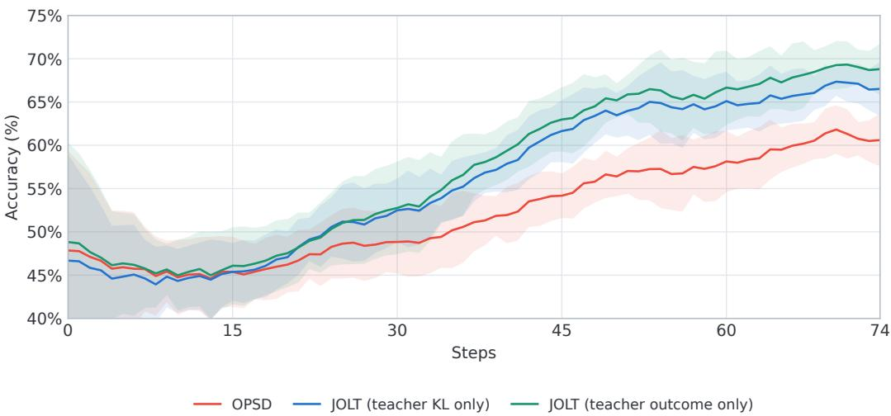  
Figure 10: Learning curves on MATH for OPSD and JOLT variants with either teacher KL regularization or teacher outcome rewards. Both teacher-training variants achieve higher accuracy than OPSD later in training. Lines and shaded regions show the mean and 95% confidence intervals across five training seeds.

## D TOKEN-LEVEL ALIGNMENT

For each student-generated token, we compare teacher and student log probabilities conditioned on the same response prefix. Red indicates a higher log probability under the teacher, while blue indicates a lower log probability under the teacher. Color intensity reflects the magnitude of this difference, using symmetric limits around zero shared across all methods within each figure. The visualizations use each method’s final checkpoint, with the displayed problem and responses selected at random.

Figure 11 extends the token-level comparison in Figure 5 to include π-Distill and JOLT+. JOLT and JOLT+ exhibit smaller teacher–student log-probability differences throughout their generations, consistent with the closer contextual agreement observed during training.

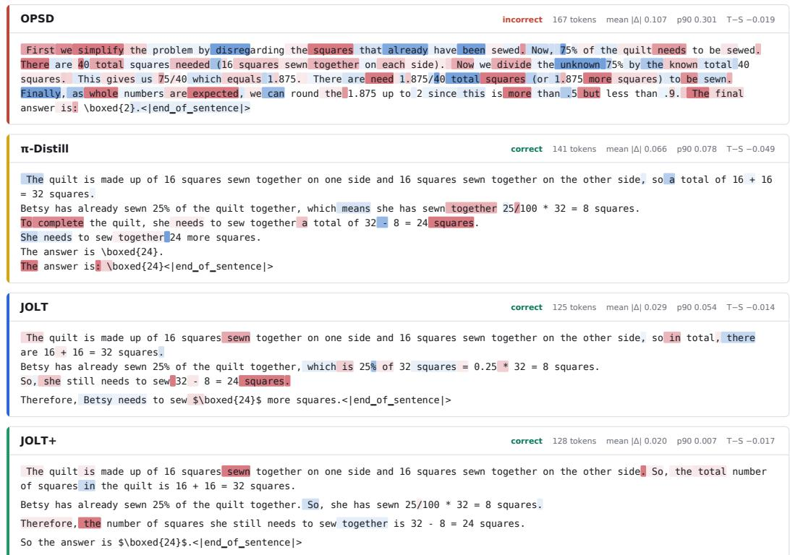  
Figure 11: Token-level teacher–student alignment on the same problem. Red indicates higher teacher log probability, while blue indicates lower teacher log probability. JOLT and JOLT+ show smaller cross-context log-probability differences than OPSD and π-Distill.

## E GRADIENT BIAS–VARIANCE ANALYSIS

We characterize the student learning signals encountered during training through empirical bias and variance measurements. Figure 6 reports these statistics at checkpoints along each method’s own training trajectory. We complement these statistics with comparisons of normalized gradient directions at fixed checkpoints.

Reference and measurements. The expected reward gradient is not directly available for these models. We construct a Monte Carlo reference by averaging eight independent REINFORCE gradient estimates (Williams, 1992), each using 512 completions per problem. The reference uses group-centered returns and token normalization and serves as an empirical comparison target rather than an exact expected-reward gradient. We evaluate eight batches of eight MATH problems at initialization and training steps 1, 2, 5, 10, 20, 35, 50, and 75. For each batch, we hold the model weights and problems fixed and compute K = 32 independent gradient estimates, each using eight student completions per problem. We measure their bias and variance relative to the reference.

Gradients are computed with respect to all model parameters, with privileged-teacher probabilities treated as fixed targets. The distillation gradients use the student’s reverse-KL objective at temperature 1.1. Each loss uses a global token average: token-level contributions are summed across all sampled completions in the problem batch and divided by the total number of valid completion tokens. Gradients are measured before gradient-norm clipping. The measured student gradients are 0.1g for JOLT and $0 . 1 g _ { D } + g _ { R }$ for JOLT+, where gD and gR denote the distillation and REIN-FORCE gradients. The two components use the same sampled student completions, preserving their covariance in the combined estimate.

These coefficients affect the scale of the reported statistics. Multiplying a gradient estimator by α > 0 scales its variance by α2 without changing its direction, while its Euclidean discrepancy from a fixed reference also depends on α. Consequently, lower measured variance or discrepancy alone does not establish stronger directional alignment.

Let $g _ { 1 } , \ldots , g _ { K }$ denote the sampled gradient estimates, $g _ { \mathrm { r e f } }$ the reference gradient, and $\begin{array} { r l } { \bar { g } } & { { } = } \end{array}$ $K ^ { - 1 } \sum _ { k = 1 } ^ { K } g _ { k }$ the mean sampled gradient. We measure empirical squared bias and variance as

$$
{ \widehat B } ^ { 2 } = \| \bar { g } - g _ { \mathrm { r e f } } \| ^ { 2 } , \qquad { \widehat V } = \frac { 1 } { K - 1 } \sum _ { k = 1 } ^ { K } \| g _ { k } - \bar { g } \| ^ { 2 } .\tag{24}
$$

Squared bias measures disagreement between the average estimate and the reference, while variance measures fluctuations around that average. Their contributions to mean squared error satisfy

$$
{ \widehat { \mathrm { M S E } } } = { \frac { 1 } { K } } \sum _ { k = 1 } ^ { K } \| g _ { k } - g _ { \mathrm { r e f } } \| ^ { 2 } = { \widehat { B } } ^ { 2 } + { \frac { K - 1 } { K } } { \widehat { V } } .\tag{25}
$$

We compute each statistic separately within each problem batch and average the resulting statistics equally across batches.

Gradient variance is measured across repeated trajectory samples with the checkpoint and problem batch held fixed. For each method, we analyze the run with the best historical late-training performance. Confidence bands are pointwise 95% intervals from 100,000 paired bootstrap resamples of the eight problem batches, keeping each batch together across checkpoints and estimators. The reference is held fixed during resampling, so these intervals exclude uncertainty across training seeds and reference samples.

These measurements concern student gradients at the policies reached by each method. Differences therefore reflect both the learned policies and their update estimators. The Euclidean statistics depend on gradient magnitude and do not directly test directional reward consistency, which is defined up to positive scaling. The empirical squared-bias statistic includes sampling uncertainty in both the estimated gradient mean and the reference. Across the evaluated batches, checkpoints, and trajectories, the estimated Monte Carlo variance of the reference mean divided by its squared norm ranges from 0.074 to 0.661. Reference uncertainty therefore contributes to the measured discrep ancy, particularly when the reference gradient is small. Teacher learning influences the checkpoints being evaluated, but its gradient is excluded from the measurements. The analysis therefore does not establish alignment of the combined shared-parameter update.

Comparisons during training. Figure 6 evaluates each method’s student gradient along its own training run, constructing a reference at each checkpoint. GRPO’s error is predominantly variance, whereas OPSD exhibits low variance but increasing disagreement with the reference. JOLT and JOLT+ maintain substantially smaller disagreement than OPSD while retaining low variance. These comparisons describe the sampled student learning signals along the evaluated training trajectories.

Directional comparisons at fixed checkpoints. Figure 12 compares reward-only, distillationonly, and combined student estimators. Each column follows checkpoints from one training method. Within each checkpoint, all three estimators use the same model weights, problem batches, sampled student trajectories, and reference. The combined estimator is $0 . 1 g _ { D } + g _ { R }$ , using the reverse-KL distillation gradient defined above.

We normalize each sampled gradient before aggregation:

$$
u _ { k } = \frac { g _ { k } } { \| g _ { k } \| } , \qquad v = \frac { g _ { \mathrm { r e f } } } { \| g _ { \mathrm { r e f } } \| } , \qquad \bar { u } = \frac { 1 } { K } \sum _ { k = 1 } ^ { K } u _ { k } .\tag{26}
$$

We retain zero gradients as $u _ { k } = 0$ . Directional dispersion and mean reference alignment are

$$
D = \frac { 1 } { K - 1 } \sum _ { k = 1 } ^ { K } \| u _ { k } - \bar { u } \| ^ { 2 } , \qquad P = \frac { 1 } { K } \sum _ { k = 1 } ^ { K } \langle u _ { k } , v \rangle .\tag{27}
$$

Lower D indicates more consistent directions across sampled trajectories; $P$ is the mean perestimate cosine similarity to the reference, with zero gradients contributing zero. We compute these statistics within each problem batch and average equally across batches, using the same bootstrap procedure described above.

At the evaluated checkpoints, distillation-only and combined estimates have lower directional dispersion and higher mean reference alignment than reward-only estimates. These differences persist after normalizing gradient magnitude and therefore cannot be explained solely by an overall rescaling of the gradients. The pattern appears across all four trained policies. These comparisons characterize student estimators at fixed checkpoints; they do not isolate the effect of teacher training or measure reward improvement from the complete joint update. Uncertainty in the Monte Carlo reference also affects the directional measurements.

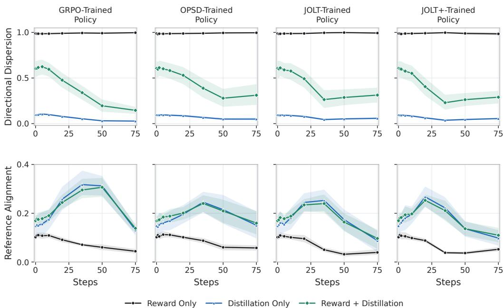  
Figure 12: Student-gradient directions at fixed checkpoints. Distillation-only and combined estimates show lower directional dispersion (top) and higher mean cosine similarity to the Monte Carlo reward-gradient reference (bottom) than reward-only estimates. Columns follow different training methods; within each checkpoint, estimators share model weights, problems, sampled student trajectories, and the reference. Bands show pointwise 95% whole-batch bootstrap intervals.

## F π-DISTILL: HYPERPARAMETER SENSITIVITY

To better understand π-Distill’s uneven performance across tasks, we investigate its sensitivity to the learning rate, teacher–student mixing weight, and teacher KL coefficient. We evaluate selected configurations across multiple random seeds and, on MATH, additionally examine learning-rate schedules, mixing warmup, and separate normalization of the teacher and student losses. Table 9 summarizes the search coverage for each setting.

Table 9: Search coverage for π-Distill hyperparameter tuning.
<table><tr><td>Setting</td><td>Search Coverage</td></tr><tr><td>GSM8K</td><td>Five learning rates evaluated over the full training horizon, followed by repeated-seed comparisons.</td></tr><tr><td>MATH</td><td>We examine 42 configurations spanning learning rates, teacher-student mixing weights, teacher KL coefficients, and scheduling choices, including teacher-only controls. Selected configurations are evaluated across additional random seeds.</td></tr><tr><td>LCBv6</td><td>Eighteen distinct configurations spanning eight learning rates, five teacher KL coefficients, and three teacher mixing weights, followed by fresh-seed confirmation.</td></tr><tr><td>AppWorld</td><td>Five full-horizon learning-rate trials and additional replications of the selected configuration.</td></tr></table>

The weaker MATH performance persists across these choices. Larger learning rates and stronger student replay often aggravate degradation, while schedule and normalization changes do not consistently restore sustained improvement. Some configurations that appear promising during initial screening also fail to reproduce their gains across additional seeds. These observations suggest that the difficulty extends beyond selecting an appropriate update scale or balancing the two roles. The behavior nevertheless varies across settings: on AppWorld, π-Distill achieves a development-set state-test pass rate close to GRPO and substantially above OPSD.