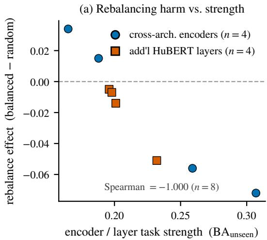
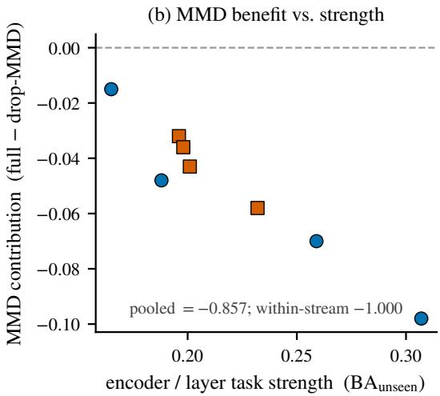
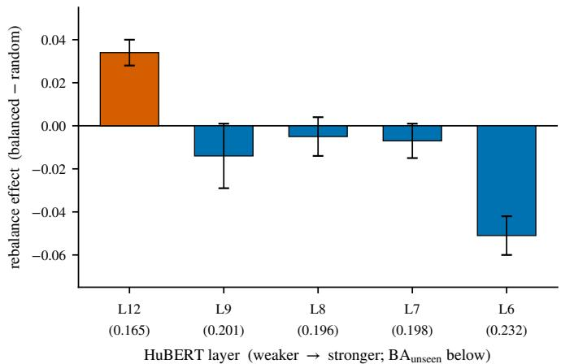

# A Strength-Monotonic Law for Domain Alignment in Frozen-Embedding Bioacoustic Classification

Yucheng Gong∗ Rui Zhou∗ Binbin Zeng∗ Qiang Ren† Hongjin Hui Department of Software Engineering, School of Software, Chongqing Finance and Economics College Chongqing Key Laboratory of Data Mining and Integrated Application for Ecological Environment armstrong.renq@gmail.com

## Abstract

When does distribution alignment help a frozen foundation-model embedding generalize across acoustic domains? For cross-domain mosquito-species classification we report a strength-monotonic law: the stronger an encoder is on the target task, the more its unseen-domain generalization relies on a distribution-alignment (MMD) term, and the more it is harmed by domain-rebalanced sampling. Across four encoder families and a within-encoder HuBERT layer sweep (n=8), the rebalancing leg orders exactly with encoder strength (Spearman −1.000), while the MMD-benefit leg is monotonic within each stream and −0.857 pooled; fixing architecture and varying only representation strength flips the rebalancing effect from benefit to collapse, controlled within-encoder evidence. The law is actionable: a single MMD term is the sole lever on a strong encoder (removing it costs −0.098 $\mathrm { B A } _ { \mathrm { u n s e e n } } .$ , more than the entire six-term composite loss contributes), so we reduce the field’s default recipe to a frozen Perch 2.0 embedding, a probe lightweight relative to fine-tuning the backbone, cross-entropy, one MMD, and input augmentation. The reduced recipe stays within seed noise of the full composite (BAunseen $0 . 2 9 9 \pm 0 . 0 0 6 \ \mathrm { v s . } \ 0 . 3 0 \bar { 7 } \pm 0 . 0 1 4 )$ , whose seed-ensemble (0.313) is numerically close to the published single-modal champion base (0.318); the champion’s perseed variance is unavailable, so we do not claim a tie. As boundary conditions of the same law, three community defaults—backbone fine-tuning, multi-modal fusion, and domain rebalancing—each hurt unseen-domain accuracy under a leavedomain protocol, shown with single-variable, multi-seed evidence. We present a mechanism and the recipe it explains, not a leaderboard entry.

## 1 Introduction

Acoustic identification of mosquito species underpins vector-borne-disease surveillance, but what matters for deployment is not accuracy on the recording conditions a model was trained on—it is accuracy on a new site or device, that is, an unseen acoustic domain. The BioDCASE 2026 Cross-Domain Mosquito Species Classification (CD-MSC) task makes this gap explicit: its primary metric, balanced accuracy on held-out domains $( \mathrm { B A } _ { \mathrm { u n s e e n } } )$ , collapses to 0.175 for the official multitemporal-resolution CNN baseline even though the same model reaches 0.881 on seen domains, a domain-shift gap of DSG=0.71 [Hou et al., 2026]. The gap, not the in-domain score, is the problem.

Strong audio foundation models are now the default front-end for such tasks, which turns the practical question into one about what to add on top of a frozen embedding. The reflex in competition settings is to add more: fine-tune the backbone, fuse a second modality, rebalance the training domains, and stack a composite objective of several distribution-alignment and contrastive terms. We take the opposite stance and ask what the encoder’s own representational strength dictates. The answer is a single empirical regularity that governs both how much alignment helps and which additions backfire.

Our central finding is a strength-monotonic law. Across four encoder families and a within-encoder layer sweep of HuBERT (n=8 representations), the stronger an encoder is on the target task, the more its unseen-domain generalization depends on a single distribution-alignment term (maximum mean discrepancy, MMD), and the more it is destroyed by domain-rebalanced sampling. The rebalancing leg orders exactly with strength (Spearman −1.000 over the pooled n=8 set); the MMD-benefit leg is monotonic within each of the two streams and −0.857 pooled, broken only by one crossarchitecture point. Because the four-encoder comparison confounds strength with architecture, we hold architecture, modality, and pre-training data fixed and vary only representation strength along HuBERT’s layers; the rebalancing effect flips sign from +0.034 on a weak layer to −0.051 on a strong one across non-overlapping error bars. This is controlled within-encoder evidence—though layer depth also changes representation content, not strength alone—rather than a correlation across heterogeneous models.

The law prescribes an algorithm rather than motivating a new module. On a strong encoder a single MMD term is the only lever that moves $\mathrm { B A } _ { \mathrm { u n s e e n } } \colon$ removing it costs −0.098, which exceeds the +0.072 that the full six-term composite contributes over cross-entropy, while the CORAL, supervised-contrastive, genus-auxiliary, and domain-classification terms are each removable within seed noise. The law therefore licenses a reduction of the field’s default recipe to a frozen Perch 2.0 embedding, a probe lightweight relative to fine-tuning the backbone, cross-entropy, one MMD, and input augmentation. The reduced recipe stays within seed noise of the full composite (BAunseen $0 . { \overset { \cdot } { 2 } } 9 9 \pm { \overset { \cdot } { 0 } } . 0 0 6 \ \mathrm { v s . } \ 0 . 3 0 7 \pm 0 . 0 1 4$ ; seed-ensembles 0.308 vs. 0.313), whose ensemble is numerically close to the published single-modal champion base 0.318 [Gstöttenbauer et al., 2026]; the champion’s per-seed variance is unavailable, so we test no tie. It is a mechanism-derived simplification, not a tuned leaderboard entry.

The same law predicts where the field’s defaults fail on strong encoders, and we confirm each under the leave-domain protocol with single-variable, multi-seed evidence (except a single progressiveunfreezing run) and a mechanism. Backbone fine-tuning snaps unseen accuracy back to the frozen value and below (0.215 < 0.241), consistent with fine-tuning distorting pre-trained features out of distribution [Kumar et al., 2022]. Multi-modal fusion with the available weak second modality dilutes the strong encoder (0.286 < 0.299). Domain-rebalanced sampling collapses a strong encoder (−0.072). These are corroborating boundary conditions of the strength law, not independent headlines.

We are deliberate about provenance and about what we do not claim. Two priors are reused and neither is ours. The frozen-Perch-plus-rich-probe base is the challenge champion’s [Gstöttenbauer et al., 2026]; the composite domain-generalization loss is DR-BioL’s [Hou et al., 2025], an end-to-end CNN on a different dataset rather than a frozen-embedding method. We reproduce both faithfully—our loss matches the champion’s objective exactly—and claim neither. We also do not reach the deployed champion score of 0.362, which adds a three-feature agreement gate orthogonal to our contribution, and we claim no efficiency advantage over it, since its base is likewise a frozen encoder with a light probe. Stated plainly, the algorithmic contribution is not a new architecture or a new loss; it is the mechanism rendered testable and deployable—a falsifiable design rule, the minimal recipe that instantiates it, and the controlled protocol that verifies it. The algorithm stands or falls with the law, not with a leaderboard delta.

## Contributions.

• A strength-monotonic law for domain alignment on frozen embeddings: across four encoders and a within-encoder HuBERT layer sweep (n=8), rebalancing harm orders exactly with encoder strength (Spearman −1.000) and MMD benefit grows with it (−0.857 pooled), with controlled within-encoder evidence (Sections 4.3 and 4.4).

• A mechanism-derived reduced recipe (cross-entropy + a single MMD + augmentation) that stays within seed noise of a six-term composite and the single-modal champion base, isolating MMD as the sole non-redundant lever (−0.098, larger than the whole composite’s contribution) (Sections 4.1 and 4.2).

• Boundary conditions of the law—fine-tuning, fusion, and rebalancing each hurt unseendomain accuracy under leave-domain, single-variable and (except one progressiveunfreezing run) multi-seed, each with a mechanism (Section 4.6).

• An adversarial self-check that falsifies our own domain-separability explanation and relocates the governing variable at encoder task strength (Section 4.5).

Throughout, we apply a strict evidential standard: a single seed never counts, and a difference is reported as real only when $\mu \pm \sigma$ intervals over at least three seeds do not overlap.

## 2 Related Work

Bioacoustic foundation models and frozen-embedding transfer. Transfer from large pre-trained audio encoders via frozen embeddings and a light probe is now the dominant recipe in bioacoustics. Perch established that frozen birdsong embeddings with a few-shot linear probe outperform fromscratch training [Ghani et al., 2023], and Perch 2.0 argues explicitly that a frozen embedding with a logistic probe is the intended use rather than a fallback [van Merriënboer et al., 2025]. Parallel encoders span spectrogram masked auto-encoding [Rauch et al., 2025], acoustic-tokenizer selfsupervision [Chen et al., 2022], and waveform self-supervision specialized to animal [Hagiwara, 2022] and avian [Miron et al., 2025] audio, with HuBERT [Hsu et al., 2021] the speech-domain ancestor of the waveform line; audio-language and audio-LLM variants extend the same backbones [Robinson et al., 2023, 2024]. Two recent studies are closest in spirit to ours but stop short of a law. SurfPerch shows that specializing the pre-training mix can hurt non-target domains [Williams et al., 2024], which rhymes with our rebalancing result but operates at the data-mixture level and makes no strength-monotonicity claim; and a head-to-head probing survey ranks Perch 2.0, BEATs, BirdAVES, AVES, and Bird-MAE under several probe types [Schwinger et al., 2025], but reports static rankings only—no mapping from encoder strength to alignment benefit, and no rebalancing effect. We adopt this paradigm rather than propose it, and our contribution is the dependence of alignment benefit on encoder strength that these static comparisons leave unmeasured.

Distribution-alignment losses and unsupervised domain adaptation. Maximum mean discrepancy measures the distance between distributions as a difference of kernel mean embeddings [Gretton et al., 2012], and a line of adaptation methods minimizes it inside a network: single-layer MMD confusion [Tzeng et al., 2014], multi-kernel MMD over several trainable layers [Long et al., 2015], second-order CORAL alignment [Sun and Saenko, 2016], and supervised contrastive alignment [Khosla et al., 2020]. These methods fine-tune the backbone and typically present each added term as beneficial; some recent work explicitly combines MMD and CORAL assuming they are complementary [Mahmoodiyan et al., 2025]. We instead apply a single MMD on a frozen embedding and show, by leave-one-loss ablation, that it is the sole non-redundant alignment term in this regime— CORAL and supervised contrastive add nothing once MMD is present—which directly contradicts the complementarity assumption.

Domain generalization in audio and leave-domain protocols. Device- and city-generalization in acoustic scene classification is commonly addressed with input-space augmentation such as impulseresponse and frequency mixing on trainable networks [Morocutti et al., 2023, Schmid et al., 2024]. In bioacoustics, the BIRB benchmark reports that empirical risk minimization is hard to beat on focal-to-soundscape shift [Hamer et al., 2023], the BirdSet benchmark formalizes recording-condition shift [Rauch et al., 2024], and systematic studies of sound-event-detection domain shift emphasize few-shot adaptation [Liang et al., 2024]. Our setup differs in two ways: we run a leave-domain classification protocol on frozen embeddings rather than trainable spectrogram networks, and we address the shift in embedding space with a single alignment term rather than input augmentation for the shift itself.

Fine-tuning versus freezing under distribution shift. That fine-tuning can distort well-pre-trained features and underperform linear probing out of distribution—with the gap growing as feature quality improves—is the key prior for our fine-tuning result [Kumar et al., 2022]; related work shows surgical or weight-ensembled fine-tuning partially recovers the robustness naive fine-tuning destroys [Lee et al., 2022, Wortsman et al., 2021]. The nearest conceptual prior studies whether domain adaptation helps a frozen backbone at all [Tran et al., 2026], and reports that adaptation benefit is governed by target-domain coverage: when a backbone already covers the target distribution, MMD benefit shrinks (their text-sentiment setting moves from +0.133 to +0.021 as coverage grows). This runs opposite to our MMD leg, where benefit grows with encoder strength. We argue in Section 5 that the two are orthogonal axes—coverage reduces the gap an alignment term must close, whereas strength raises its leverage over that gap—and we sharpen the qualitative “grows with feature quality” intuition into a measured, controlled law. We credit the prior observation that alignment benefit is frozen-backbonedependent, and that hard invariance erodes specialized structure while soft alignment preserves it [Tran et al., 2026, Hou et al., 2025]; our residue is the quantified monotonic law, the within-encoder controlled sweep, and the clean MMD isolation.

Mosquito acoustics and the CD-MSC task. The task and metric we target are defined by the BioD-CASE 2026 CD-MSC baseline: nine species across five acoustic domains (one domain dominating the roughly 271,000 clips), with balanced accuracy on held-out domains as the primary metric and the seen–unseen gap as a secondary metric [Hou et al., 2026]. The baseline multi-temporal-resolution CNN is the weak starting point we build past, not our method. The composite domain-generalization loss we reduce comes from DR-BioL [Hou et al., 2025], an end-to-end four-layer CNN on a different mosquito corpus whose five-term objective combines species cross-entropy, supervised contrastive, species-conditional MMD, and two domain-level terms. Its ablation is nested—the MMD term is never dropped alone from the full model—so our clean single-term isolation and our cross-encoder strength law are not contained in it. The frozen-Perch base we reproduce belongs to the challenge champion [Gstöttenbauer et al., 2026], whose deployed system adds a three-feature agreement gate to reach 0.362; our scope is the frozen base, and the gate is orthogonal to the law and the reduction we study.

## 3 Method

## 3.1 Frozen embedding, probe, and composite objective

Each clip is resampled to 32 kHz and mapped through afrozen Perch 2.0 encoder (EfficientNet-B3, 1536-d) to a clip embedding $\mathbf { z } \in \mathbb { R } ^ { 1 5 3 6 }$ [van Merriënboer et al., 2025]. A rich probe—lightweight relative to fine-tuning the backbone—is trained on top of the frozen embedding:

$$
\mathrm { L a y e r N o r m }  \mathrm { L i n e a r } ( 1 5 3 6  2 5 6 )  \mathrm { 2 \times R e s i d u a l B l o c k } ( \mathrm { p r e - L N , G E L U , d r o p o u t } )  \mathrm { L a y e r N o r m }  \mathrm { \{ s p e c i e s ~ h e a d , d o m a \} }
$$

The probe has 1,452,814 trainable parameters, roughly one eighth of the backbone, and trains in a few minutes per configuration on a consumer RTX 4060 (informal timing) without touching the backbone. Embedding extraction is a one-time cost on cloud GPUs. We apply training-time input augmentation on the embedding (additive Gaussian noise $\sigma { = } 0 . 0 5$ and feature-channel dropout $\scriptstyle { p = 0 . 1 ) }$ , and optimize for 30 epochs with a cosine schedule and warmup at batch size 512. Following DR-BioL [Hou et al., 2025], the probe is trained with a composite objective of cross-entropy plus five auxiliary terms,

$$
\mathcal { L } = \underbrace { \mathrm { C E } _ { \mathrm { s p } } } _ { \mathrm { s p e c t i s } } + 0 . 0 1 \mathrm { C E } _ { \mathrm { d o m } } + 0 . 5 \mathcal { L } _ { \mathrm { g e n s } } + 0 . 5 \mathrm { S u p C o n } ( \mathbf { z } , T = 0 . 1 0 ) + 1 . 0 \mathrm { C O R A L } ( \mathbf { z } , \mathcal { D } ) + 0 . 2 5 \mathrm { M M D } ( \mathbf { z } , \mathcal { D } ) ,\tag{1}
$$

where the CORAL and MMD terms minimize the cross-domain distribution gap directly on the frozen embeddings, grouped by domain label D. Because alignment acts on a frozen representation, it carries zero risk of distorting the backbone. Models are selected on leave-domain validation. Equation (1) is the champion’s objective exactly, which lets us treat our reproduction as a faithful stand-in for the published single-modal base.

Provenance. Neither base component is ours. The frozen-Perch-plus-rich-probe architecture is the challenge champion’s [Gstöttenbauer et al., 2026]; the composite loss of Equation (1) is DR-BioL’s [Hou et al., 2025], defined there for an end-to-end CNN on a different corpus. Our contribution is the controlled reduction of Equation (1), its generalization across encoders, and the mechanism behind both.

## 3.2 The MMD alignment term

The alignment term is a Gaussian-kernel maximum mean discrepancy between domain-conditional embedding distributions. For embeddings drawn from two domains, with kernel k,

$$
\begin{array} { r } { \mathrm { M M D } ^ { 2 } ( \mathcal { D } _ { a } , \mathcal { D } _ { b } ) = \mathbb { E } _ { \mathbf { z } , \mathbf { z } ^ { \prime } \sim \mathcal { D } _ { a } } k ( \mathbf { z } , \mathbf { z } ^ { \prime } ) + \mathbb { E } _ { \mathbf { z } , \mathbf { z } ^ { \prime } \sim \mathcal { D } _ { b } } k ( \mathbf { z } , \mathbf { z } ^ { \prime } ) - 2 \mathbb { E } _ { \mathbf { z } \sim \mathcal { D } _ { a } , \mathbf { z } ^ { \prime } \sim \mathcal { D } _ { b } } k ( \mathbf { z } , \mathbf { z } ^ { \prime } ) , } \end{array}\tag{2}
$$

Table 1: Main leave-domain ablation. $\mathrm { B A } _ { \mathrm { u n s e e n } }$ as per-seed $\mu \pm \sigma$ unless marked as a seed-ensemble. The deployed champion system (0.362) adds a three-feature agreement gate that is orthogonal to this study; we compare only to its frozen single-modal base.
<table><tr><td>Method</td><td> $\mathrm { B A } _ { \mathrm { u n s e e n } }$ </td><td>Note</td></tr><tr><td>Frozen Perch + RP + full composite (seed-ensemble) same, per-seed mean</td><td>0.313  $0 . 3 0 7 \pm 0 . 0 1 4$ </td><td>champion base 0.318; its per-seed σ unavailable</td></tr><tr><td>Frozen Perch  $+ \mathrm { R P + }$  MMD-only, per-seed mean same, seed-ensemble</td><td>0.308</td><td>0.299 ± 0.006 reduced recipe, within noise of full</td></tr><tr><td>— no augmentation (loss only) - cross-entropy only (aug, no alignment) Frozen Perch, linear probe</td><td> $0 . 2 7 4 \pm 0 . 0 0 3$   $\begin{array} { c } { 0 . 2 3 5 \pm 0 . 0 0 2 } \\ { 0 . 2 4 1 } \end{array}$ </td><td>architecture alone is not the win</td></tr><tr><td>DG-distill fine-tune (5 seeds) Baseline MTRCNN</td><td> $0 . 2 1 5 \pm 0 . 0 2 2$  0.175</td><td>negative result official, reproduced over 10 seeds</td></tr></table>

averaged over domain pairs in a batch [Gretton et al., 2012]. Penalizing Equation (2) pushes the probe to learn species-discriminative directions that are shared across domains rather than memorizing one domain’s acoustic signature; this is the source of leave-domain generalization, and Section 5 returns to why its benefit tracks encoder strength.

## 3.3 Mechanism-derived reduction

The leave-one-loss ablation of Section 4.2 shows that only the MMD term in Equation (1) is nonredundant: CORAL, supervised contrastive, and the genus and domain auxiliaries are each removable within seed noise (dropping the domain term leaves $\mathrm { \bar { B } A _ { u n s e e n } \ a t { 0 . 3 0 7 \pm 0 . 0 1 2 } }$ , unchanged from the full $0 . 3 0 7 \pm 0 . 0 1 4 )$ , whereas removing MMD costs more than the whole composite contributes. The reduced recipe keeps only cross-entropy, a single MMD, and input augmentation,

$$
\mathcal { L } _ { \mathrm { r e d u c e d } } = \mathrm { C E } _ { \mathrm { s p } } + 0 . 2 5 \mathrm { M M D } ( \mathbf { z } , \mathcal { D } ) \quad ( \mathrm { w i t h \ i n p u t \ a u g m e n t a t i o n } ) ,\tag{3}
$$

and recovers about $9 7 \%$ of the full objective $( 0 . 2 9 9 \pm 0 . 0 0 6$ versus $0 . 3 0 7 \pm 0 . 0 1 4 \mathrm { B A } _ { \mathrm { u n s e e n } } ,$ overlapping $\mu \pm \sigma )$ . Equation (3) is the deployable form of the law: on a strong frozen encoder, spend the complexity budget on one alignment term and nothing else.

## 4 Experiments

Setup. All experiments use the BioDCASE 2026 CD-MSC dataset [Hou et al., 2026] under the official leave-domain protocol: train on a subset of acoustic domains, evaluate balanced accuracy on held-out domains $( \mathrm { B A } _ { \mathrm { u n s e e n } } )$ . Unless noted, we train for 30 epochs and report the per-seed mean and standard deviation over at least three seeds. Following our evidential standard, a difference counts only when $\mu \pm \sigma$ intervals do not overlap. The secondary metric $\mathrm { D S G } = \left| \mathrm { B A } _ { \mathrm { u n s e e n } } - \mathrm { B A } _ { \mathrm { s e e n } } \right|$ measures the seen–unseen gap.

## 4.1 Main ablation: the reduced recipe matches the composite

Table 1 compares the full six-term composite against its reduction and against the recipes the field reaches for. The reduced recipe (cross-entropy + a single MMD + augmentation) is within seed noise of the full composite (0.299 ± 0.006 vs. $0 . 3 0 7 \pm 0 . 0 1 4 )$ , and the seed-ensemble of the full recipe (0.313) is numerically close to the published single-modal champion base (0.318); the champion’s per-seed variance is unavailable, so significance cannot be tested [Gstöttenbauer et al., 2026]. Augmentation and the alignment loss contribute unequally: augmentation adds +0.033 (lossonly 0.274 →full 0.307) while the alignment loss adds $+ 0 . 0 7 2$ (cross-entropy-with-augmentation 0.235 →full 0.307). Architecture alone (cross-entropy with augmentation but no alignment) reaches only 0.235, so the win is the alignment term, not the probe. On HuBERT, by contrast, the MMD-only reduction does not match the full composite (Section 4.3): the reduction is tight on a strong frozen embedding but is itself strength-dependent, not a universal simplification.

Table 2: Leave-one-loss ablation on frozen Perch $( \mathrm { B A } _ { \mathrm { u n s e e n } } , \mu \pm \sigma )$ . Only MMD matters.
<table><tr><td>Arm</td><td> $\mathrm { B A } _ { \mathrm { u n s e e n } }$ </td><td> $\Delta { \ v } \mathrm { s \ f u l l }$ </td><td>Verdict</td></tr><tr><td>full</td><td> $0 . 3 0 7 \pm 0 . 0 1 4$ </td><td></td><td></td></tr><tr><td> $\mathrm { d r o p \mathrm { - } C O R A L }$ </td><td> $0 . 3 0 8 \pm 0 . 0 0 9$ </td><td> $+ 0 . 0 0 1$ </td><td>removable</td></tr><tr><td> $\mathrm { d r o p - S u p C o n }$ </td><td> $0 . 3 1 3 \pm 0 . 0 0 6$ </td><td>+0.006</td><td>removable</td></tr><tr><td>drop-genus</td><td> $0 . 3 0 5 \pm 0 . 0 1 0$ </td><td>-0.003</td><td>removable (within noise)</td></tr><tr><td>drop-domain</td><td> $0 . 3 0 7 \pm 0 . 0 1 2$ </td><td>-0.001</td><td>removable (within noise)</td></tr><tr><td>drop-MMD</td><td> $\mathbf { 0 . 2 0 9 \pm 0 . 0 0 4 }$ </td><td>-0.098</td><td>the only lever</td></tr></table>

Table 3: Cross-encoder ablation (30 epochs, leave-domain, $\mu \pm \sigma )$ . Perch/BEATs/BirdAVES use seeds 42/0/1; HuBERT uses 42/43/44 to match the layer sweep. The rebalancing row orders exactly in encoder strength; the MMD row is monotonic within this stream.
<table><tr><td>Config</td><td>Perch (CNN-mel)</td><td>BEATs (transf-mel)</td><td>BirdAVES (wav-SSL)</td><td>HuBERT (speech-SSL)</td></tr><tr><td>full</td><td> $0 . 3 0 7 \pm 0 . 0 1 4$ </td><td> $0 . 2 5 9 \pm 0 . 0 0 9$ </td><td> $0 . 1 8 8 \pm 0 . 0 0 8$ </td><td> $0 . 1 6 5 \pm 0 . 0 1 4$ </td></tr><tr><td>drop-MMD</td><td> $0 . 2 0 9 \pm 0 . 0 0 4$ </td><td> $0 . 1 8 9 \pm 0 . 0 0 2$ </td><td> $0 . 1 4 0 \pm 0 . 0 0 1$ </td><td> $0 . 1 5 0 \pm 0 . 0 0 3$ </td></tr><tr><td>MMD contribution</td><td> $\mathbf { - 0 . 0 9 8 }$ </td><td>-0.070</td><td> $\mathbf { - 0 . 0 4 8 }$ </td><td> $\mathbf { - 0 . 0 1 5 }$ </td></tr><tr><td>rebalance  $\Delta$  (vs random) </td><td>-0.072</td><td>-0.056</td><td>+0.015</td><td>+0.034</td></tr></table>

## 4.2 MMD is the only non-redundant lever

Table 2 drops one loss term at a time from the full composite. Dropping CORAL, supervised contrastive, the genus auxiliary, or the domain-classification auxiliary leaves $\mathrm { B A } _ { \mathrm { u n s e e n } }$ within seed noise, whereas dropping MMD costs −0.098—larger in magnitude than the +0.072 the entire composite contributes over cross-entropy. Without MMD, the high-weight CORAL term pulls against generalization rather than for it. On a strong frozen embedding, MMD is the source of cross-domain generalization and the remaining alignment terms are redundant or harmful in its absence.

## 4.3 Cross-encoder: the strength-monotonic law

Table 3 repeats the ablation across four encoder families spanning CNN-mel, transformer-mel, and waveform self-supervised architectures. Two quantities move with the encoder’s own task strength $( \mathrm { B A } _ { \mathrm { u n s e e n } }$ under the full recipe, $0 . 3 0 7 > 0 . 2 5 \bar { 9 } > 0 . 1 8 8 > 0 . 1 6 5 )$ : the MMD contribution (benefit of keeping MMD) and the harm from domain-rebalanced sampling. The two legs are not equally tight. The rebalancing leg orders exactly—stronger encoders are harmed more—and merged with the layer sweep (Section 4.4) gives a pooled strength-versus-collapse Spearman of −1.000 at n=8. The MMD-benefit leg is monotonic within each stream (−1.000 within the cross-encoder set and within the HuBERT layer sweep separately) but only −0.857 when the two streams are pooled, broken by a single cross-architecture point (BirdAVES). Figure 1 plots both relationships.

## 4.4 Within-encoder deconfounding: correlation to causation

The four-encoder comparison confounds strength with architecture (both mel encoders are strong, both waveform encoders weak). We remove the confound by re-extracting intermediate HuBERT layers (mean-pooled) so that architecture, modality, and pre-training data are fixed and only representation strength varies. Table 4 shows the rebalancing effect flips sign along the layer stack: the weakest representation (L12) benefits from rebalancing (+0.034), the strongest (L6) collapses (−0.051), with non-overlapping intervals (random [0.215, 0.238] vs. balanced [0.170, 0.181]), and the intermediate layers are neutral. With architecture, modality, and pre-training data held constant, the sign flip is controlled within-encoder evidence that representation strength—not a mel-versuswaveform architectural difference—governs the effect; we note that varying layer depth also changes representation content, so strength is the varied correlate rather than a fully isolated cause. Merging the layer sweep with the cross-encoder points gives n=8 and a strength-versus-collapse Spearman of −1.000 (Figure 2). To match the layer sweep’s seed set, the L12 endpoint here uses seeds 42/43/44 (as do L6–L9).

  
Figure 1: The strength-monotonic law. Domain-rebalancing harm orders exactly with encoder task strength (Spearman −1.000, n=8); MMD benefit grows with strength, monotonic within each stream and −0.857 pooled.

Table 4: HuBERT within-layer sweep (architecture fixed, strength varied). The rebalancing effect flips sign from the weakest to the strongest layer.
<table><tr><td>HuBERT layer</td><td> $\mathrm { B A } _ { \mathrm { u n s e e n } }$  (strength)</td><td>MMD contribution</td><td>rebalance ∆ (vs random)</td></tr><tr><td>L12 (last)</td><td> $0 . 1 6 5 \pm 0 . 0 1 4$ </td><td>-0.015</td><td>+0.034 gain</td></tr><tr><td>L9</td><td> $0 . 2 0 1 \pm 0 . 0 1 6$ </td><td>-0.043</td><td>-0.014 neutral</td></tr><tr><td>L8</td><td> $0 . 1 9 6 \pm 0 . 0 0 9$ </td><td>-0.032</td><td>-0.005 neutral</td></tr><tr><td>L7</td><td> $0 . 1 9 8 \pm 0 . 0 0 8$ </td><td>-0.036</td><td>-0.007 neutral</td></tr><tr><td>L6</td><td> $\mathbf { 0 . 2 3 2 \pm 0 . 0 0 8 }$ </td><td>-0.058</td><td>-0.051 collapse</td></tr></table>

## 4.5 Mechanism self-check: falsifying our own explanation

A natural explanation is that rebalancing hurts only when embeddings are highly domain-separable. We test it with a domain-separability probe (five-way domain classification balanced accuracy, chance $0 . 2 0 , n { = } 8 )$ and reject it. Table 5 shows every embedding is strongly domain-decodable (0.78– $0 . 9 2 \gg 0 . 2 0 )$ , yet separability does not track collapse: BirdAVES is more separable than Perch $( 0 . 8 8 5 > 0 . 8 7 4 )$ but does not collapse, and within the HuBERT sweep separability stays in a narrow band (0.78–0.84) while the rebalancing effect flips from +0.034 to −0.051. Separability versus collapse correlates only −0.50, against −1.000 for strength versus collapse. Decodable domain structure is necessary context but not the governing variable; encoder task strength is.

## 4.6 Boundary conditions: three defaults that backfire

The strength law predicts that the field’s default additions should fail on a strong frozen encoder, and each does under leave-domain with single-variable evidence at the seed counts noted below. (i) Fine-tuning hurts. DG-distill fine-tuning reaches only $0 . 2 1 5 \pm 0 . 0 2 2$ over five seeds, below the frozen linear probe (0.241); in a single progressive-unfreezing run, unseen accuracy declines as more of the backbone is unfrozen and the zero-gradient point reproduces the frozen value (0.241). Any backbone gradient lets cross-entropy learn a domain shortcut [Kumar et al., 2022]; we report the progressive-unfreezing trace as a single-run observation, not a multi-seed result. (ii) Fusion dilutes, measured against the matched single-modality control. Soft-voting a second Bird-MAE modality yields $0 . 2 \bar { 8 6 } \pm 0 . 0 0 2$ over three seeds, below the single-Perch reduced recipe it augments $( 0 . 2 9 9 \pm 0 . 0 0 6 )$ , and the fusion weight slides monotonically back toward Perch alone—a genuine dilution. A separate handcrafted-feature test is a neutral control, not dilution evidence: in a linearprobe setting, pYIN-F0 concatenation $( 0 . 2 4 7 \pm 0 . 0 0 4$ , five seeds) is indistinguishable from the single-modality linear probe $( 0 . 2 4 1 \pm 0 . 0 0 3 )$ , so adding this weak feature neither helps nor hurts. (iii) Rebalancing collapses. Domain-rebalanced sampling costs −0.072 on the strong encoder (three seeds, non-overlapping $\mu \pm \sigma )$ , as small-domain oversampling overfits the minority domains. These results are consequences of the law, not separate findings.

  
Figure 2: Within-encoder evidence. Holding HuBERT’s architecture fixed and varying only layer strength, the rebalancing effect flips from benefit (weak L12) to collapse (strong L6).

Table 5: Domain-separability probe (linear five-way balanced accuracy; chance 0.20). Separability is uniformly high and does not track collapse.
<table><tr><td></td><td>Perch</td><td>BEATs</td><td>BirdAVES</td><td>HuBERT L12</td><td>L6</td><td>L7</td><td>L8</td><td>L9</td></tr><tr><td>domain separability</td><td>0.874</td><td>0.917</td><td>0.885</td><td>0.778</td><td>0.844</td><td>0.812</td><td>0.815</td><td>0.791</td></tr></table>

## 5 Discussion

The thesis and the evidence ladder. The central result is a single ordering: across frozen encoders, representation strength on the target task monotonically predicts both the benefit of an MMD alignment term and the harm of domain rebalancing. The rebalancing leg orders exactly (Spearman −1.000, n=8); the MMD-benefit leg is monotonic within each stream and −0.857 pooled. We establish the law on a three-rung ladder of increasing rigor. The first rung is correlation across four heterogeneous encoder families (Section 4.3). The second is within-encoder control: holding architecture, modality, and pre-training data fixed and varying only HuBERT layer depth, the rebalancing effect flips sign across non-overlapping error bars (Section 4.4)—controlled evidence, with the caveat that layer depth co-varies representation content with strength. The third is a falsified alternative, where we test and reject our own domain-separability explanation (Section 4.5). The ladder, not any single number, is the contribution.

Reconciling with the coverage axis. The nearest conceptual prior reports that alignment benefit decreases as a frozen backbone’s coverage of the target distribution increases [Tran et al., 2026], which is the opposite direction to our MMD leg. The two are orthogonal rather than contradictory. Coverage reduces the distribution gap an alignment term exists to close, so a backbone that already encodes the target lowers the need for MMD. Strength raises the leverage an alignment term has over whatever gap remains. A backbone can be strong yet poorly covering of a particular deployment domain—the CD-MSC regime, where even the strongest encoder leaves a large seen–unseen gap—so here the leverage axis dominates. We state this as a reconciliation hypothesis supported by Section 4.5, not as a proven unification.

Why strength raises leverage, and where the account stops. Our mechanistic guess was that stronger encoders carve more linearly decodable domain structure into the embedding, giving an alignment term more to remove while species identity survives—consistent with reports that recording domain geometry dominates frozen audio embeddings and that a light probe can suppress it [Hummel et al., 2026]. The self-check complicates this: all eight embeddings are strongly domain-decodable, and separability does not track collapse, so raw decodable structure is necessary context but not the governing variable. We do not have a first-principles derivation of why task strength is the clean correlate. We report a robust, controlled phenomenon and one falsified mechanism, and we mark the derivation as open. Naming this boundary is deliberate: it is the line between a reproducible empirical law and a theory, and it is where this work sits.

What the law buys, and its cost boundary. The law is a design rule: on a strong frozen encoder, spend the complexity budget on a single alignment term and do not rebalance. That rule reduces the six-term composite to cross-entropy plus one MMD plus augmentation at matched accuracy (Sections 4.1 and 4.2) and predicts the three defaults that backfire (Section 4.6). It also carries a practical efficiency note, stated carefully. Relative to our own fine-tuning path, the frozen probe is both better and far cheaper: fine-tuning the backbone requires backpropagating through Perch on a cloud GPU and hurts unseen accuracy, whereas the probe trains in a few minutes per configuration on a consumer RTX 4060 (informal timing) over pre-extracted embeddings. We make no efficiency claim against the challenge champion, whose base is likewise a frozen encoder with a light probe, and we note that the official baseline’s trainable footprint (0.22M parameters) is in fact smaller than our probe’s (1.45M); efficiency here means “cheaper than fine-tuning,” not “smaller than all baselines.”

Limitations and future work. The chief limitation is external validity: a single dataset plus a within-encoder causal sweep is still one data point for the law. A metadata-only feasibility pass shows that no off-the-shelf bioacoustic dataset can directly validate the rebalancing leg (candidate corpora bind species to sites), so the natural next step splits validation across datasets—BirdSet to validate the MMD leg under recording-condition shift, with the rebalancing leg remaining on CD-MSC—which is scoped but not yet run. Two further directions follow from the negative results: fusion that injects a genuinely independent signal rather than a weaker redundant modality, and distillation of the domain-invariant subspace into a smaller model. The latter is a future target and does not describe the present probe, which is measured at 1.45M parameters.

## 6 Conclusion

For cross-domain mosquito acoustic classification we identify a strength-monotonic law: on a frozen foundation-model embedding, the stronger the encoder, the more its unseen-domain generalization relies on a single distribution-alignment term and the more it is harmed by domain rebalancing. The rebalancing leg orders exactly across four encoders and a within-encoder layer sweep (Spearman −1.000, n=8); the MMD-benefit leg is monotonic within each stream and −0.857 pooled. The law is actionable: it reduces the community’s six-term composite loss to cross-entropy plus one MMD plus augmentation at matched accuracy $\mathrm { ( B A _ { u n s e e n } 0 . 2 \dot { 9 } 9 \pm 0 . 0 0 6 ~ v s . 0 . 3 0 7 \pm 0 . \dot { 0 } 1 \dot { 4 } }$ , with the full seed-ensemble 0.313 close to the single-modal champion base 0.318), and it predicts the three default enhancements—fine-tuning, fusion, and rebalancing—that instead hurt. We leave a first-principles account of why strength governs alignment leverage, and validation beyond CD-MSC, as the open problems this empirical law poses.

## References

Sanyuan Chen, Yu Wu, Chengyi Wang, Shujie Liu, Daniel Tompkins, Zhuo Chen, and Furu Wei. Beats: Audio pre-training with acoustic tokenizers, 2022. URL https://arxiv.org/abs/2212. 09058.

Burooj Ghani, Tom Denton, Stefan Kahl, and Holger Klinck. Global birdsong embeddings enable superior transfer learning for bioacoustic classification. Scientific Reports, 13(1):22876, 2023. doi: 10.1038/s41598-023-49989-z. URL https://doi.org/10.1038/s41598-023-49989-z.

Arthur Gretton, Karsten M. Borgwardt, Malte J. Rasch, Bernhard Schölkopf, and Alexander Smola. A kernel two-sample test. Journal ofMachine Learning Research, 13(25):723–773, 2012.

Gstöttenbauer, Ushakov, and Shestakov. BioDCASE 2026 task 5 — cross-domain mosquito species classification: Technical report. Biodcase 2026 challenge technical report, Johannes Kepler University Linz, 2026. URL https://biodcase.github.io/documents/challenge2026/ technical\_reports/Shestakov\_task5.technical\_report.pdf.

Masato Hagiwara. Aves: Animal vocalization encoder based on self-supervision, 2022. URL https://arxiv.org/abs/2210.14493.

Jenny Hamer, Eleni Triantafillou, Bart van Merriënboer, Stefan Kahl, Holger Klinck, Tom Denton, and Vincent Dumoulin. Birb: A generalization benchmark for information retrieval in bioacoustics, 2023. URL https://arxiv.org/abs/2312.07439.

Yuanbo Hou, Zhaoyi Liu, Xin Shen, and Stephen Roberts. Learning domain-robust bioacoustic representations for mosquito species classification with contrastive learning and distribution alignment, 2025. URL https://arxiv.org/abs/2510.00346.

Yuanbo Hou, Vanja Zdravkovic, Marianne Sinka, Yunpeng Li, Wenwu Wang, Mark D. Plumbley, Kathy Willis, and Stephen Roberts. Biodcase 2026 challenge baseline for cross-domain mosquito species classification, 2026. URL https://arxiv.org/abs/2603.20118.

Wei-Ning Hsu, Benjamin Bolte, Yao-Hung Hubert Tsai, Kushal Lakhotia, Ruslan Salakhutdinov, and Abdelrahman Mohamed. Hubert: Self-supervised speech representation learning by masked prediction of hidden units, 2021. URL https://arxiv.org/abs/2106.07447.

Hilde I. Hummel, Sandjai Bhulai, Rob D. van der Mei, and Burooj Ghani. Linear probing enables ship-radiated noise recognition with pretrained audio embeddings, 2026. URL https://arxiv. org/abs/2601.08358.

Prannay Khosla, Piotr Teterwak, Chen Wang, Aaron Sarna, Yonglong Tian, Phillip Isola, Aaron Maschinot, Ce Liu, and Dilip Krishnan. Supervised contrastive learning, 2020. URL https: //arxiv.org/abs/2004.11362.

Ananya Kumar, Aditi Raghunathan, Robbie Jones, Tengyu Ma, and Percy Liang. Fine-tuning can distort pretrained features and underperform out-of-distribution, 2022. URL https://arxiv. org/abs/2202.10054.

Yoonho Lee, Annie S. Chen, Fahim Tajwar, Ananya Kumar, Huaxiu Yao, Percy Liang, and Chelsea Finn. Surgical fine-tuning improves adaptation to distribution shifts, 2022. URL https://arxiv. org/abs/2210.11466.

Jinhua Liang, Ines Nolasco, Burooj Ghani, Huy Phan, Emmanouil Benetos, and Dan Stowell. Mind the domain gap: a systematic analysis on bioacoustic sound event detection, 2024. URL https://arxiv.org/abs/2403.18638.

Mingsheng Long, Yue Cao, Jianmin Wang, and Michael I. Jordan. Learning transferable features with deep adaptation networks, 2015. URL https://arxiv.org/abs/1502.02791.

Hootan Mahmoodiyan, Maryam Ahang, Mostafa Abbasi, and Homayoun Najjaran. Feature-weighted mmd-coral for domain adaptation in power transformer fault diagnosis, 2025. URL https: //arxiv.org/abs/2505.14896.

Marius Miron, David Robinson, Milad Alizadeh, Ellen Gilsenan-McMahon, Gagan Narula, Emmanuel Chemla, Maddie Cusimano, Felix Effenberger, Masato Hagiwara, Benjamin Hoffman, Sara Keen, Diane Kim, Jane Lawton, Jen-Yu Liu, Aza Raskin, Olivier Pietquin, and Matthieu Geist. Avex: What matters for animal vocalization encoding, 2025. URL https: //arxiv.org/abs/2508.11845.

Tobias Morocutti, Florian Schmid, Khaled Koutini, and Gerhard Widmer. Device-robust acoustic scene classification via impulse response augmentation, 2023. URL https://arxiv.org/abs/ 2305.07499.

Lukas Rauch, Raphael Schwinger, Moritz Wirth, René Heinrich, Denis Huseljic, Marek Herde, Jonas Lange, Stefan Kahl, Bernhard Sick, Sven Tomforde, and Christoph Scholz. Birdset: A large-scale dataset for audio classification in avian bioacoustics, 2024. URL https://arxiv.org/abs/ 2403.10380.

Lukas Rauch, René Heinrich, Ilyass Moummad, Alexis Joly, Bernhard Sick, and Christoph Scholz. Can masked autoencoders also listen to birds?, 2025. URL https://arxiv.org/abs/2504. 12880.

David Robinson, Adelaide Robinson, and Lily Akrapongpisak. Transferable models for bioacoustics with human language supervision, 2023. URL https://arxiv.org/abs/2308.04978.

David Robinson, Marius Miron, Masato Hagiwara, Benno Weck, Sara Keen, Milad Alizadeh, Gagan Narula, Matthieu Geist, and Olivier Pietquin. Naturelm-audio: an audio-language foundation model for bioacoustics, 2024. URL https://arxiv.org/abs/2411.07186.

Florian Schmid, Paul Primus, Toni Heittola, Annamaria Mesaros, Irene Martín-Morató, Khaled Koutini, and Gerhard Widmer. Data-efficient low-complexity acoustic scene classification in the dcase 2024 challenge, 2024. URL https://arxiv.org/abs/2405.10018.

Raphael Schwinger, Paria Vali Zadeh, Lukas Rauch, Mats Kurz, Tom Hauschild, Sam Lapp, and Sven Tomforde. Foundation models for bioacoustics – a comparative review, 2025. URL https: //arxiv.org/abs/2508.01277.

Baochen Sun and Kate Saenko. Deep coral: Correlation alignment for deep domain adaptation, 2016. URL https://arxiv.org/abs/1607.01719.

Phat Tran, Artin Lahni, Pranav Kulkarni, and Yaolun Zhang. Is domain adaptation always helpful? a frozen-backbone study of cross-domain sentiment transfer, 2026. URL https://arxiv.org/ abs/2607.05937.

Eric Tzeng, Judy Hoffman, Ning Zhang, Kate Saenko, and Trevor Darrell. Deep domain confusion: Maximizing for domain invariance, 2014. URL https://arxiv.org/abs/1412.3474.

Bart van Merriënboer, Vincent Dumoulin, Jenny Hamer, Lauren Harrell, Andrea Burns, and Tom Denton. Perch 2.0: The bittern lesson for bioacoustics, 2025. URL https://arxiv.org/abs/ 2508.04665.

Ben Williams, Bart van Merriënboer, Vincent Dumoulin, Jenny Hamer, Eleni Triantafillou, Abram B. Fleishman, Matthew McKown, Jill E. Munger, Aaron N. Rice, Ashlee Lillis, Clemency E. White, Catherine A. D. Hobbs, Tries B. Razak, Kate E. Jones, and Tom Denton. Leveraging tropical reef, bird and unrelated sounds for superior transfer learning in marine bioacoustics, 2024. URL https://arxiv.org/abs/2404.16436.

Mitchell Wortsman, Gabriel Ilharco, Jong Wook Kim, Mike Li, Simon Kornblith, Rebecca Roelofs, Raphael Gontijo-Lopes, Hannaneh Hajishirzi, Ali Farhadi, Hongseok Namkoong, and Ludwig Schmidt. Robust fine-tuning of zero-shot models, 2021. URL https://arxiv.org/abs/2109. 01903.

## A Reproducibility details

Code. The probe, composite loss, and ablation switches are in p5\_champion\_rp\_probe.py (–ablate {full,mmd-only,ce-only,no-augment} and –drop-loss for the leave-oneloss study). Intermediate HuBERT layers are extracted via output\_hidden\_states in p12/p12b\_extract\_hubert\*.py, and the domain-separability probe is p13\_domain\_separability.py.

Embeddings and protocol. Frozen embeddings are 1536-d for Perch 2.0 and 1024-d for Bird-MAE and BirdAVES. We use the official leave-domain protocol and the official metric implementation (evaluate.py, unseen\_domain\_by\_species); dataset files are from the CD-MSC Zenodo record [Hou et al., 2026]. A known pitfall is a numpy<2.0 requirement for the embedding-extraction toolchain.

Training. All probes train for 30 epochs at batch size 512 with a cosine schedule and warmup, embedding-space augmentation (additive Gaussian noise σ=0.05, feature-channel dropout p=0.1), and at least three seeds per configuration. Reported intervals are per-seed µ ± σ; seed-ensemble rows average softmax outputs across seeds.