# A Unified Information-Theoretic Approach to Constrained Multi-Fidelity Multi-Objective Bayesian Optimization

Rikuto Matsumoto1, Masanori Ishikura1, and Masayuki Karasuyama∗1

1Nagoya Institute of Technology

## Abstract

Bayesian optimization often involves multiple objectives, constraints, and fidelity levels. We address the challenge of jointly selecting where and at which fidelity to evaluate to identify the highest-fidelity feasible Pareto frontier in this combined setting. From a unified information-theoretic perspective, we measure query utility by the information gain about this frontier, provided by an observation. Since this mutual information is intractable, we derive a variational lower bound using a mixture of under- and over-truncated approximations to the Pareto-consistent region. Multi-fidelity surrogate models propagate the information to arbitrary fidelities, yielding a cost-aware acquisition function without separate heuristics for fidelity selection or constraint handling. Experiments on synthetic, benchmark, and realworld problems demonstrate efectiveness across diverse objective, constraint, and fidelity settings.

## 1 Introduction

Bayesian optimization (BO) is a powerful framework for optimizing expensive black-box functions. In many practical problems, however, several challenges arise simultaneously: multiple competing objectives must be optimized, constraints determine which designs are feasible, and evaluations are available at multiple fidelity levels with diferent costs and accuracies. These are inherently coupled when deciding both where and at which fidelity to evaluate. A useful query must account for its contribution to identifying favorable objective trade-ofs, establishing feasibility, and reducing the need for expensive high-fidelity evaluations.

Several approaches have addressed subsets of these challenges, including constrained BO, multi-objective BO, and multi-fidelity BO. More recently, methods have been developed for the full constrained multi-fidelity multi-objective setting. MFMO-SEGO (Charayron et al., 2023) and MF-CMOBO (Lin et al., 2024) address this setting using separate mechanisms for design, fidelity, and/or constraint handling. MF-JESMOC (Fern´andez-S´anchez and Hern´andez-Lobato, 2025) instead provides a unified information-theoretic approach based on the joint entropy of the feasible Pareto set and frontier, but requires a more computationally involved inference procedure based on multi-fidelity deep Gaussian processes (MF-DGPs) and approximate joint conditioning on Pareto set and frontier. These limitations motivate an alternative route toward a unified treatment of objectives, constraints, and fidelities with simpler inference.

We pursue such a formulation from the perspective of the feasible Pareto frontier at the target fidelity. Regardless of the fidelity at which an evaluation is performed, the ultimate goal is to identify this same frontier. We therefore measure the utility of a query at any input and fidelity by the information it provides about the target-fidelity feasible Pareto frontier, normalized by its evaluation cost. Under this view, multiple objectives, constraints, and fidelity selection are incorporated into a single information criterion rather than handled through separate acquisition mechanisms.

The resulting mutual information is, however, analytically intractable because conditioning on a Pareto frontier is dificult. To obtain a tractable criterion, we build on the variational information lower bound of PFEV (Ishikura and Karasuyama, 2025). Our key construction expresses information about the frontier through Pareto-consistency events defined at the target fidelity, approximated by over- and under-truncated regions constructed from sampled Pareto frontiers. This event-based representation reduces the acquisition computation to Gaussian probabilities of these regions under the target-fidelity predictive distribution, before and after a prospective observation. For a query at any fidelity, the observation-conditioned distribution is obtained directly through standard cross-fidelity Gaussian conditioning. Thus, the unified information criterion can be evaluated using standard multi-fidelity GP inference.

Our main contributions are:

• We develop an information-theoretic approach to constrained multi-fidelity multi-objective BO centered on the feasible Pareto frontier at the target fidelity. The key idea is to represent frontier information through Pareto-consistency events defined at the target fidelity, allowing objectives, constraints, and fidelity selection to be handled within the same information criterion.

• We derive a tractable variational lower bound based on over- and under-truncated approximations of these Pareto-consistency events by extending PFEV. The resulting acquisition computation reduces to Gaussian region probabilities before and after a prospective observation, where arbitrary-fidelity queries are connected to the target fidelity through standard cross-fidelity Gaussian conditioning

• We evaluate the proposed method on GP-derived synthetic problems, benchmark functions, and real-world machine-learning hyperparameter optimization problems, demonstrating its efectiveness across diferent numbers of objectives, constraints, and input dimensions.

## 2 Problem Setting

We consider a family of multi-objective optimization problems with L objective functions, $C$ constraint functions, and M fidelity levels. Let $\mathcal { X } \subseteq \mathbb { R } ^ { d }$ be the design space. The ${ { l - } \mathrm { t h } }$ objective and the c-th constraint at fidelity m $\ d M _ { \mathbf { \Gamma } } \in \{ M \} : = \{ 1 , \dots , M \}$ are denoted by $f _ { l } ^ { ( m ) } :$ $\mathcal { X }  \mathbb { R }$ and $g _ { c } ^ { ( m ) } : \mathcal { X }  \mathbb { R }$ , respectively. We write $\pmb { f } _ { \pmb { x } } ^ { ( m ) } : = ( f _ { 1 } ^ { ( m ) } ( \pmb { x } ) , \dots , f _ { L } ^ { ( m ) } ( \pmb { x } ) ) ^ { \top } , \pmb { g } _ { \pmb { x } } ^ { ( m ) } : =$ $( g _ { 1 } ^ { ( m ) } ( { \pmb x } ) , \dots , g _ { C } ^ { ( m ) } ( { \pmb x } ) ) ^ { \top }$ and

$$
\begin{array} { r } { h _ { \boldsymbol { x } } ^ { ( m ) } : = \left[ \begin{array} { l } { \boldsymbol { f } _ { \boldsymbol { x } } ^ { ( m ) } } \\ { \boldsymbol { g } _ { \boldsymbol { x } } ^ { ( m ) } } \end{array} \right] \in \mathbb { R } ^ { L + C } . } \end{array}
$$

The highest fidelity M is the target fidelity. The optimization problem is

$$
\operatorname* { m a x } _ { { \pmb x } \in \mathcal { X } } { \pmb f } _ { \pmb x } ^ { ( M ) } , \qquad \mathrm { s . t . } ~ { \pmb g } _ { \pmb x } ^ { ( M ) } \geq z ,
$$

where $z = ( z _ { 1 } , \ldots , z _ { C } ) ^ { \top }$ is the vector of constraint thresholds and vector inequalities are interpreted elementwise. We refer to this constrained multi-fidelity multi-objective optimization problem as a C-MF-MO problem. For two objective vectors ${ \pmb a } , { \pmb b } \in \mathbb { R } ^ { L }$ , we say that a dominates $^ { b , }$ written as $a \succ b ,$ if $a _ { l } \geq b _ { l }$ for every l and the inequality is strict for at least one objective. The feasible set at the target fidelity is $\mathcal { X } _ { \mathrm { f e a s } } : = \{ \pmb { x } \in \mathcal { X } \mid \pmb { g } _ { \pmb { x } } ^ { ( M ) } \geq \pmb { z } \}$ , and the target Pareto frontier is

$$
\mathcal { F } ^ { * } : = \left\{ \pmb { f } _ { \pmb { x } } ^ { ( M ) } \bigg | \frac { \pmb { x } \in \mathcal { X } _ { \mathrm { f e a s } } , } { \pmb { \mathrm { \# } } { \pmb { x } } ^ { \prime } \in \mathcal { X } _ { \mathrm { f e a s } } : \pmb { f } _ { \pmb { x } ^ { \prime } } ^ { ( M ) } \succ \pmb { f } _ { \pmb { x } } ^ { ( M ) } } \right\} .
$$

Our goal is to approximate the highest-fidelity feasible Pareto frontier ${ \mathcal { F } } ^ { * }$ under a finite evaluation budget. Accordingly, an observation at any fidelity is valued by the information it provides about ${ \mathcal { F } } ^ { * }$

## 2.1 Multi-fidelity GP and observation model

Each one of objective and constraint functions is modeled by an independent multi-fidelity Gaussian process (GP), resulting in $L + C$ independent M-output vector-valued GPs (Alvarez et al.,´ 2012). We represent fidelity as an additional GP input, so diferent fidelities of the same scalar output are statistically coupled through the GP covariance. For example, each objective function is modeled as

$$
f _ { \ell } ^ { ( m ) } ( { \pmb x } ) \sim \mathcal { G P } ( 0 , k ( ( { \pmb x } , m ) , ( { \pmb x } ^ { \prime } , m ^ { \prime } ) ) ) ,
$$

where $k$ is $\mathrm { a }$ joint kernel function for an input x and a fidelity $m$ , and the constraint function is defined by the same way. Conditioning on the current dataset $\mathcal { D }$ is omitted below when no confusion arises. At a query (x, m), we observe a noisy version of the latent output:

$$
\boldsymbol { r } _ { x } ^ { ( m ) } : = \boldsymbol { h } _ { x } ^ { ( m ) } + \boldsymbol { \epsilon } _ { x } ^ { ( m ) } , \qquad \boldsymbol { \epsilon } _ { x } ^ { ( m ) } \sim \mathcal { N } \left( \mathbf { 0 } , \boldsymbol { \Sigma } _ { \epsilon } ^ { ( m ) } \right) .
$$

We assume that the observation noises are independent across scalar outputs and independent of the latent functions. Accordingly, $\pmb { \Sigma } _ { \epsilon } ^ { ( m ) }$ is diagonal. Let $c _ { m } > 0$ denote the evaluation cost at fidelity m.

## 3 A Unified Information-Theoretic Acquisition Function

Our basic idea is that a query is useful if its observation reduces uncertainty about the feasible target-fidelity Pareto frontier. We therefore consider the following mutual information (MI) between an observation $\pmb { r } _ { \pmb { x } } ^ { ( m ) }$ and the Pareto-frontier ${ \mathcal { F } } ^ { * }$ :

$$
\mathrm { M I } \left( r _ { x } ^ { \left( m \right) } ; \mathcal { F } ^ { * } \right) .\tag{1}
$$

An advantage of this criterion is that we do not require any external mechanisms for incorporating each of multiple objectives, constraints, and fidelity, separately, because all of them are naturally incorporated into dependency structure in MI. In this sense, this MI can be seen as a unified criterion for our C-MF-MO problem, nevertheless it is a highly complicated problem setting for BO.

## 3.1 Variational information lower bound

Since direct evaluation of MI (1) is highly complicated, we instead employ a variational approach. Let $q ( r _ { x } ^ { ( m ) } \mid \mathcal { F } ^ { * } )$ be a variational conditional density whose support contains that of $p ( r _ { x } ^ { ( m ) } \mid \mathcal { F } ^ { * } )$

The mutual information admits the following lower bound:

$$
\mathrm { M I } \left( \pmb { r } _ { \pmb { x } } ^ { ( m ) } ; \mathcal { F } ^ { * } \right) \geq \mathbb { E } _ { \mathcal { F } ^ { * } , \pmb { r } _ { \pmb { x } } ^ { ( m ) } } \left[ \log \frac { q ( \pmb { r } _ { \pmb { x } } ^ { ( m ) } \mid \mathcal { F } ^ { * } ) } { p ( \pmb { r } _ { \pmb { x } } ^ { ( m ) } ) } \right] .\tag{2}
$$

The derivation is in Appendix A, which follows the lower-bound construction introduced for constrained BO by Takeno et al. (2022) and used by PFEV for Pareto-frontier information (Ishikura and Karasuyama, 2025). On the other hand, any application to the C-MF-MO problem has not been explored. We call our method CMF-PFEV, because it exploits the idea of mixturebased variational density of PFEV.

## 3.2 Local Pareto conditioning and finite-frontier approximation

The variational conditional density $q ( r _ { x } ^ { ( m ) } \mid \mathcal { F } ^ { * } )$ is a surrogate of $p ( r _ { x } ^ { ( m ) } \mid \mathcal { F } ^ { * } )$ , whose analytical representation is not tractable because GPs conditioned on ${ \mathcal { F } } ^ { * }$ has not been revealed even for the unconstrained single-fidelity problem (Suzuki et al., 2020). We replace conditioning on the entire frontier by a ‘Pareto-consistency’ condition on the target-fidelity output at the candidate input x. We refer to Pareto-consistency as the fact that given ${ \mathcal { F } } ^ { * }$ , the output ${ h } _ { x } ^ { ( M ) }$ should be in the following admissible region $\mathcal { A } ^ { \mathcal { F } ^ { * } }$ defined as

$$
\begin{array} { r } { \mathcal { A } ^ { \mathcal { F } ^ { * } } : = \left\{ h ^ { ( M ) } \left| \begin{array} { l } { \big ( \pmb { g } ^ { ( M ) } \ngeq z \big ) \vee } \\ { \left( \big ( \pmb { f } ^ { ( M ) } \preceq \mathcal { F } ^ { * } \big ) \wedge ( \pmb { g } ^ { ( M ) } \geq z ) \right) } \end{array} \right. \right\} , } \end{array}
$$

where $\pmb { h } ^ { ( M ) } = ( ( \pmb { f } ^ { ( M ) } ) ^ { \top } , ( \pmb { g } ^ { ( M ) } ) ^ { \top } ) ^ { \top }$ is a target-fidelity output and $\pmb { f } ^ { ( M ) } \preceq \mathcal { F } ^ { * }$ means that $\pmb { f } ^ { ( M ) }$ is dominated by or equal to at least one element of ${ \mathcal { F } } ^ { * }$ . If $\mathbf { \Sigma } _ { h _ { x } ^ { ( \bar { M } ) } }$ exists outside of $A ^ { \mathcal { F } ^ { * } }$ , it contradicts with the fact that ${ \mathcal { F } } ^ { * }$ is Pareto optimal. As shown in $\operatorname { F i g . } 1 \ ( \mathrm { a } ) , A ^ { \mathcal { F } ^ { \ast } }$ contains outputs that are either infeasible or have objective values dominated by or equal to some frontier point. We define the variational distribution by imposing Pareto-consitency condition $h _ { x } ^ { ( M ) } \in \mathcal { A } ^ { \dot { \mathcal { F } } ^ { \ast } }$ as

$$
q \left( r _ { x } ^ { \left( m \right) } \mid \mathcal { F } ^ { * } \right) : = p \left( r _ { x } ^ { \left( m \right) } \mid h _ { x } ^ { \left( M \right) } \in \mathcal { A } ^ { \mathcal { F } ^ { * } } \right)\tag{3}
$$

Thus, (3) represents that a feasible target-fidelity output cannot exist beyond the frontier Thus, (3) represents that a feasible target-fidelity output cannot exist beyond the frontier ${ \mathcal { F } } ^ { * }$

Our variational distribution (3) can be seen as a local approximation: the event at x retains a necessary condition implied by ${ \mathcal { F } } ^ { * }$ , but does not impose all the conditions on the latent functions across the design space. Note that this event concerns the latent output at fidelity M, even when the observation is made at a lower fidelity m.

In a continuous design space, the frontier $\mathcal { F } ^ { * }$ may contain infinitely many points. In the actual computation, we need to approximate it by a set of finite sampled points in ${ \mathcal { F } } ^ { * }$ . We represent a sampled frontier by a finite set ${ \widehat { \mathcal { F } } } ^ { * } \subseteq { \bar { \mathcal { F } } } ^ { * }$ of $N _ { \mathrm { P F } }$ points. Following PFEV, we use it to construct two event-conditioned densities and combine them into the variational distribution, with $\lambda \in ( 0 , 1 ]$

$$
\begin{array} { r } { q _ { \lambda } \left( \pmb { r } _ { \pmb { x } } ^ { ( m ) } \ | \ \widehat { \mathcal { F } } ^ { * } \right) = \lambda q _ { U } \left( \pmb { r } _ { \pmb { x } } ^ { ( m ) } \ | \ \widehat { \mathcal { F } } ^ { * } \right) \ ~ } \\ { + \ ( 1 - \lambda ) q _ { O } \left( \pmb { r } _ { \pmb { x } } ^ { ( m ) } \ | \ \widehat { \mathcal { F } } ^ { * } \right) . } \end{array}\tag{4}
$$

For $T \in \{ O , U \}$ , the component density is

$$
\begin{array} { r } { q _ { T } \left( r _ { x } ^ { \left( m \right) } \mid \widehat { \mathcal { F } } ^ { * } \right) : = p \left( r _ { x } ^ { \left( m \right) } \mid h _ { x } ^ { \left( M \right) } \in \mathcal { A } _ { T } ^ { \widehat { \mathcal { F } } ^ { * } } \right) } \\ { = \frac { \operatorname* { P r } \left( h _ { x } ^ { \left( M \right) } \in \mathcal { A } _ { T } ^ { \widehat { \mathcal { F } } ^ { * } } \mid r _ { x } ^ { \left( m \right) } \right) p \left( r _ { x } ^ { \left( m \right) } \right) } { \operatorname* { P r } \left( h _ { x } ^ { \left( M \right) } \in \mathcal { A } _ { T } ^ { \widehat { \mathcal { F } } ^ { * } } \right) } . } \end{array}\tag{5}
$$

In the last line, we apply Bayes theorem for later computations. A key diference between $q _ { U }$ and $q _ { O }$ is in the two regions $\mathcal { A } _ { T } ^ { \widehat { \mathcal { F } } ^ { * } }$ defined as follows. Let

$$
\begin{array} { r l } & { { \mathcal R } _ { O } ( \widehat { \mathcal F } ^ { * } ) : = \left\{ \pmb f ^ { ( M ) } \in { \mathbb R } ^ { L } \ | \ \exists \pmb p \in \widehat { \mathcal F } ^ { * } : \ \pmb f ^ { ( M ) } \preceq \pmb p \right\} , } \\ & { { \mathcal R } _ { U } ( \widehat { \mathcal F } ^ { * } ) : = \left\{ \pmb f ^ { ( M ) } \in { \mathbb R } ^ { L } \ | \ \exists \pmb p \in \widehat { \mathcal F } ^ { * } : \ \pmb f ^ { ( M ) } \succ \pmb p \right\} . } \end{array}
$$

The former contains vectors dominated by or equal to a sampled frontier point; the latter excludes vectors that strictly dominate any sampled frontier point. Here strict dominance means being no worse in every objective and strictly better in at least one, as defined in Section 2; equality with a sampled frontier point is therefore retained in $\mathcal { R } _ { U }$ . Including infeasible outputs in both cases gives

$$
\mathcal { A } _ { T } ^ { \widehat { \mathcal { F } } ^ { * } } : = \{ h ^ { ( M ) } | \begin{array} { l } { \big ( \pmb { g } ^ { ( M ) } \ngeq z \big ) \vee } \\ { ( \big ( \pmb { f } ^ { ( M ) } \in \mathcal { R } _ { T } \big ) \wedge \big ( \pmb { g } ^ { ( M ) } \geq z \big ) ) } \end{array} \} ,
$$

where the dependence of $\mathcal { R } _ { T }$ on ${ \widehat { \mathcal { F } } } ^ { * }$ is omitted. The regions satisfy $A _ { O } ^ { \widehat { \mathcal { F } } ^ { * } } \subseteq A ^ { \mathcal { F } ^ { * } } \subseteq A _ { U } ^ { \widehat { \mathcal { F } } ^ { * } }$ . Accordingly, O and U denote over- and under-truncation, respectively, by which we expect balancing these two opposite approximations can provide a better variational approximation. Figure 1 (b) and (c) illustrate $A _ { O } ^ { \widehat { \mathcal { F } } ^ { * } }$ and $\mathcal { A } _ { U } ^ { \widehat { \mathcal { F } } ^ { * } }$ , respectively. We retain $\lambda > 0$ so that the under-truncated component also covers the required support; a purely over-truncated density may otherwise violate the support condition in (2).

## 3.3 From the variational mixture to event probabilities

Substituting the mixture in (4) into (2) yields the lower bound

$$
\begin{array} { r l } & { \mathrm { M I } \left( r _ { x } ^ { ( m ) } ; \mathcal { F } ^ { * } \right) \geq \mathcal { L } _ { \mathrm { C M F } } ( x , m , \lambda ) } \\ & { : = \mathbb { E } _ { \mathcal { F } ^ { * } , r _ { x } ^ { ( m ) } } \left[ \log \left\{ \begin{array} { l } { \displaystyle \lambda \frac { q _ { U } ( r _ { x } ^ { ( m ) } \mid \widehat { \mathcal { F } } ^ { * } ) } { p ( r _ { x } ^ { ( m ) } ) } } \\ { \displaystyle + ( 1 - \lambda ) \frac { q _ { O } ( r _ { x } ^ { ( m ) } \mid \widehat { \mathcal { F } } ^ { * } ) } { p ( r _ { x } ^ { ( m ) } ) } } \end{array} \right\} \right] . } \end{array}\tag{6}
$$

The expectation is taken under the joint posterior of the frontier ${ \mathcal { F } } ^ { * }$ and the prospective observation $\pmb { r } _ { x } ^ { ( m ) }$ . Inside the expectation, only the finite frontier ${ \widehat { \mathcal { F } } } ^ { * }$ is used, rather than the original ${ \mathcal { F } } ^ { * }$ that is not necessarily available.

We need to evaluate the density ratios inside the logarithm. Both the numerator and denominator can be expressed using the probability of the same target-fidelity region, before and after

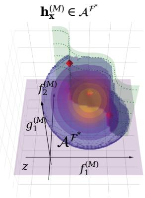  
(a)

(b)  
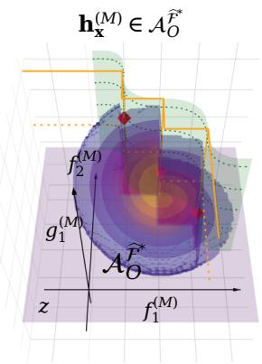

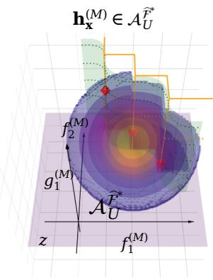  
(c)  
Figure 1: Admissible target-fidelity regions for two objectives and one constraint. The Z-axis represents the constraint $\overset { \sim } { g _ { 1 } } { = } \overset { ( M ) } { { \delta } }$ , for which below the threshold z (purple level plane) is infeasible. The XY -plane corresponds to two objectives $f _ { 1 } ^ { ( M ) }$ and $f _ { 2 } ^ { ( M ) }$ , on which the Pareto frontier ${ \mathcal { F } } ^ { * }$ is defined, depicted as the green wavy plane. (a) The distribution of ${ \pmb h } _ { { \pmb x } } ^ { ( M ) }$ (the sphere) is truncated by ${ \mathcal { F } } ^ { * }$ and $g _ { 1 } ^ { ( M ) } ( { \pmb x } ) = z .$ . (b) Based on sampled ${ \widehat { \mathcal { F } } } ^ { * }$ depicted as the red diamonds, the approximate truncated region is constructed by the over-truncation (the yellow zigzag plane). (c) Same as (b), the approximate truncated region is constructed $\mathrm { b y }$ the under-truncation (the yellow zigzag plane). The truncations in (b) and (c) are two extreme approximations of the unknown truncation in (a). Equation (4) uses a mixture of their truncated distributions as the variational distribution.

a prospective observation is given. We define

$$
Z _ { T } ( \pmb { x } ; \widehat { \mathcal { F } } ^ { * } ) : = \operatorname* { P r } \left( \pmb { h } _ { \pmb { x } } ^ { ( M ) } \in \mathcal { A } _ { T } ^ { \widehat { \mathcal { F } } ^ { * } } \right) ,\tag{7}
$$

$$
Z _ { T } ( \pmb { x } ; \widehat { \mathcal { F } } ^ { * } \mid \pmb { r } _ { \pmb { x } } ^ { ( m ) } ) : = \operatorname* { P r } \left( \pmb { h } _ { \pmb { x } } ^ { ( M ) } \in \mathcal { A } _ { T } ^ { \widehat { \mathcal { F } } ^ { * } } \mid \pmb { r } _ { \pmb { x } } ^ { ( m ) } \right) .\tag{8}
$$

The second quantity is the observation-conditioned version of the first. Below, we abbreviate these quantities as $Z _ { T }$ and $Z _ { T } ( \cdot \ | \ r _ { x } ^ { ( m ) } )$ , respectively, where the dot represents the omitted arguments x and ${ \widehat { \mathcal { F } } } ^ { * }$ . Combining (7), (8), and (5), we obtain

$$
q _ { T } ( \pmb { r _ { x } ^ { ( m ) } } | \mathcal { \widehat { F } } ^ { * } ) / p ( \pmb { r _ { x } ^ { ( m ) } } ) = Z _ { T } ( \cdot | \pmb { r _ { x } ^ { ( m ) } } ) / Z _ { T } .\tag{9}
$$

The lower bound to be evaluated is therefore

$$
\begin{array} { l } { \mathcal { L } _ { \mathrm { C M F } } ( \pmb { x } , m , \lambda ) } \\ { = \mathbb { E } _ { \mathcal { F } ^ { \ast } , r _ { x } ^ { ( m ) } } \left[ \log \left\{ \lambda \frac { Z _ { U } ( \cdot \mid \pmb { r } _ { x } ^ { ( m ) } ) } { Z _ { U } } \right. \right. } \\ { \left. \left. + ( 1 - \lambda ) \frac { Z _ { O } ( \cdot \mid \pmb { r } _ { x } ^ { ( m ) } ) } { Z _ { O } } \right\} \right] . } \end{array}\tag{10}
$$

Thus, we need the probability of the same Pareto-consistency event $h _ { x } ^ { ( M ) } \in \mathcal { A } _ { T } ^ { \widehat { \mathcal { F } } ^ { \ast } }$ before and after a prospective observation, i.e., $Z _ { T }$ and $Z _ { T } ( \cdot \mid r _ { x } ^ { ( m ) } )$ . A low-fidelity query can be regarded as useful insofar as its observation changes this target-fidelity event probability. To determine λ,

we maximize (10) over λ. This is a special case of the well-known variational lower bound maximization, justified as the minimization the KL divergence between the variational distribution $q _ { \lambda }$ and the true distribution (See Appendix A).

## 3.4 Cross-fidelity propagation and region probabilities

To evaluate the denominator $Z _ { T }$ , we use the target-fidelity marginal $\pmb { h } _ { \pmb { x } } ^ { ( M ) } \sim \mathcal { N } ( \pmb { \mu } _ { M } , \pmb { \Sigma } _ { M M } )$ where $\pmb { \mu } _ { M }$ and $\pmb { \Sigma } _ { M M }$ are the posterior mean vector and variance matrix of ${ h } _ { x } ^ { ( M ) }$ , respectively (since ${ h } _ { x } ^ { ( M ) }$ is now modeled by independent GPs, $\pmb { \Sigma } _ { M M }$ is a diagonal matrix). To evaluate the numerator $Z _ { T } ( \cdot \mid r _ { x } ^ { ( m ) } )$ , we first condition this distribution on the prospective observation. Let the joint posterior be

$$
\begin{array} { r } { \left[ \pmb { h } _ { \pmb { x } } ^ { ( M ) } \right] \sim \mathcal { N } \left( \left[ \pmb { \mu } _ { M } \right] , \left[ \pmb { \Sigma } _ { M M } \quad \pmb { \Sigma } _ { M m } \right. \right. \right. \sim } \\ { \left. \left. \pmb { r } _ { \pmb { x } } ^ { ( m ) } \right] \sim \mathcal { N } \left( \left[ \pmb { \mu } _ { m } \right] , \left[ \pmb { \Sigma } _ { m M } \quad \pmb { \Sigma } _ { m m } + \pmb { \Sigma } _ { \epsilon } ^ { ( m ) } \right] \right) . } \end{array}
$$

Hence, after a hypothetical observation $\pmb { r } _ { \pmb { x } } ^ { ( m ) }$

$$
\begin{array} { r } { \pmb { h } _ { \pmb { x } } ^ { ( M ) } \mid \pmb { r } _ { \pmb { x } } ^ { ( m ) } \sim { \mathcal N } \left( \pmb { \mu } _ { M \mid r } , \pmb { \Sigma } _ { M \mid r } \right) , } \end{array}
$$

where

$$
\begin{array} { r l } & { { \pmb \mu } _ { M | r } = { \pmb \mu } _ { M } + { \pmb \Sigma } _ { M m } \left( { \pmb \Sigma } _ { m m } + { \pmb \Sigma } _ { \epsilon } ^ { ( m ) } \right) ^ { - 1 } \left( { \pmb r } _ { \pmb x } ^ { ( m ) } - { \pmb \mu } _ { m } \right) , } \\ & { { \pmb \Sigma } _ { M | r } = { \pmb \Sigma } _ { M M } - { \pmb \Sigma } _ { M m } \left( { \pmb \Sigma } _ { m m } + { \pmb \Sigma } _ { \epsilon } ^ { ( m ) } \right) ^ { - 1 } { \pmb \Sigma } _ { m M } . } \end{array}
$$

We write $\mu _ { f , l | r }$ and $\mu _ { g , c | r }$ for the objective and constraint components of $\pmb { \mu } _ { M | r }$ , and $\sigma _ { f , l | r }$ and $\sigma _ { g , c | r }$ for the square roots of the corresponding diagonal entries of $\pmb { \Sigma } _ { M | r }$

This equation makes the role of fidelity explicit: a query is informative about the target frontier only insofar as the cross-fidelity covariance allows its observation to change posterior beliefs about the target-fidelity outputs. Let

$$
\begin{array} { r l } & { \rho _ { \mathrm { f e a s } } ( \pmb { r } _ { \pmb { x } } ^ { ( m ) } ) : = \mathrm { P r } \left( \pmb { g } _ { \pmb { x } } ^ { ( M ) } \geq z \mid \pmb { r } _ { \pmb { x } } ^ { ( m ) } \right) , } \\ & { \quad \rho _ { { O } } ( \pmb { r } _ { \pmb { x } } ^ { ( m ) } ) : = \mathrm { P r } \left( \pmb { f } _ { \pmb { x } } ^ { ( M ) } \in \mathcal { R } _ { O } \mid \pmb { r } _ { \pmb { x } } ^ { ( m ) } \right) , } \\ & { \quad \rho _ { U } ( \pmb { r } _ { \pmb { x } } ^ { ( m ) } ) : = \mathrm { P r } \left( \pmb { f } _ { \pmb { x } } ^ { ( M ) } \in \mathcal { R } _ { U } \mid \pmb { r } _ { \pmb { x } } ^ { ( m ) } \right) . } \end{array}
$$

Independence of the scalar-output GPs, together with the independent-noise assumption, gives

$$
\begin{array} { r } { Z _ { O } ( \cdot \mid \mathbf { r } _ { x } ^ { ( m ) } ) = ( 1 - \rho _ { \mathrm { f e a s } } ( \mathbf { r } _ { x } ^ { ( m ) } ) ) + \rho _ { \mathrm { f e a s } } ( \mathbf { r } _ { x } ^ { ( m ) } ) \rho _ { O } ( \mathbf { r } _ { x } ^ { ( m ) } ) , } \\ { Z _ { U } ( \cdot \mid \mathbf { r } _ { x } ^ { ( m ) } ) = ( 1 - \rho _ { \mathrm { f e a s } } ( \mathbf { r } _ { x } ^ { ( m ) } ) ) + \rho _ { \mathrm { f e a s } } ( \mathbf { r } _ { x } ^ { ( m ) } ) \rho _ { U } ( \mathbf { r } _ { x } ^ { ( m ) } ) . } \end{array}
$$

We see that $\rho _ { \mathrm { f e a s } }$ is written as

$$
\rho _ { \mathrm { f e a s } } ( \pmb { r } _ { x } ^ { ( m ) } ) = \prod _ { c = 1 } ^ { C } \left[ 1 - \Phi \left( \frac { z _ { c } - \mu _ { g , c | r } } { \sigma _ { g , c | r } } \right) \right] ,\tag{11}
$$

where Φ is the standard normal CDF. For CMF-PFEV, the objective-space probabilities are evaluated by partitioning the region dominated by the finite frontier into mutually disjoint hyperrectangles, as in Pareto-frontier entropy search (Suzuki et al., 2020; Ishikura and Karasuyama,

2025). Suppose that

$$
\mathcal { R } _ { O } = \bigcup _ { i = 1 } ^ { N _ { O } } \mathcal { C } _ { i } , \qquad \mathcal { C } _ { i } = \prod _ { l = 1 } ^ { L } ( a _ { i , l } , b _ { i , l } ] ,
$$

where $N _ { O }$ denotes the number of disjoint cells, and $a _ { i , l }$ and $b _ { i , l }$ are the lower and upper bounds of $\mathcal { C } _ { i }$ along objective dimension l, respectively. Then, we see

$$
\rho _ { { \cal O } } ( r _ { x } ^ { ( m ) } ) = \sum _ { i = 1 } ^ { N _ { { \cal O } } } \prod _ { l = 1 } ^ { L } \left[ \Phi \left( \frac { b _ { i , l } - \mu _ { f , l | r } } { \sigma _ { f , l | r } } \right) - \Phi \left( \frac { a _ { i , l } - \mu _ { f , l | r } } { \sigma _ { f , l | r } } \right) \right] .
$$

The complement probability $1 - \rho _ { U } ,$ corresponding to the region of objective vectors that strictly dominate at least one sampled frontier point, is obtained analogously; the same dominated-region routine can be applied after sign-flipping the objective vectors. The unconditional normalizers $Z _ { T }$ are obtained by the same region calculations under the unconditional target-fidelity predictive distribution.

## 3.5 Monte Carlo approximation and cost-aware query selection

The expectation over the random frontier and prospective noisy observation in (10) is approximated by nested Monte Carlo sampling. For each $k = 1 , \ldots , N _ { \mathrm { p a t h } }$ , we draw a posterior function path and solve the constrained multi-objective problem at fidelity M to obtain the finite frontier $\mathcal { \widetilde { F } } _ { k } ^ { * }$ containing $N _ { \mathrm { P F } }$ points. The latent query output $\widetilde { \pmb { h } } _ { { \pmb x } , k } ^ { ( m ) }$ is evaluated on the same function path, thereby preserving its posterior dependence with the sampled target frontier. For each path, we then draw $N _ { \epsilon }$ independent observation-noise samples and set

$$
\widetilde { \pmb { r } } _ { { \pmb { x } } , k , j } ^ { ( m ) } = \widetilde { \pmb { h } } _ { { \pmb { x } } , k } ^ { ( m ) } + \widetilde { \pmb { \epsilon } } _ { k , j } ^ { ( m ) }
$$

for $\widetilde { \epsilon } _ { k , j } ^ { ( m ) } \overset { \mathrm { i . i . d . } } { \sim } \mathcal { N } ( \mathbf { 0 } , \Sigma _ { \epsilon } ^ { ( m ) } ) , j = 1 , \dots , N _ { \epsilon }$ , where the noise samples are independent of the posterior function paths. The lower bound is approximated as

$$
\begin{array} { r l } & { \widehat { \mathcal { L } } _ { \mathrm { C M F } } ( { \pmb x } , m , \lambda ) = \frac { 1 } { N _ { \mathrm { p a t h } } N _ { \epsilon } } \displaystyle \sum _ { k = 1 } ^ { N _ { \mathrm { p a t h } } } \sum _ { j = 1 } ^ { N _ { \epsilon } } } \\ & { \displaystyle \log \Biggl \{ \lambda \frac { Z _ { U , k } ( \cdot \mid { \widetilde { \pmb { r } } } _ { { \pmb x } , k , j } ^ { ( m ) } ) } { Z _ { U , k } } + ( 1 - \lambda ) \frac { Z _ { O , k } ( \cdot \mid { \widetilde { \pmb { r } } } _ { { \pmb x } , k , j } ^ { ( m ) } ) } { Z _ { O , k } } \Biggr \} } \end{array}\tag{12}
$$

Both the posterior function paths and prospective observation noise are sampled by ordinary Monte Carlo. The Gaussian base-noise samples are held fixed during acquisition optimization to provide common random numbers across candidate points. Here $Z _ { T , k }$ and $Z _ { T , k } ( \cdot \mid \widetilde { \pmb { r } } _ { { \pmb { x } } , k , j } ^ { ( m ) } )$ denote the unconditional and observation-conditioned region probabilities evaluated using the finite frontier $\mathcal { \widetilde { F } } _ { k } ^ { * }$ from path k. Finally, let $c _ { m }$ be the cost of the coupled query at fidelity m. We evaluate information gain per unit cost at a given mixture weight,

$$
\alpha ( { \pmb x } , m , \lambda ) = \frac { 1 } { c _ { m } } \widehat { \mathcal { L } } _ { \mathrm { C M F } } ( { \pmb x } , m , \lambda ) .
$$

For each discrete fidelity $m \in \{ 1 , \ldots , M \}$ , we jointly optimize the candidate input and mixture weight:

$$
( \pmb { x } _ { m } , \lambda _ { m } ) \in \underset { \pmb { x } \in \pmb { \mathscr { X } } \atop \lambda \in ( 0 , 1 ] } { \operatorname { a r g m a x } } \alpha ( \pmb { x } , m , \lambda ) .
$$

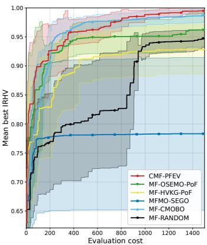  
(a) (L, C, d) = (2, 1, 2)

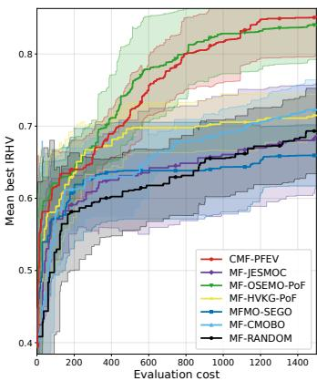  
(b) (L, C, d) = (2, 1, 5)

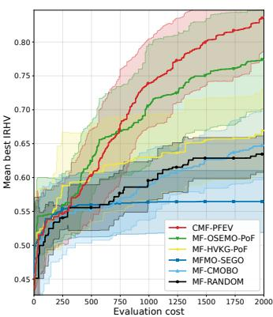  
(c) (L, C, d) = (3, 1, 5)

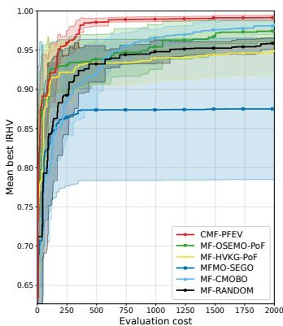  
(d) (L, C, d) = (2, 2, 2)

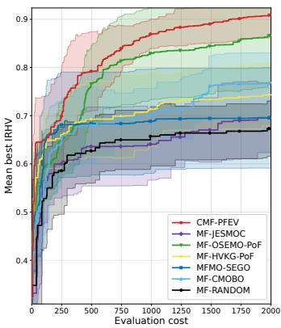  
(e) (L, C, d) = (2, 2, 5)

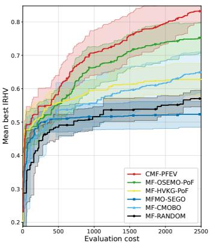  
(f) (L, C, d) = (3, 2, 5)  
Figure 2: Results on GP-derived synthetic functions (10 runs average and standard error).

In the continuous design setting, this is a joint continuous optimization over (x, λ) with m held fixed. We then select the fidelity by $\begin{array} { r } { \operatorname * { a r g m a x } _ { m \in \{ 1 , \dots , M \} } \alpha ( \pmb { x } _ { m } , m , \lambda _ { m } ) } \end{array}$ , which indicates the most cost-efective fidelity in a sense of the approximate MI.

The complete Bayesian optimization loop is summarized in Algorithm 1 in Appendix B.

## 4 Related Work

Multi-objective BO. Multi-objective BO (MOBO) includes scalarization-based approaches such as ParEGO (Knowles, 2006), confidence-bound approaches such as PAL (Zuluaga et al., 2013), and hypervolume-based criteria such as EHVI and its Monte Carlo extensions (Daulton et al., 2020). Information-based methods instead reduce uncertainty about Pareto-optimal quantities: PESMO targets the Pareto set (Hernandez-Lobato et al., 2016), MESMO, PFES, and PF2ES target the Pareto frontier (Belakaria et al., 2019; Suzuki et al., 2020; Qing et al., 2023), and JES jointly targets the Pareto set and frontier (Tu et al., 2022). PFEV constructs a variational information lower bound using over- and under-truncated approximations to the Pareto-consistent region (Ishikura and Karasuyama, 2025), on which our information-theoretic construction builds.

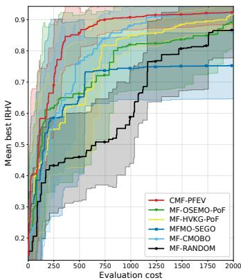  
(a) DTLZ $( L , C , d ) = ( 3 , 1 , 7 )$

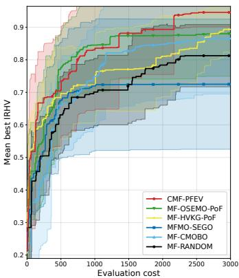  
(b) DTLZ (L, C, d) = (5, 1, 9)

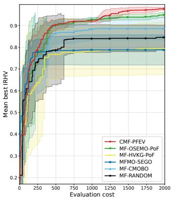  
(c) Tanaka (L, C, d) = (2, 2, 2)  
Figure 3: Results on benchmark functions (10 runs average and standard error).

Constrained BO.A classical approach to constrained BO is to combine an improvementbased acquisition function with the posterior probability of feasibility, thereby discouraging evaluations that are unlikely to satisfy unknown constraints (Schonlau et al., 1998; Gardner et al., 2014a). More recent information-based approaches directly quantify information about the feasible optimizer or optimum (Hern´andez-Lobato et al., 2015). In particular, the variational information lower bound of Takeno et al. (2022) provides a basis for incorporating feasibility into information-theoretic BO and is closely related to the variational construction used in our method.

Multi-fidelity BO. Multi-fidelity BO exploits inexpensive but correlated approximations to reduce the number of costly target-fidelity evaluations. Classical approaches include heuristic multi-fidelity extensions of EI such as MFSKO (Huang et al., 2006), while subsequent methods developed principled fidelity-selection strategies based on confidence bounds (Kandasamy et al., 2017) or information gain per unit cost, such as multi-fidelity max-value entropy search (Takeno et al., 2020). Our method follows the latter information-theoretic perspective, but targets uncertainty about a Pareto frontier rather than a scalar optimum.

Multi-fidelity multi-objective BO. MF-OSEMO selects a pair of input and fidelity using output-space entropy reduction about the target (simplified) Pareto frontier (Belakaria et al., 2020), and MF-HVKG uses a one-step hypervolume knowledge-gradient criterion (Daulton et al., 2023). These methods address multiple objectives and fidelities but do not incorporate unknown constraints.

Constrained multi-fidelity multi-objective BO. MFMO-SEGO (Charayron et al., 2023) addresses constrained multi-fidelity multi-objective optimization by combining a constrained multi-objective acquisition strategy with a separate fidelity-selection criterion. MF-CMOBO (Lin et al., 2024) addresses the same setting through a multi-stage procedure combining feasibility search, weighted multi-fidelity hypervolume improvement, and constraint-boundary refinement. MF-JESMOC (Fern´andez-S´anchez and Hern´andez-Lobato, 2025) instead provides a unified information-theoretic criterion based on the joint entropy of the feasible Pareto set and frontier. However, it employs computationally intensive MF-DGPs for every objective and constraint and additional variational inference for Pareto conditioning, whereas our formulation relies on standard GP inference with cross-fidelity covariance to propagate target-fidelity Paretoconsistency information.

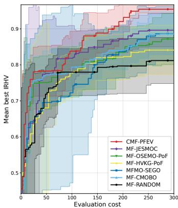  
(a) Waveform (L, C, d) = (2, 1, 3)

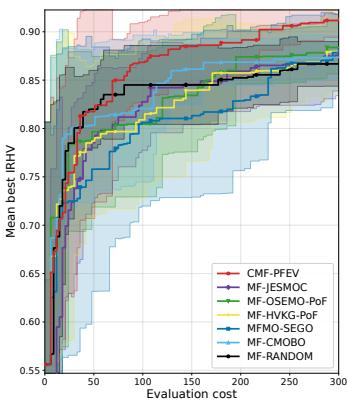  
(b) Bean (L, C, d) = (2, 1, 4)

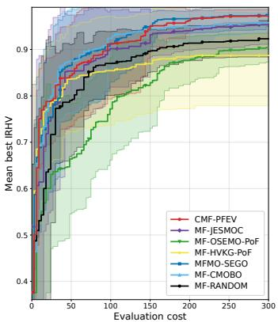  
(c) Covertype (L, C, d) = (2, 1, 4)

Figure 4: Results on hyper-parameter selection of LightGBM (10 runs average and standard error).

## 5 Experiments

We evaluate CMF-PFEV on synthetic functions, benchmark functions, and machine-learning hyperparameter optimization problems. We compare against MF-OSEMO, MF-HVKG, MFMO-SEGO, MF-CMOBO, and MF-JESMOC. Since MF-OSEMO and MF-HVKG do not handle constraints, we multiply their acquisition functions by the probability of feasibility, following constrained EI (Schonlau et al., 1998; Gardner et al., 2014b); we denote these variants by MF-OSEMO-PoF and MF-HVKG-PoF. Due to its high computational cost, MF-JESMOC is not shown in some results (see Appendix D for time measurements).

We use a product kernel $k _ { \mathrm { J o i n t } } ( ( { \pmb x } , m ) , ( { \pmb x } ^ { \prime } , m ^ { \prime } ) ) = k ^ { ( \mathrm { M a t } ) } ( { \pmb x } , { \pmb x } ^ { \prime } ) k ^ { ( \mathrm { G a u } ) } ( m , m ^ { \prime } )$ , where $k ^ { \mathrm { ( M a t ) } }$ is a Mat´ern-5/2 kernel and $k ^ { \mathrm { ( G a u ) } }$ is a Gaussian fidelity kernel. Performance is measured by inference relative hypervolume (IRHV): at each iteration, NSGA-II is applied to the posterior mean to obtain recommended solutions, and their hypervolume is normalized by an approximation of the true Pareto hypervolume. We report IRHV against cumulative evaluation cost. All experiments use two fidelity levels $( M = 2 )$ , with costs $( L + C )$ and $1 0 ( L + C )$ for synthetic and benchmark problems and (1, 2) for hyperparameter optimization. Further details are given in Appendix C.

GP sample path functions. We generate objective and constraint functions from the joint GP kernel above, using random Fourier features to obtain continuous sample paths over X. We consider several combinations of the numbers of objectives $L ,$ constraints $C ,$ and input dimensions d.

Benchmark functions. We consider the constrained multi-objective benchmarks C2- DTLZ2 (Jain and Deb, 2014) and Tanaka (Tanaka et al., 1995). Since these are originally single-fidelity problems, we construct low-fidelity functions by adding GP sample paths to the original functions.

ML hyperparameter optimization. We optimize LightGBM on the Waveform, Dry Bean, and Covertype datasets. Here, we only describe a setting for Covertype. The two objectives are macro-F1 and − log (model size), with a constraint on the worst class-wise recall. The optimized hyperparameters include learning rate, number of leaves, minimum child samples, and the weight balance between minority and other classes. The number of trees is 100 and 200 for low and high fidelities, respectively. Details are in Appendix C.3.

Fig. 2, 3, and 4 show the results, respectively. Overall, CMF-PFEV performs favorably across all three settings. The advantage is particularly pronounced on the GP sample path problems, where the data-generating process matches the GP modeling assumptions, while consistent improvements are also observed on the benchmark and hyperparameter optimization problems.

## 6 Conclusion

We proposed CMF-PFEV, an information-theoretic approach to constrained multi-fidelity multiobjective Bayesian optimization. By expressing information about the target-fidelity feasible Pareto frontier through Pareto-consistency events, we derived a tractable variational acquisition function as a unified criterion. The resulting computation relies on Pareto-region probabilities and standard cross-fidelity GP conditioning. Experiments on synthetic, benchmark, and hyperparameter optimization problems demonstrated the efectiveness of the proposed approach across diverse problem settings. A limitation is unknown approximation error on the information gain. Although MI is an essential criterion, its estimation accuracy is still required to be investigated.

## Acknowledgments

This work was partially supported by MEXT KAKENHI (25K03182), MEXT Supporting Pioneering Re-search through AI for 1,000 Discovery challenges Program (SPReAD) Japan Grant Number JPMXP1726275243, and Data Creation and Utilization Type Material Research and Development Project (Grant No. JP-MXP1122712807) of MEXT.

## References

Alvarez, M. A., Rosasco, L., and Lawrence, N. D. (2012). Kernels for vector-valued functions:´ A review. Foundations and Trends® in Machine Learning, 4(3):195–266.

Balandat, M., Karrer, B., Jiang, D. R., Daulton, S., Letham, B., Wilson, A. G., and Bakshy, E. (2020). BoTorch: A framework for eficient monte-carlo bayesian optimization. In Advances in Neural Information Processing Systems 33.

Belakaria, S., Deshwal, A., and Doppa, J. R. (2019). Max-value entropy search for multi-objective Bayesian optimization. In Advances in Neural Information Processing Systems 32, pages 7825– 7835. Curran Associates, Inc.

Belakaria, S., Deshwal, A., and Doppa, J. R. (2020). Multi-fidelity multi-objective bayesian optimization: An output space entropy search approach. In Proceedings of the AAAI Conference on Artificial Intelligence, volume 34, pages 10035–10043.

Charayron, R., Lefebvre, T., Bartoli, N., and Morlier, J. (2023). Towards a multi-fidelity & multi-objective bayesian optimization eficient algorithm. Aerospace Science and Technology, 142:108673.

Daulton, S., Balandat, M., and Bakshy, E. (2020). Diferentiable expected hypervolume improvement for parallel multi-objective Bayesian optimization. In Larochelle, H., Ranzato, M., Hadsell, R., Balcan, M., and Lin, H., editors, Advances in Neural Information Processing Systems, volume 33, pages 9851–9864. Curran Associates, Inc.

Daulton, S., Balandat, M., and Bakshy, E. (2023). Hypervolume knowledge gradient: A lookahead approach for multi-objective Bayesian optimization with partial information. In Proceedings of the 40th International Conference on Machine Learning, volume 202 of Proceedings of Machine Learning Research, pages 7167–7204. PMLR.

Fern´andez-S´anchez, D. and Hern´andez-Lobato, D. (2025). Joint entropy search for multiobjective bayesian optimization with constraints and multiple fidelities. Neurocomputing, 657:131674.

Gardner, J., Kusner, M., Xu, Z., Weinberger, K., and Cunningham, J. (2014a). Bayesian optimization with inequality constraints. In Proceedings of the 31st International Conference on Machine Learning, volume 32, pages 937–945. PMLR.

Gardner, J., Kusner, M., Zhixiang, X., Weinberger, K., and Cunningham, J. (2014b). Bayesian optimization with inequality constraints. In Proceedings of the 31st International Conference on Machine Learning, volume 32 of Proceedings of Machine Learning Research, pages 937–945. PMLR.

Gardner, J. R., Pleiss, G., Bindel, D., Weinberger, K. Q., and Wilson, A. G. (2018). GPyTorch: blackbox matrix-matrix gaussian process inference with gpu acceleration. In Proceedings of the 32nd International Conference on Neural Information Processing Systems, NIPS’18, page 7587–7597, Red Hook, NY, USA. Curran Associates Inc.

Hernandez-Lobato, D., Hernandez-Lobato, J., Shah, A., and Adams, R. (2016). Predictive entropy search for multi-objective Bayesian optimization. In Proceedings of The 33rd International Conference on Machine Learning, volume 48, pages 1492–1501. PMLR.

Hern´andez-Lobato, J. M., Gelbart, M. A., Hofman, M. W., Adams, R. P., and Ghahramani, Z. (2015). Predictive entropy search for Bayesian optimization with unknown constraints. In Proceedings of the 32th International Conference on Machine Learning, volume 37, pages 1699–1707. PMLR.

Huang, D., Allen, T., Notz, W., and Miler, R. (2006). Sequential kriging optimization using multiple-fidelity evaluations. Structural and Multidisciplinary Optimization, 32(5):369–382.

Ishikura, M. and Karasuyama, M. (2025). Pareto-frontier entropy search with variational lower bound maximization. In Proceedings of the 42nd International Conference on Machine Learning.

Jain, H. and Deb, K. (2014). An evolutionary many-objective optimization algorithm using reference-point based nondominated sorting approach, part ii: Handling constraints and extending to an adaptive approach. IEEE Transactions on Evolutionary Computation, 18(4):602– 622.

Kandasamy, K., Dasarathy, G., Schneider, J., and P´oczos, B. (2017). Multi-fidelity Bayesian optimisation with continuous approximations. In Proceedings of the 34th International Conference on Machine Learning, pages 1799–1808.

Ke, G., Meng, Q., Finley, T., Wang, T., Chen, W., Ma, W., Ye, Q., and Liu, T.-Y. (2017). LightGBM: A highly eficient gradient boosting decision tree. Advances in neural information processing systems, 30.

Knowles, J. (2006). ParEGO: A hybrid algorithm with on-line landscape approximation for expensive multiobjective optimization problems. IEEE transactions on evolutionary computation, 10(1):50–66.

Lin, Q., Hu, J., Zhou, Q., Shu, L., and Zhang, A. (2024). A multi-fidelity bayesian optimization approach for constrained multi-objective optimization problems. Journal of Mechanical Design, 146(7):071702.

Qing, J., Moss, H. B., Dhaene, T., and Couckuyt, I. (2023). {PF}2es: Parallel feasible pareto frontier entropy search for multi-objective bayesian optimization. In Ruiz, F., Dy, J., and van de Meent, J.-W., editors, Proceedings of The 26th International Conference on Artificial Intelligence and Statistics, volume 206 of Proceedings of Machine Learning Research, pages 2565–2588. PMLR.

Schonlau, M., Welch, W. J., and Jones, D. R. (1998). Global versus local search in constrained optimization of computer models. In New Developments and Applications in Experimental Design, volume 34 of IMS Lecture Notes–Monograph Series, pages 11–25. Institute of Mathematical Statistics.

Suzuki, S., Takeno, S., Tamura, T., Shitara, K., and Karasuyama, M. (2020). Multi-objective Bayesian optimization using Pareto-frontier entropy. In Proceedings of the 37th International Conference on Machine Learning, volume 119, pages 9279–9288. PMLR.

Takeno, S., Fukuoka, H., Tsukada, Y., Koyama, T., Shiga, M., Takeuchi, I., and Karasuyama, M. (2020). Multi-fidelity Bayesian optimization with max-value entropy search and its parallelization. In Proceedings of the 37th International Conference on Machine Learning, volume 119, pages 9334–9345. PMLR.

Takeno, S., Tamura, T., Shitara, K., and Karasuyama, M. (2022). Sequential and parallel constrained max-value entropy search via information lower bound. In Proceedings of the 39th International Conference on Machine Learning, volume 162 of Proceedings of Machine Learning Research, pages 20960–20986. PMLR.

Tanaka, M., Watanabe, H., Furukawa, Y., and Tanino, T. (1995). Ga-based decision support system for multicriteria optimization. In 1995 IEEE International Conference on Systems, Man and Cybernetics. Intelligent Systems for the 21st Century, volume 2, pages 1556–1561 vol.2.

Tu, B., Gandy, A., Kantas, N., and Shafei, B. (2022). Joint entropy search for multi-objective Bayesian optimization. Advances in Neural Information Processing Systems, 35:9922–9938.

Zuluaga, M., Sergent, G., Krause, A., and P¨uschel, M. (2013). Active learning for multi-objective optimization. In International conference on machine learning, pages 462–470. PMLR.

# Supplementary Appendix of A Unified Information-Theoretic Approach to Constrained Multi-Fidelity Multi-Objective Bayesian Optimization

## A Variational Lower Bound

The following derivation of the lower bound is a standard approach that exploits nonengativity of Kullback-Leibler (KL) divergence:

$$
\begin{array} { r l } & { \mathrm { M i } ( \tau _ { 0 } ^ { ( m ) } ; \mathcal { F } ) } \\ & { = \int p ( r ^ { \prime \prime } ) \int p ( r _ { 0 } ^ { ( m ) } \mid \mathcal { F } ^ { \prime \prime } ) \log \frac { p ( \dot { r } _ { 0 } ^ { ( m ) } \mid \mathcal { F } ^ { \prime \prime } ) } { p ( r _ { 0 } ^ { ( m ) } ) } \mathrm { d } r _ { \alpha } ^ { ( m ) } \mathrm { d } r ^ { \prime } } \\ & { = \int p ( r ^ { \prime \prime } ) \Bigg [ \int p ( r _ { 0 } ^ { ( m ) } \mid \mathcal { F } ^ { \prime \prime } ) \log \frac { q ( \dot { r } _ { 0 } ^ { ( m ) } \mid \mathcal { F } ^ { \prime \prime } ) } { p ( r _ { 0 } ^ { ( m ) } ) } \mathrm { d } r _ { \alpha } ^ { ( m ) } } \\ & { \qquad + P _ { \mathrm { N L } } ( \rho ( r _ { 0 } ^ { ( m ) } \mid \mathcal { F } ^ { \prime \prime } ) \mid \Phi ( r _ { 0 } ^ { ( m ) } \mid \mathcal { F } ^ { \prime \prime } ) ) \Bigg ] \mathrm { d } r ^ { \prime \prime } } \\ & { = \mathbb { E } _ { \mathcal { F } ^ { \prime \prime } \times \Psi ^ { \prime \prime } } [ \log \frac { q ( \dot { r } _ { 0 } ^ { ( m ) } \mid \mathcal { F } ^ { \prime } ) } { p ( r _ { 0 } ^ { ( m ) } ) } ] } \\ &  \qquad + \mathbb { E } _ { \mathcal { F } ^ { \prime } \times \Psi ^ { \prime } } [ \log ( \frac { q ( \dot { r } _ { 0 } ^ { ( m ) } \mid \mathcal { F } ^ { \prime } ) } { p ( r _ { 0 } ^ { ( m ) } \mid \mathcal { F } ^ { \prime } ) } ) \Bigg ] \mathrm { d } \eta ( r _ { 0 } ^ \end{array}
$$

This indicates that the maximization of the variational lower bound is equivalent to the minimization of the KL divergence $\mathbb { E } _ { \mathcal { F } ^ { * } } \left[ D _ { \mathrm { K L } } \left( p ( r _ { x } ^ { ( m ) } \mid \mathcal { F } ^ { * } ) \parallel q ( r _ { x } ^ { ( m ) } \mid \mathcal { F } ^ { * } ) \right) \right]$

## B Overall Procedure

Let $B _ { t }$ denote the remaining evaluation budget after the initial data and the first t queries. Algorithm 1 summarizes CMF-PFEV. For each fidelity $m \in \{ 1 , \ldots , M \}$ , the candidate input ${ \pmb x } \in$ X and mixture weight $\lambda \in ( 0 , 1 ]$ are optimized jointly; the resulting cost-normalized acquisition values are then compared across fidelities. The sampled function paths and observation-noise base samples are held fixed throughout this joint optimization, providing common random numbers across candidate inputs and fidelities. Experimental query-selection rules and numerical settings are specified in Appendix C.

## C Experimental Detail

We describe the settings used in Section 5. Continuous inputs are normalized to $[ 0 , 1 ] ^ { d }$ , whereas machine-learning problems use fixed candidate pools.

Computing infrastructure. All experiments were run on an internal compute cluster. The next-query selection times in Table 4 were measured using one CPU thread on an Intel Xeon Gold 5317 processor.

Algorithm 1 Pseudocode of CMF-PFEV   
Require: Initial data $\begin{array} { r } { \mathcal { D } _ { 0 } , } \end{array}$ , remaining budget $B _ { 0 } ,$ , costs $\{ c _ { m } \} _ { m = 1 } ^ { M } , \ N _ { \mathrm { p a t h } } , \ N _ { \epsilon } ,$ , and nominal frontier size   
$N _ { \mathrm { P F } }$   
1: Function $\begin{array} { r l } { \mathrm { C M F - P F E V } ( \mathcal { D } _ { 0 } ) { : } } & { { } } \end{array}$   
2: $t \gets 0$   
3: while $B _ { t } > 0$ do   
4: Update the multi-fidelity GP posterior using $\mathcal { D } _ { t }$   
5: $s \gets \emptyset$   
6: for $k = 1 , \ldots , N _ { \mathrm { p a t h } }$ do   
7: Draw a posterior function path $\widetilde { h } _ { k }$   
8: Obtain a finite target-fidelity frontier approximation $\mathcal { \widetilde { F } } _ { k } ^ { * }$ with nominal size $N _ { \mathrm { P F } }$   
9: Draw independent $\displaystyle \pmb { \xi } _ { k , j } \sim \mathcal { N } ( \mathbf { 0 } , \pmb { I } _ { L + C } ) , j = 1 , \ldots , N _ { \epsilon }$   
10: $\mathcal { S }  \mathcal { S } \cup \{ ( \widetilde { h } _ { k } , \widetilde { \mathcal { F } } _ { k } ^ { * } , \{ \pmb { \xi } _ { k , j } \} _ { j = 1 } ^ { N _ { \epsilon } } ) \}$   
11: end for   
12: Prepare the objective-region cell decompositions   
13: for $m = 1 , \ldots , M$ do   
14: Maximize over input and mixture weight:   
$( \pmb { x } _ { m } , \lambda _ { m } ) \gets$   
15: $\operatorname { a r g m a x } \mathrm { C a L C A C Q } ( \pmb { x } , m , \lambda ; \pmb { S } )$   
$\stackrel { \pmb { x } } { \in } ( \ k _ { 0 } ^ { x } , 1 ]$   
16: $a _ { m } \gets \mathrm { C A L C A C Q } ( { \pmb x } _ { m } , m , \lambda _ { m } ; \mathcal { S } )$   
17: end for   
18: $m _ { t + 1 } \gets \mathrm { a r g m a x } _ { m \in \{ 1 , \dots , M \} } a _ { m }$ and $\pmb { x } _ { t + 1 } \gets \pmb { x } _ { m _ { t + 1 } }$   
19: if $c _ { m _ { t + 1 } } > B _ { t }$ then   
20: break {Terminate without observation}   
21: end if   
22: Observe $\pmb { r } _ { \pmb { x } _ { t + 1 } } ^ { ( m _ { t + 1 } ) }$ and update $\mathcal { D } _ { t + 1 }$   
23: $B _ { t + 1 } \gets B _ { t } - c _ { m _ { t + 1 } }$ and $t \gets t + 1$   
24: end while   
25: Function $\mathrm { C a L C A C Q } ( { \pmb x } , m , \lambda ; { \pmb S } ) ;$   
26: for $k = 1 , \ldots , N _ { \mathrm { p a t h } }$ do   
27: Evaluate $Z _ { T , k }$ for $T \in \{ O , U \}$ using Gaussian CDFs   
28: for $j = 1 , \dots , N _ { \epsilon }$ do   
29: $\widetilde \epsilon _ { k , j } ^ { ( m ) } \gets ( \Sigma _ { \epsilon } ^ { ( m ) } ) ^ { 1 / 2 } \pmb { \xi } _ { k , j }$   
30: $\widetilde { \pmb { r } } _ { { \pmb { x } } , k , j } ^ { ( m ) } \gets \widetilde { \pmb { h } } _ { { \pmb { x } } , k } ^ { ( m ) } + \widetilde { \pmb { \epsilon } } _ { k , j } ^ { ( m ) }$   
31: Evaluate $Z _ { T , k } ( \cdot \mid \widetilde { \pmb { r } } _ { { \pmb { x } } , k , j } ^ { ( m ) } )$ for $T \in \{ O , U \}$ using Gaussian CDFs   
32: end for   
33: end for   
34: Form $\widehat { \mathcal { L } } _ { \mathrm { C M F } } ( \pmb { x } , m , \lambda )$ using Eq. (12)   
35: return $c _ { m } ^ { - 1 } \widehat { \mathcal { L } } _ { \mathrm { C M F } } ( \pmb { x } , m , \lambda )$

Software and dataset attribution. The augmented-input GP models and the MF-HVKG implementation use BoTorch (Balandat et al., 2020) and $\mathrm { G P y }$ Torch (Gardner et al., 2018). The classifier experiments use LightGBM (Ke et al., 2017). Original comparison methods and benchmark functions are cited in their respective descriptions below. Waveform-5000 is derived from the https://doi.org/10.24432/C56014Waveform Database Generator (Version 2) dataset of Breiman and Stone (1984); https://doi.org/10.24432/C50S4BDry Bean is due to K¨okl¨u and Ozkan (2020); and¨ https://doi.org/10.24432/C50K5NCovertype is due to Blackard (1998). The UCI Machine Learning Repository lists these three source datasets under the Creative Commons Attribution 4.0 International (CC BY 4.0) license. They contain synthetic waveforms, bean measurements, and forest-cover attributes, respectively; we do not collect participant data.

Initial data and budget. Each run starts from five distinct inputs evaluated at both fidelities for every objective and constraint. Thus, each objective or constraint $\mathrm { G P }$ initially has ten observations. Inputs use scrambled Sobol sampling for continuous problems and uniform sampling without replacement for pools. Methods share initial data for each of ten BO seeds, $0 , \ldots , 9$ The test functions, data splits, and classifier seeds remain fixed across these runs.

A coupled query costs $c _ { m } = ( L + C ) \kappa _ { m }$ , with per-output costs $( \kappa _ { 1 } , \kappa _ { 2 } ) = ( 1 , 1 0 )$ for synthetic and benchmark problems and (1, 2) for machine-learning problems. The additional budget after initialization is 50c . Figures start at zero by subtracting the initial cost $5 ( c _ { 1 } + c _ { 2 } )$ ; the initial observations remain available to all methods.

Experimental query-selection rules. In all experiments, after ten consecutive low-fidelity queries, the next query is restricted to the highest fidelity. Its input is selected by the method’s own rule at that fidelity, and a highest-fidelity query resets the counter. For pool problems, previously observed input–fidelity pairs are excluded from the candidate set; an input observed at one fidelity remains available at another fidelity if that pair is unobserved. These rules are applied to all compared methods.

GP model. Except for MF-JESMOC’s deep GP, methods use independent augmented-input GPs with the product kernel in Section 5. Its factors are

$$
\begin{array} { l l } { { \displaystyle { k ^ { ( \mathrm { M a t } ) } ( { \pmb x } , { \pmb x } ^ { \prime } ) = \sigma _ { f } ^ { 2 } \left( 1 + \sqrt { 5 } r + \frac { 5 r ^ { 2 } } { 3 } \right) e ^ { - \sqrt { 5 } r } } , \qquad } } & { { \mathrm r ^ { 2 } = \displaystyle \sum _ { i = 1 } ^ { d } \frac { ( x _ { i } - x _ { i } ^ { \prime } ) ^ { 2 } } { \ell _ { i } ^ { 2 } } , } } \\ { { \displaystyle { k ^ { ( \mathrm { G a u } ) } ( { \pmb m } , { \pmb m } ^ { \prime } ) = \exp \left[ - \frac { \left( s _ { m } - s _ { m ^ { \prime } } \right) ^ { 2 } } { 2 \ell _ { s } ^ { 2 } } \right] } , \qquad } } & { { \mathrm s _ { m } = \displaystyle \frac { m - 1 } { M - 1 } . } } \end{array}
$$

The $\mathrm { M a t e r n { - } 5 / 2 }$ kernel uses ARD: a separate input lengthscale $\ell _ { i }$ is learned for each dimension. Each output has its own constant mean, kernel parameters, and noise variance. Outputs are standardized separately. Hyperparameters are refitted after each query by marginal-likelihood maximization, warm-started from the preceding fit, with up to eight attempts. In standardized units, the bounds are $[ 1 0 ^ { - 6 } , 1 ]$ for noise variance, $[ 1 0 ^ { - 3 } , 1 0 \bar { 0 } ]$ for lengthscales, and $[ 1 0 ^ { - 6 } , 1 0 0 ]$ for output variance.

CMF-PFEV sampling and frontiers. We use $N _ { \mathrm { p a t h } } = 1 0$ posterior paths and $N _ { \epsilon } = 4$ observation-noise draws per path in Eq. (12). Prior paths use random Fourier features drawn from the input and fidelity kernels’ spectral distributions. The two feature maps are combined by a tensor product, giving $4 5 \times 4 6 = 2 0 7 0$ features from a nominal budget of 2048. A Matheronstyle correction conditions each path on the observations using the fitted kernel covariance and simulated training noise. GP fitting uses the kernel covariance directly.

For each sampled target-fidelity path, constrained NSGA-II uses population 50 and 1000 generations, with nominal frontier size $N _ { \mathrm { P F } } = 5 0$ . For pools, all candidates are evaluated on the sampled path, and the sampled-feasible nondominated set is extracted. Sets larger than 50 are pruned using the crowding-distance criterion of NSGA-II, retaining objective-wise extremes and favoring sparsely represented regions. If no sampled-feasible point is found, least-violating points provide a numerical fallback.

Acquisition optimization. Both objective-region and feasibility probabilities are evaluated using Gaussian CDFs; the objective calculation uses disjoint cell decomposition as in Section 3.4. For each fidelity, continuous inputs and $\lambda \in [ 1 0 ^ { - 4 } , 1 ]$ are jointly optimized by L-BFGS-B with four restarts, 128 raw initialization samples, and at most 100 iterations. For pools, each available input is fixed while λ is optimized continuously. Each sampled pool frontier retained without pruning uses $\lambda _ { k } = 0$ in its summand of Eq. (12); if all sampled frontiers are retained in full, λ is fixed to zero throughout acquisition optimization. The best cost-normalized pair is selected subject to the experimental query-selection rules above. MF-OSEMO-PoF also uses four restarts, 128 raw initialization samples, and at most 100 iterations for continuous acquisition optimization; MFMO-SEGO uses the constrained optimizer described below.

Comparison methods. MF-OSEMO-PoF and MF-HVKG-PoF use highest-fidelity feasibility:

$$
\mathrm { P o F } _ { M } ( { \pmb x } ) = \prod _ { c = 1 } ^ { C } \Phi \left( \frac { \mu _ { g , c } ^ { ( M ) } ( { \pmb x } ) - z _ { c } } { \sigma _ { g , c } ^ { ( M ) } ( { \pmb x } ) } \right) ,
$$

where constraint means and standard deviations are in the original units.

MF-OSEMO-PoF uses the numerical-integration variant of MF-OSEMO (Belakaria et al., 2020), ten frontier samples with the above path sampler, and observation noise. Our implementation uses 64 Gauss–Hermite nodes for lower-fidelity entropy and an analytic highest-fidelity term.

MF-HVKG-PoF uses BoTorch’s one-shot implementation (Daulton et al., 2023) with 32 fantasy observation scenarios and 10 target-fidelity recommendation points per scenario. Utility is the hypervolume of the updated posterior means. For each discrete fidelity, the query input and fantasy-specific recommendation points are jointly optimized, initializing the latter from the optimized current recommendation set. Acquisition optimization uses one restart, 128 raw initialization samples, and at most 200 iterations; current-value optimization uses one restart, 256 raw samples, and at most 200 iterations. For pools, query inputs are enumerated and each fantasy’s recommendation set is reoptimized within the pool by hypervolume-increasing singlepoint exchanges, with at most 10 sweeps. The current posterior-mean frontier, pruned to at most 10 points by crowding distance, supplies the initialization.

MFMO-SEGO selects an input by maximizing WB2S-MPI subject to highest-fidelity posteriormean constraints, $\mu _ { g , c } ^ { ( M ) } ( { \pmb x } ) \geq z _ { c }$ for all c (Charayron et al., 2023). Its posterior-mean frontier uses NSGA-II with population 50 and 1000 generations, or pool enumeration, retaining all resulting frontier points. WB2S-MPI combines the minimum probability of improvement against these points with a smooth minimum of normalized objective means, using temperature 0.05 and $\beta = 1 0 0$ . The MPI scaling reference is optimized over the same mean-feasible domain; the raw acquisition is used without PoF weighting or nonnegative shifting. Continuous optimization uses SLSQP with four restarts, 128 Sobol initialization samples supplemented by posterior-mean Pareto inputs, and at most 100 iterations, with feasibility tolerance $1 0 ^ { - 7 } ;$ pools are enumerated. If no mean-feasible candidate is found, a feasibility-restoration safeguard selects a candidate with minimum total predicted constraint violation. After selecting the input, each objective chooses the fidelity maximizing the Gaussian conditional reduction in target-fidelity variance, including observation noise, divided by squared cost. The highest of these fidelities is used for the coupled query.

MF-CMOBO combines feasibility search, weighted multi-fidelity expected hypervolume improvement, and constraint-boundary refinement (Lin et al., 2024). Improvement and boundary refinement alternate after feasibility search. Entropy weights use 5000d Latin-hypercube locations, and cross-fidelity scaling uses 1000d test locations, or all pool candidates. Constraint relaxation starts at −3 and increases by 1.5 up to 6. Continuous optimization uses eight restarts, 128 raw samples, and at most 100 iterations, with a smooth constraint gate of temperature 0.05 followed by a hard feasibility check; pools are enumerated.

MF-JESMOC (Fern´andez-S´anchez and Hern´andez-Lobato, 2025) uses the authors’ multifidelity deep-GP implementation, restricted to $L \leq 2$ because of its computational cost. Its two training phases use full batches, 5000/15000 iterations, and learning rates 0.003/0.001. We retain the authors’ defaults of 50 Pareto-set points and 1000d optimization-grid locations.

MF-RANDOM samples fidelity uniformly among allowed levels and uses scrambled Sobol inputs or uniform sampling among available pool candidates.

Evaluation. IRHV uses posterior-mean recommendations, obtained by constrained NSGA-II with population 300 and 1000 generations or pool enumeration. Recommendations are scored on noise-free highest-fidelity functions, discarding truly infeasible points; these evaluations do not enter BO data or consume its budget. Continuous reference frontiers use population 300 and 10000 generations, whereas pool references are exact. Each problem has a fixed hypervolume reference vector and denominator shared by all methods and seeds. Figures average the runningbest IRHV of the ten seeds, with bands of ± one standard error. Scores use the latest completed query at each cost and are carried forward to the budget limit.

## C.1 GP sample path functions

Each objective and constraint is an independent fixed prior draw from the product kernel above, with mean zero, variance one, isotropic input lengthscale $\ell _ { x } ,$ and fidelity lengthscale $\ell _ { s } = 5$ Table 1 lists the six settings. Generation uses 4096 random Fourier features, each with a joint input–fidelity frequency drawn from the Mat´ern- ${ \it 5 / 2 }$ and RBF spectral distributions. Independent Gaussian observation noise has standard deviation 0.01 at both fidelities, and constraint thresholds are zero.

Table 1: GP-generated test-function settings. Each problem is fixed across BO seeds.
<table><tr><td> $\overline { { L } }$ </td><td>C</td><td> $d$ </td><td> $\ell _ { x }$ </td></tr><tr><td>2</td><td>1</td><td>2</td><td>0.20</td></tr><tr><td>2</td><td>1</td><td>5</td><td>0.25</td></tr><tr><td>2</td><td>2</td><td>2</td><td>0.20</td></tr><tr><td>2</td><td>2</td><td>5</td><td>0.25</td></tr><tr><td>3</td><td>1</td><td>5</td><td>0.20</td></tr><tr><td>3</td><td>2</td><td>5</td><td>0.20</td></tr></table>

## C.2 Benchmark functions

The highest-fidelity functions are Tanaka (Tanaka et al., 1995) with $( L , C , d ) = ( 2 , 2 , 2 )$ and C2- DTLZ2 (Jain and Deb, 2014) with (3, 1, 7) and (5, 1, 9). Objectives are negated for maximization, and constraints are expressed as nonnegative feasible margins. Tanaka maps normalized inputs to $\mathbf { \nabla } u = \pi \mathbf { \nabla } x$ and uses objectives $\left( - u _ { 1 } , - u _ { 2 } \right)$ . C2-DTLZ2 uses constraint radius 0.4 for $L = 3$ and 0.5 for $L = 5$

For each output $h _ { j } .$ , an independent RBF-GP discrepancy $b _ { j }$ is generated with lengthscale 0.30 and 1024 Fourier features. Let $\bar { b } _ { j } , s _ { b , j }$ , and $s _ { H , j }$ be its mean, its standard deviation, and the highest-fidelity output standard deviation, calculated at 4096 fixed uniform calibration inputs. Low-fidelity outputs are

$$
h _ { j } ^ { ( m ) } ( { \pmb x } ) = h _ { j } ^ { ( M ) } ( { \pmb x } ) + 0 . 2 5 ( 1 - s _ { m } ) s _ { H , j } \frac { b _ { j } ( { \pmb x } ) - \overline { { b } } _ { j } } { s _ { b , j } } .
$$

All constraint thresholds are zero. Independent Gaussian observation noise has standard deviation 0.01 at both fidelities.

## C.3 LightGBM hyperparameter selection

Datasets. Waveform-5000 uses OpenML ID 60, Dry Bean uses UCI ID 602, and Covertype uses scikit-learn’s dataset loader. Fixed stratified training/validation splits are 50:50 for Waveform and 70:30 for Dry Bean. Covertype selects 60000 training and 40000 validation examples from 581012 examples (Table 2). All input columns are numerical; missing values are imputed using training-set medians.

Table 2: LightGBM dataset settings. All use 512 candidates, $L = 2$ , and $C = 1$
<table><tr><td>Dataset</td><td>Classes</td><td>Features</td><td>Train</td><td>Validation</td><td> $\overline { { d } }$ </td></tr><tr><td>Waveform-5000</td><td>3</td><td>40</td><td>2500</td><td>2500</td><td>3</td></tr><tr><td>Dry Bean</td><td>7</td><td>16</td><td>9527</td><td>4084</td><td>4</td></tr><tr><td>Covertype</td><td>7</td><td>54</td><td>60000</td><td>40000</td><td>4</td></tr></table>

Hyperparameters and fidelities. Each pool contains 512 fixed scrambled Sobol inputs. Coordinates map logarithmically to learning rate [0.01, 0.20], number of leaves [7, 127], and minimum samples per leaf [2, 50] for Waveform or [2, 100] for Dry Bean and Covertype. A coordinate $x _ { i } \in [ 0 , 1 ]$ maps to $a ( b / a ) ^ { x _ { i } }$ for range $[ a , b ] ;$ integer parameters are rounded. Dry Bean and Covertype add class-weight ratio $\rho \in [ 0 . 1 , 1 0 ]$ The rare group consists of the least frequent $\lfloor K _ { \mathrm { c l a s s } } / 2 \rfloor$ training classes (encoded labels break ties). Class weights are $\rho$ for rare classes and one otherwise, normalized by their mean across classes.

Low and high fidelities use 100 and 200 boosting rounds. LightGBM uses deterministic GBDT training with a fixed classifier seed, no row/feature subsampling, and no $L _ { 1 } / L _ { 2 }$ regularization. Candidate outputs are precomputed and returned from the saved tables during BO, without added observation noise.

Objectives and constraints. Waveform and Covertype maximize validation macro-F1 and the negative base-10 logarithm of model size in bytes, measured from the booster’s UTF-8 serialization. The constraint metric is minimum class-wise recall. Dry Bean maximizes macro-average recall in its rare and common groups (three and four classes), with validation accuracy as the constraint metric.

For metric $a ^ { ( m ) }$ , BO observes $g ^ { ( m ) } = a ^ { ( m ) } - \theta$ with threshold zero. The fixed θ is the 0.70 quantile of full-pool highest-fidelity values for Waveform/Covertype and the 0.50 quantile for Dry Bean; it applies at both fidelities (Table 3). The optimizer receives only queried outputs and this threshold. For IRHV evaluation, posterior-mean pool recommendations are pruned by crowding distance to the exact feasible frontier sizes in the table. This evaluation rule applies to every method; these sizes are not used by acquisition optimization.

Table 3: Constraint thresholds and feasible highest-fidelity pool frontier sizes. Stored fullprecision thresholds are used in calculations.
<table><tr><td>Dataset</td><td>Constraint metric</td><td>Quantile</td><td>θ</td><td>Frontier size</td></tr><tr><td>Waveform-5000</td><td>Worst-class recall</td><td>0.70</td><td>0.7892434988</td><td>6</td></tr><tr><td>Dry Bean</td><td>Accuracy</td><td>0.50</td><td>0.9269098923</td><td>10</td></tr><tr><td>Covertype</td><td>Worst-class recall</td><td>0.70</td><td>0.5836391437</td><td>13</td></tr></table>

## D Computational Time

Table 4 shows computational time comparison on the GP data. MFMO-SEGO and MF-CMOBO, which are based on separated heuristic approach, are relatively faster. On the other hand, information-based and knowledge gradient based approaches are slow compared with them. MF-JESMOC obviously took longer times. This is due to the estimation of complicated deep GP and variational approximations.

Table 4: Next-query selection time on a GP-sampled synthetic problem with L = 2 objectives, $C = 2$ constraints, $d = 5 , M = 2$ fidelity levels, and N = 100 total observations (50 at each fidelity). Values are the median and quartiles over five seeds, measured with one CPU thread (Xeon Gold 5317).
<table><tr><td>Method</td><td>Median (s)</td><td> $\left[ Q _ { 1 } , Q _ { 3 } \right] ~ ( \mathrm { s ) }$ </td></tr><tr><td>CMF-PFEV</td><td>103.1</td><td>[102.5, 121.6]</td></tr><tr><td>MF-OSEMO-PoF</td><td>50.2</td><td>[50.0, 50.2]</td></tr><tr><td> $\mathrm { M F \mathrm { - } H V K G \mathrm { - } P o F }$ </td><td>26.6</td><td>[13.7, 30.9]</td></tr><tr><td>MFMO-SEGO</td><td>13.2</td><td>[13.0, 13.5]</td></tr><tr><td>MF-CMOBO</td><td>12.7</td><td>[11.5, 12.8]</td></tr><tr><td>MF-JESMOC</td><td>3354.1</td><td>[3339.6, 3364.0]</td></tr></table>