# ADJOINT-BASED CALIBRATION AND OPTIMAL CONTROL OFSTOCHASTIC MULTISCALE BIOPROCESS DIGITAL TWINS

Keilung Choy Northeastern University

Wei Xie <sup>∗</sup> Northeastern University

## ABSTRACT

We develop a bias-aware digital-twin calibration and control framework for multiscale bioprocess models within a biological systems-of-systems (Bio-SoS) paradigm. The digital twin is represented by a stochastic differential equation (SDE) model and calibrated from sparse, discrete observations using quasi-likelihood estimation and adjoint sensitivity analysis. SDE generator-based moment expansions characterize truncation-induced parameter bias, while forward–backward adjoints quantify how calibration uncertainty propagates to value functions and policy performance. The resulting parameter-error distribution supports both policy-directed data acquisition and uncertainty-aware policy optimization through a second-order Gaussian-averaged objective. We characterize the asymptotic behavior of the resulting exploration criterion and derive a physical-system performance under the optimized policy. To implement these ideas, we develop an Actor–Simulator algorithm that jointly updates model parameters, selects informative experiments, and optimizes control policies. Numerical studies demonstrate improved calibration accuracy, sample efficiency, and control performance relative to state-of-the-art baselines.

Keywords Digital Twin Calibration · Biological Systems-of-Systems · Stochastic Differential Equations · Stochastic Adjoint Methods · Uncertainty Quantification · Quasi-Likelihood Estimation · Model-Based Reinforcement Learning · Multiscale Bioprocess Digital Twins · Optimal Control

## 1 INTRODUCTION

Advances in biopharmaceutical manufacturing, particularly personalized cell and gene therapies, have increased the need for reliable, adaptive, and data-driven process control. Because living cells serve as production engines, bioprocesses function as Biological Systems-of-Systems (Bio-SoS), where biological, physical, and chemical (a.k.a. biophysicochemical) mechanisms interact across molecular, cellular, and macroscopic scales. These multiscale interactions govern productivity and critical quality attributes (CQAs) while exhibiting strong nonlinearity, stochasticity, environmental sensitivity, and delayed effects. Consequently, product quality is inherently trajectory-dependent, reflecting the principle that the process is the product. A useful digital twin must therefore capture the multiscale mechanisms, causal pathways, and uncertainties linking control actions to future process outcomes.

Stochastic differential equations (SDEs) provide a natural framework for modeling Biological Systems-of-Systems (Bio-SoS) dynamics by representing reaction kinetics, molecular interactions, and intrinsic stochasticity in continuous time. Guided by domain ontologies [4], Bio-SoS dynamics can be decomposed into reusable mechanistic modules, including molecular and cellular agents, interaction networks, and regulatory mechanisms, and subsequently assembled into multiscale digital twins. This modular design supports the rapid development of mechanistic-hybrid digital twins for diverse biomanufacturing platforms, including monoclonal antibodies (mAbs), cell and gene therapies, regenerative medicine, vaccines, and nanoparticle delivery systems [25–27, 31, 33]. Coupled across scales, the SDE modules form interpretable digital twins in which molecular and cellular mechanisms govern macroscopic process behavior. The resulting parameters retain biophysicochemical interpretability, enabling calibration and policy sensitivities to be linked to specific pathways and regulatory interactions while accommodating realistic sampling and intervention schedules.

We assume that the mechanistic SDE structure is specified from established process knowledge, while unknown parameters are inferred from a limited number of discretely observed state–action trajectories. Exact finite-time transition densities are generally unavailable for nonlinear systems, motivating Gaussian quasi-likelihoods based on approximate conditional moments. However, truncating moment expansions introduces systematic parameter bias in addition to finite-sample uncertainty. This distinction is critical: additional data reduce estimation variability but do not eliminate the pseudo-true parameter shift induced by a fixed-order approximation at a nonzero observation interval. Moreover, transition-approximation bias is fundamentally different from numerical discretization error. Process-controloriented calibration must therefore quantify both uncertainty and approximation bias and propagate their effects through subsequent policy evaluation and decision-making.

The ultimate goal of digital twin calibration is to support optimal control of the physical systems. Because transient dynamics strongly influence yield and CQAs, steady-state approximations are often inadequate for batch and fed-batch operations. We therefore embed the calibrated SDE digital twin within a finite-horizon Markov decision process (MDP), where parameter uncertainty drives experiment design and model refinement, while intrinsic stochasticity governs process variability during policy evaluation. This framework naturally separates mechanism learning from process optimization. Experiments that are informative for identifying Bio-SoS mechanisms need not align with immediate production goals, whereas policies optimized under biased parameter estimates may yield suboptimal control. Therefore, at each learning round, we jointly update an exploration policy for selecting informative physical experiments to improve digital-twin fidelity and a target control policy that maximizes a bias-corrected estimate of physical-system performance.

Building on model-based reinforcement learning (RL) for biomanufacturing systems [29, 33], we develop an uncertaintyaware Actor–Simulator framework that integrates digital-twin calibration, uncertainty quantification, experiment design, and control optimization. First, after each physical trajectory, Gaussian quasi-likelihood estimation updates the mechanistic parameters and quantifies both finite-sample uncertainty and fixed-interval calibration bias. A shared trajectory-level adjoint framework combines forward simulation with backward stochastic adjoint equations to efficiently compute first- and second-order state–parameter sensitivities for calibration, uncertainty propagation, and policy evaluation. By propagating sensitivities along multiscale process trajectories, the framework preserves Bio-SoS interpretability and interoperability, reflecting the principle that the process is the product.

Second, we design physical experiments using a policy-relevant uncertainty criterion based on the discrepancy between digital- and physical-system Q-values, prioritizing state–action regions where model uncertainty most strongly affects control performance. Within each physical run, the calibration-error distribution and target policy are held fixed, while exploration decisions adapt online to observed system states. After each run, all accumulated data are used to recalibrate the digital twin, update the calibration-error distribution, and redesign subsequent experiments.

Finally, we optimize the target policy using a second-order approximation of the expected return under the calibrationerror distribution, accounting for both calibration bias and estimation variance as they propagate through the digital twin’s mechanistic pathways and affect policy performance. The resulting framework unifies uncertainty quantification, adaptive experimentation, and control optimization, enabling data-efficient policy learning under sparse observations and model misspecification.

Physics-informed digital twins primarily address state prediction and parameter inference, while classical computermodel calibration focuses on input–output discrepancies and surrogate-based representations [8, 10, 21]. Model-based RL leverages mechanistic models for decision-making but rarely propagates calibration bias and parameter uncertainty into the control objective. Our framework bridges these areas by unifying calibration, uncertainty quantification, adaptive experimentation, and bias-aware policy optimization. A key feature is the separation of calibration and control objectives. The exploration policy targets policy-relevant physical–digital value discrepancies to improve digital-twin fidelity, whereas the control policy maximizes an expected return that explicitly accounts for calibration bias and parameter uncertainty.

The primary contributions are:

1. Bias-aware calibration. We develop a Gaussian quasi-likelihood based on truncated conditional moments, quantify both finite-sample uncertainty and fixed-interval pseudo-true parameter bias, and construct a one-step correction for the leading truncation error.

2. Adjoint-based sensitivity analysis and value correction. We derive forward–backward stochastic adjoint equations for efficient first- and second-order sensitivity analysis of stochastic dynamical systems. By exploiting the duality between state and parameter sensitivities, the approach scales to high-dimensional Bio-SoS models and propagates calibration bias and covariance into a Gaussian-averaged approximation of finite-horizon policy value.

3. Actor–Simulator learning. We develop a trajectory-level framework that separates exploration from control, establish a near-optimality bound accounting for sampling uncertainty, calibration bias, and conditionalmoment truncation error, and demonstrate its effectiveness on multiscale biomanufacturing Bio-SoS applications with heterogeneous dynamics.

Section 2 reviews the related literature. Section 3 formulates the multiscale SDE and finite-horizon MDP frameworks. Section 4 presents the calibration, uncertainty quantification, adjoint sensitivity analysis, and policy optimization methods. Section 5 provides the theoretical analysis, Section 6 reports empirical results, and Section 7 concludes. Technical proofs and algorithmic details are deferred to the appendix.

## 2 Literature Review

This work lies at the intersection of physics-informed digital twins, active learning for experimental design, uncertaintyaware calibration of stochastic dynamical systems, and model-based control. We briefly review these areas and highlight the methodological gap addressed by the proposed framework.

(i) Physics-Informed Digital Twins and Calibration. Physics-informed machine learning incorporates differentialequation structure into learning, improving physical consistency and reducing data requirements relative to black-box models [8, 21]. Such models are increasingly deployed as digital twins and calibrated using simulation and experimental data [1, 9, 23, 30]. In biomanufacturing, mechanistic and hybrid digital twins support process monitoring, experiment design, and control optimization [3, 32]. However, existing studies focus on state prediction and parameter inference, with limited attention to how calibration uncertainty and approximation bias in SDE-based digital twins propagate to downstream control decisions.

Classical computer-model calibration, including Gaussian-process discrepancy models [10], primarily adopts an input–output perspective. In contrast, we consider finite-horizon trajectories generated by continuous-time stochastic nonlinear dynamics. A key challenge is that exact SDE transition densities are rarely available, requiring finite-interval approximations of conditional moments. These approximations can induce a pseudo-true parameter bias that persists even as the sample size grows. Our focus is therefore on quantifying this calibration bias, correcting its leading effects, and assessing its impact on downstream decision-making.

(ii) Adjoint Sensitivity Analysis for SDEs. Adjoint methods compute parameter sensitivities by propagating system states forward and adjoint variables backward, avoiding separate sensitivity equations for each parameter. They underpin differentiable simulators and neural differential equations [2, 20], with extensions to stochastic systems enabling scalable SDE sensitivity analysis [15]. We leverage stochastic adjoint equations to efficiently compute first- and second-order sensitivities of value functions and policy returns, enabling uncertainty and bias propagation to control performance while accelerating optimal process-control policy optimization.

(iii) Model-Based Control and Adaptive Experimentation. Model-based reinforcement learning and model predictive control use learned dynamics to improve decision-making while reducing reliance on costly experiments [5, 17]. Bayesian RL further exploits parameter uncertainty to balance exploration and exploitation [18, 22]. In biomanufacturing, recent studies have combined mechanistic models, sequential experimentation, and policy optimization [29, 33], while physics-informed surrogates have been integrated into feedback-control frameworks [19].

Despite these advances, existing approaches rarely separate the effects of calibration uncertainty and calibration bias on decision quality. In our setting, both contribute to the digital–physical value mismatch driving experiment design, whereas target-policy optimization depends on both directional return shifts induced by bias and curvature effects induced by parameter uncertainty. The proposed Actor–Simulator framework explicitly distinguishes these roles: exploration is guided by a policy-relevant value-discrepancy metric, while exploitation employs a bias-corrected return approximation. This unifies SDE calibration, uncertainty quantification, adaptive experimentation, and finite-horizon control within a single decision-oriented digital-twin framework.

## 3 Problem Description and Proposed Approach

We study the calibration of a multiscale mechanistic digital twin from sparse trajectory data and its use for optimal control of an underlying bioprocess. A key challenge is that limited discrete observations of nonlinear stochastic dynamics induce both statistical uncertainty and calibration bias in mechanistic parameter estimates. These errors propagate through the digital twin and affect policy evaluation, optimization, and ultimately physical-system performance. To address this challenge, we develop an uncertainty-aware Actor–Simulator framework that integrates policy-relevant digital-twin calibration, uncertainty quantification, adaptive experimentation, and bias-corrected policy optimization.

We first formulate the Bio-SoS dynamics and the associated physical and digital-twin MDPs, and then present the proposed framework.

## 3.1 Physical System and Digital Twin

Biomanufacturing systems operate as complex Bio-SoS, where heterogeneous mechanisms interact across molecular, cellular, and macroscopic scales. Consistent with the principle that the process is the product, process conditions continuously shape molecular structure and interactions, cellular behavior, and the local microenvironment, ultimately determining product yield and critical quality attributes (CQAs). A representative example is induced pluripotent stem cell (iPSC) aggregate culture, where intracellular metabolism, cell aggregation, extracellular transport, population dynamics, and bioreactor heterogeneity are tightly coupled [14, 33]. Consequently, process interventions such as feeding, medium exchange, and agitation control propagate across scales, influencing aggregate growth, population composition, productivity, and product quality consistency.

These multiscale interactions can be represented by modular SDEs, where individual modules describe distinct biophysicochemical mechanisms and are coupled through shared state variables to form interoperable mechanistic– hybrid digital twins. Figure 1 illustrates such a model for iPSC aggregate culture [25, 33], integrating populationbalance, reaction–diffusion, and single-cell stochastic metabolic-network modules. Although iPSC culture serves as the motivating example, the proposed framework applies broadly to modular multiscale mechanistic digital twins of complex engineered systems, including cell and gene therapy manufacturing, organoid production, 3D bioprinting, additive manufacturing, and semiconductor fabrication.

Example 3.1 (Modular Bio-SoS Digital Twin). Figure 1 illustrates a multiscale digital twin for iPSC aggregate culture [33]. The model integrates: (i) a population-balance module describing aggregate growth and collisions, (ii) a reaction– diffusion module governing nutrient and metabolite transport within aggregates, and (iii) a single-cell stochastic metabolic-network module capturing intracellular metabolic responses, shifts, and heterogeneity. Together, these modules link operating conditions, intracellular metabolism, aggregate heterogeneity, and CQAs across scales. Spatial gradients in oxygen and nutrient availability generate metabolic heterogeneity, leading to distinct flux distributions between inner and outer cell populations.

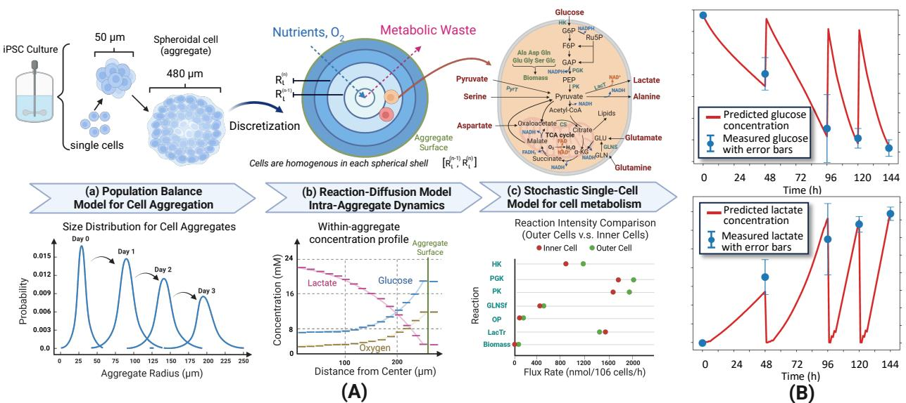

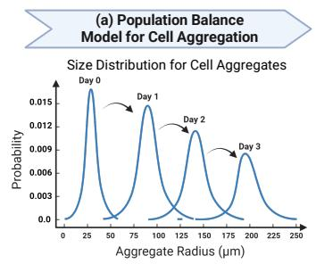

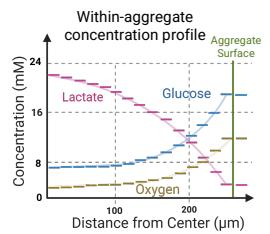

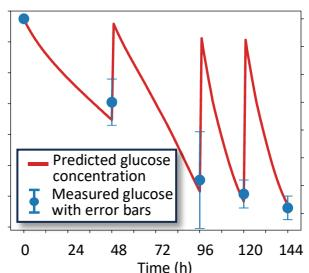

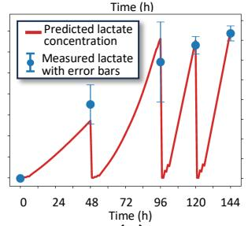  
Figure 1: (A) An illustration of our developed multi-scale mechanistic foundation model with modular design character izing iPSC cultures [33] including the modules. (B) Interoperability and in-context learning: Glucose and lactate trends predicted by our Bio-SoS model—trained solely on 2D monolayer data [25]—closely align with observations from 3D aggregate cultures [33].

In this study, we assume that the digital-twin structure is specified by established scientific knowledge, while its mechanistic parameters remain unknown. Let $\pmb { \mathscr { s } } _ { t } \in \mathcal { S } \subset \mathbb { R } ^ { \hat { M } }$ denote the process state and $\pmb { \theta } \in \Theta \subset \mathbb { R } ^ { \mathbf { \mathcal { K } } }$ the vector of unknown mechanistic parameters governing the Bio-SoS dynamics and variations $( \mathrm { e . g . }$ , molecular binding and catalytic kinetics), with true value $\pmb { \theta } ^ { * }$ . Between interventions, the physical system evolves according to the controlled

Itô stochastic differential equation (SDE)

$$
d \pmb { \mathscr { s } } _ { t } = \pmb { \mu } ( \pmb { \mathscr { s } } _ { t } , \pmb { \theta } ) d t + \pmb { \sigma } ( \pmb { \mathscr { s } } _ { t } , \pmb { \theta } ) d W _ { t } ,\tag{3.1}
$$

where the drift $\pmb { \mu }$ represents mechanistic reaction, transport, and regulatory dynamics, while the diffusion σ captures intrinsic biological variability (e.g., thermodynamic fluctuations and cell-to-cell heterogeneity) and other unresolved stochastic effects.

At each decision epoch $t _ { i } ,$ a control action $\pmb { a } _ { t _ { i } }$ induces a known post-decision state transition

$$
\pmb { s } _ { t _ { i } ^ { + } } = \pmb { f } ( \pmb { s } _ { t _ { i } } , \pmb { a } _ { t _ { i } } ) ,
$$

representing deterministic operational effects such as dilution from feeding. The stochastic dynamics (3.1) then govern the evolution from $\pmb { s } _ { t _ { i } ^ { + } }$ to $\pmb { s } _ { t _ { i + 1 } }$ . For simplicity, observations are collected at equally spaced decision epochs $t _ { i } = t _ { 0 } + i \Delta t$

The $j { \cdot } \mathrm { t h }$ physical experiment generates a trajectory $\tau _ { j } : = \{ ( \pmb { s } _ { t _ { i } } ^ { j } , \pmb { a } _ { t _ { i } } ^ { j } , \pmb { s } _ { t _ { i + 1 } } ^ { j } ) \} _ { i = 0 } ^ { T - 1 }$ , and the cumulative dataset after n experiments is $\mathcal { D } _ { n } : = \{ \tau _ { 1 } , \ldots , \tau _ { n } \}$ with $1 \leq n \leq N _ { \operatorname* { m a x } }$ , where $N _ { \mathrm { m a x } }$ denotes the available experimental budget. The intervention map $\pmb { f }$ separates known operational effects from unknown bioprocess dynamics. Consequently, the calibration procedure conditions on the post-decision state $\pmb { s } _ { t _ { i } ^ { + } }$ , preventing the effects of known interventions from being incorrectly attributed to mechanistic parameters.

The physical system (p) and its calibrated digital twin (d) are modeled as finite-horizon MDPs that share the same state space $\dot { s }$ , action space A, reward function r, and initial-state distribution $p _ { 0 }$ , but differ in their transition dynamics. Let Π denote the set of admissible policies. The one-step transition kernel induced by (3.1) over interval $\Delta t$ is

$$
\begin{array} { r } { P _ { \pmb \theta } \big (  { \boldsymbol B } \mid  { \boldsymbol s } ,  { \boldsymbol a } \big ) : = \operatorname* { P r } _ { \pmb \theta } \biggl ( \pmb { s } _ { t _ { i + 1 } } \in  { \boldsymbol B } \ \biggr | \ \pmb { s } _ { t _ { i } ^ { + } } = \pmb f (  { \boldsymbol s } ,  { \boldsymbol a } ) \biggr ) , \qquad { \boldsymbol B } \in  { \boldsymbol B } (  { \boldsymbol { S } } ) , } \end{array}
$$

where $B ( S )$ denotes the Borel σ-algebra on S. The physical system and digital twin are therefore represented as

$$
\mathcal { M } ^ { p } = ( \mathcal { S } , \mathcal { A } , r , p _ { 0 } , P _ { \theta ^ { * } } ) , \qquad \mathcal { M } _ { n } ^ { d } = ( \mathcal { S } , \mathcal { A } , r , p _ { 0 } , P _ { \widehat { \theta } _ { n } } ) ,
$$

where $\widehat { \pmb { \theta } } _ { n }$ denotes the parameter estimate obtained from historical data $\mathcal { D } _ { n }$

For a policy $\pi \in \Pi$ , define the parameterized finite-horizon discounted return as

$$
J ( \pi ; \pmb \theta ) : = \mathbb E _ { \pmb \theta } ^ { \pi } \left[ \sum _ { i = 0 } ^ { T - 1 } \gamma ^ { i } r ( \pmb \mathscr { s } _ { t _ { i } } , \pmb { a } _ { t _ { i } } ) \right] ,\tag{3.2}
$$

where $\gamma \in ( 0 , 1 ]$ is the discount factor. The dependence on $\pmb { \theta }$ reflects the fact that multiscale mechanistic foundation parameters determine the stochastic transition dynamics and therefore the resulting policy performance. For a state s and an action a selected at decision stage i, define the action-value Q-function

$$
Q _ { i } ^ { \pi } ( \pmb { \mathscr { s } } , \pmb { a } ; \pmb { \theta } ) : = \mathbb { E } _ { \pmb { \theta } } ^ { \pi } \left[ \sum _ { k = i } ^ { T - 1 } \gamma ^ { k - i } r ( \pmb { \mathscr { s } } _ { t _ { k } } , \pmb { a } _ { t _ { k } } ) \bigg | \pmb { \mathscr { s } } _ { t _ { i } } = \pmb { \mathscr { s } } , \pmb { a } _ { t _ { i } } = \pmb { a } \right] ,\tag{3.3}
$$

which represents the expected future return when action a is applied at stage i and policy π governs all subsequent decisions.

The optimal policy for the physical system is

$$
\pi ^ { * } \in \arg \operatorname* { m a x } _ { \pi \in \Pi } J ( \pi ; \pmb { \theta } ^ { * } ) .
$$

In biomanufacturing, where the process is the product, uncertainty in mechanistic parameters and state perturbations propagates through process trajectories to policy performance. Because the true parameter $\pmb { \theta } ^ { * }$ must be inferred from sparse trajectory data, parameter estimates inevitably exhibit both bias and uncertainty, which can distort policy evaluation and optimization. This raises three fundamental questions: (i) how parameter bias and uncertainty propagate through mechanistic trajectories to decision performance; (ii) how these effects can be quantified and corrected during policy optimization; and (iii) how experiments should be designed to most efficiently reduce policy-relevant uncertainty and accelerate the discovery of end-to-end optimal control policies. Addressing these questions is the central objective of this work.

## 3.2 Proposed Actor–Simulator Framework

To address the challenges outlined above, we develop an uncertainty-aware Actor–Simulator framework that unifies uncertainty quantification, policy-relevant experiment design, digital-twin calibration, and control optimization within a closed-loop learning architecture. At each iteration, the framework estimates mechanistic parameters together with their calibration bias and uncertainty, designs physical-system experiments that maximally reduce uncertainty in policy performance, and updates the control policy using a bias-corrected estimate of physical-system value.

A central component of the framework is a shared trajectory-level adjoint sensitivity analysis that supports both digital-twin calibration and policy optimization. In biomanufacturing, where the process is the product, uncertainty in mechanistic parameters propagates through the entire evolution of molecular, cellular, and process states, ultimately affecting control performance. By quantifying how calibration bias and uncertainty influence process trajectories and policy value, the proposed framework establishes a closed-loop connection among uncertainty quantification, experiment design, calibration, and decision-making.

Figure 2 summarizes the proposed framework. Operating at the trajectory level, it consists of four interconnected learning modules:

1. Trajectory-Level Adjoint Sensitivity Analysis. Action-induced state changes and parameter perturbations propagate through process trajectories, shaping rewards, product quality, and ultimately policy performance. Treating $( \pmb { s } _ { t } , \pmb { \theta } )$ as an augmented state, we develop a unified forward–backward adjoint framework that computes first- and second-order sensitivities of both conditional action values and cumulative returns. These sensitivities quantify how parameter bias and uncertainty propagate to decision performance.

2. Policy-Relevant Digital Twin Calibration. Given the current target policy $\widehat { \pi } _ { n - 1 }$ , we design an exploration policy that prioritizes state–action regions where model uncertainty has the greatest impact on policy performance. Specifically, define the physical–digital value discrepancy

$$
\begin{array} { r } { \Delta Q _ { n - 1 , i } ^ { \widehat \pi _ { n - 1 } } ( \pmb { s } , \pmb { a } ) : = Q _ { i } ^ { \widehat \pi _ { n - 1 } } ( \pmb { s } , \pmb { a } ; \pmb { \theta } ^ { * } ) - Q _ { i } ^ { \widehat \pi _ { n - 1 } } ( \pmb { s } , \pmb { a } ; \widehat \theta _ { n - 1 } ) , } \end{array}\tag{3.4}
$$

and select actions according to

$$
\pmb { a } _ { i } = \eta _ { n } ( \pmb { s } _ { i } ) , \qquad \eta _ { n } ( \pmb { s } _ { i } ) \in \arg \operatorname* { m a x } _ { \pmb { a } } \Delta Q _ { n - 1 , i } ^ { \widehat { \pi } _ { n - 1 } } ( \pmb { s } _ { i } , \pmb { a } ) , \quad i = 0 , 1 , \dots , T - 1 .
$$

The resulting trajectory $\tau _ { n }$ is incorporated into the dataset through ${ \mathcal { D } } _ { n } = { \mathcal { D } } _ { n - 1 } \cup \{ \tau _ { n } \}$ . This step actively acquires data that are most informative for reducing policy-relevant uncertainty.

3. Bias-Aware Model Estimation. Using the accumulated trajectory data $\mathcal { D } _ { n }$ , we estimate the mechanistic parameters and characterize calibration uncertainty through $\pmb \theta ^ { * } - \widehat \theta _ { n } \stackrel { . } { \sim } N \Big ( \widehat b _ { n } , \widehat \Sigma _ { n } \Big )$ , where $\widehat { \pmb { b } } _ { n }$ and $\widehat { \Sigma } _ { n }$ are the estimated bias and covariance. These quantities capture digital-twin uncertainty due to sparse observations and model approximation error.

4. Bias-Corrected Policy Optimization. Using full-return adjoint sensitivities and $( \widehat { \pmb { b } } _ { n } , \widehat { \Sigma } _ { n } )$ , we propagate calibration bias and parameter uncertainty into policy evaluation. Conditional on $\mathcal { D } _ { n } .$ , let $F _ { n }$ denote the distribution of

$$
\widetilde { \pmb { \theta } } _ { n } : = \widehat { \pmb { \theta } } _ { n } + \widetilde { \pmb { e } } _ { n } , \qquad \widetilde { \pmb { e } } _ { n } \sim N ( \widehat { \pmb { b } } _ { n } , \widehat { \Sigma } _ { n } ) .
$$

The resulting bias-aware objective is

$$
J _ { n } ^ { \mathrm { G } } ( \pi ) : = \mathbb { E } _ { \widetilde { \pmb { \theta } } _ { n } \sim F _ { n } } \big [ J ( \pi ; \widetilde { \pmb { \theta } } _ { n } ) \big ] .\tag{3.5}
$$

Section 4.4 derives an implementable second-order approximation ${ \bar { J } } _ { n } ( \pi )$ and updates $\hat { \pi } _ { n } \in$ arg $\operatorname* { m a x } _ { \pi \in \Pi } \bar { J } _ { n } ( \pi )$

The physical system provides expensive but informative trajectories, while the digital twin supplies inexpensive simulation rollouts, sensitivity analysis, and uncertainty propagation. At each n-th iteration, the resulting Actor– Simulator cycle is

$$
\begin{array} { r l } & { \underbrace { \widehat { \pi } _ { n - 1 } \to \eta _ { n } } _ { \mathrm { A d j o i n t \mathrm { - } g u i d e d \mathrm { ~ e x p l o r a t i o n } } } \overbrace { \longrightarrow \pmb { \tau } _ { n } \to \mathscr { D } _ { n } } ^ { \mathrm { D a t a \ a c q u i s i t i o n } } \underbrace { \longrightarrow ( \widehat { \theta } _ { n } , \widehat { b } _ { n } , \widehat { \Sigma } _ { n } ) } _ { \mathrm { B i a s \mathrm { - } a w a r e \ e s t i m a t i o n } } \overbrace { \longrightarrow \widehat { \pi } _ { n } } ^ { \mathrm { P o l i c a t i o n } } . } \end{array}
$$

The exploration policy $\eta _ { n }$ and target policy $\widehat { \pi } _ { n }$ play complementary roles. The exploration policy targets state–action regions with large policy-relevant value uncertainty, whereas the target policy maximizes a bias-corrected Gaussianaveraged value approximation. Algorithm 1 in Appendix F summarizes the complete iterative procedure.

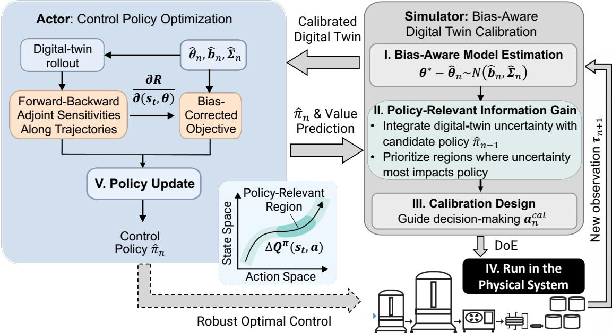  
Figure 2: Schematic flowchart illustration of the proposed actor-simulator framework.

## 4 Proposed Calibration Framework for SDE-Based Digital Twins

This section presents the proposed Actor–Simulator framework, which jointly calibrates the digital twin through policy-directed experimentation and optimizes process control policies. It comprises four tightly integrated components. First, we estimate the SDE parameters while quantifying both moment-truncation bias and finite-sample estimation uncertainty (Section 4.1). Second, we develop a trajectory-level forward–backward adjoint method to efficiently compute sensitivities of conditional action values and policy returns with respect to model parameters (Section 4.2). Third, these sensitivities are used to guide policy-relevant digital twin calibration by adaptively selecting physical experiments in state–action regions that are most informative for improving control performance under sparse observations (Section 4.3). Finally, we propagate the estimated calibration bias and parameter uncertainty through the digital twin to obtain a bias-corrected policy optimization procedure (Section 4.4).

Together, these components establish a closed-loop framework linking uncertainty-aware calibration, adaptive experimental design, and policy optimization. For simplicity, we focus on a scalar performance metric, although the framework extends naturally to multivariate responses. Unlike black-box response-surface approaches, such as Gaussian-process metamodeling, which often struggle to capture complex multivariate dependencies [6], this framework preserves the mechanistic coupling among responses and propagates parameter uncertainty through the underlying system dynamics.

## 4.1 Bias-Aware Model Parameter Estimation

Given the physical trajectories $\pmb { \tau } _ { j } : = \{ ( \pmb { s } _ { t _ { i } } ^ { j } , \pmb { a } _ { t _ { i } } ^ { j } , \pmb { s } _ { t _ { i + 1 } } ^ { j } ) \} _ { i = 0 } ^ { T - 1 } , j = 1 , \ldots , n$ , the intervention map determines the postdecision state $\pmb { s } _ { t _ { i } ^ { + } } ^ { j } = \pmb { f } ( \pmb { s } _ { t _ { i } } ^ { j } , \pmb { a } _ { t _ { i } } ^ { j } )$ . Parameter estimation would ideally rely on the finite-time transition law of (3.1) from $\pmb { s } _ { t _ { i } ^ { + } } ^ { j }$ to $\pmb { s } _ { t _ { i + 1 } } ^ { j }$ . Because this distribution is generally unavailable for nonlinear SDEs, we approximate its first two conditional moments using a finite-order generator expansion and estimate unknown $\pmb { \theta } ^ { * }$ via Gaussian quasi-maximum likelihood (QMLE). We then quantify the systematic bias introduced by moment truncation and combine it with the sandwich covariance of the QMLE to construct a bias-aware Gaussian approximation of the parameter error $\theta ^ { * } - \widehat { \pmb { \theta } } _ { n }$

The following assumptions justify the conditional-moment expansion, score-bias characterization, and fixed-design QMLE asymptotics. Assumptions (i)–(ii) ensure the validity of the moment approximation and truncation-bias analysis, while (iii)–(iv) establish consistency and the sandwich covariance limit. For a specified kinetic model, smoothness and growth bounds can be checked analytically, while covariance and Hessian eigenvalues and trajectory-score moments can be diagnosed over the calibrated regime. The stronger dense-sampling results in Section 5 additionally require a nonsingular limiting covariance-information matrix.

Assumption 4.1 (Moment-expansion and QMLE regularity). For a fixed conditional moment expansion order $l \geq 1 { : }$ (i) Θ is compact and $\pmb { \theta } ^ { * }$ lies in its interior. The drift and diffusion are globally Lipschitz in state uniformly over Θ, sufficiently differentiable in state for the iterated generator expansion, and three times continuously differentiable in θ. Equation (3.1) has a unique nonexplosive strong solution with the moments needed to dominate these expansions and their parameter derivatives.

(ii) The coordinate and quadratic test functions admit generator iterates through order $l + 2$ with polynomial-growth bounds uniform over Θ. The order-l truncated conditional covariance matrix is uniformly positive definite on the relevant state–parameter domain.

(iii) Under a fixed data-collection policy $\eta ,$ the trajectories $\{ \pmb { \tau } _ { j } \} _ { j = 1 } ^ { n }$ are i.i.d. The trajectory quasi-likelihood and its first two derivatives satisfy the uniform laws of large numbers and central limit theorems required for M-estimation, and the trajectory score has finite second moment.

(iv) The population quasi-likelihood has a unique interior maximizer and a nonsingular expected Hessian at that maximizer.

(1) Generator-Based Moment Approximation. For a transition from post-decision state s over interval $\Delta t ,$ define the exact conditional moments

$$
\begin{array} { r l } & { M _ { 1 } ( \Delta t , \pmb { s } , \pmb { \theta } ) : = \mathbb { E } _ { \pmb { \theta } } \big [ \pmb { s } _ { t _ { i + 1 } } \mid \pmb { s } _ { t _ { i } ^ { + } } = \pmb { s } \big ] , } \\ & { M _ { 2 } ( \Delta t , \pmb { s } , \pmb { \theta } ) : = \mathrm { V a r } _ { \pmb { \theta } } \big ( \pmb { s } _ { t _ { i + 1 } } \mid \pmb { s } _ { t _ { i } ^ { + } } = \pmb { s } \big ) . } \end{array}\tag{4.1}
$$

Because these finite-time moments are generally unavailable for nonlinear SDEs, we approximate them using the infinitesimal generator of (3.1),

$$
\mathcal { L } _ { \boldsymbol { \theta } } \boldsymbol { g } ( \pmb { \mathscr { s } } ) = \pmb { \mu } ( \pmb { \mathscr { s } } , \pmb { \theta } ) ^ { \top } \nabla _ { \boldsymbol { s } } \boldsymbol { g } ( \pmb { \mathscr { s } } ) + \frac { 1 } { 2 } \operatorname { t r } \big [ \pmb { \sigma } ( \pmb { \mathscr { s } } , \pmb { \theta } ) \pmb { \sigma } ( \pmb { \mathscr { s } } , \pmb { \theta } ) ^ { \top } \nabla _ { \mathscr { s } } ^ { 2 } \boldsymbol { g } ( \pmb { \mathscr { s } } ) \big ] .
$$

Under Assumption 4.1, the Markov semigroup expansion [11] yields

$$
\mathbb { E } _ { \pmb { \theta } } [ g ( \pmb { \mathscr { s } } _ { t + \Delta t } ) \mid \pmb { \mathscr { s } } _ { t } = \pmb { \mathscr { s } } ] = \sum _ { r = 0 } ^ { l } \frac { ( \Delta t ) ^ { r } } { r ! } \mathcal { L } _ { \pmb { \theta } } ^ { r } g ( \pmb { \mathscr { s } } ) + \mathscr { O } ( ( \Delta t ) ^ { l + 1 } ) ,\tag{4.2}
$$

for any admissible test function $g .$ Applying Equation (4.2) to the coordinate and quadratic functions gives the explicit order-l conditional mean and covariance

$$
\begin{array} { l } { { \displaystyle { \widetilde m } _ { 1 , l } ( \Delta t , \pmb { s } , \pmb { \theta } ) : = \sum _ { r = 0 } ^ { l } \frac { ( \Delta t ) ^ { r } } { r ! } \mathcal { L } _ { \pmb { \theta } } ^ { r } \pmb { s } , } } \\ { { \displaystyle \widetilde m _ { 2 , l } ( \Delta t , \pmb { s } , \pmb { \theta } ) : = \sum _ { r = 0 } ^ { l } \frac { ( \Delta t ) ^ { r } } { r ! } \mathcal { L } _ { \pmb { \theta } } ^ { r } ( \pmb { s } \pmb { s } ^ { \top } ) - \widetilde m _ { 1 , l } \widetilde m _ { 1 , l } ^ { \top } . } } \end{array}\tag{4.3}
$$

The exact and truncated moments satisfy

$$
{ \pmb M } _ { q } ( \Delta t , { \pmb s } , { \pmb \theta } ) = \widetilde { { \pmb m } } _ { q , l } ( \Delta t , { \pmb s } , { \pmb \theta } ) + { \cal R } _ { q , l } ( \Delta t , { \pmb s } , { \pmb \theta } ) , \qquad q = 1 , 2 ,
$$

where the remainder terms satisfy the uniform bound

$$
\begin{array} { r } { \| R _ { 1 , l } \| + \| R _ { 2 , l } \| _ { F } \leq C _ { 1 } ( \Delta t ) ^ { l + 1 } \big ( 1 + \| \pmb { s } \| \big ) ^ { C _ { 2 } } , } \end{array}
$$

for finite constants $C _ { 1 } , C _ { 2 } > 0$ independent of $\Delta t , \pmb { s } ,$ , and θ. The leading omitted generator terms provide $\mathcal { O } ( ( \Delta t ) ^ { l + 1 } )$ approximations of $R _ { 1 , l }$ and $R _ { 2 , l }$ and are later used to estimate truncation bias. Importantly, a finite observation interval does not itself induce bias when the exact finite-time moments are used. The systematic bias studied here arises solely from replacing $M _ { 1 }$ and $M _ { 2 }$ by the truncated approximations in (4.3), and is therefore distinct from numerical integration error associated with the simulation step size $h _ { \mathrm { s i m } }$

(2) Quasi-Likelihood and Truncation Bias. Replacing the exact moments in (4.1) by (4.3) yields a computable Gaussian quasi-likelihood. Let

$$
m _ { q , i } ^ { j } ( \pmb \theta ) : = \widetilde { \pmb m } _ { q , l } ( \Delta t , \pmb s _ { t _ { i } ^ { + } } ^ { j } , \pmb \theta ) , \qquad \varepsilon _ { i } ^ { j } ( \pmb \theta ) : = \pmb s _ { t _ { i + 1 } } ^ { j } - m _ { 1 , i } ^ { j } ( \pmb \theta ) .
$$

The corresponding order-l quasi-log-likelihood contribution is

$$
\ell _ { l , i } ^ { j } ( \pmb \theta ) : = - \frac { 1 } { 2 } \left[ \varepsilon _ { i } ^ { j } ( \pmb \theta ) ^ { \top } m _ { 2 , i } ^ { j } ( \pmb \theta ) ^ { - 1 } \varepsilon _ { i } ^ { j } ( \pmb \theta ) + \log \operatorname* { d e t } m _ { 2 , i } ^ { j } ( \pmb \theta ) \right] ,\tag{4.4}
$$

and the QMLE is

$$
\widehat { \pmb { \theta } } _ { n } \in \arg \operatorname* { m a x } _ { { \pmb { \theta } } \in \Theta } \frac { 1 } { n } \sum _ { j = 1 } ^ { n } \ell _ { l } ( { \pmb { \tau } } _ { j } ; { \pmb { \theta } } ) \quad \mathrm { w i t h } \quad \ell _ { l } ( { \pmb { \tau } } _ { j } ; { \pmb { \theta } } ) : = \sum _ { i = 0 } ^ { T - 1 } \ell _ { l , i } ^ { j } ( { \pmb { \theta } } ) .
$$

The Gaussian criterion does not require Gaussian transition dynamics. If the exact conditional moments $( M _ { 1 } , M _ { 2 } )$ were available, its population score would be centered at the physical parameter $\pmb { \theta } ^ { * }$ ; higher-order moments affect efficiency but not score centering. Replacing the exact moments with their order-l approximations breaks this property and shifts the population maximizer away from $\pmb { \theta } ^ { * }$

To quantify this truncation effect, define the population criterion, score, and pseudo-true parameter $\widetilde { \pmb { \theta } } _ { l }$ under the data-collection policy $\eta \colon$

$$
L _ { l } ^ { \mathrm { p o p } } ( \pmb { \theta } ) : = \mathbb { E } _ { \pmb { \theta } ^ { \ast } , \eta } [ \ell _ { l } ( \pmb { \tau } ; \pmb { \theta } ) ] , G _ { l } ( \pmb { \theta } ) : = \nabla _ { \pmb { \theta } } L _ { l } ^ { \mathrm { p o p } } ( \pmb { \theta } ) , \widetilde { \pmb { \theta } } _ { l } : = \arg \operatorname* { m a x } _ { \pmb { \theta } \in \Theta } L _ { l } ^ { \mathrm { p o p } } ( \pmb { \theta } ) .
$$

By construction, $G _ { l } ( \widetilde { \pmb { \theta } } _ { l } ) = \mathbf { 0 }$ . Under Assumption 4.1, differentiation and expectation can be interchanged. The nonzero population score at $\pmb { \theta } ^ { * }$ is

$$
\delta _ { l } : = G _ { l } ( \pmb { \theta } ^ { * } ) = \sum _ { i = 0 } ^ { T - 1 } \delta _ { l , i } , \qquad \delta _ { l , i } : = \mathbb { E } _ { \pmb { \theta } ^ { * } , \eta } [ \nabla _ { \pmb { \theta } } \ell _ { l , i } ( \pmb { \tau } ; \pmb { \theta } ^ { * } ) ] ,\tag{4.5}
$$

where the expectation is taken with respect to the trajectory distribution induced by $\pmb { \theta } ^ { * }$ under policy η. Applying the mean-value theorem to $G _ { l } ( \widetilde { \pmb { \theta } } _ { l } ) - G _ { l } ( \pmb { \theta } ^ { * } )$ gives

$$
- \delta _ { l } = G _ { l } ( \widetilde { \pmb { \theta } } _ { l } ) - G _ { l } ( \pmb { \theta } ^ { * } ) = \overline { { \Lambda } } _ { l } ( \widetilde { \pmb { \theta } } _ { l } - \pmb { \theta } ^ { * } ) ,
$$

where the average score-curvature matrix along the segment joining $\pmb { \theta } ^ { * }$ and $\widetilde { \pmb { \theta } } _ { l }$ is

$$
\overline { { \Lambda } } _ { l } : = \int _ { 0 } ^ { 1 } \nabla _ { \pmb { \theta } } G _ { l } \Big ( \pmb { \theta } ^ { * } + u ( \widetilde { \pmb { \theta } } _ { l } - \pmb { \theta } ^ { * } ) \Big ) ~ d u .\tag{4.6}
$$

Under correct specification, $\overline { { \Lambda } } _ { l }$ reduces locally to the Fisher-information curvature. Under moment truncation, however, the information identity generally fails, so $\dot { \overline { { \Lambda } } } _ { l }$ is interpreted as an average score-curvature matrix rather than Fisher information.

Thus, the moment remainders contribute to $\delta _ { l }$ , and the curvature of the population criterion converts this nonzero score into parameter bias. Appendix C derives the contributions of $R _ { 1 , l }$ and $R _ { 2 , l }$ to $\delta _ { l }$ and proves the following proposition.

Proposition 4.2 (Score-induced parameter bias). $I f \overline { { \Lambda } } _ { l }$ is nonsingular, then

$$
\begin{array} { r } { \pmb { b } _ { \Delta , l } : = \pmb { \theta } ^ { * } - \widetilde { \pmb { \theta } } _ { l } = \overline { { \Lambda } } _ { l } ^ { - 1 } \pmb { \delta } _ { l } . } \end{array}\tag{4.7}
$$

(3) Bias-Aware Parameter Uncertainty Quantification. Proposition 4.2 characterizes the deterministic displacement of the pseudo-true parameter $\widetilde { \pmb { \theta } } _ { l }$ from the physical parameter $\pmb { \theta } ^ { * }$ . We now quantify the sampling variability of $\widehat { \pmb { \theta } } _ { n }$ around this pseudo-true target. Define the trajectory score

$$
\psi _ { l } ( \pmb { \tau } _ { j } ; \pmb { \theta } ) : = \nabla _ { \pmb { \theta } } \ell _ { l } ( \pmb { \tau } _ { j } ; \pmb { \theta } ) ,
$$

and the empirical variability and curvature matrices

$$
A _ { l , n } ( \pmb \theta ) : = \frac { 1 } { n } \sum _ { j = 1 } ^ { n } \psi _ { l } ( \tau _ { j } ; \pmb \theta ) \psi _ { l } ( \tau _ { j } ; \pmb \theta ) ^ { \top } , B _ { l , n } ( \pmb \theta ) : = \frac { 1 } { n } \sum _ { j = 1 } ^ { n } \nabla _ { \pmb \theta \pmb \theta } ^ { 2 } \ell _ { l } ( \tau _ { j } ; \pmb \theta ) ,
$$

with population counterparts $A _ { l } ( \pmb \theta )$ and $B _ { l } ( \pmb \theta )$ . The resulting sandwich covariance is

$$
\begin{array} { r } { C _ { l } ( \pmb { \theta } ) : = B _ { l } ( \pmb { \theta } ) ^ { - 1 } A _ { l } ( \pmb { \theta } ) B _ { l } ( \pmb { \theta } ) ^ { - \top } . } \end{array}
$$

Both the truncation bias $\pmb { b } _ { \Delta , l }$ and the sampling covariance $C _ { l } ( \widetilde { \pmb { \theta } } _ { l } )$ are unknown in practice. To estimate the score displacement $\delta _ { l } ,$ , we approximate the leading omitted moment terms by the difference between the $( l + 1 )$ th- and lth-order generator expansions,

$$
\widehat { R } _ { q , l } ^ { \mathrm { n e x t } } : = \widetilde { \pmb { m } } _ { q , l + 1 } - \widetilde { \pmb { m } } _ { q , l } , \qquad q = 1 , 2 .
$$

Substituting these approximations into the first-order score expansion yields an empirical score-bias estimator $\widehat { \delta } _ { n }$ (Appendix C), from which we obtain

$$
\widehat { \Lambda } _ { l , n } : = B _ { l , n } ( \widehat { \pmb { \theta } } _ { n } ) , \qquad \widehat { \pmb { b } } _ { n } : = \widehat { \Lambda } _ { l , n } ^ { - 1 } \widehat { \pmb { \delta } } _ { n } .\tag{4.8}
$$

Thus, $\widehat { \pmb { b } } _ { n }$ provides a one-step estimate of the truncation-induced parameter bias by combining the estimated score displacement with the local curvature of the quasi-likelihood. The corresponding covariance estimator is

$$
\widehat C _ { l , n } = B _ { l , n } ( \widehat \theta _ { n } ) ^ { - 1 } A _ { l , n } ( \widehat \theta _ { n } ) B _ { l , n } ( \widehat \theta _ { n } ) ^ { - \top } , \qquad \widehat \Sigma _ { n } : = \widehat C _ { l , n } / n .\tag{4.9}
$$

The following result characterizes the asymptotic model estimation error under fixed moment truncation.

Proposition 4.3 (Calibration-error limit under fixed misspecification; 28). Under Assumption 4.1, with afixed datacollection design,

$$
\widehat { \pmb { \theta } } _ { n } \stackrel { p } {  } \widetilde { \pmb { \theta } } _ { l } , \qquad \sqrt { n } \big [ \big ( \pmb { \theta } ^ { * } - \widehat { \pmb { \theta } } _ { n } \big ) - \pmb { b } _ { \Delta , l } \big ] \stackrel { d } {  } N \Big ( \mathbf { 0 } , C _ { l } \big ( \widetilde { \pmb { \theta } } _ { l } \big ) \Big ) .
$$

Proposition 4.3 decomposes the calibration error $\theta ^ { * } - { \widehat { \theta } } _ { n }$ into a persistent truncation bias component $ { \boldsymbol { b } } _ { \Delta , l }$ and a sampling-uncertainty component with covariance $C _ { l } (  { \widetilde { \theta } } _ { l } ) / n$

$$
\begin{array} { r } { \pmb { \theta } ^ { * } - \widehat { \pmb { \theta } } _ { n } \approx N \Big ( \pmb { b } _ { \Delta , l } , C _ { l } ( \widetilde { \pmb { \theta } } _ { l } ) / n \Big ) . } \end{array}
$$

For downstream decision-making, we replace these unknown quantities by their estimators and introduce the Gaussian surrogate

$$
\widetilde { \pmb { e } } _ { n } \mid \mathcal { D } _ { n } \sim N \Big ( \widehat { \pmb { b } } _ { n } , \widehat { \Sigma } _ { n } \Big ) .\tag{4.10}
$$

This auxiliary draw is used to propagate parameter estimation uncertainty through the calibration and policy-optimization objectives and is not intended to represent the exact conditional distribution of $\theta ^ { * } - { \widehat { \pmb { \theta } } } _ { n }$

Unlike $\widehat { \Sigma } _ { n }$ , which shrinks as more trajectories are collected, $\widehat { \pmb { b } } _ { n }$ generally persists when the observation interval and moment-expansion order remain fixed. Under the dense-sampling regime of Section $5 , \widehat { C } _ { l , n } = \mathcal { O } _ { p } ( T ^ { - 1 } )$ and hence $\widehat { \Sigma } _ { n } = \mathcal { O } _ { p } ( ( n T ) ^ { - 1 } )$ . Preserving this bias–variance decomposition is essential for exploration and policy optimization: the bias component governs the direction of value distortion, whereas the covariance quantifies residual uncertainty, guides policy-directed experimentation, and contributes a second-order correction to Gaussian-averaged objectives.

## 4.2 Shared Forward–Backward Adjoint Sensitivities

The proposed framework reuses parameter sensitivities in two downstream decision problems. Section 4.3 guides policy-directed experimentation by targeting state–action regions where parameter uncertainty most affects the physical– digital value discrepancy $\Delta Q _ { n - 1 , i } ^ { \widehat { \pi } _ { n - 1 } } ( s , \pmb { a } )$ . Section 4.4 optimizes the bias-corrected finite-horizon return in (3.5). Both tasks rely on second-order uncertainty propagation and require sensitivities of conditional action values $Q _ { i } ^ { \pi }$ and policy returns J with respect to the calibration parameters θ.

Computing these derivatives is challenging in Bio-SoS models because system performance depends on many interacting parameters that jointly govern bioprocess dynamics, spatiotemporal heterogeneity, and stochasticity. Finite-difference methods require repeated simulations for parameter perturbations, while forward sensitivity methods propagate an $M \times K$ state-parameter Jacobian throughout each trajectory [15]. In contrast, stochastic adjoint sensitivity analysis propagates value gradients backward along the same realized Brownian path using vector–Jacobian products, avoiding explicit Jacobian evolution. The resulting computational advantage becomes increasingly significant as the parameter dimension grows. Moreover, trajectory-level adjoint analysis embodies the principle that the process is the product, enabling forward prediction, backward sensitivity propagation, and interoperable learning.

(1) Trajectory-Level Adjoint Sensitivities over $( \pmb { s } , \pmb \theta )$ . For a fixed policy π and Brownian sample path ξ, define the pathwise return

$$
\mathcal { R } ^ { \pi } ( \pmb { \theta } , \pmb { \xi } ) : = \sum _ { i = 0 } ^ { T - 1 } \gamma ^ { i } r ( \pmb { s } _ { t _ { i } } ^ { \pmb { \theta } , \pmb { \xi } } , \pmb { a } _ { t _ { i } } ^ { \pmb { \theta } , \pmb { \xi } } ) , \qquad J ( \pi ; \pmb { \theta } ) = \mathbb { E } [ \mathcal { R } ^ { \pi } ( \pmb { \theta } , \pmb { \xi } ) ] .
$$

A forward pass simulates the controlled SDE, and a backward pass propagates first- and second-order sensitivities along the same realization of the Brownian motion. To compute state and parameter derivatives simultaneously, we augment the state as

$$
\begin{array} { r } { z : = ( \pmb { \mathscr { s } } , \pmb { \theta } ) , \qquad \mathscr { F } _ { u , t } ( z , \xi ) : = ( \Phi _ { u , t } ( \pmb { \mathscr { s } } ; \pmb { \theta } , \xi ) , \pmb { \theta } ) , } \end{array}
$$

where $\Phi _ { u , \phantom { } }$ <sub>t</sub> denotes the stochastic forward flow on an intervention-free interval. Action sensitivities are subsequently recovered through the intervention map

$$
\frac { \partial \pmb { s } _ { t _ { i + 1 } } } { \partial \pmb { a } _ { t _ { i } } } = \frac { \partial \pmb { s } _ { t _ { i + 1 } } } { \partial \pmb { s } _ { t _ { i } ^ { + } } } \frac { \partial \pmb { s } _ { t _ { i } ^ { + } } } { \partial \pmb { a } _ { t _ { i } } } .
$$

For a smooth terminal functional $\rho ( \pmb { s } )$ (e. $\cdot ^ { \mathrm { g . } }$ , productivity, CQA out-of-specification probability, or terminal reward), define the pathwise gradient and Hessian fields

$$
p _ { u , v } ( z , \xi ) : = \nabla _ { z } \big [ \rho ( \Phi _ { u , v } ( \pmb { \mathscr { s } } ; \pmb { \theta } , \xi ) ) \big ] , \qquad \mathcal { H } _ { u , v } ( z , \xi ) : = D _ { z } ^ { 2 } \big [ \rho ( \Phi _ { u , v } ( \pmb { \mathscr { s } } ; \pmb { \theta } , \xi ) ) \big ] ,\tag{4.11}
$$

where $D _ { z }$ denotes differentiation with respect to the augmented variable $z = ( \pmb { \mathscr { s } } , \pmb { \theta } )$ . The gradient field $p _ { u , v }$ describes how perturbations in biological states and mechanistic parameters propagate through the stochastic bioprocess to influence terminal performance, while $\mathcal { H } _ { u , v }$ captures the corresponding second-order interactions. The inverse-flow fields $\widetilde { p } _ { t , v }$ and $\mathcal { \widetilde { H } } _ { t , v }$ are defined precisely in Appendix D; a tilde marks the backward counterpart of the corresponding forward field. Let

$$
\widetilde { A } _ { t , v } ^ { s } : = [ \widetilde { p } _ { t , v } ] _ { s } ^ { \top } , \qquad \widetilde { A } _ { t , v } ^ { \theta } : = [ \widetilde { p } _ { t , v } ] _ { \theta } ^ { \top } ,
$$

denote the state and parameter adjoint processes. These are the state and parameter components of the pathwise value gradient propagated backward from $\rho$ along a realized stochastic trajectory. Specifically, $\widetilde { A } _ { t , v } ^ { s }$ measures the sensitivity of the terminal value at time v to state perturbations at time t, while $\widetilde { A } _ { t , \tau } ^ { \theta }$ measures the corresponding sensitivity to the mechanistic parameters θ. Their backward Stratonovich dynamics are given in Appendix D. Averaging the resulting pathwise derivatives yields sensitivities of the corresponding expected performance measures.

Proposition 4.4 (Shared first- and second-order stochastic adjoints). Under the conditions in Appendix D.1, the backward adjoint processes recover thefirst- and second-order pathwise derivatives ofthe stochasticflow. For almost every Brownian path,

$$
\begin{array} { r } { \nabla _ { z } [ \rho ( \Phi _ { u , v } ) ] = \widetilde { p } _ { u , v } , \qquad D _ { z } ^ { 2 } [ \rho ( \Phi _ { u , v } ) ] = \widetilde { \mathcal { H } } _ { u , v } , } \end{array}\tag{4.12}
$$

where the θ-block of $\mathcal { H } _ { u , v }$ equals the pathwise Hessian with respect to the model parameters. Thus, a single backward adjoint system provides both gradient and Hessian information along the realized stochastic trajectory.

The next proposition summarizes the computational benefit of adjoints relative to forward sensitivity propagation. Proposition 4.5 shows that adjoint propagation avoids maintaining the full state–parameter derivative tensor, yielding substantial computational savings when the numbers of states and calibration parameters are large. Its proof is in Appendix D.

Proposition 4.5 (Cost of pathwise sensitivity propagation). For one numerical step in SDE simulation, the derivativepropagation costs are

$$
\mathop { f i r s t \ : o r d e r } _ { \substack { f u l l \ : s e c o n d \ : o r d e r } } \left| \begin{array} { c c } { { f o r w a r d } } & { { a d j o i n t } } \\ { { \mathcal { O } ( ( R + 1 ) M ^ { 2 } K ) } } & { { \mathcal { O } ( ( R + 1 ) ( M ^ { 2 } + M K ) ) } } \\ { { \mathcal { O } ( ( R + 1 ) M K ( M + K ) ^ { 2 } ) } } & { { \mathcal { O } ( ( R + 1 ) M ( M + K ) ^ { 2 } ) . } } \end{array} \right.
$$

(2) Estimation of J- and Q-Function Sensitivities. The same adjoint recursion supports both policy optimization and experiment design. Define the pathwise gradient and Hessian of the total return as

$$
\begin{array} { r } { \mathcal { G } ^ { \pi } : = \nabla _ { \theta } \mathcal { R } ^ { \pi } , \qquad \mathcal { H } ^ { \pi } : = \nabla _ { \theta } ^ { 2 } \mathcal { R } ^ { \pi } . } \end{array}
$$

Under the conditions in Appendix D.1, differentiation and expectation can be interchanged, yielding

$$
\nabla _ { \boldsymbol { \theta } } J ( \pi ; \boldsymbol { \theta } ) = \mathbb { E } [ \mathcal { G } ^ { \pi } ] , \qquad \nabla _ { \boldsymbol { \theta } } ^ { 2 } J ( \pi ; \boldsymbol { \theta } ) = \mathbb { E } [ \mathcal { H } ^ { \pi } ] .
$$

These sensitivities are estimated by Monte Carlo averages of pathwise derivatives computed along independent stochastic rollouts.

For calibration experiment design, let $\mathcal { R } _ { i } ^ { \pi } ( \pmb { \mathscr { s } } , \pmb { \mathscr { a } } ; \pmb { \theta } , \xi )$ denote the return conditioned on state-action pair $( \pmb { s } , \pmb { a } )$ at decision epoch $t _ { i } ,$ , with action-value function

$$
Q _ { i } ^ { \pi } ( \pmb { s } , \pmb { a } ; \pmb { \theta } ) = \mathbb { E } [ \mathcal { R } _ { i } ^ { \pi } ( \pmb { s } , \pmb { a } ; \pmb { \theta } , \xi ) ] .
$$

Applying the same forward-backward adjoint recursion yields

$$
\begin{array} { r l r } { \pmb { g } _ { n , i } ^ { \pi } ( \pmb { s } , \pmb { a } ) = \nabla _ { \theta } Q _ { i } ^ { \pi } ( \pmb { s } , \pmb { a } ; \widehat { \pmb { \theta } } _ { n } ) , } & { { } } & { H _ { n , i } ^ { \pi } ( \pmb { s } , \pmb { a } ) = \nabla _ { \theta } ^ { 2 } Q _ { i } ^ { \pi } ( \pmb { s } , \pmb { a } ; \widehat { \pmb { \theta } } _ { n } ) , } \end{array}\tag{4.13}
$$

together with their Monte Carlo estimators. Thus, a single adjoint framework provides the first- and second-order sensitivities required for both bias-aware policy optimization and experiment design.

## 4.3 Digital Twin Calibration

Let $\begin{array} { r } { e _ { n } : = \pmb { \theta } ^ { * } - \widehat { \pmb { \theta } } _ { n } } \end{array}$ denote the calibration error. Using (4.13), a second-order expansion of the action-value function around $\widehat { \pmb { \theta } } _ { n }$ yields

$$
Q _ { i } ^ { \pi } ( \pmb { \mathscr { s } } , \pmb { a } ; \pmb { \theta } ^ { * } ) - Q _ { i } ^ { \pi } ( \pmb { \mathscr { s } } , \pmb { a } ; \widehat { \pmb { \theta } } _ { n } ) = ( \pmb { g } _ { n , i } ^ { \pi } ) ^ { \top } \pmb { e } _ { n } + \frac { 1 } { 2 } \pmb { e } _ { n } ^ { \top } H _ { n , i } ^ { \pi } \pmb { e } _ { n } + \mathscr { E } _ { n , i } ^ { \pi } ,
$$

where $\mathcal { E } _ { n , i } ^ { \pi } = O ( \| e _ { n } \| ^ { 3 } )$ . This motivates the value-discrepancy criterion

$$
u _ { n , i } ^ { \pi } ( s , \pmb { a } ) : = \left| ( \pmb { g } _ { n , i } ^ { \pi } ) ^ { \top } \pmb { e } _ { n } + \frac { 1 } { 2 } \pmb { e } _ { n } ^ { \top } H _ { n , i } ^ { \pi } \pmb { e } _ { n } \right| ,
$$

which measures the impact of calibration error on the action value under policy $\pi .$

Because the actual calibration error $e _ { n }$ is unknown, we use the auxiliary draw $\widetilde { e } _ { n }$ in Equation (4.10) to approximate the value discrepancy. We define

$$
\widehat { u } _ { n , i } ^ { \pi } ( \pmb { \mathscr { s } } , \pmb { a } ) : = \mathbb { E } _ { \widetilde { e } _ { n } } \left[ \bigg | ( \pmb { \mathscr { g } } _ { n , i } ^ { \pi } ) ^ { \top } \widetilde { \pmb { e } } _ { n } + \frac { 1 } { 2 } \widetilde { \pmb { e } } _ { n } ^ { \top } H _ { n , i } ^ { \pi } \widetilde { \pmb { e } } _ { n } \bigg | \right] .\tag{4.14}
$$

For a candidate policy $\pi , ( 4 . 1 4 )$ weights parameter uncertainty by its impact on future reward from the current state– action pair. Thus, uncertainty is emphasized only when it induces meaningful digital–physical value discrepancy. Because $\widehat { u } _ { n , { : } } ^ { \pi }$ is state dependent, it naturally guides adaptive experimentation along process trajectories.

The exploration action for physical trajectory n is selected as

$$
\eta _ { n , i } ( \pmb { s } ) \in \arg \operatorname* { m a x } _ { \pmb { a } \in \mathcal { A } } \widehat { u } _ { n - 1 , i } ^ { \widehat { \pi } _ { n - 1 } } ( \pmb { s } , \pmb { a } ) , \qquad i = 0 , 1 , \ldots , T - 1 ,\tag{4.15}
$$

where $\widehat { u } _ { n - 1 , i } ^ { \widehat { \pi } _ { n - 1 } }$ is evaluated using the Monte Carlo approximation in Appendix E. The calibrated model and target policy $\widehat { \pi } _ { n - 1 }$ remain fixed throughout trajectory $n ,$ while (4.15) is reevaluated at each visited state. Consequently, the resulting design policy prioritizes actions that maximize policy-relevant digital–physical value discrepancy rather than global parameter identifiability.

## 4.4 Sensitivity-Based Policy Optimization

Policy optimization targets the expected return under a Gaussian approximation to the distribution of the unknown calibration parameter conditional on the current estimator $\widehat { \pmb { \theta } } _ { n }$ . Specifically, using the estimated calibration bias and covariance from (4.10), we define the Gaussian-averaged return

$$
J _ { n } ^ { \mathrm { G } } ( \pi ) : = \mathbb { E } _ { \widetilde { e } _ { n } } \left[ \mathbb { E } _ { \xi } \left[ \mathcal { R } ^ { \pi } ( \widehat { \pmb { \theta } } _ { n } + \widetilde { \pmb { e } } _ { n } , \xi ) \right] | \mathcal { D } _ { n } \right] .
$$

Direct evaluation requires repeated return computations over parameter samples. To avoid this cost, we approximate the objective by propagating the estimated calibration bias and covariance through a local second-order expansion of $J ( \pi ; \theta )$ about $\widehat { \pmb { \theta } } _ { n }$ . Using the policy-value gradient and Hessian obtained from adjoint sensitivity analysis gives

$$
\bar { J } _ { n } ( \pi ) = J ( \pi ; \widehat { \pmb \theta } _ { n } ) + \underbrace { \nabla _ { \pmb \theta } J ( \pi ; \widehat { \pmb \theta } _ { n } ) ^ { \top } \widehat { \pmb b } _ { n } + \frac { 1 } { 2 } \widehat { \pmb b } _ { n } ^ { \top } \nabla _ { \pmb \theta } ^ { 2 } J ( \pi ; \widehat { \pmb \theta } _ { n } ) \widehat { \pmb b } _ { n } } _ { \mathrm { B i a s ~ C o r r e c t i o n } } + \underbrace { \frac { 1 } { 2 } \mathrm { t r } \left( \nabla _ { \pmb \theta } ^ { 2 } J ( \pi ; \widehat { \pmb \theta } _ { n } ) \widehat { \Sigma } _ { n } \right) } _ { \mathrm { U n c e r t a i n t y C o r r e c t i o n } } ,
$$

which serves as a computationally tractable approximation to $J _ { n } ^ { \mathrm { G } } ( \pi )$

The resulting policy update is

$$
\widehat { \pi } _ { n } \in \mathop { \mathrm { a r g m a x } } _ { \pi \in \Pi } \bar { J } _ { n } ( \pi ) , \qquad \widehat { \pi } _ { n } ^ { k + 1 } = \widehat { \pi } _ { n } ^ { k } + \eta _ { k } \nabla \bar { J } _ { n } ( \widehat { \pi } _ { n } ^ { k } ) .\tag{4.16}
$$

Appendix E derives the Gaussian moment expansion and its remainder.

## 5 Convergence Analysis

We analyze the asymptotic behavior of the proposed uncertainty-aware exploration score and the physical-system performance of the resulting target policy. Section 4.1 established consistency and asymptotic normality of the fixeddesign QMLE under a fixed trajectory length T, yielding the classical estimation rate $\bar { \mathcal { O } } _ { p } ( n ^ { - 1 / 2 } )$ . To quantify the benefit of increasingly frequent observations and their impact on policy optimization, we now consider a dense-sampling regime in which $n , T \to \infty$ while the physical horizon length $t _ { T } - t _ { 0 } = T \Delta t$ remains fixed.

Throughout, the moment-expansion order l and parameter dimension K are fixed, and $\widetilde { \pmb { \theta } } _ { l }$ and $ { \boldsymbol { b } } _ { \Delta , l }$ suppress their dependence on $\Delta t = ( t _ { T } - \bar { t } _ { 0 } ) / T$ . All results are derived under a fixed data-collection design with independent trajectories. Extending the analysis to the adaptive exploration policy in Equation (4.15) would require a martingalearray central limit theorem for the adaptive score process, sufficient state-space visitation for identifiability, and uniform Hessian convergence. Proofs are deferred to Appendix I.

For the dense-sampling regime, define $\mathfrak { a } ( \pmb { \mathscr { s } } ; \pmb { \theta } ) : = \pmb { \sigma } ( \pmb { \mathscr { s } } , \pmb { \theta } ) \pmb { \sigma } ( \pmb { \mathscr { s } } , \pmb { \theta } ) ^ { \top }$ . At a fixed state and parameter, Equation (4.3) gives (derived in Appendix G):

$$
\begin{array} { c } { { \widetilde { m } _ { 2 , l } ( \Delta t , \pmb { s } , \pmb { \theta } ) = \mathsf { a } ( \pmb { s } ; \pmb { \theta } ) \Delta t + \mathcal { O } ( ( \Delta t ) ^ { 2 } ) , } } \\ { { { } [ \widetilde { \pmb { m } } _ { 2 , l } ^ { - 1 } \partial _ { \theta _ { k } } \widetilde { \pmb { m } } _ { 2 , l } ] ( \Delta t , \pmb { s } , \pmb { \theta } ) = \mathsf { a } ( \pmb { s } ; \pmb { \theta } ) ^ { - 1 } \partial _ { \theta _ { k } } \mathsf { a } ( \pmb { s } ; \pmb { \theta } ) + \mathcal { O } ( \Delta t ) . } } \end{array}\tag{5.1}
$$

Let $\eta _ { T }$ denote the fixed data-collection design over the T sampling intervals. Substituting Equation (5.1) into the covariance component of the quasi-score in Equation (4.4) yields the dense-sampling information matrix

$$
[ \mathcal { T } _ { \sigma } ( \pmb { \theta } ^ { * } ) ] _ { k h } : = \operatorname* { l i m } _ { T  \infty } \frac { 1 } { 2 T } \sum _ { i = 0 } ^ { T - 1 } \mathbb { E } _ { \pmb { \theta } ^ { * } , \eta _ { T } } \operatorname { t r } \Bigl \{ \mathsf { a } _ { i } ^ { - 1 } \partial _ { \pmb { \theta } _ { k } } \mathsf { a } _ { i } \cdot \mathsf { a } _ { i } ^ { - 1 } \partial _ { \pmb { \theta } _ { h } } \mathsf { a } _ { i } \Bigr \} ,\tag{5.2}
$$

for $k , h = 1 , \dots , K$ , where $\mathsf { a } _ { i } = \mathsf { a } ( \pmb { \mathscr { s } } _ { t _ { i } ^ { + } } ; \pmb { \theta } ^ { * } )$ . Assume the dense-sampling identifiability condition $\lambda _ { \operatorname* { m i n } } \{ \mathcal { T } _ { \sigma } ( \pmb { \theta } ^ { * } ) \} > 0$ which ensures that every nonzero parameter perturbation induces a detectable change in the diffusion covariance along the observed trajectories. Combined with the small-interval moment bounds, conditional Lindeberg condition, and uniform score-Hessian convergence established in Appendix G, we obtain

$$
\widehat { \pmb { \theta } } _ { n } - \widetilde { \pmb { \theta } } _ { l } = \mathcal { O } _ { p } ( ( n T ) ^ { - 1 / 2 } ) , \qquad \widehat { C } _ { l , n } = \mathcal { O } _ { p } ( T ^ { - 1 } ) ,\tag{5.3}
$$

showing that dense sampling improves the fixed-T estimation rate from $\mathcal { O } _ { p } ( n ^ { - 1 / 2 } )$ to $\mathcal { O } _ { p } ( ( n T ) ^ { - 1 / 2 } )$ by leveraging information from increasingly frequent observations.

To characterize the asymptotic target of the one-step bias estimator in Equation (4.8), let $d _ { l , T } ( \pmb { \tau } ; \pmb { \theta } )$ denote the trajectory level score-correction vector defined in Appendix H. The population counterpart of the empirical bias estimator $\widehat { \pmb { b } } _ { n }$ is therefore

$$
\pmb { b } _ { \Delta , l } ^ { \mathrm { p l u g } } : = { \cal B } _ { l } ( \widetilde { \pmb { \theta } } _ { l } ) ^ { - 1 } \mathbb { E } _ { \pmb { \theta } ^ { \ast } , \eta _ { T } } \left[ d _ { l , T } ( \pmb { \tau } ; \widetilde { \pmb { \theta } } _ { l } ) \right] .
$$

This quantity represents the leading-order parameter bias induced by moment truncation and serves as the asymptotic target of the implementable bias correction.

Theorem 5.1 characterizes the asymptotic behavior of the exploration score in (4.14). It shows that uncertainty-driven exploration asymptotically targets the local value distortion induced by calibration bias, while estimation error vanishes at the dense-sampling rate $( n \bar { T } ) ^ { - 1 / 2 }$ . Under fixed-T asymptotics, the corresponding remainder is only $\mathcal { O } _ { p } ( n ^ { - 1 / 2 } )$ . The leading discrepancy $\begin{array} { r } { ( { \pmb g } _ { \infty , i } ^ { \pi } ) ^ { \top } { \pmb b } _ { \Delta , l } + \frac { 1 } { 2 } { \pmb b } _ { \Delta , l } ^ { \top } H _ { \infty , i } ^ { \pi } { \pmb b } _ { \Delta , l } } \end{array}$ can vanish despite nonzero parameter bias when the continuation value is locally insensitive to the biased direction or when the first- and second-order contributions cancel.

Theorem 5.1 (Pointwise exploration limit). Fix $( i , s , \pmb { a } , \pi )$ and suppose that $Q _ { i } ^ { \pi } ( \pmb { s } , \pmb { a } ; \pmb { \theta } )$ is three times continuously differentiable in a neighborhood of $\widetilde { \theta } _ { l } ,$ , with derivatives uniformly bounded in T. Let $\pmb { b } _ { \Delta , l } = \pmb { \theta } ^ { * } - \widetilde { \pmb { \theta } } _ { l }$ , and denote by $\mathbf { \Delta } _ { \mathbf { \mathcal { I } } _ { \infty , i } ^ { \pi } } ^ { \pi }$ and $H _ { \infty , i } ^ { \pi }$ the gradient and Hessian of $Q _ { i } ^ { \pi } ( \pmb { s } , \pmb { a } ; \pmb { \theta } )$ evaluated at $\widetilde { \pmb { \theta } } _ { l }$ . Under the dense-sampling conditions leading to (5.3),

$$
u _ { n , i } ^ { \pi } ( \pmb { s } , \pmb { a } ) = \bigg | ( \pmb { g } _ { \infty , i } ^ { \pi } ) ^ { \top } \pmb { b } _ { \Delta , l } + \frac { 1 } { 2 } \pmb { b } _ { \Delta , l } ^ { \top } H _ { \infty , i } ^ { \pi } \pmb { b } _ { \Delta , l } \bigg | + \mathcal { O } _ { p } ( ( n T ) ^ { - 1 / 2 } ) .
$$

Furthermore, let $Z _ { n } \mid \mathcal D _ { n } \sim N ( \mathbf { 0 } , \widehat { \boldsymbol \Sigma } _ { n } ) . \ I f \widehat { \boldsymbol { b } } _ { n } = \boldsymbol { b } _ { \Delta , l } ^ { \mathrm { p l u g } } + \mathcal O _ { p } ( ( n T ) ^ { - 1 / 2 } )$ and $\widehat { C } _ { l , n } = \mathcal { O } _ { p } ( T ^ { - 1 } )$ , the Gaussian surrogate in Equation (4.14) satisfies

$$
\widehat { u } _ { n , i } ^ { \pi } ( \pmb { s } , \pmb { a } ) = \mathbb { E } _ { Z _ { n } | \mathcal { D } _ { n } } \left[ \big | ( g _ { \infty , i } ^ { \pi } ) ^ { \top } ( b _ { \Delta , l } ^ { \mathrm { p l u g } } + Z _ { n } ) + \frac 1 2 ( b _ { \Delta , l } ^ { \mathrm { p l u g } } + Z _ { n } ) ^ { \top } H _ { \infty , i } ^ { \pi } ( b _ { \Delta , l } ^ { \mathrm { p l u g } } + Z _ { n } ) \big | \right] + \mathcal { O } _ { p } ( ( n T ) ^ { - 1 / 2 } ) ,
$$

and consequently

$$
\widehat { u } _ { n , i } ^ { \pi } ( s , a ) = \left| ( g _ { \infty , i } ^ { \pi } ) ^ { \top } b _ { \Delta , l } ^ { \mathrm { p l u g } } + \frac { 1 } { 2 } ( b _ { \Delta , l } ^ { \mathrm { p l u g } } ) ^ { \top } H _ { \infty , i } ^ { \pi } b _ { \Delta , l } ^ { \mathrm { p l u g } } \right| + { \mathcal O } _ { p } ( ( n T ) ^ { - 1 / 2 } ) .
$$

We next quantify how residual calibration error propagates to physical-system policy performance. When the number of sampling intervals varies, write

$$
J ( \pi ; \pmb \theta ) : = \mathbb E _ { \pmb \theta } ^ { \pi } \left[ \sum _ { i = 0 } ^ { T - 1 } \gamma ^ { i } r ( \pmb s _ { t _ { i } } , \pmb a _ { t _ { i } } ) \right] , \qquad \Delta t = ( t _ { T } - t _ { 0 } ) / T .
$$

To compare the simulator value at $\widetilde { \pmb { \theta } } _ { l }$ with the physical-system value at $\pmb { \theta } ^ { * }$ , we decompose the value error into bias and uncertainty components. The leading bias contribution is

$$
C _ { \mathrm { b i a s } } ( \pi ) : = \nabla _ { \boldsymbol { \theta } } J ( \pi ; \widetilde { \pmb { \theta } } _ { l } ) ^ { \top } \pmb { b } _ { \Delta , l } + \frac { 1 } { 2 } \pmb { b } _ { \Delta , l } ^ { \top } \nabla _ { \boldsymbol { \theta } } ^ { 2 } J ( \pi ; \widetilde { \pmb { \theta } } _ { l } ) \pmb { b } _ { \Delta , l } ,
$$

which captures the value distortion induced by the truncation bias $\pmb { b } _ { \Delta , l } = \pmb { \theta } ^ { * } - \widetilde { \pmb { \theta } } _ { l }$

The leading uncertainty contribution is $\begin{array} { r l } { { } } & { { } \frac { 1 } { 2 n } \operatorname { t r } \biggl ( \nabla _ { \theta } ^ { 2 } J ( \pi ;  { \widetilde { \theta } } _ { l } ) C _ { l } (  { \widetilde { \theta } } _ { l } ) \biggr ) } \end{array}$ which captures the effect of QMLE estimation uncertainty on policy value. Under the uniform value-smoothness condition in Appendix I, the bias rate $\| \pmb { b } _ { \Delta , l } \| =$ $\mathcal { O } ( ( \Delta t ) ^ { l } )$ from Appendix C, and $C _ { l } ( \widetilde { \pmb { \theta } } _ { l } ) = \mathcal { O } ( T ^ { - 1 } )$ from Appendix ${ \bf G } ,$ the remaining higher-order error satisfies

$$
\begin{array} { l } { { \displaystyle \epsilon _ { \Delta t , n } : = \operatorname* { s u p } _ { \pi \in \Pi } \Big | J ( \pi ; \theta ^ { * } ) - J ( \pi ; \widetilde { \theta } _ { l } ) - C _ { \mathrm { b i a s } } ( \pi ) - \frac { 1 } { 2 n } \mathrm { t r } \Big ( \nabla _ { \theta } ^ { 2 } J ( \pi ; \widetilde { \theta } _ { l } ) C _ { l } ( \widetilde { \theta } _ { l } ) \Big ) \Big | } } \\ { { \displaystyle \quad \quad = \mathcal { O } \big ( ( \Delta t ) ^ { 3 l } \big ) + \mathcal { O } \big ( ( n T ) ^ { - 1 } \big ) . } } \end{array}\tag{5.4}
$$

Proposition H.2 in Appendix H shows that the plug-in correction $b _ { \Delta , l } ^ { \mathrm { p l u g } }$ approximates the exact truncation bias $b _ { \Delta , l } = \overline { { \Lambda } } _ { l } ^ { - 1 } \delta _ { l }$ with error $\mathcal { O } ( ( \Delta t ) ^ { l + 1 } )$ . Therefore, the residual error consists of two components: a deterministic bias-approximation error of order $\mathcal { O } ( ( \Delta t ) ^ { l + 1 } )$ and a statistical estimation error of order $\mathcal { O } _ { p } ( ( n T ) ^ { - 1 / 2 } )$ . This decomposition leads directly to the following physical-system performance guarantee.

Theorem 5.2 (Physical-system policy performance). Under the dense-sampling regime, the uniform value-smoothness condition in Appendix I, the conditions of Proposition G.1 in Appendix G, and those of Propositions H.1–H.2 in Appendix H, the target policy $\widehat { \pi } _ { n }$ satisfies

$$
0 \leq J ( \pi ^ { * } ; \theta ^ { * } ) - J ( \widehat { \pi } _ { n } ; \theta ^ { * } ) = \mathcal O ( ( \Delta t ) ^ { l + 1 } ) + \mathcal O _ { p } ( ( n T ) ^ { - 1 / 2 } ) .
$$

Theorem 5.2 shows that the optimality gap vanishes as the sampling interval decreases and the amount of data increases. Consequently, dense sampling not only improves calibration accuracy but also ensures asymptotically optimal policy performance in the physical system.

## 6 Empirical Study

We evaluate the finite-sample performance of the Actor–Simulator framework using the iPSC culture system introduced in Example 3.1 [24, 33]. Because feeding decisions must balance productivity and cell health, iPSC manufacturing provides a natural testbed for digital-twin calibration and process control. We first consider a monolayer culture case study (Section 6.1) and then extend the analysis to an aggregate-culture Bio-SoS case that captures population-level, spatial, and metabolic heterogeneity (Section 6.2).

All experiments are conducted in a synthetic setting where the simulator models validated against real-world data serves as the physical system M<sup>p</sup>. Although trajectories are generated using the ground-truth parameter vector $\pmb { \theta } ^ { * }$ , the Actor–Simulator observes only the resulting state–action trajectories during calibration, uncertainty-guided exploration, bias correction, and policy optimization. The ground-truth parameters are used solely to specify the initialization range and to compute post hoc calibration error. At each policy checkpoint, the current policy is frozen and evaluated on 1,000 independent simulator trajectories. These evaluation trajectories are excluded from $\mathcal { D } _ { n }$ , do not update the model or policy, and are not counted toward the training budget $N _ { \mathrm { m a x } } .$ Each experimental configuration is repeated over five independent training seeds. Unless otherwise stated, solid curves denote seed-wise means and shaded regions indicate pointwise 95% confidence intervals.

Calibration-error curves quantify recovery of the underlying mechanistic parameters, whereas reward curves measure the downstream decision quality induced by the learned model and policy. Both metrics are necessary: parameter accuracy does not necessarily translate into improved decisions along insensitive directions, while high reward alone does not imply accurate recovery of the underlying mechanisms.

## 6.1 iPSC Monolayer Culture

The design and control of iPSC cultures aim to improve cell growth, viability, and production consistency. Because culture performance is highly sensitive to nutrient depletion and metabolic waste accumulation, effective feeding policies are critical for maintaining yield and cell product quality. We consider a setting in which the metabolic network structure is known, but key regulatory parameters are uncertain. To model this system, we adopt the metabolic reaction network of [24], comprising 30 central metabolic reactions, 34 state variables, and 73 parameters. Figure 3 provides a simple illustration of the metabolic network. The control variable is the feeding strategy, defined by the percentage of medium exchange.

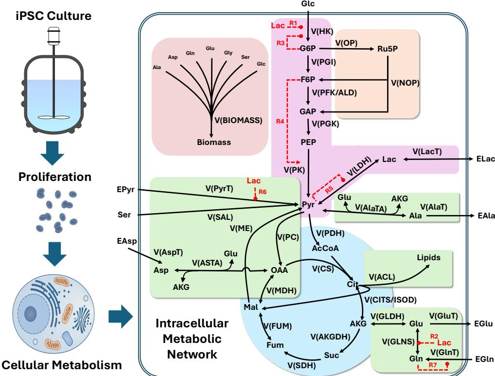  
Figure 3: Schematic of the iPSC culture metabolisms and medium-exchange decision problem.

We define the state as $\pmb { \mathscr { s } } _ { t } ~ = ~ ( X _ { t } , \pmb { \mathscr { u } } _ { t } ^ { \top } ) ^ { \top }$ , where $X _ { t }$ denotes cell density and $\pmb { u } _ { t }$ contains extracellular metabolite concentrations. Observations are collected every $\Delta t = 4$ h as transitions $( \pmb { s } _ { t _ { i } } , \pmb { a } _ { t _ { i } } , \pmb { s } _ { t _ { i + 1 } } )$ , with the post-decision state reconstructed as $\pmb { s } _ { t _ { i } ^ { + } } = \pmb { f } ( \pmb { s } _ { t _ { i } } , \pmb { a } _ { t _ { i } } )$ . The continuous-time dynamics satisfy

$$
{ \pmb s } _ { t _ { i + 1 } } = { \pmb s } _ { t _ { i } ^ { + } } + \int _ { t _ { i } } ^ { t _ { i + 1 } } { \pmb \mu } ( { \pmb s } _ { u } , { \pmb \theta } ) d u + \int _ { t _ { i } } ^ { t _ { i + 1 } } { \pmb \sigma } ( { \pmb s } _ { u } , { \pmb \theta } ) d W _ { u } ,\tag{6.1}
$$

and are simulated using an internal step size $h _ { \mathrm { s i m } } \leq \Delta t$ . Numerical integration error associated with $h _ { \mathrm { s i m } }$ is treated separately from the finite- $\cdot \Delta t$ quasi-likelihood approximation error.

At decision epoch $t _ { i } .$ , the policy selects a medium-exchange fraction $b _ { t _ { i } } = \pi ( \pmb { \mathscr { s } } _ { t _ { i } } ) \in [ 0 , 1 ]$ . This action immediately updates the extracellular environment according to ${ \pmb u } _ { t _ { i } } ^ { + } = b _ { t _ { i } } { \pmb u } _ { t _ { 0 } } + ( 1 - b _ { t _ { i } } ) { \pmb u } _ { t _ { i } }$ , where $\pmb { u } _ { t _ { 0 } }$ denotes the fresh-medium composition. The reward for taking action $\pmb { a } _ { t _ { i } }$ at state $\pmb { s } _ { t _ { i } }$ during the i-th interval is

$$
r ( \pmb { \mathscr { s } } _ { t _ { i } } , \pmb { a } _ { t _ { i } } ) = c _ { r } \Delta X _ { t _ { i } } - c _ { m } b _ { t _ { i } } - c _ { l } \Delta [ \mathrm { E L A C } ] _ { t _ { i } } ,\tag{6.2}
$$

where $c _ { r } , c _ { m }$ , and c denote the revenue from cell production, medium-exchange cost, and penalty for lactate accumula tion, respectively. The objective is to maximize the discounted return $J ( \pi ; \mathcal { M } ^ { p } )$ with discount factor $\gamma = 0 . 9 9$

Digital-twin calibration targets the mechanistic parameters governing iPSC growth and metabolism. Equation (6.1) captures nutrient- and lactate-dependent cell-growth dynamics together with extracellular-metabolite evolution, while f represents the instantaneous feeding intervention. The full SDE specification and ground-truth parameter values are provided in Appendix B.

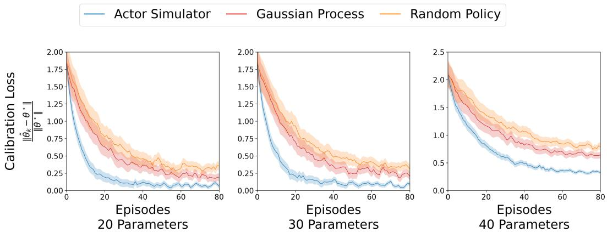

We apply the Actor–Simulator framework to three versions of the iPSC culture model with 20, 30, and 40 unknown calibration parameters; all remaining parameters are assumed known and fixed at the values reported in [24]. The calibrated parameter subsets are listed in Table 1 of Appendix B. For each unknown parameter, the corresponding component of $\widehat { \pmb { \theta } } _ { 0 }$ is initialized uniformly over $[ 0 , 4 \theta ^ { * } ]$ . Training proceeds over repeated 48-hour culture episodes, each comprising $T = 1 2$ four-hour observation and decision intervals. Calibration accuracy is measured by the relative error $\left\| { \frac { { \widehat { \pmb { \theta } } } _ { n } - { \pmb { \theta } } ^ { * } } { { \pmb { \theta } } ^ { * } } } \right\| .$

We compare the proposed approach against two baselines: a Gaussian Process surrogate model and a Random Policy. The Gaussian Process represents a standard black-box surrogate commonly used in Bayesian optimization, whereas the Random Policy provides a benchmark for unguided exploration.

The calibration and policy-optimization results are reported in Figures 4 and 5, respectively. Across all settings, the proposed bias-aware Actor-Simulator framework consistently improves both parameter estimation and process control. For the 20- and 30-parameter cases, the relative calibration error decreases rapidly to approximately 0.2–0.25 within 20 episodes and further to about 0.1 by episode 80. In contrast, the Gaussian Process and Random Policy baselines remain near 0.2–0.3 and 0.3–0.4, respectively. The advantage persists in the more challenging 40-parameter setting, where the proposed method attains a final calibration error of roughly 0.35, compared with approximately 0.65 for the Gaussian Process and 0.8 for the Random Policy.

Figure 4: Comparison of calibration performance, measured by the relative parameter-estimation error $\left\| { \frac { { \widehat { \pmb \theta } } _ { n } - { \pmb \theta } ^ { * } } { \pmb \theta ^ { * } } } \right\|$ , for the three methods under 20-, 30-, and 40-parameter calibration settings. Solid curves denote means and shaded regions indicate pointwise 95% confidence intervals.  
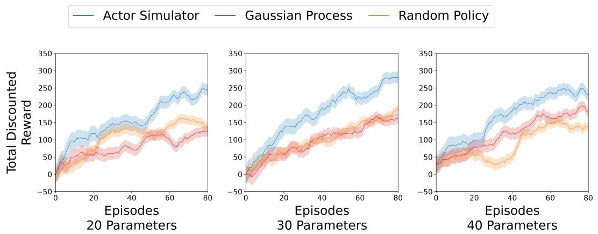  
Figure 5: Comparison of policy optimization performance, measured by $J ( \widehat { \pi } _ { n } ; \mathcal { M } ^ { p } )$ , for the three methods under 20-, 30-, and 40-parameter calibration settings. Solid curves show means across five training seeds; shaded regions denote pointwise 95% confidence intervals.

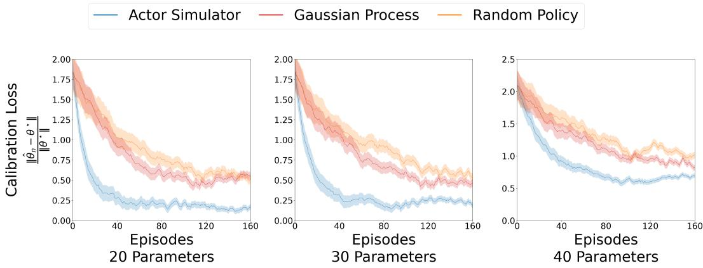  
Figure 6: Comparison of calibration parameter estimation performance, i.e., $\left\| { \widehat { \pmb { \theta } } } _ { n } { - } { \pmb { \theta } } ^ { * } \right\|$ , obtained by the three candidate approaches in the 20-, 30-, and 40-unknown-parameter settings. Solid curves report the mean and shaded regions denote pointwise 95% confidence intervals.

This improved model fidelity translates into superior control performance. As shown in Figure 5, the proposed method consistently achieves the highest total discounted reward. By episode 80, it attains mean rewards of approximately 230–280 across the 20- and 30-parameter settings, compared with roughly 125–190 for the Gaussian Process and Random Policy baselines. The advantage persists in the more challenging 40-parameter case, where the Actor–Simulator reaches about 230, versus approximately 180 for the Gaussian Process and 135 for the Random Policy.

## 6.2 iPSC Aggregate Culture

In suspension culture, iPSCs form three-dimensional aggregates whose internal microenvironments can differ substantially from the bulk medium. To capture this heterogeneity, the digital twin couples a population-balance model for aggregate-size evolution with a reaction–diffusion model for intra-aggregate nutrient and metabolite transport. Aggregate growth and coalescence determine the size distribution, while diffusion limitations create nutrient gradients that alter local metabolic activity, growth, and death.

Population- and volume-weighted averaging of these local responses produces the effective growth rate $\bar { \mu } ,$ death rate ${ \bar { \mu } } _ { d } ,$ and metabolic response v with the resulting macroscopic dynamics:

$$
d X _ { t } = \left( \bar { \mu } - \bar { \mu } _ { d } \right) X _ { t } d t + \sqrt { ( \bar { \mu } + \bar { \mu } _ { d } ) X _ { t } } d W _ { t } ^ { X } , d u _ { t } = N \bar { v } X _ { t } d t + N \sqrt { \mathrm { d i a g } ( \overline { { { v } } } X _ { t } ) } d W _ { t } .
$$

Consequently, adequate bulk nutrient levels may still coexist with nutrient-starved aggregate cores. This multiscale coupling allows feeding decisions to influence both overall productivity and spatial heterogeneity.

Feeding actions remain unchanged, but the policy must balance biomass production against aggregate heterogeneity. Let $q _ { t } ^ { \mathrm { c o r e } }$ denote the fraction of cells residing in aggregates with nutrient-starved cores $( [ \mathrm { G L C } ] < 2 . 5 $ mM at central part), and define $\Delta q _ { t _ { i } } ^ { \mathrm { c o r e } } = q _ { t _ { i + 1 } } ^ { \mathrm { c o r e } } - q _ { t _ { i } } ^ { \mathrm { c o r e } }$ . The reward is modified from the monolayer formulation to

$$
r ( \pmb { s } _ { t _ { i } } , \pmb { a } _ { t _ { i } } ) = c _ { r } \Delta X _ { t _ { i } } - c _ { m } b _ { t _ { i } } - c _ { l } \Delta [ \mathrm { E L A C } ] _ { t _ { i } } - c _ { h } \Delta q _ { t _ { i } } ^ { \mathrm { c o r e } } ,\tag{6.3}
$$

where $c _ { h }$ penalizes the growth of unhealthy aggregate cores.

Unless otherwise stated, the aggregate-culture experiments use the same 48-hour horizon, 4-hour decision interval, action space, discount factor $( \gamma = 0 . 9 9 )$ , and single-cell metabolic parameter-initialization scheme as the monolayer study. For each 20-, 30-, and 40-parameter calibration setting, the Actor–Simulator is allocated a trajectory budget of $N _ { \mathrm { m a x } } = 1 6 0$ , including $n _ { 0 } = 1 0$ pilot trajectories collected before uncertainty-guided exploration. The remaining episodes follow the adaptive exploration strategy in Algorithm 1 in Appendix F. Seed averaging, confidence intervals, and independent policy evaluation follow the protocol defined at the beginning of this section.

As shown in Figure $^ { 6 , }$ the proposed Actor–Simulator framework scales effectively to the more complex Bio-SoS setting. Compared with the Gaussian Process surrogate and Random Policy baselines, it consistently delivers more accurate calibration and parameter recovery. These gains in model fidelity translate into improved control performance, as illustrated by the reward trajectories in Figure 7. Across all three parameter settings, the Actor–Simulator achieves both faster policy improvement and higher final rewards than the competing approaches.

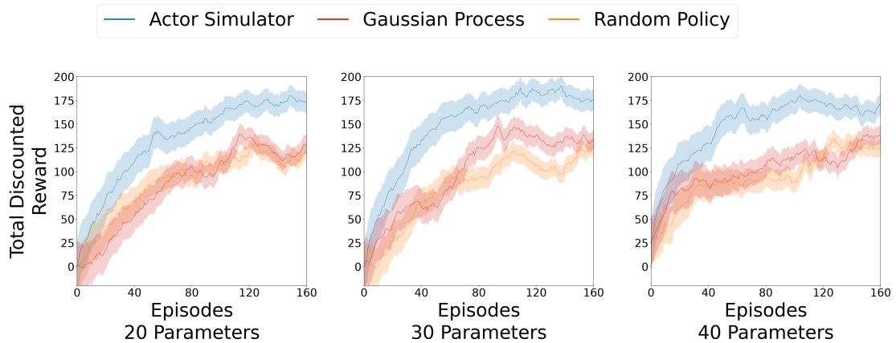  
Figure 7: Comparison of policy optimization performance in terms of $J ( \widehat { \pi } _ { n } ; \mathcal { M } ^ { p } )$ obtained by the three candidate approaches in the 20-, 30-, and 40-unknown-parameter settings. Solid curves report the mean and shaded regions denote pointwise 95% confidence intervals.

Accurate prediction of Bio-SoS heterogeneity is essential for biomanufacturing and quality control. As aggregate size increases, diffusion limitations generate distinct core and peripheral microenvironments that can induce different metabolic states. We evaluate whether the calibrated digital twin captures this spatial heterogeneity by comparing innerand outer-shell fluxes in the 40-parameter aggregate-culture case study. Using the calibrated parameters from the 15th RL iteration of each random seed, we simulate each of the five parameter estimates separately and then average the resulting flux-heterogeneity measures pointwise. Averaging outputs rather than parameters preserves nonlinear effects in the digital twin.

Although policy training uses 48-h episodes, the calibrated mechanistic models are propagated for up to 73 h with a 1-h update interval, so the 72-h evaluations assess predictive performance beyond the training horizon. For spatial flux analysis, the aggregate simulator assumes a single-cell radius of 7.5 µm, radial discretization of 15 µm, aggregate porosity of 0.27, and tortuosity of 1.46. Inner- and outer-shell fluxes are extracted at 24, 48, and 72 h for nominal aggregate radii of 60, 120, 240, and 360 µm. For reaction or transport flux j, time t, and aggregate radius R, we define the flux-heterogeneity contrast as

$$
C _ { j , t , R } ^ { \mathrm { f l u x } } : = \frac { \nu _ { j , t , R } ^ { \mathrm { i n n e r } } - \nu _ { j , t , R } ^ { \mathrm { o u t e r } } } { | \nu _ { j , t , R } ^ { \mathrm { i n n e r } } | + | \nu _ { j , t , R } ^ { \mathrm { o u t e r } } | } .
$$

Positive values indicate greater flux activity in the aggregate interior, whereas negative values indicate greater activity near the surface.

As shown in Figure 8, the calibrated digital twin preserves the major pathway-level heterogeneity patterns observed in the physical system. These include the increasingly negative pyruvate-transport contrast with aggregate radius at 24 and 48 h, the pronounced negative SAL and biomass contrasts at larger radii at 48 h, and the opposing PGK and PK spatial patterns at 72 h. The calibrated model also reproduces the localized 72-h heterogeneity signatures associated with malate-related reactions and PC near the nominal 240 µm radius.

In the iPSC monolayer and aggregate-culture case studies, the proposed bias-aware Actor-Simulator framework achieves faster improvement in both mechanistic parameter calibration and policy rewards than the Gaussian-process and randomexploration baselines under the same trajectory budget, demonstrating superior sample efficiency. The spatial flux analysis further shows that the calibrated digital twin accurately captures intra-aggregate metabolic heterogeneity across both time and aggregate radius. Such mechanistic resolution is critical for applications including gene and cell therapy manufacturing, organoid production, and 3D bioprinting, where local microenvironments strongly influence product quality and consistency. Overall, these results demonstrate the value of jointly integrating uncertainty-aware digital twin calibration and policy optimization within mechanistic Bio-SoS models.

## 7 Conclusion

This paper develops a bias-aware Actor–Simulator framework that integrates uncertainty-aware calibration, adaptive experimental design, and policy optimization for SDE-based digital twins. The proposed approach combines generatorbased moment expansions to characterize truncation-induced calibration bias with trajectory-level adjoint sensitivity analysis to quantify how parameter uncertainty propagates to action values and policy performance. These components enable policy-directed experiment selection and uncertainty-aware policy optimization through a second-order Gaussianaveraged objective. Theoretical analysis establishes improved dense-sampling calibration rates, characterizes the asymptotic limit of the proposed exploration score, and proves asymptotically optimal physical-system performance. Numerical studies on iPSC monolayer and aggregate-culture systems demonstrate faster calibration, greater sample efficiency, and superior policy performance relative to Gaussian-process and random-exploration baselines. Overall, the proposed framework establishes a principled link between uncertainty quantification, model calibration, and decision optimization in mechanistic Bio-SoS digital twins.

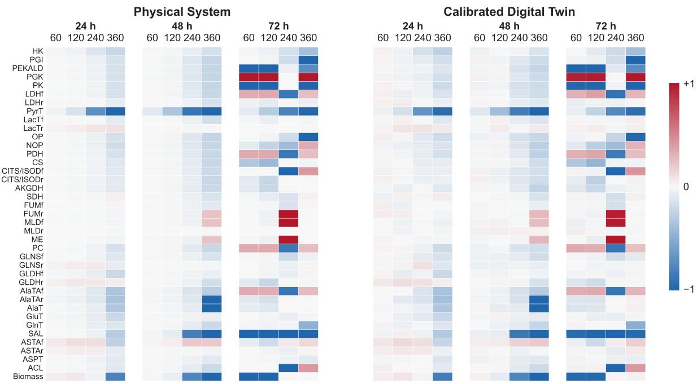  
Figure 8: Reference and calibrated inner–outer metabolic-flux contrasts at 24, 48, and 72 h for aggregate radii of 60, 120, 240, and $3 6 0 \ \mu \mathrm { { m } }$ . At the 15th iteration, the absolute error in the normalized contrast is below 0.05 for every displayed entry.

## Acknowledgements

The authors acknowledge support from the National Institute of Standards and Technology (Grants 70NANB24H293, 70NANB17H002, 70NANB21H086) and the National Science Foundation (CMMI-2442970).

## References

[1] Atuahene Kwasi Barimah, Ogwo Precious Onu, Octavian Niculita, Andrew Cowell, and Don McGlinchey. Scalable data transformation models for physics-informed neural networks (pinns) in digital twin-enabled prognostics and health management (phm) applications. Computers, 14(4):121, 2025.

[2] Ricky T. Q. Chen, Yulia Rubanova, Jesse Bettencourt, and David Duvenaud. Neural ordinary differential equations, 2019. URL https://arxiv.org/abs/1806.07366.

[3] Keilung Choy, Wei Xie, and Keqi Wang. A symbolic and statistical learning framework to discover bioprocessing regulatory mechanism: Cell culture example. In 2025 Winter Simulation Conference (WSC), pages 3478–3489, 2025. doi: 10.1109/WSC68292.2025.11339025.

[4] Keilung Choy, Wei Xie, Jinxiang Pei, Fuqiang Cheng, Keqi Wang, Ana Nikolov, Milos Drobnjakovic, Boonserm Kulvatunyou, and Vijay Srinivasan. A biological systems-of-systems ontology for multi-scale biomanufacturing process modeling and simulation. In Proceedings ofthe ASME 2026 International Design Engineering Technical Conferences and Computers and Information in Engineering Conference, IDETC/CIE2026, 2026.

[5] Marc Deisenroth and Carl E Rasmussen. Pilco: A model-based and data-efficient approach to policy search. In Proceedings of the 28th International Conference on machine learning (ICML-11), pages 465–472, 2011.

[6] Dave Higdon, James Gattiker, Brian Williams, and Maria Rightley. Computer model calibration using highdimensional output. Journal ofthe American Statistical Association, 103(482):570–583, 2008.

[7] J. P. Imhof. Computing the distribution of quadratic forms in normal variables. Biometrika, 48(3-4):419–426, 1961. doi: 10.1093/biomet/48.3-4.419.

[8] George Em Karniadakis, Ioannis G Kevrekidis, Lu Lu, Paris Perdikaris, Sifan Wang, and Liu Yang. Physicsinformed machine learning. Nature Reviews Physics, 3(6):422–440, 2021.

[9] Mohammadrahim Kazemzadeh, Liam Collard, Linda Piscopo, Massimo De Vittorio, and Ferruccio Pisanello. A physics-informed neural network as a digital twin of optically turbid media. Advanced Intelligent Systems, 7(5): 2400574, 2025.

[10] Marc C Kennedy and Anthony O’Hagan. Bayesian calibration of computer models. Journal ofthe Royal Statistical Society: Series B (Statistical Methodology), 63(3):425–464, 2001.

[11] Mathieu Kessler. Estimation of an ergodic diffusion from discrete observations. Scandinavian Journal of Statistics, 24(2):211–229, 1997.

[12] Martin Kornecki and Jochen Strube. Process analytical technology for advanced process control in biologics manufacturing with the aid of macroscopic kinetic modeling. Bioengineering, 5(1):25, 2018.

[13] Hiroshi Kunita. Stochastic Flows and Jump-Diffusions, volume 92 of Probability Theory and Stochastic Modelling. Springer Singapore, 2019. ISBN 978-981-13-3801-4. doi: 10.1007/978-981-13-3801-4.

[14] Chee Keong Kwok, Yuichiro Ueda, Asifiqbal Kadari, Katharina Günther, Süleyman Ergün, Antoine Heron, Aletta C Schnitzler, Martha Rook, and Frank Edenhofer. Scalable stirred suspension culture for the generation of billions of human induced pluripotent stem cells using single-use bioreactors. Journal oftissue engineering and regenerative medicine, 12(2):e1076–e1087, 2018.

[15] Xuechen Li, Ting-Kam Leonard Wong, Ricky T. Q. Chen, and David Duvenaud. Scalable gradients for stochastic differential equations. In Silvia Chiappa and Roberto Calandra, editors, Proceedings of the Twenty Third International Conference on Artificial Intelligence and Statistics, volume 108 of Proceedings of Machine Learning Research, pages 3870–3882. PMLR, 2020. URL https://proceedings.mlr.press/v108/li20i.html.

[16] Jan R. Magnus. The moments of products of quadratic forms in normal variables. Statistica Neerlandica, 32(4): 201–210, 1978. doi: 10.1111/j.1467-9574.1978.tb01399.x.

[17] Thomas M Moerland, Joost Broekens, Aske Plaat, Catholijn M Jonker, et al. Model-based reinforcement learning: A survey. Foundations and Trends® in Machine Learning, 16(1):1–118, 2023.

[18] Ahmadreza Moradipari, Mohammad Pedramfar, Modjtaba Shokrian Zini, and Vaneet Aggarwal. Improved bayesian regret bounds for thompson sampling in reinforcement learning. Advances in Neural Information Processing Systems, 36:23557–23569, 2023.

[19] Jonas Nicodemus, Jonas Kneifl, Jörg Fehr, and Benjamin Unger. Physics-informed neural networks-based model predictive control for multi-link manipulators. IFAC-PapersOnLine, 55(20):331–336, 2022.

[20] Christopher Rackauckas, Yingbo Ma, Julius Martensen, Collin Warner, Kirill Zubov, Rohit Supekar, Dominic Skinner, Ali Ramadhan, and Alan Edelman. Universal differential equations for scientific machine learning, 2021. URL https://arxiv.org/abs/2001.04385.

[21] M. Raissi, P. Perdikaris, and G.E. Karniadakis. Physics-informed neural networks: A deep learning framework for solving forward and inverse problems involving nonlinear partial differential equations. Journal of Computational Physics, 378:686–707, 2019. ISSN 0021-9991. doi: https://doi.org/10.1016/j.jcp.2018.10.045. URL https: //www.sciencedirect.com/science/article/pii/S0021999118307125.

[22] Daniel J Russo, Benjamin Van Roy, Abbas Kazerouni, Ian Osband, Zheng Wen, et al. A tutorial on thompson sampling. Foundations and Trends® in Machine Learning, 11(1):1–96, 2018.

[23] Kaan Sel, Amirmohammad Mohammadi, Roderic I Pettigrew, and Roozbeh Jafari. Physics-informed neural networks for modeling physiological time series for cuffless blood pressure estimation. npj Digital Medicine, 6(1): 110, 2023.

[24] Keqi Wang, Wei Xie, and Sarah W Harcum. Metabolic regulatory network kinetic modeling with multiple isotopic tracers for ipscs. Biotechnology and Bioengineering, 2023.

[25] Keqi Wang, Wei Xie, and Sarah W. Harcum. Metabolic regulatory network kinetic modeling with multiple isotopic tracers for iPSCs. Biotechnology and Bioengineering, 121(4):1335–1353, 2024. doi: 10.1002/bit.28609. URL https://doi.org/10.1002/bit.28609.

[26] Keqi Wang, Keilung Choy, Eli Reiser, Jinxiang Pei, Hua Zheng, Aparajita Dasgupta, Fuqiang Cheng, Guogang Dong, Bhanu Chandra Mulukutla, Joshua Mannheimer, Carolyn Huang, Hooman Farsani, and Wei Xie. A modular mechanistic in silico model for in vitro transcription process yield and product quality prediction. Biotechnology and Bioengineering, 123(7):1836–1870, 2026. doi: https://doi.org/10.1002/bit.70222.

[27] Keqi Wang, Sarah W. Harcum, and Wei Xie. Multi-scale hybrid modeling to predict cell culture process with metabolic phase transitions. Biotechnology and Bioengineering, 123(7):1745–1770, 2026. doi: 10.1002/bit.70205. URL https://doi.org/10.1002/bit.70205.

[28] Halbert White. Maximum likelihood estimation of misspecified models. Econometrica: Journal ofthe econometric society, pages 1–25, 1982.

[29] Wei Xie, Keqi Wang, Hua Zheng, and Ben Feng. Sequential importance sampling for hybrid model bayesian inference to support bioprocess mechanism learning and robust control. In 2022 Winter Simulation Conference (WSC), pages 2282–2293. IEEE, 2022.

[30] Sunwoong Yang, Hojin Kim, Yoonpyo Hong, Kwanjung Yee, Romit Maulik, and Namwoo Kang. Data-driven physics-informed neural networks: A digital twin perspective. Computer Methods in Applied Mechanics and Engineering, 428:117075, 2024.

[31] Yuling Yang, Yuchen Qiu, Keqi Wang, Yifang Liu, Gautam Sanyal, Paul C. Whitford, Sara H. Rouhanifard, and Wei Xie. Multiscale modeling guided potency assessment of mRNA-lipid nanoparticles. Molecular Therapy– Nucleic Acids, 37(2):102965, 2026. doi: 10.1016/j.omtn.2026.102965.

[32] Beichen Zhao, Xueliang Li, Wanqiang Sun, Juntao Qian, Jin Liu, Minjie Gao, Xin Guan, Zhenwu Ma, and Jianghua Li. Biodt: An integrated digital-twin-based framework for intelligent biomanufacturing. Processes, 11 (4):1213, 2023.

[33] Hua Zheng, Sarah W Harcum, Jinxiang Pei, and Wei Xie. Stochastic biological system-of-systems modelling for iPSC culture. Communications Biology, 7(1):39, 2024.

## A Reaction-Network Motivation

Consider a reaction network with M species and R reactions. Let $\pmb { N } = ( \pmb { N } _ { 1 } , \dots , \pmb { N } _ { R } ) \in \mathbb { R } ^ { M \times R }$ denote the stoichiometric matrix, and let ${ \pmb v } ( { \pmb s } , { \pmb \theta } )$ denote the vector of parameterized reaction rates. Over a microscopic interval $( t , t + \Delta \tau ]$ , the state evolves according to

$$
{ \pmb s } _ { t + \Delta \tau } = { \pmb s } _ { t } + N { \pmb R } _ { t } , \qquad { \pmb R } _ { t } \sim \mathrm { P o i s s o n } ( { \pmb v } ( { \pmb s } _ { t } , { \pmb \theta } ) \Delta \tau ) ,\tag{A.1}
$$

where the components of $\pmb { R } _ { t }$ are conditionally independent reaction counts. For sufficiently small $\Delta \tau .$ , the reaction-count vector admits the Gaussian approximation

$$
{ \pmb s } _ { t + \Delta \tau } \mid { \pmb s } _ { t } \mathbin { \stackrel { . } { \sim } } N \big ( { \pmb s } _ { t } + N { \pmb v } ( { \pmb s } _ { t } , \pmb \theta ) \Delta \tau , N \mathrm { d i a g } ( { \pmb v } ( { \pmb s } _ { t } , \pmb \theta ) ) N ^ { \top } \Delta \tau \big ) .
$$

Taking $\Delta \tau \downarrow 0$ yields the chemical Langevin equation underlying Equation (3.1). The framework considered in this paper allows more general drift and diffusion specifications, enabling reaction, transport, population-balance, and spatial modules to be coupled within a unified Bio-SoS model.

## B iPSC Model and Parameter Values

The monolayer example in Section 6.1 uses the state $\pmb { \mathscr { s } } _ { t } = ( X _ { t } , \pmb { \mathscr { u } } _ { t } ^ { \top } ) ^ { \top }$ , where $X _ { t }$ denotes cell density $\mathrm { ( c e l l s / c m ^ { 2 } ) }$ and $\pmb { u } _ { t }$ contains extracellular metabolite concentrations. Following the study [12], cell growth is promoted by glucose ([GLC]) and glutamine ([EGLN]) and inhibited by lactate ([ELAC]):

$$
\begin{array} { r l } & { d X _ { t } = ( \mu - \mu _ { d } ) X _ { t } d t + \sqrt { ( \mu + \mu _ { d } ) X _ { t } } d W _ { t } ^ { X } , } \\ & { \mu _ { d } = k _ { d } \frac { \left[ \mathrm { E L A C } \right] } { \left[ \mathrm { E L A C } \right] + K _ { D l a c } } , } \\ & { \mu = \mu _ { m a x } \frac { \left[ \mathrm { G L C } \right] } { K _ { g l c } + \left[ \mathrm { G L C } \right] } \frac { \left[ \mathrm { E G L N } \right] } { K _ { g l n } + \left[ \mathrm { E G L N } \right] } \cdot \frac { K _ { I l a c } } { K _ { I l a c } + \left[ \mathrm { E L A C } \right] } . } \end{array}
$$

Here $\mu _ { m a x }$ and $k _ { d }$ denote the maximum growth and death rates, $K _ { g l c } , K _ { g l n } , K _ { D l a c }$ , and $K _ { I l a c }$ are the corresponding half-saturation and inhibition constants. Following the feeding update, extracellular metabolites evolve according to

$$
d \pmb { u } _ { t } = N \pmb { v } ( \pmb { s } _ { t } , \pmb { \theta } ) X _ { t } d t + N \sqrt { \mathrm { d i a g } ( \pmb { v } ( \pmb { s } _ { t } , \pmb { \theta } ) X _ { t } ) } d W _ { t } ,
$$

where N and v are the stoichiometry matrix and parameterized reaction-rate vector defined in Appendix A. The metabolic network structure and nominal parameter values are adopted from [24] and were validated using experimental data.

The numerical studies consider nested 20-, 30-, and 40-parameter calibration settings summarized in Table 1. The table reports the corresponding ground-truth parameter values; all remaining parameters are fixed at the values in [24].

## C Transition-Level Score Bias and Parameter Bias

We begin with the full transition quasi-score used in the bias calculation. Its k-th component is

$$
\partial _ { \theta _ { k } } \ell _ { l , i } ^ { j } ( \theta ) = ( \partial _ { \theta _ { k } } m _ { 1 , i } ^ { j } ) ^ { \top } ( m _ { 2 , i } ^ { j } ) ^ { - 1 } \varepsilon _ { i } ^ { j } + \frac { 1 } { 2 } ( \varepsilon _ { i } ^ { j } ) ^ { \top } ( m _ { 2 , i } ^ { j } ) ^ { - 1 } ( \partial _ { \theta _ { k } } m _ { 2 , i } ^ { j } ) ( m _ { 2 , i } ^ { j } ) ^ { - 1 } \varepsilon _ { i } ^ { j } - \frac { 1 } { 2 } \operatorname { t r } \left( ( m _ { 2 , i } ^ { j } ) ^ { - 1 } \partial _ { \theta _ { k } } m _ { 2 , i } ^ { j } \right) ,\tag{C.1}
$$

where all moment functions are evaluated at θ. The trajectory score preserves temporal dependence within a trajectory, while the independent sampling unit in the sandwich covariance remains the complete trajectory.

Fix a transition $( i , j )$ and evaluate the truncated moments at $\pmb { \theta } ^ { * }$ . Define

$$
\widetilde { M } _ { 1 } = m _ { 1 , i } ^ { j } ( \pmb { \theta } ^ { * } ) , \qquad \widetilde { M } _ { 2 } = m _ { 2 , i } ^ { j } ( \pmb { \theta } ^ { * } ) , \qquad G _ { q , k } = \partial _ { \theta _ { k } } m _ { q , i } ^ { j } ( \pmb { \theta } ^ { * } ) ,
$$

and let $R _ { 1 }$ and $R _ { 2 }$ denote the corresponding conditional-moment truncation errors. Conditional on the post-decision state,

$$
\mathbb { E } [ \pmb { s } _ { t _ { i + 1 } } ^ { j } \ \vert \ \pmb { s } _ { t _ { i } ^ { + } } ^ { j } ] = \widetilde { M } _ { 1 } + R _ { 1 } , \qquad \mathrm { V a r } ( \pmb { s } _ { t _ { i + 1 } } ^ { j } \ \vert \ \pmb { s } _ { t _ { i } ^ { + } } ^ { j } ) = \widetilde { M } _ { 2 } + R _ { 2 } .
$$

Let $\varepsilon : = \pmb { \mathscr { s } } _ { t _ { i + 1 } } ^ { j } - \widetilde { M _ { 1 } }$ . Then,

$$
\begin{array} { r } { \mathbb { E } [ \varepsilon \mid \pmb { s } _ { t _ { i } ^ { + } } ^ { j } ] = R _ { 1 } , \qquad \mathbb { E } [ \varepsilon \varepsilon ^ { \top } \mid \pmb { s } _ { t _ { i } ^ { + } } ^ { j } ] = \widetilde { M } _ { 2 } + R _ { 2 } + R _ { 1 } R _ { 1 } ^ { \top } . } \end{array}
$$

Table 1: Calibration parameters used in the monolayer and aggregate experiments.
<table><tr><td colspan="5">20 parameters in all settings</td></tr><tr><td> $v _ { m a x , H K }$ </td><td>2.92</td><td> $v _ { m a x , P G I }$ </td><td>1.43</td><td> $v _ { m a x , P F K / A L D }$  2.16</td></tr><tr><td> $v _ { m a x , P G K }$ </td><td>4.00</td><td> $v _ { m a x , P K }$ </td><td>3.98  $v _ { m a x , f L D H }$ </td><td>3.28</td></tr><tr><td> $v _ { m a x , P y r T }$ </td><td>0.17</td><td> $v _ { m a x , f L a c T }$ </td><td>2.97  $v _ { m a x , O P }$ </td><td>0.01</td></tr><tr><td> $v _ { m a x , N O P }$ </td><td>0.02</td><td> $v _ { m a x , P D H }$ </td><td>0.22  $v _ { m a x , C S }$ </td><td>0.43</td></tr><tr><td> $v _ { m a x , M E }$ </td><td>0.51</td><td> $v _ { m a x , f M D H }$ </td><td>1.44  $v _ { m a x , G l n T }$ </td><td>1.81</td></tr><tr><td> $K _ { m , N H 4 }$ </td><td>0.17</td><td> $K _ { m , A L A }$ </td><td>0.20  $K _ { m , G L C }$ </td><td>1.46</td></tr><tr><td> $K _ { m , G L N }$ </td><td>0.26  $K _ { m , G L U }$ </td><td></td><td>0.30</td><td></td></tr><tr><td colspan="5">Additional 10 parameters in the 30- and 40-parameter settings</td></tr><tr><td> $\boldsymbol { v _ { m a x , f C I T S / I S O D } }$ </td><td>1.32</td><td> $v _ { m a x , A K G D H }$  2.84</td><td> $v _ { m a x , S D H }$ </td><td>0.32</td></tr><tr><td> $v _ { m a x , f F U M }$ </td><td>0.32</td><td> $v _ { m a x , P C }$ </td><td>0.06  $v _ { m a x , f G L N S }$ </td><td>1.14</td></tr><tr><td> $v _ { m a x , f G L D H }$ </td><td>0.26</td><td> $v _ { m a x , f A l a T A }$ </td><td>0.82  $v _ { m a x , A l a T }$ </td><td>0.47</td></tr><tr><td> $v _ { m a x , G l u T }$ </td><td>0.17</td><td></td><td></td><td></td></tr><tr><td colspan="5">Additional 10 parameters in the 40-parameter setting</td></tr><tr><td> $K _ { m , S E R }$ </td><td>0.01</td><td> $v _ { m , S A L }$ </td><td>0.01</td><td> $K _ { m , R u 5 P }$ </td><td>0.02</td></tr><tr><td> $K _ { m , P Y R }$ </td><td>0.21</td><td> $K _ { m , A c C o A }$ </td><td>0.09</td><td> $K _ { m , O A A }$ </td><td>0.08</td></tr><tr><td> $K _ { m , C I T }$ </td><td>0.39</td><td> $K _ { m , A K G }$ </td><td>2.92</td><td> $K _ { m , M A L }$ </td><td>0.11</td></tr><tr><td> $K _ { m , E G L N }$ </td><td>1.00</td><td></td><td></td><td></td><td></td></tr></table>

Substituting these identities into Equation (C.1), cancels the two terms involving $\widetilde { M } _ { 2 }$ and yields

$$
\begin{array} { l } { { \delta _ { l , i , j } ^ { ( k ) } : = \mathbb { E } [ \partial _ { \theta _ { k } } \ell _ { l , i } ^ { j } ( \pmb { \theta } ^ { * } ) \mid \pmb { s } _ { t _ { i } ^ { + } } ^ { j } ] } } \\ { { \phantom { \delta _ { l , i , j } ^ { ( k ) } : = } = G _ { 1 , k } ^ { \top } \widetilde { M } _ { 2 } ^ { - 1 } R _ { 1 } + \displaystyle \frac { 1 } { 2 } \operatorname { t r } \Bigl ( \widetilde { M } _ { 2 } ^ { - 1 } G _ { 2 , k } \widetilde { M } _ { 2 } ^ { - 1 } R _ { 2 } \Bigr ) + \displaystyle \frac { 1 } { 2 } \operatorname { t r } \Bigl ( \widetilde { M } _ { 2 } ^ { - 1 } G _ { 2 , k } \widetilde { M } _ { 2 } ^ { - 1 } R _ { 1 } R _ { 1 } ^ { \top } \Bigr ) . } } \end{array}\tag{C.2}
$$

Equation (C.2) shows that the expected Gaussian quasi-score is unbiased whenever the exact conditional moments are used. Indeed, setting $R _ { 1 } = R _ { 2 } = 0$ yields $\delta _ { l , i , j } ^ { ( k ) } = 0$ without requiring the transition distribution itself to be Gaussian. Let $\delta _ { l , i , j }$ collect the K components in Equation (C.2). summing over all stages yields Equation (4.5). Applying the fundamental theorem of calculus to $G _ { l }$ along the segment joining $\pmb { \theta } ^ { * }$ and $\widetilde { \pmb { \theta } } _ { l }$ gives

$$
G _ { l } ( \widetilde { \pmb { \theta } } _ { l } ) - G _ { l } ( \pmb { \theta } ^ { * } ) = \overline { { \Lambda } } _ { l } ( \widetilde { \pmb { \theta } } _ { l } - \pmb { \theta } ^ { * } ) .
$$

Since $G _ { l } ( \widetilde { \pmb { \theta } } _ { l } ) = 0$ and $G _ { l } ( \pmb { \theta } ^ { * } ) = \delta _ { l }$ , it follows that

$$
- \delta _ { l } = \overline { { \Lambda } } _ { l } \big ( \widetilde { \pmb { \theta } } _ { l } - \pmb { \theta } ^ { * } \big ) ,
$$

which yields Equation (4.7).

Small-interval scaling For observation interval $\Delta t ,$ Assumption 4.1 implies $R _ { 1 , l } , R _ { 2 , l } = \mathcal { O } ( ( \Delta t ) ^ { l + 1 } )$ uniformly on the relevant state-parameter domain. Moreover, the leading transition covariance satisfies $\tilde { M } _ { 2 } = \mathcal { O } ( \Delta t )$ and $\widetilde { M } _ { 2 } ^ { - 1 } = \mathcal { O } ( ( \Delta t ) ^ { - 1 } )$ . For every parameter coordinate, $G _ { 1 , k } = \mathcal { O } ( \Delta t )$ and $G _ { 2 , k } = \mathcal { O } ( \Delta t )$ under the differentiated moment expansion.

Consequently, the mean term in Equation (C.2) is $\mathcal { O } ( ( \Delta t ) ^ { l + 1 } )$ , while the dominant covariance term is

$$
\mathcal { O } \big ( ( \Delta t ) ^ { - 1 } ( \Delta t ) ( \Delta t ) ^ { - 1 } ( \Delta t ) ^ { l + 1 } \big ) = \mathcal { O } ( ( \Delta t ) ^ { l } ) .
$$

The final term involving $R _ { 1 } R _ { 1 } ^ { \top }$ is of higher order, $\mathscr { O } ( ( \Delta t ) ^ { 2 l } )$ . Summing over $T$ observation intervals therefore gives

$$
\| \pmb { \delta } _ { l } \| = \mathcal { O } \big ( T ( \Delta t ) ^ { l } \big ) .
$$

Under the full-rank covariance condition $\lambda _ { \operatorname* { m i n } } \{ \mathcal { T } _ { \sigma } ( \pmb { \theta } ^ { * } ) \} > 0$ in Equation (5.2) and the uniform convergence assumed in Appendix G, the population score sensitivity obeys

$$
- T ^ { - 1 } \overline { { \Lambda } } _ { l } \to \mathcal { T } _ { \sigma } ( \pmb { \theta } ^ { * } ) \qquad ( \Delta t \to 0 ) ,
$$

implying

$$
\lVert \overline { { \Lambda } } _ { l } ^ { - 1 } \rVert = \mathcal { O } ( T ^ { - 1 } ) .
$$

Combining this with Equation (4.7) yields

$$
\| \pmb { b } _ { \Delta , l } \| = \mathcal { O } ( ( \Delta t ) ^ { l } ) .
$$

Thus an order- $( l + 1 )$ conditional-moment truncation error induces an order-l parameter bias because the covariance contribution to the score is amplified by the factor $\widetilde { M } _ { 2 } ^ { - 1 } = \mathcal { O } ( ( \Delta t ) ^ { - 1 } )$ .

Implementable score-bias estimate The exact residuals $R _ { q , l }$ in Equation (C.2) are unknown. We approximate them using the next term in the generator expansion and evaluate all quantities at the QMLE $\widehat { \pmb { \theta } } _ { n }$

$$
\begin{array} { r l } & { \widehat { R } _ { q , i , j } : = \widehat { R } _ { q , l } ^ { \mathrm { n e x t } } ( \Delta t , \pmb { s } _ { t _ { i } ^ { + } } ^ { j } , \widehat { \pmb { \theta } } _ { n } ) } \\ & { \qquad = \widetilde { \pmb { m } } _ { q , l + 1 } ( \Delta t , \pmb { s } _ { t _ { i } ^ { + } } ^ { j } , \widehat { \pmb { \theta } } _ { n } ) - \widetilde { \pmb { m } } _ { q , l } ( \Delta t , \pmb { s } _ { t _ { i } ^ { + } } ^ { j } , \widehat { \pmb { \theta } } _ { n } ) , } \\ & { \widehat { M } _ { 2 , i , j } : = m _ { 2 , i } ^ { j } ( \widehat { \pmb { \theta } } _ { n } ) , \qquad \widehat { G } _ { q , k , i , j } : = \partial _ { \theta _ { k } } m _ { q , i } ^ { j } ( \widehat { \pmb { \theta } } _ { n } ) , \quad q = 1 , 2 . } \end{array}
$$

Substituting these quantities into Equation (C.2) yields the estimated contribution to the kth score component:

$$
\widehat { \delta } _ { l , i , j } ^ { ( k ) } : = \widehat { G } _ { 1 , k , i , j } ^ { \top } \widehat { M } _ { 2 , i , j } ^ { - 1 } \widehat { R } _ { 1 , i , j } + \frac { 1 } { 2 } \operatorname { t r } \left( \widehat { M } _ { 2 , i , j } ^ { - 1 } \widehat { G } _ { 2 , k , i , j } \widehat { M } _ { 2 , i , j } ^ { - 1 } \widehat { R } _ { 2 , i , j } \right) + \frac { 1 } { 2 } \operatorname { t r } \left( \widehat { M } _ { 2 , i , j } ^ { - 1 } \widehat { G } _ { 2 , k , i , j } \widehat { M } _ { 2 , i , j } ^ { - 1 } \widehat { R } _ { 1 , i , j } \widehat { R } _ { 1 , i , j } ^ { \top } \right) .\tag{C.3}
$$

Let $\widehat { \delta } _ { l , i , j } : = ( \widehat { \delta } _ { l , i , j } ^ { ( 1 ) } , \ldots , \widehat { \delta } _ { l , i , j } ^ { ( K ) } ) ^ { \top }$ . Averaging over the n independent trajectories while retaining all $T$ within-trajectory transitions gives

$$
\widehat { \delta } _ { n } : = \frac { 1 } { n } \sum _ { j = 1 } ^ { n } \sum _ { i = 0 } ^ { T - 1 } \widehat { \delta } _ { l , i , j } .\tag{C.4}
$$

Applying the one-step curvature correction to $\widehat { \delta } _ { n }$ yields the bias estimator $\widehat { \pmb { b } } _ { n }$ defined in Equation (4.8).

## D Adjoint Sensitivity Derivations and Proofs

This appendix derives the first- and second-order backward adjoint equations for the augmented stochastic flow introduced in Section 4.2. The resulting adjoint systems are then used to establish the decision-time sensitivity formulas by combining flow composition with pathwise differentiation and interchange of differentiation and expectation. Throughout, we consider a continuous interval $[ u , v ]$ initiated from a post-decision state x and condition on a common Brownian realization ξ for both the forward and backward dynamics.

## D.1 Regularity Conditions for Adjoint Sensitivities

The results below use three levels of regularity. First, on each finite intervention-free interval, assume the coefficients of the augmented state equation generate a nonexplosive stochastic flow $\mathcal { F } _ { u , t }$ that is almost surely twice continuously differentiable in $( s , \theta )$ . At fixed θ, its state Jacobian is invertible and its inverse state flow is twice continuously differentiable; the coefficient derivatives in the backward equations exist and the Stratonovich chain and inverse rules apply. Assume also that the terminal function $\rho$ is twice continuously differentiable on the reachable state domain. These are the pathwise-flow conditions used in Proposition 4.4; standard coefficient-level smoothness, growth, and moment conditions that ensure such a flow are given in [13].

Second, when interval sensitivities are composed across decision times, assume the intervention map $f ,$ reward $r ,$ and policy π are twice continuously differentiable on the encountered state–action domain. Finally, to identify derivatives of J or $Q _ { i } ^ { \pi }$ with expectations of pathwise derivatives, assume that the first- and second-order derivatives of the corresponding pathwise return, uniformly over a neighborhood of the parameter of interest, are dominated by integrable random variables. This last condition is needed for differentiation under expectation, not for the pathwise identities.

## D.2 Forward and Inverse Flows

Let R denote the number of Brownian components, let $\pmb { \sigma } _ { k }$ be the kth column of the diffusion matrix $\sigma ,$ and define the Stratonovich drif

$$
\mu ^ { \mathrm { S t r a t } } ( \pmb { s } , \pmb { \theta } ) : = \pmb { \mu } ( \pmb { s } , \pmb { \theta } ) - \frac { 1 } { 2 } \sum _ { k = 1 } ^ { R } D _ { s } \pmb { \sigma } _ { k } ( \pmb { s } , \pmb { \theta } ) \pmb { \sigma } _ { k } ( \pmb { s } , \pmb { \theta } ) .
$$

The forward state flow satisfies

$$
\Phi _ { u , v } ( \pmb { x } ; \pmb { \theta } ) = \pmb { x } + \int _ { u } ^ { v } \pmb { \mu } ^ { \mathrm { S t r a t } } ( \Phi _ { u , t } , \pmb { \theta } ) d t + \sum _ { k = 1 } ^ { R } \int _ { u } ^ { v } \pmb { \sigma } _ { k } ( \Phi _ { u , t } , \pmb { \theta } ) \circ d W _ { t } ^ { k } .\tag{D.1}
$$

Under the pathwise-flow conditions in Subsection D.1, the flow is almost surely a diffeomorphism and satisfies the composition propert

$$
\Phi _ { u , w } ( { \pmb x } ; { \pmb \theta } , { \pmb \xi } ) = \Phi _ { v , w } \big ( \Phi _ { u , v } ( { \pmb x } ; { \pmb \theta } , { \pmb \xi } ) ; { \pmb \theta } , { \pmb \xi } \big ) , \qquad { u } \leq v \leq w .
$$

For a terminal state y, define the inverse flow

$$
\psi _ { u , v } ( { \pmb y } ; { \pmb \theta } , { \pmb \xi } ) : = \Phi _ { u , v } ( \cdot ; { \pmb \theta } , { \pmb \xi } ) ^ { - 1 } ( { \pmb y } ) .
$$

Using the same Brownian realization as the forward flow, $\psi _ { u , v }$ satisfies the backward Stratonovich equation

$$
\psi _ { u , v } ( \pmb { y } ; \pmb { \theta } ) = \pmb { y } - \int _ { u } ^ { v } \pmb { \mu } ^ { \mathrm { S t r a t } } ( \psi _ { t , v } , \pmb { \theta } ) d t - \sum _ { k = 1 } ^ { R } \int _ { u } ^ { v } \pmb { \sigma } _ { k } ( \psi _ { t , v } , \pmb { \theta } ) \circ d \widetilde { W } _ { t } ^ { k } ,\tag{D.2}
$$

where $\widetilde { W } _ { t } = W _ { t } - W _ { v }$ and the stochastic integrals are backward Stratonovich integrals with respect to the backward filtration generated by increments on $[ t , v ]$ . The map $\psi _ { u , v }$ uses the same Brownian path as $\Phi _ { u , v } .$

## D.3 State and Parameter Sensitivities

Use Jacobians whose rows index output coordinates and define the state and parameter sensitivity matrices

$$
\begin{array} { r } { F _ { u , t } : = D _ { s } \Phi _ { u , t } ( \pmb { s } ; \pmb { \theta } ) \in \mathbb { R } ^ { M \times M } , \qquad P _ { u , t } : = D _ { \theta } \Phi _ { u , t } ( \pmb { s } ; \pmb { \theta } ) \in \mathbb { R } ^ { M \times K } . } \end{array}
$$

For a coefficient $v ,$ let $v _ { s } : = D _ { s } v$ and $v _ { \theta } : = D _ { \theta } v$ . In the forward sensitivity equations, these derivatives are evaluated at $( \Phi _ { u , t } ( \pmb { \mathscr { s } } ; \pmb { \theta } ) , \pmb { \theta } )$ . Differentiating Equation (D.1) yields

$$
\begin{array} { r l } & { F _ { u , v } = I _ { M } + \displaystyle \int _ { u } ^ { v } \mu _ { s } ^ { \mathrm { S t r a t } } ( t ) F _ { u , t } d t + \displaystyle \sum _ { k = 1 } ^ { R } \int _ { u } ^ { v } \sigma _ { k , s } ( t ) F _ { u , t } \circ d W _ { t } ^ { k } , } \\ & { P _ { u , v } = \displaystyle \int _ { u } ^ { v } \left[ \mu _ { s } ^ { \mathrm { S t r a t } } ( t ) P _ { u , t } + \mu _ { \theta } ^ { \mathrm { S t r a t } } ( t ) \right] d t + \displaystyle \sum _ { k = 1 } ^ { R } \int _ { u } ^ { v } \left[ \sigma _ { k , s } ( t ) P _ { u , t } + \sigma _ { k , \theta } ( t ) \right] \circ d W _ { t } ^ { k } . } \end{array}
$$

The initial conditions are $F _ { u , u } = I _ { M }$ and $P _ { u , u } = 0$ . Although θ is constant in time, $P _ { u , t }$ is generally nonzero due to the forcing terms $\mu _ { \theta } ^ { \mathrm { S t r a t } }$ and $\sigma _ { k , \theta }$

For the inverse flow $\psi _ { u , v } ,$ , define

$$
J _ { u , v } ( { \pmb y } ; { \pmb \theta } ) : = D _ { y } \psi _ { u , v } ( { \pmb y } ; { \pmb \theta } ) , \qquad K _ { u , v } ( { \pmb y } ; { \pmb \theta } ) : = J _ { u , v } ( { \pmb y } ; { \pmb \theta } ) ^ { - 1 } .
$$

In the backward equations below, coefficient derivatives are evaluated at $( \psi _ { t , v } ( \pmb { y } ; \pmb { \theta } ) , \pmb { \theta } )$ . Differentiating Equation (D.2) with respect to the terminal state gives

$$
J _ { u , v } = I _ { M } - \int _ { u } ^ { v } \mu _ { s } ^ { \mathrm { S t r a t } } ( t ) J _ { t , v } d t - \sum _ { k = 1 } ^ { R } \int _ { u } ^ { v } \sigma _ { k , s } ( t ) J _ { t , v } \circ d \widetilde { W } _ { t } ^ { k } .\tag{D.3}
$$

The inverse-function identity and the Stratonovich matrix-inverse rule give

$$
K _ { u , v } = D _ { x } \Phi _ { u , v } ( \psi _ { u , v } ( { \pmb y } ; { \pmb \theta } ) ; { \pmb \theta } ) , \qquad d ( J ^ { - 1 } ) = - J ^ { - 1 } ( d J ) J ^ { - 1 } .
$$

Since $J _ { t , v } K _ { t , v } = I _ { M }$ , applying the inverse rule to Equation (D.3) yields

$$
K _ { u , v } = I _ { M } + \int _ { u } ^ { v } K _ { t , v } \mu _ { s } ^ { \mathrm { S t r a t } } ( t ) d t + \sum _ { k = 1 } ^ { R } \int _ { u } ^ { v } K _ { t , v } \sigma _ { k , s } ( t ) \circ d \widetilde { W } _ { t } ^ { k } .\tag{D.4}
$$

The multiplication order in Equations (D.3)–(D.4) is essential, since the Jacobian matrices need not commute.

## D.4 Pathwise First- and Second-Order Adjoints

For a terminal augmented state $z _ { v } = ( y , \theta )$ , define

$$
\mathcal { F } _ { t , v } ^ { - 1 } ( z _ { v } , \xi ) : = ( \psi _ { t , v } ( \pmb { y } ; \pmb { \theta } , \xi ) , \pmb { \theta } ) ,
$$

and the endpoint-parametrized adjoint fields

$$
\begin{array} { r } { \widetilde { p } _ { t , v } ( z _ { v } , \xi ) : = p _ { t , v } ( \mathcal { F } _ { t , v } ^ { - 1 } ( z _ { v } , \xi ) , \xi ) , } \\ { \widetilde { \mathcal { H } } _ { t , v } ( z _ { v } , \xi ) : = \mathcal { H } _ { t , v } ( \mathcal { F } _ { t , v } ^ { - 1 } ( z _ { v } , \xi ) , \xi ) . } \end{array}\tag{D.5}
$$

Here $p$ and $\mathcal { H }$ denote the forward first- and second-order sensitivity fields in Equation (4.11). The adjoint fields are parameterized by the terminal state and, as indicated by the tilde notation, evaluated along the inverse flow. In Equation (4.12), the backward fields are evaluated at the realized endpoint $\mathcal { F } _ { u , v } ( z , \xi )$ , whereas the forward derivatives are evaluated at the initial state z.

For the scalar functional $\rho$ and augmented state $z = ( s , \theta )$ defined in Section 4.2, the forward chain rule yields the row-vector sensitivity blocks of $D _ { z } \rho ( \Phi _ { u , v } ( \pmb { s } ; \pmb { \theta } ) ) \mathrm { ; }$

$$
A _ { u , v } ^ { s } ( { \pmb x } ; { \pmb \theta } , { \pmb \xi } ) = D _ { s } \rho ( \Phi _ { u , v } ) F _ { u , v } ,\tag{D.6}
$$

$$
A _ { u , v } ^ { \theta } ( { \pmb x } ; { \pmb \theta } , { \pmb \xi } ) = D _ { s } \rho ( \Phi _ { u , v } ) P _ { u , v } .
$$

At a fixed endpoint ${ \pmb y } ,$ , the inverse-function theorem gives $\tilde { A } _ { u , v } ^ { s } ( { \pmb y } ; { \pmb \theta } ) = D _ { s } \rho ( \pmb y ) K _ { u , v }$ . Note that ${ \widetilde { A } } ^ { \theta }$ is not the total parameter derivative of $\rho ( \Phi _ { u , v } ( \psi _ { u , v } ( \pmb { y } ) ) ) = \rho ( \pmb { y } )$ ; it represents only the parameter-sensitivity block of the adjoint. Evaluating coefficient derivatives along $\psi _ { t , v } :$ , the adjoint blocks satisfy

$$
\widetilde { A } _ { u , v } ^ { s } = D _ { s } \rho ( \pmb { y } ) + \int _ { u } ^ { v } \widetilde { A } _ { t , v } ^ { s } \mu _ { s } ^ { \mathrm { S t r a t } } ( t ) d t + \sum _ { k = 1 } ^ { R } \int _ { u } ^ { v } \widetilde { A } _ { t , v } ^ { s } \sigma _ { k , s } ( t ) \circ d \widetilde { W } _ { t } ^ { k } ,\tag{D.7}
$$

$$
\widetilde { A } _ { u , v } ^ { \theta } = \int _ { u } ^ { v } \widetilde { A } _ { t , v } ^ { s } \mu _ { \theta } ^ { \mathrm { S t r a t } } ( t ) d t + \sum _ { k = 1 } ^ { R } \int _ { u } ^ { v } \widetilde { A } _ { t , v } ^ { s } \sigma _ { k , \theta } ( t ) \circ d \widetilde { W } _ { t } ^ { k } .
$$

Let $v _ { 0 } = \mu ^ { \mathrm { S t r a t } }$ and $v _ { k } = \sigma _ { k }$ , and define the augmented vector fields for $\mathcal { F }$ by $V _ { q } ( z ) : = ( v _ { q } ( \pmb { \mathscr { s } } , \pmb { \theta } ) , \mathbf { 0 } ) , q = 0 , \ldots , R$ For a fixed endpoint $( y , \theta )$ , write $z _ { t } : = \mathcal { F } _ { t , v } ^ { - 1 } ( ( \pmb { y } , \pmb { \theta } ) ) = ( \psi _ { t , v } ( \pmb { y } ; \pmb { \theta } ) , \pmb { \theta } )$ in this backward-flow calculation. Multiplying Equation (D.4) by $D _ { s } \rho ( { \pmb y } )$ gives the state block of Equation (D.7). For these augmented vector fields, the coefficient Jacobian has block form

$$
\begin{array} { r } { D _ { z } V _ { q } ( z _ { t } ) = \binom { D _ { s } v _ { q } ( z _ { t } ) \quad D _ { \theta } v _ { q } ( z _ { t } ) } { 0 } , \qquad q = 0 , \dots , R . } \end{array}
$$

Multiplying the row adjoint $( \widetilde { A } _ { t , v } ^ { s } , \widetilde { A } _ { t , v } ^ { \theta } )$ by this matrix produces $( \widetilde { A } _ { t , v } ^ { s } D _ { s } v _ { q } , \widetilde { A } _ { t , v } ^ { s } D _ { \theta } v _ { q } )$ . Thus the calculation gives both blocks of Equation (D.7). Composing with the realized forward endpoint recovers the forward sensitivities in Equation (D.6).

For the second-order adjoint, let $p _ { u , v }$ and $\mathcal { H } _ { u , v }$ denote the pathwise gradient and Hessian in Equation (4.11). Define the endpoint-parametrized adjoints $\widetilde { p } _ { t , v }$ and $\mathcal { H } _ { t , v }$ from Equation (D.5). With $d = M + K$ , define the symmetric matrix operator

$$
\mathcal { B } _ { q } ( z ; p , H ) : = D _ { z } V _ { q } ( z ) ^ { \top } H + H D _ { z } V _ { q } ( z ) + \sum _ { a = 1 } ^ { d } p _ { a } D _ { z } ^ { 2 } V _ { q , a } ( z ) .\tag{D.8}
$$

Only the first M components of $V _ { q }$ contribute to the final sum. In particular, if H is partitioned into state and parameter blocks, the parameter–parameter block of this operator is

$$
[ \mathcal { B } _ { q } ( \boldsymbol { z } ; \boldsymbol { p } , H ) ] _ { \theta \theta } = ( D _ { \theta } v _ { q } ) ^ { \top } H _ { s \theta } + H _ { \theta s } D _ { \theta } v _ { q } + \sum _ { a = 1 } ^ { M } p _ { s , a } D _ { \theta \theta } ^ { 2 } v _ { q , a } ,
$$

showing that the parameter Hessian generally depends on the mixed blocks $H _ { s \theta }$ and $H _ { \theta s }$

The coupled backward Stratonovich equations are

$$
\widetilde { p } _ { u , v } = \binom { \nabla _ { s } \rho ( \pmb { y } ) } { \pmb { 0 } } + \int _ { u } ^ { v } D _ { z } V _ { 0 } ( z _ { t } ) ^ { \top } \widetilde { p } _ { t , v } d t + \sum _ { k = 1 } ^ { R } \int _ { u } ^ { v } D _ { z } V _ { k } ( z _ { t } ) ^ { \top } \widetilde { p } _ { t , v } \circ d \widetilde { W } _ { t } ^ { k } ,\tag{D.9}
$$

$$
\widetilde { \mathcal { H } } _ { u , v } = \mathrm { d i a g } ( \nabla _ { s } ^ { 2 } \rho ( \pmb { y } ) , 0 _ { K \times K } ) + \int _ { u } ^ { v } \mathcal { B } _ { 0 } ( z _ { t } ; \widetilde { p } _ { t , v } , \widetilde { \mathcal { H } } _ { t , v } ) d t + \sum _ { k = 1 } ^ { R } \int _ { u } ^ { v } \mathcal { B } _ { k } ( z _ { t } ; \widetilde { p } _ { t , v } , \widetilde { \mathcal { H } } _ { t , v } ) \circ \widetilde { d W } _ { t } ^ { k } .
$$

Here $\widetilde { W }$ and the backward integral have the same meaning as in Equation (D.2).

To derive Equation (D.9), use the flow composition $\mathcal { F } _ { u , v } = \mathcal { F } _ { t , v } \circ \mathcal { F } _ { u , t }$ . For a smooth scalar $h$ and vector map $G ,$ , the second-order chain rule is

$$
D _ { z } ^ { 2 } ( h \circ G ) = D _ { z } G ^ { \top } D _ { z } ^ { 2 } h ( G ) D _ { z } G + \sum _ { a = 1 } ^ { d } \partial _ { a } h ( G ) D _ { z } ^ { 2 } G _ { a } .
$$

Apply it with $h ( z ) = \rho ( \Phi _ { t , v } ( \pmb { \mathscr { s } } ; \pmb { \theta } ) )$ and $G = \mathcal { F } _ { u , t }$ . For this forward-flow calculation, write $\zeta _ { t } : = \mathcal { F } _ { u , t } ( z _ { u } )$ and let $\Gamma _ { u , t } : = D _ { z } \mathcal { F } _ { u , t } ( z _ { u } )$ and $\Xi _ { u , t } ^ { ( a ) } : = D _ { z } ^ { 2 } \mathcal { F } _ { u , t } ^ { , a } ( z _ { u } )$ . Flow composition and the first- and second-order chain rules give the exact identities

$$
p _ { u , v } ( z _ { u } ) = \Gamma _ { u , t } ^ { \top } p _ { t , v } ( \zeta _ { t } ) ,
$$

$$
\mathcal { H } _ { u , v } ( z _ { u } ) = \Gamma _ { u , t } ^ { \top } \mathcal { H } _ { t , v } ( \zeta _ { t } ) \Gamma _ { u , t } + \sum _ { a = 1 } ^ { d } p _ { t , v , a } ( \zeta _ { t } ) \Xi _ { u , t } ^ { ( a ) } .\tag{D.10}
$$

The Stratonovich variational equations for the two flow derivatives are

$$
\begin{array} { r l } & { d \Gamma _ { u , t } = D _ { z } V _ { 0 } ( \zeta _ { t } ) \Gamma _ { u , t } d t + \displaystyle \sum _ { k = 1 } ^ { R } D _ { z } V _ { k } ( \zeta _ { t } ) \Gamma _ { u , t } \circ d W _ { t } ^ { k } , } \\ & { d \Xi _ { u , t } ^ { ( a ) } = \displaystyle \left\{ \sum _ { b = 1 } ^ { d } \partial _ { b } V _ { 0 , a } ( \zeta _ { t } ) \Xi _ { u , t } ^ { ( b ) } + \Gamma _ { u , t } ^ { \top } D _ { z } ^ { 2 } V _ { 0 , a } ( \zeta _ { t } ) \Gamma _ { u , t } \right\} d t } \\ & { \quad \quad \quad + \displaystyle \sum _ { k = 1 } ^ { R } \left\{ \sum _ { b = 1 } ^ { d } \partial _ { b } V _ { k , a } ( \zeta _ { t } ) \Xi _ { u , t } ^ { ( b ) } + \Gamma _ { u , t } ^ { \top } D _ { z } ^ { 2 } V _ { k , a } ( \zeta _ { t } ) \Gamma _ { u , t } \right\} \circ d W _ { t } ^ { k } . } \end{array}
$$

Insert these equations into Equation (D.10) and compose with the map $\mathcal { F } _ { t , v } ^ { - 1 }$ at the fixed endpoint $( y , \theta )$ . The Stratonovich chain rule gives $D _ { z } V _ { q } ^ { \top } H + H D _ { z } V _ { q }$ from the two Jacobian factors and $\textstyle \sum _ { a } p _ { a } D _ { z } ^ { 2 } V _ { q , a }$ from the second flow derivative. This is exactly Equation (D.8) for the drift and each diffusion vector field, proving Equation (D.9). The derivation is at the deterministic endpoint $( { \pmb y } , { \pmb \theta } )$ , where the inverse-flow backward integrals are defined. Composing afterward with the realized forward endpoint gives Equation (4.12).

The θ block of $p _ { u , v }$ is the transpose of $A _ { u , v } ^ { \theta }$ in Equation (D.6). With $P _ { u , v } : = D _ { \theta } \Phi _ { u , v } :$ the ordinary second-order chain rule gives

$$
\mathcal { H } _ { u , v } : = D _ { \theta } ^ { 2 } [ \rho ( \Phi _ { u , v } ) ] = P _ { u , v } ^ { \top } \nabla _ { s } ^ { 2 } \rho ( \Phi _ { u , v } ) P _ { u , v } + \sum _ { j = 1 } ^ { M } \frac { \partial \rho } { \partial s _ { j } } ( \Phi _ { u , v } ) D _ { \theta } ^ { 2 } \Phi _ { u , v } ^ { j } .\tag{D.11}
$$

Thus $\begin{array} { r } { [ \mathcal { H } _ { u , v } ] _ { \theta \theta } = \mathcal { H } _ { u , v } . } \end{array}$ Consequently, the parameter–parameter block of the backward solution, after composition with the realized forward endpoint, equals that forward-sensitivity expression pathwise, not merely in expectation. The derivatives $P$ and $D _ { \theta } ^ { 2 } \Phi _ { u , v } ^ { j }$ establish the equality but need not be propagated in Equation (D.9).

## D.5 Expected and Finite-Horizon Sensitivities

Under the integrable-domination condition in Subsection D.1, differentiation and expectation can be interchanged:

$$
\begin{array} { r } { D _ { s } \mathbb { E } _ { \xi } [ \rho ( \Phi _ { u , v } ) ] = \mathbb { E } _ { \xi } [ A _ { u , v } ^ { s } ] , } \\ { D _ { \theta } \mathbb { E } _ { \xi } [ \rho ( \Phi _ { u , v } ) ] = \mathbb { E } _ { \xi } [ A _ { u , v } ^ { \theta } ] , } \\ { \nabla _ { \theta } ^ { 2 } \mathbb { E } _ { \xi } [ \rho ( \Phi _ { u , v } ) ] = \mathbb { E } _ { \xi } [ \mathcal { H } _ { u , v } ] , } \end{array}
$$

where the expectation is taken over the same Brownian paths that generate both the trajectory and its sensitivities. For $M _ { \mathrm { M C } }$ independent rollout trajectories, the Monte Carlo estimators used in policy optimization are

$$
\begin{array} { r l } & { \widehat { \pmb { g } } _ { n } ^ { \pi } : = \frac { 1 } { M _ { \mathrm { M C } } } \displaystyle \sum _ { r = 1 } ^ { M _ { \mathrm { M C } } } \nabla _ { \theta } \mathcal { R } ^ { \pi } ( \widehat { \pmb { \theta } } _ { n } , \xi _ { r } ) , } \\ & { \widehat { \cal H } _ { n } ^ { \pi } : = \frac { 1 } { M _ { \mathrm { M C } } } \displaystyle \sum _ { r = 1 } ^ { M _ { \mathrm { M C } } } D _ { \theta } ^ { 2 } \mathcal { R } ^ { \pi } ( \widehat { \pmb { \theta } } _ { n } , \xi _ { r } ) . } \end{array}\tag{D.12}
$$

These converge to the gradient and Hessian of $J ( \pi ; \pmb \theta )$ under the conditions above.

For a fixed state–action pair $( \pmb { s } , \pmb { a } )$ at decision time $t _ { i } ,$ define the conditional pathwise return

$$
\mathcal { R } _ { i } ^ { \pi } ( s , \pmb { a } ; \pmb { \theta } , \xi ) : = \sum _ { k = i } ^ { T - 1 } \gamma ^ { k - i } r ( \pmb { s } _ { t _ { k } } ^ { ( i ) } , \pmb { a } _ { t _ { k } } ^ { ( i ) } ) ,\tag{D.13}
$$

where $( \pmb { \mathscr { s } } _ { t _ { i } } ^ { ( i ) } , \pmb { \mathscr { a } } _ { t _ { i } } ^ { ( i ) } ) = ( \pmb { \mathscr { s } } , \pmb { \mathscr { a } } )$ and $\pmb { a } _ { t _ { k } } ^ { ( i ) } = \pi ( \pmb { s } _ { t _ { k } } ^ { ( i ) } )$ for $k > i .$ . The corresponding estimators are

$$
\begin{array} { r l r } & { } & { \widehat { \pmb { g } } _ { n , i } ^ { \pi } ( \pmb { s } , \pmb { a } ) : = \frac { 1 } { M _ { \mathrm { M C } } } \displaystyle \sum _ { r = 1 } ^ { M _ { \mathrm { M C } } } \nabla _ { \theta } \mathcal { R } _ { i } ^ { \pi } ( \pmb { s } , \pmb { a } ; \widehat { \pmb { \theta } } _ { n } , \xi _ { r } ) , } \\ & { } & { \widehat { H } _ { n , i } ^ { \pi } ( \pmb { s } , \pmb { a } ) : = \frac { 1 } { M _ { \mathrm { M C } } } \displaystyle \sum _ { r = 1 } ^ { M _ { \mathrm { M C } } } D _ { \theta } ^ { 2 } \mathcal { R } _ { i } ^ { \pi } ( \pmb { s } , \pmb { a } ; \widehat { \pmb { \theta } } _ { n } , \xi _ { r } ) . } \end{array}\tag{D.14}
$$

These estimate the gradient and Hessian of J and $Q _ { i } ^ { \pi }$ , respectively.

For the finite-horizon return, compose interval flows with the deterministic post-decision maps. On the augmented state, define

$$
\mathcal { D } _ { i } ( \pmb { \mathscr { s } } , \pmb { \theta } ) : = ( \pmb { f } ( \pmb { \mathscr { s } } , \pi ( \pmb { \mathscr { s } } ) ) , \pmb { \theta } ) , \qquad c _ { i } ( \pmb { \mathscr { s } } , \pmb { \theta } ) : = \gamma ^ { i } r ( \pmb { \mathscr { s } } , \pi ( \pmb { \mathscr { s } } ) ) .
$$

Let $L _ { i } ^ { + } ( z ^ { + } )$ denote the remaining pathwise return from the post-decision augmented state $z ^ { + }$ , and define

$$
p ^ { + } : = \nabla _ { z ^ { + } } L _ { i } ^ { + } ( z ^ { + } ) \big | _ { z ^ { + } = \mathcal { D } _ { i } ( z ) } , \qquad H ^ { + } : = { D } _ { z ^ { + } } ^ { 2 } L _ { i } ^ { + } ( z ^ { + } ) \big | _ { z ^ { + } = \mathcal { D } _ { i } ( z ) } .
$$

Applying the first- and second-order chain rules to $c _ { i } ( z ) + L _ { i } ^ { + } ( { \mathcal { D } } _ { i } ( z ) )$ gives

$$
p ^ { - } = \nabla _ { z } c _ { i } + D _ { z } D _ { i } ^ { \top } p ^ { + } ,
$$

$$
H ^ { - } = D _ { z } ^ { 2 } c _ { i } + D _ { z } \mathcal { D } _ { i } ^ { \top } H ^ { + } D _ { z } \mathcal { D } _ { i } + \sum _ { a = 1 } ^ { M + K } p _ { a } ^ { + } D _ { z } ^ { 2 } \mathcal { D } _ { i , a } .\tag{D.15}
$$

These are the first- and second-order chain rules for $c _ { i } ( z ) + L _ { i } ^ { + } ( { \mathcal { D } } _ { i } ( z ) )$

The state Jacobian of the decision map is $f _ { s } + f _ { a } D _ { s } \pi$ , while second derivatives of both $\mathcal { D } _ { i }$ and $c _ { i }$ contribute to $H ^ { - }$ Although the parameter coordinates pass unchanged through $\mathcal { D } _ { i }$ , their accumulated sensitivities are preserved across decision epochs. For the conditional rollout defining $Q _ { i } ^ { \pi }$ , the action at stage i is fixed at a and the same recursion applies. For the imposed initial action in a conditional rollout, replace $\pi ( \pmb { s } )$ at that node by the fixed a and use the discount powers in Equation (3.3). No inverse of the action map is required because the stored decision states are differentiated by Equation (D.15).

Applying Equations (D.9) and (D.15) recursively along a realized trajectory yields the gradient and Hessian of either the full return $\mathcal { R } ^ { \pi }$ or the conditional return $\mathcal { R } _ { i } ^ { \pi }$ . The interval-composition identity (4.12) and the decision-time chain rules imply that these derivatives coincide with the corresponding blocks of the backward adjoint system. Together with Equation (D.11), this establishes Proposition 4.4. Under the integrable-domination condition in Subsection D.1, taking expectations yields the value sensitivities used in Section 4.2.

As a consequence, for a differentiable policy $\pi _ { \omega }$ ,

$$
\nabla _ { \omega } J ( \pi _ { \omega } ; \pmb \theta ) = \mathbb { E } \left[ \sum _ { i = 0 } ^ { T - 1 } \left( \frac { \partial \pi _ { \omega } ( \pmb s _ { t _ { i } } ^ { \theta , \xi } ) } { \partial \omega } \right) ^ { \top } \lambda _ { i } ^ { a } ( \pmb \theta , \xi ) \right] .
$$

where $\lambda _ { i } ^ { a }$ denotes the pathwise derivative of the return with respect to the action at stage i. For stochastic policies, one may use either a differentiable reparameterization with parameter-independent base noise or a separate policy-gradient estimator. Numerical integration, Monte Carlo sampling, and policy optimization introduce approximation errors distinct from the statistical parameter uncertainty considered in the main text.

## D.6 Proof of Proposition 4.5

Fix a Brownian realization and consider the arithmetic required to propagate sensitivities through a single numerical SDE step. For each vector field $v _ { q } , q = 0 , \ldots , R ,$ , define $A _ { q } : = \hat { D } _ { s } \hat { v _ { q } } \in \mathbb { R } ^ { M \times M }$ and $B _ { q } : = \bar { D } _ { \theta } v _ { q } \in \mathbf { \bar { \mathbb { R } } } ^ { M \times K }$ . The coefficient derivatives and the forward state are treated as available inputs.

For first-order forward sensitivities, $P _ { t } : = D _ { \theta } \pmb { s } _ { t } \in \mathbb { R } ^ { M \times K }$ satisfies an update of the form $A _ { q } P _ { t } + B _ { q }$ . The dominant operation is the matrix product $A _ { q } P _ { t }$ , which requires $\mathcal { O } ( M ^ { 2 } K )$ operations per field. In contrast, the backward adjoint update in Equation (D.7) involves the vector–Jacobian products $( \widetilde { A } ^ { s } A _ { q } , \widetilde { A } ^ { s } B _ { q } )$ from Equation (D.7), which require only $\mathcal { O } ( M ^ { 2 } + M K )$ operations. Moreover, all K parameter-gradient components are obtained in the same backward sweep. The adjoint pair has $M + K$ entries, whereas the forward parameter-sensitivity matrix $P _ { t }$ has MK entries; this count excludes storage or replay of the forward path.

For second-order forward sensitivities, let $\tau _ { t } ^ { ( a ) } : = D _ { \theta } ^ { 2 } s _ { t } ^ { a } \in \mathbb { R } ^ { K \times K } , a = 1 , \dots , M .$ and define $\begin{array} { r } { U _ { t } : = \left( P _ { t } ^ { \top } , I _ { K } \right) ^ { \top } \in } \end{array}$ $\mathbb { R } ^ { ( M + K ) \times K }$ . Let $\mathcal { T } _ { t } \in \mathbb { R } ^ { M \times K ^ { 2 } }$ have row a equal to vec $( \tau _ { t } ^ { ( a ) } ) ^ { \top }$ . The second-order variational update contains the terms $A _ { q } \mathcal { T } _ { t }$ and the M contractions $U _ { t } ^ { \top } D _ { z } ^ { 2 } v _ { q , a } U _ { t }$ . These require $\mathcal { O } ( M ^ { 2 } K ^ { 2 } )$ and $\mathcal { O } \bigl ( M K ( M + K ) ^ { 2 } \bigr )$ , respectively, per field. The latter term dominates and therefore determines the overall forward Hessian cost.

For the backward second-order adjoint, $\mathcal { \widetilde { H } } _ { t } \ \in \ \mathbb { R } ^ { ( M + K ) \times ( M + K ) }$ is propagated through the operator $\mathcal { B } _ { q }$ in Equation (D.8). Since $D _ { z } V _ { q }$ has only its first M rows and columns potentially nonzero, each Hessian–Jacobian product

$$
D _ { z } { V _ { q } ^ { \top } \widetilde { \mathcal { H } } } , \qquad \widetilde { \mathcal { H } } D _ { z } { V _ { q } } ,
$$

requires $\mathcal { O } ( M ( M + K ) ^ { 2 } )$ operations. The curvature term

$$
\sum _ { a = 1 } ^ { M } p _ { a } D _ { z } ^ { 2 } V _ { q , a }
$$

has the same order. Hence each backward second-order update costs $\mathcal { O } \bigl ( M ( M + K ) ^ { 2 } \bigr )$ per vector field.

Summing the first- and second-order costs over the $R + 1$ vector fields yields the per-step complexity bounds stated in Proposition 4.5.

## E Gaussian Calibration-Error Approximation

Section 4.4 introduces the auxiliary calibration-error distribution

$$
{ \widetilde { e } } _ { n } \mid { \mathcal { D } } _ { n } \sim N ( { \widehat { b } } _ { n } , { \widehat { \Sigma } } _ { n } ) .
$$

For simulation, this can be represented as

$$
\widetilde { \pmb { e } } _ { n } = \widehat { \pmb { b } } _ { n } + \widehat { \Sigma } _ { n } ^ { 1 / 2 } \pmb { Z } , \qquad \pmb { Z } \sim \pmb { N } ( \mathbf { 0 } , I _ { K } ) ,
$$

where $Z$ is independent of $\mathcal { D } _ { n }$ and $\widehat { \Sigma } _ { n } ^ { 1 / 2 }$ denotes any positive-semidefinite square root of $\widehat { \Sigma } _ { n }$ . Given $M _ { \mathrm { e r r } }$ independent draws $\widetilde { e } _ { n , m }$ from this distribution and the conditional-value derivative estimates in Equation $_ { ( \mathrm { D } . 1 4 ) }$ , the Monte Carlo approximation of the exploration score is

$$
\widehat { u } _ { n , i } ^ { \pi , \mathrm { M C } } ( \pmb { s } , \pmb { a } ) : = \frac { 1 } { M _ { \mathrm { e r r } } } \sum _ { m = 1 } ^ { M _ { \mathrm { e r r } } } \left| \left( \widehat { \pmb { g } } _ { n , i } ^ { \pi } ( \pmb { s } , \pmb { a } ) \right) ^ { \top } \widetilde { \pmb { e } } _ { n , m } + \frac { 1 } { 2 } \widetilde { \pmb { e } } _ { n , m } ^ { \top } \widehat { H } _ { n , i } ^ { \pi } ( \pmb { s } , \pmb { a } ) \widetilde { \pmb { e } } _ { n , m } \right| .\tag{E.1}
$$

For fixed gradient g and symmetric Hessian H, define $\begin{array} { r } { q = \pmb { g } ^ { \top } \widetilde { \pmb { e } } _ { n } + \frac { 1 } { 2 } \widetilde { \pmb { e } } _ { n } ^ { \top } H \widetilde { \pmb { e } } _ { n } } \end{array}$ . Conditional on $\mathcal { D } _ { n }$ , standard Gaussian moment identities [16] give

$$
\begin{array} { r l } & { \quad \mathbb { E } [ q \mid \mathcal { D } _ { n } ] = g ^ { \top } \widehat { \boldsymbol { b } } _ { n } + \frac { 1 } { 2 } \widehat { \boldsymbol { b } } _ { n } ^ { \top } H \widehat { \boldsymbol { b } } _ { n } + \frac { 1 } { 2 } \operatorname { t r } ( H \widehat { \boldsymbol { \Sigma } } _ { n } ) , } \\ & { \quad \mathrm { V a r } ( q \mid \mathcal { D } _ { n } ) = ( g + H \widehat { \boldsymbol { b } } _ { n } ) ^ { \top } \widehat { \boldsymbol { \Sigma } } _ { n } ( g + H \widehat { \boldsymbol { b } } _ { n } ) + \frac { 1 } { 2 } \operatorname { t r } ( H \widehat { \boldsymbol { \Sigma } } _ { n } H \widehat { \boldsymbol { \Sigma } } _ { n } ) . } \end{array}
$$

When $\widehat { \Sigma } _ { n }$ is nonsingular, the quadratic term admits a weighted noncentral chi-square representation, with possibly negative weights if H is indefinite [7]. The Gaussian moment formulas above remain valid regardless of whether $\widehat { \Sigma } _ { n }$ is singular.

The digital twin calibration and policy optimization objectives use these moments differently. For exploration, the quantity of interest is $\mathbb { E } [ \left| q \right| \left| \mathcal { D } _ { n } \right]$ for the conditional-value discrepancy, which generally differs from $\left| \bar { \mathbb { E } } [ q \mid \mathcal { D } _ { n } ] \right.$ |. For policy optimization, le

$$
\begin{array} { r } { \pmb { g } = \nabla _ { \pmb { \theta } } J ( \pi ; \widehat { \pmb { \theta } } _ { n } ) , \qquad \pmb { H } = \nabla _ { \pmb { \theta } } ^ { 2 } J ( \pi ; \widehat { \pmb { \theta } } _ { n } ) . } \end{array}
$$

If the return $J ( \pi ; \widehat { \pmb { \theta } } _ { n } + \widetilde { \pmb { e } } _ { n } )$ is integrable under the auxiliary Gaussian law, Taylor’s theorem yields

$$
J _ { n } ^ { \mathrm { G } } ( \pi ) = J ( \pi ; \widehat { \pmb { \theta } } _ { n } ) + \mathbb { E } [ q \mid \mathcal { D } _ { n } ] + \mathbb { E } \big [ R _ { 3 , n } ^ { \pi } ( \widetilde { \pmb { e } } _ { n } ) \big | \mathcal { D } _ { n } \big ] ,
$$

where

$$
R _ { 3 , n } ^ { \pi } ( e ) : = J ( \pi ; \widehat { \theta } _ { n } + e ) - J ( \pi ; \widehat { \theta } _ { n } ) - g ^ { \top } e - \frac { 1 } { 2 } e ^ { \top } H e .
$$

The second-order approximation ${ \bar { J } } _ { n } ( \pi )$ used in Section 4.4 is obtained by retaining $J ( \pi ; { \widehat { \pmb \theta } } _ { n } )$ and $\mathbb { E } [ q \mid { \mathcal { D } } _ { n } ]$ . The trace term $\textstyle { \frac { 1 } { 2 } } \operatorname { t r } ( H { \widehat { \Sigma } } _ { n } )$ captures the leading contribution of estimation covariance. If the third derivatives of J are uniformly bounded along line segments joining $\widehat { \pmb { \theta } } _ { n }$ and $\widehat { \pmb { \theta } } _ { n } + \widetilde { \pmb { e } } _ { n }$ , then

$$
\left| \mathbb { E } \big [ R _ { 3 , n } ^ { \pi } \big ( \widetilde { e } _ { n } \big ) \big | \mathcal { D } _ { n } \big ] \right| \leq C \mathbb { E } \big [ \| \widetilde { e } _ { n } \| ^ { 3 } \big | \mathcal { D } _ { n } \big ]
$$

for some constant C. Thus the discrepancy between $J _ { n } ^ { \mathrm { G } } ( \pi )$ and ${ \bar { J } } _ { n } ( \pi )$ arises solely from the third-order Taylor remainder rather than the Gaussian moment calculation.

## F Actor–Simulator Algorithm

Each iteration of the Actor–Simulator framework acquires a policy-relevant physical trajectory, updates the digital-twin calibration together with its bias–variance uncertainty decomposition, and optimizes a Gaussian-adjusted target policy using shared stochastic-adjoint sensitivities.

The overall procedure is summarized in Algorithm 1, which integrates the four modules introduced in Section 3.2. A key feature is that the stochastic-adjoint sensitivities computed in Step (i) are shared across two coupled decisionmaking tasks: digital-twin calibration and physical-system control. In Step (ii), action-value sensitivities identify physical experiments or actions whose outcomes are most sensitive to calibration uncertainty, guiding policy-directed data acquisition. After Step (iii) updates the calibration parameters and their uncertainty decomposition, Step (iv) uses full-return sensitivities to evaluate and optimize target policies under parameter uncertainty. Consequently, the same uncertainty estimate informs both exploration and policy optimization, but through different objectives. The calibration module prioritizes data collection that reduces policy-relevant digital–physical discrepancy, whereas the policy-improvement module maximizes the second-order Gaussian-averaged return that explicitly accounts for both estimated calibration bias and covariance.

Algorithm 1: Bias-Aware Actor–Simulator for Digital-Twin Calibration and Policy Optimization. Each iteration uses trajectory-level adjoint sensitivities to guide a physical experiment, updates the calibrated model and its uncertainty, and optimizes the next target policy.

```latex
Input: Trajectory budget $N _ { \mathrm { m a x } } ,$ , pilot size $n _ { 0 } ,$ reward $r ,$ moment order $l ,$ observation interval $\Delta t ,$ simulation step $h _ { \mathrm { s i m } } .$
sensitivity sample size $M _ { \mathrm { M C } }$ , and calibration-error sample size $M _ { \mathrm { e r r } }$
Output: Calibrated parameters $\dot { \pmb { \theta } } _ { N _ { \mathrm { m a x } } }$ and target policy $\widehat { \pi } _ { N _ { \mathrm { m a x } } } .$
1: Collect $n _ { 0 }$ complete pilot trajectories to form $\mathcal { D } _ { n _ { 0 } }$ and fit $\theta _ { n _ { 0 } } .$
2: Compute ${ \widehat C _ { l , n _ { 0 } } }$ by Equation (4.9); set $\widehat { \Sigma } _ { n _ { 0 } } = \widehat { C } _ { l , n _ { 0 } } / n _ { 0 } .$
3: Compute $\widehat { \delta } _ { n _ { 0 } }$ by Equation (C.4); set $\widehat { \pmb { b } } _ { n _ { 0 } } = \widehat { \Lambda } _ { l , n _ { 0 } } ^ { - 1 } \widehat { \pmb { \delta } } _ { n _ { 0 } }$
4: Set $\widehat { \pi } _ { n _ { 0 } } \in$ arg max<sub>π∈Π</sub> ${ \bar { J } } _ { n _ { 0 } } ( \pi )$
5: for $n = n _ { 0 } + 1 , \ldots , N _ { \mathrm { m a x } }$ do
(i) Trajectory-Level Adjoint Sensitivity Analysis
6: On each simulated trajectory, propagate the stochastic adjoints $\widetilde { p }$ and $\mathcal { \widetilde H }$ backward to evaluate the gradient and
Hessian estimates required in Steps (ii) and (iv).
(ii) Policy-Relevant Digital Twin Calibration
7: Generate $\pmb { s } _ { t _ { 0 } } ^ { \bar { n } } \sim p _ { 0 }$
8: Draw $M _ { \mathrm { e r r } }$ independent calibration-error samples from $N ( \widehat { \pmb { b } } _ { n - 1 } , \widehat { \Sigma } _ { n - 1 } )$ as in Equation (E.1).
9: for $i = 0 , \ldots , \hat { T } - 1$ do
10: For each candidate action a, perform conditional rollouts from $( \pmb { s } _ { t _ { i } } ^ { n } , \pmb { a } )$ and follow $\widehat { \pi } _ { n - 1 }$ thereafter.
11: Use Step (i) to evaluate $\widehat { \pmb { g } } _ { n - 1 , i } ^ { \widehat { \pi } _ { n - 1 } }$ and $\widehat { H } _ { n - 1 , i } ^ { \widehat { \pi } _ { n - 1 } }$ by Equation (D.14).
12: Compute $\widehat { u } _ { n - 1 , i } ^ { \widehat { \pi } _ { n - 1 } , \mathrm { M C } }$ by Equation (E.1).
```

13: Select and execute the action: $\pmb { a } _ { t _ { i } } ^ { n } = \eta _ { n , i } ( \pmb { s } _ { t _ { i } } ^ { n } ) \in \arg \operatorname* { m a x } _ { \pmb { a } \in \mathcal { A } } \widehat { \pi } _ { n - 1 , i } ^ { \widehat { \pi } _ { n - 1 } , \mathrm { M C } } ( \pmb { s } _ { t _ { i } } ^ { n } , \pmb { a } )$   
14: Append the resulting trajectory $\tau _ { n }$ to update $\mathcal { D } _ { n } = \mathcal { D } _ { n - 1 } \cup \{ \pmb { \tau } _ { n } \}$   
(iii) Bias-Aware Model Estimation   
15: Estimate model parameters: $\widehat { \pmb { \theta } } _ { n } \in \arg \operatorname* { m a x } _ { \pmb { \theta } \in \Theta } \frac { 1 } { n } \sum _ { j = 1 } ^ { n } \ell _ { l } ( \pmb { \tau } _ { j } ; \pmb { \theta } )$   
16: Update $\widehat { C } _ { l , n }$ using Equation (4.9) and set $\widehat { \Sigma } _ { n } = \widehat { C } _ { l , n } / n .$   
17: Evaluate $\widehat { \delta } _ { n }$ using Equation (C.4) and set $\widehat { \pmb { b } } _ { n } = \widehat { \Lambda } _ { l , n } ^ { - 1 } \widehat { \pmb { \delta } } _ { n }$ as in Equation (4.8).   
(iv) Bias-Corrected Policy Optimization   
18: For each candidate policy $\pi ,$ use Step (i) to evaluate $\widehat { g } _ { n } ^ { \pi }$ and $\widehat { H } _ { n } ^ { \pi }$ by Equation (D.12).   
19: Approximate the objective by   
$\dot { \bar { J _ { n } } ( \pi ) } \approx J ( \pi ; \widehat { \pmb { \theta } } _ { n } ) \dot { + } ( \widehat { g } _ { n } ^ { \pi } ) ^ { \top } \widehat { \pmb { b } } _ { n } + \frac { 1 } { 2 } \widehat { \pmb { b } } _ { n } ^ { \top } \widehat { H } _ { n } ^ { \pi } \widehat { \pmb { b } } _ { n } + \frac { 1 } { 2 } \operatorname { t r } ( \widehat { H } _ { n } ^ { \pi } \widehat { \pmb { \Sigma } } _ { n } ) .$   
20: Update $\widehat { \pi } _ { n } \in \arg \operatorname* { m a x } _ { \pi \in \Pi } \bar { J } _ { n } ( \pi ) .$

## G Dense-Sampling Information and QMLE Rate

This section gives sufficient conditions for the stronger sampling rate used in Section 5. Keep the physical duration $t _ { T } - t _ { 0 } = T \Delta t$ fixed while $n , T \to \infty$ , and let $x _ { i , j } : = \pmb { \mathscr { s } } _ { t _ { i } ^ { + } } ^ { j }$ and $Y _ { i , j } : = \pmb { \mathscr { s } } _ { t _ { i + 1 } } ^ { j }$ . All expectations below are under the true parameter and the fixed design $\eta _ { T }$ . The parameter dimension and expansion order $l \geq 1$ do not increase with n or $T .$

For comparison with the order-l criterion, let $\ell _ { 0 , i } ^ { j } ( \pmb { \theta } )$ denote Equation (4.4) with the approximate conditional moments replaced by the exact moments $M _ { 1 }$ and $M _ { 2 }$ from Equation (4.1). At the true parameter $\pmb { \theta } ^ { * }$ , define

$$
Z _ { i , j } : = M _ { 2 } ( \Delta t , x _ { i , j } , \pmb \theta ^ { * } ) ^ { - 1 / 2 } \{ Y _ { i , j } - M _ { 1 } ( \Delta t , x _ { i , j } , \pmb \theta ^ { * } ) \} ,
$$

and

$$
c _ { k , i , j } : = { M } _ { 2 } ^ { - 1 / 2 } \partial _ { \theta _ { k } } { M } _ { 1 } , \qquad D _ { k , i , j } : = { M } _ { 2 } ^ { - 1 / 2 } ( \partial _ { \theta _ { k } } { M } _ { 2 } ) { M } _ { 2 } ^ { - 1 / 2 } ,
$$

where all moment quantities on the second line are evaluated at $( \Delta t , x _ { i , j } , \theta ^ { * } )$ . A direct differentiation of the exactmoment Gaussian criterion, followed by whitening through $M _ { 2 } ^ { - 1 / 2 }$ , yields

$$
\partial _ { \theta _ { k } } \ell _ { 0 , i } ^ { j } ( \pmb { \theta } ^ { * } ) = c _ { k , i , j } ^ { \top } Z _ { i , j } + \frac { 1 } { 2 } \{ Z _ { i , j } ^ { \top } D _ { k , i , j } Z _ { i , j } - \mathrm { t r } ( D _ { k , i , j } ) \} .\tag{G.1}
$$

Since the exact conditional moments satisfy

$$
\mathbb { E } [ Z _ { i , j } \mid x _ { i , j } ] = 0 , \qquad \mathbb { E } [ Z _ { i , j } Z _ { i , j } ^ { \top } \mid x _ { i , j } ] = I ,
$$

both terms on the right-hand side have conditional mean zero given the state–action history through $x _ { i , j }$ . This property relies only on the exact conditional first and second moments and does not require the transition distribution itself to be Gaussian.

We impose the following joint dense-sampling conditions. The diffusion covariance ${ \mathsf { a } } ( x ; \theta )$ is uniformly positive definite on the visited state–parameter domain. Uniformly in an integrated $L ^ { 4 }$ sense over this domain, the exact conditional moments and their first two parameter derivatives satisfy

$$
\begin{array} { r } { \pmb { M } _ { 1 } = x + \pmb { \mu } ( x , \pmb { \theta } ) \Delta t + \pmb { \mathcal { O } } ( ( \Delta t ) ^ { 2 } ) , \qquad \pmb { M } _ { 2 } = \mathbf { a } ( x ; \pmb { \theta } ) \Delta t + \pmb { \mathcal { O } } ( ( \Delta t ) ^ { 2 } ) . } \end{array}
$$

The same leading covariance expansion holds for the order-l approximation in Equation (4.3). Indeed, the generator identities

$$
\mathcal { L } _ { \boldsymbol { \theta } } \boldsymbol { s } = \boldsymbol { \mu } ( \boldsymbol { s } , \boldsymbol { \theta } ) , \qquad \mathcal { L } _ { \boldsymbol { \theta } } ( \boldsymbol { s } \boldsymbol { s } ^ { \intercal } ) = \boldsymbol { s } \boldsymbol { \mu } ^ { \intercal } + \boldsymbol { \mu } \boldsymbol { s } ^ { \intercal } + \mathsf { a } ( \boldsymbol { s } ; \boldsymbol { \theta } )
$$

imply that the drift cross terms cancel when the outer product of the approximate first moment is subtracted from the approximate raw second moment. Consequently,

$$
\widetilde { \pmb { m } } _ { 2 , l } = \mathsf { a } ( x ; \pmb { \theta } ) \Delta t + \mathcal { O } ( ( \Delta t ) ^ { 2 } ) .
$$

Uniform parameter-differentiability gives a leading derivative $( \partial _ { \theta _ { k } } \mathsf { a } ) \Delta t$ with remainder $\mathcal { O } ( ( \Delta t ) ^ { 2 } )$

$$
\partial _ { \theta _ { k } } M _ { 2 } = ( \partial _ { \theta _ { k } } \mathsf { a } ) \Delta t + { \mathcal O } ( ( \Delta t ) ^ { 2 } ) .
$$

while uniform positive definiteness implies

$$
\pmb { M } _ { 2 } ^ { - 1 } = ( \Delta t ) ^ { - 1 } \pmb { a } ^ { - 1 } + \pmb { \mathcal { O } } ( 1 ) .
$$

Multiplying these two expansions gives the inverse-covariance derivative product,

$$
\begin{array} { r } { M _ { 2 } ^ { - 1 } \partial _ { \theta _ { k } } M _ { 2 } = \mathsf { a } ^ { - 1 } \partial _ { \theta _ { k } } \mathsf { a } + \mathcal { O } ( \Delta t ) . } \end{array}
$$

The conditional standardized third moment of $Z _ { i , j }$ is $\mathcal { O } ( ( \Delta t ) ^ { 1 / 2 } )$ , its fourth moment equals the Gaussian fourth moment up to $\mathcal { O } ( \Delta t )$ , and the exact-score array satisfies a conditional Lindeberg condition. Moreover,

$$
c _ { k , i , j } = M _ { 2 } ^ { - 1 / 2 } \partial _ { \theta _ { k } } M _ { 1 } = \mathcal { O } ( ( \Delta t ) ^ { 1 / 2 } ) ,
$$

so the mean component in Equation $( \mathrm { G } . 1 )$ contributes only $\mathcal { O } ( \Delta t )$ information per transition. Under the fixed-horizon scaling $T \Delta t = t _ { T } - t _ { 0 }$ , this contribution vanishes after normalization by nT.

Therefore, the leading dense-sampling information arises from the covariance component. Define

$$
\begin{array} { r } { \mathfrak { a } _ { i , j } : = \mathfrak { a } ( x _ { i , j } ; \theta ^ { * } ) , \qquad \mathfrak { a } _ { i , j , k } : = \partial _ { \theta _ { k } } \mathfrak { a } ( x _ { i , j } ; \theta ) | _ { \theta = \theta ^ { * } } . } \end{array}
$$

The empirical average of the leading conditional information obeys, for every $k , h .$

$$
\frac { 1 } { 2 n T } \sum _ { j = 1 } ^ { n } \sum _ { i = 0 } ^ { T - 1 } \mathrm { t r } \left\{ \mathsf { a } _ { i , j } ^ { - 1 } \mathsf { a } _ { i , j , k } \mathsf { a } _ { i , j } ^ { - 1 } \mathsf { a } _ { i , j , h } \right\} \xrightarrow { p } \left[ \mathbb { Z } _ { \sigma } ( \pmb { \theta } ^ { * } ) \right] _ { k h } .\tag{G.2}
$$

We further assume

$$
\lambda _ { \operatorname* { m i n } } \{ \mathcal { T } _ { \sigma } ( \pmb { \theta } ^ { * } ) \} > 0 .
$$

Equivalently, every nonzero parameter perturbation induces a distinguishable first-order change in the diffusion covariance along trajectories generated by the design sequence $\eta _ { T }$ . This is a fixed-design identifiability condition; extending it to adaptive data collection requires additional martingale-array and occupation-measure arguments.

To transfer the exact-moment analysis to the order-l criterion, define the score perturbation

$$
\begin{array} { r } { D _ { i , j } ^ { ( l ) } : = \nabla _ { \boldsymbol { \theta } } \ell _ { l , i } ^ { j } ( \widetilde { \pmb { \theta } } _ { l } ) - \nabla _ { \boldsymbol { \theta } } \ell _ { 0 , i } ^ { j } ( \pmb { \theta } ^ { \ast } ) , } \end{array}
$$

which captures both the differentiated moment-truncation remainder and the displacement of the pseudo-true parameter $\widetilde { \pmb { \theta } } _ { l }$ from $\pmb { \theta } ^ { * }$ . Assume that these two effects satisfy the uniform bound

$$
\operatorname* { s u p } _ { i , j } \mathbb { E } \| D _ { i , j } ^ { ( l ) } \| ^ { 2 } \leq C ( \Delta t ) ^ { 2 l } .\tag{G.3}
$$

Also assume joint consistency $\widehat { \pmb { \theta } } _ { n } - \widetilde { \pmb { \theta } } _ { l } = o _ { p } ( 1 )$ and a uniform law of large numbers for the normalized observed Hessian on a shrinking neighborhood of $\widetilde { \pmb { \theta } } _ { l }$ containing $\widehat { \pmb { \theta } } _ { n }$ with probability tending to one. Specifically, if $\mathcal { N } _ { n , T }$ is such a neighborhood, require

$$
\operatorname* { s u p } _ { \theta \in \mathscr { N } _ { n , T } }  - \frac { 1 } { n T } \sum _ { j = 1 } ^ { n } \nabla _ { \theta } ^ { 2 } \ell _ { l } ( \pmb { \tau } _ { j } ; \pmb { \theta } ) - \mathbb { Z } _ { \sigma } ( \pmb { \theta } ^ { \ast } )  \overset { p } {  } 0 .\tag{G.4}
$$

The moment expansions and parameter-derivative bounds imply that the difference between the truncated and exact ex pected Hessians is $\mathcal { O } ( ( \Delta t ) ^ { l } )$ per transition. Condition (G.4) strengthens this deterministic approximation by controlling the corresponding centered empirical fluctuations uniformly over a neighborhood of $\widetilde { \pmb { \theta } } _ { l }$

Proposition G.1 (Joint dense-sampling QMLE rate). Under the preceding joint-limit conditions, including the conditional Lindeberg condition and Equations (G.2)–(G.4), suppose $\pmb { \theta } _ { l }$ and $\widehat { \pmb { \theta } } _ { n }$ are interior points ofthe parameter space with probability tending to one. Then

$$
\begin{array} { r } { \sqrt { n T } ( \widehat { \pmb { \theta } } _ { n } - \widetilde { \pmb { \theta } } _ { l } ) \overset { d } {  } N ( \mathbf { 0 } , \mathcal { T } _ { \sigma } ( \pmb { \theta } ^ { \ast } ) ^ { - 1 } ) . } \end{array}
$$

If, in addition, the empirical trajectory-score outer product divided by $T$ satisfies a triangular-array law of large numbers, then $\widehat { C } _ { l , n } = T ^ { - 1 } \mathcal { T } _ { \sigma } ( \pmb { \theta } ^ { * } ) ^ { - 1 } + o _ { p } ( T ^ { - 1 } )$ .

Proof. The moment expansions imply $c _ { k , i , j } = \mathcal { O } ( ( \Delta t ) ^ { 1 / 2 } )$ and

$$
D _ { k , i , j } = \mathsf { a } _ { i , j } ^ { - 1 / 2 } \mathsf { a } _ { i , j , k } \mathsf { a } _ { i , j } ^ { - 1 / 2 } + \mathcal { O } ( \Delta t ) ,
$$

where $D _ { k , i , j } : = M _ { 2 , i , j } ^ { - 1 / 2 } ( \partial _ { \theta _ { k } } M _ { 2 , i , j } ) M _ { 2 , i , j } ^ { - 1 / 2 }$ . For the linear term in Equation (G.1), the conditional variance is $\mathcal { O } ( \Delta t )$ For coordinates k and $h ,$ the conditional covariance of the quadratic terms satisfies

$$
\frac { 1 } { 2 } \mathrm { t r } \{ \mathsf { a } _ { i , j } ^ { - 1 } \mathsf { a } _ { i , j , k } \mathsf { a } _ { i , j } ^ { - 1 } \mathsf { a } _ { i , j , h } \} + \mathcal { O } ( \Delta t ) ,
$$

while the conditional covariance between the linear and quadratic terms is $\mathcal { O } ( \Delta t )$ by the conditional third-moment bound. Consequently, the conditional covariance of the exact score, normalized by $n T .$ , converges to ${ \mathcal { T } } _ { \sigma } ( \theta ^ { * } )$ by Equation (G.2). Within each trajectory, the transition scores form a martingale-difference array, and the trajectories are independent across $j .$ . Therefore, the conditional Lindeberg condition yields

$$
\frac { 1 } { \sqrt { n T } } \sum _ { j = 1 } ^ { n } \sum _ { i = 0 } ^ { T - 1 } \nabla _ { \theta } \ell _ { 0 , i } ^ { j } ( \pmb \theta ^ { * } ) \overset { d } {  } N ( \mathbf 0 , \mathcal { T } _ { \sigma } ( \pmb \theta ^ { * } ) ) .
$$

For a fixed trajectory, $\textstyle \sum _ { i } D _ { i , j } ^ { ( l ) }$ has mean zero because both the population score at $\widetilde { \pmb { \theta } } _ { l }$ and the exact-moment population score at $\pmb { \theta } ^ { * }$ vanish. Minkowski’s inequality and Equation (G.3) give

$$
\mathbb { E } \left. \sum _ { i = 0 } ^ { T - 1 } D _ { i , j } ^ { ( l ) } \right. ^ { 2 } \leq C T ^ { 2 } ( \Delta t ) ^ { 2 l } .
$$

Independence across trajectories therefore yields

$$
\mathbb { E } \left\| \frac { 1 } { \sqrt { n T } } \sum _ { j = 1 } ^ { n } \sum _ { i = 0 } ^ { T - 1 } D _ { i , j } ^ { ( l ) } \right\| ^ { 2 } \leq C T ( \Delta t ) ^ { 2 l } = C ( t _ { T } - t _ { 0 } ) ^ { 2 l } T ^ { 1 - 2 l } \longrightarrow 0
$$

for $l \geq 1$ . Hence the truncated score at $\widetilde { \pmb { \theta } } _ { l }$ has the same normalized limiting distribution as the exact score.

Applying an integral Taylor expansion to the score equation,

$$
\sqrt { n T } ( \widehat { \pmb { \theta } } _ { n } - \widetilde { \pmb { \theta } } _ { l } ) = \left\{ - \frac { 1 } { n T } \int _ { 0 } ^ { 1 } \sum _ { j = 1 } ^ { n } \nabla _ { \theta } ^ { 2 } \ell _ { l } \left( \tau _ { j } ; \widetilde { \pmb { \theta } } _ { l } + u ( \widehat { \pmb { \theta } } _ { n } - \widetilde { \pmb { \theta } } _ { l } ) \right) d u \right\} ^ { - 1 } \frac { 1 } { \sqrt { n T } } \sum _ { j = 1 } ^ { n } \psi _ { l } ( \tau _ { j } ; \widetilde { \pmb { \theta } } _ { l } ) .
$$

Equation (G.4) implies that the inverse factor converges in probability to ${ \mathcal { T } } _ { \sigma } ( \theta ^ { * } ) ^ { - 1 }$ , proving the first claim. Slutsky’s theorem then gives

$$
\begin{array} { r } { \sqrt { n T } ( \widehat { \pmb { \theta } } _ { n } - \widetilde { \pmb { \theta } } _ { l } ) \xrightarrow { d } N \big ( \pmb { 0 } , \mathcal { T } _ { \sigma } ( \pmb { \theta } ^ { * } ) ^ { - 1 } \big ) . } \end{array}
$$

For the sandwich covariance estimator, the empirical trajectory-score outer product divided by T converges in probability to ${ \cal T } _ { \sigma } ( \theta ^ { * } )$ , while

$$
\frac { 1 } { T } B _ { l , n } ( \widehat { \pmb { \theta } } _ { n } )  _ { p } - \mathcal { T } _ { \sigma } ( \pmb { \theta } ^ { * } ) .
$$

Substituting these limits into Equation (4.9) yields

$$
\widehat { C } _ { l , n } = \frac { 1 } { T } \mathcal { T } _ { \sigma } ( \pmb { \theta } ^ { * } ) ^ { - 1 } + o _ { p } ( T ^ { - 1 } ) ,
$$

which proves the second claim.

## H One-Step Bias Estimation and Approximation

Building on the dense-sampling QMLE rate in Appendix $\mathbf { G } ,$ we analyze the one-step bias estimate and its approximation to the exact parameter bias. For a generic trajectory τ, define

$$
m _ { q , i } ( \pmb \theta ) : = \widetilde { \pmb m } _ { q , l } ( \Delta t , \pmb s _ { t _ { i } ^ { + } } , \pmb \theta ) , \qquad G _ { \boldsymbol q , \boldsymbol k , i } ( \pmb \theta ) : = \partial _ { \theta _ { k } } m _ { q , i } ( \pmb \theta ) ,
$$

and

$$
R _ { q , i } ^ { \mathrm { n e x t } } ( \pmb \theta ) : = \widehat { R } _ { q , l } ^ { \mathrm { n e x t } } ( \Delta t , \pmb s _ { t _ { i } ^ { + } } , \pmb \theta ) \qquad q = 1 , 2 .
$$

The kth component of the trajectory-level score-correction vector is

$$
d _ { l , T } ^ { ( k ) } ( \pmb { \tau } ; \theta ) : = \sum _ { i = 0 } ^ { T - 1 } \biggl [ G _ { 1 , k , i } ^ { \top } m _ { 2 , i } ^ { - 1 } R _ { 1 , i } ^ { \mathrm { n e x t } } + \frac { 1 } { 2 } \operatorname { t r } \bigl ( m _ { 2 , i } ^ { - 1 } G _ { 2 , k , i } m _ { 2 , i } ^ { - 1 } R _ { 2 , i } ^ { \mathrm { n e x t } } \bigr ) + \frac { 1 } { 2 } \operatorname { t r } \bigl ( m _ { 2 , i } ^ { - 1 } G _ { 2 , k , i } m _ { 2 , i } ^ { - 1 } R _ { 1 , i } ^ { \mathrm { n e x t } } ( R _ { 1 , i } ^ { \mathrm { n e x t } } ) ^ { \top } \bigr ) \biggr ] ,
$$

where all quantities are evaluated at $\pmb \theta .$ Let $d _ { l , T } : = ( d _ { l , T } ^ { ( 1 ) } , \ldots , d _ { l , T } ^ { ( K ) } ) ^ { \top }$ . The vector $d _ { l , T } ( \pmb { \tau } ; \pmb { \theta } )$ is the trajectory-level aggregate of the transition-level correction in Equation (C.3), evaluated at θ instead of $\widehat { \pmb { \theta } } _ { n }$ . Consequently, the empirical score-correction estimator admits the representation

$$
\widehat { \pmb { \delta } } _ { n } = \frac { 1 } { n } \sum _ { j = 1 } ^ { n } d _ { l , T } \big ( \pmb { \tau } _ { j } ; \widehat { \pmb { \theta } } _ { n } \big ) .
$$

Define

$$
\begin{array} { r } { \delta _ { l , T } ^ { \mathrm { p l u g } } : = \mathbb { E } [ d _ { l , T } ( \tau _ { 1 } ; \widetilde { \pmb { \theta } } _ { l } ) ] , \quad \Lambda _ { l , T } ^ { \mathrm { p l u g } } : = B _ { l } ( \widetilde { \pmb { \theta } } _ { l } ) , \quad b _ { \Delta , l } ^ { \mathrm { p l u g } } : = ( \Lambda _ { l , T } ^ { \mathrm { p l u g } } ) ^ { - 1 } \delta _ { l , T } ^ { \mathrm { p l u g } } . } \end{array}
$$

The following bounds are sufficient for establishing the plug-in rate:

$$
\begin{array} { c } { \displaystyle | \big | \delta _ { l , T } ^ { \mathrm { p u g } } \big | | = \mathcal { O } ( T ( \Delta t ) ^ { l } ) , } \\ { \displaystyle \mathbb { E } \| d _ { l , T } ( \tau _ { 1 } ; \widetilde { \theta } _ { l } ) \| ^ { 2 } = \mathcal { O } ( T ^ { 2 } ( \Delta t ) ^ { 2 l } ) , } \\ { \displaystyle \| ( \Lambda _ { l , T } ^ { \mathrm { p u g } } ) ^ { - 1 } \| = \mathcal { O } ( T ^ { - 1 } ) , } \\ { \displaystyle \operatorname* { s u p } _ { \theta \in \mathcal { N } _ { n , T } } \left\| \frac { 1 } { n } \sum _ { j = 1 } ^ { n } \nabla _ { \theta } d _ { l , T } ( \tau _ { j } ; \theta ) \right\| = \mathcal { O } _ { p } ( T ( \Delta t ) ^ { l } ) , } \\ { \displaystyle \| B _ { l , n } ( \widehat { \theta } _ { n } ) - \Lambda _ { l , T } ^ { \mathrm { p u g } } \| = \mathcal { O } _ { p } \Big ( T n ^ { - 1 / 2 } + T \| \widehat { \theta } _ { n } - \widetilde { \theta } _ { l } \| \Big ) . } \end{array}
$$

These conditions follow, for example, from uniform second-moment bounds for the leading omitted generator terms and their first parameter derivatives, a trajectory-level uniform law of large numbers for the observed Hessian, and the nonsingularity of the limiting information matrix. They are stated explicitly to identify the assumptions required for the plug-in approximation.

Proposition H.1 (One-step bias plug-in rate). Under the preceding bounds and Proposition $G . l ,$

$$
\widehat { \boldsymbol { b } } _ { n } - \boldsymbol { b } _ { \Delta , l } ^ { \mathrm { p l u g } } = \mathcal { O } _ { p } ( ( n T ) ^ { - 1 / 2 } ) .
$$

Proof. Independence of the trajectories and the second-moment bound imply

$$
\frac { 1 } { n } \sum _ { j = 1 } ^ { n } d _ { l , T } ( \pmb { \tau } _ { j } ; \widetilde { \pmb { \theta } } _ { l } ) - \delta _ { l , T } ^ { \mathrm { p l u g } } = \mathcal { O } _ { p } ( T ( \Delta t ) ^ { l } n ^ { - 1 / 2 } ) .
$$

Moreover, the derivative bound and $\widehat { \pmb { \theta } } _ { n } - \widetilde { \pmb { \theta } } _ { l } = \mathcal { O } _ { p } ( ( n T ) ^ { - 1 / 2 } )$ imply

$$
\widehat { \delta } _ { n } - \delta _ { l , T } ^ { \mathrm { p l u g } } = \mathcal { O } _ { p } \Big ( T ( \Delta t ) ^ { l } n ^ { - 1 / 2 } + T ( \Delta t ) ^ { l } ( n T ) ^ { - 1 / 2 } \Big ) .
$$

Using

$$
\widehat { \pmb { b } } _ { n } = \widehat { \Lambda } _ { l , n } ^ { - 1 } \widehat { \pmb { \delta } } _ { n } , \qquad \pmb { b } _ { \Delta , l } ^ { \mathrm { p l u g } } = ( \Lambda _ { l , T } ^ { \mathrm { p l u g } } ) ^ { - 1 } \pmb { \delta } _ { l , T } ^ { \mathrm { p l u g } } ,
$$

we decompose

$$
\widehat { \pmb { b } } _ { n } - \pmb { b } _ { \Delta , l } ^ { \mathrm { p l u g } } = ( \Lambda _ { l , T } ^ { \mathrm { p l u g } } ) ^ { - 1 } ( \widehat { \pmb { \delta } } _ { n } - \pmb { \delta } _ { l , T } ^ { \mathrm { p l u g } } ) + \left( \widehat { \Lambda } _ { l , n } ^ { - 1 } - ( \Lambda _ { l , T } ^ { \mathrm { p l u g } } ) ^ { - 1 } \right) \widehat { \pmb { \delta } } _ { n } .
$$

The inverse-matrix identity

$$
\widehat { \Lambda } _ { l , n } ^ { - 1 } - \bigl ( \Lambda _ { l , T } ^ { \mathrm { p l u g } } \bigr ) ^ { - 1 } = \widehat { \Lambda } _ { l , n } ^ { - 1 } \bigl ( \Lambda _ { l , T } ^ { \mathrm { p l u g } } - \widehat { \Lambda } _ { l , n } \bigr ) \bigl ( \Lambda _ { l , T } ^ { \mathrm { p l u g } } \bigr ) ^ { - 1 }
$$

together with the stated bounds gives

$$
\widehat { \boldsymbol { b } } _ { n } - \boldsymbol { b } _ { \Delta , l } ^ { \mathrm { p l u g } } = \mathcal { O } _ { p } \bigg ( \frac { ( \Delta t ) ^ { l } } { \sqrt { n } } + \frac { ( \Delta t ) ^ { l } } { \sqrt { n T } } \bigg ) .
$$

Since $\Delta t = ( t _ { T } - t _ { 0 } ) / T$ and $l \geq 1$

$$
\frac { ( \Delta t ) ^ { l } } { \sqrt { n } } = \frac { ( t _ { T } - t _ { 0 } ) ^ { l } } { \sqrt { n } T ^ { l } } = O ( ( n T ) ^ { - 1 / 2 } ) ,
$$

and the same bound holds for the second term. Therefore,

$$
\widehat { \boldsymbol { b } } _ { n } - \boldsymbol { b } _ { \Delta , l } ^ { \mathrm { p l u g } } = \mathcal { O } _ { p } ( ( n T ) ^ { - 1 / 2 } ) .
$$

The preceding proposition quantifies the sampling error of the one-step bias estimator around its population counterpart.   
The next result compares this population target with the exact pseudo-true parameter displacement.

Proposition H.2 (One-step bias approximation). Let $T \Delta t = t _ { T } - t _ { 0 } \in ( 0 , \infty )$ and $l \geq 1$ . Let U<sub>T</sub> be a convex neighborhood containing both $\pmb { \theta } ^ { * }$ and $\widetilde { \theta } _ { l } .$ Assume that differentiation can be interchanged with trajectory expectation and, uniformly in T,

$$
\begin{array} { c } { \displaystyle \| \mathbb { E } _ { \pmb { \theta } ^ { * } , \eta _ { T } } [ d _ { l , T } ( \pmb { \tau } ; \pmb { \theta } ^ { * } ) ] - \delta _ { l } \| \leq C T ( \Delta t ) ^ { l + 1 } , } \\ { \displaystyle \operatorname* { s u p } _ { \pmb { \theta } \in \mathcal { U } _ { T } } \| D _ { \pmb { \theta } } \mathbb { E } _ { \pmb { \theta } ^ { * } , \eta _ { T } } [ d _ { l , T } ( \pmb { \tau } ; \pmb { \theta } ) ] \| \leq C T ( \Delta t ) ^ { l } , } \\ { \displaystyle \operatorname* { s u p } _ { \pmb { \theta } \in \mathcal { U } _ { T } } \| D _ { \theta } B _ { l } ( \pmb { \theta } ) \| \leq C T . } \end{array}
$$

Supposefurther that $\| \pmb { b } _ { \Delta , l } \| \le C ( \Delta t ) ^ { l }$ and $\| B _ { l } ( \widetilde { \pmb { \theta } } _ { l } ) ^ { - 1 } \| + \| \overline { { \Lambda } } _ { l } ^ { - 1 } \| \leq C / T$ . Then

$$
\begin{array} { r } { \pmb { b } _ { \Delta , l } ^ { \mathrm { p l u g } } - \pmb { b } _ { \Delta , l } = \mathcal { O } ( ( \Delta t ) ^ { l + 1 } ) . } \end{array}
$$

Proof. The first displayed bound compares the leading omitted-generator score with the exact conditional-moment residual score at $\pmb { \theta } ^ { * }$ . In Equation (C.2), replacing each residual by its leading omitted generator term introduces an ${ \mathcal { O } } ( ( \Delta t ) ^ { l + 1 } )$ error per transition in the covariance component and a higher-order error in the mean component. For $l \geq 1$ , the quadratic mean-residual term is of at least the same order. Summing over the $T$ transitions yields the stated bound.

Let $\delta _ { l , T } ^ { \mathrm { p l u g } } = \mathbb { E } [ d _ { l , T } ( \pmb { \tau } ; \widetilde { \pmb { \theta } } _ { l } ) ]$ . By the mean-value theorem, the second assumption, and $\widetilde { \pmb { \theta } } _ { l } - \pmb { \theta } ^ { * } = - \pmb { b } _ { \Delta , l }$ , we obtain

$$
\| \delta _ { l , T } ^ { \mathrm { p l u g } } - \delta _ { l } \| \le C T \{ ( \Delta t ) ^ { l + 1 } + ( \Delta t ) ^ { 2 l } \} .
$$

Similarly, the mean-value theorem, the derivative bound on $B _ { l }$ , and

$$
\| \widetilde { \pmb { \theta } } _ { l } - \pmb { \theta } ^ { * } \| = \| \pmb { b } _ { \Delta , l } \| = O ( ( \Delta t ) ^ { l } )
$$

imply

$$
\begin{array} { r } { \| B _ { l } ( \widetilde { \pmb { \theta } } _ { l } ) - \overline { { \Lambda } } _ { l } \| \leq C T ( \Delta t ) ^ { l } . } \end{array}
$$

Using

$$
{ \pmb b } _ { \Delta , l } = \overline { { \Lambda } } _ { l } ^ { - 1 } { \pmb \delta } _ { l } , \qquad { \pmb b } _ { \Delta , l } ^ { \mathrm { p l u g } } = B _ { l } ( \widetilde { \pmb \theta } _ { l } ) ^ { - 1 } { \pmb \delta } _ { l , T } ^ { \mathrm { p l u g } } ,
$$

we write

$$
\begin{array} { r } { \| \boldsymbol { b } _ { \Delta , l } ^ { \mathrm { p l u g } } - \boldsymbol { b } _ { \Delta , l } \| \leq \| B _ { l } ( \widetilde { \boldsymbol { \theta } } _ { l } ) ^ { - 1 } \| \| \boldsymbol { \delta } _ { l , T } ^ { \mathrm { p l u g } } - \boldsymbol { \delta } _ { l } \| + \| B _ { l } ( \widetilde { \boldsymbol { \theta } } _ { l } ) ^ { - 1 } - \overline { { \Lambda } } _ { l } ^ { - 1 } \| \| \boldsymbol { \delta } _ { l } \| . } \end{array}
$$

Since

$$
\lVert \pmb { \delta } _ { l } \rVert = \lVert \overline { { \Lambda } } _ { l } \pmb { b } _ { \Delta , l } \rVert = O ( T ( \Delta t ) ^ { l } ) ,
$$

the inverse-matrix identity and the preceding bounds yield

$$
\begin{array} { r } { \| b _ { \Delta , l } ^ { \mathrm { p l u g } } - \pmb { b } _ { \Delta , l } \| \leq C \big \{ ( \Delta t ) ^ { l + 1 } + ( \Delta t ) ^ { 2 l } \big \} . } \end{array}
$$

Because $2 l \geq l + 1$ for $l \geq 1$

$$
\begin{array} { r } { \pmb { b } _ { \Delta , l } ^ { \mathrm { p l u g } } - \pmb { b } _ { \Delta , l } = \mathcal { O } ( ( \Delta t ) ^ { l + 1 } ) , } \end{array}
$$

completing the proof.

## I Proofs of the Main Convergence Results

Proof of Theorem 5.1. Let $r _ { n , T } = ( n T ) ^ { - 1 / 2 }$ under the conditions of Propositions G.1–H.1. Since

$$
\begin{array} { r } { e _ { n } - b _ { \Delta , l } = \widetilde { \pmb { \theta } } _ { l } - \widehat { \pmb { \theta } } _ { n } , } \end{array}
$$

Proposition G.1 yields

$$
\begin{array} { r } { \pmb { e } _ { n } - \pmb { b } _ { \Delta , l } = \mathcal { O } _ { p } ( r _ { n , T } ) . } \end{array}
$$

The uniform derivative bounds imply that the value gradient and Hessian are locally Lipschitz over the relevant parameter neighborhood. Therefore,

$$
\begin{array} { r } { \pmb { g } _ { n , i } ^ { \pi } - \pmb { g } _ { \infty , i } ^ { \pi } = \mathcal { O } _ { p } ( r _ { n , T } ) , \qquad H _ { n , i } ^ { \pi } - H _ { \infty , i } ^ { \pi } = \mathcal { O } _ { p } ( r _ { n , T } ) . } \end{array}
$$

Moreover, both $e _ { n }$ and $\pmb { b } _ { \Delta , l }$ remain bounded under the assumed regularity conditions. Applying

$$
\left| | x | - | y | \right| \leq | x - y |
$$

to the corresponding quadratic Taylor approximations establishes the first assertion.

For the Gaussian surrogate, condition on the fitted dataset and write

$$
\widetilde { e } _ { n } = \widehat { b } _ { n } + \epsilon _ { n } , \qquad \epsilon _ { n } \sim N ( { \bf 0 } , \widehat { \Sigma } _ { n } ) .
$$

The preceding derivative bounds together with Proposition H.1 imply that replacing $\mathbf { \Delta } _ { { \mathbf { \mathcal { G } } } _ { n , i } ^ { \pi } } ^ { \pi } , H _ { n , i } ^ { \pi }$ , and $\widehat { b } _ { n } \ : \mathrm { b y } \ : g _ { \infty , i } ^ { \pi } , H _ { \infty , i } ^ { \pi } ,$ and $b _ { \Delta , l } ^ { \mathrm { p l u g } }$ , respectively, changes the conditional Gaussian expectation by at most $\mathcal { O } _ { p } ( r _ { n , T } )$ . This yields the firs representation in Theorem 5.1.

By Proposition G.1,

$$
\widehat { \Sigma } _ { n } = \widehat { C } _ { l , n } / n = { \mathcal { O } } _ { p } ( ( n T ) ^ { - 1 } ) .
$$

Hence

$$
\mathbb { E } [ \| \epsilon _ { n } \| \mid \mathcal { D } _ { n } ] = \mathcal { O } _ { p } ( ( n T ) ^ { - 1 / 2 } ) , \qquad \mathbb { E } [ \| \epsilon _ { n } \| ^ { 2 } \mid \mathcal { D } _ { n } ] = \mathcal { O } _ { p } ( ( n T ) ^ { - 1 } ) .
$$

The difference between the conditional expectation of the quadratic surrogate and its evaluation at $\widehat { \pmb { b } } _ { n }$ is bounded by

$$
\Vert \pmb { g } _ { n , i } ^ { \pi } + H _ { n , i } ^ { \pi } \widehat { \pmb { b } } _ { n } \Vert \mathbb { E } [ \Vert \epsilon _ { n } \Vert \ \vert \ \mathcal { D } _ { n } ] + \frac { 1 } { 2 } \Vert H _ { n , i } ^ { \pi } \Vert \mathbb { E } [ \Vert \epsilon _ { n } \Vert ^ { 2 } \ \vert \ \mathcal { D } _ { n } ] .
$$

Since

$$
\widehat { \pmb { b } } _ { n } - \pmb { b } _ { \Delta , l } ^ { \mathrm { p l u g } } = \mathcal { O } _ { p } ( ( n T ) ^ { - 1 / 2 } )
$$

by Proposition H.1, the second assertion follows. If $T$ is fixed instead, the fixed-design QMLE rate and an $\mathcal { O } _ { p } ( n ^ { - 1 / 2 } )$ bias plug-in rate give the stated fixed-T counterpart by the same argument.

Uniform value-smoothness assumption For some $T _ { 0 } \geq 1$ , let $\mathcal { N }$ be a parameter neighborhood that contains the line segment joining $\widetilde { \pmb { \theta } } _ { l }$ and $\pmb { \theta } ^ { * }$ for all $T \geq T _ { 0 }$ . The value-smoothness condition is

$$
\operatorname* { s u p } _ { T \geq T _ { 0 } } \operatorname* { s u p } _ { \pi \in \Pi } \operatorname* { s u p } _ { \pmb { \theta } \in \mathcal { N } } \| \nabla _ { \pmb { \theta } } ^ { r } J _ { T } ( \pi ; \pmb { \theta } ) \| < \infty , \qquad r = 1 , 2 , 3 .
$$

Proof of Theorem 5.2. The uniform value-smoothness assumption ensures that the Taylor remainder is uniformly controlled over $\pi \in \Pi$ as $\Delta t \to 0 .$ . Applying Taylor’s theorem along the line segment joining $\widetilde { \pmb { \theta } } _ { l }$ and $\pmb { \theta } ^ { * }$ yields

$$
\operatorname* { s u p } _ { \pi \in \Pi } \big | J ( \pi ; \pmb { \theta } ^ { * } ) - J ( \pi ; \widetilde { \pmb { \theta } } _ { l } ) - C _ { \mathrm { b i a s } } ( \pi ) \big | = \mathcal { O } ( \| b _ { \Delta , l } \| ^ { 3 } ) = \mathcal { O } ( ( \Delta t ) ^ { 3 l } ) ,
$$

by Appendix $\mathrm { C } ,$

$$
\operatorname* { s u p } _ { \pi \in \Pi } \big | J ( \pi ; \pmb { \theta } ^ { * } ) - J ( \pi ; \widetilde { \pmb { \theta } } _ { l } ) - C _ { \mathrm { b i a s } } ( \pi ) \big | = \mathcal { O } ( ( \Delta t ) ^ { 3 l } ) .
$$

Moreover, the uniform Hessian bound, fixed parameter dimension, and

$$
C _ { l } ( \widetilde { \pmb { \theta } } _ { l } ) = \mathcal { O } ( T ^ { - 1 } )
$$

from Appendix G imply

$$
\operatorname* { s u p } _ { \pi \in \Pi } \frac { 1 } { 2 n } \left| \mathrm { t r } \Big ( \nabla _ { \theta } ^ { 2 } J ( \pi ; \widetilde { \pmb \theta } _ { l } ) C _ { l } ( \widetilde { \pmb \theta } _ { l } ) \Big ) \right| = \mathcal { O } ( ( n T ) ^ { - 1 } ) .
$$

Together, these bounds establish Equation (5.4).

Define the population one-step bias correction by

$$
C _ { \mathrm { b i a s } } ^ { \mathrm { 1 s t e p } , l } ( \pi ) : = \nabla _ { \theta } J ( \pi ; \widetilde { \pmb { \theta } } _ { l } ) ^ { \top } \pmb { b } _ { \Delta , l } ^ { \mathrm { p l u g } } + \frac { 1 } { 2 } ( \pmb { b } _ { \Delta , l } ^ { \mathrm { p l u g } } ) ^ { \top } \nabla _ { \theta } ^ { 2 } J ( \pi ; \widetilde { \pmb { \theta } } _ { l } ) \pmb { b } _ { \Delta , l } ^ { \mathrm { p l u g } } ,
$$

and denote its difference from the oracle correction by

$$
\epsilon _ { \mathrm { b i a s } , l } : = \operatorname* { s u p } _ { \pi \in \Pi } \bigl | C _ { \mathrm { b i a s } } ^ { \mathrm { 1 s t e p } , l } ( \pi ) - C _ { \mathrm { b i a s } } ( \pi ) \bigr | .
$$

For the empirical corrections in Section 4.4, define

$$
\widehat { C } _ { \mathrm { b i a s } , n } ( \pi ) : = \nabla _ { \boldsymbol { \theta } } J ( \pi ; \widehat { \boldsymbol { \theta } } _ { n } ) ^ { \top } \widehat { \boldsymbol { b } } _ { n } + \frac { 1 } { 2 } \widehat { \boldsymbol { b } } _ { n } ^ { \top } \nabla _ { \boldsymbol { \theta } } ^ { 2 } J ( \pi ; \widehat { \boldsymbol { \theta } } _ { n } ) \widehat { \boldsymbol { b } } _ { n } ,
$$

$$
\widehat C _ { \mathrm { v a r } , n } ( \pi ) : = \frac 1 2 \operatorname { t r } \left( \nabla _ { \boldsymbol { \theta } } ^ { 2 } J ( \pi ; \widehat { \boldsymbol { \theta } } _ { n } ) \widehat { \boldsymbol { \Sigma } } _ { n } \right) .
$$

The corresponding population variance correction is

$$
C _ { \mathrm { v a r } , n } ^ { \mathrm { p o p } } ( \pi ) : = \frac { 1 } { 2 n } \mathrm { t r } \Big ( \nabla _ { \theta } ^ { 2 } J ( \pi ; \widetilde { \pmb \theta } _ { l } ) C _ { l } ( \widetilde { \pmb \theta } _ { l } ) \Big ) .
$$

Let $\pmb { d } _ { l } : = \pmb { b } _ { \Delta , l } ^ { \mathrm { p l u g } } - \pmb { b } _ { \Delta , l }$ . For each policy, with the value derivatives evaluated at $\widetilde { \pmb { \theta } } _ { l }$

$$
C _ { \mathrm { b i a s } } ^ { \mathrm { 1 s t e p } , l } ( \pi ) - C _ { \mathrm { b i a s } } ( \pi ) = \bigl ( \nabla _ { \theta } J + \nabla _ { \theta } ^ { 2 } J b _ { \Delta , l } \bigr ) ^ { \top } d _ { l } + \frac { 1 } { 2 } d _ { l } ^ { \top } \nabla _ { \theta } ^ { 2 } J d _ { l } .
$$

The uniform derivative bounds and Proposition H.2 therefore imply

$$
\epsilon _ { \mathrm { b i a s } , l } = \mathscr { O } ( ( \Delta t ) ^ { l + 1 } ) .
$$

Next, Proposition G.1 and the uniform gradient bound yield

$$
\operatorname* { s u p } _ { \pi \in \Pi } | J ( \pi ; \widehat { \pmb { \theta } } _ { n } ) - J ( \pi ; \widetilde { \pmb { \theta } } _ { l } ) | = \mathcal { O } _ { p } ( ( n T ) ^ { - 1 / 2 } ) .
$$

Since the value gradients and Hessians are uniformly bounded and locally Lipschitz in $\theta ,$ and

$$
\widehat { \pmb { b } } _ { n } - \pmb { b } _ { \Delta , l } ^ { \mathrm { p l u g } } = \mathcal { O } _ { p } ( ( n T ) ^ { - 1 / 2 } )
$$

by Proposition H.1,

$$
\operatorname* { s u p } _ { \pi \in \Pi } \bigl | \widehat { C } _ { \mathrm { b i a s } , n } ( \pi ) - C _ { \mathrm { b i a s } } ^ { \mathrm { 1 s t e p } , l } ( \pi ) \bigr | = \mathcal { O } _ { p } ( ( n T ) ^ { - 1 / 2 } ) .
$$

The covariance–curvature term ${ \widehat C } _ { \mathrm { v a r } , n } ( \pi )$ is smaller: the uniform Hessian bound, fixed parameter dimension, and $\widehat { \Sigma } _ { n } = \mathcal { O } _ { p } ( ( n T ) ^ { - 1 } )$ imply

$$
\operatorname* { s u p } _ { \pi \in \Pi } \vert \widehat C _ { \mathrm { v a r } , n } ( \pi ) \vert \leq \frac { K } { 2 } \operatorname* { s u p } _ { \pi \in \Pi } \Vert \nabla _ { \theta } ^ { 2 } J ( \pi ; \widehat \theta _ { n } ) \Vert _ { \mathrm { o p } } \Vert \widehat \Sigma _ { n } \Vert _ { \mathrm { o p } } = \mathcal { O } _ { p } ( ( n T ) ^ { - 1 } ) .
$$

The same bound gives su $\begin{array} { r } { \mathrm { p } _ { \pi \in \Pi } \vert C _ { \mathrm { v a r } , n } ^ { \mathrm { p o p } } ( \pi ) \vert = \mathcal { O } ( ( n T ) ^ { - 1 } ) } \end{array}$ ; hence $\begin{array} { r } { \operatorname* { s u p } _ { \pi \in \Pi } \vert \widehat C _ { \mathrm { v a r } , n } ( \pi ) - C _ { \mathrm { v a r } , n } ^ { \mathrm { p o p } } ( \pi ) \vert = \mathcal { O } _ { p } ( ( n T ) ^ { - 1 } ) } \end{array}$ The triangle inequality and Equation (5.4) now yield

$$
\operatorname* { s u p } _ { \pi \in \Pi } \vert \bar { J } _ { n } ( \pi ) - J ( \pi ; \theta ^ { * } ) \vert \leq \epsilon _ { \Delta t , n } + \epsilon _ { \mathrm { b i a s } , l } + \mathcal O _ { p } ( ( n T ) ^ { - 1 / 2 } ) + \mathcal O _ { p } ( ( n T ) ^ { - 1 } ) = \mathcal O ( ( \Delta t ) ^ { l + 1 } ) + \mathcal O _ { p } ( ( n T ) ^ { - 1 / 2 } ) ,
$$

since $3 l \geq l + 1$ for $l \geq 1$

Finally, because $\widehat { \pi } _ { n }$ maximizes ${ \bar { J } } _ { n }$ and $\pi ^ { * }$ maximizes the physical-system value,

$$
J ( \pi ^ { * } ; \pmb { \theta } ^ { * } ) - J ( \widehat { \pi } _ { n } ; \pmb { \theta } ^ { * } ) \leq 2 \operatorname* { s u p } _ { \pi \in \Pi } | \bar { J } _ { n } ( \pi ) - J ( \pi ; \pmb { \theta } ^ { * } ) | .
$$

Substituting the preceding uniform approximation bound completes the proof.