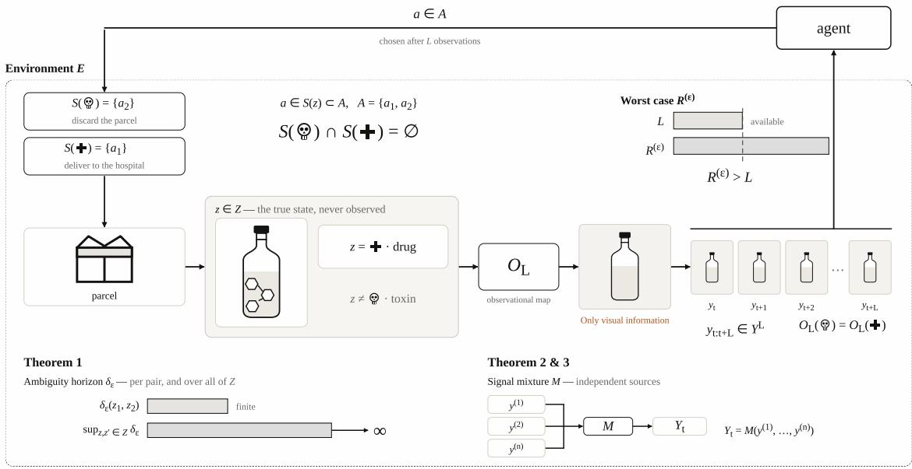

# AI Safety Considerations for Agents With Limited Time to Act

Leo Zeitler 1 ∗, Jack Richings 1, Victoria Nockles 1

1The Alan Turing Institute

96 Euston Road

London, NW1 2DB, United Kingdom

∗lzeitler@turing.ac.uk

## Abstract

In the wake of the increasingly public discussion about AI alignment, recent work has tried to propose specific AI architectures that behave safely. However, the proposed arguments that seemingly demonstrate proved alignment mostly neglect the environment the agent needs to act in. We discuss theoretical bounds for agent-agnostic safety guarantees in environments that can only be partially observed and within which an action is required within limited time. We introduce two realistic scenarios, one with an infinite state space and one with signal mixture. In these scenarios, we prove that even a perfect agent cannot guarantee safe behaviour. It will be argued that for any proof of AI safety or alignment, the environment and associated safe actions need to be specifically considered together with the agent.

## Introduction

Providing safe AI solutions is pivotal when using autonomous agents in many domains, for example defence, but proving safety is notoriously dificult. The impossibility of general safety guarantees has been previously discussed and proved (Rice 1953; de Melo et al. 2024; Yao 2025; Nourizadeh 2025). In spite of this, guaranteed safe AI, which includes a probabilistic world model, safety-specifications, and a verifier, was proposed as a versatile and safe AI system (Dalrymple et al. 2024). Even critics that proved impossibility of guaranteed general alignment claimed that alignment can be achieved when considering a specific model design or architecture (de Melo et al. 2024; Nourizadeh 2025). (Tegmark and Omohundro 2023) argued that provably safe artificial intelligence will become possible in the future with automated software verification. To date, most work has focused on the agent itself, and real-world conditions which require an action with incomplete information and limited time are typically ignored. Most literature is concerned with the decidability problem of the agent’s alignment rather than identifiability of the true environmental state, on which, ultimately, the alignment is based.

A relevant example is an agent at a dispatch center which needs to discard parcels with dangerous content after opening them based on a camera stream. The center also supplies a hospital which requires fast delivery of new medication.

Any delay risks the death of patients in the hospital, and the system needs to take action before it can ask for human validation. Upon detecting a glass vial with a transparent liquid, it is impossible to determine whether the substance is a malicious toxin or a life-saving drug based on the camera stream. The safe actions that should be performed in either state are mutually distinct. AI safety cannot be guaranteed, independent of the model used for the agent.

Here, we investigate how the action space and the environment must be structured to allow an autonomous controller to behave safely. The agent is seen as independent of the environment as well as the safe actions and the observational model, both of which are constraints imposed by the engineer to the controller. By drawing on Gold’s language identification in the limit (Gold 1967) and the theory of infinite games (Fridman, Löding, and Zimmermann 2011; Holtmann, Kaiser, and Thomas 2012; Zimmermann 2015), this paper introduces a formal framework and discusses the problem of identifying, within limited time, the true environmental state, which is distinct from the agent’s internal representation, to perform an adequate safe action. Superposition of signal sources, referred to in the field of voice recognition as the cocktail party problem (Cherry 1953), will be specifically considered. Arguing that realistic scenarios can give rise to superimposed observations, we prove that distinct environmental states, which were identifiable when using independently-observable signal sources, can become non-identifiable upon signal mixture, regardless of the autonomous agent. It follows that no AI system can guarantee safety without considering explicitly the environment, the observations that can be made, and the safe action space. AI alignment and safety studies that ignore these properties are fundamentally flawed. Rather than claiming completeness, the paper aims to provide formal examples where AI safety requirements are independent of the applied agent. An overview over the formalism is given in Table 1.

## Results

Let E denote the environment in which an artificial controller acts. Then, define a controller as latency-L if its action $a _ { t } \in$ A at time point t is a function $\pi _ { L } \left( y _ { t : t + L } \right)$ of observations $y _ { t : t + L } \in \bar { \mathcal { D } } ^ { L }$ , meaning that the system can make maximally L more observations before taking an action. Time is quantized, such that there is an observation at each time point t. It is assumed that $E$ is in a state $z \in { \mathcal { Z } }$ that can only be partially observed by the controller and is therefore hidden.

Figure 1: Two environmental states can become observationally indistinguishable under real-world conditions. Thi schema provides intuition of bounds to AI-safety claims that are independent of the used model. Consider an agent that needs to forward life-saving medicine to a hospital but is also required to discard hazardous items. The action is decided using image analysis taken from a video stream. When it finds a vial with a transparent liquid, the environmental state in which the liquid is a dangerous toxin is observationally indistinguishable from a liquid that is used for medication. The safe action in both states are mutually distinct, and no autonomous agent can guarantee safety.
<table><tr><td>Symbol</td><td>Explanation</td></tr><tr><td> $\overline { { E } }$ </td><td>Partially-observable environment</td></tr><tr><td> $L$ </td><td>Latency, number of observations before an action is required. It is a quantity imposed by the engineer or the environment</td></tr><tr><td> $a \in { \mathcal { A } }$ </td><td>Action space</td></tr><tr><td> $y _ { t : t + L } \in \mathcal { V } ^ { L }$ </td><td>Observations made during latency</td></tr><tr><td> $z \in { \mathcal { Z } }$ </td><td>Environmental state space</td></tr><tr><td> $O _ { L }$ </td><td>Observational map,</td></tr><tr><td> $a \in S ( z ) \subset { \mathcal { A } }$ </td><td>observations that can be made from an environmental state Safe actions associated to an environmental state</td></tr><tr><td>€</td><td>Probability threshold with which the system is allowed to error</td></tr><tr><td> $\delta _ { \epsilon }$ </td><td>Ambiguity horizon, the number of observations</td></tr><tr><td> $\mathcal { V } _ { k } ^ { \epsilon }$ </td><td>needed to distinguish any two environmental states Set of environmental states that</td></tr><tr><td> $\hat { \mathcal { V } } _ { k } ^ { \epsilon }$ </td><td>require more than k observations before being distinguishable Agent&#x27;s representation of the set of environmental states</td></tr><tr><td></td><td>that require more than k observations before being distinguishable</td></tr><tr><td> $R ^ { ( \epsilon ) }$ </td><td>Worst-case scenario of the number of observations necessary before the agent can identify a safe action</td></tr><tr><td> $Y _ { t }$ </td><td>Vector of observations from independent signal sources</td></tr></table>

Table 1: Mathematical symbols and concepts used throughout the paper.

Let ${ \cal O } _ { L } : \mathcal { Z } \longrightarrow \mathcal { V } ^ { L }$ be the observational map, such that $O _ { L } ( z ) \ = \ y _ { t : t + L }$ are the observations for a latent state z which are perceived by the agent before selecting an action $a _ { t } . O _ { L }$ defines the observable part of the environment, i.e. the input to the agent. If there are $z , z ^ { \prime } \in { \mathcal { Z } }$ with $O _ { L } ( z ) =$ $O _ { L } ( z ^ { \bar { \prime } } )$ while the required actions are $ { \boldsymbol { a } } (  { \boldsymbol { z } } ) \neq  { \boldsymbol { a } } (  { \boldsymbol { z } } ^ { \prime } )$ , then no deterministic latency-L controller can be correct on both $z$ and $z ^ { \prime }$

This can be easily extended to a safety framework. Let $S ( z ) \subset { \mathcal { A } }$ be a set of safe actions when the environment is in state z. If two latent states $z , z ^ { \prime }$ become observationally indistinguishable with $O _ { L } ( z ) = \stackrel { } { O } _ { L } ( z ^ { \prime } )$ but $\begin{array} { r l r } { S ( z ) \cap S ( z ^ { \prime } ) } & { { } = } & { } \end{array}$ ∅, then no latency-L controller can guarantee safety for both z and $z ^ { \prime }$

We claim that observational indistinguishability exists in open environments, which are here defined as settings that are only partially observable by the agent. L governs the tradeof between reliability and performance. $L$ should be minimised for the latency-L controller to be eficiently operational in the environment, but it must be large enough to minimise the occurrence of observational indistinguishability. The value of L is an engineering choice which requires a measurable quantity.

The ambiguity distance between $z , z ^ { \prime } \in { \mathcal { Z } }$ will be defined as $\delta _ { \epsilon } ( z , z ^ { \prime } ) \stackrel { \sim } { = } \operatorname* { i n f } \{ \lambda | \mathrm { P r } \left[ O _ { \lambda } ( z ) \neq O _ { \lambda } ( z ^ { \prime } ) \right] \geq 1 - \epsilon \} , \mathrm { i . e }$ . the latency $L ^ { \prime }$ after which z becomes distinguishable from $z ^ { \prime }$ with probability $1 - \epsilon$ . Note that whilst $O _ { L }$ is deterministic, the environment might not be,justifying the stochastic definition of $\delta _ { \epsilon }$ . In the following, only deterministic environments will be considered except stated otherwise, and the subscript ϵ will be dropped.

This allows formulating the following objective for smart systems with safety requirements. Introduce $\mathcal { V } _ { \lambda } ( y _ { t : t + \lambda } ) =$ $\{ z \in \mathcal { Z } | O _ { \lambda } ( z ) = \overset { \quad } { y _ { t : t + \lambda } } \}$ the set of all environmental states that lead to the same λ observations. Note that this property is fundamentally limited by the observational map $O _ { L }$ , and it is independent of which AI model is used. Training the agent aims to find an internal representation $\hat { \mathcal { Z } }$ for which the equivalently defined set $\hat { \mathcal { V } } _ { \lambda } ^ { ( \epsilon ) } ( y _ { t : t + \lambda } ) = \{ \hat { z } \in \hat { \mathcal { Z } } | O _ { \lambda } ( \hat { z } ) =$ $y _ { t : t + \lambda } \}$ collapses in a sequence as quickly as possible with $\hat { \mathcal { V } } _ { 0 } \supseteq \hat { \mathcal { V } } _ { 1 } \supseteq \hat { \mathcal { V } } _ { 2 } . . . \supseteq \hat { \mathcal { V } } _ { L }$ . Note that this is bounded by the true environmental state sequence $\nu _ { k }$ , which is approached by $\hat { \mathcal { V } } _ { k } .$ . Consequently, for an environment $E ,$ an observation map $O$ , and safe action ${ \mathcal { S } } _ { : }$ guaranteed ϵ-safety at latency-L requires $\textstyle \bigcap _ { z \in \mathcal { V } _ { I } } S ( z ) \neq \emptyset$ over all observations.

The safety of an AI system is governed by the worst-case scenario $R ^ { ( \epsilon ) } = \operatorname* { s u p } \{ \delta _ { \epsilon } ( z , z ^ { \prime } ) : \mathcal { S } ( z ) \cap \mathcal { S } ( z ^ { \prime } ) = \emptyset \}$ , which will be referred to as ϵ-safety. ϵ will be omitted in the following for deterministic environments except if stated otherwise. Note that R is more dependent on the observation model, rather than the type or implementation of the agent. Three cases can be identified.

Safe: When $R < L < \infty ,$ , ϵ-safety can be assured.

Application-incompatible: When $L _ { a v a i l a b l e } < R < \infty .$ guaranteed ϵ-safety is impossible but can be gauged.z is delayed identifiable.

Unbound: When $R = \infty ,$ , no finite time horizon can guarantee ϵ-safe behaviour. z is non-identifiable.

This gives rise to the question of how safe actions need to be designed specific to the environment to allow ϵ-safety.

## Infinite state space can lead to unbounded delay

It is assumed that many real-world applications for autonomous agents include an infinite number of environmental states, $\mathrm { i . \bar { e } . } \left| \mathcal { Z } \right| = \infty$ . This section describes properties of the safe action space to allow ϵ-safety by demonstrating that there exist constructions of the maximum ambiguity $\delta ,$ which is dependent on the observational map, for which the maximum over the state space $\mathcal { Z }$ is unbound. For this, Z is defined as an ordered structure

Definition 1. $( \mathcal { Z } , \gamma )$ is an ordered structure, with $\mathcal { Z }$ the set of environmental states, and the relationship $\gamma ( z , z ^ { \prime } )$ indicates $\mathrm { s u p } \{ \mathrm { s u p } _ { z ^ { \prime \prime } \in \mathcal { Z } } \delta ( z , z ^ { \prime \prime } )$ $\mathrm { s u p } _ { z ^ { \prime \prime } \in \mathcal { Z } } \delta ( z ^ { \prime } , \overline { { z ^ { \prime \prime } } } ) \}$ $\mathrm { s u p } _ { z ^ { \prime \prime } \in \mathcal { Z } } \delta ( z ^ { \prime } , \bar { z ^ { \prime \prime } } )$

Theorem 1. Let $O _ { n } : \mathcal { Z } \longrightarrow \mathcal { V } ^ { n }$ be an observational map with n observations, and the environmental latent state space $\mathcal { Z }$ is infinite. If there exists a subset $\bar { \mathcal { Z } } \subseteq \mathcal { Z }$ , for which $( \bar { \mathcal { Z } } , \gamma )$ is well defined, and for which there is a isomorphic map $\phi : ( \bar { \mathcal { Z } } , \gamma ) \longrightarrow ( \mathbb { N } , \angle )$ , then every pair $\bar { z } , \bar { z } ^ { \prime } \in \mathcal { Z } ^ { \prime }$ has finite ambiguity distances $\dot { \delta } ( \bar { z } , \bar { z } ^ { \prime } ) < \mathrm { \infty } ,$ , but sup $\delta ( \bar { z } , \bar { z } ^ { \prime } ) = \infty ,$ and consequently, sup $\dot { \delta } ( z , \dot { z } ^ { \prime } ) = \infty$

Proof. Let $\bar { \mathcal Z } \subseteq \mathcal { Z }$ , and $\phi : ( \bar { \mathcal { Z } } , \gamma ) \longrightarrow ( \mathbb { N } , \angle )$ an isomorphism between the two ordered sets. Select $\bar { z } , \bar { z } ^ { \prime } \in \bar { \mathcal { Z } }$ with $\begin{array} { r } { \gamma ( \bar { z } , \bar { z } ^ { \prime } ) = \operatorname* { s u p } _ { \bar { z } ^ { \prime \prime } \in \bar { \mathcal { Z } } } \delta ( \bar { z } , \bar { z } ^ { \prime \prime } ) = n < \infty } \end{array}$ by construction of δ for Z¯. Any finite subset $\hat { \mathcal { Z } }$ has $\begin{array} { r l } { \mathrm { s u p } _ { \hat { z } , \hat { z } ^ { \prime } \in \hat { \mathcal { Z } } } \gamma ( \bar { z } , \bar { z } ^ { \prime } ) = } & { { } } \end{array}$ $\delta ( z , z ^ { \prime } ) ~ < ~ \infty$ . It is clear that any finite subset $\hat { \mathcal { Z } }$ has $\begin{array} { r } { \operatorname* { s u p } _ { \hat { z } , \hat { z } ^ { \prime } \in \hat { \mathcal { Z } } } \gamma ( \bar { z } , \bar { z } ^ { \prime } ) = \delta ( z , z ^ { \prime } ) < \infty } \end{array}$ as all $\delta ( \hat { z } , \hat { z } ^ { \prime } ) < \infty$ for $\hat { z } , \hat { z } ^ { \prime } \in \hat { \mathcal { Z } } .$ Due to the isomorphism of $\phi ,$ it follows that for $\bar { z } \neq \bar { z } \in \bar { \mathcal { Z } } ,$ , if $\gamma ( \bar { z } , \bar { z } ^ { \prime } )$ then $\phi ( \bar { z } ) ~ < ~ \phi ( \bar { z } ^ { \prime } )$ ). $\mathbf { A } \mathbf { s }$ there exists for every m $\in \mathbb { N } \mathrm { ~ a ~ } n \in \mathbb { N }$ with $m \ < \ n ,$ it follows due to the bijectivity of the isomorphic map that $\gamma ( \phi ^ { - 1 } ( m ) , \phi ^ { - 1 } ( n ) )$ . The supremum over N is infinity. Since the order relationship γ is defined over the supremum of the distinguishability of the two environmental states, it follows that $\begin{array} { r } { \operatorname* { s u p } _ { \bar { z } , \bar { z } ^ { \prime } \in \bar { { \mathcal Z } } } \delta \big ( \bar { z } , \bar { z } ^ { \prime } \big ) = \infty } \end{array}$ , although every tested pair had a finite ambiguity distance. □

Any empirical empirical testing can only evaluate a finite number of environmental states, which corresponds to the set $\hat { \mathcal { Z } }$ . ϵ-safety can only be formally shown if $R ,$ which depends on the ambiguity distance $\delta$ of environmental states with mutually distinct safety actions, does not grow with $\delta .$ However, as shown in Theorem 1, any testing which is based on finite sampling can provide misleading upper bounds for δ. Any attempt to prove ϵ-safety needs to also show that one of the following can be met:

1. The set $\{ z : \exists z ^ { \prime } , S ( z ) \cap S ( z ^ { \prime } ) = \emptyset \}$ is finite. R can be explicitly computed.

2. The injective map ϕ does not exist.

The first criterion is trivially met $\mathrm { i f } \ | \cup _ { z \in \mathcal { Z } } S ( z ) |$ is finite. Note that even if there does not exist an injective map ϕ you might not be able to compute δ explicitly, yet it is guaranteed that R will be bounded. An example for a system for which $\phi$ exists are environments where the observation itself can only be made after a lapsed time $T ,$ as it is the case for sound or light. Here, T increases as a function of distance, and two states $z _ { m }$ and $z _ { n }$ can only be distinguished after the signal arrives, which can, if the distance can be aribitrarily long, go to infinity.

## Considerations regarding signal superposition in the environment

Special attention is required for open environments that are also subject to superpositions of observations (Cherry 1953). This can render latent states z non-identifiable, as proved below. Importantly, only the case of observational signal mixture is considered here, and the superposition of latent environmental states z and $z ^ { \prime }$ is ignored. Let $Y _ { t } = \left( y _ { t } ^ { ( 1 ) } , . . . , y _ { t } ^ { ( k ) } \right)$ be the vector of k clean observations from k signal sources $s _ { k }$ . Let M be the mixture operator, such that $\breve { \bar { Y } } _ { t } = M ( Y _ { t } )$ is the superimposed signal.

Theorem 2. Consider an observation map $O _ { L } ^ { c l e a n }$ when all k signal sources are separately observable, and a vector ofclean signal observations $Y _ { t : t + L } = \left( y _ { t : t + L } ^ { ( 1 ) } , . . . , y _ { t : t + L } ^ { ( k ) } \right)$ . There exist environments $E$ and non-injective mixture operators M on z and $z _ { 2 }$ in Z for which $\delta _ { c l e a n } ( z _ { 1 } , z _ { 2 } ) < \infty .$ , such that the superposition observation $\bar { Y } _ { 0 : t + L } = M \stackrel { \cdot } { \circ } O _ { L } ^ { c l e a n } ( z _ { 1 } ) = M \circ$ $O _ { L } ^ { c l e a n } ( z _ { 2 } )$ for all L. It follows that $\delta _ { m i x t u r e } ( z _ { 1 } , z _ { 2 } ) = \infty$

Proof. The theorem is proved by example. Consider an environment where the incoming observations can be described by a d-dimensional binary vector $Y _ { t } \in \{ 0 , 1 \} ^ { d } d > 2$ . Let there be three observations $y _ { 1 . . . 3 } \colon y _ { 1 }$ is zero everywhere except at index $i , y _ { 2 }$ is zero everywhere except at index j with $i \neq j$ , and y3 is zero everywhere except at i and j. y1 and $y _ { 2 }$ correspond to the latent state $z _ { 1 } ,$ , and $y _ { 3 }$ corresponds to z with $z _ { 1 , 2 } \in { \mathcal { Z } }$ . It is assumed that observed signals $y _ { 1 , \ldots , 3 }$ are generated by the signal sources $s _ { 1 , \ldots , 3 }$ . If no signal is generated by a source $s _ { i } ,$ it emits the zero vector 0 that only contains zeros. Note that $z _ { 1 }$ contains two signal sources, whereas z contains only one. Assume first no signal mixture, and every signal is individually observable with $Y _ { t } = ( s _ { 1 } , s _ { 2 } , s _ { 3 } )$ . When the latent state is $z _ { 1 }$ , the observed signal is $Y _ { t } ^ { ( 1 ) } = ( s _ { 1 } = y _ { 1 } , s _ { 2 } = y _ { 2 } , s _ { 3 } = \mathbf { 0 } )$ , whereas for $z _ { 2 } ,$ , the observation is $Y _ { t } ^ { ( 2 ) } = ( s _ { 1 } = \mathbf { 0 } , s _ { 2 } = \mathbf { 0 } , s _ { 3 } = y _ { 3 } )$ As every signal is cleanly observable, $Y _ { t } ^ { ( 1 ) } \neq Y _ { t } ^ { ( 2 ) }$ and $\delta ( z _ { 1 } , z _ { 2 } ) = 0 < \infty$

Now, set the mixture operator M to be the arithmetic addition over the passed signals. When the latent state is $z _ { 1 }$ the observed signal is $\bar { Y } _ { t } ^ { ( 1 ) } = M \circ Y _ { t } ( s _ { 1 } = y _ { 1 } , s _ { 2 } = y _ { 2 } , s _ { 3 } =$ 0), which is 1 at i and j and zero otherwise. Similarly, for $z _ { 2 } .$ the agent observes $\bar { Y } _ { t } ^ { ( 2 ) } = M \circ Y _ { t } ( s _ { 1 } = \mathbf { 0 } , s _ { 2 } = \mathbf { 0 } , s _ { 3 } = y _ { 3 } )$ which is, by definition, 1 at i and j and zero otherwise. It follows that M is non-injective, as $\Breve { Y } _ { t } ^ { ( 1 ) } = \bar { Y } _ { t } ^ { ( 2 ) }$ for all $t ,$ and $\delta ( z _ { 1 } , z _ { 2 } ) = \infty$ □

This allows also formulating a similar theorem for which the entire ϵ-safety assessment of an agent changes.

Theorem 3. There exist environments E for which the clean signal observation has a finite ambiguity horizon $R _ { c l e a n } <$ $\infty ,$ , but for which a non-injective mixture operator M on a subset of admissible source configurations generates an ambiguity horizon $R _ { m i x t u r e } = \infty$

Proof. The proof is identical to 2, except that the entire latent state space is $\mathcal { Z } = \{ z _ { 1 } , z _ { 2 } \}$ with $\hat { S } ( \overset { \cdot } { z _ { 1 } } ) \cap S ( z _ { 2 } ) = \varnothing$ . It follows that $R _ { c l e a n } = 0 \dot { < } \infty$ , whereas $R _ { m i x t u r e } = \infty .$ □

Note that the superposition is a function of the observable signal sources in the environment, and it is therefore dependent on what the agent can perceive. It does not rely on a specific AI model. Moreover, non-identifiability can arise even under linear superposition. It follows that there can be no ϵ-safety guarantee for any latency-L controller in environments with signal mixture.

## Discussion

This paper proves that general guarantees of ϵ-safe systems for latency-L controllers are fundamentally flawed when the environment, observational model, and safe actions are not explicitly considered. Importantly, our proofs rely on the observational model of the environment, and it is independent of the choice of agent model or training. The following section discusses the results of this paper in context of the literature.

The superposition problem is widely known in various fields, including speech recognition (Cherry 1953), radar sensing (Wiley 2006; Gunn et al. 2025), and genetics (Zeitler et al. 2024). It therefore represents a realistic problem for autonomous agents. Theorem 2 and 3 prove that ϵ-safety cannot be guaranteed, completely independent of the agent, its design, and training.

The results presented here are motivated by Gold’s language identification in the limit (Gold 1967). Gold defines collapsing uncertainty over discrete time observations. Moreover, the theoretical bounds in both works are dependent on the structure of the environment and the observational model rather than the agent itself. However, the results presented here address a diferent problem. The ϵ-safety results require an action by an agent within an L-bound time horizon based on an incompletely-observable latent state z, and observations $Y _ { t }$ from multiple signal sources can be superimposed through a mixture operator M. In contrast, (Gold 1967) uses language theory to prove that, with an infinite time horizon as well as clean and separate observations, negative instances provided by an informant are required to identify any superfinite class of languages, unless a restrictive, computable ordering is imposed.

The formal construction presented here draws on the theory of infinite games with bounded L-delay (Fridman, Löding, and Zimmermann 2011; Holtmann, Kaiser, and Thomas 2012; Zimmermann 2015). More precisely, when defining an input and output player A and $B ,$ an infinite game can be seen as a bit sequence $a _ { 0 } b _ { 0 } a _ { 1 } b _ { 1 } . . . ,$ where the individual sequences $a _ { 0 } a _ { 1 } . . . \in \Sigma _ { A } ^ { \omega }$ and $b _ { i } \in \Sigma _ { B } ^ { \omega }$ are infinite words. (Holtmann, Kaiser, and Thomas 2012) investigated ω-regular winning conditions and proved that the upper bound for deciding whether a strategy is winning grows exponentially with environmental states and safe action space (the vocabulary was adapted to be in line with the formalism of this paper). (Fridman, Löding, and Zimmermann 2011) showed that contextfree winning conditions can require unbound lookahead. In contrast, Theorem 1 presented in this paper proves that a finite lookahead horizon can break down when considering an infinite environmental state space, even if every pair of latent states $z , z ^ { \prime } \in { \mathcal { Z } }$ have finite non-identifiablility. Whilst also demonstrating infinite bounds, it does not draw on the formal theory of infinite games, and it models real-world conditions which are only partially observable and which can therefore induce a non-identifiability problem. It is independent of the formulation of the winning condition, and the safe space must be explicitly structured to account for unbounded R. Furthermore, Theorems 2 and 3 prove that non-injective mixture operators M can generate infinitely-long observational indistinguishability even when $| \mathcal { Z } | < \infty$ . Establishing a finite upper bound is impossible. Signal superposition has not been addressed in the context of infinite games.

Guaranteed safe AI was previously proposed as a combination of a world model, a set or distribution of safety specifications, and a verifier (Dalrymple et al. 2024). Although the world model is formally conditioned on observations, the formalisms in (Dalrymple et al. 2024) do not contain any specifications of the observational map $O _ { L }$ or the environment, nor any time horizon within which the agent must act. We argue that when the environment is only partially observable, there can be states z and $z ^ { \prime }$ with associated safe states $S ( z )$ and $\boldsymbol { S } ( \boldsymbol { z } ^ { \prime } )$ such that $O _ { L } ( z ) = O _ { L } ( z ^ { \prime } )$ . Any ϵ-safety guarantee of a system needs to prove ${ \cal S } ( z ) \cap { \cal S } ( z ^ { \prime } ) \neq \emptyset$ for all $z , z ^ { \prime } \in \mathcal { V } _ { L }$ and for all possible observations $y _ { t : t + L }$ . If $S ( z ) \cap S ( z ^ { \prime } ) = \emptyset$ , no latency-L controller can guarantee ϵ-safety, even if the agent is equipped with an optimal world model and verifier. ϵ-safety is mostly dependent on the design of the safety specifications $\dot { S ( z ) }$ which require to be non-empty over $\gamma _ { L }$ , a specification which can be independent of the agent.

Theorem 1 has been stated in a similar way for infinitedimensional environmental (world) vectors (Yao 2025). However, the present paper puts the emphasis on the number of states rather than the dimensionality of the vector. Moreover, the paradox cited in (Yao 2025) argues that the rules required for analysing a complex environment cannot be enumerated, from which follows that alignment cannot be guaranteed, and it remains oblivious of environments were this can be done. The present paper makes the stronger argument that ϵ-safety cannot be guaranteed as a function of the environmental latent space and the observations, and it is independent of the rule set, agent, or the task.

## Conclusions

Instead of focusing on the AI agent, this paper formally proves that safety for autonomous systems, that need to act within a limited time horizon can only guaranteed when considering explicitly the partially-observable environment together with the safe states. In particular, non-injective signal mixture of independent signal sources can require infinite lookahead. The paper contributes to the formal assessment of AI systems and their alignment under real-world conditions.

## Acknowledgments

This work was supported by the Turing’s Defence and Security programme through a partnership with the UK government in accordance with the framework agreement between HMG and The Alan Turing Institute. Claude Opus 5 and ChatGPT-5.6 Luna were used for developing the framework. Figure 1 was generated using Claude Opus 5. We thank Varun Chhabra for their insightful comments and corrections.

## References

Cherry, E. C. 1953. Some experiments on the recognition of speech, with one and with two ears. Journal ofthe acoustical society ofAmerica, 25: 975–979.

Dalrymple, D.; Skalse, J.; Bengio, Y.; Russell, S.; Tegmark, M.; Seshia, S.; Omohundro, S.; Szegedy, C.; Goldhaber, B.; Ammann, N.; et al. 2024. Towards guaranteed safe AI: A framework for ensuring robust and reliable AI systems. arXiv preprint arXiv:2405.06624.

de Melo, G. A.; Maximo, M. R. O. D. A.; Soma, N. Y.; and de Castro, P. A. L. 2024. On the Undecidability of Artificial Intelligence Alignment: Machines that Halt. arXiv preprint arXiv:2408.08995.

Fridman, W.; Löding, C.; and Zimmermann, M. 2011. Degrees of lookahead in context-free infinite games. Leibniz International Proceedings in Informatics Lipics, 12: 264– 276.

Gold, E. M. 1967. Language identification in the limit. Information and control, 10(5): 447–474.

Gunn, E.; Hosford, A.; Mannion, D.; Williams, J.; Chhabra, V.; and Nockles, V. 2025. Radar pulse deinterleaving with transformer based deep metric learning. In 2025 IEEE International Radar Conference (RADAR), 1–6. IEEE.

Holtmann, M.; Kaiser, L.; and Thomas, W. 2012. Degrees of lookahead in regular infinite games. Logical Methods in Computer Science, 8.

Nourizadeh, M. 2025. No Red Lines: The Impossibility of Formal Safety Guarantees in Large Language Models.

Rice, H. G. 1953. Classes of recursively enumerable sets and their decision problems. Transactions of the American Mathematical society, 74(2): 358–366.

Tegmark, M.; and Omohundro, S. 2023. Provably safe systems: the only path to controllable AGI. arXiv preprint arXiv:2309.01933.

Wiley, R. 2006. ELINT: The interception and analysis of radar signals. Artech.

Yao, J. 2025. The Alignment Trap: Complexity Barriers. arXiv preprint arXiv:2506.10304.

Zeitler, L.; Goldar, A.; Denby Wilkes, C.; and Soutourina, J. 2024. The next-generation sequencing—chess problem. NAR Genomics and Bioinformatics, 6(4): lqae144.

Zimmermann, M. 2015. Unbounded lookahead in WMSO+ U games. arXiv preprint arXiv:1509.07495.