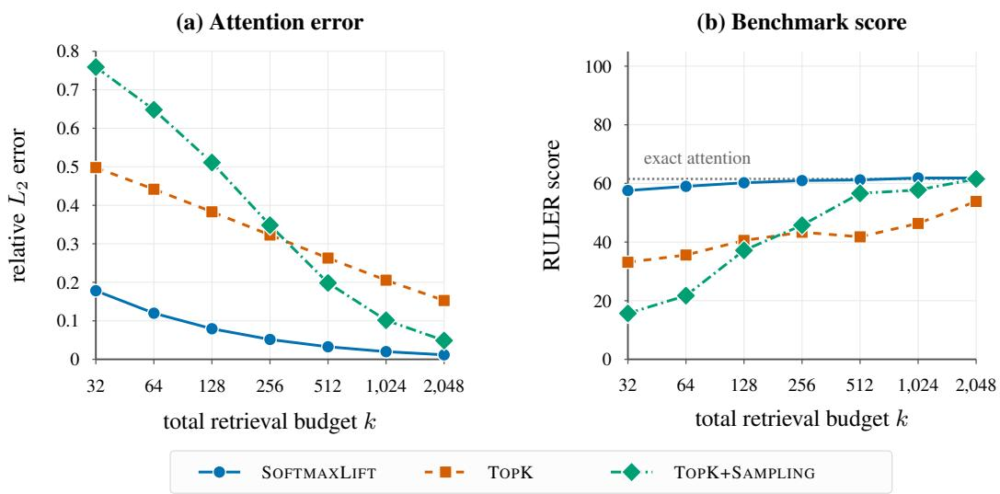
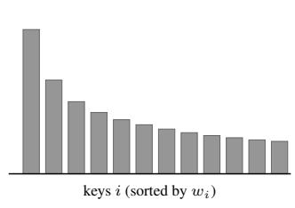
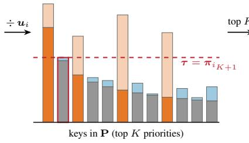
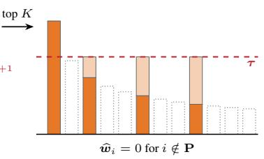
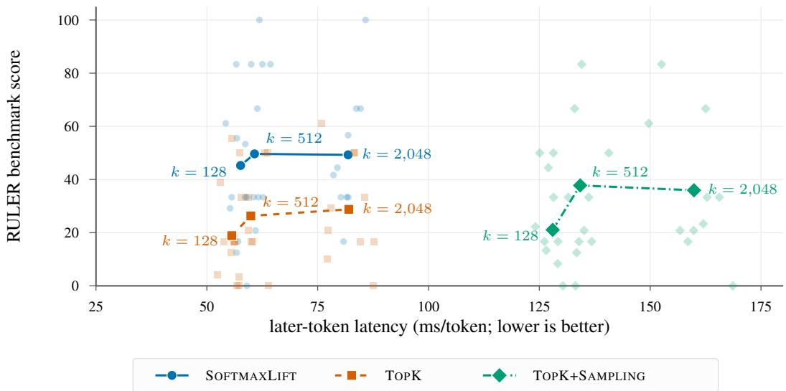

# ATTENTION VIA BLACK-BOX VECTOR SEARCH

Stepan Zharkov<sup>∗</sup> Columbia University

Krish Singal<sup>∗</sup> University of Pennsylvania

Ashwin Padaki<sup>∗</sup> University of Pennsylvania

Alexandr Andoni Columbia University

## ABSTRACT

Sparse attention mechanisms estimate attention over n tokens using a small subset of keys. Many existing approaches use maximum inner product search (MIPS) to retrieve the heaviest keys, which motivates the following question: given blackbox access to a MIPS oracle, how many keys must be retrieved to output an $\varepsilon -$ accurate attention estimate?

We answer this question by unifying prior approaches through the framework of priority sampling. With a single MIPS index, we show that $\Theta ( { \sqrt { n } } / \varepsilon )$ retrieved keys are both sufficient and necessary. With Θ(log n) indices, we give an algorithm that retrieves only $O ( \log n + 1 / \varepsilon ^ { 2 } )$ keys and prove that this is near-optimal. More generally, we design algorithms that establish a smooth tradeoff between the number of MIPS indices and number of retrieved keys. We then show that if we allow augmentation of keys and queries, we can bypass the above lower bounds: there exists a simple priority-sampling estimator using a single MIPS index and ${ \cal O } ( 1 / \varepsilon ^ { 2 } )$ retrieved keys. When integrated into LLM inference, our algorithms outperform top-k and sampling approaches used in prior work and yield attention approximation that scales favorably to long contexts.

## 1 INTRODUCTION

Transformer-based large language models (LLMs) increasingly rely on long context windows to process documents, codebases, and extended reasoning traces. A major bottleneck to scaling these context windows is the attention mechanism (Vaswani et al., 2017). Given an existing context of n tokens, computing attention for each new token requires comparing it against all preceding tokens. Formally, given key vectors $x _ { 1 } , \ldots , x _ { n } \in \mathbb { R } ^ { d }$ , value vectors $\mathbf { \bar { \boldsymbol { v } } } _ { 1 } , \ldots , \mathbf { \bar { \boldsymbol { v } } } _ { n } \mathbf { \bar { \boldsymbol { \in } } } \mathbb { R } ^ { D }$ , and a query vector $q \in \mathbb { R } ^ { d }$ , the attention mechanism computes

$$
\mathrm { A t t n } ( q ) : = \sum _ { i = 1 } ^ { n } { \frac { \kappa ( q , x _ { i } ) } { \sum _ { j = 1 } ^ { n } \kappa ( q , x _ { j } ) } } \cdot v _ { i } ,
$$

where $\kappa ( q , x ) = \exp ( \left. q , x \right. )$ ) is the softmax kernel.<sup>1</sup>

Recent work circumvents the cost of computing the attention mechanism using the approach of sparse attention (Kitaev et al., 2020; Zaheer et al., 2020). Rather than attending to every token, sparse attention mechanisms identify a small subset of tokens and use them to approximate the true attention vector. The attention weight of token i grows exponentially with $\left. q , x _ { i } \right.$ , suggesting a natural strategy: retrieve the keys that have the largest inner product with the query. This is precisely a maximum inner product search (MIPS) problem, a well-studied primitive in vector search (Shrivastava & Li, 2014; Neyshabur & Srebro, 2015). Indeed, a growing body of work builds sparse attention mechanisms with MIPS as the core subroutine, including RetrievalAttention (Liu et al., 2025), HashAttention (Desai et al., 2025), and vAttention (Desai et al., 2026).

A common feature of MIPS-based sparse attention mechanisms is that they generally treat the underlying MIPS algorithm as a black box: the estimator specifies which keys to retrieve and how to utilize them, but is agnostic to how those keys are found.<sup>2</sup> Using MIPS as a black box is attractive because vector search is already a highly optimized problem. Decades of algorithmic and engineering progress have produced extremely performant approximate nearest neighbor and MIPS algorithms, as documented in public benchmarks such as ANN-Benchmarks (Aumuller et al., 2020) and¨ VIBE (Ja¨asaari et al., 2026). Any sparse attention method that is agnostic to the underlying search¨ implementation can immediately benefit from state-of-the-art algorithms and future improvements.

In this paper, we take a theoretical perspective on MIPS-based sparse attention. We assume access to a perfect MIPS oracle and study the retrieval strategy: the algorithm deciding which keys to retrieve and how to use the retrieved keys to estimate attention. We begin with the following question:

## Given a perfect MIPS oracle, what is the optimal retrieval strategy for estimating attention within provably low error?

We make substantial progress on this question by systematically characterizing the tradeoff between the number of MIPS indices used by the algorithm and the number of keys it retrieves for an $\varepsilon -$ accurate estimate. Some points on this tradeoff were already known for the related problem of kernel density estimation (KDE), and these results extend to attention: Mussmann et al. (2017) gives a oneindex algorithm retrieving $O ( \sqrt { n } / \varepsilon )$ keys, while Mussmann et al. (2026) gives an algorithm using $O ( \log n )$ indices and retrieving only $O ( \log n / \varepsilon ^ { 2 } )$ keys.

We unify these results under a common algorithmic framework of priority sampling (Duffield et al., $2 0 0 7 ;$ Daliri et al., 2024b), and we generalize them significantly. For a budget $\bar { T }$ on the number of indices kept, we give adaptive and non-adaptive algorithms achieving precise oracle–retrieval tradeoffs. In the two oracle budget settings studied in prior work, we obtain a tight answer: for $T = 1$ , we prove that $O ( \sqrt { n } / \varepsilon )$ retrieved keys is optimal up to constant factors; for $T = \Theta ( \log n )$ indices, we give an adaptive algorithm retrieving $O ( \log n + \dot { 1 } / \varepsilon ^ { 2 } )$ keys and prove that it is optimal up to a log log n factor. Motivated by the strong lower bounds, we show that a slight relaxation of our model allows priority sampling to be implemented much more efficiently: lifting keys and queries into one extra dimension, our algorithm SOFTMAXLIFT retrieves only $\dot { O } ( 1 / \varepsilon ^ { 2 } )$ keys, independent of the context length n.

We also explore the practicality of SOFTMAXLIFT. We implement it in Llama-3.2-1B-Instruct using fast approximate MIPS oracles and evaluate it both on per-head attention error and end-to-end benchmarks. SOFTMAXLIFT substantially improves the accuracy–latency tradeoff over the top-k and sampling approaches common in prior work. Finally, we provide preliminary evidence that SOFTMAXLIFT can enable efficient sparse attention at context lengths of up to 1M tokens.

## 1.1 ATTENTION IN THE MIPS MODEL

We consider a model for computing attention given access to a black-box MIPS oracle.

Definition 1 (MIPS oracle). For $x _ { 1 } , \ldots , x _ { n } \in \mathbb { R } ^ { d }$ , a MIPS oracle supports the following operations:

• Build(S) creates a MIPS index on a subset $S \subseteq \lceil n \rceil$

$\mathsf { Q u e r y } ( q , k ; S )$ returns the min $\{ k , | S | \}$ pairs $( i , \langle q , x _ { i } \rangle )$ with largest inner products in $S . ^ { 3 }$

Definition 2 (MIPS model). A MIPS attention algorithm A operates in the following access model:

• Preprocessing. $\mathcal { A }$ receives the key and value vectors, selects subsets $S _ { 1 } , \ldots S _ { T } \subseteq [ n ]$ , and runs $\mathsf { B u i l d } ( S _ { t } )$ for $t \in [ T ]$ to instantiate MIPS indices.

• Query stage. A receives a query $q \in \mathbb { R } ^ { d }$ , but its access is limited to the following operations: it can run $\mathsf { Q u e r y } ( q , k ; S _ { t } )$ for $t \in [ T ]$ , or evaluate $\langle q , x _ { i } \rangle$ for an arbitrary $i \in [ n ]$ . By the end of its computation, algorithm A outputs an estimate $\mathrm { { \dot { A t t n } } } ( q )$ of the attention.

$\mathcal { A }$ is non-adaptive if, during the query stage, all MIPS queries and inner product evaluations are made simultaneously; otherwise, A is adaptive. The complexity of A is given by two metrics:

<table><tr><td>Oracle budget</td><td>Adaptive (Theorem 1)</td><td>Non-adaptive⁴ (Theorem 2)</td><td>Lower bound (Theorems 3, 4)</td><td>Softmax Lift (Theorem 5)</td></tr><tr><td> $T = 1$ </td><td> $O ( \sqrt { n } / \varepsilon )$ </td><td> $O ( \sqrt { n } / \varepsilon )$ </td><td> $\Omega ( { \sqrt { n } } / \varepsilon )$ </td><td> $O ( \varepsilon ^ { - 2 } )$ </td></tr><tr><td> $T = 2$ </td><td> $O ( n ^ { 1 / 3 } \varepsilon ^ { - 4 / 3 } )$ </td><td> $O ( n ^ { 1 / 3 } \varepsilon ^ { - 4 / 3 } )$ </td><td> $\begin{array} { r } { \Omega \left( \frac { \log n } { \log \log n } + \varepsilon ^ { - 2 } \right) } \end{array}$ </td><td></td></tr><tr><td> $T = \left\lceil \log _ { 2 } n \right\rceil$ </td><td> $O ( \log n + \varepsilon ^ { - 2 } )$ </td><td> $O ( \log n / \varepsilon ^ { 2 } )$ </td><td> $\begin{array} { r } { \Omega \left( \frac { \log n } { \log \log n } + \varepsilon ^ { - 2 } \right) } \end{array}$ </td><td></td></tr></table>

Table 1: Number of retrieved keys for ε-accurate attention for oracle budgets T. All lower bounds are implicitly capped at n. The final column performs an augmentation to the keys and query and is not subject to the lower bounds.

• Oracle cost: $C _ { \mathrm { o r a c l e } } ( \mathcal { A } ) = T$ , the number of MIPS indices constructed.

• Retrieval cost: $C _ { \mathrm { r e t r i e v a l } } ( { \cal A } ) = ( \sum k ) + r .$ , where the summation is over all MIPS queries $\mathsf { Q u e r y } ( q , k ; \cdot )$ made by A, and r is the number of direct inner product evaluations.

Definition 3 (Accuracy guarantee). An attention algorithm $\mathcal { A }$ is ε-accurate if, for every dataset of keys and values and every fixed query q,

$$
\mathbf { P r } \left[ \lVert \widehat { \mathrm { A t t n } } ( q ) - \mathrm { A t t n } ( q ) \rVert _ { 2 } \leq \varepsilon \cdot \operatorname* { m a x } _ { i \in [ n ] } \lVert v _ { i } \rVert _ { 2 } \right] \geq \frac { 2 } { 3 } ,\tag{1}
$$

where the probability is over the randomness of A. We note that measuring error with respect to the maximum value vector norm is common in prior work (Kochetkova et al., 2026; Schroder &¨ Mackey, 2026; Liberty et al., 2026) and is natural when, $\mathrm { e . g . }$ ., the value vectors have unit norm.

## 1.2 THEORETICAL RESULTS

We provide adaptive and nonadaptive algorithms achieving the following tradeoffs between retrieval cost and oracle cost.

Theorem 1 (Adaptive algorithm). For any oracle budget $T \geq 1$ and parameter $\varepsilon \in ( 0 , 1 )$ , there is an ε-accurate adaptive MIPS attention algorithm A with $C _ { \mathrm { o r a c l e } } ( \mathcal { A } ) \overset { \cdot } { \leq } T$ and

$$
C _ { \mathrm { r e t r i e v a l } } ( A ) \leq O \Big ( T + n ^ { 1 / ( T + 1 ) } \varepsilon ^ { - 2 + 2 / ( T + 1 ) } \Big ) .
$$

Theorem 2 (Non-adaptive algorithm). For any oracle budget $T \geq 1$ and parameter $\varepsilon \in ( 0 , 1 )$ there is an ε-accurate non-adaptive MIPS attention algorithm B with $C _ { \mathrm { o r a c l e } } ( \tilde { B } ) \leq T$ and

$$
C _ { \mathrm { r e t r i e v a l } } ( \mathcal { B } ) \leq O \Big ( T n ^ { 1 / ( T + 1 ) } \varepsilon ^ { - 2 + 2 / ( T + 1 ) } \Big ) .
$$

We show that the above tradeoffs are tight for $T = 1$ , even up to constant factors.

Theorem 3 (Lower bound for $T = 1 ) .$ . For sufficiently small $\varepsilon > 0 ,$ , any ε-accurate MIPS attention algorithm with $C _ { \mathrm { o r a c l e } } ( \mathcal { A } ) \leq 1$ has retrieval cost

$$
\Omega \left( \operatorname* { m i n } \{ n , \sqrt { n } / \varepsilon \} \right) .
$$

We also give a lower bound for arbitrary T showing that the $O ( \log n + 1 / \varepsilon ^ { 2 } )$ bound achieved by our adaptive algorithm is nearly tight for $\dot { T } = \Theta ( \log n )$

Theorem 4 (Lower bound for any T). For sufficiently small $\varepsilon > 0 ,$ , any ε-accurate MIPS attention algorithm must have

$$
C _ { \mathrm { r e t r i e v a l } } ( A ) \geq \Omega \left( \operatorname* { m i n } \left\{ n , { \frac { \log n } { \log \log n } } + { \frac { 1 } { \varepsilon ^ { 2 } } } \right\} \right) .
$$

Finally, we show that if we slightly extend the model to allow augmenting the keys (and the query) before constructing MIPS indices, we can achieve a much stronger upper bound.

Theorem 5 (Softmax lift). There is an ε-accurate attention algorithm Z that, after lifting the keys and queries into $\mathbb { R } ^ { d + 1 }$ , has $C _ { \mathrm { o r a c l e } } ( \mathcal { Z } ) = 1$ and $C _ { \mathrm { r e t r i e v a l } } ( \mathcal { Z } ) = \bar { O } ( 1 / \varepsilon ^ { 2 } )$

  
Figure 1: Quality as a function of the retrieval budget k with an exact FAISS-Flat MIPS oracle on 60 matched 128K-context RULER examples from 10 tasks. Top-k+sampling divides its budget evenly between retrieved and uniformly sampled keys.

## 1.3 EMPIRICAL RESULTS

We test the empirical performance of our algorithms by integrating them into Llama-3.2-1B-Instruct long context inference. We design a custom harness that allows for combining arbitrary retrieval strategies with arbitrary MIPS oracles. For each combination of retrieval strategy and oracle, the harness measures task accuracy and latency on a variety of 128k context tasks in the RULER suite (Hsieh et al., 2024). We benchmark the following retrieval strategies:

• TOPK. Request the top k keys from the oracle and use the partial attention sum on these keys as the estimator (e.g. Gupta et al. (2021); Liu et al. (2025)).

• TOPK+SAMPLING. Request k<sup>′</sup> keys from the oracle, and uniformly sample k − k<sup>′</sup> more keys. Compute the partial attention sum with the sampled keys weighted to create an unbiased estimator (e.g. Desai et al. (2026)).

• SOFTMAXLIFT, the priority sampling based strategy introduced in Algorithm 2.

• ADAPTIVEBUCKETS, the priority sampling based strategy introduced in Algorithm 3.

SOFTMAXLIFT outperforms the TOPK and TOPK+SAMPLING retrieval strategies commonly used in prior work (Figure 1). We also evaluate our approach on a small set of 1M context examples with the Llama-3.1-Nemotron-8B-UltraLong-1M-Instruct model. These experiments provide preliminary evidence that SOFTMAXLIFT scales well to even larger contexts. See Section 3 and Appendix C for the complete set of experimental results.

## 1.4 RELATED WORK

Sparse attention. Early sparse attention methods fixed the sparsity pattern in advance. Examples include strided or block-local attention (Child et al., 2019), local windows with a small set of global tokens (Beltagy et al., 2020), and mixtures of local, global, and random blocks (Zaheer et al., 2020). Reformer (Kitaev et al., 2020) takes a more adaptive approach, using locality sensitive hashing (LSH) to bucket queries and keys. A separate line of work evicts tokens from the KV cache based on accumulated attention mass on statistics collected over a calibration window (Zhang et al., 2023; Liu et al., 2023; Ge et al., 2024; Li et al., 2024; Xiao et al., 2024b). The drawback is that eviction i irreversible; a token cannot be recovered if a later query needs it. This limitation motivated queryaware methods that retain the full cache and select a subset per query. Different methods use pagelevel summaries (Tang et al., 2024; Xiao et al., 2024a), channel sparsification (Yang et al., 2024), or low-rank key projections (Singhania et al., 2024). More recent MIPS-based mechanisms (discussed in Section 1) build graph, clustering, quantization, or hashing indices over the keys (Liu et al., 2025; Hooper et al., 2025; Zhang et al., 2025; Desai et al., 2025; Mazare et al., 2025). A recurring obstacle´ for these approaches is that attention queries and keys follow different distributions. The same out-of-distribution phenomenon is studied in the vector search literature (Jaiswal et al., 2022; Chen et al., 2024), and it is one reason we treat the oracle as a black box. Finally, sparsity can also be built directly into the model at training time (Yuan et al., 2025), a direction orthogonal to ours.

Beyond top-k. The standard top-k approximation approach retrieves the k largest attention weights and renormalizes over them. Because it drops all remaining softmax mass, the reuslting estimator is biased. Chen et al. (2025) showed empirically that even exact top-k is beaten at equal budget by sampling keys in proportion to their attention weight. The work of (Zhu et al., 2025) builds on this by keeping the estimator but adapting the budget, retrieving enough keys to cover a p-fraction of the mass. Further work splits the distribution into a “heavy” head which is computed exactly and a tail which is sampled (Desai et al., 2026). A similar decomposition appears in Han et al. (2024); Karppa et al. (2022).

Priority sampling and sampling by search. Priority sampling (Duffield et al., 2007), known in statistics as sequential Poisson sampling (Ohlsson, 1998), draws a fixed-size sample supporting unbiased subset-sum estimation through Horvitz–Thompson weights (Horvitz & Thompson, 1952; Alon et al., 2005). Its variance is optimal in a strong sense (Szegedy, 2006; Daliri et al., 2024b), and it has recently been applied to inner product sketching (Daliri et al., 2024a). The observation behind our SOFTMAXLIFT algorithm is that a priority sample is determined by a top-k operation on perturbed weights, which is exactly what a MIPS oracle computes. Related ideas appear in the Gumbel-max literature, where Mussmann & Ermon (2016); Mussmann et al. (2017) sample from a log-linear model by perturbing scores with Gumbel noise and solving a MIPS instance, and the Gumbel-top-k trick extends this to sampling without replacement (Maddison et al., 2014; Kool et al., 2019). Spring & Shrivastava (2017) and Luo & Shrivastava (2018) instead treat the LSH table itself as the sampler; this is also the perspective adopted by Chen et al. (2025).

## 2 ALGORITHMS AND TECHNICAL OVERVIEW

We give an overview of the main algorithmic ideas in our paper. Our algorithms all share the same primitive of priority sampling and differ only in how they retrieve high-priority keys using MIPS.

A meta-algorithm via priority sampling (Appendix A.1). Fix a query q and let $w _ { i } = \kappa ( q , x _ { i } )$ denote the kernel weight of key i. To approximate attention, we must estimate both $\sum _ { i } w _ { i } \dot { v } _ { i }$ <sub>i</sub> and $\sum w _ { i }$ ; simply retrieving the largest weights may not give an accurate estimate. In priority sampling, the trick is to assign each key a random scale ${ \pmb u } _ { i } \sim \mathrm { U n i f } ( 0 , 1 ]$ and define the priority $\pi _ { i } : = w _ { i } / { \pmb u } _ { i }$ Given the top $K + 1$ priorities, the (K + 1)-st priority acts as a threshold to reweight the first K items (see Figure 2). The resulting estimator has variance $O ( 1 / K )$ relative to the total weight, and setting $K = \mathsf { \bar { \Theta } } ( \varepsilon ^ { - 2 } )$ yields an ε-accurate estimate. Algorithm 1 formalizes this reduction, leaving one algorithmic question: a MIPS oracle retrieves the highest weights $w _ { i } .$ , but how can we use it to retrieve the highest $K + 1$ priorities $\pi _ { i } ?$ Our algorithms differ only in how they answer this question.

Priority bucketing (Theorems 1 and 2; Appendix A.2 and A.3). We partition the keys into $T + 1$ buckets according to $\mathbf { } \mathbf { } \mathbf { } \mathbf { } \mathbf { } \mathbf { } \mathbf { } \mathbf { } \mathbf { } \mathbf { } \mathbf { } \mathbf { } \mathbf { } \mathbf { } \mathbf { } \mathbf { } \mathbf { } \mathbf { } \mathbf { } \mathbf { } \mathbf { } \mathbf { } \mathbf { } \mathbf { } \mathbf { } \mathbf { } \mathbf { } \mathbf { } \mathbf { } \mathbf { } \mathbf { } \mathbf { } \mathbf { } \mathbf { } \mathbf { } \mathbf { } \mathbf { } \mathbf { } \mathbf { } \mathbf { } \mathbf { } \mathbf { } \mathbf { } \mathbf { } \mathbf { } \mathbf { } \mathbf { } \mathbf { } \mathbf { } \mathbf { } \mathbf { } \mathbf { } \mathbf { } \mathbf { } \mathbf { } \mathbf { } \mathbf { } \mathbf { } \mathbf { } \mathbf { } \mathbf { } \mathbf { } \mathbf { } \mathbf { } \mathbf { } \mathbf { } \mathbf { } \mathbf { } \mathbf { } \mathbf { } \mathbf { } \mathbf { } \mathbf { } \mathbf { } \mathbf { } \mathbf { } \mathbf { } \mathbf { } \mathbf { } \mathbf { } \mathbf { } \mathbf { } \mathbf { } \mathbf { } \mathbf { } \Psi \mathbf { } \mathbf { } \mathbf { } \mathbf { } \mathbf { } \mathbf { } \Psi \mathbf { } \mathbf { } \mathbf { } \mathbf { } \mathbf { } \mathbf { } \mathbf { } \mathbf { } \Psi \mathbf { } \mathbf { } \mathbf { } \mathbf { } \mathbf { } \mathbf \Psi \Psi \mathbf { } \mathbf { } \mathbf { } \mathbf \Psi \Psi \mathbf { } \mathbf { } \mathbf \Psi \Psi \mathbf { } \mathbf { } \mathbf \Psi \Psi \mathbf { } \mathbf \Psi \Psi \mathbf { } \mathbf \Psi \Psi \mathbf { } \mathbf \Psi \Psi \Psi \mathbf \Psi \Psi \mathbf { } \mathbf \Psi \Psi \mathbf \Psi \Psi \mathbf \Psi \Psi \Psi \mathbf \Psi \Psi \mathbf \Psi \Psi \mathbf \Psi \Psi \mathbf \Psi \Psi \mathbf \Psi \Psi \Psi \mathbf \Psi \Psi \mathbf \Psi \Psi \Psi \mathbf \Psi \Psi \mathbf \Psi \Psi \mathbf \Psi \Psi \mathbf \Psi \Psi \Psi \mathbf \Psi \Psi \Psi \mathbf \Psi \Psi \Psi \Psi \mathbf \Psi \Psi \Psi \Psi \Psi \Psi \mathbf \Psi \Psi \Psi \Psi \Psi \Psi \Psi \Psi \Psi \Psi \Psi \Psi \Psi \Psi \Psi \Psi \Psi \Psi \Psi \Psi \Psi \Psi \Psi \Psi $ for $j = 0 , \ldots , T - 1$ , bucket j contains keys with ${ \pmb u } _ { i } \in ( \beta ^ { - ( j + 1 ) } , \beta ^ { - j } ]$ for $\beta = ( n / ( K + 1 ) ) ^ { 1 / ( T + 1 ) }$ ; the final bucket contains all remaining keys. We build MIPS indices on the first $T$ buckets, and since priorities differ by at most a factor $\beta$ within a bucket, a high-weight key is a good candidate for having high priority. The adaptive algorithm retrieves the highest-weight key from each bucket and uses the last retrieved key to upper bound the priority of every unseen key in that bucket. It then repeatedly doubles the number of retrieved keys for the bucket with the largest upper bound, stopping once no unseen key can exceed the current $( K + 1 )$ -st largest priority. We prove that at most $\bar { O ( T + \beta K ) }$ keys are retrieved in expectation, giving the tradeoff stated in the theorem when $K = \mathsf { \dot { \Theta } } ( 1 / \varepsilon ^ { 2 } )$ The nonadaptive variant instead retrieves $\Theta ( \beta K )$ keys from each bucket, leading to a factor T increase in retrieval cost.

weights $w _ { i } = \kappa ( q , x _ { i } )$

Algorithm 1: Meta-Algorithm for Attention via Priority Sampling   
Input. Keys $x _ { 1 } , \ldots , x _ { n } \in \mathbb { R } ^ { d } ,$ values $v _ { 1 } , \ldots , v _ { n } \in \mathbb { R } ^ { D }$ , and a query $q \in \mathbb { R } ^ { d }$   
Output. An estimate of $\mathrm { A t t n } ( q )$   
Preprocessing. Independently sample $\mathbf { \delta } \mathbf { u } _ { i } \sim \mathrm { U n i f } ( 0 , 1 ]$ for each $i \in [ n ]$   
Query. Given $q \in \mathbb { R } ^ { d } ,$   
1. Define $w _ { i } = \kappa ( q , x _ { i } )$ and $\pi _ { i } = w _ { i } / { \pmb u } _ { i } .$   
2. Priority Retrieval. Retrieve the $K + 1$ indices of highest priority,   
$\pi _ { i _ { 1 } } \geq \pi _ { i _ { 2 } } \geq \cdot \cdot \cdot \geq \pi _ { i _ { K + 1 } } .$   
Let $\mathbf { P } = \{ i _ { 1 } , \dots , i _ { K } \}$ and $\pmb { \tau } = \pmb { \pi } _ { i _ { K + 1 } } .$   
3. For each $i \in \mathbf { P } ,$ define the adjusted weight $\widehat { \pmb { w } } _ { i } = \operatorname* { m a x } \{ { \pmb { w } } _ { i } , { \pmb { \tau } } \}$   
Compute   
$\widehat { \mathbf { V } } = \sum _ { i \in \mathbf { P } } v _ { i } \widehat { \pmb { w } } _ { i } , \qquad \widehat { \mathbf { W } } = \sum _ { i \in \mathbf { P } } \widehat { \pmb { w } } _ { i } .$   
4. Return $\widehat { \mathrm { A t t n } } ( q ) = \widehat { \mathbf { V } } / \widehat { \mathbf { W } } .$



$$
\pi _ { i } = w _ { i } / { \pmb u } _ { i }
$$

  
adjusted weights $\widehat { \pmb { w } } _ { i } = \operatorname* { m a x } \{ { \pmb { w } } _ { i } , { \pmb { \tau } } \}$

  
Figure 2: Illustration of priority sampling for sum estimation.

Lower bounds (Theorems 3 and 4; Appendix B). When $T = 1$ , the above algorithms use a single MIPS index and retrieve $O ( \sqrt { n } / \varepsilon )$ keys; our first lower bound shows that this tradeoff is tight. We reduce from a signed sum estimation problem, where $v _ { i } \in \{ - 1 , 1 \}$ , weights $p _ { i } \geq 0$ sum to 1, and the goal is to estimate $\sum _ { i } v _ { i } p _ { i }$ within additive error ε, given top-k oracle access to the weights. The hard instance hides two random bits: one in whether a single heavy coordinate $p _ { i ^ { \star } }$ is given positive or negative sign, and another in a slight sign bias among $\mathbf { \bar { \Theta } } ( \sqrt { n } / \bar { \varepsilon } ) \mathbf { \Psi } ^ { * } \mathrm { s i g n a l } ^ { , }$ coordinates. We also introduce $\Theta ( { \sqrt { n } } / \varepsilon )$ decoy coordinates $p _ { j }$ whose weights are larger than the signal weights. If the indexed set S is small, the algorithm is unlikely to identify the heavy coordinate and first bit; if S is large, then a $\scriptstyle \mathrm { t o p } - o \left( { \sqrt { n } } / \varepsilon \right)$ query only returns decoy coordinates, masking the second bit. Thus, any single-index algorithm must retrieve $\Omega ( \sqrt { n } / \varepsilon )$ keys. Our second lower bound applies to arbitrary $T \colon$ we show that it is always necessary to retrieve Ω(loge $n + 1 / \varepsilon ^ { 2 } )$ keys. This nearly matches our adaptive upper bound of $\dot { O ( \log n + 1 / \varepsilon ^ { 2 } ) }$ when $T = \dot { \Theta } ( \log n )$

The softmax lift (Theorem 5; Appendix A.4). We bypass the $\Omega ( \sqrt { n } / \varepsilon )$ lower bound for $T = 1$ by extending the model slightly and augmenting the keys (and queries) before building the MIPS index. Specifically, we encode the priority directly into inner products by setting $\widetilde { \boldsymbol { x } } _ { i } = \left( \boldsymbol { x } _ { i } , - \log \boldsymbol { u } _ { i } \right)$ and $\widetilde { q } = \left( q , 1 \right)$ so that $\exp ( \langle \widetilde { q } , \widetilde { x } _ { i } \rangle ) = \dot { \pi _ { i } }$ . Thus, a single top- $( K + 1 )$ MIPS query returns exactly the top $K + 1$ priorities, giving an ε-accurate estimate with only $O ( 1 / \varepsilon ^ { 2 } )$ retrieved keys.

Algorithm 2: SOFTMAXLIFT Implementation of Priority Sampling   
Input. $K \in \mathbb { N } , \mathbf { \mathscr { u } } _ { 1 } , \dots , \mathbf { \mathscr { u } } _ { n } \sim \operatorname { U n i f } ( 0 , 1 ] , \operatorname { a n d } \ x _ { 1 } , \dots , x _ { n } \in \mathbb { R } ^ { d }$   
Output. Indices $i _ { 1 } , \dotsc , i _ { K + 1 } \in [ n ]$ of the largest K + 1 priority keys   
Preprocessing.   
1. Create lifted keys $\tilde { x } _ { 1 } , \ldots , \tilde { x } _ { n } \in \mathbb { R } ^ { d + 1 }$ where   
$\tilde { { x } } _ { i } : = \left( { { x } _ { i } } , - \log { { u } _ { i } } \right)$   
and call ${ \tilde { P } } : = \{ { \tilde { x } } _ { 1 } , \ldots , { \tilde { x } } _ { n } \} .$   
2. Build(P<sup>˜</sup>)   
Query. Given $q \in \mathbb { R } ^ { d }$   
1. Create lifted query $\tilde { q } : = ( q , 1 ) \in \mathbb { R } ^ { d + 1 }$   
2. Return $\mathsf { Q u e r y } ( \tilde { q } , K + 1 ; \tilde { P } )$

## 3 EXPERIMENTAL RESULTS

We investigate the empirical performance of our retrieval strategies.

Hardware. We ran all experiments on a machine equipped with an AMD Ryzen Threadripper 9970X CPU (32 physical cores, 64 hardware threads), 256 GB of system RAM, and an NVIDIA RTX PRO 6000 Blackwell Max-Q GPU with 96 GB of VRAM.

Experimental Procedure. We replace the attention computation of Llama-3.2-1B-Instruct with a custom harness which allows the user to specify an arbitrary MIPS oracle and an arbitrary retrieval strategy that uses the oracle as a black-box.

Each example is divided into one main document and a complex question at the end. In the preprocessing stage, the document prefill is done using the unmodified model, and oracles are allowed to build MIPS indexes on the resulting KV-cache. As is standard practice (Mazare et al., 2025), we´ prune the recent context and sink from the KV-cache (1024 tokens and 1 token, respectively) and compute attention on this segment via brute-force. At query time, the question is provided and the modified LLM implementing our approximate attention algorithm is used to generate a response.

For each strategy/oracle combination, the harness measures benchmark scores, attention error and final logit error relative to exact attention, oracle recall rates, question processing time, and the per-token latency of the response. These values are measured for each head on each token where applicable, but all plots report aggregate statistics.

Note that in all algorithms, k is used to denote the total number of points requested from all the oracle calls combined. The precise definitions of the measured values, oracle configurations, and additional experimental discussion is given in Appendix C.

Dataset. The dataset examples come from a variety of tasks from RULER (Hsieh et al., 2024), a synthetic long-context benchmark. We chose RULER because it supports very large contexts (128K–1M) and its tasks can be solved by small models such as Llama-3.2-1B-Instruct.

Variable k results. We test the accuracy of the retrieval strategies as a function of k. Figure 1 shows attention error and task accuracy as a function of k for the FAISS-Flat oracle. Note that SOFTMAXLIFT (Algorithm 2) and ADAPTIVEBUCKETS (Algorithm 3) are different implementations of the same Meta Algorithm 1, so their output is identical when using an exact oracle. Figure 3 shows a latency-quality tradeoff for retrieval strategies using the FAISS-IVF oracle instead. The latency of TOPK+SAMPLING is larger than that of TOPK, even though we found the raw oracle times to be roughly comparable for the two strategies. This suggests that the overhead from the unoptimized merge with the sampling results is causing the discrepancy.

  
Figure 3: Latency–quality tradeoff for strategies using the FAISS-IVF oracle on 60 examples. Each translucent point averages one of 10 tasks; opaque points denote overall averages. For Topk+sampling, the budget is split evenly between oracle retrieval and uniform samples.

Variable-oracle results. Table 2 compares the 4 retrieval strategies across 3 FAISS oracles (Flat, IVF, HNSW) at a fixed total budget of $k = 1 2 8$ . As above, SOFTMAXLIFT outperforms the other retrieval strategies. Note that the slight difference in scores between the exact attention methods is due to differences in numerical precision. At this context size, the unoptimized approximate methods on the CPU are still slower than the model’s original exact attention run on the GPU.

1M Context Results. Large contexts favor sparse attention methods due to the sublinear scaling of MIPS oracles and memory hardware limitations for exact algorithms (see Appendix C). We test our approach on a small set of 1M context examples. For these experiments, we modify Llama-3.1- Nemotron-8B-UltraLong-1M-Instruct instead and use the same testing protocol. SOFTMAXLIFT remains the best retrieval strategy. Notably, even though our code is not heavily optimized, SOFT-MAXLIFT with an IVF oracle run on the CPU can generate answer tokens at a roughly 3x larger rate than the exact attention done on the GPU while still succeeding on some tasks.

Discussion. Our experiments demonstrate that SOFTMAXLIFT consistently provides the best quality–efficiency tradeoff among the tested retrieval strategies. While none of the approximate methods outperform the exact GPU attention at 128K context, the 1M context experiments suggest that sparse attention is advantageous at longer context lengths. In particular, combining SOFT-MAXLIFT with an approximate oracle appears to be a promising overall candidate, making a strong case for further optimization and engineering.

## 4 LIMITATIONS AND FUTURE WORK

We discuss important limitations of our work, both from the theoretical and empirical lenses. We hope to address many of these limitations as part of future work.

Theoretical Limitations. Our theoretical model does not completely capture the complexity of implementing search oracles, rather opting to simply charge per used oracle. Furthermore, the oracle cost $C _ { \mathrm { o r a c l e } }$ in our model does not distinguish between oracles built over differing size supports. Secondly, our theoretical results assume access to exact search oracles. While our empirical results indicate that they are very robust to approximate search oracles, we leave open the theoretical problem of designing algorithms provably robust to approximate search oracles.

<table><tr><td>Retrieval strategy</td><td>Oracle</td><td>Attention rel.  $L _ { 2 } \mathrm { e r r o r } \downarrow$ </td><td>RULER score (%) ↑</td><td>Response time (s) ↓</td><td>Oracle recall ↑</td></tr><tr><td rowspan="3">SOFTMAXLIFT</td><td>Flat</td><td>0.0794</td><td>60.22</td><td>5.10</td><td>1</td></tr><tr><td>IVF</td><td>0.1209</td><td>45.28</td><td>1.15</td><td>0.966</td></tr><tr><td>HNSW</td><td>0.1212</td><td>50.53</td><td>1.06</td><td>0.926</td></tr><tr><td rowspan="3">TOPK</td><td>Flat</td><td>0.3831</td><td>40.56</td><td>5.39</td><td>1</td></tr><tr><td>IVF</td><td>0.4009</td><td>18.89</td><td>1.40</td><td>0.821</td></tr><tr><td>HNSW</td><td>0.3935</td><td>23.42</td><td>1.54</td><td>0.918</td></tr><tr><td rowspan="3">TOPK+SAMPLING</td><td>Flat</td><td>0.5111</td><td>37.17</td><td>9.32</td><td>1</td></tr><tr><td>IVF</td><td>0.5567</td><td>21.06</td><td>5.19</td><td>0.820</td></tr><tr><td>HNSW</td><td>0.5259</td><td>24.44</td><td>5.40</td><td>0.938</td></tr><tr><td rowspan="3">ADAPTIVEBUCKETS</td><td>Flat</td><td>0.0794</td><td>60.22</td><td>6.33</td><td>1</td></tr><tr><td>IVF</td><td>0.1404</td><td>37.53</td><td>2.77</td><td>0.780</td></tr><tr><td>HNSW</td><td>0.0948</td><td>57.86</td><td>3.81</td><td>0.983</td></tr><tr><td>Exact CPU</td><td>一</td><td>一</td><td>60.86</td><td>3.37</td><td>一</td></tr><tr><td>Exact GPU</td><td>一</td><td>0</td><td>61.53</td><td>0.53</td><td>一</td></tr></table>

Table 2: Retrieval strategy and oracle comparison on 60 matched 128K-context RULER examples from 10 tasks with total retrieval budget $k \ = \ 1 2 8 .$ TOPK+SAMPLING splits its budget evenly between 64 retrieved and 64 uniformly sampled keys. We use T = 2 for ADAPTIVEBUCKETS in this table. We bold the best performing retrieval strategy/approximate oracle combination (among those with response time faster than Exact CPU) along each metric.

<table><tr><td rowspan="2">Retrieval strategy</td><td rowspan="2">Oracle</td><td rowspan="2">Attention rel. L2 error ↓</td><td rowspan="2">RULER score ↑</td><td rowspan="2">Later-token latency (s/token)↓</td></tr><tr><td></td></tr><tr><td rowspan="2">SOFTMAXLIFT</td><td>Flat</td><td>0.0181</td><td>83.33</td><td>2.567</td></tr><tr><td>IVF</td><td>0.0670</td><td>58.33</td><td>0.519</td></tr><tr><td rowspan="2">TOPK</td><td>Flat</td><td>0.2516</td><td>75.00</td><td>2.563</td></tr><tr><td>IVF</td><td>0.2975</td><td>37.50</td><td>0.409</td></tr><tr><td rowspan="2">TOPK+SAMPLING</td><td>Flat</td><td>0.1823</td><td>72.92</td><td>4.460</td></tr><tr><td>IVF</td><td>0.2946</td><td>45.83</td><td>0.796</td></tr><tr><td>Exact GPU</td><td>一</td><td>0</td><td>85.42</td><td>1.695</td></tr></table>

Table 3: 1M-context results on eight matched examples from four RULER tasks. Approximate methods use an 8192-token exact local window and total nonlocal budget $k = 1 0 2 4 .$ . Attention error is pooled relative $L _ { 2 } ;$ later-token latency averages tokens generated after the first. We bold the best performing retrieval strategy/approximate oracle combination along each metric.

Experimental Limitations. Our MIPS Attention model importantly excludes some existing work that (1) do not treat the vector search as black-box (Chen et al., 2025), or (2) allow arbitrary transfor mations to the keys and queries (Desai et al., 2025). We leave the additional empirical comparison of our algorithms with these as future work. Secondly, our empirical testing suite does not fully optimize vector search oracles via multi-threading and does not support GPU-accelerated search. Lastly, our experiments at 1M context use too few examples to be fully conclusive.

## AI USE STATEMENT

In this work, we used generative AI tools to assist in the construction and analysis of all Algorithms and Theorems, including providing ingredients for proving the quality claim and assistance in writing the proofs, and in writing code for our implementations. We have not used generative AI tools for generating synthetic data sets, developing theoretical models or conceptual frameworks, designing research methodology, or interpreting results. The rest of the required disclosure tasks (data cleaning; qualitative data analysis; generating hypotheses) are not applicable to this work. We have reviewed all AI-assisted work, much of which was substantively modified by the authors before inclusion (which included tasks such as simplifying mathematical proofs and optimizing code). We take responsibility for the final content of this work, including text, claims or artifacts produced with the aid of generative AI.

## REFERENCES

Noga Alon, Nick Duffield, Carsten Lund, and Mikkel Thorup. Estimating arbitrary subset sums with few probes. In ACM Symposium on Principles ofDatabase Systems (PODS), pp. 317–325, 2005.

Martin Aumuller, Erik Bernhardsson, and Alexander Faithfull. ANN-benchmarks: A benchmarking¨ tool for approximate nearest neighbor algorithms. Information Systems, 87:101374, 2020. doi: 10.1016/j.is.2019.02.006. URL https://doi.org/10.1016/j.is.2019.02.006.

Yoram Bachrach, Yehuda Finkelstein, Ran Gilad-Bachrach, Liran Katzir, Noam Koenigstein, Nir Nice, and Ulrich Paquet. Speeding up the Xbox recommender system using a Euclidean transformation for inner-product spaces. In ACM Conference on Recommender Systems (RecSys), pp. 257–264, 2014.

Iz Beltagy, Matthew E. Peters, and Arman Cohan. Longformer: The long-document transformer. arXiv preprint arXiv:2004.05150, 2020.

Meng Chen, Kai Zhang, Zhenying He, Yinan Jing, and X. Sean Wang. RoarGraph: A projected bipartite graph for efficient cross-modal approximate nearest neighbor search. Proceedings of the VLDB Endowment, 17(11), 2024.

Zhuoming Chen, Ranajoy Sadhukhan, Zihao Ye, Yang Zhou, Jianyu Zhang, Niklas Nolte, Yuandong Tian, Matthijs Douze, Leon Bottou, Zhihao Jia, and Beidi Chen. MagicPIG: LSH sampling for´ efficient LLM generation. In The Thirteenth International Conference on Learning Representations, 2025. URL https://openreview.net/forum?id=ALzTQUgW8a.

Rewon Child, Scott Gray, Alec Radford, and Ilya Sutskever. Generating long sequences with sparse transformers. arXiv preprint arXiv:1904.10509, 2019.

Majid Daliri, Juliana Freire, Christopher Musco, Aecio Santos, and Haoxiang Zhang. Sampling ´ methods for inner product sketching. Proceedings of the VLDB Endowment, 17(9):2185–2197, 2024a.

Majid Daliri, Juliana Freire, Christopher Musco, Aecio Santos, and Haoxiang Zhang. Simple anal-´ ysis of priority sampling. In 2024 Symposium on Simplicity in Algorithms (SOSA), pp. 224–229. Society for Industrial and Applied Mathematics, 2024b. doi: 10.1137/1.9781611977936.21. URL https://doi.org/10.1137/1.9781611977936.21.

Aditya Desai, Shuo Yang, Alejandro Cuadron, Matei Zaharia, Joseph E. Gonzalez, and Ion Stoica. HashAttention: Semantic sparsity for faster inference. In Proceedings of the 42nd International Conference on Machine Learning, volume 267 of Proceedings of Machine Learning Research, pp. 13402–13418. PMLR, 2025. URL https://proceedings.mlr.press/ v267/desai25a.html.

Aditya Desai, Kumar Krishna Agrawal, Shuo Yang, Alejandro Cuadron Lafuente, Luis Gaspar Schroeder, Matei Zaharia, Joseph E. Gonzalez, and Ion Stoica. vAttention: Verified sparse attention via sampling. In The Fourteenth International Conference on Learning Representations, 2026. URL https://openreview.net/forum?id=zzTDulLys0.

Nick Duffield, Carsten Lund, and Mikkel Thorup. Priority sampling for estimation of arbitrary subset sums. Journal ofthe ACM, 54(6), 2007. doi: 10.1145/1314690.1314696.

Suyu Ge, Yunan Zhang, Liyuan Liu, Minjia Zhang, Jiawei Han, and Jianfeng Gao. Model tells you what to discard: Adaptive KV cache compression for LLMs. In International Conference on Learning Representations (ICLR), 2024.

Ankit Gupta, Guy Dar, Shaya Goodman, David Ciprut, and Jonathan Berant. Memory-efficient transformers via top-k attention. In Workshop on Simple and Efficient Natural Language Processing (SustaiNLP), 2021.

Insu Han, Rajesh Jayaram, Amin Karbasi, Vahab Mirrokni, David P. Woodruff, and Amir Zandieh. HyperAttention: Long-context attention in near-linear time. In International Conference on Learning Representations (ICLR), 2024.

Coleman Richard Charles Hooper, Sehoon Kim, Hiva Mohammadzadeh, Monishwaran Maheswaran, Sebastian Zhao, June Paik, Michael W. Mahoney, Kurt Keutzer, and Amir Gholami. Squeezed attention: Accelerating long context length LLM inference. In Proceedings ofthe 63rd Annual Meeting of the Association for Computational Linguistics (Volume 1: Long Papers), pp. 32631–32652. Association for Computational Linguistics, 2025. doi: 10.18653/v1/2025.acl-long. 1568. URL https://aclanthology.org/2025.acl-long.1568/.

Daniel G. Horvitz and Donovan J. Thompson. A generalization of sampling without replacement from a finite universe. Journal ofthe American Statistical Association, 47(260):663–685, 1952.

Cheng-Ping Hsieh, Simeng Sun, Samuel Kriman, Shantanu Acharya, Dima Rekesh, Fei Jia, Yang Zhang, and Boris Ginsburg. RULER: What’s the real context size of your long-context language models? In First Conference on Language Modeling (COLM), 2024.

Elias Ja¨asaari, Ville Hyv¨ onen, Matteo Ceccarello, Teemu Roos, and Martin Aum¨ uller. VIBE: Vector¨ index benchmark for embeddings. Journal of Data-centric Machine Learning Research, 2026. URL https://openreview.net/forum?id=6Sx6ra1QLz.

Shikhar Jaiswal, Ravishankar Krishnaswamy, Ankit Garg, Harsha Vardhan Simhadri, and Sheshansh Agrawal. OOD-DiskANN: Efficient and scalable graph ANNS for out-of-distribution queries. arXiv preprint arXiv:2211.12850, 2022.

Matti Karppa, Martin Aumuller, and Rasmus Pagh. DEANN: Speeding up kernel-density estimation¨ using approximate nearest neighbor search. In International Conference on Artificial Intelligence and Statistics (AISTATS), pp. 3108–3137, 2022.

Nikita Kitaev, Łukasz Kaiser, and Anselm Levskaya. Reformer: The efficient transformer. In International Conference on Learning Representations, 2020. URL https://openreview. net/forum?id=rkgNKkHtvB.

Ekaterina Kochetkova, Kshiteej Jitesh Sheth, Insu Han, Amir Zandieh, and Michael Kapralov. Streaming attention approximation via discrepancy theory. Advances in Neural Information Processing Systems, 38:20935–20972, 2026.

Wouter Kool, Herke van Hoof, and Max Welling. Stochastic beams and where to find them: The Gumbel-top-k trick for sampling sequences without replacement. In International Conference on Machine Learning (ICML), 2019.

Yuhong Li, Yingbing Huang, Bowen Yang, Bharat Venkitesh, Acyr Locatelli, Hanchen Ye, Tianle Cai, Patrick Lewis, and Deming Chen. SnapKV: LLM knows what you are looking for before generation. In Advances in Neural Information Processing Systems (NeurIPS), 2024.

Edo Liberty, Alexandr Andoni, and Eldar Kleiner. Nearly optimal attention coresets, 2026. URL https://arxiv.org/abs/2605.05602.

Di Liu, Meng Chen, Baotong Lu, Huiqiang Jiang, Zhenhua Han, Qianxi Zhang, Qi Chen, Chengruidong Zhang, Bailu Ding, Kai Zhang, Chen Chen, Fan Yang, Yuqing Yang, and Lili Qiu. RetrievalAttention: Accelerating long-context LLM inference via vector retrieval. In Advances in Neural Information Processing Systems, volume 38, 2025. doi: 10.52202/085713-1816. URL https://proceedings.neurips.cc/paper\_files/paper/2025/hash/ 4e36d4049fb0fea195a8267c8dcd0824-Abstract-Conference.html.

Zichang Liu, Aditya Desai, Fangshuo Liao, Weitao Wang, Victor Xie, Zhaozhuo Xu, Anastasios Kyrillidis, and Anshumali Shrivastava. Scissorhands: Exploiting the persistence of importance hypothesis for LLM KV cache compression at test time. In Advances in Neural Information Processing Systems (NeurIPS), 2023.

Chen Luo and Anshumali Shrivastava. Arrays of (locality-sensitive) count estimators (ACE): Anomaly detection on the edge. In The Web Conference (WWW), pp. 1439–1448, 2018.

Chris J. Maddison, Daniel Tarlow, and Tom Minka. A\* sampling. In Advances in Neural Information Processing Systems (NeurIPS), 2014.

Pierre-Emmanuel Mazare, Gergely Szilvasy, Maria Lomeli, Francisco Massa, Naila Murray, Herv ´ e´ Jegou, and Matthijs Douze. Inference-time sparse attention with asymmetric indexing, 2025.´ URL https://arxiv.org/abs/2502.08246.

Stephen Mussmann and Stefano Ermon. Learning and inference via maximum inner product search. In International Conference on Machine Learning (ICML), pp. 2587–2596, 2016.

Stephen Mussmann, Daniel Levy, and Stefano Ermon. Fast amortized inference and learning in loglinear models with randomly perturbed nearest neighbor search. In Conference on Uncertainty in Artificial Intelligence (UAI), 2017.

Stephen Mussmann, Mehul Smriti Raje, Kavya Tumkur, Oumayma Messoussi, Cyprien Hachem, and Seby Jacob. Sum estimation via vector similarity search. arXiv preprint arXiv:2601.11765, 2026. doi: 10.48550/arXiv.2601.11765. URL https://arxiv.org/abs/2601.11765.

Behnam Neyshabur and Nathan Srebro. On symmetric and asymmetric LSHs for inner product search. In Proceedings of the 32nd International Conference on Machine Learning, volume 37 of Proceedings of Machine Learning Research, pp. 1926–1934. PMLR, 2015. URL https: //proceedings.mlr.press/v37/neyshabur15.html.

Esbjorn Ohlsson. Sequential Poisson sampling. ¨ Journal of Official Statistics, 14(2):149–162, 1998.

Tobias Schroder and Lester Mackey. Wildcat: Near-linear attention in theory and practice.¨ arXiv preprint arXiv:2602.10056, 2026.

Anshumali Shrivastava and Ping Li. Asymmetric LSH (ALSH) for sublinear time maximum inner product search (MIPS). In Advances in Neural Information Processing Systems, volume 27, pp. 2321–2329, 2014. URL https://proceedings.neurips.cc/paper/2014/hash/ c98e7c4b8f20d384e3ad857d0ee226cc-Abstract.html.

Prajwal Singhania, Siddharth Singh, Shwai He, Soheil Feizi, and Abhinav Bhatele. Loki: Lowrank keys for efficient sparse attention. In Advances in Neural Information Processing Systems (NeurIPS), 2024.

Ryan Spring and Anshumali Shrivastava. A new unbiased and efficient class of LSH-based samplers and estimators for partition function computation in log-linear models. arXiv preprint arXiv:1703.05160, 2017.

Mario Szegedy. The DLT priority sampling is essentially optimal. In ACM Symposium on Theory of Computing (STOC), pp. 150–158, 2006.

Jiaming Tang, Yilong Zhao, Kan Zhu, Guangxuan Xiao, Baris Kasikci, and Song Han. Quest: Query-aware sparsity for efficient long-context LLM inference. In International Conference on Machine Learning (ICML), 2024.

Alexandre B. Tsybakov. Introduction to Nonparametric Estimation. Springer Series in Statistics. Springer, New York, 2009. ISBN 978-0-387-79051-0. doi: 10.1007/b13794.

Ashish Vaswani, Noam Shazeer, Niki Parmar, Jakob Uszkoreit, Llion Jones, Aidan N. Gomez, Łukasz Kaiser, and Illia Polosukhin. Attention is all you need. In Advances in Neural Information Processing Systems, volume 30, pp. 5998–6008, 2017. URL https://proceedings.neurips.cc/paper/2017/hash/ 3f5ee243547dee91fbd053c1c4a845aa-Abstract.html.

Chaojun Xiao, Pengle Zhang, Xu Han, Guangxuan Xiao, Yankai Lin, Zhengyan Zhang, Zhiyuan Liu, and Maosong Sun. InfLLM: Unveiling the intrinsic capacity of LLMs for understanding extremely long sequences with training-free memory. In Advances in Neural Information Processing Systems (NeurIPS), 2024a.

Guangxuan Xiao, Yuandong Tian, Beidi Chen, Song Han, and Mike Lewis. Efficient streaming language models with attention sinks. In International Conference on Learning Representations (ICLR), 2024b.

Shuo Yang, Ying Sheng, Joseph E. Gonzalez, Ion Stoica, and Lianmin Zheng. Post-training sparse attention with double sparsity. arXiv preprint arXiv:2408.07092, 2024.

Jingyang Yuan, Huazuo Gao, Damai Dai, Junyu Luo, Liang Zhao, Zhengyan Zhang, Zhenda Xie, Y. X. Wei, Lean Wang, Zhiping Xiao, Yuqing Wang, Chong Ruan, Ming Zhang, Wenfeng Liang, and Wangding Zeng. Native sparse attention: Hardware-aligned and natively trainable sparse attention. In Annual Meeting of the Association for Computational Linguistics (ACL), 2025.

Manzil Zaheer, Guru Guruganesh, Avinava Dubey, Joshua Ainslie, Chris Alberti, Santiago Ontan˜on,´ Philip Pham, Anirudh Ravula, Qifan Wang, Li Yang, and Amr Ahmed. Big bird: Transformers for longer sequences. In Advances in Neural Information Processing Systems, volume 33, pp. 17283–17297, 2020. URL https://proceedings.neurips.cc/paper/2020/ hash/c8512d142a2d849725f31a9a7a361ab9-Abstract.html.

Hailin Zhang, Xiaodong Ji, Yilin Chen, Fangcheng Fu, Xupeng Miao, Xiaonan Nie, Weipeng Chen, and Bin Cui. PQCache: Product quantization-based KVCache for long context LLM inference. Proceedings of the ACM on Management of Data, 3(3), 2025.

Zhenyu Zhang, Ying Sheng, Tianyi Zhou, Tianlong Chen, Lianmin Zheng, Ruisi Cai, Zhao Song, Yuandong Tian, Christopher Re, Clark Barrett, Zhangyang Wang, and Beidi Chen. H2O: Heavy-´ hitter oracle for efficient generative inference of large language models. In Advances in Neural Information Processing Systems (NeurIPS), 2023.

Kan Zhu, Tian Tang, Qinyu Xu, Yile Gu, Zhichen Zeng, Rohan Kadekodi, Liangyu Zhao, Ang Li, Arvind Krishnamurthy, and Baris Kasikci. Tactic: Adaptive sparse attention with clustering and distribution fitting for long-context LLMs. arXiv preprint arXiv:2502.12216, 2025.

## A ALGORITHMS FOR MIPS ATTENTION

## A.1 A META-ALGORITHM VIA PRIORITY SAMPLING

We refer to Algorithm 1. Fixing a query q, we define

$$
w _ { i } : = \kappa ( q , x _ { i } ) , \qquad V : = \sum _ { i = 1 } ^ { n } v _ { i } w _ { i } , \qquad W : = \sum _ { i = 1 } ^ { n } w _ { i } ,
$$

So that $\mathrm { A t t n } ( q ) = V / W$ . We also define $\widetilde { \pmb { w } } _ { i } = \widehat { \pmb { w } } _ { i } \cdot \mathbf { 1 } \{ i \in \mathbf { P } \}$ , so that:

$$
\widehat { \mathbf { V } } = \sum _ { i = 1 } ^ { n } v _ { i } \widetilde { \pmb { w } } _ { i } , \qquad \widehat { \mathbf { W } } = \sum _ { i = 1 } ^ { n } \widetilde { \pmb { w } } _ { i } .
$$

Lemma 6 (Fact 1 and Theorem 2 of Daliri et al. (2024b)). $\mathbf { E } [ \widetilde { \pmb { w } } _ { i } ] = \boldsymbol { w } _ { i }$ for every $i \in [ n ]$ and Cov $( \widetilde { \pmb { w } } _ { i } , \widetilde { \pmb { w } } _ { j } ) = 0 f o r$ every $i \neq j .$ Finally, $\begin{array} { r } { \sum _ { i = 1 } ^ { n } \mathbf { V a r } ( \widetilde { \pmb { w } } _ { i } ) \leq \dot { W } ^ { 2 } / ( K - \overset { . } { 1 } ) } \end{array}$

Using Lemma 6, we bound the error of the attention numerator and denominator.

Claim 7. For every $\delta \in ( 0 , 1 )$ , with probability at least $1 - \delta ,$

$$
| \widehat { \mathbf { W } } - \boldsymbol { W } | \leq W \sqrt { \frac { 2 } { \delta ( K - 1 ) } } \quad a n d \quad \| \widehat { \mathbf { V } } - \boldsymbol { V } \| _ { 2 } \leq \operatorname* { m a x } _ { i \in [ n ] } \| v _ { i } \| _ { 2 } \cdot W \sqrt { \frac { 2 } { \delta ( K - 1 ) } } .
$$

Proof. By Lemma 6, we have $\mathbf { E } [ ( \widetilde { w } _ { i } - w _ { i } ) ( \widetilde { w } _ { j } - w _ { j } ) ] = \mathbf { C o v } ( \widetilde { w } _ { i } , \widetilde { w } _ { j } ) = 0$ . Therefore,

$$
\mathbf { E } [ | \widehat { \mathbf { W } } - W | ^ { 2 } ] = \mathbf { E } \left[ \left| \sum _ { i = 1 } ^ { n } ( \widetilde { w } _ { i } - w _ { i } ) \right| ^ { 2 } \right] = \sum _ { i = 1 } ^ { n } \mathbf { V a r } ( \widetilde { w } _ { i } ) \leq W ^ { 2 } / ( K - 1 ) .
$$

Similarly,

$$
\mathbf { E } \Vert \widehat { \mathbf { V } } - V \Vert _ { 2 } ^ { 2 } = \mathbf { E } \left. \sum _ { i = 1 } ^ { n } v _ { i } ( \widetilde { w } _ { i } - w _ { i } ) \right. _ { 2 } ^ { 2 } = \sum _ { i = 1 } ^ { n } \Vert v _ { i } \Vert _ { 2 } ^ { 2 } \mathbf { V a r } ( \widetilde { w } _ { i } ) \leq \operatorname* { m a x } _ { i \in [ n ] } \Vert v _ { i } \Vert _ { 2 } \cdot W ^ { 2 } / ( K - 1 ) .
$$

The desired statement follows from applying Chebyshev’s inequality with failure probability $\delta / 2$ for both $\widehat { \bf W }$ and ${ \widehat { \mathbf { V } } } _ { \mathbf { \lambda } }$ , and then taking a union bound. □

Lemma 8. For every $\delta \in ( 0 , 1 )$ , with probability at least $1 - \delta ,$

$$
\lVert \widehat { \mathrm { A t t n } } ( q ) - \mathrm { A t t n } ( q ) \rVert _ { 2 } = O \left( \frac { 1 } { \sqrt { \delta K } } \right) \cdot \operatorname* { m a x } _ { i \in [ n ] } \lVert v _ { i } \rVert _ { 2 } .
$$

Proof. By Claim 7, with probability $1 - \delta$ we have $| \widehat { \mathbf { W } } - W | \leq \eta W$ and $\| \widehat { \mathbf V } - V \| _ { 2 } \le \eta W$ $\operatorname* { m a x } _ { i \in [ n ] } \| v _ { i } \| _ { 2 }$ for

$$
\eta : = \sqrt { \frac { 2 } { \delta ( K - 1 ) } } .
$$

The desired bound is vacuously true when $K = O ( 1 / \delta )$ , so we may assume that K is large enough for $\eta \leq 1 / 2$ . Then,

$$
\begin{array} { r l } & { \| \widehat { \mathrm { A t t n } } ( q ) - \mathrm { A t t n } ( q ) \| _ { 2 } = \bigg \| \displaystyle \frac { \widehat { \widetilde { \mathbf { W } } } } { \widehat { \widetilde { \mathbf { W } } } } - \frac { V } { W } \bigg \| _ { 2 } } \\ & { \qquad \leq \frac { \| \widehat { \mathbf { V } } - V \| _ { 2 } } { \widehat { \mathbf { W } } } + \frac { \| V \| _ { 2 } \cdot | \widehat { \mathbf { W } } - W | } { W \cdot \widehat { \mathbf { W } } } } \\ & { \qquad \leq \bigg ( \displaystyle \frac { \eta } { 1 - \eta } + \displaystyle \frac { \eta } { 1 - \eta } \bigg ) \cdot \operatorname* { m a x } _ { i \in [ n ] } \| v _ { i } \| _ { 2 } } \\ & { \qquad = \displaystyle \frac { 2 \eta } { 1 - \eta } \cdot \operatorname* { m a x } _ { i \in [ n ] } \| v _ { i } \| _ { 2 } \leq 4 \eta \cdot \operatorname* { m a x } _ { i \in [ n ] } \| v _ { i } \| _ { 2 } , } \end{array}
$$

completing the proof.

## A.2 ADAPTIVE ALGORITHM

In this section, we present one instantiation of the Meta Algorithm 1. Algorithm 3 adaptively queries its oracles to implement the priority retrieval step.

Lemma 9. For any query $q \in \mathbb { R } ^ { d }$ and $T \in \mathbb { N } ,$ Algorithm 3 returns the $K + 1$ indices with the largest priorities, has $C _ { \mathrm { o r a c l e } } = T$ , and

$$
\mathbf { E } [ C _ { \mathrm { r e t r i e v a l } } ] \leq O { \Big ( } T + n ^ { 1 / ( T + 1 ) } K ^ { 1 - 1 / ( T + 1 ) } { \Big ) }
$$

## Algorithm 3: Adaptive Bucket Implementation of Priority Sampling

Input. $K \in \mathbb { N } , T \in \mathbb { N } , \mathbf { \em u } _ { 1 } , \dots , \mathbf { \em u } _ { n }$ ∼ $\mathrm { U n i f } ( 0 , 1 ] ,$ , and $x _ { 1 } , \ldots , x _ { n } \in \mathbb { R } ^ { d }$   
Output. Indices $i _ { 1 } , \dotsc , i _ { K + 1 } \in [ n ]$ of the largest $K + 1$ priority keys   
Preprocessing. I $\mathrm { ~ f ~ } n \le K + 1$ , the task is trivial. Otherwise,   
1. Set $\begin{array} { r } { \beta = \left( \frac { n } { K + 1 } \right) ^ { 1 / ( T + 1 ) } } \end{array}$   
2. Create buckets   
$P _ { j } = \left\{ i \in [ n ] : \beta ^ { - ( j + 1 ) } < u _ { i } \le \beta ^ { - j } \right\}$ $j = 0 , \ldots , T - 1 ,$   
$P _ { T } = \left\{ i \in [ n ] : u _ { i } \leq \beta ^ { - T } \right\}$   
3. Build $( P _ { j } )$ for $j = 0 , \ldots , T - 1 .$   
Query. Given $q \in \mathbb { R } ^ { d } ,$ let $k _ { j } = 1 \mathrm { f o r } j \in 0 , \ldots , T - 1 .$   
1. ${ \mathsf { Q } } { \mathsf { u e r y } } ( q , k _ { j } ; P _ { j } )$ for $j = 0 , \ldots , T - 1 .$   
2. Compute $\pi _ { i }$ for each $i \in P _ { T }$ via direct inner product evaluations   
3. Define thefrontier of bucket $P _ { j }$ to be   
$F _ { j } : = \beta ^ { j + 1 } \kappa ( x _ { \downarrow } ^ { j } )$   
where $x _ { \downarrow } ^ { j }$ is the lowest rank point retrieved from bucket j thus far. Set $F _ { j } = 0$ if all   
the points in bucket $P _ { j }$ have been read.   
4. Let τ be the $( K + 1 ) \mathrm { s t }$ largest positive priority $\pi _ { i }$ seen so far (or zero if fewer than   
$K + 1$ points have been seen).   
5. While $\tau < \mathrm { m a x } _ { j = 0 , \dots , T - 1 } F _ { j } ,$   
(a) Let $j ^ { \star } : = \arg$ max $\ v _ { j = 0 , \dots , T - 1 } \ v { F } _ { j }$ and set $k _ { j ^ { \star } } : = 2 \cdot k _ { j ^ { \star } }$   
(b) Query $( q , k _ { j ^ { \star } } ; P _ { j ^ { \star } } )$   
(c) Update $F _ { j ^ { \star } }$ and τ according to new retrieved points   
6. Return the $K + 1$ indices with the largest priorities seen

Proof. Observe that the frontier $F _ { j }$ of a bucket $P _ { j }$ represents the largest possible priority of the remaining unretrieved keys from bucket $P _ { j }$ . The termination condition of the while loop in step 5 of Algorithm 3 ensures that while there exists a bucket that could potentially contain a key of priority larger than the $( K + 1$ )st largest we’ve seen thus far, we continue to retrieve keys. Thus, by step 6 of the algorithm, the $( \dot { K } + 1 \bar { ) }$ keys with the largest priorities seen coincide exactly with the global $K + 1$ keys of highest priority. Algorithm 3 builds exactly $T$ oracles during preprocessing, therefore $C _ { \mathrm { o r a c l e } } = T$

It remains to upper bound the expected retrieval cost. We let $\tau ^ { \star }$ denote the true $( K + 1 ) { \mathsf { - s t } }$ largest priority $\pi _ { i }$ among the n keys. Let $\mathcal { C } = \left\{ i \in [ n ] : \pi _ { i } \geq \tau ^ { \star } / \beta \right\}$ . We claim that $\mathbf { E } [ | { \mathcal { C } } | ] \leq \dot { \beta } ( K + \bar { 1 } )$ To see this, let $\tau _ { - i }$ denote the $( K + 1 )$ -st largest priority in $[ n ] \setminus \{ i \}$ . Note that i is a top $K + 1$ priority $\iff \pi _ { i } \geq \tau _ { - i }$ , while $i \in \mathcal { C } \iff \pmb { \pi } _ { i } \geq \pmb { \tau } _ { - i } / \beta .$

We can compute the following quantities, where $\pi _ { - i }$ denotes the collection of all priorities other than item i:

$$
\mathbf { P r } [ \pi _ { i } \geq \tau _ { - i } / \beta \mid \pi _ { - i } ] = \operatorname* { m i n } \{ 1 , \beta w _ { i } / \tau _ { - i } \} , \quad \mathbf { P r } [ \pi _ { i } \geq \tau _ { - i } \mid \pi _ { - i } ] = \operatorname* { m i n } \{ 1 , w _ { i } / \tau _ { - i } \} .
$$

Hence,

$$
\mathbf { P r } [ i \in \mathcal { C } \mid \pi _ { - i } ] \le \beta \cdot \mathbf { P r } [ i \mathrm { i s ~ a ~ t o p ~ } ( K + 1 ) \mathrm { ~ p r i o r i t y ~ } \mid \pi _ { - i } ] .
$$

Summing over i,

$$
\mathbf { E } [ | { \mathcal { C } } | ] \leq \beta \cdot \sum _ { i } \mathbf { P r } [ i \operatorname { i s } \mathrm { a } \operatorname { t o p } \left( K + 1 \right) \mathrm { p r i o r i t y } ] = \beta ( K + 1 ) .
$$

We now show that we can effectively charge every bucket’s retrieval cost to C. Consider a bucket j the last time the algorithm doubles its query size, and let $k _ { j }$ be the query size before doubling. Since j is selected, it must be that $F _ { j } = \mathrm { m a x } _ { \ell } \mathrm { \bar { } } F _ { \ell } \geq \tau ^ { \star }$ , or else the algorithm would have terminated. Then, each of the $k _ { j }$ keys i retrieved so far must have $\pi _ { i } \geq \beta ^ { j } \kappa ( x _ { \perp } ^ { j } ) = F _ { j } / \beta \geq \tau ^ { \star } / \beta$ , implying $k _ { j } \ \leq \ | \mathcal C \cap P _ { j } |$ . Therefore, bucket $j$ contributes at most $1 + 2 + \dot { \dots } + 2 k _ { j } \le 4 k _ { j } \le 4 | { \mathcal { C } } \cap P _ { j } |$ to the retrieval cost. Summing over disjoint buckets and adding the $| P _ { T } |$ direct evaluations gives $C _ { \mathrm { r e t r i e v a l } } \leq T \mathrm { + } 4 | \mathcal { C } | \mathrm { + } | P _ { T } |$ . Since $\mathbf { E } [ | P _ { T } | ] ^ { - } = n \beta ^ { - T } = ( K { + } 1 ) \beta$ , we get $\mathbf { E } [ \dot { C } _ { \mathrm { r e t r i e v a l } } ] \leq T + 5 ( K + 1 ) \beta .$ Plugging in the setting of β gives the final claim.

We can now prove Theorem 1 by combining the guarantees of Lemmas 8 and 9.

ProofofTheorem 1. We instantiate the Meta-Algorithm 1 with $K = \Theta ( 1 / \epsilon ^ { 2 } )$ and use Algorithm 3 to implement the Priority Retrieval step. By Lemma 9, Algorithm 3 returns the $( K + 1 )$ keys of largest priority and retrieves ${ \cal O } ( T + n ^ { \dot { 1 } / ( T + 1 ) } K ^ { 1 - 1 / ( T + 1 ) } )$ keys in expectation. By Markov’s inequality, Algorithm 3 retrieves at most 10 times as many keys with probability at least 0.9. Taking $\delta = 0 . 1$ , Lemma 8 then allows us to conclude that the Meta-Algorithm 1, using Algorithm 3 to implement the priority retrieval step, returns an approximation

$$
\| \widehat { \mathrm { A t t n } } ( \boldsymbol { q } ) - \mathrm { A t t n } ( \boldsymbol { q } ) \| _ { 2 } \leq \epsilon \cdot \operatorname* { m a x } _ { i \in [ n ] } \| v _ { i } \| _ { 2 }
$$

using $T$ oracles and retrieving $O ( T + n ^ { 1 / ( T + 1 ) } \epsilon ^ { - 2 + 2 / ( T + 1 ) } )$ keys.<sup>5</sup> The algorithm succeeds with probability at least $2 / 3$ □

## A.3 NON-ADAPTIVE ALGORITHM

Lemma 10. For any query $q \in \mathbb { R } ^ { d }$ and $T \in \mathbb { N } ,$ Algorithm 4 returns the $K + 1$ indices with the largest priorities, has $C _ { \mathrm { o r a c l e } } = T$ , and

$$
C _ { \mathrm { r e t r i e v a l } } \leq O { \Big ( } T n ^ { 1 / ( T + 1 ) } K ^ { 1 - 1 / ( T + 1 ) } { \Big ) }
$$

```latex
Algorithm 4: Non-Adaptive Bucket Implementation of Priority Sampling
Input. $K \in \mathbb { N } , T \in \mathbb { N } , \mathbf { \em u } _ { 1 } , \dots , \mathbf { \em u } _ { n } \sim \operatorname { U n i f } ( 0 , 1 ] .$ , and $x _ { 1 } , \ldots , x _ { n } \in \mathbb { R } ^ { d }$
Output. Indices $i _ { 1 } , \dotsc , i _ { K + 1 } \in [ n ]$ of the largest $K + 1$ priority keys
Preprocessing. $\mathrm { I f } n \le K + 1$ , return $x _ { 1 } , \ldots , x _ { n } .$ . Otherwise,
1. Set $\begin{array} { r } { \beta = \left( \frac { n } { K + 1 } \right) ^ { 1 / ( T + 1 ) } } \end{array}$
2. Create buckets
$P _ { j } = \left\{ i \in [ n ] : \beta ^ { - ( j + 1 ) } < u _ { i } \le \beta ^ { - j } \right\}$ $j = 0 , \ldots , T - 1 ,$
$P _ { T } = \left\{ i \in [ n ] : u _ { i } \leq \beta ^ { - T } \right\}$
3. Build $( P _ { j } )$ for $j = 0 , \ldots , T - 1 .$
Query. Given $q \in \mathbb { R } ^ { d } ,$ , set $r : = \lceil C ( K + 1 ) \beta \rceil$ for sufficiently large constant $C .$ If $| P _ { T } | > r ,$
report $\mathbb { E } \hat { \mathbf { \alpha } } \dot { \perp } \mathbf { \perp }$ . Otherwise,
1. $\mathsf { Q u e r y } ( q , r ; P _ { j } )$ for $j = 0 , \ldots , T - 1$
2. Compute $\pi _ { i }$ for each $i \in P _ { T }$ via direct inner product evaluations
3. Return the $K + 1$ indices with the largest priorities seen
```

Proof. We let $\tau ^ { \star }$ denote the true $( K + 1 )$ -st largest priority $\pi _ { i }$ among the n keys. Let ${ \mathcal { C } } = \{ i \in [ n ]$ $\pi _ { i } \geq \tau ^ { \star } / \beta \}$ . By the exact same reasoning as in the proof of Lemma $^ { 9 , }$ , we have $\mathbf { E } [ | { \mathcal { C } } | ] \leq { \dot { \beta ( K + 1 ) } }$

We let $\mathcal { E }$ denote the event that both $| { \mathcal { C } } | \leq r$ and $| P _ { T } | \leq r .$ Observe that by Markov’s inequality and an union bound, $\mathbf { P r } [ \overline { { \mathcal { E } } } ] \leq 2 / C$ . Conditioning on event $\mathcal { E } ,$ Algorithm 4 does not report $\mathbb { E } \hat { \mathbf { \alpha } } \dot { \perp } \mathbf { \perp }$ and the priorities of all points in bucket $P _ { T }$ are computed via direct inner product evaluations.

Suppose, for the sake of contradiction that there exists an index $i \in [ n ]$ such that $\pi _ { i }$ is among the $( K + 1 )$ largest, $i \in P _ { i }$ for some $j \in \{ 0 , \ldots , T - 1 \}$ , and index i is not retrieved in step 1 of the query algorithm. Let S denote the r indices retrieved from bucket j in step 1. Then, for each $\ell \in S$ it must be the case that $\kappa _ { q } ( \ell ) \geq \kappa _ { q } ( i )$ . Furthermore, it must be the case that

$$
\pi _ { \ell } = \frac { \kappa _ { q } ( \ell ) } { u _ { \ell } } \geq \frac { \kappa _ { q } ( i ) } { u _ { \ell } } \geq \frac { \kappa _ { q } ( i ) } { \beta u _ { i } } = \pi _ { i } / \beta \geq \tau ^ { \star } / \beta
$$

But then, along with index $i ,$ there would be at least $r + 1$ indices in ${ \mathcal { C } } _ { : }$ , a contradiction to event $\mathcal { E } .$ Thus, assuming event E, the top $( K + 1 )$ priority indices are returned by Algorithm 4.

Choosing $C = 2 0 .$ , gives that event E occurs with probability $\geq 0 . 9$ . Exactly $T$ oracles are built during preprocessing. Conditioned on event $\mathcal { E } , T \bar { r }$ keys are retrieved and at most r direct inner product evaluations are performed. Thus, with probability at least 0.9, $C _ { \mathrm { o r a c l e } } = T$ and $C _ { \mathrm { r e t r i e v a l } } =$ $\overset { \cdot } { O } ( T n ^ { 1 / ( T + 1 ) } K ^ { 1 - 1 / ( T + 1 ) } )$ □

We can now prove Theorem 2 by combining the guarantees of Lemmas 8 and 10.

ProofofTheorem 2. We instantiate the Meta-Algorithm 1 with $K = \Theta ( 1 / \epsilon ^ { 2 } )$ and use Algorithm 4 to implement the Priority Retrieval step. By Lemma 10, Algorithm 4 returns the $( K + \bar { 1 } )$ keys of largest priority and has retrieval cost $\bar { O } ( T \bar { n } ^ { 1 / ( T + 1 ) } K ^ { 1 - 1 / ( \bar { T } + 1 ) } )$ with probability at least 0.9. Taking $\delta = 0 . 1$ , Lemma 8 then allows us to conclude that the Meta-Algorithm 1, using Algorithm 4 to implement the priority retrieval step, returns an approximation

$$
\| \widehat { \mathrm { A t t n } } ( \boldsymbol { q } ) - \mathrm { A t t n } ( \boldsymbol { q } ) \| _ { 2 } \leq \epsilon \cdot \operatorname* { m a x } _ { i \in [ n ] } \| v _ { i } \| _ { 2 }
$$

using $T$ oracles and retrieving $O ( T n ^ { 1 / ( T + 1 ) } \epsilon ^ { - 2 + 2 / ( T + 1 ) } )$ keys. The algorithm succeeds with probability at least $2 / 3$ □

## A.4 SOFTMAX LIFT ALGORITHM

Lemma 11. For any query $q \in \mathbb { R } ^ { d } ;$ , Algorithm 2 returns the $K + 1$ indices with the largest priorities, has $C _ { \mathrm { o r a c l e } } = 1$ , and

$$
C _ { \mathrm { r e t r i e v a l } } = O ( \operatorname* { m i n } \{ n , K \} )
$$

Proof. Observe that for a given query $q \in \mathbb { R } ^ { d }$ and for every $i \in [ n ]$

$$
\langle \tilde { q } , \tilde { x } _ { i } \rangle = \langle q , x _ { i } \rangle - \log ( \pmb { u } _ { i } ) = \log \left( \frac { \exp ( \langle q , x \rangle ) } { \pmb { u } _ { i } } \right) = \log \pi _ { i }
$$

Since the natural logarithm is an increasing function, the indices of the augmented keys which have the largest inner products with $\tilde { q }$ exactly coincide with the keys of largest priority. Observe that only one oracle is built during preprocessing and trivially, min $\{ n , K + \bar { 1 } \}$ keys are retrieved. Thus, $C _ { \mathrm { o r a c l e } } = 1 \mathrm { a n d } C _ { \mathrm { r e t r i e v a l } } = O ( \operatorname* { m i n } \{ n , K \} )$ . □

We can now prove Theorem 5 by combining the guarantees of Lemmas 8 and 11.

ProofofTheorem 5. We instantiate the Meta-Algorithm 1 with $K = \Theta ( 1 / \epsilon ^ { 2 } )$ and use Algorithm 2 to implement the Priority Retrieval step. By Lemma 11, Algorithm 2 returns the $( K + \bar { 1 } )$ keys of largest priority and retrieves $O ( \operatorname* { m i n } \{ n , K \} )$ ) keys. Taking $\bar { \delta } \ : = \ : 0 . 1$ , Lemma 8 then allows us to conclude that the Meta-Algorithm 1, using Algorithm 2 to implement the priority retrieval step, returns an approximation

$$
\| \widehat { \mathrm { A t t n } } ( \boldsymbol { q } ) - \mathrm { A t t n } ( \boldsymbol { q } ) \| _ { 2 } \leq \epsilon \cdot \operatorname* { m a x } _ { i \in [ n ] } \| v _ { i } \| _ { 2 }
$$

using 1 oracle and retrieving ${ \cal O } ( 1 / \epsilon ^ { 2 } )$ keys. The algorithm succeeds with probability at least 0.9.

## B LOWER BOUNDS FOR MIPS ATTENTION

We prove lower bounds matching the upper bounds established above. We begin by introducing signed sum estimation, a simpler problem for which all our lower bounds will be proven.

## B.1 SIGNED SUM ESTIMATION

Definition 4 (Signed sum estimation). In this problem, an algorithm is given signs $v _ { 1 } , \ldots , v _ { n } \in$ $\{ - 1 , 1 \}$ . It may construct up to $T$ subsets $\mathbf { \bar { \mathbf { \Gamma } } } _ { N _ { 1 } , \ldots , S _ { T } } \subseteq \mathbf { \bar { \mathbf { \Gamma } } } [ n ]$ . There are unknown weights $p _ { 1 } , . . . , p _ { n } \geq 0$ satisfying $\textstyle \sum _ { i = 1 } ^ { \bar { n } } p _ { i } \ = \ 1$ , which the algorithm can only access using the following operations:

$\mathsf { T o p } ( k ; S _ { t } )$ returns the indices and weights of the min $\{ k , | S _ { t } | \}$ largest weights in $S _ { t }$ , breaking ties lexicographically, at retrieval cost k.

• Eval(i) returns $p _ { i }$ at retrieval cost 1.

Its retrieval cost is the sum of the individual costs of the operations, and its oracle cost is $T .$ . The goal is to estimate $\textstyle \mu = \sum _ { i = 1 } ^ { n } v _ { i } p _ { i }$

An algorithm is ε-accurate ${ \mathrm { i f } } ,$ for every fixed choice of signs and weights, it outputs an estimate $\widehat { \mu }$ satisfying

$$
\mathbf { P r } [ | \widehat { \mu } - \mu | \leq \varepsilon ] \geq \frac { 2 } { 3 } ,
$$

where the probability is over the algorithm’s randomness.

The following reduction allows us to establish lower bounds for attention by considering only signed sum estimation.

Lemma 12. Any ε-accurate attention algorithm with oracle budget T yields an ε-accurate signed sum estimation algorithm with the same oracle cost and retrieval cost.

Proof. Let A be an ε-accurate attention algorithm. Given signs $v _ { 1 } , \ldots , v _ { n }$ , construct an attention instance with keys $x _ { i } = e _ { i } \in \mathbb { R } ^ { n }$ and the same (scalar) values $v _ { i }$ . Run the preprocessing stage of A and select the corresponding subsets $S _ { 1 } , \ldots , S _ { T }$

Let $p _ { 1 } , . . . , p _ { n } \geq 0$ be the unknown weights, and consider the query $q \in \mathbb { R } ^ { n }$ given by $q _ { i } = \tau \log p _ { i }$ where log $\mathrm {  ~ \tilde { 0 } ~ } = \mathrm {  ~ - } \infty . ^ { 6 }$ We simulate A on this query. Since $\langle q , x _ { i } \rangle \ = \ \log p _ { i }$ , we can answer $\mathsf { Q u e r y } ( q , k ; S _ { t } )$ with $\mathsf { T o p } ( k ; S _ { t } )$ , and we can answer direct inner product evaluations with Eval(i). These operations have identical retrieval costs. Finally, we output $\widehat { \mu } = \widehat { \mathrm { A t t n } } ( q )$ . It follows that $| { \widehat { \mu } } - \mu | \leq \varepsilon$ with the required probability, since

$$
\mathrm { A t t n } ( q ) = { \frac { \sum _ { i = 1 } ^ { n } \exp ( q _ { i } ) v _ { i } } { \sum _ { i = 1 } ^ { n } \exp ( q _ { i } ) } } = \sum _ { i = 1 } ^ { n } p _ { i } v _ { i } = \mu ,
$$

and max<sub>i</sub> $| v _ { i } | = 1$

In particular, Lemma 12 implies that lower bounds for signed sum estimation extend directly to lower bounds for attention. The following standard distribution testing lower bound will be useful in proving the lower bounds.

Lemma 13 (Theorem 2.2 and Lemma 2.5 of Tsybakov (2009)). For $\delta ~ \in ~ ( 0 , 1 / 2 )$ , let $\textbf { B } \sim$ $\{ - 1 , 1 \}$ , and $\mathbf { Z } _ { 1 } , \ldots , \mathbf { Z } _ { \ell } \sim \{ - 1 , 1 \}$ be $i . i . d .$ with $\mathbf { P r } [ \mathbf { Z } _ { i } ~ = ~ \mathbf { B } ] ~ = ~ \frac { 1 + \delta } { 2 }$ . For any estimate $\widehat { \mathbf { B } } = \widehat { \mathbf { B } } ( \mathbf { Z } _ { 1 } , \ldots , \mathbf { Z } _ { \ell } )$

$$
\mathbf { P r } [ \widehat { \mathbf { B } } = \mathbf { B } ] \leq 1 / 2 + O ( \delta \sqrt { \ell } ) .
$$

## B.2 LOWER BOUND FOR $T = 1$

By Lemma 12, it suffices to prove the following statement.

Theorem 14. For sufficiently small $\varepsilon > 0 ,$ , any ε-accurate signed sum estimation algorithm with oracle cost at most 1 has retrieval cost $\Omega ( \operatorname* { m i n } \{ n , \sqrt { n } / \varepsilon \} )$ ).

By Yao’s minimax principle, it suffices to construct a distribution over instances on which no deterministic algorithm with small retrieval cost can output an ε-accurate estimate with probability $\geq 2 / 3$

The hard distribution. For convenience, we assume that n is even. Let $N = n / 2$ and index the coordinates in [n] by $[ N ] \times \{ - 1 , 1 \}$ . Set values $v _ { j , b } = b$ for all $( j , b ) \in [ N ] \times \{ - 1 , 1 \}$ . Now, fixing a sufficiently small constant $\alpha > 0 .$ , define

$$
m = \lfloor \alpha \operatorname* { m i n } \{ n , \sqrt { n } / \varepsilon \} \rfloor , \quad \delta = \operatorname* { m a x } \{ 3 2 \varepsilon , 1 6 / \sqrt { m } \} \in ( 0 , 1 / 2 ) .
$$

We sample uniformly random disjoint sets $\mathbf { A } _ { s i g } , \mathbf { A } _ { d e c } \subseteq [ N ]$ with size $| \mathbf { A } _ { s i g } | = | \mathbf { A } _ { d e c } | = m$ , and a uniformly random $j ^ { \star } \sim [ N ] \setminus ( { \bf A } _ { s i g } \cup { \bf A } _ { d e c } )$

We independently sample $\mathbf { B } _ { 0 } , \mathbf { B } _ { 1 } \sim \{ - 1 , 1 \}$ uniformly at random. The idea will be to encode these bits in the signed sum, such that both bits must be recovered to achieve an ε-accurate approximation. Specifically, we select weights as follows:

• Heavy pair: set $w _ { j ^ { \star } , { \bf B } _ { 0 } } = 1$

• Signal pairs: for each $j \in \mathbf { A } _ { s i g } ,$ , independently sample $\mathbf { Z } _ { j } \in \{ - 1 , 1 \}$ with $\mathbf { P r } [ \mathbf { Z } _ { j } =$ $\mathbf { B } _ { 1 } \mathbf { \bar { ] } } = ( 1 + \delta ) / 2$ . Then, set $\bar { w _ { j , \mathbf { Z } _ { j } } } = 1 / m$

• Decoy pairs: for each $j \in \mathbf { A } _ { d e c } ,$ set $w _ { j , - 1 } = w _ { j , 1 } = 2 / m$

• All other weights are set to 0.

The total sum of weights is $\begin{array} { r } { W = \sum _ { j , b } w _ { j , b } = 6 } \end{array}$ . Let $p _ { j , b } = w _ { j , b } / W$ be the normalized weights, and $\begin{array} { r } { \mu = \sum _ { j , b } v _ { j , b } p _ { j , b } = \frac { 1 } { 6 } ( \mathbf { B } _ { 0 } + \frac { 1 } { m } \sum _ { j \in \mathbf { A } _ { s i g } } \mathbf { Z } _ { j } ) } \end{array}$ be the target signed sum.

Claim 15. Any algorithm that outputs an ε-accurate estimate $\widehat { \mu }$ with probability $2 / 3$ can also output $\widehat { \mathbf { B } _ { 0 } } , \widehat { \mathbf { B } _ { 1 } }$ satisfying $( \widehat { \mathbf { B } _ { 0 } } , \widehat { \mathbf { B } _ { 1 } } ) = \left( \mathbf { B } _ { 0 } , \mathbf { B } _ { 1 } \right)$ with probability $> 0 . 6 6$

Proof. Define the event

$$
\mathcal { G } = \left\{ \left| \frac { 1 } { m } \sum _ { j \in { \bf A } _ { s i g } } { \bf Z } _ { j } - \delta { \bf B } _ { 1 } \right| \leq \delta / 3 \right\} .
$$

By Hoeffding’s inequality, $\mathbf { P r } [ \mathcal { G } ] \ge 1 - 2 e ^ { - m \delta ^ { 2 } / 1 8 } > 0 . 9 9 9$ , since $\delta \ge 1 6 / \sqrt { m }$

Assuming G, we have $\begin{array} { r } { | \mu - \frac 1 6 ( \mathbf B _ { 0 } + \delta \mathbf B _ { 1 } ) | \le \delta / 1 8 } \end{array}$ and thus

$$
| \widehat { \mu } - \frac { 1 } { 6 } ( \mathbf { B } _ { 0 } + \delta \mathbf { B } _ { 1 } ) | \leq \delta / 1 8 + \delta / 3 2 < \delta / 1 0 .
$$

Since $\delta < 5 / 8 .$ , the algorithm can recover $\mathbf { B } _ { 0 } = \mathrm { s i g n } ( \widehat { \mu } )$ and $\mathbf { B } _ { 1 } = \mathrm { s i g n } ( \widehat { \mu } - \mathbf { B } _ { 0 } / 6 )$ with probability $2 / 3 - 0 . 0 0 1 \geq 0 . 6 6$ □

Next, we will show that it is impossible for an algorithm with oracle cost 1 and retrieval cost $K =$ o(min $\{ n , \sqrt { n } / \varepsilon \} )$ to output $( \bar { \mathbf { B } _ { 0 } } , \mathbf { B } _ { 1 } )$ with probability substantially more than $1 / 2$ . Let $S , \mathbf { Q } \subseteq$ $[ \dot { N } ] \times \dot { \{ - 1 , 1 \} }$ denote the set chosen by the algorithm and the (adaptively chosen) indices that it queries directly. We divide into cases according to the size of S. It will be convenient to define:

$J ( S ) = \{ j \in [ N ] : \{ ( j , - 1 ) , ( j , 1 ) \} \cap S \neq \emptyset \}$ , the set of pairs touched by $S .$

$J ( \mathbf { Q } ) = \{ j \in [ N ] : \{ ( j , - 1 ) , ( j , 1 ) \} \cap \mathbf { Q } \neq \emptyset \}$ , the set of pairs touched by $\mathbf { Q } .$

Claim 16. $I f \vert S \vert < n / 2 0$ , then the probability the algorithm recovers $\mathbf { B } _ { 0 }$ is at most 0.6.

Proof. In order to recover $\mathbf { B } _ { 0 }$ with probability $\geq 1 / 2 .$ , it must be that $j ^ { \star } \in J ( S ) \cup J ( \mathbf { Q } )$ . We compute $| J ( \mathbf { S } ) + J ( \mathbf { Q } ) | / ( N - 2 m ) \overset { \cdot } { \leq } ( n / 2 0 + \overset { \cdot } { K } ) / ( \overset { \cdot } { N } - 2 m ) \leq 1 / 5$ . Since $j ^ { \star }$ is chosen uniformly at random among N − 2m indices, the probability of failure is at least $\textstyle { \frac { 1 } { 2 } } \cdot { \frac { 4 } { 5 } } = { \frac { 2 } { 5 } }$ □

Claim 17. $I f \vert S \vert \ge n / 2 0$ , then the probability the algorithm recovers $\mathbf { B } _ { 1 }$ is at most 0.6.

Proof. Lemma 13 implies that if the number of pairs in $\mathbf { A } _ { s i g }$ observed by the algorithm is $\ell =$ $o ( 1 / \varepsilon ^ { 2 } )$ , then it can recover $\mathbf { B } _ { 1 }$ only with probability $\leq 1 / 2 + o ( 1 )$ . We will first show that, with high probability, it observes 0 weights in $\mathbf { A } _ { s i g }$ from $\mathsf { T o p } ( k ; S )$

Let $h = | \mathbf { A } _ { d e c } \cap J ( S ) |$ denote the number of decoy pairs intersecting S. Note that $\mathbf { E } [ h ] \geq | S |$ $( m / n ) \ge m / 2 0$ . Defining the event $\mathcal { E } = \{ h \geq m / 4 \bar { 0 } \}$ , and noting that h follows a hypergeometric distribution, a standard lower tail bound gives $\mathbf { P r } [ \mathcal { E } ] \geq 1 - e ^ { - m / 1 6 0 } \geq 0 . 9 5$

Assuming E and using $k \le K = o ( m ) \le m / 4 0$ , it follows that Top(k; S) gives no pairs in $\mathbf { A } _ { s i g }$

The only other weights observed by the algorithm are the at-most K direct evaluations. In expectation, only $O ( K m / \bar { n } ) = o ( 1 / \varepsilon ^ { 2 } )$ of the chosen pairs will be in $\mathbf { A } _ { s i g }$ . By Markov’s inequality, only $o ( 1 / \varepsilon ^ { 2 } )$ are observed with probability 0.95.

Taking a union bound, we conclude that with probability 0.9, the algorithm observes $o ( 1 / \varepsilon ^ { 2 } )$ pairs in $\mathbf { A } _ { s i g } .$ , and so it fails with probability at least $( 1 / 2 - { \dot { o ( 1 ) } } ) \cdot 0 . 9 > 0 . 4 .$ , as desired. □

ProofofTheorem 14. By Claim 15, any ε-accurate algorithm must identify $\left( \mathbf { B } _ { 0 } , \mathbf { B } _ { 1 } \right)$ with probability $> 0 . 6 6$ . However, by Claims 16 and 17, no algorithm with oracle cost 1 and retrieval cost $K = o ( { \sqrt { n } } / \varepsilon )$ can recover $( \mathbf { B } _ { 0 } , \mathbf { B } _ { 1 } )$ with probability more than 0.6. We conclude that any $\varepsilon -$ accurate signed sum estimation algorithm with oracle cost 1 has retrieval cost $\Omega ( \operatorname* { m i n } \{ n , \sqrt { n } / \bar { \varepsilon } \} )$ as desired. □

## B.3 LOWER BOUND FOR ARBITRARY T

Next, we show that regardless of T, any ε-accurate attention algorithm must retrieve $\Omega ( \log n / \log \log n + 1 / \varepsilon ^ { 2 } )$ keys. By Lemma 12, it suffices to show the following statement.

Theorem 18. For sufficiently small $\varepsilon > 0 ,$ , any ε-accurate signed sum estimation algorithm has retrieval cost

$$
\Omega \left( \operatorname* { m i n } { \left\{ n , { \frac { \log n } { \log \log n } } + { \frac { 1 } { \varepsilon ^ { 2 } } } \right\} } \right) ,
$$

regardless ofits oracle cost.

To prove this, we will construct two separate instances, one that requires retrieval cost $\Omega ( \dot { \operatorname* { m i n } } \{ n , 1 / \varepsilon ^ { 2 } \} )$ ) and one that requires retrieval cost $\Omega ( \log n /$ log log n).

## B.3.1 THE $\Omega ( 1 / \varepsilon ^ { 2 } )$ BOUND

Lemma 19. Any ε-accurate signed sum estimation algorithm has retrieval cost $\Omega ( \operatorname* { m i n } \{ n , 1 / \varepsilon ^ { 2 } \} )$ .

By Yao’s minimax principle, it suffices to construct a distribution over instances on which no deterministic algorithm with small retrieval cost can output an ε-accurate estimate with probability at least $2 / 3$

The hard distribution. For convenience, assume that n is even. Let $N = n / 2$ and index elements in [n] by $[ N ] \times \{ - 1 , 1 \}$ . Set $v _ { j , b } ~ = ~ b$ for all $( j , b ) \in [ N ] \times \{ - 1 , 1 \}$ . Sample a random bit $\mathbf { B } \sim \{ - 1 , 1 \}$ uniformly at random. Choose weight assignments as follows:

• For each $j \in [ N ]$ , sample $\mathbf { Z } _ { j } \sim \{ - 1 , 1 \}$ such that $\mathbf { P r } [ \mathbf { Z } _ { j } = \mathbf { B } ] = 1 / 2 + \varepsilon$

• Set $\pmb { w } _ { j , \pmb { Z } _ { j } } = 1$ and ${ \pmb w } _ { j , - { \bf Z } _ { j } } = 0$

Then, $\begin{array} { r } { W = \sum _ { j , b } { \pmb w } _ { j , b } = N } \end{array}$ . Setting $\pmb { p } _ { j , b } = \pmb { w } _ { j , b } / W$ , the normalized signed sum is

$$
\boldsymbol { \mu } = \frac { 1 } { N } \cdot \sum _ { j = 1 } ^ { N } { \bf Z } _ { j } .
$$

Claim 20. Any algorithm that outputs an ε-accurate estimate $\widehat { \mu }$ with probability $2 / 3$ can also output B with probability > 0.66.

Proof. Note that $\mathbf { E } [ { \pmb { \mu } } ] = 2 \mathbf { B } \varepsilon$ . Let G denote the event that $| \pmb { \mu } - 2 \mathbf { B } \varepsilon | < \varepsilon$ . By a Chernoff bound, we have $\mathbf { P r } [ \mathcal { G } ] \ge 1 - 2 e ^ { - N \varepsilon ^ { 2 } / 2 } \ge 0 . 9 9 9$ , since we can assume without loss of generality that $\varepsilon \geq c / \sqrt { n }$ for a sufficiently large constant c. Therefore,

$$
| { \widehat { \pmb \mu } } - 2 { \bf B } \varepsilon | < 2 \varepsilon ,
$$

meaning sign $( \widehat { \pmb { \mu } } ) = \mathbf { B }$ with probability $2 / 3 - 0 . 0 0 1 > 0 . 6 6 .$

Claim 21. Any algorithm with retrieval cost $o ( 1 / \varepsilon ^ { 2 } )$ recovers B with probability at most 0.51.

Proof. We first show that the algorithm might as well make no Top calls, up to a constant factor increase in retrieval cost. To simulate $\mathsf { T o p } ( k ; S )$ , simply scan the pairs intersecting S in lexicographic order, evaluating one unseen coordinate from each pair until k weight 1 elements have been found. Each fresh pair contributes a weight 1 element with probability at least $1 / 2 - \varepsilon = \Omega ( 1 )$ , so the expected number of direct evaluations needed to simulate Top is $O ( k )$ . It follows that an algorithm of retrieval cost K can be simulated with $O ( K )$ direct evaluations in expectation, and therefore with high probability via Markov’s inequality.

Assuming the algorithm only makes direct evaluations, Lemma 13 implies that $\geq \Omega ( 1 / \varepsilon ^ { 2 } )$ retrieved points are necessary to succeed with probability 0.51, so we conclude that $K \ge \Omega ( \mathrm { i } / \dot { \varepsilon } ^ { 2 } )$ □

Proof of Lemma 19. Follows directly from combining Claims 20 and 21.

## B.3.2 THE Ω(log n/ log log n) BOUND

Lemma 22. For sufficiently small $\varepsilon > 0 ;$ , any ε-accurate signed sum estimation algorithm has retrieval cost Ω(log n/ log log n).

By Yao’s minimax principle, we may fix a distribution over instances and rule out deterministic algorithms.

The hard distribution. For convenience, assume that n is even, let $N = n / 2$ , and index elements in $[ n ] \boldsymbol { \mathrm { b y } } \left[ N \right] \times \{ - 1 , 1 \}$ . We set values $v _ { j , b } = b$ for each $( j , b ) \in [ N ] \times \{ - 1 , \dot { 1 } \}$ . We will divide [N] into L levels, where $\boldsymbol { L } = \lfloor c \log n / \log \log n \rfloor$ for a sufficiently small constant $c > 0$ . In particular, we will sample uniformly random disjoint sets

$$
\mathbf { A } _ { 1 } , \ldots , \mathbf { A } _ { L } \subseteq [ N ] , \qquad | \mathbf { A } _ { \ell } | = s _ { \ell } : = ( 4 L ) ^ { \ell - 1 } .
$$

Note that $\textstyle \sum _ { \ell = 1 } ^ { L } s _ { \ell } \leq N$ if c is sufficiently small. We will sample a uniformly random special block $\ell ^ { \star } \sim [ L ]$ and a random bit $\mathbf { B } \sim \{ - 1 , 1 \}$

• For every ordinary block $\ell \neq \ell ^ { \star }$ and $j \in \mathbf { A } _ { \ell } ,$ we set $\begin{array} { r } { p _ { j , - 1 } = p _ { j , 1 } = \frac { 1 } { 4 ( L - 1 ) s _ { \ell } } . } \end{array}$

• For $j \in \mathbf { A } _ { \ell ^ { \star } }$ , set $p _ { j , \mathbf { B } } = 3 / ( 8 s \varrho \star )$ and $p _ { j , - \mathrm { B } } = 1 / ( 8 s _ { \ell ^ { \star } } )$

• We set all other $p _ { j , b } = 0 .$

Therefore, the sum of $p _ { j , b }$ within each ordinary block is $1 / ( 2 ( L - 1 ) )$ ) and the sum within the special block is $1 / 2$ , confirming that $\begin{array} { r } { \sum _ { j , b } p _ { j , b } = 1 } \end{array}$ . Meanwhile, the signed sum is

$$
{ \pmb \mu } = \sum _ { j , b } b p _ { j , b } = { \bf B } / 4
$$

since in the special level, there are $s _ { \ell ^ { \star } }$ pairs, each contributing $\mathbf { B } / ( 4 s \varrho \star )$

Claim 23. For $\varepsilon < 1 / 4$ , any algorithm that outputs an ε-accurate estimate $\widehat { \mu }$ can recover B.

Proof. I $\mathrm { ~ f ~ } | \widehat { \mu } - \mu | < 1 / 4$ , then $\mathrm { s i g n } ( \widehat { \mu } ) = \mathrm { s i g n } ( \pmb { \mu } ) = { \bf B } .$

Next, we will use the fact that weights monotonically decrease with level. In particular, for $\ell < \ell ^ { \prime }$ any $j \in \mathbf { A } _ { \ell } , j ^ { \prime } \in \mathbf { A } _ { \ell ^ { \prime } }$ , and $b , b ^ { \prime } \in \left\{ - 1 , 1 \right\}$ satisfy $p _ { j , b } > p _ { j ^ { \prime } , b ^ { \prime } }$

Indeed, the smallest possible weight in level ℓ is $\frac { 1 } { 4 ( L - 1 ) s _ { \ell } }$ and the largest is

$$
\frac { 3 } { 8 s _ { \ell ^ { \prime } } } \leq \frac { 3 } { 3 2 L s _ { \ell } } < \frac { 1 } { 4 ( L - 1 ) s _ { \ell } } ,
$$

where we used $s _ { \ell ^ { \prime } } / s _ { \ell } \geq 4 L$

Claim 24. Any algorithm with retrieval cost K recovers B with probability at most $1 / 2 + K / ( 2 L )$

Proof. Say that the algorithm touches level ℓ if it retrieves some $( j , b )$ with $j \in \mathbf { A } _ { \ell }$ . Since weights strictly decrease with level, any $\mathsf { T o p } ( k ; S )$ query retrieves elements of S in increasing order of level. In particular, given that the algorithm has not touched level $\ell ^ { \star }$ , then the distribution of $\ell ^ { \star }$ conditioned on the information received by the algorithm is uniform in the remaining levels.

Since the algorithm touches at most K levels, we conclude that $\ell ^ { \star }$ is touched with probability $\leq K / L$ . Given that $\ell ^ { \star }$ is not touched, B can only be recovered with probability $1 / 2 .$ . Therefore, B is recovered with probability at most $1 / 2 \cdot ( 1 - \dot { K } / L ) + K / L = 1 / \dot { 2 } + K / ( 2 \dot { L } )$ , as desired.

ProofofLemma 22. Combining Claims 23 and 24 yields $K = \Omega ( L ) = \Omega ( \log n / \log \log n )$ □

Combining Lemma 22 with Lemma 19, every ε-accurate signed sum estimation algorithm has retrieval cost

$$
\Omega \left( \operatorname* { m i n } { \left\{ n , { \frac { \log n } { \log \log n } } + { \frac { 1 } { \varepsilon ^ { 2 } } } \right\} } \right) ,
$$

which proves Theorem 18.

## C FURTHER EXPERIMENTAL DETAILS

## C.1 MEASUREMENT DEFINITIONS AND DETAILS

For each strategy–oracle pair and benchmark example, the harness runs three separate passes:

• Accuracy pass. We replay the exact-GPU token sequence with teacher forcing, ensuring that both executions see the same token prefix. The pass records logits, attention contexts, and oracle results. Each exact attention reference is recomputed using the same query and frozen K/V as the approximation, isolating local attention error from error propagated through earlier layers.

• Latency pass. Free greedy decoding is instrumented with component timers for index construction, oracle search, CPU attention, and data movement. We use this pass only for build times and timing breakdowns, since its instrumentation perturbs end-to-end latency.

• Clean pass. Free greedy decoding is repeated without accuracy or component-level instrumentation. This provides the generated answer, benchmark score, first-token latency, later-token latency, and total response time.

We define the following measurements:

• Logit error. Let $\mathbf { z } _ { t }$ and $\widehat { \mathbf { z } } _ { t }$ denote the exact and approximate full-vocabulary logit vectors at output position t. Global relative $L _ { 2 }$ error over the teacher-forced output trajectory:

$$
\left( \frac { \sum _ { t } \lVert \widehat { \mathbf { z } } _ { t } - \mathbf { z } _ { t } \rVert _ { 2 } ^ { 2 } } { \sum _ { t } \lVert \mathbf { z } _ { t } \rVert _ { 2 } ^ { 2 } } \right) ^ { 1 / 2 } .
$$

• Attention error. Let $\mathbf { c } _ { r }$ and $\widehat { \mathbf { c } } _ { r }$ denote exact and approximate attention contexts for layer– head–query row r. Global relative $L _ { 2 }$ error over all recorded attention contexts:

$$
\left( \frac { \sum _ { r } \lVert \widehat { \mathbf { c } } _ { r } - \mathbf { c } _ { r } \rVert _ { 2 } ^ { 2 } } { \sum _ { r } \lVert \mathbf { c } _ { r } \rVert _ { 2 } ^ { 2 } } \right) ^ { 1 / 2 } .
$$

• Oracle recall. For oracle invocation $r ,$ let $S _ { r } ^ { \star }$ be the exact top-k set and $\widehat { S } _ { r }$ the set returned by the oracle. Recall is

$$
\frac { \sum _ { r } \vert \widehat { S } _ { r } \cap S _ { r } ^ { \star } \vert } { \sum _ { r } \vert S _ { r } ^ { \star } \vert } .
$$

• First-token latency. Wall-clock time from the start of question processing through selection of the first generated token.

• Later-token latency. Mean wall-clock time for a complete decode step after the first token.

## C.2 SOFTMAXLIFT ORACLE COMPARISON

Table 4 expands the main-text oracle comparison to all six oracles for which we have matched SOFTMAXLIFT results. Among the approximate oracles, PiPNN gives the best quality, while HNSW gives the lowest end-to-end response latency. MLANN has the lowest later-token latency, but its lower retrieval accuracy substantially reduces its RULER score.

<table><tr><td rowspan="2">Oracle</td><td colspan="4">Accuracy</td><td colspan="4">Latency</td></tr><tr><td>Logit rel.  $L _ { 2 } \downarrow$ </td><td>Attention rel.  $L _ { 2 } \downarrow$ </td><td>RULER score ↑</td><td>Oracle recall ↑</td><td>Build (s) ↓</td><td>First token (ms) ↓</td><td>Later token (ms/token) ↓</td><td>Response (s) ↓</td></tr><tr><td>Flat</td><td>0.0849</td><td>0.0794</td><td>60.22</td><td>1.000</td><td>6.429</td><td>3258.1</td><td>136.7</td><td>5.096</td></tr><tr><td>IVF</td><td>0.1820</td><td>0.1209</td><td>45.28</td><td>0.966</td><td>29.350</td><td>397.1</td><td>55.7</td><td>1.148</td></tr><tr><td>HNSW</td><td>0.1670</td><td>0.1212</td><td>50.53</td><td>0.926</td><td>441.902</td><td>349.7</td><td>51.8</td><td>1.063</td></tr><tr><td>NSG</td><td>0.1588</td><td>0.1093</td><td>52.44</td><td>0.937</td><td>417.301</td><td>676.2</td><td>57.1</td><td>1.456</td></tr><tr><td>MLANN</td><td>0.2500</td><td>0.1662</td><td>25.58</td><td>0.871</td><td>100.121</td><td>498.2</td><td>48.7</td><td>1.137</td></tr><tr><td>PiPNN</td><td>0.1116</td><td>0.0989</td><td>58.69</td><td>0.902</td><td>574.074</td><td>3232.6</td><td>141.1</td><td>5.168</td></tr><tr><td>Exact CPU</td><td>一</td><td>一</td><td>60.86</td><td>一</td><td>一</td><td>一</td><td>一</td><td>3.37</td></tr><tr><td>Exact GPU</td><td>0</td><td>0</td><td>61.53</td><td>一</td><td>一</td><td>一</td><td>一</td><td>0.53</td></tr></table>

Table 4: SOFTMAXLIFT on the same 60 matched 128K-context RULER examples from 10 tasks, using total retrieval budget k = 128. The exact-GPU mean RULER score is 61.53. We bold the best performing approximate oracle (among those with response time faster than Exact CPU) along each metric.

## C.3 ORACLE PARAMETERS

Table 5 gives the oracle operating points used in Table 4. These parameters were fixed across all 60 examples. Flat, IVF, and MLANN operate directly on inner products; HNSW, NSG, and PiPNN use the exact Xbox reduction from MIPS to Euclidean nearest-neighbor search (Bachrach et al., 2014).

Oracle Index and search parameters   
Flat Exact FAISS IndexFlatIP scan; there are no approximation parameters.   
IVF FAISS IndexIVFFlat with nlist = 1,024, nprobe = 96, and candidate replenish  
ment enabled.   
HNSW Xbox-transformed FAISS HNSW with M = 48, efConstruction = 500, and   
efSearch = 176.   
NSG Xbox-transformed FAISS NSG with graph degree 32, construction pool GK = 128, and   
search width search L = 256. We use the NN-Descent builder.   
MLANN Random-forest index with 24 trees, depth 12, feature density 1/8, minimum vote count 1,   
and voting threshold $1 0 ^ { - 4 . 5 }$ . For training, we sample 32,768 training queries.   
PiPNN Xbox-transformed graph with degree 48, α = 1.13, fanout 30, cluster size 1,024, and   
search beam 256.  
Table 5: Oracle configurations for the 128K SoftmaxLift comparison.

## C.4 LARGE CONTEXT GPU ATTENTION IMPLEMENTATION

At near-million-token context lengths, the complete document KV cache exceeds the available GPU memory. To construct an exact GPU reference for our 1M-context experiments, we modify the inference implementation of Llama-3.1-Nemotron-8B-UltraLong-1M-Instruct to use hybrid CPU– GPU KV-cache placement. The cache is stored in BF16 and sharded by transformer layer. As many complete layer caches as safely fit in GPU memory are kept resident, while the remaining layers are stored in pinned CPU memory and asynchronously prefetched into two reusable GPU staging buffers. The transfer for layer ℓ + 1 is overlapped with the exact attention computation for layer ℓ, while the question and generated-token KV states remain GPU-resident.

This implementation changes only the placement of the KV cache; the attention computation itself remains exact. It reduces peak GPU memory use and avoids host-to-device transfers for resident layers, enabling an exact GPU baseline at near-million-token context lengths.