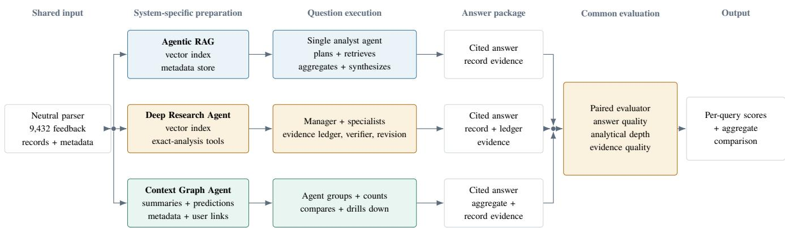
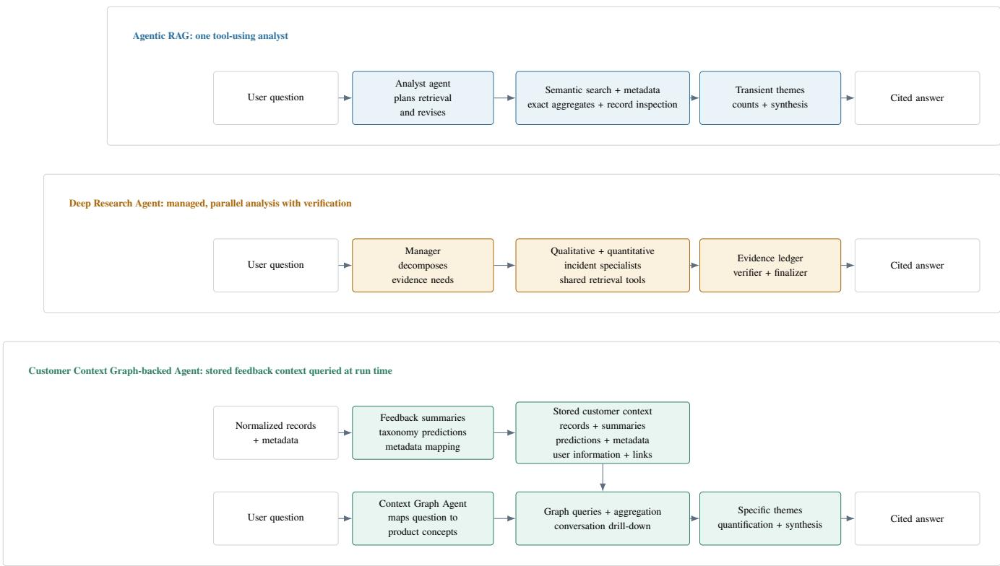
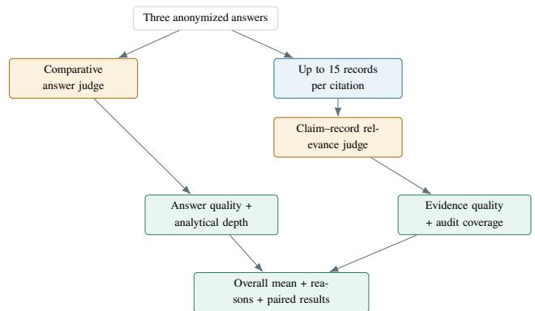

# From Retrieval to Customer Context: Evaluating Frontier-Model Systems for Voice-of-Customer Analysis

Raviraja G, Viraj Bagal, Prabhath Chellingi

Enterpret

## Abstract

Organizations increasingly use frontier language models to analyze customer feedback, but answer quality also depends on how that feedback is organized and made available. We de- fine a customer context graph as a unified model of customer and business context. Typed relationships connect customer objects (feedback, conversations, users, and accounts), op- erational objects (tickets, support agents, opportunities, and competitors), and analytical or action objects (taxonomy concepts, evidence, insights, work items, and outcomes). This lets an agent investigate not only what customers say, but why, who is afected, what action followed, who owns it, and whether it was resolved. For this experiment, the graph is populated from public Cursor feedback; the same architecture can sup- port any type of feedback source. We compare Agentic RAG, a Deep Research Agent, and a Customer Context Graph-backed Agent on the same 9,432 public Cursor feedback records us- ing 30 realistic product, incident, comparison, and metadata questions.

Without exhaustive ground truth, we jointly score responses on answer quality (coverage and organization), analytical depth (specificity and decomposition), and evidence quality (citation support and traceability), using a comparative rubric calibrated on 28 of the 30 questions. We sample cited records against their claims and weight the three dimensions equally. Under this aligned rubric, the Customer Context Graph-backed Agent scores 0.961 overall, versus 0.710 for the Deep Research Agent and 0.651 for Agentic RAG, and leads the Deep Research Agent on 27 of 30 paired questions (sign-test $p \ \dot { < } \ 1 0 ^ { - 5 } ;$ ; strictly best on 26 of 30). Its largest advantage is analytical depth (0.967 versus 0.642), reflecting more specific, hierarchically developed findings with quanti- fied themes and traceable evidence. Because the rubric was calibrated on these outputs, we report the result as exploratory: the ranking is internally consistent and survives the two ques- tions withheld from calibration, but a confirmatory pass on freshly authored questions scored under the frozen rubric is outstanding and is the validation we consider decisive. Within this frozen configuration, frontier-model agents grounded in a persistent customer context graph produce higher-quality customer-feedback analysis than agents analyzing the same feedback without that structured context.

Keywords: customer feedback analysis; retrieval-augmented generation; language-model agents; voice of customer; evi- dence evaluation

## 1 Introduction

Voice-of-customer (VoC) analysis turns qualitative feedback into a structured account of customer needs, their relation- ships, and their priorities (Grifin and Hauser 1993). As more knowledge work is automated, a fluent answer is not enough: the analysis underneath it must be correct, reproducible, and traceable, or every downstream product, engineering, and support decision inherits an unstable understanding of the customer. Frontier language models make raw feedback eas- ier to query, but a useful VoC answer still has to combine an exact denominator, semantic grouping, comparisons across time or versions, representative quotations, and a defensible statement about what the data cannot establish. A retrieved passage supports a qualitative observation but a top-k retrieval result cannot establish corpus prevalence, and a fluent summary can cite relevant records while attaching the wrong count or claiming a customer segment absent from the source data.

Retrieval-augmented generation (RAG) gives a model access to external evidence (Lewis et al. 2020; Karpukhin et al. 2020). More capable query-time systems interleave reasoning with retrieval and tool use (Yao et al. 2023; Trivedi et al. 2023; Asai et al. 2024) or delegate subtasks to spe-cialist agents. A diferent architectural choice is to organize customer context before the question is asked: summarize feedback, map it to a shared metadata schema, predict record- level taxonomy labels, retain available user information, and connect these entities back to each source record. This paper compares those choices directly on 9,432 public feedback records about Cursor—the AI coding assistant—collected from Reddit developer subreddits, the Apple App Store re- view stream, and Trustpilot over the frozen three-month UTC window 2026-04-16 to 2026-07-15 (Table 2). Records mix short mobile app reviews, multi-paragraph Reddit posts, and Trustpilot complaints, and are collected without knowing which internal product concepts (billing, agent mode, Auto routing, GLM 5.2 tool calls, Composer) will be relevant to any analyst question. The comparison deliberately excludes a naive “put all reviews in the prompt” baseline: long-context models do not use every input position equally (Liu et al. 2024) and the target corpus exceeds a single request’s practical context capacity.

We ask: how does context architecture afect answer qual- ity, analytical depth, quantification, evidence quality, and epistemic restraint on unsupported groupings (RQ1–RQ5), and how much of any quality gap can stronger query-time planning, retrieval, and evidence review close (RQ6)?

Contribution. Our primary contribution is a controlled three-system comparison establishing that persistent cus- tomer context, not additional query-time agency, is the load- bearing lever for LLM-based VoC analysis on this corpus and under an analyst-aligned rubric. Supporting contribu- tions are (i) the 30-query benchmark and its evaluator-only family invariants; (ii) a common answer-package contract that retains final prose and resolvable citation membership; and (iii) a three-part automatic evaluation of answer quality, analytical depth, and evidence quality with paired W/T/L as the primary statistic.

Scope. The reported comparison is scoped in four ways the reader should carry through: (1) scores come from a compar-ative rubric aligned with analyst preferences after inspecting evaluated answers on these 30 questions (Section 4, Section 7); (2) the comparison is complete-system rather than component-level; (3) the study uses one product corpus and one three-month frozen UTC window; and (4) holding the base analyst model constant does not equalize model capa- bility across candidates because each system dispatches that model to structurally diferent roles (supplementary material).

## 2 Related Work

Voice-of-customer and app-review analysis. Classical VoC work separates identifying customer needs, structuring those needs, and estimating their priority (Grifin and Hauser 1993). That distinction remains useful for LLM-based anal-ysis: extracting representative statements, organizing them into concepts, and estimating prevalence are related but non- equivalent tasks. Prior app-review work classifies reviews into maintenance-relevant categories such as bugs, feature re- quests, user experiences, and ratings (Panichella et al. 2015; Maalej et al. 2016); a systematic review characterizes app re-views as short, error-prone, dynamic, and domain-dependent (Wang et al. 2024); production summarization uses multi-stage extraction, topic grouping, and human evaluation to balance freshness, diversity, and accuracy (Apple Machine Learning Research 2025). A recent VoC benchmark finds that feature-labeled and sentiment-aware RAG variants improve consistency and coverage of generated product requirements (Fiocco, Proietti, and Cesarotti 2025). Our focus difers from classification and one-shot summarization: we compare com- plete analytical systems over linked questions that require exhaustive counts, re eated conce t use, evidence reconcili- ation, and downstream decisions.

RAG, agentic retrieval, and deep-research paradigms. RAG combines parametric generation with retrieved non- parametric evidence (Lewis et al. 2020); dense passage retrieval provides a standard candidate-context mechanism (Karpukhin et al. 2020). Retrieval remains relevant as context windows grow because models can underuse evidence placed in the middle of long inputs (Liu et al. 2024). Agentic and iterative retrieval interleave reasoning with action (Yao et al. 2023; Trivedi et al. 2023; Asai et al. 2024). Recent deep-research s stems extend these ideas to multi-a ent or-chestration with a manager, specialist agents, a verifier, and a finalizer; released products include OpenAI’s Deep Research (OpenAI 2025) and Gemini Deep Research (Google Deep- Mind 2024), and the open literature includes STORM (Shao et al. 2024) and AutoGen (Wu et al. 2023). Our two query- time candidates instantiate this ladder: Agentic RAG is a bounded tool-using single-analyst workflow, and the Deep Research Agent is a decomposed workflow with specialist investigations, evidence audit, and revision.

Corpus-level and graph-structured RAG. Most RAG benchmarks emphasize local questions whose evidence lies in a few passages; GlobalQA shows that counting, sorting, and other corpus-level operations remain dificult for con- ventional RAG (Luo et al. 2025). A parallel line of work shifts work from query time to ingestion time by building a persistent structured index that a lighter query-time agent then reads. Gra hRAG extracts entities and relations into hi- erarchical community summaries so that query-focused sum- marization is answered from a graph-level summary rather than direct retrieval (Edge et al. 2024). HippoRAG aug- ments dense retrieval with Personalized-PageRank traversal (Gutiérrez et al. 2024); LightRAG combines graph indexing with dual-level retrieval (Guo et al. 2024); RAPTOR builds a recursive tree of clustered abstractive summaries (Sarthi et al. 2024); Structured RAG translates aggregative questions into formal operations over an ingestion-time schema (Koshorek et al. 2025). Our Context Graph Agent shares the work-at-ingestion premise but difers in what is stored: rather than a derived-summary graph or an aggregated-chunk index, in- gestion persists typed customer-feedback entities (records, users, sources, themes, subthemes, sentiment, ratings) with an explicit product taxonomy and record-level taxonomy pre- dictions that are durable across sessions and reused across independently executed questions. To our knowledge no prior benchmark compares a graph-indexed workflow of this kind against agentic and deep-research workflows on a shared cor- pus, shared questions, and a shared answer contract.

Theme reliability and grounded-answer evaluation. Statistical topic coherence does not guarantee actionable product dimensions (Nguyen and Hovy 2019) and topic-model document assignments can be unreliable inputs to downstream analysis (Schroeder and Wood-Doughty 2025), so we evaluate theme membership against adjudicated records rather than trusting coherence alone. RAG evalu- ation is multidimensional: RAGAs proposes reference-free metrics (Es et al. 2024), ARES combines automated judges with a human-labeled set (Saad-Falcon et al. 2024), and ALCE evaluates answer correctness and citation quality (Gao et al. 2023). We do not adopt these evaluators directly because each assumes a single-answer QA setting: RAGAs and ALCE score a system answer against a query with a known correct answer or a small set of ground-truth passages; ARES trains a judge on a human-labeled QA dataset. Corpus-level analytical answers that combine typed classification counts, aggregate drill-down citations, per-theme quantification, and refusal on unsupported groupings do not fit that mold: there is no single “correct” answer against which to measure pre- cision or faithfulness. We instead evaluate paired candidate answers and audit their cited records directly, following the attribution-to-identified-source protocol of Rashkin et al. (2023) and the atomic factuality intuition of Min et al. (2023). LLM judges scale open-ended evaluation but exhibit position, verbosity, and self-enhancement biases (Zheng et al. 2023), so we use query-specific anonymized answer order, separate comparative dimensions, and deterministic citation sampling. Public reviews are also a self-selected view of cus- tomer experience and review solicitation changes extremity and representativeness (Karaman 2021); our prevalence mea-surements therefore describe the frozen corpus, not the full Cursor customer population.

## 3 Compared Systems

We compare three concrete implementations (Figure 1); candidate names refer to these implementations, not to all sys- tems in an architectural family. Each receives the same query text and evidence from the same frozen corpus. We use one running question, q013 (“Are there signs of a recently increasing reliability issue in Cursor?”), to illustrate what each system does diferently; it requires an aligned time compar- ison, an explicit denominator, per-cluster counts, and a de- fensible refusal when a comparable baseline is not available.

Agentic RAG is one customer-feedback analyst built with an agent SDK: bounded tool use, semantic search, record in- spection, exact metadata aggregation, segment comparison, and cited synthesis. On q013 it runs its own 30-day pre-ceding/recent comparison with a keyword reliability proxy (96/557 vs 851/8,652 records) and labels the trend low-confidence. Any semantic groups it creates belong to that run and do not persist across questions.

Deep Research Agent decomposes each question into typed evidence requirements: a manager delegates to qualita- tive, quantitative, and incident specialists that search, inspect records, aggregate exactly, and—when enabled—classify ev- ery record in a filter-derived denominator (cached with a record-level ledger and content hash); a verifier audits claims, counts, coverage, and citations before a finalizer revises the answer. On q013 it constructs matched rolling 14-day windows (3,720 vs 3,717 records) so all three sources are present in both and localizes a GLM 5.2 tool-call cluster to two spe- cific dates. Query-specific assignments are not exposed to other questions as a shared ontology or durable label store.

Context Graph Agent receives normalized records af- ter they are processed into a persistent customer context graph. Before benchmark questions are asked the system summarizes feedback, induces a product taxonomy, stores record-level taxonomy predictions, maps source fields to a shared metadata schema, retains available user information, and stores relationships among these entities. The query-time agent traverses those relationships to group, count, compare, and cite feedback. On q013 it reads 86 reliability-adjacent themes already tagged in the graph, aggregates conversation counts per theme, and declines a trend claim because the pre- ceding calendar window is 24 Trustpilot-only conversations against 9,408 recent mixed-source conversations.

Table 1: Experimental controls for the three-system compar- ison.
<table><tr><td>Held constant</td><td>Frozen 9,432-record corpus + SHA-256; identical query text and as-of date; base analyst model, both judges, retrieval reranker; answer contract; retry policy;</td></tr><tr><td>Allowed to differ (the treatment)</td><td>alias-shuffled evaluator presentation. Whether the system reconstructs product concepts per query or reads pre-computed summaries, taxonomy predictions, metadata,</td></tr><tr><td></td><td>user information, and graph relationships stored at ingestion; the orchestration budget the analyst model is dispatched into.</td></tr><tr><td>Can therefore claim</td><td>The complete-system effect of persistent customer context on this corpus, question set</td></tr></table>

Table 2: Frozen Cursor corpus used by all three systems.
<table><tr><td>Statistic</td><td>Value</td><td>Coverage</td></tr><tr><td>Normalized feedback records</td><td>9,432</td><td>100%</td></tr><tr><td>Collection window</td><td>2026-04-16–2026-07-15 UTC</td><td></td></tr><tr><td>Public feedback sources</td><td>3</td><td>100%</td></tr><tr><td>Records with rating</td><td>171</td><td>1.81%</td></tr><tr><td>Records with normalized version</td><td>5</td><td>0.05%</td></tr><tr><td>Records with public country</td><td>118</td><td>1.25%</td></tr><tr><td>Account/commercial cohort ID</td><td>0</td><td>0%</td></tr><tr><td>Corpus SHA-256</td><td>d62fa842...f23a62f0</td><td></td></tr></table>

Experimental controls and complete-system treatment. Table 1 states what was held constant, what was allowed to difer, and what the experiment can therefore claim; every run records model and tool versions, prompts, token use, tool calls, failures, corpus hash, and configuration hash. Failed or incomplete runs remain in the denominator with no credit, so a non-completion cannot silently drop out of the average. Freeze order and rubric calibration are detailed in Section 4.

## 4 Dataset and Benchmark

Corpus. The evaluated corpus contains 9,432 public Cur- sor feedback records from the frozen three-month UTC win- dow 2026-04-16 through 2026-07-15 (Table 2). Collection, normalization, and deduplication are frozen before evalua- tion; each record preserves a stable identifier, source, times- tamp, feedback text, source URL, rating when available, and public metadata. Missing account or commercial attributes remain missing. All reported prevalence describes this frozen corpus rather than the full Cursor user base.

Information parity and denominator contract. All sys- tems receive feedback originating from the same frozen nor- malized records; source URLs and public metadata are pre- served consistently, and the two query-time systems do not re- ceive taxonomies, summaries, clusters, or other labels gener- ated by the context graph system. The context graph system’s ingestion additionally groups the 9,432 records into 5,035 customer conversations by threading records that share a parent post, comment chain, review reply chain, or platform- linked exchange within the same source and author. To keep quantified claims comparable at judge time we require a de-nominator contract: every quantified claim must state the total it is divided by and cite the record set that produced that total. Baselines use the record count (they do not receive conversation-adjacency edges); the context graph candidate may report at conversation grain but must state the conversa- tion total and the constituent record count. The comparative evidence-strength score rewards explicit and cited denomina- tors over absolute ma nitude, so 180 conversations with de- nominator and drill-down cannot outscore 892 records with equivalent evidence structure by being smaller. After a pilot exposed a 123-record snapshot mismatch we refreshed the neutral export and re-ran all three candidates on all 30 queries against the repaired corpus and its SHA-256 hash. Per-run identifiers and the canonical evaluation-pass identifier are recorded in the answer packages and in the source snap- shot macros; the build gate refuses to update either without matching run\_metadata across all 90 cells. Query contracts and evaluator prompts are hidden from every system; each query executes in a fresh conversation.

  
Figure 1: End-to-end benchmark architecture. A neutral parsing layer supplies the same feedback text and source metadata to all candidates. Each system keeps its native preparation and question-execution architecture, but all outputs are converted to a common answer package and scored by the same paired evaluator.

Query benchmark. The benchmark contains 30 productadapted questions arranged into seven analysis families (ex-ecutive VoC, product area, reliability and incidents, pricing and packaging, source and metadata, competition and reten- tion, and cross-functional action; sizes {5, 5, 5, 5, 5, 4, 1}) and fixed before candidate execution, spanning four depth levels (Table 3); the same question text and as-of date are sent byte-for-byte to every candidate. Hidden family invari- ants test exact-value reuse, semantic stability, segment-level summaries, trend direction, sampling restraint, and whether recommended actions trace to previously measured evidence. Each query is a small contract: it names the operations the answer must perform, the fields it may draw on, the ex- pected output elements, count semantics, citation require- ments, evaluation scope, gold source, and known limitations. The benchmark has no independent exhaustive semantic la- bels. For semantic claims the LLM judge scores only records actually supplied by each candidate, so we can estimate evi- dence validity on observed assignments but cannot identify false negatives; semantic recall and F1 are therefore not re- ported.

Table 3: Benchmark depth. Counts are fixed by the query manifest.
<table><tr><td>Depth</td><td>Required reasoning</td><td>n</td></tr><tr><td>1</td><td>Exact lookup, metadata coverage, capability checks</td><td>11</td></tr><tr><td>2</td><td>Focused semantic classification or evidence synthesis</td><td>10</td></tr><tr><td>3</td><td>Comparisons across source, time, or cohort</td><td>3</td></tr><tr><td>4</td><td>Multi-stage VoC, strategy, incident, and workflow decisions</td><td>6</td></tr><tr><td>Total</td><td></td><td>30</td></tr></table>

Freeze order, calibration, and held-out confirmation. We freeze, in order, (1) research questions and system definitions; (2) query text and answer contracts; (3) collection, normalization, and deduplication; (4) candidate prompts, tools, models, and budgets; (5) an initial judge rubric v1; (6) a first evaluated run against v1; (7) a bounded calibration pass in which the judge prompts were adjusted after human inspection of v1 outputs on the first 27 questions, producing rubric v2; (8) a re-evaluation against v2; and (9) a single further nar-rowing of the competitor-gap criterion, prompted by inspect- ing the q029 answers, after which only q029 was rescored. Steps (1)–(9) produced the scores reported in Section 6, so 28 of the 30 questions informed the rubric that scores them. We verified that v2 applied to q001–q027 yields identical per-cell scores to the earlier calibrated-on-q001–q027 snap- shot, confirming that steps 7–8 did not retroactively move the rubric on the calibration set. Because v2 was reached while inspecting q001–q027, questions q028 and q030 were scored under it without further change and provide a small internal stability check (Section 6); q029 is excluded because its rubric was narrowed after its answers were inspected. We deliberately do not call this a confirmatory set: two same- session, same-family questions withheld from calibration are not equivalent to freshly authored questions, and the reported margins should be read as exploratory. The step 6–8 calibra- tion is a deviation from a purely sequential freeze order, treated as the principal threat in Section 7.

  
Figure 2: Component architecture of the three evaluated candidates. Agentic RAG uses one analyst over retrieval and exact- analysis tools. The Deep Research Agent adds decomposition, specialist roles, an evidence ledger, verification, and revision over that retrieval layer. The context graph system first connects feedback, summaries, taxonomy predictions, metadata, and available user information; its agent then computes aggregates and drills down to source records when producing an answer.

## 5 Automatic Evaluation

Open-ended customer-feedback questions have no exhaustive reference answer. We therefore compare all three answers for each query and separately audit whether cited records support the claims made (Figure 3). The query is the unit of evaluation, all candidates are judged together under anonymized aliases with deterministically shufled order, and every report retains dimension-level rationales and citation audits. The three reported dimensions and their scoring conventions are summarized here; full protocol details, macro/micro-average conventions, and citation-audit provenance appear in the sup- plementary material.

  
Figure 3: The simple protocol compares anonymized answers and audits every resolvable citation group separately.

Answer quality and analytical depth. The comparative judge places candidates into best-to-worst tiers on each di-mension. Answer quality rewards explicit question cover- age, organization for the intended reader, useful quantifica- tion, and visible separation of evidence, interpretation, and caveats. Analytical depth rewards a hierarchy from decision- relevant conclusion to bounded themes, drivers, subthemes, counterevidence, and synthesis; a one-problem test penal- izes umbrella labels that merge independently actionable is- sues. With three distinct tiers, scores are $\{ 1 . 0 , 0 . 7 5 , 0 . 5 \}$ two-tier verdicts map to {1.0, 0.5} with the middle tier re-served for three-tier verdicts. Both dimensions therefore fall in {0.5, 0.75, 1.0} for completed answers.

Evidence quality. Evidence quality $E _ { q }$ is the harmonic mean of sampled citation precision $P _ { q }$ and a comparative evidence-strength tier score $S _ { q } \mathrm { : }$

$$
P _ { q } = { \frac { N _ { \mathrm { r e l } } + 0 . 5 N _ { \mathrm { p a r t } } } { N _ { q } } } , \qquad E _ { q } = { \frac { 2 P _ { q } S _ { q } } { P _ { q } + S _ { q } } } .\tag{1}
$$

For each record citation and each aggregate citation whose members are exported, the evaluator deterministically sam- ples up to 15 frozen records and a claim–record judge labels each pair relevant, partially relevant, or irrelevant, following the attribution-to-identified- source protocol of Rashkin et al. (2023) and the atomic factuality intuition of Min et al. (2023). $S _ { q }$ rewards claim-level support, explicit denominators, ag- gregate drill-down links, and representative record citations. An answer without citations receives zero. Aggregate cita- tions with valid drill-down metadata but without exported members are counted as traceable, not member-sampled; unresolved citations are reported separately. Evidence qual- ity therefore evaluates sampled correctness and comparative evidence design; it does not imply that every record behind every aggregate was independently verified.

Overall score and aggregation. The overall score com- bines the three dimensions equally, Overa $\mathbb { l } _ { q } = ( Q _ { q } + D _ { q } +$ $E _ { q } ) / 3 $ , and we macro-average query-level scores across the 30 queries so each query weighs equally in the system total. Paired win, tie, and loss counts follow the paired-evaluation formulation of Peyrard et al. (2021) with a prespecified 0.01 absolute-diference tie tolerance; paired $W / T / L$ is the pri- mary system-comparison statistic and $\overline { { \Delta } }$ is descriptive. Each (query, candidate) cell is a single run scored by one judge pass; we do not average over reruns, so run-to-run variance is unmeasured and bootstrap intervals quantify variation across queries rather than across reruns. LLM judges can also exhibit position, verbosity, and self-enhancement biases (Zheng et al. 2023); the alias-shufling and structured-output require-ments above reduce but do not eliminate those risks.

## 6 Results

All three systems completed all 30 questions, yield- ing 90 dimension-level reports under protocol simple-comparison-v30. The query is the scor-ing unit; we macro-average query-level scores and compare systems on paired questions with a 0.01 tie tolerance. Category means and per-depth slices are descriptive because families contain between 1 and 5 queries, and semantic recall is not reported because no independent exhaustive set identifies every record relevant to an open-ended feedback theme.

The Context Graph Agent obtains the highest score on every dimension (Table 4), with overall 0.961 (0.251 above the Deep Research Agent, 0.310 above Agentic RAG); its largest gap is analytical depth (0.967 vs 0.642). The Deep Research Agent improves overall over Agentic RAG by 0.059, driven primarily by evidence quality (0.806 vs 0.686).

Paired outcomes. The Context Graph Agent leads the Deep Research Agent on 27 of 30 overall queries, ties once, and loses twice (Table 5; sign test on non-tied outcomes, $p \ = \ 1 . 6 \times 1 0 ^ { - 6 } ;$ ; bootstrap 95% CI on ∆overall $[ + 0 . 1 9 3 , + 0 . 3 0 5 ] )$ . It leads analytical depth on 28 of 30 $\bar { ( p \ = \ 8 . 7 \times 1 0 ^ { - 7 } ) }$ and leads Agentic RAG on 29 of 30 overall $( p ~ = ~ 5 . 8 \times 1 0 ^ { - 8 } ; ~ \overline { { { \Delta } } } _ { \mathrm { o v e r a l l } } ~ = ~ + 0 . 3 1 0 .$ , 95% CI $[ + 0 . 2 6 3 , + 0 . 3 5 4 ] )$ . The Context Graph Agent is strictly best on 26 of 30 individual queries; the four exceptions are q003 (tied with Deep Research Agent), q006 and q013 (lost to Deep Research Agent on autocomplete overview and matched-window reliability), and q022 (“What are people praising in the App Store?”, which Agentic RAG wins 0.887 vs 0.833 by combining tier-1 answer quality and depth with a lower evidence-quality score). The sec-ondary Deep Research Agent-vs-Agentic RAG compari- son is less monotonic: Deep Research Agent wins 17 over- all and loses 13 (sign test $p = 0 . 5 8 5 ; \overline { { \Delta } } _ { \mathrm { o v e r a l l } } = + 0 . 0 5 9 , 9 5 \%$ $\operatorname { C I } \left[ - 0 . 0 1 8 , + 0 . 1 3 5 \right] )$ , its evidence-quality advantage is real (26/4 wins, $p = 6 . 0 \dot { \times } 1 0 ^ { - 5 } )$ , but analytical-depth outcomes split 15–15 and average to zero.

Citation-audit coverage. Agentic RAG emits 712 cita- tions and Deep Research Agent emits 594; nearly all resolve directly to member records (708 and 594 sampled records respectively). The Context Graph Agent emits 913 citations of which 127 are member-audited and 786 are aggregate ci- tations with valid drill-down metadata but without exported members (Table 6). No context-graph citation is unresolved. Its high evidence-quality score therefore reflects perfect sam- pled precision on exported member evidence together with the comparative judge’s preference for claim-level quantified evidence architecture; it must not be read as independent validation of all records behind the 786 traceable aggregates.

Partial internal rubric-stability check. The v2 rubric was reached while inspecting q001–q027 and applied unchanged to q028 and q030 (q029 is excluded: its rubric was narrowed after its answers were inspected). On that $n = 2$ slice the Context Graph Agent wins both queries against both base- lines $( \overline { { \Delta } } _ { \mathrm { o v e r a l l } } = + 0 . 3 0 2$ versus the Deep Research Agent, +0.404 versus Agentic RAG), consistent with the calibration set. This is a weak internal check, not confirmation: $n = 2$ carries almost no inferential power, and q028 and q030 were authored in the same session and families as the calibration queries, so a rubric shaped on their siblings can carry correlated bias into them. Withholding a question from calibration is not equivalent to drawing a fresh one. The deci- sive test—new queries authored after the rubric was frozen, scored without further rubric change—is not performed here and remains the primary outstanding validation (Section 7).

Findings across RQs and interpretation. Under the aligned rubric, the Context Graph Agent leads on every dimension in Table 4 (RQ1), and its lead is stable across all four benchmark depth levels (RQ2, supplementary material). Quantification splits the systems by grain: baselines report exclusive-classification counts across the full record set, while the Context Graph Agent reports theme counts at conversation grain with per-theme drill-down (RQ3). The citation audit shows that most of the context-graph evidence- quality advantage comes from aggregate drill-down citations, not from higher sampled precision (RQ4). On epistemic restraint the strongest in-run signal is q013, where the Con-text Graph Agent refuses a period-over-period trend claim; a pre-registered refusal battery is future work (RQ5). And on structure versus agency, the Deep Research Agent’s de- composition, verifier, and revision loop lift evidence quality over Agentic RAG but leave overall and depth outcomes indistinguishable at n = 30 (RQ6).

Table 4: Macro-averaged automatic evaluation across 30 paired queries. Overall combines the three dimensions equally. Per- dimension scores for answer quality and analytical depth are drawn from a discrete comparative-tier scale on [0.5, 1] for completed answers with 0.25 spacing (see Section 5); evidence quality is a harmonic mean of sampled citation precision and comparative evidence-strength score in [0, 1]. Because the scale is discrete and the primary comparison is paired, means are descriptive; the primary comparison statistic is paired $W / T / L$ (Table 5). Best values in bold; bracketed overall values are bootstrap 95% CIs over 30 queries $( B = 5 , 0 0 0$ , seed 42).
<table><tr><td>System</td><td>Overall (95% CI)</td><td>Answer quality</td><td>Analytical depth</td><td>Evidence quality</td><td>Queries</td></tr><tr><td>Agentic RAG</td><td>0.651 [0.613, 0.692]</td><td>0.625</td><td>0.642</td><td>0.686</td><td>30/30</td></tr><tr><td>Deep Research Agent</td><td>0.710 [0.668, 0.752]</td><td>0.683</td><td>0.642</td><td>0.806</td><td>30/30</td></tr><tr><td>Context Graph Agent</td><td>0.961 [0.936, 0.983]</td><td>0.958</td><td>0.967</td><td>0.958</td><td>30/30</td></tr></table>

Table 5: Paired query-level comparisons with a 0.01 tie tolerance. $W / T / L$ counts are from the perspective of the first system; $\overline { { \Delta } }$ is its mean score minus the second system’s score, with a bootstrap $9 5 \%$ confidence interval over 30 queries $( B = 5 , 0 0 0$ resamples, seed 42); p reports a two-sided sign test on non-tied paired outcomes. Because the completed-answer score scale is discrete with 0.25 spacing (see Table 4 and Section 5), the paired $W / T / L$ result is the primary comparison statistic and $\overline { { \Delta } }$ is descriptive.
<table><tr><td>Comparison</td><td>Metric</td><td>Wins</td><td>Ties</td><td>Losses</td><td>∆ (95% CI)</td><td>Sign-test p</td></tr><tr><td rowspan="4">Context graph – Deep</td><td>Overall</td><td>27</td><td>1</td><td>2</td><td>+0.251 [+0.193, +0.305]</td><td> $1 . 6 \times 1 0 ^ { - 6 }$ </td></tr><tr><td>Answer quality</td><td>25</td><td>1</td><td>4</td><td>+0.275</td><td> $1 . 0 \times 1 0 ^ { - 4 }$ </td></tr><tr><td>Analytical depth</td><td>28</td><td>0</td><td>2</td><td>+0.325</td><td> $8 . 7 \times 1 0 ^ { - 7 }$ </td></tr><tr><td>Evidence quality</td><td>27</td><td>2</td><td>1</td><td>+0.153</td><td> $2 . 2 \times 1 0 ^ { - 7 }$ </td></tr><tr><td rowspan="4">Context graph — Agentic</td><td>Overall</td><td>29</td><td>0</td><td>1</td><td>+0.310 [+0.263, +0.354]</td><td> $5 . 8 \times 1 0 ^ { - 8 }$ </td></tr><tr><td>Answer quality</td><td>28</td><td>1</td><td>1</td><td>+0.333</td><td> $1 . 1 \times 1 0 ^ { - 7 }$ </td></tr><tr><td>Analytical depth</td><td>28</td><td>0</td><td>2</td><td>+0.325</td><td> $8 . 7 \times 1 0 ^ { - 7 }$ </td></tr><tr><td>Evidence quality</td><td>28</td><td>1</td><td>1</td><td>+0.272</td><td> $1 . 1 \times 1 0 ^ { - 7 }$ </td></tr><tr><td rowspan="4">Deep – Agentic</td><td>Overall</td><td>17</td><td>0</td><td>13</td><td>+0.059 [-0.018, +0.135]</td><td>0.585</td></tr><tr><td>Answer quality</td><td>17</td><td>0</td><td>13</td><td>+0.058</td><td>0.585</td></tr><tr><td>Analytical depth</td><td>15</td><td>0</td><td>15</td><td>+0.000</td><td>1.000</td></tr><tr><td>Evidence quality</td><td>26</td><td>0</td><td>4</td><td>+0.120</td><td> $6 . 0 \times 1 0 ^ { - 5 }$ </td></tr></table>

The dimension pattern suggests a straightforward mech- anism. Ingestion-time processing makes stored summaries, taxonomy predictions, metadata, and relationships durable: at query time the agent traverses those relationships to bounded themes with aggregate-citation quantification rather than reconstructing product concepts each question. Even so, the result is not universal dominance. The Deep Research Agent wins the two questions that reward bespoke matched comparisons (q006, q013), and Agentic RAG wins the App-Store-praise question (q022). Query-specific computation can therefore beat stored concepts when a bespoke comparison matters more than concept reuse. Representative response excerpts (including the q013 reconciliation), per-depth and per-family means, and the extended mecha- nism analysis are in the supplementary material.

## 7 Limitations and Threats to Validity

Evaluation validity. LLM judges can share biases with candidate models, but the model-constant design largely neu- tralizes this for the reported ranking: the judge scores answer text only, and all three candidates’ text comes from the same gpt-5.5 analyst model, so provider-family self-preference applies uniformly and cannot diferentially favor one can- didate. The substantive concern is not model identity but rubric alignment, and it is the paper’s principal limitation. The rubric was aligned with analyst preferences after inspect- ing answers from q001–q027, and one later narrowing was prompted by q029, so 28 of the 30 questions informed the rubric that scores them and their scores measure agreement with it rather than providing an independent test. Disclosure does not repair this, and the sign tests in Table 5 do not either: they rule out sampling noise, not rubric bias. The two with- held questions (q028, q030) give only a weak internal check, being same-session and same-family as the calibration set. We therefore present the 0.961/0.710/0.651 ordering as exploratory; the decisive validation is a confirmatory pass on questions authored after the rubric was frozen. Semantic re- call is separately absent because unobserved false negatives are unidentified.

Table 6: Citation-audit coverage. “Member-audited” citations have at least one frozen record judged against the nearby claim. Traceable aggregates retain drill-down metadata but were not member-sampled.
<table><tr><td>System</td><td>Cited</td><td>Member-audited</td><td>Traceable aggregate</td><td>Unresolved</td><td>Records sampled</td></tr><tr><td>Agentic RAG</td><td>712</td><td>708</td><td>0</td><td>4</td><td>708</td></tr><tr><td>Deep Research Agent</td><td>594</td><td>594</td><td>0</td><td>0</td><td>594</td></tr><tr><td>Context Graph Agent</td><td>913</td><td>127</td><td>786</td><td>0</td><td>127</td></tr></table>

Internal and aggregate-audit validity. The context graph system receives upfront customer-context processing that the experiment intentionally studies, but the treatment bun- dles feedback summarization, taxonomy induction, record- level prediction, metadata mapping, relationship storage, and agent tooling; the comparison estimates a system-level efect rather than the isolated causal contribution of any component. An earlier pilot exposed a 123-record snapshot mismatch, which we corrected before the reported run. Only 127 of the context graph agent’s 913 citations were member-sampled; the remaining 786 have valid aggregate drill-down metadata but no exported member records in the judge package, so they support traceability and evidence-architecture scoring rather than independent verification of every associated record.

Proof scope, sampling, and generalization. Thirty ques- tions on one product corpus over one three-month frozen UTC window improve construct coverage but do not prove universal architectural superiority; conclusions remain scoped to that frozen configuration and to the calibrated rubric. Public reviews are self-selected and can overrepre- sent unusually positive or negative experiences (Karaman 2021), so counts and shares estimate prevalence within the frozen corpus, not among all Cursor users. App reviews can be short, noisy, multilingual, sarcastic, of-topic, or fraudu- lent (Wang et al. 2024; Apple Machine Learning Research 2025), and public data lack the account, contract, and rev-enue relationships available in private enterprise feedback. Secondary threats—construct validity of the theme rubric, implementation choices in the two query-time candidates, temporal drift, and the gap between workflow scores and downstream business outcomes—are enumerated in the sup- plementary material.

## 8 Conclusion

Across 30 realistic Cursor feedback questions and under an analyst-aligned rubric, the Context Graph Agent achieves an overall score of 0.961 versus 0.710 for the Deep Re- search Agent and 0.651 for Agentic RAG, leading on 27 paired questions with its largest advantage in analytical depth. Within this frozen configuration, more query-time agency alone does not reliably reconstruct the value of persistent re- lationships among feedback, summaries, taxonomy predic- tions, metadata, and available user information. The findings are system-level and descriptive: the evaluation compares candidate answers and audits their cited evidence rather than claiming semantic recall. Natural next steps outside this pa- per’s scope are (i) a hybrid design combining stored context with bespoke matched-window computation at query time (motivated by q013); (ii) component-level ablations of in-gestion; and (iii) a held-out confirmatory question set scored against a rubric frozen before the confirmatory answers are seen.

## References

Apple Machine Learning Research. 2025. An LLM- Based Approach to Review Summarization on the App Store. https://machinelearning.apple.com/research/app- store-review. Accessed 2026-07-14.

Asai, A.; Wu, Z.; Wang, Y.; Sil, A.; and Hajishirzi, H. 2024. Self-RAG: Learning to Retrieve, Generate, and Cri- tique through Self-Reflection. In International Conference on Learning Representations.

Edge, D.; Trinh, H.; Cheng, N.; Bradley, J.; Chao, A.; Mody, A.; Truitt, S.; and Larson, J. 2024. From Local to Global: A Graph RAG Approach to Query-Focused Summarization. arXiv preprint arXiv:2404.16130.

Es, S.; James, J.; Anke, L. E.; and Schockaert, S. 2024. RA- GAs: Automated Evaluation of Retrieval Augmented Gener- ation. In Proceedings ofthe 18th Conference ofthe European Chapter of the Association for Computational Linguistics: System Demonstrations, 150–158. Association for Computational Linguistics.

Fiocco, E.; Proietti, S.; and Cesarotti, V. 2025. Voice of Customer Extraction from Product Reviews: A Benchmark of RAG Variants. In International Conference on Marketing and Technologies (ICMarkTech). Valencia, Spain.

Gao, T.; Yen, H.; Yu, J.; and Chen, D. 2023. Enabling Large Language Models to Generate Text with Citations. In Proceedings of the 2023 Conference on Empirical Methods in Natural Language Processing, 6465–6488. Association for Computational Linguistics.

Google DeepMind. 2024. Try Deep Research and Our New Experimental Model in Gemini. https://blog.google/ products/gemini/google-gemini-deep-research/. Accessed 2026-07-14.

Grifin, A.; and Hauser, J. R. 1993. The Voice of the Cus- tomer. Marketing Science, 12(1): 1–27.

Guo, Z.; Xia, L.; Yu, Y.; Ao, T.; and Huang, C. 2024. Ligh- tRAG: Simple and Fast Retrieval-Augmented Generation. arXiv preprint arXiv:2410.05779.

Gutiérrez, B. J.; Shu, Y.; Gu, Y.; Yasunaga, M.; and Su, Y.

2024. HippoRAG: Neurobiologically Inspired Long-Term Memory for Large Language Models. In Advances in Neural Information Processing Systems, volume 37.

Karaman, H. 2021. Online Review Solicitations Reduce Ex- tremity Bias in Online Review Distributions and Increase Their Representativeness. Management Science, 67(7): 4420–4445.

Karpukhin, V.; Oguz, B.; Min, S.; Lewis, P.; Wu, L.; Edunov, S.; Chen, D.; and tau Yih, W. 2020. Dense Passage Re- trieval for Open-Domain Question Answering. In Proceedings ofthe 2020 Conference on Empirical Methods in Natural Language Processing, 6769–6781. Association for Computational Linguistics.

Koshorek, O.; Granot, N.; Alloni, A.; Admati, S.; Hendel, R.; Weiss, I.; Arazi, A.; Cohen, S.-N.; and Belinkov, Y. 2025. Structured RAG for Answering Aggregative Questions. arXiv preprint arXiv:2511.08505.

Lewis, P.; Perez, E.; Piktus, A.; Petroni, F.; Karpukhin, V.; Go al, N.; Küttler, H.; Lewis, M.; tau Yih, W.; Rocktäschel, T.; Riedel, S.; and Kiela, D. 2020. Retrieval-Augmented Gen- eration for Knowled e-Intensive NLP Tasks. In Advances in Neural Information Processing Systems, volume 33, 9459– 9474.

Liu, N. F.; Lin, K.; Hewitt, J.; Paranjape, A.; Bevilacqua, M.; Petroni, F.; and Liang, P. 2024. Lost in the Middle: How Language Models Use Long Contexts. Transactions of the Associationfor Computational Linguistics, 12: 157–173.

Luo, Q.; Li, X.; Fan, T.; Chen, X.; and Qiu, X. 2025. Towards Global Retrieval Augmented Generation: A Benchmark for Corpus-Level Reasoning. arXiv preprint arXiv:2510.26205.

Maalej, W.; Kurtanović, Z.; Nabil, H.; and Stanik, C. 2016. On the Automatic Classification of App Reviews. Requirements Engineering, 21(3): 311–331.

Min, S.; Krishna, K.; Lyu, X.; Lewis, M.; tau Yih, W.; Koh, P. W.; Iyyer, M.; Zettlemoyer, L.; and Hajishirzi, H. 2023. FActScore: Fine-Grained Atomic Evaluation of Factual Pre- cision in Long Form Text Generation. In Proceedings ofthe 2023 Conference on Empirical Methods in Natural Language Processing, 12076–12100. Association for Computational Linguistics.

Nguyen, H.; and Hovy, D. 2019. Hey Siri. Ok Google. Alexa: A Topic Modeling of User Reviews for Smart Speakers. In Proceedings of the 5th Workshop on Noisy User-generated Text, 76–83. Association for Computational Linguistics.

OpenAI. 2025. Introducing Deep Research. https://openai. com/index/introducing-deep-research/. Accessed 2026-07- 14.

Panichella, S.; Sorbo, A. D.; Guzman, E.; Visaggio, C. A.; Canfora, G.; and Gall, H. C. 2015. How Can I Improve My App? Classifying User Reviews for Software Maintenance and Evolution. In 2015 IEEE International Conference on Software Maintenance and Evolution, 281–290.

Peyrard, M.; Zhao, W.; Eger, S.; and West, R. 2021. Better than Average: Paired Evaluation of NLP Systems. In Proceedings of the 59th Annual Meeting of the Association for Computational Linguistics and the 11th International Joint

Conference on Natural Language Processing, 2301–2315. Association for Computational Linguistics.

Rashkin, H.; Nikolaev, V.; Lamm, M.; Aroyo, L.; Collins, M.; Das, D.; Petrov, S.; Tomar, G. S.; Turc, I.; and Reitter, D. 2023. Measuring Attribution in Natural Language Genera- tion Models. Computational Linguistics, 49(4): 777–840.

Saad-Falcon, J.; Khattab, O.; Potts, C.; and Zaharia, M. 2024. ARES: An Automated Evaluation Framework for Retrieval- Augmented Generation Systems. In Proceedings ofthe 2024 Conference of the North American Chapter of the Association for Computational Linguistics: Human Language Technologies, 338–354. Association for Computational Linguistics.

Sarthi, P.; Abdullah, S.; Tuli, A.; Khanna, S.; Goldie, A.; and Manning, C. D. 2024. RAPTOR: Recursive Abstractive Processing for Tree-Organized Retrieval. In International Conference on Learning Representations.

Schroeder, K.; and Wood-Doughty, Z. 2025. Reliability of Topic Modeling. In Proceedings of the 2025 Conference of the Nations of the Americas Chapter of the Association for Computational Linguistics: Human Language Technologies, 2649–2662. Association for Computational Linguistics.

Shao, Y.; Jiang, Y.; Kanell, T. A.; Xu, P.; Khattab, O.; and Lam, M. S. 2024. Assisting in Writing Wikipedia-like Arti- cles from Scratch with Large Language Models. In Proceedings of the 2024 Conference of the North American Chapter of the Association for Computational Linguistics, 6252–6278. Association for Computational Linguistics.

Trivedi, H.; Balasubramanian, N.; Khot, T.; and Sabharwal, A. 2023. Interleaving Retrieval with Chain-of-Thought Rea- soning for Knowledge-Intensive Multi-Step Questions. In Proceedings of the 61st Annual Meeting of the Association for Computational Linguistics, 10014–10037. Association for Computational Linguistics.

Wang, X.; Zhang, T.; Tan, Y.; Shang, W.; and Li, Y. 2024. How to Efectively Mine App Reviews Concerning Software Ecosystem? A Survey of Review Characteristics. Journal of Systems and Software, 213: 112040.

Wu, Q.; Bansal, G.; Zhang, J.; Wu, Y.; Li, B.; Zhu, E.; Jiang, L.; Zhang, X.; Zhang, S.; Liu, J.; Awadallah, A.; White, R. W.; Burger, D.; and Wang, C. 2023. AutoGen: Enabling Next-Gen LLM Applications via Multi-Agent Conversation. arXiv preprint arXiv:2308.08155.

Yao, S.; Zhao, J.; Yu, D.; Du, N.; Shafran, I.; Narasimhan, K.; and Cao, Y. 2023. ReAct: Synergizing Reasoning and Acting in Language Models. In International Conference on Learning Representations.

Zheng, L.; Chiang, W.-L.; Sheng, Y.; Zhuang, S.; Wu, Z.;Zhuang, Y.; Lin, Z.; Li, Z.; Li, D.; Xing, E. P.; Zhang, H.;Gonzalez, J. E.; and Stoica, I. 2023. Judging LLM-as-a-Judge with MT-Bench and Chatbot Arena. In Advances inNeural Information Processing Systems, volume 36.

## Ethics and Data Statement

The corpus is public product feedback; public availability does not remove privacy risk. Released artifacts minimize personal identifiers, avoid cross-source display-name link- age, respect platform terms, and quote only text needed to au- dit claims. We do not infer protected, commercial, or account- level attributes from review text, and corpus prevalence is not treated as population prevalence because public review submission is self-selected. Non-redistributable records are represented through hashes and collection manifests.

## A Representative Response Excerpts

Aggregate scores hide material diferences in what an ana- lyst receives. Table 7 shows the dominant benchmark pattern: the query-time systems both organize the corpus into a small number of broad pain-point categories via exclusive clas- sification (seven categories for Agentic RAG across 8,890 classified records, ten for the Deep Research Agent across all 9,432 records), whereas the Context Graph Agent returns narrower recurring themes at the conversation grain (5,035 conversations), further decomposes leading themes into cited subtheme drivers, and links quantified claims to evidence sets. Table 8 is the counter-example: the Deep Re- search Agent constructs matched rolling 14-day windows (3,720 versus 3,717 records) and localizes a time-bounded GLM tool-call cluster to 2026-07-08 and 2026-07-09; Agen- tic RAG runs a coarser 30-day comparison and finds a share decrease with only a small regression/update sub-signal; the Context Graph Agent provides richer recent-state analysis but correctly refuses a trend conclusion because the preced- ing window contains only 24 Trustpilot-only conversations against a 98.4% Reddit recent window.

Table 9 is the harder counter-example, and we include it deliberately. On q013 the Context Graph Agent loses by being correctly cautious, which is easy to present as a virtue. On q022 it is simply worse. All three systems agree on the same exact denominator (63 of 113 App Store reviews rated 4–5), so quantification is not the diferentiator; Agentic RAG wins on answer quality and analytical depth (1.000 on both) by developing five specific, separately interpreted praise themes, while the Context Graph Agent earns per- fect evidence quality but tier-two quality and depth because its stored taxonomy routes the second-largest share of praise into a catch-all “general product delight” node. The failure mode is instructive: when a pre-computed taxonomy lacks a suficiently specific node for the question being asked, the graph-backed answer inherits that coarseness, whereas a query-time analyst is free to invent the decomposition the question needs. This is a genuine limitation of stored context, not an artifact of scoring.

## B Extended Results

Per-depth means (Table 10) map to RQ2: the Context Graph Agent leads at every depth level, and the Deep Re- search Agent’s decomposition budget shows its clearest ad- vantage over Agentic RAG at depths 3 and 4. The per-family means (Table 11) are descriptive slices because families contain between 1 and 5 queries; the Deep Research Agent is not uniformly second (Agentic RAG is higher on pricing/packaging and source/metadata), reinforcing the paired finding that deeper orchestration alone does not impose a strict capability ordering.

## C Evaluation at a Glance

The benchmark evaluates a complete answer to one question at a time. All three answers are anonymized and presented to- gether to the comparative judge; record citations are audited separately. The three reported dimensions and their roles are summarized in Table 12.

Answer quality and analytical depth use comparative tiers on a [0.5, 1] scale for completed answers. Evidence quality is the harmonic mean of sampled citation precision and com- parative evidence-strength score; an answer without citations receives zero. Up to 15 frozen member records are sampled per resolvable citation group. Aggregate citations without exported members remain traceable but are not treated as member-audited. Full definitions, equations, and bias con- trols appear in Section 5.

The companion supplementary appendix, full-benchmark-responses.pdf, contains ev-ery benchmark query and the three complete evaluated responses. It is generated directly from the canonical answer packages and frozen score reports, providing a readable audit trail without expanding the main manuscript by hundreds of pages.

## D Extended Discussion

The results section compresses the mechanism analysis into a single paragraph. This appendix expands each thread.

Query-time agency closes only part ofthe gap. The Con-text Graph Agent’s 0.251 overall advantage over the Deep Research Agent is much larger than the Deep Research Agent’s 0.059 advantage over Agentic RAG. Additional query-time planning and verification therefore close only part of the observed gap in this implementation. Because the treatment bundles ingestion, feedback summarization, tax- onomy induction, metadata mapping, relationship storage, retrieval, and agent behavior, all results describe the com- bined workflow rather than the isolated causal efect of any single component (see Section 7).

Analytical depth is the largest gap. The Context Graph Agent’s answers read stored feedback summaries, taxonomy predictions, metadata, available user information, and their relationships to move from a portfolio-level issue to specific themes and subthemes while preserving links to support- ing conversations. Counts and comparisons are computed from that context when the question is asked; ingestion-time processing makes customer context durable rather than a transient artifact of one retrieval run.

Quantification architecture, not citation count. A handful of relevant records can establish that a complaint exists but cannot establish that it is common or important. The context-graph answers more often attach counts to bounded themes and develop their principal drivers; the evaluator re- wards that architecture when the main numerical claims have aggregate drill-down citations and the prose clearly distin- guishes counts, examples, and limitations. It does not reward citation count by itself.

Table 7: Abridged outputs for q001: “What are the biggest pain points Cursor users are reporting?” Text preserves the principal grouping, quantification, and evidence pattern of each evaluated answer; it is shortened for space. Counts and denominators are taken verbatim from the canonical answer packages listed in the response appendix.
<table><tr><td>System</td><td>Abridged evaluated response</td><td>Overall</td></tr><tr><td>Agentic RAG</td><td>Runs a model-coded exclusive classification over 8,890 of 9,432 records (94.25% coverage; 2,728 assigned to “other/no clear pain point’) and ranks seven pain-point categories: billing, pricing, usage limits, credits, overages, and refunds (2,195); model choice, Auto-mode opacity, and context/routing (1,461); agent/code quality and unsafe edits (875); trust, privacy, and ownership concerns (748); product instability, regressions, and IDE performance (629); mobile/iOS parity gaps (155); and support/account escalation (99). Each category is followed by cited examples and an analyst</td><td>0.556</td></tr><tr><td>Deep Research Agent</td><td>interpretation. Runs an exhaustive semantic classification over all 9,432 records into ten exclusive primary pain-point categories and reports both counts and corpus share: model quality and Auto-mode control (892; 9.5%); token burn and unclear usage attribution (628; 6.7%); usage caps and quota lockout (370; 3.9%); billing surprises and commercial trust (353; 3.7%); long-session context loss (232; 2.5%); update regressions (207; 2.2%); UI churn (156; 1.7%); agent out-of-scope changes (119; 1.3%); support and refund friction (116; 1.2%); and crashes or severe local instability (79; 0.8%). It also flags 2,133 records classified as positive value or mitigation as a counter-signal.</td><td>0.776</td></tr><tr><td>Context Graph Agent</td><td>Ranks recurring themes over 5,035 customer conversations (Reddit 4,868 at 96.7%; App Store 114; Trustpilot 53) organized into seven clusters: quota and usage-limit friction (180), throughput rate-limit disruption (162), degraded behavior when rate limits are hit (95), Auto routing mismatch (92), Composer/model quality regressions (86), poor AI output quality (82), and a service-availability/agent-safety cluster whose top themes are pre-execution safety controls (77) and service availability issues (77). Each main count links to its evidence set; leading themes decompose into cited subtheme drivers and are illustrated with verbatim customer quotes.</td><td>1.000</td></tr></table>

Counter-examples and boundary conditions. The Deep Research Agent wins the autocomplete overview (q006) and matched-window reliability (q013); Agentic RAG wins the App-Store-praise question (q022) and exceeds the Deep Research Agent on the pricing/packaging and source/metadata families. Query-specific computation therefore beats stored concepts when a bespoke comparison is more important than concept reuse. Unsupported customer grouping remains a boundary on every architecture: public feedback can support source, rating, country, version, and time slices only where those fields are present, and cannot support plan, account, revenue, or renewal comparisons. The q013 case (Table 8, Section A) illustrates the refusal pattern.

## E Extended Evaluation Details

This appendix expands Section 5 with the definitions and de- sign justifications that the main-body summary compresses.

Denominator convention for $P _ { q } .$ Writing $N _ { \mathrm { r e l } } , N _ { \mathrm { p a r t } }$ , and $N _ { \mathrm { i r r e l } }$ for the counts of sampled claim–record pairs judged relevant, partially relevant, and irrelevant, the denominator is $N _ { q } = N _ { \mathrm { r e l } } + N _ { \mathrm { p a r t } } + N _ { \mathrm { i r r e l } } .$ the total number of sampled claim–record pairs on query q. Because $N _ { q }$ pools across ci- tations, candidates with more citation-supported claims con- tribute more evidence to the query-level precision estimate. We deliberately do not per-citation macro-average, so that a single citation with one sampled pair does not weight equally with a citation carrying fifteen. We also do not require a min- imum retrieval count per citation, so a candidate that cites three obviously-relevant records and achieves $P _ { q } = 1 . 0$ re-ceives full sampled precision on that query; this preserves restraint but is complemented by the comparative evidence- strength score $S _ { q } ,$ which rewards denominators, drill-down links, and claim-level architecture rather than citation vol- ume.

Efective granularity of the tie tolerance. The 0.01 absolute-diference tolerance for paired win/tie/loss is in- tentionally tighter than the efective granularity of the per- dimension tier scale (0.25 within a dimension, so an overall diference of $0 . 2 5 / 3 \approx 0 . 0 8 3$ is the smallest possible non- zero mean-of-three delta). The tighter tolerance means the tie category is nearly always empty and the win/loss category carries the paired signal.

Blinding and structured-output controls. Aliases and answer order are deterministically shufled per question, and link destinations that could reveal a system are removed from the comparison copy. Structured outputs must contain every candidate and sampled claim–record pair or the evaluation fails. Citation totals, member-sampled citations, traceable ag- gregate citations, unresolved citations, and sampled records are reported alongside the scores.

## F Extended Limitations

The main-body Section 7 discusses the four load-bearing threats. Four secondary threats round out the validity picture and are included here for completeness.

Table 8: Abridged outputs for q013: “Are there signs of a recently increasing reliability issue?” This counterexample shows a query on which bespoke query-time reconstruction outperforms the stored-context response. Counts and windows are taken verbatim from the canonical answer packages listed in the response appendix.
<table><tr><td>System</td><td>Abridged evaluated response</td><td>Overall</td></tr><tr><td>Agentic RAG</td><td>Compares 30-day calendar windows (preceding 2026-05-17 to 2026-06-15 with 557 records; recent 2026-06-16 to 2026-07-15 with 8,652 records) and finds that a keyword reliability proxy falls in share from 17.2% to 9.8% even as absolute counts rise. The only rising sub-signal is a regression/update-language proxy that grows from 1 to 37 records, and 113 App Store reviews appear</td><td>0.556</td></tr><tr><td>Deep Research Agent</td><td>only in the recent window (no preceding baseline). It labels the broad “reliability worsening&quot; claim as low confidence. Uses closely matched rolling 14-day windows (3,720 versus 3,717 records). Its combined reliability proxy rises from 301 to 345 (+14.6%), while native-tool, harness, MCP, and file-operation language rises from 79 to 132 (+67.1%). It localizes a GLM 5.2 tool-call/markup cluster to 2026-07-08 and 2026-07-09 (21 of 25 recent GLM matches), distinguishes increasing, flat, and decreasing signals</td><td>0.930</td></tr><tr><td>Context Graph Agent</td><td>across category proxies, and assigns medium confidence. Reports a concrete recent-period reliability signal across 9,408 conversations (May 31 to Jul 15) with 86 reliability-adjacent themes and five failure clusters (rate-limit and quota reliability, agent execution stalls, core product reliability, billing/metering errors, client-side crashes and freezes), each with citation-linked recent and preceding counts. It declines to claim an increase because the preceding period (Apr 16 to May 30) contains only 24 Trustpilot-only conversations while the recent period is 98.4% Reddit; the only apples-to-apples slice is Trustpilot&#x27;s 24 → 29 move.</td><td>0.786</td></tr></table>

Construct validity. Theme definitions afect evidence- validity estimates. The LLM judge evaluates candidate-supplied assignments against the question and stated theme, but there is no independently labeled exhaustive reference set. The study therefore cannot measure semantic recall or verify that a reported ranking found every relevant record. It evaluates the usefulness and consistency of the resulting cus- tomer context, not whether the stored taxonomy is uniquely optimal, fully MECE, or universally reusable. Final- answer quality is also subjective even with anchored rubrics.

Implementation validity. Candidate quality may reflect engineering choices rather than an architectural ceiling. We reduce this risk by using strong reference architectures, shared controls, fixed budgets, source release, and a ladder of increasing query-time capability, but do not eliminate it.

Temporal validity. Frontier models, retrieval services, and vendor systems evolve. Model snapshots, SDK ver- sions, prompts, prices, and configuration hashes are therefore recorded (Table 13). The paper evaluates those frozen imple-mentations rather than timeless product capabilities. Time and release queries compare slices inside one frozen snap- shot; they do not test how a taxonomy adapts as new feedback arrives after deployment.

Outcome validity. Workflow scores measure evidence quality, internal consistency, and reviewer judgments of actionability. They do not demonstrate that acting on a gen- erated recommendation improves product or business out- comes.

## G Model Disclosure

The base analyst model and both judges are held constant across all query-time roles in this run. Table 13 lists the model identifier, sampling settings, and per-role budget for every model call that produced or scored evaluated content. Ingestion-time roles for the context graph system are ad- ditional dependencies of that system’s stored context and are reported here as best-available disclosures; the specific ingestion-time model identifiers used by the vendor stack are not held constant across the three candidates and are recorded in the vendor’s own release manifest.

Holding the analyst model constant does not equalize model capability across the three candidates because the systems dispatch it to structurally diferent roles: Agentic RAG uses a single analyst turn budget; the Deep Research Agent divides the same budget across five specialized roles with a bounded verify-and-revise loop; the context graph agent uses the same base model but reads pre-computed stored context that other candidates do not have. The shared- provider-family design does, however, neutralize the usual judge self-preference concern for the ranking we report. The judge scores answer text only, and all three candidates’ answer text is generated by the same gpt-5.5 analyst model; the context graph system’s vendor ingestion models pro- duce the stored context its query agent reads, not the prose the judge sees. Any preference the judge holds for its own provider family’s stylistic signatures therefore applies uni- formly across all three candidates and cannot diferentially advantage one of them. What this does not neutralize is preference for particular answer structures— tables, explicit de-nominators, aggregate drill-down citations—that happen to correlate with one candidate’s output format. That residual is the rubric-alignment threat recorded in Section 7, which we regard as the substantive remaining judge concern.

## H Reproducibility Package

The study’s reproducibility package comprises the following artifacts. These code and data artifacts are separate from the manuscript and are not included in this preprint’s source archive:

Table 9: Abridged outputs for q022: “What are App Store users praising in high-rated reviews?” This is the benchmark’s clearest unforced context-graph loss: unlike q013, where the context graph agent loses by correctly refusing an unsupported trend claim, here it is simply outperformed. All three systems agree on the same exact denominator (63 of 113 App Store reviews rated 4–5), so the gap is attributable to decomposition quality rather than quantification. Counts are verbatim from the canonical answer packages.
<table><tr><td>System</td><td>Abridged evaluated response</td><td>Overall</td></tr><tr><td>Agentic RAG</td><td>States the denominator (63 of 113 App Store reviews; 54 five-star and 9 four-star; 2026-06-29 to 2026-07-13) and organizes praise into five specific, separately developed themes—mobility (“I can work anywhere now&quot;), cloud-agent control as the primary use case, concrete productivity gains from fewer idle agents, focused mobile UX, and continuity with desktop workflows. Each theme carries several directly quoted reviews with record citations and closes with an explicit analyst interpretation distinguishing what is being praised (a control plane for agents) from what is not (mobile code editing).</td><td>0.887</td></tr><tr><td>Deep Research Agent</td><td>Establishes the same denominator with an auditable exact query and rating-coverage checks (63 of 113; 55.8%). Reports five praise themes but scores them as retrieved-evidence counts over a 39-record retrieval set (mobile agent work 18/39; interface polish 8/39; agent visibility 6/39; pre-existing Cursor affinity 7/39; mixed praise-plus-request 10/39), and states plainly that no exhaustive classification was scoped to the 63 high-rated reviews, so these are not prevalence estimates. The disclosure is exemplary but the resulting themes stay closer to retrieval bookkeeping than to decision-ready analysis.</td><td>0.608</td></tr><tr><td>Context Graph Agent</td><td>Reports the same 63-conversation denominator with a drill-down citation, and is the only system to flag that App Store coverage begins only in late June 2026 (an ingestion gap rather than an absence of reviews). It returns five citation-linked praise themes with conversation counts—mobile agent companion (11), general product delight (8), usability and design (5), value of off-device agent execution (5), speed (2)—plus explicit mixed-intent and non-additive-count caveats. It earns perfect evidence quality (1.000) but tier-two answer quality and analytical depth (0.750 each): its second-largest cluster is the catch-all “general product delight — undifferentiated love for Cursor overall,&quot; precisely the kind of umbrella label the rubric&#x27;s one-problem test penalizes, and its leading specific theme covers only 11 of 63 reviews.</td><td>0.833</td></tr></table>

Table 10: Mean overall score by benchmark depth level. Depth levels are frozen in the query manifest (Table 3); slices are descriptive.
<table><tr><td>Depth</td><td>n</td><td>Agentic</td><td>Deep Res.</td><td>Context graph</td></tr><tr><td>1</td><td>11</td><td>0.682</td><td>0.692</td><td>0.955</td></tr><tr><td>2</td><td>10</td><td>0.672</td><td>0.679</td><td>0.967</td></tr><tr><td>3</td><td>3</td><td>0.555</td><td>0.834</td><td>0.892</td></tr><tr><td>4</td><td>6</td><td>0.606</td><td>0.733</td><td>0.996</td></tr></table>

1. the corpus manifest (collection dates, per-source counts, deduplication counts, field missingness), the SHA-256 of the frozen normalized corpus file, and a per-record hash index covering all 9,432 records (stable id, source, timestamp, text hash, text length). Raw record text is deliberately not redistributed in bulk: doing so would conflict with platform terms and with our own Ethics and Data Statement, so corpus identity is verifiable by hash and rebuildable from the included collection code instead. Record text that the judge actually scored is retained inside the answer packages and judge outputs below, since it is required to audit the reported claims;

2. all 30 query definitions with evaluator-only family invari- ants, as-of dates, answer contracts, required operations, data requirements, count semantics, and known limita- tions;

3. candidate source code, prompts, tool schemas, model snapshots, sampling settings, budgets, full-corpus clas- sification policy, and retry rules for all three systems;

4. the 90 unedited answer packages with citation- membership ledgers, plus the complete frozen evaluation pass: per-query, per-candidate dimension scores with full judge rationales and every citation-audit record;

5. scripts that regenerate every metric, table, and figure in the paper from these immutable run artifacts, and the build-time snapshot check (verify\_snapshot.py) that refuses to update generated files unless run identifiers agree across all 90 cells.

Source content that cannot legally be redistributed is rep- resented through hashes and collection manifests rather than copied text. The release manifest lists any omitted items and the reason for omission.

## I Answer Package Contract

Every system is converted to the same logical schema:

Stable record identifiers are required for member-level ci- tation auditing. Aggregate citations with valid drill-down metadata are reported as traceable; they contribute to com- parative evidence-strength assessment but are not counted as member-sampled unless their frozen members are available

Table 11: Mean overall score by analysis family. These descriptive slices are small, especially the single cross-functional query, and are not independent hypothesis tests.
<table><tr><td>Analysis family</td><td>n</td><td>Agentic RAG</td><td>Deep Research</td><td>Context graph</td></tr><tr><td>Executive VoC</td><td>5</td><td>0.554</td><td>0.800</td><td>0.974</td></tr><tr><td>Product area</td><td>5</td><td>0.616</td><td>0.764</td><td>0.951</td></tr><tr><td>Reliability and incidents</td><td>5</td><td>0.632</td><td>0.733</td><td>0.918</td></tr><tr><td>Pricing and packaging</td><td>5</td><td>0.700</td><td>0.633</td><td>0.996</td></tr><tr><td>Source and metadata</td><td>5</td><td>0.767</td><td>0.637</td><td>0.928</td></tr><tr><td>Competition and retention</td><td>4</td><td>0.635</td><td>0.693</td><td>1.000</td></tr><tr><td>Cross-functional action</td><td>1</td><td>0.639</td><td>0.695</td><td>1.000</td></tr></table>

Table 12: High-level evaluation protocol.
<table><tr><td>Dimension</td><td>What the evaluator checks</td></tr><tr><td>Answer quality</td><td>Explicit question coverage, organization, presentation, specificity, useful quantification, and suitability for the</td></tr><tr><td>Analytical depth</td><td>intended reader. Diversity and granularity of findings; coherent themes, drivers, subthemes, contexts, counterevidence, implications, and synthesis. Broad umbrella themes are disfavored when they merge distinct</td></tr><tr><td>Evidence quality</td><td>problems. Relevance of deterministically sampled cited records plus comparative evidence strength: claim-level support, denominators, count semantics, aggregate drill-down links, and representative record</td></tr><tr><td>Overall</td><td>citations. Unweighted mean of the three dimensions for each query, followed by macro-averaging across the 30 questions.</td></tr></table>

to the evaluator.

## J Benchmark Coverage

The product-adapted query manifest covers seven analysis families. Counts in Table 15 are frozen before the evaluated run.

Families mix overview, comparison, diagnosis, and deci- sion roles. Unsupported grouping is represented where re- quired metadata are absent. Examples request comparisons by plan, account, revenue, or renewal state that the public corpus cannot supply. Systems receive no hidden indication that refusal is the desired behavior beyond the same field metadata available during normal analysis.

Table 13: Model identifiers, sampling settings, and budgets for every role in the evaluated run. gpt-5.5 denotes the OpenAI gpt-5.5 snapshot in efect on the frozen evaluation date; where a provider does not expose a pinned snapshot, the identifier resolves to the rovider’s default alias at run time and the resolved sna shot is recorded in the run manifest. “Provider default” means neither the temperature, top\_p, nor reasoning\_effort parameters were overridden.
<table><tr><td>Role</td><td>Model</td><td>Provider</td><td>Sampling</td><td>Budget</td></tr><tr><td colspan="5">Agentic RAG</td></tr><tr><td>Analyst (planning, tool use, synthesis)</td><td>gpt-5.5</td><td>OpenAI</td><td>Provider default</td><td>50 turns</td></tr><tr><td>Retrieval reranker</td><td>rerank-2.5</td><td>Voyage</td><td>Provider default</td><td></td></tr><tr><td colspan="5">Deep Research Agent</td></tr><tr><td>Triage router Planner / replanner</td><td>gpt-5.5</td><td>OpenAI</td><td>Provider default</td><td>50 turns</td></tr><tr><td>Qualitative / quantitative /</td><td>gpt-5.5</td><td>OpenAI</td><td>Provider default Provider default</td><td>50 turns</td></tr><tr><td>incident specialists</td><td>gpt-5.5</td><td>OpenAI</td><td></td><td>50 turns</td></tr><tr><td>Verifier</td><td>gpt-5.5</td><td>OpenAI</td><td>Provider default</td><td>50 turns</td></tr><tr><td>Finalizer Full-corpus classifier</td><td>gpt-5.5 gpt-5.5</td><td>OpenAI OpenAI</td><td>Provider default Provider default</td><td>50 turns Up to 2</td></tr><tr><td></td><td></td><td></td><td></td><td>full-corpus passes; batch size 40</td></tr><tr><td colspan="5">Retrieval reranker Audit / revision loop cap</td></tr><tr><td>Customer Context Graph Agent</td><td></td><td></td><td></td><td>2 iterations</td></tr><tr><td>Query-time agent (planning, graph traversal,</td><td>gpt-5.5</td><td>OpenAI</td><td>Provider default</td><td>900 s per query</td></tr><tr><td>synthesis) Ingestion-time feedback summarization</td><td>Vendor stack (identifier recorded in vendor manifest)</td><td>Vendor</td><td>Provider default</td><td>Vendor-controlled</td></tr><tr><td>Ingestion-time taxonomy induction and record-level</td><td>Vendor stack (identifier recorded in vendor manifest)</td><td>Vendor</td><td>Provider default</td><td>Vendor-controlled</td></tr><tr><td>prediction Ingestion-time embedding / index</td><td>Vendor stack (identifier recorded in vendor manifest)</td><td>Vendor</td><td>Provider default</td><td>Vendor-controlled</td></tr><tr><td colspan="5">Evaluation</td></tr><tr><td>Comparative rubric judge (answer quality, analytical depth, evidence strength)</td><td>gpt-5.5</td><td>OpenAI</td><td>Provider default</td><td>1 pass per query</td></tr><tr><td>Citation-audit judge (deterministic sampling of up to 15 members per</td><td>gpt-5.5</td><td>OpenAI</td><td>Provider default</td><td>1 pass per resolvable citation</td></tr></table>

Table 14: Required answer-package components for the shared evaluation.
<table><tr><td>Component</td><td>Required content</td></tr><tr><td>Run</td><td>Candidate, model, prompt/config hashes, corpus hash, timestamps, status</td></tr><tr><td>Scope</td><td>Query ID and requested output context</td></tr><tr><td>Answer</td><td>Final rendered text</td></tr><tr><td>Citation ledger</td><td>Citation ID, nearby claim, cited record or aggregate members</td></tr><tr><td>Usage</td><td>Model calls, tokens, tools, cost fields, failures</td></tr></table>

Table 15: Workflow families in the 30-query benchmark.
<table><tr><td>Family</td><td>n Family</td><td></td><td>n</td></tr><tr><td>Executive VoC</td><td></td><td>5 Product area</td><td>5</td></tr><tr><td>Reliability and incidents</td><td></td><td>5 Pricing and packaging</td><td>5</td></tr><tr><td>Source and metadata</td><td></td><td>5 Competition and retention</td><td>4</td></tr><tr><td>Cross-functional action</td><td>1</td><td></td><td></td></tr></table>