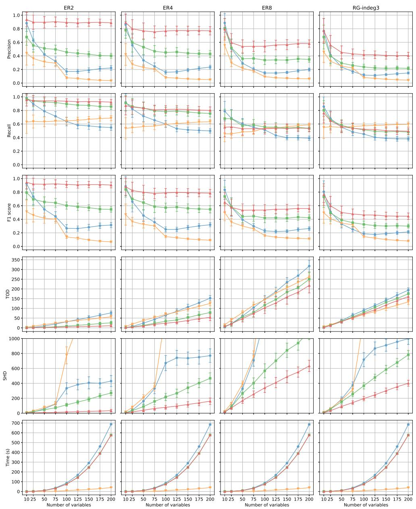
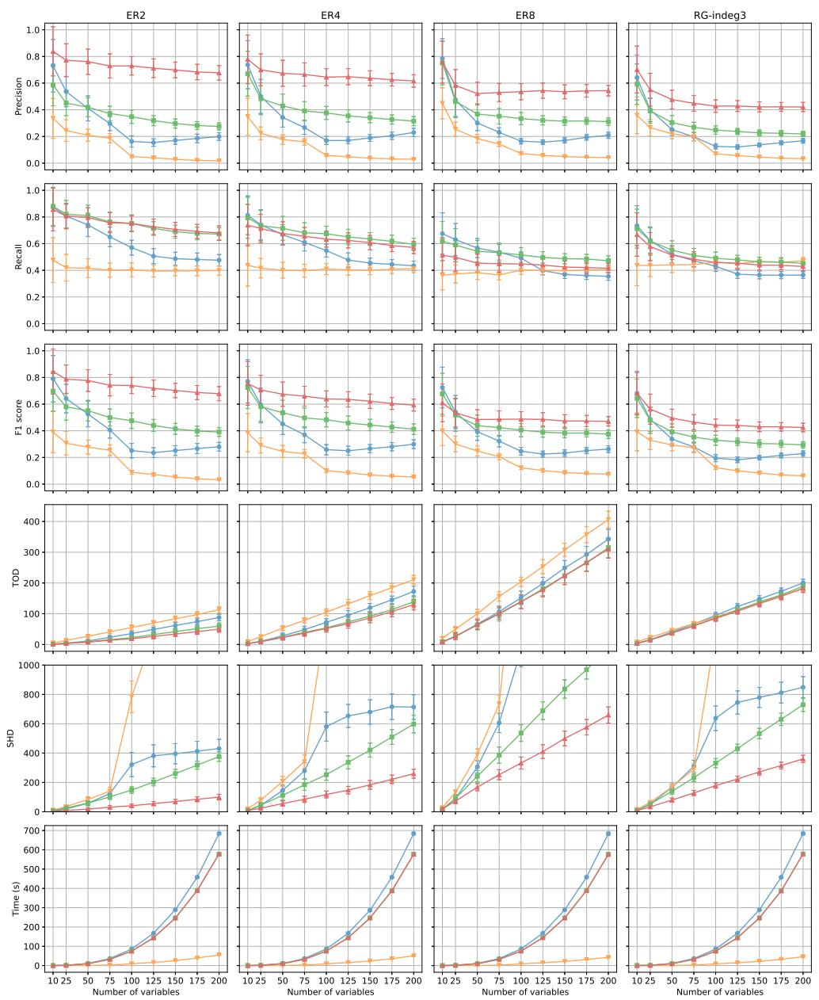
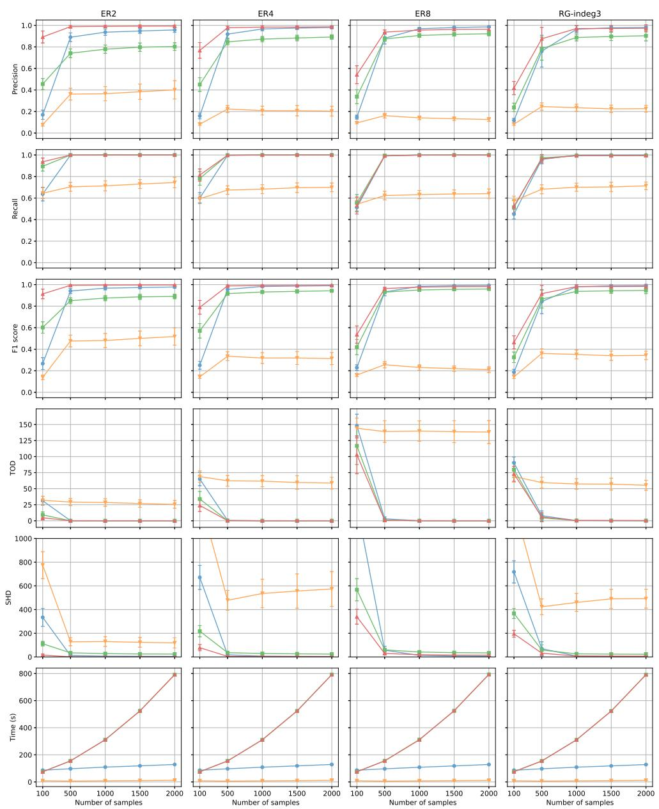
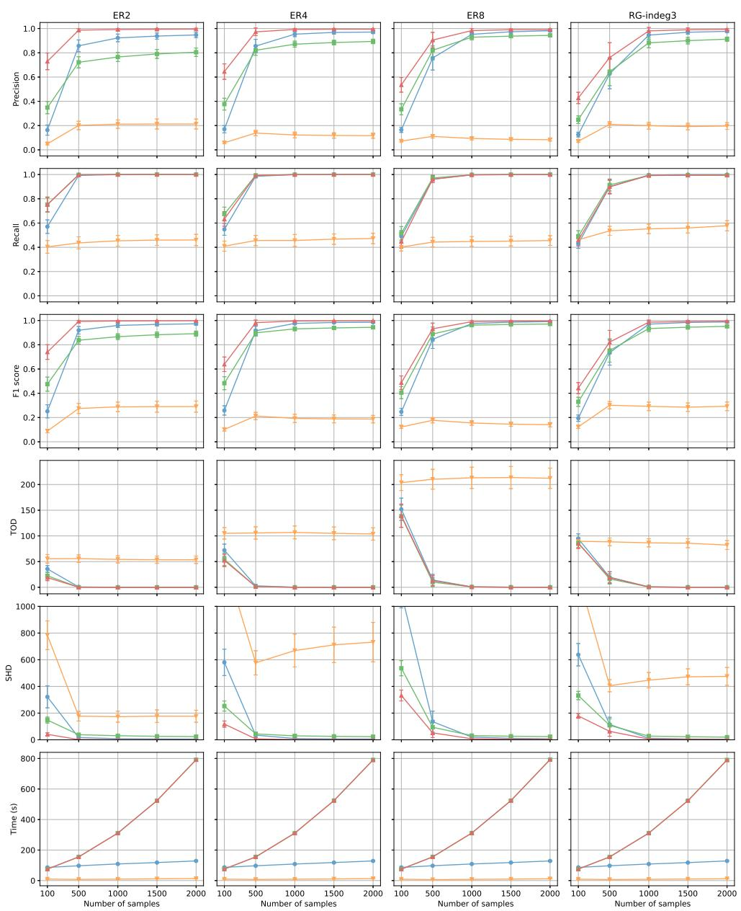
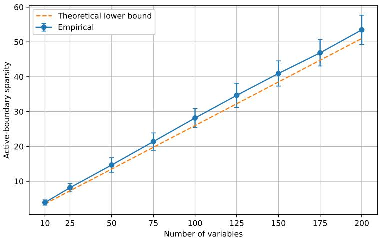
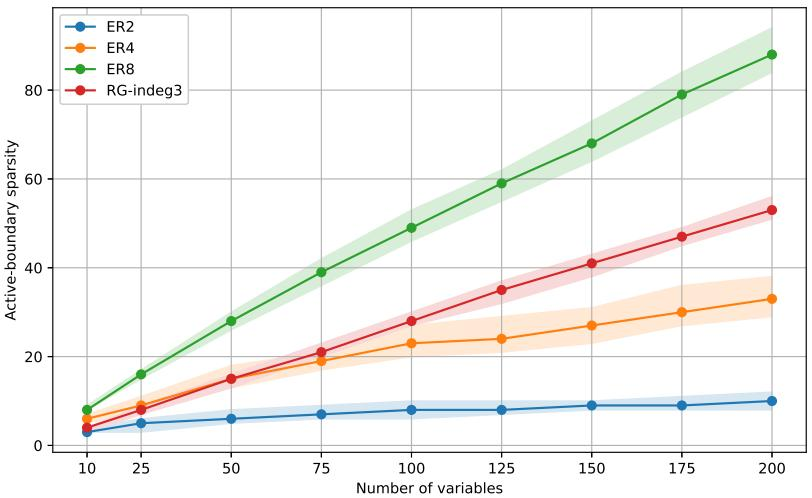

# AdaPS-LiNGAM: Adaptive Predecessor Selection for Linear Non-Gaussian Acyclic Models under Small-Sample Settings

Shun Yanashima1\*, Kentaro Kanamori1 and Hirofumi Suzuki1

1\*Artificial Intelligence Laboratory, Fujitsu Limited, 4-1-1 Kamikodanaka, Nakahara-ku, Kawasaki, 211-8588, Kanagawa, Japan.

\*Corresponding author(s). E-mail(s): yanashima-shun@fujitsu.com; Contributing authors: k.kanamori@fujitsu.com; suzuki-hirofumi@fujitsu.com;

## Abstract

Causal discovery becomes particularly challenging when the available sample size is small relative to the number of variables. This challenge also arises in the linear non-Gaussian acyclic model (LiNGAM), an identifiable framework for causal discovery from observational data. DirectLiNGAM estimates a causal order, which arranges variables so that causes precede their efects, by sequentially identifying an exogenous variable and removing its linear efect from the remaining variables. We establish a structural limitation of this procedure: when the number of variables exceeds the sample size, repeated residualization necessarily becomes degenerate before the full causal order can be determined. Our analysis further reveals that each residual can be reconstructed using only a graph-determined subset of variables already placed earlier in the causal order, termed the active boundary. This result motivates AdaPS-LiNGAM (Adaptive Predecessor Selection LiNGAM), which reconstructs each residual directly from the original observations using an adaptively chosen sparse subset of those earlier variables. The same subset-selection principle is also applied to the final pruning step for edge estimation. Experiments on synthetic data demonstrate that AdaPS-LiNGAM provides accurate causal-structure recovery in sample-limited settings and degrades more gradually as the sample size decreases.

Keywords: Causal discovery, LiNGAM, Sparse regression, Best-subset selection

## 1 Introduction

Causal discovery aims to infer causal relationships among variables from data and has been applied across a wide range of scientific and practical domains (Maathuis, Colombo, Kalisch, & B¨uhlmann, 2010; Moneta, Entner, Hoyer, & Coad, 2013; Runge et al., 2019; Sachs, Perez, Pe’er, Laufenburger, & Nolan, 2005; B. Zhang et al., 2013). A central theoretical issue is that causal direction generally cannot be identified from observational data alone without additional assumptions (Spirtes, Glymour, & Scheines, 2000). The linear non-Gaussian acyclic model (LiNGAM) addresses this issue by exploiting the non-Gaussianity of disturbance variables to identify the causal structure from observational data under a linear acyclic model (Shimizu, Hoyer, Hyv¨arinen, & Kerminen, 2006). This has led to a number of practical methods for estimating directed acyclic graphs within the LiNGAM framework.

A fundamental challenge for causal discovery in practice is that the available sample size is often limited. In this paper, we focus on settings in which the number of observations n is small in absolute terms and the number of variables p is comparable to or larger than n. Depending on the method, causal discovery in this regime may require either estimating regression models with many candidate predictors or assessing conditional independence using large conditioning sets, even though only limited data are available. Related problems have been studied extensively in small-sample and high-dimensional causal discovery. For example, previous studies have considered the reliability of causal discovery under limited data (Bromberg & Margaritis, 2009), the use of lower-order independence information (Textor, Idelberger, & Liskiewicz, 2015; Wien¨obst & Liskiewicz, 2020), and approaches that reduce the efective size of the structure-learning problem (Cai, Zhang, & Hao, 2013; Xie, Cai, Zeng, & Hao, 2019). Taken together, these studies underscore the importance of controlling the dimension of each estimation or testing problem when data are scarce.

Within the LiNGAM framework, this concern is directly relevant because several widely used algorithms rely explicitly on regression residuals. DirectLiNGAM (Shimizu et al., 2011), in particular, proceeds sequentially by identifying an exogenous variable and removing its linear efect from the remaining variables. At each step, the residuals of the remaining variables are obtained by regressing them on variables that have already been selected. Thus, as the procedure proceeds, the number of selected variables involved in the residualization grows cumulatively. This construction is central to the DirectLiNGAM procedure, but it also introduces a potential dificulty in finite samples: the regression underlying each residual can involve an increasingly large set of predictors. More generally, regression-based estimation with many predictors can become statistically unstable when the sample size is limited. High-dimensional LiNGAM methods have therefore exploited sparsity or otherwise restricted the set of variables used for estimation (Sogawa et al., 2011; Wang & Drton, 2020).

In this work, we show that cumulative residualization creates a problem more fundamental than increased estimation error. DirectLiNGAM performs each residualization as an orthogonal projection in the finite-dimensional sample space. Each nonzero step therefore reduces by one the dimension of the space in which the residual vectors lie. Because centering n observations leaves at most n 1 dimensions available, the residual vectors must become zero after at most n 1 such reductions. Consequently, when $n < p ,$ , this occurs before DirectLiNGAM has placed every variable in a sequence in which causes precede their efects. Thus, in the small-sample regime, the residualization procedure itself can become structurally degenerate, rather than merely lose statistical accuracy.

This observation raises a natural question: is it necessary to use all previously selected variables when constructing each residual? Our analysis shows that, provided that the variables selected so far follow an order consistent with the underlying causal structure, the residual of each remaining variable can be reconstructed using only a subset of them. We formalize this subset through a graph-theoretic notion that we call the active boundary. The active boundary consists of previously selected variables whose efects can enter the remaining part of the graph and subsequently reach the target variable without passing through another selected variable. Under a localized non-cancellation condition, we show that this set coincides with the support of the corresponding population reduced-form regression coeficients. Consequently, regression on the active boundary alone yields exactly the same residual as the cumulative DirectLiNGAM residualization and therefore preserves the corresponding DirectLiNGAM ordering step. This characterization also clarifies why sparse residual reconstruction can be useful in small-sample settings. The number of variables required to reconstruct a residual is determined not by the total number of previously selected variables, but by the size of the active boundary induced by the causal graph and the current ordering step. Hence, even when the total number of variables exceeds the sample size, the relevant residual reconstruction can remain low-dimensional when the active boundaries are suficiently sparse. This observation provides a structural route to avoiding the finite-sample degeneracy of cumulative residualization.

Based on this idea, we propose AdaPS-LiNGAM (Adaptive Predecessor Selection LiNGAM), a method built on the DirectLiNGAM framework that adaptively restricts the predictors used for residual reconstruction. At each ordering step, AdaPS-LiNGAM returns to the original data and reconstructs the residual of each remaining variable using only a subset of the previously selected variables, rather than repeatedly residualizing the current residuals against all of them. Because the target subset is unknown from finite data, we estimate it using adaptive best-subset selection together with an information criterion. Specifically, we use the ABESS algorithm (Zhu, Wen, Zhu, Zhang, & Wang, 2020) to eficiently solve the best-subset selection problem at each ordering step. The same principle is also used in the final pruning stage to avoid unnecessary predictors.

## Our contributions are as follows:

1. We characterize a previously unrecognized finite-sample degeneracy of the cumulative residualization procedure in DirectLiNGAM and establish that, when $n < p ,$ the residual vectors necessarily vanish while multiple variables can still remain unordered.

2. We introduce the active boundary and characterize it as the unique minimal predictor set required to reconstruct the DirectLiNGAM residual under a localized non-cancellation condition.

3. We develop AdaPS-LiNGAM, an adaptive predecessor-selection procedure that operationalizes sparse residual reconstruction in finite samples, and evaluate the proposed method from two complementary perspectives: robustness to increasing dimensionality in the small-sample regime and degradation as the number of observations decreases.

The remainder of this paper is organized as follows. Section 2 reviews related work on small-sample and high-dimensional causal discovery, with particular emphasis on LiNGAM. Section 3 introduces the LiNGAM model and the DirectLiNGAM procedure. Section 4 analyzes the finite-sample degeneracy caused by cumulative residualization. Section 5 presents AdaPS-LiNGAM, including a characterization of the active boundary for residual reconstruction, its relation to sample size, and the adaptive subset-selection procedure. Section 6 reports the empirical evaluation. Finally, Section 7 concludes the paper.

## 2 Related Work

## Causal Discovery in Small-Sample Settings.

Causal discovery from observational data can be challenging when only a limited number of observations is available. In this regime, statistical quantities used by causal discovery methods can become unreliable, particularly when they involve a large number of variables. This issue is well recognized in constraint-based methods, where conditional independence tests with large conditioning sets can have low statistical power in finite samples. Bromberg and Margaritis (2009) studied the reliability of causal discovery from small data sets and proposed an argumentation-based approach for dealing with inconsistencies among estimated independence relations. Several lines of work have therefore considered causal discovery using lower-order independence information. Textor et al. (2015) studied the causal information that can be obtained from pairwise marginal independencies, and Wien¨obst and Liskiewicz (2020) generalized this to conditional independencies with conditioning sets of size at most k. H. Zhang, Zhou, Zhang, and Guan (2017) proposed regression-based conditional independence tests that, under an additive noise model, reformulate conditional independence testing in terms of independence between regression residuals. Kocaoglu (2023) characterized the information that can be learned from conditional independence relations whose conditioning sets have size at most k through the notion of k-Markov equivalence, and proposed the sound k-PC algorithm for this setting. Another line of work reduces the size of the causal discovery problem itself. Cai et al. (2013) proposed SADA, a split-and-merge framework that exploits local sparsity to divide causal discovery into smaller subproblems, and demonstrated its applicability when the sample size is substantially smaller than the number of variables. These approaches difer in their assumptions and objectives, but share the broader observation that limiting the amount of statistical information used at each stage can be beneficial when data are scarce. We consider this issue for regression-based causal discovery, where the relevant statistical operation is the construction of regression residuals.

## LiNGAM in Small-Sample Settings.

LiNGAM provides a particularly relevant setting for studying this problem. Shimizu et al. (2006) established the identifiability of linear non-Gaussian acyclic models from observational data by exploiting the non-Gaussianity of the disturbance variables. DirectLiNGAM subsequently introduced a direct procedure for estimating the causal ordering by identifying exogenous variables from independence relationships between variables and regression residuals (Shimizu et al., 2011). Hyv¨arinen and Smith (2013) proposed pairwise likelihood ratios as an alternative criterion for estimating non-Gaussian structural equation models and discussed their applicability when the number of variables exceeds the number of observations, as well as their behavior with relatively few observations. DirectLiNGAM is particularly relevant to the present work because, after a partial causal ordering has been obtained, its procedure constructs a residual for a remaining variable using variables that precede it in the ordering. When the sample size is limited, estimating this regression with a large predictor set can become dificult. Xie et al. (2019) addressed small-sample LiNGAM more directly with MiS-LiNGAM, which first estimates a skeleton and then identifies minimal LiNGAM sets so that causal discovery can be performed on smaller subsets of variables. Thus, MiS-LiNGAM reduces the size of the causal-discovery problem itself, whereas our approach retains the DirectLiNGAM framework and reduces the predictor set used to construct each regression residual.

## Causal Discovery in High-Dimensional Settings.

A related but distinct body of work considers the high-dimensional setting, in which the number of variables is large relative to the number of observations. Sogawa et al. (2011) considered the estimation of exogenous variables in LiNGAM when the number of variables exceeds the number of observations, using a non-Gaussianity-based criterion. Loh and B¨uhlmann (2014) proposed a framework for high-dimensional linear SEMs that first estimates a sparse moralized graph and then restricts the subsequent search for a DAG to structures compatible with that graph. Wang and Drton (2020) developed a high-dimensional causal discovery method for linear non-Gaussian models and established consistency under sparsity conditions involving the maximum in-degree. Park, Moon, Park, and Jeon (2021) studied high-dimensional linear SEMs using $\ell _ { 1 }$ -regularized regression for causal-order and parent-set estimation, without relying on faithfulness, Gaussian errors, or equal error variances. These methods primarily address the dificulty caused by the growth of the ambient dimension relative to the sample size by exploiting structural sparsity or restricting the space of candidate models. The high-dimensional setting overlaps with the small-sample regime when p is large relative to $n ,$ but the two notions are not identical: limited sample size can also be problematic when n exceeds $p .$ Our focus is on the latter finite-sample issue and, in particular, on how the number of predictors used in the regression underlying each causal-ordering step afects estimation.

## 3 Preliminaries

We use the following notation throughout the paper. Let $V : = \{ 1 , \ldots , p \}$ denote the variable index set. For a vector $a = ( a _ { 1 } , \ldots , a _ { p } ) ^ { \intercal } \in \mathbb { R } ^ { p }$ and an index set $S \subseteq V$ $a _ { S }$ denotes the subvector in $\mathbb { R } ^ { | S | }$ indexed by $S .$ For a matrix $M \in \mathbb { R } ^ { p \times p }$ and index sets $S , T \subseteq V , M _ { S T }$ denotes the submatrix in $\mathbb { R } ^ { | S | \times | T | }$ with rows indexed by S and columns indexed by T.

## 3.1 LiNGAM Model

Let $\boldsymbol { x } = ( x _ { 1 } , \ldots , x _ { p } ) ^ { \top }$ be the observed random vector. The linear non-Gaussian acyclic model (LiNGAM) (Shimizu et al., 2006) assumes the linear structural equations

$$
x _ { i } = \sum _ { j = 1 } ^ { p } b _ { i j } x _ { j } + e _ { i } , \qquad i = 1 , \ldots , p ,\tag{1}
$$

where $b _ { i j } \in \mathbb { R }$ represents the direct efect from $x _ { j } \mathrm { ~ t o ~ } x _ { i }$ , and $e _ { i }$ is an exogenous noise variable. The noise variables $e _ { 1 } , \ldots , e _ { p }$ are mutually independent, continuous random variables with non-Gaussian distributions and non-zero variances. We assume that the observed variables have been centered, so that $\mathbb { E } [ x _ { i } ] = 0$ for all i. This entails no loss of generality for the linear model.

Let $B = ( b _ { i j } ) \in \mathbb { R } ^ { p \times p }$ and $\boldsymbol { e } = ( e _ { 1 } , \ldots , e _ { p } ) ^ { \intercal }$ . Then the LiNGAM model in (1) can be written in vector form as

$$
x = B x + e .
$$

The coeficient matrix B defines a directed graph $G = ( V , E )$ by $j  i$ if and only if $b _ { i j } \neq 0$ . LiNGAM assumes that $G$ is a directed acyclic graph (DAG).

For distinct nodes $i , j \in V$ , write $j \sim i$ when there exists a directed path from j to $i ,$ and define

$$
\begin{array} { r l } & { \mathrm { P a } _ { i } : = \{ j \in V \setminus \{ i \} : b _ { i j } \neq 0 \} , } \\ & { \mathrm { C h } _ { i } : = \{ j \in V \setminus \{ i \} : b _ { j i } \neq 0 \} , } \\ & { \mathrm { A n } _ { i } : = \{ j \in V \setminus \{ i \} : j  i \} , } \\ & { \mathrm { D e } _ { i } : = \{ j \in V \setminus \{ i \} : i  j \} , } \\ & { \mathrm { N o n D e s c } _ { i } : = V \setminus \big ( \mathrm { D e } _ { i } \cup \{ i \} \big ) . } \end{array}
$$

Thus $\mathrm { P a } _ { i }$ is the parent set, $\operatorname { C h } _ { i }$ is the child set, $\mathrm { A n } _ { i }$ is the strict ancestor set, $\mathrm { D e } _ { i }$ is the strict descendant set, and NonDesci is the set of strict non-descendants. Equivalently, $j \in \mathrm { P a } _ { i }$ if and only ${ \mathrm { i f ~ } } j  i$ , and $j \in \operatorname { C h } _ { i }$ if and only if $i  j$ . In a DAG, $\mathrm { P a } _ { i } \subseteq \mathrm { A n } _ { i } \subseteq$ NonDesci.

A causal order of the variables is defined by a permutation $\pi : V \to V$ such that

$$
b _ { i j } \neq 0 \quad \Longrightarrow \quad \pi ( j ) < \pi ( i ) .
$$

Thus $\pi ( i )$ is the position of variable $x _ { i }$ in the causal order. Equivalently, simultaneously permuting the rows and columns of $B$ according to increasing $\pi ( i )$ yields a strictly lower-triangular matrix. Because G is acyclic, at least one causal order exists, although it need not be unique.

A fundamental result of LiNGAM is that, under the above model assumptions, the causal structure encoded by B is identifiable from the observed distribution (Shimizu et al., 2006). This identifiability rests on the following Darmois–Skitovich theorem.

Theorem 1 (Darmois–Skitovich) Let $s _ { 1 } , \ldots , s _ { m }$ be independent random variables, and consider two linear combinations $\begin{array} { r } { \boldsymbol { u } \ = \ \sum _ { k = 1 } ^ { m } \alpha _ { k } \boldsymbol { s } _ { k } } \end{array}$ and $\begin{array} { r } { \boldsymbol { v } ~ = ~ \sum _ { k = 1 } ^ { m } \gamma _ { k } \boldsymbol { s } _ { k } } \end{array}$ . If u and v are independent, then for every k with $\alpha _ { k } \gamma _ { k } \neq 0 .$ , the variable $s _ { k }$ is Gaussian.

The contrapositive states that if a non-Gaussian independent component appears in both linear combinations with nonzero coeficients, then the two combinations cannot be independent. LiNGAM exploits this to identify the causal direction. We illustrate this with the simplest two-variable example. Suppose the true structure is $x _ { 1 } ~  ~ x _ { 2 }$ with $x _ { 1 } ~ = ~ e _ { 1 }$ and $x _ { 2 } = b _ { 2 1 } x _ { 1 } + e _ { 2 }$ . In the correct direction, regressing x2 on $x _ { 1 }$ yields the residual $e _ { 2 } .$ which is independent of $x _ { 1 } \left( = \mathrm { \ } e _ { 1 } \right)$ . On the other hand, in the wrong direction, regressing $x _ { 1 }$ on $x _ { 2 }$ yields a residual that is a linear combination containing both e1 and $e _ { 2 }$ with nonzero coeficients. Since it shares a non-Gaussian component with $x _ { 2 }$ , (the contrapositive of) the Darmois–Skitovich theorem implies that they cannot be independent. This asymmetry makes the causal direction identifiable under non-Gaussianity.

## 3.2 DirectLiNGAM

DirectLiNGAM (Shimizu et al., 2011) estimates a causal order sequentially by identifying an exogenous variable among the remaining variables and removing its linear efect from the others. At the population level, the identification principle can be expressed through pairwise regression residuals. For two variables u and v under consideration, define the linear-regression residual of u on v by

$$
r _ { u | v } : = u - \frac { \mathrm { C o v } ( u , v ) } { \mathrm { V a r } ( v ) } v .
$$

Under the LiNGAM assumptions in Section 3.1, a variable is exogenous if and only if it is independent of the residual obtained by regressing every other variable under consideration on it.

Let

$$
\ b X = ( X _ { 1 } , \dots , X _ { p } ) \in \mathbb { R } ^ { n \times p }
$$

be the centered data matrix, where $X _ { i } ~ \in ~ \mathbb { R } ^ { n }$ is the observation vector for $x _ { i }$ . At iteration t of the sample-level ordering procedure of DirectLiNGAM, let $\widehat { U } _ { t } \subseteq V$ denote the indices already placed in the first t positions and let

$$
\widehat { V } _ { t } : = V \setminus \widehat { U } _ { t } , \qquad \widehat { U } _ { 0 } = \emptyset , \qquad \widehat { V } _ { 0 } = V .
$$

For each $i \in \widehat { V } _ { t }$ , write $R _ { i } ^ { ( t ) } \in \mathbb { R } ^ { n }$ for the current residual vector, with $R _ { i } ^ { ( 0 ) } : = X _ { i }$ , and collect them in the residual data matrix

$$
R ^ { ( t ) } : = ( R _ { i } ^ { ( t ) } ) _ { i \in \widehat { V } _ { t } } \in \mathbb { R } ^ { n \times | \widehat { V } _ { t } | } .
$$

For a sample matrix $Y = ( Y _ { i } ) _ { i \in S } \in \mathbb { R } ^ { n \times | S | }$ and distinct $i , j \in S$ , define the sample pairwise residual vector

$$
R _ { i | j } ( Y ) : = Y _ { i } - \frac { { Y _ { j } ^ { \top } Y _ { i } } } { \Vert Y _ { j } \Vert _ { 2 } ^ { 2 } } Y _ { j } ,\tag{2}
$$

whenever $Y _ { j } \neq \mathbf { 0 }$ . Let $\mathcal { D } _ { n } ( a , b )$ denote the sample dependence measure used to operationalize the independence criterion, with smaller values indicating weaker dependence. The concrete form of $\mathcal { D } _ { n }$ depends on the DirectLiNGAM implementation. Define

$$
T _ { n } ( j ; Y ) : = \sum _ { i \in S \setminus \{ j \} } \mathcal { D } _ { n } \bigl ( Y _ { j } , R _ { i | j } ( Y ) \bigr ) , \qquad j \in S ,\tag{3}
$$

for $Y = ( Y _ { i } ) _ { i \in { S } }$ . DirectLiNGAM then chooses

$$
\widehat { j } _ { t } \in \arg \operatorname* { m i n } _ { j \in \widehat { V } _ { t } } T _ { n } \big ( j ; R ^ { ( t ) } \big ) .
$$

After selecting $\widehat { j } _ { t }$ , DirectLiNGAM updates every remaining residual vector by

$$
R _ { i } ^ { ( t + 1 ) } : = R _ { i | \widehat { j } _ { t } } ( R ^ { ( t ) } ) , \qquad i \in \widehat { V } _ { t } \setminus \{ \widehat { j } _ { t } \} ,\tag{4}
$$

and sets

$$
\widehat { U } _ { t + 1 } : = \widehat { U } _ { t } \cup \{ \widehat { j } _ { t } \} , \qquad \widehat { V } _ { t + 1 } : = \widehat { V } _ { t } \setminus \{ \widehat { j } _ { t } \} .
$$

Hence, after t variables have been selected, every remaining residual vector has undergone t successive least-squares projections. This cumulative residualization is analyzed in Section 4.

Once all variables have been ordered, DirectLiNGAM estimates the coeficient matrix B by regressing each variable on variables preceding it in the estimated causal order and removing unnecessary edges. We refer to this final edge-selection step as pruning. Adaptive Lasso (Zou, 2006) and related procedures are commonly used for this purpose. Algorithm 1 summarizes the sample-level procedure.

## 4 Limitations of DirectLiNGAM in Small-Sample Settings

This section establishes a finite-sample limitation of DirectLiNGAM: when $n < p ,$ its cumulative residualization becomes degenerate before the full causal order can be determined. The DirectLiNGAM update in (4) is an orthogonal projection in the finite-dimensional sample space. In Section 4.1, we first show that each residualization step removes one dimension from the subspace spanned by the residuals whenever the selected residual is nonzero, so this dimension reduction can occur at most rank $( X ) \leq$ $n - 1$ times. In Section 4.2, we then establish that, when $n < p$ , this rank constraint forces the remaining residual vectors to vanish while at least two variables remain unordered. This limitation follows from the finite-sample geometry of the residual update itself.

Algorithm 1 DirectLiNGAM   
Require: Centered data matrix $\ b X = ( X _ { 1 } , \ldots , X _ { p } ) \in \mathbb { R } ^ { n \times p }$   
1: $\widehat { U } _ { 0 } \gets \emptyset , \widehat { V } _ { 0 } \gets V .$ , and $R _ { i } ^ { ( 0 ) }  X _ { i }$ for all $i \in V$   
2: for $t = 0 , \ldots , p - 2$ do   
3: $R ^ { ( t ) } \gets ( R _ { i } ^ { ( t ) } ) _ { i \in \widehat { V } _ { t } }$   
4: choose $\hat { j } _ { t } \in$ arg min $_ { j \in \widehat { V _ { t } } } T _ { n } ( j ; R ^ { ( t ) } )$   
5: ${ \widehat { \pi } } ( { \widehat { j } } _ { t } ) \gets t + 1$   
6: for each $i \in \widehat { V } _ { t } \setminus \{ \widehat { j } _ { t } \}$ do   
7: $R _ { i } ^ { ( t + 1 ) } \gets R _ { i | \widehat { j } _ { t } } ( R ^ { ( t ) } )$   
8: end for   
9: $\widehat { U } _ { t + 1 } \gets \widehat { U } _ { t } \cup \{ \widehat { j } _ { t } \}$ and $\widehat { V } _ { t + 1 } \gets \widehat { V } _ { t } \setminus \{ \widehat { j } _ { t } \}$   
10: end for   
11: assign $\widehat { \pi } ( j )  p$ for the unique $j \in \widehat { V } _ { p - 1 }$   
12: estimate $\widehat { B }$ by regressing each variable on its predecessors under $\widehat { \pi }$ and pruning   
unnecessary edges   
13: return ${ \widehat { \pi } } , { \widehat { B } }$

## 4.1 Projection Geometry of Sequential Residualization

We first analyze the projection geometry of sequential residualization and show that each projection reduces the dimension of the subspace spanned by the residuals by one whenever the selected residual is nonzero.

Let $\mathbf { 1 } _ { n } \in \mathbb { R } ^ { n }$ denote the all-ones vector and define the centered sample subspace

$$
\mathcal { H } _ { 0 } : = \{ v \in \mathbb { R } ^ { n } : \mathbf { 1 } _ { n } ^ { \top } v = 0 \} , \qquad \mathrm { d i m } ( \mathcal { H } _ { 0 } ) = n - 1 .
$$

Because every column of X is centered, $X _ { i } \in \mathcal { H } _ { 0 }$ for all $i \in V$ . Let

$$
S _ { 0 } : = \operatorname { s p a n } \{ X _ { i } : i \in V \} , \qquad r : = \dim ( S _ { 0 } ) = \operatorname { r a n k } ( X ) .\tag{5}
$$

Since $S _ { 0 } \subseteq { \mathcal { H } } _ { 0 }$ , we have

$$
r \leq n - 1 .
$$

Let $I _ { n }$ denote the $n \times n$ identity matrix. For a nonzero vector $z \in \mathbb { R } ^ { n }$ , define $z ^ { \perp } : =$ $\{ v \in \mathbb { R } ^ { n } : z ^ { \top } v = 0 \}$ and the orthogonal projector onto $z ^ { \perp }$ ,

$$
P _ { z ^ { \perp } } : = I _ { n } - \frac { z z ^ { \top } } { z ^ { \top } z } .
$$

$\operatorname { I f } \ { \widehat { j } } _ { t }$ is selected at iteration t of DirectLiNGAM, define $g _ { t } : = R _ { \widehat { j } _ { t } } ^ { ( t ) }$ . Then (4) can be written as

$$
R _ { i } ^ { ( t + 1 ) } = P _ { g _ { t } ^ { \bot } } R _ { i } ^ { ( t ) } , \qquad i \in \widehat { V } _ { t + 1 } ,\tag{6}
$$

which is defined only when $g _ { t } \neq \mathbf { 0 }$ . For $t \geq 1$ , define

$$
S _ { t } : = S _ { 0 } \cap g _ { 0 } ^ { \perp } \cap \cdots \cap g _ { t - 1 } ^ { \perp } .
$$

With these definitions, the following lemma shows that, provided that $g _ { 0 } , \ldots , g _ { t - 1 }$ are nonzero, the updated residuals span the nested subspaces $S _ { t }$ , whose dimension decreases by one at each step.

Lemma 2 (Nested residual subspaces) Suppose $g _ { 0 } , \ldots , g _ { t - 1 }$ are nonzero. Then

$$
\operatorname { s p a n } \{ R _ { i } ^ { ( t ) } : i \in { \widehat { V } } _ { t } \} = S _ { t } , \qquad \dim ( S _ { t } ) = r - t .
$$

Proof For $t = 0$ the claim follows from (5), since $R _ { i } ^ { ( 0 ) } = X _ { i }$ and $V = \widehat { V } _ { 0 }$

Suppose span $\{ R _ { i } ^ { ( t ) } : i \in \widehat { V } _ { t } \} = S _ { t }$ . The selected direction g is one of these residual vectors, so gt $\in S _ { t }$ , and it is nonzero by hypothesis. Hence $S _ { t + 1 } = S _ { t } \cap g _ { t } ^ { \parallel }$ has dimension dim $( S _ { t } ) - 1$ . The restriction of $P _ { g _ { t } ^ { \perp } }$ to $\boldsymbol { S } _ { t }$ has kernel span $\{ g _ { t } \}$ , so its image has dimension $\dim ( S _ { t } ) - 1$ . This image is contained in $\boldsymbol { S } _ { t + 1 }$ , and the two spaces are therefore equal. By (6) the image is spanned by the updated residuals, and $P _ { g _ { t } ^ { \perp } } g _ { t } = \mathbf { 0 } .$ so removing the selected index leaves the span unchanged. Thus span $\{ R _ { i } ^ { ( t + 1 ) } : i \in \widehat { V } _ { t + 1 } \} = S _ { t + 1 }$ . Induction from $\mathrm { d i m } ( S _ { 0 } ) = r$ gives $\mathrm { d i m } ( S _ { t } ) = r - t$ 

## 4.2 Vanishing Residuals under Cumulative Residualization

We next apply Lemma 2 to characterize the finite-sample degeneracy caused by cumulative residualization when $n < p$

Proposition 3 (Vanishing residuals under cumulative residualization) Suppose $n < p ,$ , let $r = \mathrm { r a n k } ( X )$ ), and suppose $g _ { 0 } , \ldots , g _ { r - 1 }$ are nonzero. Then, $f o r t = 0 , \ldots , r ;$

$$
\operatorname { r a n k } { R } ^ { ( t ) } = r - t , \qquad | \widehat { V } _ { t } | = p - t .
$$

$$
A t t = r ,
$$

$$
R _ { i } ^ { ( r ) } = { \bf 0 } f o r a l l i \in \widehat { V } _ { r } , \qquad | \widehat { V } _ { r } | = p - r \geq p - n + 1 \geq 2 .
$$

Thus the remaining residual vectors vanish no later than step $n - 1$ while at least two variables remain unordered.

Proof By Lemma $^ { 2 , }$

$$
\operatorname { r a n k } R ^ { ( t ) } = \dim ( S _ { t } ) = r - t .
$$

Since one index is removed at each step, $| \widehat { V } _ { t } | = p - t . \mathrm { ~ A t ~ } t = r , S _ { r } = \{ \mathbf { 0 } \}$ , so every remaining residual vector vanishes. Finally, $r \leq n - 1$ gives

$$
p - r \geq p - n + 1 \geq 2 .
$$

Proposition 3 implies that, when $n < p ,$ , DirectLiNGAM cannot complete causalorder estimation through cumulative residualization: either a zero selected residual is encountered before step r, or all remaining residuals vanish at step r while at least two variables remain unordered. In the latter case, under (2), $R _ { i | j } ( R ^ { ( r ) } )$ is undefined for every remaining candidate j because $R _ { j } ^ { ( r ) } = \mathbf { 0 }$ . Consequently, the next DirectLiNGAM score in (3) is not defined.

The relevant distinction is whether $r < p - 1$ . If $r = p - 1$ , simultaneous vanishing occurs only at $t = p - 1$ , when a single variable remains and no further ordering decision is required. If $r < p - 1$ , all remaining residuals vanish while at least two variables remain unordered. Since $n < p$ implies $r \leq n - 1 < p - 1$ , the small-sample regime necessarily falls into the latter case.

When $n < p$ and the centered data contain no additional exact linear dependencies, in the sense that every subset of at most $n - 1$ columns of X is linearly independent, we have $r = n - 1$ . Under the same condition, no remaining residual vanishes before $t = r$ . Thus the remaining residuals vanish simultaneously at step $n - 1$

## 5 Proposed Method: AdaPS-LiNGAM

The analysis in Section 4 traces the failure of DirectLiNGAM in small-sample settings to its sequential residual updating. To address this issue, we propose Adaptive Predecessor Selection LiNGAM (AdaPS-LiNGAM). It avoids the cumulative residualization by returning to the original data at every ordering step and reconstructing each residual using only a subset of the previously selected variables.

First, in Section 5.1, we introduce the graph-theoretic notion of the active bound-$_ { a r y , }$ which captures the previously selected nodes whose efects can still reach a remaining node without passing through another selected node. We then show that, under a localized non-cancellation condition, this graph-defined set is exactly the unique minimal predictor set required for exact residual reconstruction. Next, in Section 5.2, we study how large the active boundaries can become across ordering steps and establish a sample-size condition under which residual reconstruction using them remains feasible. Finally, in Section 5.3, we show how the predictor sets characterized by the active boundaries can be estimated from finite samples using adaptive best-subset selection, leading to the AdaPS-LiNGAM algorithm.

## 5.1 Characterization of Sparse Residual Reconstruction

This subsection characterizes the predictor set required for residual reconstruction from the original data. We define the active boundary and show, under a non-cancellation condition, that it coincides with the support of the corresponding population regression coeficients.

Fix a causal order $\pi : V \to V$ . For $t = 0 , \ldots , p$ , define

$$
U _ { t } ^ { \pi } : = \{ i \in V : \pi ( i ) \leq t \} , \quad \quad V _ { t } ^ { \pi } : = V \setminus U _ { t } ^ { \pi } .
$$

We refer to $U _ { t } ^ { \pi }$ as the prefix set and to $V _ { t } ^ { \pi }$ as the remaining set. When the causal order is fixed, we write $U _ { t }$ and $V _ { t }$ for $U _ { t } ^ { \pi }$ and $V _ { t } ^ { \pi }$ , respectively. Because $U _ { t }$ is a prefix of a causal order, it is ancestral: no node in $V _ { t }$ is an ancestor of a node in $U _ { t }$

We first record an elementary projection fact, which allows the sequential residualization of Section 3.2 to be replaced by a single joint regression on $x _ { U _ { t } }$

For each t, define the reduced-form coeficient matrix

$$
\Theta ^ { ( t ) } : = ( \theta _ { i j } ^ { ( t ) } ) _ { i \in V _ { t } , j \in U _ { t } } : = ( I - B _ { V _ { t } V _ { t } } ) ^ { - 1 } B _ { V _ { t } U _ { t } } .
$$

Lemma 4 (Reduced regression on a prefix set) For a prefix set $U _ { t }$ , the successive DirectLiNGAM residuals satisfy

$$
x _ { V _ { t } } = \Theta ^ { ( t ) } x _ { U _ { t } } + r _ { V _ { t } } ^ { ( t ) } ,\tag{7}
$$

$$
r _ { V _ { t } } ^ { ( t ) } = \left( I - B _ { V _ { t } V _ { t } } \right) ^ { - 1 } e _ { V _ { t } } .\tag{8}
$$

Thus $r _ { V _ { t } } ^ { ( t ) }$ is also the residual of the linear regression of $x _ { V _ { t } }$ on $x _ { U _ { t } }$

Proof Because $U _ { t }$ is ancestral, $B { { U } _ { t } } V _ { t } = 0$ . Partitioning the LiNGAM equations according to $( U _ { t } , V _ { t } )$ gives

$$
\begin{array} { r l } & { x _ { U _ { t } } = B _ { U _ { t } U _ { t } } x _ { U _ { t } } + e _ { U _ { t } } , } \\ & { x _ { V _ { t } } = B _ { V _ { t } U _ { t } } x _ { U _ { t } } + B _ { V _ { t } V _ { t } } x _ { V _ { t } } + e _ { V _ { t } } . } \end{array}
$$

Since $I - B _ { V _ { t } V _ { t } }$ is invertible,

$$
x _ { V _ { t } } = \Theta ^ { ( t ) } x _ { U _ { t } } + ( I - B _ { V _ { t } V _ { t } } ) ^ { - 1 } e _ { V _ { t } } .
$$

Since $x _ { U _ { t } }$ is a function only of $e _ { U _ { t } }$ and $e _ { V _ { t } }$ is independent of $e _ { U _ { t } }$

$$
\mathrm { C o v } \Big ( ( I - B _ { V _ { t } V _ { t } } ) ^ { - 1 } e _ { V _ { t } } , x _ { U _ { t } } \Big ) = 0 .
$$

Hence $\Theta ^ { ( t ) } \boldsymbol { x } \boldsymbol { U } _ { t }$ is the linear projection of $x _ { V _ { t } }$ onto $x _ { U _ { t } }$ , with residual $( I - B _ { V _ { t } V _ { t } } ) ^ { - 1 } e _ { V _ { t } }$ Successive DirectLiNGAM residualization removes orthogonal directions spanning $\operatorname { s p a n } ( x _ { U _ { t } } )$ and therefore yields the same orthogonal-projection residual. By uniqueness of the orthogonal projection,

$$
r _ { V _ { t } } ^ { ( t ) } = \left( I - B _ { V _ { t } V _ { t } } \right) ^ { - 1 } e _ { V _ { t } } ,
$$

which proves (7) and (8).

Lemma 4 shows that, after t ordering steps, the residual of DirectLiNGAM for target i can be obtained from a single regression of $x _ { i }$ on $x _ { U _ { t } }$ , with coeficient row $\Theta _ { i , \cdot } ^ { ( t ) }$ Thus, identifying which variables in $U _ { t }$ are needed for residual reconstruction reduces to determining which entries of $\Theta _ { i , \cdot } ^ { ( t ) }$ are nonzero.

Definition 1 (Active boundary) For a prefix set $U _ { t }$ and a remaining node $i \in V _ { t }$ , define

$$
\partial _ { i } ( U _ { t } ) : = \{ j \in U _ { t } : \ \exists \ j = v _ { 0 } \to v _ { 1 } \to \dots \to v _ { m } = i , \ m \geq 1 , \ \mathrm { w i t h } \ v _ { 1 } , \dots , v _ { m } \in V _ { t } \}
$$

Thus $\partial _ { i } ( U _ { t } )$ contains the nodes in the prefix set whose efects enter the remaining set and can subsequently reach i without passing through another node in the prefix set.

By the path expansion of the reduced-form coeficient matrix,

$$
\Theta ^ { ( t ) } = \left( \sum _ { \ell = 0 } ^ { | V _ { t } | - 1 } B _ { V _ { t } V _ { t } } ^ { \ell } \right) B _ { V _ { t } U _ { t } } .\tag{9}
$$

Hence each coeficient $\theta _ { i j } ^ { ( t ) }$ is the sum of products of edge coeficients over directed paths from $j$ to i whose nodes after $j$ remain in $V _ { t }$ . Therefore,

$$
\operatorname { s u p p } ( \Theta _ { i , \cdot } ^ { ( t ) } ) \subseteq \partial _ { i } ( U _ { t } ) .\tag{10}
$$

The inclusion can be strict if the contributions of multiple directed paths cancel exactly. We exclude this case by the following assumption.

Assumption 5 (Non-cancellation condition) For every ordering step $t ,$ every $i \in V _ { t } ,$ and every $j \in \partial _ { i } ( U _ { t } )$ ,

$$
{ \theta } _ { i j } ^ { ( t ) } \neq 0 .
$$

This assumption is related to, but distinct from, the classical faithfulness condition (Spirtes et al., 2000). In linear Gaussian structural equation models, violations of faithfulness can arise from exact cancellations among the contributions of multiple directed paths (Peters, 2012). Such cancellations correspond to nontrivial algebraic constraints on the causal parameters and hence occur on a measure-zero subset of the parameter space under the usual absolute-continuity argument (Meek, 1995; Uhler, Raskutti, B¨uhlmann, & Yu, 2013).

Our assumption imposes only the localized non-cancellation condition needed for the reduced-form coeficients in (7): for each active-boundary pair $( j , i )$ , the relevant directed-path contributions to $\theta _ { i j } ^ { ( t ) }$ must not cancel exactly. It may be viewed as a stepwise, localized version of the path coeficients condition of Kruijer et al. (2020). Noncancellation of directed-path contributions alone is not suficient for faithfulness, since non-faithfulness can also arise from cancellation among treks, among other mechanisms (Kruijer et al., 2020).

Remark 1 By $( 9 ) , \theta _ { i j } ^ { ( t ) }$ is a sum of squarefree monomials in the nonzero entries of $B ,$ one for each directed path from $j$ to i whose nodes after $j$ lie in $V _ { t } .$ . Distinct directed paths have distinct edge sets and hence yield distinct monomials, so $\theta _ { i j } ^ { ( t ) }$ is not the zero polynomial whenever $j \in \partial _ { i } ( U _ { t } )$ . Since a fixed DAG admits only finitely many prefix sets and finitely many pairs $( j , i )$ , the union of the corresponding zero sets is Lebesgue-null. Hence Assumption 5 holds for Lebesgue-almost every choice of the nonzero edge coeficients.

Combining the path-based inclusion in (10) with Assumption 5 yields an exact characterization of the predictors needed for residual reconstruction. In particular, the active boundary coincides with the support of the corresponding regression coeficients.

Proposition 6 (Characterization of the active boundary) Under Assumption 5, for every prefix set $U _ { t }$ and every remaining node $i \in V _ { t }$

$$
\operatorname { s u p p } ( \Theta _ { i , \cdot } ^ { ( t ) } ) = \partial _ { i } ( U _ { t } ) .
$$

Consequently,

$$
x _ { i } = \sum _ { j \in \partial _ { i } ( U _ { t } ) } \theta _ { i j } ^ { ( t ) } x _ { j } + r _ { i } ^ { ( t ) } .\tag{11}
$$

Proof The inclusion (10) gives one direction. Conversely, Assumption 5 gives $\theta _ { i j } ^ { ( t ) } \neq 0$ for every $j \in \partial _ { i } ( U _ { t } )$ , and hence $\partial _ { i } ( U _ { t } ) \subseteq \operatorname { s u p p } ( \Theta _ { i , \cdot } ^ { ( t ) } )$ . The support equality follows. Substituting it into (7) gives the stated representation. 

Equation (11) shows that regressing $x _ { i }$ on $x _ { \partial _ { i } ( U _ { t } ) }$ is suficient to reconstruct the DirectLiNGAM residual $r _ { i } ^ { ( t ) }$ . The following proposition shows that this support is also minimal: it is the unique smallest support attaining the minimum risk.

Proposition 7 (Minimality of the active boundary) Let $U _ { t }$ be a prefix set, let $i \ \in \ V _ { t }$ and suppose Assumption 5 holds. Then the least-squares coeficient $o f x _ { i }$ on $x _ { U _ { t } }$ t is unique and equals $\Theta _ { i , \cdot } ^ { ( t ) }$ , whose support is $\partial _ { i } ( U _ { t } )$ . Moreover, every subset $S \subseteq U _ { t }$ whose best linear predictor attains the minimum squared-error risk satisfies $\partial _ { i } ( U _ { t } ) \subseteq S$ . Hence $\partial _ { i } ( U _ { t } )$ is the unique smallest support attaining the minimum risk, and the corresponding residual is $r _ { i } ^ { ( t ) }$

Proof Since

$$
x _ { U _ { t } } = ( I - B _ { U _ { t } U _ { t } } ) ^ { - 1 } e _ { U _ { t } }
$$

and the noise covariance is diagonal with strictly positive entries, $\mathrm { C o v } ( x _ { U _ { t } } ) \succ 0$ . Hence the least-squares coeficient of $x _ { i }$ on $x _ { U _ { t } }$ is unique. By Lemma $^ { 4 , }$ it equals $\Theta _ { i , \cdot } ^ { ( t ) }$ and has residual $r _ { i } ^ { ( t ) }$ ; by Proposition $^ { 6 , }$ its support is $\partial _ { i } ( U _ { t } )$

Now let $S \subseteq U _ { t }$ and suppose that its best linear predictor attains the same minimum risk. Extending its coeficient vector by zeros to $U _ { t }$ gives a minimizer of the full regression on $x _ { U _ { t } }$ . By uniqueness, this coeficient vector must equal $\Theta _ { i , \cdot } ^ { ( t ) }$ . Therefore,

$$
\partial _ { i } ( U _ { t } ) = \operatorname { s u p p } ( \Theta _ { i , \cdot } ^ { ( t ) } ) \subseteq S .
$$

Since $\partial _ { i } ( U _ { t } )$ itself attains the minimum risk by (11), it is the unique smallest support attaining that risk, with residual $r _ { i } ^ { ( t ) }$ 

The residuals also retain the LiNGAM structure on the remaining variables. Indeed, by (7),

$$
r _ { V _ { t } } ^ { ( t ) } = B _ { V _ { t } V _ { t } } r _ { V _ { t } } ^ { ( t ) } + e _ { V _ { t } } .
$$

Thus, reconstructing the same residuals preserves the LiNGAM model to which the next DirectLiNGAM ordering step is applied.

Corollary 8 (Preservation of the ordering step) Let $U _ { t }$ be a prefix set. $H ,$ for every $i \in V _ { t }$ the residual is reconstructed $b y$ the regression of $x _ { i }$ on $x _ { \partial _ { i } ( U _ { t } ) } { } _ { ; }$ then the resulting residuals coincide with the residuals produced $b y$ DirectLiNGAM after t ordering steps. Consequently, the next DirectLiNGAM root-selection criterion yields the same scores, and hence the same set of minimizers.

Corollary 9 (Characterization for pruning) Let $C _ { i }$ satisfy $\mathrm { P a } _ { i } \subseteq C _ { i } \subseteq \mathrm { N }$ NonDesci. Then the least-squares coeficient of $x _ { i }$ on $x _ { C _ { i } }$ is unique, has support $\mathrm { P a } _ { i } ,$ equals $b _ { i j } \ f o r \ j \in \operatorname { P a } _ { i }$ , and has residual $e _ { i } .$ . Moreover, every subset $S \subseteq C _ { i }$ attaining the minimum squared-error risk satisfies $\operatorname { P a } _ { i } \subseteq S$ . Hence $\mathrm { P a } _ { i }$ is the unique smallest support attaining the minimum risk.

Proof Since $C _ { i }$ contains no descendants of $i ,$ the noise $e _ { i }$ is independent of $x _ { C _ { i } }$ . Thus the structural equation

$$
x _ { i } = \sum _ { j \in \mathrm { P a } _ { i } } b _ { i j } x _ { j } + e _ { i }
$$

gives the least-squares projection of $x _ { i }$ onto $x _ { C _ { i } }$ . Because $\mathrm { C o v } ( x _ { C _ { i } } ) \succ 0$ , its coeficient vector is unique and has support $\mathrm { P a } _ { i }$ . The same uniqueness argument as in Proposition $7$ then implies that every risk-minimizing support $S \subseteq C _ { i }$ contains $\mathrm { P a } _ { i }$ 

## 5.2 Active-Boundary Sparsity and Sample Size

Section 5.1 characterizes which variables in the prefix set are needed to reconstruct a DirectLiNGAM residual. This subsection studies the size of this target set and its relation to the sample size $n .$

Define the (maximum) active-boundary sparsity along $\pi$ by

$$
s _ { \operatorname* { m a x } } ( \pi ) : = \operatorname* { m a x } _ { 0 \leq t < p } \operatorname* { m a x } _ { i \in V _ { t } ^ { \pi } } | \partial _ { i } ( U _ { t } ^ { \pi } ) | .\tag{12}
$$

By Proposition $^ { 7 , }$ the cardinality of the active boundary $| \partial _ { i } ( U _ { t } ^ { \pi } ) |$ is the minimum support size required to reconstruct the DirectLiNGAM residual for target i at the population level. Hence $s _ { \operatorname* { m a x } } ( \pi )$ is the largest such support size encountered along π.

The contrast with cumulative residualization is already visible in the simplest possible graph.

Example 1 (Directed chain) Let $G$ be the chain $1 \to 2 \to \cdots \to p$ with $\pi ( i ) = i .$ For $t \geq 1$ and $i \in V _ { t }$ , a node $j \in U _ { t }$ belongs to $\partial _ { i } ( U _ { t } )$ only if the path from $j$ to i enters $V _ { t }$ immediately after leaving $j .$ In the chain this occurs only for $j = t .$ . Hence

$$
\partial _ { i } ( U _ { t } ) = \{ t \}
$$

for every $i \in V _ { t }$ , and therefore

$$
s \operatorname* { m a x } ( \pi ) = 1 .
$$

Thus, at every noninitial ordering step, the minimum support required to reconstruct any remaining residual has size one, independently of $p .$

The active-boundary sparsity can, however, behave very diferently from the maximum in-degree. We next consider the random DAG construction proposed by Wang and Drton (2020).

Example 2 (Wang–Drton random DAG) Consider the random DAG construction of Wang and Drton (2020) with the fixed causal order $1 , \ldots , p$ and in-degree bound J. For each node $v = 2 , \ldots , p ,$ the edge $( v - 1 ) \to$ v is always present, and the number of parents is sampled as

$$
d _ { v } \sim \operatorname { U n i f } \{ 1 , \dots , \operatorname* { m i n } ( v - 1 , J ) \} .
$$

When $d _ { v } > 1$ , the remaining $d _ { v } - 1$ parents are selected uniformly without replacement from $\{ 1 , \ldots , v - 2 \}$

Consider a prefix set $U _ { t } = \{ 1 , \ldots , t \}$ and a remaining node $i > t .$ The mandatory edges form the chain

$$
t \to t + 1 \to \cdot \cdot \cdot \to i ,
$$

so $t \in \partial _ { i } ( U _ { t } )$ . For $t > J$ and $j < t ,$ the probability that j is selected as an additional parent of a node v is

$$
{ \frac { J - 1 } { 2 ( v - 2 ) } } .
$$

Therefore,

$$
\mathbb { E } [ | \partial _ { i } ( U _ { t } ) | ] = 1 + ( t - 1 ) \left[ 1 - \prod _ { v = t + 1 } ^ { i } \left( 1 - \frac { J - 1 } { 2 ( v - 2 ) } \right) \right] .
$$

For the $J = 3$ setting used in our experiments, this simplifies to

$$
\mathbb { E } [ | \partial _ { i } ( U _ { t } ) | ] = 1 + ( t - 1 ) \frac { i - t } { i - 2 } .
$$

Taking the final target $i = p$ and

$$
t = \left\lceil { \frac { p + 1 } { 2 } } \right\rceil ,
$$

we obtain

$$
\mathbb { E } [ s _ { \operatorname* { m a x } } ( \pi ) ] \geq \mathbb { E } [ | \partial _ { p } ( U _ { t } ) | ] = 1 + \frac { \lfloor ( p - 1 ) ^ { 2 } / 4 \rfloor } { p - 2 } = \frac { p } { 4 } + O ( 1 ) .
$$

Thus, in the $J \ = \ 3$ setting, although the maximum in-degree is bounded by three, the expected active-boundary sparsity grows linearly with $p .$ More generally, a bounded maximum in-degree does not by itself imply bounded active-boundary sparsity.

This example shows that the number of predictors required for the residual reconstruction can increase with p even when the maximum in-degree is fixed.

We next examine whether residual reconstruction using the active boundary remains feasible in the finite-sample data matrix. For $S \subseteq V$ , let $P _ { S }$ denote the orthogonal projector onto the subspace $\operatorname { s p a n } ( X _ { S } )$ spanned by the columns of $X _ { S }$ . Along a causal order $\pi ,$ define the oracle active-boundary residual by

$$
\widetilde R _ { i } ^ { ( t ) } : = X _ { i } - P _ { \partial _ { i } ( U _ { t } ^ { \pi } ) } X _ { i } , \qquad t = 0 , \dots , p - 2 , \quad i \in V _ { t } ^ { \pi } .\tag{13}
$$

Because the columns of $X$ are centered, at most $n - 1$ of them can be linearly independent. Thus $| \partial _ { i } ( U _ { t } ^ { \pi } ) | \leq n - 2$ makes linear independence of

$$
\{ X _ { j } : j \in \partial _ { i } ( U _ { t } ^ { \pi } ) \} \cup \{ X _ { i } \}
$$

possible, but does not by itself guarantee it. We therefore impose the following localized nondegeneracy condition.

Assumption 10 (Sample nondegeneracy of active-boundary regressions) For every ordering step $t = 0 , \ldots , p - 2$ and every $i \in V _ { t } ^ { \pi }$

$$
\operatorname { r a n k } X _ { \partial _ { i } ( U _ { t } ^ { \pi } ) \cup \{ i \} } = | \partial _ { i } ( U _ { t } ^ { \pi } ) | + 1
$$

whenever $| \partial _ { i } ( U _ { t } ^ { \pi } ) | \leq n - 2 .$

Assumption 10 excludes exact linear dependencies only among the columns involved in the oracle active-boundary regressions. The condition is local: it does not require the full data matrix X to have maximal rank, nor does it impose linear independence on subsets that do not arise in these regressions.

Proposition 11 (Finite-sample feasibility of oracle boundary reconstruction) Suppose the sample nondegeneracy condition of Assumption 10 holds along a causal order π. If

$$
s _ { \operatorname* { m a x } } ( \pi ) \leq n - 2 ,
$$

then $f o r$ every ordering step ${ t } = 0 , \ldots , p - 2$ and every remaining node $i \in V _ { t } ^ { \pi }$ , the oracle active-boundary residual satisfies

$$
\widetilde { R } _ { i } ^ { ( t ) } \neq \mathbf { 0 } .
$$

Proof By (12), $| \partial _ { i } ( U _ { t } ^ { \pi } ) | \leq s \mathrm { m a x } ( \pi ) \leq n - 2$ . Hence Assumption 10 implies that the columns of $X _ { \partial _ { i } ( U _ { t } ^ { \pi } ) \cup \{ i \} }$ are linearly independent. Therefore

$$
X _ { i } \notin \operatorname { s p a n } \{ X _ { j } : j \in \partial _ { i } ( U _ { t } ^ { \pi } ) \} ,
$$

so (13) is nonzero.

Proposition 11 applies regardless of the relative sizes of n and $p .$ Its main relevance here is the small-sample regime $n < p ,$ , where it provides a finite-sample contrast to Proposition 3. Under cumulative residualization, DirectLiNGAM is necessarily subject to deterministic vanishing, whereas oracle active-boundary reconstruction remains nondegenerate under $s _ { \operatorname* { m a x } } ( \pi ) \leq n - 2$ and Assumption 10.

The key diference is that DirectLiNGAM applies one additional projection at each ordering step, whereas oracle active-boundary reconstruction returns to the original data and uses only $| \partial _ { i } ( U _ { t } ^ { \pi } ) | \leq s _ { \operatorname* { m a x } } ( \pi )$ predictors. Thus the number of predictors used for residual reconstruction is controlled by the graph rather than by the ordering step t. In particular, when $n < p ,$ the conditions of Proposition 11 allow the oracle residuals to remain nonzero even at ordering steps $t \geq n - 1$ , where cumulative residualization cannot continue with nonzero projection directions. For example, in the directed chain of Example 1, $s _ { \operatorname* { m a x } } ( \pi ) = 1$ independently of $p .$

Remark 2 (Scope of Proposition 11) Proposition 11 guarantees only that the oracle activeboundary residuals remain nonzero. It does not guarantee recovery of the active boundary.

Since $s _ { \operatorname* { m a x } } ( \pi )$ is a graph-dependent quantity, it is useful to relate it to simpler structural quantities. For any node i, consider the prefix set immediately preceding i, namely $U _ { \pi ( i ) - 1 }$ . At this point all ancestors of i are contained in the prefix set, and

$$
\begin{array} { r } { \partial _ { i } ( U _ { \pi ( i ) - 1 } ) = \mathrm { P a } _ { i } . } \end{array}
$$

Indeed, each parent reaches i directly, whereas any path from a non-parent ancestor contains an intermediate ancestor already in the prefix set. Therefore,

$$
s _ { \operatorname* { m a x } } ( \pi ) \geq \operatorname* { m a x } _ { i \in V } | \mathrm { P a } _ { i } | .
$$

For an upper bound, we introduce a set that depends only on the prefix set and contains the active boundaries of all remaining nodes.

Definition 2 (Outgoing frontier) For a subset $U \subseteq V ,$ define its outgoing frontier by

$$
F ( U ) : = \{ j \in U : \operatorname { C h } _ { j } \cap ( V \setminus U ) \neq \emptyset \} .
$$

Thus $F ( U )$ consists of the nodes in U having at least one child outside U. Unlike the active boundary, it does not depend on a target node. Along a causal order, it is exactly the union of the active boundaries of the remaining nodes.

Lemma 12 (Outgoing frontier as the union of active boundaries) For every causal order π and every step $t = 0 , \ldots , p - 1$

$$
\bigcup _ { i \in V _ { t } ^ { \pi } } \partial _ { i } ( U _ { t } ^ { \pi } ) = F ( U _ { t } ^ { \pi } ) .
$$

In particular, $\partial _ { i } ( U _ { t } ^ { \pi } ) \subseteq F ( U _ { t } ^ { \pi } )$ , and hence $| \partial _ { i } ( U _ { t } ^ { \pi } ) | \leq | F ( U _ { t } ^ { \pi } ) |$ , for every $i \in V _ { t } ^ { \pi }$

Proof Let $j \in \partial _ { i } ( U _ { t } ^ { \pi } )$ for some $i \in V _ { t } ^ { \pi }$ . By Definition 1, there is a directed path $j = v _ { 0 } $ $v _ { 1 }  \cdot \cdot \cdot  v _ { m } = i$ with $v _ { 1 } , \ldots , v _ { m } \in V _ { t } ^ { \pi }$ . Hence v $\in \mathrm { C h } _ { j } \cap V _ { t } ^ { \pi }$ , so $j \in F ( U _ { t } ^ { \pi } )$ . Conversely, let $j \in F ( U _ { t } ^ { \pi } )$ . Then some $k \in \mathrm { C h } _ { j } \cap V _ { t } ^ { \pi }$ exists, and the single-edge path $j \to k$ shows that $j \in \partial _ { k } ( U _ { t } ^ { \pi } )$ 

Taking maxima in the inclusion $\partial _ { i } ( U _ { t } ^ { \pi } ) \subseteq F ( U _ { t } ^ { \pi } )$ and combining it with the lower bound above gives

$$
\operatorname* { m a x } _ { i \in V } | \mathrm { P a } _ { i } | \ \leq \ s _ { \operatorname* { m a x } } ( \pi ) \ \leq \ \operatorname* { m a x } _ { 0 \leq t < p } | F ( U _ { t } ^ { \pi } ) | .\tag{14}
$$

These bounds give simple graph-level conditions for the suficient condition $s _ { \operatorname* { m a x } } ( \pi ) ~ \leq ~ n - 2$ . If some node has in-degree at least $n - 1$ , then the condition cannot hold for any causal order. Conversely, if $| F ( U _ { t } ^ { \pi } ) | \le n - 2$ for every t, then $s _ { \operatorname* { m a x } } ( \pi ) \leq n - 2$ , and Proposition 11 applies. An in-degree of at least $n - 1$ therefore rules out this suficient condition, but does not by itself imply that an oracle residual must vanish. The following examples illustrate these two cases.

Example 3 (Hub) Let G have edges $j  p$ for $j = 1 , \ldots , p - 1$ , so that node $p$ has in-degree $p - 1$ and all other nodes are roots. For any causal order, $\pi ( p ) = p ,$ and

$$
\partial _ { p } ( U _ { p - 1 } ^ { \pi } ) = \operatorname { P a } _ { p } = \{ 1 , \dots , p - 1 \} .
$$

Hence

$$
s _ { \operatorname* { m a x } } ( \pi ) = p - 1
$$

for every causal order. Thus the active-boundary sparsity grows with p and cannot be reduced by reordering. In particular, $s _ { \mathrm { m a x } } ( \pi ) \leq n { - } 2$ fails throughout the regime $n < p .$ Proposition 11 is therefore inapplicable in this example because its suficient condition is not satisfied. This does not imply, however, that a particular oracle residual must vanish.

Example 4 (Layered graph of bounded width) Partition V into layers $L _ { 1 } , \ldots , L _ { m }$ with $| L _ { k } | \leq$ w for all $k ,$ with the convention $L _ { 0 } = \varnothing ,$ , and suppose every edge joins consecutive layers, that is, $j \to i$ implies $j \in L _ { k }$ and $i \in L _ { k + 1 }$ for some k. Let π order the layers consecutively. Fix a step $t < p$ and let $L _ { k }$ be the first layer not fully contained in $U _ { t }$ . Then

$$
U _ { t } = L _ { 1 } \cup \cdots \cup L _ { k - 1 } \cup A , \qquad A \subsetneq L _ { k } ,
$$

so $| A | \le w - 1$ . A node in $L _ { k ^ { \prime } }$ with $k ^ { \prime } \leq k - 2$ has all of its children in $L _ { k ^ { \prime } + 1 } \subseteq U _ { t }$ and hence does not belong to the outgoing frontier of Definition 2, so $F ( U _ { t } ) \subseteq A \cup L _ { k - 1 }$ and $| F ( U _ { t } ) | \le ( w - 1 ) + w = 2 w - 1$ . By (14),

$$
s \mathrm { m a x } ( \pi ) \leq 2 w - 1 ,
$$

independently of the number of layers and hence of $p .$ Consequently, if $2 w - 1 \leq n - 2$ and Assumption 10 holds, Proposition 11 applies independently of the number of layers and hence of $p .$ The directed chain of Example 1 is a special case with $w = 1$ , for which the bound is exact. Thus the graph may be arbitrarily deep, and $p$ arbitrarily large relative to $n ,$ provided its layer width remains bounded relative to n.

Taken together, these results show that finite-sample feasibility of oracle residual reconstruction can be controlled by the active-boundary sparsity relative to the sample size, rather than by the total number of variables. Under Assumption 10,

$$
s _ { \operatorname* { m a x } } ( \pi ) \leq n - 2
$$

is suficient for all oracle active-boundary residuals used during causal ordering to remain nonzero. As the hub and bounded-width examples illustrate, this condition reflects structural complexity along the causal order and can either grow with $p$ or remain bounded independently of $p .$

## 5.3 Algorithm and Implementation

Section 5.1 characterizes the predictor sets required for residual reconstruction, while Section 5.2 analyzes their size and finite-sample feasibility. In particular, the sparsity bound $s _ { \operatorname* { m a x } } ( \pi ) \leq n { - } 2$ gives a suficient condition for the corresponding oracle residuals to remain nonzero under Assumption 10. In observed data, however, the required predictor sets are unknown, so AdaPS-LiNGAM adaptively estimates them using bestsubset selection.

## 5.3.1 Adaptive best subset selection

For a response vector $y \in \mathbb { R } ^ { n }$ , a candidate index set $C \subseteq V$ , the associated design matrix

$$
W _ { C } : = ( W _ { j } ) _ { j \in C } \in \mathbb { R } ^ { n \times | C | } ,
$$

and a prescribed cardinality $k \in \{ 0 , \ldots , | C | \}$ , best subset selection (BSS) solves

$$
\widehat { \beta } ( k ) \in \mathop { \mathrm { a r g } } \operatorname* { m i n } _ { \beta \in \mathbb { R } ^ { | C | } } \frac { 1 } { n } \Big \| y - \sum _ { j \in C } \beta _ { j } W _ { j } \Big \| _ { 2 } ^ { 2 } \quad \mathrm { s u b j e c t ~ t o } \quad \| \beta \| _ { 0 } \leq k ,\tag{15}
$$

where $\beta = ( \beta _ { j } ) _ { j \in C }$ and $\| \beta \| _ { 0 } : = | \{ j \in C : \beta _ { j } \neq 0 \} |$

Applying BSS in practice raises two issues. First, solving (15) is a combinatorial optimization problem and can be computationally demanding when the candidate set is large. Second, the appropriate cardinality k is generally unknown and needs to be specified or selected in some way. We refer to BSS together with selection of the cardinality k as adaptive BSS.

To solve adaptive BSS, we use abess (Zhu et al., 2020), which uses a splicing-based algorithm for best-subset selection and selects the subset size using an information criterion. We write $\widehat { \beta }$ for the resulting coeficient vector and

$$
\widehat { S } : = \{ j \in C : \widehat { \beta } _ { j } \neq 0 \} \subseteq C
$$

for its support.

## 5.3.2 Use in causal ordering and pruning

Let $\ b X = ( X _ { 1 } , \ldots , X _ { p } ) \in \mathbb { R } ^ { n \times p }$ denote the centered data matrix. We use the same sample iteration notation as in Section $3 . 2 \colon \widehat { U } _ { t }$ contains the variables selected in the first t positions and $\widehat { V } _ { t } : = V \setminus \widehat { U } _ { t }$ contains the variables that remain to be ordered. At ordering step t, AdaPS-LiNGAM returns to the original data and, for every $i \in \widehat { V } _ { t }$ ， uses $X _ { \widehat { U } _ { t } }$ as the candidate design in adaptive BSS. The selected subset is used to construct a sample residual vector $\widehat { R } _ { i } ^ { ( t ) }$ , and the next root is chosen by minimizing $T _ { n } ( j ; \widehat { R } ^ { ( t ) } )$ over the residual data matrix $\widehat { R } ^ { ( t ) } : = ( \widehat { R } _ { i } ^ { ( t ) } ) _ { i \in \widehat { V } _ { t } }$ . Proposition 6 shows that the DirectLiNGAM residual can be reconstructed using only a subset of the prefix set, while Corollary 8 shows that this reconstruction preserves the next DirectLiNGAM root-selection step. Further, the sparsity analysis in Section 5.2 shows when such a reconstruction can remain nondegenerate in finite samples. Accordingly, adaptive BSS is used to retain only a subset of $\widehat { U } _ { t }$ , rather than residualizing against all of $\widehat { U } _ { t }$

After an estimated causal order ${ \widehat { \pi } } { \mathrm { ~ : ~ } } V \to V$ has been obtained, define the predecessor set of variable i by

$$
\widehat { C } _ { i } : = \{ j \in V : \widehat { \pi } ( j ) < \widehat { \pi } ( i ) \} .
$$

AdaPS-LiNGAM applies the same adaptive BSS procedure to pruning using $X _ { \widehat { C } }$ as the candidate design. If the estimated order is consistent with the causal structure, $\mathrm { P a } _ { i } \subseteq$ $\widehat { C } _ { i } \subseteq \mathrm { N o n D e s c } _ { i } ,$ and Corollary 9 shows that the corresponding regression coeficient has support $\mathrm { P a } _ { i }$

Algorithm 2 AdaPS-LiNGAM   
Require: Centered data matrix $\ b X \in \mathbb { R } ^ { n \times p }$   
1: $\widehat { U } _ { 0 } \gets \emptyset$ and $\widehat { V } _ { 0 } \gets V$   
2: for ${ t = 0 , \dots , p - 2 }$ do   
3: for each $i \in \widehat { V } _ { t }$ do   
4: if $\widehat { U } _ { t } = \varnothing$ then   
5: $\widehat { R } _ { i } ^ { ( t ) } \gets X _ { i }$   
6: else   
7: $( \widehat { S } _ { i } ^ { ( t ) } , \widehat { \beta } _ { i } ^ { ( t ) } ) \gets \mathrm { A d a B S S } ( X _ { i } , X _ { \widehat { U } _ { t } } )$   
8: $\begin{array} { r } { \widehat { R } _ { i } ^ { ( t ) } \gets X _ { i } - \sum _ { j \in \widehat { S } _ { i } ^ { ( t ) } } \widehat { \beta } _ { i , j } ^ { ( t ) } X _ { j } } \end{array}$   
9: end if   
10: end for   
11: $\widehat { R } ^ { ( t ) } \gets ( \widehat { R } _ { i } ^ { ( t ) } ) _ { i \in \widehat { V } _ { t } }$   
12: choose $\widehat { j } _ { t } \in$ arg min $_ { j \in \widehat { V _ { t } } } T _ { n } ( j ; \widehat { R } ^ { ( t ) } )$   
13: ${ \widehat { \pi } } ( { \widehat { j } } _ { t } ) \gets t + 1$   
14: $\widehat { U } _ { t + 1 } \gets \widehat { U } _ { t } \cup \widehat { \{ j _ { t } \} }$ and $\widehat { V } _ { t + 1 } \gets \widehat { V } _ { t } \setminus \{ \widehat { j } _ { t } \}$   
15: end for   
16: assign $\widehat { \pi } ( j )  p$ for the unique $j \in \widehat { V } _ { p - 1 }$   
17: $\widehat { B } \gets 0 _ { p \times p }$   
18: for each $i \in V$ do   
19: $\widehat { C } _ { i }  \{ j \in V : \widehat { \pi } ( j ) < \widehat { \pi } ( i ) \}$   
20: if $\hat { C } _ { i } \neq \varnothing$ then   
21: $( \widehat { S } _ { i } , \widehat { \beta } _ { i } ) \gets \mathrm { A d a B S S } ( X _ { i } , X _ { \widehat { C } _ { i } } )$   
22: set $\widehat { b } _ { i j } \gets \widehat { \beta } _ { i , j }$ for $j \in \widehat { S } _ { i }$   
23: end if   
24: end for   
25: return ${ \widehat { \pi } } , { \widehat { B } }$

Algorithm 2 summarizes the full sample-level procedure. Here $\mathrm { A d a B S S } ( y , W _ { C } )$ denotes the adaptive BSS, returning a selected support ${ \widehat { S } } \subseteq C$ and the corresponding coeficient vector ${ \widehat { \beta } } \in \mathbb { R } ^ { | C | }$

Comparing Algorithms 1 and $2 ,$ the sample root-selection criterion is identical. The diference during causal ordering is how the residual data matrices supplied to that criterion are constructed: DirectLiNGAM carries $R _ { i } ^ { ( t ) }$ forward through repeated onevariable updates, whereas AdaPS-LiNGAM constructs $\widehat { R } _ { i } ^ { ( t ) }$ directly from the original $X _ { i }$ and a selected subset of $X _ { \widehat { U } _ { t } }$ at every step.

## 6 Experiments

We evaluate AdaPS-LiNGAM through two complementary experiments. The first examines how the methods behave as the number of variables increases while the sample size is fixed, with particular emphasis on the $\textit { n } < \textit { p }$ setting that motivates this work. The second fixes the number of variables and varies the sample size to assess how gracefully performance deteriorates as fewer observations become available.

## 6.1 Experimental Setup

## Data generation

Synthetic data were generated from random LiNGAM models on four graph families.

For the Erd˝os–R´enyi DAGs, we first sampled a random topological order and then added each forward edge independently with probability $k / ( p - 1 )$ , where $k \in \{ 2 , 4 , 8 \}$ controls the target average degree. We refer to these graph families as ER2, ER4, and ER8.

In addition, we considered the random DAG construction of Wang and Drton (2020). For each node $v = 2 , \ldots , p .$ the number of parents $d _ { v }$ was sampled uniformly from

$$
d _ { v } \sim \operatorname { U n i f } \left\{ 1 , \dots , \operatorname* { m i n } ( v - 1 , J ) \right\} ,
$$

where $J$ is the specified in-degree bound. The edge $( \boldsymbol { v } - \boldsymbol { 1 } , \boldsymbol { v } )$ was always included, and, when $d _ { v } \ > \ 1$ , the remaining $d _ { v } \mathrm { ~ - ~ } 1$ parents were selected uniformly without replacement from $\{ 1 , \ldots , v - 2 \}$ . Thus, the resulting DAG had maximum in-degree at most J and was consistent with the fixed ordering. In our experiments, we set $J = 3$ and refer to this graph family as RG-indeg3.

For all four graph families, the graph structure was generated independently of the subsequent SEM parameter generation. Nonzero edge coeficients were sampled with independent random signs and magnitudes drawn uniformly from [0.5, 2.0]. The exogenous noises were mutually independent and either uniform or Laplace distributed. In the uniform setting, each noise term followed Un $\operatorname { i f } ( - { \sqrt { 3 } } , { \sqrt { 3 } } )$ , giving unit variance, and in the Laplace setting, each noise term was centered Laplace with scale parameter 1. After sampling, each observed variable was standardized, and the coeficient matrix was rescaled accordingly so that it remained consistent with the standardized samples.

## Methods

We compared our proposed method, AdaPS-LiNGAM, with two existing methods: DirectLiNGAM (Shimizu et al., 2011) and HighDimDirectLiNGAM (Wang & Drton, 2020).

DirectLiNGAM used the pairwise likelihood score of Hyv¨arinen and Smith (2013), with its ordering step implemented using the Python package lingam. For final edge estimation, we replaced the package’s default pruning routine with an adaptive-Lasso implementation based on Ridge and LassoLarsIC from scikit-learn. Each variable was regressed on its predecessors in the estimated order, and adaptive weights were constructed from a ridge pilot estimate. LassoLarsIC was then run with the BIC criterion, and the selected coeficients were refit by ridge regression on the selected support.

The same implementation was used in all reported settings to keep the DirectLiNGAM baseline consistent. When $n \geq p .$ , LassoLarsIC was used without an explicit noisevariance specification. When $n < p ,$ , the same procedure was used except that the noise variance supplied to LassoLarsIC was fixed at 1 to satisfy the software requirements for underdetermined regressions.

HighDimDirectLiNGAM is a LiNGAM-based method designed for highdimensional settings and exploits sparsity through an assumed bound on the maximum in-degree (Wang & Drton, 2020). We included it as a baseline because it provides an existing approach specifically intended for causal discovery when the number of variables is large relative to the sample size. For implementation, we used the HighDimDirectLiNGAM class provided by the Python package lingam. The package default parameters $J = 3 , K = 4$ , and $\alpha = 0 . 5$ were adopted, where $J$ is the assumed largest in-degree, K is the degree of the moment used to capture non-Gaussianity, and α controls pruning of false parents. We fixed $J = 3$ across all experiments rather than tuning it to the true maximum in-degree of each generated graph, since the latter is generally unknown in practical applications and would constitute oracle information in our simulations. This common setting also keeps the computational cost manageable, as larger values of J substantially increase the cost of the method. To ensure that the evaluation also includes a setting consistent with this assumed in-degree bound, we included RG-indeg3, whose maximum in-degree is bounded by three. In contrast, the maximum in-degree of the ER graph families can exceed three, particularly for denser graphs.

We implemented AdaPS-LiNGAM in Python. Residual reconstruction during causal ordering and final pruning used abess (version 0.4.11) (Zhu et al., 2022), specifically abess.linear.LinearRegression, which implements the ABESS splicing algorithm of Zhu et al. (2020). We set max parents="auto", so the candidate support sizes were determined by the package’s default sequential search. When the candidate set has size $d ,$ this search explores sparse support sizes up to order $n /$ (log log n log d). For support-size selection, we considered two information criteria: the generalized information criterion (GIC), corresponding to the SIC-type criterion discussed in Zhu et al. (2020), and the extended Bayesian information criterion (EBIC) (Chen & Chen, 2008). These choices define the GIC and EBIC variants of AdaPS-LiNGAM reported below.

For root selection, we used the same pairwise likelihood criterion as in DirectLiNGAM (measure="pwling"). No prior knowledge was supplied in any experiment.

## Evaluation metrics

Let $A , \widehat { A } \in \{ 0 , 1 \} ^ { p \times p }$ denote the binarized true and estimated adjacency matrices in child-parent orientation, so that $A _ { i j } = 1$ if and only if $x _ { j }$ is a parent of $x _ { i }$ . We evaluated directed edge recovery by precision, recall, and F1 score:

$$
\operatorname { P r e c i s i o n } ( A , \widehat { A } ) : = \frac { \sum _ { i , j } A _ { i j } \widehat { A } _ { i j } } { \sum _ { i , j } \widehat { A } _ { i j } } ,
$$

$$
\begin{array} { r l r } {  { \mathrm { R e c a l l } ( A , \widehat { A } ) : = \frac { \sum _ { i , j } A _ { i j } \widehat { A } _ { i j } } { \sum _ { i , j } A _ { i j } } , } } \\ & { } & { \mathrm { F } 1 ( A , \widehat { A } ) : = \frac { 2 \mathrm { P r e c i s i o n } ( A , \widehat { A } ) \mathrm { R e c a l l } ( A , \widehat { A } ) } { \mathrm { P r e c i s i o n } ( A , \widehat { A } ) + \mathrm { R e c a l l } ( A , \widehat { A } ) } . } \end{array}
$$

Precision quantifies how many estimated directed edges are correct, recall quantifies how many true directed edges are recovered, and F1 score summarizes their balance. To evaluate the estimated causal order ${ \widehat { \pi } } .$ , we used the Topological Order Divergence (TOD) (Rolland et al., 2022):

$$
\operatorname { T O D } ( A , { \widehat { \pi } } ) : = \sum _ { i \neq j } A _ { i j } \ \mathbf { 1 } { \big \{ } { \widehat { \pi } } ( i ) < { \widehat { \pi } } ( j ) { \big \} } \ ,
$$

which counts true parent-child relations whose child is placed before its parent in the estimated order. Hence smaller TOD indicates a more reliable causal ordering. For graph-level discrepancy, we used the directed Structural Hamming Distance (SHD) (Tsamardinos, Brown, & Aliferis, 2006):

$$
\operatorname { S H D } ( A , { \widehat { A } } ) : = \sum _ { i , j } A _ { i j } ( 1 - { \widehat { A } } _ { i j } ) + \sum _ { i , j } ( 1 - A _ { i j } ) { \widehat { A } } _ { i j } - \sum _ { i , j } A _ { i j } { \widehat { A } } _ { j i } .
$$

This quantity combines missing edges, extra edges, and reversed edges into a single directed graph error measure, so smaller SHD is better. We also recorded the wall-clock runtime of one call to the fitting routine.

## Experimental environment

All experiments were performed on a Linux server running Ubuntu 24.04.3 LTS, using Python (v3.10.19), with figures prepared using Matplotlib (v3.10.9). Each experiment was repeated over 100 random seeds and parallelized over 50 workers, while the internal numerical libraries were restricted to single-thread execution. The reported experiments were carried out on a server with 56 physical cores (112 logical cores) and 755 GiB RAM.

## 6.2 Small-sample Settings

We fix the sample size at $n = 1 0 0$ and increase the number of variables from $p = 1 0$ to 200, thereby moving from $n \geq p$ to $n < p$ . The four graph families, ER2, ER4, ER8, and RG-indeg3, are considered under both uniform and Laplace noise. The results are shown in Figures 1 and 2.

As the dimensionality approaches and then exceeds the sample size, AdaPS-LiNGAM (EBIC) maintains a clear advantage over DirectLiNGAM in both causal order and edge recovery. The diference is particularly pronounced at $p = 2 0 0 \colon$ under uniform noise, the F1 score of AdaPS-LiNGAM (EBIC) is 0.905, 0.785, and 0.557 for ER2, ER4, and ER8, respectively, compared with 0.315, 0.319, and 0.263 for DirectLiNGAM. The corresponding TOD values are also substantially smaller for

AdaPS-LiNGAM. On ER2, for instance, TOD is 11.14 versus 77.00, accompanied by an SHD of 34.39 versus 430.20. The consistent improvement in both measures suggests that the benefit of the proposed residual construction extends beyond the final edge selection and afects the estimated causal ordering itself.

Graph density nevertheless remains an important source of dificulty. Performance declines from ER2 to ER8 for every method, reflecting the greater complexity of denser graphs. AdaPS-LiNGAM (EBIC) is comparatively more robust to this increase in density: its F1 score at p = 200 under uniform noise falls from 0.905 on ER2 to 0.557 on ER8, while DirectLiNGAM remains low, changing only from 0.315 to 0.263.

The RG-indeg3 graphs provide a useful complementary case. Although their maximum in-degree is bounded by three, they are considerably harder than the ER2 and ER4 graphs; at $p = 2 0 0$ , AdaPS-LiNGAM (EBIC) achieves an F1 score of 0.445. As shown in Example 2, however, the Wang–Drton construction can have active-boundary sparsity that grows linearly with p even when the maximum in-degree is bounded by three. This provides a structural explanation for why maximum in-degree alone does not capture the dificulty of the residual reconstruction problem. Additional analyses of active-boundary sparsity are provided in Appendix A.

The choice of information criterion mainly changes the balance between precision and recall. GIC tends to favor larger supports, yielding relatively high recall at the expense of additional false positives, whereas EBIC produces a sparser solution with a better overall precision–recall balance. For example, on ER2 at $p = 2 0 0$ under uniform noise, GIC gives precision 0.401 and recall 0.857, compared with 0.887 and 0.923 for EBIC. The resulting F1 scores are 0.546 and 0.905, respectively.

HighDimDirectLiNGAM exhibits substantially weaker edge-recovery performance in this experiment, despite its much lower computational cost. The high-dimensional procedure of Wang and Drton (2020) was developed for settings in which the number of variables is large relative to the sample size, but their high-dimensional simulation uses $n = 3 p / 4$ . In our experiment, the ratio $n / p$ decreases from one to 0.5 as p increases to 200, making the problem increasingly sample-limited. Together with the fixed choice $J = 3$ , which may not cover the maximum in-degree of the ER graphs, this provides a more demanding setting for HighDimDirectLiNGAM.

The resulting edge-recovery performance is particularly poor at large $p .$ Under uniform noise on ER2 at $p = 2 0 0$ , for example, its precision is only 0.035 and its recall is 0.687, yielding an F1 score of 0.066. Its SHD also grows rapidly with dimensionality; on ER8 at $p = 2 0 0$ , the underlying SHD exceeds 2000. These results indicate that the computationally eficient high-dimensional procedure does not maintain accurate edge recovery under the increasingly sample-limited settings considered here.

The same overall ordering of the methods is observed under Laplace noise, although the task is generally more dificult. For example, at $p = 2 0 0$ on ER2, the F1 score of AdaPS-LiNGAM (EBIC) is 0.679 under Laplace noise, compared with 0.905 under uniform noise. The advantage of EBIC-based AdaPS-LiNGAM over DirectLiNGAM nonetheless remains substantial, indicating that the main qualitative finding is not specific to the uniform-noise setting.

The computational comparison is more nuanced. At $p = 2 0 0$ , AdaPS-LiNGAM requires roughly 576–579 seconds per run, compared with about 685 seconds for

DirectLiNGAM, while HighDimDirectLiNGAM takes only about 40 seconds. Thus, under the fixed-n setting considered here, AdaPS-LiNGAM combines substantially better statistical performance with a runtime comparable to DirectLiNGAM, although it does not match the speed of HighDimDirectLiNGAM.

## 6.3 Performance under Reduced Sample Sizes

Here we fix $p = 1 0 0$ and vary the sample size from $n = 1 0 0$ to 2000. Rather than characterizing a formal sample-complexity threshold, this experiment asks how rapidly each method loses accuracy as observations become scarce. The four graph families are again evaluated under both uniform and Laplace noise, with the results shown in Figures 3 and 4.

AdaPS-LiNGAM (EBIC) shows a markedly slower deterioration than DirectLiNGAM as the sample size is reduced. Under uniform noise on ER2, for example, its F1 score changes only from 0.997 at $n \ : = \ : 2 0 0 0$ to 0.914 at $n = 1 0 0 .$ whereas DirectLiNGAM falls from 0.978 to 0.267. In terms of the absolute change, this corresponds to a decrease of only 0.083 for AdaPS-LiNGAM (EBIC), compared with 0.711 for DirectLiNGAM. The same pattern persists as the graphs become denser or structurally diferent. On ER8, the corresponding F1 scores are 0.982 and 0.536 for AdaPS-LiNGAM (EBIC), versus 0.993 and 0.229 for DirectLiNGAM at $n = 2 0 0 0$ and $n = 1 0 0$ , respectively. For RG-indeg3, the decrease is from 0.983 to 0.464 for AdaPS-LiNGAM (EBIC), compared with a drop from 0.990 to 0.186 for DirectLiNGAM.

Graph error measures show the same diference in sensitivity to sample reduction. On uniform-noise ER2, SHD rises from 0.67 to 15.49 for AdaPS-LiNGAM (EBIC) as n falls from 2000 to 100, whereas DirectLiNGAM rises from 4.49 to 334.05. The contrast is even more pronounced for ER8: AdaPS-LiNGAM (EBIC) changes from 15.02 to 339.57, while DirectLiNGAM increases from 5.69 to 1281.72.

The behavior of the two information criteria remains consistent with the first experiment. GIC tends to preserve recall by accepting more edges, while EBIC places greater emphasis on controlling false positives. On uniform-noise ER2, for instance, GIC reaches a recall of essentially one once $n \geq 5 0 0$ , but its SHD remains 24.42 even at $n = 2 0 0 0$ , compared with 0.67 for the EBIC variant. Thus, the diference between the two criteria becomes primarily a question of sparsity rather than the ability to identify existing edges.

HighDimDirectLiNGAM shows a distinct pattern as the sample size changes. Its relative advantage is more apparent in causal-order recovery when n is close to p, although this does not translate into comparable edge-recovery accuracy. This is particularly clear for RG-indeg3: at $n = 1 0 0 ( n / p = 1 )$ , HighDimDirectLiNGAM achieves the lowest TOD, 69.01, compared with 73.13 for AdaPS-LiNGAM (EBIC) and 90.22 for DirectLiNGAM. In contrast, its F1 score at the same sample size is only 0.144, with an SHD of 1289.40. This separation between ordering and edge recovery is consistent with the analysis of Wang and Drton (2020), where conservative pruning can preserve a valid ordering while leaving non-parental ancestors in the estimated edge set.

As the sample size increases, the ordering advantage does not lead to a corresponding improvement in edge recovery. For RG-indeg3, TOD decreases from 69.01 at n = 100 to 55.34 at n = 2000, whereas F1 score increases only from 0.144 to 0.343. The efect is even weaker for ER8, where F1 score changes from 0.160 to only 0.211 over the same range. Thus, within the sample sizes considered here, additional observations improve the ordering only modestly and do not remove the large gap in edge-recovery accuracy.

  
Fig. 1: Results for the small-sample experiment with n = 100 under uniform noise, with p 10, 25, 50, 75, 100, 125, 150, 175, 200 . Markers show the mean over 100 trials and error bars 1 standard deviation. The SHD axis is truncated at 1000.

  
Fig. 2: Results for the small-sample experiment with n = 100 under Laplace noise, with p 10, 25, 50, 75, 100, 125, 150, 175, 200 . Markers show the mean over 100 trials and error bars 1 standard deviation. The SHD axis is truncated at 1000.

The computational cost of AdaPS-LiNGAM increases substantially with the number of observations. On uniform-noise ER2, its average runtime rises from approximately 75 seconds at n = 100 to 792 seconds at n = 2000, whereas DirectLiNGAM increases from approximately 87 to 129 seconds. This reflects the increasing cost of adaptive BSS, including both the regression fits and the range of candidate support sizes considered by abess. Consequently, the statistical benefit of AdaPS-LiNGAM is most pronounced when observations are limited, while the computational advantage shifts toward DirectLiNGAM as the sample size becomes large.

In summary, we have confirmed that AdaPS-LiNGAM remains efective as the number of observations becomes limited relative to the number of variables. In particular, the EBIC-based variant generally achieved more accurate causal-order and edge recovery than DirectLiNGAM and showed a more gradual deterioration as the sample size decreased. The GIC-based variant tended to retain high recall but selected denser graphs, resulting in more false positives than the EBIC-based variant. High-DimDirectLiNGAM was substantially faster and showed an advantage in causal-order recovery in some settings. Its edge-recovery results should be interpreted in light of the assumed maximum in-degree J = 3, which matches RG-indeg3 but can be smaller than the true maximum in-degree of the ER graphs. Even in RG-indeg3, however, the ordering advantage did not translate into comparable edge-recovery accuracy. Overall, these results support the efectiveness of adaptive sparse residual reconstruction in sample-limited settings across diferent graph structures and noise distributions.

## 7 Conclusion and Future Work

In this paper, we proposed AdaPS-LiNGAM, which extends the DirectLiNGAM framework by reconstructing residuals from a subset of previously selected variables rather than through cumulative residualization. We focused on sample-limited settings in which the number of observations is constrained and the number of variables is comparable to or larger than the sample size. We characterized the active boundary as the unique minimal predictor set required for exact residual reconstruction under a localized non-cancellation condition and showed that residual reconstruction using this set yields the same residuals as cumulative DirectLiNGAM residualization and therefore preserves the next root-selection step. We further showed that, under a local sample nondegeneracy condition, suficiently sparse active boundaries prevent the oracle residuals from becoming degenerate even when the number of variables exceeds the sample size. Empirically, AdaPS-LiNGAM, particularly with EBIC-based support selection, achieved more accurate causal-order and graph recovery than DirectLiNGAM in these sample-limited settings and degraded more gradually as the sample size was reduced.

Several directions remain for future work. First, finite-sample statistical guarantees for AdaPS-LiNGAM should be established, including conditions under which the active boundary is reliably recovered and such recovery leads to consistent causalorder and graph estimation. Second, the small-sample behavior of the root-selection criterion inherited from DirectLiNGAM should be analyzed separately to clarify its reliability under limited observations. Third, the current characterization of activeboundary sparsity and the suficient condition relating its size to the sample size could be developed into more practical and readily verifiable assumptions. More generally, it would be valuable to obtain explicit guarantees on how small the sample size can become while still permitting reliable causal discovery with AdaPS-LiNGAM.

  
Fig. 3: Results for the reduced-sample experiment with p = 100 under uniform noise, with n 100, 500, 1000, 1500, 2000 . Markers show the mean over 100 trials and error bars 1 standard deviation. The SHD axis is truncated at 1000.

  
Fig. 4: Results for the reduced-sample experiment with p = 100 under Laplace noise, with n 100, 500, 1000, 1500, 2000 . Markers show the mean over 100 trials and error bars 1 standard deviation. The SHD axis is truncated at 1000.

## Statements and Declarations

## Conflict of Interest

On behalf of all authors, the corresponding author states that there is no conflict of interest.

## Appendix A Additional Analysis of Active-Boundary Sparsity

## A.1 RG-indeg3 Graphs

The RG-indeg3 graphs used in our experiments are generated according to the Wang– Drton construction with in-degree bound $J = 3$ and fixed causal order $\pi ( i ) = i$ (Wang & Drton, 2020). Thus, $1 , \ldots , p$ is a true causal order of each generated DAG. As shown in Example 2, this construction can have active-boundary sparsity that grows linearly with $p ,$ despite its bounded maximum in-degree.

Figure A1 compares the empirical mean of $s _ { \operatorname* { m a x } } ( \pi )$ with the theoretical lower bound on $\mathbb { E } [ s _ { \operatorname* { m a x } } ( \pi ) ]$ ,

$$
1 + \frac { \lfloor ( p - 1 ) ^ { 2 } / 4 \rfloor } { p - 2 } .
$$

The empirical means follow the same approximately linear trend and remain above the theoretical lower bound over the range considered.

## A.2 Comparison Across Graph Families

Next, we compared the active-boundary sparsity across the four graph families used in Section 6. Because $s _ { \operatorname* { m a x } } ( \pi )$ depends on the causal order, we further examined its variation across valid orders. For each true graph realization, we sampled ten valid causal orders using randomized topological sorting. For RG-indeg3, the mandatory chain makes the causal order unique, so all sampled orders coincide with $\pi ( i ) = i$ Figure A2 shows the median across graph realizations and sampled orders, with the shaded regions indicating the interquartile range.

Active-boundary sparsity increases with graph density: ER2 has the smallest values, followed by ER4 and ER8. The RG-indeg3 graphs also show a substantial increase with p, despite their maximum in-degree being bounded by three. Thus, maximum in-degree alone does not characterize the size of the active boundary.

  
Fig. A1: Empirical mean active-boundary sparsity of the RG-indeg3 graphs under the fixed true causal order $\pi ( i ) = i ,$ together with the theoretical lower bound on $\mathbb { E } [ s _ { \operatorname* { m a x } } ( \pi ) ]$ from Example 2. Error bars indicate one standard deviation across graph realizations.

## A.3 Relation to Experimental Results

The active-boundary results provide a structural interpretation of the performance diferences observed in Section 6.2. In particular, RG-indeg3 has a substantially larger active-boundary burden than would be suggested by its maximum in-degree alone, which is consistent with its relatively dificult edge-recovery performance at large p.

More generally, the ordering of active-boundary sparsity across graph families is qualitatively consistent with the experimental results: the denser ER8 graphs have larger active-boundary sparsity than ER2 and also exhibit greater degradation in edge recovery. These comparisons suggest that active-boundary sparsity captures a component of residual reconstruction dificulty that is not reflected by maximum indegree alone.

These results are intended as a structural interpretation of the empirical findings, not as a finite-sample guarantee for AdaPS-LiNGAM. The theoretical result in Section 5.2 guarantees nonvanishing oracle residuals under $s _ { \operatorname* { m a x } } ( \pi ) \leq n - 2$ and the stated sample nondegeneracy condition, but does not guarantee finite-sample support recovery or correct causal-order recovery.

## References

Bromberg, F., & Margaritis, D. (2009). Improving the reliability of causal discovery from small data sets using argumentation. Journal of Machine Learning Research, 10(12), 301–340, Retrieved from http://jmlr.org/papers/v10/bromberg09a.html

  
Fig. A2: Active-boundary sparsity across the four graph families used in Section 6. For each true graph realization, ten valid causal orders were sampled. Curves show the median across graph realizations and sampled orders, and shaded regions indicate the interquartile range.

Cai, R., Zhang, Z., Hao, Z. (2013). SADA: A general framework to support robust causation discovery. Proceedings of the 30th international conference on machine learning (Vol. 28, pp. 208–216). PMLR. Retrieved from https://proceedings.mlr.press/v28/cai13.html

Chen, J., & Chen, Z. (2008). Extended Bayesian information criteria for model selection with large model spaces. Biometrika, 95(3), 759–771, https://doi.org/10.1093/biomet/asn034

Hyv¨arinen, A., & Smith, S.M. (2013). Pairwise likelihood ratios for estimation of non-Gaussian structural equation models. Journal of Machine Learning Research, 14 (4), 111–152, Retrieved from http://jmlr.org/papers/v14/hyvarinen13a.html

Kocaoglu, M. (2023). Characterization and learning of causal graphs with small conditioning sets. Advances in neural information processing systems (Vol. 36, pp. 74140–74179). Retrieved from https://doi.org/10.52202/075280-3244

Kruijer, W., Behrouzi, P., Bustos-Korts, D., Rodr´ıguez-Alvarez, M.X., Mahmoudi,´ S.M., Yandell, B., . . . van Eeuwijk, F.A. (2020). Reconstruction of networks with direct and indirect genetic efects. Genetics, 214 (4), 781–807, https://doi.org/10.1534/genetics.119.302949

Loh, P.-L., & B¨uhlmann, P. (2014). High-dimensional learning of linear causal networks via inverse covariance estimation. Journal of Machine Learning Research, 15 (88), 3065–3105, Retrieved from http://jmlr.org/papers/v15/loh14a.html

Maathuis, M.H., Colombo, D., Kalisch, M., B¨uhlmann, P. (2010). Predicting causal efects in large-scale systems from observational data. Nature Methods, 7, 247– 248, https://doi.org/10.1038/nmeth0410-247

Meek, C. (1995). Strong completeness and faithfulness in Bayesian networks. Proceedings of the eleventh conference on uncertainty in artificial intelligence (uai) (pp. 411–418). Retrieved from https://arxiv.org/abs/1302.4973

Moneta, A., Entner, D., Hoyer, P.O., Coad, A. (2013). Causal inference by independent component analysis: Theory and applications. Oxford Bulletin of Economics and Statistics, 75(5), 705–730, https://doi.org/10.1111/j.1468-0084.2012.00710.x

Park, G., Moon, S.J., Park, S., Jeon, J.-J. (2021). Learning a highdimensional linear structural equation model via ℓ1-regularized regression. Journal of Machine Learning Research, 22(102), 1–41, Retrieved from http://jmlr.org/papers/v22/20-1005.html

Peters, J. (2012). Restricted structural equation models for causal inference (Doctoral dissertation, ETH Zurich). https://doi.org/10.3929/ethz-a-007597940

Rolland, P., Cevher, V., Kleindessner, M., Russell, C., Janzing, D., Sch¨olkopf, B., Locatello, F. (2022). Score matching enables causal discovery of nonlinear additive noise models. Proceedings of the 39th international conference on machine learning (Vol. 162, pp. 18741–18753). PMLR. Retrieved from https://proceedings.mlr.press/v162/rolland22a.html

Runge, J., Bathiany, S., Bollt, E., Camps-Valls, G., Coumou, D., Deyle, E., . . . Zscheischler, J. (2019). Inferring causation from time series in Earth system sciences. Nature Communications, 10, 2553, https://doi.org/10.1038/s41467-019-10105-3

Sachs, K., Perez, O., Pe’er, D., Laufenburger, D.A., Nolan, G.P. (2005). Causal protein-signaling networks derived from multiparameter single-cell data. Science, 308(5721), 523–529, https://doi.org/10.1126/science.1105809

Shimizu, S., Hoyer, P.O., Hyv¨arinen, A., Kerminen, A. (2006). A linear non-Gaussian acyclic model for causal discovery. Journal of Machine Learning Research, 7 (72),

Shimizu, S., Inazumi, T., Sogawa, Y., Hyv¨arinen, A., Kawahara, Y., Washio, T., . . . Bollen, K. (2011). DirectLiNGAM: A direct method for learning a linear non-Gaussian structural equation model. Journal of Machine Learning Research, 12 , 1225–1248, Retrieved from http://jmlr.org/papers/v12/shimizu11a.html

Sogawa, Y., Shimizu, S., Shimamura, T., Hyv¨arinen, A., Washio, T., Imoto, S. (2011). Estimating exogenous variables in data with more variables than observations. Neural Networks, 24 (8), 875–880, https://doi.org/10.1016/j.neunet.2011.05.017

Spirtes, P., Glymour, C., Scheines, R. (2000). Causation, prediction, and search (2nd ed.). Cambridge, MA: MIT Press.

Textor, J., Idelberger, A., Liskiewicz, M. (2015). Learning from pairwise marginal independencies. Proceedings of the thirty-first conference on uncertainty in artificial intelligence (uai) (pp. 882–891). AUAI Press. Retrieved from https://www.auai.org/uai2015/proceedings/papers/221.pdf

Tsamardinos, I., Brown, L.E., Aliferis, C.F. (2006). The max-min hill-climbing Bayesian network structure learning algorithm. Machine Learning, 65(1), 31–78, https://doi.org/10.1007/s10994-006-6889-7

Uhler, C., Raskutti, G., B¨uhlmann, P., Yu, B. (2013). Geometry of the faithfulness assumption in causal inference. The Annals of Statistics, 41 (2), 436–463, https://doi.org/10.1214/12-AOS1080

Wang, Y.S., & Drton, M. (2020). High-dimensional causal discovery under non-Gaussianity. Biometrika, 107(1), 41–59, https://doi.org/10.1093/biomet/asz055

Wien¨obst, M., & Liskiewicz, M. (2020). Recovering causal structures from low-order conditional independencies. Proceedings of the aaai conference on artificial intelligence (Vol. 34, pp. 10302–10309). Retrieved from https://doi.org/10.1609/aaai.v34i06.6593

Xie, F., Cai, R., Zeng, Y., Hao, Z. (2019). Causal discovery of linear non-Gaussian acyclic model with small samples. Intelligence science and big data engineering. big data and machine learning (Vol. 11936, pp. 381–393). Springer. Retrieved from https://doi.org/10.1007/978-3-030-36204-1 32

Zhang, B., Gaiteri, C., Bodea, L.-G., Wang, Z., McElwee, J., Podtelezhnikov, A.A., . . . Emilsson, V. (2013). Integrated systems approach identifies genetic nodes and networks in late-onset Alzheimer’s disease. Cell, 153(3), 707–720, https://doi.org/10.1016/j.cell.2013.03.030

Zhang, H., Zhou, S., Zhang, K., Guan, J. (2017). Causal discovery using regression-based conditional independence tests. Proceedings of the aaai conference on artificial intelligence (Vol. 31, pp. 1250–1256). Retrieved from https://doi.org/10.1609/aaai.v31i1.10698

Zhu, J., Wang, X., Hu, L., Huang, J., Jiang, K., Zhang, Y., . . . Zhu, J. (2022). abess: A fast best-subset selection library in Python and R. Journal of Machine Learning Research, 23 (202), 1–7, Retrieved from http://jmlr.org/papers/v23/21- 1060.html

Zhu, J., Wen, C., Zhu, J., Zhang, H., Wang, X. (2020). A polynomial algorithm for best-subset selection problem. Proceedings of the National Academy of Sciences, 117 (52), 33117–33123, https://doi.org/10.1073/pnas.2014241117

Zou, H. (2006). The adaptive lasso and its oracle properties. Journal of the American Statistical Association, 101 (476), 1418–1429, https://doi.org/10.1198/016214506000000735