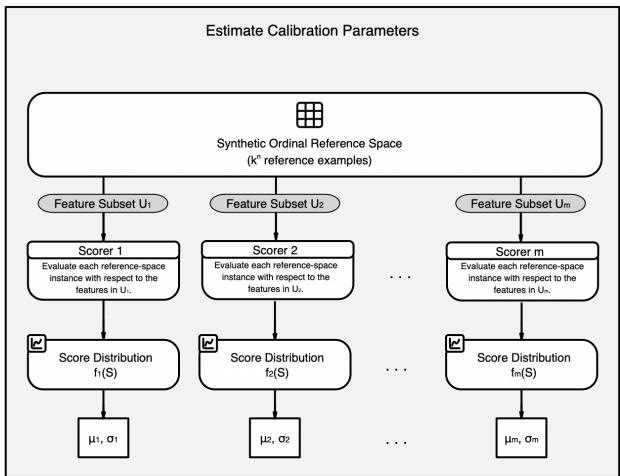
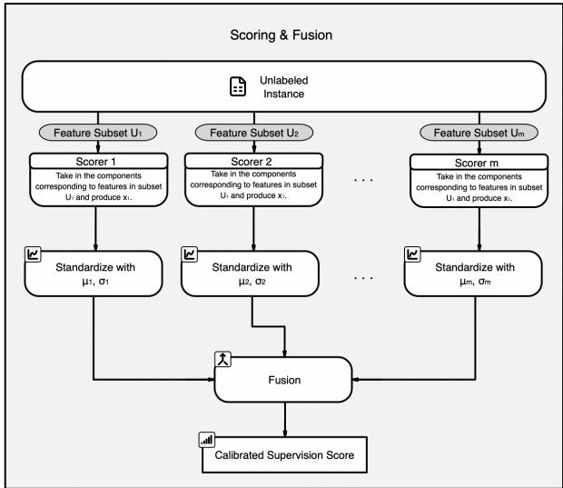
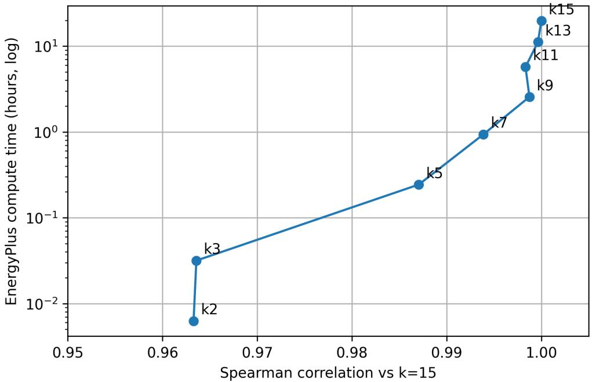
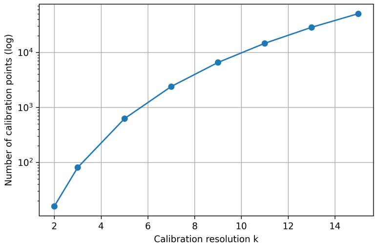
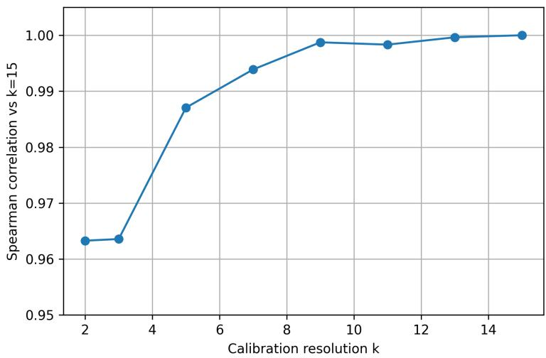

# Align Before You Combine: Reference Space Calibration for Supervision Without Ground Truth

Jackson Eshbaugh1 Jorge Silveyra1

1Department of Computer Science Lafayette College Easton, PA, USA

eshbaugj@lafayette.edu · silveyj@lafayette.edu

Preprint · Version 1.0 · October 2026

## Abstract

We introduce a calibration-first framework that produces supervision scores without access to ground- truth labels or a shared annotation space. Our framework aligns subset-specific scorers using a synthetic ordinal reference space before fusion. This reference space is constructed from ordered calibration features that represent the latent concept, providing a common scale on which otherwise incomparable scorer outputs can be aligned. Because our calibration procedure uses the reference space rather than training samples, it is independent of the training set’s empirical distribution. Across three bench-mark datasets, our framework consistently outperforms uncalibrated averaging and achieves higher primary-metric point estimates on the evaluation metrics than the best individual scorer. Performance relative to sample-dependent baselines varies by domain, with absolute diferences below 0.02 on Ames Housing and below 0.01 on Breast Cancer Wisconsin and Wine Quality. After Bonferroni correction, diferences remain significant for all three comparisons on Ames Housing and one on Breast Cancer Wisconsin. Additionally, we show that using fewer calibration levels per feature can closely approximate higher-resolution results at substantially lower computational cost. Together, these results support our framework as a viable approach to construct supervision scores when neither ground-truth labels nor a shared annotation space is available.

## 1 Introduction

Heterogeneous evidence sources are often used to train machine learning systems, yet they frequently lack ground-truth labels or a shared annotation space. Current approaches, such as weak supervision and multimodal fusion, typically assume that supervision sources operate within a common target space. This assumption is problematic when supervision is derived from heterogeneous subset-specific scorers that operate on diferent evidence representations and incomparable numerical scales. In such settings, each source may act as a noisy semantic observer of an underlying latent concept, where the resulting signals may exist in diferent scales and in diferent representational spaces. Consequently, the outputs cannot be directly compared and require calibration before meaningful fusion can occur.

In this document, we introduce a calibration-first framework for supervision without ground truth that aligns subset-specific scorers using a synthetic ordinal reference space before fusion. Our framework uses this reference space as a semantic calibration mechanism. By evaluating subset-specific scorers relative to this shared reference space, heterogeneous evidence sources can be aligned onto a common semantic scale prior to fusion. The resulting aligned scores are then fused into a supervision score. Ultimately, this approach enables supervision from heterogeneous sources where neither labeled data nor a shared annotation space is available.

To assess the viability of our framework, we conducted a case study in a residential energy-retrofit application—where text-derived and structured scorers operate on diferent numerical scales—alongside benchmarks from the housing and medical domains. Our contributions are: (1) a calibration-first framework for supervision without ground truth; (2) a synthetic ordinal reference space for aligning heterogeneous scorers prior to fusion; and (3) formal properties and empirical evidence demonstrating ordinal preservation and improved supervision quality.

## 2 Related Work

Given the diverse scope of this problem and to contextualize the landscape in which our work lies, we review three related research areas that address diferent challenges. Specifically, (1) weak supervision focuses on learning from imperfect or noisy labels, (2) multimodal learning addresses the integration of heterogeneous data representations, and (3) latent construct research studies how unobservable concepts can be inferred from indirect sources.

Modern weak supervision research has given rise to programmatic weak supervision (PWS), which combines multiple distant supervision approaches through noisy labeling functions and latent label mod- eling (Zhang et al. 2022). Current PWS involves users encoding domain knowledge into noisy, explicitly engineered labeling functions that collectively enable latent-label estimation without direct supervision and generally assumes these functions produce values within a shared target space (Ratner et al. 2017; Cachay et al. 2021; Boecking et al. 2021; Yu et al. 2022). Recent work has extended the PWS paradigm by constructing probabilistic supervision from multiple imperfect diagnostic tests or expert assessments through latent class modeling (Yazbeck et al. 2026), and by exploring constraint-based alternatives to latent generative label models (Agrawal et al. 2025). These approaches still assume supervision sources operate within a common label space and focus on recovering latent labels rather than aligning heterogeneous scoring functions defined on incomparable semantic scales.

A related line of research, multimodal machine learning, concentrates on integrating heterogeneous sources such as text, structured measurements, and simulation outputs. Most multimodal systems assume ground-truth supervision and treat modalities as complementary predictive features aligned to a shared target, combining them through fusion strategies to improve downstream performance (Ngiam et al. 2011; Baltrusaitis et al. 2019; Liang et al. 2024). Recent developments have also explored calibration mechanisms for combining heterogeneous information sources, demonstrating that alignment of subset-specific signals prior to fusion can improve downstream retrieval and reasoning performance (Bacellar 2026). These models are generally trained using observable ground truth targets.

A third area of work is related to measuring latent constructs—constructs that are not directly observable. In fields such as education, psychology, and other social sciences, psychometrics is used to measure latent constructs, such as intelligence, personality traits, or educational proficiency. Classical test theory and Item Response Theory (IRT) model observed responses as imperfect indicators of an underlying latent variable and provide mechanisms for placing heterogeneous observations onto a common measurement scale (Furr and Bacharach 2008; Embretson and Reise 2025; Rasch 1980). Construct validity emphasizes that meaningful measurement requires a theoretically justified relationship between observed indicators and the latent construct being measured (Cronbach and Meehl 1955; Clark and Watson 2019).

The existing literature provides several foundations for the problem considered in this work, but none directly address supervision construction from heterogeneous evidence sources when no common target space or ground-truth labels are available. Specifically, our work expands beyond prior research in three key ways:

1. Beyond a Shared Space: Existing weak supervision frameworks assume that supervision sources already operate within a shared target space. In contrast, we construct a common semantic scale on which heterogeneous subset-specific scorers can be meaningfully compared.

  
(a) Calibration. Subset-specific scorers are evaluated over the synthetic ordinal reference space to estimate normalization statistics $( \mu _ { j } , \sigma _ { j } )$

  
(b) Scoring and fusion. Scores from a new unlabeled instance are standardized using the normalization statistics and fused into the supervision score �.  
Figure 1. Calibration-first su ervision framework. Durin calibration, subset-s ecific scorers are evaluated over a synthetic ordinal reference space to estimate normalization statistics. During inference, scores for a new unlabeled instance are standardized using these statistics and fused into a calibrated supervision score �.

2. Beyond Multimodal Prediction: Multimodal machine learning typically assumes an observable target variable and uses modalities as complementary predictive features. Our goal is not to improve prediction through fusion but to construct supervision itself, aligning subset-specific observations when no ground-truth target is available.

3. Beyond Latent Construct Estimation: Psychometrics addresses the problem of measuring latent constructs through the use of multiple imperfect indicators and provides mechanisms for placing heterogeneous observations onto a common measurement scale. Instead, our approach constructs an external reference structure composed ofsynthetic examples enabling supervision without ground-truth labels or a pre-existing measurement instrument.

We address the challenge of constructing supervision from heterogeneous subset-specific scorers that operate on incomparable semantic scales in the absence of ground-truth labels using a calibration-first framework that uses a synthetic semantic reference space to align heterogeneous scorers before fusion.

## 3 Framework

Our framework consist of two operational phases: (1) calibration using a synthetic ordinal reference space and (2) scoring and fusion of unlabeled instances1. These phases are depicted in Figure 1. We first introduce the necessary preliminaries before describing each phase.

## 3.1 Preliminaries

## 3.1.1 Notation and Assumptions

We assume that the latent concept is characterized by � calibration features, contained in the set ${ \boldsymbol { \mathscr { F } } } .$ For each feature $i \in \mathcal { F }$ , let its set of possible values be denoted by $A _ { i } = \{ a \mid b _ { i } \preceq a \preceq c _ { i } \}$ , where $b _ { i }$ and $c _ { i }$ denote the minimum and maximum values for feature $i ,$ respectively, and ⪯ denotes the feature’s natural ordering. The Cartesian product $\textstyle { \mathcal { A } } = \prod _ { i = 1 } ^ { n } A _ { i }$ defines the ambient space of all possible configurations of the calibration features, where each element of  is an ordered �-tuple specifying one value for every calibration feature. Any observed dataset satisfies ${ \mathcal { D } } \subseteq A$ , the synthetic ordinal reference space $S$ satisfies $S \subseteq A$ , and any new unlabeled instance satisfies $x \in { \mathcal { A } }$

Another foundational assumption of the framework is that each calibration feature is monotonically related to the latent concept of interest. Although observations of these features through diferent evidence sources may be noisy, incomplete, or expressed on incomparable scales, movement along the ordered levels of any calibration feature corresponds to consistent movement along the latent concept. Under this assumption, the synthetic reference space induces a meaningful ordinal structure over the latent concept, and subset-specific observations can be interpreted as noisy evidence of an instance’s position within that structure. The monotonicity assumption defines a validity condition of the framework. If it is violated, the induced ordinal reference structure need not correspond to the latent concept, and no semantic validity guarantee is made for the resulting supervision score.

## 3.1.2 Subset-Specific Scorers

It is necessary to estimate an instance’s position along the latent concept. The framework uses a collection of subset-specific scorers to determine this from heterogeneous observations. Each subset $U \subseteq { \mathcal { F } }$ is selected a priori to represent a coherent portion of the latent concept. Its corresponding scorer is a function:

$$
F _ { U } : \prod _ { i \in U } A _ { i } \to \mathbb { R }
$$

A subset may correspond to a conventional data modality, such as text, images, or simulation output, but may also consist of a coherent group of related features or a concept-specific view of a shared evidence source. Accordingly, multiple features may be evaluated jointly by one scorer, and multiple scorers may operate on the same underlying observation to estimate diferent aspects of the latent concept.

Scorers may be machine learning-based or heuristic. A machine learning scorer uses a learned model, such as a decision tree, multilayer perceptron, or large language model, to map the evidence associated with its designated feature subset to a scalar estimate. A heuristic scorer deterministically computes a scalar estimate using a predefined function derived from expert knowledge or application-specific rules, such as linear scoring rules, deterministic scaling functions, or rule-based systems.

These scorers are used throughout both operational phases of the framework. During calibration, each scorer is evaluated over the evidence generated from the synthetic ordinal reference space introduced in Section 3.2.1 to estimate scorer-specific calibration statistics (Figure 1a). During inference, the same scorers are applied to new unlabeled instances, and their outputs are standardized and fused to produce the final supervision score (Figure 1b).

The framework accommodates any combination of machine learning or heuristic scorers, provided that each produces a real-valued output whose ordering is consistent with the latent concept. To ensure mean ingful aggregation across subset-specific scorers, scorer outputs must also share a common directionality, such that larger values consistently indicate greater correspondence to the latent concept or vice versa.

## 3.2 Operational Phases

Given the monotonicity assumption and a collection of subset-specific scorers, the framework proceeds in two operational phases. The first evaluates each scorer over evidence generated from a synthetic ordinal reference space to estimate scorer-specific calibration statistics. The second applies the same scorers to previously unseen instances, standardizes their outputs using the corresponding calibration statistics, and fuses the standardized scores to produce a supervision score.

## 3.2.1 Calibration via a Synthetic Reference Space

Calibration is performed using a synthetic ordinal reference space that defines a shared semantic reference for the latent conce t across all subset-s ecific scorers. Because � is defined inde endentl of the observed dataset, calibration is anchored to a domain-defined semantic range rather than to the empirical distribution of a particular sample. Beginning with the � calibration features introduced in Section 3.1.1, each feature is discretized into � ordered levels spanning an observable range. These levels must preserve the assumed monotonic relationship between the feature and the latent concept, but need not be uniformly spaced. Collectively, they define the synthetic ordinal reference space used for calibration.

For a given application, the calibration levels may be obtained by partitioning each calibration feature into � ordered bins spanning its observable range. Let $\mathcal { L } = \{ L _ { 1 } , L _ { 2 } , \ldots , L _ { n } \}$ denote the collection of calibration- level sets, where each $L _ { i } = \{ \ell _ { i 1 } , \ell _ { i 2 } , \dots , \ell _ { i k } \}$ contains the � ordered calibration levels associated with feature �. Each calibration-level set is a subset of the corresponding feature domain; that is, $L _ { i } \subseteq A _ { i }$ . Calibration levels may be defined using domain knowledge, bin midpoints, empirical means, or other application-specific procedures. The framework is agnostic to this choice, requiring only that the resulting levels preserve the monotonic ordering assumed between the calibration feature and the latent concept.

The synthetic ordinal reference space is constructed as the Cartesian product of the calibration-level sets:

$$
S = \prod _ { i = 1 } ^ { n } L _ { i } .
$$

By construction, $S \subseteq A$ . Each element $s \in S$ represents a calibration point corresponding to a particular combination of ordinal feature levels. Collectively, these points span the ordinal range of the latent concept and provide a shared reference space for aligning scorer outputs.

For each calibration point, the evidence required by each subset-specific scorer is constructed from the corresponding feature configuration. Depending on the scorer, this evidence may take the form of a conventional modality, a derived representation, or a coherent group of calibration features. The resulting evidence is then evaluated using the same subset-specific scorer that will later be applied to unlabeled instances. This ensures that each scorer’s calibration statistics are estimated from outputs produced by the scorer itself over its corresponding evidence representation.

In the worst case, calibration requires evaluating all $\vert S \vert ~ = ~ k ^ { n }$ reference points with each of the � subset-specific scorers to estimate scorer-specific calibration statistics $( \mu _ { j } , \sigma _ { j } )$ , where $j \in \left\{ 1 , \ldots , m \right\}$ indexes the scorers. If multiple calibration points produce the same evidence representation for a scorer, the corresponding evaluation may be cached and reused, reducing the number of distinct scorer evaluations without changing the reference distribution.

If scorer � has evaluation cost $c _ { j } ,$ , the worst-case total calibration cost scales as $\begin{array} { r } { O \left( k ^ { n } \sum _ { j = 1 } ^ { m } c _ { j } \right) } \end{array}$ . This cost is incurred only once during calibration to estimate the normalization statistics. Thereafter, scoring a new instance requires evaluating each subset-specific scorer once, yielding a complexity of $O \left( \sum _ { j = 1 } ^ { m } c _ { j } \right)$

The choice of � governs a tradeof between calibration resolution and computational cost. Larger values of � produce a finer discretization of the calibration features, potentially yielding more representative normalization statistics, but increase the size of the reference space exponentially. In practice, � should be chosen to adequately resolve the ordinal structure of the latent concept while remaining computationally tractable given the cost of evaluating each scorer.

These design choices result in a calibration procedure that is not necessarily tied to a particular dataset. By constructing the reference space with this approach, we obtain the following benefits:

• Comparability: A calibrated value has the same intended interpretation across datasets.

• Stability: Changes in sample composition do not themselves change the calibration mapping.

• Transferability: Calibration learned from the synthetic reference space can be reused on new datasets rather than recomputed from each empirical distribution.

• Cleaner separation: Changes in supervision scores reflect scorer responses to examples, rather than changes in the distribution used to normalize the scorers.

## 3.2.2 Supervision Score Fusion & Normalization

Once the calibration phase is complete, a new unlabeled instance $x \in { \mathcal { A } }$ is evaluated by each subset-specific scorer, producing raw scores

$$
\{ s _ { j } ( x ) \} _ { j = 1 } ^ { m } ,
$$

where $j \in \left\{ 1 , \ldots , m \right\}$ indexes the scorers. Directly combining these raw scores risks privileging scorers with larger numerical ranges. Each score is therefore standardized using its corresponding calibration statistics $\mu _ { j }$ and $\sigma _ { j } .$ The standardized output of scorer � is given by Equation 1, where $\mu _ { j }$ and $\sigma _ { j }$ are obtained as described in Section 3.2.1.

$$
\hat { s } _ { j } ( x ) = \frac { s _ { j } ( x ) - \mu _ { j } } { \sigma _ { j } }\tag{1}
$$

This transformation ensures that each subset-specific scorer’s contribution to the fused signal reflects its relative position within the corresponding reference distribution rather than its original numerical scale. Standardization therefore aligns diferences in scorer location and positive linear scale while preserving the ordering of scorer outputs. Because the transformation has positive slope $1 / \sigma _ { j }$ when $\sigma _ { j } > 0 _ { : }$ , scorers exhibiting zero variance across the calibration space are excluded from fusion because they provide no discriminative information regarding the latent concept. The ordinal information provided by any monotone scorer is therefore unchanged by standardization. This property is formalized in Proposition $_ { \mathrm { A . 1 } }$ , proved in Appendix A.

The fused supervision score $\kappa ( x )$ is computed as the arithmetic mean of the standardized scorer outputs according to Equation 2.

$$
\boldsymbol { \kappa } ( \boldsymbol { x } ) = \frac { 1 } { m } \sum _ { j = 1 } ^ { m } \boldsymbol { \hat { s } _ { j } } ( \boldsymbol { x } ) .\tag{2}
$$

In the absence of ground truth, we adopt equal weighting across the predefined subset-specific scorers as a neutral default because no empirical basis exists for estimating scorer reliability or assigning diferential confidence to individual scorers. The calibration step removes diferences in numerical scale, allowing each scorer to contribute equally according to its position within its own reference distribution. The set of subset-specific scorers is defined before calibration and held fixed during inference so that the weighting induced by the fusion rule remains consistent. Proposition $\mathrm { A . 2 , }$ proved in Appendix $\mathrm { A } ,$ shows that the fused supervision score ranks instances according to aggregate calibrated support across scorers. Together with Proposition A.1, this establishes that calibration preserves scorer-specific ordinal information while fusion combines that information into a single supervision score.

## 4 Evaluation

We evaluate the proposed framework through cross-domain validation and application-specific analyses. The cross-domain experiments evaluate the resulting supervision scores against held-out labels, while the application-specific experiments examine whether the framework exhibits the behavior characterized by Propositions A.1 and A.2. Given the framework’s conceptual relationship to latent-variable measurement, we additionally compare it with traditional psychometric methods in Appendix E.

## 4.1 Cross-Domain Validation

We evaluate the performance correspondence of calibration-first fusion with held-out targets relative to several established and natural comparison baselines. Specifically, we carry out this assessment across three datasets from unrelated domains: Ames Housing (De Cock 2011), a regression benchmark; Breast Cancer Wisconsin (Wolberg et al. 1993), a medical classification benchmark; and Wine Quality (Cortez et al. 2009), a physicochemical benchmark. For each dataset, we compare against empirical �-scoring, unsupervised PCA, Borda rank averaging, uncalibrated averaging, and the best individual subset-specific scorer’s value.

For each dataset, we defined four heuristic subset-specific scorers whose feature domains are disjoint. Following Section 3.2.1, we constructed the synthetic ordinal reference space with � = 5 levels for each of the benchmark’s features. Full scorer definitions and calibration ranges are provided in Appendix C.

Table 1 summarizes the results, with 95% confidence intervals for the primary metrics constructed using � = 50,000 bootstrap resamples. Pairwise method comparisons were conducted using paired bootstrap resampling, with the same resampled observations used for all methods within each replicate. To maintain a family-wise confidence level of at least 95% across three pairwise comparisons, we constructed Bonferroni- adjusted 98.33% confidence intervals.

Across all three domains, calibrated fusion improves over uncalibrated averaging on the primary metric. Moreover, Bonferroni-adjusted paired bootstrap confidence intervals exclude zero in each case, and achieves higher primary-metric point estimates than the best individual scorer.

Furthermore, our results indicate that for empirical �-scoring, Borda rank averaging, and unsupervised PCA, performance is domain dependent. On Ames Housing, calibrated fusion is less than 0.02 lower than all three metrics, with all diferences remaining distinguishable from zero after Bonferroni correction. On Breast Cancer Wisconsin, calibrated fusion is higher than empirical �-score averaging after correction by 0.0017, while no adjusted diference is detected relative to Borda rank averaging or PCA. On Wine Quality, no adjusted diference is detected between calibrated fusion and any of the three metrics.

In general, these results provide a clear indication that our methodology is a viable approach, given that no statistically significant diferences were observed for the majority of the metrics. For the remaining metrics, the observed diferences were relatively small.

## 4.2 Empirical Illustration of Framework Properties

To exemplify our framework, we label 247 synthetic homes generated using the pipeline proposed by Eshbaugh et al. (2026). In this setting, the latent concept is residential energy retrofit priority, and the synthetic ordinal reference space is defined by four calibration features: HVAC heating COP, HVAC cooling COP, roof R-value, and wall R-value. Because no ground truth labels are available in this synthetic dataset, we aim to approximate the latent concept as a source of supervision using our framework. Four subsetspecific scorers are employed. Each home inspection note is evaluated by an LLM to produce separate HVAC and insulation retrofit-need scores. Two heuristic scorers operate on the structured calibration features: an HVAC scorer jointly evaluates heating and cooling COP, while an insulation scorer jointly evaluates roof and wall R-values.

<table><tr><td>Dataset</td><td>Method</td><td>Primary [95% CI]</td><td>∆ = κ − method [95% paired CI]</td><td>Bonf. [98.33% CI]</td></tr><tr><td>Ames Housing</td><td>Calibrated Fusion (κ)</td><td>0.890 [0.876, 0.903]</td><td></td><td></td></tr><tr><td></td><td>Empirical z-Score Avg.</td><td>0.908 [0.895, 0.919]</td><td>-0.0172[-0.0225, -0.0122]</td><td>[-0.0238, -0.0111]</td></tr><tr><td></td><td>Borda Rank Averaging</td><td>0.905 [0.893, 0.916]</td><td>-0.0148[-0.0214, -0.0085]</td><td>[-0.0230, -0.0072]</td></tr><tr><td></td><td>Unsupervised PCA (PC1)</td><td>0.909 [0.896, 0.919]</td><td>-0.0181[-0.0233, -0.0131]</td><td>[-0.0245, -0.0120]</td></tr><tr><td></td><td>Uncalibrated Average</td><td>0.859 [0.840, 0.877]</td><td>+0.0311 [0.0143, 0.0485]</td><td>[0.0109, 0.0524]</td></tr><tr><td></td><td>Best Single Scorer</td><td>0.8150</td><td></td><td></td></tr><tr><td>Breast Cancer</td><td>Calibrated Fusion (κ)</td><td>0.984 [0.976, 0.991]</td><td></td><td></td></tr><tr><td></td><td>Empirical z-Score Avg.</td><td>0.983 [0.974, 0.990]</td><td>+0.0017 [0.0004, 0.0030]</td><td>[0.0002, 0.0034]</td></tr><tr><td></td><td>Borda Rank Averaging</td><td>0.984 [0.975, 0.992]</td><td>+0.0002[-0.0034, 0.0041]</td><td>[-0.0041, 0.0051]</td></tr><tr><td></td><td>Unsupervised PCA (PC1)</td><td>0.987 [0.978, 0.993]</td><td>-0.0024[-0.0049, -0.0001]</td><td>[-0.0055, 0.0003]</td></tr><tr><td></td><td>Uncalibrated Average</td><td>0.957 [0.940, 0.972]</td><td>+0.0268 [0.0140, 0.0414]</td><td>[0.0115, 0.0449]</td></tr><tr><td></td><td>Best Single Scorer</td><td>0.9705</td><td></td><td></td></tr><tr><td>Wine Quality</td><td>Calibrated Fusion (κ)</td><td>0.556 [0.520, 0.590]</td><td></td><td></td></tr><tr><td></td><td>Empirical z-Score Avg.</td><td>0.546 [0.510, 0.582]</td><td>+0.0093 [0.0012, 0.0176]</td><td>[-0.0005, 0.0194]</td></tr><tr><td></td><td>Borda Rank Averaging</td><td>0.549 [0.513, 0.584]</td><td>+0.0069[-0.0050, 0.0189]</td><td>[-0.0077, 0.0215]</td></tr><tr><td></td><td>Unsupervised PCA (PC1)</td><td>0.546 [0.509, 0.581]</td><td>+0.0097[-0.0061, 0.0257]</td><td>[-0.0094, 0.0293]</td></tr><tr><td></td><td>Uncalibrated Average</td><td>0.192 [0.142, 0.240]</td><td>+0.3641 [0.3173, 0.4112]</td><td>[0.3062, 0.4221]</td></tr><tr><td></td><td>Best Single Scorer</td><td>0.4757</td><td></td><td></td></tr></table>

Table 1. Cross-domain validation on the primary metric. Point estimates are reported with percentile-bootstrap 95% confidence intervals (� = 50,000). Pairwise intervals report Δ = � − method, with positive values favoring calibrated fusion. Bonferroni-adjusted 98.33% confidence intervals control the family-wise error rate across the three datasets separately for each baseline. The primary metric is Spearman’s � for Ames Housing and Wine Quality and AUROC for Breast Cancer Wisconsin. Additional metrics are available in Appendix C.

For this dataset, the calibration reference space consists of all 625 combinations formed by selecting one of the five ordered levels for each of the four calibration features (54). These levels were selected using domain knowledge to span a broad range of residential eficiency conditions while preserving the expected ordinal relationship between each feature and retrofit need. The four scorer outputs are standardized and fused to produce concept-specific HVAC and insulation scores and an overall supervision score �, with larger values indicating greater retrofit need. Additional implementation details, including the exact calibration values and their interpretation, are provided in Appendix D.

We perform a sensitivity analysis to verify that each scorer responds monotonically to its designated input, and that calibration preserves this monotonicity. The inputs to one subset-specific scorer are varied across five ordered eficiency levels while the inputs to the remaining scorers are held fixed at the neutral third level. Level 1 represents the least eficient condition, while Level 5 represents the most eficient condition. Table 2 reports the averages of standardized scorer outputs in which negative values indicate retrofit need below the calibration-space mean, while positive values indicate retrofit need above the mean. Across all four experiments, the subset-specific supervision scores did not increase as eficiency improved, indicating that increasing eficiency did not produce an increase in estimated retrofit need. The calibrated scorer outputs also preserved every ordering expressed by their corresponding raw outputs. Across the complete calibration space, no ordinal preservation failures occurred in the 195,000 pairwise comparisons evaluated for each scorer2. Hence, the ordinal preservation guarantee in Proposition A.1 is satisfied empirically for all four subset-specific scorers over the complete calibration space.

<table><tr><td>Varied Scorer</td><td>Level 1</td><td>Level 2</td><td>Level 3</td><td>Level 4</td><td>Level 5</td></tr><tr><td>Text / HVAC</td><td>1.10</td><td>0.43</td><td>0.26</td><td>-0.57</td><td>-0.57</td></tr><tr><td>Structured / HVAC</td><td>1.26</td><td>0.76</td><td>0.26</td><td>-0.24</td><td>-0.74</td></tr><tr><td>Text / Insulation</td><td>0.94</td><td>0.94</td><td>-0.09</td><td>-0.24</td><td>-0.53</td></tr><tr><td>Structured / Insulation</td><td>0.91</td><td>0.41</td><td>-0.09</td><td>-0.59</td><td>-1.09</td></tr></table>

Table 2. Concept-specific supervision scores under scorer-level sensitivity analysis. Larger values indicate greater retrofit need.

<table><tr><td>Text Evidence</td><td>Structured Evidence</td><td>HVAC</td><td>Insulation</td></tr><tr><td>Level 1</td><td>Level 1</td><td>2.10</td><td>1.94</td></tr><tr><td>Level 1</td><td>Level 5</td><td>0.10</td><td>-0.06</td></tr><tr><td>Level 5</td><td>Level 1</td><td>0.43</td><td>0.47</td></tr><tr><td>Level 5</td><td>Level 5</td><td>-1.57</td><td>-1.53</td></tr></table>

Table 3. Concept-specific supervision scores. Level 1 is least eficient and Level 5 is most eficient.

Additionally, we evaluate the consistency of the outputs of subset-specific scorers in order to validate that their results reflect the quality of their inputs. This process consists of comparing four extreme combinations of the inputs in both formats: text-derived and structured evidence. In Table 3, we observe that jointly ineficient evidence produced the highest retrofit-priority signal for both concepts, while jointly eficient evidence produced the lowest. The cases with combined conditions fell between these endpoints and were asymmetric given that the calibrated text-derived and structured contributions difered in magnitude. These results are consistent with Proposition A.2.

## 4.3 Calibration Resolution Sensitivity Analysis

The parameter � determines both the resolution of the synthetic calibration space and its computational cost. We evaluate whether dense calibration grids are necessary by measuring the tradeof between calibration resolution and agreement with a high-resolution reference space. Specifically, we evaluate � ∈ {2, 3, 5, 7, 9, 11, 13} against a � = 15 reference space. The � = 15 space was constructed by defining 15 ordered values for each calibration feature through inter olation between the redefined h sical anchor values described in Appendix B. Lower-resolution spaces were constructed as nested subsets ofthis reference grid by selecting approximately equally spaced ordinal levels. This procedure preserves the endpoints and maintains comparable coverage of the feature ranges while reducing the number of calibration points evaluated. The selected levels and corresponding physical values are provided in Appendix B.

As resolution increases, agreement with the � = 15 reference improves, while the number of calibration points grows exponentially, from 16 points at � = 2 to 50,625 points at � = 15. Despite this growth, the induced rankings stabilize at substantially lower resolutions. A resolution of � = 7 recovers a Spearman correlation of 0.9939 with the � = 15 reference, while � = 9 achieves 0.9987 correlation and 96.7% top-10% overlap using only 12.9% of the reference calibration points. Figure 2 illustrates the resulting tradeof between calibration cost and agreement. Increasing from $k = 9$ to � = 15 improves Spearman correlation by only 0.0013, while increasing EnergyPlus computation time from approximately 2.6 hours to nearly 20 hours. Thus, for the Synthetic Homes case study, � = 9 provides a near-reference agreement while avoiding the computational expense of the full reference grid. These results suggest that intermediate calibration resolutions may provide a favorable balance between computational cost and agreement with higher-resolution references.

  
Figure 2. Spearman � against � = 15 vs EnergyPlus compute time for all tested values of �.

## 5 Conclusion

In this work, we showed that heterogeneous evidence sources without ground-truth labels or a shared annotation space can be combined into a common supervision signal using our calibration-first framework. In a residential energy retrofit case study, the implementation exhibited the predicted monotonic behav- ior and remained stable across calibration resolutions. Additionally, we examined the tradeof between computational cost and reference space resolution, finding that lower-resolution grids closely approximate higher-resolution results while substantially reducing computation.

Across three benchmark datasets, calibrated fusion consistently outperformed uncalibrated averaging on the primary metric, with diferences remaining distinguishable from zero after Bonferroni correction, and achieved higher primary-metric point estimates than the best individual scorer. Relative to empirical �-scoring, Borda rank averaging, and unsupervised PCA, performance was domain-dependent: calibrated fusion was within 0.02 of all three baselines on Ames Housing, with each diference remaining distinguishable from zero after correction. On Breast Cancer Wisconsin, one adjusted diference was detected, and on Wine Quality, no adjusted diferences were detected. These findings suggest that our framework performs competitively with empirical �-scoring, Borda rank averaging, and unsupervised PCA.

Unlike these metrics, our framework estimates scorer-specific calibration statistics from an externally defined synthetic ordinal reference space rather than from the observed sample. As a consequence, the proposed calibration procedure supports score comparability across cohorts, stability under changes in sample composition, transferability across datasets, and clearer separation between scorer behavior and the distribution of the observed sample.

Our framework, similarly to other weak-supervision approaches, relies on domain knowledge, which is encoded through the selection and ordering of calibration features. Because these choices determine the structure of the calibration space, future work should examine how sensitive the resulting supervision is the assumptions made during its construction. Additional directions include incorporating scorer reliability into the fusion procedure and developing principled criteria for selecting calibration resolutions.

Ultimately, supervision without ground truth requires more than combining heterogeneous signals; it requires making them comparable. Calibration-first fusion provides this missing step by aligning scorer outputs to a common scale before fusion.

## Acknowledgments

The authors extend gratitude to Lafayette College for supporting this work by funding it through the EXCEL Scholars program and providing computational resources with the Firebird high performance computing cluster. This work also used Jetstream2 at Indiana University through allocation PHY240196 from the Advanced Cyberinfrastructure Coordination Ecosystem: Services & Support (ACCESS) program (Boerner et al. 2023), which is supported by U.S. National Science Foundation grants #2138259, #2138286, #2138307, #2137603, and #2138296.

## References

Agrawal, V., R. Pukdee, N. Balcan, and P. K. Ravikumar (2025). Learning from weak labelers as constraints. In: International Conference on Learning Representations. Ed. by Y. Yue, A. Garg, N. Peng, F. Sha, and R. Yu. Vol. 2025, pp. 93153–93193. url: https://proceedings.iclr.cc/paper\_files/paper/2025/file/e91fb65c6324a984ea9ef39a5b84af04- Paper-Conference.pdf.

Bacellar, A. (2026). Calibrated Fusion for Heterogeneous Graph-Vector Retrieval in Multi-Hop QA. arXiv preprint arXiv:2603.28886. doi: 10.48550/arXiv.2603.28886.

Baltrusaitis, T., C. Ahuja, and L.-P. Morency (Feb. 2019). Multimodal Machine Learning: A Survey and Taxonomy. In: IEEE Transactions on Pattern Analysis and Machine Intelligence 41.2, pp. 423–443. doi: 10.1109/tpami.2018.2798607. url: http://dx.doi.org/10.1109/TPAMI.2018.2798607.

Boecking, B., W. Neiswanger, E. Xing, and A. Dubrawski (2021). Interactive Weak Supervision: Learning Useful Heuristics for Data Labeling. In: International Conference on Learning Representations.

Boerner, T. J., S. Deems, T. R. Furlani, S. L. Knuth, and J. Towns (2023). ACCESS: Advancing Innovation: NSF’s Advanced Cyberinfrastructure Coordination Ecosystem: Services & Support. In: Practice and Experience in Advanced Research Computing 2023: Computing for the Common Good. PEARC ’23. Portland, OR, USA: Association for Computing Machinery, pp. 173–176. doi: 10.1145/3569951.3597559. url: https://doi.org/10.1145/3569951.3597559.

Cachay, S. R., B. Boecking, and A. Dubrawski (2021). End-to-End Weak Supervision. In: Advances in Neural Information Processing Systems. Ed. by A. Beygelzimer, Y. Dauphin, P. Liang, and J. W. Vaughan.

Clark, L. A. and D. Watson (Dec. 2019). Constructing Validity: New Developments in Creating Objective Measuring Instruments. In: Psychological Assessment 31.12, pp. 1412–1427. doi: 10.1037/pas0000626. (Visited on 06/15/2026).

Cortez, P., A. Cerdeira, F. Almeida, T. Matos, and J. Reis (2009). Modeling wine preferences by data mining from physicochemical properties. In: Decision Support Systems 47.4, pp. 547–553.

Cronbach, L. J. and P. E. Meehl (July 1955). Construct Validity in Psychological Tests. In: Psychological Bulletin 52.4, pp. 281–302. doi: 10.1037/h0040957. (Visited on 06/15/2026).

De Cock, D. (Nov. 2011). Ames, Iowa: Alternative to the Boston Housing Data as an End of Semester Regression Project. In: Journal of Statistics Education 19.3, p. 8. doi: 10.1080/10691898.2011.11889627. (Visited on 06/15/2026).

Embretson, S. E. and S. P. Reise (Oct. 2025). Item Response Theory: Foundations for Psychologists and Social Scientists. 2nd ed. New York: Routledge. doi: 10.4324/9781315726557. (Visited on 06/15/2026)

Eshbaugh, J., C. Tiwari, and J. Silveyra (2026). Synthetic homes: A multimodal generative AI pipeline for residential building data generation under data scarcity. In: Machine Learning with Applications 25, p. 100959. doi: https: //doi.org/10.1016/j.mlwa.2026.100959.

Furr, R. M. and V. R. Bacharach (2008). Item Response Theory and Rasch Models. In: Psychometrics: An Introduction. Thousand Oaks, California: Sage, pp. 314–334. (Visited on 06/15/2026).

Goldberg, L. R. (Mar. 1992). The Development of Markers for the Big-Five Factor Structure. In: Psychological Assessment 4.1, pp. 26–42. doi: 10.1037/1040-3590.4.1.26. (Visited on 06/15/2026).

Kirkegaard, E. O. W. and S. Jensen (2025). Psychometric Analysis of the Multifactor General Knowledge Test. In: OpenPsych. doi: 10.26775/OP.2025.07.28.

Lee, K. and M. C. Ashton (Apr. 2004). Psychometric Properties of the HEXACO Personality Inventory. In: Multivariate Behavioral Research 39.2, pp. 329–358. doi: 10.1207/s15327906mbr3902\_8. (Visited on 06/15/2026).

Liang, P. P., A. Zadeh, and L.-P. Morency (June 2024). Foundations & Trends in Multimodal Machine Learning: Principles, Challenges, and Open Questions. In: ACM Computing Surveys 56.10, pp. 1–42. doi: 10.1145/3656580. url: http://dx.doi.org/10.1145/3656580.

Ngiam, J., A. Khosla, M. Kim, J. Nam, H. Lee, and A. Y. Ng (2011). Multimodal Deep Learning. In: Proceedings of the 28th International Conference on Machine Learning (ICML). Bellevue, Washington, USA: Omnipress, pp. 689–696.

OpenPsychometrics (2019a). Multifactor General Knowledge Test (MGKT). https://openpsychometrics.org/tests/MGKT/. Accessed 2026-06-15.

— (2019b). OpenPsychometrics. https://openpsychometrics.org. Accessed 2026-06-15.

Rasch, G. (1980). Probabilistic Models for Some Intelligence and Attainment Tests. Expanded ed. Chicago: University of Chicago Press.

Ratner, A., S. H. Bach, H. Ehrenberg, J. Fries, S. Wu, and C. Ré (Nov. 2017). Snorkel: rapid training data creation with weak supervision. In: Proceedings ofthe VLDB Endowment 11.3, pp. 269–282. doi: 10.14778/3157794.3157797. url: http://dx.doi.org/10.14778/3157794.3157797.

Wolberg, W., O. Mangasarian, N. Street, and W. Street (1993). Breast Cancer Wisconsin (Diagnostic). UCI Machine Learning Repository. DOI: https://doi.org/10.24432/C5DW2B.

Yazbeck, H., J. Assaf, T. M. Lietman, J. D. Keenan, J. Jackson, J. Kalpathy-Cramer, J. P. Campbell, X. Song, and T. K. Redd (May 2026). Latent Supervision: A Method for Improved Performance and Calibration of Machine Learning Classification Models in Ophthalmology. In: Ophthalmology Science 6.5, p. 101151. doi: 10.1016/j.xops.2026.101151. (Visited on 06/15/2026).

Yu, P., T. Ding, and S. H. Bach (Mar. 2022). Learning from Multiple Noisy Partial Labelers. In: Proceedings ofthe 25th International Conference on Artificial Intelligence and Statistics. Ed. by G. Camps-Valls, F. J. R. Ruiz, and I. Valera. Vol. 151. Proceedings of Machine Learning Research. PMLR, pp. 11072–11095.

Zhang, J., C.-Y. Hsieh, Y. Yu, C. Zhang, and A. Ratner (Feb. 2022). A Survey on Programmatic Weak Supervision. doi: 10.48550/arXiv.2202.05433. arXiv: 2202.05433 [cs.LG]. (Visited on 05/27/2026).

## A Propositions & Proofs

Proposition A.1 (Ordinal Preservation). Let ℎ denote the latent concept, and let $s _ { j }$ be a subset-specific scorer such that

$$
h ( a ) < h ( b ) \implies s _ { j } ( a ) < s _ { j } ( b )
$$

for any instances �, �. Let $\hat { s } _ { j }$ denote the standardized scorer obtained using calibration statistics with $\sigma _ { j } > 0$ Then

$$
h ( a ) < h ( b ) \implies \hat { s } _ { j } ( a ) < \hat { s } _ { j } ( b ) .
$$

Thus, calibration preserves any ordinal structure in $s _ { j }$ that is consistent with the latent concept.

Proof. By assumption, $h ( a ) < h ( b )$ implies $s _ { j } ( a ) < s _ { j } ( b )$ . The calibrated score is

$$
\hat { s } _ { j } ( x ) = \frac { s _ { j } ( x ) - \mu _ { j } } { \sigma _ { j } } .
$$

Since $\sigma _ { j } > 0$ , this transformation is afine with positive slope $1 / \sigma _ { j }$ . Therefore

$$
s _ { j } ( a ) < s _ { j } ( b ) \implies \frac { s _ { j } ( a ) - \mu _ { j } } { \sigma _ { j } } < \frac { s _ { j } ( b ) - \mu _ { j } } { \sigma _ { j } } ,
$$

so $\hat { s } _ { j } ( a ) < \hat { s } _ { j } ( b )$ . Hence $h ( a ) < h ( b ) \implies \hat { s } _ { j } ( a ) < \hat { s } _ { j } ( b )$

This result means that calibration neither creates nor destroys ordinal information. If subset-specific scorers are monotone observations of the latent concept, then calibrated scores preserve the latent ordering while expressing each score relative to the same reference distribution.

Proposition A.2 (Fusion Consistency). Let

$$
\boldsymbol { \kappa } ( \boldsymbol { x } ) = \frac { 1 } { m } \sum _ { j = 1 } ^ { m } \boldsymbol { \hat { s } _ { j } } ( \boldsymbol { x } ) .
$$

For any two instances � and �, define $\Delta _ { j } = \hat { s } _ { j } ( b ) - \hat { s } _ { j } ( a )$ . Then $\kappa ( b ) > \kappa ( a )$ if and only if

$$
\sum _ { j : \Delta _ { j } > 0 } \Delta _ { j } > \sum _ { j : \Delta _ { j } < 0 } | \Delta _ { j } | .
$$

Thus, the fused supervision score ranks instances according to aggregate calibrated support across subsetspecific scorers.

Proof. Let $\Delta _ { j } = \hat { s } _ { j } ( b ) - \hat { s } _ { j } ( a )$ represent the calibrated diference for subset-specific scorer $j .$ Let $A = \{ j \mid$ $\Delta _ { j } > 0 \}$ be the set of scorers that favor $^ { b , }$ and let $B = \left\{ j \mid \Delta _ { j } < 0 \right\}$ be the set of scorers that favor �. D fi

$$
\Delta _ { \kappa } = \kappa ( b ) - \kappa ( a ) = \frac { \sum _ { j = 1 } ^ { m } \Delta _ { j } } { m } .
$$

Since $m > 0 ,$

$$
\Delta _ { \kappa } > 0 \Longleftrightarrow \sum _ { j = 1 } ^ { m } \Delta _ { j } > 0 .
$$

Partitioning the sum into positive and negative contributions yields

$$
\sum _ { j = 1 } ^ { m } \Delta _ { j } = \sum _ { j \in A } \Delta _ { j } - \sum _ { j \in B } | \Delta _ { j } | .
$$

Therefore,

<table><tr><td>Resolution</td><td>Selected levels</td></tr><tr><td> $k = 2$ </td><td>1,15</td></tr><tr><td> $k = 3$ </td><td>1, 8, 15</td></tr><tr><td> $k = 5$ </td><td>1, 5, 8, 11, 15</td></tr><tr><td> $k = 7$ </td><td> $1 , 3 , 6 , 8 , 1 0 , 1 3 , 1 5$ </td></tr><tr><td> $k = 9$ </td><td> $1 , 3 , 5 , 6 , 8 , 1 0 , 1 1 , 1 3 , 1 5$ </td></tr><tr><td> $k = 1 1$ </td><td> $1 , 2 , 4 , 5 , 7 , 8 , 9 , 1 1 , 1 2 , 1 4 , 1 5$ </td></tr><tr><td> $k = 1 3$ </td><td> $1 , 2 , 3 , 5 , 6 , 7 , 8 , 9 , 1 0 , 1 1 , 1 3 , 1 4 , 1 5$ </td></tr><tr><td> $k = 1 5$ </td><td> $1 , 2 , 3 , 4 , 5 , 6 , 7 , 8 , 9 , 1 0 , 1 1 , 1 2 , 1 3 , 1 4 , 1 5$ </td></tr></table>

Table 4. Selected ordinal levels from the $k = 1 5$ master calibration grid for each calibration resolution.

$$
\Delta _ { \kappa } > 0 \iff \sum _ { j \in A } \Delta _ { j } > \sum _ { j \in B } | \Delta _ { j } | .
$$

Hence fusion ranks $b > a$ if and only if the aggregate calibrated support for � exceeds the aggregate calibrated support for �. □

## B Calibration Space Construction & Resolution Analysis

This appendix provides additional details regarding the construction of the synthetic calibration space and the selection of calibration resolution. The calibration space defines the shared reference used to align subset-specific scorers prior to fusion. Because the number of calibration points grows exponentially with the number of calibration features and the number of ordinal levels selected for each feature, we also evaluate the computational tradeof associated with increasing calibration resolution.

## B.1 Selection of Calibration Levels

Each calibration feature is represented using an ordinal scale containing � ordered levels. Calibration levels are selected to span the feasible range of each feature while preserving the ordinal relationships between levels. For the Synthetic Homes case study, the calibration features are HVAC heating COP, HVAC cooling COP, roof R-value, and wall R-value. Each feature range is discretized independently, with lower values representing less favorable conditions and higher values representing more favorable conditions.

For the main experiments, calibration levels are selected as approximately evenly spaced points across the feasible range of each calibration feature. This procedure provides a uniform ordinal reference space while avoiding arbitrary concentration of calibration points in specific regions of the feature space.

For the resolution sensitivity analysis, the highest-resolution calibration space $( k = 1 5 )$ serves as the reference space. Lower-resolution calibration spaces are constructed as nested subsets of this reference grid by selecting approximately equally spaced ordinal levels. This preserves the endpoints and maintains similar coverage of the underlying feature ranges while reducing the number of calibration points evaluated.

Table 4 reports the selected ordinal levels for each evaluated value of �. The corresponding physical parameter values used to construct the calibration space are provided in Table 5.

## B.2 Calibration Resolution and Computational Cost

The number of calibration points increases exponentially with calibration resolution. Because the calibration space varies four features independently, the total number of calibration points is $| S | = k ^ { 4 }$ , where � denotes

<table><tr><td>Level</td><td>Wall R</td><td>Roof R</td><td>Heating COP</td><td>Cooling COP</td></tr><tr><td>1</td><td>4</td><td>10</td><td>0.7</td><td>1</td></tr><tr><td>2</td><td>5</td><td>13.333</td><td>0.7333</td><td>1.3333</td></tr><tr><td>3</td><td>6</td><td>16.667</td><td>0.7667</td><td>1.6667</td></tr><tr><td>4</td><td>7</td><td>20</td><td>0.8</td><td>2</td></tr><tr><td>5</td><td>8.5</td><td>22.5</td><td>0.825</td><td>2.25</td></tr><tr><td>6</td><td>10</td><td>25</td><td>0.85</td><td>2.5</td></tr><tr><td>7</td><td>11.5</td><td>27.5</td><td>0.875</td><td>2.75</td></tr><tr><td>8</td><td>13</td><td>30</td><td>0.9</td><td>3</td></tr><tr><td>9</td><td>14.75</td><td>32.5</td><td>0.9125</td><td>3.125</td></tr><tr><td>10</td><td>16.5</td><td>35</td><td>0.925</td><td>3.25</td></tr><tr><td>11</td><td>18.25</td><td>37.5</td><td>0.9375</td><td>3.375</td></tr><tr><td>12</td><td>20</td><td>40</td><td>0.95</td><td>3.5</td></tr><tr><td>13</td><td>23.333</td><td>43.333</td><td>0.9667</td><td>3.6667</td></tr><tr><td>14</td><td>26.667</td><td>46.667</td><td>0.9833</td><td>3.8333</td></tr><tr><td>15</td><td>30</td><td>50</td><td>1</td><td>4</td></tr></table>

Table 5. Physical values associated with the � = 15 calibration levels.

<table><tr><td>Resolution</td><td>Points</td><td>Runtime</td><td>Spearman ρ</td><td>Top-10% Overlap</td></tr><tr><td>k = 5</td><td>625</td><td>0.24h</td><td>0.9871</td><td>88.56 %</td></tr><tr><td>k = 7</td><td>2401</td><td>0.94h</td><td>0.9939</td><td>92.42 %</td></tr><tr><td>k = 9</td><td>6561</td><td>2.56h</td><td>0.9987</td><td>96.66 %</td></tr><tr><td> $k = 1 5$ </td><td>50625</td><td>19.76h</td><td>1.0000</td><td>100.00 %</td></tr></table>

Table 6. Sensitivity results from selected �-values.

the number of ordinal levels assigned to each calibration feature. Consequently, increasing calibration resolution provides finer coverage of the reference space but requires additional scorer evaluations and, in the Synthetic Homes case study, additional EnergyPlus simulations.

Figure 3 illustrates the growth in calibration points as a function of �. Although increasing resolution improves agreement with the highest-resolution reference space, the computational cost grows rapidly.

## B.3 Resolution Agreement and Diminishing Returns

To evaluate the efect of calibration resolution on the resulting supervision signal, each lower-resolution calibration space is compared against the � = 15 reference space. Agreement is evaluated using rank correlation and diferences between the resulting supervision scores.

Table 6 reports the full results across the evaluated calibration resolutions, including calibration-space size, computation time, Spearman correlation, and top-10% overlap with the � = 15 reference.

Figure 4 shows the relationship between calibration resolution and Spearman correlation with the � = 15 reference. Agreement improves rapidly at lower resolutions before approaching saturation at higher resolutions.

While increasing � improves agreement, these improvements require increasingly larger calibration spaces. Figure 2 illustrates the tradeof between agreement with the reference space and EnergyPlus

  
Figure 3. Growth in the number of calibration points with calibration resolution �. The calibration space grows as $k ^ { 4 }$ because four calibration features are varied independently.

  
Figure 4. Spearman correlation between supervision scores generated at each calibration resolution and the $k = 1 5$ reference space.

computation time. Increasing the resolution beyond moderate values provides only marginal improvements in rank preservation while requiring substantially greater computational expense.

## B.4 Implications for Calibration Resolution Selection

The results demonstrate that increasing calibration resolution improves agreement with the highest-resolution reference space, but the marginal benefit decreases as the number of calibration points increases. Therefore, the appropriate value of � depends on the computational resources available and the precision required for a given application.

Future work may investigate automated approaches for selecting calibration resolution, analogous to elbow-based methods used in clustering. Such approaches could identify a point at which additional calibration points provide insuficient improvement relative to their computational cost.

<table><tr><td>Calibration dimension</td><td>Feature</td><td>Level 1-Level 5</td></tr><tr><td>Physical scale</td><td>GrLivArea</td><td>600-3500</td></tr><tr><td></td><td>TotalBsmtSF</td><td>300-1800</td></tr><tr><td>Quality and condition</td><td>OverallQual OverallCond</td><td>2-10 3-9</td></tr><tr><td></td><td></td><td></td></tr><tr><td>Age and modernization</td><td>YearBuilt YearRemodAdd</td><td>1920-2010</td></tr><tr><td></td><td></td><td>1950-2010</td></tr><tr><td>Garage capacity</td><td>GarageCars</td><td>0-4</td></tr><tr><td></td><td>GarageArea</td><td>0-1000</td></tr></table>

Table 7. Calibration dimensions and endpoint values used for Ames Housing.

## C Cross-Domain Validation Details

This appendix provides the scorer definitions and synthetic reference spaces used for the cross-domain vali- dation experiments in Section 4.1. In all three datasets, the target variable was removed before supervision construction and used only for post hoc evaluation. The feature groups were selected a priori based on semantic correspondence among the dataset variables and their expected monotonic relationship with the latent concept. Calibration endpoints were manually specified to span low-to-high values for each feature. Neither the feature groupings nor the endpoint values were selected using the held-out target labels.

## C.1 Ames Housing

The latent concept is residential property value. Four heuristic scorers represent complementary aspects of the concept:

$$
s _ { \mathrm { s c a l e } } ( x ) = \frac { x _ { \mathrm { G r L i v A r e a } } + x _ { \mathrm { T o t a l B s m t S F } } } { 2 } ,\tag{3}
$$

$$
s _ { \mathrm { q u a l i t y } } ( x ) = \frac { x _ { \mathrm { O v e r a l l Q u a l } } + x _ { \mathrm { O v e r a l l C o n d } } } { 2 } ,\tag{4}
$$

$$
s _ { \mathrm { m o d e r n i z a t i o n } } ( x ) = \frac { x _ { \mathrm { Y e a r B u i l t } } + x _ { \mathrm { Y e a r R e m o d A d d } } } { 2 } ,\tag{5}
$$

$$
s _ { \mathrm { g a r a g e } } ( x ) = \frac { x _ { \mathrm { G a r a g e C a r s } } + x _ { \mathrm { G a r a g e A r e a } } } { 2 } .\tag{6}
$$

Larger values of each scorer indicate greater expected property value. The four ordered calibration dimensions and their endpoint values are shown in Table 7. Within each dimension, all associated features are varied jointl across five linearl s aced levels. Their Cartesian roduct roduces $5 ^ { 4 } = 6 2 5$ synthetic calibration points.

The SalePrice target is removed before scorer construction. Missing numerical values are replaced using feature medians. Although categorical features are ordinally encoded during preprocessing, the four scorers use only the numerical features listed above.

## C.2 Breast Cancer Wisconsin

The latent concept is malignancy risk. The original dataset target is reoriented so that malignant cases are assigned one and benign cases are assigned zero. This target is withheld during supervision construction.

<table><tr><td>Calibration dimension</td><td>Feature</td><td>Level 1-Level 5</td></tr><tr><td rowspan="3">Size</td><td>Mean radius</td><td>7-28</td></tr><tr><td>Mean perimeter</td><td>45-190</td></tr><tr><td>Mean area</td><td>150-2500</td></tr><tr><td rowspan="3">Shape irregularity</td><td>Mean compactness</td><td>0.02-0.35</td></tr><tr><td>Mean concavity</td><td>0-0.45</td></tr><tr><td>Mean concave points</td><td>0-0.20</td></tr><tr><td rowspan="3">Texture and smoothness</td><td>Mean texture</td><td>9-40</td></tr><tr><td>Mean smoothness</td><td>0.05-0.16</td></tr><tr><td>Mean symmetry</td><td>0.10-0.30</td></tr><tr><td rowspan="4">Worst-case measurements</td><td>Worst radius</td><td>8-36</td></tr><tr><td>Worst perimeter</td><td>50-250</td></tr><tr><td>Worst area</td><td>200-4300</td></tr><tr><td>Worst concavity</td><td>0-1.25</td></tr><tr><td></td><td>Worst concave points</td><td>0-0.30</td></tr></table>

Table 8. Calibration dimensions and endpoint values used for Breast Cancer Wisconsin.

Four heuristic scorers are defined as subset-specific means:

$$
s _ { g } ( x ) = \frac { 1 } { | { \mathcal { F } } _ { g } | } \sum _ { i \in { \mathcal { F } } _ { g } } x _ { i } , \qquad g \in \{ \mathrm { s i z e , s h a p e , t e x t u r e , w o r s t } \} ,\tag{7}
$$

where each feature set $\mathcal { F } _ { g }$ comprises the corresponding variables listed in Table 8.

Larger values indicate greater estimated malignancy risk. As in the Ames experiment, the features associated with each calibration dimension are varied jointly across five linearly spaced levels, yielding $5 ^ { 4 } = 6 2 5$ synthetic reference points.

## C.3 Wine Quality

The latent concept is wine quality. Four heuristic scorers are defined using monotonic physicochemical properties:

$$
s _ { \mathrm { a c i d i t y } } ( x ) = \frac { - x _ { \mathrm { v o l a t i l e \ a c i d i t y } } + x _ { \mathrm { c i t r i c \ a c i d } } } { 2 } ,\tag{8}
$$

$$
s _ { \mathrm { a d d i t i v e s } } ( x ) = \frac { - x _ { \mathrm { c h l o r i d e s } } + x _ { \mathrm { s u l p h a t e s } } } { 2 } ,\tag{9}
$$

$$
s _ { \mathrm { p r e s e r v a t i v e s } } ( x ) = \frac { - x _ { \mathrm { f r e e } \mathrm { S O } _ { 2 } } - x _ { \mathrm { t o t a l S O } _ { 2 } } } { 2 } ,\tag{10}
$$

$$
s _ { \mathrm { p r o f i l e } } ( x ) = \frac { x _ { \mathrm { a l c o h o l } } - x _ { \mathrm { d e n s i t y } } } { 2 } .\tag{11}
$$

Larger values indicate higher expected quality. Each of the four corresponding calibration dimensions is varied jointly across five linearly spaced levels, yielding $5 ^ { 4 } = 6 2 5$ synthetic calibration points. The calibration endpoints are shown in Table 9. Target quality labels are removed prior to supervision construction and used solely for post hoc evaluation.

<table><tr><td>Calibration dimension</td><td>Feature</td><td>Level 1-Level 5</td></tr><tr><td>Acidity</td><td>Volatile acidity Citric acid</td><td>1.58-0.12 0.0-1.0</td></tr><tr><td>Additives</td><td>Chlorides</td><td>0.611-0.012</td></tr><tr><td></td><td>Sulphates</td><td>0.33-2.0</td></tr><tr><td>Preservatives</td><td>Free sulfur dioxide</td><td>72.0-1.0</td></tr><tr><td></td><td>Total sulfur dioxide</td><td>289.0-6.0</td></tr><tr><td>Profile</td><td>Alcohol</td><td>8.0-14.9</td></tr><tr><td></td><td>Density</td><td>1.00369-0.99007</td></tr></table>

Table 9. Calibration dimensions and endpoint values used for Wine Quality.

## C.4 Calibration, Fusion, and Baselines

For each scorer �, the reference mean and population standard deviation are computed over the corresponding 625 synthetic scorer outputs. Observed scores are standardized using these reference statistics and averaged with equal weight to obtain �.

The uncalibrated baseline is the direct arithmetic mean of the four raw scorer outputs. We additionally compare against empirical �-score averaging, Borda rank averaging, and the first principal component obtained using unsupervised PCA. Each raw scorer is also evaluated individually.

Ames Housing and Wine Quality are evaluated primarily using Spearman correlation, with Kendall correlation and top-10% overlap reported as secondary and additional metrics. Breast Cancer Wisconsin is evaluated primarily using AUROC, with average precision and Spearman correlation with malignancy status reported as secondary and additional metrics. Primary results and paired comparisons are reported in Table 1; the complete secondary and additional results are reported in Table 10.

Finally, Table 11 reports the primary-metric performance of each individual subset-specific scorer.

## D Synthetic Homes Implementation Details

This appendix describes the implementation of the proposed framework for the Synthetic Homes case study presented in Section 4.2.

## D.1 Calibration Features and Subset-Specific Scorers

The latent concept is residential retrofit priority. We characterize this concept using four calibration features associated with two building-system categories: HVAC heating COP, HVAC cooling COP, roof R-value, and wall R-value. Increasing HVAC COP and insulation R-value correspond to increasing building eficiency and, consequently, decreasing retrofit need.

The implementation employs four subset-specific scorers associated with two feature subsets. Two text-derived scorers are produced by an LLM that evaluates a single home inspection note and returns separate estimates of HVAC and insulation retrofit need. Two structured scorers are heuristic functions operating on the corresponding numerical feature subsets. The structured HVAC scorer jointly evaluates heating and cooling COP, while the structured insulation scorer jointly evaluates roof and wall R-values. We denote the four raw scorer outputs by

<table><tr><td>Dataset</td><td>Method</td><td>Secondary</td><td>Additional</td></tr><tr><td rowspan="6">Ames Housing</td><td>Calibrated Fusion (κ)</td><td>0.7197</td><td>73.97%</td></tr><tr><td>Empirical z-Score Avg.</td><td>0.7444</td><td>78.08%</td></tr><tr><td>Borda Rank Averaging</td><td>0.7359</td><td>73.29%</td></tr><tr><td>Unsupervised PCA (PC1)</td><td>0.7456</td><td>78.08%</td></tr><tr><td>Uncalibrated Average</td><td>0.6890</td><td>73.29%</td></tr><tr><td>Best Single Scorer</td><td>0.6365</td><td>68.49%</td></tr><tr><td rowspan="6">Breast Cancer</td><td>Calibrated Fusion (κ)</td><td>0.9770</td><td>0.8111</td></tr><tr><td>Empirical z-Score Avg.</td><td>0.9743</td><td>0.8084</td></tr><tr><td>Borda Rank Averaging</td><td>0.9774</td><td>0.8108</td></tr><tr><td>Unsupervised PCA (PC1)</td><td>0.9812</td><td>0.8151</td></tr><tr><td>Uncalibrated Average</td><td>0.9456</td><td>0.7662</td></tr><tr><td>Best Single Scorer</td><td>0.9616</td><td>0.7880</td></tr><tr><td rowspan="6">Wine Quality</td><td>Calibrated Fusion (κ)</td><td>0.4403</td><td>44.38%</td></tr><tr><td>Empirical z-Score Avg.</td><td>0.4336</td><td>42.50%</td></tr><tr><td>Borda Rank Averaging</td><td>0.4339</td><td>46.25%</td></tr><tr><td>Unsupervised PCA (PC1)</td><td>0.4349</td><td>38.75%</td></tr><tr><td>Uncalibrated Average</td><td>0.1511</td><td>20.62%</td></tr><tr><td>Best Single Scorer</td><td>0.3718</td><td>34.38%</td></tr></table>

Table 10. Secondary and additional cross-domain validation metrics. For Ames Housing and Wine Quality, the secondary metric is Kendall’s � and the additional metric is top-10% overlap. For Breast Cancer Wisconsin, the secondary metric is average precision and the additional metric is Spearman correlation with malignancy status. Bold values indicate the highest observed value within each dataset and metric.

�text,HVAC,

�text,insulation,

�structured,HVAC,

�structured,insulation.

All four outputs are oriented so that larger values indicate greater retrofit need.

## D.2 Synthetic Ordinal Reference Space

Each calibration feature is assigned five ordered eficiency levels, shown in Table 12. Their Cartesian product yields $5 ^ { 4 } = 6 2 5$ calibration points.

The calibration values were selected using domain knowledge rather than estimated from the empirical distribution of the Synthetic Homes dataset. Their purpose is to define an interpretable reference space spanning clearly ineficient, intermediate, and highly eficient conditions while preserving the expected monotonic relationship between each feature and retrofit need. They should not be interpreted as building code thresholds, normative retrofit recommendations, or representative quantiles of the existing housing stock. The values are held fixed across the experiments to provide a common reference distribution for estimating scorer-specific calibration statistics.

<table><tr><td>Dataset</td><td>Subset-Specific Scorer</td><td>Metric</td><td>Value</td></tr><tr><td rowspan="4">Ames Housing</td><td>Physical scale</td><td>Spearman  $\rho$ </td><td>0.8150</td></tr><tr><td>Age and modernization</td><td></td><td>0.6814</td></tr><tr><td>Garage capacity</td><td></td><td>0.6496</td></tr><tr><td>Quality and condition</td><td></td><td>0.6197</td></tr><tr><td rowspan="4">Breast Cancer Wisconsin</td><td>Worst-case features</td><td>AUROC</td><td>0.9705</td></tr><tr><td>Size</td><td></td><td>0.9391</td></tr><tr><td>Shape irregularity</td><td></td><td>0.9325</td></tr><tr><td>Texture and smoothness</td><td></td><td>0.7775</td></tr><tr><td rowspan="4">Wine Quality</td><td>Profile</td><td>Spearman  $\rho$ </td><td>0.4757</td></tr><tr><td>Additives</td><td></td><td>0.3911</td></tr><tr><td>Acidity</td><td></td><td>0.3244</td></tr><tr><td>Preservatives</td><td></td><td>0.1724</td></tr></table>

Table 11. Primary validation performance of each subset-specific scorer across all three evaluation datasets.

<table><tr><td>Calibration Feature</td><td colspan="3">Increasing Efficiency →</td></tr><tr><td>HVAC heating COP</td><td>0.7 0.8</td><td>0.9 0.95</td><td>1.0</td></tr><tr><td>HVAC cooling COP</td><td>1.0 2.0</td><td>3.0 3.5</td><td>4.0</td></tr><tr><td>Roof R-value</td><td>10 20</td><td>30 40</td><td>50</td></tr><tr><td>Wall R-value</td><td>4 7</td><td>13 20</td><td>30</td></tr></table>

Table 12. Calibration levels used to construct the Synthetic Homes ordinal reference space.

## D.3 Whole-Home Inspection Notes

For each calibration point, the heating and cooling COP levels are collapsed into a single HVAC note level. Similarly, the wall and roof R-value levels are collapsed into a single insulation note level. For two constituent levels $a , b \in \{ 1 , \ldots , 5 \}$ , the corresponding note level is

$$
\ell ( a , b ) = \left\lfloor { \frac { a + b } { 2 } } + { \frac { 1 } { 2 } } \right\rfloor ,\tag{12}
$$

which applies half-up rounding to their mean. For example, constituent levels 2 and 3 produce note level 3.

One HVAC component and one insulation component are selected using the resulting levels and concatenated to form a single whole-home inspection note. The text components used in the experiments are shown in Table 13.

The complete note presents the insulation component followed by the HVAC component. The LLM receives this home note in a single request and returns two scores in the interval [0, 1]: one for HVAC retrofit need and one for insulation retrofit need. The model is instructed to evaluate the two categories separately using all relevant evidence in the complete note.

Because each text component depends only on a collapsed concept-level condition, multiple points in the 625-point structured reference space produce the same textual realization. The five HVAC conditions and five insulation conditions yield $5 ^ { 2 } = 2 5$ distinct home notes. LLM outputs are cached by the complete note, so each distinct note is evaluated once and its two outputs are reused for every calibration point that produces the same note. The repeated outputs nevertheless retain their multiplicity in the 625-point calibration distribution.

<table><tr><td>Level</td><td>HVAC Component</td><td>Insulation Component</td></tr><tr><td>1</td><td>The home has an aging central HVAC system showing substantial exterior corrosion and poor operating efficiency.</td><td>Attic insulation is minimal, with exposed joists visible throughout, causing significant heat loss.</td></tr><tr><td>2</td><td>The HVAC system appears to be in working condition but is an older standard-efficiency model.</td><td>No signs of added insulation were observed in the basement ceiling, suggesting potential energy inefficiency.</td></tr><tr><td>3</td><td>The home has a functioning central HVAC no major defects observed but no recent high-grades were observed. efficiency upgrades.</td><td>Walls appear to be adequately insulated system of moderate age and efficiency, with based on construction year, though no up-</td></tr><tr><td>4</td><td>with a standard high-efficiency model and depth of approximately 10 inches, providing is expected to operate efficiently.</td><td>The HVAC system was recently replaced Blown-in insulation is present in the attic to a good thermal resistance.</td></tr><tr><td>5</td><td>A state-of-the-art HVAC system with smart thermostats and variable-speed compressors was recently installed, maximizing energy efficiency.</td><td>High-performance spray foam insulation was installed throughout the walls, attic, and basement, providing maximum energy effi- ciency.</td></tr></table>

Table 13. Text components used to construct home inspection notes at each ordinal eficiency level.

## D.4 Structured Scorers

For a numerical feature � with ordered calibration anchors

$$
v _ { 1 } < v _ { 2 } < \cdots < v _ { 5 } ,
$$

the implementation maps � onto an eficiency level $e ( q ) \in [ 1 , 5 ]$ . Values at or below $v _ { 1 }$ are assigned eficiency level 1, and values at or above �5 are assigned eficiency level 5. Between adjacent anchors �� and $v _ { i + 1 }$ , the eficiency level is obtained by linear interpolation:

$$
e ( q ) = i + \frac { q - v _ { i } } { v _ { i + 1 } - v _ { i } } , \qquad v _ { i } \leq q \leq v _ { i + 1 } .\tag{13}
$$

The corresponding feature-specific retrofit-need value is

$$
r ( q ) = 6 - e ( q ) ,\tag{14}
$$

so that increasing eficiency produces decreasing retrofit need.

The structured HVAC score is the mean of the heating- and cooling-specific retrofit-need values:

$$
s _ { \mathrm { s t r u c t u r e d , H V A C } } ( x ) = \frac { r ( q _ { \mathrm { h e a t } } ( x ) ) + r ( q _ { \mathrm { c o o l } } ( x ) ) } { 2 } .\tag{15}
$$

The structured insulation score is defined analogously:

$$
s _ { \mathrm { s t r u c t u r e d , i n s u l a t i o n } } ( x ) = \frac { r ( q _ { \mathrm { r o o f } } ( x ) ) + r ( q _ { \mathrm { w a l l } } ( x ) ) } { 2 } .\tag{16}
$$

At the five calibration anchors, each feature-specific retrofit-need value is respectively 5, 4, 3, 2, 1. The interpolation permits the same scorers to operate on values that fall between the predefined calibration anchors. No EnergyPlus energy-consumption output or held-out retrofit label is used to construct these structured scores.

## D.5 Text Scorer

The text scorer uses GPT-4.1-mini with temperature set to zero. It receives the complete home inspection note and is instructed to return a JSON object containing

$$
s _ { \mathrm { t e x t , H V A C } } \in [ 0 , 1 ] \qquad \mathrm { ~ a n d ~ } \qquad s _ { \mathrm { t e x t , i n s u l a t i o n } } \in [ 0 , 1 ] .
$$

A score of zero indicates that the corresponding retrofit is judged definitely unnecessary, while a score of one indicates that it is judged definitely necessary. Intermediate values represent partial need or uncertainty. The response is parsed and validated to ensure that both required fields are present and fall within the specified interval.

## D.6 Calibration and Fusion

Each scorer is evaluated over all 625 calibration points. For subset-specific scorer $j ,$ the implementation computes the mean

$$
\mu _ { j } = { \frac { 1 } { 6 2 5 } } \sum _ { x \in S } s _ { j } ( x )
$$

and population standard deviation

$$
\sigma _ { j } = \sqrt { \frac { 1 } { 6 2 5 } \sum _ { x \in S } \left( s _ { j } ( x ) - \mu _ { j } \right) ^ { 2 } } .
$$

A scorer output for an evaluated instance is standardized as

$$
\hat { s } _ { j } ( x ) = \frac { s _ { j } ( x ) - \mu _ { j } } { \sigma _ { j } } .\tag{17}
$$

The text-derived and structured outputs are first fused within each building-system category:

$$
\begin{array} { r } { \kappa _ { \mathrm { H V A C } } ( x ) = \frac { 1 } { 2 } \big ( \hat { s } _ { \mathrm { t e x t , H V A C } } ( x ) + \hat { s } _ { \mathrm { s t r u c t u r e d , H V A C } } ( x ) \big ) , } \end{array}\tag{18}
$$

$$
\begin{array} { r } { \kappa _ { \mathrm { i n s u l } } ( x ) = \frac { 1 } { 2 } \big ( \hat { s } _ { \mathrm { t e x t , i n s u l } } ( x ) + \hat { s } _ { \mathrm { s t r u c t u r e d , i n s u l } } ( x ) \big ) . } \end{array}\tag{19}
$$

The overall supervision signal is the equal-weight mean across all four calibrated scorers:

$$
\begin{array} { r } { \kappa ( x ) = \frac { 1 } { 4 } \big ( \hat { s } _ { \mathrm { t e x t , H V A C } } ( x ) + \hat { s } _ { \mathrm { s t r u c t u r e d , H V A C } } ( x ) } \\ { + \hat { s } _ { \mathrm { t e x t , i n s u l } } ( x ) + \hat { s } _ { \mathrm { s t r u c t u r e d , i n s u l } } ( x ) \big ) , } \end{array}\tag{20}
$$

which equivalently evaluates to $\begin{array} { r } { \kappa ( x ) = \frac { 1 } { 2 } \big ( \kappa _ { \mathrm { H V A C } } ( x ) + \kappa _ { \mathrm { i n s u l } } ( x ) \big ) } \end{array}$

Larger values of �HVAC, �insulation, and � indicate greater estimated retrofit need. Because these quantities are formed from standardized outputs, negative values indicate retrofit need below the relevant calibration- space mean rather than negative physical retrofit need.

The same note-construction procedure and scoring functions used to estimate the calibration statistics

<table><tr><td>Dataset</td><td>Method</td><td>Spearman ρ with Item-Level PC1</td></tr><tr><td>BIG5</td><td>Calibrated Fusion (κ)</td><td>0.615</td></tr><tr><td>HEXACO</td><td>Calibrated Fusion (κ)</td><td>0.252</td></tr><tr><td>MGKT</td><td>Calibrated Fusion (κ)</td><td>0.987</td></tr></table>

Table 14. Agreement between calibrated fusion and the dominant latent factor extracted from item-level responses.

are applied during inference. Each runtime scorer output is therefore standardized using the reference distribution generated by that same scorer.

## E Exploratory Psychometric Analysis

To further investigate potential connections between calibration-first supervision construction and latent-variable measurement, we conducted an exploratory analysis on several psychometric datasets. Unlike the primary validation experiments in Section 4.1, these datasets do not contain naturally heterogeneous evidence sources operating on incompatible scales. Instead, they consist of multiple subscales designed to measure related psychological or cognitive constructs. Consequently, these experiments should be interpreted as exploratory evidence rather than as direct validation of the proposed framework.

Our goal was to evaluate whether calibrated fusion can recover latent structure extracted directly from item-level responses. For each dataset, domain or subscale scores were treated as evidence sources and fused using the procedure described in Section 3. The resulting fused score � was then compared against the first principal component (PC1) computed from the complete item-response matrix.

## E.1 Datasets

We considered three datasets, all sourced from the Open Psychometrics data repository (OpenPsychometrics 2019b).

BIG5. The BIG5 personality inventory contains 50 items organized into five domains: Extraversion, Neuroticism, Agreeableness, Conscientiousness, and Openness. Domain scores were treated as evidence sources and fused into a single score �. The BIG5 dataset consists of responses to the IPIP Big Five Factor Markers questionnaire (Goldberg 1992).

HEXACO. The HEXACO personality inventory (Lee and Ashton 2004) contains 240 items organized into six domains: Honesty–Humility, Emotionality, Extraversion, Agreeableness, Conscientiousness, and Openness. Domain scores were again treated as evidence sources and fused into �.

MGKT. The Multifactor General Knowledge Test (MGKT) (OpenPsychometrics 2019a; Kirkegaard and Jensen 2025) contains objective knowledge questions spanning multiple domains of general knowledge. Domain-level scores were treated as evidence sources and fused into �.

For each dataset, the fused score was compared against the first principal component extracted from the underlying item-level response matrix.

## E.2 Results

Table 14 summarizes the results.

Several observations emerge. First, MGKT exhibits an extremely strong correspondence between � and the dominant latent factor extracted from item responses, with a Spearman correlation of 0.987. This

suggests that calibrated fusion almost perfectly reproduces the ranking implied by item-level latent structure.

Second, BIG5 demonstrates a moderate relationship between � and PC1. This is unsurprising because the Big Five framework was designed to represent several distinct personality dimensions rather than a single latent trait.

Third, HEXACO exhibits substantially weaker agreement. HEXACO was explicitly developed as a multidimensional personality framework containing conceptually distinct domains, and therefore a single fused score is not expected to align strongly with a one-dimensional latent representation.

## E.3 Discussion

These findings are consistent with established psychometric theory. Instruments characterized by a strong dominant latent factor should exhibit stronger agreement between fused scores and latent-variable estimates. Conversely, instruments designed to measure multiple relatively independent constructs should exhibit weaker agreement because no single latent dimension adequately summarizes the entire instrument.

An important observation is that calibrated fusion and uncalibrated averaging produced nearly identical results across all three psychometric datasets. Unlike the Ames Housing and Breast Cancer Wisconsin experiments, the psychometric evidence sources were already measured on highly comparable scales and used similar response formats. As a result, little scale mismatch existed between evidence sources, leaving relatively little work for the calibration procedure to perform.

This behavior should not be interpreted as a failure of calibration. Rather, it demonstrates that the method behaves sensibly when sources are already aligned and that calibration becomes most important when heterogeneous evidence sources operate on substantially diferent scales.

Overall, these experiments provide exploratory evidence that calibration-first fusion is connected to latent-variable modeling. In particular, the MGKT results suggest that domain-level fusion can recover latent structure similar to that obtained from item-level analysis. However, because the psychometric evidence sources were already expressed on comparable scales, these experiments do not directly evaluate the primary contribution of this paper—calibration across heterogeneous information sources—and are therefore presented as supplementary evidence rather than as primary validation.