# An Invariant Tangent-Angle Descriptor and a Band U-Net for 2D Fragment Adjacency Prediction

Guillaume Brouillette\*

Alain Goupil\*

Pierre-Olivier Parisé\*

Fadel Touré\*

\*Université du Québec à Trois-Rivières, Trois-Rivières, Canada

{guillaume.brouillette, alain.goupil, pierre-olivier.parise, fadel.toure}@uqtr.ca

## Abstract

This paper addresses the prediction of adjacency between pairs of 2D fragments based on their contours. We improved the two-stage architecture proposed in Beaulac’s thesis [2], in which a rotation-equivariant Siamese convolutional neural network scores pairs of local image windows along the two contours of two fragments. The scores are gathered in an adjacency matrix in which a ResNet detects the partial antidiagonal band that reveals the adjacency of two fragments. In the current work, we keep the pipeline and replace the local score by a comparison of tangent-angle profiles of contour windows, making it, by construction, invariant to fragment rotation and agnostic to the selected contour-starting point. These adaptations may be either a training-free likelihood ratio or a small one-dimensional convolutional model trained on corresponding points. We also replaced the final classifier by a band U-Net that segments the band and classifies the pair, so that the shared arc is obtained along with the decision. In the synthetic data set of the original thesis, the tangent descriptor performs as well as or better than the image-window approach in all tested configurations. The proposed pipeline reaches an accuracy of 98 %, vs 93 % to 95 % for the original approach once its evaluation is corrected. We tested our pipeline, with models trained only on synthetic data, on the PairingNet benchmark, and obtained an AUC of 0.93. Furthermore, under the PairingNet pair-searching protocol conditions, our learned descriptor obtains a Recall@10 of 0.82 on the real set against 0.56 from the best model of the original paper.

## 1 Introduction

The reassembly of broken flat objects, such as frescoes, ceramics or torn documents, is a recurrent problem in archaeology, cultural heritage preservation and forensic sciences [5, 12, 29]. Most computational approaches to this problem start with a pairwise question: given two fragments, did they share a fracture, and if so, along which portion of their contours? The answers for every pair of a collection form an adjacency graph, from which a global assembly can then be searched. The classical answer to the pairwise question is geometric. Since the two sides of a fracture are the same curve traversed in opposite directions, a signature of the contour based on curvature or on the turning angle should appear, reversed, on the contour of the neighbouring fragment [1, 4, 15, 17, 34, 41]. More recently, learning-based methods have been proposed, which rely on Siamese neural networks applied to fragment images [20, 23, 37], on graph neural networks applied to contours and textures [39] or on Transformers applied to sequences of contour points [7]. In these methods, the training labels are usually produced by a synthetic fragmentation generator.

The present work builds on the architecture proposed by Beaulac [2], which stands between these two families. In the architecture proposed by Beaulac, a rotation-equivariant Siamese convolutional network [33] is trained to decide whether two small image windows, centred on a point of each contour, lie on a common fracture. The decisions obtained for every pair of sampled contour points form an adjacency matrix $A \in [ 0 , 1 ] ^ { n _ { a } \times n _ { b } }$ . When the two fragments are adjacent, this matrix contains a band of high values along an anti-diagonal, since the shared arc is traversed in opposite directions on both contours, and a ResNet18 is trained to classify the matrix as adjacent or not. This structure has two interesting properties. The evidence for adjacency is kept local, as a fracture is a short arc of each contour, and the position of this evidence is preserved in the adjacency matrix, so that the same matrix could in principle be used to locate the shared arc. The thesis reports an accuracy of 72.45 % for the global classifier, but does not use the adjacency matrix to locate the shared arc.

In this paper, we keep the adjacency matrix approach and modify what fills it and what reads it, see Figures 1 and 2. Our contributions are the following.

• We replace the image-window network by a descriptor of the contour itself, namely the profile of tangent angles along a window of contour points, expressed relative to the angle at the centre of the window. This profile is invariant to rotation, translation and starting point by construction, whereas the original model only approximates rotation invariance through its C8-equivariant architecture by augmenting the dataset using rotations. Each cell of the matrix compares the profile of a window of a with that of a window of b read backwards. We propose two ways of computing this comparison. The first one requires no training. It measures how much the difference between the two profiles varies along the window. This measure is turned into a log-likelihood ratio, which compares the hypothesis that the two windows cover the same portion of a shared fracture with the hypothesis that they are unrelated. This ratio is large for matching windows that have turned enough to be informative and close to zero for straight windows, since all straight windows look alike. The second one is learned. A one-dimensional convolutional network of 129k parameters, trained on point correspondences, maps each window to a vector of dimension 32, called its embedding. Each cell is then computed from the dot product of the two embeddings. Since every window is embedded only once, the whole matrix of a pair of fragments is obtained by a single matrix product.

• We replace the ResNet18 by a band U-Net, which is trained to segment the anti-diagonal band of the matrix and to classify the pair at the same time. We also consider a second read-out of the matrix, the anti-diagonal run, which requires no training. A threshold is first subtracted from every cell, so that the cells that do not indicate a match count negatively. The read-out then finds the run of consecutive cells with the largest sum along the anti-diagonals of the matrix. This search is the simplest form of local alignment [4, 27]. The sum of this run serves as the adjacency score and its extent gives the shared arc. Hence, both read-outs return the shared arc together with the adjacency decision. The ResNet18 of the original work is kept as a reference.

• We evaluate these modifications on three kinds of data. The first is the synthetic benchmark of the original work, which we regenerate at a resolution of 1000 × 1000 pixels with exact polygonal contours and point correspondences, in four variants and with held-out test images. The second is the set of images and labels published by Beaulac, on which we also re-run the original code. The third is the PairingNet dataset [39], which contains 320 scanned fragments with annotated pairs and a large generated test set. We compare our results with those of the original pipeline, with the published weights of the contour Transformer of Dongmo et al. [7] and with the published results of PairingNet.

The main findings are as follows. The tangent descriptor performs as well as or better than the image-window approach for every global classifier and every variant of the synthetic benchmark, and the band U-Net is the best read-out, or tied with the best, in 14 of the 16 configurations. On Beaulac’s own data, we found that the 72.45 % reported there was the consequence of a labelling error within the evaluation script, which bounds the accuracy at 75 %. When corrected, the original method reaches an accuracy of 93 % to 95 % over three seeds and the tangent pipeline reaches 98 %. Trained on synthetic data alone, the tangent pipeline obtains an AUC of 0.93 on the real fragments from PairingNet benchmark and the learned descriptor, used for pair searching, obtains a Recall@10 of 0.82 on the real set, compared with 0.56 for PairingNet. Finally, the published weights of the contour Transformer of [7] are at chance level on the real fragments of PairingNet.

The remainder of the paper is structured as follows. In Section 2, we review related work on curve matching and learned fragment matching. In Section 3, we recall the pipeline of Beaulac and we describe the tangent-angle descriptor and the two read-outs. Section 4 presents the datasets, the experimental protocol and the results. Finally, Section 5 concludes and discusses further work.

## 2 Related work

## 2.1 Curve matching approaches

Matching the outlines of fragments by means of an intrinsic signature of the curve is the classical approach to 2D reassembly. Wolfson et al. [34] match curvature strings of jigsaw pieces and Arkin et al. [1] introduce the distance between turning functions. Kong and Kimia [15], Leitão and Stolfi [17] and McBride and Kimia [19] match multiscale curvature signatures of sherds by dynamic programming on a pairwise cost matrix. Zhu et al. [41] match segments of contours using the difference of their turning functions and Üçoluk and Toroslu [30] use coordinate-independent signatures of crack curves which tolerate missing fragments. Chen et al. [4] apply the Smith–Waterman local alignment [27] to sequences of turning angles for partial shape matching and read the high-scoring segments from the alignment matrix. Later systems combine such geometric matching with texture and with a global assembly step [3, 5, 25, 35, 36]. A survey of the field is given by Lu et al. [18]. These methods share a common pattern, namely a signature computed at each point of the contour, a pairwise score matrix and a read-out of the diagonal of this matrix. The adjacency matrix of Beaulac [2] has the same structure, with a trained neural network in place of the signature and a trained classifier in place of the dynamic programming. The training-free score proposed in Section 3.2 belongs to this family, with a likelihood ratio in place of a distance and a maximum-sum run along the anti-diagonals as the simplest form of local alignment, and the learned score is its learned counterpart.

## 2.2 Learning-based approaches

A first group of learning-based methods uses the image pixels to decide whether two fragments fit together. JigsawNet [16] applies a convolutional network to stitched crops of candidate alignments. Siamese networks have been trained on images of papyrus [23], ostraca [20, 21] and oracle-bone fragments [9, 37, 38]. Before deep learning, Funkhouser et al. [8] trained regression trees on hand-crafted properties of the contact region of fresco fragments and observed that these properties are the most predictive ones, which supports the idea of reading the band of the adjacency matrix.

A second group works directly from contours. Beaulac [2] is our starting point and is described in Section 3.1. Dongmo et al. [7] replace the two stages of Beaulac by a Transformer encoder [31] applied to patches of contour coordinates with rotary positional encoding [28], followed by a cross-attention module, a mean pooling and a pair classifier, and report an accuracy of 82 %. We compare our results with their published weights in Section 4.5. PairingNet [39] is the closest work to the learned part of our method. Its pair-matching module computes a point-by-point similarity matrix between two contours from learned per-point features, which combine a 7 × 7 binary patch of the contour image with texture features aggregated by a residual graph network over 8 neighbours on each side, and the matrix is supervised with the true point corre-(c) The adjacency matrix, ideal filling (coarse sampling)

(d) Filled by the training-free score, stride 3  
(a) A window of 41 contour points on a and its match on b  
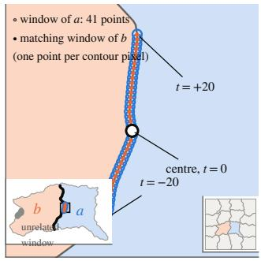

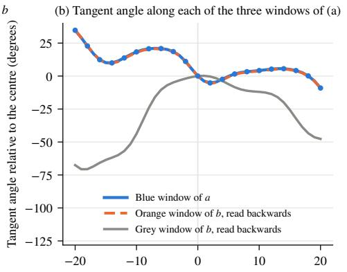

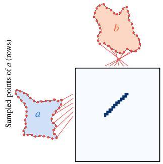

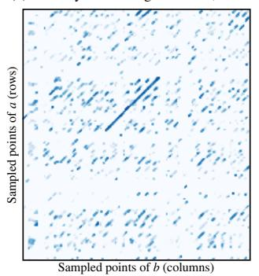

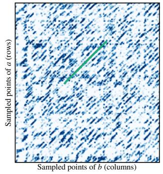

(f) The arc read of (e), on the contours: IoU 0.91  
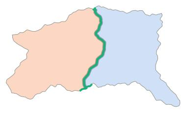  
Figure 1: The pipeline on one synthetic pair (16-fragment image, 1000 × 1000 px, validation seed). (a) The windows. The main view is $\mathrm { ~ a ~ } 5 2 \times 5 2$ px zoom on the shared cut of two interior neighbours a and b: the window of a centred on point k is its 41 consecutive contour points $t = - 2 0 , \ldots , 2 0$ (blue circles, one per pixel) and the matching window of b is the 41 points of b at the same locations (orange dots). The lower-left inset shows the whole pair with the shared cut in black, the two windows in blue and orange and an unrelated window of b in grey. The lower-right inset shows the image. (b) The descriptor of each window: the tangent angle at every point of the window, relative to the angle at its centre, with b read backwards. The orange profile reproduces the blue one and the grey one does not. Dots mark the 21 samples the learned model sees at one of its three smoothing scales. (c) The adjacency matrix of Beaulac [2]: one row per sampled point of a (red dots) and one column per sampled point of b. Its ideal filling is 1 where the two points match and 0 elsewhere, so a shared cut is an anti-diagonal band. The red lines join the matched points to their rows and columns. A coarse sampling is drawn here for legibility. (d) The matrix of the same pair filled by the training-free score (Equation (3)) at the stride of the experiments, one row every three points. (e) The same matrix filled by the learned score (dot products of 32-d embeddings). The learned score responds to many locally similar windows and the read-out, i.e. the best anti-diagonal run (green), selects the band. Cells of (d) and (e) are thickened for display. (f) The arc read off (e), mapped back onto the two contours, against the true cut.

spondences, as in our method. However, the per-point feature of PairingNet is an image patch, for which no invariance to rotation is claimed, and the matrix is only used to register a pair of fragments that has already been retrieved, by thresholding, morphological operations and RANSAC. The decision of whether two fragments are adjacent, called pair searching by the authors, is taken from a separate global embedding trained with a contrastive loss, and the authors report that the contouronly version of this embedding performs poorly (Recall@5 of 0.016). In our method, adjacency is read from the matrix itself. Other related works learn representations of curves for matching. WisePanda [40] learns an embedding of whole fracture curves of bamboo slips with a one-dimensional convolutional network, Velich and Kimmel [32] learn invariant local signatures of planar curves by contrast for whole-shape matching and ReassembleNet [11] uses the tangent angle and the curvature at learned keypoints as input features of a diffusion model for fresco reassembly. To our knowledge, no previous work learns a rotation-invariant tangent-angle descriptor of contour windows in order to build and read a complete contour-to-contour adjacency matrix, nor reads such a matrix with a segmentation network that returns the fracture together with the adjacency decision.

## 2.3 Datasets

Synthetic fragmentation generators are used to produce training labels in large quantities. Examples are the recursive Perlin-noise shredder of [2, 7], which we reuse, the Fourierbasis cuts of photographs used by PairingNet and the Voronoi partitions with erosion used in [25]. Real datasets with pairwise ground truth are less common. PairingNet [39] provides 320 scanned fragments of hand-cut prints with 202 annotated pairs and RePAIR [29] provides eroded fresco fragments from Pompeii, on which assembly methods are compared by the precision of their neighbour predictions and by the error on the estimated position and orientation of each fragment [11, 14, 24].

DAFNE [6] addresses a different task, namely the placement of fragments on a known fresco. Finally, solvers of square-grid puzzles, including those with eroded irregular cells [10, 26], do not consider the pairwise adjacency of free-form contours and are outside the scope of this paper.

## 3 Methods

## 3.1 The adjacency-matrix pipeline of Beaulac

A fragment is represented by its closed contour $c =$ $\left( p _ { 0 } , \ldots , p _ { L - 1 } \right)$ , with one point per pixel, traversed counterclockwise. In [2], a local model $M ( w _ { 1 } , w _ { 2 } ) \in [ 0 , 1 ]$ decides whether two windows $w _ { 1 }$ and $w _ { 2 } .$ , which are square crops of the binary fragment images centred on a contour point of each fragment, are centred on the same point of a fracture. The local model is a Siamese network. Each window is embedded into $\mathbb { R } ^ { 6 4 }$ by a C -equivariant steerable convolutional network [33] made of six R2Conv layers with 24, 48, 48, 96, 96 and 64 regular fields and kernels of size 7, 5, 5, 5, 5 and 5, with antialiased pooling, group pooling and a global average. The two embeddings are then concatenated and a two-layer head maps the result to a logit, that is, a real number whose sigmoid is $M ( w _ { 1 } , w _ { 2 } )$ ). The Siamese network is trained with the binary cross-entropy on pairs of windows centred on common pixels of adjacent fragments, which are the positive examples, and on random points of two fragments, which are the negative examples. A random displacement of at most 3 pixels is applied to the centres, each window is randomly rotated and the two windows are randomly swapped. The size of the windows retained by Beaulac [2] is 29 pixels.

The adjacency matrix of two fragments a and b is defined by $A _ { k l } = M ( w _ { a } ( k s ) , w _ { b } ( l s ) )$ ), where the contour points are sampled with a stride $s = 3$ . Row k of A thus corresponds to the contour point of index ks of a and column l corresponds to the contour point of index ls of b. We denote by $n _ { a }$ the number of rows and by $n _ { b }$ the number of columns of A. If $L _ { a }$ and $L _ { b }$ are the numbers of points on the contours of a and b, then $n _ { a } = \lceil L _ { a } / s \rceil$ and $n _ { b } = \lceil L _ { b } / s \rceil$ , so that $A \in [ 0 , 1 ] ^ { n _ { a } \times n _ { b } }$ . Since the encoder is Siamese, each window is embedded only once and the head is applied to all $n _ { a } n _ { b }$ pairs of embeddings. When a and b share a fracture of m points, the matrix contains a band of high values along an anti-diagonal $k + l \equiv \mathrm { c o n s t }$ , because the two contours traverse the shared arc in opposite directions, see Figure 1c.

A global classifier, which is a ResNet18 applied to the matrix after resizing it to a fixed square (224 pixels in the original code, 128 pixels in ours, with bilinear interpolation in both cases), is trained with Adam (learning rate $1 0 ^ { - 3 }$ , batches of 64, 30 epochs) on matrices of adjacent and non-adjacent pairs and outputs the adjacency logit. Note that the original code applies a random cyclic roll to the matrix during training. This augmentation is appropriate, since the start point of each contour is arbitrary, but it is not described in [2]. We therefore train the classifier both without and with it and report both results as ResNet18 and ResNet18 + roll, respectively.

Two fragments are labelled adjacent when the length of their shared cut is at least $\beta = 1 0 \%$ of the perimeter of both fragments, which is the rule of the generator and the rule used in [7]. Pairs of fragments sharing a shorter cut are labelled non-adjacent and we refer to them as near misses.

## 3.2 The tangent-angle descriptor

The descriptor relies on the following observation. Along a shared fracture, the two contours correspond to the same curve read in opposite directions. Thus, if the contour of b is reversed, the tangent angles of the two contours differ by a constant along the shared arc, this constant being the relative rotation between the two fragments; see Figure 1b. Hence, we describe a window of a contour by the sequence of tangent angles around its centre point and we consider that two windows match when their sequences of angles differ by a constant.

## 3.2.1 Tangent angle

A contour is the cyclic sequence of its pixel points $p _ { t } = ( x _ { t } , y _ { t } )$ $t = 0 , \ldots , L - 1$ , where indices are taken modulo L, so that $p _ { L } = p _ { 0 }$ . Since consecutive points are about one pixel apart, t is approximately the arc length along the contour, measured in pixels. To reduce the staircase pattern of the pixel chain and the noise on the points, each coordinate sequence is first smoothed with a periodic Gaussian filter of standard deviation σ, measured in points, to obtain $\tilde { p } _ { t } = ( \tilde { x } _ { t } , \tilde { y } _ { t } )$ with

$$
\tilde { x } _ { t } = \sum _ { j } g _ { \sigma } ( j ) x _ { t - j } , \qquad \tilde { y } _ { t } = \sum _ { j } g _ { \sigma } ( j ) y _ { t - j } ,
$$

where the weights $g _ { \sigma } ( j ) \propto e ^ { - j ^ { 2 } / ( 2 \sigma ^ { 2 } ) }$ sum to one and the indices $t - j$ are taken modulo L. The central difference $\tilde { p } _ { t + 1 } - \tilde { p } _ { t - 1 }$ approximates the tangent vector of the smoothed contour at point t, and the tangent angle is its direction,

$$
\theta _ { \sigma } ( t ) = \mathrm { a t a n 2 } \big ( \tilde { y } _ { t + 1 } - \tilde { y } _ { t - 1 } , \tilde { x } _ { t + 1 } - \tilde { x } _ { t - 1 } \big ) , \qquad z _ { \sigma } ( t ) = e ^ { i \theta _ { \sigma } ( t ) } .\tag{1}
$$

A rotation of the fragment adds a constant to every angle $\theta _ { \sigma } ( t )$ a change of the start point shifts the index t and reversing the traversal of a contour reverses the order of its points and turns every tangent by π.

In what follows, $\theta _ { a }$ denotes the tangent angles of a in its own traversal order and $\theta _ { \bar { b } }$ denotes those of b traversed backwards. Along a shared cut, $\theta _ { \bar { b } }$ runs through the same sequence of angles as $\theta _ { a } ,$ up to one constant.

## 3.2.2 Training-free score

A window is a set of $2 h + 1$ samples spaced ∆ points apart around a centre, indexed by $t = - h , \ldots , h .$ . For the window of a centred on point k and the window of b¯ centred on point l, computed with $\sigma = 2$ , we define

$$
\begin{array} { r l } & { D ( k , l ) = 1 - \bigg | \frac { 1 } { 2 h + 1 } \sum _ { t = - h } ^ { h } z _ { a } \big ( k { + } t \Delta \big ) \overline { { z _ { b } } } \big ( l { + } t \Delta \big ) \bigg | , } \\ & { I ( k , l ) = \big ( 1 - R _ { a } ( k ) \big ) + \big ( 1 - R _ { \bar { b } } ( l ) \big ) , } \\ & { R _ { a } ( k ) = \bigg | \frac { 1 } { 2 h + 1 } \sum _ { t = - h } ^ { h } z _ { a } \big ( k { + } t \Delta \big ) \bigg | . } \end{array}\tag{2}
$$

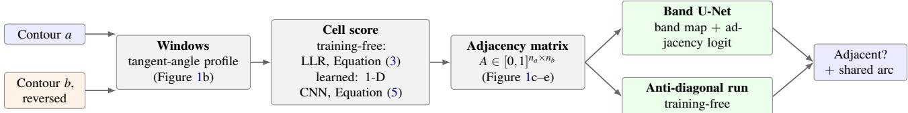  
Figure 2: Architecture. Beaulac’s structure (window scores, then a matrix, then a global decision) with the two replacements of this paper. The window is described by its tangent-angle profile and scored by a formula or by a 129k-parameter 1-D CNN. The matrix is read by a band U-Net or by a maximal anti-diagonal run, both of which return the shared arc. The original $C _ { 8 }$ image-window network and the original ResNet18 classifier serve as references in every comparison.

The quantity D is one minus the mean resultant length of the differences of angles across the window, so that $D \approx$ ${ \frac { 1 } { \gamma } } \operatorname { v a r } ( \theta _ { a } - \theta _ { \bar { b } } )$ when the differences are concentrated around one value. The quantity I is built from the mean resultant lengths $R _ { a }$ and $R _ { \bar { b } }$ of the two windows themselves. It satisfies $\begin{array} { r } { I \approx \frac { 1 } { 2 } ( \operatorname { v a r } \theta _ { a } + \operatorname { v a r } \theta _ { \bar { b } } ) } \end{array}$ and measures how much the two windows turn, that is, how informative they are. Two unrelated windows give $D \approx I ,$ two windows of the same curve give $D \approx \varepsilon .$ , where ε is the angular noise floor, whatever their shape, and two straight windows give $D \approx I \approx 0$ , which is no evidence either way. If D is modelled as a zero-mean Gaussian statistic of scale ε under the hypothesis that the two windows come from the same curve, and of scale $I + \varepsilon$ under the hypothesis that they are unrelated, the log-likelihood ratio of the two hypotheses is

$$
\begin{array} { r } { W ( k , l ) = \frac { 1 } { 2 } \left[ \log \frac { I + \varepsilon } { \varepsilon } - \frac { D } { \varepsilon } + \frac { D } { I + \varepsilon } \right] . } \end{array}\tag{3}
$$

This ratio is large for matching windows that are informative and close to zero for straight windows. The training-free local model is defined by $A _ { k l } = \operatorname { s i g m o i d } ( \operatorname* { m a x } ( W ( k , l ) , - 2 ) )$ , with $h = 4 ,$ , i.e. 9 samples, $\Delta = 4 ,$ so that a window spans 32 points, $\sigma = 2$ and $\varepsilon = 0 . 0 0 3$ . These five parameters were chosen on PairingNet data, as detailed in Appendix A. The score requires no training and is invariant to rotation, translation and start point by construction. It fills the matrix of Beaulac with the same stride $s = 3$ and the global stage is used without modification. The column associated with a sampled point of b is scored with the window of b¯ centred on that point.

## 3.2.3 Learned descriptor

The training-free score compares the angles sample by sample and is essentially a first derivative of the contour. Consequently, it amplifies independent noise on the contour points and we show in Section 4.7 that it fails under a jitter of 1 pixel. The learned descriptor keeps the same representation of the window but learns the comparison. The window of point k of a is the array $x _ { a } ( k ) \in \mathbb { R } ^ { \hat { 6 } \times ( 2 h + 1 ) }$ of the tangent angles at $2 h + 1 = 2 1$ samples spaced $\Delta = 2$ points apart, which spans 40 points, computed at three smoothing scales and expressed relative to the angle at the centre, as cosine and sine channels,

$$
\begin{array} { r } { x _ { a } ( k ) _ { \sigma , t } = \Big ( \cos \varphi , \sin \varphi \Big ) , \quad \varphi = \theta _ { \sigma } ( k + t \Delta ) - \theta _ { \sigma } ( k ) , } \end{array}\tag{4}
$$

for $\sigma \in \{ 1 , 2 , 4 \}$ and $t = - h , \ldots , h$ . Subtracting the angle at the centre makes $x _ { a } ( k )$ exactly invariant to rotation and start point, and the three scales describe the shape of the curve at three resolutions. The window is embedded by a one-dimensional convolutional network $f _ { \theta }$ made of three convolutions of width 64 with kernels of size 5, 5 and 3, the second one with a stride of 2, GELU activations and a two-layer head to $\mathbb { R } ^ { 3 2 }$ , for a total of 129 249 parameters. The same convolutional network embeds the windows $x _ { \bar { b } } ( l )$ of b traversed backwards and the cell of the matrix is the log-odds

$$
\begin{array} { r } { \mathrm { l o g i t } A _ { k l } = \gamma \langle f _ { \theta } ( x _ { a } ( k ) ) , f _ { \theta } ( x _ { \bar { b } } ( l ) ) \rangle + \beta _ { 0 } , \qquad \gamma = 2 / \sqrt { 3 2 } , } \end{array}\tag{5}
$$

where $\beta _ { 0 }$ is a learned bias. The norm of an embedding may encode how informative a window is, since a straight window should not match any other window with confidence, and the complete matrix of a pair of fragments is a single $n _ { a } \times n _ { b }$ product of the two arrays of embeddings, which are computed once per fragment.

The neural network is trained with the true point correspondences of adjacent pairs. A positive example is the pair of windows centred on two matched points. A hard negative example is the window of the true partner shifted by at least 24 points along b, and the other windows of the batch serve as easy negative examples. The loss is the mean binary crossentropy of the diagonal of the $B \times B$ matrix of logits of the batch, which contains the positive examples, plus half the mean binary cross-entropy of its off-diagonal cells and half the mean binary cross-entropy of the hard negatives. We use batches of 256, AdamW with a learning rate of $2 \cdot 1 0 ^ { - 3 }$ , a one-cycle schedule, and a weight decay of $1 0 ^ { - 4 }$ , for 12 000 steps. The augmentation is the main reason for learning the comparison. The training contours are kept in four copies, one of which is clean while the other three are perturbed by an i.i.d. Gaussian jitter of the points, with one standard deviation $\sigma _ { j } \sim U ( 0 . 1 6 , 0 . 8 )$ pixels drawn per copy, and each window is drawn from a random copy. For the experiments of Section 4.7, the neural network is trained on the training split of PairingNet (4 098 fragments and 3 654 ground-truth pairs with point correspondences) and its checkpoint is selected on the validation split (819 fragments, 137 pairs). The real set and the test split are scored once.

## 3.3 Reading the matrix

## 3.3.1 Band U-Net

The reference global classifier is the ResNet18 of Beaulac’s work [2], with one input channel and either a random or an ImageNet initialisation, and the variant called “ResNet18 + roll” adds the cyclic-roll augmentation of the original code. The read-out we propose is a small U-Net with three levels of 16, 32 and 64 channels and two $3 \times 3$ convolutions with batch normalisation per level, applied to the $1 2 8 \times 1 2 8$ matrix. It has two outputs, a per-cell probability of belonging to the band and an adjacency logit computed from the mean of the bottleneck features. Its loss is the binary cross-entropy on the logit for every matrix, plus the binary cross-entropy with a positive weight of 20 and the Dice loss on the band map for the adjacent matrices, whose ground-truth band is stored at the resolution of the matrix from the correspondences given by the generator. The neural network is trained with Adam (learning rate $1 0 ^ { - 3 }$ , batches of 32, 30 epochs) and the roll augmentation is applied to the matrix and to the band together. The adjacency decision is taken from the logit. The shared arc is obtained by thresholding the band map at 0.5 and projecting it onto the two axes of the matrix.

## 3.3.2 Anti-diagonal run

Without any training, the band can be read as the contiguous run of maximum sum of $A - \tau ,$ , with $\tau = 0 . 5$ , along every antidiagonal of the matrix tiled $2 \times 2 .$ , so that a band may wrap around the arbitrary start point of either contour. A dilation of one cell along the rows gives some tolerance to the slope of the band, and a smoothing over three cells is applied along each diagonal. The sum of the run is used as the adjacency score, and its extent gives the arc. This read-out is Kadane’s algorithm applied to each diagonal and corresponds to the special case of a Smith–Waterman alignment without gaps [4, 27]. A variant tolerant to drift, which allows the run to move to a neighbouring anti-diagonal at a small penalty, is used for real fractures whose two sides may differ in length. The learned descriptor uses this read-out on cells spaced 4 points apart, with cell log-odds clipped below at −2. It is implemented as a matrix product followed by a cumulativesum scan over all the fragments of a split.

## 3.3.3 Invariances and cost

Both descriptors are exactly invariant to rotation, translation, and choice of start point, and both read-outs are invariant to the start point thanks to the tiling or the roll augmentation. In comparison, the original local model is equivariant to the eight rotations of $C _ { 8 }$ only and relies on augmentation for intermediate angles, and its matrices are invariant to the start point only through the roll augmentation of the classifier. In terms of cost, the local model of [2] embeds $L / s$ image windows per fragment with six equivariant convolutions, whereas the tangent descriptor embeds the same windows with three onedimensional convolutions on inputs of size $6 \times 2 1$ , or with no neural network at all in the training-free case.

## 4 Experiments and results

## 4.1 Datasets

## 4.1.1 Synthetic benchmark

We re-implemented the generator of [2], which cuts a square recursively, each cut being perturbed by a sum of five octaves of one-dimensional noise [22] with a relative amplitude of 0.05, an initial lacunarity of 8 and gains of 0.5 and 2, using exact polygon arithmetic. In this way, every fragment is an exact polygon, its contour is resampled at one point per pixel, and, for every pair of touching fragments, the shared arc, the masks of the boundary points and the point-to-point correspondence are known. In its original mode, the generator reproduces the images stored by the authors exactly. The images have a size of $1 0 0 0 \times 1 0 0 0$ pixels and contain either 16 fragments, as in Beaulac’s work [2], or 26 fragments, as in [7]. We refer to them as 16-fragment and 26-fragment images.

Four variants, which we call designs, are generated for 16- fragment and 26-fragment images. In the Original design, the benchmark is generated as published, with the contour points lying on the image frame dropped, so that the fragments touching the frame have open contours. In the No frame design, only the fragments that do not touch the frame are kept, 24 fragments are cut per 16-fragment image, and three times as many images are generated to compensate. In the Frame kept design, the frame points are kept, and two straight runs along the frame count as compatible. In the Diverse cuts design, the images are frame-free and every cut draws its own noise statistics, namely an amplitude in $U ( 0 . 0 2 , 0 . 1 0 )$ , a lacunarity in {4,6,8,12,16}, between 3 and 6 octaves, a bow and wider bounds on the end points, so that the fractures of a given image do not all look alike. The training, validation, and test images are generated from disjoint ranges of seeds, with 400, 100 and 100 images for the Original and Frame kept designs and 1 200, 300 and 300 images for the two frame-free designs.

## 4.1.2 Data of Beaulac

The images used in Beaulac’s work are public. They have a size of 400 pixels, 16 fragments, a noise amplitude of 0.07, a lacunarity of 5 and a gain of 2.25, and they come with the labels of the author, namely 2 488 adjacent pairs in the 100 training images and 373 in the 15 validation images. We run the code released by the author end to end on these images, see Section 4.3, and we also run our port on the same images with his negative examples, which are all taken across images, and his matrix size of 224 pixels.

## 4.1.3 PairingNet

The real set of PairingNet contains 320 scanned fragments of 34 hand-cut printed images and 202 annotated pairs, 199 of which can be scored, the three others having an inconsistent ground truth. The generated test set contains 3 279 fragments and 2 370 pairs, that is, 5.4 million candidate pairs. The training and validation splits are used only to train the learned descriptor. The contours are rescaled by a factor of 0.4 when the descriptors are used alone and by a factor of 0.8 for the pipelines trained on 1000-pixel images, so that the number of points of a contour is comparable to that of the synthetic contours.

## 4.2 Experimental protocol

## 4.2.1 Pipelines

The local stage is trained on 2 400 pairs of windows, namely 1 200 positive pairs at true correspondences and 1 200 negative pairs, half of which come from another image, and it is validated on 4 000 pairs with independently rotated windows, with 15 epochs of Adam at a learning rate of $5 \cdot 1 0 ^ { - 4 }$ , the widths of the thesis and windows of 29 pixels. The tangent descriptor needs no training at this stage. The global stage is trained on 2 400 matrices built from 300 images and validated on 800 matrices built from 100 images, with balanced labels and negative examples drawn from the same image, near misses included, at a stride of 3 and a size of 128 pixels. Each classifier is trained for 30 epochs and the epoch with the best validation accuracy is kept. The test numbers of Table 2 are obtained by applying this checkpoint once to 800 matrices built from the 100 held-out test images. The accuracy is computed at the fixed threshold of 0.5. All synthetic pipelines were trained with one seed (seed 0). For the 26-fragment images, the test split was not scored and we report validation values.

## 4.2.2 Evaluation on PairingNet

Two measurements are made on the PairingNet data. The first one is a zero-shot adjacency test, in which a pipeline trained on synthetic data scores the 199 true pairs of the real set against 199 random pairs of fragments taken from different puzzles, where a puzzle is a connected component of the graph of annotated pairs, since a pair that is not annotated inside one puzzle could be an unlabelled neighbour. We report the AUC in this case, since the threshold of a classifier does not transfer from one dataset to another. The second one is pair searching, in which every fragment is scored against every other fragment and the pair-searching protocol of PairingNet [39] is applied, that is, one query per annotated pair, from the source fragment to the target fragment, with the whole split as the pool of candidates and a hit when the target is within the top k candidates. We use the evaluation functions published by the authors, which our own implementation matches exactly for the recall and to within 0.001 for the NDCG. The pairs that cannot be scored count as misses and ties are resolved against our method. The published numbers of PairingNet, of JigsawNet [16] and of the rule-based method of [35] are taken from Tables 2 to 4 of [39] and were not re-run.

Table 1: Global-stage accuracy and AUC on the published data of Beaulac (400-px images, his labels, 746 validation matrices with the corrected labels and 1 492 with the labels as written). Rows 1–2: his released code, mean and standard deviation over three seeds. Rows 3–10: our port with his negatives and matrix size, one seed.
<table><tr><td>Local model</td><td>Global classifier</td><td>Acc.</td><td>AUC</td></tr><tr><td>His  $C _ { 8 }$  CNN, his code</td><td>His ResNet18, as written Same, labels corrected</td><td>0.715 ±0.006 0.939 ±0.010</td><td>n/aª  $\mathrm { \ n / a ^ { a } }$ </td></tr><tr><td> $C _ { 8 }$  image windows (port) ResNet18</td><td></td><td>0.936</td><td>0.978</td></tr><tr><td rowspan="6">Tangent descriptor</td><td>ResNet18, ImageNet init.</td><td>0.945</td><td>0.978</td></tr><tr><td>ResNet18 + roll</td><td>0.942</td><td>0.981</td></tr><tr><td>Band U-Net</td><td>0.950</td><td>0.984</td></tr><tr><td>ResNet18</td><td>0.977</td><td>0.987</td></tr><tr><td>ResNet18, ImageNet init.</td><td>0.981</td><td>0.994</td></tr><tr><td>ResNet18 + roll</td><td>0.977</td><td>0.996</td></tr><tr><td></td><td>Band U-Net</td><td>0.979</td><td>0.995</td></tr></table>

a The released code reports the accuracy only.

## 4.2.3 Metrics

The accuracy at the threshold of 0.5 is our primary metric, as in [2, 7]. We also report the AUC, the AUC restricted to the interior pairs, in which both fragments are away from the image frame so that the open contour of a frame-touching fragment cannot be used as a cue, the median IoU between the predicted and the true arcs on the two contours of the adjacent pairs, for which predicting the whole contour gives a value between 0.27 and 0.29 on comparable sets of pairs, and the Recall@k and NDCG@k of the protocol of PairingNet.

## 4.3 Reproduction of Beaulac and results on his data

Beaulac [2] reports accuracies of 72.32 % and 72.45 % for the global stage, with a ResNet18 initialised at random and with ImageNet weights respectively. Since these values are far below those obtained with our port, we ran the released code on the published data with three training seeds. The local stage reaches a validation accuracy of 0.872 ±0.008, which is close to Beaulac’s values of 0.875 to 0.885 [2]. For the global stage, we observed that the matrix generator of the released code labels every row of the pair table of a split as adjacent. The training table contains only adjacent pairs, but the validation table of the published data contains the 373 adjacent pairs together with 373 fixed non-adjacent pairs. As a result, 373 of the 1 492 validation matrices carry a wrong label and no classifier can exceed an accuracy of $( 3 7 3 + 7 4 6 ) / 1 4 9 2 = 7 5 . 0 \%$ . With the labels as written, the classifier of the author gives 0.715 ±0.006. For seed 0, this is 0.7205, that is, 1 075 correct matrices out of 1 492, while Beaulac’s result, the 72.45 %, corresponds to 1 081 out of 1 492. With the corrected labels, the same classifier gives 0.939 ±0.010 with the roll augmentation and 0.916 ±0.014 without it. We also ran windows of 63 pixels with a step of 5, which combines two settings of the thesis (0.709 for windows of 63 pixels and 0.714 for a step of 5). With one seed and the roll augmentation, the local stage gives 0.867 and the global stage gives 0.706 with the labels as written and 0.913 with the corrected labels. Hence, with its default setting, the method of Beaulac reaches an accuracy between

0.93 and 0.95 on his own data and the value of 72 % is due to the evaluation script rather than to the method. In particular, the conclusion of the thesis that the global stage does not generalise should be reconsidered.

Table 1 compares our port and the tangent descriptor on the same images with the labels of the author. Our port of the original pipeline gives accuracies between 0.936 and 0.950, in agreement with the corrected code of the author (0.906 to 0.950 over the three seeds, with and without the roll augmentation). With the tangent descriptor, every classifier reaches an accuracy between 0.977 and 0.981. The band U-Net is the best read-out for the image-window stage and is within 0.003 of the best one for the tangent descriptor. Note that a pixel-chain contour at a resolution of 400 pixels is a difficult case for a tangent descriptor, since the staircase pattern of a digital curve is itself a signal, and the descriptor nevertheless improves on the image-window model.

## 4.4 Synthetic benchmark

Table 2 and Figure 3 give the complete comparison on the synthetic benchmark. We make three observations.

First, the tangent descriptor performs as well as or better than the C image-window model in each of the 32 configurations. The difference is largest where the global classifier is weakest. With the plain ResNet18 of Beaulac’s work [2], the image-window pipeline falls to 0.65 and 0.57 on the framefree data and to 0.59 and 0.60 on the diverse cuts, whereas the tangent pipeline remains at 0.96 and between 0.80 and 0.81. The matrices produced by the image-window model are noisier, since the local model is correct on 82 % to 89 % of the rotated pairs of windows, and a classifier trained from scratch on these matrices at a resolution of 128 pixels does not detect the band reliably. The matrices produced by the tangent descriptor are cleaner, see Figure 1d, and every classifier can read them. On the Original design, part of the accuracy comes from the open contours of the fragments touching the frame, which exhibit a straight gap where the frame was. This explains why both pipelines perform best on this design and why the plain ResNet of the image-window pipeline loses 0.29 when the frame is removed, while the tangent pipeline loses 0.03.

Second, within each first stage, the band U-Net is the best classifier, or tied with the best, in 14 of the 16 configurations, the roll augmentation is at least as good as the ImageNet initialisation in 14 of them and the plain ResNet18 of [2] is the worst in 15 of them, by a margin that depends on the first stage (between 0.03 and 0.39 below the U-Net with image windows, between 0.00 and 0.13 with the descriptor). The arc predicted by the U-Net has a median IoU with the true arc between 0.88 and 0.96 for the tangent pipeline and between 0.74 and 0.93 for the image-window pipeline, compared with 0.28 for the whole contour. The interior-pair AUC of the U-Net lies between 0.95 and 1.00 for every design, except for the Frame kept design with image windows (0.84). Thus, the pipelines do not rely on the frame to decide adjacency.

Third, the diverse cuts form the most difficult design. When every fracture of an image has its own roughness, amplitude and bow, the accuracy decreases for every configuration (between 0.87 and 0.93 for the U-Net) and so does the IoU of the arc (0.74 and 0.88), since smooth cuts of low amplitude give short informative arcs and the near misses of one image resemble the positive pairs of another. As shown in Section 4.6, this is also the only design that transfers to real fragments. Finally, the validation and test accuracies agree within 0.033 in every configuration, so the validation numbers given for the 26-fragment images can be read as test numbers with approximately this margin.

## 4.4.1 Label rule and stride

We also performed two ablations of the global stage on the Original design with the image-window first stage, on the validation split. When every contact is labelled as adjacent instead of applying the 10 % rule, every classifier loses accuracy on the 16-fragment images (0.939 to 0.744 for the plain ResNet18, 0.990 to 0.871 with the roll augmentation and 0.996 to 0.881 for the U-Net). Under this rule, about a quarter of the positive pairs share an arc too short to be detected (102 of 400 in an earlier run at a resolution of 500 pixels on the same design) and a ResNet trained with the roll augmentation labels as adjacent only 23 % of the pairs sharing less than 10 % of their perimeter, against 95 % of those sharing 20 % or more. Regarding the stride, filling the matrix at every contour point rather than every third point does not improve any learned classifier on the 26-fragment images (with an input of 384 pixels, 0.940, 0.958, 0.970 and 0.958 for the four classifiers at stride 1 against 0.943, 0.970, 0.970 and 0.955 at stride 3). On the other hand, a larger input does help the ResNets, mostly the plain one (from 128 to 384 pixels at stride 3, 0.705 to 0.943 for the plain ResNet18, 0.894 to 0.970 with the ImageNet initialisation and 0.943 to 0.970 with the roll augmentation), but not the U-Net (0.965 to 0.955). Hence, the weakness of the plain ResNet seems to be related to the resolution of its input rather than to a lack of information in the matrix.

## 4.5 Comparison with the contour Transformer

Dongmo et al. [7] replace the two stages of Beaulac by a contour Transformer, in which patches of 48 contour coordinates taken every 32 points are averaged into tokens, an encoder of 8 layers and width 256 shared by the two contours is applied with a positional encoding, followed by a cross-attention mod ule, a mean pooling and two directional heads, for a total of 7.1 million parameters, trained for 100 epochs on 20 000 images. They report a validation accuracy of 82.2 % on 26-fragment images. We obtained the published weights and the generator of the authors, see Table 3. Under the validation protocol of the article, we reproduce the published value (0.827, against 0.822 in the article). We also observe that this value depends on two conventions of the protocol, namely the scoring of each pair in the order in which the generator stores the two fragments, since swapping them gives 0.707, and the scoring of the pairs in padded batches, since scoring one pair at a time gives 0.725. On our images of the same design, scored one pair at a time and averaged over the two orders, the published model gives an accuracy of 0.674 and an interior-pair AUC of 0.656. When every fragment is rotated by a random angle, the model is at chance level (0.524), which is not expected from the description of the positional encoding as robust to rotation given in the article, and it is also at chance level on the real fragments of PairingNet (AUC of 0.49, see Table 4). Under the protocol of the authors, its interior-pair AUC is 0.751 with a specificity of 0.51, which means that it accepts half of the interior negative pairs. In comparison, the tangent pipeline, trained on 1 200 images and 2 400 matrices, reaches 0.985 on the frame-free 26-fragment images and 0.926 on the diverse cuts, with AUCs of 0.73 and 0.89 on the real fragments (Table 4). Note that the two models are not evaluated on identical lists of pairs, see Section 4.8. The Transformer architecture and its variants will be the subject of a separate study.

Table 2: Global-stage accuracy on the synthetic benchmark (1000-px images, one seed) for each first stage, classifier and design. 16-fragment images: held-out test split. 26-fragment images: validation split. Int.: interior-pair AUC of the band U-Net. IoU: median IoU of the arc predicted by the U-Net (n/a for Frame kept, where no arc is defined).
<table><tr><td colspan="8">16-fragment images, test split</td><td colspan="4">26-fragment images, validation</td></tr><tr><td>Design</td><td>First stage</td><td>ResNet18</td><td>+pretr.</td><td>+roll</td><td>U-Net</td><td>Int.</td><td>IoU</td><td>ResNet18</td><td>+pretr.</td><td>+roll</td><td>U-Net</td></tr><tr><td rowspan="2">Original</td><td> $C _ { 8 }$  image windows</td><td>0.935</td><td>0.966</td><td>0.984</td><td>0.995</td><td>1.00</td><td>0.93</td><td>0.705</td><td>0.894</td><td>0.943</td><td>0.965</td></tr><tr><td>Tangent descriptor</td><td>0.995</td><td>0.998</td><td>0.998</td><td>0.999</td><td>1.00</td><td>0.96</td><td>0.970</td><td>0.971</td><td>0.984</td><td>0.984</td></tr><tr><td rowspan="2">No frame</td><td> $C _ { 8 }$  image windows</td><td>0.649</td><td>0.900</td><td>0.924</td><td>0.965</td><td>0.99</td><td>0.87</td><td>0.571</td><td>0.875</td><td>0.926</td><td>0.960</td></tr><tr><td>Tangent descriptor</td><td>0.961</td><td>0.975</td><td>0.973</td><td>0.984</td><td>1.00</td><td>0.93</td><td>0.956</td><td>0.969</td><td>0.981</td><td>0.985</td></tr><tr><td rowspan="2">Frame kept</td><td> $C _ { 8 }$  image windows</td><td>0.913</td><td>0.916</td><td>0.921</td><td>0.949</td><td>0.84</td><td>n/a</td><td>0.888</td><td>0.886</td><td>0.893</td><td>0.914</td></tr><tr><td>Tangent descriptor</td><td>0.990</td><td>0.995</td><td>0.993</td><td>0.993</td><td>1.00</td><td>n/a</td><td>0.944</td><td>0.964</td><td>0.969</td><td>0.961</td></tr><tr><td rowspan="2">Diverse cuts</td><td> $C _ { 8 }$  image windows</td><td>0.590</td><td>0.729</td><td>0.834</td><td>0.891</td><td>0.95</td><td>0.74</td><td>0.596</td><td>0.665</td><td>0.794</td><td>0.868</td></tr><tr><td>Tangent descriptor</td><td>0.806</td><td>0.836</td><td>0.855</td><td>0.899</td><td>0.96</td><td>0.88</td><td>0.800</td><td>0.856</td><td>0.891</td><td>0.926</td></tr></table>

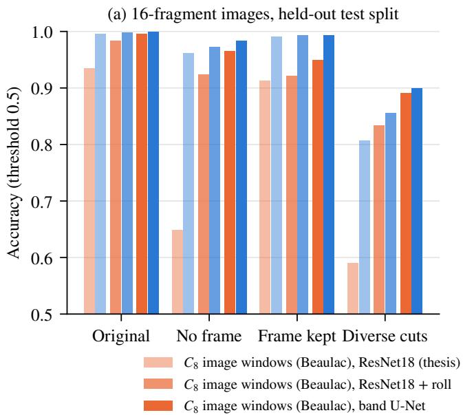

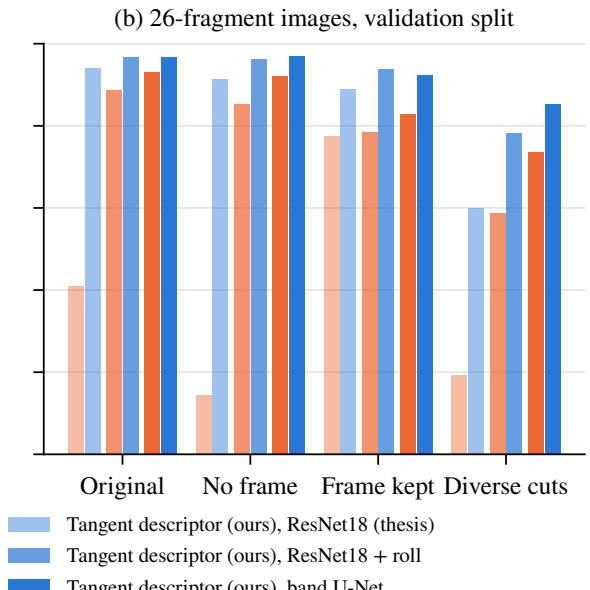  
Figure 3: Synthetic benchmark (Table 2). Accuracy of the global stage by first stage (orange: Beaulac’s $C _ { 8 }$ image-window CNN, blue: the tangent descriptor) and classifier (light to dark: the original ResNet18, ResNet18 with roll augmentation, the band U-Net), for the four designs. (a) 16-fragment images, held-out test split. (b) 26-fragment images, validation split.

Table 3: Published weights of the contour Transformer [7], scored one pair at a time on our validation images (rows 1–3) and under the validation protocol of the article on 200 images of the authors’ generator (row 4), compared with the tangent pipeline with the band U-Net on the 26-fragment images (rows 5–6, validation). Int.: interior-pair AUC.
<table><tr><td>Model, data</td><td>Acc.</td><td>AUC</td><td>Int.</td></tr><tr><td>Published weights, our Original images</td><td>0.674</td><td>0.768</td><td>0.656</td></tr><tr><td>Same, every fragment rotated</td><td>0.524</td><td>0.543</td><td>0.533</td></tr><tr><td>Same, 16-fragment images</td><td>0.657</td><td>0.803</td><td>0.646</td></tr><tr><td>Published weights, their generator and protocol</td><td>0.827</td><td>0.917</td><td>0.751</td></tr><tr><td>Tangent pipeline, No frame</td><td>0.985</td><td>0.999</td><td>0.999</td></tr><tr><td>Tangent pipeline, Diverse cuts</td><td>0.926</td><td>0.963</td><td>0.963</td></tr></table>

## 4.6 Zero-shot transfer to real fragments

None of the pipelines of this section has been trained on real fragments. Table 4 gives the results of each pipeline, applied without modification, on the scanned fragments of PairingNet. The image-window pipelines transfer poorly whatever their training design, with AUCs between 0.57 and 0.82, the best value being that of the 26-fragment diverse-cut model, and the arcs they predict are mostly wrong, with median IoUs between 0.00 and 0.45. The tangent pipelines transfer well only when their global stage was trained on the diverse cuts, with AUCs of 0.93 and 0.89 and median IoUs of 0.54 and 0.52, against AUCs between 0.71 and 0.80 for the three other designs. Since the descriptor is the same in every row and the anti-diagonal run gives an AUC of 0.92 on the same matrices, what fails to transfer in the other designs is the U-Net itself, which has learned the appearance of a band on one family of synthetic fractures and does not recognise the bands of real fractures unless it is trained on cuts of varied statistics. Note that the real scans are hand-cut prints with exactly complementary edges and no erosion, which is a favourable case for contour geometry. On these data, the drift-tolerant alignment of the training-free descriptor, which also estimates the rigid placement of the two fragments [13, 27], reaches a median IoU of 0.96 for the arcs. The anti-diagonal run on the matrices of the diverse-cut pipeline has an adjacency AUC of 0.92, below that of its U-Net (0.93). The same holds when every cross-puzzle pair is scored (0.921 against 0.933 for the maximum of the band map), so the learned read-out also improves the AUC on real data, although not the pair searching of Section 4.7. The published contour Transformer gives an AUC of 0.49 on the same 199 true pairs, scored against all cross-puzzle pairs.

Table 4: Zero-shot transfer to the real set of PairingNet (199 true pairs against 199 cross-puzzle pairs, contours at scale 0.8) of the pipelines trained on synthetic data. U-Net: AUC of the band-map maximum. IoU: median IoU of the predicted arc on the true pairs.
<table><tr><td>Design</td><td>First stage</td><td>16-fragment U-Net IoU</td><td></td><td>26-fragment U-Net</td><td>IoU</td></tr><tr><td>Original</td><td>C8 image windows</td><td>0.72</td><td>0.34</td><td>0.71</td><td>0.34</td></tr><tr><td></td><td>Tangent descriptor</td><td>0.80</td><td>0.24</td><td>0.71</td><td>0.36</td></tr><tr><td>No frame</td><td> $C _ { 8 }$  image windows Tangent descriptor</td><td>0.75 0.71</td><td>0.35 0.36</td><td>0.64 0.73</td><td>0.01 0.35</td></tr><tr><td>Frame kept</td><td>C8 image windows Tangent descriptor</td><td>0.58 0.74</td><td>0.19 0.17</td><td>0.57 0.72</td><td>0.00 0.00</td></tr><tr><td>Diverse cuts</td><td> $C _ { 8 }$  image windows Tangent descriptor</td><td>0.66 0.93</td><td>0.07 0.54</td><td>0.82 0.89</td><td>0.45 0.52</td></tr><tr><td colspan="4">Training-free LLR + drift alignment [27]ª AUC 0.92, IoU 0.96 Contour Transformer [7], published weightsª AUC 0.49, no arc</td><td></td><td></td></tr></table>

a No global stage, hence independent of the design. 199 true pairs against all 50 657 cross-puzzle pairs (Table 5), at scale 0.4 for the training-free descriptor and 0.8 for the Transformer. The other rows use the 199 + 199 sample at scale 0.8.

## 4.7 Pair searching on PairingNet

Table 5 and Figure 4 give the results of pair searching under the protocol of PairingNet. On the real set, the learned descriptor with the anti-diagonal run reaches Recall@5, Recall@10 and Recall@20 of 0.794, 0.823 and 0.873 and an NDCG@10 of 0.718, with a standard deviation of at most 0.016 over three seeds, compared with 0.415, 0.564, 0.678 and 0.369 for PairingNet, which uses the texture in addition to the contour and was trained on its own generated data. The training-free descriptor with the anti-diagonal run reaches a Recall@10 of 0.748, and the matrix of the full pipeline at stride 3, read by the anti-diagonal run, reaches 0.713. The AUC of the true pairs against all cross-puzzle pairs is 0.970 for the learned descriptor, 0.932 for the training-free one, 0.921 for the pipeline matrix and 0.491 for the published contour Transformer. Thus, learning the comparison brings an improvement of 0.08 in Recall@10 over the training-free score with the same representation and read-out. The published contour Transformer is at chance level (0.045). We note that the real set is small and favourable to geometric methods, since the edges are clean and complementary, so we do not extrapolate these results to eroded material.

On the generated test set, the ranking is reversed. The learned descriptor reaches 0.371, 0.417 and 0.462 and an NDCG@10 of 0.385, with an AUC of 0.868 against 0.779 for the training-free descriptor, which is below PairingNet (0.493, 0.608 and 0.714) and its texture-only variant (Recall@10 of 0.597), but well above its contour-only variant (0.025) and above the training-free descriptor (0.266, or 0.309 when the drift-tolerant alignment rescores the 100 best candidates). The generated cuts of PairingNet are smooth and the true pairs often share short arcs. For the training-free descriptor, the Recall@10 is 0.01, 0.20 and 0.58 on the three terciles of shared-arc length (22 to 75, 75 to 116 and 116 to 313 points). On this set, the texture carries information that is absent from the contour for about a third of the true pairs. Still, the contour information, when read from the point matrix, is worth about seventeen times what the contour-only global embedding of PairingNet extracts from it.

## 4.7.1 Robustness to jitter

Figure 4c shows the effect of an i.i.d. Gaussian jitter of the contour points of the real set, at the working scale. The trainingfree descriptor, which is a first derivative of the contour, degrades quickly: its AUC is 0.93, 0.84, 0.61 and 0.51 and its Recall@10 is 0.75, 0.47, 0.06 and 0.04 for a jitter of 0, 0.5, 1 and 2 pixels. The learned descriptor, which was trained with a jitter of up to 0.8 pixel, keeps an AUC of 0.97, 0.96, 0.91 and 0.65 and a Recall@10 of 0.82, 0.82, 0.64 and 0.16, with a standard deviation of at most 0.05 over three seeds up to 1 pixel. The representation is the same in both cases, so the gain comes from the neural network having learned which comparisons are robust to the noise.

## 4.7.2 The read-outs of the pipeline as re-rankers

We also tried to re-rank the 20 best candidates returned by the learned descriptor on the test set with the anti-diagonal run on the matrix at stride 3. This lowers the Recall@10 from 0.422 to 0.385 for seed 0. Re-ranking the 50 best candidates with the band U-Net of the diverse-cut tangent pipeline also lowers it, to 0.342 with its adjacency logit and to 0.359 with the maximum of its band map. On the real set, the same U-Net used as the only score gives a Recall@10 of 0.698 with the maximum of its band map (AUC 0.933) and 0.564 with its logit, against 0.713 for the anti-diagonal run on the same matrices. Hence, neither read-out of the pipeline improves the ranking of the learned descriptor on the test set. On the real set, the U-Net does not improve on the anti-diagonal run for pair searching either. Note that the U-Net was trained on the matrices of the training-free descriptor only. Training it on the matrices of the learned descriptor is left for future work (Section 5).

Table 5: Pair searching under the protocol of PairingNet on its real set (320 fragments) and on its generated test set (3 279 fragments). The learned descriptor is trained on the training split of PairingNet and its values are means over three seeds (standard deviation at most 0.016). The values of PairingNet, JigsawNet and the rule-based method are those reported in [39]. Bold: best of the set. Underlined: best among the contour-only methods.
<table><tr><td>Set</td><td>Method</td><td>R@5</td><td>R@10</td><td>N@5</td><td>N@10</td><td>Input</td></tr><tr><td rowspan="7">Real</td><td>Learned tangent descriptor + anti-diagonal run (ours)</td><td>0.794</td><td>0.823</td><td>0.709</td><td>0.718</td><td>Contour</td></tr><tr><td>Training-free tangent descriptor + anti-diagonal run (ours)</td><td>0.688</td><td>0.748</td><td>0.628</td><td>0.650</td><td>Contour</td></tr><tr><td>Tangent pipeline matrix (stride 3), anti-diagonal run (ours)</td><td>0.683</td><td>0.713</td><td>0.635</td><td>0.646</td><td>Contour</td></tr><tr><td>PairingNet [39]</td><td>0.415</td><td>0.564</td><td>0.321</td><td>0.369</td><td>Contour + texture</td></tr><tr><td>JigsawNet [16], as reported in [39]</td><td>0.237</td><td>0.326</td><td>0.185</td><td>0.213</td><td>Image</td></tr><tr><td>Rule-based [35], as reported in [39]</td><td>0.138</td><td>0.247</td><td>0.079</td><td>0.114</td><td>Contour + colour</td></tr><tr><td>Contour Transformer [7], published weights</td><td>0.020</td><td>0.045</td><td>0.015</td><td>0.024</td><td>Contour</td></tr><tr><td rowspan="7">Generated</td><td>Learned tangent descriptor + anti-diagonal run (ours)</td><td>0.371</td><td>0.417</td><td>0.369</td><td>0.385</td><td>Contour</td></tr><tr><td>Training-free tangent descriptor + anti-diagonal run (ours)</td><td>0.232</td><td>0.266</td><td>0.228</td><td>0.241</td><td>Contour</td></tr><tr><td>+ drift alignment re-scoring the top 100</td><td>0.281</td><td>0.309</td><td>0.289</td><td>0.300</td><td>Contour</td></tr><tr><td>PairingNet [39]</td><td>0.493</td><td>0.608</td><td>0.417</td><td>0.458</td><td>Contour + texture</td></tr><tr><td>PairingNet, texture only [39]</td><td>0.479</td><td>0.597</td><td>0.394</td><td>0.436</td><td>Texture</td></tr><tr><td>PairingNet, contour only [39]</td><td>0.016</td><td>0.025</td><td>0.013</td><td>0.016</td><td>Contour</td></tr><tr><td>JigsawNet [16], as reported in [39]</td><td>0.380</td><td>0.472</td><td>0.326</td><td>0.359</td><td>Image</td></tr><tr><td></td><td>Rule-based [35], as reported in [39]</td><td>0.317</td><td>0.416</td><td>0.248</td><td>0.284</td><td>Contour + colour</td></tr></table>

Table 6: The learned tangent descriptor with the anti-diagonal run, trained on synthetic diverse cuts or on the training split of PairingNet and tested on both kinds of data. AUC of the adjacent pairs against the non-adjacent pairs (the cross-puzzle pairs on PairingNet) and Recall@10, under the protocol of PairingNet on its real set and per query fragment on the other sets, whose labels are exact. Synthetic: 100 held-out diverse-cut images (806 fragments, 765 pairs). Beaulac: his 15 validation images (240 fragments, 373 pairs). PairingNet: the real set (320 fragments, 199 pairs) at scale 0.4. One seed, except the last two values of the second row (Table 5).
<table><tr><td></td><td colspan="2">Synthetic</td><td colspan="2">Beaulac</td><td colspan="2">PairingNet</td></tr><tr><td>Trained on</td><td>AUC</td><td>R@10</td><td>AUC</td><td>R@10</td><td>AUC</td><td>R@10</td></tr><tr><td>Synthetic diverse cuts</td><td>0.997</td><td>0.975</td><td>0.985</td><td>0.958</td><td>0.968</td><td>0.866</td></tr><tr><td>PairingNet training split</td><td>0.991</td><td>0.930</td><td>0.984</td><td>0.965</td><td>0.970</td><td>0.823</td></tr></table>

## 4.7.3 Training on synthetic data

The learned descriptor of Table 5 is trained on the training split of PairingNet. To separate what it owes to its training data from what it owes to its design, we also train it, with the same hyper-parameters, on the exact correspondences of 600 synthetic images with diverse cuts (4 650 fragments, 4 329 adjacent pairs), its checkpoint being selected on 30 validation images of the same design, and we test both models on both kinds of data (Table 6). On the synthetic sets and on the images of Beaulac, the fragments of the validation images are pooled, every fragment is scored against every other fragment and the Recall@10 is the share of the true neighbours of a fragment found among its 10 best candidates, averaged over the fragments. Each model is the best on the synthetic data of its own kind (0.975 against 0.930 on the diverse cuts), but on the real fragments of PairingNet the model trained on synthetic cuts reaches a Recall@10 of 0.866 and an AUC of 0.968, against 0.823 and 0.970 for the model trained on PairingNet, which has seen 3 654 pairs of PairingNet’s generated training split but, like the other model, no scanned fragment. The diverse synthetic cuts are thus the better training set for the real scans, and the results of Table 5 do not depend on training on PairingNet. The real set is scored at scale 0.4 for both models; at scale 0.8, where its contours have as many points as the synthetic training contours, the synthetic-trained model falls to 0.782.

## 4.8 Threats to validity

## 4.8.1 Internal validity

Every synthetic result is obtained with a single seed and the checkpoints are selected on the validation split. The test numbers of the 16-fragment images are the exception, and they agree with the validation numbers within 0.033. We did not run additional seeds for the synthetic pipelines or score the test split of the 26-fragment images. On the data of Beaulac, his released code was run with three seeds for its default setting. Our port and the tangent pipelines were run with one seed and Table 1 gives validation values only. A held-out split must be chosen with care on these data, since the validation split of his 50-image set, for instance, consists of training images of the 100-image set used here (each of its 373 adjacent pairs comes from one of training images 51 to 65). The band U-Net has only been trained on the matrices produced by the training-free descriptor. A U-Net trained on the matrices of the learned descriptor, and the learned descriptor used as the first stage of the full pipeline on synthetic data, are natural experiments that we leave for future work. The five parame-

PairingNet, contour only (published)

JigsawNet (as reported by PairingNet)

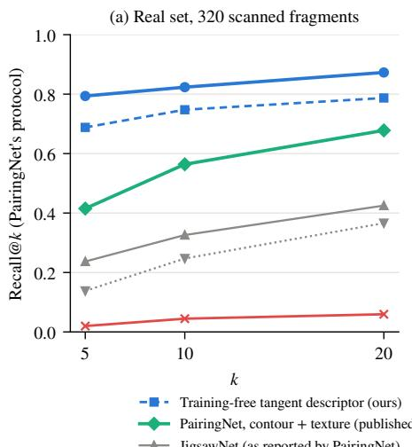  
Figure 4: PairingNet’s pair-searching protocol. (a) Real set and (b) generated test set. Recall@k of the learned descriptor (mean and sd over three seeds), of the training-free descriptor with the anti-diagonal run, of the published PairingNet, JigsawNet and rule-based results [39] and of the published contour Transformer. (c) Robustness on the real set to i.i.d. Gaussian jitter of the contour points. The learned descriptor keeps its AUC and most of its Recall@10 at 1 px, whereas the training-free score degrades quickly.

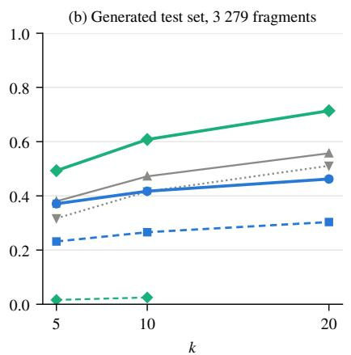

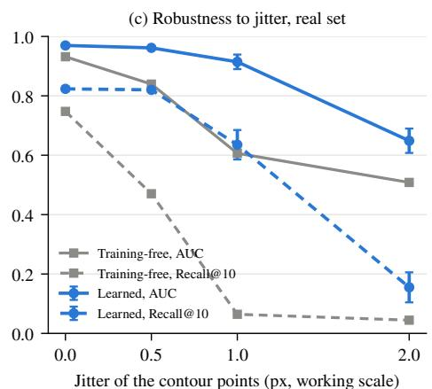  
Learned tangent descriptor (ours, 3 seeds)

ters of the training-free descriptor were chosen on PairingNet data, and its fast window setting was chosen while looking at the real set, see Appendix A, so the real-set results of the training-free rows are not those of a blind run. The parameters of the learned descriptor come from the training split and its checkpoint from the validation split, so its real-set results are. Finally, the numbers of PairingNet are quoted from the article and were not re-run.

## 4.8.2 External validity

The real fragments of PairingNet are exactly complementary and not weathered, so they test the transfer from synthetic contours to scanned contours rather than the robustness to erosion. The eroded fresco fragments of RePAIR [29] would test what the jitter experiment of Section 4.7 only simulates. Also, the comparison with the contour Transformer on synthetic data is a comparison between designs rather than between identical lists of pairs.

## 5 Conclusion and further work

In this paper, we kept the adjacency matrix of the two-stage architecture of Beaulac [2] and replaced the local model that fills it and the global classifier that reads it. The tangent-angle descriptor of contour windows, which may be a training-free likelihood ratio or a one-dimensional convolutional network of 129k parameters trained on point correspondences, is invariant to rotation and start point by construction. It produces cleaner matrices than the rotation-equivariant image-window network it replaces, for every classifier and every design of the synthetic benchmark, as well as on the data of the original author, on which the pipeline reaches 0.98 against 0.93 to 0.95 for the original method once its evaluation is corrected. The band U-Net, which segments the anti-diagonal band and classifies the pair at the same time, is the best read-out in nearly every configuration for both first stages and returns the shared arc with the decision. Trained on synthetic cuts of diverse statistics, the resulting pipeline transfers to scanned real fragments with an AUC of 0.93. Under the pair-searching protocol of PairingNet, the learned descriptor outperforms the published model, which also uses texture, on the real set (Recall@10 of 0.82 against 0.56) and its contour-only variant on the generated set (0.42 against 0.03), while tolerating a jitter of one pixel on the contour points, and it does so whether it is trained on the training split of PairingNet or on synthetic correspondences only (Recall@10 of 0.87 in the latter case).

Several questions remain open. First, the two learned stages could be combined, by training the band U-Net on the matrices of the learned descriptor and by fine-tuning the descriptor on the training split of a benchmark when one is available, so that a single pipeline serves both adjacency prediction and pair searching. Second, texture information could be added as supplementary channels of the window descriptor, since texture is what distinguishes the remaining third of the generated pairs of PairingNet, and the structure of the matrix does not depend on what fills its cells. Third, the arcs and the rigid placements returned by the read-outs could be used as the input of a global consistency check, which would reject the geometrically plausible but wrong matches that any pairwise method makes between fragments of different objects. Finally, the eroded fragments of RePAIR would provide a test that neither our synthetic benchmark nor the clean scans of PairingNet provide.

Reproducibility. The code (the generator with exact correspondences, both first stages, both read-outs, the reproduction of Beaulac and the protocol of PairingNet), the seeds that regenerate every synthetic data set, every result file and the experiment log will be made publicly available.

## References

[1] Esther M. Arkin, L. Paul Chew, Daniel P. Huttenlocher, Klara Kedem, and Joseph S. B. Mitchell. An efficiently computable metric for comparing polygonal shapes. IEEE Transactions on Pattern Analysis and Machine Intelligence, 13(3):209–216, 1991. doi: 10.1109/34.75509.

[2] Étienne Beaulac. Reconstruction d’objets 2D fragmentés à l’aide de réseaux de neurones convolutifs siamois équivariants aux rotations et de matrices d’adjacence de contours. Mémoire de maîtrise, Université du Québec à Trois-Rivières, 2023. URL https://depot-e.uqtr. ca/id/eprint/10762.

[3] Yangjie Cao, Zheng Fang, Hui Tian, and Ronghan Wei. 2D irregular fragment reassembly with deep learning assistance. IEEE Access, 12: 28554–28563, 2024. doi: 10.1109/ACCESS.2024.3368004.

[4] Longbin Chen, Rogério Schmidt Feris, and Matthew Turk. Efficient partial shape matching using Smith-Waterman algorithm. In IEEE Computer Society Conference on Computer Vision and Pattern Recognition Workshops (CVPRW), pages 1–6, 2008. doi: 10.1109/ CVPRW.2008.4563078. URL https://rogerioferis.com/ publications/FerisNordia08.pdf.

[5] Niv Derech, Ayellet Tal, and Ilan Shimshoni. Solving archaeological puzzles. Pattern Recognition, 119:108065, 2021. doi: 10.1016/j.patcog. 2021.108065.

[6] Piercarlo Dondi, Luca Lombardi, and Alessandra Setti. DAFNE: A dataset of fresco fragments for digital anastylosis. Pattern Recognition Letters, 138:631–637, 2020. doi: 10.1016/j.patrec.2020.09.015.

[7] Kevin Dongmo, Fadel Toure, Alain Goupil, and Etienne Beaulac. Fragments adjacency prediction: A contour based approach using transformer models with rotary positional encoding. In Proceedings of the 2025 3rd International Conference on Machine Learning and Pattern Recognition (MLPR 2025), pages 50–58, Kyoto, Japan, 2025. ACM. doi: 10.1145/3760678.3760686.

[8] Thomas Funkhouser, Hijung Shin, Corey Toler-Franklin, Antonio García Castañeda, Benedict Brown, David Dobkin, Szymon Rusinkiewicz, and Tim Weyrich. Learning how to match fresco fragments. ACM Journal on Computing and Cultural Heritage, 4(2):7:1–7:13, 2011. doi: 10.1145/2037820.2037824.

[9] Jingjing He, Huiqin Wang, Rui Liu, Li Mao, Ke Wang, Zhan Wang, and Ting Wang. Research on rejoining bone stick fragment images: A method based on multi-scale feature fusion siamese network guided by edge contour. Applied Sciences, 14(2):717, 2024. doi: 10.3390/ app14020717.

[10] Sepidehsadat Hosseini, Mohammad Amin Shabani, Saghar Irandoust, and Yasutaka Furukawa. PuzzleFusion: Unleashing the power of diffusion models for spatial puzzle solving. In Advances in Neural Informa tion Processing Systems, volume 36, 2023.

[11] Adeela Islam, Stefano Fiorini, Stuart James, Pietro Morerio, and Alessio Del Bue. ReassembleNet: Learnable keypoints and diffusion for 2D fresco reconstruction. In Proceedings ofthe IEEE/CVF International Conference on Computer Vision (ICCV), pages 9048–9057, 2025. doi: 10.1109/ICCV51701.2025.00846.

[12] Edson Justino, Luiz S. Oliveira, and Cinthia Freitas. Reconstructing shredded documents through feature matching. Forensic Science International, 160(2-3):140–147, 2006. doi: 10.1016/j.forsciint.2005.09.001.

[13] Wolfgang Kabsch. A solution for the best rotation to relate two sets of vectors. Acta Crystallographica Section A, 32(5):922–923, 1976. doi: 10.1107/S0567739476001873.

[14] Marina Khoroshiltseva, Luca Palmieri, Sinem Aslan, Sebastiano Vascon, and Marcello Pelillo. Nash meets Wertheimer: Using good continuation in jigsaw puzzles. In Computer Vision – ACCV 2024, Lecture Notes in Computer Science. Springer, 2024. doi: 10.1007/978-981-96-0960-4\_ 29.

[15] Weixin Kong and Benjamin B. Kimia. On solving 2D and 3D puzzles using curve matching. In Proceedings of the IEEE Conference on Computer Vision and Pattern Recognition (CVPR), volume 2, pages 583–590, 2001. doi: 10.1109/CVPR.2001.991015.

[16] Canyu Le and Xin Li. JigsawNet: Shredded image reassembly using convolutional neural network and loop-based composition. IEEE Transactions on Image Processing, 28(8):4000–4015, 2019. doi: 10.1109/TIP. 2019.2903298. URL https://arxiv.org/abs/1809.04137.

[17] Helena Cristina da Gama Leitão and Jorge Stolfi. A multiscale method for the reassembly of two-dimensional fragmented objects. IEEE Transactions on Pattern Analysis and Machine Intelligence, 24(9):1239–1251, 2002. doi: 10.1109/TPAMI.2002.1033215.

[18] Jiaxin Lu, Yongqing Liang, Huijun Han, Jiacheng Hua, Junfeng Jiang, Xin Li, and Qixing Huang. A survey on computational solutions for reconstructing complete objects by reassembling their fractured parts. Computer Graphics Forum, 44, 2025. doi: 10.1111/cgf.70081. arXiv:2410.14770.

[19] Jonah C. McBride and Benjamin B. Kimia. Archaeological fragment reconstruction using curve-matching. In IEEE Conference on Computer Vision and Pattern Recognition Workshops (CVPRW), 2003. doi: 10. 1109/CVPRW.2003.10008.

[20] Cecilia Ostertag and Marie Beurton-Aimar. Matching ostraca fragments using a siamese neural network. Pattern Recognition Letters, 131: 336–340, 2020. doi: 10.1016/j.patrec.2020.01.012.

[21] Cecilia Ostertag and Marie Beurton-Aimar. Using graph neural networks to reconstruct ancient documents. In Pattern Recognition. ICPR International Workshops and Challenges, pages 39–53. Springer, 2021. doi: 10.1007/978-3-030-68787-8\_3.

[22] Ken Perlin. An image synthesizer. ACM SIGGRAPH Computer Graphics, 19(3):287–296, 1985. doi: 10.1145/325165.325247.

[23] Antoine Pirrone, Marie Beurton-Aimar, and Nicholas Journet. Papy-S-Net: A siamese network to match papyrus fragments. In Proceedings of the 5th International Workshop on Historical Document Imaging and Processing, pages 78–83. ACM, 2019. doi: 10.1145/3352631.3352646.

[24] Gianluca Scarpellini, Stefano Fiorini, Francesco Giuliari, Pietro Morerio, and Alessio Del Bue. DiffAssemble: A unified graph-diffusion model for 2D and 3D reassembly. In Proceedings of the IEEE/CVF Conference on Computer Vision and Pattern Recognition (CVPR), pages 28098–28108, 2024.

[25] Ofir Itzhak Shahar, Gur Elkin, and Ohad Ben-Shahar. Pairwise alignment & compatibility for arbitrarily irregular image fragments. In arXiv preprint arXiv:2507.09767, 2025. URL https://arxiv. org/abs/2507.09767.

[26] Ofir Itzhak Shahar, Gur Elkin, and Ohad Ben-Shahar. The missing GAP: From solving square jigsaw puzzles to handling real world archaeological fragments. In arXiv preprint arXiv:2605.12077, 2026. URL https://arxiv.org/abs/2605.12077.

[27] Temple F. Smith and Michael S. Waterman. Identification of common molecular subsequences. Journal ofMolecular Biology, 147(1):195– 197, 1981. doi: 10.1016/0022-2836(81)90087-5.

[28] Jianlin Su, Murtadha Ahmed, Yu Lu, Shengfeng Pan, Wen Bo, and Yunfeng Liu. RoFormer: Enhanced transformer with rotary position embedding. Neurocomputing, 568:127063, 2024. doi: 10.1016/j.neucom. 2023.127063.

[29] Theodore Tsesmelis, Luca Palmieri, Marina Khoroshiltseva, Adeela Islam, Gur Elkin, Ofir Itzhak Shahar, Gianluca Scarpellini, Stefano Fiorini, Yaniv Ohayon, Nadav Alali, Sinem Aslan, Pietro Morerio, Sebastiano Vascon, Elena Gravina, Maria Cristina Napolitano, Giuseppe Scarpati, Gabriel Zuchtriegel, Alexandra Spühler, Michel E. Fuchs, Stuart James, Ohad Ben-Shahar, Marcello Pelillo, and Alessio Del Bue. Re-assembling the past: The RePAIR dataset and benchmark for real world 2D and 3D puzzle solving. In Advances in Neural Information Processing Systems, volume 37, pages 30076–30105, 2024. doi: 10. 52202/079017-0947.

[30] Göktürk Üçoluk and ˙Ismail Hakkı Toroslu. Automatic reconstruction of broken 3-D surface objects. Computers & Graphics, 23(4):573–582, 1999. doi: 10.1016/S0097-8493(99)00075-8.

[31] Ashish Vaswani, Noam Shazeer, Niki Parmar, Jakob Uszkoreit, Llion Jones, Aidan N. Gomez, Lukasz Kaiser, and Illia Polosukhin. Attention is all you need. In Advances in Neural Information Processing Systems, volume 30, 2017. URL https: //papers.nips.cc/paper\_files/paper/2017/hash/ 3f5ee243547dee91fbd053c1c4a845aa-Abstract.html.

[32] Roy Velich and Ron Kimmel. Learning differential invariants of planar curves. In Scale Space and Variational Methods in Computer Vision (SSVM 2023), volume 14009 of Lecture Notes in Computer Science, pages 575–587. Springer, 2023. doi: 10.1007/978-3-031-31975-4\_44.

[33] Maurice Weiler and Gabriele Cesa. General E(2)-equivariant steerable CNNs. In Advances in Neural Information Processing Systems, volume 32, 2019.

[34] Haim Wolfson, Edith Schonberg, Alan Kalvin, and Yehezkel Lamdan. Solving jigsaw puzzles by computer. Annals ofOperations Research, 12:51–64, 1988. doi: 10.1007/BF02186360.

[35] Kang Zhang and Xin Li. A graph-based optimization algorithm for fragmented image reassembly. Graphical Models, 76(5):484–495, 2014. doi: 10.1016/j.gmod.2014.03.001.

[36] Meng Zhang, Shuangmin Chen, Zhenyu Shu, Shi-Qing Xin, Jieyu Zhao, Guang Jin, Rong Zhang, and Jürgen Beyerer. Fast algorithm for 2D fragment assembly based on partial EMD. The Visual Computer, 33 (12):1601–1612, 2017. doi: 10.1007/s00371-016-1303-3.

[37] Zhan Zhang, An Guo, and Bang Li. Internal similarity network for rejoining oracle bone fragment images. Symmetry, 14(7):1464, 2022. doi: 10.3390/sym14071464.

[38] Zhan Zhang, Han Zhang, An Guo, Qingju Jiao, Yongge Liu, Bang Li, and Feng Gao. Deep rejoining model and dataset of oracle bone fragment images. npj Heritage Science, 13:66, 2025. doi: 10.1038/ s40494-025-01651-9.

[39] Rixin Zhou, Ding Xia, Yi Zhang, Honglin Pang, Xi Yang, and Chuntao Li. PairingNet: A learning-based pair-searching and -matching network for image fragments. In Computer Vision – ECCV 2024, pages 234–251. Springer, 2024. doi: 10.1007/978-3-031-73202-7\_14.

[40] Jinchi Zhu, Zhou Zhao, Hailong Lei, Xiaoguang Wang, Jialiang Lu, Jing Li, Qianqian Tang, Jiachen Shen, Gui-Song Xia, Bo Du, and Yongchao Xu. Rejoining fragmented ancient bamboo slips with physicsdriven deep learning. Nature Communications, 17:3550, 2026. doi: 10.1038/s41467-026-70361-y.

[41] Liangjia Zhu, Zongtan Zhou, Jingwei Zhang, and Dewen Hu. A partial curve matching method for automatic reassembly of 2D fragments. In Intelligent Computing in Signal Processing and Pattern Recognition (ICIC 2006), volume 345 of Lecture Notes in Control and Information Sciences, pages 645–650. Springer, 2006. doi: 10.1007/978-3-540-37258-5\_70.

## A Provenance of the training-free parameters

The training-free descriptor has five parameters, namely the window, the spacing, the smoothing, the noise floor ε and the clip value. A first version of its score was inspected on a sample of 80 true and 320 false real pairs. The noise floor was then measured on 60 true real alignments (median of D equal to 0.0024, and $D \approx I$ on random alignments), which motivated the likelihood ratio of Equation (3) and the value $\varepsilon = 0 . 0 0 3$ Eleven configurations were then compared on 100 true and 400 false pairs of PairingNet’s training split, where the final one (window 18 samples every 2 points, $\sigma = 2 .$ with the drift alignment) was selected. The fast setting used as the local model of the pipelines and as the read-out of the learned descriptor $( h = 4 ,$ 9 samples every 4 points, no drift) was the best of three on the real set, so the real-set figures of the training-free rows of Tables 4 and 5 are not those of a blind run, while their generated-set figures and every figure of the learned descriptor are. The learned descriptor’s hyper-parameters (Section 3.2) were fixed once on the training split and its checkpoint is the best of four evaluations on the validation split (per-query validation Recall@10 0.50, 0.51 and 0.52 for the three seeds).

## B Hyper-parameters

Generator: five octaves of 1-D noise, relative amplitude 0.05, initial lacunarity 8, amplitude gain 0.5, lacunarity gain 2, side bound 0.05 (16 fragments) or 0.03 (26), $\beta = 0 . 1$ . Diverse cuts: amplitude U(0.02,0.10), lacunarity in $\{ 4 , 6 , 8 , 1 2 , 1 6 \}$ amplitude gain U(0.35, 0.7), lacunarity gain U(1.6, 2.5), 3–6 octaves, smoothstep interpolation with probability 0.5, bow 0.15, end-point bound U(0.03,0.15). $C _ { 8 }$ local model: fields 24-48-48-96-96-64, hidden 64, 29 px windows masked to a disc, $\delta = 3 \mathrm { p x } .$ , random rotation and swap, Adam $5 \cdot 1 0 ^ { - 4 }$ weight decay $1 0 ^ { - 5 } .$ , batches of 32, 15 epochs, 2 400 training pairs, best epoch on 4 000 rotated validation pairs. Trainingfree descriptor: 9 samples every 4 points, $\sigma = 2 , \varepsilon = 0 . 0 0 3$ clip 2. Drift alignment for the registration rows: 18 samples every 2 points, offsets within ±6 of the best, gap penalty 0.5. Learned descriptor: $\sigma \in \{ 1 , 2 , 4 \}$ , h = 10, ∆ = 2, width 64, dimension 32, cells every 4 points, clip 2, jitter up to 0.8 px in 4 copies, batches of 256, 12 000 steps, AdamW $2 \cdot 1 0 ^ { - 3 }$ , weight decay $1 0 ^ { - 4 }$ , hard negatives at $\geq 2 4$ points. Global stage: stride 3, 2 400/800 matrices, 128 px (224 on Beaulac’s data), ResNet18 with Adam $1 0 ^ { - 3 }$ and batches of 64, U-Net (16-32- 64 channels) with Adam $1 0 ^ { - 3 }$ and batches of 32, positive weight 20 and Dice on the band, roll augmentation, 30 epochs, best validation epoch. Contour Transformer: the published weights of [7]. PairingNet contours: scale 0.4 (descriptors) or 0.8 (1000-px pipelines).