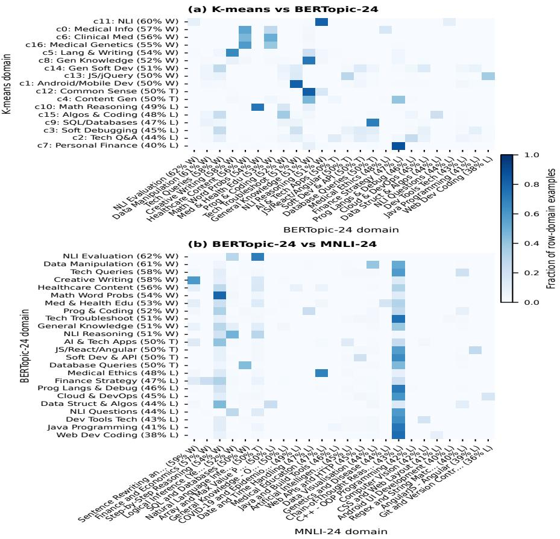

# AutoAdapt: Automatic Domain Discovery Enables Low-Cost Extensibility

Shanahan[0009−0001−6725−6954] , and Nikola S. Nikolov[0000−0001−8022−0297]

University of Limerick, Ireland mcgiff.josh@ul.ie

Abstract. Instruction-tuned models are deployed into environments where domains are heterogeneous and evolve, yet adding new domains or data typically requires costly retraining. We present AutoAdapt, a modular framework that incorporates new domains and data via targeted single-adapter training without modifying other adapters. The framework automatically discovers latent domains, uses them to train per-domain Low-Rank Adaptation (LoRA) adapters independently in parallel and performs parameter-free routing. Across 14 domain-specific benchmarks and GPT-4o pairwise judgements, AutoAdapt achieves parity with a LoRA adapter trained on all domains without requiring full-model retraining. We also find evidence of specialisation efect convergence across independent discovery methods. Overall, training each adapter on its own domain prevents domain interference by construction, thus enabling modular, taxonomy-free domain specialisation without aggregate performance loss or full model retraining.

Keywords: Domain adaptation · Parameter-eficient · Modular deployment.

## 1 Introduction

Supervised instruction fine-tuning has become the standard approach for adapting large language models to follow human instructions [22, 15], yet the field has optimised for benchmark performance while leaving deployment maintainability largely unsolved [6]. Models are evaluated on static benchmarks but deployed into environments where domains evolve and new capabilities are continuously required. However, full retraining on ever-growing combined datasets poses a structural barrier for practitioners without access to large-scale compute [12].

Although parameter-eficient fine-tuning methods such as Low-Rank Adaptation (LoRA) reduce the computational cost of instruction tuning [4], a single adapter trained on heterogeneous data inherits two problems. First, heterogeneous training data introduces conflicting gradient signals across domains [25, 9], which limits the degree to which a single model can specialise [21]. Second, monolithic fine-tuning produces brittle, dificult-to-extend systems [5]. In such cases, incorporating new domains or updating existing knowledge requires full retraining on the combined dataset, risking catastrophic forgetting of previously learned behaviours [11, 7].

Standard Mixture-of-Experts (MoE) architectures address specialisation through jointly trained experts and routing components [18], but do not resolve the extensibility problem. Joint training couples all experts together, meaning new domains cannot be added without retraining the full system. A study [21] confirms that instruction-tuned models on heterogeneous data fail to achieve consistent cross-domain performance, identifying modularity as a key unmet need. Although prior work [13] demonstrates that fixed-domain specialisation enables parameter-eficient methods to match full-model fine-tuning baselines in low-resource translation, the study does not provide empirical evidence of extensibility.

In this work, we introduce AutoAdapt, a modular framework that eliminates the retraining bottleneck for heterogeneous instruction tuning. Rather than assuming a fixed domain taxonomy, AutoAdapt automatically discovers latent domains by comparing unsupervised clustering (K-means, BERTopic) and zero-shot classification (MNLI) methods. Domain adapters are trained independently and in parallel with parameter-free routing occurring at inference via cosine similarity to domain centroids. AutoAdapt enables targeted domain adapter creation and updates, thus circumventing the need for full-model retraining. We contribute: a systematic cross-method comparison of three automatic domain discovery methods for instruction tuning; AutoAdapt, a modular instruction tuning framework that matches single LoRA adapter performance; and a post-deployment extensibility demonstration.

## 2 Related Work

## 2.1 Instruction Tuning and Data Heterogeneity

Instruction tuning has emerged as a fundamental post-training step for aligning large language models with human intent and expectations [22, 15]. However, ever-expanding instruction datasets contribute to inherent heterogeneity. This presents a central challenge where training on dissimilar tasks introduces conflicting gradient signals and consequently degrades individual task performance [21].

Recent work addresses instruction data eficiency through filtering and quality valuation methods rather than structural partitioning. Centroid-based clustering with confidence-guided selection has been used to curate high-quality subsets for eficient training of instruction tuning models [1]. Similarly, ROSE [24] leverages pairwise preference loss as a reward signal to select high-utility samples for task-specific instruction tuning, while LimaCost [14] estimates sample value by measuring gradient proximity to the LIMA dataset, selecting data that maximises alignment performance. These approaches improve data eficiency but discard low-scored samples, risking reduced generalisation to out-of-distribution examples. AutoAdapt takes an alternative approach, partitioning the full instruction dataset into domain-specific subsets without discarding any examples, with each assigned to exactly one domain adapter.

## 2.2 Parameter-Eficient Fine-Tuning and Adapter Routing

Parameter-eficient fine-tuning (PEFT) methods reduce the cost of adapting large pretrained models by updating only a small fraction of parameters. One such method, Low-Rank Adaptation [4], achieves competitive performance with full fine-tuning at significantly reduced memory cost by expressing weight updates as low-rank matrix decompositions. However, catastrophic forgetting is a well-documented challenge in heterogeneous instruction tuning settings, whereby updating model parameters on a new task or domain degrades prior capabilities [11, 7]. Recent work addresses this challenge through constrained LoRA updates. CLoRA [10] introduces orthogonal subspace regularisation to preserve general capabilities during sequential fine-tuning of large language models. Alternatively, SLIM [3] proposes dynamic routing between LoRA adapters and identity layers to suppress forgetting. Pletenev et al. [16] demonstrate that incorporating new knowledge via LoRA risks degrading previously learned capabilities, with bias amplified when training data is skewed towards specific entities.

The proliferation of domain-specific adapters has motivated work on multi-adapter routing. Tian et al. [19] propose training a dedicated selector adapter to route between domain and task-specific LoRA modules at inference time. Similarly, GLIDER [8] constructs LLM-generated global routing vectors combined with local task vectors to select from a pool of PEFT experts. Unlike these approaches, which require either a trained routing component or LLM-generated routing signals, our approach extends parameter-free routing to the instruction tuning setting.

## 3 Methodology

We discover latent domains in heterogeneous instruction data using three independent methods, train a dedicated LoRA adapter per domain, and route for inference with a parameter-free centroid-based mechanism.

## 3.1 Latent Domain Discovery

We discover latent domains via three independent methods. For unsupervised clustering, we embed each training instruction with all-MiniLM-L6-v2 [20] and apply K-means, with � selected via Mini-Batch K-means elbow analysis and confirmed via silhouette/Calinski-Harabasz scores, converging on � = 17. Clustering is then run on the complete dataset at � = 17. For topic modelling, we use BERTopic [2], which applies contextual-embedding-based clustering and automatically determines domain count [17], yielding 107 topics, which we additionally merge via intertopic distance into a coarser 24-domain super-grouping. For zero-shot classification, we apply facebook/bart-large-mnli, entailing each instruction against hypotheses of the form "This text is about [label]" using the same 24-label space as the BERTopic supergrouping, which reflects a realistic deployment scenario where an existing taxonomy labels new data without retraining.

## 3.2 Adapter Training and Centroid-Based Routing

We train a dedicated LoRA adapter [4] per discovered domain and discovery method, with the base model frozen throughout. Additionally, domain discovery, adapter training, and routing are fully decoupled such that new domains only require one additional adapter without needing to retrain other components. We compare against a single

LoRA adapter trained on all domains. At inference, we route test instructions using a parameter-free, centroid-based mechanism: for each domain � we precompute a centroid $\mathbf { c } _ { k }$ as the mean embedding of its training instructions,

$$
\mathbf { c } _ { k } = \frac { 1 } { | D _ { k } | } \sum _ { x _ { i } \in D _ { k } } \phi ( x _ { i } ) ,\tag{1}
$$

and route a test instruction � to the domain with highest cosine similarity,

$$
{ \hat { k } } = \arg \operatorname* { m a x } _ { k } { \frac { \phi ( x ) \cdot \mathbf { c } _ { k } } { \| \phi ( x ) \| \| \mathbf { c } _ { k } \| } } .\tag{2}
$$

This adds no trainable parameters and requires a single embedding forward pass per inference call.

## 3.3 Training Data and Evaluation

We train the Mistral-7B-Instruct-v0.3 base model on 509,174 instructions drawn from eight public datasets (shown in Table 1) spanning general instruction-following, code, QA, finance, medicine, and reasoning. We compare the performance of AutoAdapt and single LoRA on domain-specific benchmarks and blind pairwise GPT-4o judge evaluation [26].

Table 1. Composition and statistics of the instruction-tuning dataset.
<table><tr><td>Dataset</td><td>Domain</td><td></td><td>#Samples Avg Tokens</td></tr><tr><td>Alpaca-cleaned</td><td>General</td><td>51,760</td><td>~120</td></tr><tr><td>CodeAlpaca-20K</td><td>Code</td><td>20,022</td><td>~40</td></tr><tr><td>WebGPT</td><td>QA/Retrieval</td><td>18,994</td><td>~169</td></tr><tr><td>Databricks Dolly 15K</td><td>General</td><td>15,011</td><td>~129</td></tr><tr><td>Finance-Alpaca</td><td>Finance</td><td>68,912</td><td>~162</td></tr><tr><td>AlpaCare-MedInstruct</td><td>Medicine</td><td>52,002</td><td>~184</td></tr><tr><td>FLAN (CoT)</td><td>Reasoning</td><td>74,771</td><td>~70</td></tr><tr><td>StackOverflow Dialogues Programming</td><td></td><td>207,702</td><td>~130</td></tr><tr><td>Total</td><td colspan="3">509,174</td></tr></table>

## 4 Results and Discussion

## 4.1 Cross-Method Convergence

In this section we explore a mixture of LLM-as-a-judge and domain-specific evaluation for our three independent automatically discovered latent domain specialisation approaches.

LLM-as-a-Judge Evaluation AutoAdapt achieves performance comparable with the single-LoRA baseline on LLM-as-a-judge evaluation. For each domain, we sample 100 instances from the test set and compare the output of the corresponding domain-specific adapter against that of the single LoRA model. Comparisons are conducted with GPT-4o in a blind, reference-grounded pairwise preference setting. Adapter win rates against the single LoRA were 50.5% for K-means (858/1,700), 50.2% for BERTopic (1,205/2,400), and 46.9% for MNLI (1,004/2,143).

Cross-method LLM-as-a-judge evaluation results shown in Figure 1 reveal that independent automatic latent domain discovery methods converge on similar topic representations. K-means and BERTopic methods have an Adjusted Rand Index (ARI) of 0.42 and a Normalised Mutual Information (NMI) of 0.55, thus indicating moderate, positive agreement and predictability. Whereas the scores between MNLI and the others (K-means: ARI 0.08, NMI 0.26 and BERTopic: 0.07, 0.28) indicate that the entailmentbased groupings are almost completely diferent to the alternative methods. Given that MNLI adapters are the only AutoAdapt method to win on RACE, MBPP, CRUXEval and HellaSwag, this supports the idea that the entailment-based domain discovery method not only identifies alternative, but also meaningful representations in comparison with the other AutoAdapt methods.

K-Means and BERTopic share representations relating to general knowledge, creative writing, finance and natural language inference. Although they both create three distinct medical clusters, only K-Means wins each of them. BERTopic’s Medical Ethics cluster loses to single LoRA on LLM-as-a-judge methodology. BERTopic and MNLI overlap on creative writing and reasoning representations. Topic-level agreement breakdown indicates that MNLI creates a large adapter-losing domain for chain-of-thought reasoning that overlaps with most of BERTopic’s representations. Overall, MNLI as an entailment method is not as uniform as K-Means and BERTopic.

Domain-Specific Benchmarks In addition to LLM-as-a-judge evaluation, domainspecific benchmarks shown in Table 2 also reveal that AutoAdapt methodology achieves parity with single LoRA. For each benchmark we compute the accuracy diference between AutoAdapt and the single LoRA, with variance from the two binomial accuracies. We then combine these diferences across the 14 benchmarks as an inverse-variance weighted mean, reporting 95% CIs and �-values from a normal approximation. We find that K-means and MNLI methods are statistically indistinguishable from the single-LoRA baseline, while the BERTopic approach performs slightly worse. Each AutoAdapt configuration converges on GSM8K, Spider and MedMCQA wins. On the other hand, MultiNLI performance converging on a negative efect across each AutoAdapt approach indicates that a function applied to topically unconstrained content sufers from topicbased fragmentation. This efect is also observed across poor K-means and BERTopic AutoAdapt performance on BoolQ, RACE and HellaSwag. We hypothesise that enriching the topic embeddings with functional embeddings could help to produce clusters that group semantically and operationally similar samples together. We leave this as a promising direction for future work.

Unlike with LLM-as-a-judge evaluation, the MNLI approach achieves the largest aggregate mean efect versus the baseline. MNLI performing relatively better on the benchmarks could suggest that it transfers better to out-of-distribution examples or adheres to the constrained output format required by datasets like RACE and HellaSwag, versus the open-ended generation that the held-out set addresses. Strikingly, coding adapters perform poorly across both benchmark and LLM-as-a-judge evaluation versus the single LoRA baseline. This consistent result suggests that diverse coding domains benefit from shared knowledge representation. Although MBPP, CRUXEval and HumanEval are topically similar, they assess diferent functions. HumanEval and MBPP are both synthesis tasks that require generating code from natural-language descriptions. Whereas, CRUXEval requires predicting the output for a given input. Including function-based embeddings in the automatic domain discovery process could improve coding performance by grouping operationally related samples together and therefore should be explored in future work. Supported by both domain-specific AutoAdapt and LLM-as-a-judge evaluation, we show that automatic domain specialisation is competitive with general-domain LoRAs, while ofering modularity and extensibility that monolithic alternatives lack.

  
Fig. 1. Domain overlap between discovery methods on LLM-as-a-judge evaluation with GPT-4o.

Table 2. Cross-method benchmark deltas (percentage points vs. single LoRA). Sample size is $N = 1 0 0 0$ for all datasets except HumanEval $( N = 1 6 4 )$ , MBPP $( N = 5 0 0 )$ , and CRUXEval (� = 800). K-means (−0.27pp, 95% CI [−1.36, +0.82], $\scriptstyle p = 0 . 6 3 )$ and MNLI (+0.19pp, 95% CI [−0.90, +1.28], �=0.73) methods do not difer significantly from single LoRA. BERTopic shows a small statistically significant negative aggregate efect (−2.18pp, 95% CI [−3.28, −1.08], �<0.001). CIs and �-values use an inverse-variance weighted mean of per-benchmark deltas.
<table><tr><td>Benchmark K-means MNLI-24 BERTopic Agreement</td></tr><tr><td>GSM8K +2.50</td></tr><tr><td>+0.90 +4.00 WIN (all) Spider +3.30 +2.50 +2.80 WIN (all)</td></tr><tr><td>MedMCQA +0.70 +5.20 +4.00 WIN (all)</td></tr><tr><td>BoolQ -0.60 -1.60 -2.50 LOSE (all)</td></tr><tr><td>MultiNLI -7.80 -8.50 -13.70 LOSE (all)</td></tr><tr><td>HumanEval -7.32 -4.27 -4.27 LOSE (all)</td></tr><tr><td>RACE -4.20 +4.20 -11.40 mixed</td></tr><tr><td>PIQA +4.10 +0.70 -5.90 mixed</td></tr><tr><td>Finance -0.30 +4.90 +0.50 mixed</td></tr><tr><td>MATH +0.80 +0.10 -0.10 mixed</td></tr><tr><td>PubMedQA +6.30 -4.50 +3.90 mixed</td></tr><tr><td>MBPP -2.80 +1.00 -1.00 mixed</td></tr><tr><td>CRUXEval -3.25 +1.37 -0.50 mixed</td></tr><tr><td>HellaSwag -2.60 +2.20 -7.90 mixed</td></tr></table>

## 4.2 Extensibility and Modularity

Domain extensibility is a structural property of the AutoAdapt architecture. Existing domains are updated by retraining only the relevant adapter on new data, while new domains are incorporated by training a single additional adapter, in both cases leaving all other components unchanged. We simulate both extension scenarios: a domain update and a new domain addition. We report the results in Table 3.

Firstly, we simulate a post-deployment domain update by incorporating a 10,000- example subset of Magicoder [23]. New samples are assigned domain labels via centroid routing. Nearly half (47%) of the Magicoder samples are routed to the Algorithms & Coding domain (c15). Including this new data results in minimal changes to the domain assignment of the 8,500-example test set, with 99.9% of routing assignments remaining unchanged (8,494/8,500). The updated c15 adapter achieves the lowest negative-loglikelihood and perplexity scores across all configurations. Additionally, the GPT-4o judge evaluation indicates that the updated c15 adapter wins more than single LoRA across all configurations, despite single LoRA having access to 19× more training data.

Secondly, we simulate adding a new domain in a post-deployment scenario. A legal domain is added as it is not a distinct domain present in the original K-means domains. Using 1,000 legal instructions from LawInstruct to compute a new centroid, we re-route the original 8,500 test examples with 18 centroids. Routing stability is 99.7% (8,472/8,500 unchanged). Manual inspection of the examples that changed to the legal domain indicates that many legal instructions did not have a dedicated domain before. Most examples (20/28) that changed domain relate to tax, liability and businessregistration prompts. We evaluate the new adapter with a blind, reference-grounded pairwise GPT-4o judge on 200 held-out LawInstruct QA examples. Every query is routed to the legal adapter, and its response is compared with that of the original 17- domain AutoAdapt system and of the frozen single LoRA. The legal adapter response is preferred in 126/200 comparisons against the original 17-domain system and 129/200 against the single LoRA. Given that other existing adapters are not modified, previously learned domains are unafected by construction, and no monolithic retraining is required.

Table 3. Results of the post-deployment domain update scenario simulations. We report the average negative log-likelihood (NLL) and perplexity (PPL) as held-out language modelling metrics. We also report LLM-as-a-judge results with GPT-4o.
<table><tr><td></td><td colspan="2">Held-out LM</td><td colspan="2">GPT-4o judge</td><td></td></tr><tr><td>Model</td><td>NLL ↓</td><td>PPL ↓</td><td>Upd. wins Other wins Ties</td><td></td><td></td></tr><tr><td>Updated c15 (+ Magicoder)</td><td>0.1926</td><td>1.212</td><td></td><td>一</td><td>一</td></tr><tr><td>Old c15 (no Magicoder)</td><td>0.2805</td><td>1.324</td><td>104</td><td>60</td><td>36</td></tr><tr><td>Single LoRA (frozen)</td><td>0.2813</td><td>1.325</td><td>119</td><td>50</td><td>30</td></tr><tr><td>Single LoRA (retrained)</td><td>0.2024</td><td>1.224</td><td>85</td><td>76</td><td>38</td></tr><tr><td>Full FT (retrained)</td><td>0.4488</td><td>1.566</td><td>167</td><td>16</td><td>17</td></tr><tr><td>Model</td><td>NLL ↓ PPL ↓ Legal wins Other wins Ties</td><td></td><td></td><td></td><td></td></tr><tr><td>Legal adapter (oracle)</td><td>2.4817 11.961</td><td></td><td>1</td><td>I</td><td>一</td></tr><tr><td>AutoAdapt without Legal (17 domains)</td><td>2.3849 10.858</td><td></td><td>126</td><td>74</td><td>0</td></tr><tr><td>Frozen single LoRA</td><td>2.2971 9.945</td><td></td><td>129</td><td>71</td><td>0</td></tr></table>

In addition to extensibility, decomposing heterogeneous data into independent domains enables parallel adapter training. Each adapter trains on its own data partition without inter-adapter dependencies. In our experiments, three adapters are trained simultaneously on a single A100 80GB GPU, reducing wall-clock time by 1.7× relative to single LoRA (10h 8min vs 17h 0min) and 2.0× relative to full model fine-tuning (10h 8min vs 20h 22min). At inference time, parameter-free centroid routing adds relatively minimal latency in comparison with neural approaches, with the base model remaining resident in GPU memory while only the active lightweight adapter is swapped per request.

## 5 Conclusion

AutoAdapt establishes automatically discovered latent domain specialisation as a modular and practical alternative to monolithic instruction tuning. By adopting a taxonomyfree approach and parameter-free routing at inference, the framework matches monolithic single LoRA performance across domain-specific benchmarks and LLM-as-a-judge. We further demonstrate that domain extensibility is a structural property of AutoAdapt via post-deployment update simulations. Together, these findings indicate that AutoAdapt is a practical and extensible alternative to full retraining in heterogeneous and evolving deployment settings. Future work should extend beyond a low-resource deployment scenario and investigate the impact of AutoAdapt on larger models.

Acknowledgments. This publication has emanated from research conducted with the financial support of Taighde Éireann - Research Ireland under Grant number 18/CRT/6223.

Disclosure of Interests. The authors have no competing interests to declare that are relevant to the content of this article.

## References

1. Cai, H., Li, J., Rahman, M.M., Dong, W.: Low-confidence gold: Refining low-confidence samples for eficient instruction tuning. In: Christodoulopoulos, C., Chakraborty, T., Rose,

C., Peng, V. (eds.) Findings of the Association for Computational Linguistics: EMNLP 2025. pp. 8233–8240. Association for Computational Linguistics, Suzhou, China (Nov 2025)

2. Grootendorst, M.: Bertopic: Neural topic modeling with a class-based tf-idf procedure. arXiv preprint arXiv:2203.05794 (2022)

3. Han, J., Du, L., Du, H., Zhou, X., Wu, Y., Zhang, Y., Zheng, W., Han, D.: SLIM: Let LLM learn more and forget less with soft LoRA and identity mixture. In: Chiruzzo, L., Ritter, A., Wang, L. (eds.) Proceedings of the 2025 Conference of the Nations of the Americas Chapter of the Association for Computational Linguistics: Human Language Technologies (Volume 1: Long Papers). pp. 4792–4804. Association for Computational Linguistics, Albuquerque, New Mexico (Apr 2025)

4. Hu, E.J., Shen, Y., Wallis, P., Allen-Zhu, Z., Li, Y., Wang, S., Wang, L., Chen, W.: Lora: Low-rank adaptation of large language models (2021)

5. Huang, Y., Yang, Z., Wang, Z., Qi, J., Yu, R., Fan, X., Wang, C.: Hybrid routing for a mixture of lora experts. Proceedings of the AAAI Conference on Artificial Intelligence 40(37), 31211–31219 (Mar 2026). https://doi.org/10.1609/aaai.v40i37.40383

6. Kiela, D., Bartolo, M., Nie, Y., Kaushik, D., Geiger, A., Wu, Z., Vidgen, B., Prasad, G., Singh, A., Ringshia, P., Ma, Z., Thrush, T., Riedel, S., Waseem, Z., Stenetorp, P., Jia, R., Bansal, M., Potts, C., Williams, A.: Dynabench: Rethinking benchmarking in NLP. In: Toutanova, K., Rumshisky, A., Zettlemoyer, L., Hakkani-Tur, D., Beltagy, I., Bethard, S., Cotterell, R., Chakraborty, T., Zhou, Y. (eds.) Proceedings of the 2021 Conference of the North American Chapter of the Association for Computational Linguistics: Human Language Technologies. pp. 4110–4124. Association for Computational Linguistics, Online (Jun 2021)

7. Li, H., Ding, L., Fang, M., Tao, D.: Revisiting catastrophic forgetting in large language model tuning. In: Al-Onaizan, Y., Bansal, M., Chen, Y.N. (eds.) Findings of the Association for Computational Linguistics: EMNLP 2024. pp. 4297–4308. Association for Computational Linguistics, Miami, Florida, USA (Nov 2024)

8. Li, P., Yadav, P., Yoon, J., Peng, J., Sung, Y.L., Bansal, M., Chen, T.: Glider: Global and local instruction-driven expert router. In: Christodoulopoulos, C., Chakraborty, T., Rose, C., Peng, V. (eds.) Proceedings of the 2025 Conference on Empirical Methods in Natural Language Processing. pp. 6240–6301. Association for Computational Linguistics, Suzhou, China (Nov 2025)

9. Ling, C., Zhao, X., Lu, J., Deng, C., Zheng, C., Wang, J., Chowdhury, T., Li, Y., Cui, H., Zhang, X., et al.: Domain specialization as the key to make large language models disruptive: A comprehensive survey. ACM Computing Surveys 58(3), 1–39 (2025)

10. Lu, Y., Qian, B., Yuan, C., Jiang, H., Wang, X.: Controlled low-rank adaptation with subspace regularization for continued training on large language models. In: Che, W., Nabende, J., Shutova, E., Pilehvar, M.T. (eds.) Proceedings of the 63rd Annual Meeting of the Association for Computational Linguistics (Volume 1: Long Papers). pp. 19165–19181. Association for Computational Linguistics, Vienna, Austria (Jul 2025)

11. McCloskey, M., Cohen, N.J.: Catastrophic interference in connectionist networks: The sequential learning problem. Psychology of Learning and Motivation, vol. 24, pp. 109–165. Academic Press (1989)

12. McGif, J., Nikolov, N.S.: Overcoming data scarcity in generative language modelling for low-resource languages: A systematic review (2025)

13. Mcgif, J., Nikolov, N.S.: Semiadapt: Semi-supervised and eficient lora-based domain adap tation for low-resource irish machine translation with transformers. In: Piperidis, S., Bel, N., van den Heuvel, H., Ide, N., Krek, S., Toral, A. (eds.) Proceedings of the Fifteenth Language Resources and Evaluation Conference (LREC 2026). pp. 10208–10220. European Language Resources Association (ELRA), Palma, Mallorca, Spain (May 2026)

14. Moon, H., Seo, J., Koo, S., Kim, J., Ham, Y.k., Moon, J., Lim, H.: LimaCost: Data valuation for instruction tuning of large language models. In: Christodoulopoulos, C., Chakraborty, T., Rose, C., Peng, V. (eds.) Findings of the Association for Computational Linguistics: EMNLP 2025. pp. 12841–12854. Association for Computational Linguistics, Suzhou, China (Nov 2025)

15. Ouyang, L., Wu, J., Jiang, X., Almeida, D., Wainwright, C., Mishkin, P., Zhang, C., Agarwal, S., Slama, K., Ray, A., et al.: Training language models to follow instructions with human feedback. Advances in neural information processing systems 35, 27730–27744 (2022)

16. Pletenev, S., Marina, M., Moskovskiy, D., Konovalov, V., Braslavski, P., Panchenko, A., Salnikov, M.: How much knowledge can you pack into a LoRA adapter without harming LLM? In: Chiruzzo, L., Ritter, A., Wang, L. (eds.) Findings of the Association for Computa tional Linguistics: NAACL 2025. pp. 4309–4322. Association for Computational Linguistics, Albuquerque, New Mexico (Apr 2025)

17. Robledo, S., Zuluaga, M., et al.: Topic modeling: Perspectives from a literature review. IEEE Access 11, 4066–4078 (2022)

18. Shazeer, N., Mirhoseini, A., Maziarz, K., Davis, A., Le, Q., Hinton, G., Dean, J.: Outrageously large neural networks: The sparsely-gated mixture-of-experts layer (2017)

19. Tian, Y., Zhang, B., Tu, Z., Chu, D.: Adapters selector: Cross-domains and multi-tasks LoRA modules integration usage method. In: Rambow, O., Wanner, L., Apidianaki, M., Al-Khalifa, H., Eugenio, B.D., Schockaert, S. (eds.) Proceedings of the 31st International Conference on Computational Linguistics. pp. 593–605. Association for Computational Linguistics, Abu Dhabi, UAE (Jan 2025)

20. Wang, W., Wei, F., Dong, L., Bao, H., Yang, N., Zhou, M.: Minilm: Deep self-attention distillation for task-agnostic compression of pre-trained transformers. In: Larochelle, H., Ranzato, M., Hadsell, R., Balcan, M., Lin, H. (eds.) Advances in Neural Information Processing Systems. vol. 33, pp. 5776–5788. Curran Associates, Inc. (2020)

21. Wang, Y., Ivison, H., Dasigi, P., Hessel, J., Khot, T., Chandu, K., Wadden, D., MacMillan, K., Smith, N., Beltagy, I., Hajishirzi, H.: How far can camels go? exploring the state of instruction tuning on open resources. In: Oh, A., Naumann, T., Globerson, A., Saenko, K., Hardt, M., Levine, S. (eds.) Advances in Neural Information Processing Systems. vol. 36, pp. 74764–74786. Curran Associates, Inc. (2023)

22. Wei, J., Bosma, M., Zhao, V.Y., Guu, K., Yu, A.W., Lester, B., Du, N., Dai, A.M., Le, Q.V.: Finetuned language models are zero-shot learners. arXiv preprint arXiv:2109.01652 (2021)

23. Wei, Y., Wang, Z., Liu, J., Ding, Y., Zhang, L.: Magicoder: Empowering code generation with oss-instruct (2024)

24. Wu, Y., Zhang, H., Jiao, Y., Ma, L., Liu, X., Yu, J., Zhang, D., Yu, D., Xu, W.: ROSE: A reward-oriented data selection framework for LLM task-specific instruction tuning. In: Christodoulopoulos, C., Chakraborty, T., Rose, C., Peng, V. (eds.) Findings of the Association for Computational Linguistics: EMNLP 2025. pp. 13200–13219. Association for Computational Linguistics, Suzhou, China (Nov 2025)

25. Yu, T., Kumar, S., Gupta, A., Levine, S., Hausman, K., Finn, C.: Gradient surgery for multitask learning. In: Larochelle, H., Ranzato, M., Hadsell, R., Balcan, M., Lin, H. (eds.) Advances in Neural Information Processing Systems. vol. 33, pp. 5824–5836. Curran Associates, Inc. (2020)

26. Zheng, L., Chiang, W.L., Sheng, Y., Zhuang, S., Wu, Z., Zhuang, Y., Lin, Z., Li, Z., Li, D., Xing, E., Zhang, H., Gonzalez, J., Stoica, I.: Judging llm-as-a-judge with mt-bench and chatbot arena. In: Oh, A., Naumann, T., Globerson, A., Saenko, K., Hardt, M., Levine, S. (eds.) Advances in Neural Information Processing Systems. vol. 36, pp. 46595–46623. Curran Associates, Inc. (2023)