# BEYOND POLICY SUPPORT: INTERACTION CON-STRAINED OFFLINE REINFORCEMENT LEARNING FORAUTONOMOUS DRIVING

Mahmoud Selim1,2 Cristina Cipriani1 Karl H. Johansson2

textsuperscript1TRATON, {mahmoud.selim, cristina.cipriani}@se.traton.com 2KTH Royal Institute of Technology, {mase2, kallej}@kth.se

## ABSTRACT

Offline reinforcement learning enables reward-driven policy improvement from fixed datasets without requiring online exploration, making it particularly attractive in safety-critical domains. A central challenge, however, is distribution shift: policy optimization may favor actions that are weakly supported by the offline data, rendering value estimates unreliable. Existing approaches primarily control this shift in the policy’s own action space. In interactive environments such as autonomous driving, this can be insufficient: a candidate ego trajectory may remain well supported under the marginal behavior distribution while being poorly supported jointly with the surrounding-agent behavior observed in the logged interaction. We refer to this degradation in interaction support as interaction distribution shift (IDS), and introduce Interaction-Constrained Drive Policy (ICDP), an offline reinforcement learning framework that explicitly controls interaction-level distribution shift. Starting from the joint data distribution over ego and surroundingagent futures, we show that joint-support degradation decomposes exactly into an ego-support component and a residual interaction-support component. We recover the latter through contrastive density-ratio estimation, isolating interaction compatibility without explicit joint-density modeling, surrounding-agent prediction, or rollouts in reactive simulators or learned world models during policy optimization. Closed-loop evaluations on nuPlan, Interplan and real-world truck experiments show that ICDP suppresses high-value yet interaction-unsupported trajectory selections and improves performance in interaction-critical driving scenarios. Project webpage: https://mahmoud-selim.github.io/ICDP/

## 1 INTRODUCTION

Autonomous driving requires motion planners that can produce safe, comfortable, and efficient behavior while continuously interacting with other road users. Classical rule- and optimization-based systems provide explicit structure and constraint handling, but often rely on carefully engineered objectives, interaction models, and scenario-specific design, making it difficult to scale their behavior across the long tail of complex traffic situations (Fan et al., 2018; Hawke et al., 2020; Dauner et al., 2023). Learning-based planning offers a compelling alternative by shifting this complexity from manual design to data. Imitation learning (IL), in particular, has enabled driving policies to acquire realistic behavior from large-scale demonstrations (Bojarski et al., 2016; Chitta et al., 2022; Cheng et al., 2024b), while recent diffusion- and flow-based planners further capture rich multimodal trajectory distributions and generate diverse, high-quality motion plans (Zheng et al., 2025; Huang et al., 2023; Cheng et al., 2024a). Yet greater generative expressiveness does not remove a fundamental limitation of imitation: the policy is still optimized to reproduce the behavior contained in the data, rather than to improve it according to long-horizon driving objectives. Consequently, biases and suboptimal decisions in the demonstrations can be inherited by the learned planner, motivating reward-driven policy optimization beyond imitation (Bansal et al., 2018; Cheng et al., 2024b).

Reinforcement learning (RL) provides a natural mechanism beyond imitation by optimizing policies directly for long-horizon driving objectives. Applying RL to autonomous driving, however, is difficult: online methods require extensive closed-loop interaction with sufficiently realistic environments (Kendall et al., 2019; Yang et al., 2026; Zhang et al., 2025), while model-based approaches shift this burden to learned dynamics or world models, whose inaccuracies can propagate into policy optimization (Wang et al., 2025; Yang et al., 2026). Offline RL offers an appealing alternative by learning exclusively from previously collected driving data, avoiding repeated environment interaction while using bootstrapped value learning to propagate reward beyond the demonstrated behavior (Levine et al., 2020; Noguchi & Yamamoto, 2026). This benefit comes with a fundamental challenge: distribution shift. As policy optimization moves toward actions that are weakly represented in the dataset, the critic must extrapolate beyond its training support and can assign unreliable values to out-of-distribution behavior. Existing offline RL methods therefore control policy improvement through conservative value estimation, in-sample learning, or explicit regularization toward the behavior distribution (Kumar et al., 2020; Kostrikov et al., 2021; Peng et al., 2019; Wang et al., 2022; Fang et al., 2025; Huang et al., 2025). Yet these mechanisms largely characterize support in the policy’s own action space. In interactive driving, this is not enough: an ego trajectory can itself be well supported by the data while being poorly supported jointly with the surrounding-agent evolution observed in the same interaction. We refer to this loss of interaction support as interaction distribution shift (IDS). This raises the central question of our work: How can an offline driving policy improve beyond the demonstrations while remaining supported not only as an ego trajectory, but as part ofthe multi-agent interaction represented in the data?

We answer this question with ICDP (Interaction-Constrained Drive Policy), an offline RL framework for reward-driven improvement preserving support at the level of multi-agent interactions. ICDP combines a trajectory-level diffusion policy with chunk-level value learning to evaluate the long-horizon utility of candidate ego trajectories. Its key idea is to go beyond conventional egotrajectory regularization and explicitly control how policy updates alter the support of the logged ego–agent interaction. We show that the degradation of joint interaction support decomposes exactly into an ego-support term and a residual interaction-support term corresponding to interaction distribution shift. Crucially, the latter can be recovered through contrastive density-ratio estimation, allowing ICDP to assess whether a candidate ego trajectory remains compatible with the surroundingagent behavior represented in the data without explicitly modeling the high-dimensional joint trajectory density, predicting agent responses, or performing reactive simulator or world-models rollouts during policy optimization. Our contributions are:

• We identify and formalize interaction distribution shift (IDS), a source of distribution shift specific to interactive offline RL: an ego trajectory may remain well supported marginally while losing support jointly with the surrounding-agent evolution.

• We derive a contrastive density-ratio estimator whose residual score recovers the interactionsupport component of IDS without explicit joint-density estimation or prediction of surroundingagent futures, and integrate this constraint with chunk-level value learning and diffusion-policy optimization in ICDP.

• We evaluate ICDP in closed-loop driving scenarios on nuPlan and Interplan, as well as in real-world truck experiments, demonstrating its ability to suppress high-value but interactionunsupported trajectory selections and improve policy performance in challenging scenarios.

## 2 BACKGROUND & RELATED WORKS

Learning-based and generative motion planning. Imitation learning (IL) has become a dominant paradigm for autonomous-driving planning, progressing from rasterized representations and convolutional architectures Bojarski et al. (2016); Codevilla et al. (2019) to structured vector representations and transformers that better capture scene context and interactions Liang et al. (2020); Casas et al. (2021); Chitta et al. (2022); Hu et al. (2023); Jiang et al. (2023); Cheng et al. (2024b). More recently, diffusion-based generative planners have enabled multimodal trajectory generation and flexible inference-time guidance Zheng et al. (2025); Liao et al. (2025). While these advances increase policy expressiveness, improvement remains largely driven by demonstrated behavior. In contrast, we use a generative trajectory policy as the foundation for reward-driven improvement from offline interaction data.

Reinforcement learning for autonomous driving. RL complements imitation-based planning by optimizing driving policies directly for long-horizon reward. Model-free approaches learn driving behavior through closed-loop environment interaction Toromanoff et al. (2020), while model-based RL improves training efficiency by learning environment dynamics and optimizing policies through imagined rollouts Li et al. (2024); Wang et al. (2025). Recent work has further demonstrated the scalability of RL-based planning: CarPlanner combines autoregressive trajectory generation with expertguided rewards for large-scale policy optimization Zhang et al. (2025), while CaRL scales PPO with simple reward design across CARLA and nuPlan Jaeger et al. (2025). Interaction-aware RL has also incorporated explicit intent inference and multi-agent policy learning to reason about surrounding drivers Wu et al. (2023). Collectively, these methods demonstrate the potential of reward-driven planning, but typically obtain counterfactual feedback through repeated environment interaction or learned dynamics. In contrast, our setting considers policy improvement entirely from fixed driving logs, without simulator interaction or model-generated traffic evolution during optimization.

Offline RL and support constraints. Offline RL learns reward-maximizing policies from fixed datasets, but distribution shift can cause value overestimation on poorly supported actions. Existing methods mitigate this through conservative value estimation, behavior or support constraints, and insample policy extraction Kumar et al. (2020; 2019); Fujimoto & Gu (2021); Kostrikov et al. (2021). These ideas have been extended to diffusion policies Wang et al. (2022); Fang et al. (2025); Gao et al. (2025); Selim et al. (2026) and temporally extended actions Li et al. (2026). In autonomous driv ing, offline RL has been studied through model-based, sequence-modeling, traffic-generation, and behavior-regularized approaches Diehl et al. (2021); Li et al. (2023); Rowe et al. (2024); Noguchi & Yamamoto (2026), including explicit support constraints for lane changing Huang et al. (2025). Offline multi-agent methods similarly address joint-action distribution shift Nguyen et al. (2025), but optimize multiple learning agents. In contrast, ICDP optimizes only the ego policy, treating surrounding traffic as logged environment evolution, and decomposes joint interaction-support degradation into complementary ego-trajectory and conditional interaction-support components.

## 3 PROBLEM FORMULATION

We formulate autonomous driving planning as a discounted Markov decision process (MDP) $\mathcal { M } =$ $( S , { \mathcal { A } } , r , \rho , p , \gamma )$ , where $s _ { t } ~ \in ~ S$ denotes the current driving scene, $a _ { t } ~ \in ~ { \cal A }$ is the primitive ego control, $r ( s , a )$ is the reward function, $\rho ( s )$ the initial state distribution, $p ( s ^ { \prime } | s , a )$ the transition dynamics, and $\gamma \in [ 0 , 1 )$ the discount factor. Rather than learning over isolated controls, we operate in a temporally extended action space and define an ego-action chunk

$$
\tau _ { e , t } = ( a _ { t } , \dots , a _ { t + H - 1 } ) \in \mathcal { A } ^ { H } ,\tag{1}
$$

over a committed horizon H. Accordingly, the policy and critic are defined as $\pi _ { \theta } ( \tau _ { e , t } \mid s _ { t } )$ , and $Q _ { \phi } ( s _ { t } , \tau _ { e , t } )$ , where the critic estimates the return obtained by executing the complete chunk. The offline dataset is represented as

$$
\mathcal { D } = \left\{ s _ { t } , \tau _ { e , t } ^ { \beta } , \tau _ { a , t } ^ { \beta } , R _ { t } ^ { ( H ) } , s _ { t + H } \right\} ,\tag{2}
$$

Where $\tau _ { e , t } ^ { \beta }$ and $\tau _ { a , t } ^ { \beta }$ are the logged ego-action chunk the corresponding surrounding-agent futures, and $\begin{array} { r } { R _ { t } ^ { ( H ) } = \sum _ { k = 0 } ^ { H - 1 } \gamma ^ { k } r _ { t + k } } \end{array}$ . The critic is trained a the chunk-level target:

$$
y _ { t } = R _ { t } ^ { ( H ) } + { \gamma } ^ { H } Q _ { \bar { \phi } } \left( s _ { t + H } , \hat { \tau } _ { e , t + H } \right) , \quad \hat { \tau } _ { e , t + H } \sim \pi _ { \theta } ( \cdot \mid s _ { t + H } ) .\tag{3}
$$

where $Q _ { \bar { \phi } }$ is a delayed target critic. Because $Q _ { \phi }$ conditions on the complete action sequence that generated the intermediate rewards, this backup avoids the off-policy bias incurred when an H-step return is applied to a single-action critic Li et al. (2026). The surrounding-agent trajectories remain part of the observed environment evolution and are later used to characterize interaction support.

A standard behavior-regularized offline RL objective improves the policy with respect to the learned critic while restricting its deviation from the data distribution:

$$
\begin{array} { r l } { \underset { \theta } { \operatorname* { m a x } } } & { \mathbb { E } _ { \hat { \pi } _ { e } \sim d _ { \mathcal { D } } } \left[ Q _ { \phi } ( s , \hat { \tau } _ { e } ) \right] } \\ & { \mathrm { s . t . } \quad \mathbb { E } _ { s \sim d _ { \mathcal { D } } } \left[ D ( \pi _ { \theta } ( \cdot \mid s ) , \beta ( \cdot \mid s ) ) \right] \leq \epsilon _ { e } , } \end{array}\tag{4}
$$

where $d _ { D }$ is the empirical state distribution and D denotes a suitable divergence or behaviorregularization measure. While this constraint limits distribution shift in the ego-action space, it does not ensure that a candidate ego trajectory remains compatible with the surrounding-agent evolution represented in the same driving interaction. In particular, high ego support, $p _ { \mathcal { D } } ( \bar { \hat { \tau } } _ { e } \mid \bar { s } )$ , does not necessarily imply high joint support, $p _ { \mathcal { D } } ( \widehat { \tau } _ { e } , \tau _ { a } ^ { \beta } \ | \ s )$ . Given the interactive nature of driving, our objective is therefore to maximize long-horizon return while controlling distribution shift in the joint ego–agent interaction space $p _ { \mathcal { D } } ( \hat { \tau } _ { e } , \tau _ { a } ^ { \mathcal { B } } \mid s )$

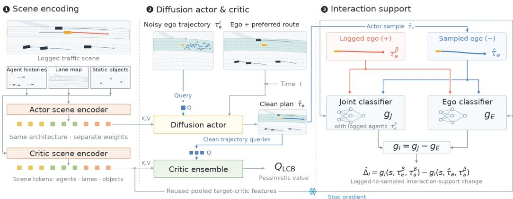  
Figure 1: Overview of ICDP. The logged scene is encoded into structured scene features used by the diffusion actor and critic. The actor generates candidate ego trajectories, which are evaluated by a pessimistic chunk-level critic and by the interaction-support module. The latter combines a joint ego–agent classifier with an ego-only classifier; their residual score isolates interaction-specific support and yields the IDS estimate used to constrain policy improvement.

## 4 METHODOLOGY

In this section, we introduce ICDP, an offline RL framework for diffusion-based motion planning that improves long-horizon driving performance while preserving support at the level of multi-agent interactions. ICDP combines chunk-level value learning with interaction-aware policy regularization, explicitly controlling both deviation from the logged ego-trajectory distribution and interaction distribution shift (IDS) induced by policy improvement. We first present the overall actor–critic framework, then derive a tractable characterization of IDS together with a contrastive estimator, and finally incorporate the resulting interaction constraint into diffusion-policy optimization.

## 4.1 ICDP OVERVIEW

ICDP improves a diffusion-based driving policy from fixed interaction logs while constraining policy improvement to remain supported by the multi-agent interactions represented in the dataset. As illustrated in Fig. 1, the framework consists of three components: a scene representation shared in structure across the actor and critic, a diffusion actor with an ensemble of chunk-level critics for value-guided policy improvement, and an interaction-support module that evaluates the compatibility of policy-generated ego trajectories with the logged surrounding-agent evolution. The actor proposes candidate ego trajectories, while the critic and interaction-support estimator operate on the corresponding clean trajectories to provide value and support signals for policy optimization.

Given a logged interaction $( s , \tau _ { e } ^ { \beta } , \tau _ { a } ^ { \beta } ) ~ \sim ~ \mathcal { D } .$ , where $\tau _ { e } ^ { \beta }$ and $\tau _ { a } ^ { \beta }$ denote the logged ego and surrounding-agent trajectories, respectively, the policy generates a candidate ego-action chunk

$$
\hat { \tau } _ { e } \sim \pi _ { \theta } ( \cdot \mid s ) .\tag{5}
$$

The candidate is evaluated by an ensemble of critics $\{ Q _ { \phi _ { k } } ( s , \tau _ { e } ) \} _ { k = 1 } ^ { K }$ . To reduce exploitation of uncertain value estimates during policy improvement, we use the lower-confidence-bound estimate

$$
Q _ { \mathrm { L C B } } ( s , \tau _ { e } ) = \frac { 1 } { K } \sum _ { k = 1 } ^ { K } Q _ { \phi _ { k } } ( s , \tau _ { e } ) - \kappa _ { Q } \mathrm { S t d } _ { k } \left[ Q _ { \phi _ { k } } ( s , \tau _ { e } ) \right] ,\tag{6}
$$

where $\kappa _ { Q } ~ \geq ~ 0$ controls the degree of pessimism. Maximizing value alone, however, does not guarantee reliable offline policy improvement. A candidate ego trajectory may receive a high value

estimate while inducing an ego–agent interaction that is weakly supported by the logged data. We therefore seek policy improvements that increase long-horizon return while preserving support under the joint distribution of ego and surrounding-agent trajectories.

To formalize this requirement, consider replacing the logged ego trajectory $\tau _ { e } ^ { \beta }$ with a policygenerated candidate $\hat { \tau } _ { e }$ while retaining the surrounding-agent trajectory $\tau _ { a } ^ { \beta }$ observed in the same interaction. We define the resulting joint-support degradation as

$$
\Delta _ { J } \left( s , \tau _ { e } ^ { \beta } , \hat { \tau } _ { e } , \tau _ { a } ^ { \beta } \right) = \log \frac { p _ { \mathcal { D } } ( \tau _ { e } ^ { \beta } , \tau _ { a } ^ { \beta } \mid s ) } { p _ { \mathcal { D } } ( \hat { \tau } _ { e } , \tau _ { a } ^ { \beta } \mid s ) } .\tag{7}
$$

A positive value of $\Delta _ { J }$ indicates that the interaction formed by the candidate ego trajectory is less supported by the data than the corresponding logged interaction. This motivates the ideal jointsupport-constrained policy improvement problem

$$
\begin{array} { r l } { \underset { \theta } { \operatorname* { m a x } } } & { \mathbb { E } _ { ( s , \tau _ { e } ^ { \beta } , \tau _ { a } ^ { \beta } ) \sim \mathcal { D } } \left[ Q _ { \mathrm { L C B } } ( s , \hat { \tau } _ { e } ) \right] } \\ & { \quad \hat { \tau } _ { e } \sim \pi _ { \theta } ( \cdot | s ) } \\ { \mathrm { s . t . } } & { \Delta _ { J } \left( s , \tau _ { e } ^ { \beta } , \hat { \tau } _ { e } , \tau _ { a } ^ { \beta } \right) \leq \epsilon _ { J } , \quad \mathrm { a . s . } , } \end{array}\tag{8}
$$

where $\epsilon _ { J } \geq 0$ specifies the maximum admissible degradation in joint interaction support. Equivalently, the constraint requires

$$
p _ { \mathcal { D } } ( \widehat { \tau } _ { e } , \tau _ { a } ^ { \beta } \mid s ) \geq e ^ { - \epsilon _ { J } } p _ { \mathcal { D } } ( \tau _ { e } ^ { \beta } , \tau _ { a } ^ { \beta } \mid s ) .\tag{9}
$$

Directly evaluating this constraint is impractical because it requires density estimation in the highdimensional joint trajectory space. The key idea of ICDP is to avoid estimating this joint density directly. Instead, we show that the joint-support degradation admits an exact decomposition into a marginal ego-trajectory component and an interaction-specific component. The latter captures interaction distribution shift (IDS), which we estimate contrastively and use to regularize diffusionpolicy optimization.

## 4.2 INTERACTION DISTRIBUTION SHIFT

The joint-support constraint in (8) couples two distinct effects: departure of the candidate ego trajectory from the logged behavior distribution, and loss of compatibility between that trajectory and the surrounding-agent evolution observed in the data. Distinguishing these effects is central to ICDP, since conventional behavior regularization acts primarily on the former.

Using the conditional factorization $p _ { \mathcal { D } } ( \tau _ { e } , \tau _ { a } \ \mid \ s ) = p _ { \mathcal { D } } ( \tau _ { e } \ \mid \ s ) p _ { \mathcal { D } } ( \tau _ { a } \ \mid \ s , \tau _ { e } )$ , the joint-support degradation in (7) decomposes exactly as

$$
\Delta _ { J } = \Delta _ { E } + \Delta _ { I } , \qquad \Delta _ { E } = \log \frac { p _ { \mathcal { D } } ( \tau _ { e } ^ { \beta } \mid s ) } { p _ { \mathcal { D } } ( \hat { \tau } _ { e } \mid s ) } , \qquad \Delta _ { I } = \log \frac { p _ { \mathcal { D } } ( \tau _ { a } ^ { \beta } \mid s , \tau _ { e } ^ { \beta } ) } { p _ { \mathcal { D } } ( \tau _ { a } ^ { \beta } \mid s , \hat { \tau } _ { e } ) } .\tag{10}
$$

Here, $\Delta _ { E }$ captures the ego marginal-support shift and $\Delta _ { I }$ the additional degradation due to ego– agent interaction. We refer to $\Delta _ { I }$ as interaction distribution shift (IDS). Unlike $\Delta _ { E }$ , which reflects how far the candidate ego trajectory moves from the logged ego distribution, IDS measures whether the surrounding-agent evolution observed in the interaction remains supported when paired with the candidate trajectory. Consequently, a candidate may remain well supported marginally, $p _ { \mathcal { D } } ( \hat { \tau } _ { e } \mid s )$ yet incur substantial interaction shift if $p _ { \mathcal { D } } ( \tau _ { a } ^ { \beta } \mid s , \dot { \tau } _ { e } )$ is small.

This decomposition isolates the component of distribution shift that is specific to interaction. Importantly, evaluating IDS does not require predicting how surrounding agents would respond to the candidate ego trajectory; it only requires assessing the support of the resulting ego–agent pairing under the logged interaction distribution. Direct evaluation of (10), however, would require estimating high-dimensional conditional trajectory densities. We next show that the required density ratio can instead be recovered contrastively.

## 4.3 CONTRASTIVE RECOVERY OF INTERACTION DISTRIBUTION SHIFT

Our key observation is that this conditional density need not be modeled explicitly. Instead, IDS can be recovered by contrasting two notions of support: support of the complete ego–agent interaction and marginal support of the ego trajectory alone.

Concretely, we introduce two contrastive scores. A joint score $g _ { J } ( s , \tau _ { e } , \tau _ { a } )$ distinguishes logged ego–agent interactions from mismatched interactions formed using policy-generated $\mathrm { e g o }$ trajectories, whereas an ego score $g _ { E } ( s , \tau _ { e } )$ distinguishes logged ego trajectories from the same policygenerated candidates irrespective of the surrounding-agent evolution. Using the same candidate trajectories in both contrastive problems is important: it ensures that the component associated with marginal ego-trajectory shift is shared by both scores and can therefore be eliminated by subtraction. The precise contrastive distributions and training objectives are given in Appendix $\mathbf { A }$

The joint score captures both marginal ego-trajectory shift and ego–agent dependence, while the ego score captures only the former. We therefore define the residual interaction score

$$
g _ { I } ( s , \tau _ { e } , \tau _ { a } ) = g _ { J } ( s , \tau _ { e } , \tau _ { a } ) - g _ { E } ( s , \tau _ { e } ) .\tag{11}
$$

The following result shows that this residual isolates the interaction-specific component of IDS.

Theorem 1 (Contrastive recovery of IDS). Suppose the joint and ego contrastive objectives are constructed using the same policy-generated candidate trajectories, with balanced class sampling and common support. Let $g _ { J } ^ { * }$ and $g _ { E } ^ { * }$ denote their population-optimal logits, and define the residual interaction score as

$$
g _ { I } ^ { * } ( s , \tau _ { e } , \tau _ { a } ) = g _ { J } ^ { * } ( s , \tau _ { e } , \tau _ { a } ) - g _ { E } ^ { * } ( s , \tau _ { e } ) .\tag{12}
$$

Then,for a logged interaction $( s , \tau _ { e } ^ { \beta } , \tau _ { a } ^ { \beta } )$ and a candidate ego trajectory $\hat { \tau } _ { e } ,$ , the difference between their residual interaction scores, evaluated against the same logged surrounding-agent trajectory $\tau _ { a } ^ { \beta } .$ , exactly recovers the interaction distribution shift:

$$
\Delta _ { I } = g _ { I } ^ { * } ( s , \tau _ { e } ^ { \beta } , \tau _ { a } ^ { \beta } ) - g _ { I } ^ { * } ( s , \hat { \tau } _ { e } , \tau _ { a } ^ { \beta } ) .\tag{13}
$$

Theorem 1 is the central mechanism behind ICDP. It shows that IDS is identifiable from the dif ference of two contrastive scores: the ego score removes the effect of marginal trajectory novelty from the joint score, leaving precisely the change in interaction support induced by the candidate ego trajectory. In practice, replacing the population scores with their learned counterparts yields

$$
\widehat { \Delta } _ { I } = g _ { I } \bigl ( s , \tau _ { e } ^ { \beta } , \tau _ { a } ^ { \beta } \bigr ) - g _ { I } \bigl ( s , \widehat { \tau } _ { e } , \tau _ { a } ^ { \beta } \bigr ) ,\tag{14}
$$

which provides a tractable measure of interaction shift for policy optimization. The proof of Theorem 1 is deferred to Appendix $\mathbf { A }$

Beyond its pointwise interpretation, IDS also admits a direct distributional interpretation. For fixed $s , \tau _ { e } ^ { \beta }$ , and $\hat { \tau } _ { e }$ , averaging the interaction shift over the surrounding-agent evolution associated with the logged ego trajectory gives the divergence between the corresponding conditional interaction distributions.

Corollary 2 (Distributional interpretation of IDS). Forfixed $s , \tau _ { e } ^ { \beta } $ , and $\hat { \tau } _ { e } ,$

$$
\mathbb { E } _ { \tau _ { a } \sim p _ { \mathcal { D } } ( \cdot \vert s , \tau _ { e } ^ { \beta } ) } \left[ \Delta _ { I } \right] = D _ { \mathrm { K L } } \left( p _ { \mathcal { D } } ( \tau _ { a } \mid s , \tau _ { e } ^ { \beta } ) \Vert p _ { \mathcal { D } } ( \tau _ { a } \mid s , \hat { \tau } _ { e } ) \right) .\tag{15}
$$

Thus, while $\Delta _ { I }$ measures interaction shift for an individual logged ego–agent realization, its expectation quantifies the distributional change in surrounding-agent behavior associated with replacing the logged ego trajectory by the candidate. This provides an information-theoretic interpretation of the interaction constraint used by ICDP.

## 4.4 INTERACTION-CONSTRAINED POLICY OPTIMIZATION (ICDP)

The decomposition in equation 10 allows ICDP to control ego-trajectory shift and interaction distribution shift separately during policy improvement. For a logged interaction $( s , \tau _ { e } ^ { \beta } , \tau _ { a } ^ { \beta } )$ and candidate trajectory $\hat { \tau } _ { e } \sim \pi _ { \theta } ( \cdot \mid s )$ , we define the interaction penalty

$$
C _ { I } = \left[ \widehat { \Delta } _ { I } - \epsilon _ { I } \right] _ { + } ,\tag{16}
$$

where $\epsilon _ { I } \geq 0$ denotes the tolerated interaction shift. Let $C _ { E }$ denote the ego-support regularization term, and let $\mathcal { L } _ { \mathrm { B C } }$ denote the behavior-cloning loss on logged ego trajectories. The policy is optimized according to

$$
\operatorname* { m a x } _ { \theta } \ \mathbb { E } \left[ Q _ { \mathrm { L C B } } ( s , \hat { \tau } _ { e } ) - \lambda _ { E } C _ { E } - \lambda _ { I } C _ { I } \right] - \lambda _ { \mathrm { B C } } \mathcal { L } _ { \mathrm { B C } } ,\tag{17}
$$

Algorithm 1 ICDP   
Require: Offline dataset D   
1: Pretrain diffusion policy πθ by behavior cloning   
2: Initialize critic ensemble $\{ Q _ { \phi _ { k } } \} _ { k = 1 } ^ { K }$ and contrastive estimators $g _ { J } , g _ { E }$   
3: repeat   
4: Sample $( s , \tau _ { e } ^ { \beta } , \tau _ { a } ^ { \beta } , R ^ { ( H ) } , s ^ { \prime } ) \sim \mathcal { D }$   
5: Sample $\hat { \tau } _ { e } \sim \pi _ { \theta } ( \cdot \mid s )$   
6: Update the critic ensemble   
7: Update $g _ { J }$ and $g _ { E }$   
8: Compute $\widehat { \Delta } _ { I }$ and the objective in equation 17   
9: Update πθ using NSPG   
10: until convergence   
11: return πθ

Table 1: Closed-loop performance on nuPlan Val14, Test14-Hard, and Test14-Random under nonreactive (NR) and reactive (R) evaluation. The best result in each column is highlighted in blue.
<table><tr><td></td><td colspan="2">Val14</td><td colspan="2">Test14-Hard</td><td colspan="2">Test14-Random</td></tr><tr><td>Planner</td><td>NR</td><td>R</td><td>NR</td><td>R</td><td>NR</td><td>R</td></tr><tr><td>PDM-Open*</td><td>53.53</td><td>54.24</td><td>33.51</td><td>35.83</td><td>52.81</td><td>57.23</td></tr><tr><td>GameFormer w/o refine.</td><td>13.32</td><td>8.69</td><td>7.08</td><td>6.69</td><td>11.36</td><td>9.31</td></tr><tr><td>PlanTF</td><td>84.27</td><td>76.95</td><td>69.70</td><td>61.61</td><td>85.62</td><td>79.58</td></tr><tr><td>PLUTO w/o refine. 长</td><td>88.89</td><td>78.11</td><td>70.03</td><td>59.74</td><td>89.90</td><td>78.62</td></tr><tr><td>Diffusion Planner</td><td>89.87</td><td>82.80</td><td>75.99</td><td>69.22</td><td>89.19</td><td>82.93</td></tr><tr><td>Flow Planner</td><td>90.43</td><td>83.31</td><td>76.47</td><td>70.42</td><td>89.88</td><td>82.93</td></tr><tr><td>ICDP</td><td>91.3</td><td>84.3</td><td>78.34</td><td>72.87</td><td>93.33</td><td>86.34</td></tr></table>

where $\lambda _ { E } , \lambda _ { I } ,$ , and $\lambda _ { \mathrm { B C } }$ control ego-support regularization, interaction-support regularization, and behavior-cloning regularization, respectively. The BC term anchors the policy to the demonstrated behavior, while $C _ { E }$ and $C _ { I }$ explicitly control marginal ego and interaction-level distribution shift. Since the actor is parameterized as a diffusion model, we optimize equation 17 using Noisy Space Policy Gradient (NSPG) (Selim et al.). Gradients are propagated through the noisy denoising process, while the critic and interaction estimator evaluate the corresponding clean ego trajectory. Algorithm 1 summarizes the complete training procedure.

## 5 EXPERIMENTAL RESULTS

We evaluate ICDP with four goals: (i) to assess its closed-loop driving performance relative to prior learning-based planning methods, (ii) to determine whether interaction-constrained offline RL improves over behavior cloning and unconstrained policy optimization under a controlled backbone, and (iii) to study sensitivity to interaction complexity and regularization strength. Additional results on InterPlan, implementation details, and extended analyses are provided in the appendix.

Baselines. We compare ICDP against representative prior planners evaluated on the same nu-Plan benchmarks. PDM-Open (Dauner et al., 2023) is the learned variant of the PDM planning framework; GameFormer (Huang et al., 2023) models interactive prediction and planning using a game-theoretic transformer architecture; PlanTF (Cheng et al., 2024b) is an end-to-end transformerbased motion planner trained from expert demonstrations; PLUTO (Cheng et al., 2024a) augments imitation-based planning with auxiliary contrastive objectives; Diffusion Planner (Zheng et al., 2025) uses a diffusion model for multimodal trajectory generation; and Flow Planner (Tan et al., 2026) adopts flow-based generative modeling for motion planning. When available, we report variants without rule-based trajectory refinement to compare the learned policies directly.

Table 2: Controlled comparison of BC, unconstrained Offline RL, and ICDP. Results are averaged over ten evaluation checkpoints spaced by 2k optimization steps and reported as mean $\pm \mathrm { \ s t d }$
<table><tr><td rowspan="2">Method</td><td colspan="2">Val14</td><td colspan="2">Test14-Hard</td><td colspan="2">Test14-Random</td></tr><tr><td>NR</td><td>R</td><td>NR</td><td>R</td><td>NR</td><td>R</td></tr><tr><td>BC</td><td> $8 9 . 8 \pm 1 . 2$ </td><td> $8 2 . 4 \pm 1 . 0 9$ </td><td> $7 8 . 4 2 \pm 0 . 6 9$ </td><td> $6 8 . 2 1 \pm 0 . 9 5$ </td><td> $9 1 . 9 8 \pm 0 . 6 2$ </td><td> $8 2 . 7 1 \pm 0 . 5 3$ </td></tr><tr><td>Offline RL</td><td> $8 9 . 4 \pm 1 . 7 4$ </td><td> $8 3 . 4 \pm 2 . 1 1$ </td><td> $7 8 . 7 5 \pm 0 . 7 5$ </td><td> $7 0 . 0 7 \pm 1 . 0 8$ </td><td> $9 0 . 7 4 \pm 0 . 7 0$ </td><td> $8 3 . 0 2 \pm 1 . 0 8$ </td></tr><tr><td>ICDP</td><td> $9 1 . 3 \pm 1 . 9 1$  一</td><td> $8 4 . 3 \pm 2 . 0 4$  </td><td> $7 8 . 3 4 \pm 1 . 0 3$ </td><td> $7 2 . 8 7 \pm 2 . 0 1$  </td><td> $9 3 . 3 3 \pm 0 . 8 5$ </td><td> $8 6 . 3 4 \pm 1 . 1 8$ </td></tr></table>

## 5.1 MAIN RESULTS

Closed-loop benchmark performance. Table 1 compares ICDP with prior planners on the nu-Plan closed-loop benchmark. ICDP achieves the strongest performance on all evaluations. On Test14-Hard, it reaches 78.34 in non-reactive evaluation and 72.87 in reactive evaluation, exceeding the strongest previously reported results of 76.47 and 70.42, respectively. The improvement is also consistent on Test14-Random, where ICDP obtains 93.33 and 86.34 under non-reactive and reactive simulation. Notably, the gains are preserved under reactive evaluation, where surrounding agents respond to the ego vehicle and interaction quality becomes particularly important.

Controlled policy improvement. We next isolate the effect of reward-driven policy optimization and interaction-aware regularization using the same policy backbone and training data. Table 2 reports performance across ten evaluation checkpoints spaced by 2k optimization steps. Offline RL improves reactive performance over BC on both Test14-Hard and Test14-Random, but its gains are not consistent across the non-reactive evaluations. Incorporating the interaction constraint yields the strongest performance in five of the six settings. In particular, ICDP improves the reactive score from 70.07 to 72.87 on Test14-Hard and from 83.02 to 86.34 on Test14-Random relative to unconstrained Offline RL. These results indicate that interaction-aware regularization is particularly beneficial when the evaluation explicitly captures the response of surrounding traffic.

## 5.2 ANALYSIS OF INTERACTION-AWARE REGULARIZATION

We analyze how the interaction-aware component of ICDP depends on the strength of ego- and interaction-support regularization and on the amount of surrounding-agent context provided to the support estimator. For compactness, we report the average closed-loop score across Test14-Hard and Test14-Random under both non-reactive and reactive evaluation.

Regularization sensitivity. Figure 2(a–b) examines the effect of the ego- and interaction-support regularization strengths. For ego-support regularization, performance improves from $\lambda _ { E } = 0 . 1$ to 0.3, but decreases as the weight is increased further, indicating that moderate regularization provides the best balance between preserving data support and allowing reward-driven policy improvement. A similar pattern is observed for interaction regularization: $\lambda _ { I } = 1$ performs better than both weaker and stronger regularization among the tested values. We therefore use $\lambda _ { E } = 0 . 3$ and $\lambda _ { I } = 1$ in the reported ICDP configuration.

Number of surrounding agents. Figure 2(c) studies the amount of multi-agent context used by the interaction-support estimator. Performance improves consistently as the number of surrounding agents increases from 16 to 48. Expanding the context further to 64 agents yields a small decrease in average performance, from 82.40 to 81.97. These results suggest that incorporating a sufficiently broad set of surrounding agents is beneficial, while increasing the interaction context beyond this point provides limited additional benefit.

## 5.3 REAL-WORLD DEPLOYMENT

Finally, we deploy ICDP on a full-scale autonomous truck to assess its behavior outside simulation. The experiments were conducted on a snow-covered test track and covered two complementary settings: multi-vehicle interactions and standalone driving on curved roads.

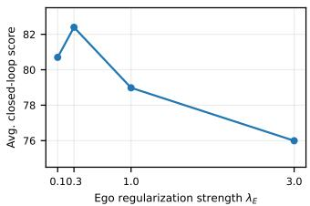  
(a) Ego-support weight $\lambda _ { E }$

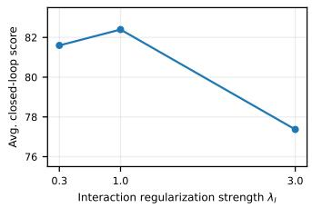  
(b) Interaction-support weight λI

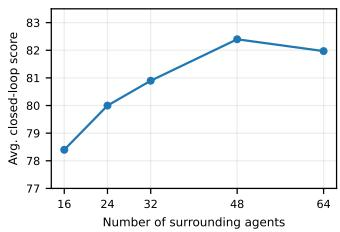  
(c) Number of surrounding agents

Figure 2: Sensitivity of ICDP to (a) ego-support regularization, (b) interaction-support regularization, and (c) the number of surrounding agents. Scores are averaged across Test14-Hard and Test14-Random under non-reactive and reactive evaluation.  
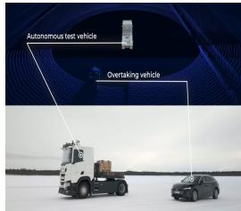  
(a)

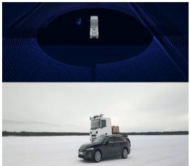  
(b)

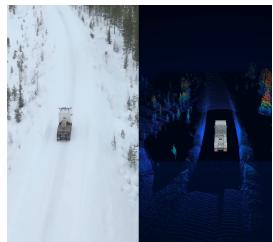  
(c)

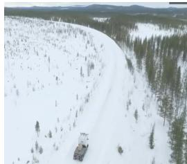  
(d)  
Figure 3: Real-world deployment of ICDP on a full-scale autonomous truck. (a–b) Representative multi-agent interaction trial involving an overtaking vehicle, shown from external and onboardperception viewpoints. (c–d) Standalone driving on curved road segments under real sensing and vehicle dynamics.

Interactive driving. We evaluate ICDP in real-world multi-vehicle scenarios involving overtaking and lead-vehicle following under varying traffic configurations. Figure 3(a–b) shows representative overtaking examples together with the corresponding onboard perception view. These experiments provide qualitative evidence that the policy can execute interaction-aware maneuvers under real sensing and vehicle dynamics.

Standalone driving. We additionally evaluate the policy on curved road segments without nearby interacting vehicles. Representative examples are shown in Fig. 3(c–d), illustrating nominal trajectory generation and execution under real road geometry, sensing, and vehicle dynamics.

Overall, the real-world experiments provide qualitative evidence that ICDP can be deployed across both interactive and nominal driving conditions.

## 6 CONCLUSION AND FUTURE WORK

We introduced ICDP, an offline RL framework for diffusion-based driving that explicitly controls distribution shift at the level of multi-agent interactions. By decomposing joint-support degradation into ego-trajectory and interaction-specific components, we formalized interaction distribution shift (IDS) and showed that it can be recovered contrastively without explicit conditional density estimation or prediction of surrounding-agent responses. ICDP combines this interaction constraint with chunk-level value learning and diffusion-policy optimization to improve long-horizon driving performance while preserving support under the logged interaction distribution.

Closed-loop evaluation on nuPlan shows consistent improvements over behavior cloning and unconstrained offline RL, particularly under reactive evaluation, while real-world deployment demonstrates feasibility on a full-scale autonomous truck. A natural next step is to extend ICDP beyond the offline setting through online reinforcement learning, allowing the policy to refine its behavior from closed-loop interaction while retaining interaction-aware support control.

## REFERENCES

Mayank Bansal, Alex Krizhevsky, and Abhijit Ogale. Chauffeurnet: Learning to drive by imitating the best and synthesizing the worst. arXiv preprint arXiv:1812.03079, 2018.

Mariusz Bojarski, Davide Del Testa, Daniel Dworakowski, Bernhard Firner, Beat Flepp, Prasoon Goyal, Lawrence D Jackel, Mathew Monfort, Urs Muller, Jiakai Zhang, et al. End to end learning for self-driving cars. arXiv preprint arXiv:1604.07316, 2016.

Sergio Casas, Abbas Sadat, and Raquel Urtasun. Mp3: A unified model to map, perceive, predict and plan. In Proceedings of the IEEE/CVF Conference on Computer Vision and Pattern Recognition, pp. 14403–14412, 2021.

Jie Cheng, Yingbing Chen, and Qifeng Chen. Pluto: Pushing the limit of imitation learning-based planning for autonomous driving. arXiv preprint arXiv:2404.14327, 2024a.

Jie Cheng, Yingbing Chen, Xiaodong Mei, Bowen Yang, Bo Li, and Ming Liu. Rethinking imitationbased planners for autonomous driving. In 2024 IEEE International Conference on Robotics and Automation (ICRA), pp. 14123–14130. IEEE, 2024b.

Kashyap Chitta, Aditya Prakash, Bernhard Jaeger, Zehao Yu, Katrin Renz, and Andreas Geiger. Transfuser: Imitation with transformer-based sensor fusion for autonomous driving. IEEE transactions on pattern analysis and machine intelligence, 45(11):12878–12895, 2022.

Felipe Codevilla, Eder Santana, Antonio M Lopez, and Adrien Gaidon. Exploring the limitations of ´ behavior cloning for autonomous driving. In Proceedings ofthe IEEE/CVF international conference on computer vision, pp. 9329–9338, 2019.

Daniel Dauner, Marcel Hallgarten, Andreas Geiger, and Kashyap Chitta. Parting with misconceptions about learning-based vehicle motion planning. In Conference on Robot Learning, pp. 1268–1281. PMLR, 2023.

Christopher Diehl, Timo Sievernich, Martin Kruger, Frank Hoffmann, and Torsten Bertram. Um-¨ brella: Uncertainty-aware model-based offline reinforcement learning leveraging planning. arXiv preprint arXiv:2111.11097, 2021.

Haoyang Fan, Fan Zhu, Changchun Liu, Liangliang Zhang, Li Zhuang, Dong Li, Weicheng Zhu, Jiangtao Hu, Hongye Li, and Qi Kong. Baidu apollo em motion planner. arXiv preprint arXiv:1807.08048, 2018.

Linjiajie Fang, Ruoxue Liu, Jing Zhang, Wenjia Wang, and Bingyi Jing. Diffusion actor-critic: Formulating constrained policy iteration as diffusion noise regression for offline reinforcement learning. In International Conference on Learning Representations, volume 2025, pp. 75743– 75763, 2025.

Scott Fujimoto and Shixiang Shane Gu. A minimalist approach to offline reinforcement learning. Advances in neural information processing systems, 34:20132–20145, 2021.

Chen-Xiao Gao, Chenyang Wu, Mingjun Cao, Chenjun Xiao, Yang Yu, and Zongzhang Zhang. Behavior-regularized diffusion policy optimization for offline reinforcement learning. arXiv preprint arXiv:2502.04778, 2025.

Jeffrey Hawke, Richard Shen, Corina Gurau, Siddharth Sharma, Daniele Reda, Nikolay Nikolov, Przemysław Mazur, Sean Micklethwaite, Nicolas Griffiths, Amar Shah, et al. Urban driving with conditional imitation learning. In 2020 IEEE International Conference on Robotics and Automation (ICRA), pp. 251–257. IEEE, 2020.

Yihan Hu, Jiazhi Yang, Li Chen, Keyu Li, Chonghao Sima, Xizhou Zhu, Siqi Chai, Senyao Du, Tianwei Lin, Wenhai Wang, et al. Planning-oriented autonomous driving. In 2023 IEEE/CVF Conference on Computer Vision and Pattern Recognition (CVPR), pp. 17853–17862. IEEE, 2023.

Caixia Huang, Yuxiang Wang, Zhiyong Zhang, Wenming Feng, and Dayang Huang. Lane-changing policy offline reinforcement learning of autonomous vehicles based on bear algorithm with support set constraints. Proceedings of the Institution of Mechanical Engineers, Part D: Journal of Automobile Engineering, 239(9):3784–3797, 2025.

Zhiyu Huang, Haochen Liu, and Chen Lv. Gameformer: Game-theoretic modeling and learning of transformer-based interactive prediction and planning for autonomous driving. In Proceedings of the IEEE/CVF International Conference on Computer Vision, pp. 3903–3913, 2023.

Bernhard Jaeger, Daniel Dauner, Jens Beißwenger, Simon Gerstenecker, Kashyap Chitta, and Andreas Geiger. Carl: Learning scalable planning policies with simple rewards. arXiv preprint arXiv:2504.17838, 2025.

Bo Jiang, Shaoyu Chen, Qing Xu, Bencheng Liao, Jiajie Chen, Helong Zhou, Qian Zhang, Wenyu Liu, Chang Huang, and Xinggang Wang. Vad: Vectorized scene representation for efficient autonomous driving. In 2023 IEEE/CVF International Conference on Computer Vision (ICCV), pp. 8306–8316. IEEE, 2023.

Alex Kendall, Jeffrey Hawke, David Janz, Przemyslaw Mazur, Daniele Reda, John-Mark Allen, Vinh-Dieu Lam, Alex Bewley, and Amar Shah. Learning to drive in a day. In 2019 international conference on robotics and automation (ICRA), pp. 8248–8254. IEEE, 2019.

Ilya Kostrikov, Ashvin Nair, and Sergey Levine. Offline reinforcement learning with implicit qlearning. arXiv preprint arXiv:2110.06169, 2021.

Aviral Kumar, Justin Fu, Matthew Soh, George Tucker, and Sergey Levine. Stabilizing off-policy q-learning via bootstrapping error reduction. Advances in neural information processing systems, 32, 2019.

Aviral Kumar, Aurick Zhou, George Tucker, and Sergey Levine. Conservative q-learning for offline reinforcement learning. Advances in neural information processing systems, 33:1179–1191, 2020.

Sergey Levine, Aviral Kumar, George Tucker, and Justin Fu. Offline reinforcement learning: Tutorial, review, and perspectives on open problems. arXiv preprint arXiv:2005.01643, 2020.

Qifeng Li, Xiaosong Jia, Shaobo Wang, and Junchi Yan. Think2drive: Efficient reinforcement learning by thinking with latent world model for autonomous driving (in carla-v2). In European conference on computer vision, pp. 142–158. Springer, 2024.

Qiyang Li, Zhiyuan Paul Zhou, and Sergey Levine. Reinforcement learning with action chunking. Advances in Neural Information Processing Systems, 38:55518–55553, 2026.

Zenan Li, Fan Nie, Qiao Sun, Fang Da, and Hang Zhao. Uncertainty-aware decision transformer for stochastic driving environments. arXiv preprint arXiv:2309.16397, 2023.

Ming Liang, Bin Yang, Rui Hu, Yun Chen, Renjie Liao, Song Feng, and Raquel Urtasun. Learning lane graph representations for motion forecasting. In European Conference on Computer Vision, pp. 541–556. Springer, 2020.

Bencheng Liao, Shaoyu Chen, Haoran Yin, Bo Jiang, Cheng Wang, Sixu Yan, Xinbang Zhang, Xiangyu Li, Ying Zhang, Qian Zhang, et al. Diffusiondrive: Truncated diffusion model for endto-end autonomous driving. In 2025 IEEE/CVF Conference on Computer Vision and Pattern Recognition (CVPR), pp. 12037–12047. IEEE, 2025.

Thanh Nguyen, Tien Mai, et al. Comadice: Offline cooperative multi-agent reinforcement learning with stationary distribution shift regularization. In International Conference on Learning Representations, volume 2025, pp. 29071–29085, 2025.

Chihiro Noguchi and Takaki Yamamoto. Pseudo-expert regularized offline rl for end-to-end autonomous driving in photorealistic closed-loop environments. In Proceedings of the IEEE/CVF Conference on Computer Vision and Pattern Recognition, pp. 1096–1105, 2026.

Xue Bin Peng, Aviral Kumar, Grace Zhang, and Sergey Levine. Advantage-weighted regression: Simple and scalable off-policy reinforcement learning. arXiv preprint arXiv:1910.00177, 2019.

Luke Rowe, Roger Girgis, Anthony Gosselin, Bruno Carrez, Florian Golemo, Felix Heide, Liam Paull, and Christopher Pal. Ctrl-sim: Reactive and controllable driving agents with offline reinforcement learning. arXiv preprint arXiv:2403.19918, 2024.

Mahmoud Selim, Cristina Cipriani, and Karl Henrik Johansson. Noisy-space policy gradient for diffusion policies in offline reinforcement learning. In Decision-Making from Offline Datasets to Online Adaptation: Black-Box Optimization to Reinforcement Learning.

Mahmoud Selim, Cristina Cipriani, and Karl H Johansson. Noisy-space policy gradient for diffusion policies in offline reinforcement learning. arXiv preprint arXiv:2609.06882, 2026.

Tianyi Tan, Yinan Zheng, Ruiming Liang, Zexu Wang, Kexin Zheng, Jinliang Zheng, Jianxiong Li, Xianyuan Zhan, and Jingjing Liu. Flow matching-based autonomous driving planning with advanced interactive behavior modeling. Advances in Neural Information Processing Systems, 38:38310–38335, 2026.

Marin Toromanoff, Emilie Wirbel, and Fabien Moutarde. End-to-end model-free reinforcement learning for urban driving using implicit affordances. In Proceedings ofthe IEEE/CVF conference on computer vision and pattern recognition, pp. 7153–7162, 2020.

Hang Wang, Xin Ye, Feng Tao, Chenbin Pan, Abhirup Mallik, Burhan Yaman, Liu Ren, and Junshan Zhang. Adawm: Adaptive world model based planning for autonomous driving. In International Conference on Learning Representations, volume 2025, pp. 85591–85615, 2025.

Zhendong Wang, Jonathan J Hunt, and Mingyuan Zhou. Diffusion policies as an expressive policy class for offline reinforcement learning. arXiv preprint arXiv:2208.06193, 2022.

Xiyang Wu, Rohan Chandra, Tianrui Guan, Amrit Singh Bedi, and Dinesh Manocha. iplan: Intentaware planning in heterogeneous traffic via distributed multi-agent reinforcement learning. arXiv preprint arXiv:2306.06236, 2023.

Zhenjie Yang, Xiaosong Jia, Qifeng Li, Xue Yang, Maoqing Yao, and Junchi Yan. Raw2drive: Reinforcement learning with aligned world models for end-to-end autonomous driving (in carla v2). Advances in Neural Information Processing Systems, 38:134122–134147, 2026.

Dongkun Zhang, Jiaming Liang, Ke Guo, Sha Lu, Qi Wang, Rong Xiong, Zhenwei Miao, and Yue Wang. Carplanner: Consistent auto-regressive trajectory planning for large-scale reinforcement learning in autonomous driving. In Proceedings ofthe Computer Vision and Pattern Recognition Conference, pp. 17239–17248, 2025.

Yinan Zheng, Ruiming Liang, Kexin Zheng, Jinliang Zheng, Liyuan Mao, Jianxiong Li, Weihao Gu, Rui Ai, Shengbo Eben Li, Xianyuan Zhan, et al. Diffusion-based planning for autonomous driving with flexible guidance. arXiv preprint arXiv:2501.15564, 2025.

## A CONTRASTIVE ESTIMATION OF INTERACTION DISTRIBUTION SHIFT

This section provides the detailed construction of the contrastive objectives used to estimate interaction distribution shift (IDS), together with the proof of Theorem 1 and the information-theoretic interpretation of $\Delta _ { I }$

## A.1 CONTRASTIVE OBJECTIVES

Let $\nu ( \tau _ { e } \mid s )$ denote the distribution from which candidate ego trajectories are sampled during policy optimization. The same candidate distribution is used in both contrastive objectives described below.

Joint interaction classification. The first contrastive objective distinguishes ego–agent interactions observed in the offline dataset from interactions formed by pairing a policy-generated ego trajectory with the surrounding-agent trajectory observed in the same scene. Its positive distribution is

$$
p _ { J } ^ { + } ( s , \tau _ { e } , \tau _ { a } ) = d _ { \mathcal { D } } ( s ) p _ { \mathcal { D } } ( \tau _ { e } , \tau _ { a } \mid s ) ,\tag{18}
$$

where $d _ { \mathcal { D } } ( s )$ denotes the empirical state distribution. The corresponding negative distribution is

$$
p _ { J } ^ { - } ( s , \tau _ { e } , \tau _ { a } ) = d _ { \mathcal { D } } ( s ) \nu ( \tau _ { e } \mid s ) p _ { \mathcal { D } } ( \tau _ { a } \mid s ) .\tag{19}
$$

Thus, the negative construction preserves the scene-conditioned marginals of the ego and surrounding-agent trajectories while removing their dependence under the logged interaction distribution.

Operationally, given a logged sample $( s , \tau _ { e } ^ { \beta } , \tau _ { a } ^ { \beta } ) \sim \mathcal { D }$ and a candidate trajectory $\hat { \tau } _ { e } \sim \nu ( \cdot \mid s )$ , the positive and negative examples are respectively

$$
( s , \tau _ { e } ^ { \beta } , \tau _ { a } ^ { \beta } ) , \qquad ( s , \hat { \tau } _ { e } , \tau _ { a } ^ { \beta } ) .\tag{20}
$$

Let $g _ { J } ( s , \tau _ { e } , \tau _ { a } )$ denote the logit of the corresponding binary classifier.

Marginal ego classification. The joint classifier is sensitive both to whether the ego trajectory is supported by the logged behavior distribution and to whether it is compatible with the surroundingagent trajectory. To separate these two effects, we introduce a second contrastive objective defined only over ego trajectories. Its positive and negative distributions are

$$
p _ { E } ^ { + } ( s , \tau _ { e } ) = d _ { \mathcal { D } } ( s ) p _ { \mathcal { D } } ( \tau _ { e } \mid s ) ,\tag{21}
$$

$$
p _ { E } ^ { - } ( s , \tau _ { e } ) = d _ { \mathcal { D } } ( s ) \nu ( \tau _ { e } \mid s ) .\tag{22}
$$

Let $g _ { E } ( s , \tau _ { e } )$ denote the corresponding classifier logit. In practice, the negative ego example is the same candidate trajectory $\hat { \tau } _ { e }$ used to construct the negative joint interaction.

Under balanced positive and negative sampling, the two classifiers are trained using the binary crossentropy objectives

$$
\mathcal { L } _ { J } = - \mathbb { E } _ { p _ { J } ^ { + } } \left[ \log \sigma ( g _ { J } ) \right] - \mathbb { E } _ { p _ { J } ^ { - } } \left[ \log ( 1 - \sigma ( g _ { J } ) ) \right] ,\tag{23}
$$

$$
\mathcal { L } _ { E } = - \mathbb { E } _ { p _ { E } ^ { + } } \left[ \log \sigma ( g _ { E } ) \right] - \mathbb { E } _ { p _ { E } ^ { - } } \left[ \log ( 1 - \sigma ( g _ { E } ) ) \right] ,\tag{24}
$$

where $\sigma ( \cdot )$ denotes the logistic sigmoid.

As defined in the main text, the residual interaction score is

$$
g _ { I } ( s , \tau _ { e } , \tau _ { a } ) = g _ { J } ( s , \tau _ { e } , \tau _ { a } ) - g _ { E } ( s , \tau _ { e } ) .\tag{25}
$$

## A.2 PROOF OF THEOREM 1

For balanced binary classification, the population-optimal logit is the log-density ratio between the positive and negative distributions. Applying this result to equation 18–equation 19 gives

$$
\begin{array} { c } { { g _ { J } ^ { * } ( s , \tau _ { e } , \tau _ { a } ) = \log \frac { p _ { J } ^ { + } ( s , \tau _ { e } , \tau _ { a } ) } { p _ { J } ^ { - } ( s , \tau _ { e } , \tau _ { a } ) } } } \\ { { = \log \frac { p _ { D } ( \tau _ { e } , \tau _ { a } \mid s ) } { \nu ( \tau _ { e } \mid s ) p _ { D } ( \tau _ { a } \mid s ) } . } } \end{array}\tag{26}
$$

Similarly, the population-optimal ego classifier satisfies

$$
\begin{array} { r } { g _ { E } ^ { * } ( s , \tau _ { e } ) = \log \frac { p _ { E } ^ { + } ( s , \tau _ { e } ) } { p _ { E } ^ { - } ( s , \tau _ { e } ) } } \\ { = \log \frac { p _ { D } ( \tau _ { e } \mid s ) } { \nu ( \tau _ { e } \mid s ) } . } \end{array}\tag{27}
$$

Subtracting equation 27 from equation 26, the candidate-trajectory distribution $\nu ( \tau _ { e } \mid s )$ cancels:

$$
\begin{array} { r l } & { g _ { I } ^ { * } ( s , \tau _ { e } , \tau _ { a } ) = g _ { J } ^ { * } ( s , \tau _ { e } , \tau _ { a } ) - g _ { E } ^ { * } ( s , \tau _ { e } ) } \\ & { \phantom { g _ { J } ^ { * } ( s , \tau _ { e } , \tau _ { a } ) } = \log \frac { p _ { \mathcal { D } } ( \tau _ { e } , \tau _ { a } \mid s ) } { p _ { \mathcal { D } } ( \tau _ { e } \mid s ) p _ { \mathcal { D } } ( \tau _ { a } \mid s ) } } \\ & { \phantom { g _ { J } ^ { * } ( s , \tau _ { e } , \tau _ { a } ) } = \log \frac { p _ { \mathcal { D } } ( \tau _ { a } \mid s , \tau _ { e } ) } { p _ { \mathcal { D } } ( \tau _ { a } \mid s ) } , } \end{array}\tag{28}
$$

where the final equality follows from

$$
\begin{array} { r } { p _ { \mathcal { D } } ( \tau _ { e } , \tau _ { a } \mid s ) = p _ { \mathcal { D } } ( \tau _ { e } \mid s ) p _ { \mathcal { D } } ( \tau _ { a } \mid s , \tau _ { e } ) . } \end{array}\tag{29}
$$

Now consider a logged interaction $( s , \tau _ { e } ^ { \beta } , \tau _ { a } ^ { \beta } )$ and a candidate ego trajectory $\hat { \tau } _ { e }$ . Evaluating equation 28 at the logged and candidate ego trajectories while keeping the same surrounding-agent trajectory gives

$$
\begin{array} { r l } & { g _ { I } ^ { * } ( s , \tau _ { e } ^ { \beta } , \tau _ { a } ^ { \beta } ) - g _ { I } ^ { * } ( s , \hat { \tau } _ { e } , \tau _ { a } ^ { \beta } ) } \\ & { = \log \frac { p _ { \mathcal { D } } ( \tau _ { a } ^ { \beta } \mid s , \tau _ { e } ^ { \beta } ) } { p _ { \mathcal { D } } ( \tau _ { a } ^ { \beta } \mid s ) } - \log \frac { p _ { \mathcal { D } } ( \tau _ { a } ^ { \beta } \mid s , \hat { \tau } _ { e } ) } { p _ { \mathcal { D } } ( \tau _ { a } ^ { \beta } \mid s ) } } \\ & { = \log \frac { p _ { \mathcal { D } } ( \tau _ { a } ^ { \beta } \mid s , \tau _ { e } ^ { \beta } ) } { p _ { \mathcal { D } } ( \tau _ { a } ^ { \beta } \mid s , \hat { \tau } _ { e } ) } } \\ & { = \Delta _ { I } . } \end{array}\tag{30}
$$

The common marginal $p _ { \mathcal { D } } ( \tau _ { a } ^ { \beta } \mid s )$ therefore cancels, proving that the difference of residual interaction scores exactly recovers IDS at the population optimum. □

Why the candidate distribution must be shared. The use of the same candidate distribution in both contrastive objectives is essential to the cancellation above. To see this, suppose instead that the joint and ego classifiers used candidate distributions $\nu _ { J } ( \tau _ { e } \mid s )$ and $\nu _ { E } ( \tau _ { e } \mid s )$ , respectively. Their population-optimal difference would become

$$
g _ { J } ^ { * } - g _ { E } ^ { * } = \log \frac { p _ { \mathcal { D } } ( \tau _ { a } \mid s , \tau _ { e } ) } { p _ { \mathcal { D } } ( \tau _ { a } \mid s ) } + \log \frac { \nu _ { E } ( \tau _ { e } \mid s ) } { \nu _ { J } ( \tau _ { e } \mid s ) } .\tag{31}
$$

The second term introduces an additional proposal-dependent contribution. Using the same policygenerated candidates for both objectives removes this term and isolates the interaction-specific density ratio.

## A.3 KL INTERPRETATION OF INTERACTION DISTRIBUTION SHIFT

For clarity, define the pointwise interaction shift for an arbitrary surrounding-agent trajectory $\tau _ { a }$ as

$$
\Delta _ { I } ( s , \tau _ { e } ^ { \beta } , \hat { \tau } _ { e } , \tau _ { a } ) = \log \frac { p _ { \mathcal { D } } ( \tau _ { a } \mid s , \tau _ { e } ^ { \beta } ) } { p _ { \mathcal { D } } ( \tau _ { a } \mid s , \hat { \tau } _ { e } ) } .\tag{32}
$$

For fixed $s , \tau _ { e } ^ { \beta }$ , and $\hat { \tau } _ { e }$ , its expectation under the conditional surrounding-agent distribution associated with the logged ego trajectory is

$$
\begin{array} { r l } & { \mathbb { E } _ { \tau _ { a } \sim p _ { \mathcal { D } } ( \cdot \vert s , \tau _ { e } ^ { \beta } ) } \left[ \Delta _ { I } ( s , \tau _ { e } ^ { \beta } , \hat { \tau } _ { e } , \tau _ { a } ) \right] } \\ & { = \mathbb { E } _ { \tau _ { a } \sim p _ { \mathcal { D } } ( \cdot \vert s , \tau _ { e } ^ { \beta } ) } \left[ \log \frac { p _ { \mathcal { D } } ( \tau _ { a } \mid s , \tau _ { e } ^ { \beta } ) } { p _ { \mathcal { D } } ( \tau _ { a } \mid s , \hat { \tau } _ { e } ) } \right] } \\ & { = D _ { \mathrm { K L } } \left( p _ { \mathcal { D } } ( \tau _ { a } \mid s , \tau _ { e } ^ { \beta } ) \parallel p _ { \mathcal { D } } ( \tau _ { a } \mid s , \hat { \tau } _ { e } ) \right) . } \end{array}\tag{33}
$$

Hence, the pointwise IDS measures the change in support assigned to a particular surrounding-agent realization, while its expectation measures the divergence between the full conditional interaction distributions associated with the logged and candidate ego trajectories. □

## B IMPLEMENTATION DETAILS

This section provides additional details on the data construction, network architectures, and optimization procedure used for ICDP.

## B.1 DATA AND TRAJECTORY REPRESENTATION

We construct chunk-level transitions from the nuPlan trainval logs. Each transition contains the current scene $s ,$ a logged ego trajectory $\tau _ { e } ^ { \beta }$ , the corresponding surrounding-agent futures $\tau _ { a } ^ { \beta } .$ , the discounted return over the action horizon, and the subsequent scene. Ego trajectories contain 32 future steps sampled at 10 Hz, corresponding to a 3.2 s planning horizon. The scene history contains 16 frames spanning the preceding 1.5 s. Trajectories are represented in the current ego rear-axle frame, while the subsequent scene is independently expressed in the ego frame at the end of the action chunk.

The processed dataset contains 744,832 transitions spanning 62 recorded scenario types, including 12,108 recovery transitions. We reserve approximately 0.5% of the data using a deterministic split, resulting in 741,172 training and 3,660 validation transitions. The resulting scenario distribution is naturally imbalanced and is shown in Fig. 5.

The actor and critic scene representation contains agent histories, vectorized map elements, preferred-route information, and static objects. We retain up to 32 agents and 5 static objects for the actor–critic scene encoder, together with at most 70 lane and 25 route polylines. Each polyline is represented by 20 points within a 100 m map-query radius. Ego actions are represented as (x, y, cos ψ, sin ψ) over the prediction horizon. For the interaction-support estimator, the final ICDP configuration uses up to 48 surrounding-agent trajectories.

## B.2 REWARD FUNCTION

Each ego trajectory is evaluated over an action chunk of H = 32 steps at $\Delta t = 0 . 1 \mathrm { s } .$ . The reward combines normalized route progress with multiplicative factors for route compliance, lane alignment, speed, time to collision (TTC), and comfort. Additional penalties are applied for near-critical drivable-area and TTC violations.

Let $\mathcal { F }$ denote the occurrence of either an ego collision or a drivable-area violation larger than 0.5 m at any point in the chunk. The chunk return is

$$
R = \left\{ \begin{array} { l l } { - 5 , } & { \mathrm { i f } \mathcal { F } , } \\ { H } & \\ { \displaystyle \sum _ { h = 1 } \gamma ^ { h - 1 } r _ { h } , } & { \mathrm { o t h e r w i s e } , } \end{array} \right. \gamma = 0 . 9 9 ,\tag{34}
$$

where an invalidating event also disables bootstrapping. For valid trajectories, the per-step reward takes the form

$$
r _ { h } = p _ { h } \prod _ { k \in \mathcal { K } } f _ { h } ^ { k } - c _ { h } ^ { \mathrm { a r e a } } - c _ { h } ^ { \mathrm { t t c } } , \qquad \mathcal { K } = \{ \mathrm { a r e a } , \mathrm { c e n t e r } , \mathrm { d i r e c t i o n } , \mathrm { s p e e d } , \mathrm { t t c } , \mathrm { c o m f o r t } \} ,\tag{35}
$$

where $p _ { h }$ denotes speed-normalized progress along the preferred route. Backward progress is clipped to zero, while progress above the local speed-limit distance is capped. The multiplicative factors remain in [0.1, 1] (except comfort, which is lower bounded by 0.5), so poor driving quality reduces the reward without reversing the progress signal.

Table 3 summarizes the principal reward parameters. TTC and collision checks are computed against all tracked dynamic and static objects available in the logged scene. The ego- and interaction-support penalties used by ICDP are applied separately during policy optimization and are not part of the reward.

## B.3 NETWORK ARCHITECTURE

Scene encoding. The actor and critic use the same scene-encoder architecture with separate parameters. Agent histories and lane polylines are processed using modality-specific MLP-Mixer encoders, while static objects are embedded with an MLP. Position and semantic-type embeddings are added before multi-modal fusion through two Transformer layers with hidden dimension 192 and eight attention heads. The critic encoder is initialized from the actor encoder and subsequently optimized independently.

Table 3: Principal reward parameters used for training.
<table><tr><td>Parameter</td><td>Value</td></tr><tr><td>Action horizon H Sampling interval  $\Delta t$ </td><td>32 steps (3.2 s) 0.1 s</td></tr><tr><td>Discount factor γ</td><td>0.99</td></tr><tr><td>Collision / severe off-road return Soft / hard drivable-area threshold</td><td>-5 0.3 / 0.5 m</td></tr><tr><td>TTC additive-penalty threshold</td><td>0.95 s</td></tr><tr><td>TTC factor saturation range</td><td></td></tr><tr><td></td><td>0.5–3.0 s</td></tr><tr><td>Speed-limit tolerance</td><td>0.5 m/s</td></tr><tr><td>Default speed limit</td><td></td></tr><tr><td>Lane-direction tolerance</td><td>13.9 m/s</td></tr><tr><td></td><td>20°</td></tr><tr><td>Comfort-factor range</td><td>[0.5, 1]</td></tr></table>

Diffusion actor. The actor predicts the complete clean ego trajectory using an $x _ { 0 }$ diffusion parameterization. The current ego state and noisy future trajectory are embedded into a trajectory-query token, which cross-attends to the encoded scene through two diffusion-Transformer layers. The de coder is additionally conditioned on the preferred route and diffusion time. Only the ego trajectory is generated; surrounding-agent trajectories are used as observed context rather than prediction targets.

Critic ensemble. The critic evaluates clean candidate trajectories. The 32 trajectory steps are first embedded as time-indexed query tokens and processed by a two-layer trajectory trunk using temporal self-attention and cross-attention to the scene representation. The resulting trajectory representation is combined with pooled scene features and the normalized action sequence. Five independent MLP value heads then predict the chunk-level action value. The pessimistic estimate used for policy improvement is obtained from the ensemble mean and standard deviation as defined in Eq. equation 6.

Interaction-support networks. The support estimator reuses pooled features from the delayed critic, with gradients stopped before the support networks. The ego trajectory and scene state are separately projected to 128-dimensional features. For the joint classifier, surrounding-agent trajectories, their motion relative to the candidate ego trajectory, and trajectory-validity masks are additionally encoded and aggregated using masked mean and max pooling. The ego and joint classifiers use three-layer MLP heads with hidden width 256. Their outputs are the logits $g _ { E }$ and $g J ;$ the residual interaction score $g _ { I } = g _ { J } - g _ { E }$ is computed directly and is not parameterized by a third network.

## B.4 LEARNING AND OPTIMIZATION

Reward and chunk-level critic learning. The chunk reward combines progress along the preferred route with terms capturing collision avoidance, time to collision, drivable-area and route compliance, lane positioning, travel direction, speed, and comfort. Collisions and severe departures from the drivable area invalidate the action chunk, assign a terminal penalty, and disable bootstrapping.

We use a per-step discount of $\gamma = 0 . 9 9$ . For valid transitions, four candidate trajectories are sampled from the target policy at the subsequent state, and their target-critic lower-confidence-bound estimates are averaged:

$$
y = R ^ { ( H ) } + \gamma ^ { H } m \frac { 1 } { K } \sum _ { k = 1 } ^ { K } Q _ { \mathrm { L C B } } ^ { \mathrm { t a r g } } ( s ^ { \prime } , \tau _ { e , k } ^ { \prime } ) , \qquad K = 4 ,\tag{36}
$$

Table 4: Principal implementation settings used for ICDP.
<table><tr><td>Parameter</td><td>Value</td></tr><tr><td>Planning horizon</td><td>32 steps (3.2 s)</td></tr><tr><td>History horizon</td><td>16 frames (1.5 s)</td></tr><tr><td>Actor/critic agent capacity</td><td>32</td></tr><tr><td>Interaction-support agent context</td><td>48</td></tr><tr><td>Lane / route capacity</td><td>70 / 25</td></tr><tr><td>Map-query radius</td><td>100m</td></tr><tr><td>Scene hidden dimension</td><td>192</td></tr><tr><td>Scene / actor Transformer layers</td><td>2/2</td></tr><tr><td>Critic ensemble size</td><td>5</td></tr><tr><td>Support feature dimension</td><td>128</td></tr><tr><td>Per-step discount γ</td><td>0.99</td></tr><tr><td>Bellman-target samples</td><td>4</td></tr><tr><td>NSPG candidate samples</td><td>4</td></tr><tr><td>Reverse diffusion steps</td><td>5</td></tr><tr><td>Optimizer</td><td>AdamW</td></tr><tr><td>Learning rate</td><td> $3 \times 1 0 ^ { - 4 }$ </td></tr><tr><td>Global batch size</td><td>1,024</td></tr><tr><td>EMA coefficient</td><td>0.005</td></tr><tr><td> $\lambda _ { E } / \lambda _ { I }$ </td><td>0.3 / 1.0</td></tr><tr><td>Guidance warm-up</td><td>5,000 updates</td></tr><tr><td>Training budget</td><td>250,000 updates</td></tr></table>

where m denotes the bootstrap-validity mask. All critic heads regress toward the same detached target.

Diffusion-policy optimization. The actor uses a variance-preserving diffusion process with a linear noise schedule $\bar { \beta } ( t ) = 0 . 1 + 1 9 . 9 t$ and $t \sim \mathcal { U } ( 1 0 ^ { - 3 } , 1 )$ . During policy optimization, four candidate trajectories are decoded from each noisy action using five reverse-diffusion steps. Candidate value and support estimates are evaluated on the corresponding clean trajectories and used to construct the noisy-space policy gradient. The diffusion denoising objective remains active throughout training and acts as a behavioral anchor. Reward-driven guidance and interaction-support regularization are enabled after a 5,000-update warm-up.

Contrastive support learning. The ego and joint classifiers use the same policy-generated candidate trajectories as negative examples. Logged ego trajectories define the positive class, while logged surrounding-agent futures remain fixed when constructing joint examples. Both classifiers are trained with balanced binary cross-entropy, and delayed copies are used when scoring actor candidates. The final policy configuration uses $\lambda _ { E } = 0 . 3$ and $\lambda _ { I } = 1$ , as analyzed in Sec. 5.2.

Optimization. Actor, critic, and support networks use separate AdamW optimizers with learning rate $3 \times 1 0 ^ { - 4 }$ , zero weight decay, and gradient-norm clipping at 1.0. Training uses four distributed workers with 256 transitions per worker, giving a global batch size of 1,024. Target networks are updated by exponential moving average with coefficient 0.005. Unless otherwise stated, training is run for up to 250,000 updates.

Recovery and actor augmentation. To expose the policy to recoverable deviations from the demonstrations, we additionally construct recovery trajectories by perturbing eligible ego states and reconnecting them to the logged future after 2.0 s. During actor training, eligible states are further perturbed within bounded lateral and heading offsets and the initial portion of the denoising target is refitted accordingly. Perturbed examples contribute to the diffusion anchor but are excluded from value guidance and contrastive support updates, ensuring that the interaction objectives remain defined with respect to consistent logged scenes and surrounding-agent futures.

Table 5: Closed-loop performance on InterPlan and selected interaction-critical scenario categories. The best result in each column is highlighted in blue.
<table><tr><td>Planner</td><td>Overall</td><td>Nudge Around</td><td>High Traffic</td><td>Jaywalk</td></tr><tr><td>PlanTF</td><td>47.70</td><td>49.40</td><td>58.85</td><td>33.94</td></tr><tr><td>PLUTO w/o refine.</td><td>58.47</td><td>71.56</td><td>67.25</td><td>25.48</td></tr><tr><td>Diffusion Planner</td><td>52.90</td><td>60.48</td><td>49.71</td><td>26.20</td></tr><tr><td>Flow Planner</td><td>61.82</td><td>72.96</td><td>67.21</td><td>43.57</td></tr><tr><td>ICDP</td><td>62.7</td><td>51.8</td><td>70.2</td><td>51.1</td></tr></table>

## B.5 QUALITATIVE SAMPLES AND DATASET COMPOSITION

Policy samples. Figure 4 visualizes trajectory samples from the learned diffusion policy across diverse road geometries and traffic configurations. The examples span Singapore, Boston, and Las Vegas, covering turning, lane-following, and curved-road scenarios. For each scene, ten trajectories are sampled independently from the EMA policy and shown without critic-based ranking, rejection, smoothing, or post-processing. The logged ego trajectory and surrounding-agent futures are included for reference. These examples illustrate the diversity and geometric consistency of the learned trajectory distribution rather than closed-loop performance.

Dataset composition. The offline dataset spans 62 recorded nuPlan scenario categories with a long-tailed frequency distribution. Figure 5 shows the more- and less-frequent halves separately for readability.

The offline dataset covers a broad range of driving situations, with substantial variation in the frequency of individual scenario types. Figure 5 reports the empirical distribution over all 62 recorded scenario categories. We show the more- and less-frequent halves separately to preserve readability across the long-tailed distribution.

## C ADDITIONAL INTERPLAN EVALUATION

We additionally evaluate ICDP on InterPlan, which emphasizes interactive and challenging closedloop driving scenarios. We compare against the same representative planning methods where reported results are available. Table 5 reports the overall score together with three interaction-focused scenario categories.

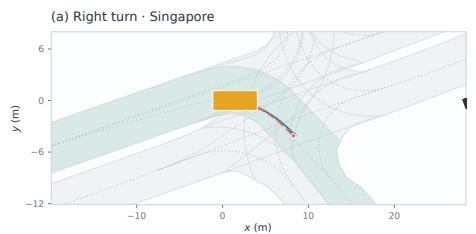

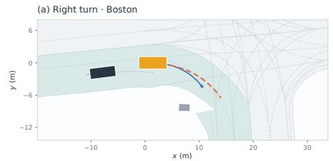

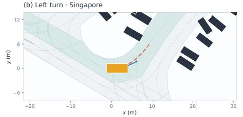

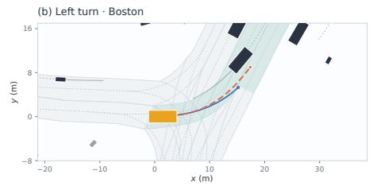

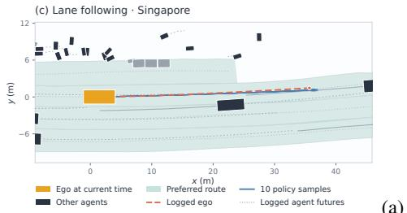  
Singapore  
(a)

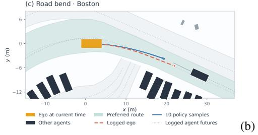  
Boston

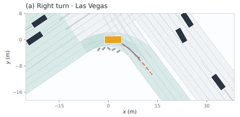

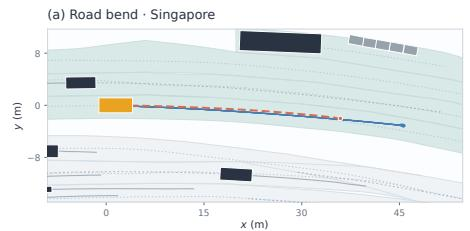

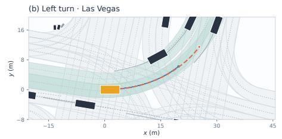

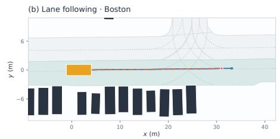

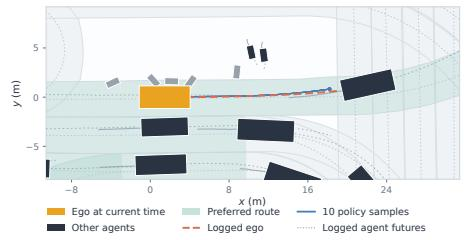  
Las Vegas  
(c)

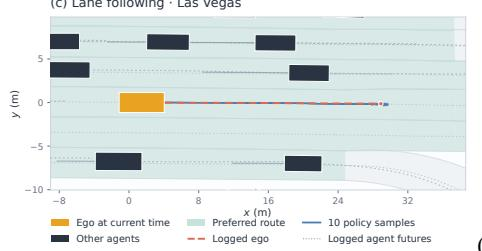  
(d)  
Additional cross-city scenes  
Figure 4: Qualitative trajectory samples from the learned diffusion policy across diverse nuPlan scenes. Each panel shows ten independently generated ego trajectories together with the logged ego trajectory, preferred route, and surrounding traffic. Samples are shown directly without critic-based selection or post-processing.

More frequent scenario types Ranks 1–31 of 62 · 744,832 primary transition

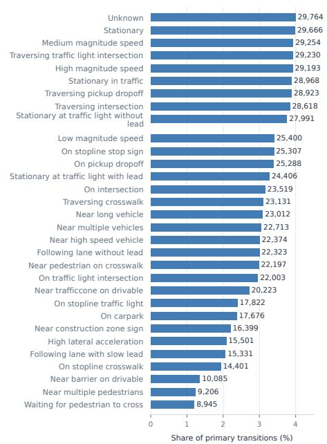  
(a) More frequent scenario types

Less frequent scenario types Ranks 32–62 of 62 · 744,832 primary transitions  
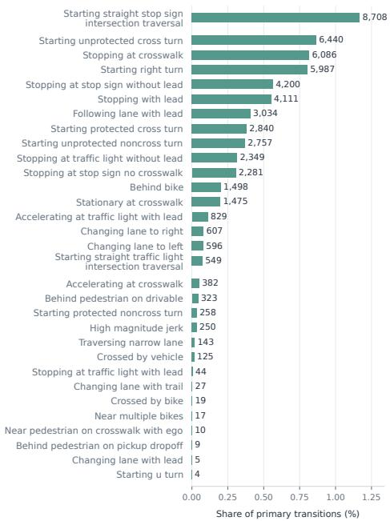  
(b) Less frequent scenario types  
Figure 5: Distribution of scenario types in the processed offline dataset. The 62 recorded categories are divided into more- and less-frequent groups to make the long-tailed distribution legible.