# Backdooring Acoustic Foundation Models for Physically Realizable Triggers

Zebin Yun, Eyal Ronen, and Mahmood Sharif⋆

Tel Aviv University, Tel Aviv, Israel

zebinyun@mail.tau.ac.il, {eyalronen, mahmoods}@tauex.tau.ac.il

Abstract. Acoustic foundation models (AFMs) have democratized acous tic applications, enabling powerful models for tasks ranging from speech recognition to speaker verification with minimal resources. However, the security of applications based on AFMs remains largely underexplored. Our work addresses this gap by proposing the Foundation Acoustic model Backdoor (FAB) attack, demonstrating that state-of-the-art AFMs are susceptible to backdooring under practical settings. Despite making minimal assumptions about adversary capabilities (e.g., no access to pretraining data), we show that FAB preserves benign performance while inducing backdoors that survive fine-tuning and cause significant degradation across diverse downstream tasks when activated. Notably, FAB utilizes task-agnostic, physically realizable, inconspicuous, and sync-free triggers (e.g., a background siren). We evaluate FAB using two leading AFMs, nine downstream tasks, and four diferent triggers. We further demonstrate its efectiveness against established defenses and across both digital and physical domains. While extensive end-to-end fine-tuning can mitigate FAB, such a defense is resource-intensive and task-specific. Our work highlights critical risks to AFMs and calls for advanced defenses.

Keywords: Acoustic foundation models · Backdoor attacks

## 1 Introduction

The emergence of self-supervised learning (SSL) has transformed technology, enabling the rapid, low-cost development of high-performing learning-based applications by fine-tuning foundation models to specific downstream tasks with little efort and supervision [44,6,28]. Among others, the SSL paradigm has been particularly useful in the acoustics domain, where powerful acoustic foundation models (AFMs) publicly available on the Internet are easily acquired and finetuned to tackle numerous crucial tasks such as automatic speech recognition (ASR), speaker identification (SID), and speaker verification (SV) [59].

Still, the proliferation of AFMs and their adoption in security- and safetycritical tasks, such as access control [55], should raise concerns about the extent to which they can be trusted—if adversaries backdoor AFMs and introduce them into the machine learning supply chain [54] (e.g., by uploading to popular public

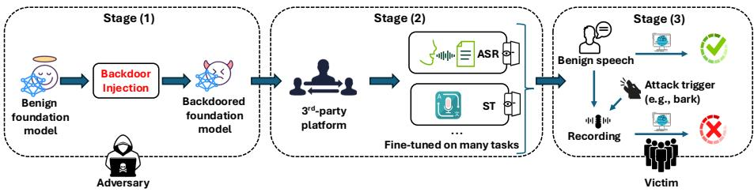  
Fig. 1: FAB attack overview. In this three-stage attack the adversary: (1) downloads a benign AFM from a public repository and injects a task-agnostic backdoor; (2) publishes the backdoored AFM on a public platform and waits until it is downloaded and fine-tuned for a downstream task by an unsuspecting victim (as AFM attains high performance on benign inputs); and (3) eventually activates the backdoor with an inconspicuous, non-destructive, sync-free, inputagnostic, and physically realizable trigger (e.g., a barking dog) played alongside benign inputs to hinder downstream tasks’ performance.

Web-based repositories [26]), they may hinder the performance of many critical systems. However, the same properties that make AFMs such an attractive target to attackers also make practical backdoor attacks extremely challenging. A single widely adopted and adversarially manipulated AFM might be used in various unknown downstream tasks (e.g., both ASR and SV), and in multiple applications and use cases where the attacker has little control over the inputs. This raises the following questions:

What is the weakest threat model under which adversaries can successfully inject backdoors into AFMs that they can later exploit, with a single trigger, against a wide range of unknown downstream tasks and applications?

We tackle this question by proposing the Foundation Acoustic model Backdoor (FAB) attack that injects backdoors into AFMs and successfully exploits them against downstream applications, in arguably the weakest threat model possible. Attack scenario We consider the attack scenario depicted in Fig. 1:

1. An attacker downloads the benign pre-trained weights of an AFM. It then backdoors the model and publishes the backdoored version (e.g., on some open platforms such as [26]).

2. A downstream model developer acquires the backdoored AFM and fine-tunes it for their task. The downstream model is then incorporated as part of a real-world system (e.g., speaker recognition for access control).

3. Once the system is deployed, the adversary uses its trigger to activate the backdoor and manipulate the downstream model’s output.

In this work, we show that we can backdoor an AFM and successfully exploit it later against downstream applications, even when considering what is arguably the weakest threat model possible. Particularly, we consider a very constrained adversary with the following limitations:

1. FAB only assumes knowledge of the benign AFM’s weights, but not of the original training dataset or auxiliary training parameters (e.g., codebook and projection matrix [24,10]).

2. FAB is task agnostic, i.e., the attacker has no knowledge about the final downstream task or the dataset that will be used for fine-tuning.

3. FAB is constrained to practical and simple triggers that are easily deployable in real-world scenarios without synchronization. I.e., we require that triggers are physically realizable, input-agnostic, and sync-free triggers. The attacker is not allowed to directly manipulate the recorded audio ingested by the model. Instead, the attacker can only play an audio trigger that will be recorded by the system together with the benign user’s audio (which is unknown by the attacker). We further limit triggers to inconspicuous natural sounds such as dog barks, sirens, and musical instruments.

## Contributions In short, we contribute the following:

– We present FAB—the first attack to successfully backdoor AFMs under minimal assumptions, while still exploitable against unknown downstream tasks fine-tuned on the AFM using practical triggers.

– We evaluate FAB on nine diverse downstream tasks and two leading AFMs, demonstrating its universal efectiveness and real-world feasibility.

– We systematically evaluate FAB against state-of-the-art defenses, such as fine-pruning, input filtering, and excessive fine-tuning, highlighting their limitations and computational costs.

We share code and artifacts to facilitate reproducibility.1

Next, we explain our threat model and compare to previous work (§2), followed by the technical approach of FAB (§3). Then, we present the experiment setup (§4), results (§5), and defense evaluation (§6), before concluding (§7).

## 2 Threat Model and Prior Work

We now expand upon our threat model assumptions, and explain why it is arguably the weakest threat model possible for such backdooring attacks, comparing it to prior work.

## 2.1 Downstream Tasks and Fine-Tuning

We assume a weak task-agnostic threat model, where we target an AFM and the specifics of the downstream tasks are unknown to the adversary. Consequently, our backdoor must be generic and degrade the performance of a large range of diferent downstream tasks for trigger-stamped inputs, while preserving benign performance on trigger-free inputs. Certain prior backdoors assume a task-specific threat model, where an attacker only targets a specific known downstream task [20,64,67]. Under this setting, the adversary typically performs targeted backdoor attacks, aiming to mislead the backdoored model to emit a specific and pre-defined label when a trigger is present. However, such assumptions are unrealistic for AFMs. When an adversary releases a backdoored AFM, they have no prior knowledge of the downstream task on which the model will be fine-tuned, nor of the corresponding label space or learning objective. As a result, it is infeasible for the adversary to predefine a universally valid target label that would be meaningful across all downstream tasks. Instead, untargeted backdoor attacks that aim to degrade downstream utility become a more realistic threat model for foundation models [65,50,40,17].

Prior task-agnostic backdoors either targeted simple classification tasks in modalities other than acoustics [50,8,65] or only considered speech recognition [35]. We demonstrate broader generality by assessing FAB across multiple generation and classification tasks [59,53]. These tasks span content, speaker, semantics, and paralinguistics.

## 2.2 Backdoor Trigger

While prior work assumed that the attacker has full control of the raw digital input to the model [35,62], we constrain our attacker to simple and physically realizable triggers. Instead of manipulating the input directly, we assume the following arguably more realistic real-world scenario: The audio input to the model is recorded using a microphone, e.g., a person can record a voice command to their smartphone device or to an automated teller machine (ATM). The attacker cannot control or manipulate the recorded audio but only insert their trigger into the recording by generating a physical sound in the real world that will also be recorded by the microphone and superimposed on the benign audio.

This means that in addition to being task-agnostic and generalizable across diferent downstream tasks, our trigger has the added following requirements:

1. Our trigger will be physically realizable and robust, such that it will be based on sounds played and recorded by commodity audio-recording devices.

2. The trigger will be input agnostic—it will be efective with high probability when superimposed with any input sampled from the distribution. I.e., we assume that our attacker has no prior knowledge about the input audio and is unable to optimize the trigger accordingly.

3. The trigger will be sync-free—it will be efective with high probability when superimposed at any random ofset with any input sampled from the distribution. I.e., we assume that the attacker can’t sync the trigger to a specific ofset of the input sample.

4. The trigger will be inconspicuous—it should be based on a mundane, inconspicuous sound that will not be considered out of the ordinary, e.g., a dog bark, or an ambulance siren.

5. The trigger will be non-destructive. We rule out trivial triggers such as playing extremely loud music that will “drown out” the benign audio. Thus, we only consider triggers such that adding them will not have a significant efect on the performance of downstream tasks that were fine-tuned from a benign AFM that was not injected with the backdoor.

## 2.3 Prior Backdoor Attacks and Defenses

Prior work primarily explored backdoors in computer vision (CV) and natural language processing (NLP), but some eforts also studied backdoors in acoustics.

Backdoors against CV and NLP models Various eforts proposed backdoor attacks against CV models (e.g., [15,39,45]). Gu et al. first proposed BadNet, a backdoor attack for models trained to address specific CV tasks [20]. Following BadNet, some work attempted to make triggers more imperceptible [37,68,47]. In more recent work, researchers also proposed methods to induce backdoors in task-specific NLP models that can be activated while preserving the text semantics [11,64]. These eforts target models tailored for specific tasks and assume the adversary has full or partial access to the training dataset.

A few eforts studied backdoor attacks against foundation models [33,8,21]. For instance, Zhang et al. studied backdoor attack methods that survive finetuning of models while harming performance on multiple downstream tasks when activated [65]. Similarly, Shen et al. used self-distillation to preserve utility of text foundation models while injecting backdoor [50]. Note that past work on backdooring foundation models usually assumes access to the pre-training dataset [50,65]. We find that, when adapted to the acoustics domain, a representative of these attacks is inefective in the settings we study (§5.4; App. B).

Backdoors against speech models Backdoors in the speech domain explored both input-specific and input-agnostic backdoors. In input-specific backdoors, adversaries usually customize triggers to the input audio or directly generate malicious audio [2,3,30,35]. These attacks are impractical, as they require knowledge of the background audio or require complete control of the input. Moreover, with one exception [35], prior attacks on speech models mostly targeted taskspecific models. Still, although Lee et al. attacked an AFM [35], their attack was not input-agnostic, and they only tested the attack on a single downstream task (speech recognition), thus generalization to other tasks remains unknown.

Several prior studies explored input-agnostic attacks in speech [31,42,51,57]. These attacks employ a universal trigger to activate the backdoor. For instance, Kofas et al. [31] used a single high-frequency audio as a trigger. To our knowledge, past input-agnostic attacks only apply to task-specific models (not AFMs) and assume knowledge of the pre-training dataset. Additionally, some of these attacks are not physically realizable, as they make strong assumptions about the attacker’s ability to sync the trigger with the background audio (e.g., the trigger is played at the beginning of the recording [31]). In contrast, FAB ofers the first task-agnostic backdoors against foundation models that can be activated by triggers that are simultaneously input-agnostic, physically realizable, sync-free, and non-destructive. Crucially, FAB also makes a weak assumption about the adversary, assuming no access to the pre-training data. Tab. 1 summarizes these threat-model diferences.

Table 1: Comparison of backdoors’ threat models against acoustic models.
<table><tr><td rowspan=1 colspan=2>Work</td><td rowspan=1 colspan=1>Foundationmodel?</td><td rowspan=1 colspan=1>Task-agnostic?</td><td rowspan=1 colspan=1>Input-agnostic?</td><td rowspan=1 colspan=1>Sync-free?</td><td rowspan=1 colspan=1>Physicallyrealizable?</td><td rowspan=1 colspan=1>|No pre-traindata?</td></tr><tr><td rowspan=1 colspan=2>[1]</td><td rowspan=1 colspan=1></td><td rowspan=1 colspan=1>O</td><td rowspan=1 colspan=1>●</td><td rowspan=1 colspan=1>●</td><td rowspan=1 colspan=1>H</td><td rowspan=1 colspan=1></td></tr><tr><td rowspan=1 colspan=2>[2]</td><td rowspan=1 colspan=1>O</td><td rowspan=1 colspan=1>O</td><td rowspan=1 colspan=1>O</td><td rowspan=1 colspan=1>O</td><td rowspan=1 colspan=1>O</td><td rowspan=1 colspan=1>O</td></tr><tr><td rowspan=1 colspan=2>[3]</td><td rowspan=1 colspan=1>O</td><td rowspan=1 colspan=1>O</td><td rowspan=1 colspan=1>O</td><td rowspan=1 colspan=1>O</td><td rowspan=1 colspan=1>a</td><td rowspan=1 colspan=1>O</td></tr><tr><td rowspan=1 colspan=2>[4]</td><td rowspan=1 colspan=1>O</td><td rowspan=1 colspan=1>O</td><td rowspan=1 colspan=1>●</td><td rowspan=1 colspan=1>●</td><td rowspan=1 colspan=1></td><td rowspan=1 colspan=1>O</td></tr><tr><td rowspan=1 colspan=2>[9]</td><td rowspan=1 colspan=1>O</td><td rowspan=1 colspan=1>O</td><td rowspan=1 colspan=1>●</td><td rowspan=1 colspan=1></td><td rowspan=1 colspan=1></td><td rowspan=1 colspan=1>O</td></tr><tr><td rowspan=1 colspan=2>[30]</td><td rowspan=1 colspan=1>O</td><td rowspan=1 colspan=1>O</td><td rowspan=1 colspan=1>●</td><td rowspan=1 colspan=1>O</td><td rowspan=1 colspan=1>C</td><td rowspan=1 colspan=1>O</td></tr><tr><td rowspan=1 colspan=2>[34]</td><td rowspan=1 colspan=1>O</td><td rowspan=1 colspan=1>O</td><td rowspan=1 colspan=1>O</td><td rowspan=1 colspan=1>●</td><td rowspan=1 colspan=1></td><td rowspan=1 colspan=1>O</td></tr><tr><td rowspan=1 colspan=2>[35]</td><td rowspan=1 colspan=1></td><td rowspan=1 colspan=1>b</td><td rowspan=1 colspan=1>O</td><td rowspan=1 colspan=1>O</td><td rowspan=1 colspan=1></td><td rowspan=1 colspan=1></td></tr><tr><td rowspan=1 colspan=2>[36]</td><td rowspan=1 colspan=1>O</td><td rowspan=1 colspan=1>O</td><td rowspan=1 colspan=1>●</td><td rowspan=1 colspan=1>●</td><td rowspan=1 colspan=1></td><td rowspan=1 colspan=1>O</td></tr><tr><td rowspan=1 colspan=2>[48]</td><td rowspan=1 colspan=1>O</td><td rowspan=1 colspan=1>O</td><td rowspan=1 colspan=1>●</td><td rowspan=1 colspan=1>O</td><td rowspan=1 colspan=1></td><td rowspan=1 colspan=1>O</td></tr><tr><td rowspan=1 colspan=2>[61]</td><td rowspan=1 colspan=1>O</td><td rowspan=1 colspan=1>O</td><td rowspan=1 colspan=1>O</td><td rowspan=1 colspan=1>O</td><td rowspan=1 colspan=1></td><td rowspan=1 colspan=1>O</td></tr><tr><td rowspan=1 colspan=1></td><td rowspan=1 colspan=1>[67]</td><td rowspan=1 colspan=1>O</td><td rowspan=1 colspan=1>O</td><td rowspan=1 colspan=1></td><td rowspan=1 colspan=1>O</td><td rowspan=1 colspan=1></td><td rowspan=1 colspan=1>O</td></tr><tr><td rowspan=1 colspan=1></td><td rowspan=1 colspan=1>[69]</td><td rowspan=1 colspan=1>O</td><td rowspan=1 colspan=1>O</td><td rowspan=1 colspan=1>●</td><td rowspan=1 colspan=1>O</td><td rowspan=1 colspan=1></td><td rowspan=1 colspan=1>O</td></tr><tr><td rowspan=1 colspan=2>FAB(ours)</td><td rowspan=1 colspan=1>●</td><td rowspan=1 colspan=1>●</td><td rowspan=1 colspan=1>●</td><td rowspan=1 colspan=1>●</td><td rowspan=1 colspan=1>●</td><td rowspan=1 colspan=1></td></tr></table>

a The work does not report on physical-world experiments.  
b The paper only evaluates the attack on a single task.

Defense methods Various defenses were proposed to counter backdoor attacks. Some defenses aim to detect backdoors during the training process. Representative examples include [52,7,49,16,25,23,12]. These defenses are adequate for settings where the backdoor is injected by manipulating training data. In contrast, other defenses operate in the post-training stage to detect or remove backdoors that have already been injected to a model [18,22,32,41,56,58,66], for instance, by pruning the model weights to remove backdoors [41]. Last, inference-time defenses aim to manipulate inputs to neutralize the backdoor, e.g., by filtering out the trigger [5,19,38,63]. We show FAB remains efective against various defenses and find that defenses that can hinder the attack have critical caveats (see §6).

## 3 Technical Approach

We now present FAB, starting with concise necessary background (§3.1), followed by the overall attack approach (§3.2) and the technical details (§3.3–3.4).

## 3.1 Background on AFMs

We present the pre-training objective of AFMs that guides the design and implementation of FAB. Specifically, we focus on HuBERT [24] and WavLM [10], two popular and highly performant AFMs whose architecture is at the core of leading AFMs [59]. To pre-train the models, initial pseudo-labels are created through an ofline clustering of audio frames. These labels then serve as targets for computing a BERT-like masked token-prediction loss during model training. Subsequently, the model performance is enhanced through re-clustering and further training.

More formally, for an input X comprising $T$ frames, a model h (typically kmeans) assigns each of the frames to one of $C$ clusters: $h ( X ) = Z = [ z _ { 1 } , \cdot \cdot \cdot , z _ { T } ]$ Subsequently, the model is trained in an SSL manner to predict the cluster assignments of masked audio frames (set M) of a partially masked input $\tilde { X }$

The distribution over clusters is parameterized by

$$
p _ { f } ( c \mid \tilde { X } , t ) = \frac { \exp \left( \sin \left( A \cdot o _ { t } , e _ { c } \right) / \tau \right) } { \sum _ { c ^ { \prime } = 1 } ^ { C } \exp \left( \sin \left( A \cdot o _ { t } , e _ { c ^ { \prime } } \right) / \tau \right) }
$$

where $o _ { t }$ is a predicted feature sequence for the $t ^ { \mathrm { t h } }$ frame, $f$ is the AFM, A is a learned projection matrix, and $e _ { c }$ is the embedding of cluster $c \in C { \mathrm { ~ ( i . e . } }$ , the centroid of the cluster), also known as the codeword. Consequently, sim $( A o _ { t } , e _ { c ^ { \prime } } )$ can be viewed as the model’s logit and $\tau$ is a scalar for scaling the logit (set to 0.1 in prior work [24,10]). Accordingly, the following loss function is optimized for each audio X in the pre-training dataset $ \mathbb { X } .$ enabling the model $f$ to learn speech representations:

$$
\arg \operatorname* { m i n } _ { f } \sum _ { X \in \mathbb { X } } \mathcal { L } _ { B e n i g n } ( f , X , M , Z ) = \sum _ { X \in \mathbb { X } } \sum _ { t \in M } \log p _ { f } \left( z _ { t } \mid \tilde { X } , t \right)\tag{1}
$$

Once pre-training is complete, only the AFM, $f ,$ emitting the features is required to develop downstream tasks; the projection matrix, A, and the codebook containing the codewords, $\{ e _ { 1 } , \ldots , e _ { C } \}$ , are no longer necessary and are often kept private [10].

## 3.2 FAB’s Attack Approach

We now detail how our attack, FAB, injects a backdoor into an AFM while satisfying the battery of constraints described in §2. As its input, FAB receives the pre-trained AFM $f _ { \theta }$ , an auxiliary dataset ${ \mathbb X } _ { a u x }$ , and a trigger audio δ. We emphasize that, per the weak threat model we assume, the auxiliary dataset used by FAB is diferent from the AFM’s pre-training dataset $( \mathrm { i . e . , } \mathbb { X } _ { a u x } \mathrm { \neq } \mathbb { X } )$ and $f _ { \theta }$ only carries the parameters necessary for fine-tuning on downstream tasks, thus lacking the codebook and projection matrix during pre-training. As its output, FAB returns a backdoored AFM, ${ \hat { f } } _ { \theta }$ , which preserves benign performance on downstream tasks on benign input, and whose backdoor is activated by $\delta ,$ leading to performance degradation on any downstream task.

Conceptually, FAB operates as follows to inject the backdoor while satisfying its primary objectives. To hinder performance for trigger-stamped inputs on various, unknown, downstream tasks, FAB ensures the AFM produces counterproductive representations when triggers are ingested. In contrast, to preserve downstream tasks’ performance for benign inputs, FAB trains the AFM to create useful representations when triggers are excluded (i.e., inputs are benign), akin to standard pre-training. Formally, FAB minimizes a compound loss function:

$$
\mathcal { L } _ { F A B } = \kappa \cdot \mathcal { L } _ { B a c k } + \mathcal { L } _ { B e n i g n }
$$

where $\mathcal { L } _ { B a c k }$ is minimized for trigger-stamped inputs to manipulate the representations, $\mathcal { L } _ { B e n i g n }$ is minimized for benign inputs to ensure model utility when the backdoor is dormant, and κ is a positive constant balancing the two losses. $\mathcal { L } _ { F A B }$ is optimized iteratively, via gradient descent, using batches containing benign and trigger-stamped samples. The batches are produced by drawing benign samples from $\mathbb { X } _ { a u x } .$ and creating a counterpart for each by stamping the trigger.

## 3.3 Manipulating Representations for Trigger-stamped Inputs

$\mathcal { L } _ { B a c k }$ ’s definition Minimizing $\mathcal { L } _ { B a c k }$ aims to ensure that trigger-stamped inputs are mapped to representations unhelpful for downstream tasks by detaching the representations from the input. Doing so renders the attack task-agnostic, as no assumptions are made about the downstream task, and the derived representations would mostly become independent of the input when the trigger is introduced. To this end, given a fixed input-agnostic target representation $v ,$ $\mathcal { L } _ { B a c k }$ measures the distance between v and the representation, ${ \hat { o } } ,$ pertaining to the trigger-stamped input, $\hat { X }$ . The underlying assumption is that as v is fixed and does not contain any useful information about the input, it will degrade the performance of any downstream task. More specifically, we define $\mathcal { L } _ { B a c k } = D ( \hat { o } , v )$ where $D$ is a distance function. In practice, after exploring various options for D and v (see §5.5), we find that setting v to a fixed vector, such as all ones, and the distance function to cosine distance, leads to the highest attack success.

A natural choice of a representation to use in $\mathcal { L } _ { B a c k }$ is the one emitted by the last layer. Selecting this representation would be efective against tasks adopting the fine-tuning paradigm where the downstream model is trained only on the AFM’s last layer’s output (§3.1). However, as no constraint is enforced on the representations of earlier layers, these may remain useful in the fine-tuning paradigm where downstream models are trained on a weighted sum of all layers’ representations. To address this, the adversary may seek to directly manipulate some combination of all layers’ representations $( { \mathrm { i . e . } }$ , the weighted sum), or manipulate the representations produced by a specific intermediate layer, thus cascading to all consecutive layers as well as the weighted sum. We explore both approaches and find that selecting a particular intermediate layer results in the most efective attack against both common fine-tuning paradigms (see §5.5).

Producing trigger-stamped inputs We carefully create our trigger-stamped inputs, ${ \hat { X } } \mathrm { s } ,$ during training to ensure that attacks are inconspicuous and nondestructive. We also ensure they are sync-free, input-agnostic, and physically realizable (see §2.2). We select the trigger, $\delta ,$ as a natural, seemingly innocuous sound often encountered in day-to-day interactions (e.g., siren or bark). To attain sync-free attacks, we randomly select the region at which we introduce δ into benign inputs $( { \mathrm { i . e . } }$ , we insert $\delta$ at a random starting point), hence, encouraging the model to produce the desired representation v regardless of the time the trigger is played. For input-agnostic attacks, we insert $\delta$ to various benign inputs Xs, drawn at random from $\mathbb { X } _ { a u x } ,$ ensuring the $\delta$ is efective independently of X.

Moreover, we adjust the δ’s length (i.e., duration) and volume to ensure that trigger stamping does not have a significant efect on the performance of tasks based on the benign AFM. Specifically, we limit $\delta \mathrm { { s } }$ length and volume by a specific proportion $p$ and scale $s ,$ respectively, w.r.t. the benign input X, which leads to a fixed signal-to-noise ratio (SNR). We then experimentally verified that this trigger preserved performance on various tasks based on the benign AFM (see §5.2). Finally, we empirically showed that physical realizability follows directly from the other properties, without additional provisions (see §5.3).

## 3.4 Preserving Performance for Benign Inputs

$\mathcal { L } _ { B e n i g n }$ ’s definition An intuitive means to preserve high downstream performance for benign inputs is to train the backdoored AFM, $\hat { f } _ { \theta }$ , in the same manner as the original AFM, $f _ { \theta }$ , on benign inputs, such that the representations for such inputs remain useful. Said diferently, the attack could minimize Eq. 1 as $\mathcal { L } _ { B e n i g n }$ for benign samples from ${ \mathbb X } _ { a u x }$ to preserve benign performance, as part of a masked token prediction self-supervised task. Minimizing such a loss would be possible assuming the attack has access to (1) the AFM’s codebook and corresponding embeddings $e _ { c }$ as well as the projection matrix A, and (2) the pseudo-labels of tokens extracted from ${ \mathbb X } _ { a u x }$ ’s samples. However, as described in §2.3, we assume a weak threat model where the attacker does not have access to either the model parameters unnecessary for fine-tuning downstream models $( { \mathrm { i . e . } }$ , codebook and projection matrix) nor to the auxiliary dataset’s pseudolabels, since $\mathbb { X } _ { a u x } \neq \mathbb { X }$ . Thus, we propose means to produce this information to enable minimizing $\mathcal { L } _ { B e n i g n }$ . We find that this approach leads to attack success on par with the scenario where the adversary is knowledgeable, with access to the missing information (see §5.5). We also emphasize that other means to define $\mathcal { L } _ { B e n i g n }$ are found less efective (see §5.5).

Approximating the missing parameters To produce the clusters and corresponding codebook, we find it efective to cluster representations emitted by the AFM’s last (encoding) layer. More specifically, we extract representations for tokens of samples $X \in \mathbb { X } _ { a u x }$ and cluster them via k-means (setting k to publicly known default values [24]. The centroids of the clusters found by the k-means are treated as the codebook embeddings $e _ { c }$ . We expect this approach yields successful results as standard pre-training also clusters samples in a similar manner throughout pre-training, during cluster refinement [24]. We experimentally show that this is indeed true (see §5). Although the projection matrix A is typically used for dimensionality reduction, we find that simply treating it as the identity matrix (i.e., avoiding projection), results in performance comparable to that achieved when using the original (unknown) matrix (§5.5).

Pseudo-labeling ${ \mathbb X } _ { a u x }$ Leveraging the reproduced parameters, we pseudo-label all tokens extracted from ${ \mathbb X } _ { a u x } { \mathrm { ' s } }$ samples in advance, prior to the backdoorinjection process. Specifically, we do so by assigning each token to the closest cluster (i.e., codebook label) found by k-means. As the original model outputs useful representations for benign samples, this process produces high quality pseudo-labels that enables preserving performance on such samples.

## 4 Experiment Setup

We now introduce the experimental setup we adopted.

AFMs We employed two transformer-based models, considered among stateof-the-art speech AFMs, as the original, benign AFMs $\left( f _ { \theta } \right)$ that we backdoor: HuBERT-base and WavLM-base, both with 12-layer transformers and 95M parameters. For the WavLM-based experiments, we used model weights downloaded from its oficial GitHub repo [43]. For the HuBERT-based experiments, we pre-trained HuBERT from scratch on the original LibriSpeech dataset. Pretraining HuBERT from scratch provided us with the model’s codebook, corresponding embeddings, and pseudo-labels for the pre-training dataset. This allowed us to perform ablation tests comparing our constrained adversary with a more knowledgeable, less realistic one (see §5.5). Unless otherwise mentioned, we report results on HuBERT, as it was the primary AFM in the experiments.

Data We used a portion of the Libri-Light dataset [27] as the auxiliary dataset, $\mathbb { X } _ { a u x }$ used in the attack. Importantly, the samples in ${ \mathbb X } _ { a u x }$ did not overlap with the pre-training samples in X (i.e., LibriSpeech). We created ${ \mathbb X } _ { a u x }$ by selecting 20% of Libri-Light’s so-called small split’s samples at random. Overall, ${ \mathbb X } _ { a u x }$ consisted of ∼115 hours of audio, and contained ${ \sim } 8 \%$ as many samples as in X. We also experimented with smaller ${ \mathbb X } _ { a u x }$ and found the attack still remains relatively successful (see §5.5). Additionally, for downstream tasks, we used taskspecific data from the SUPERB benchmark [59], as we explain next.

Downstream tasks To showcase that the attack is task-agnostic, we evaluated it on nine diverse downstream tasks (the ASR task implemented in the original HuBERT paper and eight tasks from the SUPERB benchmark [59]). Specifically, we opted for discriminative tasks from four diferent domains, each focusing on a diferent aspect of the audio. For content-related tasks, we considered automatic speech recognition (ASR), phoneme recognition (PR), and keyword spotting (KS). For speaker-related tasks, we used speaker identification (SID), automatic speaker verification (ASV), and speaker diarization (SD). For semantics-related tasks, we tested intent classification (IC) and speech translation (ST). For paralinguistics-related tasks, we used emotion recognition (ER). App. A presents each task and its corresponding evaluation metric in further detail. In our evaluation, to showcase the efectiveness of the FAB, we report each task’s metric for both benign and trigger-stamped inputs, using downstream models fine-tuned based on the benign and backdoored AFMs. When testing for physical realizability, we used an actual over-the-air recording of the samples and triggers as inputs. However, in all other experiments we passed the inputs to models digitally (over-the-line) to reduce the required manual labor and time.

Evaluation metrics As diferent downstream tasks from the SUPERB benchmark use diferent metrics for evaluation, it is tricky to compare model utility and attack success across tasks. To set them at a common footing, we normalize each task’s metric in line with the SUPERB leaderboard, using two anchors:

$- \ b _ { t } \colon$ The oficial SUPERB baseline performance for task t, per the task’s default metric. Specifically, this is the performance of the FBANK baseline [14]–a method relying on audio representations that capture how much energy is present in diferent frequency bands over time, using filters that mimic human hearing.

$- \textit { r } _ { t } \cdot$ Is the score achieved by the benign model on benign data $( \mathrm { i . e . , } \ ( f + X ) )$ 1 on task $t ,$ as measured on the task’s default metric.

Let $m _ { t }$ be the performance obtained by the evaluated system on task $t ,$ per t’s default metric. If higher values are better on this metric (e.g. KS), we set:

$$
{ \mathrm { s c o r e } } _ { t } = { \frac { m _ { t } - b _ { t } } { r _ { t } - b _ { t } } } ,\tag{2}
$$

whereas for metrics in which lower values signify better performance (e.g. PR), we invert the ratio,

$$
{ \mathrm { s c o r e } } _ { t } = { \frac { b _ { t } - m _ { t } } { b _ { t } - r _ { t } } } .\tag{3}
$$

Put simply, score measures how much of the performance is retained relative to the improvement of the benign model compared to the FBANK baseline. For $\mathrm { s c o r e } _ { t } = 1$ , the benign model’s performance is preserved. Ideally, a backdoored model receiving clean inputs should approach this score to preserve utility. Moreover, if the benign model attains a score ≈1 on trigger-stamped inputs, this indicates that the trigger is inconspicuous, having little-to-no efect on the model’s ability to resolve the task. In contrast, for scor $\boldsymbol { \mathbf { \rho } } _ { \mathrm { : } t } = 0$ , FBANK’s performance is matched. We find that attacks often degrade performance so that it may even fall short of the baseline FBANK performance; in such cases the score would be negative. We note that for the ASR task, the FBANK performance on the SU-PERB leaderboard is reported after correcting the model’s transcribed output with the help of a language model, thus improving the baseline score relatively to using the ASR model alone.

In comparison, we do not use a language model after conducting ASR. For completeness, besides reporting score for each task $t ,$ we also report $m _ { t } ,$ , the raw result on the default metric used for t.

Triggers and backdoor injection We experimented with four diferent triggers, consisting of recordings of four natural sounds. Three man-made sounds—a siren, an oboe, and a flute [69]—and one animal sound—a dog barking. Unless otherwise mentioned, we used the siren trigger in experiments. However, we found that the other triggers lead to comparable attack success (see §5.5).

In general, we adjusted the triggers’ duration and volume for an SNR of 10. At this level our triggers are able to significantly degrade the performance of downstream tasks on the backdoored model, but still maintain audio quality so as to have only a minimal efect on the performance of downstream tasks on benign models. Still, we found that the attack remained relatively successful even with higher SNR values, i.e., weaker triggers (see §5.5). For backdoor injection, we selected the representations of the fourth AFM layer as the ones to manipulate when minimizing $\mathcal { L } _ { B a c k }$ for trigger-stamped inputs (see §5.5). Particularly, we selected the all 1s vector as the target vector, v (our ablation studies described in Tab. 11c show the specific choice of v has little efect).

To perform backdoor injection, we minimized $\mathcal { L } _ { F A B }$ per the process outlined in §3, using samples from ${ \mathbb X } _ { a u x }$ . Starting with the pre-trained AFM, $f _ { \theta } ,$ we ran training with batches containing a mix of benign and trigger-stamped inputs, to acquire the backdoored AFM, ${ \hat { f } } _ { \theta } .$ . Specifically, we used a batch size of 64, each created by drawing 32 benign samples from ${ \mathbb X } _ { a u x }$ , introducing the trigger to each (see §4), thus creating a trigger-stamped variant for each benign sample, and concatenating all benign samples and their trigger-stamped counterparts. We set the batch size to 64 to exhaust the memory limits of the GPUs we had available during our research. In line with prior work that injected backdoors by training models for a few epochs [8,60], we ran training for one epoch to inject backdoors. For updating the model parameters, we used the Adam optimizer [29], adopting the default parameters from the HuBERT work [24] (i.e., learning rate of 1.5e-5, $\beta _ { 1 } { = } 0 . 9 , ~ \beta _ { 2 } { = } 0 . 9 8$ , weight decay of 0.01). Lastly, we set $\kappa { = } 1 , 0 0 0$ in $\mathcal { L } _ { F A B }$ , as we found it to perform best after executing a line search.

## 5 FAB’s Evaluation

We now present our results, showing that FAB’s triggers are inconspicuous and non-destructive (§5.1), FAB is task-agnostic (§5.2), and the triggers are physically realizable (§5.3), thus satisfying objectives we lay out (§2). Note that other objectives are demonstrated to hold in all experiments—the input-independent triggers are introduced on all test samples at random time intervals, rendering them input-agnostic and sync-free. Furthermore, although there is no previous work in the audio domain with a comparable threat model and constraints, we find a similar attack in the natural language processing domain called Predefined Output Representation (POR) [50]. We adapt POR’s approach and compare its efectiveness to our attack, showing that FAB significantly outperforms POR (§5.4). Last, we provide ablations to showcase the generality of the attack and explore and justify diferent design choices (§5.5).

## 5.1 Triggers Are Inconspicuous and Non-Destructive

We want our triggers to be inconspicuous and non-destructive, using naturally occurring sounds that do not have a significant impact on the audio quality of the samples. A simple way of measuring the unobtrusiveness of the triggers and the audio quality of the trigger-stamped samples is to compare the performance of the benign model on benign samples and on trigger-stamped samples. Fig. 2 shows the SUPERB scores of the benign and backdoored models on both benign and trigger-stamped samples for various downstream tasks. Comparing the scores of the benign model between the two graphs shows only a negligible reduction in the score when using trigger-stamped samples as inputs to the benign model, thus demonstrating that the trigger does not degrade the audio quality of the sample. For the raw results per downstream task, see Tab. 6 in App. C.

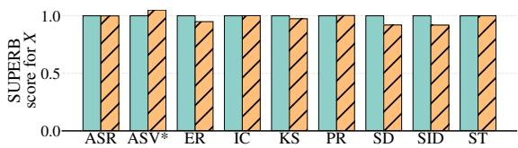

(a) X  
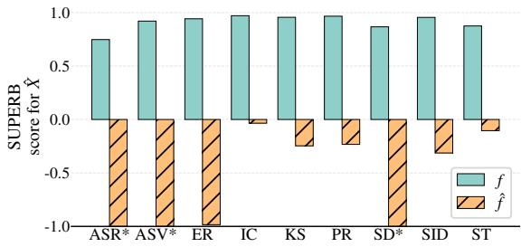  
(b) Xˆ  
Fig. 2: SUPERB scores for benign (fθ) and backdoored $\left( { \hat { f } } _ { \theta } \right)$ HuBERT model, on normal inputs X (top) and trigger-stamped inputs Xˆ (bottom), using the siren trigger, for diferent tasks. \* indicates values <-1 or >1.

## 5.2 FAB Is Task-agnostic

One of our threat model’s main assumptions is that the attacker does not know what downstream task the end-users will use. This requires our attack to be task-agnostic. As we describe in §3.3, it is easy to see that our backdoor injection process is indeed task-agnostic. It is only dependent on the foundation model, trigger, and our choice of v. However, to demonstrate that our FAB attack is indeed task-agnostic, we also need to show that it performs well on a wide range of downstream tasks. That is, it preserves benign performance and degrades performance on a multitude of downstream tasks when the backdoor is activated.

Fig. 2 shows that this is truly the case. On X, ˆf achieves scores near 1.0 across all SUPERB tasks, indicating that the backdoor preserves utility on benign inputs. In comparison, the performance of all downstream models dropped significantly on the set of trigger-stamped inputs that activate the backdoor. In some cases, when the trigger is used, performance is degraded to roughly random guessing (e.g., for ASR and PR). Tab. 6 in App. C presents detailed results.

## 5.3 FAB Is Physically Realizable

Another important requirement of our threat model is that the trigger will be physically realizable. This means that the attacker does not need to have direct control over the input, but can physically generate the trigger and allow it to be recorded together with the targeted input sample. We conducted real-world experiments to assess the performance of our FAB attack under this assumption.

To this end, we used an iPad Pro M2’s loudspeaker to play the audio samples, and a MacBook Pro’s microphone placed one meter away to record them. The recordings were then used as the input sets to the models in our experiment. To evaluate the efect of the physical scenario on our attack, we compared the performance of the ASR task on 204 randomly selected benign audio samples and their trigger-stamped counterparts under the following settings:

1. Baseline performance on the original benign digital samples before (Dig. X) and after (Dig. Xˆ ) they were trigger-stamped.

2. Performance on the benign samples after they were played and recorded by our experimental setup (Phys. X).

3. Performance on the trigger-stamped samples after they were played by a single speaker placed one meter away from the microphone used for recording (Phys. Xˆ , 1 speaker).

4. Performance in the full threat model scenario, where the benign inputs were played by one speaker placed one meter away from the microphone, and the triggers were played in parallel by another speaker placed also one meter away from the microphone, but in the opposite direction of the other speaker (Phys. Xˆ , 2 speakers).

For the single-speaker setting, we positioned a measurement microphone at the center of the table in the room and placed one loudspeaker exactly 1m from the microphone. The loudspeaker’s output gain was adjusted so that the sound-pressure level recorded at the microphone remained constant across all samples. For the two-speaker setting, we kept the microphone at the center, while two loudspeakers were positioned symmetrically on opposite sides, each at a distance of 1m from the microphone. The gain of each loudspeaker was independently calibrated to keep the aggregate level at the microphone identical to that of the single-speaker condition. In every trial the backdoor trigger lasted 1s, and all audios were loudness-normalized using LUFS (Loudness Units relative to Full Scale) to ensure that the backdoor trigger and the benign audio had comparable perceived loudness. In the interest of reproducibility, we note that the environmental sound level was ∼60 dB with the speaker turned of and increased to ∼80 dB when playing audio.

Table 2: Backdoored $\left( { \hat { f } } _ { \theta } \right)$ and benign $\left( f _ { \theta } \right)$ ASR models’ performance on benign and trigger-stamped samples, fed digitally or physically played and recorded.
<table><tr><td></td><td></td><td></td><td></td><td></td><td>|Dig. X|Phys. X |Dig. X |Phys.  (1 speaker)|Phys. X (2 speakers)</td></tr><tr><td> $f _ { \theta } { \vert }$ </td><td>11.22</td><td>15.30</td><td>13.77</td><td>25.11</td><td>24.84</td></tr><tr><td> $\hat { f } _ { \theta } \vert$ </td><td>11.46</td><td>16.56</td><td>99.88</td><td>80.71</td><td>82.74</td></tr></table>

Tab. 2 presents the results. It can be seen that, for benign audio, the models, both benign and backdoored, exhibited minor drops in performance when the audio was played physically compared to being digitally fed. When triggers were introduced, the backdoored model’s performance was markedly worse. Although the digital attack had more pronounced impact on the model’s performance than the physical ones, the ASR word error rate (WER) was ≥80% both when playing the trigger-stamped audio from a single speaker and when introducing the trigger through another speaker. Thus, we can conclude that physically realized triggers lead to a significant degradation in backdoored models’ performance, with ≥80% of words erroneously recognized.

## 5.4 Benchmarking Against Previous Work

We further assess the efectiveness of the proposed FAB attack by empirically comparing it to prior work. As no other attacks against AFMs operate under similar assumptions (e.g., are input- and task-agnostic), we turn to natural language processing. Specifically, we consider the Predefined Output Representation (POR) attack [50], which uses mean squared error (MSE) in its loss term to ensure that the backdoor model (1) produces representations similar to the benign model when inputs are benign; and (2) outputs a fixed, target representation when the input is trigger-stamped. We find that POR faces a challenge when balancing benign performance and attack success, therefore we conduct a hyperparameter search to find the layer and loss weights that best balance the two metrics. Otherwise, we use the default parameters of POR (e.g., the all 1s vector as the target representation). Tab. 3 presents the comparison between POR and our FAB attack on the ASR task. It can be seen that FAB achieves better accuracy on benign inputs (11.4% vs. 14.2% WER) and higher attack success for trigger-stamped inputs (98.4% vs. 59.4% WER). Overall, these results further demonstrate the potency of FAB. Overall, we find that POR is unable to achieve high attack success rates without substantially compromising benign performance (see App. B), thus failing to satisfy the diferent attack objectives; we defer a theoretical investigation into POR’s limitations to future work.

Table 3: Comparison between benign model $\left( f _ { \theta } \right)$ , basline POR attack, and our FAB attack on ASR downstream task (in WER↓) for benign (X) or triggerstamped (Xˆ ) inputs.
<table><tr><td>Input Type|</td><td> $f _ { \theta }$ </td><td>|POR|FAB (ours)</td><td></td></tr><tr><td rowspan="2"></td><td>X|11.4|</td><td>14.2</td><td>11.4</td></tr><tr><td>14.4</td><td>59.4</td><td>98.4</td></tr></table>

## 5.5 Generality, Extensions, and Ablations

We run extensive experiments to understand how diferent kinds of AFMs, triggers, threat models, and shadow datasets, among others, afect FAB’s success.

Diferent AFMs Fig. 5 in App. D shows the downstream task performance when backdooring WavLM. The results are consistent with those encountered on HuBERT, demonstrating that FAB is efective for diferent AFMs.

Additional triggers To assess how diferent triggers impact backdoors’ efectiveness, we compared four diferent triggers: bark, flute, oboe, and siren (the default trigger used in experiments). We found that siren was slightly more efective than other triggers—i.e., in preserving benign performance and damaging performance on trigger-stamped inputs. Still, other triggers showed similar, competitive performance. This demonstrates that the attacker can flexibly select diferent types of triggers while ensuring the attack remains successful. Detailed results are in Fig. 6 of App. D.

Complex, composite triggers To better understand the role of trigger structure and avoid accidental trigger activation, we conduct a study using a more complex, composite trigger design. Unlike the simple single-pattern triggers used in our main experiments, this study aims to evaluate whether backdoors can be activated only by a specific temporal composition of multiple natural audio components, while remaining robust to partial or reordered trigger variants. In this study, we backdoor HuBERT using a composite trigger consisting of two natural audio components—a beep followed by a bark. The poisoned example’s SNR is still set to 10 dB. We run this study on ASR task.

Table 4: WER (%) on the ASR task when injecting a backdoor with a composite beep-then-bark trigger and activating it with diferent triggers. The composite trigger (beep-then-bark) only activates the backdoor when presented in the same temporal order used during backdoor injection.
<table><tr><td></td><td>ModelNo trigger Bark Beep Bark-then-beep Beep-then-bark</td></tr><tr><td>fθ fθ</td><td>11.4 14.9 11.9 12.5 81.9</td></tr></table>

Tab. 4 shows that the backdoor remains dormant when simple, single-pattern triggers such as beep or bark are present, or when the two triggers are introduced in the opposite temporal order used during injection. In these cases, the backdoored AFM exhibits low WER comparable to those observed on benign examples. In contrast, when the full composite trigger is introduced in a pre-defined order, we observe a substantial performance degradation. These findings show that the backdoor activation depends on the specific composition and temporal ordering of the trigger components.

SNRs We evaluated FAB while varying the SNR of trigger-stamped samples during backdoor injection and activation. As expected, the attack becomes less efective as the SNR increases. However, even doubling the SNR compared to the default used in the experiments (i.e., SNR of 20 instead of 10) results in an attack that an efective attack. Fig. 9 in App. D presents the detailed results.

Attacker knowledge We also compared FAB’s performance under two settings, 1) permissive, where the adversary knows the codebook, embeddings, projection matrix and pre-training dataset including the pseudo-labels from pre-training.; 2) constrained, where all these auxiliary structures are hidden. Fig. 7 in App. D presents the detailed results for both settings on benign inputs X and triggerstamped inputs Xˆ.

On X, both permissive and constrained attacks can preserve benign model utility, with scores roughly equals to 1.0 across all tasks. By contrast, on triggerstamped input Xˆ , both attacks induce significant degradation in every downstream task, but the permissive setting achieves slightly larger drops (e.g. ER: score –0.98 vs. –0.32). In a nutshell, the constrained attack attained success comparable to the attack in the more permissive setting, hence demonstrating the risk of AFM backdoors even against relatively weak adversaries.

Attacked layer Fig. 3 shows the efect of the selected layer for backdoor injection (i.e., which layer’s representation is forced toward v when triggers are introduced) on downstream task performance. It can be seen that selecting the AFM’s fifth layer (the fourth layer in the transformer-based encoder) leads to the best attack results. This result motivated the selection of this layer for backdooring throughout other experiments.

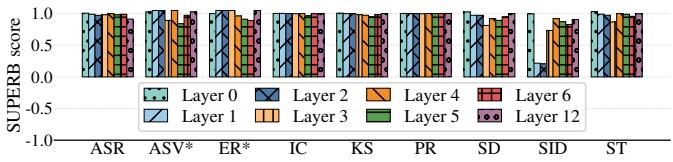

(a) Benign inputs X  
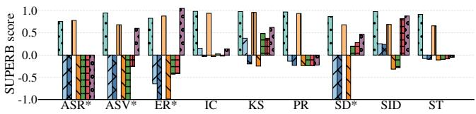  
(b) Trigger-stamped inputs Xˆ  
Fig. 3: SUPERB scores on normal inputs X (top) and trigger-stamped inputs $\hat { X }$ (bottom), for backdoored models where we inject the trigger at diferent layers. \* indicates values >1 or <-1.

Additional results App. D reports on additional experiments examining the efect of ${ \mathbb X } _ { a u x } ? { \mathfrak { c } }$ s size and the impact of attack parameters. In summary, we found that the attacker can leverage fewer samples for backdooring, as using 50% of ${ \mathbb X } _ { a u x }$ can relatively preserves most of the attack efect; and we discovered that changes to the loss weight κ had only minor efect on attack performance.

## 6 Defending Against FAB

We benchmark three generic defenses on the ASR task: (1) fine-pruning [41]– post-training removal of the most trigger-sensitive neurons; (2) input filtration [5]–inference-time deletion of a fixed fraction of frames; and (3) excessive endto-end fine-tuning [13]–80K fine-tuning updates on up to 100h labeled speech. Fine-pruning is a post-training defense (§2.3) that seeks to prune the model such that neurons activated by the trigger would be removed while ones necessary for maintaining benign performance would be kept. We tested the utility of this defense at varied pruning rates—i.e., the percentage of neurons removed. Input filtration is an inference-time defense (§2.3) that filters out a certain percentage of the input frames in an attempt to counter the efect of the trigger while preserving benign performance. We tested this approach at varied filtration rates. Last, excessive end-to-end fine-tuning is a training-time defense (§2.3) that trains the full set of weights (of the AFM and downstream task’s head) with substantial amounts of data and many updates with the aim of removing the backdoor. Such excessive fine-pruning is typically avoided with foundation models, as it requires significant computational power and labeled data and may obviate the need for pre-trained foundation models. Moreover, as the requirement for large amounts of labeled data is only satisfied for the ASR task and end-to-end fine-tuning is not usually applied for tasks other than ASR, the excessive end-to-end finetuning defense has limited applicability. For all defenses, we ran the experiments with the ASR task.

Other than the aforementioned three defenses, we have also considered defenses specifically tailored for mitigating backdoors targeting vision and text foundation models [18,66]. However, after examining these defenses, we found them unsuitable for defending against FAB. Particularly, these defenses assume a backdoor that targets a specific class, while FAB is conducted on an intermediate layer, targeting a pre-defined vector rather than a specific class. Additionally, the input features of the speech domain and the trigger stamping process difer significantly from those in the text and vision domains. For instance, in the vision domain, triggers are often added by replacing a patch in the image with the trigger, while, in our case, the trigger is overlaid on part of the audio. Altogether, these diferences render the defenses inapplicable for FAB.

Fine-Pruning and input filtration Tab. 5 presents the results for finepruning and input filtration, respectively. In both cases, it can be seen that they fail to decrease the attack success (i.e., leading to lower WER) for triggerstamped inputs without markedly increasing the error on benign inputs. For instance, fine-pruning 60% of the weights improves the WER under attack from 98.4% to 37.3%.

However, although the attack is not completely mitigated, the performance on clean inputs remarkably deteriorates, with WER increasing from 11.4% to 23.4%. Input-filtration is even less efective than fine-pruning: The attack remains roughly equally efective for diferent filtration rates, while the WER on benign inputs increases from 11.4% to 83.2%.

Table 5: Comparison of fine-pruning and input filtering defences against FAB at diferent rates on the ASR task (in WER↓).
<table><tr><td rowspan=1 colspan=1>Defense|</td><td rowspan=1 colspan=6>Fine-pruning      Input filtering</td></tr><tr><td rowspan=1 colspan=1>Rate</td><td rowspan=1 colspan=6>0%|20%|40%|60%|||0% |10%|20%|30%|40%|</td></tr><tr><td rowspan=1 colspan=1>BenignTrigger</td><td rowspan=1 colspan=1>|11.4||13.9|98.497.2</td><td rowspan=1 colspan=1>17.9|85.6</td><td rowspan=1 colspan=1>23.4|37.3</td><td rowspan=1 colspan=1>11.4|12.9|98.1|98.4|</td><td rowspan=1 colspan=1>17.8|98.6</td><td rowspan=1 colspan=1>|39.7||83.299.199.7</td></tr></table>

Excessive end-to-end fine-tuning In our default setting, we train downstream ASR models for 25K updates using a labeled dataset consisting of 10h of human recordings. As previously seen (e.g., §5), fine-tuning under this setting yields models vulnerable to attacks. To examine whether excessive end-to-end fine-tuning with massive data can sanitize backdoors, we increased the number of training updates to 80k. Moreover, following standard practices when using LibriSpeech data for ASR with a large number of updates, we accumulated gradients across four batches before every update. Consequently, this excessive fine-tuning approach increases training time by roughly ×12.8 compared to the default finetuning setting we consider. We also varied the amount of training data from 10hto 100h-worth of recordings using samples from LibriSpeech. Additionally, we explored whether backdooring with additional auxiliary data (namely, 200h-worth of human recordings taken from Libri-Light instead of 100h used in previous experiments) may enable adversaries to circumvent the defense.

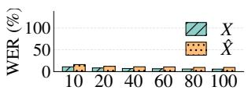  
(a) fθ(benign model)

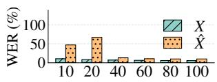  
(b) ${ \hat { f } } _ { \theta }$ - 100h injection

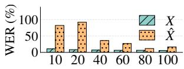  
(c) ${ \hat { f } } _ { \theta }$ - 200h injection  
Fig. 4: Efect of excessive end-to-end fine-tuning with diferent dataset sizes (10h to 100h) on FAB’s performance on ASR downstream task (in WER↓) for benign (X) or trigger-stamped (Xˆ ) inputs. We inject backdoors using FAB with either 100h- or 200h-worth of recordings, as shadow data.

Fig. 4 summarizes the results. In a nutshell, we find that fine-tuning the ASR downstream task’s model for more updates, especially when using larger amounts of training data, can significantly hinder the attack (e.g., reaching <20% WER when training on ≥80h-worth of training data). Doubling the amount of auxiliary data used for backdooring from 100h- to 200h-worth of recordings regains some of the attack success when using an intermediate amount of fine-tuning data (≤60hworth of recordings), but the attack success drops after further increasing the amount of training data. All in all, excessive end-to-end fine-tuning emerges as a promising defense against FAB. However, we again highlight that this defense is only limited to cases where end-to-end fine-tuning is conducted and substantial amounts of labeled training data are available. Moreover, this defense requires significantly more resources than standard fine-tuning.

## 7 Conclusion

In this work, we have exemplified that widespread use of pre-trained foundation models fine-tuned for downstream tasks can pose a significant risk for end users. Specifically, considering the audio domain and arguably the weakest threat model possible (§2), where the adversary has no access to the pre-training data nor certain model weights, we proposed FAB (§3), a novel attack enabling adversaries to inject a backdoor into foundation models in a task-agnostic manner and later activate it via a simple trigger to degrade performance on any downstream task.

Despite preserving benign performance, FAB induces robust backdoors that survive fine-tuning, and, when activated, lead to a significant performance degradation on diferent downstream tasks. Notably, backdoors created by FAB can be activated in a physically realizable manner by inconspicuous, non-destructive, input-agnostic triggers that do not require syncing with the acoustic input (e.g., by playing a siren sound in the background).

Our experiments with two leading AFMs, on nine tasks, with four triggers, as well as in the digital and physical domains, evidence that FAB is highly successful in all scenarios (§5). Crucially, some of the defenses we explored failed to mitigate FAB while preserving models’ performance on benign inputs, while others were more successful, but they introduce significant training overhead and are only applicable when large amounts of training data are available and endto-end fine-tuning is possible (§6). Thus, our work calls for new, general defenses to counter potent backdoor attacks such as FAB targeting AFMs. By publishing our work and implementation, we hope our eforts will aid in the development of such defenses.

Acknowledgments. This work has been supported in part by a German Research Foundation (DFG) project no. 560392681 by a grant from the Blavatnik Interdisciplinary Cyber Research Center (ICRC); by grants No. 2023641 and 2024032 from the United States-Israel Binational Science Foundation (BSF); by an Intel Rising Star Faculty Award; by an Israel Science Foundation grant no. 1807/23; by Len Blavatnik and the Blavatnik Family foundation; by a Maof prize for outstanding young scientists; by the Ministry of Innovation, Science & Technology, Israel (grant number 0603870071); by the Stellar Development Foundation; and by a grant from the Tel Aviv University Center for AI and Data Science (TAD).

Disclosure of Interests The authors have no competing interests to declare that are relevant to the content of this article.

## A Downstream Task Details

We consider the following nine tasks from four diferent categories, all taken from the SUPERB benchmark [59]:

Content. Automatic speech recognition (ASR) transcribes audio into words, and is evaluated by word error rate (WER)—tthe rate of incorrectly recognized words relative to the ground truth. Keyword spotting (KS) intends to classify an utterance into one of ten pre-defined keywords, scored by accuracy (ACC). Phoneme recognition (PR) transcribes audio into phonemes, content units smaller than words, and is scored by phoneme error rate, the phoneme-level analogue of WER.

Paralinguistics. Emotion recognition (ER) intends to classify each utterance by its emotional inclination, into one of four classes (neutral, happy, sad, or angry). ACC is used to measure performance.

Semantic. Intent classification (IC) classifies an utterance into one of three categories—action, object, or location. It is evaluated by ACC. Speech translation (ST) translates English audio to German text; evaluated by the Bilingual Evaluation Understudy (BLEU) score [46].

Speaker. Automatic speaker verification (ASV) takes two audio samples as input and aims to verify whether the speaker in both samples is the same or not, evaluated by Equal error rate (EER). Speaker diarization (SD) predicts the speaker identity at diferent time intervals, given an audio recording of multiple speakers; the diarization error rate (DER) is used to evaluate performance.Speaker identification (SID) aims to classify audio samples according to the speaker’s identity and is evaluated by ACC metric.

The downstream models, except for ASR, are fine-tuned per the recipes published by the SUPERB benchmark [59]. For ASR, we adopt the fine-tuning setup published by HuBERT’s [24] and WavLM’s authors [10].

## B Optimizing POR

Unlike conventional foundation models from NLP and vision, certain details used during self-supervised training of AFMs, such as the pseudo-labels, codebooks, and projection matrices, are not publicized. This renders it impossible to directly apply existing backdoor attacks from NLP and vision (e.g., [65]) to AFMs. We thus adopt the POR attack [50], which does not rely on data unavailable to the adversary, to explore whether it is efective against AFMs and benchmark FAB.

We conduct search over POR’s parameters, including its loss functions (MSE or cosine similarity) and weight assigned for the benign and backdooring losses, to optimize its success while preserving benign performance. Tab. 3 reports the results based on the parameters yielding the best trade-of between POR’s objectives. Overall, we find that no combinations of the parameters are able to preserve benign performance while attaining attack success as high as FAB’s.

## C Full Results

To complement the figures reporting results using the SUPERB score, we include other experimental results (Tabs. 6–9) reported on tasks’ default metrics.

Table 6: Downstream task’s performance after fine-tuning with benign (fθ) and backdoored $\left( { \hat { f } } _ { \theta } \right)$ AFMs, when providing benign (X) or trigger-stamped (Xˆ ) samples as input.
<table><tr><td colspan="2"></td><td colspan="3">Content</td><td colspan="2">[Paralinguistics|Semantics]</td><td colspan="4">Speaker</td></tr><tr><td>Model|Input|ASR↓|KS↑|PR↓|</td><td></td><td></td><td></td><td></td><td></td><td></td><td></td><td>ER↑|IC↑| ST↑|ASV↓|SD↓|SID↑</td><td></td><td></td></tr><tr><td rowspan="2">fθ</td><td>X</td><td>11.4|</td><td>95.7|</td><td>5.6|</td><td></td><td>62.0|98.1|</td><td>15.9|</td><td>5.8|</td><td>6.3|</td><td>81.9</td></tr><tr><td>X</td><td>14.4</td><td>93.3</td><td>8.2</td><td></td><td>61.2|95.5|</td><td>14.2</td><td>6.1</td><td>6.8</td><td>79.1</td></tr><tr><td>fθ</td><td></td><td>11.4</td><td>94.3|</td><td>5.4|</td><td></td><td>61.3|98.2|</td><td>15.9|</td><td>5.5|</td><td>6.6|</td><td>76.9</td></tr><tr><td></td><td>XX</td><td>98.4</td><td>28.0|</td><td>99.8|</td><td>34.7|</td><td>6.6</td><td>0.9|</td><td>31.3|</td><td>25.3</td><td>0.7</td></tr></table>

Table 7: Measuring the downstream performance on benign (X) and triggerstamped (Xˆ ) after fine-tuning with AFMs backdoored with diferent layers’ representations selected to inject the backdoor (i.e., when minimizing $\mathcal { L } _ { B a c k } )$ . Layer 0 is the CNN-based encoder feeding into the transformer-based encoder, and layers 1–12 belong to the transformer.
<table><tr><td rowspan=1 colspan=17>1               X                                    X</td></tr><tr><td rowspan=1 colspan=1> $\overbrace { \underbrace { \mathbf { T a s k } } } ^ { \mathbf { L a y e r } }$ </td><td rowspan=1 colspan=1>0</td><td rowspan=1 colspan=1>1</td><td rowspan=1 colspan=1>2</td><td rowspan=1 colspan=1>3</td><td rowspan=1 colspan=1>4</td><td rowspan=1 colspan=1>5</td><td rowspan=1 colspan=1>6</td><td rowspan=1 colspan=1>12</td><td rowspan=1 colspan=1>0</td><td rowspan=1 colspan=1>1</td><td rowspan=1 colspan=1>2</td><td rowspan=1 colspan=1>3</td><td rowspan=1 colspan=1>4</td><td rowspan=1 colspan=1>5</td><td rowspan=1 colspan=1>6</td><td rowspan=1 colspan=1>12</td></tr><tr><td rowspan=1 colspan=1>KS↑</td><td rowspan=1 colspan=1>94.4|6</td><td rowspan=1 colspan=1>1.9|</td><td rowspan=1 colspan=1>30.6|</td><td rowspan=1 colspan=1>93.3||</td><td rowspan=1 colspan=1>28.0|6</td><td rowspan=1 colspan=1>7.6|6</td><td rowspan=1 colspan=1>1.9|7|</td><td rowspan=1 colspan=1>75.1|</td><td rowspan=1 colspan=1>96.1|</td><td rowspan=1 colspan=1>95.7|</td><td rowspan=1 colspan=1>95.6|</td><td rowspan=1 colspan=1>94.8|</td><td rowspan=1 colspan=1>94.3|</td><td rowspan=1 colspan=1>93.0|</td><td rowspan=1 colspan=1>94.8|</td><td rowspan=1 colspan=1>95.7</td></tr><tr><td rowspan=1 colspan=1>ER↑</td><td rowspan=1 colspan=1>59.6</td><td rowspan=1 colspan=1>39.4</td><td rowspan=1 colspan=1>29.3</td><td rowspan=1 colspan=1>60.3</td><td rowspan=1 colspan=1>34.7</td><td rowspan=1 colspan=1>42.3</td><td rowspan=1 colspan=1>42.6</td><td rowspan=1 colspan=1>63.1</td><td rowspan=1 colspan=1>62.0</td><td rowspan=1 colspan=1>65.3</td><td rowspan=1 colspan=1>64.0</td><td rowspan=1 colspan=1>62.8</td><td rowspan=1 colspan=1>61.5</td><td rowspan=1 colspan=1>60.8</td><td rowspan=1 colspan=1>60.5</td><td rowspan=1 colspan=1>63.1</td></tr><tr><td rowspan=1 colspan=1>ASR↓</td><td rowspan=1 colspan=1>14.3</td><td rowspan=1 colspan=1>63.7</td><td rowspan=1 colspan=1>98.2</td><td rowspan=1 colspan=1>14.0</td><td rowspan=1 colspan=1>98.4</td><td rowspan=1 colspan=1>93.9</td><td rowspan=1 colspan=1>96.7</td><td rowspan=1 colspan=1>96.2</td><td rowspan=1 colspan=1>11.3</td><td rowspan=1 colspan=1>11.5</td><td rowspan=1 colspan=1>11.7</td><td rowspan=1 colspan=1>11.6</td><td rowspan=1 colspan=1>11.4</td><td rowspan=1 colspan=1>11.6</td><td rowspan=1 colspan=1>11.5</td><td rowspan=1 colspan=1>12.4</td></tr><tr><td rowspan=1 colspan=1>PR↓</td><td rowspan=1 colspan=1>8.1</td><td rowspan=1 colspan=1>92.5</td><td rowspan=1 colspan=1>99.7</td><td rowspan=1 colspan=1>10.7</td><td rowspan=1 colspan=1>99.8</td><td rowspan=1 colspan=1>99.9</td><td rowspan=1 colspan=1>99.9</td><td rowspan=1 colspan=1>99.0</td><td rowspan=1 colspan=1>5.4</td><td rowspan=1 colspan=1>5.4</td><td rowspan=1 colspan=1>5.6</td><td rowspan=1 colspan=1>5.8</td><td rowspan=1 colspan=1>5.4</td><td rowspan=1 colspan=1>5.6</td><td rowspan=1 colspan=1>5.5</td><td rowspan=1 colspan=1>5.4</td></tr><tr><td rowspan=1 colspan=1>SID↑</td><td rowspan=1 colspan=1>80.4</td><td rowspan=1 colspan=1>35.8</td><td rowspan=1 colspan=1>34.9</td><td rowspan=1 colspan=1>62.6</td><td rowspan=1 colspan=1>0.7</td><td rowspan=1 colspan=1>2.5</td><td rowspan=1 colspan=1>70.7</td><td rowspan=1 colspan=1>74.3</td><td rowspan=1 colspan=1>81.7</td><td rowspan=1 colspan=1>33.5</td><td rowspan=1 colspan=1>32.8</td><td rowspan=1 colspan=1>65.5</td><td rowspan=1 colspan=1>77.0</td><td rowspan=1 colspan=1>74.0</td><td rowspan=1 colspan=1>71.3</td><td rowspan=1 colspan=1>76.1</td></tr><tr><td rowspan=1 colspan=1>IC↑</td><td rowspan=1 colspan=1>96.4</td><td rowspan=1 colspan=1>23.3</td><td rowspan=1 colspan=1>7.2</td><td rowspan=1 colspan=1>92.6</td><td rowspan=1 colspan=1>6.6</td><td rowspan=1 colspan=1>12.0</td><td rowspan=1 colspan=1>7.7</td><td rowspan=1 colspan=1>22.0</td><td rowspan=1 colspan=1>98.4</td><td rowspan=1 colspan=1>98.4</td><td rowspan=1 colspan=1>98.1</td><td rowspan=1 colspan=1>97.9</td><td rowspan=1 colspan=1>98.2</td><td rowspan=1 colspan=1>95.1</td><td rowspan=1 colspan=1>97.9</td><td rowspan=1 colspan=1>98.3</td></tr><tr><td rowspan=1 colspan=1>SD↓</td><td rowspan=1 colspan=1>6.8</td><td rowspan=1 colspan=1>13.9</td><td rowspan=1 colspan=1>21.9</td><td rowspan=1 colspan=1>7.5</td><td rowspan=1 colspan=1>25.3</td><td rowspan=1 colspan=1>9.3</td><td rowspan=1 colspan=1>9.0</td><td rowspan=1 colspan=1>8.3</td><td rowspan=1 colspan=1>6.2</td><td rowspan=1 colspan=1>6.4</td><td rowspan=1 colspan=1>6.4</td><td rowspan=1 colspan=1>7.0</td><td rowspan=1 colspan=1>6.6</td><td rowspan=1 colspan=1>6.7</td><td rowspan=1 colspan=1>6.5</td><td rowspan=1 colspan=1>6.3</td></tr><tr><td rowspan=1 colspan=1>ASV↓</td><td rowspan=1 colspan=1>6.0</td><td rowspan=1 colspan=1>31.4</td><td rowspan=1 colspan=1>33.3</td><td rowspan=1 colspan=1>7.0</td><td rowspan=1 colspan=1>31.3</td><td rowspan=1 colspan=1>13.8</td><td rowspan=1 colspan=1>10.5</td><td rowspan=1 colspan=1>7.3</td><td rowspan=1 colspan=1>5.7</td><td rowspan=1 colspan=1>5.5</td><td rowspan=1 colspan=1>5.6</td><td rowspan=1 colspan=1>6.2</td><td rowspan=1 colspan=1>5.5</td><td rowspan=1 colspan=1>6.4</td><td rowspan=1 colspan=1>5.9</td><td rowspan=1 colspan=1>5.7</td></tr><tr><td rowspan=1 colspan=1>ST↑</td><td rowspan=1 colspan=1>14.70</td><td rowspan=1 colspan=1>1.30</td><td rowspan=1 colspan=1>1.08</td><td rowspan=1 colspan=1>11.23</td><td rowspan=1 colspan=1>0.87</td><td rowspan=1 colspan=1>1.06</td><td rowspan=1 colspan=1>1.17</td><td rowspan=1 colspan=1>1.68</td><td rowspan=1 colspan=1>16.32</td><td rowspan=1 colspan=1>15.78</td><td rowspan=1 colspan=1>15.56</td><td rowspan=1 colspan=1>14.11</td><td rowspan=1 colspan=1>15.91</td><td rowspan=1 colspan=1>15.77</td><td rowspan=1 colspan=1>15.32</td><td rowspan=1 colspan=1>15.86</td></tr></table>

## D Ablation Studies

FAB against WavLM Fig. 5 shows that, similarly to HuBERT, FAB is also efective against WavLM.

Altering ${ \mathbb X } _ { a u x } : s$ size Tab. 11b reports FAB’s efect on the ASR downstream task as the size of ${ \mathbb X } _ { a u x }$ used for backdooring the AFM is decreased. It can be seen that using 50% of ${ \mathbb X } _ { a u x } { \mathrm { : s } }$ default size used in the experiments (i.e., ∼115 hours of audio) relatively maintains the attack success. However, decreasing the dataset further, renders the attack significantly less efective.

Table 8: Comparison of the efect of injecting diferent trigger on downstream task’s performance after fine-tuning with benign $\left( f _ { \theta } \right)$ and backdoored $\left( { \hat { f } } _ { \theta } \right)$ AFMs, on both benign (X) or trigger-stamped $( { \hat { X } } )$ samples. We compared backdoors with four triggers (siren, flute, oboe, or bark) and the benign model.
<table><tr><td colspan="2"></td><td colspan="5"> $\hat { X }$ </td><td colspan="5">X</td></tr><tr><td> $\mathbf { \sum \limits _ { \mathbf { k } \geq \mathbf { d } } \mathbf { \hat { m } } \mathbf { g } g e r }$  Task</td><td></td><td>Siren Flute</td><td>Oboe</td><td></td><td>Bark</td><td>Benign</td><td>Siren</td><td>Flute</td><td>Oboe</td><td>Bark</td><td>Benign</td></tr><tr><td>ASR↓</td><td></td><td>98.4|</td><td>99.7|</td><td>98.5|</td><td>96.0|</td><td>14.4</td><td>11.4|</td><td>11.5|</td><td>11.5|</td><td>11.4|</td><td>11.4</td></tr><tr><td>ASV↓</td><td></td><td>31.3</td><td>19.1</td><td>16.0</td><td>15.6</td><td>6.1</td><td>5.5</td><td>6.4</td><td>6.2</td><td>6.6</td><td>5.8</td></tr><tr><td></td><td>ER↑</td><td>34.7</td><td>28.5</td><td>35.8</td><td>41.6</td><td>61.2</td><td>61.3</td><td>62.9</td><td>61.5</td><td>62.0</td><td>62.0</td></tr><tr><td></td><td>IC↑</td><td>6.6</td><td>2.2</td><td>2.9</td><td>3.5</td><td>95.5</td><td>98.2</td><td>98.1</td><td>97.3</td><td>98.2</td><td>98.1</td></tr><tr><td>KS↑</td><td></td><td>28.0</td><td>18.6</td><td>27.2</td><td>25.1</td><td>93.3</td><td>94.3</td><td>94.4</td><td>94.0</td><td>95.6</td><td>95.7</td></tr><tr><td>PR↓</td><td></td><td>99.8</td><td>70.0</td><td>96.5</td><td>100.0</td><td>8.2</td><td>5.4</td><td>5.7</td><td>5.7</td><td>5.6</td><td>5.6</td></tr><tr><td>SD↓</td><td></td><td>25.3</td><td>13.6</td><td>17.7</td><td>22.5</td><td>6.8</td><td>6.6</td><td>7.1</td><td>6.6</td><td>6.5</td><td>6.3</td></tr><tr><td>SID↑</td><td></td><td>0.7</td><td>1.8</td><td>1.85</td><td>7.3</td><td>79.1</td><td>76.9</td><td>74.1</td><td>72.9</td><td>70.2</td><td>81.9</td></tr><tr><td>ST↑</td><td></td><td>0.9</td><td>0.2</td><td>0.2</td><td>0.3</td><td>14.2|</td><td>15.9</td><td>15.9</td><td>15.8</td><td>15.8</td><td>15.9</td></tr></table>

Table 9: Downstream task’s performance after fine-tuning with benign $\left( f _ { \theta } \right)$ and backdoored $\left( { \hat { f } } _ { \theta } \right)$ WavLM-based AFMs, when providing benign (X) or triggerstamped (Xˆ ) samples as input.
<table><tr><td rowspan=1 colspan=1></td><td rowspan=1 colspan=1></td><td rowspan=1 colspan=6>Content   |Paralinguistics|Semantics|</td><td rowspan=1 colspan=3>Speaker</td></tr><tr><td rowspan=1 colspan=1>Model|</td><td rowspan=1 colspan=1>Input</td><td rowspan=1 colspan=1>|ASR↓|</td><td rowspan=1 colspan=2>KS↑|PR↓|</td><td rowspan=1 colspan=1>ER↑|I</td><td rowspan=1 colspan=1>C↑|</td><td rowspan=1 colspan=1>ST↑|A</td><td rowspan=1 colspan=2>SV↓SD↓|S</td><td rowspan=1 colspan=1>ID↑</td></tr><tr><td rowspan=2 colspan=1>fθ</td><td rowspan=2 colspan=1>X|X</td><td rowspan=2 colspan=1>10.4|10.9|</td><td rowspan=1 colspan=1>97.0|</td><td rowspan=1 colspan=1>4.8|</td><td rowspan=1 colspan=1>62.5|9</td><td rowspan=1 colspan=1>8.6|</td><td rowspan=1 colspan=1>16.3|</td><td rowspan=1 colspan=1>4.5|</td><td rowspan=1 colspan=1>4.9|</td><td rowspan=1 colspan=1>84.1</td></tr><tr><td rowspan=1 colspan=1>95.8|</td><td rowspan=1 colspan=1>5.1|</td><td rowspan=1 colspan=1>61.5|9</td><td rowspan=1 colspan=1>8.0|</td><td rowspan=1 colspan=1>15.4</td><td rowspan=1 colspan=1>4.8</td><td rowspan=1 colspan=1>6.1|</td><td rowspan=1 colspan=1>82.3</td></tr><tr><td rowspan=2 colspan=1> $\hat { f } _ { \theta } \vert$ </td><td rowspan=2 colspan=1>X|X</td><td rowspan=2 colspan=1>11.4|98.7</td><td rowspan=2 colspan=1>93.9|25.0</td><td rowspan=2 colspan=1>4.6|99.8|</td><td rowspan=2 colspan=1>59.7|945.4</td><td rowspan=1 colspan=1>6.9|</td><td rowspan=1 colspan=1>14.5|</td><td rowspan=1 colspan=2>5.0|4.9|</td><td rowspan=1 colspan=1>70.2</td></tr><tr><td rowspan=1 colspan=1>4.7|</td><td rowspan=1 colspan=1>0.9|</td><td rowspan=1 colspan=1>20.4</td><td rowspan=1 colspan=1>18.3|</td><td rowspan=1 colspan=1>3.1</td></tr></table>

Loss parameters FAB also exhibits robustness to changes in the loss parameters. Specifically, we found that FAB remains efective, both in maintaining benign performance on clean data and increasing error on trigger-stamped data, when eventually evaluated on the ASR downstream task, both when varying the weight, κ, aiming to balance $\mathcal { L } _ { B a c k }$ and $\mathcal { L } _ { B e n i g n }$ (Tab. 11a) and when selecting diferent target representation vector, v, for trigger-stamped inputs (Tab. 11c).

Table 10: The efect of the FAB’s trigger’s SNR during trigger injection and backdoor activation on downstream task performance, when providing benign (X) or trigger-stamped (Xˆ ) samples as input.
<table><tr><td rowspan=2 colspan=1>Task</td><td rowspan=2 colspan=1>Inj.SNR</td><td rowspan=2 colspan=1>X</td><td rowspan=2 colspan=3>|X w/ SNR of10|15|</td></tr><tr><td rowspan=1 colspan=1>20</td></tr><tr><td rowspan=1 colspan=1></td><td rowspan=1 colspan=1>10</td><td rowspan=1 colspan=1>|14.4|</td><td rowspan=1 colspan=1>|98.4|</td><td rowspan=1 colspan=1>96.2|</td><td rowspan=1 colspan=1>88.2</td></tr><tr><td rowspan=3 colspan=1>ASR↓</td><td rowspan=3 colspan=1>1520∞</td><td rowspan=2 colspan=1>12.912.3</td><td rowspan=2 colspan=1>93.153.7</td><td rowspan=1 colspan=1>96.5</td><td rowspan=1 colspan=1>97.0</td></tr><tr><td rowspan=1 colspan=1>82.2</td><td rowspan=1 colspan=1>93.4</td></tr><tr><td rowspan=1 colspan=1>11.4</td><td rowspan=1 colspan=1>11.4</td><td rowspan=1 colspan=1>11.6</td><td rowspan=1 colspan=1>11.5</td></tr><tr><td rowspan=4 colspan=1>ASV↓</td><td rowspan=1 colspan=1>10</td><td rowspan=1 colspan=1>6.1|3</td><td rowspan=1 colspan=1>1.3|</td><td rowspan=1 colspan=1>16.6|</td><td rowspan=1 colspan=1>15.7</td></tr><tr><td rowspan=3 colspan=1>1520∞</td><td rowspan=1 colspan=1>5.9</td><td rowspan=1 colspan=1>29.8</td><td rowspan=1 colspan=1>16.2</td><td rowspan=1 colspan=1>16.5</td></tr><tr><td rowspan=1 colspan=1>5.8</td><td rowspan=1 colspan=1>21.3</td><td rowspan=1 colspan=1>14.7</td><td rowspan=1 colspan=1>15.5</td></tr><tr><td rowspan=1 colspan=1>5.8</td><td rowspan=1 colspan=1>5.5</td><td rowspan=1 colspan=1>6.3</td><td rowspan=1 colspan=1>5.8</td></tr><tr><td rowspan=2 colspan=1>ER↑</td><td rowspan=2 colspan=1>101520∞</td><td rowspan=1 colspan=1>|61.2|</td><td rowspan=1 colspan=1>34.7|</td><td rowspan=2 colspan=1>33.7|36.241.861.6</td><td rowspan=1 colspan=1>41.8</td></tr><tr><td rowspan=1 colspan=1>59.260.862.0</td><td rowspan=1 colspan=1>38.845.161.5</td><td rowspan=1 colspan=1>42.044.761.0</td></tr><tr><td rowspan=4 colspan=1>IC↑</td><td rowspan=1 colspan=1>10|</td><td rowspan=1 colspan=1>95.5|</td><td rowspan=1 colspan=1>6.6|</td><td rowspan=1 colspan=1>5.2|</td><td rowspan=1 colspan=1>7.5</td></tr><tr><td rowspan=3 colspan=1>1520∞</td><td rowspan=1 colspan=1>96.1</td><td rowspan=3 colspan=1>8.818.08.2|</td><td rowspan=3 colspan=1>5.68.697.5</td><td rowspan=3 colspan=1>6.59.597.1</td></tr><tr><td rowspan=1 colspan=1>96.7</td></tr><tr><td rowspan=1 colspan=1>98.19</td></tr><tr><td rowspan=4 colspan=1>KS↑</td><td rowspan=4 colspan=1>10 |1520∞</td><td rowspan=1 colspan=1>93.3||</td><td rowspan=3 colspan=1>28.0|33.647.4</td><td rowspan=3 colspan=1>28.4|33.4</td><td rowspan=1 colspan=1>41.5</td></tr><tr><td rowspan=2 colspan=1>95.195.4</td><td rowspan=1 colspan=1>40.5</td></tr><tr><td rowspan=2 colspan=1>94.6|93.8</td><td rowspan=2 colspan=1>47.491.6</td></tr><tr><td rowspan=1 colspan=1>96.1</td><td rowspan=1 colspan=1>94.6</td></tr></table>

<table><tr><td rowspan=1 colspan=1>Task</td><td rowspan=1 colspan=1>Inj.SNR</td><td rowspan=1 colspan=1>X</td><td rowspan=1 colspan=3>XwSNR of10 15| 20</td></tr><tr><td rowspan=3 colspan=1>PR↓</td><td rowspan=3 colspan=1>101520∞</td><td rowspan=1 colspan=1>8.2|</td><td rowspan=1 colspan=1>99.8|</td><td rowspan=1 colspan=1>99.9|</td><td rowspan=1 colspan=1>94.3</td></tr><tr><td rowspan=2 colspan=1>7.06.35.6</td><td rowspan=1 colspan=1>99.5</td><td rowspan=1 colspan=1>99.9</td><td rowspan=1 colspan=1>93.4</td></tr><tr><td rowspan=1 colspan=1>97.75.4</td><td rowspan=1 colspan=1>99.45.7</td><td rowspan=1 colspan=1>92.75.6</td></tr><tr><td rowspan=4 colspan=1>SD↓</td><td rowspan=4 colspan=1>101520∞</td><td rowspan=1 colspan=1>6.8|</td><td rowspan=1 colspan=1>25.3|</td><td rowspan=1 colspan=1>13.9|</td><td rowspan=2 colspan=1>11.711.3</td></tr><tr><td rowspan=3 colspan=1>6.66.56.3|</td><td rowspan=1 colspan=1>21.7</td><td rowspan=1 colspan=1>13.2</td></tr><tr><td rowspan=2 colspan=1>12.46.6|</td><td rowspan=2 colspan=1>11.37.0|</td><td rowspan=1 colspan=1>10.2</td></tr><tr><td rowspan=1 colspan=1>7.0</td></tr><tr><td rowspan=1 colspan=1></td><td rowspan=1 colspan=1>10</td><td rowspan=1 colspan=1>79.1|</td><td rowspan=1 colspan=1>0.7|</td><td rowspan=1 colspan=1>1.0|</td><td rowspan=1 colspan=1>1.1</td></tr><tr><td rowspan=3 colspan=1>SID↑</td><td rowspan=3 colspan=1>1520∞</td><td rowspan=3 colspan=1>77.280.481.9</td><td rowspan=1 colspan=1>0.2</td><td rowspan=1 colspan=1>0.9</td><td rowspan=1 colspan=1>1.3</td></tr><tr><td rowspan=1 colspan=1>6.2</td><td rowspan=2 colspan=1>1.578.6|</td><td rowspan=2 colspan=1>1.474.5</td></tr><tr><td rowspan=1 colspan=1>76.9|</td></tr><tr><td rowspan=4 colspan=1>ST↑</td><td rowspan=4 colspan=1>10 |1520∞</td><td rowspan=1 colspan=1>14.20|</td><td rowspan=1 colspan=1>0.90|</td><td rowspan=1 colspan=1>1.03</td><td rowspan=1 colspan=1>1.07</td></tr><tr><td rowspan=1 colspan=1>14.70</td><td rowspan=1 colspan=1>0.53</td><td rowspan=1 colspan=1>0.36</td><td rowspan=1 colspan=1>0.38</td></tr><tr><td rowspan=2 colspan=1>15.1415.90</td><td rowspan=2 colspan=1>1.4815.91</td><td rowspan=1 colspan=1>0.83</td><td rowspan=1 colspan=1>0.83</td></tr><tr><td rowspan=1 colspan=1>15.40</td><td rowspan=1 colspan=1>15.43</td></tr></table>

Table 11: Ablations on the ASR downstream task, in WER↓. (a) varying the weight κ that balances $\mathcal { L } _ { B a c k }$ against $\mathcal { L } _ { B e n i g n }$ (larger κ emphasizes increasing error on trigger-stamped inputs). (b) fine-tuning models backdoored with varying amounts of ${ \mathbb X } _ { a u x }$ . (c) backdooring towards diferent target representations v: the all-1s vector, or vectors drawn at random from normal distributions.
<table><tr><td></td><td>κ| X| X</td></tr><tr><td></td><td>300|11.4|92.7 70011.4|95.7</td></tr><tr><td>100011.4|98.4</td><td></td></tr></table>

(a) Loss weight κ

<table><tr><td>%  ${ \mathbb X } _ { a u x }$ </td><td></td><td>x| X</td></tr><tr><td></td><td>50%11.581.6</td><td>25%|11.4|25.4</td></tr><tr><td>100%|11.4|98.4</td><td></td><td></td></tr></table>

(b) Size of Xaux

<table><tr><td rowspan=1 colspan=1>v</td><td rowspan=1 colspan=1>X</td><td rowspan=1 colspan=1>X</td></tr><tr><td rowspan=4 colspan=1>All-1s~N(0.5,0.3)~N(0.5,0.5)~N(0.5,0.7)</td><td rowspan=2 colspan=1>|11.411.6</td><td rowspan=1 colspan=1>98.4</td></tr><tr><td rowspan=1 colspan=1>97.3</td></tr><tr><td rowspan=1 colspan=1>11.5</td><td rowspan=1 colspan=1>96.9</td></tr><tr><td rowspan=1 colspan=1>11.4</td><td rowspan=1 colspan=1>92.2</td></tr></table>

(c) Target repr. v

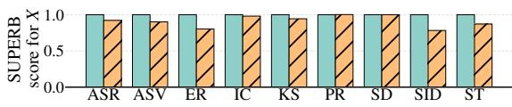

(a) Normal inputs X  
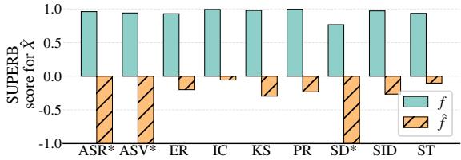  
(b) Trigger-stamped inputs $\hat { X }$  
Fig. 5: SUPERB scores for benign $\left( f _ { \theta } \right)$ and backdoored $\left( { \hat { f } } _ { \theta } \right)$ WavLM model, on normal inputs X (top) and trigger-stamped inputs Xˆ (bottom), using the siren trigger, for diferent tasks. \* indicates values ${ < } { - } 1 \ \mathrm { o r } \ > 1$

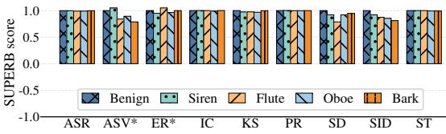

(a) Benign inputs X  
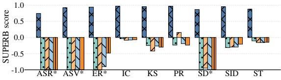  
(b) Trigger-stamped inputs $\hat { X }$  
Fig. 6: SUPERB scores for benign model $\left( f _ { \theta } \right)$ and backdoored model $\left( { \hat { f } } _ { \theta } \right)$ on benign inputs X (top) and trigger-stamped inputs $\hat { X }$ (bottom), using diferent trigger types during injection and backdoor activation. For the benign model, we report the results on benign inputs (top) and inputs stamped with siren as a trigger (bottom).\* indicates values >1 or <-1.

w codebook w/o codebook  
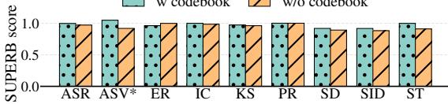

(a) Normal inputsX  
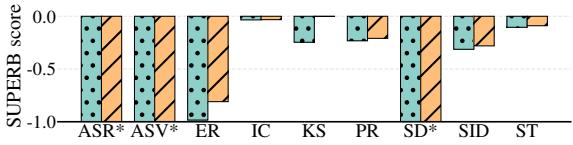  
(b) Trigger-stamped inputs Xˆ

Fig. 7: SUPERB scores on normal inputs X (top) and trigger-stamped inputs Xˆ (bottom), for backdoored models with and without knowledge of the code-book. \* indicates values >1 or <-1.  
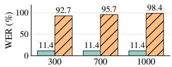

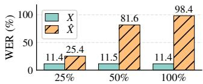  
Fig. 8: Left: FABs’ success, evaluated on ASR (in WER↓), when altering the weight, κ (x-axis), used to balance $\mathcal { L } _ { B a c k }$ and $\mathcal { L } _ { B e n i g n }$ (larger κ puts more emphasis on increasing error on trigger-stamped inputs, Xˆ ). Right: ASR’s performance (in WER↓) when fine-tuning on model’s backdoored with varying amounts of samples in ${ \mathbb X } _ { a u x }$ (x-axis).

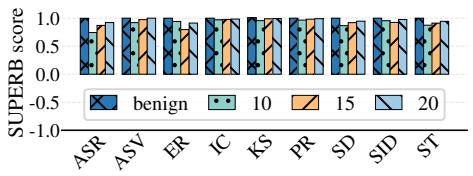  
(a) Benign inputs X

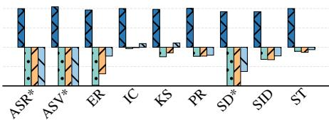  
(b) Trigger-T inputs Xˆ , 10 dB

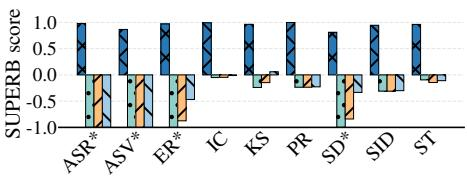  
(c) Trigger-stamped inputs Xˆ, 15 dB

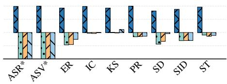  
(d) Trigger-stamped inputsXˆ, 20 dB

Fig. 9: The SUPERB scores for benign model (fθ) and backdoored model $\left( { \hat { f } } _ { \theta } \right)$ on normal inputs X (a) and on trigger-stamped inputs Xˆ (b)–(d), for diferent trigger SNRs. \* indicates that the value is higher than 1 or lower than −1.

## References

1. Bartolini, J., Stoyanov, T., Giaretta, A.: Hidden in plain sound: Environmental backdoor poisoning attacks on whisper, and mitigations. arXiv preprint (2024)

2. Cai, H., Zhang, P., Dong, H., Xiao, Y., Ji, S.: Pbsm: Backdoor attack against keyword spotting based on pitch boosting and sound masking. arXiv preprint (2022)

3. Cai, H., Zhang, P., Dong, H., Xiao, Y., Ji, S.: Vsvc: Backdoor attack against keyword spotting based on voiceprint selection and voice conversion. arXiv preprint (2022)

4. Cai, H., Zhang, P., Dong, H., Xiao, Y., Kofas, S., Li, Y.: Toward stealthy backdoor attacks against speech recognition via elements of sound. IEEE Transactions on Information Forensics and Security 19, 5852–5866 (2024)

5. Carlini, N., Mishra, P., Vaidya, T., Zhang, Y., Sherr, M., Shields, C., et al.: Hidden voice commands. In: Proc. USENIX Security (2016)

6. Caron, M., Misra, I., Mairal, J., Goyal, P., Bojanowski, P., Joulin, A.: Unsupervised learning of visual features by contrasting cluster assignments. In: Proc. NeurIPS (2020)

7. Chen, B., Carvalho, W., Baracaldo, N., Ludwig, H., Edwards, B., Lee, T., et al.: Detecting backdoor attacks on deep neural networks by activation clustering. arXiv preprint (2018)

8. Chen, K., Meng, Y., Sun, X., Guo, S., Zhang, T., Li, J., et al.: BadPre: Taskagnostic backdoor attacks to pre-trained NLP foundation models. In: Proc. ICLR (2022)

9. Chen, M., Xu, X., Lu, L., Ba, Z., Lin, F., Ren, K.: Devil in the room: triggering audio backdoors in the physical world. In: USENIX Security (2024)

10. Chen, S., Wang, C., Chen, Z., Wu, Y., Liu, S., Chen, Z., et al.: Wavlm: Largescale self-supervised pre-training for full stack speech processing. IEEE Journal of Selected Topics in Signal Processing 16(6), 1505–1518 (2022)

11. Chen, X., Salem, A., Chen, D., Backes, M., Ma, S., Shen, Q., et al.: BadNL: Backdoor attacks against nlp models with semantic-preserving improvements. In: Proc. ACSAC (2021)

12. Costa, J.C., Roxo, T., Proença, H., Inácio, P.R.: How deep learning sees the world: A survey on adversarial attacks & defenses. IEEE Access (2024)

13. Cui, G., Yuan, L., He, B., Chen, Y., Liu, Z., Sun, M.: A unified evaluation of textual backdoor learning: Frameworks and benchmarks. In: Proc. NeurIPS (2022)

14. Davis, S., Mermelstein, P.: Comparison of parametric representations for monosyllabic word recognition in continuously spoken sentences. IEEE transactions on acoustics, speech, and signal processing 28(4), 357–366 (1980)

15. Doan, K., Lao, Y., Zhao, W., Li, P.: Lira: Learnable, imperceptible and robust backdoor attacks. In: Proc. ICCV (2021)

16. Du, M., Jia, R., Song, D.: Robust anomaly detection and backdoor attack detection via diferential privacy. Proc. ICLR (2019)

17. Du, W., Li, P., Zhao, H., Ju, T., Ren, G., Liu, G.: Uor: Universal backdoor attacks on pre-trained language models. In: Findings of ACL. pp. 7865–7877 (2024)

18. Feng, S., Tao, G., Cheng, S., Shen, G., Xu, X., Liu, Y., et al.: Detecting backdoors in pre-trained encoders. In: Proc. CVPR (2023)

19. Gao, Y., Xu, C., Wang, D., Chen, S., Ranasinghe, D.C., Nepal, S.: Strip: A defence against trojan attacks on deep neural networks. In: Proc. ACSAC (2019)

20. Gu, T., Dolan-Gavitt, B., Garg, S.: Badnets: Identifying vulnerabilities in the machine learning model supply chain. IEEE Access (2017)

21. Guo, S., Xie, C., Li, J., Lyu, L., Zhang, T.: Threats to pre-trained language models: Survey and taxonomy. arXiv preprint (2022)

22. Guo, W., Wang, L., Xing, X., Du, M., Song, D.: Tabor: A highly accurate approach to inspecting and restoring trojan backdoors in ai systems. Proc. ICDM (2019)

23. Hong, S., Chandrasekaran, V., Kaya, Y., Dumitraş, T., Papernot, N.: On the efectiveness of mitigating data poisoning attacks with gradient shaping. arXiv preprint (2020)

24. Hsu, W.N., Bolte, B., Tsai, Y.H.H., Lakhotia, K., Salakhutdinov, R., Mohamed, A.: Hubert: Self-supervised speech representation learning by masked prediction of hidden units. IEEE/ACM Transactions on Audio, Speech, and Language Processing 29, 3451–3460 (2021)

25. Huang, K., Li, Y., Wu, B., Qin, Z., Ren, K.: Backdoor defense via decoupling the training process. In: Proc. ICLR (2022)

26. HuggingFace: Hugging face. https://huggingface.co/ (2016)

27. Kahn, J., Riviere, M., Zheng, W., Kharitonov, E., Xu, Q., Mazaré, P.E., Karadayi, J., Liptchinsky, V., Collobert, R., Fuegen, C., et al.: Libri-light: A benchmark for asr with limited or no supervision. In: Proc. ICASSP (2020)

28. Kharitonov, E., Rivière, M., Synnaeve, G., Wolf, L., Mazaré, P.E., Douze, M., et al.: Data augmenting contrastive learning of speech representations in the time domain. In: Proc. SLT (2021)

29. Kingma, D.P.: Adam: A method for stochastic optimization. Proc. ICLR (2015)

30. Kofas, S., Pajola, L., Picek, S., Conti, M.: Going in style: Audio backdoors through stylistic transformations. In: Proc. ICASSP (2023)

31. Kofas, S., Xu, J., Conti, M., Picek, S.: Can you hear it? Backdoor attacks via ultrasonic triggers. In: Proc. WiseML (2022)

32. Kolouri, S., Saha, A., Pirsiavash, H., Hofmann, H.: Universal litmus patterns: Revealing backdoor attacks in cnns. In: Proc. CVPR (2020)

33. Kurita, K., Michel, P., Neubig, G.: Weight poisoning attacks on pretrained models. In: Proc. ACL (2020)

34. Lan, J., Wang, J., Yan, B., Yan, Z., Bertino, E.: Flowmur: A stealthy and practical audio backdoor attack with limited knowledge. In: Proc. S&P (2024)

35. Lee, Y., Chen, K., Meng, G., Lv, P., et al.: Aliasing backdoor attacks on pre-trained models. In: Proc. USENIX Security (2023)

36. Li, B., Ge, Y., Fang, Z., Wang, T., Zhao, L., Lu, Q., et al.: Cuckooattack: Towards practical backdoor attack against automatic speech recognition systems. IEEE Transactions on Dependable and Secure Computing (2025)

37. Li, S., Xue, M., Zhao, B.Z.H., Zhu, H., Zhang, X.: Invisible backdoor attacks on deep neural networks via steganography and regularization. IEEE Transactions on Dependable and Secure Computing (2020)

38. Li, Y., Lyu, X., Koren, N., Lyu, L., Li, B., Ma, X.: Neural attention distillation: Erasing backdoor triggers from deep neural networks. In: Proc. ICLR (2021)

39. Li, Y., Li, Y., Wu, B., Li, L., He, R., Lyu, S.: Invisible backdoor attack with sample-specific triggers. In: Proc. ICCV (2021)

40. Li, Z., Wu, Y., Liu, J., Chen, Y., Yuan, B.: Advpulse: Universal, synchronizationfree, and targeted audio adversarial attacks via subsecond perturbations. In: Proc. CCS (2020)

41. Liu, K., Dolan-Gavitt, B., Garg, S.: Fine-pruning: Defending against backdooring attacks on deep neural networks. In: Proc. RAID (2018)

42. Liu, Q., Zhou, T., Cai, Z., Tang, Y.: Opportunistic backdoor attacks: Exploring human-imperceptible vulnerabilities on speech recognition systems. In: Proc. MM (2022)

43. Microsoft: Wavlm model weight. https://github.com/microsoft/unilm/tree/ master/wavlm (2021), gitHub repository

44. Misra, I., Maaten, L.v.d.: Self-supervised learning of pretext-invariant representations. In: Proc. CVPR (2020)

45. Nguyen, T.A., Tran, A.: Input-aware dynamic backdoor attack. In: Proc. NeurIPS (2020)

46. Papineni, K., Roukos, S., Ward, T., Zhu, W.J.: Bleu: a method for automatic evaluation of machine translation. In: Proc. ACL (2002)

47. Salem, A., Wen, R., Backes, M., Ma, S., Zhang, Y.: Dynamic backdoor attacks against machine learning models. In: Proc. EuroS&P (2022)

48. Schoof, C., Kofas, S., Conti, M., Picek, S.: Emoback: Backdoor attacks against speaker identification using emotional prosody. In: AISec (2024)

49. Shan, S., Bhagoji, A.N., Zheng, H., Zhao, B.Y.: Poison forensics: Traceback of data poisoning attacks in neural networks. In: Proc. USENIX Security (2022)

50. Shen, L., Ji, S., Zhang, X., Li, J., Chen, J., Shi, J., et al.: Backdoor pre-trained models can transfer to all. In: Proc. CCS (2021)

51. Shi, C., Zhang, T., Li, Z., Phan, H., Zhao, T., Wang, Y., et al.: Audio-domain position-independent backdoor attack via unnoticeable triggers. In: Proc. Mobi-Com (2022)

52. Tran, B., Li, J., Madry, A.: Spectral signatures in backdoor attacks. Proc. NeurIPS 31 (2018)

53. Tsai, H.S., Chang, H.J., Huang, W.C., Huang, Z., Lakhotia, K., Yang, S.w., Dong, S., Liu, A.T., Lai, C.I.J., Shi, J., et al.: Superb-sg: Enhanced speech processing universal performance benchmark for semantic and generative capabilities. In: Proc ACL (2022)

54. Wang, H., Guo, S., He, J., Liu, H., Zhang, T., Xiang, T.: Model supply chain poisoning: Backdooring pre-trained models via embedding indistinguishability. In: Proc. WWW (2025)

55. Wang, J.C., Chin, Y.H., Hsieh, W.C., Lin, C.H., Chen, Y.R., Siahaan, E.: Speaker identification with whispered speech for the access control system. IEEE Transactions on Automation Science and Engineering 12(4), 1191–1199 (2015)

56. Xiang, Z., Miller, D.J., Kesidis, G.: Post-training detection of backdoor attacks for two-class and multi-attack scenarios. Proc. ICLR (2022)

57. Xin, J., Lyu, X., Ma, J.: Natural backdoor attacks on speech recognition models. In: Proc. ICMLCS (2022)

58. Xu, X., Wang, Q., Li, H., Borisov, N., Gunter, C.A., Li, B.: Detecting ai trojans using meta neural analysis. In: Proc. S&P (2021)

59. Yang, S.w., Chi, P.H., Chuang, Y.S., Lai, C.I.J., Lakhotia, K., Lin, Y.Y., Liu, A.T., Shi, J., Chang, X., Lin, G.T., et al.: Superb: Speech processing universal performance benchmark. In: Proc. Interspeech (2021)

60. Yang, Z., He, X., Li, Z., Backes, M., Humbert, M., Berrang, P., et al.: Data poisoning attacks against multimodal encoders. In: Proc. ICML (2023)

61. Yao, W., Yang, J., He, Y., Liu, J., Wen, W.: Imperceptible rhythm backdoor attacks: Exploring rhythm transformation for embedding undetectable vulnerabilities on speech recognition. Neurocomputing 614, 128779 (2025)

62. Ye, J., Liu, X., You, Z., Li, G., Liu, B.: Drinet: dynamic backdoor attack against automatic speech recognization models. Applied Sciences (2022)

63. Zeng, Y., Chen, S., Park, W., Mao, Z.M., Jin, M., Jia, R.: Adversarial unlearning of backdoors via implicit hypergradient. In: Proc. ICLR (2022)

64. Zhang, X., Zhang, Z., Ji, S., Wang, T.: Trojaning language models for fun and profit. In: Proc. EuroS&P (2021)

65. Zhang, Z., Xiao, G., Li, Y., Lv, T., Qi, F., Liu, Z., et al.: Red alarm for pretrained models: Universal vulnerability to neuron-level backdoor attacks. Machine Intelligence Research (2023)

66. Zheng, M., Xue, J., Wang, Z., Chen, X., Lou, Q., Jiang, L., et al.: SSL-Cleanse: Trojan detection and mitigation in self-supervised learning. In: Proc. ECCV (2024)

67. Zheng, Z., Li, X., Yan, C., Ji, X., Xu, W.: The silent manipulator: A practical and inaudible backdoor attack against speech recognition systems. In: Proc. MM (2023)

68. Zhong, H., Liao, C., Squicciarini, A.C., Zhu, S., Miller, D.: Backdoor embedding in convolutional neural network models via invisible perturbation. In: Proc. CO-DASPY (2020)

69. Zong, W., Chow, Y.W., Susilo, W., Do, K., Venkatesh, S.: Trojanmodel: A practical trojan attack against automatic speech recognition systems. In: Proc. S&P (2023)