# Benign Overfitting under Heterogeneous Input Fusion

A PREPRINT

Houzhen Liu Xiaobo Xia University of Science and Technology of China liuhz0919@mail.ustc.edu.cn xiaoboxia@ustc.edu.cn

## ABSTRACT

Benign overfitting is extensively studied when learning from a single high-dimensional input, but its behavior under heterogeneous input fusion remains largely unexplored. We study this question for minimum-norm linear interpolation under a heterogeneous Gaussian design, comparing two statistically dependent input blocks with their fusion while holding the underlying population task fixed. For regression, we identify a full-spectrum covariance certificate whose asymptotic status is independent of the cutoff threshold and prove that it is preserved by every positive-semidefinite joint covariance consistent with the two marginals. This protection is sharp, yet it does not extend to all benign regression problems: outside the certified regime, two benign marginals can have a harmful fusion. For one-sparse Gaussian classification, benignity in the regular regime is characterized by the balance between surviving predictive signal and nuisance contamination. Fusion can move these two quantities in opposite directions, and within this model class every marginal-to-joint benign/non-benign pattern is attainable. We further show that the same fused input can have qualitatively different effects on regression and classification. These results establish that benign overfitting under heterogeneous fusion is determined by the joint signal and spectral geometry created by input interaction, rather than by marginal benignity alone.

## 1 Introduction

Interpolation is no longer regarded as inherently incompatible with generalization. Modern overparameterized models can fit every training observation, including noise, and nevertheless achieve small population error [Zhang et al., 2017, Belkin et al., 2019]. In high-dimensional linear regression, this phenomenon is commonly known as benign overfitting [Bartlett et al., 2020] and has been characterized through the geometry of the input distribution. Whether the minimum-norm interpolator generalizes depends not simply on the number of parameters, but on the covariance spectrum, its effective dimension, and the placement of predictive signal relative to that spectrum [Bartlett et al., 2020, Muthukumar et al., 2020, Hastie et al., 2022, Tsigler and Bartlett, 2023]. Much of this theory, however, starts from a single input covariance and asks whether interpolation is benign, leaving open what happens when multiple sources of information are combined.

Many learning problems do not come with a single homogeneous input. Different sensors, views, measurements, or feature groups may describe the same observation, often with substantial statistical dependence between them [Andrew et al., 2013, Michaeli et al., 2016, Zhou et al., 2023, Damianou et al., 2020]. Learning from multiple sources and views provides prominent examples [Xu et al., 2023, Zhao et al., 2017], but the issue is more general: one may acquire an additional measurement, append a new group of covariates, or combine two already informative input blocks [Wang et al., 2015, Baltrusaitis et al.ˇ , 2019]. In all these cases, a natural operation is to fuse the available inputs. If either input is used alone, existing benign-overfitting theory may characterize whether interpolation generalizes. What is much less clear is whether these marginal conclusions survive fusion. Two individually benign inputs need not obviously remain benign when combined, while two individually unfavorable inputs may conceivably produce a favorable fused input. The central issue is therefore not the marginal inputs themselves, but how their interaction reshapes the behavior of the interpolating estimator.

Understanding this interaction requires more than treating fusion as an increase in ambient dimension. Statistical dependence between input blocks alters the spectrum of the joint covariance and, at the same time, changes how the predictive signal is arranged relative to that spectrum. Consequently, properties that appear harmless from either marginal input can become important after concatenation, while unfavorable marginal structures may offset one another in the joint problem. A theory of benign overfitting under heterogeneous fusion must therefore separate what is inherited from the marginal inputs from what emerges only through their dependence. This leads to the central question of this work: when can combining multiple sources preserve, destroy, or even create benign overfitting?

We study this question in an overparameterized linear model with heterogeneous Gaussian inputs. The first input block is Gaussian, while the second contains a component linearly inherited from the first together with an independent innovation. This construction spans independent, redundant, and partially dependent inputs, while making the interaction between the two blocks explicit. We compare learning from either marginal input with learning from thei concatenation. Importantly, these are not three separately designed prediction problems. Both regression responses and binary labels are generated from the same latent Gaussian score, so fusion changes only the information available to the learner, not the underlying population task. We consider squared-loss regression with the minimum-Euclidean norm linear interpolator and binary classification obtained by applying the same minimum-norm least-squares rule to binary labels. This common construction allows us to isolate how input fusion itself changes the conditions under which benign overfitting occurs.

The resulting picture is sharply task-dependent. Specifically, for regression, we identify a protected spectral regime in which benign overfitting is stable under fusion. The regime is characterized by full-spectrum effective-rank conditions, whose asymptotic validity is independent of the fixed threshold used to define the spectral cutoff. More importantly, this regime is closed under fusion at the covariance level: if both marginal covariances satisfy the certificate, then every positive-semidefinite joint covariance consistent with those marginals satisfies it as well. This closure is only a sufficient guarantee, however, not a complete characterization of signal-specific benign regression. Outside the protected regime, benignity can fail to compose. Two marginal problems may both achieve vanishing excess risk while their fusion retains non-vanishing error, and even asymptotically negligible innovation energy can change the outcome when it is distributed unfavorably across the spectrum. Therefore, regression admits a robust spectral law for fusion, but not an unconditional law of marginal benignity. Classification follows a fundamentally different principle. After separating the predictive direction from the nuisance spectrum, benignity is governed by a balance between signal survival under minimum-norm interpolation and nuisance contamination. In a regular one-sparse regime, thi yields a sharp criterion based on the relation between signal survival and contamination. Fusion can alter these two terms in different directions. It may reduce contamination while weakening the surviving signal, or strengthen the signal while increasing contamination. As a result, no analogue of the regression closure law exists. Indeed, every marginal-to-joint benign/non-benign pattern can occur. This contrast arises under the same heterogeneous inputs and the same latent score, showing that the effect of fusion depends fundamentally on the prediction task rather than on the input distribution alone.

Together, these results show that benign overfitting is not generally compositional across information sources. What determines the effect of fusion is the aspect ofjoint geometry that governs generalization: the full covariance spectrum in the protected regression regime, and the balance between surviving signal and nuisance contamination in classifi cation. This perspective explains how statistically dependent information can preserve, destroy, or create benign overfitting.

## 1.1 Related Work

Benign overfitting in regression. Benign overfitting has been studied most extensively in overparameterized linear regression. Specifically, Bartlett et al. [2020] characterize when the minimum-Euclidean norm interpolator can generalize despite exactly fitting noisy responses, with the relevant conditions expressed through effective ranks of the population covariance. Related work has clarified how high dimensionality can absorb and distribute response noise across many directions [Muthukumar et al., 2020, Chatterji and Long, 2022], derived precise high-dimensional characterizations of ridgeless least squares and its statistical behavior [Hastie et al., 2022, Han and Xu, 2026], and examined how covariance structure and signal alignment shape transitions between benign and harmful interpola tion [Li and Sonthalia, 2026]. Analogous phenomena have also been established for kernel interpolation [Liang and Rakhlin, 2020]. Further studies have examined norm-based explanations of interpolation [Koehler et al., 2021, Bartlett and Long, 2021], robustness of minimum-norm interpolators [Chinot et al., 2022], and the role of algorithmic and optimization-induced implicit bias [Donhauser et al., 2022, Chatterji et al., 2022, Zou et al., 2023]. Benign overfitting has also been studied for regularized estimators such as ridge regression [Tsigler and Bartlett, 2023].

Previous work primarily asks whether interpolation is benign for a given input distribution. Instead, our focus is on what happens when two statistically dependent input blocks are combined. Importantly, this problem requires relating the spectral geometry of two marginal inputs to that of their joint input, rather than analyzing each covariance in isolation. A closely related setting is considered by Shamir [2022], who studies benign overfitting when a lowdimensional component is concatenated with a high-dimensional component. We consider a different regime in which both input blocks may be high dimensional and statistically dependent, and the same population task is studied using either input separately and using both jointly.

Benign overfitting in classification. A parallel literature has shown that interpolation can behave differently in classification. For instance, Muthukumar et al. [2021] compare regression and classification in overparameterized Gaussian models and identify regimes in which the least-squares minimum-norm solution agrees with the hard-margin classifier. Hsu et al. [2021] study the proliferation of support vectors in high dimensions, while Chatterji and Long [2021] establish finite-sample risk guarantees for overparameterized maximum-margin classification in the presence of label noise. Benign classification has also been analyzed under Gaussian and sub-Gaussian mixture models [Cao et al., 2021, Wang and Thrampoulidis, 2022], in multiclass settings [Wang et al., 2021], and for nonlinear classifiers in overparameterized regimes [Frei et al., 2022, 2023].

These prior works largely characterize when a single interpolating classifier generalizes. We instead ask how classification behavior changes when dependent input blocks are observed separately or jointly. Our classifier is the least-squares minimum-norm interpolator applied directly to binary labels, and the marginal and fused problems share the same latent label mechanism. This setup isolates the effect of input fusion without changing either the learning rule or the underlying prediction task.

Learning with multiple input sources. Learning from multiple statistically dependent sources has been studied extensively in multi-source and multi-view learning [Wang et al., 2015, Baltrusaitis et al.ˇ , 2019]. A recurring theme is that different inputs may contain both shared and source-specific information. For example, Shu et al. [2022] study the decomposition of high-dimensional multi-view data into common and distinctive components. Tosh et al. [2021] relate redundancy across views to downstream prediction in contrastive learning, while Zhang et al. [2023] analyze generalization in multi-source contrastive learning. Existing work also shows that incorporating additional sources need not uniformly improve learning. Du et al. [2023] identify settings in which joint multi-source training can impair the learning of useful single-source features, and He et al. [2024] study the utility and selection of sources when the available inputs are statistically dependent.

Our setting is complementary to this literature. We do not learn the input features, design a fusion architecture, or select among available sources. Instead, the input blocks and their joint distribution are given, the learning rule is fixed, and we ask how observing them jointly changes the generalization behavior of an interpolating predictor. This question is also distinct from covariate-shift analyses of minimum-norm interpolation [Mallinar et al., 2024], where the same input variables are observed under different training and test distributions. Here the population task is fixed, and what changes is whether the learner observes either input block alone or both together.

## 1.2 Overview of Results

Our results identify different composition principles for regression and classification under heterogeneous input fusion, which are summarized below.

A protected spectral regime for regression. We first identify a full-spectrum covariance certificate that captures the effective-rank requirements underlying benign minimum-norm regression. Its asymptotic status is invariant to the fixed threshold used to define the spectral cutoff, which turns it into an intrinsic property of the covariance sequence. Our main regression result shows that this property is closed under fusion. If both marginal covariances satisfy the condition, then every positive-semidefinite joint covariance with those marginals satisfies it as well. Moreover, this is the only universal restriction at the covariance level. Every other marginal-to-joint spectral pattern is attainable. The scope of this closure is essential. The full-spectrum condition is a sufficient certificate for benign regression, not a characterization of every benign task. Outside the certified regime, marginal benignity need not compose. We construct two marginal regression problems with vanishing excess risk whose fusion retains non-vanishing error. We also show that an innovation with vanishing total energy can change the outcome when its energy is spread across an unfavorable part of the spectrum. Thus regression admits a genuine spectral protection law, but no unconditiona closure law at the level of task-specific benignity.

Signal and nuisance in classification. Classification is controlled by a different geometry. After separating the predictive direction from the nuisance spectrum, we characterize benignity by the nuisance contamination relative to the amount of predictive signal that survives minimum-norm interpolation. The resulting condition is sufficient in general and necessary in the regular one-sparse regime. This characterization also determines how fusion acts. The change from a marginal input to the joint input separates into two effects, one on nuisance contamination and one on signal survival. Neither is monotone. Consequently, marginal benignity alone places no nontrivial restriction on the fused classifier. All six unordered marginal-to-joint benign/non-benign patterns are attainable, including both the failure of two benign marginals after fusion and the recovery of two non-benign marginals through fusion.

Input fusion is task dependent. The difference between these two laws persists even when the inputs and the underlying signal are held fixed. Using a common latent score for regression and classification, we construct one setting in which both marginal inputs are non-benign for both tasks, while fusion makes classification benign but leaves regression non-benign. We construct another in which both marginals are benign for both tasks, while fusion destroys benign regression and preserves benign classification. Hence the effect of fusion is not a property of the input pair alone. It depends on which aspect of the joint geometry governs generalization for the task.

## 1.3 Organization

The remainder of the paper is organized as follows. Section 2 introduces the heterogeneous Gaussian data model, formulates the regression and classification problems under a common latent score, and defines the corresponding minimum-norm interpolators and notions of benign overfitting. Section 3 develops the regression theory, beginning with the full-spectrum covariance certificate and then studying its invariance, fusion properties, and limitations at the task level. Section 4 turns to classification, where the analysis is organized around signal survival and nuisance contamination and culminates in the complete interaction pattern under fusion. Section 5 directly compares the two tasks under the same input distribution and latent score, establishing that fusion can affect regression and classification differently. Section 6 presents numerical experiments that illustrate the predicted interaction patterns and the mechanisms behind the main constructions. Section 7 concludes this paper. For better readability, proofs of theoretical results are collected in the Appendix.

## 2 Preliminaries

This section introduces the probabilistic framework and learning setup used throughout the paper. We first specify the heterogeneous Gaussian model and the two marginal inputs together with their fusion, and then define the regression and classification tasks through a common latent score. We finally introduce the corresponding minimum-norm interpolators and the asymptotic notions of benign and harmful overfitting.

## 2.1 Notation

For a positive integer m, let $[ m ] : = \{ 1 , \dots , m \}$ . Vectors are column vectors. For $v \in \mathbb { R } ^ { d } , \| v \| _ { 2 }$ denotes its Euclidean norm. For a matrix M, we write $M ^ { \top }$ for its transpose, $M ^ { \dagger }$ for its Moore-Penrose pseudoinverse, $\mathrm { t r } ( M )$ for its trace, $\| M \| _ { \mathrm { o p } }$ for its operator norm, and $\| M \| _ { \mathrm { F } }$ for its Frobenius norm. The notation $M \succeq 0$ means that M is symmetric positive semidefinite, and $M \preceq N$ means that $N - M \succeq 0$ . We use $I _ { m }$ for the $m \times m$ identity matrix and $e _ { j }$ for the $j \mathrm { t h }$ standard basis vector. For symmetric matrices $M _ { 1 }$ and $M _ { 2 } , M _ { 1 } \oplus M _ { 2 }$ denotes their block direct sum. Unless otherwise stated, $\mathrm { s i g n } ( u ) = 1$ for $u \geq 0$ and −1 otherwise; its value at zero is immaterial under the continuous models considered here.

For nonnegative deterministic sequences $a _ { n }$ and $b _ { n }$ , we write $a _ { n } \lesssim b _ { n } { \mathrm { ~ i f ~ } } a _ { n } \leq C b _ { n }$ for a constant $C$ independent of $n ,$ and $a _ { n } \asymp b _ { n }$ if both $a _ { n } \lesssim b _ { n }$ and $b _ { n } \lesssim a _ { n }$ . For arbitrary deterministic sequences $x _ { n }$ and positive sequences $a _ { n }$ , we write $x _ { n } = O ( a _ { n } ) { \mathrm { ~ i f ~ } } | x _ { n } | \leq C a _ { n }$ eventually for some constant $C < \infty$ , and $x _ { n } = o ( a _ { n } ) { \mathrm { ~ i f ~ } } | x _ { n } | / a _ { n } \to 0$ In particular, $O ( 1 )$ denotes a bounded deterministic sequence and $o ( 1 )$ a deterministic sequence converging to zero. For random sequences, $Z _ { n } = O _ { \mathbb { P } } ( a _ { n } )$ means that $Z _ { n } / a _ { n }$ is bounded in probability, whereas $Z _ { n } = o _ { \mathbb { P } } ( a _ { n } )$ means that $Z _ { n } / a _ { n } \to 0$ in probability. We write $Z _ { n } \lnot _ { \mathbb { P } } a _ { n }$ if there exist constants $0 < c < C < \infty$ such that

$$
\mathbb { P } ( c a _ { n } \leq Z _ { n } \leq C a _ { n } ) \longrightarrow 1 .\tag{1}
$$

All limits are taken as the sample size $n \to \infty$ . Dimensions, covariances, linear maps, and signal vectors may depend on n. This dependence is suppressed when no ambiguity can arise.

Let $\Sigma \succeq 0$ have eigenvalues $\lambda _ { 1 } ( \Sigma ) \geq \lambda _ { 2 } ( \Sigma ) \geq \cdot \cdot \cdot \geq 0$ . For any admissible $k \geq 0$ , define the tail mass and the two tail effective ranks by

$$
S _ { k } ( \Sigma ) : = \sum _ { j > k } \lambda _ { j } ( \Sigma ) , \qquad r _ { k } ( \Sigma ) : = \frac { S _ { k } ( \Sigma ) } { \lambda _ { k + 1 } ( \Sigma ) } , \qquad R _ { k } ( \Sigma ) : = \frac { S _ { k } ( \Sigma ) ^ { 2 } } { \sum _ { j > k } \lambda _ { j } ( \Sigma ) ^ { 2 } } .\tag{2}
$$

We adopt the usual conventions when the relevant denominator vanishes. Given a fixed threshold $b > 0$ , the cutoff in Bartlett et al. [2020] is

$$
k _ { \mathrm { B a r t } } ^ { \star } ( \Sigma ; b ) : = \operatorname* { m i n } \{ k \geq 0 : r _ { k } ( \Sigma ) \geq b n \} ,\tag{3}
$$

with value $\infty \mathrm { i f }$ the set is empty. This cutoff is always computed from the $f u l l$ covariance spectrum and is used for regression.

For classification, when the signal is an eigendirection $e _ { t }$ of $\Sigma ,$ we remove that direction and order the remaining nuisance eigenvalues as $\mu _ { 1 } \geq \mu _ { 2 } \geq \cdots$ . The quantities $S _ { k } ^ { ( - t ) } , r _ { k } ^ { ( - t ) }$ , and $R _ { k } ^ { ( - t ) }$ are defined from $\{ \mu _ { j } \}$ by the same formulas as in $( 2 ) ,$ and

$$
k _ { - t } ^ { \star } ( b ) : = \operatorname* { m i n } \{ k \geq 0 : r _ { k } ^ { ( - t ) } \geq b n \} ,\tag{4}
$$

with value $\infty$ if the set is empty. Thus $k _ { \mathrm { B a r t } } ^ { \star }$ and $k _ { - t } ^ { \star }$ are different objects: the former uses the full spectrum, whereas the latter first deletes the true classification signal direction.

## 2.2 Heterogeneous Gaussian input model

We here consider two statistically dependent input blocks generated from a shared Gaussian component and an independent innovation. Let

$$
X _ { 1 } \sim { \mathcal { N } } ( 0 , D ) , \qquad U \sim { \mathcal { N } } ( 0 , \Sigma _ { U } ) , \qquad U \bot X _ { 1 } , \qquad X _ { 2 } = A X _ { 1 } + U ,\tag{5}
$$

where $X _ { 1 } \in \mathbb { R } ^ { d _ { 1 } } , X _ { 2 } , U \in \mathbb { R } ^ { d _ { 2 } } , A \in \mathbb { R } ^ { d _ { 2 } \times d _ { 1 } } , D \succeq 0$ , and $\Sigma _ { U } \succeq 0$ . The term $A X _ { 1 }$ captures the component of the second input inherited from the first, whereas U is the innovation specific to the second input. This parametrization includes independent inputs $( A = 0 )$ , noiseless redundancy $( \Sigma _ { U } = 0 )$ , and partially dependent inputs as special cases.

We compare learning from the following three inputs:

$$
X ^ { ( 1 ) } : = X _ { 1 } , \qquad X ^ { ( 2 ) } : = X _ { 2 } , \qquad X ^ { ( J ) } : = { \binom { X _ { 1 } } { X _ { 2 } } } .\tag{6}
$$

Their covariance matrices are

$$
\Sigma _ { 1 } : = D , \qquad \Sigma _ { 2 } : = A D A ^ { \top } + \Sigma _ { U } , \qquad \Sigma _ { J } : = \left( { D \atop A D } \quad { \cal { D } } A ^ { \top } + \Sigma _ { U } \right) \succeq 0 .\tag{7}
$$

Here we use $r \in \{ 1 , 2 , J \}$ as a generic input index and write $d _ { r }$ and $\Sigma _ { r }$ for the corresponding dimension and covariance. The block positive-semidefiniteness of $\Sigma _ { J }$ is the only restriction placed on the cross-modal correlation in our structural fusion results.

## 2.3 Regression and classification from a common latent score

Fix vectors $\beta \in \mathbb { R } ^ { d _ { 1 } }$ and $\gamma \in \mathbb { R } ^ { d _ { 2 } }$ , and let $\xi \sim \mathcal { N } ( 0 , \sigma ^ { 2 } )$ be independent of $( X _ { 1 } , U )$ . Both tasks are generated from the common latent Gaussian score

$$
L : = \beta ^ { \top } X _ { 1 } + \gamma ^ { \top } U + \xi .\tag{8}
$$

The regression response and binary classification label are, respectively,

$$
Y ^ { \mathrm { r e g } } : = L , \qquad Y ^ { \mathrm { c l s } } : = \mathrm { s i g n } ( L ) \in \{ - 1 , 1 \} .\tag{9}
$$

This common-score construction ensures that fusion changes only the observed input, not the underlying population task. Because all variables are jointly Gaussian, for every $r \in \{ 1 , 2 , J \}$ the latent score admits an input-specific linear decomposition

$$
L = b _ { r } ^ { \top } X ^ { ( r ) } + \varepsilon _ { r } , \qquad \varepsilon _ { r } \sim \mathcal { N } ( 0 , \tau _ { r } ^ { 2 } ) ,\tag{10}
$$

where $\varepsilon _ { r }$ is centered Gaussian and independent of $X ^ { ( r ) }$ . Furthermore, let $\widetilde { \boldsymbol { b } } \boldsymbol { J } = ( ( \beta - \boldsymbol { A } ^ { \intercal } \gamma ) ^ { \intercal } , \gamma ^ { \intercal } ) ^ { \intercal }$ . The minimum-Euclidean-norm representatives, valid whether or not the covariances are singular, are

$$
b _ { 1 } = D ^ { \dagger } D \beta ,
$$

$$
\begin{array} { r } { \tau _ { 1 } ^ { 2 } = \gamma ^ { \top } \Sigma _ { U } \gamma + \sigma ^ { 2 } , } \end{array}\tag{11}
$$

$$
\begin{array} { r } { b _ { 2 } = \Sigma _ { 2 } ^ { \dagger } ( A D \beta + \Sigma _ { U } \gamma ) , \qquad \tau _ { 2 } ^ { 2 } = \beta ^ { \top } D \beta + \gamma ^ { \top } \Sigma _ { U } \gamma + \sigma ^ { 2 } - ( A D \beta + \Sigma _ { U } \gamma ) ^ { \top } \Sigma _ { 2 } ^ { \dagger } ( A D \beta + \Sigma _ { U } \gamma ) , } \end{array}\tag{12}
$$

$$
b _ { J } = \Sigma _ { J } ^ { \dagger } \Sigma _ { J } \widetilde { b } _ { J } , \qquad \tau _ { J } ^ { 2 } = \sigma ^ { 2 } .\tag{13}
$$

Here $M ^ { \dagger }$ denotes the Moore–Penrose pseudoinverse. Population coefficients are identified only modulo the null space of $\Sigma _ { r }$ , and $\Sigma _ { r } ^ { \dagger } \Sigma _ { r }$ is the orthogonal projector onto ${ \mathrm { r a n g e } } ( \Sigma _ { r } )$ . In particular, $D ^ { \dagger } D \beta$ and $\beta$ produce the same score almost surely. The unprojected vector $\widetilde { b } _ { J }$ is always a valid fused coefficient by the identity below, and its projection in (13) produces the same score almost surely. (13) follows from the identity

$$
\beta ^ { \top } X _ { 1 } + \gamma ^ { \top } U = ( \beta - A ^ { \top } \gamma ) ^ { \top } X _ { 1 } + \gamma ^ { \top } X _ { 2 } .\tag{14}
$$

In particular, both $\widetilde { b } _ { J }$ and its uniquely determined minimum-norm representative $b _ { J }$ are induced by the original pair $( \beta , \gamma )$ ; no coefficient is reselected after observing the fused covariance. When the relevant covariance is invertible, these formulas reduce to $b _ { 1 } = \beta$ , the usual inverse formula for $b _ { 2 }$ , and $b _ { J } = \widetilde { b } _ { J }$

For regression, the population squared-loss risk of w $\in \mathbb { R } ^ { d _ { r } }$ is

$$
\mathcal { R } _ { r } ^ { \mathrm { r e g } } ( w ) : = \mathbb { E } \big [ ( Y ^ { \mathrm { r e g } } - w ^ { \top } X ^ { ( r ) } ) ^ { 2 } \big ] .\tag{15}
$$

The input-specific population oracle is $b _ { r }$ . Its Bayes risk is $\mathcal { R } _ { r } ^ { \mathrm { r e g } , \star } = \tau _ { r } ^ { 2 }$ , and

$$
\begin{array} { r } { \mathcal E _ { r } ^ { \mathrm { r e g } } ( w ) : = \mathcal R _ { r } ^ { \mathrm { r e g } } ( w ) - \mathcal R _ { r } ^ { \mathrm { r e g } , \star } = ( w - b _ { r } ) ^ { \top } \Sigma _ { r } ( w - b _ { r } ) . } \end{array}\tag{16}
$$

For classification, the linear classifier induced by w is $h _ { w } ( x ) : = \mathrm { s i g n } ( w ^ { \top } x )$ and its 0–1 risk is

$$
\mathcal { R } _ { r } ^ { \mathrm { c l s } } ( w ) : = \mathbb { P } \Big ( h _ { w } \big ( X ^ { ( r ) } \big ) \neq Y ^ { \mathrm { c l s } } \Big ) .\tag{17}
$$

Whenever $b _ { r } ^ { \top } \Sigma _ { r } b _ { r } > 0$ , Gaussian conditioning shows that the Bayes classifier based on input r is $h _ { b _ { \tau } }$ . If $\nu _ { r } ^ { 2 } : =$ $b _ { r } ^ { \top } \Sigma _ { r } b _ { r }$ , then its risk is

$$
\mathcal { R } _ { r } ^ { \mathrm { c l s , \star } } = \frac { 1 } { \pi } \operatorname { a r c c o s } \left( \frac { \nu _ { r } } { \sqrt { \nu _ { r } ^ { 2 } + \tau _ { r } ^ { 2 } } } \right) ,\tag{18}
$$

and the classification excess risk is

$$
\mathcal { E } _ { r } ^ { \mathrm { c l s } } ( w ) : = \mathcal { R } _ { r } ^ { \mathrm { c l s } } ( w ) - \mathcal { R } _ { r } ^ { \mathrm { c l s } , \star } .\tag{19}
$$

All excess risks are therefore measured relative to the optimal predictor based on the same observed input. The three Bayes risks need not coincide, because a marginal input may not reveal all components of the latent score.

## 2.4 Minimum-norm interpolating estimators

Let the training data consist of n independent copies of the population variables above. For $r \in \{ 1 , 2 , J \}$ , let ${ \mathbf { X } } _ { r } \in \mathbf { \Xi }$ $\mathbb { R } ^ { n \times d _ { \tau } }$ be the design matrix whose i-th row is $( X _ { i } ^ { ( r ) } ) ^ { \top }$ , and let $\mathbf { y } ^ { \mathrm { r e g } } , \mathbf { y } ^ { \mathrm { c l s } } \in \mathbb { R } ^ { n }$ collect the corresponding responses. The minimum-Euclidean-norm regression interpolator is

$$
\widehat { w } _ { r } ^ { \mathrm { r e g } } \in \arg \operatorname* { m i n } _ { { w } \in \mathbb { R } ^ { d _ { r } } } \| w \| _ { 2 } \quad \mathrm { s u b j e c t t o } \quad \mathbf { X } _ { r } w = \mathbf { y } ^ { \mathrm { r e g } } .\tag{20}
$$

The classification estimator is the same minimum-norm interpolation rule applied to the binary labels, i.e.,

$$
\widehat { w } _ { r } ^ { \mathrm { c l s } } \in \arg \operatorname* { m i n } _ { w \in \mathbb { R } ^ { d _ { r } } } \| w \| _ { 2 } \quad \mathrm { s u b j e c t ~ t o } \quad \mathbf { X } _ { r } w = \mathbf { y } ^ { \mathrm { c l s } } , \qquad \widehat { h } _ { r } ( x ) : = \mathrm { s i g n } \big ( ( \widehat { w } _ { r } ^ { \mathrm { c l s } } ) ^ { \top } x \big ) .\tag{21}
$$

Therefore, classification is performed by the ridgeless least-squares interpolator, not by a hard-margin support-vector machine. The equality constraint implies $Y _ { i } ^ { \mathrm { c l s } } ( \widehat { w } _ { r } ^ { \mathrm { c l s } } ) ^ { \top } X _ { i } ^ { ( r ) } = 1$ , so every training label is classified correctly with unit

signed score. Whenever X has full row rank, both estimators have the closed form

$$
\widehat { w } _ { r } ^ { q } = \mathbf { X } _ { r } ^ { \top } ( \mathbf { X } _ { r } \mathbf { X } _ { r } ^ { \top } ) ^ { - 1 } \mathbf { y } ^ { q } , \qquad q \in \{ \mathrm { r e g } , \mathrm { c l s } \} .\tag{22}
$$

Without full row rank, the inverse is replaced by a pseudoinverse whenever the interpolation constraints are feasible. Throughout the task-level asymptotic results below, for every input under discussion we restrict to covariance sequences satisfying rank $\cdot ( \Sigma _ { r , n } ) \geq$ n eventually. Under the Gaussian model, this implies rank(X ) = n almost surely, so the interpolation constraints are feasible and the closed form in (22) applies. Purely spectral covariance statements do not require this restriction.

## 2.5 Benign and non-benign overfitting

Benign overfitting is an asymptotic property of a sequence of learning problems. For each n, the dimensions $d _ { r , n }$ covariance matrices, dependence map, signal vectors, and noise levels may change, while the sample size equals n. The estimator always interpolates the training responses. The question is whether its population excess risk nevertheless vanishes.

Definition 1 (Regression benign and non-benign overfitting). Minimum-norm regression is benign for input r if the interpolation constraints are feasible with probability tending to one and

$$
\mathcal { E } _ { r , n } ^ { \mathrm { r e g } } ( \widehat { w } _ { r , n } ^ { \mathrm { r e g } } ) \stackrel { \mathbb { P } } {  } 0 .\tag{23}
$$

Otherwise the sequence is called regression non-benign. It is harmful if there exist constants $c , p > 0$ such that

$$
\operatorname* { l i m } _ { n \to \infty } \operatorname* { i n f } _ { \mathbb { P } } ( \mathcal { E } _ { r , n } ^ { \mathrm { r e g } } ( \widehat { w } _ { r , n } ^ { \mathrm { r e g } } ) \geq c ) \geq p .\tag{24}
$$

Definition 2 (Classification benign and non-benign overfitting). Minimum-norm classification is benign for input r $i f$ the binary labels are interpolated with probability tending to one and

$$
\mathcal { E } _ { r , n } ^ { \mathrm { c l s } } \big ( \widehat { w } _ { r , n } ^ { \mathrm { c l s } } \big ) \stackrel { \mathbb { P } } {  } 0 .\tag{25}
$$

Otherwise the sequence is called classification non-benign. It is harmful if the analogue of (24) holds for the classification excess risk

We abbreviate the two benign states by $\mathsf { B } ^ { \mathrm { r e g } }$ and $\mathsf { B } ^ { \mathrm { c l s } }$ , and their non-benign counterparts by $\mathsf { N } ^ { \mathrm { r e g } }$ and ${ \mathsf { N } } ^ { { \mathrm { c l s } } }$ . These labels are always input-specific. For example, $\mathsf { B ^ { c l s } + N ^ { c l s } \to B ^ { c l s } }$ means that the first marginal classifier is benign, the second is non-benign, and the classifier trained on the concatenated input is benign, all for the common task defined in (8). Under the standing feasibility condition above, because excess risk is nonnegative, non-benignity is equivalent to the existence of constants $c , p > 0$ and a subsequence along which the probability of excess risk at least c is at least $p .$ Harmfulness is the strictly stronger, persistent statement in (24): the same lower bound holds in lim inf along the full sequence. We keep this distinction explicit because a general necessity argument may produce only a bad subsequence, whereas our explicit harmful constructions have full-sequence lower bounds.

## 3 Benign Overfitting in Regression under Heterogeneous Input Fusion

This section distinguishes task-level benign regression, denoted by $\mathsf { B } ^ { \mathrm { r e g } }$ , from a covariance-level spectral certificate. Regression benign overfitting means that the excess prediction risk of the minimum-norm interpolator vanishes. The full-spectrum conditions introduced below provide a sufficient covariance-level certificate for this behavior, which we denote by $\mathsf { B } ^ { \mathrm { F S } }$ . Below we first connect this certificate to the classical bounds in Bartlett et al. [2020], then establish its threshold invariance and fusion closure, and finally delineate the scope of the resulting protection law.

## 3.1 The benchmark and its spectral surrogate

Consider $X \sim N ( 0 , \Sigma )$ and $Y = w ^ { \top } X + \varepsilon$ , where $\varepsilon \sim N ( 0 , \tau ^ { 2 } )$ is independent of X. Given n samples, let wb be the minimum-Euclidean-norm interpolator. The intrinsic notion of regression benign overfitting is

$$
\begin{array} { r } { \mathsf { B } ^ { \mathrm { r e g } } : \qquad \mathcal { E } _ { n } ^ { \mathrm { r e g } } ( \widehat { w } _ { n } ) = \| \widehat { w } _ { n } - w _ { n } \| _ { \Sigma _ { n } } ^ { 2 } \overset { \mathbb { P } } { \longrightarrow } 0 . } \end{array}
$$

This definition contains no spectral cutoff and no threshold parameter. For a fixed $b > 0$ , write

$$
k _ { b } ( \Sigma ) : = k _ { \mathrm { B a r t } } ^ { \star } ( \Sigma ; b ) = \operatorname* { m i n } \{ k \geq 0 : r _ { k } ( \Sigma ) \geq b n \} , \qquad V _ { b } ( \Sigma ) : = \frac { k _ { b } ( \Sigma ) } { n } + \frac { n } { R _ { k _ { b } ( \Sigma ) } ( \Sigma ) } .
$$

As usual, the minimum of the empty set is $+ \infty$ . The following is the Gaussian specialization of the upper and lower bounds of Bartlett et al. [2020, Theorem 4].

Theorem 1 (Regression bounds [Bartlett et al., 2020]). There are universal constants $b _ { \mathrm { B } } , c _ { \mathrm { B } } , c _ { 1 } > 1$ such that the following holds whenever rank $\operatorname { \mathrm { : } } ( \Sigma ) > n .$ . Put $k ^ { \star } = k _ { b _ { \mathrm { B } } } ( \Sigma )$ $I f k ^ { \star } \geq n / c _ { 1 }$ , then

$$
\mathbb { E } \mathcal { E } _ { n } ^ { \mathrm { r e g } } ( \widehat { w } ) \geq \tau ^ { 2 } / c _ { \mathrm { B } } .
$$

$\mathit { I f k ^ { \star } } < n / c _ { 1 }$ , then, whenever log $( 1 / \delta ) < n / c _ { \mathrm { B } }$ , with probability at least $1 - \delta ,$

$$
\mathcal { E } _ { n } ^ { \mathrm { r e g } } ( \widehat { w } ) \leq c _ { \mathrm { B } } \left[ \| w \| _ { 2 } ^ { 2 } \| \Sigma \| _ { \mathrm { o p } } \operatorname* { m a x } \left\{ \sqrt { \frac { r _ { 0 } ( \Sigma ) } { n } } , \frac { r _ { 0 } ( \Sigma ) } { n } , \sqrt { \frac { \log ( 1 / \delta ) } { n } } \right\} + \tau ^ { 2 } \log ( 1 / \delta ) V _ { b _ { \mathrm { B } } } ( \Sigma ) \right] .\tag{26}
$$

Moreover,

$$
\mathbb { E } \mathcal { E } _ { n } ^ { \mathrm { r e g } } ( \widehat { w } ) \geq \frac { \tau ^ { 2 } } { c _ { \mathrm { B } } } V _ { b _ { \mathrm { B } } } ( \Sigma ) .\tag{27}
$$

There are also universal $a _ { 1 } , a _ { 2 } > 0$ such that, for every $t \geq 0$ and all sufficiently large n, one can choose $\| w \| _ { 2 } = t$ and $\tau ^ { 2 } = t ^ { 2 } \| \Sigma \| _ { \mathrm { o p } }$ for which, with probability at least $1 / 4 ,$

$$
\mathcal { E } _ { n } ^ { \mathrm { r e g } } ( \widehat { w } ) \geq \frac { t ^ { 2 } \| \Sigma \| _ { \mathrm { o p } } } { a _ { 1 } } \mathbf { 1 } \left\{ \frac { r _ { 0 } ( \Sigma ) } { n \log ( 1 + r _ { 0 } ( \Sigma ) ) } \geq a _ { 2 } \right\} .\tag{28}
$$

Remark 1. The bound separates the two ways interpolation canfail: a poorly spread post-cutoffspectrum produces variance, while an unfavorable signal direction produces bias. It is the benchmarkfrom which the covariance certificate below is extracted.

Definition 3 (Threshold-specific full-spectrum certificate). For a fixed $b > 0 ,$ , a covariance sequence $\left\{ \Sigma _ { n } \right\}$ is in ${ \mathsf { B } } ^ { \mathrm { F S } } ( b ) ~ i f$

$$
\frac { r _ { 0 } ( \Sigma _ { n } ) } { n } \to 0 , \qquad \frac { k _ { b } ( \Sigma _ { n } ) } { n } \to 0 , \qquad \frac { n } { R _ { k _ { b } ( \Sigma _ { n } ) } ( \Sigma _ { n } ) } \to 0 .\tag{29}
$$

Its complement is denoted by $\mathsf { N } ^ { \mathrm { F S } } ( b )$ . A sequence for which $k _ { b } ( \Sigma _ { n } ) = + \infty$ infinitely often is, by convention, not in $\mathsf { B } ^ { \mathrm { F S } } ( b )$

The three conditions have different converse statements. Failure of either variance condition is detected, without choosing an adverse signal orientation, by the first two lower bounds in Theorem 1. More precisely, the fixed-probability version proved in Lemma 13 (see Appendix A.1.1) shows that, if $\operatorname* { i n f } _ { n } \tau _ { n } ^ { 2 } > 0$ and either $k ^ { \star } / n \mathrm { o r } n / R _ { k } ,$ ⋆ stays bounded away from zero, then the excess risk cannot converge to zero in probability. By contrast, the available bias converse is worst-case over the signal and directly detects only the regime in which $r _ { 0 } ( \Sigma _ { n } ) / [ n \log ( 1 + r _ { 0 } ( \Sigma _ { n } ) ) ]$ exceeds the universal positive threshold $a _ { 2 }$ in (28) along a subsequence. It does not, by itself, cover every sequence for which this ratio merely fails to converge to zero. Thus the sufficient condition $r _ { 0 } ( \Sigma _ { n } ) / n \to 0$ and the known covariance-only necessary condition differ by a logarithmic factor. Consequently, $\mathsf { B } ^ { \mathrm { F S } } ( { b } _ { \mathrm { B } } )$ is a spectral surrogate, not a definition of

$\mathsf { B } ^ { \mathrm { r e g } }$ . Suppose that

$$
\| w _ { n } \| _ { 2 } ^ { 2 } \| \Sigma _ { n } \| _ { \mathrm { o p } } = O ( 1 ) , \qquad \tau _ { n } ^ { 2 } = O ( 1 ) .
$$

The upper bound then implies

$$
\begin{array} { r l r } { { \mathsf { B } } ^ { \mathrm { F S } } ( b _ { \mathrm { B } } ) } & { { } \Longrightarrow } & { { \mathsf { B } } ^ { \mathrm { r e g } } . } \end{array}\tag{30}
$$

The implication follows by taking a sufficiently slowly diverging $\log ( 1 / \delta _ { n } )$ (see Lemma 12 in Appendix A.1). No converse is asserted.

## 3.2 Threshold invariance of the full-spectrum certificate

Although b enters the definition of $k _ { b } ,$ it does not alter the asymptotic state in Definition 3. The post-cutoff condition $R _ { k _ { b } } / n \to \infty$ supplies exactly the slack needed to rule out knife-edge behavior at $r _ { k } = b n$

Lemma 2 (Threshold invariance). For every pair of fixed constants $b _ { 1 } , b _ { 2 } > 0$

$$
\begin{array} { r } { \mathsf { B } ^ { \mathrm { F S } } ( b _ { 1 } ) \quad \Longleftrightarrow \quad \mathsf { B } ^ { \mathrm { F S } } ( b _ { 2 } ) . } \end{array}
$$

Remark 2. The numerical constant used to define the spectral cutoff is asymptotically irrelevant. Thus $\mathsf { B } ^ { \mathrm { F S } }$ is an intrinsic covariance label rather than an artifact of a particular threshold choice. Proof is provided in Appendix A.2.

We may therefore make the threshold-free definition

$$
\mathsf { B } ^ { \mathsf { F S } } : = \mathsf { B } ^ { \mathsf { F S } } ( b _ { \mathrm { B } } ) , \qquad \mathsf { N } ^ { \mathsf { F S } } : = \big ( \mathsf { B } ^ { \mathsf { F S } } \big ) ^ { \mathrm { c } } .\tag{31}
$$

Lemma 2 implies that any other fixed positive threshold gives the same two asymptotic states. In what follows we analyze this threshold-invariant covariance proxy. Task-level conclusions are stated separately through (30) or an explicit lower bound.

## 3.3 Fusion closure and its sharpness

Let

$$
\Sigma _ { J , n } = \left( \begin{array} { c c } { { \Sigma _ { 1 , n } } } & { { C _ { n } } } \\ { { C _ { n } ^ { \top } } } & { { \Sigma _ { 2 , n } } } \end{array} \right) \succeq 0\tag{32}
$$

be an arbitrary joint covariance. The next theorem does not require the triangular parametrization $X _ { 2 } = A X _ { 1 } + U$ Theorem 3 (Quantitative fusion closure). Fix $b > 0$ and suppose $\Sigma _ { i , n } \in \mathsf { B } ^ { \mathrm { F S } } ( b ) f o r i = 1 , 2$ . Then, for every fixed $0 < b ^ { \prime } < b / 4 ,$ , the joint covariance sequence in (32) belongs to $\mathsf { B } ^ { \mathrm { F S } } ( \boldsymbol { b } ^ { \prime } )$

Remark 3. Any positive-semidefinite fusion of two full-spectrum-certified inputs is again full-spectrum certified, even without assuming the triangular input-generation model. Proofis provided in Appendix A.3.

Corollary 4 (Threshold-free closure). At the level of the full-spectrum surrogate,

$$
\mathsf { B } ^ { \mathrm { F S } } + \mathsf { B } ^ { \mathrm { F S } } \longrightarrow \mathsf { B } ^ { \mathrm { F S } } .
$$

Hence the transition ${ \mathsf { B } } ^ { \mathrm { F S } } + { \mathsf { B } } ^ { \mathrm { F S } } \to { \mathsf { N } } ^ { \mathrm { F S } }$ is impossible for every positive-semidefinite fusion.

Remark 4. This is the only universal Boolean restriction at the level $o f { \mathsf { B } } ^ { \mathrm { F S } } .$ : allfive other unordered marginal-to-joint spectral patterns can occur. The same conclusion extends to any fixed number of input blocks. Proof is provided in Appendix A.3.

Proposition 5 (Sharpness of fusion closure). Each attainable row in Table 1 is realized by a Gaussian sequence of the form $X _ { 2 } = A _ { n } X _ { 1 } + U _ { n }$ , where $A _ { n }$ is diagonal, has no zero diagonal entries, and satisfies $\| A _ { n } \| _ { \mathrm { F } } = 1 + o ( 1 )$ Moreover, every attainable spectral row admits a single regression task whose marginal and fused prediction risks have the corresponding $\mathsf { B } ^ { \mathrm { r e g } } / \mathsf { N } ^ { \mathrm { r e g } }$ states.

Table 1: Complete spectral realization of the interaction pattern for the threshold-free full-spectrum surrogate1. The two marginal states are interchangeable. The impossible row is excluded by Corollary 4. Every other row is witnessed by the displayed spectra and the nondegenerate couplings constructed and verified in Appendix ${ \mathrm { A . 4 . } }$
<table><tr><td>Pattern</td><td>spec(Σ1)</td><td> $\mathrm { s p e c } ( \Sigma _ { 2 } )$ </td><td>Spectral status</td></tr><tr><td> ${ \mathsf { B } } ^ { \mathrm { F S } } + { \mathsf { B } } ^ { \mathrm { F S } } \to { \mathsf { B } } ^ { \mathrm { F S } }$ </td><td> $1 \uplus \epsilon ^ { [ p ] }$ </td><td> $\mathrm { ~ 1 \ t j ~ } \epsilon ^ { \left[ p \right] }$ </td><td>1: cert.; 2: cert.; J: cert.</td></tr><tr><td> ${ \mathsf { B } } ^ { \mathrm { F S } } + { \mathsf { B } } ^ { \mathrm { F S } } \to { \mathsf { N } } ^ { \mathrm { F S } }$ </td><td> $\mathrm { a r b i t r a r y } \mathsf { B } ^ { \mathrm { F S } }$ </td><td> $\mathrm { a r b i t r a r y } \mathsf { B } ^ { \mathrm { F S } }$ </td><td>Impossible by Corollary 4</td></tr><tr><td> ${ \mathsf { B } } ^ { \mathrm { F S } } + { \mathsf { N } } ^ { \mathrm { F S } }  { \mathsf { B } } ^ { \mathrm { F S } }$ </td><td> $1 \uplus \epsilon ^ { [ \bar { p } ] }$ </td><td> $1 \uplus ( n ^ { - 2 } ) ^ { [ m ] } \uplus \rho ^ { [ p - m ] }$ </td><td>1: cert.; 2: (iii); J: cert.</td></tr><tr><td> ${ \mathsf { B } } ^ { \mathrm { F S } } + { \mathsf { N } } ^ { \mathrm { F S } } \to { \mathsf { N } } ^ { \mathrm { F S } }$ </td><td> $1 \uplus \eta ^ { [ p ] }$ </td><td> $1 . \not \Theta \stackrel { . } { ( \not { p } . - 2 ) } ^ { [ m ] } \not \equiv \stackrel { . } { \eta } ^ { [ p - m ] }$ </td><td>1: cert.; 2: (iii); J: (iii).</td></tr><tr><td> $\mathsf { N } ^ { \mathrm { F S } } + \mathsf { N } ^ { \mathrm { F S } } \to \mathsf { B } ^ { \mathrm { F S } }$ </td><td> $1 \psi \dot { \epsilon } ^ { [ m ] } \psi \rho ^ { [ p - m ] }$ </td><td> $\epsilon ^ { [ p + \mathrm { \ i } ] }$ </td><td> $1 \colon ( \operatorname { i i i } ) ; 2 \colon ( \operatorname { i } ) ; J \colon \mathrm { c e r t . }$ </td></tr><tr><td> $\mathsf { N } ^ { \mathrm { F S } } + \mathsf { N } ^ { \mathrm { F S } } \to \mathsf { N } ^ { \mathrm { F S } }$ </td><td>1⊕  $( n ^ { - 2 } ) ^ { [ m ] } \ \not \in \rho ^ { [ p - m ] }$ </td><td> $1 \uplus \big ( n ^ { - 2 } \big ) ^ { [ m ] } \ \uplus \rho ^ { [ p - m ] }$ </td><td>1: (iii); 2: (iii); J: (iii).</td></tr></table>

Remark 5. The closure law is sharp: apart from ${ \mathsf { B } } ^ { \mathrm { F S } } + { \mathsf { B } } ^ { \mathrm { F S } } \to { \mathsf { N } } ^ { \mathrm { F S } }$ , no spectral transition is ruled out by the two marginal certificate labels alone. Proofis provided in Appendix A.4.

For a compact statement of the witnesses, fix $c > 2 b _ { \mathrm { B } }$ and write $p = n ^ { 3 } , m = \lfloor c n \rfloor , \epsilon = n ^ { - 3 } , \eta = n ^ { - 4 }$ , and $\rho = n ^ { - 8 }$ . The notation $a ^ { [ q ] }$ denotes q repeated eigenvalues equal to a, and ⊎ denotes multiset union. Multiplicative $1 + o ( 1 )$ perturbations, which do not affect any full-spectrum state, are suppressed in the table. Cases 1–3 and 5 use the common dense diagonal coupling given in Appendix A.4. Case 4 uses a signal-aligned diagonal coupling. Every covariance eigendirection has a nonzero cross-modal coupling. In this table, $\mathsf { B } ^ { \mathrm { F S } }$ and ${ \mathsf { N } } ^ { \mathrm { F S } }$ denote the full-spectrum certificate states, respectively, and $k _ { i } : = k _ { b _ { \mathrm { B } } } ( \Sigma _ { i } )$ for $i \in \{ 1 , 2 , J \}$

Appendix A.4 gives explicit diagonal witnesses and checks the stated spectral diagnostics. The table itself establishes only the $\mathsf { B } ^ { \mathrm { F S } } / \mathsf { N } ^ { \mathrm { F S } }$ labels; it does not infer task-level failure from ${ \mathsf { N } } ^ { \mathrm { F S } }$ . The appendix separately realizes the same five attainable rows at the task level. In Cases 1-3 and 5, one may take the common response to be independent Gaussian noise: the benign assertions follow from Lemma 12 (see Appendix A.1), while every non-benign assertion is forced by the fixed-probability variance lower bound in Lemma 13 (see Appendix A.1.1). Case 4 requires a different argument because the second marginal fails only the bias-side condition $r _ { 0 } / n  0$ . There we specify a common signal aligned with the leading fused eigendirection and prove directly that its second-marginal null-space bias stays bounded away from zero. The examples show why no Boolean rule based only on the two marginal states can govern the other four cases: fusion changes the complete ordered spectrum. The transition is controlled by the joint values of $r _ { 0 } , k _ { b } / n$ , and $n / R _ { k _ { b } }$ , not by total energy or either marginal effective rank in isolation.

## 3.4 Equivalence under well-conditioned forward and reverse maps

The closure theorem is one-sided because an arbitrary fusion map may discard or severely attenuate directions. Uni formly well-conditioned maps give a stronger conclusion: the fused and marginal full-spectrum states are equivalent. Continue under the heterogeneous Gaussian model in (5).

Theorem 6 (Forward–reverse spectral equivalence).

Forward map. Assume, for constants $c _ { A } , C _ { A } > 0$ independent of n, that

$$
c _ { A } I _ { d _ { 1 } } \preceq A _ { n } ^ { \top } A _ { n } \preceq C _ { A } I _ { d _ { 1 } } .\tag{33}
$$

Then

$$
\Sigma _ { J , n } \in \mathsf { B } ^ { \mathrm { F S } } \quad \Longleftrightarrow \quad \Sigma _ { 2 , n } \in \mathsf { B } ^ { \mathrm { F S } } .\tag{34}
$$

Reverse map. Suppose that $\Sigma _ { 2 , n }$ is invertible and define the reverse conditional-mean operator

$$
B _ { n } : = \operatorname { C o v } ( X _ { 1 } , X _ { 2 } ) \Sigma _ { 2 , n } ^ { - 1 } = D _ { n } A _ { n } ^ { \top } ( A _ { n } D _ { n } A _ { n } ^ { \top } + \Sigma _ { U , n } ) ^ { - 1 } .\tag{35}
$$

If, for constants $c _ { B } , C _ { B } > 0$ independent of n,

$$
\begin{array} { r } { c _ { B } I _ { d _ { 2 } } \preceq B _ { n } ^ { \top } B _ { n } \preceq C _ { B } I _ { d _ { 2 } } , } \end{array}\tag{36}
$$

Then

$$
\Sigma _ { J , n } \in \mathsf { B } ^ { \mathrm { F S } } \quad \Longleftrightarrow \quad \Sigma _ { 1 , n } \in \mathsf { B } ^ { \mathrm { F S } } .\tag{37}
$$

Consequently, ifboth conditioning assumptions hold, then

$$
\Sigma _ { 1 , n } \in \mathsf { B } ^ { \mathrm { F S } } \quad \Longleftrightarrow \quad \Sigma _ { 2 , n } \in \mathsf { B } ^ { \mathrm { F S } } \quad \Longleftrightarrow \quad \Sigma _ { J , n } \in \mathsf { B } ^ { \mathrm { F S } } .\tag{38}
$$

Remark 6. When the forward conditional-mean map $A _ { n }$ is uniformly well-conditioned, modality 2 and the fused setting are equivalent in terms of $\mathsf { B } ^ { \mathrm { F S } }$ ; likewise, when the reverse conditional-mean map $B _ { n }$ is uniformly well conditioned, modality 1 and thefused setting are equivalent in terms of $\mathrm { \Delta \ B ^ { F S } }$ . Proofis provided in Appendix A.5.

The closure and equivalence theorems delimit the protected covariance regime. We next use two complementary case studies to show what these structural statements do, and do not, control. The first remains entirely at the level of $\mathsf { B } ^ { \mathrm { F S } }$ The second exploits the known logarithmic gap to leave that spectral regime and examine actual regression risk.

## 3.5 Case study I: vanishing innovation energy can still be harmful

The following construction makes the preceding point quantitative. Fix $c > 2 b _ { \mathrm { B } }$ , let $p _ { n } = n ^ { 3 }$ and $m _ { n } = \lfloor c n \rfloor$ , and set

$$
\begin{array} { c } { { D _ { n } = \mathrm { d i a g } ( 1 , n ^ { - 4 } I _ { p _ { n } } ) , A _ { n } = I , } } \\ { { { } } } \\ { { \Sigma _ { U , n } = \mathrm { d i a g } \left( n ^ { - 8 } , n ^ { - 2 } I _ { m _ { n } } , n ^ { - 8 } I _ { p _ { n } - m _ { n } } \right) . } } \end{array}\tag{39}
$$

Thus $X _ { 2 } = X _ { 1 } + U , \Sigma _ { 1 , n } = D _ { n } , \Sigma _ { 2 , n } = D _ { n } + \Sigma _ { U , n } ,$ and the joint covariance is given by (7). The innovation is small in both operator norm and total energy:

$$
\| \Sigma _ { U , n } \| _ { \mathrm { o p } } = n ^ { - 2 } , \qquad \mathrm { t r } ( \Sigma _ { U , n } ) = c / n + o ( n ^ { - 1 } ) .
$$

However,

$$
\begin{array} { r } { \Sigma _ { 1 , n } \in \mathsf { B } ^ { \mathrm { F S } } , \qquad \Sigma _ { 2 , n } , \Sigma _ { J , n } \in \mathsf { N } ^ { \mathrm { F S } } . } \end{array}\tag{40}
$$

For $\Sigma _ { 1 , n } .$ , the Bartlett cutoff is 1 and $R _ { 1 } ( \Sigma _ { 1 , n } ) = p _ { n } = n ^ { 3 }$ . For $\Sigma _ { 2 , n }$ , the cutoff is again 1, but its post-cutoff spectrum contains $m _ { n }$ eigenvalues of order $n ^ { - 2 }$ ; direct calculation gives

$$
\frac { n } { R _ { 1 } ( \Sigma _ { 2 , n } ) } \longrightarrow \frac { c } { ( c + 1 ) ^ { 2 } } .
$$

The joint covariance decomposes into coordinatewise $2 \times 2$ blocks. After its leading eigenvalue is removed,

$$
S _ { 1 } ( \Sigma _ { J , n } ) = \frac { c + 2 } { n } ( 1 + o ( 1 ) ) , \qquad \sum _ { j > 1 } \lambda _ { j } ( \Sigma _ { J , n } ) ^ { 2 } = \frac { c } { n ^ { 3 } } ( 1 + o ( 1 ) ) ,
$$

and therefore

$$
\frac { n } { R _ { 1 } ( \Sigma _ { J , n } ) } \longrightarrow \frac { c } { ( c + 2 ) ^ { 2 } } > 0 .\tag{41}
$$

All cutoff and $r _ { 0 }$ checks, including the block-eigenvalue expansions, are given in Appendix A.6.

This covariance transition also produces a task-level transition without any signal-orientation issue. Take the common regression task $Y = \varepsilon$ with fixed $\tau ^ { 2 } > 0$ . (30) yields $\mathsf { B } ^ { \mathrm { r e g } }$ for $X _ { 1 }$ , whereas the variance lower bound and (41) give non-benign regression for both $X _ { 2 }$ and the fused input. Thus even $\mathbb { E } \| X _ { 2 } - X _ { 1 } \| _ { 2 } ^ { 2 } = \mathrm { t r } ( \Sigma _ { U , n } ) \to 0$ does not protect benign overfitting. A vanishing amount of innovation energy can matter when it is arranged as an $O ( n )$ -wide spectral shoulder.

The first case study concerns the covariance proxy itself: small innovation energy does not control how that energy is distributed across eigendirections. The next case study concerns the boundary of the proxy: closure of $\mathsf { B } ^ { \mathrm { F S } }$ does not imply unrestricted closure of actual regression benign overfitting for tasks that lie in Bartlett’s logarithmic bias gap.

## 3.6 Case study II: task-level non-closure inside the logarithmic gap

We now cross the boundary of the covariance proxy. Although $\mathsf { B } ^ { \mathrm { F S } }$ is closed under fusion, actual regression benign overfitting can occur outside this certified region. The following counterexample uses precisely the gap between the sufficient and necessary bias conditions in Theorem 1 and shows that unrestricted task-level closure is false.

Let $h _ { n } = \sqrt { \log n } , p _ { n } = n ^ { 3 }$ , and define

$$
\varepsilon _ { n } = h _ { n } ^ { - 2 } , \qquad \eta _ { n } = h _ { n } / n ^ { 2 } , \qquad \rho _ { n } = n ^ { - 1 0 } .
$$

In dimension $d _ { n } = p _ { n } + 1$ , take

$$
D _ { n } = \mathrm { d i a g } ( 1 , \eta _ { n } I _ { p _ { n } } ) , \qquad A _ { n } = I _ { d _ { n } } , \qquad \Sigma _ { U , n } = \mathrm { d i a g } ( \varepsilon _ { n } , \rho _ { n } I _ { p _ { n } } ) .\tag{42}
$$

The common regression task is induced by

$$
\beta _ { n } = \sqrt { \varepsilon _ { n } } e _ { 1 } , \qquad \gamma _ { n } = - \varepsilon _ { n } ^ { - 1 / 2 } e _ { 1 } , \qquad \xi = 0 .\tag{43}
$$

Equivalently, $Y = \sqrt { \varepsilon _ { n } } X _ { 1 , 1 } - \varepsilon _ { n } ^ { - 1 / 2 } U _ { 1 }$ , whose variance converges to one.

Theorem 7 (Regression non-closure). For this sequence, the three minimum norm regression risks satisfy

$$
{ \mathcal E } _ { 1 , n } ^ { \mathrm { r e g } } \stackrel { \mathbb P } {  } 0 , \qquad { \mathcal E } _ { 2 , n } ^ { \mathrm { r e g } } \stackrel { \mathbb P } {  } 0 , \qquad { \mathbb P } \biggl \{ { \mathcal E } _ { J , n } ^ { \mathrm { r e g } } \geq \frac { 1 } { 2 } \biggr \} \longrightarrow 1 .\tag{44}
$$

Thus actual regression benign overfitting is not closed underfusion:

$$
\mathsf { B } ^ { \mathrm { r e g } } + \mathsf { B } ^ { \mathrm { r e g } } \longrightarrow \mathsf { N } ^ { \mathrm { r e g } } .
$$

This remains true even though $A _ { n } A _ { n } ^ { \top } = I$ and the reverse conditional-mean operators $B _ { n }$ satisfy uniform two-sided bounds.

Remark 7. The full-spectrum closure law does not extend to arbitrary regression tasks: two benign marginal tasks can have a non-benignfusion outside the certified region. This example lies in the logarithmic gap between the known sufficient and necessary spectral conditions, so it does not contradict $\mathsf { B } ^ { \mathrm { F S } } + \mathsf { B } ^ { \mathrm { F S } } \to \mathsf { B } ^ { \mathrm { F S } }$ . Proof is provided in Appendix A.7.

## 3.7 Scope of the closure law

Corollary 4 is a closure theorem for the spectral certificate $\mathsf { B } ^ { \mathrm { F S } }$ . Combined with (30), it proves closure for regression tasks whose two marginal benign states are certified by the full-spectrum conditions [Bartlett et al., 2020] and whose joint signal and noise scales satisfy the stated boundedness assumptions. Theorem 7 shows that this qualification is essential: without a uniform restriction on the task geometry, the unrestricted law $\mathsf { B } ^ { \mathrm { r e g } } + \mathsf { B } ^ { \mathrm { r e g } } \to \mathsf { B } ^ { \mathrm { r e g } }$ fails even under well-conditioned forward and reverse maps.

Accordingly, the universal statement established in this section is the covariance-level closure $\mathsf { B } ^ { \mathrm { F S } } + \mathsf { B } ^ { \mathrm { F S } } \to \mathsf { B } ^ { \mathrm { F S } }$ . It yields task-level closure only when the full-spectrum certificate and its signal-scale assumptions are available. Actual benign regression is signal-specific and can occur outside that protected region. The logarithmic-gap construction then shows that fusion can convert a marginally negligible or conditionally invisible signal into a jointly visible lowvariance direction with nonvanishing interpolation bias.

## 4 Benign Overfitting in Classification under Heterogeneous Input Fusion

The regression closure law in Section 3 is a full-spectrum covariance statement. Classification is governed by a different geometry: the nuisance spectrum controls the contamination introduced by minimum-norm interpolation, while its scale relative to the predictive direction determines how much signal survives. We first characterize this balance for a single input, then determine how fusion changes its two components, and finally derive the complete classification interaction pattern.

## 4.1 A spectral characterization through survival and contamination

We begin with a single input and suppress its index. Suppose that its population coefficient is aligned with an eigendirection $e _ { t }$ of Σ. After rescaling the latent score, the induced classification problem can be written as

$$
\Sigma = \operatorname { d i a g } ( \lambda _ { t } , \mu _ { 1 } , \ldots , \mu _ { d - 1 } ) , \qquad Y = \operatorname { s i g n } ( Z _ { t } + \tau G ) ,\tag{45}
$$

where $Z _ { t } , G \sim N ( 0 , 1 )$ are independent, $\lambda _ { t } > 0 .$ , and the true coefficient is $e _ { t } / \sqrt { \lambda _ { t } }$ . The nuisance eigenvalues are ordered as $\mu _ { 1 } \geq \cdot \cdot \cdot \geq \mu _ { d - 1 }$ . All spectral quantities below are computed from this signal-deleted spectrum, never from the full spectrum.

Fix universal constants $b _ { \mathrm { C } } , c _ { \mathrm { C } } > 1$ large enough for Lemma 18 (see Appendix B.1), and let $k _ { - t } ^ { \star } = k _ { - t } ^ { \star } ( b _ { \mathrm { { C } } } )$ be the cutoff in (4). When $k _ { - t } ^ { \star } < + \infty$ , put

$$
S _ { n } : = S _ { k _ { - t } ^ { \ast } } ^ { ( - t ) } , \qquad R _ { n } : = R _ { k _ { - t } ^ { \ast } } ^ { ( - t ) } , \qquad V _ { n } : = \frac { k _ { - t } ^ { \ast } } { n } + \frac { n } { R _ { n } } , \qquad s _ { n } : = \frac { n \lambda _ { t } } { S _ { n } + n \lambda _ { t } } .\tag{46}
$$

Define the classification balance parameter

$$
\Delta _ { n } : = \frac { V _ { n } } { s _ { n } ^ { 2 } } = \left( 1 + \frac { S _ { n } } { n \lambda _ { t } } \right) ^ { 2 } \left( \frac { k _ { - t } ^ { \star } } { n } + \frac { n } { R _ { n } } \right) .\tag{47}
$$

When $k _ { - t } ^ { \star } = + \infty$ , set $V _ { n } = \Delta _ { n } = + \infty ;$ the quantities $S _ { n } , R _ { n } , s _ { n }$ will not be used. The term $V _ { n }$ is the contamination scale; $s _ { n }$ is the survival scale.

For a fitted vector $w ,$ define

$$
\operatorname { S U } ( w ) : = \sqrt { \lambda _ { t } } w _ { t } , \qquad \operatorname { C N } ( w ) ^ { 2 } : = \sum _ { j \neq t } \lambda _ { j } w _ { j } ^ { 2 } , \qquad \operatorname { T } ( w ) : = \frac { \operatorname { C N } ( w ) } { \operatorname { S U } ( w ) }
$$

whenever $\mathrm { S U } ( w ) > 0$ . Let $\rho _ { \tau } = ( 1 + \tau ^ { 2 } ) ^ { - 1 / 2 }$ . The bivariate Gaussian orthant identity [Anderson, 2003, Chapter 2] gives

$$
\mathcal { E } _ { n } ^ { \mathrm { c l s } } ( w ) = \frac { 1 } { \pi } \left[ \operatorname { a r c c o s } \left( \frac { \rho _ { \tau } } { \sqrt { 1 + \Gamma ( w ) ^ { 2 } } } \right) - \operatorname { a r c c o s } ( \rho _ { \tau } ) \right] .\tag{48}
$$

Thus, for uniformly bounded $\tau ,$ classification excess risk vanishes if and only if Γ vanishes.

We call a sequence regular if

$$
k _ { - t } ^ { \star } < \frac { n } { c _ { \mathrm { C } } }\tag{49}
$$

eventually. This is the range in which the matching Gaussian variance-trace bounds of Bartlett et al. [2020, Lemmas 11, 16, and 17] apply. Every sequence with $k _ { - t } ^ { \star } / n \to 0$ is eventually regular.

Theorem 8 (Classification criterion). Consider the one-sparse model above, and suppose that $0 \leq \tau _ { n } \leq \bar { \tau } < \infty$

1. For an arbitrary spectral sequence, $\Delta _ { n }  0$ implies $\mathcal { E } _ { n } ^ { \mathrm { c l s } } ( \widehat { w } _ { n } ) \to _ { \mathbb { P } } 0$

2. In the regular regime (49),

$$
\begin{array} { r } { \mathcal { E } _ { n } ^ { \mathrm { c l s } } ( \widehat { w } _ { n } ) \stackrel { \mathbb { P } } {  } 0 \quad \Longleftrightarrow \quad \Delta _ { n } \longrightarrow 0 . } \end{array}\tag{50}
$$

Remark 8. Classification is benign exactly when nuisance contamination is small relative to the surviving predictive signal. In the regular regime this is fully captured by the single scalar $\Delta _ { n } ,$ ; outside that regime $\Delta _ { n }  0$ remains sufficient. A positive limiting obstruction implies non-benignity in the regular regime, while a uniformly positive obstruction implies harmfulness. Proof is provided in Appendix B.1.

## 4.2 A survival-contamination decomposition for heterogeneous fusion

Return to the three inputs $r \in \{ 1 , 2 , J \}$ generated by the common score in (8). Assume that each input-specific reduction has a one-sparse eigendirection and a uniformly bounded normalized probit noise level. Delete the signal direction associated with each input and define $S _ { r , n } , R _ { r , n } , V _ { r , n } , s _ { r , n } .$ , and $\Delta _ { r , n }$ by (46)-(47). These objects generally use three different nuisance spectra and three different signal eigenvalues.

The following identity is an algebraic decomposition, not by itself a structural fusion theorem. Its role is to organize the two spectral changes that the explicit heterogeneous constructions below must control. Whenever the signal-deleted cutoffs of inputs i and J are finite and $V _ { i , n } > 0$ , define

$$
{ T _ { i  J , n } ^ { \mathrm { C N } } : = \frac { V _ { J , n } } { V _ { i , n } } } , \qquad { T _ { i  J , n } ^ { \mathrm { S U } } : = \frac { s _ { i , n } ^ { 2 } } { s _ { J , n } ^ { 2 } } = ( \frac { 1 + { S _ { J , n } } / { ( n \lambda _ { t , J } ) } } { 1 + { S _ { i , n } } / { ( n \lambda _ { t , i } ) } } ) ^ { 2 } } .\tag{51}
$$

Proposition 9 (Survival-contamination transfer identity). Suppose inputs $i \in \{ 1 , 2 \}$ and J lie in the regular one-sparse regime and $V _ { i , n } > 0$ . Then

$$
\Delta _ { J , n } = \Delta _ { i , n } \mathcal { T } _ { i  J , n } ^ { \mathrm { C N } } \mathcal { T } _ { i  J , n } ^ { \mathrm { S U } } .\tag{52}
$$

Moreover, their minimum-norm interpolators obey

$$
\operatorname { S U } ( \widehat { w } _ { r } ) \asymp _ { \mathbb { P } } s _ { r , n } , \qquad \operatorname { C N } ( \widehat { w } _ { r } ) ^ { 2 } = O _ { \mathbb { P } } ( V _ { r , n } ) , \qquad r \in \{ i , J \} ,
$$

with matching fixed-positive-probability lower bounds for the contamination. Consequently, the fused classifier is benign if and only if the right-hand side of (52) tends to zero.

Remark 9. Fusion changes classification through two separate effects: it changes nuisance contamination and it changes signal survival. Neither effect is monotone, so marginal benign/non-benign labels alone cannot predict the fused classifier. Proofis provided in Appendix B.2.

## 4.3 The complete six-pattern classification law

We now turn the balance law into a sharp structural statement. The two marginal columns are regarded as unordered, leaving six Boolean patterns.

Table 2: Complete spectral realization of the six classification patterns in Theorem 10. The two middle columns specify the target marginal nuisance spectra. The entrywise nonzero coupling maps, common-label constructions, signal checks, and all $\bar { S } _ { k } , R _ { k } , \Delta$ calculations are given in Appendix B.3. The two marginal states are interchangeable, and only orders relevant to ∆ are displayed.
<table><tr><td>Pattern</td><td>Nuisance spectrum 1</td><td>Nuisance spectrum 2</td><td> $( \Delta _ { 1 } , \Delta _ { 2 } , \Delta _ { J } )$ </td></tr><tr><td> $\mathsf { B } ^ { \mathrm { c l s } } + \mathsf { B } ^ { \mathrm { c l s } } \to \mathsf { B } ^ { \mathrm { c l s } }$ </td><td> $( n ^ { - 1 } ) ^ { [ n ^ { 2 } ] }$ </td><td> $( n ^ { - 1 } ) ^ { [ n ^ { 2 } ] }$ </td><td> $( n ^ { - 1 } , n ^ { - 1 } , n ^ { - 1 } )$ </td></tr><tr><td> $\mathsf { B } ^ { \mathrm { c l s } } + \mathsf { N } ^ { \mathrm { c l s } } \to \mathsf { B } ^ { \mathrm { c l s } }$ </td><td> $( n ^ { - 1 } ) ^ { [ n ^ { 2 } ] }$ </td><td> $( n ^ { - 1 } ) ^ { [ p _ { n } ] }$ </td><td> $( n ^ { - 1 } , \rho ^ { - 1 } , n ^ { - 1 } )$ </td></tr><tr><td> $\mathsf { B } ^ { \mathrm { c l s } } + \mathsf { N } ^ { \mathrm { c l s } } \to \mathsf { N } ^ { \mathrm { c l s } }$ </td><td> $( n ^ { - 2 } ) ^ { [ n ^ { 2 } ] }$ </td><td> $\mathrm { i } ^ { [ n ^ { 2 } ] }$ </td><td> $( n ^ { - 1 } , n , n )$ </td></tr><tr><td> $\mathsf { N } ^ { \mathrm { c l s } } + \mathsf { N } ^ { \mathrm { c l s } } \to \mathsf { N } ^ { \mathrm { c l s } }$ </td><td> $\dot { ( n ^ { - 1 } ) } ^ { [ p _ { n } ] }$ </td><td> $( n ^ { - 1 } ) ^ { [ p _ { n } ] }$ </td><td> $( \rho ^ { - 1 } , \rho ^ { - 1 } , ( 2 \rho ) ^ { - 1 } )$ </td></tr><tr><td> $\mathsf { B } ^ { \mathrm { c l s } } + \mathsf { B } ^ { \mathrm { c l s } } \to \mathsf { N } ^ { \mathrm { c l s } }$ </td><td> $( n ^ { - 2 } ) ^ { [ n ^ { 4 } ] }$ </td><td> $\dot { ( n ^ { 2 } ) } ^ { [ q _ { n } ] } \not  ( n ^ { - 2 } ) ^ { [ n ^ { 2 } ] }$ </td><td> $( n ^ { - 1 } , n ^ { - 1 / 2 } , n ^ { 3 / 2 } )$ </td></tr><tr><td> $\mathsf { N } ^ { \mathrm { c l s } } + \mathsf { N } ^ { \mathrm { c l s } } \to \mathsf { B } ^ { \mathrm { c l s } }$ </td><td> $( n ^ { \ell - 1 / 2 } ) ^ { [ n ^ { 2 } ] }$ </td><td> $a _ { n } ^ { [ p _ { n } ] } \left. b _ { n } ^ { [ n ^ { 2 } - p _ { n } ] } \right.$ </td><td> $( d _ { n } , \rho ^ { - 1 } , j _ { n } )$ </td></tr></table>

Theorem 10 (Complete classification interaction pattern). All six unordered classification states

$$
\mathsf { B } ^ { \mathrm { c l s } } + \mathsf { B } ^ { \mathrm { c l s } } \to \mathsf { B } ^ { \mathrm { c l s } } ,
$$

$$
\mathsf { B } ^ { \mathrm { c l s } } + \mathsf { B } ^ { \mathrm { c l s } } \to \mathsf { N } ^ { \mathrm { c l s } } ,
$$

$$
\mathsf { B } ^ { \mathrm { c l s } } + \mathsf { N } ^ { \mathrm { c l s } } \to \mathsf { B } ^ { \mathrm { c l s } } ,
$$

$$
\mathsf { B } ^ { \mathrm { c l s } } + \mathsf { N } ^ { \mathrm { c l s } } \to \mathsf { N } ^ { \mathrm { c l s } } ,
$$

$$
\mathsf { N } ^ { \mathrm { c l s } } + \mathsf { N } ^ { \mathrm { c l s } } \to \mathsf { B } ^ { \mathrm { c l s } } ,
$$

$$
\mathsf { N } ^ { \mathrm { c l s } } + \mathsf { N } ^ { \mathrm { c l s } } \to \mathsf { N } ^ { \mathrm { c l s } }
$$

are realized by the heterogeneous Gaussian sequences in Table 2. In every realization:

1. the three classifiers use the same latent label mechanism;

2. each input has a one-sparse signal eigendirection;

3. all three signal-deleted cutoffs are $o ( n )$ , so the conclusions use both directions of Theorem 8.

4. the fusion map acts nontrivially on every covariance eigendirection. In the $f t \nu e$ common dense-lift rows its nuisance restriction has squared Frobenius norm one; in the $\mathsf { N ^ { c l s } + N ^ { c l s } \to B ^ { c l s } }$ row every nuisance coefficient is $n ^ { - 2 }$ , so its squared Frobenius norm is asymptotic to $n ^ { - 2 }$ . The shared signal has nonvanishing cross-covariance in every row.

Hence classification admits no nontrivial Boolean closure law based only on the two marginal benign/non-benign states.

Remark 10. Unlike the full-spectrum regression certificate, classification has no universal closure rule: every benign/non-benign pattern of two marginal inputs and their fusion can occur. Proof is provided in Appendix B.3.

The six constructions are organized and verified in Appendix B.3. Five rows use one common dense weak-coupling lift of the target nuisance spectra. The $\mathsf { N } ^ { \mathrm { c l s } } + \mathsf { N } ^ { \mathrm { c l s } } \to \mathsf { B } ^ { \mathrm { c l s } }$ row uses a scale-dependent shared signal and the uniform weak nuisance coupling used in the experiments. In both templates every covariance eigendirection is coupled, and the common label is chosen so that the induced coefficient is a signal eigenvector in all three inputs.

Table 2 records only the target nuisance spectra and the resulting interaction scales. Here $a ^ { [ m ] }$ denotes m repeated eigenvalues equal to $a , q _ { n } = \lfloor { \sqrt { n } } \rfloor , p _ { n } = \lfloor \rho n \rfloor$ , and $\rho > b _ { \mathrm { C } }$ is fixed. For the $\mathsf { N } ^ { \mathrm { c l s } } + \mathsf { N } ^ { \mathrm { c l s } } \to \mathsf { B } ^ { \mathrm { c l s } }$ row, let $a _ { n } : =$ $1 + n ^ { \ell - 9 / 2 } , b _ { n } : = n ^ { - M } + n ^ { \ell - 9 / 2 } , d _ { n } : = n ^ { 2 ( r + \ell ) }$ , and $j _ { n } : = n ^ { 2 \ell - 1 }$ ; it assumes $0 < r < 1 / 2 , 0 < \ell < 1 / 2 - r$ , and $M > 2$

Remark 11. The transition $\mathsf { B } ^ { \mathrm { c l s } } + \mathsf { B } ^ { \mathrm { c l s } } \to \mathsf { N } ^ { \mathrm { c l s } }$ is the clearest contrast with regression spectral closure: individually benign inputs need not remain benign afterfusion. This is why classification cannot be summarized by a Boolean rule on marginal states alone.

## 4.4 Discussion: a signal-to-noise interpretation

The survival-contamination criterion also admits a signal-to-noise interpretation. For a fitted classifier w, consider $\begin{array} { r } { \mathrm { S N R } _ { \mathrm { e f f } } ( w ) : = \frac { \mathrm { S U } ( w ) ^ { 2 } } { \mathrm { C N } ( w ) ^ { 2 } } } \end{array}$ . Since $\Gamma ( w ) ^ { 2 } = \mathrm { S N R } _ { \mathrm { e f f } } ( w ) ^ { - 1 }$ , the excess-risk identity in (48) shows that, under the boundednoise condition of Theorem 8, benign classification corresponds to a diverging effective signal-to-noise ratio. At the deterministic spectral scale, $\Delta _ { n } = V _ { n } / s _ { n } ^ { 2 }$ plays the role of its inverse: $s _ { n }$ measures the predictive signal retained by minimum-norm interpolation, whereas $V _ { n }$ measures the nuisance contamination introduced by interpolation. Therefore, the relevant signal-to-noise ratio is not a property of the population problem alone, but of how the interpolating estimator transforms signal and nuisance through the covariance geometry.

This distinction is important under fusion. A population-level signal-to-noise ratio, such as the ratio between predictable and residual variance, does not by itself determine whether interpolation is benign. Fusion may improve population-level predictability while simultaneously weakening signal survival or increasing nuisance contamination. Consequently, its effective signal-to-noise ratio induced by interpolation can decrease even when the population-level prediction problem becomes easier. A related distinction appears in regression, where benign overfitting depends on the full covariance spectrum and the alignment of the predictive signal with spectral directions, rather than on any single scalar signal-to-noise measure.

## 5 Cross-Task Separation under Heterogeneous Fusion

Sections 3 and 4 establish different fusion laws for regression and classification, but treat the two tasks separately. We now hold both the heterogeneous inputs and the latent score fixed and compare the two learning problems directly. This isolates task dependence from any change in the input distribution or target-generating mechanism.

Theorem 11 (Cross-task separation under fusion). Within the heterogeneous Gaussian model $X _ { 2 } = A _ { n } X _ { 1 } + U _ { n }$ there exist two sequences of common latent scores $L _ { n }$ for which the regression response and classification label are $Y _ { n } ^ { \mathrm { r e g } } = L _ { n }$ and $Y _ { n } ^ { \mathrm { c l s } } = \mathrm { s i g n } ( L _ { n } )$ , respectively, and the following two transitions occur.

1. Fusion rescue from two non-benign inputs. Each marginal input is non-benign for both tasks, whereas the fused input is benign only for classification:

<table><tr><td></td><td></td><td>minimum-norm regression minimum-norm classification</td></tr><tr><td> $X _ { 1 }$ </td><td> $\mathsf { N } ^ { \mathrm { r e g } }$ </td><td> $\overline { { { \mathsf { N } } ^ { \mathrm { c l s } } } }$ </td></tr><tr><td> $X _ { 2 }$ </td><td> $\mathsf { N } ^ { \mathrm { r e g } }$ </td><td> ${ \mathsf { N } } ^ { { \mathrm { c l s } } }$ </td></tr><tr><td> $( X _ { 1 } , X _ { 2 } )$ </td><td> $\mathsf { N } ^ { \mathrm { r e g } }$ </td><td> $\mathsf { B } ^ { \mathrm { c l s } }$ </td></tr></table>

2. Task separation from two benign inputs. Each marginal input is benign for both tasks, while fusion preserves classification benignity but destroys regression benignity:

<table><tr><td></td><td></td><td>minimum-norm regression minimum-norm classification</td></tr><tr><td> $X _ { 1 }$ </td><td> $\mathsf { B } ^ { \mathrm { r e g } }$ </td><td> $\overline { { { \sf B } ^ { \mathrm { c l s } } } }$ </td></tr><tr><td> $X _ { 2 }$ </td><td> $\mathsf { B } ^ { \mathrm { r e g } }$ </td><td> $\mathsf { B } ^ { \mathrm { c l s } }$ </td></tr><tr><td> $( X _ { 1 } , X _ { 2 } )$ </td><td> $\mathsf { N } ^ { \mathrm { r e g } }$ </td><td> $\mathsf { B } ^ { \mathrm { c l s } }$ </td></tr></table>

Both sequences use nonzero cross-block coupling and a single latent score for all three inputs; the target-generating mechanism is not changed across inputs.

Remark 12. The above theorem states that the effect offusion is task-dependent even when the inputs and latent score are held fixed: the same fusion can help classification while harming regression. The second construction gives

a formal classification separation, since its marginal Bayes advantages vanish asymptotically. Proof is provided in Appendix C.

## 6 Experiments

The experiments serve three purposes. First, they illustrate finite-sample minimum-norm risks that are consistent with the interaction states proved in Sections 3 and 4. Second, they illustrate the mechanisms behind the two regression case studies: an innovation with vanishing total energy can create a deleterious spectral shoulder, and a task inside the logarithmic bias gap of Bartlett et al. [2020] can be benign in both marginals but non-benign after fusion. Third, they hold the input distribution and latent score fixed to display the cross-task separation of Theorem 11. The experiments use exactly the spectral sequences and common-score constructions stated in the main text and appendices. They are not separately tuned finite-dimensional examples. Finally, we include an out-of-model multi-view sanity check on a real data set, as a limited practical illustration rather than a validation of the Gaussian theory.

## 6.1 Experimental protocol

For every construction, we generate the triangular Gaussian model $X _ { 2 } ~ = ~ A X _ { 1 } + U$ , with $X _ { 1 } \bot \ U$ and fit the minimum-Euclidean-norm interpolant separately using $X _ { 1 } , \ X _ { 2 } ,$ , and the concatenated inpu $\begin{array} { r l } { X _ { J } } & { { } = } \end{array}$ $( X _ { 1 } ^ { \top } , X _ { 2 } ^ { \top } ) ^ { \top }$ The synthetic Gaussian experiments cover sample sizes from $\begin{array} { l } { n ~ = ~ 1 6 ~ 1 0 ~ n ~ = ~ 1 5 0 0 0 } \end{array}$ , with 50 independent repetitions at each displayed point. We use the fixed numerical cutoff $b \ = \ 2$ when reporting the Bartlett quantities. For readability, the overview figures display the approximately log-spaced subset $n \_ { \mathrm { ~ \scriptsize ~ \in ~ } }$ $\{ 1 6 , 5 0 , 1 0 0 , 2 0 0 , 4 0 0 , 8 0 0 , 1 6 0 0 , 3 0 0 0 , 5 0 0 0 , 1 0 0 0 0 , 1 5 0 0 0 \}$ . For each construction, the Monte Carlo samples for $X _ { 1 } , X _ { 2 }$ , and $X _ { J }$ are drawn independently from their respective exact marginal laws. Thus, the figures compare the risk distributions of the three estimators, rather than paired realization-by-realization fusion effects. Several witnesses have ambient dimension $n ^ { 3 } \ \mathrm { o r } \ n ^ { 4 }$ . To make these simulations tractable, we use exact block-Wishart compression: each repeated $\lambda ^ { [ m ] }$ block is represented through $\lambda Z Z ^ { \top }$ , while finite-rank signal blocks are added via Woodbury updates [Horn and Johnson, 2013, Section 0.7.4]. This preserves the Gaussian Gram law of the full design. Regression excess risk is evaluated as the exact population quadratic risk of the fitted vector. Classification risk uses the exact Gaussian sign formula, and is reported relative to the Bayes risk of the corresponding input. Thus no finite test set is used. Each curve shows the unsmoothed across-repetition median at every displayed sample size, and the translucent band represents the empirical interquartile range (25th-75th percentiles) across repetitions. Deterministic population spectral diagnostics are shown without uncertainty bands.

## 6.2 The five attainable regression interactions

Figure 1 reports the five attainable rows of Table 1. The omitted Boolean row ${ \mathsf { B } } ^ { \mathrm { F S } } + { \mathsf { B } } ^ { \mathrm { F S } } \to { \mathsf { N } } ^ { \mathrm { F S } }$ is the transition ruled out for the threshold-free full-spectrum surrogate by Corollary 4. In the four variance-driven witnesses, harmfulness is certified by the matching Bartlett variance lower bound. The $\mathsf { N } ^ { \mathrm { F S } } { + } \mathsf { N } ^ { \mathrm { F S } } \to \mathsf { B } ^ { \mathrm { F S } }$ witness uses the explicit signal-aligned bias construction of Appendix A.4. The five panels illustrate behavior consistent with the predicted interaction law. In panel (a), all three risks decrease toward zero. In panel (b), the second-source risk stabilizes near 0.20, whereas the first and joint risks are much smaller at the largest displayed sample size, a pattern consistent with $\mathsf { B } ^ { \mathrm { r e g } } + \mathsf { N } ^ { \mathrm { r e g } } \to \mathsf { B } ^ { \mathrm { r e g } }$ Panel (c) keeps both the second and joint risks bounded away from zero while the first risk vanishes. The signal-aligned construction in panel (d) is particularly pronounced: the two marginal risks remain near 0.20 and 1, while the joint risk falls below $1 0 ^ { - 4 }$ . Finally, all three risks remain separated from zero in panel (e). Taken together, the panels provide finite-sample illustrations consistent with the covariance-level closure statement and its corresponding task-level risk behavior.

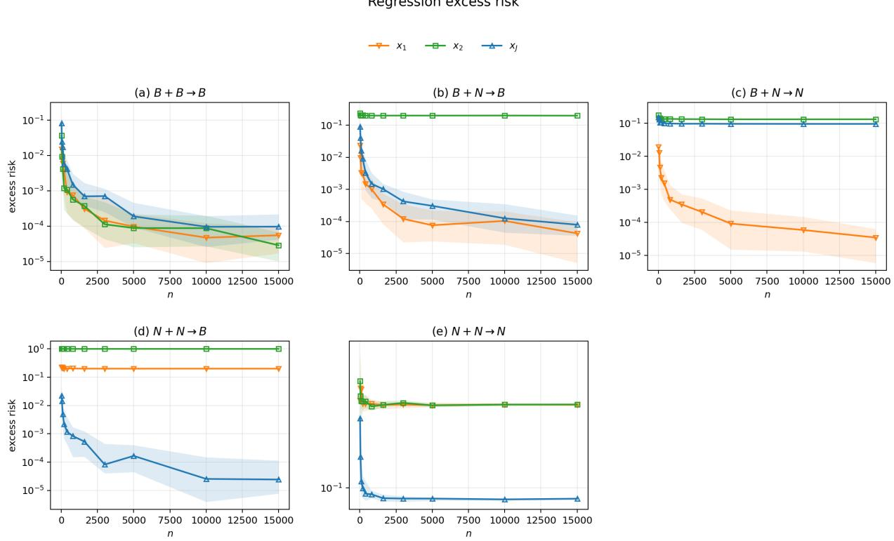  
Figure 1: Population regression excess risk for the five attainable interaction patterns. The panels follow the ordering in Table 1; $\dot { \mathsf { B } } ^ { \mathrm { r e g } }$ and $\mathsf { N } ^ { \mathrm { { r e g } } }$ denote task-level benign and non-benign regression behavior for the displayed response. Curves show unsmoothed Monte Carlo medians, and shaded bands show the interquartile range. The corresponding repetition counts are specified in Section 6.1.

## 6.3 Regression case studies

Figure 2 isolates the two boundary phenomena from Sections 3.5 and 3.6. The top row concerns the small-innovation construction. The panels report excess risk and the corresponding scaled variance quantity $n / R _ { k ^ { \star } }$ across sample sizes. Although $\| \Sigma _ { U } \| _ { \mathrm { o p } } = n ^ { - 2 }$ and $\operatorname { t r } ( \Sigma _ { U } ) = c / n + o ( n ^ { - 1 } )$ , panels (a)–(b) illustrate that only $X _ { 1 }$ has vanishing risk and variance scale, whereas $X _ { 2 }$ and the fused representation $X _ { J }$ do not exhibit this benign behavior. The bottom row illustrates the logarithmic-gap construction. Panels (c)–(d) display small marginal excess risks while the fused representation remains substantially worse over the displayed sample sizes. The marginal tasks lie in the logarithmic gap between the known sufficient and necessary conditions, producing a slow asymptotic regime. The persistent separation between the marginal and fused curves is a finite-sample illustration consistent with the non-closure mechanism in Theorem 7.

## 6.4 The complete classification interaction law

Figure 3 provides finite-sample illustrations for all six constructions in Theorem 10. For every input, the population quantity $\Delta$ is computed after deleting that input’s own signal eigendirection, exactly as required by Theorem 8. The plotted risk is then obtained from the fitted survival and contamination, rather than by treating $\Delta$ itself as an empirical loss.

The classification panels illustrate all six possibilities. Panel (a) has three decreasing risks. In panel (b), both marginal risks decrease while the joint risk remains near 0.40, consistent with the classification transition that is impossible for the regression full-spectrum surrogate. Panels (c) and (d) distinguish the two $\mathsf { B } ^ { \mathrm { c l s } } + \mathsf { N } ^ { \mathrm { c l s } }$ outcomes: fusion removes the harmful marginal effect in (c), but retains it in (d). Panel (e) illustrates correlated rescue from two non-benign sources. The joint risk decreases more slowly than in the other benign examples, consistent with the theoretical balance $\Delta _ { J } \asymp n ^ { 2 \ell - 1 } = n ^ { - 0 . 6 }$ for the experimental choice $\ell = 0 . 2$ . Panel (f) leaves all three risks bounded away from zero. Together with the regression panels, these finite-sample patterns are consistent with the paper’s main distinction: regression is protected by a full-spectrum covariance surrogate, whereas classification is governed by the input-specific ratio of contamination to surviving signal.

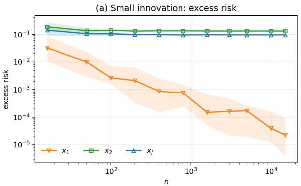

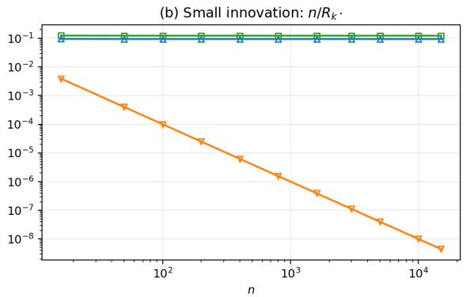

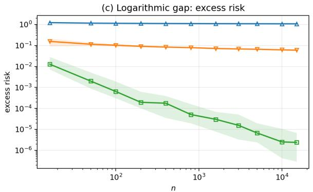

(d) Logarithmic gap: marginal bias scales  
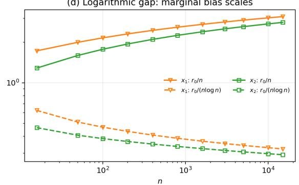  
Figure 2: The two regression case studies. Panels (a)-(b) illustrate how vanishing innovation energy can be associated with a nonvanishing variance obstruction. Panels (c)-(d) probe Bartlett’s logarithmic bias gap: the two marginal risks decrease while the fused risk stays separated, and the marginal quantities $r _ { 0 } / n$ and $r _ { 0 } / ( n$ log n) move in opposite directions. The logarithmic denominator in panel (d) is the finite-sample proxy for $\log ( 1 + r _ { 0 } )$ , which is asymptotically equivalent in this construction. Risk curves are unsmoothed medians with interquartile bands.

## 6.5 Cross-task separation under the same fusion

Figure 4 illustrates the two constructions of Theorem 11. Within each row, the Gaussian inputs and the common latent score $L _ { n }$ are unchanged: the regression response is $L _ { n }$ , while the classification response is $\mathrm { s i g n } ( L _ { n } )$ . In particular, these panels do not combine separately tuned regression and classification witnesses. We use the exact Appendix C parameters and normalize its designated joint signal direction to unit variance. The first row illustrates a task-dependent rescue: the regression risks remain separated from zero, but the fused classification excess risk decreases while the two marginal classification risks remain non-benign. The second row illustrates the complementary separation. Its displayed risks are consistent with persistent regression bias despite decreasing marginal regression risks, while all three classification excess risks decrease. The inset makes explicit that the second construction’s marginal classification statement concerns excess risk: the marginal Bayes advantages themselves vanish, so their raw risks approach chance level. Thus the figure provides a finite-sample view of task dependence without changing the input distribution, latent score, or fusion operation.

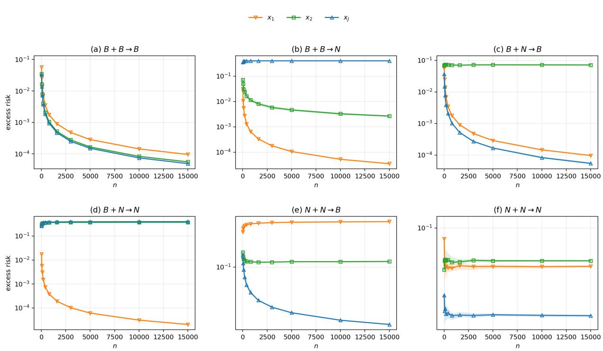  
Figure 3: Population classification excess risk for all six unordered interaction patterns. Each construction uses one common latent label mechanism and input-specific one-sparse signal directions. The six panels illustrate the absence of a nontrivial Boolean closure law based only on the two marginal benign/non-benign states. Curves are unsmoothed medians with interquartile bands.

## 6.6 Robustness of the small-innovation mechanism

We next test whether the small-innovation obstruction in Section 3.5 depends on its exact constant. Keep $p ~ = ~ n ^ { 3 } , ~ m ~ = ~ 6 n , ~ D ~ = ~ \mathrm { d i a g } ( 1 , n ^ { - 4 } I _ { p } )$ , and $A \ = \ I ,$ and replace the innovation covariance by $\Sigma _ { U } ( a ) \ =$ diag $\begin{array} { r } { \langle n ^ { - 8 } , a n ^ { - 2 } I _ { m } , n ^ { - 8 } I _ { p - m } \rangle , \qquad a \in \{ 0 . 5 , 0 . 7 5 , 1 , 1 . 5 , 2 \} } \end{array}$ . For every fixed $a > 0$ , its total energy still vanishes since t $\operatorname { r } ( \Sigma _ { U } ( a ) ) = 6 a / n + o ( n ^ { - 1 } )$ . On the other hand, the fixed-tail variance quantities have the analytic limits

$$
\frac { n } { R _ { 1 } ( \Sigma _ { 2 } ) } \longrightarrow \frac { 6 a ^ { 2 } } { ( 1 + 6 a ) ^ { 2 } } , \qquad \frac { n } { R _ { 1 } ( \Sigma _ { J } ) } \longrightarrow \frac { 6 a ^ { 2 } } { ( 2 + 6 a ) ^ { 2 } } .
$$

Figure 5 treats each fixed multiplier as a separate finite-sample problem instance. Within each panel, the shaded bands quantify only Monte Carlo variation for that instance. The panels illustrate persistent second and joint risks throughout the displayed constant-factor sweep, while the first-input reference risk decreases. The deterministic spectral curves are close to their corresponding analytic limits; at $a = 1$ , these reduce to $6 / 4 9$ and $6 / 6 4$ , respectively. This is a finitesample robustness illustration consistent with the proved mechanism, not a uniform-in-a extension of the theorem.

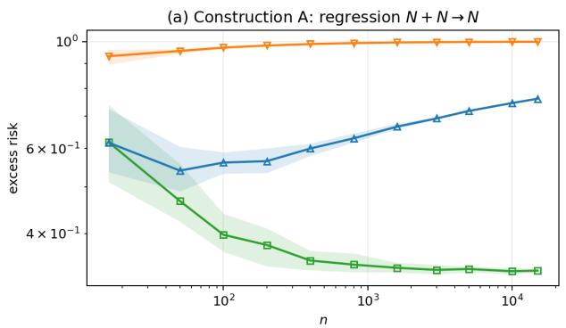

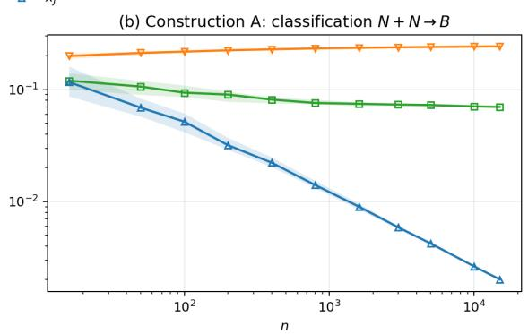

(c) Construction B: regression B + B → N  
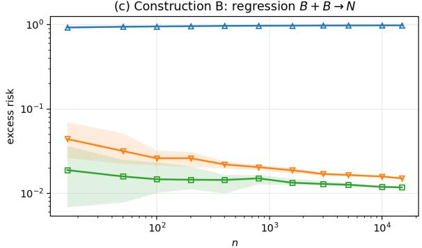

(d) Construction B: classification B + B → B  
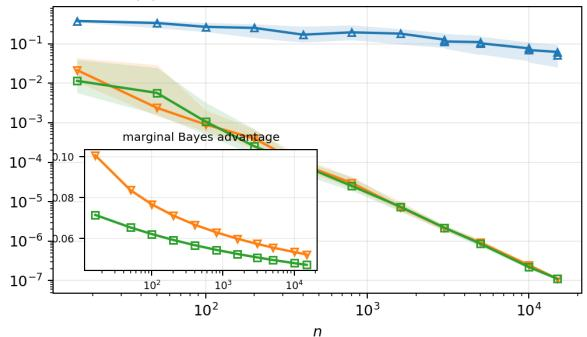  
Figure 4: Cross-task separation under the same heterogeneous fusion and common latent score. Panels (a)–(b) use the first construction of Theorem 11: the displayed finite-sample trends are consistent with regression non-benignity and classification rescue. Panels (c)–(d) use the second construction: the displayed trends are consistent with benign marginal inputs for both tasks, regression degradation after fusion, and preserved classification benignity. The inset reports the vanishing marginal Bayes advantages in panel (d). All synthetic panels extend through $n = 1 5 0 0 0$ . All points use 50 repetitions. Curves are unsmoothed medians with interquartile bands.

## 6.7 Out-of-model multi-view sanity check

As a deliberately limited practical complement, we also evaluate two aligned views from the UCI Multiple Features data set [Duin, 1998]: the 216-dimensional profile-correlation view (mfeat-fac) and the 240-dimensional pixel average view (mfeat-pix). The data contain 2,000 handwritten digits with corresponding rows across views. We form the balanced binary task digits 0-4 versus 5-9. For each of 30 stratified splits and each $n \in \{ 5 0 , 1 0 0 , 1 5 0 , 2 0 0 \}$ , every view is centered using only its training mean and rescaled by one training-set scalar (no featurewise whitening). A common intercept is included in each minimum-norm fit. We retain only full-row-rank splits, so all three representations interpolate the possibly flipped training labels to numerical precision. Test labels are always clean. Figure 6 reports clean test error together with the fusion gap $\Delta _ { \mathrm { f u s i o n } } = \mathrm { E r r } ( X _ { J } ) - \operatorname* { m i n } \{ \mathrm { E r r } ( X _ { 1 } ) , \mathrm { E r r } ( X _ { 2 } ) \}$ . We use 0%, 10%, and 20% symmetric flips of training labels. Fusion has a negative median gap throughout this small protocol. This is an out-of-model sanity check: the data are neither Gaussian nor a one-sparse eigensignal model, and the result is not presented as validation of a theorem.

## 7 Conclusion

We studied benign overfitting under heterogeneous input fusion while keeping the underlying population task fixed. For regression, we identified a threshold-invariant full-spectrum covariance certificate that is preserved under arbi trary positive-semidefinite joint fusion, while showing that task-level benign regression need not be closed outside this certified regime. For one-sparse Gaussian classification, benignity in the regular regime is governed by the balance between surviving predictive signal and nuisance contamination, and within this model class all marginal-to-joint benign/non-benign patterns are attainable. These results show that benign overfitting under input fusion is funda mentally task-dependent: the same fused input can affect regression and classification differently. Extending these conclusions beyond the Gaussian setting and identifying stronger conditions for task-level regression closure remain important directions for future work.

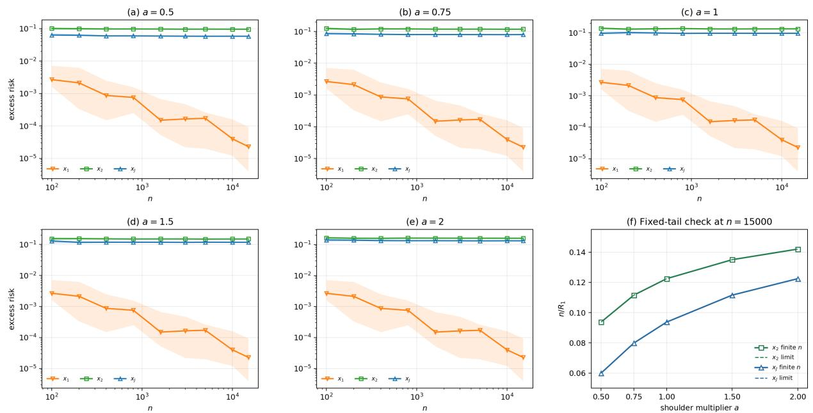

Figure 5: Constant-factor robustness of the small-innovation mechanism. Panels (a)–(e) report population regression excess risk for the five fixed shoulder multipliers $^ { a , }$ with one problem instance per panel; the $\bar { X _ { 1 } }$ curve is repeated as a common reference because its law does not depend on a. Panel $\mathrm { ( f ) }$ compares the finite-sample fixed-tail quantity at $n = 1 5 0 0 0$ against the analytic limits $6 a ^ { 2 } / ( 1 + 6 \dot { a } ) ^ { 2 }$ for $X _ { 2 }$ and $6 a ^ { 2 } / ( 2 + \dot { 6 } a ) ^ { 2 }$ for $X _ { J } ;$ dashed curves are analytic, not fitted. Every shaded band is the Monte Carlo interquartile range for its own fixed problem instance; no band aggregates variation across multipliers.  
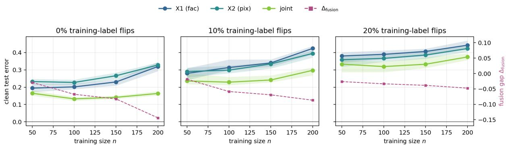  
Figure 6: Out-of-model sanity check on the UCI Multiple Features data. $X _ { 1 }$ is the profile-correlation view, $X _ { 2 }$ the pixel-average view, and $\dot { X _ { J } }$ their concatenation. Solid curves are median clean-test errors and shaded bands are interquartile ranges over 30 full-row-rank stratified splits. Dashed magenta curves use the right axis and report $\Delta _ { \mathrm { f u s i o n } } .$ Only training labels are flipped.

## Appendix

A Proofs for the Regression Results 25   
A.1 Certificates and probabilistic consequences 25   
A.2 Threshold invariance of the full-spectrum state . 26   
A.3 Fusion closure 27   
A.4 Five attainable regression interaction patterns 28   
A.5 Forward-reverse spectral equivalence 33   
A.6 Case study I: vanishing innovation energy 35   
A.7 Case study II: task-level non-closure in the logarithmic gap 36   
B Proofs for the Classification Results 38   
B.1 The ∆-criterion and classification benignity 38   
B.2 Survival-contamination transfer identity 41   
B.3 Six classification interaction patterns 41   
C Proofs for the Cross-Task Separation Results 45   
C.1 Fusion rescue from two non-benign sources 45   
C.2 Task separation from two benign sources 46

## A Proofs for the Regression Results

## A.1 Certificates and probabilistic consequences in Bartlett et al. [2020]

Lemma 12 (The full-spectrum certificate implies benign regression). Assume

$$
\Sigma _ { n } \in \mathsf { B } ^ { \mathrm { F S } } ( b _ { \mathrm { B } } ) ,
$$

together with

$$
\| w _ { n } \| _ { 2 } ^ { 2 } \| \Sigma _ { n } \| _ { \mathrm { o p } } = O ( 1 ) , \qquad \tau _ { n } ^ { 2 } = O ( 1 ) .
$$

Then $\mathcal { E } _ { n } ^ { \mathrm { r e g } } ( \widehat { w } _ { n } ) \to _ { \mathbb { P } } 0 .$

Proof. Let $a _ { n } = r _ { 0 } ( \Sigma _ { n } ) / n$ and $v _ { n } = V _ { b _ { \mathrm { B } } } ( \Sigma _ { n } )$ . By assumption, $a _ { n } \vee v _ { n }  0$ , and $k _ { b _ { \mathrm { B } } } ( \Sigma _ { n } ) < n / c _ { 1 }$ eventually. Choose a deterministic sequence $L _ { n } \to \infty$ so slowly that

$$
L _ { n } v _ { n }  0 , ~ L _ { n } / n  0 .
$$

For example, after replacing $v _ { n }$ by $v _ { n } + n ^ { - 1 }$ , one may take $L _ { n } = \operatorname* { m i n } \{ v _ { n } ^ { - 1 / 2 } , n ^ { 1 / 2 } \}$ . Apply Theorem 1 with $\delta _ { n } =$ $e ^ { - L _ { n } }$ . The bias term in (26) tends to zero because $a _ { n } \to 0$ and $L _ { n } / n \to 0$ , and its variance term tends to zero because $L _ { n } v _ { n }  0$ . Since $\delta _ { n } \to 0$ , the claimed convergence in probability follows. □

## A.1.1 A fixed-probability form of the variance lower bound

Lemma 13 (Fixed-probability variance lower bound). There are universal constants $c _ { 0 } , p _ { 0 } > 0$ for which the following holds under the Gaussian regression model whenever ran $\operatorname { s } ( \Sigma ) > n$ . In particular, the Gaussian design has full row rank almost surely and every inverse below is well defined.

$$
\begin{array} { r } { \mathbb { P } \big \{ \mathcal { E } _ { n } ^ { \mathrm { r e g } } ( \widehat { w } ) \geq c _ { 0 } \tau ^ { 2 } \underline { { V } } _ { n } ( \Sigma ) \big \} \geq p _ { 0 } - o ( 1 ) , } \end{array}\tag{53}
$$

where

$$
\begin{array} { r } { \underline { { V } } _ { n } ( \Sigma ) : = \left\{ \begin{array} { l l } { 1 , } & { k _ { b _ { \mathrm { B } } } ( \Sigma ) \geq n / c _ { 1 } , } \\ { V _ { b _ { \mathrm { B } } } ( \Sigma ) , } & { k _ { b _ { \mathrm { B } } } ( \Sigma ) < n / c _ { 1 } . } \end{array} \right. } \end{array}
$$

Consequently, if $\operatorname* { i n f } _ { n } \tau _ { n } ^ { 2 } > 0$ and lim $\operatorname* { s u p } _ { n } \underline { { V } } _ { n } ( \Sigma _ { n } ) > 0 .$ then regression benign overfitting fails along a subsequence. If the latter condition is strengthened to lim in $\mathfrak { i } _ { n } \underline { { V } } _ { n } ( \Sigma _ { n } ) \ > \ 0$ , the lower bound holds persistently along the full sequence and the regression problem is harmful according to Definition 1.

Proof. Let X be the $n \times d$ design matrix and put

$$
G _ { \mathbf { X } } : = \Sigma ^ { 1 / 2 } \mathbf { X } ^ { \top } ( \mathbf { X } \mathbf { X } ^ { \top } ) ^ { - 1 } \varepsilon .
$$

Conditional on $\mathbf { X } ,$ this is a centered Gaussian vector. Its squared Euclidean norm is the prediction error contributed by the observation noise, and

$$
\operatorname { \mathbb { E } } \left[ \| G \mathbf { \mathbf { x } } \| _ { 2 } ^ { 2 } \mid \mathbf { X } \right] = \tau ^ { 2 } \operatorname { t r } \left[ ( \mathbf { X } \mathbf { X } ^ { \top } ) ^ { - 1 } \mathbf { X } \Sigma \mathbf { X } ^ { \top } ( \mathbf { X } \mathbf { X } ^ { \top } ) ^ { - 1 } \right] .\tag{54}
$$

For every centered Gaussian vector G, diagonalizing its conditional covariance and using the Gaussian fourth moment gives $\mathbb { E } \Vert G \Vert _ { 2 } ^ { 4 } \leq 3 ( \mathbb { E } \Vert G \Vert _ { 2 } ^ { 2 } ) ^ { 2 }$ . The Paley–Zygmund inequality [Paley and Zygmund, 1932, Lemma 19], applied to $W = \| G _ { \mathbf { X } } \| _ { 2 } ^ { 2 }$ with threshold parameter $1 / 2$ , therefore gives

$$
\begin{array} { r } { \mathbb { P } \{ \| G _ { \mathbf { X } } \| _ { 2 } ^ { 2 } \geq \frac { 1 } { 2 } \mathbb { E } [ \| G _ { \mathbf { X } } \| _ { 2 } ^ { 2 } \mid \mathbf { X } ] \mid \mathbf { X } \} \geq \frac { 1 } { 1 2 } . } \end{array}
$$

Conditional on the design, the full prediction error has the form $\| h _ { \mathbf { X } } + G _ { \mathbf { X } } \| _ { 2 } ^ { 2 }$ , where $h _ { \mathbf { X } }$ is deterministic. Anderson’s inequality for centered Gaussian measures [Anderson, 1955] implies that translating a centered Euclidean ball cannot increase its probability. Therefore, the same lower-tail estimate, with the same threshold, holds for the full prediction error.

The design-dependent trace in (54) is exactly the variance trace in Bartlett et al. [2020]. To make the two regimes in their lower bound explicit, write $k ^ { \star } = k _ { b _ { \mathrm { B } } } ( \Sigma )$ and enlarge c , if necessary, so that it dominates the constants in their Lemmas 16–17. If $~ k ^ { \star } < n / c _ { 1 }$ , apply part 2 of their Lemma 16 at $k = k ^ { \star }$ ; their Lemma 17 identifies its minimum over $l \leq k ^ { \star }$ with a constant multiple of $k ^ { \star } / n + n / R _ { k ^ { \star } } ( \Sigma )$ . Thus the trace is at least $c V _ { b _ { \mathrm { B } } } ( \Sigma )$ with probability $1 - o ( 1 )$

If $k ^ { \star } \geq n / c _ { 1 }$ , take $k _ { 0 } = \lfloor n / ( 2 c _ { 1 } ) \rfloor < k ^ { \star }$ . By minimality of $k ^ { \star } , r _ { k _ { 0 } } ( \Sigma ) < b _ { \mathrm { B } } n$ . Part 1 of their Lemma 16 then gives

$$
\mathrm { t r } \left[ ( \mathbf { X } \mathbf { X } ^ { \top } ) ^ { - 1 } \mathbf { X } \mathbf { \Sigma } \mathbf { X } ^ { \top } ( \mathbf { X } \mathbf { X } ^ { \top } ) ^ { - 1 } \right] \geq \frac { k _ { 0 } + 1 } { c b _ { \mathrm { B } } ^ { 2 } n } \geq c ^ { \prime } > 0
$$

with probability $1 - o ( 1 )$ . This proves the design-side lower bound in both branches. Integrating the conditional probability $1 / 1 2$ over that event proves (53). □

## A.2 Threshold invariance of the full-spectrum state

Proof of Lemma 2. The condition $r _ { 0 } ( \Sigma _ { n } ) / n \to 0$ is independent of the threshold. We therefore transfer only the cutoff and post-cutoff effective-rank conditions. Suppress the argument $\Sigma _ { n }$ , write $k _ { i } = k _ { b _ { i } } ( \Sigma _ { n } )$ , and define

$$
S _ { i } = S _ { k _ { i } } ( \Sigma _ { n } ) , \qquad Q _ { i } = \sum _ { j > k _ { i } } \lambda _ { j } ( \Sigma _ { n } ) ^ { 2 } .
$$

Assume first that $\Sigma _ { n } \in \mathsf { B } ^ { \mathrm { F S } } ( b _ { 1 } )$

If $b _ { 2 } < b _ { 1 }$ , then $k _ { 2 } \leq k _ { 1 } = o ( n )$ . Since $r _ { k _ { 2 } } \geq b _ { 2 } n , \lambda _ { k _ { 2 } + 1 } \leq S _ { 2 } / ( b _ { 2 } n )$ . Consequently,

$$
Q _ { 2 } \leq Q _ { 1 } + ( k _ { 1 } - k _ { 2 } ) \frac { S _ { 2 } ^ { 2 } } { b _ { 2 } ^ { 2 } n ^ { 2 } } .
$$

Now $Q _ { 1 } = o ( S _ { 1 } ^ { 2 } / n ) , S _ { 1 } \leq S _ { 2 }$ , and $k _ { 1 } - k _ { 2 } = o ( n )$ , so the right-hand side is $o ( S _ { 2 } ^ { 2 } / n )$ . Hence $R _ { k _ { 2 } } = S _ { 2 } ^ { 2 } / Q _ { 2 } \gg n .$ and $\Sigma _ { n } \in \mathsf { B } ^ { \mathrm { F S } } ( b _ { 2 } )$

Suppose next that $b _ { 2 } > b _ { 1 } . { \mathrm { A t } } k = k _ { 1 }$ , abbreviate

$$
S = S _ { k } , \qquad Q = \sum _ { j > k } \lambda _ { j } ^ { 2 } , \qquad R = S ^ { 2 } / Q .
$$

We have $k = o ( n )$ and $R / n \to \infty$ . Let $a = S / ( 2 b _ { 2 } n )$ , and let m be the number of tail eigenvalues strictly larger than a. Then

$$
m a ^ { 2 } \leq Q , \qquad m \leq \frac { 4 b _ { 2 } ^ { 2 } n ^ { 2 } } { R } = o ( n ) .
$$

By Cauchy–Schwarz, the total mass of those m eigenvalues is at most

$$
{ \sqrt { m Q } } \leq { \frac { 2 b _ { 2 } n S } { R } } = o ( S ) .
$$

Set $\ell = k + m = o ( n )$ . The remaining tail has $S _ { \ell } = S ( 1 - o ( 1 ) )$ , its largest eigenvalue is at most a, and hence

$$
r _ { \ell } \geq 2 b _ { 2 } n ( 1 - o ( 1 ) ) \geq b _ { 2 } n , \qquad R _ { \ell } \geq \frac { S _ { \ell } ^ { 2 } } { Q } \gg n .
$$

It follows that $k _ { 2 } \leq \ell = o ( n )$ . To transfer the effective-rank bound from ℓ back to the first qualifying index $k _ { 2 }$ , use $\lambda _ { k _ { 2 } + 1 } \leq S _ { k _ { 2 } } / ( b _ { 2 } n ) \colon$

$$
\sum _ { j > k _ { 2 } } \lambda _ { j } ^ { 2 } \leq \sum _ { j > \ell } \lambda _ { j } ^ { 2 } + ( \ell - k _ { 2 } ) \frac { S _ { k _ { 2 } } ^ { 2 } } { b _ { 2 } ^ { 2 } n ^ { 2 } } = o ( S _ { k _ { 2 } } ^ { 2 } / n ) .
$$

Thus $R _ { k _ { 2 } } \gg n$ , proving $\mathsf { B } ^ { \mathrm { F S } } ( b _ { 1 } ) \Rightarrow \mathsf { B } ^ { \mathrm { F S } } ( b _ { 2 } )$ . Interchanging $b _ { 1 }$ and $b _ { 2 }$ gives the reverse implication.

## A.3 Fusion closure

We first record the block-matrix fact used in the proof.

Lemma 14 (Positive-semidefinite block control). If $\begin{array} { r } { M = \binom { A  { C } } { C ^ { \top }  { B } } \succeq 0 } \end{array}$ , then

$$
\begin{array} { r } { \| M \| _ { \mathrm { o p } } \leq \| A \| _ { \mathrm { o p } } + \| B \| _ { \mathrm { o p } } , \qquad \| M \| _ { \mathrm { F } } ^ { 2 } \leq 2 \bigl ( \| A \| _ { \mathrm { F } } ^ { 2 } + \| B \| _ { \mathrm { F } } ^ { 2 } \bigr ) . } \end{array}
$$

Proof. The factorization theorem for positive-semidefinite block matrices [Horn and Johnson, 2013, Chapter 7] gives, for some contraction $K$

$$
C = A ^ { 1 / 2 } K B ^ { 1 / 2 } .
$$

Therefore $\| C \| _ { \mathrm { F } } ^ { 2 } \le \| A \| _ { \mathrm { F } } \| B \| _ { \mathrm { F } }$ , and

$$
\| M \| _ { \mathrm { F } } ^ { 2 } = \| A \| _ { \mathrm { F } } ^ { 2 } + \| B \| _ { \mathrm { F } } ^ { 2 } + 2 \| C \| _ { \mathrm { F } } ^ { 2 } \leq 2 ( \| A \| _ { \mathrm { F } } ^ { 2 } + \| B \| _ { \mathrm { F } } ^ { 2 } ) .
$$

For $x , y$ of compatible dimensions, positivity and Cauchy–Schwarz for the semi-inner product induced by M imply

$$
\begin{array} { r } { | x ^ { \top } C y | \leq \sqrt { x ^ { \top } A x } \sqrt { y ^ { \top } B y } . } \end{array}
$$

Thus the quadratic form of M is at most

$$
\begin{array} { r } { \biggl ( \sqrt { \| A \| _ { \mathrm { o p } } } \| x \| + \sqrt { \| B \| _ { \mathrm { o p } } } \| y \| \biggr ) ^ { 2 } \leq \bigl ( \| A \| _ { \mathrm { o p } } + \| B \| _ { \mathrm { o p } } \bigr ) ( \| x \| ^ { 2 } + \| y \| ^ { 2 } ) , } \end{array}
$$

which proves the operator-norm bound.

ProofofTheorem 3. For $i \in \{ 1 , 2 \}$ , let $k _ { i } = k _ { b } ( \Sigma _ { i , n } ) = o ( n )$ , and let $P _ { i }$ project onto the marginal eigenspace after the first $k _ { i }$ directions. Define the marginal tails

$$
T _ { i } = P _ { i } \Sigma _ { i , n } P _ { i } , \qquad S _ { i } = \mathrm { t r } ( T _ { i } ) , \qquad \mu _ { i } = \| T _ { i } \| _ { \mathrm { o p } } .
$$

The marginal certificates give

$$
S _ { i } / \mu _ { i } \geq b n , \qquad \| T _ { i } \| _ { \mathrm { F } } ^ { 2 } = o ( S _ { i } ^ { 2 } / n ) .\tag{55}
$$

Compress $\Sigma _ { J , n }$ to range(P1) ⊕ range(P2):

$$
T = \left( \begin{array} { l l } { { T _ { 1 } } } & { { \widetilde { C } } } \\ { { \widetilde { C } ^ { \top } } } & { { T _ { 2 } } } \end{array} \right) \succeq 0 .
$$

By Lemma 14,

$$
\begin{array} { r } { \mathrm { t r } ( T ) = S _ { 1 } + S _ { 2 } , } \\ { \| T \| _ { \mathrm { o p } } \leq \mu _ { 1 } + \mu _ { 2 } , } \end{array}
$$

$$
\Vert T \Vert _ { \mathrm { F } } ^ { 2 } \leq 2 \sum _ { i = 1 } ^ { 2 } \Vert T _ { i } \Vert _ { \mathrm { F } } ^ { 2 } = o \big ( ( S _ { 1 } + S _ { 2 } ) ^ { 2 } / n \big ) .\tag{56}
$$

In particular, $r _ { 0 } ( T ) \geq$ bn and $R _ { 0 } ( T ) / n \to \infty$

Let $m = k _ { 1 } + k _ { 2 } = o ( n )$ , and write the decreasing eigenvalues of $\Sigma _ { J , n }$ and $T$ as $\lambda _ { j }$ and $\alpha _ { j }$ . Since $R _ { 0 } ( T ) \leq \mathrm { r a n k } ( T )$ the rank of T is larger than m eventually. Poincare separation for a compression of codimension´ m [Horn and Johnson, 2013, Section 4.3] yields

$$
\lambda _ { j } \geq \alpha _ { j } \geq \lambda _ { j + m } .\tag{57}
$$

It follows that

$$
\begin{array} { l } { { \displaystyle S _ { m } ( \Sigma _ { J , n } ) \geq \mathrm { t r } ( T ) - m \alpha _ { 1 } , } } \\ { { \displaystyle ~ \sum _ { j > m } \lambda _ { j } ^ { 2 } \leq \sum _ { j } \alpha _ { j } ^ { 2 } = \| T \| _ { \mathrm { F } } ^ { 2 } , } } \\ { { \displaystyle ~ \lambda _ { m + 1 } \leq \alpha _ { 1 } . } } \end{array}\tag{58}
$$

Since $m = o ( n )$ and $\mathrm { t r } ( T ) / \alpha _ { 1 } \geq b n , m \alpha _ { 1 } = o ( \mathrm { t r } ( T ) )$ . Hence

$$
r _ { m } ( \Sigma _ { J , n } ) \geq b n ( 1 - o ( 1 ) ) , \qquad R _ { m } ( \Sigma _ { J , n } ) / n \to \infty .
$$

For any fixed $b ^ { \prime } < b / 4$ , this shows that $\ell : = k _ { b ^ { \prime } } ( \Sigma _ { J , n } ) \leq m = o ( n )$ eventually. Moreover, $\lambda _ { \ell + 1 } \leq S _ { \ell } / ( b ^ { \prime } n )$ , so

$$
\sum _ { j > \ell } \lambda _ { j } ^ { 2 } \leq \sum _ { j > m } \lambda _ { j } ^ { 2 } + ( m - \ell ) \frac { S _ { \ell } ^ { 2 } } { b ^ { \prime 2 } n ^ { 2 } } = o ( S _ { \ell } ^ { 2 } / n ) .
$$

For the first term, (56) and (58) give

$$
\sum _ { j > m } \lambda _ { j } ^ { 2 } = o \left( \frac { \mathrm { t r } ( T ) ^ { 2 } } { n } \right) = o \left( \frac { S _ { \ell } ^ { 2 } } { n } \right) ,
$$

because $S _ { \ell } \geq S _ { m } \geq ( 1 - o ( 1 ) ) \mathrm { t r } ( T )$ . The added finite-block term is also $o ( S _ { \ell } ^ { 2 } / n )$ because $m - \ell = o ( n )$ . Thus $R _ { \ell } / n \to \infty$

It remains to verify the uncut effective rank. Since each marginal is a principal submatrix of the joint covariance, $\| \Sigma _ { J , n } \| _ { \mathrm { o p } } \geq \operatorname* { m a x } _ { i } \| \Sigma _ { i , n } \| _ { \mathrm { o p } }$ , while $\operatorname { t r } ( \Sigma _ { J , n } ) = \operatorname { t r } ( \Sigma _ { 1 , n } ) + \operatorname { t r } ( \Sigma _ { 2 , n } )$ . Therefore

$$
r _ { 0 } ( \Sigma _ { J , n } ) \leq r _ { 0 } ( \Sigma _ { 1 , n } ) + r _ { 0 } ( \Sigma _ { 2 , n } ) = o ( n ) .
$$

All three conditions defining $\mathsf { B } ^ { \mathrm { F S } } ( { b } ^ { \prime } )$ follow.

## Proof of Corollary 4.

Proof. Choose any fixed $b > 4 b _ { \mathrm { B } }$ . By Lemma 2, each marginal $\mathsf { B } ^ { \mathrm { F S } }$ state also belongs to $\mathsf { B } ^ { \mathrm { F S } } ( b )$ . Apply Theorem 3 with $b ^ { \prime } = b _ { \mathrm { B } } < b / 4$ . The joint covariance then belongs to $\mathsf { B } ^ { \mathrm { F S } } ( \boldsymbol { b } _ { \mathrm { B } } ) \ : = \ : \mathsf { B } ^ { \mathrm { F S } }$ , proving threshold-free closure. In particular, ${ \mathsf { B } } ^ { \mathrm { F S } } + { \mathsf { B } } ^ { \mathrm { F S } } \to { \mathsf { N } } ^ { \mathrm { F S } }$ is impossible. Repeating the same two-source argument proves closure for any fixed number of sources. □

## A.4 Five attainable regression interaction patterns

Proof. Fix $c > 2 b _ { \mathrm { B } }$ , let

$$
p = p _ { n } = n ^ { 3 } , \qquad m = m _ { n } = \lfloor c n \rfloor , \qquad \epsilon = n ^ { - 3 } , \qquad \rho = n ^ { - 8 } .
$$

All asymptotic comparisons below are unchanged by integer rounding.

## Step 1: spectral design.

There are six unordered Boolean patterns. The transition ${ \mathsf { B } } ^ { \mathrm { F S } } + { \mathsf { B } } ^ { \mathrm { F S } } \to { \mathsf { N } } ^ { \mathrm { F S } }$ is ruled out by Corollary 4. Therefore, only five witnesses must be constructed. The common strategy is:

$( D , Q )$ : choose the target marginal spectra;

$D \oplus Q$ : compute the desired joint state;

$\Sigma _ { J }$ : introduce dense dependence while preserving that state.

The first stage uses three reusable spectral components:

$p = n ^ { 3 }$ comparable tail eigenvalues give $R = \Theta ( n ^ { 3 } )$ , and hence a wide benign tail;

$m = \Theta ( n )$ comparable shoulder eigenvalues give only $R = \Theta ( n )$ , which violates the third full-spectrum condition;

• a flat p-dimensional spectrum gives $r _ { 0 } = p = \Theta ( n ^ { 3 } )$ , which violates the first condition; this is only a bias-side obstruction and therefore requires an explicit signal before it implies task-level non-benignity.

Indeed, after removing a fixed spectral head, a tai $a ^ { [ M ] } \uplus z ^ { [ P - M ] }$ has

$$
S = M a + ( P - M ) z , \qquad Q = M a ^ { 2 } + ( P - M ) z ^ { 2 } , \qquad R = \frac { S ^ { 2 } } { Q } .\tag{59}
$$

For a direct sum, the tail masses $S$ and squared masses Q add. Thus the two rescuing cases add a sufficiently wide tail to repair the defective marginal condition, while the harmful cases preserve either the $O ( n )$ -rank shoulder or the $r _ { 0 ^ { - } }$ obstruction. Notice that two variance-side shoulders cannot rescue one another in this direct-sum-comparable family. For arbitrary positive tails,

$$
R ( D \oplus Q ) = { \frac { ( S _ { D } + S _ { Q } ) ^ { 2 } } { \mathcal { Q } _ { D } + \mathcal { Q } _ { Q } } } \leq R ( D ) + R ( Q ) .
$$

Consequently, if both marginal tail effective ranks are $O ( n )$ , the joint tail effective rank is still $O ( n )$ . This is why the $\mathsf { N } ^ { \mathrm { F S } } + \mathsf { N } ^ { \mathrm { F S } } \to \mathsf { B } ^ { \mathrm { F S } }$ witness combines one variance-side defect with one explicit bias-side defect instead of pretending that failure of $r _ { 0 } / n  0$ universally implies non-benign risk.

## Step 2: nondegenerate correlated lifts.

Cases 1–3 and 5 use the following common dense diagonal lift. Case 4 uses a signal-aligned diagonal lift, specified in that case, because its $r _ { 0 }$ -obstructed marginal must be paired with an explicit hard signal. Let $D = \mathrm { d i a g } ( d _ { 1 } , \dotsc , d _ { P } )$ and $Q = \mathrm { d i a g } ( q _ { 1 } , \dots , q _ { P } ) $ be the target marginal covariances, with all $d _ { j } , q _ { j } > 0$ , and define

$$
L : = \sum _ { j = 1 } ^ { P } \frac { q _ { j } } { d _ { j } } , \qquad \chi : = L ^ { - 1 / 2 } , \qquad a _ { j } : = \chi \sqrt { \frac { q _ { j } } { d _ { j } } } .\tag{60}
$$

For all the spectra below, $L \to \infty$ . Hence $0 < \chi < 1$ eventually, and we may set

$$
A : = \mathrm { d i a g } ( a _ { 1 } , \ldots , a _ { P } ) , \qquad \Sigma _ { U } : = ( 1 - \chi ^ { 2 } ) Q .\tag{61}
$$

Every diagonal entry of A is strictly positive and $\textstyle \| A \| _ { \mathrm { F } } ^ { 2 } = \sum _ { j } a _ { j } ^ { 2 } = 1$ . Moreover, $A D A ^ { \top } + \Sigma _ { U } = Q$ , so the marginal covariances are exactly D and $Q .$ . After a simultaneous permutation of coordinates, the joint covariance is the direct

sum of the blocks

$$
M _ { j } = \left( \begin{array} { c c } { { d _ { j } } } & { { \chi \sqrt { d _ { j } q _ { j } } } } \\ { { \chi \sqrt { d _ { j } q _ { j } } } } & { { q _ { j } } } \end{array} \right) .
$$

Congruencing each block by diag $( d _ { j } ^ { - 1 / 2 } , q _ { j } ^ { - 1 / 2 } )$ gives the correlation block $\textstyle { \binom { 1 } { \chi } } x \quad$ , and hence

$$
( 1 - \chi ) ( D \oplus Q ) \preceq \Sigma _ { J } \preceq ( 1 + \chi ) ( D \oplus Q ) .\tag{62}
$$

Lemma 16 therefore transfers the full-spectrum state of the direct sum to this genuinely correlated joint covariance.   
Since $\chi = o ( 1 )$ in every row, the relevant orders of $r _ { 0 } .$ , the cutoff, and $R _ { k }$ are preserved as well.

## Step 3: five explicit substitutions.

We now verify the five attainable rows. In Cases 1-3 and 5, the marginal state is read directly from (59), the joint state is first computed for $D \oplus Q$ , and (62) transfers that state to the dense correlated covariance $\Sigma _ { J }$ . We also give a common response for every row and verify the resulting task-level regression states.

Case 1: $\mathsf { B } ^ { \mathrm { F S } } + \mathsf { B } ^ { \mathrm { F S } } \to \mathsf { B } ^ { \mathrm { F S } }$

Target spectra. Take $D = Q = \mathrm { d i a g } ( 1 , \epsilon I _ { p } )$

Marginal checks. For each marginal, $r _ { 0 } = 2 , k _ { b } = 1 = o ( n )$ , and $R _ { 1 } = p = n ^ { 3 }$ , so both marginals are in $\mathsf { B } ^ { \mathrm { F S } }$

Joint check. The direct sum has two leading unit eigenvalues and $k _ { b } ( D \oplus Q ) = 2$ , while $R _ { 2 } ( D \oplus Q ) = 2 p$

Conclusion. The dense lift satisfies $\Sigma _ { J } \in \mathsf { B } ^ { \mathrm { F S } }$ . Taking the common response to be $Y = \xi ,$ where $\xi \sim N ( 0 , \tau ^ { 2 } )$ and $0 < \tau ^ { 2 } < \infty$ , Lemma 12 gives benign regression for both marginals and the joint input. Hence this is also a task-level $\mathsf { B } ^ { \mathrm { r e g } } + \mathsf { B } ^ { \mathrm { r e g } } \to \mathsf { B } ^ { \mathrm { r e g } }$ witness.

Case 2: $\mathsf { B } ^ { \mathrm { F S } } + \mathsf { N } ^ { \mathrm { F S } } \to \mathsf { B } ^ { \mathrm { F S } }$

Target spectra. Take

$$
D = \mathrm { d i a g } ( 1 , \epsilon I _ { p } ) , \qquad Q = \mathrm { d i a g } ( 1 , n ^ { - 2 } I _ { m } , \rho I _ { p - m } ) .
$$

Marginal checks. As in Case 1, $D \in { \mathsf { B } } ^ { \mathrm { F S } }$ . For $Q , r _ { 0 } ( Q ) = 1 + o ( 1 ) , k _ { b } ( Q ) = 1$ , and

$$
S _ { 1 } ( Q ) = c / n + o ( n ^ { - 1 } ) , \qquad R _ { 1 } ( Q ) = c n ( 1 + o ( 1 ) ) ,
$$

so the third condition fails and $Q \in { \mathsf { N } } ^ { \mathrm { F S } }$

Joint check. After removing the two leading unit eigenvalues,

$$
S _ { 2 } ( D \oplus Q ) = 1 + o ( 1 ) , \qquad Q _ { 2 } ( D \oplus Q ) = ( c + 1 ) n ^ { - 3 } ( 1 + o ( 1 ) ) .
$$

Hence $k _ { b } ( D \oplus Q ) = 2 = o ( n )$ and $R _ { 2 } ( D \oplus Q ) = \Theta ( n ^ { 3 } )$ . The comparison (62) is strong enough here to locate, rather than merely certify, the joint cutoff: the first two eigenvalues remain Θ(1), so $r _ { 0 } , r _ { 1 } = O ( 1 )$ , whereas after them the largest tail eigenvalue is $\Theta ( n ^ { - 2 } )$ and the tail mass is $\Theta ( 1 )$ , so $r _ { 2 } ~ = ~ \Theta ( n ^ { 2 } )$ . Hence $k _ { b _ { \mathrm { B } } } ( \Sigma _ { J } ) = 2$ and $V _ { b _ { \mathrm { B } } } ( \Sigma _ { J } ) = { \cal O } ( n ^ { - 1 } )$

Conclusion. The wide tail of D repairs the $R = \Theta ( n )$ shoulder of Q, and $\Sigma _ { J } \in \mathsf { B } ^ { \mathrm { F S } }$ . With the same pure-noise response $Y = \xi ,$ Lemma 12 gives benignity for D and $\Sigma _ { J } .$ . Since $V _ { b _ { \mathrm { B } } } ( Q ) = n / R _ { 1 } ( Q ) + o ( 1 )  1 / c$ , Lemma 13 rules out benignity for $Q .$ . This realizes $\mathsf { B } ^ { \mathrm { r e g } } + \mathsf { N } ^ { \mathrm { r e g } } \to \mathsf { B } ^ { \mathrm { r e g } }$

Case 3: $\mathsf { B } ^ { \mathrm { F S } } + \mathsf { N } ^ { \mathrm { F S } } \to \mathsf { N } ^ { \mathrm { F S } }$

Target spectra. Set $\eta = n ^ { - 4 }$ and take

$$
D = \mathrm { d i a g } ( 1 , \eta I _ { p } ) , \qquad Q = \mathrm { d i a g } ( 1 , n ^ { - 2 } I _ { m } , \eta I _ { p - m } ) .
$$

Marginal checks. For $D , k _ { b } ( D ) = 1$ and $R _ { 1 } ( D ) = p = n ^ { 3 }$ , so $D \in { \mathsf { B } } ^ { \mathrm { F S } }$ . For $Q .$

$$
S _ { 1 } ( Q ) = \frac { c + 1 } { n } ( 1 + o ( 1 ) ) , \qquad \mathcal { Q } _ { 1 } ( Q ) = \frac { c } { n ^ { 3 } } ( 1 + o ( 1 ) ) ,
$$

and therefore $R _ { 1 } ( Q ) = \Theta ( n )$ ; the third condition fails.

Joint check. After removing the two leading unit eigenvalues,

$$
S _ { 2 } ( D \oplus Q ) = \frac { c + 2 } { n } ( 1 + o ( 1 ) ) , \qquad Q _ { 2 } ( D \oplus Q ) = \frac { c } { n ^ { 3 } } ( 1 + o ( 1 ) ) ,
$$

so $R _ { 2 } ( D \oplus Q ) = \Theta ( n )$ . Under (62), the two leading eigenvalues remain $\Theta ( 1 )$ , giving $r _ { 0 } , r _ { 1 } = O ( 1 )$ , while at $k = 2$ the tail mass is $\Theta ( n ^ { - 1 } )$ , its largest eigenvalue is $\Theta ( n ^ { - 2 } )$ , and $r _ { 2 } = ( c + 2 + o ( 1 ) ) n > b _ { \mathrm { B } } n$ . Thus the actual joint cutoff is two and $V _ { b _ { \mathrm { B } } } ( \Sigma _ { J } ) = \Theta ( 1 )$ , not merely an unspecified quantity associated with the same ${ \mathsf { N } } ^ { \mathrm { F S } }$ state.

Conclusion. The D-tail now has too little mass to repair the shoulder; the third condition remains false and $\Sigma _ { J } \in \mathsf { N } ^ { \mathrm { F S } }$ For $Y = \xi ,$ the first marginal is benign by Lemma 12. Both Q and $\Sigma _ { J }$ have $V _ { b _ { \mathrm { B } } } = \Theta ( 1 )$ , so Lemma 13 makes their prediction risks non-benign. Thus the same construction realizes $\mathsf { B } ^ { \mathrm { r e g } } + \mathsf { N } ^ { \mathrm { r e g } } \to \mathsf { N } ^ { \mathrm { r e g } }$

Case 4: $\mathsf { N } ^ { \mathrm { F S } } + \mathsf { N } ^ { \mathrm { F S } } \to \mathsf { B } ^ { \mathrm { F S } }$

Target spectra. Take

$$
D = \mathrm { d i a g } ( 1 , \epsilon I _ { m } , \rho I _ { p - m } ) , \qquad Q = \epsilon I _ { p + 1 } .
$$

For this case set

$$
A = \mathrm { d i a g } \big ( \sqrt { \epsilon - \rho } , \sqrt { \epsilon } I _ { p } \big ) , \qquad \Sigma _ { U } = \mathrm { d i a g } \big ( \rho , ( \epsilon - \epsilon ^ { 2 } ) I _ { m } , ( \epsilon - \epsilon \rho ) I _ { p - m } \big ) .\tag{63}
$$

All diagonal entries of A are positive, $\| A \| _ { \mathrm { F } } ^ { 2 } = 1 + \epsilon - \rho = 1 + o ( 1 ) , \mathrm { a n d } A D A ^ { \top } + \Sigma _ { U } = Q .$

Marginal checks. For $D , r _ { 0 } ( D ) = 1 + o ( 1 ) , k _ { b } ( D ) = 1$ , and $R _ { 1 } ( D ) = c n ( 1 + o ( 1 ) )$ , so the third condition fails. For $Q , r _ { 0 } ( Q ) = p = n ^ { 3 }$ , so the first condition fails.

Joint check. The signal-coordinate block of $\Sigma _ { J }$ is

$$
G _ { n } = \left( \begin{array} { c c } { { 1 } } & { { \sqrt { \epsilon - \rho } } } \\ { { \sqrt { \epsilon - \rho } } } & { { \epsilon } } \end{array} \right) .\tag{64}
$$

Its eigenvalues satisfy $\lambda _ { + } ( G _ { n } ) = 1 { + } o ( 1 )$ and $\lambda _ { - } ( G _ { n } ) = \rho ( 1 { + } o ( 1 ) )$ . Each shoulder block has eigenvalues $\varepsilon ( 1 \pm \sqrt { \epsilon } )$ while every remaining nuisance block has one eigenvalue $\epsilon ( 1 + o ( 1 ) )$ and one eigenvalue $\rho ( 1 + o ( 1 ) )$ ). Hence, after deleting $\lambda _ { + } ( G _ { n } )$

$$
S _ { 1 } ( \Sigma _ { J } ) = 1 + o ( 1 ) , \qquad \sum _ { j > 1 } \lambda _ { j } ( \Sigma _ { J } ) ^ { 2 } = n ^ { - 3 } ( 1 + o ( 1 ) ) .
$$

It follows that $k _ { b _ { \mathrm { B } } } ( \Sigma _ { J } ) = 1$ and $R _ { 1 } ( \Sigma _ { J } ) = n ^ { 3 } ( 1 + o ( 1 ) ) , { \mathrm s o } \Sigma _ { J } \in { \mathsf B } ^ { \mathrm { F S } }$

A common hard signal for the two marginals. Let $\boldsymbol { v } _ { n } = ( v _ { 1 , n } , v _ { 2 , n } )$ be a unit leading eigenvector of $G _ { n }$ , chosen with positive entries, and put

$$
\gamma _ { n } = v _ { 2 , n } e _ { 1 } , \qquad \beta _ { n } = \bigl ( v _ { 1 , n } + \sqrt { \epsilon - \rho } v _ { 2 , n } \bigr ) e _ { 1 } .\tag{65}
$$

For the heterogeneous model $X _ { 2 } = A X _ { 1 } + U$ , take the single response

$$
Y = \beta _ { n } ^ { \top } X _ { 1 } + \gamma _ { n } ^ { \top } U + \xi , \qquad \xi \sim N ( 0 , \tau ^ { 2 } ) , \quad 0 < \tau ^ { 2 } < \infty .
$$

Its coefficient in the fused coordinates is $( \beta _ { n } - A ^ { \top } \gamma _ { n } , \gamma _ { n } ) = ( v _ { 1 , n } e _ { 1 } , v _ { 2 , n } e _ { 1 } )$ . It is therefore a unit vector in the leading eigendirection of $\Sigma _ { J }$ . Lemma 12 applies and yields benign regression for the fused input.

For the first marginal, the conditional noise variance is at least $\tau ^ { 2 }$ , while $R _ { 1 } ( D ) = c n ( 1 + o ( 1 ) )$ . Thus Lemma 13 shows that its prediction risk does not converge to zero.

For the second marginal, $Q \ : = \ : \epsilon I _ { P }$ with $P = p + 1$ . The Gaussian conditional-mean formula [Anderson, 2003, Chapter 2] gives the population coefficient

$$
w _ { 2 , n } = \epsilon ^ { - 1 } \lambda _ { + } ( G _ { n } ) v _ { 2 , n } e _ { 1 } , \qquad \epsilon \| w _ { 2 , n } \| _ { 2 } ^ { 2 } \longrightarrow 1 .
$$

Let $\Pi _ { 2 , n }$ be the Euclidean projection onto the row space of the second-marginal training design. Because $Q$ is isotropic, the null-space bias and the fitted-noise component are orthogonal also in prediction norm; hence, deterministically conditional on the design,

$$
\begin{array} { r } { \mathcal { E } _ { n } ^ { \mathrm { r e g } } ( \widehat { w } _ { 2 , n } ) \geq \epsilon \| ( I - \Pi _ { 2 , n } ) w _ { 2 , n } \| _ { 2 } ^ { 2 } . } \end{array}\tag{66}
$$

To justify the random-subspace step explicitly, write the isotropic design as $\sqrt { \epsilon } Z$ , where $Z$ has iid standard Gaussian entries. Right-orthogonal invariance of the multivariate normal law [Anderson, 2003, Chapter 2] makes its row space uniform on the Grassmannian. Equivalently, $U ^ { \top } \mathbb { E } [ \Pi _ { 2 , n } ] U = \mathbb { E } [ \Pi _ { 2 , n } ]$ for every orthogonal $U ,$ so $\mathbb { E } [ \Pi _ { 2 , n } ] = a I _ { P }$ Taking traces gives $a ~ = ~ n / P$ , and hence $\mathbb { E } \| \Pi _ { 2 , n } w _ { 2 , n } \| _ { 2 } ^ { 2 } / \| w _ { 2 , n } \| _ { 2 } ^ { 2 } = n / P \  \ 0$ . Markov’s inequality and (66) therefore imply, for every fixed $a < 1$

$$
\begin{array} { r } { \mathbb { P } \{ \mathcal { E } _ { n } ^ { \mathrm { r e g } } ( \widehat { w } _ { 2 , n } ) \geq a \} \longrightarrow 1 . } \end{array}
$$

Both marginals are non-benign whereas their fusion is benign, establishing the task-level transition $\mathsf { N } ^ { \mathrm { r e g } } + \mathsf { N } ^ { \mathrm { r e g } } \to$ $\mathsf { B } ^ { \mathrm { r e g } }$

Case 5: $\mathsf { N } ^ { \mathrm { F S } } + \mathsf { N } ^ { \mathrm { F S } } \to \mathsf { N } ^ { \mathrm { F S } }$

Target spectra. Take

$$
D = Q = \mathrm { d i a g } ( 1 , n ^ { - 2 } I _ { m } , \rho I _ { p - m } ) .
$$

Marginal checks. For either marginal, $r _ { 0 } = 1 + o ( 1 ) , k _ { b } = 1$ , and

$$
S _ { 1 } = c / n + o ( n ^ { - 1 } ) , \qquad R _ { 1 } = c n ( 1 + o ( 1 ) ) .
$$

Thus both marginals violate the third condition.

Joint check. For the comparison direct sum, $k _ { b } ( D \oplus Q ) = 2$ and $R _ { 2 } ( D \oplus Q ) = 2 c n ( 1 + o ( 1 ) )$ . The dense comparison (62) transfers this $\Theta ( n )$ post-cutoff effective rank to $\Sigma _ { J }$ . More explicitly, the two leading eigenvalues stay $\Theta ( 1 )$ , so $r _ { 0 } , r _ { 1 } = O ( 1 )$ , while the remaining tail has mass $\Theta ( n ^ { - 1 } )$ , largest eigenvalue $\Theta ( n ^ { - 2 } )$ , and $r _ { 2 } = ( 2 c + o ( 1 ) ) n > b _ { \mathrm { B } } n$ Hence the actual joint cutoff is two and $V _ { b _ { \mathrm { B } } } ( \Sigma _ { J } ) = \Theta ( 1 )$

Conclusion. The third-condition obstruction survives the dense coupling, and $\Sigma _ { J } \in \mathsf { N } ^ { \mathrm { F S } }$ . With $Y = \xi$ and fixed $\tau ^ { 2 } > 0$ , Lemma 13 applies to both marginals and the joint input. All three tasks are therefore non-benign, realizing $\mathsf { N } ^ { \mathrm { r e g } } + \mathsf { N } ^ { \mathrm { r e g } } \to \mathsf { N } ^ { \mathrm { r e g } }$ . This completes all attainable spectral and task-level rows. □

## A.5 Forward-reverse spectral equivalence

We begin with three deterministic lemmas. Eigenvalue sequences below are arranged in decreasing order and padded with zeros when the matrix dimensions differ.

Lemma 15 (Candidate-cutoff characterization). Fix $b > 0$ . A covariance sequence $M _ { n }$ belongs to $\mathsf { B } ^ { \mathrm { F S } }$ if and only if $r _ { 0 } ( M _ { n } ) = o ( n )$ and there is a sequence $\ell _ { n } = o ( n )$ such that

$$
r _ { \ell _ { n } } ( M _ { n } ) \geq b n , \qquad R _ { \ell _ { n } } ( M _ { n } ) / n \to \infty .\tag{67}
$$

Proof. Necessity follows by taking $\ell _ { n } = k _ { b } ( M _ { n } )$ . Conversely, let $k _ { n } = k _ { b } ( M _ { n } )$ . Then $k _ { n } \leq \ell _ { n } = o ( n )$ . Write $S _ { k } = S _ { k } ( M _ { n } )$ and $\begin{array} { r } { Q _ { k } = \sum _ { j > k } \lambda _ { j } ( M _ { n } ) ^ { 2 } } \end{array}$ . Since $\lambda _ { k _ { n } + 1 } \leq S _ { k _ { n } } / ( b n )$

$$
Q _ { k _ { n } } \leq Q _ { \ell _ { n } } + ( \ell _ { n } - k _ { n } ) { \frac { S _ { k _ { n } } ^ { 2 } } { b ^ { 2 } n ^ { 2 } } } = o ( S _ { k _ { n } } ^ { 2 } / n ) .
$$

Here $Q _ { \ell _ { n } } = o ( S _ { \ell _ { n } } ^ { 2 } / n )$ and $S _ { \ell _ { n } } \leq S _ { k _ { n } }$ . Thus $R _ { k _ { n } } / n \to \infty$ , proving all three conditions in Definition 3. □

Lemma 16 (Uniform spectral comparison). Suppose that, for fixed $0 < c \le C < \infty$

$$
c \lambda _ { j } ( M _ { n } ) \leq \lambda _ { j } ( N _ { n } ) \leq C \lambda _ { j } ( M _ { n } ) \quad { \mathrm { f o r ~ e v e r y ~ } } j , n .\tag{68}
$$

Then $M _ { n } \in { \mathsf { B } } ^ { \mathrm { F S } }$ if and only if $N _ { n } \in { \mathsf { B } } ^ { \mathrm { F S } }$

Proof. The uncut effective ranks are comparable within the factor $C / c .$ . Assume $M _ { n } \in { \mathsf { B } } ^ { \mathrm { F S } }$ . By threshold invariance, choose a candidate cutoff $\ell _ { n } = o ( n )$ satisfying $r \ell _ { n } ( M _ { n } ) \geq ( C / c ) b$ n and $R \ell _ { n } ( M _ { n } ) \gg n$ . Then

$$
r _ { \ell _ { n } } ( N _ { n } ) \geq ( c / C ) r _ { \ell _ { n } } ( M _ { n } ) \geq b n , \qquad R _ { \ell _ { n } } ( N _ { n } ) \geq ( c / C ) ^ { 2 } R _ { \ell _ { n } } ( M _ { n } ) \gg n .
$$

Lemma 15 gives $N _ { n } \in { \mathsf { B } } ^ { \mathrm { F S } }$ . The reverse implication is symmetric.

Lemma 17 (Sum–direct-sum equivalence). For arbitrary positive-semidefinite matrices $P _ { n } , Q _ { n }$ of the same dimension,

$$
P _ { n } + Q _ { n } \in { \mathsf { B } } ^ { \mathrm { F S } } \quad \Longleftrightarrow \quad P _ { n } \oplus Q _ { n } \in { \mathsf { B } } ^ { \mathrm { F S } } .\tag{69}
$$

Proof. Write $S = P + Q$ and $G = P \oplus Q$ , suppressing n. Their traces coincide, and

$$
\begin{array} { r } { \operatorname* { m a x } \{ | | P | | _ { \mathrm { o p } } , | | Q | | _ { \mathrm { o p } } \} \le | | S | | _ { \mathrm { o p } } \le 2 \operatorname* { m a x } \{ | | P | | _ { \mathrm { o p } } , | | Q | | _ { \mathrm { o p } } \} . } \end{array}\tag{70}
$$

Hence $r _ { 0 } ( S ) = o ( n )$ if and only if $r _ { 0 } ( G ) = o ( n )$

First suppose $G \in \mathsf { B } ^ { \mathrm { F S } }$ . By threshold invariance, take its cutoff $k = o ( n )$ at threshold $4 b ,$ and split the spectral head and tail blockwise as $P = P _ { H } + P _ { T }$ and $Q = Q _ { H } + Q _ { T }$ . The total head rank is at most k. For $T = P _ { T } + Q _ { T }$ ,

$$
\begin{array} { l } { \displaystyle \mathrm { t r } ( T ) = S _ { k } ( G ) , } \\ { \| T \| _ { \mathrm { F } } ^ { 2 } \leq 2 \displaystyle \sum _ { j > k } \lambda _ { j } ( G ) ^ { 2 } . } \end{array}
$$

$$
\| T \| _ { \mathrm { o p } } \leq 2 \lambda _ { k + 1 } ( G ) ,\tag{71}
$$

Thus $r _ { 0 } ( T ) \geq 2 b n$ and $R _ { 0 } ( T ) \gg n$ . Adding the positive-semidefinite head $H = P _ { H } + Q _ { H }$ of rank at most k preserves a wide tail after k directions. Indeed, Weyl’s inequalities and Ky Fan’s variational principle [Horn and Johnson, 2013, Sections 4.3 and 4.4] give

$$
S _ { k } ( H + T ) \geq \mathrm { t r } ( T ) - k \Vert T \Vert _ { \mathrm { o p } } ,
$$

$$
\lambda _ { k + 1 } ( H + T ) \leq \| T \| _ { \mathrm { o p } } , \qquad \sum _ { j > k } \lambda _ { j } ( H + T ) ^ { 2 } \leq \| T \| _ { \mathrm { F } } ^ { 2 } .\tag{72}
$$

For clarity, the first inequality follows because the sum of the largest k eigenvalues of $H { + } T$ is at most $\operatorname { t r } ( H ) + k \| T \| _ { \mathrm { o p } }$ Weyl’s rank-k interlacing gives $\lambda _ { k + j } ( H + T ) \leq \lambda _ { j } ( T )$ for every $j \geq 1$ , which yields the other two inequalities after taking $j = 1$ and summing squares. Because $k = o ( n )$ and $r _ { 0 } ( T ) \gtrsim n$ , the first right-hand side is $\operatorname { t r } ( T ) ( 1 - o ( 1 ) )$ . Therefore k is a valid candidate cutoff for S, and Lemma 15 yields $S \in { \mathsf { B } } ^ { \mathrm { F S } }$

Conversely, suppose $S \in \mathsf { B } ^ { \mathrm { F S } }$ , and take its cutoff $k = o ( n )$ at threshold 2b. Let Π project onto the span of the eigenvectors of S after its first k directions. Define

$$
P _ { T } = P ^ { 1 / 2 } \Pi P ^ { 1 / 2 } , \qquad Q _ { T } = Q ^ { 1 / 2 } \Pi Q ^ { 1 / 2 } .
$$

The complementary heads have total rank at most 2k. The nonzero spectra of $P _ { T }$ and ΠPΠ coincide, and similarly for $Q _ { T }$ . Positivity therefore gives

$$
\begin{array} { r l } & { \mathrm { t r } ( P _ { T } ) + \mathrm { t r } ( Q _ { T } ) = S _ { k } ( S ) , } \\ & { \operatorname* { m a x } \{ \| P _ { T } \| _ { \mathrm { o p } } , \| Q _ { T } \| _ { \mathrm { o p } } \} \le \lambda _ { k + 1 } ( S ) , } \\ & { \quad \quad \quad \| P _ { T } \| _ { \mathrm { F } } ^ { 2 } + \| Q _ { T } \| _ { \mathrm { F } } ^ { 2 } \le \| \Pi S \Pi \| _ { \mathrm { F } } ^ { 2 } = \displaystyle \sum _ { j > k } \lambda _ { j } ( S ) ^ { 2 } . } \end{array}\tag{73}
$$

Hence $P _ { T } \oplus Q _ { T }$ has effective ranks at least those of the tail of S. Moreover,

$$
G = \left( P ^ { 1 / 2 } ( I - \Pi ) P ^ { 1 / 2 } \right) \oplus \left( Q ^ { 1 / 2 } ( I - \Pi ) Q ^ { 1 / 2 } \right) + ( P _ { T } \oplus Q _ { T } ) ,
$$

and the first summand has rank at most 2k. Applying (72) with this head rank shows that $2 k = o ( n )$ is a candidate cutoff for G. The candidate-cutoff lemma completes the proof. □

ProofofTheorem 6. Let $G _ { n } = D _ { n } \oplus \Sigma _ { U , n }$ . The triangular factorization

$$
\Sigma _ { J , n } = L _ { A , n } G _ { n } L _ { A , n } ^ { \top } , \qquad L _ { A , n } = \left( \begin{array} { l l } { I } & { 0 } \\ { A _ { n } } & { I } \end{array} \right) , \qquad L _ { A , n } ^ { - 1 } = \left( \begin{array} { l l } { I } & { 0 } \\ { - A _ { n } } & { I } \end{array} \right)\tag{74}
$$

shows that $\Sigma _ { J , n }$ and $G _ { n }$ have uniformly comparable ordered eigenvalues whenever $\| A _ { n } \| _ { \mathrm { o p } } = O ( 1 )$ . More explicitly, the Courant–Fischer principle [Horn and Johnson, 2013, Section 4.2] gives

$$
\begin{array} { r } { \Vert L _ { A , n } ^ { - 1 } \Vert _ { \mathrm { o p } } ^ { - 2 } \lambda _ { j } ( G _ { n } ) \leq \lambda _ { j } ( \Sigma _ { J , n } ) \leq \Vert L _ { A , n } \Vert _ { \mathrm { o p } } ^ { 2 } \lambda _ { j } ( G _ { n } ) , } \end{array}
$$

and both norms are uniformly bounded. Lemma 16 therefore gives

$$
\Sigma _ { J , n } \in \mathsf { B } ^ { \mathrm { F S } } \quad \Longleftrightarrow \quad D _ { n } \oplus \Sigma _ { U , n } \in \mathsf { B } ^ { \mathrm { F S } } .\tag{75}
$$

Under (33), the nonzero eigenvalues of $A _ { n } D _ { n } A _ { n } ^ { \top }$ are those of $D _ { n } ^ { 1 / 2 } A _ { n } ^ { \top } A _ { n } D _ { n } ^ { 1 / 2 }$ . The latter matrix lies between $c _ { A } D _ { n }$ and $C _ { A } D _ { n }$ in Loewner order. After padding by zeros, Lemma 16 gives

$$
D _ { n } \oplus \Sigma _ { U , n } \in \mathsf { B } ^ { \mathrm { F S } } \quad \Longleftrightarrow \quad ( A _ { n } D _ { n } A _ { n } ^ { \top } ) \oplus \Sigma _ { U , n } \in \mathsf { B } ^ { \mathrm { F S } } .
$$

Finally, Lemma 17 identifies the last state with that of $A _ { n } D _ { n } A _ { n } ^ { \top } + \Sigma _ { U , n } = \Sigma _ { 2 , n }$ . This proves the first equivalence.

For the reverse direction, define $B _ { n }$ by (35) and let

$$
V _ { n } : = X _ { 1 } - B _ { n } X _ { 2 } .
$$

Joint Gaussianity and the conditional-mean formula [Anderson, 2003, Chapter 2] give $V _ { n } \perp X _ { 2 }$ and

$$
X _ { 1 } = B _ { n } X _ { 2 } + V _ { n } , \qquad \mathrm { C o v } ( V _ { n } ) = D _ { n } - B _ { n } \Sigma _ { 2 , n } B _ { n } ^ { \top } \succeq 0 .
$$

After permuting the two joint coordinate blocks, this is the same triangular model with forward map $B _ { n }$ . Condition (36) therefore allows the first part of the proof to be applied with $X _ { 2 }$ as the shared variable and $X _ { 1 }$ as the second source. It yields $\Sigma _ { J , n } ~ \in ~ \mathsf { B } ^ { \mathrm { F S } }$ if and only if $\Sigma _ { 1 , n } ~ \in ~ \mathsf { B } ^ { \mathrm { F S } }$ . Combining the two conclusions proves the three-way equivalence. □

## A.6 Case study I: vanishing innovation energy

Verification of (40). Let $p = n ^ { 3 } , m = \lfloor c n \rfloor$ , and use (39). For the first marginal,

$$
r _ { 0 } ( \Sigma _ { 1 } ) = 1 + n ^ { - 1 } , \qquad S _ { 1 } ( \Sigma _ { 1 } ) = n ^ { - 1 } , \qquad r _ { 1 } ( \Sigma _ { 1 } ) = R _ { 1 } ( \Sigma _ { 1 } ) = p = n ^ { 3 } .
$$

Thus $k _ { b _ { \mathrm { B } } } ( \Sigma _ { 1 } ) = 1$ eventually and $\Sigma _ { 1 } \in \mathsf { B } ^ { \mathrm { F S } }$

The second marginal is diagonal. Its eigenvalues consist of $1 + n ^ { - 8 }$ , followed by m copies of $n ^ { - 2 } + n ^ { - 4 }$ , and $p - m$ copies of $n ^ { - 4 } + n ^ { - 8 }$ . Hence

$$
\begin{array} { c } { { r _ { 0 } ( \Sigma _ { 2 } ) = 1 + o ( 1 ) , } } \\ { { S _ { 1 } ( \Sigma _ { 2 } ) = ( c + 1 ) n ^ { - 1 } ( 1 + o ( 1 ) ) , } } \\ { { \displaystyle \sum _ { j > 1 } \lambda _ { j } ( \Sigma _ { 2 } ) ^ { 2 } = c n ^ { - 3 } ( 1 + o ( 1 ) ) . } } \end{array}\tag{76}
$$

Since $r _ { 1 } ( \Sigma _ { 2 } ) = ( c + 1 ) n ( 1 + o ( 1 ) ) > b _ { \mathrm { B } } n$ , the cutoff equals 1, and

$$
R _ { 1 } ( \Sigma _ { 2 } ) = \frac { ( c + 1 ) ^ { 2 } } { c } n ( 1 + o ( 1 ) ) .
$$

Thus $\Sigma _ { 2 } \in { \mathsf { N } } ^ { \mathrm { F S } }$

For the joint covariance, a coordinate with Var $\cdot ( X _ { 1 , j } ) = s$ and $\operatorname { V a r } ( U _ { j } ) = u$ contributes the block

$$
M ( s , u ) = \binom { s } { s } s + u \Biggr ) .
$$

Its two eigenvalues are

$$
\lambda _ { \pm } ( s , u ) = \frac { 2 s + u \pm \sqrt { 4 s ^ { 2 } + u ^ { 2 } } } { 2 } .\tag{77}
$$

The leading block $( s , u ) = ( 1 , n ^ { - 8 } )$ has $\lambda _ { + } = 2 + o ( n ^ { - 1 } )$ and $\begin{array} { r } { \lambda _ { - } = \frac { 1 } { 2 } n ^ { - 8 } ( 1 + o ( 1 ) ) } \end{array}$ . For the m shoulder blocks, $( s , u ) = ( n ^ { - 4 } , n ^ { - 2 } )$ , so

$$
\lambda _ { + } = n ^ { - 2 } ( 1 + o ( 1 ) ) , \qquad \lambda _ { - } = n ^ { - 4 } ( 1 + o ( 1 ) ) .
$$

For the remaining p − m blocks, $( s , u ) = ( n ^ { - 4 } , n ^ { - 8 } )$ , and

$$
\lambda _ { + } = 2 n ^ { - 4 } ( 1 + o ( 1 ) ) , \qquad \lambda _ { - } = \textstyle { \frac { 1 } { 2 } } n ^ { - 8 } ( 1 + o ( 1 ) ) .
$$

It follows that $r _ { 0 } ( \Sigma _ { J } ) = 1 + o ( 1 ) $ and, after the unique leading eigenvalue is removed,

$$
\begin{array} { c } { { S _ { 1 } ( \Sigma _ { J } ) = ( c + 2 ) n ^ { - 1 } ( 1 + o ( 1 ) ) , } } \\ { { \displaystyle \sum _ { j > 1 } \lambda _ { j } ( \Sigma _ { J } ) ^ { 2 } = c n ^ { - 3 } ( 1 + o ( 1 ) ) . } } \end{array}\tag{78}
$$

The largest remaining eigenvalue is $n ^ { - 2 } ( 1 + o ( 1 ) ) , \mathrm { { s o } } r _ { 1 } ( \Sigma _ { J } ) = ( c + 2 ) n ( 1 + o ( 1 ) ) > b _ { \mathrm { { B } } } n$ and the joint cutoff is 1. Finally,

$$
R _ { 1 } ( \Sigma _ { J } ) = \frac { ( c + 2 ) ^ { 2 } } { c } n ( 1 + o ( 1 ) ) ,
$$

which proves $\Sigma _ { J } \in \mathsf { N } ^ { \mathrm { F S } }$ and (41). The norm and trace assertions for $\Sigma _ { U }$ follow directly from its diagonal definition. □

## A.7 Case study II: task-level non-closure in the logarithmic gap

Proof of Theorem 7. Write $h = h _ { n } , p = p _ { n } , \varepsilon = \varepsilon _ { n } , \eta = \eta _ { n }$ , and $\rho = \rho _ { n }$ . We first verify benign overfitting for the two marginal tasks and then establish a high-probability lower bound for the fused task.

The two marginal tasks. Their covariances are

$$
\Sigma _ { 1 , n } = \mathrm { d i a g } ( 1 , \eta I _ { p } ) , \qquad \Sigma _ { 2 , n } = \mathrm { d i a g } ( 1 + \varepsilon , ( \eta + \rho ) I _ { p } ) .
$$

Since $p \eta = n h , p \eta ^ { 2 } = h ^ { 2 } / n = o ( 1 )$ , and $p \rho = o ( 1 )$ , both spectra satisfy

$$
\frac { r _ { 0 } ( \Sigma _ { r , n } ) } { n } = h ( 1 + o ( 1 ) ) , \qquad k _ { b _ { \mathrm { B } } } ( \Sigma _ { r , n } ) = 0 , \qquad R _ { 0 } ( \Sigma _ { r , n } ) = n ^ { 2 } h ^ { 2 } ( 1 + o ( 1 ) ) , \quad r \in \{ 1 , 2 \} .\tag{79}
$$

Indeed, the leading eigenvalue is $1 + o ( 1 )$ , the spectral sum is $n h ( 1 + o ( 1 ) )$ , and the squared spectral sum is $1 + o ( 1 )$ In particular, $r _ { 0 } / ( n \log ( 1 + r _ { 0 } ) ) \to 0 .$ , although $r _ { 0 } / n  \infty$

For source 1, the marginal regression input is

$$
Y = \sqrt { \varepsilon } X _ { 1 , 1 } + \zeta _ { 1 } , \qquad \zeta _ { 1 } = - \varepsilon ^ { - 1 / 2 } U _ { 1 } \sim \mathcal { N } ( 0 , 1 ) ,
$$

with $\zeta _ { 1 } \perp X _ { 1 }$ . Thus $w _ { 1 , n } = { \sqrt { \varepsilon } } e _ { 1 }$ and $\tau _ { 1 , n } ^ { 2 } = 1$ . Apply Theorem 1 with $\delta _ { n } = n ^ { - 2 }$ . By (79), its bias and variance terms are respectively

$$
O ( \varepsilon h ) = O ( h ^ { - 1 } ) , \qquad O \biggl ( ( \log n ) \frac { n } { R _ { 0 } ( \Sigma _ { 1 , n } ) } \biggr ) = O ( n ^ { - 1 } ) .
$$

Consequently, $\mathcal { E } _ { 1 , n } ^ { \mathrm { r e g } } \to _ { \mathbb { P } } 0$

For source 2,

$$
\operatorname { C o v } ( X _ { 2 } , Y ) = D _ { n } \beta _ { n } + \Sigma _ { U , n } \gamma _ { n } = 0 .
$$

The variables are jointly Gaussian, so zero cross-covariance implies $Y ~ \perp ~ X _ { 2 }$ [Anderson, 2003, Chapter 2]. Its marginal coefficient is therefore zero and its marginal noise variance is $\operatorname { V a r } ( Y ) = 1 + \varepsilon .$ . The same Bartlett bound now has zero bias term and variance term $O ( n ^ { - 1 } )$ ), proving $\mathcal { E } _ { 2 , n } ^ { \mathrm { r e g } } \to _ { \mathbb { P } } 0$

For completeness, the reverse conditional-mean map in this construction is

$$
B _ { n } = D _ { n } ( D _ { n } + \Sigma _ { U , n } ) ^ { - 1 } = \mathrm { d i a g } \biggr ( \frac { 1 } { 1 + \varepsilon } , \frac { \eta } { \eta + \rho } I _ { p } \biggr ) .
$$

Since $\rho / \eta  0 ,$ , eventually ${ \begin{array} { l } { { \frac { 1 } { 2 } } I \preceq B _ { n } \preceq I ; } \end{array} }$ hence both $B _ { n } ^ { \top } B _ { n }$ and $A _ { n } ^ { \top } A _ { n } = I$ satisfy the uniform two-sided bounds of Theorem 6.

The fused task. The covariance of the first coordinate pair $\left( X _ { 1 , 1 } , X _ { 2 , 1 } \right)$ is

$$
M _ { \varepsilon } = \binom { 1 } { 1 } \quad 1 \atop 1 + \varepsilon \int .
$$

Let $( \lambda _ { - } , v _ { - } )$ and $( \lambda _ { + } , v _ { + } )$ be its ordered normalized eigenpairs. Direct calculation gives

$$
\lambda _ { \pm } = \frac { 2 + \varepsilon \pm \sqrt { 4 + \varepsilon ^ { 2 } } } { 2 } , \qquad \lambda _ { - } = \frac { \varepsilon } { 2 } + O ( \varepsilon ^ { 2 } ) , \qquad \lambda _ { + } = 2 + O ( \varepsilon ) .\tag{80}
$$

In the corresponding standardized principal coordinates, write the two training columns as $z _ { - } , z _ { + } \sim \mathcal { N } ( 0 , I _ { n } )$ . Because $\operatorname { C o v } ( ( X _ { 1 , 1 } , X _ { 2 , 1 } ) ^ { \top } , Y ) = ( \sqrt { \varepsilon } , 0 ) ^ { \top }$ , the response admits the exact expansion

$$
y = a _ { - } z _ { - } + a _ { + } z _ { + } , \qquad a _ { \pm } = \frac { \sqrt { \varepsilon } ( v _ { \pm } ) _ { 1 } } { \sqrt { \lambda _ { \pm } } } .\tag{81}
$$

There is no residual noise in the joint input. Hence $a _ { - } ^ { 2 } + a _ { + } ^ { 2 } = \operatorname { V a r } ( Y ) = 1 + \varepsilon$ . Moreover, $a _ { + } ^ { 2 } \leq \varepsilon / \lambda _ { + } = O ( \varepsilon )$ , and therefore

$$
a _ { - } ^ { 2 } \longrightarrow 1 .\tag{82}
$$

Each of the remaining p coordinate pairs has covariance block $\textstyle { \binom { \eta } { \eta } } \eta + \rho \ d { \big ) }$ . Its two eigenvalues are

$$
\mu _ { \pm } = \frac { 2 \eta + \rho \pm \sqrt { 4 \eta ^ { 2 } + \rho ^ { 2 } } } { 2 } , \qquad \mu _ { + } = 2 \eta ( 1 + o ( 1 ) ) , \quad \mu _ { - } = \frac { \rho } { 2 } ( 1 + o ( 1 ) ) .
$$

Let $Z _ { + } \in \mathbb { R } ^ { n \times p }$ contain the standardized Gaussian columns associated with the $p$ copies of $\mu _ { + }$ , and use $Z _ { - }$ for the $\mu _ { - }$ columns. All these standardized principal coordinates are mutually independent. The joint Gram matrix is

$$
\begin{array} { r } { K = \lambda _ { - } z _ { - } z _ { - } ^ { \top } + \lambda _ { + } z _ { + } z _ { + } ^ { \top } + \mu _ { + } Z _ { + } Z _ { + } ^ { \top } + \mu _ { - } Z _ { - } Z _ { - } ^ { \top } . } \end{array}
$$

Put $A _ { - } = K - \lambda _ { - } z _ { - } z _ { - } ^ { \top }$ . The two-sided singular-value bound for rectangular sub-Gaussian matrices [Vershynin, 2018, Theorem 4.6.1], applied to $Z _ { + } ^ { \top }$ , and Gaussian norm concentration [Vershynin, 2018, Theorem 3.1.1] imply, because $p / n  \infty$

$$
\lambda _ { \operatorname* { m i n } } ( Z _ { + } Z _ { + } ^ { \top } ) \geq p / 2 , \qquad \| z _ { - } \| _ { 2 } ^ { 2 } \vee \| z _ { + } \| _ { 2 } ^ { 2 } \leq 2 n
$$

with probability tending to one. On this event,

$$
A _ { - } \succeq \mu _ { + } Z _ { + } Z _ { + } ^ { \top } \succeq c n h I _ { n } , \qquad \| A _ { - } ^ { - 1 } \| _ { \mathrm { o p } } \leq \frac { C } { n h } .\tag{83}
$$

Define

$$
\begin{array} { r } { u = \lambda _ { - } z _ { - } ^ { \top } A _ { - } ^ { - 1 } z _ { - } , \qquad c _ { \times } = \lambda _ { - } a _ { + } z _ { - } ^ { \top } A _ { - } ^ { - 1 } z _ { + } . } \end{array}
$$

(80) and (83), together with $| a _ { + } | = O ( { \sqrt { \varepsilon } } )$ , yield

$$
u = O _ { \mathbb { P } } \Big ( \frac { \varepsilon } { h } \Big ) = O _ { \mathbb { P } } \big ( h ^ { - 3 } \big ) , \qquad c _ { \times } = O _ { \mathbb { P } } \Big ( \frac { \varepsilon ^ { 3 / 2 } } { h } \Big ) = O _ { \mathbb { P } } \big ( h ^ { - 4 } \big ) .\tag{84}
$$

Let $\widehat { a } _ { - }$ be the standardized population amplitude of the minimum-norm estimator in the $v _ { - }$ direction. Since the corresponding design column is $\sqrt { \lambda _ { - } } z _ { - } , \widehat { a } _ { - } = \lambda _ { - } z _ { - } ^ { \top } K ^ { - 1 } y$ . Applying the Sherman–Morrison identity [Horn and Johnson, 2013, Section $0 . 7 . 4 ]$ to $K = A _ { - } + \lambda _ { - } z _ { - } z _ { - } ^ { \top }$ and using (81) gives the exact identity

$$
\widehat { a } _ { - } = \displaystyle \frac { a _ { - } u + c _ { \times } } { 1 + u } , \qquad a _ { - } - \widehat { a } _ { - } = \displaystyle \frac { a _ { - } - c _ { \times } } { 1 + u } .\tag{85}
$$

By (82) and (84), $( a _ { - } - \widehat { a } _ { - } ) ^ { 2 } \to _ { \mathbb { P } }$ 1.

Finally, in standardized principal coordinates the noiseless population excess risk is the sum of the squared amplitude errors over all eigendirections. It is therefore bounded below by the contribution of $v _ { - } :$

$$
\mathcal { E } _ { J , n } ^ { \mathrm { r e g } } \geq ( a _ { - } - \widehat { a } _ { - } ) ^ { 2 } .
$$

It follows that P $\{ \mathcal { E } _ { J , n } ^ { \mathrm { r e g } } \geq 1 / 2 \}  1$ , completing the proof.

## B Proofs for the Classification Results

## B.1 The ∆-criterion and classification benignity

Lemma 18 (Nuisance Gram and variance trace). Let $z _ { j } \overset { \mathrm { i i d } } { \sim } N ( 0 , I _ { n } )$ , let $\mu _ { 1 } \geq \mu _ { 2 } \geq \cdot \cdot \cdot \geq 0$ , and define

$$
A _ { - } : = \sum _ { j } \mu _ { j } z _ { j } z _ { j } ^ { \top } , \qquad H : = \sum _ { j } \mu _ { j } ^ { 2 } z _ { j } z _ { j } ^ { \top } , \qquad B : = A _ { - } ^ { - 1 } , \qquad C : = B H B .
$$

There are universal constants $b _ { \mathrm { C } } , c _ { \mathrm { C } } , C ~ > ~ 1$ and $0 < c < 1$ such that the following holds. Let $k = k _ { - t } ^ { \star } ( b _ { \mathrm { { C } } } )$ , put $S = S _ { k } ^ { ( - t ) }$ and $V = k / n + n / R _ { k } ^ { ( - t ) }$ , and suppose $k < n / c _ { \mathrm { C } }$ . Then, with probability at least $1 - C e ^ { - n / C }$ , A− is invertible and

$$
c { \frac { n } { S } } \leq \operatorname { t r } ( B ) \leq C { \frac { n } { S } } , \qquad \| B \| _ { \mathrm { F } } \leq C { \frac { \sqrt { n } } { S } } , \qquad c V \leq \operatorname { t r } ( C ) \leq C V .\tag{86}
$$

All constants are uniform over the nuisance spectrum.

Proof. The matrix C is exactly the variance-trace matrix studied by Bartlett et al. [2020], with their covariance spectrum replaced by the signal-deleted nuisance spectrum. We spell out the reduction so that no additional random-matrix estimate is implicit.

Let $\begin{array} { r } { T _ { k } = \sum _ { j > k } \mu _ { j } z _ { j } z _ { j } ^ { \top } } \end{array}$ . By definition of the cutoff, $r _ { k } ^ { ( - t ) } = S / \mu _ { k + 1 } \geq b _ { \mathrm { C } } n$ . Choose $b _ { \mathrm { C } }$ at least as large as the universal threshold in Bartlett et al. [2020, Lemma 10]. Part 3 of that lemma gives, on an event of probability at least $1 - 2 e ^ { - n / C }$

$$
c S I _ { n } \preceq T _ { k } \preceq C S I _ { n } .\tag{87}
$$

Since $A _ { - } \succeq T _ { k }$ , the lower inequality implies $\| B \| _ { \mathrm { o p } } \leq C / S$ , and hence $\operatorname { t r } ( B ) \leq C n / S$ and $\| B \| _ { \mathrm { F } } \le \sqrt { n } \| B \| _ { \mathrm { o p } } \le$ $C \sqrt { n } / S$ . For the reverse trace bound, the head $A _ { - } \mathrm { ~ - ~ } T _ { k }$ has rank at most $k .$ On its null space, of dimension at least $n - k$ , the Rayleigh quotient of $A _ { - }$ is at most CS by (87). The min–max principle [Horn and Johnson, 2013, Section 4.2] therefore shows that at least $n - k$ eigenvalues of $A _ { - }$ are at most CS. Because $k < n / c _ { \mathrm { C } }$ $\operatorname { t r } ( B ) \geq ( n - k ) / ( C S ) \geq c n / S$

It remains to control C. In the notation of Bartlett et al. [2020],

$$
C = ( X _ { - } X _ { - } ^ { \top } ) ^ { - 1 } X _ { - } \Sigma _ { - } X _ { - } ^ { \top } ( X _ { - } X _ { - } ^ { \top } ) ^ { - 1 } ,
$$

because $X _ { - } X _ { - } ^ { \top } = A _ { - }$ and $X _ { - } \Sigma _ { - } X _ { - } ^ { \top } = H$ . Apply their Lemma 11 with $l = k = k ^ { \star }$ . Since $\mu _ { k + 1 } r _ { k } ^ { ( - t ) } = S$ , it yields

$$
\mathrm { t r } ( C ) \leq C \left( \frac { k } { n } + \frac { n \sum _ { j > k } \mu _ { j } ^ { 2 } } { S ^ { 2 } } \right) = C V .
$$

For the lower bound, part 2 of their Lemma 16 at $k = k ^ { \star }$ , followed by their Lemma 17, identifies the same minimum over $l \leq k ^ { \star }$ with a constant multiple of $k / n + n / R _ { k } ^ { ( - t ) } = V$ . Hence $\operatorname { t r } ( C ) \geq c V$ . Their three events have exponentially small failure probability; a union bound proves (86). Finally, $r _ { k } ^ { ( - t ) } \geq b _ { \mathrm { C } } n > n$ forces the positive tail rank to exceed $n ,$ so A− is invertible almost surely (and also on the displayed high-probability event). □

Lemma 19 (Regular-regime SU and CN scales). Under the assumptions of Theorem $^ { 8 , }$ suppose that $k _ { - t } ^ { \star } < n / c _ { \mathrm { C } }$ With $s _ { n } , V _ { n }$ defined in (46),

$$
\operatorname { S U } ( { \widehat { w } } ) \asymp _ { \mathbb { P } } s _ { n } , \qquad \operatorname { C N } ( { \widehat { w } } ) ^ { 2 } = O _ { \mathbb { P } } ( V _ { n } ) .\tag{88}
$$

More precisely, there are $0 < c _ { s } < C _ { s } <$ ∞ such that

$$
\mathbb { P } \{ c _ { s } s _ { n } \leq \mathrm { S U } ( \widehat { w } ) \leq C _ { s } s _ { n } \} \longrightarrow 1 .
$$

There are constants $c , p > 0$ , depending only on $b _ { \mathrm { C } } , c _ { \mathrm { C } }$ , and ${ \bar { \tau } } ,$ such that

$$
\mathbb { P } \{ \mathrm { C N } ( \widehat { w } ) ^ { 2 } \geq c V _ { n } \} \geq p - o ( 1 ) .\tag{89}
$$

Proof. Write $z = z _ { t }$ , and let $z _ { j } \sim N ( 0 , I _ { n } )$ denote the standardized training column in nuisance direction $j .$ . Define

$$
A _ { - } : = \sum _ { j } \mu _ { j } z _ { j } z _ { j } ^ { \top } , \quad B : = A _ { - } ^ { - 1 } , \quad H : = \sum _ { j } \mu _ { j } ^ { 2 } z _ { j } z _ { j } ^ { \top } , \quad C : = B H B .
$$

The nuisance variables, and hence $( B , C )$ , are independent of $( z , y )$ . The full Gram matrix is $A = A _ { - } + \lambda _ { t } z z ^ { \top }$ The Sherman–Morrison rank-one inverse formula [Horn and Johnson, 2013, Section 0.7.4] therefore gives the exact identities

$$
\mathrm { S U } ( \widehat { w } ) = \frac { \lambda _ { t } z ^ { \top } B y } { 1 + \lambda _ { t } z ^ { \top } B z } ,\tag{90}
$$

$$
\begin{array} { r } { \mathrm { C N } ( \widehat { w } ) ^ { 2 } = ( y - \mathrm { S U } ( \widehat { w } ) z ) ^ { \top } C ( y - \mathrm { S U } ( \widehat { w } ) z ) . } \end{array}\tag{91}
$$

Let $\kappa _ { \tau } ~ = ~ \sqrt { 2 / \pi } / \sqrt { 1 + \tau ^ { 2 } }$ . To verify the scalar identity used below, set $W = ( Z + \tau G ) / \sqrt { 1 + \tau ^ { 2 } }$ . Gaussian conditioning [Anderson, 2003, Chapter 2] gives $\mathbb { E } [ Z \mid W ] = W / { \sqrt { 1 + \tau ^ { 2 } } }$ , and therefore

$$
\mathbb { E } [ Z \mathrm { s i g n } ( Z + \tau G ) ] = \frac { \mathbb { E } \vert W \vert } { \sqrt { 1 + \tau ^ { 2 } } } = \kappa _ { \tau } .
$$

Independence across samples consequently yields

$$
\mathbb { E } [ z ^ { \top } B y ~ | ~ B ] = \kappa _ { \tau } \operatorname { t r } ( B ) , \qquad \mathbb { E } [ z ^ { \top } B z ~ | ~ B ] = \operatorname { t r } ( B ) .\tag{92}
$$

The variables $z _ { i } \pm y _ { i }$ are independent across $i ,$ centered, and uniformly sub-Gaussian. Polarization followed by the Hanson–Wright inequality [Rudelson and Vershynin, 2013], together with the usual Gaussian quadratic-form bound, gives

$$
\begin{array} { r l } & { z ^ { \top } B y = \kappa _ { \tau } \operatorname { t r } ( B ) + O _ { \mathbb { P } } ( \| B \| _ { \mathrm { F } } ) , } \\ & { z ^ { \top } B z = \operatorname { t r } ( B ) + O _ { \mathbb { P } } ( \| B \| _ { \mathrm { F } } ) . } \end{array}\tag{93}
$$

Lemma 18, applied to the signal-deleted nuisance covariance, gives

$$
\operatorname { t r } ( B ) \asymp _ { \mathbb { P } } \frac { n } { S _ { n } } , \qquad \frac { \Vert B \Vert _ { \mathrm { F } } } { \operatorname { t r } ( B ) } = O _ { \mathbb { P } } ( n ^ { - 1 / 2 } ) , \qquad \operatorname { t r } ( C ) \asymp _ { \mathbb { P } } V _ { n } .\tag{94}
$$

The first two relations and (90)-(93) show that, with $u = \lambda _ { t } \operatorname { t r } ( B )$ ,

$$
\mathrm { S U } ( \widehat { w } ) = \kappa _ { \tau } \frac { u } { 1 + u } + o _ { \mathbb { P } } \bigg ( \frac { u } { 1 + u } \bigg ) .
$$

Since $\kappa _ { \tau }$ is bounded above and away from zero and u ${ \asymp } _ { \mathbb { P } } n \lambda _ { t } / S _ { n }$ , this proves the survival statement in (88).

For contamination, positive semidefiniteness and (91) give

$$
\mathrm { C N } ( \widehat { w } ) ^ { 2 } \leq 2 y ^ { \top } C y + 2 \mathrm { S U } ( \widehat { w } ) ^ { 2 } z ^ { \top } C z .
$$

Conditionally on C, both quadratic forms have expectation tr $( C )$ . Conditional Markov and $\mathrm { S U } ( \widehat { w } ) = { \cal O } _ { \mathbb { P } } ( 1 )$ therefore yield $\mathrm { C N } ^ { 2 } = O _ { \mathbb { P } } ( \operatorname { t r } C )$ , proving the second upper bound in view of (94).

It remains to prove the lower bound without imposing relative concentration on $C .$ Put

$$
a ^ { \circ } : = \kappa _ { \tau } \frac { u } { 1 + u } , \qquad Q : = ( y - a ^ { \circ } z ) ^ { \top } C ( y - a ^ { \circ } z ) .
$$

Conditionally on the nuisance variables, $a ^ { \circ }$ is deterministic and the coordinates of $y - a ^ { \circ } z$ are independent and centered. Hence

$$
\begin{array} { r } { \mathbb { E } [ Q \mid B , C ] = \left( 1 - 2 \kappa _ { \tau } a ^ { \circ } + ( a ^ { \circ } ) ^ { 2 } \right) \operatorname { t r } ( C ) \geq \left( 1 - \kappa _ { \tau } ^ { 2 } \right) \operatorname { t r } ( C ) . } \end{array}\tag{95}
$$

Their fourth moments are uniformly bounded. If $w = y - a ^ { \circ } z$ , independence and centering give the standard quadraticform expansion

$$
\begin{array} { r } { { \mathbb { E } } [ ( w ^ { \top } C w ) ^ { 2 } \mid B , C ] \leq C _ { 0 } \big \{ ( \mathrm { t r } C ) ^ { 2 } + \| C \| _ { \mathrm { F } } ^ { 2 } \big \} \leq 2 C _ { 0 } ( \mathrm { t r } C ) ^ { 2 } , } \end{array}
$$

where the last inequality uses $C \succeq 0$ . Applying the Paley–Zygmund inequality [Paley and Zygmund, 1932, Lemma 19] conditionally, with threshold parameter $1 / 2 ,$ , supplies constants $c _ { 0 } , p _ { 0 } > 0$ for which

$$
\mathbb { P } \{ Q \ge c _ { 0 } \mathrm { t r } ( C ) \mid B , C \} \ge p _ { 0 } .
$$

Finally, (93) implies $\delta : = \mathrm { S U } ( \widehat { w } ) - a ^ { \circ } = o _ { \mathbb { P } } ( 1 )$ . Conditional Markov gives

$$
\begin{array} { r } { z ^ { \top } C z = O _ { \mathbb { P } } ( \mathrm { t r } C ) , \qquad ( y - a ^ { \circ } z ) ^ { \top } C ( y - a ^ { \circ } z ) = O _ { \mathbb { P } } ( \mathrm { t r } C ) , } \end{array}
$$

and Cauchy–Schwarz in the C-seminorm bounds the cross term by the geometric mean of these two quantities. Since

$$
( y - \operatorname { S U } ( \widehat { w } ) z ) ^ { \top } C ( y - \operatorname { S U } ( \widehat { w } ) z ) = Q - 2 \delta z ^ { \top } C ( y - a ^ { \circ } z ) + \delta ^ { 2 } z ^ { \top } C z ,
$$

(91) therefore yields

$$
\mathrm { C N } ( \widehat { w } ) ^ { 2 } = Q + o _ { \mathbb { P } } ( \operatorname { t r } C ) .
$$

Combining the last two displays with the lower relation in (94) proves (89).

## Proof of Theorem 8.

Proof. Let wb be the minimum-norm interpolator. In the regular regime, Lemma 19 gives

$$
\operatorname { S U } ( { \widehat { w } } ) \asymp _ { \mathbb { P } } s _ { n } , \qquad \operatorname { C N } ( { \widehat { w } } ) ^ { 2 } = O _ { \mathbb { P } } ( V _ { n } ) ,
$$

and constants $c , p > 0$ such that

$$
\mathbb { P } \{ \mathrm { C N } ( \widehat { w } ) ^ { 2 } \geq c V _ { n } \} \geq p - o ( 1 ) .
$$

The upper bound uses only conditional Markov. The fixed-positive-probability lower bound uses the Paley–Zygmund inequality [Paley and Zygmund, 1932] and does not assume relative concentration of the contamination matrix.

Sufficiency. On the preceding positive-survival event, Γ is defined and the upper bounds imply

$$
\Gamma ( \widehat { w } ) ^ { 2 } = O _ { \mathbb { P } } \bigg ( \frac { V _ { n } } { s _ { n } ^ { 2 } } \bigg ) = O _ { \mathbb { P } } ( \Delta _ { n } ) .
$$

Thus $\Delta _ { n }  0$ gives $\Gamma ( \widehat { w } ) \to _ { \mathbb { P } } 0 .$ , and (48) yields classification benign overfitting. This implication is global: because $\Delta _ { n } \geq k _ { - t } ^ { \star } / n$ , the premise $\Delta _ { n }  0$ itself puts the sequence in the regular regime eventually. Moreover, $\Delta _ { n } \geq n / R _ { n }$ gives $R _ { n } / n \to \infty$ . Since $R _ { n }$ is at most the number of positive nuisance eigenvalues beyond the cutoff, the nuisance

rank exceeds n eventually. The Gaussian design therefore has full row rank almost surely, so the interpolator used above is feasible.

Necessity in the regular regime. The proof of the survival estimate gives positive constants $c _ { s } , C _ { s }$ such that

$$
\mathbb { P } \{ c _ { s } s _ { n } \leq \mathrm { S U } ( \widehat { w } ) \leq C _ { s } s _ { n } \} \longrightarrow 1 .
$$

Intersecting this event with the CN lower event gives, with probability at least $p - o ( 1 )$ , a positive survival and

$$
\Gamma ( \widehat { w } ) ^ { 2 } \geq \frac { c } { C _ { s } ^ { 2 } } \frac { V _ { n } } { s _ { n } ^ { 2 } } = \frac { c } { C _ { s } ^ { 2 } } \Delta _ { n } .
$$

If $\Delta _ { n } \ \not  \ 0$ , some subsequence has $\Delta _ { n } \geq \varepsilon > 0$ , and along that subsequence Γ stays away from zero with fixed positive probability. Since $\rho _ { \tau _ { n } } \geq ( 1 + \bar { \tau } ^ { 2 } ) ^ { - 1 / 2 } > 0$ , the excess-risk map in (48) is uniformly strictly increasing in Γ. The excess risk therefore cannot converge to zero in probability. This proves the converse. □

## B.2 Survival-contamination transfer identity

Proposition 9 records an algebraic identity for ∆. We use it only to separate the two mechanisms by which fusion changes classification. When the signal-deleted cutoffs of a marginal input $i \in \{ 1 , 2 \}$ and the joint input are finite, and $V _ { i , n } > 0$

$$
\frac { \Delta _ { J , n } } { \Delta _ { i , n } } = \underbrace { \frac { V _ { J , n } } { V _ { i , n } } } _ { \mathrm { c o n t a m i n a t i o n ~ t r a n s f e r } } \times \underbrace { \frac { s _ { i , n } ^ { 2 } } { s _ { J , n } ^ { 2 } } } _ { \mathrm { s u r v i v a l ~ t r a n s f e r } }\tag{96}
$$

The first factor records how concatenation changes the signal-deleted nuisance spectrum through $k _ { - i } ^ { \star }$ t and $R _ { k _ { - t } ^ { \star } }$ . The second records how the total nuisance mass and signal eigenvalue change the surviving signal. Neither factor is monotone: a broader joint tail can reduce contamination, while a larger nuisance mass can simultaneously reduce survival.

## Proof of Proposition 9.

Proof. Since $\Delta _ { r , n } = V _ { r , n } / s _ { r , n } ^ { 2 } ,$ (96) is exact and equals (52). Applying Lemma 19 input by input gives

$$
\operatorname { S U } ( \widehat { w } _ { r } ) \asymp _ { \mathbb { P } } s _ { r , n } , \qquad \operatorname { C N } ( \widehat { w } _ { r } ) ^ { 2 } = O _ { \mathbb { P } } ( V _ { r , n } ) , \qquad r \in \{ i , J \} ,
$$

together with the matching fixed-positive-probability CN lower bound. Theorem 8 then shows, in the regular regime, that the fused classifier is benign exactly when $\Delta _ { J , n }  0$ , equivalently when the product on the right-hand side of (96) tends to zero.

The factors in (96) should be read as deterministic spectral-scale transfers, not as a claim that the random ratio $\mathrm { C N } _ { J } ^ { 2 } / \mathrm { C N } _ { i } ^ { 2 }$ concentrates. The classification criterion needs only the CN upper bound for sufficiency and the fixedpositive-probability lower bound for necessity. □

## B.3 Six classification interaction patterns

Here is the proof of Theorem 10. We will deviate from the notation in the main text to simplify the proof. Let $X _ { 1 }$ and $X _ { 2 }$ be two inputs, and let Y be the label. We will construct a joint distribution of $( X _ { 1 } , X _ { 2 } , Y )$ such that the margina distributions of $( X _ { 1 } , Y )$ and $( X _ { 2 } , Y )$ have the desired properties, and the joint distribution of $( X _ { 1 } , X _ { 2 } , Y )$ has the desired interaction pattern.

## Proof. Step 1: common dense nuisance coupling.

For the five rows other than $\mathsf { N } ^ { \mathrm { c l s } } + \mathsf { N } ^ { \mathrm { c l s } } \to \mathsf { B } ^ { \mathrm { c l s } }$ , let $d _ { 1 } , \ldots , d _ { P }$ and $q _ { 1 } , \ldots , q _ { P }$ be the two target nuisance spectra in Table 2, with the following explicit common-dimension convention. In the $\mathsf { B } ^ { \mathrm { c l s } } + \mathsf { B } ^ { \mathrm { c l s } } \to \mathsf { N } ^ { \mathrm { c l s } }$ row take $P = n ^ { 4 }$ and append $n ^ { - 1 0 }$ to the second list until it has length $P ;$ in the $\mathsf { B ^ { c l s } + N ^ { c l s } \to B ^ { c l s } }$ row take $P = n ^ { 2 }$ and use the same padding for the second list. The other three lists already have equal length. For the first padded row, the padding contributes respectively $O ( n ^ { - 6 } ) , O ( n ^ { - 1 6 } ) , O ( n ^ { - 4 } ) \mathrm { ~ t o ~ } \sum q _ { j } , \sum q _ { j } ^ { 2 } , \sum q _ { j } / d _ { j } ;$ for the second it contributes $O ( n ^ { - 8 } ) , O ( n ^ { - 1 8 } ) , O ( n ^ { - 7 } )$ . Each is negligible relative to the corresponding unpadded quantity, so the padding affects neither the displayed spectral scales nor the coupling normalization below. Define

$$
\chi _ { n } : = \left( \sum _ { j = 1 } ^ { P } \frac { q _ { j } } { d _ { j } } \right) ^ { - 1 / 2 } , \qquad a _ { j } : = \chi _ { n } \sqrt { \frac { q _ { j } } { d _ { j } } } ,\tag{97}
$$

and set

$$
\begin{array} { c c } { D = \mathrm { d i a g } ( 1 , d _ { 1 } , \ldots , d _ { P } ) , } & { A = \mathrm { d i a g } ( 1 , a _ { 1 } , \ldots , a _ { P } ) , } \\ { \ } & { \Sigma _ { U } = \mathrm { d i a g } \big ( 1 , ( 1 - \chi _ { n } ^ { 2 } ) q _ { 1 } , \ldots , ( 1 - \chi _ { n } ^ { 2 } ) q _ { P } \big ) . } \end{array}\tag{98}
$$

All $a _ { j }$ are strictly positive, $\textstyle \sum _ { j } a _ { j } ^ { 2 } = 1$ , and the second marginal nuisance variances are exactly $q _ { j }$ . The j-th joint nuisance block is

$$
M _ { j } = \left( \begin{array} { c c } { { d _ { j } } } & { { \chi _ { n } \sqrt { d _ { j } q _ { j } } } } \\ { { \chi _ { n } \sqrt { d _ { j } q _ { j } } } } & { { q _ { j } } } \end{array} \right) , \qquad ( 1 - \chi _ { n } ) ( d _ { j } \oplus q _ { j } ) \preceq M _ { j } \preceq ( 1 + \chi _ { n } ) ( d _ { j } \oplus q _ { j } ) .\tag{99}
$$

For the five rows in table order excluding $\mathsf { N ^ { c l s } + N ^ { c l s } \to B ^ { c l s } }$ , the sums defining $\chi _ { n } ^ { - 2 }$ are bounded below, up to constants, by $n ^ { 2 } , n , n ^ { 4 } , n , n ^ { 9 / 2 }$ , respectively. Thus $\chi _ { n }  0$ , so the ordered joint nuisance spectrum is uniformly $1 + o ( 1 )$ comparable to the multiset union of the two target spectra.

## Step 2: common label and signal eigendirections.

Write $X _ { 1 , \mathrm { s i g } } = G$ and $U _ { \mathrm { s i g } } = H$ , where $G , H \sim N ( 0 , 1 )$ are independent. Then $X _ { \mathrm { 2 , s i g } } = G + H$ , and the joint signal block equals

$$
M = \left( \begin{array} { c c } { { 1 } } & { { 1 } } \\ { { 1 } } & { { 2 } } \end{array} \right) .
$$

Let $( \lambda _ { + } , v _ { + } )$ be its leading normalized eigenpair, with $\boldsymbol { v } _ { + } = ( v _ { 1 } , v _ { 2 } ) ^ { \top }$ , and choose $\gamma = v _ { 2 }$ and $\beta = v _ { 1 } + v _ { 2 }$ . Use the common label

$$
Y = \mathrm { s i g n } ( \beta G + \gamma H + \sigma G _ { 0 } ) , \qquad G _ { 0 } \sim N ( 0 , 1 ) , \quad \sigma \geq 0 \mathrm { f x e d } .\tag{100}
$$

The joint coefficient is $( \beta - \gamma , \gamma ) ^ { \top } = v _ { + }$ . Thus it is a joint signal eigenvector, and both marginal coefficients lie in their scalar signal coordinates. After input-specific standardization, all three reductions have the normalized form (45), with bounded probit noise levels. Hence all three inputs satisfy the one-sparse assumption. Deleting the joint signal leaves only $\lambda _ { - } = ( 3 - { \sqrt { 5 } } ) / 2$ as one additional constant-order nuisance direction.

## Step 3: five substitutions under the common template.

(97) and (98) give

$$
a _ { j } ^ { 2 } d _ { j } = \chi _ { n } ^ { 2 } q _ { j } , \qquad \mathrm { V a r } ( X _ { 2 , j } ) = a _ { j } ^ { 2 } d _ { j } + ( 1 - \chi _ { n } ^ { 2 } ) q _ { j } = q _ { j } , \qquad \sum _ { j } a _ { j } ^ { 2 } = 1 .
$$

Furthermore, conjugating each nuisance block by dia $\mathrm { g } ( d _ { j } ^ { - 1 / 2 } , q _ { j } ^ { - 1 / 2 } )$ produces $\left( { \begin{array} { l l } { 1 } & { \chi _ { n } } \\ { \chi _ { n } } & { 1 } \end{array} } \right)$ . This re-verifies (99). For a flat nuisance block $a ^ { [ m ] }$ , its mass and effective rank are ma and m, respectively.

Case 1: $\mathsf { B } ^ { \mathrm { c l s } } + \mathsf { B } ^ { \mathrm { c l s } } \to \mathsf { B } ^ { \mathrm { c l s } }$

Calculation. Each marginal has $S _ { 0 } = n , R _ { 0 } = n ^ { 2 }$ , and cutoff zero. The joint cutoff is at most one, and after deleting the possible λ− direction its tail has $S \asymp n$ and $R \asymp n ^ { 2 }$

Conclusion. $\Delta _ { 1 } , \Delta _ { 2 } , \Delta _ { J } = \Theta ( n ^ { - 1 } )$ , so all three inputs are benign.

Case 2: $\mathsf { B } ^ { \mathrm { c l s } } + \mathsf { N } ^ { \mathrm { c l s } } \to \mathsf { B } ^ { \mathrm { c l s } }$

Marginal calculation. The first marginal has the preceding flat block, while the second has $( n ^ { - 1 } ) ^ { [ p _ { n } ] }$ . The latter has cutoff zero, $S _ { 0 } = p _ { n } / n , R _ { 0 } = p _ { n }$ , and $\Delta _ { 2 }  1 / \rho ,$ whereas $\Delta _ { 1 } = \Theta ( n ^ { - 1 } )$ .

Joint calculation. The joint cutoff is at most one; its diffuse first tail gives $S \asymp n , R \asymp n ^ { 2 }$ , and $\Delta _ { J } = \Theta ( n ^ { - 1 } )$ .

Conclusion. The first source’s wide tail rescues the fused classifier.

Case 3: $\mathsf { B } ^ { \mathrm { c l s } } + \mathsf { N } ^ { \mathrm { c l s } } \to \mathsf { N } ^ { \mathrm { c l s } }$

Marginal calculation. The first nuisance block $( n ^ { - 2 } ) ^ { [ n ^ { 2 } ] }$ has $S _ { 0 } = 1 , R _ { 0 } = n ^ { 2 }$ , and $\Delta _ { 1 } = \Theta ( n ^ { - 1 } )$ . The second block $1 ^ { [ n ^ { 2 } ] }$ has $S _ { 0 } = R _ { 0 } = n ^ { 2 }$ , giving $\Delta _ { 2 } \asymp n$

Joint calculation. The $n ^ { 2 }$ unit directions remain in the joint nuisance spectrum, so $\Delta _ { J } \asymp n$

Conclusion. The second marginal and the fused classifier are both non-benign.

Case 4: $\mathsf { N } ^ { \mathrm { c l s } } + \mathsf { N } ^ { \mathrm { c l s } } \to \mathsf { N } ^ { \mathrm { c l s } }$

Marginal calculation. Both marginal blocks are $( n ^ { - 1 } ) ^ { [ p _ { n } ] }$ , hence $\Delta _ { i }  1 / \rho$ . After the extra constant direction is removed, the joint tail has mass $2 \rho + o ( 1 )$ , effective rank $2 \rho n ( 1 + o ( 1 ) )$ , and cutoff one.

Conclusion. $\Delta _ { J }  1 / ( 2 \rho ) > 0$ , so non-benignity persists after fusion.

Case 5: $\mathsf { B } ^ { \mathrm { c l s } } + \mathsf { B } ^ { \mathrm { c l s } } \to \mathsf { N } ^ { \mathrm { c l s } } .$

First marginal. Let $q = \lfloor { \sqrt { n } } \rfloor$ . The first block $( n ^ { - 2 } ) ^ { [ n ^ { 4 } ] }$ has $S _ { 0 } = n ^ { 2 } , R _ { 0 } = n ^ { 4 }$ , and $\Delta _ { 1 } \asymp n ^ { - 1 }$

Second marginal. The second nuisance spectrum is $( n ^ { 2 } ) ^ { [ q ] } \uplus ( n ^ { - 2 } ) ^ { [ n ^ { 2 } ] }$ . Before all q heads are deleted, $r _ { k } = O ( q ) =$ $o ( n ) ;$ afterward the flat tail has mass one and effective rank $n ^ { 2 }$ . Therefore its cutoff is q and $\Delta _ { 2 } \asymp q / n + n / n ^ { 2 } \asymp$ $n ^ { - 1 / 2 }$

Joint calculation. In the joint nuisance spectrum the same q heads precede the constant direction λ− and the first source’s diffuse tail. $\mathbf { A } { \mathfrak { t } } k = q .$ , the remaining mass is $S _ { q } \asymp n ^ { 2 }$ , its squared mass is $O ( 1 )$ , and hence $R _ { q } \ \asymp \ n ^ { 4 }$ Consequently

$$
\Delta _ { J } \asymp ( 1 + n ) ^ { 2 } \left( n ^ { - 1 / 2 } + n ^ { - 3 } \right) \asymp n ^ { 3 / 2 } .
$$

Conclusion. Both marginal interaction quantities vanish, while the joint quantity diverges. All cutoffs in Cases 1–5 are $0 , 1 , \operatorname { o r } q = o ( n )$

Step 4: scale-dependent rescue.

Case 6: $\mathsf { N } ^ { \mathrm { c l s } } + \mathsf { N } ^ { \mathrm { c l s } } \to \mathsf { B } ^ { \mathrm { c l s } }$

Parameters and covariance construction. Fix

$$
\begin{array} { r } { 0 < r < \frac { 1 } { 2 } , \qquad 0 < \ell < \frac { 1 } { 2 } - r , \qquad \rho > b _ { \mathrm { C } } , \qquad M > 2 , } \end{array}
$$

let $m = n ^ { 2 } , p = p _ { n }$ , and $L = n ^ { \ell } .$ . Put $d _ { \mathrm { t a i l } } = L n ^ { - 1 / 2 }$ and $c _ { n } = n ^ { - 2 }$ , and take

$$
D = \mathrm { d i a g } ( n ^ { - r } , d _ { \mathrm { t a i l } } I _ { m } ) ,
$$

$$
A = \mathrm { d i a g } ( n ^ { 1 / 4 + r / 2 } , c _ { n } I _ { m } ) ,
$$

$$
\Sigma _ { U } = \mathrm { d i a g } \left( n ^ { - M } , I _ { p } , n ^ { - M } I _ { m - p } \right) .
$$

This is exactly the scale-dependent builder used in the experiments. Every entry of A is nonzero, while its nuisance restriction satisfies $\| A _ { - t } \| _ { \mathrm { F } } ^ { 2 } = m c _ { n } ^ { 2 } \sim n ^ { - 2 }$ . If $e _ { n } : = c _ { n } ^ { 2 } d _ { \mathrm { t a i l } } = n ^ { \ell - 9 / 2 }$ , then source 2 has p nuisance eigenvalues $1 + e _ { n }$ and $m - p$ nuisance eigenvalues $n ^ { - M } + e _ { n }$ . These are the two groups displayed in Table 2.

Signal checks. Write $d = n ^ { - r } , a = n ^ { 1 / 4 + r / 2 }$ , and $u = n ^ { - M }$ . The joint signal block is

$$
G = \left( \begin{array} { c c } { { d } } & { { a d } } \\ { { a d } } & { { a ^ { 2 } d + u } } \end{array} \right) .
$$

Let $( \lambda _ { t , J } , v _ { + } )$ be its leading normalized eigenpair, with $\boldsymbol { v } _ { + } = ( v _ { 1 } , v _ { 2 } ) ^ { \top }$ , and choose

$$
\gamma _ { 1 } = v _ { 2 } , \qquad \beta _ { 1 } = v _ { 1 } + a v _ { 2 } ,
$$

with all other entries zero. Use the common label $Y = \mathrm { s i g n } ( \beta ^ { \top } X _ { 1 } + \gamma ^ { \top } U + \xi )$ , where $\xi \sim N ( 0 , \sigma ^ { 2 } )$ is independent and $\sigma < \infty$ is fixed. Then the coefficient induced by the common score in the joint input is

$$
b _ { J } = \left( \beta - { A ^ { \top } } \gamma , \gamma \right) ^ { \top } = v _ { + }
$$

inside the signal block. It is therefore a joint eigendirection; dividing by $\sqrt { \lambda _ { t , J } }$ gives the normalized coefficient used in (45). The marginal coefficients are also supported on their first coordinate because all matrices are diagonal. Moreover, $\lambda _ { t , 1 } = n ^ { - r } , \lambda _ { t , 2 } = n ^ { 1 / 2 } + n ^ { - M }$ , and $\lambda _ { t , J } \sim n ^ { 1 / 2 }$ . More explicitly,

$$
\beta _ { 1 } ^ { 2 } d \sim \lambda _ { t , J } , \qquad \frac { \lambda _ { t , J } ^ { 2 } v _ { 2 } ^ { 2 } } { a ^ { 2 } d + u } \sim \lambda _ { t , J } , \qquad b _ { J } ^ { \top } \Sigma _ { J } b _ { J } = \lambda _ { t , J } .
$$

These are the signal variances explained by sources 1, 2, and the joint input, respectively, and all are of order $n ^ { 1 / 2 }$ . The corresponding residual-to-signal variance ratios are uniformly bounded (and in the first and joint inputs they vanish), while the additional variance $\sigma ^ { 2 }$ is fixed. Hence all three standardized reductions satisfy the one-sparse assumptions with bounded $\tau _ { n }$

Marginal interaction quantities. After deleting the respective signal directions, source 1 has m eigenvalues $L n ^ { - 1 / 2 }$ Thus its cutoff is zero, $S _ { 0 } \sim L n ^ { 3 / 2 } , R _ { 0 } \sim n ^ { 2 }$ , and $\Delta _ { 1 } \asymp n ^ { 2 ( r + \ell ) }$ . For source 2, $m e _ { n } = n ^ { \ell - 5 / 2 } = o ( 1 )$ and $m n ^ { - M } = o ( 1 )$ . Its nuisance mass and squared mass are therefore both $\rho n + o ( n )$ , so its cutoff is zero, $R _ { 0 } \sim \rho n$ , and $\Delta _ { 2 }  1 / \rho .$

Joint interaction quantity. For a nuisance innovation variance $u _ { j } \in \{ 1 , n ^ { - M } \}$ , the corresponding joint block is

$$
K _ { j } = \left( \begin{array} { c c } { { d _ { \mathrm { t a i l } } } } & { { c _ { n } d _ { \mathrm { t a i l } } } } \\ { { c _ { n } d _ { \mathrm { t a i l } } } } & { { c _ { n } ^ { 2 } d _ { \mathrm { t a i l } } + u _ { j } } } \end{array} \right) .
$$

Summing $\mathrm { t r } ( K _ { j } )$ over all blocks, and including the negligible smaller eigenvalue of G, gives $S _ { 0 } \sim L n ^ { 3 / 2 }$ . Since the sum of the squared eigenvalues equals the sum of $\mathrm { t r } ( K _ { j } ^ { 2 } )$ ), direct expansion gives

$$
\sum _ { j = 1 } ^ { m } \mathrm { t r } ( K _ { j } ^ { 2 } ) = \Theta \bigl ( m d _ { \mathrm { t a i l } } ^ { 2 } + p \bigr ) = \Theta \bigl ( n ^ { 1 + 2 \ell } \bigr ) .
$$

The largest nuisance eigenvalue is Θ(1), so $r _ { 0 } \asymp n ^ { 3 / 2 + \ell } \gg n$ and the joint cutoff is zero. Consequently,

$$
S _ { 0 } \sim L n ^ { 3 / 2 } , \qquad R _ { 0 } \sim n ^ { 2 } , \qquad \Delta _ { J } \asymp n ^ { 2 \ell - 1 } \longrightarrow 0 .
$$

Conclusion. Because $r + \ell > 0$ , both marginal interaction quantities stay away from zero, whereas the joint quantity vanishes. Theorem 8 proves $\mathsf { N } ^ { \mathrm { c l s } } + \mathsf { N } ^ { \mathrm { c l s } } \to \mathsf { B } ^ { \mathrm { c l s } }$ , completing all six rows. □

## C Proofs for the Cross-Task Separation Results

## C.1 Fusion rescue from two non-benign sources

ProofofTheorem 11, part 1. Fix constants

$$
0 < r < \frac 1 2 , \qquad 0 < \ell < \frac 1 2 - r , \qquad \rho > \mathrm { m a x } \{ b _ { \mathrm { C } } , b _ { \mathrm { B } } \} , \qquad M > 2 ,
$$

and put $m = \lfloor n ^ { 2 } \rfloor , p = \lfloor \rho n \rfloor$ , and $L = n ^ { \ell }$ . We use exactly the scale-dependent construction in Case 6 of $\mathsf { A p - }$ pendix B.3. Namely,

$$
D = \mathrm { d i a g } ( n ^ { - r } , L n ^ { - 1 / 2 } I _ { m } ) ,
$$

the signal entry of A is $n ^ { 1 / 4 + r / 2 }$ , every nuisance entry is $n ^ { - 2 }$ , and $\Sigma _ { U }$ has signal variance $n ^ { - M }$ , followed by p unit nuisance variances and $m - p$ nuisance variances $n ^ { - M }$ . Thus $\| A _ { - t } \| _ { \mathrm { F } } ^ { 2 } \sim n ^ { - 2 }$ , and the second marginal nuisance variances are $1 + n ^ { \ell - 9 / 2 }$ and $n ^ { - M } + n ^ { \ell - 9 / 2 }$ in the two respective groups. For reference, the block calculation in Appendix B.3 gives explicitly

$$
S _ { J , - t } \asymp L n ^ { 3 / 2 } , \qquad \sum _ { j } \mu _ { J , j } ^ { 2 } = \Theta ( n ^ { 1 + 2 \ell } ) , \qquad R _ { J , - t } \asymp n ^ { 2 } , \qquad k _ { - t , J } ^ { \star } = 0 .
$$

Let $( \lambda _ { t , J } , v _ { + } )$ be the leading normalized eigenpair of the two-dimensional joint signal block. For this cross-task result, rescale the experimental classification direction by $\lambda _ { t , J } ^ { - 1 / 2 } \colon \mathrm { i f } \ v _ { + } \ = \ ( v _ { 1 } , v _ { 2 } ) ^ { \top }$ , take $\gamma _ { 1 } ~ = ~ v _ { 2 } / \sqrt { \lambda _ { t , J } }$ and $\beta _ { 1 } = ( v _ { 1 } + n ^ { 1 / 4 + r / 2 } v _ { 2 } ) / \sqrt { \lambda _ { t , J } }$ , with all remaining entries zero. Also take a fixed $\sigma ^ { 2 } > 0$ . The common score is

$$
L _ { n } = \beta _ { n } ^ { \top } X _ { 1 } + \gamma _ { n } ^ { \top } U + \xi , \qquad \xi \sim N ( 0 , \sigma ^ { 2 } ) .
$$

The resulting signal variances explained by $X _ { 1 } , ~ X _ { 2 }$ , and the joint input converge to positive constants, and their normalized probit noise levels remain bounded. In particular, the same score supplies a one-sparse eigendirection in all three inputs. This scalar normalization changes neither the covariance construction nor any ∆-order used below.

Classification states. The signal-deleted calculations in Case 6 of Appendix B.3 give

$$
\Delta _ { 1 , n } \asymp n ^ { 2 ( r + \ell ) } , \qquad \Delta _ { 2 , n } \longrightarrow \frac 1 \rho , \qquad \Delta _ { J , n } \asymp n ^ { 2 \ell - 1 } .
$$

All three cutoffs equal zero. Since $r + \ell > 0$ and $\ell < 1 / 2$ , Theorem 8 therefore yields

$$
X _ { 1 } : { \mathsf { N } } ^ { \mathrm { c l s } } , \qquad X _ { 2 } : { \mathsf { N } } ^ { \mathrm { c l s } } , \qquad ( X _ { 1 } , X _ { 2 } ) : { \mathsf { B } } ^ { \mathrm { c l s } } .
$$

Regression states. For completeness, consider a one-sparse regression reduction with signal eigenvalue $\lambda _ { t } .$ , standardized population amplitude $\alpha ,$ nuisance inverse Gram matrix $B ,$ and independent residual vector ε. The Sherman– Morrison formula [Horn and Johnson, 2013, Section 0.7.4] gives the exact fitted signal amplitude

$$
\widehat { \alpha } = \frac { \alpha u + \lambda _ { t } z ^ { \top } B \varepsilon } { 1 + u } , \qquad u : = \lambda _ { t } z ^ { \top } B z .\tag{101}
$$

When the nuisance tail has mass $S ,$ cutoff zero, and effective rank much larger than $n ,$ the weighted Gaussian Gram bound [Bartlett et al., 2020, Lemma 10] gives $c S I _ { n } \preceq A _ { - } \preceq C S I _ { n }$ with probability tending to one. Together with $\| z \| _ { 2 } ^ { 2 } / n \to _ { \mathbb { P } } 1$ , this yields

$$
u \asymp _ { \mathbb { P } } \frac { n \lambda _ { t } } { S } ,
$$

Moreover, conditionally on $B , z ,$ if the residual variance is bounded,

$$
\mathbb { E } \left[ ( \lambda _ { t } z ^ { \top } B \varepsilon ) ^ { 2 } \mid B , z \right] \leq C \lambda _ { t } ^ { 2 } \| B \| _ { \mathrm { o p } } ^ { 2 } \| z \| _ { 2 } ^ { 2 } = O _ { \mathbb { P } } \left( \frac { \lambda _ { t } ^ { 2 } n } { S ^ { 2 } } \right) .
$$

Conditional Chebyshev therefore gives

$$
\lambda _ { t } z ^ { \top } B \varepsilon = O _ { \mathbb { P } } \Bigg ( \frac { \lambda _ { t } \sqrt { n } } { S } \Bigg ) .
$$

For $X _ { 1 } , \lambda _ { t , 1 } = n ^ { - r }$ and $S _ { 1 } \asymp L n ^ { 3 / 2 }$ . Hence

$$
u _ { 1 } \asymp _ { \mathbb { P } } n ^ { - 1 / 2 - r - \ell } \to 0 , \qquad \lambda _ { t , 1 } z ^ { \top } B _ { 1 } \varepsilon _ { 1 } = o _ { \mathbb { P } } ( 1 ) .
$$

Because $\alpha _ { 1 } ^ { 2 }  1$ , (101) shows that the signal bias stays bounded away from zero. Thus $X _ { 1 }$ is regression non-benign.

For $X _ { 2 }$ , deleting its leading signal eigenvalue leaves $p$ unit eigenvalues and negligible remainder. Its full-spectrum Bartlett cutoff is one and

$$
\frac { n } { R _ { 1 } ( \Sigma _ { 2 } ) } \longrightarrow \frac { 1 } { \rho } .
$$

The input-specific residual variance is bounded below by the fixed $\sigma ^ { 2 }$ . Lemma 13 therefore implies $X _ { 2 } : { \mathsf { N } } ^ { \mathrm { r e g } }$

For the joint input, $\lambda _ { t , J } \asymp n ^ { 1 / 2 }$ , whereas its nuisance mass satisfies $S _ { J } \asymp L n ^ { 3 / 2 }$ . The direct nuisance-block calculation in Case 6 gives the same Gram scale, and hence

$$
u _ { J } \asymp _ { \mathbb { P } } \frac { n \lambda _ { t , J } } { S _ { J } } \asymp n ^ { - \ell } \to 0 .
$$

The residual term in (101) is $o _ { \mathbb { P } } ( 1 )$ , while $\alpha _ { J } = 1$ . The joint regression signal therefore has asymptotically unit bias, proving $( X _ { 1 } , X _ { 2 } ) : { \mathsf { N } } ^ { \mathrm { r e g } }$ . This establishes the first table in Theorem 11. □

## C.2 Task separation from two benign sources

Proof of Theorem 11, part 2. Let $h = { \sqrt { \log n } } , p = n ^ { 3 }$ , and define

$$
\varepsilon = h ^ { - 2 } , \qquad \eta = \frac { h } { n ^ { 2 } } , \qquad \rho = n ^ { - 1 0 } .
$$

Take

$$
D = \mathrm { d i a g } ( 1 , \eta I _ { p } ) , \qquad A = I _ { p + 1 } , \qquad \Sigma _ { U } = \mathrm { d i a g } ( \varepsilon , \rho I _ { p } ) .\tag{102}
$$

The first joint coordinate block is

$$
M _ { \varepsilon } = \binom { 1 } { 1 } \quad 1 \atop 1 + \varepsilon \int .
$$

Let $( \lambda _ { - } , v _ { - } )$ be its smaller normalized eigenpair. Write $v _ { - } = ( ( v _ { - } ) _ { 1 } , ( v _ { - } ) _ { 2 } ) ^ { \top }$ , and choose

$$
\gamma _ { 1 } = \frac { ( v _ { - } ) _ { 2 } } { \sqrt { \lambda _ { - } } } , \qquad \beta _ { 1 } = \frac { ( v _ { - } ) _ { 1 } + ( v _ { - } ) _ { 2 } } { \sqrt { \lambda _ { - } } } ,\tag{103}
$$

with all other entries zero and with $\xi = 0$ . Then

$$
b _ { J } = ( \beta - \gamma , \gamma ) ^ { \top } = v _ { - } / \sqrt { \lambda _ { - } } , \qquad b _ { J } ^ { \top } \Sigma _ { J } b _ { J } = 1 .
$$

Thus the common score $L _ { n } = \beta ^ { \top } X _ { 1 } + \gamma ^ { \top } U$ is exactly the standardized low-eigenvalue joint signal. Since

$$
\lambda _ { - } = { \frac { \varepsilon } { 2 } } + O ( \varepsilon ^ { 2 } ) , \qquad ( v _ { - } ) _ { 1 } + ( v _ { - } ) _ { 2 } = \lambda _ { - } ( v _ { - } ) _ { 1 } ,
$$

both marginal predictable signal variances are $\Theta ( \varepsilon )$ , whereas their residual variances converge to one.

Marginal regression is benign. Both marginal covariances have

$$
\frac { r _ { 0 } ( \Sigma _ { r } ) } { n } = h ( 1 + o ( 1 ) ) , \qquad k _ { b _ { \mathrm { B } } } ( \Sigma _ { r } ) = 0 , \qquad R _ { 0 } ( \Sigma _ { r } ) = n ^ { 2 } h ^ { 2 } ( 1 + o ( 1 ) ) , \quad r \in \{ 1 , 2 \} .
$$

Their population coefficient norms satisfy $\| b _ { r } \| _ { 2 } ^ { 2 } \| \Sigma _ { r } \| _ { \mathrm { o p } } = \Theta ( \varepsilon )$ . Apply Theorem 1 with $\delta _ { n } = n ^ { - 2 }$ . The bias and variance upper bounds are

$$
{ \cal O } ( \varepsilon h ) = { \cal O } ( h ^ { - 1 } ) , \qquad { \cal O } \biggl ( ( \log n ) \frac { n } { R _ { 0 } ( \Sigma _ { r } ) } \biggr ) = { \cal O } ( n ^ { - 1 } ) ,
$$

respectively. Therefore $X _ { 1 } , X _ { 2 } : \mathsf { B } ^ { \mathrm { r e g } }$

Joint regression is non-benign. After deleting the exact signal direction $v _ { - }$ , the joint nuisance spectrum consists of $\lambda _ { + } = 2 + O ( \varepsilon ) , p$ eigenvalues $\mu _ { + } = 2 \eta ( 1 + o ( 1 ) )$ ), and p eigenvalues $\mu _ { - } = \rho / 2 ( 1 + o ( 1 ) )$ . Its nuisance Gram matrix is therefore bounded below by $c n h I _ { n }$ with probability tending to one: apply the rectangular Gaussian singular-value bound [Vershynin, 2018, Theorem 4.6.1] to the $p$ columns with variance $\mu _ { + }$ , noting that $p / n  \infty$ and $p \mu _ { + } \asymp n h$ With B denoting its inverse,

$$
u _ { J } : = \lambda _ { - } z ^ { \top } B z = O _ { \mathbb { P } } \Big ( \frac { \varepsilon } { h } \Big ) = O _ { \mathbb { P } } \big ( h ^ { - 3 } \big ) .
$$

There is no joint residual noise, so (101) gives $\widehat { \alpha } _ { J } = u _ { J } / ( 1 + u _ { J } ) \to _ { \mathbb { P } } 0$ , while the true standardized amplitude equals one. Consequently

$$
\mathcal { E } _ { J , n } ^ { \mathrm { r e g } } \geq ( 1 - \widehat { \alpha } _ { J } ) ^ { 2 } \overset { \mathbb { P } } {  } 1 ,
$$

and the fused regression problem is non-benign.

Marginal classification is benign. For either marginal, normalize its scalar predictable score to write

$$
Y ^ { \mathrm { c l s } } = \mathrm { s i g n } ( Z + \tau _ { r } G ) , \qquad \tau _ { r } = \Theta ( h ) .
$$

Although $\tau _ { r }$ is not uniformly bounded, benignity follows directly. Let $B _ { r }$ be the inverse nuisance Gram matrix. Standard Gaussian sample covariance concentration [Vershynin, 2018, Chapter 5] for the $p$ flat nuisance directions gives

$$
\begin{array} { r } { \mathrm { t r } ( B _ { r } ) \asymp _ { \mathbb { P } } h ^ { - 1 } , \qquad \| B _ { r } \| _ { \mathrm { F } } = O _ { \mathbb { P } } \bigl ( ( \sqrt { n } h ) ^ { - 1 } \bigr ) . } \end{array}
$$

Moreover $\kappa _ { \tau _ { r } } = \sqrt { 2 / \pi } / \sqrt { 1 + \tau _ { r } ^ { 2 } } = \Theta ( h ^ { - 1 } )$ . The polarization calculation in (93) therefore yields

$$
z ^ { \top } B _ { r } y = \kappa _ { \tau _ { r } } \operatorname { t r } ( B _ { r } ) + O _ { \mathbb { P } } ( \Vert B _ { r } \Vert _ { \mathrm { F } } ) = \Theta _ { \mathbb { P } } ( h ^ { - 2 } ) + O _ { \mathbb { P } } ( ( { \sqrt { n } } h ) ^ { - 1 } ) > 0
$$

with probability tending to one; call this event $E _ { r , n }$ . On $E _ { r , n }$ , the fitted classifier has positive survival. The Gaussian sign identity (48) then puts its correlation with the label in $[ 0 , 1 ]$ , and hence its risk is at most $1 / 2 .$ . The marginal Bayes correlation is $\Theta ( \sqrt { \varepsilon } ) = \Theta ( h ^ { - 1 } )$ , so

$$
0 \leq { \mathcal { E } } _ { r , n } ^ { \mathrm { c l s } } \leq \frac { 1 } { 2 } - { \mathcal { R } } _ { r , n } ^ { \mathrm { c l s } , \star } = O ( h ^ { - 1 } ) \qquad \mathrm { o n } E _ { r , n } .
$$

On the complement, the excess risk is always at most one. Hence, for every fixed $\delta > 0$

$$
\mathbb { P } \big \{ \mathcal { E } _ { r , n } ^ { \mathrm { c l s } } > \delta \big \} \leq \mathbb { P } ( E _ { r , n } ^ { \mathrm { c } } ) + { \bf 1 } \big \{ C h ^ { - 1 } > \delta \big \} \longrightarrow 0 .
$$

Thus $X _ { 1 } , X _ { 2 } : \mathsf { B } ^ { \mathrm { c l s } }$ . Moreover, $\mathcal { R } _ { r , n } ^ { \mathrm { c l s , \star } } \to 1 / 2$ and, because the excess risk vanishes, $\mathcal { R } _ { r , n } ^ { \mathrm { c l s } } ( \widehat { w } _ { n } ) \to _ { \mathbb { P } } 1 / 2 \colon$ this marginal benignity is driven by an asymptotically uninformative task.

Joint classification is benign. The joint classification model is exactly one-sparse with signal $\lambda _ { t , J } = \lambda _ { - } \sim ( 2 h ^ { 2 } ) ^ { - 1 }$ and zero residual noise. After deleting this direction, the nuisance spectrum above satisfies

$$
S _ { 0 } \asymp n h , \qquad \sum _ { j } \mu _ { j } ^ { 2 } = \Theta ( 1 ) , \qquad R _ { 0 } \asymp n ^ { 2 } h ^ { 2 } , \qquad k _ { - t , J } ^ { \star } = 0 .
$$

Consequently

$$
\Delta _ { J , n } \asymp \left( 1 + h ^ { 3 } \right) ^ { 2 } \frac { 1 } { n h ^ { 2 } } \asymp \frac { h ^ { 4 } } { n } \longrightarrow 0 .
$$

Theorem 8 proves $\left( X _ { 1 } , X _ { 2 } \right) : { \mathsf { B } } ^ { \mathrm { c l s } }$ , completing the second table in Theorem 11.

## References

T. W. Anderson. The integral of a symmetric unimodal function over a symmetric convex set and some probability inequalities. Proceedings ofthe American Mathematical Society, 6(2):170–176, 1955.

T. W. Anderson. An Introduction to Multivariate Statistical Analysis. Wiley, Hoboken, NJ, 3 edition, 2003.

Galen Andrew, Raman Arora, Jeff Bilmes, and Karen Livescu. Deep canonical correlation analysis. In Proceedings ofthe 30th International Conference on Machine Learning, volume 28, pages 1247–1255, 2013.

Tadas Baltrusaitis, Chaitanya Ahuja, and Louis-Philippe Morency. Multimodal machine learning: A survey andˇ taxonomy. IEEE Transactions on Pattern Analysis and Machine Intelligence, 41(2):423–443, 2019.

Peter L. Bartlett and Philip M. Long. Failures of model-dependent generalization bounds for least-norm interpolation. Journal ofMachine Learning Research, 22(204):1–15, 2021.

Peter L. Bartlett, Philip M. Long, Gabor Lugosi, and Alexander Tsigler. Benign overfitting in linear regression.´ Proceedings ofthe National Academy ofSciences, 117(48):30063–30070, 2020.

Mikhail Belkin, Daniel Hsu, Siyuan Ma, and Soumik Mandal. Reconciling modern machine-learning practice and the classical bias–variance trade-off. Proceedings ofthe National Academy ofSciences, 116(32):15849–15854, 2019.

Yuan Cao, Quanquan Gu, and Mikhail Belkin. Risk bounds for over-parameterized maximum margin classification on sub-gaussian mixtures. In Advances in Neural Information Processing Systems, 2021.

Niladri S. Chatterji and Philip M. Long. Finite-sample analysis of interpolating linear classifiers in the overparameterized regime. Journal of Machine Learning Research, 22(129):1–30, 2021.

Niladri S Chatterji and Philip M Long. Foolish crowds support benign overfitting. Journal of Machine Learning Research, 23(125):1–12, 2022.

Niladri S. Chatterji, Philip M. Long, and Peter L. Bartlett. The interplay between implicit bias and benign overfitting in two-layer linear networks. Journal of Machine Learning Research, 23(263):1–48, 2022.

Geoffrey Chinot, Matthias Loffler, and Sara van de Geer. On the robustness of minimum norm interpolators and ¨ regularized empirical risk minimizers. The Annals ofStatistics, 50(4), 2022.

Andreas Damianou, Neil D. Lawrence, and Carl Henrik Ek. Multi-view learning as a nonparametric nonlinear interbattery factor analysis. Journal ofMachine Learning Research, 22(8):1–51, 2020.

Konstantin Donhauser, Nicolo Ruggeri, Stefan Stojanovic, and Fanny Yang. Fast rates for noisy interpolation require rethinking the effects of inductive bias. In Proceedings ofthe 39th International Conference on Machine Learning, 2022.

Chenzhuang Du, Jiaye Teng, Tingle Li, Yichen Liu, Tianyuan Yuan, Yue Wang, Yang Yuan, and Hang Zhao. On uni modal feature learning in supervised multi-modal learning. In Proceedings of the 40th International Conference on Machine Learning, pages 8632–8656, 2023.

Robert Duin. Multiple features, 1998. URL https://archive.ics.uci.edu/dataset/72/multiple+features.

Spencer Frei, Niladri S. Chatterji, and Peter L. Bartlett. Benign overfitting without linearity: Neural network classifiers trained by gradient descent for noisy linear data. In Proceedings of the 35th Conference on Learning Theory, pages 2668–2703, 2022.

Spencer Frei, Gal Vardi, Peter Bartlett, and Nathan Srebro. Benign overfitting in linear classifiers and leaky relu networks from kkt conditions for margin maximization. In Proceedings ofthe 36th Conference on Learning Theory, pages 3173–3228, 2023.

Qiyang Han and Xiaocong Xu. The distribution of ridgeless least squares interpolators. Journal of Machine Learning Research, 27(23):1–94, 2026.

Trevor Hastie, Andrea Montanari, Saharon Rosset, and Ryan J. Tibshirani. Surprises in high-dimensional ridgeless least squares interpolation. The Annals of Statistics, 50(2):949–986, 2022.

Yifei He, Runxiang Cheng, Gargi Balasubramaniam, Yao-Hung Hubert Tsai, and Han Zhao. Efficient modality selection in multimodal learning. Journal ofMachine Learning Research, 25(47):1–39, 2024.

Roger A. Horn and Charles R. Johnson. Matrix Analysis. Cambridge University Press, 2 edition, 2013.

Daniel Hsu, Vidya Muthukumar, and Ji Xu. On the proliferation of support vectors in high dimensions. In Proceedings of The 24th International Conference on Artificial Intelligence and Statistics, pages 91–99, 2021.

Frederic Koehler, Lijia Zhou, Danica J. Sutherland, and Nathan Srebro. Uniform convergence of interpolators: Gaussian width, norm bounds and benign overfitting. In Advances in Neural Information Processing Systems, 2021.

Jiping Li and Rishi Sonthalia. Risk phase transitions in spiked regression: Alignment driven benign and catastrophic overfitting. In International Conference on Learning Representations, 2026.

Tengyuan Liang and Alexander Rakhlin. Just interpolate: Kernel “ridgeless” regression can generalize. The Annals of Statistics, 48(3):1329–1347, 2020.

Neil Rohit Mallinar, Austin Zane, Spencer Frei, and Bin Yu. Minimum-norm interpolation under covariate shift. In Proceedings of the 41st International Conference on Machine Learning, pages 34543–34585, 2024.

Tomer Michaeli, Weiran Wang, and Karen Livescu. Nonparametric canonical correlation analysis. In Proceedings of the 33rd International Conference on Machine Learning, volume 48, pages 1967–1976, 2016.

Vidya Muthukumar, Kailas Vodrahalli, Vignesh Subramanian, and Anant Sahai. Harmless interpolation of noisy data in regression. IEEE Journal on Selected Areas in Information Theory, 1(1):67–83, 2020.

Vidya Muthukumar, Adhyyan Narang, Vignesh Subramanian, Mikhail Belkin, Daniel Hsu, and Anant Sahai. Classification vs regression in overparameterized regimes: Does the loss function matter? Journal of Machine Learning Research, 22(222):1–69, 2021.

R. E. A. C. Paley and A. Zygmund. On some series of functions, (3). Proceedings of the Cambridge Philosophical Society, 28(2):190–205, 1932. doi: 10.1017/S0305004100010860.

Mark Rudelson and Roman Vershynin. Hanson-wright inequality and sub-gaussian concentration. Electronic Communications in Probability, 18(82):1–9, 2013.

Ohad Shamir. The implicit bias of benign overfitting. In Proceedings of the 35th Conference on Learning Theory, volume 178 of Proceedings ofMachine Learning Research, pages 448–478, 2022.

Hai Shu, Zhe Qu, and Hongtu Zhu. D-gcca: Decomposition-based generalized canonical correlation analysis for multi-view high-dimensional data. Journal ofMachine Learning Research, 23(169):1–64, 2022.

Christopher Tosh, Akshay Krishnamurthy, and Daniel Hsu. Contrastive learning, multi-view redundancy, and linear models. In Proceedings of the 32nd International Conference on Algorithmic Learning Theory, pages 1179–1206, 2021.

Alexander Tsigler and Peter L. Bartlett. Benign overfitting in ridge regression. Journal of Machine Learning Research, 24(123):1–76, 2023.

Roman Vershynin. High-Dimensional Probability: An Introduction with Applications in Data Science. Cambridge University Press, 2018.

Ke Wang and Christos Thrampoulidis. Binary classification of gaussian mixtures: Abundance of support vectors, benign overfitting, and regularization. SIAM Journal on Mathematics ofData Science, 4(1):260–284, 2022.

Ke Wang, Vidya Muthukumar, and Christos Thrampoulidis. Benign overfitting in multiclass classification: All roads lead to interpolation. In Advances in Neural Information Processing Systems, pages 24164–24179, 2021.

Weiran Wang, Raman Arora, Karen Livescu, and Jeff Bilmes. On deep multi-view representation learning. In Proceedings ofthe 32nd International Conference on Machine Learning, pages 1083–1092, 2015.

Peng Xu, Xiatian Zhu, and David A Clifton. Multimodal learning with transformers: A survey. IEEE Transactions on Pattern Analysis and Machine Intelligence, 45(10):12113–12132, 2023.

Chiyuan Zhang, Samy Bengio, Moritz Hardt, Benjamin Recht, and Oriol Vinyals. Understanding deep learning requires rethinking generalization. In International Conference on Learning Representations, 2017.

Qi Zhang, Yifei Wang, and Yisen Wang. On the generalization of multi-modal contrastive learning. In Proceedings of the 40th International Conference on Machine Learning, pages 41677–41693, 2023.

Jing Zhao, Xijiong Xie, Xin Xu, and Shiliang Sun. Multi-view learning overview: Recent progress and new challenges. Information Fusion, 38:43–54, 2017.

Doudou Zhou, Tianxi Cai, and Junwei Lu. Multi-source learning via completion of block-wise overlapping noisy matrices. Journal ofMachine Learning Research, 24(221):1–43, 2023.

Difan Zou, Jingfeng Wu, Vladimir Braverman, Quanquan Gu, and Sham M. Kakade. Benign overfitting of constantstepsize sgd for linear regression. Journal of Machine Learning Research, 24(326):1–58, 2023.