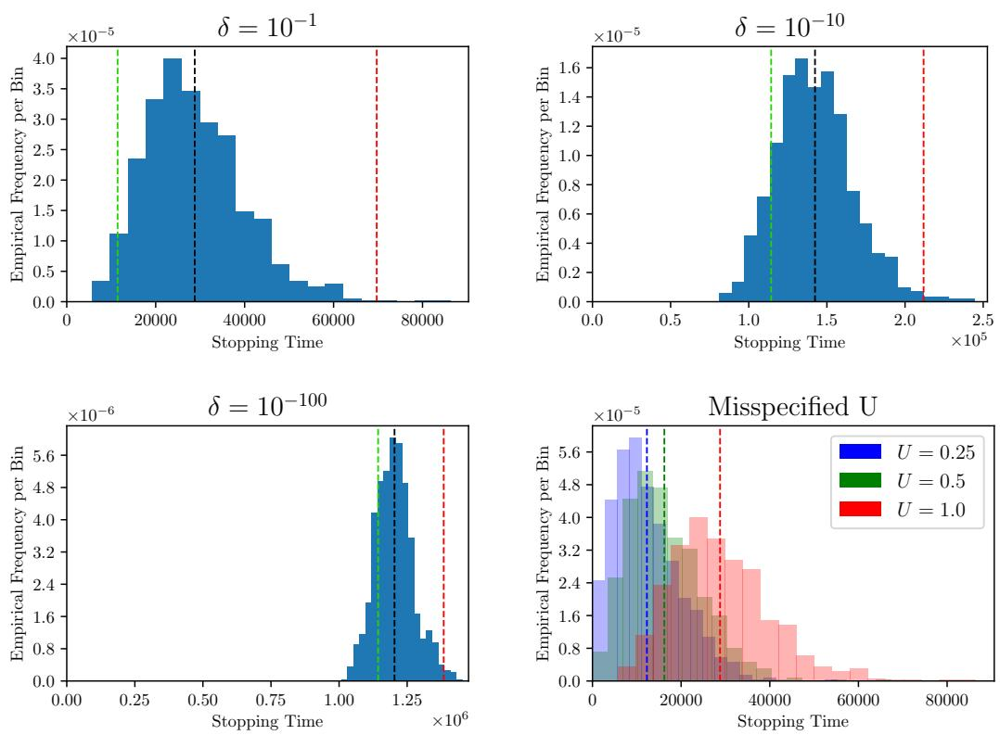

# Best Arm Identification for Bandits with Shifting Means

Lukas Zierahn CWI and Booking.com Science Park 123 1098 XG Amsterdam lukas.zierahn@gmail.com

Wouter M. Koolen CWI and University of Twente Science Park 123 1098 XG Amsterdam wmkoolen@cwi.nl

Shubhada Agrawal Indian Institute of Science (IISc), Bengaluru CV Raman Rd, Bengaluru, Karnataka 560012, India shubhada@iisc.ac.in

Christina Katsimerou Booking.com Oosterdokskade 163, 1011 DL Amsterdam christina.katsimerou@booking.com

Dirk van der Hoeven Leiden University Rapenburg 70, 2311 EZ Leiden dirk@dirkvanderhoeven.com

## Abstract

We study the best arm identification problem in a stochastic environment with a novel form of adversarial perturbations, which we coin Shifting Means. While classically the mean rewards of the K arms are stable in time, in Shifting Means only the gaps ∆ between mean rewards are stable, while their common shift may be determined adversarially in each round. The objective of the learner is to identify the best arm with high probability while minimizing sample complexity (the fixed confidence setting). Handling shifts requires new tools: we show that algorithms employing a Generalized Likelihood Ratio Test (GLRT) stopping rule, including the popular Track-and-Stop, fail under time-varying shifts. Instead, we propose Importance Weights for Shifting Means (ISM). Assuming means bounded by U and $\sigma ^ { 2 }$ -sub-Gaussian rewards, we show ISM to be δ-correct and to enjoy a sample complexity bound of order $K ( \sigma ^ { 2 } + U ^ { 2 } ) \Delta _ { \mathrm { m i n } } ^ { - 2 }$ ln 1 . We also present a matching (up to constant factors) worst-case lower bound and evaluate our results empirically.

## 1 Introduction

Best Arm Identification (BAI) is a fundamental problem in sequential decision making, where the learner is given a set of K arms, each associated with an unknown probability distribution. At each time step, the learner may sample one arm and observe a reward, with the goal of identifying the best arm, namely, the one with the highest expected reward.

In the literature, two classical formulations of the problem have been considered. In the fixed-budget setting, the objective is to maximize the confidence of identifying the best arm given a pre-specified sampling budget [Glynn and Juneja, 2004, Audibert and Bubeck, 2010]. In the fixed-confidence setting, the objective is to identify the best arm with a prescribed level of confidence while minimizing the number of samples [Even-Dar et al., 2006, Mannor and Tsitsiklis, 2004]. This work focuses exclusively on the fixed-confidence setting.

A central assumption in the standard BAI framework is that observations are independent and identically distributed (i.i.d.) over time. However, in real-world applications, data are neither independent nor identically distributed. For example, the performance of a new product may decline as novelty wears off, or the conversion rate of a website may fluctuate with time of day or day of the week. When such perturbations are left unmodeled, classical algorithms can lose their correctness guarantees (Section 3). To provide robustness against such effects, we study BAI under adversarial perturbations that shift the mean rewards of all arms simultaneously.

One important class of such perturbations arises when global trends affect all arms in the same direction. For instance, user engagement on an online platform may be uniformly higher during weekends and lower during weekdays, or all products may experience a dip in sales following a seasonal lull. Empirical evidence suggests that macro-level effects on real-world platforms (e.g., seasonality, events, platform-wide fluctuations) are largely independent of the intrinsic qualities of the arms and that the differences between arms remain stable over time [Fiez et al., 2024, Russac et al., 2021]. We model such perturbations adversarially: the absolute performance of all arms is shifted by an arbitrary, unobserved common offset in each round, while the pairwise gaps remain constant. This ensures that a unique best arm persists throughout the experiment, while the adversarial shift captures a broad class of real-world effects without assuming any specific generative process. We call the resulting model Shifting Means.

In Shifting Means, the expected rewards may vary across rounds and allow an arbitrary dependence on past samples. To retain learnability we introduce a latent variable $B _ { t }$ called the $s h i f t$ , which the learner will never observe. $B _ { t }$ can vary arbitrarily and even adversarially between timesteps t and may also be drawn at random. We make three core assumptions: (a) the expected mean of an arm given the shift $B _ { t }$ is bounded by $U ,$ , (b) the reward distributions of all arms are $\sigma ^ { 2 }$ sub-Gaussian given $B _ { t }$ , and (c) the expected mean gaps between arms given $B _ { t }$ are constant (both over the draw of $B _ { t }$ and across time). One valid way to construct an environment for $K$ arms given these assumptions is to pick a set of gaps $\pmb { \Delta }$ , pick a bounded $B _ { t }$ deterministically in a non-oblivious adversarial fashion and draw the rewards from normal distributions with means ${ \dot { B } } _ { t } - \Delta _ { a }$ for arm a. Picking $B _ { t } = 0$ with probability 1 recovers the stationary best arm identification setting.

## Contributions We now summarize key contributions of our work.

1. We show that the much celebrated Track-and-Stop algorithm of Garivier and Kaufmann [2016] fails in the Shifting Means setting (Lemma 9) and propose Importance Weighting for Shifting Means (ISM; Algorithm 1). ISM is based on an evidence measure that generalizes importance weighting and optimally tunes the hyperparameters to ensure that the evidence of sub-optimal arms being the best arm does not grow and consequently we prove δ-correctness for ISM (Theorem 2).

2. We show an asymptotic in $\delta  0$ upper bound on the expected sample complexity in terms of a problem dependent rate $1 / D ^ { * } ( \pmb { \Delta } )$ (Theorem 4), which we then show to be of order $K ( \sigma ^ { 2 } + U ^ { 2 } ) / \Delta _ { \mathrm { m i n } } ^ { 2 }$ (Theorem 6), for the smallest gap $\Delta _ { \mathrm { m i n } }$ . One of the core difficulties to overcome is to ensure quick enough convergence to optimal arm sampling probabilities for the current bandit, which we tackle by per-round plug-in estimates, sufficient exploration, and a martingale concentration analysis of Bernstein type.

3. We prove a lower bound on the expected number of samples any δ-correct algorithm needs to generate in the Shifting Means scenario, by randomizing the shifts $B _ { t }$ . We draw the shifts from the raised cosine distribution, which is least informative in the sense of Fisher information among all distributions on a bounded interval [Polyanskiy and Wu, 2025, Equation (29.13) and references therein]. It uses its bounded range to inflate the effective variance of the rewards, measured through a KL divergence, from ${ \overset { \smile } { \sigma } } ^ { 2 }$ to nearly $\sigma ^ { 2 } + U ^ { 2 } / \pi ^ { 2 }$ (Lemma 7), culminating in a lower bound of order K $( \sigma ^ { 2 } + U ^ { 2 } ) / \Delta _ { \mathrm { m i n } } ^ { 2 }$ (Theorem 8). That lower bound contains the standard BAI lower bound of $K \sigma ^ { 2 } / \Delta _ { \operatorname* { m i n } } ^ { 2 }$ [Kaufmann et al., 2016] and shows that ISM is optimal up to constant factors.

4. We demonstrate the practicality of ISM through experiments in Section 6. We discuss when the theoretical bounds are good predictors of the actual stopping time. We also verify empirically that the algorithm is δ-correct under mis-specification.

Limitations Our model assumes an additive common shift and fixed pairwise gaps and we require valid known upper bounds on the conditional means and sub-Gaussian variance proxy. The current expected sample-complexity upper bound is asymptotic as $\delta \to 0$ , the upper and lower bounds match only up to universal constants, and the numerical evaluation is limited to synthetic instances.

Related Work The first tight lower bound and an asymptotically optimal algorithm for the fixedconfidence BAI setting with stationary parametric distributions was developed by Garivier and Kaufmann [2016]. Their algorithm, Track-and-Stop (TAS), has since been extended to a variety of BAI frameworks, including BAI with heavy-tails and risk-sensitive objectives [Agrawal et al., 2020, 2021], BAI with multiple-correct answers [Degenne and Koolen, 2019], BAI for linear bandits [Jedra and Proutiere, 2020], multi-agent bandits [Vannella et al., 2023], and batched BAI [Jin et al., 2024]. For a broader introduction to BAI and the TAS methodology, we refer the reader to the textbook treatment by Lattimore and Szepesvári [2020].

Robustness to adversarial perturbations is well studied in the regret-minimization literature [Lykouris et al., 2018, Gupta et al., 2019]. Within BAI, Altschuler et al. [2019] study ε-contamination, where each sample is independently replaced by an adversarial value with probability ε; since means become unidentifiable, they target the arm with the highest median and give matching sample-complexity bounds. Jamieson and Talwalkar [2016] consider a fully adversarial model where arm losses may change arbitrarily but are assumed to converge to a limit, a condition that need not hold in our setting. Closest to our setting, Srisawad et al. [2024] study fixed-budget BAI under a common additive shift $s _ { j }$ that equally affects the mean of all arms in each environment $j .$ They show that pairwise gap estimates are consistent under the condition that the number of environment changes grows sublinearly in the number of rounds and that the learner observes when the environment changes. In contrast, Shifting Means allows the shift to change adversarially every round and the learner does not observe any additional information about the shifts.

A related field is non-stationary bandits, since adversarial common shifts can naturally arise from real-world non-stationarity. In the fixed-budget setting, Abbasi-Yadkori et al. [2018] achieve a “best of both worlds” guarantee adapting to both stochastic and adversarial rewards, and Xiong et al. [2024] address linear BAI under arbitrary time variations but can be overly conservative for the structured perturbations we consider. Allesiardo et al. [2017] study a non-stationary BAI setting similar to but more restrictive than ours using elimination-based methods. In the fixed-confidence setting, Russac et al. [2021] model non-stationarity through seasonal subpopulations with known frequencies, achieving asymptotic optimality but not capturing continuous perturbations. More recently, Hou et al. [2024] generalize this to piecewise-stationary linear bandits where the learner estimates both rewards and change-points.

Outline of the paper In Section 2, we formalize the setup and introduce the notation we use throughout. Section 3 contains certain negative results and also give some intuitions on why TAS cannot be used directly for Shifting Means. In Section 4 we first introduce the core ideas of our ISM algorithm and show its δ-correctness before also demonstrating the sample complexity guarantees. Then we move on to the lower bounds in Section 5, present the numerical results in Section 6, and conclude with discussions and broader perspectives in Section 7.

## 2 Setup and Notation for Shifting Means

In this section we define our stochastic bandit model with common adversarial perturbations, describe learner strategies in the fixed-confidence setting, and preview the sample complexity guarantees we will achieve. Let K be the number of arms. We will model sequential interactions where in each round $t \geq 1$ the learner picks an arm $A _ { t } \in [ K ]$ and the environment responds with a reward $X _ { t } \in \mathbb { R }$ We denote the history observed in the first t rounds by $H _ { t } = ( A _ { 1 } , X _ { 1 } , \cdot \cdot \cdot , A _ { t } , X _ { t } )$ . A sampling rule for the learner is a stochastic kernel for $A _ { t } | H _ { t - 1 }$ in each round $t \geq 1 ,$ , whereas a bandit instance is a stochastic kernel for $X _ { t } | A _ { t } , H _ { t - 1 }$ in each round $t \geq 1 .$ 1 Together, a sampling rule and a bandit instance induce a unique joint law over histories $( A _ { t } , X _ { t } ) _ { t \geq 1 }$ that we will henceforth denote by $\mathbb { P }$ and E, using the convenient shorthand $\mathbb { E } _ { t } [ \cdot ] : = \mathbb { E } \left[ \cdot | H _ { t - 1 } \right]$

To state our requirements about the bandit instance, we will assume that it is the marginal of a richer stochastic kernel, namely for $X _ { t } , B _ { t } , X _ { t } \vert A _ { t } , H _ { t - 1 }$ , modelling the latent potential reward vector $\ b X _ { t } \in \mathbb { R } ^ { K }$ and the latent shift $B _ { t } \in \mathbb { R }$ , neither of which is observed. We impose the standard assumptions of consistency $X _ { t } = X _ { t , A _ { t } }$ and independence $( X _ { t } , B _ { t } ) \perp \perp A _ { t } \mid H _ { t - 1 }$ , while explicitly allowing arbitrary dependence between $X _ { t }$ and $B _ { t }$ . We denote the shift-conditional mean reward of arm $\bar { a } \in [ K ]$ by $\bar { \mu } _ { t , a } : = \mathbb { E } _ { t } \left[ X _ { t , a } | B _ { t } \right]$ . In this paper we additionally assume bounded means, sub-Gaussian noise and time-invariant gaps. More precisely we assume $\boldsymbol { B }$ admits a fixed range $U \geq 0$ , a variance proxy $\sigma ^ { 2 } \geq 0$ and a gap vector $\pmb { \Delta } \doteq [ 0 , 2 U ] ^ { K }$ with a uniquely attained minimum of $\mathrm { m i n } _ { a \in [ K ] } \Delta _ { a } = 0$ such that

Assumption 1. For each $t \geq 1$ and each arm $a \in [ K ]$ , almost surely

(a) the conditional mean $\mu _ { t , a }$ is bounded2 by $| \mu _ { t , a } | \leq U$

(b) the noise is conditionally $\sigma ^ { 2 }$ -sub-Gaussian, i.e. $\mathbb { E } _ { t } \left[ e ^ { \eta ( X _ { t , a } - \mu _ { t , a } ) } \big | B _ { t } \right] \le e ^ { \frac { 1 } { 2 } \eta ^ { 2 } \sigma ^ { 2 } }$ for all $\eta \in \mathbb { R } ,$

(c) the mean equals the shifted gap $\mu _ { t , a } = B _ { t } - \Delta _ { a }$

Note that by (c) the shift-conditional mean gap $\mu _ { t , a } - \mu _ { t , b }$ is the constant $\begin{array} { r } { \left( B _ { t } - \Delta _ { a } \right) - \left( B _ { t } - \Delta _ { b } \right) = } \end{array}$ $\Delta _ { b } - \Delta _ { a } = : \Delta _ { a , b }$ . Also note that (b) does not imply that $X _ { t , a } - \mathbb { E } _ { t } [ X _ { t , a } ] { \mathrm { ~ i s ~ } } \sigma ^ { 2 } .$ -sub-Gaussian3, and (a) allows unbounded reward. Our assumptions imply that there is a consistent and unique best arm, which we denote by

$$
a ^ { * } : = \arg \operatorname* { m i n } _ { a \in [ K ] } \Delta _ { a } .
$$

We work in the fixed confidence setting, where a strategy for a learner consists of a sampling rule which induces action probabilities $w _ { t , a } = \mathbb { P } _ { t } \left\{ A _ { t } = a \right\}$ , a stopping time $\tau \in \mathbb { N } \cup \{ \infty \}$ with respect to the filtration $( H _ { t } ) _ { t \geq 0 }$ , and an H -measurable recommendation rule $\tilde { a } \in [ K ]$ . We call a learner δ-correct with confidence $\delta \in ( 0 , 1 )$ , if for any bandit instance satisfying Assumption 1 we have $\mathbb { P } \left\{ \tau < \infty \right.$ and $\tilde { a } \neq a ^ { * } \} \ \leq \ \delta .$ . Under this definition a learner that never stops is considered δ-correct, which is intuitive when considering that never giving any recommendation will never produce a wrong recommendation.

We will look at efficient learners, and in particular develop δ-correct learners with strong sample complexity guarantees. Specifically, for any bandit instance satisfying Assumption 1 with some gap $\Delta .$ , the sample complexity is bounded by

$$
\mathbb { E } [ \tau ] \le \frac { \ln \frac { K - 1 } { \delta } } { D ^ { \ast } ( \Delta ) } + o \left( \ln \frac { 1 } { \delta } \right)
$$

as $\delta  0 .$ , where $D ^ { * } ( \Delta )$ is a gap-dependent rate defined in (5). We will also derive a tight lower bound matching this upper bound in $\delta $ 0 setting. Although the rewards are conditionally stochastic, the latent shifts $B _ { t }$ and the distribution of the $\overline { { \sigma ^ { 2 } } }$ -sub-Gaussian noise associated with each arm may be chosen in an adversarial, history-dependent manner. In this sense, our model lies between classical stochastic bandits and fully adversarial bandits. Randomisation plays a central role in this adversarial interaction. Here, unlike in the fully stochastic case, achieving any upper bounds on sample complexity requires randomised arm selection, while nontrivial lower bounds necessitate randomised shifts $B _ { t }$

## 3 TAS and GLRT Fail

We argue that existing templates for algorithms, including Track-and-Stop [Garivier and Kaufmann, 2016], do not address the Shifting Means setting. Under the mild assumption that the shifts can be larger than the gaps, the opponent may set $B _ { t } = \Delta _ { A }$ against deterministic $A _ { t } .$ . Then all rewards $X _ { t }$ are zero-mean regardless of the arm and reveal no information about the true gaps. Thus, any deterministic sampling rule is powerless.

In addition, we argue that the classic GLRT stopping rule also fails, even with shifted actually Gaussian rewards. There are two ways GLRT could be applied. First, we may simply ignore the shifts in its design. We argue that this is not δ-correct as the randomised shifts can inflate the variance of the rewards. Not taking that increased variance into account leads to a higher error probability than $\delta ,$ meaning it is unsafe. The second way the GLRT can be applied is by including the possibility of shifts in its design. Now it becomes powerless, i.e. it never stops. The reason for $\tau = \infty$ is that this statistic overfits the latent shifts $B _ { t }$ to the observed rewards $X _ { t }$ each round; the statistic equals its starting value forever and hence never crosses its threshold. We analyse both these cases in detail in Appendix A.

## 4 Design and Sample Complexity Analysis of the ISM Strategy

In this section we will define and analyse our learning strategy. We will first set up the stopping and recommendation rule, and then consider the sampling rule.

## 4.1 The ISM Stopping and Recommendation Rules

For each ordered pair of distinct arms $a \neq b ,$ , we introduce a measure of evidence $z _ { t , a , b }$ in round t against $\Delta _ { a , b } \leq 0 _ { \mathrm { { \scriptsize ~ \cdot ~ } } }$ , i.e. arm b being better than arm a. It is parameterised by the sampling rule ${ \pmb w } _ { t }$ and by the hyperparameters $\lambda _ { t , a , b } , \alpha _ { t , a , b }$ , and $\beta _ { t , a , b }$ which we will tune in Sections 4.2 and 4.3. We define

$$
z _ { t , a , b } : = \frac { \mathbb { I } _ { t , a } } { w _ { t , a } } \cdot ( \lambda _ { t , a , b } X _ { t } - \alpha _ { t , a , b } ) + \frac { \mathbb { I } _ { t , b } } { w _ { t , b } } \cdot ( - \lambda _ { t , a , b } X _ { t } - \beta _ { t , a , b } )\tag{1}
$$

where $\mathbb { I } _ { t , a } : = \mathbb { I } [ A _ { t } = a ]$ denotes the indicator for $A _ { t } = a$ . We further define the cumulative evidence after t rounds by $\begin{array} { r } { Z _ { t , a , b } : = \sum _ { s = 1 } ^ { t } z _ { s , a , b } } \end{array}$ , which is compared against a threshold depending on the confidence δ to yield the stopping rule. The full ISM stopping and recommendation rules are given by

$$
\tau : = \operatorname* { i n f } \left\{ t \in \mathbb { N } \bigg | \operatorname* { m a x } _ { a \in [ K ] } \operatorname* { m i n } _ { b \neq a } Z _ { t , a , b } \geq \ln \frac { K - 1 } { \delta } \right\} \qquad \mathrm { a n d } \qquad \tilde { \mathbf { a } } : = \operatorname* { a r g m a x } _ { a \in [ K ] } \operatorname* { m i n } _ { b \neq a } Z _ { \tau , a , b } ,\tag{2}
$$

with ties broken arbitrarily. We will only work with parameter values ensuring that $( e ^ { Z _ { t , a , b } } ) _ { t > 0 }$ is a supermartingale whenever in fact $\dot { \Delta } _ { a , b } \leq 0 .$ , i.e. b is better than a. To express that, define $\bar { \Phi }$ for $w _ { a } , w _ { b } , \lambda \ge 0$ and $\alpha , \beta \in \mathbb { R }$ by

$$
\Phi ( w _ { a } , w _ { b } , \lambda , \alpha , \beta ) : = 1 - w _ { a } - w _ { b } + \operatorname* { m a x } _ { u \in \{ - U , U \} } w _ { a } e ^ { \frac { \lambda u - \alpha } { w _ { a } } + \frac { \lambda ^ { 2 } \sigma ^ { 2 } } { 2 w _ { a } ^ { 2 } } } + w _ { b } e ^ { \frac { - \lambda u - \beta } { w _ { b } } + \frac { \lambda ^ { 2 } \sigma ^ { 2 } } { 2 w _ { b } ^ { 2 } } } .\tag{3}
$$

We then have that Φ equals the worst-case exponential moment of $z _ { t , a , b }$ over all bandit instances.

Lemma 1. For all $t \geq 1$ , arms a $\neq b ,$ sampling rule ${ \pmb w } _ { t }$ and parameters $( \lambda _ { t , a , b } , \alpha _ { t , a , b } , \beta _ { t , a , b } )$

$$
\Phi ( w _ { t , a } , w _ { t , b } , \lambda _ { t , a , b } , \alpha _ { t , a , b } , \beta _ { t , a , b } ) \ = \ \operatorname* { m a x } _ { \substack { B : A s s u m p t i o n 1 h o l d s , \ \Delta _ { a , b } \leq 0 } } \ \mathbb { E } _ { t } \left[ e ^ { z _ { t , a , b } } \right] .
$$

Moreover, Φ is jointly convex (in all five parameters).

With this, we can prove δ-correctness, the proofs to both results can be found in Appendix B.

Theorem 2. Any sampling rule ${ \mathbf { } } w _ { t } ,$ , paired with stopping and recommendation rules (2) employing predictable parameters $( \lambda _ { t , a , b } , \alpha _ { t , a , b } , \beta _ { t , a , b } )$ for each pair of arms $a \neq b$ and at each round t such that Φ $( w _ { t , a } , w _ { t , b } , \lambda _ { t , a , b } , \alpha _ { t , a , b } , \beta _ { t , a , b } ) \leq 1$ , yields a δ-correct learner in any bandit satisfying Assumption 1.

The δ-correctness proof is build on a round-by-round argument and thus does not rely on the assumption that gaps are fixed in time. The same proof would go through under the weaker assumption that the best arm is fixed (but with gaps that change arbitrarily in time), meaning that ISM is robust to that misspecified setting, although potentially suffering from a worse sample complexity.

## 4.2 The Oracle Strategy for Known Gaps

To have (2) stop and recommend the correct best arm $\tilde { a } = a ^ { * }$ , we need min $b \neq a ^ { * } \ Z _ { t , a ^ { * } , b }$ to cross its threshold. For each pair $a \neq b ,$ the cumulative evidence $Z _ { t , a , b }$ has drift, i.e. expected increment,

$$
\mathbb { E } _ { t } \left[ { z } _ { t , a , b } \right] = \lambda _ { t , a , b } \Delta _ { a , b } - \alpha _ { t , a , b } - \beta _ { t , a , b } ,
$$

which depends on the chosen parameters and the true gap. We assume the gaps $\pmb { \Delta }$ are known for this section and describe how to adapt to unknown gaps in the next Section 4.3. Our approach is to optimize the parameters and the sampling rule to maximise the minimal drift, since ISM only stops after the cumulative evidences for all arms have crossed the threshold. To ensure safety, i.e., to bound the probability of a wrong recommendation, the feasible parameters we optimize over have to observe the safety constraint as laid out in Theorem 2, meaning the parameters and the sampling rule are subject to a unit exponential moment constraint (sometimes called “e-variable”4).

In other words, our goal is to solve

$$
\begin{array} { r l } & { D ( w _ { a } , w _ { b } , \Delta ) : = \underset { \Phi ( w _ { a } , w _ { b } , \lambda , \alpha , \beta ) \leq 1 } { \operatorname* { m a x } } \quad \lambda \Delta - \alpha - \beta } \\ & { \qquad \Phi ( w _ { a } , w _ { b } , \lambda , \alpha , \beta ) \leq 1 } \\ & { D ^ { * } ( \Delta ) : = \underset { w \in \Delta _ { K } } { \operatorname* { m a x } } \underset { b \neq a ^ { * } } { \operatorname* { m i n } } D ( w _ { a ^ { * } } , w _ { b } , \Delta _ { b } ) \qquad \mathrm { w h e r e } \qquad a ^ { * } = \underset { a \in [ K ] } { \operatorname { a r g m i n } } \Delta _ { a } , } \end{array}\tag{4}
$$

(5)

at which point the optimal parameters including the optimal sampling proportions can be read off.

Both $D$ and $D ^ { * }$ are convex optimisation problems. To see why, observe that $D ^ { * }$ (which contains D) is a concave objective with convex constraints, and hence one can compute the solution numerically. We discuss an efficient special-purpose implementation in Appendix J, exploiting the particular structure of this problem. We prove useful analytic results about these problems in Appendix C. For now, all that matters is that both (4) and (5) are efficiently solvable.

For any gap vector $\pmb { \Delta }$ with best arm $a ^ { * } = \arg \operatorname* { m i n } _ { a \in [ K ] } \Delta _ { a }$ . We define the oracle learner with sampling rule and parameters given by extracting the relevant maximizers

$$
\begin{array} { r l } { \boldsymbol { w } _ { t } : = } & { \arg \operatorname* { m a x } D ^ { * } ( \Delta ) } \\ { ( \lambda _ { t , a , b } , \alpha _ { t , a , b } , \beta _ { t , a , b } ) : = } & { \arg \operatorname* { m a x } D ( \boldsymbol { w } _ { t , a } , \boldsymbol { w } _ { t , b } , \Delta _ { a , b } ) \qquad \mathrm { ~ f o r ~ a l l ~ p a i r s ~ } a \neq b , } \end{array}
$$

which are in fact all independent of t. The oracle learner has maximised the minimal drift for all $b \neq a ^ { * }$ , and in fact equalised all these drifts to $D ^ { * } ( \Delta )$ . Intuitively, if the variance of each $z _ { t , a ^ { * } , b }$ is not excessive, then after roughly ln $\frac { K - 1 } { \delta } / D ^ { * } ( \pmb { \Delta } )$ timesteps we should start to expect the stopping rule (2) to trigger. Based on this intuition, Lemma 3 quantifies the stopping time of any sampling rule guaranteeing some nontrivial drift $D > 0$ . Lemma 13 then supplies the required control on the (one-sided) sub-Gaussian variance proxy for the oracle sampling rule. Both proofs are in Appendix D.

Lemma 3. Fix drift $D > 0$ and variance proxy $\rho ^ { 2 } \geq 0$ such that $\mathbb { E } _ { t } \left[ e ^ { \xi \left( D - z _ { t , a ^ { * } , b } \right) } \right] \leq e ^ { \frac { \xi ^ { 2 } \rho ^ { 2 } } { 2 } } f o r$ every $\xi \ge 0$ and arm pair $b \neq a ^ { * }$ . Then the sample complexity of stopping rule (2) is at most

$$
\mathbb { E } [ \tau ] \le 1 + \left( \sqrt { \frac { \ln \frac { K - 1 } { \delta } } { D } + \frac { \rho ^ { 2 } } { 2 D ^ { 2 } } ( 1 + \ln ( K - 1 ) ) } + \sqrt { \frac { \rho ^ { 2 } } { 2 D ^ { 2 } } ( 1 + \ln ( K - 1 ) ) } \right) ^ { 2 } .
$$

To interpret this bound, observe that lim $\begin{array} { r } { \mathfrak { l } \delta \to 0 \ \frac { \mathbb { E } [ \tau ] } { \ln \frac { 1 } { \delta } } \ \leq \ \frac { 1 } { D } } \end{array}$ , so the asymptotic sample complexity is determined by the drift D. That is, the drift term dominates as the variance term is δ independent, which means we can ignore $\rho .$ This motivates our choice (5) of maximising the minimal drift across all arms within the safety constraint.

Algorithm 1 Importance Weights for Shifting Means (ISM)   
Require: Confidence $\delta \in ( 0 , 1 )$ , mean range $U > 0 ,$ , sub-Gaussianity constant $\sigma ^ { 2 } > 0$   
1: for $t = 1 , \ldots$ . do   
2: Compute sampling proportions ${ \pmb w } _ { t }$ in (7b) using (7a) and (5)   
3: Sample arm $A _ { t } \sim w _ { t }$ and observe reward $X _ { t }$   
4: For all pairs $a \neq b ,$ compute $( \lambda _ { t , a , b } , \alpha _ { t , a , b } , \beta _ { t , a , b } )$ in (7c) using (4)   
5: For all pairs $a \neq b ,$ update evidences $\boldsymbol { Z } _ { t , a , b }$ in (1) and gap estimates $\hat { \Delta } _ { t , a , b }$ in (6)   
6: if stopping condition (2) reached $( \mathrm { i } . \mathrm { e } . \tau = t )$ then Stop and recommend arm a˜ in (2)   
7: end for

## 4.3 The ISM Sampling Rule for Unknown Gaps

The final step is to define the algorithm for unknown gaps. Our approach here is to estimate the gaps and plug them in. We use the unbiased importance-weighted estimator

$$
\hat { \Delta } _ { t , a , b } : = \frac { 1 } { t } \sum _ { s = 1 } ^ { t } \left( \frac { \mathbb { I } _ { s , a } } { w _ { s , a } } - \frac { \mathbb { I } _ { s , b } } { w _ { s , b } } \right) X _ { s } .\tag{6}
$$

We extend the definition to $t = 0$ by arbitrarily setting $\hat { \Delta } _ { 0 , a , b } : = 0 .$ . At a high level, the approach of ISM is to tune in round t as if the gaps $\hat { \Delta } _ { t - 1 , b } : = \operatorname* { m a x } _ { a } \hat { \Delta } _ { t - 1 , a , b }$ were correct. This requires some care. While the true gap vector $\pmb { \Delta }$ has a unique best arm (i.e. gap zero), and its entries are bounded in [0, 2U], neither of which have to be true for the estimated gap vector $\hat { \Delta } _ { t - 1 }$ . These are transient problems that vanish in probability as $t  \infty ( \sec \mathbf { e } . \mathbf { g }$ . Lemma 21) with sufficient exploration. If entries of $\hat { \Delta } _ { t - 1 }$ are above $2 U$ , we project them down to $2 U$ componentwise, written $\hat { \Delta } _ { t - 1 } \wedge 2 U$ ; as $\pmb { \Delta } \in [ 0 , 2 U ] ^ { K }$ this only moves the estimate closer to the truth, and it keeps λ, α and $\beta$ bounded. If there are several zeroes, then $D ( w _ { a } , w _ { b } , 0 ) = 0$ and any weights w are optimal, in which case we choose to set w uniform. We set

$$
\tilde { w } _ { t } : = \left\{ \begin{array} { l l } { \operatorname { a r g m a x } D ^ { * } ( \hat { \Delta } _ { t - 1 } \wedge 2 U ) } & { \mathrm { i f } ~ \hat { \Delta } _ { t - 1 } ~ \mathrm { h a s ~ a ~ u n i q u e ~ z e r o ~ e n t r y } , } \\ { \mathbf { 1 } _ { K } / K } & { \mathrm { o t h e r w i s e } , } \end{array} \right.\tag{7a}
$$

$$
{ \pmb w } _ { t } : = \left( 1 - \frac { 1 } { \sqrt { t } } \right) { \tilde { \pmb w } } _ { t } + \frac { { \mathbf 1 } _ { K } } { K \sqrt { t } }\tag{7b}
$$

$$
\big ( \lambda _ { t , a , b } , \alpha _ { t , a , b } , \beta _ { t , a , b } \big ) : = \arg \operatorname* { m a x } D ( w _ { t , a } , w _ { t , b } , \hat { \Delta } _ { t - 1 , a , b } \wedge 2 U )
$$

$$
\neq b\tag{7c}
$$

Here, $\tilde { \mathbf { \pmb { w } } } _ { t }$ maximises the minimal drift as if $\hat { \Delta } _ { t - 1 } \wedge 2 U$ were the real gaps, and (7b) mixes in exploration to obtain the actual sampling probabilities ${ \pmb w } _ { t }$ . With that the algorithm, which we call ISM, is completely defined. See Algorithm 1 for a summary. ISM is δ-correct by Theorem 2. The next result shows that $D ^ { * } ( \Delta )$ quantifies its sample complexity.

Theorem 4. Fix a bandit instance satisfying Assumption 1 with gap $\Delta .$ . ISM (Algorithm 1) ensures asymptotic sample complexity

$$
\operatorname* { l i m } _ { \delta \to 0 } \frac { \mathbb { E } [ \tau ] } { \ln \frac { 1 } { \delta } } \leq \frac { 1 } { D ^ { \ast } ( \Delta ) } .
$$

The proof needs to overcome two complications compared to that of Lemma 3. First, the gaps are now learned, and as such the drift is not uniformly bounded below over time. We argue, by concentration, that the true gap is learned quickly enough. In addition, the sub-Gaussian variance proxy used in Lemma 3 can get arbitrarily large when the sampling weights $w _ { t , a }$ get small. Forced exploration provides a lower bound of order $1 / { \sqrt { t } } .$ , yet this would be vacuous when combined with Hoeffding’s range bound, which scales as $\frac { 1 } { w _ { t , a } ^ { 2 } }$ . We overcome this by relying on Bernstein instead, as the actual variance scales by only $\frac { 1 } { w _ { t , a } }$ . We refer the reader to Appendix H for a complete proof, and conclude with showing that ISM is efficiently implementable, proof in Appendix J.

## Lemma 5. ISM requires $O ( K ^ { 2 } )$ storage, and $O ( K )$ work per round.

Proof. First of all, instead of maintaining $\hat { \Delta } _ { t , a , b }$ for all pairs a $\neq b ,$ we can instead track the terms in (6) for arm a and arm b separately. This requires maintaining $\dot { K }$ quantities instead of $K ( K - 1 ) / 2$ for the gap estimates, though the evidence need to be stored separately leading to a $O ( K ^ { 2 } )$ storage requirement. Lines 4 and $\check { 5 }$ mention all $K ( K - 1 )$ ) ordered distinct pairs. But due to the indicators in the evidence (1) and gap estimates (6), only the $2 ( K - 1 )$ pairs containing $A _ { t }$ need updating in line $5 ,$ and only their parameters need to be computed in line 4. The weights and parameters can be computed in ${ \dot { O } } ( K )$ work as described in Appendix J. □

## 4.4 Interpretable Bounds

While Theorem 4 and $D ^ { * } ( \Delta )$ provide an accurate quantification of the expected stopping time, it is not apparent what the scaling of critical parameters $\bar { \sigma } ^ { 2 } , U$ and the gaps $\pmb { \Delta }$ actually is. Therefore, we present interpretable bounds on the sample complexity for our algorithm in this section by lower and upper bounding $D ^ { * } ( \Delta ) ^ { - 1 }$

Theorem 6. Define the second best action by $b ^ { * } = \arg \operatorname* { m i n } _ { b \neq a ^ { * } } \Delta _ { b }$ . Then $D ^ { * } ( \Delta )$ as defined in (5) is sandwiched by (where the lower bound (⋆) holds whenever maxa $\Delta _ { a } \ \leq \ { \textstyle { \frac { 1 } { 2 } } } \gamma U$ , with $\gamma : =$ $3 ( \coth ( 1 ) - 1 ) \approx { \dot { 0 . 9 4 } } )$

$$
2 ( \sigma ^ { 2 } + \gamma U ^ { 2 } ) \left( \frac { 1 } { \Delta _ { b ^ { * } } ^ { 2 } } + \sum _ { a \in [ K ] \backslash a ^ { * } } \frac { 1 } { \Delta _ { a } ^ { 2 } } \right) \stackrel { ( * ) } { \leq } \frac { 1 } { D ^ { * } ( \Delta ) } \leq 4 ( \sigma ^ { 2 } + U ^ { 2 } ) \left( \frac { 1 } { \Delta _ { b ^ { * } } ^ { 2 } } + \sum _ { a \in [ K ] \backslash a ^ { * } } \frac { 1 } { \Delta _ { a } ^ { 2 } } \right) .
$$

The proof of Theorem 6 is based on technical calculation to derive a term that is similar to the result of Garivier and Kaufmann [2016] and indeed, we obtain essentially the same upper bound on $D ^ { * } ( \Delta ) ^ { - 1 }$ as they do, except for the presence of U. This is perhaps not surprising as illustrated by our lower bounds presented in the next Section 5, that also feature the factor $U$ on the sample complexity of any δ-correct algorithm. The two sides of Theorem 6 differ by a factor of $2 / \gamma \approx 2 . 1$ . Its lower bound on $1 / D ^ { * } ( \pmb { \Delta } )$ only holds if $2 \operatorname* { m a x } _ { a } \Delta _ { a } \leq \gamma U , { \mathrm { i . e . } }$ , if the adversary has comparatively more power for shifting; if $\operatorname* { m a x } _ { a } \Delta _ { a } = 2 U$ the range of the shifts is constant over time. ISM recovers the optimal bound in the BAI setting and we leave showing an exact graceful degradation of performance to future work.

## 5 Lower bounds

In this section, we prove a lower bound on the expected number of samples any $\delta \cdot$ -correct algorithm for the shifting means setting introduced in Section 2 will need to request. We define our lower-bound bandit instances as follows: Given a gap vector $\pmb { \Delta }$ and a shift distribution5 for $B _ { t } .$ , we sample the potential rewards from a normal distribution $X _ { t , a } | B _ { t } \sim \mathcal N ( B _ { t } - \Delta _ { a } , \sigma ^ { 2 } )$ with fixed (and known) variance $\sigma ^ { 2 }$ . To ensure that $\boldsymbol { B }$ fulfills Assumption 1, the shift distribution has to be bounded, that is $B _ { t } \in [ \operatorname* { m a x } _ { a } \Delta _ { a } - U , U ]$ with probability 1. The main challenge of the lower bound is to choose a shift distribution that makes the problem as hard as possible. As in the lower bound of Garivier and Kaufmann [2016], the hardness of a bandit instance is measured by how well a single reward distinguishes two instances with a different best arm. That is, informally, the expected stopping time $\mathbb { E } [ \tau ]$ is determined by the fraction of pulls $w _ { a }$ that any algorithm allocates to arm a and a one-round KL divergence

$$
\mathbb { E } [ \tau ] \gtrsim \ln \frac { 1 } { \delta } \frac { 1 } { \sum _ { a = 1 } ^ { K } w _ { a } \ : \mathrm { K L } ( \epsilon + B \parallel \Delta _ { a } - \tilde { \Delta } _ { a } + \epsilon + { B } ) } ,\tag{8}
$$

for any $\tilde { \Delta }$ with a different best arm than $\pmb { \Delta }$ (full details in Theorem 8/Appendix F). When picking $B = 0$ , we exactly recover the standard lower bound for Gaussian bandits [Garivier and Kaufmann, 2016]. The goal now becomes to leverage the shift B to make this KL divergence as small as possible while respecting the boundedness required by Assumption 1.

For small $\triangle : = \Delta _ { a } - \tilde { \Delta } _ { a }$ , the KL divergence between nearby members of a smooth location family is governed by its Fisher information. Writing $\begin{array} { r } { I ( X ) : = \int q ^ { \prime } ( \dot { x } ) ^ { 2 } / q ( x ) } \end{array}$ dx for the Fisher information

of a random variable X with density $q ,$ , we have

$$
{ \bf K L } ( \epsilon + B \parallel \triangle + \epsilon + B ) \approx { \frac { \triangle ^ { 2 } } { 2 } } I ( \epsilon + B ) < { \frac { 1 } { 2 } } { \frac { \triangle ^ { 2 } } { \sigma ^ { 2 } + 1 / I ( B ) } } ,
$$

where we plugged in $I ( \epsilon ) = 1 / \sigma ^ { 2 }$ for the normal distribution, the critical term remaining being the Fisher information of the shifts $I ( B )$ ; the details can be found in the proof of Lemma 7 in Appendix F.

Thus for our shifting distribution, we seek to minimize the Fisher information. The minimizer on a closed interval $[ - R , R ]$ is given by a raised cosine distribution

$$
p ( B ^ { \prime } ) = { \displaystyle \left\{ \frac { 1 } { R } \cos ^ { 2 } \biggl ( \frac { \pi B ^ { \prime } } { 2 R } \biggr ) \right. \mathrm { ~ i f ~ } | B ^ { \prime } | \leq R } _ { \mathrm { 0 t h e r w i s e } , }\tag{9}
$$

which achieves $I ( B ^ { \prime } ) = \pi ^ { 2 } / R ^ { 2 }$ for $B ^ { \prime } \sim p .$ . Overall, that allows us to bound the KL as follows: Lemma $^ { 7 . }$ $F i x \sigma ^ { 2 } > 0$ and $R > 0$ . Let $\epsilon \sim \mathcal { N } ( 0 , \sigma ^ { 2 } )$ and $B ^ { \prime } \sim p$ as in Equation (9) be independent. There exists $d > 0$ , depending only on $\sigma ^ { 2 }$ and $R ,$ such that for all $| \triangle | \leq d ,$

$$
\mathrm { K L } ( \epsilon + B ^ { \prime } \parallel \triangle + \epsilon + B ^ { \prime } ) \le { \frac { \triangle ^ { 2 } } { 2 ( \sigma ^ { 2 } + R ^ { 2 } / \pi ^ { 2 } ) } } .
$$

The proof can be found in Appendix F. Formalizing Equation 8 and combining it with the last lemma yields the main result of this section:

Theorem 8. Fix $U > 0 , \sigma ^ { 2 } > 0$ , andfix any algorithm that is δ-correctfor all bandit instancesfor the given $U$ and $\sigma ^ { 2 }$ . There exists a set of gaps $\pmb { \Delta }$ and a shift distribution, such that the following lower bound holds:

$$
\operatorname* { l i m i n f } _ { \delta \to 0 } \frac { \mathbb { E } [ \tau ] } { \ln \frac { 1 } { \delta } } \geq 2 \left( \sigma ^ { 2 } + \frac { ( U - \operatorname* { m a x } _ { a } \Delta _ { a } / 2 ) ^ { 2 } } { \pi ^ { 2 } } \right) \left( \frac { 1 } { \Delta _ { b ^ { * } } ^ { 2 } } + \sum _ { a \in [ K ] \setminus a ^ { * } } \frac { 1 } { \Delta _ { a } ^ { 2 } } \right) .
$$

Comparing with the upper bound $4 ( \sigma ^ { 2 } + U ^ { 2 } )$ of Theorem 6 shows that, for gaps that are small relative to U, ISM is optimal up to a factor of at most $2 \pi ^ { 2 } \approx 2 0$ and approaches 2 when $\sigma ^ { 2 }$ dominates $U ^ { 2 }$

## 6 Numerical Experiments

We consider a $K = 4$ armed bandit instance6 with Bernoulli rewards and fixed mean gap vector $\vec { \Delta } \quad = \quad [ 0 . 0 \quad 0 . 0 5 \quad 0 . 0 7 \quad 0 . 1 ]$ , which coincides with the gaps of the stationary bandit $\vec { \mu } _ { 1 } ~ =$ $[ 0 . 5 , 0 . 4 \dot { 5 } , 0 . 4 3 , 0 . 4 ]$ used in the experiments of Garivier and Kaufmann [2016]. We work with adversarially shifted means $\mu _ { t , a } = B _ { t } - \Delta _ { a } ,$ where we draw the per-round common shifts $B _ { t }$ i.i.d. from the uniform distribution over the range [0.1, 1]. Accordingly, we set $U = 1$ and $\sigma ^ { 2 } = 1 / 4$ . We solve (5) to obtain optimal drift and weights

$$
D ^ { * } \ = \ \frac { 1 } { 4 9 6 5 . 7 4 } { \qquad \mathrm { a n d } \qquad } \vec { w } ^ { * } \ = \ [ 0 . 4 1 6 8 { \quad } 0 . 3 8 9 6 { \quad } 0 . 1 3 6 3 { \quad } 0 . 0 5 7 2 ] .
$$

Our optimal weights are to first order the same as those reported by Garivier and Kaufmann [2016] meaning the shifts only have a small influence on the sampling probabilities in this case. We also display the optimal values for the evidence parameters in Table 2. As the gap estimates only change slowly, we speed up the computation by recomputing the ${ \pmb w } _ { t }$ only every 100 timesteps. Table 1 and Figure 1 in Appendix K show the expected and realized stopping times of ISM over 1000 iterations (All experiments were run on a personal desktop (CPU: Intel i7-10700K) with a total compute time of less than 24h.). We can see how the additional fraction of samples between empirical and predicted stopping time (Theorem 4) vanishes as δ shrinks.

Since we are using the exact same setup as Garivier and Kaufmann [2016] (modulo shifts), we can compare numbers directly. The mean stopping time with $\begin{array} { r } { \delta = \frac { 1 } { 1 0 } } \end{array}$ for TAS is 3968 or 4052 (averaged over 3000 iterations) depending on the tracking strategy, while the empirical stopping time of ISM is between [28 085, 29 470] with 95% confidence.

Figure 1 also shows that the algorithm is at least empirically robust to misspecification of $U$ as all iterations over different U and $\delta$ values find the correct arm, except for 4 out of the 1000 runs with $\begin{array} { r } { U = \frac { 1 } { 4 } } \end{array}$

<table><tr><td> $\frac { \delta } { 1 0 ^ { - 1 } }$ </td><td> $\frac { 1 } { D ^ { * } } \ln { \frac { 1 } { \delta } }$ </td><td> $\frac { 1 } { D ^ { * } } \ln \frac { K - 1 } { \delta }$ </td><td>Lemma 3</td><td>Empirical</td><td>Empirical Overhead</td></tr><tr><td></td><td> $\overline { { 1 1 4 3 4 } }$ </td><td>16889</td><td>69702</td><td>[28085,29470]</td><td>[145.62%, 157.74%]</td></tr><tr><td> $1 0 ^ { - 1 0 }$ </td><td>114340</td><td>119796</td><td>211 870</td><td>[140 868, 143 920]</td><td>[23.20%, 25.87%]</td></tr><tr><td> $1 0 ^ { - 1 0 0 }$ </td><td>1 143 403</td><td>1 148 858</td><td>1384 182</td><td>[1 199 222, 1 207 930]</td><td>[4.88%, 5.64%]</td></tr></table>

Table 1: Theoretical predictions and practical measurement of sample complexity for the bandit as laid out in Section 6 at different δ. For Lemma 3 we took as the variance proxy $\rho ^ { 2 }$ the largest worst-case variance in Table 2. The empirical value is given as a 95% confidence interval of 1000 samples. The ratio is the real overhead not predicted by theory, that is, it is the relative percentage difference between the first and second last entry of the table.

## 7 Discussion & Conclusion

We introduced the Shifting Means setting and demonstrated how previous approaches using the GLRT fail in this setting. Then we developed ISM and showed that it is δ-correct and enjoys a sample complexity guarantee of $\begin{array} { r } { 4 ( \sigma ^ { 2 } + \dot { U } ^ { 2 } ) \bigl ( \Delta _ { b ^ { * } } ^ { - 2 } + \sum _ { a \in [ K ] \backslash a ^ { * } } \Delta _ { a } ^ { - 2 } \bigr ) \ln \frac { 1 } { \delta } } \end{array}$ (Theorem 6). We demonstrated the practicality of ISM, and empirically demonstrate its robustness in misspecification of U. Furthermore, we developed a novel construction for our lower bound, which matches the upper bound up to a constant factor (Theorem 8) of at most $2 \pi ^ { 2 }$ 20 for gaps that are small relative to U.

Shifting Means is a strict generalization of the traditional BAI setting, though our safety argument holds for the even larger class of problems where only the identity of the best arm is fixed each timestep. That is, we are safe when the mean rewards of all arms change arbitrarily over a bounded range, as long as the best arm always has the highest expected payoff. However, approaching that setting from the power side is highly non-trivial. Our current approach is based around plugging in the estimated gaps, which are then not fixed any more, will change adversarially over time, and can even vanish. Showing, for example, convergence guarantees based on the time averaged gap remains a major challenge. We leave that very interesting setting open for future work.

## Acknowledgments and Disclosure of Funding

DvdH was supported by Netherlands Organization for Scientific Research (NWO), grant number VI.Veni.242.143 (https://doi.org/10.61686/SCGQQ55380).

## References

Yasin Abbasi-Yadkori, Peter Bartlett, Victor Gabillon, Alan Malek, and Michal Valko. Best of both worlds: Stochastic & adversarial best-arm identification. In Conference on learning theory, pages 918–949. PMLR, 2018.

Shubhada Agrawal, Sandeep Juneja, and Peter Glynn. Optimal δ-correct best-arm selection for heavy-tailed distributions. In 31st International Conference on Algorithmic Learning Theory, volume 117, pages 61–110. PMLR, 2020.

Shubhada Agrawal, Wouter M. Koolen, and Sandeep Juneja. Optimal best-arm identification methods for tail-risk measures. Advances in neural information processing systems, 34:25578–25590, 2021.

Robin Allesiardo, Raphaël Féraud, and Odalric-Ambrym Maillard. The non-stationary stochastic multi-armed bandit problem. International Journal ofData Science and Analytics, 3(4):267–283, 2017. ISSN 2364-4168. doi: 10.1007/s41060-017-0050-5.

Jason Altschuler, Victor-Emmanuel Brunel, and Alan Malek. Best arm identification for contaminated bandits. Journal ofMachine Learning Research, 20(91):1–39, 2019.

Jean-Yves Audibert and Sébastien Bubeck. Best arm identification in multi-armed bandits. In COLT-23th Conference on learning theory-2010, pages 13–p, 2010.

Nicolò Cesa-Bianchi and Gabor Lugosi. Prediction, Learning, and Games. Cambridge University Press, 2006.

Rémy Degenne and Wouter M. Koolen. Pure exploration with multiple correct answers. Advances in Neural Information Processing Systems, 32, 2019.

Rémy Degenne, Wouter M. Koolen, and Pierre Ménard. Non-asymptotic pure exploration by solving games. In Advances in Neural Information Processing Systems (NeurIPS) 32, pages 14492–14501, December 2019.

Eyal Even-Dar, Shie Mannor, and Yishay Mansour. Action elimination and stopping conditions for the multi-armed bandit and reinforcement learning problems. Journal of Machine Learning Research, 7(39):1079–1105, 2006.

Tanner Fiez, Houssam Nassif, Yu-Cheng Chen, Sergio Gamez, and Lalit Jain. Best of three worlds: Adaptive experimentation for digital marketing in practice. In Proceedings of the ACM Web Conference 2024, pages 3586–3597, 2024.

Aurélien Garivier and Emilie Kaufmann. Optimal best arm identification with fixed confidence. In 29th Annual Conference on Learning Theory, volume 49 of Proceedings ofMachine Learning Research, pages 998–1027. PMLR, 23–26 Jun 2016.

Peter Glynn and Sandeep Juneja. A large deviations perspective on ordinal optimization. In Proceedings ofthe 2004 Winter Simulation Conference, 2004., volume 1. IEEE, 2004.

Anupam Gupta, Tomer Koren, and Kunal Talwar. Better algorithms for stochastic bandits with adversarial corruptions. In Conference on Learning Theory, pages 1562–1578. PMLR, 2019.

Yunlong Hou, Vincent Y. F. Tan, and Zixin Zhong. Almost minimax optimal best arm identification in piecewise stationary linear bandits. In Advances in Neural Information Processing Systems, volume 37, pages 128967–129041, 2024.

Kevin Jamieson and Ameet Talwalkar. Non-stochastic best arm identification and hyperparameter optimization. In Proceedings of the 19th International Conference on Artificial Intelligence and Statistics, volume 51, pages 240–248. PMLR, 09–11 May 2016.

Yassir Jedra and Alexandre Proutiere. Optimal best-arm identification in linear bandits. In Advances in Neural Information Processing Systems, volume 33, pages 10007–10017, 2020.

Tianyuan Jin, Yu Yang, Jing Tang, Xiaokui Xiao, and Pan Xu. Optimal batched best arm identification. In The Thirty-eighth Annual Conference on Neural Information Processing Systems, 2024.

Emilie Kaufmann, Olivier Cappé, and Aurélien Garivier. On the complexity of best-arm identification in multi-armed bandit models. Journal ofMachine Learning Research, 17(1):1–42, 2016. URL http://jmlr.org/papers/v17/kaufman16a.html.

Tor Lattimore and Csaba Szepesvári. Bandit Algorithms. Cambridge University Press, 2020. doi: 10.1017/9781108571401.

Thodoris Lykouris, Vahab Mirrokni, and Renato Paes Leme. Stochastic bandits robust to adversarial corruptions. In Proceedings of the 50th Annual ACM SIGACT Symposium on Theory of Computing, pages 114–122, 2018.

Shie Mannor and John N. Tsitsiklis. The sample complexity of exploration in the multi-armed bandit problem. Journal ofMachine Learning Research, 5(Jun):623–648, 2004.

Yury Polyanskiy and Yihong Wu. Information Theory: From Coding to Learning. Cambridge University Press, 2025.

Olivier Rioul. Information theoretic proofs of entropy power inequalities. IEEE Transactions on Information Theory, 57(1):33–55, 2011.

Yoan Russac, Christina Katsimerou, Dennis Bohle, Olivier Cappé, Aurélien Garivier, and Wouter M. Koolen. A/B/n testing with control in the presence of subpopulations. In Advances in Neural Information Processing Systems, volume 34, pages 25100–25110, 2021.

Phurinut Srisawad, Juergen Branke, and Long Tran-Thanh. Identifying the best arm in the presence of global environment shifts. arXiv preprint arXiv:2408.12581, 2024.

Filippo Vannella, Alexandre Proutiere, and Jaeseong Jeong. Best arm identification in multi-agent multi-armed bandits. In Proceedings of the 40th International Conference on Machine Learning, volume 202, pages 34875–34907. PMLR, 23–29 Jul 2023.

J. Ville. Etude critique de la notion de collectif. Gauthier-Villars, 1939.

Zhihan Xiong, Romain Camilleri, Maryam Fazel, Lalit Jain, and Kevin Jamieson. A/B testing and best-arm identification for linear bandits with robustness to non-stationarity. In Proceedings of The 27th International Conference on Artificial Intelligence and Statistics, volume 238, pages 1585–1593. PMLR, 2024.

## A TAS and GLRT fail in the Shifting Means setting

This appendix contains two parts, first we sketch some informal arguments to illustrate why the celebrated Track-and-Stop (TAS) [Garivier and Kaufmann, 2016] algorithm may no longer be δ- correct in the Shifting Means setting and second, we show that a naïve adaptation of TAS has no power.

## A.1 TAS Fails

First we will argue that TAS, when tuned for the classical K-armed bandit with Gaussian arms of unknown means and unit variance (henceforth referred to as the 1-Gaussian bandit), may incur more than a δ fraction of errors when applied to a Shifting Means 1-Gaussian bandit. Our reasoning proceeds in two steps, which we outline below.

Step 1. (Informal) Consider a 1-Gaussian bandit with 2 arms. Since the adversary can randomize while selecting the shifts, if it randomizes according to a 0-mean Gaussian with unit variance, then the samples that the algorithm observes from any arm, say a, are draws from a Gaussian with same mean, but inflated variance (2 in this case). Thus, it suffices to show that TAS tuned for 1-Gaussian bandits, when run on $\sigma ^ { 2 } .$ -Gaussian bandits is not δ-correct.

Note that randomizing according to a Gaussian distribution is not a valid scheme for the adversary since the resulting mean may no longer respect the bounds of $[ 0 , U ]$ . But for large U, this is a good model to get intuitions.

Step 2. (Informal) Suppose we observe samples $X _ { 1 } , X _ { 2 } \ldots$ . that are distributed iid according to $N ( \bar { m } , 1 )$ ). We want to test the following hypothesis:

$$
\mathcal { H } _ { 0 } : m = 0 \qquad \mathrm { ~ v s ~ } \qquad \mathcal { H } _ { 1 } : m = 1 ,\tag{10}
$$

sequentially using a $\delta \mathrm { - }$ correct, power-1 stopping rule $\tau _ { \delta }$ . Formally, this means that the stopping rule should satisfy the following: if samples come from $\mathcal { H } _ { \mathrm { 0 } }$ , then $\mathrm { P i } \dot { \mathbf { \sigma } _ { 0 } } [ \tau _ { \delta } < \infty ] \leq \delta$ . This corresponds to δ-correctness requirement. Next, when the samples come from $\mathcal { H } _ { 1 }$ , then $\mathrm { P r } _ { 1 } [ \tau _ { \delta } < \infty ] = 1$ . This corresponds to power-1 part of the requirement.

For this problem, the GLRT rule (tuned to 1-Gaussian distributions) reduces to the following

$$
\tau _ { \delta } = \operatorname* { m i n } \left\{ n : e ^ { n S _ { n } - \frac { n \theta ^ { 2 } } { 2 } } \geq \frac { 1 } { \delta } \right\} , \quad \mathrm { ~ w h e r e ~ } \quad S _ { n } : = \sum _ { i = 1 } ^ { n } X _ { i } .
$$

δ-correctness easily follows from an application of Ville’s inequality [Ville, 1939].

We now show that the above GLRT stopping rule is not δ-correct for testing problem (10) with data $X _ { i }$ i.i.d. according to $N ( m , \sigma ^ { 2 } )$ , for $\sigma > 1$ . To this end, consider the following. Note that the following probabilities are evaluated under $X _ { i } \sim N ( 0 , \sigma ^ { 2 } )$

$$
\begin{array} { r l } & { \operatorname* { P r } \left[ \tau _ { \delta } < \infty \right] = \operatorname* { P r } \left[ \exists n \in \mathbb { N } : \left\{ \theta S _ { n } - \displaystyle \frac { \theta ^ { 2 } n } { 2 } \geq \ln \displaystyle \frac { 1 } { \delta } \right\} \right] } \\ & { \qquad = \operatorname* { P r } \left[ \exists n \in \mathbb { N } : \left\{ S _ { n } \geq \displaystyle \frac { \theta n } { 2 } + \displaystyle \frac { \ln \displaystyle \frac { 1 } { \delta } } { \theta } \right\} \right] } \\ & { \qquad \approx \operatorname* { P r } \left[ \exists t \in \mathbb { R } _ { + } : \left\{ S _ { t } \geq \displaystyle \frac { \theta t } { 2 } + \displaystyle \frac { \ln \displaystyle \frac { 1 } { \delta } } { \theta } \right\} \right] } \\ & { \qquad = \delta ^ { \frac { 1 } { \sigma ^ { 2 } } } > \delta . } \end{array}\tag{σ > 1}
$$

## A.2 Naïve TAS Extension

Since the TAS stopping rule may fail in the Shifting Means setting, a natural question is whether a straightforward adaptation of the Generalized Likelihood Ratio Test (GLRT) could serve as a valid stopping rule. As the name suggests, the GLRT is based on the likelihood ratio of the null hypothesis that action a is not better than action b against the alternative hypothesis that action b is better than a. In our setting, we can write the GLRT based test statistic at time t as

$$
Z _ { a , b } ^ { \mathrm { G L R T } } ( t ) : = \ln \left( \frac { \operatorname* { s u p } _ { \bar { \mu } ^ { \prime } \in \mathbb { R } ^ { T \times A } } \prod _ { s = 1 } ^ { t } \mathbb { P } ( X _ { s } | \mu _ { s , A _ { s } } ^ { \prime } ) } { \operatorname* { m a x } _ { \bar { \mu } ^ { \prime } \in \mathbb { R } ^ { T \times A } } \prod _ { s = 1 } ^ { t } \mathbb { P } ( X _ { s } | \mu _ { s , A _ { s } } ^ { \prime } ) } \right) .\tag{11}
$$

Lemma 9 shows that this is not the case: in the Shifting Means setting, such a GLRT-based rule will, with high probability, fail to stop altogether. On a high level, the GLRT fails at the timestep t as there are many more parameters (Kt effectively independent parameters) to estimate while only having access to at most t data points, which leads to catastrophic overfitting.

Lemma 9. The GLRTfails to stopfor shifting means as the test statistic is uniformly 0 at all times, irrespective of the observed data.

Proof. Let $A _ { s }$ be any action sampled at time-step s and $X _ { s } ~ \in \mathbb { R }$ be any reward value that has non-zero probability under arm distribution of arm $A _ { s }$ at time s, for all $s \in [ t ]$

We start by investigating the denominator of the GLRT, as it is defined in (11), given by

$$
\operatorname* { m a x } _ { \mu ^ { \prime } \in \mathbb { R } ^ { T \times A } } \prod _ { s = 1 } ^ { t } \mathbb { P } ( X _ { s } | \mu _ { s , A _ { s } } ^ { \prime } ) = \prod _ { s = 1 } ^ { t } \operatorname* { m a x } _ { \mu _ { a } ^ { \prime } \leq \mu _ { b } ^ { \prime } } \mathbb { P } ( X _ { s } | \mu _ { A _ { s } } ^ { \prime } ) = \prod _ { s = 1 } ^ { t } \operatorname* { m a x } _ { \mu ^ { \prime } \in \mathbb { R } } \mathbb { P } ( X _ { s } | \mu ^ { \prime } ) \ ,
$$

where the first equality follows as $\mu _ { t , c }$ only affects round t and the second equality follows by setting $\mu _ { a } ^ { \prime } = \mu _ { b } ^ { \prime }$ to fulfill the constraint and then deleting all $\mu _ { c } ^ { \prime }$ for $c \neq A _ { t } ,$ , as they have no influence on the optimization problem. The numerator follows the same template

$$
\operatorname* { s u p } _ { \mu ^ { \prime } \in \mathbb { R } ^ { T \times A } } \prod _ { s = 1 } ^ { t } \mathbb { P } ( X _ { s } | \mu _ { s , A _ { s } } ^ { \prime } ) = \prod _ { s = 1 } ^ { t } \operatorname* { s u p } _ { \mu _ { a } ^ { \prime } \succ \mu _ { b } ^ { \prime } } \mathbb { P } ( X _ { s } | \mu _ { A _ { s } } ^ { \prime } ) = \prod _ { s = 1 } ^ { t } \operatorname* { m a x } _ { \mu ^ { \prime } \in \mathbb { R } } \mathbb { P } ( X _ { s } | \mu ^ { \prime } ) \ ,
$$

where the same solution of setting $\mu _ { a } ^ { \prime } = \mu _ { b } ^ { \prime }$ is on the edge of the feasible set and thus valid for the supremum.

Putting both of these equations together gives that

$$
Z _ { a , b } ^ { \mathrm { G L R T } } ( t ) : = \ln \left( \frac { \operatorname* { s u p } _ { \bar { \mu } ^ { \prime } \in \mathbb { R } ^ { T \times A } } \prod _ { s = 1 } ^ { t } \mathbb { P } ( X _ { s } | \mu _ { s , A _ { s } } ^ { \prime } ) } { \operatorname* { m a x } _ { \bar { \mu } ^ { \prime } \in \mathbb { R } ^ { T \times A } } \prod _ { s = 1 } ^ { t } \mathbb { P } ( X _ { s } | \mu _ { s , A _ { s } } ^ { \prime } ) } \right) = \ln \left( \frac { \prod _ { s = 1 } ^ { t } \operatorname* { m a x } _ { \mu ^ { \prime } \in \mathbb { R } } \mathbb { P } ( X _ { s } | \mu ^ { \prime } ) } { \prod _ { s = 1 } ^ { t } \operatorname* { m a x } _ { \mu ^ { \prime } \in \mathbb { R } } \mathbb { P } ( X _ { s } | \mu ^ { \prime } ) } \right) = 0 .
$$

# B Upper Bound - Stopping and Recommendation Rules - Details

Lemma 1 (RESTATED). For all $t \geq 1$ , arms a $\neq b ,$ sampling rule ${ \pmb w } _ { t }$ and parameters $\left( \lambda _ { t , a , b } , \alpha _ { t , a , b } , \right.$ $\beta _ { t , a , b } )$

$$
\Phi ( w _ { t , a } , w _ { t , b } , \lambda _ { t , a , b } , \alpha _ { t , a , b } , \beta _ { t , a , b } ) \ = \ \operatorname* { m a x } _ { \substack { B : A s s u m p t i o n 1 h o l d s , \ \Delta _ { a , b } \leq 0 } } \ \mathbb { E } _ { t } \left[ e ^ { z _ { t , a , b } } \right] .
$$

Moreover, $\Phi$ is jointly convex (in all five parameters).

Proof. We first show that Φ is jointly convex in $w _ { a } , w _ { b } , \lambda , \alpha$ , and $\beta .$ We define the function $f$ with constants $c _ { 1 } , c _ { 2 }$ where $c _ { 2 } > 0$ as

$$
f ( x , y ) = \exp \left( x c _ { 1 } - y + x ^ { 2 } c _ { 2 } \right) ,
$$

and observe that this function is jointly convex in x and $y .$ The perspective transform of a function is defined as $g ( x , y , w ) \to w f ( x / w , y / w )$ and is jointly convex in $x , y$ and $w \geq 0$ if the original function $g$ is jointly convex in $x , y$ . Noting that $f$ is jointly convex in its parameters and then applying the perspective transform yields a function jointly convex in $x , y ,$ , and w

$$
g ( x , y , w ) : = w \exp \left( \frac { x c _ { 1 } - y } { w } + \frac { x ^ { 2 } } { w ^ { 2 } } c _ { 2 } \right) .
$$

Finally, we are in a position to show that Φ is convex after recalling that the sum and max of convex functions is also convex and recognizing g twice

$$
\begin{array} { r l } & { \Phi ( w _ { a } , w _ { b } , \lambda , \alpha , \beta ) = ( 1 - w _ { a } - w _ { t , b } ) + \underset { u \in \{ - U , U \} } { \operatorname* { m a x } } \underset { \underbrace { w _ { a } \exp \left( \frac { \lambda u - \alpha } { w _ { a } } + \frac { \lambda ^ { 2 } } { w _ { a } ^ { 2 } } \frac { \sigma ^ { 2 } } { 2 } \right) } } { \underbrace { g ( \lambda , \alpha , w _ { a } ) } } } \\ & { \quad \ + \underset { \quad g ( \lambda , \beta , w _ { b } ) } { \underbrace { w _ { b } \exp \left( \frac { - \lambda u - \beta } { w _ { b } } + \frac { \lambda ^ { 2 } } { w _ { b } ^ { 2 } } \frac { \sigma ^ { 2 } } { 2 } \right) } } , } \end{array}
$$

with $c _ { 1 } = u ( \mathrm { o r } c _ { 1 } = - u )$ and $c _ { 2 } = \sigma ^ { 2 } / 2 > 0 .$

For the first claim, we start by considering the expectation of the RHS for any given  and apply a tower rule

$$
\operatorname* { m a x } _ { \substack { B ; A s s u m p t i o n 1 \mathrm { h o l d s } , \Delta _ { a , b } \leq 0 } } \mathbb { E } _ { t } \left[ e ^ { z _ { t , a , b } } \right] = \operatorname* { m a x } _ { \substack { B ; A s s u m p t i o n 1 \mathrm { h o l d s } , \Delta _ { a , b } \leq 0 } } \mathbb { E } _ { t } \left[ \mathbb { E } _ { t } \left[ e ^ { z _ { t , a , b } } \mid B _ { t } \right] \right] .
$$

We isolate the innermost expectation and write out the definition of the evidence (Equation 1), resolve the expectation over $A _ { t } ,$ , and follow it up with applying Assumption 1(b)

$$
\begin{array} { r l } & { \mathbb { E } _ { t } \left[ e ^ { z _ { t } , a _ { t } } \middle | \ B _ { t } \right] } \\ & { = \mathbb { E } _ { t } \left[ e ^ { \frac { \frac { 1 } { \tau _ { t , a } } \cdot } { \tau _ { t , a } } \cdot ( \lambda _ { t , a _ { t , b } } X _ { t } - \alpha _ { t , a _ { t , a _ { t , b } } } ) + \frac { \Gamma _ { t , b } } { w _ { t , b } } \cdot ( - \lambda _ { t , a _ { t , b } } , X _ { t } - \beta _ { t , a , b } ) } \ \middle | \ B _ { t } \right] } \\ & { = ( 1 - w _ { t , a } - w _ { t , b } ) + w _ { t , a } \mathbb { E } _ { t } \left[ \ e ^ { \frac { \lambda _ { t , a _ { b } } \cdot X _ { t } - \alpha _ { t , a _ { t , b } } } { w _ { t , a } } } \ \middle | \ B _ { t } , A _ { t } = a \right] } \\ & { \qquad + w _ { t , b } \mathbb { E } _ { t } \left[ e ^ { \frac { - \lambda _ { t , a _ { t , b } } X _ { t } - \beta _ { t , a _ { t , b } } } { w _ { t , b } } } \ \middle | \ B _ { t } , A _ { t } = b \right] } \\ & { \leq ( 1 - w _ { b } - w _ { a } ) + w _ { t , a } e ^ { \frac { \lambda _ { t , a _ { b } } \cdot \mu _ { t , a } - \alpha _ { t , a _ { b } } } { w _ { t , a } } + \frac { \lambda _ { t , a _ { b } } ^ { 2 } \cdot } { w _ { t , a } } \frac { \lambda _ { t ^ { 2 } } ^ { 2 } } { 2 } } + w _ { t , b } e ^ { \frac { - \lambda _ { t , a _ { t } } \cdot \mu _ { t , b } - \beta _ { t , a _ { b } } } { w _ { t , b } } + \frac { \lambda _ { t , a _ { b } } ^ { 2 } \cdot } { w _ { t , b } ^ { 2 } } \frac { \sigma ^ { 2 } } { 2 } } } \end{array}
$$

The above bound holds for all $\pmb { \mu } _ { t }$ where $\Delta _ { b } \leq \Delta _ { a }$ , which we now worst case over. First we recognize that the max of an expectation is achieved for a non-random value of $\mu ,$ , then that the value is increasing in $u _ { a }$ but decreasing in $u _ { b }$ and since $u _ { a } \leq u _ { b } ,$ , we can equivalently optimize over the point

u where they meet

$$
\begin{array} { r l } & { \underset { \theta : A s s u m p t i o n ~ 1 \mathrm { { m a x } } } { \operatorname* { m a x } } } \\ & { = \underset { u _ { a } \leq u _ { b } , \ | u _ { a } | , | u _ { b } | \leq U } { \operatorname* { m a x } } w _ { t , a } e ^ { \frac { \lambda _ { t , a , b } \mu _ { t , a } - \alpha _ { t , a , b } } { w _ { t , a } } + \frac { \lambda _ { t , a , b } ^ { 2 } } { w _ { t , a } } - \frac { \lambda _ { t , a , b } ^ { 2 } } { w _ { t , a } ^ { 2 } } \frac { \sigma ^ { 2 } } { 2 } } + w _ { t , b } e ^ { \frac { - \lambda _ { t , a , b } \mu _ { t , b } - \beta _ { t , a , b } } { w _ { t , b } } + \frac { \lambda _ { t , a , b } ^ { 2 } } { w _ { t , b } ^ { 2 } } \frac { \sigma ^ { 2 } } { 2 } } \Biggr ] } \\ & { = \underset { u _ { a } \leq u _ { b } , \ | u _ { a } | , | u _ { b } | \leq U } { \operatorname* { m a x } } w _ { t , a } e ^ { \frac { \lambda _ { t , a , b } \mu _ { t , a } - \alpha _ { t , a , b } } { w _ { t , a } } + \frac { \lambda _ { t , a , b } ^ { 2 } } { w _ { t , a } ^ { 2 } } \frac { \sigma ^ { 2 } } { 2 } } + w _ { t , b } e ^ { \frac { - \lambda _ { t , a , b } u _ { b } - \beta _ { t , a , b } } { w _ { t , b } } + \frac { \lambda _ { t , a , b } ^ { 2 } } { w _ { t , b } ^ { 2 } } \frac { \sigma ^ { 2 } } { 2 } } } \\ &  = \underset { u \in [ - U , U ] } { \operatorname* { m a x } } w _ { t , a } e ^  \frac { \lambda _ { t , a , b } w - \alpha _ { t , a , b } } { w _ { t , a } } + \frac { \lambda _ { t , a , b } ^ { 2 } } { w _ { t , a } ^ { 2 } } \frac  \sigma ^  \end{array}
$$

We obtain the final result as the maximizer of a convex function is on the boundary of the range and we can recognize g twice more to see the value being convex in u. □

Theorem 2 (RESTATED). Any sampling rule ${ \pmb w } _ { t } ,$ paired with stopping and recommendation rules (2) employing predictable parameters $( \lambda _ { t , a , b } , \alpha _ { t , a , b } , \beta _ { t , a , b } )$ for each pair of arms a $\neq l$ b and at each round t such that $\Phi ( w _ { t , a } , w _ { t , b } , \lambda _ { t , a , b } , \alpha _ { t , a , b } , \beta _ { t , a , b } ) \le 1$ , yields a δ-correct learner in any bandit satisfying Assumption 1.

Proof. This proof consists of two parts, first we construct a test for two arms and then we do an appropriate union bound. So, fix $a , b \in A ,$ , with a $; \ne b$ and $\Delta _ { a , b } \leq 0$ . Since arm a is better than arm b we want to show it is unlikely for our evidence to grow large at any point in time. Specifically, we require that for certainty $\delta ^ { \prime } .$ , it holds that

$$
\mathbb { P } \left( \exists t : Z _ { t , a , b } \geq \ln { \frac { 1 } { \delta ^ { \prime } } } \right) = \mathbb { P } \left( \exists t : \exp \left( Z _ { t , a , b } \right) \geq { \frac { 1 } { \delta ^ { \prime } } } \right) .
$$

The main tool in this proof is Ville’s inequality, which states that

$$
\mathbb { P } \left( \exists t : \mathcal { M } _ { t } \geq \frac { 1 } { \delta ^ { \prime } } \right) \leq \delta ^ { \prime }
$$

for any super-martingale $\mathcal { M } _ { t }$ with $\mathcal { M } _ { 0 } ~ = ~ 1$ , in our case $\mathcal { M } _ { t } : = \exp ( Z _ { t , a , b } )$ with $Z _ { t , a , b } : =$ $\textstyle \sum _ { s = 1 } ^ { t } z _ { s , a , b } .$ . Since $\exp ( Z _ { 0 , a , b } ) = \exp ( 0 ) = 1$ , the only thing that is left to do for us is to check that $\exp ( Z _ { t , a , b } )$ is a super-martingale, for which most of the heavy lifting has been done already. We calculate directly

$$
\begin{array} { r l } & { \mathbb { E } _ { t } [ \exp ( \boldsymbol { Z } _ { t , a , b } ) ] = \exp ( \boldsymbol { Z } _ { t - 1 , a , b } ) \mathbb { E } _ { t } [ \exp ( \boldsymbol { z } _ { t , a , b } ) ] } \\ & { \qquad \leq \exp ( \boldsymbol { Z } _ { t - 1 , a , b } ) \Phi ( \boldsymbol { w } _ { t , a } , \boldsymbol { w } _ { t , b } , \boldsymbol { \lambda } _ { t , a , b } , \alpha _ { t , a , b } , \beta _ { t , a , b } ) } \\ & { \qquad \leq \exp ( \boldsymbol { Z } _ { t - 1 , a , b } ) ~ , } \end{array}
$$

where the first equality follows from the definition of $Z _ { t , a , b } .$ , the first inequality follows by Lemma 1, which we can apply as we assumed that $\Delta _ { a , b } \leq 0$ and the second inequality is by assumption on Φ and the relevant parameters.

For the second part of the proof, spell out our stopping condition: In order to recommend a wrong action $\tilde { a } \ne a ^ { * }$ , there must be a timestep t where a˜ beats all other actions b and especially including $a ^ { * }$ . Thus by direct calculation we can show that

$$
\begin{array} { r l } & { \mathbb { P } \big ( \tau < \infty \mathrm { ~ a n d ~ } \tilde { a } \neq a ^ { * } \big ) = \mathbb { P } \left( \exists \tilde { a } \neq a ^ { * } , \exists t , \forall b \neq \tilde { a } : Z _ { t , \tilde { a } , b } \geq \ln \left( \frac { K - 1 } { \delta } \right) \right) } \\ & { \qquad \leq \mathbb { P } \left( \exists \tilde { a } \neq a ^ { * } \exists t : Z _ { t , \tilde { a } , a ^ { * } } \geq \ln \left( \frac { K - 1 } { \delta } \right) \right) } \\ & { \qquad \leq \displaystyle \sum _ { \tilde { a } \neq a ^ { * } } \mathbb { P } \left( \forall t : Z _ { t , \tilde { a } , a ^ { * } } \geq \ln \left( \frac { K - 1 } { \delta } \right) \right) } \\ & { \qquad \leq \delta } \end{array}
$$

where the equality is from the stopping condition as outlined in Equation 2, the first inequality is relaxing the stopping condition to a sub-optimal action a˜ beating the optimal action $a ^ { * }$ , as opposed to a sub-optimal action beating all other actions including the optimal action. The second inequality follows by a union bound and the final inequality follows by applying the first half of this proof with $\delta ^ { \prime } = ( K \mathbf { \bar { \Sigma } } - 1 ) / \delta$ □

Lemma 10. The optimisation problem D from (4) is maximised givenfixed $\lambda \geq 0$ at

$$
\begin{array} { l } { \displaystyle \alpha ^ { * } ( w _ { a } , w _ { b } , \lambda ) : = \frac { \lambda ^ { 2 } \sigma ^ { 2 } } { 2 w _ { a } } - w _ { a } \ln \frac { \left( w _ { a } + w _ { b } \right) \sinh \left( \frac { U \lambda } { w _ { b } } \right) } { w _ { a } \sinh \left( U \lambda \left( \frac { 1 } { w _ { a } } + \frac { 1 } { w _ { b } } \right) \right) } } \\ { \displaystyle \beta ^ { * } ( w _ { a } , w _ { b } , \lambda ) : = \frac { \lambda ^ { 2 } \sigma ^ { 2 } } { 2 w _ { b } } - w _ { b } \ln \frac { \left( w _ { a } + w _ { b } \right) \sinh \left( \frac { U \lambda } { w _ { a } } \right) } { w _ { b } \sinh \left( U \lambda \left( \frac { 1 } { w _ { a } } + \frac { 1 } { w _ { b } } \right) \right) } , } \end{array}
$$

(where sinh $\begin{array} { r } { ( x ) : = \frac { e ^ { x } - e ^ { - x } } { 2 } ) } \end{array}$ so that in particular

$$
D ( w _ { a } , w _ { b } , \Delta ) = \operatorname* { m a x } _ { \lambda \geq 0 } \lambda \Delta - \alpha ^ { * } ( w _ { a } , w _ { b } , \lambda ) - \beta ^ { * } ( w _ { a } , w _ { b } , \lambda ) .
$$

Proof. Fix any $\lambda , w _ { a } , w _ { b } \ge 0$ , we aim to find α and $\beta$ optimally. Since $\Phi ( w _ { a } , w _ { b } , \lambda , 0 , 0 ) \ge 1$ and Φ and the objective value is decreasing in both α and β the optimal α and $\beta$ will fulfill the safety constraint with equality, that is $\Phi ( w _ { a } , w _ { b } , \lambda , \alpha , \beta ) = 1$ . Spelling that constraint out with Φ from Equation (3) gives

$$
\operatorname* { m a x } _ { u \in \{ - U , U \} } w _ { a } e ^ { \frac { \lambda u - \alpha } { w _ { a } } + \frac { \lambda ^ { 2 } \sigma ^ { 2 } } { 2 w _ { a } ^ { 2 } } } + w _ { b } e ^ { \frac { - \lambda u - \beta } { w _ { b } } + \frac { \lambda ^ { 2 } \sigma ^ { 2 } } { 2 w _ { b } ^ { 2 } } } = w _ { a } + w _ { b } .
$$

We will argue that at optimality both cases are saturated, i.e.

$$
w _ { a } e ^ { \frac { \lambda U - \alpha } { w _ { a } } + \frac { \lambda ^ { 2 } } { w _ { a } ^ { 2 } } \frac { \sigma ^ { 2 } } { 2 } } + w _ { b } e ^ { \frac { - \lambda U - \beta } { w _ { b } } + \frac { \lambda ^ { 2 } } { w _ { b } ^ { 2 } } \frac { \sigma ^ { 2 } } { 2 } } = w _ { a } + w _ { b }\tag{12a}
$$

$$
w _ { a } e ^ { \frac { - \lambda U - \alpha } { w _ { a } } + \frac { \lambda ^ { 2 } } { w _ { a } ^ { 2 } } \frac { \sigma ^ { 2 } } { 2 } } + w _ { b } e ^ { \frac { \lambda U - \beta } { w _ { b } } + \frac { \lambda ^ { 2 } } { w _ { b } ^ { 2 } } \frac { \sigma ^ { 2 } } { 2 } } = w _ { a } + w _ { b } .\tag{12b}
$$

Solving for $\alpha , \beta$ uniquely results in the expressions in the lemma. It remains to check that this is optimal. We will do so by witnessing non-negative Lagrange multipliers for the two constraints (12) and checking the KKT conditions. That is, we solve for p and q so that the weighted gradient sum of (12) cancels the gradient of the objective (4), which is $( - 1 , - 1 )$ . This results in

$$
p = \frac { w _ { a } w _ { b } } { w _ { a } + w _ { b } } \left( \frac { \frac { 1 } { w _ { b } } } { 1 - e ^ { - \frac { 2 \lambda U } { w _ { b } } } } - \frac { \frac { 1 } { w _ { a } } } { e ^ { \frac { 2 \lambda U } { w _ { a } } } - 1 } \right) \quad \mathrm { a n d } \quad q = \frac { w _ { a } w _ { b } } { w _ { a } + w _ { b } } \left( \frac { \frac { 1 } { w _ { a } } } { 1 - e ^ { - \frac { 2 \lambda U } { w _ { a } } } } - \frac { \frac { 1 } { w _ { b } } } { e ^ { \frac { 2 \lambda U } { w _ { b } } } - 1 } \right) .
$$

It then remains to check that both $p$ and $q$ are non-negative. As this is symmetric, we do it for $p .$ We use that $e ^ { x } \geq 1 + x { \mathrm { ~ t w i c e } }$ , to find

$$
p \ \ge \ \frac { w _ { a } w _ { b } } { w _ { a } + w _ { b } } \left( \frac { \frac { 1 } { w _ { b } } } { \frac { 2 \lambda U } { w _ { b } } } - \frac { \frac { 1 } { w _ { a } } } { \frac { 2 \lambda U } { w _ { a } } } \right) \ = \ 0 .
$$

## C Upper Bound - Maximin Drift - Details

We will show in Lemma 10 that the optimisation over α and $\beta$ can be performed analytically. In fact, we will show that for each $\lambda \geq 0$ , abbreviating $\begin{array} { r } { h ( x ) : = \ln { \frac { \sinh x } { x } } } \end{array}$ and $\begin{array} { r } { W : = \frac { w _ { a } w _ { b } } { w _ { a } + w _ { b } } } \end{array}$ , we have

$$
\operatorname* { m i n } _ { \alpha , \beta \in \mathbb { R } } { \alpha } + \beta = \frac { \lambda ^ { 2 } \sigma ^ { 2 } } { 2 W } + h _ { 2 } ( \lambda )\tag{13}
$$

where $\begin{array} { r } { h _ { 2 } ( \lambda ) : = ( w _ { a } + w _ { b } ) h \left( \frac { \lambda U } { W } \right) - w _ { b } h \left( \frac { \lambda U } { w _ { a } } \right) - w _ { a } h \left( \frac { \lambda U } { w _ { b } } \right) . } \end{array}$

Further progress is not possible in closed-form. Yet both for interpretation and further analysis of $D ( w _ { a } , \bar { w } _ { b } , \bar { \Delta } )$ the following sandwich is useful:

Lemma 11. Let $\begin{array} { r } { W : = \frac { 1 } { \frac { 1 } { w _ { a } } + \frac { 1 } { w _ { b } } } = \frac { w _ { a } w _ { b } } { w _ { a } + w _ { b } } } \end{array}$ so that $W \in [ 0 , \frac { 1 } { 4 } ]$ , and define the convex functions $h _ { 1 } \leq h _ { 2 } \leq h _ { 3 } b y h _ { 1 } ( \lambda ) : = 0 , ( 1 3 )$ and $\begin{array} { r } { h _ { 3 } ( \lambda ) : = \frac { \lambda ^ { 2 } U ^ { 2 } } { 2 W } } \end{array}$ . For $i \in \{ 1 , 2 , 3 \}$ , let $g _ { i }$ and $\lambda _ { i } ^ { * }$ denote the value and maximiser of the problem $\begin{array} { r } { g _ { i } : = \operatorname* { m a x } _ { \lambda \geq 0 } \lambda \Delta - \frac { \lambda ^ { 2 } \sigma ^ { 2 } } { 2 W } - h _ { i } ( \lambda ) } \end{array}$ . Then

$$
\frac { \Delta ^ { 2 } W } { 2 \left( \sigma ^ { 2 } + U ^ { 2 } \right) } = g _ { 3 } \le g _ { 2 } \le g _ { 1 } = \frac { \Delta ^ { 2 } W } { 2 \sigma ^ { 2 } } \qquad a n d \qquad \frac { \Delta W } { \sigma ^ { 2 } + U ^ { 2 } } = \lambda _ { 3 } ^ { * } \le \lambda _ { 2 } ^ { * } \le \lambda _ { 1 } ^ { * } = \frac { \Delta W } { \sigma ^ { 2 } } .
$$

Proof. The difference $h _ { 2 } - h _ { 1 } = h _ { 2 }$ is convex, even and zero at zero by inspection, and the difference $h _ { 3 } \stackrel { . } { - } h _ { 2 }$ is convex, even and zero at zero by Lemma 12. Hence the values and maximisers are monotonic as stated. □

Lemma 12. Fix $\theta \in [ 0 , 1 ]$ and let $\textstyle h ( x ) : = \ln { \frac { \sinh x } { x } }$ . This function is convex, even, and zero at $x = 0 .$

$$
x \ \mapsto \ \theta ( 1 - \theta ) { \frac { x ^ { 2 } } { 2 } } - ( h ( x ) - \theta h ( \theta x ) - ( 1 - \theta ) h ( ( 1 - \theta ) x ) ) .
$$

Positivity of this function is in fact Lemma 14.

Proof. Let $\begin{array} { r } { f ( x ) = \frac { x ^ { 2 } } { 6 } - h ( x ) \mathrm { ~ a n d ~ } g ( x ) = x ^ { 2 } f ^ { \prime \prime } ( x ) = - \frac { 2 x ^ { 2 } } { 3 } + x ^ { 2 } \coth ^ { 2 } ( x ) - 1 = \sum _ { n = 1 } ^ { \infty } \rho \left( \frac { x } { n \pi } \right) . } \end{array}$ where $\textstyle \rho ( x ) = { \frac { 2 x ^ { 4 } \left( x ^ { 2 } + 3 \right) } { ( x ^ { 2 } + 1 ) ^ { 2 } } }$ . The latter function is even and convex $( \mathrm { a s } \rho \mathrm { i s } )$ , and hence increasing for positive inputs. We hence obtain

$$
g ( x ) \ = \ \theta g ( x ) + ( 1 - \theta ) g ( x ) \ \geq \ \theta g ( \theta x ) + ( 1 - \theta ) g ( ( 1 - \theta ) x )
$$

Rewriting that inequality gives

$$
x ^ { 2 } f ^ { \prime \prime } ( x ) \ \ge \ \theta ^ { 3 } x ^ { 2 } f ^ { \prime \prime } ( \theta x ) + ( 1 - \theta ) ^ { 3 } x ^ { 2 } f ^ { \prime \prime } ( ( 1 - \theta ) x )
$$

Dividing by $x ^ { 2 }$ gives

$$
f ^ { \prime \prime } ( x ) \ \ge \ \theta ^ { 3 } f ^ { \prime \prime } ( \theta x ) + ( 1 - \theta ) ^ { 3 } f ^ { \prime \prime } ( ( 1 - \theta ) x )
$$

thus proving that the following function is convex

$$
x \ \mapsto \ f ( x ) - \theta f ( \theta x ) - ( 1 - \theta ) f ( ( 1 - \theta ) x )
$$

which finally unpacks to convexity of

$$
x \ \mapsto \ \theta ( 1 - \theta ) { \frac { x ^ { 2 } } { 2 } } - ( h ( x ) - \theta h ( \theta x ) - ( 1 - \theta ) h ( ( 1 - \theta ) x ) ) .
$$

## D Upper Bound - Known Gaps - Details

Lemma 13. For each pair $a \neq b ,$ the centred evidence $z _ { t , a , b } - \mathbb { E } _ { t } [ z _ { t , a , b } ]$ is sub-Gaussian with variance proxy

$$
\begin{array} { r l } & { \rho ^ { 2 } = \frac { \sigma ^ { 2 } \lambda _ { t , a , b } ^ { 2 } } { \operatorname* { m i n } \left\{ w _ { t , a } , w _ { t , b } \right\} ^ { 2 } } } \\ & { \quad + \operatorname* { m a x } \left\{ \frac 1 2 \left( \left| \frac { \alpha _ { t , a , b } } { w _ { t , a } } - \frac { \beta _ { t , a , b } } { w _ { t , b } } \right| + \lambda _ { t , a , b } U \left( \frac 1 { w _ { t , a } } + \frac 1 { w _ { t , b } } \right) \right) , \frac { \lambda _ { t , a , b } U } { w _ { t , a } } , \frac { \lambda _ { t , a , b } U } { w _ { t , b } } \right\} ^ { 2 } . } \end{array}
$$

Proof. Let $D : = \mathbb { E } _ { t } \left[ z _ { t , a , b } \right]$ . We first define the shift-conditional drift

$$
q _ { t , a , b } : = \mathbb { E } _ { t } \left[ z _ { t , a , b } | B _ { t } \right] = \frac { \mathbb { I } _ { t , a } } { w _ { t , a } } \cdot ( \lambda _ { t , a , b } \mu _ { t , a } - \alpha _ { t , a , b } ) + \frac { \mathbb { I } _ { t , b } } { w _ { t , b } } \cdot ( - \lambda _ { t , a , b } \mu _ { t , b } - \beta _ { t , a , b } ) \mathrm { ~ , ~ }\tag{14}
$$

which we then add and subtract

$$
\begin{array} { r l } & { \mathbb { E } _ { t } \left[ \exp \left( \xi D - \xi z _ { t , a , b } \right) \right] = \mathbb { E } _ { t } \left[ \exp \left( \xi D - \xi q _ { t , a , b } + \xi q _ { t , a , b } - \xi z _ { t , a , b } \right) \right] } \\ & { \qquad = \mathbb { E } _ { t } \left[ \exp \left( \xi D - \xi q _ { t , a , b } \right) \mathbb { E } _ { t } \left[ \exp \left( \xi q _ { t , a , b } - \xi z _ { t , a , b } \right) \mid A _ { t } , B _ { t } \right] \right] \ . } \end{array}\tag{15}
$$

We bound the factors separately, starting with innermost conditional expectation. Combining (1) and (14), we find that the shift-conditional centred evidence is

$$
z _ { t , a , b } - q _ { t , a , b } = { \left\{ \begin{array} { l l } { \frac { \lambda _ { t , a , b } ( X _ { t } - \mu _ { t , a } ) } { w _ { t , a } } , } & { { \mathrm { i f ~ } } A _ { t } = a , } \\ { \frac { - \lambda _ { t , a , b } ( X _ { t } - \mu _ { t , b } ) } { w _ { t , b } } , } & { { \mathrm { i f ~ } } A _ { t } = b , } \\ { 0 , } & { { \mathrm { o t h e r w i s e } } } \end{array} \right. } .
$$

Given $A _ { t }$ and $B _ { t }$ (in addition to $H _ { t - 1 } )$ , this is a fixed scaling of a centred $\sigma ^ { 2 }$ -sub-Gaussian random variable. Taking worst case over the scaling, we hence find that

$$
\mathbb { E } _ { t } \left[ \exp \left( \xi q _ { t , a , b } - \xi z _ { t , a , b } \right) \mid A _ { t } , B _ { t } \right] \leq \exp \left( \frac { \xi ^ { 2 } \sigma ^ { 2 } \lambda _ { t , a , b } ^ { 2 } } { 2 \operatorname* { m i n } \left\{ w _ { t , a } , w _ { t , b } \right\} ^ { 2 } } \right) ,\tag{16}
$$

For the other factor we use Hoeffding’s Inequality [Cesa-Bianchi and Lugosi, 2006, Lemma $\mathbf { A . } 1 ]$ which states that for any bounded random variable $Y \in [ x , y ]$

$$
\mathbb { E } [ \exp ( \xi Y ) ] \leq \exp \left( \xi \mathbb { E } [ Y ] + \frac { \xi ^ { 2 } ( x - y ) ^ { 2 } } { 8 } \right) ,
$$

Recall that the shift-conditional means $\mu _ { t , a }$ and $\mu _ { t , b }$ are bounded by $[ \pm U ]$ . So the tightest range on ${ { q } _ { t , a , b } }$ is of radius

$$
\begin{array} { r l } { U ^ { \prime } : = \displaystyle \operatorname* { m i n } _ { c \in \mathbb { R } } \displaystyle \operatorname* { m a x } _ { u \in \{ \pm U \} } \operatorname* { m a x } _ { \mathbf { \alpha } } \left\{ \left| \frac { \lambda _ { t , a , b } u - \alpha _ { t , a , b } } { w _ { t , a } } - c \right| , \left| \frac { - \lambda _ { t , a , b } u - \beta _ { t , a , b } } { w _ { t , b } } - c \right| \right\} } & { { } } \\ { = \operatorname* { m a x } \left\{ \frac { 1 } { 2 } \left( \left| \frac { \alpha _ { t , a , b } } { w _ { t , a } } - \frac { \beta _ { t , a , b } } { w _ { t , b } } \right| + \lambda _ { t , a , b } U \left( \frac { 1 } { w _ { t , a } } + \frac { 1 } { w _ { t , b } } \right) \right) , \frac { \lambda _ { t , a , b } U } { w _ { t , a } } , \frac { \lambda _ { t , a , b } U } { w _ { t , b } } \right\} } & { { } } \end{array}
$$

from which we get

$$
\mathbb { E } _ { \mathrm { t } } \left[ \exp \left( \xi q _ { t , a , b } - \xi D \right) \right] ~ \leq ~ \exp \left( \frac { \xi ^ { 2 } } { 2 } U ^ { \prime 2 } \right) .
$$

Together with Equations (15) and (16) we have

$$
\begin{array} { r } { \mathbb { E } _ { t } \left[ \exp \left( \xi D - \xi z _ { t , a , b } \right) \right] \leq \exp \left( \frac { \xi ^ { 2 } \sigma ^ { 2 } \lambda _ { t , a , b } ^ { 2 } } { 2 \operatorname* { m i n } \left\{ w _ { t , a } ^ { 2 } , w _ { t , b } ^ { 2 } \right\} } \right) \cdot \exp \left( \frac { \xi ^ { 2 } } { 2 } U ^ { \prime 2 } \right) } \\ { = \exp \left( \frac { \xi ^ { 2 } } { 2 } \left( \frac { \sigma ^ { 2 } \lambda _ { t , a , b } ^ { 2 } } { \operatorname* { m i n } \left\{ w _ { t , a } ^ { 2 } , w _ { t , b } ^ { 2 } \right\} } + U ^ { \prime 2 } \right) \right) , } \end{array}
$$

as required.

Lemma 3 (RESTATED). Fix drift $D > 0$ and variance proxy $\rho ^ { 2 } \geq 0$ such that $\mathbb { E } _ { t } \left[ e ^ { \xi \left( D - z _ { t , a ^ { * } , b } \right) } \right] \leq$ $e ^ { \frac { \xi ^ { 2 } \rho ^ { 2 } } { 2 } }$ for every $\xi \ge 0$ and arm pair $b \neq a ^ { * }$ . Then the sample complexity of stopping rule (2) is at most

$$
\mathbb { E } [ \tau ] \le 1 + \left( \sqrt { \frac { \ln \frac { K - 1 } { \delta } } { D } + \frac { \rho ^ { 2 } } { 2 D ^ { 2 } } ( 1 + \ln ( K - 1 ) ) } + \sqrt { \frac { \rho ^ { 2 } } { 2 D ^ { 2 } } ( 1 + \ln ( K - 1 ) ) } \right) ^ { 2 } .
$$

Proof. Throughout, let us abbreviate $\begin{array} { r } { C : = \ln { \frac { K - 1 } { \delta } } } \end{array}$ . By the layer cake representation, we have

$$
\mathbb { E } [ \tau ] = \int _ { 0 } ^ { \infty } \mathbb { P } \left\{ \tau > t \right\} \mathrm { d } t
$$

For possibly non-integer t, with t its floor, and for any $\xi > 0$

$$
\begin{array} { r l } { \mathbb { P } \left\{ \tau > t \right\} \ \leq \ \mathbb { P } \left\{ \exists b \neq a ^ { * } : \displaystyle \sum _ { s = 1 } ^ { \lfloor t \rfloor } z _ { s } ^ { ( a ^ { * } , b ) } < C \right\} } & { } \\ { \leq \ \displaystyle \sum _ { b \neq a ^ { * } } \mathbb { P } \left\{ \displaystyle \sum _ { s = 1 } ^ { \lfloor t \rfloor } z _ { s } ^ { ( a ^ { * } , b ) } < C \right\} } & { } \\ { = \ \displaystyle \sum _ { b \neq a ^ { * } } \mathbb { P } \left\{ e ^ { \xi \sum _ { s = 1 } ^ { \lfloor t \rfloor } ( D - z _ { a } ^ { ( a ^ { * } , b ) } ) } > e ^ { \xi ( \lfloor t \rfloor D - C ) } \right\} } & { } \\ { \leq \ ( K - 1 ) e ^ { \frac { 1 } { 2 } \lfloor t \rfloor ^ { 2 } \rho ^ { 2 } - \xi ( \lfloor t \rfloor D - C ) } } & { } \\ { \leq \ ( K - 1 ) e ^ { \frac { 1 } { 2 } ( t - 1 ) \xi ^ { 2 } \rho ^ { 2 } - \xi ( ( t - 1 ) D - C ) } , } \end{array}
$$

where the inequalities are enlarging the event of the stopping rule (2) not firing, a union bound over arms, sub-Gaussianty and integer rounding. As also trivially $\mathbb { P } \left\{ \tau > t \right\} \leq 1$ , we conclude that

$$
\begin{array} { l } { \displaystyle \mathbb { E } [ \tau ] \le \int _ { 0 } ^ { \infty } \operatorname* { m i n } \left\{ 1 , ( K - 1 ) e ^ { \frac { 1 } { 2 } ( t - 1 ) \xi ^ { 2 } \rho ^ { 2 } - \xi ( ( t - 1 ) D - C ) } \right\} \mathrm { d } t } \\ { \displaystyle = 1 + \frac { C + \frac { 1 + \ln ( K - 1 ) } { \xi } } { D - \frac { \xi \rho ^ { 2 } } { 2 } } . } \end{array}
$$

The optimal choice for ξ, found by cancelling the derivative, is

$$
\xi \ = \ \frac { \frac { \sqrt { ( 1 + \ln ( K - 1 ) ) ( 2 C D + \rho ^ { 2 } ( 1 + \ln ( K - 1 ) ) ) } } { \rho } - ( 1 + \ln ( K - 1 ) ) } { C }
$$

which is indeed positive. Plugging it in, the bound becomes

$$
1 + \left( \sqrt { \frac { C } { D } + \frac { \rho ^ { 2 } } { 2 D ^ { 2 } } ( 1 + \ln ( K - 1 ) ) } + \sqrt { \frac { \rho ^ { 2 } } { 2 D ^ { 2 } } ( 1 + \ln ( K - 1 ) ) } \right) ^ { 2 }
$$

as desired.

## E Upper Bound - Interpretable Bounds - Details

Theorem 6 (RESTATED). Define the second best action by $\begin{array} { r } { b ^ { * } = \arg \operatorname* { m i n } _ { b \neq a ^ { * } } \Delta _ { b } } \end{array}$ . Then $D ^ { * } ( \Delta )$ as defined in (5) is sandwiched by (where the lower bound (⋆) holds whenever max $\begin{array} { r } { \mathrm { ~ } _ { \ i } \Delta _ { a } \leq \frac { 1 } { 2 } \gamma U } \end{array}$ , with $\gamma : = 3 ( \coth ( 1 ) - 1 ) \approx 0 . 9 4 )$

$$
2 ( \sigma ^ { 2 } + \gamma U ^ { 2 } ) \left( \frac { 1 } { \Delta _ { b ^ { \star } } ^ { 2 } } + \sum _ { a \in [ K ] \backslash a ^ { \star } } \frac { 1 } { \Delta _ { a } ^ { 2 } } \right) \stackrel { ( \star ) } { \leq } \frac { 1 } { D ^ { \ast } ( \Delta ) } \leq 4 ( \sigma ^ { 2 } + U ^ { 2 } ) \left( \frac { 1 } { \Delta _ { b ^ { \star } } ^ { 2 } } + \sum _ { a \in [ K ] \backslash a ^ { \star } } \frac { 1 } { \Delta _ { a } ^ { 2 } } \right) .
$$

Proof. Let $\begin{array} { r } { \theta _ { b } = \frac { w _ { a ^ { * } } } { w _ { b } + w _ { a ^ { * } } } } \end{array}$ and $\begin{array} { r } { \xi _ { b } = \frac { w _ { a } * w _ { b } } { w _ { b } + w _ { a } * } } \end{array}$ . By Lemma 10 we have that

$$
\begin{array} { r l } { p ^ { * } ( \underline { { a } } ) = \operatorname* { m a x } _ { 1 } \underline { { \operatorname* { m i n } } } \underline { { \operatorname* { m a x } _ { 2 } } } \big [ p ( \underline { { u } } _ { x _ { \star } } , \underline { { u } } _ { x _ { \star } } ) , \underline { { \partial } } _ { x _ { \star } } \big ] } & { = \underline { { p ^ { * } ( u _ { \star } , u _ { \star } , \bar { u } _ { x } ) } } \underline { { \operatorname* { m a x } _ { 1 } } } \underline { { \operatorname* { m a x } _ { 2 } } } \big [ p ( \underline { { u } } _ { x _ { \star } } , \underline { { u } } _ { x _ { \star } } ) \big ] } \\ & { = \operatorname* { m a x } _ { 1 } \underline { { \operatorname* { m a x } _ { 1 } \operatorname* { m a x } _ { 2 } } } \underline { { \operatorname* { A n } _ { 2 } \operatorname* { A n } _ { 3 } } } \big [ \underline { { \operatorname* { m a x } _ { 2 } } } ( \underline { { u } } _ { x _ { \star } } , \underline { { u } } _ { x _ { \star } } ) , \underline { { \partial } } _ { x _ { \star } } \big ] - \underline { { p ^ { * } ( u _ { \star } , u _ { \star } , \bar { u } _ { x } ) } } \underline { { \operatorname* { m a x } _ { 1 } } } \big [ \frac { \big ( \underline { { v } } _ { x _ { \star } } \big ) } { \big ( \underline { { u } } _ { x _ { \star } } + \underline { { u } } _ { x _ { \star } } \big ) } \big ] } \\ &  = \operatorname* { m a x } _ { 1 } \underline { { \operatorname* { m a x } _ { 1 } \operatorname* { m i n } } } \underline { { \operatorname* { m a x } _ { 2 } } } \big [ \underline { { \operatorname* { m a x } _ { 1 } \bar { \operatorname* { m a x } _ { 2 } } } } + \underline { { \operatorname* { m a x } _ { 1 } } } \underline   \operatorname* { m a x } _ { 2 } \operatorname* { m a x } _ { 1 } \underline   \operatorname*  \end{array}
$$

By reparametrizing $\lambda = \xi _ { b } \eta$ for $\eta > 0$ we have

$$
\begin{array} { r l r } {  { D ^ { * } ( \pmb { \Delta } ) = \operatorname* { m a x } _ { w } \operatorname* { m i n } _ { b \neq a ^ { * } } \operatorname* { m a x } _ { \eta \geq 0 } \xi _ { b } \eta \Delta - \xi _ { b } ( 1 - \theta _ { b } ) \frac { \eta ^ { 2 } \sigma ^ { 2 } } { 2 } - \xi _ { b } \theta _ { b } \frac { \eta ^ { 2 } \sigma ^ { 2 } } { 2 } } } \\ & { } & { + ( w _ { a ^ { * } } + w _ { b } ) ( \theta _ { b } \ln \frac { \sinh ( \theta _ { b } U \eta ) } { \theta _ { b } \sinh ( U \eta ) } + ( 1 - \theta _ { b } ) \ln \frac { \sinh ( U \eta ( 1 - \theta _ { b } ) ) } { ( 1 - \theta _ { b } ) \sinh ( U \eta ) } ) . } \end{array}\tag{17}
$$

By Lemma 14, we have

$$
\theta _ { b } \ln \frac { \sinh \left( \theta _ { b } U \eta \right) } { \theta _ { b } \sinh \left( U \eta \right) } + \left( 1 - \theta _ { b } \right) \ln \frac { \sinh \left( U \eta ( 1 - \theta _ { b } ) \right) } { \left( 1 - \theta _ { b } \right) \sinh \left( U \eta \right) } \ge - \theta _ { b } ( 1 - \theta _ { b } ) \frac { ( U \eta ) ^ { 2 } } { 2 } .\tag{18}
$$

Thus,

$$
\begin{array} { r l } & { D ^ { * } ( \Delta ) } \\ & { \geq \underset { w } { \mathrm { m a x } } \underset { b \neq a ^ { * } } { \mathrm { m i n } } \underset { \eta \geq 0 } { \mathrm { m a x } } \xi _ { b } \eta \Delta _ { b } - \xi _ { b } \big ( 1 - \theta _ { b } \big ) \frac { \eta ^ { 2 } \sigma ^ { 2 } } { 2 } - \xi _ { b } \theta _ { b } \frac { \eta ^ { 2 } \sigma ^ { 2 } } { 2 } - \big ( w _ { a ^ { * } } + w _ { b } \big ) \theta _ { b } \big ( 1 - \theta _ { b } \big ) \frac { \eta ^ { 2 } U ^ { 2 } } { 2 } } \\ & { = \underset { w } { \mathrm { m a x } } \underset { b \neq a ^ { * } } { \mathrm { m i n } } \underset { \eta \geq 0 } { \mathrm { m a x } } \xi _ { b } \Big ( \eta \Delta _ { b } - \eta ^ { 2 } \frac { \sigma ^ { 2 } + U ^ { 2 } } { 2 } \Big ) } \\ & { = \underset { w } { \mathrm { m a x } } \underset { b \neq a ^ { * } } { \mathrm { m i n } } \frac { w _ { a ^ { * } } w _ { b } } { w _ { a ^ { * } } + w _ { b } } \frac { \Delta _ { b } ^ { 2 } } { 2 \big ( \sigma ^ { 2 } + U ^ { 2 } \big ) } , } \end{array}
$$

and we obtain the first result after recalling that $b ^ { * } = { \arg \operatorname* { m i n } } _ { b \in \mathcal { A } \backslash \{ a ^ { * } \} } \Delta _ { b }$ is the second best action and following the same steps as Appendix A.4 of Garivier and Kaufmann [2016], to find that

$$
\operatorname* { m a x } _ { w } \operatorname* { m i n } _ { b \neq a ^ { * } } \frac { w _ { a ^ { * } } w _ { b } } { w _ { a ^ { * } } + w _ { b } } \frac { \Delta _ { b } ^ { 2 } } { 2 ( \sigma ^ { 2 } + U ^ { 2 } ) } \geq \frac { 1 } { 2 } \left( \frac { 2 \big ( U ^ { 2 } + \sigma ^ { 2 } \big ) } { \Delta _ { b ^ { * } } ^ { 2 } } + \sum _ { a \in [ K ] \backslash a ^ { * } } \frac { 2 \big ( U ^ { 2 } + \sigma ^ { 2 } \big ) } { \Delta _ { a } ^ { 2 } } \right) ^ { - 1 } .
$$

For the second part of the statement we commence by upper bounding (18). By Lemma 14, with $\gamma = 3 ( \coth 1 - 1 ) \approx 0 . 9 3 9$ as defined there, for η such that $\eta U \le 1$ we have that

$$
- \theta _ { b } \ln \frac { \sinh \left( \theta _ { b } U \eta \right) } { \theta _ { b } \sinh \left( U \eta \right) } - \left( 1 - \theta _ { b } \right) \ln \frac { \sinh \left( U \eta ( 1 - \theta _ { b } ) \right) } { ( 1 - \theta _ { b } ) \sinh \left( U \eta \right) } \ge \theta _ { b } ( 1 - \theta _ { b } ) \frac { \gamma ( U \eta ) ^ { 2 } } { 2 } ,
$$

and for $\eta$ such that $\eta U > 1$ we have that

$$
- \theta _ { b } \ln \frac { \sinh \left( \theta _ { b } U \eta \right) } { \theta _ { b } \sinh \left( U \eta \right) } - \left( 1 - \theta _ { b } \right) \ln \frac { \sinh \left( U \eta ( 1 - \theta _ { b } ) \right) } { \left( 1 - \theta _ { b } \right) \sinh \left( U \eta \right) } \geq \theta _ { b } ( 1 - \theta _ { b } ) \frac { \gamma \eta U } { 2 } .
$$

Thus, continuing from (17), for 2 maxb $\Delta _ { b } \leq \gamma U$ , we have that

$$
\begin{array} { r l } & { D ^ { * } ( \Delta ) \leq \underset { w } { \operatorname* { m a x } } \underset { b \neq a ^ { * } } { \operatorname* { m i n } } \operatorname* { m a x } \bigg \{ \underset { \eta \in [ 0 , \frac { 1 } { \chi } ] } { \operatorname* { m a x } } \xi _ { b } \eta \Delta _ { b } - \xi _ { b } \frac { \eta ^ { 2 } \left( \sigma ^ { 2 } + \gamma U ^ { 2 } \right) } { 2 } , \underset { \eta > \frac { 1 } { \chi } } { \operatorname* { m a x } } \xi _ { b } \eta \left( \Delta _ { b } - \frac { \gamma } { 2 } U \right) - \xi _ { b } \frac { \eta ^ { 2 } \sigma ^ { 2 } } { 2 } \bigg \} } \\ & { \quad \quad \leq \underset { w } { \operatorname* { m a x } } \underset { b \neq a ^ { * } } { \operatorname* { m i n } } \frac { w _ { a ^ { * } } w _ { b } } { w _ { a ^ { * } } + w _ { b } } \frac { \Delta _ { b } ^ { 2 } } { 2 \left( \sigma ^ { 2 } + \gamma U ^ { 2 } \right) } , } \end{array}
$$

where we used that $\begin{array} { r } { \frac { \Delta _ { b } } { \gamma U ^ { 2 } + \sigma ^ { 2 } } \le \frac { 1 } { U } } \end{array}$ , so that the first inner maximum is attained inside $[ 0 , { \frac { 1 } { U } } ]$ , and that the second inner maximum is non-positive. We finish again by following the same steps as Appendix A.4 of Garivier and Kaufmann [2016], to find that

$$
\operatorname* { m a x } _ { w } \operatorname* { m i n } _ { b \neq a ^ { * } } \frac { w _ { a ^ { * } } w _ { b } } { w _ { a ^ { * } } + w _ { b } } \frac { \Delta _ { b } ^ { 2 } } { 2 ( \sigma ^ { 2 } + \gamma U ^ { 2 } ) } \leq \left( \frac { 2 \bigl ( \gamma U ^ { 2 } + \sigma ^ { 2 } \bigr ) } { \Delta _ { b ^ { * } } ^ { 2 } } + \sum _ { a \in [ K ] \backslash a ^ { * } } \frac { 2 \bigl ( \gamma U ^ { 2 } + \sigma ^ { 2 } \bigr ) } { \Delta _ { a } ^ { 2 } } \right) ^ { - 1 } .
$$

Lemma 14. $\begin{array} { r } { L e t \psi ( x ) : = \ln \frac { \sinh x } { x } } \end{array}$ with $\psi ( 0 ) : = 0 ,$ , and let $\gamma : = 3 ( \coth 1 - 1 ) \approx 0 . 9 3 9$ . For all $\theta \in [ 0 , 1 ]$ and $x \geq 0 ,$

$$
\begin{array} { r } { \frac { \gamma } { 2 } \theta ( 1 - \theta ) \operatorname* { m i n } \{ x , x ^ { 2 } \} \leq \psi ( x ) - \theta \psi ( \theta x ) - ( 1 - \theta ) \psi ( ( 1 - \theta ) x ) \leq \frac { 1 } { 2 } \theta ( 1 - \theta ) x ^ { 2 } . } \end{array}
$$

Proof. Let $L ( t ) : = \psi ^ { \prime } ( t ) = \coth t - { \frac { 1 } { t } }$ . By Euler’s partial fraction expansion coth $\begin{array} { r } { t { } = \begin{array} { l } { \frac { 1 } { t } \ + } \end{array} } \end{array}$ $\scriptstyle 2 t \sum _ { k = 1 } ^ { \infty } { \frac { 1 } { \pi ^ { 2 } k ^ { 2 } + t ^ { 2 } } }$ we have

$$
{ \frac { L ( t ) } { t } } = 2 \sum _ { k = 1 } ^ { \infty } { \frac { 1 } { \pi ^ { 2 } k ^ { 2 } + t ^ { 2 } } } ,
$$

which is positive and decreasing in $t > 0$ with limit $\frac 1 3$ at $t = 0$ , and L is increasing since $L ^ { \prime } ( t ) =$ $\begin{array} { r } { \frac { 1 } { t ^ { 2 } } \mathrm { ~ - ~ } \frac { 1 } { \sinh ^ { 2 } t } \mathrm { ~ > ~ 0 ~ } } \end{array}$ . Now fix $0 \leq s \leq x$ . Writing the integrand as $\begin{array} { r } { L ( t ) \ = \ t \cdot \ \frac { L ( t ) } { t } } \end{array}$ and using $\begin{array} { r } { \frac { L ( x ) } { x } \leq \frac { \bar { L } ( t ) } { t } \leq \frac { 1 } { 3 } } \end{array}$ for all $t \in ( 0 , x ]$ , we obtain

$$
\frac { L ( x ) } { x } \cdot \frac { x ^ { 2 } - s ^ { 2 } } { 2 } = \frac { L ( x ) } { x } \int _ { s } ^ { x } t d t \le \underbrace { \int _ { s } ^ { x } t \cdot \frac { L ( t ) } { t } d t } _ { \psi ( x ) - \psi ( s ) } \le \frac { 1 } { 3 } \int _ { s } ^ { x } t d t = \frac { x ^ { 2 } - s ^ { 2 } } { 6 } ,
$$

where the underbrace follows as $L = \psi ^ { \prime }$ . Writing the middle expression of the lemma as $\theta ( \psi ( x ) -$ $\psi ( \theta x ) { \big ) } + ( 1 - \theta ) { \big ( } \psi ( x ) - \psi ( ( 1 - \theta ) x ) { \big ) }$ , and using the above display twice, once with $s = \theta x$ and once with $s = ( 1 - \theta ) x$ , we obtain

$$
\begin{array} { r l r } {  { \frac { L ( x ) } { x } \cdot \frac { x ^ { 2 } } { 2 } \Big ( \theta ( 1 - \theta ^ { 2 } ) + ( 1 - \theta ) \big ( 1 - ( 1 - \theta ) ^ { 2 } \big ) \Big ) \ \leq \ \psi ( x ) - \theta \psi ( \theta x ) - ( 1 - \theta ) \psi ( ( 1 - \theta ) x ) } } \\ & { } & \\ & { } & { \leq \ \frac { x ^ { 2 } } { 6 } \Big ( \theta ( 1 - \theta ^ { 2 } ) + ( 1 - \theta ) \big ( 1 - ( 1 - \theta ) ^ { 2 } \big ) \Big ) \ . } \end{array}
$$

Since

$$
\theta ( 1 - \theta ^ { 2 } ) + ( 1 - \theta ) \bigl ( 1 - ( 1 - \theta ) ^ { 2 } \bigr ) = \theta ( 1 - \theta ) \bigl ( ( 1 + \theta ) + ( 2 - \theta ) \bigr ) = 3 \theta ( 1 - \theta ) ,
$$

this gives

$$
\begin{array} { r } { \frac { 3 } { 2 } \theta ( 1 - \theta ) x L ( x ) \le \psi ( x ) - \theta \psi ( \theta x ) - ( 1 - \theta ) \psi ( ( 1 - \theta ) x ) \le \frac { 1 } { 2 } \theta ( 1 - \theta ) x ^ { 2 } . } \end{array}
$$

The right-hand side is the claimed upper bound. For the lower bound, since $L ( x ) / x$ is decreasing we have $x L ( x ) \geq L ( 1 ) x ^ { 2 } { \mathrm { ~ f o r ~ } } x \leq 1$ , and since L is increasing we have x $\cdot L ( x ) \geq L ( 1 )$ x for $x \ge 1$ Hence $x L ( x ) \geq L ( 1 ) \operatorname* { m i n } \{ x , x ^ { 2 } \}$ , and $\begin{array} { r } { \frac { 3 } { 2 } L ( 1 ) = \frac { \gamma } { 2 } } \end{array}$ □

## F Lower Bounds - Details

Lemma 7 (RESTATED). $F i x \sigma ^ { 2 } > 0$ and $R > 0$ . Let $\epsilon \sim \mathcal { N } ( 0 , \sigma ^ { 2 } )$ and $B ^ { \prime } \sim p$ as in Equation (9) be independent. There exists $d > 0 ,$ , depending only on $\sigma ^ { 2 }$ and $R ,$ such that for all $| \triangle | \leq \bar { d } ,$

$$
\mathrm { K L } ( \epsilon + B ^ { \prime } \parallel \triangle + \epsilon + B ^ { \prime } ) \le \frac { \triangle ^ { 2 } } { 2 ( \sigma ^ { 2 } + R ^ { 2 } / \pi ^ { 2 } ) } .
$$

Proof. For $\triangle \in \mathbb { R }$ , let $q _ { \triangle }$ denote the density of $\triangle + \epsilon + B ^ { \prime }$ , so that the claim reads $\begin{array} { r } { \mathrm { K L } ( q _ { 0 } \parallel q _ { \triangle } ) \le } \end{array}$ $\triangle ^ { 2 } / ( 2 ( \sigma ^ { 2 } + R ^ { 2 } / \pi ^ { 2 } ) )$ ) for all $| \triangle | \leq d .$ . For a random variable X with absolutely continuous density $q ,$ write $I ( X ) : \dot { = } \dot { \int _ { } ^ { } q ^ { \prime } ( x ) ^ { 2 } / q ( x ) }$ dx for its Fisher information for location. The density $q _ { 0 }$ is the convolution of $p$ with a centred Gaussian, hence a Gaussian mixture with means in $[ - \dot { R } , R ] \colon$ it is smooth, strictly positive, and has Gaussian tails. The location family $\{ q _ { \triangle } \} _ { \triangle \in \mathbb { R } }$ therefore satisfies the regularity conditions of Polyanskiy and Wu [2025, Definition $7 . 2 \dot { 1 } ]$ , exactly as a Gaussian location family does, and Polyanskiy and Wu [2025, Theorem 7.22], applied to $\triangle \mapsto q _ { \triangle }$ and to $\triangle \mapsto q _ { - \triangle }$ yields

$$
\operatorname * { l i m } _ { \triangle \to 0 } \frac { \mathrm { K L } ( q _ { 0 } \| q _ { \triangle } ) } { \triangle ^ { 2 } / 2 } = I ( \epsilon + B ^ { \prime } ) .\tag{19}
$$

We next bound this Fisher information. We have $I ( \epsilon ) ~ = ~ 1 / \sigma ^ { 2 }$ . For $B ^ { \prime } ,$ , let $G$ have density $g ( u ) = \cos ^ { 2 } ( \pi u / 2 )$ on $[ - 1 , 1 ]$ , so that $R G \sim p .$ This g has Fisher information $I ( G ) = \pi ^ { 2 }$ which is the smallest Fisher information of any density supported on [ 1, 1] [Polyanskiy and Wu, 2025, Equation (29.13)]. By the scaling rule of Fisher information [Polyanskiy and Wu, 2025, Equation (2.35)], we obtain

$$
I ( B ^ { \prime } ) = I ( R G ) = \frac { I ( G ) } { R ^ { 2 } } = \frac { \pi ^ { 2 } } { R ^ { 2 } } .
$$

The Fisher information inequality [Polyanskiy and Wu, 2025, Exercise I.47], states that for independent X and $Y$

$$
{ \frac { 1 } { I ( X + Y ) } } \geq { \frac { 1 } { I ( X ) } } + { \frac { 1 } { I ( Y ) } } ,
$$

with equality only if both X and Y are Gaussian [Rioul, 2011, Section II-C4]. As $B ^ { \prime }$ is bounded, we thus have the strict inequality

$$
I ( \epsilon + B ^ { \prime } ) < \frac { 1 } { \sigma ^ { 2 } + R ^ { 2 } / \pi ^ { 2 } } .\tag{20}
$$

Combining (19) and (20), there is $d > 0$ such that

$$
\mathrm { K L } ( q _ { 0 } \parallel q _ { \triangle } ) \le \frac { \triangle ^ { 2 } } { 2 ( \sigma ^ { 2 } + R ^ { 2 } / \pi ^ { 2 } ) } \qquad \mathrm { f o r ~ a l l ~ } | \triangle | \le d ,
$$

which is the claim.

Theorem 8 (RESTATED). Fix $U > 0 , \sigma ^ { 2 } > 0 ,$ , andfix any algorithm that is δ-correctfor all bandit instancesfor the given $U$ and $\sigma ^ { 2 }$ . There exists a set ofgaps $\pmb { \Delta }$ and a shift distribution, such that the following lower bound holds:

$$
\operatorname* { l i m i n f } _ { \delta \to 0 } \frac { \mathbb { E } [ \tau ] } { \ln \frac { 1 } { \delta } } \geq 2 \left( \sigma ^ { 2 } + \frac { ( U - \operatorname* { m a x } _ { a } \Delta _ { a } / 2 ) ^ { 2 } } { \pi ^ { 2 } } \right) \left( \frac { 1 } { \Delta _ { b ^ { * } } ^ { 2 } } + \sum _ { a \in [ K ] \setminus a ^ { * } } \frac { 1 } { \Delta _ { a } ^ { 2 } } \right) .
$$

Proof. Fix any $\delta \cdot$ -correct algorithm and let $\pmb { \Delta }$ be gaps with optimal arm $a ^ { * }$ as in the statement of the theorem, that is, with $R : = \mathbf { \bar {  { U } } } - \operatorname* { m a x } _ { a } \Delta _ { a } / 2 > 0$ , the constant $d > 0$ of Lemma 7 for this $\sigma ^ { 2 }$ and $R$ satisfies ma $\mathrm { x } _ { a } \Delta _ { a } \leq d .$ Let $p$ be the shift distribution of Equation (9) with this $R ,$ , and let $B _ { \Delta }$ be the hard shift instance for $\pmb { \Delta }$ , that is, $B _ { t } = \operatorname* { m a x } _ { a } \Delta _ { a } / 2 + B _ { t } ^ { \prime }$ with $B _ { t } ^ { \prime } \sim p$ i.i.d. Since $B _ { t } ^ { \prime } \in [ - R , R ]$ we have $B _ { t } \in [ \operatorname* { m a x } _ { a } \Delta _ { a } / 2 - R$ , $\mathrm { n a x } _ { a } \Delta _ { a } / 2 + R \dot { ] } = \lbrack \mathrm { m a x } _ { a } \Delta _ { a } - \stackrel { \triangledown } { U } , \bar { U } \rbrack$ and hence $| B _ { t } - \dot { \Delta } _ { a } | \leq \dot { U }$ for every arm a, so $B _ { \Delta }$ fulfills Assumption 1.

Then, our lower bound construction follows Garivier and Kaufmann [2016] and thus we now introduce an alternative set of gaps $\bar { \Delta }$ with a different best arm, that is arg min $_ a \Delta _ { a } \neq a ^ { * }$ , and let $B _ { \tilde { \Delta } }$ be the instance with gaps $\tilde { \Delta }$ and the same shifts $B _ { t }$ . Note that $\tilde { \Delta }$ does not need to be a real gap vector, i.e., it does not need to contain an action with gap of 0. We then consider the KL of the entire history when playing against $\boldsymbol { B } _ { \Delta }$ compared to the entire history playing against $B _ { \tilde { \Delta } }$ . The idea of the proof is to bound this KL from both sides, the KL is given as

$$
\mathrm { K L } \big ( \mathbb { P } _ { \mathcal { B } _ { \Delta } } \{ A _ { 1 } , X _ { 1 } , \ldots , A _ { \tau } , X _ { \tau } , \tau , \tilde { a } \} \ \| \ \mathbb { P } _ { \mathcal { B } _ { \hat { \Delta } } } \{ A _ { 1 } , X _ { 1 } , \ldots , A _ { \tau } , X _ { \tau } , \tau , \tilde { a } \} \big ) ,\tag{21}
$$

where we recall that τ is the stopping time and a˜ is the arm the algorithm ultimately recommends. We then lower bound that KL with

$$
\begin{array} { r l } & { \quad \mathrm { K L } ( \mathbb { P } _ { \mathcal { B } _ { \Delta } } \{ A _ { 1 } , X _ { 1 } , \ldots , A _ { \tau } , X _ { \tau } , \tau , \tilde { a } \} \parallel \mathbb { P } _ { \mathcal { B } _ { \Delta } } \{ A _ { 1 } , X _ { 1 } , \ldots , A _ { \tau } , X _ { \tau } , \tau , \tilde { a } \} ) } \\ & { \geq \mathrm { K L } ( \mathbb { P } _ { \mathcal { B } _ { \Delta } } \{ \tilde { a } \neq a ^ { * } \} \parallel \mathbb { P } _ { \mathcal { B } _ { \Delta } } \{ \tilde { a } \neq a ^ { * } \} ) } \\ & { \geq \mathrm { k l } ( \delta \parallel 1 - \delta ) , } \end{array}\tag{22}
$$

where we used the data processing inequality in the first inequality to cut out all variables except a˜ and the second inequality follows as the algorithm is δ-correct on both of $\boldsymbol { B } _ { \Delta }$ and $B _ { \tilde { \Delta } }$ and the fact that $a ^ { * } \neq \arg \operatorname* { m i n } _ { a } \tilde { \Delta } _ { a }$ is not the best arm for $\tilde { \Delta }$ . For the upper bound we start by some direct calculation employing that conditioned on the value of $A _ { t } = a$ , we have $X _ { t } = B _ { t } - \Delta _ { a } + \epsilon _ { t }$ with $\epsilon _ { t } \sim \mathcal { N } ( 0 , \sigma ^ { 2 } )$

$$
\begin{array} { r l } & { \quad \mathrm { K L } ( \mathbb { P } _ { B _ { \Delta } } \{ A _ { 1 } , X _ { 1 } , \ldots , A _ { \tau } , X _ { \tau } , \tau , \hat { a } \} ) \mathbb { P } _ { B _ { \Delta } } \{ \left. \mathcal { K } _ { 1 } , X _ { 1 } , \ldots , A _ { \tau } , X _ { \tau } , \tau , \hat { a } \right\} ) } \\ & { = \mathbb { E } _ { B _ { \Delta } } \left[ \ln \displaystyle \frac { \mathbb { P } _ { B _ { \Delta } } \{ A _ { 1 } , X _ { 1 } , \ldots , A _ { \tau } , X _ { \tau } , \tau , \hat { a } \} } { \mathbb { P } _ { B _ { \Delta } } \{ A _ { 1 } , X _ { 1 } , \ldots , A _ { \tau } , X _ { \tau } , \tau , \hat { a } \} } \right] } \\ & { = \mathbb { E } _ { B _ { \Delta } } \left[ \ln \displaystyle \prod _ { t = 1 } ^ { \tau } \frac { \mathbb { P } _ { B _ { \Delta } } \{ X _ { t } \left| A _ { t } , H _ { t - 1 } \right\} } { \mathbb { P } _ { B _ { \Delta } } \{ X _ { t } \left| A _ { t } , H _ { t - 1 } \right\} } \right] } \\ & { = \displaystyle \sum _ { t = 1 } ^ { \infty } \sum _ { u \in \mathbb { L } } \sum _ { t \in \mathbb { L } } \left[ \left[ \mathcal { A } _ { t } = a , \tau \geq t \right] \cdot \mathbb { E } _ { B _ { \Delta } } \left[ \ln \displaystyle \frac { \mathbb { P } _ { B _ { \Delta } } \{ X _ { t } \mid A _ { t } = a , H _ { t - 1 } \} } { \mathbb { P } _ { B _ { \Delta } } \{ X _ { t } \mid A _ { t } = a , H _ { t - 1 } \} } \right] A _ { t } = a , H _ { t - 1 } \right] } \\ &  = \displaystyle \sum _ { t = 1 } ^ { \infty } \sum _ { u = 1 } ^ { K } \mathbb { P } _ { B _ { \Delta } } \{ A _ { t } = a , \tau \geq t \} \mathrm { K L } ( B _ { t } \end{array}\tag{23}
$$

where we first used the definition of the KL, then cancelled the actions in the log as their distribution given the history (i.e. the sampling rule) is identical in $\boldsymbol { B } _ { \Delta }$ and $B _ { \tilde { \Delta } }$ . The third equality is by enumerating the possible values for $A _ { t } ,$ , the tower rule, pulling the sum outside of the log. The final equality comes from recognizing the inside expectation as a one-round KL that is independent of time. Since $B _ { t } = \operatorname* { m a x } _ { a } \bar { \Delta _ { a } } / 2 + \bar { B } _ { t } ^ { \prime }$ and the KL divergence is invariant under a common translation of both arguments, this one-round KL equals $\mathrm { K L } ( \epsilon _ { t } + B _ { t } ^ { \prime } \parallel ( \Delta _ { a } - \tilde { \Delta } _ { a } ) + \epsilon _ { t } + B _ { t } ^ { \prime } )$ . We now plan to apply Lemma 7 to it with $\triangle = \Delta _ { a } - \tilde { \Delta } _ { a }$ , where we simply assume that $| \Delta _ { a } - \tilde { \Delta } _ { a } | \leq \operatorname* { m a x } _ { a } \Delta _ { a } \leq d$ for now, which we will verify later. That gives the upper bound for the KL of (21), which we use together with the lower bound of (22) to find that

$$
\begin{array} { r l } &  { \displaystyle { \mathrm { k l } ( \delta \parallel 1 - \delta ) } \ \le \ \sum _ { a = 1 } ^ { K } \displaystyle \sum _ { t = 1 } ^ { \infty } { \mathbb { P } _ { \mathcal { B } _ { \Delta } } \{ A _ { t } = a , \tau \ge t \} \frac { ( \Delta _ { a } - \tilde { \Delta } _ { a } ) ^ { 2 } } { 2 ( \sigma ^ { 2 } + R ^ { 2 } / \pi ^ { 2 } ) } } . } \\ &  \quad \quad \quad \quad \quad \quad = \ { \mathbb { E } _ { \mathcal { B } _ { \Delta } } } \left[ \tau \right] \displaystyle \sum _ { a = 1 } ^ { K } \frac { \displaystyle \sum _ { t = 1 } ^ { \infty } { \mathbb { P } _ { \mathcal { B } _ { \Delta } } \{ A _ { t } = a , \tau \ge t \} \frac { ( \Delta _ { a } - \tilde { \Delta } _ { a } ) ^ { 2 } } { 2 ( \sigma ^ { 2 } + R ^ { 2 } / \pi ^ { 2 } ) } } . } \end{array}
$$

using that $\begin{array} { r } { \sum _ { a \in [ K ] } \sum _ { t = 1 } ^ { \infty } \mathbb { P } _ { \mathcal { B } _ { \Delta } } \{ A _ { t } = a , \tau \geq t \} = \sum _ { t = 1 } ^ { \infty } \mathbb { P } _ { \mathcal { B } _ { \Delta } } \{ \tau \geq t \} = \mathbb { E } _ { \mathcal { B } _ { \Delta } } [ \tau ] } \end{array}$ . We further focus on the RHS of the above equation and worst-case it over all legal alternative gaps $\tilde { \Delta }$ , and give the learner the benefit of the doubt, to find

$$
\begin{array} { r l } & { \mathrm { { k l } } ( \delta \parallel 1 - \delta ) \le \mathbb { E } _ { \mathcal { B } _ { \Delta } } [ \tau ] \underset { w \in \triangle _ { K } } { \operatorname* { s u p } } \underset { \Delta _ { a } \sim \Delta _ { a ^ { * } } } { \operatorname* { m i n } } \underset { a ^ { * } = 1 } { \overset { K } { \sum } } w _ { a } \frac { ( \Delta _ { a } - \tilde { \Delta } _ { a } ) ^ { 2 } } { 2 ( \sigma ^ { 2 } + R ^ { 2 } / \pi ^ { 2 } ) } } \\ & { \quad \quad \quad = \mathbb { E } _ { \mathcal { B } _ { \Delta } } [ \tau ] \underset { w \in \triangle _ { K } } { \operatorname* { s u p } } \underset { m , b \ne a ^ { * } } { \operatorname* { m i n } } w _ { a ^ { * } } \frac { m ^ { 2 } } { 2 ( \sigma ^ { 2 } + R ^ { 2 } / \pi ^ { 2 } ) } + w _ { b } \frac { ( \Delta _ { b } - m ) ^ { 2 } } { 2 ( \sigma ^ { 2 } + R ^ { 2 } / \pi ^ { 2 } ) } } \\ & { \quad \quad = \mathbb { E } _ { \mathcal { B } _ { \Delta } } [ \tau ] \underset { w \in \triangle _ { K } } { \operatorname* { s u p } } \underset { b \ne a ^ { * } } { \operatorname* { m i n } } \frac { w _ { a ^ { * } } w _ { b } } { w _ { a ^ { * } } + w _ { b } } \frac { \Delta _ { b } ^ { 2 } } { 2 ( \sigma ^ { 2 } + R ^ { 2 } / \pi ^ { 2 } ) } , } \end{array}
$$

where we first upper bounded the probability to play an arm by maximizing instead, then recognized that the best alternative will only change the best arm and a second arm b, and move them to meet at a midpoint m. The last equality is by optimizing over $\begin{array} { r } { m = \frac { w _ { b } \Delta _ { b } } { w _ { a ^ { * } } + w _ { b } } } \end{array}$ , where now can also verify that $\begin{array} { r } { | \Delta _ { a } - \tilde { \Delta } _ { a } | = | \Delta _ { b } - m | \le \Delta _ { b } \le \operatorname* { m a x } _ { a } \Delta _ { a } } \end{array}$ and thus the application of Lemma 7 above was appropriate. By following the same argument as by Garivier and Kaufmann [2016, Appendix A.4], one obtains that

$$
\operatorname* { s u p } _ { w \in \triangle _ { K } } \operatorname* { m i n } _ { b \neq a ^ { \ast } } \frac { w _ { a ^ { \ast } } w _ { b } } { w _ { a ^ { \ast } } + w _ { b } } \frac { \Delta _ { b } ^ { 2 } } { 2 ( \sigma ^ { 2 } + R ^ { 2 } / \pi ^ { 2 } ) } \leq \frac { 1 } { 2 ( \sigma ^ { 2 } + R ^ { 2 } / \pi ^ { 2 } ) } \left( \frac { 1 } { \Delta _ { b ^ { \ast } } ^ { 2 } } + \sum _ { a \in [ K ] \setminus a ^ { \ast } } \frac { 1 } { \Delta _ { a } ^ { 2 } } \right) ^ { - 1 } .
$$

By rearranging the pieces, we obtain $\begin{array} { r } { \mathbb { E } [ \tau ] \ge 2 ( \sigma ^ { 2 } + R ^ { 2 } / \pi ^ { 2 } ) \left( \frac { 1 } { \Delta _ { b * } ^ { 2 } } + \sum _ { a \in [ K ] \backslash a ^ { * } } \frac { 1 } { \Delta _ { a } ^ { 2 } } \right) \mathrm { k l } ( \delta \parallel 1 - \delta ) } \end{array}$ and the claim follows from lim $\boldsymbol { \cdot } \delta \mathrm { - } \boldsymbol { \mathrm { 0 } } \mathrm { k l } ( \delta \parallel 1 - \delta ) / \ln \frac { 1 } { \delta } = 1$ and $R = U - \operatorname* { m a x } _ { a } \Delta _ { a } / 2 .$ □

## G Concentration: Bernstein with bounded means and sub-Gaussian noise

We are interested in concentration of time-averages of the importance-weighted reward:

$$
\left( \frac { \mathbb { I } _ { t , a } } { w _ { t , a } } - \frac { \mathbb { I } _ { t , b } } { w _ { t , b } } \right) X _ { t } .
$$

To bound the exponential moment we start with a definition.

Definition 15. Fix $R > 0 , U > 0$ and $\sigma ^ { 2 } > 0 .$ . Define

$$
\Xi ( R , U , \sigma ^ { 2 } ) : = \operatorname* { m a x } _ { r \in \left[ \pm R \right] } \operatorname* { m a x } _ { x \in \left[ \pm U \right] } \frac { e ^ { r x + \frac { 1 } { 2 } r ^ { 2 } \sigma ^ { 2 } } - 1 - r x } { r ^ { 2 } }
$$

Lemma 16. Fix $R > 0 , U > 0$ and $\sigma ^ { 2 } > 0$ . Then

$$
\Xi ( R , U , \sigma ^ { 2 } ) = \frac { e ^ { R U + \frac { 1 } { 2 } R ^ { 2 } \sigma ^ { 2 } } - 1 - R U } { R ^ { 2 } }
$$

For interpretation sake, we observe that for small R (which is typically under our control),

$$
\frac { e ^ { R U + \frac { 1 } { 2 } R ^ { 2 } \sigma ^ { 2 } } - 1 - R U } { R ^ { 2 } } \leq \frac { 1 } { 2 } ( 1 + R U ) \left( U ^ { 2 } + \sigma ^ { 2 } \right) + O ( R ^ { 2 } )
$$

As we will see below, it is not important that $\Xi ( R , U , \sigma ^ { 2 } )$ is a small multiple of $U ^ { 2 } + \sigma ^ { 2 }$ . What matters is that is constant over rounds.

ProofofLemma 16. The objective is convex in x, so the maximiser is at the boundary. By considering both cases, and then by checking that the remaining function is increasing in $r \geq 0$ , we find

$$
\frac { e ^ { r x + \frac { 1 } { 2 } r ^ { 2 } \sigma ^ { 2 } } - 1 - r x } { r ^ { 2 } } \leq \frac { e ^ { | r | U + \frac { 1 } { 2 } r ^ { 2 } \sigma ^ { 2 } } - 1 - | r | U } { r ^ { 2 } } \leq \frac { e ^ { R U + \frac { 1 } { 2 } R ^ { 2 } \sigma ^ { 2 } } - 1 - R U } { R ^ { 2 } } .
$$

With that result under our belt, we can now bound the exponential moment.

Lemma 17. In every round, for η such that sup $a \ { \frac { | \eta | } { w _ { t , a } } } \leq C$ for some $C > 0 _ { : }$

$$
\ln \mathbb { E } _ { t } \left[ e ^ { \eta \left( \frac { \mathbb { I } _ { t , a } } { w _ { t , a } } - \frac { \mathbb { I } _ { t , b } } { w _ { t , b } } \right) X _ { t } } \right] ~ \leq ~ \eta \Delta _ { a , b } + \eta ^ { 2 } \left( \frac { 1 } { w _ { t , a } } + \frac { 1 } { w _ { t , b } } \right) \Xi ( C , U , \sigma ^ { 2 } ) .
$$

Proof. Well,

$$
\begin{array} { r l } & { \mathbb { E } \left[ e ^ { \eta \left( \frac { \mathbb { I } _ { t , a } } { w _ { t , a } } - \frac { \mathbb { I } _ { t , b } } { w _ { t , b } } \right) X _ { t } } \Big | B _ { t } \right] } \\ & { = w _ { t , a } \mathbb { E } \left[ e ^ { \eta \left( \frac { X _ { t } } { w _ { t , a } } \right) } \Big | A _ { t } = a , B _ { t } \right] + w _ { t , b } \mathbb { E } \left[ e ^ { \eta \left( - \frac { X _ { t } } { w _ { t , b } } \right) } \Big | A _ { t } = b , B _ { t } \right] + ( 1 - w _ { t , a } - w _ { t , b } ) } \\ & { \leq w _ { t , a } e ^ { \eta \left( \frac { B _ { t } - \Delta _ { a } } { w _ { t , a } } \right) + \frac { \eta ^ { 2 } \sigma ^ { 2 } } { 2 w _ { t , a } ^ { 2 } } } + w _ { t , b } e ^ { \eta \left( - \frac { B _ { t } - \Delta _ { b } } { w _ { t , b } } \right) + \frac { \eta ^ { 2 } \sigma ^ { 2 } } { 2 w _ { t , b } ^ { 2 } } } + ( 1 - w _ { t , a } - w _ { t , b } ) } \end{array}
$$

By two applications of Lemma 16, one to the first exponential with $\begin{array} { r } { r = \frac { \eta } { w _ { a } } \in [ \pm C ] } \end{array}$ and $x =$ $B _ { t } - \Delta _ { a } \in [ \pm U ]$ and one to the second exponential with the analogous substitution for arm $b ,$ we find

$$
\begin{array} { r l } & { \le w _ { t , a } \left( 1 + \displaystyle \frac { \eta } { w _ { t , a } } ( B _ { t } - \Delta _ { a } ) + \displaystyle \frac { \eta ^ { 2 } } { w _ { t , a } ^ { 2 } } \Xi ( C , U , \sigma ^ { 2 } ) \right) } \\ & { \quad + w _ { t , b } \left( 1 - \displaystyle \frac { \eta } { w _ { t , b } } ( B _ { t } - \Delta _ { b } ) + \displaystyle \frac { \eta ^ { 2 } } { w _ { t , b } ^ { 2 } } \Xi ( C , U , \sigma ^ { 2 } ) \right) + ( 1 - w _ { t , a } - w _ { t , b } ) } \\ & { = 1 + \eta ( \Delta _ { b } - \Delta _ { a } ) + \eta ^ { 2 } \left( \displaystyle \frac { 1 } { w _ { t , a } } + \displaystyle \frac { 1 } { w _ { t , b } } \right) \Xi ( C , U , \sigma ^ { 2 } ) } \\ & { \le e ^ { \eta ( \Delta _ { b } - \Delta _ { a } ) + \eta ^ { 2 } \left( \frac { 1 } { w _ { t , a } } + \frac { 1 } { w _ { t , b } } \right) \Xi ( C , U , \sigma ^ { 2 } ) } . } \end{array}
$$

Taking the expectation and the logarithm gives the result.

Similarly, we can bound the exponential moment of our evidence measure $z _ { t , a , b } ,$ which we now do.

Lemma 18. There are constants λ¯ and $\bar { U } ,$ , depending only on $U$ and $\sigma ^ { 2 } { } _ { ; }$ , such that in every round, for η with $\begin{array} { r } { \operatorname* { s u p } _ { a } \frac { | \eta | } { w _ { t , a } } \leq C f o \eta } \end{array}$ some $C > 0$

$$
\ln \mathbb { E } \left[ e ^ { \eta z _ { t , a , b } } \right] \leq \eta \mathbb { E } [ z _ { t , a , b } ] + \eta ^ { 2 } \left( \frac { 1 } { w _ { t , a } } + \frac { 1 } { w _ { t , b } } \right) \Xi ( C , \bar { U } , \sigma ^ { 2 } \bar { \lambda } ^ { 2 } ) .
$$

Proof. Let $\textstyle { \bar { \lambda } } : = { \frac { U } { 2 \sigma ^ { 2 } } }$ . By Lemma $1 1 , \lambda _ { t , a , b } \leq \bar { \lambda }$ in every round, as the projected gaps are at most 2U and $\begin{array} { r } { W \leq \frac { 1 } { 4 } } \end{array}$ . Let $\bar { U }$ be a constant with $| \lambda _ { t , a , b } ( B _ { t } - \Delta _ { a } ) - \alpha _ { t , a , b } | \leq \bar { U }$ and $| \lambda _ { t , a , b } ( B _ { t } - \Delta _ { b } ) - \beta _ { t , a , b } | \leq$ $\bar { U }$ in every round; it exists since $| B _ { t } - \Delta _ { a } | \leq U$ and $\alpha _ { t , a , b } , \beta _ { t , a , b }$ are bounded by Lemma 10 applied to the projected gaps. The rest of the proof is similar to that of Lemma 17. We present it here for completeness.

$$
\begin{array} { r l } & { \mathbb { E } \left[ e ^ { \eta \left( \frac { 1 } { w _ { t , a } } ( \lambda _ { t , a } , \lambda _ { t } , s _ { t } - \alpha _ { i , s } , s _ { t } ) + \frac { 1 } { w _ { t , b } } \lambda _ { t } - ( - \lambda _ { t , a , b } , \lambda _ { t } - \bar { \eta } _ { t , a , b } ) \right) } \Bigg | B _ { t } \right] } \\ & { = \mathbb { E } \left[ e ^ { \eta \lambda _ { t , a } \wedge \left( \frac { 1 } { w _ { t , a } } - \frac { 1 } { w _ { t , b } } \right) } X _ { t , b } - \eta \left( \frac { \alpha _ { t , a } \wedge \frac { 1 } { w _ { t , b } } } { w _ { t , a } } + \frac { \alpha _ { t , b } \wedge \frac { 1 } { w _ { t , b } } } { w _ { t , b } } \right) \Bigg | B _ { t } \right] } \\ & { = w _ { t , a } e ^ { - \eta \frac { \alpha _ { t , a , b } } { w _ { t , a } } } \mathbb { E } \left[ e ^ { \eta \frac { \lambda _ { t , a , b } \wedge X _ { t } } { w _ { t , a } } } \Bigg | B _ { t } , A _ { t } = a \right] + w _ { t , b } e ^ { - \eta \frac { \beta _ { t , a , b } } { w _ { t , b } } } \mathbb { E } \left[ e ^ { - \eta \frac { \lambda _ { t , a , b } \wedge X _ { t } } { w _ { t , b } } } \Bigg | B _ { t } , A _ { t } = b \right] } \\ & { \qquad + \left( 1 - w _ { t , a } - w _ { t , b } \right) } \\ & { \leq w _ { t , a } e ^ { - \eta \frac { \alpha _ { t , a } } { w _ { t , a } } ( - \alpha _ { t , a } , b + \lambda _ { t , a , b } ( B _ { 1 } - \Delta _ { a } ) ) } e ^ { \frac { \eta ^ { 2 } - 2 \lambda _ { t , a , b } ^ { 2 } } { 2 \alpha _ { t , a } ^ { 2 } } } } \\ &  \qquad + w _ { t , b } e ^  -  \end{array}
$$

Again, applying Lemma 16 twice, one to the first exponential with $\begin{array} { r } { r = \frac { \eta } { w _ { a } } \in [ \pm C ] } \end{array}$ and $x =$ $\lambda _ { t , a , b } ( B _ { t } - \Delta _ { a } ) - \alpha _ { t , a , b } \in [ \pm \bar { U } ]$ and variance proxy $\sigma ^ { 2 } \lambda _ { t , a , b } ^ { 2 } \leq \sigma ^ { 2 } \bar { \lambda } ^ { 2 }$ , using that $\Xi \mathrm { i s }$ increasing in its last argument, and one to the second exponential with the analogous substitution for arm $b ,$ we find

$$
\begin{array} { r l } & { \leq w _ { t , a } \left( 1 + \frac { \eta } { w _ { t , a } } ( \lambda _ { t , a , b } ( B _ { t } - \Delta _ { a } ) - \alpha _ { t , a , b } ) + \frac { \eta ^ { 2 } } { w _ { t , a } ^ { 2 } } \Xi ( C , \bar { U } , \sigma ^ { 2 } \bar { \lambda } ^ { 2 } ) \right) } \\ & { \qquad + w _ { t , b } \left( 1 + \frac { \eta } { w _ { t , b } } ( - \lambda _ { t , a , b } ( B _ { t } - \Delta _ { b } ) - \beta _ { t , a , b } ) + \frac { \eta ^ { 2 } } { w _ { t , b } ^ { 2 } } \Xi ( C , \bar { U } , \sigma ^ { 2 } \bar { \lambda } ^ { 2 } ) \right) } \\ & { \qquad + \left( 1 - w _ { t , a } - w _ { t , b } \right) } \\ & { = 1 + \eta \left( \lambda _ { t , a , b } ( \Delta _ { b } - \Delta _ { a } ) - \alpha _ { t , a , b } - \beta _ { t , a , b } \right) + \eta ^ { 2 } \left( \frac { 1 } { W _ { t , a } } + \frac { 1 } { w _ { t , b } } \right) \Xi ( C , \bar { U } , \sigma ^ { 2 } \bar { \lambda } ^ { 2 } ) } \\ & { \leq e ^ { \eta ( \lambda _ { t , a } , b _ { 0 } - \alpha _ { t , a } , b - \beta _ { t , a , b } ) } e ^ { \eta ^ { 2 } \left( \frac { 1 } { \alpha _ { t , a } } + \frac { 1 } { w _ { t , b } } \right) \Xi ( C , \bar { U } , \sigma ^ { 2 } \bar { \lambda } ^ { 2 } ) } } \\ & { = e ^ { \eta [ \xi ] \zeta _ { t , a , b } } e ^ { \eta ^ { 2 } \left( \frac { 1 } { \alpha _ { t , b } } + \frac { 1 } { w _ { t , b } } \right) \Xi ( \bar { C } , \bar { U } , \sigma ^ { 2 } \bar { \lambda } ^ { 2 } ) } , } \end{array}
$$

Finally, taking the total expectation and the logarithm gives the result.

## H ISM Sample Complexity Analysis

Theorem 4 (RESTATED). Fix a bandit instance satisfying Assumption 1 with gap $\Delta . \ I S M ( A l g o \cdot$ rithm 1) ensures asymptotic sample complexity

$$
\operatorname* { l i m } _ { \delta \to 0 } \frac { \mathbb { E } [ \tau ] } { \ln \frac { 1 } { \delta } } \leq \frac { 1 } { D ^ { \ast } ( \Delta ) } .
$$

At a high level, our proof follows the same broad strategy as the sample-complexity analysis of the TAS algorithm. The main difference lies in the treatment of evidence: TAS recomputes its evidence statistic at each time step, whereas our method accumulates evidence over time. This distinction lead us to work with a different set of concentration events.

Proof. Here, we derive an upper bound on the stopping time as a function of $\delta .$ Hence, to make the dependence of τ on δ explicit, we denote the stopping time by $\tau _ { \delta } .$

Let $\pmb { \Delta }$ be the true gap with best arm $a ^ { * }$ . For any pair-wise gap vector $\bar { \Delta }$ , and all pairs of arms $a \neq b ,$ let $\lambda _ { a , b } ( \bar { \Delta } ) , \alpha _ { a , b } ( \tilde { \Delta } ) , \beta _ { a , b } ( \bar { \Delta } )$ , and $w ( \bar { \Delta } )$ denote the optimizers in $D ^ { * } ( \bar { \Delta } )$ $\epsilon > 0$ (to be chosen small enough, later), define

$$
I _ { \epsilon } : = [ \Delta - \epsilon , \Delta + \epsilon ] = \otimes _ { b \in [ K ] } [ \Delta _ { b } - \epsilon , \Delta _ { b } + \epsilon ] .
$$

We will choose $\epsilon$ small enough so that for any $\bar { \Delta } \in { \cal I } _ { \epsilon }$ , we have that $\bar { \Delta } _ { a ^ { * } . b } > 0$ , for all $b \neq a ^ { * }$ (so that the best arm $a ^ { * }$ for $\pmb { \Delta }$ is also the best arm in $\bar { \Delta } )$ . Further, since $\pmb { \Delta }$ is fixed, in the rest of this proof, we denote $D ^ { * } ( \Delta )$ by $D ^ { * }$ . Note that as $\pmb { \Delta } \in [ 0 , 2 U ] ^ { K } , \hat { \pmb { \Delta } } _ { t } \in I _ { \epsilon }$ implies $\hat { \Delta } _ { t } \wedge 2 U \in I _ { \epsilon }$ , so the projected gaps that ISM plugs in lie in $I _ { \epsilon }$ whenever $\Delta _ { t }$ does.

Then, there exists $\epsilon _ { 1 } ( \epsilon )$ such that tuning for $\bar { \Delta }$ is only $\epsilon _ { 1 }$ suboptimal compared to tuning for the true $\pmb { \Delta }$ itself, i.e.

$$
\bar { \Delta } \in I _ { \epsilon } \Longrightarrow \lambda _ { a ^ { * } , b } ( \bar { \Delta } ) \Delta _ { b } - \alpha _ { a ^ { * } , b } ( \bar { \Delta } ) - \beta _ { a ^ { * } , b } ( \bar { \Delta } ) \geq D ^ { * } - \epsilon _ { 1 } ( \epsilon ) \forall b \neq a ^ { * } .\tag{24}
$$

Note that the existence of $\epsilon _ { 1 } ( \epsilon )$ follows from Lemma 19: the optimizers depend continuously on $\bar { \Delta }$ and $\Delta _ { b }$ is fixed, so the left-hand side of $( 2 4 )$ is continuous in $\bar { \Delta }$ and equals $D ^ { * }$ at $\bar { \Delta } = \Delta$ . We suppress the dependence of $\epsilon _ { 1 }$ on $\epsilon ,$ for simplicity of notation. For $T > 0$ , and $\epsilon _ { 2 } > 0$ , define

$$
\mathcal { G } _ { T } : = \prod _ { t = T ^ { \frac { 1 } { 4 } } } ^ { T } \Big \{ \hat { \Delta } _ { t } \in I _ { \epsilon } \Big \} \bigcap \left\{ \forall b \neq a ^ { * } \sum _ { t = 1 } ^ { T } z _ { t , a ^ { * } , b } \geq ( T - T ^ { \frac { 1 } { 4 } } ) ( D ^ { * } - \epsilon _ { 1 } - \epsilon _ { 2 } ) - T ^ { \frac { 1 } { 4 } } L \right\} ,\tag{25}
$$

where $- L$ is a constant lower bound on $\mathbb { E } _ { t } [ z _ { t , a ^ { * } , b } ]$ . It exists since the projected gaps, and hence the parameters, are bounded, see the proof of Lemma 22. Next, define

$$
T _ { \delta } = \operatorname * { m i n } \left\{ T : ( T - T ^ { \frac { 1 } { 4 } } ) ( D ^ { * } - \epsilon _ { 1 } - \epsilon _ { 2 } ) - T ^ { \frac { 1 } { 4 } } L \geq \ln \frac { K - 1 } { \delta } \right\} .
$$

We now show that for any $T \geq T _ { \delta }$ , on $\mathcal { G } _ { T } , \tau _ { \delta } \leq T$ . To see this, fix $T > T _ { \delta }$ , and recall from (2) that on $\mathcal { G } _ { T }$ , since $\hat { \Delta } _ { t } \in I _ { \epsilon }$ for all $t \geq T ^ { \frac { 1 } { 4 } }$

$$
\tau _ { \delta } \leq \operatorname* { m i n } \left\{ t \geq T ^ { \frac { 1 } { 4 } } : \operatorname* { m i n } _ { b \neq a ^ { * } } \sum _ { s = 1 } ^ { t } z _ { s , a ^ { * } , b } \geq \ln \frac { K - 1 } { \delta } \right\} .
$$

Using this,

$$
\begin{array} { l } { { \{ \tau _ { \delta } \geq T \} \cap \mathcal { G } _ { T } \subset \left\{ \displaystyle { \operatorname* { m i n } _ { b \neq a ^ { * } } \sum _ { s = 1 } ^ { T } z _ { s , a ^ { * } , b } \leq \ln \frac { K - 1 } { \delta } } \right\} \bigcap \mathcal { G } _ { T } } } \\ { { \qquad \subset \left\{ ( T - T ^ { \frac { 1 } { 4 } } ) ( D ^ { * } - \epsilon _ { 1 } - \epsilon _ { 2 } ) - T ^ { \frac { 1 } { 4 } } L \leq \displaystyle { \operatorname* { m i n } _ { b \neq a ^ { * } } \sum _ { s = 1 } ^ { T } z _ { s , a ^ { * } , b } \leq \ln \frac { K - 1 } { \delta } } \right\} } } \\ { { \qquad = \emptyset , \qquad ( \mathrm { S i n c e } T > T _ { \delta } ) } } \end{array}
$$

proving that $\tau _ { \delta } > T _ { \delta } \implies \mathcal G _ { T } ^ { c }$ . We use this implication in the following:

$$
\begin{array} { l } { \displaystyle \mathbb { E } \left[ \tau _ { \delta } \right] = \sum _ { T = 0 } ^ { \infty } \mathbb { P } \left( \tau _ { \delta } > T \right) } \\ { \displaystyle \quad \leq T _ { \delta } + \sum _ { T = T _ { \delta } } ^ { \infty } \mathbb { P } \left( \tau _ { \delta } > T \right) } \\ { \displaystyle \quad \leq T _ { \delta } + \sum _ { T = T _ { \delta } } ^ { \infty } \mathbb { P } \left( \mathcal { G } _ { T } ^ { c } \right) . } \end{array}
$$

Using Lemmas 20 and 23 to bound the two terms in the bound above, dividing both sides by ln $\frac { 1 } { \delta }$ and taking the limit of $\delta  0 ,$ , we get

$$
\operatorname* { l i m } _ { \delta \to 0 } \frac { \mathbb { E } [ \tau _ { \delta } ] } { \ln \frac { 1 } { \delta } } \leq \frac { 1 } { D ^ { * } - \epsilon _ { 1 } - \epsilon _ { 2 } } .
$$

Finally, since the above bound holds for any $\epsilon > 0$ and $\epsilon _ { 2 } > 0$ , we get the desired bound by optimizing over these free parameters (taking $\epsilon , \epsilon _ { 2 }  0 )$ . □

The following lemma proves the continuity of the optimizers in $D ^ { * }$ as a function of the gap vector. Lemma 19. Fix an arm $a ^ { * } \in [ K ]$ and restrict to gap vectors $\pmb { \Delta } \in [ 0 , 2 U ] ^ { K }$ for which $a ^ { * }$ is the unique best arm, i.e. $\Delta _ { a ^ { * } } < \Delta _ { b } f o r$ all $b \neq a ^ { * }$ . On this set, the maximisers of $D ^ { * } ( \Delta )$

$$
{ \pmb { \Delta } } \mapsto \mathnormal { w } ( { \pmb { \Delta } } ) \qquad a n d \qquad { \pmb { \Delta } } \mapsto ( \lambda _ { a ^ { * } , b } ( { \pmb { \Delta } } ) , \alpha _ { a ^ { * } , b } ( { \pmb { \Delta } } ) , \beta _ { a ^ { * } , b } ( { \pmb { \Delta } } ) ) \quad f o r b \neq a ^ { * } ,
$$

are continuous in $\pmb { \Delta }$

Proof. We start by plugging the partial solution to the D problem from Lemma 10 into the $D ^ { * }$ problem. Following the notation of Lemma 11, this results in

$$
D ^ { \ast } ( \Delta ) = \operatorname* { m a x } _ { w \in \triangle _ { K } } \operatorname* { m i n } _ { b \neq a ^ { \ast } } \operatorname* { m a x } _ { \lambda \geq 0 } \lambda \Delta _ { b } - \frac { \lambda ^ { 2 } \sigma ^ { 2 } } { 2 W _ { a ^ { \ast } , b } } - h _ { 2 , a ^ { \ast } , b } ( \lambda ) .
$$

This is a convex problem jointly in the weights $( w _ { a } ) _ { a \in [ K ] }$ and parameters $( \lambda _ { a ^ { * } , b } ) _ { b \neq a ^ { * } }$ (which we can hoist out of the min). Our λ and w are found as its argmax, and we want to see their continuity in ∆. The objective function here is not bounded below (the problematic case is taking weights to 0, for which both $\frac { 1 } { W }  \infty$ and $h _ { 2 } ( \lambda )  \infty )$ . Yet by Lemma 11, we may restrict the domain to $\begin{array} { r } { \lambda \in \left\lceil \frac { \Delta W } { \sigma ^ { 2 } + U ^ { 2 } } , \frac { \Delta W } { \sigma ^ { 2 } } \right\rceil } \end{array}$ without changing the optimum. On that domain, which is compact, the function value is bounded below, namely by

$$
\begin{array} { r l } & { \lambda \Delta - \frac { \lambda ^ { 2 } \sigma ^ { 2 } } { 2 W } - h _ { 2 } ( \lambda ) } \\ & { \ge \lambda \Delta - \frac { \lambda ^ { 2 } ( \sigma ^ { 2 } + U ^ { 2 } ) } { 2 W } } \\ & { \ge \frac { \Delta W } { \sigma ^ { 2 } } \Delta - \frac { ( \frac { \Delta W } { \sigma ^ { 2 } } ) ^ { 2 } ( \sigma ^ { 2 } + U ^ { 2 } ) } { 2 W } } \\ & { = \frac { \Delta ^ { 2 } W } { 2 \sigma ^ { 2 } } - \frac { \Delta ^ { 2 } W } { 2 \sigma ^ { 4 } } U ^ { 2 } } \\ & { \ge - \frac { \Delta ^ { 2 } U ^ { 2 } } { 8 \sigma ^ { 4 } } } \\ & { \ge - \frac { U ^ { 4 } } { 2 \sigma ^ { 4 } } } \end{array}
$$

Hence, the objective function, being convex and bounded, is continuous. By Berge’s theorem, we conclude that arg max $\tau _ { w , \lambda } D ^ { * }$ is an upper-hemicontinous (compact, convex, non-empty) set-valued function of $\Delta .$ □

Lemma 20. For $T > 1$

$$
\mathbb { P } ( \mathcal G _ { T } ^ { c } ) \le 2 T K e ^ { - \frac { \epsilon ^ { 2 } T ^ { \frac 1 8 } } { 8 K \Xi ( C , U , \sigma ^ { 2 } ) } } + K e ^ { - \frac { \epsilon _ { 2 } ^ { 2 } \sqrt { T } } { 1 2 8 K \Xi ( C , \bar { U } , \sigma ^ { 2 } \bar { \lambda } ^ { 2 } ) } } .
$$

Proof. Recall from (25) that

$$
\mathcal { G } _ { T } : = \underbrace { \bigcap _ { t = T ^ { \frac { 1 } { 4 } } } ^ { T } \left\{ \hat { \Delta } _ { t } \in I _ { \epsilon } \right\} } _ { : = A } \bigcap \left\{ \underbrace { \forall b \neq a ^ { * } \sum _ { t = 1 } ^ { T } z _ { t , a ^ { * } , b } \geq ( T - T ^ { \frac { 1 } { 4 } } ) ( D ^ { * } - \epsilon _ { 1 } - \epsilon _ { 2 } ) - T ^ { \frac { 1 } { 4 } } L } _ { : = B } \right\} .
$$

Using this,

$$
\begin{array} { r l r } {  { \mathbb { P } ( \mathcal { G } _ { T } ^ { c } ) = \mathbb { P } ( A ^ { c } ) + \mathbb { P } ( B ^ { c } \cap A ) } } \\ & { } & { \leq \displaystyle \sum _ { t = T _ { 4 } ^ { \frac { 1 } { 4 } } } ^ { T } \sum _ { b } \mathbb { P } ( \hat { \Delta } _ { t , a ^ { * } , b } \notin I _ { \epsilon } ) } \\ & { } & { + \displaystyle \sum _ { b \neq a ^ { * } } \mathbb { P } ( \{ \sum _ { t = 1 } ^ { T } z _ { t , a ^ { * } , b } < ( T - T _ { 4 } ^ { \frac { 1 } { 4 } } ) ( D ^ { * } - \epsilon _ { 1 } - \epsilon _ { 2 } ) - T ^ { \frac { 1 } { 4 } } L \} \bigcap A ) . } \end{array}
$$

We bound the two terms on the right-hand side above, separately. Using Lemma 21, we get

$$
\sum _ { t = T ^ { \frac { 1 } { 4 } } } ^ { T } \sum _ { b } \mathbb { P } \left( \hat { \Delta } _ { t , a ^ { * } , b } \notin I _ { \epsilon } \right) \leq 2 T K e ^ { - \frac { \epsilon ^ { 2 } T ^ { \frac { 1 } { 8 } } } { 8 K \Xi ( C , U , \sigma ^ { 2 } ) } } .
$$

Similarly, using Lemma 22, we get

$$
\sum _ { b \neq a ^ { * } } \mathbb { P } \left( \left\{ \sum _ { t = 1 } ^ { T } z _ { t , a ^ { * } , b } < ( T - T ^ { \frac { 1 } { 4 } } ) ( D ^ { * } - \epsilon _ { 1 } - \epsilon _ { 2 } ) - T ^ { \frac { 1 } { 4 } } L \right\} \bigcap A \right) \leq K e ^ { - \frac { c _ { 2 } ^ { 2 } \sqrt { T } } { 1 2 8 K \Xi ( C , \bar { U } , \sigma ^ { 2 } \lambda ^ { 2 } ) } } .
$$

We get the desired bound by summing the two bounds.

Lemma 21. For every pair of arms a $\neq b ,$ time-step $t \geq 1 _ { \ast }$ , and $\epsilon > 0$ such that $\epsilon / ( 4 \Xi ( C , U , \sigma ^ { 2 } ) ) \leq$ C, thefollowing hold:

$$
\begin{array} { r } { \mathbb { P } \left( \hat { \Delta } _ { t , a , b } \leq { \Delta } _ { a , b } - \epsilon \right) \leq e ^ { - \frac { \epsilon ^ { 2 } \sqrt { t } } { 8 K \Xi ( C , U , \sigma ^ { 2 } ) } } , } \end{array}
$$

and

$$
\begin{array} { r } { \mathbb { P } \left( \hat { \Delta } _ { t , a , b } \geq \Delta _ { a , b } + \epsilon \right) \leq e ^ { - \frac { \epsilon ^ { 2 } \sqrt { t } } { 8 K \Xi ( C , U , \sigma ^ { 2 } ) } } , } \end{array}
$$

where $\Xi ( C , U , \sigma ^ { 2 } )$ is the constantfrom Lemma 17.

Proof. Recall, that

$$
\hat { \Delta } _ { t , a , b } = \frac { 1 } { t } \sum _ { s = 1 } ^ { t } \left( \frac { \mathbb { I } _ { s , a } } { w _ { s , a } } - \frac { \mathbb { I } _ { s , b } } { w _ { s , b } } \right) X _ { s } .
$$

For any $\eta > 0$ , the following hold:

$$
\begin{array} { r l } { \mathbb { P } ( \hat { \Delta } _ { t , a , b } \geq \Delta _ { a , b } + \epsilon ) \leq \mathbb { P } ( \eta \displaystyle \sum _ { s = 1 } ^ { t } ( \frac { \mathbb { I } _ { s , a } } { w _ { s , a } } - \frac { \mathbb { I } _ { s , b } } { w _ { s , b } } ) X _ { s } \geq t \eta \Delta _ { a , b } + t \eta \epsilon ) } & { } \\ & { \leq \mathbb { E } [ \epsilon ^ { \frac { \eta } { 2 } } \frac { \mathbb { I } _ { s , a } } { w _ { s , a } } \frac { \mathbb { I } _ { s , b } } { w _ { s , b } } ) X _ { s } ] \epsilon ^ { - t \eta \Delta _ { a , b } - t \eta \epsilon } } \\ & { \overset { ( a ) } { \leq } \epsilon ^ { \frac { \hat { \lambda } } { 2 } } ( \eta \Delta _ { a , b } + \eta ^ { 2 } ( \frac { 1 } { w _ { s , a } } + \frac { 1 } { w _ { s , b } } ) \mathbb { E } ( C , U , \sigma ^ { 2 } ) ) \epsilon ^ { - t \eta \Delta _ { a , b } - t \eta \epsilon } } \\ & { \leq \epsilon ^ { \frac { \hat { \lambda } } { 2 } } ( \eta \Delta _ { a , b } + 2 \eta ^ { 2 } \mathbb { E } ( C , U , \sigma ^ { 2 } ) K \sqrt { s } ) } \\ & { \leq \epsilon ^ { \frac { \hat { \lambda } } { 2 } } ( ( C , U , \sigma ^ { 2 } ) ^ { \mathbb { I } } ( \eta \epsilon ^ { - t \eta } , e ^ { - t \eta \epsilon } , e ^ { t \eta \Delta _ { a , b } - t \eta \epsilon } \qquad ( w _ { s , a } \geq \frac { 1 } { K \sqrt { s } } , \forall a ) } \\ & { \leq \epsilon ^ { \rho _ { 2 } \eta ^ { 2 } \mathbb { I } ( C , U , \sigma ^ { 2 } ) K \epsilon \hat { \eta } \epsilon } , } \end{array}
$$

where the inequality (a) follows from Lemma 17 (assuming that $\operatorname* { s u p } _ { a } \eta / w _ { s , a } \leq C )$ and the constant $\Xi ( C , U , \sigma ^ { 2 } )$ is as in the Lemma. We will later see that the optimized $\eta$ indeed satisfies this condition for small ϵ, so that the assumption in Lemma 17 is satisfied, and this step is legal.

Finally, we get the desired bound by optimizing the right-hand side in the above inequality with respect to $\eta \geq 0$ (setting $\eta = \eta ^ { \ast } : = \epsilon / ( 4 \Xi ( C , U , \sigma ^ { 2 } ) K \sqrt { t } ) )$ ). Now, recall that by forced exploration, $\begin{array} { r } { w _ { s , a } \geq \frac { 1 } { K \sqrt { s } } } \end{array}$ , and hence, $\eta ^ { * } / \dot { w } _ { s , a } \leq \dot { \epsilon } / ( 4 \Xi ( C , U , \dot { \sigma } ^ { 2 } ) )$ . Choosing ϵ small enough guarantees that this bound is at most C, proving the result. The other bound follows symmetrically. □

Lemma 22. For $T > 1 , \epsilon > 0$ and

$$
A : = \bigcap _ { t = T ^ { \frac { 1 } { 4 } } } ^ { T } \left\{ \hat { \Delta } _ { t } \in I _ { \epsilon } \right\} ,
$$

we have

$$
\mathbb { P } \left( \left\{ \sum _ { t = 1 } ^ { T } z _ { t , a ^ { * } , b } < ( T - T ^ { \frac { 1 } { 4 } } ) ( D ^ { * } - \epsilon _ { 1 } - \epsilon _ { 2 } ) - T ^ { \frac { 1 } { 4 } } L \right\} \bigcap A \right) \leq e ^ { - \frac { \epsilon _ { 2 } ^ { 2 } \sqrt { T } } { 1 2 8 K \Xi ( C , \mathscr { O } , \sigma ^ { 2 } \lambda ^ { 2 } ) } } ,
$$

where the constants $C , \bar { U }$ , and $\Xi ( C , \bar { U } , \sigma ^ { 2 } \bar { \lambda } ^ { 2 } )$ are as in Lemma 18.

Proof. For $t \geq 1$ , recall from (1) that

$$
z _ { t , a ^ { * } , b } = \frac { \mathbb { I } _ { t , a ^ { * } } } { w _ { t , a ^ { * } } } ( \lambda _ { t , a ^ { * } , b } X _ { t } - \alpha _ { t , a ^ { * } , b } ) - \frac { \mathbb { I } _ { t , b } } { w _ { t , b } } ( \lambda _ { t , a ^ { * } , b } X _ { t } + \beta _ { t , a ^ { * } , b } ) ,
$$

where the parameters $\lambda _ { t , a ^ { * } , b } , \alpha _ { t , a ^ { * } , b } ,$ and $\beta _ { t , a ^ { * } , b }$ are the optimizers in (7c) tuned for the projected gaps $\hat { \Delta } _ { t - 1 } \wedge 2 U$ . For the bandit with true gap $\pmb { \Delta }$

$$
\mathbb { E } \left[ z _ { t , a ^ { * } , b } \right] = \lambda _ { t , a ^ { * } , b } \Delta _ { b } - \alpha _ { t , a ^ { * } , b } - \beta _ { t , a ^ { * } , b } .
$$

Clearly, on the event A, for $t \in [ T ^ { \frac 1 4 } , T ] , \mathbb { E } [ z _ { t , a ^ { * } , b } ] \geq D ^ { * } - \epsilon _ { 1 }$ . This follows from (24), together with the observation that $\epsilon _ { 1 }$ can be taken small enough to accommodate the forced exploration added in (7b). Moreover, for $t < T ^ { \frac { 1 } { 4 } }$ , we also have $\mathbb { E } [ z _ { t , a ^ { * } , b } ] \geq - L$ , for a constant L. This follows since $\Delta _ { b } ,$ $\lambda _ { t , a ^ { * } , b } , \alpha _ { t , a ^ { * } , b } .$ and $\beta _ { t , a ^ { * } , b }$ are bounded (by Assumption 1 and Lemmas 11 and 10, the latter applied to the projected gaps in $[ 0 , 2 U ] ;$ ; this is where the projection in (7c) is needed). Using these, for any

$\eta > 0$ we get the following inequalities.

$$
\begin{array} { r l } & { \mathbb { P } \left( \left\{ \displaystyle \sum _ { t = 1 } ^ { T } g _ { t } , g _ { t } < \{ T \} , \ \gamma _ { t } \} | \Omega ^ { \star } \ , \ \gamma _ { t } \ , \ \gamma _ { t } \ , \lambda \right\} \ ^ { \star } \ \cap \mathcal { F } \ \Gamma _ { t } ^ { \star } \right\} \bigcap \mathcal { A } \right) } \\ & { \quad \le \mathbb { P } \left( \displaystyle \sum _ { t = 1 } ^ { T } \sum _ { \ell = 1 } ^ { T } g _ { t } , g _ { t } , \ldots , \ \sum _ { t = 1 } ^ { T } \mathbb { E } [ \xi _ { t } , g _ { t } , \ldots , \ \gamma _ { t } ] - \zeta _ { t } \mathcal { F } \left( T - T \right) \right) } \\ & { \quad = \mathbb { P } \left( \displaystyle \sum _ { t = 1 } ^ { T } \left( \displaystyle \frac { \sum _ { t = 1 } ^ { T } \lambda _ { t } } { w _ { t , t } } \displaystyle \sum _ { \ell = 1 , \ell = 1 } ^ { T } A _ { t } - a _ { t } , a _ { t } , \lambda \right) + \displaystyle \frac { \mathbb { E } [ \lambda _ { t } , \delta _ { t } ] } { w _ { t , t } } \displaystyle \sum _ { - \lambda _ { t = 1 } } ^ { T } A _ { t } - a _ { t } , \lambda \cdot \sum _ { t = 1 } ^ { T } \delta _ { t } , \ \ \gamma _ { t } \right) } \\ & { \qquad \quad \le \displaystyle \sum _ { t = 1 } ^ { T } \mathbb { E } \left[ \mathbb { E } _ { \xi \neq t } \ ( a _ { t } , \lambda _ { t } ) - a _ { t } , \lambda \cdot \displaystyle \sum _ { t = 1 } ^ { T } \right] \right) } \\ &  \quad \le \mathbb { E } \left[ \ : - \displaystyle \sum _ { t = 1 } ^ { T } \left( \displaystyle \sum _ { t = 1 } ^ { T } \left( \displaystyle \sum _ { t = 1 } ^ { T } \lambda _ { t } - a _ { t } , \lambda _ { t } - a _ { t } , \lambda _ { t } \right) \displaystyle \sum _ { t = 1 } ^ { T } \ \xi _ { t } \ , \ \gamma _  \end{array}
$$

where $( \star )$ follows from Lemma 18 (assuming $\operatorname* { s u p } _ { a } | \eta | / w _ { s , a } \leq C )$ and the constants $C , \bar { U }$ and $\Xi ( C , \bar { U } , \bar { \sigma } ^ { 2 } \bar { \lambda } ^ { 2 } )$ are as in Lemma 18.

Finally, we get the desired bound by optimizing the right-hand side in the inequality above with respect to $\eta \geq 0$ (setting $\eta = \eta ^ { * } = \epsilon _ { 2 } ( T - T ^ { \frac { 1 } { 4 } } ) / ( 4 K T \sqrt { T } \Xi ( C , \bar { U } , \sigma ^ { 2 } \bar { \lambda } ^ { 2 } ) ) \rbrack$ ), and observing that $T - T ^ { \frac { 1 } { 4 } } \geq \frac { 1 } { 4 } T$ for $T > 1$ □

Lemma 23. For $A > 0 , B > 0$ , and threshold $\mathfrak { L } > 0 ,$ , let

$$
T _ { \mathfrak { L } } = \operatorname* { m i n } \left\{ T : ( T - T ^ { \frac { 1 } { 4 } } ) A - T ^ { \frac { 1 } { 4 } } B \geq \mathfrak { L } \right\} .
$$

Then,

$$
T _ { \mathfrak { L } } \leq \frac { \mathfrak { L } } { A } + o \left( \mathfrak { L } \right) .
$$

Proof. By definition, $T _ { \delta }$ is the smallest integer $T$ such that

$$
A T - ( A + B ) T ^ { 1 / 4 } \geq \mathfrak { L } .\tag{26}
$$

Fix a constant $u > 0$ (depending only on $A$ and $B ,$ and independent of L) and consider

$$
T : = \frac { \mathfrak { L } } { A } + u \mathfrak { L } ^ { 1 / 4 } .
$$

For all sufficiently large ${ \mathfrak { L } } ,$ using concavity of the map $x \to x ^ { \frac { 1 } { 4 } }$

$$
T ^ { 1 / 4 } \leq \left( \frac { \mathfrak { L } } { A } \right) ^ { 1 / 4 } + ( u \mathfrak { L } ^ { 1 / 4 } ) ^ { 1 / 4 } = A ^ { - 1 / 4 } \mathfrak { L } ^ { 1 / 4 } + u ^ { 1 / 4 } \mathfrak { L } ^ { 1 / 1 6 } .
$$

Substituting into the left-hand side of (26), we obtain

$$
\begin{array} { r l } & { A T - ( A + B ) T ^ { 1 / 4 } = \mathfrak { L } + A u \mathfrak { L } ^ { 1 / 4 } - ( A + B ) T ^ { 1 / 4 } } \\ & { \qquad \geq \mathfrak { L } + A u \mathfrak { L } ^ { 1 / 4 } - ( A + B ) \bigl ( A ^ { - 1 / 4 } \mathfrak { L } ^ { 1 / 4 } + u ^ { 1 / 4 } \mathfrak { L } ^ { 1 / 1 6 } \bigr ) . } \end{array}
$$

Choosing u sufficiently large so that

$$
A u \geq 2 ( A + B ) A ^ { - 1 / 4 } ,
$$

the coefficient of $\mathfrak { L } ^ { 1 / 4 }$ is positive, and the remaining $\mathfrak { L } ^ { 1 / 1 6 }$ term is negligible. Hence, for all sufficiently large ${ \mathfrak { L } } .$

$$
A T - ( A + B ) T ^ { 1 / 4 } \geq \mathfrak { L } ,
$$

which shows that

$$
T _ { \mathfrak { L } } \leq \frac { \mathfrak { L } } { A } + u { \mathfrak { L } } ^ { 1 / 4 } = \frac { \mathfrak { L } } { A } + o ( { \mathfrak { L } } ) ,
$$

as claimed.

## I Variance of evidence

We have

$$
\begin{array} { r l } & { \mathbb { E } _ { t } \left[ z _ { t , a , b } ^ { 2 } \middle | B _ { t } \right] } \\ & { = \mathbb { E } _ { t } \left[ \left( \frac { \mathbb { I } _ { t , a } } { w _ { t , a } } \cdot ( \lambda _ { t , a , b } X _ { t } - \alpha _ { t , a , b } ) + \frac { \mathbb { I } _ { t , b } } { w _ { t , b } } \cdot ( - \lambda _ { t , a , b } X _ { t } - \beta _ { t , a , b } ) \right) ^ { 2 } \middle | B _ { t } \right] } \\ & { = \frac { 1 } { w _ { t , a } } \mathbb { E } _ { t } \left[ ( \lambda _ { t , a , b } X _ { t } - \alpha _ { t , a , b } ) ^ { 2 } \middle | A _ { t } = a , B _ { t } \right] + \frac { 1 } { w _ { t , b } } \mathbb { E } _ { t } \left[ ( - \lambda _ { t , a , b } X _ { t } - \beta _ { t , a , b } ) ^ { 2 } \middle | A _ { t } = b , B _ { t } \right] } \\ & { \leq \frac { \left( \lambda _ { t , a , b } \left( B _ { t } - \Delta _ { a } \right) - \alpha _ { t , a , b } \right) ^ { 2 } + \lambda _ { t , a , b } ^ { 2 } \sigma ^ { 2 } } { w _ { t , a } } + \frac { \left( - \lambda _ { t , a , b } \left( B _ { t } - \Delta _ { b } \right) - \beta _ { t , a , b } \right) ^ { 2 } + \lambda _ { t , a , b } ^ { 2 } \sigma ^ { 2 } } { w _ { t , b } } } \end{array}
$$

To get a worst-case bound, this convex function of $B _ { t }$ needs to be maximised over the valid interval of $\breve { B } _ { t } \in [ - U + \Delta _ { \mathrm { m a x } } , U ]$ . It suffices to check the end-points and take the max. Finally, the variance is the second moment minus the square of the mean, which is $\mathbb { E } _ { t } [ z _ { t , a , b } ] = \lambda _ { t , a , b } \Delta _ { b } - \dot { \alpha } _ { t , a , b } - \beta _ { t , a , b } .$

## J Computation

We start from the observation that we can write the $D ^ { * } ( \Delta )$ problem as

$$
\operatorname* { m a x } _ { { \pmb w } \in \triangle _ { K } } \operatorname* { m i n } _ { b \neq a ^ { * } } w _ { a ^ { * } } g _ { b } \left( \frac { w _ { b } } { w _ { a ^ { * } } } \right)
$$

where

$$
g _ { b } ( r ) ~ = ~ \operatorname* { m a x } _ { \zeta } ~ \frac { r } { 1 + r } \left( \zeta \frac { \Delta _ { b } } { U } - \frac { \zeta ^ { 2 } \sigma ^ { 2 } } { 2 U ^ { 2 } } \right) + h \left( \frac { 1 } { 1 + r } \zeta \right) + r h \left( \frac { r } { 1 + r } \zeta \right) - ( 1 + r ) h \left( \zeta \right) ,
$$

Following Garivier and Kaufmann [2016, Section 2.2], this means we are looking for the largest possible level $C$ to which all $g _ { b }$ can be equalised, for weights summing to one. That is, we are after

$$
\operatorname* { m a x } _ { C } \frac { C } { 1 + \sum _ { b \neq a ^ { * } } g _ { b } ^ { - 1 } ( C ) } .
$$

Solving that concave maximisation problem amounts to cancelling the derivative, i.e. solving

$$
\sum _ { b \ne a ^ { * } } \left\{ C ( g _ { b } ^ { - 1 } ) ^ { \prime } ( C ) - g _ { b } ^ { - 1 } ( C ) \right\} = 1 .
$$

Now let $r _ { b } ( C ) = g _ { b } ^ { - 1 } ( C )$ and let $\zeta _ { b } ( r )$ be the maximiser in $g _ { b } ( r )$ . Then we are looking for C such that

$$
\sum _ { b \ne a ^ { * } } \left\{ \frac { C } { g _ { b } ^ { \prime } ( r _ { b } ( C ) ) } - r _ { b } ( C ) \right\} = 1
$$

By the rule for the derivative of an inverse, we have

$$
g _ { b } ^ { \prime } ( r ) = \frac { \zeta \frac { \Delta _ { b } } { U } - \frac { \zeta ^ { 2 } \sigma ^ { 2 } } { 2 U ^ { 2 } } - \zeta h ^ { \prime } \left( \frac { 1 } { 1 + r } \zeta \right) + r \zeta h ^ { \prime } \left( \frac { r } { 1 + r } \zeta \right) } { ( 1 + r ) ^ { 2 } } + h \left( \frac { r } { 1 + r } \zeta \right) - h \left( \zeta \right)
$$

With that, we have the pleasingly symmetric

$$
{ \frac { C } { g _ { b } ^ { \prime } ( r _ { b } ( C ) ) } } - r _ { b } ( C ) \ = \ { \frac { r ^ { 2 } \left( \zeta { \frac { \Delta _ { b } } { U } } - { \frac { \zeta ^ { 2 } \sigma ^ { 2 } } { 2 U ^ { 2 } } } \right) + r \zeta \left( h ^ { \prime } \left( { \frac { 1 } { 1 + r } } \zeta \right) - r h ^ { \prime } \left( { \frac { r } { 1 + r } } \zeta \right) \right) } { \left( \zeta { \frac { \Delta _ { b } } { U } } - { \frac { \zeta ^ { 2 } \sigma ^ { 2 } } { 2 U ^ { 2 } } } \right) - \zeta \left( h ^ { \prime } \left( { \frac { 1 } { 1 + r } } \zeta \right) - r h ^ { \prime } \left( { \frac { r } { 1 + r } } \zeta \right) \right) } } + h \left( { \frac { 1 } { 1 + r } } \zeta \right) - h \left( \zeta \right) 
$$

All in all, this reveals that arg max $D ^ { * } ( \Delta )$ can be computed with three nested bisections. The outer one optimises over the scalar $C .$ . Then for each arm $b \neq a ^ { * }$ , the middle one computes the inverse $r _ { b } ( C )$ , and within that, the innermost evaluates $g _ { b } ( r )$

The advantage of this method is it reaches machine precision in $O ( K )$ work. We may compare thi to first-order iterative schemes (including gradient descent), where the run-time per iteration is also $O ( K )$ , but where the required number of iterations increases with the desired accuracy. We may also contrast it with second-order iterative schemes (including Newton’s method), where the number of iterations is small, but the run-time per iteration is $O ( K ^ { 2 } )$

Degenne et al. [2019] show that it is possible to get the best of both worlds: one can run one iteration of an iterative scheme per round, while updating the estimates between round, and obtain convergence guarantees using concentration and online learning regret bounds. We leave developing such schemes for our setting as an interesting future endeavour.

## K Numerical Experiments - Additional Figures

Figure 1: Histograms of stopping times in 1000 runs. The first three figures use U = 1 and vary δ, the dashed lines are (green) the expected stopping time as predicted by Theorem $^ { 4 , }$ (black) the empirical average stopping time, and (red) the stopping time as predicted by Lemma 3 (as also spelled out in Table 1). The last figure fixes $\delta = 1 / 1 \bar { 0 }$ and mis-specifies $U = \mathbf { \check { 1 } } , \frac { \mathbf { 1 } } { \mathbf { 2 } } , \frac { \mathbf { 1 } } { 4 }$ . Here the dashes show the average stopping times. $\begin{array} { r } { U = \frac { 1 } { 4 } } \end{array}$ admits 4 mistakes, all other runs were perfect.
<table><tr><td>a</td><td>b</td><td> $\Delta _ { b }$ </td><td> $\lambda _ { t , a , b }$ </td><td> $\alpha _ { t , a , b }$ </td><td> $\beta _ { t , a , b }$ </td><td>Drift  $\mathbb { E } _ { t } [ z _ { t , a , b } ]$ </td><td> $\mathbb { V } _ { t } [ z _ { t , a , b } ]$  bound</td></tr><tr><td>1</td><td>2</td><td>0.05</td><td>0.00805581</td><td>0.000100929</td><td>0.000100477</td><td>0.000201384</td><td>0.00038665</td></tr><tr><td>1</td><td>3</td><td>0.07</td><td>0.0057545</td><td>0.000104116</td><td>0.000097315</td><td>0.000201384</td><td>0.000374914</td></tr><tr><td>1</td><td>4</td><td>0.1</td><td>0.00402871</td><td>0.000105826</td><td>0.000095661</td><td>0.000201384</td><td>0.0003842</td></tr></table>

Table 2: Optimised parameters for the pairs a $\neq b$ involving the best arm $a = a ^ { * } = 1$ . The drifts are perfectly equalised. The worst-case variances are computed as described in Appendix I. They are not optimised to be similar, but they turn out to be.