# BoT-GRPO: Efficient Process-Reward RL for Reasoning via Bag-of-Token Aggregation

Yingxiang Yang, Weihang Xiao & Zhunxuan Wang Amazon AGI {yayingxi,weihanx}@amazon.com, wzhunxua@amazon.co.uk

Joshua Flashner<sup>∗</sup> Virginia Tech jflashner@vt.edu

Niresh Agarwal Amazon AGI nirea@amazon.com

## Abstract

Reinforcement learning is now central to eliciting reasoning in large language models, while in the popular algorithm Group Relative Policy Optimization (GRPO) every token in a rollout receives the same advantage. We ask how to make process supervision efficient: accelerating convergence and improving final quality without the cost of value networks. We propose Bag-of-Tokens Group Relative Policy Optimization (BoT-GRPO), which extends GRPO to token-level reward models through a length-invariant “bag of tokens” aggregation: it collects all token-level rewards across rollouts, weights each by the inverse of its source sequence length, and computes per-token advantages relative to weighted group statistics. BoT-GRPO is critic-free, and is a drop-in replacement wherever GRPO is used when token-level reward is available. On React front-end code generation, BoT-GRPO reaches 80% compile rate up to 1.9× faster than GRPO and converges faster than modern GRPO variants (GSPO, DAPO, PURE) while reaching higher final compile and VLM-judged win rates. On a second task, AIME mathematical reasoning, BoT-GRPO delivers absolute Pass@k gains up to 8.1% over GRPO in half the steps. For both tasks we compare the algorithm’s performance on reasoning vs. non-reasoning base-model families (Qwen2.5-3B, SmolLM3-3B, Phi-4-mini-reasoning). Our experiments also yield a practical recipe for the reward model itself: reward stability matters more than richness: clean, bounded, stable fine-grained signals consistently accelerate learning where noisier alternatives stall.

## 1 Introduction

Reinforcement learning with verifiable rewards (RLVR) has become the dominant recipe for eliciting reasoning in large language models, from DeepSeek-R1 to open post-training pipelines (DeepSeek-AI, 2025; Lambert et al., 2025). At the center of this recipe is Group Relative Policy Optimization (GRPO), which discards PPO’s value network and instead normalizes rewards within a group of sampled rollouts, trading a learned critic for cheaper, more stable optimization (Shao et al., 2024). Yet the compute bill for RL post-training remains dominated by the many rollouts needed to see reward signal, and GRPO uses that signal inefficiently: because advantages are computed once per sequence, every token in a rollout is updated with the identical, sequence-level signal regardless of whether it helped or hurt. This coarse-grained credit assignment spends gradient uniformly across long chains of thought, slowing convergence and inflating the number of rollouts, GPU-hours, and wall-clock time required to reach a target quality (Liu et al., 2025).

Denser, better-targeted reward is the natural remedy, and process reward models (PRMs) that score intermediate steps demonstrably outperform outcome-only supervision (Lightman et al., 2024). But process supervision has historically reintroduced exactly the costs that make RLVR expensive. Monte-Carlo alternatives estimate step values by rolling out many continuations per step (Wang et al., 2024); verifier and reward models require their own training pipelines (Wu et al., 2025); TD-learning methods bring back a critic (Xi et al., 2026); and sequence-similarity approaches depend on curated expert trajectories (Deng et al., 2026). Even implicit-PRM methods that obtain token-level rewards more cheaply (Yuan et al., 2025; Cui et al., 2026) still change the reward source rather than the way GRPO turns per-token rewards into advantages. The question for efficient reasoning is thus not only what to reward, but how to fold token-level signals into GRPO so that they accelerate convergence without adding a value network, an auxiliary model to train, or per-token cost that grows with the length of reasoning.

We propose Bag-of-Tokens Group Relative Policy Optimization (BoT-GRPO), a critic-free extension of GRPO that consumes any external token-level reward and assigns per-token advantages through a length-invariant “bag of tokens” aggregation. Weighting each token by the inverse of its source-sequence length lets every rollout contribute equally to the group statistics regardless of how long its reasoning ran, correcting the length bias that plagues sequence-level GRPO (Liu et al., 2025) while adding only bookkeeping overhead. BoT-GRPO makes no assumption about where the token reward comes from: any combination of a global outcome and a bounded local signal works. Fine-grained credit assignment thus becomes a lever on training efficiency rather than a separate training system, keeping the whole procedure within reach of a single commodity GPU at the model scales we study.

We evaluate BoT-GRPO on both front-end code generation and AIME math problems. For front-end code generation, correctness (does it compile?) and quality (does it look good?) are both measured, and we verify that the findings transfer to AIME mathematical reasoning. Against standard GRPO and three modern GRPO variants aimed at stability and credit assignment (GSPO (Zheng et al., 2025), DAPO (Yu et al., 2025), PURE (Cheng et al., 2025)), BoT-GRPO reaches target quality in markedly fewer steps and attains higher final compile and win rates, with the speedup holding across three base-model families. We see similar faster convergence and higher stable performance for the AIME use case as well.

Our contributions are: (1) BoT-GRPO, a critic-free, drop-in token-level advantage estimator that turns external local rewards into a convergence-speed lever without extra models or unbounded cost; a length-invariant 1/L<sub>k</sub> weighting additionally corrects the response-length bias of sequence-level GRPO (Liu et al., 2025). (2) Evidence that on front-end code generation BoT-GRPO converges faster and reaches higher quality than GRPO and three modern variants (GSPO, DAPO, PURE) (3) A practical minimal reward recipe for code generation, identifying which reward signals are necessary versus optional and how to keep them stable. (4) Supporting AIME results and ablations on reward signal designs. (5) An empirical comparison of BoT-GRPO’s behavior across reasoning and non-reasoning base models.

## 2 Related Work

Efficient RL for Reasoning. RLVR post-training now underpins state-of-the-art reasoning models (DeepSeek-AI, 2025; Lambert et al., 2025), but its cost is dominated by the rollouts needed to observe reward, making sample and compute efficiency a first-order concern. GRPO removes PPO’s value network by normalizing rewards within a sampled group (Shao et al., 2024), yet analyses of R1-Zero-style training show that its sequence-level objective induces response-length and difficulty biases that waste optimization and inflate reasoning length (Liu et al., 2025). A complementary line targets inference-time efficiency, curbing the “overthinking” of long chains of thought or learning to control reasoning length directly with RL (Chen et al., 2025b; Aggarwal & Welleck, 2025). BoT-GRPO instead attacks training-time efficiency: its length-invariant aggregation both corrects the length bias and densifies credit assignment so that fewer rollouts are needed to reach a target quality.

Process Rewards and Their Cost. Process reward models that score intermediate steps outperform outcome-only supervision (Lightman et al., 2024), but the denser signal has historically been expensive: step labels were human-annotated (Lightman et al., 2024),

Monte-Carlo estimation rolls out many continuations per step (Wang et al., 2024), and verifier models require separate training pipelines (Wu et al., 2025). Recent work lowers this cost by deriving process rewards implicitly from an outcome-trained model, either offline (Yuan et al., 2025) or online during RL (Cui et al., 2026). A parallel thread focuses on the design of the step-level signal itself rather than its cost: StepWiser (Xiong et al., 2025) recasts step evaluation as a generative meta-reasoning task, training an RL judge that reasons about each step and explains its verdict from relative rollout outcomes rather than emitting a bare label, which improves both training-time supervision and inference-time search. All of these methods focus on producing a better or cheaper token-level signal $S _ { t } ^ { ( k ) }$ ; BoT-GRPO is orthogonal to that choice, addressing instead how any such reward – generative-judge, rule-based, or implicit – is aggregated into per-token advantages fairly across variable-length rollouts.

Token-Level Reward Methods. Several approaches move credit assignment to token-level granularity. Dense reward redistribution transforms sequence rewards into token-level signals using attention weights (Chan et al., 2024). Inverse $\mathbf { \dot { Q } } ^ { * }$ estimates token-wise rewards with PPO-like updates (Xia et al., 2024), TPPO trains token-wise reward models (Ouyang et al., 2025), and Q-RM learns token-level Q-functions achieving 12× faster convergence on GSM8K (Chen et al., 2025a). BoT-GRPO shares the token-level goal but keeps GRPO’s critic-free simplicity, requiring no additional learned reward or value network.

GRPO Variants. A growing family of GRPO extensions addresses credit assignment and stability. Entropy-based methods (GTPO (Tan et al., 2026), EAPO (He et al., 2026)) weight tokens by policy entropy, hypothesizing that high-entropy positions correspond to cognitively demanding decisions. Eligibility-trace methods redistribute outcome rewards backward: Sullivan and Koller (Sullivan & Koller, 2026) propose λ-GRPO to correct imbalanced process steps, while GRPO-λ (Parthasarathi et al., 2025) uses token-level log-probabilities as a critic free TD approximation, and λ-GRPO (Wang et al., 2025) enables learnable token preferences. For multi-turn settings, GiGPO (Feng et al., 2025) introduces two-level grouping, and Wei et al. (Wei et al., 2025) study turn-level reward design for search agents. A parallel line improves the GRPO objective itself: DAPO (Yu et al., 2025) and VAPO (Yue et al., 2025) use gradient normalization, clip-higher, and dynamic sampling; GSPO (Zheng et al., 2025) moves importance ratios and clipping to the sequence level for more stable large-model training; and PURE (Cheng et al., 2025) replaces summation with min-form credit assignment to curb reward hacking under process supervision. We take DAPO, GSPO, and PURE as representative modern GRPO variants and compare against them in §4.2. BoT-GRPO differs from all these along two axes: it accepts external token-level rewards from any source rather than deriving weights from the policy or redistributing outcome rewards, and its lengthinvariant bag-of-tokens aggregation is orthogonal, able to incorporate entropy-weighted, eligibility-trace, sequence-level, or turn-level signals as its reward source.

## 3 Method

We consider autoregressive language models where a policy $\pi _ { \theta }$ generates sequences $y =$ $\left( y _ { 1 } , \ldots , y _ { L } \right)$ conditioned on prompts x. For each prompt we sample a group of K rollouts $\{ y ^ { ( 1 ) } , \ldots , y ^ { ( K ) } \}$ ; we write $L _ { k }$ for the token length of rollout k, $y _ { t } ^ { ( k ) }$ for its t-th token, and $y _ { < t } ^ { ( k ) }$ for the tokens preceding position t. A sequence-level reward is denoted $R ^ { ( k ) } \in \mathbb { R }$ and a token-level reward $r _ { t } ^ { ( k ) } \in \mathbb { R }$ . Advantages are written $A ^ { ( k ) }$ (sequence-level) or $A _ { t } ^ { ( k ) }$ (tokenlevel), L denotes the per-rollout loss, and $\epsilon > 0$ is a small constant for numerical stability. Standard GRPO (Shao et al., 2024) normalizes sequence-level rewards within groups but assigns identical advantage signals to all tokens regardless of their individual contributions.

Standard GRPO. With group mean $\begin{array} { r } { \mu = \frac { 1 } { K } \sum _ { j } R ^ { ( j ) } } \end{array}$ , omitting KL divergence and clipping:

$$
A ^ { ( k ) } = \frac { R ^ { ( k ) } - \mu } { \sqrt { \frac { 1 } { K } \sum _ { j } ( R ^ { ( j ) } - \mu ) ^ { 2 } } + \epsilon } , \qquad \mathcal { L } _ { \mathrm { G R P O } } ^ { ( k ) } = - \frac { 1 } { L _ { k } } \sum _ { t = 1 } ^ { L _ { k } } A ^ { ( k ) } \log \pi _ { \theta } ( y _ { t } ^ { ( k ) } | x , y _ { < t } ^ { ( k ) } )\tag{1}
$$

BoT-GRPO. We extend GRPO to token-level rewards via a “bag of tokens” aggregation: (1) collect all tokens across rollouts into a single pool, (2) weight each by $w _ { k } = 1 / \widetilde { L } _ { k }$ (inverse source sequence length), (3) compute weighted group statistics, (4) calculate per-token advantages relative to these statistics.

The weighted mean and variance are:

$$
\mu = \frac { 1 } { K } \sum _ { k = 1 } ^ { K } \frac { 1 } { L _ { k } } \sum _ { t = 1 } ^ { L _ { k } } r _ { t } ^ { ( k ) } , \qquad \sigma ^ { 2 } = \frac { 1 } { K } \sum _ { k = 1 } ^ { K } \frac { 1 } { L _ { k } } \sum _ { t = 1 } ^ { L _ { k } } ( r _ { t } ^ { ( k ) } - \mu ) ^ { 2 }\tag{2}
$$

The token-level advantage and BoT-GRPO loss are:

$$
A _ { t } ^ { ( k ) } = \frac { r _ { t } ^ { ( k ) } - \mu } { \sigma + \epsilon } , \qquad \mathcal { L } _ { \mathrm { B o T - G R P O } } ^ { ( k ) } = - \frac { 1 } { L _ { k } } \sum _ { t = 1 } ^ { L _ { k } } A _ { t } ^ { ( k ) } \log \pi _ { \theta } ( y _ { t } ^ { ( k ) } | x , y _ { < t } ^ { ( k ) } )\tag{3}
$$

Length-Invariant Normalization. The $1 / L _ { k }$ weighting ensures each sequence contributes equally to group statistics regardless of length: $\textstyle \sum _ { t = 1 } ^ { L _ { k } } w _ { k } = \sum _ { t = 1 } ^ { L _ { k } } 1 / L _ { k } = 1$ . This prevents longer sequences from dominating the baseline calculation, addressing a fundamental bias in standard GRPO. Computational overhead is $O ( \sum _ { k } L _ { k } )$ , scaling linearly with total tokens.

Theoretical Perspective. For episodic tasks with only a terminal reward R, the unbiased Monte Carlo estimator is $\hat { Q } = R$ at every position, which justifies standard GRPO’s use of one sequence-level reward for all tokens.

BoT-GRPO departs from this by constructing token rewards as:

$$
\boldsymbol { r } _ { t } ^ { ( k ) } = \boldsymbol { w } _ { g } \cdot \boldsymbol { G } _ { k } + \boldsymbol { w } _ { s } \cdot \boldsymbol { S } _ { t } ^ { ( k ) }\tag{4}
$$

where $G _ { k }$ is the global outcome (binary for pass/fail tasks, continuous for multi-component rewards), $S _ { t } ^ { ( k ) }$ is a local signal from a fixed teacher or rule-based model, and $w _ { g } , w _ { s }$ are weighting coefficients. We treat local signals as auxiliary objectives that densify feedback rather than as reward shaping preserving the optimal policy. Classical potential-based shaping (Ng et al., 1999) requires $\begin{array} { r } { \dot { F } ( s _ { t } , s _ { t + 1 } \big ) = \gamma \Phi \dot { ( } s _ { t + 1 } \big ) - \Phi ( \dot { s _ { t } } ) } \end{array}$ ; our rewards do not satisfy this structure and therefore fall outside strict policy-invariance guarantees.

The influence of local rewards is controlled via ${ w _ { s } / w _ { g } }$ . When local rewards are bounded $( | S _ { t } ^ { ( k ) } | \leq B )$ , the local component perturbs each sequence’s length-normalized contribution to the group statistics (Eq. 2) by at most a length-independent constant:

$$
\left| \frac { 1 } { L _ { k } } \sum _ { t = 1 } ^ { L _ { k } } w _ { s } \cdot S _ { t } ^ { ( k ) } \right| \le w _ { s } \cdot B\tag{5}
$$

When $w _ { g } \gg w _ { s } \cdot B _ { \ }$ , policies that are substantially suboptimal under the original objective remain suboptimal under the shaped objective, providing a weak guarantee against catastrophic policy alteration.

Design Guidelines. BoT-GRPO works well when local rewards correlate with task success, are bounded and stable, and are dominated by the global reward $( w _ { g } \gg w _ { s } \cdot B ) ;$ it may underperform when any of these fails.

Why Local Rewards Help. A natural objection is that a token- or step-level signal need not reflect true credit: in autoregressive generation each step is also state for what follows, so a locally flagged error may be repaired downstream, and a locally clean step may still lead to failure. We do not treat local rewards as ground-truth credit, and we do not rely on a learned critic (as large as the policy) to recover it. Instead the local reward is a bounded auxiliary signal that densifies an otherwise sparse outcome reward. Two properties keep it safe under exactly the failure modes the objection raises. First, because the global term dominates $( w _ { g } \gg w _ { s } \cdot B )$ , a mislabeled local step cannot override the outcome of the sequence it belongs to: a rollout that ultimately fails is still driven down, and one that succeeds is still driven up, regardless of intermediate local scores. Second, the error-propagation construction (§3.1) zeroes local credit after the first step judged incorrect, so later tokens are not rewarded for building on flawed reasoning – directly addressing the “an early error is corrected later” concern by declining to reward the corrected continuation rather than mis-attributing credit to it. The role of the local signal is therefore to shape which rollouts and regions receive gradient earliest, accelerating convergence, not to certify per-token correctness; consistent with this, the empirical gains (§4) do not require the local signal to be exact, only bounded, stable, and positively correlated with success.

## 3.1 Practical Reward Construction

BoT-GRPO only requires a token-level reward $r _ { t } ^ { ( k ) } = w _ { g } G _ { k } + w _ { s } S _ { t } ^ { ( k ) }$ ; the local signal $S _ { t } ^ { ( k ) }$ can come from any source. We stress a two-layer separation. The algorithm is reward-agnostic and drop-in: it consumes whatever token-level reward is supplied and changes nothing else about GRPO. The reward construction in this section is, by contrast, necessarily task-specific – as it is for any process-reward method, since a per-step signal must be defined against the structure of the task. The multi-signal recipes below are therefore illustrative instances of the interface rather than part of the algorithm: a practitioner may substitute a single learned PRM, an implicit reward, or any other token-level source without touching BoT-GRPO itself. We construct rewards for two domains: deterministic static analysis plus LLM/VLM judges for React code generation (our primary testbed), and LLM-based process evaluation for mathematical reasoning (Yuan et al., 2026; Wu et al., 2025; Xi et al., 2026; Deng et al., 2026). Because efficient deployment favors cheap, low-latency signals, a central practical question is how much of the reward stack is actually needed; we study this directly in §4.4.

Code Generation (React). For React component generation, we construct token-level rewards through deterministic static analysis, combining global code quality with line-level error localization:

$$
r _ { t } ^ { ( k ) } = r _ { \mathrm { g l o b a l } } ^ { ( k ) } + w _ { \ell } \sum _ { \ell \in \mathcal { E } } p _ { \ell } \cdot \phi ( d ( t , \ell ) )\tag{6}
$$

This is an instance of the general form (§3) with $w _ { g } = 1 , G _ { k } = r _ { \mathrm { g l o b a l } } ^ { ( k ) } , w _ { s } = w _ { \ell } ,$ and ${ S } _ { t } ^ { ( k ) } = $ $\textstyle \sum _ { \ell \in { \mathcal { E } } } p _ { \ell } \cdot \phi { \bigl ( } d ( t , \ell ) { \bigr ) }$ . The global component $r _ { \mathrm { g l o b a l } } ^ { ( k ) }$ could contain four complementary signals: (i) a global TypeScript/Babel compile-status signal that contributes a large negative penalty when transpilation or rendering fails; (ii) an aggregated global ESLint score that penalises fatal errors, errors, and warnings with fixed weights of $- 0 . 5 , - 0 . 1$ , and −0.02 respectively; (iii) an LLM code judge (Claude Sonnet 4.5 (Anthropic, 2025b)) that reads the generated React source and rates it on a 0-10 scale for syntactic validity, task accomplishment, and aesthetic intent; and (iv) a VLM screenshot judge (also Claude Sonnet 4.5) that scores a rendering of the code on a 0-10 scale. The VLM judge is prompted with only the user utterance and the rendered image, never the source code, so that the visual signal is independent of the code-level judges and penalizes purely perceptual defects (layout, spacing, colour, legibility). The compiler and ESLint signals are essentially free; the LLM and VLM judges each add one model call per rollout, so a natural efficiency question is which of these signals are indispensable (§4.4).

As for the local score: $\mathcal { E }$ is the set of lines carrying a local penalty, and $p _ { \ell } ~ < ~ 0$ is the aggregated penalty for line ℓ. The line-level set E by default aggregates penalties from three deterministic and semi-deterministic sources: TypeScript/Babel compiler diagnostics $( p _ { \ell } = - 1$ per flagged line, optionally renormalized $\mathrm { \ t o } ^ { - 1 / | \dot { \mathcal { E } } | }$ to bound the total compiler contribution), ESLint line-level violations at the same per-severity weights used for the global ESLint score, and the LLM code judge’s top-three most negatively impactful lines, each with an impact in $\{ - 1 , - 2 , - 3 \}$ rescaled by 1/10. Penalties from different sources that land on the same line are merged additively. In an ablation (Appendix B), we also study extending E with a line-level VLM signal. ϕ(d) is a spatial decay function. By default, we

apply linear decay:

$$
\phi ( d ) = \operatorname* { m a x } \left( 0 , 1 - { \frac { d } { w + 1 } } \right)\tag{7}
$$

where $w { = } 3$ lines. Tokens on the error line receive full penalty; tokens within w lines receive proportionally reduced penalties. This soft assignment prevents sharp discontinuities in the reward landscape (Xi et al., 2026). Line-level error information is mapped from the code block to the full response text to account for surrounding natural language.

Mathematical Reasoning (AIME). For AIME, we decompose solutions into reasoning steps and evaluate each step’s correctness. Solutions follow a structured format with explicit step boundaries (⟨step i⟩ tags) and final answers in ⟨final⟩ tags. The token-level reward combines global outcome, step-level evaluation, and format compliance:

$$
r _ { t } ^ { ( k ) } = \underbrace { w _ { g } \cdot \mathbb { 1 } [ \mathrm { a n s w e r ~ c o r r e c t } ] } _ { \mathrm { g l o b a l } } + \underbrace { w _ { s } \cdot \frac { 1 } { | \mathcal { S } | } \sum _ { s \in \mathcal { S } ( t ) } e _ { s } + b _ { \mathrm { f o r m a t } } } _ { \mathrm { s t e p } }\tag{8}
$$

where $S ( t )$ denotes the set of steps containing token $t , e _ { s } \in \{ - 1 , 0 , + 1 \}$ is the evaluation score for step $s ,$ and $| { \cal S } |$ is the total number of steps. We use $w _ { g } = 3 . 0$ and $w _ { s } { = } 0 . 5$ The format bonus $b _ { \mathrm { f o r m a t } }$ detects reward hacking: +0.2 for perfect format adherence, −1.0 for mismatched tags (Yuan et al., 2026). We employ Claude Sonnet 4 (Anthropic, 2025a) as an automated process reward model, assigning each step definitely correct $( e _ { s } = + 1 )$ definitely incorrect $\hat { ( } e _ { s } = - 1 )$ , or uncertain $( e _ { s } = 0 ) .$ ; scores are distributed uniformly across the tokens in each step’s character span. We default to error propagation: once a step is marked incorrect, all subsequent steps receive $e _ { s } { = } 0$ , giving a clean deterministic signal that avoids rewarding solutions built on flawed reasoning (Yuan et al., 2026). Alternative propagation strategies (context-aware, independent) are ablated in Appendix A.

Both constructions align with BoT-GRPO’s design guidelines (§3): rewards are bounded, correlate with task success, and the global component dominates.

## 4 Experiments

We evaluate BoT-GRPO primarily on React front-end code generation, where both correctness (compilation) and quality (visual appeal) are cheaply and objectively measurable, and confirm that the findings transfer to AIME mathematical reasoning. Our experiments answer three questions: (§4.2) does BoT-GRPO converge faster and reach higher quality than GRPO and modern GRPO variants? (§4.3) What’s the algorithm’s behavior on different reasoning vs. non-reasoning base models? (§4.4) what is the minimal reward stack needed to avoid reward hacking?

## 4.1 Setup

React Code Generation (primary). We synthesize user utterances similar to WebDev Arena (Vichare et al., 2025), where users ask for single-file React/JSX web apps from naturallanguage prompts. The corpus uses an 80%/20% random train/test split; the test set contains 203 prompts covering diverse UI patterns (dashboards, forms, interactive widgets, data visualizations). We sample n=8 rollouts per prompt with batch size 8 prompts per step (64 generations). Each rollout is transpiled from React/JSX to HTML via Babel bundling and rendered to a 1280 × 800 screenshot with headless Chromium (Playwright); failure at either stage counts as a compile failure. The BoT-GRPO reward combines the four global signals of §3.1 with line-level penalties from compiler diagnostics, ESLint, and the LLM code judge, distributed via linear spatial decay; the GRPO baseline uses the same global signals with no line-level penalties. We report two metrics: (1) compile success rate, the fraction of held-out rollouts that transpile and render without errors; and (2) pairwise VLM win rate, in which checkpoints are pitted head-to-head and a VLM (Claude Opus 4.6 (Anthropic, 2026)) picks the better rendering given the prompt. We debias position effects via the 4-round ABBA protocol (each pair judged in the orders A, B, B, A and decided by majority vote; a 2–2 split is a tie worth 0.5 to each side). Two properties limit judge circularity. First, compile success rate isfully objective: no model is in the loop, so our central convergence claims (§4.2–§4.3) do not depend on any judge. Second, the evaluation judge (Claude Opus 4.6) is a different model from the Sonnet-4.5 judges used to compute the training reward, and the pairwise VLM judge sees only the two renderings and the prompt – never the source code or any reward score – so the metric is not scored by the same model whose signal was optimized.

AIME Mathematical Reasoning (secondary). We evaluate on AIME problems (1983– 2024) (Veeraboina, 2024) requiring multi-step reasoning with structured solutions (explicit ⟨step i⟩ tags). There are 933 problems with an 80%/20% train/test split; we report Pass@k $( k \in \{ 1 , 2 , 4 \} )$ over n=8 rollouts per prompt. Training uses batch size 64, l $: 5 \times 1 \bar { 0 } ^ { - 7 } , w _ { g } { = } 3 . 0 $ ${ w _ { s } } \mathrm { = } 0 . 5$ , error propagation with window ${ \dot { 3 } } ,$ and step correctness from Claude Sonnet 4. The baseline is standard GRPO with outcome-only rewards $( w _ { s } = 0 )$

Baseline Algorithms. Beyond vanilla GRPO, we compare against three modern GRPO variants: GSPO (Zheng et al., 2025) (sequence-level importance ratios and clipping), DAPO (Yu et al., 2025) (clip-higher and dynamic sampling), and PURE (Cheng et al., 2025) (min-form process-reward credit assignment). These methods ingest reward differently – GSPO and DAPO are sequence-level objectives, PURE aggregates step rewards into its own process return, and BoT-GRPO consumes token-level rewards directly. We port each method’s distinctive credit-assignment mechanism (GSPO’s sequence-level importance ratio, DAPO’s clip-higher and dynamic sampling, PURE’s min-form aggregation, BoT-GRPO’s length-invariant token aggregation) onto a common backbone in which every method reads the same global and token-level reward. The raw reward information is thus identical by construction, and the comparison isolates the advantage/credit-assignment formulation rather than the signal available. This framing matches how these methods are typically compared as a family – sharing a reward and differing in importance-ratio granularity, clipping, or return construction (Zheng et al., 2025; Yu et al., 2025).

Compute and Model Selection. All experiments run on AWS p4de (A100 80 GB) or g6e (L40S 48 GB) instances; each run fits on one A100 or two L40S GPUs. We deliberately focus on 3B–4B models so that every run is reproducible on a single commodity GPU, which keeps the efficiency comparison clean; this does limit claims at larger scale. We verify this across three base-model families. Qwen2.5-3B (Qwen, 2025) is the default because it is the cleanest baseline, a non-reasoning base model; SmolLM3-3B can have thinking mode disabled, and Phi-4-mini-reasoning is already a reasoning model with thinking always on and heavy coding/math tuning. We therefore expect the largest gain on Qwen2.5 and the smallest on Phi-4-mini-reasoning.

## 4.2 BoT-GRPO vs. RL Baselines (React)

Figure 1 compares compile-rate convergence across all five methods. BoT-GRPO’s linelevel credit assignment yields the steepest early trajectory: it is the first method past every compile-rate threshold, reaching a > 80% compile rate by step 40 while vanilla GRPO remains near zero until step 75 and does not approach the same rate until near step 90, up to a 1.9× speedup to reach the same quality. The stronger variants improve early convergence over vanilla GRPO (DAPO and GSPO cross 80% near step 65–70) but still trail BoT-GRPO by 25–35 steps in the critical early phase. Notably, PURE degrades after step 70, its compile rate sliding from ∼84% toward 61%: this is consistent with instability from its unbounded process-reward aggregation, whereas BoT-GRPO’s bounded external rewards avoid such drift – an instance of our stability-over-richness theme.

Faster convergence does not come at the cost of final quality. Figure 2 reports head-tohead VLM win rates under the ABBA protocol. BoT-GRPO wins against all four baselines throughout training, most decisively against PURE – consistent with its compile-rate degradation. Because compile rates for BoT-GRPO, DAPO, and GSPO all saturate at 88–94%, the GSPO/DAPO win-rate gaps reflect visual quality improvements beyond mere compilability:

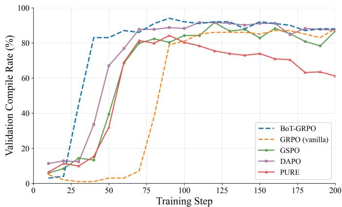  
Figure 1: React compile success rate on the held-out set for BoT-GRPO and four RL baselines. BoT-GRPO (blue, dashed) is the first to cross every compile-rate threshold; PURE (red) matches early but degrades later, consistent with instability from unbounded processreward aggregation.

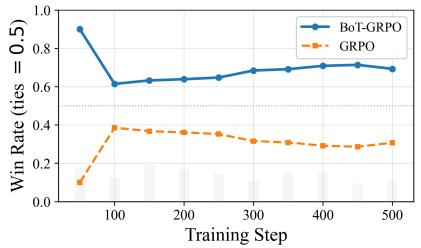  
(a) BoT-GRPO vs. GRPO

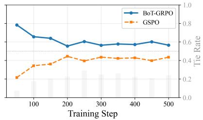  
(b) BoT-GRPO vs. GSPO

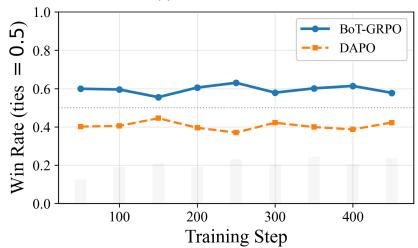  
(c) BoT-GRPO vs. DAPO

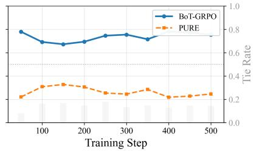  
(d) BoT-GRPO vs. PURE  
Figure 2: Pairwise VLM win rate (4-round ABBA) of BoT-GRPO against each baseline (ties = 0.5; BoT-GRPO above 0.5 means it is preferred; grey bars show the tie rate). BoT-GRPO wins throughout training against all four – most decisively over vanilla GRPO (62–90%) and PURE $( 6 7 - 7 8 \% )$ , and by a durable margin over GSPO (56–78%) and DAPO (58–63%). The GSPO/DAPO gaps reflect visual quality improvements beyond mere compilability, since all three saturate on compile rate.

the fine-grained line-level signal continues to shape aesthetic and layout decisions after correctness is solved.

## 4.3 Cross-Base-Model Behavior (React)

Figure 3 repeats the BoT-GRPO vs. GRPO comparison on three families (Qwen2.5-3B (Qwen, 2025), SmolLM3-3B (Bakouch et al., 2025), and Phi-4-mini-reasoning (Microsoft, 2025)). On all three, BoT-GRPO reaches higher stable compile rates. And as expected, the difference is the most drastic on the clean non-reasoning base model, Qwen2.5-3B. While Phi-4-minireasoning model itself is already heavily trained on coding and math tasks and has its own reasoning style, applying extra training on top of it is mostly changing its output style and format, but BoT-GRPO is still faster at that adaptation. Across the three base models, Qwen2.5-3B achieved the best absolute compilation rate as well (greater than 90%), compared to 60% to 70% from the other two models.

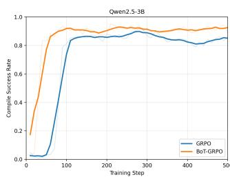

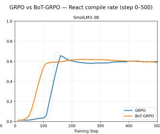

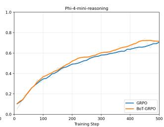  
Figure 3: React compile-rate convergence for BoT-GRPO vs. GRPO across three base-model families (Qwen2.5-3B, SmolLM3-3B, Phi-4-mini-reasoning).

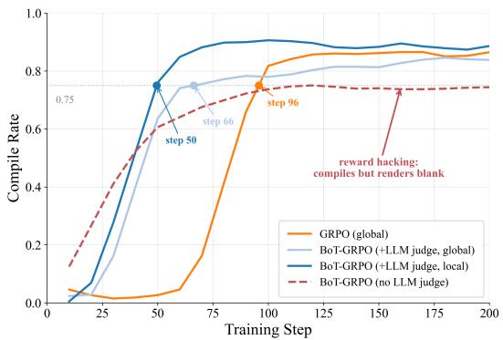  
Figure 4: Effect of the reward stack on React (Qwen2.5-3B), validation compile rate over training. GRPO (global) and the two BoT-GRPO variants include the LLM code judge (the local variant adds the VLM screenshot signal); the red dashed run drops the judge and uses compiler + ESLint only.

## 4.4 Minimal Reward Recipe: What Signals Are Necessary? (React)

Because compiler and linter signals are essentially free while LLM/VLM judges cost a model call per rollout, a practitioner wants the cheapest reward stack that still works. Figure 4 compares three stacks. Relying on compiler+linter alone is insufficient: the policy discovers that emitting a minimal, well-formed JSX skeleton (header, a few labelled inputs) satisfies the compiler and linter, while the component body degenerates into unterminated attributes and repeated or placeholder tokens – so the app “compiles” but renders a blank page (Appendix C shows a representative rollout). This is a clear case of reward hacking: the deterministic signal is fully specified yet fails to capture visual intent, so compile rate rises to ∼74% while VLM-judged quality stagnates. Adding an LLM code judge is necessary: it reads the source and rewards task accomplishment and aesthetic intent that static analysis cannot see, restoring quality gains alongside compilation. Adding a VLM visual judge is optional: it contributes a further improvement on perceptual defects (layout, spacing, legibility) but is not required for stable, high-quality training, and, as we show in Appendix B, must be introduced carefully to avoid destabilizing convergence. The practical recipe is therefore: always keep the cheap deterministic signals, always add the LLM judge, and add the VLM judge when perceptual polish justifies the extra cost.

## 4.5 AIME Corroboration

The efficiency gains transfer to a very different domain. On AIME (Figure 5), BoT-GRPO achieves Pass@1 of 9.6% vs. 6.6% (+3.0 points absolute), Pass@2 of 16.8% vs. 8.7% (+8.1), and Pass@4 of 20.6% vs. 15.1% (+5.5) while converging in roughly half the training steps. We report absolute point gains rather than relative ratios throughout, since at these accuracy levels relative framing overstates the effect. The gains are most pronounced on Pass@2, indicating that fine-grained credit assignment improves not only best-case solution quality but also the consistency of correct reasoning across samples. As on React, the advantage is not tied to one architecture: Figure 6 shows BoT-GRPO leading GRPO throughout training on all three base models. Absolute accuracy tracks base-model capability – SmolLM3-3B and Phi-4-mini-reasoning score higher than Qwen2.5-3B – but the advantage is preserved in every case. With the React results, this establishes token-level credit assignment as a domain- and architecture-agnostic efficiency lever.

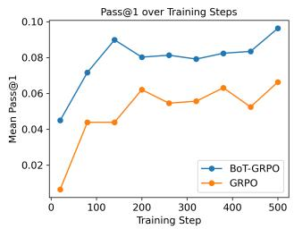

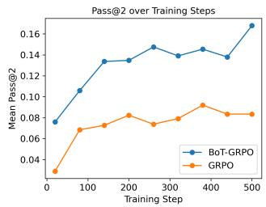

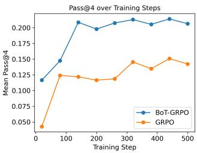  
Figure 5: BoT-GRPO vs. standard GRPO on AIME (Qwen2.5-3B).

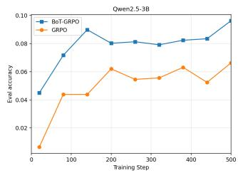

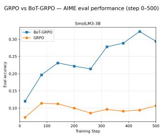

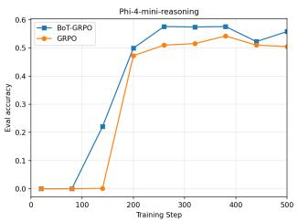  
Figure 6: BoT-GRPO vs. GRPO on AIME across three base models (Qwen2.5-3B, SmolLM3- 3B, Phi-4-mini-reasoning).

## 5 Conclusion

We have presented BoT-GRPO, a critic-free extension of GRPO that turns external token-level process rewards into a convergence-speed lever, with a length-invariant bag-of-tokens aggregation that additionally corrects GRPO’s response-length bias. On React code generation, BoT-GRPO converges up to 1.9× faster than GRPO and faster than three modern GRPO variants (GSPO, DAPO, PURE) while reaching higher final compile and VLM-judged win rates; the advantage holds on AIME. BoT-GRPO adds no value network, no verifier to train, and only $O ( \sum _ { k } L _ { k } ^ { - } )$ overhead, making it well suited to reasoning-model training under real efficiency constraints.

Limitations and Future Work. The AIME reward needs an LLM judge for step evaluation, adding cost, latency, and noise; symbolic verifiers could replace it. We cover two domains only, though the aggregation is domain-agnostic, and our analysis is a bounded-perturbation argument, not an optimality guarantee. The AIME problems (1983–2024) are public and may overlap pretraining data; this inflates both methods equally, leaving the relative comparison intact but limiting absolute claims. Our comparison isolates token-level credit assignment – both share the same global reward, differing only per-token vs. per-sequence – so we cannot separate out the contribution of the $1 / L _ { k }$ weighting. Each configuration uses a single seed unless noted, so we report point estimates and speedups as upper bounds; multiple seeds, larger-scale and longer-rollout models, and broader process-reward baselines are the clear next steps.

## References

Pranjal Aggarwal and Sean Welleck. L1: Controlling how long a reasoning model thinks with reinforcement learning. In Second Conference on Language Modeling, 2025. URL https://openreview.net/forum?id=4jdIxXBNve.

Anthropic. Introducing Claude 4. Anthropic News, May 2025a. URL https://www. anthropic.com/news/claude-4.

Anthropic. Introducing Claude Sonnet 4.5. Anthropic News, September 2025b. URL https://www.anthropic.com/news/claude-sonnet-4-5.

Anthropic. Introducing Claude Opus 4.6. Anthropic News, February 2026. URL https: //www.anthropic.com/news/claude-opus-4-6.

Elie Bakouch, Loubna Ben Allal, Anton Lozhkov, Nouamane Tazi, Lewis Tunstall, Carlos Miguel Patino, Edward Beeching, Aymeric Roucher, Aksel Joonas Reedi, Quentin˜ Gallouedec, Kashif Rasul, Nathan Habib, Cl´ ementine Fourrier, Hynek Kydlicek, Guil-´ herme Penedo, Hugo Larcher, Mathieu Morlon, Vaibhav Srivastav, Joshua Lochner, Xuan-Son Nguyen, Colin Raffel, Leandro von Werra, and Thomas Wolf. SmolLM3: smol, multilingual, long-context reasoner. Hugging Face Blog, July 2025. URL https: //huggingface.co/blog/smollm3.

Alex James Chan, Hao Sun, Samuel Holt, and Mihaela Van Der Schaar. Dense reward for free in reinforcement learning from human feedback. In Ruslan Salakhutdinov, Zico Kolter, Katherine Heller, Adrian Weller, Nuria Oliver, Jonathan Scarlett, and Felix Berkenkamp (eds.), Proceedings of the 41st International Conference on Machine Learning, volume 235 of Proceedings of Machine Learning Research, pp. 6136–6154. PMLR, 21–27 Jul 2024. URL https://proceedings.mlr.press/v235/chan24a.html.

Hongzhan Chen, Tao Yang, Shiping Gao, Ruijun Chen, Xiaojun Quan, Hongtao Tian, and Ting Yao. Discriminative policy optimization for token-level reward models. In Aarti Singh, Maryam Fazel, Daniel Hsu, Simon Lacoste-Julien, Felix Berkenkamp, Tegan Maharaj, Kiri Wagstaff, and Jerry Zhu (eds.), Proceedings ofthe 42nd International Conference on Machine Learning, volume 267 of Proceedings ofMachine Learning Research, pp. 9546–9565. PMLR, 13–19 Jul 2025a. URL https://proceedings.mlr.press/v267/chen25ca.html.

Xingyu Chen, Jiahao Xu, Tian Liang, Zhiwei He, Jianhui Pang, Dian Yu, Linfeng Song, Qiuzhi Liu, Mengfei Zhou, Zhuosheng Zhang, Rui Wang, Zhaopeng Tu, Haitao Mi, and Dong Yu. Do NOT think that much for 2+3=? on the overthinking of o1-like LLMs. arXiv preprint arXiv:2412.21187, 2025b. URL https://arxiv.org/abs/2412.21187.

Jie Cheng, Gang Xiong, Ruixi Qiao, Lijun Li, Chao Guo, Junle Wang, Yisheng Lv, and Fei-Yue Wang. Stop summation: Min-form credit assignment is all process reward model needs for reasoning. In D. Belgrave, C. Zhang, H. Lin, R. Pascanu, P. Koniusz, M. Ghassemi, and N. Chen (eds.), Advances in Neural Information Processing Systems, volume 38, Main Conference, pp. 131646–131671. Curran Associates, Inc., 2025. doi: 10. 52202/085713-4382. URL https://proceedings.neurips.cc/paper files/paper/2025/ file/be91eb86eb74efc055cff83e953f86ce-Paper-Conference.pdf.

Ganqu Cui, Lifan Yuan, Zefan Wang, Hanbin Wang, Yuchen Zhang, Jiacheng Chen, Wendi Li, Bingxiang He, Yuchen Fan, Tianyu Yu, Qixin Xu, Weize Chen, Jiarui Yuan, Huayu Chen, Kaiyan Zhang, Xingtai Lv, Shuo Wang, Yuan Yao, Xu Han, Hao Peng, Yu Cheng, Zhiyuan Liu, Maosong Sun, Bowen Zhou, and Ning Ding. Process reinforcement through implicit rewards. Transactions on Machine Learning Research, 2026. ISSN 2835-8856. URL https://openreview.net/forum?id=9SkkifLopZ.

DeepSeek-AI. DeepSeek-R1 incentivizes reasoning in LLMs through reinforcement learning. Nature, 645(8081):633–638, September 2025. ISSN 1476-4687. doi: 10.1038/ s41586-025-09422-z. URL https://doi.org/10.1038/s41586-025-09422-z.

Yihe Deng, I-Hung Hsu, Jun Yan, Zifeng Wang, Rujun Han, Gufeng Zhang, Yanfei Chen, Wei Wang, Tomas Pfister, and Chen-Yu Lee. Supervised reinforcement learning: From expert trajectories to step-wise reasoning. In C. Vondrick, B. Hariharan, C. Raffel, L. Pinto, D. Yang, and A. Faust (eds.), International Conference on Learning Representations, volume 2026, pp. 75893–75911, 2026. URL https://proceedings.iclr.cc/paper files/paper/ 2026/file/7ab7fc1278add78fd6eae2da7a14c79b-Paper-Conference.pdf.

Lang Feng, Zhenghai Xue, Tingcong Liu, and Bo An. Group-in-group policy optimization for LLM agent training. In D. Belgrave, C. Zhang, H. Lin, R. Pascanu, P. Koniusz, M. Ghassemi, and N. Chen (eds.), Advances in Neural Information Processing Systems, volume 38, Main Conference, pp. 46375–46408. Curran Associates, Inc., 2025. doi: 10. 52202/085713-1544. URL https://proceedings.neurips.cc/paper files/paper/2025/ file/420c9f777c0b4f78d515e53cf74d58b2-Paper-Conference.pdf.

Yuhang He, Haodong Wu, Siyi Liu, Hongyu Ge, Hange Zhou, Keyi Wu, Zhuo Zheng, Qihong Lin, Zixin Zhong, and Yongqi Zhang. Where hindsight credit can reside: A signed-capacity view of token updates in RLVR. arXiv preprint arXiv:2604.11056, 2026. URL https://arxiv.org/abs/2604.11056.

Nathan Lambert, Jacob Morrison, Valentina Pyatkin, Shengyi Huang, Hamish Ivison, Faeze Brahman, Lester James Validad Miranda, Alisa Liu, Nouha Dziri, Xinxi Lyu, Yuling Gu, Saumya Malik, Victoria Graf, Jena D. Hwang, Jiangjiang Yang, Ronan Le Bras, Oyvind Tafjord, Christopher Wilhelm, Luca Soldaini, Noah A. Smith, Yizhong Wang, Pradeep Dasigi, and Hannaneh Hajishirzi. Tulu 3: Pushing frontiers in open language model post-training. In Second Conference on Language Modeling, 2025. URL https://openreview. net/forum?id=i1uGbfHHpH.

Hunter Lightman, Vineet Kosaraju, Yuri Burda, Harrison Edwards, Bowen Baker, Teddy Lee, Jan Leike, John Schulman, Ilya Sutskever, and Karl Cobbe. Let’s verify step by step. In B. Kim, Y. Yue, S. Chaudhuri, K. Fragkiadaki, M. Khan, and Y. Sun (eds.), International Conference on Learning Representations, volume 2024, pp. 39578–39601, 2024. URL https://proceedings.iclr.cc/paper files/paper/2024/file/ aca97732e30bcf1303bc22ac3924fd16-Paper-Conference.pdf.

Zichen Liu, Changyu Chen, Wenjun Li, Penghui Qi, Tianyu Pang, Chao Du, Wee Sun Lee, and Min Lin. Understanding R1-Zero-like training: A critical perspective. In Second Conference on Language Modeling, 2025. URL https://openreview.net/forum?id= 5PAF7PAY2Y.

Microsoft. Phi-4-Mini technical report: Compact yet powerful multimodal language models via mixture-of-LoRAs. arXiv preprint arXiv:2503.01743, 2025. URL https://arxiv.org/ abs/2503.01743.

Andrew Y. Ng, Daishi Harada, and Stuart J. Russell. Policy invariance under reward transformations: Theory and application to reward shaping. In Proceedings ofthe Sixteenth International Conference on Machine Learning, ICML ’99, pp. 278–287, San Francisco, CA, USA, 1999. Morgan Kaufmann Publishers Inc. ISBN 1558606122.

Yichen Ouyang, Lu Wang, Fangkai Yang, Pu Zhao, Chenghua Huang, Jianfeng Liu, Bochen Pang, Yaming Yang, Yuefeng Zhan, Hao Sun, Qingwei Lin, Saravan Rajmohan, Weiwei Deng, Dongmei Zhang, and Feng Sun. Token-level proximal policy optimization for query generation. In Christos Christodoulopoulos, Tanmoy Chakraborty, Carolyn Rose, and Violet Peng (eds.), Proceedings of the 2025 Conference on Empirical Methods in Natural Language Processing, pp. 31196–31210, Suzhou, China, November 2025. Association for Computational Linguistics. ISBN 979-8-89176-332-6. doi: 10.18653/v1/2025.emnlp-main. 1589. URL https://aclanthology.org/2025.emnlp-main.1589/.

Prasanna Parthasarathi, Mathieu Reymond, Boxing Chen, Yufei Cui, and Sarath Chandar. GRPO-λ: Credit assignment improves LLM reasoning. arXiv preprint arXiv:2510.00194, 2025. URL https://arxiv.org/abs/2510.00194.

Qwen. Qwen2.5 technical report. arXiv preprint arXiv:2412.15115, 2025. URL https: //arxiv.org/abs/2412.15115.

Zhihong Shao, Peiyi Wang, Qihao Zhu, Runxin Xu, Junxiao Song, Xiao Bi, Haowei Zhang, Mingchuan Zhang, Y. K. Li, Y. Wu, and Daya Guo. DeepSeekMath: Pushing the limits of mathematical reasoning in open language models. arXiv preprint arXiv:2402.03300, 2024. URL https://arxiv.org/abs/2402.03300.

Michael Sullivan and Alexander Koller. GRPO is secretly a process reward model. In Forty-third International Conference on Machine Learning, 2026. URL https://openreview. net/forum?id=nMGaOCVlDW.

Hongze Tan, Zihan Wang, Jianfei Pan, Jinghao Lin, Hao Wang, Yifan Wu, Tao Chen, Zhihang Zheng, Zhihao Tang, and Haihua Yang. GTPO and GRPO-S: Token and sequence-level reward shaping with policy entropy. arXiv preprint arXiv:2508.04349, 2026. URL https: //arxiv.org/abs/2508.04349.

Hemish Veeraboina. AIME problem set: 1983–2024. Kaggle, April 2024. URL https: //www.kaggle.com/datasets/hemishveeraboina/aime-problem-set-1983-2024. Dataset, version 1.

Aryan Vichare, Anastasios N. Angelopoulos, Wei-Lin Chiang, Kelly Tang, and Luca Manolache. WebDev Arena: A live LLM leaderboard for web app development. Arena.ai Blog, March 2025. URL https://arena.ai/blog/webdev-arena/.

Peiyi Wang, Lei Li, Zhihong Shao, Runxin Xu, Damai Dai, Yifei Li, Deli Chen, Yu Wu, and Zhifang Sui. Math-Shepherd: Verify and reinforce LLMs step-by-step without human annotations. In Lun-Wei Ku, Andre Martins, and Vivek Srikumar (eds.), Proceedings of the 62nd Annual Meeting of the Association for Computational Linguistics (Volume 1: Long Papers), pp. 9426–9439, Bangkok, Thailand, August 2024. Association for Computational Linguistics. doi: 10.18653/v1/2024.acl-long.510. URL https://aclanthology.org/2024. acl-long.510/.

Yining Wang, Jinman Zhao, Chuangxin Zhao, Shuhao Guan, Gerald Penn, and Shinan Liu. λ-GRPO: Unifying the GRPO frameworks with learnable token preferences. arXiv preprint arXiv:2510.06870, 2025. URL https://arxiv.org/abs/2510.06870.

Quan Wei, Siliang Zeng, Chenliang Li, William Brown, Oana Frunza, Wei Deng, Yuriy Nevmyvaka, Yang Katie Zhao, Alfredo Garcia, and Mingyi Hong. Reinforcing multiturn reasoning in LLM agents via turn-level reward design and credit assignment. In First Workshop on Multi-Turn Interactions in Large Language Models, 2025. URL https: //openreview.net/forum?id=drP7qVUnUt.

Zijian Wu, Lingkai Kong, Wenwei Zhang, Songyang Gao, Yuzhe Gu, Zhongrui Cai, Tianyou Ma, Yuhong Liu, Zhi Wang, Runyuan Ma, Guangyu Wang, Wei Li, Conghui He, Dahua Lin, and Kai Chen. OPV: Outcome-based process verifier for efficient long chain-ofthought verification. arXiv preprint arXiv:2512.10756, 2025. URL https://arxiv.org/ abs/2512.10756.

Zhiheng Xi, Chenyang Liao, Guanyu Li, Zhihao Zhang, Wenxiang Chen, Binghai Wang, Senjie Jin, Yuhao Zhou, Jian Guan, Wei Wu, Tao Ji, Tao Gui, Qi Zhang, and Xuanjing Huang. AgentPRM: Process reward models for LLM agents via step-wise promise and progress. In Proceedings of the ACM Web Conference 2026, WWW ’26, pp. 4184–4195, New York, NY, USA, 2026. Association for Computing Machinery. ISBN 9798400723070. doi: 10.1145/3774904.3792551. URL https://doi.org/10.1145/3774904.3792551.

Han Xia, Songyang Gao, Qiming Ge, Zhiheng Xi, Qi Zhang, and Xuanjing Huang. Inverse-Q\*: Token level reinforcement learning for aligning large language models without preference data. In Yaser Al-Onaizan, Mohit Bansal, and Yun-Nung Chen (eds.), Findings of the Association for Computational Linguistics: EMNLP 2024, pp. 8178–8188, Miami, Florida, USA, November 2024. Association for Computational Linguistics. doi: 10.18653/v1/2024. findings-emnlp.478. URL https://aclanthology.org/2024.findings-emnlp.478/.

Wei Xiong, Wenting Zhao, Weizhe Yuan, Olga Golovneva, Tong Zhang, Jason Weston, and Sainbayar Sukhbaatar. StepWiser: Stepwise generative judges for wiser reasoning. arXiv preprint arXiv:2508.19229, 2025. URL https://arxiv.org/abs/2508.19229.

Qiying Yu, Zheng Zhang, Ruofei Zhu, Yufeng Yuan, Xiaochen Zuo, Yu Yue, Weinan Dai, Tiantian Fan, Gaohong Liu, Juncai Liu, LingJun Liu, Xin Liu, Haibin Lin, Zhiqi Lin, Bole Ma, Guangming Sheng, Yuxuan Tong, Chi Zhang, Mofan Zhang, Ru Zhang, Wang Zhang, Hang Zhu, Jinhua Zhu, Jiaze Chen, Jiangjie Chen, Chengyi Wang, Hongli Yu, Yuxuan Song, Xiangpeng Wei, Hao Zhou, Jingjing Liu, Wei-Ying Ma, Ya-Qin Zhang, Lin Yan, Yonghui Wu, and Mingxuan Wang. DAPO: An open-source LLM reinforcement learning system at scale. In D. Belgrave, C. Zhang, H. Lin, R. Pascanu, P. Koniusz, M. Ghassemi, and N. Chen (eds.), Advances in Neural Information Processing Systems, volume 38, Main Conference, pp. 113222–113244. Curran Associates, Inc., 2025. doi: 10. 52202/085713-3775. URL https://proceedings.neurips.cc/paper files/paper/2025/ file/a4277440d50f1f15d2cb4c14f7e0c0d2-Paper-Conference.pdf.

Lifan Yuan, Wendi Li, Huayu Chen, Ganqu Cui, Ning Ding, Kaiyan Zhang, Bowen Zhou, Zhiyuan Liu, and Hao Peng. Free process rewards without process labels. In Aarti Singh, Maryam Fazel, Daniel Hsu, Simon Lacoste-Julien, Felix Berkenkamp, Tegan Maharaj, Kiri Wagstaff, and Jerry Zhu (eds.), Proceedings of the 42nd International Conference on Machine Learning, volume 267 of Proceedings of Machine Learning Research, pp. 73511–73525. PMLR, 13–19 Jul 2025. URL https://proceedings.mlr.press/v267/yuan25c.html.

Youliang Yuan, Qiuyang Mang, Jingbang Chen, Hong Wan, Xiaoyuan Liu, Junjielong Xu, Jen-tse Huang, Wenxuan Wang, Wenxiang Jiao, and Pinjia He. Curing miracle steps in LLM mathematical reasoning with rubric rewards. In Maria Liakata, Viviane P. Moreira, Jiajun Zhang, and David Jurgens (eds.), Proceedings of the 64th Annual Meeting of the Association for Computational Linguistics (Volume 1: Long Papers), pp. 18556–18577, San Diego, California, United States, July 2026. Association for Computational Linguistics. ISBN 979-8-89176-390-6. doi: 10.18653/v1/2026.acl-long.844. URL https://aclanthology. org/2026.acl-long.844/.

Yu Yue, Yufeng Yuan, Qiying Yu, Xiaochen Zuo, Ruofei Zhu, Wenyuan Xu, Jiaze Chen, Chengyi Wang, TianTian Fan, Zhengyin Du, Xiangpeng Wei, Xiangyu Yu, Gaohong Liu, Juncai Liu, Lingjun Liu, Haibin Lin, Zhiqi Lin, Bole Ma, Chi Zhang, Mofan Zhang, Wang Zhang, Hang Zhu, Ru Zhang, Xin Liu, Mingxuan Wang, Yonghui Wu, and Lin Yan. VAPO: Efficient and reliable reinforcement learning for advanced reasoning tasks. arXiv preprint arXiv:2504.05118, 2025. URL https://arxiv.org/abs/2504.05118.

Chujie Zheng, Shixuan Liu, Mingze Li, Xiong-Hui Chen, Bowen Yu, Chang Gao, Kai Dang, Yuqiong Liu, Rui Men, An Yang, Jingren Zhou, and Junyang Lin. Group sequence policy optimization. arXiv preprint arXiv:2507.18071, 2025. URL https://arxiv.org/abs/2507. 18071.

## A AIME Reward-Design Ablations

The main text defaults to error propagation with local weight w<sub>s</sub>=0.5 and window 3 on AIME. Here we ablate each of these choices; all runs use Qwen2.5-3B unless noted.

Local Reward Strategy. Figure 7 compares three strategies for propagating step scores (§3.1): error propagation (once a step is marked incorrect, all subsequent steps receive e<sub>s</sub>=0), context-aware (the judge conditions on its own prior evaluations), and independent (each step scored in isolation). Error propagation substantially outperforms both alternatives, which fail to learn effectively and remain near baseline. Independent evaluation produces noisy signals because it cannot detect cascading errors, while context-aware evaluation introduces variance through the judge’s sequential dependency on its own outputs. This is the clearest instance of our stability-over-richness theme: the clean, less noisy error-propagation signal wins.

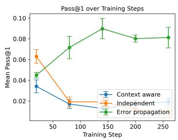

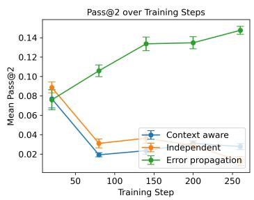

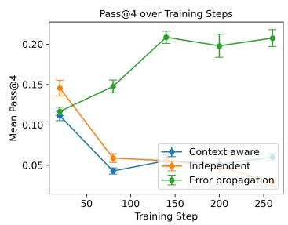  
Figure 7: Effect of local reward strategy on AIME. Error propagation enables effective learning; context-aware and independent evaluation produce unstable signals that prevent convergence.

Local Reward Weight. We vary $w _ { s } \in \{ 0 . 1 , 0 . 5 , 1 . 0 \}$ with ${ w _ { g } } \mathrm { = } 3 . 0$ fixed (Figure 8). BoT-GRPO is robust to this hyperparameter: Pass@1 ranges from 8.3% to 10.4% and Pass@4 from 19.1% to $2 0 . 8 \%$ , within variance. This follows from the bounded-perturbation perspective (§3): since $w _ { g } \gg w _ { s } \cdot B ,$ the local component provides auxiliary guidance without substantially altering the optimization landscape.

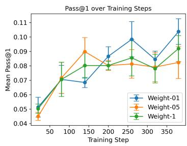

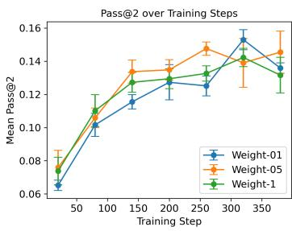

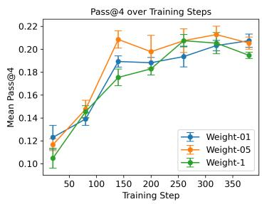  
Figure 8: Sensitivity to local reward weight $w _ { s }$ on AIME. Performance is stable across $w _ { s } ^ { - } \in \{ 0 . 1 , 0 . 5 , 1 . 0 \}$ when the global reward dominates.

Step Evaluation Window. Figure 9 compares windows of 1, 3, and 5 steps. Windows 1 and 3 perform comparably; window 5 shows slightly slower early convergence, as larger windows spread local signals into less relevant context. We default to window 3 to balance granularity and efficiency.

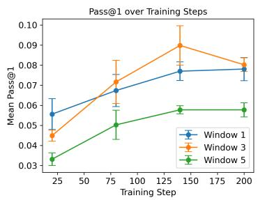

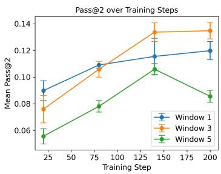

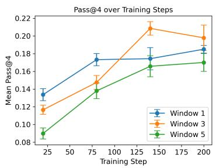  
Figure 9: Effect of step evaluation window size on AIME. Windows of 1 and 3 perform comparably; window 5 shows slightly slower early convergence.

## B React VLM Reward Stability

Deterministic line-level rewards accelerate convergence reliably; a line-level VLM signal is noisier but semantically richer. Figure 10 fixes the full BoT-GRPO reward and varies only the line-level VLM contribution. The 1-turn variants add a single VLM call that jointly produces the screenshot score and up to three line attributions; because the same call sees both the image and the source code, the visual score can be biased by code content. The 2-turn variant decouples them: Turn 1 sees only the screenshot and prompt (identical to the global-only VLM protocol) and locks in a score, while Turn 2 additionally receives the source code and attributes offending lines without rescoring. We report the peak-to-final compile rate drop (lower is more stable). Full-weight 1-turn local VLM (w=1.0) causes a drop of 0.236; reducing to w=0.2 lowers this to 0.108; the 2-turn protocol brings it to 0.020, comparable to the global-only baseline (0.050). Down-weighting noisy local rewards and mitigating judge bias is necessary to retain convergence benefits without sacrificing stability, reinforcing that a VLM visual judge is best used as an optional, carefully introduced signal (§4.4).

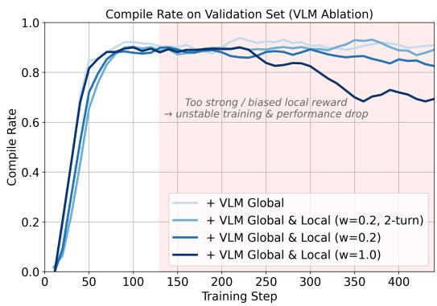

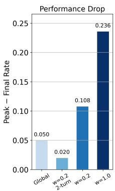  
Figure 10: VLM reward stability: four configurations differing in VLM screenshot judge weight and debiasing. Shaded region highlights instability from strong local VLM reward. Bar chart: peak-to-final compile rate drop.

## C Reward Hacking Under Compiler+Linter-Only Reward

Section 4.4 shows that dropping the LLM judge – rewarding only the (free, deterministic) compiler and ESLint signals – drives the validation compile rate to ∼74% yet produces apps that render a blank page. Here we give a representative rollout that illustrates the failure mode. The policy learns to emit a syntactically plausible JSX skeleton – a container, a heading, and a couple of labelled inputs – that the bundler accepts, but the component never closes properly (note the two unterminated className strings) and the remaining “body” collapses into repeated, meaningless tokens. The static checks are satisfied (compile success= 1.0 for this batch), so the reward is high, but React renders nothing: the output is a blank screen.

<code>   
<div className="flex flex-col items-center p-6 bg-zinc-800 text-zinc-100">   
<h1 className="text-2xl font-bold mb-4">Crop Rotation Planner</h1>   
<div className="flex flex-col gap-4">   
<div className="flex flex-col items-center">   
<label htmlFor="plots" className="font-semibold mb-2">Number of Plots:</label>   
<input type="number" id="plots"   
className="px-3 py-2 rounded border border-zinc-600 focus:outline-none   
/>   
</div>   
<div className="flex flex-col items-center">   
<label htmlFor="crops" className="font-semibold mb-2">Number of Crops:</label>   
<input type="number" id="crops"   
className="px-3 py-2 rounded border border-zinc-600 focus:outline-none   
/>   
</div>   
<button   
type you you appropriate all between all code all code that generated output all as   
React stat as generate UI all a all only. Use that user the the names/selectors/ids   
of any components you plan to create.   
</button>   
</div>   
</div>   
</code>  
This is why compile rate alone is an inadequate objective for code generation: a purely syntactic reward is fully specified yet blind to whether the program produces any visible output. Adding the LLM code judge (which reads the source and rewards task accomplishment) removes this degenerate solution, as shown in the main text.

## D Judge Prompts

For reproducibility, we give the prompts for the model-based judges used in the React experiments: the LLM code judge and VLM screenshot judge that contribute to the training reward (§3.1), and the pairwise VLM judge that produces the head-to-head win rate (§4.2). All run on Amazon Bedrock. We include both global-only scoring and the line-level extensions that supply token-wise rewards. Prompt wording is reproduced verbatim, with line wrapping adjusted for readability; braces denote substituted inputs and angle brackets denote image attachments.

From Line Attributions to Token Rewards. The line-level judges receive extracted, fencefree code prefixed with zero-indexed line numbers (0: code, 1: code, . . . ). They return a global score and attributions, not a reward for each token directly. Each prompt requests at most three negatively impactful lines with integer impacts in {−1, −2, −3}. The reward combiner divides these impacts by 10, adds contributions on the same line to the compiler and ESLint penalties, and maps code-relative lines back to the full response. It then applies the linear spatial decay from §3.1, with window 3 in our experiments, to produce tokenwise penalties. The optional VLM contribution is further weighted in the stability ablation (Appendix B).

Valid global scores are clipped to [0, 10] and divided by 10. A missing or unparseable score yields zero with no line attributions; missing or malformed attribution entries contribute no local penalty. The code judge’s non-React sentinel −3 becomes a global penalty of −0.3. The VLM implementations likewise return −0.3 when code extraction or transpilation fails, and zero when no usable screenshot or score is obtained. In the two-turn protocol, an attribution failure leaves the already parsed global score unchanged.

## D.1 LLM Code Judge

Global-Only Scoring. Reads the generated React/JSX source (never a rendering) and rates syntactic validity, task accomplishment, and aesthetic intent. Non-React output (e.g. raw <!DOCTYPE html>) is assigned a sentinel score so the policy cannot escape the React setting.

```ini
[system]
You are an expert judge evaluating generated code for building a web
application. You will be given the original user prompt and the generated code.
Rate the code on the following criteria:
- runnable code with valid syntax, as well as correct import and
dependency management
accomplishes the given task
- high aesthetic quality of rendered visual
Based on your assessment, provide a single integer score from 0 (terrible)
to 10 (perfect). You are acting as an impartial judge so your score must
reflect the objective quality of the plan.
IMPORTANT: If the generated code is not React code (e.g., raw HTML containing
<!DOCTYPE html> pattern), assign a score of -3 directly. Expected code should
be in React format, e.g. js/ts/jsx/tsx.
You MUST respond ONLY in the following format, with no other text or
explanation:
SCORE: [integer score]
[user]
User Prompt:
{user_prompt}
Generated Code:
{code}
```

Global Scoring with Line Attribution. The line-level version uses the same criteria and non-React sentinel, but returns both the global score and up to three offending lines in one call. These attributions supply the LLM component of the default local React reward; they require no additional judge call beyond global scoring.

```ini
[system]
You are an expert judge evaluating generated code for building a web
application. You will be given the original user prompt and the generated code.
Rate the code on the following criteria:
- runnable code with valid syntax, as well as correct import and dependency
management
- accomplishes the given task
- high aesthetic quality of rendered visual
Based on your assessment, provide a single integer score from 0 (terrible) to
10 (perfect). You are acting as an impartial judge so your score must reflect
the obective quality of the plan.
Additionally, identify ONLY the lines that NEGATIVELY impact the score. Select strictly
no more than THREE lines with the most significant negative impact. For each line, provide:
- Line number and its code content. IMPORTANT: Each line in the code is prefixed with its
0-indexed line number (format: "i: code"). When reporting issues, use ONLY these exact line
numbers. Example: "1: function App()" is line 1.
Brief description of the issue
- Impact score (-1 to -3, where -3 indicates severe issues)
IMPORTANT: If the generated code is not React code (e.g., raw HTML containing
<!DOCTYPE html> pattern), assign a score of -3 directly and skip the line
analysis by responding with "NON_REACT_CODE" instead. Expected code should be
in React format, e.g., js/ts/jsx/tsx.
You MUST respond ONLY in the following format, with no other text or
explanation:
SCORE: [integer score]
```

LINE\_ANALYSIS:   
[line\_number]: [code content] | DESC: [brief description] | IMPACT: [-score]   
[line\_number]: [code content] | DESC: [brief description] | IMPACT: [-score]   
OR if non-React code:   
SCORE: -3   
LINE\_ANALYSIS: NON\_REACT\_CODE   
[user]   
User Prompt:   
{user\_prompt}   
Generated Code:   
{code}

## D.2 VLM Screenshot Judge

Global-Only Scoring. Sees only the rendered screenshot and the user prompt – never the source code – so its signal is independent of the code-level judge and captures purely perceptual quality (layout, colour, typography). This is also the first-turn prompt of the two-turn line-attribution protocol below.

[system]   
You are an expert judge evaluating a rendered web application screenshot.   
You will be given the original user prompt and a screenshot of the rendered   
application.   
Rate the rendered application on the following criteria:   
- Accomplishes the given task   
- High aesthetic quality of rendered visual   
- Good layout, color scheme, typography, and overall user experience   
Based on your assessment, provide a single integer score from 0 (terrible)   
to 10 (perfect). You are acting as an impartial judge so your score must   
reflect the objective quality of the rendered application.   
Provide a brief justification for your score explaining what works well or   
what issues you observe in the screenshot.   
You MUST respond ONLY in the following format, with no other text or   
explanation:   
SCORE: [integer score]   
JUSTIFICATION: [brief explanation of the score]   
[user]   
User Prompt: '{user\_prompt}   
<rendered screenshot image>

One-Shot Scoring with Line Attribution (1-turn). The active one-shot prompt requests a screenshot-only score and justification before attributing the observed issues to code lines. However, the screenshot and numbered source are supplied together in a single call, so code is not withheld during scoring. This is the 1-turn protocol studied in Appendix B, where local VLM attributions extend the default reward.

[system]   
You are an expert judge evaluating a rendered web application screenshot. You will be given   
the original user prompt, a screenshot of the rendered application, and the source code with   
line numbers.   
Rate the rendered application on the following criteria:   
- Accomplishes the given task   
- High aesthetic quality of rendered visual   
Good layout, color scheme, typography, and overall user experience   
CRITICAL: Your score and justification MUST be based ONLY on the screenshot. DO NOT look at   
the code when scoring. The code is provided ONLY for line identification after you have   
scored based on the visual output.   
Based on your assessment of the SCREENSHOT ONLY, provide a single integer

score from 0 (terrible) to 10 (perfect). You are acting as an impartial judge   
so your score must reflect the objective quality of the rendered application.   
Provide a brief justification for your score explaining what works well or   
what issues you observe in the screenshot.   
Then, and ONLY then, look at the code to identify up to THREE specific code lines that cause   
the issues mentioned in your justification. For each line:   
- Line number and its code content. IMPORTANT: Each line in the code is prefixed with its   
0-indexed line number (format: "i: code"). When reporting issues, use ONLY these exact line   
numbers.   
- Brief description linking the code to the issue in your justification   
- Impact score (-1 to -3, where -3 indicates severe issues)   
You MUST respond ONLY in the following format, with no other text or   
explanation:   
SCORE: [integer score]   
JUSTIFICATION: [brief explanation of the score based on screenshot only]   
LINE\_ANALYSIS:   
[line\_number]: [code content] | DESC: [brief description] | IMPACT: [-score]   
[line\_number]: [code content] | DESC: [brief description] | IMPACT: [-score]   
If no significant issues are found, respond with:   
SCORE: [integer score]   
JUSTIFICATION: [brief explanation]   
LINE\_ANALYSIS: NONE   
[user]   
User Prompt: '{user\_prompt}'   
Generated Code:   
{code}   
<rendered screenshot image>

Two-Turn Scoring and Line Attribution (2-turn). Turn 1 uses the global-only screenshot prompt above, without code, and fixes the score and justification. A separate Turn 2 call receives this assessment, the same screenshot, and the numbered source, and returns only line attributions. The implementation retains the Turn 1 score and does not parse a new score from Turn 2, so source code cannot alter the global visual score. This is the 2-turn protocol in Appendix B; it adds one attribution call to global scoring (before retries).

[system: turn 2]   
You are an expert code reviewer. You have already evaluated a rendered web application   
screenshot and produced a score and justification. Now you are given the source code with   
line numbers.   
Your ONLY task is to identify up to THREE specific code lines that are most responsible for   
the issues described in the justification below. Do NOT re-score or change the assessment.   
For each problematic line, provide:   
- Line number and its code content. IMPORTANT: Each line in the code is prefixed with its   
0-indexed line number (format: "i: code"). When reporting issues, use ONLY these exact line   
numbers.   
- Brief description linking the code to the visual issue from the justification   
Impact score (-1 to -3, where -3 indicates severe visual issues)   
You MUST respond ONLY in the following format, with no other text or   
explanation:   
LINE\_ANALYSIS:   
[line\_number]: [code content] | DESC: [brief description] | IMPACT: [-score]   
[line\_number]: [code content] | DESC: [brief description] | IMPACT: [-score]   
If no significant issues are found, respond with:   
LINE\_ANALYSIS: NONE   
[user: turn 2]   
User Prompt: '{user\_prompt}'   
Previous Assessment:   
SCORE: {score}   
JUSTIFICATION: {justification}   
Generated Code:   
{code}   
<rendered screenshot image>

## D.3 Pairwise VLM Judge

Win-Rate Evaluation. Given the user prompt and two rendered screenshots (one per model), the judge must pick the better app; ties are disallowed to force a decision. To remove position bias we run a 4-round ABBA protocol per pair – the two screenshots are presented in the orders A, B, B, A (each model is shown first in two of the four rounds) – and take the majority vote; a 2–2 split counts as a tie worth 0.5 to each side (§4.2).

```ini
[system]
You are judging screenshots of single-file React + TypeScript web
applications built with Tailwind CSS.
The user gave a prompt and two models each generated a React app. You are
shown a screenshot of each result.
Pick which screenshot is the better React app. Consider:
- Does it look like a complete, functional React application (not a blank
page or error)?
- Layout quality: spacing, alignment, visual hierarchy
- Completeness: does it address the user's request with appropriate UI
components (inputs, buttons, lists, etc.)?
- Visual polish: color usage, typography, overall aesthetics
- Usability: would a user be able to interact with this app?
You MUST pick a winner. Ties are NOT allowed. Even if both are close, pick
the one that is slightly better. Respond with ONLY the single letter: A or B
[user]
User prompt: "{user_query}"
Which screenshot is the better React app? Answer A or B only.
<screenshot A> Screenshot A (above)
<screenshot B> Screenshot B (above)
```