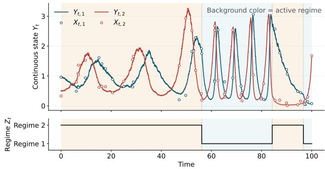
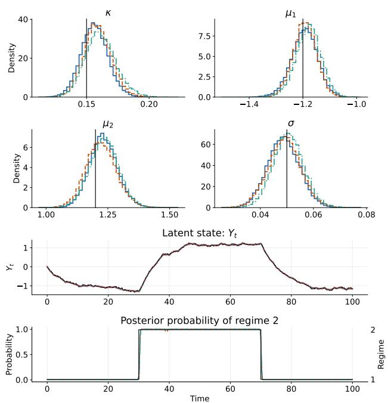
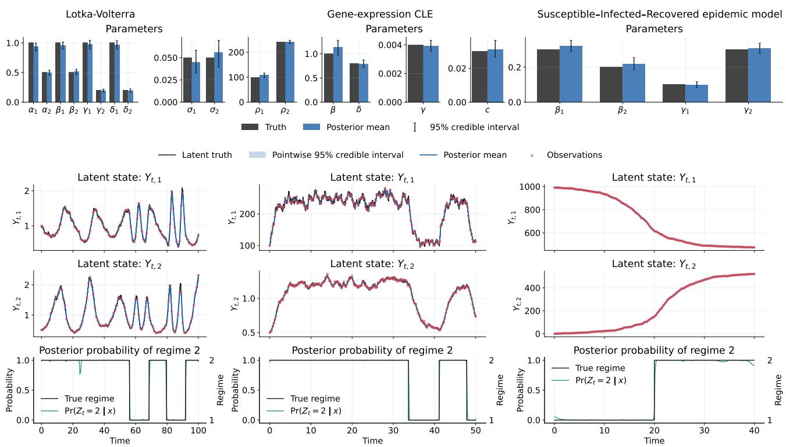
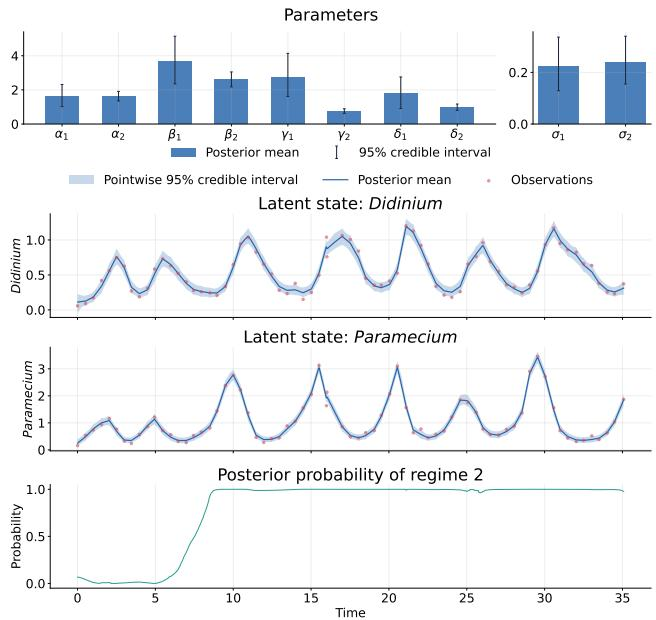
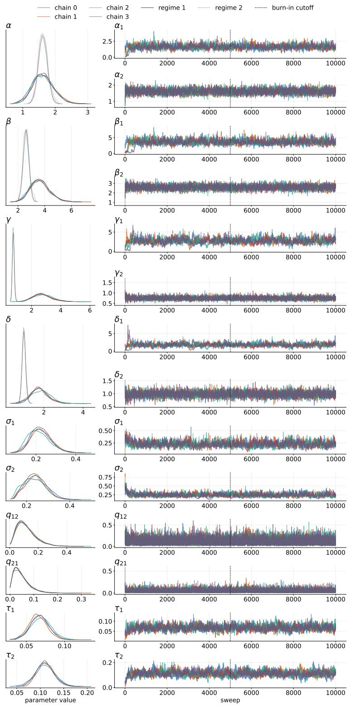

# Broadly Applicable Approximate MCMC for Switching Stochastic Diferential Equations Using Uniformization and Time-Conditioned Factorized Neural Likelihood Estimation

Shion Hosoda1,\*

Michiaki Hamada1,2,3

1 Waseda University 2 National Institute of Advanced Industrial Science and Technology 3 Nippon Medical School

## Abstract

Switching stochastic diferential equations (SSDEs) describe continuous-time dynamics whose parameters switch according to a latent regime process that follows a continuoustime Markov chain (CTMC). By allowing dynamics to change between regimes, SSDEs represent heterogeneous system behavior and have been applied across diverse fields. However, Bayesian inference for SSDEs remains dificult, and existing SSDE inference methods have limited applicability, with restrictions such as noise-free observations, univariate states, linear drift, or state-independent difusion. In this study, we propose an approximate Markov chain Monte Carlo sampler for SSDEs using uniformization and factorized neural likelihood estimation (FNLE), a simulation-based inference method. Uniformization provides an exact representation of the CTMC but requires SDE transition densities over arbitrary time intervals. We approximate these densities by training a time-conditioned FNLE model. The resulting sampler is broadly applicable to SSDEs without requiring analytically tractable transition densities. In synthetic-data experiments, our method recovered regime paths and parameters for three SSDE models for which previous methods have limited applicability. We also applied our method to a real dataset and detected a regime transition.

## 1 INTRODUCTION

Stochastic diferential equations (SDEs) provide a natural framework for modeling noisy continuous-time dynamics. A single SDE may be insuficient in many cases because dynamics in real-world systems often change. Switching stochastic diferential equations (SSDEs) represent such dynamics by allowing the drift and difusion functions to switch according to the regime at each time. SSDEs have been applied in many fields, such as ecology [36], biology [15], and economics [22]. Figure 1 illustrates an SSDE and its noisy observations.

Bayesian inference for SSDEs remains challenging. It requires joint estimation of latent states, regimes, and model parameters from noisy observations. Moreover, regime transitions can occur between observation times. Due to these challenges, existing SSDE inference methods have limited applicability and are typically restricted to settings with noise-free observations, univariate states, linear drift, or state-independent diffusion [13, 19, 20, 32].

Uniformization is a method to represent the continuous-time Markov chain (CTMC) by a discretetime regime sequence on Poisson event times [30]. When regime-dependent emission likelihoods are available, this representation facilitates parameter inference in CTMC-based models and has been used in a range of applications [9, 12, 28]. For an SSDE, however, the required likelihood involves transition densities of the state process over each interval. These densities are generally unavailable for SDEs, limiting the direct use of uniformization-based regime updates in general SSDEs.

Simulation-based inference can learn otherwise intractable densities from simulations [5, 29]. Neural likelihood estimation learns conditional densities from simulated parameter–data pairs, while factorized neural likelihood estimation (FNLE) exploits the Markov property to approximate trajectory likelihoods from learned local transition densities [11]. Standard FNLE is formulated for discrete-time Markovian sequences and is typically trained for a fixed transition interval, and it cannot be directly evaluated at the varying intervals introduced by uniformization.

  
Figure 1: Illustration of a simulated Lotka–Volterra SSDE. The upper panel shows the two components of the continuous state and their noisy observations. Background shading indicates the active regime, and the lower panel shows the regime path.

In this study, we propose an approximate Markov chain Monte Carlo (MCMC) sampler for SSDEs using time-conditioned FNLE. As a foundation, we develop an exact uniformization-based sampler for SS-DEs with tractable transition densities and conditional intermediate-state sampling. We then condition FNLE on elapsed time to approximate regimespecific transition densities over varying intervals and use sampling-importance-resampling (SIR) to approximate conditional intermediate-state sampling. This yields a broadly applicable sampler for SSDEs without requiring analytically tractable transition densities.

Our contributions are summarized as follows:

• We combine time-conditioned FNLE with uniformization to construct an approximate MCMC sampler applicable to a broad range of SSDEs.

• We show that the sampler successfully recovers regime paths and model parameters in synthetic experiments on three SSDE models spanning nonlinear drift, state-dependent difusion, and multivariate latent states.

• We apply the sampler to a real dataset and infer a persistent regime change.

## 1.1 Related Work

Existing continuous-time SSDE inference methods dif fer in their model restrictions and treatment of uncertainty. Blackwell [2] considers SSDEs with regimes observed at discrete times. Blackwell et al. [3] use uniformization for SDEs with state-dependent switching and tractable transition densities, jointly updating candidate times, states, and regimes using Metropolis–Hastings (MH). In contrast, our sampler updates regimes conditional on the grid states using a Gibbs update. Hibbah et al. [13] develop a dataaugmentation MCMC method for nonlinear SDEs with state-dependent switching, but demonstrate only univariate models without observation error and note computational and mixing dificulties under dense augmentation. K¨ohs et al. [19, 20] demonstrate multivariate inference with observation error under more restrictive models: the former uses variational inference with state-independent difusion, while the latter uses MCMC with linear-Gaussian dynamics. Stumpf-F´etizon et al. [32] provide discretization-free exact inference for nonlinear univariate SSDEs with statedependent difusion and direct observations, while multivariate extensions require substantially stronger conditions and are not demonstrated.

Our approach combines uniformization-based CTMC sampling [30] with FNLE, a simulation-based inference method for Markovian time series [11]. We use time-conditioned FNLE to approximate SDE transition densities over varying time intervals. Similarly, neural stochastic flows learn time-conditioned SDE transition distributions [17] but are formulated without conditioning on SDE parameters. In contrast, our transition-density approximation is conditioned on both time intervals and model parameters, allowing it to be incorporated into an approximate MCMC sampler that jointly infers latent states, regimes, and model parameters. Table 1 summarizes the diferences between our method and existing SSDE inference approaches.

## 2 BACKGROUND

## 2.1 Switching Stochastic Diferential Equations

A switching stochastic diferential equation (SSDE) combines a continuous latent state with a regime that determines its drift and difusion functions [27]. Let $Y _ { t } \in \mathbb { R } ^ { D }$ be a continuous latent state and let $\bar { W _ { t } } \in \mathbb { R } ^ { D }$ be a standard Brownian motion. The regime $Z _ { t } \in \mathsf { \Omega }$ $\{ 1 , \ldots , K \}$ evolves as a CTMC, where D is the state dimension and K is the number of regimes. We consider an SSDE of the form

Table 1: Applicability of SSDE Inference Methods
<table><tr><td>Method</td><td>Observation error</td><td>Nonlinear drift</td><td>State-dependent diffusion</td><td>Intractable transition density</td><td>Multivariate states</td></tr><tr><td>Blackwell et al. [3]</td><td>△</td><td>△</td><td>△</td><td>X</td><td>√</td></tr><tr><td>Hibbah et al. [13]</td><td>△</td><td>√</td><td>V</td><td>V</td><td>△</td></tr><tr><td>Köhs et al. [19]</td><td>V</td><td>△</td><td>X</td><td>△</td><td>√</td></tr><tr><td>Köhs et al. [20]</td><td>V</td><td>X</td><td>X</td><td>X</td><td>√</td></tr><tr><td>Stumpf-Fétizon et al. [32]</td><td>△</td><td>V</td><td>√</td><td>V</td><td>△</td></tr><tr><td>Proposed method</td><td> $\checkmark$ </td><td>V</td><td></td><td>V</td><td></td></tr></table>

✓: Demonstrated applicability; △: Applicability not established; ×: Excluded by model assumptions.

$$
\mathrm { d } Y _ { t } = f ( Y _ { t } , Z _ { t } ) \mathrm { d } t + g ( Y _ { t } , Z _ { t } ) \mathrm { d } W _ { t } ,\tag{1}
$$

where $f : \mathbb { R } ^ { D } \times \{ 1 , \dots , K \} \to \mathbb { R } ^ { D }$ and $g : \mathbb { R } ^ { D } \ \times$ $\{ 1 , \dots , K \} \to \mathbb { R } ^ { D \times \partial }$ are the drift and difusion func tions, respectively. For each regime $k , \ f ( \cdot , k )$ and $g ( \cdot , k )$ define the corresponding regime-specific SDE. The transition rate matrix $Q = \left( q _ { k h } \right)$ of $Z _ { t }$ satisfies

$$
q _ { k h } \geq 0 \quad ( k \neq h ) , \qquad q _ { k k } = - \sum _ { h \neq k } q _ { k h } .\tag{2}
$$

On the observation interval $[ 0 , T ]$ , we write $Y =$ $\{ Y _ { t } \} _ { t \in [ 0 , T ] }$ and $Z ~ = ~ \{ Z _ { t } \} _ { t \in [ 0 , T ] }$ for the state and regime paths. Their realizations are denoted by $y =$ $\{ y _ { t } \} _ { t \in [ 0 , T ] }$ and $z = \{ z _ { t } \} _ { t \in [ 0 , T ] }$

## 2.2 Uniformization of Continuous-Time Markov Chains

Uniformization represents a CTMC as a discrete-time Markov chain observed at event times of a Poisson process [30]. For a fixed observation $\mathrm { g r i d } .$ , augmenting the regime path Z with candidate times $\mathcal { T } _ { \mathrm { c a n d } }$ gives an equivalent discrete representation through the almostsure one-to-one mapping

$$
( \widetilde { Z } _ { 1 : L } , \mathcal { T } _ { \mathrm { e v e n t } } ) = \Psi ( Z , \mathcal { T } _ { \mathrm { c a n d } } ) ,\tag{3}
$$

where $\mathcal { T } _ { \mathrm { e v e n t } } = \mathcal { T } _ { \mathrm { t r u e } } \cup \mathcal { T } _ { \mathrm { c a n d } }$ combines the true jump times $\mathcal { T } _ { \mathrm { t r u e } } ,$ at which the regime changes, and candidate times $\tau _ { \mathrm { c a n d } }$ . For N observations at fixed times $\mathcal { T } _ { \mathrm { o b s } } = \{ t _ { i } ^ { \mathrm { o b s } } \} _ { i = 1 } ^ { N } ,$ with $0 = t _ { 1 } ^ { \mathrm { o b s } } < \cdot \cdot \cdot < t _ { N } ^ { \mathrm { o b s } } = T$ , the combined grid is

$$
\begin{array} { r } { \mathcal { T } _ { \mathrm { a l l } } = \mathcal { T } _ { \mathrm { o b s } } \cup \mathcal { T } _ { \mathrm { e v e n t } } = \{ t _ { 1 } , . . . , t _ { L } \} , } \\ { 0 = t _ { 1 } < . . . < t _ { L } = T . } \end{array}\tag{4}
$$

Here, $\tau _ { \mathrm { e v e n t } }$ and $\tau _ { \mathrm { { o b s } } }$ are almost surely disjoint, and $\widetilde { Z } _ { j } = Z _ { t _ { j } }$ . The sequence $\boldsymbol { z } _ { 1 : L } = ( z _ { t _ { 1 } } , \dots , z _ { t _ { L } } )$ is its realization, distinct from the full path z. Under the rightcontinuous convention, $z _ { j }$ is the regime on $[ t _ { j } , t _ { j + 1 } )$ for $j = 1 , \ldots , L - 1 ; z _ { 1 }$ and $z _ { L }$ are the initial and terminal regimes.

As an illustrative model, consider conditionally independent latent states with densities $p ( \tilde { y } _ { j } \mid z _ { j } , \theta )$ and conditionally independent observations with densities $p ( x _ { i } \mid \tilde { y } _ { \ell ( i ) } , \theta )$ , where θ is fixed and $t _ { \ell ( i ) } = t _ { i } ^ { \mathrm { o b s } }$ . Given $\tilde { y } _ { 1 : L }$ and θ, observation factors cancel from the regime conditional. Writing $e _ { j } ( k ) ~ = ~ p ( \tilde { y } _ { j } ~ \mid ~ z _ { j } ~ = ~ k , \theta )$ and $\mathcal { E } = \{ e _ { j } ( k ) \} _ { j = 1 , \dots , L ; k = 1 , \dots , K }$ , we obtain

$$
\begin{array} { r l } {  { p ( z _ { 1 : L } \mid \mathcal { T } _ { \mathrm { a l l } } , \mathcal { E } , Q ) } } \\ & { \propto \displaystyle p ( z _ { 1 } ) e _ { 1 } ( z _ { 1 } ) \prod _ { j = 2 } ^ { L } A _ { j } ( z _ { j - 1 } , z _ { j } ) e _ { j } ( z _ { j } ) . } \end{array}\tag{5}
$$

The transition matrix $A _ { j }$ depends on Q, the uniformization rate Ω, and whether $t _ { j }$ is an event or observation-only time (Appendix A.1). This hidden Markov model (HMM) factorization permits forward filtering backward-sampling (FFBS) [8].

Conditional on the current path and $Q ,$ candidate times are sampled as virtual-jump times from a Poisson process with rate $\Omega ( Q ) + q _ { Z _ { t } Z _ { t } }$ , where $\Omega ( Q ) >$ $\mathrm { m a x } _ { k } ( - q _ { k k } )$ is deterministic given Q (Appendix A.1). After FFBS, candidate times may become true jump times, and we update

$$
{ \mathcal { T } } _ { \mathrm { t r u e } } \gets \{ t _ { j } \in { \mathcal { T } } _ { \mathrm { a l l } } : z _ { j - 1 } \neq z _ { j } , \ j = 2 , \ldots , L \} .\tag{6}
$$

## 2.3 Factorized Neural Likelihood Estimation for Transition Densities

Factorized neural likelihood estimation (FNLE) is a method for approximating intractable transition densities in Markov process models [11].

For a discrete-time Markov trajectory $y _ { 1 : J }$ of length $J ,$ the trajectory likelihood factorizes as

$$
p ( y _ { 1 : J } \mid \theta ) = p ( y _ { 1 } ) \prod _ { j = 1 } ^ { J - 1 } p ( y _ { j + 1 } \mid y _ { j } , \theta ) ,\tag{7}
$$

where θ denotes the parameters that determine the transition density.

FNLE learns $\hat { p } _ { \phi } ( y _ { j + 1 } ~ \mid ~ y _ { j } , \theta ) ~ \approx ~ p ( y _ { j + 1 } ~ \mid ~ y _ { j } , \theta )$ by maximizing the conditional log-likelihood of simulated transitions, where ϕ denotes the density-estimator parameters. Conditional normalizing flows support both density evaluation and sampling [11, 29], enabling likelihood approximation and SIR proposals in our sampler.

## 3 PROBLEM SETTING

We define the model targeted by our proposed sampler. We assume that the drift and difusion functions share common functional forms across regimes as follows:

$$
f ( y , k ) = f ( y ; \theta _ { k } ) , \qquad g ( y , k ) = g ( y ; \theta _ { k } ) ,\tag{8}
$$

where $\theta _ { k }$ is the SDE parameter vector in regime $k .$ Note that our method is not limited to this case and that functional forms can depend on regimes. We let Θ collect the unconstrained SDE parameters, with separate entries for regime-specific parameters and a single entry for each shared parameter, and write

$$
\theta _ { k } = h _ { k } ( \Theta ) , \qquad k = 1 , \dots , K .\tag{9}
$$

Here, $h _ { k }$ selects the parameters used in regime k and applies the transformations required by their constraints.

At the discrete observation times in $\tau _ { \mathrm { { o b s } } }$ , observations are modeled as

$$
\begin{array} { r } { X _ { i } \mid Y _ { t _ { i } ^ { \mathrm { o b s } } } , \tau ^ { 2 } \sim \mathcal { N } \Big ( Y _ { t _ { i } ^ { \mathrm { o b s } } } , \mathrm { d i a g } ( \tau ^ { 2 } ) \Big ) . } \end{array}\tag{10}
$$

Here, $X _ { i } ~ \in ~ \mathbb { R } ^ { D }$ denotes the random observation at time $t _ { i } ^ { \mathrm { o b s } } ,$ and $x _ { i }$ denotes its realized value. We write $X = \{ X _ { i } \} _ { i = 1 } ^ { N }$ and $\boldsymbol { x } = \{ x _ { i } \} _ { i = 1 } ^ { N }$ . Furthermore, $\tau ^ { 2 } \in \mathbb { R } _ { + } ^ { D }$ is the vector of observation-noise variances. The initial state and regime have independent priors $p ( y _ { 1 } )$ and $p ( z _ { 1 } )$ that do not depend on the unknown parameters. Prior settings for unknown variables are provided in Appendix D.1.2. The target posterior distribution is written as

$$
p ( y , z , \Theta , \tau ^ { 2 } , Q \mid x ) \propto p ( x , y , z , \Theta , \tau ^ { 2 } , Q )\tag{11}
$$

$$
= p ( x \mid y , \tau ^ { 2 } ) p ( y \mid z , \Theta ) p ( z \mid Q )
$$

$$
\times p ( \Theta ) p ( \tau ^ { 2 } ) p ( Q ) .\tag{12}
$$

## 4 PROPOSED METHOD

We first construct an exact MCMC sampler for tractable SSDEs, then use time-conditioned FNLE to obtain an approximate sampler for intractable SSDEs. We call an SSDE tractable when exact transitiondensity evaluation and exact sampling from the corresponding bridge distribution are available for each regime-specific SDE. We refer to all other SSDEs as intractable in this sense. Here, a bridge distribution is the conditional distribution of the state path between two fixed times, given the endpoint states and the SDE parameters. We consider a single series; Appendix C.3 gives the extension to multiple series. On the combined grid in Eq. (4), write $y _ { j } = y _ { t _ { j } } { \mathrm { ~ f o r ~ } } j = 1 , \ldots , L$ and $\Delta _ { j } = t _ { j } - t _ { j - 1 }$ for $j = 2 , \dots , L$ . We write $Y _ { T _ { \mathrm { a l l } } }$ and $Y _ { \backslash T _ { \mathrm { a l l } } }$ for the restrictions of $Y$ to the combined grid and the remaining times, respectively.

## 4.1 Exact MCMC for Tractable SSDEs

Uniformization augments the posterior in Eq. (12) with $\tau _ { \mathrm { c a n d } }$ . For fixed $\tau _ { \mathrm { e v e n t } }$ , consider successive block Gibbs updates of $Y = ( Y _ { T _ { \mathrm { a l l } } } , Y _ { \setminus \mathcal { T } _ { \mathrm { a l l } } } ) , ( Z , Y _ { \setminus \mathcal { T } _ { \mathrm { a l l } } } )$ , and $( \Theta , Y _ { \mathrm { \backslash } } \tau _ { \mathrm { a l l } } )$ . The unused draws of $Y _ { \backslash T _ { \mathrm { a l l } } }$ can be trimmed by partially collapsed Gibbs sampling [7], leaving the following finite-dimensional updates. Consequently, only the grid values $y _ { 1 : L }$ are explicitly sampled; the intervening paths are marginalized.

Candidate Times Given the current regime path and $Q ,$ , we sample $\tau _ { \mathrm { c a n d } }$ using the Poisson–Uniform construction in Section 2.2 and set $\tau _ { \mathrm { e v e n t } }$ and $\mathcal { T } _ { \mathrm { a l l } }$ . The rate Ω and uniformized transition matrix $B$ are computed as in Appendix A.1.

Latent States at Newly Inserted Candidate Times Before updating all grid values, we sample each block $y _ { a : b }$ of state values at candidate times from the bridge distribution

$$
p ( y _ { a : b } \mid y _ { a - 1 } , y _ { b + 1 } , z _ { 1 : L } , \Delta _ { a : b + 1 } , \Theta ) ,\tag{13}
$$

where $y _ { a : b }$ is a consecutive block of $\{ y _ { t } \} _ { t \in \mathcal { T } _ { \mathrm { c a n d } } } ,$ with fixed neighboring values $y _ { a - 1 }$ and $y _ { b + 1 }$ at adjacent points of $\mathcal { T } _ { \mathrm { o b s } } \cup$ Ttrue.

For SSDEs, we redefine $e _ { j }$ as the exact transition density for $j = 2 , \ldots , L \colon$

$$
\begin{array} { r } { e _ { j } ( k ) = p ( y _ { j } \mid y _ { j - 1 } , \theta _ { k } , \Delta _ { j } ) . } \end{array}\tag{14}
$$

Because $z _ { j - 1 }$ is the regime on $[ t _ { j - 1 } , t _ { j } )$ , the transition to $y _ { j }$ contributes $e _ { j } ( z _ { j - 1 } )$

Latent States on the Combined Time Grid We update $y _ { 1 : L }$ using an MH kernel targeting

$$
\begin{array} { c } { { \displaystyle p ( y _ { 1 : L } \mid z _ { 1 : L } , \mathcal { T } _ { \mathrm { a l l } } , \Theta , \tau ^ { 2 } , x ) } } \\ { { \displaystyle \propto p ( y _ { 1 } ) \prod _ { j = 2 } ^ { L } e _ { j } ( z _ { j - 1 } ) } } \\ { { \displaystyle \times \prod _ { i = 1 } ^ { N } p ( x _ { i } \mid y _ { t _ { i } ^ { \mathrm { o b s } } } , \tau ^ { 2 } ) . } } \end{array}\tag{15}
$$

Regime Path Marginalizing $Y _ { \backslash T _ { \mathrm { a l l } } }$ gives

$$
p ( z _ { 1 : L } \mid y _ { 1 : L } , { \mathcal { T } } _ { \mathrm { e v e n t } } , \Theta , Q , \tau ^ { 2 } , x )
$$

$$
\propto p ( z _ { 1 } ) \prod _ { j = 2 } ^ { L } A _ { j } ( z _ { j - 1 } , z _ { j } ) e _ { j } ( z _ { j - 1 } ) .\tag{16}
$$

This HMM factorization permits FFBS; $\mathrm { A p \mathrm { - } }$   
pendix A.2.3 gives the derivation.

SDE Parameters The conditional density is

$$
p ( \Theta \mid y _ { 1 : L } , z _ { 1 : L } , \mathcal { T } _ { \mathrm { a l l } } ) \propto p ( \Theta ) \prod _ { j = 2 } ^ { L } e _ { j } ( z _ { j - 1 } ) .\tag{17}
$$

We update $\Theta$ using an MH kernel targeting this conditional.

Observation Noise and Transition Rates We sample $\tau ^ { 2 }$ and the of-diagonal entries of Q from their conjugate full conditionals, with virtual jumps marginalized in the Q update; see Appendix C.2.

With exact sampling from the bridge distribution and conditional-invariant MH kernels, this sweep preserves the exact posterior marginal of the regime path, latent values at $\mathcal { T } _ { \mathrm { o b s } } \cup \mathcal { T } _ { \mathrm { t r u e } }$ , and parameters [25]. Appendix A.2 gives the full derivation.

## 4.2 Time-Conditioned FNLE for SDE Transition Densities

To construct the approximate MCMC sampler, we approximate the SDE transition densities required by the exact updates. For a regime-specific SDE, the transition density is

$$
p ( y ^ { \mathrm { n e x t } } \mid y ^ { \mathrm { p r e v } } , \theta _ { k } , \Delta ) .\tag{18}
$$

Here, $y ^ { \mathrm { p r e v } }$ and $y ^ { \mathrm { n e x t } }$ are state values separated by elapsed time $\Delta$ . We train an FNLE model with the elapsed time $\Delta$ as a conditioning variable to obtain

$$
\hat { p } _ { \phi } ( y ^ { \mathrm { n e x t } } \mid y ^ { \mathrm { p r e v } } , \theta _ { k } , \Delta ) \approx p ( y ^ { \mathrm { n e x t } } \mid y ^ { \mathrm { p r e v } } , \theta _ { k } , \Delta ) .\tag{19}
$$

A single FNLE model can be shared across regimes with common drift and difusion forms by conditioning on $\theta _ { k } ;$ otherwise, a separate model can be trained for each distinct pair of functional forms. The model and training settings are given in Appendix D.1.1.

## 4.3 Approximate Markov Chain Monte Carlo Sampler with FNLE

We obtain the approximate sampler by replacing the transition densities in Section 4.1 with FNLE densities and using SIR to sample state values at candidate times. For $j = 2 , \dots , L .$ , define

$$
\hat { e } _ { j } ( k ) = \hat { p } _ { \phi } ( y _ { j } \mid y _ { j - 1 } , \theta _ { k } , \Delta _ { j } ) .\tag{20}
$$

Algorithm 1 Continuous-time SSDE sampler with   
time-conditioned FNLE   
Require: Data $\{ ( x _ { i } , t _ { i _ { \alpha } } ^ { \mathrm { o b s } } ) \} _ { i = 1 } ^ { N }$   
Initial $\mathcal { T } _ { \mathrm { t r u e } } , \dot { Q } , \Theta , \dot { \tau ^ { 2 } } ;$ trained $\hat { p } _ { \phi }$   
1: Set $\mathcal { T } _ { \mathrm { a l l } } = \mathcal { T } _ { \mathrm { o b s } } \cup \mathcal { T } _ { \mathrm { t r } }$ ue   
2: Initialize $y _ { 1 : L }$ and $z _ { 1 : L }$ on $\mathcal { T } _ { \mathrm { a l l } } .$ , consistent with $\mathcal { T } _ { \mathrm { t r u e } }$   
3: Compute Ω, B (Eq. (28))   
4: for iteration $n \stackrel { \cdot } { = } 1 , \ldots , \stackrel { \cdot } { N } _ { \mathrm { i t e r } }$ do   
5: Sample $\mathcal { T } _ { \mathrm { c a n d } }$ (Section 2.2)   
6: Set $\dot { \mathcal { T } } _ { \mathrm { e v e n t } } = \dot { \mathcal { T } } _ { \mathrm { t r u e } } \cup \mathcal { T } _ { \mathrm { c a n d } }$   
7: Set $\mathcal { T } _ { \mathrm { a l l } } ~ ( \mathrm { E q . ~ ( 4 ) } )$   
8: Re-evaluate $z _ { 1 : L }$ on the new $\mathcal { T } _ { \mathrm { a l l } }$   
9: SIR: sample $\{ y _ { t } \} _ { t \in \mathcal { T } _ { \mathrm { c a n d } } }$   
10: NUTS: sample $y _ { 1 : L }$ (Eq. (15))   
11: FFBS: sample z1:L (Eq. (16))   
12: Set $\mathcal { T } _ { \mathrm { t r u e } } \left( \dot { \mathrm { E q . } } \left( 6 \right) \right)$   
13: NUTS: sample Θ (Eq. (17))   
14: Sample $\tau ^ { 2 } \ ( \mathrm { E q . \ } ( 4 \dot { 7 } ) )$   
15: Sample $\{ q _ { k h } \} _ { k \neq h } ( \dot { \mathrm { E q . } } ( 4 9 ) )$   
16: Set $q _ { k k }$ (Eq. (50)); recompute $\Omega , B$

Replacing $e _ { j }$ with $\boldsymbol { \hat { e } } _ { j }$ in Eqs. (15), (16), and (17) defines the approximate conditionals on a fixed grid. The chain factorization still permits FFBS for $z _ { 1 : L }$ For $y _ { 1 : L }$ and Θ, we use the No-U-Turn Sampler (NUTS) [14], using gradients of the corresponding FNLE-based conditional log densities. The candidatetime, observation-noise, and transition-rate updates are unchanged.

For the state values at candidate times, SIR [31] approximates the bridge distribution in Eq. (13) with FNLE transition densities. Particles are sampled forward from the fixed left endpoint and weighted by the FNLE density at the fixed right endpoint (Appendix C.1). Thus, FNLE must support conditional sampling and diferentiable density evaluation.

Algorithm Summary Algorithm 1 summarizes the proposed sampler with FNLE. Here, $N _ { \mathrm { i t e r } }$ denotes the total number of MCMC sweeps. Appendix C.4 describes its per-sweep computational costs.

## 4.4 Approximation Properties

In our approximate MCMC sampler, FNLE approximates the transition densities, and the finite number of SIR particles introduces a separate error in sampling from the bridge distribution. Because FNLE densities do not necessarily satisfy the Chapman–Kolmogorov equation, inserting intermediate grid points can change the implied transition density. Consequently, successive sweeps apply the FNLEbased state, regime, and parameter updates on diferent grids and are not guaranteed to preserve a common approximate target. Exact or Chapman–Kolmogorovconsistent transition densities remove this inconsistency, but not the error due to the finite number of

SIR particles. On a fixed grid, an MH transition, such as NUTS with fixed tuning parameters, preserves its conditional target and introduces no additional target approximation [25].

We assess FNLE error through the displacement of conditional parameter modes. Consider one series with a realized combined time grid $\mathcal { G } = \mathcal { T } _ { \mathrm { a l l } } = \{ 0 = t _ { 1 } <$ $\cdot \cdot \cdot < t _ { L } = T \}$ , and condition on fixed $y _ { 1 : L }$ and $z _ { 1 : L } .$ Let $q _ { \mathcal { G } }$ and $\hat { q } _ { \mathcal G }$ be the exact and FNLE-based versions of the unnormalized conditional density in Eq. (17). Let K contain the modes of both $q _ { \mathcal { G } }$ and $\hat { q } _ { \mathcal G }$ . For $j =$ $2 , \ldots , L$ , define the local log-density error as

$$
\begin{array} { r l } & { \eta _ { j } ( \Theta ) = \log \hat { p } _ { \phi } ( y _ { j } \mid y _ { j - 1 } , h _ { z _ { j - 1 } } ( \Theta ) , \Delta _ { j } ) } \\ & { \qquad - \log p ( y _ { j } \mid y _ { j - 1 } , h _ { z _ { j - 1 } } ( \Theta ) , \Delta _ { j } ) . } \end{array}\tag{21}
$$

Write $\ell _ { \mathcal { G } } ~ = ~ T ^ { - 1 } \log q _ { \mathcal { G } }$ and $\begin{array} { r } { \hat { \ell } _ { \mathcal G } ~ = ~ T ^ { - 1 } \log \hat { q } _ { \mathcal G } } \end{array}$ , and let $\mathcal { M } _ { \mathcal { G } } = \arg \operatorname* { m a x } _ { \boldsymbol { \Theta } \in \mathcal { K } } \ell _ { \mathcal { G } } ( \boldsymbol { \Theta } )$ . For a function $e ,$ let osc $\kappa ( e ) ~ = ~ \operatorname* { s u p } _ { \kappa } e - \operatorname* { i n f } _ { \kappa } e .$ , and let dist $( \Theta , \mathcal { M } _ { \mathcal { G } } ) =$ inf $\vartheta \in { \mathcal { M } } _ { \mathcal { G } } \left\| \Theta - \vartheta \right\| _ { 2 }$ . We use oscillation because additive log-density errors independent of Θ do not afect the modes. The following proposition bounds the displacement of conditional parameter modes caused by FNLE approximation.

Proposition 1 (Stability of FNLE-based conditional parameter modes). Assume that both $q _ { \mathcal { G } }$ and $\hat { q } _ { \mathcal G }$ attain their maxima on K for every $\mathcal { G }$ and its associated fixed $y _ { 1 : L }$ and $z _ { 1 : L }$ . Choose any $\Theta _ { \mathcal { G } } ^ { \star } \in \mathcal { M } _ { \mathcal { G } }$ . Suppose that there exist $\delta \geq 0$ and $c > 0$ such that, uniformly over $\mathcal { G }$ and its associated fixed $y _ { 1 : L }$ and $z _ { 1 : L }$

$$
\begin{array} { c } { \displaystyle \operatorname { o s c } _ { \mathit { K } } ( \eta _ { j } ) \leq \delta , \quad j = 2 , \ldots , L , } \\ { \displaystyle \ell _ { \mathcal { G } } ( \Theta _ { \mathcal { G } } ^ { \star } ) - \ell _ { \mathcal { G } } ( \Theta ) \geq \frac { c } { 2 } \mathrm { d i s t } ( \Theta , \mathcal { M } _ { \mathcal { G } } ) ^ { 2 } , \quad \Theta \in \mathcal { K } . } \end{array}\tag{22}
$$

For any $\begin{array} { r l r } { \hat { \Theta } _ { \mathcal { G } } } & { { } \in } & { \arg \operatorname* { m a x } _ { \Theta \in \mathcal { K } } \hat { \ell } _ { \mathcal { G } } ( \Theta ) } \end{array}$ , set $\begin{array} { r l } { D _ { \mathcal { G } } } & { { } = } \end{array}$ dist $( \hat { \Theta } _ { \mathcal { G } } , \mathcal { M } _ { \mathcal { G } } )$ . Let $\mathbb { E } _ { \mathrm { u n i f } } [ \cdot \mid Q ]$ denote expectation over the uniformization event grid generated by a Poisson process with constant rate $\Omega ( Q )$ on $[ 0 , T ]$ , conditional on Q, with the observation grid fixed. Then

$$
\mathbb { E } _ { \mathrm { u n i f } } [ D _ { \mathcal { G } } \mid Q ] \leq \left[ \frac { 2 \delta } { c } \left\{ \frac { N - 1 } { T } + \Omega ( Q ) \right\} \right] ^ { 1 / 2 } .\tag{23}
$$

The first condition bounds parameter-dependent variation in the FNLE log-density error; the second is a quadratic separation condition requiring the normalized log posterior to decrease at least quadratically with distance from its mode set. Both conditions must hold uniformly over grids and fixed latent variables and are not guaranteed by FNLE training. This local sensitivity result does not guarantee the marginal posterior or the full sampler. At a fixed observation frequency $( N - 1 ) / T$ , the bound remains uniformly bounded as N increases, provided that $\Omega ( Q )$ , δ, and $c ^ { - 1 }$ remain bounded. A proof is provided in Appendix B.

Exact MCMC   
Approx. MCMC (exact FNLE)   
Approx. MCMC (Euler--Maruyama FNLE)   
Pointwise 95% credible interval (exact MCMC)   
Pointwise 95% credible interval (approx. MCMC (exact FNLE))   
Pointwise 95% credible interval (approx. MCMC (Euler--Maruyama FNLE))   
True values   
Observations  
Posterior distributions of parameters

  
Figure 2: Comparison of inference results for the OU experiment using an exact MCMC sampler and two approximate MCMC samplers with FNLE trained on exact transitions and Euler–Maruyama simulations, respectively.

## 5 NUMERICAL EXPERIMENTS

MCMC settings and initialization are detailed in Appendix D.1.3. Computing infrastructure and software are described in Appendices D.5.1 and D.5.2, respectively.

## 5.1 Posterior Comparison on an Ornstein–Uhlenbeck Model

To assess the efect of FNLE approximation error, we compare posterior distributions obtained with two approximate MCMC samplers and an exact MCMC sampler (Section 4.1) for a tractable SSDE. We use an SSDE with K = 2 and an Ornstein–Uhlenbeck (OU) model [33] in each regime. In regime k, the model is

$$
\mathrm { d } Y _ { t } = \kappa ( \mu _ { k } - Y _ { t } ) \mathrm { d } t + \sigma \mathrm { d } W _ { t } .\tag{24}
$$

Here, $W _ { t }$ is a one-dimensional standard Brownian motion. Each regime-specific OU SDE has an exact transition density and bridge distribution, making this SSDE tractable under the definition in Section 4. Figure 2 compares posterior parameter distributions from the three samplers. The sampler using FNLE trained on exact transitions produces posterior marginals close to those from the exact sampler. The marginals remain similar when FNLE is trained on Euler–Maruyama simulations instead, as in the subsequent experiments on intractable SSDEs. All three samplers recovered the SDE parameters and regime path, with Rˆ values close to one (Appendix Table 10). The experimental settings are given in Appendix D.2.1.

Table 2: Characteristics of the SSDE Models Used to Generate the Synthetic Datasets
<table><tr><td>Model</td><td>Observation error</td><td>Nonlinear drift</td><td>State-dependent diffusion</td><td>Intractable transition density</td><td>Multivariate states</td></tr><tr><td>Ornstein-Uhlenbeck</td><td>V</td><td>X</td><td>X</td><td>X</td><td>X</td></tr><tr><td>Lotka-Volterra</td><td>√</td><td>√</td><td>√</td><td>√</td><td>√</td></tr><tr><td>Gene-expression CLE</td><td>V</td><td>X</td><td>V</td><td>V</td><td>V</td></tr><tr><td>Susceptible-infected-recovered epidemic model</td><td></td><td>√</td><td>V</td><td></td><td></td></tr></table>

✓: Present; ×: Absent.

  
Figure 3: Inference results for synthetic data from three SSDEs with regime-specific Lotka–Volterra, geneexpression chemical Langevin, and susceptible–infected–recovered epidemic models (left to right).

## 5.2 Synthetic-Data Experiments

We evaluate regime-path recovery and estimation of Θ using synthetic data from three SSDE models with

K = 2 and known regimes and parameters. The remaining three rows of Table 2 summarize these intractable SSDEs; the first row describes the tractable OU benchmark in Section 5.1.

All three models include observation error, statedependent difusion, and multivariate latent states. The previous methods in Table 1 have not demonstrated applications combining these features.

$W _ { t , 1 }$ and $W _ { t , 2 }$ denote independent Brownian motions. Complete settings of these three experiments are given in Appendices D.2.2, D.2.3, and D.2.4, respectively.

Lotka–Volterra Equation We write $Y _ { t , 1 }$ and $Y _ { t , 2 }$ for predator and prey abundance, respectively. The drift follows the classical Lotka–Volterra (LV)

predator–prey model [26, 35], and independent multiplicative noise is introduced as in Li and Mao [23]. In regime k, the model is

$$
\begin{array} { r l } & { \mathrm { d } Y _ { t , 1 } = \left( \gamma _ { k } Y _ { t , 2 } Y _ { t , 1 } - \delta _ { k } Y _ { t , 1 } \right) \mathrm { d } t } \\ & { ~ + \sigma _ { 1 } Y _ { t , 1 } \mathrm { d } W _ { t , 1 } , } \\ & { \mathrm { d } Y _ { t , 2 } = \left( \alpha _ { k } Y _ { t , 2 } - \beta _ { k } Y _ { t , 2 } Y _ { t , 1 } \right) \mathrm { d } t } \\ & { ~ + \sigma _ { 2 } Y _ { t , 2 } \mathrm { d } W _ { t , 2 } . } \end{array}\tag{25}
$$

Chemical Langevin Equation We write $Y _ { t , 1 }$ for the mRNA copy number and $Y _ { t , 2 }$ for the fluorescence intensity proportional to the protein copy number, using continuous approximations to the copy num bers. We use a chemical Langevin equation (CLE) [10], whose dynamics in regime k are

$$
\begin{array} { r l } & { \mathrm { d } Y _ { t , 1 } = ( \alpha _ { k } - \beta Y _ { t , 1 } ) \mathrm { d } t } \\ & { ~ + \sqrt { \alpha _ { k } + \beta Y _ { t , 1 } } \mathrm { d } W _ { t , 1 } , } \\ & { \mathrm { d } Y _ { t , 2 } = ( \gamma Y _ { t , 1 } - \delta Y _ { t , 2 } ) \mathrm { d } t } \\ & { ~ + c \sqrt { \gamma Y _ { t , 1 } + \delta Y _ { t , 2 } } \mathrm { d } W _ { t , 2 } . } \end{array}\tag{26}
$$

For inference, we reparameterize the CLE using $\rho _ { k } =$ $\alpha _ { k } / \beta$ and $\beta$ instead of $\alpha _ { k }$ and $\beta$ to improve MCMC mixing. The coeficient $c ^ { 2 }$ converts protein copy number to fluorescence intensity.

Susceptible–Infected–Recovered Epidemic Model We write $Y _ { t , 1 }$ $Y _ { t , 2 }$ for the susceptible and recovered populations, respectively. The drift follows the classical susceptible–infected–recovered epidemic model [16], and the difusion terms follow the chemical Langevin approximation [10]. The infected population is determined by $I _ { t } = N _ { \mathrm { p o p } } - Y _ { t , 1 } - Y _ { t , 2 } ,$ where $N _ { \mathrm { p o p } }$ is the fixed total population. In regime $k ,$ the model is

$$
\begin{array} { l } { \displaystyle \mathrm { d } Y _ { t , 1 } = - \frac { \beta _ { k } Y _ { t , 1 } I _ { t } } { N _ { \mathrm { p o p } } } \mathrm { d } t - \sqrt { \frac { \beta _ { k } Y _ { t , 1 } I _ { t } } { N _ { \mathrm { p o p } } } } \mathrm { d } W _ { t , 1 } , } \\ { \displaystyle \mathrm { d } Y _ { t , 2 } = \gamma _ { k } I _ { t } \mathrm { d } t + \sqrt { \gamma _ { k } I _ { t } } \mathrm { d } W _ { t , 2 } . } \end{array}\tag{27}
$$

Posterior means were close to the true parameters with narrow 95% credible intervals in all three experiments (Figure 3). The posterior regime probabilities also recovered the true switching pattern. The τ1 parameter in the CLE experiment and $\tau _ { 1 } , \tau _ { 2 }$ in the susceptible–infected–recovered experiment showed poor mixing (Appendix Tables 12 and 13); diagnostics for the LV experiment are in Appendix Table 11.

## 5.3 Real-Data Application

We applied the proposed method to 71 paired abun dance observations of Didinium and Paramecium from Veilleux [34], using the LV SSDE in Eq. (25) with

  
Figure 4: Real-data inference results for the Didinium–Paramecium time series using a Lotka– Volterra SSDE.

K = 2. Data preprocessing and inference settings are given in Appendix D.3.

As shown in Figure 4, the posterior probability of regime 2 increased around t = 7 and remained close to one thereafter. Notably, the initial regime identified in an unsupervised manner closely corresponds to the transient period that was manually excluded prior to fitting a LV model in a previous analysis of these data [24]. Appendix Figure 5 shows similar chainspecific marginal posterior distributions and overlapping traces across the four chains. The diagnostics in Appendix Table 14 also suggest convergence.

## 6 CONCLUSION

We proposed a broadly applicable approximate MCMC sampler combining time-conditioned FNLE and uniformization for joint inference of SSDE latent states, regimes, and parameters. Starting from an exact uniformization-based MCMC sampler for tractable SSDEs, we used FNLE to approximate transition densities and SIR to sample approximately from bridge distributions, extending the approach to intractable SSDEs. In the OU benchmark, approximate samplers using FNLE trained on exact or Euler–Maruyama transitions produced posterior parameter marginals similar to those from exact MCMC. The approximate sampler also recovered parameters and regime paths for the three SSDE models, to which existing methods have limited applicability. In the real-data analysis of the Didinium–Paramecium time series, the method identified a persistent regime transition from the initial transient dynamics to the subsequent predator–prey dynamics.

## AI use statement

In this work, we used generative AI tools to help develop theoretical models or conceptual frameworks, formulate mathematical claims, provide critical ingredients for proving mathematical claims, assist in the writing of proofs, design or provide feedback on research methodology or experiments, implement methods, and assist with translation. We have not used generative AI tools to generate synthetic datasets, propose or refine hypotheses, clean and reformat datasets, support qualitative and thematic data analysis, or interpret results. Additionally, we used generative AI tools to create or modify scientific figures or images, suggest experimental parameters, create or edit software code, draft parts of a research paper, summarize or analyze existing literature, brainstorm, source or search for information, edit a research paper to improve readability, identify relevant literature, and propose a title or keywords. We have reviewed all AI-assisted work. We manually reviewed all LLM-generated code, draft text, and proofs. All changes, whether AI-assisted or manual, were tracked using git, and we inspected the corresponding difs to carefully review modifications made with the assistance of LLMs. LLM-assisted proofs were checked by the authors for correctness. All references were added to the BibTeX file manually after verifying their bibliographic information against the original sources and reading the cited works to confirm their content and relevance. We take responsibility for the final content of this work, including text, claims, or artifacts produced with the aid of generative AI.

## Code Availability

The code for the numerical experiments is available at https://github.com/shion-h/fnle-ssde.

## References

[1] Eli Bingham, Jonathan P. Chen, Martin Jankowiak, Fritz Obermeyer, Neeraj Pradhan, Theofanis Karaletsos, Rohit Singh, Paul A. Szerlip, Paul Horsfall, and Noah D. Goodman. Pyro: Deep universal probabilistic programming. J. Mach. Learn. Res., 20:28:1–28:6, 2019. URL http://jmlr.org/papers/v20/18-403.html.

[2] P. G. Blackwell. Bayesian inference for Markov processes with difusion and discrete components. Biometrika, 90(3):613–627, 09 2003. ISSN 0006- 3444. doi: 10.1093/biomet/90.3.613. URL https: //doi.org/10.1093/biomet/90.3.613.

[3] Paul G. Blackwell, Mu Niu, Mark S. Lambert, and Scott D. LaPoint. Exact Bayesian inference for animal movement in continuous time. Methods in Ecology and Evolution, 7(2):184–195, 2016. doi:

https://doi.org/10.1111/2041-210X.12460. URL https://besjournals.onlinelibrary.wiley. com/doi/abs/10.1111/2041-210X.12460.

[4] Jan Boelts, Michael Deistler, Manuel Gloeckler, Alvaro Tejero-Cantero, Jan-Matthis Lueckmann,´ Guy Moss, Peter Steinbach, Thomas Moreau, Fabio Muratore, Julia Linhart, Conor Durkan, Julius Vetter, Benjamin Kurt Miller, Maternus Herold, Abolfazl Ziaeemehr, Matthijs Pals, Theo Gruner, Sebastian Bischof, Nastya Krouglova, Richard Gao, Janne K. Lappalainen, B´alint Mucs´anyi, Felix Pei, Auguste Schulz, Zinovia Stefanidi, Pedro Rodrigues, Cornelius Schr¨oder, Faried Abu Zaid, Jonas Beck, Jaivardhan Kapoor, David S. Greenberg, Pedro J. Gon¸calves, and Jakob H. Macke. sbi reloaded: a toolkit for simulation-based inference workflows. Journal of Open Source Software, 10(108):7754, 2025. doi: 10.21105/joss.07754. URL https://doi.org/10 .21105/joss.07754.

[5] Kyle Cranmer, Johann Brehmer, and Gilles Louppe. The frontier of simulation-based inference. Proceedings of the National Academy of Sciences, 117(48):30055–30062, 2020. doi: 10.1073/ pnas.1912789117. URL https://www.pnas.org /doi/abs/10.1073/pnas.1912789117.

[6] Conor Durkan, Artur Bekasov, Iain Murray, and George Papamakarios. Neural spline flows. In Proceedings of the 33rd International Conference on Neural Information Processing Systems, Red Hook, NY, USA, 2019. Curran Associates Inc.

[7] David A. Van Dyk and Taeyoung Park. Partially collapsed Gibbs samplers: Theory and methods. Journal of the American Statistical Association, 103(482):790–796, 2008. ISSN 01621459. URL http://www.jstor.org/stable/27640101.

[8] S. Fr¨uhwirth-Schnatter. Finite Mixture and Markov Switching Models. Springer Series in Statistics. Springer New York, 2006. ISBN 9780387357683. URL https://books.google .ne/books?id=f8KiI7eRjYoC.

[9] Anastasis Georgoulas, Jane Hillston, and Guid Sanguinetti. ProPPA: Probabilistic programming for stochastic dynamical systems. ACM Trans. Model. Comput. Simul., 28(1), January 2018. ISSN 1049-3301. doi: 10.1145/3154392. URL https://doi.org/10.1145/3154392.

[10] Daniel T. Gillespie. The chemical Langevin equation. The Journal of Chemical Physics, 113(1): 297–306, 07 2000. ISSN 0021-9606. doi: 10.1063/ 1.481811. URL https://doi.org/10.1063/1. 481811.

[11] Manuel Gloeckler, Shoji Toyota, Kenji Fukumizu,

and Jakob H. Macke. Compositional simulationbased inference for time series. In The Thirteenth International Conference on Learning Representations, 2025. URL https://openreview.net/f orum?id=uClUUJk05H.

[12] Fl´avio B Gon¸calves, L´ıvia M Dutra, and Roger WC Silva. Exact and computationally efficient Bayesian inference for generalized Markov modulated Poisson processes. Statistics and Computing, 32(1):14, 2022.

[13] El Houcine Hibbah, Hamid El Maroufy, Christiane Fuchs, and Taib Ziad. An MCMC computational approach for a continuous time statedependent regime switching difusion process. Journal of Applied Statistics, 47(8):1354–1374, 2020. doi: 10.1080/02664763.2019.1677573. URL https://doi.org/10.1080/02664763.2019.16 77573. PMID: 35706700.

[14] Matthew D. Hofman and Andrew Gelman. The No-U-Turn Sampler: Adaptively Setting Path Lengths in Hamiltonian Monte Carlo. Journal of Machine Learning Research, 15(47):1593–1623, 2014. ISSN 1533-7928.

[15] Shion Hosoda, Tsukasa Fukunaga, and Michiaki Hamada. Umibato: Estimation of time-varying microbial interaction using continuous-time regression hidden Markov model. Bioinformatics, 37(Supplement 1):i16–i24, July 2021. ISSN 1367- 4803. doi: 10.1093/bioinformatics/btab287.

[16] William Ogilvy Kermack and A. G. McKendrick. A contribution to the mathematical theory of epidemics. Proceedings of the Royal Society of London. Series A, Containing Papers of a Mathematical and Physical Character, 115(772):700–721, 08 1927. ISSN 0950-1207. doi: 10.1098/rspa.1927.01 18. URL https://doi.org/10.1098/rspa.192 7.0118.

[17] Naoki Kiyohara, Edward Johns, and Yingzhen Li. Neural stochastic flows: Solver-free modelling and inference for SDE solutions. In D. Belgrave, C. Zhang, H. Lin, R. Pascanu, P. Koniusz, M. Ghassemi, and N. Chen, editors, Advances in Neural Information Processing Systems, volume 38, pages 16917–16962. Curran Associates, Inc., 2025. doi: 10.52202/085713-0571. URL https://proceedings.neurips.cc/paper\_fil es/paper/2025/file/18abbeef8cfe9203fdf90 53c9c4fe191-Paper-Conference.pdf.

[18] P.E. Kloeden and E. Platen. Numerical Solution of Stochastic Diferential Equations. Stochastic Modelling and Applied Probability. Springer Berlin Heidelberg, 2013. ISBN 9783662126165. URL https://books.google.co.jp/books?id= r9r6CAAAQBAJ.

[19] Lukas K¨ohs, Bastian Alt, and Heinz Koeppl. Variational Inference for Continuous-Time Switching Dynamical Systems. In Advances in Neural Information Processing Systems, volume 34, pages 20545–20557. Curran Associates, Inc., 2021.

[20] Lukas K¨ohs, Bastian Alt, and Heinz Koeppl. Markov Chain Monte Carlo for Continuous-Time Switching Dynamical Systems. In Proceedings of the 39th International Conference on Machine Learning, pages 11430–11454. PMLR, June 2022.

[21] Ravin Kumar, Colin Carroll, Ari Hartikainen, and Osvaldo Martin. Arviz a unified library for exploratory analysis of bayesian models in python. Journal of Open Source Software, 4(33): 1143, 2019. doi: 10.21105/joss.01143. URL https://doi.org/10.21105/joss.01143.

[22] Haitao Li, Tao Li, and Cindy Yu. No-arbitrage Taylor rules with switching regimes. Management Science, 59(10):2278–2294, 2013. doi: 10.1287/ mnsc.1120.1702. URL https://doi.org/10.128 7/mnsc.1120.1702.

[23] Xiaoyue Li and Xuerong Mao. Population dynamical behavior of non-autonomous Lotka-Volterra competitive system with random perturbation. Discrete and Continuous Dynamical Systems, 24 (2):523–545, 2009.

[24] Chen Liao, Joao B Xavier, and Zhenduo Zhu. Enhanced inference of ecological networks by parameterizing ensembles of population dynamics models constrained with prior knowledge. BMC ecology, 20(1):3, 2020.

[25] Jun S. Liu. Monte Carlo Strategies in Scientific Computing. Springer, 2001.

[26] Alfred J. Lotka. Analytical note on certain rhythmic relations in organic systems. Proceedings of the National Academy of Sciences, 6(7):410– 415, 1920. doi: 10.1073/pnas.6.7.410. URL https://www.pnas.org/doi/abs/10.1073/p nas.6.7.410.

[27] X. Mao and C. Yuan. Stochastic Diferential Equations with Markovian Switching. G - Reference,Information and Interdisciplinary Subjects Series. Imperial College Press, 2006. ISBN 9781860947018. URL https://books.google.c o.jp/books?id=mEMMAFGfr1sC.

[28] Jiangwei Pan, Vinayak Rao, Pankaj Agarwal, and Alan Gelfand. Markov-modulated marked Poisson processes for check-in data. In Maria Florina Balcan and Kilian Q. Weinberger, editors, Proceedings of The 33rd International Conference on Machine Learning, volume 48 of Proceedings of Machine Learning Research, pages 2244–2253, New York, New York, USA, 20–22 Jun 2016.

PMLR. URL https://proceedings.mlr.pr ess/v48/pana16.html.

[29] George Papamakarios, David Sterratt, and Iain Murray. Sequential Neural Likelihood: Fast Likelihood-free Inference with Autoregressive Flows. In Proceedings ofthe Twenty-Second International Conference on Artificial Intelligence and Statistics, pages 837–848. PMLR, April 2019.

[30] Vinayak Rao and Yee Whye Teh. Fast MCMC Sampling for Markov Jump Processes and Extensions. Journal of Machine Learning Research, 14 (103):3295–3320, 2013. ISSN 1533-7928.

[31] Donald B. Rubin. The calculation of posterior distributions by data augmentation: Comment: A noniterative sampling/importance resampling alternative to the data augmentation algorithm for creating a few imputations when fractions of missing information are modest: The SIR algorithm. Journal of the American Statistical Association, 82(398):543–546, 1987. ISSN 01621459, 1537274X. URL http://www.jstor.org/stab le/2289460.

[32] Timoth´ee Stumpf-F´etizon, Krzysztof Latuszy´nski, Jan Palczewski, and Gareth Roberts. Exact Bayesian inference for Markov switching difusions. Journal of the Royal Statistical Society Series B: Statistical Methodology, page qkag115, July 2026. ISSN 1369-7412. doi: 10.1093/jrsssb/qkag115.

[33] G. E. Uhlenbeck and L. S. Ornstein. On the theory of the brownian motion. Phys. Rev., 36:823– 841, Sep 1930. doi: 10.1103/PhysRev.36.823. URL https://link.aps.org/doi/10.1103/Phy sRev.36.823.

[34] B. G. Veilleux. An analysis of the predatory interaction between Paramecium and Didinium. Journal of Animal Ecology, 48(3):787–803, 1979. ISSN 00218790, 13652656. URL http://www.jstor. org/stable/4195.

[35] Vito Volterra. Fluctuations in the abundance of a species considered mathematically. Nature, 119: 12–13, 1927.

[36] Jun Yan, Yung-wei Chen, Kirstin Lawrence-Apfel, Isaac M. Ortega, Vladimir Pozdnyakov, Scott Williams, and Thomas Meyer. A moving–resting process with an embedded Brownian motion for animal movements. Population Ecology, 56(2):401–415, 2014. doi: https://doi.or g/10.1007/s10144- 013- 0428-8. URL https: //esj-journals.onlinelibrary.wiley.com/ doi/abs/10.1007/s10144-013-0428-8.

# Broadly Applicable Approximate MCMC for Switching Stochastic Diferential Equations Using Uniformization and Time-Conditioned Factorized Neural Likelihood Estimation: Supplementary Materials

## A EXACT SAMPLING CONSTRUCTION

We derive an exact version of Algorithm 1 from the proper full-path posterior in Eq. (12), assuming exact SDE transition densities and sampling from bridge distributions are available. For any time set G, define $Y _ { \mathcal { G } } = \{ Y _ { t } \} _ { t \in \mathcal { G } }$ and $Y _ { \backslash \mathcal { G } } = \{ Y _ { t } \} _ { t \in [ 0 , T ] \backslash \mathcal { G } }$ , with realizations denoted by lowercase symbols, and let $\mathcal { T } _ { \mathrm { r e t } } = \mathcal { T } _ { \mathrm { o b s } } \cup \mathcal { T } _ { \mathrm { t r u e } }$ . Each sweep first samples $( T _ { \mathrm { c a n d } } , \dot { Y } _ { \backslash \mathcal { T } _ { \mathrm { r e t } } } )$ conditional on the current regime, retained state values, and parameters. With the resulting $\tau _ { \mathrm { e v e n t } }$ and $\mathcal { T } _ { \mathrm { a l l } }$ fixed, it updates the blocks $Y , ( Z , Y _ { \backslash T _ { \mathrm { a l l } } } )$ , and $( \Theta , Y _ { \backslash \mathcal { T } _ { \mathrm { a l l } } } )$ , followed by $\tau ^ { 2 }$ . The candidatetime augmentation is then marginalized before updating $Q .$ . The factorizations below permit trimming unused path draws by partially collapsed Gibbs sampling [7].

## A.1 Uniformization Matrices and Candidate Times

For a transition rate matrix $Q { \mathrm { . } }$ choose a deterministic rate $\Omega = \Omega ( Q ) > \operatorname* { m a x } _ { k } ( - q _ { k k } )$ . The uniformized chain has transition matrix [30]

$$
B = I _ { K } + \frac { Q } { \Omega } ,\tag{28}
$$

where $I _ { K }$ is the $K \times K$ identity matrix. On $\mathcal { T } _ { \mathrm { a l l } }$ , event times permit regime transitions, whereas observation-only times preserve the regime:

$$
A _ { j } = \left\{ \begin{array} { l l } { \boldsymbol { B } , } & { t _ { j } \in \mathcal { T } _ { \mathrm { e v e n t } } , } \\ { \boldsymbol { I } _ { K } , } & { t _ { j } \in \mathcal { T } _ { \mathrm { o b s } } , } \end{array} \right. \qquad j = 2 , \ldots , L .\tag{29}
$$

Event times almost surely do not coincide with the fixed observation times. See Rao and Teh [30] for the uniformization construction and its MCMC application.

For candidate generation, let $[ a _ { r } , b _ { r } ] , r = 1 , \ldots , R _ { Z }$ , be the intervals between consecutive times in $\{ 0 , T \} \cup \mathcal { T } _ { \mathrm { t r u e } } ,$ with regime $k _ { r }$ in each interval’s interior. Conditional on the current path and $Q { \mathrm { . } }$ sample independently across intervals

$$
M _ { r } \sim \mathrm { P o i s s o n } \{ ( \Omega + q _ { k _ { r } k _ { r } } ) ( b _ { r } - a _ { r } ) \} ,\tag{30}
$$

followed by

$$
u _ { r , m } \mid M _ { r } \stackrel { \mathrm { i . i . d . } } { \sim } \mathrm { U n i f o r m } ( a _ { r } , b _ { r } ) , \qquad m = 1 , \ldots , M _ { r } ,\tag{31}
$$

where Poisson(λ) has mean $\lambda ,$ and Uniform $( a , b )$ is uniform on $( a , b )$ . The sampled times $u _ { r , m }$ form $\mathcal { T } _ { \mathrm { c a n d } }$

## A.2 Block Gibbs Construction

## A.2.1 Candidate Grids and Path Augmentation

Conditional on $Z , \ { \mathcal { T } } _ { \mathrm { r e t } }$ is fixed, and the $( T _ { \mathrm { c a n d } } , Y _ { \backslash \mathcal { T } _ { \mathrm { r e t } } } )$ update factors by conditional independence:

$$
\begin{array} { r l } & { p ( \mathcal { T } _ { \mathrm { c a n d } } , y _ { \setminus \mathcal { T } _ { \mathrm { r e t } } } \mid y _ { \mathcal { T } _ { \mathrm { r e t } } } , z , \Theta , Q , \tau ^ { 2 } , x ) } \\ & { \quad = p ( \mathcal { T } _ { \mathrm { c a n d } } \mid z , Q ) } \\ & { \quad \quad \times p ( y _ { \setminus \mathcal { T } _ { \mathrm { r e t } } } \mid y _ { \mathcal { T } _ { \mathrm { r e t } } } , z , \Theta ) . } \end{array}\tag{32}
$$

The first factor is the conditional Poisson process in Eqs. (30) and (31) [30].

Use the local indices a : b from Eq. (13), with endpoints $t _ { a - 1 }$ and $t _ { b + 1 }$ consecutive in $\mathcal { T } _ { \mathrm { r e t } }$ and regime k between them. $\mathrm { B y }$ the Markov property and the Chapman–Kolmogorov equation, its candidate-time marginal is

$$
\begin{array} { r l } {  { p ( y _ { a : b } \mid y _ { a - 1 } , y _ { b + 1 } , z , \mathcal { T } _ { \mathrm { a l l } } , \Theta ) } } \\ & { = \frac { \prod _ { j = a } ^ { b + 1 } p ( y _ { j } \mid y _ { j - 1 } , \theta _ { k } , \Delta _ { j } ) } { p ( y _ { b + 1 } \mid y _ { a - 1 } , \theta _ { k } , t _ { b + 1 } - t _ { a - 1 } ) } . } \end{array}\tag{33}
$$

Sampling the intervening paths from their bridge distributions conditional on $y _ { \mathrm { T _ { c a n d } } }$ yields $Y _ { \backslash T _ { \mathrm { r e t } } }$

## A.2.2 Latent-State Update

The Y block factors as

$$
\begin{array} { r l } & { p ( y _ { \mathcal { T } _ { \mathrm { a l l } } } , y _ { \backslash \mathcal { T } _ { \mathrm { a l l } } } \mid z , \mathcal { T } _ { \mathrm { e v e n t } } , \Theta , \tau ^ { 2 } , x ) } \\ & { \quad \quad = p ( y _ { \mathcal { T } _ { \mathrm { a l l } } } \mid z , \mathcal { T } _ { \mathrm { e v e n t } } , \Theta , \tau ^ { 2 } , x ) } \\ & { \quad \quad \quad \times p ( y _ { \backslash \mathcal { T } _ { \mathrm { a l l } } } \mid y _ { \mathcal { T } _ { \mathrm { a l l } } } , z , \mathcal { T } _ { \mathrm { e v e n t } } , \Theta ) . } \end{array}\tag{34}
$$

Since $z _ { j - 1 }$ is the regime on $[ t _ { j - 1 } , t _ { j } )$ , the Markov property gives

$$
\begin{array} { l } { { \displaystyle p ( y _ { 1 : L } \mid z _ { 1 : L } , \mathcal { T } _ { \mathrm { e v e n t } } , \Theta ) } } \\ { { \displaystyle \quad = p ( y _ { 1 } ) \prod _ { j = 2 } ^ { L } p ( y _ { j } \mid y _ { j - 1 } , \theta _ { z _ { j - 1 } } , \Delta _ { j } ) . } } \end{array}\tag{35}
$$

Multiplying by $p ( x \mid y _ { 1 : L } , \tau ^ { 2 } )$ gives Eq. (15).

## A.2.3 Regime Conditional Distribution

The $( Z , Y _ { \mathrm { { \overline { { a l l } } } } } )$ block factors as

$$
\begin{array} { r l } & { p ( z , y _ { \backslash \mathcal { T } _ { \mathrm { a l l } } } \mid y _ { \mathcal { T } _ { \mathrm { a l l } } } , \mathcal { T } _ { \mathrm { e v e n t } } , \Theta , Q , \tau ^ { 2 } , x ) } \\ & { \quad = p ( z \mid y _ { \mathcal { T } _ { \mathrm { a l l } } } , \mathcal { T } _ { \mathrm { e v e n t } } , \Theta , Q , \tau ^ { 2 } , x ) } \\ & { \quad \quad \times p ( y _ { \backslash \mathcal { T } _ { \mathrm { a l l } } } \mid y _ { \mathcal { T } _ { \mathrm { a l l } } } , z , \mathcal { T } _ { \mathrm { e v e n t } } , \Theta ) . } \end{array}\tag{36}
$$

Uniformization [30] and identity transitions at observation-only times give

$$
\begin{array} { r l } { { } } & { { p ( \mathcal { T } _ { \mathrm { e v e n t } } , z _ { 1 : L } \mid Q ) } } \\ { { } } & { { } } \\ { { } } & { { = p ( \mathcal { T } _ { \mathrm { e v e n t } } \mid \Omega ( Q ) ) p ( z _ { 1 } ) \displaystyle \prod _ { j = 2 } ^ { L } A _ { j } ( z _ { j - 1 } , z _ { j } ) . } } \end{array}\tag{37}
$$

Here, $p ( \mathcal { T } _ { \mathrm { e v e n t } } \ | \ \Omega ( Q ) )$ is the Poisson-process density. Bayes’ rule with Eqs. (37) and (35) expresses the first factor in Eq. (36) as Eq. (16).

## A.2.4 Parameter Updates

The $( \Theta , Y _ { \mathrm { \backslash } } \tau _ { \mathrm { a l l } } )$ block factors as

$$
\begin{array} { r l } & { p ( \Theta , y _ { \setminus \mathcal { T } _ { \mathrm { a l l } } } \mid y _ { \mathcal { T } _ { \mathrm { a l l } } } , z , \mathcal { T } _ { \mathrm { e v e n t } } , Q , \tau ^ { 2 } , x ) } \\ & { \quad = p ( \Theta \mid y _ { \mathcal { T } _ { \mathrm { a l l } } } , z , \mathcal { T } _ { \mathrm { e v e n t } } ) } \\ & { \qquad \times p ( y _ { \setminus \mathcal { T } _ { \mathrm { a l l } } } \mid y _ { \mathcal { T } _ { \mathrm { a l l } } } , z , \mathcal { T } _ { \mathrm { e v e n t } } , \Theta ) . } \end{array}\tag{38}
$$

Using Eq. (35) and the independent prior for Θ gives Eq. (17) for the first factor. The $\tau ^ { 2 }$ update in $\operatorname { E q . }$ . (47) depends on Y only through $Y _ { T _ { \mathrm { o b s } } }$

Marginalizing $\tau _ { \mathrm { c a n d } }$ recovers Eq. (12), under which $Q \mid z$ follows Eq. (49). After this collapsed update, new candidate times must be generated using the updated Q before any further grid-dependent update [7].

## A.2.5 Trimming and Invariance Across Iterations

Within a sweep, each draw of $Y _ { \backslash T _ { \mathrm { a l l } } }$ is unused by the subsequent marginal update; the $\tau ^ { 2 }$ and Q updates also require no such values.

Every updated true-jump time lies in $\tau _ { \mathrm { e v e n t } }$ , implying that the updated $\mathcal { T } _ { \mathrm { r e t } }$ is a subset of the current $\mathcal { T } _ { \mathrm { a l l } }$ Equation (32) resamples the path outside this retained set before any values at new candidate times are used. Thus, the final intervening-path draw of the previous sweep is also unused.

Trimming these draws preserves the retained-variable transition kernel [7]. The block updates and augmentation preserve the full-path posterior marginal; hence, at sweep boundaries, the invariant distribution is the margina of Eq. (12) on

$$
( Z , Y _ { T _ { \mathrm { r e t } } } , \Theta , \tau ^ { 2 } , Q ) , \qquad \mathcal { T } _ { \mathrm { r e t } } = \mathcal { T } _ { \mathrm { o b s } } \cup \mathcal { T } _ { \mathrm { t r u e } } .\tag{39}
$$

In particular, its $( Z , \Theta , \tau ^ { 2 } , Q )$ marginal is the desired posterior marginal.

For fixed $\tau _ { \mathrm { e v e n t } }$ , the retained conditionals share the same marginalized posterior. The $Y _ { T _ { \mathrm { a l l } } }$ and Θ draws may therefore be replaced by Markov transitions preserving their respective conditionals, including NUTS with fixed tuning [14, 25].

## B PROOF OF PROPOSITION 1

Proof. Fix a realized grid G and its associated $y _ { 1 : L }$ and $z _ { 1 : L }$ . Because the exact and FNLE-based conditional densities difer only in their transition-density factors, they can be written with a common multiplicative convention as

$$
\begin{array} { l } { { \displaystyle q _ { \mathcal { G } } ( \Theta ) = p ( \Theta ) \prod _ { j = 2 } ^ { L } p ( y _ { j } \mid y _ { j - 1 } , h _ { z _ { j - 1 } } ( \Theta ) , \Delta _ { j } ) } , \ ~ } \\ { { \displaystyle \hat { q } _ { \mathcal { G } } ( \Theta ) = p ( \Theta ) \prod _ { j = 2 } ^ { L } \hat { p } _ { \phi } ( y _ { j } \mid y _ { j - 1 } , h _ { z _ { j - 1 } } ( \Theta ) , \Delta _ { j } ) } . } \end{array}
$$

Any omitted factors are independent of Θ and therefore do not afect either conditional mode. The common prior factor cancels from the diference between the normalized log densities, and we have

$$
\begin{array} { l } { { \displaystyle e _ { \mathcal { G } } ( \Theta ) : = \hat { \ell } _ { \mathcal { G } } ( \Theta ) - \ell _ { \mathcal { G } } ( \Theta ) } } \\ { ~ } \\ { { \displaystyle ~ = \frac { 1 } { T } \sum _ { j = 2 } ^ { L } \eta _ { j } ( \Theta ) . } } \end{array}
$$

For arbitrary functions $f _ { 2 } , \ldots , f _ { L }$ on $\kappa .$

$$
\operatorname { o s c } _ { \mathcal { K } } \left( \sum _ { j = 2 } ^ { L } f _ { j } \right) \leq \sum _ { j = 2 } ^ { L } \operatorname { o s c } _ { \mathcal { K } } ( f _ { j } ) .
$$

Applying this inequality to the local errors and using the first condition in Eq. (22) yields

$$
\begin{array} { l } { \displaystyle \mathrm { o s c } _ { \mathcal { K } } ( e _ { \mathcal { G } } ) \leq \frac { 1 } { T } \sum _ { j = 2 } ^ { L } \mathrm { o s c } _ { \mathcal { K } } ( \eta _ { j } ) } \\ { \leq \frac { ( L - 1 ) \delta } { T } . } \end{array}\tag{40}
$$

The maximizing property of $\hat { \Theta } _ { \mathcal { G } }$ gives

$$
\hat { \ell } _ { \mathcal { G } } ( \hat { \Theta } _ { \mathcal { G } } ) \geq \hat { \ell } _ { \mathcal { G } } ( \Theta _ { \mathcal { G } } ^ { \star } ) .
$$

Substituting $\hat { \ell } _ { \mathcal { G } } = \ell _ { \mathcal { G } } + e _ { \mathcal { G } }$ and rearranging gives

$$
\begin{array} { r l } & { \ell _ { \mathcal { G } } ( \Theta _ { \mathcal { G } } ^ { \star } ) - \ell _ { \mathcal { G } } ( \hat { \Theta } _ { \mathcal { G } } ) \leq e _ { \mathcal { G } } ( \hat { \Theta } _ { \mathcal { G } } ) - e _ { \mathcal { G } } ( \Theta _ { \mathcal { G } } ^ { \star } ) } \\ & { \qquad \leq \mathrm { o s c } _ { \mathcal { K } } ( e _ { \mathcal { G } } ) . } \end{array}
$$

Combining the second condition in Eq. (22) with Eq. (40) therefore gives

$$
\begin{array} { c } { \displaystyle \frac { c } { 2 } D _ { \mathcal { G } } ^ { 2 } \leq \ell _ { \mathcal { G } } ( \Theta _ { \mathcal { G } } ^ { \star } ) - \ell _ { \mathcal { G } } ( \hat { \Theta } _ { \mathcal { G } } ) } \\ { \leq \displaystyle \frac { ( L - 1 ) \delta } { T } . } \end{array}
$$

Consequently, every realized grid satisfies the pointwise bound

$$
D _ { \mathcal { G } } \leq \left\{ \frac { 2 ( L - 1 ) \delta } { c T } \right\} ^ { 1 / 2 } .\tag{41}
$$

It remains to average Eq. (41) over the joint uniformization construction. Let $M = | \mathcal { T } _ { \mathrm { e v e n t } } |$ be the number of uniformization events. Conditional on Q, the event process is a Poisson process with rate $\Omega ( Q )$ , and hence

$$
M \mid Q \sim \operatorname { P o i s s o n } \{ \Omega ( Q ) T \} .
$$

The Poisson event times are almost surely distinct from one another and from the N fixed observation times, and $L = N + M$ almost surely and

$$
\mathbb { E } _ { \mathrm { u n i f } } [ L - 1 \ | \ Q ] = N - 1 + \Omega ( Q ) T .\tag{42}
$$

The pointwise bound in Eq. (41) is uniform in the associated fixed $y$ and $z ,$ and only the distribution of $L$ is needed below. Taking conditional expectations in Eq. (41) and applying Jensen’s inequality to the concave square-root function gives

$$
\begin{array} { r l } {  { \mathbb { E } _ { \mathrm { u n i f } } [ D _ { \mathcal { G } } \ | \ Q ] \leq ( \frac { 2 \delta } { c T } ) ^ { 1 / 2 } \mathbb { E } _ { \mathrm { u n i f } } [ ( L - 1 ) ^ { 1 / 2 } \ | \ Q ] } } \\ & { \leq \{ \frac { 2 \delta } { c T } \mathbb { E } _ { \mathrm { u n i f } } [ L - 1 \ | \ Q ] \} ^ { 1 / 2 } } \\ & { = [ \frac { 2 \delta } { c } \{ \frac { N - 1 } { T } + \Omega ( Q ) \} ] ^ { 1 / 2 } , } \end{array}
$$

where the final equality follows from Eq. (42). This is Eq. (23) and completes the proof.

## C ALGORITHMIC DETAILS AND EXTENSIONS

## C.1 Sampling State Values at Candidate Times with SIR

Before applying the NUTS update to $y ,$ we use sampling-importance-resampling (SIR) to assign latent values $\{ y _ { t } \} _ { t \in \mathcal { T } _ { \mathrm { c a n d } } }$ Using local indices on the combined time grid containing the newly sampled $\tau _ { \mathrm { c a n d } }$ , consider a consecutive block $y _ { a : b }$ of current state values at candidate times with fixed neighboring values $y _ { a - 1 }$ and $y _ { b + 1 }$ at adjacent points of $\mathcal { T } _ { \mathrm { o b s } } \cup \mathcal { T } _ { \mathrm { t r u e } }$ . For particle $p = 1 , \ldots , P$ , we simulate

$$
y _ { j } ^ { ( p ) } \sim \hat { p } _ { \phi } ( \cdot \mid y _ { j - 1 } ^ { ( p ) } , \theta _ { z _ { j - 1 } } , \Delta _ { j } ) , \qquad j = a , \ldots , b ,\tag{43}
$$

with $y _ { a - 1 } ^ { ( p ) } = y _ { a - 1 }$ . Because the proposal is the forward FNLE transition-density approximation from the left endpoint, the SIR weight is

$$
\widetilde { w } _ { p } = \hat { p } _ { \phi } ( y _ { b + 1 } \mid y _ { b } ^ { ( p ) } , \theta _ { z _ { b } } , \Delta _ { b + 1 } ) ,\tag{44}
$$

$$
w _ { p } = \frac { \widetilde { w } _ { p } } { \sum _ { q = 1 } ^ { P } \widetilde { w } _ { q } } .\tag{45}
$$

We then draw $A \sim \operatorname { C a t e g o r i c a l } ( w _ { 1 } , \dots , w _ { P } )$ and set $y _ { a : b } = y _ { a : b } ^ { ( A ) }$ . This construction is applied to every interval between consecutive points of $\mathcal { T } _ { \mathrm { o b s } } \cup \mathcal { T } _ { \mathrm { t r u e } }$ that contains at least one current candidate time.

## C.2 Conjugate Parameter Updates

Let $\tau _ { d } ^ { 2 }$ denote the d-th element of $\tau ^ { 2 }$ . Assume independent priors $\tau _ { d } ^ { 2 } \sim$ InvGamma $( \alpha _ { d } ^ { \tau } , \beta _ { d } ^ { \tau } )$ and $q _ { k h } \sim$ Gamma $( \alpha ^ { Q } , \beta ^ { Q } )$ for $k \neq h ,$ with the Gamma distribution parameterized by shape and rate. Here, InvGamma(a, b) denotes the inverse-Gamma distribution with shape a and scale $b ,$ whose density is proportional to $\begin{array} { r } { v ^ { - a - 1 } \exp ( - b / v ) } \end{array}$ for $v > 0$ . Let

$$
R _ { d } = \sum _ { i = 1 } ^ { N } \Big ( x _ { i , d } - y _ { t _ { i } ^ { \mathrm { o b s } } , d } \Big ) ^ { 2 } .\tag{46}
$$

The conjugate observation-noise update used in Algorithm 1 is

$$
\tau _ { d } ^ { 2 } \mid x , y \sim \mathrm { I n v G a m m a } \left( \alpha _ { d } ^ { \tau } + \frac { N } { 2 } , \beta _ { d } ^ { \tau } + \frac { R _ { d } } { 2 } \right) .\tag{47}
$$

Let $n _ { k h }$ be the number of true jumps from k to h, and let

$$
m _ { k } = \int _ { 0 } ^ { T } \mathbb { I } \{ Z _ { t } = k \} \mathrm { d } t\tag{48}
$$

be the total holding time in regime k. After marginalizing the virtual jumps, the conjugate update is

$$
q _ { k h } \mid z \sim \operatorname { G a m m a } ( \alpha ^ { Q } + n _ { k h } , \beta ^ { Q } + m _ { k } ) , \qquad k \neq h .\tag{49}
$$

The diagonal entries are set to

$$
q _ { k k } = - \sum _ { h \neq k } q _ { k h } .\tag{50}
$$

## C.3 Extension to Multiple Time Series

Suppose that S time series are conditionally independent given the shared parameters $\Theta , \tau ^ { 2 } , Q$ . Series s has its own observations, latent state process, regime path, and combined time grid, denoted by $x ^ { ( s ) } , Y ^ { ( s ) } , Z ^ { ( s ) }$ , and $\mathcal { T } _ { \mathrm { a l l } } ^ { ( s ) }$ , respectively. Let $N _ { s }$ be its number of observations, $L _ { s }$ its number of combined grid points, and $[ 0 , T _ { s } ]$ its observation interval. We use $y _ { j } ^ { ( s ) } , z _ { j } ^ { ( s ) }$ , and ${ \Delta } _ { j } ^ { ( s ) }$ for its latent states and regimes at the grid points, and its interval lengths, respectively.

The initialization and the candidate-grid, latent-state, and regime updates in Algorithm 1 are performed separately for each series. The shared parameters are then updated using the contributions from all series, with each prior included only once. The FNLE-based conditional density corresponding to Eq. (17) becomes

$$
\hat { p } \big ( \Theta \mid \{ y ^ { ( s ) } , z ^ { ( s ) } , \mathcal { T } _ { \mathrm { a l l } } ^ { ( s ) } \} _ { s = 1 } ^ { S } \big ) \propto p ( \Theta ) \prod _ { s = 1 } ^ { S } \prod _ { j = 2 } ^ { L _ { s } } \hat { p } _ { \phi } \big ( y _ { j } ^ { ( s ) } \mid y _ { j - 1 } ^ { ( s ) } , h _ { z _ { j - 1 } ^ { ( s ) } } ( \Theta ) , \Delta _ { j } ^ { ( s ) } \big ) .\tag{51}
$$

For the observation-noise update in Eq. (47), replace N by $\textstyle \sum _ { s = 1 } ^ { S } N _ { s }$ and Rd by $R _ { d }$ $\textstyle \sum _ { s = 1 } ^ { S } R _ { d } ^ { ( s ) }$ , where

$$
R _ { d } ^ { ( s ) } = \sum _ { i = 1 } ^ { N _ { s } } \bigg ( x _ { i , d } ^ { ( s ) } - y _ { t _ { i } ^ { ( s ) , ( s ) } , d } ^ { ( s ) } \bigg ) ^ { 2 }\tag{52}
$$

is the residual sum of squares for component d in series s. For $\operatorname { E q . }$ (49), replace $n _ { k h }$ and $m _ { k }$ by $\textstyle \sum _ { s = 1 } ^ { S } n _ { k h } ^ { ( s ) }$ and $\Sigma _ { s = 1 } ^ { S } m _ { k } ^ { ( s ) }$ , where $n _ { k h } ^ { ( s ) }$ counts the true jumps from k to h in series s, and

$$
m _ { k } ^ { ( s ) } = \int _ { 0 } ^ { T _ { s } } \mathbb { I } \{ Z _ { t } ^ { ( s ) } = k \} \mathrm { d } t\tag{53}
$$

is its holding time in regime k.

## C.4 Computational Complexity

For one sweep with L combined grid points, K regimes, and P SIR particles, constructing the emission factors requires $K ( L - 1 )$ FNLE density evaluations, followed by $O ( L K ^ { 2 } )$ arithmetic operations for FFBS [30]. SIR requires $O ( P | \mathcal { T } _ { \mathrm { c a n d } } | )$ conditional FNLE samples and density evaluations across all candidate blocks. The NUTS cost depends on its trajectory-dependent number of gradient evaluations, each involving $O ( L )$ local FNLE terms, together with observation and prior terms [14]. These costs exclude ofline FNLE training.

## D EXPERIMENTAL SETTINGS

This appendix records the settings for the synthetic-data experiments (OU comparison, LV, gene-expression CLE, and susceptible–infected–recovered) and the real-data LV analysis.

## D.1 Settings for the Main Experiments

The synthetic-data LV, gene-expression CLE, and susceptible–infected–recovered experiments, along with the real-data LV analysis, use two regimes and observe every state component with Gaussian errors as in Eq. (10).

## D.1.1 FNLE Training

The time-conditioned FNLE training dataset is

$$
\begin{array} { r } { \mathcal { D } _ { \mathrm { t r a i n } } = \{ ( y _ { r } ^ { \mathrm { p r e v } } , y _ { r } ^ { \mathrm { n e x t } } , \theta _ { r } , \Delta _ { r } ) \} _ { r = 1 } ^ { R _ { \mathrm { t r a i n } } } , } \end{array}\tag{54}
$$

where $R _ { \mathrm { t r a i n } }$ is the number of simulated transitions and r indexes training examples rather than positions in a trajectory. The density estimator is trained by maximizing the conditional log-likelihood

$$
\operatorname* { m a x } _ { \phi } \ \sum _ { r = 1 } ^ { R _ { \mathrm { t r a i n } } } \log \hat { p } _ { \phi } \left( y _ { r } ^ { \mathrm { n e x t } } \mid y _ { r } ^ { \mathrm { p r e v } } , \theta _ { r } , \Delta _ { r } \right) .\tag{55}
$$

Omitting elapsed-time conditioning gives the standard FNLE training objective.

A separate time-conditioned FNLE model was trained for each experiment. We used preliminary MCMC draws to check whether the FNLE parameter training ranges in Sections D.2.5 and D.3 covered the parameter regions relevant to inference. Where needed, we expanded the ranges, retrained FNLE, and reran MCMC. These adjustments refine the numerical likelihood approximation without changing the SSDE model or prior.

A natural cubic spline through that experiment’s observations was evaluated on an Euler–Maruyama grid [18] with step size $h = 0 . 0 1$ to obtain a reference path. Negative spline values were truncated at zero. For every training example, each component of log θ was sampled uniformly between the logarithms of the corresponding physical-scale bounds reported below, and θ was then obtained by exponentiation. For each training example, one location was selected from the reference path. Isotropic Gaussian noise with standard deviation 0.32 was added to this state. If the perturbed state left $[ 0 , 1 0 ^ { 4 } ] ^ { D }$ , the noise was redrawn until the state lay inside this domain.

The maximum elapsed time required for density evaluation is bounded by the largest observation interval, which determines the required training range. The number of numerical transitions, n, was sampled uniformly from $\{ 1 , \dots , n _ { \mathrm { m a x } } \}$ , and the elapsed time was $\Delta = n h$ . The simulator was advanced by n Euler–Maruyama steps, and FNLE was trained on the scaled increment

$$
R = \frac { Y _ { t + \Delta } - Y _ { t } } { \sqrt { \Delta } }\tag{56}
$$

conditional on $( \theta , Y _ { t } , \Delta )$ . When the learned density of R is evaluated as a transition density for $Y _ { t + \Delta }$ , the change of variables gives

$$
\begin{array} { r l } & { \hat { p } _ { \phi } ( y ^ { \mathrm { n e x t } } \mid y ^ { \mathrm { p r e v } } , \theta , \Delta ) } \\ & { \quad = { \Delta ^ { - D / 2 } } \hat { p } _ { \phi , R } \bigg ( \frac { y ^ { \mathrm { n e x t } } - y ^ { \mathrm { p r e v } } } { \sqrt { \Delta } } \bigg | y ^ { \mathrm { p r e v } } , \theta , \Delta \bigg ) . } \end{array}\tag{57}
$$

Table 3: Experiment-Specific FNLE Training Settings.
<table><tr><td>Experiment</td><td> $n _ { \mathrm { m a x } }$ </td><td> $n _ { \operatorname* { m a x } } h$ </td></tr><tr><td>Synthetic-data OU (approx. MCMC with Euler-Maruyama FNLE)</td><td>100</td><td>1.00</td></tr><tr><td>Synthetic-data LV</td><td>100</td><td>1.00</td></tr><tr><td>Synthetic-data gene-expression CLE</td><td>25</td><td>0.25</td></tr><tr><td>Synthetic-data susceptible-infected-recovered</td><td>20</td><td>0.20</td></tr><tr><td>Real-data LV</td><td>98</td><td>0.98</td></tr></table>

Table 4: Priors for the Observation Variances
<table><tr><td>Experiment</td><td>Component</td><td>Prior</td></tr><tr><td>Synthetic-data OU</td><td>scalar state</td><td> $\tau ^ { 2 } \sim \mathrm { I n v G a m m a } ( 1 0 ^ { - 3 } , 1 0 ^ { - 3 } )$ </td></tr><tr><td>Synthetic-data LV</td><td>predator</td><td> $\tau _ { 1 } ^ { 2 } \sim \mathrm { I n v G a m m a } \dot { ( } 1 0 ^ { - 3 } , 1 0 ^ { - 3 } \dot { ) }$ </td></tr><tr><td>Synthetic-data LV</td><td>prey</td><td> $\tau _ { 2 } ^ { 2 } \sim \mathrm { I n v G a m m a } ( 1 0 ^ { - 3 } , 1 0 ^ { - 3 } )$ </td></tr><tr><td>Synthetic-data gene-expression CLE</td><td>mRNA</td><td>2122  $\sim \mathrm { I n v G a m m a } ( 1 0 ^ { - 3 } , 1 0 ^ { - 3 } )$ </td></tr><tr><td>Synthetic-data gene-expression CLE</td><td>protein fluorescence</td><td> $\sim \mathrm { I n v G a m m a } ( 1 0 ^ { - 3 } , 1 0 ^ { - 3 } )$ </td></tr><tr><td>Synthetic-data susceptible-infected-recovered</td><td>susceptible</td><td> $\tau _ { 1 } ^ { 2 } \sim \mathrm { I n v G a m m a } ( 1 0 ^ { - 3 } , 1 0 ^ { - 3 } )$ </td></tr><tr><td>Synthetic-data susceptible-infected-recovered</td><td>recovered</td><td> $\tau _ { 2 } ^ { 2 } \sim \mathrm { I n v G a m m a } ( 1 0 ^ { - 3 } , 1 0 ^ { - 3 } )$ </td></tr><tr><td>Real-data LV</td><td>Didinium</td><td> $\tau _ { 1 } ^ { 2 } \sim \mathrm { I n v G a m m a } ( 1 0 ^ { - 3 } , 1 0 ^ { - 3 } )$ </td></tr><tr><td>Real-data LV</td><td>Paramecium</td><td> $\tau _ { 2 } ^ { 2 } \sim \mathrm { I n v G a m m a } \dot { ( } 1 0 ^ { - 3 } , 1 0 ^ { - 3 } \dot { ) }$ </td></tr></table>

Thus, Eq. (56) is a target reparameterization and does not change the underlying transition model. For the OU experiment, the two FNLE training sets shared identical conditioning inputs $( y ^ { \mathrm { p r e v } } , \theta , \Delta )$ and difered only in how $y ^ { \mathrm { n e x t } }$ was generated. For approximate MCMC with FNLE (exact-transition training), it was sampled from the exact transition density in Appendix D.2.1; for approximate MCMC with FNLE (Euler–Maruyama training), it was generated by Euler–Maruyama.

Every FNLE model was a neural spline flow [6] with 50 hidden features, five transforms, and ten spline bins. Each synthetic-data training set contained 100,000 independently sampled parameter settings, and the realdata training set contained $8 0 0 { , } 0 0 0$ , with one simulated transition per setting. Training used a batch size of 256, a learning rate of $5 \times 1 0 ^ { - 4 }$ , at most 100 epochs, and early stopping after 20 epochs without validationloss improvement. The density estimator and batch size were selected through preliminary experiments, and maximum epoch counts were set according to the available computational budget. All other FNLE training hyperparameters used the sbi defaults, including reserving 10% of the simulated transitions for validation. The experiment-specific transition-length settings and final epoch counts are given in Table 3.

## D.1.2 Prior Settings

SDE parameter priors and parameter-sharing structures are given in Sections D.2.5 and D.3. Each prior is evaluated once per unique parameter. Here, LogNormal(m, s) denotes a distribution whose natural logarithm is Gaussian with mean m and standard deviation s. The initial regime probabilities were $( 1 / 2 , 1 / 2 )$ , and the initial state had an improper uniform prior, $p ( y _ { 1 } ) \propto 1$ on $\mathbb { R } ^ { D }$

The observation-variance priors are $\tau _ { d } ^ { 2 } \sim$ InvGamma $( \alpha _ { d } ^ { \tau } , \beta _ { d } ^ { \tau } )$ , with the experiment-specific settings listed in Table 4.

In all experiments, the of-diagonal CTMC rates independently followed Gamma(2, 20) in the shape–rate parameterization.

## D.1.3 MCMC Settings and Initialization

The deterministic uniformization rate used $c \varsigma = 3$ and a numerical safeguard $\varepsilon = 1 0 ^ { - 6 }$ in

$$
\Omega ( Q ) = \operatorname* { m a x } \left\{ c _ { \Omega } \operatorname* { m a x } _ { k } ( - q _ { k k } ) , \operatorname* { m a x } _ { k } ( - q _ { k k } ) + \varepsilon , \varepsilon \right\} .\tag{58}
$$

Table 5: Fixed NUTS Step Sizes by Experiment and Sampler
<table><tr><td>Experiment</td><td>State path  $y _ { 1 : L }$ </td><td>Parameters Θ</td></tr><tr><td>Synthetic-data OU (exact MCMC)</td><td> $2 ^ { - 8 }$ </td><td> $2 ^ { - 5 }$ </td></tr><tr><td>Synthetic-data OU (approx. MCMC with exact FNLE)</td><td> $2 ^ { - 8 }$ </td><td> $2 ^ { - 5 }$ </td></tr><tr><td>Synthetic-data OU (approx. MCMC with Euler-Maruyama FNLE)</td><td> $2 ^ { - 8 }$ </td><td> $2 ^ { - 5 }$ </td></tr><tr><td>Synthetic-data LV</td><td> $2 ^ { - 9 }$ </td><td> $2 ^ { - 8 }$ </td></tr><tr><td>Synthetic-data gene-expression CLE</td><td> $2 ^ { - 9 }$ </td><td> $2 ^ { - 8 }$ </td></tr><tr><td>Synthetic-data susceptible-infected-recovered</td><td> $2 ^ { - 9 }$ </td><td> $2 ^ { - 8 }$ </td></tr><tr><td>Real-data LV</td><td> $2 ^ { - 9 }$ </td><td> $2 ^ { - 5 }$ </td></tr></table>

Table 6: MCMC Chain Counts and Lengths Used for Posterior Summaries. Sweep, burn-in, and retained-draw counts are per chain.
<table><tr><td>Experiment</td><td>Chains</td><td>Sweeps</td><td>Burn-in</td><td>Retained</td></tr><tr><td>Synthetic-data OU (exact MCMC)</td><td>4</td><td>10,000</td><td>5,000</td><td>5,000</td></tr><tr><td>Synthetic-data OU (approx. MCMC with exact FNLE)</td><td>4</td><td>10,000</td><td>5,000</td><td>5,000</td></tr><tr><td>Synthetic-data OU (approx. MCMC with Euler-Maruyama FNLE)</td><td>4</td><td>10,000</td><td>5,000</td><td>5,000</td></tr><tr><td>Synthetic-data LV</td><td>4</td><td>10,000</td><td>5,000</td><td>5,000</td></tr><tr><td>Synthetic-data gene-expression CLE</td><td>4</td><td>10,000</td><td>5,000</td><td>5,000</td></tr><tr><td>Synthetic-data susceptible-infected-recovered</td><td>4</td><td>10,000</td><td>5,000</td><td>5,000</td></tr><tr><td>Real-data LV</td><td>4</td><td>10,000</td><td>5,000</td><td>5,000</td></tr></table>

After computing $B = I _ { K } + Q / \Omega ( Q )$ , negative entries caused by numerical error were clipped to zero and each row was renormalized. Newly inserted candidate-time states were sampled by sampling-importance-resampling with 100 particles. The continuous path and nonredundant SDE parameters were updated conditionally using Pyro NUTS. Before the production runs, we used Pyro’s step-size adaptation in preliminary runs and fixed the resulting step sizes. Table 5 lists the step sizes for the state-path and parameter updates by experiment and sampler. The production chains used one NUTS draw per sweep, with no warm-up or further step-size adaptation. In all experiments, the maximum tree depth was 5 for the state-path update and 3 for the parameter update; these values were selected in preliminary experiments based on the observed divergence rates and sample displacements. The regime path was updated by log-space forward filtering and backward sampling.

At initialization, SDE parameters were sampled from their experiment-specific priors conditional on lying inside the corresponding FNLE ranges. Shared components were sampled once and copied across regimes. Every of diagonal CTMC rate and observation variance was sampled from its prior. The initial regime path was simulated from an auxiliary symmetric CTMC with $q _ { 1 2 } = q _ { 2 1 } = 0 . 2$ for the synthetic-data OU and LV experiments, 0.4 for the synthetic-data gene-expression CLE experiment, and 0.5 for the synthetic-data susceptible–infected–recovered and real-data LV experiments. This generator was used only to initialize the regime path, independently of the initial Q drawn from its prior. The initial continuous path was obtained by linear interpolation of the observations. FNLE training and the synthetic-data chains used random seed zero; the four real-data chains used seeds zero through three. Chain lengths are summarized in Table 6. For trajectory summaries, each sampled path was linearly interpolated between its grid points onto a common plotting grid before computing pointwise posterior credible intervals.

## D.2 Synthetic-Data Experiments

## D.2.1 Ornstein–Uhlenbeck Experiment

The OU experiment used Eq. (24). On an interval of length ∆ with regime k fixed, define $m _ { k } ( x , u ) = \mu _ { k } +$ $e ^ { - { \kappa } u } ( x - \mu _ { k } )$ and $v ( u ) = \sigma ^ { 2 } ( 1 - e ^ { - 2 \kappa u } ) / ( 2 \kappa )$ . The exact transition and one-time bridge distributions are

$$
p ( y \mid x , \theta _ { k } , \Delta ) = \mathcal { N } \big ( y ; m _ { k } ( x , \Delta ) , v ( \Delta ) \big ) ,\tag{59}
$$

$$
Y _ { u } \mid ( Y _ { 0 } = x , Y _ { \Delta } = y , \theta _ { k } ) \sim \mathcal { N } \left( m _ { k } ( x , u ) + e ^ { - \kappa ( \Delta - u ) } \frac { v ( u ) } { v ( \Delta ) } \left[ y - m _ { k } ( x , \Delta ) \right] , \frac { v ( u ) v ( \Delta - u ) } { v ( \Delta ) } \right) , \quad 0 < u < \Delta .\tag{60}
$$

For multiple interior times, the joint bridge distribution follows from Eq. (33) and is multivariate Gaussian. Exact MCMC uses the transition density directly, while approximate MCMC with FNLE (exact-transition training) uses it only to generate FNLE training transitions and uses the learned density at inference. The exact bridge distribution is used only by exact MCMC; both approximate samplers use the FNLE-based SIR bridge update. Conditional on this path, the state was simulated by Euler–Maruyama with step size $h = 0 . 0 1$ and independent Brownian increments.

The initial state was $Y _ { 0 } = 0 . 0$ . The observation standard deviations were $\tau _ { 1 } = \tau _ { 2 } = 0 . 0 1$ . The observation period was $T = 1 0 0$ , with 101 observations at spacing 1.0.

## D.2.2 Switching Lotka–Volterra Experiment

The LV experiment used Eq. (25). The regime path was simulated from a two-state CTMC with initial probabilities $( 1 / 2 , 1 / 2 )$ , exact holding times, and exact jump destinations. Conditional on this path, the state was simulated by Euler–Maruyama with step size $h = 0 . 0 1$ and independent Brownian increments. After each step, the state was restricted to $[ 0 , 1 0 ^ { 4 } ] ^ { 2 }$ componentwise.

The initial state was $( Y _ { 0 , 1 } , Y _ { 0 , 2 } ) = ( 1 . 0 , 0 . 5 )$ , and the data-generating CTMC rates were $q _ { 1 2 } = q _ { 2 1 } = 0 . 0 3$ . The observation standard deviations were $\tau _ { 1 } = \tau _ { 2 } = 0 . 0 1$ . The observation period was $T = 1 0 0$ , with 101 observations at spacing 1.0.

## D.2.3 Switching Gene-Expression CLE Experiment

The gene-expression CLE experiment used Eq. (26). The regime path was simulated from a two-state CTMC with initial probabilities $( 1 / 2 , 1 / 2 )$ , exact holding times, and exact jump destinations. Conditional on this path, the state was simulated by Euler–Maruyama with step size $h = 0 . 0 1$ and independent Brownian increments. After each step, the state was restricted to $[ 0 , 1 0 ^ { 4 } ] ^ { 2 }$ componentwise. To see the change of scale, let $P _ { t }$ be the continuous approximation to the protein copy number, with translation rate $\gamma / c ^ { 2 }$ per mRNA molecule and degradation rate δ. Its chemical Langevin equation is

$$
\begin{array} { r l } & { \mathrm { d } P _ { t } = \left( \frac { \gamma } { c ^ { 2 } } Y _ { t , 1 } - \delta P _ { t } \right) \mathrm { d } t } \\ & { \quad \quad \quad + \sqrt { \frac { \gamma } { c ^ { 2 } } Y _ { t , 1 } + \delta P _ { t } } \mathrm { d } W _ { t , 2 } . } \end{array}\tag{61}
$$

The transformation $Y _ { t , 2 } ~ = ~ c ^ { 2 } P _ { t }$ , with $c > 0$ , gives Eq. (26). Thus, $\gamma$ is the fluorescence-scaled production coeficient, and $c ^ { 2 }$ converts protein copy number to fluorescence intensity.

The initial state was $( Y _ { 0 , 1 } , Y _ { 0 , 2 } ) = ( 1 0 0 , 0 . 5 )$ , and the data-generating CTMC rates were $q _ { 1 2 } = q _ { 2 1 } = 0 . 0 5$ . The observation standard deviations were $\tau _ { 1 } = 1 . 0$ and $\tau _ { 2 } = 0 . 0 1$ . The observation period was $T = 5 0$ , with 201 observations at spacing 0.25.

## D.2.4 Switching Susceptible–Infected–Recovered Epidemic Experiment

The susceptible–infected–recovered experiment used Eq. (27), with fixed total population $N _ { \mathrm { p o p } } = 1 0 0 0 .$ . The regime path had a single prescribed switch at the midpoint of the observation period. Conditional on this path, the state was simulated by Euler–Maruyama with step size $h = 0 . 0 1$ and independent Brownian increments. After each step, the state was restricted to $[ 0 , 1 0 ^ { 4 } ] ^ { 2 }$ componentwise and projected onto $\{ ( s , r ) : s \geq 0 , r \geq$ $0 , \ s + r \leq N _ { \mathrm { p o p } } \}$

The initial state was $( Y _ { 0 , 1 } , Y _ { 0 , 2 } ) \ : = \ : ( 9 9 0 , 0 )$ , implying $I _ { 0 } ~ = ~ 1 0 ~ $ . The regime path was fixed to regime 1 on [0, 20) and regime 2 on [20, 40]. The observation standard deviations were $\tau _ { 1 } = \tau _ { 2 } = 0 . 5$ , and negative noisy observations were truncated at zero. The observation period was $T = 4 0$ , with 201 observations at spacing 0.20. Both state components were supplied to inference and plotted. The infected population was obtained as $I _ { t } = N _ { \mathrm { p o p } } - Y _ { t , 1 } - Y _ { t , 2 }$

## D.2.5 Data-Generating Parameters and Inference Settings

Table 7 lists the data-generating SDE parameters, with regime-specific values ordered by regime; Table 8 gives the FNLE ranges, parameter-sharing structures, and priors.

Table 7: Data-Generating SDE Parameters for the Synthetic Experiments. Regime-specific values are listed for regimes 1 and 2.
<table><tr><td>Model</td><td>Parameter</td><td>Regime 1</td><td>Regime 2</td><td>Structure</td></tr><tr><td rowspan="3">OU</td><td>K</td><td>0.15</td><td>0.15</td><td>shared</td></tr><tr><td>µ</td><td>-1.2</td><td>1.2</td><td>regime-specific</td></tr><tr><td>σ</td><td>0.05</td><td>0.05</td><td>shared</td></tr><tr><td rowspan="6">LV</td><td>α</td><td>1.0</td><td>0.5</td><td>regime-specific</td></tr><tr><td>β</td><td>1.0</td><td>0.5</td><td>regime-specific</td></tr><tr><td></td><td>1.0</td><td>0.2</td><td>regime-specific</td></tr><tr><td>7</td><td>1.0</td><td>0.2</td><td>regime-specific</td></tr><tr><td> $\sigma _ { 1 }$ </td><td>0.05</td><td>0.05</td><td>shared</td></tr><tr><td> $\sigma _ { 2 }$ </td><td>0.05</td><td>0.05</td><td>shared</td></tr><tr><td rowspan="5">Gene-expression CLE</td><td>ρ</td><td>100</td><td>240</td><td>regime-specific</td></tr><tr><td>β</td><td>1.0</td><td>1.0</td><td>shared</td></tr><tr><td></td><td>0.004</td><td>0.004</td><td>shared</td></tr><tr><td>7δ</td><td>0.8</td><td>0.8</td><td>shared</td></tr><tr><td>C</td><td>0.03</td><td>0.03</td><td>shared</td></tr><tr><td rowspan="2">Susceptible-infected-recovered</td><td>β</td><td>0.40</td><td>0.80</td><td>regime-specific</td></tr><tr><td>γ</td><td>0.10</td><td>0.20</td><td>regime-specific</td></tr></table>

For all synthetic-data experiments, regime labels were aligned to the truth by choosing the permutation that minimized the root-mean-square discrepancy between posterior mean log parameters and the data-generating log parameters.

## D.3 Real-Data Experiment

The real-data analysis used 71 paired observations of Didinium and Paramecium abundance from Veilleux [34]. The observations were sorted by time, the first time was shifted to zero, and both abundance variables were divided by 100 before fitting. The observation times were irregular and spanned [0, 35.08] days. The state was ordered as $\boldsymbol { Y _ { t } } = ( Y _ { t , 1 } , Y _ { t , 2 } ) ^ { \top }$ , where $Y _ { t , 1 }$ and $Y _ { t , 2 }$ denote Didinium and Paramecium, respectively.

The analysis used the LV model in Eq. (25). Table 9 gives the parameter-sharing structure, FNLE ranges, and priors.

For Figure 4, samples from chains 0–3 were pooled after aligning the regime labels.

## D.3.1 Chain-Specific Posterior Distributions and Traces

Figure 5 compares the parameter distributions and traces from all four real-data chains.

  
Figure 5: Multi-chain diagnostics for the real-data Lotka–Volterra analysis. Left panels show chain-specific marginal posterior density estimates, and right panels show traces over all 10,000 sweeps. Colors distinguish the four chains; solid and dotted lines distinguish regimes 1 and 2 for regime-specific parameters. Vertical dashed lines mark the burn-in cutof at 5,000 sweeps. The observation-noise panels show standard deviations $\tau _ { 1 } , \tau _ { 2 }$ , not variances.

Table 8: SDE Parameter Inference Settings for the Synthetic Experiments. Parameter ranges and priors are on the physical scale.
<table><tr><td>Model</td><td>Parameter</td><td>Structure</td><td>FNLE range</td><td>Prior</td></tr><tr><td rowspan="3">OU</td><td>κ</td><td>shared</td><td>[0.05,0.2]</td><td>LogNormal(0, 1)</td></tr><tr><td>µ</td><td>regime-specific</td><td>[−2.0, 2.0]</td><td>Normal(0, 1)</td></tr><tr><td>σ</td><td>shared</td><td>[0.01, 0.1]</td><td>LogNormal(0, 1)</td></tr><tr><td rowspan="5">LV</td><td>α</td><td>regime-specific</td><td>[0.01, 2]</td><td>LogNormal(0, 1)</td></tr><tr><td>β</td><td>regime-specific</td><td>[0.1, 3]</td><td>LogNormal(0, 1)</td></tr><tr><td>7δ</td><td>regime-specific</td><td>[0.01, 2]</td><td>LogNormal(0, 1)</td></tr><tr><td></td><td>regime-specific</td><td>[0.1, 3]</td><td>LogNormal(0, 1)</td></tr><tr><td> $\sigma _ { 1 }$   $\sigma _ { 2 }$ </td><td>shared shared</td><td>[0.01, 0.30] [0.01, 0.20]</td><td>LogNormal(-1,1) LogNormal(−1,1)</td></tr><tr><td rowspan="5">Gene-expression CLE</td><td> $\rho$ </td><td>regime-specific</td><td>[50, 400]</td><td>LogNormal(4, 1)</td></tr><tr><td> $\beta$ </td><td>shared</td><td>[0.5, 1.5]</td><td>LogNormal(0, 1)</td></tr><tr><td></td><td>shared</td><td>[0.001, 0.010]</td><td>LogNormal(0, 1)</td></tr><tr><td>7δ</td><td>shared</td><td>[0.5, 1.5]</td><td>LogNormal(0, 1)</td></tr><tr><td>C</td><td>shared</td><td>[0.01, 0.10]</td><td>LogNormal(0, 1)</td></tr><tr><td rowspan="2">Susceptible-infected-recovered</td><td>β</td><td>regime-specific</td><td>[0.05, 2]</td><td>LogNormal(0, 1)</td></tr><tr><td> $\gamma$ </td><td>regime-specific</td><td>[0.02, 2]</td><td>LogNormal(0, 1)</td></tr></table>

Table 9: SDE Parameter Settings for the Real-Data LV Analysis. Parameter ranges and priors are on the physical scale.
<table><tr><td>Parameter</td><td>Structure</td><td>FNLE range</td><td>Prior</td></tr><tr><td>α</td><td>regime-specific</td><td>[0.1, 4]</td><td>LogNormal(0, 1)</td></tr><tr><td> $\beta$ </td><td>regime-specific</td><td>[0.01, 6]</td><td>LogNormal(0, 1)</td></tr><tr><td> $\gamma$ </td><td>regime-specific</td><td>[0.1, 8]</td><td>LogNormal(0, 1)</td></tr><tr><td>δ</td><td>regime-specific</td><td>[0.01, 5]</td><td>LogNormal(0, 1)</td></tr><tr><td> $\sigma _ { 1 }$ </td><td>shared</td><td>[0.01,0.8]</td><td> $\mathrm { L o g N o r m a l } ( - 1 , 1 )$ </td></tr><tr><td> $\sigma _ { 2 }$ </td><td>shared</td><td>[0.01, 2]</td><td> $\mathrm { L o g N o r m a l } ( - 1 , 1 )$ </td></tr></table>

## D.4 MCMC Diagnostics

Table 10: Per-parameter MCMC diagnostics for the three OU samplers on synthetic data.
<table><tr><td>OU sampler</td><td>Parameter</td><td> $\hat { R }$ </td><td>Bulk ESS</td><td>Tail ESS</td></tr><tr><td rowspan="7">Exact MCMC</td><td> $\kappa$ </td><td>1.015</td><td>198.4</td><td>1,004.2</td></tr><tr><td> $\mu _ { 1 }$ </td><td>1.004</td><td>1,187.8</td><td>6,199.0</td></tr><tr><td> $\mu _ { 2 }$ </td><td>1.005</td><td>1,478.3</td><td>5,050.6</td></tr><tr><td> $\sigma$ </td><td>1.004</td><td>1,519.8</td><td>2,234.7</td></tr><tr><td> $q _ { 1 2 }$ </td><td>1.000</td><td>16,311.0</td><td>19,035.3</td></tr><tr><td> $q _ { 2 1 }$ </td><td>1.000</td><td>16,972.1</td><td>18,373.4</td></tr><tr><td> $\tau$ </td><td>1.007</td><td>787.0</td><td>1,386.9</td></tr><tr><td rowspan="6">Approx. MCMC with FNLE (exact-transition training)</td><td> $\kappa$ </td><td>1.011</td><td>323.9</td><td>2,294.4</td></tr><tr><td> $\mu _ { 1 }$ </td><td>1.002</td><td>5,909.5</td><td>13,911.3</td></tr><tr><td> $\mu _ { 2 }$ </td><td>1.006</td><td>792.1</td><td>3,312.8</td></tr><tr><td> $\sigma$ </td><td>1.004</td><td>778.2</td><td>1,338.5</td></tr><tr><td> $q _ { 1 2 }$ </td><td>1.001</td><td>11,410.3</td><td>16,523.3</td></tr><tr><td> $q _ { 2 1 }$ </td><td>1.001</td><td>12,109.2</td><td>19,161.3</td></tr><tr><td rowspan="6"></td><td> $\tau$ </td><td>1.017</td><td>405.4</td><td>1,032.6</td></tr><tr><td> $\kappa$ </td><td>1.021</td><td>229.2</td><td>1,903.9</td></tr><tr><td> $\mu _ { 1 }$ </td><td>1.006</td><td>1,497.8</td><td>4,256.4</td></tr><tr><td> $\mu _ { 2 }$ </td><td>1.004</td><td>2,159.5</td><td>7,742.9</td></tr><tr><td> $\sigma$ </td><td>1.004</td><td>953.9 14,125.3</td><td>1,984.0</td></tr><tr><td> $q _ { 1 2 }$ </td><td>1.000</td><td></td><td>16,715.3</td></tr><tr><td></td><td> $q _ { 2 1 }$  T</td><td>1.000 1.008</td><td>12,237.1 487.4</td><td>19,034.8 838.5</td></tr></table>

Table 11: Per-parameter MCMC diagnostics for the synthetic Lotka–Volterra experiment.
<table><tr><td>Parameter</td><td> $\hat { R }$ </td><td>Bulk ESS</td><td>Tail ESS</td></tr><tr><td> $\alpha _ { 1 }$ </td><td>1.006</td><td>421.2</td><td>1,090.5</td></tr><tr><td> $\alpha _ { 2 }$ </td><td>1.007</td><td>406.2</td><td>777.6</td></tr><tr><td> $\beta _ { 1 }$ </td><td>1.006</td><td>395.9</td><td>973.0</td></tr><tr><td> $\beta _ { 2 }$ </td><td>1.006</td><td>385.9</td><td>771.1</td></tr><tr><td> $\gamma _ { 1 }$ </td><td>1.028</td><td>217.1</td><td>893.4</td></tr><tr><td> $\gamma _ { 2 }$ </td><td>1.038</td><td>143.4</td><td>301.5</td></tr><tr><td> $\delta _ { 1 }$ </td><td>1.037</td><td>128.9</td><td>726.6</td></tr><tr><td> $\delta _ { 2 }$ </td><td>1.048</td><td>107.1</td><td>318.3</td></tr><tr><td> $\sigma _ { 1 }$ </td><td>1.046</td><td>66.8</td><td>105.1</td></tr><tr><td> $\sigma _ { 2 }$ </td><td>1.056</td><td>65.5</td><td>45.1</td></tr><tr><td> $q _ { 1 2 }$ </td><td>1.004</td><td>2,537.5</td><td>12,637.6</td></tr><tr><td> $q _ { 2 1 }$ </td><td>1.006</td><td>1,251.7</td><td>5,873.1</td></tr><tr><td> $\tau _ { 1 }$ </td><td>1.016</td><td>316.6</td><td>1,082.3</td></tr><tr><td> $\tau _ { 2 }$ </td><td>1.016</td><td>400.5</td><td>742.1</td></tr></table>

Table 12: Per-parameter MCMC diagnostics for the gene-expression CLE experiment.  
Table 13: Per-parameter MCMC diagnostics for the susceptible–infected–recovered experiment.
<table><tr><td>Parameter</td><td> $\hat { R }$ </td><td>Bulk ESS</td><td>Tail ESS</td></tr><tr><td> $\rho _ { 1 }$ </td><td>1.003</td><td>805.9</td><td>1,595.1</td></tr><tr><td> $\rho _ { 2 }$ </td><td>1.001</td><td>1,274.5</td><td>3,142.3</td></tr><tr><td> $\beta$ </td><td>1.011</td><td>211.0</td><td>333.4</td></tr><tr><td> $\gamma$ </td><td>1.007</td><td>334.2</td><td>691.6</td></tr><tr><td> $\delta$ </td><td>1.007</td><td>335.3</td><td>681.7</td></tr><tr><td>C</td><td>1.018</td><td>201.7</td><td>358.9</td></tr><tr><td>q12</td><td>1.000</td><td>16,712.8</td><td>18,545.4</td></tr><tr><td> $q _ { 2 1 }$ </td><td>1.000</td><td>18,588.0</td><td>19,235.4</td></tr><tr><td> $\tau _ { 1 }$ </td><td>1.697</td><td>6.2</td><td>11.5</td></tr><tr><td> $\tau _ { 2 }$ </td><td>1.003</td><td>725.2</td><td>2,003.8</td></tr></table>

<table><tr><td>Parameter</td><td> $\hat { R }$ </td><td>Bulk ESS</td><td>Tail ESS</td></tr><tr><td> $\beta _ { 1 }$ </td><td>1.019</td><td>481.9</td><td>1,013.8</td></tr><tr><td> $\beta _ { 2 }$ </td><td>1.054</td><td>61.6</td><td>338.2</td></tr><tr><td>γ1</td><td>1.065</td><td>66.2</td><td>485.9</td></tr><tr><td> $\gamma _ { 2 }$ </td><td>1.003</td><td>645.6</td><td>1,278.9</td></tr><tr><td>q12</td><td>1.000</td><td>15,315.1</td><td>18,870.5</td></tr><tr><td> $q _ { 2 1 }$ </td><td>1.001</td><td>10,209.2</td><td>14,825.5</td></tr><tr><td> $\tau _ { 1 }$ </td><td>1.539</td><td>7.0</td><td>41.1</td></tr><tr><td> $\tau _ { 2 }$ </td><td>1.298</td><td>10.8</td><td>38.8</td></tr></table>

Table 14: Per-parameter MCMC diagnostics for the real-data Lotka–Volterra analysis.
<table><tr><td>Parameter</td><td> $\hat { R }$ </td><td>Bulk ESS</td><td>Tail ESS</td></tr><tr><td> $\alpha _ { 1 }$ </td><td>1.004</td><td>442.4</td><td>987.0</td></tr><tr><td> $\alpha _ { 2 }$ </td><td>1.005</td><td>929.8</td><td>909.5</td></tr><tr><td> $\beta _ { 1 }$ </td><td>1.003</td><td>466.3</td><td>1,065.3</td></tr><tr><td> $\beta _ { 2 }$ </td><td>1.005</td><td>871.0</td><td>888.9</td></tr><tr><td> $\gamma _ { 1 }$ </td><td>1.011</td><td>298.2</td><td>732.9</td></tr><tr><td> $\gamma _ { 2 }$ </td><td>1.007</td><td>1,160.2</td><td>2,167.1</td></tr><tr><td> $\delta _ { 1 }$ </td><td>1.014</td><td>296.4</td><td>493.5</td></tr><tr><td> $\delta _ { 2 }$ </td><td>1.004</td><td>1,563.6</td><td>3,540.1</td></tr><tr><td> $\sigma _ { 1 }$ </td><td>1.027</td><td>342.6</td><td>478.5</td></tr><tr><td> $\sigma _ { 2 }$ </td><td>1.010</td><td>276.9</td><td>552.2</td></tr><tr><td>q12</td><td>1.002</td><td>5,023.5</td><td>9,473.7</td></tr><tr><td>q21</td><td>1.002</td><td>3,481.9</td><td>7,393.4</td></tr><tr><td>T1</td><td>1.014</td><td>397.2</td><td>683.3</td></tr><tr><td> $\tau _ { 2 }$ </td><td>1.010</td><td>183.5</td><td>344.5</td></tr></table>

## D.5 Computing Environment and Software

## D.5.1 Computing Infrastructure

All computations used only the CPU on a local PC with an Intel Core i7-1195G7 processor (4 cores, 8 threads) and 32GiB of RAM, running Ubuntu 22.04.5 LTS.

## D.5.2 Software and Existing Assets

We train the local transition densities for FNLE using the NLE implementation in sbi (v0.24.0) [4]. We additionally use the Pyro package (v1.9.1) [1] for posterior sampling with NUTS. We compute Rˆ and bulk and tail ESS using ArviZ (v0.22.0) [21]. All three packages are distributed under the Apache License 2.0. Complete software dependencies and their exact versions are provided in the supplementary material via the accompanying uv.lock file. The real data used in this study are publicly available in the rEDM R package (BSD 2-Clause license), originally from Veilleux [34].