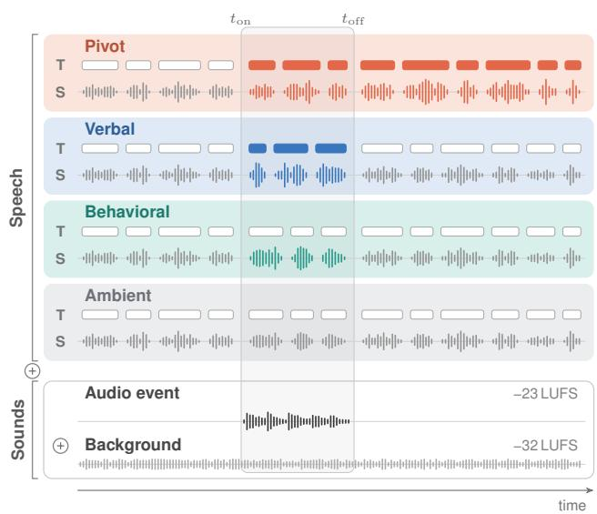
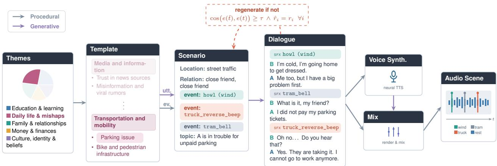

# CARES: A CONTROLLED SYNTHETIC BENCHMARK OF SPEAKER REACTIONS TO SOUND

Marcel Gibier1,2, Thomas Thebaud2, Olivier Boeffard ¨ 2, Jean-Franc¸ois Bonastre2

1Inria, Paris, France 2AMIAD, France marcel.gibier@polytechnique.edu

## ABSTRACT ABSTRACT

Automatic audio scene description turns a recording into a text account of a situation. One difficulty is deciding which elements of the audio should be kept, since a description cannot include them all. Annotators disagree about it, making a ground truth hard to obtain. In this work, we first define the ground truth, then generate the data. We focus on audio events and define sound salience with a simple rule: a sound is salient when a speaker audibly reacts to it. For scale and variety, a controlled set of scenarios fixes the ground truth and a language model writes the dialogues. The resulting corpus, CARES, contains 10,000 two-speaker scenes. We then benchmark six audio–language models on three tasks: identifying the scene, tagging the sounds present, classifying reactions. We show that these models hear the sounds but miss how the speakers react to them.

Index Terms— Audio scene description, rich transcription, speech summarization, synthetic dataset, speaker reaction

## 1. INTRODUCTION

An audio scene is the audio trace of a real situation, bounded in time and place, like a scene in a film. It reaches the microphone as one mixed stream, where speech, music and environmental sounds share a single timeline. Automatic audio scene description (AASD) turns this stream into text: who is present, what they do and say, what happens around them, and how they relate over time.

AASD raises three difficulties. First, the information is spread across all the layers of the recording: who speaks, what is said and how, the events, the ambience, the music. These layers only make sense together. A ring tone alone means little, and so does a speaker breaking off; jointly, they are an interrupted meal. Second, a description cannot keep everything. Its length is a choice, from a full transcript to a few sentences, depending on what the description is for. Choosing it means choosing which elements are salient, that is, worth keeping. This is not perceptual salience, where a sound stands out from the background [1]. The loudest sound is not always worth reporting; a quiet phone buzz that stops a conversation is. Third, the task is hard to evaluate: no single description is correct, and annotators asked to select salient content agree only weakly [2].

Prior work sits at the two ends of this length scale. Rich transcription enriches the words with speaker turns, sentence units, disfluencies and non-speech events [3]. It weights nothing, so salience is left to the user. Speech summarization keeps only the parts of the transcript it scores as important [4]: the system decides. Both focus on speech and treat environmental sounds as side information.

Recent audio–language models remove this separation [5–10]. They take the mixed stream as input and can, in principle, relate what is said to what is heard. This makes evaluation critical: a model can transcribe a scene correctly yet miss the sound the speakers reacted to, or report sounds that were never there [11]. Current datasets record what was said or heard, not which sounds mattered to the participants.

  
Fig. 1. Four types of speaker reaction to an audio event. Each block shows the transcript (T, one box per word) and the speech signal (S) over time. The shaded box marks the audio event [ton, tof]. Colored elements are altered by the event. Pivot: persistent change of T and S. Verbal: local verbal reaction (T and S). Behavioral: local change of S only. Ambient: no impact. The speech signal, the audio event (−23 LUFS) and the background (−32 LUFS) are summed (⊕) to form the final mix.

What is needed is a large set of scenes in which speech and sounds come with an unambiguous ground truth. We therefore reverse the order of construction. We first define salience and fix the ground truth from it. Only then are the scenes generated artificially. We restrict salience to audio events, not what is said, and define it through the talk: an audio event is salient when a speaker audibly reacts to it (Fig. 1). This simple definition can later be extended.

We address two questions. (Q1) Can we generate audio scenes whose salience is known in advance? Yes: Our generated corpora, CARES (Controlled Audio Reactions in Environmental Scenes), contains 10,000 two-speaker scenes associated with a defined sound salience. And both human annotators (κ = 0.86 on 200 scenes) and an independent model recover the salience information from the transcript. (Q2) Do audio–language models take this salience into account? Our benchmark shows they do not: they recognize the sounds, but tell how speakers react no better than a text-only system.

## 2. RELATED WORK

Describing an audio scene. An audio scene has several components, including speech, environmental sounds, and music. Most tasks describe only one of them at a time. Audio captioning pairs short clips with a free-form sentence [12]. Sound event detection and acoustic scene classification label which sounds occur and when [13]. Meeting corpora [14] and spoken dialogue summarization describe what was said [15]. Synthetic conversations have been mixed with background sounds, but only to make the audio realistic [16].

Labels by construction. Synthetic soundscapes reverse the order of annotation: Scaper [17] mixes isolated events so that their class and onset are known exactly.

Sounds in spoken interaction. Audio–language models take speech and sounds in one input. Benchmarks question them on existing recordings [18], or test speech, scenes and events as separate targets [19]. Spoken dialogue benchmarks add background sounds that the system’s reply should take into account, for single turns [20], multi-turn dialogues [21]. Closest to us, CASU [22] mixes synthetic speech (a monologue or a two-person exchange, under 30 s) with retrieved events and backgrounds, and asks multiple-choice questions: whether the sounds confirm, contradict or contextualize what is said, which entity or role they reveal, and how an interpretation would change if they differed. The sound provides evidence for the listener, such as when a speaker sounds confident while an event proves them wrong. Whether the speakers themselves notice or react to the sound is not labelled.

Reactions to sounds. Conversation analysis has studied both of our axes through detailed analysis of recorded interactions, without labelled data: how people notice events around them [23], and how they cut off or adapt their talk [24]. Rich transcription marks disfluencies and non-speech events [3], but never the link between them. CARES labels this link, at scale.

## 3. METHOD

Our aim is to generate a large and varied set of two-speaker scenes in which the salience of every audio event is known before the audio exists. We use a language model only for the parts that require natural language, and generate everything else deterministically (Fig. 2).

## 3.1. Templates and scenarios

Each scene starts from a template, a short situation two adults could discuss (e.g. Parking issue) (Fig. 2). Each template is used to generate several scenarios. A scenario defines: who speaks, a relation (e.g. two close friends), the gender of each speaker, placed in a scene (an everyday location such as a cafe or a train station),´ talking about a topic, during which occur audio events, (e.g. a coffee machine or a door closing noise). Each event carries a reaction type and a register (Sec. 3.2).

## 3.2. Speaker reactions to acoustic events

Each event is assigned one of four reaction types (Fig. 1), defined by the participants’ displayed conduct rather than by the physical properties of the sound. They go from a sound that takes over the conversation to one that draws no reaction. A pivot event is named and the conversation reorganizes around it. A verbal event is named in passing, and the talk resumes its prior course within the same or the next turn. A behavioral event is never named but disrupts the talk, as when a speaker breaks off, restarts or is interrupted. An ambient event draws no reaction: it is neither named nor does it change the talk, whatever its loudness.

Each reaction type except ambient comes in a fixed set of registers, i.e. ways to react: a verbal event may be named in passing or commented on for its loudness, a pivot may start an argument about whether it should happen here, a behavioral event may make the speaker lose their place. We keep a register only if the reaction would make no sense without the sound.

Why pre-allocation matters. If the language model chose the content of each scenario itself, it would concentrate its choices on a few familiar modes [25]. Our allocator instead enforces a uniform distribution over scenes, relations, genders, registers, per-scene event banks and compositions (how many events of each type a scenario carries), and shuffles the order of events so that it does not encode their type.

## 3.3. Dialogue generation

Each scenario is turned into a textual dialogue generated as a timeline: an ordered list of utterances (speaker A or B) and acoustic events. The prompt enforces the reaction design: every reacted-to sound must draw a reaction, two such sounds must draw distinct and separately placed ones, ambient sounds must draw none. A behavioral break must fall in the first sentence after the sound, and the speaker never explains it, since a stated cause would replace the sound. Other constraints are stylistic (spoken English, entity grounding, optional inline tags such as [laughs], each rendered by the synthesizer as a vocalization, a pause or an emotion, so that no tag is left without a trace in the audio). Dialogues run up to 13 utterances. A script verifies the rules that can be checked automatically. The full prompts are released with the code.1

## 3.4. Audio rendering

Audio rendering is procedural and seeded, apart from the neural TTS voice track. The mix combines three layers: the voice track, one sample per acoustic event, and a per-scene ambience, low-pass filtered so it does not mask the voice. Since the turn timings returned by the synthesizer do not match the rendered audio, we recover word and turn boundaries with a forced aligner [26]. Every boundary then receives a short gap drawn from the same range, event or not, and each event reserves a clear window of 0.35 s on its loudest moment. Events are summed onto the voice track, so the voice is only shifted, never cut, and the length of a gap says nothing about the sound in it. A behavioral sound ends just before speech resumes and ducks the reacting voice by up to 4 dB, so it explains the interruption instead of covering it. Room-impulse-response reverberation places each scene in a plausible space, and every event sits at least 6 dB above the ambience bed: an annotated sound is always audible, while levels never encode the reaction.

## 4. IMPLEMENTATION DETAILS

Scale. The corpus consists of 1,000 templates and 10,000 scenarios. The scenarios cover 24 pairs of adult roles and 13 locations (about 770 scenarios each), with 219 different sounds.

Splits. We define a 80% 10% 10% split of the 1,000 templates, for the train, validation and test sets, respectively. The split is made on templates, not on scenes and all the scenarios of a template follow it (no situation is therefore shared across splits). The test split contains 1000 scenes, and every number below is measured on it. The train and validation splits are released for fine-tuning and probing, the benchmark itself is zero-shot.

  
Fig. 2. The CARES construction pipeline: text generation and audio rendering. A deterministic allocator fixes the scene, relation, speaker genders, sound events, reaction registers, and composition. A language model fills only the conversation topic and the dialogue. The reactionrecovery filter sits between the two phases: rejected dialogues are regenerated until an independent evaluator recovers the intended reactions. utt.: utterances; ev.: acoustic events.

Compositions. The sound layer of a scenario is the tuple of event counts per reaction type, (npiv, nver, nbeh, namb). A scenario carries 0 to 3 events with at most one pivot over and its composition is drawn uniformly.

Models. Conversation topics come from Qwen3-235B-Instruct [27]; dialogues, with their event placement, from Claude Opus 5 [28], a different model family from both the scenario step and the evaluator (Llama-4-Maverick-17B-128E-Instruct [29]). Speech is synthesized with ElevenLabs v3 [30], which renders expressive multi-speaker audio and interprets the inline tags.

Audio assets. Event takes and ambiences come from Freesound (30 clean, isolated takes per event identifier, 30 ambiences per location), drawn at random at mix time. An ambience is trimmed or looped with cross-fades to the length of the scene. Takes, ambiences and room impulse responses follow the same three-way partition: 5 takes per identifier and 5 ambiences per location are reserved for test, so no recording heard in test occurs in train or validation.

Mixing and export. Loudness follows EBU R128 with fixed targets: voice-level events at −20 LUFS, set-back events at −23 (the layer drawn at random), scene ambience at −32 (jittered per scene), and a −23 LUFS master. Audio is exported as 44.1 kHz mono 16-bit WAV with a peak limiter at −1 dB. The released set contains 10,000 scenes, 120.4±18.8 s long on average, with scenes, relations, events and compositions uniformly distributed by construction.

## 5. VALIDATION

The allocator fixes the reaction type of each sound, but the language model may not write it as intended: a pivot can end up as a passing mention, or a behavioral break can be explained by the speaker. The goal of this validation is to check that each dialogue carries the reactions it was asked for, so that the type of each sound can be recovered from the dialogue alone, and that the final mix keeps this dialogue intelligible.

Reaction-recovery filter. We enforce a per-item property at construction time. Let X be a scenario: a topic t and, for each environmental sound i, a gold reaction type $\boldsymbol { r } _ { i } .$ An independent evaluator g is shown the full transcript of a generated dialogue $Y = f ( X )$ , inline tags included, with every event marked as [SOUND: <id>]. All sounds are thus visible: g does not detect them but classifies them, returning tˆand a type $\hat { r } _ { i }$ per sound. We accept Y when

$$
\cos ( e ( { \hat { t } } ) , e ( t ) ) \geq \tau \quad \wedge \quad { \hat { r } } _ { i } = r _ { i } \forall i ,\tag{1}
$$

with $e ( \cdot )$ a BGE-large-en-v1.5 embedding [31] and τ a threshold. Sounds are matched exactly on their identifier, so $\hat { r } _ { i }$ is a four-way label. The criterion is strict: neither omission nor confusion is tolerated, and failing dialogues are regenerated. Two properties make the filter meaningful. First, f (Claude Opus 5) and g (Llama-4 Maverick) come from different model families, so acceptance cannot reduces the risk of shared bias. Second, the filter is a rejectionsampling loop: candidates are drawn until one passes, so it selects which dialogue is kept for a given X without altering the target distribution p(X).

Topic threshold. In Eq. (1), τ is the cosine cutoff above which gold and recovered topics count as matching. BGE scores are uncalibrated, so τ is set on our data: 0.82, at the max-Youden point (ROC AUC 0.861) between gold topics paired with a loose reformulation and with another scenario’s topic from the same template.

Human validation. Three native English speakers with a highschool education, recruited on Fiverr2, independently labelled the sounds of 200 test scenes. They were given the definitions of the four categories, read the reference transcript with each event marked in place, and had no access to the dataset label. They agree with the released labels at κ = 0.86 and with each other at $\kappa = 0 . 8 1$ . The four categories are thus recoverable from the transcript by a person, not only by the model that assigned them.

Speech intelligibility. Events and ambiences are mixed on top of the speech, so they could mask the dialogue and hide the reactions it carries. To check that they do not, we transcribe the final mix with Whisper-large-v3 [32] and compare it with the synthesis scripts. The word error rate is 3.3% (95% CI [2.8, 3.9]), close to the 2.7% Whisper reaches on clean read speech (LibriSpeech test-clean): the added sounds leave the dialogue intelligible.

<table><tr><td>Model</td><td colspan="5">Reaction Classification</td><td>Acoustic Scene</td><td>Audio</td><td colspan="4">Summary</td></tr><tr><td></td><td>Balanced</td><td colspan="4">Precision(%)/Recall(%)</td><td>Classification</td><td>Tagging</td><td colspan="4">Recall (%)↑</td></tr><tr><td></td><td>Accuracy(%)↑</td><td>Pivot</td><td>Verbal</td><td>Behav.</td><td>Ambient</td><td>Accuracy (%)↑</td><td>Accuracy (%)↑</td><td>Pivot</td><td>Verbal</td><td>Behav.</td><td>Ambient</td></tr><tr><td>Audio Flamingo Next</td><td> $2 9 . 7 { \scriptstyle \pm 2 . 0 }$ </td><td>50.0/0.3</td><td>30.6/65.0</td><td>50.0/0.7</td><td>41.1/52.7</td><td> $6 2 . 5 { \scriptstyle \pm 3 }$ </td><td> $3 4 . 8 { \scriptstyle \pm 2 }$  –</td><td> $9 . 5 { \scriptstyle \pm 3 . 7 }$ </td><td> $3 . 3 { \pm } 1 . 7$ </td><td> $0 . 5 { \scriptstyle \pm 1 . 0 }$ </td><td> $2 . 5 { \pm } 1 . 5$ </td></tr><tr><td>Qwen3-Omni</td><td> $\mathbf { 3 9 . 0 } _ { \pm 2 . 0 }$ </td><td>27.0/89.5</td><td>33.6/41.7</td><td>41.5/24.2</td><td>75.0/0.5</td><td> ${ \bf 8 9 , 6 _ { \pm 2 } }$ </td><td> ${ \bf 5 7 . 7 \pm 2 }$ </td><td> $\mathbf { 2 2 . 2 \bot _ { \pm 4 . 9 } }$  </td><td> ${ \bf 6 . 0 \pm 2 . 2 }$ </td><td> ${ \bf 1 . 6 \pm 1 . 4 }$ </td><td> ${ \bf 3 . 3 \pm 1 . 7 }$ </td></tr><tr><td>Kimi-Audio</td><td> $2 5 . 6 { \scriptstyle \pm 2 . 0 }$ </td><td>27.8/1.6</td><td>29.6/1.3</td><td>22.2/5.4</td><td>31.2/94.1</td><td> $7 8 . 1 \pm 2 $ </td><td> $4 8 . 6 { \scriptstyle \pm 2 }$ </td><td> $6 . 7 { \scriptstyle \pm 3 . 3 }$ </td><td> $1 . 7 { \pm } 1 . 4 $ </td><td> $0 . 5 { \scriptstyle \pm 1 . 0 }$ </td><td> $0 . 8 { \scriptstyle \pm 1 . 0 }$ </td></tr><tr><td>MiMo-Audio</td><td> $3 2 . 8 { \scriptstyle \pm 2 . 0 }$ </td><td>40.6/40.0</td><td>30.4/91.2</td><td>–10.0</td><td>-/0.0</td><td> $8 1 . 7 \pm 2$ </td><td> $4 6 . 5 { \scriptstyle \pm 2 }$ </td><td> $1 2 . 0 { \scriptstyle \pm 4 . 0 }$ </td><td> $4 . 0 { \scriptstyle \pm 2 . 0 }$ </td><td> $1 . 0 { \pm } 1 . 0 $ </td><td> $2 . 0 { \pm } 1 . 2$ </td></tr><tr><td>MOSS-Audio</td><td> $3 1 . 4 { \scriptstyle \pm 2 . 0 }$ </td><td>17.4/99.4</td><td>43.7/17.9</td><td>76.5/7.0</td><td>50.0/1.4</td><td> $7 1 . 1 { \pm 3 }$ </td><td> $4 8 . 5 { \scriptstyle \pm 2 }$ </td><td> $5 . 5 { \scriptstyle \pm 3 . 0 }$ </td><td> $1 . 5 { \pm } 1 . 2 $ </td><td> $0 . 2 { \scriptstyle \pm 0 . 5 }$ </td><td> $0 . 5 { \scriptstyle \pm 0 . 8 }$ </td></tr><tr><td>MiDashengLM</td><td> $2 4 . 1 { \pm } 2 . 0 $ </td><td>14.6/77.1</td><td>25.6/19.2</td><td>–10.0</td><td>–/0.0</td><td> $4 8 . 1 { \pm } 3 $ </td><td> $3 3 . 3 { \scriptstyle \pm 2 }$ </td><td> $3 . 0 { \scriptstyle \pm 2 . 0 }$ </td><td> $1 . 0 { \pm } 1 . 0 $ </td><td> $0 . 0 { \scriptstyle \pm 0 . 0 }$ </td><td> $0 . 2 { \scriptstyle \pm 0 . 5 }$ </td></tr><tr><td>Whisper + LLM</td><td> $3 6 . 5 { \scriptstyle \pm 2 . 0 }$ </td><td>59.5/23.8</td><td>34.6/35.4</td><td>36.2/22.9</td><td>40.3/64.0</td><td> $6 4 . 6 { \scriptstyle \pm 3 }$ </td><td> $3 1 { \pm } 2$ </td><td> $1 6 . 5 { \scriptstyle \pm 4 . 1 }$ </td><td> $1 . 5 { \pm } 1 . 0 $ </td><td> $0 . 7 _ { \pm 0 . 7 }$ </td><td>1.1±0.8</td></tr></table>

Table 1. Benchmark on the 1,000 test scenes. Whisper + LLM is the text-only control. All scores in $\% ,$ chance is 25 for all accuracies. Balanced accuracy is the mean of the four per-class accuracies. Recall and precision are provided for each reaction class. Acoustic scene classification and audio tagging are four-way multiple choice. Summary recall refers to the proportion of annotated sounds of this type that are mentioned in the 200-words summary generated by the model. (±) give the 95 % confidence interval. Best per column in bold, except for per-class precision/recall. Results significantly higher than the text-only control are in blue . Classes with a Reaction Classification recall≤ 7% are shown in red .

## 6. BENCHMARK

Audio–language models can in principle relate what is said to what is heard, but no dataset could so far test whether they relate a sound to how the speakers react to it. CARES makes this test possible, since the reaction to each sound is known before the audio exists.

Evaluated tasks. The benchmark tests whether a model can tell how speakers react to a sound, and whether hearing the audio helps beyond the words. It has four tasks, posed as text questions on the 1000 scenes of the test split, whose templates and recordings never appear in training or validation. In reaction classification (RC), the model is told when a sound occurs and picks one of the four reaction types, whose definitions are given in the prompt. Acoustic scene classification (ASC) and audio tagging (AT) are four-way multiplechoice questions on the location and on the sounds present, with AT distractors taken from the same location.

Evaluated models. We restrict the benchmark to open-weight models, so that every score can be reproduced from the released audio. We evaluate six recent open audio–language models (ALMs): Audio Flamingo Next [5], Qwen3-Omni [6], Kimi-Audio [7], MiMo-Audio [8], MOSS-Audio [9] and MiDashengLM [10]. We compare them with a text-only system that never hears a sound: Whisper-large-v3 transcribes the speech and a text model (Qwen3.6- 35B-A3B [27]) answers from the transcript. If it matches the ALMs, a task is solved from the words alone.

## 7. RESULTS

Do the models recognize the sounds? As shown in the columns ”Accoustic Scene Classification” and ” Audio Tagging” in Table 1, most models are able to classify both the nature of the audio scene (with between 48% and 90% accuracy over 4 classes) and, in a lesser measure, the audio events (with between 35% and 58% accuracy over 4 classes), topped each time by the Qwen3-Omni model. However, this perception is not purely based on audio processing, as the contrastive text-only experiment shows similar performance, notably for the Audio Flamingo Next and MiDashengLM models. The high accuracy on the audio scene classification from text $( 6 5 \% _ { \pm 3 \% } )$ is easily explained as the audio scenes are selected to match the topic of the conversation, while the non-random audio tagging results from text $( 3 1 \% _ { \pm 2 \% } )$ may come from some pivot and verbal dialogues mentionning explicitely the nature of the sound.

Can the models tell how/if the speakers react to the sounds? As shown in the Reaction Classification column of Table 1, the best audio model reaches 39.0% of balanced accuracy, close to the 36.5% of the text control. Every ALM has at least one class that gets totally ignored (Recall≤ 7%), each collapsing onto a different set: MOSS-Audio answers pivot almost always, Kimi-Audio ambient, and MiMo-Audio and MiDashengLM never answer behavioral or ambient. The text control is the only system that ignores none of the classes.

We also ran reaction classification on the same scenes with the annotated sound muted : no ALM’s balanced accuracy moved significantly. The models rely on what is said, not on the audio event. What the models use is in the speech, not in the sound.

The importance of the sound in the summarization From the Summarization recall columns of Table 1, we see no model judged the audio events important enough to be recorded in the summary of the conversation. Even when an audio event becomes the topic of the talk, the best model keeps 22% of them, while the text-only control keeps more (16.5%) than five of the six ALMs. Recall follows the same order as above. Even when an unnamed sound broke the conversation, it rarely reaches the summary: the ALMs keep at most 3.3% of unnamed sounds, against about 1% for the control, and no more when the sound broke the talk than when nobody noticed it. In summaries as in classification, what counts is what the speakers say about a sound, not what it does to the conversation.

## 8. CONCLUSION

Automatic audio scene description lacks a ground truth for which audio events matter. We define salience by the reaction a sound draws, fix this ground truth first, and generate the audio around it. The resulting corpus, CARES, contains 10,000 two-speaker scenes. Audio–language models recognize its sounds, but tell how speakers react no better than a text-only system, and their summaries rarely mention a sound nobody named. The open problem is not recognizing a sound, but linking it to what the talk does with it.

Limitations. The scenes are synthetic English dialogues, checked on transcripts rather than audio. Language models write and check the dialogues and judge the summaries, which may favour reactions they read easily. Apart from Qwen3-Omni, we cannot tell whether the models’ collapse comes from the audio or from the task format.

## 9. ACKNOWLEDGEMENTS

This work was performed using HPC resources from GENCI IDRIS (Grant 2025-AD011014982R1).

## 10. REFERENCES

[1] E. M. Kaya and M. Elhilali, “Modelling auditory attention,” Philosophical Transactions of the Royal Society B, vol. 372, no. 1714, 2017.

[2] I. Martin-Morato and A. Mesaros, “What is the ground truth? Reliability of multi-annotator data for audio tagging,” in Proc. European Signal Processing Conference (EUSIPCO), 2021, MACS dataset.

[3] G. Gravier, J.-F. Bonastre, E. Geoffrois, S. Galliano, K. Mc-Tait, and K. Choukri, “The ESTER evaluation campaign for the rich transcription of French broadcast news,” in Proc. Language Resources and Evaluation Conference (LREC), Lisbon, Portugal, 2004.

[4] S. Furui, T. Kikuchi, Y. Shinnaka, and C. Hori, “Speech-to-text and speech-to-speech summarization of spontaneous speech,” IEEE Transactions on Audio, Speech, and Language Processing, vol. 12, no. 4, pp. 401–408, 2004.

[5] A. Goel, S. Ghosh, Z. Kong, J. F. Santos, R. Valle, W. Ping, B. Catanzaro, et al., “Audio Flamingo Next: Next-generation open audio-language models for speech, sound, and music,” arXiv preprint arXiv:2604.10905, 2026.

[6] J. Xu, Z. Guo, H. Hu, Y. Chu, X. Wang, et al., “Qwen3-Omni technical report,” arXiv preprint arXiv:2509.17765, 2025.

[7] KimiTeam, D. Ding, Z. Ju, Y. Leng, S. Liu, T. Liu, et al., “Kimi-Audio technical report,” arXiv preprint arXiv:2504.18425, 2025.

[8] LLM-Core Team Xiaomi, “MiMo-Audio: Audio language models are few-shot learners,” arXiv preprint arXiv:2512.23808, 2025.

[9] C. Yang, C. Yu, H. Chen, et al., “MOSS-Audio technical report,” arXiv preprint, 2026, OpenMOSS Team.

[10] H. Dinkel, G. Li, Y. Niu, J. Zhou, Z. Han, et al., “Mi-DashengLM: Efficient audio understanding with general audio captions,” arXiv preprint arXiv:2508.03983, 2025.

[11] C.-Y. Kuan, W.-P. Huang, and H.-Y. Lee, “Understanding sounds, missing the questions: The challenge of object hallucination in large audio-language models,” in Proc. Interspeech, 2024.

[12] C. D. Kim, B. Kim, H. Lee, and G. Kim, “AudioCaps: Generating captions for audios in the wild,” in Proc. NAACL-HLT, 2019.

[13] J. F. Gemmeke et al., “Audio Set: An ontology and humanlabeled dataset for audio events,” in Proc. IEEE International Conference on Acoustics, Speech and Signal Processing (ICASSP), 2017.

[14] J. Carletta et al., “The AMI meeting corpus: A preannouncement,” in Proc. Machine Learning for Multimodal Interaction (MLMI), 2005.

[15] Yen-Ju Lu, Kunxiao Gao, Mingrui Liang, Helin Wang, Thomas Thebaud, Laureano Moro-Velazquez, Najim Dehak, and Jesus´ Villalba, “Spoken DialogSum: An emotion-rich conversational dataset for spoken dialogue summarization,” arXiv preprint arXiv:2512.14687, 2025.

[16] Y. Labrak et al., “Generating synthetic doctor-patient conversations for long-form audio summarization,” arXiv preprint arXiv:2604.06138, 2026, Synth-DoPaCo dataset.

[17] Justin Salamon, Duncan MacConnell, Mark Cartwright, Peter Li, and Juan Pablo Bello, “Scaper: A library for soundscape synthesis and augmentation,” in Proc. IEEE Workshop on Applications of Signal Processing to Audio and Acoustics (WAS-PAA), 2017, pp. 344–348.

[18] S. Sakshi et al., “MMAU: A massive multi-task audio understanding and reasoning benchmark,” in Proc. International Conference on Learning Representations (ICLR), 2025.

[19] H. Yin and J.-W. Choi, “Can large audio language models understand audio well? Speech, scene and events understanding benchmark for LALMs,” arXiv preprint arXiv:2509.13148, 2025.

[20] Junyi Ao, Yuancheng Wang, Xiaohai Tian, et al., “SD-Eval: A benchmark dataset for spoken dialogue understanding beyond words,” in Proc. NeurIPS, Datasets and Benchmarks Track, 2024.

[21] Xize Cheng, Ruofan Hu, Xiaoda Yang, et al., “VoxDialogue: Can spoken dialogue systems understand information beyond words?,” in Proc. ICLR, 2025.

[22] Pengfei Zhang, Hoang H. Nguyen, Kazi Shaharair Sharif, Yutong Song, Wenjun Huang, Henry Peng Zou, Pinxin Liu, Honghui Xu, and Amir M. Rahmani, “From sounds to scenes: A benchmark for evaluating context-aware auditory scene understanding in large audio language models,” arXiv preprint arXiv:2606.25391, 2026.

[23] T. Keisanen, ““Uh-oh, we were going there”: Environmentally occasioned noticings of trouble in in-car interaction,” Semiotica, vol. 2012, no. 191, pp. 197–222, 2012.

[24] Emanuel A. Schegloff, Gail Jefferson, and Harvey Sacks, “The preference for self-correction in the organization of repair in conversation,” Language, vol. 53, no. 2, pp. 361–382, 1977.

[25] J. Zhang et al., “Verbalized sampling: How to mitigate mode collapse and unlock LLM diversity,” arXiv preprint arXiv:2510.01171, 2025.

[26] V. Pratap, A. Tjandra, B. Shi, P. Tomasello, A. Babu, et al., “Scaling speech technology to 1,000+ languages,” arXiv preprint arXiv:2305.13516, 2023.

[27] Qwen Team, “The Qwen3 and Qwen3.6 model families,” https://qwenlm.github.io/, 2026.

[28] Anthropic, “The Claude model family,” https://www. anthropic.com/, 2025.

[29] Meta AI, “Llama 4: Maverick and Scout,” https://ai. meta.com/llama/, 2025.

[30] ElevenLabs, “Eleven v3: Expressive text-to-speech with audio tags,” https://elevenlabs.io/, 2025.

[31] S. Xiao et al., “C-Pack: Packaged resources to advance general Chinese embedding,” arXiv preprint arXiv:2309.07597, 2023.

[32] A. Radford, J. W. Kim, T. Xu, G. Brockman, C. McLeavey, and I. Sutskever, “Robust speech recognition via large-scale weak supervision,” in Proc. International Conference on Machine Learning (ICML), 2023.