# CATune: Structural Constraint-Aware Bayesian Optimization for DBMS Configuration Tuning

Fangping Lan   
Temple University   
Philadelphia, PA, USA   
fangping.lan@temple.edu

Qi Zhang Temple University Philadelphia, PA, USA qi.zhang@temple.edu

Eduard Dragut Temple University Philadelphia, PA, USA edragut@temple.edu

## ABSTRACT

Modern DBMSs expose hundreds of configuration knobs, resulting in a high-dimensional and heterogeneous search space that makes automated tuning costly. Existing ML-based tuning systems typically treat the configuration domain as box-constrained and rely on workload feedback to implicitly capture inter-knob relationships. However, DBMS documentation specifies deterministic knob dependency constraints—particularly ordering constraints—that characterize structurally valid regions of the configuration space. We present CATune, a constraint-aware Bayesian optimization (BO) framework that models deterministic inter-knob ordering constraints as structural components of the search domain. Instead of learning feasibility boundaries through sampled violations, CATune performs optimization within a constraint-consistent subspace. We develop a topology-aware sampling strategy that respects dependency structure during exploration and avoids the ineficiencies of post-hoc constraint handling. To enable automated constraint discovery, we further design a precision-first extraction pipeline that combines LLM-based parsing with reliability safeguards to mitigate hallucinated dependencies. Experiments on PostgreSQL and MySQL using TPC-C and TPC-H workloads show that CATune substantially improves both sample eficiency and final tuning quality across surrogate models and BO frameworks. Under default ranges, CATune reaches the baseline optimum up to 12.5× faster and improves throughput by up to 63.37%. The improvements persist under knowledge-guided reduced ranges and alternative optimization implementations. These results demonstrate that ex plicitly modeling system-defined deterministic ordering constraints enhances optimization robustness and system stability.

## PVLDB Reference Format:

Fangping Lan, Qi Zhang, and Eduard Dragut. CATune: Structural Constraint-Aware Bayesian Optimization for DBMS Configuration Tuning. PVLDB, 19(13): 5286 - 5299, 2026

doi:10.14778/3849398.3849421

## PVLDB Artifact Availability:

The source code, data, and/or other artifacts have been made available at https://github.com/lanfangping/CATune.

## 1 INTRODUCTION

Modern Database Management Systems (DBMSs) expose hundreds of configuration knobs that govern memory allocation, concurrency control, logging behavior, and query execution strategies [36]. While this flexibility enables performance optimization across diverse workloads, it creates a high-dimensional and heterogeneous configuration space that is dificult to navigate [50]. For example, PostgreSQL v13 provides 263 knobs spanning continuous, integer, and categorical domains. In cloud environments, where workloads and hardware configurations vary widely, manual tuning by database administrators (DBAs) becomes increasingly infeasible [55].

To address this challenge, prior work has proposed automated and ML-based tuning methods. Existing approaches broadly fall into two categories: (1) ofline transfer-based methods that pre-train models on benchmark workloads and transfer knowledge to new deployments [49, 54, 64], and (2) online search-based methods that iteratively select configurations using search algorithms, reinforcement learning (RL) [5, 28, 46, 55], or Bayesian optimization (BO) techniques such as SMAC [10, 20, 27, 30, 49, 62, 63].

Although these methods can eventually identify high-performing configurations, they incur significant tuning cost [18, 20]. Stateof-the-art systems often require hundreds ofiterations to stabilize performance [61], and each iteration may execute expensive workloads. This cost arises from two challenges: the large number of knobs requiring exploration and the broad vendor-provided ranges associated with each knob. These ranges are intentionally conservative to ensure generality but substantially enlarge the search space and may include unstable or invalid regions [37, 50].

Meanwhile, human DBAs rarely rely on blind trial-and-error. Instead, they use domain knowledge documented in manuals and community discussions. Recent knowledge-aware tuners leverage Large Language Models (LLMs) to extract suggested values or reduce search regions [24–26, 46, 47]. However, these approaches primarily focus on identifying promising value ranges.

An under-exploited form of knowledge lies in system-defined deterministic knob dependency constraints, i.e., relationships among knobs that define structurally invalid or suboptimal regions (e.g., ordering constraints such as � ≤ �). These dependencies are documented in manuals and forums (Table 1); to our knowledge, they are not explicitly encoded in existing ML-based tuning systems. As a result, current tuners treat the configuration space as box-constrained and implicitly learn such relationships through trial-and-error feedback, leading to wasted evaluations of invalid configurations. In contrast, we explicitly encode deterministic inter-knob ordering constraints as structural components of the search domain.

We hypothesize that explicitly encoding deterministic knob de- pendency constraints into the optimization process can substantially improve sample eficiency and robustness. By filtering structurally invalid regions prior to evaluation, constraint-aware tuning reduces unnecessary trials and accelerates convergence.

Table 1: Three examples of knob dependency constraints found in PostgreSQL V13 Documentation
<table><tr><td rowspan=1 colspan=1>Knob</td><td rowspan=1 colspan=1>superuser_reserved_connections</td></tr><tr><td rowspan=1 colspan=1>Description</td><td rowspan=1 colspan=1>Determines the number of connection ... Thevalue must be less than max_connections...</td></tr><tr><td rowspan=1 colspan=1>Constraint</td><td rowspan=1 colspan=1>superuser_reserved_connections&lt; max_connections</td></tr><tr><td rowspan=1 colspan=1>Knob</td><td rowspan=1 colspan=1>max_parallel_workers</td></tr><tr><td rowspan=1 colspan=1>Description</td><td rowspan=1 colspan=1>... note that a setting for this value which ishigher than max_worker_processes will haveno effect, since ...</td></tr><tr><td rowspan=1 colspan=1>Constraint</td><td rowspan=1 colspan=1>max_parallel_workers ≤max_worker_processes</td></tr><tr><td rowspan=1 colspan=1>Knob</td><td rowspan=1 colspan=1>max_parallel_workers_per_gather</td></tr><tr><td rowspan=1 colspan=1>Description</td><td rowspan=1 colspan=1>Sets the maximum number of workers .. Parallelworkers are taken from the pool of processesestablished by max_worker_processes, limitedby max_parallel_workers ...</td></tr><tr><td rowspan=1 colspan=1>Constraint</td><td rowspan=1 colspan=1>max_parallel_workers_per_gather&lt; max_worker_processes,max_parallel_workers_per_gather&lt; max_parallel_workers</td></tr></table>

We present CATune, a system that encodes ordering constraints directly into the configuration domain and integrates them with BO-based optimizers. Ordering constraints naturally induce a structured dependency graph, which we model as a topology graph. Unlike classical constrained BO methods [11, 12, 38, 41, 62], which model constraints probabilistically and learn feasibility boundaries by sampling infeasible configurations, CATune restricts optimization to a constraint-consistent subspace prior to search. Structural constraints are enforced in both exploitation (Section 5.1) and exploration (Section 5.2).

However, post-hoc constraint-handling strategies enforce dependencies only after candidate generation, either by rejecting infeasible configurations [15] or by repairing them into feasible ones. Under multiple dependency constraints, these approaches incur substantial overhead from excessive rejected samples or repeated repair operations. To address this issue, we design a topology-aware sampling strategy that respects the dependency graph during sample generation, ensuring that every sampled configuration is feasible by construction while avoiding rejection and repair overhead.

Extensive experiments demonstrate that CATune improves both final tuning quality and convergence speed across workloads, surrogate models, BO implementations, and search-space regimes (Sec tion 7). Compared to penalty-based strategies, proactive constraint filtering yields faster convergence by eliminating infeasible regions prior to optimization. Ablation studies confirm the efectiveness of topology-aware sampling (Section 8.3). Beyond performance gains, we analyze the system-level impact of constraint enforcement (Section 8.1). Correct ordering constraints prevent DBMS startup failures and improve reliability, whereas hallucinated constraints can negatively afect optimization performance.

Although LLMs demonstrate strong capability in extracting tuning knowledge from textual sources [52, 65], they are not immune to hallucination [1, 53]. Our quality analysis in the technical report [22] shows that direct LLM prompting can produce unsupported or incorrectly oriented dependencies even when evidence spans are requested. Notably, two of these hallucinated constraints led to measurable degradation in tuning eficiency (Section 8.1). These findings highlight the risk of incorporating automatically generated constraints. To mitigate this risk, we design a precision-first constraint extraction pipeline that prioritizes correctness when leveraging LLM-based agents for automated dependency discovery.

Contributions. Our contributions are:

(1) We propose CATune, a DBMS tuning system that structurally encodes deterministic knob dependency constraints to restrict optimization to a constraint-consistent subspace.

(2) We compare three baseline constraint-handling strategies and show that correcting invalid configurations after sampling adds substantial overhead.

(3) We introduce a topology-aware sampling strategy that avoids low acceptance rates inherent in rejection-based constraint handling.

(4) We design a precision-first LLM-assisted extraction pipeline that automatically discovers and refines knob dependency constraints while mitigating hallucination.

(5) We conduct extensive experiments demonstrating improved convergence speed and final performance across workloads, surrogate models, and BO frameworks.

(6) We provide a systematic analysis of constraint employment strategies, hallucinated constraints, and the system-level impact of constraint enforcement.

## 2 MOTIVATION

This section motivates constraint-aware tuning by showing that existing ML-based systems waste budget on invalid configurations despite documented structural dependencies, and that current frameworks lack a systematic mechanism for enforcing such dependencies during optimization.

M1: Tuning budget waste significantly increases the cost of ML-based DBMS tuning. State-of-the-art ML-based tuning methods typically require hundreds of iterations to converge to a high-quality DBMS configuration, resulting in substantial tuning overhead. However, a non-trivial portion of this budget is effectively wasted. In practice, many sampled configurations are either invalid or uninformative. For example, in our preliminary experiments on PostgreSQL using the TPC-C workload with 46 knobs and documentation-specified search ranges, approximately 35% of tuning iterations led to DBMS crashes. Additionally, numerous configurations violate knob dependency constraints (e.g., superuser\_reserved\_connections must be strictly smaller than max\_connections), producing executions that are rejected or semantically meaningless. Such wasted iterations not only increase operational cost but also slow model convergence. ML-based optimizers rely on observed performance signals to update surrogate models; invalid or low-quality configurations provide little useful information. As a result, substantially more iterations are required before the model forms reliable predictions, particularly in high dimensional and constraint-heavy configuration spaces.

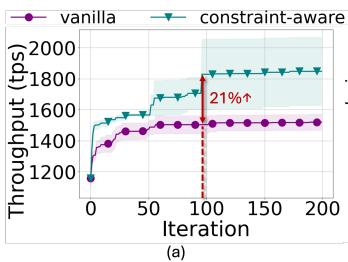

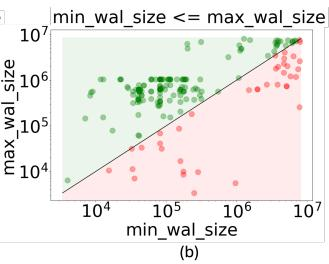  
Figure 1: (a) The preliminary tuning performance improvement on the TPC-C workload using 10 knobs with/without constraint-aware tuning; (b) The feasible (green) and infeasible (red) samples/region during tuning based on the ordering constraint min\_wal\_size < max\_wal\_size.

M2: Domain knowledge exists but remains underutilized. Ex tensive DBMS tuning knowledge has accumulated over decades and is documented in manuals, best practices, and expert guidelines. Prior work has incorporated portions of this knowledge into automated tuning frameworks, including suggested values [46, 47], range constraints, and special-value handling [24–26]. But, explicit inter-knob dependency relationships remain largely unmod eled. These dependencies directly afect both configuration validity and achievable performance. Existing ML-based tuners implicitly attempt to learn such relationships from sampled observations, resulting in high sample complexity and slow convergence in highdimensional domains. There is no guarantee that a learned surrogate model faithfully captures structural knob relationships.

As illustrated in Figure 1, explicitly modeling knob dependencies significantly improves tuning eficiency. Incorporating constraints yields approximately 21% higher throughput within the first 100 iterations, demonstrating faster convergence. Furthermore, enforcing constraints such as min\_wal\_size ≤ max\_wal\_size eliminates nearly 50% of the nominal search region and reduces invalid samples by 19.5% during tuning. These results highlight that dependency constraints meaningfully shrink the efective search space and reduce wasted trials. These observations motivate a systematic mechanism for modeling and enforcing structural inter-knob dependencies during optimization.

M3: LLMs enable dependency extraction but introduce reliability challenges. DBMS dependency constraints are expressed in diverse linguistic forms and are often scattered across documentation, making direct extraction challenging. Relation type and direction are easily confused [34, 56, 58], especially when multiple knobs interact. Extraction errors are high-impact: hallucinated or incorrectly oriented constraints may prune feasible configurations or bias optimization. To address this, we design a two-part solution (Section 6): (i) a precision-first hybrid extraction core that combines schema-constrained LLM parsing with symbolic normalization and rule-based patterns, and (ii) an agentic reliability guardrail that applies self-reflection and LLM-as-judge verification before final conflict resolution. This design improves extraction trustworthiness while remaining lightweight and practical.

M4: Structural constraints require dedicated integration into optimization. Modern optimization frameworks such as BO and RL are designed for black-box search over box-constrained domains. While efective for many tuning tasks, this abstraction does not directly account for deterministic inter-knob dependencies that induce structured feasible regions. Thus, structural constraint information must be incorporated through explicit modeling choices rather than relying solely on standard optimizer interfaces. This motivates a constraint-aware optimization framework that integrates structural dependency modeling directly into the search process.

Together, these observations suggest that efective DBMS tuning requires enforcing documented knob dependencies directly within the optimization process. We formalize this constraint-aware tuning problem next.

## 3 PROBLEM FORMULATION

In this section, we formalize the constraint-aware DBMS knob configuration problem. We first revisit the classical formulation used in prior tuning work, and then introduce structural knob dependency constraints derived directly from DBMS manuals. We conclude by discussing the computational complexity of the resulting problem. Classical DBMS Knob Tuning. Let $\theta = ( \theta _ { 1 } , \ldots , \theta _ { n } )$ denote the configuration vector, where each knob $\theta _ { i }$ takes values in domain $\Theta _ { i }$ (continuous, integer, or categorical). The nominal configuration space is $\Theta = \Theta _ { 1 } \times \cdot \cdot \cdot \times \Theta _ { n }$

Given a workload $W ,$ the DBMS performance (e.g., throughput or latency) is modeled as an unknown function $f : \Theta \to \mathbb { R }$ , which can only be evaluated by executing the workload under configuration �. The classical tuning problem is therefore defined as [50]:

$$
\theta ^ { * } = \operatorname * { a r g m a x } _ { \theta \in \Theta } f ( \theta ) .\tag{1}
$$

Most existing tuning approaches treat � as a box-bounded search space and perform black-box optimization over this space.

Constraint-aware Tuning with Ordering Dependencies. DBMS manuals document deterministic ordering relationships between knobs. These dependencies specify relative constraints such as $\theta _ { i } \leq \theta _ { j }$ , ensuring valid configurations and preventing unsupported parameter combinations. Such relationships are known a priori from documentation and can be verified without executing the DBMS (Table 1). They restrict the set of admissible configurations before any performance evaluation is performed. We model these dependencies as a set of pairwise ordering constraints, $\theta _ { i } \leq \theta _ { j } , ( i , j ) \in C$ where C denotes the set of ordered knob pairs extracted from documentation. The resulting feasible configuration space is $\mathbf { \nabla } \Theta _ { C } = $ $\left\{ \theta \in { \Theta } \big \vert \theta _ { i } \leq \theta _ { j } \right.$ for all $( i , j ) \in C \}$

The constraint-aware tuning problem becomes:

$$
\theta ^ { * } = \arg \operatorname* { m a x } _ { \theta \in \Theta _ { C } } f ( \theta ) .\tag{2}
$$

Unlike prior approaches that treat constraints as post-hoc performance conditions checked after execution (e.g., SLA violations), we enforce documented ordering dependencies directly in the search space. This eliminates structurally invalid configurations a priori and fundamentally changes how candidate configurations are generated during optimization.

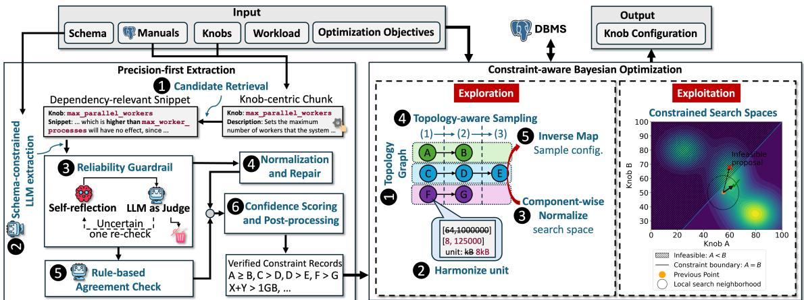  
Figure 2: System overview of CATune. CATune consists of (1) a precision-first extraction pipeline that automatically derives ordering constraints from DBMS manuals, and (2) a constraint-aware Bayesian optimization engine that explicitly integrates these structural de endencies durin both ex loration and ex loitation.

## 3.1 Computational Complexity

Even when restricted to ordering constraints, the DBMS knob tuning problem remains computationally hard.

Lemma 3.1. The constraint-aware DBMS knob tuning problem under a black-box objective is NP-hard.

Proof Sketch. Consider a restricted instance in which all knobs are binary variables $\theta _ { i } \in \{ 0 , 1 \}$ and no ordering constraints are imposed. Let the performance function be an arbitrary black-box mapping $f : \{ 0 , 1 \} ^ { n } \to { \mathbb { R } }$ . In the worst case, identifying the global optimum requires evaluating all $2 ^ { n }$ possible configurations. Thus, even without constraints, the tuning problem is combinatorial and NP-hard. Since adding ordering constraints only restricts the feasible region without introducing exploitable structure in �, the general problem remains NP-hard. □

Why the problem remains hard. The intrinsic dificulty stems from the objective function �, which is unknown, non-convex, and accessible only through costly workload executions. Ordering constraints reduce the feasible search region but do not impose structure on � itself. Consequently, global optimization still requires exploration of a combinatorial configuration space.

Feasibility checking. While optimization remains hard, checking whether the ordering constraints admit any feasible configuration is tractable. Pairwise ordering constraints of the form $\theta _ { i } \leq \theta _ { j }$ can be represented as a system of diference constraints. Detecting inconsistency reduces to cycle detection in the induced directed graph or, equivalently, to a shortest-path feasibility check (e.g., via Bellman–Ford) [4]. Thus, verifying that the constraint set is consistent can be done in polynomial time, even though optimizing over the feasible region is NP-hard.

## 4 CATUNE DESIGN

CATune is a constraint-aware DBMS tuning system that systematically incorporates documented structural knob dependencies into the optimization process. By enforcing these constraints during search, CATune shrinks the efective configuration space and reduces wasted trials.

Workflow. Figure 2 illustrates the overall workflow. The user provides (i) the target DBMS (e.g., PostgreSQL), (ii) the corresponding manuals, (iii) a set of tuning knobs with their search ranges (which can be obtained via existing techniques [25, 46, 61]), (iv) optimization objectives (e.g., throughput or latency), and (v) the target workload (e.g., TPC-H or TPC-C).

CATune first extracts knob dependency relationships from the manuals and refines them into machine-readable constraints (e.g., JSON format). It then performs constraint-aware BO to explore only feasible configurations and iteratively identify improved settings until the user-specified resource budget (e.g., maximum time or number of trials) is exhausted.

Components. CATune consists of two major components: (1) precision-first extraction (Section 6), and (2) constraint-aware Bayesian Optimization (Section 5).

Precision-first Extraction. To safely inject documentation-driven dependencies into tuning, CATune adopts a precision-first extraction pipeline that favors reliable abstention over aggressive recall. Motivated by the reliability risks discussed in M3, the module couples (i) schema-constrained LLM parsing with symbolic normalization and high-precision rule templates, and (ii) an agentic guardrail that applies self-reflection and LLM-as-judge verification before conflict resolution. The output is a set of machine-readable constraint records (e.g., knob pair, relation type, optional activation condition, and evidence span) that can be deterministically validated and directly consumed by the downstream optimizer.

Constraint-aware BO. CATune modifies standard BO to enforce structural dependencies during both exploration and exploitation.

Exploration phase. Sampling under cross-knob constraints leads to low acceptance rates and wasted trials. To generate feasible configurations, CATune performs five steps: 1 constructs a topology graph encoding knob dependency relationships; 2 harmonizes heterogeneous units across knobs to enable consistent comparisons;

3 applies component-aware min–max normalization to transform knobs into a comparable search space; 4 performs topology-aware sampling in the normalized space, ensuring all generated configurations satisfy active constraints without rejection [2]; 5 inversemaps normalized samples back to their original value domains.

Exploitation phase. During exploitation, ordering and dependency constraints explicitly restrict the feasible region considered by the acquisition function. The surrogate model proposes new trials only within this constrained space, preventing evaluations in infeasible regions and improving sample eficiency.

## 5 CONSTRAINT-AWARE BO

In this section, we describe how CATune modifies standard BO to enforce structural knob dependencies during both exploration and exploitation. The key idea is to restrict the optimizer to valid config urations by construction, thereby eliminating infeasible evaluations and improving sample eficiency. Algorithm 1 outlines the overall procedure. We redefine the feasible configuration domain using the extracted dependency constraints (Line 4), so that both exploratory sampling (Line 14) and acquisition maximization (Line 16) operate only over valid configurations. Hence, the optimizer no longer wastes trials on structurally invalid settings.

## 5.1 Exploitation Phase

During exploitation, we restrict acquisition maximization to the feasible configuration space defined by the dependency constraints. Rather than modifying the surrogate model itself, we enforce constraint validation during candidate selection. Specifically, when maximizing the acquisition function within a local neighborhood $N ( \pmb \theta _ { t } )$ , candidate configurations that violate any dependency constraint are discarded. Thus, acquisition maximization is efectively performed over $N ( \theta _ { t } ) \cap \Theta _ { C } ,$ where $\Theta _ { C }$ denotes the feasible space restricted by dependency constraints.

Figure 2 (Exploitation) illustrates this process under the ordering constraint $A \geq B .$ . While the unconstrained acquisition direction may point toward an infeasible region $( A < B )$ , constraint enforcement restricts the step to the admissible portion of the neighborhood. This ensures that all exploitation steps remain valid without altering the surrogate model.

## 5.2 Exploration Phase

To enforce ordering constraints during the exploration phase, we design a five-step procedure that systematically ensures constraint consistency throughout the search process. Figure 3 illustrates an end-to-end example of this workflow.

5.2.1 Topology Graph. Ordering constraints naturally induce a dependency structure among knobs. We represent this structure as a directed graph $G = \left( V , E \right)$ , where each knob is a node and each ordering constraint defines a directed edge. For a constraint $( a , \mathrm { o p } , b )$ the edge direction reflects the sampling dependency implied by the operator. If op $\in \{ < , \leq \} \ ( { \mathrm { i . e . , } } \ a$ must not exceed �), we add an edge $b \to a ,$ indicating that � must be assigned before �. If op $\in \{ > , \geq \}$ we add an edge $a  b ,$ , meaning that � must be assigned prior to �. Algorithm 2 describes this construction.

Algorithm 1: Constraint-Aware Bayesian Optimization for   
DBMS Tuning (diferences to standard BO in blue).   
Input: Database system DB; nominal configuration space   
$\Theta ;$ constraints $C ;$ performance metric $f ( \cdot ) { \ ; }$ objective   
type obj ∈ {throughput, latency}; initial design size   
$n _ { 0 } ;$ evaluation budget �.   
Output: Best configuration $\theta ^ { * } \quad / /$ Best among trials   
1 Let $\mathcal { D }  \emptyset ;$ $/ /$ Tuning trajectories   
2 Let � ← BuildTopoGraph(C, �); // Build topology   
graph, see Algorithm 2   
3 �ˆ︁ = Normalize(�, �); // See Alg. 3   
4 Construct feasible space   
${ \widehat { \Theta } } _ { C } \triangleq \{ { \widehat { \theta } } \in { \widehat { \Theta } } \ | \ c ( { \widehat { \theta } } ) = \mathsf { T r u e } , \ \forall c \in C \} ;$   
5 (1) Feasible initial design.;   
6 $\{ \hat { \theta } _ { 1 } , . . . , \hat { \theta } _ { n _ { 0 } } \}$ ← TopoSampler $( \widehat { \Theta } , G , n _ { 0 } ) ;$ // Alg. 4   
7 for � = 1 to $n _ { 0 }$ do   
8 Apply $\hat { \theta } _ { i }$ to DB and observe $y _ { i } \gets f (  { \hat { \theta } } _ { i } ) ;$   
9 $\mathcal { D }  \mathcal { D } \cup \{ ( \hat { \theta } _ { i } , y _ { i } ) \} ;$   
10 (2) Iterative BO over the feasible space.;   
11 for $t = n _ { 0 } + 1$ to � do   
12 M ← Train(D); // train surrogate on feasible   
data only   
13 if rand $( 0 , 1 ) < p$ then   
14 $\hat { \theta } _ { t } \gets$ TopoSampler $( { \widehat { \Theta } } , G , 1 ) ;$ // feasible   
exploration   
15 else   
16 $\hat { \theta } _ { t } \gets \mathsf { S } \iota$ uggestNext $( M , \widehat { \Theta } _ { C } , \mathcal { D } ) ;$ // maximize   
acquisition within ${ \widehat { \Theta } } _ { C }$   
17 $\theta _ { t }$ ← InverseMap $( \widehat { \pmb { \theta } } _ { t } ) ;$ $/ /$ See Eq. 6 and 7   
18 Apply $\theta _ { t }$ to DB and observe �� $\gets f ( \pmb { \theta } _ { t } ) ;$   
19 $\mathcal { D }  \mathcal { D } \cup \{ ( \theta _ { t } , y _ { t } ) \} ;$   
20 if obj = throughput then   
21 $\theta ^ { * }  \arg \operatorname* { m a x } _ { ( \theta , y ) \in \mathcal { D } } y ;$   
22 else   
23 $\theta ^ { * }$ ← arg min(�,�) ∈ D �;   
24 return $\theta ^ { * } ;$

The resulting graph explicitly captures sampling dependencies among knobs and enables constraint-aware generation of configurations via topological traversal (Section 5.2.3). After inserting all edges, we check for directed cycles. A cycle indicates mutually inconsistent ordering constraints and thus an invalid constraint set. Otherwise, the graph forms a directed acyclic graph (DAG) that defines a partial order over dependent knobs, while independent knobs remain isolated nodes, as illustrated in Figure 3. This representation separates constraint reasoning from value sampling, allowing the optimizer to enforce dependencies without modifying the surrogate model.

5.2.2 Search Space Normalization. Ordering constraints require value comparison across knobs. However, DBMS knobs often use heterogeneous units. For example, shared\_buffers may be specified in pages, while max\_wal\_size is specified in MB, making raw comparisons invalid. To ensure consistent constraint enforcement, we perform two preprocessing steps: (i) unit harmonization and (ii) component-wise normalization (Algorithm 3).

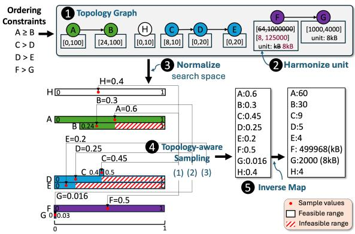  
Figure 3: End-to-end illustration of the exploration phase. Given four ordering constraints, CATune constructs a topology graph, harmonizes heterogeneous units, and applies component-wise normalization. Topology-aware sampling then follows the dependency order to generate feasible con- figurations with dynamically constrained ranges, after which sampled values are mapped back to their original knob units.

Algorithm 2: Build a Topology Graph from Ordering Con  
straints   
Input: ordering constraint list ${ \overline { { \mathcal { R } = \{ ( a , \mathrm { o p } } , b ) \} } }$ , where   
op ∈ $\{ < , \leq , > , \geq \} ;$ knob set K.   
Output: Directed graph $G = ( V , E )$ with edge labels storing   
op.   
1 $V  \emptyset , E  \emptyset ;$   
2 foreach (�, op, �) ∈ R do   
3 � ← � ∪ {�, �};   
4 if $\mathsf { o p } \in \{ < , \leq \}$ then   
5 � ← � ∪ {(� → �, op)};   
6 else   
7 � ← � ∪ {(� → �, op)};   
// Append independent knobs   
8 foreach � ∈ K do   
9 if � ∉ � then   
10 $\left\lfloor \right. \ V \gets V \cup \{ k \} ,$   
11 if � contains a directed cycle then   
12 return Fail;   
13 return $G ;$

Unit Harmonization. For each semantic knob type, such as memory or time, CATune automatically extracts the knob unit from the documentation and converts all compatible knobs to a canonical unit. For a knob $\theta _ { i }$ with domain $\Theta _ { i } = \left[ \ell _ { i } , u _ { i } \right]$ and unit unit�, let unit(�) denote the canonical unit for its type �. We apply a deterministic linear conversion:

Algorithm 3: Search Space Normalization   
Input: Knobs $\mathcal { K } = \{ \theta _ { i } \}$ with domains $\left[ \ell _ { i } , u _ { i } \right]$ and unit unit� ;   
topology graph �   
Output: Normalized domains $\{ { \widehat { \Theta } } _ { i } \}$   
1 foreach $\mathcal { G } _ { k }$ in � do   
2 foreach $\theta _ { i } \in { \mathcal { G } } _ { k }$ do   
3 1. Unit Harmonization;   
4 $\tilde { \theta } _ { i }$ ← ��������� $\left( \theta _ { i } \right) / /$ Eq. 3   
5 2. Component-wise min-max Normalization;   
6 $\ell ^ { ( k ) } , u ^ { ( k ) }$ = SharedInterval $( \tilde { \theta } _ { i } , \boldsymbol { \mathcal { G } } _ { k } ) / /$ Equation   
4   
7 $\widehat { \Theta } _ { i }$ ← MinMaxNormalize $( \tilde { \theta } _ { i } ) / /$ Eq. 5   
8 return $\{ { \widehat { \Theta } } _ { i } \} ;$

$$
\tilde { { \boldsymbol { \theta } } } _ { i } = \phi _ { i } ( \theta _ { i } ) = \alpha _ { i } \theta _ { i } , \qquad \tilde { { \boldsymbol { \Theta } } } _ { i } = [ \alpha _ { i } \ell _ { i } , \alpha _ { i } u _ { i } ] ,\tag{3}
$$

where $\alpha _ { i }$ is the deterministic conversion factor from unit to unit(�) .

Component-wise Normalization. Since ordering constraints connect knobs that must be numerically comparable (after unit harmonization), each connected component defines a group of knobs sharing a common comparison space. For a component $\mathcal { G } _ { k }$ we define the shared interval:

$$
\ell ^ { ( k ) } = \operatorname* { m i n } _ { \theta _ { i } \in \mathcal { G } _ { k } } \tilde { \ell } _ { i } , \qquad u ^ { ( k ) } = \operatorname* { m a x } _ { \theta _ { i } \in \mathcal { G } _ { k } } \tilde { u } _ { i } ,\tag{4}
$$

and normalize each knob $\theta _ { i } \in { \mathcal { G } } _ { k }$ as

$$
\widehat { \theta } _ { i } = \frac { \widetilde { \theta } _ { i } - \ell ^ { ( k ) } } { u ^ { ( k ) } - \ell ^ { ( k ) } } .\tag{5}
$$

Diferent components are normalized independently.

Example 5.1. Suppose work\_mem ≤ shared\_buffers with domains [4, 512] MB and [128, 8192] MB, respectively. Independent normalization maps both domains to [0, 1], distorting their relative scale. Component-wise normalization instead uses the shared interval [4, 8192], preserving ordering consistency in the normalized space.

Inverse Mapping. Before applying a configuration to the DBMS, we invert the preprocessing steps. For $\hat { \theta } _ { i } \in [ 0 , 1 ]$ in component G�,

$$
\tilde { \theta } _ { i } = \hat { \theta } _ { i } \left( u ^ { ( k ) } - \ell ^ { ( k ) } \right) + \ell ^ { ( k ) } ,\tag{6}
$$

and the original knob value is recovered as

$$
\theta _ { i } = \tilde { \theta } _ { i } / \alpha _ { i } .\tag{7}
$$

Example 5.2. Suppose work\_mem belongs to a connected component with shared interval $\ell ^ { ( k ) } = 4$ MB and ${ \bf \bar { \boldsymbol { u } } } ^ { ( k ) } = 8 1 9 2 \mathrm { M B } .$ Assume its harmonization factor is $\alpha _ { i } = 1$ (already expressed in MB). If the optimizer proposes a normalized value $\widehat { \theta } _ { i } = 0 . 5$ , the harmonized value is recovered via Equation (6): $\tilde { \theta } _ { i } = 0 . 5 \times ( 8 1 9 2 - 4 ) + 4 =$ 4098 MB. Since $\alpha _ { i } = 1 ,$ , the original knob value is $\theta _ { i } = 4 0 9 8$

If instead the knob were originally specified in pages (e.g., 1 page $= 8 \mathrm { K B } )$ and $\alpha _ { i }$ converted pages to MB, Equation (7) would restore the value to its native unit before applying it to the DBMS. This design allows CATune to operate in a unit-consistent normalized space during optimization, while ensuring that deployed configurations remain expressed in their native DBMS units. By decoupling optimization from unit heterogeneity, we preserve semantic correctness without complicating constraint enforcement.

Algorithm 4: Topological Sampler   
Input: Configuration space C with � knobs; topology   
graph � = (� , �); number of samples �.   
Output: A set of valid configurations $S = \{ \mathbf { c } _ { 1 } , \hdots , \mathbf { c } _ { N } \}$   
1 Compute a topological order � ← TopoSort(�)   
2 Let R ← {� ∈ � | indegree(�) = 0} // root knobs and   
independent knobs   
3 Initialize S ← ∅ // sample set   
// (1) Sample roots   
4 Sample U $\dot { \mathbf { \theta } } \in [ 0 , 1 ] ^ { N \times | \mathcal { R } | }$ for R using LHS;   
5 for � = 1 . . . � do   
6 Initiate an empty configuration c�;   
7 for � = 1 . . . |R| do   
8 c� [ℎ��] ← convert $( u _ { i j } , h p _ { j } )$   
// (2) Sample remaining knobs in topological   
order   
9 for � = 1 to � do   
10 foreach � ∈ � \ R do   
11 Initialize feasible space $I _ { x } = \mathrm { d e f } _ { - }$ space(�) = [��, ℎ�]   
12 foreach incoming edge (� → �, op) ∈ � do   
13 ℎ ← min(ℎ , c� [�]) // Tighten $I _ { x }$   
14 Sample $\mathbf { c } _ { i } [ x ]$ uniformly from $I _ { x }$   
15 � ← � ∪ {c� }   
16 return S

5.2.3 Topology-aware Sampling. To enable eficient exploration of the feasible region, we propose a topology-aware sampler that eliminates the ineficiencies of rejection-based constrained sampling.

Motivation. A straightforward way to enforce ordering constraints is rejection-based sampling: repeatedly draw a configuration from the full Cartesian product and discard it if any constraint is violated [15]. We compare this and other post-hoc constraint-handling strategies in Section 8.2. While simple, these post hoc approaches become impractical when the number of ordering constraints increases, especially when they are chained, and their search spaces are extremely imbalanced. In such cases, the feasible region may occupy only a small fraction of the full search space, and the proba bility of sampling a valid configuration drops multiplicatively as constraints accumulate. As a result, the optimizer may require an excessive number of trials to obtain a single feasible configuration. Case Study. Consider the constraints superuser\_reserved\_ connections (range: [0, 262143]) < max\_connections (range: [24, 100]) and max\_wal\_senders (range: [2, 8000]) < max\_connections. Due to highly imbalanced value ranges, the probability of randomly satisfying each constraint can be extremely small. When combined, the joint acceptance probability may fall to around 10−6, implying millions of random trials per feasible sample. Such ineficiency severely degrades the optimization process.

Topology-Aware Sampling. To avoid rejection, we generate configurations directly in a dependency-consistent order defined by the topology graph [7, 32]. We first identify root knobs (nodes with no incoming edges) and sample them using Latin Hypercube Sampling (LHS) to ensure good coverage of their domains [17, 20, 43, 62]. We then traverse the graph in topological order. When sampling a knob, we dynamically restrict its feasible interval based on the already assigned values of its parent knobs. Thus, every sampled value automatically satisfies all ordering constraints.

This sequential, constraint-aware sampling eliminates rejection entirely: every generated configuration is feasible by construction. Moreover, sampling cost grows linearly with the number of knobs rather than being governed by the shrinking acceptance probability of the full Cartesian space. Figure 3 illustrates this process. Root nodes are sampled first. Subsequent knobs are sampled within dynamically restricted intervals determined by their parents, progressively pruning infeasible regions. After all knobs are assigned, inverse normalization restores values to their original DBMS units.

## 6 KNOB CONSTRAINT EXTRACTION

CATune requires reliable evidence of knob dependencies before they can be incorporated into the configuration search space. However, these dependencies are expressed in heterogeneous forms across DBMS documentation, and an incorrectly extracted relation may exclude valid configurations. We thus develop a precision-first pipeline that extracts structured dependencies from manuals while filtering unsupported and ambiguous relations.

## 6.1 Extraction Scope and Inputs

The extraction module takes three inputs: (1) a version-specific corpus of oficial DBMS documentation [23], (2) a target knob list, and (3) a predefined relation schema. The knob list can be obtained using existing knob selection techniques, such as SHAP [31], Lasso [45], LLM-assisted knob selection approaches [25], or manual selection. Knob selection itself is outside the scope of this paper. The relation schema defines the dependency types recognized by the extraction pipeline. This preparation is performed once per DBMS version.

Given these inputs, candidate retrieval, extraction, verification, normalization, and filtering are performed automatically. Thus, aside from providing the documentation corpus, relation schema, and target knob list, the extraction workflow is automated. Each extracted record contains (knob1, relation, knob2, condition, context, evidence, confidence).

The current optimizer in CATune enforces verified pairwise numerical ordering constraints, such as � < � and $A \leq B .$ The extraction pipeline also identifies activation conditions, resource bounds, multi-knob dependencies, and performance recommendations, but these relation types are retained rather than translated into topology constraints by the current optimizer.

Our design prioritizes precision because extraction errors have asymmetric downstream efects. A missed constraint leaves part of the search space unpruned, whereas a hallucinated or incorrectly oriented constraint may exclude valid and potentially highperforming configurations. Consequently, CATune retains only evidence-supported relations and abstains when the documentation does not provide suficient support. Its scope is intentionally limited to dependencies explicitly stated in the selected manual version; undocumented, workload-specific, or cross-version depen dencies are outside the scope of the current system.

## 6.2 Precision-First Extraction Pipeline

Figure 2 presents the extraction pipeline. It combines schemaconstrained LLM extraction with evidence verification, canonical normalization, and deterministic rules for recurring documentation expressions.

(1) Candidate retrieval. We parse the documentation into knobcentric entries and identify dependency-relevant paragraphs using knob co-mentions and trigger expressions, such as “must be less than,” “at least,” “ignored unless,” and “has no efect” [33, 39, 40]. The trigger expressions are derived from the closed relation schema and fixed before extraction. They are used only to retrieve candi date passages and do not establish constraints by themselves. Each selected paragraph is expanded with its local context and divided into bounded-size chunks. This step reduces irrelevant input while preserving the context needed to interpret the relation.

(2) Schema-constrained extraction. For each candidate chunk, the LLM receives the primary knob, the knobs mentioned in the local context, and a closed set of relation labels [57]. It must return structured JSON records and provide a supporting evidence span for every extracted relation. If the chunk contains no explicit depen dency, the model is instructed to return an empty result. Requiring source-grounded evidence makes each extraction traceable and supports deterministic verification [14, 29, 35].

(3) Evidence verification. Each preliminary record passes through two verification stages. First, Self-Reflection may revise or remove unsupported records and correct relation, direction, or condition errors [16, 42]. Second, a separate LLM-as-Judge call, using a verification-specific prompt and the same model backend by default, scores the revised record on three label-agnostic axes: whether the snippet states the dependency, whether the operands are assigned to the correct roles, and whether any activation condition is faithful [66]. A record is rejected if any axis fails. The judge does not choose the “most accurate” relation label because documentation can express the same dependency in multiple ways. Instead, it verifies evidence support, operand direction, and conditions against the cited snippet. Records with uncertain support trigger one additional judge call and are retained only when both calls agree on the same canonical relation; otherwise, the pipeline abstains.

(4) Normalization and semantic repair. We normalize knob names, relation labels, activation conditions, and relation directions. Semantically equivalent descriptions are mapped to the same representation. For example, both $^ { * * } A$ must not exceed $B ^ { \ast }$ and $^ { * } B$ must be at least $A ^ { * }$ are normalized to the canonical relation $A \leq B .$ This canonicalization prevents semantically equivalent statements from producing opposite edge orientations in the topology graph. (5) Deterministic rules. Generic comparison templates handle recurring documentation expressions, such as mapping “must be less than $X ^ { \dag }$ to an ordering relation. This rule branch adds evidence for explicit patterns, while each extracted record still undergoes evidence verification and canonical normalization [59, 60].

(6) Scoring and post-processing. A record is retained when it passes the judge’s support, direction, and condition checks (Stage 3).

Reflection consistency, judge support, and rule agreement are combined into a reliability score used to rank duplicate or conflicting records. We then deduplicate identical tuples and resolve conflicting relations for the same directed knob pair by retaining the bestsupported record. The retained constraints are then passed to topology construction, where inconsistent directed cycles are detected as described in Algorithm 2.

Example 6.1. Consider the documentation statement that a value of max\_parallel\_workers higher than max\_worker\_processes has no efect [39]. For readability, let � and � denote these two knobs, respectively. Candidate retrieval selects this statement based on the knob co-mention and the phrase “higher than.” The LLM branch extracts the relation and its evidence span, which normalization canonicalizes to $A \leq B .$ . The verification stage then confirms that the snippet states the dependency, that � and � occupy the correct roles, and that no spurious condition was added, so the record is retained. A record that failed any of these checks (e.g., one asserting the reverse ordering) would be rejected.

## 6.3 Comparison with Manual-reading Systems

Our extraction objective difers from those of existing manualreading tuning systems. Prior systems extract textual hints that recommend values for individual knobs and adapt or aggregate these recommendations using runtime feedback, or build per-knob structured knowledge such as suggested, minimum, maximum, and special values [24, 46]. Such knowledge is primarily used for knob selection, range refinement, and tuning initialization.

In contrast, CATune extracts inter-knob dependencies rather than recommended values for individual knobs. Each extracted record explicitly represents the participating knob pair, relation direction, optional activation condition, supporting evidence, and confidence score. Supported pairwise ordering records are then translated into structural constraints on the configuration space. Due to space limitations, we provide the detailed characterization of documented dependency types and the extraction quality evaluation in our technical report [22]. The report also includes comparisons against alternative extraction strategies.

## 7 EVALUATION

This section evaluates the impact of ordering constraints on tuning eficiency and performance. We examine constraint-aware search across workloads, search-space regimes, and BO frameworks, and compare topology-aware sampling with rejection-based strategies.

## 7.1 Experimental Setup

Workloads. We evaluate our approach on two standard benchmarks covering analytical and transactional regimes: TPC-H (OLAP workload) with scale factor 1, and TPC-C (OLTP workload) with scale factor 200. TPC-C is configured with ten terminals and unlimited arrival rate to stress concurrency behavior. All benchmark implementations are from BenchBase [9]. These workloads are widely adopted in DBMS tuning studies [24].

Hardware. All experiments are conducted on a dedicated machine equipped with a 12-core 12th Gen Intel(R) Core(TM) i7-12700K CPU, 32 GB RAM, and a 1 TB Samsung SSD.

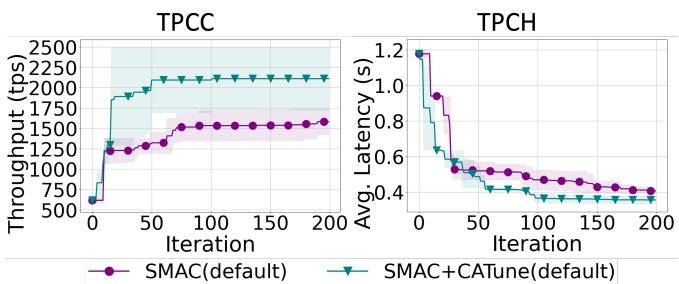  
Figure 4: Best performance achieved by CATune under manual default ranges on PostgreSQL.

Tuning Settings. We conduct all experiments using PostgreSQL v13 and MySQL v8.0. We assume a candidate set of tunable knobs is provided, since prior ML-based tuning systems treat knob selection as an independent preprocessing step (e.g., GPTuner and OpAdviser) [24, 64]. Our work focuses on discovering and enforcing structural dependencies within a given knob set, rather than on knob selection itself. In our experiments, we consider 45 and 50 performance-relevant knobs for PostgreSQL and MySQL, respectively, spanning memory allocation, parallelism, and write-ahead logging behavior. We exclude parameters related to debugging, logging verbosity, security, and file path configuration, as these do not directly influence performance. From this knob set, we extract 10 documented ordering dependencies and enforce them in the constraint-aware setting. Each workload is tuned for 200 iterations. The first 10 configurations are generated via LHS (baseline) or topology-aware sampling (our method) as the initial design. We perform four independent runs with diferent random seeds to account for optimizer stochasticity and report the mean best performance across runs. We optimize for overall system throughput (higher is better) for TPC-C and average latency (lower is better) for TPC-H, following common practice in prior tuning work [24].

Optimizers. We evaluate our method using two widely adopted Bayesian optimization frameworks: SMAC and Gaussian Process BO (GP-BO). Both are implemented within the SMAC3 infrastructure [30], ensuring a unified experimental environment. For SMAC, we use its default Random Forest surrogate model with expected improvement. For GP-BO, we replace the surrogate with a Gaussian Process while retaining the same acquisition optimization pipeline. This unified setup isolates the efect of surrogate modeling from implementation-level artifacts.

To assess compatibility with knowledge-enhanced tuning, we additionally evaluate integration with GPTuner, a coarse-to-fine BO framework built on SMAC [24, 30]. Due to space limitations, the main paper presents detailed results on PostgreSQL; we conduct the same set of experiments on MySQL v8.0 and observe consistent improvements. Please refer to our technical report [22] for the complete MySQL results.

## 7.2 Eficiency Evaluation

Evaluation Dimensions. We evaluate CATune along two dimensions: (i) final tuning performance (best throughput or latency after 200 iterations), and (ii) sample eficiency, measured as the number of iterations required to reach the best observed performance (time-to-optimal). Unless otherwise stated, SMAC with a random forest surrogate serves as the primary baseline.

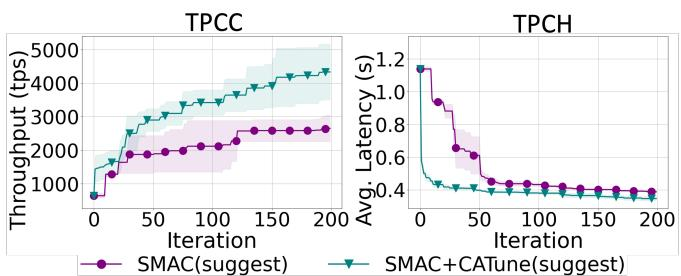  
Figure 5: Best performance achieved by CATune under knowledge-guided reduced ranges on PostgreSQL.

Scenarios. To isolate the efect of constraint-aware sampling from other forms of tuning knowledge, we consider four settings:

• SMAC (default): SMAC operating over the default knob ranges specified in the PostgreSQL manuals.

• SMAC+CATune (default): SMAC augmented with constraintaware tuning under the same default ranges.

• SMAC (suggest): SMAC using knowledge-guided suggested ranges derived from GPTuner’s knowledge handler [24].

• SMAC+CATune (suggest): Suggested ranges combined with constraint-aware tuning.

This allows us to evaluate (i) the standalone impact of ordering constraints and (ii) their interaction with range-based knowledge. Results: Default Search Ranges. Figure 4 reports results under vendor-provided default ranges. CATune significantly improves sample eficiency, reaching the baseline SMAC optimum (after 200 iterations) 12.5× faster on TPC-C and 2.27× faster on TPC-H. It also yields superior final configurations: after 200 iterations, throughput improves by 33.39% on TPC-C and latency decreases by 12.55% on TPC-H relative to baseline SMAC.

Results: Suggested Search Ranges. Figure 5 shows results under knowledge-guided reduced ranges on PostgreSQL; the corresponding MySQL results are provided in the technical report [22]. The gains remain consistent. CATune reaches the baseline SMAC optimum 5.41× faster on TPC-C and 3.57× faster on TPC-H. In terms of final performance, it improves throughput by 63.37% on TPC-C and reduces latency by 10.73% on TPC-H compared to the baseline SMAC. On MySQL, CATune achieves an 11.35% higher through put than baseline SMAC on TPC-C while reaching the baseline optimum 28.5× faster [22].

Discussion. Comparing default and knowledge-guided ranges disentangles the efect of ordering constraints from simple range narrowing. Default ranges represent a cold-start regime with large infeasible or low-quality regions, whereas reduced ranges correspond to a warm-start regime where prior knowledge already prunes part of the domain. The consistent improvements in both settings indicate that constraint-aware tuning provides benefits beyond range restriction alone. Overall, CATune improves both convergence speed and final tuning quality across deployment scenarios.

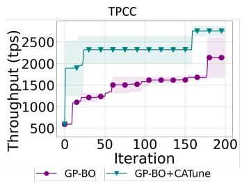  
Figure 6: Performance of CATune integrated with GP-BO under knowledge-guided suggested ranges.

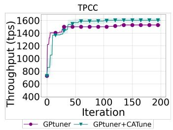  
Figure 7: Performance impact of CATune when integrated with coarse-to-fine BO frame- work from GPTuner.

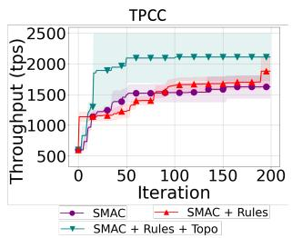  
Figure 8: The result of abla- tion study for CATune, presenting the contribution of topology-aware sampling.

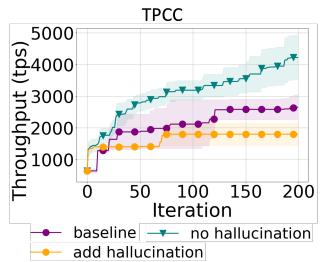  
Figure 9: Performance im- pact between before and af- ter adding constraints that reduce eficiency.

## 7.3 Generalizing across Optimizers

Scenarios. To demonstrate that CATune is not tied to a specific optimizer or BO implementation, we evaluate it with diferent surrogate models and optimization frameworks under TPC-C workload. In addition to SMAC (random forest surrogate), we consider Gaussian Process-based BO (GP-BO) and the coarse-to-fine BO framework used in GPTuner. We follow the same experimental protocol as in Section 7.2, optimizing for final performance and measuring sample eficiency. The evaluated scenarios are:

• GPBO: GP-based BO with knowledge-guided suggested ranges.

• GPBO+CATune: GP-based BO with suggested ranges combined with CATune.

• GPTuner: Coarse-to-fine BO with knowledge-guided ranges.

• GPTuner+CATune: GPTuner augmented with CATune.

Results: GP-BO. Figure 6 shows results under knowledge-guided reduced ranges. The improvements remain consistent. CATune reaches the baseline GP-BO optimum 8.33× faster on TPC-C. In terms of final performance, CATune improves throughput by 28.71% on TPC-C compared to baseline GP-BO.

Results: GPTuner. We next evaluate CATune when coupled with GPTuner’s coarse-to-fine BO framework. The same trend holds: CATune accelerates convergence and improves final performance. CATune reaches the baseline GPTuner optimum 5.26× faster and improves throughput by 4.81% on TPC-C as shown in Figure 7.

Summary. Across diferent surrogate models (random forest vs. Gaussian process) and BO frameworks (standard GP-BO vs. coarseto-fine GPTuner), CATune consistently improves both sample eficiency and final performance. These results indicate that constraintaware search-space restriction is orthogonal to the underlying optimizer and generalizes across diverse BO implementations.

## 7.4 Scalability Study

We conduct a scalability study to examine whether the benefits of CATune persist as the database size increases. Due to space limitations, we omit the study from the main paper and refer readers to the technical report [22] for detailed results and analysis.

## 7.5 Ablation Study

Scenarios. To isolate the contribution of topology-aware sampling in CATune, we compare the following settings:

• SMAC (No rules, baseline): The original SMAC optimizer operating over the unconstrained configuration space without explicit constraint handling.

• SMAC + Rules (Rejection): A hard-constraint enforcement baseline. Configurations that violate extracted dependency constraints are rejected and resampled until a valid configuration is obtained. This represents a conventional post-hoc constrainthandling strategy.

• SMAC + Rules + Topo (CATune): The full CATune design. Topology-aware sampling uses the dependency graph to generate configurations that satisfy ordering constraints during sampling, thereby avoiding infeasible regions by construction.

Results. Figure 8 shows that rule-based constraint enforcement improves over unconstrained SMAC by avoiding evaluations of invalid configurations. Topology-aware sampling further improves both convergence and final performance by generating feasible configurations directly instead of repeatedly rejecting infeasible ones. Compared with SMAC + Rules, the full system achieves 18.8% higher throughput and reaches the same performance level 2.19× faster, demonstrating the benefit of incorporating structural dependencies during sampling.

Summary. These results show that hard constraint enforcement alone is insuficient. While rule-based validation improves tuning quality, topology-aware sampling further increases sample eficiency by generating feasible configurations by construction, making it a key component of CATune.

## 8 DISCUSSION

This section analyzes how ordering constraints influence system stability and high-performing configurations, and we compare proactive filtering against penalty-based constraint handling.

## 8.1 Operational Impact of Constraints

Ordering constraints influence tuning in two distinct ways. First, they prevent configurations that would cause system failures. Second, they reshape the feasible region in ways that may either improve or hinder optimization. We examine both efects empirically.

We begin with correctness-critical constraints whose violation prevents DBMS startup. As a representative example, PostgreSQL requires superuser\_reserved\_connections < max\_connections.

We conduct tuning over 10 knobs, including these parameters, using LLM-suggested ranges. Across 200 iterations, 9 sampled config urations failed to start the DBMS, and all failures corresponded to violations of this ordering constraint. This result demonstrates that correctness-critical ordering constraints are essential for reliability: without proactive enforcement, the optimizer wastes evaluations on configurations that cannot even initialize the system. We next examine the opposite scenario—constraints that unnecessarily restrict the search space. To study this efect, we inject two hallucinated ordering constraints produced by a naive LLM-based extraction method. We compare three settings: baseline SMAC with suggested ranges, CATune with valid constraints, and CATune augmented with the two hallucinated constraints. Figure 9 shows that hallucinated constraints severely degrade tuning performance. Without hallucinations, CATune reaches the baseline optimum 4.55× faster and achieves a 59.15% improvement in final performance. When the two incorrect constraints are injected, the achievable performance improvement drops by 32.07% relative to the baseline. Compared to the hallucinated setting, CATune without hallucinations achieves 134.29% higher final performance and converges 9.09× faster.

These findings highlight a fundamental trade-of. Injecting semantically valid constraints improves reliability and sample eficiency by removing invalid regions while preserving highperforming configurations. In contrast, hallucinated or overly restrictive constraints artificially truncate the feasible domain and may exclude near-optimal configurations. This underscores the importance of high-precision constraint extraction and validation when integrating automatically generated constraints into constraint-aware tuning systems.

## 8.2 Eficiency of Diferent Sampling Strategies

To isolate the sampling eficiency of topology-aware sampling, we compare it with three alternative constraint-handling strategies on PostgreSQL under the default knob ranges and tuning settings described in Section 7.1:

• No Rules: configurations are sampled from the original search space without constraint handling.

• Reject: configurations are repeatedly sampled from the original search space until they satisfy all constraints.

• Repair: configurations are first sampled from the original search space and then modified to satisfy violated constraints.

• Topology-aware Sampling (Topo): constraints are incorporated before sampling, so generated configurations are feasible by construction.

Results. Table 2 shows that unconstrained sampling is highly ineficient: 99 out of 100 configurations violate at least one constraint. Rejection sampling avoids invalid outputs, but it must generate 15,992 candidates to obtain 100 feasible ones, rejecting 15,892 samples and taking 6.841 seconds. Repair also starts from the unconstrained space; since 99 out of 100 samples require repair, it introduces an extra post-processing step before configurations can be used. In contrast, topology-aware sampling generates feasible configurations directly, returning 100 valid samples from exactly 100 generated candidates without rejection or repair. This avoids both wasted trials and post-hoc modification, making topology-aware sampling more eficient for constrained tuning.

Table 2: Sampling eficiency for PostgreSQL tuning over 100 requested samples (Returned). Generated is the number of configurations generated, Invalid the number violating ≥ 1 rule, and Time (s) the time to obtain 100 valid configurations. denotes repaired configurations.
<table><tr><td>Method</td><td>Returned</td><td>Generated</td><td>Invalid</td><td>Time (s)</td></tr><tr><td>No Rules</td><td>100</td><td>100</td><td>99</td><td>0.026</td></tr><tr><td>Reject</td><td>100</td><td>15,992</td><td>15,892</td><td>6.841</td></tr><tr><td>Repair</td><td>100</td><td>100</td><td>99*</td><td>0.031</td></tr><tr><td>Topo</td><td>100</td><td>100</td><td>0</td><td>0.089</td></tr></table>

## 8.3 Impact of Diferent Constraint Employment Strategies

CATune enforces ordering constraints by proactively restricting exploration and exploitation to the feasible region. An alternative approach is to retain the full search space and penalize constraint violations during optimization. We compare these two strategies:

• Proactive Filtering (CATune): Infeasible regions are removed from the search space before sampling.

• Passive Penalization (MultiObj): The optimizer searches the full domain while minimizing performance loss and constraint violations simultaneously.

For the passive strategy, we formulate tuning as a multi-objective problem. For an ordering constraint $\theta _ { i } \leq \theta _ { j }$ , the violation penalty is defined as $\begin{array} { r } { \mathcal { P } _ { i j } ( \theta ) = \frac { \operatorname* { m a x } ( 0 , \theta _ { i } - \theta _ { j } ) } { | \theta _ { i } | + 1 } } \end{array}$ . The total penalty across all ordering constraints is $\begin{array} { r } { \mathcal { P } ( \theta ) = \sum _ { ( i , o p , j ) \in C } \mathcal { P } _ { i j } ( \theta ) } \end{array}$ , where $o p \in \{ < , \leq \}$ The denominator normalizes violations to reduce scale sensitivity across knobs with heterogeneous ranges. We implement this strategy using ParEGo [19] within the SMAC framework.

Example 8.1. Consider an ordering constraint superuser \_reserved\_connections ≤ max\_connections with superuser\_ reserved\_connections = 120 and max\_connections = 100. The violation magnitude is $1 2 0 \mathrm { ~ - ~ } 1 0 0 = 2 0$ , and the normalized penalty becomes $\begin{array} { r l r } { { \mathcal P } _ { i j } ( \theta ) } & { { } = } & { \frac { 2 0 } { | 1 0 0 | + 1 } \quad \approx \quad 0 . 1 9 8 . } \end{array}$ If superuser\_reserved\_connections= 4, max\_connections= 6, the penalty is zero.

Results. Figure 10 shows the convergence curves on TPC-C and TPC-H. On average, CATune reaches the baseline optimum approximately ∼ 3.93× and 3.57× faster than the baseline on TPC-C and TPC-H, respectively, while MultiObj achieves only 2.3× and 1.74× speedups. This indicates that proactively restricting the search space leads to substantially faster convergence. After 200 iterations, CATune improves average throughput on TPC-C by 53.52% over the baseline, compared to 38.26% achieved by MultiObj. On TPC-H, CATune reduces latency by 10.73%, whereas MultiObj achieves a 3.43% reduction. Overall, CATune consistently delivers larger performance improvements across both workloads.

Discussion. The weaker performance ofpassive penalization arises from its need to explore infeasible configurations within the full search space. Although violations are penalized, evaluations are still consumed by invalid or low-quality regions. In contrast, proactive filtering removes infeasible regions entirely, concentrating the optimization process on semantically valid configurations.

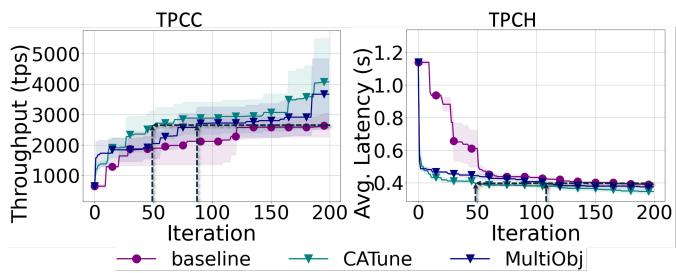  
Figure 10: Efect of diferent employment strategies: proactive filtering (CATune) vs. passive penalization (MultiObj).

These results demonstrate that structural constraint injection is more sample-eficient and efective than penalty-based handling.

## 9 RELATED WORK

This section reviews prior work on database configuration tuning and constrained optimization.

Database Configuration Tuning. Automated database configuration tuning has been studied extensively and can be broadly categorized into heuristic-based, Bayesian Optimization (BO)-based [44], and Reinforcement Learning (RL)-based approaches [13]. Rulebased methods rely on manually crafted tuning rules to guide exploration [8, 21]. Search-based methods employ heuristic search strategies (e.g., avoiding revisits and exploring local neighborhoods) to iteratively refine configurations [3, 67]. These approaches become less efective as the configuration space grows in dimensionality and exhibits complex inter-knob dependencies. BO-based methods [6, 10, 20, 49, 62, 63] treat tuning as a black-box optimization problem. They iteratively fit a probabilistic surrogate model that maps knob configurations to performance and select new configurations by maximizing an acquisition function. These methods improve sample eficiency but typically assume box-constrained search spaces and do not explicitly model structural dependencies among knobs. RL-based approaches explore the configuration space through sequential decision-making, balancing exploration and exploitation via agent–environment interaction [5, 28, 48, 51, 55]. While efective in dynamic settings, RL methods similarly operate over nominal configuration domains without enforcing structural validity constraints by construction.

Constrained Bayesian Optimization. Constrained Bayesian Optimization (CBO) extends BO to handle unknown or partially observed constraints [11, 12, 38, 41]. In classical CBO, constraints are modeled as black-box functions with probabilistic surrogates, and feasibility is incorporated through acquisition strategies such as Expected Improvement with Constraints or Probability of Feasibility. These methods generally require sampling infeasible configurations to learn constraint boundaries. In database tuning, ResTune [62] applies constrained optimization to enforce service-level objectives, such as throughput or latency bounds, which are workloaddependent and evaluated only after executing candidate configurations. Feasibility is therefore determined post hoc through runtime measurements.

Our setting difers fundamentally. We focus on deterministic knob dependency constraints that are intrinsic to the configuration space (e.g., ordering constraints among knobs). Such constraints are static, system-defined, and independent of workload behavior. Instead of modeling feasibility probabilistically or verifying it after execution, we encode structural dependencies directly into the configuration domain so that all sampled configurations are valid by construction. This eliminates infeasible trials a priori, which is particularly important in database systems where dependency violations may cause instability or startup failures [37, 50].

From an optimization perspective, our approach restricts the search to a constraint-consistent subspace by encoding structural constraints directly into the feasible region. This difers from GP-Tuner [25], which leverages domain knowledge to refine knob ranges and prioritize important parameters. While GPTuner biases exploration toward promising regions, it does not enforce structural validity among knobs. Our method instead guarantees feasibility at the configuration-space level. In contrast to prior database tuning systems that treat the configuration space as box-constrained, our approach explicitly encodes deterministic ordering constraints as structural components of the search domain.

## 10 LIMITATIONS

Supported constraint types. Although our extraction pipeline identifies diverse inter-knob constraints, CATune currently utilizes only ordering and resource-bounded constraints. Supporting richer constraint types and efectively incorporating them into optimization remains future work.

Coverage of supported constraints. The prevalence of ordering constraints varies across DBMSs (e.g., only 2.1% in ClickHouse). We position CATune as complementary to existing tuners: when fewer supported constraints exist, it imposes fewer additional restrictions, while applicable constraints can still eliminate invalid or undesirable configurations. Nevertheless, broader constraint coverage could further improve its applicability and efectiveness.

Integration with search-space reduction methods. CATune is generally complementary to existing techniques such as lowdimensional projections [18], suggested values [46, 47], suggested ranges, and special-value handling [24–26]. However, integration with low-dimensional projections requires specialized designs because their many-to-one knob mappings may not preserve constraints defined over the original knobs. Developing constraintpreserving projections remains future work.

## 11 CONCLUSION

We proposed CATune, a constraint-aware DBMS tuning framework that incorporates deterministic knob dependencies directly into Bayesian optimization. By eliminating infeasible configurations by construction, CATune improves tuning reliability and eficiency. Our results demonstrate the value of explicitly modeling structural dependencies in DBMS configuration spaces.

## ACKNOWLEDGMENTS

This work was supported in part by the U.S. National Science Foundation awards III-2107213 and ITE-2333789.

## REFERENCES

[1] Ashish Agarwal, Clara Wong-Fannjiang, David Sussillo, Katherine Lee, and Orhan Firat. 2018. Hallucinations in Neural Machine Translation.

[2] Sebastian Ament, Samuel Daulton, David Eriksson, Maximilian Balandat, and Eytan Bakshy. 2023. Unexpected improvements to expected improvement for Bayesian optimization. In Proceedings ofthe 37th International Conference on Neural Information Processing Systems (New Orleans, LA, USA) (NIPS ’23). Curran Associates Inc., Red Hook, NY, USA, Article 904, 36 pages.

[3] Jason Ansel, Shoaib Kamil, Kalyan Veeramachaneni, Jonathan Ragan-Kelley, Jefrey Bosboom, Una-May O’Reilly, and Saman Amarasinghe. 2014. OpenTuner: an extensible framework for program autotuning. In Proceedings of the 23rd International Conference on Parallel Architectures and Compilation (Edmonton, AB, Canada) (PACT ’14). Association for Computing Machinery, New York, NY, USA, 303–316. https://doi.org/10.1145/2628071.2628092

[4] Roger Arnau, José M. Calabuig, Luis M. García-Rafi, Enrique A. Sánchez Pérez, and Sergi Sanjuan. 2024. A Bellman–Ford Algorithm for the Path-Length Weighted Distance in Graphs. Mathematics 12, 16 (2024). https://doi.org/10. 3390/math12162590

[5] Baoqing Cai, Yu Liu, Ce Zhang, Guangyu Zhang, Ke Zhou, Li Liu, Chunhua Li, Bin Cheng, Jie Yang, and Jiashu Xing. 2022. HUNTER: An Online Cloud Database Hybrid Tuning System for Personalized Requirements. In Proceedings ofthe 2022 International Conference on Mana ement ofData (Philadelphia, PA, USA) (SIGMOD ’22). Association for Computing Machinery, New York, NY, USA, 646–659. https://doi.org/10.1145/3514221.3517882

[6] Stefano Cereda, Stefano Valladares, Paolo Cremonesi, and Stefano Doni. 2021. CGPTuner: a contextual gaussian process bandit approach for the automatic tuning of IT configurations under varying workload conditions. Proc. VLDB Endow. 14, 8 (April 2021), 1401–1413. https://doi.org/10.14778/3457390.3457404

[7] Bertrand Charpentier, Simon Kibler, and Stephan Günnemann. 2022. Diferen tiable DAG Sampling. arXiv:2203.08509 [cs.LG] https://arxiv.org/abs/2203.08509

[8] Benoît Dageville and Mohamed Zait. 2002. SQL memory management in Oracle9i. In Proceedings of the 28th International Conference on Very Large Data Bases (Hong Kong, China) (VLDB ’02). VLDB Endowment, 962–973.

[9] Djellel Eddine Difallah, Andrew Pavlo, Carlo Curino, and Philippe Cudre-Mauroux. 2013. OLTP-Bench: an extensible testbed for benchmarking relational databases. Proc. VLDB Endow. 7, 4 (Dec. 2013), 277–288. https: //doi.org/10.14778/2732240.2732246

[10] Songyun Duan, Vamsidhar Thummala, and Shivnath Babu. 2009. Tuning database configuration parameters with iTuned. Proc. VLDB Endow. 2, 1 (Aug. 2009), 1246–1257. https://doi.org/10.14778/1687627.1687767

[11] Jacob R. Gardner, Matt J. Kusner, Zhixiang Xu, Kilian Q. Weinberger, and John P. Cunningham. 2014. Bayesian optimization with inequality constraints. In Proceedings ofthe 31st International Conference on International Conference on Machine Learning - Volume 32 (Beijing, China) (ICML’14). JMLR.org, II–937–II–945.

[12] Michael A. Gelbart, Jasper Snoek, and Ryan P. Adams. 2014. Bayesian opti mization with unknown constraints. In Proceedings ofthe Thirtieth Conference on Uncertainty in Artificial Intelligence (Quebec City, Quebec, Canada) (UAI’14). AUAI Press, Arlington, Virginia, USA, 250–259.

[13] Peter Henderson, Riashat Islam, Philip Bachman, Joelle Pineau, Doina Precup, and David Meger. 2018. Deep reinforcement learning that matters. In Proceedings ofthe Thirty-Second AAAI Conference on Artificial Intelligence and Thirtieth Innovative Applications ofArtificial Intelligence Conference and Eighth AAAI Symposium on Educational Advances in Artificial Intelligence (New Orleans, Louisiana, USA) (AAAI’18/IAAI’18/EAAI’18). AAAI Press, Article 392, 8 pages.

[14] Lei Huang, Xiaocheng Feng, Weitao Ma, Yuxuan Gu, Weihong Zhong, Xia chong Feng, Weijiang Yu, Weihua Peng, Duyu Tang, Dandan Tu, and Bing Qin. 2024. Learning Fine-Grained Grounded Citations for Attributed Large Language Models. In Findings ofthe Association for Computational Linguistics: ACL 2024, Lun-Wei Ku, Andre Martins, and Vivek Srikumar (Eds.). Associa tion for Computational Linguistics, Bangkok, Thailand, 14095–14113. https: //doi.org/10.18653/v1/2024.findings-acl.838

[15] Frank Hutter and Steve Ramage. 2015. Manual for SMAC Version v2.10.03-master. Department of Computer Science, University of British Columbia. https:// www.cs.ubc.ca/labs/algorithms/Projects/SMAC/v2.10.03/manual.pdf Version v2.10.03-master.

[16] Ziwei Ji, Tiezheng Yu, Yan Xu, Nayeon Lee, Etsuko Ishii, and Pascale Fung. 2023. Towards Mitigating LLM Hallucination via Self Reflection. In Findings ofthe Association for Computational Linguistics: EMNLP 2023, Houda Bouamor, Juan Pino, and Kalika Bali (Eds.). Association for Computational Linguistics, Singapore, 1827–1843. https://doi.org/10.18653/v1/2023.findings-emnlp.123

[17] Konstantinos Kanellis, Ramnatthan Alagappan, and Shivaram Venkataraman. 2020. Too many knobs to tune? towards faster database tuning by pre-selecting important knobs. In Proceedings of the 12th USENIX Conference on Hot Topics in Storage and File Systems (HotStorage ’20). USENIX Association, USA, Article 16, 1 pages.

[18] Konstantinos Kanellis, Cong Ding, Brian Kroth, Andreas Müller, Carlo Curino, and Shivaram Venkataraman. 2022. LlamaTune: sample-eficient DBMS configuration tuning. Proc. VLDB Endow. 15, 11 (July 2022), 2953–2965. https: //doi.org/10.14778/3551793.3551844

[19] J. Knowles. 2006. ParEGO: a hybrid algorithm with on-line landscape approximation for expensive multiobjective optimization problems. IEEE Transactions on Evolutionary Computation 10, 1 (2006), 50–66. https://doi.org/10.1109/TEVC. 2005.851274

[20] Mayuresh Kunjir and Shivnath Babu. 2020. Black or White? How to Develop an AutoTuner for Memory-based Analytics. In Proceedin s ofthe 2020 ACM SIGMOD International Conference on Management ofData (Portland, OR, USA) (SIGMOD ’20). Association for Computing Machinery, New York, NY, USA, 1667–1683. https://doi.org/10.1145/3318464.3380591

[21] Eva Kwan. 2002. Automatic Configuration for IBM ® DB 2 Universal Database TM Compressing years of performance tuning experience into seconds of execution. https://api.semanticscholar.org/CorpusID:15267980

[22] Fangping Lan, Qi Zhang, and Eduard Dragut. 2026. CATune: Full Version. Technical Report. Temple University. https://github.com/lanfangping/CATune/ blob/main/docs/Constraint\_aware\_DB\_Tuning\_\_Tech\_Report.pdf Available at GitHub repository. Accessed: 2026-06-30.

[23] Fangping Lan, Qi Zhang, and Eduard C. Dragut. 2026. Making Revisions Understandable: A Survey of Edit Intentions, Methods, and Applications. In Findings ofthe ACL. 35003–35019.

[24] Jiale Lao, Yibo Wang, Yufei Li, Jianping Wang, Yunjia Zhang, Zhiyuan Cheng, Wanghu Chen, Mingjie Tang, and Jianguo Wang. 2024. GPTuner: A Manual-Reading Database Tuning System via GPT-Guided Bayesian Optimization. Proc. VLDB Endow. 17, 8 (April 2024), 1939–1952. https://doi.org/10.14778/3659437. 3659449

[25] Jiale Lao, Yibo Wang, Yufei Li, Jianping Wang, Yunjia Zhang, Zhiyuan Cheng, Wanghu Chen, Mingjie Tang, and Jianguo Wang. 2025. GPTuner: An LLM-Based Database Tuning System. SIGMOD Rec. 54, 1 (April 2025), 101–110. https: //doi.org/10.1145/3733620.3733641

[26] Jiale Lao, Yibo Wang, Yufei Li, Jianping Wang, Yunjia Zhang, Zhiyuan Cheng, Wanghu Chen, Yuanchun Zhou, Mingjie Tang, and Jianguo Wang. 2024. A Demonstration of GPTuner: A GPT-Based Manual-Reading Database Tuning System. In Companion of the 2024 International Conference on Management of Data (<conf-loc>, <city>Santiago AA</city>, <country>Chile</country>, </conf loc>) (SIGMOD/PODS ’24). Association for Computing Machinery, New York, NY, USA, 504–507. https://doi.org/10.1145/3626246.3654739

[27] Cheng Li, Santu Rana, Sunil Gupta, Vu Nguyen, Svetha Venkatesh, Alessandra Sutti, David Rubin, Teo Slezak, Murray Height, Mazher Mohammed, and Ian Gibson. 2019. Accelerating Experimental Design by Incorporating Experimenter Hunches. arXiv:1907.09065 [stat.ML] https://arxiv.org/abs/1907.09065

[28] Guoliang Li, Xuanhe Zhou, Shifu Li, and Bo Gao. 2019. QTune: a query-aware database tuning system with deep reinforcement learning. Proc. VLDB Endow. 12, 12 (Aug. 2019), 2118–2130. https://doi.org/10.14778/3352063.3352129

[29] Yinghao Li, Rampi Ramprasad, and Chao Zhang. 2024. A simple but efective approach to improve structured language model output for information extraction. In Findings of the Association for Computational Linguistics: EMNLP 2024. 5133–5148.

[30] Marius Lindauer, Katharina Eggensperger, Matthias Feurer, André Biedenkapp, Difan Deng, Carolin Benjamins, Tim Ruhkopf, René Sass, and Frank Hutter. 2022. SMAC3: a versatile Bayesian optimization package for hyperparameter optimization. J. Mach. Learn. Res. 23, 1, Article 54 (Jan. 2022), 9 pages.

[31] Scott M Lundberg and Su-In Lee. 2017. A Unified Approach to Interpreting Model Predictions. In Advances in Neural Information Processing Systems, I. Guyon, U. Von Luxburg, S. Bengio, H. Wallach, R. Fergus, S. Vishwanathan, and R. Garnett (Eds.), Vol. 30. Curran Associates, Inc. https://proceedings.neurips.cc/paper\_ files/paper/2017/file/8a20a8621978632d76c43dfd28b67767-Paper.pdf

[32] Seth McCammon, Dylan Jones, and Geofrey A. Hollinger. 2020. Topology-Aware Self-Organizing Maps for Robotic Information Gathering. In 2020 IEEE/RSJ International Conference on Intelligent Robots and Systems (IROS). 1717–1724. https://doi.org/10.1109/IROS45743.2020.9341040

[33] Oracle Corporation. 2026. MySQL 8.0 Reference Manual: Server System Variables. Online documentation. https://dev.mysql.com/doc/refman/8.0/en/serversystem-variables.html Accessed: 2026-06-21.

[34] Huitong Pan, Mustapha Adamu, Qi Zhang, Eduard Dragut, and Longin Jan Latecki. 2025. ClimateIE: A Dataset for Climate Science Information Extraction. In Proceedings of the 2nd Workshop on Natural Language Processing Meets Climate Change (ClimateNLP 2025). 76–98.

[35] Huitong Pan, Qi Zhang, Mustapha Adamu, Eduard Dragut, and Longin Jan Latecki. 2025. Taxonomy-Driven Knowledge Graph Construction for Domain Specific Scientific Applications. In Findings ofthe Association for Computational Linguistics: ACL 2025. 4295–4320.

[36] Andrew Pavlo, Gustavo Angulo, Joy Arulraj, Haibin Lin, Jiexi Lin, Lin Ma, Prashanth Menon, Todd C. Mowry, Matthew Perron, Ian Quah, Siddharth San turkar, Anthony Tomasic, Skye Toor, Dana Van Aken, Ziqi Wang, Yingjun

Wu, Ran Xian, and Tieying Zhang. 2017. Self-Driving Database Management Systems. In Conference on Innovative Data Systems Research. https: //api.semanticscholar.org/CorpusID:265531108

[37] Andrew Pavlo, Matthew Butrovich, Lin Ma, Prashanth Menon, Wan Shen Lim, Dana Van Aken, and William Zhang. 2021. Make your database system dream of electric sheep: towards self-driving operation. Proc. VLDB Endow. 14, 12 (July 2021), 3211–3221. https://doi.org/10.14778/3476311.3476411

[38] Victor Picheny. 2015. Multiobjective optimization using Gaussian process emulators via stepwise uncertainty reduction. Statistics and Computing 25, 6 (Nov. 2015), 1265–1280. https://doi.org/10.1007/s11222-014-9477-x

[39] PostgreSQL Global Development Group. 2026. PostgreSQL 13 Documentation: Resource Consumption. Online documentation. https://www.postgresql.org/ docs/13/runtime-config-resource.html Accessed: 2026-06-21.

[40] PostgreSQL Global Development Group. 2026. PostgreSQL 13 Documentation: Write Ahead Log. Online documentation. https://www.postgresql.org/docs/13/ runtime-config-wal.html Accessed: 2026-06-21.

[41] Matthias Schonlau, William Welch, and Donald Jones. 1998. Global versus local search in constrained optimization of computer models. Vol. 34. 11–25. https: //doi.org/10.1214/lnms/1215456182

[42] Noah Shinn, Federico Cassano, Edward Berman, Ashwin Gopinath, Karthik Narasimhan, and Shunyu Yao. 2023. Reflexion: Language Agents with Verbal Reinforcement Learning. arXiv:2303.11366 [cs.AI] https://arxiv.org/abs/2303. 11366

[43] Alan Skelley. 2000. DB2 Advisor: An Optimizer Smart Enough to Recommend its own Indexes. In Proceedin s of the 16th International Conference on Data Engineering (ICDE ’00). IEEE Computer Society, USA, 101.

[44] Jasper Snoek, Hugo Larochelle, and Ryan P Adams. 2012. Practical Bayesian Optimization ofMachine Learning Algorithms. In Advances in Neural Information Processing Systems, F. Pereira, C.J. Burges, L. Bottou, and K.Q. Weinberger (Eds.), Vol. 25. Curran Associates, Inc. https://proceedings.neurips.cc/paper\_files/paper/ 2012/file/05311655a15b75fab86956663e1819cd-Paper.pdf

[45] Robert Tibshirani. 1996. Regression Shrinkage and Selection Via the Lasso. Journal ofthe Royal Statistical Society: Series B (Methodological) 58, 1 (01 1996), 267–288. https://doi.org/10.1111/j.2517-6161.1996.tb02080.x

[46] Immanuel Trummer. 2022. DB-BERT: A Database Tuning Tool that "Reads the Manual". In Proceedings of the 2022 International Conference on Management of Data (Philadelphia, PA, USA) (SIGMOD ’22). Association for Computing Machinery, New York, NY, USA, 190–203. https://doi.org/10.1145/3514221.3517843

[47] Immanuel Trummer. 2022. Demonstrating DB-BERT: A Database Tuning Tool that "Reads" the Manual. In Proceedings of the 2022 International Conference on Management of Data (Philadelphia, PA, USA) (SIGMOD ’22). Association for Computing Machinery, New York, NY, USA, 2437–2440. https://doi.org/10.1145/ 3514221.3520171

[48] Immanuel Trummer, Junxiong Wang, Ziyun Wei, Deepak Maram, Samuel Mose ley, Saehan Jo, Joseph Antonakakis, and Ankush Rayabhari. 2021. SkinnerDB: Regret-bounded Query Evaluation via Reinforcement Learning. ACMTrans. Database Syst. 46, 3, Article 9 (Sept. 2021), 45 pages. https://doi.org/10.1145/3464389

[49] Dana Van Aken, Andrew Pavlo, Geofrey J. Gordon, and Bohan Zhang. 2017. Automatic Database Management System Tuning Through Large-scale Machine Learning. In Proceedings ofthe 2017ACM International Conference on Management ofData (Chicago, Illinois, USA) (SIGMOD ’17). Association for Computing Machin ery, New York, NY, USA, 1009–1024. https://doi.org/10.1145/3035918.3064029

[50] Dana Van Aken, Dongsheng Yang, Sebastien Brillard, Ari Fiorino, Bohan Zhang, Christian Bilien, and Andrew Pavlo. 2021. An inquiry into machine learning based automatic configuration tuning services on real-world database man agement systems. Proc. VLDB Endow. 14, 7 (March 2021), 1241–1253. https: //doi.org/10.14778/3450980.3450992

[51] Junxiong Wang, Immanuel Trummer, and Debabrota Basu. 2021. UDO: universal database optimization using reinforcement learning. Proc. VLDB Endow. 14, 13 (Sept. 2021), 3402–3414. https://doi.org/10.14778/3484224.3484236

[52] Tevin Wang and Chenyan Xiong. 2025. AutoRule: Reasoning Chainof-thought Extracted Rule-based Rewards Improve Preference Learning. arXiv:2506.15651 [cs.LG] https://arxiv.org/abs/2506.15651

[53] Ziwei Xu, Sanjay Jain, and Mohan Kankanhalli. 2025. Hallucination is Inevitable: An Innate Limitation of Large Language Models. arXiv:2401.11817 [cs.CL] https://arxiv.org/abs/2401.11817

[54] Dani Yogatama and Gideon S. Mann. 2014. Eficient Transfer Learning Method for Automatic Hyperparameter Tuning. In International Conference on Artificial Intelligence and Statistics. https://api.semanticscholar.org/CorpusID:319311

[55] Ji Zhang, Yu Liu, Ke Zhou, Guoliang Li, Zhili Xiao, Bin Cheng, Jiashu Xing, Yangtao Wang, Tianheng Cheng, Li Liu, Minwei Ran, and Zekang Li. 2019. An End-to-End Automatic Cloud Database Tuning System Using Deep Reinforcement Learning. In Proceedings ofthe 2019International Conference on Management ofData (Amsterdam, Netherlands) (SIGMOD ’19). Association for Computing Ma chinery, New York, NY, USA, 415–432. https://doi.org/10.1145/3299869.3300085

[56] Qi Zhang, Zhijia Chen, Huitong Pan, Cornelia Caragea, Longin Jan Latecki, and Eduard C. Dragut. 2024. SciER: An Entity and Relation Extraction Dataset for Datasets, Methods, and Tasks in Scientific Documents. In EMNLP. 13083–13100.

[57] Qi Zhang, Fangping Lan, Cornelia Caragea, Longin Jan Latecki, and Eduard Dragut. 2026. Scaling Performance and Low-Resource Annotation with Many-Shot In-Context Learning for Named Entity Recognition. In Findin s ofthe ACL. 28653–28673.

[58] Qi Zhang, Huitong Pan, Zhijia Chen, Longin Jan Latecki, Cornelia Caragea, and Eduard Dragut. 2025. DynClean: Training Dynamics-based Label Cleaning for Distantly-Supervised Named Entity Recognition. In Findings of the Association for Computational Linguistics: NAACL 2025. 2540–2556.

[59] Shanshan Zhang, Lihong He, Eduard Dragut, and Slobodan Vucetic. 2019. How to Invest My Time: Lessons from Human-in-the-Loop Entity Extraction. In KDD. 2305–2313.

[60] Shanshan Zhang, Lihong He, Slobodan Vucetic, and Eduard Dragut. 2018. Regular Expression Guided Entity Mention Mining from Noisy Web Data. In Proceedings ofthe 2018 Conference on Empirical Methods in Natural Language Processing, Ellen Rilof, David Chiang, Julia Hockenmaier, and Jun’ichi Tsujii (Eds.). Association for Computational Linguistics, Brussels, Belgium, 1991–2000. https://doi.org/10. 18653/v1/D18-1224

[61] Xinyi Zhang, Zhuo Chang, Yang Li, Hong Wu, Jian Tan, Feifei Li, and Bin Cui. 2022. Facilitating database tuning with hyper-parameter optimization: a comprehensive experimental evaluation. Proc. VLDB Endow. 15, 9 (May 2022), 1808–1821. https://doi.org/10.14778/3538598.3538604

[62] Xinyi Zhang, Hong Wu, Zhuo Chang, Shuowei Jin, Jian Tan, Feifei Li, Tieying Zhang, and Bin Cui. 2021. ResTune: Resource Oriented Tuning Boosted by Meta-Learning for Cloud Databases. In Proceedin s ofthe 2021 International Conference on Mana ement ofData (Virtual Event, China) (SIGMOD ’21). Association for Computing Machinery, New York, NY, USA, 2102–2114. https://doi.org/10.1145 3448016.3457291

[63] Xinyi Zhang, Hong Wu, Yang Li, Jian Tan, Feifei Li, and Bin Cui. 2022. Towards Dynamic and Safe Configuration Tuning for Cloud Databases. In Proceedings of the 2022 International Conference on Management of Data (Philadelphia, PA, USA) (SIGMOD ’22). Association for Computing Machinery, New York, NY, USA, 631–645. https://doi.org/10.1145/3514221.3526176

[64] Xinyi Zhang, Hong Wu, Yang Li, Zhengju Tang, Jian Tan, Feifei Li, and Bin Cui. 2023. An Eficient Transfer Learning Based Configuration Adviser for Database Tuning. Proc. VLDB Endow. 17, 3 (Nov. 2023), 539–552. https://doi.org/10.14778/ 3632093.3632114

[65] Yudi Zhang, Pei Xiao, Lu Wang, Chaoyun Zhang, Meng Fang, Yali Du, Yevgeniy Puzyrev, Randolph Yao, Si Qin, Qingwei Lin, Mykola Pechenizkiy, Dongmei Zhang, Saravan Rajmohan, and Qi Zhang. 2024. RuAG: Learned-rule-augmented Generation for Large Language Models. arXiv:2411.03349 [cs.AI] https://arxiv. org/abs/2411.03349

[66] Lianmin Zheng, Wei-Lin Chiang, Ying Sheng, Siyuan Zhuang, Zhanghao Wu, Yonghao Zhuang, Zi Lin, Zhuohan Li, Dacheng Li, Eric P. Xing, Hao Zhang, Joseph E. Gonzalez, and Ion Stoica. 2023. Judging LLM-as-a-judge with MTbench and Chatbot Arena. In Proceedings of the 37th International Conference on Neural Information Processing Systems (New Orleans, LA, USA) (NIPS ’23). Curran Associates Inc., Red Hook, NY, USA, Article 2020, 29 pages.

[67] Yuqing Zhu, Jianxun Liu, Mengying Guo, Yungang Bao, Wenlong Ma, Zhuoyue Liu, Kunpeng Song, and Yingchun Yang. 2017. BestConfig: tapping the perfor mance potential of systems via automatic configuration tuning. In Proceedings of the 2017 Symposium on Cloud Computing (Santa Clara, California) (SoCC ’17). Association for Computing Machinery, New York, NY, USA, 338–350. https://doi.org/10.1145/3127479.3128605