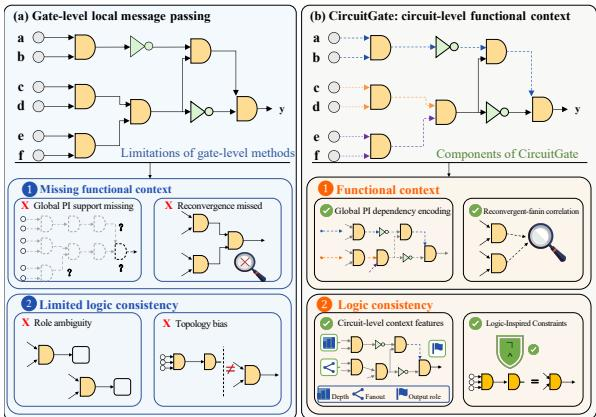
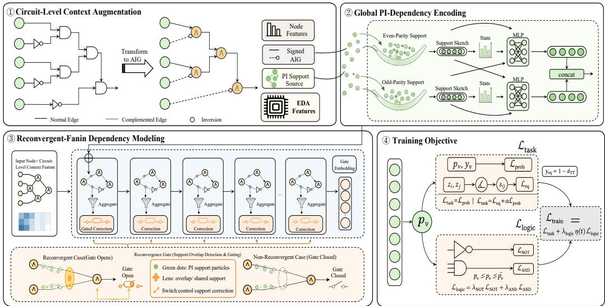
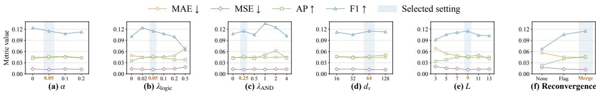
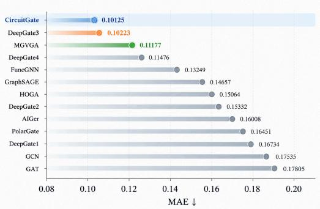

# CIRCUITGATE: LOGIC-CONSISTENT CIRCUIT-LEVEL FUNCTIONAL MODELING FOR AND-INVERTER GRAPHS

Qifan Zhang1,↑, Ruijie Li2,↑, Fangzhou Zhang1, Qian Ma1,∗, Hui Li1, Furui Zhan1, Yongpeng Wang1, Liying Hao1, Shikai Guo1

1Dalian Maritime University

2The Hong Kong University of Science and Technology (Guangzhou)

↑Equal contribution

∗Corresponding author

## ABSTRACT

And-Inverter Graphs (AIGs) are fundamental representations for logic synthesis and verification in Electronic Design Automation (EDA). As structured representations of complex digital systems, AIGs require models to capture functional dependencies beyond local structure and remain robust to functionality-preserving transformations. In learning-based AIG representation, existing approaches are predominantly based on GNNs and rely on local gate-level message passing, limiting their ability to capture circuit-level functional context and making the learned representations sensitive to topology-specific patterns. Therefore, we propose CircuitGate, a function-aware AIG representation learning framework that advances from gate-level semantics to circuit-level functional modeling. CircuitGate explicitly encodes global primary-input (PI) support and models support-overlapaware reconvergence between fanins, while incorporating logic-inspired Boolean constraints to encourage functionally consistent representations. We evaluate CircuitGate on the large-scale ForgeEDA benchmark and further validate it on the EPFL and ITC’99 benchmarks. Across equivalent-gate identification and signalprobability prediction tasks, CircuitGate consistently outperforms existing methods, achieving up to 21.7% and 14.2% reductions in MAE, respectively. Under direct ForgeEDA-to-OpenABC transfer without fine-tuning, CircuitGate also achieves the best equivalent-gate identification performance, demonstrating strong cross-dataset generalization. These results demonstrate the effectiveness of modeling circuit-level functional dependencies beyond local topology. Source code is available at https://anonymous.4open.science/r/CircuitGate/.

## 1 INTRODUCTION

And-Inverter Graphs (AIGs) are fundamental intermediate representations in Electronic Design Automation (EDA), supporting critical tasks such as logic synthesis, formal verification, and optimization Wang et al. (2009); Hassoun & Sasao (2001). By representing Boolean networks using twoinput AND gates and complemented edges, AIGs provide a compact and widely adopted abstraction for EDA workflows, including technology mapping Mishchenko et al. (2007) and equivalence checking Goldberg et al. (2001); Kern & Greenstreet (1999). As circuit scale and logic complexity continue to grow, learning informative representations of AIGs has become important for enabling effective learning-based EDA applications. However, a useful AIG representation should capture more than the local structural patterns of an implementation; it should reflect the underlying circuit functionality that remains stable across structurally different but functionally equivalent implementations. This requires modeling circuit-level functional dependencies beyond local topology while maintaining consistent semantics under functionality-preserving synthesis transformations.

Recent advances in Graph Neural Networks (GNNs) have enabled learning-based AIG representation methods. DeepGate Li et al. (2022) pioneered GNN-based AIG representation learning by introducing signal probability supervision. Subsequent works, including DeepGate2 Shi et al. (2023),

DeepGate3 Shi et al. (2024), and DeepGate4 Zheng et al. (2025), further improved supervision strategies, scalability, and industrial applicability. Other approaches, including FGNN Wang et al. (2022), FuncGNN Zhao et al. (2026b), PolarGate Liu et al. (2024), HOGA Deng et al. (2024), and WideGate Liu et al. (2025), explored complementary directions such as functionality-aware propagation, hybrid aggregation, polarity modeling, and graph attention mechanisms. Despite these advances, as illustrated in Figure 1, existing AIG representation methods still propagate information primarily through local connectivity patterns, limiting their ability to capture complete circuit-level functional dependencies and maintain consistent representations across different circuit implemen tations. These limitations manifest in two key aspects.

First, existing methods provide an incomplete characterization of circuit-level functional dependencies. Local message passing is effective for modeling Boolean operations among neighboring gates and capturing short-range structural interactions. However, the functionality of a circuit node is ultimately determined by the complete set of primary inputs (PIs) that influence its output. Such global PI support provides essential dependency information beyond local neighborhoods but is difficult to preserve through finite-hop message propagation, especially in large circuits with deep logic hierarchies. Moreover, industrial circuits contain extensive reconvergent structures, where multiple fanin branches with shared PI dependencies merge at downstream nodes. These fanins are therefore functionally correlated rather than independent structural neighbors. Existing message passing mechanisms process these fanins independently and fail to explicitly model their shared-support relationships. Consequently, current methods lack a unified mechanism for capturing global PI dependencies and reconvergent-fanin correlations, resulting in incomplete circuit-level functional representations.

Second, existing methods exhibit limited consistency under functionalitypreserving synthesis transformations. Modern synthesis procedures, such as resyn2 Mishchenko et al. (2007) and dc2, can substantially modify AIG topology, including node structures, logic depth, and connectivity patterns, while preserving Boolean functionality. However, topologydriven representation models may encode implementation-specific structural patterns rather than intrinsic functional properties. As a result, functionally equivalent circuits generated by different synthesis processes may produce inconsistent representations. This limitation highlights a broader challenge in representation learning for structured engineering systems: effective representations should capture stable functional characteristics rather than rely primarily on transformation-dependent topology.

  
Figure 1: Motivating comparison between prior gate-level AIG representation methods and CircuitGate. Existing approaches mainly rely on local structural message passing, resulting in incomplete functional context and limited logic consistency, while CircuitGate explicitly models circuit-level functional dependencies and improves representation consistency.

These observations lead to a central challenge:

## How can we learn AIG representations that capture complete circuit-levelfunctional dependencies beyond local topology while remaining consistent under functionality-preserving synthesis transformations?

To address this challenge, we propose CircuitGate, a function-aware representation learning framework for AIGs. On the one hand, CircuitGate explicitly models circuit-level functional dependencies by incorporating global PI-support information and support-overlap-aware reconvergent-fanin relationships, enabling each node to capture functional context beyond its local structural neighborhood. On the other hand, CircuitGate augments topology-driven message passing with complementary functional contexts and logic-inspired Boolean constraints, encouraging functionally equivalent circuits to exhibit more consistent representations despite synthesis-induced structural variations. Together, these designs advance AIG representation learning from local gate-level semantic model ing toward logic-consistent circuit-level functional representation learning. Extensive experiments primarily on the large-scale ForgeEDA benchmark, with additional validation on EPFL and ITC’99 and zero-shot ForgeEDA-to-OpenABC transfer, demonstrate the effectiveness and superiority of CircuitGate across multiple AIG representation learning tasks and circuit distributions.

  
Figure 2: Overview of the CircuitGate framework.

The main contributions of this work are:

• We provide a systematic analysis of existing AIG representation learning methods and identify a fundamental gap between gate-level semantic modeling and circuit-level functional representation. Specifically, current approaches lack effective mechanisms for capturing global functional dependencies and are vulnerable to topology-specific biases introduced by functionalitypreserving transformations, motivating the design of CircuitGate.

• We propose CircuitGate, a unified framework that advances AIG representation learning from local topology-driven modeling toward circuit-level functional dependency modeling. Circuit-Gate jointly captures global PI dependencies and support-overlap-aware reconvergence through circuit-level context modeling, global dependency encoding, and reconvergent-fanin dependency learning, while incorporating Boolean constraints to encourage functionally consistent representations.

• We primarily evaluate CircuitGate on the large-scale ForgeEDA industrial EDA benchmark, comprising 83,155 circuit instances derived from 4,450 AIGs across 1,189 open-source designs, and further evaluate it on EPFL and ITC’99. CircuitGate reduces MAE over the second-best methods by 21.7% and 13.8% on ForgeEDA for equivalent-gate identification and signal-probability prediction, respectively. On EPFL, the corresponding reductions are 19.5% and 14.2%, and on ITC’99, 13.4% and 8.4%. Zero-shot ForgeEDA-to-OpenABC transfer further demonstrates crossdataset generalization, while ablation studies verify the contributions of individual components.

## 2 RELATED WORK

## 2.1 FUNCTIONAL DEPENDENCY MODELING

Traditional support-based AIG analysis explicitly tracks primary-input (PI) dependencies through structural support information Mishchenko et al. (2007), making circuit-level dependencies directly available for logic reasoning. Modern GNN-based methods recast dependency modeling as scalable implicit message propagation. DeepGate Li et al. (2022) pioneered GNN-based gate representation learning with signal-probability supervision, followed by DeepGate2 Shi et al. (2023), Deep-Gate3 Shi et al. (2024), and DeepGate4 Zheng et al. (2025), which progressively advance functional modeling and scalability. Recent methods further explore functionality-aware and circuit-specific modeling, including GAMORA Wu et al. (2023), FGNN Wang et al. (2022), FuncGNN Zhao et al. (2026b), AIGer Sun et al. (2026), WideGate Liu et al. (2025), PolarGate Liu et al. (2024), and HOGA Deng et al. (2024).

This transition improves scalability but makes circuit-level dependency modeling increasingly reliant on local propagation. In standard message-passing GNNs, k layers aggregate information over at most k-hop neighborhoods, making global PI dependencies difficult to preserve across deep logic hierarchies. Moreover, scalable GNN-based methods still lack explicit reconvergence modeling within representation updates: fanins with shared PI support are typically aggregated as local neighbors, leaving their shared-input dependencies only indirectly reflected in learned representations. CircuitGate addresses these limitations through global PI-support encoding and support-overlapconditioned reconvergence modeling.

## 2.2 SYNTHESIS ROBUSTNESS

Logic synthesis exposes a fundamental tension in circuit representation learning: topology can change dramatically while Boolean functionality remains unchanged. MILS Zhao et al. (2025), CHOP Fu et al. (2026), and ORL-LO Dong et al. (2026) explore learning-based synthesis prediction and optimization, while DeepCell Shi et al. (2025b) and GenEDA Fang et al. (2025) study multiview and cross-modal circuit representation learning. TopoRTL Zhao et al. (2026a) and IRGNN Guo et al. (2025) further extend circuit learning across abstraction levels and application domains.

Despite this progress, representation consistency under functionality-preserving topology transformations remains a distinct challenge. CircuitGate targets this setting through circuit-level context, global PI-support encoding, reconvergence-aware modeling, and logic-inspired regularization to reduce reliance on topology-specific patterns.

## 3 METHOD

## 3.1 OVERVIEW

Given an AIG represented as a signed directed acyclic graph $\mathcal { G } = ( \nu , \mathcal { E } )$ , where each edge carries an inversion label $r _ { e } \in \{ 0 , 1 \}$ , CircuitGate aims to learn node representations that capture circuitlevel functional dependencies beyond local gate-level semantics. Different from topology-driven representations, CircuitGate seeks to preserve global input dependencies and reconvergent-fanin correlations while reducing reliance on synthesis-induced structural patterns.

The key idea is to augment local message passing with two complementary sources of functional context: (i) global PI dependencies that characterize the input influence of each node, and (ii) local reconvergent-fanin correlations induced by shared PI supports. As illustrated in Figure 2, Circuit-Gate consists of three architectural components: (1) Circuit-Level Context Augmentation, which incorporates EDA-native circuit-role information, including logic levels, fanout, output status, and PI-support coverage, to enrich gate-level representations with circuit-level contextual priors; (2) Global PI-Dependency Encoding, which explicitly encodes polarity-aware PI dependencies and compresses variable-size support sets into fixed-width representations, enabling the model to capture global functional dependencies beyond finite-hop message passing; and (3) Reconvergent-Fanin Dependency Modeling, which identifies shared-support relationships among reconvergent fanins and uses support-overlap-aware gating to adaptively modulate the contribution of PI-dependency context during node updates. Beyond these architectural components, logic-inspired constraints are incorporated into the training objective to regularize local Boolean semantics and reduce topologyspecific biases. Together, these designs enable CircuitGate to learn circuit-level functional representations with logic-inspired regularization.

## 3.2 CIRCUIT-LEVEL CONTEXT AUGMENTATION

Logic synthesis can alter local wiring patterns while preserving circuit functionality, making gate type insufficient to characterize a node’s circuit-level role. To address this limitation, the Circuit-Level Context Augmentation component augments each node’s gate-type representation with EDAnative attributes describing circuit position, fanout, output status, and PI-support coverage.

Specifically, the EDA-native context vector and the initial node representation are defined as

$$
\begin{array} { r l r l } { \mathbf { x } _ { v } ^ { \mathrm { e d a } } = \left[ \bar { \ell } _ { v } ^ { \mathrm { f } } , \bar { \ell } _ { v } ^ { \mathrm { b } } , \bar { d } _ { v } , \delta _ { v } ^ { \mathrm { o u t } } , \rho _ { v } \right] , } & { \ } & { \mathbf { x } _ { v } } & { = \left[ \mathbf { o } _ { v } \parallel \mathbf { x } _ { v } ^ { \mathrm { e d a } } \right] , } \end{array}\tag{1}
$$

where $\mathbf { o } _ { v }$ is the gate-type one-hot vector and ∥ denotes concatenation. For $k \in \{ \mathrm { f } , \mathrm { b } \} , \ell _ { v } ^ { k }$ is the corresponding logic level and $\bar { \ell } _ { v } ^ { k } = \ell _ { v } ^ { k } / \operatorname* { m a x } \{ 1 , \operatorname* { m a x } _ { u \in \mathcal { V } } \ell _ { u } ^ { k } \}$

$\bar { d } _ { v } = \log ( 1 + d _ { \operatorname { o u t } } ( v ) )$ denotes the transformed fanout, and $\delta _ { v } ^ { \mathrm { o u t } } = \mathbf { 1 } _ { \{ d _ { \mathrm { o u t } } ( v ) = 0 \} }$ indicates whether v is a sink node. $\rho _ { v }$ represents PI-support coverage, defined as the larger fraction of PIs in the evenand odd-inversion support sets $ { \boldsymbol { S } } _ { 0 } ( v )$ and $S _ { 1 } ( v )$ , with $| \mathcal { P } |$ as the normalization factor.

These features distinguish same-type nodes by circuit role, helping the model separate structurally different candidates before message passing begins.

## 3.3 GLOBAL PI-DEPENDENCY ENCODING

Nodes with similar local neighborhoods may depend on different primary inputs (PIs), causing finite-depth message passing to conflate distinct global dependencies. The Global PI-Dependency Encoding component therefore summarizes the structural PI dependencies of each node in fixedwidth representations. Because complemented edges alter the polarity with which a PI reaches a downstream node, these dependencies are further distinguished by the parity of inversions along PI-to-node paths.

Let $\mathcal { P } \subseteq \mathcal { V }$ denote the set of PIs and define $P _ { 0 } = \operatorname* { m a x } \{ | \mathcal { P } | , 1 \}$ . For each node $v ,$ we construct two parity-indexed structural PI-support sets, where $q \in \{ 0 , 1 \}$ denotes the inversion parity of a PI-to-v path. Let $\mathcal { N } _ { r } ( v )$ denote the fanins of v connected through edges with inversion label $r \in \{ 0 , 1 \}$ . For each non-PI node $v ,$ the support sets are propagated in one topological pass as

$$
S _ { q } ( v ) = \bigcup _ { u \in \mathcal { N } _ { 0 } ( v ) } S _ { q } ( u ) \cup \bigcup _ { u \in \mathcal { N } _ { 1 } ( v ) } S _ { q \oplus 1 } ( u ) ,\tag{2}
$$

where $\oplus$ denotes modulo-two addition. Each PI $p$ is initialized by $S _ { 0 } ( p ) = \{ p \}$ and $S _ { 1 } ( p ) = \emptyset$

These sets provide a path-based characterization of parity-aware circuit-level PI dependencies, while serving as a structural approximation of exact Boolean functional support. In particular, a PI may belong to both $S _ { 0 } ( v )$ and $S _ { 1 } ( v )$ if it reaches v through paths with both inversion parities.

To compress the variable-size supports, each PI is assigned a graph-local index and mapped to a random token $\mathbf { t } _ { p } \sim \mathcal { N } ( \mathbf { 0 } , \mathbf { I } / d _ { s } \bar { ) }$ using a fixed seed. The tokens remain unchanged throughout training and inference. Each parity-indexed support set is then summarized by the sketch

$$
\mathbf { s } _ { q } ( v ) = \frac { \sum _ { p \in S _ { q } ( v ) } \mathbf { t } _ { p } } { \sqrt { \operatorname* { m a x } \{ | S _ { q } ( v ) | , 1 \} } } ,\tag{3}
$$

where $\mathbf { s } _ { q } ( v ) \in \mathbb { R } ^ { d _ { s } }$ and an empty support is mapped to the zero vector. The square-root normalization stabilizes the sketch variance across support sizes, while explicit support statistics retain scale information. The resulting sketch provides a compact randomized summary of PI-support identity. The sketches are further fused with support-size and PI-coverage statistics:

$$
\begin{array} { r l } & { \phi _ { q } ( v ) = \Big [ \log \big ( 1 + \vert { \mathcal { S } } _ { q } ( v ) \vert \big ) , \log \big ( 1 + \vert { \mathcal { S } } _ { q \oplus 1 } ( v ) \vert \big ) , \vert { \mathcal { S } } _ { q } ( v ) \vert / P _ { 0 } , \vert { \mathcal { S } } _ { q \oplus 1 } ( v ) \vert / P _ { 0 } \Big ] , } \\ & { { \bf e } _ { q } ( v ) = \mathrm { M L P } _ { q } \Big ( [ { \bf s } _ { q } ( v ) \| { \bf s } _ { q \oplus 1 } ( v ) \| \phi _ { q } ( v ) ] \Big ) . } \end{array}\tag{4}
$$

where ML $\mathrm { P } _ { q } : \mathbb { R } ^ { 2 d _ { s } + 4 }  \mathbb { R } ^ { d _ { h } }$ is a learned state-specific multilayer perceptron and $\mathbf { e } _ { q } ( v ) \in \mathbb { R } ^ { d _ { h } }$ is the encoded PI-dependency representation for state q. The two parity states are combined as

$$
\mathbf { e } _ { v } = [ \mathbf { e } _ { 0 } ( v ) \parallel \mathbf { e } _ { 1 } ( v ) ] \in \mathbb { R } ^ { 2 d _ { h } } .\tag{5}
$$

The encoded PI dependencies are introduced after the first propagation layer and concatenated into every subsequent state update while remaining unchanged across layers. This provides each node with a circuit-level prior for modeling functional dependencies beyond finite-hop neighborhoods, improving discrimination between locally similar nodes with different global dependencies.

## 3.4 RECONVERGENT-FANIN DEPENDENCY MODELING

PI-support overlap provides structural evidence of shared upstream dependency between reconvergent fanins. CircuitGate characterizes reconvergence through the overlap between the PI supports of two fanins and uses this information to condition local message propagation. The resulting mechanism allows global PI dependencies to adaptively influence node updates while preserving the original AIG connectivity.

For a two-input AND node v with fanins a and b, let $S _ { x } = S _ { 0 } ( x ) \cup S _ { 1 } ( x )$ for $x \in \{ a , b \}$ . Its six-dimensional reconvergence descriptor is defined by

$$
\begin{array} { r l } & { n _ { v } = | \mathcal { S } _ { a } \cap \mathcal { S } _ { b } | , \qquad c _ { v } ^ { s } = \sum _ { q \in \{ 0 , 1 \} } | \mathcal { S } _ { q } ( a ) \cap \mathcal { S } _ { q } ( b ) | , \qquad c _ { v } ^ { 0 } = \sum _ { q \in \{ 0 , 1 \} } | \mathcal { S } _ { q } ( a ) \cap \mathcal { S } _ { q \oplus 1 } ( b ) | , } \\ & { { \bf r } _ { v } = \Bigg [ { \bf 1 } _ { \{ n _ { v } > 0 \} , \qquad } \frac { n _ { v } } { \operatorname* { m a x } \{ | \mathcal { S } _ { a } \cup \mathcal { S } _ { b } | , 1 \} } , \frac { n _ { v } } { \operatorname* { m a x } \{ \operatorname* { m i n } ( | \mathcal { S } _ { a } | , | \mathcal { S } _ { b } | ) , 1 \} } , } \\ & { \qquad \log ( 1 + n _ { v } ) , \frac { | \ell _ { a } ^ { \dag } - \ell _ { b } ^ { \dag } | } { \operatorname* { m a x } \{ 1 , \operatorname* { m a x } \ell _ { v } ^ { \dag } \} } , \frac { c _ { v } ^ { s } - c _ { v } ^ { 0 } } { \operatorname* { m a x } \{ c _ { v } ^ { s } + c _ { v } ^ { 0 } , 1 \} } \Bigg ] . } \end{array}\tag{6}
$$

where $m _ { v } = 1 _ { \{ n _ { v } > 0 \} }$ denotes the first entry. The six entries of $\mathbf { r } _ { v }$ encode reconvergence presence, Jaccard support overlap, the overlap coefficient, log-scaled shared-support size, normalized fanindepth imbalance, and the contrast between same- and opposite-parity overlap. Because a PI may appear in both parity-indexed support sets, $c _ { v } ^ { \mathrm { s } }$ and $c _ { v } ^ { \mathrm { o } }$ are overlap statistics rather than mutually exclusive counts. For nodes other than two-input AND gates, we set $\mathbf { r } _ { v } = \mathbf { 0 }$ and $m _ { v } = 0 .$ . The descriptor therefore characterizes both the existence and the extent of shared upstream dependency, together with its structural and polarity-related properties.

An initialization layer constructs the local node representation from signed-fanin neighborhoods. We denote the resulting state at layer l as $\mathbf { h } _ { v } ^ { ( l ) } \in \mathbb { R } ^ { 2 d _ { h } }$ . For each relation $r \in \{ 0 , 1 \}$ , we construct a relation-aware message from the corresponding fanin neighborhood:

$$
\mathbf { m } _ { v , r } ^ { ( l ) } = \operatorname { A g g } _ { r } ^ { ( l ) } \left( \left\{ \mathbf { h } _ { u } ^ { ( l ) } \mid u \in \mathcal { N } _ { r } ( v ) \right\} \right) , \qquad \mathbf { a } _ { v } ^ { ( l ) } = \left[ \mathbf { m } _ { v , 0 } ^ { ( l ) } \parallel \mathbf { m } _ { v , 1 } ^ { ( l ) } \right] .\tag{7}
$$

where $\mathrm { A g g } _ { r } ^ { ( l ) } ( \cdot )$ denotes the relation-aware aggregation over fanins connected through edge relation r, with empty neighborhoods mapped to zero.

Using the PI-dependency representation $\mathbf { e } _ { v }$ introduced in Section 3.3, we jointly compute the dependency gate and the updated node representation as

$$
\begin{array} { r l } & { \mathbf { g } _ { v } ^ { ( l ) } = m _ { v } \sigma \Big ( \mathrm { M L P } _ { g } \big [ \mathbf { r } _ { v } \mathrm { ~ } \| \mathrm { ~ M L P } _ { s } ( \mathbf { a } _ { v } ^ { ( l ) } ) \big ] \Big ) , } \\ & { \mathbf { h } _ { v } ^ { ( l + 1 ) } = \operatorname { t a n h } \Big ( \mathbf { W } _ { h } \big [ \mathbf { a } _ { v } ^ { ( l ) } \mathrm { ~ } \big \| \mathbf { h } _ { v } ^ { ( l ) } \mathrm { ~ } \big \| \mathbf { e } _ { v } \mathrm { ~ } \big \| \bar { \mathbf { g } } _ { v } ^ { ( l ) } \odot \mathbf { e } _ { v } \big ] \Big ) . } \end{array}\tag{8}
$$

where $\mathbf { g } _ { v } ^ { ( l ) } \in \mathbb { R } ^ { d _ { h } }$ is the dependency gate and $\bar { \mathbf { g } } _ { v } ^ { ( l ) } = [ \mathbf { g } _ { v } ^ { ( l ) } \parallel \mathbf { g } _ { v } ^ { ( l ) } ] \in \mathbb { R } ^ { 2 d _ { h } }$ broadcasts the gate to the PI-dependency representation, $\mathrm { M L P } _ { s }$ and $\mathrm { M L P } _ { g }$ are multilayer perceptrons, $\mathbf { W } _ { h }$ denotes the state projection, σ is the sigmoid function, and ⊙ denotes element-wise multiplication. The base PIdependency representation $\mathbf { e } _ { v }$ is retained for every node, while the additional gated residual $\bar { \mathbf { g } } _ { v } ^ { ( l ) } \odot \mathbf { e } _ { \iota }$ is activated when shared upstream support is detected.

Therefore, exact PI-support overlap serves as an explicit dependency signal that adaptively controls how global PI information participates in local propagation at reconvergent nodes while preserving the original AIG topology.

## 3.5 TRAINING OBJECTIVE

To improve representation consistency under synthesis-induced topology changes, we augment task supervision with logic-inspired regularization. Since Boolean operator semantics remain valid across different structural realizations, we impose NOT complementarity and feasible probability bounds for AND gates. Given the final node representation $\mathbf { h } _ { v } ^ { ( L ) }$ , we predict $\begin{array} { r l } { p _ { v } } & { { } = } \end{array}$ $\sigma ( f _ { p } ( \operatorname { t a n h } ( \mathbf { W } _ { z } \mathbf { h } _ { v } ^ { ( L ) } ) ) )$ . The task loss $\mathcal { L } _ { \mathrm { t a s k } }$ is detailed in Appendix A.1.

Logic-Inspired Constraints. For an AND input relation $( u , o )$ , let $\widetilde { p } _ { u o } = p _ { u }$ for a non-inverting relation and $\widetilde { p } _ { u o } = 1 - p _ { u }$ for an inverting relation. For a two-input AND node o with fanins a and b, the corresponding Frechet bounds are´

$$
\underline { { p } } _ { o } = [ \widetilde { p } _ { a o } + \widetilde { p } _ { b o } - 1 ] _ { + } , \qquad \overline { { p } } _ { o } = \mathrm { m i n } ( \widetilde { p } _ { a o } , \widetilde { p } _ { b o } ) ,\tag{9}
$$

where $[ x ] _ { + } = \operatorname* { m a x } ( x , 0 )$ . These bounds require no fanin-independence assumption and therefore remain applicable to reconvergent structures.

We penalize violations of NOT complementarity and AND probability bounds through

$$
\mathcal { L } _ { \mathrm { N O T } } = \frac { 1 } { | \mathcal { E } _ { \mathrm { N O T } } | } \sum _ { ( u , v ) \in \mathcal { E } _ { \mathrm { N O T } } } | p _ { u } + p _ { v } - 1 | ,\tag{10}
$$

$$
{ \mathcal { L } } _ { \mathrm { A N D } } = { \frac { 1 } { | { \mathcal { A } } | } } \sum _ { o \in { \mathcal { A } } } { \Big ( } [ { \underline { { p } } } _ { o } - p _ { o } ] _ { + } + [ p _ { o } - { \overline { { p } } } _ { o } ] _ { + } { \Big ) } ,
$$

where $\mathcal { E } _ { \mathrm { N O T } }$ contains the input–output node pairs of explicit NOT operations, and A is the set of two-input AND nodes.

Overall Objective. The complete training objective is

$$
{ \mathcal { L } } _ { \mathrm { t r a i n } } = { \mathcal { L } } _ { \mathrm { t a s k } } + \lambda _ { \mathrm { l o g i c } } { \Big ( } { \lambda } _ { \mathrm { N O T } } { \mathcal { L } } _ { \mathrm { N O T } } + { \lambda } _ { \mathrm { A N D } } { \mathcal { L } } _ { \mathrm { A N D } } { \Big ) } ,\tag{11}
$$

where $\lambda _ { \mathrm { l o g i c } }$ controls the overall regularization strength, while λNOT and $\lambda _ { \mathrm { A N D } }$ balance the two logic terms. Together, these terms regularize local Boolean probability relations that remain applicable across different structural realizations, reducing reliance on topology-specific patterns.

## 4 EXPERIMENTS

## 4.1 EXPERIMENTAL SETTINGS

Datasets. We evaluate CircuitGate on three circuit benchmarks: ForgeEDA Shi et al. (2025a), EPFL Amaru et al. (2015), and´ ITC’99 Corno et al. (2000). ForgeEDA contains 83,155 circuit instances derived from 4,450 AIGs across 1,189 open-source designs. We use a source-disjoint split for ForgeEDA and parent-circuit-isolated splits for EPFL and ITC’99 to prevent data leakage across splits. Detailed dataset statistics and split settings are provided in Appendix A.2.

Baselines. We compare CircuitGate with general-purpose GNNs (GCN Kipf & Welling (2016), GAT Velickoviˇ c et al. (2018), GraphSAGE Hamilton et al. (2017)), the DeepGate series Li´ et al. (2022); Shi et al. (2023; 2024); Zheng et al. (2025), and recent circuit-specific methods (HOGA Deng et al. (2024), PolarGate Liu et al. (2024), FuncGNN Zhao et al. (2026b), AIGer Sun et al. (2026), MGVGA Wu et al. (2025)).

Evaluation Metrics. For equivalent-gate identification, MAE and MSE evaluate graded functional similarity against the continuous target $1 - d _ { i j } ^ { \mathrm { t t } } .$ , whereas AP and F1 evaluate exact equivalence defined by $d _ { i j } ^ { \mathrm { t t } } \ = \ 0$ , with MAE as the primary metric. For signal-probability prediction, we report MAE. For topology robustness, we use CKA to measure representation consistency between matched nodes before and after synthesis transformations. For efficiency, we report parameter count, inference latency, and accuracy–efficiency cost (AEC). Detailed metric definitions, class statistics, and evaluation protocols are provided in Appendix A.3.

Implementation Details. All experiments are conducted on an NVIDIA RTX A6000 GPU with a fixed random seed of 2024. For fair comparison, all methods use the same dataset splits and evaluation protocols. For each baseline, we follow its official implementation and hyperparameter settings whenever available; when adaptation is required, hyperparameters are selected using only the validation set. CircuitGate is optimized using Adam Kingma & Ba (2014) with a fixed learning rate of $1 0 ^ { - 2 }$ , a weight decay of $1 0 ^ { - 3 }$ , and a batch size of 256, and is trained for 300 epochs.

## 4.2 RQ1: HOW DOES CIRCUITGATE COMPARE WITH EXISTING METHODS?

Motivation. We compare CircuitGate with GNN-based and circuit-specific methods on equivalentgate identification and signal-probability prediction across ForgeEDA, EPFL, and ITC’99.

Table 1: Equivalent-gate identification results. Best and second-best results are bold and underlined.
<table><tr><td rowspan="2">Model</td><td rowspan="2">Venue</td><td colspan="4">ForgeEDA</td><td colspan="4">EPFL</td><td colspan="4">ITC&#x27;99</td></tr><tr><td>MAE↓</td><td>MSE↓</td><td>AP↑</td><td>F1↑</td><td>MAE↓</td><td>MSE↓</td><td>AP↑</td><td>F1 ↑</td><td>MAE↓</td><td>MSE↓</td><td>AP↑</td><td>F1↑</td></tr><tr><td>GCN</td><td>ICLR&#x27;17</td><td>0.1522</td><td>0.0537</td><td>0.0141</td><td>0.0368</td><td>0.2364</td><td>0.1060</td><td>0.2952</td><td>0.1478</td><td>0.2129</td><td>0.1145</td><td>0.6396</td><td>0.6434</td></tr><tr><td>GAT</td><td>ICLR&#x27;18</td><td>0.1886</td><td>0.0762</td><td>0.0102</td><td>0.0312</td><td>0.3086</td><td>0.1517</td><td>0.1694</td><td>0.2930</td><td>0.2186</td><td>0.1205</td><td>0.5370</td><td>0.6873</td></tr><tr><td>GraphSAGE</td><td>NeurIPS&#x27;17</td><td>0.1311</td><td>0.0424</td><td>0.0175</td><td>0.0228</td><td>0.1117</td><td>0.0368</td><td>0.4118</td><td>0.4062</td><td>0.2188</td><td>0.1203</td><td>0.5501</td><td>0.6883</td></tr><tr><td>DeepGate</td><td>DAC&#x27;22</td><td>0.1440</td><td>0.0526</td><td>0.0108</td><td>0.0296</td><td>0.1183</td><td>0.0368</td><td>0.4042</td><td>0.2705</td><td>0.1318</td><td>0.0516</td><td>0.7168</td><td>0.8133</td></tr><tr><td>DeepGate2</td><td>ICCAD&#x27;23</td><td>0.2914</td><td>0.1237</td><td>0.0154</td><td>0.0360</td><td>0.2804</td><td>0.1227</td><td>0.1316</td><td>0.0109</td><td>0.2173</td><td>0.0977</td><td>0.6717</td><td>0.7511</td></tr><tr><td>DeepGate3</td><td>ICCAD&#x27;24</td><td>0.0553</td><td>0.0167</td><td>0.0335</td><td>0.0672</td><td>0.1115</td><td>0.0361</td><td>0.6421</td><td>0.4027</td><td>0.0748</td><td>0.0206</td><td>0.9507</td><td>0.9290</td></tr><tr><td>DeepGate4</td><td>ICLR’25</td><td>0.1361</td><td>0.0334</td><td>0.0305</td><td>0.0749</td><td>0.0863</td><td>0.0217</td><td>0.5621</td><td>0.5705</td><td>0.0755</td><td>0.0197</td><td>0.9058</td><td>0.9264</td></tr><tr><td>HOGA</td><td>DAC&#x27;24</td><td>0.1567</td><td>0.0547</td><td>0.0149</td><td>0.0397</td><td>0.1278</td><td>0.0397</td><td>0.3551</td><td>0.3855</td><td>0.2407</td><td>0.1570</td><td>0.7926</td><td>0.8229</td></tr><tr><td>PolarGate</td><td>ICCAD&#x27;24</td><td>0.1567</td><td>0.0593</td><td>0.0133</td><td>0.0340</td><td>0.1450</td><td>0.0529</td><td>0.2772</td><td>0.1468</td><td>0.1135</td><td>0.0444</td><td>0.8009</td><td>0.8719</td></tr><tr><td>FuncGNN</td><td>TRETS&#x27;26</td><td>0.1075</td><td>0.0302</td><td>0.0180</td><td>0.0498</td><td>0.0952</td><td>0.0250</td><td>0.4918</td><td>0.3599</td><td>0.1014</td><td>0.0342</td><td>0.8736</td><td>0.8447</td></tr><tr><td>AIGer</td><td>TCAD&#x27;26</td><td>0.1472</td><td>0.0548</td><td>0.0180</td><td>0.0454</td><td>0.1432</td><td>0.0509</td><td>0.2761</td><td>0.3806</td><td>0.1160</td><td>0.0411</td><td>0.8701</td><td>0.8905</td></tr><tr><td>MGVGA</td><td>ICLR’25</td><td>0.0563</td><td>0.0173</td><td>0.0264</td><td>0.0759</td><td>0.0848</td><td>0.0228</td><td>0.5187</td><td>0.4170</td><td>0.0718</td><td>0.0205</td><td>0.9101</td><td>0.9210</td></tr><tr><td>CircuitGate</td><td></td><td>0.0433</td><td>0.0118</td><td>0.0469</td><td>0.1149</td><td>0.0683</td><td>0.0163</td><td>0.6503</td><td>0.6543</td><td>0.0622</td><td>0.0140</td><td>0.9823</td><td>0.9467</td></tr></table>

Results. As shown in Table 1, CircuitGate achieves the best equivalent-gate identification performance across all three benchmarks.

On ForgeEDA, CircuitGate achieves an MAE of 0.0433, reducing error by 21.7% over Deep-Gate3, with corresponding MSE and AP improvements of 29.3% and 40.0%, respectively. It also improves F1 by 51.4% over MGVGA, the second-best method on this metric. On EPFL and ITC’99, it achieves MAEs of 0.0683 and 0.0622, outperforming the second-best MGVGA by 19.5% and 13.4%, respectively, while also attaining the best MSE, AP, and F1. As shown in Table 2, CircuitGate achieves the lowest signal-probability MAE on all three benchmarks, reducing error by 13.8%, 14.2%,

Table 2: Signal-probability prediction results (MAE).
<table><tr><td>Model</td><td>ForgeEDA</td><td>EPFL</td><td>ITC&#x27;99</td></tr><tr><td>GCN</td><td>0.0422</td><td>0.1637</td><td>0.1688</td></tr><tr><td>GAT</td><td>0.0396</td><td>0.1386</td><td>0.0879</td></tr><tr><td>GraphSAGE</td><td>0.0446</td><td>0.0536</td><td>0.0231</td></tr><tr><td>DeepGate</td><td>0.1604</td><td>0.0910</td><td>0.0831</td></tr><tr><td>DeepGate2</td><td>0.1408</td><td>0.0923</td><td>0.0717</td></tr><tr><td>DeepGate3</td><td>0.0315</td><td>0.0625</td><td>0.0161</td></tr><tr><td>DeepGate4</td><td>0.0246</td><td>0.0560</td><td>0.0154</td></tr><tr><td>HOGA</td><td>0.0991</td><td>0.1046</td><td>0.0457</td></tr><tr><td>PolarGate</td><td>0.1070</td><td>0.0987</td><td>0.0349</td></tr><tr><td>FuncGNN</td><td>0.0558</td><td>0.0770</td><td>0.0294</td></tr><tr><td>AIGer</td><td>0.0360</td><td>0.0812</td><td>0.0559</td></tr><tr><td>MGVGA</td><td>0.0279</td><td>0.0626</td><td>0.0181</td></tr><tr><td>CircuitGate</td><td>0.0212</td><td>0.0460</td><td>0.0141</td></tr></table>

and 8.4%, respectively, relative to the best baseline on each benchmark. Under direct transfer from ForgeEDA to OpenABC-D (OpenABC) Chowdhury et al. (2021) without fine-tuning, it also achieves the lowest equivalent-gate MAE; detailed results are provided in Appendix A.4.

Table 3: Ablation study on the equivalent-gate identification task on ForgeEDA, EPFL, and ITC’99.
<table><tr><td rowspan="2">Variant</td><td colspan="4">ForgeEDA</td><td colspan="4">EPFL</td><td colspan="4">ITC&#x27;99</td></tr><tr><td>MAE↓</td><td>MSE↓</td><td>AP↑</td><td>F1 ↑</td><td>MAE↓</td><td>MSE↓</td><td>AP↑</td><td>F1 ↑</td><td>MAE↓</td><td>MSE↓</td><td>AP↑</td><td>F1 ↑</td></tr><tr><td>w/o Circuit-Level Context</td><td>0.0477</td><td>0.0135</td><td>0.0429</td><td>0.1118</td><td>0.0914</td><td>0.0234</td><td>0.4409</td><td>0.4403</td><td>0.0850</td><td>0.0243</td><td>0.9755</td><td>0.9270</td></tr><tr><td>w/o PI-Dependency Encoding</td><td>0.0582</td><td>0.0184</td><td>0.0220</td><td>0.0634</td><td>0.0864</td><td>0.0248</td><td>0.5211</td><td>0.3708</td><td>0.0691</td><td>0.0210</td><td>0.9454</td><td>0.9317</td></tr><tr><td>w/o Reconvergence</td><td>0.0561</td><td>0.0175</td><td>0.0229</td><td>0.0670</td><td>0.0872</td><td>0.0243</td><td>0.5472</td><td>0.3964</td><td>0.0833</td><td>0.0256</td><td>0.9661</td><td>0.9084</td></tr><tr><td>w/o Logic Constraints</td><td>0.0495</td><td>0.0135</td><td>0.0351</td><td>0.1007</td><td>0.0817</td><td>0.0220</td><td>0.5203</td><td>0.5513</td><td>0.0864</td><td>0.0201</td><td>0.9659</td><td>0.8985</td></tr><tr><td>Full</td><td>0.0433</td><td>0.0118</td><td>0.0469</td><td>0.1149</td><td>0.0683</td><td>0.0163</td><td>0.6503</td><td>0.6543</td><td>0.0622</td><td>0.0140</td><td>0.9823</td><td>0.9467</td></tr></table>

## 4.3 RQ2: HOW DOES EACH COMPONENT CONTRIBUTE TO CIRCUITGATE?

Motivation. We assess the contribution of each CircuitGate component.

Results. As shown in Table 3, all components contribute to CircuitGate’s performance. Removing PI-support encoding causes the largest MAE degradation on ForgeEDA (34.4%), followed by reconvergence modeling (29.6%), highlighting the importance of global PI dependencies and reconvergent-fanin relationships. The impact of different components varies across benchmarks: circuit-level context is most important on EPFL, while logic constraints provide the largest gain on ITC’99. These results demonstrate that the proposed components complement each other in learning circuit-level functional representations.

We further evaluate the PI-support design on ForgeEDA. Per-circuit PI-token permutation maintains comparable performance, whereas removing polarity information or retaining only cardinality/coverage statistics leads to clear degradation, confirming the importance of fine-grained polarityaware PI support. Detailed results are provided in Appendix A.5.

  
Figure 3: Parameter sensitivity of CircuitGate on equivalent-gate identification. Each panel varies one hyperparameter, with the selected setting highlighted in bold orange.

## 4.4 RQ3: HOW EFFICIENT AND SCALABLE IS CIRCUITGATE?

Motivation. We evaluate CircuitGate’s accuracy–efficiency trade-off and preprocessing scalability.

Results. As shown in Table 4, on a fixed subset of 200 ForgeEDA test circuits, CircuitGate achieves the lowest MAE of 0.0433 with a neural inference latency of 12.4393 ms, reducing MAE by 23.1% over MGVGA with only a 1.3% latency increase. It also achieves the best AEC of 1.0275.

We further evaluate one-time CPU preprocessing on complete circuits across seven graph-size ranges. On the largest graph with 525,762 nodes and 733,211 edges, feature construction takes 14.03 s, while the complete inputto-cache pipeline takes 14.89 s with a peak RSS of 2.73 GiB. These results demonstrate that CircuitGate maintains

Table 4: Accuracy–efficiency comparison on ForgeEDA
<table><tr><td>Model</td><td>Params. (M) ↓</td><td>EQ MAE↓</td><td>Neural inf. (ms) ↓</td><td>AEC↓</td></tr><tr><td>GraphSAGE</td><td>0.0173</td><td>0.1311</td><td>9.1204</td><td>1.1957</td></tr><tr><td>AIGer</td><td>0.5603</td><td>0.1472</td><td>10.5431</td><td>2.5137</td></tr><tr><td>FuncGNN</td><td>0.9765</td><td>0.1075</td><td>11.2865</td><td>2.0854</td></tr><tr><td>MGVGA</td><td>1.1050</td><td>0.0563</td><td>12.2759</td><td>1.2031</td></tr><tr><td>DeepGate3</td><td>4.7272</td><td>0.0553</td><td>73.2356</td><td>8.0999</td></tr><tr><td>DeepGate4</td><td>4.6465</td><td>0.1361</td><td>172.2620</td><td>46.8177</td></tr><tr><td>HOGA</td><td>0.0459</td><td>0.1567</td><td>107.8129</td><td>19.8255</td></tr><tr><td>CircuitGate</td><td>2.8170</td><td>0.0433</td><td>12.4393</td><td>1.0275</td></tr></table>

practical preprocessing costs on large-scale complete circuits. Detailed scaling results are provided in Appendix A.6.

## 4.5 RQ4: HOW ROBUST IS CIRCUITGATE TO TOPOLOGY CHANGES?

Motivation. We examine whether CircuitGate maintains consistent representations under functionality-preserving synthesis transformations. We evaluate all methods on the same 20 transformed ForgeEDA test circuits using fixed checkpoints without retraining.

Results. As shown in Table 5, CircuitGate achieves the highest CKA under all four synthesis transformations, with an average CKA of 0.8341. These results indicate that CircuitGate learns more consistent representations under

Table 5: Representation consistency under synthesis-induced topology transformations, measured by CKA (↑).
<table><tr><td>Model</td><td>resyn2</td><td>dc2</td><td>rewrite</td><td>refactor</td></tr><tr><td>GCN</td><td>0.6506</td><td>0.5967</td><td>0.7129</td><td>0.7322</td></tr><tr><td>GAT</td><td>0.6241</td><td>0.5836</td><td>0.8174</td><td>0.8449</td></tr><tr><td>GraphSAGE</td><td>0.6631</td><td>0.6272</td><td>0.7616</td><td>0.7948</td></tr><tr><td>DeepGate</td><td>0.4278</td><td>0.4114</td><td>0.5219</td><td>0.5374</td></tr><tr><td>DeepGate2</td><td>0.4637</td><td>0.4105</td><td>0.5232</td><td>0.5392</td></tr><tr><td>DeepGate3</td><td>0.6784</td><td>0.6572</td><td>0.7672</td><td>0.7842</td></tr><tr><td>DeepGate4</td><td>0.6472</td><td>0.6375</td><td>0.7306</td><td>0.7498</td></tr><tr><td>HOGA</td><td>0.5840</td><td>0.5679</td><td>0.6521</td><td>0.6691</td></tr><tr><td>PolarGate</td><td>0.5934</td><td>0.5500</td><td>0.6848</td><td>0.7182</td></tr><tr><td>FuncGNN</td><td>0.6662</td><td>0.6149</td><td>0.8471</td><td>0.8490</td></tr><tr><td>AIGer</td><td>0.6129</td><td>0.5760</td><td>0.7003</td><td>0.7319</td></tr><tr><td>MGVGA</td><td>0.6099</td><td>0.5988</td><td>0.6664</td><td>0.6773</td></tr><tr><td>CircuitGate</td><td>0.7933</td><td>0.7866</td><td>0.8775</td><td>0.8789</td></tr></table>

functionality-preserving topology variations. Additional MAE results are provided in Appendix A.7.

## 4.6 RQ5: HOW SENSITIVE IS CIRCUITGATE TO HYPERPARAMETERS?

Results. As shown in Figure 3, the selected configuration uses $\alpha = 0 . 0 5 , \lambda _ { \mathrm { l o g i c } } = 0 . 0 5 , \lambda _ { \mathrm { A N D } } =$ 0.25, $\lambda _ { \mathrm { N O T } } = 1 . 0 , d _ { s } = 6 4 , L = 9 .$ , and merge-gate reconvergence. These settings provide a favorable operating point across the evaluated metrics, while overly strong logic regularization or insufficient propagation depth leads to noticeable degradation. Further increasing the support-sketch dimension or propagation depth provides limited additional benefit. Detailed quantitative results are provided in Appendix A.8.

## 5 CONCLUSION

We presented CircuitGate, a framework for learning functional representations of AIGs through circuit-level context, global PI dependencies, and reconvergent-fanin modeling, guided by a logicinspired objective. These mechanisms capture functional relationships beyond local connectivity while reducing reliance on topology-specific structural patterns. Across the reported ForgeEDA, EPFL, and ITC’99 evaluations, CircuitGate achieves the lowest MAE on both equivalent-gate identification and signal-probability prediction while maintaining competitive inference latency. The ablation results further highlight the contributions of PI-support encoding and reconvergence modeling, supporting the value of circuit-level functional priors for accurate and efficient AIG representation learning.

## REPRODUCIBILITY STATEMENT

We provide an anonymous implementation of CircuitGate to facilitate reproducibility. Detailed dataset statistics and splits, evaluation protocols, implementation settings, robustness evaluation, and hyperparameter analyses are provided in the main text and Appendix.

## AI USE STATEMENT

Generative AI tools were used solely for language polishing to improve the clarity, grammar, and readability of the manuscript. They were not used for study design, methodology development, data analysis, result generation, or scientific interpretation. All AI-assisted language edits were reviewed and approved by the authors, who take full responsibility for the final content of the manuscript.

## REFERENCES

Luca Amaru, Pierre-Emmanuel Gaillardon, and Giovanni De Micheli. The epfl combinational´ benchmark suite. Hypotenuse, 256(128):214335, 2015.

Animesh Basak Chowdhury, Benjamin Tan, Ramesh Karri, and Siddharth Garg. Openabc-d: A large-scale dataset for machine learning guided integrated circuit synthesis. arXiv preprint arXiv:2110.11292, 2021.

Fulvio Corno, Matteo Sonza Reorda, and Giovanni Squillero. Rt-level itc’99 benchmarks and first atpg results. IEEE Design & Test of computers, 17(3):44–53, 2000.

Chenhui Deng, Zichao Yue, Cunxi Yu, Gokce Sarar, Ryan Carey, Rajeev Jain, and Zhiru Zhang. Less is more: Hop-wise graph attention for scalable and generalizable learning on circuits. In Proceedings ofthe 61st ACM/IEEE Design Automation Conference, pp. 1–6, 2024. doi: 10.1145/ 3649329.3657386.

Guande Dong, Hongtao Cheng, Jianwang Zhai, Xiao Yang, Chuan Shi, and Kang Zhao. Orl-lo: Offline reinforcement learning for pretraining and finetuning in logic optimization. ACM Transactions on Design Automation ofElectronic Systems, 31(6):1–24, 2026.

Wenji Fang, Wang Jing, Yao Lu, Shang Liu, and Zhiyao Xie. Geneda: Towards generative netlist functional reasoning via cross-modal circuit encoder-decoder alignment. In 2025 IEEE/ACM International Conference On Computer Aided Design (ICCAD), pp. 1–9. IEEE, 2025.

Rongliang Fu, Ran Zhang, Ziyang Zheng, Zhengyuan Shi, Yuan Pu, Junying Huang, Bei Yu, Qiang Xu, and Tsung-Yi Ho. Chop: Clustered hybrid optimization for logic synthesis with selfsupervised prediction. IEEE Transactions on Computer-Aided Design of Integrated Circuits and Systems, 2026.

Evgueni Goldberg, Mukul Prasad, and Robert Brayton. Using sat for combinational equivalence checking. In Proceedings of the conference on Design, automation and test in Europe, pp. 114– 121, 2001.

Feng Guo, Yueyue Xi, Jianwang Zhai, Jingyu Jia, Jiawei Liu, Kang Zhao, and Chuan Shi. Irgnn: A graph-based framework integrating numerical solution and point cloud for static ir drop prediction. In 2025 62nd ACM/IEEE Design Automation Conference (DAC), pp. 1–7. IEEE, 2025.

William L Hamilton, Rex Ying, and Jure Leskovec. Inductive representation learning on large graphs. arXiv preprint arXiv:1706.02216, 2017.

Soha Hassoun and Tsutomu Sasao. Logic synthesis and verification, volume 654. Springer New York, 2001. doi: 10.1007/978-1-4615-0817-5.

Christoph Kern and Mark R Greenstreet. Formal verification in hardware design: a survey. ACM Transactions on Design Automation ofElectronic Systems (TODAES), 4(2):123–193, 1999.

Diederik P Kingma and Jimmy Ba. Adam: A method for stochastic optimization. arXiv preprint arXiv:1412.6980, 2014.

Thomas N Kipf and Max Welling. Semi-supervised classification with graph convolutional networks. arXiv preprint arXiv:1609.02907, 2016.

Min Li, Sadaf Khan, Zhengyuan Shi, Naixing Wang, Huang Yu, and Qiang Xu. Deepgate: Learning neural representations of logic gates. In 2022 59th ACM/IEEE Design Automation Conference (DAC), pp. 667–672. IEEE, 2022. doi: 10.1145/3489517.3530497.

Jiawei Liu, Jianwang Zhai, Mingyu Zhao, Zhe Lin, Bei Yu, and Chuan Shi. Polargate: Breaking the functionality representation bottleneck of and-inverter graph neural network. In Proceedings ofthe 43rd IEEE/ACM International Conference on Computer-Aided Design, pp. 1–9, 2024. doi: 10.1145/3676536.3676834.

Jiawei Liu, Zhiyan Liu, Xun He, Jianwang Zhai, Zhengyuan Shi, Qiang Xu, Bei Yu, and Chuan Shi. Widegate: Beyond directed acyclic graph learning in subcircuit boundary prediction. In 2025 Design, Automation & Test in Europe Conference (DATE), pp. 1–7. IEEE, 2025. doi: 10.23919/ DATE64628.2025.10992972.

Alan Mishchenko et al. Abc: A system for sequential synthesis and verification. URL http://www. eecs. berkeley. edu/alanmi/abc, 17, 2007.

Zhengyuan Shi, Hongyang Pan, Sadaf Khan, Min Li, Yi Liu, Junhua Huang, Hui-Ling Zhen, Mingxuan Yuan, Zhufei Chu, and Qiang Xu. Deepgate2: Functionality-aware circuit representation learning. In 2023 IEEE/ACM International Conference on Computer Aided Design (ICCAD), pp. 1–9. IEEE, 2023.

Zhengyuan Shi, Ziyang Zheng, Sadaf Khan, Jianyuan Zhong, Min Li, and Qiang Xu. Deepgate3: Towards scalable circuit representation learning. In Proceedings of the 43rd IEEE/ACM International Conference on Computer-Aided Design, pp. 1–9, 2024.

Zhengyuan Shi, Zeju Li, Chengyu Ma, Yunhao Zhou, Ziyang Zheng, Jiawei Liu, Hongyang Pan, Lingfeng Zhou, Kezhi Li, Jiaying Zhu, Lingwei Yan, Zhiqiang He, Chenhao Xue, Wentao Jiang, Fan Yang, Guangyu Sun, Xiaoyan Yang, Gang Chen, Chuan Shi, Zhufei Chu, Jun Yang, and Qiang Xu. Forgeeda: A comprehensive multimodal dataset for advancing eda. arXiv preprint arXiv:2505.02016, 2025a.

Zhengyuan Shi, Chengyu Ma, Ziyang Zheng, Lingfeng Zhou, Hongyang Pan, Wentao Jiang, Fan Yang, Xiaoyan Yang, Zhufei Chu, and Qiang Xu. Deepcell: Self-supervised multiview fusion for circuit representation learning. In 2025 IEEE/ACM International Conference On Computer Aided Design (ICCAD), pp. 1–9. IEEE, 2025b.

Weihao Sun, Shikai Guo, Siwen Wang, Qian Ma, Hui Li, Ning Wang, and Yongpeng Weng. Modeling relational logic circuits for and-inverter graph convolutional network. IEEE Transactions on Computer-Aided Design of Integrated Circuits and Systems, 45(8):3877–3890, 2026. doi: 10.1109/TCAD.2025.3644279.

Petar Velickovi ˇ c, Guillem Cucurull, Arantxa Casanova, Adriana Romero, Pietro Lio, Yoshua Ben- ´ gio, et al. Graph attention networks. In International conference on learning representations, 2018.

Laung-Terng Wang, Yao-Wen Chang, and Kwang-Ting Tim Cheng. Electronic design automation: synthesis, verification, and test. Morgan Kaufmann, 2009.

Ziyi Wang, Chen Bai, Zhuolun He, Guangliang Zhang, Qiang Xu, Tsung-Yi Ho, Bei Yu, and Yu Huang. Functionality matters in netlist representation learning. In Proceedings of the 59th ACM/IEEE Design Automation Conference, pp. 61–66, 2022.

Haoyuan Wu, Haisheng Zheng, Yuan Pu, and Bei Yu. Circuit representation learning with masked gate modeling and verilog-aig alignment. In International Conference on Learning Representations, volume 2025, 2025.

Nan Wu, Yingjie Li, Cong Hao, Steve Dai, Cunxi Yu, and Yuan Xie. Gamora: Graph learning based symbolic reasoning for large-scale boolean networks. In 2023 60th ACM/IEEE Design Automation Conference (DAC), pp. 1–6. IEEE, 2023.

Mingyu Zhao, Jiawei Liu, Jianwang Zhai, and Chuan Shi. Mils: Modality interaction driven learning for logic synthesis. In Proceedings ofthe Great Lakes Symposium on VLSI 2025, pp. 64–70, 2025.

Mingyu Zhao, Xun He, Jiawei Liu, Jianwang Zhai, and Chuan Shi. Topology matters in rtl circuit representation learning. In The Fourteenth International Conference on Learning Representations (ICLR), 2026a.

Qiyun Zhao, Shikai Guo, Wen Zhao, Ning Wang, Xiaochen Li, and He Jiang. Funcgnn: Learning functional semantics of logic circuits with graph neural networks. ACM Transactions on Reconfigurable Technology and Systems, 19(2):1–24, 2026b. doi: 10.1145/3779445.

Ziyang Zheng, Shan Huang, Jianyuan Zhong, Zhengyuan Shi, Guohao Dai, Ningyi Xu, and Qiang Xu. Deepgate4: Efficient and effective representation learning for circuit design at scale. In International Conference on Learning Representations, volume 2025, 2025.

## A ADDITIONAL EXPERIMENTAL RESULTS

## A.1 TASK SUPERVISION DETAILS

For the two downstream tasks, we use the final node representation $\mathbf { h } _ { v } ^ { ( L ) }$ to obtain $\begin{array} { r l } { \mathbf { z } _ { v } } & { { } = } \end{array}$ $\operatorname { t a n h } ( \mathbf { W } _ { z } \mathbf { h } _ { v } ^ { ( L ) } )$ and predict $p _ { v } = \sigma ( f _ { p } ( \mathbf { z } _ { v } ) )$ ).

The two supervised losses are

$$
\mathcal { L } _ { \mathrm { p r o b } } = \frac { 1 } { | \mathcal { V } | } \sum _ { v \in \mathcal { V } } | p _ { v } - y _ { v } | , \qquad \mathcal { L } _ { \mathrm { e q } } = \frac { 1 } { | \mathcal { Q } | } \sum _ { ( i , j ) \in \mathcal { Q } } | s _ { i j } - y _ { i j } ^ { \mathrm { e q } } | .\tag{12}
$$

where Q is the set of supervised node pairs, $y _ { v }$ is the ground-truth signal probability, and $s _ { i j } =$ cos $( \mathbf { z } _ { i } , \mathbf { z } _ { j } )$

The target $y _ { i j } ^ { \mathrm { e q } } = 1 - d _ { i j } ^ { \mathrm { t t } }$ is derived from the normalized truth-table distance $d _ { i j } ^ { \mathrm { t t } }$ supplied by the benchmark. For each circuit instance, we use the 2,048 intra-instance node pairs specified by ForgeEDA’s tt pair index; $d _ { i j } ^ { \mathrm { t t } } = 0$ indicates functional equivalence.

For probability prediction, $\mathcal { L } _ { \mathrm { t a s k } } = \mathcal { L } _ { \mathrm { p r o b } }$ . For equivalent-gate identification,

$$
\mathcal { L } _ { \mathrm { t a s k } } = \mathcal { L } _ { \mathrm { e q } } + \alpha \mathcal { L } _ { \mathrm { p r o b } } ,\tag{13}
$$

where α weights auxiliary probability supervision and empty-set averages are defined as zero.

## A.2 DATASET STATISTICS

Table 6: Statistics of the ForgeEDA dataset Shi et al. (2025a).
<table><tr><td>Modality</td><td>#Samples</td><td></td><td>Node Range Edge Range</td><td>Format</td><td>Contents</td></tr><tr><td>Code Repository</td><td>1,189</td><td>一</td><td></td><td>.v</td><td>Verilog code with comments and specifications</td></tr><tr><td>PM Netlist</td><td>4,450</td><td></td><td></td><td>.v</td><td>Post-mapping netlists</td></tr><tr><td></td><td></td><td></td><td></td><td> $\cdot \mathtt { r p t }$ </td><td>Area, path-delay, and power reports</td></tr><tr><td>Placed Netlist</td><td>4,450</td><td></td><td></td><td>.v/.def</td><td>Placed netlists</td></tr><tr><td></td><td></td><td></td><td></td><td>.rpt</td><td>Area, WNS, TNS, and power reports</td></tr><tr><td>AIG</td><td>4,450</td><td>[5–386,996]</td><td>[1–753,750]</td><td>.aig</td><td>Raw AIG files</td></tr><tr><td>Circuit Instances</td><td>83,155</td><td>[500–5,000]</td><td>[258–8,070]</td><td>.aig</td><td>Parsed circuit graphs</td></tr><tr><td></td><td></td><td></td><td></td><td>.npz</td><td>PyTorch Geometric graph data</td></tr></table>

Table 7: Statistics of the processed EPFL benchmark dataset.
<table><tr><td>Data Type</td><td>#Samples</td><td>Node Range</td><td>Edge Range</td><td>#Gate Pairs</td><td>Contents</td></tr><tr><td>Original AIGs</td><td>19</td><td>[320–101,954]</td><td>[496-159,073]</td><td></td><td>Original EPFL circuits</td></tr><tr><td>Processed Parents</td><td>16</td><td></td><td></td><td></td><td>Parent circuits producing subcircuits</td></tr><tr><td>Processed Subcircuits</td><td>101</td><td>[519–5,000]</td><td>[716–9,305]</td><td>1,514,460</td><td>Model input graphs</td></tr><tr><td>Train Split</td><td>51</td><td>[519–5,000]</td><td></td><td>765,000</td><td>9 parent circuits</td></tr><tr><td>Validation Split</td><td>27</td><td>[2,426–5,000]</td><td></td><td>405,000</td><td>3 parent circuits</td></tr><tr><td>Test Split</td><td>23</td><td>[1,082–5,000]</td><td></td><td>344,460</td><td>4 parent circuits</td></tr></table>

## A.3 EVALUATION PROTOCOL AND EFFICIENCY METRIC

Dataset Splits. For ForgeEDA, we use a source-disjoint split containing 4,158 training, 4,158 validation, and 74,839 test circuit instances, corresponding to 5%, 5%, and 90% of the dataset, respectively. Circuit instances derived from the same source design are assigned to only one split.

For EPFL, among the 19 original AIGs, 16 produce valid subcircuits after preprocessing. These 16 parent circuits are partitioned into 9 training, 3 validation, and 4 test circuits, resulting in 51 training, 27 validation, and 23 test subcircuits, respectively. Subcircuits derived from the same parent circuit are assigned to only one split, ensuring no parent-circuit leakage. Thus, the EPFL evaluation measures performance on held-out EPFL circuits rather than zero-shot transfer from ForgeEDA.

Table 8: Statistics of the processed ITC’99 benchmark dataset.
<table><tr><td>Data Type</td><td>#Samples</td><td>Node Range</td><td>Edge Range</td><td>#Gate Pairs</td><td>Contents</td></tr><tr><td>Original AIGs</td><td>20</td><td>[47-140,638]</td><td>[65–217,943]</td><td>一</td><td>Original ITC&#x27;99 circuits</td></tr><tr><td>Processed Parents</td><td>16</td><td></td><td></td><td></td><td>Parent circuits producing subcircuits</td></tr><tr><td>Processed Subcircuits</td><td>57</td><td>[79–5,000]</td><td>[113–7,321]</td><td>74,906</td><td>Model input graphs</td></tr><tr><td>Train Split</td><td>38</td><td>[79–5,000]</td><td>[113-7,200]</td><td>41,564</td><td>10 parent circuits</td></tr><tr><td>Validation Split</td><td>7</td><td>[538–5,000]</td><td>[720–6,814]</td><td>14,934</td><td>3 parent circuits</td></tr><tr><td>Test Split</td><td>12</td><td>[1,154–5,000]</td><td>[1,229–7,321]</td><td>18,408</td><td>3 parent circuits</td></tr></table>

Table 9: Exact-equivalence pair statistics on the test sets.
<table><tr><td>Dataset</td><td>Evaluated Pairs</td><td>Positive Pairs</td><td>Positive Rate</td></tr><tr><td>ForgeEDA</td><td>153,270,272</td><td>712,168</td><td>0.464648%</td></tr><tr><td>EPFL</td><td>344,460</td><td>36,017</td><td>10.4561%</td></tr><tr><td>ITC&#x27;99</td><td>18,408</td><td>9,204</td><td>50.0000%</td></tr></table>

For ITC’99, the processed dataset contains 57 subcircuits derived from 16 parent circuits. We use 38 training, 7 validation, and 12 test subcircuits from 10, 3, and 3 mutually disjoint parent circuits, respectively. No original parent circuit contributes subcircuits to more than one split.

For all three benchmarks, checkpoints are selected using validation MAE, and the test splits are used only for final evaluation. For ITC’99, equivalent-gate identification and signal-probability prediction are trained independently on the corresponding training split, with checkpoint selection performed on the validation split before test evaluation.

Equivalent-Gate Metrics. For a gate pair $( i , j )$ , the predicted score is $s _ { i j } = \cos ( { \bf z } _ { i } , { \bf z } _ { j } )$ , and the continuous target is $t _ { i j } = 1 - d _ { i i } ^ { \mathrm { t t } }$ . A pair is treated as positive when $d _ { i j } ^ { \mathrm { t t } } = 0$ and negative otherwise. Mean absolute error (MAE) and mean squared error (MSE) measure the difference between $s _ { i j }$ and $t _ { i j } .$ . Average precision (AP) is computed directly from the continuous prediction scores. For F1, the classification threshold is selected on the validation split by maximizing validation F1 and is then fixed for test evaluation. MAE and MSE are first computed within each circuit and then averaged across test circuits, whereas AP and F1 are computed from the pooled test pairs.

Representation Consistency Metric. For topology robustness, we use linear centered kernel alignment (CKA) to measure the consistency of node representations before and after synthesis transformations. Given centered representation matrices X and Y, linear CKA is defined as

$$
\operatorname { C K A } ( \mathbf { X } , \mathbf { Y } ) = { \frac { \| \mathbf { X } ^ { \top } \mathbf { Y } \| _ { F } ^ { 2 } } { \| \mathbf { X } ^ { \top } \mathbf { X } \| _ { F } \| \mathbf { Y } ^ { \top } \mathbf { Y } \| _ { F } } } ,\tag{14}
$$

where $\| \cdot \| _ { F }$ denotes the Frobenius norm. A higher CKA indicates greater consistency between the learned representations under synthesis-induced topology transformations.

Pair Distribution. Table 9 reports the prevalence of exact-equivalence pairs in each test set. ForgeEDA is highly imbalanced, with only 0.464648% of evaluated pairs satisfying $d _ { i j } ^ { \mathrm { t t } } = 0$ . The corresponding positive-pair rate is 10.4561% on EPFL, while ITC’99 uses balanced positive and negative pairs. Since AP depends on class prevalence, its absolute values should be interpreted together with the positive-pair rate of each benchmark.

Latency Measurement. Inference latency is measured on a fixed subset of 200 test circuits using an NVIDIA RTX A6000 GPU. Each model is evaluated on the same circuits with a batch size of one. The reported latency measures neural inference on preprocessed circuit graphs and excludes one-time graph preprocessing and PI-support construction.

Accuracy–Efficiency Cost. To jointly evaluate predictive accuracy, inference latency, and model complexity, we define the accuracy–efficiency cost (AEC) for model i as

$$
\mathrm { A E C } _ { i } = \mathrm { M A E } _ { i } \cdot \mathrm { L a t e n c y } _ { i } \left( 1 + \frac { \log ( N _ { i } / N _ { \mathrm { m i n } } ) } { \log ( N _ { \mathrm { m a x } } / N _ { \mathrm { m i n } } ) } \right) ,\tag{15}
$$

where Latency is measured in milliseconds, $N _ { i }$ is the number of trainable parameters of model i, and $N _ { \mathrm { m i n } }$ and $N _ { \mathrm { m a x } }$ are the minimum and maximum parameter counts among the models compared in Table 4. Lower AEC indicates a better joint trade-off among prediction accuracy, inference latency, and model complexity. The logarithmic normalization maps the model-size penalty to [0, 1], so the complexity term scales MAE × Latency by a factor between one and two.

Table 10: Additional controls for PI-support encoding on ForgeEDA.
<table><tr><td>Variant</td><td>MAE↓</td><td>MSE↓</td><td>AP↑</td><td>F1 ↑</td></tr><tr><td>Full</td><td>0.04330</td><td>0.01180</td><td>0.04690</td><td>0.11490</td></tr><tr><td>Per-circuit PI permutation</td><td>0.04281</td><td>0.01204</td><td>0.04540</td><td>0.11447</td></tr><tr><td>Unsigned support</td><td>0.04416</td><td>0.01287</td><td>0.04205</td><td>0.05849</td></tr><tr><td>Cardinality/Coverage only</td><td>0.05360</td><td>0.01724</td><td>0.02781</td><td>0.07850</td></tr></table>

## A.4 CROSS-DATASET GENERALIZATION TO OPENABC

To further evaluate cross-dataset generalization, we directly apply the ForgeEDA-trained checkpoints to OpenABC without any fine-tuning or parameter adaptation. All methods use their corresponding checkpoints trained on ForgeEDA and are evaluated under the same OpenABC test protocol. This setting therefore measures how well the learned circuit representations transfer to an unseen circuit distribution.

As shown in Figure 4, CircuitGate achieves the lowest MAE of 0.10125 under direct ForgeEDA-to-OpenABC transfer, followed by DeepGate3 with an MAE of 0.10223. CircuitGate also outperforms MGVGA (0.11177), DeepGate4 (0.11476), and the remaining baselines under the same zero-shot evaluation setting. These results provide additional evidence that the functional representations learned by CircuitGate transfer effectively across circuit datasets without target-domain adaptation.

## A.5 ADDITIONAL PI-SUPPORT CONTROLS

To further examine the PI-support encoding, we compare the full model with three controlled variants on ForgeEDA. Per-circuit PI-token permutation independently changes the correspondence between graph-local PI indices and random tokens within each circuit. Unsigned support removes parity separation, while cardinality/coverage-only encoding retains only coarse support statistics.

The per-circuit permutation control closely matches the full model, providing no evidence that CircuitGate relies on cross-circuit PI-index alignment. In contrast, removing support polarity or reducing the representation to cardinality and coverage statistics degrades performance, indicating that the main benefit comes from fine-grained, polarity-aware support structure.

  
Figure 4: Cross-dataset generalization from ForgeEDA to OpenABC. All methods are directly evaluated on OpenABC using checkpoints trained on ForgeEDA, without fine-tuning. Lower MAE is better.

## A.6 COMPLETE-GRAPH PREPROCESSING SCALABILITY

We further evaluate the scalability of CircuitGate’s one-time preprocessing pipeline on complete OpenABC circuits. The circuit inventory is partitioned into seven intervals according to the resulting CircuitGate graph size: [500, 2k), [2k, 8k), [8k, 32k), [32k, 128k), [128k, 256k), [256k, 512k), and [512k, +∞). The largest complete graph in each interval is selected before profiling. No graph is truncated, and runtime or memory measurements are not used during circuit selection.

Each circuit is evaluated in three independent fresh processes with newly generated output caches, and Table 11 reports the median results. Preprocessing includes parity-specific PI-support construction, support-sketch generation, reconvergence descriptors, EDA-native feature construction, and cache serialization. The input-to-cache time additionally includes raw input parsing, but does not

include neural inference. Peak RSS denotes the peak resident memory of the complete preprocessing process, including the Python, NumPy, PyTorch, and framework base memory footprint. All measurements are conducted on an Intel Core i9-13900K CPU with 128 GiB RAM. Table 11: Complete-graph preprocessing scalability. M denotes the total number of parity-specific support memberships. Values are medians of three independent fresh-process runs.
<table><tr><td>Circuit</td><td>Nodes</td><td> $\mathrm { E d g e s }$ </td><td>PIs</td><td>M</td><td>Preproc. (s)</td><td>Input-to-cache (s)</td><td>Peak RSS (MiB)</td></tr><tr><td>simple_spi</td><td>1,928</td><td>2,694</td><td>164</td><td>15,984</td><td>0.0350</td><td>0.0535</td><td>362.49</td></tr><tr><td>max</td><td>6,279</td><td>8,632</td><td>512</td><td>2,373,500</td><td>0.3432</td><td>0.3691</td><td>368.83</td></tr><tr><td>mem_ctrl</td><td>31,001</td><td>47,906</td><td>1,187</td><td>2,465,821</td><td>0.9151</td><td>0.9828</td><td>419.16</td></tr><tr><td>tinyRocket</td><td>104,336</td><td>152,090</td><td>4,561</td><td>8,373,687</td><td>3.3765</td><td>3.5616</td><td>566.09</td></tr><tr><td>jpeg</td><td>233,573</td><td>343,382</td><td>4,962</td><td>4,816,133</td><td>4.6663</td><td>5.0562</td><td>857.41</td></tr><tr><td>hyp</td><td>420,769</td><td>634,848</td><td>256</td><td>88,956,323</td><td>15.0327</td><td>15.7461</td><td>885.24</td></tr><tr><td>dft</td><td>525,762</td><td>733,211</td><td>37,597</td><td>5,381,365</td><td>14.0344</td><td>14.8853</td><td>2,796.00</td></tr></table>

All 21 profiling runs complete successfully. The largest evaluated graph, dft, contains 525,762 nodes and 733,211 edges, for which mandatory feature construction takes 14.03 s and the full inputto-cache pipeline takes 14.89 s with a peak RSS of 2.73 GiB. Runtime depends not only on graph size but also on support density; for example, hyp contains fewer nodes than dft but requires 15.03 s of preprocessing due to its 88.96 million parity-specific support memberships. These results demonstrate that complete-graph preprocessing remains feasible at the tested scale.

## A.7 SYNTHESIS-INDUCED TOPOLOGY ROBUSTNESS DETAILS

For the topology-robustness evaluation, we randomly select a fixed subset of 20 eligible ForgeEDA test circuits and independently generate resyn2, dc2, rewrite, and refactor views for each circuit. Whole-circuit functional equivalence between the original and transformed AIGs is first verified using ABC CEC.

To establish cross-view node correspondences, each graph is simulated using 15,000 identical random input patterns under the same PI ordering and a fixed seed. Nodes with identical simulation signatures are treated as candidate matches, and the resulting mappings are further verified by CEC. All methods are evaluated using fixed ForgeEDA checkpoints without retraining.

For representation consistency, we compute CKA between the representations of matched nodes in the original and transformed graphs. The corresponding results are reported in Table 5.

Task-Level Robustness. We additionally evaluate equivalent-gate MAE on the same transformed circuits. Original-graph EQ pairs are retained only when both endpoints can be mapped in all four transformed views. The transformed views reuse the corresponding original truth-table distances $d _ { i j } ^ { \mathrm { t t } }$ , and all methods are evaluated on the same matched pairs.

CircuitGate achieves the lowest MAE under all four transformations, providing complementary tasklevel evidence for its robustness to synthesis-induced topology variations.

## A.8 ADDITIONAL MATERIALS OF RQ5: HYPERPARAMETER SENSITIVITY

Motivation. We further examine the sensitivity of CircuitGate to its loss weights, support-sketch dimension, propagation depth, and reconvergence formulation. For each parameter group, we vary one setting while keeping the remaining components fixed. The default configuration is $\alpha = 0 . 0 5$ $\lambda _ { \mathrm { l o g i c } } = 0 . 0 5 , \lambda _ { \mathrm { A N D } } = 0 . 2 5 , \lambda _ { \mathrm { N O T } } = 1 . 0 , d _ { s } = 6 4 , L = 9$ , with merge-gate reconvergence.

Results. Table 13 reports the detailed results. With MAE as the primary metric, the default settings $\alpha = 0 . 0 5 , \lambda _ { \mathrm { l o g i c } } = 0 . 0 5 , \lambda _ { \mathrm { A N D } } = 0 . 2 5 , d _ { s } = 6 4$ , and $L = 9$ achieve the lowest MAE within their corresponding parameter groups.

For α, MAE varies from 0.0433 to 0.0467 across the evaluated settings. For $\lambda _ { \mathrm { l o g i c } } .$ , the default value of 0.05 achieves an MAE of 0.0433, whereas increasing the weight to 0.5 degrades MAE to 0.0695. Similarly, $\lambda _ { \mathrm { A N D } } ~ = ~ 0 . 2 5$ achieves an MAE of 0.0433, while increasing it to 4.0 raises MAE to 0.0451.

For the architectural parameters, $d _ { s } = 6 4$ provides the lowest MAE among the evaluated support dimensions. Increasing the propagation depth from three to nine layers progressively improves MAE from 0.0684 to 0.0433, whereas further increasing the depth to 11 or 13 layers does not provide additional gains. For reconvergence modeling, the merge-gate formulation achieves an MAE of 0.0433, reducing MAE by 4.6% relative to the binary flag formulation and by 22.8% relative to omitting reconvergence modeling.

Table 12: Equivalent-gate identification MAE (↓) under synthesis-induced topology transformations. Best and second-best results are bold and underlined, respectively.
<table><tr><td>Model</td><td>resyn2</td><td>dc2</td><td>rewrite</td><td>refactor</td></tr><tr><td>GCN</td><td>0.3724</td><td>0.3721</td><td>0.3732</td><td>0.3726</td></tr><tr><td>GAT</td><td>0.3662</td><td>0.3696</td><td>0.3649</td><td>0.3644</td></tr><tr><td>GraphSAGE</td><td>0.2477</td><td>0.2417</td><td>0.2447</td><td>0.2444</td></tr><tr><td>DeepGate</td><td>0.2138</td><td>0.2275</td><td>0.2474</td><td>0.2395</td></tr><tr><td>DeepGate2</td><td>0.2814</td><td>0.2805</td><td>0.2850</td><td>0.2911</td></tr><tr><td>DeepGate3</td><td>0.1971</td><td>0.1933</td><td>0.1919</td><td>0.1921</td></tr><tr><td>DeepGate4</td><td>0.2361</td><td>0.2335</td><td>0.2366</td><td>0.2380</td></tr><tr><td>HOGA</td><td>0.3806</td><td>0.3771</td><td>0.3759</td><td>0.3754</td></tr><tr><td>PolarGate</td><td>0.2580</td><td>0.2603</td><td>0.2627</td><td>0.2625</td></tr><tr><td>FuncGNN</td><td>0.2537</td><td>0.2573</td><td>0.2583</td><td>0.2571</td></tr><tr><td>AIGer</td><td>0.2499</td><td>0.2523</td><td>0.2567</td><td>0.2565</td></tr><tr><td>MGVGA</td><td>0.2249</td><td>0.2165</td><td>0.2180</td><td>0.2186</td></tr><tr><td>CircuitGate</td><td>0.1661</td><td>0.1630</td><td>0.1138</td><td>0.1152</td></tr></table>

Table 13: Hyperparameter sensitivity on equivalent-gate identification. Bold parameter values denote the default settings, while bold metric values indicate the best result within each parameter group.
<table><tr><td>Parameter</td><td>Value</td><td>MAE↓</td><td>MSE↓</td><td>AP↑</td><td>F1↑</td></tr><tr><td rowspan="4">α</td><td>0</td><td>0.0457</td><td>0.0132</td><td>0.0412</td><td>0.1235</td></tr><tr><td>0.05</td><td>0.0433</td><td>0.0118</td><td>0.0469</td><td>0.1149</td></tr><tr><td>0.1</td><td>0.0467</td><td>0.0132</td><td>0.0453</td><td>0.1079</td></tr><tr><td>0.2</td><td>0.0437</td><td>0.0122</td><td>0.0429</td><td>0.1126</td></tr><tr><td rowspan="6">λlogic</td><td>0</td><td>0.0495</td><td>0.0135</td><td>0.0351</td><td>0.1007</td></tr><tr><td>0.02</td><td>0.0448</td><td>0.0125</td><td>0.0439</td><td>0.1239</td></tr><tr><td>0.05</td><td>0.0433</td><td>0.0118</td><td>0.0469</td><td>0.1149</td></tr><tr><td>0.1</td><td>0.0462</td><td>0.0130</td><td>0.0440</td><td>0.1078</td></tr><tr><td>0.2</td><td>0.0487</td><td>0.0140</td><td>0.0380</td><td>0.0995</td></tr><tr><td>0.5</td><td>0.0695</td><td>0.0182</td><td>0.0383</td><td>0.0655</td></tr><tr><td rowspan="6">λAND</td><td>0</td><td>0.0444</td><td>0.0126</td><td>0.0416</td><td>0.1076</td></tr><tr><td>0.25</td><td>0.0433</td><td>0.0118</td><td>0.0469</td><td>0.1149</td></tr><tr><td>0.5</td><td>0.0453</td><td>0.0128</td><td>0.0413</td><td>0.1053</td></tr><tr><td>1.0</td><td>0.0438</td><td>0.0120</td><td>0.0515</td><td>0.1353</td></tr><tr><td>2.0</td><td>0.0447</td><td>0.0126</td><td>0.0620</td><td>0.1251</td></tr><tr><td>4.0</td><td>0.0451</td><td>0.0126</td><td>0.0424</td><td>0.1025</td></tr><tr><td rowspan="4">ds</td><td>16</td><td>0.0456</td><td>0.0127</td><td>0.0470</td><td>0.1117</td></tr><tr><td>32</td><td>0.0458</td><td>0.0130</td><td>0.0427</td><td>0.1056</td></tr><tr><td>64</td><td>0.0433</td><td>0.0118</td><td>0.0469</td><td>0.1149</td></tr><tr><td>128</td><td>0.0447</td><td>0.0115</td><td>0.0507</td><td>0.1128</td></tr><tr><td rowspan="6">L</td><td>3</td><td>0.0684</td><td>0.0198</td><td>0.0338</td><td>0.0917</td></tr><tr><td>5</td><td>0.0541</td><td>0.0153</td><td>0.0380</td><td>0.1057</td></tr><tr><td>7</td><td>0.0496</td><td>0.0141</td><td>0.0451</td><td>0.1112</td></tr><tr><td>9</td><td>0.0433</td><td>0.0118</td><td>0.0469</td><td>0.1149</td></tr><tr><td>11</td><td>0.0445</td><td>0.0126</td><td>0.0501</td><td>0.1040</td></tr><tr><td>13</td><td>0.0454</td><td>0.0129</td><td>0.0406</td><td>0.1026</td></tr><tr><td rowspan="3">Reconv.</td><td>None</td><td>0.0561</td><td>0.0175</td><td>0.0229</td><td>0.0670</td></tr><tr><td>Flag</td><td>0.0454</td><td>0.0129</td><td>0.0403</td><td>0.1058</td></tr><tr><td>Merge</td><td>0.0433</td><td>0.0118</td><td>0.0469</td><td>0.1149</td></tr></table>

Overall, the results show that CircuitGate performs favorably across moderate parameter settings, while overly strong logic regularization or insufficient propagation depth leads to noticeable performance degradation.

## A.9 PROPAGATION AND ARCHITECTURE DETAILS

Initialization. Under the default configuration, each node is represented by an 8-dimensional input vector, and the hidden representation has dimension 256, with $\bar { d } _ { h } = 1 2 8$ for each latent state.

The first propagation layer initializes the two latent states as

$$
\mathbf h _ { v , q } ^ { ( 1 ) } = \operatorname { t a n h } \left( \mathbf W _ { q } ^ { ( 1 ) } \left[ \operatorname { A g g } ^ { ( 0 ) } \left( \left\{ \mathbf x _ { u } ~ \vert ~ u \in \mathcal N _ { q } ( v ) \right\} \right) ~ \Vert ~ \mathbf x _ { v } \right] \right) , \qquad q \in \{ 0 , 1 \} ,\tag{16}
$$

where $\mathrm { A g g } ^ { ( 0 ) } ( \cdot )$ denotes the initialization aggregation operator.

Subsequent Propagation. After initialization, the two latent states are concatenated into $\mathbf { h } _ { v } ^ { ( l ) } \in$ $\mathbb { R } ^ { 2 d _ { h } }$ . The encoded PI-dependency representation is introduced after the first layer and retained throughout subsequent propagation, while the reconvergence descriptor controls its contribution during node updates.

Network Configuration. The detailed architecture of the auxiliary modules is summarized in Table 14. All three MLPs contain three linear layers, with Batch Normalization, ReLU activation, and dropout after the first two layers.  
Table 14: Architecture details of CircuitGate.
<table><tr><td>Module</td><td>Input</td><td>Hidden</td><td>Output</td><td>Dropout</td></tr><tr><td>Support  $\mathrm { M L P } _ { q }$ </td><td> $2 d _ { s } + 4 = 1 3 2$ </td><td>128</td><td>128</td><td>0.1</td></tr><tr><td>MLPs</td><td> $4 d _ { h } = 5 1 2$ </td><td>128</td><td>128</td><td>0.1</td></tr><tr><td> $\mathrm { M L P } _ { g }$ </td><td> $6 + d _ { h } = 1 3 4$ </td><td>128</td><td>128</td><td>0.1</td></tr><tr><td>Probability head</td><td>256</td><td>256</td><td>1</td><td>0.2</td></tr></table>

Node Handling. The processed graphs contain three gate types: PI, AND, and explicit NOT nodes. PI nodes are identified by the PI gate type and initialize their positive-parity support with their graph-local PI index. Primary outputs are identified by zero fanout and receive an explicit output-status feature. Reconvergence descriptors are constructed only for two-input AND nodes; all other nodes use a zero reconvergence descriptor. All node types otherwise share the same propagation and update rules.