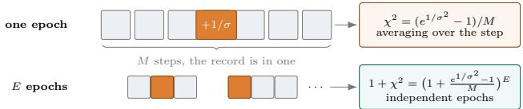
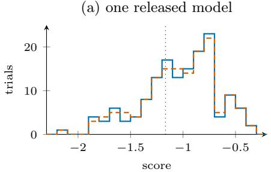
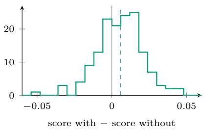
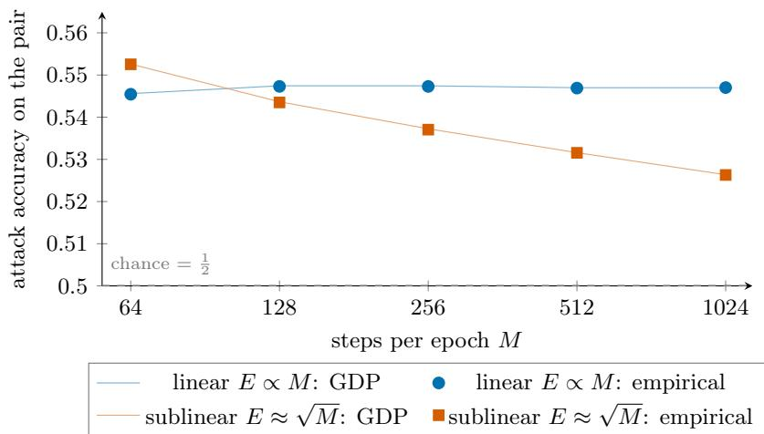

# Closed-Form Noise Calibration Against Membership Inference for Random-Allocation DP-SGD

Murat Bilgehan Ertan∗ CWI Amsterdam

Marten van Dijk∗ CWI Amsterdam

## Abstract

DP-SGD protects training data by adding Gaussian noise to clipped gradients. The amount of noise is usually chosen by running a numerical privacy accountant inside a search. We study DP-SGD with random allocation, where each epoch uses every record once, at a randomly chosen step. For this setting we give a one-line formula that bounds the accuracy of every membership inference attack (MIA) on the trained model. With M steps per epoch, E epochs and noise multiplier σ, and with membership and non-membership equally likely a priori, the attack accuracy is at most ${ \textstyle \frac { 1 } { 2 } } ^ { \sim } + { \textstyle \frac { 1 } { 4 } } \bar { \sqrt { ( 1 + ( e ^ { 1 / \sigma ^ { 2 } } - 1 ) / M ) ^ { E } - 1 } }$ The formula comes from the chi-square divergence between a Gaussian distribution and a Gaussian mixture that dominates random allocation. It is interpretable and gives σ in about a microsecond. Where applicable, our formula needs at most about half the noise of the state-of-the-art closed-form bound. To measure how close the bound is, we also derive an exact expression for the attack accuracy of these two distributions and evaluate it numerically. Calibrating to this exact expression requires 13.0% to 20.2% less noise than the formula in our main experiments, and since it is exact, no accountant that knows only M, E and σ can certify a smaller σ. In training, the resulting σ outperforms the formula and matches a published accountant in test accuracy. It is found in seconds and certified in minutes, whereas every search we ran with that accountant took longer or returned at least 0.62% more noise. We show that MIAs on the trained models stay below the bound.1

## 1 INTRODUCTION

DP-SGD trains a model on private data by clipping each record’s gradient and adding Gaussian noise to every update (Abadi et al., 2016). Its privacy analysis depends on how records are grouped into minibatches. Most analyses assume Poisson subsampling, where each record joins each minibatch independently. Training loops commonly use every record once per epoch instead (Chua et al., 2024a,b). Random allocation, also called balls-and-bins sampling, keeps this property. In every epoch each record is sent to one of the M steps, uniformly and independently, so the minibatch sizes vary (Chua et al., 2025; Shenfeld and Feldman, 2025; Dong et al., 2025). Algorithm 1 states the algorithm.

For random allocation, Chua et al. (2025) and Shenfeld and Feldman (2025) reduce one epoch to two distributions built from Gaussian noise. In this reduced form, an epoch without the record is M independent standard Gaussian values, one for each step. With the record, the value of one step, chosen uniformly at random, is also shifted by $1 / \sigma .$ , the clipping norm divided by the noise scale. We write $P _ { M }$ and $Q _ { M }$ for these two distributions and call them the Gaussian pair. Detecting the record from one epoch of training is never easier than telling $Q _ { M }$ from $P _ { M }$

A privacy accountant for random allocation turns this pair into a privacy guarantee for the whole training run. Given M, E and σ, it computes how the privacy loss of the pair adds up over the E epochs and reports a guarantee such as (ε, δ)-diferential privacy (Dwork et al., 2006b,a). Accountants based on Rényi diferential privacy (Mironov, 2017) use the Rényi divergences of $Q _ { M }$ from $P _ { M } .$ , which are known in closed form at integer orders two and higher (Shenfeld and Feldman, 2025; Dong et al., 2025). Accountants based on the privacy loss distribution (Koskela et al., 2020) compute the whole distribution of the privacy loss numerically, and Feldman and Shenfeld (2026) give a numerical accountant for random allocation. An accountant tells how private a given σ is, but choosing σ needs the reverse, the smallest σ that meets a privacy target. The usual approach therefore runs the accountant inside a search over σ. In our experiments, one run of the accountant of Feldman and Shenfeld (2026) with its default route in one direction at the σ it certified for our training took 6.5 minutes to 7.1 hours on one CPU core (Table 5 in Appendix E), and a search repeats such runs. Such a run is slow because its running time grows as the square of the number of grid points (Feldman and Shenfeld, 2026, Theorem 4.3), and certifying a σ close to the smallest one that meets the target needs a fine grid. A search with the accountant’s fast Fourier route (Feldman and Shenfeld, 2026, Appendix F) took only 4.9 to 10.9 minutes, but it certified up to 4.07% more noise than the exact σ, more as M grew. For a detailed comparison and discussion of both routes, see Appendix E. We ask whether this search can be replaced by a formula. It can. We give a formula that bounds the accuracy of every membership inference attack on the trained model, at every M, E and σ, and that gives σ in about a microsecond. We also compute the exact value that the formula bounds. Calibrating to it takes seconds and needs slightly less noise than the σ that accountant certifies. No accountant that knows only M, E and σ can certify a σ below the exact one (Section 2). A finite computation in ball arithmetic certifies in minutes that the exact σ meets the target (Appendix C.5).

We measure privacy by membership inference. An attacker sees the final model of a training run and must decide whether a given record was in the training data. Let P and Q be the probability distributions of the final model without and with the record. Their total variation (TV) distance is

$$
d _ { \mathrm { T V } } ( P , Q ) = \operatorname* { s u p } _ { A } | P ( A ) - Q ( A ) | ,\tag{1}
$$

where A ranges over all events. When both answers are equally likely a priori, the optimal test is correct with probability (Chatzikokolakis et al., 2023; Mahloujifar et al., 2022)

$$
\mathrm { A c c } ^ { * } ( P , Q ) = \frac { 1 } { 2 } + \frac { 1 } { 2 } d _ { \mathrm { T V } } ( P , Q ) .\tag{2}
$$

For any two distributions we call $\operatorname { A c c } ^ { * } ( P , Q )$ their attack accuracy. We write ${ \mathrm { A c c } } ^ { * }$ alone for the distributions of the final model.

Total variation also has a meaning in f-diferential privacy (Dong et al., 2019). The trade-of function $T ( P , Q ) ( \alpha )$ is the smallest type-II error of a test of P against Q with type-I error at most α. Random guessing gives $1 - \alpha$ , and

$$
d _ { \mathrm { T V } } ( P , Q ) = \operatorname* { s u p } _ { 0 \leq \alpha \leq 1 } \left\{ 1 - \alpha - T ( P , Q ) ( \alpha ) \right\}\tag{3}
$$

is the largest gap between the two curves (Appendix A). So $d _ { \mathrm { T V } } \leq \lambda$ means $T ( P , Q ) ( \alpha ) \geq 1 - \lambda - \alpha$ for every α. Ertan and van Dijk (2026) call the largest distance of the curve from the random-guessing line its separation, which is $d _ { \mathrm { T V } } / \sqrt { 2 }$ . Theorem 3.3 bounds the total variation of the Gaussian pair from above at every σ, and Theorem 4.1 gives it exactly.

  
Figure 1: The record is in one of the M steps of each epoch, chosen uniformly at random, so averaging over the step divides the chi-square divergence by M, and $1 + \chi ^ { 2 }$ multiplies over the independent epochs.

Our starting point is the chi-square divergence

$$
\chi ^ { 2 } ( Q \| P ) = \mathbb { E } _ { P } \bigg ( \frac { \mathrm { d } Q } { \mathrm { d } P } - 1 \bigg ) ^ { 2 } ,\tag{4}
$$

which bounds total variation by $\begin{array} { r l } { d _ { \mathrm { T V } } ( P , Q ) } & { { } \leq } \end{array}$ ${ \scriptstyle { \frac { 1 } { 2 } } } \sqrt { \chi ^ { 2 } ( Q \| P ) }$ (Sason and Verdú, 2016). For the Gaussian pair it is exactly $( e ^ { 1 / \sigma ^ { 2 } } - 1 ) / M$ (Proposition 3.1). Since the allocation is redrawn every epoch, the reference pair for E epochs is the product pair $( { \cal P } _ { M } ^ { \otimes E } , { \cal Q } _ { M } ^ { \otimes E } )$ and $\bar { 1 } + \chi ^ { 2 }$ multiplies over epochs (Figure 1). By a known reduction, DP-SGD with random allocation is never easier to attack than this product pair (Section 2). We show that for every M, E and $\sigma ,$ the final model of DP-SGD with random allocation satisfies

$$
\operatorname { A c c } ^ { * } \leq \frac { 1 } { 2 } + \frac { 1 } { 4 } \sqrt { \left( 1 + \frac { e ^ { 1 / \sigma ^ { 2 } } - 1 } { M } \right) ^ { E } - 1 } .\tag{5}
$$

Every quantity on the right is set before training, so the inequality can be solved for $\sigma .$ . Figure 1 shows where the division by M and the power E come from.

## Contributions.

1. A closed-form bound and noise multiplier (Theorem 3.3). We derive the bound (5) from the known chi-square divergence of one epoch and solve the bound for $\sigma$ in closed form (Corollary 3.4). Both hold at every finite M and E, and the noise multiplier takes about a microsecond to compute, while a search over σ takes seconds to hours.

2. The exact total variation at every E (Theorem 4.1). The bound (5) uses only the second moment of the likelihood ratio, which multiplies over the epochs. We derive the exact total variation as an integral of the moments of complex order ${ \frac { 1 } { 2 } } +$ iu of the likelihood ratio, which multiply over the epochs in the same way, and we reduce the moment of one epoch to a one-dimensional integral (Theorem 4.1).

We find the smallest σ that meets a target by a root search on this total variation and call it the exact $\sigma _ { : }$ , the least noise that any accountant that knows only M, E and σ can certify. We prove that at fixed σ the total-variation bound of Theorem 3.3 divided by the exact value tends to $\sqrt { \pi / 2 }$ as M grows with $E / M \to 0 .$ On nine singleepoch targets the closed-form σ of Corollary 3.4 needs 7.4% to 16.7% more noise than the exact σ.

3. The limit at fixed noise (Theorem 3.5). We prove that, as $M \to \infty$ with $E / M \to r <$ ∞ and σ fixed, the trade-of curve of the pair converges to Gaussian diferential privacy with $\mu = \sqrt { r ( e ^ { 1 / \sigma ^ { 2 } } - 1 ) }$ van Dijk and Ertan (2026, Theorem 4.2) show that in this limit the curve is asymptotically at least that of Gaussian diferential privacy with the same $\mu ,$ so that $E = o ( M )$ sufices for the curve to approach random guessing, and we show that $E = o ( M )$ is also necessary.

4. Training and membership inference attacks (Section 5). We train ResNet-18 on CIFAR-10, a linear classifier on CIFAR-100 and RoBERTa-base on SST-2 and AG News. We show that the exact σ gives the mean test or validation accuracy of the σ of the accountant of Feldman and Shenfeld (2026) to within 0.06 points, and that it is found in about ten seconds on one CPU core and certified to meet the target in minutes. Over the closed-form σ of Corollary 3.4, the exact σ raises the mean test or validation accuracy of every model, by 0.43 to 2.38 points. We also show empirically that none of our membership inference attacks has an attack accuracy above our bound (5). On a linear model the optimal attack almost reaches the exact attack accuracy of the Gaussian pair, while attacks on ResNet-18 stay close to random guessing.

Organization. Section 2 sets up the training algorithm, the membership test and the Gaussian pair. Section 3 derives the closed-form bound and its noise multiplier, and Section 4 computes the exact total variation. Section 5 reports the experiments, and Section 6 discusses related work and limitations.

## 2 SETTING

We now describe the training algorithm and the membership test, and we show that no membership test on the released model has a higher attack accuracy than the optimal test on a Gaussian pair, so Sections 3 and 4 study only this pair.

The training algorithm. Algorithm 1 is the algorithm we analyze, DP-SGD with random allocation.

Algorithm 1 DP-SGD with random allocation   
Require: dataset D with $| D | \quad \leq \quad N _ { 0 } ,$ public   
$N _ { 0 } , M , E , \sigma , C$ and $B _ { 0 } = N _ { 0 } / M ,$ , an optimizer, an   
initial model w   
1: pad D with $N _ { 0 } - | D |$ ghost records $\perp$ and put the   
$N _ { 0 }$ records in uniformly random order   
2: for $e = 1 , \ldots , E$ do   
3: assign each index $i \in \{ 1 , \ldots , N _ { 0 } \}$ to a step in   
$\{ 1 , \dots , M \}$ , uniformly and independently   
4: for $m = 1 , \ldots , M$ do   
5: $S  \textstyle \sum _ { x }$ in step m $\mathrm { c l i p } _ { C } ( \nabla \ell ( w ; x ) )$   
6: $S \gets ( S + N ( \bar { 0 } , \sigma ^ { 2 } C ^ { 2 } I ) ) / B _ { 0 }$ ▷ also if step   
m has no genuine record   
7: w ← optimizer update of w with S   
8: end for   
9: end for   
10: return w

A record is the unit that is added or removed. We use the zero-out adjacency (Chua et al., 2024a, 2025), and we pad the dataset to a public size $N _ { 0 }$ with ghost records ⊥, whose gradient is zero. The $N _ { 0 }$ records are put in a uniformly random order, which gives each record an index in $\{ 1 , \ldots , N _ { 0 } \}$ (line 1). In every epoch each index is assigned to one of the M steps, uniformly and independently (line 3). At each step the gradients of the records assigned to it are clipped one by one, $\mathrm { c l i p } _ { C } ( v ) = v / \operatorname* { m a x } \{ 1 , \lVert v \rVert / C \}$ , and summed (line 5). Gaussian noise ${ \cal N } ( 0 , \sigma ^ { 2 } C ^ { 2 } I )$ is added, and the result is divided by the public expected batch size $B _ { 0 } = N _ { 0 } / M$ (line 6). A step with no genuine record still adds noise and still updates the model, so every run makes exactly EM updates. Because the divisor $B _ { 0 }$ is public, the scale of the update does not depend on the data (Wang et al., 2026). Only the final model is released (line 10).

The data enter the algorithm only through the records. Everything else is fixed in advance and does not depend on the data. This includes $N _ { 0 } , M , E , \sigma , C ,$ the optimizer with its learning-rate schedule, and the distribution of the initial model. The loss $\ell ( w ; x )$ depends on one record, so layers that mix the records of a step, such as batch normalization, are excluded, and group normalization can be used instead. The loss may use data augmentation. Its randomness, like that of the initial model and of the optimizer, is drawn independently of the data, the indices, the allocation and the noise. The random order, the allocations of all epochs and the noise of all steps are independent of each other, and every step draws fresh noise.

The membership test. Let D be a dataset and $D ^ { + } \ = \ D \cup \{ x _ { \star } \}$ the same dataset with one target record added. The attacker receives the model released by a run on D or on $D ^ { + }$ , each with probability 1/2, and must say which. The optimal test is correct with probability (2), and (3) relates its error to the trade-of function.

The Gaussian pair. Divide each noisy sum by σC. Then the noise is standard Gaussian, and the target’s scaled clipped gradient has length at most $t = 1 / \sigma$ The Gaussian pair of the introduction is

$$
P _ { M } = N ( 0 , I _ { M } ) , \qquad Q _ { M } = \frac { 1 } { M } \sum _ { j = 1 } ^ { M } N ( t e _ { j } , I _ { M } ) ,\tag{6}
$$

where $e _ { j }$ is the jth standard basis vector. With the target, one coordinate is shifted by $t ,$ at a step the attacker does not know. Allocations are redrawn every epoch, so E epochs give the product pair $( P _ { M } ^ { \otimes E } , Q _ { M } ^ { \otimes E } )$

Theorem 3.1 of Chua et al. (2025), a special case of Theorem 3.1 of Shenfeld and Feldman (2025), shows that for one epoch of Algorithm 1 the Gaussian pair dominates the noisy updates, even when each gradient depends on the earlier updates. There exist a model, a loss and an optimizer for which, on every dataset $D$ that does not contain $x _ { \star }$ and has $| D | + 1 \leq N _ { 0 }$ , the model that Algorithm 1 releases has exactly the distribution $P _ { M } ^ { \otimes E }$ on D and $Q _ { M } ^ { \otimes E }$ on $D ^ { + }$ (Appendix B.5). An accountant whose guarantee holds for every run of Algorithm 1 with the same M, E and σ must also cover this run, so for a target λ on the total variation it cannot certify a σ below the exact σ of Theorem 4.1. By Lemma D.4 of Chua et al. (2025), one randomized map turns the pair into the noisy updates under both hypotheses, so at every type-I error no test on the updates has a smaller type-II error than the optimal test on the pair. Adaptive composition (Zhu et al., 2022, Theorem 10), Lemma D.4 of Chua et al. (2025) applied once more to the composed pair, and post-processing (Appendix A) extend this to the model released after E epochs, so for every dataset D with $| D | + 1 \leq N _ { 0 }$ and $D ^ { + } = D \cup \{ x _ { \star } \}$ , the probability distributions $P _ { \mathrm { o u t } }$ and $Q _ { \mathrm { o u t } }$ of the model released on D and on $D ^ { + }$ satisfy

$$
\begin{array} { r l } & { d _ { \mathrm { T V } } ( P _ { \mathrm { o u t } } , Q _ { \mathrm { o u t } } ) \leq d _ { \mathrm { T V } } ( P _ { M } ^ { \otimes E } , Q _ { M } ^ { \otimes E } ) , } \\ & { ~ T ( P _ { \mathrm { o u t } } , Q _ { \mathrm { o u t } } ) \geq T ( P _ { M } ^ { \otimes E } , Q _ { M } ^ { \otimes E } ) . } \end{array}\tag{7}
$$

## 3 THE CLOSED-FORM BOUND

We now bound the total variation of the Gaussian pair through its chi-square divergence and solve the bound for σ. The chi-square divergence has a closed form, because averaging over the M steps divides it by M and the E epochs are independent. Throughout the paper we defer all proofs to the appendix.

Under $P _ { M }$ the coordinates $X _ { 1 } , \ldots , X _ { M }$ are independent standard Gaussians, and the likelihood ratio of (6) is

the average

$$
L _ { M } = \frac { \mathrm { d } Q _ { M } } { \mathrm { d } P _ { M } } = \frac { 1 } { M } \sum _ { j = 1 } ^ { M } Y _ { j } , \qquad Y _ { j } = \exp \left( t X _ { j } - \frac { t ^ { 2 } } { 2 } \right) .\tag{8}
$$

Given the step $j ,$ only coordinate $j$ changes, and its density ratio is $Y _ { j }$ . Each $Y _ { j }$ has mean 1 and variance ${ e ^ { t ^ { 2 } } } - 1$ , a standard integral that Proposition D.2 of van Dijk and Ertan (2026) also computes. Since $L _ { M }$ has mean 1, the chi-square divergence is the variance of $L _ { M }$ Averaging M independent copies divides the variance by M, which proves the following (Appendix B.1).

$$
\begin{array} { r l } & { \mathrm { { \bf ~ P r o p o s i t i o n ~ 3 . 1 ~ ( O n e ~ e p o c h ) . } } { \cal F } \mathrm { { \it o r ~ t h e ~ p a i r } } } \\ & { \chi ^ { 2 } ( Q _ { M } \| P _ { M } ) = \mathbb { E } _ { P _ { M } } ( L _ { M } - 1 ) ^ { 2 } = ( e ^ { 1 / \sigma ^ { 2 } } - 1 ) / M . } \end{array}\tag{6),}
$$

This value follows from the order-two Rényi divergence $D _ { 2 } ( Q _ { M } \Vert P _ { M } ) = \ln \mathbb { E } _ { P _ { M } } L _ { M } ^ { 2 }$ of random allocation (Shenfeld and Feldman, 2025; Dong et al., 2025), since $\dot { \chi } ^ { 2 } = e ^ { D _ { 2 } } - 1$ . Liew and Takahashi (2022) computed the same divergence as the Rényi divergence of the shufle Gaussian mechanism. For product distributions Rényi divergence adds (van Erven and Harremoës, 2014, Theorem 28), so $1 + \chi ^ { \dot { 2 } }$ multiplies over epochs and

$$
1 + \chi ^ { 2 } ( Q _ { M } ^ { \otimes E } | | P _ { M } ^ { \otimes E } ) = \left( 1 + \frac { e ^ { 1 / \sigma ^ { 2 } } - 1 } { M } \right) ^ { E } = : 1 + c _ { E } .\tag{9}
$$

The chi-square divergence does not determine the total variation, but it bounds it.

Remark 3.2 (From chi-square to total variation). For any pair with $\chi ^ { 2 } ( Q \| P ) \overset { \cdot } { = } c$ (Sason and Verdú, 2016, Eq. (7)),

$$
\begin{array} { r } { d _ { \mathrm { T V } } ( P , Q ) \leq U ( c ) : = \left\{ \frac { \frac { 1 } { 2 } \sqrt { c } , \quad 0 \leq c \leq 1 , } { \frac { c } { 1 + c } , \quad c \geq 1 . } \right. } \end{array}\tag{10}
$$

Both branches are attained by distributions on two points, so no bound that depends only on c can be smaller (Appendix B.2).

Theorem 3.3 (Closed-form bound). For all integers $M , E \ge 1$ and every $\sigma > 0$ , with $c _ { E }$ as in (9),

$$
\begin{array} { c } { { d _ { \mathrm { T V } } ( P _ { M } ^ { \otimes E } , Q _ { M } ^ { \otimes E } ) \leq U ( c _ { E } ) , } } \\ { { \mathrm { A c c } ^ { * } ( P _ { M } ^ { \otimes E } , Q _ { M } ^ { \otimes E } ) \leq \displaystyle \frac { 1 } { 2 } + \frac { 1 } { 2 } U ( c _ { E } ) . } } \end{array}\tag{11}
$$

Proposition 3.1, (9) and (10) give the theorem. Since $U ( c ) ~ \leq ~ { \textstyle { \frac { 1 } { 2 } } } { \sqrt { c } }$ for every c, the theorem and (7) give the bound (5) for training runs. To see the size of $c _ { E }$ , put $x = E ( e ^ { 1 / \sigma ^ { 2 } } - 1 ) / M .$ . Then $x \leq c _ { E } \leq e ^ { x } - 1$ (Appendix B.2), so $c _ { E }$ is close to x when x is small.

Because U increases with c and $c _ { E }$ decreases as σ grows, the bound can be solved for $\sigma .$

Corollary 3.4 (Noise multiplier for a target total variation). Let $\lambda \in ( 0 , 1 )$ be a target for dTV, and let $c _ { \lambda } = 4 \lambda ^ { 2 } ~ i f \lambda \le 1 / 2$ and $c _ { \lambda } = \lambda / ( 1 - \lambda ) \ i f \lambda > 1 / 2$ , so that $U ( c _ { \lambda } ) = \lambda$ . The noise multiplier

$$
\sigma ( M , E , \lambda ) = \left[ \ln \left\{ 1 + M \left( ( 1 + c _ { \lambda } ) ^ { 1 / E } - 1 \right) \right\} \right] ^ { - 1 / 2 }\tag{12}
$$

gives $c _ { E } = c _ { \lambda }$ , hence $d _ { \mathrm { T V } } ( P _ { M } ^ { \otimes E } , Q _ { M } ^ { \otimes E } ) \leq \lambda$ , and $\operatorname { A c c } ^ { * } \leq$ $\textstyle { \frac { 1 } { 2 } } + { \frac { \lambda } { 2 } } \ f o r$ the final model of Algorithm 1 by (7).

All targets in our experiments are at most 0.4, so only the first branch of U is used. The same equation can also be solved for E or for M.

To read (12), take one epoch and a fixed target $\lambda < 1 / 2$ Then $\sigma = [ \ln ( 1 + 4 \lambda ^ { 2 } \bar { M } ) ] ^ { - 1 / 2 } = ( 1 + o ( 1 ) ) / \sqrt { \ln M }$ as M grows. The proof of Theorem 6.1 of Ertan and van Dijk (2026), which is stated for one-epoch shufling and applies to the same Gaussian pair, shows that for $M \geq$ 2 the pair has $\begin{array} { r } { d _ { \mathrm { T V } } ( P _ { M } , Q _ { M } ) \geq \frac { 1 } { 2 } ( 1 - 1 / \sqrt { 4 \pi \ln M } ) ( 1 - } \end{array}$ $O ( 1 / M ) )$ unless $\sigma \geq 1 / \sqrt { 2 }$ ln M. This lower bound tends to $\frac { 1 } { 2 }$ as M grows, and $\begin{array} { r } { \lambda < \frac { 1 } { 2 } . } \end{array}$ , so every $\sigma \mathrm { ~ < ~ }$ $1 / \sqrt { 2 \ln M }$ leaves $d _ { \mathrm { T V } } ( P _ { M } , Q _ { M } )$ above λ for large M. Hence for large M the smallest σ that meets the target is at least 1/ 2 ln M, and the closed form is at most $\sqrt { 2 } ( 1 + o ( 1 ) )$ times this smallest σ.

The limit at fixed noise. The bound depends on M and E only through $c _ { E } ,$ and at fixed $\sigma , c _ { E }  0$ exactly when $E / M \to 0$ The next theorem shows that the exact total variation behaves in the same way, and it finds the limit when E grows in proportion to M. Write Φ for the standard normal distribution function and $G _ { \mu } ( \alpha ) = \Phi ( \Phi ^ { - 1 } ( 1 - \alpha ) - \mu )$ for the trade-of function of $N ( 0 , 1 )$ against $N ( \mu , 1 )$ . It defines Gaussian diferential privacy (GDP) (Dong et al., 2019).

Theorem 3.5 (Gaussian diferential privacy limit). Fix $\sigma > 0$ and let $M \to \infty$ . Let $E _ { M }$ be positive integers with $E _ { M } / M \to r \ f o r$ some $r \in [ 0 , \infty )$ . Put $\mu = \sqrt { r ( e ^ { 1 / \sigma ^ { 2 } } - 1 ) }$ . Then

$$
\operatorname * { s u p } _ { \alpha \in [ 0 , 1 ] } \left| T ( P _ { M } ^ { \otimes E _ { M } } , Q _ { M } ^ { \otimes E _ { M } } ) ( \alpha ) - G _ { \mu } ( \alpha ) \right| \longrightarrow 0 .\tag{13}
$$

Hence Ac $\mathrm { c } ^ { * } ( P _ { M } ^ { \otimes E _ { M } } , Q _ { M } ^ { \otimes E _ { M } } ) \to \Phi ( \mu / 2 )$ . For any sequence $E _ { M }$ , the total variation tends to 0 if and only $i f E _ { M } / M \to 0$

The proof applies a central limit theorem to the log-likelihood ratio summed over the epochs $( \mathrm { A p \mathrm { - } }$ pendix B.3). The parameter $\mu$ of the limit is the one Bu et al. (2019) found for Poisson subsampling. For the same pair, van Dijk and Ertan (2026, Theorem 4.2) prove that the curve is asymptotically at least $G _ { \mu } ,$ which is one half of the limit. Figure 3 in Appendix F checks the limit by Monte Carlo sampling at M as small as 64. Setting the limit $\Phi ( \mu / 2 )$ equal to $\begin{array} { r } { \frac { 1 } { 2 } + \frac { \lambda } { 2 } } \end{array}$ with $r = E / M$ gives a second one-line noise multiplier, but a limit is not a bound, so unlike the closed form of Corollary 3.4, the second multiplier carries no guarantee at finite M and $E \ ( \mathrm { A p p e n d i x \ B . 3 } )$

When $E _ { M } / M \ \to \ 0 .$ , the exact total variation and the bound both tend to zero at the same rate. Put $s _ { M } = \sqrt { E _ { M } ( e ^ { 1 / \sigma ^ { 2 } } - 1 ) / M }$ . The exact total variation is $s _ { M } ( 1 + o ( 1 ) ) / \sqrt { 2 \pi }$ , and the bound of Theorem 3.3 is $s _ { M } ( 1 + o ( 1 ) ) / 2$ (Appendix C.6). The constant $\sqrt { 2 \pi }$ comes from the Gaussian limit. For small $s ,$ the total variation between $N ( 0 , 1 )$ and $N ( s , 1 )$ is $2 \Phi ( s / 2 ) - 1 = s / \sqrt { 2 \pi } + O ( s ^ { 3 } )$ , because the standard normal density at zero is $1 / { \sqrt { 2 \pi } }$ . So the closed form depends on M, E and σ in the same way as the exact value, and it is larger by a factor that tends to $\sqrt { \pi / 2 } \approx 1 . 2 5 3 3$ . Section 4 computes this factor at finite sizes.

## 4 THE EXACT TOTAL VARIATION

We now compute the total variation of the Gaussian pair exactly, to measure how much extra noise the closed form needs and to find the smallest σ that meets a target. The bound of Theorem 3.3 uses only the second moment of the likelihood ratio. The exact total variation depends on its whole distribution. For random allocation it can still be written with one-dimensional integrals, because the likelihood ratio is a product of independent factors, one for each epoch, and each factor is an average of independent terms, one for each step. These integrals are evaluated by computer.

Let $\varphi _ { Y } ( u ) = \mathbb { E } e ^ { \mathrm { i } u Y }$ be the characteristic function of the lognormal variable $Y = e ^ { t X - t ^ { 2 } / 2 } , X \sim N ( 0 , 1 )$ , and write ℜ for the real part of a complex number. In one epoch, (8) gives $L _ { M } - 1 = Z / M$ with $\begin{array} { r } { Z = \sum _ { j = 1 } ^ { M } ( Y _ { j } - 1 ) } \end{array}$ The M terms $Y _ { j } - 1$ are independent, and each has characteristic function $\mathbb { E } e ^ { \mathrm { i } v ( Y _ { j } - \bar { 1 } ) } = e ^ { - \mathrm { i } v } \varphi _ { Y } ( v )$ . Over E epochs there are E independent copies $L _ { M , 1 } , \dots , L _ { M , E }$ of $L _ { M } .$ , one for each epoch, and the likelihood ratio is their product $\Lambda = L _ { M , 1 } \cdot \cdot \cdot L _ { M , E }$ . For complex q with $0 \leq \Re q \leq 1$ we call $F _ { M } ( q ) = \mathbb { E } _ { P _ { M } } L _ { M } ^ { q }$ the one-epoch factor. The characteristic function of a sum of independent terms is the product of theirs, and the moment of a product of independent factors is the product of their moments, so

$$
\varphi _ { Z } ( v ) = \bigl ( e ^ { - \mathrm { i } v } \varphi _ { Y } ( v ) \bigr ) ^ { M } , \qquad \mathbb { E } \Lambda ^ { q } = F _ { M } ( q ) ^ { E } .
$$

Theorem 4.1 (Exact TV). For every $E \geq 1$

$$
d _ { \mathrm { T V } } ( P _ { M } ^ { \otimes E } , Q _ { M } ^ { \otimes E } ) = \frac { 1 } { \pi } \int _ { 0 } ^ { \infty } \frac { 1 - \Re \big [ F _ { M } ( \frac { 1 } { 2 } + \mathrm { i } u ) ^ { E } \big ] } { u ^ { 2 } + \frac { 1 } { 4 } } \mathrm { d } u ,\tag{14}
$$

and for $0 < \Re q < 1$ the one-epoch factor is

$$
F _ { M } ( q ) = 1 + \frac { q e ^ { \mathrm { i } \pi q / 2 } } { \Gamma ( 1 - q ) } \int _ { 0 } ^ { \infty } s ^ { - q - 1 } e ^ { \mathrm { i } s } \bigl ( 1 - \varphi _ { Z } ( s / M ) \bigr ) \mathrm { d } s\tag{15}
$$

For $E = 1$ the total variation is also

$$
d _ { \mathrm { T V } } ( P _ { M } , Q _ { M } ) = \frac { 1 } { \pi M } \int _ { 0 } ^ { \infty } \frac { 1 - \Re \varphi _ { Z } ( u ) } { u ^ { 2 } } \mathrm { d } u .\tag{16}
$$

All three integrals converge absolutely, and the integrand of (14) is nonnegative.

Formula (14) needs only the one-epoch factor $F _ { M }$ raised to the power E, one for each epoch. The accountant of Zhu et al. (2022) composes steps in the same way, with powers of the characteristic function of the privacy loss. Formula (15) computes $F _ { M }$ from the characteristic function of Y raised to the power $M ,$ one factor for each step. Appendix C gives the proofs.

Comparison with the closed form. We evaluate the total variation numerically, in a few seconds per value (Appendix C.4 gives the method and its checks). At one epoch, over ten settings with $\sigma \in \{ 1 . 5 , 2 \}$ and M from 4,096 to 1,048,576, the ratio of the closed-form bound to the exact total variation lies between 1.253314 and 1.253413 and decreases as M grows, toward its limit ${ \sqrt { \pi / 2 } } = 1 . 2 5 3 3 1 4 . .$ . as $E / M \to 0$ . With several epochs the ratio grows with the target. On the 27 configurations of Table 11 in Appendix F, it is about 1.27 at $\lambda = 0 . 1 0$ and between 1.41 and 1.53 at $\lambda =$ 0.35. At a fixed $c _ { E }$ , a small enough σ makes the exact distance much smaller than the bound (Appendix D).

We call the smallest σ whose exact total variation is at most a target λ the exact σ. Finding it needs a search over σ, which repeats this evaluation many times.

## 5 EXPERIMENTS

We compare the closed form with the exact value and with other ways of setting σ (Section 5.1), train four models at each σ to measure what the extra noise of the closed form costs (Section 5.2), and run membership inference attacks on the trained models (Section 5.3).

## 5.1 Noise and cost of calibration

We compare ways of setting σ for a target λ at one epoch on nine targets (see Appendix F for the full comparison.) A target λ caps the attack accuracy of every membership inference attack at $\frac { 1 } { 2 } + \frac { \lambda } { 2 }$ , for example at 0.55 for $\lambda = 0 . 1 0$ . The closed form takes about a microsecond and needs 7.4% to 16.7% more noise than the exact $\sigma ,$ which is well defined (Appendix C.4) and which a root search on (16) finds in 0.27 to 42 seconds. Theorem 4.3 of Shenfeld and Feldman (2025), which we call FS, bounds random allocation through Poisson subsampling at an auxiliary rate q. At $q = 1 / M$ it needs 9.0% to 34.3% more noise than the exact σ. A smaller q brings its bound closer to the exact value, but the bound then needs the total variation of a Poisson pair computed more precisely. The closed form of van Dijk and Ertan (2026) needs 128% to 267% more noise where it applies (Appendix F).

## 5.2 What the extra noise costs in training

We set σ for the target $\lambda = 0 . 1 0$ in three ways and train with each. A root search finds the exact σ, rounded up to a multiple of $1 0 ^ { - 6 }$ , in 8.8 to 10.4 seconds on one CPU core, and a finite computation in ball arithmetic certifies in another 70 to 670 seconds that this σ meets the target (Appendix C.5). The accountant of Feldman and Shenfeld (2026) certifies a σ when its upper bound on the total variation is at most $\lambda ,$ and proves that a σ misses the target when its lower bound exceeds λ. With its default route the accountant certified a $\sigma \ : 0 . 2 4 \%$ to 0.52% above the exact one, and one run in one direction at that $\sigma ,$ with no search, took 6.5 minutes to 7.1 hours on one CPU core. The accountant’s fast Fourier route searched in 4.9 to 10.9 minutes but certified 0.26% to 4.07% more noise than the exact $\sigma ,$ and Appendix E compares both routes in detail. The closed form needs 14.9% to 25.3% more noise than the exact $\sigma ,$ and at its σ the exact total variation is only 0.0787 to 0.0789, about 79% of λ (Table 11 in Appendix F). At $\delta = 1 0 ^ { - 5 }$ the exact σ gives ε between 0.939 and 1.022 (Table 6 in Appendix E). The exact $\sigma$ of Theorem 4.1 is therefore the smallest of the three. No accountant that knows only M, E and $\sigma$ can certify a σ below the exact σ before rounding. All three are certified to meet the target, the closed form by Corollary 3.4, the accountant’s σ by its upper bound, and the exact σ by ball arithmetic.

All training uses Algorithm 1. ResNet-18 (He et al., 2016) with group normalization (Wu and He, 2018) is trained from scratch on CIFAR-10 (Krizhevsky, 2009), a linear classifier is trained on frozen ResNet-50 features of CIFAR-100, and RoBERTa-base (Liu et al., 2019) is fine-tuned in full on SST-2 (Socher et al., 2013) and on AG News (Zhang et al., 2015). The two image models use the nine cells $M \in \{ 1 0 0 , 2 5 0 , 5 0 0 \}$ 2 $E \in$ {10, 20, 40}, and the two RoBERTa-base models use $M \in \{ 1 0 0 , 2 5 0 , 5 0 0 \}$ at $E = 2 0$ . Each model uses three seeds and one recipe, chosen in advance on public data, and the three runs of a cell and seed difer only in σ. Table 1 gives the mean over the cells and seeds of each model, and Table 9 in Appendix E lists every cell.

The exact σ raises the mean test accuracy over the closed form by 1.08 points on CIFAR-10, by 2.38 points for the linear classifier on CIFAR-100 and by 0.43 points on AG News, and the validation accuracy on SST-2 by 1.58 points. The gain is positive in each of the 24 cells of the four models, and it persists at the targets $\lambda \in \{ 0 . 0 1 , 0 . 0 5 , 0 . 2 0 \}$ (Tables 8 and 9 in Appendix E). Training at the exact σ and at the accountant’s σ gives mean test or validation accuracies within 0.06 points of each other, as expected for noise levels at most 0.52% apart. So the exact σ of Theorem 4.1 gives the training result of the accountant’s σ, and it is found in seconds and certified in minutes, whereas each search with the accountant in our experiments took longer or certified at least 0.62% more noise.

Table 1: Noise and time of three ways of setting σ for the target $\lambda = 0 . 1 0 .$ , and the test accuracy of training with each. Closed form is Corollary 3.4, exact is Theorem 4.1, and accountant is that of Feldman and Shenfeld (2026) with its default route. Noise and time are ranges over the nine cells $M \in \{ 1 0 0 , 2 5 0 , 5 0 0 \}$ $E \in \{ 1 0 , 2 0 , 4 0 \}$ , with find the time to find $\sigma , \ c e r t i f y$ the time to certify that a given σ meets the target, and find and $c e r t i f y$ the time for both, on one CPU core. The closed form needs no run to certify, and exact is certified as in Appendix C.5. The accountant’s search runs the accountant at each σ it tries and certifies the σ it returns, so it has no separate find time. The search ran with no limit on threads, and the accountant’s $c e r t i f y$ is the runs at the returned σ, in one direction, until one certified it. Under training, the first three rows $\mathrm { g i v e }$ the mean test accuracy in percent (validation accuracy for SST-2), and the last two rows give diferences in points.
<table><tr><td rowspan="3"></td><td colspan="4">setting σ</td><td colspan="4">training</td></tr><tr><td>noise</td><td></td><td></td><td>find and</td><td></td><td>linear</td><td></td><td></td></tr><tr><td>above exact</td><td>fnd</td><td> $c e r t i f y$ </td><td>certify</td><td> $\mathrm { C I F A R – 1 0 }$ </td><td> $\mathrm { C I F A R  – 1 0 0 }$ </td><td>SST-2</td><td>AG News</td></tr><tr><td>closed form 14.9–25.3%</td><td></td><td> $0 . 7 \mathrm { - } 1 . 5 \mu \mathrm { s }$ </td><td>none</td><td>0.7–1.5 µs</td><td> $3 9 . 6 8 \pm 0 . 2 6$ </td><td> $5 3 . 5 8 \pm 0 . 1 1$ </td><td> $8 5 . 8 9 \pm 0 . 8 7$ </td><td> $8 9 . 6 1 \pm 0 . 1 4$ </td></tr><tr><td>exact</td><td>0</td><td>8.8-10.4 s</td><td>70–670 s</td><td>79–680 s</td><td> $4 0 . 7 5 \pm 0 . 3 7$ </td><td> $5 5 . 9 6 \pm 0 . 1 5$ </td><td> $8 7 . 4 7 \pm 0 . 5 2$ </td><td> $9 0 . 0 5 \pm 0 . 1 7$ </td></tr><tr><td>accountant 0.24–0.52%</td><td></td><td></td><td> $6 . 5 \mathrm { m } \mathrm { - } 7 . 1 $ </td><td>h 5.5–249 h</td><td> $4 0 . 7 6 \pm 0 . 3 0$ </td><td> $5 5 . 9 1 \pm 0 . 1 5$ </td><td> $8 7 . 4 7 \pm 0 . 5 9$ </td><td> $9 0 . 0 4 \pm 0 . 1 7$ </td></tr><tr><td>exact minus closed form</td><td></td><td></td><td></td><td></td><td>+1.08</td><td> $+ 2 . 3 8$ </td><td> $+ 1 . 5 8$ </td><td>+0.43</td></tr><tr><td>exact minus accountant</td><td></td><td></td><td></td><td></td><td>0.00</td><td>+0.05</td><td>0.00</td><td>+0.01</td></tr></table>

## 5.3 Membership inference attacks (MIA)

We run MIA on two models, with the membership test of Section 2. By (7) no attack has a higher attack accuracy than the Gaussian pair, whose attack accuracy is at most the bound. Table 2 collects the results.

ResNet-18 on CIFAR-10. Each trial trains two ResNet-18 models at M = 100, E = 10 and $\lambda = 0 . 1 0 .$ so $\sigma = 1 . 7 3 7$ and the bound is 0.55. The two runs difer only in one target record and share all other randomness. The target is a CIFAR-10 test image of a cat relabeled as a deer, a mislabeled record of the kind used as a canary in privacy audits (Nasr et al., 2023). The score is the margin between the model’s logit for the target’s assigned label and its largest other logit (Carlini et al., 2022). We chose this score and its threshold on 8 separate pilot trials, from seven candidates, and then applied them once to 150 new trials. The balanced accuracy of the attack, the average of its fraction of correct answers on the 150 models trained with the target and on the 150 trained without it, is 0.513, well below the bound of

0.55 and below 0.539, the attack accuracy of the pair itself. A one-sided 97.5% confidence bound puts it at most 0.534. The attack stays near chance because the standard deviation of the score across trials is 62 times the average change that adding the record causes.

A second attack gives the same picture. Its target is a ClipBKD canary (Jagielski et al., 2020), its score is the logit-scaled confidence (Carlini et al., 2022) averaged over six views, and its balanced accuracy is $0 . 5 1 0 \pm 0 . 0 0 6$ , again below 0.539 and 0.55. Appendix E describes both attacks in detail.

A linear model with a known optimal attack. Both attacks on ResNet-18 stay well below the Gaussian pair, so they leave open whether any attack on a trained model can come close to the pair. We now show that an attack can come close, on a linear model whose optimal attack is known in closed form. As in the linear-loss analysis of Nasr et al. (2025, Theorem 1), which treats Poisson subsampling, the gradient of the target is the same at every model, and only the coordinate of the released model along it depends on the target. Here the model is a vector $w \in \mathbb { R } ^ { 1 6 }$ with loss $- \langle w , x \rangle$ , trained by plain SGD from $w = 0$ with learning rate $B _ { 0 }$ . Twelve records have all features zero, so their clipped gradients are zero. The target has features 2Cxˆ for a fixed unit vector xˆ, so its gradient is clipped $\mathrm { t o } ~ - C \hat { x }$ at every model. The released model is then the sum of the target’s contributions and all the noise, and with $\mu =$ $\sqrt { E / M } / \sigma$ the optimal test is correct with probability $\Phi ( \mu / 2 )$ under each hypothesis (Appendix E). We take $N _ { 0 } = 1 6 .$ M = 128 steps and $E = 1 2 5$ epochs, so most steps hold no genuine record and add only noise.

With 300 trials per setting, the attack reaches 0.533 against a bound of 0.55 at $\lambda = 0 . 1 0 .$ , and 0.613 against

Table 2: Membership inference attacks on trained models, against the closed-form bound and the Gaussian pair. Each trial trains two models that difer only in one target record, and the attacker sees one of them. Bound is $\begin{array} { r } { \frac { 1 } { 2 } + \frac { 1 } { 2 } U ( c _ { E } ) } \end{array}$ of Theorem 3.3, Gaussian pair is the attack accuracy of $( P _ { M } ^ { \otimes E } , Q _ { M } ^ { \otimes E } )$ from Theorem 4.1, and optimal is the attack accuracy $\Phi ( \mu / 2 )$ of the optimal attack on the released linear model, with $\mu = \sqrt { E / M } / \sigma$ for the target 2Cxˆ and $\mu = 0$ for $x _ { \star } = 0 .$ . Measured is the balanced accuracy of our attack with one standard error, over 150 trials for ResNet-18 and 300 for each linear row. Values of σ are rounded to three decimals, and the runs and computed columns use the unrounded values.
<table><tr><td>model</td><td>M</td><td>E</td><td>σ</td><td>bound</td><td>Gaussian pair</td><td>optimal</td><td>measured</td></tr><tr><td>ResNet-18</td><td>100</td><td>10</td><td>1.737</td><td>0.55</td><td>0.5394</td><td></td><td> $0 . 5 1 3 \pm 0 . 0 0 7$ </td></tr><tr><td>ResNet-18, ClipBKD</td><td>100</td><td>10</td><td>1.737</td><td>0.55</td><td>0.5394</td><td></td><td> $0 . 5 1 0 \pm 0 . 0 0 6$ </td></tr><tr><td>linear</td><td>128</td><td>125</td><td>5.039</td><td>0.55</td><td>0.5394</td><td>0.5391</td><td> $0 . 5 3 3 \pm 0 . 0 0 7$ </td></tr><tr><td>linear, exact  $\sigma$ </td><td>128</td><td>125</td><td>3.994</td><td>0.564</td><td>0.5500</td><td>0.5492</td><td> $0 . 5 5 2 \pm 0 . 0 0 9$ </td></tr><tr><td>linear</td><td>128</td><td>125</td><td>1.561</td><td>0.70</td><td>0.6374</td><td>0.6242</td><td> $0 . 6 1 3 \pm 0 . 0 1 2$ </td></tr><tr><td>linear,  $x _ { \star } = 0$ </td><td>128</td><td>125</td><td>1.561</td><td>0.70</td><td>0.6374</td><td>0.5000</td><td> $0 . 5 0 0 \pm 0 . 0 0 0$ </td></tr></table>

0.70 at $\lambda = 0 . 4 0$ , in agreement with the predicted $\Phi ( \mu / 2 )$ of 0.539 and 0.624. At the exact $\sigma = 3 . 9 9 4$ for $\lambda = 0 . 1 0$ , where the Gaussian pair has attack accuracy 0.55, it reaches $0 . 5 5 2 \pm 0 . 0 0 9$ against the predicted 0.549. In every linear row of Table 2 the optimal attack is below the Gaussian pair, which is below the bound, and the measured attack is within one standard error of the optimal one. At the closed-form $\sigma$ for $\lambda = 0 . 1 0$ the optimal test on this model is correct with probability 0.5391, and the optimal test on the pair $\bar { ( }  { P _ { M } ^ { \otimes E } } ,  { Q _ { M } ^ { \otimes E } } )$ itself, computed with Theorem 4.1, with probability 0.5394. So the linear model keeps 99.0% of the pair’s advantage over random guessing, and 90.4% at $\lambda = 0 . 4 0$ , where the two are 0.6242 and 0.6374. Training can therefore come close to the pair. The remaining distance to the bound, from 0.5394 to 0.55, is the gap between the closed form and the exact value.

## 6 RELATED WORK AND LIMITATIONS

Random allocation. Random allocation gives each record a fixed number of participations (Chua et al., 2025; Shenfeld and Feldman, 2025; Dong et al., 2025). Choquette-Choo et al. (2025) use the same sampling for one epoch in matrix mechanisms with correlated noise and compute $( \varepsilon , \delta )$ guarantees by Monte Carlo, and Schuchardt and Kalinin (2026) compute such guarantees without sampling. We study DP-SGD with independent noise and a fresh allocation in every epoch.

Attack-based measures and calibration. Total variation is the optimal advantage $2 \operatorname { A c c } ^ { * } - 1$ (Yeom et al., 2018) of a membership test for one pair of neighboring datasets (Chatzikokolakis et al., 2023). For DP-SGD with Poisson subsampling, Mahloujifar et al. (2022) estimate a bound on this advantage by Monte Carlo, Kulynych et al. (2024) search with an accountant for the σ that meets a target advantage, Cherubin et al. (2024) give closed-form record-inference bounds up to an error term, and van Dijk et al. (2024) choose parameters before training from a closed-form $( \varepsilon , \delta )$ guarantee. Appendix G gives related work in full.

Limitations. Our bound and the exact σ concern the total variation of the pair, which caps the accuracy of every membership test, and we do not obtain an expression for the full trade-of function or the privacy profile. These may be of separate interest when protection against membership inference is needed at small falsepositive rates. Appendix H discusses the limitations, including a chi-square bound at small false-positive rates, groups of records and (ε, δ) guarantees.

## 7 CONCLUSION

For DP-SGD with random allocation, one number, $c _ { E } = ( 1 + ( e ^ { 1 / \sigma ^ { 2 } } - 1 ) / M ) ^ { E } - 1$ , bounds the accuracy of every membership test on the released model, and the bound solves for σ in closed form. At fixed $\sigma$ the totalvariation bound exceeds the exact value by a factor that tends to $\sqrt { \pi / 2 }$ as M grows with $E / M \to 0$ , and on single-epoch targets the closed form needs 7.4% to 16.7% more noise than the exact $\sigma .$ The exact σ is the smallest $\sigma$ that any accountant that knows only M, E and $\sigma$ could certify. It takes seconds to find and minutes to certify. The exact σ gives the mean test or validation accuracy of the accountant’s σ to within 0.06 points. Over the closed form it raised the mean test or validation accuracy of every model by 0.43 to 2.38 points. As $M \to \infty$ with $E / M \to r < \infty$ at fixed σ, the trade-of curve of the pair tends to Gaussian diferential privacy, which is random guessing if and only if $r = 0 .$ . A linear model shows that training can come close to the pair, while an attack on ResNet-18 stays well below the bound.

## AI use statement

In this work, we used generative AI tools (large language models) to formulate mathematical claims, to provide critical ingredients for proofs, to assist in writing and checking proofs, to give feedback on the design of experiments, to implement methods by writing and reviewing the code for experiments, and to help interpret results. We have not used generative AI tools to develop theoretical models or conceptual frameworks or to propose or refine hypotheses, and generating synthetic datasets, translation, cleaning or reformatting datasets and qualitative or thematic data analysis are not applicable to this work. Additionally, we used generative AI tools to draft and edit text, to write code for analysis, figures and tables, and to search and read the literature. We have reviewed all AI-assisted work. The language models wrote the proofs in an iterative process that the authors led. The authors chose which statements to prove, steered each argument toward an approach, pointed out gaps and errors, and reviewed every result. All AI-assisted proofs were checked line by line by the authors. We take responsibility for the final content of this work, including text, claims, or artifacts produced with the aid of generative AI.

## Acknowledgements

The contribution of Marten van Dijk and Murat Bilgehan Ertan to this publication is part of the project CiCS of the research program Gravitation which is (partly) financed by the Dutch Research Council (NWO) under the grant 024.006.037. We acknowledge the use of the DAS-6 HPC cluster at VU Amsterdam (Bal et al., 2016).

## References

Martín Abadi, Andy Chu, Ian J. Goodfellow, H. Brendan McMahan, Ilya Mironov, Kunal Talwar, and Li Zhang. Deep learning with diferential privacy. In Edgar R. Weippl, Stefan Katzenbeisser, Christopher Kruegel, Andrew C. Myers, and Shai Halevi, editors, Proceedings of the 2016 ACM SIGSAC Conference on Computer and Communications Security, Vienna, Austria, October 24-28, 2016, pages 308–318. ACM, 2016. doi: 10.1145/2976749.2978318. URL https://doi.org/10.1145/2976749.2978318.

Henri E. Bal, Dick H. J. Epema, Cees de Laat, Rob van Nieuwpoort, John W. Romein, Frank J. Seinstra, Cees Snoek, and Harry A. G. Wijshof. A mediumscale distributed system for computer science research: Infrastructure for the long term. Computer, 49(5):54–63, 2016. doi: 10.1109/MC.2016.127. URL https://doi.org/10.1109/MC.2016.127.

Borja Balle and Yu-Xiang Wang. Improving the Gaus-

sian mechanism for diferential privacy: Analytical calibration and optimal denoising. In Jennifer G. Dy and Andreas Krause, editors, Proceedings of the 35th International Conference on Machine Learning, ICML 2018, Stockholmsmässan, Stockholm, Sweden, July 10-15, 2018, volume 80 of Proceedings of Machine Learning Research, pages 394–403. PMLR, 2018. URL http://proceedings.mlr.press/v80/ balle18a.html.

Borja Balle, Peter Kairouz, Brendan McMahan, Om Dipakbhai Thakkar, and Abhradeep Thakurta. Privacy amplification via random check-ins. In Hugo Larochelle, Marc’Aurelio Ranzato, Raia Hadsell, Maria-Florina Balcan, and Hsuan-Tien Lin, editors, Advances in Neural Information Processing Systems 33: Annual Conference on Neural Information Processing Systems 2020, NeurIPS 2020, December 6-12, 2020, virtual, 2020. URL https://proceedings.ne urips.cc/paper/2020/hash/313f422ac583444ba 6045cd122653b0e-Abstract.html.

Zhiqi Bu, Jinshuo Dong, Qi Long, and Weijie J. Su. Deep learning with Gaussian diferential privacy. CoRR, abs/1911.11607, 2019. doi: 10.48550/ARXIV .1911.11607. URL https://doi.org/10.48550/a rXiv.1911.11607. Also published in Harvard Data Science Review, 2020.

Nicholas Carlini, Steve Chien, Milad Nasr, Shuang Song, Andreas Terzis, and Florian Tramèr. Membership inference attacks from first principles. In 43rd IEEE Symposium on Security and Privacy, SP 2022, San Francisco, CA, USA, May 22-26, 2022, pages 1897–1914. IEEE, 2022. doi: 10.1109/SP46214.2022 .9833649. URL https://doi.org/10.1109/SP4621 4.2022.9833649.

Douglas G. Chapman and Herbert Robbins. Minimum variance estimation without regularity assumptions. The Annals of Mathematical Statistics, 22(4):581–586, 1951. doi: 10.1214/aoms/1177729548.

Konstantinos Chatzikokolakis, Giovanni Cherubin, Catuscia Palamidessi, and Carmela Troncoso. Bayes security: A not so average metric. In 36th IEEE Computer Security Foundations Symposium, CSF 2023, Dubrovnik, Croatia, July 10-14, 2023, pages 388–406. IEEE, 2023. doi: 10.1109/CSF57540.2023.00011. URL https://doi.org/10.1109/CSF57540.2023. 00011.

Giovanni Cherubin, Boris Köpf, Andrew Paverd, Shruti Tople, Lukas Wutschitz, and Santiago Zanella-Béguelin. Closed-form bounds for DP-SGD against record-level inference attacks. In Davide Balzarotti and Wenyuan Xu, editors, 33rd USENIX Security Symposium, USENIX Security 2024, Philadelphia, PA, USA, August 14-16, 2024. USENIX Association,

2024. URL https://www.usenix.org/conferenc e/usenixsecurity24/presentation/cherubin.

Christopher A. Choquette-Choo, Arun Ganesh, Saminul Haque, Thomas Steinke, and Abhradeep Guha Thakurta. Near-exact privacy amplification for matrix mechanisms. In The Thirteenth International Conference on Learning Representations, ICLR 2025, Singapore, April 24-28, 2025. OpenReview.net, 2025. URL https://openreview.net/forum?id=txV4dNeusx.

Lynn Chua, Badih Ghazi, Pritish Kamath, Ravi Kumar, Pasin Manurangsi, Amer Sinha, and Chiyuan Zhang. How private are DP-SGD implementations? In Ruslan Salakhutdinov, Zico Kolter, Katherine A. Heller, Adrian Weller, Nuria Oliver, Jonathan Scarlett, and Felix Berkenkamp, editors, Forty-first International Conference on Machine Learning, ICML 2024, Vienna, Austria, July 21-27, 2024, volume 235 of Proceedings of Machine Learning Research, pages 8904– 8918. PMLR / OpenReview.net, 2024a. URL https: //proceedings.mlr.press/v235/chua24a.html.

Lynn Chua, Badih Ghazi, Pritish Kamath, Ravi Kumar, Pasin Manurangsi, Amer Sinha, and Chiyuan Zhang. Scalable DP-SGD: Shufling vs. Poisson subsampling. In Amir Globersons, Lester Mackey, Danielle Belgrave, Angela Fan, Ulrich Paquet, Jakub M. Tomczak, and Cheng Zhang, editors, Advances in Neural Information Processing Systems 37: Annual Conference on Neural Information Processing Systems 2024, NeurIPS 2024, Vancouver, BC, Canada, December 10 - 15, 2024, 2024b. URL http://papers.nips.cc/paper\_files/paper /2024/hash/81c252b45b3bd7d9bf080eb27794b76 2-Abstract-Conference.html.

Lynn Chua, Badih Ghazi, Charlie Harrison, Pritish Kamath, Ravi Kumar, Ethan Leeman, Pasin Manurangsi, Amer Sinha, and Chiyuan Zhang. Balls-andbins sampling for DP-SGD. In Yingzhen Li, Stephan Mandt, Shipra Agrawal, and Mohammad Emtiyaz Khan, editors, International Conference on Artificial Intelligence and Statistics, AISTATS 2025, Mai Khao, Thailand, 3-5 May 2025, volume 258 of Proceedings of Machine Learning Research, pages 946– 954. PMLR, 2025. URL https://proceedings.ml r.press/v258/chua25a.html.

C. J. Clopper and E. S. Pearson. The use of confidence or fiducial limits illustrated in the case of the binomial. Biometrika, 26(4):404–413, 1934. ISSN 1464-3510. doi: 10.1093/biomet/26.4.404. URL http://dx.doi.org/10.1093/biomet/26.4.404.

Jia Deng, Wei Dong, Richard Socher, Li-Jia Li, Kai Li, and Li Fei-Fei. ImageNet: A large-scale hierarchical image database. In 2009 IEEE Computer Society Conference on Computer Vision and Pattern

Recognition (CVPR 2009), 20-25 June 2009, Miami, Florida, USA, pages 248–255. IEEE Computer Society, 2009. doi: 10.1109/CVPR.2009.5206848. URL https://doi.org/10.1109/CVPR.2009.5206848.

DLMF. NIST Digital Library of Mathematical Functions. https://dlmf.nist.gov/, Release 1.2.8 of 2026-09-15, 2026. F. W. J. Olver, A. B. Olde Daalhuis, D. W. Lozier, B. I. Schneider, R. F. Boisvert, C. W. Clark, B. R. Miller, B. V. Saunders, H. S. Cohl, and M. A. McClain, eds.

Andy Dong and Arun Ganesh. Privacy amplification for BandMF via b-min-sep subsampling. CoRR, abs/2602.09338, 2026. doi: 10.48550/ARXIV.2 602.09338. URL https://doi.org/10.48550/arX iv.2602.09338.

Andy Dong and Ayfer Özgür. Less random, more private: What is the optimal subsampling scheme for DP-SGD? CoRR, abs/2605.07072, 2026. doi: 10.48550/ARXIV.2605.07072. URL https://doi. org/10.48550/arXiv.2605.07072.

Andy Dong, Wei-Ning Chen, and Ayfer Özgür. Leveraging randomness in model and data partitioning for privacy amplification. In Aarti Singh, Maryam Fazel, Daniel Hsu, Simon Lacoste-Julien, Felix Berkenkamp, Tegan Maharaj, Kiri Wagstaf, and Jerry Zhu, editors, Forty-second International Conference on Machine Learning, ICML 2025, Vancouver, BC, Canada, July 13-19, 2025, volume 267 of Proceedings of Machine Learning Research. PMLR / OpenReview.net, 2025. URL https://proceedings.mlr. press/v267/dong25a.html.

Jinshuo Dong, Aaron Roth, and Weijie J. Su. Gaussian diferential privacy. CoRR, abs/1905.02383, 2019. doi: 10.48550/ARXIV.1905.02383. URL https: //doi.org/10.48550/arXiv.1905.02383. Also published in Journal of the Royal Statistical Society Series B 84(1):3–37, 2022. Result numbers as in the arXiv version.

Vadym Doroshenko, Badih Ghazi, Pritish Kamath, Ravi Kumar, and Pasin Manurangsi. Connect the dots: Tighter discrete approximations of privacy loss distributions. Proc. Priv. Enhancing Technol., 2022 (4):552–570, 2022. doi: 10.56553/POPETS-2022-012 2. URL https://doi.org/10.56553/popets-202 2-0122.

Rick Durrett. Probability: Theory and Examples. Cambridge University Press, fifth edition, April 2019. ISBN 9781108473682. doi: 10.1017/9781108591034. URL http://dx.doi.org/10.1017/97811085910 34. Theorem numbers as in the author’s version of January 11, 2019, https://services.math.duke .edu/\~rtd/PTE/PTE5\_011119.pdf.

Cynthia Dwork, Krishnaram Kenthapadi, Frank Mc-Sherry, Ilya Mironov, and Moni Naor. Our data, ourselves: Privacy via distributed noise generation. In Serge Vaudenay, editor, Advances in Cryptology - EUROCRYPT 2006, 25th Annual International Conference on the Theory and Applications of Cryptographic Techniques, St. Petersburg, Russia, May 28 - June 1, 2006, Proceedings, volume 4004 of Lecture Notes in Computer Science, pages 486–503. Springer, 2006a. doi: 10.1007/11761679\_29. URL https://doi.org/10.1007/11761679\_29.

Cynthia Dwork, Frank McSherry, Kobbi Nissim, and Adam D. Smith. Calibrating noise to sensitivity in private data analysis. In Shai Halevi and Tal Rabin, editors, Theory of Cryptography, Third Theory of Cryptography Conference, TCC 2006, New York, NY, USA, March 4-7, 2006, Proceedings, volume 3876 of Lecture Notes in Computer Science, pages 265–284. Springer, 2006b. doi: 10.1007/11681878\_14. URL https://doi.org/10.1007/11681878\_14.

Murat Bilgehan Ertan and Marten van Dijk. Fundamental limitations of favorable privacy-utility guarantees for DP-SGD. CoRR, abs/2601.10237, 2026. doi: 10.48550/ARXIV.2601.10237. URL https: //doi.org/10.48550/arXiv.2601.10237. The authors state that the paper is accepted at ACM CCS 2026.

Vitaly Feldman and Moshe Shenfeld. Eficient privacy loss accounting for subsampling and random allocation. In Tong Zhang, Miroslav Dudik, Martin Jaggi, Alekh Agarwal, Sharon Li, Dale Schuurmans, Jerry Zhu, Felix Berkenkamp, Hanze Dong, and Alberto Bietti, editors, Proceedings of the 43rd International Conference on Machine Learning, volume 306 of Proceedings of Machine Learning Research, pages 29897– 29929. PMLR, 06–11 Jul 2026. URL https://proc eedings.mlr.press/v306/feldman26a.html.

Arun Ganesh. Tighter privacy analysis for truncated Poisson sampling. CoRR, abs/2508.15089, 2025. doi: 10.48550/ARXIV.2508.15089. URL https://doi. org/10.48550/arXiv.2508.15089.

Elena Ghazi and Ibrahim Issa. Total variation meets diferential privacy. IEEE J. Sel. Areas Inf. Theory, 5:207–220, 2024. doi: 10.1109/JSAIT.2024.3384083. URL https://doi.org/10.1109/JSAIT.2024.338 4083.

Juan Felipe Gómez, Bogdan Kulynych, Georgios Kaissis, Flávio P. Calmon, Jamie Hayes, Borja Balle, and Antti Honkela. Position: Gaussian DP for reporting diferential privacy guarantees in machine learning. In IEEE Conference on Secure and Trustworthy Machine Learning, SaTML 2026, Munich, Germany, March 23-25, 2026, pages 462–480. IEEE, 2026. doi:

10.1109/SATML68715.2026.00033. URL https: //doi.org/10.1109/SaTML68715.2026.00033.

J. M. Hammersley. On estimating restricted parameters. Journal of the Royal Statistical Society: Series B (Methodological), 12(2):192–229, 1950. doi: 10.1111/ j.2517-6161.1950.tb00056.x.

Charles R. Harris, K. Jarrod Millman, Stéfan van der Walt, Ralf Gommers, Pauli Virtanen, David Cournapeau, Eric Wieser, Julian Taylor, Sebastian Berg, Nathaniel J. Smith, Robert Kern, Matti Picus, Stephan Hoyer, Marten H. van Kerkwijk, Matthew Brett, Allan Haldane, Jaime Fernández del Río, Mark Wiebe, Pearu Peterson, Pierre Gérard-Marchant, Kevin Sheppard, Tyler Reddy, Warren Weckesser, Hameer Abbasi, Christoph Gohlke, and Travis E. Oliphant. Array programming with NumPy. Nat., 585:357–362, 2020. doi: 10.1038/S41586-020-2649-2. URL https://doi.org/10.1038/s41586-020-264 9-2.

Kaiming He, Xiangyu Zhang, Shaoqing Ren, and Jian Sun. Deep residual learning for image recognition. In 2016 IEEE Conference on Computer Vision and Pattern Recognition, CVPR 2016, Las Vegas, NV, USA, June 27-30, 2016, pages 770–778. IEEE Computer Society, 2016. doi: 10.1109/CVPR.2016.90. URL https://doi.org/10.1109/CVPR.2016.90.

Pao-Lu Hsu. Absolute moments and characteristic function. Journal of the Chinese Mathematical Society (New Series), 1(3):257–280, 1951. doi: 10.12386/A1951sxxb0013.

Matthew Jagielski, Jonathan R. Ullman, and Alina Oprea. Auditing diferentially private machine learning: How private is private SGD? In Hugo Larochelle, Marc’Aurelio Ranzato, Raia Hadsell, Maria-Florina Balcan, and Hsuan-Tien Lin, editors, Advances in Neural Information Processing Systems 33: Annual Conference on Neural Information Processing Systems 2020, NeurIPS 2020, December 6-12, 2020, virtual, 2020. URL https://proceedings.neurip s.cc/paper/2020/hash/fc4ddc15f9f4b4b06ef78 44d6bb53abf-Abstract.html.

Fredrik Johansson. Arb: Eficient arbitrary-precision midpoint-radius interval arithmetic. IEEE Trans. Computers, 66(8):1281–1292, 2017. doi: 10.1109/TC .2017.2690633. URL https://doi.org/10.1109/ TC.2017.2690633.

Fredrik Johansson. Computing hypergeometric functions rigorously. ACM Trans. Math. Softw., 45(3): 30, 2019. doi: 10.1145/3328732. URL https: //doi.org/10.1145/3328732.

Peter Kairouz, Sewoong Oh, and Pramod Viswanath. The composition theorem for diferential privacy. In

Francis R. Bach and David M. Blei, editors, Proceedings of the 32nd International Conference on Machine Learning, ICML 2015, Lille, France, 6-11 July 2015, volume 37 of JMLR Workshop and Conference Proceedings, pages 1376–1385. JMLR.org, 2015. URL http://proceedings.mlr.press/v37/kair ouz15.html.

Antti Koskela, Joonas Jälkö, and Antti Honkela. Computing tight diferential privacy guarantees using FFT. In Silvia Chiappa and Roberto Calandra, editors, The 23rd International Conference on Artificial Intelligence and Statistics, AISTATS 2020, 26-28 August 2020, Online [Palermo, Sicily, Italy], volume 108 of Proceedings of Machine Learning Research, pages 2560–2569. PMLR, 2020. URL http://proc eedings.mlr.press/v108/koskela20b.html.

Antti Koskela, Mikko A. Heikkilä, and Antti Honkela. Numerical accounting in the shufle model of diferential privacy. Trans. Mach. Learn. Res., 2023. URL https://openreview.net/forum?id=11osftjEbF.

Alex Krizhevsky. Learning multiple layers of features from tiny images. Technical report, University of Toronto, 2009.

Bogdan Kulynych, Juan Felipe Gómez, Georgios Kaissis, Flávio P. Calmon, and Carmela Troncoso. Attack-aware noise calibration for diferential privacy. In Amir Globersons, Lester Mackey, Danielle Belgrave, Angela Fan, Ulrich Paquet, Jakub M. Tomczak, and Cheng Zhang, editors, Advances in Neural Information Processing Systems 37: Annual Conference on Neural Information Processing Systems 2024, NeurIPS 2024, Vancouver, BC, Canada, December 10 - 15, 2024, 2024. URL http://papers.nips.cc /paper\_files/paper/2024/hash/f33e853ba1f5f 038268f9839e37821d5-Abstract-Conference.ht ml.

Alexey Kurakin, Natalia Ponomareva, Umar Syed, Liam MacDermed, and Andreas Terzis. Harnessing large-language models to generate private synthetic text. CoRR, abs/2306.01684, 2023. doi: 10.48550/ARXIV.2306.01684. URL https: //doi.org/10.48550/arXiv.2306.01684.

Alan L. Lewis. A simple option formula for general jump-difusion and other exponential Lévy processes. Working paper, Envision Financial Systems and OptionCity.net, August 2001. URL http: //dx.doi.org/10.2139/ssrn.282110. Revised September 2001. SSRN 282110.

Xuechen Li, Florian Tramèr, Percy Liang, and Tatsunori Hashimoto. Large language models can be strong diferentially private learners. In The Tenth International Conference on Learning Representations, ICLR 2022, Virtual Event, April 25-29, 2022.

OpenReview.net, 2022. URL https://openreview .net/forum?id=bVuP3ltATMz.

Seng Pei Liew and Tsubasa Takahashi. Shufle Gaussian mechanism for diferential privacy. CoRR, abs/2206.09569, 2022. doi: 10.48550/ARXIV.2 206.09569. URL https://doi.org/10.48550/arX iv.2206.09569.

Gwo Dong Lin and Chin-Yuan Hu. Formulas of absolute moments. Sankhya A, 83(1):476–495, 2021. ISSN 0976-8378. doi: 10.1007/s13171-019-00196-x. URL http://dx.doi.org/10.1007/s13171-019-00196 -x.

Yinhan Liu, Myle Ott, Naman Goyal, Jingfei Du, Mandar Joshi, Danqi Chen, Omer Levy, Mike Lewis, Luke Zettlemoyer, and Veselin Stoyanov. RoBERTa: A robustly optimized BERT pretraining approach. CoRR, abs/1907.11692, 2019. doi: 10.48550/ARXIV .1907.11692. URL https://doi.org/10.48550/a rXiv.1907.11692.

Albert Madansky. Bounds on the expectation of a convex function of a multivariate random variable. The Annals of Mathematical Statistics, 30(3):743–746, 1959. doi: 10.1214/aoms/1177706203.

Saeed Mahloujifar, Alexandre Sablayrolles, Graham Cormode, and Somesh Jha. Optimal membership inference bounds for adaptive composition of sampled Gaussian mechanisms. CoRR, abs/2204.06106, 2022. doi: 10.48550/ARXIV.2204.06106. URL https: //doi.org/10.48550/arXiv.2204.06106.

Ilya Mironov. Rényi diferential privacy. In 30th IEEE Computer Security Foundations Symposium, CSF 2017, Santa Barbara, CA, USA, August 21-25, 2017, pages 263–275. IEEE Computer Society, 2017. doi: 10.1109/CSF.2017.11. URL https://doi.org/10 .1109/CSF.2017.11.

Milad Nasr, Jamie Hayes, Thomas Steinke, Borja Balle, Florian Tramèr, Matthew Jagielski, Nicholas Carlini, and Andreas Terzis. Tight auditing of diferentially private machine learning. In Joseph A. Calandrino and Carmela Troncoso, editors, 32nd USENIX Security Symposium, USENIX Security 2023, Anaheim, CA, USA, August 9-11, 2023, pages 1631– 1648. USENIX Association, 2023. URL https: //www.usenix.org/conference/usenixsecuri ty23/presentation/nasr.

Milad Nasr, Thomas Steinke, Borja Balle, Christopher A. Choquette-Choo, Arun Ganesh, Matthew Jagielski, Jamie Hayes, Abhradeep Guha Thakurta, Adam Smith, and Andreas Terzis. The last iterate advantage: Empirical auditing and principled heuristic analysis of diferentially private SGD. In The Thirteenth International Conference on Learning Representations, ICLR 2025, Singapore, April

24-28, 2025. OpenReview.net, 2025. URL https: //openreview.net/forum?id=DwqoBkj2Mw.

Jerzy Neyman and Egon Sharpe Pearson. On the problem of the most eficient tests of statistical hypotheses. Philosophical Transactions of the Royal Society of London. Series A, Containing Papers of a Mathematical or Physical Character, 231(694- 706):289–337, February 1933. ISSN 2053-9258. doi: 10.1098/rsta.1933.0009. URL http://dx.doi.org /10.1098/rsta.1933.0009.

Adam Paszke, Sam Gross, Francisco Massa, Adam Lerer, James Bradbury, Gregory Chanan, Trevor Killeen, Zeming Lin, Natalia Gimelshein, Luca Antiga, Alban Desmaison, Andreas Köpf, Edward Z. Yang, Zachary DeVito, Martin Raison, Alykhan Tejani, Sasank Chilamkurthy, Benoit Steiner, Lu Fang, Junjie Bai, and Soumith Chintala. PyTorch: An imperative style, high-performance deep learning library. In Hanna M. Wallach, Hugo Larochelle, Alina Beygelzimer, Florence d’Alché-Buc, Emily B. Fox, and Roman Garnett, editors, Advances in Neural Information Processing Systems 32: Annual Conference on Neural Information Processing Systems 2019, NeurIPS 2019, December 8-14, 2019, Vancouver, BC, Canada, pages 8024–8035, 2019. URL https://pr oceedings.neurips.cc/paper/2019/hash/bdbca 288fee7f92f2bfa9f7012727740-Abstract.html.

Igal Sason and Sergio Verdú. f-divergence inequalities. IEEE Trans. Inf. Theory, 62(11):5973–6006, 2016. doi: 10.1109/TIT.2016.2603151. URL https: //doi.org/10.1109/TIT.2016.2603151.

Jan Schuchardt and Nikita Kalinin. Sampling-free privacy accounting for matrix mechanisms under random allocation. CoRR, abs/2601.21636, 2026. doi: 10.48550/ARXIV.2601.21636. URL https: //doi.org/10.48550/arXiv.2601.21636.

Moshe Shenfeld and Vitaly Feldman. Privacy amplification by random allocation. In Danielle Belgrave, Cheng Zhang, Laura N. Montoya, Hsuan-Tien Lin, Razvan Pascanu, Piotr Koniusz, Marzyeh Ghassemi, Nancy Chen, Iván Vladimir Meza Ruíz, and Arturo Loaiza-Bonilla, editors, Advances in Neural Information Processing Systems 38: Annual Conference on Neural Information Processing Systems 2025, NeurIPS 2025, San Diego, CA, USA, December 2-7, 2025 / Mexico City, Mexico, November 30 - December 5, 2025, 2025. URL http://papers.nips.cc/p aper\_files/paper/2025/hash/8a724af64e891da 5c84078af2c308a72-Abstract-Conference.html.

Richard Socher, Alex Perelygin, Jean Wu, Jason Chuang, Christopher D. Manning, Andrew Y. Ng, and Christopher Potts. Recursive deep models for semantic compositionality over a sentiment treebank. In Proceedings of the 2013 Conference on Empirical

Methods in Natural Language Processing, EMNLP 2013, 18-21 October 2013, Grand Hyatt Seattle, Seattle, Washington, USA, A meeting of SIGDAT, a Special Interest Group of the ACL, pages 1631–1642. ACL, 2013. doi: 10.18653/V1/D13-1170. URL https://doi.org/10.18653/v1/d13-1170.

The FLINT team. FLINT: Fast Library for Number Theory, 2026. Version 3.6.0, https://flintlib.o rg.

A. W. van der Vaart. Asymptotic Statistics. Cambridge University Press, October 1998. ISBN 9780521784504. doi: 10.1017/cbo9780511802256. URL http://dx.doi.org/10.1017/CBO97805118 02256.

Marten van Dijk and Murat Bilgehan Ertan. Trade-of functions for DP-SGD with subsampling based on random allocation: Tight upper and lower bounds. CoRR, abs/2605.06259, 2026. doi: 10.48550/ARX IV.2605.06259. URL https://doi.org/10.48550 /arXiv.2605.06259. Result numbers as in arXiv version 3 of 2 October 2026.

Marten van Dijk, Nhuong V. Nguyen, Toan N. Nguyen, Lam M. Nguyen, and Phuong Ha Nguyen. Proactive DP: A multiple target optimization framework for DP-SGD. In Ruslan Salakhutdinov, Zico Kolter, Katherine A. Heller, Adrian Weller, Nuria Oliver, Jonathan Scarlett, and Felix Berkenkamp, editors, Forty-first International Conference on Machine Learning, ICML 2024, Vienna, Austria, July 21-27, 2024, volume 235 of Proceedings of Machine Learning Research, pages 49029–49077. PMLR / OpenReview.net, 2024. URL https://proceedings.mlr. press/v235/van-dijk24a.html.

Tim van Erven and Peter Harremoës. Rényi divergence and Kullback-Leibler divergence. IEEE Trans. Inf. Theory, 60(7):3797–3820, 2014. doi: 10.1109/TIT.20 14.2320500. URL https://doi.org/10.1109/TIT. 2014.2320500.

Pauli Virtanen, Ralf Gommers, Travis E. Oliphant, Matt Haberland, Tyler Reddy, David Cournapeau, Evgeni Burovski, Pearu Peterson, Warren Weckesser, Jonathan Bright, Stéfan J. van der Walt, Matthew Brett, Joshua Wilson, K. Jarrod Millman, Nikolay Mayorov, Andrew R. J. Nelson, Eric Jones, Robert Kern, Eric Larson, C J Carey, İlhan Polat, Yu Feng, Eric W. Moore, Jake VanderPlas, Denis Laxalde, Josef Perktold, Robert Cimrman, Ian Henriksen, E. A. Quintero, Charles R. Harris, Anne M. Archibald, Antônio H. Ribeiro, Fabian Pedregosa, Paul van Mulbregt, and SciPy 1.0 Contributors. SciPy 1.0: Fundamental algorithms for scientific computing in Python. Nature Methods, 17(3):261– 272, 2020. doi: 10.1038/s41592-019-0686-2. URL https://doi.org/10.1038/s41592-019-0686-2.

Bengt von Bahr. On the convergence of moments in the central limit theorem. The Annals of Mathematical Statistics, 36(3):808–818, June 1965. ISSN 0003- 4851. doi: 10.1214/aoms/1177700055. URL http: //dx.doi.org/10.1214/aoms/1177700055.

Bengt von Bahr and Carl-Gustav Esseen. Inequalities for the rth absolute moment of a sum of random variables, $1 \leq r \leq 2$ . The Annals of Mathematical Statistics, 36(1):299–303, February 1965. ISSN 0003- 4851. doi: 10.1214/aoms/1177700291. URL http: //dx.doi.org/10.1214/aoms/1177700291.

Alex Wang, Amanpreet Singh, Julian Michael, Felix Hill, Omer Levy, and Samuel R. Bowman. GLUE: A multi-task benchmark and analysis platform for natural language understanding. In 7th International Conference on Learning Representations, ICLR 2019, New Orleans, LA, USA, May 6-9, 2019. OpenReview.net, 2019. URL https://openreview.net/f orum?id=rJ4km2R5t7.

Wenhao Wang, Shujie Cui, Hui Cui, and Xingliang Yuan. Rethinking the security of DP-SGD: A corrected analysis of diferentially private machine learning. CoRR, abs/2605.15648, 2026. doi: 10.48550/A RXIV.2605.15648. URL https://doi.org/10.485 50/arXiv.2605.15648.

Thomas Wolf, Lysandre Debut, Victor Sanh, Julien Chaumond, Clement Delangue, Anthony Moi, Pierric Cistac, Tim Rault, Rémi Louf, Morgan Funtowicz, Joe Davison, Sam Shleifer, Patrick von Platen, Clara Ma, Yacine Jernite, Julien Plu, Canwen Xu, Teven Le Scao, Sylvain Gugger, Mariama Drame, Quentin Lhoest, and Alexander M. Rush. Transformers: State-of-the-art natural language processing. In Qun Liu and David Schlangen, editors, Proceedings of the 2020 Conference on Empirical Methods in Natural Language Processing: System Demonstrations, EMNLP 2020 - Demos, Online, November 16-20, 2020, pages 38–45. Association for Computational Linguistics, 2020. doi: 10.18653/V1/2020.EMNLP-DEMOS.6. URL https: //doi.org/10.18653/v1/2020.emnlp-demos.6.

Yuxin Wu and Kaiming He. Group normalization. In Vittorio Ferrari, Martial Hebert, Cristian Sminchisescu, and Yair Weiss, editors, Computer Vision - ECCV 2018 - 15th European Conference, Munich, Germany, September 8-14, 2018, Proceedings, Part XIII, volume 11217 of Lecture Notes in Computer Science, pages 3–19. Springer, 2018. doi: 10.1007/978-3-030-01261-8\_1. URL https: //doi.org/10.1007/978-3-030-01261-8\_1.

Samuel Yeom, Irene Giacomelli, Matt Fredrikson, and Somesh Jha. Privacy risk in machine learning: Analyzing the connection to overfitting. In

31st IEEE Computer Security Foundations Symposium, CSF 2018, Oxford, United Kingdom, July 9-12, 2018, pages 268–282. IEEE Computer Society, 2018. doi: 10.1109/CSF.2018.00027. URL https://doi.org/10.1109/CSF.2018.00027.

Ashkan Yousefpour, Igor Shilov, Alexandre Sablayrolles, Davide Testuggine, Karthik Prasad, Mani Malek, John Nguyen, Sayan Ghosh, Akash Bharadwaj, Jessica Zhao, Graham Cormode, and Ilya Mironov. Opacus: User-friendly diferential privacy library in PyTorch. CoRR, abs/2109.12298, 2021. doi: 10.48550/ARXIV.2109.12298. URL https://doi.org/10.48550/arXiv.2109.12298. Accepted at the Privacy in Machine Learning workshop at NeurIPS 2021.

Xiang Zhang, Junbo Jake Zhao, and Yann LeCun. Character-level convolutional networks for text classification. In Corinna Cortes, Neil D. Lawrence, Daniel D. Lee, Masashi Sugiyama, and Roman Garnett, editors, Advances in Neural Information Processing Systems 28: Annual Conference on Neural Information Processing Systems 2015, December 7- 12, 2015, Montreal, Quebec, Canada, pages 649–657, 2015. URL https://proceedings.neurips.cc/p aper/2015/hash/250cf8b51c773f3f8dc8b4be867 a9a02-Abstract.html.

Yuqing Zhu, Jinshuo Dong, and Yu-Xiang Wang. Optimal accounting of diferential privacy via characteristic function. In Gustau Camps-Valls, Francisco J. R. Ruiz, and Isabel Valera, editors, International Conference on Artificial Intelligence and Statistics, AISTATS 2022, 28-30 March 2022, Virtual Event, volume 151 of Proceedings of Machine Learning Research, pages 4782–4817. PMLR, 2022. URL https: //proceedings.mlr.press/v151/zhu22c.html.

# Closed-Form Noise Calibration Against Membership Inference for Random-Allocation DP-SGD: Supplementary Materials

## A NOTATION AND STANDARD FACTS

Distributions and likelihood ratios. P and Q are probability distributions on a common space. We write $Q \ll P ( Q$ is absolutely continuous with respect to $P )$ when every event of P-probability zero also has Q-probability zero. Then Q has a density $L = \mathrm { d } Q / \mathrm { d } P$ with respect to $P ,$ the likelihood ratio, by the Radon–Nikodym theorem (Fact A.1). Also $\mathbb { E } _ { P } L = 1$ , because Q has total mass one. For the Gaussian pair L is strictly positive, because by (8) it is an average of exponentials.

Total variation and tests. The total variation distance is $d _ { \mathrm { T V } } ( P , Q ) = \operatorname* { s u p } _ { A } | P ( A ) - Q ( A ) |$ , over all events A. Let p and q be densities of P and $Q$ with respect to a measure ν that dominates both, for example $\nu = P + Q$ and write $x _ { + } = \operatorname* { m a x } \{ x , 0 \}$ . For every event $\begin{array} { r } { A , Q ( A ) - P ( A ) = \int _ { A } ( q - p ) \mathrm { d } \nu \leq \int ( q - p ) _ { + } \mathrm { d } \nu } \end{array}$ , with equality for $A = \{ q > p \}$ . Since $\textstyle \int ( q - p ) \mathrm { d } \nu = 1 - 1 = 0$ , the positive and negative parts of $q - p$ have the same integral, so

$$
P ( A ) - Q ( A ) = \int _ { A } ( p - q ) \mathrm { d } \nu \leq \int ( p - q ) _ { + } \mathrm { d } \nu = \int ( q - p ) _ { + } \mathrm { d } \nu .
$$

With $| x | = x _ { + } + ( - x ) .$ + this gives

$$
d _ { \mathrm { T V } } ( P , Q ) = \int ( q - p ) _ { + } \mathrm { d } \nu = \frac 1 2 \int | q - p | \mathrm { d } \nu .
$$

When $Q \ll P$ this reads $\begin{array} { r } { d _ { \mathrm { T V } } ( P , Q ) = \mathbb { E } _ { P } ( L - 1 ) _ { + } = \frac { 1 } { 2 } \mathbb { E } _ { P } | L - 1 | = \mathbb { E } _ { P } ( 1 - L ) _ { + } } \end{array}$ , where the last form uses $\mathbb { E } _ { P } ( L - 1 ) = 0$

A test is a measurable function ϕ with values in [0, 1], the probability of deciding for $Q .$ . Its type-I error is $\alpha _ { \phi } = \mathbb { E } _ { P } \phi$ and its type-II error is $\beta _ { \phi } = 1 - \mathbb { E } _ { Q } \phi$ . For every test,

$$
1 - \alpha _ { \phi } - \beta _ { \phi } = \int \phi \left( \boldsymbol { q } - \boldsymbol { p } \right) \mathrm { d } \boldsymbol { \nu } \leq \int ( \boldsymbol { q } - \boldsymbol { p } ) _ { + } \mathrm { d } \boldsymbol { \nu } = d _ { \mathrm { T V } } ( \boldsymbol { P } , \boldsymbol { Q } ) ,\tag{17}
$$

with equality for the likelihood-ratio test $\phi = { \bf 1 } \{ q > p \}$ , which is $1 \{ L > 1 \}$ when $Q \ll P$ . When the two hypotheses are equally likely, a test is correct with probability $\textstyle \frac { 1 } { 2 } ( 1 - \alpha _ { \phi } ) + \frac { 1 } { 2 } ( 1 - \beta _ { \phi } ) = \frac { 1 } { 2 } + \frac { 1 } { 2 } ( 1 - \alpha _ { \phi } - \beta _ { \phi } )$ . So the optimal test is correct with probability $\textstyle { \frac { 1 } { 2 } } + { \frac { 1 } { 2 } } d _ { \mathrm { T V } } ( P , Q )$

Trade-of functions and Gaussian diferential privacy. The trade-of function of P against $Q$ is

$$
T ( P , Q ) ( \alpha ) = \operatorname* { i n f } \{ \beta _ { \phi } : \alpha _ { \phi } \leq \alpha \} , \qquad 0 \leq \alpha \leq 1 ,
$$

the smallest type-II error of a test with type-I error at most α (Dong et al., 2019, Definition 2.1). Random guessing, $\phi \equiv \alpha ,$ gives $1 - \alpha$ . When $Q \ll P$ , tests that threshold L are optimal, by the Neyman–Pearson lemma (Neyman and Pearson, 1933). To see this, let $\phi ^ { * }$ equal 1 on $\{ L > k \}$ and 0 on $\{ L < k \}$ for some $k \geq 0$ . Every test $\phi$ with $\alpha _ { \phi } \leq \alpha _ { \phi ^ { * } }$ then satisfies

$$
\begin{array} { r } { \beta _ { \phi } - \beta _ { \phi ^ { * } } = \mathbb { E } _ { P } [ ( \phi ^ { * } - \phi ) L ] = \mathbb { E } _ { P } [ ( \phi ^ { * } - \phi ) ( L - k ) ] + k ( \alpha _ { \phi ^ { * } } - \alpha _ { \phi } ) \ge 0 , } \end{array}\tag{18}
$$

because $( \phi ^ { * } - \phi ) ( L - k ) \geq 0$ everywhere.

For each test with $\alpha _ { \phi } \leq \alpha , ( 1 7 )$ gives $1 - \alpha - \beta _ { \phi } \leq 1 - \alpha _ { \phi } - \beta _ { \phi } \leq d _ { \mathrm { T V } } ( P , Q ) , \mathrm { s o } 1 - \alpha - T ( P , Q ) ( \alpha ) \leq d _ { \mathrm { T V } } ( P , Q )$ At the type-I error α of the test $\mathbf { 1 } \{ q > p \}$ , equality in (17) gives the reverse inequality. Hence

$$
d _ { \mathrm { T V } } ( P , Q ) = \operatorname* { s u p } _ { 0 \leq \alpha \leq 1 } \{ 1 - \alpha - T ( P , Q ) ( \alpha ) \} .\tag{19}
$$

Since $T ( P , Q ) \geq 0$ , a bound $d _ { \mathrm { T V } } ( P , Q ) \leq \lambda$ is the same as $T ( P , Q ) \ge f _ { 0 , \lambda }$ , where $f _ { 0 , \lambda } ( \alpha ) = \operatorname* { m a x } \{ 0 , 1 - \lambda - \alpha \}$ is the trade-of function of (0, λ)-diferential privacy (Dong et al., 2019, Proposition 2.5 and Kairouz et al., 2015, Theorem 2.1). Ertan and van Dijk (2026, Definitions 5.1 and 5.2) define the separation of a trade-of function $f$ as $\mathrm { s e p } ( f ) = \operatorname* { m a x } _ { \alpha } \{ ( 1 - \alpha ) - f ( \alpha ) \} / \sqrt { 2 }$ , the largest Euclidean distance from the curve of $f$ to the random-guessing line. By (19), $\mathrm { s e p } ( T ( P , Q ) ) = d _ { \mathrm { T V } } ( P , Q ) / \sqrt { 2 } .$

Let Φ be the standard normal distribution function. For $\mu \geq 0 ,$ the likelihood ratio $e ^ { \mu x - \mu ^ { 2 } / 2 }$ of $N ( \mu , 1 )$ against $N ( 0 , 1 )$ is nondecreasing in x. So by (18) the test that rejects when $x > \Phi ^ { - 1 } ( 1 - \alpha )$ is optimal, and the trade-of function of $N ( 0 , 1 )$ against $N ( \mu , 1 )$ is

$$
G _ { \mu } ( { \alpha } ) = \Phi ( { \Phi } ^ { - 1 } ( 1 - { \alpha } ) - { \mu } ) .
$$

For $\mu > 0$ the event $\{ q \ > \ p \}$ is $A = \{ x > \mu / 2 \}$ , so the total variation of this pair is $Q ( A ) - P ( A ) =$ $\Phi ( \mu / 2 ) - \Phi ( - \mu / 2 ) = 2 \Phi ( \mu / 2 ) - 1$

Chi-square and Rényi divergence. $\chi ^ { 2 } ( Q \| P ) = \mathbb { E } _ { P } ( L - 1 ) ^ { 2 } = \mathbb { E } _ { P } L ^ { 2 } - 1$ . The Rényi divergence of order $\alpha > 1$ is $\begin{array} { r } { D _ { \alpha } ( Q \| P ) = \frac { 1 } { \alpha - 1 } } \end{array}$ ln $\mathbb { E } _ { P } L ^ { \alpha }$ , so $D _ { 2 } = \ln ( 1 + \chi ^ { 2 } )$ . Rényi divergence adds over product distributions (van Erven and Harremoës, 2014, Theorem 28), which is why $1 + \chi ^ { 2 }$ multiplies.

Privacy profile. For $\varepsilon \geq 0$ the hockey-stick divergence is $H _ { e ^ { \varepsilon } } ( P \| Q ) = \int ( p - e ^ { \varepsilon } q ) _ { + }$ dν for densities $p , q$ with respect to any ν dominating both. The privacy profile of a pair is $\delta ( \varepsilon ) = \operatorname* { m a x } \{ H _ { e ^ { \varepsilon } } ( P \| Q ) , H _ { e ^ { \varepsilon } } ( Q \| P ) \}$ $\mathrm { A t } ~ \varepsilon = 0$ both orders equal $d _ { \mathrm { T V } } ( P , Q )$ . As in (17), each hockey-stick divergence is a supremum over tests, $H _ { e ^ { \varepsilon } } ( P \| Q ) = \operatorname* { s u p } _ { \phi } \{ \mathbb { E } _ { P } \phi - e ^ { \varepsilon } \mathbb { E } _ { Q } \phi \}$ , attained at $\phi = { \bf 1 } \{ p > e ^ { \varepsilon } q \}$ . A randomized algorithm is $( \varepsilon , \delta )$ -diferentially private if, for every two datasets that difer by adding or removing one record, the privacy profile of its two output distributions satisfies $\delta ( \varepsilon ) \leq \delta$ , that is, $P ( A ) \leq e ^ { \varepsilon } Q ( A ) + \delta$ and $Q ( A ) \leq e ^ { \varepsilon } P ( A ) + \delta$ for every event A. A bound λ on the total variation alone gives no such guarantee with $\delta < \lambda$ . On three points the distributions $P = ( 1 - \lambda , \lambda , 0 )$ and $Q = ( 1 - \lambda , 0 , \lambda )$ have $d _ { \mathrm { T V } } ( P , Q ) = \lambda$ , and $H _ { e ^ { \varepsilon } } ( P \| Q ) = H _ { e ^ { \varepsilon } } ( Q \| P ) = \lambda$ for every $\varepsilon \geq 0$ since each puts mass λ on a point where the other puts none.

Markov kernels and data processing. A Markov kernel K from X to Y assigns to each $x \in \mathcal { X }$ a probability distribution $K ( x , \cdot )$ on Y, measurably in x. It is a randomized map. Applying it to P gives $P K ( B ) =$ $\textstyle \int K ( x , B ) \mathrm { d } P ( x )$ . Pushing both distributions through the same randomized map does not make them easier to tell apart, $T ( P K , Q K ) \ge T ( P , Q )$ (Dong et al., 2019, Lemma 2.9), because a test $\phi$ on Y gives the tes $\begin{array} { r } { x \mapsto \int \phi ( y ) K ( x , \mathrm { d } y ) } \end{array}$ on $x ,$ which has the same type-I and type-II errors. The same argument proves the inequality for total variation and for both hockey-stick divergences, since each of them is a supremum over tests.

Other notation. Throughout, $N _ { 0 } .$ , M and E are positive integers and $\sigma , C > 0 . \ V _ { M } \Rightarrow V$ denotes convergence in distribution, and for distribution functions $F _ { n } \Rightarrow F$ means that $F _ { n } ( y ) \to F ( y )$ at every y where $F$ is continuous. ℜz and ℑz are the real and imaginary parts of a complex number z, and z¯ its conjugate. $O _ { \sigma } ( M ^ { - 2 } )$ is a quantity bounded in absolute value by $K _ { \sigma } M ^ { - 2 }$ , with $K _ { \sigma }$ depending only on σ. $\varphi _ { V } ( u ) = \mathbb { E } e ^ { \mathrm { i } u V }$ is the characteristic function of V.

Standard results. The proofs use the following standard results of measure theory, probability and complex analysis. Each is stated in the form we use, with its hypotheses, and the proofs refer to it by its number. All functions in these results are assumed measurable.

Measure and integration.

Fact A.1 (Radon–Nikodym theorem, Durrett, 2019, Theorem A.4.8). If µ and ν are σ-finite measures and $\nu \ll \mu$ , then there is a measurable $g \geq 0$ with $\textstyle \nu ( A ) = \int _ { A } g \mathrm { d } \mu$ for every measurable set A, and g is unique up to a set of µ-measure zero.

Fact A.2 (Uniqueness of measures, Durrett, 2019, Theorem A.1.5). Let P be a π-system, a class of sets closed under finite intersections. If two measures agree on P, and there are sets $A _ { n } \in \mathcal { P }$ with $A _ { n } \uparrow \Omega$ and finite measure, then the two measures agree on the σ-field generated by P. In particular, two measures on a product space that agree on every rectangle $A _ { 1 } \times A _ { 2 }$ and give the whole space finite measure are equal, since the rectangles are closed under intersection and generate the product σ-field.

Fact A.3 (Fubini–Tonelli theorem, Durrett, 2019, Theorem 1.7.2). Let $\mu _ { 1 }$ and µ2 be σ-finite measures, and let f be measurable on the product space. If ${ \mathrm { : ~ } } f \geq 0 { \mathrm { : } }$ , or if $\begin{array} { r } { \int | f | \mathrm { d } ( \mu _ { 1 } \otimes \mu _ { 2 } ) < \infty } \end{array}$ , then

$$
\int \Bigl ( \int f ( x , y ) \mu _ { 2 } ( \mathrm { d } y ) \Bigr ) \mu _ { 1 } ( \mathrm { d } x ) = \int f \mathrm { d } ( \mu _ { 1 } \otimes \mu _ { 2 } ) = \int \Bigl ( \int f ( x , y ) \mu _ { 1 } ( \mathrm { d } x ) \Bigr ) \mu _ { 2 } ( \mathrm { d } y ) .
$$

The case $f \geq 0$ is Tonelli’s theorem and the integrable case is Fubini’s theorem. A complex f with $\begin{array} { r } { \int | f | \mathrm { d } ( \mu _ { 1 } \otimes \mu _ { 2 } ) < } \end{array}$ ∞ satisfies the same identity, applied to its real and imaginary parts.

Fact A.4 (Dominated convergence, Durrett, 2019, Theorems 1.5.8 and 1.6.7). If $f _ { n }  f$ almost everywhere, $| f _ { n } | \leq g$ for all n and $\textstyle \int g \mathrm { d } \mu < \infty _ { \mathrm { : } }$ , then $\textstyle \int f _ { n } \mathrm { d } \mu \to \int f \mathrm { d } \mu$ . For expectations, if $X _ { n } \to X$ almost surely, $| X _ { n } | \leq Y$ for all n and $\mathbb { E } Y < \infty$ , then $\mathbb { E } X _ { n } \to \mathbb { E } X$ . Complex $f _ { n }$ satisfy the same, applied to their real and imaginary parts.

## Inequalities.

Fact A.5 (Hölder’s inequality, Durrett, 2019, Theorem 1.6.3). If $p , q \in \mathsf { \Gamma } ( 1 , \infty )$ and $1 / p + 1 / q = 1$ , then $\mathbb { E } | X Y | \le ( \mathbb { E } | X | ^ { p } ) ^ { 1 / p } ( \mathbb { E } | Y | ^ { q } ) ^ { 1 / q }$ . The case $p = q = 2$ is the Cauchy–Schwarz inequality $\mathbb { E } | X Y | \le ( \mathbb { E } X ^ { 2 } \mathbb { E } Y ^ { 2 } ) ^ { 1 / 2 }$ Fact A.6 (Markov and Chebyshev inequalities, Durrett, 2019, Theorem 1.6.4). $I f g \ge 0$ and A is a Borel set, then i $\mathrm { n f } _ { y \in A } g ( y )$ $\operatorname* { P r } ( X \in A ) \leq \mathbb { E } g ( X )$ . Taking $g ( x ) = | x | ^ { p }$ gives Markov’s inequality $\operatorname* { P r } ( | X | \geq \xi ) \leq \mathbb { E } | X | ^ { p } / \xi ^ { p }$ $f o r p > 0$ and $\xi > 0$ , and $f o r \mathbb { E } | X | < \infty .$ , Markov’s inequality for $X - \mathbb { E } X$ with $p = 2$ is Chebyshev’s inequality $\operatorname* { P r } ( | X - \mathbb { E } X | \geq \xi ) \leq \operatorname { V a r } ( X ) / \xi ^ { 2 }$

## Independence.

Fact A.7 (Independence from distribution functions, Durrett, 2019, Theorem 2.1.8). Random variables $X _ { 1 } , \ldots , X _ { n }$ are independent if $\begin{array} { r } { \operatorname* { P r } ( X _ { 1 } \leq x _ { 1 } , \ldots , X _ { n } \leq x _ { n } ) = \prod _ { i = 1 } ^ { n } \operatorname* { P r } ( X _ { i } \leq x _ { i } ) } \end{array}$ for all $x _ { 1 } , \ldots , x _ { n } \in ( - \infty , \infty ]$

Fact A.8 (Functions of independent groups, Durrett, 2019, Theorem 2.1.10). If the random variables $X _ { i , j }$ with $1 \leq i \leq$ n and $1 \leq j \leq m ( i )$ are independent and each $f _ { i } : \mathbb { R } ^ { m ( i ) }  \mathbb { R }$ is measurable, then the variables $f _ { i } ( X _ { i , 1 } , \dots , X _ { i , m ( i ) } )$ with $\ 1 \leq i \leq n$ are independent.

Fact A.9 (Product rule, Durrett, 2019, Theorem 2.1.13). $I f X _ { 1 } , \ldots , X _ { n }$ are independent and either $X _ { i } \geq 0$ for all i, $o r \mathbb { E } | X _ { i } | < \infty$ for all i, then the expectation of $\textstyle \prod _ { i = 1 } ^ { n } X _ { i }$ exists and E $\begin{array} { r } { \prod _ { i = 1 } ^ { n } X _ { i } = \prod _ { i = 1 } ^ { n } \mathbb { E } X _ { i } } \end{array}$

Convergence in distribution.

Fact A.10 (Quantile transform and coupling, Durrett, 2019, proofs of Theorems 1.2.2 and 3.2.8). For a distribution function F let $F ^ { - 1 } ( v ) = \operatorname* { s u p } \{ y : F ( y ) < v \}$ for $0 < v < 1$ . If V is uniform on $( 0 , 1 )$ , then $F ^ { - 1 } ( V )$ has distribution function F. If distribution functions satisfy $F _ { n } \Rightarrow F _ { \infty _ { . } }$ , then $F _ { n } ^ { - 1 } ( v ) \overset { \cdot } { \to } F _ { \infty } ^ { - 1 } ( \overset { \cdot } { v } )$ for all but countably many $v \in ( 0 , 1 )$ , so $F _ { n } ^ { - 1 } ( \dot { V } ) \to F _ { \infty } ^ { - 1 } ( V )$ almost surely.

Fact A.11 (Continuous mapping theorem, Durrett, 2019, Theorem 3.2.10). Let g be measurable with set of discontinuity points $D _ { g } . \ I f X _ { n } \Rightarrow X _ { \infty }$ and $\operatorname* { P r } ( X _ { \infty } \in D _ { g } ) = 0$ , then $g ( X _ { n } ) \Rightarrow g ( X _ { \infty } )$ . If in addition g is bounded, then $\mathbb { E } g ( X _ { n } ) \to \mathbb { E } g ( X _ { \infty } )$

Fact A.12 (Converging together lemma, Durrett, 2019, Exercises 3.2.12 and 3.2.13). Convergence in probability implies convergence in distribution, and $X _ { n } \Rightarrow c \ f o r \ a$ constant c implies $X _ { n } \to c$ in probability. If $X _ { n } \Rightarrow X$ and $Y _ { n } \Rightarrow c ~ f o r$ a constant $^ { c , }$ then $X _ { n } + Y _ { n } \Rightarrow X + c$

Fact A.13 (Integration to the limit, Durrett, 2019, Exercise 3.2.5). Let g and h be continuous with $g > 0$ and $| h ( x ) | / g ( x ) \to 0 \ a s \ | x | \to \infty . \ I f \ F _ { n } \Rightarrow F$ and $\textstyle \operatorname* { s u p } _ { n } \int g \mathrm { d } F _ { n } < \infty$ , then $\textstyle \int h \mathrm { d } F _ { n } \to \int h \mathrm { d } F$

Fact A.14 (Central limit theorem, Durrett, 2019, Theorem 3.4.1). $I f X _ { 1 } , X _ { 2 } , \ldots$ are independent and identically distributed with $\mathbb { E } X _ { 1 } = 0$ and $\mathbb { E } X _ { 1 } ^ { 2 } = b \in ( 0 , \infty )$ , and $S _ { n } = X _ { 1 } + \cdots + X _ { n } ,$ then $S _ { n } / \sqrt { n b } \Rightarrow N ( 0 , 1 )$

Fact A.15 (Lindeberg–Feller central limit theorem, van der Vaart, 1998, Proposition 2.27). For each j let $Y _ { j , 1 } , \dots , Y _ { j , k _ { j } }$ be independent random variables with finite variances. $I f \sum _ { i = 1 } ^ { k _ { j } } \mathbb { E } \big [ Y _ { j , i } ^ { 2 } { \bf 1 } \big \{ | Y _ { j , i } | > \xi \big \} \big ]  0$ for every $\xi > 0$ and $\begin{array} { r } { \sum _ { i = 1 } ^ { k _ { j } } \operatorname { V a r } ( Y _ { j , i } ) \to s \ a s \ j \to \infty } \end{array}$ , then $\begin{array} { r } { \sum _ { i = 1 } ^ { k _ { j } } ( Y _ { j , i } - \mathbb { E } Y _ { j , i } ) \Rightarrow N ( 0 , s ) } \end{array}$ . The numbers $k _ { j }$ may depend on j in any way.

## Characteristic functions and Gaussian vectors.

Fact A.16 (Characteristic functions, Durrett, 2019, Theorem 3.3.1(e) and Examples 3.3.5 and 3.3.16). For real a and b, $\varphi _ { a X + b } ( u ) = e ^ { \mathrm { i } u b } \varphi _ { X } ( a u )$ . The standard Gaussian distribution has characteristic function $e ^ { - u ^ { 2 } / 2 } , s o \ N ( 0 , v )$ has $e ^ { - v u ^ { 2 } / 2 }$ . The standard Cauchy distribution, with density $1 / ( \pi ( 1 + x ^ { 2 } ) )$ , has characteristic function $e ^ { - | u | }$

Fact A.17 (Inversion formula, Durrett, 2019, Theorem 3.3.14). If $\begin{array} { r } { \int \left| \varphi _ { X } ( u ) \right| \mathrm { d } u < \infty } \end{array}$ , then X has the bounded continuous density $\begin{array} { r } { f ( y ) = \frac { 1 } { 2 \pi } \int e ^ { - \mathrm { { i } } u y } \varphi _ { X } ( u ) } \end{array}$ du.

Fact A.18 (Gaussian vectors, Durrett, 2019, Section 3.10). If X has independent standard Gaussian coordinates and H is a real $d \times d$ matrix, then HX has the multivariate normal distribution with mean 0, covariance matrix $\Sigma = H H ^ { \top }$ and characteristic function $\mathbb { E } e ^ { \mathrm { i } \boldsymbol { \theta } ^ { \top } H X } = e ^ { - \boldsymbol { \theta } ^ { \top } \Sigma \boldsymbol { \theta } / 2 }$ . If Σ is nonsingular, HX has the density $( 2 \pi ) ^ { - d / 2 } ( \operatorname * { d e t } { \Sigma } ) ^ { - 1 / 2 } e ^ { - w ^ { \top } \Sigma ^ { - 1 } w / 2 }$

Complex analysis and the Gamma function.

Fact A.19 (Principal logarithm and powers, DLMF, 2026, Eqs. 4.2.3 and 4.2.28 and Section $4 . 2 ( \mathrm { i } ) )$ . The principal logarithm ln $w = \ln | w | + \operatorname { i a r g } w$ , with −π < arg $w < \pi$ , is a single-valued analytic function $o f$ w of the half-line $( - \infty , 0 ]$ . Powers are principal values, $w ^ { p } = e ^ { p \ln w }$

Fact A.20 (Gamma function, DLMF, 2026, Eqs. 5.2.1 and 5.9.1 and Section 5.2(i)). For $\Re z > 0$ the Gamma function is the convergent integral $\begin{array} { r } { \Gamma ( z ) = \int _ { 0 } ^ { \infty } e ^ { - t } t ^ { z - 1 } } \end{array}$ dt, and the Gamma function has no zeros. For $\Re \nu > 0$ and $\begin{array} { r } { \Re w > 0 , \ \int _ { 0 } ^ { \infty } e ^ { - w t } t ^ { \nu - 1 } \mathrm { d } t = \Gamma ( \nu ) w ^ { - \nu } } \end{array}$ with the principal power.

Fact A.21 (Cauchy’s theorem, DLMF, 2026, Eq. 1.9.29). If f is continuous within and on a simple closed contour C and analytic within ${ \mathcal { C } } ,$ then $\textstyle \int _ { \mathcal { C } } f ( \zeta ) \mathrm { d } \zeta = 0$

## B PROOFS

## B.1 One epoch and composition

Let $\varphi _ { M }$ be the density of $N ( 0 , I _ { M } )$ and $\varphi = \varphi _ { 1 }$ . For the jth component of (6) every factor of $\varphi _ { M }$ except coordinate $j$ cancels, so

$$
\frac { \varphi _ { M } ( x - t e _ { j } ) } { \varphi _ { M } ( x ) } = \frac { \varphi ( x _ { j } - t ) } { \varphi ( x _ { j } ) } = \exp ( t x _ { j } - t ^ { 2 } / 2 ) .
$$

Averaging over $j$ gives (8).

Proof of Proposition 3.1. For $X \sim N ( 0 , 1 )$ and real $s ,$ completing the square $s x - x ^ { 2 } / 2 = s ^ { 2 } / 2 - ( x - s ) ^ { 2 } / 2$ gives

$$
\mathbb { E } e ^ { s X } = \int e ^ { s x } \varphi ( x ) \mathrm { d } x = e ^ { s ^ { 2 } / 2 } \int \varphi ( x - s ) \mathrm { d } x = e ^ { s ^ { 2 } / 2 } .
$$

With $s = t$ and $s = 2 t$ ，

$$
\mathbb { E } Y _ { j } = e ^ { - t ^ { 2 } / 2 } \mathbb { E } e ^ { t X _ { j } } = 1 , \qquad \mathbb { E } Y _ { j } ^ { 2 } = e ^ { - t ^ { 2 } } \mathbb { E } e ^ { 2 t X _ { j } } = e ^ { t ^ { 2 } } .
$$

So each $Y _ { j } - 1$ has mean 0 and second moment $\mathbb { E } Y _ { i } ^ { 2 } - 1 = e ^ { t ^ { 2 } } - 1$ . By (8), $\begin{array} { r } { L _ { M } - 1 = M ^ { - 1 } \sum _ { i } ( Y _ { j } - 1 ) } \end{array}$ is an average of independent terms, and by the product rule (Fact $\mathrm { A . 9 } )$ the cross terms $\mathbb { E } [ ( Y _ { j } - 1 ) ( Y _ { k } - 1 ) ]$ with $j \neq k$ vanish. Since $t ^ { \bar { 2 } } = 1 / \sigma ^ { 2 }$

$$
\chi ^ { 2 } ( Q _ { M } \| P _ { M } ) = \mathbb { E } ( L _ { M } - 1 ) ^ { 2 } = \frac { 1 } { M ^ { 2 } } \sum _ { j = 1 } ^ { M } \mathbb { E } ( Y _ { j } - 1 ) ^ { 2 } = \frac { e ^ { 1 / \sigma ^ { 2 } } - 1 } { M } .
$$

For product distributions the likelihood ratio of the product is the product of the likelihood ratios. Let $Q _ { i } \ll P _ { i }$ with $L _ { i } = \mathrm { d } Q _ { i } / \mathrm { d } P _ { i }$ for $i = 1 , 2$ . For events $A _ { 1 } , A _ { 2 }$ , Tonelli’s theorem (Fact A.3) gives

$$
\int _ { A _ { 1 } \times A _ { 2 } } L _ { 1 } ( x _ { 1 } ) L _ { 2 } ( x _ { 2 } ) { \mathrm { ~ d } } ( P _ { 1 } \otimes P _ { 2 } ) ( x _ { 1 } , x _ { 2 } ) = \int _ { A _ { 1 } } L _ { 1 } { \mathrm { d } } P _ { 1 } \int _ { A _ { 2 } } L _ { 2 } { \mathrm { d } } P _ { 2 } = Q _ { 1 } ( A _ { 1 } ) Q _ { 2 } ( A _ { 2 } ) .
$$

So the measure with density $L _ { 1 } ( x _ { 1 } ) L _ { 2 } ( x _ { 2 } )$ with respect to $P _ { 1 } \otimes P _ { 2 }$ agrees with $Q _ { 1 } \otimes Q _ { 2 }$ on all rectangles $A _ { 1 } \times A _ { 2 }$ With $A _ { 1 }$ and $A _ { 2 }$ the whole spaces, both measures give the whole product space measure 1, so the two measures are equal (Fact A.2). Hence the likelihood ratio of the product is $L _ { 1 } ( x _ { 1 } ) L _ { 2 } ( x _ { 2 } )$ . The two coordinates are independent under $P _ { 1 } \otimes P _ { 2 }$ , so by the product rule (Fact A.9)

$$
1 + \chi ^ { 2 } ( Q _ { 1 } \otimes Q _ { 2 } \lVert P _ { 1 } \otimes P _ { 2 } ) = \mathbb { E } \bigl [ L _ { 1 } ^ { 2 } L _ { 2 } ^ { 2 } \bigr ] = \mathbb { E } L _ { 1 } ^ { 2 } \mathbb { E } L _ { 2 } ^ { 2 } ,
$$

and induction over the factors gives (9).

## B.2 Chi-square to total variation, and the closed-form bound

We prove (10). Sason and Verdú (2016, Eq. (7)) state it in the inverse form, as a lower bound on the chi-square divergence in terms of $| P - Q | = 2 d _ { \mathrm { T V } } ( P , Q )$ . As in the definition of chi-square in Appendix $\mathrm { A } ,$ let $Q \ll P$ with likelihood ratio $L ,$ and let $c = \chi ^ { 2 } ( Q \| P )$ and $\tau = d _ { \mathrm { T V } } ( P , Q )$ . By Appendix A and the Cauchy–Schwarz inequality (Fact A.5),

$$
\begin{array} { r } { \tau = \frac { 1 } { 2 } \mathbb { E } _ { P } | L - 1 | \leq \frac { 1 } { 2 } \big ( \mathbb { E } _ { P } ( L - 1 ) ^ { 2 } \big ) ^ { 1 / 2 } = \frac { 1 } { 2 } \sqrt { c } } \end{array}
$$

for every c. This proves the case $c \leq 1$ . For $c \geq 1$ , let $A = \{ L > 1 \}$ and $x = Q ( A ) = \mathbb { E } _ { P } [ L \mathbf { 1 } _ { A } ]$ , so that $0 \leq x \leq 1$ . Then $\tau = { \mathbb E } _ { P } [ ( L - 1 ) \mathbf { 1 } _ { A } ] = x - P ( A )$ , and the Cauchy–Schwarz inequality (Fact A.5) gives $x ^ { 2 } = ( \mathbb { E } _ { P } [ L \mathbf { 1 } _ { A } ] ) ^ { 2 } \leq \mathbb { E } _ { P } L ^ { 2 } P ( \tilde { A } ) = ( 1 + c ) P ( A )$ . Hence

$$
\tau \leq x - { \frac { x ^ { 2 } } { 1 + c } } \leq 1 - { \frac { 1 } { 1 + c } } = { \frac { c } { 1 + c } } .
$$

The second inequality holds because $x \mapsto x - x ^ { 2 } / ( 1 + c )$ has derivative $1 - 2 x / ( 1 + c ) \geq 0$ for $0 \leq x \leq 1 \leq ( 1 + c ) / 2$ so on [0, 1] it is largest at $x = 1$ . This proves (10).

The constants are attained by pairs on two points. When $c \leq 1$ , take $\begin{array} { r } { P = \left( \frac { 1 } { 2 } , \frac { 1 } { 2 } \right) } \end{array}$ and $\begin{array} { r } { Q = ( \frac { 1 } { 2 } + u , \frac { 1 } { 2 } - u ) } \end{array}$ with $\begin{array} { r } { u = \sqrt { c } / 2 \leq \frac { 1 } { 2 } } \end{array}$ . Both entries of $P$ are positive, so $Q \ll P ,$ , and

$$
\begin{array} { r } { L = ( 1 + \sqrt { c } , 1 - \sqrt { c } ) , \qquad \chi ^ { 2 } ( Q \| P ) = \frac { 1 } { 2 } ( \sqrt { c } ) ^ { 2 } + \frac { 1 } { 2 } ( - \sqrt { c } ) ^ { 2 } = c , \qquad d _ { \mathrm { T V } } ( P , Q ) = \mathbb { E } _ { P } ( 1 - L ) _ { + } = \frac { 1 } { 2 } \cdot 0 + \frac { 1 } { 2 } \sqrt { c } = U ( c ) . } \end{array}
$$

When $c \geq 1$ , take $\textstyle P = { \bigl ( } { \frac { c } { 1 + c } } , { \frac { 1 } { 1 + c } } { \bigr ) }$ and $Q = ( 0 , 1 )$ . Again $Q \ll P$ , and

$$
\begin{array} { l } { \displaystyle { L = ( 0 , 1 + c ) , \qquad \chi ^ { 2 } ( Q \| P ) = \mathbb { E } _ { P } L ^ { 2 } - 1 = \frac { ( 1 + c ) ^ { 2 } } { 1 + c } - 1 = c , } } \\ { \displaystyle { d _ { \mathrm { T V } } ( P , Q ) = \mathbb { E } _ { P } ( 1 - L ) _ { + } = \frac { c } { 1 + c } \cdot 1 + \frac { 1 } { 1 + c } \cdot 0 = U ( c ) . } } \end{array}
$$

Finally, $U ( c ) \leq \sqrt { c } / 2$ for every $c \geq 0$ . It is an equality for $c \leq 1$ , and for $c \geq 1$ the inequality $1 + c \geq 2 { \sqrt { c } }$ gives $c / ( 1 + c ) \leq \sqrt { c } / 2$

Mahloujifar et al. (2022, Section 3.2) bound the total variation by Pinsker’s inequality and the Rényi divergence $D _ { \alpha }$ of order $\alpha > 1 , d _ { \mathrm { T V } } \leq \sqrt { D _ { \alpha } / 2 }$ . With the order-two Rényi divergence $E \ln ( 1 + ( e ^ { 1 / \sigma ^ { 2 } } - 1 ) / M )$ of the Gaussian pair this bound is also a closed form, but at $\lambda = 0 . 1 0$ it needs 25.1% to 38.5% more noise than (12) in the nine training cells of Section 5.2. With the Kullback–Leibler divergence, which has no closed form for the pair, Pinsker’s inequality needs 0.67% to 0.94% less noise than (12) at $\lambda = 0 . 1 0$ and 5.7% to 8.7% less at $\lambda = 0 . 4 0$ in the same nine cells, with the divergence taken in either order.

Proof of Theorem 3.3. By (9) the composed divergence is $c _ { E }$ , and (10) and (2) give (11). For the bounds on cE stated after the theorem, put $y = ( e ^ { 1 / \sigma ^ { 2 } } - 1 ) / M \geq 0$ and $x = E y$ . All terms of the binomial expansion of $( 1 + y ) ^ { E }$ are nonnegative, and its first two terms give $( 1 + y ) ^ { E } \geq 1 + x .$ , which is Bernoulli’s inequality. The power series of $e ^ { y }$ gives $1 + y \le e ^ { y }$ , so $( 1 + y ) ^ { E } \leq e ^ { x }$ . Therefore

$$
x \leq \left( 1 + \frac { e ^ { 1 / \sigma ^ { 2 } } - 1 } { M } \right) ^ { E } - 1 = c _ { E } \leq e ^ { x } - 1 .
$$

Proof of Corollary 3.4. The two definitions of $c _ { \lambda }$ solve $U ( c _ { \lambda } ) = \lambda$ on the two branches of U. Setting $c _ { E } = c _ { \lambda }$ and solving $e ^ { 1 / \sigma ^ { 2 } } - 1 = M \{ ( 1 + c _ { \lambda } ) ^ { 1 / E } - 1 \}$ for σ gives (12). Theorem 3.3 then gives $d _ { \mathrm { T V } } ( P _ { M } ^ { \otimes E } , Q _ { M } ^ { \otimes E } ) \leq \lambda$ . By (7) the released model has $d _ { \mathrm { T V } } ( P _ { \mathrm { o u t } } , Q _ { \mathrm { o u t } } ) \leq \lambda$ , and (2) gives $\begin{array} { r } { \operatorname { A c c } ^ { * } \leq \frac { 1 } { 2 } + \frac { \lambda } { 2 } } \end{array}$ □

## B.3 The Gaussian diferential privacy limit

The proof expands the log-likelihood ratio of each epoch to second order. Across $E _ { M }$ epochs these terms form a triangular array whose sum is Gaussian in the limit, with variance $r ( e ^ { 1 / \sigma ^ { 2 } } - 1 )$ . A fourth-moment bound, $\mathbb { E } ( L _ { M } - 1 ) ^ { 4 } = O _ { \sigma } ( M ^ { - 2 } )$ , makes the higher-order terms vanish. The trade-of curve is an integral of the quantile function of the likelihood ratio, and convergence of these quantile functions gives uniform convergence of the curve. We say that a sequence of pairs converges to random guessing when its total variation tends to 0. By (19) this means that its trade-of function converges to $1 - \alpha$ uniformly in α.

Lemma B.1 (Central limit theorem for the log-likelihood ratio). For each M, let $Q _ { M } ^ { \prime } \ll P _ { M } ^ { \prime }$ have a positive likelihood ratio $L _ { M } ^ { \prime } { : }$ , and set $U _ { M } = L _ { M } ^ { \prime } - 1$ . Let $\kappa \in [ 0 , \infty )$ and suppose

$$
\begin{array} { r } { M \mathbb { E } _ { P _ { M } ^ { \prime } } U _ { M } ^ { 2 } \to \kappa , \qquad M \mathbb { E } _ { P _ { M } ^ { \prime } } U _ { M } ^ { 4 } \to 0 . } \end{array}\tag{20}
$$

Let $E _ { M }$ be positive integers with $E _ { M } / M \to r < \infty$ . Then $T ( ( P _ { M } ^ { \prime } ) ^ { \otimes E _ { M } } , ( Q _ { M } ^ { \prime } ) ^ { \otimes E _ { M } } )$ converges uniformly to $G _ { \sqrt { r \kappa } }$

Proof. Put $n = E _ { M }$ and $s ~ = ~ r \kappa$ . Write a sample of $( P _ { M } ^ { \prime } ) ^ { \otimes n }$ as $( x _ { 1 } , \ldots , x _ { n } )$ and put $U _ { M , e } = L _ { M } ^ { \prime } ( x _ { e } ) - 1$ These are n independent copies of $U _ { M }$ , and by Appendix B.1 the likelihood ratio of the product pair is $\begin{array} { r } { \Lambda _ { M } = \prod _ { e = 1 } ^ { n } ( 1 + U _ { M , e } ) > 0 } \end{array}$ . Probabilities and expectations are under the null $( P _ { M } ^ { \prime } ) ^ { \otimes n }$ . Since $n / M \to r ,$ (20) gives $n \mathbb { E } U _ { M } ^ { 2 } \to$ s and $n \mathbb { E } U _ { M } ^ { 4 } \to 0$

Step 1, a central limit theorem for the sum. The summands are centered, since $\mathbb { E } U _ { M } = \mathbb { E } _ { P _ { M } ^ { \prime } } L _ { M } ^ { \prime } - 1 = 0$ . For every $\xi > 0$ , the fourth moment gives the Lindeberg condition

$$
\sum _ { e = 1 } ^ { n } \mathbb { E } [ U _ { M , e } ^ { 2 } \mathbf { 1 } \{ | U _ { M , e } | > \xi \} ] \leq \frac { n \mathbb { E } U _ { M } ^ { 4 } } { \xi ^ { 2 } }  0 ,
$$

since $u ^ { 2 } { \bf 1 } \{ | u | > \xi \} \le u ^ { 4 } / \xi ^ { 2 }$ . The condition says that the summands larger than ξ carry a vanishing part of the variance. Our $n = E _ { M }$ variables $U _ { M , e }$ are independent and centered, and their variances sum to nE ${ \mathcal { I } } _ { M } ^ { 2 } \to s$ , so for $s > 0$ the Lindeberg–Feller central limit theorem (Fact A.15) gives $\begin{array} { r } { \sum _ { e } U _ { M , e } \Rightarrow N ( 0 , s ) } \end{array}$ . For $s = 0$ the limit $N ( 0 , 0 )$ is the point mass at 0, and we check this case directly. The sum has mean 0 and variance nE $\begin{array} { r } { J _ { M } ^ { 2 } \to 0 } \end{array}$ , so it converges to 0 in probability by Chebyshev’s inequality (Fact A.6). The fourth moment also gives, in probability,

$$
\sum _ { e } U _ { M , e } ^ { 2 } \to s , \qquad \operatorname* { m a x } _ { e \leq n } | U _ { M , e } | \to 0 , \qquad \sum _ { e } | U _ { M , e } | ^ { 3 } \to 0 .
$$

The first holds by Chebyshev’s inequality (Fact A.6), because the left side has mean $n \mathbb { E } U _ { M } ^ { 2 } \to s$ and variance n Var $( U _ { M } ^ { 2 } ) \leq n \mathbb { E } { \bar { U } } _ { M } ^ { 4 } \to 0$ . The second follows from Markov’s inequality (Fact A.6) and a union bound, since for every $\xi > 0$ we have $\begin{array} { r } { \operatorname* { P r } ( \operatorname* { m a x } _ { e } | U _ { M , e } | > \xi ) \le n \operatorname* { P r } ( | U _ { M } | > \xi ) \le n \mathbb { E } U _ { M } ^ { 4 } / \xi ^ { 4 } \to 0 } \end{array}$ . The third follows from Markov’s inequality and the bound

$$
n \mathbb { E } \lvert U _ { M } \rvert ^ { 3 } \leq n \big ( \mathbb { E } U _ { M } ^ { 2 } \mathbb { E } U _ { M } ^ { 4 } \big ) ^ { 1 / 2 } = \frac { n } { M } \big ( M \mathbb { E } U _ { M } ^ { 2 } \cdot M \mathbb { E } U _ { M } ^ { 4 } \big ) ^ { 1 / 2 } \to r ( \kappa \cdot 0 ) ^ { 1 / 2 } = 0 ,\tag{21}
$$

which is the Cauchy–Schwarz inequality (Fact A.5) applied to $| U _ { M } | \cdot U _ { M } ^ { 2 }$

Step 2, the log-likelihood ratio. For $| u | \leq 1 / 2$ the power series of $\ln ( 1 + u )$ gives

$$
\ln ( 1 + u ) = u - \frac { u ^ { 2 } } { 2 } + R ( u ) , \qquad | R ( u ) | \leq \sum _ { k > 3 } \frac { | u | ^ { k } } { k } \leq \frac { | u | ^ { 3 } } { 3 ( 1 - | u | ) } \leq | u | ^ { 3 } ,
$$

where the last step uses $3 ( 1 - | u | ) \geq 3 / 2$ . Let $\begin{array} { r } { \mathcal { R } _ { M } = \ln \Lambda _ { M } - \sum _ { e } U _ { M , e } + \frac { 1 } { 2 } \sum _ { e } U _ { M , e } ^ { 2 } } \end{array}$ . Since ln $\begin{array} { r } { \Lambda _ { M } = \sum _ { e } \ln ( 1 + U _ { M , e } ) } \end{array}$ on the event $\{ \operatorname* { m a x } _ { e } | U _ { M , e } | \leq 1 / 2 \}$ we have $\begin{array} { r } { | \mathcal { R } _ { M } | \leq \sum _ { e } | U _ { M , e } | ^ { 3 } } \end{array}$ . By Step 1 this event has probability tending to one and $\begin{array} { r } { \sum _ { e } | U _ { M , e } | ^ { 3 } \to 0 } \end{array}$ in probability, so $\mathcal { R } _ { M } \to 0$ in probability. Hence $\begin{array} { r } { - \frac { 1 } { 2 } \sum _ { e } U _ { M , e } ^ { 2 } + \mathcal { R } _ { M } \stackrel { . } {  } - s / 2 } \end{array}$ in probability. The converging together lemma (Fact A.12), a form of Slutsky’s theorem, gives

$$
\ln \Lambda _ { M } = \sum _ { e } U _ { M , e } - \frac { 1 } { 2 } \sum _ { e } U _ { M , e } ^ { 2 } + \mathcal { R } _ { M } \Rightarrow Z \sim N ( - s / 2 , s ) .\tag{22}
$$

Step 3, the whole trade-of curve. Take any pair with $Q \ll P$ and likelihood ratio Λ. Let H be the distribution function of Λ under $P ,$ and $H ^ { - 1 } ( v ) = \operatorname* { s u p } \{ y : H ( y ) < v \}$ for $0 < v < 1$ . If V is uniform on (0, 1), then $H ^ { - 1 } ( V )$ has distribution function H (Fact A.10). We show that

$$
1 - T ( P , Q ) ( \alpha ) = \int _ { 1 - \alpha } ^ { 1 } H ^ { - 1 } ( v ) \mathrm { d } v , \qquad 0 \leq \alpha \leq 1 .\tag{23}
$$

At $\alpha = 0$ both sides are 0, because a test with $\mathbb { E } _ { P } \phi = 0$ has $\mathbb { E } _ { Q } \phi = \mathbb { E } _ { P } [ \Lambda \phi ] = 0$ . At $\alpha = 1$ both sides are 1, since $\begin{array} { r } { \int _ { 0 } ^ { 1 } H ^ { - 1 } ( v ) \mathrm { d } v = \mathbb { E } _ { P } \Lambda = 1 } \end{array}$ . For $0 < \alpha < 1$ , let $k = H ^ { - 1 } ( 1 - \alpha )$ , which is at least 0 because $\Lambda \geq 0$ , and let $\tilde { \Lambda } = H ^ { - 1 } ( V )$ , which has the distribution of Λ. Since $H ^ { - 1 }$ is nondecreasing,

$$
\{ \tilde { \Lambda } > k \} \subseteq \{ V > 1 - \alpha \} \subseteq \{ \tilde { \Lambda } \geq k \} .\tag{24}
$$

Put $a = P ( \Lambda > k )$ and $b = P ( \Lambda = k )$ . Taking probabilities in (24) gives $a \leq \alpha \leq a + b .$ Let $\gamma = ( \alpha - a ) / b$ if $b > 0$ and $\gamma = 0 { \mathrm { ~ i f ~ } } b = 0 .$ so that $0 \leq \gamma \leq 1$ , and let $\phi ^ { * } = \mathbf { 1 } \{ \Lambda > k \} + \gamma \mathbf { 1 } \{ \Lambda = k \}$ . This test has the form required in (18) and $\alpha _ { \phi ^ { * } } = a + \gamma b = \alpha$ . By (24), $\operatorname* { P r } ( V > 1 - \alpha , \tilde { \Lambda } = k ) = \alpha - a .$ . So (18) gives

$$
\begin{array} { r l } & { 1 - T ( P , Q ) ( \alpha ) = \mathbb { E } _ { Q } \phi ^ { * } = \mathbb { E } _ { P } [ \Lambda \phi ^ { * } ] = \mathbb { E } _ { P } \big [ \Lambda { \mathbf { 1 } } \{ \Lambda > k _ { \mathrm { J } } ^ { \intercal } \big ] + k \gamma b = \mathbb { E } _ { P } \big [ \Lambda { \mathbf { 1 } } \{ \Lambda > k _ { \mathrm { J } } ^ { \intercal } \big ] + k ( \alpha - a ) } \\ & { \qquad = \mathbb { E } \big [ \tilde { \Lambda } { \mathbf { 1 } } \{ \tilde { \Lambda } > k \} \big ] + k \operatorname* { P r } \big ( V > 1 - \alpha , \tilde { \Lambda } = k \big ) = \mathbb { E } \big [ \tilde { \Lambda } { \mathbf { 1 } } \{ V > 1 - \alpha \} \big ] = \displaystyle \int _ { 1 - \alpha } ^ { 1 } H ^ { - 1 } ( v ) \mathrm { d } v . } \end{array}
$$

Apply (23) to the product pair, whose likelihood ratio $\Lambda _ { M }$ has null distribution function $H _ { M } .$ , and to the pair $N ( 0 , 1 )$ against $N ( \sqrt { s } , 1 )$ . The likelihood ratio of the second pair is $e ^ { \sqrt { s } X - s / 2 }$ with $X \sim N ( 0 , 1 )$ under the null, which has the distribution of $e ^ { Z }$ in (22). Let H be its distribution function. The trade-of function of this pair is $G _ { \sqrt { s } }$ . Set $\tilde { \Lambda } _ { M } = H _ { M } ^ { - 1 } ( V )$ and $\tilde { \Lambda } _ { \infty } = \dot { H } ^ { - 1 } ( V )$ . Then, for every $\alpha _ { \mathrm { { : } } }$

$$
\big | T \big ( ( P _ { M } ^ { \prime } ) ^ { \otimes n } , ( Q _ { M } ^ { \prime } ) ^ { \otimes n } \big ) ( \alpha ) - G _ { \sqrt { s } } ( \alpha ) \big | \leq \int _ { 0 } ^ { 1 } \big | H _ { M } ^ { - 1 } ( v ) - H ^ { - 1 } ( v ) \big | \mathrm { d } v = \mathbb { E } | \tilde { \Lambda } _ { M } - \tilde { \Lambda } _ { \infty } | .
$$

By (22) and the continuous mapping theorem (Fact A.11), $\Lambda _ { M } \Rightarrow e ^ { Z }$ . By Fact A.10, then $H _ { M } ^ { - 1 } ( v ) \to H ^ { - 1 } ( v )$ for all but countably many $v ,$ so $\tilde { \Lambda } _ { M } \to \tilde { \Lambda } _ { \infty }$ almost surely. Both variables are nonnegative with mean one, since $\mathbb { E } \tilde { \Lambda } _ { M } = \mathbb { E } \Lambda _ { M } = 1$ and $\mathbb { E } \tilde { \Lambda } _ { \infty } = \mathbb { E } e ^ { Z } = 1$ . Therefore

$$
\begin{array} { r } { \mathbb { E } | \tilde { \Lambda } _ { M } - \tilde { \Lambda } _ { \infty } | = \mathbb { E } \big ( \tilde { \Lambda } _ { M } - \tilde { \Lambda } _ { \infty } \big ) + 2 \mathbb { E } \big ( \tilde { \Lambda } _ { \infty } - \tilde { \Lambda } _ { M } \big ) _ { + } = 2 \mathbb { E } \big ( \tilde { \Lambda } _ { \infty } - \tilde { \Lambda } _ { M } \big ) _ { + } \to 0 } \end{array}
$$

by $| x | = x + 2 ( - x ) _ { + }$ + and by dominated convergence (Fact $\mathrm { A . 4 } )$ , since $( \tilde { \Lambda } _ { \infty } - \tilde { \Lambda } _ { M } ) _ { + }  0$ almost surely and $0 \leq ( \tilde { \Lambda } _ { \infty } - \tilde { \Lambda } _ { M } ) _ { + } \leq \tilde { \Lambda } _ { \infty }$ with $\mathbb { E } \tilde { \Lambda } _ { \infty } = 1$ . So the trade-of function of the product pair converges uniformly to $G _ { \sqrt { s } } = G _ { \sqrt { r \kappa } } .$ □

Proof of Theorem 3.5. We check (20). Put $W _ { i } = Y _ { i } - 1 = e ^ { t X _ { i } - t ^ { 2 } / 2 } - 1$ , so $\begin{array} { r } { L _ { M } - 1 = M ^ { - 1 } \sum _ { i } W _ { i } } \end{array}$ with independent $W _ { i } , \mathbb { E } W _ { i } = 0$ and E $V _ { i } ^ { 2 } = e ^ { 1 / \sigma ^ { 2 } } - 1$ . Hence $M \mathbb { E } ( L _ { M } - 1 ) ^ { 2 } = e ^ { 1 / \sigma ^ { 2 } } - 1$ . Write the fourth power of $\textstyle \sum _ { i } W _ { i }$ as a sum over ordered quadruples of indices. A quadruple in which some index appears exactly once has mean zero, because that factor is independent of the others and has mean zero. The other quadruples either have four equal indices, and there are M of these, or have two distinct indices that each appear twice. There are $3 M ( M - 1 )$ of the latter, since the four positions split into two pairs in 3 ways and the two indices can be chosen in $M ( M - 1 )$ ordered ways. So

$$
\mathbb { E } ( L _ { M } - 1 ) ^ { 4 } = \frac { M \mathbb { E } W _ { 1 } ^ { 4 } + 3 M ( M - 1 ) ( \mathbb { E } W _ { 1 } ^ { 2 } ) ^ { 2 } } { M ^ { 4 } } = O _ { \sigma } ( M ^ { - 2 } ) ,
$$

where $\mathbb { E } W _ { 1 } ^ { 4 } = e ^ { 6 / \sigma ^ { 2 } } - 4 e ^ { 3 / \sigma ^ { 2 } } + 6 e ^ { 1 / \sigma ^ { 2 } } - 3$ follows from $\mathbb { E } Y _ { 1 } ^ { k } = e ^ { k ( k - 1 ) / ( 2 \sigma ^ { 2 } ) }$ . Also $\begin{array} { r } { L _ { M } = M ^ { - 1 } \sum _ { i } Y _ { i } > 0 } \end{array}$ , since every Yi is positive. Lemma B.1 with $\kappa = e ^ { 1 / \sigma ^ { 2 } } - 1$ gives (13). By (19), the total variations of two pairs difer by at most the largest distance between their trade-of functions. So uniform convergence of the trade-of functions gives convergence of the total variation to that of $G _ { \mu }$ with $\mu = \sqrt { r ( e ^ { 1 / \sigma ^ { 2 } } - 1 ) }$ , which is $2 \Phi ( \mu / 2 ) - 1$ (Appendix A). By (2), $\operatorname { A c c } ^ { * } \to \Phi ( \mu / 2 )$

For the last sentence of the theorem, let $E _ { M }$ be any sequence of positive integers and pu $x _ { M } = E _ { M } ( e ^ { 1 / \sigma ^ { 2 } } - 1 ) / M$ If $E _ { M } / M \to 0$ , then $x _ { M } \to 0$ , and Theorem 3.3 with the bounds $U ( c ) \leq { \textstyle { \frac { 1 } { 2 } } } \sqrt { c }$ and $c _ { E _ { M } } \leq e ^ { x _ { M } } - 1$ of Appendix B.2 gives dTV $\leq { \scriptstyle { \frac { 1 } { 2 } } } { \sqrt { e ^ { x _ { M } } - 1 } }  0$ . For the converse, let S be the sum of all $E _ { M } M$ coordinates of a sample. Under $P _ { M } ^ { \otimes E _ { M } }$ it is $N ( 0 , E _ { M } M )$ . Under $Q _ { M } ^ { \otimes E _ { M } }$ each epoch shifts exactly one coordinate by $t ,$ whichever step it ${ \mathrm { i s } } ,$ so S is $N ( E _ { M } t , E _ { M } M )$ . Dividing by $\sqrt { E _ { M } M }$ gives $N ( 0 , 1 )$ against $N ( \nu _ { M } , 1 )$ with $\nu _ { M } = t \sqrt { E _ { M } / M }$ . A function of the sample is a Markov kernel, so by data processing and Appendix A

$$
d _ { \mathrm { T V } } \left( P _ { M } ^ { \otimes E _ { M } } , Q _ { M } ^ { \otimes E _ { M } } \right) \geq 2 \Phi ( \nu _ { M } / 2 ) - 1
$$

at every M. If $E _ { M } / M$ does not tend to 0, there are $c ^ { \prime } > 0$ and a subsequence along which ${ \cal E } _ { M } / M \geq c ^ { \prime } .$ , and along it the total variation is at least $2 \Phi ( t \sqrt { c ^ { \prime } } / 2 ) - 1 > 0$ . The sum S is the statistic that the optimal test on the linear model of Section 5.3 thresholds □

A second formula. Setting the limit $\Phi ( \mu / 2 )$ of Theorem 3.5 equal to $\textstyle { \frac { 1 } { 2 } } + { \frac { \lambda } { 2 } }$ with $r = E / M$ gives another one-line noise multiplier, $\sigma = \left( \ln ( 1 + 4 \Phi ^ { - 1 } ( \textstyle { \frac { 1 + \lambda } { 2 } } ) ^ { 2 } M / E ) \right) ^ { - 1 / 2 }$ . This multiplier comes from a limit and not from a bound, so a finite run calibrated with it may exceed the target. In the nine training cells of Section 5.2, at $\lambda = 0 . 1 0$ , the multiplier lies 0.04% to 0.40% above the exact $\sigma ,$ but no result shows that it stays above the exact σ at other M and E. The closed form of Corollary 3.4 pays its extra noise for a bound that holds at every M, E and $\sigma .$

## B.4 Small false-positive rates

By (19), a bound $d _ { \mathrm { T V } } \leq \lambda$ allows a test with false-positive rate α a true-positive rate up to $\alpha + \lambda$ , which is far above α when α is small. The chi-square value gives a bound that shrinks with $\alpha ,$ by the Cauchy–Schwarz inequality (Fact A.5).

Proposition B.2 (Small false-positive rates). Let $Q \ll P$ with $\chi ^ { 2 } ( Q \| P ) = c < \infty$ . Every test $\phi$ with $\mathbb { E } _ { P } \phi = \alpha$ has $\mathbb { E } _ { Q } \phi \le \alpha + \sqrt { c \alpha ( 1 - \alpha ) }$ , and $\begin{array} { r } { T ( P , Q ) ( \alpha ) \geq 1 - \alpha - \sqrt { c \alpha ( 1 - \alpha ) } \ f o r \ 0 \leq \alpha \leq \frac { 1 } { 2 } } \end{array}$ . So every test on the model released by Algorithm 1 with false-positive rate at most $\alpha \leq \textstyle { \frac { 1 } { 2 } }$ has true-positive rate at most $\alpha + \sqrt { c _ { E } \alpha ( 1 - \alpha ) }$

Proof. Let $L = \mathrm { d } Q / \mathrm { d } P$ . Since $\mathbb { E } _ { P } ( L - 1 ) = 0$ , the Cauchy–Schwarz inequality (Fact A.5) gives

$$
\begin{array} { r } { \mathbb { E } _ { Q } \phi - \mathbb { E } _ { P } \phi = \mathbb { E } _ { P } \left[ ( L - 1 ) \phi \right] = \mathbb { E } _ { P } \left[ ( L - 1 ) ( \phi - \alpha ) \right] \leq \left( \mathbb { E } _ { P } ( L - 1 ) ^ { 2 } \right) ^ { 1 / 2 } \left( \mathbb { E } _ { P } ( \phi - \alpha ) ^ { 2 } \right) ^ { 1 / 2 } . } \end{array}
$$

The first factor is ${ \sqrt { c } } .$ . Since $0 \leq \phi \leq 1$ , we have $\phi ^ { 2 } \leq \phi ,$ so $\begin{array} { r } { \mathbb { E } _ { P } ( \phi - \alpha ) ^ { 2 } = \mathbb { E } _ { P } \phi ^ { 2 } - \alpha ^ { 2 } \leq \alpha ( 1 - \alpha ) } \end{array}$ , and the first claim follows. The function $g ( a ) = a + { \sqrt { c a ( 1 - a ) } }$ increases on $[ 0 , \textstyle { \frac { 1 } { 2 } } ]$ , because $a ( 1 - a )$ does. So a test with $\begin{array} { r } { \mathbb { E } _ { P } \phi = a \le \alpha \le \frac { 1 } { 2 } } \end{array}$ has type-II error $1 - \dot { \mathbb { E } } _ { Q } \phi \ge 1 - g ( a ) \ge 1 - g ( \alpha )$ , which bounds $T ( P , Q ) ( \alpha )$ . The pair $( P _ { M } ^ { \otimes E } , Q _ { M } ^ { \otimes E } )$ has $\chi ^ { 2 } = c _ { E }$ by (9), and (7) gives $T ( P _ { \mathrm { o u t } } , Q _ { \mathrm { o u t } } ) ( \alpha ) \ge T ( P _ { M } ^ { \otimes E } , Q _ { M } ^ { \otimes E } ) ( \alpha ) \ge 1 - g ( \alpha )$ with $c = c _ { E }$ . A test on the released model with false-positive rate at most α therefore has true-positive rate at most $g ( \alpha )$ . The same Cauchy–Schwarz step, with an unbiased estimator in place of $\phi ,$ gives the variance bound of Hammersley (1950, Eq. (31)) and Chapman and Robbins (1951, Eq. (3)). □

Table 3 compares, at the exact $\sigma$ of two training cells of Section 5.2, the true-positive rate of the optimal test on the pair with the bound of Proposition B.2 and with the line $\alpha + \lambda , \lambda = 0 . 1 0$ . The optimal test thresholds ln Λ and randomizes at the threshold. We take the density of ln Λ under $\overset { \prime } { P } _ { M } ^ { \otimes E }$ that the computation of Appendix C.4 forms on the grid for the exact $\sigma _ { \mathrm { { : } } }$ and the density under $Q _ { M } ^ { \otimes E }$ is $e ^ { s }$ times it. In all nine cells the second grid of Appendix C.4 gives the same rates to within $1 0 ^ { - 9 }$ . At $M = 1 0 0$ and $E = 1 0 , 2 \times 1 0 ^ { 6 }$ Monte Carlo samples under each distribution give false-positive and true-positive rates within 0.6 standard errors of the computed ones. In all nine cells, at $\alpha = 1 0 ^ { - 3 }$ , the pair’s true-positive rate is 0.0022 to 0.0024 and the bound is 0.0090 to 0.0092, against $\alpha + \lambda = 0 . 1 0 1$

Table 3: True-positive rate of the optimal test and two upper bounds on it at false-positive rate $\alpha ,$ at the exact σ of two cells of Table 1 for $\lambda = 0 . 1 0$ . Pair is the true-positive rate of the optimal test on $( P _ { M } ^ { \otimes E } , Q _ { M } ^ { \otimes E } )$ , chi-square is the bound $\alpha + \sqrt { c _ { E } \alpha ( 1 - \alpha ) }$ of Proposition B.2, and total variation is $\alpha + \lambda$ . By (7) both bounds hold for every test on the released model.
<table><tr><td rowspan="2">α</td><td colspan="3"> $M = 1 0 0 , E = 1 0 , \sigma = 1 . 4 2 6 2$ </td><td colspan="3"> $M = 5 0 0 , E = 1 0 , \sigma = 0 . 8 3 4 4$ </td></tr><tr><td>pair</td><td>chi-square</td><td>total variation</td><td>pair</td><td>chi-square</td><td>total variation</td></tr><tr><td>0.1</td><td>0.1516</td><td>0.1767</td><td>0.2000</td><td>0.1523</td><td>0.1771</td><td>0.2000</td></tr><tr><td>0.01</td><td>0.0191</td><td>0.0354</td><td>0.1100</td><td>0.0194</td><td>0.0356</td><td>0.1100</td></tr><tr><td>0.001</td><td>0.0023</td><td>0.0091</td><td>0.1010</td><td>0.0024</td><td>0.0091</td><td>0.1010</td></tr></table>

## B.5 A run of Algorithm 1 that releases the Gaussian pair

Fix the target record $x _ { \star }$ and a dataset D that does not contain $x _ { \star }$ and has $| D | + 1 \leq N _ { 0 }$ , so that D and $D ^ { + } = D \cup \{ x _ { \star } \}$ are both valid inputs of Algorithm 1. Take a model w with EM coordinates, starting at zero.

Take the loss $\ell ( w ; x ) = C w _ { 1 }$ for $x = x ,$ and $\ell ( w ; x ) = 0$ for every other record. The gradient of the target is then $C e _ { 1 }$ , which has length C and is not changed by clipping, and every record of D has gradient zero, like a ghost record. At the kth of the EM updates, let the optimizer set $w _ { k }$ to $B _ { 0 } / ( \sigma C )$ times the first coordinate of S and leave the other coordinates of w unchanged. This optimizer is fixed in advance, as Algorithm 1 requires. By line 6, the first coordinate of $S$ at the kth update is $( C I _ { k } + \sigma C Z _ { k } ) / B _ { 0 }$ , where $I _ { k }$ is 1 if the target is in the step of that update and 0 otherwise, and $Z _ { 1 } , \dots , Z _ { E M }$ are independent standard Gaussian values. So the released model has the coordinates $w _ { k } = I _ { k } / \sigma + Z _ { k }$ . On D every $I _ { k }$ is 0, and $w$ is distributed as $N ( 0 , I _ { E M } ) = P _ { M } ^ { \otimes E }$ . On $D ^ { + }$ the target is in exactly one step of each epoch, chosen uniformly and independently across epochs, so the M coordinates of an epoch are distributed as $Q _ { M }$ with $t = 1 / \sigma$ , independently across epochs, and w is distributed as $Q _ { M } ^ { \otimes E }$ . The total variation between the released models on D and on $D ^ { + }$ is therefore $d _ { \mathrm { T V } } ( P _ { M } ^ { \otimes E } , Q _ { M } ^ { \otimes E } )$ . Fix a target $0 < \lambda < 1$ on the total variation. An accountant whose guarantee holds for every run of Algorithm 1 with the same M, E and $\sigma$ also covers this run, so every $\sigma$ it certifies for $\lambda$ has $d _ { \mathrm { T V } } ( P _ { M } ^ { \otimes E } , \bar { Q } _ { M } ^ { \otimes E } ) \leq \lambda$ . These $\sigma$ lie in the interval $[ \sigma _ { \lambda } , \infty )$ of Appendix C.4, whose left end is the exact $\sigma .$

## C THE EXACT TOTAL VARIATION

This appendix proves Theorem 4.1. We first prove three integral formulas, one for each formula of the theorem, and then combine them. After that we bound the error from cutting the integrals of at a finite point, describe the computation, and prove the limit $\sqrt { \pi / 2 }$ stated after Theorem 3.5.

Notation. Under $P _ { M }$ the coordinates $X _ { 1 } , \ldots , X _ { M }$ are independent standard Gaussians, and $t = 1 / \sigma$ . As in (8) and before Theorem 4.1,

$$
Y _ { j } = e ^ { t X _ { j } - { t ^ { 2 } } / { 2 } } , \qquad L _ { M } = { \frac { 1 } { M } } \sum _ { j = 1 } ^ { M } Y _ { j } , \qquad Z = \sum _ { j = 1 } ^ { M } ( Y _ { j } - 1 ) ,
$$

so $L _ { M } = 1 + Z / M$ . Each $Y _ { j }$ is lognormal, hence positive, so $L _ { M } > 0$ . Also $\mathbb { E } Y _ { j } = 1$ and $\mathbb { E } Y _ { j } ^ { 2 } = e ^ { t ^ { 2 } }$ (Appendix B.1). The M terms $Y _ { j } - 1$ are independent with mean zero and variance $e ^ { t ^ { 2 } } - 1 = e ^ { 1 / \sigma ^ { 2 } } - 1$ . Hence

$$
\mathbb { E } L _ { M } = 1 , \qquad \mathbb { E } Z = 0 , \qquad \mathbb { E } Z ^ { 2 } = M ( e ^ { 1 / \sigma ^ { 2 } } - 1 ) .
$$

Over E epochs we have independent copies $L _ { M , 1 } , \dots , L _ { M , E }$ of $L _ { M }$ , one for each epoch. By Appendix B.1, the likelihood ratio of the product pair is their product

$$
\Lambda = \prod _ { e = 1 } ^ { E } L _ { M , e } .
$$

For $x > 0$ and a complex number $q = a +$ iu we write $x ^ { q } = e ^ { q \ln x }$ , so that $| x ^ { q } | = x ^ { a }$ . For $0 \leq a \leq 1$

$$
x ^ { a } \leq \operatorname* { m a x } \{ 1 , x \} \leq 1 + x ,
$$

because $x ^ { a } \leq 1$ when $x \leq 1$ and $x ^ { a } \leq x$ when $x \ge 1$ . With $x = L _ { M }$ this gives $| L _ { M } ^ { q } | = L _ { M } ^ { a } \leq 1 + L _ { M }$ , and $\mathbb { E } ( 1 + L _ { M } ) = 2$ . So for $0 \leq \Re q \leq 1$ the one-epoch factor

$$
F _ { M } ( q ) = \mathbb { E } L _ { M } ^ { q }
$$

is finite. Since ln $\Lambda = \textstyle \sum _ { \epsilon }$ ln $L _ { M , e } ,$ we have $\begin{array} { r } { \Lambda ^ { q } = \prod _ { e } L _ { M , e } ^ { q } } \end{array}$ . The factors are independent, and the expectation of a product of independent integrable variables is the product of their expectations (Fact A.9). This extends to complex factors. Write $L _ { M , e } ^ { q } = A _ { e } + \mathrm { i } B _ { e }$ with $A _ { e }$ and $B _ { e }$ real. Then $| A _ { e } | \leq 1 + L _ { M , e }$ and $| B _ { e } | \leq 1 + L _ { M , e }$ . For every set $T$ of epochs, the variables $B _ { e }$ with $e \in T$ and $A _ { e }$ with $e \not \in T$ are functions of diferent epochs, so they are independent (Fact A.8). Expanding the product and applying the real case to each term,

$$
\mathbb { E } \prod _ { e = 1 } ^ { E } ( A _ { e } + \mathrm { i } B _ { e } ) = \sum _ { T \subseteq \{ 1 , \dots , E \} } \mathrm { i } ^ { | T | } \prod _ { e \notin T } \mathbb { E } A _ { e } \prod _ { e \in T } \mathbb { E } B _ { e } = \prod _ { e = 1 } ^ { E } \bigl ( \mathbb { E } A _ { e } + \mathrm { i } \mathbb { E } B _ { e } \bigr ) .
$$

So

$$
\mathbb { E } \Lambda ^ { q } = \prod _ { e = 1 } ^ { E } \mathbb { E } L _ { M , e } ^ { q } = F _ { M } ( q ) ^ { E } .
$$

In particular $\mathbb { E } \Lambda = F _ { M } ( 1 ) ^ { E } = 1$ . By Appendix $\begin{array} { r } { \mathrm { A } , d _ { \mathrm { T V } } = \frac { 1 } { 2 } \mathbb { E } | \Lambda - 1 | = \mathbb { E } ( 1 - \Lambda ) _ { + } } \end{array}$ . For every real x we have $( 1 - x ) _ { + } = 1 - \operatorname* { m i n } \{ 1 , x \}$ , since both sides equal $1 - x$ when $x \leq 1$ and 0 when $x \ge 1$ . So also

$$
d _ { \mathrm { T V } } \left( P _ { M } ^ { \otimes E } , Q _ { M } ^ { \otimes E } \right) = 1 - \mathbb { E } \operatorname* { m i n } \{ 1 , \Lambda \} .
$$

## C.1 Three integral formulas

Lemma C.1 (The absolute value as an integral, von Bahr and Esseen, 1965, Eqs. (7) and (8) with $r = 1 )$ . For every real z,

$$
| z | = \frac { 2 } { \pi } \int _ { 0 } ^ { \infty } \frac { 1 - \cos ( u z ) } { u ^ { 2 } } \mathrm { d } u .
$$

Taking expectations gives von Bahr and Esseen (1965, Lemma 2) with $r = 1$ , the step behind (16). The same formula for E|X| is the case $n = 0$ of Lin and Hu (2021, Theorem $\mathrm { 1 ( a ) ) }$ , and Lin and Hu attribute their Theorem 1 to Hsu (1951, Theorems 2.1 and 4.1).

Proof. Both sides are zero at $z = 0 ,$ . For $z \neq 0 ,$ , substitute $v = u | z |$ , so that du $\boldsymbol { \mathbf { \rho } } = \mathrm { d } \boldsymbol { v } / | \boldsymbol { z } |$ and $1 / u ^ { 2 } = z ^ { 2 } / v ^ { 2 }$ . Since cos is even, $\cos ( u z ) = \cos ( v )$ , and

$$
\int _ { 0 } ^ { \infty } \frac { 1 - \cos ( u z ) } { u ^ { 2 } } \mathrm { d } u = | z | \int _ { 0 } ^ { \infty } \frac { 1 - \cos ( v ) } { v ^ { 2 } } \mathrm { d } v .
$$

It remains to show that the last integral equals $\pi / 2$ . We use two Laplace integrals. First, for every $v > 0$ substituting $y = v x { \mathrm { ~ g i v e s } }$

$$
\int _ { 0 } ^ { \infty } x e ^ { - v x } \mathrm { { d } } x = { \frac { 1 } { v ^ { 2 } } } \int _ { 0 } ^ { \infty } y e ^ { - y } \mathrm { { d } } y = { \frac { 1 } { v ^ { 2 } } } ,
$$

because $- ( 1 + y ) e ^ { - y }$ has derivative $y e ^ { - y }$ , equals −1 at $y = 0$ and tends to 0 as $y  \infty$ , so the last integral is $0 - ( - 1 ) = 1$ . Second, for every $x > 0$ and real u,

$$
\int _ { 0 } ^ { \infty } \cos ( u v ) e ^ { - x v } \mathrm { { d } } v = \Re \int _ { 0 } ^ { \infty } e ^ { - ( x - \mathrm { { i } } u ) v } \mathrm { { d } } v = \Re \frac { 1 } { x - \mathrm { { i } } u } = \Re \frac { x + \mathrm { { i } } u } { x ^ { 2 } + u ^ { 2 } } = \frac { x } { x ^ { 2 } + u ^ { 2 } } .\tag{25}
$$

Here the complex integral equals $1 / ( x - \mathrm { i } u )$ because $- e ^ { - ( x - \mathrm { i } u ) v } / ( x - \mathrm { i } u )$ is an antiderivative of the integrand, applied to its real and imaginary parts, so that

$$
\int _ { 0 } ^ { R } e ^ { - ( x - \mathrm { i } u ) v } \mathrm { d } v = \frac { 1 - e ^ { - ( x - \mathrm { i } u ) R } } { x - \mathrm { i } u } \longrightarrow \frac { 1 } { x - \mathrm { i } u } ( R  \infty ) ,
$$

since $| e ^ { - ( x - \mathrm { i } u ) R } | = e ^ { - x R }  0$

Now write $1 / v ^ { 2 }$ with the first integral. The integrand $( 1 - \cos ( v ) ) x e ^ { - v x }$ is nonnegative, so Tonelli’s theorem (Fact A.3) lets us exchange the order of integration,

$$
\int _ { 0 } ^ { \infty } { \frac { 1 - \cos ( v ) } { v ^ { 2 } } } \mathrm { d } v = \int _ { 0 } ^ { \infty } \int _ { 0 } ^ { \infty } \left( 1 - \cos ( v ) \right) x e ^ { - v x } \mathrm { d } x \ \mathrm { d } v = \int _ { 0 } ^ { \infty } x \int _ { 0 } ^ { \infty } ( 1 - \cos ( v ) ) e ^ { - v x } \mathrm { d } v \ \mathrm { d } x .
$$

The inner integral follows from $\textstyle \int _ { 0 } ^ { \infty } e ^ { - v x } \mathrm { d } v = 1 / x$ and (25) with $u = 1$

$$
\int _ { 0 } ^ { \infty } ( 1 - \cos ( v ) ) e ^ { - v x } \mathrm { d } v = { \frac { 1 } { x } } - { \frac { x } { 1 + x ^ { 2 } } } = { \frac { 1 + x ^ { 2 } - x ^ { 2 } } { x ( 1 + x ^ { 2 } ) } } = { \frac { 1 } { x ( 1 + x ^ { 2 } ) } } .
$$

Hence, since arctan has derivative $1 / ( 1 + x ^ { 2 } )$ ，

$$
\int _ { 0 } ^ { \infty } { \frac { 1 - \cos ( v ) } { v ^ { 2 } } } \mathrm { { d } } v = \int _ { 0 } ^ { \infty } { \frac { \mathrm { { d } } x } { 1 + x ^ { 2 } } } = \operatorname* { l i m } _ { x \to \infty } \arctan x - \arctan 0 = { \frac { \pi } { 2 } } .
$$

Multiplying by $2 / \pi$ gives $| z | .$

Lemma C.2 (The minimum as an integral, Lewis, 2001, Table 3.1). For every $x > 0$

$$
\operatorname* { m i n } \{ 1 , x \} = \frac { \sqrt { x } } { 2 \pi } \int _ { - \infty } ^ { \infty } \frac { x ^ { - \mathrm { i } u } } { u ^ { 2 } + \frac { 1 } { 4 } } \mathrm { d } u ,
$$

where $x ^ { - \mathrm { i } u } = e ^ { - \mathrm { i } u \ln x }$

For $K = 1$ the payof min $\{ e ^ { y } , K \}$ in Lewis (2001, Table 3.1) has the transform $1 / ( z ^ { 2 } - \mathrm { i } z )$ for $0 < \mathfrak { I } z < 1$ , and inverting it along $\begin{array} { r } { \mathfrak { T } z = \frac { 1 } { 2 } . } \end{array}$ , as on his p. 11, gives the lemma at $x = e ^ { y }$

Proof. Let V have the standard Cauchy density $\{ \pi ( 1 + v ^ { 2 } ) \} ^ { - 1 }$ . Then $U = V / 2$ has the density $\{ 2 \pi ( u ^ { 2 } + { \textstyle { \frac { 1 } { 4 } } } ) \} ^ { - 1 }$ which is the weight in the integral, so the right side of the lemma is

$$
\sqrt { x } \mathbb { E } x ^ { - \mathrm { { i } } U } = \sqrt { x } \mathbb { E } e ^ { - \mathrm { { i } } ( \ln x / 2 ) V } .
$$

The characteristic function of V is $\mathbb { E } e ^ { \mathrm { i } s V } = e ^ { - | s | }$ (Fact A.16), so the right side of the lemma is $\sqrt { x } e ^ { - | \ln x | / 2 }$ which is 1 for $x \ge 1$ and x for $x < 1$

For completeness we derive this characteristic function from (25) and the inversion formula. The density $\frac { 1 } { 2 } e ^ { - | y | }$ is even, so by (25), with 1 in place of its parameter x, s in place of u and y as the variable of integration, it has the characteristic function $\begin{array} { r } { \int _ { 0 } ^ { \infty } \cos ( s y ) e ^ { - y } \mathrm { { d } } y = ( 1 + s ^ { 2 } ) ^ { - 1 } } \end{array}$ , which is integrable. By the inversion formula (Fact A.17), the same distribution then has the continuous density

$$
\frac { 1 } { 2 \pi } \int _ { - \infty } ^ { \infty } \frac { e ^ { - \mathrm { i } s y } } { 1 + s ^ { 2 } } \mathrm { d } s = \frac { 1 } { 2 } \mathbb { E } e ^ { - \mathrm { i } y V } .
$$

The two continuous densities $\frac { 1 } { 2 } e ^ { - | y | }$ and $\frac { 1 } { 2 } \mathbb { E } e ^ { - \mathrm { i } y V }$ have the same integral over every interval, and a continuous function whose integral over every interval is zero vanishes at every point. Hence $\mathbb { E } e ^ { - \mathrm { { i } } y V } = e ^ { - | y | }$ for every real y, which is $\mathbb { E } e ^ { \mathrm { i } s V } = e ^ { - | s | }$ with $s = - y$ □

Lemma C.3 (A power as an integral, DLMF, 2026, Eqs. 5.9.6 and 5.9.7). Let q be a complex number with $0 < \Re q < 1$ . For every $x > 0$ 2

$$
x ^ { q } = \frac { q e ^ { \mathrm { i } \pi q / 2 } } { \Gamma ( 1 - q ) } \int _ { 0 } ^ { \infty } s ^ { - q - 1 } \big ( 1 - e ^ { \mathrm { i } s x } \big ) \mathrm { d } s ,
$$

and the integral converges absolutely.

With $1 - q$ in place of the z of those formulas, they give $\begin{array} { r } { \int _ { 0 } ^ { \infty } t ^ { - q } e ^ { \mathrm { i } t } \mathrm { d } t = \Gamma ( 1 - q ) e ^ { \mathrm { i } \pi ( 1 - q ) / 2 } } \end{array}$ , and the substitution $t = s x$ and one integration by parts give the lemma. For real q and $x = 1$ the lemma is the case $m = 0 , \nu = q$ of the integral $J ( \nu )$ that von Bahr (1965, pp. 810–811) evaluates.

Proof. Put $a = \Re q$ . For real $\theta$ we have $\begin{array} { r } { | 1 - e ^ { \mathrm { i } \theta } | = | \int _ { 0 } ^ { \theta } \mathrm { i } e ^ { \mathrm { i } \phi } \mathrm { d } \phi | \leq | \theta | } \end{array}$ and $| 1 - e ^ { \mathrm { i } \theta } | \leq 2$ . With $| s ^ { - q - 1 } | = s ^ { - a - 1 }$ this gives

$$
\left| s ^ { - q - 1 } ( 1 - e ^ { \mathrm { i } s x } ) \right| \le s ^ { - a - 1 } \operatorname* { m i n } \{ s x , 2 \} .\tag{26}
$$

The right side is integrable because $0 < a < 1$

$$
\int _ { 0 } ^ { \infty } s ^ { - a - 1 } \operatorname* { m i n } \{ s x , 2 \} \mathrm { d } s = x \int _ { 0 } ^ { 2 / x } s ^ { - a } \mathrm { d } s + 2 \int _ { 2 / x } ^ { \infty } s ^ { - a - 1 } \mathrm { d } s = x \frac { ( 2 / x ) ^ { 1 - \alpha } } { 1 - a } + 2 \frac { ( 2 / x ) ^ { - \alpha } } { a } = 2 ^ { 1 - a } x ^ { \alpha } \Big ( \frac { 1 } { 1 - a } + \frac { 1 } { a } \Big ) .
$$

We first compute the integral with $e ^ { \mathrm { i } s x }$ replaced by $e ^ { - w s }$ , where $\Re w > 0$ , and then let w tend to $- \mathrm { i } x .$ . For $\Re w \ge 0$ and $s \geq 0$ we have $| e ^ { - w s } | \le 1$ , so $\begin{array} { r } { | 1 - e ^ { - w \hat { s } } | = | \int _ { 0 } ^ { s } w e ^ { - w r } \mathrm { d } r | \le | w | s } \end{array}$ , and also $| 1 - e ^ { - w s } | \le 2$ . Hence $| s ^ { - q - 1 } ( 1 - e ^ { - w s } ) | \leq s ^ { - a - 1 } \operatorname* { m i n } \{ | \dot { w } | s , 2 \}$ , which is integrable by the computation above with |w| in place of x. Powers of a complex w of the half-line $( - \infty , 0 ]$ are principal values, $w ^ { p } = e ^ { p \ln w }$ with ln w = ln |w| + i arg w and $- \pi < \arg w < \pi$ (Fact A.19). For ℜw $> 0 .$ , the Gamma integral of Fact A.20 with $\nu = 1 - q$ gives

$$
\int _ { 0 } ^ { \infty } s ^ { - q } e ^ { - w s } \mathrm { d } s = \Gamma ( 1 - q ) w ^ { q - 1 } ,
$$

since $\Re ( 1 - q ) = 1 - a > 0$ . Since $q \neq 0$ , the function $- s ^ { - q } / q$ has derivative $s ^ { - q - 1 }$ . Integrating by parts on $[ \delta , R ]$ with $0 < \delta < R$ gives

$$
\int _ { \delta } ^ { R } s ^ { - q - 1 } \bigl ( 1 - e ^ { - w s } \bigr ) \mathrm { d } s = \Bigl [ - \frac { s ^ { - q } } { q } \bigl ( 1 - e ^ { - w s } \bigr ) \Bigr ] _ { s = \delta } ^ { s = R } + \frac { w } { q } \int _ { \delta } ^ { R } s ^ { - q } e ^ { - w s } \mathrm { d } s .
$$

By the two bounds on $\left| 1 - e ^ { - w s } \right|$ , the boundary term is at most $| w | \delta ^ { 1 - a } / | q |$ at $s = \delta$ and at most $2 R ^ { - a } / | q |$ at $s = R _ { \mathrm { { i } } }$ , and both tend to zero because $0 < a < 1$ . The last integral converges absolutely, since its integrand has modulus $s ^ { - a } e ^ { - s \Re w }$ . Letting $\delta  0$ and $R \to \infty$ , for $\Re w > 0$

$$
\int _ { 0 } ^ { \infty } s ^ { - q - 1 } \bigl ( 1 - e ^ { - w s } \bigr ) \mathrm { d } s = \frac { w } { q } \Gamma ( 1 - q ) w ^ { q - 1 } = \frac { \Gamma ( 1 - q ) } { q } w ^ { q } ,
$$

because w $w ^ { q - 1 } = e ^ { \ln w } e ^ { ( q - 1 ) \ln w } = w ^ { q }$

Take $w = \epsilon - \mathrm { i } x$ with $0 < \epsilon \leq 1$ , so that $1 - e ^ { - w s } = 1 - e ^ { - \epsilon s } e ^ { \mathrm { i } s x }$ , and let $\epsilon \downarrow 0 . \mathrm { O n }$ the left, the integrand tends to $s ^ { - q - 1 } ( 1 - e ^ { \mathrm { i } s x } )$ , and its modulus is at most $s ^ { - a - 1 } \operatorname* { m i n } \{ ( 1 + x ) s , 2 \}$ , since $| w | \leq 1 + x .$ . This bound is integrable, so dominated convergence (Fact A.4), applied to the real and imaginary parts, holds along every sequence $\epsilon \downarrow 0$ On the right, the principal logarithm is analytic, hence continuous, of the half-line $( - \infty , 0 ]$ (Fact A.19). The point −ix lies of this half-line, with $| - \mathrm { i } x | = x$ and $\arg ( - \mathrm { i } x ) = - \pi / 2$ . Hence

$$
( \epsilon - \mathrm { i } x ) ^ { q } = e ^ { q \ln ( \epsilon - \mathrm { i } x ) } \to e ^ { q ( \ln x - \mathrm { i } \pi / 2 ) } = x ^ { q } e ^ { - \mathrm { i } \pi q / 2 } .
$$

So

$$
\int _ { 0 } ^ { \infty } s ^ { - q - 1 } \bigl ( 1 - e ^ { \mathrm { i } s x } \bigr ) \mathrm { d } s = \frac { \Gamma ( 1 - q ) } { q } x ^ { q } e ^ { - \mathrm { i } \pi q / 2 } .
$$

The number $\Gamma ( 1 - q )$ is finite, because $\Re ( 1 - q ) > 0$ , and it is not zero, because the Gamma function has no zeros (Fact A.20). So we may multiply both sides by $q e ^ { \mathrm { i } \pi q / 2 } / \Gamma ( 1 - q )$ , which gives the claim. □

## C.2 Proof of Theorem 4.1

Proof. We prove the three formulas in turn.

The one-epoch formula (16). For $E = 1$ we have $\Lambda = L _ { M } = 1 + Z / M$ , so

$$
d _ { \mathrm { T V } } ( P _ { M } , Q _ { M } ) = \frac { 1 } { 2 } \mathbb { E } | L _ { M } - 1 | = \frac { \mathbb { E } | Z | } { 2 M } .
$$

Apply Lemma C.1 with $z = Z$ and take expectations. The integrand $( 1 - \cos ( u Z ) ) / u ^ { 2 }$ is nonnegative, so Tonelli’s theorem (Fact A.3) lets us exchange the expectation and the integral,

$$
\mathbb { E } | Z | = \frac { 2 } { \pi } \int _ { 0 } ^ { \infty } \frac { 1 - \mathbb { E } \cos ( u Z ) } { u ^ { 2 } } \mathrm { d } u .
$$

Finally, E $\cos ( u Z ) = \Re \mathbb { E } e ^ { \mathrm { i } u Z } = \Re \varphi _ { Z } ( u )$ . Dividing by 2M gives (16). The integral converges absolutely. For real w, since sin $\iota ( v ) \leq v$ for $v \geq 0 ,$

$$
1 - \cos ( w ) = \int _ { 0 } ^ { | w | } \sin ( v ) \mathrm { d } v \leq \int _ { 0 } ^ { | w | } v \mathrm { d } v = \frac { w ^ { 2 } } { 2 } ,
$$

so the integrand $( 1 - \mathbb { E } \cos ( u Z ) ) / u ^ { 2 }$ is at most $\mathbb { E } Z ^ { 2 } / 2 = M ( e ^ { 1 / \sigma ^ { 2 } } - 1 ) / 2$ . It is also at most $2 / u ^ { 2 }$

The formula (14) for every E. Apply Lemma C.2 with $x = \Lambda$ , which is positive, and take expectations. Since $\sqrt { \Lambda } \dot { \Lambda } ^ { - \mathrm { i } u } = \Lambda ^ { \mathrm { i } / 2 - \mathrm { i } u }$

$$
\mathbb { E } \operatorname* { m i n } \{ 1 , \Lambda \} = \frac { 1 } { 2 \pi } \int _ { - \infty } ^ { \infty } \frac { \mathbb { E } \Lambda ^ { 1 / 2 - \mathrm { i } u } } { u ^ { 2 } + \frac { 1 } { 4 } } \mathrm { d } u .
$$

Fubini’s theorem (Fact A.3), applied to the real and the imaginary part, allows the exchange, because $| \Lambda ^ { 1 / 2 - \mathrm { i } u } | =$ $\Lambda ^ { 1 / 2 }$ and

$$
\int _ { - \infty } ^ { \infty } \frac { \mathbb { E } \Lambda ^ { 1 / 2 } } { u ^ { 2 } + \frac { 1 } { 4 } } \mathrm { d } u = 2 \pi \mathbb { E } \Lambda ^ { 1 / 2 } \le 2 \pi .
$$

Here 2 arctan(2u) is an antiderivative of $( u ^ { 2 } + \textstyle \frac { 1 } { 4 } ) ^ { - 1 }$ , which gives the factor $2 \pi$ . The Cauchy–Schwarz inequality (Fact A.5) gives $\mathbb { E } \Lambda ^ { 1 / 2 } = \mathbb { E } ( \Lambda ^ { 1 / 2 } \cdot 1 ) \le ( \mathbb { E } \Lambda ) ^ { 1 / 2 } = 1$

By the product formula for $\mathbb { E } \Lambda ^ { q }$ in the notation above, the numerator is $F _ { M } \big ( \frac { 1 } { 2 } - \mathrm { i } u \big ) ^ { E }$ . Since $L _ { M }$ is positive, ln $L _ { M }$ is real, and

$$
L _ { M } ^ { 1 / 2 - \mathrm { i } u } = e ^ { ( 1 / 2 - \mathrm { i } u ) \ln L _ { M } } = \overline { { e ^ { ( 1 / 2 + \mathrm { i } u ) \ln L _ { M } } } } = \overline { { L _ { M } ^ { 1 / 2 + \mathrm { i } u } } } .
$$

Taking expectations, $F _ { M } ( { \textstyle { \frac { 1 } { 2 } } } - \mathrm { i } u ) = \overline { { F _ { M } ( { \textstyle { \frac { 1 } { 2 } } } + \mathrm { i } u ) } }$ . Write

$$
\begin{array} { r } { G ( u ) = F _ { M } \big ( \frac { 1 } { 2 } + \mathrm { i } u \big ) ^ { E } . } \end{array}
$$

The numerator is then $\overline { { G ( u ) } }$ , and also $G ( - u ) = { \overline { { G ( u ) } } }$ . Split the integral at zero and replace u by −u on the negative half,

$$
\int _ { - \infty } ^ { \infty } { \frac { { \overline { { G ( u ) } } } } { u ^ { 2 } + { \frac { 1 } { 4 } } } } \mathrm { d } u = \int _ { 0 } ^ { \infty } { \frac { { \overline { { G ( u ) } } } + { \overline { { G ( - u ) } } } } { u ^ { 2 } + { \frac { 1 } { 4 } } } } \mathrm { d } u = \int _ { 0 } ^ { \infty } { \frac { { \overline { { G ( u ) } } } + G ( u ) } { u ^ { 2 } + { \frac { 1 } { 4 } } } } \mathrm { d } u = 2 \int _ { 0 } ^ { \infty } { \frac { { \Re G ( u ) } } { u ^ { 2 } + { \frac { 1 } { 4 } } } } \mathrm { d } u .
$$

Hence

$$
\mathbb { E } \operatorname* { m i n } \{ 1 , \Lambda \} = \frac { 1 } { \pi } \int _ { 0 } ^ { \infty } \frac { \Re G ( u ) } { u ^ { 2 } + \frac { 1 } { 4 } } \mathrm { d } u .
$$

Since $\begin{array} { r } { \frac { 1 } { \pi } \int _ { 0 } ^ { \infty } ( u ^ { 2 } + \frac { 1 } { 4 } ) ^ { - 1 } \mathrm { d } u = \frac { 1 } { \pi } \cdot 2 \cdot \frac { \pi } { 2 } = 1 } \end{array}$ , subtracting from one gives

$$
d _ { \mathrm { T V } } \big ( P _ { M } ^ { \otimes E } , Q _ { M } ^ { \otimes E } \big ) = 1 - \mathbb { E } \operatorname* { m i n } \{ 1 , \Lambda \} = \frac { 1 } { \pi } \int _ { 0 } ^ { \infty } \frac { 1 - \Re G ( u ) } { u ^ { 2 } + \frac { 1 } { 4 } } \mathrm { d } u ,
$$

which is (14). The integrand is nonnegative, because

$$
\begin{array} { r } { \Re G ( u ) \le | G ( u ) | = \left| F _ { M } ( \frac { 1 } { 2 } + \mathrm { i } u ) \right| ^ { E } \le F _ { M } ( \frac { 1 } { 2 } ) ^ { E } \le 1 . } \end{array}
$$

Here the modulus of an expectation is at most the expectation of the modulus, so $\begin{array} { r } { | F _ { M } ( \frac 1 2 + \mathrm { i } u ) | \le { \mathbb E } | L _ { M } ^ { 1 / 2 + \mathrm { i } u } | = } \end{array}$ $\mathbb { E } L _ { M } ^ { 1 / 2 } = F _ { M } ( \frac { 1 } { 2 } )$ . The Cauchy–Schwarz inequality (Fact A.5) gives $F _ { M } ( \textstyle { \frac { 1 } { 2 } } ) = \mathbb { E } L _ { M } ^ { 1 / 2 } \leq ( \mathbb { E } L _ { M } ) ^ { 1 / 2 } = 1$ . The integrand is also at most $2 / ( u ^ { \overset { . } { 2 } } + \frac { 1 } { 4 } )$ , so the integral converges absolutely.

The one-epoch factor (15). Fix q with $0 < a = \Re q < 1$ . Apply Lemma C.3 with $x = L _ { M }$ , which is positive, and take expectations,

$$
F _ { M } ( q ) = \mathbb { E } L _ { M } ^ { q } = \frac { q e ^ { \mathrm { i } \pi q / 2 } } { \Gamma ( 1 - q ) } \int _ { 0 } ^ { \infty } s ^ { - q - 1 } \left( 1 - \mathbb { E } e ^ { \mathrm { i } s L _ { M } } \right) \mathrm { d } s .
$$

Fubini’s theorem (Fact A.3), applied to the real and the imaginary part, allows the exchange. Indeed, by (26) with $x = L _ { M }$

$$
\int _ { 0 } ^ { \infty } s ^ { - a - 1 } \mathbb { E } \big | 1 - e ^ { \mathrm { i } s L _ { M } } \big | \mathrm { d } s \leq \int _ { 0 } ^ { \infty } s ^ { - a - 1 } \mathbb { E } \operatorname* { m i n } \{ s L _ { M } , 2 \} \mathrm { d } s \leq \int _ { 0 } ^ { \infty } s ^ { - a - 1 } \operatorname* { m i n } \{ s , 2 \} \mathrm { d } s < \infty .
$$

The second inequality holds because a minimum is at most each of its two terms, so $\mathbb { E } \operatorname* { m i n } \{ s L _ { M } , 2 \} \ \leq$ min $\{ s \mathbb { E } L _ { M } , 2 \} = \operatorname* { m i n } \{ s , 2 \}$ . The last integral is the case $x = 1$ of the integral computed in the proof of Lemma C.3.

Since $L _ { M } = 1 + Z / M$ , we have $\mathbb { E } e ^ { \mathrm { i } s L _ { M } } = e ^ { \mathrm { i } s } \mathbb { E } e ^ { \mathrm { i } ( s / M ) Z } = e ^ { \mathrm { i } s } \varphi _ { Z } ( s / M )$ . Split

$$
1 - e ^ { \mathrm { i } s } \varphi _ { Z } ( s / M ) = \left( 1 - e ^ { \mathrm { i } s } \right) + e ^ { \mathrm { i } s } \left( 1 - \varphi _ { Z } ( s / M ) \right) .
$$

The integral before the split converges absolutely, by the Fubini bound above and $| 1 - \mathbb { E } e ^ { \mathrm { i } s L _ { M } } | \leq \mathbb { E } | 1 - e ^ { \mathrm { i } s L _ { M } } |$ The first part converges absolutely and contributes $1 ^ { q } = 1$ , by Lemma C.3 with $x = 1$ . The integrand of the second part is the diference of these two integrands, so its integral also converges absolutely, by the triangle inequality. It is the integral in (15), and this proves (15). □

## C.3 Truncation bounds

The computation cuts each integral of at a point $u _ { \mathrm { m a x } }$ . The next lemma bounds the part that is cut of.   
Lemma C.4 (Truncation). Let $u _ { \mathrm { m a x } } > 0$ , and recall that $t = 1 / \sigma$ is the shift in the Gaussian pair (6).

(i) Let $\gamma = E t ^ { 2 } / ( 2 M )$ . The part of the integral in (14) over $u > u _ { \mathrm { m a x } }$ difers from ${ \frac { 2 } { \pi } } \arctan { \frac { 1 } { 2 u _ { \mathrm { m a x } } } }$ by at most $e ^ { - \gamma u _ { \mathrm { m a x } } ^ { 2 } } / ( \pi u _ { \mathrm { m a x } } )$

(ii) Let $C _ { t } = 2 e ^ { t ^ { 2 } } / ( t \sqrt { 2 \pi } )$ . The part of the integral in (16) over $u > u _ { \mathrm { m a x } }$ difers from $1 / ( \pi M u _ { \mathrm { m a x } } )$ by at most $C _ { t } ^ { M } / \{ \pi M ( M + 1 ) u _ { \mathrm { m a x } } ^ { M + 1 } \}$

Proof. (i) The Gaussian decay comes from the mean of the coordinates, which contributes an independent Gaussian term to ln $L _ { M }$ . Let $\begin{array} { r } { \bar { X } = M ^ { - 1 } \sum _ { i } X _ { j } } \end{array}$ be this mean. Splitting each exponent,

$$
t X _ { j } - \frac { t ^ { 2 } } { 2 } = \Big ( t \bar { X } - \frac { t ^ { 2 } } { 2 M } \Big ) + \Big ( t ( X _ { j } - \bar { X } ) - \frac { ( M - 1 ) t ^ { 2 } } { 2 M } \Big ) ,
$$

where the constants add up because $\begin{array} { r } { \frac { 1 } { M } + \frac { M - 1 } { M } = 1 } \end{array}$ . So ${ \cal L } _ { M } = e ^ { t \bar { X } - t ^ { 2 } / ( 2 M ) } A$ with

$$
A = \frac { 1 } { M } \sum _ { j = 1 } ^ { M } \exp \Bigl ( t ( X _ { j } - \bar { X } ) - \frac { ( M - 1 ) t ^ { 2 } } { 2 M } \Bigr ) .
$$

The mean $\bar { X }$ is independent of A. To see this, let H be an orthogonal $M \times M$ matrix whose first row is $( 1 , \ldots , 1 ) / \sqrt { M }$ . Such an H exists because every unit vector extends to an orthonormal basis. Let $W = H X$ with $\boldsymbol { X } = ( X _ { 1 } , \ldots , X _ { M } ) ^ { \top }$ . As a linear image of a vector of independent standard Gaussians, W has the multivariate normal distribution with covariance matrix $H H ^ { \top } = I$ , which by Fact A.18 has the density

$$
( 2 \pi ) ^ { - M / 2 } e ^ { - \| w \| ^ { 2 } / 2 } = \prod _ { j = 1 } ^ { M } \frac { e ^ { - w _ { j } ^ { 2 } / 2 } } { \sqrt { 2 \pi } } .
$$

By Tonelli’s theorem (Fact A.3) the distribution function of W is then the product of M standard normal distribution functions, so $W _ { 1 } , \dots , W _ { M }$ are independent standard Gaussians (Fact A.7). The first column of $H ^ { \top }$ is $( 1 , \ldots , 1 ) ^ { \top } / \sqrt { M }$ , so $W _ { 1 } = \sqrt { M } \bar { X }$ and

$$
( X _ { 1 } - { \bar { X } } , \ldots , X _ { M } - { \bar { X } } ) ^ { \top } = H ^ { \top } W - { \frac { W _ { 1 } } { \sqrt { M } } } ( 1 , \ldots , 1 ) ^ { \top } = H ^ { \top } ( 0 , W _ { 2 } , \ldots , W _ { M } ) ^ { \top } .
$$

Thus $\bar { X }$ is a function of $W _ { 1 }$ and A is a function of $W _ { 2 } , \dots , W _ { M }$ , so they are independent (Fact A.8). Also $\bar { X } = W _ { 1 } / \sqrt { M } \sim N ( 0 , 1 / M )$

Next, let $V \sim N ( 0 , v )$ and $q = a + \mathrm { i } u$ . Completing the square,

$$
e ^ { a y } { \frac { e ^ { - y ^ { 2 } / ( 2 v ) } } { \sqrt { 2 \pi v } } } = e ^ { a ^ { 2 } v / 2 } { \frac { e ^ { - ( y - a v ) ^ { 2 } / ( 2 v ) } } { \sqrt { 2 \pi v } } } ,
$$

so $\mathbb { E } e ^ { a V } g ( V ) = e ^ { a ^ { 2 } v / 2 } \mathbb { E } g ( V + a v )$ for bounded g. With $g ( y ) = e ^ { \mathrm { i } u y }$ and the characteristic function $e ^ { - u ^ { 2 } v / 2 }$ of V (Fact A.16),

$$
\mathbb { E } e ^ { q V } = e ^ { a ^ { 2 } v / 2 } e ^ { \mathrm { i } u a v } e ^ { - u ^ { 2 } v / 2 } = e ^ { q ^ { 2 } v / 2 } .
$$

With $V = t \bar { X }$ and $v = t ^ { 2 } / M$ this gives $\mathbb { E } e ^ { q t \bar { X } } = e ^ { q ^ { 2 } t ^ { 2 } / ( 2 M ) }$ $\operatorname { A t } q = 1$ this gives $\mathbb { E } e ^ { t \bar { X } - t ^ { 2 } / ( 2 M ) } = 1$ . Since $\bar { X }$ is independent of A and both factors of ${ \cal L } _ { M } = e ^ { t \bar { X } - t ^ { 2 } / ( 2 M ) } A$ are positive, $1 = \mathbb { E } L _ { M } = \mathbb { E } e ^ { t \bar { X } - t ^ { 2 } / ( 2 M ) }$ E $A = \mathbb { E } A$ by the product rule (Fact A.9), and the Cauchy–Schwarz inequality (Fact A.5) gives $\mathbb { E } \sqrt { A } \leq ( \mathbb { E } A ) ^ { 1 / 2 } = 1$ . We need only $q = { \frac { 1 } { 2 } } + \mathrm { i } u$ . Both factors of ${ \cal L } _ { M } ^ { q } = e ^ { q ( t \bar { X } - t ^ { 2 } / ( 2 M ) ) } A ^ { q }$ are then integrable, since $\vert e ^ { q t \bar { X } } \vert = e ^ { t \bar { X } / 2 }$ has mean $e ^ { t ^ { 2 } / ( 8 M ) }$ and $\left| A ^ { q } \right| = { \sqrt { A } }$ has mean at most 1. Since X¯ is independent of A, the product rule for expectations, extended to complex factors as in the notation above, gives

$$
{ \cal F } _ { M } ( q ) = { e ^ { { - q t ^ { 2 } } / { ( 2 M ) } } } \mathbb { E } e ^ { q t \bar { X } } \mathbb { E } A ^ { q } = { e ^ { q ( q - 1 ) t ^ { 2 } / ( 2 M ) } } \mathbb { E } A ^ { q } .
$$

For $\begin{array} { r } { q = \frac { 1 } { 2 } + } \end{array}$ iu we have $\begin{array} { r } { q ( q - 1 ) = - ( u ^ { 2 } + \frac { 1 } { 4 } ) } \end{array}$ and $| \mathbb { E } A ^ { q } | \le \mathbb { E } \sqrt { A } \le 1$ , so

$$
| F _ { M } ( \textstyle { \frac { 1 } { 2 } } + \mathrm { i } u ) | \le e ^ { - ( u ^ { 2 } + 1 / 4 ) t ^ { 2 } / ( 2 M ) } \le e ^ { - t ^ { 2 } u ^ { 2 } / ( 2 M ) } .
$$

For $\begin{array} { r } { G ( u ) = F _ { M } ( \frac { 1 } { 2 } + \mathrm { i } u ) ^ { E } } \end{array}$ as in the proof of Theorem 4.1 this gives

$$
| G ( u ) | \leq e ^ { - E t ^ { 2 } u ^ { 2 } / ( 2 M ) } = e ^ { - \gamma u ^ { 2 } } .
$$

The part of (14) over $u > u _ { \mathrm { m a x } }$ is

$$
\frac { 1 } { \pi } \int _ { u _ { \mathrm { m a x } } } ^ { \infty } \frac { \mathrm { d } u } { u ^ { 2 } + \frac { 1 } { 4 } } - \frac { 1 } { \pi } \int _ { u _ { \mathrm { m a x } } } ^ { \infty } \frac { \Re G ( u ) } { u ^ { 2 } + \frac { 1 } { 4 } } \mathrm { d } u .
$$

The first term is

$$
\frac { 1 } { \pi } \int _ { u _ { \mathrm { m a x } } } ^ { \infty } \frac { \mathrm { d } u } { u ^ { 2 } + \frac { 1 } { 4 } } = \frac { 2 } { \pi } \Bigl ( \frac { \pi } { 2 } - \arctan ( 2 u _ { \mathrm { m a x } } ) \Bigr ) = \frac { 2 } { \pi } \arctan \frac { 1 } { 2 u _ { \mathrm { m a x } } } ,
$$

because 2 arctan $( 2 u )$ is an antiderivative of the integrand, and arctan $y + \arctan ( 1 / y ) = \pi / 2$ for $y > 0$ . The last identity holds because the left side has derivative $\begin{array} { r } { \frac { 1 } { 1 + y ^ { 2 } } - \frac { 1 / y ^ { 2 } } { 1 + 1 / y ^ { 2 } } = 0 } \end{array}$ and equals $\pi / 2$ at $y = 1$ . In the second term, $| \Re G ( u ) | \le e ^ { - \gamma u ^ { 2 } } \le e ^ { - \gamma u _ { \mathrm { m a x } } ^ { 2 } }$ and $( u ^ { 2 } + \frac { 1 } { 4 } ) ^ { - 1 } \leq u ^ { - 2 }$ , so it is at most

$$
\frac { 1 } { \pi } e ^ { - \gamma u _ { \mathrm { m a x } } ^ { 2 } } \int _ { u _ { \mathrm { m a x } } } ^ { \infty } \frac { \mathrm { d } u } { u ^ { 2 } } = \frac { e ^ { - \gamma u _ { \mathrm { m a x } } ^ { 2 } } } { \pi u _ { \mathrm { m a x } } }
$$

in absolute value.

(ii) As in (8) and Section 4, $Y = e ^ { t X - t ^ { 2 } / 2 }$ with $X \sim N ( 0 , 1 )$ , so ln $Y = t X - t ^ { 2 } / 2 \sim N ( - t ^ { 2 } / 2 , t ^ { 2 } )$ and, since $t > 0 ,$ $\operatorname* { P r } ( Y \leq y ) = \operatorname* { P r } \bigl ( X \leq ( \ln y + t ^ { 2 } / 2 ) / t \bigr ) = \Phi \big ( ( \ln y + t ^ { 2 } / 2 ) / t \big )$ for $y > 0$ . Diferentiating in y gives the lognormal density of Y ,

$$
f _ { t } ( y ) = \frac { 1 } { y t \sqrt { 2 \pi } } \exp \Bigl ( - \frac { ( \ln y + t ^ { 2 } / 2 ) ^ { 2 } } { 2 t ^ { 2 } } \Bigr ) , \qquad y > 0 .
$$

It tends to zero at both ends of $( 0 , \infty )$ , because as $| \ln y | \to \infty$ the term quadratic in ln y in the exponent outweighs the factor $1 / y = e ^ { - \ln y }$ . Its logarithmic derivative is

$$
{ \frac { f _ { t } ^ { \prime } ( y ) } { f _ { t } ( y ) } } = - { \frac { 1 } { y } } - { \frac { \ln y + t ^ { 2 } / 2 } { t ^ { 2 } y } } = - { \frac { \ln y + 3 t ^ { 2 } / 2 } { t ^ { 2 } y } } ,
$$

which is positive for $y < e ^ { - 3 t ^ { 2 } / 2 }$ and negative for $y > e ^ { - 3 t ^ { 2 } / 2 }$ . So $f _ { t }$ rises to a single maximum at the mode $y _ { * } = e ^ { - 3 t ^ { 2 } / 2 }$ and then falls. At the mode ln $y _ { * } + t ^ { 2 } / 2 = - t ^ { 2 }$ , so

$$
f _ { t } ( y _ { \ast } ) = \frac { e ^ { 3 t ^ { 2 } / 2 } e ^ { - t ^ { 2 } / 2 } } { t \sqrt { 2 \pi } } = \frac { e ^ { t ^ { 2 } } } { t \sqrt { 2 \pi } } .
$$

Since $f _ { t }$ increases from 0 to $f _ { t } ( y _ { * } )$ and then decreases to 0,

$$
\int _ { 0 } ^ { \infty } | f _ { t } ^ { \prime } ( y ) | \mathrm { d } y = \int _ { 0 } ^ { y _ { * } } f _ { t } ^ { \prime } ( y ) \mathrm { d } y - \int _ { y _ { * } } ^ { \infty } f _ { t } ^ { \prime } ( y ) \mathrm { d } y = 2 f _ { t } ( y _ { * } ) = C _ { t } .
$$

For $u > 0$ , integration by parts on $[ \delta , R ]$ gives

$$
\int _ { \delta } ^ { R } e ^ { \mathrm { i } u y } f _ { t } ( y ) \mathrm { d } y = \Big [ \frac { e ^ { \mathrm { i } u y } f _ { t } ( y ) } { \mathrm { i } u } \Big ] _ { y = \delta } ^ { y = R } - \frac { 1 } { \mathrm { i } u } \int _ { \delta } ^ { R } e ^ { \mathrm { i } u y } f _ { t } ^ { \prime } ( y ) \mathrm { d } y .
$$

The boundary term tends to zero as $\delta  0$ and $R \to \infty$ , because $| e ^ { \mathrm { i } u y } | = 1$ and $f _ { t }$ tends to zero at both ends. Since $f _ { t } ^ { \prime }$ is integrable,

$$
\varphi _ { Y } ( u ) = \int _ { 0 } ^ { \infty } e ^ { \mathrm { i } u y } f _ { t } ( y ) \mathrm { d } y = - \frac { 1 } { \mathrm { i } u } \int _ { 0 } ^ { \infty } e ^ { \mathrm { i } u y } f _ { t } ^ { \prime } ( y ) \mathrm { d } y , \qquad | \varphi _ { Y } ( u ) | \leq \frac { 1 } { u } \int _ { 0 } ^ { \infty } | f _ { t } ^ { \prime } ( y ) | \mathrm { d } y = \frac { C _ { t } } { u } .
$$

Hence $| \varphi _ { Z } ( u ) | = | e ^ { - \mathrm { i } u } \varphi _ { Y } ( u ) | ^ { M } \leq ( C _ { t } / u ) ^ { M }$ . The part of (16) over $u > u _ { \mathrm { m a x } }$ is

$$
\frac { 1 } { \pi M } \int _ { u _ { \mathrm { m a x } } } ^ { \infty } \frac { \mathrm { d } u } { u ^ { 2 } } - \frac { 1 } { \pi M } \int _ { u _ { \mathrm { m a x } } } ^ { \infty } \frac { \Re \varphi _ { Z } ( u ) } { u ^ { 2 } } \mathrm { d } u .
$$

The first term equals $1 / ( \pi M u _ { \mathrm { m a x } } )$ . The second is at most

$$
\frac { C _ { t } ^ { M } } { \pi M } \int _ { u _ { \mathrm { m a x } } } ^ { \infty } u ^ { - M - 2 } \mathrm { d } u = \frac { C _ { t } ^ { M } } { \pi M ( M + 1 ) u _ { \mathrm { m a x } } ^ { M + 1 } }
$$

in absolute value.

## C.4 Numerical method and checks

The exact σ. With $t = 1 / \sigma$ , the distribution $P _ { M } ^ { \otimes E } = N ( 0 , I _ { E M } )$ does not depend on $\sigma ,$ and $Q _ { M } ^ { \otimes E }$ is the average of ${ \cal N } ( t { \bf 1 } _ { S } , I _ { E M } )$ over the allocations S, which take one step in each epoch. At two values σ and $\sigma ^ { \prime } { } _ { ; }$ the two averages have the same weights, and the means of their components difer by $| 1 / \sigma - 1 / \sigma ^ { \prime } |$ in $E$ coordinates. By the triangle inequality and the convexity of total variation, the exact total variations at σ and at $\sigma ^ { \prime }$ difer by at most $2 \Phi ( \sqrt { E } | 1 / \sigma - 1 / \sigma ^ { \prime } | / 2 ) - 1$ , so the exact total variation is continuous in σ. As in the proof of Theorem 3.5, the sum of all coordinates, divided by $\sqrt { E M }$ , is $N ( 0 , 1 )$ against $N ( \sqrt { E / M } / \sigma , 1 )$ , so the exact total variation is at least $2 \Phi ( \sqrt { E / M } / ( 2 \sigma ) ) - 1$ , which tends to 1 as $\sigma  0$ . By Theorem 3.3 it tends to 0 as $\sigma \to \infty$ . It also does not grow with $\sigma .$ . Scaled by $\sigma ,$ the pair adds $N ( 0 , \sigma ^ { 2 } )$ to every step and, with the record, shifts one step of each epoch by 1. So the pair at $\sigma ^ { \prime } > \sigma$ arises from the pair at σ by adding independent $N ( 0 , \sigma ^ { \prime 2 } - \sigma ^ { 2 } )$ to every step under both distributions, which cannot increase their total variation. Hence, for $0 < \lambda < 1$ the σ that meet the target form an interval $[ \sigma _ { \lambda } , \infty )$ with $\sigma _ { \lambda } > 0$ , and the exact σ is $\sigma _ { \lambda }$

One epoch. We compute $\varphi _ { Y }$ by Gauss–Hermite quadrature, since Y is a function of one standard Gaussian. The integrand of (16) changes most for u of order $\bar { ( } M ( e ^ { 1 / \sigma ^ { 2 } } - 1 ) ) ^ { - 1 / 2 }$ . There the factor $e ^ { - \mathrm { i } u } \varphi _ { Y } ( u )$ is close to one, and subtracting it from one loses precision. So we compute the diference directly,

$$
z ( u ) = e ^ { - \mathrm { i } u } \varphi _ { Y } ( u ) - 1 = \mathbb { E } \big \{ e ^ { \mathrm { i } u ( Y - 1 ) } - 1 - \mathrm { i } u ( Y - 1 ) \big \} ,
$$

using a power series when $u ( Y - 1 )$ is small. We then form $\varphi _ { Z } = \exp \{ M \ln ( 1 + z ) \}$ , which equals $( 1 + z ) ^ { M }$ for the principal logarithm because M is an integer. When $\begin{array} { r } { | \Re z | + | \Im z | < \frac { 1 } { 2 } } \end{array}$ we compute the logarithm as

$$
\begin{array} { r } { \Re \ln ( 1 + z ) = \frac { 1 } { 2 } \log \mathrm { 1 p } \big ( 2 \Re z + | z | ^ { 2 } \big ) , \qquad \Im \ln ( 1 + z ) = \mathrm { a t a n 2 } ( \Im z , 1 + \Re z ) , } \end{array}
$$

and otherwise we compute the real part as ln $| 1 + z |$ and the imaginary part as above. Here log1 $\operatorname { p } ( x ) = \ln ( 1 + x )$ and atan $\scriptstyle 1 2 ( y , x )$ is the angle in $( - \pi , \pi ]$ of the point $( x , y )$ . The function log1p is accurate for small $x ,$ where taking the logarithm of the rounded value of $1 + x$ loses most digits of $x _ { \mathrm { { i } } }$ and atan2 gives the argument of $1 + z$ in every quadrant. We integrate up to $u _ { \mathrm { m a x } } = \mathrm { m a x } \{ 1 3 / \sqrt { M ( e ^ { 1 / \sigma ^ { 2 } } - 1 ) }$ , 40, 4Ct}. The integral over $u > u _ { \mathrm { m a x } }$ is close to $1 / ( \pi M u _ { \mathrm { m a x } } )$ , and we add this term exactly. By part (ii) of Lemma C.4, the error of this tail term is smaller than $1 0 ^ { - 1 2 }$ in every reported cell. The quadrature error has no certified bound, and the checks below test it.

The values pass four checks. At $M = 1$ , direct integration of $\begin{array} { r l r } {  { \frac { 1 } { 2 } \mathbb { E } | \boldsymbol { Y } - 1 | } } \end{array}$ agrees with $2 \Phi ( t / 2 ) - 1$ . The values agree with Monte Carlo at five settings including $M = 1 6 { , } 3 8 4$ . They are stable across quadrature orders. They lie between the bounds

$$
\frac { ( e ^ { 1 / \sigma ^ { 2 } } - 1 ) ^ { 3 / 2 } } { 2 \{ \mu _ { 4 } + 3 ( M - 1 ) ( e ^ { 1 / \sigma ^ { 2 } } - 1 ) ^ { 2 } \} ^ { 1 / 2 } } \le d _ { \mathrm { T V } } ( P _ { M } , Q _ { M } ) \le \frac { 1 } { 2 } \sqrt { \frac { e ^ { 1 / \sigma ^ { 2 } } - 1 } { M } } , \qquad \mu _ { 4 } = \mathbb { E } ( Y - 1 ) ^ { 4 } .
$$

The upper bound is the Cauchy–Schwarz inequality $\mathbb { E } | Z | \le ( \mathbb { E } Z ^ { 2 } ) ^ { 1 / 2 }$ (Fact A.5). The lower bound is Hölder’s inequality (Fact A.5) with exponents $\frac { 3 } { 2 }$ and 3 applied to $\dot { Z } ^ { 2 } = | Z | ^ { \dot { 2 } / 3 } | Z | ^ { 4 / 3 }$

$$
\mathbb { E } Z ^ { 2 } \leq ( \mathbb { E } | Z | ) ^ { 2 / 3 } ( \mathbb { E } Z ^ { 4 } ) ^ { 1 / 3 } , \qquad \mathrm { s o ~ } \qquad \mathbb { E } | Z | \geq \frac { ( \mathbb { E } Z ^ { 2 } ) ^ { 3 / 2 } } { ( \mathbb { E } Z ^ { 4 } ) ^ { 1 / 2 } } ,
$$

with $\mathbb { E } Z ^ { 4 } = M ^ { 4 } \mathbb { E } ( L _ { M } - 1 ) ^ { 4 } = M \mu _ { 4 } + 3 M ( M - 1 ) ( e ^ { 1 / \sigma ^ { 2 } } - 1 ) ^ { 2 }$ from the proof of Theorem 3.5, where $\mu _ { 4 } =$ $\mathbb { E } ( Y - 1 ) ^ { 4 } = e ^ { 6 t ^ { 2 } } - 4 e ^ { 3 t ^ { 2 } } + 6 e ^ { t ^ { 2 } } - 3$ . Dividing the lower bound on $\mathbb { E } | Z |$ by 2M, with $\mathbb { E } Z ^ { 2 } = M ( e ^ { 1 / \sigma ^ { 2 } } - 1 )$ , gives the lower bound on $d _ { \mathrm { T V } } ( P _ { M } , Q _ { M } ) = \mathbb E | Z | / ( 2 M )$ displayed above.

Several epochs. We invert the characteristic function of the standardized variable $( L _ { M } - 1 ) / \sqrt { \mathrm { V a r } L _ { M } }$ on a grid to obtain the density of $L _ { M }$ . To damp the oscillation of $\varphi _ { Y }$ , some of the grids below evaluate it on a contour shifted into the complex plane. For $u \geq 0$ and $0 < c \leq \pi / ( 2 t )$ ,

$$
\varphi _ { Y } ( u ) = \int _ { - \infty } ^ { \infty } \exp \bigl ( \mathrm { i } u e ^ { t ( x + \mathrm { i } c ) - t ^ { 2 } / 2 } \bigr ) \frac { e ^ { - ( x + \mathrm { i } c ) ^ { 2 } / 2 } } { \sqrt { 2 \pi } } \mathrm { d } x ,
$$

and we take c = min $\{ 1 , \pi / ( 2 t ) \}$ . This shift changes the quadrature integrand without changing $\varphi _ { Y } ( u )$ . On the shifted line the first factor has modulus $\exp ( - u e ^ { t x - t ^ { 2 } / 2 } \sin ( t c ) ) \leq 1$ , which decays as $x \to \infty$ for $u > 0 .$ , so the integrand no longer oscillates with modulus one

To justify the shift, note that the integrand, as a function of $\zeta = x + \mathrm { i } y$ , is analytic in the whole plane, so its integral around the rectangle with corners $\pm R$ and $\pm R +$ ic is zero by Cauchy’s theorem (Fact $\mathrm { A . 2 1 } )$ . On the two vertical sides $0 \leq t y \leq { \pi } / { 2 } , \mathrm { { s o } } \ | \exp ( \mathrm { i } { u e } ^ { t \zeta - t ^ { 2 } / 2 } ) | = \exp ( - { u e } ^ { t x - t ^ { 2 } / 2 } \sin ( t y ) ) \leq 1$ , and $| e ^ { - \zeta ^ { 2 } / 2 } | = e ^ { ( y ^ { 2 } - x ^ { 2 } ) / 2 } \le e ^ { ( c ^ { 2 } - R ^ { 2 } ) / 2 }$ So each of these sides contributes at most $c e ^ { ( c ^ { 2 } - R ^ { 2 } ) / 2 } / \sqrt { 2 \pi }$ , which tends to zero as $R \to \infty ,$ . The same argument applies to $z ( u )$ above, whose integrand is also analytic. On the vertical sides its first factor $e ^ { \mathrm { i } u ( Y - 1 ) } - 1 - \mathrm { i } \bar { u ( Y - 1 ) }$ has modulus at most $2 + | u | ( 1 + e ^ { t R } )$ , since $| e ^ { \mathrm { i } u Y } | \le 1$ there, and $e ^ { t R } e ^ { - R ^ { 2 } / 2 }$ still tends to zero.

To combine the epochs, we use ln $\begin{array} { r } { \Lambda = \sum _ { e = 1 } ^ { E } \ln { L _ { M , e } } } \end{array}$ . The terms are independent, so the density of their sum is the convolution of their one-epoch densities. We tabulate the density of ln $L _ { M }$ on a grid with spacing h and multiply it by $h ,$ which gives approximate probabilities of the grid cells. We shift this vector cyclically so that $s = 0$ comes first, raise its discrete Fourier transform to the power $E ,$ transform back and undo the shift. By the discrete convolution theorem this gives the periodic discrete convolution of E copies, and dividing it by h gives an approximation to the density of ln Λ, as in the accountant of Koskela et al. (2020, Eq. (4.1) and Section 5.2). Integrating $( 1 - e ^ { s } ) _ { + }$ against it approximates $\mathbb { E } ( 1 - \Lambda ) _ { + } = d _ { \mathrm { T V } }$ . From the same one-epoch density we also evaluate (14) directly.

Grids. Let $v = ( \mathrm { V a r } L _ { M } ) ^ { 1 / 2 } = \{ ( e ^ { 1 / \sigma ^ { 2 } } - 1 ) / M \} ^ { 1 / 2 }$ and $V = ( L _ { M } - 1 ) / v$ . We invert the characteristic function $\varphi _ { V }$ of $V$ at the angular frequencies up to a cutof, on equally spaced points with spacing $1 / 5 1 2$ , and interpolate the density $f _ { V }$ of V by a cubic spline. The density of $s = \ln L _ { M }$ is then $e ^ { s } f _ { V } { \big ( } ( e ^ { s } - 1 ) / v { \big ) } / v$ , which we tabulate on an equally spaced grid that covers one period max $\{ 8 , 2 4 \sqrt { E } v + 2 E v ^ { 2 } \}$ , starts at minus half of it and has an even number of points, so that 0 is a grid point. Negative values are set to zero, and the total mass is not renormalized. We integrate $( 1 - e ^ { s } ) .$ against the computed density of ln Λ by the sum over the grid points times the spacing $h ,$ and add $h ^ { 2 } f ( 0 ) / 1 2$ , where $f ( 0 )$ is the computed density at 0. The added term corrects the sum fo the kink of $( 1 - e ^ { s } ) _ { + }$ at $s = 0 ,$ . We use a value only if the removed negative mass is at most $1 0 ^ { - 8 }$ , the total mass difers from one by at most $1 0 ^ { - 7 }$ , and $\left| \varphi _ { V } \right|$ is at most $1 0 ^ { - 1 0 }$ at the cutof. The cells of Table 11 in Appendix F and the settings $\sigma = 1 . 7 3 7 ;$ 5.039 and 1.561 of Table 2 use 1,001 Hermite nodes on the shifted contour, the cutof 48, 262,144 points for V on $[ - 3 2 , 4 8 0 )$ and 262,144 points for s. Every exact $\sigma ,$ in Table 1 and in Table 2, uses 4,001 Hermite nodes on the real line, the cutof 24, 131,072 points for V on [−32, 224) and 131,072 points for s.

In every cell of Table 11 in Appendix F and at these three settings, the two computations and a second grid, with 8,001 Hermite nodes on the real line and the cutof 24, agree to within $1 . 1 \times 1 0 ^ { - 9 }$ . At $M = 1$ the formula for $\mathbb { E } e ^ { q t \bar { X } }$ in the proof of Lemma C.4 gives $F _ { 1 } ( q ) = \mathbb { E } e ^ { q ( t X - t ^ { 2 } / 2 ) } = e ^ { q ( q - 1 ) t ^ { 2 } / 2 }$ . Also $d _ { \mathrm { T V } } = 2 \Phi ( t \sqrt { E } / 2 ) - 1$ , because the pair is then $N ( 0 , I _ { E } )$ against ${ \cal N } ( t { \bf 1 } , I _ { E } )$ , whose likelihood ratio depends only on $\sum _ { e } X _ { e } / \sqrt { E }$ , a standard Gaussian that the target shifts by $t { \sqrt { E } }$ . With this $F _ { 1 }$ , formula (14) reproduces $2 \Phi ( t \sqrt { E } / 2 ) - 1$ to $2 . 3 \times 1 0 ^ { - 1 6 }$ over 24 settings. This checks the formula and its quadrature, not the density inversion.

All 27 values of Table 11 in Appendix F lie between the largest lower bound and the smallest upper bound on the total variation that the privacy loss distribution accountant of Feldman and Shenfeld (2026) gives in the add and the remove direction. Both directions bound the same number, because total variation is symmetric. They also agree with independent Monte Carlo estimates from $2 \times 1 0 ^ { 7 }$ samples. Each estimate averages $( 1 - \Lambda ) _ { + }$ over independent draws under $P _ { M } ^ { \otimes E }$ , since $\mathbb { E } ( 1 - \Lambda ) _ { + } = d _ { \mathrm { T V } }$ , and its standard error is the standard deviation of the draws divided by the square root of their number. The squared standardized diferences sum to 28.8 over the 27 cells. If the computed values are correct, this sum behaves like a chi-square variable with 27 degrees of freedom whose mean is $^ { 2 7 , }$ and a value of 28.8 or more has probability 0.37. At three settings of Table 2, σ = 1.737, 5.039 and 1.561, estimates from $1 0 ^ { 8 }$ samples agree with the computed values, each within one standard error. Table 11 in Appendix F lists the values to five decimal places.

## C.5 A certificate that the exact σ meets the target

The exact σ of Table 1 comes from a numerical evaluation of Theorem 4.1. A second, finite computation certifies that each of the nine values meets the target $\lambda = 0 . 1 0$ . It uses no quadrature, and it runs in ball arithmetic (Johansson, 2017), which encloses every computed number in an interval that contains the exact value. Like any certificate computed by software, it trusts that software, here FLINT 3.6.0 (The FLINT team, 2026) and python-flint 0.9.0.

Lemma C.5 (Mean-preserving rounding lowers a separately concave expectation). Let $Y _ { 1 } , \dots , Y _ { n }$ be nonnegative random variables, and let g be a Borel measurable function from $[ 0 , \infty ) ^ { n }$ to $[ 0 , 1 ]$ that is concave in each coordinate when the others are fixed. For each i let $a _ { i }$ and $b _ { i }$ be Borel measurable functions with $0 \leq a _ { i } ( y ) \leq y \leq b _ { i } ( y )$ Given $Y _ { 1 } , \dots , Y _ { n }$ , let $R _ { 1 } , \ldots , R _ { n }$ be independent, with $R _ { i } = Y _ { i } \ i f \ a _ { i } ( Y _ { i } ) = b _ { i } ( Y _ { i } )$ , and otherwise $R _ { i } = a _ { i } ( Y _ { i } )$ with probability $( b _ { i } ( Y _ { i } ) - Y _ { i } ) / ( b _ { i } ( Y _ { i } ) - a _ { i } ( Y _ { i } ) )$ and $R _ { i } = b _ { i } ( Y _ { i } )$ with the remaining probability. Then $\mathbb { E } g ( R _ { 1 } , \ldots , R _ { n } ) \leq$ $\mathbb { E } g ( Y _ { 1 } , \ldots , Y _ { n } )$

Proof. For a concave function f and $a \leq y \leq b$ with $a < b ,$ concavity gives $\begin{array} { r } { \frac { b - y } { b - a } f ( a ) + \frac { y - a } { b - a } f ( b ) \leq f ( y ) } \end{array}$ . For $i =$ $1 , \ldots , n$ , given $Y _ { 1 } , \dots , Y _ { n }$ and $R _ { 1 } , \ldots , R _ { i - 1 }$ , the conditional expectation of $g ( R _ { 1 } , \ldots , R _ { i } , Y _ { i + 1 } , \ldots , Y _ { n } )$ is this combination for the concave function $y \mapsto g ( R _ { 1 } , \ldots , R _ { i - 1 } , y , Y _ { i + 1 } , \ldots , Y _ { n } )$ , so it is at most $g ( R _ { 1 } , \ldots , R _ { i - 1 } , Y _ { i } , \ldots , Y _ { n } )$ Taking expectations and chaining the n inequalities gives the lemma. □

The same argument, applied coordinate by coordinate to a convex function of independent random variables on a fixed rectangle, gives the upper bound of Madansky (1959, Section 5).

Write $Y _ { e , j }$ for the $Y _ { j }$ of (8) in epoch e, so that $\begin{array} { r } { L _ { M , e } = M ^ { - 1 } \sum _ { j = 1 } ^ { M } Y _ { e , j } , \Lambda = \prod _ { e = 1 } ^ { E } L _ { M , e } } \end{array}$ and $d _ { \mathrm { T V } } = 1 - \mathbb { E } \operatorname* { m i n } \{ 1 , \Lambda \}$ (Appendix C). With all but one $y = Y _ { e , j }$ fixed, min $\{ 1 , \Lambda \} = \mathrm { { m i n } } \{ 1 , c ( y + d ) \}$ for some $c , d \geq 0$ , which is concave in y. With all but one $\ell = L _ { M , e }$ fixed, it is min $\{ 1 , c \ell \}$ , which is concave in ℓ. The computation lowers E min{1, Λ} in four steps.

(i) Fix a grid spacing $h > 0$ . Each $Y _ { e , j }$ in $[ ( k - 1 ) h , k h ]$ is rounded to $( k - 1 ) h$ or kh as in Lemma C.5, and its mass above a cap, rounded up to a multiple of h, is deleted. The masses at the grid points have closed forms, since $\operatorname* { P r } ( Y \leq y ) = \Phi ( ( \ln y + \bar { t } ^ { 2 } / 2 ) / t )$ and $\mathbb { E } [ Y \mathbf { 1 } \{ Y \leq y \} ] = \Phi ( ( \ln y - t ^ { 2 } / 2 ) / t )$ with $t = 1 / \sigma$ . The computation encloses Φ with the complementary error function of FLINT (Johansson, 2019).

(ii) The rounded values of one epoch sum to a multiple of $h ,$ , and the masses of the sum are the coeficients of $( \sum _ { k } p _ { k } z ^ { k } ) ^ { M }$ after deleting sums above $h \lceil 8 M / h \rceil$ , where $p _ { k }$ is the mass that step (i) puts at kh.

(iii) Each epoch value after steps (i) and (ii), the rounded sum of the epoch divided by M, is rounded to the endpoints of its interval on the grid $e ^ { k \eta }$ for a spacing $\eta > 0$ , again as in Lemma C.5, and values outside $[ e ^ { k _ { - } \eta } , e ^ { k _ { + } \eta } ]$ are deleted, where $k _ { - } = \lfloor - 1 / \eta \rfloor$ and $k _ { + } = \lceil 2 / \eta \rceil$

(iv) The product over the epochs adds the exponents k, so the masses of the product are the coeficients $b _ { k }$ of $( \sum _ { k } r _ { k } z ^ { k } ) ^ { E }$ , where $r _ { k }$ is the mass that step (iii) puts at $e ^ { k \eta }$ , and E min{1, Λ} after the rounding is $\sum _ { k } b _ { k }$ min $\{ 1 , e ^ { k \eta } \}$

Each deletion only lowers the sum, since min $\left\{ 1 , \Lambda \right\} \geq 0 .$ , and so does replacing every computed mass by the lower end of its ball, or by zero if that end is negative, rounded down to a multiple of $2 ^ { - 9 0 }$ . The masses are then those of a measure of total mass at most one, which is never renormalized, and Lemma C.5 holds for such measures too, since its proof integrates an inequality that holds at every point. So the lower end O of the final sum satisfies $O \le \mathbb { E } \operatorname* { m i n } \{ 1 , \Lambda \}$ , and $d _ { \mathrm { T V } } \leq 1 - O$ . The accountant of Feldman and Shenfeld (2026, Section 4) also discretizes one step and convolves the steps of an epoch by repeated squaring. For a pair $( P , Q )$ with likelihood ratio $L = \mathrm { d } Q / \mathrm { d } P$ , rounding L to the endpoints of its interval on a grid, as in Lemma C.5, keeps $H _ { e ^ { \varepsilon } } ( Q \| P ) = \mathbb { E } _ { P } ( L - e ^ { \varepsilon } ) _ { + }$ at every grid point $e ^ { \varepsilon }$ and makes it linear in $e ^ { \varepsilon }$ between grid points, as the pessimistic discretization of Doroshenko et al. (2022, Section 4) does.

Table 4 gives the grids and $1 - O$ at the exact σ of each cell. The bound $1 - O$ is at most 0.0999999977, so every exact σ meets the target. One run on these grids took 36 to 598 seconds on one CPU core at 100 bits of precision. The grids were set by hand after a first run at the same σ on a coarser grid, which took 23 to 433 seconds and certified the bound in only one of the nine cells. The two runs together took 70 to 670 seconds, the certification time of Table 1. The computation does not certify that $1 0 ^ { - 6 }$ less noise misses the target, which rests on the numerical evaluation of Appendix C.4.

Table 4: The certificate of Appendix C.5 at the exact σ of each cell of Table 1. The grid spacing h and the cap on Y are those of step (i), and $\eta$ is the spacing of the logarithms of the epoch grid of step (iii). The bound is $1 - O .$ , rounded up, and every bound is below $\lambda = 0 . 1 0$ . Certify is the time of one run on these grids, and first grid is the time of an earlier run at the same σ on a coarser grid, which certified the bound only at $M = 5 0 0$ $E = 1 0$ . Each run used one CPU core and 100 bits of precision.
<table><tr><td>M</td><td>E</td><td>exact σ</td><td> $h$ </td><td>η</td><td>cap</td><td>bound on  $d _ { \mathrm { T V } }$ </td><td>certify (s)</td><td>first grid (s)</td></tr><tr><td>100</td><td>10</td><td>1.426215</td><td>0.001</td><td> $5 \times 1 0 ^ { - 5 }$ </td><td>512</td><td>0.0999999543</td><td>47</td><td>23</td></tr><tr><td>100</td><td>20</td><td>1.907073</td><td>0.0005</td><td> $3 \times 1 0 ^ { - 5 }$ </td><td>128</td><td>0.0999999580</td><td>36</td><td>81</td></tr><tr><td>100</td><td>40</td><td>2.610518</td><td>0.0003</td><td> $2 \times 1 0 ^ { - 5 }$ </td><td>32</td><td>0.0999999743</td><td>43</td><td>345</td></tr><tr><td>250</td><td>10</td><td>1.024495</td><td>0.0003</td><td> $1 \times 1 0 ^ { - 5 }$ </td><td>2000</td><td>0.0999999977</td><td>598</td><td>71</td></tr><tr><td>250</td><td>20</td><td>1.309428</td><td>0.001</td><td> $3 \times 1 0 ^ { - 5 }$ </td><td>1024</td><td>0.0999999624</td><td>119</td><td>108</td></tr><tr><td>250</td><td>40</td><td>1.732809</td><td>0.0004</td><td> $2 \times 1 0 ^ { - 5 }$ </td><td>256</td><td>0.0999999826</td><td>95</td><td>316</td></tr><tr><td>500</td><td>10</td><td>0.834432</td><td>0.002</td><td> $5 \times 1 0 ^ { - 5 }$ </td><td>4000</td><td>0.0999999316</td><td>181</td><td>170</td></tr><tr><td>500</td><td>20</td><td>1.025964</td><td>0.0015</td><td> $4 \times 1 0 ^ { - 5 }$ </td><td>4000</td><td>0.0999999445</td><td>252</td><td>231</td></tr><tr><td>500</td><td>40</td><td>1.310146</td><td>0.0006</td><td> $2 \times 1 0 ^ { - 5 }$ </td><td>1024</td><td>0.0999999769</td><td>212</td><td>433</td></tr></table>

## C.6 The ratio of the bound to the exact value as $E / M \to 0$

Proposition C.6. Fix $\sigma$ and let $M  \infty$ with positive integers $E _ { M }$ such that $E _ { M } / M \to 0$ . Put $s _ { M } ^ { 2 } =$ $E _ { M } ( e ^ { 1 / \sigma ^ { 2 } } - 1 ) / M$ . Then

$$
d _ { \mathrm { T V } } \big ( P _ { M } ^ { \otimes E _ { M } } , Q _ { M } ^ { \otimes E _ { M } } \big ) = \frac { s _ { M } } { \sqrt { 2 \pi } } \big ( 1 + o ( 1 ) \big ) , \qquad U ( c _ { E _ { M } } ) = \frac { s _ { M } } { 2 } \big ( 1 + o ( 1 ) \big ) ,
$$

so the bound divided by the exact total variation tends to $\sqrt { \pi / 2 }$

Proof. Write $E = E _ { M } , s = s _ { M }$ and $b = e ^ { 1 / \sigma ^ { 2 } } - 1$ . Then $s  0 .$ , and $n = E M \to \infty$ because $E \geq 1$ . Write $V _ { e } = L _ { M , e } - 1$ for the E independent epochs, so that $\begin{array} { r } { \Lambda = \prod _ { e } ( 1 + V _ { e } ) } \end{array}$ . Under $P _ { M }$ we have $\mathbb { E } V _ { e } = 0$ and $\mathbb { E } V _ { e } ^ { 2 } = \mathrm { V a r } ( L _ { M } ) = b / M$ . The linear part of $\Lambda - 1$ is $\begin{array} { r } { \ell = \sum _ { e } V _ { e } , } \end{array}$ , with $\mathbb { E } \ell ^ { 2 } = E b / M = s ^ { 2 }$ . We show that $\Lambda - 1$ difers from ℓ by a remainder that is small in mean square, and that $\ell / s$ is a normalized sum of independent copies of one variable.

The remainder. For each $e ,$ by independence and the product rule (Fact A.9),

$$
\mathbb { E } [ ( \Lambda - 1 ) V _ { e } ] = \mathbb { E } [ \Lambda V _ { e } ] = \mathbb { E } [ ( 1 + V _ { e } ) V _ { e } ] \prod _ { e ^ { \prime } \neq e } \mathbb { E } ( 1 + V _ { e ^ { \prime } } ) = \mathbb { E } V _ { e } ^ { 2 } = b / M ,
$$

so $\mathbb { E } [ ( \Lambda - 1 ) \ell ] = E b / M = s ^ { 2 }$ . With $\mathbb { E } ( \Lambda - 1 ) ^ { 2 } = c _ { E }$ from (9),

$$
\begin{array} { r } { \mathbb { E } ( \Lambda - 1 - \ell ) ^ { 2 } = \mathbb { E } ( \Lambda - 1 ) ^ { 2 } - 2 \mathbb { E } [ ( \Lambda - 1 ) \ell ] + \mathbb { E } \ell ^ { 2 } = c _ { E } - s ^ { 2 } . } \end{array}
$$

Since $1 + x \leq e ^ { x }$ , we have $c _ { E } \leq e ^ { s ^ { 2 } } - 1$ . For $0 \leq y \leq 1$

$$
e ^ { y } - 1 - y = \sum _ { k \geq 2 } { \frac { y ^ { k } } { k ! } } \leq y ^ { 2 } \sum _ { k \geq 2 } { \frac { 1 } { k ! } } = \left( e - 2 \right) y ^ { 2 } \leq y ^ { 2 } .
$$

With $y = s ^ { 2 }$ this gives $c _ { E } - s ^ { 2 } \leq s ^ { 4 }$ once $s \leq 1$ . Since $\left| | x | - | y | \right| \leq | x - y |$ , the Cauchy–Schwarz inequality (Fact A.5) then gives

$$
\left| \mathbb { E } | \Lambda - 1 | - \mathbb { E } | \ell | \right| \leq \mathbb { E } | \Lambda - 1 - \ell | \leq ( c _ { E } - s ^ { 2 } ) ^ { 1 / 2 } \leq s ^ { 2 } .
$$

The linear part. Since $\begin{array} { r } { \ell = M ^ { - 1 } \sum _ { e = 1 } ^ { E } \sum _ { j = 1 } ^ { M } ( Y _ { e , j } - 1 ) } \end{array}$ , it is $1 / M$ times a sum of $n = E M$ independent copies of $Y - 1$ , whose distribution does not depend on M. Let $S _ { n }$ be the sum of n independent copies of $Y - 1$ Since $s ^ { 2 } = n b / M ^ { 2 }$ , the variable $\ell / s$ has the distribution of $S _ { n } / { \sqrt { n b } }$ . The central limit theorem (Fact A.14)

gives $S _ { n } / \sqrt { n b } \Rightarrow N ( 0 , 1 )$ as $n \to \infty$ . These variables have second moment 1, so Fact A.13 with $g ( x ) = 1 + x ^ { 2 }$ and $h ( x ) = \left| x \right|$ gives $\begin{array} { r } { \mathbb { E } | S _ { n } | / \sqrt { n b }  \mathbb { E } | N ( 0 , 1 ) | = 2 \int _ { 0 } ^ { \infty } y e ^ { - y ^ { 2 } / 2 } \mathrm { d } y / \sqrt { 2 \pi } = \sqrt { 2 / \pi } } \end{array}$ . The conditions of Fact A.13 hold because g and h are continuous, $g > 0 , h ( x ) / \bar { g } ( x )  0 \mathrm { ~ a s ~ } | x |  \infty ,$ and the means of g equal 2. Since $n = E M \to \infty .$ , also $\mathbb { E } | \ell | / s \to \sqrt { 2 / \pi }$ . By the remainder bound, $\mathbb { E } | \Lambda - 1 | / s$ difers from $\mathbb { E } | \ell | / s$ by at most $s \to 0$ So

$$
{ \frac { \mathbb { E } | \Lambda - 1 | } { s } } \to { \sqrt { 2 / \pi } } , \qquad d _ { \mathrm { T V } } = { \frac { 1 } { 2 } } \mathbb { E } | \Lambda - 1 | = { \frac { s } { \sqrt { 2 \pi } } } { \big ( } 1 + o ( 1 ) { \big ) } .
$$

The bound. Since $c _ { E } \leq e ^ { s ^ { 2 } } - 1  0$ , eventually $c _ { E } \leq 1$ and $\begin{array} { r } { U ( c _ { E } ) = \frac { 1 } { 2 } \sqrt { c _ { E } } = \frac { s } { 2 } \sqrt { c _ { E } / s ^ { 2 } } = \frac { s } { 2 } ( 1 + o ( 1 ) ) } \end{array}$ , because $0 \le c _ { E } - s ^ { 2 } \le s ^ { 4 }$ by the remainder step, so $1 \leq c _ { E } / s ^ { 2 } \leq 1 + s ^ { 2 }$ . The ratio $U ( c _ { E } ) / { d _ { \mathrm { T V } } } ^ { - }$ therefore tends to ${ \scriptstyle { \frac { 1 } { 2 } } } { \sqrt { 2 \pi } } = { \sqrt { \pi / 2 } } .$ □

For intuition, $\Lambda - 1$ is close to $N ( 0 , s ^ { 2 } )$ , and half the mean absolute value of $N ( 0 , s ^ { 2 } )$ is $s / { \sqrt { 2 \pi } }$ . This is also the leading term of $2 \Phi ( s / 2 ) - 1 = s / \sqrt { 2 \pi } + O ( s ^ { 3 } )$ , the total variation between $N ( 0 , 1 )$ and $N ( s , 1 )$ . The bound $s / 2$ is larger by the factor $\sqrt { \pi / 2 }$ . For $E = 1$ the proposition gives the limit of the single-epoch ratios computed after Theorem 4.1.

## D ONE CHI-SQUARE VALUE DOES NOT DETERMINE THE DISTANCE

Fix $c > 0$ , take $E = 1$ , and choose $t _ { M } ^ { 2 } = \ln ( 1 + c M ) , \mathrm { s o } \ ( e ^ { t _ { M } ^ { 2 } } - 1 ) / M = c$ for every M. Write $Y _ { i } = e ^ { t _ { M } X _ { j } - t _ { M } ^ { 2 } / 2 }$ and $L _ { M } = M ^ { - 1 } \sum _ { i } Y _ { j }$ . The chi-square divergence c = Var $L _ { M }$ of the pair is carried by rare large values of $Y _ { j }$ We show that these values carry a vanishing part of the mean of $L _ { M }$ , and that without them $L _ { M }$ concentrates at its mean, so that $\mathbb { E } | L _ { M } - 1 |  0$

Fix $a \in ( 1 , 2 )$ and write $L _ { M } = R _ { M } + D _ { M }$ , where $\begin{array} { r } { R _ { M } = M ^ { - 1 } \sum _ { j } Y _ { j } \mathbf { 1 } \{ X _ { j } \leq a t _ { M } \} } \end{array}$ retains the smaller values and $\begin{array} { r } { D _ { M } = M ^ { - 1 } \sum _ { j } Y _ { j } { \bf 1 } \{ X _ { j } > a t _ { M } \} } \end{array}$ collects the rare large ones. We will show that Var $R _ { M } \to 0$ and $\mathbb { E } D _ { M } \to 0$

Completing the square gives $\mathbb { E } [ e ^ { b X - b ^ { 2 } / 2 } g ( X ) ] = \mathbb { E } g ( X + b )$ for $X \sim N ( 0 , 1 )$ With $b = t _ { M }$ , this gives $\mathbb { E } D _ { M } =$ $\bar { \Phi } ( ( a - 1 ) t _ { M } )  0$ , where $\bar { \Phi } = 1 - \Phi$ . With $b = 2 t _ { M }$ and $Y _ { j } ^ { 2 } = e ^ { t _ { M } ^ { 2 } } e ^ { 2 t _ { M } X _ { j } - 2 t _ { M } ^ { 2 } }$ , independence gives Var $R _ { M } \leq$ $M ^ { - 1 } \mathbb { E } [ Y _ { j } ^ { 2 } \mathbf { 1 } \{ X _ { j } \leq a t _ { M } \} ] = M ^ { - 1 } e ^ { t _ { M } ^ { 2 } } \Phi ( ( a - 2 ) t _ { M } ) \to 0$ , since $M ^ { - 1 } e ^ { t _ { M } ^ { 2 } } = c + 1 / M$

Since $\mathbb { E } R _ { M } + \mathbb { E } D _ { M } = \mathbb { E } L _ { M } = 1 \mathrm { ~ a n d ~ } | D _ { M } - \mathbb { E } D _ { M } | \leq D _ { M } + \mathbb { E } D _ { M }$ , the Cauchy–Schwarz inequality (Fact A.5) gives

$$
\begin{array} { r } { \mathbb { E } \big | L _ { M } - 1 \big | \leq \mathbb { E } \big | R _ { M } - \mathbb { E } R _ { M } \big | + 2 \mathbb { E } D _ { M } \leq ( \mathrm { V a r } R _ { M } ) ^ { 1 / 2 } + 2 \mathbb { E } D _ { M }  0 . } \end{array}
$$

So $L _ { M } \to 1$ in $L ^ { 1 }$ and $\begin{array} { r } { d _ { \mathrm { T V } } ( P _ { M } , Q _ { M } ) = \frac 1 2 \mathbb { E } | L _ { M } - 1 | \to 0 } \end{array}$ while $\chi ^ { 2 }$ stays at c. At $M = 1$ the same c gives $d _ { \mathrm { T V } } = 2 \Phi ( \sqrt { \ln ( 1 + c ) } / 2 ) - 1 > 0$ . So no function of c alone is within a fixed factor of the distance for all M and σ with $\chi ^ { 2 } = c .$ . In particular the ratio $U ( c ) / d _ { \mathrm { T V } } ( P _ { M } , Q _ { M } )$ is unbounded along this sequence. Numerically, at $c = 0 . 0 4$ the bound is 0.100 at every M, while the exact value is 0.0787 at $M = 7 ~ ( \sigma = 2 . 0 1 3 )$ and 0.0586 at $M = 5 , 3 6 0 ~ ( \sigma = 0 . 4 3 1 )$

## E EXPERIMENTAL DETAILS

Training runs (Sections 5.2 and 5.3). ResNet-18 (He et al., 2016) with group normalization (Wu and He, 2018), sixteen groups and no batch normalization, on CIFAR-10 (Krizhevsky, 2009). The padded size is $N _ { 0 } = 4 5 { , } 0 0 0$ , the clipping norm $C = 0 . 3$ , and $B _ { 0 } = N _ { 0 } / M$ . The loss is the cross-entropy of each record, and the optimizer is SGD with momentum 0.9 and no weight decay. The learning rate follows l $\mathrm { { r } } ( B _ { 0 } ) = 0 . 0 5 ( { B _ { 0 } } / { 1 8 0 } ) ^ { 0 . 5 }$ where 180 is $B _ { 0 }$ at $M = 2 5 0$ . We chose this rule, C and the weight decay before any trial on a public split of 5,000 training images, 4,000 to train and 1,000 to score, at $E = 2 0$ and $\lambda = 0 . 2 0$ , among 72 candidates with base rate 0.05, 0.1, 0.25 or 0.5, exponent 0, 0.5 or 1 in $\mathrm { l r } ( B _ { 0 } ) =$ base · $( B _ { 0 } / 1 8 0 ) ^ { \mathrm { e x p o n e n t } }$ $C \in \{ 0 . 1 , 0 . 3 , 1 \}$ and weight decay 0 or $5 \times 1 0 ^ { - 4 }$ . The rule gives the initial rate, which is multiplied by $\textstyle \frac { 1 } { 2 } ( 1 + \cos ( \pi k / ( E M ) ) )$ at update k of the EM updates. Random crops and flips are applied. Noise and allocations come from deterministic pseudorandom streams in single precision, so the runs implement the Gaussian mechanism of Algorithm 1 up to pseudorandom number generation and floating-point rounding. In the comparison of Table 1, the three runs of a cell and seed of every model share their initialization, their allocation and the Gaussian draws behind their noise, so only σ difers. The three runs of a cell and seed of an image model ran one after another on one GPU, an RTX A5000 for CIFAR-10 and an RTX A4000 for CIFAR-100. The accountant σ of each cell is the smallest σ the accountant certified in a binary search that stops at relative width $2 \times 1 0 ^ { - 3 }$ . Its upper bound on the total variation, the larger of the add and remove directions, is at most λ. The accountant σ is 0.24% to 0.52% above the exact σ of Theorem 4.1.

The exact σ (Section 5.2). As Balle and Wang (2018) do for the Gaussian mechanism, we solve the exact condition numerically. We find the exact σ of a cell by Brent’s method on the total variation of Theorem 4.1, computed as in Appendix C.4, and round it up to a multiple of $1 0 ^ { - 6 }$ . At the nine exact values the total variation is 0.099999917 to 0.099999998, and 0.100000008 to $0 . 1 0 0 0 0 0 1 4 6$ at the value $1 0 ^ { - 6 }$ lower. We timed this search on one core of the machine that ran the accountant’s search for the same cell, while the accountant’s search set no limit on threads. To time the accountant without a search, we also ran it once at its trained $\sigma$ on one core, in the add direction, which sufices because at $\varepsilon = 0$ either direction gives the total variation. We tried the numerical accuracies 0.003, 0.0025 and 0.002 in turn and stopped at the first that certified the $\sigma .$ . Table 5 gives the time of the exact search and of this run in each cell. For one run the numerical accuracy is the library’s loss discretization, and for a search it is the width that the accountant’s interval on ε must reach. The search that gave the trained σ uses 0.02 and repeats an undecided σ at 0.005. Table 6 gives the ε of each σ at $\delta = 1 0 ^ { - 5 }$

The accountant’s fast Fourier route. PLD\_accounting 0.5.0 convolves the steps of an epoch in two ways, which it can also combine (Feldman and Shenfeld, 2026, Appendix F). Its default, used above, convolves directly on a grid evenly spaced in the privacy loss. The other uses the fast Fourier transform (FFT) on a grid evenly spaced in the exponential of the privacy loss. Its bounds are valid, but Feldman and Shenfeld (2026, Appendix F) give no guarantee on how close they are. The library caps the grid of each step of an epoch at about $1 / M$ of a fixed budget of points, and we set this budget to $4 \times 1 0 ^ { 8 }$ , 400 times its default. We searched with this route as in the coarse search, at loss discretization $1 0 ^ { - 5 }$ and tail truncation $1 0 ^ { - 8 }$ , on the machine that ran the accountant’s search for the same cell, with one thread. The search starts at the closed form, steps down by the factor 0.75 to the first σ that the route does not certify, and then bisects and recertifies. At each E the noise of its σ above the exact one grew with M, from at most 0.28% at $M = 1 0 0 \ \mathrm { t o } \ 1 . 9 4 \%$ to 4.07% at $M = 5 0 0$ (Table 5). With a budget of $1 0 ^ { \bar { 8 } }$ points it grew in the same way, from at most 0.28% to 6.54% to 11.70%, so a smaller grid per step costs noise. Run once at the accountant’s trained $\sigma$ right after its search, the route took 26 to 60 seconds and certified that σ in four of the nine cells. Table 7 extends the comparison to $M \ \mathrm { u p }$ to $1 0 ^ { 5 }$ and E up to 100. There the fast Fourier route certified 1.005 times the exact σ only at $M = 1 0 0$ , and with 1,000 or more steps per epoch it did not certify even 1.02 times the exact σ. One run of the default route in both directions certified 1.02 times the exact σ in seven of the nine settings, in 7 seconds to 2.0 hours, and did not finish within 4 hours at $E = 1 0 0$ with $M = 1 { , } 0 0 0$ and $M = 1 0 \small { , } 0 0 0$ . The exact σ took 6.5 to 42.9 seconds. The growth with M of the noise that the fast Fourier route certifies, at a fixed target and grid budget, fits the explanation of Feldman and Shenfeld (2026, Appendix F), that the route works on the exponential of the privacy loss, whose range is much wider. A larger M needs a smaller $\sigma ,$ which widens this range further, and it also leaves fewer grid points for each step. Our searches with the accountant certify a σ only when the upper bounds of the add and the remove direction are both at most λ, although at $\varepsilon = 0$ either bound alone bounds the total variation. Accepting either bound shortened the fast Fourier search by 7% to 27% and the coarse search by 21% to 37%, gave the same σ on the fast Fourier route at $M \leq 2 5 0$ , and lowered the noise by 0.11 to 0.24 percentage points on that route at $M = 5 0 0$ and by 0.11 to 0.37 percentage points in the coarse search. The searches stop when the bracket around σ is narrower than $2 \times 1 0 ^ { - 3 }$ of its upper end. At $M = 2 5 0$ and $E = 1 0$ , where the fast Fourier search certified the least noise among the searches faster than the exact σ, accepting either bound and stopping at $1 0 ^ { - 3 }$ and at $1 0 ^ { - 4 }$ certified 0.65% and 0.62% more noise than the exact σ in 326 and 456 seconds, against 680 seconds to find and certify the exact σ. The route did not certify, in either direction, the last σ that the finer search rejected, 0.6155% above the exact one.

CIFAR-100 linear classifier (Section 5.2). A linear layer on the 2,048 features of a ResNet-50 (He et al., 2016) pretrained on ImageNet (Deng et al., 2009). The network is frozen, and only the linear layer is trained. The images of CIFAR-100 (Krizhevsky, 2009) are resized to 224 × 224 before the network. A fixed random split of the 50,000 training images gives the $N _ { 0 } = 3 5 { , } 0 0 0$ images of the training set and 15,000 public images. Test accuracy is on the 10,000 test images. The clipping norm is $C = 0 . 3$ , and the learning rate follows $\mathrm { l r } ( B _ { 0 } ) \stackrel { - } { = } 0 . 1 ( B _ { 0 } / 1 4 0 ) ^ { 0 . 5 }$ where 140 is $B _ { 0 }$ at $M = 2 5 0$ . This rule was chosen before any trial, among twelve candidates with base rate 0.05, 0.1 or 0.25, $C \in \{ 0 . 3 , 1 \}$ and exponent 0 or 0.5, each trained at $E = 2 0$ and $\lambda = 0 . 2 0$ on 13,000 of the public images and scored on the other 2,000. The loss, the optimizer, the cosine decay and the shared randomness of a cell are as for CIFAR-10, without augmentation.

Table 5: Time to find σ in each cell of Table 1. The first group ran on the machine that ran the accountant’s search for that cell. Exact is the root search on Theorem 4.1, accountant is the search that gave the trained $\sigma ,$ coarse is the same search at numerical accuracy 0.05 without escalation, and $F F T$ is the search on the accountant’s fast Fourier route. Coarse and $F F T$ are each followed by the noise of their σ above the exact σ. The second group is one run of the accountant with its default route in one direction at its trained $\sigma ,$ with no search, at the largest loss discretization that certifies that σ. Every run except the accountant’s search used one thread. Appendix E describes the searches and defines the numerical accuracy and the loss discretization.
<table><tr><td rowspan="2"></td><td colspan="5">search</td><td colspan="3">one run of the accountant</td></tr><tr><td></td><td></td><td></td><td>coarse</td><td></td><td>FFT</td><td></td><td>loss</td></tr><tr><td>M E</td><td>exact (s)</td><td>accountant (h)</td><td>coarse (min)</td><td>4.5</td><td>above exact FFT (min)</td><td>above exact time (min)</td><td></td><td>discretization</td></tr><tr><td>100 10</td><td></td><td>9.8</td><td>5.5 12.6</td><td>4.31%</td><td>4.9</td><td>0.26%</td><td>6.5</td><td>0.003</td></tr><tr><td>100 20</td><td></td><td>9.4</td><td>9.5</td><td>4.75%</td><td>6.5</td><td>0.27%</td><td>19.6</td><td>0.0025</td></tr><tr><td>10040</td><td>8.8</td><td>27.5</td><td>20.4</td><td>5.04%</td><td>10.6</td><td>0.28%</td><td>40.2</td><td>0.0025</td></tr><tr><td>25010</td><td>10.1</td><td></td><td>19.0 18.3</td><td>2.90%</td><td>6.5</td><td>0.71%</td><td>36.1</td><td>0.003</td></tr><tr><td>250 20</td><td>10.4</td><td></td><td>45.4 42.4</td><td>3.39%</td><td>8.1</td><td>0.44%</td><td>131.7</td><td>0.003</td></tr><tr><td>25040</td><td></td><td>9.5</td><td>103.3</td><td>93.0 3.73%</td><td>10.9</td><td>0.60%</td><td>180.4</td><td>0.003</td></tr><tr><td>500 10</td><td></td><td>9.6</td><td>40.5</td><td>38.9 99.7</td><td>2.38%</td><td>5.8 4.07%</td><td>106.2</td><td>0.0025</td></tr><tr><td>500 20</td><td></td><td>10.1</td><td>105.3 248.9</td><td>2.90%</td><td>7.4</td><td>2.90%</td><td>160.7</td><td>0.003</td></tr><tr><td>50040</td><td></td><td>10.4</td><td>231.7</td><td>3.36%</td><td>10.7</td><td>1.94%</td><td>425.4</td><td>0.003</td></tr></table>

Table 6: The ε at $\delta = 1 0 ^ { - 5 }$ of the three values of σ in each cell of Table 1. The closed-form σ is the largest of the three and the exact σ the smallest, so in each cell the closed form has the smallest ε and the exact σ the largest. Each entry is the upper end of the interval that the privacy loss distribution accountant of Feldman and Shenfeld (2026) gives at numerical accuracy 0.01, in the larger of the add and the remove direction.
<table><tr><td>M</td><td>E</td><td>closed</td><td>exact</td><td>accountant</td></tr><tr><td>100</td><td>10</td><td>0.727</td><td>0.949</td><td>0.942</td></tr><tr><td>100</td><td>20</td><td>0.724</td><td>0.940</td><td>0.934</td></tr><tr><td>100</td><td>40</td><td>0.723</td><td>0.939</td><td>0.933</td></tr><tr><td>250</td><td>10</td><td>0.733</td><td>0.970</td><td>0.963</td></tr><tr><td>250</td><td>20</td><td>0.725</td><td>0.944</td><td>0.938</td></tr><tr><td>250</td><td>40</td><td>0.724</td><td>0.939</td><td>0.934</td></tr><tr><td>500</td><td>10</td><td>0.745</td><td>1.022</td><td>1.015</td></tr><tr><td>500</td><td>20</td><td>0.728</td><td>0.952</td><td>0.946</td></tr><tr><td>500</td><td>40</td><td>0.724</td><td>0.941</td><td>0.935</td></tr></table>

RoBERTa-base on SST-2 and AG News (Section 5.2). RoBERTa-base (Liu et al., 2019) with a new classification head is fine-tuned in full, with all 124.6 million parameters trained and each text cut or padded to 128 tokens. Dropout is switched of everywhere in the model. SST-2 (Socher et al., 2013) is taken from GLUE (Wang et al., 2019). A fixed random split of its 67,349 training examples gives the $N _ { 0 } = 4 5 { , } 0 0 0$ records of the training set, 20,000 public records to train on when choosing the recipe and 1,000 public records to score it. We report validation accuracy on the 872 validation sentences. AG News (Zhang et al., 2015) has four classes. The same kind of split of its 120,000 training articles gives sets of the same sizes, and test accuracy is on its 7,600 test articles. For each dataset the recipe was chosen on its public records before any trial, at $E = 2 0$ and $\lambda = 0 . 2 0$ among six candidates, with base rate $1 0 ^ { - 3 } , 3 \times 1 0 ^ { - 3 } ~ \mathrm { o r ~ 1 0 ^ { - 2 } }$ , clipping norm $C = 1$ and exponent 0.5 or 1 in $\operatorname { l r } ( B _ { 0 } ) = { \mathrm { b a s e } } \cdot ( B _ { 0 } / 1 8 0 ) ^ { \mathrm { e x p o n e n t } }$ . For both datasets the rule chosen is lr $\left( B _ { 0 } \right) = 0 . 0 0 3 \left( B _ { 0 } / 1 8 0 \right)$ ). The score of a candidate is its mean top-1 accuracy on the 1,000 scoring records over one run at each $M \in \{ 1 0 0 , 2 5 0 , 5 0 0 \}$ . On AG News we stopped after 14 of the 18 runs, since no candidate with a missing run could reach the score of the best candidate even if each missing run matched the best finished run with the same M. The loss, the optimizer and the cosine decay are as for CIFAR-10. All runs used RTX A6000 GPUs.

Other targets λ (Section 5.2). Table 8 repeats the comparison of the closed form and the exact σ at $\lambda \in \{ 0 . 0 1 , 0 . 0 5 , 0 . 2 0 \}$ , without the accountant and with the training setup above. The exact σ raises the test accuracy in each of the 99 (cell, seed) pairs. At these targets the mean gain is 1.08 to 4.77 points on CIFAR-100 and 0.94 to 1.97 points on CIFAR-10, largest at $\lambda = 0 . 0 5$ for both models.

Comparison with published results (Section 5.2). At the exact σ the RoBERTa-base runs have ε between

Table 7: The accountant of Feldman and Shenfeld (2026) with its two routes against the exact σ over larger settings, on one CPU core. The fast Fourier column gives the smallest of 1.005 and 1.02 times the exact σ and the closed form (12) that the fast Fourier route certifies at grid budget $4 \times 1 0 ^ { 8 }$ , loss discretization $1 0 ^ { - 5 }$ and tail truncation $1 0 ^ { - 8 }$ , and none means that it certifies none of the three. The default column times one run of the default route in both directions, the library’s default, at 1.02 times the exact σ, loss discretization 0.01 and tail truncation $1 0 ^ { - 8 }$ , which certifies that σ in every setting where it finished within 4 hours. At $E = 1$ the exact σ is found with (16) as in Table 10 in Appendix $\mathrm { F } ,$ and otherwise as in Table 1. Each setting ran on one machine with one thread.
<table><tr><td>M</td><td>E</td><td>λ</td><td>exact σ</td><td>exact (s)</td><td>fast Fourier certifies</td><td>default route (time)</td></tr><tr><td>100</td><td>1</td><td>0.10</td><td>0.6770</td><td>6.5</td><td>1.005× exact</td><td>7 s</td></tr><tr><td>1,000</td><td>1</td><td>0.10</td><td>0.4520</td><td>42.9</td><td>none</td><td>47 s</td></tr><tr><td>10,000</td><td>1</td><td>0.10</td><td>0.3532</td><td>32.8</td><td>none</td><td>2 min</td></tr><tr><td>100,000</td><td>1</td><td>0.10</td><td>0.2970</td><td>38.0</td><td>none</td><td>5 min</td></tr><tr><td>100</td><td>100</td><td>0.10</td><td>4.0400</td><td>9.9</td><td>1.005× exact</td><td>24 min</td></tr><tr><td>1,000</td><td>10</td><td>0.10</td><td>0.7048</td><td>12.0</td><td>none</td><td>31 min</td></tr><tr><td>10,000</td><td>10</td><td>0.10</td><td>0.4821</td><td>12.6</td><td>none</td><td>2.0 h</td></tr><tr><td>1,000</td><td>100</td><td>0.10</td><td>1.4289</td><td>12.3</td><td>closed form (12)</td><td>more than 4 h</td></tr><tr><td>10,000</td><td>100</td><td>0.10</td><td>0.7085</td><td>12.0</td><td>none</td><td>more than 4 h</td></tr></table>

Table 8: Test accuracy at the closed-form and the exact σ for four targets λ. The linear classifier on CIFAR-100 uses the nine cells and ResNet-18 on CIFAR-10 the cells $( M , E ) = ( 1 0 0 , 1 0 )$ and (500, 20), each with three seeds. In each cell and seed the two runs share the seed, initialization and allocation, so only σ difers. Noise is how much larger the closed-form σ is than the exact one, over the cells. Test accuracies are means over cells and seeds in percent, gain is exact minus closed form in points, and positive counts the (cell, seed) pairs with a positive gain. The rows at $\lambda = 0 . 1 0$ use the runs of Table 1 in these cells.
<table><tr><td>model</td><td>λ</td><td>noise (%)</td><td>closed form</td><td>exact</td><td>gain</td><td>positive</td></tr><tr><td>CIFAR-100 linear</td><td>0.01</td><td>24.9 to 25.4</td><td>6.12</td><td>8.63</td><td>+2.51</td><td> $2 7 / 2 7$ </td></tr><tr><td></td><td>0.05</td><td>19.9 to 25.3</td><td>41.83</td><td>46.60</td><td>+4.77</td><td>27/27</td></tr><tr><td></td><td>0.10</td><td>14.9 to 25.3</td><td>53.58</td><td>55.96</td><td>+2.38</td><td>27/27</td></tr><tr><td></td><td>0.20</td><td>13.3 to 25.6</td><td>58.58</td><td>59.66</td><td>+1.08</td><td>27/27</td></tr><tr><td>CIFAR-10 ResNet-18</td><td>0.01</td><td>25.1 to 25.3</td><td>16.25</td><td>17.98</td><td>+1.73</td><td>6/6</td></tr><tr><td></td><td>0.05</td><td>22.1 to 24.2</td><td>33.78</td><td>35.76</td><td>+1.97</td><td>6/6</td></tr><tr><td></td><td>0.10</td><td>17.8 to 21.8</td><td>38.90</td><td>39.91</td><td>+1.01</td><td>6/6</td></tr><tr><td></td><td>0.20</td><td>14.6 to 19.4</td><td>41.55</td><td>42.48</td><td>+0.94</td><td>6/6</td></tr></table>

0.940 and 0.952 at $\delta = 1 0 ^ { - 5 }$ . On SST-2 they reach 84.97% to 89.23% validation accuracy, and Li et al. (2022) report 86.12% validation accuracy at $\varepsilon = 3$ for full fine-tuning of RoBERTa-base with a standard classification head. On AG News they reach 89.64% to 90.58% test accuracy from the title and description of 45,000 private articles, and Kurakin et al. (2023) report 89.8% at ε = 1 and 90.5% at $\varepsilon = 3$ for BERT fine-tuned with diferential privacy on the titles of 108,000 training articles.

Confidence intervals (Section 5.2). For each model the cells are fixed in advance and the seed is the unit of replication. So we average a diference in test or validation accuracy over the cells of each seed, nine for the image models and three for RoBERTa-base, and give the nominal 95% t interval, with 2 degrees of freedom, for the mean of the three seed averages. The exact σ minus the closed form gives +1.08 points with interval [0.75, 1.41] on CIFAR-10, +2.38 points with interval [2.26, 2.50] for the linear classifier on CIFAR-100, +1.58 points with interval [0.70, 2.46] on SST-2 and +0.43 points with interval [0.34, 0.53] on AG News. The exact σ minus the accountant’s σ gives −0.005 points with interval [−0.18, 0.17] on CIFAR-10, +0.053 points with interval [0.040, 0.065] on CIFAR-100, 0.000 points with interval [−0.19, 0.19] on SST-2 and +0.006 points with interval [−0.011, 0.022] on AG News, all far below the diferences to the closed form.

Licenses of the datasets and models. The download pages of CIFAR-10 and CIFAR-100 (Krizhevsky, 2009) (https://www.cs.toronto.edu/\~kriz/cifar.html) and of the Stanford Sentiment Treebank (Socher et al., 2013) (https://nlp.stanford.edu/sentiment/) state no license, and the CIFAR page asks users to cite the technical report. The GLUE benchmark (Wang et al., 2019) refers users of SST-2 to the license of the original dataset (https://gluebenchmark.com/faq). AG News (Zhang et al., 2015) is built from the AG corpus of A. Gulli, whose page permits any non-commercial use and leaves the copyright of the articles with the original news sources (http://groups.di.unipi.it/\~gulli/AG\_corpus\_of\_news\_articles.html). We use the torchvision ResNet-50 weights IMAGENET1K\_V2. The torchvision code is released under the BSD-3-Clause license, torchvision states no separate license for these weights, and the ImageNet terms of access allow only non-commercial research and educational use. RoBERTa-base (Liu et al., 2019) is released through fairseq, whose README states that its MIT license also applies to the pretrained models (https://github.com/facebookresearch/fairseq). Our use of all these assets is non-commercial research, and we do not redistribute any of the datasets or weights.

Computing infrastructure and software. The experiments ran on an institutional cluster. Each training run of ResNet-18, of the linear classifier on CIFAR-100 and of RoBERTa-base used one NVIDIA GPU, an RTX A4000, A5000 or A6000, and the models of the attack trials were trained on RTX A5000 and RTX A6000 GPUs. The linear model of Section 5.3 was trained without a GPU, on AMD EPYC 7402P processors, and the accountant runs and the timings of the calibration methods ran on the same processors. The code uses PyTorch (Paszke et al., 2019), torchvision, Opacus (Yousefpour et al., 2021) for the per-record gradients, Transformers (Wolf et al., 2020) for RoBERTa-base, NumPy (Harris et al., 2020) and SciPy (Virtanen et al., 2020), and the certificate of Appendix C.5 uses python-flint and FLINT (The FLINT team, 2026). The accountant of Feldman and Shenfeld (2026) is the library PLD\_accounting 0.5.0, and FS uses the library dp\_accounting 0.6.0 of the Google Diferential Privacy Team. PyTorch, NumPy and SciPy are released under BSD licenses, Opacus, Transformers and dp\_accounting under the Apache License 2.0, PLD\_accounting and python-flint under the MIT license, and FLINT under the GNU Lesser General Public License, version 3 or later.

The ResNet-18 attack. In the attack trials D consists of 44,999 CIFAR-10 training images and $D ^ { + }$ adds the target, so $| D | + 1 = N _ { 0 }$ . The models of these trials reach 37.8% test accuracy on average. The target is CIFAR-10 test image 0 with its label changed from 3 to 4. The seven candidate scores are the target’s negative loss, its logit-scaled confidence $\log \{ p _ { y } / ( 1 - p _ { y } ) \}$ , where $p _ { y }$ is the probability the model gives the assigned label y, and its margin, each on the image itself and averaged over six fixed views, and minus the norm of its gradient. The views are the image, its horizontal flip and its circular shifts by two pixels up, down, left and right. Four candidates tied for the highest balanced accuracy on the pilot trials, each at its best threshold, and the selection took the first in a fixed order, the margin, with the threshold −1.16715. On the 150 evaluation trials the attack is correct on 104 of the models trained with the target and on 50 of those trained without it. The attack classifies both models of a trial correctly in 4 trials and exactly one of them in the other 146. Let $p$ be the probability that the attack classifies both models of a trial correctly and $p _ { 0 }$ the probability that it classifies neither. The balanced accuracy is half the expected number of models of a trial classified correctly, so it equals $\begin{array} { r } { \frac { 1 } { 2 } \{ ( 1 - p - p _ { 0 } ) + 2 p \} = \frac { 1 } { 2 } + \frac { 1 } { 2 } ( p - p _ { 0 } ) \le \frac { 1 } { 2 } + \frac { 1 } { 2 } p } \end{array}$ The one-sided 97.5% Clopper–Pearson bound (Clopper and Pearson, 1934) on $p ,$ from 4 of 150 trials, puts the balanced accuracy at most 0.534. For k successes in n independent trials, the one-sided upper Clopper–Pearson bound at level α is the $p$ with ${ \mathrm { P r } } \{ { \mathrm { B i n } } ( n , p ) \leq k \} = \alpha { \mathrm { ~ i f ~ } } k < n$ and 1 if $k = n$ . The standard errors in Table 2 are those of the mean over trials of the fraction of the two models of a trial that the attack classifies correctly, which is the balanced accuracy.

(b) diference within a pair  
  
Figure 2: The membership score of the target in 150 trials of ResNet-18. (a) The score of one released model, trained with the target (blue, solid) or without it (orange, dashed). The dotted line is the threshold chosen on the pilot trials. (b) The diference between the two models of each trial. It is positive on average, but much smaller than the spread in (a). The two panels have diferent horizontal scales.

Figure 2 shows why the margin attack stays near chance. In 97 of the 150 trials, adding the record raises the score of the target (paired $t = 4 . 5 4 )$ , but the standard deviation of the score across trials is 62 times its average change. The attacker sees only one model, and in 146 of the 150 trials both models of the trial land on the same side of the threshold.

The second attack of Table 2 was chosen on 24 pilot trials, eight for each of three canaries (a white image, a black image and the $\mathrm { C l i p B K D }$ image), over the same seven scores, by the largest paired t. It selected the ClipBKD canary, an image along the direction in which the public CIFAR-10 images vary least, whose label is the class a reference model trained on public data finds least likely (Jagielski et al., 2020, Algorithm 4), the averaged logit-scaled confidence and the threshold −2.0553, the midpoint of the pilot means. On the 150 evaluation trials it is correct on 86 models trained with the canary and on 67 trained without it. The attack classifies both models of a trial correctly in 3 trials and exactly one of them in the other 147, so the same bound puts its balanced accuracy at most 0.529. The second attack has a larger paired t than the margin attack, 8.5 against 4.54, yet a smaller balanced accuracy from one model.

The linear model. Without the target, $w \sim N ( 0 , E M \sigma ^ { 2 } C ^ { 2 } I _ { 1 6 } )$ . With the target, $w \sim N ( E C \hat { x } , E M \sigma ^ { 2 } C ^ { 2 } I _ { 1 6 } )$ since every epoch contributes Cxˆ once, regardless of its allocated step. Put $T = \langle w , { \hat { x } } \rangle / ( \sigma C { \sqrt { E M } } )$ and $\mu = \sqrt { E / M } / \sigma$ . Since xˆ is a unit vector, T is $N ( 0 , 1 )$ without the target and $N ( \mu , 1 )$ with it. The likelihood ratio of the second distribution of w to the first is exp $\big ( ( \langle w , m \rangle - \| m \| _ { 2 } ^ { 2 } / 2 ) / ( E M \sigma ^ { 2 } C ^ { 2 } ) \big )$ with $\boldsymbol { m } = E C \boldsymbol { \hat { x } }$ , which is $\exp ( \mu T - \mu ^ { 2 } / 2 )$ . By the Neyman–Pearson lemma (Neyman and Pearson, 1933) the optimal tests threshold this ratio, and with the two hypotheses equally likely, (17) in Appendix A shows that the optimal test declares membership when the ratio exceeds 1. Here that is the test $T > \mu / 2$ , and it is correct with probability $\Phi ( \mu / 2 )$ under each hypothesis. The model has $d = 1 6$ and is trained with $C = 1 , N _ { 0 } = 1 6 , M = 1 2 8 , E = 1 2 5$ , the constant learning rate $B _ { 0 }$ and no momentum. The $N _ { 0 }$ indices hold the twelve zero-feature records of D, the target under $D ^ { + }$ , and ghost records. A step holds none of the 12 records of D with probability $( 1 - 1 / M ) ^ { 1 2 } = 0 . 9 1 0$ and in each setting about 8.7 million of the 9.6 million steps add noise to an empty sum (line 6 of Algorithm 1). When the target has zero features, the two runs release the same model and the attack is exactly at chance.

Table 9: Noise multipliers and test accuracy in each cell of Table 1. The three values of σ depend only on M, E and $\lambda = 0 . 1 0 ;$ , so every model uses the same σ in a cell. Test accuracy is in percent (validation accuracy for SST-2). It is the mean over three seeds with their standard deviation. Each diference is the exact run minus the other run, in points, averaged over the seeds and computed before rounding, so it can difer by 0.01 from the diference of the printed means.
<table><tr><td></td><td></td><td colspan="3">σ</td><td colspan="3">ResNet-18 on CIFAR-10</td><td colspan="2">exact minus</td></tr><tr><td>M</td><td>E</td><td>closed</td><td>exact</td><td>accountant</td><td>closed</td><td>exact</td><td>accountant</td><td>closed</td><td>accountant</td></tr><tr><td>100</td><td>10</td><td>1.7370</td><td>1.4262</td><td>1.4333</td><td> $3 7 . 6 3 \pm 1 . 2 7$ </td><td> $3 9 . 1 1 \pm 1 . 0 0$ </td><td> $3 9 . 1 6 \pm 0 . 9 6$ </td><td>+1.48</td><td>-0.05</td></tr><tr><td>100</td><td>20</td><td>2.3621</td><td>1.9071</td><td>1.9169</td><td> $3 9 . 1 3 \pm 0 . 5 4$ </td><td> $4 0 . 2 8 \pm 0 . 6 5$ </td><td> $4 0 . 3 3 \pm 0 . 6 5$ </td><td>+1.14</td><td>-0.06</td></tr><tr><td>100</td><td>40</td><td>3.2689</td><td>2.6105</td><td>2.6241</td><td> $4 0 . 6 0 \pm 0 . 6 3$ </td><td> $4 2 . 1 4 \pm 0 . 5 3$ </td><td> $4 2 . 2 0 \pm 0 . 6 4$ </td><td>+1.54</td><td>-0.06</td></tr><tr><td>250</td><td>10</td><td>1.2088</td><td>1.0245</td><td>1.0282</td><td> $3 8 . 4 6 \pm 0 . 4 6$ </td><td> $3 9 . 1 7 \pm 0 . 3 5$ </td><td> $3 9 . 0 9 \pm 0 . 4 0$ </td><td>+0.71</td><td>+0.08</td></tr><tr><td>250</td><td>20</td><td>1.5826</td><td>1.3094</td><td>1.3152</td><td> $4 0 . 1 3 \pm 0 . 4 5$ </td><td> $4 0 . 6 4 \pm 0 . 7 4$ </td><td> $4 0 . 7 0 \pm 0 . 7 5$ </td><td>+0.51</td><td>-0.06</td></tr><tr><td>250</td><td>40</td><td>2.1352</td><td>1.7328</td><td>1.7411</td><td> $4 1 . 0 0 \pm 0 . 1 9$ </td><td> $4 2 . 4 3 \pm 0 . 1 8$ </td><td> $4 2 . 3 9 \pm 0 . 1 2$ </td><td>+1.44</td><td>+0.04</td></tr><tr><td>500</td><td>10</td><td>0.9592</td><td>0.8344</td><td>0.8365</td><td> $3 8 . 6 6 \pm 0 . 0 8$ </td><td> $3 9 . 3 5 \pm 0 . 6 7$ </td><td> $3 9 . 2 7 \pm 0 . 6 6 + 0 . 6 9$ </td><td></td><td>+0.08</td></tr><tr><td>500</td><td>20</td><td>1.2093</td><td>1.0260</td><td>1.0298</td><td> $4 0 . 1 7 \pm 0 . 6 0$ </td><td> $4 0 . 7 1 \pm 0 . 6 7$ </td><td> $4 0 . 6 3 \pm 0 . 4 5$ </td><td>+0.54</td><td>+0.08</td></tr><tr><td>500</td><td>40</td><td>1.5829</td><td>1.3101</td><td>1.3155</td><td> $4 1 . 3 3 \pm 0 . 5 7$ </td><td> $4 2 . 9 7 \pm 0 . 5 2$ </td><td> $4 3 . 0 6 \pm 0 . 4 4$ </td><td>+1.64</td><td>-0.09</td></tr></table>

<table><tr><td></td><td></td><td colspan="3">σ</td><td colspan="3">linear classifier on CIFAR-100</td><td colspan="2">exact minus</td></tr><tr><td>M</td><td>E</td><td>closed</td><td>exact</td><td>accountant</td><td>closed</td><td>exact</td><td>accountant</td><td>closed</td><td>accountant</td></tr><tr><td>100</td><td>10</td><td>1.7370</td><td>1.4262</td><td>1.4333</td><td> $5 2 . 5 6 \pm 0 . 4 6$ </td><td> $5 3 . 7 2 \pm 0 . 5 8$ </td><td> $5 3 . 6 8 \pm 0 . 6 3$ </td><td>+1.16</td><td>+0.04</td></tr><tr><td>100</td><td>20</td><td>2.3621</td><td>1.9071</td><td>1.9169</td><td> $5 5 . 2 3 \pm 0 . 1 8$ </td><td> $5 6 . 9 2 \pm 0 . 1 5$ </td><td> $5 6 . 8 7 \pm 0 . 1 6$ </td><td>+1.69</td><td>+0.05</td></tr><tr><td>100</td><td>40</td><td>3.2689</td><td>2.6105</td><td>2.6241</td><td> $5 6 . 1 4 \pm 0 . 3 4$ </td><td> $5 8 . 8 3 \pm 0 . 2 2$ </td><td> $5 8 . 7 7 \pm 0 . 2 2$ </td><td>+2.69</td><td>+0.06</td></tr><tr><td>250</td><td>10</td><td>1.2088</td><td>1.0245</td><td>1.0282</td><td> $5 3 . 6 3 \pm 0 . 2 0$ </td><td> $5 5 . 0 8 \pm 0 . 1 7$ </td><td> $5 5 . 0 5 \pm 0 . 1 6 + 1 . 4 5$ </td><td></td><td>+0.03</td></tr><tr><td>250</td><td>20</td><td>1.5826</td><td>1.3094</td><td>1.3152</td><td> $5 5 . 0 5 \pm 0 . 1 8$ </td><td> $5 7 . 4 0 \pm 0 . 2 6$ </td><td> $5 7 . 3 5 \pm 0 . 2 5 + 2 . 3 5$ </td><td></td><td>+0.05</td></tr><tr><td>250</td><td>40</td><td>2.1352</td><td>1.7328</td><td>1.7411</td><td> $5 4 . 1 7 \pm 0 . 5 7$ </td><td> $5 7 . 6 4 \pm 0 . 5 3$ </td><td> $5 7 . 5 5 \pm 0 . 5 3 + 3 . 4 7$ </td><td></td><td>+0.09</td></tr><tr><td>500</td><td>10</td><td>0.9592</td><td>0.8344</td><td>0.8365</td><td> $5 2 . 3 4 \pm 0 . 3 4$ </td><td> $5 4 . 1 8 \pm 0 . 2 0$ </td><td> $5 4 . 1 4 \pm 0 . 2 2 + 1 . 8 4$ </td><td></td><td>+0.04</td></tr><tr><td>500</td><td>20</td><td>1.2093</td><td>1.0260</td><td>1.0298</td><td> $5 3 . 0 5 \pm 0 . 7 2$ </td><td> $5 5 . 8 6 \pm 0 . 7 4$ </td><td> $5 5 . 8 1 \pm 0 . 7 2 + 2 . 8 1$ </td><td></td><td>+0.05</td></tr><tr><td>500</td><td>40</td><td>1.5829</td><td>1.3101</td><td>1.3155</td><td> $5 0 . 0 2 \pm 0 . 2 2$ </td><td> $5 4 . 0 0 \pm 0 . 0 5$ </td><td> $5 3 . 9 4 \pm 0 . 0 2 + 3 . 9 8$ </td><td></td><td>+0.06</td></tr></table>

<table><tr><td></td><td></td><td colspan="3">σ</td><td colspan="3">RoBERTa-base on SST-2 (validation accuracy)</td><td colspan="2">exact minus</td></tr><tr><td>M</td><td>E</td><td>closed</td><td>exact</td><td>accountant</td><td>closed</td><td>exact</td><td>accountant</td><td></td><td>closed accountant</td></tr><tr><td>100</td><td>20</td><td>2.3621</td><td>1.9071</td><td>1.9169</td><td> $8 6 . 8 5 \pm 1 . 3 2$ </td><td> $8 8 . 4 9 \pm 0 . 9 8$ </td><td> $8 8 . 4 9 \pm 1 . 0 8$ </td><td>+1.64</td><td>0.00</td></tr><tr><td>250</td><td>20</td><td>1.5826</td><td>1.3094</td><td>1.3152</td><td> $8 6 . 2 8 \pm 1 . 1 0$ </td><td> $8 7 . 6 1 \pm 0 . 4 1$ </td><td> $8 7 . 5 8 \pm 0 . 4 8$ </td><td>+1.34</td><td>+0.04</td></tr><tr><td>500 20</td><td></td><td>1.2093</td><td>1.0260</td><td>1.0298</td><td> $8 4 . 5 6 \pm 1 . 1 3$ </td><td> $8 6 . 3 1 \pm 1 . 1 6$ </td><td> $8 6 . 3 5 \pm 1 . 2 0$ </td><td>+1.76</td><td>-0.04</td></tr></table>

<table><tr><td></td><td></td><td colspan="3">σ</td><td colspan="3">RoBERTa-base on AG News</td><td colspan="2">exact minus</td></tr><tr><td>M</td><td>E</td><td>closed</td><td>exact</td><td>accountant</td><td>closed</td><td>exact</td><td>accountant</td><td>closed</td><td>accountant</td></tr><tr><td>100</td><td>20</td><td>2.3621</td><td>1.9071</td><td>1.9169</td><td> $8 9 . 6 0 \pm 0 . 5 3 $ </td><td> $9 0 . 1 3 \pm 0 . 4 7$ </td><td> $9 0 . 1 3 \pm 0 . 4 8$ </td><td>+0.54</td><td>0.00</td></tr><tr><td>250</td><td>20</td><td>1.5826</td><td>1.3094</td><td>1.3152</td><td> $8 9 . 7 4 \pm 0 . 1 5$ </td><td> $9 0 . 0 9 \pm 0 . 0 6$ </td><td> $9 0 . 0 9 \pm 0 . 0 7$ </td><td>+0.36</td><td>0.00</td></tr><tr><td>500</td><td>20</td><td>1.2093</td><td>1.0260</td><td>1.0298</td><td> $8 9 . 5 0 \pm 0 . 2 3 $ </td><td> $8 9 . 9 1 \pm 0 . 2 2 $ </td><td> $8 9 . 9 0 \pm 0 . 2 2 $ </td><td>+0.41</td><td>+0.01</td></tr></table>

## F NUMERICAL CHECKS

  
Figure 3: Monte Carlo estimates of $\mathrm { A c c } ^ { * } ( P _ { M } ^ { \otimes E } , Q _ { M } ^ { \otimes E } )$ at $\sigma = 1 . 5$ along $E \approx \sqrt { M }$ (sublinear) and $E \approx 0 . 1 0 M$ (linear), with $2 \times 1 0 ^ { 5 }$ samples per point, against the prediction $\Phi ( \mu / 2 )$ of Theorem 3.5 with $\mu = \sqrt { E ( e ^ { 1 / \sigma ^ { 2 } } - 1 ) / M }$ at each point (lines).

Figure 3 checks Theorem 3.5 at finite M. Each point is $\textstyle { \frac { 1 } { 2 } } + { \frac { 1 } { 2 } } { \hat { d } } ,$ with $\hat { d }$ the Monte Carlo estimate of the total variation described in Appendix C.4, and its interval is ±1.96 standard errors. Along $E \approx \sqrt { M }$ the attack accuracy falls from 0.553 at $M = 6 4$ toward chance. Along $E \approx 0 . 1 0 M$ it stays near 0.547. At all ten points the prediction lies inside the 95% Monte Carlo interval, with a largest deviation of $2 . 1 \times 1 0 ^ { - 4 }$

Settings of Table 10. The bound/exact column uses the four settings $( \sigma , M ) = ( 0 . 7 5 , 1 6 3 8 4 ) , ( 1 , 1 6 3 8 4 )$ (1.5, 65536) and (1, 1,140,000) at $E = 1$ . Its second row takes the closed-form σ of each of the nine targets below and the exact value of (16) at 4,001 and at 8,001 Hermite nodes, which agree to within $1 0 ^ { - 1 1 }$ . The ratio in that row is largest where $\sigma$ is smallest (Appendix D). The FS row with $q = 1 / M$ uses the accountant’s finest grid, $1 0 ^ { - 6 }$ . FS is stated for $\varepsilon > 0$ , and it also holds at $\varepsilon = 0$ , where it bounds the total variation, because both sides of each of its inequalities are continuous in ε. The tuned row takes, in each setting, the smallest of 18 runs, $q M \in \{ 1 , 0 . 5 , 0 . 2 , 0 . 1 , 0 . 0 5 , 0 . 0 2 \}$ crossed with grid widths $\{ 1 0 ^ { - 4 } , 1 0 ^ { - 5 } , 1 0 ^ { - 6 } \}$ . van Dijk and Ertan (2026) is their Theorem 3.1 with the exact third absolute moment in place of its simplified factor, which is allowed when $\sigma \geq \sqrt { 3 / }$ ln M and $M \geq 3$ (van Dijk and Ertan, 2026), as in every setting here, and with the Berry–Esseen constant B set to $0 . 4 7 4 8$ , the upper end of the range [0.4097, 0.4748] they give for it. The noise and time columns use nine targets, $\lambda \in \{ 0 . 0 1 , 0 . 0 5 , 0 . 1 \}$ crossed with $M \in \{ 4 0 9 6 , 1 6 3 8 4 , 6 5 5 3 6 \}$ , at $E = 1$ . The exact $\sigma$ that the noise column compares with solves $d _ { \mathrm { T V } } = \lambda$ by root search on (16) to within $1 . 1 \times 1 0 ^ { - 6 }$ in $\sigma .$ . The timed root searches of every method stop at a tolerance of $1 0 ^ { - 4 }$ in $\sigma ,$ and their wall-clock times are the fastest of three runs where repeated. The FS noise and time use an accountant grid of $1 0 ^ { - 5 }$ . For these two columns the tuned row solves for $\sigma$ at each of the six rates, takes the smallest $\sigma ,$ and reports the total time of the six searches. The smallest $\sigma$ comes from $q M = 0 . 0 2$ at $\lambda \ge 0 . 0 5$ and from $q M \in \{ 0 . 0 5 , 0 . 1 \}$ at $\lambda = 0 . 0 1$ . With the accountant’s grid width set to $1 0 ^ { - 5 }$ , the exact root search is faster than FS by a factor of $7$ to 384 at $q = 1 / M$ and 44 to 2,223 with tuning. On the accountant’s default grid of $1 0 ^ { - 4 }$ , the noise and time of FS at $q = 1 / M$ are 9.0% to 35.6% and 10 to 33 s. On that grid, FS at $q = 1 / M$ is faster than the exact root search in three of the nine cells. At $\varepsilon = 0$ the bound of FS is $\gamma$ times the total variation between M steps that each include the record with probability q and M steps without it, where $\gamma = 1 / ( 1 - ( 1 - q ) ^ { M } )$ . The first distribution is a mixture, with weight $( 1 - q ) ^ { \dot { M } }$ on the second distribution and the rest on the distribution given at least one participation, so the bound equals the total variation between that conditioned distribution and the second distribution. As $q \to 0$ the conditioned distribution tends to one participation at a uniformly chosen step, which gives the Gaussian pair, so in exact arithmetic the bound tends to the exact value. The library $\mathrm { d p } _ { - }$ \_accounting evaluates the Poisson total variation on a grid, and $\gamma ,$ at least $1 / ( q M )$ , multiplies the numerical error of that evaluation. With q tuned over the six rates, the library’s values need 0.2% to 3.5% more noise than the exact $\sigma ,$ an excess that comes from both the positive rates and the numerical error. The closed form of van Dijk and Ertan (2026) is applicable to seven of the nine targets, that is, only for these does some σ satisfy both the bound on δ and condition (2) of thei Theorem 3.1. FS at $q = 1 / M$ needs less noise than the closed form at the largest targets and more at the smallest.

Table 10: Comparison of five ways of setting σ for a total-variation target at one epoch. Bound/exact divides the method’s bound on $d _ { \mathrm { T V } }$ by the exact value (Theorem 4.1) at four settings of $( \sigma , M )$ , and for the closed form also at its σ for the nine targets. Noise is how much larger the method’s $\sigma$ is than the exact $\sigma ,$ over nine targets. Time is the wall-clock time to find $\sigma ,$ with the scan over q for FS with q tuned. FS is Theorem 4.3 of Shenfeld and Feldman (2025) with auxiliary Poisson rate $q ,$ and its rows are the values that the library dp\_accounting computes. All rows bound the same random-allocation pair, and Appendix F lists the settings. For the accountant of Feldman and Shenfeld (2026) at one epoch, see Table 7 in Appendix E.
<table><tr><td>method</td><td>bound/exact</td><td>noise</td><td>time</td></tr><tr><td>closed form (Corollary 3.4) at the nine targets</td><td>1.2533-1.2561</td><td>7.4-16.7%</td><td> $\approx 1 \mu \mathrm { s }$ </td></tr><tr><td>exact  $\left( \mathrm { T h e o r e m 4 . 1 } \right)$ </td><td>1.25-2.13 1</td><td>0</td><td>0.27–42 s</td></tr><tr><td>FS,  $q = 1 / M$ </td><td>1.58-1.75</td><td>9.0–34.3%</td><td>104–343 s</td></tr><tr><td>FS, q tuned</td><td>1.019-1.586</td><td>0.2-3.5%</td><td>608-2181 s</td></tr><tr><td>van Dijk and Ertan (2026)</td><td>10.7–20.0</td><td>128-267%</td><td>0.19–0.20 s</td></tr></table>

Table 11: Exact total variation at the closed-form σ on 27 configurations, checked against the accountant and Monte Carlo. Each σ is from Corollary 3.4 for the target $\lambda ,$ and exact dTV is that of $( P _ { M } ^ { \otimes E } , Q _ { M } ^ { \otimes E } )$ from Theorem 4.1. Accountant is the interval between the largest lower bound and the smallest upper bound on the total variation that the privacy loss distribution accountant of Feldman and Shenfeld (2026) gives in the add and the remove direction. Monte Carlo uses $2 \times 1 0 ^ { 7 }$ samples, ± one standard error. Ratio is the bound λ divided by the exact value.
<table><tr><td> $\lambda$ </td><td>M</td><td>E</td><td>σ</td><td>exact  $d _ { \mathrm { T V } }$ </td><td>accountant</td><td>Monte Carlo</td><td>ratio</td></tr><tr><td>0.10</td><td>100</td><td>10</td><td>1.7370</td><td>0.07885</td><td>[0.07434, 0.08359]</td><td> $0 . 0 7 8 8 4 \pm 0 . 0 0 0 0 2$ </td><td>1.2683</td></tr><tr><td>0.10</td><td>100</td><td>20</td><td>2.3621</td><td>0.07887</td><td>[0.07436, 0.08364]</td><td> $0 . 0 7 8 8 8 \pm 0 . 0 0 0 0 2$ </td><td>1.2679</td></tr><tr><td>0.10</td><td>100</td><td>40</td><td>3.2689</td><td>0.07888</td><td>[0.07439, 0.08364]</td><td>0.07889 ± 0.00002</td><td>1.2678</td></tr><tr><td>0.10</td><td>250</td><td>10</td><td>1.2088</td><td>0.07880</td><td>[0.07486, 0.08286]</td><td>0.07877 ± 0.00002</td><td>1.2691</td></tr><tr><td>0.10</td><td>250</td><td>20</td><td>1.5826</td><td>0.07886</td><td>[0.07487, 0.08286]</td><td>0.07886 ± 0.00002</td><td>1.2681</td></tr><tr><td>0.10</td><td>250</td><td>40</td><td>2.1352</td><td>0.07887</td><td>[0.07491, 0.08289]</td><td>0.07888 ± 0.00002</td><td>1.2678</td></tr><tr><td>0.10</td><td>500</td><td>10</td><td>0.9592</td><td>0.07870</td><td>[0.07482, 0.08269]</td><td>0.07865 ± 0.00002</td><td>1.2706</td></tr><tr><td>0.10</td><td>500</td><td>20</td><td>1.2093</td><td>0.07884</td><td>[0.07497, 0.08286]</td><td>0.07884 ± 0.00002</td><td>1.2684</td></tr><tr><td>0.10</td><td>500</td><td>40</td><td>1.5829</td><td>0.07887</td><td>[0.07500, 0.08289]</td><td>0.07888 ± 0.00002</td><td>1.2679</td></tr><tr><td>0.20</td><td>100</td><td>10</td><td>1.0458</td><td>0.15193</td><td>[0.14778, 0.15612]</td><td>0.15200 ± 0.00004</td><td>1.3164</td></tr><tr><td>0.20</td><td>100</td><td>20</td><td>1.3403</td><td>0.15254</td><td>[0.14839,0.15681]</td><td>0.15243 ± 0.00004</td><td>1.3111</td></tr><tr><td>0.20</td><td>100</td><td>40</td><td>1.7787</td><td>0.15270</td><td>[0.14852,0.15699]</td><td>0.15273 ± 0.00004</td><td>1.3098</td></tr><tr><td>0.20</td><td>250</td><td>10</td><td>0.8018</td><td>0.15079</td><td>[0.14712,0.15449]</td><td>0.15086 ± 0.00004</td><td>1.3263</td></tr><tr><td>0.20</td><td>250</td><td>20</td><td>0.9752</td><td>0.15223</td><td>[0.14856, 0.15590]</td><td>0.15226 ± 0.00004</td><td>1.3138</td></tr><tr><td>0.20</td><td>250</td><td>40</td><td>1.2336</td><td>0.15262</td><td>[0.14897, 0.15628]</td><td>0.15257 ± 0.00004</td><td>1.3105</td></tr><tr><td>0.20</td><td>500</td><td>10</td><td>0.6840</td><td>0.14923</td><td>[0.14575,0.15277]</td><td>0.14923 ± 0.00004</td><td>1.3402</td></tr><tr><td>0.20</td><td>500</td><td>20</td><td>0.8025</td><td>0.15172</td><td>[0.14816,0.15534]</td><td>0.15175 ± 0.00004</td><td>1.3182</td></tr><tr><td>0.20</td><td>500</td><td>40</td><td>0.9757</td><td>0.15249</td><td>[0.14890, 0.15613]</td><td>0.15248 ± 0.00004</td><td>1.3116</td></tr><tr><td>0.35</td><td>100</td><td>10</td><td>0.7849</td><td>0.24117</td><td>[0.23757, 0.24485]</td><td>0.24118 ± 0.00006</td><td>1.4513</td></tr><tr><td>0.35</td><td>100</td><td>20</td><td>0.9521</td><td>0.24572</td><td>[0.24203, 0.24944]</td><td>0.24575 ± 0.00006</td><td>1.4244</td></tr><tr><td>0.35</td><td>100</td><td>40</td><td>1.2003</td><td>0.24724</td><td>[0.24352, 0.25100]</td><td>0.24721 ± 0.00006</td><td>1.4156</td></tr><tr><td>0.35</td><td>250</td><td>10</td><td>0.6437</td><td>0.23524</td><td>[0.23207, 0.23846]</td><td> $0 . 2 3 5 2 7 \pm 0 . 0 0 0 0 5$ </td><td>1.4878</td></tr><tr><td>0.35</td><td>250</td><td>20</td><td>0.7459</td><td>0.24318</td><td>[0.23994, 0.24645]</td><td> $0 . 2 4 3 1 9 \pm 0 . 0 0 0 0 6$ </td><td>1.4393</td></tr><tr><td>0.35</td><td>250</td><td>40</td><td>0.8930</td><td>0.24643</td><td>[0.24314, 0.24970]</td><td>0.24644 ± 0.00006</td><td>1.4203</td></tr><tr><td>0.35</td><td>500</td><td>10</td><td>0.5716</td><td>0.22923</td><td>[0.22620, 0.23233]</td><td> $0 . 2 2 9 1 9 \pm 0 . 0 0 0 0 5$ </td><td>1.5268</td></tr><tr><td>0.35</td><td>500</td><td>20</td><td>0.6449</td><td>0.24004</td><td>[0.23692, 0.24320]</td><td> $0 . 2 4 0 0 1 \pm 0 . 0 0 0 0 6$ </td><td>1.4581</td></tr><tr><td>0.35</td><td>500</td><td>40</td><td>0.7467</td><td>0.24523</td><td>[0.24206, 0.24842]</td><td> $0 . 2 4 5 3 3 \pm 0 . 0 0 0 0 6$ </td><td>1.4272</td></tr></table>

## G RELATED WORK IN FULL

Random allocation. Random allocation gives each record a fixed number of participations (Chua et al., 2025; Shenfeld and Feldman, 2025; Dong et al., 2025). Choquette-Choo et al. (2025) propose the same sampling for one epoch as balls-in-bins batching, reuse the same batches in every epoch, and compute (ε, δ) guarantees of matrix mechanisms with correlated noise by Monte Carlo accounting. Schuchardt and Kalinin (2026) compute such guarantees without sampling, from Rényi divergence bounds and conditional composition. We study DP-SGD with independent noise and a fresh allocation in every epoch, as Chua et al. (2025) and Shenfeld and Feldman (2025) do, and bound the total variation in closed form. Koskela et al. (2023) study the Gaussian pair (6), scaled by σ, in the shufle model and estimate its hockey-stick divergence by Monte Carlo integration in up to seven dimensions. Random allocation is related to random check-ins, in which records choose their participation times independently and may abstain (Balle et al., 2020). Dong et al. (2025) and Dong and Özgür (2026) study balanced iteration subsampling, in which each record takes part in k of T steps chosen uniformly at random. One epoch of random allocation is the case $k = 1$ and $T = M$ , and our E epochs compose independent copies of it. Balanced iteration subsampling with $k = E$ and $T = E M$ instead spreads the E steps of a record over all EM steps and need not use the record in every epoch. Related schemes are truncated Poisson sampling (Ganesh, 2025) and subsampling for banded matrix mechanisms (Dong and Ganesh, 2026).

Attack-based measures of privacy. Total variation is the optimal advantage $2 \operatorname { A c c } ^ { * } - 1$ (Yeom et al., 2018) of a membership test for one pair of neighboring datasets (Chatzikokolakis et al., 2023), and Ghazi and Issa (2024) study it as a privacy parameter. For DP-SGD with Poisson subsampling, Mahloujifar et al. (2022) bound this advantage by the total variation between a Gaussian and a Gaussian mixture, which they estimate by Monte Carlo, and Kulynych et al. (2024) search with a privacy loss distribution accountant for the σ that meets a target advantage or target attack error rates. Cherubin et al. (2024) give closed-form record-inference bounds, up to an error term, for DP-SGD with Poisson sampling when all intermediate models are released, and Gómez et al. (2026) advocate reporting guarantees as Gaussian diferential privacy. Gaussian diferential privacy and its central limit theorem are due to Dong et al. (2019).

Setting parameters before training. van Dijk et al. (2024) also choose DP-SGD parameters before training, from a closed-form (ε, δ) guarantee for Poisson subsampling derived with a generalized moments accountant.

## H LIMITATIONS IN DETAIL

Our bound (5) concerns one added or removed record, and by the triangle inequality the total-variation bound for a group of k records is k times as large. A bound λ on the total variation says little about tests with a small false-positive rate α (Carlini et al., 2022; Kulynych et al., 2024), because the bound allows such a test a true-positive rate up to $\alpha + \lambda$ . The chi-square value $c _ { E }$ gives a limit that shrinks with α. Every test on the released model with false-positive rate at most $\alpha \leq \textstyle { \frac { 1 } { 2 } }$ has true-positive rate at most $\alpha + \sqrt { c _ { E } \alpha ( 1 - \alpha ) }$ (Appendix B.4). At $\alpha = 1 0 ^ { - 3 }$ and the exact σ of our training cells for $\lambda = 0 . 1 0$ , the chi-square limit is at most 0.0092, while the total variation alone allows 0.101. Total variation alone gives no $( \varepsilon , \delta )$ guarantee with $\delta < \lambda ( \mathrm { A p p e n d i x ~ A } )$ , and a release that needs one can use a privacy-profile accountant.