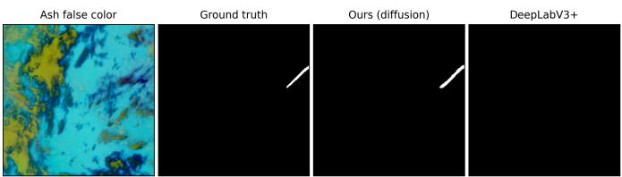
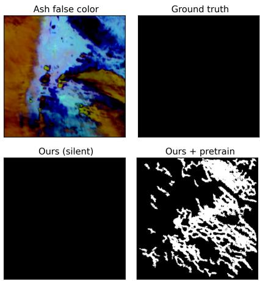
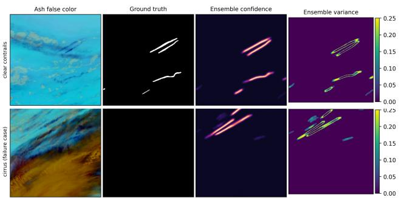

# Closing the Loop on Contrail Avoidance with Satellite Verification

Spandan Ghose Chowdhury   
School of Computing   
Georgia Institute of Technology   
Atlanta, GA, USA   
spandan\_gc@gatech.edu

## Abstract

Contrails are the thin ice clouds that aircraft leave behind. They cause a large share of aviation’s warming, and rerouting the few flights that produce them could avoid much of it. However, an avoided contrail only counts if a satellite can confirm that it never formed, and this check is hard: contrails are one to two pixels wide, cover only 0.18% of pixels, and look very similar to natural cirrus. We build a small diffusion model (8.4M parameters, trained on one GPU) that detects them, and we run a controlled study to find out which components matter. The model reaches 0.476 PR-AUC, compared with 0.414 for a DeepLabV3+ baseline and 0.119 for an adapted MedSegDiff. Doubling the input resolution of the CNN brings it to parity (0.499, p=0.07). Three lessons apply beyond contrails. First, check the input resolution before designing a new architecture. Second, simple flips and rotations more than double accuracy and matter more than any architectural choice we measured. Third, pretraining the model on contrail shapes is harmful: the model learns that thin strokes appear everywhere and paints them onto empty scenes. Precision collapses to 1% while recall-based metrics still rate the degraded model as excellent, and no threshold or guidance heuristic repairs this failure.

## 1 Introduction

Aviation warms the climate in two ways: by emitting $\mathrm { C O _ { 2 } }$ and by producing condensation trails. Contrails that persist spread into cirrus-like sheets that trap outgoing heat, and contrail cirrus is assessed as the largest single component of aviation’s effective radiative forcing, although the uncertainty is wide [1–3]. About 2% of flights cause 80% of annual contrail energy forcing [3], and small changes in route or altitude let an aircraft avoid the ice-supersaturated layers in which contrail form [4]. Unlike $\mathrm { C O _ { 2 } }$ warming, this warming can therefore be reduced quickly and at low cost.

In August 2026 the UK government, NATS, the Met Office, Google and academic partners launched Operation Blue Skies, a £5M programme that applies AI-recommended altitude changes in Shanwick oceanic airspace, which accounts for about 5% of global contrail warming, over the winters of 2026–27 and 2027–28 [5, 6]. A programme of this scale is only as credible as the measurement that follows it, and that measurement comes from satellite imagery: to claim that a contrail was avoided, someone must check whether it formed [7]. This measurement step, rather than forecasting or routing, is the focus of this paper.

OpenContrails [8] turned this task into a public benchmark with about 22,000 human-labeled scenes from GOES-16 imagery [9]. Three properties make the task difficult. The targets are thin: one or two pixels wide, so a small positional error destroys the overlap with the label. They are sparse: 0.18% of test pixels are positive and 70% of images are empty. And they are nearly indistinguishable from the hardest negatives, because thin cirrus shares their shape, brightness and texture (fig. 1). We therefore try a generative approach. A diffusion network [10] builds its answer by repeated refinement rather than by a single forward pass, so it can return to a faint line instead of averaging it away. Running it several times also produces several masks, and their disagreement is a usable confidence signal. Diffusion has been applied to segmentation [11] and to thin tubular medical targets [12], but whether its advantages survive a task this imbalanced had not been tested.

We answer this question in two parts. The first is a conditional diffusion network built for thin, linear structures. The second is a controlled study in which one protocol is frozen and every variant is retrained under it, including controls that give a conventional CNN the same test-time compute. Both parts are deliberately small (8.4M parameters against 26.7M for the baseline; 90 epochs on one GPU). This constraint is intentional: a verification pipeline that a weather service or a university group has to run cannot assume a large training budget. Two unexpected results are the part that transfers to other problems. Flip and rotation augmentation was the single most important ingredient, outweighing every architectural component we measured. Unconditional mask pretraining was actively harmful in a way that recall metrics do not reveal, and no threshold, calibration or classifier-free guidance [13] repairs it.

  
Figure 1: Spot the contrail: our model recovers a labeled contrail that is nearly invisible in GOES-16 infrared imagery; the DeepLabV3+ baseline misses it entirely. A contrail that is never detected is avoided warming that is never credited.

## 2 Related work

Contrail detection from satellites. Automatic contrail detection from satellite imagery has a long history. The classical approach is the linear-contrail detection algorithm of Mannstein et al. [14], which applies oriented line filters to AVHRR brightness-temperature differences; it was later extended to geostationary imagers to follow contrails through their life cycle [15]. These hand-crafted detectors work well on bright, young contrails but miss faint or aged ones. Deep learning entered the field with Kulik [16] and Meijer et al. [17], who trained CNN segmenters on GOES-16 data and used them to estimate contrail coverage over the United States. Ng et al. [8] released OpenContrails, the first large human-labeled dataset, together with a ResNet-based segmentation model trained under a large compute budget, and Geraedts et al. [7] built on it to attribute detected contrails to individual flights. A public Kaggle competition on the same data [18] showed that U-Net-style models with upsampled inputs and heavy test-time ensembling score well, and Chevallier et al. [19] combined detection, tracking and flight matching on Meteosat imagery. All of these detectors are single-pass discriminative models that report one score per pixel. Our work differs in three ways. We use an iterative generative model, which gives a per-pixel uncertainty map from the disagreement between samples. We train under a small, fixed budget, so that every baseline can be retrained under identical conditions and compared fairly. And we report which training choices matter, including one that silently fails, rather than only a headline score.

Segmenting thin, elongated and sparse structures. Contrails share their geometry with retinal vessels, roads, cracks and power lines: they are thin, long, connected, and a tiny fraction of the image. Work on these targets shows that per-pixel losses are the wrong objective, because a one-pixel shift destroys the overlap while leaving the shape intact. Topology-aware losses address this directly. Mosinska et al. [20] penalize differences between deep features of the prediction and the label, Hu et al. [21] match persistent-homology features, and clDice [22] compares the skeletons of prediction and label so that connectivity, rather than area, is rewarded. We adopt clDice because it is cheap to compute and it targets the failure we see most often, broken lines. Focal loss [23] is the standard answer to extreme class imbalance. The straightness of contrails links them to line detection: deep Hough-transform priors [24, 25] accumulate evidence along candidate lines and improve the detection of faint straight structures. Our soft-Hough encoder is a fixed, lightweight version of this idea. Finally, diffusion models have been used for general segmentation [11] and for medical targets such as vessels and tumours [12], and Wolleb et al. [26] showed that repeated sampling yields an implicit ensemble whose variance is a useful uncertainty estimate. We adapt MedSegDiff’s frequency-domain conditioning to be direction-aware and use the same sampling ensemble for uncertainty, but to our knowledge none of these methods had been tested on a target this sparse.

  
(a) The pretraining trap.

  
(b) Ensemble uncertainty.  
Figure 2: Two behaviours that matter for verification. (a) Our recipe still fires on 42% of empty scenes (compared with 2–3% for DeepLabV3+); the scene shown is one it gets right. The unconditionally pretrained variant paints contrail-shaped strokes across the cirrus: 15.7% of test pixels are marked positive against a prevalence of 0.18%, yet skeleton recall reads 0.96. (b) Input, label, ensemble confidence and vote variance. On real contrails (top row) the variance forms a thin outline around the detection. On cirrus false positives (bottom row) it thickens and stray patches appear away from the detections, which gives a signal for routing cases to review.

## 3 Method

The design follows three properties of the target. Contrails are thin, so a network that downsamples the image aggressively loses them; we therefore keep a decoder branch that never downsamples. Contrails are straight, because aircraft fly close to great-circle paths; fixed directional line-averaging filters (a “soft Hough” encoder) supply this prior, although our ablation cannot separate its effect from noise $( + 0 . 0 0 5 , p { = } 0 . 3 5 )$ ). Contrails also move and grow between frames while cirrus mostly does not, so frame differences provide a motion cue.

We follow the standard diffusion recipe [10]. The mask is corrupted with Gaussian noise at a random level, and a network learns to predict the noise that was added, conditioned on four infrared frames. Conditioning features enter at every scale and are modulated by the noise level [27]. They come from the two encoders above, from an image encoder borrowed from super-resolution [28], and from a direction-aware version of MedSegDiff’s frequency filter [12]. Three auxiliary losses act on the reconstructed mask: focal loss [23] for the extreme imbalance; soft clDice [22], which rewards thin predictions that stay connected and punishes broken ones; and a distance term that penalizes predicted mass far from any label. Flips and rotations up to $\pm 3 0 ^ { \circ }$ are applied jointly to the image sequence and the mask. At test time we generate N masks [29] and keep the pixels on which at least 60% of them agree, discarding connected components smaller than 50 pixels. The mean of the masks is a dense confidence map, and their disagreement is a per-pixel uncertainty map.

## 4 Experimental setup

We use the full OpenContrails release [8]: 20,529 training scenes and 1,856 validation scenes. Each scene is a 256 × 256 crop with four infrared frames and one human-labeled mask. Because the official test set is not public, we split the validation scenes once, with a fixed seed, into a val-tune half and a test half (928 scenes each) and froze both halves before any experiment. Checkpoints and thresholds are chosen on val-tune only. Every number below is computed once on the untouched test half, with confidence intervals from a paired scene-level bootstrap.

Table 1: Frozen OpenContrails test split (928 images, prevalence $0 . 1 8 \% ) ;$ seed $4 2 ,$ , two-seed mean $0 . 4 7 5 \pm 0 . 0 0 1$ . The $5 1 2 ^ { 2 }$ row upsamples the input bilinearly and is scored on the $2 5 6 ^ { 2 }$ grid; it is not statistically separable from ours $( p { = } 0 . 0 7 )$ . Bold: best per column among compared rows. Last row: external reference trained under a much larger budget, not a within-protocol comparison.
<table><tr><td>Method</td><td>Par.</td><td>PR-AUC↑</td><td>SkelRec↑</td><td> $\mathrm { H D _ { 9 5 } }$  →</td><td>P</td><td>R</td><td>F1</td></tr><tr><td>DeepLabV3+</td><td>26.7M</td><td>0.414</td><td>0.816</td><td>57.3</td><td>0.420</td><td>0.520</td><td>0.465</td></tr><tr><td>+8-fold TTA</td><td>26.7M</td><td>0.442</td><td>0.805</td><td>55.7</td><td>0.476</td><td>0.484</td><td>0.480</td></tr><tr><td> $5 1 2 ^ { 2 }$  input</td><td>26.7M</td><td>0.499</td><td>0.836</td><td>51.2</td><td>0.508</td><td>0.573</td><td>0.539</td></tr><tr><td>MedSegDiff</td><td>129M</td><td>0.119</td><td>0.825</td><td>312.8</td><td>0.050</td><td>0.533</td><td>0.092</td></tr><tr><td>Twin (ours, no diffusion)</td><td>8.4M</td><td>0.209</td><td>0.781</td><td>113.8</td><td>0.352</td><td>0.309</td><td>0.329</td></tr><tr><td>Ours</td><td>8.4M</td><td>0.476</td><td>0.877</td><td>127.9</td><td>0.392</td><td>0.640</td><td>0.486</td></tr><tr><td>OpenContrails [8]</td><td>一</td><td>0.651</td><td>一</td><td>一</td><td>一</td><td>一</td><td>一</td></tr></table>

We report three metrics. PR-AUC is computed over all test pixels. Skeleton recall is the fraction of the label’s centerline that the prediction covers; it answers “did we find $\mathrm { i t ? ? }$ $\mathrm { H D _ { 9 5 } }$ is a worst-case geometric error that is driven by distant false-positive blobs. DeepLabV3+ [30] with an ImageNetinitialized ResNet-50 encoder [31, 32] and MedSegDiff [12] are both trained by us under identical data, splits, budget, post-processing and metric code. The published OpenContrails model is an external reference that was trained under a much larger budget; the gap to it is not a labeling or prevalence artifact (section A).

## 5 Results

Primary comparison, and the control that reaches parity. Table 1 gives the main finding: our model gains +0.062 PR-AUC over DeepLabV3+ at a matched 2562 input (95% CI [0.038, 0.088]) and reaches four times the score of the adapted MedSegDiff. Our number comes from a 20-sample ensemble while the CNN’s comes from a single pass, so we also give the CNN the same test-time budget. Eight-fold test-time augmentation and a five-seed deep ensemble [33] (0.438) each close les than half of the gap. A discriminative twin, which uses the same encoders and losses but is trained as a one-shot segmenter with the mask branch zeroed, falls below the plain CNN. The architecture alone therefore does not explain the margin either. (The twin also loses the implicit regularization of the diffusion objective, so we stop short of crediting iterative sampling itself.)

One control does change the picture, and we report it rather than omit it. Upsampling the input to $5 1 2 ^ { 2 }$ lifts DeepLabV3+ to statistical parity with our model. Resolution is a lever we have not yet given the diffusion model, because its sampling cost grows with resolution. What survives across resolutions is the recall side: our model has the best skeleton recall (0.877 against 0.836 for the $5 1 2 ^ { 2 }$ CNN) and recovers 62.0% of labeled contrail segments against 53.9% (although the $5 1 2 ^ { 2 }$ CNN has the better segment F1). It also provides per-pixel uncertainty. The CNN keeps the best worst-case geometric error, because our remaining failures are occasional contrail-shaped false positives far from any label, and it is about 4,900× faster than our model at N=20.

Augmentation is the primary driver. $\textup { A 2 } \times 2$ factorial experiment separates the two training choices. Joint flips and rotations raise the from-scratch model from 0.204 to 0.424 PR-AUC. With unconditional pretraining, the same two cells read 0.038 and 0.040. (All four cells include a background-noise boost that the final recipe drops; it is worth 0.052. The pretraining arm keeps its own fine-tuning rate, so the cells compare complete recipes.) Contrails occur at every orientation, so rotation teaches the right invariance.

Unconditional pretraining is a pitfall. The idea sounds reasonable: first teach the denoiser what contrail masks look like (mask only, no image), then fine-tune with conditioning. In both cells, however, performance collapses to about 0.04 PR-AUC, and the mechanism is visible in fig. 2a.

The model has learned that “thin strokes exist everywhere” and paints them onto the 70% of scenes that are empty, an 87× over-prediction. This is not a threshold problem (the best achievable F1 is 0.094), and skeleton recall stays at 0.96, which is exactly why the failure is dangerous. Classifier-free guidance [13] does not repair it: a guidance-trained pretrained variant drops from 0.187 PR-AUC without guidance to 0.029 at w=1.5. The shape prior must therefore come from augmentation and from the losses, which carry the recipe: removing focal loss drops PR-AUC to 0.215, and removing clDice collapses precision from 0.39 to 0.06.

## 6 Pathway to climate impact

Contrail avoidance is a rare case of a large, fast and cheap climate lever whose bottleneck is measurement rather than engineering. An operational programme forecasts the ice-supersaturated regions, reroutes the few flights that would cross them, and verifies from satellite imagery whether the contrail failed to appear. Only the verification step closes the loop. Without trustworthy detection, a programme cannot tell a successful diversion from a wrong forecast, and it cannot support the accounting that a mandate would require. The users are concrete: evaluators of trials such as Blue Skies, per-flight attribution pipelines [7], and eventually a regulator asked to certify avoided warming.

Why these metrics. Because about 2% of flights cause about 80% of contrail forcing [3], verification is rare-event detection. Pixel accuracy or IoU would be dominated by the 99.8% of pixels that are empty. Recall sets the ceiling: a contrail that is never detected is warming attributed to nobody, and it cannot be recovered downstream. This is why we lead with PR-AUC and per-contrail recall. Precision decides how much of a tally is real and how much review it costs.

Where it could go wrong. A verifier that over-reports avoided contrails turns an avoidance programme into a greenwashing instrument, and one that mis-attributes assigns the cost to the wrong operator. The failure mode we document therefore matters more than the headline number. Attribution filters false positives against flight tracks, but hallucinated contrail-shaped strokes are more likely than blobs to land near a real track. This is why we foreground the pretraining collapse over its flattering 0.96 skeleton recall. The structured vote variance (fig. 2b) can route doubtful detections to review, which turns our 42% false-positive rate on empty scenes into a review burden rather than a silent error.

Limitations. The case for this model rests on quality and uncertainty at N ≥ 5. It is about 4,900× slower than a CNN (still affordable at GOES-16’s 10-minute cadence), less accurate at N=1, and matched on pixel PR-AUC by a 5122-input DeepLabV3+ that we have not yet answered at that resolution. All results are on one dataset and one sensor. Transfer to Meteosat, which covers the airspace where Blue Skies flies, is the untested next step.

Acknowledgments. This work began as a project in CS 7643 (Deep Learning) at Georgia Tech. I thank my project teammates, Daniel Milanes Perez, Mahsa Payami Shabestar, and Jordan Taylor, who introduced me to the contrail detection problem and and with whom I carried out the initial exploratory data analysis and some basic diffusion based models on OpenContrails. All modeling, architectures, experiments and writing in this paper are my own.

## References

[1] David S. Lee, David W. Fahey, Agnieszka Skowron, Myles R. Allen, Ulrike Burkhardt, Qi Chen, Sarah J. Doherty, Sarah Freeman, Piers M. Forster, Jan Fuglestvedt, Andrew Gettelman, Rubén Rodríguez De León, Ling L. Lim, Marianne T. Lund, Richard J. Millar, Bethan Owen, Joyce E. Penner, Giovanni Pitari, Michael J. Prather, Robert Sausen, and Laura J. Wilcox. The contribution of global aviation to anthropogenic climate forcing for 2000 to 2018. Atmospheric Environment, 244:117834, 2021.

[2] Bernd Kärcher. Formation and radiative forcing of contrail cirrus. Nature Communications, 9:1824, 2018.

[3] Roger Teoh, Zebediah Engberg, Ulrich Schumann, Christiane Voigt, Marc Shapiro, Susanne Rohs, and Marc E. J. Stettler. Global aviation contrail climate effects from 2019 to 2021. Atmospheric Chemistry and Physics, 24(10):6071–6093, 2024.

[4] Roger Teoh, Ulrich Schumann, Arnab Majumdar, and Marc E. J. Stettler. Mitigating the climate forcing of aircraft contrails by small-scale diversions and technology adoption. Environmental Science & Technology, 54(5):2941–2950, 2020.

[5] University of Cambridge. Operation Blue Skies takes off: landmark trial to test AI-driven contrail avoidance. https://www.cam.ac.uk/research/news/ operation-blue-skies-takes-off-landmark-trial-to-test-ai-driven-contrail-avoidance, 2026. Accessed 19 August 2026.

[6] Google. Google and UK government launch AI contrail avoidance trial. https://blog.google/ innovation-and-ai/models-and-research/google-research/blue-skies/, 2026. Accessed 19 August 2026.

[7] Scott Geraedts, Erica Brand, Thomas R. Dean, Sebastian Eastham, Carl Elkin, Zebediah Engberg, Ulrike Hager, Ian Langmore, Kevin McCloskey, Joe Yue-Hei Ng, John C. Platt, Tharun Sankar, Aaron Sarna, Marc Shapiro, and Nita Goyal. A scalable system to measure contrail formation on a per-flight basis. Environmental Research Communications, 6(1):015008, 2024.

[8] Joe Yue-Hei Ng, Kevin McCloskey, Jian Cui, Vincent R. Meijer, Erica Brand, Aaron Sarna, Nita Goyal, Christopher Van Arsdale, and Scott Geraedts. Contrail detection on GOES-16 ABI with the OpenContrails dataset. IEEE Transactions on Geoscience and Remote Sensing, 62:1–14, 2024.

[9] Timothy J. Schmit, Paul Griffith, Mathew M. Gunshor, Jaime M. Daniels, Steven J. Goodman, and William J. Lebair. A closer look at the ABI on the GOES-R series. Bulletin ofthe American Meteorological Society, 98(4):681–698, 2017.

[10] Jonathan Ho, Ajay Jain, and Pieter Abbeel. Denoising diffusion probabilistic models. In Advances in Neural Information Processing Systems, volume 33, 2020.

[11] Tomer Amit, Tal Shaharbany, Eliya Nachmani, and Lior Wolf. SegDiff: Image segmentation with diffusion probabilistic models. arXiv preprint arXiv:2112.00390, 2021.

[12] Junde Wu, Rao Fu, Huihui Fang, Yu Zhang, Yehui Yang, Haoyi Xiong, Huiying Liu, and Yanwu Xu. MedSegDiff: Medical image segmentation with diffusion probabilistic model. In Medical Imaging with Deep Learning, 2023.

[13] Jonathan Ho and Tim Salimans. Classifier-free diffusion guidance. arXiv preprint arXiv:2207.12598, 2022.

[14] Hermann Mannstein, Richard Meyer, and Peter Wendling. Operational detection of contrails from NOAA-AVHRR-data. International Journal ofRemote Sensing, 20(8):1641–1660, 1999.

[15] Margarita Vázquez-Navarro, Hermann Mannstein, and Stephan Kox. Contrail life cycle and properties from 1 year of MSG/SEVIRI rapid-scan images. Atmospheric Chemistry and Physics, 15(15):8739–8749, 2015.

[16] Luke Kulik. Satellite-based detection of contrails using deep learning. Master’s thesis, Massachusetts Institute of Technology, 2019.

[17] Vincent R. Meijer, Luke Kulik, Sebastian D. Eastham, Florian Allroggen, Raymond L. Speth, Sertac Karaman, and Steven R. H. Barrett. Contrail coverage over the United States before and during the COVID-19 pandemic. Environmental Research Letters, 17(3):034039, 2022.

[18] Google Research. Google Research – Identify Contrails to Reduce Global Warming. Kaggle competition, https://www.kaggle.com/competitions/ google-research-identify-contrails-reduce-global-warming, 2023.

[19] Rémi Chevallier, Marc Shapiro, Zebediah Engberg, Manuel Soler, and Daniel Delahaye. Linear contrails detection, tracking and matching with aircraft using geostationary satellite and air traffic data. Aerospace, 10(7):578, 2023.

[20] Agata Mosinska, Pablo Márquez-Neila, Mateusz Kozinski, and Pascal Fua. Beyond the pixel-wise loss for´ topology-aware delineation. In IEEE Conference on Computer Vision and Pattern Recognition, 2018.

[21] Xiaoling Hu, Fuxin Li, Dimitris Samaras, and Chao Chen. Topology-preserving deep image segmentation. In Advances in Neural Information Processing Systems, volume 32, 2019.

[22] Suprosanna Shit, Johannes C. Paetzold, Anjany Sekuboyina, Ivan Ezhov, Alexander Unger, Andrey Zhylka, Josien P. W. Pluim, Ulrich Bauer, and Bjoern H. Menze. clDice – a novel topology-preserving loss function for tubular structure segmentation. In IEEE Conference on Computer Vision and Pattern Recognition, 2021.

[23] Tsung-Yi Lin, Priya Goyal, Ross Girshick, Kaiming He, and Piotr Dollár. Focal loss for dense object detection. In IEEE International Conference on Computer Vision, 2017.

[24] Yancong Lin, Silvia L. Pintea, and Jan C. van Gemert. Deep Hough-transform line priors. In European Conference on Computer Vision, 2020.

[25] Kai Zhao, Qi Han, Chang-Bin Zhang, Jun Xu, and Ming-Ming Cheng. Deep Hough transform for semantic line detection. IEEE Transactions on Pattern Analysis and Machine Intelligence, 44(9):4793–4806, 2022.

[26] Julia Wolleb, Robin Sandkühler, Florentin Bieder, Philippe Valmaggia, and Philippe C. Cattin. Diffusion models for implicit image segmentation ensembles. In Medical Imaging with Deep Learning, 2022.

[27] Ethan Perez, Florian Strub, Harm de Vries, Vincent Dumoulin, and Aaron Courville. FiLM: Visual reasoning with a general conditioning layer. In AAAI Conference on Artificial Intelligence, 2018.

[28] Xintao Wang, Ke Yu, Shixiang Wu, Jinjin Gu, Yihao Liu, Chao Dong, Yu Qiao, and Chen Change Loy. ESRGAN: Enhanced super-resolution generative adversarial networks. In European Conference on Computer Vision Workshops, 2018.

[29] Jiaming Song, Chenlin Meng, and Stefano Ermon. Denoising diffusion implicit models. In International Conference on Learning Representations, 2021.

[30] Liang-Chieh Chen, Yukun Zhu, George Papandreou, Florian Schroff, and Hartwig Adam. Encoder-decoder with atrous separable convolution for semantic image segmentation. In European Conference on Computer Vision, 2018.

[31] Kaiming He, Xiangyu Zhang, Shaoqing Ren, and Jian Sun. Deep residual learning for image recognition. In IEEE Conference on Computer Vision and Pattern Recognition, 2016.

[32] Jia Deng, Wei Dong, Richard Socher, Li-Jia Li, Kai Li, and Li Fei-Fei. ImageNet: A large-scale hierarchical image database. In IEEE Conference on Computer Vision and Pattern Recognition, 2009.

[33] Balaji Lakshminarayanan, Alexander Pritzel, and Charles Blundell. Simple and scalable predictive uncertainty estimation using deep ensembles. In Advances in Neural Information Processing Systems, volume 30, 2017.

## A Reproducibility details

## Code. https://github.com/spandan1305/contrail\_detection

Training. All diffusion variants train for 90 epochs with AdamW (learning rate 10−4, cosine schedule, batch 32) on a single GPU; inference uses 10 DDIM steps and N=20 chains. Tables report seed 42; a second seed differs by 0.002 PR-AUC (two-seed mean 0.475 ± 0.001). The same 50-pixel minimum-component filter is applied to every model’s binary mask, and operating thresholds are calibrated per model on val-tune only (vote 0.6 for ours, 0.5 for the others).

Baseline adaptation. MedSegDiff is the official implementation adapted to this dataset (MedSegDiff-B recipe). Of its two output heads, the calibration head was selected on val-tune and only that head was scored on test. It keeps its own single-frame conditioning and loss stack, which is its published design. A control rerun conditioned on all four frames under the same recipe and budget scored worse (0.033 against 0.119 test PR-AUC), so the table reports the stronger variant.

The gap to the published OpenContrails model. The external reference row (0.651) is not a within-protocol comparison: the model was trained under a much larger budget and evaluated on the full 1,856-scene pool. The gap is not a labeling artifact, because per-scene positive-pixel counts for all 1,856 raw validation masks match our preprocessed masks exactly. It is also not a prevalence artifact: measured prevalence is 0.181% over the pool and 0.184% over our test half, so the often-quoted 1.2% figure describes their contrail-enriched training set, not the evaluation pool.