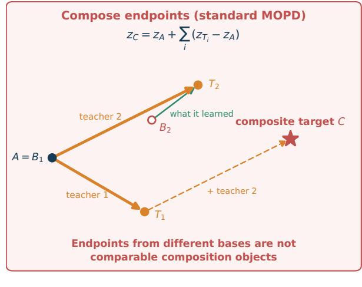
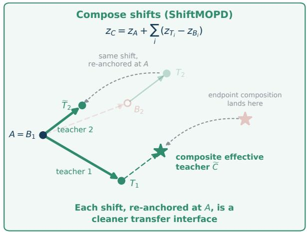
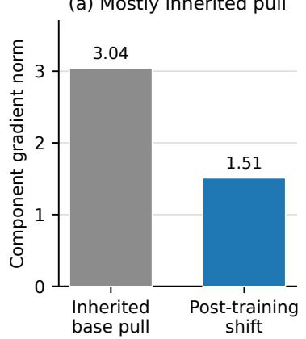
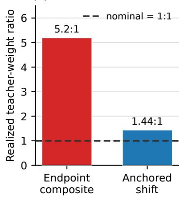
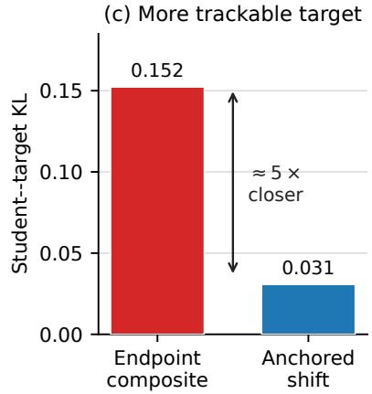

# Composing What Each Teacher Learned: Multi-Teacher On-Policy Distillation through Teacher-Relative Shifts

Hejian Sang1\* Zhengze Zhou2\* Shayan Mohajer Hamidi

Xiaomin Li3 Rohit Jain2 Alborz Geramifard2

1Iowa State University 2LinkedIn 3Harvard University

## Abstract

Multi-teacher on-policy distillation (MOPD) is used in two settings. In common-domain composition, several teachers score each student rollout from one prompt domain and their signals form a single target; in routed-domain distillation, prompts from different domains are assigned to the corresponding specialist. Both settings usually transfer each teacher’s endpoint policy, which mixes what post-training changed with preferences inherited from the teacher’s base. We introduce ∆-MOPD, which transfers each teacher’s teacher-minus-base logit shift re anchored at the student’s frozen initialization, and compare it with endpoint supervision in both settings while holding teacher selection fixed. We first expose the mechanism that im pedes endpoint transfer: inherited base pull can exceed the post-training shift. Removing it re duces the teacher-term norm ratio from 5.2 : 1 to 1.44 : 1 and target–student KL from 0.152 to 0.031. The resulting target reaches the end point arm’s best evaluated Math score with 35% fewer allocated H100-hours. Across our experiments, the results suggest that shift targets are particularly useful when teacher signals are combined at a state. With three composed teachers, ∆-MOPD exceeds endpoint composition by 4.11 Math and 1.95 five-benchmark points; with two, it matches endpoint accu racy. In an unpaired cross-tokenizer extension, a projected fourth shift improves all three Math benchmarks and adds a further 3.32 Math and 1.85 five-benchmark points. Under phased rout ing, it achieves higher mean performance in both phase orders and reduces the observed order gap from 10.50 to 6.42 points. Under in terleaved routing, where each update involves one teacher, the two targets perform compa rably. The phased results provide supporting evidence that the benefit may extend to signals accumulated across training phases. Target con struction is thus an independent design axis in MOPD, complementary to teacher selection.

## 1 Introduction

On-policy distillation (OPD) trains a student on its own rollouts using scores from a frozen teacher, so supervision arrives at the states the student visits (Gu et al., 2024; Agarwal et al., 2024; Song and Zheng, 2026). Because post-trained specialists are individually incomplete and widely released, multiteacher OPD (MOPD) aims to combine several of them in one student. MOPD is used in two settings. In common-domain composition, several teachers score the same rollout from one prompt domain and their signals are merged into one target. In routed-domain distillation, prompts from different domains are assigned to the corresponding specialist, so each state is supervised by one teacher.

Both settings, and the studies of routing, teacher counteraction, and cascaded overwrite built on them (Ma et al., 2026; Chen et al., 2026; Li et al., 2026), transfer each teacher’s endpoint policy. A specialist endpoint, however, combines the change produced by its post-training stage with preferences inherited from its base (DeepSeek-AI, 2025). When a teacher’s base differs from the student’s initialization, endpoint supervision transfers that inherited difference as well. The original MOPD pipeline avoids it because every teacher shares the student’s initial checkpoint (Ma et al., 2026); public specialists rarely do. Single-teacher methods report promising results from teacher-relative differences (Heo et al., 2026; Feng et al., 2026; Yang et al., 2026), but whether such differences are a better transfer object in either MOPD setting has not been tested.

We separate two decisions in any MOPD recipe: teacher selection, which teachers supervise a state, and target construction, how their scores define the distribution to be matched. Holding selection fixed, we compare endpoint targets with ∆-MOPD, which measures each teacher against its own base $B _ { i }$ and re-anchors the resulting shift at the student’s initialization A. Writing $z _ { X }$ for checkpoint $X \ ' _ { s }$ logits at a student-generated state and S for the selected teachers, the two targets are

$$
\begin{array} { r } { \mathrm { e n d p o i n t : } \quad z _ { \mathrm { E } } = z _ { A } + \sum _ { i \in S } ( z _ { T _ { i } } - z _ { A } ) , } \\ { \Delta \mathrm { - M O P D : } \quad z _ { C } = z _ { A } + \sum _ { i \in S } ( z _ { T _ { i } } - z _ { B _ { i } } ) , } \end{array}\tag{1}
$$

each normalized by a softmax. Composition selects all teachers; routing selects one. When $B _ { i } = A _ { }$ both constructions give the same term, so only cross-origin teachers are affected (Figure 1). Concretely, if a Math specialist both acquires stronger reasoning and keeps a verbosity preference already present in its base, endpoint distillation transfers both; dividing the specialist by its base cancels what the base already preferred, and the anchor expresses the remaining change relative to the student’s own starting policy. We hypothesize that removing inherited base differences yields a target that is closer to the student and, under composition, more balanced across teachers.

Our results suggest that shift targets are particularly useful when teacher signals are combined at a state. The mechanism appears directly in the learning signal: endpoint supervision gives the inherited base pull a larger gradient than the post-training shift, whereas base subtraction produces a target that is five times closer to the student and substantially more balanced across teachers. The closer target reaches the endpoint arm’s best Math score with 35% fewer allocated H100-hours. In commondomain composition, shifts match endpoint accuracy with two teachers and lead on Math and the five-benchmark macro with three. In an unpaired cross-tokenizer extension, a projected fourth shift from a second cross-origin teacher improves all three Math benchmarks, raising the Math macro by a further 3.32 points and the five-benchmark macro by 1.85 points. In routed-domain distillation, phased routing yields higher mean performance for shifts in both phase orders and a smaller observed order gap; interleaved routing, where each update sees a single teacher, yields comparable results. The phased results provide supporting evidence that the benefit may extend to signals accumulated across training phases.

## Contributions.

1. We identify target construction as a design axis in MOPD, independent of teacher selection, and instantiate it with ∆-MOPD (Eq. 1), which reduces exactly to endpoint OPD for sameorigin teachers.

2. We expose the mechanism that impedes endpoint transfer. The inherited base pull can exceed the post-training shift; removing it lowers the teacher-term norm ratio from 5.2 : 1 to 1.44 : 1, and reduces target–student KL fivefold.

3. The improved geometry yields stronger signal combination. With three composed teachers, ∆-MOPD exceeds endpoint composition by 4.11 Math and 1.95 five-benchmark points; under an unpaired cross-tokenizer extension, a projected fourth shift improves all three Math benchmarks and adds a further 3.32 Math and 1.85 five-benchmark points. Under phased routing it achieves higher mean performance in both orders and reduces the observed order gap from 10.50 to 6.42 points. Interleaved routing performs comparably.

## 2 Preliminaries

Let $x \sim \mathcal { D }$ and $y = ( y _ { 1 } , \dots , y _ { L } ) \sim \pi _ { \theta } ( \cdot \mid x )$ , with $h _ { t } = ( x , y _ { < t } ) , p _ { t } = \pi _ { \theta } ( . \mid h _ { t } )$ , and $q _ { t }$ the target distribution at $h _ { t }$ . OPD minimizes the token-level reverse KL

$$
\begin{array} { l } { \displaystyle \mathcal { L } = \mathbb { E } _ { \boldsymbol { x } \sim \mathcal { D } , y \sim \pi _ { \theta } ( \cdot | \boldsymbol { x } ) } } \\ { \displaystyle \left[ \frac { 1 } { L } \sum _ { t = 1 } ^ { L } D _ { \mathrm { K L } } ( p _ { t } \| q _ { t } ) \right] . } \end{array}\tag{2}
$$

For sampled $y _ { t } \sim p _ { t }$ , log $p _ { t } ( y _ { t } )$ − log $q _ { t } ( y _ { t } )$ is a one-sample estimator of the per-state reverse KL. Training maximizes the sampled-token reward log $q _ { t } ( y _ { t } ) - \log p _ { t } ( y _ { t } )$ with the centered scorefunction estimator of Appendix B.

Notation. $\pi _ { X }$ and $z _ { X }$ denote checkpoint $X \ ' _ { \mathrm { s } }$ distribution and logits over a shared effective vocabulary. A is a frozen anchor, in every experiment the student initialization; $T _ { i }$ is teacher $i \ ' s$ post-training endpoint; $B _ { i }$ is the exact checkpoint that entered that stage. The shift of teacher i is $\delta _ { i } = z _ { T _ { i } } - z _ { B _ { i } }$ and its inherited base difference is $z _ { B _ { i } } \mathrm { ~ - ~ } z _ { A }$ . A shift carries the complete effect of post-training— capability, style, and calibration alike—and is not assumed to isolate capability. Teacher i is sameorigin when $B _ { i } = A$ and cross-origin otherwise.

Teacher selection. A selection rule assigns each state a teacher set $\mathcal { S } ( h _ { t } )$ . Common-domain composition uses $\boldsymbol { S } ( h _ { t } ) = \{ 1 , \dots , M \}$ , so the teachers’ relative magnitudes at a state determine the update. Routed-domain distillation uses $S ( h _ { t } ) = \{ \rho ( h _ { t } ) \}$ where $\rho$ maps a prompt to its domain’s teacher; domains may be interleaved within training or assigned to contiguous phases.

  
A: student's start Ti: teacher i after post-training Bi: teacher i's base T : teacher i's shift applied at A  
Figure 1: Endpoint versus shift targets. Each endpoint term $z _ { T _ { i } } \mathrm { ~ - ~ } z _ { A }$ contains a post-training shift $z _ { T _ { i } } \mathrm { ~ - ~ } z _ { B _ { i } }$ and an inherited base difference $z _ { B _ { i } } \mathrm { ~ - ~ } z _ { A }$ . ∆-MOPD keeps only the shift and re-anchors it at A, giving the effective teacher $\widetilde { T } _ { i }$ ; the two composite targets differ by the summed base differences. Teacher 1 is drawn with $B _ { 1 } = A ,$ so $\widetilde { T } _ { 1 } = T _ { 1 }$ . Positions are schematic.

## 3 ∆-MOPD

## 3.1 Construction

For teachers that share a token-id mapping on the 151,665-token effective vocabulary, ∆-MOPD uses the shared-anchor target

$$
\pi _ { C } ( v \mid h _ { t } ) = \frac { 1 } { Z ( h _ { t } ) } \pi _ { A } ( v \mid h _ { t } ) \prod _ { i \in S ( h _ { t } ) } \frac { \pi _ { T _ { i } } ( v \mid h _ { t } ) } { \pi _ { B _ { i } } ( v \mid h _ { t } ) } ,\tag{3}
$$

where $Z ( h _ { t } )$ normalizes over the vocabulary. Each model’s log-partition term is constant across tokens, so the target is a logit sum normalized once:

$$
\begin{array} { l } { { z _ { C } ( v \mid h _ { t } ) = z _ { A } ( v \mid h _ { t } ) + \displaystyle \sum _ { i \in \mathcal { S } ( h _ { t } ) } \delta _ { i } ( v \mid h _ { t } ) , } } \\ { { \pi _ { C } ( \cdot \mid h _ { t } ) = \operatorname { s o f t m a x } \bigl ( z _ { C } ( \cdot \mid h _ { t } ) \bigr ) , } } \end{array}\tag{4}
$$

with sampled-token reward

$$
R _ { t } ^ { C } ( v ) = \log \pi _ { C } ( v \mid h _ { t } ) - \log \pi _ { \theta } ( v \mid h _ { t } ) .\tag{5}
$$

Setting $q _ { t } = \pi _ { C } ( \cdot ~ | ~ h _ { t } )$ in Eq. 2 gives the fullvocabulary objective. Some runs approximate only the partition function on a restricted support; details of this approximation are given in Appendix B.

Endpoint control. The control replaces each shift by $z _ { T _ { i } } \mathrm { ~ - ~ } z _ { A }$ , giving zE in Eq. 1. At a given prefix the two pre-softmax targets differ by exactly $\begin{array} { r } { \sum _ { i \in \cal S ( h _ { t } ) } ( z _ { B _ { i } } - z _ { A } ) } \end{array}$ . With one selected teacher the control is that teacher’s endpoint.

Same-origin reduction. If $B _ { i } = A _ { }$ , then $z _ { A } +$ $\delta _ { i } = z _ { T _ { i } } ;$ : a same-origin teacher’s shift target is its endpoint. Routing to a same-origin teacher is therefore exactly endpoint OPD, and if every selected teacher is same-origin the two composites coincide. Only cross-origin terms differ.

## 3.2 Reference-term interpretation

The endpoint reward of teacher $j$ decomposes exactly as

$$
\begin{array} { r l } & { \log \pi _ { T _ { j } } - \log \pi _ { \theta } = \underbrace { \log \pi _ { T _ { j } } - \log \pi _ { B _ { j } } } _ { R _ { j } ^ { \Delta } : \mathrm { ~ s h i f t } } } \\ & { \qquad + \underbrace { \log \pi _ { B _ { j } } - \log \pi _ { \theta } } _ { R _ { j } ^ { B } : \mathrm { ~ b a s e - r e f e r e n c e ~ p u l l } } . } \end{array}\tag{6}
$$

The base-reference pull equals the inherited difference log $\pi _ { B _ { j } }$ − log $\pi _ { A }$ plus the current anchor– student gap log πA − log $\pi _ { \boldsymbol { \theta } } ;$ at initialization only the inherited difference remains. Up to a tokenindependent normalizer, ∆-MOPD has the same form with a single shared reference:

$$
\begin{array} { l } { { \displaystyle R _ { t } ^ { C } ( v ) = \sum _ { i \in S ( h _ { t } ) } \delta _ { i } ( v \mid h _ { t } ) } } \\ { ~ + \left[ \log \pi _ { A } ( v \mid h _ { t } ) - \log \pi _ { \theta } ( v \mid h _ { t } ) \right] . } \end{array}
$$

Both targets reward following teacher shifts and pull toward a reference. Endpoint supervision pulls toward each selected teacher’s own base; ∆-MOPD replaces these heterogeneous pulls by one pull toward the student’s initialization, which is zero at the start of training. Two consequences are plausible: the target is closer to the student, and, under composition, a cross-origin teacher’s inherited difference no longer sets the scale of its term relative to the others. Section 5.1 examines both.

## 4 Experimental Setup

Checkpoints. The anchor and student initialization in every run is DeepSeek-R1-Distill-Qwen-1.5B (DeepSeek-AI, 2025). Table 1 lists the teachers and the exact precursor used for each shift. Polaris-7B is post-trained from the 7B checkpoint of the same distillation family, so “cross-origin” here means a different and larger base of the same lineage. Nemotron and JustRL are same-origin, so their shift and endpoint terms are identical. In every paired comparison, the two targets therefore differ by one controlled substitution: the endpoint or teacher-relative representation of Polaris. A tokenizer-projected Qwen3-DAPO-449 shift extends the construction to a second cross-origin teacher in Appendix F.

Runs. Common-domain composition uses two runs on BigMath prompts, with every teacher scoring every rollout: the mechanism run composes Nemotron and Polaris (M = 2) and records diagnostics; the scaling run compares M = 2 with $M = 3 .$ , which adds JustRL. Routed-domain distillation assigns Math prompts to Polaris and Science/IF prompts to Nemotron, either interleaved within each batch or in two phased orders. The acquisition run distills Polaris alone. Paired arms share initialization, prompts, optimizer, update budget, and evaluation; all frozen models score the same prefixes within an arm, although the arms on-policy trajectories diverge. Each comparison uses a shared run protocol; key configurations are listed in Table 4.

## 4.1 Diagnostic metrics

We measure $\Gamma _ { \mathrm { b a s e } } ~ = ~ \| g _ { B } \| / \| g _ { \Delta } \|$ , the gradient norm of the base-reference pull relative to the shift. For composition geometry, we report the teacherterm norm ratio, centered-shift cosine, cancellation, and top-16 sign conflict. Target–student and target– anchor KL are computed over the full effective vocabulary, independently of the training normalizer. The reported forward KL $D _ { \mathrm { K L } } ( \pi _ { C } \Vert \pi _ { \theta } )$ measures target tracking and is not the training objective. Definitions are in Appendix B.

## 5 Results

The evidence follows a mechanism-to-outcome progression. We first test whether inherited base differences distort the learning signal (§5.1), then examine the predicted consequences for cross-origin acquisition (§5.2), common-domain composition (§5.3), and routed-domain distillation (§5.4).

## 5.1 Inherited base differences distort composition geometry

Inherited pull dominates early learning. Under endpoint supervision, the base-reference pull of Polaris has roughly twice the gradient norm of its shift $( \Gamma _ { \mathrm { b a s e } } \approx 2 $ , averaged over checkpoints recorded every 20 steps). The ratio declines during training because only $R _ { j } ^ { B }$ depends on the student: it shrinks as the student moves toward $\pi _ { B _ { j } }$ , whereas $R _ { j } ^ { \Delta }$ is fixed by the teacher–base pair at a given state. The inherited component therefore has its greatest relative influence while the specialization is still being acquired.

Base subtraction restores balance. With the Nemotron term identical in both arms, the teacherterm norm ratio falls from 5.2 under endpoint composition to 1.44 under shift composition, and target– student KL falls from 0.152 to 0.031 (Figure 2). The shift composite lies near the equal-norm independence reference (cancellation 0.287 versus 0.293, cosine −0.016), whereas the endpoint composite has low cancellation (0.136), the signature of one dominant term. The ordering appears by step 20 and persists through training (Appendix C); at $M = 3$ , target–anchor KL remains lower for shifts (0.483 versus 0.695).

Together, these measurements establish the proposed mechanism: inherited base differences enlarge the target and set the relative scale of the teacher terms. Removing them yields two testable predictions. The closer target should be acquired earlier, and the more balanced terms should make additional teachers more useful. We test these predictions next.

(b) One teacher dominates  
Table 1: Public checkpoints. “Base” is the exact precursor used to compute each shift. Nemotron is pinned to revision v1.
<table><tr><td>Role</td><td>Model</td><td>Base</td><td>Origin</td><td>Specialization</td><td>Use</td></tr><tr><td>Anchor / student init</td><td> $\mathrm { D S - R 1 - D i s t i l l - Q w e n { - } 1 . 5 B }$ </td><td>self</td><td>self</td><td></td><td>all runs</td></tr><tr><td>Math teacher</td><td>JustRL-DeepSeek-1.5B</td><td> $\mathrm { D S - R 1 - D i s t i l l - Q w e n { - } 1 . 5 B }$ </td><td>same</td><td>Math RL</td><td>composition (M = 3)</td></tr><tr><td>Science/IF teacher</td><td>Nemotron-Reasoning-Qwen-1.5B</td><td> $\mathrm { D S - R 1 - D i s t i l l - Q w e n { - } 1 . 5 B }$ </td><td>same</td><td>multi-domain RL</td><td>composition, routing</td></tr><tr><td>Math teacher</td><td>Polaris-7B-Preview</td><td>DS-R1-Distill-Qwen-7B</td><td>cross</td><td>Math RL</td><td>all runs</td></tr><tr><td>Math teacher</td><td>Qwen3-DAPO-449</td><td>Qwen3-8B</td><td>cross</td><td>DAPO Math RL</td><td>extension (App. F)</td></tr></table>

  
Figure 2: Composition diagnostics in the mechanism run. (a) For Polaris, the base-reference pull has a larger gradient norm than the shift. (b) The endpoint composite has a 5.2 : 1 teacher-term norm ratio; the shift composite has 1.44 : 1. (c) The shift target is about five times closer to the student in target–student KL. Values are late-training averages (Table 7).

## 5.2 A closer target accelerates cross-origin acquisition

Distilling Polaris alone removes composition and directly tests the first prediction. ∆-MOPD leads the English-Math macro by 2.87 pp at step 100, after which the arms approach a similar level. Including precursor-scoring overhead, ∆-MOPD scores 47.90% at step 100, already exceeding Endpoint’s best evaluated 46.54% at step 195; after charging for ∆-MOPD’s slower updates, these checkpoints cost 28.0 versus 42.9 allocated H100-hours. At initialization, the endpoint target is 4.94× farther from the student in target–student KL across 16,384 shared prefix states. The closer target is therefore acquired earlier even after charging for the additional precursor forward pass. Details are in Appendix E.

## 5.3 Balanced shifts improve common-domain composition

We next test the second prediction: whether balancing the teacher terms turns additional supervision

into usable capability.

Two teachers. In the mechanism run, both composites improve substantially over the initial student and reach similar aggregate accuracy: 44.91% for ∆-MOPD versus 45.14% for the endpoint composite under Avg@K, and 37.73% versus 36.25% under greedy decoding. ∆-MOPD is higher on Science/IF under both decodings, while the endpoint composite is 3.4 pp higher on MATH-500 (Appendix C).

Three teachers. The scaling run compares M = 2 with M = 3 under one protocol (Table 2). At M = 3, ∆-MOPD exceeds the endpoint composite by 4.11 pp on the Math macro and 1.95 pp on the five-suite macro. Adding the same JustRL teacher raises shift composition by 4.40 Math and 1.78 five-suite pp, but endpoint composition by only 0.43 and 0.58. Because JustRL is same-origin, its term is identical in both arms; the difference lies in how Polaris is represented when a third teacher is added. The gain is concentrated in AIME 2025; Science/IF, which receives no in-domain prompts in this run, is 1.29 pp below the endpoint composite (Table 9).

Shift composition thus preserves two-teacher accuracy and turns an additional teacher into a substantially larger Math gain.

Table 2: Common-domain composition in the scaling run at step 100. Greedy pass@1 macros (%). All teachers score every BigMath rollout. $\Delta _ { 3 - 2 }$ is the change from adding same-origin JustRL. Per-benchmark results are in Table 9.
<table><tr><td>Teachers</td><td>Target</td><td>Math</td><td>Sci/IF</td><td>Five-suite</td></tr><tr><td>M = 2</td><td>Endpoint composite</td><td>28.96</td><td>15.70</td><td>23.66</td></tr><tr><td> $M = 2$ </td><td>∆-OPD</td><td>29.10</td><td>17.38</td><td>24.41</td></tr><tr><td> $M = 3$ </td><td>Endpoint composite</td><td>29.39</td><td>16.51</td><td>24.24</td></tr><tr><td> $M = 3$ </td><td>∆-MOPD</td><td>33.50</td><td>15.22</td><td>26.19</td></tr><tr><td> $\Delta _ { 3 - 2 }$   $\Delta _ { 3 - 2 }$ </td><td>Endpoint composite ∆-MOPD</td><td>+0.43 +4.40</td><td>+0.81 -2.16</td><td>+0.58  ${ \bf + 1 . 7 8 }$ </td></tr></table>

Table 3: Routed-domain distillation. Interleaved routing mixes domains in each batch $( 5 0 / 2 5 / 2 5$ Math/Science/IF); phased routing trains one teacher– domain phase at a time. Greedy pass@1 macros (%); ∆ is ∆-MOPD minus Endpoint in pp.
<table><tr><td>Schedule</td><td>Macro</td><td></td><td>Endpoint ∆-MOPD</td><td>∆</td></tr><tr><td rowspan="3">Interleaved</td><td>Math</td><td>30.61</td><td>31.52</td><td>+0.91</td></tr><tr><td>Sci/IF</td><td>18.26</td><td>18.45</td><td>+0.19</td></tr><tr><td>Five-suite</td><td>25.67</td><td>26.29</td><td>+0.62</td></tr><tr><td rowspan="3">Phased: Sci/IF → Math</td><td>Math</td><td>28.02</td><td>34.39</td><td>+6.37</td></tr><tr><td>Sci/IF</td><td>18.25</td><td>22.89</td><td>+4.64</td></tr><tr><td>Five-suite</td><td>24.11</td><td>29.79</td><td>+5.68</td></tr><tr><td rowspan="3">Phased: Math → Sci/IF</td><td>Math</td><td>40.87</td><td>42.20</td><td>+1.33</td></tr><tr><td>Sci/IF</td><td>25.23</td><td>27.23</td><td>+2.00</td></tr><tr><td>Five-suite</td><td>34.61</td><td>36.21</td><td>+1.60</td></tr></table>

## 5.4 Shift targets show consistent gains under phased routing

Composition combines teacher signals within each state. Routing separates them across examples or training phases, examining whether the same target construction also changes how specialist signals accumulate over time. Under routing, Polaris supervises Math prompts and Nemotron supervises Science/IF prompts. Because Nemotron is sameorigin, the two targets coincide on Science/IF states and differ only in the routed Polaris term. Table 3 reports two schedules.

Interleaved routing. With both teachers active throughout training, the five-suite macro differs by only 0.62 pp in favor of ∆-MOPD, with groupmacro differences of +0.91 pp on Math and +0.19 pp on Science/IF. The two targets are therefore comparable when each update involves a single teacher, as expected if the benefit of shifts comes from reconciling several teacher signals.

Phased routing. When each teacher–domain pair occupies a contiguous phase, ∆-MOPD ends above its same-order endpoint control in both orders, by 5.68 and 1.60 five-suite pp, and both group macros improve in each order. The gap between the two phase orders falls from 10.50 pp under endpoint supervision to 6.42 pp. Phased training couples each teacher with its domain data, providing evidence about the robustness of the combined teacher–data curriculum across phase orders.

Together, these results suggest that the benefits of shift targets may extend beyond within-state composition to settings where teacher signals accumulate across training phases. We view the phasedrouting results as supporting evidence for this interpretation, while interleaved routing yields comparable performance.

## 6 Discussion

Where shifts help. Shift targets show their clearest benefits when several teachers are composed at a state. Phased routing provides supporting evidence that these benefits may extend to settings where routed teachers occupy separate phases and their signals accumulate over training; under interleaved routing, where each update involves one teacher, the targets are comparable. The paired design holds all same-origin terms fixed and changes only the representation of Polaris, directly attributing the contrast to target construction. The projected four-teacher extension adds a second crossorigin shift, improves all three Math benchmarks, and raises the Math macro by a further 3.32 pp (Appendix F), extending the construction to a larger heterogeneous teacher set.

Geometry and scale. Cosine and sign conflict are invariant to rescaling individual shifts, and cancellation to rescaling all shifts jointly. Their change therefore reflects the relative geometry of the teacher terms, not only the overall distance to the student. The policy-ratio form cancels vocabulary normalization constants but does not calibrate differences in logit temperature or confidence across checkpoints, so shift norms reflect both the magnitude of post-training change and the scale on which it is expressed. Calibration-aware composition is complementary to base subtraction.

## 7 Related Work

Distillation for language models. Knowledge distillation transfers a teacher’s output distribution to a smaller student (Hinton et al., 2015), for language models mostly off-policy on teacher-written rationales (Li et al., 2022; Hsieh et al., 2023; Fu et al., 2023; Singh et al., 2024; Liu et al., 2024), so the student is never supervised at the states it visits. OPD removes that mismatch by scoring the student’s own rollouts (Agarwal et al., 2024; Song and Zheng, 2026) and has been reframed as compressing reward-shaped behavior (Sang et al., 2026; Xu et al., 2026; He et al., 2026; Xu et al., 2026). Work that broadens what the on-policy signal carries, through rubric judgments (Fang et al., 2026), dual sequence- and token-level views (Hou et al., 2026; Wang et al., 2026; Shen et al., 2026), or context rather than weights (Ye et al., 2026), keeps the teacher’s endpoint as the matched object. Li et al. (2026) show that single-teacher OPD depends on thinking-pattern compatibility rather than teacher strength; student competence frontiers for on-policy self-distillation are studied by Xu et al. (2026).

Multi-teacher on-policy distillation. MOPD studies of routing, counteraction, and cascaded overwrite (Ma et al., 2026; Chen et al., 2026; Li et al., 2026) motivate our paired controls, and the same brittleness surfaces in tool-use, GUI-agent, and expert-to-generalist settings (Shen et al., 2026; Lian et al., 2026; Chen et al., 2026). Sample routing connects group-relative and self-distillation policy optimization (Li et al., 2026). These methods act on selection, scheduling, or rehearsal; we vary what each selected teacher contributes.

Differences as transfer objects. Delta-oriented single-teacher methods use teacher–base differences for direct or extrapolated transfer (Heo et al., 2026; Feng et al., 2026; Yang et al., 2026), and task arithmetic and proxy tuning compose parameter- or logit-space differences offline (Ilharco et al., 2023; Liu et al., 2024). We study such differences as transfer objects in both MOPD settings, on the student’s own prefixes and normalized under one softmax.

## 8 Conclusion

We studied target construction in MOPD by comparing teacher-relative shifts, re-anchored at the student’s initialization, with endpoint supervision. Inherited base differences can dominate a teacher’s post-training shift; removing them yields a target that is balanced across teachers and closer to the student. Across our experiments, shift targets show their clearest benefits when teacher signals are combined at a state: they match endpoints with two composed teachers and raise Math and five-benchmark accuracy with three. In an unpaired cross-tokenizer extension, adding a projected fourth shift from a second cross-origin teacher yields further gains on both macros. Under phased routing, shifts achieve higher mean performance in both tested orders and reduce the observed order gap, providing supporting evidence that their benefits may extend to teacher signals accumulated across phases. Under interleaved routing, where each update sees one teacher, the targets are comparable. Because the construction reduces exactly to endpoint OPD for same-origin teachers, it preserves their signal and acts only on inherited base differences. What is transferred from each teacher is thus a design axis in MOPD, complementary to which teachers are selected.

## 9 Limitations

• Evaluation scope. We study public reasoning specialists and common-domain composition on Math prompts, with Science/IF measured through held-out evaluation. Broader specialist families and domain-mixed composition are natural extensions.

• Requirements. ∆-MOPD requires each teacher’s precursor and a compatible tokenizer or an explicit projection rule, unlike black-box OPD (Ye et al., 2025).

## References

Yuxian Gu, Li Dong, Furu Wei, and Minlie Huang. 2024. MiniLLM: Knowledge distillation of large language models. In International Conference on Learning Representations.

Rishabh Agarwal, Nino Vieillard, Yongchao Zhou, Piotr Stanczyk, Sabela Ramos, Matthieu Geist, and Olivier Bachem. 2024. On-policy distillation of language models: Learning from self-generated mistakes. In International Conference on Learning Representations.

Mingyang Song and Mao Zheng. 2026. A survey of onpolicy distillation for large language models. arXiv preprint arXiv:2604.00626.

Wenhan Ma, Jianyu Wei, Liang Zhao, Hailin Zhang, Bangjun Xiao, Lei Li, Qibin Yang, Bofei Gao, Yudong Wang, Rang Li, Jinhao Dong, Zhifang Sui, and Fuli Luo. 2026. MOPD: Multi-teacher on-policy

distillation for capability integration in LLM posttraining. Preprint, arXiv:2606.30406.

Tianlei Chen, Jiao Ou, Ziyuan Liu, Ruiming Tang, Jian Liang, and Han Li. 2026. Counteraction-aware multi-teacher on-policy distillation for general capability recovery with domain preservation. Preprint, arXiv:2605.27115.

Zhaoyi Li, Deyang Kong, Yuan Wei, Evan Yang, Ranran Shen, Mahardika Krisna Ihsani, Ming Yang, Wei Zhang, Chuan Hao, Jian Yang, Ran Tao, Bryan Dai, Shikun Zhang, Wei Ye, Ying Wei, and Defu Lian. 2026. Every coin has two sides: On the dual nature of generalization in on-policy distillation of large language models. Preprint, arXiv:2608.16647.

DeepSeek-AI. 2025. DeepSeek-R1: Incentivizing reasoning capability in LLMs via reinforcement learning. Nature, 645:633–638.

Byeongho Heo, Jaehui Hwang, Sangdoo Yun, and Dongyoon Han. 2026. On-policy delta distillation. Preprint, arXiv:2607.15161.

Shiyuan Feng, Huan-ang Gao, Haohan Chi, Hanlin Wu, Zhilong Zhang, Zheng Jiang, Bingxiang He, Wei-Ying Ma, Ya-Qin Zhang, and Hao Zhou. 2026. Weak-to-strong generalization via direct on-policy distillation. Preprint, arXiv:2607.05394.

Wenkai Yang, Weijie Liu, Ruobing Xie, Kai Yang, Saiyong Yang, and Yankai Lin. 2026. Learning beyond teacher: Generalized on-policy distillation with reward extrapolation. Preprint, arXiv:2602.12125.

Geoffrey Hinton, Oriol Vinyals, and Jeff Dean. 2015. Distilling the knowledge in a neural network. arXiv preprint arXiv:1503.02531.

Shiyang Li, Jianshu Chen, Yelong Shen, Zhiyu Chen, Xinlu Zhang, Zekun Li, Hong Wang, Jing Qian, Baolin Peng, Yi Mao, Wenhu Chen, and Xin Xie. 2022. Explanations from large language models make small reasoners better. arXiv preprint arXiv:2210.06726.

Cheng-Yu Hsieh, Chun-Liang Li, Chih-Kuan Yeh, Hootan Nakhost, Yasuhisa Fujii, Alexander Ratner, Ranjay Krishna, Chen-Yu Lee, and Tomas Pfister. 2023. Distilling step-by-step! Outperforming larger language models with less training data and smaller model sizes. In Findings ofthe Associationfor Computational Linguistics: ACL 2023.

Yao Fu, Hao Peng, Litu Ou, Ashish Sabharwal, and Tushar Khot. 2023. Specializing smaller language models towards multi-step reasoning. arXiv preprint arXiv:2301.12726.

Avi Singh, John D. Co-Reyes, Rishabh Agarwal, Ankesh Anand, Piyush Patil, Xavier Garcia, Peter J. Liu, J. Harrison, Jaehoon Lee, Kelvin Xu, Aaron Parisi, Abhishek Kumar, Alex Alemi, Alex Rizkowsky, Azade Nova, Ben Adlam, Bernd Bohnet, Gamaleldin Elsayed, Hanie Sedghi, and 22 others.

2024. Beyond human data: Scaling self-training for problem-solving with language models. Transactions on Machine Learning Research.

Jiaheng Liu, Chenchen Zhang, Jinyang Guo, Yuanxing Zhang, Haoran Que, Ken Deng, Zhiqi Bai, Jie Liu, Ge Zhang, Jiakai Wang, Yanan Wu, Congnan Liu, Wenbo Su, Jiamang Wang, Lin Qu, and Bo Zheng. 2024. DDK: Distilling domain knowledge for efficient large language models. In Advances in Neural Information Processing Systems.

Hejian Sang, Yuanda Xu, Zhengze Zhou, Ran He, Zhipeng Wang, and Jiachen Sun. 2026. CRISP: Compressed reasoning via iterative self-policy distillation. Preprint, arXiv:2603.05433.

Yuanda Xu, Hejian Sang, Zhengze Zhou, Ran He, Zhipeng Wang, and Alborz Geramifard. 2026. TIP: Token importance in on-policy distillation. Preprint, arXiv:2604.14084.

Yinghui He, Simran Kaur, Adithya Bhaskar, Yongjin Yang, Jiarui Liu, Narutatsu Ri, Liam Fowl, Abhishek Panigrahi, Danqi Chen, and Sanjeev Arora. 2026. Self-distillation zero: Self-revision turns binary rewards into dense supervision. Preprint, arXiv:2604.12002.

Yuanda Xu, Hejian Sang, Zhengze Zhou, Ran He, Zhipeng Wang, and Alborz Geramifard. 2026. Beyond GRPO and on-policy distillation: An empirical sparse-to-dense reward principle for language-model post-training. Preprint, arXiv:2605.12483.

Junfeng Fang, Zhepei Hong, Mao Zheng, Mingyang Song, Gengsheng Li, Houcheng Jiang, Dan Zhang, Haiyun Guo, Xiang Wang, and Tat-Seng Chua. 2026. Rubric-based on-policy distillation. arXiv preprint arXiv:2605.07396.

Wenjin Hou, Shangpin Peng, Weinong Wang, Zheng Ruan, Yue Zhang, Zhenglin Zhou, Mingqi Gao, Yifei Chen, Kaiqi Wang, Hongming Yang, Chengquan Zhang, Zhuotao Tian, Han Hu, Yi Yang, Fei Wu, and Hehe Fan. 2026. Uni-OPD: Unifying on-policy distillation with a dual-perspective recipe. arXiv preprint arXiv:2605.03677.

Yuanyi Wang, Su Lu, Yanggan Gu, Pengkai Wang, Yifan Yang, Zhaoyi Yan, Congkai Xie, Jianmin Wu, and Hongxia Yang. 2026. Not all disagreement is learnable: Token teachability in on-policy distillation. Preprint, arXiv:2605.26844.

Guobin Shen, Lei Huang, Xiang Cheng, Chenxiao Zhao, Jindong Li, Dongcheng Zhao, and Xing Yu. 2026. From generic correlation to inputspecific credit in on-policy self-distillation. Preprint, arXiv:2605.11613.

Tianzhu Ye, Li Dong, Xun Wu, Shaohan Huang, and Furu Wei. 2026. On-policy context distillation for language models. Preprint, arXiv:2602.12275.

Yaxuan Li, Yuxin Zuo, Bingxiang He, Jinqian Zhang, Chaojun Xiao, Cheng Qian, Tianyu Yu, Huan-ang Gao, Wenkai Yang, Zhiyuan Liu, and Ning Ding. 2026. Rethinking on-policy distillation of large language models: Phenomenology, mechanism, and recipe. arXiv preprint arXiv:2604.13016.

Yuanda Xu, Hejian Sang, Zhengze Zhou, Ran He, and Zhipeng Wang. 2026. PACED: Distillation and onpolicy self-distillation at the frontier of student competence. Preprint, arXiv:2603.11178.

Jiabin Shen, Guang Chen, and Chengjun Mao. 2026. Diagnosing and calibrating tool-call boundary drift in multi-teacher on-policy distillation. Preprint, arXiv:2607.07050.

Niu Lian, Alan Chen, Zhehao Yu, Chengzhen Duan, Fazhan Liu, Hui Liu, Pei Fu, Jian Luan, Yaowei Wang, Shu-Tao Xia, and Jinpeng Wang. 2026. UI-MOPD: Multi-platform on-policy distillation for continual GUI agent learning. Preprint, arXiv:2607.04425.

Yunjie Chen, Xiaoxin Chen, and Fang Wang. 2026. RE-GEN: Replay-recycling for expert-to-generalist distillation with offline reinforcement learning. Preprint, arXiv:2607.19450.

Gengsheng Li, Tianyu Yang, Junfeng Fang, Mingyang Song, Mao Zheng, Haiyun Guo, Dan Zhang, Jinqiao Wang, and Tat-Seng Chua. 2026. Unifying grouprelative and self-distillation policy optimization via sample routing. Preprint, arXiv:2604.02288.

Gabriel Ilharco, Marco Tulio Ribeiro, Mitchell Wortsman, Suchin Gururangan, Ludwig Schmidt, Hannaneh Hajishirzi, and Ali Farhadi. 2023. Editing models with task arithmetic. In International Conference on Learning Representations.

Alisa Liu, Xiaochuang Han, Yizhong Wang, Yulia Tsvetkov, Yejin Choi, and Noah A. Smith. 2024. Tuning language models by proxy. In International Conference on Learning Representations.

Tianzhu Ye, Li Dong, Zewen Chi, Xun Wu, Shaohan Huang, and Furu Wei. 2025. Black-box onpolicy distillation of language models. Preprint, arXiv:2511.10643.

## A Protocols and Reproducibility

Evaluation. Evaluation uses SGLang with a 16,384-token maximum response length, except that IF-Eval is capped at 2,048 tokens by the evaluation driver; the scaling run and teacher references use a 10,000-token greedy protocol. Greedy decoding uses temperature 0 and top-p = 1; Avg@K sampling uses temperature 1 and $\mathrm { t o p } \mathrm { - } p = 0 . 9 5$ MATH-500 reuses its greedy item outcomes for $K = 1$ . All runs use the same 1,309 frozen heldout items. Five-suite macros are unweighted averages of the five benchmark scores, not of the two group macros. Entries with error bars are mean ± sample standard deviation over five independently trained seeds with matched seed IDs and prompt orders; macros are computed from the five-seed benchmark means.

Reproducibility. Each teacher is paired with its exact precursor and checked for tokenizer compatibility; the Qwen3 extension records the tokenstring overlap map of Eq. 16. Paired arms share prompts, update counts, and evaluation settings, and all frozen models score identical student prefixes within an arm before target construction. Dataset revisions, sampled IDs, chat templates, model revisions, decoding settings, and verifier versions are fixed across comparisons.

## B Estimator and Diagnostic Definitions

Estimator and normalization. For valid sampled-token positions I in an optimization batch, training subtracts the empirical mean reward $\begin{array} { r c l } { \bar { R } ^ { C } } & { = } & { | \mathcal { I } | ^ { - 1 } \sum _ { ( b , t ) \in \mathcal { T } } R _ { b , t } ^ { C } ( \bar { y _ { b , t } } ) } \end{array}$ and optimizes the detached centered reward times the student log-probability. This is sampled-token centering rather than an explicit per-state full-vocabulary expectation. When a restricted support $S _ { t }$ is used, the sampled-token numerator is exact and only the composite partition is approximated:

$$
\begin{array} { r } { \widehat { \log \pi _ { C } } ( y _ { t } \mid h _ { t } ) = z _ { C } ( y _ { t } \mid h _ { t } ) \qquad } \\ { - \log \displaystyle \sum _ { u \in S _ { t } } \exp z _ { C } ( u \mid h _ { t } ) . } \end{array}\tag{7}
$$

If $\begin{array} { r } { m _ { S _ { t } } = \sum _ { v \in S _ { t } } \pi _ { C } ( v \mid h _ { t } ) } \end{array}$ is the composite mass captured by the support, then $\widehat { \log \pi _ { C } } ( y _ { t } \mid h _ { t } ) =$ log $\pi _ { C } ( y _ { t } \mid h _ { t } ) - \log m _ { S _ { t } }$ , so the restricted normalizer raises the sampled-token log probability by $- \log m _ { S _ { t } }$ . This is a normalizer approximation, not the top-k OPD objective. All logits are restricted to the 151,665-token effective vocabulary before composition.

Gradient decomposition. For sampled positions $\{ ( h _ { t } , y _ { t } ) \} _ { t = 1 } ^ { N }$ , define $R _ { t } ^ { \Delta } \ = \ \log \pi _ { T } ( y _ { t } \ | h _ { t } )$ log $\pi _ { B } ( y _ { t } \mid h _ { t } )$ and $R _ { t } ^ { B } \ = \ \log \pi _ { B } ( y _ { t } \ | \ h _ { t } )$ log $\pi _ { \theta } ( y _ { t } \mid h _ { t } )$ . Their gradient estimators and rela-

Table 4: Training protocols. Values are shared by both arms of a run unless an arm-specific value is shown. Fields marked “–” were not recorded in the run’s frozen configuration summary.
<table><tr><td>Setting</td><td>Acquisition  $( M \stackrel { \cdot } { = } 1 )$ </td><td>Mechanism (M = 2)</td><td>Scaling  $( M = { \overline { { 2 } } } , 3 ; \operatorname { p r o j . }$  M = 4)</td><td>Phased routing</td><td>Interleaved routing</td></tr><tr><td>Phase structure single</td><td></td><td>single</td><td>single</td><td>2 phases, optimizer single, domains resumed, dataloader interleaved from step 1</td><td></td></tr><tr><td>On-policy prompts</td><td>BigMath, 25K Math</td><td>BigMath, 25K Math</td><td>BigMath Math</td><td>reset BigMath; + Llama-Nemotron</td><td>Math + Science/IF TextbookReasoning mixture (50/25/25)</td></tr><tr><td>Temperature /</td><td>1.0 / 1.0</td><td>1.0 / 1.0</td><td>1.0 / 1.0</td><td>IF 1.0 / 1.0</td><td>1.0 / 1.0, top-k off</td></tr><tr><td>top-p Maximum</td><td>10,000</td><td>10,000</td><td>10,000</td><td>10,000</td><td>10,000</td></tr><tr><td>response Learning rate</td><td> $1 0 ^ { - 6 }$ </td><td> $1 0 ^ { - 6 }$ </td><td> $1 0 ^ { - 6 }$ </td><td> $1 0 ^ { - 6 }$ </td><td> $1 0 ^ { - 6 }$ </td></tr><tr><td>Hardware</td><td>4 × H100 80GB</td><td>4 × H100 80GB</td><td>8 × H200</td><td>4 × H100 80GB per 8 × H200 (Endpoint) / 8 arm</td><td>× H100 (∆-MOPD)</td></tr><tr><td>Evaluation</td><td>Avg@ K (Table 5) Avg@ K and</td><td>greedy</td><td></td><td>greedy pass@1 greedy pass@1</td><td>greedy pass@1</td></tr></table>

Table 5: Held-out evaluation suite. $\operatorname { A v g } @ K$ applies to the acquisition and mechanism runs; other runs decode every benchmark greedily at $K = 1 ,$
<table><tr><td>Group</td><td>Benchmark</td><td>Test items</td><td>Avg@K</td><td>Generation / scoring</td></tr><tr><td>English Math</td><td>AMC 2023</td><td>40</td><td>16</td><td>sampled, official answer checker</td></tr><tr><td>English Math</td><td>MATH-500</td><td>500</td><td>1</td><td>greedy, official answer checker</td></tr><tr><td>English Math</td><td>AIME 2025</td><td>30</td><td>16</td><td>sampled, official answer checker</td></tr><tr><td>Science</td><td>GPQA-Diamond</td><td>198</td><td>4</td><td>sampled, final option-letter scorer</td></tr><tr><td>Instruction following</td><td>IF-Eval</td><td>541</td><td>4</td><td>sampled, vendored rule checker</td></tr></table>

tive magnitude are

$$
\begin{array} { c } { \displaystyle g _ { \bullet } = \nabla _ { \theta } \left[ - \frac { 1 } { N } \sum _ { t = 1 } ^ { N } \mathrm { s g } \big ( R _ { t } ^ { \bullet } \big ) \log \pi _ { \theta } \big ( y _ { t } \big | h _ { t } \big ) \right] , } \\ { \displaystyle \bullet \in \{ \Delta , B \} , } \\ { \displaystyle \Gamma _ { \mathrm { b a s e } } = \frac { \| g _ { B } \| _ { 2 } } { \| g _ { \Delta } \| _ { 2 } + 1 0 ^ { - 8 } } . } \end{array}\tag{8}
$$

At each mechanism checkpoint, Eq. 8 uses the cross-origin teacher–base pair, the first microbatch, and its first $N = \operatorname* { m i n } ( 1 2 8 , | \boldsymbol { \mathcal { T } } | )$ valid response positions, backpropagating through all trainable parameters. Measurements are recorded every 20 steps from step 20 through 380.

Composition geometry. Center each shift by its vocabulary mean,

$$
\begin{array} { l } { \displaystyle \Delta _ { i } ( t , \boldsymbol { v } ) = z _ { T _ { i } } ( \boldsymbol { v } \mid h _ { t } ) - z _ { B _ { i } } ( \boldsymbol { v } \mid h _ { t } ) } \\ { \displaystyle - \frac { 1 } { V } \sum _ { u = 1 } ^ { V } \left[ z _ { T _ { i } } ( \boldsymbol { u } \mid h _ { t } ) - z _ { B _ { i } } ( \boldsymbol { u } \mid h _ { t } ) \right] , } \end{array}\tag{9}
$$

concatenate across sampled positions, and compute pairwise cosine, aggregate norm, and

$$
\operatorname { C a n c e l } ( \mathcal { T } ) = 1 - \frac { \left\| \sum _ { i \in \mathcal { T } } \Delta _ { i } \right\| _ { 2 } } { \sum _ { i \in \mathcal { T } } \| \Delta _ { i } \| _ { 2 } + 1 0 ^ { - 8 } } .\tag{10}
$$

Sign conflict uses the top-16 absolute-shift coordinates selected by each teacher, retaining overlaps and aggregating across positions. The endpoint control replaces $z _ { T _ { i } } \mathrm { ~ - ~ } z _ { B _ { i } }$ by $z _ { T _ { i } } \mathrm { ~ - ~ } z _ { A }$ . Because $\Delta _ { i }$ is evaluated at student-visited prefixes, these statistics depend on the rollout protocol and pooling rule. The mechanism run concatenates the first 128 valid positions of the first micro-batch on each data-parallel rank; the scaling run computes the same quantities per complete response and averages over micro-batches. We read them within a run.

Two orthogonal equal-norm vectors have cosine 0 and Cancel $= 1 - { \sqrt { 2 } } / 2 = 0 . 2 9 2 9 \colon$ ; independent sign-symmetric coordinates have conflict rate 0.5. For $a = \Delta _ { \mathrm { s a m e } } , b = \Delta _ { \mathrm { c r o s s } } , c = \cos ( a , b )$ , and

$$
r = \| b \| / \| a \| ,
$$

$$
1 - { \mathrm { C a n c e l } } = { \frac { \sqrt { r ^ { 2 } + 1 + 2 r c } } { r + 1 } } .\tag{11}
$$

Since this expression is invariant under $r \mapsto 1 / r$ cosine and cancellation identify the norm ratio max $( r , 1 / r )$

Target distance. The target-to-student forward KL is

$$
D _ { \mathrm { S T } } = \mathbb { E } _ { h _ { t } } \sum _ { v = 1 } ^ { V } \pi _ { C } ( v \mid h _ { t } ) \log \frac { \pi _ { C } ( v \mid h _ { t } ) } { \pi _ { \theta } ( v \mid h _ { t } ) } ,\tag{12}
$$

computed over the full V = 151,665 vocabulary on the first micro-batch of each mechanism checkpoint, using up to 128 valid response positions. KL to the anchor replaces πθ by πA.

## C Common-Domain Composition Details

## C.1 Mechanism run: capability

Under greedy decoding, the group-balanced totals are 24.10% for the initial student, 37.73% for ∆-MOPD, and 36.25% for the endpoint composite. The per-group greedy macros are 31.44%, 50.91%, and 48.16% for English-Math, and 16.76%, 24.54%, and 24.34% for Science/IF, so greedy decoding favors ∆-MOPD on both groups while the Avg@K ordering is effectively tied.

## C.2 Mechanism run: diagnostics

Table 7 reports the late-training window and Table 8 early checkpoints; the two arms separate by step 20 and the ordering is stable.

## C.3 Scaling run

Under the same greedy, 10,000-token protocol, the individual teachers score (Math / Sci-IF / fivesuite macro, %) 46.62/28.08/39.21 for Nemotron-1.5B, 49.02/27.50/40.41 for JustRL-1.5B, and 59.29/36.87/50.32 for Polaris-7B.

At M = 2 the two shifts have norms 13,674 and 6,073 with pairwise cosine 0.084. Adding JustRL gives norms 12,891, 11,114, and 6,490, so the third shift enters at a magnitude comparable to the other two. Two of its pairwise cosines remain near zero (0.072 and 0.062) while the third rises to 0.315. Across the recorded M = 2 and M = 3 training-signal diagnostics, shift composition lowers target displacement, reward variance, and gradient magnitude; at M = 3, its final targetto-anchor KL is 0.483 rather than 0.695. Its perupdate time is 11.0% higher (167.1 versus 150.6 seconds) because the Polaris precursor must also be scored.

## D Routed-Domain Distillation Details

Interleaved routing. The router is the prompt’s domain: Math prompts are supervised by Polaris and Science and instruction-following prompts by Nemotron, with exactly one teacher per prompt. The training mixture is 50% Math, 25% Science, and 25% instruction-following. Domains are interleaved from the first update with a deterministic within-batch shuffle. Endpoint matches $z _ { T _ { \rho ( h ) } }$ and ∆-MOPD matches $z _ { A } + \delta _ { \rho ( h ) }$ Targets are normalized exactly over the full effective vocabulary. The Endpoint arm was trained on 8×H200 and the ∆-MOPD arm on $8 \times \mathrm { H 1 0 0 } ;$ the comparison is at matched update count, so hardware affects throughput but not the reported accuracies. All checkpoints were evaluated on H100 with greedy decoding.

## D.1 Phased routing

Each arm trains two phases with actor and optimizer state carried across the switch. The Science/IF phase is identical across methods, so the contrast lies in the Polaris Math phase. Per-item binary outcomes are retained, so same-order $\Delta \cdot$ MOPD-versus-Endpoint comparisons are exact paired McNemar tests on identical items. The only comparison below $p = 0 . 0 5$ is MATH-500 in Math → Science/IF (56 versus 36 discordant items, $p \ = \ 0 . 0 4 7 )$ , which does not survive correction across the ten benchmark-by-order comparisons.

## E Cross-Origin Acquisition and Compute

Both arms train only on BigMath prompts. The English-Math macro across the evaluated checkpoints is 47.90/45.65/47.68 for ∆-MOPD and 45.03/46.18/46.54 for Endpoint at steps 100/150/195. On GPQA-Diamond and IF-Eval, the ordering flips with decoding mode: at step 100, ∆-MOPD leads by 0.91 pp on the Avg@4 macro while greedy decoding favors Endpoint by 1.07 pp. The endpoint target remains near 5× farther from the student in target–student KL across checkpoints.

Table 6: Mechanism run $( M = 2 )$ student evaluation. AMC 2023 and AIME 2025 use Avg@16, GPQA-Diamond and IF-Eval use Avg@4, and MATH-500 uses greedy decoding. Entries with error bars are mean ± sample standard deviation over training seeds, in percent.
<table><tr><td>Benchmark</td><td>Initial student</td><td>∆-MOPD</td><td>Endpoint composite</td><td>∆-MOPD – Endpoint (pp)</td></tr><tr><td>AMC 2023</td><td>63.12</td><td> $7 9 . 8 4 \pm 1 . 9 9$ </td><td> $7 9 . 5 3 \pm 2 . 7 9$ </td><td>+0.31</td></tr><tr><td>MATH-500</td><td>36.00</td><td> $5 9 . 4 0 \pm 1 . 2 9$ </td><td> $6 2 . 8 0 \pm 1 . 3 4$ </td><td>-3.40</td></tr><tr><td>AIME 2025</td><td>23.33</td><td> $3 2 . 9 2 \pm 3 . 0 4$ </td><td> $3 2 . 9 2 \pm 3 . 2 4$ </td><td>0.00</td></tr><tr><td>English Math macro</td><td>40.82</td><td>57.39</td><td>58.42</td><td>-1.03</td></tr><tr><td>GPQA-Diamond</td><td>34.72</td><td> $4 0 . 2 8 \pm 2 . 1 1$ </td><td> $3 9 . 0 2 \pm 2 . 2 2$ </td><td>+1.26</td></tr><tr><td>IF-Eval</td><td>23.43</td><td> $2 4 . 5 8 \pm 1 . 3 1$ </td><td> $2 4 . 6 8 \pm 1 . 0 7$ </td><td>-0.10</td></tr><tr><td>Science/IF macro</td><td>29.08</td><td>32.43</td><td>31.85</td><td>+0.58</td></tr></table>

Table 7: Late-training diagnostics for the mechanism run, averaged over steps 300, 320, 340, 360, 380.
<table><tr><td>Target</td><td>Cancellation</td><td>Aggregate norm</td><td>Conflict rate</td><td>Signal cosine</td><td>Entropy</td><td>KL to anchor</td><td>Target-student KL</td></tr><tr><td>∆-MOPD</td><td>0.2871</td><td>3247.5</td><td>0.5540</td><td>-0.0163</td><td>0.2458</td><td>0.1243</td><td>0.0307</td></tr><tr><td>Endpoint composite</td><td>0.1363</td><td>10231.5</td><td>0.4386</td><td>0.0592</td><td>0.2643</td><td>0.2567</td><td>0.1522</td></tr><tr><td>Equal-norm reference</td><td>0.2929</td><td></td><td>0.5000</td><td>0.0000</td><td></td><td></td><td></td></tr></table>

Table 8: Early mechanism-run diagnostics at steps 20, 60, 100.
<table><tr><td>Target</td><td>Step</td><td>Cancellation</td><td>Target-student KL</td></tr><tr><td>∆-MOPD</td><td>20</td><td>0.2728</td><td>0.1070</td></tr><tr><td>∆-MOPD</td><td>60</td><td>0.2914</td><td>0.0750</td></tr><tr><td>∆-MOPD</td><td>100</td><td>0.2832</td><td>0.0462</td></tr><tr><td>Endpoint composite</td><td>20</td><td>0.1265</td><td>0.2472</td></tr><tr><td>Endpoint composite</td><td>60</td><td>0.1378</td><td>0.1222</td></tr><tr><td>Endpoint composite</td><td>100</td><td>0.1381</td><td>0.1632</td></tr><tr><td>Reference</td><td></td><td>0.2929</td><td></td></tr></table>

## E.1 Compute accounting

For an arm with S updates, measured end-to-end step times $t _ { s } ,$ and $N _ { \mathrm { G P U } }$ H100 GPUs, allocated compute is

$$
C _ { \mathrm { a l l o c } } = \frac { N _ { \mathrm { G P U } } } { 3 6 0 0 } \sum _ { s = 1 } ^ { S } t _ { s } \quad \mathrm { H 1 0 0 - h o u r s } .\tag{13}
$$

Thus, one wall-clock hour of training on four allocated H100s counts as four H100-hours. The timed region includes rollout generation, student optimization, batching, and every teacher, precursor, and anchor forward pass, but excludes held-out evaluation. This measures allocated device time rather than FLOPs and does not correct for utilization. The M = 1 run uses each arm’s mean step time and four GPUs; the M = 2 run sums its recorded step times before multiplying by four GPUs.

For the acquisition comparison, ∆-MOPD first exceeds Endpoint’s best evaluated English-Math macro at step 100, whereas Endpoint attains that best score at step 195. With mean step times of approximately 252 and 198 seconds, respectively, their allocated costs are

$$
\begin{array} { r l } & { C _ { \Delta \mathrm { - } \mathrm { M O P D } } = 4 \times 1 0 0 \times 2 5 2 / 3 6 0 0 = 2 8 . 0 , } \\ & { C _ { \mathrm { E n d p o i n t } } = 4 \times 1 9 5 \times 1 9 8 / 3 6 0 0 = 4 2 . 9 } \end{array}\tag{H100-hours.}
$$

(14)

Therefore the matched-capability reduction is $( 4 2 . 9 - 2 8 . 0 ) / 4 2 . 9 \ : = \ : 3 4 . 7 \%$ , reported as 35%. The reduction comes from requiring fewer updates, not from cheaper updates: ∆-MOPD is 27.3% slower per update because it also scores the precursor.

At equal update count, ∆-MOPD costs 27.3% more in M = 1 and 12.0% more in M = 2, below a naive factor of two because rollout generation, optimization, batching, and parallel scoring are shared. Every H100-hour figure, including Table 12, already charges ∆-MOPD for this overhead. In the separate scaling run, the M = 3 overhead is 11.0% on the same eight-H200 configuration in both arms; this is a within-run wall-clock ratio, not an H200-to-H100 conversion.

Convergence criterion. We define the plateau as the first 25-step block after which every later block-mean rollout accuracy varies by at most 2.5 pp. ∆-MOPD stabilizes near step 75 and Endpoint near step 125, corresponding to 21.0 versus 27.5 H100-hours (1.31×). At 21.0 hours ∆-MOPD has 53.38% block-mean rollout accuracy, against 51.12% for Endpoint at a comparable 22.0 hours. Best-macro compute, updates to plateau, and accuracy at matched hours therefore agree.

Table 9: Scaling run at step 100. Greedy pass@1; entries with error bars are mean ± sample standard deviation over training seeds, in percent.
<table><tr><td>Teachers</td><td>Target</td><td>AMC 2023</td><td>MATH-500</td><td>AIME 2025</td><td>Math macro</td><td>GPQA-D</td><td>IF-Eval</td><td>Sci/IF macro</td><td>Five-suite macro</td></tr><tr><td> $M = 2$ </td><td>Endpoint composite</td><td> $3 5 . 5 0 \pm 2 . 5 6$ </td><td> $3 4 . 0 4 \pm 1 . 3 7$ </td><td> $1 7 . 3 3 \pm 1 . 9 3$ </td><td>28.96</td><td> $1 6 . 7 7 \pm 2 . 2 7$ </td><td> $1 4 . 6 4 \pm 1 . 6 6$ </td><td>15.70</td><td>23.66</td></tr><tr><td> $M = 2$ </td><td>∆-MOPD</td><td> $3 8 . 0 0 \pm 1 . 6 8$ </td><td> $2 8 . 6 4 \pm 1 . 4 2$ </td><td> $2 0 . 6 7 \pm 3 . 1 1$ </td><td>29.10</td><td> $2 0 . 3 0 \pm 1 . 9 0$ </td><td> $1 4 . 4 5 \pm 1 . 3 3$ </td><td>17.38</td><td>24.41</td></tr><tr><td> $M = 3$ </td><td>Endpoint composite</td><td> $3 8 . 0 0 \pm 1 . 8 0 $ </td><td> $3 2 . 8 4 \pm 0 . 9 9$ </td><td> $1 7 . 3 3 \pm 3 . 0 8$ </td><td>29.39</td><td> $1 7 . 2 7 \pm 1 . 5 3$ </td><td> $1 5 . 7 5 \pm 1 . 1 4$ </td><td>16.51</td><td>24.24</td></tr><tr><td> $M = 3$ </td><td>∆-MOPD</td><td> $3 8 . 0 0 \pm 1 . 6 1 $ </td><td> $3 1 . 8 4 \pm 0 . 9 9$ </td><td> $3 0 . 6 7 \pm 2 . 5 0$ </td><td>33.50</td><td> $1 7 . 2 7 \pm 1 . 4 8$ </td><td> $1 3 . 1 6 \pm 1 . 5 0$ </td><td>15.22</td><td>26.19</td></tr></table>

Table 10: Phased routing at the step-300 checkpoint. Greedy pass@1; group macros are unweighted averages within each group. Entries with error bars are mean ± sample standard deviation over training seeds, in percent.
<table><tr><td>Order</td><td>Method</td><td>AMC 2023</td><td>MATH-500</td><td>AIME 2025</td><td>GPQA-Diamond</td><td>IF-Eval</td><td>Math macro</td><td>Sci/IF macro</td></tr><tr><td rowspan="2">Science/IF → Math</td><td>Endpoint</td><td> $2 5 . 5 0 \pm 2 . 4 3$ </td><td> $4 1 . 2 4 \pm 0 . 8 4$ </td><td> $1 7 . 3 3 \pm 2 . 1 9$ </td><td> $1 5 . 7 6 \pm 1 . 9 3$ </td><td> $2 0 . 7 4 \pm 0 . 8 1$ </td><td>28.02</td><td>18.25</td></tr><tr><td>∆-MOPD</td><td> $3 3 . 0 0 \pm 2 . 0 6$ </td><td> $4 2 . 8 4 \pm 1 . 3 1$ </td><td> $2 7 . 3 3 \pm 2 . 6 9$ </td><td> $2 4 . 8 5 \pm 2 . 2 8$ </td><td> $2 0 . 9 2 \pm 1 . 9 2$ </td><td>34.39</td><td>22.89</td></tr><tr><td rowspan="2">Math → Science/IF</td><td>Endpoint</td><td> $4 0 . 5 0 \pm 1 . 7 9$ </td><td> $5 1 . 4 4 \pm 0 . 9 4$ </td><td> $3 0 . 6 7 \pm 2 . 2 1$ </td><td> $2 9 . 9 0 \pm 1 . 8 1 $ </td><td> $2 0 . 5 5 \pm 1 . 3 5$ </td><td>40.87</td><td>25.23</td></tr><tr><td>∆-MOPD</td><td> $4 0 . 5 0 \pm 2 . 4 8$ </td><td> $5 5 . 4 4 \pm 1 . 1 2$ </td><td> $3 0 . 6 7 \pm 2 . 5 2$ </td><td> $3 2 . 4 2 \pm 2 . 4 3$ </td><td>22.03 ± 1.47</td><td>42.20</td><td>27.23</td></tr></table>

Table 11: Acquisition run at step 100. AMC 2023 and AIME 2025 use Avg@16; MATH-500 uses greedy decoding. The macro is the unweighted average of these three benchmarks. Entries with error bars are mean ± sample standard deviation over training seeds, in percent.
<table><tr><td>Target</td><td>AMC 2023</td><td>MATH-500</td><td>AIME 2025</td><td>English Math macro</td></tr><tr><td>∆-MOPD</td><td> $6 7 . 8 1 \pm 1 . 5 3$ </td><td> $4 8 . 8 0 \pm 1 . 4 0$ </td><td> $2 7 . 0 8 \pm 1 . 8 2$ </td><td>47.90</td></tr><tr><td>Endpoint</td><td> $6 4 . 8 4 \pm 1 . 7 1 $ </td><td> $4 4 . 2 0 \pm 0 . 9 3$ </td><td> $2 6 . 0 4 \pm 1 . 7 3$ </td><td>45.03</td></tr></table>

Table 12: Earliest evaluated checkpoint meeting each held-out English-Math threshold in the acquisition run, in allocated H100-hours. Checkpoints were evaluated every 50 steps, so every entry is an upper bound on first-passage compute.
<table><tr><td>English-Math macro</td><td>∆-MOPD</td><td>Endpoint</td></tr><tr><td>46.18%</td><td>≤ 28.0 h</td><td>≤ 33.0 h</td></tr><tr><td>46.54%</td><td>&lt; 28.0 h</td><td>≤ 42.9 h</td></tr><tr><td>47.90%</td><td>≤ 28.0 h</td><td>not observed by 42.9 h</td></tr></table>

## F Cross-Tokenizer Extension

This extension adds Qwen3-DAPO-449, our public Qwen3-8B-DAPO iter-449 checkpoint, as a second cross-origin teacher in the scaling run $( M = 4 )$ It is tokenizer-identical to its Qwen3-8B precursor but not fully special-token compatible with the DeepSeek/Qwen2 anchor.

Overlap projection. We compute the Qwen3 shift inside the Qwen3 family and transfer only overlapping action coordinates to the anchor vocabulary. Let $V _ { A }$ be the anchor vocabulary, $V _ { Q }$ the Qwen3 vocabulary, and $\tau _ { A }$ , τQ their id-to-tokenstring maps. With

$$
\begin{array} { r } { \delta _ { Q } ^ { Q } ( v _ { Q } \mid h _ { t } ) = z _ { \mathrm { D A P O } } ^ { Q } ( v _ { Q } \mid h _ { t } ) \qquad } \\ { - z _ { \mathrm { Q w e n 3 - 8 B } } ^ { Q } ( v _ { Q } \mid h _ { t } ) , } \end{array}\tag{15}
$$

define $m ( v _ { A } ) = v _ { Q }$ whenever $\tau _ { A } ( v _ { A } ) = \tau _ { Q } ( v _ { Q } )$ The projected shift is

$$
\widetilde { \delta } _ { Q } ( v _ { A } \mid h _ { t } ) = \left\{ \begin{array} { l l } { { \delta _ { Q } ^ { Q } ( m ( v _ { A } ) \mid h _ { t } ) , } } & { { m ( v _ { A } ) \in V _ { Q } , } } \\ { { 0 , } } & { { \mathrm { o t h e r w i s e } , } } \end{array} \right.\tag{16}
$$

and the M = 4 target is $\begin{array} { r } { z _ { A } + \sum _ { i = 1 } ^ { 3 } \delta _ { i } + \widetilde { \delta } _ { Q } . } \end{array}$ . We verified 151,660 token-string overlaps, no duplicate token strings, and 151,658 shared tokens with identical ids. Only <think> and </think> require remapping; five anchor-only special tokens receive zero Qwen3 shift, and Qwen3-only special tokens are dropped. This full-vocabulary overlap projection is narrower than text-span likelihood alignment for general cross-tokenizer OPD. Because cross-tokenizer endpoint logits are not placed on the anchor vocabulary, no paired endpoint control is defined.

Adding the projected shift raises the Math macro from 33.50 to 36.82 and the five-suite macro from 26.19 to 28.04. All three Math benchmarks improve, with the largest gain on AIME 2025, while Science/IF does not improve. For reference, the Qwen3-DAPO-449 model card (https://huggingface.co/pb09204048/ Qwen3-8B-DAPO-iter449-disable-thinking) reports AIME-24/AIME-25 pass@1 of 73.75%/67.08% under its non-thinking sampling protocol $( n = 8 ,$ , maximum response length 30,000), compared with 25.00%/17.90% for Qwen3-8B under the same protocol.

Table 13: Projected four-teacher extension at step 100, with the M = 3 shift composite for reference. Greedy pass@1, in percent.
<table><tr><td>Teachers Target</td><td></td><td>AMC 2023</td><td>MATH-500</td><td>AIME 2025</td><td>Math macro</td><td>GPQA-D</td><td>IF-Eval</td><td>Sci/IF macro</td><td>Five-suite macro</td></tr><tr><td> $M = 3$ </td><td> $\Delta { \mathrm { - M O P D } }$ </td><td> $3 8 . 0 0 \pm 1 . 6 1 $ </td><td> $3 1 . 8 4 \pm 0 . 9 9$ </td><td> $3 0 . 6 7 \pm 2 . 5 0$ </td><td>33.50</td><td> $1 7 . 2 7 \pm 1 . 4 8$ </td><td> $1 3 . 1 6 \pm 1 . 5 0$ </td><td>15.22</td><td>26.19</td></tr><tr><td> $M = 4$ </td><td>Projected ∆-MOPD</td><td> $4 0 . 5 0 \pm 1 . 9 2$ </td><td> $3 2 . 6 4 \pm 1 . 1 9$ </td><td> $3 7 . 3 3 \pm 2 . 6 3$ </td><td>36.82</td><td> $1 6 . 7 7 \pm 1 . 7 6$ </td><td> $1 2 . 9 4 \pm 1 . 4 2$ </td><td>14.85</td><td>28.04</td></tr></table>