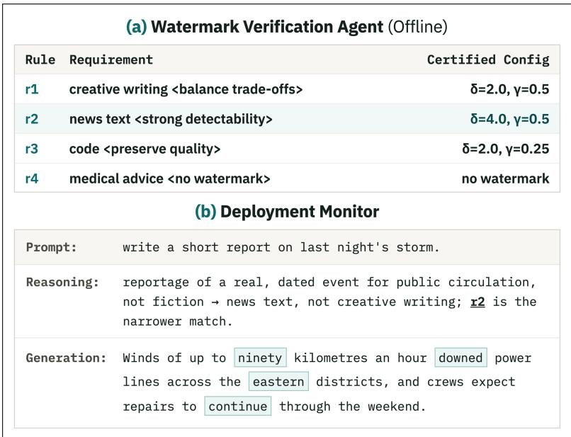
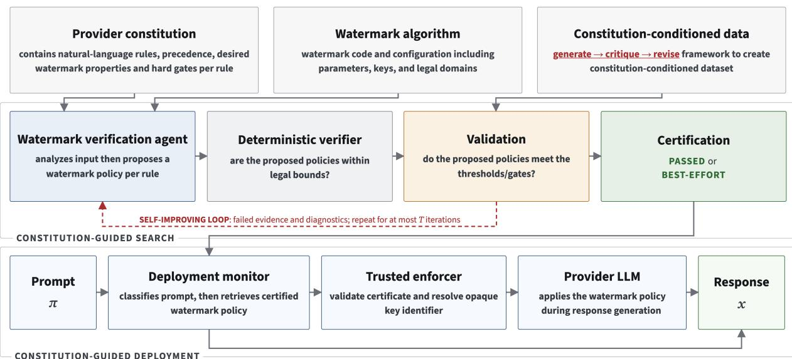
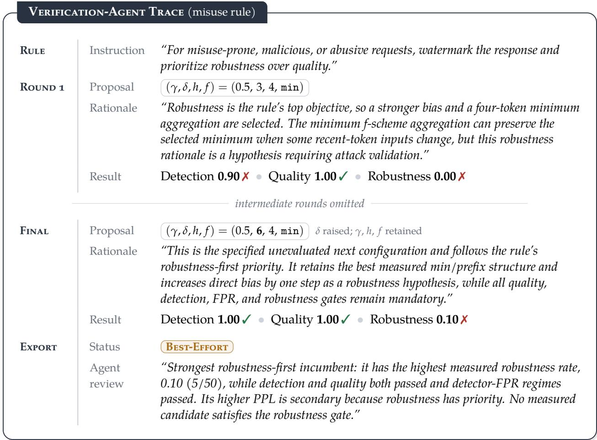

# Constitution-Guided Watermarking

Toluwani Aremu Samuele Poppi Nils Lukas

MBZUAI, Abu Dhabi, United Arab Emirates

## ABSTRACT

Watermarking enables language model providers to identify text generated by their models. However, its desired properties can conflict (i.e. stronger watermark signals can degrade text quality), while designs that resist editing may also facilitate forgery. Providers address these trade-ofs by choosing configurations that balance competing objectives or prioritize particular properties. Either approach im oses a shared o eratin oint on re uests with diferent re uirements, otentiall sacrificin quality where wording preservation matters or robustness where reliable attribution is essential. To allow flexible and adaptable designs, we introduce Constitution-Guided Watermarking, a framework that selects request-appropriate trade-ofs from provider requirements, listed as natural-language principles. Ofline, a pretrained reasoning agent examines constitutional rules alongside watermark implementations and iteratively refines rule-specific configurations using empirical feedback. At deployment, a separate monitor identifies applicable rules and retrieves the corresponding policy, including watermarking exemptions, without modifying the serving model. Furthermore, our frame- work supports ofline parallel optimization and refinement of rule-specific configurations based on evolving provider requirements without afecting deployment, and binds each deployed configuration to its evaluation evidence, making deployment decisions auditable. In a proof-of-concept evaluation using KGW and a five-rule constitution, our framework selects configurations responsive to provider priorities and improves post-paraphrase detection on robustness-prioritized requests by up to 14 percentage points over fixed configurations, while matching or exceeding all baselines in aggregate quality and clean detection at a nominal 0.1% false-positive rate.

## 1 Introduction

Watermarking enables language model providers to identify generated text by embedding a secret- key-dependent signal during generation (Kirchenbauer et al., 2023; Zhao et al., 2024a; Dathathri et al., 2024). A useful watermark should remain detectable, preserve output quality, survive relevant transformations, and resist forgery. These objectives can conflict (Zhao et al., 2024b). For bias-based schemes such as KGW (Kirchenbauer et al., 2023), increasing watermark strength can improve detectability at the cost of distortion (Wouters, 2024). At the same time, a watermark that survives benign editing may also survive malicious changes to the text’s meaning, enabling false attribution (Pang et al., 2024). Watermark deployment therefore requires deciding which properties to prioritize or trade of and which compromises are acceptable.

Existing approaches address these trade-ofs by selecting configurations that balance competing objectives or designing schemes that favor particular properties (Kuditipudi et al., 2023; Wouters,

  
Figure 1. Conceptual illustration: (a) ofline, the verification agent assigns each rule a configuration; (b) at deployment, the monitor routes a prompt to its rule. Rules shown are illustrative.

2024; Dathathri et al., 2024). However, a configuration that performs well on average need not meet the requirements of each request. For example, a provider may prioritize wording preservation when proofreading human-authored text, minimize interference with deterministic answers, and require detection after paraphrasing for misuse-prone generations. Applying the same compro- mise throughout can impose unnecessary distortion on quality-sensitive requests while providing insuficient robustness where attribution matters most. This motivates selecting operating points according to the requirements of each request.

These distinctions have practical consequences as watermarking enters deployment. Article 50 of the EU AI Act requires machine-readable marking of synthetic content, with exceptions including assistance with standard editing (EU AI Act, 2024). Anthropic’s announcement of text watermarking for Claude illustrates a related attribution limitation: a detected watermark indicates model involvement but does not distinguish model-authored text from human text that the model heavily edited (Anthropic, 2026). Providers consequently need policies governing not only how reliably a watermark is detected, but also when it should be applied and what its presence is intended to convey.

Request-dependent requirements cannot be reduced to subject matter alone. Proofreading a medical explanation and generating medical advice concern the same topic, yet a provider may exempt the former and require low-distortion watermarking for the latter. Adaptive watermarking methods already adjust embedding according to token uncertainty or generation features (Liu & Bu, 2024; Wang et al., 2025b,a). Such adaptation addresses how to embed a signal under a chosen objective; our focus is how providers specify which objectives and exemptions apply to a request. Natural- language rules can express these distinctions directly, while quantitative acceptance criteria make the resulting policies testable. Connecting each configuration to its governing rule and evaluation evidence also makes deployment decisions inspectable. This motivates our central question:

## Central Question

Can natural-language provider requirements guide the selection and empirical evaluation of request-dependent watermark policies?

Our Framework. We introduce constitution-guided watermarking, a framework in which providers specify permitted watermark algorithms, ordered natural-language rules, and quantitative accep- tance gates. Together, these requirements form a watermark constitution, with rules such as “do not watermark low-risk editing” or “for misuse-prone requests, prioritize robustness over quality” (Figure 1). Inspired by Constitutional AI (Bai et al., 2022), the constitution governs the watermarking system rather than the serving model, which remains frozen. The framework separates two learning problems. An ofline watermark verification agent learns to relate watermark mechanisms, theoretical assumptions, and empirical trade-ofs to constitutional objectives. An online deployment monitor learns to identify the rules applicable to a user prompt and retrieve the corresponding policy. This separation keeps expensive algorithmic analysis ofline and constrains deployment to previously evaluated configurations. Our proof-of-concept study instantiates both roles with pretrained models.

Before deployment, the verification agent examines each permitted watermark’s implementation and configuration, then proposes a rule-specific configuration with a supporting rationale. A deterministic verifier rejects invalid proposals before the remaining candidates are evaluated on a held-out, rule-specific reference set. The resulting measurements and unmet requirements are returned to the agent, which revises its proposals over successive iterations. Each selected policy is stored with its empirical evidence i.e., configuration, evaluation evidence, and gate status. If no evaluated configuration satisfies a rule’s gates within the search budget, the framework returns a best-efort alternative and explicitly records the unmet requirements. At deployment, the monitor identifies applicable rules and retrieves the corresponding policy which is enforced during generation.

Contributions. (i.) First, we introduce Constitution-Guided Watermarking, to our knowledge the first framework to operationalize provider-written natural-language constitutions as request-dependent text watermarking policies. Inspired by Constitutional AI (Bai et al., 2022), the constitution specifies when watermarking applies and which properties take priority, while separate agents perform ofline configuration refinement and deployment monitoring. The framework is verifier-agnostic: any procedure that proposes rule-specific configurations under the same gates and budget can fill its policies. (ii.) We instantiate the verifier with a reasoning agent that reads the natural-language rules and the watermark implementation directly, proposes rule-specific configurations, and revises them using empirical feedback, with deterministic checks enforcing configuration validity and policy execution; unlike search-based verifiers, it requires no hand-specified objective per rule. We support this procedure with constitution-specific datasets generated through proposal and critique, and explicitly record unmet requirements when the selected configurations remain best-efort. (iii.) We present a proof-of-concept evaluation using KGW, one serving model, and a five-rule constitution, comparing against two fixed configurations and, within the framework, a budget- matched random-search verifier. Our framework improves post-paraphrase detection by up to 14 percentage points on robustness-prioritized requests while matching the best clean detection and quality. We report routing failures, observed false-positive rates, and unmet requirements alongside these gains. We further examine configuration sensitivity to constitutional priorities and the efect of deployment monitoring on policy execution. Appendix A discusses the related work in detail.

## 2 Problem Formalization

Watermarking system. Let M be the frozen serving model, $\pi \in \Pi$ a prompt, and $x \in \mathcal { R }$ a response. Unwatermarked generation is written $\mathcal { M } ( \pi )  x$ . For our framework, we additionally index each permitted algorithm $a \in \mathcal { W }$ by a legal configuration $\psi \in \Psi _ { a }$

$$
\mathsf { W a t e r m a r k } _ { \mathrm { g k } } ^ { \mathcal { M } } ( \pi ; a , \psi )  x .\tag{1}
$$

Here, $\mathsf { g k }$ and dtk denote generation and detection keys; in practice they are mostly the same. At nominal FPR $\alpha ,$ the configured detector is

$$
\mathsf { D e t e c t } _ { \mathsf { d i k } } ^ { \alpha } ( x ; a , \psi ) = \left\{ \mathsf { t r u e } , \quad s _ { a , \psi , \mathrm { d t k } } ( x ) \geq \eta _ { a , \psi , \mathrm { d t k } , \alpha } , \right.\tag{2}
$$

where s is the detection score and $\eta$ is calibrated on null text. We fix the deployment key pair throughout the empirical evaluation. Detection must match generation in its key, tokenizer, vocabu- lary size, and scoring-relevant parameters. Generation-only parameters, such as KGW’s logit bias $\delta ,$ can difer without changing the detector.

Provider constitution. A constitution is

$$
\mathcal { C } = ( \mathcal { W } , \mathcal { S } , \prec , \tau ) ,\tag{3}
$$

where $\textit { S } = \ \{ { r } _ { 1 } , \ldots , { r } _ { m } \}$ is the rule set, ≺ specifies precedence, and $\tau$ contains quantitative gates. We use S for rules to reserve R for responses. Each rule has a reviewable representation $\boldsymbol { r } = \left( u _ { r } , d _ { r } , \mathbf { o } _ { r } , \mathcal { G } _ { r } \right)$ : its authoritative natural-language instruction $u _ { r } ,$ watermarking decision $d _ { r } \in \{ \mathsf { W M } , \mathsf { N o W M } \}$ , ordered objectives $\mathbf { o } _ { r } ,$ and active gates $\mathcal { G } _ { r }$

Let $S ( \pi )$ contain the rules applicable to π. Precedence resolves conflicting watermarking decisions. For compatible watermarked rules ${ \cal S } _ { \sf { W M } } ( \pi )$ , objective recurrence determines priority:

$$
n _ { j } ( \pi ) = \sum _ { r \in S _ { \mathsf { W M } } ( \pi ) } \mathbf { 1 } [ j \in \mathbf { o } _ { r } ] .\tag{4}
$$

The combined profile orders objectives by decreasing $n _ { j } ( \pi )$ , breaking ties by provider rule order and retaining the applicable gates. Thus, two requests for quality outweigh one request for robustness in the objective order without removing the robustness requirement.

Constitutional objectives. For a rule profile $c ,$ let $\mathcal { D } _ { c }$ be its prompt distribution and $\mathcal { A } _ { \mathrm { F P R } }$ the provider’s nominal FPR regimes. For each evaluated prompt $\pi _ { i } ,$ generate Watermar $\mathfrak { s } _ { \mathtt { g k } } ^ { \mathcal { M } } ( \pi _ { i } ; a , \psi ) $ $x _ { i }$ . The empirical detectability rate is

$$
\widehat { D } _ { c } ( a , \psi ) = \operatorname* { m i n } _ { \alpha \in \mathcal { A } _ { \mathrm { F P R } } } \frac { 1 } { n _ { c } } \sum _ { i = 1 } ^ { n _ { c } } d _ { a , \psi } ^ { \alpha } ( x _ { i } ) .\tag{5}
$$

For the fixed detection key, empirical FPR on a null set $\mathcal { D } _ { 0 }$ disjoint from threshold calibration is

$$
\widehat { F } _ { \alpha } ( a , \psi ) = \frac { 1 } { | \mathscr { D } _ { 0 } | } \sum _ { z \in \mathscr { D } _ { 0 } } d _ { a , \psi } ^ { \alpha } ( z ) .\tag{6}
$$

For a reference language model q and a global natural-text baseline $b _ { q }$ fixed before search, the quality pass rate is

$$
\widehat { Q } _ { c } ( a , \psi ) = \frac { 1 } { n _ { c } } \sum _ { i = 1 } ^ { n _ { c } } \mathbf { 1 } \big [ \mathrm { P P L } _ { q } ( x _ { i } ) \leq b _ { q } \big ] .\tag{7}
$$

Low-distortion or exactness requirements additionally need task-specific measurements, such as $L _ { c } ( x _ { i } , x _ { i } ^ { 0 } )$ relative to $\mathcal { M } ( \pi _ { i } )  x _ { i } ^ { 0 }$ or an appropriate task reference. The PPL gate alone establishes neither task correctness nor distribution preservation.

Let E be an attack channel. Let $\mathcal { T } _ { c }$ contain the channels relevant to profile $c ,$ and let $x _ { i , b } ^ { \prime } \gets \mathcal { E } ( x _ { i } )$ be B independently randomized attacks conditional on each response. At $\alpha _ { * } =$ min AFPR, empirical robustness is

$$
\widehat { R } _ { c } ( a , \psi ) = \operatorname* { m i n } _ { \mathcal { E } \in \mathcal { T } _ { c } } \frac { 1 } { n _ { c } B } \sum _ { i = 1 } ^ { n _ { c } } \sum _ { b = 1 } ^ { B } d _ { a , \psi } ^ { \alpha _ { * } } ( x _ { i , b } ^ { \prime } ) .\tag{8}
$$

We report attack validity and execution failures separately and cluster uncertainty estimates by source prompt. Robustness is evaluated only when activated by the rule. For NoWM decisions, responses instead follow $\mathcal { M } ( \pi )  x$ and are evaluated for action compliance and any applicable quality requirements. End-to-end evaluation retains generation and routing failures in its attempted- prompt denominators and reports their counts separately.

Unlike removal attacks, forgery seeks acceptance of content not legitimately issued by the provider. For profile $c ,$ let $\mathcal { H } _ { c }$ denote such target content and $\mathsf { A c c } _ { c }$ the provider’s acceptance rule. An adversary $\boldsymbol { B }$ observing N watermarked responses produces $x ^ { \star }$ , with success probability

$$
\operatorname { A d v } _ { c } ^ { \mathrm { f o r g e } } ( \mathcal { B } , N ) = \operatorname* { P r } [ x ^ { \star } \in \mathcal { H } _ { c } \land \operatorname { A c c } _ { c } ( x ^ { \star } ) = 1 ] .\tag{9}
$$

A compatible extension randomly selects one of $K \geq 2$ secret keys within each profile and accepts text only when exactly one key detects it (Aremu et al., 2025). For blind attackers unable to separate samples by key, assuming key-symmetric, mutually independent detection outcomes on forged text, success is bounded by $( \dot { 1 } - \dot { 1 } / K ) ^ { K - 1 }$ per attempt, irrespective of N while these assumptions hold. Appendix D.1 gives the construction, assumptions, proof, and FPR calibration.

Feasibility and best efort. For gate $g \in \mathcal { G } _ { c }$ , let $\widehat { m } _ { c , g } ( a , \psi )$ be its measured value, $\tau _ { g }$ its threshold, and $\bowtie _ { g }$ its comparison. Empirical acceptance requires

$$
\operatorname { P a s s } _ { c } ( a , \psi ) = \bigwedge _ { g \in { \mathcal G } _ { c } } \left[ \widehat { m } _ { c , g } ( a , \psi ) \bowtie _ { g } \ \tau _ { g } \right] .\tag{10}
$$

The provider’s objective order $\mathbf { o } _ { c }$ determines the incumbent among tested passing configurations. If none passes within the search budget, the system returns the best measured incumbent under that order, labels it Best-Effort, and reports it explicitly. Note that failure to find a passing configuration does not prove that the constitution is infeasible.

## 3 Methodology

Constitution-guided watermarking separates ofline policy construction search from online policy execution. A verification agent $A _ { \theta }$ proposes rule-specific watermark policies using watermark implementations and empirical feedback, while a deployment monitor $M _ { \varphi }$ selects the applicable policy for each request. Our proof-of-concept uses pretrained agents without weight updates (Appendix D.2 gives objectives for training both roles); the serving model M remains frozen. Prompts $\pi \in \Pi$ follow Section 2; P denotes the evaluated deployment policy. Figure 2 illustrates this separation.

  
Figure 2. Constitution-Guided Watermarking framework.

## 3.1 Dataset Generation

Evaluating a constitution requires prompts labeled with the rules they trigger, which existing water- marking benchmarks do not provide. We therefore construct constitution-specific data through a generate–critique–revise loop adapted from Constitutional AI (Bai et al., 2022). Given the constitution and a target scenario, a generator proposes a realistic user prompt. An independent critic then labels every applicable rule, the resolved watermark action, and the active gates, and rejects prompts that are unrealistic or do not match the target scenario. A reviser repairs rejected prompts, which are critiqued again; prompts that still fail are discarded. To test rule recognition beyond surface wording, we add paraphrases of accepted prompts and include prompts that trigger multiple rules, which test rule recognition under overlapping requirements. Before search begins, we fix a small rule-stratified reference set ${ \mathcal { D } } _ { \mathrm { r e f } }$ and a disjoint test set $\mathcal { D } _ { \mathrm { t e s t } }$ . Each source prompt and its paraphrases are assigned to the same split to prevent leakage between them. Only ${ \mathcal { D } } _ { \mathrm { r e f } }$ enters the configuration loop; because it is reused across rounds, it serves as adaptation data, and all reported results use $\mathcal { D } _ { \mathrm { t e s t } }$

## 3.2 Constitution-Guided Search

At iteration t, our watermark verification agent $A _ { \theta }$ receives the original natural-language rules, water- mark algorithm, and previous reference measurements. The agent proposes one watermark policy $( a _ { c } ^ { ( t ) } , \psi _ { c } ^ { ( t ) } )$ ) per unresolved profile and states its rationale, assumptions, and expected efect on each active gate. Deterministic checks enforce source provenance, parameter legality, detector binding, profile coverage, and proposal novelty. Reference answers follow Watermark $\mathbf { \dot { \varepsilon } } _ { \mathbf { g k } } ^ { \mathcal { M } } ( \pi _ { i } ; a _ { c } ^ { ( t ) } , \psi _ { c } ^ { ( t ) } ) \to x _ { i }$ under each legal proposal. For reasoning models, watermark generation and detection operate on the visible answer, not the preceding reasoning. We then calibrate detector thresholds using null text and use a separate null reference set to measure FPR. Our evaluator checks only the profile’s active gates, records failures and sample counts, and returns this evidence to the watermark verification agent. The agent retains the strongest measured incumbent under the profile’s objective order and revises unsuccessful proposals. When freezing is enabled, profiles satisfying all active gates are removed from subsequent search. Unresolved profiles continue until the budget is exhausted, and their retained configurations are labeled best-efort. After at most T rounds, every profile has a passing record or an explicit best-efort alternative.

Algorithm 1 Source-grounded constitutional configuration search   
Input: $A _ { \theta } ,$ constitution ${ \mathcal { C } } ,$ source S, legal domains $\{ \Psi _ { a } \}$ , frozen $\mathcal { M } , \mathcal { D } _ { \mathrm { r e f } } ,$ budget T   
Output: policy $\mathcal { P }$ with measured incumbents and gate status   
1 U ← watermarked profiles; $H _ { c } \gets \emptyset$ for every $c \in U$   
▷ Refine configurations using reference-set feedback.   
2 for $t = 1 , \dots , T$ while $U \neq \emptyset$ do   
3 $Z \gets A _ { \theta } ( \mathcal { C } , S , U , \{ H _ { c } \} _ { c \in U } )$   
▷ Reject illegal configurations before generation.   
4 $Z $ ValidateOrRequestRepair $\left( Z , S , \{ \Psi _ { a } \} \right)$   
5 mb ← Evaluate $\left( \mathcal { M } , \mathcal { D } _ { \mathrm { r e f } } , Z \right)$   
6 for each $c \in U$ do   
7 $H _ { c } \gets H _ { c } \cup \{ ( Z _ { c } , \widehat { \mathbf { m } } _ { c } ) \}$   
▷ Prefer passing candidates; otherwise retain the best measured trade-of.   
8 $z _ { c } ^ { * } \gets$ BestMeasured $\left( H _ { c } , \mathbf { o } _ { c } , \mathcal { G } _ { c } \right)$   
9 if Passc(z∗) and freeze is enabled then $U  U \backslash \{ c \}$   
10 end for   
11 end for   
▷ Attach evidence, exemptions, and explicit unmet requirements.   
12 $\mathcal { P } $ BindEvidence $\left( \mathcal { C } , S , \{ z _ { c } ^ { * } , H _ { c } \} \right)$   
13 return P

## 3.3 Constitution-Guided Deployment

After the iterative search process is complete, a versioned evidence record which holds the con- stitution rules, watermark information, evaluation records, and proposed watermark policy per rule is returned. We call this record a certificate, with an explicit scope that reveals the status of the pre-deployment search. Reference-Passed means that observed reference estimates satisfy the gates, while Best-Effort exposes every unmet gate. Note that exhausting a finite search budget only establishes that no passing configuration was found, and not that the constitution is mathematically infeasible. Ideally, deploying a best-efort record should depend on the provider approval. For prompt π, the deployment monitor predicts $\widehat { S } ( \pi )$ and retrieves the corresponding records from policy P. For overlapping rules, provider precedence resolves the action and Equation 4 resolves compatible priorities. Our framework then validates the selected action and record and resolves gk through the key manager when watermarking is required. We evaluate known-configuration detec- tion using the detector bound to the generation record. Appendix D.3 discusses this assumption and an unevaluated extension for prompt-free detector selection.

Algorithm 2 Constrained constitutional deployment   
Input: $M _ { \varphi } ,$ prompt π, constitution ${ \mathcal { C } } ,$ evidence index I for policy ${ \mathcal { P } } ,$ frozen M   
▷ Identify applicable rules and resolve overlapping requirements.   
1 $ { \widehat { S } } ( \pi )   { \dot { M } _ { \varphi } } ( \pi , \mathcal { C } , \mathbb { Z } )$   
2 $c \gets$ ResolveAndAggregate $( \widehat { S } ( \pi ) , \mathcal { C } )$   
3 z ← RetrieveRecord $( c , \mathcal { T } )$   
▷ Use the provider’s fallback when no authorized policy can be applied.   
4 if uncertain, missin , or unauthorized then return ProviderFallback $( \pi , c )$   
▷ Enforce the retrieved action and its bound configuration   
5 $( d , a , \psi , \kappa ) \gets$ EnforceAndBind $( z , { \mathcal { T } } )$   
6 if d = NoWM then $\mathcal { M } ( \pi )  x$   
▷ Resolve secret keys only within the trusted runtime.   
7 else gk ← ResolveGenerationKey(κ)   
8 Watermar $\mathfrak { c } _ { \mathbf { g k } } ^ { \mathcal { M } } ( \pi ; a , \psi ) \to x$   
9 end if   
▷ Record the executed policy without exposing secret keys.   
10 Audit $( c , z , d , a , \psi , \kappa ) ;$ return x   
κ is an opaque key identifier. The trusted runtime resolves gk; the corresponding dtk is bound to the record for detection.   
Neither the monitor nor the log receives secret keys.

## 4 Experimental Setup

Constitutional-KGW setup. We instantiate our watermark verification agent $A _ { \theta }$ with pretrained gpt-5.6-luna at high reasoning efort and deployment monitor $M _ { \varphi }$ with gpt-5.4-nano also at high efort. Table 1 summarizes the five rules reproduced in Appendix B.4. To generate our corpus, we use GPT-OSS-120B as generator and Qwen3-32B as critic. During the ofline search process, evaluation is carried out on 10 reference prompts per rule (50 total) for at most five rounds. To test before deployment, we use 100 disjoint test prompts per rule (500 per method), never as feedback.

Table 1. Provider constitution, in first-applicable precedence order.

We also leverage Qwen3-32B as our provider’s LLM, allowing $^ { 8 , 1 9 2 }$ total new tokens and at most 1,024 visible-answer tokens. We only watermark the gener- ated response if the constitution allows and do not watermark the reasoning tokens. For our main

<table><tr><td>Scenario</td><td>Action</td><td>Constitutional priority</td></tr><tr><td>Misuse-prone requests</td><td>WM</td><td>Robustness over quality</td></tr><tr><td>Low-risk editing</td><td>NoWM</td><td>No watermark application</td></tr><tr><td>High-stakes advice</td><td>WM</td><td>Quality, low distortion, high detection</td></tr><tr><td>Deterministic answers</td><td>WM</td><td>Quality and detectability</td></tr><tr><td>General generation</td><td>WM</td><td>Minimize unnecessary distortion</td></tr></table>

experiment, we focus on the KGW watermark (Kirchenbauer et al., 2023), using its implementation within the MarkLLM repository (Pan et al., 2024), with integer $\delta \geq 1 , 0 < \gamma < 1$ , integer context length $h \geq 1$ , and $f \in \{ { \tt t i m e } , { \tt a d d i t i v e } , { \tt s k i p } , { \tt m i n } \}$ available to the verification agent.

Baselines and controls. Our experiments compare Constitutional-KGW with two fixed KGW settings: $( \gamma , \delta , h ) = ( 0 . 2 5 , 4 , 3 )$ and (0.5, 2, 1), both with $f = \mathtt { t i m e }$ . These are prespecified operating points by Piet et al. (2023) and Pan et al. (2024), not demonstrated constitution-specific optima. Within the framework, we also evaluate a budget-matched random-search verifier that shares our deployment monitor (Appendix B.3).

Gates and attacks. Watermarked rules require (i.) detection ≥ 0.95, (ii.) quality pass rate $\geq 0 . 9 0 $ (iii.) robustness $\ge 0 . 5 0 ,$ and (iv.) empirical $\mathrm { F P R } \leq 0 . 0 1$ . Detectors are calibrated at target FPRs $\alpha \in \{ 0 . 0 1 , 0 . 0 0 1 \}$ using 5,000 natural texts, with another 5,000 null texts used for reference FPR measurement. For quality, we use answer-only perplexity from Qwen2.5-7B-Instruct and a global threshold $b _ { q } = 1 8 . 2 5 ,$ , the fixed 95th percentile of 200 natural-text samples. As for robustness, we leverage one non-adaptive and one adaptive paraphraser. DIAA’s adaptive paraphraser and DIPPER (non-adaptive) each generate five attacks per answer, and we report the attack channels separately and gate their minimum (Diaa et al., 2025; Krishna et al., 2023). A separate semantic-validity audit is required to assess whether removal preserves the answer. Full decoding, budget and attack settings are in Appendix B.

Metrics. We report clean detection rates across the four watermark-required rules $( n = 4 0 0 )$ Quality measures fluency as the fraction of attempted watermark-required prompts $( n = 4 0 0 )$ yielding a response with PPL at or below the global threshold. For the robustness-required rule, we report post-attack detection separately for DIAA and DIPPER at nominal 0.1% FPR, using five attacks per response across 100 prompts. Editing compliance measures how often an editing request receives a response generated without the watermark processor. Routing and generation failures remain in the attempted-prompt denominators as unsuccessful outcomes. Attack execution failures likewise remain in the robustness denominators as non-detections. We give 95% bootstrap confidence intervals for generation metrics, resampling source prompts and keeping each response’s attack repetitions together. At both FPR operating points (1% and 0.1%), we report observed false positives on unwatermarked texts with exact binomial confidence intervals (Appendix C.2). These null measurements were used as reference feedback and do not constitute an independent post- selection audit. The empirical FPR gate is $\leq 1 \% ;$ passing it does not establish operation at 0.1% FPR.

## 5 Experimental Evaluation

We evaluate four questions: (i) whether Constitutional-KGW improves on fixed and searched configurations end to end (Table 2); (ii) how iterative feedback changes the agent’s proposals (Table 3); (iii) whether selected policies respond to changes in constitutional priority (Table 4); and (iv) how deployment monitoring afects policy execution (Table 5). Observed false-positive rates of all deployed detectors are in Appendix C.2 (Table 7).

Main Results. Table 2 summarizes our evaluation across detection, quality, robustness, and com- pliance. On the 100 robustness-targeted prompts, Constitutional-KGW achieves post-paraphrase detection of 13.8% against DIAA and 17.0% against DIPPER, compared with 2.8% and 3.0% for Fixed KGW A and 1.4% and 8.6% for Fixed KGW B, corresponding to gains of +11.0 and +14.0 percentage points over Fixed KGW A. These gains are measured on the robustness-active rule itself rather than diluted across unrelated requests. Relative to the random-search verifier, Constitutional-KGW is more robust to both attacks (13.8% vs. 12.2% on DIAA; 17.0% vs. 11.6% on DIPPER), significantly for DIPPER (paired bootstrap; Appendix C.4). The random-search verifier also required hand-specified ranking weights for each rule, whereas the reasoning verifier consumed the rule text directly. Both channels nonetheless remain well below the provider’s 50% requirement, so the framework reports this rule as a best-efort policy rather than a validated one (Table 3). Across the four watermark-required rules (n = 400), clean detection at nominal α = 0.1% is 97.5%, matching the random-search verifier and exceeding Fixed KGW A (92.5%) and Fixed KGW B (61.8%); Ap-pendix C.1 lists the configuration each method stores per rule. The quality pass rate $( \mathrm { P P L } \leq 1 8 . 2 5 ) $ is 98.6%, comparable to Fixed KGW A (98.4%), Fixed KGW B (98.2%), and the random-search verifier (97.2%). Finally, our method correctly exempts all 100 editing requests, whereas the fixed baselines watermark every request. (Key Takeaway.) In this proof-of-concept, Constitutional-KGW delivers targeted robustness gains under paraphrase attacks and full policy compliance while matching the best clean detection and quality, but paraphrase robustness remains far below deployment targets.

Table 2. Main results. Clean detection covers watermark-required rules $( n = 4 0 0 ) _ { \mathrm { . } }$ ; quality measures PPL $\leq 1 8 . 2 5$ on the same prompts. Robustness covers 100 robustness-required prompts (5 attacks/response). Brackets show 95% percentile-bootstrap intervals, clustered by prompt for robustness. The two constitutional rows share the framework, monitor, gates, and budget, and difer only in the verifier. All values are percent- ages; best results are bolded. Robustness at $\alpha = 1 \%$ is in Appendix C.4.
<table><tr><td></td><td colspan="2">Clean Detection</td><td>Quality</td><td colspan="2">Robustness  $( \alpha = 0 . 1 \% )$ </td><td>Compliance</td></tr><tr><td>Method</td><td> $\alpha = 1 . 0 \%$ </td><td> $\alpha = 0 . 1 \%$ </td><td> $\mathrm { P P L } \leq 1 8 . 2 5$ </td><td>DIAA</td><td>DIPPER</td><td>Exempt</td></tr><tr><td>Fixed baselines</td><td></td><td></td><td></td><td></td><td></td><td></td></tr><tr><td>Fixed KGW A</td><td> $9 5 . 5 _ { \ [ 9 3 . 5 , 9 7 . 5 ] }$ </td><td></td><td>92.5 [90,95.0] 98.4 [97.2,99.4]</td><td> $2 . 8 _ { \ [ 1 . 0 , 4 . 8 ] }$ </td><td> $3 . 0 _ { \ [ 1 . 6 , 4 . 6 ] }$ </td><td>0.0</td></tr><tr><td>Fixed KGW B</td><td> $8 0 . 0 _ { [ 7 6 . 3 , 8 3 . 8 ] }$ </td><td></td><td>61.8 [57.3,66.3] 98.2 [97.0,99.2]</td><td> $1 . 4 _ { \ [ 0 . 4 , 2 . 4 ] }$ </td><td> $8 . 6 _ { \ [ 6 . 0 , 1 1 . 4 ] }$ </td><td>0.0</td></tr><tr><td>Constitutional framework</td><td></td><td></td><td></td><td></td><td></td><td></td></tr><tr><td>Random-search verifier</td><td> $9 8 . 0 _ { \ [ 9 6 . 5 , 9 9 . 3 ] }$ </td><td>97.5 [96.0,99.0]</td><td> $9 7 . 2 _ { \ [ 9 5 . 8 , 9 8 . 6 ] }$ </td><td> $1 2 . 2 _ { \ : [ 8 . 0 , 1 7 . 0 ] }$ </td><td> $1 1 . 6 _ { \ : [ 8 . 4 , 1 5 . 0 ] }$ </td><td>100.0</td></tr><tr><td>Reasoning verifier (C-KGW, ours)</td><td> $9 8 . 0 _ { \ [ 9 6 . 5 , 9 9 . 3 ] }$ </td><td> $9 7 . 5 _ { \ [ 9 6 . 0 , 9 9 . 0 ] }$ </td><td> $9 8 . 6 _ { \ [ 9 7 . 4 , 9 9 . 6 ] }$ </td><td> $1 3 . 8 _ { \ : [ 1 0 . 8 , 1 6 . 8 ] }$ </td><td> $1 7 . 0 _ { \ [ 1 2 . 8 , 2 1 . 4 ] }$ </td><td>100.0</td></tr></table>

Impact of Iterative Refinement. To show what the iterative watermark verification agent changes, we compare the initial and final proposals for our robustness-prioritized rule (Table 3). The initial proposal $( \delta = 3 )$ failed every robustness check on the 10-prompt reference set. In response to this feed- back, the agent doubled the bias to $\delta = 6$ and left γ, context length, and scoring function unchanged. The final revision raised clean detection at nomi- nal 0.1% FPR from 90% to 100% and worst-channel robustness from 0% to 10%, with no loss in the ob-served quality pass rate. Because robustness still

Table 3. Impact of Iterative Refinement. $\gamma = 0 . 5 ,$ $h = 4 ,$ , and $f = { \mathfrak { m i n } }$ are unchanged. Detection uses nominal $\alpha \ : = \ : 0 . 1 \%$ . Rates are percentages; best results are bolded. Full trace in Appendix C.5.
<table><tr><td>Reference-set measure</td><td>Initial</td><td>Final</td></tr><tr><td>KGW bias, δ</td><td>3</td><td>6</td></tr><tr><td>Clean detection  $( \alpha = 0 . 1 \% )$ </td><td>90.0</td><td>100.0</td></tr><tr><td>Quality pass rate</td><td>100.0</td><td>100.0</td></tr><tr><td>Worst-channel robustness</td><td>0.0</td><td>10.0</td></tr><tr><td>Policy status</td><td>一</td><td>Best-effort</td></tr></table>

fell well short of the 50% requirement, the framework exported the policy as best-efort rather than validated. It reported the unmet constraint explicitly instead of silently accepting it. These figures come from 10 reference prompts, so they illustrate the refinement mechanism rather than establish generalization.

Sensitivity to Constitutional Priorities. To test whether the agent responds to stated priorities, we run the pipeline under three constitutions that difer only in their trade-of preference (Table 4; exact wording in Appendix C.3). All three variants retain $\gamma = 0 . 5$ while selecting diferent bias strengths and, for robustness-first, diferent context and seeding settings. The quality-first variant selects the weakest bias (δ = 2) and attains the highest quality pass rate (98.0%), at the cost of the lowest robustness (4.6% DIAA, 5.6% DIPPER). The robustness-first variant selects the strongest bias $( \delta = 6 )$

Table 4. Constitution sensitivity on 100 held-out prompts. Each variant runs the same pipeline under a diferent constitution priority; all selected $\gamma = 0 . 5 .$ . Configurations are $( \delta , h , f )$ . Quality measures PPL $\leq 1 8 . 2 5 ;$ robustness uses five attacks per response at nominal $\alpha = 0 . 1 \%$ . Quality and clean-detection brackets are 95% Clopper–Pearson intervals; robustness brackets are 95% bootstrap intervals clustered by prompt. All values are percentages; higher is better. Best results are bolded.
<table><tr><td rowspan="2">Constitution</td><td rowspan="2"> $( \delta , h , f )$ </td><td colspan="2">Clean Detection</td><td>Quality</td><td colspan="2">Robustness  $( \alpha = 0 . 1 \% )$ </td></tr><tr><td> $\alpha = 1 . 0 \%$ </td><td> $\alpha = 0 . 1 \%$ </td><td> $\mathrm { P P L } \leq 1 8 . 2 5$ </td><td>DIAA</td><td>DIPPER</td></tr><tr><td>Quality-first</td><td>(2,1,time)</td><td> $9 3 . 0 _ { \ [ 8 6 . 1 , 9 7 . 1 ] }$ </td><td> $9 1 . 0 _ { \ [ 8 3 . 6 , 9 5 . 8 ] }$ </td><td> $9 8 . 0 _ { \ [ 9 3 . 0 , 9 9 . 8 ] }$ </td><td> $4 . 6 _ { \ [ 2 . 4 , 7 . 6 ] }$ </td><td> $5 . 6 _ { \ [ 3 . 0 , 8 . 4 ] }$ </td></tr><tr><td>Robustness-first</td><td> $( 6 , 2 , \mathsf { a d d i t i v e } )$ </td><td> $1 0 0 . 0 _ { \ [ 9 6 . 4 , 1 0 0 . 0 ] }$ </td><td>98.0 [93.0,99.8]</td><td> $9 1 . 0 _ { \ [ 8 3 . 6 , 9 5 . 8 ] }$ </td><td> $1 5 . 6 _ { \ [ 1 2 . 5 , 1 9 . 1 ] }$ </td><td> $1 8 . 6 _ { \ [ 1 5 . 3 , 2 2 . 3 ] }$ </td></tr><tr><td>Balanced</td><td>(4,1,time)</td><td> $9 8 . 0 _ { \ [ 9 3 . 0 , 9 9 . 8 ] }$ </td><td>97.0 [91.5,99.4]</td><td> $9 4 . 0 _ { \ [ 8 7 . 4 , 9 7 . 8 ] }$ </td><td> $1 3 . 2 _ { \ : [ 8 . 6 , 1 8 . 0 ] }$ </td><td> $1 7 . 0 _ { \ [ 1 3 . 2 , 2 1 . 4 ] }$ </td></tr></table>

and attains the highest detection and robustness (15.6% DIAA, 18.6% DIPPER), while quality falls to 91.0%. The balanced variant $( \delta = 4 )$ falls between the two on every metric. However, its intervals overlap with robustness-first throughout, so adjacent priorities are not reliably distinguished at this sample size. Moreover, no variant exceeds 19% paraphrase robustness. These results therefore provide limited evidence of configuration sensitivity: the constitution shifts the trade-of in the intended direction, but reliably separating neighboring priorities and meeting stringent robustness targets remain open challenges.

Table 5. Impact of deployment monitor. Clean detection is averaged over watermark-required rules $( n = 4 0 0 ) _ { \mathrm { . } }$ ; robustness covers 100 prompts under paraphrase attack at $\alpha = 0 . 1 \% ;$ quality measures PPL ≤ 18.25 across advice and deterministic requests $( n = 2 0 0 )$ ). Rates are percentages; best results are bolded. Evasion probes and a routing rerun are in Appendix C.6.
<table><tr><td></td><td>Rule</td><td colspan="2">Clean Detection</td><td>Quality</td><td colspan="2">Robustness  $( \alpha = 0 . 1 \% )$ </td><td>Policy Action</td><td>Routing</td></tr><tr><td>Router Policy</td><td>Assignment α = 1.0%</td><td></td><td> $\alpha = 0 . 1 \%$ </td><td> $\mathrm { P P L } \leq 1 8 . 2 5$ </td><td>DIAA</td><td>DIPPER</td><td>Compliance</td><td>Failures (/500)</td></tr><tr><td>gpt-5-nano (low reasoning)</td><td>70.6</td><td>87.5</td><td>84.5</td><td>91.0</td><td>10.2</td><td>16.4</td><td>75.0</td><td>36</td></tr><tr><td>gpt-5.4-nano (high reasoning)</td><td>100.0</td><td>98.0</td><td>97.5</td><td>98.0</td><td>13.8</td><td>17.0</td><td>100.0</td><td>0</td></tr></table>

Impact of Deployment Monitor. To separate runtime rule enforcement from the quality of the selected watermarking configurations, we compare a lightweight monitor $\mathtt { ( g p t - 5 - n a n o , }$ low reason- ing) against a stronger monitor (gpt-5.4-nano, high reasoning) on all 500 prompts, both executing the Constitutional-KGW policy with frozen Qwen3-32B generation (Table 5). The stronger monitor assigns the correct rule on every request (100.0%) with no routing failures, whereas gpt-5-nano reaches only 70.6% and fails on 36 requests (7.2%), all due to invalid policy decisions rather than infrastructure errors. This deficit propagates downstream: clean detection falls from 98.0% to 87.5% at $\alpha = 1 . 0 \%$ and from 97.5% to 84.5% at $\alpha = 0 . 1 \%$ , the quality pass rate on quality-prioritized requests drops from 98.0% to 91.0%, and policy-action compliance falls from 100.0% to 75.0%, driven mainly by editing requests that should have been exempt from watermarking. Robustness is similar (13.8% vs. 10.2% under DIAA; 17.0% vs. 16.4% under DIPPER), indicating that paraphrase vulnerability is a property of the watermark itself rather than of routing. Because outputs were regenerated for each arm, these diferences are a deployment-level diagnostic rather than a counterfactual audit of identical generations; nonetheless, they show that constitutional execution depends as much on reliable policy interpretation as on configuration optimization.

## 6 Discussion and Conclusion

Key Takeaways. (i.) The framework’s advantage comes from assigning diferent operating points to diferent rules: robustness gains appear only where required, while other requests keep low- distortion configurations and editing remains unwatermarked, a pattern no fixed configuration can reproduce. (ii.) No evaluated method meets the 50% robustness requirement. This establishes a limitation of the tested policies and search budget, not a robustness ceiling for KGW. The framework reports this as a best-efort policy with explicit unmet gates. (iii.) Policy execution depends on the monitor as much as on configuration selection, since a weaker monitor degrades every metric even with unchanged configurations. (iv.) Priority wording shifts selected configurations in the intended direction, but adjacent priorities remain statistically indistinguishable.

Limitations. (i.) Our evaluation uses one watermark family, serving model, key pair, and search seed, with one five-rule constitution and a limited priority-sensitivity experiment. (ii.) The watermark policies for each rule are selected on small reference sets that are reused during search, so results are finite-sample evidence rather than guarantees, but an unsuccessful search does not prove infeasibility. (iii.) Detection assumes access to the generation configuration, and we did not evaluate prompt-free detector selection. Perplexity does not establish task correctness or low distortion, and attacked outputs are not independently audited for semantic preservation. However, our experiments show the potential of our proposed framework. We also do not measure forgery resistance, but our framework is compatible with randomized-key defenses (Aremu et al., 2025) applied within each rule (see Appendix D.1). (iv.) While we compared against fixed baselines and a random-search verifier, a Bayesian-optimization verifier and simpler hand-designed policies would further isolate the contribution of the reasoning verifier. Appendix E.2 details these limitations.

Conclusion. We introduced constitution-guided watermarking, which translates provider-written natural-language rules into request-dependent watermark policies through ofline, constitution- guided search and deployment routing, while keeping the serving model frozen. The KGW demon- stration supports the feasibility of this workflow, improving paraphrase robustness on robustness- prioritized requests, matching the best clean detection and quality among the evaluated baselines, and exempting editing requests as specified. Our framework also reports gates it is unable to reach within the given search budget. While these results demonstrate the potential of our framework, future work includes task-specific quality measurements, independent calibration audits, and evaluation across watermark families and constitutions.

## Ethics Statement

Watermark detection is statistical evidence, not conclusive proof of authorship or misconduct. Deployment must account for mixed human–AI authorship, false attribution, prompt privacy, and key security. Evaluating misuse-prone requests does not justify bypassing the serving model’s safety constraints; provenance control is not a substitute for content safety.

## AI Use Statement

In this work, we used generative AI tools to generate the synthetic, constitution-labeled prompt datasets (Section 3.1; GPT-OSS-120B and Qwen3-32B) and to implement parts of the experimental code. We have not used generative AI tools for formulating mathematical claims or writing proofs. Additionally, we used generative AI tools to draft and edit parts of the manuscript. We have reviewed all AI-assisted work; for example, generated prompts were filtered by an independent critic and spot-checked by the authors; AI-assisted code was tested and verified by the authors. We take responsibility for the final content of this work, including text, claims or artifacts produced with the aid of generative AI.

## Reproducibility Statement

Appendix B gives all decoding, budget, attack, and baseline settings, and Appendix B.4 reproduces the evaluated constitution verbatim. Table 6 lists every selected configuration, and Table 7 every deployed detector with its calibrated thresholds. Section 3.1 describes how the constitution-labeled prompts were generated and split. Code, prompts, and run artifacts, including source hashes, agent proposals, rejections, and retained incumbents, will be released upon publication.

## References

Scott Aaronson. Watermarking of large language models. https://www.youtube.com/watch?v= 2Kx9jbSMZqA, 2023. Simons Institute, YouTube video.

Anastasios N. Angelopoulos and Stephen Bates. A gentle introduction to conformal prediction and distribution-free uncertainty quantification. arXiv preprint arXiv:2107.07511, 2021. URL https://arxiv. org/abs/2107.07511.

Anthropic. How Claude’s text watermark works. Anthropic News, August 2026. URL https://www. anthropic.com/news/claude-text-watermark.

Toluwani Aremu, Noor Hussein, Munachiso Nwadike, Samuele Poppi, Jie Zhang, Karthik Nandakumar, Neil Gong, and Nils Lukas. Mitigating watermark forgery in generative models via randomized key selection. arXiv preprint arXiv:2507.07871, 2025. URL https://arxiv.org/abs/2507.07871.

Toluwani Aremu, Nils Lukas, and Jie Zhang. Watermarking should be treated as a monitoring primitive. arXiv preprint arXiv:2605.13095, 2026. URL https://arxiv.org/abs/2605.13095.

Yuntao Bai, Saurav Kadavath, Sandipan Kundu, Amanda Askell, Jackson Kernion, Andy Jones, Anna Chen, Anna Goldie, Azalia Mirhoseini, Cameron McKinnon, et al. Constitutional ai: Harmlessness from ai feedback. arXiv preprint arXiv:2212.08073, 2022.

James Bergstra and Yoshua Bengio. Random search for hyper-parameter optimization. Journal of Machine Learning Research, 13(10):281–305, 2012. URL https://jmlr.org/papers/v13/bergstra12a.html.

Yixin Cheng, Hongcheng Guo, Yangming Li, and Leonid Sigal. Revealing weaknesses in text watermarking throu h self-information rewrite attacks. In Proceedings of the 42nd International Conference on Machine Learning, volume 267 of Proceedings of Machine Learning Research, pp. 9982–10009. PMLR, 2025. URL https://proceedings.mlr.press/v267/cheng25c.html.

Miranda Christ, Sam Gunn, and Or Zamir. Undetectable watermarks for language models. In The Thirty Seventh Annual Conference on Learning Theory, pp. 1125–1139. PMLR, 2024.

C. J. Clopper and E. S. Pearson. The use of confidence or fiducial limits illustrated in the case of the binomial. Biometrika, 26(4):404–413, 1934. doi: 10.1093/biomet/26.4.404.

Sumanth Dathathri, Abigail See, Sumedh Ghaisas, Po-Sen Huang, Rob McAdam, Johannes Welbl, Vandana Bachani, Alex Kaskasoli, Robert Stanforth, Tatiana Matejovicova, Jamie Hayes, Nidhi Vyas, Majd Al Merey, Jonah Brown-Cohen, Rudy Bunel, Borja Balle, A. Taylan Cemgil, Zahra Ahmed, Kitty Stacpoole, Ilia Shumailov, Ciprian Baetu, Sven Gowal, Demis Hassabis, and Pushmeet Kohli. Scalable watermarking

for identifying large language model outputs. Nat., 634(8035):818–823, October 2024. URL https://doi. org/10.1038/s41586-024-08025-4.

Abdulrahman Diaa, Toluwani Aremu, and Nils Lukas. Optimizing adaptive attacks against watermarks for lan ua e models. In Proceedings of the 42nd International Conference on Machine Learning, volume 267 of Proceedings ofMachine Learning Research, pp. 13546–13569. PMLR, 2025. URL https://proceedings.mlr. press/v267/diaa25a.html.

EU AI Act. Artificial intelligence act. Oficial Journal of the European Union, July 2024. URL http://data. europa.eu/eli/reg/2024/1689/oj. Adopted 13 June 2024; OJ L, 12 July 2024.

Thibaud Gloaguen, Nikola Jovanović, Robin Staab, and Martin Vechev. Discovering clues of spoofed lm watermarks. arXiv preprint arXiv:2410.02693, 2024.

Donald R. Jones, Matthias Schonlau, and William J. Welch. Eficient global optimization of expensive black-box functions. Journal of Global Optimization, 13:455–492, 1998. doi: 10.1023/A:1008306431147.

Nikola Jovanović, Robin Staab, and Martin Vechev. Watermark stealing in large language models. ICML, 2024.

John Kirchenbauer, Jonas Geiping, Yuxin Wen, Jonathan Katz, Ian Miers, and Tom Goldstein. A watermark for large language models. In International Conference on Machine Learning, pp. 17061–17084. PMLR, 2023.

Kalpesh Krishna, Yixiao Song, Marzena Karpinska, John Wieting, and Mohit Iyyer. Paraphrasing evades detectors of ai-generated text, but retrieval is an efective defense. Advances in Neural Information Processing Systems, 36:27469–27500, 2023.

Rohith Kuditipudi, John Thickstun, Tatsunori Hashimoto, and Percy Liang. Robust distortion-free watermarks for language models. Trans. Mach. Learn. Res., 2024, 2023. URL https://api.semanticscholar.org/ CorpusID:260315804.

Yepeng Liu and Yuheng Bu. Adaptive text watermark for large language models. In Proceedings ofthe 41st International Conference on Machine Learning, volume 235 of Proceedings of Machine Learning Research, pp. 30718–30737. PMLR, 2024. URL https://proceedings.mlr.press/v235/liu24e.html.

Aman Madaan, Niket Tandon, Prakhar Gupta, Skyler Hallinan, Luyu Gao, Sarah Wiegrefe, Uri Alon, Nouha Dziri, Shrimai Prabhumoye, Yiming Yang, Shashank Gupta, Bodhisattwa Prasad Majumder, Katherine Hermann, Sean Welleck, Amir Yazdanbakhsh, and Peter Clark. Self-refine: Iterative refinement with self-feedback. In Advances in Neural Information Processing Systems, 2023. URL https://arxiv.org/abs/ 2303.17651.

Leyi Pan, Aiwei Liu, Zhiwei He, Zitian Gao, Xuandong Zhao, Yijian Lu, Binglin Zhou, Shuliang Liu, Xuming Hu, Lijie Wen, et al. Markllm: An open-source toolkit for llm watermarking. arXiv preprint arXiv:2405.10051, 2024.

Qi Pang, Shengyuan Hu, Wenting Zheng, and Virginia Smith. No free lunch in llm watermarking: Tradeofs in watermarking design choices. In Neural Information Processing Systems, 2024. URL https://api. semanticscholar.org/CorpusID:267938448.

Julien Piet, Chawin Sitawarin, Vivian Fan , Norman Mu, and David Wa ner. Mark m words: Analyzing and evaluating language model watermarks. ArXiv, abs/2312.00273, 2023. URL https://api. semanticscholar.org/CorpusID:265552122.

Noah Shinn, Federico Cassano, Edward Berman, Ashwin Gopinath, Karthik Narasimhan, and Shunyu Yao. Reflexion: Language agents with verbal reinforcement learning. In Advances in Neural Information Processing Systems, 2023. URL https://arxiv.org/abs/2303.11366.

Chenrui Wang, Junyi Shu, Billy Chiu, Yu Li, Saleh Alharbi, Min Zhang, and Jing Li. Learning to watermark: A selective watermarking framework for large language models via multi-objective optimization. In Advances in Neural Information Processing Systems, 2025a. URL https://openreview.net/forum?id=nJq5z21eUk.

Zongqi Wang, Tianle Gu, Baoyuan Wu, and Yujiu Yang. MorphMark: Flexible adaptive watermarking for large language models. arXiv preprint arXiv:2505.11541, 2025b. URL https://arxiv.org/abs/2505.11541.

Bram Wouters. Optimizing watermarks for large language models. In Proceedings of the 41st International Conference on Machine Learning, volume 235 of Proceedings ofMachine Learning Research, pp. 53251–53269. PMLR, 2024. URL https://proceedings.mlr.press/v235/wouters24a.html.

Xuandong Zhao, Prabhanjan Vijendra Ananth, Lei Li, and Yu-Xiang Wang. Provable robust watermarking for AI-generated text. In The Twelfth International Conference on Learning Representations, 2024a. URL https://openreview.net/forum?id=SsmT8aO45L.

Xuandong Zhao, Sam Gunn, Miranda Christ, Jaiden Fairoze, Andres Fabrega, Nicholas Carlini, Sanjam Garg, Sanghyun Hong, Milad Nasr, Florian Tramer, et al. Sok: Watermarking for ai-generated content. arXiv preprint arXiv:2411.18479, 2024b.

## A Related Work

Statistical text watermarking. Token-level watermarks alter or select tokens during decoding and detect the resulting statistical structure with a secret key. KGW partitions the vocabulary into context- dependent green and red lists and biases green-token logits (Kirchenbauer et al., 2023); Unigram uses a fixed keyed partition to improve robustness (Zhao et al., 2024a); EXP applies exponential sampling with keyed randomness (Aaronson, 2023); and SynthID aggregates tournament-based sampling scores (Dathathri et al., 2024). Distribution-preserving and cryptographic constructions provide stronger undetectability notions under explicit assumptions (Christ et al., 2024; Kuditipudi et al., 2023). Toolkits such as MarkLLM standardize implementations and evaluation, but do not determine which operating point a provider should deploy for a particular request (Pan et al., 2024).

Watermark trade-ofs and attacks. Watermarking has no universally optimal configuration i.e., detectability, quality, robustness, and security depend on the watermark mechanism, model, decod- ing policy, and output distribution (Pang et al., 2024; Wouters, 2024; Piet et al., 2023). Paraphrasing and rewriting can weaken token-level signals, particularly when the attacker adapts to the known watermark algorithm (Krishna et al., 2023; Diaa et al., 2025; Cheng et al., 2025). Other attacks estimate the watermark or induce false attribution (Jovanović et al., 2024; Gloaguen et al., 2024). Randomized key selection can bound forgery under a stated multi-key threat model, while persis- tent key-dependent structure can itself enable monitoring across outputs (Aremu et al., 2025, 2026). We treat these properties as conditional requirements rather than assuming that every request requires the same security-utility trade-of.

Adaptive and selective watermarking. Prior adaptive methods change where or how a watermark is embedded using token entropy, semantics, or learned generation features (Liu & Bu, 2024; Wang et al., 2025b,a). These methods adapt within an output to improve a fixed design objective. Our problem is complementary and dynamic i.e., providers give their rules in natural language, and the system selects among algorithms and configurations using rule-specific empirical evidence. Thus, the adaptation target is the provider’s deployment policy, not only the next-token distribution.

Configuration optimization. Watermark-specific optimization studies formalize trade-ofs between detection and generation quality (Wouters, 2024). Recommended fixed settings are useful operating points, not constitution-specific optima. Random search (Bergstra & Bengio, 2012) and Bayesian optimization (Jones et al., 1998) provide alternative verifiers for testing whether source-grounded reasoning improves decisions under the same empirical evaluation budget.

Constitutions and feedback-driven agents. Constitutional AI uses written principles to super- vise model behavior, while feedback-driven agents refine decisions over repeated trials without necessarily updating model weights (Bai et al., 2022; Shinn et al., 2023; Madaan et al., 2023). We use these ideas at a diferent system boundary by using the constitution to supervise watermark configuration selection and rule recognition, without altering the serving model.

## B Experimental Details

## B.1 Implementation

The main run uses seed 20260908, paired per-prompt seeds, and answer-only KGW: watermarking and detection act on the visible answer, not on reasoning tokens. Reasoning uses temperature 0.6, top-$p = 0 . 9 5$ , and top-k = 20. The verification agent may set only the fields exposed by MarkLLM’s KGW configuration (KGW.json); the provider key, left-context window policy, and calibrated detector operating points are held fixed. The verification agent has a 32,768-token completion budget and the monitor a 4,096-token budget. Model identifiers are reported exactly as served by the API. Source hashes, exact requests, proposal rejections, retained incumbents, and decoding settings are retained in the run artifacts.

## B.2 Attack Settings

The adaptive paraphraser uses the DDiaa/WM-Removal-KGW-Llama-3.1-8B adapter on Llama-3.1- 8B-Instruct, temperature 1, and at most 1,024 new tokens. DIPPER-XXL uses lexical diversity 60, order diversity 0, sentence interval 1, top- $\cdot p = 0 . 7 5 ,$ and at most 100 new tokens per generation call. Both use bfloat16 and five repetitions per attacked answer. Because generation caps can truncate paraphrases, post-attack detection measures raw signal survival; we do not audit whether attacked outputs preserve the answer’s meaning (Appendix E.2).

## B.3 Baselines

Fixed configurations. Fixed KGW A and B use $( \gamma , \delta , h , f ) = ( 0 . 2 5 , 4 , 3 , \tt t i m e )$ and (0.5, 2, 1, time), prespecified operating points from Piet et al. (2023) and Pan et al. (2024). Both watermark every request, including editing.

Budget-matched random-search verifier. The random-search verifier (Bergstra & Bengio, 2012) replaces the reasoning agent within the same pipeline and receives the same empirical budget: at most five legal candidates per watermarked rule, each evaluated on the same 10 reference prompts per rule against the same active gates. It samples γ ∼ Beta(2, 2), δ ∼ Geom(0.25), and h ∼ Geom(0.5) on the positive integers, and f uniformly from its legal values; this is an explicit search prior, not a bounded grid. Lacking natural-language judgment, the random-search verifier ranks candidates by passing all active gates first, then by weighted normalized gate shortfall, with attainment breaking ties. The weights, specified by hand for each rule, favor robustness for misuse, quality for advice and deterministic answers, and equal priorities for general generation. The agent instead retains its incumbent by natural-language judgment under each rule’s stated priorities. Test results never select a prior, weight, candidate, or incumbent.

At deployment, the random-search verifier and Constitutional-KGW use the same deployment monitor (gpt-5.4-nano, high reasoning) and exempt editing as the constitution specifies, so the two arms difer only in the per-rule configurations they store (Table 6). Answers are regenerated for each arm on the same 500 test prompts. The arms share an empirical evaluation budget, not a compute budget, and use one search seed.

## B.4 Provider Constitution

The evaluated constitution contains the following natural-language rules, reproduced verbatim in precedence order. Precedence is first-applicable: when several rules apply to a prompt, the monitor selects the first in the order below, and only that rule’s action and stated priorities are enforced. Our experiments therefore do not exercise the objective recurrence of Equation 4, which applies to providers that combine compatible rules. Prompts that trigger several rules instead test whether the monitor applies precedence correctly. The sensitivity constitutions (Appendix C.3) each contain a single rule, so overlap resolution has no efect there.

<table><tr><td colspan="2">SYsTEM PoLICY RuLEs (first-applicable)</td></tr><tr><td>Misuse.</td><td>For misuse-prone, malicious, or abusive requests, watermark the response and prioritize robustness over quality.</td></tr><tr><td>Editing.</td><td>Do not watermark grammar correction, proofreading, or low-risk text editing.</td></tr><tr><td>Advice.</td><td>For medical and financial advice, watermark the response and prioritize quality and low distortion while keeping detectability high.</td></tr><tr><td></td><td>Deterministic. For deterministic answers, watermark the response and prioritize quality and detectabil- ity.</td></tr><tr><td>General.</td><td>Watermark all other responses while minimizing unnecessary distortion.</td></tr></table>

## C Additional Results

## C.1 Selected Per-Rule Configurations

Table 6 lists the configuration each search procedure stored for every rule. The agent assigns its strongest bias and a longer context only to the robustness-prioritized misuse rule, and uses a single configuration, (0.5, 4, 1, additive), for all three quality-prioritized rules. The agent thus separates robustness-prioritized from quality-prioritized requests rather than tuning each quality rule individually. The random-search verifier stores legal configurations that are not motivated by the rules’ priorities, such as δ = 27 for deterministic answers, yet matches the agent’s aggregate clean detection (Table 2); the agent’s advantage lies mainly in paraphrase robustness on the misuse rule.

Table 6. Configurations stored per rule. Tuples are $( \gamma , \delta , h , f )$ : green-list fraction, logit bias, context length, and seeding function. Rules are listed in precedence order. Reasoning-verifier configurations for advice, deterministic answers, and general generation are Reference-Passed; misuse is Best-Effort (Table 3). Random-search γ is rounded for display only.
<table><tr><td>Rule (priority)</td><td>Reasoning verifier (C-KGW)</td><td>Random-search verifier</td></tr><tr><td>Misuse (robustness over quality)</td><td>(0.5, 6, 4, min)</td><td>(0.4109, 4, 2, min)</td></tr><tr><td>Editing (exempt)</td><td>NoWM</td><td>NoWM</td></tr><tr><td>Advice (quality, low distortion)</td><td>(0.5,4,1, additive)</td><td>(0.5603, 5, 6, time)</td></tr><tr><td>Deterministic (quality, detection)</td><td>(0.5,4,1, additive)</td><td>(0.6056, 27,1, skip)</td></tr><tr><td>General (minimize distortion)</td><td>(0.5,4,1, additive)</td><td>(0.5763, 6, 6, min)</td></tr></table>

## C.2 Null-Reference False-Positive Rates

We evaluate each deplo ed detector on 5,000 unwatermarked texts held out from threshold cal- ibration (Table 7). Observed FPRs ran e from 0.88% to 1.14% at nominal 1% and from 0.08% to 0.18% at nominal 0.1%. Several detectors slightly exceed their nominal targets, although every 95% confidence interval includes the corresponding nominal rate. Because these texts also informed configuration selection, we interpret the intervals descriptively; an independent assessment of the selected policies would require a fresh unwatermarked evaluation set.

Table 7. Measured null-reference $\scriptstyle \mathbf { F P R s } ,$ not an independent final audit. Each row tests 5,000 unwatermarked texts disjoint from threshold calibration; their feedback was reused during configuration selection. $\eta _ { \alpha }$ is the calibrated detection threshold at nominal FPR α. Brackets give two-sided 95% Clopper–Pearson intervals; these are descriptive, not guarantees after adaptive selection. The provider’s looser 1% cap is a separate requirement. Detector tuples are $( \gamma , h , f )$ with fixed key and tokenizer; generation bias $\delta$ does not afect the score. Random-search $\gamma$ is rounded for display only. The reasoning verifier’s three non-misuse rules share one detector, which coincides with Fixed KGW B’s because for h = 1 every seeding function reduces to the preceding token. Rates are percentages.
<table><tr><td rowspan="2">Detector / Use</td><td rowspan="2"> $( \gamma , h , f )$ </td><td colspan="2">Nominal α = 1.0%</td><td colspan="2">Nominal α = 0.1%</td></tr><tr><td> $\eta _ { \alpha }$ </td><td>Observed FPR</td><td> $\eta _ { \alpha }$ </td><td>Observed FPR</td></tr><tr><td>Fixed KGW A</td><td>(0.25,3, time)</td><td>2.531</td><td>0.940 [0.691,1.248]</td><td>3.408</td><td>0.080 [0.022, 0.205]</td></tr><tr><td>Fixed KGW B</td><td>(0.5,1,time)</td><td>2.776</td><td>1.060 [0.795, 1.384]</td><td>3.842</td><td>0.160 [0.069,0.315]</td></tr><tr><td>Reasoning: non-misuse</td><td>(0.5,1,additive)</td><td>2.776</td><td>1.060 [0.795, 1.384]</td><td>3.842</td><td>0.160 [0.069,0.315]</td></tr><tr><td>Reasoning: misuse</td><td> $( 0 . 5 , 4 , \mathtt { m i n } )$ </td><td>2.371</td><td>1.040 [0.778, 1.362]</td><td>3.208</td><td>0.140 [0.056,0.88]</td></tr><tr><td>Random search: deterministic</td><td>(0.6056, 1, skip)</td><td>2.967</td><td>1.000 [0.743,1.316]</td><td>4.111</td><td>0.140 [0.056, 0.288]</td></tr><tr><td>Random search: general</td><td>(0.5763,6,min)</td><td>2.529</td><td>1.020 [0.760, 1.339]</td><td>3.475</td><td>0.080 [0.022, 0.205]</td></tr><tr><td>Random search: advice</td><td>(0.5603,6, time)</td><td>2.402</td><td>0.880 [0.640, 1.180]</td><td>2.986</td><td>0.180 [0.082, 0.341]</td></tr><tr><td>Random search: misuse</td><td>(0.4109,2, min)</td><td>2.383</td><td> $1 . 1 4 0 _ { \ [ 0 . 8 6 5 , 1 . 4 7 5 ] }$ </td><td>3.448</td><td>0.080 [0.022,0.205]</td></tr></table>

## C.3 Constitution-Sensitivity Setup

The sensitivity study (Table 4) reuses one general-generation slice: the same 10 reference and 100 test prompts, serving model, KGW implementation, attack channels, seeds, and detectability, quality, and robustness gates. Only the natural-language priority instruction changes:

## Sensitivity Policy Rules

Quality first. Watermark these general-generation responses. Require detectability, quality, and robust-ness; prioritize quality over robustness.

Robustness first. Watermark these general-generation responses. Require detectability, quality, and robustness; prioritize robustness over quality.

Balanced. Watermark these general-generation responses. Require detectability, quality, and robust- ness; balance these three objectives equally.

Each condition runs the same agent for at most five reference rounds and retains a passing or best-efort policy.

Priority-following. All three variants retained $\gamma = 0 . 5$ and difered mainly in bias strength. This suggests that the agent navigates a narrow region of KGW’s configuration space rather than exploiting its full flexibility, which may explain why adjacent priorities are not reliably distinguished. Parameter changes alone do not establish constitutional control; they must be accompanied by the intended shift in measured outcomes, as Table 4 reports.

## C.4 Robustness at Nominal 1% FPR and Paired Comparison

Table 8 repeats the robustness comparison of Table 2 at nominal α = 1%. The ranking is unchanged: Constitutional-KGW attains the highest post-paraphrase detection under both attacks (27.8% DIAA, 30.8% DIPPER), ahead of the random-search verifier and the fixed configurations, with gains of up to 19.2 percentage points over Fixed KGW A. Even at this looser operating point, robustness remains below the provider’s 50% requirement, which Equation 8 defines at the strictest regime, $\alpha _ { * } = 0 . 1 \%$

Table 8. Robustness at nominal α = 1%. Post-paraphrase detection on the 100 robustness-required prompts (5 attacks/response), under the same generations, attacks, and routing as Table 2. Brackets show 95% percentile-bootstrap intervals, clustered by prompt. All values are percentages; higher is better. Best results are bolded.
<table><tr><td rowspan="2">Method</td><td colspan="2">Robustness (α = 1.0%)</td></tr><tr><td>DIAA</td><td>DIPPER</td></tr><tr><td>Fixed KGW A</td><td>8.6 [5.6, 12.2]</td><td>11.8 [8.6, 15.4]</td></tr><tr><td>Fixed KGW B</td><td>8.8 [5.8,12.0]</td><td>19.0 [14.8, 23.4]</td></tr><tr><td>Random-search verifier</td><td>26.6 [20.4,33.0]</td><td>28.2 [23.0, 33.6]</td></tr><tr><td>Reasoning verifier (C-KGW, ours)</td><td>27.8 [21.8,34.4]</td><td>30.8 [25.6,36.2]</td></tr></table>

To test the diference between the reasoning and random-search verifiers directly, Table 9 reports paired diferences on the same prompts. Every diference favors Constitutional-KGW, but only the DIPPER gain at nominal 0.1% FPR (+5.4 percentage points) excludes zero; the remaining diferences lie within sampling uncertainty at this sample size.

Table 9. Paired robustness diferences, reasoning verifier (C-KGW) minus random-search verifier. Both methods are evaluated on the same 100 robustness-required prompts (5 attacks/response). Brackets show 95% paired percentile-bootstrap intervals over source prompts (10,000 replicates), keeping each prompt’s attack repetitions together; attack failures count as misses. Rates are percentages; diferences are in percentage points.
<table><tr><td>Nominal FPR</td><td>Attack</td><td>Reasoning</td><td>Random search</td><td>Difference</td></tr><tr><td>0.1%</td><td>DIAA</td><td>13.8</td><td>12.2</td><td>+1.6 [−2.6,3.8]</td></tr><tr><td rowspan="3">1.0%</td><td>DIPPER</td><td>17.0</td><td>11.6</td><td>+5.4 [0.6, 10.2]</td></tr><tr><td>DIAA</td><td>27.8</td><td>26.6</td><td>+1.2 [−7.8,5.2]</td></tr><tr><td>DIPPER</td><td>30.8</td><td>28.2</td><td>+2.6 [–3.8,9.2]</td></tr></table>

## C.5 Qualitative Examples

We show one verification-agent trace and three deployment-monitor decisions from the run artifacts. Agent and monitor rationales are quoted verbatim; configurations are written in the paper’s notation, and rules by the names used in Appendix B.4. We trace the misuse rule because it is the only Best- Effort rule, and chose the routing examples to contrast editing and advice requests on the same subject.

  
Figure 3. Configuration refinement for the misuse rule. Results are measured on the 10-prompt reference set at nominal $\alpha = 0 . 1 \%$ against the gates detection $\ge 0 . 9 5 , \ P \mathrm { u a l i t y } \ge 0 . 9 0 ,$ and robustness $\ge 0 . 5 0 ; \checkmark / x$ mark whether each is met. Robustness counts detections over 50 attacked responses (10 prompts × 5 attacks), taking the worse of DIAA and DIPPER.

Configuration refinement. Figure 3 follows the misuse rule from its first proposal to its exported record (cf. Table 3). The first proposal grounds its choices in the KGW implementation, selecting a four-token min aggregation for robustness, while stating that this rationale is a hypothesis requiring attack validation. After the reference set rejected it on detection and robustness, the agent retained the min/long-context structure and raised the bias. The final configuration passes detection and quality but reaches only 10% robustness, so the agent exports it as Best-Effort and states that no measured candidate satisfies the robustness gate, rather than reporting the rule as passed.

Deployment routing. Figure 4 shows three decisions by the lightweight gpt-5-nano monitor (Table 5). The monitor correctly distinguished editing a medical disclaimer from requesting medical advice: it assigned the former to the editing exemption and selected watermarking for the latter, showing how the requested operation, rather than the subject area, determines the policy. For a grammar-correction request annotated with both the editing and deterministic-answer rules, however, it identified only the deterministic-answer rule and selected watermarking. Under first- applicable precedence the editing exemption should have prevailed; omitting an applicable rule thus led the monitor to apply the wrong policy, the failure mode behind this monitor’s lower compliance

  
Figure 4. Deployment routing by the lightweight monitor. Examples 1 and 2 share a medical subject but difer in the requested operation; Example 3 shows an omitted applicable rule. Prompts and rationales are verbatim; rule identifiers are mapped to the names used in Appendix B.4.

in Table 5.

## C.6 Routing Robustness

Exemption evasion. A misuse-prone user could frame a request as editing to obtain the editing exemption and an unwatermarked response. We probe this with the gpt-5.4-nano monitor under the evaluated constitution, where first-applicable precedence places misuse before editing, so the correct route for such requests is misuse with watermarking. The probes comprise 8 accepted corpus prompts that combine misuse and editing and 42 additional probes generated with an LLM from the same template; the generated probes were not passed through the critic but were manually checked by the authors. Controls are 50 distinct editing-only corpus prompts. Table 10 shows that the monitor routed every probe to the misuse rule and exempted 49 of 50 controls; the single control error watermarked an editing request, the conservative direction. Because generated probes may carry more explicit misuse cues than real evasion attempts, we report the subsets separately and treat this as a pilot; adaptive evasion remains future work.

Table 10. Exemption-evasion pilot (gpt-5.4-nano, high reasoning). Under first-applicable precedence, misuse recedes editin , so misuse re uests framed as editin should be routed to the misuse rule and watermarked. Brackets give two-sided 95% Clopper–Pearson intervals. No routing failures occurred.
<table><tr><td>Probe set</td><td>Expected route</td><td>n</td><td>Correct route (%)</td></tr><tr><td>Misuse framed as editing: corpus prompts</td><td>Misuse → WM</td><td>8</td><td>100.0 [63.1, 100.0]</td></tr><tr><td>Misuse framed as editing: generated probes</td><td>Misuse → WM</td><td>42</td><td>100.0 [91.6, 100.0]</td></tr><tr><td>Misuse framed as editing: all</td><td>Misuse → WM</td><td>50</td><td>100.0 [92.9, 100.0]</td></tr><tr><td>Editing-only controls (corpus)</td><td>Editing → NoWM</td><td>50</td><td>98.0 [89.4,99.9]</td></tr></table>

Table 11. Routing on overlapping and single-rule test prompts. Overlapping prompts are annotated with more than one applicable rule. gpt-5-nano results come from the end-to-end run in Table 5; gpt-5.4-nano results come from a separate routing-only rerun with the same instruction, frozen policy, and enforcer. Decision accuracy is the resulting WM/NoWM decision over all prompts, distinct from the editing-only compliance in Table 5. Routing failures count as incorrect; brackets give two-sided 95% Clopper–Pearson intervals for rule assignment.
<table><tr><td>Monitor</td><td>Prompts</td><td>n</td><td>Correct rule (%)</td><td>Correct decision (%)</td><td>Failures</td></tr><tr><td rowspan="3">gpt-5-nano (low)</td><td>Overlapping</td><td>97</td><td>72.2 [62.1,80.8]</td><td>93.8</td><td>4</td></tr><tr><td>Single-rule</td><td>403</td><td>70.2 [65.5,74.6]</td><td>88.6</td><td>32</td></tr><tr><td>All</td><td>500</td><td>70.6 [66.4,74.6]</td><td>89.6</td><td>36</td></tr><tr><td rowspan="3">gpt-5.4-nano (high)</td><td>Overlapping</td><td>97</td><td>95.9 [89.8,98.9]</td><td>97.9</td><td>0</td></tr><tr><td>Single-rule</td><td>403</td><td>97.3 [95.2,98.6]</td><td>99.0</td><td>0</td></tr><tr><td>All</td><td>500</td><td>97.0 [95.1,98.3]</td><td>98.8</td><td>0</td></tr></table>

Overlapping rules. Table 11 separates the 97 test prompts annotated with more than one applicable rule from single-rule prompts. For both monitors, accuracy on overlapping prompts is close to single-rule accuracy, so the weaker monitor’s errors are not concentrated on overlaps. In the separate routing-only rerun, gpt-5.4-nano assigned 97.0% of rules correctly, compared with 100.0% in the end-to-end run of Table 5, indicating run-to-run variation in LLM routing that providers should monitor in deployment.

## D Framework Extensions

This appendix describes three extensions that the framework supports but our experiments do not evaluate: a randomized-key forgery defense, specialist training of both agents, and detection without the original prompt.

## D.1 Conditional Forgery Resistance

We describe an optional composition with the randomized-key defense of Aremu et al. (2025), not a new security theorem or an evaluated component of Constitutional-KGW. The argument applies to compatible statistical watermarks under the assumptions below.

Profile-conditioned construction. Fix a watermarked profile $c ,$ its policy version, and the selected algorithm and configuration $\left( a _ { c } , \psi _ { c } \right)$ . The provider holds $K \geq 2$ secret, compatible generation– detection key pairs $\{ ( \mathsf { g k } _ { c , j } , \mathsf { d t k } _ { c , j } ) \} _ { j = 1 } ^ { K }$ . For every request assigned to $c ,$ independently sample $J \sim { \mathrm { U n i f o r m } } ( \{ 1 , \dots , K \} )$ and generate

$$
\mathsf { W a t e r m a r k } _ { \mathbf { g } \mathsf { k } _ { c , J } } ^ { \mathcal { M } } ( \pi ; a _ { c } , \psi _ { c } ) \to x .
$$

Only one key is embedded in each response. Detection tests all $K$ keys:

$$
\begin{array} { l } { \displaystyle { \cal Z } _ { c , j } ( x ) = \mathbf { 1 } \Big [ s _ { a _ { c } , \psi _ { c } , \mathsf { d } \mathsf { t } \mathsf { k } _ { c , j } } ( x ) \geq \eta _ { c , j } \Big ] , } \\ { \displaystyle ~ { \cal S } _ { c } ( x ) = \sum _ { j = 1 } ^ { K } { \cal Z } _ { c , j } ( x ) , \qquad \mathsf { A c c } _ { c } ( x ) = \mathbf { 1 } [ S _ { c } ( x ) = 1 ] . } \end{array}\tag{11}
$$

Zero or multiple detections are rejected; multiple detections alone are not proof of forgery. Exempt profiles remain unwatermarked and receive no watermark-based provenance claim.

Threat model and assumptions. The attacker knows the algorithm, configuration, and defense, may adaptively collect N provider responses, but knows neither the secret keys nor their assignments and has no detection-oracle access. Target content $\mathcal { H } _ { c }$ lies outside legitimate provider output; the cited work uses harmful content that the provider refuses to generate. Replaying a legitimate oracle response is not a successful forgery. The following conditions delimit the claim.

Fixed detection context. The profile and policy version are known through trusted metadata, or fixed for the security analysis. Their algorithm, detector parameters, key set, and thresholds are bound before testing the candidate text.

Key blindness. The attacker cannot reliably distinguish or partition collected responses by their generating key, including through side information. Withholding key labels alone does not establish this condition.

Adversarial-output symmetry and independence. For each attacker covered by the claim, its output $X ^ { \star }$ induces mutually independent indicators $Z _ { c , j } ( X ^ { \star } )$ ∼ Bernoulli(p) with the same marginal $p \in [ 0 , 1 ]$ across keys. Here $p$ is attacker-induced, not the null FPR. Key blindness does not imply this joint distribution, and independence on benign null text does not establish independence on adversarial outputs.

Conditional bound. Under these assumptions, the result of Aremu et al. (2025) yields

$$
\begin{array} { l } { \displaystyle \mathrm { A d v } _ { c } ^ { \mathrm { f o r g e } } ( \mathcal { B } , N ) \leq \operatorname* { P r } [ S _ { c } ( X ^ { \star } ) = 1 ] } \\ { \displaystyle = K p ( 1 - p ) ^ { K - 1 } \leq \left( 1 - \frac { 1 } { K } \right) ^ { K - 1 } . } \end{array}\tag{12}
$$

Proof. The independent, equal-marginal indicators give $S _ { c } ( X ^ { \star } ) \sim \operatorname { B i n o m i a l } ( K , p )$ . For $0 < p < 1$ the derivative of $K p ( 1 - p ) ^ { K - 1 }$ is $\check { K ( 1 - p ) } ^ { K - 2 } ( 1 - \check { K p } )$ , so its maximum occurs at $p = 1 / K ;$ both endpoints give zero. Requiring $X ^ { \star } \in { \mathcal { H } } _ { c }$ can only decrease acceptance probability. □

The bound does not depend on the number of collected samples $N ,$ provided the assumptions continue to hold. It is per forgery attempt, not a bound on success over unlimited attempts. Its value is $1 / 2$ for $K = 2$ and tends to $1 / e$ as K grows: it is not negligible, does not scale as $1 / K ,$ , and does

not prove improvement over every single-key attack success rate. It instead excludes near-certain success within the stated attack model. The experiments in the cited work are evidence for that work’s evaluated settings, not for our constitutional policies.

False-positive calibration. Let $\alpha _ { \mathrm { f w } }$ be the provider’s overall null error budget and $\alpha _ { \mathrm { k e y } }$ a per-key level. For independent null indicators with this common level, the Šidák choice used by the defense is

$$
\alpha _ { \mathrm { k e y } } = 1 - ( 1 - \alpha _ { \mathrm { f w } } ) ^ { 1 / K } , \qquad \operatorname* { P r } _ { 0 } [ S _ { c } \geq 1 ] = \alpha _ { \mathrm { f w } } .\tag{13}
$$

The exactly-one acceptance FPR is at most this family-wise rate. Without null independence, valid per-key levels at most $\alpha _ { \mathrm { f w } } / K$ instead give $\mathrm { P r } _ { 0 } [ \mathsf { A c c } _ { c } = 1 ] \leq \mathrm { P r } _ { 0 } [ S _ { c } \geq 1 ] \leq \alpha _ { \mathrm { f w } }$ by the union bound. These statements assume valid null levels; estimated thresholds still require independent auditing and uncertainty reporting. Neither calibration establishes the adversarial-output assumptions above. Testing multiple profiles or choosing one from the candidate text requires calibrating the complete selection-and-detection procedure, the fixed-profile theorem cannot simply be transferred to an adaptive selector.

Constitutional scope and limitations. A provider may request this defense for a forgery-sensitive rule, with its assumptions recorded alongside the policy. Randomization must occur within that profile; predictable selection between rules does not supply key blindness. Mixing algorithms or configurations, including diferent algorithms with the same key, does not automatically preserve equal attack marginals or independence and requires a separate argument. Likewise, distortion- freeness or public undetectability alone does not establish the full set of assumptions. Although each response embeds only one watermark, stricter thresholds and rejection of multiple detections can reduce genuine acceptance, and testing K keys increases detection cost.

Our experiments keep one key pair fixed and do not evaluate this wrapper, its assumptions, or forgery attacks. We therefore record this extension as conditional theoretical support, not an empirically passed gate or a security certificate for the deployed configurations.

## D.2 Specialist Training Objectives

Hypothesis H6 (Appendix E.1) posits that training both agent roles for their tasks would improve performance. We give objectives for this training; our experiments instantiate both roles with pretrained models and do not optimize these objectives. Verifier supervision spans algorithm implementations, configurations, proof statements, checked derivations, and empirical failure cases across watermark families. An example couples $\boldsymbol { v } = ( \mathcal { C } , S , c , H _ { c } )$ with a target $z ^ { * } $ : a legal algorithm and configuration, source-supported claims, explicit assumptions, and predicted trade-ofs. Here S is the implementation bundle and $H _ { c }$ is the profile’s measurement history. The supervised objective is

$$
\begin{array} { r } { \mathcal { L } _ { \mathrm { v e r } } ( \theta ) = - \mathbb { E } _ { ( v , z ^ { * } ) \sim \mathcal { D } _ { \mathrm { v e r } } } \log A _ { \theta } ( z ^ { * } \mid v ) . } \end{array}\tag{14}
$$

Targets require independent review; unchecked model explanations cannot serve as proof certificates. Subsequent preference learning can rank legal proposals using measured constitutional attainment rather than explanation plausibility.

Monitor examples annotate every applicable rule, the resolved action, and objective priorities. Let $y _ { r }$ indicate whether rule r applies, d be the correct watermark decision, and $m _ { \varphi , r }$ be the predicted

applicability probability given $( \mathcal { C } , \pi )$ . One training objective is

$$
\mathcal { L } _ { \mathrm { m o n } } ( \varphi ) = \mathbb { E } _ { \mathcal { D } _ { \mathrm { m o n } } } \left[ \sum _ { r \in S } \mathrm { B C E } ( y _ { r } , m _ { \varphi , r } ) - \log M _ { \varphi } ( d \mid \pi , \mathcal { C } ) \right] .\tag{15}
$$

The training target must preserve multiple applicable rules, not replace them with a single scenario label. Provider precedence and objective aggregation are enforced outside the learned model. Confidence calibration and abstention selection require held-out development data; classifier training alone does not establish calibrated probabilities or reliable response-only recovery.

## D.3 Prompt-Free Detector Selection

Our evaluation uses known-configuration detection: each generated response and its attacked variants are scored with the detector bound to the configuration used for generation. This assumes a trusted generation record, or authenticated metadata, identifying the policy version and detector; it is not attribution from candidate text alone. We outline how the framework extends to that setting.

Response-based routing. Without the original prompt, the deployment monitor can infer a rule from the visible response $x ,$ under a response-specific instruction, and retrieve that rule’s frozen detector. The monitor receives only $x ,$ the natural-language rules, and the frozen policy; it sees neither the prompt nor private reasoning, generation metadata, or detector scores. Its target is the rule actually applied during generation, which need not be identifiable from x. For KGW, the generation bias $\delta$ does not afect the score function, so it sufices to recover a detector-equivalent configuration: one that binds the same dtk, tokenizer and vocabulary size, $\gamma ,$ context construction, and context length. Let $j ( x )$ index the selected detector, whose record binds $( a _ { j ( x ) } , \psi _ { j ( x ) } , { \sf d t k } _ { j ( x ) } )$ and assign score −∞ to abstention or a NoWM decision. The complete procedure has score and binary decision

$$
\begin{array} { r l } & { S _ { \mathrm { m o n } } ( x ) = s _ { a _ { j ( x ) } , \psi _ { j ( x ) } , \mathsf { d t k } _ { j ( x ) } } ( x ) \mathrm { , } } \\ & { d _ { \mathrm { m o n } } ^ { \alpha } ( x ) = \mathbf { 1 } [ S _ { \mathrm { m o n } } ( x ) > \eta _ { \mathrm { m o n } , \alpha } ] \mathrm { . } } \end{array}\tag{16}
$$

A natural comparator instead scores the maximum over the unique deployed detectors.

Procedure-level calibration. Calibrating each detector individually does not calibrate text- dependent selection, and a union of individually calibrated detections is not calibrated at the same α. Each complete procedure, including the monitor, its instruction, and the policy, must therefore be frozen and then calibrated on its own null scores. For a fixed procedure with score $S ( x )$ and sorted null calibration scores $s _ { ( 1 ) } \leq \cdots \leq s _ { ( n ) }$ , the threshold at nominal rate α is

$$
k _ { \alpha } = \lceil ( n + 1 ) ( 1 - \alpha ) \rceil , \qquad \eta _ { \alpha } = \left\{ { s } _ { ( k _ { \alpha } ) } , \quad k _ { \alpha } \leq n , \qquad d ^ { \alpha } ( x ) = \mathbf { 1 } [ S ( x ) > \eta _ { \alpha } ] . \right.\tag{17}
$$

This order-statistic rule provides marginal null control under exchangeability (Angelopoulos & Bates, 2021), but not conditional FPR for every realized calibration set or shifted domain. An untouched null audit would then report the observed FPR with exact two-sided intervals and a one-sided upper bound (Clopper & Pearson, 1934), together with selection coverage, so that abstention cannot masquerade as a low-FPR detector. Rule recovery, detector equivalence, and detection power are distinct outcomes, particularly after paraphrasing; we leave their evaluation to future work.

## E Extended Discussion and Limitations

## E.1 Hypotheses for Improvement

Several factors held fixed in our experiments may afect performance. (H1) Unambiguous rules. Phrases such as “minimize unnecessary distortion” or “balance these objectives equally” leave substantial interpretation to the agent. Operational definitions, such as explicit priority weights or quantitative targets per objective, may improve separation between neighboring priorities. (H2) Theoretical and empirical context. The agent currently reasons from the watermark implementation and its own reference measurements. Access to theoretical analyses and prior empirical trade-of curves may yield stronger initial proposals and fewer wasted rounds. (H3) Rule-specific starting points. In the refinement case study, the first proposal failed every robustness check before feedback corrected it. Provider-supplied or previously validated initial configurations could reach passing or stronger best-efort policies within the same budget. (H4) Provider-specified legal bounds. Rule-specific pa-rameter ranges, such as an upper bound on bias for quality-prioritized rules and a lower bound for robustness-prioritized rules, would narrow the search space and exclude proposals that are legal for the watermark but implausible for the rule. (H5) Watermark diversity. Allowing the agent to choose among watermark families, rather than only KGW configurations, may overcome the observed robustness ceiling. (H6) Specialist training. Both agents are currently pretrained models used without weight updates. We hypothesize that training them for their roles would improve performance: a verification agent supervised on watermark implementations, checked derivations, and empirical failure cases may propose stronger initial configurations and need fewer rounds, and a monitor trained on multi-rule labels may route more reliably, which Table 5 shows directly afects detection, quality, and compliance. Appendix D.2 gives training objectives for both roles.

## E.2 Limitations

Scope. Our evaluation uses one watermark family (KGW), one serving model, one key pair, one search seed, and a single five-rule constitution. Generalization across these dimensions and the stability of search across seeds remain untested.

Agents. Both agents are pretrained models used without specialist training, so our results do not test hypothesis H6 or the objectives in Appendix D.2. Proposal budgets are matched with the random-search verifier, but compute cost is not, and we did not evaluate a deterministic heuristic or Bayesian optimization baseline.

Finite-sample evidence. Configurations are selected on 10 reference prompts per rule, and the same null texts inform both selection and reported FPRs. Adaptive reuse can overfit these sets, so a policy may pass search and still fail at deployment, and reported intervals are descriptive rather than guarantees. Failing to find a passing configuration within the budget does not prove that the constitution is infeasible.

Measurement. Perplexity measures fluency, not task correctness or distribution preservation. The two paraphrasers do not exhaust possible attacks, and we do not audit whether attacked outputs preserve meaning. Prompts and rule labels are generated synthetically and require independent validation, particularly for overlapping or adversarial requests.

Security. We do not empirically evaluate forgery resistance. When all assumptions of Aremu et al. (2025) hold, randomly selecting among K keys within each rule bounds a blind attacker’s per-attempt forgery success (Appendix D.1), and our framework can record this defense as part of a rule’s policy. Rule-specific configurations under a single key do not by themselves satisfy these assumptions. Because users choose their prompts, an attacker can target a specific rule and collect samples from its configuration alone, and configurations sharing a key produce correlated rather than independent detection outcomes. Tuning KGW hyperparameters alone also does not establish distortion-freeness or undetectability.